Linux in Serbia - Tested Hardware & Statistics
----------------------------------------------

A project to collect tested hardware configurations for Linux in Serbia.

Anyone can contribute to this report by the [hw-probe](https://github.com/linuxhw/hw-probe) tool:

    sudo -E hw-probe -all -upload

Please contribute! Especially if your hardware is rare.

This is a report for all computer types. See also reports for [desktops](/Location/Serbia/Desktop/README.md) and [notebooks](/Location/Serbia/Notebook/README.md).

Contents
--------

* [ Test Cases ](#test-cases)

* [ System ](#system)
  - [ OS                       ](#os)
  - [ OS Family                ](#os-family)
  - [ Kernel                   ](#kernel)
  - [ Kernel Family            ](#kernel-family)
  - [ Kernel Major Ver.        ](#kernel-major-ver)
  - [ Arch                     ](#arch)
  - [ DE                       ](#de)
  - [ Display Server           ](#display-server)
  - [ Display Manager          ](#display-manager)
  - [ OS Lang                  ](#os-lang)
  - [ Boot Mode                ](#boot-mode)
  - [ Filesystem               ](#filesystem)
  - [ Part. scheme             ](#part-scheme)
  - [ Dual Boot with Linux/BSD ](#dual-boot-with-linuxbsd)
  - [ Dual Boot (Win)          ](#dual-boot-win)

* [ Board ](#board)
  - [ Vendor                   ](#vendor)
  - [ Model                    ](#model)
  - [ Model Family             ](#model-family)
  - [ MFG Year                 ](#mfg-year)
  - [ Form Factor              ](#form-factor)
  - [ Secure Boot              ](#secure-boot)
  - [ Coreboot                 ](#coreboot)
  - [ RAM Size                 ](#ram-size)
  - [ RAM Used                 ](#ram-used)
  - [ Total Drives             ](#total-drives)
  - [ Has CD-ROM               ](#has-cd-rom)
  - [ Has Ethernet             ](#has-ethernet)
  - [ Has WiFi                 ](#has-wifi)
  - [ Has Bluetooth            ](#has-bluetooth)

* [ Location ](#location)
  - [ Country                  ](#country)
  - [ City                     ](#city)

* [ Drives ](#drives)
  - [ Drive Vendor             ](#drive-vendor)
  - [ Drive Model              ](#drive-model)
  - [ HDD Vendor               ](#hdd-vendor)
  - [ SSD Vendor               ](#ssd-vendor)
  - [ Drive Kind               ](#drive-kind)
  - [ Drive Connector          ](#drive-connector)
  - [ Drive Size               ](#drive-size)
  - [ Space Total              ](#space-total)
  - [ Space Used               ](#space-used)
  - [ Malfunc. Drives          ](#malfunc-drives)
  - [ Malfunc. Drive Vendor    ](#malfunc-drive-vendor)
  - [ Malfunc. HDD Vendor      ](#malfunc-hdd-vendor)
  - [ Malfunc. Drive Kind      ](#malfunc-drive-kind)
  - [ Failed Drives            ](#failed-drives)
  - [ Failed Drive Vendor      ](#failed-drive-vendor)
  - [ Drive Status             ](#drive-status)

* [ Storage controller ](#storage-controller)
  - [ Storage Vendor           ](#storage-vendor)
  - [ Storage Model            ](#storage-model)
  - [ Storage Kind             ](#storage-kind)

* [ Processor ](#processor)
  - [ CPU Vendor               ](#cpu-vendor)
  - [ CPU Model                ](#cpu-model)
  - [ CPU Model Family         ](#cpu-model-family)
  - [ CPU Cores                ](#cpu-cores)
  - [ CPU Sockets              ](#cpu-sockets)
  - [ CPU Threads              ](#cpu-threads)
  - [ CPU Op-Modes             ](#cpu-op-modes)
  - [ CPU Microcode            ](#cpu-microcode)
  - [ CPU Microarch            ](#cpu-microarch)

* [ Graphics ](#graphics)
  - [ GPU Vendor               ](#gpu-vendor)
  - [ GPU Model                ](#gpu-model)
  - [ GPU Combo                ](#gpu-combo)
  - [ GPU Driver               ](#gpu-driver)
  - [ GPU Memory               ](#gpu-memory)

* [ Monitor ](#monitor)
  - [ Monitor Vendor           ](#monitor-vendor)
  - [ Monitor Model            ](#monitor-model)
  - [ Monitor Resolution       ](#monitor-resolution)
  - [ Monitor Diagonal         ](#monitor-diagonal)
  - [ Monitor Width            ](#monitor-width)
  - [ Aspect Ratio             ](#aspect-ratio)
  - [ Monitor Area             ](#monitor-area)
  - [ Pixel Density            ](#pixel-density)
  - [ Multiple Monitors        ](#multiple-monitors)

* [ Network ](#network)
  - [ Net Controller Vendor    ](#net-controller-vendor)
  - [ Net Controller Model     ](#net-controller-model)
  - [ Wireless Vendor          ](#wireless-vendor)
  - [ Wireless Model           ](#wireless-model)
  - [ Ethernet Vendor          ](#ethernet-vendor)
  - [ Ethernet Model           ](#ethernet-model)
  - [ Net Controller Kind      ](#net-controller-kind)
  - [ Used Controller          ](#used-controller)
  - [ NICs                     ](#nics)
  - [ IPv6                     ](#ipv6)

* [ Bluetooth ](#bluetooth)
  - [ Bluetooth Vendor         ](#bluetooth-vendor)
  - [ Bluetooth Model          ](#bluetooth-model)

* [ Sound ](#sound)
  - [ Sound Vendor             ](#sound-vendor)
  - [ Sound Model              ](#sound-model)

* [ Memory ](#memory)
  - [ Memory Vendor            ](#memory-vendor)
  - [ Memory Model             ](#memory-model)
  - [ Memory Kind              ](#memory-kind)
  - [ Memory Form Factor       ](#memory-form-factor)
  - [ Memory Size              ](#memory-size)
  - [ Memory Speed             ](#memory-speed)

* [ Printers & scanners ](#printers--scanners)
  - [ Printer Vendor           ](#printer-vendor)
  - [ Printer Model            ](#printer-model)
  - [ Scanner Vendor           ](#scanner-vendor)
  - [ Scanner Model            ](#scanner-model)

* [ Camera ](#camera)
  - [ Camera Vendor            ](#camera-vendor)
  - [ Camera Model             ](#camera-model)

* [ Security ](#security)
  - [ Fingerprint Vendor       ](#fingerprint-vendor)
  - [ Fingerprint Model        ](#fingerprint-model)
  - [ Chipcard Vendor          ](#chipcard-vendor)
  - [ Chipcard Model           ](#chipcard-model)

* [ Unsupported ](#unsupported)
  - [ Unsupported Devices      ](#unsupported-devices)
  - [ Unsupported Device Types ](#unsupported-device-types)

Test Cases
----------

Total: 1371

| Vendor        | Model                       | Form-Factor | Probe                                                      | Date         |
|---------------|-----------------------------|-------------|------------------------------------------------------------|--------------|
| Medion        | MS-7366                     | Desktop     | [0c36270a48](https://linux-hardware.org/?probe=0c36270a48) | May 06, 2024 |
| ASUSTek       | TUF Gaming B650M-E WIFI     | Desktop     | [e5f565474a](https://linux-hardware.org/?probe=e5f565474a) | May 05, 2024 |
| Acer          | AOD270                      | Notebook    | [af6b765474](https://linux-hardware.org/?probe=af6b765474) | May 05, 2024 |
| ASUSTek       | VivoBook_ASUSLaptop TP36... | Convertible | [8a94ca6d0c](https://linux-hardware.org/?probe=8a94ca6d0c) | May 03, 2024 |
| HP            | ProBook 430 G1              | Notebook    | [7aa4826b7e](https://linux-hardware.org/?probe=7aa4826b7e) | May 03, 2024 |
| Lenovo        | B50-45 20388                | Notebook    | [49ad9c2e0e](https://linux-hardware.org/?probe=49ad9c2e0e) | May 03, 2024 |
| Gigabyte      | Z170XP-SLI-CF               | Desktop     | [32ad893888](https://linux-hardware.org/?probe=32ad893888) | May 02, 2024 |
| Lenovo        | Yoga 730-13IKB 81CT         | Convertible | [0663c3f0ee](https://linux-hardware.org/?probe=0663c3f0ee) | Apr 30, 2024 |
| Acer          | Aspire A515-44              | Notebook    | [d580243e57](https://linux-hardware.org/?probe=d580243e57) | Apr 30, 2024 |
| HP            | ProBook 440 G3              | Notebook    | [27ac0cda6c](https://linux-hardware.org/?probe=27ac0cda6c) | Apr 29, 2024 |
| ASUSTek       | M4A89GTD-PRO                | Desktop     | [d40738eda7](https://linux-hardware.org/?probe=d40738eda7) | Apr 28, 2024 |
| Dixonsxp      | Crestline & ICH8M Chipse... | Notebook    | [1361feafda](https://linux-hardware.org/?probe=1361feafda) | Apr 28, 2024 |
| HP            | Laptop 15-da0xxx            | Notebook    | [a0fcbd666f](https://linux-hardware.org/?probe=a0fcbd666f) | Apr 28, 2024 |
| ASUSTek       | VivoBook_ASUSLaptop M160... | Notebook    | [3989576cd6](https://linux-hardware.org/?probe=3989576cd6) | Apr 28, 2024 |
| Fujitsu       | D3167-A1 S26361-D3167-A1    | Desktop     | [5182ad8bd7](https://linux-hardware.org/?probe=5182ad8bd7) | Apr 27, 2024 |
| Dixonsxp      | Crestline & ICH8M Chipse... | Notebook    | [a9e235a9db](https://linux-hardware.org/?probe=a9e235a9db) | Apr 27, 2024 |
| Acer          | TravelMate P215-53          | Notebook    | [00d58edb3b](https://linux-hardware.org/?probe=00d58edb3b) | Apr 27, 2024 |
| HP            | ProBook 430 G1              | Notebook    | [9230399ac5](https://linux-hardware.org/?probe=9230399ac5) | Apr 25, 2024 |
| HP            | EliteBook 8460p             | Notebook    | [d8ad825d7c](https://linux-hardware.org/?probe=d8ad825d7c) | Apr 25, 2024 |
| HP            | EliteBook 8460p             | Notebook    | [7dab54dc06](https://linux-hardware.org/?probe=7dab54dc06) | Apr 24, 2024 |
| Lenovo        | G505s 20255                 | Notebook    | [b7d2ec7d4d](https://linux-hardware.org/?probe=b7d2ec7d4d) | Apr 24, 2024 |
| Toshiba       | Satellite Pro L650          | Notebook    | [5a4eb9f755](https://linux-hardware.org/?probe=5a4eb9f755) | Apr 24, 2024 |
| ASUSTek       | TUF B450M-PLUS GAMING       | Desktop     | [11d418a07c](https://linux-hardware.org/?probe=11d418a07c) | Apr 22, 2024 |
| ASRock        | H81 Pro BTC                 | Desktop     | [93fdc2cae0](https://linux-hardware.org/?probe=93fdc2cae0) | Apr 22, 2024 |
| SLIMBOOK      | Executive                   | Notebook    | [bdaee49e30](https://linux-hardware.org/?probe=bdaee49e30) | Apr 19, 2024 |
| ASUSTek       | PRIME B360M-K               | Desktop     | [2231063264](https://linux-hardware.org/?probe=2231063264) | Apr 19, 2024 |
| ASUSTek       | PRIME B360M-K               | Desktop     | [aeef377b48](https://linux-hardware.org/?probe=aeef377b48) | Apr 19, 2024 |
| Lenovo        | IdeaPad Slim 3 15IAN8 82... | Notebook    | [7e7a28ef89](https://linux-hardware.org/?probe=7e7a28ef89) | Apr 18, 2024 |
| HP            | ProBook 470 G1              | Notebook    | [a400b6efad](https://linux-hardware.org/?probe=a400b6efad) | Apr 17, 2024 |
| ASUSTek       | VivoBook_ASUSLaptop M150... | Notebook    | [7597455fe9](https://linux-hardware.org/?probe=7597455fe9) | Apr 16, 2024 |
| ASUSTek       | PRIME Z270-P                | Desktop     | [aaed2b7478](https://linux-hardware.org/?probe=aaed2b7478) | Apr 14, 2024 |
| Dell          | Inspiron 1521               | Notebook    | [0eae25d659](https://linux-hardware.org/?probe=0eae25d659) | Apr 13, 2024 |
| Dell          | 0YC9KY A00                  | Desktop     | [d97e9bda3d](https://linux-hardware.org/?probe=d97e9bda3d) | Apr 12, 2024 |
| Dell          | 0YC9KY A00                  | Desktop     | [250b239ec8](https://linux-hardware.org/?probe=250b239ec8) | Apr 12, 2024 |
| ASUSTek       | VivoBook_ASUSLaptop M150... | Notebook    | [b40a1b3e44](https://linux-hardware.org/?probe=b40a1b3e44) | Apr 12, 2024 |
| HP            | Pavilion x360 2-in-1 Lap... | Convertible | [6fee790c89](https://linux-hardware.org/?probe=6fee790c89) | Apr 11, 2024 |
| Lenovo        | ThinkPad X201 3680A44       | Notebook    | [db6aadf372](https://linux-hardware.org/?probe=db6aadf372) | Apr 10, 2024 |
| ASUSTek       | ROG Zephyrus G14 GA401II... | Notebook    | [0ca999c16b](https://linux-hardware.org/?probe=0ca999c16b) | Apr 06, 2024 |
| Lenovo        | IdeaPad Slim 3 15IAN8 82... | Notebook    | [5d0259d7a1](https://linux-hardware.org/?probe=5d0259d7a1) | Apr 06, 2024 |
| ASUSTek       | PRIME A320M-K               | Desktop     | [17dac6592c](https://linux-hardware.org/?probe=17dac6592c) | Apr 06, 2024 |
| Lenovo        | IdeaPad Slim 3 15IAN8 82... | Notebook    | [47c56bd4ee](https://linux-hardware.org/?probe=47c56bd4ee) | Apr 05, 2024 |
| ASUSTek       | PRIME A320M-K               | Desktop     | [7238741c32](https://linux-hardware.org/?probe=7238741c32) | Apr 05, 2024 |
| Lenovo        | IdeaPad Slim 3 15IAN8 82... | Notebook    | [a9490d11d7](https://linux-hardware.org/?probe=a9490d11d7) | Apr 04, 2024 |
| Acer          | Aspire A515-44              | Notebook    | [4b51c98fb6](https://linux-hardware.org/?probe=4b51c98fb6) | Apr 04, 2024 |
| Dell          | Latitude E7440              | Notebook    | [81be6cf5c3](https://linux-hardware.org/?probe=81be6cf5c3) | Apr 02, 2024 |
| Lenovo        | Yoga 730-13IKB 81CT         | Convertible | [9ce8633d67](https://linux-hardware.org/?probe=9ce8633d67) | Apr 02, 2024 |
| Gigabyte      | GA-890GPA-UD3H              | Desktop     | [6d4eaf0bc7](https://linux-hardware.org/?probe=6d4eaf0bc7) | Apr 01, 2024 |
| Lenovo        | ThinkPad E16 Gen 1 21JT0... | Notebook    | [1d1e0bf9da](https://linux-hardware.org/?probe=1d1e0bf9da) | Apr 01, 2024 |
| Acer          | Aspire V3-331               | Notebook    | [0b74c17835](https://linux-hardware.org/?probe=0b74c17835) | Apr 01, 2024 |
| ASUSTek       | PRIME A320M-K               | Desktop     | [0bd97f775d](https://linux-hardware.org/?probe=0bd97f775d) | Apr 01, 2024 |
| ASUSTek       | PRIME A320M-K               | Desktop     | [d952efad38](https://linux-hardware.org/?probe=d952efad38) | Apr 01, 2024 |
| ASUSTek       | ROG STRIX X299-E GAMING     | Desktop     | [fd422008e5](https://linux-hardware.org/?probe=fd422008e5) | Mar 26, 2024 |
| Dell          | Vostro 3520                 | Notebook    | [233178d530](https://linux-hardware.org/?probe=233178d530) | Mar 25, 2024 |
| ASUSTek       | PRIME A320M-K               | Desktop     | [052a56e30a](https://linux-hardware.org/?probe=052a56e30a) | Mar 23, 2024 |
| ASUSTek       | VivoBook_ASUSLaptop X512... | Notebook    | [eb3211feaf](https://linux-hardware.org/?probe=eb3211feaf) | Mar 20, 2024 |
| ASUSTek       | PRIME Z590-P                | Desktop     | [73f72d473b](https://linux-hardware.org/?probe=73f72d473b) | Mar 19, 2024 |
| ASUSTek       | PRIME Z590-P                | Desktop     | [b526dd935f](https://linux-hardware.org/?probe=b526dd935f) | Mar 19, 2024 |
| ASUSTek       | PRIME Z270-P                | Desktop     | [12f62966ac](https://linux-hardware.org/?probe=12f62966ac) | Mar 19, 2024 |
| HP            | EliteBook 840 Aero G8 No... | Notebook    | [ad05f2ffb7](https://linux-hardware.org/?probe=ad05f2ffb7) | Mar 18, 2024 |
| Lenovo        | ThinkBook 15 G4 IAP 21DJ    | Notebook    | [0e826ebda8](https://linux-hardware.org/?probe=0e826ebda8) | Mar 17, 2024 |
| Gigabyte      | B550M DS3H                  | Desktop     | [d61cccde04](https://linux-hardware.org/?probe=d61cccde04) | Mar 17, 2024 |
| Gigabyte      | B550M DS3H                  | Desktop     | [aeb84570e9](https://linux-hardware.org/?probe=aeb84570e9) | Mar 17, 2024 |
| Framework     | Laptop 16 (AMD Ryzen 704... | Notebook    | [aaab952c4c](https://linux-hardware.org/?probe=aaab952c4c) | Mar 14, 2024 |
| HP            | Pavilion dm3                | Notebook    | [2ae7a34348](https://linux-hardware.org/?probe=2ae7a34348) | Mar 13, 2024 |
| HP            | Pavilion x360 2-in-1 Lap... | Convertible | [59f5c0bcab](https://linux-hardware.org/?probe=59f5c0bcab) | Mar 10, 2024 |
| HP            | Pavilion x360 2-in-1 Lap... | Convertible | [d9046242c5](https://linux-hardware.org/?probe=d9046242c5) | Mar 10, 2024 |
| ASUSTek       | ROG Strix G513RC_G513RC     | Notebook    | [4832f2d4f3](https://linux-hardware.org/?probe=4832f2d4f3) | Mar 09, 2024 |
| ASUSTek       | ROG Strix G513RC_G513RC     | Notebook    | [3908a94356](https://linux-hardware.org/?probe=3908a94356) | Mar 08, 2024 |
| ASUSTek       | VivoBook_ASUSLaptop X150... | Notebook    | [829d14a64a](https://linux-hardware.org/?probe=829d14a64a) | Mar 08, 2024 |
| MSI           | B75MA-E33                   | Desktop     | [ef665444e1](https://linux-hardware.org/?probe=ef665444e1) | Mar 07, 2024 |
| ASUSTek       | VivoBook_ASUSLaptop M160... | Notebook    | [30b8f48fa3](https://linux-hardware.org/?probe=30b8f48fa3) | Mar 05, 2024 |
| HP            | OMEN by Laptop 17-ck1xxx    | Notebook    | [3fac30b86d](https://linux-hardware.org/?probe=3fac30b86d) | Mar 04, 2024 |
| Gigabyte      | B550 AORUS PRO AC           | Desktop     | [5e2bacbc0c](https://linux-hardware.org/?probe=5e2bacbc0c) | Mar 02, 2024 |
| HUAWEI        | HKD-WXX                     | Notebook    | [ec838546ec](https://linux-hardware.org/?probe=ec838546ec) | Feb 29, 2024 |
| Fujitsu       | D3603-A1 S26361-D3603-A1    | Desktop     | [ae1b4fe578](https://linux-hardware.org/?probe=ae1b4fe578) | Feb 28, 2024 |
| HP            | EliteBook 840 G5            | Notebook    | [2c00c513d3](https://linux-hardware.org/?probe=2c00c513d3) | Feb 26, 2024 |
| HP            | EliteBook 840 G5            | Notebook    | [60b6b91372](https://linux-hardware.org/?probe=60b6b91372) | Feb 26, 2024 |
| ASUSTek       | PRIME B250M-K               | Desktop     | [01587cc1ed](https://linux-hardware.org/?probe=01587cc1ed) | Feb 24, 2024 |
| HP            | ENVY x360 2-in-1 Laptop ... | Convertible | [349dce666a](https://linux-hardware.org/?probe=349dce666a) | Feb 23, 2024 |
| Gigabyte      | Z390 UD                     | Desktop     | [81ce4601b2](https://linux-hardware.org/?probe=81ce4601b2) | Feb 21, 2024 |
| ASUSTek       | PRIME Z270-P                | Desktop     | [03c4445d03](https://linux-hardware.org/?probe=03c4445d03) | Feb 20, 2024 |
| Lenovo        | Unknown                     | Notebook    | [a51f2dad65](https://linux-hardware.org/?probe=a51f2dad65) | Feb 15, 2024 |
| HP            | Laptop 15-db0xxx            | Notebook    | [31bafcc0cc](https://linux-hardware.org/?probe=31bafcc0cc) | Feb 13, 2024 |
| Gigabyte      | GA-890GPA-UD3H              | Desktop     | [1c432f8df1](https://linux-hardware.org/?probe=1c432f8df1) | Feb 11, 2024 |
| Fujitsu       | D3603-A1 S26361-D3603-A1    | Desktop     | [b8338080c9](https://linux-hardware.org/?probe=b8338080c9) | Feb 08, 2024 |
| Gigabyte      | GA-890GPA-UD3H              | Desktop     | [a0c3cd5ffd](https://linux-hardware.org/?probe=a0c3cd5ffd) | Feb 04, 2024 |
| Lenovo        | IdeaPad 3 15IGL05 81WQ      | Notebook    | [f2003839e0](https://linux-hardware.org/?probe=f2003839e0) | Feb 01, 2024 |
| Huanan        | X99-8M-F V1.4               | Desktop     | [7625188b91](https://linux-hardware.org/?probe=7625188b91) | Jan 31, 2024 |
| MSI           | 970A-G46                    | Desktop     | [9a7594f5ae](https://linux-hardware.org/?probe=9a7594f5ae) | Jan 29, 2024 |
| Gigabyte      | GA-MA770T-UD3P              | Desktop     | [13d6b2dc0a](https://linux-hardware.org/?probe=13d6b2dc0a) | Jan 27, 2024 |
| HP            | EliteBook 840 G3            | Notebook    | [84264495d3](https://linux-hardware.org/?probe=84264495d3) | Jan 27, 2024 |
| Gigabyte      | GA-890GPA-UD3H              | Desktop     | [f17f689f78](https://linux-hardware.org/?probe=f17f689f78) | Jan 27, 2024 |
| Huanan        | X99-8M-F V1.4               | Desktop     | [65388b76e1](https://linux-hardware.org/?probe=65388b76e1) | Jan 25, 2024 |
| Lenovo        | IdeaPad 5 14ALC05 82LM      | Notebook    | [594794b707](https://linux-hardware.org/?probe=594794b707) | Jan 23, 2024 |
| MSI           | MPG X670E CARBON WIFI       | Desktop     | [8d46c388c2](https://linux-hardware.org/?probe=8d46c388c2) | Jan 22, 2024 |
| Lenovo        | IdeaPad 3 15IGL05 81WQ      | Notebook    | [aca7a5c7c5](https://linux-hardware.org/?probe=aca7a5c7c5) | Jan 19, 2024 |
| Lenovo        | MIIX 520-12IKB 20M3         | Tablet      | [7b3ac920a3](https://linux-hardware.org/?probe=7b3ac920a3) | Jan 17, 2024 |
| Lenovo        | IdeaPad S145-15AST 81N3     | Notebook    | [8906f7de53](https://linux-hardware.org/?probe=8906f7de53) | Jan 16, 2024 |
| ASUSTek       | VivoBook_ASUSLaptop N760... | Notebook    | [e2058a8b66](https://linux-hardware.org/?probe=e2058a8b66) | Jan 14, 2024 |
| Lenovo        | ThinkPad X1 Carbon Gen 1... | Notebook    | [301f2ec339](https://linux-hardware.org/?probe=301f2ec339) | Jan 12, 2024 |
| Lenovo        | ThinkPad X1 Carbon Gen 1... | Notebook    | [84d67dfe96](https://linux-hardware.org/?probe=84d67dfe96) | Jan 12, 2024 |
| Lenovo        | MIIX 520-12IKB 20M3         | Tablet      | [9d75a6f8e8](https://linux-hardware.org/?probe=9d75a6f8e8) | Jan 08, 2024 |
| Gigabyte      | GA-890GPA-UD3H              | Desktop     | [c5f32d31a4](https://linux-hardware.org/?probe=c5f32d31a4) | Jan 06, 2024 |
| ASUSTek       | ProArt B550-CREATOR         | Desktop     | [9867b126a0](https://linux-hardware.org/?probe=9867b126a0) | Jan 05, 2024 |
| ASUSTek       | ProArt B550-CREATOR         | Desktop     | [84614ee22e](https://linux-hardware.org/?probe=84614ee22e) | Dec 28, 2023 |
| MSI           | B450M PRO-M2                | Desktop     | [5b0afba8bf](https://linux-hardware.org/?probe=5b0afba8bf) | Dec 27, 2023 |
| Gigabyte      | Z170-HD3-CF                 | Desktop     | [99e618d817](https://linux-hardware.org/?probe=99e618d817) | Dec 26, 2023 |
| Lenovo        | ThinkBook 15 G4 IAP 21DJ    | Notebook    | [a32866554a](https://linux-hardware.org/?probe=a32866554a) | Dec 26, 2023 |
| Lenovo        | Legion Pro 7 16IRX8H 82W... | Notebook    | [97f532d3c8](https://linux-hardware.org/?probe=97f532d3c8) | Dec 26, 2023 |
| Dell          | Inspiron 3521               | Notebook    | [a109a64bdd](https://linux-hardware.org/?probe=a109a64bdd) | Dec 24, 2023 |
| Dell          | 0XPDFK A01                  | Desktop     | [538aa9126b](https://linux-hardware.org/?probe=538aa9126b) | Dec 23, 2023 |
| ASUSTek       | M4A89GTD-PRO/USB3           | Desktop     | [af51ef8978](https://linux-hardware.org/?probe=af51ef8978) | Dec 20, 2023 |
| ASUSTek       | M4A89GTD-PRO/USB3           | Desktop     | [7cda066ff6](https://linux-hardware.org/?probe=7cda066ff6) | Dec 20, 2023 |
| ASUSTek       | M4A89GTD-PRO/USB3           | Desktop     | [ad9eaf3ae6](https://linux-hardware.org/?probe=ad9eaf3ae6) | Dec 16, 2023 |
| Lenovo        | IdeaPad S145-15AST 81N3     | Notebook    | [dc5e6d8ad5](https://linux-hardware.org/?probe=dc5e6d8ad5) | Dec 16, 2023 |
| Lenovo        | ThinkPad T14s Gen 1 20T1... | Notebook    | [0121e6cb47](https://linux-hardware.org/?probe=0121e6cb47) | Dec 15, 2023 |
| HUAWEI        | CREFG-XX                    | Notebook    | [ee1bdd536f](https://linux-hardware.org/?probe=ee1bdd536f) | Dec 15, 2023 |
| ASUSTek       | M4A89GTD-PRO/USB3           | Desktop     | [9362181823](https://linux-hardware.org/?probe=9362181823) | Dec 14, 2023 |
| Lenovo        | Legion Slim 5 16IRH8 82Y... | Notebook    | [cda15a71e9](https://linux-hardware.org/?probe=cda15a71e9) | Dec 14, 2023 |
| Gigabyte      | F2A88XM-HD3                 | Desktop     | [f2efee9279](https://linux-hardware.org/?probe=f2efee9279) | Dec 13, 2023 |
| Gigabyte      | F2A88XM-HD3                 | Desktop     | [0e23ff0a06](https://linux-hardware.org/?probe=0e23ff0a06) | Dec 13, 2023 |
| ASUSTek       | PRIME A320M-K               | Desktop     | [ec3c3d632c](https://linux-hardware.org/?probe=ec3c3d632c) | Dec 11, 2023 |
| Lenovo        | ThinkPad L14 Gen 2 20X1S... | Notebook    | [371f238337](https://linux-hardware.org/?probe=371f238337) | Dec 11, 2023 |
| MSI           | MS-7309                     | Desktop     | [bfc6167f25](https://linux-hardware.org/?probe=bfc6167f25) | Dec 06, 2023 |
| MSI           | MS-7309                     | Desktop     | [556b1ebd9a](https://linux-hardware.org/?probe=556b1ebd9a) | Dec 06, 2023 |
| Fujitsu       | D3009-A1 S26361-D3009-A1    | Desktop     | [73890cb8c3](https://linux-hardware.org/?probe=73890cb8c3) | Dec 05, 2023 |
| Dell          | 0XPDFK A01                  | Desktop     | [5ebbbca196](https://linux-hardware.org/?probe=5ebbbca196) | Dec 04, 2023 |
| ASUSTek       | VivoBook_ASUSLaptop X512... | Notebook    | [1c72ad4560](https://linux-hardware.org/?probe=1c72ad4560) | Dec 04, 2023 |
| ASRock        | B450M-HDV                   | Desktop     | [d59279f095](https://linux-hardware.org/?probe=d59279f095) | Dec 01, 2023 |
| ASRock        | B450 Pro4 R2.0              | Desktop     | [53fc7f6723](https://linux-hardware.org/?probe=53fc7f6723) | Nov 30, 2023 |
| eMachines     | eME440                      | Notebook    | [a622dddd66](https://linux-hardware.org/?probe=a622dddd66) | Nov 29, 2023 |
| Medion        | MS-7621                     | Desktop     | [18f32a871d](https://linux-hardware.org/?probe=18f32a871d) | Nov 28, 2023 |
| Dell          | Precision M4500             | Notebook    | [044aca6d38](https://linux-hardware.org/?probe=044aca6d38) | Nov 27, 2023 |
| MSI           | B450M PRO-M2                | Desktop     | [aa2febcb00](https://linux-hardware.org/?probe=aa2febcb00) | Nov 25, 2023 |
| HP            | EliteBook 840 G3            | Notebook    | [7a52012e4f](https://linux-hardware.org/?probe=7a52012e4f) | Nov 23, 2023 |
| Purism        | Librem 13 v4                | Notebook    | [0fdc9f6ef8](https://linux-hardware.org/?probe=0fdc9f6ef8) | Nov 23, 2023 |
| Purism        | Librem 13 v4                | Notebook    | [83c0da5aab](https://linux-hardware.org/?probe=83c0da5aab) | Nov 23, 2023 |
| Gigabyte      | H77N-WIFI                   | Desktop     | [6e0d000498](https://linux-hardware.org/?probe=6e0d000498) | Nov 20, 2023 |
| HP            | EliteBook 840 G3            | Notebook    | [a286df39d9](https://linux-hardware.org/?probe=a286df39d9) | Nov 20, 2023 |
| MSI           | B450M-A PRO MAX             | Desktop     | [d300ce9afc](https://linux-hardware.org/?probe=d300ce9afc) | Nov 19, 2023 |
| HP            | Laptop 15-da0xxx            | Notebook    | [666f76f4e9](https://linux-hardware.org/?probe=666f76f4e9) | Nov 18, 2023 |
| HP            | EliteBook 840 G3            | Notebook    | [827e0f3b54](https://linux-hardware.org/?probe=827e0f3b54) | Nov 16, 2023 |
| Lenovo        | ThinkPad X1 Carbon 6th 2... | Notebook    | [8e6ebc6d70](https://linux-hardware.org/?probe=8e6ebc6d70) | Nov 15, 2023 |
| HP            | Laptop 15-da0xxx            | Notebook    | [3f0b4a0bfe](https://linux-hardware.org/?probe=3f0b4a0bfe) | Nov 15, 2023 |
| Gigabyte      | B450M DS3H-CF               | Desktop     | [cdc5e8d8dc](https://linux-hardware.org/?probe=cdc5e8d8dc) | Nov 15, 2023 |
| Gigabyte      | B450M DS3H-CF               | Desktop     | [b740ed00c5](https://linux-hardware.org/?probe=b740ed00c5) | Nov 15, 2023 |
| ASUSTek       | AM1M-A                      | Desktop     | [4029b9094e](https://linux-hardware.org/?probe=4029b9094e) | Nov 15, 2023 |
| Gigabyte      | Z390 UD                     | Desktop     | [f961fee784](https://linux-hardware.org/?probe=f961fee784) | Nov 14, 2023 |
| Toshiba       | Satellite C55t-A            | Notebook    | [22d791cf19](https://linux-hardware.org/?probe=22d791cf19) | Nov 12, 2023 |
| Fujitsu       | D3603-A1 S26361-D3603-A1    | Desktop     | [8f08acd434](https://linux-hardware.org/?probe=8f08acd434) | Nov 12, 2023 |
| ASUSTek       | M5A87                       | Desktop     | [40a4f6c6f0](https://linux-hardware.org/?probe=40a4f6c6f0) | Nov 11, 2023 |
| Lenovo        | ThinkPad T440p 20AN00DEU... | Notebook    | [99fde80a79](https://linux-hardware.org/?probe=99fde80a79) | Nov 11, 2023 |
| HP            | 250 G8 Notebook PC          | Notebook    | [fda2670cc5](https://linux-hardware.org/?probe=fda2670cc5) | Nov 10, 2023 |
| HP            | ENVY x360 2-in-1 Laptop ... | Convertible | [e528ff720f](https://linux-hardware.org/?probe=e528ff720f) | Nov 09, 2023 |
| Lenovo        | ThinkPad E14 Gen 5 21JR0... | Notebook    | [e736653169](https://linux-hardware.org/?probe=e736653169) | Nov 08, 2023 |
| HP            | 250 G8 Notebook PC          | Notebook    | [38b21b9f64](https://linux-hardware.org/?probe=38b21b9f64) | Nov 08, 2023 |
| Gigabyte      | A320M-H-CF                  | Desktop     | [105d51f329](https://linux-hardware.org/?probe=105d51f329) | Nov 05, 2023 |
| HP            | 655                         | Notebook    | [8cf9aa61c7](https://linux-hardware.org/?probe=8cf9aa61c7) | Nov 04, 2023 |
| HP            | 250 G8 Notebook PC          | Notebook    | [7a24e5115a](https://linux-hardware.org/?probe=7a24e5115a) | Nov 04, 2023 |
| Lenovo        | ThinkPad E14 Gen 5 21JR0... | Notebook    | [d1d65399a0](https://linux-hardware.org/?probe=d1d65399a0) | Nov 03, 2023 |
| ASRock        | B450 Pro4 R2.0              | Desktop     | [c950f24711](https://linux-hardware.org/?probe=c950f24711) | Nov 01, 2023 |
| Dell          | Inspiron 3542               | Notebook    | [87ec116ea6](https://linux-hardware.org/?probe=87ec116ea6) | Nov 01, 2023 |
| Lenovo        | Yoga 9 14IAP7 82LU          | Convertible | [babfdba8f2](https://linux-hardware.org/?probe=babfdba8f2) | Oct 30, 2023 |
| Gigabyte      | B450M H                     | Desktop     | [102b9b2a5b](https://linux-hardware.org/?probe=102b9b2a5b) | Oct 25, 2023 |
| HP            | 250 G8 Notebook PC          | Notebook    | [cd1abadd3a](https://linux-hardware.org/?probe=cd1abadd3a) | Oct 25, 2023 |
| Samsung       | 355V4C/356V4C/3445VC/354... | Notebook    | [4312e9a007](https://linux-hardware.org/?probe=4312e9a007) | Oct 19, 2023 |
| ASUSTek       | A68HM-K                     | Desktop     | [d8abffeee6](https://linux-hardware.org/?probe=d8abffeee6) | Oct 18, 2023 |
| Gigabyte      | Z390 GAMING SLI-CF          | Desktop     | [c593fd76c4](https://linux-hardware.org/?probe=c593fd76c4) | Oct 16, 2023 |
| HP            | 250 G8 Notebook PC          | Notebook    | [916bfc1646](https://linux-hardware.org/?probe=916bfc1646) | Oct 11, 2023 |
| ASUSTek       | PRIME B450M-K               | Desktop     | [89b9e4e457](https://linux-hardware.org/?probe=89b9e4e457) | Oct 10, 2023 |
| MSI           | A320M-A PRO MAX             | Desktop     | [21bc791bbd](https://linux-hardware.org/?probe=21bc791bbd) | Oct 10, 2023 |
| ASUSTek       | B85-PRO GAMER               | Desktop     | [10baa7a046](https://linux-hardware.org/?probe=10baa7a046) | Oct 06, 2023 |
| HP            | EliteBook 820 G3            | Notebook    | [c474599b04](https://linux-hardware.org/?probe=c474599b04) | Oct 03, 2023 |
| Lenovo        | IdeaPad 5 14ALC05 82LM      | Notebook    | [4f7948d877](https://linux-hardware.org/?probe=4f7948d877) | Oct 02, 2023 |
| Lenovo        | ThinkCentre M57 6075Y3W     | Desktop     | [8e39080ed3](https://linux-hardware.org/?probe=8e39080ed3) | Sep 28, 2023 |
| Gigabyte      | EX58-UD5                    | Desktop     | [060deb4c88](https://linux-hardware.org/?probe=060deb4c88) | Sep 26, 2023 |
| ASRock        | X370 Pro4                   | Desktop     | [1939307392](https://linux-hardware.org/?probe=1939307392) | Sep 25, 2023 |
| Gigabyte      | GA-890GPA-UD3H              | Desktop     | [1752297c85](https://linux-hardware.org/?probe=1752297c85) | Sep 22, 2023 |
| Biostar       | A68N-2100                   | Desktop     | [c035c2e73b](https://linux-hardware.org/?probe=c035c2e73b) | Sep 22, 2023 |
| Apple         | Mac-F2268CC8                | All in one  | [b8821b0cf1](https://linux-hardware.org/?probe=b8821b0cf1) | Sep 21, 2023 |
| Gigabyte      | H61M-D2-B3                  | Desktop     | [d8f04cd109](https://linux-hardware.org/?probe=d8f04cd109) | Sep 19, 2023 |
| ASUSTek       | Vivobook Go E1504FA_E150... | Notebook    | [a8b35a2b8f](https://linux-hardware.org/?probe=a8b35a2b8f) | Sep 19, 2023 |
| Dell          | Vostro 15 3515              | Notebook    | [1929f30e86](https://linux-hardware.org/?probe=1929f30e86) | Sep 18, 2023 |
| HP            | Laptop 15-da0xxx            | Notebook    | [d66a3d9329](https://linux-hardware.org/?probe=d66a3d9329) | Sep 18, 2023 |
| ASUSTek       | K52JT                       | Notebook    | [5cf28fa81f](https://linux-hardware.org/?probe=5cf28fa81f) | Sep 16, 2023 |
| ASUSTek       | ROG Strix G513RM_G513RM     | Notebook    | [2085bafc62](https://linux-hardware.org/?probe=2085bafc62) | Sep 16, 2023 |
| Lenovo        | IdeaPad 100-15IBD 80QQ      | Notebook    | [797e19424f](https://linux-hardware.org/?probe=797e19424f) | Sep 16, 2023 |
| ASUSTek       | K54C                        | Notebook    | [23a000c4d4](https://linux-hardware.org/?probe=23a000c4d4) | Sep 16, 2023 |
| Lenovo        | ThinkPad T440p 20AWS5260... | Notebook    | [43ff008024](https://linux-hardware.org/?probe=43ff008024) | Sep 14, 2023 |
| Dell          | Latitude E7250              | Notebook    | [44983ff513](https://linux-hardware.org/?probe=44983ff513) | Sep 11, 2023 |
| Lenovo        | ThinkPad X220 Tablet 429... | Notebook    | [740fa4fb21](https://linux-hardware.org/?probe=740fa4fb21) | Sep 11, 2023 |
| HUAWEI        | HKD-WXX                     | Notebook    | [3b97b2d662](https://linux-hardware.org/?probe=3b97b2d662) | Sep 09, 2023 |
| ASUSTek       | PRIME A320M-K               | Desktop     | [04d60f1b2d](https://linux-hardware.org/?probe=04d60f1b2d) | Sep 06, 2023 |
| Gigabyte      | GA-890GPA-UD3H              | Desktop     | [d66af7c01e](https://linux-hardware.org/?probe=d66af7c01e) | Sep 05, 2023 |
| Dell          | Latitude E5430 non-vPro     | Notebook    | [ee1a881e82](https://linux-hardware.org/?probe=ee1a881e82) | Sep 04, 2023 |
| ASRock        | B450M-HDV R4.0              | Desktop     | [b87e106b6b](https://linux-hardware.org/?probe=b87e106b6b) | Sep 04, 2023 |
| Apple         | Mac-942B59F58194171B iMa... | All in one  | [60d302fc0f](https://linux-hardware.org/?probe=60d302fc0f) | Sep 03, 2023 |
| Lenovo        | Legion Slim 5 16IRH8 82Y... | Notebook    | [8f29742c47](https://linux-hardware.org/?probe=8f29742c47) | Sep 02, 2023 |
| ASUSTek       | UX303LN                     | Notebook    | [43e624c0b4](https://linux-hardware.org/?probe=43e624c0b4) | Aug 30, 2023 |
| HP            | EliteBook 835 G7 Noteboo... | Notebook    | [fec29a37b2](https://linux-hardware.org/?probe=fec29a37b2) | Aug 27, 2023 |
| MSI           | GP76 Leopard 11UG           | Notebook    | [5de726089b](https://linux-hardware.org/?probe=5de726089b) | Aug 26, 2023 |
| HP            | 1497                        | Desktop     | [32a8075d02](https://linux-hardware.org/?probe=32a8075d02) | Aug 25, 2023 |
| Raspberry ... | Raspberry Pi 4 Model B R... | Soc         | [d648900305](https://linux-hardware.org/?probe=d648900305) | Aug 24, 2023 |
| Raspberry ... | Raspberry Pi 4 Model B R... | Soc         | [0ec42f4555](https://linux-hardware.org/?probe=0ec42f4555) | Aug 24, 2023 |
| Lenovo        | 312A NOK                    | Desktop     | [88533268cf](https://linux-hardware.org/?probe=88533268cf) | Aug 23, 2023 |
| Lenovo        | IdeaPad 5 14ALC05 82LM      | Notebook    | [e0d5cce513](https://linux-hardware.org/?probe=e0d5cce513) | Aug 23, 2023 |
| Apple         | MacBookPro8,2               | Notebook    | [2c42cc3ebb](https://linux-hardware.org/?probe=2c42cc3ebb) | Aug 18, 2023 |
| Lenovo        | ThinkPad T61 7661ZSF        | Notebook    | [2a461c159d](https://linux-hardware.org/?probe=2a461c159d) | Aug 18, 2023 |
| HP            | 255 15.6 inch G9 Noteboo... | Notebook    | [fb2095ddea](https://linux-hardware.org/?probe=fb2095ddea) | Aug 17, 2023 |
| HP            | EliteBook 8560w             | Notebook    | [dfdde7225d](https://linux-hardware.org/?probe=dfdde7225d) | Aug 13, 2023 |
| HP            | ENVY x360 Convertible 13... | Convertible | [618857a4ae](https://linux-hardware.org/?probe=618857a4ae) | Aug 12, 2023 |
| Lenovo        | ThinkPad Edge 03193VG       | Notebook    | [abb370836a](https://linux-hardware.org/?probe=abb370836a) | Aug 10, 2023 |
| HP            | EliteBook 8560w             | Notebook    | [ea34946fbd](https://linux-hardware.org/?probe=ea34946fbd) | Aug 09, 2023 |
| Alienware     | 14                          | Notebook    | [192b13997d](https://linux-hardware.org/?probe=192b13997d) | Aug 09, 2023 |
| Dell          | Latitude E7450              | Notebook    | [a426887b24](https://linux-hardware.org/?probe=a426887b24) | Aug 08, 2023 |
| HP            | EliteBook 8560w             | Notebook    | [b2177d3c55](https://linux-hardware.org/?probe=b2177d3c55) | Aug 06, 2023 |
| Dell          | Inspiron 5521               | Notebook    | [21063bc0bb](https://linux-hardware.org/?probe=21063bc0bb) | Aug 05, 2023 |
| Apple         | MacBookPro8,2               | Notebook    | [573e7f6ad0](https://linux-hardware.org/?probe=573e7f6ad0) | Aug 03, 2023 |
| Acer          | Aspire ES1-520              | Notebook    | [437e15fae7](https://linux-hardware.org/?probe=437e15fae7) | Aug 03, 2023 |
| Acer          | Aspire 5733                 | Notebook    | [f09853c0ed](https://linux-hardware.org/?probe=f09853c0ed) | Aug 03, 2023 |
| Acer          | Aspire ES1-520              | Notebook    | [1cf260b959](https://linux-hardware.org/?probe=1cf260b959) | Aug 02, 2023 |
| ASUSTek       | VivoBook_ASUSLaptop M340... | Notebook    | [f75ea8cfef](https://linux-hardware.org/?probe=f75ea8cfef) | Aug 02, 2023 |
| ASUSTek       | K54C                        | Notebook    | [f4fcf79e7e](https://linux-hardware.org/?probe=f4fcf79e7e) | Aug 02, 2023 |
| Gigabyte      | B450 I AORUS PRO WIFI-CF    | Desktop     | [883a115efd](https://linux-hardware.org/?probe=883a115efd) | Aug 02, 2023 |
| Lenovo        | V15-IGL 82C3                | Notebook    | [6c0a6fff0a](https://linux-hardware.org/?probe=6c0a6fff0a) | Jul 31, 2023 |
| HP            | EliteBook 840 G5            | Notebook    | [875ac8e861](https://linux-hardware.org/?probe=875ac8e861) | Jul 31, 2023 |
| ASUSTek       | VivoBook_ASUSLaptop M340... | Notebook    | [19b6ecf591](https://linux-hardware.org/?probe=19b6ecf591) | Jul 29, 2023 |
| Lenovo        | IdeaPad C340-14IWL 81N4     | Convertible | [14dbf1a55b](https://linux-hardware.org/?probe=14dbf1a55b) | Jul 26, 2023 |
| Apple         | MacBookPro8,2               | Notebook    | [10db13c772](https://linux-hardware.org/?probe=10db13c772) | Jul 26, 2023 |
| Synology      | DS923+                      | Notebook    | [4e023a4222](https://linux-hardware.org/?probe=4e023a4222) | Jul 21, 2023 |
| ASUSTek       | PRIME Z270-P                | Desktop     | [e9c650988e](https://linux-hardware.org/?probe=e9c650988e) | Jul 20, 2023 |
| Lenovo        | Legion 5 15ARH05H 82B1      | Notebook    | [31c0d94d23](https://linux-hardware.org/?probe=31c0d94d23) | Jul 18, 2023 |
| HP            | EliteBook 845 G8 Noteboo... | Notebook    | [d4a4fec7c0](https://linux-hardware.org/?probe=d4a4fec7c0) | Jul 17, 2023 |
| Lenovo        | IdeaPad 110-15IBR 80T7      | Notebook    | [6130474cb1](https://linux-hardware.org/?probe=6130474cb1) | Jul 13, 2023 |
| ASUSTek       | VivoBook_ASUSLaptop X512... | Notebook    | [b1ceb90106](https://linux-hardware.org/?probe=b1ceb90106) | Jul 12, 2023 |
| ASUSTek       | PRIME Z590-P                | Desktop     | [8d33346009](https://linux-hardware.org/?probe=8d33346009) | Jul 10, 2023 |
| Lenovo        | ThinkPad T460 20FMS43Q00    | Notebook    | [3f0c520d07](https://linux-hardware.org/?probe=3f0c520d07) | Jul 10, 2023 |
| MSI           | B450M-A PRO MAX             | Desktop     | [ceccedafbd](https://linux-hardware.org/?probe=ceccedafbd) | Jul 10, 2023 |
| HP            | 8918                        | Desktop     | [af366ea249](https://linux-hardware.org/?probe=af366ea249) | Jul 07, 2023 |
| ASUSTek       | H81M-R                      | Desktop     | [12561e59a4](https://linux-hardware.org/?probe=12561e59a4) | Jul 07, 2023 |
| ASUSTek       | H81M-R                      | Desktop     | [48526cd359](https://linux-hardware.org/?probe=48526cd359) | Jul 07, 2023 |
| Gigabyte      | H61M-S1                     | Desktop     | [b6be2d7f9f](https://linux-hardware.org/?probe=b6be2d7f9f) | Jun 30, 2023 |
| ASUSTek       | PRIME A320M-K               | Desktop     | [ec846958c9](https://linux-hardware.org/?probe=ec846958c9) | Jun 30, 2023 |
| ASUSTek       | PRIME A320M-K               | Desktop     | [310342d290](https://linux-hardware.org/?probe=310342d290) | Jun 30, 2023 |
| Gigabyte      | X79-UP4                     | Desktop     | [c269ef3dd7](https://linux-hardware.org/?probe=c269ef3dd7) | Jun 24, 2023 |
| Gigabyte      | B250M-DS3H-CF               | Desktop     | [1ca06fb3a9](https://linux-hardware.org/?probe=1ca06fb3a9) | Jun 23, 2023 |
| Gigabyte      | H77-D3H                     | Desktop     | [67f3cd78e2](https://linux-hardware.org/?probe=67f3cd78e2) | Jun 22, 2023 |
| HP            | EliteBook 830 G6            | Notebook    | [7a29f3d086](https://linux-hardware.org/?probe=7a29f3d086) | Jun 20, 2023 |
| Lenovo        | ThinkBook 15 G4 IAP 21DJ    | Notebook    | [8550e224ec](https://linux-hardware.org/?probe=8550e224ec) | Jun 20, 2023 |
| Gigabyte      | GA-890GPA-UD3H              | Desktop     | [eeb6dfe9be](https://linux-hardware.org/?probe=eeb6dfe9be) | Jun 18, 2023 |
| Lenovo        | G550 20023                  | Notebook    | [a1eac5da7c](https://linux-hardware.org/?probe=a1eac5da7c) | Jun 18, 2023 |
| ASRock        | A320M-HDV R4.0              | Desktop     | [e2e55f5267](https://linux-hardware.org/?probe=e2e55f5267) | Jun 16, 2023 |
| Gigabyte      | B450M DS3H V2               | Desktop     | [c3ec3eaa27](https://linux-hardware.org/?probe=c3ec3eaa27) | Jun 13, 2023 |
| ASUSTek       | M5A99X EVO                  | Desktop     | [45094360f2](https://linux-hardware.org/?probe=45094360f2) | Jun 11, 2023 |
| ASUSTek       | PRIME Z270-P                | Desktop     | [57fcd66521](https://linux-hardware.org/?probe=57fcd66521) | Jun 11, 2023 |
| Dell          | 0D883F A06                  | Desktop     | [f0d5120461](https://linux-hardware.org/?probe=f0d5120461) | Jun 10, 2023 |
| Acer          | Predator G3600              | Desktop     | [02a0cf3a71](https://linux-hardware.org/?probe=02a0cf3a71) | Jun 10, 2023 |
| Gigabyte      | GA-MA770-US3                | Desktop     | [c22850601d](https://linux-hardware.org/?probe=c22850601d) | Jun 07, 2023 |
| HP            | OMEN by Laptop 16-c0xxx     | Notebook    | [9529a983b8](https://linux-hardware.org/?probe=9529a983b8) | Jun 07, 2023 |
| Lenovo        | ThinkPad X201 3680Y4F       | Notebook    | [7823148e7d](https://linux-hardware.org/?probe=7823148e7d) | Jun 07, 2023 |
| Acer          | Aspire A315-31              | Notebook    | [d5da1b4b30](https://linux-hardware.org/?probe=d5da1b4b30) | Jun 06, 2023 |
| ASRock        | A320M-HDV R4.0              | Desktop     | [5e9fd3f392](https://linux-hardware.org/?probe=5e9fd3f392) | Jun 05, 2023 |
| Gigabyte      | X79-UP4                     | Desktop     | [e3fd506f5e](https://linux-hardware.org/?probe=e3fd506f5e) | Jun 03, 2023 |
| Fujitsu       | D3161-A1 S26361-D3161-A1    | Desktop     | [70a097a219](https://linux-hardware.org/?probe=70a097a219) | Jun 02, 2023 |
| Lenovo        | ThinkBook 15 G2 ITL 20VE    | Notebook    | [c198463bc3](https://linux-hardware.org/?probe=c198463bc3) | May 31, 2023 |
| Gigabyte      | Z97-HD3                     | Desktop     | [8505864d45](https://linux-hardware.org/?probe=8505864d45) | May 30, 2023 |
| Lenovo        | ThinkBook 15 G2 ITL 20VE    | Notebook    | [574e88c4f3](https://linux-hardware.org/?probe=574e88c4f3) | May 28, 2023 |
| Acer          | Nitro AN517-54              | Notebook    | [4feb3e3196](https://linux-hardware.org/?probe=4feb3e3196) | May 27, 2023 |
| Dell          | Latitude 5440               | Notebook    | [9ed4f0e7ac](https://linux-hardware.org/?probe=9ed4f0e7ac) | May 27, 2023 |
| ASUSTek       | A88X-PRO                    | Desktop     | [b5fd752412](https://linux-hardware.org/?probe=b5fd752412) | May 27, 2023 |
| Lenovo        | ThinkBook 15 G2 ITL 20VE    | Notebook    | [4362f979b8](https://linux-hardware.org/?probe=4362f979b8) | May 26, 2023 |
| HP            | EliteBook 820 G1            | Notebook    | [1498cf091b](https://linux-hardware.org/?probe=1498cf091b) | May 26, 2023 |
| HP            | EliteBook 820 G1            | Notebook    | [46a6988c7a](https://linux-hardware.org/?probe=46a6988c7a) | May 25, 2023 |
| Dell          | Latitude 5440               | Notebook    | [5a27bd40e7](https://linux-hardware.org/?probe=5a27bd40e7) | May 25, 2023 |
| HP            | 250 G8 Notebook PC          | Notebook    | [b7d26b3293](https://linux-hardware.org/?probe=b7d26b3293) | May 24, 2023 |
| HP            | 250 G8 Notebook PC          | Notebook    | [e3a554c09d](https://linux-hardware.org/?probe=e3a554c09d) | May 24, 2023 |
| Intel         | DG31PR AAD97573-302         | Desktop     | [a36e076c17](https://linux-hardware.org/?probe=a36e076c17) | May 23, 2023 |
| Acer          | Aspire A715-42G             | Notebook    | [39bb190ac7](https://linux-hardware.org/?probe=39bb190ac7) | May 22, 2023 |
| Gigabyte      | F2A55M-S1                   | Desktop     | [59ede76205](https://linux-hardware.org/?probe=59ede76205) | May 22, 2023 |
| Gigabyte      | F2A55M-S1                   | Desktop     | [a5c1b4eecd](https://linux-hardware.org/?probe=a5c1b4eecd) | May 22, 2023 |
| Apple         | MacBookPro16,2              | Notebook    | [e4adcd71f1](https://linux-hardware.org/?probe=e4adcd71f1) | May 21, 2023 |
| Apple         | MacBookPro16,2              | Notebook    | [09f37f2540](https://linux-hardware.org/?probe=09f37f2540) | May 21, 2023 |
| ASUSTek       | X540SC                      | Notebook    | [240bb6c246](https://linux-hardware.org/?probe=240bb6c246) | May 21, 2023 |
| Acer          | Aspire XC-705               | Desktop     | [bdd393edd7](https://linux-hardware.org/?probe=bdd393edd7) | May 21, 2023 |
| Raspberry ... | Raspberry Pi 4 Model B R... | Soc         | [596f37cc9d](https://linux-hardware.org/?probe=596f37cc9d) | May 21, 2023 |
| HP            | EliteBook 820 G1            | Notebook    | [386869568d](https://linux-hardware.org/?probe=386869568d) | May 17, 2023 |
| Lenovo        | IdeaPadFlex 5 14ARE05 81... | Convertible | [467ffa6773](https://linux-hardware.org/?probe=467ffa6773) | May 16, 2023 |
| Lenovo        | IdeaPadFlex 5 14ARE05 81... | Convertible | [146d4e4aff](https://linux-hardware.org/?probe=146d4e4aff) | May 16, 2023 |
| HP            | 250 G8 Notebook PC          | Notebook    | [47430a463a](https://linux-hardware.org/?probe=47430a463a) | May 15, 2023 |
| HP            | EliteBook 820 G1            | Notebook    | [e50adfaff9](https://linux-hardware.org/?probe=e50adfaff9) | May 15, 2023 |
| Acer          | Aspire A715-42G             | Notebook    | [b43ec1363a](https://linux-hardware.org/?probe=b43ec1363a) | May 14, 2023 |
| Acer          | Aspire A715-42G             | Notebook    | [b80a472c1a](https://linux-hardware.org/?probe=b80a472c1a) | May 14, 2023 |
| Dell          | Precision M4500             | Notebook    | [315cccc082](https://linux-hardware.org/?probe=315cccc082) | May 14, 2023 |
| ASUSTek       | PRIME Z270-P                | Desktop     | [e826ca7941](https://linux-hardware.org/?probe=e826ca7941) | May 11, 2023 |
| Timi          | Xiaomi Book Pro 14 2022     | Notebook    | [d01779a93b](https://linux-hardware.org/?probe=d01779a93b) | May 09, 2023 |
| Lenovo        | G550 20023                  | Notebook    | [33cc483e77](https://linux-hardware.org/?probe=33cc483e77) | May 09, 2023 |
| Lenovo        | IdeaPad 720S-13ARR 81BR     | Notebook    | [a9fe0fdf88](https://linux-hardware.org/?probe=a9fe0fdf88) | May 07, 2023 |
| Gigabyte      | GA-890GPA-UD3H              | Desktop     | [b1fb1bdecf](https://linux-hardware.org/?probe=b1fb1bdecf) | May 06, 2023 |
| ASUSTek       | A88X-PRO                    | Desktop     | [faabff7b74](https://linux-hardware.org/?probe=faabff7b74) | May 06, 2023 |
| MSI           | B450 TOMAHAWK MAX           | Desktop     | [3a7e1532da](https://linux-hardware.org/?probe=3a7e1532da) | May 03, 2023 |
| Intel         | NUC13SBBi5 M89887-303       | Mini pc     | [77577a0447](https://linux-hardware.org/?probe=77577a0447) | May 02, 2023 |
| ASUSTek       | P5B-Deluxe                  | Desktop     | [d0d3458299](https://linux-hardware.org/?probe=d0d3458299) | Apr 29, 2023 |
| MSI           | MS-9661 SA                  | Server      | [1888fa6df7](https://linux-hardware.org/?probe=1888fa6df7) | Apr 29, 2023 |
| Apple         | MacBookPro6,2               | Notebook    | [3e154e4ccc](https://linux-hardware.org/?probe=3e154e4ccc) | Apr 28, 2023 |
| Apple         | MacBookPro6,2               | Notebook    | [2628c3040f](https://linux-hardware.org/?probe=2628c3040f) | Apr 28, 2023 |
| HP            | OMEN by Laptop 15-dh1xxx    | Notebook    | [3c104a89ef](https://linux-hardware.org/?probe=3c104a89ef) | Apr 26, 2023 |
| Dell          | Vostro 15 3510              | Notebook    | [81cae0ba77](https://linux-hardware.org/?probe=81cae0ba77) | Apr 26, 2023 |
| ASUSTek       | PRIME Z590-P                | Desktop     | [5d03070db6](https://linux-hardware.org/?probe=5d03070db6) | Apr 24, 2023 |
| ASUSTek       | P5B-MX                      | Desktop     | [3770e032b4](https://linux-hardware.org/?probe=3770e032b4) | Apr 21, 2023 |
| ASUSTek       | PN62S                       | Mini pc     | [8b7d9ca6fd](https://linux-hardware.org/?probe=8b7d9ca6fd) | Apr 21, 2023 |
| Lenovo        | IdeaPad S530-13IWL 81J7     | Notebook    | [167000be9b](https://linux-hardware.org/?probe=167000be9b) | Apr 21, 2023 |
| Lenovo        | ThinkPad T14 Gen 1 20UDS... | Notebook    | [258a5bb354](https://linux-hardware.org/?probe=258a5bb354) | Apr 19, 2023 |
| Lenovo        | IdeaPad 5 Pro 16ACH6 82L... | Notebook    | [889301578c](https://linux-hardware.org/?probe=889301578c) | Apr 18, 2023 |
| Acer          | Aspire 5336                 | Notebook    | [ddf5053ffa](https://linux-hardware.org/?probe=ddf5053ffa) | Apr 18, 2023 |
| Raspberry ... | Raspberry Pi                | Soc         | [34514d69bd](https://linux-hardware.org/?probe=34514d69bd) | Apr 15, 2023 |
| Gigabyte      | F2A68HM-S1                  | Desktop     | [b5ce8ee6ec](https://linux-hardware.org/?probe=b5ce8ee6ec) | Apr 13, 2023 |
| Gigabyte      | A320M-H-CF                  | Desktop     | [6ac890debf](https://linux-hardware.org/?probe=6ac890debf) | Apr 12, 2023 |
| Lenovo        | ThinkBook 15-IIL 20SM       | Notebook    | [55a12acf3a](https://linux-hardware.org/?probe=55a12acf3a) | Apr 12, 2023 |
| ASUSTek       | PRIME Z590-P                | Desktop     | [e4299a2ce6](https://linux-hardware.org/?probe=e4299a2ce6) | Apr 11, 2023 |
| Gigabyte      | G41MT-S2                    | Desktop     | [73233d1c4c](https://linux-hardware.org/?probe=73233d1c4c) | Apr 11, 2023 |
| ASUSTek       | M2N4-SLI                    | Desktop     | [870bba0c09](https://linux-hardware.org/?probe=870bba0c09) | Apr 03, 2023 |
| Lenovo        | V570 1066EDG                | Notebook    | [8a8a256b79](https://linux-hardware.org/?probe=8a8a256b79) | Apr 02, 2023 |
| Lenovo        | ThinkPad T570 W10DG 20JX... | Notebook    | [51c7ed9156](https://linux-hardware.org/?probe=51c7ed9156) | Apr 01, 2023 |
| Gigabyte      | B450 I AORUS PRO WIFI-CF    | Desktop     | [b4a624599e](https://linux-hardware.org/?probe=b4a624599e) | Apr 01, 2023 |
| MSI           | H61M-P20                    | Desktop     | [18409d7178](https://linux-hardware.org/?probe=18409d7178) | Mar 28, 2023 |
| ASUSTek       | PRIME A320M-K               | Desktop     | [8d0ef2d912](https://linux-hardware.org/?probe=8d0ef2d912) | Mar 26, 2023 |
| ASUSTek       | E200HA                      | Notebook    | [5dfef9c764](https://linux-hardware.org/?probe=5dfef9c764) | Mar 26, 2023 |
| Lenovo        | IdeaPad 110-15IBR 80T7      | Notebook    | [178936b7f4](https://linux-hardware.org/?probe=178936b7f4) | Mar 24, 2023 |
| HP            | EliteBook 2530p             | Notebook    | [06ad8714ea](https://linux-hardware.org/?probe=06ad8714ea) | Mar 22, 2023 |
| ASUSTek       | T300CHI                     | Notebook    | [371961ad53](https://linux-hardware.org/?probe=371961ad53) | Mar 19, 2023 |
| Lenovo        | G550 20023                  | Notebook    | [6296457407](https://linux-hardware.org/?probe=6296457407) | Mar 18, 2023 |
| Lenovo        | G550 20023                  | Notebook    | [f5bd764775](https://linux-hardware.org/?probe=f5bd764775) | Mar 18, 2023 |
| Lenovo        | G550 20023                  | Notebook    | [c356d98a54](https://linux-hardware.org/?probe=c356d98a54) | Mar 17, 2023 |
| Gigabyte      | B450M DS3H-CF               | Desktop     | [b48ee031b3](https://linux-hardware.org/?probe=b48ee031b3) | Mar 13, 2023 |
| ASUSTek       | H97-PRO                     | Desktop     | [b03c056ee1](https://linux-hardware.org/?probe=b03c056ee1) | Mar 13, 2023 |
| ASUSTek       | K93SV                       | Notebook    | [aa66f39ad6](https://linux-hardware.org/?probe=aa66f39ad6) | Mar 13, 2023 |
| Medion        | MS-7800                     | Desktop     | [fcd708adc0](https://linux-hardware.org/?probe=fcd708adc0) | Mar 08, 2023 |
| ASUSTek       | E200HA                      | Notebook    | [46a16afb4b](https://linux-hardware.org/?probe=46a16afb4b) | Mar 03, 2023 |
| Gigabyte      | B450M DS3H-CF               | Desktop     | [25e3173dc4](https://linux-hardware.org/?probe=25e3173dc4) | Mar 01, 2023 |
| Gigabyte      | GA-M56S-S3                  | Desktop     | [e8e3f57eef](https://linux-hardware.org/?probe=e8e3f57eef) | Feb 26, 2023 |
| Apple         | Mac-F22C86C8                | Mini pc     | [a206715ec6](https://linux-hardware.org/?probe=a206715ec6) | Feb 26, 2023 |
| Lenovo        | V570 1066EDG                | Notebook    | [deb326cc4b](https://linux-hardware.org/?probe=deb326cc4b) | Feb 26, 2023 |
| Lenovo        | V570 1066EDG                | Notebook    | [cc220b6122](https://linux-hardware.org/?probe=cc220b6122) | Feb 26, 2023 |
| Apple         | Mac-F22C86C8                | Mini pc     | [d227d114f4](https://linux-hardware.org/?probe=d227d114f4) | Feb 25, 2023 |
| Lenovo        | ThinkPad T495s 20QJS0GG0... | Notebook    | [6186149a54](https://linux-hardware.org/?probe=6186149a54) | Feb 24, 2023 |
| ASUSTek       | M4A89GTD-PRO/USB3           | Desktop     | [9171567db4](https://linux-hardware.org/?probe=9171567db4) | Feb 24, 2023 |
| Lenovo        | 3138 NO DPK                 | Desktop     | [2beb8f24f3](https://linux-hardware.org/?probe=2beb8f24f3) | Feb 20, 2023 |
| Lenovo        | 3138 NO DPK                 | Desktop     | [992af7508c](https://linux-hardware.org/?probe=992af7508c) | Feb 20, 2023 |
| Apple         | Mac-F22C86C8                | Mini pc     | [1eb4b696ac](https://linux-hardware.org/?probe=1eb4b696ac) | Feb 18, 2023 |
| Apple         | Mac-F22C86C8                | Mini pc     | [5dde619cce](https://linux-hardware.org/?probe=5dde619cce) | Feb 18, 2023 |
| HONOR         | NBR-WAX9                    | Notebook    | [b16ea0055d](https://linux-hardware.org/?probe=b16ea0055d) | Feb 17, 2023 |
| MSI           | B450M PRO-M2                | Desktop     | [eb1d201d1c](https://linux-hardware.org/?probe=eb1d201d1c) | Feb 15, 2023 |
| Gigabyte      | G41MT-S2                    | Desktop     | [9dfc369401](https://linux-hardware.org/?probe=9dfc369401) | Feb 15, 2023 |
| HP            | OMEN by Laptop 17-ck1xxx    | Notebook    | [18f60be847](https://linux-hardware.org/?probe=18f60be847) | Feb 13, 2023 |
| Biostar       | A68N-2100                   | Desktop     | [a0ebf68180](https://linux-hardware.org/?probe=a0ebf68180) | Feb 10, 2023 |
| ASUSTek       | VivoBook_ASUSLaptop X515... | Notebook    | [2f721ad33a](https://linux-hardware.org/?probe=2f721ad33a) | Feb 10, 2023 |
| ASUSTek       | ROG Strix G733QR_G733QR     | Notebook    | [da12318597](https://linux-hardware.org/?probe=da12318597) | Feb 10, 2023 |
| Apple         | Mac-F22C86C8                | Mini pc     | [f48f01414c](https://linux-hardware.org/?probe=f48f01414c) | Feb 08, 2023 |
| Dell          | Inspiron 3558               | Notebook    | [310425ba43](https://linux-hardware.org/?probe=310425ba43) | Feb 08, 2023 |
| Lenovo        | V570 1066EDG                | Notebook    | [f963048c4c](https://linux-hardware.org/?probe=f963048c4c) | Feb 08, 2023 |
| Lenovo        | V570 1066EDG                | Notebook    | [e3ffc73e43](https://linux-hardware.org/?probe=e3ffc73e43) | Feb 06, 2023 |
| TWC           | Unknown                     | Notebook    | [4ea2803396](https://linux-hardware.org/?probe=4ea2803396) | Feb 06, 2023 |
| HP            | Pavilion Laptop 14-dv1xx... | Notebook    | [fcd4f7a01a](https://linux-hardware.org/?probe=fcd4f7a01a) | Feb 06, 2023 |
| HP            | 250 G5 Notebook PC          | Notebook    | [d389ca29d1](https://linux-hardware.org/?probe=d389ca29d1) | Feb 06, 2023 |
| Lenovo        | V570 1066EDG                | Notebook    | [00714979fe](https://linux-hardware.org/?probe=00714979fe) | Feb 06, 2023 |
| Apple         | Mac-F22C86C8                | Mini pc     | [8f7c4b8632](https://linux-hardware.org/?probe=8f7c4b8632) | Feb 05, 2023 |
| Dell          | XPS 15 9550                 | Notebook    | [200495d065](https://linux-hardware.org/?probe=200495d065) | Feb 04, 2023 |
| NCR           | Pocono                      | Desktop     | [1a1c878e10](https://linux-hardware.org/?probe=1a1c878e10) | Jan 31, 2023 |
| Dell          | Vostro 15 3515              | Notebook    | [357d14774f](https://linux-hardware.org/?probe=357d14774f) | Jan 30, 2023 |
| ASRock        | FM2A68M-DG3+                | Desktop     | [7fb4a85c09](https://linux-hardware.org/?probe=7fb4a85c09) | Jan 30, 2023 |
| ASUSTek       | K55A                        | Notebook    | [e3088b45e1](https://linux-hardware.org/?probe=e3088b45e1) | Jan 29, 2023 |
| ASUSTek       | K93SV                       | Notebook    | [3b4dd13d9f](https://linux-hardware.org/?probe=3b4dd13d9f) | Jan 29, 2023 |
| Toshiba       | Satellite C870-17H          | Notebook    | [8fe4718795](https://linux-hardware.org/?probe=8fe4718795) | Jan 28, 2023 |
| Lenovo        | ThinkPad L15 Gen 1 20U70... | Notebook    | [d825caa85e](https://linux-hardware.org/?probe=d825caa85e) | Jan 27, 2023 |
| Dell          | Precision 3550              | Notebook    | [4c42615cef](https://linux-hardware.org/?probe=4c42615cef) | Jan 27, 2023 |
| HP            | Laptop 15s-eq3xxx           | Notebook    | [b871955b27](https://linux-hardware.org/?probe=b871955b27) | Jan 23, 2023 |
| Lenovo        | 312A NOK                    | Desktop     | [ef4e303beb](https://linux-hardware.org/?probe=ef4e303beb) | Jan 23, 2023 |
| ASUSTek       | PRIME A320M-K               | Desktop     | [b20da22e41](https://linux-hardware.org/?probe=b20da22e41) | Jan 23, 2023 |
| HP            | Pavilion Laptop 14-dv1xx... | Notebook    | [2194886c52](https://linux-hardware.org/?probe=2194886c52) | Jan 23, 2023 |
| Acer          | Aspire 5755G                | Notebook    | [1bf0fe4342](https://linux-hardware.org/?probe=1bf0fe4342) | Jan 22, 2023 |
| Gigabyte      | G41MT-S2                    | Desktop     | [8f19cbfb31](https://linux-hardware.org/?probe=8f19cbfb31) | Jan 22, 2023 |
| Apple         | MacBookPro5,3               | Notebook    | [2375f407c7](https://linux-hardware.org/?probe=2375f407c7) | Jan 22, 2023 |
| ASUSTek       | A68HM-K                     | Desktop     | [770d2f3bb4](https://linux-hardware.org/?probe=770d2f3bb4) | Jan 22, 2023 |
| ASUSTek       | X453MA                      | Notebook    | [94b155d9c2](https://linux-hardware.org/?probe=94b155d9c2) | Jan 21, 2023 |
| Apple         | Mac-F22C86C8                | Mini pc     | [9db2cc3370](https://linux-hardware.org/?probe=9db2cc3370) | Jan 21, 2023 |
| Lenovo        | SHARKBAY NOK                | Desktop     | [bc8b02043e](https://linux-hardware.org/?probe=bc8b02043e) | Jan 20, 2023 |
| HP            | Pavilion Laptop 14-dv1xx... | Notebook    | [db998abdae](https://linux-hardware.org/?probe=db998abdae) | Jan 19, 2023 |
| ASUSTek       | X201EP                      | Notebook    | [def6593908](https://linux-hardware.org/?probe=def6593908) | Jan 16, 2023 |
| Apple         | Mac-F22C86C8                | Mini pc     | [c5d6c74b79](https://linux-hardware.org/?probe=c5d6c74b79) | Jan 15, 2023 |
| Lenovo        | IdeaPad 510-15IKB 80SV      | Notebook    | [a09ace045e](https://linux-hardware.org/?probe=a09ace045e) | Jan 15, 2023 |
| Apple         | Mac-F22C86C8                | Mini pc     | [9738e56558](https://linux-hardware.org/?probe=9738e56558) | Jan 15, 2023 |
| ASUSTek       | VivoBook_ASUSLaptop M340... | Notebook    | [295ef21c8b](https://linux-hardware.org/?probe=295ef21c8b) | Jan 15, 2023 |
| ASUSTek       | M4A89GTD-PRO/USB3           | Desktop     | [61a73fa103](https://linux-hardware.org/?probe=61a73fa103) | Jan 12, 2023 |
| Lenovo        | IdeaPad Y570 20091          | Notebook    | [3538dd1b8a](https://linux-hardware.org/?probe=3538dd1b8a) | Jan 11, 2023 |
| Lenovo        | ThinkPad T430 2349JN0       | Notebook    | [fceb17b32c](https://linux-hardware.org/?probe=fceb17b32c) | Jan 10, 2023 |
| Lenovo        | ThinkPad T430 2349JN0       | Notebook    | [04a54f4c2f](https://linux-hardware.org/?probe=04a54f4c2f) | Jan 09, 2023 |
| Dell          | Inspiron 3537               | Notebook    | [234580243d](https://linux-hardware.org/?probe=234580243d) | Jan 08, 2023 |
| Lenovo        | ThinkPad W500 4061WFA       | Notebook    | [4850dba7c8](https://linux-hardware.org/?probe=4850dba7c8) | Jan 08, 2023 |
| ASUSTek       | E200HA                      | Notebook    | [f84fb1bab3](https://linux-hardware.org/?probe=f84fb1bab3) | Jan 08, 2023 |
| Medion        | MS-7621                     | Desktop     | [da2d61d475](https://linux-hardware.org/?probe=da2d61d475) | Jan 07, 2023 |
| ASRock        | X570 Pro4                   | Desktop     | [db00fde012](https://linux-hardware.org/?probe=db00fde012) | Jan 07, 2023 |
| Apple         | Mac-F22C86C8                | Mini pc     | [87392c38d4](https://linux-hardware.org/?probe=87392c38d4) | Jan 06, 2023 |
| eMachines     | E725                        | Notebook    | [0655d63f70](https://linux-hardware.org/?probe=0655d63f70) | Jan 06, 2023 |
| Apple         | Mac-F22C86C8                | Mini pc     | [4e71ce9f1c](https://linux-hardware.org/?probe=4e71ce9f1c) | Jan 05, 2023 |
| Lenovo        | ThinkPad S1 Yoga 20CD003... | Notebook    | [1afcc520de](https://linux-hardware.org/?probe=1afcc520de) | Jan 05, 2023 |
| Apple         | Mac-F22C86C8                | Mini pc     | [2ffb7cc11b](https://linux-hardware.org/?probe=2ffb7cc11b) | Jan 05, 2023 |
| ASUSTek       | K52JT                       | Notebook    | [77abcf7aee](https://linux-hardware.org/?probe=77abcf7aee) | Jan 05, 2023 |
| Gigabyte      | A320M-H-CF                  | Desktop     | [b4511daea8](https://linux-hardware.org/?probe=b4511daea8) | Dec 30, 2022 |
| HP            | 255 G8 Notebook PC          | Notebook    | [05209e0503](https://linux-hardware.org/?probe=05209e0503) | Dec 29, 2022 |
| HP            | Victus by Laptop 16-e1xx... | Notebook    | [25183d70e2](https://linux-hardware.org/?probe=25183d70e2) | Dec 29, 2022 |
| Apple         | Mac-F22C86C8                | Mini pc     | [e90b9703e5](https://linux-hardware.org/?probe=e90b9703e5) | Dec 28, 2022 |
| Gigabyte      | A320M-H-CF                  | Desktop     | [aff2b93aa5](https://linux-hardware.org/?probe=aff2b93aa5) | Dec 28, 2022 |
| ASUSTek       | ROG STRIX B450-F GAMING ... | Desktop     | [ee98173357](https://linux-hardware.org/?probe=ee98173357) | Dec 27, 2022 |
| Acer          | Aspire 5741                 | Notebook    | [1c41b5afb0](https://linux-hardware.org/?probe=1c41b5afb0) | Dec 27, 2022 |
| ASUSTek       | M4A89GTD-PRO/USB3           | Desktop     | [f51a366bc2](https://linux-hardware.org/?probe=f51a366bc2) | Dec 26, 2022 |
| NCR           | Pocono                      | Desktop     | [d50ad710fb](https://linux-hardware.org/?probe=d50ad710fb) | Dec 26, 2022 |
| Lenovo        | IdeaPad C340-14IWL 81N4     | Convertible | [b30f8a638b](https://linux-hardware.org/?probe=b30f8a638b) | Dec 26, 2022 |
| Gigabyte      | B450M S2H                   | Desktop     | [500abd4186](https://linux-hardware.org/?probe=500abd4186) | Dec 25, 2022 |
| HUAWEI        | CREM-WXX9                   | Notebook    | [a48a2f6362](https://linux-hardware.org/?probe=a48a2f6362) | Dec 24, 2022 |
| ASUSTek       | M4A89GTD-PRO/USB3           | Desktop     | [73c8ec2eb1](https://linux-hardware.org/?probe=73c8ec2eb1) | Dec 22, 2022 |
| Lenovo        | Legion 7 16IAX7 82TD        | Notebook    | [46e5d4fe56](https://linux-hardware.org/?probe=46e5d4fe56) | Dec 20, 2022 |
| ASUSTek       | TUF Gaming B550M-PLUS       | Desktop     | [caaddcd344](https://linux-hardware.org/?probe=caaddcd344) | Dec 18, 2022 |
| MSI           | MPG X570S EDGE MAX WIFI     | Desktop     | [45eafa4ade](https://linux-hardware.org/?probe=45eafa4ade) | Dec 17, 2022 |
| Lenovo        | ThinkBook 15 G2 ARE 20VG    | Notebook    | [e8b0c03cb9](https://linux-hardware.org/?probe=e8b0c03cb9) | Dec 15, 2022 |
| Apple         | Mac-F22C86C8                | Mini pc     | [f53a29ef5e](https://linux-hardware.org/?probe=f53a29ef5e) | Dec 11, 2022 |
| ASUSTek       | P5KPL-AM/PS                 | Desktop     | [1fb1bc61c1](https://linux-hardware.org/?probe=1fb1bc61c1) | Dec 10, 2022 |
| ASUSTek       | P5KPL-AM/PS                 | Desktop     | [4cfe094684](https://linux-hardware.org/?probe=4cfe094684) | Dec 10, 2022 |
| Apple         | Mac-F22C86C8                | Mini pc     | [2e9e8cd930](https://linux-hardware.org/?probe=2e9e8cd930) | Dec 09, 2022 |
| Gigabyte      | B550 AORUS PRO V2           | Desktop     | [def749869a](https://linux-hardware.org/?probe=def749869a) | Dec 07, 2022 |
| ASUSTek       | ROG STRIX B550-E GAMING     | Desktop     | [6abdbbb7e7](https://linux-hardware.org/?probe=6abdbbb7e7) | Dec 07, 2022 |
| Gigabyte      | B450M DS3H-CF               | Desktop     | [9789efe96c](https://linux-hardware.org/?probe=9789efe96c) | Dec 07, 2022 |
| Gigabyte      | B450M DS3H-CF               | Desktop     | [9b5a24a1a2](https://linux-hardware.org/?probe=9b5a24a1a2) | Dec 07, 2022 |
| ASUSTek       | P7P55D DELUXE               | Desktop     | [a0864dbdc7](https://linux-hardware.org/?probe=a0864dbdc7) | Dec 06, 2022 |
| ASUSTek       | P7P55D DELUXE               | Desktop     | [ecb93d2406](https://linux-hardware.org/?probe=ecb93d2406) | Dec 06, 2022 |
| Gigabyte      | B250M-DS3H-CF               | Desktop     | [3fb8809375](https://linux-hardware.org/?probe=3fb8809375) | Dec 06, 2022 |
| Acer          | Nitro AN517-51              | Notebook    | [6b5fd6a48c](https://linux-hardware.org/?probe=6b5fd6a48c) | Dec 05, 2022 |
| Apple         | Mac-F22C86C8                | Mini pc     | [dc937d6d65](https://linux-hardware.org/?probe=dc937d6d65) | Dec 04, 2022 |
| ASUSTek       | PRIME A320M-K               | Desktop     | [a15aba2f94](https://linux-hardware.org/?probe=a15aba2f94) | Dec 04, 2022 |
| Lenovo        | ThinkPad T14 Gen 1 20UDS... | Notebook    | [937053920b](https://linux-hardware.org/?probe=937053920b) | Dec 04, 2022 |
| Apple         | Mac-F22C86C8                | Mini pc     | [9e22aec274](https://linux-hardware.org/?probe=9e22aec274) | Dec 03, 2022 |
| Dell          | Inspiron N5050              | Notebook    | [c6bca6efa8](https://linux-hardware.org/?probe=c6bca6efa8) | Dec 03, 2022 |
| Gigabyte      | B450M DS3H-CF               | Desktop     | [660b9b7529](https://linux-hardware.org/?probe=660b9b7529) | Dec 01, 2022 |
| Gigabyte      | B450M DS3H-CF               | Desktop     | [9d7fdf83b6](https://linux-hardware.org/?probe=9d7fdf83b6) | Dec 01, 2022 |
| ASRock        | B75M-DGS                    | Desktop     | [ca277bb16c](https://linux-hardware.org/?probe=ca277bb16c) | Nov 30, 2022 |
| Dell          | Inspiron N5050              | Notebook    | [e4c533a89b](https://linux-hardware.org/?probe=e4c533a89b) | Nov 28, 2022 |
| ASUSTek       | PRIME B450M-K               | Desktop     | [944ade9560](https://linux-hardware.org/?probe=944ade9560) | Nov 28, 2022 |
| ASUSTek       | PRIME A320M-K               | Desktop     | [37b51f19ef](https://linux-hardware.org/?probe=37b51f19ef) | Nov 27, 2022 |
| Lenovo        | ThinkPad X1 Carbon 34601... | Notebook    | [ed678da106](https://linux-hardware.org/?probe=ed678da106) | Nov 26, 2022 |
| HP            | ProBook 445 14 inch G9 N... | Notebook    | [a20535bd66](https://linux-hardware.org/?probe=a20535bd66) | Nov 24, 2022 |
| ASRock        | B450M-HDV R4.0              | Desktop     | [9dbd34c7bd](https://linux-hardware.org/?probe=9dbd34c7bd) | Nov 23, 2022 |
| ASRock        | B450M-HDV R4.0              | Desktop     | [5786af4776](https://linux-hardware.org/?probe=5786af4776) | Nov 23, 2022 |
| ASUSTek       | ROG STRIX X670E-F GAMING... | Desktop     | [a28ef28876](https://linux-hardware.org/?probe=a28ef28876) | Nov 20, 2022 |
| HP            | Pavilion dv7                | Notebook    | [839266e415](https://linux-hardware.org/?probe=839266e415) | Nov 19, 2022 |
| HP            | Notebook                    | Notebook    | [2721a90e68](https://linux-hardware.org/?probe=2721a90e68) | Nov 19, 2022 |
| Dell          | Inspiron 3584               | Notebook    | [c3fde80859](https://linux-hardware.org/?probe=c3fde80859) | Nov 14, 2022 |
| Dell          | Inspiron 3584               | Notebook    | [c8e8add499](https://linux-hardware.org/?probe=c8e8add499) | Nov 14, 2022 |
| ASUSTek       | K93SV                       | Notebook    | [8511ee86ad](https://linux-hardware.org/?probe=8511ee86ad) | Nov 12, 2022 |
| ASUSTek       | VivoBook_ASUSLaptop X515... | Notebook    | [db62973b36](https://linux-hardware.org/?probe=db62973b36) | Nov 06, 2022 |
| HP            | 212B                        | Desktop     | [d2ccd70744](https://linux-hardware.org/?probe=d2ccd70744) | Nov 05, 2022 |
| Apple         | Mac-F22C86C8                | Mini pc     | [80e34bf59e](https://linux-hardware.org/?probe=80e34bf59e) | Nov 05, 2022 |
| Apple         | Mac-F22C86C8                | Mini pc     | [fd5bbb3392](https://linux-hardware.org/?probe=fd5bbb3392) | Nov 05, 2022 |
| Acer          | Aspire V3-571G              | Notebook    | [3d642bde4b](https://linux-hardware.org/?probe=3d642bde4b) | Nov 05, 2022 |
| Timi          | RedmiBook 14 II             | Notebook    | [374be77f36](https://linux-hardware.org/?probe=374be77f36) | Nov 05, 2022 |
| ASUSTek       | X751LB                      | Notebook    | [b9f1ea7699](https://linux-hardware.org/?probe=b9f1ea7699) | Nov 04, 2022 |
| ASUSTek       | X751LB                      | Notebook    | [e7334f33eb](https://linux-hardware.org/?probe=e7334f33eb) | Nov 04, 2022 |
| Lenovo        | IdeaPad 5 15ALC05 82LN      | Notebook    | [7d6d6c3c3a](https://linux-hardware.org/?probe=7d6d6c3c3a) | Nov 04, 2022 |
| Acer          | Aspire V3-571G              | Notebook    | [990a38ea87](https://linux-hardware.org/?probe=990a38ea87) | Nov 01, 2022 |
| Gigabyte      | AB350M-DS3H V2-CF           | Desktop     | [27b07caa39](https://linux-hardware.org/?probe=27b07caa39) | Oct 31, 2022 |
| ASUSTek       | H97-PRO                     | Desktop     | [bae404d45c](https://linux-hardware.org/?probe=bae404d45c) | Oct 31, 2022 |
| Gigabyte      | F2A88X-D3H                  | Desktop     | [7290b40608](https://linux-hardware.org/?probe=7290b40608) | Oct 27, 2022 |
| MSI           | MS-7309                     | Desktop     | [fe0fae3528](https://linux-hardware.org/?probe=fe0fae3528) | Oct 26, 2022 |
| MSI           | MS-7309                     | Desktop     | [2db582d6dd](https://linux-hardware.org/?probe=2db582d6dd) | Oct 25, 2022 |
| Lenovo        | ThinkPad X1 Nano Gen 1 2... | Notebook    | [491477817a](https://linux-hardware.org/?probe=491477817a) | Oct 25, 2022 |
| ASUSTek       | ROG STRIX X670E-F GAMING... | Desktop     | [fbd1924bea](https://linux-hardware.org/?probe=fbd1924bea) | Oct 25, 2022 |
| Gigabyte      | P35C-DS3R                   | Desktop     | [c6966a0df9](https://linux-hardware.org/?probe=c6966a0df9) | Oct 25, 2022 |
| Gigabyte      | P35C-DS3R                   | Desktop     | [5b4ecfb7e9](https://linux-hardware.org/?probe=5b4ecfb7e9) | Oct 25, 2022 |
| MSI           | H61M-P20                    | Desktop     | [a50648c486](https://linux-hardware.org/?probe=a50648c486) | Oct 21, 2022 |
| ASUSTek       | N750JK                      | Notebook    | [341d4b53b1](https://linux-hardware.org/?probe=341d4b53b1) | Oct 20, 2022 |
| ASUSTek       | P5B-Deluxe                  | Desktop     | [95a75ab35b](https://linux-hardware.org/?probe=95a75ab35b) | Oct 19, 2022 |
| ASUSTek       | ROG STRIX X670E-F GAMING... | Desktop     | [6941ece1e9](https://linux-hardware.org/?probe=6941ece1e9) | Oct 18, 2022 |
| Apple         | Mac-F22C86C8                | Mini pc     | [f62a50602b](https://linux-hardware.org/?probe=f62a50602b) | Oct 17, 2022 |
| Apple         | Mac-F22C86C8                | Mini pc     | [b364048b01](https://linux-hardware.org/?probe=b364048b01) | Oct 17, 2022 |
| Lenovo        | IdeaPad 320-15ISK 80XH      | Notebook    | [d928c22430](https://linux-hardware.org/?probe=d928c22430) | Oct 14, 2022 |
| MSI           | GP66 Leopard 10UG           | Notebook    | [c2082a042d](https://linux-hardware.org/?probe=c2082a042d) | Oct 06, 2022 |
| Lenovo        | IdeaPad 5 14ARE05 81YM      | Notebook    | [b07d3b7b7f](https://linux-hardware.org/?probe=b07d3b7b7f) | Oct 05, 2022 |
| ASUSTek       | H61M-K                      | Desktop     | [e0408b49e7](https://linux-hardware.org/?probe=e0408b49e7) | Oct 02, 2022 |
| Lenovo        | B50-45 20388                | Notebook    | [c5f81be3fd](https://linux-hardware.org/?probe=c5f81be3fd) | Oct 02, 2022 |
| Lenovo        | V570 1066EDG                | Notebook    | [8e2439c590](https://linux-hardware.org/?probe=8e2439c590) | Oct 01, 2022 |
| Dell          | Precision M4800             | Notebook    | [d4142adadc](https://linux-hardware.org/?probe=d4142adadc) | Sep 29, 2022 |
| Lenovo        | ThinkPad X230 Tablet 343... | Notebook    | [d06b40ddf1](https://linux-hardware.org/?probe=d06b40ddf1) | Sep 29, 2022 |
| MSI           | MAG X570 TOMAHAWK WIFI      | Desktop     | [6bfc8d43ef](https://linux-hardware.org/?probe=6bfc8d43ef) | Sep 27, 2022 |
| Gigabyte      | X570 AORUS ELITE            | Desktop     | [b21f5fee1a](https://linux-hardware.org/?probe=b21f5fee1a) | Sep 26, 2022 |
| Gigabyte      | X570 AORUS ELITE            | Desktop     | [24c93934d4](https://linux-hardware.org/?probe=24c93934d4) | Sep 26, 2022 |
| Gigabyte      | X570 AORUS ELITE            | Desktop     | [29f2bd4304](https://linux-hardware.org/?probe=29f2bd4304) | Sep 25, 2022 |
| Apple         | Mac-F22C86C8                | Mini pc     | [675cc67ba8](https://linux-hardware.org/?probe=675cc67ba8) | Sep 25, 2022 |
| Apple         | Mac-F22C86C8                | Mini pc     | [ffedff132b](https://linux-hardware.org/?probe=ffedff132b) | Sep 25, 2022 |
| Dell          | Latitude 5285               | Tablet      | [1717754347](https://linux-hardware.org/?probe=1717754347) | Sep 24, 2022 |
| Biostar       | TB250-BTC                   | Desktop     | [0a4522a059](https://linux-hardware.org/?probe=0a4522a059) | Sep 24, 2022 |
| Lenovo        | IdeaPad 5 14IIL05 81YH      | Notebook    | [9fbedd972e](https://linux-hardware.org/?probe=9fbedd972e) | Sep 24, 2022 |
| ASUSTek       | PRIME A320M-K               | Desktop     | [815fe42722](https://linux-hardware.org/?probe=815fe42722) | Sep 23, 2022 |
| Lenovo        | ThinkPad L14 Gen 2 20X1S... | Notebook    | [6e943a4d35](https://linux-hardware.org/?probe=6e943a4d35) | Sep 23, 2022 |
| Lenovo        | IdeaPad 5 14ALC05 82LM      | Notebook    | [641ad27b06](https://linux-hardware.org/?probe=641ad27b06) | Sep 22, 2022 |
| Gigabyte      | A320M-S2H-CF                | Desktop     | [015c8dd353](https://linux-hardware.org/?probe=015c8dd353) | Sep 20, 2022 |
| HP            | ProBook 6560b               | Notebook    | [743f401352](https://linux-hardware.org/?probe=743f401352) | Sep 20, 2022 |
| Apple         | Mac-F22C86C8                | Mini pc     | [4eea730197](https://linux-hardware.org/?probe=4eea730197) | Sep 18, 2022 |
| Apple         | Mac-F22C86C8                | Mini pc     | [9e2454a5ab](https://linux-hardware.org/?probe=9e2454a5ab) | Sep 18, 2022 |
| ASUSTek       | P5Q PRO TURBO               | Desktop     | [96564b490b](https://linux-hardware.org/?probe=96564b490b) | Sep 15, 2022 |
| ASUSTek       | P5Q PRO TURBO               | Desktop     | [846849e46c](https://linux-hardware.org/?probe=846849e46c) | Sep 15, 2022 |
| Lenovo        | IdeaPad Gaming 3 15IHU6 ... | Notebook    | [d0d43b3cc5](https://linux-hardware.org/?probe=d0d43b3cc5) | Sep 14, 2022 |
| Dell          | Inspiron N5050              | Notebook    | [131f5046db](https://linux-hardware.org/?probe=131f5046db) | Sep 11, 2022 |
| Apple         | MacBookPro8,2               | Notebook    | [a30032ef92](https://linux-hardware.org/?probe=a30032ef92) | Sep 11, 2022 |
| Apple         | MacBookPro8,2               | Notebook    | [0645f03606](https://linux-hardware.org/?probe=0645f03606) | Sep 11, 2022 |
| Foxconn       | 2AA9                        | Desktop     | [b671b09c1a](https://linux-hardware.org/?probe=b671b09c1a) | Sep 11, 2022 |
| ASUSTek       | PRIME A320M-K               | Desktop     | [cb47ce6e71](https://linux-hardware.org/?probe=cb47ce6e71) | Sep 09, 2022 |
| LG Electro... | 17Z990-R.AAS8U1             | Notebook    | [2df5aeabed](https://linux-hardware.org/?probe=2df5aeabed) | Sep 08, 2022 |
| ASUSTek       | M4A89GTD-PRO/USB3           | Desktop     | [a355222b61](https://linux-hardware.org/?probe=a355222b61) | Sep 07, 2022 |
| Dell          | Inspiron 3593               | Notebook    | [fd6ab0c9e5](https://linux-hardware.org/?probe=fd6ab0c9e5) | Sep 07, 2022 |
| HP            | 304Bh                       | Desktop     | [d395dd6c91](https://linux-hardware.org/?probe=d395dd6c91) | Sep 04, 2022 |
| ASUSTek       | Zenbook UX5400EA_UX5400E... | Notebook    | [6ce8accfb1](https://linux-hardware.org/?probe=6ce8accfb1) | Sep 04, 2022 |
| Apple         | MacBookPro5,1               | Notebook    | [beec88b95c](https://linux-hardware.org/?probe=beec88b95c) | Sep 04, 2022 |
| Apple         | MacBookPro5,1               | Notebook    | [4c90105342](https://linux-hardware.org/?probe=4c90105342) | Sep 01, 2022 |
| Apple         | Mac-F22C86C8                | Mini pc     | [76046f5112](https://linux-hardware.org/?probe=76046f5112) | Aug 30, 2022 |
| Apple         | Mac-F22C86C8                | Mini pc     | [95c8025613](https://linux-hardware.org/?probe=95c8025613) | Aug 30, 2022 |
| ASUSTek       | Zenbook UX5401ZAS_UX5401... | Notebook    | [e3c7cd81e8](https://linux-hardware.org/?probe=e3c7cd81e8) | Aug 27, 2022 |
| Apple         | Mac-F22C86C8                | Mini pc     | [818b7e0b19](https://linux-hardware.org/?probe=818b7e0b19) | Aug 27, 2022 |
| Apple         | Mac-F22C86C8                | Mini pc     | [df8598d6f6](https://linux-hardware.org/?probe=df8598d6f6) | Aug 27, 2022 |
| Lenovo        | IdeaPad 3 15IIL05 81WE      | Notebook    | [f945f778b2](https://linux-hardware.org/?probe=f945f778b2) | Aug 26, 2022 |
| Gigabyte      | 965P-DS3                    | Desktop     | [38a4407789](https://linux-hardware.org/?probe=38a4407789) | Aug 25, 2022 |
| Apple         | MacBookPro5,1               | Notebook    | [6efab17b42](https://linux-hardware.org/?probe=6efab17b42) | Aug 25, 2022 |
| HP            | 0980h                       | Desktop     | [1b4bdc2dd3](https://linux-hardware.org/?probe=1b4bdc2dd3) | Aug 25, 2022 |
| HP            | 0980h                       | Desktop     | [28433ca1db](https://linux-hardware.org/?probe=28433ca1db) | Aug 25, 2022 |
| ASUSTek       | VivoBook_ASUSLaptop X531... | Notebook    | [255a1cdf9a](https://linux-hardware.org/?probe=255a1cdf9a) | Aug 24, 2022 |
| Raspberry ... | Raspberry Pi 4 Model B R... | Soc         | [141267e725](https://linux-hardware.org/?probe=141267e725) | Aug 23, 2022 |
| Raspberry ... | Raspberry Pi 4 Model B R... | Soc         | [2a9d448350](https://linux-hardware.org/?probe=2a9d448350) | Aug 23, 2022 |
| Apple         | Mac-F22C86C8                | Mini pc     | [f7b5d18cbe](https://linux-hardware.org/?probe=f7b5d18cbe) | Aug 23, 2022 |
| HP            | 304Bh                       | Desktop     | [1e3d59e493](https://linux-hardware.org/?probe=1e3d59e493) | Aug 21, 2022 |
| ASUSTek       | X542BA                      | Notebook    | [7e86736ebc](https://linux-hardware.org/?probe=7e86736ebc) | Aug 21, 2022 |
| Apple         | Mac-F22C86C8                | Mini pc     | [83bdc1ea13](https://linux-hardware.org/?probe=83bdc1ea13) | Aug 19, 2022 |
| ASUSTek       | K54C                        | Notebook    | [e10b52270f](https://linux-hardware.org/?probe=e10b52270f) | Aug 17, 2022 |
| Dell          | Inspiron 3521               | Notebook    | [ebf974be3e](https://linux-hardware.org/?probe=ebf974be3e) | Aug 13, 2022 |
| Dell          | Inspiron 3521               | Notebook    | [6dd71dbcf3](https://linux-hardware.org/?probe=6dd71dbcf3) | Aug 12, 2022 |
| Lenovo        | IdeaPad 3 15ITL6 82H8       | Notebook    | [fa9cdcd977](https://linux-hardware.org/?probe=fa9cdcd977) | Aug 12, 2022 |
| Apple         | MacBookPro5,1               | Notebook    | [ab09f2f44b](https://linux-hardware.org/?probe=ab09f2f44b) | Aug 11, 2022 |
| Sony          | VPCZ12M9E                   | Notebook    | [75f1c2f156](https://linux-hardware.org/?probe=75f1c2f156) | Aug 02, 2022 |
| Fujitsu       | D2990-A2 S26361-D2990-A2    | Desktop     | [bbeebdd421](https://linux-hardware.org/?probe=bbeebdd421) | Aug 01, 2022 |
| Gigabyte      | B450M DS3H-CF               | Desktop     | [7c68dbe47e](https://linux-hardware.org/?probe=7c68dbe47e) | Aug 01, 2022 |
| Gigabyte      | B450M DS3H-CF               | Desktop     | [6532751d00](https://linux-hardware.org/?probe=6532751d00) | Aug 01, 2022 |
| Sony          | VPCEE23FX                   | Notebook    | [b4108910d3](https://linux-hardware.org/?probe=b4108910d3) | Jul 25, 2022 |
| Acer          | Nitro AN515-55              | Notebook    | [b121274e4f](https://linux-hardware.org/?probe=b121274e4f) | Jul 23, 2022 |
| Apple         | MacBookPro5,1               | Notebook    | [4bae560f04](https://linux-hardware.org/?probe=4bae560f04) | Jul 22, 2022 |
| ASRock        | H81 Pro BTC R2.0            | Desktop     | [bece300d92](https://linux-hardware.org/?probe=bece300d92) | Jul 20, 2022 |
| Apple         | MacBookPro5,1               | Notebook    | [8a81341ecd](https://linux-hardware.org/?probe=8a81341ecd) | Jul 18, 2022 |
| HP            | Compaq nx7300 (RU373ES#A... | Notebook    | [3004f1d2b9](https://linux-hardware.org/?probe=3004f1d2b9) | Jul 16, 2022 |
| Gigabyte      | AERO 17 KC                  | Notebook    | [b6398b12e2](https://linux-hardware.org/?probe=b6398b12e2) | Jul 13, 2022 |
| Gigabyte      | B550M AORUS PRO-P           | Desktop     | [0c4f85c70e](https://linux-hardware.org/?probe=0c4f85c70e) | Jul 13, 2022 |
| Lenovo        | ThinkPad X280 20KES8D400    | Notebook    | [fdc339a6b0](https://linux-hardware.org/?probe=fdc339a6b0) | Jul 09, 2022 |
| Lenovo        | ThinkPad X280 20KES8D400    | Notebook    | [7d2b04b0ce](https://linux-hardware.org/?probe=7d2b04b0ce) | Jul 09, 2022 |
| Dell          | Vostro 15 3515              | Notebook    | [c6e9a42a66](https://linux-hardware.org/?probe=c6e9a42a66) | Jul 08, 2022 |
| ASUSTek       | VivoBook_ASUS Laptop X50... | Notebook    | [c01cf9f7fc](https://linux-hardware.org/?probe=c01cf9f7fc) | Jul 05, 2022 |
| HP            | 250 G4                      | Notebook    | [3d629889b2](https://linux-hardware.org/?probe=3d629889b2) | Jul 05, 2022 |
| HP            | 250 G4                      | Notebook    | [e19f8a8485](https://linux-hardware.org/?probe=e19f8a8485) | Jul 05, 2022 |
| Lenovo        | Legion 5 17ACH6 82K0        | Notebook    | [be7fd47ea1](https://linux-hardware.org/?probe=be7fd47ea1) | Jul 04, 2022 |
| Timi          | TM1613                      | Notebook    | [6d3f245289](https://linux-hardware.org/?probe=6d3f245289) | Jul 04, 2022 |
| Timi          | TM1613                      | Notebook    | [38d9919cfd](https://linux-hardware.org/?probe=38d9919cfd) | Jul 03, 2022 |
| Dell          | Inspiron 3593               | Notebook    | [5b091180ec](https://linux-hardware.org/?probe=5b091180ec) | Jun 28, 2022 |
| MSI           | H61M-P20                    | Desktop     | [c86cefdaa6](https://linux-hardware.org/?probe=c86cefdaa6) | Jun 26, 2022 |
| HP            | ENVY x360 Convertible 15... | Convertible | [0db95d58d4](https://linux-hardware.org/?probe=0db95d58d4) | Jun 24, 2022 |
| Lenovo        | ThinkPad T560 20FJS1KE00    | Notebook    | [f0cd91b4d2](https://linux-hardware.org/?probe=f0cd91b4d2) | Jun 21, 2022 |
| Lenovo        | Unknown                     | Notebook    | [cd2f32d91c](https://linux-hardware.org/?probe=cd2f32d91c) | Jun 16, 2022 |
| HP            | Pavilion Notebook           | Notebook    | [06c982ad14](https://linux-hardware.org/?probe=06c982ad14) | Jun 16, 2022 |
| Lenovo        | ThinkPad T60 2007FUG        | Notebook    | [2c1a306677](https://linux-hardware.org/?probe=2c1a306677) | Jun 16, 2022 |
| ASUSTek       | H110M-R                     | Desktop     | [74d3cc8728](https://linux-hardware.org/?probe=74d3cc8728) | Jun 14, 2022 |
| ASRock        | G41C-GS                     | Desktop     | [c498f6f3bd](https://linux-hardware.org/?probe=c498f6f3bd) | Jun 13, 2022 |
| HP            | ENVY x360 Convertible 15... | Convertible | [12471a5b0e](https://linux-hardware.org/?probe=12471a5b0e) | Jun 10, 2022 |
| ASUSTek       | K55VD                       | Notebook    | [7fa5d36a45](https://linux-hardware.org/?probe=7fa5d36a45) | Jun 04, 2022 |
| Gigabyte      | GA-H310TN-R2                | Desktop     | [2fecd41e0b](https://linux-hardware.org/?probe=2fecd41e0b) | Jun 03, 2022 |
| HP            | ProBook 470 G1              | Notebook    | [ef73457d51](https://linux-hardware.org/?probe=ef73457d51) | May 31, 2022 |
| Gigabyte      | X570 GAMING X               | Desktop     | [2dba625d78](https://linux-hardware.org/?probe=2dba625d78) | May 28, 2022 |
| ASUSTek       | B85-PLUS                    | Desktop     | [ea1d17f234](https://linux-hardware.org/?probe=ea1d17f234) | May 27, 2022 |
| ASUSTek       | B85-PLUS                    | Desktop     | [e1efc36540](https://linux-hardware.org/?probe=e1efc36540) | May 27, 2022 |
| Lenovo        | ThinkPad T490 20N2000LMZ    | Notebook    | [9ebff03a43](https://linux-hardware.org/?probe=9ebff03a43) | May 26, 2022 |
| Lenovo        | ThinkPad T490 20N2000LMZ    | Notebook    | [cc80808aea](https://linux-hardware.org/?probe=cc80808aea) | May 26, 2022 |
| ASRock        | X570 Pro4                   | Desktop     | [da35dd6295](https://linux-hardware.org/?probe=da35dd6295) | May 22, 2022 |
| Gigabyte      | Z97P-D3                     | Desktop     | [1b7bdd0f65](https://linux-hardware.org/?probe=1b7bdd0f65) | May 21, 2022 |
| Gigabyte      | A520 AORUS ELITE            | Desktop     | [2fdd079ebc](https://linux-hardware.org/?probe=2fdd079ebc) | May 21, 2022 |
| Lenovo        | ThinkPad T61 6463Y3W        | Notebook    | [065aa2538b](https://linux-hardware.org/?probe=065aa2538b) | May 18, 2022 |
| Gigabyte      | B450 I AORUS PRO WIFI-CF    | Desktop     | [2f12c77058](https://linux-hardware.org/?probe=2f12c77058) | May 16, 2022 |
| Gigabyte      | H110M-DS2-CF                | Desktop     | [7166bb5a53](https://linux-hardware.org/?probe=7166bb5a53) | May 14, 2022 |
| ASUSTek       | TUF B450M-PLUS GAMING       | Desktop     | [fb2a9c9ddf](https://linux-hardware.org/?probe=fb2a9c9ddf) | May 13, 2022 |
| HP            | Laptop 15-db1xxx            | Notebook    | [f6262ce7f2](https://linux-hardware.org/?probe=f6262ce7f2) | May 12, 2022 |
| Lenovo        | IdeaPad 3 14ALC6 82KT       | Notebook    | [e90b6752ba](https://linux-hardware.org/?probe=e90b6752ba) | May 12, 2022 |
| HP            | ProBook 450 G2              | Notebook    | [2c2a15aab2](https://linux-hardware.org/?probe=2c2a15aab2) | May 12, 2022 |
| Fujitsu       | D3041-A1 S26361-D3041-A1    | Desktop     | [bc84347b65](https://linux-hardware.org/?probe=bc84347b65) | May 11, 2022 |
| ASUSTek       | M4A89GTD-PRO/USB3           | Desktop     | [38e20673c2](https://linux-hardware.org/?probe=38e20673c2) | May 09, 2022 |
| Lenovo        | IdeaPad 3 15ADA05 81W1      | Notebook    | [d18df271fd](https://linux-hardware.org/?probe=d18df271fd) | May 09, 2022 |
| Medion        | X781X/X782X                 | Notebook    | [fbe630f91c](https://linux-hardware.org/?probe=fbe630f91c) | May 07, 2022 |
| Apple         | Mac-F22C86C8                | Mini pc     | [a716192ef4](https://linux-hardware.org/?probe=a716192ef4) | May 06, 2022 |
| Lenovo        | IdeaPad Z370                | Notebook    | [be37f3c962](https://linux-hardware.org/?probe=be37f3c962) | May 04, 2022 |
| Lenovo        | SHARKBAY NO DPK             | All in one  | [e23317d53c](https://linux-hardware.org/?probe=e23317d53c) | May 01, 2022 |
| Lenovo        | IdeaPad 3 14ALC6 82KT       | Notebook    | [633bddd44b](https://linux-hardware.org/?probe=633bddd44b) | Apr 30, 2022 |
| Acer          | Nitro AN517-51              | Notebook    | [81d7fd8d2e](https://linux-hardware.org/?probe=81d7fd8d2e) | Apr 30, 2022 |
| HP            | 3396                        | Desktop     | [468c2975ee](https://linux-hardware.org/?probe=468c2975ee) | Apr 30, 2022 |
| ASUSTek       | PRIME A320M-K               | Desktop     | [f4f8108d1e](https://linux-hardware.org/?probe=f4f8108d1e) | Apr 25, 2022 |
| Dell          | Latitude 7280               | Notebook    | [e64ba65609](https://linux-hardware.org/?probe=e64ba65609) | Apr 22, 2022 |
| HP            | EliteBook x360 1030 G4      | Convertible | [4e8f764b38](https://linux-hardware.org/?probe=4e8f764b38) | Apr 18, 2022 |
| Lenovo        | Unknown                     | Notebook    | [6e1760aed0](https://linux-hardware.org/?probe=6e1760aed0) | Apr 17, 2022 |
| ASUSTek       | P7H55                       | Desktop     | [d619f35fb8](https://linux-hardware.org/?probe=d619f35fb8) | Apr 16, 2022 |
| HP            | 845A                        | Desktop     | [cc8c320581](https://linux-hardware.org/?probe=cc8c320581) | Apr 16, 2022 |
| ASUSTek       | B150-PRO                    | Desktop     | [1ebe5f0e99](https://linux-hardware.org/?probe=1ebe5f0e99) | Apr 15, 2022 |
| Lenovo        | IdeaPad 320-15IKB 80YE      | Notebook    | [b888c78ed6](https://linux-hardware.org/?probe=b888c78ed6) | Apr 12, 2022 |
| Lenovo        | IdeaPad 320-15IKB 80YE      | Notebook    | [45dad76f04](https://linux-hardware.org/?probe=45dad76f04) | Apr 12, 2022 |
| HP            | Notebook                    | Notebook    | [4ffd4d11a5](https://linux-hardware.org/?probe=4ffd4d11a5) | Apr 09, 2022 |
| Lenovo        | ThinkPad T490 20N2CTO1WW    | Notebook    | [0dbb9e7eb0](https://linux-hardware.org/?probe=0dbb9e7eb0) | Apr 09, 2022 |
| Gigabyte      | 945PL-S3                    | Desktop     | [ef7f30cc40](https://linux-hardware.org/?probe=ef7f30cc40) | Apr 07, 2022 |
| Lenovo        | SHARKBAY 0B98401 PRO        | Desktop     | [55568ec828](https://linux-hardware.org/?probe=55568ec828) | Apr 06, 2022 |
| Lenovo        | IdeaPad 3 15IIL05 81WE      | Notebook    | [950a436db3](https://linux-hardware.org/?probe=950a436db3) | Apr 06, 2022 |
| Apple         | Mac-F42C88C8 Proto1         | Desktop     | [55eda86e20](https://linux-hardware.org/?probe=55eda86e20) | Apr 05, 2022 |
| Lenovo        | Legion 5 15ARH05H 82B1      | Notebook    | [906de71a65](https://linux-hardware.org/?probe=906de71a65) | Apr 02, 2022 |
| Lenovo        | V330-15IKB 81AX             | Notebook    | [8a881c75f4](https://linux-hardware.org/?probe=8a881c75f4) | Mar 29, 2022 |
| HUAWEI        | NBLB-WAX9N                  | Notebook    | [5eb56f360e](https://linux-hardware.org/?probe=5eb56f360e) | Mar 29, 2022 |
| Lenovo        | SHARKBAY NO DPK             | All in one  | [7d0de80b18](https://linux-hardware.org/?probe=7d0de80b18) | Mar 29, 2022 |
| ASRock        | B560M Steel Legend          | Desktop     | [8caaa96b19](https://linux-hardware.org/?probe=8caaa96b19) | Mar 28, 2022 |
| Fujitsu       | LIFEBOOK AH531              | Notebook    | [f92c8b77dc](https://linux-hardware.org/?probe=f92c8b77dc) | Mar 25, 2022 |
| HP            | 3398                        | Desktop     | [b84864ecc4](https://linux-hardware.org/?probe=b84864ecc4) | Mar 25, 2022 |
| Fujitsu Si... | AMILO Li3710                | Notebook    | [ab84e23108](https://linux-hardware.org/?probe=ab84e23108) | Mar 24, 2022 |
| Dell          | Inspiron 3542               | Notebook    | [6a8c31fa33](https://linux-hardware.org/?probe=6a8c31fa33) | Mar 21, 2022 |
| HP            | 3032h                       | Desktop     | [e57d52908c](https://linux-hardware.org/?probe=e57d52908c) | Mar 21, 2022 |
| HP            | 3398                        | Desktop     | [5f018df1dd](https://linux-hardware.org/?probe=5f018df1dd) | Mar 17, 2022 |
| Apple         | MacBookPro8,1               | Notebook    | [f55145f34a](https://linux-hardware.org/?probe=f55145f34a) | Mar 16, 2022 |
| ASUSTek       | M5A99X EVO                  | Desktop     | [117ebec9fc](https://linux-hardware.org/?probe=117ebec9fc) | Mar 15, 2022 |
| MSI           | AM1I                        | Desktop     | [f19c9ef173](https://linux-hardware.org/?probe=f19c9ef173) | Mar 14, 2022 |
| Lenovo        | SHARKBAY NO DPK             | All in one  | [951ea7a2b4](https://linux-hardware.org/?probe=951ea7a2b4) | Mar 11, 2022 |
| Toshiba       | Satellite C870-17H          | Notebook    | [0169bf05d7](https://linux-hardware.org/?probe=0169bf05d7) | Mar 10, 2022 |
| Fujitsu Si... | AMILO Li3710                | Notebook    | [7a4a682f45](https://linux-hardware.org/?probe=7a4a682f45) | Mar 07, 2022 |
| MSI           | A68HM-E33 V2                | Desktop     | [9f17c99bb5](https://linux-hardware.org/?probe=9f17c99bb5) | Mar 06, 2022 |
| MSI           | B450M PRO-M2                | Desktop     | [723ab179b6](https://linux-hardware.org/?probe=723ab179b6) | Mar 06, 2022 |
| Gigabyte      | H81M-S2PH                   | Desktop     | [4a1c505260](https://linux-hardware.org/?probe=4a1c505260) | Mar 05, 2022 |
| ASUSTek       | VivoBook_ASUSLaptop X513... | Notebook    | [2c44722344](https://linux-hardware.org/?probe=2c44722344) | Mar 03, 2022 |
| ASUSTek       | E200HA                      | Notebook    | [69ec87e43a](https://linux-hardware.org/?probe=69ec87e43a) | Mar 02, 2022 |
| HP            | Laptop 15s-fq0xxx           | Notebook    | [9acf95b26b](https://linux-hardware.org/?probe=9acf95b26b) | Feb 28, 2022 |
| Lenovo        | IdeaPad 110-15IBR 80T7      | Notebook    | [03a49e64cf](https://linux-hardware.org/?probe=03a49e64cf) | Feb 28, 2022 |
| Gigabyte      | AERO 17 KC                  | Notebook    | [08b488b969](https://linux-hardware.org/?probe=08b488b969) | Feb 27, 2022 |
| ASUSTek       | PRIME A320M-K               | Desktop     | [65b41a7a67](https://linux-hardware.org/?probe=65b41a7a67) | Feb 26, 2022 |
| Gigabyte      | Z390 UD                     | Desktop     | [7ea66813f3](https://linux-hardware.org/?probe=7ea66813f3) | Feb 23, 2022 |
| Dell          | Latitude 7490               | Notebook    | [003b6b4a95](https://linux-hardware.org/?probe=003b6b4a95) | Feb 21, 2022 |
| Fujitsu       | D3041-A1 S26361-D3041-A1    | Desktop     | [1f607a3c8c](https://linux-hardware.org/?probe=1f607a3c8c) | Feb 21, 2022 |
| Dell          | Inspiron 3581               | Notebook    | [0ae0e53b53](https://linux-hardware.org/?probe=0ae0e53b53) | Feb 20, 2022 |
| HP            | Notebook                    | Notebook    | [a1f9f76ed0](https://linux-hardware.org/?probe=a1f9f76ed0) | Feb 19, 2022 |
| Gigabyte      | MJPLNCB-00                  | Desktop     | [d9a5169bbc](https://linux-hardware.org/?probe=d9a5169bbc) | Feb 16, 2022 |
| MSI           | A55M-P33                    | Desktop     | [31c0a9c67c](https://linux-hardware.org/?probe=31c0a9c67c) | Feb 15, 2022 |
| Toshiba       | Satellite C55-A             | Notebook    | [19133950aa](https://linux-hardware.org/?probe=19133950aa) | Feb 15, 2022 |
| Apple         | Mac-F22C86C8                | Mini pc     | [9055e23b83](https://linux-hardware.org/?probe=9055e23b83) | Feb 14, 2022 |
| ASUSTek       | X55A                        | Notebook    | [c6b17158ac](https://linux-hardware.org/?probe=c6b17158ac) | Feb 14, 2022 |
| Apple         | Mac-F22C86C8                | Mini pc     | [fc63d0ede8](https://linux-hardware.org/?probe=fc63d0ede8) | Feb 13, 2022 |
| MSI           | GF615M-P33 V2               | Desktop     | [b5bfcbf8dc](https://linux-hardware.org/?probe=b5bfcbf8dc) | Feb 13, 2022 |
| Gigabyte      | B450 AORUS PRO-CF           | Desktop     | [1eb72bde90](https://linux-hardware.org/?probe=1eb72bde90) | Feb 12, 2022 |
| MSI           | MAG X570 TOMAHAWK WIFI      | Desktop     | [d6c5c1a6d2](https://linux-hardware.org/?probe=d6c5c1a6d2) | Feb 10, 2022 |
| ASUSTek       | P5KPL-AM/PS                 | Desktop     | [a530f2976f](https://linux-hardware.org/?probe=a530f2976f) | Feb 10, 2022 |
| ASUSTek       | P5KPL-AM/PS                 | Desktop     | [5480f2aa6c](https://linux-hardware.org/?probe=5480f2aa6c) | Feb 10, 2022 |
| ASUSTek       | M4A785TD-V EVO              | Desktop     | [b28eb819f0](https://linux-hardware.org/?probe=b28eb819f0) | Feb 09, 2022 |
| ASUSTek       | ROG ZENITH EXTREME          | Desktop     | [1c829ba8dd](https://linux-hardware.org/?probe=1c829ba8dd) | Feb 07, 2022 |
| Lenovo        | ThinkPad L14 Gen 2 20X1S... | Notebook    | [4f80537faf](https://linux-hardware.org/?probe=4f80537faf) | Feb 06, 2022 |
| Toshiba       | Satellite C55-C             | Notebook    | [379d3b37b1](https://linux-hardware.org/?probe=379d3b37b1) | Feb 05, 2022 |
| MSI           | MAG X570 TOMAHAWK WIFI      | Desktop     | [80b24c2689](https://linux-hardware.org/?probe=80b24c2689) | Feb 03, 2022 |
| ASUSTek       | PRIME B450M-K               | Desktop     | [d644756f37](https://linux-hardware.org/?probe=d644756f37) | Feb 03, 2022 |
| MSI           | B450 TOMAHAWK               | Desktop     | [b5ae920f3b](https://linux-hardware.org/?probe=b5ae920f3b) | Feb 02, 2022 |
| BenQ          | Joybook Lite U121           | Notebook    | [28f254dd8d](https://linux-hardware.org/?probe=28f254dd8d) | Feb 02, 2022 |
| Dell          | Vostro 3500                 | Notebook    | [729abacd12](https://linux-hardware.org/?probe=729abacd12) | Feb 01, 2022 |
| ASUSTek       | VivoBook_ASUSLaptop X513... | Notebook    | [5e9f8a1c0d](https://linux-hardware.org/?probe=5e9f8a1c0d) | Jan 29, 2022 |
| Dell          | Latitude E6510              | Notebook    | [efc619cc61](https://linux-hardware.org/?probe=efc619cc61) | Jan 28, 2022 |
| ASUSTek       | VivoBook_ASUSLaptop TP42... | Convertible | [ca6be0ae4b](https://linux-hardware.org/?probe=ca6be0ae4b) | Jan 26, 2022 |
| Lenovo        | IdeaPad 110-15ISK 80UD      | Notebook    | [37ec4f5294](https://linux-hardware.org/?probe=37ec4f5294) | Jan 25, 2022 |
| ASRock        | P75 Pro3                    | Desktop     | [76bb99305c](https://linux-hardware.org/?probe=76bb99305c) | Jan 24, 2022 |
| Gigabyte      | 970A-DS3P                   | Desktop     | [b50f284364](https://linux-hardware.org/?probe=b50f284364) | Jan 23, 2022 |
| ASUSTek       | E200HA                      | Notebook    | [2c53d21746](https://linux-hardware.org/?probe=2c53d21746) | Jan 22, 2022 |
| ASUSTek       | E200HA                      | Notebook    | [02be439ac8](https://linux-hardware.org/?probe=02be439ac8) | Jan 22, 2022 |
| HP            | EliteBook 1050 G1           | Notebook    | [1bb5cb826f](https://linux-hardware.org/?probe=1bb5cb826f) | Jan 19, 2022 |
| TWC           | Unknown                     | Notebook    | [85a8fd2cf1](https://linux-hardware.org/?probe=85a8fd2cf1) | Jan 18, 2022 |
| TWC           | Unknown                     | Notebook    | [d4cc69cea7](https://linux-hardware.org/?probe=d4cc69cea7) | Jan 16, 2022 |
| ASUSTek       | PRIME B450M-K               | Desktop     | [fa62cb2996](https://linux-hardware.org/?probe=fa62cb2996) | Jan 11, 2022 |
| Fujitsu       | LIFEBOOK A3510              | Notebook    | [b673072fbb](https://linux-hardware.org/?probe=b673072fbb) | Jan 11, 2022 |
| Biostar       | TB250-BTC+                  | Desktop     | [ef57a01461](https://linux-hardware.org/?probe=ef57a01461) | Jan 06, 2022 |
| Dell          | Vostro 5402                 | Notebook    | [f586d10ee6](https://linux-hardware.org/?probe=f586d10ee6) | Jan 05, 2022 |
| ASUSTek       | H110M-R                     | Desktop     | [8b6fab3f89](https://linux-hardware.org/?probe=8b6fab3f89) | Jan 05, 2022 |
| MSI           | GT70 2PC                    | Notebook    | [61a5023d6a](https://linux-hardware.org/?probe=61a5023d6a) | Jan 03, 2022 |
| Dell          | Latitude 7490               | Notebook    | [2d6469644a](https://linux-hardware.org/?probe=2d6469644a) | Jan 02, 2022 |
| ASRock        | X570 Pro4                   | Desktop     | [0396ef9c72](https://linux-hardware.org/?probe=0396ef9c72) | Dec 30, 2021 |
| ASUSTek       | TUF B450M-PLUS GAMING       | Desktop     | [6324598512](https://linux-hardware.org/?probe=6324598512) | Dec 30, 2021 |
| ASUSTek       | TUF B450M-PLUS GAMING       | Desktop     | [38dda4af6b](https://linux-hardware.org/?probe=38dda4af6b) | Dec 30, 2021 |
| Lenovo        | ThinkPad T490 20N3S6VU00    | Notebook    | [afb7fa66f5](https://linux-hardware.org/?probe=afb7fa66f5) | Dec 30, 2021 |
| Dell          | Latitude 7490               | Notebook    | [4e350048ed](https://linux-hardware.org/?probe=4e350048ed) | Dec 27, 2021 |
| Fujitsu Si... | AMILO Li3710                | Notebook    | [183a47572f](https://linux-hardware.org/?probe=183a47572f) | Dec 27, 2021 |
| Gigabyte      | B550M DS3H                  | Desktop     | [9fb08ebeb4](https://linux-hardware.org/?probe=9fb08ebeb4) | Dec 26, 2021 |
| ASUSTek       | X580VD                      | Notebook    | [fe350107e3](https://linux-hardware.org/?probe=fe350107e3) | Dec 25, 2021 |
| Gigabyte      | MJPLNCB-00                  | Desktop     | [fe81720eae](https://linux-hardware.org/?probe=fe81720eae) | Dec 23, 2021 |
| ASUSTek       | A68HM-K                     | Desktop     | [a6fc4a2adb](https://linux-hardware.org/?probe=a6fc4a2adb) | Dec 22, 2021 |
| MSI           | A55M-P33                    | Desktop     | [de87849301](https://linux-hardware.org/?probe=de87849301) | Dec 18, 2021 |
| MSI           | FM2-A55M-E33                | Desktop     | [85e65dae6a](https://linux-hardware.org/?probe=85e65dae6a) | Dec 15, 2021 |
| MSI           | FM2-A55M-E33                | Desktop     | [3ff4885854](https://linux-hardware.org/?probe=3ff4885854) | Dec 15, 2021 |
| ASUSTek       | VivoBook_ASUSLaptop X540... | Notebook    | [74591e1700](https://linux-hardware.org/?probe=74591e1700) | Dec 12, 2021 |
| Gigabyte      | X570 AORUS ELITE            | Desktop     | [eb5d5f4361](https://linux-hardware.org/?probe=eb5d5f4361) | Dec 12, 2021 |
| Gigabyte      | X570 AORUS ELITE            | Desktop     | [048c623b7a](https://linux-hardware.org/?probe=048c623b7a) | Dec 12, 2021 |
| Biostar       | NF520-A2 TE                 | Desktop     | [5878187120](https://linux-hardware.org/?probe=5878187120) | Dec 07, 2021 |
| Toshiba       | Satellite Pro L650          | Notebook    | [fd40a9d639](https://linux-hardware.org/?probe=fd40a9d639) | Dec 07, 2021 |
| MSI           | H61M-P20                    | Desktop     | [614ffcb196](https://linux-hardware.org/?probe=614ffcb196) | Dec 07, 2021 |
| HP            | Laptop 15s-eq1xxx           | Notebook    | [a61a3df5f9](https://linux-hardware.org/?probe=a61a3df5f9) | Dec 04, 2021 |
| ASUSTek       | PRIME A320M-K               | Desktop     | [19fbf0d287](https://linux-hardware.org/?probe=19fbf0d287) | Dec 04, 2021 |
| Dell          | Vostro 3500                 | Notebook    | [3df309c91c](https://linux-hardware.org/?probe=3df309c91c) | Dec 03, 2021 |
| ASUSTek       | PRIME A320M-K               | Desktop     | [478ab590ac](https://linux-hardware.org/?probe=478ab590ac) | Dec 01, 2021 |
| Fujitsu Si... | AMILO Li3910                | Notebook    | [6f355c1c73](https://linux-hardware.org/?probe=6f355c1c73) | Dec 01, 2021 |
| HP            | Laptop 14-ck0xxx            | Notebook    | [60a074698a](https://linux-hardware.org/?probe=60a074698a) | Dec 01, 2021 |
| Samsung       | 350V5C/350V5X/350V4C/350... | Notebook    | [440d34a6b0](https://linux-hardware.org/?probe=440d34a6b0) | Nov 28, 2021 |
| Samsung       | 350V5C/350V5X/350V4C/350... | Notebook    | [bb7b625409](https://linux-hardware.org/?probe=bb7b625409) | Nov 28, 2021 |
| ASUSTek       | P8B75-M LE                  | Desktop     | [7a8c29f7ba](https://linux-hardware.org/?probe=7a8c29f7ba) | Nov 23, 2021 |
| ASUSTek       | N53SN                       | Notebook    | [67d66feb3e](https://linux-hardware.org/?probe=67d66feb3e) | Nov 20, 2021 |
| ASUSTek       | P8Z68-V LX                  | Desktop     | [0415c0798f](https://linux-hardware.org/?probe=0415c0798f) | Nov 18, 2021 |
| Acer          | Aspire ES1-533              | Notebook    | [14a4c57e27](https://linux-hardware.org/?probe=14a4c57e27) | Nov 05, 2021 |
| Lenovo        | G500 20236                  | Notebook    | [7708d61566](https://linux-hardware.org/?probe=7708d61566) | Nov 05, 2021 |
| MSI           | G41M-P23                    | Desktop     | [82e51e3f78](https://linux-hardware.org/?probe=82e51e3f78) | Nov 04, 2021 |
| MSI           | G41M-P23                    | Desktop     | [ce4c8636f0](https://linux-hardware.org/?probe=ce4c8636f0) | Nov 04, 2021 |
| eMachines     | eME440                      | Notebook    | [1427ebffb0](https://linux-hardware.org/?probe=1427ebffb0) | Oct 29, 2021 |
| Lenovo        | ThinkPad T490 20N3S6VU00    | Notebook    | [f8024b89d4](https://linux-hardware.org/?probe=f8024b89d4) | Oct 28, 2021 |
| Gigabyte      | AB350M-Gaming 3-CF          | Desktop     | [b6338a1294](https://linux-hardware.org/?probe=b6338a1294) | Oct 25, 2021 |
| Lenovo        | Legion Y530-15ICH 81FV      | Notebook    | [d180cf6efc](https://linux-hardware.org/?probe=d180cf6efc) | Oct 23, 2021 |
| Lenovo        | ThinkPad L14 Gen 2 20X1S... | Notebook    | [cb8bcc4d2d](https://linux-hardware.org/?probe=cb8bcc4d2d) | Oct 22, 2021 |
| Gigabyte      | B450M S2H                   | Desktop     | [71c19b42fc](https://linux-hardware.org/?probe=71c19b42fc) | Oct 21, 2021 |
| Lenovo        | ThinkPad T490 20N3S6VU00    | Notebook    | [a99866abc1](https://linux-hardware.org/?probe=a99866abc1) | Oct 21, 2021 |
| Lenovo        | ThinkCentre M57 6075Y3W     | Desktop     | [a5e2419919](https://linux-hardware.org/?probe=a5e2419919) | Oct 19, 2021 |
| HP            | EliteBook 840 G3            | Notebook    | [650c91f4db](https://linux-hardware.org/?probe=650c91f4db) | Oct 18, 2021 |
| HP            | EliteBook 840 G3            | Notebook    | [5e28e542c2](https://linux-hardware.org/?probe=5e28e542c2) | Oct 17, 2021 |
| Dell          | Inspiron 3520               | Notebook    | [7eafd054fc](https://linux-hardware.org/?probe=7eafd054fc) | Oct 17, 2021 |
| Gigabyte      | B450M DS3H-CF               | Desktop     | [f1fc83e719](https://linux-hardware.org/?probe=f1fc83e719) | Oct 17, 2021 |
| Gigabyte      | B450M DS3H-CF               | Desktop     | [2802b3ba4f](https://linux-hardware.org/?probe=2802b3ba4f) | Oct 17, 2021 |
| HP            | Laptop 15s-eq2xxx           | Notebook    | [2e7ac4731f](https://linux-hardware.org/?probe=2e7ac4731f) | Oct 16, 2021 |
| Gigabyte      | P35-S3G                     | Desktop     | [0582e2316b](https://linux-hardware.org/?probe=0582e2316b) | Oct 12, 2021 |
| ASUSTek       | M5A97 EVO R2.0              | Desktop     | [c8b4b9444e](https://linux-hardware.org/?probe=c8b4b9444e) | Oct 11, 2021 |
| ASRock        | QC5000-ITX/WiFi             | Desktop     | [74391da331](https://linux-hardware.org/?probe=74391da331) | Oct 09, 2021 |
| Lenovo        | G555 0873                   | Notebook    | [a38f52851a](https://linux-hardware.org/?probe=a38f52851a) | Oct 05, 2021 |
| Biostar       | A320MH                      | Desktop     | [85950c5033](https://linux-hardware.org/?probe=85950c5033) | Sep 25, 2021 |
| ASUSTek       | 1005PE                      | Notebook    | [bd2044749b](https://linux-hardware.org/?probe=bd2044749b) | Sep 22, 2021 |
| Acer          | Aspire V3-571G              | Notebook    | [b9fcdffa50](https://linux-hardware.org/?probe=b9fcdffa50) | Sep 22, 2021 |
| ASUSTek       | H81M-R                      | Desktop     | [dfe4dc9048](https://linux-hardware.org/?probe=dfe4dc9048) | Sep 22, 2021 |
| ASUSTek       | 1005PE                      | Notebook    | [02ccb36302](https://linux-hardware.org/?probe=02ccb36302) | Sep 21, 2021 |
| ASUSTek       | 1005PE                      | Notebook    | [081e791398](https://linux-hardware.org/?probe=081e791398) | Sep 19, 2021 |
| Toshiba       | Satellite C55-B             | Notebook    | [59a0efda89](https://linux-hardware.org/?probe=59a0efda89) | Sep 18, 2021 |
| MSI           | MS-7309                     | Desktop     | [f2ac6eb80a](https://linux-hardware.org/?probe=f2ac6eb80a) | Sep 18, 2021 |
| Lenovo        | ThinkCentre M57 6075Y3W     | Desktop     | [f133dd54a3](https://linux-hardware.org/?probe=f133dd54a3) | Sep 18, 2021 |
| ASUSTek       | 1005PE                      | Notebook    | [a3adf0356c](https://linux-hardware.org/?probe=a3adf0356c) | Sep 18, 2021 |
| HP            | 212B                        | Desktop     | [9a7f2627a3](https://linux-hardware.org/?probe=9a7f2627a3) | Sep 15, 2021 |
| HP            | 212B                        | Desktop     | [289f117cde](https://linux-hardware.org/?probe=289f117cde) | Sep 14, 2021 |
| ASUSTek       | H81M-R                      | Desktop     | [6a9795f23f](https://linux-hardware.org/?probe=6a9795f23f) | Sep 13, 2021 |
| Acer          | Aspire V3-571G              | Notebook    | [cedbbde363](https://linux-hardware.org/?probe=cedbbde363) | Sep 13, 2021 |
| Gigabyte      | X570 AORUS MASTER           | Desktop     | [67285c1d5d](https://linux-hardware.org/?probe=67285c1d5d) | Sep 11, 2021 |
| ASUSTek       | AM1M-A                      | Desktop     | [ab6a989deb](https://linux-hardware.org/?probe=ab6a989deb) | Sep 09, 2021 |
| Lenovo        | G500 20236                  | Notebook    | [f77883b614](https://linux-hardware.org/?probe=f77883b614) | Sep 07, 2021 |
| ASRock        | Q1900M                      | Desktop     | [3f08533d5f](https://linux-hardware.org/?probe=3f08533d5f) | Sep 06, 2021 |
| ASRock        | Q1900M                      | Desktop     | [d342919044](https://linux-hardware.org/?probe=d342919044) | Sep 06, 2021 |
| HP            | ProBook 4730s               | Notebook    | [36834479ab](https://linux-hardware.org/?probe=36834479ab) | Sep 03, 2021 |
| Apple         | MacBookPro8,1               | Notebook    | [da332ba09e](https://linux-hardware.org/?probe=da332ba09e) | Sep 01, 2021 |
| Dell          | Inspiron 3537               | Notebook    | [cad80329d8](https://linux-hardware.org/?probe=cad80329d8) | Aug 31, 2021 |
| Lenovo        | G500 20236                  | Notebook    | [60f43f8815](https://linux-hardware.org/?probe=60f43f8815) | Aug 29, 2021 |
| Dell          | Inspiron 5593               | Notebook    | [ebac51e403](https://linux-hardware.org/?probe=ebac51e403) | Aug 28, 2021 |
| ASUSTek       | VivoBook_ASUSLaptop X515... | Notebook    | [62c96ffa5b](https://linux-hardware.org/?probe=62c96ffa5b) | Aug 25, 2021 |
| ASUSTek       | VivoBook_ASUSLaptop X515... | Notebook    | [516b9ff2ed](https://linux-hardware.org/?probe=516b9ff2ed) | Aug 25, 2021 |
| Dell          | Inspiron 7520               | Notebook    | [056e1c0825](https://linux-hardware.org/?probe=056e1c0825) | Aug 21, 2021 |
| ASUSTek       | AM1M-A                      | Desktop     | [433d420dd4](https://linux-hardware.org/?probe=433d420dd4) | Aug 20, 2021 |
| Lenovo        | IdeaPad 330-15IKB 81DE      | Notebook    | [79051f2400](https://linux-hardware.org/?probe=79051f2400) | Aug 19, 2021 |
| MSI           | 740GM-P25                   | Desktop     | [e1d245e0a3](https://linux-hardware.org/?probe=e1d245e0a3) | Aug 19, 2021 |
| ASUSTek       | AM1M-A                      | Desktop     | [c0653de55c](https://linux-hardware.org/?probe=c0653de55c) | Aug 18, 2021 |
| HP            | EliteBook 840 G5            | Notebook    | [4c196e1abd](https://linux-hardware.org/?probe=4c196e1abd) | Aug 18, 2021 |
| HP            | G62                         | Notebook    | [b6eeeba9d1](https://linux-hardware.org/?probe=b6eeeba9d1) | Aug 15, 2021 |
| ASRock        | X570 Pro4                   | Desktop     | [3f122964da](https://linux-hardware.org/?probe=3f122964da) | Aug 14, 2021 |
| HP            | G62                         | Notebook    | [4adea9bed4](https://linux-hardware.org/?probe=4adea9bed4) | Aug 14, 2021 |
| Gigabyte      | H61M-S2PV                   | Desktop     | [3985c521c2](https://linux-hardware.org/?probe=3985c521c2) | Aug 12, 2021 |
| ASUSTek       | M5A97 PLUS                  | Desktop     | [bf5a5f589f](https://linux-hardware.org/?probe=bf5a5f589f) | Aug 05, 2021 |
| HP            | Pavilion g6                 | Notebook    | [df95184640](https://linux-hardware.org/?probe=df95184640) | Aug 02, 2021 |
| HP            | Pavilion g6                 | Notebook    | [0e0aaaac98](https://linux-hardware.org/?probe=0e0aaaac98) | Aug 02, 2021 |
| Gigabyte      | B450M DS3H-CF               | Desktop     | [fda988dc8a](https://linux-hardware.org/?probe=fda988dc8a) | Jul 30, 2021 |
| Gigabyte      | H61M-S2PV                   | Desktop     | [766df6d543](https://linux-hardware.org/?probe=766df6d543) | Jul 30, 2021 |
| ASUSTek       | B75M-A                      | Desktop     | [d86a526a9b](https://linux-hardware.org/?probe=d86a526a9b) | Jul 28, 2021 |
| Gigabyte      | P31-DS3L                    | Desktop     | [48b32724e2](https://linux-hardware.org/?probe=48b32724e2) | Jul 27, 2021 |
| Toshiba       | Satellite Pro L650          | Notebook    | [10e8624257](https://linux-hardware.org/?probe=10e8624257) | Jul 27, 2021 |
| Toshiba       | Satellite C55-B             | Notebook    | [c703c827c6](https://linux-hardware.org/?probe=c703c827c6) | Jul 21, 2021 |
| ASUSTek       | B75M-A                      | Desktop     | [25113d73cc](https://linux-hardware.org/?probe=25113d73cc) | Jul 21, 2021 |
| ASUSTek       | ASUS TUF Gaming F15 FX50... | Notebook    | [b44e9be41b](https://linux-hardware.org/?probe=b44e9be41b) | Jul 19, 2021 |
| Lenovo        | IdeaPad 5 14ALC05 82LM      | Notebook    | [56faa89619](https://linux-hardware.org/?probe=56faa89619) | Jul 16, 2021 |
| Lenovo        | V330-15IKB 81AX             | Notebook    | [70128f07ea](https://linux-hardware.org/?probe=70128f07ea) | Jul 13, 2021 |
| ASUSTek       | M2N-MX                      | Desktop     | [b5def43240](https://linux-hardware.org/?probe=b5def43240) | Jun 23, 2021 |
| HP            | Compaq nx7400 (RU429EA#A... | Notebook    | [ce0542775b](https://linux-hardware.org/?probe=ce0542775b) | Jun 22, 2021 |
| Lenovo        | ThinkPad X201 Tablet 298... | Notebook    | [d04705eaef](https://linux-hardware.org/?probe=d04705eaef) | Jun 20, 2021 |
| MSI           | 760GM-P23                   | Desktop     | [2a7524175d](https://linux-hardware.org/?probe=2a7524175d) | Jun 20, 2021 |
| MSI           | 970A-G43                    | Desktop     | [447e2a364c](https://linux-hardware.org/?probe=447e2a364c) | Jun 18, 2021 |
| ASUSTek       | G551JK                      | Notebook    | [aace05a48f](https://linux-hardware.org/?probe=aace05a48f) | Jun 17, 2021 |
| ASUSTek       | G551JK                      | Notebook    | [2947ae8fc2](https://linux-hardware.org/?probe=2947ae8fc2) | Jun 17, 2021 |
| ASUSTek       | VivoBook_ASUSLaptop X705... | Notebook    | [80b26a6c37](https://linux-hardware.org/?probe=80b26a6c37) | Jun 16, 2021 |
| ASUSTek       | PRIME A320M-K               | Desktop     | [f2770a810e](https://linux-hardware.org/?probe=f2770a810e) | Jun 12, 2021 |
| Dell          | Inspiron 15-3567            | Notebook    | [8487e42c1e](https://linux-hardware.org/?probe=8487e42c1e) | Jun 12, 2021 |
| MSI           | 970A-G43                    | Desktop     | [009fc99fc0](https://linux-hardware.org/?probe=009fc99fc0) | Jun 11, 2021 |
| ASUSTek       | P8Z77-V DELUXE              | Desktop     | [09f134f35d](https://linux-hardware.org/?probe=09f134f35d) | Jun 11, 2021 |
| ASUSTek       | VivoBook_ASUSLaptop X705... | Notebook    | [18fd922adc](https://linux-hardware.org/?probe=18fd922adc) | Jun 10, 2021 |
| Gigabyte      | 945PL-S3                    | Desktop     | [885dc78ef1](https://linux-hardware.org/?probe=885dc78ef1) | Jun 08, 2021 |
| MSI           | 970A-G43                    | Desktop     | [c0523d2ed9](https://linux-hardware.org/?probe=c0523d2ed9) | Jun 08, 2021 |
| Gigabyte      | H61M-DS2                    | Desktop     | [b527e6a2a9](https://linux-hardware.org/?probe=b527e6a2a9) | Jun 08, 2021 |
| ASUSTek       | PRIME A320M-K               | Desktop     | [69dd9fbe20](https://linux-hardware.org/?probe=69dd9fbe20) | Jun 07, 2021 |
| Dell          | Latitude 5520               | Notebook    | [45b3e7c2af](https://linux-hardware.org/?probe=45b3e7c2af) | Jun 06, 2021 |
| Dell          | Vostro 5402                 | Notebook    | [ec4c7c0192](https://linux-hardware.org/?probe=ec4c7c0192) | Jun 04, 2021 |
| MSI           | CR500                       | Notebook    | [76d2d77034](https://linux-hardware.org/?probe=76d2d77034) | Jun 03, 2021 |
| MSI           | CR500                       | Notebook    | [93f6fd0ae4](https://linux-hardware.org/?probe=93f6fd0ae4) | Jun 02, 2021 |
| MSI           | CR500                       | Notebook    | [b1d00d1444](https://linux-hardware.org/?probe=b1d00d1444) | May 30, 2021 |
| HP            | Notebook                    | Notebook    | [f60121b761](https://linux-hardware.org/?probe=f60121b761) | May 30, 2021 |
| ASUSTek       | TUF Gaming FX505DT_FX505... | Notebook    | [f794ea73e4](https://linux-hardware.org/?probe=f794ea73e4) | May 28, 2021 |
| ASRock        | A320M-HDV R4.0              | Desktop     | [094ade14ae](https://linux-hardware.org/?probe=094ade14ae) | May 27, 2021 |
| ASRock        | B450M Pro4                  | Desktop     | [229b36f7f9](https://linux-hardware.org/?probe=229b36f7f9) | May 25, 2021 |
| Dell          | 0C27VV A01                  | Desktop     | [5824a76242](https://linux-hardware.org/?probe=5824a76242) | May 23, 2021 |
| Gigabyte      | B450M DS3H-CF               | Desktop     | [631e15df6a](https://linux-hardware.org/?probe=631e15df6a) | May 18, 2021 |
| Apple         | MacBookPro1,1               | Notebook    | [cc14c7fa2e](https://linux-hardware.org/?probe=cc14c7fa2e) | May 16, 2021 |
| ASRock        | H110 Pro BTC+               | Desktop     | [ff29bdd7f7](https://linux-hardware.org/?probe=ff29bdd7f7) | May 14, 2021 |
| HP            | ProBook 4530s               | Notebook    | [3d5a77511e](https://linux-hardware.org/?probe=3d5a77511e) | May 12, 2021 |
| Dell          | Vostro 5402                 | Notebook    | [03aa94f52f](https://linux-hardware.org/?probe=03aa94f52f) | May 11, 2021 |
| ASUSTek       | PRIME A320M-K               | Desktop     | [7b5519e189](https://linux-hardware.org/?probe=7b5519e189) | May 10, 2021 |
| ASUSTek       | VivoBook_ASUSLaptop X705... | Notebook    | [b57920ccda](https://linux-hardware.org/?probe=b57920ccda) | May 10, 2021 |
| ASUSTek       | VivoBook_ASUSLaptop X705... | Notebook    | [19bf5a98df](https://linux-hardware.org/?probe=19bf5a98df) | May 10, 2021 |
| ASUSTek       | PRIME A320M-K               | Desktop     | [5ea8612591](https://linux-hardware.org/?probe=5ea8612591) | May 09, 2021 |
| ASUSTek       | PRIME A320M-K               | Desktop     | [e3f1850f8e](https://linux-hardware.org/?probe=e3f1850f8e) | May 07, 2021 |
| Gigabyte      | B450M DS3H-CF               | Desktop     | [211622d161](https://linux-hardware.org/?probe=211622d161) | May 05, 2021 |
| ASUSTek       | K53E                        | Notebook    | [314e6bbbd2](https://linux-hardware.org/?probe=314e6bbbd2) | May 04, 2021 |
| Gigabyte      | A320M-H-CF                  | Desktop     | [07a49be491](https://linux-hardware.org/?probe=07a49be491) | May 03, 2021 |
| ASUSTek       | K53E                        | Notebook    | [9a34eba18a](https://linux-hardware.org/?probe=9a34eba18a) | May 03, 2021 |
| Fujitsu Si... | AMILO Pi 2512               | Notebook    | [bc0294a996](https://linux-hardware.org/?probe=bc0294a996) | May 03, 2021 |
| HP            | EliteBook 2540p             | Notebook    | [506fb4d003](https://linux-hardware.org/?probe=506fb4d003) | May 02, 2021 |
| Lenovo        | ThinkPad T440s 20ARS3B00... | Notebook    | [fa546522c1](https://linux-hardware.org/?probe=fa546522c1) | May 02, 2021 |
| Gigabyte      | H61M-S2PV                   | Desktop     | [325c441d47](https://linux-hardware.org/?probe=325c441d47) | Apr 27, 2021 |
| Gigabyte      | GA-890GPA-UD3H              | Desktop     | [15e01ddb68](https://linux-hardware.org/?probe=15e01ddb68) | Apr 27, 2021 |
| Medion        | P6812                       | Notebook    | [a45bd7fc22](https://linux-hardware.org/?probe=a45bd7fc22) | Apr 19, 2021 |
| Inventec      | R CLASS A02                 | Desktop     | [d678a44af1](https://linux-hardware.org/?probe=d678a44af1) | Apr 18, 2021 |
| Lenovo        | 312A NOK                    | Desktop     | [5db737f928](https://linux-hardware.org/?probe=5db737f928) | Apr 16, 2021 |
| Acer          | Aspire A315-31              | Notebook    | [2b821447d2](https://linux-hardware.org/?probe=2b821447d2) | Apr 14, 2021 |
| Acer          | Aspire A315-31              | Notebook    | [e7a7c4b64f](https://linux-hardware.org/?probe=e7a7c4b64f) | Apr 14, 2021 |
| Acer          | Aspire A315-23              | Notebook    | [c7a0c1bf24](https://linux-hardware.org/?probe=c7a0c1bf24) | Apr 13, 2021 |
| HP            | Pavilion 15                 | Notebook    | [88ca55e5af](https://linux-hardware.org/?probe=88ca55e5af) | Apr 08, 2021 |
| Sun Micros... | ASSY,MOTHERBOARD,X4170 5... | Server      | [8f6e544820](https://linux-hardware.org/?probe=8f6e544820) | Apr 07, 2021 |
| ASUSTek       | PN62S                       | Mini pc     | [1c1741820b](https://linux-hardware.org/?probe=1c1741820b) | Apr 03, 2021 |
| Acer          | Aspire A515-51G             | Notebook    | [97f260c7d5](https://linux-hardware.org/?probe=97f260c7d5) | Mar 31, 2021 |
| Lenovo        | IdeaPad 3 15IIL05 81WE      | Notebook    | [084a69a05a](https://linux-hardware.org/?probe=084a69a05a) | Mar 30, 2021 |
| Gigabyte      | EP43-UD3L                   | Desktop     | [9988abc6d1](https://linux-hardware.org/?probe=9988abc6d1) | Mar 30, 2021 |
| Dell          | G5 5587                     | Notebook    | [862386a9b4](https://linux-hardware.org/?probe=862386a9b4) | Mar 27, 2021 |
| HP            | 3032h                       | Desktop     | [04ae8fc721](https://linux-hardware.org/?probe=04ae8fc721) | Mar 26, 2021 |
| Acer          | FIH57                       | Desktop     | [ddb03d82a0](https://linux-hardware.org/?probe=ddb03d82a0) | Mar 24, 2021 |
| ASRock        | QC5000-ITX/WiFi             | Desktop     | [7940fddf34](https://linux-hardware.org/?probe=7940fddf34) | Mar 24, 2021 |
| HP            | Laptop 15-db1xxx            | Notebook    | [59fb434d97](https://linux-hardware.org/?probe=59fb434d97) | Mar 21, 2021 |
| HP            | Laptop 15-db1xxx            | Notebook    | [aab4f11f05](https://linux-hardware.org/?probe=aab4f11f05) | Mar 21, 2021 |
| Dell          | Inspiron 3542               | Notebook    | [517406f8b6](https://linux-hardware.org/?probe=517406f8b6) | Mar 21, 2021 |
| HP            | 1497                        | Desktop     | [8a761041cb](https://linux-hardware.org/?probe=8a761041cb) | Mar 17, 2021 |
| MSI           | B450 TOMAHAWK               | Desktop     | [9d190d0899](https://linux-hardware.org/?probe=9d190d0899) | Mar 17, 2021 |
| HP            | ZBook 15 G3                 | Notebook    | [4ab4d49018](https://linux-hardware.org/?probe=4ab4d49018) | Mar 17, 2021 |
| ASRock        | Z390 Pro4                   | Desktop     | [5fe5bdf357](https://linux-hardware.org/?probe=5fe5bdf357) | Mar 16, 2021 |
| MSI           | 880GM-E41                   | Desktop     | [4f6b84a8c0](https://linux-hardware.org/?probe=4f6b84a8c0) | Mar 15, 2021 |
| HP            | Laptop 15-da1xxx            | Notebook    | [ed4ddd6238](https://linux-hardware.org/?probe=ed4ddd6238) | Mar 15, 2021 |
| MSI           | H61M-P20                    | Desktop     | [6c184c27d1](https://linux-hardware.org/?probe=6c184c27d1) | Mar 15, 2021 |
| Gigabyte      | GA-890GPA-UD3H              | Desktop     | [9aea38338d](https://linux-hardware.org/?probe=9aea38338d) | Mar 15, 2021 |
| Gigabyte      | H61M-D2H-USB3               | Desktop     | [7e3e20bba4](https://linux-hardware.org/?probe=7e3e20bba4) | Mar 15, 2021 |
| ASUSTek       | VivoBook_ASUSLaptop X421... | Notebook    | [640a0a3857](https://linux-hardware.org/?probe=640a0a3857) | Mar 13, 2021 |
| ASUSTek       | M5A88-V EVO                 | Desktop     | [3163da0fc6](https://linux-hardware.org/?probe=3163da0fc6) | Mar 12, 2021 |
| Intel         | 945                         | Desktop     | [87a90ecd5e](https://linux-hardware.org/?probe=87a90ecd5e) | Mar 11, 2021 |
| ASUSTek       | VivoBook_ASUSLaptop X421... | Notebook    | [66de852009](https://linux-hardware.org/?probe=66de852009) | Mar 11, 2021 |
| Acer          | Aspire 5742G                | Notebook    | [659f9d690c](https://linux-hardware.org/?probe=659f9d690c) | Mar 10, 2021 |
| Intel         | 945                         | Desktop     | [4644c2d3dd](https://linux-hardware.org/?probe=4644c2d3dd) | Mar 10, 2021 |
| Intel         | 945                         | Desktop     | [bdcdd4c2c9](https://linux-hardware.org/?probe=bdcdd4c2c9) | Mar 09, 2021 |
| ASUSTek       | M5A88-V EVO                 | Desktop     | [54b1a7993c](https://linux-hardware.org/?probe=54b1a7993c) | Mar 09, 2021 |
| ASUSTek       | M5A88-V EVO                 | Desktop     | [20dd877fba](https://linux-hardware.org/?probe=20dd877fba) | Mar 09, 2021 |
| Dell          | Latitude E6320              | Notebook    | [a69653a323](https://linux-hardware.org/?probe=a69653a323) | Mar 08, 2021 |
| Acer          | Aspire 5735                 | Notebook    | [cde827bd2e](https://linux-hardware.org/?probe=cde827bd2e) | Mar 07, 2021 |
| Acer          | Aspire 5735                 | Notebook    | [9730b9273d](https://linux-hardware.org/?probe=9730b9273d) | Mar 07, 2021 |
| MSI           | MS-7369                     | Desktop     | [6b76ab1b0c](https://linux-hardware.org/?probe=6b76ab1b0c) | Mar 06, 2021 |
| MSI           | MS-7369                     | Desktop     | [c26816dad0](https://linux-hardware.org/?probe=c26816dad0) | Mar 06, 2021 |
| Lenovo        | IdeaPad 330-15IKB 81DE      | Notebook    | [7d5313fdad](https://linux-hardware.org/?probe=7d5313fdad) | Mar 06, 2021 |
| Acer          | One S1003                   | Tablet      | [b03462916e](https://linux-hardware.org/?probe=b03462916e) | Mar 06, 2021 |
| Toshiba       | Satellite L20               | Notebook    | [875478a51a](https://linux-hardware.org/?probe=875478a51a) | Mar 06, 2021 |
| Supermicro    | X8SIL                       | Desktop     | [5750984770](https://linux-hardware.org/?probe=5750984770) | Mar 05, 2021 |
| Supermicro    | X8SIL                       | Desktop     | [c79eedd353](https://linux-hardware.org/?probe=c79eedd353) | Mar 04, 2021 |
| HP            | ProBook 650 G1              | Notebook    | [e21aaf16e3](https://linux-hardware.org/?probe=e21aaf16e3) | Mar 03, 2021 |
| Lenovo        | 312A NOK                    | Desktop     | [10e16e0f14](https://linux-hardware.org/?probe=10e16e0f14) | Mar 02, 2021 |
| Gigabyte      | G31M-S2C                    | Desktop     | [a10534e0ba](https://linux-hardware.org/?probe=a10534e0ba) | Mar 02, 2021 |
| Supermicro    | X8SIL                       | Desktop     | [325e488c16](https://linux-hardware.org/?probe=325e488c16) | Feb 28, 2021 |
| Supermicro    | X8SIL                       | Desktop     | [58108e8eb1](https://linux-hardware.org/?probe=58108e8eb1) | Feb 28, 2021 |
| Lenovo        | IdeaPad L340-15API 81LW     | Notebook    | [a94321f4aa](https://linux-hardware.org/?probe=a94321f4aa) | Feb 27, 2021 |
| MSI           | 0A90                        | Desktop     | [36e73df6d5](https://linux-hardware.org/?probe=36e73df6d5) | Feb 26, 2021 |
| Intel         | 945                         | Desktop     | [de9b7b0ef0](https://linux-hardware.org/?probe=de9b7b0ef0) | Feb 25, 2021 |
| Intel         | 945                         | Desktop     | [d0b22beef3](https://linux-hardware.org/?probe=d0b22beef3) | Feb 25, 2021 |
| ASRock        | M3N78D                      | Desktop     | [c40a449681](https://linux-hardware.org/?probe=c40a449681) | Feb 23, 2021 |
| Gigabyte      | GA-890GPA-UD3H              | Desktop     | [888ff52208](https://linux-hardware.org/?probe=888ff52208) | Feb 21, 2021 |
| Dell          | Inspiron 7520               | Notebook    | [4611155200](https://linux-hardware.org/?probe=4611155200) | Feb 20, 2021 |
| HP            | ProBook 470 G3              | Notebook    | [12ef122267](https://linux-hardware.org/?probe=12ef122267) | Feb 19, 2021 |
| Dell          | Inspiron 3542               | Notebook    | [d77d8a8749](https://linux-hardware.org/?probe=d77d8a8749) | Feb 18, 2021 |
| ASUSTek       | M4A89GTD-PRO/USB3           | Desktop     | [d2b9f26b16](https://linux-hardware.org/?probe=d2b9f26b16) | Feb 15, 2021 |
| ASUSTek       | P8B75-M LX                  | Desktop     | [dc49777ce8](https://linux-hardware.org/?probe=dc49777ce8) | Feb 14, 2021 |
| ASUSTek       | P5G41T-M LX3                | Desktop     | [d282a8d18c](https://linux-hardware.org/?probe=d282a8d18c) | Feb 14, 2021 |
| ASUSTek       | ASUS TUF Gaming F15 FX50... | Notebook    | [5843b21ecd](https://linux-hardware.org/?probe=5843b21ecd) | Feb 14, 2021 |
| HP            | ProBook 650 G1              | Notebook    | [2dcb1a408a](https://linux-hardware.org/?probe=2dcb1a408a) | Feb 13, 2021 |
| HP            | ProBook 650 G1              | Notebook    | [1d63d4f78d](https://linux-hardware.org/?probe=1d63d4f78d) | Feb 10, 2021 |
| MSI           | 0A90                        | Desktop     | [bb71cea5b4](https://linux-hardware.org/?probe=bb71cea5b4) | Feb 09, 2021 |
| Dell          | Latitude E5470              | Notebook    | [ac140ada48](https://linux-hardware.org/?probe=ac140ada48) | Feb 09, 2021 |
| ASUSTek       | M4N78-AM                    | Desktop     | [4c528f55f3](https://linux-hardware.org/?probe=4c528f55f3) | Feb 07, 2021 |
| Lenovo        | IdeaPad Y570 20091          | Notebook    | [e80a31db39](https://linux-hardware.org/?probe=e80a31db39) | Feb 03, 2021 |
| Gigabyte      | P31-ES3G                    | Desktop     | [5aca50689e](https://linux-hardware.org/?probe=5aca50689e) | Jan 29, 2021 |
| ASUSTek       | P5Q-EM                      | Desktop     | [e67f35f505](https://linux-hardware.org/?probe=e67f35f505) | Jan 28, 2021 |
| ASUSTek       | P5Q-EM                      | Desktop     | [d3ee3b13ef](https://linux-hardware.org/?probe=d3ee3b13ef) | Jan 28, 2021 |
| Dell          | Latitude E5470              | Notebook    | [72db68119a](https://linux-hardware.org/?probe=72db68119a) | Jan 27, 2021 |
| Dell          | Latitude E6430              | Notebook    | [b7f8906f0f](https://linux-hardware.org/?probe=b7f8906f0f) | Jan 27, 2021 |
| Lenovo        | IdeaPad Y570 20091          | Notebook    | [68fdde328b](https://linux-hardware.org/?probe=68fdde328b) | Jan 27, 2021 |
| HP            | EliteBook 8560p             | Notebook    | [875db98e08](https://linux-hardware.org/?probe=875db98e08) | Jan 23, 2021 |
| Acer          | Aspire 5736Z                | Notebook    | [6bb8df4de2](https://linux-hardware.org/?probe=6bb8df4de2) | Jan 21, 2021 |
| Lenovo        | Legion Y7000 2019 PG0 81... | Notebook    | [9f77ea6e17](https://linux-hardware.org/?probe=9f77ea6e17) | Jan 14, 2021 |
| Lenovo        | IdeaPad 320-15IAP 80XR      | Notebook    | [ab2decc440](https://linux-hardware.org/?probe=ab2decc440) | Jan 12, 2021 |
| Gigabyte      | B450 AORUS ELITE            | Desktop     | [c7807c2ac4](https://linux-hardware.org/?probe=c7807c2ac4) | Jan 10, 2021 |
| Lenovo        | ThinkPad R400 2786W1L       | Notebook    | [5335da910d](https://linux-hardware.org/?probe=5335da910d) | Jan 10, 2021 |
| Lenovo        | ThinkPad R400 2786W1L       | Notebook    | [c7fbffcc09](https://linux-hardware.org/?probe=c7fbffcc09) | Jan 10, 2021 |
| Packard Be... | EasyNote TS11HR             | Notebook    | [ab603b2fe8](https://linux-hardware.org/?probe=ab603b2fe8) | Jan 06, 2021 |
| Lenovo        | IdeaPad 5 14ARE05 81YM      | Notebook    | [7e0f5ef3ce](https://linux-hardware.org/?probe=7e0f5ef3ce) | Jan 04, 2021 |
| Toshiba       | Satellite C650              | Notebook    | [da33e577bf](https://linux-hardware.org/?probe=da33e577bf) | Jan 02, 2021 |
| Packard Be... | EasyNote TS11HR             | Notebook    | [343249d2da](https://linux-hardware.org/?probe=343249d2da) | Jan 02, 2021 |
| Toshiba       | Satellite C650              | Notebook    | [3ccf619144](https://linux-hardware.org/?probe=3ccf619144) | Dec 31, 2020 |
| ASRock        | B450M Steel Legend          | Desktop     | [e1424f6de3](https://linux-hardware.org/?probe=e1424f6de3) | Dec 31, 2020 |
| Gigabyte      | B85M-HD3                    | Desktop     | [e3a87784d6](https://linux-hardware.org/?probe=e3a87784d6) | Dec 29, 2020 |
| Biostar       | A320MH                      | Desktop     | [42b6908594](https://linux-hardware.org/?probe=42b6908594) | Dec 29, 2020 |
| Gigabyte      | Z87-HD3                     | Desktop     | [2f46386da3](https://linux-hardware.org/?probe=2f46386da3) | Dec 27, 2020 |
| Biostar       | NF520D3                     | Desktop     | [12a6b07515](https://linux-hardware.org/?probe=12a6b07515) | Dec 27, 2020 |
| Biostar       | NF520D3                     | Desktop     | [c78780427f](https://linux-hardware.org/?probe=c78780427f) | Dec 27, 2020 |
| Biostar       | NF520D3                     | Desktop     | [60a378a184](https://linux-hardware.org/?probe=60a378a184) | Dec 27, 2020 |
| ASUSTek       | M4N78-AM                    | Desktop     | [9973c728ba](https://linux-hardware.org/?probe=9973c728ba) | Dec 26, 2020 |
| MSI           | K9N6PGM2-V2                 | Desktop     | [e62cf453c7](https://linux-hardware.org/?probe=e62cf453c7) | Dec 26, 2020 |
| Lenovo        | MIIX 320-10ICR 80XF         | Tablet      | [e339224671](https://linux-hardware.org/?probe=e339224671) | Dec 26, 2020 |
| MSI           | MAG B550M BAZOOKA           | Desktop     | [a5084b2336](https://linux-hardware.org/?probe=a5084b2336) | Dec 26, 2020 |
| ASUSTek       | X541NA                      | Notebook    | [ce08535027](https://linux-hardware.org/?probe=ce08535027) | Dec 25, 2020 |
| ASUSTek       | X541NA                      | Notebook    | [a026c30d04](https://linux-hardware.org/?probe=a026c30d04) | Dec 25, 2020 |
| HP            | Laptop 15-db0xxx            | Notebook    | [87ecbeb3f9](https://linux-hardware.org/?probe=87ecbeb3f9) | Dec 22, 2020 |
| Lenovo        | V330-15IKB 81AX             | Notebook    | [7bbfaa08a2](https://linux-hardware.org/?probe=7bbfaa08a2) | Dec 19, 2020 |
| ASUSTek       | H110M-R                     | Desktop     | [3d6c26aa3c](https://linux-hardware.org/?probe=3d6c26aa3c) | Dec 18, 2020 |
| Lenovo        | IdeaPad 5 14ARE05 81YM      | Notebook    | [a3f26b77de](https://linux-hardware.org/?probe=a3f26b77de) | Dec 17, 2020 |
| Acer          | Aspire A315-31              | Notebook    | [3d19374493](https://linux-hardware.org/?probe=3d19374493) | Dec 17, 2020 |
| Dell          | XPS 13 9380                 | Notebook    | [1eae71a2dd](https://linux-hardware.org/?probe=1eae71a2dd) | Dec 14, 2020 |
| Acer          | Aspire A315-31              | Notebook    | [630a5fce15](https://linux-hardware.org/?probe=630a5fce15) | Dec 11, 2020 |
| Acer          | Aspire A715-75G             | Notebook    | [9c6b3be687](https://linux-hardware.org/?probe=9c6b3be687) | Dec 10, 2020 |
| HP            | 1497                        | Desktop     | [b93a804d52](https://linux-hardware.org/?probe=b93a804d52) | Dec 09, 2020 |
| Gigabyte      | H310M S2H x.x               | Desktop     | [5fe883b8c8](https://linux-hardware.org/?probe=5fe883b8c8) | Dec 06, 2020 |
| Dell          | 0W7H8C A05                  | Server      | [a4512466f1](https://linux-hardware.org/?probe=a4512466f1) | Dec 06, 2020 |
| Acer          | Aspire A717-71G             | Notebook    | [f355a859fe](https://linux-hardware.org/?probe=f355a859fe) | Dec 05, 2020 |
| Acer          | Aspire A717-71G             | Notebook    | [e0144299e5](https://linux-hardware.org/?probe=e0144299e5) | Dec 05, 2020 |
| Gigabyte      | E3000N                      | Desktop     | [2861121763](https://linux-hardware.org/?probe=2861121763) | Dec 03, 2020 |
| HP            | 1495                        | Desktop     | [260725df5b](https://linux-hardware.org/?probe=260725df5b) | Dec 02, 2020 |
| Acer          | Aspire A715-75G             | Notebook    | [4d6f15896a](https://linux-hardware.org/?probe=4d6f15896a) | Dec 01, 2020 |
| Acer          | Aspire A715-75G             | Notebook    | [cea1efd2f4](https://linux-hardware.org/?probe=cea1efd2f4) | Dec 01, 2020 |
| MSI           | H110M ECO                   | Desktop     | [d848b46f0e](https://linux-hardware.org/?probe=d848b46f0e) | Nov 29, 2020 |
| MSI           | H110M ECO                   | Desktop     | [3789cd7ccf](https://linux-hardware.org/?probe=3789cd7ccf) | Nov 29, 2020 |
| MSI           | 880GMS-E35                  | Desktop     | [821743caaa](https://linux-hardware.org/?probe=821743caaa) | Nov 29, 2020 |
| MSI           | A320M-A PRO                 | Desktop     | [ce774acedc](https://linux-hardware.org/?probe=ce774acedc) | Nov 27, 2020 |
| Acer          | Aspire ES1-533              | Notebook    | [e20dc3c4e4](https://linux-hardware.org/?probe=e20dc3c4e4) | Nov 26, 2020 |
| Acer          | Aspire ES1-533              | Notebook    | [1ff481eb22](https://linux-hardware.org/?probe=1ff481eb22) | Nov 26, 2020 |
| Gigabyte      | G31M-S2C                    | Desktop     | [d09ca3fed0](https://linux-hardware.org/?probe=d09ca3fed0) | Nov 24, 2020 |
| Lenovo        | V15-ADA 82C7                | Notebook    | [c25d3746ee](https://linux-hardware.org/?probe=c25d3746ee) | Nov 24, 2020 |
| Dell          | 0F6X5P A00                  | Desktop     | [458d498ed4](https://linux-hardware.org/?probe=458d498ed4) | Nov 24, 2020 |
| ASUSTek       | VivoBook_ASUSLaptop X580... | Notebook    | [b59cef94de](https://linux-hardware.org/?probe=b59cef94de) | Nov 22, 2020 |
| ASUSTek       | VivoBook_ASUSLaptop X580... | Notebook    | [cb540754ed](https://linux-hardware.org/?probe=cb540754ed) | Nov 22, 2020 |
| MSI           | CR610                       | Notebook    | [8e7bf69342](https://linux-hardware.org/?probe=8e7bf69342) | Nov 22, 2020 |
| MSI           | CR610                       | Notebook    | [ba50d62533](https://linux-hardware.org/?probe=ba50d62533) | Nov 22, 2020 |
| Dell          | Inspiron 3541               | Notebook    | [f10a3f7947](https://linux-hardware.org/?probe=f10a3f7947) | Nov 21, 2020 |
| Dell          | Inspiron 3541               | Notebook    | [28a2250b7c](https://linux-hardware.org/?probe=28a2250b7c) | Nov 21, 2020 |
| Lenovo        | V130-14IGM 81HM             | Notebook    | [e282aa9ff3](https://linux-hardware.org/?probe=e282aa9ff3) | Nov 20, 2020 |
| ASUSTek       | H81M-R                      | Desktop     | [10a0831d44](https://linux-hardware.org/?probe=10a0831d44) | Nov 19, 2020 |
| Lenovo        | V15-ADA 82C7                | Notebook    | [aa224b81ef](https://linux-hardware.org/?probe=aa224b81ef) | Nov 18, 2020 |
| ASUSTek       | PRIME A320M-K               | Desktop     | [546d681a51](https://linux-hardware.org/?probe=546d681a51) | Nov 18, 2020 |
| Dell          | 0KRC95 A02                  | Desktop     | [fb7486ffb1](https://linux-hardware.org/?probe=fb7486ffb1) | Nov 16, 2020 |
| HP            | Laptop 15-da0xxx            | Notebook    | [2cc03df5d0](https://linux-hardware.org/?probe=2cc03df5d0) | Nov 16, 2020 |
| Unknown       | MCP61                       | Desktop     | [c4aa33a4dc](https://linux-hardware.org/?probe=c4aa33a4dc) | Nov 16, 2020 |
| ASUSTek       | ROG STRIX B360-G GAMING     | Desktop     | [dc19b696c9](https://linux-hardware.org/?probe=dc19b696c9) | Nov 15, 2020 |
| ASRock        | A320M-HDV R4.0              | Desktop     | [c15d88af85](https://linux-hardware.org/?probe=c15d88af85) | Nov 12, 2020 |
| HP            | Pavilion Notebook           | Notebook    | [c68070f9b3](https://linux-hardware.org/?probe=c68070f9b3) | Nov 10, 2020 |
| HP            | Pavilion Notebook           | Notebook    | [99e25d58ad](https://linux-hardware.org/?probe=99e25d58ad) | Nov 10, 2020 |
| Lenovo        | IdeaPad 320-15IAP 80XR      | Notebook    | [9555e785bb](https://linux-hardware.org/?probe=9555e785bb) | Nov 09, 2020 |
| Lenovo        | IdeaPad 320-15IAP 80XR      | Notebook    | [0de6c928a4](https://linux-hardware.org/?probe=0de6c928a4) | Nov 09, 2020 |
| Lenovo        | V130-14IGM 81HM             | Notebook    | [23fd9c7140](https://linux-hardware.org/?probe=23fd9c7140) | Nov 09, 2020 |
| ASUSTek       | A55BM-K                     | Desktop     | [bff939ac49](https://linux-hardware.org/?probe=bff939ac49) | Nov 09, 2020 |
| ASUSTek       | ROG STRIX X470-F GAMING     | Desktop     | [579d5eed69](https://linux-hardware.org/?probe=579d5eed69) | Nov 07, 2020 |
| Dell          | Inspiron 1720               | Notebook    | [d2018981ad](https://linux-hardware.org/?probe=d2018981ad) | Nov 05, 2020 |
| Lenovo        | V330-15IKB 81AX             | Notebook    | [c6872a9a60](https://linux-hardware.org/?probe=c6872a9a60) | Nov 03, 2020 |
| Supermicro    | X8SIL                       | Desktop     | [10b7c06f49](https://linux-hardware.org/?probe=10b7c06f49) | Nov 02, 2020 |
| MSI           | H110M ECO                   | Desktop     | [bc31d5e177](https://linux-hardware.org/?probe=bc31d5e177) | Nov 01, 2020 |
| Supermicro    | X8SIL                       | Desktop     | [e40055e7ca](https://linux-hardware.org/?probe=e40055e7ca) | Nov 01, 2020 |
| ASUSTek       | PRIME A320M-K               | Desktop     | [4c29ca1b5a](https://linux-hardware.org/?probe=4c29ca1b5a) | Oct 31, 2020 |
| Supermicro    | X8SIL                       | Desktop     | [ff3a4a93df](https://linux-hardware.org/?probe=ff3a4a93df) | Oct 28, 2020 |
| Supermicro    | X8SIL                       | Desktop     | [c6d306f861](https://linux-hardware.org/?probe=c6d306f861) | Oct 27, 2020 |
| Gigabyte      | 945PL-S3P                   | Desktop     | [b72f72f621](https://linux-hardware.org/?probe=b72f72f621) | Oct 26, 2020 |
| Intel         | D946GZIS AAD66165-302       | Desktop     | [ba9fec911f](https://linux-hardware.org/?probe=ba9fec911f) | Oct 20, 2020 |
| ASUSTek       | X541NA                      | Notebook    | [a3067761af](https://linux-hardware.org/?probe=a3067761af) | Oct 18, 2020 |
| ASUSTek       | X541NA                      | Notebook    | [baf94800b6](https://linux-hardware.org/?probe=baf94800b6) | Oct 18, 2020 |
| Dell          | 0GM819                      | Desktop     | [e0cbe10449](https://linux-hardware.org/?probe=e0cbe10449) | Oct 17, 2020 |
| Lenovo        | 3000 N200 0769BNG           | Notebook    | [233a47535c](https://linux-hardware.org/?probe=233a47535c) | Oct 15, 2020 |
| ASUSTek       | TUF Gaming FA506II_FA506... | Notebook    | [9356879a60](https://linux-hardware.org/?probe=9356879a60) | Oct 13, 2020 |
| ASUSTek       | VivoBook_ASUSLaptop X509... | Notebook    | [4ccef20bb6](https://linux-hardware.org/?probe=4ccef20bb6) | Oct 13, 2020 |
| Lenovo        | 3000 N200 0769BNG           | Notebook    | [8ea03b6d29](https://linux-hardware.org/?probe=8ea03b6d29) | Oct 13, 2020 |
| ASUSTek       | VivoBook_ASUSLaptop X509... | Notebook    | [43c0586dbe](https://linux-hardware.org/?probe=43c0586dbe) | Oct 12, 2020 |

...

See full list of test cases in the file [Test_Cases.md](</Location/Serbia/All/Test_Cases.md>).

System
------

OS
--

Installed operating systems

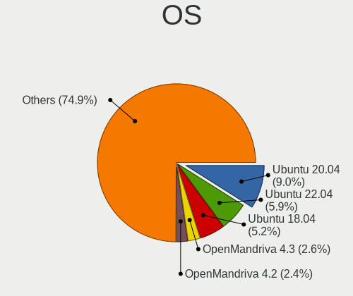

| Name                         | Computers | Percent |
|------------------------------|-----------|---------|
| Ubuntu 20.04                 | 96        | 9.91%   |
| Ubuntu 22.04                 | 57        | 5.88%   |
| Ubuntu 18.04                 | 57        | 5.88%   |
| OpenMandriva 4.3             | 28        | 2.89%   |
| OpenMandriva 4.2             | 26        | 2.68%   |
| Pop!_OS 22.04                | 20        | 2.06%   |
| Zorin 16                     | 18        | 1.86%   |
| BlackPanther 18.1            | 18        | 1.86%   |
| OpenMandriva 23.01           | 15        | 1.55%   |
| Arch Rolling                 | 15        | 1.55%   |
| KDE neon 20.04               | 14        | 1.44%   |
| Zorin 15                     | 13        | 1.34%   |
| Arch                         | 13        | 1.34%   |
| ROSA R11                     | 12        | 1.24%   |
| ROSA R10                     | 12        | 1.24%   |
| Fedora 38                    | 12        | 1.24%   |
| Ubuntu 19.10                 | 11        | 1.14%   |
| openSUSE Tumbleweed-XXXXXXXX | 11        | 1.14%   |
| Linux Mint 19.3              | 11        | 1.14%   |
| Fedora 39                    | 11        | 1.14%   |
| ArcoLinux Rolling            | 11        | 1.14%   |
| Ubuntu 21.10                 | 10        | 1.03%   |
| Debian 12                    | 10        | 1.03%   |
| Linux Mint 20.3              | 9         | 0.93%   |
| Kubuntu 22.04                | 9         | 0.93%   |
| Ubuntu 23.10                 | 8         | 0.83%   |
| Ubuntu 23.04                 | 8         | 0.83%   |
| Ubuntu 22.10                 | 8         | 0.83%   |
| Ubuntu 21.04                 | 8         | 0.83%   |
| ROSA R11.1                   | 8         | 0.83%   |
| Linux Mint 21.1              | 8         | 0.83%   |
| Fedora 37                    | 8         | 0.83%   |
| EndeavourOS Rolling          | 8         | 0.83%   |
| Ubuntu 18.10                 | 7         | 0.72%   |
| Pop!_OS 20.04                | 7         | 0.72%   |
| OpenMandriva 23.08           | 7         | 0.72%   |
| Manjaro                      | 7         | 0.72%   |
| Kubuntu 20.04                | 7         | 0.72%   |
| Xubuntu 20.04                | 6         | 0.62%   |
| ROSA R9                      | 6         | 0.62%   |

OS Family
---------

OS without a version

| Name          | Computers | Percent |
|---------------|-----------|---------|
| Ubuntu        | 270       | 30.17%  |
| OpenMandriva  | 91        | 10.17%  |
| Linux Mint    | 57        | 6.37%   |
| Fedora        | 51        | 5.7%    |
| ROSA          | 43        | 4.8%    |
| Pop!_OS       | 38        | 4.25%   |
| Zorin         | 37        | 4.13%   |
| Endless       | 35        | 3.91%   |
| Arch          | 28        | 3.13%   |
| Manjaro       | 25        | 2.79%   |
| Kubuntu       | 23        | 2.57%   |
| Debian        | 22        | 2.46%   |
| KDE neon      | 21        | 2.35%   |
| BlackPanther  | 20        | 2.23%   |
| openSUSE      | 18        | 2.01%   |
| Xubuntu       | 15        | 1.68%   |
| ArcoLinux     | 13        | 1.45%   |
| Kali          | 11        | 1.23%   |
| MX            | 10        | 1.12%   |
| EndeavourOS   | 8         | 0.89%   |
| Lubuntu       | 5         | 0.56%   |
| Ubuntu Unity  | 4         | 0.45%   |
| Ubuntu MATE   | 4         | 0.45%   |
| Elementary    | 4         | 0.45%   |
| Clear Linux   | 4         | 0.45%   |
| Nobara        | 3         | 0.34%   |
| Garuda Linux  | 3         | 0.34%   |
| CentOS        | 3         | 0.34%   |
| Void Linux    | 2         | 0.22%   |
| Ubuntu Budgie | 2         | 0.22%   |
| Slackware     | 2         | 0.22%   |
| NixOS         | 2         | 0.22%   |
| LMDE          | 2         | 0.22%   |
| LinuxFX       | 2         | 0.22%   |
| UbuntuDDE     | 1         | 0.11%   |
| Serbian       | 1         | 0.11%   |
| Reborn OS     | 1         | 0.11%   |
| PureOS        | 1         | 0.11%   |
| Peppermint    | 1         | 0.11%   |
| PCLinuxOS     | 1         | 0.11%   |

Kernel
------

Version of the Linux kernel

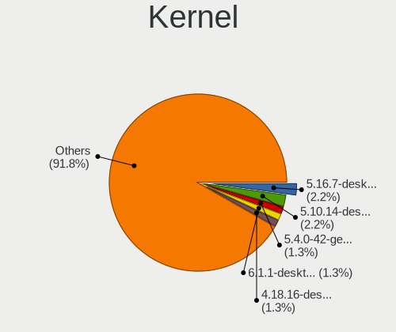

| Version                            | Computers | Percent |
|------------------------------------|-----------|---------|
| 5.16.7-desktop-1omv4003            | 26        | 2.48%   |
| 5.10.14-desktop-1omv4002           | 26        | 2.48%   |
| 5.4.0-42-generic                   | 16        | 1.53%   |
| 6.1.1-desktop-1omv2290             | 15        | 1.43%   |
| 4.18.16-desktop-1bP                | 14        | 1.33%   |
| 5.15.0-56-generic                  | 10        | 0.95%   |
| 5.3.0-40-generic                   | 8         | 0.76%   |
| 4.18.0-15-generic                  | 8         | 0.76%   |
| 6.4.11-desktop-1omv2390            | 7         | 0.67%   |
| 5.8.0-14-generic                   | 7         | 0.67%   |
| 5.15.0-53-generic                  | 7         | 0.67%   |
| 5.4.0-58-generic                   | 6         | 0.57%   |
| 5.4.0-48-generic                   | 6         | 0.57%   |
| 5.15.0-48-generic                  | 6         | 0.57%   |
| 5.15.0-46-generic                  | 6         | 0.57%   |
| 5.11.0-35-generic                  | 6         | 0.57%   |
| 5.11.0-27-generic                  | 6         | 0.57%   |
| 4.18.0-17-generic                  | 6         | 0.57%   |
| 6.6.2-desktop-1omv2390             | 5         | 0.48%   |
| 6.5.0-27-generic                   | 5         | 0.48%   |
| 6.5.0-26-generic                   | 5         | 0.48%   |
| 6.2.6-desktop-1omv2390             | 5         | 0.48%   |
| 6.2.0-26-generic                   | 5         | 0.48%   |
| 5.4.0-54-generic                   | 5         | 0.48%   |
| 5.4.0-52-generic                   | 5         | 0.48%   |
| 5.4.0-47-generic                   | 5         | 0.48%   |
| 5.4.0-31-generic                   | 5         | 0.48%   |
| 5.4.0-29-generic                   | 5         | 0.48%   |
| 5.3.0-51-generic                   | 5         | 0.48%   |
| 5.15.0-76-generic                  | 5         | 0.48%   |
| 5.15.0-52-generic                  | 5         | 0.48%   |
| 5.13.0-30-generic                  | 5         | 0.48%   |
| 5.13.0-28-generic                  | 5         | 0.48%   |
| 5.11.0-34-generic                  | 5         | 0.48%   |
| 5.10.74-generic-2rosa2021.1-x86_64 | 5         | 0.48%   |
| 5.0.0-27-generic                   | 5         | 0.48%   |
| 4.9.20-nrj-desktop-1rosa-x86_64    | 5         | 0.48%   |
| 6.5.0-28-generic                   | 4         | 0.38%   |
| 6.5.0-21-generic                   | 4         | 0.38%   |
| 6.4.6-76060406-generic             | 4         | 0.38%   |

Kernel Family
-------------

Linux kernel without a distro release

| Version | Computers | Percent |
|---------|-----------|---------|
| 5.4.0   | 122       | 12.32%  |
| 5.15.0  | 82        | 8.28%   |
| 4.15.0  | 51        | 5.15%   |
| 5.11.0  | 40        | 4.04%   |
| 5.8.0   | 37        | 3.74%   |
| 5.3.0   | 37        | 3.74%   |
| 5.13.0  | 32        | 3.23%   |
| 4.18.0  | 30        | 3.03%   |
| 6.5.0   | 28        | 2.83%   |
| 5.16.7  | 26        | 2.63%   |
| 5.10.14 | 26        | 2.63%   |
| 5.19.0  | 25        | 2.53%   |
| 5.0.0   | 23        | 2.32%   |
| 6.2.0   | 17        | 1.72%   |
| 6.1.1   | 17        | 1.72%   |
| 6.1.0   | 16        | 1.62%   |
| 4.18.16 | 14        | 1.41%   |
| 5.10.0  | 11        | 1.11%   |
| 6.4.11  | 9         | 0.91%   |
| 6.2.6   | 9         | 0.91%   |
| 4.9.20  | 7         | 0.71%   |
| 6.4.6   | 6         | 0.61%   |
| 6.6.2   | 5         | 0.51%   |
| 5.10.74 | 5         | 0.51%   |
| 4.9.60  | 5         | 0.51%   |
| 5.6.14  | 4         | 0.4%    |
| 5.14.21 | 4         | 0.4%    |
| 4.19.0  | 4         | 0.4%    |
| 6.7.9   | 3         | 0.3%    |
| 6.7.0   | 3         | 0.3%    |
| 6.6.7   | 3         | 0.3%    |
| 6.5.11  | 3         | 0.3%    |
| 6.4.12  | 3         | 0.3%    |
| 6.2.9   | 3         | 0.3%    |
| 6.0.8   | 3         | 0.3%    |
| 6.0.12  | 3         | 0.3%    |
| 5.8.11  | 3         | 0.3%    |
| 5.7.8   | 3         | 0.3%    |
| 5.19.7  | 3         | 0.3%    |
| 5.16.0  | 3         | 0.3%    |

Kernel Major Ver.
-----------------

Linux kernel major version

| Version | Computers | Percent |
|---------|-----------|---------|
| 5.4     | 138       | 14.18%  |
| 5.15    | 97        | 9.97%   |
| 4.15    | 51        | 5.24%   |
| 6.1     | 50        | 5.14%   |
| 5.11    | 50        | 5.14%   |
| 5.10    | 49        | 5.04%   |
| 4.18    | 44        | 4.52%   |
| 5.3     | 43        | 4.42%   |
| 5.8     | 42        | 4.32%   |
| 5.19    | 40        | 4.11%   |
| 6.5     | 39        | 4.01%   |
| 5.13    | 36        | 3.7%    |
| 5.16    | 35        | 3.6%    |
| 6.2     | 34        | 3.49%   |
| 5.0     | 26        | 2.67%   |
| 6.4     | 24        | 2.47%   |
| 4.9     | 21        | 2.16%   |
| 6.0     | 19        | 1.95%   |
| 6.6     | 18        | 1.85%   |
| 6.3     | 12        | 1.23%   |
| 5.6     | 11        | 1.13%   |
| 6.8     | 10        | 1.03%   |
| 6.7     | 8         | 0.82%   |
| 5.9     | 8         | 0.82%   |
| 5.7     | 8         | 0.82%   |
| 5.14    | 8         | 0.82%   |
| 4.19    | 8         | 0.82%   |
| 5.18    | 7         | 0.72%   |
| 5.17    | 7         | 0.72%   |
| 4.1     | 6         | 0.62%   |
| 5.12    | 5         | 0.51%   |
| 5.1     | 4         | 0.41%   |
| 4.4     | 3         | 0.31%   |
| 4.13    | 3         | 0.31%   |
| 5.5     | 2         | 0.21%   |
| 5.2     | 2         | 0.21%   |
| 6.9     | 1         | 0.1%    |
| 4.8     | 1         | 0.1%    |
| 4.17    | 1         | 0.1%    |
| 4.12    | 1         | 0.1%    |

Arch
----

OS architecture (x86_64, i586, etc.)

| Name    | Computers | Percent |
|---------|-----------|---------|
| x86_64  | 831       | 96.97%  |
| i686    | 22        | 2.57%   |
| aarch64 | 3         | 0.35%   |
| armv7l  | 1         | 0.12%   |

DE
--

Desktop Environment

| Name            | Computers | Percent |
|-----------------|-----------|---------|
| GNOME           | 371       | 41.55%  |
| KDE5            | 204       | 22.84%  |
| Unknown         | 90        | 10.08%  |
| XFCE            | 70        | 7.84%   |
| X-Cinnamon      | 51        | 5.71%   |
| KDE4            | 23        | 2.58%   |
| KDE             | 18        | 2.02%   |
| Cinnamon        | 10        | 1.12%   |
| i3              | 9         | 1.01%   |
| MATE            | 8         | 0.9%    |
| LXQt            | 6         | 0.67%   |
| Unity           | 4         | 0.45%   |
| Pantheon        | 4         | 0.45%   |
| KDE6            | 4         | 0.45%   |
| Deepin          | 4         | 0.45%   |
| qtile           | 3         | 0.34%   |
| LXDE            | 3         | 0.34%   |
| GNOME Flashback | 3         | 0.34%   |
| Hyprland        | 2         | 0.22%   |
| Budgie          | 2         | 0.22%   |
| i3-with-shmlog  | 1         | 0.11%   |
| DWM             | 1         | 0.11%   |
| BunsenLabs      | 1         | 0.11%   |
| awesome         | 1         | 0.11%   |

Display Server
--------------

X11 or Wayland

| Name    | Computers | Percent |
|---------|-----------|---------|
| X11     | 674       | 75.06%  |
| Wayland | 166       | 18.49%  |
| Unknown | 43        | 4.79%   |
| Tty     | 15        | 1.67%   |

Display Manager
---------------

SDDM, LightDM, etc.

| Name    | Computers | Percent |
|---------|-----------|---------|
| Unknown | 413       | 46.3%   |
| SDDM    | 177       | 19.84%  |
| GDM3    | 104       | 11.66%  |
| LightDM | 83        | 9.3%    |
| GDM     | 71        | 7.96%   |
| KDM     | 23        | 2.58%   |
| TDM     | 15        | 1.68%   |
| XDM     | 2         | 0.22%   |
| Ly      | 2         | 0.22%   |
| MDM     | 1         | 0.11%   |
| LXDM    | 1         | 0.11%   |

OS Lang
-------

Language

| Lang        | Computers | Percent |
|-------------|-----------|---------|
| en_US       | 613       | 68.26%  |
| Unknown     | 131       | 14.59%  |
| sr_RS       | 53        | 5.9%    |
| sr_RS@latin | 23        | 2.56%   |
| en_GB       | 23        | 2.56%   |
| C           | 18        | 2%      |
| hu_HU       | 14        | 1.56%   |
| de_DE       | 7         | 0.78%   |
| ru_RU       | 5         | 0.56%   |
| en_AU       | 3         | 0.33%   |
| hr_HR       | 2         | 0.22%   |
| Default     | 2         | 0.22%   |
| sk_SK       | 1         | 0.11%   |
| nl_NL       | 1         | 0.11%   |
| en_IE       | 1         | 0.11%   |
| en_DK       | 1         | 0.11%   |

Boot Mode
---------

EFI or BIOS

| Mode | Computers | Percent |
|------|-----------|---------|
| BIOS | 463       | 52.79%  |
| EFI  | 414       | 47.21%  |

Filesystem
----------

Type of filesystem

| Type    | Computers | Percent |
|---------|-----------|---------|
| Ext4    | 629       | 70.2%   |
| Overlay | 104       | 11.61%  |
| Btrfs   | 66        | 7.37%   |
| Unknown | 44        | 4.91%   |
| Tmpfs   | 35        | 3.91%   |
| Xfs     | 8         | 0.89%   |
| Zfs     | 7         | 0.78%   |
| Ext2    | 2         | 0.22%   |
| Ext3    | 1         | 0.11%   |

Part. scheme
------------

Scheme of partitioning

| Type    | Computers | Percent |
|---------|-----------|---------|
| Unknown | 427       | 48.19%  |
| GPT     | 314       | 35.44%  |
| MBR     | 145       | 16.37%  |

Dual Boot with Linux/BSD
------------------------

Hosting more than one Linux/BSD

| Dual boot | Computers | Percent |
|-----------|-----------|---------|
| No        | 738       | 84.44%  |
| Yes       | 136       | 15.56%  |

Dual Boot (Win)
---------------

Hosting Linux and Windows

| Dual boot | Computers | Percent |
|-----------|-----------|---------|
| No        | 607       | 69.29%  |
| Yes       | 269       | 30.71%  |

Board
-----

Vendor
------

Motherboard manufacturer

| Name                    | Computers | Percent |
|-------------------------|-----------|---------|
| ASUSTek Computer        | 178       | 20.84%  |
| Lenovo                  | 141       | 16.51%  |
| Hewlett-Packard         | 110       | 12.88%  |
| Gigabyte Technology     | 106       | 12.41%  |
| Dell                    | 74        | 8.67%   |
| MSI                     | 61        | 7.14%   |
| Acer                    | 49        | 5.74%   |
| ASRock                  | 24        | 2.81%   |
| Toshiba                 | 14        | 1.64%   |
| Apple                   | 13        | 1.52%   |
| Fujitsu                 | 12        | 1.41%   |
| Biostar                 | 11        | 1.29%   |
| Fujitsu Siemens         | 6         | 0.7%    |
| Sony                    | 5         | 0.59%   |
| Medion                  | 5         | 0.59%   |
| Raspberry Pi Foundation | 4         | 0.47%   |
| Intel                   | 4         | 0.47%   |
| HUAWEI                  | 4         | 0.47%   |
| Timi                    | 3         | 0.35%   |
| Samsung Electronics     | 3         | 0.35%   |
| Pegatron                | 2         | 0.23%   |
| LG Electronics          | 2         | 0.23%   |
| eMachines               | 2         | 0.23%   |
| TWC                     | 1         | 0.12%   |
| Synology                | 1         | 0.12%   |
| Supermicro              | 1         | 0.12%   |
| Sun Microsystems        | 1         | 0.12%   |
| SLIMBOOK                | 1         | 0.12%   |
| Sapphire                | 1         | 0.12%   |
| Razer                   | 1         | 0.12%   |
| Purism                  | 1         | 0.12%   |
| Packard Bell            | 1         | 0.12%   |
| NCR                     | 1         | 0.12%   |
| Inventec                | 1         | 0.12%   |
| IBM                     | 1         | 0.12%   |
| Huanan                  | 1         | 0.12%   |
| HONOR                   | 1         | 0.12%   |
| Framework               | 1         | 0.12%   |
| Foxconn                 | 1         | 0.12%   |
| ECS                     | 1         | 0.12%   |

Model
-----

Motherboard model

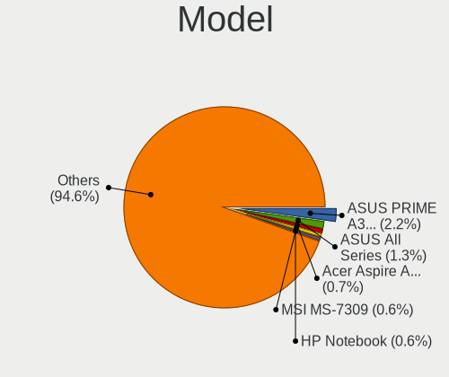

| Name                               | Computers | Percent |
|------------------------------------|-----------|---------|
| ASUS PRIME A320M-K                 | 19        | 2.22%   |
| ASUS All Series                    | 12        | 1.41%   |
| Acer Aspire A315-31                | 7         | 0.82%   |
| MSI MS-7309                        | 6         | 0.7%    |
| Gigabyte B450M DS3H                | 6         | 0.7%    |
| HP Notebook                        | 5         | 0.59%   |
| MSI MS-7641                        | 4         | 0.47%   |
| Lenovo V330-15IKB 81AX             | 4         | 0.47%   |
| Gigabyte H61M-S2PV                 | 4         | 0.47%   |
| Gigabyte A320M-H                   | 4         | 0.47%   |
| Biostar A320MH                     | 4         | 0.47%   |
| Unknown                            | 4         | 0.47%   |
| MSI MS-7C52                        | 3         | 0.35%   |
| MSI MS-7C02                        | 3         | 0.35%   |
| MSI MS-7788                        | 3         | 0.35%   |
| MSI MS-7721                        | 3         | 0.35%   |
| MSI MS-7693                        | 3         | 0.35%   |
| MSI MS-7597                        | 3         | 0.35%   |
| Lenovo IdeaPad 5 14ARE05 81YM      | 3         | 0.35%   |
| Lenovo IdeaPad 5 14ALC05 82LM      | 3         | 0.35%   |
| Lenovo IdeaPad 330-15IKB 81DE      | 3         | 0.35%   |
| Lenovo IdeaPad 3 15IIL05 81WE      | 3         | 0.35%   |
| Lenovo IdeaPad 110-15IBR 80T7      | 3         | 0.35%   |
| Lenovo B50-45 20388                | 3         | 0.35%   |
| HP Laptop 15-db0xxx                | 3         | 0.35%   |
| HP Laptop 15-da0xxx                | 3         | 0.35%   |
| HP EliteBook 840 G5                | 3         | 0.35%   |
| HP 250 G5 Notebook PC              | 3         | 0.35%   |
| Gigabyte F2A68HM-S1                | 3         | 0.35%   |
| Gigabyte EX58-UD5                  | 3         | 0.35%   |
| Dell Vostro 15 3515                | 3         | 0.35%   |
| Dell Inspiron 3593                 | 3         | 0.35%   |
| Dell Inspiron 3542                 | 3         | 0.35%   |
| ASUS X541NA                        | 3         | 0.35%   |
| ASUS H110M-R                       | 3         | 0.35%   |
| ASUS A68HM-K                       | 3         | 0.35%   |
| RPi Raspberry Pi 4 Model B Rev 1.1 | 2         | 0.23%   |
| MSI MS-7C84                        | 2         | 0.23%   |
| MSI MS-7808                        | 2         | 0.23%   |
| MSI MS-7786                        | 2         | 0.23%   |

Model Family
------------

Motherboard model prefix

| Name                  | Computers | Percent |
|-----------------------|-----------|---------|
| Lenovo ThinkPad       | 48        | 5.62%   |
| Lenovo IdeaPad        | 43        | 5.04%   |
| Acer Aspire           | 40        | 4.68%   |
| Dell Inspiron         | 29        | 3.4%    |
| ASUS VivoBook         | 27        | 3.16%   |
| ASUS PRIME            | 26        | 3.04%   |
| HP EliteBook          | 18        | 2.11%   |
| Dell Latitude         | 18        | 2.11%   |
| HP Laptop             | 17        | 1.99%   |
| HP ProBook            | 13        | 1.52%   |
| Toshiba Satellite     | 12        | 1.41%   |
| HP Compaq             | 12        | 1.41%   |
| ASUS All              | 12        | 1.41%   |
| ASUS ROG              | 11        | 1.29%   |
| HP Pavilion           | 10        | 1.17%   |
| Gigabyte B450M        | 10        | 1.17%   |
| Lenovo Legion         | 9         | 1.05%   |
| Dell Vostro           | 8         | 0.94%   |
| HP 250                | 7         | 0.82%   |
| Fujitsu ESPRIMO       | 7         | 0.82%   |
| Dell Precision        | 7         | 0.82%   |
| MSI MS-7309           | 6         | 0.7%    |
| Dell OptiPlex         | 6         | 0.7%    |
| ASUS TUF              | 6         | 0.7%    |
| Lenovo ThinkCentre    | 5         | 0.59%   |
| Lenovo ThinkBook      | 5         | 0.59%   |
| HP Notebook           | 5         | 0.59%   |
| Fujitsu Siemens AMILO | 5         | 0.59%   |
| RPi Raspberry         | 4         | 0.47%   |
| MSI MS-7641           | 4         | 0.47%   |
| Lenovo V330-15IKB     | 4         | 0.47%   |
| HP OMEN               | 4         | 0.47%   |
| HP ENVY               | 4         | 0.47%   |
| Gigabyte H61M-S2PV    | 4         | 0.47%   |
| Gigabyte A320M-H      | 4         | 0.47%   |
| Biostar A320MH        | 4         | 0.47%   |
| Unknown               | 4         | 0.47%   |
| MSI MS-7C52           | 3         | 0.35%   |
| MSI MS-7C02           | 3         | 0.35%   |
| MSI MS-7788           | 3         | 0.35%   |

MFG Year
--------

Motherboard manufacture year

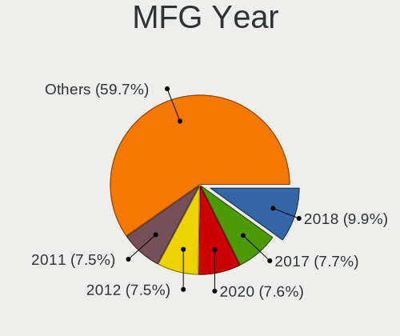

| Year    | Computers | Percent |
|---------|-----------|---------|
| 2018    | 93        | 10.89%  |
| 2012    | 67        | 7.85%   |
| 2020    | 65        | 7.61%   |
| 2017    | 65        | 7.61%   |
| 2019    | 59        | 6.91%   |
| 2011    | 59        | 6.91%   |
| 2014    | 57        | 6.67%   |
| 2013    | 56        | 6.56%   |
| 2010    | 52        | 6.09%   |
| 2016    | 42        | 4.92%   |
| 2009    | 39        | 4.57%   |
| 2008    | 36        | 4.22%   |
| 2021    | 35        | 4.1%    |
| 2015    | 31        | 3.63%   |
| 2007    | 28        | 3.28%   |
| 2022    | 27        | 3.16%   |
| 2006    | 19        | 2.22%   |
| 2023    | 16        | 1.87%   |
| Unknown | 3         | 0.35%   |
| 2024    | 2         | 0.23%   |
| 2005    | 2         | 0.23%   |
| 2004    | 1         | 0.12%   |

Form Factor
-----------

Physical design of the computer

| Name           | Computers | Percent |
|----------------|-----------|---------|
| Notebook       | 463       | 54.22%  |
| Desktop        | 359       | 42.04%  |
| Convertible    | 14        | 1.64%   |
| System on chip | 4         | 0.47%   |
| Tablet         | 4         | 0.47%   |
| All in one     | 4         | 0.47%   |
| Mini pc        | 3         | 0.35%   |
| Server         | 3         | 0.35%   |

Secure Boot
-----------

Enabled or disabled

| State    | Computers | Percent |
|----------|-----------|---------|
| Disabled | 798       | 92.79%  |
| Enabled  | 62        | 7.21%   |

Coreboot
--------

Have coreboot on board

| Used | Computers | Percent |
|------|-----------|---------|
| No   | 853       | 99.88%  |
| Yes  | 1         | 0.12%   |

RAM Size
--------

Total RAM memory

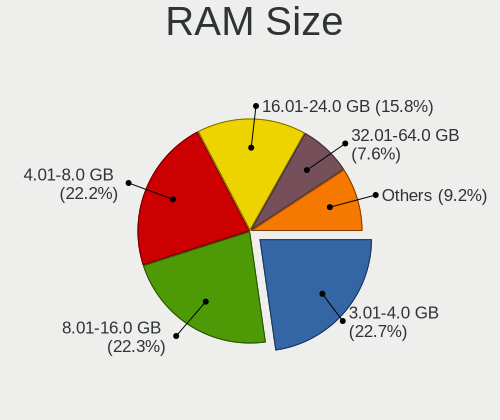

| Size in GB  | Computers | Percent |
|-------------|-----------|---------|
| 3.01-4.0    | 203       | 23.15%  |
| 4.01-8.0    | 200       | 22.81%  |
| 8.01-16.0   | 192       | 21.89%  |
| 16.01-24.0  | 140       | 15.96%  |
| 32.01-64.0  | 59        | 6.73%   |
| 1.01-2.0    | 39        | 4.45%   |
| 2.01-3.0    | 15        | 1.71%   |
| 24.01-32.0  | 14        | 1.6%    |
| 64.01-256.0 | 9         | 1.03%   |
| 0.51-1.0    | 6         | 0.68%   |

RAM Used
--------

Used RAM memory

| Used GB    | Computers | Percent |
|------------|-----------|---------|
| 1.01-2.0   | 339       | 34.95%  |
| 2.01-3.0   | 229       | 23.61%  |
| 3.01-4.0   | 130       | 13.4%   |
| 4.01-8.0   | 119       | 12.27%  |
| 0.51-1.0   | 89        | 9.18%   |
| 8.01-16.0  | 41        | 4.23%   |
| 0.01-0.5   | 14        | 1.44%   |
| 16.01-24.0 | 7         | 0.72%   |
| 24.01-32.0 | 2         | 0.21%   |

Total Drives
------------

Number of drives on board

| Drives  | Computers | Percent |
|---------|-----------|---------|
| 1       | 538       | 60.65%  |
| 2       | 207       | 23.34%  |
| 3       | 71        | 8%      |
| 4       | 27        | 3.04%   |
| 0       | 18        | 2.03%   |
| 5       | 15        | 1.69%   |
| 6       | 5         | 0.56%   |
| 7       | 2         | 0.23%   |
| Unknown | 2         | 0.23%   |
| 10      | 1         | 0.11%   |
| 8       | 1         | 0.11%   |

Has CD-ROM
----------

Has CD-ROM on board

| Presented | Computers | Percent |
|-----------|-----------|---------|
| No        | 533       | 61.26%  |
| Yes       | 337       | 38.74%  |

Has Ethernet
------------

Has Ethernet on board

| Presented | Computers | Percent |
|-----------|-----------|---------|
| Yes       | 765       | 89.47%  |
| No        | 90        | 10.53%  |

Has WiFi
--------

Has WiFi module

| Presented | Computers | Percent |
|-----------|-----------|---------|
| Yes       | 587       | 68.26%  |
| No        | 273       | 31.74%  |

Has Bluetooth
-------------

Has Bluetooth module

| Presented | Computers | Percent |
|-----------|-----------|---------|
| Yes       | 464       | 53.64%  |
| No        | 401       | 46.36%  |

Location
--------

Country
-------

Geographic location (country)

| Country | Computers | Percent |
|---------|-----------|---------|
| Serbia  | 854       | 100%    |

City
----

Geographic location (city)

| City               | Computers | Percent |
|--------------------|-----------|---------|
| Belgrade           | 504       | 54.9%   |
| Novi Sad           | 89        | 9.69%   |
| Ni               | 49        | 5.34%   |
| Subotica           | 19        | 2.07%   |
| Zrenjanin          | 14        | 1.53%   |
| Kragujevac         | 13        | 1.42%   |
| Panevo           | 12        | 1.31%   |
| Poarevac         | 8         | 0.87%   |
| Leskovac           | 8         | 0.87%   |
| aak            | 7         | 0.76%   |
| Backa Topola       | 7         | 0.76%   |
| Senta              | 6         | 0.65%   |
| Semlin             | 6         | 0.65%   |
| Becej              | 6         | 0.65%   |
| Savski Venac       | 5         | 0.54%   |
| Palanka            | 5         | 0.54%   |
| Jagodina           | 5         | 0.54%   |
| Novi Karlovci      | 4         | 0.44%   |
| Novi Belgrade      | 4         | 0.44%   |
| New Belgrade       | 4         | 0.44%   |
| Lazarevac          | 4         | 0.44%   |
| Kraljevo           | 4         | 0.44%   |
| Cuprija            | 4         | 0.44%   |
| Bor                | 4         | 0.44%   |
| Vrac             | 3         | 0.33%   |
| Vranje             | 3         | 0.33%   |
| Trstenik           | 3         | 0.33%   |
| Stara Pazova       | 3         | 0.33%   |
| Sombor             | 3         | 0.33%   |
| Ruma               | 3         | 0.33%   |
| Pirot              | 3         | 0.33%   |
| Obrenovac          | 3         | 0.33%   |
| Novi Knezevac      | 3         | 0.33%   |
| Mladenovac         | 3         | 0.33%   |
| Lozovik            | 3         | 0.33%   |
| Kruevac          | 3         | 0.33%   |
| Kovin              | 3         | 0.33%   |
| Karloca            | 3         | 0.33%   |
| Indjija            | 3         | 0.33%   |
| Banatsko Novo Selo | 3         | 0.33%   |

Drives
------

Drive Vendor
------------

Hard drive vendors

| Vendor                      | Computers | Drives | Percent |
|-----------------------------|-----------|--------|---------|
| WDC                         | 209       | 343    | 17.12%  |
| Samsung Electronics         | 146       | 210    | 11.96%  |
| Seagate                     | 141       | 189    | 11.55%  |
| Toshiba                     | 118       | 165    | 9.66%   |
| Kingston                    | 110       | 170    | 9.01%   |
| Hitachi                     | 53        | 73     | 4.34%   |
| SanDisk                     | 48        | 68     | 3.93%   |
| SPCC                        | 32        | 49     | 2.62%   |
| Patriot                     | 29        | 34     | 2.38%   |
| Intel                       | 29        | 43     | 2.38%   |
| SK hynix                    | 27        | 32     | 2.21%   |
| Unknown                     | 24        | 32     | 1.97%   |
| Micron Technology           | 23        | 30     | 1.88%   |
| Gigabyte Technology         | 21        | 28     | 1.72%   |
| HGST                        | 19        | 29     | 1.56%   |
| Biostar                     | 17        | 20     | 1.39%   |
| Transcend                   | 16        | 18     | 1.31%   |
| A-DATA Technology           | 15        | 15     | 1.23%   |
| Crucial                     | 13        | 15     | 1.06%   |
| Maxtor                      | 11        | 12     | 0.9%    |
| KIOXIA                      | 8         | 9      | 0.66%   |
| Apacer                      | 8         | 10     | 0.66%   |
| Silicon Motion              | 7         | 16     | 0.57%   |
| Kingston Technology Company | 7         | 12     | 0.57%   |
| GeIL                        | 7         | 8      | 0.57%   |
| Fujitsu                     | 7         | 7      | 0.57%   |
| China                       | 6         | 12     | 0.49%   |
| Unknown                     | 5         | 10     | 0.41%   |
| Phison                      | 4         | 12     | 0.33%   |
| LITEON                      | 4         | 5      | 0.33%   |
| AMD                         | 4         | 4      | 0.33%   |
| Verbatim                    | 3         | 3      | 0.25%   |
| StoreJet                    | 3         | 3      | 0.25%   |
| Phison Electronics          | 3         | 4      | 0.25%   |
| ExcelStor                   | 3         | 3      | 0.25%   |
| ADATA Technology            | 3         | 3      | 0.25%   |
| Union Memory                | 2         | 2      | 0.16%   |
| Realtek Semiconductor       | 2         | 5      | 0.16%   |
| PNY                         | 2         | 5      | 0.16%   |
| PHD 3.0                     | 2         | 3      | 0.16%   |

Drive Model
-----------

Hard drive models

| Model                                                 | Computers | Percent |
|-------------------------------------------------------|-----------|---------|
| Kingston SA400S37120G 120GB SSD                       | 26        | 1.98%   |
| Kingston SA400S37240G 240GB SSD                       | 25        | 1.9%    |
| Seagate ST1000LM035-1RK172 1TB                        | 18        | 1.37%   |
| Toshiba MQ01ABF050 500GB                              | 17        | 1.29%   |
| Toshiba DT01ACA100 1TB                                | 17        | 1.29%   |
| Kingston SA400S37480G 480GB SSD                       | 17        | 1.29%   |
| Samsung NVMe SSD Controller SM981/PM981/PM983 1TB     | 13        | 0.99%   |
| Toshiba DT01ACA050 500GB                              | 10        | 0.76%   |
| Gigabyte GP-GSTFS31240GNTD 240GB                      | 10        | 0.76%   |
| SPCC Solid State Disk 256GB                           | 9         | 0.68%   |
| Seagate ST500LT012-1DG142 500GB                       | 9         | 0.68%   |
| Seagate ST1000LM024 HN-M101MBB 1TB                    | 8         | 0.61%   |
| Seagate ST1000DM003-1ER162 1TB                        | 8         | 0.61%   |
| Patriot Burst 240GB SSD                               | 8         | 0.61%   |
| WDC WD5000AAKX-001CA0 500GB                           | 7         | 0.53%   |
| Toshiba MQ01ABD100 1TB                                | 7         | 0.53%   |
| Seagate ST1000DM010-2EP102 1TB                        | 7         | 0.53%   |
| Samsung SSD 860 EVO 500GB                             | 7         | 0.53%   |
| Samsung SSD 860 EVO 250GB                             | 7         | 0.53%   |
| Samsung PM963 2.5" NVMe PCIe SSD 256GB                | 7         | 0.53%   |
| Samsung NVMe SSD Drive 500GB                          | 7         | 0.53%   |
| Samsung NVMe SSD Controller PM9A1/PM9A3/980PRO 1TB    | 7         | 0.53%   |
| Biostar S100-120GB                                    | 7         | 0.53%   |
| WDC WDS500G2B0A 500GB SSD                             | 6         | 0.46%   |
| Toshiba MQ04ABF100 1TB                                | 6         | 0.46%   |
| Toshiba HDWD110 1TB                                   | 6         | 0.46%   |
| Seagate ST500LT012-9WS142 500GB                       | 6         | 0.46%   |
| Gigabyte GP-GSTFS31120GNTD 120GB SSD                  | 6         | 0.46%   |
| WDC WD3200AAJS-56B4A0 320GB                           | 5         | 0.38%   |
| WDC WD2500BEVS-22UST0 250GB                           | 5         | 0.38%   |
| WDC WD10EZEX-08WN4A0 1TB                              | 5         | 0.38%   |
| Toshiba DT01ACA200 2TB                                | 5         | 0.38%   |
| SPCC Solid State Disk 120GB                           | 5         | 0.38%   |
| Silicon Motion SM2263EN/SM2263XT SSD Controller 256GB | 5         | 0.38%   |
| Seagate ST500DM002-1BD142 500GB                       | 5         | 0.38%   |
| Seagate ST1000DM003-1CH162 1TB                        | 5         | 0.38%   |
| Seagate M3 Portable 4TB                               | 5         | 0.38%   |
| Samsung SSD 850 EVO 250GB                             | 5         | 0.38%   |
| Samsung MZALQ512HALU-000L2 512GB                      | 5         | 0.38%   |
| Kingston SNVS500G 500GB                               | 5         | 0.38%   |

HDD Vendor
----------

Hard disk drive vendors

| Vendor              | Computers | Drives | Percent |
|---------------------|-----------|--------|---------|
| WDC                 | 182       | 308    | 33.46%  |
| Seagate             | 135       | 182    | 24.82%  |
| Toshiba             | 104       | 147    | 19.12%  |
| Hitachi             | 53        | 73     | 9.74%   |
| Samsung Electronics | 20        | 28     | 3.68%   |
| HGST                | 19        | 29     | 3.49%   |
| Maxtor              | 11        | 12     | 2.02%   |
| Fujitsu             | 7         | 7      | 1.29%   |
| ExcelStor           | 3         | 3      | 0.55%   |
| Unknown             | 2         | 2      | 0.37%   |
| JMicron Technology  | 2         | 2      | 0.37%   |
| Intenso             | 2         | 2      | 0.37%   |
| TO Exter            | 1         | 1      | 0.18%   |
| QUANTUM             | 1         | 1      | 0.18%   |
| IBM/Hitachi         | 1         | 1      | 0.18%   |
| Apple               | 1         | 1      | 0.18%   |

SSD Vendor
----------

Solid state drive vendors

| Vendor              | Computers | Drives | Percent |
|---------------------|-----------|--------|---------|
| Kingston            | 95        | 145    | 23.51%  |
| Samsung Electronics | 56        | 73     | 13.86%  |
| SPCC                | 32        | 49     | 7.92%   |
| Patriot             | 27        | 32     | 6.68%   |
| SanDisk             | 21        | 36     | 5.2%    |
| Gigabyte Technology | 18        | 24     | 4.46%   |
| Transcend           | 16        | 18     | 3.96%   |
| WDC                 | 15        | 17     | 3.71%   |
| Biostar             | 14        | 17     | 3.47%   |
| Crucial             | 13        | 15     | 3.22%   |
| A-DATA Technology   | 13        | 13     | 3.22%   |
| Intel               | 12        | 16     | 2.97%   |
| Micron Technology   | 7         | 10     | 1.73%   |
| GeIL                | 7         | 8      | 1.73%   |
| Apacer              | 7         | 9      | 1.73%   |
| Toshiba             | 6         | 7      | 1.49%   |
| China               | 6         | 12     | 1.49%   |
| LITEON              | 4         | 5      | 0.99%   |
| AMD                 | 4         | 4      | 0.99%   |
| Unknown             | 4         | 9      | 0.99%   |
| Verbatim            | 3         | 3      | 0.74%   |
| StoreJet            | 3         | 3      | 0.74%   |
| SK hynix            | 3         | 3      | 0.74%   |
| PNY                 | 2         | 5      | 0.5%    |
| PHD 3.0             | 2         | 3      | 0.5%    |
| Netac               | 2         | 2      | 0.5%    |
| Lexar               | 2         | 6      | 0.5%    |
| TwinMOS             | 1         | 1      | 0.25%   |
| SSSTC               | 1         | 1      | 0.25%   |
| Seagate             | 1         | 1      | 0.25%   |
| OCZ                 | 1         | 2      | 0.25%   |
| Mushkin             | 1         | 1      | 0.25%   |
| LITEONIT            | 1         | 1      | 0.25%   |
| Leven               | 1         | 1      | 0.25%   |
| KingDian            | 1         | 1      | 0.25%   |
| ASMT                | 1         | 1      | 0.25%   |
| ADATA SU            | 1         | 1      | 0.25%   |

Drive Kind
----------

HDD or SSD

| Kind    | Computers | Drives | Percent |
|---------|-----------|--------|---------|
| HDD     | 467       | 799    | 43%     |
| SSD     | 347       | 555    | 31.95%  |
| NVMe    | 243       | 355    | 22.38%  |
| MMC     | 18        | 23     | 1.66%   |
| Unknown | 11        | 14     | 1.01%   |

Drive Connector
---------------

SATA, SAS, NVMe, etc.

| Type | Computers | Drives | Percent |
|------|-----------|--------|---------|
| SATA | 653       | 1334   | 69.25%  |
| NVMe | 243       | 355    | 25.77%  |
| SAS  | 29        | 34     | 3.08%   |
| MMC  | 18        | 23     | 1.91%   |

Drive Size
----------

Size of hard drive

| Size in TB      | Computers | Drives | Percent |
|-----------------|-----------|--------|---------|
| 0.01-0.5        | 543       | 925    | 66.87%  |
| 0.51-1.0        | 200       | 292    | 24.63%  |
| 1.01-2.0        | 44        | 81     | 5.42%   |
| 2.01-3.0        | 9         | 22     | 1.11%   |
| 3.01-4.0        | 8         | 16     | 0.99%   |
| 4.01-10.0       | 5         | 11     | 0.62%   |
| 10.01-20.0      | 2         | 6      | 0.25%   |
| More than 100.0 | 1         | 1      | 0.12%   |

Space Total
-----------

Amount of disk space available on the file system

| Size in GB     | Computers | Percent |
|----------------|-----------|---------|
| 101-250        | 249       | 26.72%  |
| 251-500        | 212       | 22.75%  |
| 501-1000       | 118       | 12.66%  |
| 1-20           | 99        | 10.62%  |
| 1001-2000      | 60        | 6.44%   |
| 51-100         | 57        | 6.12%   |
| Unknown        | 43        | 4.61%   |
| 21-50          | 42        | 4.51%   |
| More than 3000 | 27        | 2.9%    |
| 2001-3000      | 25        | 2.68%   |

Space Used
----------

Amount of used disk space

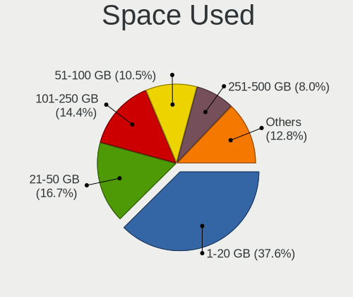

| Used GB        | Computers | Percent |
|----------------|-----------|---------|
| 1-20           | 378       | 39.09%  |
| 21-50          | 158       | 16.34%  |
| 101-250        | 133       | 13.75%  |
| 51-100         | 101       | 10.44%  |
| 251-500        | 78        | 8.07%   |
| Unknown        | 43        | 4.45%   |
| 501-1000       | 34        | 3.52%   |
| 1001-2000      | 28        | 2.9%    |
| 2001-3000      | 8         | 0.83%   |
| More than 3000 | 6         | 0.62%   |

Malfunc. Drives
---------------

Drive models with a malfunction

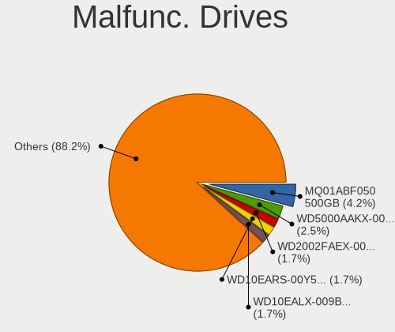

| Model                              | Computers | Drives | Percent |
|------------------------------------|-----------|--------|---------|
| Toshiba MQ01ABF050 500GB           | 5         | 5      | 4.5%    |
| WDC WD5000AAKX-001CA0 500GB        | 3         | 3      | 2.7%    |
| WDC WD2002FAEX-007BA0 2TB          | 2         | 3      | 1.8%    |
| WDC WD10EARS-00Y5B1 1TB            | 2         | 2      | 1.8%    |
| WDC WD10EALX-009BA0 1TB            | 2         | 3      | 1.8%    |
| WDC WD1003FZEX-00MK2A0 1TB         | 2         | 2      | 1.8%    |
| Seagate ST500LT012-9WS142 500GB    | 2         | 2      | 1.8%    |
| Seagate ST500DM002-1BD142 500GB    | 2         | 5      | 1.8%    |
| Seagate ST380815AS 80GB            | 2         | 2      | 1.8%    |
| Seagate ST1000LM035-1RK172 1TB     | 2         | 2      | 1.8%    |
| Seagate ST1000LM024 HN-M101MBB 1TB | 2         | 2      | 1.8%    |
| Seagate ST1000DM003-1CH162 1TB     | 2         | 2      | 1.8%    |
| Intel SSDSC2CW120A3 120GB          | 2         | 2      | 1.8%    |
| Hitachi HTS545050A7E380 500GB      | 2         | 2      | 1.8%    |
| Hitachi HDP725050GLA360 500GB      | 2         | 2      | 1.8%    |
| HGST HTS725050A7E630 500GB         | 2         | 6      | 1.8%    |
| WDC WD5002AALX-00J37A0 500GB       | 1         | 1      | 0.9%    |
| WDC WD5000LPVX-22V0TT0 500GB       | 1         | 1      | 0.9%    |
| WDC WD5000BEVT-24A0RT0 500GB       | 1         | 1      | 0.9%    |
| WDC WD5000AAKX-603CA0 500GB        | 1         | 1      | 0.9%    |
| WDC WD5000AAKX-329BA0 500GB        | 1         | 1      | 0.9%    |
| WDC WD5000AAKX-07U6AA0 500GB       | 1         | 1      | 0.9%    |
| WDC WD5000AAKS-65A7B0 500GB        | 1         | 1      | 0.9%    |
| WDC WD5000AAKS-00UU3A0 500GB       | 1         | 1      | 0.9%    |
| WDC WD5000AAKS-00TMA0 500GB        | 1         | 1      | 0.9%    |
| WDC WD40EZRX-00SPEB0 4TB           | 1         | 1      | 0.9%    |
| WDC WD40EFRX-68WT0N0 4TB           | 1         | 1      | 0.9%    |
| WDC WD3200BEVT-22ZCT0 320GB        | 1         | 1      | 0.9%    |
| WDC WD3200BEKX-75B7WT0 320GB       | 1         | 1      | 0.9%    |
| WDC WD3200BEKT-60PVMT0 320GB       | 1         | 1      | 0.9%    |
| WDC WD3200AVVS-63L2B0 320GB        | 1         | 1      | 0.9%    |
| WDC WD3200AVVS-56L2B0 320GB        | 1         | 1      | 0.9%    |
| WDC WD20EARX-00PASB0 2TB           | 1         | 1      | 0.9%    |
| WDC WD2003FYYS-05T9B0 2TB          | 1         | 1      | 0.9%    |
| WDC WD1600AAJS-00PSA0 160GB        | 1         | 1      | 0.9%    |
| WDC WD1600AAJS-00L7A0 160GB        | 1         | 1      | 0.9%    |
| WDC WD15EARS-00Z5B1 1TB            | 1         | 1      | 0.9%    |
| WDC WD15EARS-00MVWB0 1TB           | 1         | 1      | 0.9%    |
| WDC WD10EZEX-75WN4A0 1TB           | 1         | 1      | 0.9%    |
| WDC WD10EZEX-22MFCA0 1TB           | 1         | 1      | 0.9%    |

Malfunc. Drive Vendor
---------------------

Vendors of faulty drives

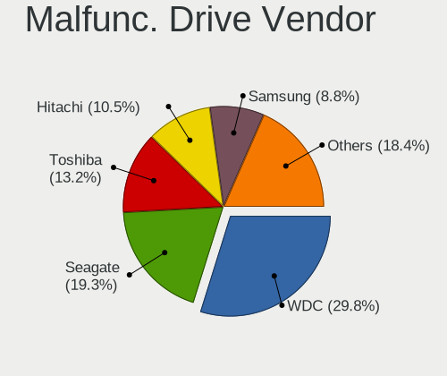

| Vendor              | Computers | Drives | Percent |
|---------------------|-----------|--------|---------|
| WDC                 | 33        | 41     | 31.13%  |
| Seagate             | 22        | 27     | 20.75%  |
| Toshiba             | 14        | 14     | 13.21%  |
| Hitachi             | 12        | 14     | 11.32%  |
| Samsung Electronics | 7         | 11     | 6.6%    |
| Maxtor              | 4         | 5      | 3.77%   |
| HGST                | 4         | 9      | 3.77%   |
| SPCC                | 2         | 2      | 1.89%   |
| Kingston            | 2         | 2      | 1.89%   |
| Intel               | 2         | 2      | 1.89%   |
| Fujitsu             | 2         | 2      | 1.89%   |
| ExcelStor           | 1         | 1      | 0.94%   |
| Crucial             | 1         | 1      | 0.94%   |

Malfunc. HDD Vendor
-------------------

Vendors of faulty HDD drives

| Vendor              | Computers | Drives | Percent |
|---------------------|-----------|--------|---------|
| WDC                 | 33        | 41     | 34.02%  |
| Seagate             | 22        | 27     | 22.68%  |
| Toshiba             | 13        | 13     | 13.4%   |
| Hitachi             | 12        | 14     | 12.37%  |
| Samsung Electronics | 6         | 8      | 6.19%   |
| Maxtor              | 4         | 5      | 4.12%   |
| HGST                | 4         | 9      | 4.12%   |
| Fujitsu             | 2         | 2      | 2.06%   |
| ExcelStor           | 1         | 1      | 1.03%   |

Malfunc. Drive Kind
-------------------

Kinds of faulty drives

| Kind | Computers | Drives | Percent |
|------|-----------|--------|---------|
| HDD  | 86        | 120    | 90.53%  |
| SSD  | 9         | 11     | 9.47%   |

Failed Drives
-------------

Failed drive models

| Model                        | Computers | Drives | Percent |
|------------------------------|-----------|--------|---------|
| WDC WD1600AAJS-00YZCA0 160GB | 1         | 1      | 100%    |

Failed Drive Vendor
-------------------

Failed drive vendors

| Vendor | Computers | Drives | Percent |
|--------|-----------|--------|---------|
| WDC    | 1         | 1      | 100%    |

Drive Status
------------

Number of failed and malfunc. drives

| Status   | Computers | Drives | Percent |
|----------|-----------|--------|---------|
| Detected | 490       | 1050   | 53.79%  |
| Works    | 325       | 564    | 35.68%  |
| Malfunc  | 95        | 131    | 10.43%  |
| Failed   | 1         | 1      | 0.11%   |

Storage controller
------------------

Storage Vendor
--------------

Storage controller vendors

| Vendor                         | Computers | Percent |
|--------------------------------|-----------|---------|
| Intel                          | 515       | 48.36%  |
| AMD                            | 219       | 20.56%  |
| Samsung Electronics            | 83        | 7.79%   |
| SanDisk                        | 40        | 3.76%   |
| Nvidia                         | 33        | 3.1%    |
| Kingston Technology Company    | 26        | 2.44%   |
| SK hynix                       | 24        | 2.25%   |
| JMicron Technology             | 23        | 2.16%   |
| Micron Technology              | 16        | 1.5%    |
| ASMedia Technology             | 11        | 1.03%   |
| Phison Electronics             | 10        | 0.94%   |
| Toshiba America Info Systems   | 9         | 0.85%   |
| Marvell Technology Group       | 9         | 0.85%   |
| Silicon Motion                 | 8         | 0.75%   |
| KIOXIA                         | 8         | 0.75%   |
| VIA Technologies               | 5         | 0.47%   |
| Union Memory (Shenzhen)        | 4         | 0.38%   |
| ADATA Technology               | 4         | 0.38%   |
| Realtek Semiconductor          | 3         | 0.28%   |
| Broadcom / LSI                 | 3         | 0.28%   |
| Solidigm                       | 2         | 0.19%   |
| Shenzhen Longsys Electronics   | 2         | 0.19%   |
| LSI Logic / Symbios Logic      | 2         | 0.19%   |
| Solid State Storage Technology | 1         | 0.09%   |
| Silicon Image                  | 1         | 0.09%   |
| Seagate Technology             | 1         | 0.09%   |
| Lenovo                         | 1         | 0.09%   |
| Apple                          | 1         | 0.09%   |
| Unknown                        | 1         | 0.09%   |

Storage Model
-------------

Storage controller models

| Model                                                                            | Computers | Percent |
|----------------------------------------------------------------------------------|-----------|---------|
| AMD FCH SATA Controller [AHCI mode]                                              | 147       | 11.6%   |
| Intel Sunrise Point-LP SATA Controller [AHCI mode]                               | 39        | 3.08%   |
| Intel 8 Series/C220 Series Chipset Family 6-port SATA Controller 1 [AHCI mode]   | 36        | 2.84%   |
| Samsung NVMe SSD Controller SM981/PM981/PM983                                    | 34        | 2.68%   |
| AMD FCH SATA Controller D                                                        | 33        | 2.6%    |
| Intel 6 Series/C200 Series Chipset Family 6 port Mobile SATA AHCI Controller     | 31        | 2.45%   |
| AMD 400 Series Chipset SATA Controller                                           | 31        | 2.45%   |
| Intel 7 Series Chipset Family 6-port SATA Controller [AHCI mode]                 | 30        | 2.37%   |
| Intel 82801 Mobile SATA Controller [RAID mode]                                   | 27        | 2.13%   |
| Intel NM10/ICH7 Family SATA Controller [IDE mode]                                | 26        | 2.05%   |
| AMD SB7x0/SB8x0/SB9x0 SATA Controller [AHCI mode]                                | 25        | 1.97%   |
| Intel 82801G (ICH7 Family) IDE Controller                                        | 22        | 1.74%   |
| AMD SB7x0/SB8x0/SB9x0 IDE Controller                                             | 21        | 1.66%   |
| Samsung NVMe SSD Controller 980 (DRAM-less)                                      | 19        | 1.5%    |
| Intel 7 Series/C210 Series Chipset Family 6-port SATA Controller [AHCI mode]     | 18        | 1.42%   |
| Intel 6 Series/C200 Series Chipset Family 6 port Desktop SATA AHCI Controller    | 18        | 1.42%   |
| AMD SB7x0/SB8x0/SB9x0 SATA Controller [IDE mode]                                 | 16        | 1.26%   |
| Intel 8 Series SATA Controller 1 [AHCI mode]                                     | 15        | 1.18%   |
| Intel Wildcat Point-LP SATA Controller [AHCI Mode]                               | 14        | 1.1%    |
| Intel Celeron N3350/Pentium N4200/Atom E3900 Series SATA AHCI Controller         | 14        | 1.1%    |
| Intel Cannon Lake PCH SATA AHCI Controller                                       | 14        | 1.1%    |
| Nvidia MCP61 SATA Controller                                                     | 13        | 1.03%   |
| JMicron JMB363 SATA/IDE Controller                                               | 13        | 1.03%   |
| Intel 200 Series PCH SATA controller [AHCI mode]                                 | 13        | 1.03%   |
| Nvidia MCP61 IDE                                                                 | 12        | 0.95%   |
| Intel Volume Management Device NVMe RAID Controller                              | 12        | 0.95%   |
| Intel Q170/Q150/B150/H170/H110/Z170/CM236 Chipset SATA Controller [AHCI Mode]    | 12        | 0.95%   |
| Intel 82801IBM/IEM (ICH9M/ICH9M-E) 4 port SATA Controller [AHCI mode]            | 12        | 0.95%   |
| Samsung NVMe SSD Controller SM961/PM961/SM963                                    | 11        | 0.87%   |
| Samsung NVMe SSD Controller PM9A1/PM9A3/980PRO                                   | 11        | 0.87%   |
| Intel Atom/Celeron/Pentium Processor x5-E8000/J3xxx/N3xxx Series SATA Controller | 11        | 0.87%   |
| Intel Ice Lake-LP SATA Controller [AHCI mode]                                    | 10        | 0.79%   |
| Intel Celeron/Pentium Silver Processor SATA Controller                           | 10        | 0.79%   |
| Intel Atom Processor E3800 Series SATA AHCI Controller                           | 10        | 0.79%   |
| AMD 500 Series Chipset SATA Controller                                           | 10        | 0.79%   |
| SanDisk Ultra 3D / WD Blue SN550 NVMe SSD                                        | 9         | 0.71%   |
| Intel SATA Controller [RAID Mode]                                                | 9         | 0.71%   |
| Intel 5 Series/3400 Series Chipset 6 port SATA AHCI Controller                   | 9         | 0.71%   |
| Intel 5 Series/3400 Series Chipset 4 port SATA AHCI Controller                   | 9         | 0.71%   |
| AMD FCH SATA Controller [IDE mode]                                               | 9         | 0.71%   |

Storage Kind
------------

Kind of storage controller (IDE, SATA, NVMe, SAS, ...)

| Kind | Computers | Percent |
|------|-----------|---------|
| SATA | 628       | 58.26%  |
| NVMe | 247       | 22.91%  |
| IDE  | 147       | 13.64%  |
| RAID | 52        | 4.82%   |
| SCSI | 3         | 0.28%   |
| SAS  | 1         | 0.09%   |

Processor
---------

CPU Vendor
----------

Processor vendors

| Vendor | Computers | Percent |
|--------|-----------|---------|
| Intel  | 572       | 66.98%  |
| AMD    | 278       | 32.55%  |
| ARM    | 4         | 0.47%   |

CPU Model
---------

Processor models

| Model                                         | Computers | Percent |
|-----------------------------------------------|-----------|---------|
| AMD Ryzen 5 1600 Six-Core Processor           | 10        | 1.17%   |
| Intel Core i5-1035G1 CPU @ 1.00GHz            | 8         | 0.93%   |
| Intel Core i7-8565U CPU @ 1.80GHz             | 7         | 0.82%   |
| Intel Core i5-2400 CPU @ 3.10GHz              | 7         | 0.82%   |
| AMD Ryzen 5 3500U with Radeon Vega Mobile Gfx | 7         | 0.82%   |
| Intel Core i7-8750H CPU @ 2.20GHz             | 6         | 0.7%    |
| Intel Core i7-8550U CPU @ 1.80GHz             | 6         | 0.7%    |
| Intel Core i7-3770 CPU @ 3.40GHz              | 6         | 0.7%    |
| Intel Core i3-6006U CPU @ 2.00GHz             | 6         | 0.7%    |
| Intel Core i3-5005U CPU @ 2.00GHz             | 6         | 0.7%    |
| Intel Celeron CPU N3350 @ 1.10GHz             | 6         | 0.7%    |
| Intel 11th Gen Core i5-1135G7 @ 2.40GHz       | 6         | 0.7%    |
| AMD Ryzen 5 5600X 6-Core Processor            | 6         | 0.7%    |
| AMD Ryzen 5 2500U with Radeon Vega Mobile Gfx | 6         | 0.7%    |
| AMD Ryzen 5 2400G with Radeon Vega Graphics   | 6         | 0.7%    |
| Intel Pentium CPU N4200 @ 1.10GHz             | 5         | 0.58%   |
| Intel Core i7-6600U CPU @ 2.60GHz             | 5         | 0.58%   |
| Intel Core i7-2670QM CPU @ 2.20GHz            | 5         | 0.58%   |
| Intel Core i5-7200U CPU @ 2.50GHz             | 5         | 0.58%   |
| Intel Core i5-6200U CPU @ 2.30GHz             | 5         | 0.58%   |
| Intel Core i3-8100 CPU @ 3.60GHz              | 5         | 0.58%   |
| Intel Core 2 Duo CPU E4500 @ 2.20GHz          | 5         | 0.58%   |
| Intel 11th Gen Core i7-1165G7 @ 2.80GHz       | 5         | 0.58%   |
| AMD Ryzen 7 4700U with Radeon Graphics        | 5         | 0.58%   |
| AMD Ryzen 7 3700U with Radeon Vega Mobile Gfx | 5         | 0.58%   |
| AMD Ryzen 5 5600G with Radeon Graphics        | 5         | 0.58%   |
| AMD Ryzen 5 5500U with Radeon Graphics        | 5         | 0.58%   |
| AMD Ryzen 5 4500U with Radeon Graphics        | 5         | 0.58%   |
| AMD Ryzen 5 2600X Six-Core Processor          | 5         | 0.58%   |
| AMD Ryzen 3 3200G with Radeon Vega Graphics   | 5         | 0.58%   |
| AMD FX-6300 Six-Core Processor                | 5         | 0.58%   |
| Intel Pentium Silver N5030 CPU @ 1.10GHz      | 4         | 0.47%   |
| Intel Pentium CPU 2020M @ 2.40GHz             | 4         | 0.47%   |
| Intel Core i7-4600U CPU @ 2.10GHz             | 4         | 0.47%   |
| Intel Core i5-8265U CPU @ 1.60GHz             | 4         | 0.47%   |
| Intel Core i5-8250U CPU @ 1.60GHz             | 4         | 0.47%   |
| Intel Core i5-6300U CPU @ 2.40GHz             | 4         | 0.47%   |
| Intel Core i5-5200U CPU @ 2.20GHz             | 4         | 0.47%   |
| Intel Core i5-2410M CPU @ 2.30GHz             | 4         | 0.47%   |
| Intel Core i3-7020U CPU @ 2.30GHz             | 4         | 0.47%   |

CPU Model Family
----------------

Processor model prefix

| Model                   | Computers | Percent |
|-------------------------|-----------|---------|
| Intel Core i5           | 129       | 15.07%  |
| Intel Core i7           | 117       | 13.67%  |
| AMD Ryzen 5             | 89        | 10.4%   |
| Intel Core i3           | 76        | 8.88%   |
| Intel Celeron           | 47        | 5.49%   |
| Other                   | 44        | 5.14%   |
| Intel Core 2 Duo        | 43        | 5.02%   |
| Intel Pentium           | 42        | 4.91%   |
| AMD Ryzen 7             | 34        | 3.97%   |
| AMD Ryzen 3             | 19        | 2.22%   |
| Intel Xeon              | 17        | 1.99%   |
| Intel Pentium Dual-Core | 12        | 1.4%    |
| AMD Phenom II X4        | 11        | 1.29%   |
| AMD FX                  | 11        | 1.29%   |
| Intel Atom              | 10        | 1.17%   |
| AMD Ryzen 9             | 10        | 1.17%   |
| AMD A4                  | 10        | 1.17%   |
| Intel Core 2 Quad       | 9         | 1.05%   |
| AMD Athlon X4           | 9         | 1.05%   |
| AMD Athlon II X2        | 9         | 1.05%   |
| AMD Athlon 64 X2        | 8         | 0.93%   |
| AMD A8                  | 8         | 0.93%   |
| Intel Pentium Silver    | 6         | 0.7%    |
| Intel Core 2            | 6         | 0.7%    |
| AMD Athlon II X4        | 5         | 0.58%   |
| AMD Athlon II X3        | 5         | 0.58%   |
| Intel Pentium Gold      | 4         | 0.47%   |
| Intel Pentium Dual      | 4         | 0.47%   |
| AMD Ryzen 5 PRO         | 4         | 0.47%   |
| AMD E2                  | 4         | 0.47%   |
| AMD Athlon              | 4         | 0.47%   |
| AMD A6                  | 4         | 0.47%   |
| AMD A10                 | 4         | 0.47%   |
| Intel Pentium M         | 3         | 0.35%   |
| AMD Ryzen 3 PRO         | 3         | 0.35%   |
| AMD E1                  | 3         | 0.35%   |
| Intel Genuine           | 2         | 0.23%   |
| Intel Core i9           | 2         | 0.23%   |
| AMD Sempron             | 2         | 0.23%   |
| AMD Ryzen Threadripper  | 2         | 0.23%   |

CPU Cores
---------

Number of processor cores

| Number  | Computers | Percent |
|---------|-----------|---------|
| 2       | 349       | 40.77%  |
| 4       | 310       | 36.21%  |
| 6       | 86        | 10.05%  |
| 8       | 39        | 4.56%   |
| 1       | 29        | 3.39%   |
| 3       | 10        | 1.17%   |
| 14      | 9         | 1.05%   |
| 12      | 9         | 1.05%   |
| 10      | 7         | 0.82%   |
| 16      | 4         | 0.47%   |
| Unknown | 2         | 0.23%   |
| 32      | 1         | 0.12%   |
| 24      | 1         | 0.12%   |

CPU Sockets
-----------

Number of sockets

| Number  | Computers | Percent |
|---------|-----------|---------|
| 1       | 849       | 99.41%  |
| 2       | 4         | 0.47%   |
| Unknown | 1         | 0.12%   |

CPU Threads
-----------

Threads per core (Hyper-Threading)

| Number  | Computers | Percent |
|---------|-----------|---------|
| 2       | 515       | 60.3%   |
| 1       | 337       | 39.46%  |
| Unknown | 2         | 0.23%   |

CPU Op-Modes
------------

CPU Operation Modes (32-bit, 64-bit)

| Op mode        | Computers | Percent |
|----------------|-----------|---------|
| 32-bit, 64-bit | 829       | 96.96%  |
| Unknown        | 17        | 1.99%   |
| 32-bit         | 9         | 1.05%   |

CPU Microcode
-------------

Microcode number

| Number     | Computers | Percent |
|------------|-----------|---------|
| Unknown    | 254       | 28.29%  |
| 0x206a7    | 50        | 5.57%   |
| 0x306a9    | 39        | 4.34%   |
| 0x1067a    | 34        | 3.79%   |
| 0x306c3    | 30        | 3.34%   |
| 0x406e3    | 21        | 2.34%   |
| 0x806ea    | 18        | 2%      |
| 0x08108109 | 17        | 1.89%   |
| 0x0800820d | 17        | 1.89%   |
| 0x906ea    | 16        | 1.78%   |
| 0x6fd      | 15        | 1.67%   |
| 0x906e9    | 14        | 1.56%   |
| 0x010000c8 | 14        | 1.56%   |
| 0x806ec    | 12        | 1.34%   |
| 0x506e3    | 12        | 1.34%   |
| 0x506c9    | 12        | 1.34%   |
| 0x40651    | 12        | 1.34%   |
| 0x06001119 | 12        | 1.34%   |
| 0x806e9    | 10        | 1.11%   |
| 0x706e5    | 10        | 1.11%   |
| 0x10676    | 10        | 1.11%   |
| 0x0a50000c | 10        | 1.11%   |
| 0x306d4    | 9         | 1%      |
| 0x806c1    | 8         | 0.89%   |
| 0x0a50000d | 8         | 0.89%   |
| 0x08101016 | 8         | 0.89%   |
| 0x406c4    | 7         | 0.78%   |
| 0x30678    | 7         | 0.78%   |
| 0x20655    | 7         | 0.78%   |
| 0x08701021 | 7         | 0.78%   |
| 0x08600106 | 7         | 0.78%   |
| 0x08108102 | 7         | 0.78%   |
| 0x806eb    | 6         | 0.67%   |
| 0x106e5    | 6         | 0.67%   |
| 0x06003106 | 6         | 0.67%   |
| 0xa0652    | 5         | 0.56%   |
| 0x706a8    | 5         | 0.56%   |
| 0x6fb      | 5         | 0.56%   |
| 0x20652    | 5         | 0.56%   |
| 0x08608103 | 5         | 0.56%   |

CPU Microarch
-------------

Microarchitecture

| Name             | Computers | Percent |
|------------------|-----------|---------|
| KabyLake         | 102       | 11.92%  |
| SandyBridge      | 65        | 7.59%   |
| Haswell          | 62        | 7.24%   |
| Zen+             | 56        | 6.54%   |
| Penryn           | 51        | 5.96%   |
| IvyBridge        | 49        | 5.72%   |
| K10              | 43        | 5.02%   |
| Skylake          | 39        | 4.56%   |
| Zen 3            | 35        | 4.09%   |
| Core             | 31        | 3.62%   |
| Zen 2            | 29        | 3.39%   |
| Zen              | 28        | 3.27%   |
| Unknown          | 28        | 3.27%   |
| Piledriver       | 27        | 3.15%   |
| Silvermont       | 24        | 2.8%    |
| Westmere         | 21        | 2.45%   |
| TigerLake        | 16        | 1.87%   |
| IceLake          | 16        | 1.87%   |
| Alderlake Hybrid | 16        | 1.87%   |
| Broadwell        | 15        | 1.75%   |
| Goldmont         | 14        | 1.64%   |
| Nehalem          | 12        | 1.4%    |
| K8 Hammer        | 11        | 1.29%   |
| Goldmont plus    | 10        | 1.17%   |
| Steamroller      | 9         | 1.05%   |
| P6               | 7         | 0.82%   |
| Jaguar           | 7         | 0.82%   |
| CometLake        | 6         | 0.7%    |
| Bonnell          | 6         | 0.7%    |
| Puma             | 5         | 0.58%   |
| Excavator        | 5         | 0.58%   |
| Tremont          | 2         | 0.23%   |
| NetBurst         | 2         | 0.23%   |
| K8 & K10 hybrid  | 2         | 0.23%   |
| K10 Llano        | 2         | 0.23%   |
| Bobcat           | 2         | 0.23%   |
| Bulldozer        | 1         | 0.12%   |

Graphics
--------

GPU Vendor
----------

Vendors of graphics cards

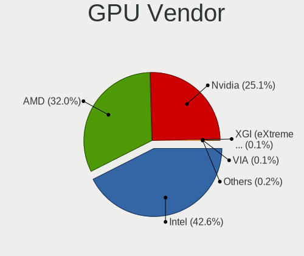

| Vendor                                       | Computers | Percent |
|----------------------------------------------|-----------|---------|
| Intel                                        | 423       | 42.17%  |
| AMD                                          | 324       | 32.3%   |
| Nvidia                                       | 252       | 25.12%  |
| XGI Technology (eXtreme Graphics Innovation) | 1         | 0.1%    |
| VIA Technologies                             | 1         | 0.1%    |
| Matrox Electronics Systems                   | 1         | 0.1%    |
| ASPEED Technology                            | 1         | 0.1%    |

GPU Model
---------

Graphics card models

| Model                                                                                    | Computers | Percent |
|------------------------------------------------------------------------------------------|-----------|---------|
| Intel 2nd Generation Core Processor Family Integrated Graphics Controller                | 46        | 4.4%    |
| AMD Picasso/Raven 2 [Radeon Vega Series / Radeon Vega Mobile Series]                     | 33        | 3.15%   |
| AMD Ellesmere [Radeon RX 470/480/570/570X/580/580X/590]                                  | 26        | 2.49%   |
| Intel 3rd Gen Core processor Graphics Controller                                         | 24        | 2.29%   |
| Intel Skylake GT2 [HD Graphics 520]                                                      | 21        | 2.01%   |
| Intel UHD Graphics 620                                                                   | 17        | 1.63%   |
| Intel Haswell-ULT Integrated Graphics Controller                                         | 17        | 1.63%   |
| AMD Renoir [Radeon RX Vega 6 (Ryzen 4000/5000 Mobile Series)]                            | 17        | 1.63%   |
| Intel WhiskeyLake-U GT2 [UHD Graphics 620]                                               | 15        | 1.43%   |
| Intel TigerLake-LP GT2 [Iris Xe Graphics]                                                | 14        | 1.34%   |
| Intel HD Graphics 620                                                                    | 14        | 1.34%   |
| Intel Atom/Celeron/Pentium Processor x5-E8000/J3xxx/N3xxx Integrated Graphics Controller | 14        | 1.34%   |
| Intel 4th Gen Core Processor Integrated Graphics Controller                              | 14        | 1.34%   |
| AMD Raven Ridge [Radeon Vega Series / Radeon Vega Mobile Series]                         | 14        | 1.34%   |
| Intel Core Processor Integrated Graphics Controller                                      | 13        | 1.24%   |
| Intel HD Graphics 5500                                                                   | 12        | 1.15%   |
| Intel CoffeeLake-H GT2 [UHD Graphics 630]                                                | 12        | 1.15%   |
| AMD Cezanne [Radeon Vega Series / Radeon Vega Mobile Series]                             | 12        | 1.15%   |
| Nvidia GP107M [GeForce GTX 1050 Mobile]                                                  | 11        | 1.05%   |
| Intel Xeon E3-1200 v3/4th Gen Core Processor Integrated Graphics Controller              | 10        | 0.96%   |
| Intel Mobile 4 Series Chipset Integrated Graphics Controller                             | 10        | 0.96%   |
| Intel HD Graphics 630                                                                    | 10        | 0.96%   |
| Intel HD Graphics 530                                                                    | 10        | 0.96%   |
| Intel Xeon E3-1200 v2/3rd Gen Core processor Graphics Controller                         | 9         | 0.86%   |
| Intel Iris Plus Graphics G1 (Ice Lake)                                                   | 9         | 0.86%   |
| Intel HD Graphics 500                                                                    | 9         | 0.86%   |
| Intel Atom Processor Z36xxx/Z37xxx Series Graphics & Display                             | 9         | 0.86%   |
| AMD Lucienne                                                                             | 9         | 0.86%   |
| AMD Barcelo                                                                              | 9         | 0.86%   |
| Intel Raptor Lake-P [Iris Xe Graphics]                                                   | 8         | 0.76%   |
| AMD Turks PRO [Radeon HD 6570/7570/8550 / R5 230]                                        | 8         | 0.76%   |
| AMD Topaz XT [Radeon R7 M260/M265 / M340/M360 / M440/M445 / 530/535 / 620/625 Mobile]    | 8         | 0.76%   |
| AMD RS880M [Mobility Radeon HD 4225/4250]                                                | 8         | 0.76%   |
| AMD Lexa PRO [Radeon 540/540X/550/550X / RX 540X/550/550X]                               | 8         | 0.76%   |
| Nvidia GP107 [GeForce GTX 1050 Ti]                                                       | 7         | 0.67%   |
| Intel CometLake-U GT2 [UHD Graphics]                                                     | 7         | 0.67%   |
| Intel CoffeeLake-S GT2 [UHD Graphics 630]                                                | 7         | 0.67%   |
| Intel 4th Generation Core Processor Family Integrated Graphics Controller                | 7         | 0.67%   |
| AMD Sun XT [Radeon HD 8670A/8670M/8690M / R5 M330 / M430 / Radeon 520 Mobile]            | 7         | 0.67%   |
| AMD Cedar [Radeon HD 5000/6000/7350/8350 Series]                                         | 7         | 0.67%   |

GPU Combo
---------

Combinations of graphics cards

| Name           | Computers | Percent |
|----------------|-----------|---------|
| 1 x Intel      | 291       | 33.68%  |
| 1 x AMD        | 252       | 29.17%  |
| 1 x Nvidia     | 142       | 16.44%  |
| Intel + Nvidia | 94        | 10.88%  |
| Intel + AMD    | 35        | 4.05%   |
| 2 x AMD        | 24        | 2.78%   |
| AMD + Nvidia   | 13        | 1.5%    |
| Other          | 5         | 0.58%   |
| 2 x Nvidia     | 3         | 0.35%   |
| 2 x Intel      | 1         | 0.12%   |
| 1 x VIA        | 1         | 0.12%   |
| Nvidia + XGI   | 1         | 0.12%   |
| 1 x Matrox     | 1         | 0.12%   |
| 1 x ASPEED     | 1         | 0.12%   |

GPU Driver
----------

Free vs proprietary

| Driver      | Computers | Percent |
|-------------|-----------|---------|
| Free        | 715       | 82.28%  |
| Proprietary | 124       | 14.27%  |
| Unknown     | 30        | 3.45%   |

GPU Memory
----------

Total video memory

| Size in GB | Computers | Percent |
|------------|-----------|---------|
| Unknown    | 439       | 49.16%  |
| 1.01-2.0   | 135       | 15.12%  |
| 0.01-0.5   | 128       | 14.33%  |
| 0.51-1.0   | 80        | 8.96%   |
| 3.01-4.0   | 69        | 7.73%   |
| 7.01-8.0   | 21        | 2.35%   |
| 5.01-6.0   | 10        | 1.12%   |
| 8.01-16.0  | 9         | 1.01%   |
| 2.01-3.0   | 2         | 0.22%   |

Monitor
-------

Monitor Vendor
--------------

Monitor vendors

| Vendor                  | Computers | Percent |
|-------------------------|-----------|---------|
| Samsung Electronics     | 121       | 13.11%  |
| AU Optronics            | 104       | 11.27%  |
| BOE                     | 84        | 9.1%    |
| LG Display              | 77        | 8.34%   |
| Chimei Innolux          | 77        | 8.34%   |
| Goldstar                | 59        | 6.39%   |
| Dell                    | 59        | 6.39%   |
| Philips                 | 44        | 4.77%   |
| Hewlett-Packard         | 29        | 3.14%   |
| Lenovo                  | 28        | 3.03%   |
| BenQ                    | 24        | 2.6%    |
| Acer                    | 20        | 2.17%   |
| Ancor Communications    | 17        | 1.84%   |
| AOC                     | 16        | 1.73%   |
| ViewSonic               | 15        | 1.63%   |
| Chi Mei Optoelectronics | 15        | 1.63%   |
| PANDA                   | 11        | 1.19%   |
| ASUSTek Computer        | 11        | 1.19%   |
| Apple                   | 11        | 1.19%   |
| Sharp                   | 10        | 1.08%   |
| LG Electronics          | 8         | 0.87%   |
| Sony                    | 6         | 0.65%   |
| LG Philips              | 6         | 0.65%   |
| Unknown                 | 5         | 0.54%   |
| Toshiba                 | 5         | 0.54%   |
| InfoVision              | 4         | 0.43%   |
| Gigabyte Technology     | 4         | 0.43%   |
| CPT                     | 4         | 0.43%   |
| CHD                     | 4         | 0.43%   |
| Belinea                 | 4         | 0.43%   |
| OEM                     | 3         | 0.33%   |
| KTC                     | 3         | 0.33%   |
| Fujitsu Siemens         | 3         | 0.33%   |
| CSO                     | 3         | 0.33%   |
| SKY                     | 2         | 0.22%   |
| LED                     | 2         | 0.22%   |
| Hitachi                 | 2         | 0.22%   |
| HIC                     | 2         | 0.22%   |
| Unknown                 | 2         | 0.22%   |
| Vestel Elektronik       | 1         | 0.11%   |

Monitor Model
-------------

Monitor models

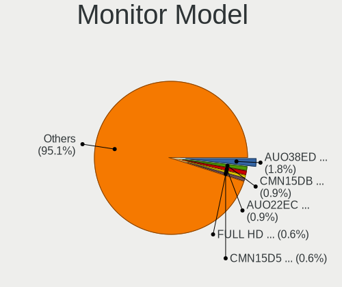

| Model                                                                 | Computers | Percent |
|-----------------------------------------------------------------------|-----------|---------|
| AU Optronics LCD Monitor AUO38ED 1920x1080 344x193mm 15.5-inch        | 17        | 1.79%   |
| AU Optronics LCD Monitor AUO22EC 1366x768 344x193mm 15.5-inch         | 10        | 1.05%   |
| Chimei Innolux LCD Monitor CMN15DB 1366x768 344x193mm 15.5-inch       | 9         | 0.95%   |
| Goldstar FULL HD GSM5B55 1920x1080 480x270mm 21.7-inch                | 7         | 0.74%   |
| Chimei Innolux LCD Monitor CMN15D5 1920x1080 344x193mm 15.5-inch      | 7         | 0.74%   |
| Philips PHL 226E9Q PHLC17D 1920x1080 477x268mm 21.5-inch              | 6         | 0.63%   |
| Chimei Innolux LCD Monitor CMN14D4 1920x1080 309x173mm 13.9-inch      | 6         | 0.63%   |
| Philips PHL 243V5 PHLC0D1 1920x1080 521x293mm 23.5-inch               | 5         | 0.53%   |
| Philips PHL 223V5 PHLC0CF 1920x1080 477x268mm 21.5-inch               | 5         | 0.53%   |
| PANDA LCD Monitor NCP004D 1920x1080 344x194mm 15.5-inch               | 5         | 0.53%   |
| LG Display LCD Monitor LGD02DC 1366x768 344x194mm 15.5-inch           | 5         | 0.53%   |
| Chimei Innolux LCD Monitor CMN15F5 1920x1080 344x193mm 15.5-inch      | 5         | 0.53%   |
| BOE LCD Monitor BOE0812 1920x1080 344x194mm 15.5-inch                 | 5         | 0.53%   |
| BOE LCD Monitor BOE06A4 1366x768 344x194mm 15.5-inch                  | 5         | 0.53%   |
| Samsung Electronics LCD Monitor SDC4161 1920x1080 344x194mm 15.5-inch | 4         | 0.42%   |
| Goldstar W2240 GSM57A0 1920x1080 477x268mm 21.5-inch                  | 4         | 0.42%   |
| Dell P2417H DELA0DC 1920x1080 527x296mm 23.8-inch                     | 4         | 0.42%   |
| BOE LCD Monitor BOE069C 1920x1080 344x193mm 15.5-inch                 | 4         | 0.42%   |
| BOE LCD Monitor BOE0687 1920x1080 344x193mm 15.5-inch                 | 4         | 0.42%   |
| BOE LCD Monitor BOE0675 1366x768 344x194mm 15.5-inch                  | 4         | 0.42%   |
| AU Optronics LCD Monitor AUO26EC 1366x768 344x193mm 15.5-inch         | 4         | 0.42%   |
| AOC Q32G2WG3 AOC3202 2560x1440 697x392mm 31.5-inch                    | 4         | 0.42%   |
| Toshiba TV TSB0108 1360x768 698x393mm 31.5-inch                       | 3         | 0.32%   |
| Samsung Electronics SyncMaster SAM0564 1360x768 410x230mm 18.5-inch   | 3         | 0.32%   |
| Samsung Electronics SyncMaster SAM01B7 1280x1024 340x270mm 17.1-inch  | 3         | 0.32%   |
| Samsung Electronics S24F350 SAM0D20 1920x1080 521x293mm 23.5-inch     | 3         | 0.32%   |
| Samsung Electronics S22B300 SAM08AA 1920x1080 477x268mm 21.5-inch     | 3         | 0.32%   |
| Samsung Electronics LCD Monitor SEC3046 1366x768 344x193mm 15.5-inch  | 3         | 0.32%   |
| Samsung Electronics LCD Monitor SDC4154 2880x1800 302x189mm 14.0-inch | 3         | 0.32%   |
| Samsung Electronics C24F390 SAM0D2C 1920x1080 521x293mm 23.5-inch     | 3         | 0.32%   |
| Philips PHL 328P6A PHL0913 2560x1440 700x390mm 31.5-inch              | 3         | 0.32%   |
| LG Display LP156WH2-TLAA LGD0230 1366x768 344x194mm 15.5-inch         | 3         | 0.32%   |
| LG Display LCD Monitor LGD05E5 1920x1080 344x194mm 15.5-inch          | 3         | 0.32%   |
| LG Display LCD Monitor LGD0456 1366x768 344x194mm 15.5-inch           | 3         | 0.32%   |
| LG Display LCD Monitor LGD03AB 1366x768 344x194mm 15.5-inch           | 3         | 0.32%   |
| Lenovo LCD Monitor LEN4011 1280x800 261x163mm 12.1-inch               | 3         | 0.32%   |
| Lenovo L24i-10 LEN65D6 1920x1080 527x296mm 23.8-inch                  | 3         | 0.32%   |
| Hewlett-Packard V24i HPN36AC 1920x1080 527x296mm 23.8-inch            | 3         | 0.32%   |
| Goldstar W2252 GSM567E 1680x1050 474x296mm 22.0-inch                  | 3         | 0.32%   |
| Goldstar W2243 GSM56FE 1920x1080 477x268mm 21.5-inch                  | 3         | 0.32%   |

Monitor Resolution
------------------

Monitor screen resolution

| Resolution         | Computers | Percent |
|--------------------|-----------|---------|
| 1920x1080 (FHD)    | 427       | 48.91%  |
| 1366x768 (WXGA)    | 169       | 19.36%  |
| 1280x1024 (SXGA)   | 40        | 4.58%   |
| 3840x2160 (4K)     | 38        | 4.35%   |
| 2560x1440 (QHD)    | 26        | 2.98%   |
| 1680x1050 (WSXGA+) | 25        | 2.86%   |
| 1440x900 (WXGA+)   | 21        | 2.41%   |
| 1920x1200 (WUXGA)  | 19        | 2.18%   |
| 1280x800 (WXGA)    | 19        | 2.18%   |
| 1600x900 (HD+)     | 17        | 1.95%   |
| 2560x1600          | 10        | 1.15%   |
| 1360x768           | 9         | 1.03%   |
| Unknown            | 7         | 0.8%    |
| 2880x1800          | 6         | 0.69%   |
| 1920x540           | 6         | 0.69%   |
| 3840x1080          | 4         | 0.46%   |
| 1024x600           | 4         | 0.46%   |
| 2560x1080          | 3         | 0.34%   |
| 2520x1680          | 3         | 0.34%   |
| 1600x1200          | 3         | 0.34%   |
| 1024x768 (XGA)     | 3         | 0.34%   |
| 1400x1050          | 2         | 0.23%   |
| 1280x720 (HD)      | 2         | 0.23%   |
| 7680x2160          | 1         | 0.11%   |
| 3440x1440          | 1         | 0.11%   |
| 3360x1200          | 1         | 0.11%   |
| 3280x1080          | 1         | 0.11%   |
| 3200x2000          | 1         | 0.11%   |
| 2288x1287          | 1         | 0.11%   |
| 2160x1350          | 1         | 0.11%   |
| 1920x1280          | 1         | 0.11%   |
| 1834x1031          | 1         | 0.11%   |
| 1680x945           | 1         | 0.11%   |

Monitor Diagonal
----------------

Diagonal size in inches

| Inches  | Computers | Percent |
|---------|-----------|---------|
| 15      | 278       | 30.35%  |
| 21      | 80        | 8.73%   |
| 24      | 79        | 8.62%   |
| 23      | 74        | 8.08%   |
| 13      | 57        | 6.22%   |
| 17      | 53        | 5.79%   |
| 14      | 48        | 5.24%   |
| 27      | 42        | 4.59%   |
| Unknown | 39        | 4.26%   |
| 19      | 25        | 2.73%   |
| 18      | 22        | 2.4%    |
| 12      | 18        | 1.97%   |
| 22      | 17        | 1.86%   |
| 31      | 16        | 1.75%   |
| 16      | 16        | 1.75%   |
| 20      | 8         | 0.87%   |
| 72      | 7         | 0.76%   |
| 11      | 5         | 0.55%   |
| 84      | 4         | 0.44%   |
| 34      | 4         | 0.44%   |
| 52      | 3         | 0.33%   |
| 46      | 3         | 0.33%   |
| 40      | 3         | 0.33%   |
| 10      | 3         | 0.33%   |
| 32      | 2         | 0.22%   |
| 142     | 1         | 0.11%   |
| 86      | 1         | 0.11%   |
| 65      | 1         | 0.11%   |
| 54      | 1         | 0.11%   |
| 43      | 1         | 0.11%   |
| 39      | 1         | 0.11%   |
| 33      | 1         | 0.11%   |
| 26      | 1         | 0.11%   |
| 25      | 1         | 0.11%   |
| 8       | 1         | 0.11%   |

Monitor Width
-------------

Physical width

| Width in mm    | Computers | Percent |
|----------------|-----------|---------|
| 301-350        | 391       | 43.54%  |
| 501-600        | 182       | 20.27%  |
| 401-500        | 133       | 14.81%  |
| 351-400        | 51        | 5.68%   |
| 201-300        | 51        | 5.68%   |
| Unknown        | 39        | 4.34%   |
| 601-700        | 17        | 1.89%   |
| 1501-2000      | 11        | 1.22%   |
| 1001-1500      | 9         | 1%      |
| 701-800        | 7         | 0.78%   |
| 801-900        | 4         | 0.45%   |
| More than 2000 | 1         | 0.11%   |
| 101-200        | 1         | 0.11%   |
| 901-1000       | 1         | 0.11%   |

Aspect Ratio
------------

Proportional relationship between the width and the height

| Ratio   | Computers | Percent |
|---------|-----------|---------|
| 16/9    | 636       | 76.81%  |
| 16/10   | 87        | 10.51%  |
| 5/4     | 37        | 4.47%   |
| Unknown | 33        | 3.99%   |
| 3/2     | 15        | 1.81%   |
| 4/3     | 12        | 1.45%   |
| 21/9    | 4         | 0.48%   |
| 6/5     | 1         | 0.12%   |
| 32/9    | 1         | 0.12%   |
| 1.00    | 1         | 0.12%   |
| 0.56    | 1         | 0.12%   |

Monitor Area
------------

Area in inch

| Area in inch | Computers | Percent |
|----------------|-----------|---------|
| 101-110        | 277       | 30.64%  |
| 201-250        | 208       | 23.01%  |
| 81-90          | 82        | 9.07%   |
| 151-200        | 47        | 5.2%    |
| 301-350        | 43        | 4.76%   |
| 141-150        | 42        | 4.65%   |
| Unknown        | 39        | 4.31%   |
| 121-130        | 29        | 3.21%   |
| 71-80          | 23        | 2.54%   |
| 351-500        | 23        | 2.54%   |
| 251-300        | 21        | 2.32%   |
| More than 1000 | 18        | 1.99%   |
| 111-120        | 16        | 1.77%   |
| 61-70          | 15        | 1.66%   |
| 501-1000       | 8         | 0.88%   |
| 51-60          | 5         | 0.55%   |
| 41-50          | 3         | 0.33%   |
| 91-100         | 3         | 0.33%   |
| 1-40           | 1         | 0.11%   |
| 131-140        | 1         | 0.11%   |

Pixel Density
-------------

Pixels per inch

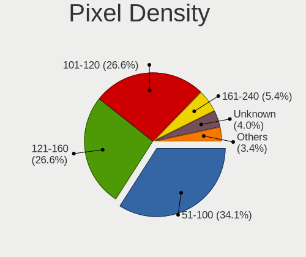

| Density       | Computers | Percent |
|---------------|-----------|---------|
| 51-100        | 297       | 33.45%  |
| 101-120       | 249       | 28.04%  |
| 121-160       | 234       | 26.35%  |
| 161-240       | 43        | 4.84%   |
| Unknown       | 39        | 4.39%   |
| 1-50          | 18        | 2.03%   |
| More than 240 | 8         | 0.9%    |

Multiple Monitors
-----------------

Total monitors connected

| Total | Computers | Percent |
|-------|-----------|---------|
| 1     | 706       | 79.95%  |
| 2     | 127       | 14.38%  |
| 0     | 34        | 3.85%   |
| 3     | 16        | 1.81%   |

Network
-------

Net Controller Vendor
---------------------

Controller vendors

| Vendor                            | Computers | Percent |
|-----------------------------------|-----------|---------|
| Realtek Semiconductor             | 534       | 42.45%  |
| Intel                             | 305       | 24.24%  |
| Qualcomm Atheros                  | 162       | 12.88%  |
| Broadcom                          | 64        | 5.09%   |
| Nvidia                            | 25        | 1.99%   |
| MediaTek                          | 25        | 1.99%   |
| TP-Link                           | 18        | 1.43%   |
| Ralink Technology                 | 16        | 1.27%   |
| Ralink                            | 13        | 1.03%   |
| Qualcomm Atheros Communications   | 13        | 1.03%   |
| Broadcom Limited                  | 11        | 0.87%   |
| Marvell Technology Group          | 8         | 0.64%   |
| Dell                              | 8         | 0.64%   |
| Sierra Wireless                   | 4         | 0.32%   |
| Ericsson Business Mobile Networks | 4         | 0.32%   |
| ZTE WCDMA Technologies MSM        | 3         | 0.24%   |
| VIA Technologies                  | 3         | 0.24%   |
| Huawei Technologies               | 3         | 0.24%   |
| Edimax Technology                 | 3         | 0.24%   |
| D-Link                            | 3         | 0.24%   |
| ASUSTek Computer                  | 3         | 0.24%   |
| Xiaomi                            | 2         | 0.16%   |
| Samsung Electronics               | 2         | 0.16%   |
| OPPO Electronics                  | 2         | 0.16%   |
| JMicron Technology                | 2         | 0.16%   |
| IMC Networks                      | 2         | 0.16%   |
| Hewlett-Packard                   | 2         | 0.16%   |
| ASIX Electronics                  | 2         | 0.16%   |
| ZyXEL Communications              | 1         | 0.08%   |
| Texas Instruments                 | 1         | 0.08%   |
| Sundance Technology Inc / IC Plus | 1         | 0.08%   |
| Sigma Designs                     | 1         | 0.08%   |
| NetGear                           | 1         | 0.08%   |
| LSI                               | 1         | 0.08%   |
| Linksys                           | 1         | 0.08%   |
| Lenovo                            | 1         | 0.08%   |
| ICS Advent                        | 1         | 0.08%   |
| FIBOCOM                           | 1         | 0.08%   |
| DisplayLink                       | 1         | 0.08%   |
| D-Link System                     | 1         | 0.08%   |

Net Controller Model
--------------------

Controller models

| Model                                                                  | Computers | Percent |
|------------------------------------------------------------------------|-----------|---------|
| Realtek RTL8111/8168/8211/8411 PCI Express Gigabit Ethernet Controller | 376       | 26.24%  |
| Realtek RTL810xE PCI Express Fast Ethernet controller                  | 78        | 5.44%   |
| Qualcomm Atheros QCA9377 802.11ac Wireless Network Adapter             | 31        | 2.16%   |
| Qualcomm Atheros QCA9565 / AR9565 Wireless Network Adapter             | 28        | 1.95%   |
| Intel Wireless 8265 / 8275                                             | 27        | 1.88%   |
| Realtek RTL8821CE 802.11ac PCIe Wireless Network Adapter               | 25        | 1.74%   |
| Intel 82579LM Gigabit Network Connection (Lewisville)                  | 22        | 1.54%   |
| Intel Wi-Fi 6 AX200                                                    | 19        | 1.33%   |
| Realtek RTL8125 2.5GbE Controller                                      | 18        | 1.26%   |
| Realtek RTL8822CE 802.11ac PCIe Wireless Network Adapter               | 16        | 1.12%   |
| Intel Wireless 8260                                                    | 15        | 1.05%   |
| Intel Wireless 7260                                                    | 14        | 0.98%   |
| Realtek RTL8723BE PCIe Wireless Network Adapter                        | 13        | 0.91%   |
| Qualcomm Atheros AR9285 Wireless Network Adapter (PCI-Express)         | 13        | 0.91%   |
| Broadcom BCM43142 802.11b/g/n                                          | 13        | 0.91%   |
| Broadcom BCM4313 802.11bgn Wireless Network Adapter                    | 12        | 0.84%   |
| Realtek RTL8153 Gigabit Ethernet Adapter                               | 11        | 0.77%   |
| Qualcomm Atheros AR9485 Wireless Network Adapter                       | 11        | 0.77%   |
| Qualcomm Atheros AR9462 Wireless Network Adapter                       | 10        | 0.7%    |
| MediaTek MT7921 802.11ax PCI Express Wireless Network Adapter          | 10        | 0.7%    |
| Intel Wi-Fi 6 AX201                                                    | 10        | 0.7%    |
| Intel I211 Gigabit Network Connection                                  | 10        | 0.7%    |
| Intel Cannon Point-LP CNVi [Wireless-AC]                               | 10        | 0.7%    |
| Qualcomm Atheros AR9271 802.11n                                        | 9         | 0.63%   |
| Qualcomm Atheros AR8151 v2.0 Gigabit Ethernet                          | 9         | 0.63%   |
| Intel Wireless 3165                                                    | 9         | 0.63%   |
| Intel Ethernet Connection I219-LM                                      | 9         | 0.63%   |
| Intel Ethernet Connection I217-LM                                      | 9         | 0.63%   |
| Intel Ethernet Connection (2) I219-V                                   | 9         | 0.63%   |
| Intel Centrino Advanced-N 6205 [Taylor Peak]                           | 9         | 0.63%   |
| Qualcomm Atheros QCA6174 802.11ac Wireless Network Adapter             | 8         | 0.56%   |
| Intel Ice Lake-LP PCH CNVi WiFi                                        | 8         | 0.56%   |
| Intel Ethernet Connection (4) I219-LM                                  | 8         | 0.56%   |
| Intel Dual Band Wireless-AC 3165 Plus Bluetooth                        | 8         | 0.56%   |
| Realtek RTL8822BE 802.11a/b/g/n/ac WiFi adapter                        | 7         | 0.49%   |
| Realtek RTL-8100/8101L/8139 PCI Fast Ethernet Adapter                  | 7         | 0.49%   |
| Qualcomm Atheros AR9287 Wireless Network Adapter (PCI-Express)         | 7         | 0.49%   |
| Nvidia MCP79 Ethernet                                                  | 7         | 0.49%   |
| Nvidia MCP61 Ethernet                                                  | 7         | 0.49%   |
| MediaTek MT7922 802.11ax PCI Express Wireless Network Adapter          | 7         | 0.49%   |

Wireless Vendor
---------------

Wireless vendors

| Vendor                          | Computers | Percent |
|---------------------------------|-----------|---------|
| Intel                           | 228       | 37.01%  |
| Qualcomm Atheros                | 131       | 21.27%  |
| Realtek Semiconductor           | 102       | 16.56%  |
| Broadcom                        | 44        | 7.14%   |
| MediaTek                        | 23        | 3.73%   |
| TP-Link                         | 17        | 2.76%   |
| Ralink Technology               | 16        | 2.6%    |
| Ralink                          | 13        | 2.11%   |
| Qualcomm Atheros Communications | 13        | 2.11%   |
| Dell                            | 5         | 0.81%   |
| Sierra Wireless                 | 4         | 0.65%   |
| Edimax Technology               | 3         | 0.49%   |
| D-Link                          | 3         | 0.49%   |
| Broadcom Limited                | 3         | 0.49%   |
| ASUSTek Computer                | 3         | 0.49%   |
| IMC Networks                    | 2         | 0.32%   |
| Hewlett-Packard                 | 2         | 0.32%   |
| ZyXEL Communications            | 1         | 0.16%   |
| NetGear                         | 1         | 0.16%   |
| Linksys                         | 1         | 0.16%   |
| FIBOCOM                         | 1         | 0.16%   |

Wireless Model
--------------

Wireless models

| Model                                                                   | Computers | Percent |
|-------------------------------------------------------------------------|-----------|---------|
| Qualcomm Atheros QCA9377 802.11ac Wireless Network Adapter              | 31        | 5.02%   |
| Qualcomm Atheros QCA9565 / AR9565 Wireless Network Adapter              | 28        | 4.54%   |
| Intel Wireless 8265 / 8275                                              | 27        | 4.38%   |
| Realtek RTL8821CE 802.11ac PCIe Wireless Network Adapter                | 25        | 4.05%   |
| Intel Wi-Fi 6 AX200                                                     | 19        | 3.08%   |
| Realtek RTL8822CE 802.11ac PCIe Wireless Network Adapter                | 16        | 2.59%   |
| Intel Wireless 8260                                                     | 15        | 2.43%   |
| Intel Wireless 7260                                                     | 14        | 2.27%   |
| Realtek RTL8723BE PCIe Wireless Network Adapter                         | 13        | 2.11%   |
| Qualcomm Atheros AR9285 Wireless Network Adapter (PCI-Express)          | 13        | 2.11%   |
| Broadcom BCM43142 802.11b/g/n                                           | 13        | 2.11%   |
| Broadcom BCM4313 802.11bgn Wireless Network Adapter                     | 12        | 1.94%   |
| Qualcomm Atheros AR9485 Wireless Network Adapter                        | 11        | 1.78%   |
| Qualcomm Atheros AR9462 Wireless Network Adapter                        | 10        | 1.62%   |
| MediaTek MT7921 802.11ax PCI Express Wireless Network Adapter           | 10        | 1.62%   |
| Intel Wi-Fi 6 AX201                                                     | 10        | 1.62%   |
| Intel Cannon Point-LP CNVi [Wireless-AC]                                | 10        | 1.62%   |
| Qualcomm Atheros AR9271 802.11n                                         | 9         | 1.46%   |
| Intel Wireless 3165                                                     | 9         | 1.46%   |
| Intel Centrino Advanced-N 6205 [Taylor Peak]                            | 9         | 1.46%   |
| Qualcomm Atheros QCA6174 802.11ac Wireless Network Adapter              | 8         | 1.3%    |
| Intel Ice Lake-LP PCH CNVi WiFi                                         | 8         | 1.3%    |
| Intel Dual Band Wireless-AC 3165 Plus Bluetooth                         | 8         | 1.3%    |
| Realtek RTL8822BE 802.11a/b/g/n/ac WiFi adapter                         | 7         | 1.13%   |
| Qualcomm Atheros AR9287 Wireless Network Adapter (PCI-Express)          | 7         | 1.13%   |
| MediaTek MT7922 802.11ax PCI Express Wireless Network Adapter           | 7         | 1.13%   |
| Intel PRO/Wireless 3945ABG [Golan] Network Connection                   | 7         | 1.13%   |
| Intel Cannon Lake PCH CNVi WiFi                                         | 7         | 1.13%   |
| TP-Link TL-WN722N v2/v3 [Realtek RTL8188EUS]                            | 6         | 0.97%   |
| Realtek RTL8821AE 802.11ac PCIe Wireless Network Adapter                | 6         | 0.97%   |
| Intel Raptor Lake PCH CNVi WiFi                                         | 6         | 0.97%   |
| Intel Comet Lake PCH-LP CNVi WiFi                                       | 6         | 0.97%   |
| Intel Alder Lake-P PCH CNVi WiFi                                        | 6         | 0.97%   |
| Realtek RTL8192EU 802.11b/g/n WLAN Adapter                              | 5         | 0.81%   |
| Realtek RTL8188EUS 802.11n Wireless Network Adapter                     | 5         | 0.81%   |
| Ralink RT2870/RT3070 Wireless Adapter                                   | 5         | 0.81%   |
| Ralink MT7601U Wireless Adapter                                         | 5         | 0.81%   |
| Qualcomm Atheros AR242x / AR542x Wireless Network Adapter (PCI-Express) | 5         | 0.81%   |
| Qualcomm Atheros AR2417 Wireless Network Adapter [AR5007G 802.11bg]     | 5         | 0.81%   |
| MediaTek Wi-Fi 6E MT7902 Wireless Network Adapter                       | 5         | 0.81%   |

Ethernet Vendor
---------------

Ethernet vendors

| Vendor                            | Computers | Percent |
|-----------------------------------|-----------|---------|
| Realtek Semiconductor             | 497       | 62.99%  |
| Intel                             | 153       | 19.39%  |
| Qualcomm Atheros                  | 43        | 5.45%   |
| Broadcom                          | 26        | 3.3%    |
| Nvidia                            | 25        | 3.17%   |
| Marvell Technology Group          | 8         | 1.01%   |
| Broadcom Limited                  | 8         | 1.01%   |
| ZTE WCDMA Technologies MSM        | 3         | 0.38%   |
| VIA Technologies                  | 3         | 0.38%   |
| MediaTek                          | 3         | 0.38%   |
| Xiaomi                            | 2         | 0.25%   |
| Samsung Electronics               | 2         | 0.25%   |
| OPPO Electronics                  | 2         | 0.25%   |
| JMicron Technology                | 2         | 0.25%   |
| ASIX Electronics                  | 2         | 0.25%   |
| TP-Link                           | 1         | 0.13%   |
| Sundance Technology Inc / IC Plus | 1         | 0.13%   |
| Lenovo                            | 1         | 0.13%   |
| ICS Advent                        | 1         | 0.13%   |
| Huawei Technologies               | 1         | 0.13%   |
| DisplayLink                       | 1         | 0.13%   |
| D-Link System                     | 1         | 0.13%   |
| Aquantia                          | 1         | 0.13%   |
| Apple                             | 1         | 0.13%   |
| ADMtek                            | 1         | 0.13%   |

Ethernet Model
--------------

Ethernet models

| Model                                                                  | Computers | Percent |
|------------------------------------------------------------------------|-----------|---------|
| Realtek RTL8111/8168/8211/8411 PCI Express Gigabit Ethernet Controller | 376       | 46.94%  |
| Realtek RTL810xE PCI Express Fast Ethernet controller                  | 78        | 9.74%   |
| Intel 82579LM Gigabit Network Connection (Lewisville)                  | 22        | 2.75%   |
| Realtek RTL8125 2.5GbE Controller                                      | 18        | 2.25%   |
| Realtek RTL8153 Gigabit Ethernet Adapter                               | 11        | 1.37%   |
| Intel I211 Gigabit Network Connection                                  | 10        | 1.25%   |
| Qualcomm Atheros AR8151 v2.0 Gigabit Ethernet                          | 9         | 1.12%   |
| Intel Ethernet Connection I219-LM                                      | 9         | 1.12%   |
| Intel Ethernet Connection I217-LM                                      | 9         | 1.12%   |
| Intel Ethernet Connection (2) I219-V                                   | 9         | 1.12%   |
| Intel Ethernet Connection (4) I219-LM                                  | 8         | 1%      |
| Realtek RTL-8100/8101L/8139 PCI Fast Ethernet Adapter                  | 7         | 0.87%   |
| Nvidia MCP79 Ethernet                                                  | 7         | 0.87%   |
| Nvidia MCP61 Ethernet                                                  | 7         | 0.87%   |
| Qualcomm Atheros AR8161 Gigabit Ethernet                               | 6         | 0.75%   |
| Intel 82579V Gigabit Network Connection                                | 6         | 0.75%   |
| Intel 82577LM Gigabit Network Connection                               | 6         | 0.75%   |
| Broadcom NetLink BCM57785 Gigabit Ethernet PCIe                        | 6         | 0.75%   |
| Qualcomm Atheros QCA8172 Fast Ethernet                                 | 5         | 0.62%   |
| Intel Ethernet Connection I218-LM                                      | 5         | 0.62%   |
| Intel Ethernet Connection I217-V                                       | 5         | 0.62%   |
| Intel Ethernet Connection (7) I219-V                                   | 5         | 0.62%   |
| Realtek RTL8152 Fast Ethernet Adapter                                  | 4         | 0.5%    |
| Realtek RTL-8110SC/8169SC Gigabit Ethernet                             | 4         | 0.5%    |
| Qualcomm Atheros Killer E220x Gigabit Ethernet Controller              | 4         | 0.5%    |
| Qualcomm Atheros AR8131 Gigabit Ethernet                               | 4         | 0.5%    |
| Qualcomm Atheros AR8121/AR8113/AR8114 Gigabit or Fast Ethernet         | 4         | 0.5%    |
| Intel Ethernet Connection (7) I219-LM                                  | 4         | 0.5%    |
| Intel 82567LM-3 Gigabit Network Connection                             | 4         | 0.5%    |
| Intel 82567LM Gigabit Network Connection                               | 4         | 0.5%    |
| Broadcom NetXtreme BCM57765 Gigabit Ethernet PCIe                      | 4         | 0.5%    |
| Qualcomm Atheros AR8132 Fast Ethernet                                  | 3         | 0.37%   |
| MediaTek RMX3085                                                       | 3         | 0.37%   |
| Marvell Group 88E8055 PCI-E Gigabit Ethernet Controller                | 3         | 0.37%   |
| Intel Ethernet Controller I225-V                                       | 3         | 0.37%   |
| Intel Ethernet Connection (2) I219-LM                                  | 3         | 0.37%   |
| Intel Ethernet Connection (13) I219-V                                  | 3         | 0.37%   |
| Intel 82566DM-2 Gigabit Network Connection                             | 3         | 0.37%   |
| Broadcom NetXtreme BCM5764M Gigabit Ethernet PCIe                      | 3         | 0.37%   |
| Broadcom NetXtreme BCM5761 Gigabit Ethernet PCIe                       | 3         | 0.37%   |

Net Controller Kind
-------------------

Ethernet, WiFi or modem

| Kind     | Computers | Percent |
|----------|-----------|---------|
| Ethernet | 765       | 56%     |
| WiFi     | 587       | 42.97%  |
| Modem    | 14        | 1.02%   |

Used Controller
---------------

Currently used network controller

| Kind     | Computers | Percent |
|----------|-----------|---------|
| WiFi     | 468       | 53.12%  |
| Ethernet | 413       | 46.88%  |

NICs
----

Total network controllers on board

| Total | Computers | Percent |
|-------|-----------|---------|
| 2     | 439       | 51.29%  |
| 1     | 398       | 46.5%   |
| 3     | 8         | 0.93%   |
| 0     | 8         | 0.93%   |
| 5     | 2         | 0.23%   |
| 8     | 1         | 0.12%   |

IPv6
----

IPv6 vs IPv4

| Used | Computers | Percent |
|------|-----------|---------|
| No   | 834       | 97.09%  |
| Yes  | 25        | 2.91%   |

Bluetooth
---------

Bluetooth Vendor
----------------

Controller vendors

| Vendor                          | Computers | Percent |
|---------------------------------|-----------|---------|
| Intel                           | 175       | 37.72%  |
| Realtek Semiconductor           | 63        | 13.58%  |
| Qualcomm Atheros Communications | 43        | 9.27%   |
| Lite-On Technology              | 30        | 6.47%   |
| IMC Networks                    | 29        | 6.25%   |
| Cambridge Silicon Radio         | 29        | 6.25%   |
| Broadcom                        | 22        | 4.74%   |
| Foxconn / Hon Hai               | 18        | 3.88%   |
| Apple                           | 11        | 2.37%   |
| Hewlett-Packard                 | 7         | 1.51%   |
| ASUSTek Computer                | 7         | 1.51%   |
| Toshiba                         | 6         | 1.29%   |
| Dell                            | 5         | 1.08%   |
| Ralink                          | 4         | 0.86%   |
| MediaTek                        | 4         | 0.86%   |
| Foxconn International           | 3         | 0.65%   |
| USI                             | 2         | 0.43%   |
| Ralink Technology               | 2         | 0.43%   |
| Realtek                         | 1         | 0.22%   |
| Opticis                         | 1         | 0.22%   |
| Askey Computer                  | 1         | 0.22%   |
| Alps Electric                   | 1         | 0.22%   |

Bluetooth Model
---------------

Controller models

| Model                                               | Computers | Percent |
|-----------------------------------------------------|-----------|---------|
| Intel Bluetooth Device                              | 36        | 7.76%   |
| Intel Bluetooth wireless interface                  | 34        | 7.33%   |
| Realtek Bluetooth Radio                             | 30        | 6.47%   |
| Intel Bluetooth 9460/9560 Jefferson Peak (JfP)      | 29        | 6.25%   |
| Cambridge Silicon Radio Bluetooth Dongle (HCI mode) | 29        | 6.25%   |
| Intel AX201 Bluetooth                               | 24        | 5.17%   |
| Intel AX200 Bluetooth                               | 19        | 4.09%   |
| Qualcomm Atheros  Bluetooth Device                  | 18        | 3.88%   |
| Realtek  Bluetooth 4.2 Adapter                      | 14        | 3.02%   |
| Lite-On Qualcomm Atheros QCA9377 Bluetooth          | 13        | 2.8%    |
| Intel AX211 Bluetooth                               | 12        | 2.59%   |
| IMC Networks Wireless_Device                        | 10        | 2.16%   |
| Lite-On Bluetooth Device                            | 9         | 1.94%   |
| IMC Networks Bluetooth Radio                        | 9         | 1.94%   |
| Realtek 802.11ac WLAN Adapter                       | 7         | 1.51%   |
| Qualcomm Atheros AR9462 Bluetooth                   | 6         | 1.29%   |
| Qualcomm Atheros AR3012 Bluetooth 4.0               | 6         | 1.29%   |
| Intel Centrino Bluetooth Wireless Transceiver       | 6         | 1.29%   |
| Apple Bluetooth Host Controller                     | 6         | 1.29%   |
| Realtek RTL8821A Bluetooth                          | 5         | 1.08%   |
| Qualcomm Atheros AR3011 Bluetooth                   | 5         | 1.08%   |
| Intel AX210 Bluetooth                               | 5         | 1.08%   |
| Foxconn / Hon Hai MediaTek Bluetooth Adapter        | 5         | 1.08%   |
| Foxconn / Hon Hai Bluetooth Device                  | 5         | 1.08%   |
| Realtek RTL8723B Bluetooth                          | 4         | 0.86%   |
| Ralink RT3290 Bluetooth                             | 4         | 0.86%   |
| Qualcomm Atheros QCA61x4 Bluetooth 4.0              | 4         | 0.86%   |
| Qualcomm Atheros AR3012 Bluetooth                   | 4         | 0.86%   |
| MediaTek Wireless_Device                            | 4         | 0.86%   |
| Lite-On Atheros AR3012 Bluetooth                    | 4         | 0.86%   |
| Intel Wireless-AC 3168 Bluetooth                    | 4         | 0.86%   |
| IMC Networks Bluetooth Device                       | 4         | 0.86%   |
| HP Broadcom 2070 Bluetooth Combo                    | 4         | 0.86%   |
| Dell DW375 Bluetooth Module                         | 4         | 0.86%   |
| Broadcom BCM43142A0 Bluetooth 4.0                   | 4         | 0.86%   |
| Realtek RTL8822BE Bluetooth 4.2 Adapter             | 3         | 0.65%   |
| Intel Wireless-AC 9260 Bluetooth Adapter            | 3         | 0.65%   |
| Intel Centrino Advanced-N 6230 Bluetooth adapter    | 3         | 0.65%   |
| IMC Networks Atheros AR3012 Bluetooth 4.0 Adapter   | 3         | 0.65%   |
| HP Bluetooth 2.0 Interface [Broadcom BCM2045]       | 3         | 0.65%   |

Sound
-----

Sound Vendor
------------

Sound card vendors

| Vendor                                          | Computers | Percent |
|-------------------------------------------------|-----------|---------|
| Intel                                           | 549       | 47.91%  |
| AMD                                             | 328       | 28.62%  |
| Nvidia                                          | 188       | 16.4%   |
| C-Media Electronics                             | 10        | 0.87%   |
| Logitech                                        | 7         | 0.61%   |
| Creative Labs                                   | 6         | 0.52%   |
| Generalplus Technology                          | 5         | 0.44%   |
| Focusrite-Novation                              | 5         | 0.44%   |
| VIA Technologies                                | 4         | 0.35%   |
| Hewlett-Packard                                 | 4         | 0.35%   |
| Plantronics                                     | 3         | 0.26%   |
| Microsoft                                       | 3         | 0.26%   |
| RODE Microphones                                | 2         | 0.17%   |
| Native Instruments                              | 2         | 0.17%   |
| Micro Star International                        | 2         | 0.17%   |
| Kingston Technology                             | 2         | 0.17%   |
| JMTek                                           | 2         | 0.17%   |
| GN Netcom                                       | 2         | 0.17%   |
| ASUSTek Computer                                | 2         | 0.17%   |
| Apple                                           | 2         | 0.17%   |
| XMOS                                            | 1         | 0.09%   |
| Veho                                            | 1         | 0.09%   |
| Unknown                                         | 1         | 0.09%   |
| Turtle Beach                                    | 1         | 0.09%   |
| Tenx Technology                                 | 1         | 0.09%   |
| Syntek                                          | 1         | 0.09%   |
| Sony                                            | 1         | 0.09%   |
| SAVITECH                                        | 1         | 0.09%   |
| Realtek Semiconductor                           | 1         | 0.09%   |
| Razer USA                                       | 1         | 0.09%   |
| PreSonus Audio Electronics                      | 1         | 0.09%   |
| Oculus VR                                       | 1         | 0.09%   |
| Meizu                                           | 1         | 0.09%   |
| M-Audio                                         | 1         | 0.09%   |
| Licensed by Sony Computer Entertainment America | 1         | 0.09%   |
| JBL                                             | 1         | 0.09%   |
| FiiO Electronics Technology                     | 1         | 0.09%   |
| Ensoniq                                         | 1         | 0.09%   |

Sound Model
-----------

Sound card models

| Model                                                                                             | Computers | Percent |
|---------------------------------------------------------------------------------------------------|-----------|---------|
| AMD Family 17h/19h HD Audio Controller                                                            | 109       | 7.68%   |
| Intel 6 Series/C200 Series Chipset Family High Definition Audio Controller                        | 60        | 4.23%   |
| Intel Sunrise Point-LP HD Audio                                                                   | 56        | 3.94%   |
| Intel 7 Series/C216 Chipset Family High Definition Audio Controller                               | 49        | 3.45%   |
| AMD Renoir Radeon High Definition Audio Controller                                                | 48        | 3.38%   |
| AMD Raven/Raven2/Fenghuang HDMI/DP Audio Controller                                               | 46        | 3.24%   |
| AMD SBx00 Azalia (Intel HDA)                                                                      | 41        | 2.89%   |
| AMD FCH Azalia Controller                                                                         | 41        | 2.89%   |
| Intel 8 Series/C220 Series Chipset High Definition Audio Controller                               | 39        | 2.75%   |
| Intel NM10/ICH7 Family High Definition Audio Controller                                           | 37        | 2.61%   |
| AMD Family 17h (Models 00h-0fh) HD Audio Controller                                               | 32        | 2.25%   |
| AMD Oland/Hainan/Cape Verde/Pitcairn HDMI Audio [Radeon HD 7000 Series]                           | 29        | 2.04%   |
| Intel Xeon E3-1200 v3/4th Gen Core Processor HD Audio Controller                                  | 26        | 1.83%   |
| Intel Cannon Lake PCH cAVS                                                                        | 26        | 1.83%   |
| AMD Ellesmere HDMI Audio [Radeon RX 470/480 / 570/580/590]                                        | 26        | 1.83%   |
| Intel 5 Series/3400 Series Chipset High Definition Audio                                          | 23        | 1.62%   |
| AMD Starship/Matisse HD Audio Controller                                                          | 22        | 1.55%   |
| Intel 82801I (ICH9 Family) HD Audio Controller                                                    | 20        | 1.41%   |
| Nvidia GP107GL High Definition Audio Controller                                                   | 17        | 1.2%    |
| Intel Haswell-ULT HD Audio Controller                                                             | 17        | 1.2%    |
| Intel 8 Series HD Audio Controller                                                                | 17        | 1.2%    |
| AMD Baffin HDMI/DP Audio [Radeon RX 550 640SP / RX 560/560X]                                      | 17        | 1.2%    |
| Intel Tiger Lake-LP Smart Sound Technology Audio Controller                                       | 16        | 1.13%   |
| Intel 100 Series/C230 Series Chipset Family HD Audio Controller                                   | 16        | 1.13%   |
| Intel Wildcat Point-LP High Definition Audio Controller                                           | 15        | 1.06%   |
| Intel Cannon Point-LP High Definition Audio Controller                                            | 15        | 1.06%   |
| Intel Broadwell-U Audio Controller                                                                | 15        | 1.06%   |
| Nvidia GF108 High Definition Audio Controller                                                     | 14        | 0.99%   |
| Intel Celeron N3350/Pentium N4200/Atom E3900 Series Audio Cluster                                 | 14        | 0.99%   |
| Nvidia MCP61 High Definition Audio                                                                | 13        | 0.92%   |
| Intel 82801JI (ICH10 Family) HD Audio Controller                                                  | 13        | 0.92%   |
| Intel 200 Series PCH HD Audio                                                                     | 13        | 0.92%   |
| Nvidia GK208 HDMI/DP Audio Controller                                                             | 12        | 0.85%   |
| Intel Ice Lake-LP Smart Sound Technology Audio Controller                                         | 12        | 0.85%   |
| AMD RV710/730 HDMI Audio [Radeon HD 4000 series]                                                  | 12        | 0.85%   |
| AMD Kabini HDMI/DP Audio                                                                          | 12        | 0.85%   |
| Nvidia TU107 GeForce GTX 1650 High Definition Audio Controller                                    | 11        | 0.77%   |
| Nvidia GP104 High Definition Audio Controller                                                     | 11        | 0.77%   |
| Intel Atom/Celeron/Pentium Processor x5-E8000/J3xxx/N3xxx Series High Definition Audio Controller | 11        | 0.77%   |
| Intel 82801H (ICH8 Family) HD Audio Controller                                                    | 11        | 0.77%   |

Memory
------

Memory Vendor
-------------

Memory module vendors

| Vendor              | Computers | Percent |
|---------------------|-----------|---------|
| Kingston            | 114       | 20.54%  |
| Samsung Electronics | 111       | 20%     |
| SK hynix            | 87        | 15.68%  |
| Unknown             | 65        | 11.71%  |
| Micron Technology   | 55        | 9.91%   |
| Patriot             | 16        | 2.88%   |
| Crucial             | 16        | 2.88%   |
| Ramaxel Technology  | 15        | 2.7%    |
| Transcend           | 13        | 2.34%   |
| Corsair             | 10        | 1.8%    |
| Apacer              | 8         | 1.44%   |
| A-DATA Technology   | 8         | 1.44%   |
| Elpida              | 7         | 1.26%   |
| Nanya Technology    | 6         | 1.08%   |
| Unknown             | 5         | 0.9%    |
| GeIL                | 3         | 0.54%   |
| G.Skill             | 2         | 0.36%   |
| Unknown (06F1)      | 1         | 0.18%   |
| Unifosa             | 1         | 0.18%   |
| Swissbit            | 1         | 0.18%   |
| Silicon Power       | 1         | 0.18%   |
| SHARETRONIC         | 1         | 0.18%   |
| Ramos Technology    | 1         | 0.18%   |
| Qimonda             | 1         | 0.18%   |
| PNY                 | 1         | 0.18%   |
| Mushkin             | 1         | 0.18%   |
| KETECH              | 1         | 0.18%   |
| Exceleram           | 1         | 0.18%   |
| CSX                 | 1         | 0.18%   |
| AMD                 | 1         | 0.18%   |
| 48spaces            | 1         | 0.18%   |

Memory Model
------------

Memory module models

| Model                                                       | Computers | Percent |
|-------------------------------------------------------------|-----------|---------|
| Samsung RAM M471B5173QH0-YK0 4GB SODIMM DDR3 1600MT/s       | 7         | 1.14%   |
| SK hynix RAM HMAA1GS6CJR6N-XN 8GB SODIMM DDR4 3200MT/s      | 6         | 0.98%   |
| Samsung RAM M471A5244CB0-CTD 4GB SODIMM DDR4 3266MT/s       | 6         | 0.98%   |
| Samsung RAM M471A5244CB0-CRC 4GB SODIMM DDR4 2667MT/s       | 6         | 0.98%   |
| Micron RAM 8ATF1G64HZ-3G2J1 8GB SODIMM DDR4 3200MT/s        | 6         | 0.98%   |
| SK hynix RAM HMA851S6AFR6N-UH 4GB SODIMM DDR4 2667MT/s      | 5         | 0.81%   |
| Samsung RAM M471A1G44BB0-CWE 8GB SODIMM DDR4 3200MT/s       | 5         | 0.81%   |
| Kingston RAM KHX3200C16D4/8GX 8GB DIMM DDR4 3733MT/s        | 5         | 0.81%   |
| Kingston RAM KHX3200C16D4/16GX 16GB DIMM DDR4 3600MT/s      | 5         | 0.81%   |
| Kingston RAM KHX2400C15/8G 8GB DIMM DDR4 3400MT/s           | 5         | 0.81%   |
| Unknown                                                     | 5         | 0.81%   |
| Unknown RAM CL19-19-19 D4-2666 8192MB DIMM DDR4 2400MT/s    | 4         | 0.65%   |
| SK hynix RAM HMA851S6JJR6N-VK 4GB SODIMM DDR4 2667MT/s      | 4         | 0.65%   |
| Samsung RAM M471B1G73DB0-YK0 8GB SODIMM DDR3 1600MT/s       | 4         | 0.65%   |
| Samsung RAM M471A1K43EB1-CWE 8GB SODIMM DDR4 3200MT/s       | 4         | 0.65%   |
| Samsung RAM M471A1G44AB0-CWE 8192MB SODIMM DDR4 3200MT/s    | 4         | 0.65%   |
| Patriot RAM 3000 C16 Series 4GB DIMM DDR4 3200MT/s          | 4         | 0.65%   |
| Micron RAM 4ATF51264HZ-2G6E1 4GB SODIMM DDR4 2667MT/s       | 4         | 0.65%   |
| Micron RAM 4ATF51264HZ-2G6E! 4GB SODIMM DDR4 2400MT/s       | 4         | 0.65%   |
| Micron RAM 4ATF1G64HZ-3G2E1 8GB SODIMM DDR4 3200MT/s        | 4         | 0.65%   |
| Kingston RAM 99U5428-018.A00LF 8GB SODIMM DDR3 1600MT/s     | 4         | 0.65%   |
| Unknown RAM Module 2GB DIMM 1333MT/s                        | 3         | 0.49%   |
| Unknown RAM Module 2048MB DIMM 1333MT/s                     | 3         | 0.49%   |
| SK hynix RAM HMT451S6BFR8A-PB 4GB SODIMM DDR3 1600MT/s      | 3         | 0.49%   |
| SK hynix RAM HMT351S6CFR8C-PB 4GB SODIMM DDR3 1600MT/s      | 3         | 0.49%   |
| SK hynix RAM HMCG78MEBSA092N 16GB SODIMM DDR5 4800MT/s      | 3         | 0.49%   |
| SK hynix RAM HMA81GS6DJR8N-XN 8GB SODIMM DDR4 3200MT/s      | 3         | 0.49%   |
| Samsung RAM M471B5773DH0-CH9 2GB SODIMM DDR3 1600MT/s       | 3         | 0.49%   |
| Samsung RAM M471B5173EB0-YK0 4GB SODIMM DDR3 1600MT/s       | 3         | 0.49%   |
| Samsung RAM M471B5173DB0-YK0 4GB SODIMM DDR3 1600MT/s       | 3         | 0.49%   |
| Samsung RAM M471A5244CB0-CWE 4GB SODIMM DDR4 3200MT/s       | 3         | 0.49%   |
| Samsung RAM M471A5244CB0-CWE 4GB Row Of Chips DDR4 3200MT/s | 3         | 0.49%   |
| Samsung RAM M471A1K43DB1-CWE 8GB SODIMM DDR4 3200MT/s       | 3         | 0.49%   |
| Samsung RAM M471A1K43DB1-CTD 8GB SODIMM DDR4 2667MT/s       | 3         | 0.49%   |
| Samsung RAM M471A1K43CB1-CRC 8GB SODIMM DDR4 2667MT/s       | 3         | 0.49%   |
| Samsung RAM M393B1K70CH0-CH9 8GB DIMM 1333MT/s              | 3         | 0.49%   |
| Micron RAM 4ATS1G64HZ-2G6E1 8192MB SODIMM DDR4 2667MT/s     | 3         | 0.49%   |
| Micron RAM 4ATF1G64HZ-3G2F1 8GB SODIMM DDR4 3200MT/s        | 3         | 0.49%   |
| Kingston RAM KHX2666C16/8G 8GB DIMM DDR4 3466MT/s           | 3         | 0.49%   |
| Kingston RAM KHX1866C10D3/8G 8GB DIMM DDR3 2133MT/s         | 3         | 0.49%   |

Memory Kind
-----------

Memory module kinds

| Kind    | Computers | Percent |
|---------|-----------|---------|
| DDR4    | 202       | 43.91%  |
| DDR3    | 156       | 33.91%  |
| DDR2    | 27        | 5.87%   |
| Unknown | 25        | 5.43%   |
| SDRAM   | 13        | 2.83%   |
| DDR5    | 13        | 2.83%   |
| LPDDR4  | 9         | 1.96%   |
| LPDDR5  | 6         | 1.3%    |
| DDR     | 5         | 1.09%   |
| LPDDR3  | 4         | 0.87%   |

Memory Form Factor
------------------

Physical design of the memory module

| Name         | Computers | Percent |
|--------------|-----------|---------|
| SODIMM       | 248       | 54.39%  |
| DIMM         | 177       | 38.82%  |
| Row Of Chips | 26        | 5.7%    |
| Chip         | 3         | 0.66%   |
| FB-DIMM      | 1         | 0.22%   |
| Unknown      | 1         | 0.22%   |

Memory Size
-----------

Memory module size

| Size  | Computers | Percent |
|-------|-----------|---------|
| 8192  | 169       | 33.2%   |
| 4096  | 162       | 31.83%  |
| 2048  | 79        | 15.52%  |
| 16384 | 61        | 11.98%  |
| 1024  | 22        | 4.32%   |
| 32768 | 14        | 2.75%   |
| 512   | 2         | 0.39%   |

Memory Speed
------------

Memory module speed

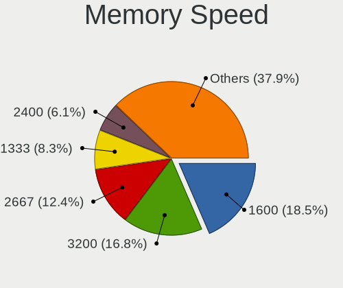

| Speed   | Computers | Percent |
|---------|-----------|---------|
| 1600    | 101       | 19.42%  |
| 3200    | 79        | 15.19%  |
| 2667    | 65        | 12.5%   |
| 1333    | 44        | 8.46%   |
| 2400    | 35        | 6.73%   |
| 800     | 17        | 3.27%   |
| 667     | 17        | 3.27%   |
| 2133    | 16        | 3.08%   |
| 1334    | 16        | 3.08%   |
| 1067    | 13        | 2.5%    |
| 3600    | 12        | 2.31%   |
| 3733    | 9         | 1.73%   |
| Unknown | 9         | 1.73%   |
| 4800    | 7         | 1.35%   |
| 3400    | 7         | 1.35%   |
| 3266    | 6         | 1.15%   |
| 2666    | 6         | 1.15%   |
| 6400    | 5         | 0.96%   |
| 4199    | 5         | 0.96%   |
| 1867    | 5         | 0.96%   |
| 5600    | 4         | 0.77%   |
| 2048    | 4         | 0.77%   |
| 1866    | 4         | 0.77%   |
| 4267    | 3         | 0.58%   |
| 3466    | 3         | 0.58%   |
| 400     | 3         | 0.58%   |
| 3000    | 2         | 0.38%   |
| 2933    | 2         | 0.38%   |
| 2800    | 2         | 0.38%   |
| 1648    | 2         | 0.38%   |
| 975     | 2         | 0.38%   |
| 533     | 2         | 0.38%   |
| 7467    | 1         | 0.19%   |
| 6000    | 1         | 0.19%   |
| 5200    | 1         | 0.19%   |
| 4333    | 1         | 0.19%   |
| 4266    | 1         | 0.19%   |
| 3666    | 1         | 0.19%   |
| 3334    | 1         | 0.19%   |
| 3333    | 1         | 0.19%   |

Printers & scanners
-------------------

Printer Vendor
--------------

Printer device vendors

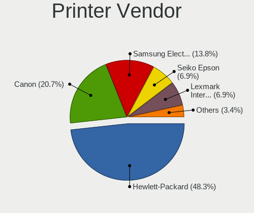

| Vendor                | Computers | Percent |
|-----------------------|-----------|---------|
| Hewlett-Packard       | 14        | 51.85%  |
| Canon                 | 5         | 18.52%  |
| Samsung Electronics   | 3         | 11.11%  |
| Seiko Epson           | 2         | 7.41%   |
| Lexmark International | 2         | 7.41%   |
| Xerox                 | 1         | 3.7%    |

Printer Model
-------------

Printer device models

| Model                                      | Computers | Percent |
|--------------------------------------------|-----------|---------|
| HP LaserJet 1018                           | 3         | 11.11%  |
| Seiko Epson L365 Series                    | 2         | 7.41%   |
| HP LaserJet 1010                           | 2         | 7.41%   |
| Xerox Phaser 3140 and 3155                 | 1         | 3.7%    |
| Samsung SCX-4623 Series                    | 1         | 3.7%    |
| Samsung SCX-3400 Series                    | 1         | 3.7%    |
| Samsung M2070 Series                       | 1         | 3.7%    |
| Lexmark International Lexmark MS312dn      | 1         | 3.7%    |
| Lexmark International InkJet Color Printer | 1         | 3.7%    |
| HP LaserJet P2015 series                   | 1         | 3.7%    |
| HP LaserJet P2014                          | 1         | 3.7%    |
| HP LaserJet P1005                          | 1         | 3.7%    |
| HP LaserJet M101-M106                      | 1         | 3.7%    |
| HP LaserJet CP 1025nw                      | 1         | 3.7%    |
| HP LaserJet 1200                           | 1         | 3.7%    |
| HP LaserJet 1020                           | 1         | 3.7%    |
| HP HP LaserJet M14-M17                     | 1         | 3.7%    |
| HP DeskJet 845c                            | 1         | 3.7%    |
| Canon LiDE 300                             | 1         | 3.7%    |
| Canon LBP810                               | 1         | 3.7%    |
| Canon LBP6030w/6018w                       | 1         | 3.7%    |
| Canon LBP2900                              | 1         | 3.7%    |
| Canon iP7200 series                        | 1         | 3.7%    |

Scanner Vendor
--------------

Scanner device vendors

| Vendor             | Computers | Percent |
|--------------------|-----------|---------|
| Canon              | 9         | 64.29%  |
| Ultima Electronics | 2         | 14.29%  |
| Seiko Epson        | 1         | 7.14%   |
| Mustek Systems     | 1         | 7.14%   |
| Hewlett-Packard    | 1         | 7.14%   |

Scanner Model
-------------

Scanner device models

| Model                                                                                 | Computers | Percent |
|---------------------------------------------------------------------------------------|-----------|---------|
| Ultima Artec Ultima 2000 (GT6801 based)/Lifetec LT9385/ScanMagic 1200 UB Plus Scanner | 2         | 14.29%  |
| Canon CanoScan LiDE 210                                                               | 2         | 14.29%  |
| Canon CanoScan LiDE 110                                                               | 2         | 14.29%  |
| Canon CanoScan LiDE 100                                                               | 2         | 14.29%  |
| Seiko Epson GT-7300U [Perfection 1260/1260 PHOTO]                                     | 1         | 7.14%   |
| Mustek Systems BearPaw 1200 CU Plus                                                   | 1         | 7.14%   |
| HP ScanJet 2200c                                                                      | 1         | 7.14%   |
| Canon CanoScan N1240U/LiDE 30                                                         | 1         | 7.14%   |
| Canon CanoScan LIDE 25                                                                | 1         | 7.14%   |
| Canon CanoScan LiDE 120                                                               | 1         | 7.14%   |

Camera
------

Camera Vendor
-------------

Camera device vendors

| Vendor                                 | Computers | Percent |
|----------------------------------------|-----------|---------|
| Chicony Electronics                    | 112       | 22.4%   |
| IMC Networks                           | 56        | 11.2%   |
| Microdia                               | 40        | 8%      |
| Realtek Semiconductor                  | 36        | 7.2%    |
| Logitech                               | 30        | 6%      |
| Quanta                                 | 26        | 5.2%    |
| Cheng Uei Precision Industry (Foxlink) | 22        | 4.4%    |
| Bison Electronics                      | 21        | 4.2%    |
| Syntek                                 | 19        | 3.8%    |
| Sunplus Innovation Technology          | 19        | 3.8%    |
| Suyin                                  | 17        | 3.4%    |
| Acer                                   | 15        | 3%      |
| Apple                                  | 11        | 2.2%    |
| Luxvisions Innotech Limited            | 9         | 1.8%    |
| Lite-On Technology                     | 9         | 1.8%    |
| KYE Systems (Mouse Systems)            | 8         | 1.6%    |
| Silicon Motion                         | 4         | 0.8%    |
| ShineTech                              | 4         | 0.8%    |
| Lenovo                                 | 4         | 0.8%    |
| Importek                               | 4         | 0.8%    |
| Sonix Technology                       | 3         | 0.6%    |
| ALi                                    | 3         | 0.6%    |
| Alcor Micro                            | 3         | 0.6%    |
| Z-Star Microelectronics                | 2         | 0.4%    |
| Ricoh                                  | 2         | 0.4%    |
| OmniVision Technologies                | 2         | 0.4%    |
| Hewlett-Packard                        | 2         | 0.4%    |
| Aveo Technology                        | 2         | 0.4%    |
| Xiaomi                                 | 1         | 0.2%    |
| SunplusIT                              | 1         | 0.2%    |
| Sony                                   | 1         | 0.2%    |
| Samsung Electronics                    | 1         | 0.2%    |
| Primax Electronics                     | 1         | 0.2%    |
| Nokia Mobile Phones                    | 1         | 0.2%    |
| Microsoft                              | 1         | 0.2%    |
| Genesys Logic                          | 1         | 0.2%    |
| Generalplus Technology                 | 1         | 0.2%    |
| GEMBIRD                                | 1         | 0.2%    |
| DigiTech                               | 1         | 0.2%    |
| Cubeternet                             | 1         | 0.2%    |

Camera Model
------------

Camera device models

| Model                                                          | Computers | Percent |
|----------------------------------------------------------------|-----------|---------|
| Chicony Integrated Camera                                      | 26        | 5.19%   |
| IMC Networks USB2.0 VGA UVC WebCam                             | 19        | 3.79%   |
| IMC Networks USB2.0 HD UVC WebCam                              | 15        | 2.99%   |
| Syntek Integrated Camera                                       | 13        | 2.59%   |
| Realtek Integrated_Webcam_HD                                   | 13        | 2.59%   |
| Microdia Integrated_Webcam_HD                                  | 12        | 2.4%    |
| Bison Integrated Camera                                        | 12        | 2.4%    |
| Quanta VGA WebCam                                              | 9         | 1.8%    |
| Logitech Webcam C270                                           | 9         | 1.8%    |
| IMC Networks Integrated Camera                                 | 9         | 1.8%    |
| Sunplus Integrated_Webcam_HD                                   | 8         | 1.6%    |
| Realtek USB Camera                                             | 6         | 1.2%    |
| Microdia Camera                                                | 6         | 1.2%    |
| Chicony VGA Webcam                                             | 6         | 1.2%    |
| Chicony HP Webcam                                              | 6         | 1.2%    |
| Suyin Acer/HP Integrated Webcam [CN0314]                       | 5         | 1%      |
| Realtek Lenovo EasyCamera                                      | 5         | 1%      |
| Microdia Integrated Webcam                                     | 5         | 1%      |
| Logitech Webcam C170                                           | 5         | 1%      |
| Chicony TOSHIBA Web Camera - HD                                | 5         | 1%      |
| Chicony Integrated Camera (1280x720@30)                        | 5         | 1%      |
| Chicony HD WebCam                                              | 5         | 1%      |
| Chicony EasyCamera                                             | 5         | 1%      |
| Cheng Uei Precision Industry (Foxlink) HP HD Camera            | 5         | 1%      |
| Apple Built-in iSight                                          | 5         | 1%      |
| Acer Integrated Camera                                         | 5         | 1%      |
| Syntek EasyCamera                                              | 4         | 0.8%    |
| ShineTech USB2.0 HD UVC WebCam                                 | 4         | 0.8%    |
| Quanta HP TrueVision HD Camera                                 | 4         | 0.8%    |
| Quanta HD User Facing                                          | 4         | 0.8%    |
| IMC Networks EasyCamera                                        | 4         | 0.8%    |
| Chicony HP HD Camera                                           | 4         | 0.8%    |
| Chicony HD User Facing                                         | 4         | 0.8%    |
| Cheng Uei Precision Industry (Foxlink) HP Webcam               | 4         | 0.8%    |
| Cheng Uei Precision Industry (Foxlink) HP TrueVision HD Camera | 4         | 0.8%    |
| Acer Lenovo EasyCamera                                         | 4         | 0.8%    |
| Sunplus Asus Webcam                                            | 3         | 0.6%    |
| Realtek Integrated Webcam HD                                   | 3         | 0.6%    |
| Microdia Dell Laptop Integrated Webcam HD                      | 3         | 0.6%    |
| Luxvisions Innotech Limited HP TrueVision HD Camera            | 3         | 0.6%    |

Security
--------

Fingerprint Vendor
------------------

Fingerprint sensor vendors

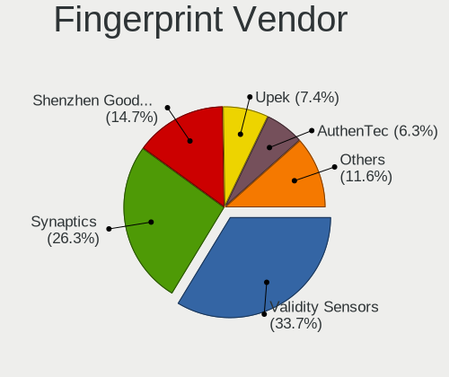

| Vendor                             | Computers | Percent |
|------------------------------------|-----------|---------|
| Validity Sensors                   | 30        | 36.14%  |
| Synaptics                          | 19        | 22.89%  |
| Shenzhen Goodix Technology         | 13        | 15.66%  |
| Upek                               | 6         | 7.23%   |
| AuthenTec                          | 6         | 7.23%   |
| Elan Microelectronics              | 4         | 4.82%   |
| LighTuning Technology              | 2         | 2.41%   |
| STMicroelectronics                 | 1         | 1.2%    |
| Realtek USB2.0 Finger Print Bridge | 1         | 1.2%    |
| Microsoft                          | 1         | 1.2%    |

Fingerprint Model
-----------------

Fingerprint sensor models

| Model                                                                      | Computers | Percent |
|----------------------------------------------------------------------------|-----------|---------|
| Shenzhen Goodix  Fingerprint Device                                        | 10        | 12.05%  |
| Validity Sensors VFS495 Fingerprint Reader                                 | 8         | 9.64%   |
| Synaptics Prometheus MIS Touch Fingerprint Reader                          | 7         | 8.43%   |
| Validity Sensors VFS5011 Fingerprint Reader                                | 5         | 6.02%   |
| Upek Biometric Touchchip/Touchstrip Fingerprint Sensor                     | 5         | 6.02%   |
| Synaptics  WBDI                                                            | 5         | 6.02%   |
| Validity Sensors VFS471 Fingerprint Reader                                 | 4         | 4.82%   |
| Validity Sensors VFS7500 Touch Fingerprint Sensor                          | 3         | 3.61%   |
| Validity Sensors VFS 5011 fingerprint sensor                               | 3         | 3.61%   |
| Validity Sensors Synaptics VFS7552 Touch Fingerprint Sensor with PurePrint | 3         | 3.61%   |
| Shenzhen Goodix Fingerprint Reader                                         | 3         | 3.61%   |
| Elan ELAN:Fingerprint                                                      | 3         | 3.61%   |
| AuthenTec AES2501 Fingerprint Sensor                                       | 3         | 3.61%   |
| Synaptics WBDI                                                             | 2         | 2.41%   |
| Synaptics Fingerprint reader [HP G6]                                       | 2         | 2.41%   |
| AuthenTec AES2810                                                          | 2         | 2.41%   |
| Validity Sensors VFS101 Fingerprint Reader                                 | 1         | 1.2%    |
| Validity Sensors VFS Fingerprint sensor                                    | 1         | 1.2%    |
| Validity Sensors Synaptics WBDI                                            | 1         | 1.2%    |
| Validity Sensors Fingerprint scanner                                       | 1         | 1.2%    |
| Upek TCS5B Fingerprint sensor                                              | 1         | 1.2%    |
| Synaptics UWP WBDI                                                         | 1         | 1.2%    |
| Synaptics Metallica MIS Touch Fingerprint Reader                           | 1         | 1.2%    |
| Synaptics FS7604 Touch Fingerprint Sensor with PurePrint                   | 1         | 1.2%    |
| STMicroelectronics Fingerprint Reader                                      | 1         | 1.2%    |
| Realtek USB2.0 Finger Print Bridge FocalTech Fingerprint Device            | 1         | 1.2%    |
| Microsoft Fingerprint Reader                                               | 1         | 1.2%    |
| LighTuning ES603 Swipe Fingerprint Sensor                                  | 1         | 1.2%    |
| LighTuning EgisTec Touch Fingerprint Sensor                                | 1         | 1.2%    |
| Elan ELAN:ARM-M4                                                           | 1         | 1.2%    |
| AuthenTec AES1660 Fingerprint Sensor                                       | 1         | 1.2%    |

Chipcard Vendor
---------------

Chipcard module vendors

| Vendor                    | Computers | Percent |
|---------------------------|-----------|---------|
| Broadcom                  | 17        | 31.48%  |
| Alcor Micro               | 14        | 25.93%  |
| Gemalto (was Gemplus)     | 11        | 20.37%  |
| OmniKey                   | 3         | 5.56%   |
| Upek                      | 2         | 3.7%    |
| O2 Micro                  | 2         | 3.7%    |
| Lenovo                    | 2         | 3.7%    |
| Yubico.com                | 1         | 1.85%   |
| Precise Biometrics        | 1         | 1.85%   |
| Fujitsu Siemens Computers | 1         | 1.85%   |

Chipcard Model
--------------

Chipcard module models

| Model                                                                        | Computers | Percent |
|------------------------------------------------------------------------------|-----------|---------|
| Alcor Micro AU9540 Smartcard Reader                                          | 14        | 25.93%  |
| Gemalto (was Gemplus) GemPC Twin SmartCard Reader                            | 11        | 20.37%  |
| Broadcom 5880                                                                | 5         | 9.26%   |
| Broadcom BCM5880 Secure Applications Processor with fingerprint swipe sensor | 4         | 7.41%   |
| Broadcom BCM5880 Secure Applications Processor                               | 4         | 7.41%   |
| Broadcom 58200                                                               | 4         | 7.41%   |
| Upek TouchChip Fingerprint Coprocessor (WBF advanced mode)                   | 2         | 3.7%    |
| O2 Micro OZ776 CCID Smartcard Reader                                         | 2         | 3.7%    |
| Lenovo Integrated Smart Card Reader                                          | 2         | 3.7%    |
| Yubico.com Yubikey 4/5 U2F+CCID                                              | 1         | 1.85%   |
| Precise Biometrics 200 MC FingerPrint and SmartCard Reader                   | 1         | 1.85%   |
| OmniKey CardMan 4321                                                         | 1         | 1.85%   |
| OmniKey CardMan 3021 / 3121                                                  | 1         | 1.85%   |
| OmniKey 3x21 Smart Card Reader                                               | 1         | 1.85%   |
| Fujitsu Siemens Computers SmartCard Reader 2A                                | 1         | 1.85%   |

Unsupported
-----------

Unsupported Devices
-------------------

Total unsupported devices on board

| Total | Computers | Percent |
|-------|-----------|---------|
| 0     | 637       | 72.22%  |
| 1     | 201       | 22.79%  |
| 2     | 35        | 3.97%   |
| 3     | 5         | 0.57%   |
| 4     | 3         | 0.34%   |
| 8     | 1         | 0.11%   |

Unsupported Device Types
------------------------

Types of unsupported devices

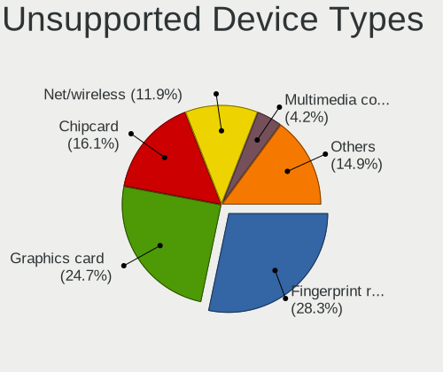

| Type                     | Computers | Percent |
|--------------------------|-----------|---------|
| Fingerprint reader       | 83        | 28.33%  |
| Graphics card            | 69        | 23.55%  |
| Chipcard                 | 48        | 16.38%  |
| Net/wireless             | 36        | 12.29%  |
| Multimedia controller    | 14        | 4.78%   |
| Bluetooth                | 9         | 3.07%   |
| Communication controller | 8         | 2.73%   |
| Sound                    | 6         | 2.05%   |
| Camera                   | 6         | 2.05%   |
| Card reader              | 4         | 1.37%   |
| Net/ethernet             | 3         | 1.02%   |
| Unassigned class         | 2         | 0.68%   |
| Modem                    | 2         | 0.68%   |
| Storage/ide              | 1         | 0.34%   |
| Storage                  | 1         | 0.34%   |
| Dvb card                 | 1         | 0.34%   |

