Linux in Serbia - Tested Hardware & Statistics (Desktops)
---------------------------------------------------------

A project to collect tested hardware configurations for Linux in Serbia.

Anyone can contribute to this report by the [hw-probe](https://github.com/linuxhw/hw-probe) tool:

    sudo -E hw-probe -all -upload

Please contribute! Especially if your hardware is rare.

Contents
--------

* [ Test Cases ](#test-cases)

* [ System ](#system)
  - [ OS                       ](#os)
  - [ OS Family                ](#os-family)
  - [ Kernel                   ](#kernel)
  - [ Kernel Family            ](#kernel-family)
  - [ Kernel Major Ver.        ](#kernel-major-ver)
  - [ Arch                     ](#arch)
  - [ DE                       ](#de)
  - [ Display Server           ](#display-server)
  - [ Display Manager          ](#display-manager)
  - [ OS Lang                  ](#os-lang)
  - [ Boot Mode                ](#boot-mode)
  - [ Filesystem               ](#filesystem)
  - [ Part. scheme             ](#part-scheme)
  - [ Dual Boot with Linux/BSD ](#dual-boot-with-linuxbsd)
  - [ Dual Boot (Win)          ](#dual-boot-win)

* [ Board ](#board)
  - [ Vendor                   ](#vendor)
  - [ Model                    ](#model)
  - [ Model Family             ](#model-family)
  - [ MFG Year                 ](#mfg-year)
  - [ Form Factor              ](#form-factor)
  - [ Secure Boot              ](#secure-boot)
  - [ Coreboot                 ](#coreboot)
  - [ RAM Size                 ](#ram-size)
  - [ RAM Used                 ](#ram-used)
  - [ Total Drives             ](#total-drives)
  - [ Has CD-ROM               ](#has-cd-rom)
  - [ Has Ethernet             ](#has-ethernet)
  - [ Has WiFi                 ](#has-wifi)
  - [ Has Bluetooth            ](#has-bluetooth)

* [ Location ](#location)
  - [ Country                  ](#country)
  - [ City                     ](#city)

* [ Drives ](#drives)
  - [ Drive Vendor             ](#drive-vendor)
  - [ Drive Model              ](#drive-model)
  - [ HDD Vendor               ](#hdd-vendor)
  - [ SSD Vendor               ](#ssd-vendor)
  - [ Drive Kind               ](#drive-kind)
  - [ Drive Connector          ](#drive-connector)
  - [ Drive Size               ](#drive-size)
  - [ Space Total              ](#space-total)
  - [ Space Used               ](#space-used)
  - [ Malfunc. Drives          ](#malfunc-drives)
  - [ Malfunc. Drive Vendor    ](#malfunc-drive-vendor)
  - [ Malfunc. HDD Vendor      ](#malfunc-hdd-vendor)
  - [ Malfunc. Drive Kind      ](#malfunc-drive-kind)
  - [ Failed Drives            ](#failed-drives)
  - [ Failed Drive Vendor      ](#failed-drive-vendor)
  - [ Drive Status             ](#drive-status)

* [ Storage controller ](#storage-controller)
  - [ Storage Vendor           ](#storage-vendor)
  - [ Storage Model            ](#storage-model)
  - [ Storage Kind             ](#storage-kind)

* [ Processor ](#processor)
  - [ CPU Vendor               ](#cpu-vendor)
  - [ CPU Model                ](#cpu-model)
  - [ CPU Model Family         ](#cpu-model-family)
  - [ CPU Cores                ](#cpu-cores)
  - [ CPU Sockets              ](#cpu-sockets)
  - [ CPU Threads              ](#cpu-threads)
  - [ CPU Op-Modes             ](#cpu-op-modes)
  - [ CPU Microcode            ](#cpu-microcode)
  - [ CPU Microarch            ](#cpu-microarch)

* [ Graphics ](#graphics)
  - [ GPU Vendor               ](#gpu-vendor)
  - [ GPU Model                ](#gpu-model)
  - [ GPU Combo                ](#gpu-combo)
  - [ GPU Driver               ](#gpu-driver)
  - [ GPU Memory               ](#gpu-memory)

* [ Monitor ](#monitor)
  - [ Monitor Vendor           ](#monitor-vendor)
  - [ Monitor Model            ](#monitor-model)
  - [ Monitor Resolution       ](#monitor-resolution)
  - [ Monitor Diagonal         ](#monitor-diagonal)
  - [ Monitor Width            ](#monitor-width)
  - [ Aspect Ratio             ](#aspect-ratio)
  - [ Monitor Area             ](#monitor-area)
  - [ Pixel Density            ](#pixel-density)
  - [ Multiple Monitors        ](#multiple-monitors)

* [ Network ](#network)
  - [ Net Controller Vendor    ](#net-controller-vendor)
  - [ Net Controller Model     ](#net-controller-model)
  - [ Wireless Vendor          ](#wireless-vendor)
  - [ Wireless Model           ](#wireless-model)
  - [ Ethernet Vendor          ](#ethernet-vendor)
  - [ Ethernet Model           ](#ethernet-model)
  - [ Net Controller Kind      ](#net-controller-kind)
  - [ Used Controller          ](#used-controller)
  - [ NICs                     ](#nics)
  - [ IPv6                     ](#ipv6)

* [ Bluetooth ](#bluetooth)
  - [ Bluetooth Vendor         ](#bluetooth-vendor)
  - [ Bluetooth Model          ](#bluetooth-model)

* [ Sound ](#sound)
  - [ Sound Vendor             ](#sound-vendor)
  - [ Sound Model              ](#sound-model)

* [ Memory ](#memory)
  - [ Memory Vendor            ](#memory-vendor)
  - [ Memory Model             ](#memory-model)
  - [ Memory Kind              ](#memory-kind)
  - [ Memory Form Factor       ](#memory-form-factor)
  - [ Memory Size              ](#memory-size)
  - [ Memory Speed             ](#memory-speed)

* [ Printers & scanners ](#printers--scanners)
  - [ Printer Vendor           ](#printer-vendor)
  - [ Printer Model            ](#printer-model)
  - [ Scanner Vendor           ](#scanner-vendor)
  - [ Scanner Model            ](#scanner-model)

* [ Camera ](#camera)
  - [ Camera Vendor            ](#camera-vendor)
  - [ Camera Model             ](#camera-model)

* [ Security ](#security)
  - [ Fingerprint Vendor       ](#fingerprint-vendor)
  - [ Fingerprint Model        ](#fingerprint-model)
  - [ Chipcard Vendor          ](#chipcard-vendor)
  - [ Chipcard Model           ](#chipcard-model)

* [ Unsupported ](#unsupported)
  - [ Unsupported Devices      ](#unsupported-devices)
  - [ Unsupported Device Types ](#unsupported-device-types)

Test Cases
----------

Total: 362

| Vendor     | Model                    | Probe                                                      | Date         |
|------------|--------------------------|------------------------------------------------------------|--------------|
| MSI        | H61M-P20                 | [c86cefdaa6](https://linux-hardware.org/?probe=c86cefdaa6) | Jun 26, 2022 |
| ASUSTek    | H110M-R                  | [74d3cc8728](https://linux-hardware.org/?probe=74d3cc8728) | Jun 14, 2022 |
| ASRock     | G41C-GS                  | [c498f6f3bd](https://linux-hardware.org/?probe=c498f6f3bd) | Jun 13, 2022 |
| Gigabyte   | GA-H310TN-R2             | [2fecd41e0b](https://linux-hardware.org/?probe=2fecd41e0b) | Jun 03, 2022 |
| Gigabyte   | X570 GAMING X            | [2dba625d78](https://linux-hardware.org/?probe=2dba625d78) | May 28, 2022 |
| ASUSTek    | B85-PLUS                 | [ea1d17f234](https://linux-hardware.org/?probe=ea1d17f234) | May 27, 2022 |
| ASUSTek    | B85-PLUS                 | [e1efc36540](https://linux-hardware.org/?probe=e1efc36540) | May 27, 2022 |
| ASRock     | X570 Pro4                | [da35dd6295](https://linux-hardware.org/?probe=da35dd6295) | May 22, 2022 |
| Gigabyte   | Z97P-D3                  | [1b7bdd0f65](https://linux-hardware.org/?probe=1b7bdd0f65) | May 21, 2022 |
| Gigabyte   | A520 AORUS ELITE         | [2fdd079ebc](https://linux-hardware.org/?probe=2fdd079ebc) | May 21, 2022 |
| Gigabyte   | B450 I AORUS PRO WIFI-CF | [2f12c77058](https://linux-hardware.org/?probe=2f12c77058) | May 16, 2022 |
| Gigabyte   | H110M-DS2-CF             | [7166bb5a53](https://linux-hardware.org/?probe=7166bb5a53) | May 14, 2022 |
| ASUSTek    | TUF B450M-PLUS GAMING    | [fb2a9c9ddf](https://linux-hardware.org/?probe=fb2a9c9ddf) | May 13, 2022 |
| Fujitsu    | D3041-A1 S26361-D3041-A1 | [bc84347b65](https://linux-hardware.org/?probe=bc84347b65) | May 11, 2022 |
| ASUSTek    | M4A89GTD-PRO/USB3        | [38e20673c2](https://linux-hardware.org/?probe=38e20673c2) | May 09, 2022 |
| HP         | 3396                     | [468c2975ee](https://linux-hardware.org/?probe=468c2975ee) | Apr 30, 2022 |
| ASUSTek    | PRIME A320M-K            | [f4f8108d1e](https://linux-hardware.org/?probe=f4f8108d1e) | Apr 25, 2022 |
| ASUSTek    | P7H55                    | [d619f35fb8](https://linux-hardware.org/?probe=d619f35fb8) | Apr 16, 2022 |
| HP         | 845A                     | [cc8c320581](https://linux-hardware.org/?probe=cc8c320581) | Apr 16, 2022 |
| ASUSTek    | B150-PRO                 | [1ebe5f0e99](https://linux-hardware.org/?probe=1ebe5f0e99) | Apr 15, 2022 |
| Gigabyte   | 945PL-S3                 | [ef7f30cc40](https://linux-hardware.org/?probe=ef7f30cc40) | Apr 07, 2022 |
| Lenovo     | SHARKBAY 0B98401 PRO     | [55568ec828](https://linux-hardware.org/?probe=55568ec828) | Apr 06, 2022 |
| Apple      | Mac-F42C88C8 Proto1      | [55eda86e20](https://linux-hardware.org/?probe=55eda86e20) | Apr 05, 2022 |
| ASRock     | B560M Steel Legend       | [8caaa96b19](https://linux-hardware.org/?probe=8caaa96b19) | Mar 28, 2022 |
| HP         | 3398                     | [b84864ecc4](https://linux-hardware.org/?probe=b84864ecc4) | Mar 25, 2022 |
| HP         | 3032h                    | [e57d52908c](https://linux-hardware.org/?probe=e57d52908c) | Mar 21, 2022 |
| HP         | 3398                     | [5f018df1dd](https://linux-hardware.org/?probe=5f018df1dd) | Mar 17, 2022 |
| ASUSTek    | M5A99X EVO               | [117ebec9fc](https://linux-hardware.org/?probe=117ebec9fc) | Mar 15, 2022 |
| MSI        | AM1I                     | [f19c9ef173](https://linux-hardware.org/?probe=f19c9ef173) | Mar 14, 2022 |
| MSI        | A68HM-E33 V2             | [9f17c99bb5](https://linux-hardware.org/?probe=9f17c99bb5) | Mar 06, 2022 |
| MSI        | B450M PRO-M2             | [723ab179b6](https://linux-hardware.org/?probe=723ab179b6) | Mar 06, 2022 |
| Gigabyte   | H81M-S2PH                | [4a1c505260](https://linux-hardware.org/?probe=4a1c505260) | Mar 05, 2022 |
| ASUSTek    | PRIME A320M-K            | [65b41a7a67](https://linux-hardware.org/?probe=65b41a7a67) | Feb 26, 2022 |
| Gigabyte   | Z390 UD                  | [7ea66813f3](https://linux-hardware.org/?probe=7ea66813f3) | Feb 23, 2022 |
| Fujitsu    | D3041-A1 S26361-D3041-A1 | [1f607a3c8c](https://linux-hardware.org/?probe=1f607a3c8c) | Feb 21, 2022 |
| Gigabyte   | MJPLNCB-00               | [d9a5169bbc](https://linux-hardware.org/?probe=d9a5169bbc) | Feb 16, 2022 |
| MSI        | A55M-P33                 | [31c0a9c67c](https://linux-hardware.org/?probe=31c0a9c67c) | Feb 15, 2022 |
| MSI        | GF615M-P33 V2            | [b5bfcbf8dc](https://linux-hardware.org/?probe=b5bfcbf8dc) | Feb 13, 2022 |
| Gigabyte   | B450 AORUS PRO-CF        | [1eb72bde90](https://linux-hardware.org/?probe=1eb72bde90) | Feb 12, 2022 |
| MSI        | MAG X570 TOMAHAWK WIFI   | [d6c5c1a6d2](https://linux-hardware.org/?probe=d6c5c1a6d2) | Feb 10, 2022 |
| ASUSTek    | P5KPL-AM/PS              | [a530f2976f](https://linux-hardware.org/?probe=a530f2976f) | Feb 10, 2022 |
| ASUSTek    | P5KPL-AM/PS              | [5480f2aa6c](https://linux-hardware.org/?probe=5480f2aa6c) | Feb 10, 2022 |
| ASUSTek    | M4A785TD-V EVO           | [b28eb819f0](https://linux-hardware.org/?probe=b28eb819f0) | Feb 09, 2022 |
| ASUSTek    | ROG ZENITH EXTREME       | [1c829ba8dd](https://linux-hardware.org/?probe=1c829ba8dd) | Feb 07, 2022 |
| MSI        | MAG X570 TOMAHAWK WIFI   | [80b24c2689](https://linux-hardware.org/?probe=80b24c2689) | Feb 03, 2022 |
| ASUSTek    | PRIME B450M-K            | [d644756f37](https://linux-hardware.org/?probe=d644756f37) | Feb 03, 2022 |
| MSI        | B450 TOMAHAWK            | [b5ae920f3b](https://linux-hardware.org/?probe=b5ae920f3b) | Feb 02, 2022 |
| ASRock     | P75 Pro3                 | [76bb99305c](https://linux-hardware.org/?probe=76bb99305c) | Jan 24, 2022 |
| Gigabyte   | 970A-DS3P                | [b50f284364](https://linux-hardware.org/?probe=b50f284364) | Jan 23, 2022 |
| ASUSTek    | PRIME B450M-K            | [fa62cb2996](https://linux-hardware.org/?probe=fa62cb2996) | Jan 11, 2022 |
| Biostar    | TB250-BTC+               | [ef57a01461](https://linux-hardware.org/?probe=ef57a01461) | Jan 06, 2022 |
| ASUSTek    | H110M-R                  | [8b6fab3f89](https://linux-hardware.org/?probe=8b6fab3f89) | Jan 05, 2022 |
| ASRock     | X570 Pro4                | [0396ef9c72](https://linux-hardware.org/?probe=0396ef9c72) | Dec 30, 2021 |
| ASUSTek    | TUF B450M-PLUS GAMING    | [6324598512](https://linux-hardware.org/?probe=6324598512) | Dec 30, 2021 |
| ASUSTek    | TUF B450M-PLUS GAMING    | [38dda4af6b](https://linux-hardware.org/?probe=38dda4af6b) | Dec 30, 2021 |
| Gigabyte   | B550M DS3H               | [9fb08ebeb4](https://linux-hardware.org/?probe=9fb08ebeb4) | Dec 26, 2021 |
| Gigabyte   | MJPLNCB-00               | [fe81720eae](https://linux-hardware.org/?probe=fe81720eae) | Dec 23, 2021 |
| ASUSTek    | A68HM-K                  | [a6fc4a2adb](https://linux-hardware.org/?probe=a6fc4a2adb) | Dec 22, 2021 |
| MSI        | A55M-P33                 | [de87849301](https://linux-hardware.org/?probe=de87849301) | Dec 18, 2021 |
| MSI        | FM2-A55M-E33             | [85e65dae6a](https://linux-hardware.org/?probe=85e65dae6a) | Dec 15, 2021 |
| MSI        | FM2-A55M-E33             | [3ff4885854](https://linux-hardware.org/?probe=3ff4885854) | Dec 15, 2021 |
| Gigabyte   | X570 AORUS ELITE         | [eb5d5f4361](https://linux-hardware.org/?probe=eb5d5f4361) | Dec 12, 2021 |
| Gigabyte   | X570 AORUS ELITE         | [048c623b7a](https://linux-hardware.org/?probe=048c623b7a) | Dec 12, 2021 |
| Biostar    | NF520-A2 TE              | [5878187120](https://linux-hardware.org/?probe=5878187120) | Dec 07, 2021 |
| MSI        | H61M-P20                 | [614ffcb196](https://linux-hardware.org/?probe=614ffcb196) | Dec 07, 2021 |
| ASUSTek    | PRIME A320M-K            | [19fbf0d287](https://linux-hardware.org/?probe=19fbf0d287) | Dec 04, 2021 |
| ASUSTek    | PRIME A320M-K            | [478ab590ac](https://linux-hardware.org/?probe=478ab590ac) | Dec 01, 2021 |
| ASUSTek    | P8B75-M LE               | [7a8c29f7ba](https://linux-hardware.org/?probe=7a8c29f7ba) | Nov 23, 2021 |
| ASUSTek    | P8Z68-V LX               | [0415c0798f](https://linux-hardware.org/?probe=0415c0798f) | Nov 18, 2021 |
| MSI        | G41M-P23                 | [82e51e3f78](https://linux-hardware.org/?probe=82e51e3f78) | Nov 04, 2021 |
| MSI        | G41M-P23                 | [ce4c8636f0](https://linux-hardware.org/?probe=ce4c8636f0) | Nov 04, 2021 |
| Gigabyte   | AB350M-Gaming 3-CF       | [b6338a1294](https://linux-hardware.org/?probe=b6338a1294) | Oct 25, 2021 |
| Gigabyte   | B450M S2H                | [71c19b42fc](https://linux-hardware.org/?probe=71c19b42fc) | Oct 21, 2021 |
| Lenovo     | ThinkCentre M57 6075Y3W  | [a5e2419919](https://linux-hardware.org/?probe=a5e2419919) | Oct 19, 2021 |
| Gigabyte   | B450M DS3H-CF            | [f1fc83e719](https://linux-hardware.org/?probe=f1fc83e719) | Oct 17, 2021 |
| Gigabyte   | B450M DS3H-CF            | [2802b3ba4f](https://linux-hardware.org/?probe=2802b3ba4f) | Oct 17, 2021 |
| Gigabyte   | P35-S3G                  | [0582e2316b](https://linux-hardware.org/?probe=0582e2316b) | Oct 12, 2021 |
| ASUSTek    | M5A97 EVO R2.0           | [c8b4b9444e](https://linux-hardware.org/?probe=c8b4b9444e) | Oct 11, 2021 |
| ASRock     | QC5000-ITX/WiFi          | [74391da331](https://linux-hardware.org/?probe=74391da331) | Oct 09, 2021 |
| Biostar    | A320MH                   | [85950c5033](https://linux-hardware.org/?probe=85950c5033) | Sep 25, 2021 |
| ASUSTek    | H81M-R                   | [dfe4dc9048](https://linux-hardware.org/?probe=dfe4dc9048) | Sep 22, 2021 |
| MSI        | MS-7309                  | [f2ac6eb80a](https://linux-hardware.org/?probe=f2ac6eb80a) | Sep 18, 2021 |
| Lenovo     | ThinkCentre M57 6075Y3W  | [f133dd54a3](https://linux-hardware.org/?probe=f133dd54a3) | Sep 18, 2021 |
| HP         | 212B                     | [9a7f2627a3](https://linux-hardware.org/?probe=9a7f2627a3) | Sep 15, 2021 |
| HP         | 212B                     | [289f117cde](https://linux-hardware.org/?probe=289f117cde) | Sep 14, 2021 |
| ASUSTek    | H81M-R                   | [6a9795f23f](https://linux-hardware.org/?probe=6a9795f23f) | Sep 13, 2021 |
| Gigabyte   | X570 AORUS MASTER        | [67285c1d5d](https://linux-hardware.org/?probe=67285c1d5d) | Sep 11, 2021 |
| ASUSTek    | AM1M-A                   | [ab6a989deb](https://linux-hardware.org/?probe=ab6a989deb) | Sep 09, 2021 |
| ASRock     | Q1900M                   | [3f08533d5f](https://linux-hardware.org/?probe=3f08533d5f) | Sep 06, 2021 |
| ASRock     | Q1900M                   | [d342919044](https://linux-hardware.org/?probe=d342919044) | Sep 06, 2021 |
| ASUSTek    | AM1M-A                   | [433d420dd4](https://linux-hardware.org/?probe=433d420dd4) | Aug 20, 2021 |
| MSI        | 740GM-P25                | [e1d245e0a3](https://linux-hardware.org/?probe=e1d245e0a3) | Aug 19, 2021 |
| ASUSTek    | AM1M-A                   | [c0653de55c](https://linux-hardware.org/?probe=c0653de55c) | Aug 18, 2021 |
| ASRock     | X570 Pro4                | [3f122964da](https://linux-hardware.org/?probe=3f122964da) | Aug 14, 2021 |
| Gigabyte   | H61M-S2PV                | [3985c521c2](https://linux-hardware.org/?probe=3985c521c2) | Aug 12, 2021 |
| ASUSTek    | M5A97 PLUS               | [bf5a5f589f](https://linux-hardware.org/?probe=bf5a5f589f) | Aug 05, 2021 |
| Gigabyte   | B450M DS3H-CF            | [fda988dc8a](https://linux-hardware.org/?probe=fda988dc8a) | Jul 30, 2021 |
| Gigabyte   | H61M-S2PV                | [766df6d543](https://linux-hardware.org/?probe=766df6d543) | Jul 30, 2021 |
| ASUSTek    | B75M-A                   | [d86a526a9b](https://linux-hardware.org/?probe=d86a526a9b) | Jul 28, 2021 |
| Gigabyte   | P31-DS3L                 | [48b32724e2](https://linux-hardware.org/?probe=48b32724e2) | Jul 27, 2021 |
| ASUSTek    | B75M-A                   | [25113d73cc](https://linux-hardware.org/?probe=25113d73cc) | Jul 21, 2021 |
| ASUSTek    | M2N-MX                   | [b5def43240](https://linux-hardware.org/?probe=b5def43240) | Jun 23, 2021 |
| MSI        | 760GM-P23                | [2a7524175d](https://linux-hardware.org/?probe=2a7524175d) | Jun 20, 2021 |
| MSI        | 970A-G43                 | [447e2a364c](https://linux-hardware.org/?probe=447e2a364c) | Jun 18, 2021 |
| ASUSTek    | PRIME A320M-K            | [f2770a810e](https://linux-hardware.org/?probe=f2770a810e) | Jun 12, 2021 |
| MSI        | 970A-G43                 | [009fc99fc0](https://linux-hardware.org/?probe=009fc99fc0) | Jun 11, 2021 |
| ASUSTek    | P8Z77-V DELUXE           | [09f134f35d](https://linux-hardware.org/?probe=09f134f35d) | Jun 11, 2021 |
| Gigabyte   | 945PL-S3                 | [885dc78ef1](https://linux-hardware.org/?probe=885dc78ef1) | Jun 08, 2021 |
| MSI        | 970A-G43                 | [c0523d2ed9](https://linux-hardware.org/?probe=c0523d2ed9) | Jun 08, 2021 |
| Gigabyte   | H61M-DS2                 | [b527e6a2a9](https://linux-hardware.org/?probe=b527e6a2a9) | Jun 08, 2021 |
| ASUSTek    | PRIME A320M-K            | [69dd9fbe20](https://linux-hardware.org/?probe=69dd9fbe20) | Jun 07, 2021 |
| ASRock     | A320M-HDV R4.0           | [094ade14ae](https://linux-hardware.org/?probe=094ade14ae) | May 27, 2021 |
| ASRock     | B450M Pro4               | [229b36f7f9](https://linux-hardware.org/?probe=229b36f7f9) | May 25, 2021 |
| Dell       | 0C27VV A01               | [5824a76242](https://linux-hardware.org/?probe=5824a76242) | May 23, 2021 |
| Gigabyte   | B450M DS3H-CF            | [631e15df6a](https://linux-hardware.org/?probe=631e15df6a) | May 18, 2021 |
| ASRock     | H110 Pro BTC+            | [ff29bdd7f7](https://linux-hardware.org/?probe=ff29bdd7f7) | May 14, 2021 |
| ASUSTek    | PRIME A320M-K            | [7b5519e189](https://linux-hardware.org/?probe=7b5519e189) | May 10, 2021 |
| ASUSTek    | PRIME A320M-K            | [5ea8612591](https://linux-hardware.org/?probe=5ea8612591) | May 09, 2021 |
| ASUSTek    | PRIME A320M-K            | [e3f1850f8e](https://linux-hardware.org/?probe=e3f1850f8e) | May 07, 2021 |
| Gigabyte   | B450M DS3H-CF            | [211622d161](https://linux-hardware.org/?probe=211622d161) | May 05, 2021 |
| Gigabyte   | A320M-H-CF               | [07a49be491](https://linux-hardware.org/?probe=07a49be491) | May 03, 2021 |
| Gigabyte   | H61M-S2PV                | [325c441d47](https://linux-hardware.org/?probe=325c441d47) | Apr 27, 2021 |
| Gigabyte   | GA-890GPA-UD3H           | [15e01ddb68](https://linux-hardware.org/?probe=15e01ddb68) | Apr 27, 2021 |
| Inventec   | R CLASS A02              | [d678a44af1](https://linux-hardware.org/?probe=d678a44af1) | Apr 18, 2021 |
| Lenovo     | 312A NOK                 | [5db737f928](https://linux-hardware.org/?probe=5db737f928) | Apr 16, 2021 |
| Gigabyte   | EP43-UD3L                | [9988abc6d1](https://linux-hardware.org/?probe=9988abc6d1) | Mar 30, 2021 |
| HP         | 3032h                    | [04ae8fc721](https://linux-hardware.org/?probe=04ae8fc721) | Mar 26, 2021 |
| Acer       | FIH57                    | [ddb03d82a0](https://linux-hardware.org/?probe=ddb03d82a0) | Mar 24, 2021 |
| ASRock     | QC5000-ITX/WiFi          | [7940fddf34](https://linux-hardware.org/?probe=7940fddf34) | Mar 24, 2021 |
| HP         | 1497                     | [8a761041cb](https://linux-hardware.org/?probe=8a761041cb) | Mar 17, 2021 |
| MSI        | B450 TOMAHAWK            | [9d190d0899](https://linux-hardware.org/?probe=9d190d0899) | Mar 17, 2021 |
| ASRock     | Z390 Pro4                | [5fe5bdf357](https://linux-hardware.org/?probe=5fe5bdf357) | Mar 16, 2021 |
| MSI        | 880GM-E41                | [4f6b84a8c0](https://linux-hardware.org/?probe=4f6b84a8c0) | Mar 15, 2021 |
| MSI        | H61M-P20                 | [6c184c27d1](https://linux-hardware.org/?probe=6c184c27d1) | Mar 15, 2021 |
| Gigabyte   | GA-890GPA-UD3H           | [9aea38338d](https://linux-hardware.org/?probe=9aea38338d) | Mar 15, 2021 |
| Gigabyte   | H61M-D2H-USB3            | [7e3e20bba4](https://linux-hardware.org/?probe=7e3e20bba4) | Mar 15, 2021 |
| ASUSTek    | M5A88-V EVO              | [3163da0fc6](https://linux-hardware.org/?probe=3163da0fc6) | Mar 12, 2021 |
| Intel      | 945                      | [87a90ecd5e](https://linux-hardware.org/?probe=87a90ecd5e) | Mar 11, 2021 |
| Intel      | 945                      | [4644c2d3dd](https://linux-hardware.org/?probe=4644c2d3dd) | Mar 10, 2021 |
| Intel      | 945                      | [bdcdd4c2c9](https://linux-hardware.org/?probe=bdcdd4c2c9) | Mar 09, 2021 |
| ASUSTek    | M5A88-V EVO              | [54b1a7993c](https://linux-hardware.org/?probe=54b1a7993c) | Mar 09, 2021 |
| ASUSTek    | M5A88-V EVO              | [20dd877fba](https://linux-hardware.org/?probe=20dd877fba) | Mar 09, 2021 |
| MSI        | MS-7369                  | [6b76ab1b0c](https://linux-hardware.org/?probe=6b76ab1b0c) | Mar 06, 2021 |
| MSI        | MS-7369                  | [c26816dad0](https://linux-hardware.org/?probe=c26816dad0) | Mar 06, 2021 |
| Supermicro | X8SIL                    | [5750984770](https://linux-hardware.org/?probe=5750984770) | Mar 05, 2021 |
| Supermicro | X8SIL                    | [c79eedd353](https://linux-hardware.org/?probe=c79eedd353) | Mar 04, 2021 |
| Lenovo     | 312A NOK                 | [10e16e0f14](https://linux-hardware.org/?probe=10e16e0f14) | Mar 02, 2021 |
| Gigabyte   | G31M-S2C                 | [a10534e0ba](https://linux-hardware.org/?probe=a10534e0ba) | Mar 02, 2021 |
| Supermicro | X8SIL                    | [325e488c16](https://linux-hardware.org/?probe=325e488c16) | Feb 28, 2021 |
| Supermicro | X8SIL                    | [58108e8eb1](https://linux-hardware.org/?probe=58108e8eb1) | Feb 28, 2021 |
| MSI        | 0A90                     | [36e73df6d5](https://linux-hardware.org/?probe=36e73df6d5) | Feb 26, 2021 |
| Intel      | 945                      | [de9b7b0ef0](https://linux-hardware.org/?probe=de9b7b0ef0) | Feb 25, 2021 |
| Intel      | 945                      | [d0b22beef3](https://linux-hardware.org/?probe=d0b22beef3) | Feb 25, 2021 |
| ASRock     | M3N78D                   | [c40a449681](https://linux-hardware.org/?probe=c40a449681) | Feb 23, 2021 |
| Gigabyte   | GA-890GPA-UD3H           | [888ff52208](https://linux-hardware.org/?probe=888ff52208) | Feb 21, 2021 |
| ASUSTek    | M4A89GTD-PRO/USB3        | [d2b9f26b16](https://linux-hardware.org/?probe=d2b9f26b16) | Feb 15, 2021 |
| ASUSTek    | P8B75-M LX               | [dc49777ce8](https://linux-hardware.org/?probe=dc49777ce8) | Feb 14, 2021 |
| ASUSTek    | P5G41T-M LX3             | [d282a8d18c](https://linux-hardware.org/?probe=d282a8d18c) | Feb 14, 2021 |
| MSI        | 0A90                     | [bb71cea5b4](https://linux-hardware.org/?probe=bb71cea5b4) | Feb 09, 2021 |
| ASUSTek    | M4N78-AM                 | [4c528f55f3](https://linux-hardware.org/?probe=4c528f55f3) | Feb 07, 2021 |
| Gigabyte   | P31-ES3G                 | [5aca50689e](https://linux-hardware.org/?probe=5aca50689e) | Jan 29, 2021 |
| ASUSTek    | P5Q-EM                   | [e67f35f505](https://linux-hardware.org/?probe=e67f35f505) | Jan 28, 2021 |
| ASUSTek    | P5Q-EM                   | [d3ee3b13ef](https://linux-hardware.org/?probe=d3ee3b13ef) | Jan 28, 2021 |
| Gigabyte   | B450 AORUS ELITE         | [c7807c2ac4](https://linux-hardware.org/?probe=c7807c2ac4) | Jan 10, 2021 |
| ASRock     | B450M Steel Legend       | [e1424f6de3](https://linux-hardware.org/?probe=e1424f6de3) | Dec 31, 2020 |
| Gigabyte   | B85M-HD3                 | [e3a87784d6](https://linux-hardware.org/?probe=e3a87784d6) | Dec 29, 2020 |
| Biostar    | A320MH                   | [42b6908594](https://linux-hardware.org/?probe=42b6908594) | Dec 29, 2020 |
| Gigabyte   | Z87-HD3                  | [2f46386da3](https://linux-hardware.org/?probe=2f46386da3) | Dec 27, 2020 |
| Biostar    | NF520D3                  | [12a6b07515](https://linux-hardware.org/?probe=12a6b07515) | Dec 27, 2020 |
| Biostar    | NF520D3                  | [c78780427f](https://linux-hardware.org/?probe=c78780427f) | Dec 27, 2020 |
| Biostar    | NF520D3                  | [60a378a184](https://linux-hardware.org/?probe=60a378a184) | Dec 27, 2020 |
| ASUSTek    | M4N78-AM                 | [9973c728ba](https://linux-hardware.org/?probe=9973c728ba) | Dec 26, 2020 |
| MSI        | K9N6PGM2-V2              | [e62cf453c7](https://linux-hardware.org/?probe=e62cf453c7) | Dec 26, 2020 |
| MSI        | MAG B550M BAZOOKA        | [a5084b2336](https://linux-hardware.org/?probe=a5084b2336) | Dec 26, 2020 |
| ASUSTek    | H110M-R                  | [3d6c26aa3c](https://linux-hardware.org/?probe=3d6c26aa3c) | Dec 18, 2020 |
| HP         | 1497                     | [b93a804d52](https://linux-hardware.org/?probe=b93a804d52) | Dec 09, 2020 |
| Gigabyte   | H310M S2H x.x            | [5fe883b8c8](https://linux-hardware.org/?probe=5fe883b8c8) | Dec 06, 2020 |
| Gigabyte   | E3000N                   | [2861121763](https://linux-hardware.org/?probe=2861121763) | Dec 03, 2020 |
| HP         | 1495                     | [260725df5b](https://linux-hardware.org/?probe=260725df5b) | Dec 02, 2020 |
| MSI        | H110M ECO                | [d848b46f0e](https://linux-hardware.org/?probe=d848b46f0e) | Nov 29, 2020 |
| MSI        | H110M ECO                | [3789cd7ccf](https://linux-hardware.org/?probe=3789cd7ccf) | Nov 29, 2020 |
| MSI        | 880GMS-E35               | [821743caaa](https://linux-hardware.org/?probe=821743caaa) | Nov 29, 2020 |
| MSI        | A320M-A PRO              | [ce774acedc](https://linux-hardware.org/?probe=ce774acedc) | Nov 27, 2020 |
| Gigabyte   | G31M-S2C                 | [d09ca3fed0](https://linux-hardware.org/?probe=d09ca3fed0) | Nov 24, 2020 |
| Dell       | 0F6X5P A00               | [458d498ed4](https://linux-hardware.org/?probe=458d498ed4) | Nov 24, 2020 |
| ASUSTek    | H81M-R                   | [10a0831d44](https://linux-hardware.org/?probe=10a0831d44) | Nov 19, 2020 |
| ASUSTek    | PRIME A320M-K            | [546d681a51](https://linux-hardware.org/?probe=546d681a51) | Nov 18, 2020 |
| Dell       | 0KRC95 A02               | [fb7486ffb1](https://linux-hardware.org/?probe=fb7486ffb1) | Nov 16, 2020 |
| Unknown    | MCP61                    | [c4aa33a4dc](https://linux-hardware.org/?probe=c4aa33a4dc) | Nov 16, 2020 |
| ASUSTek    | ROG STRIX B360-G GAMING  | [dc19b696c9](https://linux-hardware.org/?probe=dc19b696c9) | Nov 15, 2020 |
| ASRock     | A320M-HDV R4.0           | [c15d88af85](https://linux-hardware.org/?probe=c15d88af85) | Nov 12, 2020 |
| ASUSTek    | A55BM-K                  | [bff939ac49](https://linux-hardware.org/?probe=bff939ac49) | Nov 09, 2020 |
| ASUSTek    | ROG STRIX X470-F GAMING  | [579d5eed69](https://linux-hardware.org/?probe=579d5eed69) | Nov 07, 2020 |
| Supermicro | X8SIL                    | [10b7c06f49](https://linux-hardware.org/?probe=10b7c06f49) | Nov 02, 2020 |
| MSI        | H110M ECO                | [bc31d5e177](https://linux-hardware.org/?probe=bc31d5e177) | Nov 01, 2020 |
| Supermicro | X8SIL                    | [e40055e7ca](https://linux-hardware.org/?probe=e40055e7ca) | Nov 01, 2020 |
| ASUSTek    | PRIME A320M-K            | [4c29ca1b5a](https://linux-hardware.org/?probe=4c29ca1b5a) | Oct 31, 2020 |
| Supermicro | X8SIL                    | [ff3a4a93df](https://linux-hardware.org/?probe=ff3a4a93df) | Oct 28, 2020 |
| Supermicro | X8SIL                    | [c6d306f861](https://linux-hardware.org/?probe=c6d306f861) | Oct 27, 2020 |
| Gigabyte   | 945PL-S3P                | [b72f72f621](https://linux-hardware.org/?probe=b72f72f621) | Oct 26, 2020 |
| Intel      | D946GZIS AAD66165-302    | [ba9fec911f](https://linux-hardware.org/?probe=ba9fec911f) | Oct 20, 2020 |
| Dell       | 0GM819                   | [e0cbe10449](https://linux-hardware.org/?probe=e0cbe10449) | Oct 17, 2020 |
| Gigabyte   | X399 DESIGNARE EX-CF     | [a5f35bd977](https://linux-hardware.org/?probe=a5f35bd977) | Oct 12, 2020 |
| ASUSTek    | PRIME A320M-K            | [ca6c1b562d](https://linux-hardware.org/?probe=ca6c1b562d) | Oct 05, 2020 |
| MSI        | H87-G41 PC Mate          | [ee0ab6bf04](https://linux-hardware.org/?probe=ee0ab6bf04) | Oct 02, 2020 |
| Biostar    | A320MH                   | [ee41403938](https://linux-hardware.org/?probe=ee41403938) | Oct 02, 2020 |
| Fujitsu    | D3220-A1 S26361-D3220-A1 | [3e7beef386](https://linux-hardware.org/?probe=3e7beef386) | Sep 30, 2020 |
| Gigabyte   | B360M DS3H               | [61dcf65bfa](https://linux-hardware.org/?probe=61dcf65bfa) | Sep 30, 2020 |
| Gigabyte   | G31M-S2C                 | [d73874f616](https://linux-hardware.org/?probe=d73874f616) | Sep 29, 2020 |
| Gigabyte   | G31M-S2C                 | [d662ed85f8](https://linux-hardware.org/?probe=d662ed85f8) | Sep 29, 2020 |
| Gigabyte   | F2A68HM-S1               | [b886a607be](https://linux-hardware.org/?probe=b886a607be) | Sep 28, 2020 |
| MSI        | 760GM-P21                | [b23305b1f3](https://linux-hardware.org/?probe=b23305b1f3) | Sep 12, 2020 |
| ASUSTek    | H97-PLUS                 | [a5726bfa80](https://linux-hardware.org/?probe=a5726bfa80) | Sep 10, 2020 |
| Gigabyte   | F2A58M-DS2H              | [41b9e1526c](https://linux-hardware.org/?probe=41b9e1526c) | Sep 10, 2020 |
| MSI        | 970 GAMING               | [44041b729e](https://linux-hardware.org/?probe=44041b729e) | Sep 06, 2020 |
| HP         | 2AF3                     | [75f15238ce](https://linux-hardware.org/?probe=75f15238ce) | Aug 31, 2020 |
| ASRock     | X570 Pro4                | [0d7778cc62](https://linux-hardware.org/?probe=0d7778cc62) | Aug 29, 2020 |
| MSI        | K9N6PGM2-V2              | [cb65aa7264](https://linux-hardware.org/?probe=cb65aa7264) | Aug 25, 2020 |
| Gigabyte   | GA-890GPA-UD3H           | [6bb8820098](https://linux-hardware.org/?probe=6bb8820098) | Aug 22, 2020 |
| HP         | 3398                     | [8590b22254](https://linux-hardware.org/?probe=8590b22254) | Aug 15, 2020 |
| Dell       | 0DR845                   | [a4ddbdc998](https://linux-hardware.org/?probe=a4ddbdc998) | Aug 11, 2020 |
| MSI        | GF615M-P33               | [b5c3471e8b](https://linux-hardware.org/?probe=b5c3471e8b) | Aug 09, 2020 |
| MSI        | GF615M-P33               | [50b0587266](https://linux-hardware.org/?probe=50b0587266) | Aug 09, 2020 |
| HP         | 3032h                    | [9abca57bf3](https://linux-hardware.org/?probe=9abca57bf3) | Aug 06, 2020 |
| ASUSTek    | PRIME X570-P             | [801277e6be](https://linux-hardware.org/?probe=801277e6be) | Aug 05, 2020 |
| ECS        | H61H2-M12                | [2ac9b3f866](https://linux-hardware.org/?probe=2ac9b3f866) | Aug 02, 2020 |
| ASUSTek    | H110M-R                  | [09dac438f3](https://linux-hardware.org/?probe=09dac438f3) | Jul 31, 2020 |
| ASUSTek    | A58M-E                   | [6cb4e9e3e5](https://linux-hardware.org/?probe=6cb4e9e3e5) | Jul 30, 2020 |
| Gigabyte   | GA-MA770T-UD3P           | [200bdd5138](https://linux-hardware.org/?probe=200bdd5138) | Jul 25, 2020 |
| Gigabyte   | 970A-DS3P                | [c5a0f02633](https://linux-hardware.org/?probe=c5a0f02633) | Jul 24, 2020 |
| Gigabyte   | Z77X-UD5H                | [4f0031f39f](https://linux-hardware.org/?probe=4f0031f39f) | Jul 21, 2020 |
| Gigabyte   | F2A68HM-S1               | [9bdd60ecdf](https://linux-hardware.org/?probe=9bdd60ecdf) | Jul 19, 2020 |
| Gigabyte   | H61M-S2P                 | [a30442ec07](https://linux-hardware.org/?probe=a30442ec07) | Jul 19, 2020 |
| Gigabyte   | H61M-S2P                 | [57b85cdafa](https://linux-hardware.org/?probe=57b85cdafa) | Jul 19, 2020 |
| MSI        | GF615M-P33 V2            | [64d092bac7](https://linux-hardware.org/?probe=64d092bac7) | Jul 18, 2020 |
| MSI        | GF615M-P33 V2            | [ca930a9e05](https://linux-hardware.org/?probe=ca930a9e05) | Jul 17, 2020 |
| ASUSTek    | H110M-R                  | [26e1de29bc](https://linux-hardware.org/?probe=26e1de29bc) | Jul 14, 2020 |
| HP         | 1497                     | [c26aebcc5f](https://linux-hardware.org/?probe=c26aebcc5f) | Jul 13, 2020 |
| Gigabyte   | Z77X-UD5H                | [dbc59ac760](https://linux-hardware.org/?probe=dbc59ac760) | Jul 12, 2020 |
| Dell       | 0GTK4K A02               | [d40a7e2ced](https://linux-hardware.org/?probe=d40a7e2ced) | Jul 11, 2020 |
| Dell       | 0GTK4K A02               | [085d13e046](https://linux-hardware.org/?probe=085d13e046) | Jul 11, 2020 |
| HP         | 18E7                     | [d277840c01](https://linux-hardware.org/?probe=d277840c01) | Jul 03, 2020 |
| Gigabyte   | F2A58M-DS2H              | [3ed1463dd4](https://linux-hardware.org/?probe=3ed1463dd4) | Jun 17, 2020 |
| Pegatron   | 2AB6                     | [f886c11963](https://linux-hardware.org/?probe=f886c11963) | Jun 12, 2020 |
| Pegatron   | 2AB6                     | [c9954b4a26](https://linux-hardware.org/?probe=c9954b4a26) | Jun 11, 2020 |
| ASUSTek    | H110M-R                  | [c201f6d857](https://linux-hardware.org/?probe=c201f6d857) | Jun 11, 2020 |
| MSI        | G41M-P28                 | [b0ce30ab32](https://linux-hardware.org/?probe=b0ce30ab32) | Jun 11, 2020 |
| ASUSTek    | A58M-K                   | [117bf5197f](https://linux-hardware.org/?probe=117bf5197f) | Jun 10, 2020 |
| ASUSTek    | A58M-K                   | [f8f58eaad6](https://linux-hardware.org/?probe=f8f58eaad6) | Jun 09, 2020 |
| ASUSTek    | P5Q-VM DO                | [346628ed49](https://linux-hardware.org/?probe=346628ed49) | Jun 09, 2020 |
| MSI        | G31TM-P21                | [a63d6c107a](https://linux-hardware.org/?probe=a63d6c107a) | Jun 08, 2020 |
| MSI        | MS-7519                  | [27185a4dad](https://linux-hardware.org/?probe=27185a4dad) | Jun 05, 2020 |
| MSI        | B75MA-E33                | [e7156806db](https://linux-hardware.org/?probe=e7156806db) | May 25, 2020 |
| MSI        | B75MA-E33                | [508ff9a8bd](https://linux-hardware.org/?probe=508ff9a8bd) | May 25, 2020 |
| ASUSTek    | P5N73-AM                 | [3258ee8b5d](https://linux-hardware.org/?probe=3258ee8b5d) | May 23, 2020 |
| ASUSTek    | P7H55-M LX               | [9799c4742b](https://linux-hardware.org/?probe=9799c4742b) | May 23, 2020 |
| ASUSTek    | P5QL PRO                 | [c8e5e768fd](https://linux-hardware.org/?probe=c8e5e768fd) | May 21, 2020 |
| Gigabyte   | P55-USB3                 | [59982dc231](https://linux-hardware.org/?probe=59982dc231) | May 14, 2020 |
| Gigabyte   | P31-DS3L                 | [507a4c1c74](https://linux-hardware.org/?probe=507a4c1c74) | May 12, 2020 |
| Gigabyte   | G1.Sniper A88X-CF        | [9de43ba1db](https://linux-hardware.org/?probe=9de43ba1db) | May 07, 2020 |
| HP         | 3398                     | [86c6f07f18](https://linux-hardware.org/?probe=86c6f07f18) | May 06, 2020 |
| Gigabyte   | P31-DS3L                 | [63fea1c9cd](https://linux-hardware.org/?probe=63fea1c9cd) | May 03, 2020 |
| ASUSTek    | A58M-K                   | [b40e7fdbef](https://linux-hardware.org/?probe=b40e7fdbef) | May 03, 2020 |
| Gigabyte   | P31-ES3G                 | [33279e03d0](https://linux-hardware.org/?probe=33279e03d0) | Apr 30, 2020 |
| Gigabyte   | G1.Sniper A88X-CF        | [4cae21a722](https://linux-hardware.org/?probe=4cae21a722) | Apr 22, 2020 |
| ASUSTek    | P5Q-VM DO                | [fc60d56b77](https://linux-hardware.org/?probe=fc60d56b77) | Apr 19, 2020 |
| ASUSTek    | A58M-K                   | [c86917f5cc](https://linux-hardware.org/?probe=c86917f5cc) | Apr 17, 2020 |
| MSI        | FM2-A55M-E33             | [2e15f64ca6](https://linux-hardware.org/?probe=2e15f64ca6) | Apr 14, 2020 |
| Pegatron   | 2AB5                     | [b041763dea](https://linux-hardware.org/?probe=b041763dea) | Apr 11, 2020 |
| ASUSTek    | PRIME A320M-K            | [1418f2501e](https://linux-hardware.org/?probe=1418f2501e) | Apr 10, 2020 |
| Biostar    | TB250-BTC                | [fd92f418b8](https://linux-hardware.org/?probe=fd92f418b8) | Apr 08, 2020 |
| HP         | 18E7                     | [4d9f332c70](https://linux-hardware.org/?probe=4d9f332c70) | Apr 08, 2020 |
| HP         | 18E7                     | [6f953f68bd](https://linux-hardware.org/?probe=6f953f68bd) | Apr 08, 2020 |
| Gigabyte   | P31-DS3L                 | [b713dcca4f](https://linux-hardware.org/?probe=b713dcca4f) | Apr 08, 2020 |
| ASUSTek    | PRIME A320M-K            | [a34d2ffc57](https://linux-hardware.org/?probe=a34d2ffc57) | Apr 08, 2020 |
| ASUSTek    | A58M-K                   | [2d7bcf65f9](https://linux-hardware.org/?probe=2d7bcf65f9) | Apr 07, 2020 |
| ASUSTek    | A58M-K                   | [7db11256da](https://linux-hardware.org/?probe=7db11256da) | Apr 05, 2020 |
| ASUSTek    | P5Q-VM DO                | [f1dcc22829](https://linux-hardware.org/?probe=f1dcc22829) | Apr 05, 2020 |
| MSI        | 760GM-P23                | [67de432cb4](https://linux-hardware.org/?probe=67de432cb4) | Apr 01, 2020 |
| Gigabyte   | A320M-DS2-CF             | [27d1900fba](https://linux-hardware.org/?probe=27d1900fba) | Mar 28, 2020 |
| Gigabyte   | GA-890GPA-UD3H           | [d51cbbf880](https://linux-hardware.org/?probe=d51cbbf880) | Mar 07, 2020 |
| Gigabyte   | F2A55M-DS2               | [a82780cd8c](https://linux-hardware.org/?probe=a82780cd8c) | Mar 04, 2020 |
| Fujitsu    | D3028-A1 S26361-D3028-A1 | [68b9561775](https://linux-hardware.org/?probe=68b9561775) | Mar 03, 2020 |
| ASUSTek    | P8B75-M LE               | [6140664ce7](https://linux-hardware.org/?probe=6140664ce7) | Feb 26, 2020 |
| Gigabyte   | F2A55M-DS2               | [d79a2cce0d](https://linux-hardware.org/?probe=d79a2cce0d) | Feb 25, 2020 |
| ASUSTek    | H110M-R                  | [2d9562d0e1](https://linux-hardware.org/?probe=2d9562d0e1) | Feb 24, 2020 |
| ASUSTek    | P5Q                      | [f22209135d](https://linux-hardware.org/?probe=f22209135d) | Feb 22, 2020 |
| ASUSTek    | P5Q                      | [6d0cd87c90](https://linux-hardware.org/?probe=6d0cd87c90) | Feb 22, 2020 |
| Biostar    | TB85                     | [ee5bd25897](https://linux-hardware.org/?probe=ee5bd25897) | Feb 13, 2020 |
| MSI        | MS-7309                  | [3a6ec44dd2](https://linux-hardware.org/?probe=3a6ec44dd2) | Feb 11, 2020 |
| Gigabyte   | G1.Sniper A88X-CF        | [034e07f7f9](https://linux-hardware.org/?probe=034e07f7f9) | Jan 28, 2020 |
| Gigabyte   | B360M DS3H               | [eab9be2c36](https://linux-hardware.org/?probe=eab9be2c36) | Jan 25, 2020 |
| ASUSTek    | F2A55-M LK2 PLUS         | [a292515c70](https://linux-hardware.org/?probe=a292515c70) | Jan 24, 2020 |
| ASUSTek    | P5B                      | [149a63defe](https://linux-hardware.org/?probe=149a63defe) | Jan 15, 2020 |
| ASUSTek    | TUF X299 MARK 2          | [afa0b93a9a](https://linux-hardware.org/?probe=afa0b93a9a) | Jan 13, 2020 |
| ASUSTek    | TUF X299 MARK 2          | [3b4ed71c09](https://linux-hardware.org/?probe=3b4ed71c09) | Jan 13, 2020 |
| Gigabyte   | GA-880GA-UD3H            | [03401edcb4](https://linux-hardware.org/?probe=03401edcb4) | Jan 13, 2020 |
| MSI        | A55M-P33                 | [96778949af](https://linux-hardware.org/?probe=96778949af) | Jan 12, 2020 |
| Gigabyte   | GA-890GPA-UD3H           | [e722d70419](https://linux-hardware.org/?probe=e722d70419) | Dec 26, 2019 |
| ASUSTek    | M2V-MX SE                | [476f99ff1b](https://linux-hardware.org/?probe=476f99ff1b) | Dec 25, 2019 |
| ASUSTek    | M2V-MX SE                | [b3a4634787](https://linux-hardware.org/?probe=b3a4634787) | Dec 11, 2019 |
| HP         | 18E7                     | [df3ebe7dbd](https://linux-hardware.org/?probe=df3ebe7dbd) | Dec 05, 2019 |
| ASUSTek    | PRIME A320M-K            | [3d62acc94f](https://linux-hardware.org/?probe=3d62acc94f) | Nov 23, 2019 |
| Gigabyte   | Z170-D3H-CF              | [38d61517b0](https://linux-hardware.org/?probe=38d61517b0) | Nov 18, 2019 |
| Gigabyte   | Z170-D3H-CF              | [5e619cb47c](https://linux-hardware.org/?probe=5e619cb47c) | Nov 14, 2019 |
| Gigabyte   | H61M-S2PV                | [e4374eaa46](https://linux-hardware.org/?probe=e4374eaa46) | Nov 13, 2019 |
| ASUSTek    | P5VD2-VM                 | [be44322d10](https://linux-hardware.org/?probe=be44322d10) | Nov 10, 2019 |
| HP         | 18E7                     | [92ce2d6aee](https://linux-hardware.org/?probe=92ce2d6aee) | Nov 01, 2019 |
| HP         | 18E7                     | [bddfdd0942](https://linux-hardware.org/?probe=bddfdd0942) | Oct 30, 2019 |
| ASUSTek    | H81M-PLUS                | [dab482c9fe](https://linux-hardware.org/?probe=dab482c9fe) | Oct 17, 2019 |
| Gigabyte   | EX58-UD5                 | [e9b8af35f1](https://linux-hardware.org/?probe=e9b8af35f1) | Sep 18, 2019 |
| HP         | 0AECh D                  | [269249911a](https://linux-hardware.org/?probe=269249911a) | Sep 12, 2019 |
| HP         | 0AECh D                  | [ba5eb5e765](https://linux-hardware.org/?probe=ba5eb5e765) | Sep 10, 2019 |
| HP         | 0AECh D                  | [ced13a5341](https://linux-hardware.org/?probe=ced13a5341) | Sep 10, 2019 |
| HP         | 0AECh D                  | [a21951a4db](https://linux-hardware.org/?probe=a21951a4db) | Sep 10, 2019 |
| MSI        | K9A2 Neo2                | [282a00eec9](https://linux-hardware.org/?probe=282a00eec9) | Sep 09, 2019 |
| ASUSTek    | STRIX B250F GAMING       | [8310a10125](https://linux-hardware.org/?probe=8310a10125) | Sep 04, 2019 |
| ASUSTek    | STRIX B250F GAMING       | [7dfedd3f65](https://linux-hardware.org/?probe=7dfedd3f65) | Sep 04, 2019 |
| Gigabyte   | Z77X-UD5H                | [9795f4c856](https://linux-hardware.org/?probe=9795f4c856) | Aug 08, 2019 |
| MSI        | G31TM-P21                | [95c164bfe9](https://linux-hardware.org/?probe=95c164bfe9) | Jul 09, 2019 |
| HP         | 18E7                     | [9f42078526](https://linux-hardware.org/?probe=9f42078526) | Jun 17, 2019 |
| Gigabyte   | Z370N WIFI-CF            | [1920d53d00](https://linux-hardware.org/?probe=1920d53d00) | Jun 14, 2019 |
| Gigabyte   | nForce                   | [bb385761f8](https://linux-hardware.org/?probe=bb385761f8) | Jun 13, 2019 |
| Gigabyte   | nForce                   | [8f095ad1ed](https://linux-hardware.org/?probe=8f095ad1ed) | Jun 13, 2019 |
| Gigabyte   | H77-DS3H                 | [2c88acf8c6](https://linux-hardware.org/?probe=2c88acf8c6) | May 09, 2019 |
| ASUSTek    | Z87-PRO                  | [d4224e0573](https://linux-hardware.org/?probe=d4224e0573) | May 07, 2019 |
| ASUSTek    | P5KPL-AM                 | [93fe493cc6](https://linux-hardware.org/?probe=93fe493cc6) | May 05, 2019 |
| Gigabyte   | Z68X-UD3H-B3             | [df39cb5ee3](https://linux-hardware.org/?probe=df39cb5ee3) | May 02, 2019 |
| ASUSTek    | P5KPL-AM                 | [b9c9d59c4d](https://linux-hardware.org/?probe=b9c9d59c4d) | Apr 29, 2019 |
| ASUSTek    | P5KPL-AM                 | [7e9b6e595f](https://linux-hardware.org/?probe=7e9b6e595f) | Apr 27, 2019 |
| ASUSTek    | P5KPL-AM                 | [cd90126cd9](https://linux-hardware.org/?probe=cd90126cd9) | Apr 27, 2019 |
| Gigabyte   | 945GZM-S2                | [9b7c085767](https://linux-hardware.org/?probe=9b7c085767) | Apr 19, 2019 |
| ASRock     | Z370 Pro4                | [4e2a505f4c](https://linux-hardware.org/?probe=4e2a505f4c) | Apr 14, 2019 |
| Biostar    | A320MH                   | [ec3de6c8f3](https://linux-hardware.org/?probe=ec3de6c8f3) | Apr 14, 2019 |
| HP         | 3397                     | [de1f50edc6](https://linux-hardware.org/?probe=de1f50edc6) | Apr 10, 2019 |
| ASUSTek    | P5KPL-AM SE              | [d0387d6f7f](https://linux-hardware.org/?probe=d0387d6f7f) | Feb 14, 2019 |
| HP         | 304Bh                    | [d0e9c381f4](https://linux-hardware.org/?probe=d0e9c381f4) | Jan 30, 2019 |
| HP         | 304Bh                    | [20b87b0499](https://linux-hardware.org/?probe=20b87b0499) | Jan 30, 2019 |
| Gigabyte   | GA-M55PLUS-S3G           | [00e0d03d08](https://linux-hardware.org/?probe=00e0d03d08) | Dec 31, 2018 |
| Gigabyte   | GA-M55PLUS-S3G           | [bee5cfec2b](https://linux-hardware.org/?probe=bee5cfec2b) | Dec 31, 2018 |
| ASUSTek    | H81M-K                   | [feb3df641a](https://linux-hardware.org/?probe=feb3df641a) | Dec 30, 2018 |
| Sapphire   | PI-AM3RS785G             | [056357df30](https://linux-hardware.org/?probe=056357df30) | Nov 23, 2018 |
| Gigabyte   | GA-MA790XT-UD4P          | [4dc8527429](https://linux-hardware.org/?probe=4dc8527429) | Oct 18, 2018 |
| Gigabyte   | B360M DS3H               | [28d5f5c509](https://linux-hardware.org/?probe=28d5f5c509) | Jun 07, 2018 |
| ASUSTek    | P5G41T-M LX              | [5af7396727](https://linux-hardware.org/?probe=5af7396727) | May 09, 2018 |
| ASUSTek    | P5KPL-SE                 | [89e7fd236e](https://linux-hardware.org/?probe=89e7fd236e) | May 06, 2018 |
| ASUSTek    | P5K PRO                  | [56d1969bce](https://linux-hardware.org/?probe=56d1969bce) | Apr 17, 2018 |
| HP         | 18E7                     | [271b2e5f68](https://linux-hardware.org/?probe=271b2e5f68) | Mar 30, 2018 |
| HP         | 18E7                     | [5a5c8eb33e](https://linux-hardware.org/?probe=5a5c8eb33e) | Mar 09, 2018 |
| MSI        | Z77A-G41                 | [b153017c21](https://linux-hardware.org/?probe=b153017c21) | Dec 06, 2017 |
| Gigabyte   | EX58-UD5                 | [fa09aec26e](https://linux-hardware.org/?probe=fa09aec26e) | Nov 14, 2017 |
| ASUSTek    | P5KPL-SE                 | [28a8c15f9f](https://linux-hardware.org/?probe=28a8c15f9f) | Oct 05, 2017 |
| MSI        | Z77A-G41                 | [f58e7ca8f5](https://linux-hardware.org/?probe=f58e7ca8f5) | Jun 08, 2017 |
| MSI        | Z77A-G41                 | [c8b35c8a55](https://linux-hardware.org/?probe=c8b35c8a55) | May 14, 2017 |
| MSI        | Z77A-G41                 | [38f8ac507c](https://linux-hardware.org/?probe=38f8ac507c) | May 14, 2017 |
| Gigabyte   | M68MT-S2                 | [22698f1708](https://linux-hardware.org/?probe=22698f1708) | May 09, 2017 |
| Gigabyte   | H61M-S2PV                | [1f46bc5de5](https://linux-hardware.org/?probe=1f46bc5de5) | May 01, 2017 |
| MSI        | A68HM-E33                | [10a8c09f6f](https://linux-hardware.org/?probe=10a8c09f6f) | Feb 01, 2017 |
| Gigabyte   | EX58-UD5                 | [e05aaad3af](https://linux-hardware.org/?probe=e05aaad3af) | Jan 06, 2017 |
| MSI        | A68HM-E33                | [d8ef39f103](https://linux-hardware.org/?probe=d8ef39f103) | Dec 23, 2016 |
| HP         | 18E7                     | [1c4f5fdfe5](https://linux-hardware.org/?probe=1c4f5fdfe5) | Nov 07, 2016 |
| HP         | 18E7                     | [b4c03f5538](https://linux-hardware.org/?probe=b4c03f5538) | Nov 07, 2016 |

System
------

OS
--

Installed operating systems

| Name                         | Desktops | Percent |
|------------------------------|----------|---------|
| Ubuntu 20.04                 | 48       | 18.25%  |
| Ubuntu 18.04                 | 21       | 7.98%   |
| OpenMandriva 4.2             | 18       | 6.84%   |
| OpenMandriva 4.3             | 11       | 4.18%   |
| BlackPanther 18.1            | 9        | 3.42%   |
| KDE neon 20.04               | 8        | 3.04%   |
| ROSA R10                     | 7        | 2.66%   |
| Linux Mint 20                | 6        | 2.28%   |
| Ubuntu 21.10                 | 5        | 1.9%    |
| Pop!_OS 20.04                | 5        | 1.9%    |
| Arch Rolling                 | 5        | 1.9%    |
| Arch                         | 5        | 1.9%    |
| Zorin 16                     | 4        | 1.52%   |
| Ubuntu 21.04                 | 4        | 1.52%   |
| Ubuntu 19.10                 | 4        | 1.52%   |
| ROSA R8                      | 4        | 1.52%   |
| ROSA R11                     | 4        | 1.52%   |
| Linux Mint 19.3              | 4        | 1.52%   |
| Kubuntu 20.04                | 4        | 1.52%   |
| Zorin 15                     | 3        | 1.14%   |
| ROSA R9                      | 3        | 1.14%   |
| ROSA R11.1                   | 3        | 1.14%   |
| Linux Mint 20.2              | 3        | 1.14%   |
| Linux Mint 19.2              | 3        | 1.14%   |
| Debian 10                    | 3        | 1.14%   |
| Zorin 12                     | 2        | 0.76%   |
| Ubuntu 22.04                 | 2        | 0.76%   |
| Ubuntu 18.10                 | 2        | 0.76%   |
| ROSA 12.2                    | 2        | 0.76%   |
| Pop!_OS 21.10                | 2        | 0.76%   |
| Pop!_OS 20.10                | 2        | 0.76%   |
| openSUSE Tumbleweed-XXXXXXXX | 2        | 0.76%   |
| openSUSE Leap-15.2           | 2        | 0.76%   |
| MX 19                        | 2        | 0.76%   |
| Manjaro 18.1.5               | 2        | 0.76%   |
| Linux Mint 20.3              | 2        | 0.76%   |
| Linux Mint 19.1              | 2        | 0.76%   |
| Fedora 31                    | 2        | 0.76%   |
| ArcoLinux                    | 2        | 0.76%   |
| Xubuntu 20.04                | 1        | 0.38%   |
| Ubuntu 20.10                 | 1        | 0.38%   |
| Ubuntu 19.04                 | 1        | 0.38%   |
| Ubuntu 16.04                 | 1        | 0.38%   |
| Slackware 14.2+              | 1        | 0.38%   |
| Serbian                      | 1        | 0.38%   |
| ROSA R8.1                    | 1        | 0.38%   |
| ROSA R12                     | 1        | 0.38%   |
| PCLinuxOS 2021               | 1        | 0.38%   |
| NixOS 21.11                  | 1        | 0.38%   |
| MX 20                        | 1        | 0.38%   |
| Manjaro 21.1.6               | 1        | 0.38%   |
| Manjaro 20.0.3               | 1        | 0.38%   |
| Manjaro                      | 1        | 0.38%   |
| LMDE 4                       | 1        | 0.38%   |
| LinuxFX 11                   | 1        | 0.38%   |
| LinuxFX 10                   | 1        | 0.38%   |
| Linux Mint 20.1              | 1        | 0.38%   |
| Linux Mint 18.3              | 1        | 0.38%   |
| Kubuntu 22.04                | 1        | 0.38%   |
| Kubuntu 18.04                | 1        | 0.38%   |

OS Family
---------

OS without a version

| Name         | Desktops | Percent |
|--------------|----------|---------|
| Ubuntu       | 88       | 35.34%  |
| OpenMandriva | 29       | 11.65%  |
| ROSA         | 18       | 7.23%   |
| Linux Mint   | 17       | 6.83%   |
| BlackPanther | 10       | 4.02%   |
| Arch         | 10       | 4.02%   |
| Zorin        | 9        | 3.61%   |
| Pop!_OS      | 9        | 3.61%   |
| KDE neon     | 9        | 3.61%   |
| Kubuntu      | 6        | 2.41%   |
| Fedora       | 6        | 2.41%   |
| Debian       | 6        | 2.41%   |
| Manjaro      | 5        | 2.01%   |
| openSUSE     | 4        | 1.61%   |
| MX           | 3        | 1.2%    |
| Clear Linux  | 3        | 1.2%    |
| ArcoLinux    | 3        | 1.2%    |
| LinuxFX      | 2        | 0.8%    |
| Kali         | 2        | 0.8%    |
| Xubuntu      | 1        | 0.4%    |
| Slackware    | 1        | 0.4%    |
| Serbian      | 1        | 0.4%    |
| PCLinuxOS    | 1        | 0.4%    |
| NixOS        | 1        | 0.4%    |
| LMDE         | 1        | 0.4%    |
| Endless      | 1        | 0.4%    |
| Elementary   | 1        | 0.4%    |
| Drauger OS   | 1        | 0.4%    |
| CentOS       | 1        | 0.4%    |

Kernel
------

Version of the Linux kernel

| Version                            | Desktops | Percent |
|------------------------------------|----------|---------|
| 5.10.14-desktop-1omv4002           | 18       | 6.34%   |
| 5.4.0-42-generic                   | 12       | 4.23%   |
| 5.16.7-desktop-1omv4003            | 11       | 3.87%   |
| 4.18.16-desktop-1bP                | 7        | 2.46%   |
| 5.4.0-91-generic                   | 4        | 1.41%   |
| 5.13.0-28-generic                  | 4        | 1.41%   |
| 4.18.0-17-generic                  | 4        | 1.41%   |
| 5.4.0-54-generic                   | 3        | 1.06%   |
| 5.4.0-48-generic                   | 3        | 1.06%   |
| 5.4.0-40-generic                   | 3        | 1.06%   |
| 5.4.0-31-generic                   | 3        | 1.06%   |
| 5.4.0-26-generic                   | 3        | 1.06%   |
| 5.3.0-46-generic                   | 3        | 1.06%   |
| 5.11.0-34-generic                  | 3        | 1.06%   |
| 4.9.60-nrj-desktop-1rosa-x86_64    | 3        | 1.06%   |
| 5.9.14-arch1-1                     | 2        | 0.7%    |
| 5.8.0-7642-generic                 | 2        | 0.7%    |
| 5.8.0-7630-generic                 | 2        | 0.7%    |
| 5.8.0-44-generic                   | 2        | 0.7%    |
| 5.8.0-41-generic                   | 2        | 0.7%    |
| 5.7.8-windowsfx-generic            | 2        | 0.7%    |
| 5.6.14-desktop-2bP                 | 2        | 0.7%    |
| 5.4.32-generic-2rosa-x86_64        | 2        | 0.7%    |
| 5.4.0-74-generic                   | 2        | 0.7%    |
| 5.4.0-58-generic                   | 2        | 0.7%    |
| 5.4.0-56-generic                   | 2        | 0.7%    |
| 5.4.0-53-generic                   | 2        | 0.7%    |
| 5.4.0-52-generic                   | 2        | 0.7%    |
| 5.4.0-37-generic                   | 2        | 0.7%    |
| 5.4.0-29-generic                   | 2        | 0.7%    |
| 5.4.0-28-generic                   | 2        | 0.7%    |
| 5.4.0-110-generic                  | 2        | 0.7%    |
| 5.3.18-lp152.106-preempt           | 2        | 0.7%    |
| 5.3.11-300.fc31.x86_64             | 2        | 0.7%    |
| 5.3.0-51-generic                   | 2        | 0.7%    |
| 5.3.0-40-generic                   | 2        | 0.7%    |
| 5.3.0-24-generic                   | 2        | 0.7%    |
| 5.17.9-arch1-1                     | 2        | 0.7%    |
| 5.13.0-39-generic                  | 2        | 0.7%    |
| 5.13.0-30-generic                  | 2        | 0.7%    |
| 5.13.0-19-generic                  | 2        | 0.7%    |
| 5.11.0-43-generic                  | 2        | 0.7%    |
| 5.11.0-38-generic                  | 2        | 0.7%    |
| 5.10.74-generic-2rosa2021.1-x86_64 | 2        | 0.7%    |
| 5.0.0-27-generic                   | 2        | 0.7%    |
| 4.9.87-nrj-desktop-2rosa-x86_64    | 2        | 0.7%    |
| 4.9.20-nrj-desktop-1rosa-x86_64    | 2        | 0.7%    |
| 4.19.0-6-amd64                     | 2        | 0.7%    |
| 4.18.0-15-generic                  | 2        | 0.7%    |
| 4.15.0-20-generic                  | 2        | 0.7%    |
| 4.15.0-136-generic                 | 2        | 0.7%    |
| 4.15.0-101-generic                 | 2        | 0.7%    |
| 4.1.34-nrj-desktop-2rosa-x86_64    | 2        | 0.7%    |
| 5.9.8-arch1-1                      | 1        | 0.35%   |
| 5.9.6-050906-generic               | 1        | 0.35%   |
| 5.9.13-arch1-1                     | 1        | 0.35%   |
| 5.9.10-arch1-1                     | 1        | 0.35%   |
| 5.8.12-20-tkg-upds                 | 1        | 0.35%   |
| 5.8.0-55-generic                   | 1        | 0.35%   |
| 5.8.0-53-generic                   | 1        | 0.35%   |

Kernel Family
-------------

Linux kernel without a distro release

| Version | Desktops | Percent |
|---------|----------|---------|
| 5.4.0   | 58       | 22.05%  |
| 4.15.0  | 22       | 8.37%   |
| 5.10.14 | 18       | 6.84%   |
| 5.8.0   | 15       | 5.7%    |
| 5.13.0  | 14       | 5.32%   |
| 5.11.0  | 14       | 5.32%   |
| 5.16.7  | 11       | 4.18%   |
| 5.3.0   | 10       | 3.8%    |
| 4.18.16 | 7        | 2.66%   |
| 4.18.0  | 7        | 2.66%   |
| 5.0.0   | 4        | 1.52%   |
| 4.9.60  | 4        | 1.52%   |
| 4.19.0  | 4        | 1.52%   |
| 5.7.8   | 3        | 1.14%   |
| 4.9.20  | 3        | 1.14%   |
| 5.9.14  | 2        | 0.76%   |
| 5.6.14  | 2        | 0.76%   |
| 5.4.32  | 2        | 0.76%   |
| 5.3.18  | 2        | 0.76%   |
| 5.3.11  | 2        | 0.76%   |
| 5.2.0   | 2        | 0.76%   |
| 5.17.9  | 2        | 0.76%   |
| 5.15.0  | 2        | 0.76%   |
| 5.10.74 | 2        | 0.76%   |
| 5.10.0  | 2        | 0.76%   |
| 4.9.87  | 2        | 0.76%   |
| 4.4.0   | 2        | 0.76%   |
| 4.1.34  | 2        | 0.76%   |
| 5.9.8   | 1        | 0.38%   |
| 5.9.6   | 1        | 0.38%   |
| 5.9.13  | 1        | 0.38%   |
| 5.9.10  | 1        | 0.38%   |
| 5.8.12  | 1        | 0.38%   |
| 5.7.7   | 1        | 0.38%   |
| 5.7.12  | 1        | 0.38%   |
| 5.7.0   | 1        | 0.38%   |
| 5.6.7   | 1        | 0.38%   |
| 5.6.2   | 1        | 0.38%   |
| 5.6.19  | 1        | 0.38%   |
| 5.6.16  | 1        | 0.38%   |
| 5.6.15  | 1        | 0.38%   |
| 5.6.0   | 1        | 0.38%   |
| 5.5.2   | 1        | 0.38%   |
| 5.4.7   | 1        | 0.38%   |
| 5.4.6   | 1        | 0.38%   |
| 5.4.150 | 1        | 0.38%   |
| 5.4.13  | 1        | 0.38%   |
| 5.4.10  | 1        | 0.38%   |
| 5.3.5   | 1        | 0.38%   |
| 5.17.6  | 1        | 0.38%   |
| 5.16.2  | 1        | 0.38%   |
| 5.15.5  | 1        | 0.38%   |
| 5.15.15 | 1        | 0.38%   |
| 5.15.13 | 1        | 0.38%   |
| 5.14.16 | 1        | 0.38%   |
| 5.14.0  | 1        | 0.38%   |
| 5.13.19 | 1        | 0.38%   |
| 5.13.14 | 1        | 0.38%   |
| 5.13.10 | 1        | 0.38%   |
| 5.11.6  | 1        | 0.38%   |

Kernel Major Ver.
-----------------

Linux kernel major version

| Version | Desktops | Percent |
|---------|----------|---------|
| 5.4     | 65       | 25%     |
| 5.10    | 23       | 8.85%   |
| 4.15    | 22       | 8.46%   |
| 5.8     | 16       | 6.15%   |
| 5.13    | 16       | 6.15%   |
| 5.11    | 16       | 6.15%   |
| 5.3     | 15       | 5.77%   |
| 4.18    | 14       | 5.38%   |
| 5.16    | 12       | 4.62%   |
| 4.9     | 9        | 3.46%   |
| 5.6     | 7        | 2.69%   |
| 5.9     | 6        | 2.31%   |
| 5.7     | 6        | 2.31%   |
| 5.15    | 5        | 1.92%   |
| 5.0     | 5        | 1.92%   |
| 4.19    | 5        | 1.92%   |
| 4.1     | 4        | 1.54%   |
| 5.17    | 3        | 1.15%   |
| 5.2     | 2        | 0.77%   |
| 5.14    | 2        | 0.77%   |
| 5.1     | 2        | 0.77%   |
| 4.4     | 2        | 0.77%   |
| 5.5     | 1        | 0.38%   |
| 4.8     | 1        | 0.38%   |
| 4.13    | 1        | 0.38%   |

Arch
----

OS architecture (x86_64, i586, etc.)

| Name   | Desktops | Percent |
|--------|----------|---------|
| x86_64 | 233      | 96.68%  |
| i686   | 8        | 3.32%   |

DE
--

Desktop Environment

| Name            | Desktops | Percent |
|-----------------|----------|---------|
| GNOME           | 98       | 40%     |
| KDE5            | 62       | 25.31%  |
| Unknown         | 23       | 9.39%   |
| XFCE            | 16       | 6.53%   |
| X-Cinnamon      | 13       | 5.31%   |
| KDE             | 11       | 4.49%   |
| KDE4            | 10       | 4.08%   |
| Unity           | 3        | 1.22%   |
| Cinnamon        | 3        | 1.22%   |
| qtile           | 1        | 0.41%   |
| Pantheon        | 1        | 0.41%   |
| MATE            | 1        | 0.41%   |
| LXDE            | 1        | 0.41%   |
| i3              | 1        | 0.41%   |
| GNOME Flashback | 1        | 0.41%   |

Display Server
--------------

X11 or Wayland

| Name    | Desktops | Percent |
|---------|----------|---------|
| X11     | 217      | 88.57%  |
| Wayland | 18       | 7.35%   |
| Unknown | 8        | 3.27%   |
| Tty     | 2        | 0.82%   |

Display Manager
---------------

SDDM, LightDM, etc.

| Name    | Desktops | Percent |
|---------|----------|---------|
| Unknown | 137      | 54.37%  |
| SDDM    | 53       | 21.03%  |
| GDM     | 19       | 7.54%   |
| LightDM | 12       | 4.76%   |
| GDM3    | 12       | 4.76%   |
| KDM     | 10       | 3.97%   |
| TDM     | 6        | 2.38%   |
| XDM     | 1        | 0.4%    |
| MDM     | 1        | 0.4%    |
| Ly      | 1        | 0.4%    |

OS Lang
-------

Language

| Lang        | Desktops | Percent |
|-------------|----------|---------|
| en_US       | 154      | 62.1%   |
| Unknown     | 52       | 20.97%  |
| sr_RS       | 21       | 8.47%   |
| hu_HU       | 7        | 2.82%   |
| C           | 5        | 2.02%   |
| sr_RS@latin | 4        | 1.61%   |
| sk_SK       | 1        | 0.4%    |
| en_GB       | 1        | 0.4%    |
| en_AU       | 1        | 0.4%    |
| de_DE       | 1        | 0.4%    |
| Default     | 1        | 0.4%    |

Boot Mode
---------

EFI or BIOS

| Mode | Desktops | Percent |
|------|----------|---------|
| BIOS | 159      | 65.7%   |
| EFI  | 83       | 34.3%   |

Filesystem
----------

Type of filesystem

| Type    | Desktops | Percent |
|---------|----------|---------|
| Ext4    | 178      | 71.49%  |
| Overlay | 42       | 16.87%  |
| Unknown | 18       | 7.23%   |
| Xfs     | 3        | 1.2%    |
| Btrfs   | 3        | 1.2%    |
| Zfs     | 2        | 0.8%    |
| Ext2    | 2        | 0.8%    |
| Ext3    | 1        | 0.4%    |

Part. scheme
------------

Scheme of partitioning

| Type    | Desktops | Percent |
|---------|----------|---------|
| Unknown | 146      | 59.84%  |
| GPT     | 54       | 22.13%  |
| MBR     | 44       | 18.03%  |

Dual Boot with Linux/BSD
------------------------

Hosting more than one Linux/BSD

| Dual boot | Desktops | Percent |
|-----------|----------|---------|
| No        | 201      | 81.71%  |
| Yes       | 45       | 18.29%  |

Dual Boot (Win)
---------------

Hosting Linux and Windows

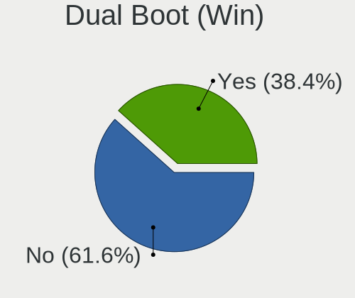

| Dual boot | Desktops | Percent |
|-----------|----------|---------|
| No        | 143      | 58.61%  |
| Yes       | 101      | 41.39%  |

Board
-----

Vendor
------

Motherboard manufacturer

| Name                | Desktops | Percent |
|---------------------|----------|---------|
| Gigabyte Technology | 69       | 28.75%  |
| ASUSTek Computer    | 68       | 28.33%  |
| MSI                 | 42       | 17.5%   |
| Hewlett-Packard     | 15       | 6.25%   |
| ASRock              | 13       | 5.42%   |
| Biostar             | 9        | 3.75%   |
| Dell                | 6        | 2.5%    |
| Fujitsu             | 4        | 1.67%   |
| Lenovo              | 3        | 1.25%   |
| Pegatron            | 2        | 0.83%   |
| Intel               | 2        | 0.83%   |
| Supermicro          | 1        | 0.42%   |
| Sapphire            | 1        | 0.42%   |
| Inventec            | 1        | 0.42%   |
| ECS                 | 1        | 0.42%   |
| Apple               | 1        | 0.42%   |
| Acer                | 1        | 0.42%   |
| Unknown             | 1        | 0.42%   |

Model
-----

Motherboard model

| Name                                   | Desktops | Percent |
|----------------------------------------|----------|---------|
| ASUS PRIME A320M-K                     | 10       | 4.17%   |
| ASUS All Series                        | 9        | 3.75%   |
| MSI MS-7641                            | 4        | 1.67%   |
| MSI MS-7309                            | 4        | 1.67%   |
| Gigabyte H61M-S2PV                     | 4        | 1.67%   |
| Biostar A320MH                         | 4        | 1.67%   |
| MSI MS-7721                            | 3        | 1.25%   |
| MSI MS-7597                            | 3        | 1.25%   |
| Gigabyte B450M DS3H                    | 3        | 1.25%   |
| ASUS H110M-R                           | 3        | 1.25%   |
| MSI MS-7C84                            | 2        | 0.83%   |
| MSI MS-7C02                            | 2        | 0.83%   |
| MSI MS-7788                            | 2        | 0.83%   |
| MSI MS-7786                            | 2        | 0.83%   |
| MSI MS-7693                            | 2        | 0.83%   |
| MSI MS-7623                            | 2        | 0.83%   |
| MSI MS-7592                            | 2        | 0.83%   |
| MSI MS-7529                            | 2        | 0.83%   |
| HP Z800 Workstation                    | 2        | 0.83%   |
| HP ProDesk 600 G1 TWR                  | 2        | 0.83%   |
| HP Compaq 6200 Pro MT PC               | 2        | 0.83%   |
| Gigabyte Z77X-UD5H                     | 2        | 0.83%   |
| Gigabyte P31-DS3L                      | 2        | 0.83%   |
| Gigabyte GB-BMCE-4500C                 | 2        | 0.83%   |
| Gigabyte GA-890GPA-UD3H                | 2        | 0.83%   |
| Gigabyte F2A68HM-S1                    | 2        | 0.83%   |
| Gigabyte EX58-UD5                      | 2        | 0.83%   |
| Gigabyte B360M-DS3H                    | 2        | 0.83%   |
| Gigabyte 970A-DS3P                     | 2        | 0.83%   |
| Dell OptiPlex 755                      | 2        | 0.83%   |
| ASUS M4A89GTD-PRO/USB3                 | 2        | 0.83%   |
| ASUS A58M-K                            | 2        | 0.83%   |
| Supermicro X8SIL                       | 1        | 0.42%   |
| Sapphire PI-AM3RS785G                  | 1        | 0.42%   |
| Pegatron HPE-540ch                     | 1        | 0.42%   |
| Pegatron h8-1100nl                     | 1        | 0.42%   |
| MSI MS-7C95                            | 1        | 0.42%   |
| MSI MS-7C51                            | 1        | 0.42%   |
| MSI MS-7B84                            | 1        | 0.42%   |
| MSI MS-7994                            | 1        | 0.42%   |
| MSI MS-7865                            | 1        | 0.42%   |
| MSI MS-7850                            | 1        | 0.42%   |
| MSI MS-7808                            | 1        | 0.42%   |
| MSI MS-7758                            | 1        | 0.42%   |
| MSI MS-7519                            | 1        | 0.42%   |
| MSI MS-7388                            | 1        | 0.42%   |
| MSI MS-7369                            | 1        | 0.42%   |
| MSI Compaq dx2300 Microtower           | 1        | 0.42%   |
| Lenovo ThinkCentre M93p 10AAS1BN00     | 1        | 0.42%   |
| Lenovo ThinkCentre M720t 10SRS76500    | 1        | 0.42%   |
| Lenovo ThinkCentre M57 6075Y3W         | 1        | 0.42%   |
| Inventec R CLASS                       | 1        | 0.42%   |
| Intel D946GZIS AAD66165-302            | 1        | 0.42%   |
| Intel 945                              | 1        | 0.42%   |
| HP Z440 Workstation                    | 1        | 0.42%   |
| HP EliteDesk 800 G4 DM 65W             | 1        | 0.42%   |
| HP Compaq Elite 8300 USDT              | 1        | 0.42%   |
| HP Compaq Elite 8300 SFF               | 1        | 0.42%   |
| HP Compaq Elite 8300 CMT               | 1        | 0.42%   |
| HP Compaq dc7900 Convertible Minitower | 1        | 0.42%   |

Model Family
------------

Motherboard model prefix

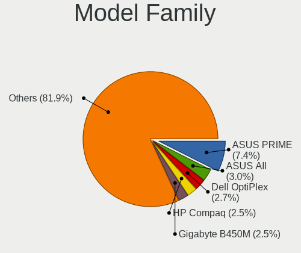

| Name                    | Desktops | Percent |
|-------------------------|----------|---------|
| ASUS PRIME              | 12       | 5%      |
| ASUS All                | 9        | 3.75%   |
| HP Compaq               | 8        | 3.33%   |
| Dell OptiPlex           | 5        | 2.08%   |
| MSI MS-7641             | 4        | 1.67%   |
| MSI MS-7309             | 4        | 1.67%   |
| Gigabyte H61M-S2PV      | 4        | 1.67%   |
| Gigabyte B450M          | 4        | 1.67%   |
| Fujitsu ESPRIMO         | 4        | 1.67%   |
| Biostar A320MH          | 4        | 1.67%   |
| MSI MS-7721             | 3        | 1.25%   |
| MSI MS-7597             | 3        | 1.25%   |
| Lenovo ThinkCentre      | 3        | 1.25%   |
| Gigabyte X570           | 3        | 1.25%   |
| Gigabyte B450           | 3        | 1.25%   |
| ASUS ROG                | 3        | 1.25%   |
| ASUS P5KPL-AM           | 3        | 1.25%   |
| ASUS H110M-R            | 3        | 1.25%   |
| MSI MS-7C84             | 2        | 0.83%   |
| MSI MS-7C02             | 2        | 0.83%   |
| MSI MS-7788             | 2        | 0.83%   |
| MSI MS-7786             | 2        | 0.83%   |
| MSI MS-7693             | 2        | 0.83%   |
| MSI MS-7623             | 2        | 0.83%   |
| MSI MS-7592             | 2        | 0.83%   |
| MSI MS-7529             | 2        | 0.83%   |
| HP Z800                 | 2        | 0.83%   |
| HP ProDesk              | 2        | 0.83%   |
| Gigabyte Z77X-UD5H      | 2        | 0.83%   |
| Gigabyte P31-DS3L       | 2        | 0.83%   |
| Gigabyte GB-BMCE-4500C  | 2        | 0.83%   |
| Gigabyte GA-890GPA-UD3H | 2        | 0.83%   |
| Gigabyte F2A68HM-S1     | 2        | 0.83%   |
| Gigabyte EX58-UD5       | 2        | 0.83%   |
| Gigabyte B360M-DS3H     | 2        | 0.83%   |
| Gigabyte 970A-DS3P      | 2        | 0.83%   |
| ASUS TUF                | 2        | 0.83%   |
| ASUS P8B75-M            | 2        | 0.83%   |
| ASUS P5G41T-M           | 2        | 0.83%   |
| ASUS M5A97              | 2        | 0.83%   |
| ASUS M4A89GTD-PRO       | 2        | 0.83%   |
| ASUS A58M-K             | 2        | 0.83%   |
| ASRock B450M            | 2        | 0.83%   |
| Supermicro X8SIL        | 1        | 0.42%   |
| Sapphire PI-AM3RS785G   | 1        | 0.42%   |
| Pegatron HPE-540ch      | 1        | 0.42%   |
| Pegatron h8-1100nl      | 1        | 0.42%   |
| MSI MS-7C95             | 1        | 0.42%   |
| MSI MS-7C51             | 1        | 0.42%   |
| MSI MS-7B84             | 1        | 0.42%   |
| MSI MS-7994             | 1        | 0.42%   |
| MSI MS-7865             | 1        | 0.42%   |
| MSI MS-7850             | 1        | 0.42%   |
| MSI MS-7808             | 1        | 0.42%   |
| MSI MS-7758             | 1        | 0.42%   |
| MSI MS-7519             | 1        | 0.42%   |
| MSI MS-7388             | 1        | 0.42%   |
| MSI MS-7369             | 1        | 0.42%   |
| MSI Compaq              | 1        | 0.42%   |
| Inventec R              | 1        | 0.42%   |

MFG Year
--------

Motherboard manufacture year

| Year | Desktops | Percent |
|------|----------|---------|
| 2018 | 29       | 12.08%  |
| 2012 | 25       | 10.42%  |
| 2010 | 24       | 10%     |
| 2013 | 20       | 8.33%   |
| 2009 | 20       | 8.33%   |
| 2017 | 19       | 7.92%   |
| 2014 | 19       | 7.92%   |
| 2011 | 18       | 7.5%    |
| 2007 | 16       | 6.67%   |
| 2008 | 15       | 6.25%   |
| 2019 | 11       | 4.58%   |
| 2020 | 6        | 2.5%    |
| 2016 | 5        | 2.08%   |
| 2015 | 5        | 2.08%   |
| 2006 | 5        | 2.08%   |
| 2021 | 3        | 1.25%   |

Form Factor
-----------

Physical design of the computer

| Name    | Desktops | Percent |
|---------|----------|---------|
| Desktop | 240      | 100%    |

Secure Boot
-----------

Enabled or disabled

| State    | Desktops | Percent |
|----------|----------|---------|
| Disabled | 232      | 96.67%  |
| Enabled  | 8        | 3.33%   |

Coreboot
--------

Have coreboot on board

| Used | Desktops | Percent |
|------|----------|---------|
| No   | 240      | 100%    |

RAM Size
--------

Total RAM memory

| Size in GB  | Desktops | Percent |
|-------------|----------|---------|
| 8.01-16.0   | 67       | 27.13%  |
| 4.01-8.0    | 52       | 21.05%  |
| 3.01-4.0    | 46       | 18.62%  |
| 16.01-24.0  | 35       | 14.17%  |
| 1.01-2.0    | 16       | 6.48%   |
| 32.01-64.0  | 12       | 4.86%   |
| 24.01-32.0  | 6        | 2.43%   |
| 64.01-256.0 | 5        | 2.02%   |
| 0.51-1.0    | 5        | 2.02%   |
| 2.01-3.0    | 3        | 1.21%   |

RAM Used
--------

Used RAM memory

| Used GB    | Desktops | Percent |
|------------|----------|---------|
| 1.01-2.0   | 112      | 41.48%  |
| 2.01-3.0   | 55       | 20.37%  |
| 4.01-8.0   | 33       | 12.22%  |
| 0.51-1.0   | 29       | 10.74%  |
| 3.01-4.0   | 22       | 8.15%   |
| 0.01-0.5   | 12       | 4.44%   |
| 8.01-16.0  | 3        | 1.11%   |
| 24.01-32.0 | 2        | 0.74%   |
| 16.01-24.0 | 2        | 0.74%   |

Total Drives
------------

Number of drives on board

| Drives  | Desktops | Percent |
|---------|----------|---------|
| 1       | 105      | 42.34%  |
| 2       | 76       | 30.65%  |
| 3       | 31       | 12.5%   |
| 4       | 17       | 6.85%   |
| 5       | 6        | 2.42%   |
| 0       | 5        | 2.02%   |
| 7       | 2        | 0.81%   |
| 6       | 2        | 0.81%   |
| Unknown | 2        | 0.81%   |
| 10      | 1        | 0.4%    |
| 8       | 1        | 0.4%    |

Has CD-ROM
----------

Has CD-ROM on board

| Presented | Desktops | Percent |
|-----------|----------|---------|
| No        | 128      | 51.41%  |
| Yes       | 121      | 48.59%  |

Has Ethernet
------------

Has Ethernet on board

| Presented | Desktops | Percent |
|-----------|----------|---------|
| Yes       | 239      | 99.58%  |
| No        | 1        | 0.42%   |

Has WiFi
--------

Has WiFi module

| Presented | Desktops | Percent |
|-----------|----------|---------|
| No        | 179      | 74.27%  |
| Yes       | 62       | 25.73%  |

Has Bluetooth
-------------

Has Bluetooth module

| Presented | Desktops | Percent |
|-----------|----------|---------|
| No        | 211      | 87.55%  |
| Yes       | 30       | 12.45%  |

Location
--------

Country
-------

Geographic location (country)

| Country | Desktops | Percent |
|---------|----------|---------|
| Serbia  | 240      | 100%    |

City
----

Geographic location (city)

| City               | Desktops | Percent |
|--------------------|----------|---------|
| Belgrade           | 117      | 46.06%  |
| Novi Sad           | 30       | 11.81%  |
| Ni               | 13       | 5.12%   |
| Subotica           | 6        | 2.36%   |
| Panevo           | 6        | 2.36%   |
| Kragujevac         | 6        | 2.36%   |
| Zrenjanin          | 5        | 1.97%   |
| Becej              | 4        | 1.57%   |
| Backa Topola       | 4        | 1.57%   |
| Senta              | 3        | 1.18%   |
| Poarevac         | 3        | 1.18%   |
| Cuprija            | 3        | 1.18%   |
| Zvecka             | 2        | 0.79%   |
| Rumenka            | 2        | 0.79%   |
| Ruma               | 2        | 0.79%   |
| Palanka            | 2        | 0.79%   |
| Obrenovac          | 2        | 0.79%   |
| Novi Knezevac      | 2        | 0.79%   |
| New Belgrade       | 2        | 0.79%   |
| Leskovac           | 2        | 0.79%   |
| Kraljevo           | 2        | 0.79%   |
| Crvenka            | 2        | 0.79%   |
| Banatsko Novo Selo | 2        | 0.79%   |
| Zajecar            | 1        | 0.39%   |
| Zabari             | 1        | 0.39%   |
| Veliko Orasje      | 1        | 0.39%   |
| Stara Pazova       | 1        | 0.39%   |
| Smederevo          | 1        | 0.39%   |
| Semlin             | 1        | 0.39%   |
| Savski Venac       | 1        | 0.39%   |
| Pukovac            | 1        | 0.39%   |
| Pirot              | 1        | 0.39%   |
| Petrovac           | 1        | 0.39%   |
| Odzaci             | 1        | 0.39%   |
| Novi Karlovci      | 1        | 0.39%   |
| Lebane             | 1        | 0.39%   |
| Kruevac          | 1        | 0.39%   |
| Kruscic            | 1        | 0.39%   |
| Kostolac           | 1        | 0.39%   |
| Jelenca            | 1        | 0.39%   |
| Jablanka           | 1        | 0.39%   |
| Grocka             | 1        | 0.39%   |
| Gornji Milanovac   | 1        | 0.39%   |
| Glogovac           | 1        | 0.39%   |
| Gajdobra           | 1        | 0.39%   |
| Drazevac           | 1        | 0.39%   |
| aak            | 1        | 0.39%   |
| Batocina           | 1        | 0.39%   |
| Basaid             | 1        | 0.39%   |
| Banatski Karlovac  | 1        | 0.39%   |
| Bajina Basta       | 1        | 0.39%   |
| Backi Jarak        | 1        | 0.39%   |
| Arilje             | 1        | 0.39%   |
| Aldinac            | 1        | 0.39%   |
| Ada                | 1        | 0.39%   |

Drives
------

Drive Vendor
------------

Hard drive vendors

| Vendor                | Desktops | Drives | Percent |
|-----------------------|----------|--------|---------|
| WDC                   | 98       | 172    | 24.38%  |
| Seagate               | 49       | 66     | 12.19%  |
| Kingston              | 48       | 70     | 11.94%  |
| Toshiba               | 40       | 59     | 9.95%   |
| Samsung Electronics   | 37       | 57     | 9.2%    |
| Hitachi               | 22       | 35     | 5.47%   |
| SPCC                  | 11       | 17     | 2.74%   |
| SanDisk               | 11       | 13     | 2.74%   |
| Biostar               | 11       | 13     | 2.74%   |
| Patriot               | 9        | 10     | 2.24%   |
| Maxtor                | 9        | 9      | 2.24%   |
| Gigabyte Technology   | 9        | 11     | 2.24%   |
| Transcend             | 7        | 8      | 1.74%   |
| Intel                 | 6        | 9      | 1.49%   |
| Apacer                | 5        | 6      | 1.24%   |
| Crucial               | 4        | 4      | 1%      |
| A-DATA Technology     | 3        | 3      | 0.75%   |
| StoreJet              | 2        | 2      | 0.5%    |
| Silicon Motion        | 2        | 2      | 0.5%    |
| Phison                | 2        | 9      | 0.5%    |
| HGST                  | 2        | 3      | 0.5%    |
| ExcelStor             | 2        | 2      | 0.5%    |
| AMD                   | 2        | 2      | 0.5%    |
| Verbatim              | 1        | 1      | 0.25%   |
| Realtek Semiconductor | 1        | 1      | 0.25%   |
| Quantum               | 1        | 1      | 0.25%   |
| OCZ                   | 1        | 2      | 0.25%   |
| Mushkin               | 1        | 1      | 0.25%   |
| Lexar                 | 1        | 1      | 0.25%   |
| Leven                 | 1        | 1      | 0.25%   |
| KingDian              | 1        | 1      | 0.25%   |
| GeIL                  | 1        | 1      | 0.25%   |
| China                 | 1        | 1      | 0.25%   |
| Apple                 | 1        | 1      | 0.25%   |

Drive Model
-----------

Hard drive models

| Model                                  | Desktops | Percent |
|----------------------------------------|----------|---------|
| Kingston SA400S37120G 120GB SSD        | 14       | 3.05%   |
| Toshiba DT01ACA100 1TB                 | 11       | 2.4%    |
| Kingston SA400S37240G 240GB SSD        | 10       | 2.18%   |
| Kingston SA400S37480G 480GB SSD        | 9        | 1.96%   |
| Toshiba DT01ACA050 500GB               | 8        | 1.74%   |
| Seagate ST1000DM003-1ER162 1TB         | 7        | 1.53%   |
| Samsung SM963 2.5" NVMe PCIe SSD 500GB | 6        | 1.31%   |
| WDC WD5000AAKX-001CA0 500GB            | 5        | 1.09%   |
| WDC WD3200AAJS-56B4A0 320GB            | 5        | 1.09%   |
| Toshiba HDWD110 1TB                    | 5        | 1.09%   |
| Toshiba DT01ACA200 2TB                 | 5        | 1.09%   |
| Hitachi HDS721050CLA362 500GB          | 5        | 1.09%   |
| WDC WD10EZEX-08WN4A0 1TB               | 4        | 0.87%   |
| Toshiba HDWD120 2TB                    | 4        | 0.87%   |
| Seagate ST500DM002-1BD142 500GB        | 4        | 0.87%   |
| Seagate ST1000DM010-2EP102 1TB         | 4        | 0.87%   |
| Samsung SSD 860 EVO 500GB              | 4        | 0.87%   |
| Samsung SSD 860 EVO 250GB              | 4        | 0.87%   |
| Gigabyte GP-GSTFS31240GNTD 240GB SSD   | 4        | 0.87%   |
| Gigabyte GP-GSTFS31120GNTD 120GB SSD   | 4        | 0.87%   |
| Biostar S100-120GB                     | 4        | 0.87%   |
| WDC WD3200AAJS-56M0A0 320GB            | 3        | 0.65%   |
| WDC WD30EFRX-68EUZN0 3TB               | 3        | 0.65%   |
| WDC WD2500AAKX-753CA1 250GB            | 3        | 0.65%   |
| WDC WD1600AAJS-00L7A0 160GB            | 3        | 0.65%   |
| WDC WD1003FZEX-00K3CA0 1TB             | 3        | 0.65%   |
| SPCC Solid State Disk 512GB            | 3        | 0.65%   |
| SPCC Solid State Disk 256GB            | 3        | 0.65%   |
| Seagate ST380815AS 80GB                | 3        | 0.65%   |
| Seagate ST31000528AS 1TB               | 3        | 0.65%   |
| Seagate ST1000DM003-1CH162 1TB         | 3        | 0.65%   |
| SanDisk SSD PLUS 120GB                 | 3        | 0.65%   |
| SanDisk SDSSDA120G 120GB               | 3        | 0.65%   |
| Samsung NVMe SSD Drive 1TB             | 3        | 0.65%   |
| Patriot Burst 240GB SSD                | 3        | 0.65%   |
| Kingston SV300S37A120G 120GB SSD       | 3        | 0.65%   |
| Kingston SHFS37A120G 120GB SSD         | 3        | 0.65%   |
| Kingston SH103S3120G 120GB SSD         | 3        | 0.65%   |
| WDC WD5000AAVS-00ZTB0 500GB            | 2        | 0.44%   |
| WDC WD5000AAKS-00TMA0 500GB            | 2        | 0.44%   |
| WDC WD5000AAKS-00A7B0 500GB            | 2        | 0.44%   |
| WDC WD40EFRX-68WT0N0 4TB               | 2        | 0.44%   |
| WDC WD3200AVVS-56L2B0 320GB            | 2        | 0.44%   |
| WDC WD3200AAKS-00L9A0 320GB            | 2        | 0.44%   |
| WDC WD2500BEVS-22UST0 250GB            | 2        | 0.44%   |
| WDC WD20EFRX-68EUZN0 2TB               | 2        | 0.44%   |
| WDC WD20EARX-00PASB0 2TB               | 2        | 0.44%   |
| WDC WD15EARS-00MVWB0 1TB               | 2        | 0.44%   |
| WDC WD10EZEX-75WN4A0 1TB               | 2        | 0.44%   |
| WDC WD10EZEX-22RKKA0 1TB               | 2        | 0.44%   |
| WDC WD10EARS-00Y5B1 1TB                | 2        | 0.44%   |
| WDC WD10EALX-009BA0 1TB                | 2        | 0.44%   |
| WDC WD1003FZEX-00MK2A0 1TB             | 2        | 0.44%   |
| WDC WD1002FAEX-00Z3A0 1TB              | 2        | 0.44%   |
| Transcend TS64GSSD370 64GB             | 2        | 0.44%   |
| Transcend TS120GSSD220S 120GB          | 2        | 0.44%   |
| Toshiba MQ01ABF050 500GB               | 2        | 0.44%   |
| StoreJet Transcend 1TB                 | 2        | 0.44%   |
| SPCC Solid State Disk 240GB            | 2        | 0.44%   |
| Seagate ST3500413AS 500GB              | 2        | 0.44%   |

HDD Vendor
----------

Hard disk drive vendors

| Vendor              | Desktops | Drives | Percent |
|---------------------|----------|--------|---------|
| WDC                 | 96       | 167    | 41.38%  |
| Seagate             | 46       | 63     | 19.83%  |
| Toshiba             | 39       | 58     | 16.81%  |
| Hitachi             | 22       | 35     | 9.48%   |
| Samsung Electronics | 14       | 19     | 6.03%   |
| Maxtor              | 9        | 9      | 3.88%   |
| HGST                | 2        | 3      | 0.86%   |
| ExcelStor           | 2        | 2      | 0.86%   |
| Quantum             | 1        | 1      | 0.43%   |
| Apple               | 1        | 1      | 0.43%   |

SSD Vendor
----------

Solid state drive vendors

| Vendor              | Desktops | Drives | Percent |
|---------------------|----------|--------|---------|
| Kingston            | 46       | 67     | 31.51%  |
| Samsung Electronics | 15       | 19     | 10.27%  |
| SPCC                | 11       | 17     | 7.53%   |
| SanDisk             | 10       | 12     | 6.85%   |
| Gigabyte Technology | 9        | 11     | 6.16%   |
| Transcend           | 7        | 8      | 4.79%   |
| Patriot             | 7        | 8      | 4.79%   |
| Biostar             | 7        | 9      | 4.79%   |
| Intel               | 6        | 9      | 4.11%   |
| Apacer              | 5        | 6      | 3.42%   |
| Crucial             | 4        | 4      | 2.74%   |
| WDC                 | 3        | 3      | 2.05%   |
| A-DATA Technology   | 3        | 3      | 2.05%   |
| StoreJet            | 2        | 2      | 1.37%   |
| AMD                 | 2        | 2      | 1.37%   |
| Verbatim            | 1        | 1      | 0.68%   |
| Seagate             | 1        | 1      | 0.68%   |
| OCZ                 | 1        | 2      | 0.68%   |
| Mushkin             | 1        | 1      | 0.68%   |
| Lexar               | 1        | 1      | 0.68%   |
| Leven               | 1        | 1      | 0.68%   |
| KingDian            | 1        | 1      | 0.68%   |
| GeIL                | 1        | 1      | 0.68%   |
| China               | 1        | 1      | 0.68%   |

Drive Kind
----------

HDD or SSD

| Kind    | Desktops | Drives | Percent |
|---------|----------|--------|---------|
| HDD     | 184      | 358    | 54.44%  |
| SSD     | 122      | 190    | 36.09%  |
| NVMe    | 26       | 40     | 7.69%   |
| Unknown | 6        | 6      | 1.78%   |

Drive Connector
---------------

SATA, SAS, NVMe, etc.

| Type | Desktops | Drives | Percent |
|------|----------|--------|---------|
| SATA | 228      | 549    | 87.36%  |
| NVMe | 26       | 40     | 9.96%   |
| SAS  | 7        | 5      | 2.68%   |

Drive Size
----------

Size of hard drive

| Size in TB | Desktops | Drives | Percent |
|------------|----------|--------|---------|
| 0.01-0.5   | 196      | 362    | 62.42%  |
| 0.51-1.0   | 79       | 113    | 25.16%  |
| 1.01-2.0   | 26       | 40     | 8.28%   |
| 2.01-3.0   | 6        | 18     | 1.91%   |
| 3.01-4.0   | 5        | 10     | 1.59%   |
| 4.01-10.0  | 2        | 5      | 0.64%   |

Space Total
-----------

Amount of disk space available on the file system

| Size in GB     | Desktops | Percent |
|----------------|----------|---------|
| 101-250        | 62       | 23.85%  |
| 251-500        | 41       | 15.77%  |
| 501-1000       | 38       | 14.62%  |
| 1-20           | 29       | 11.15%  |
| 1001-2000      | 22       | 8.46%   |
| Unknown        | 17       | 6.54%   |
| 21-50          | 16       | 6.15%   |
| 51-100         | 16       | 6.15%   |
| More than 3000 | 10       | 3.85%   |
| 2001-3000      | 9        | 3.46%   |

Space Used
----------

Amount of used disk space

| Used GB        | Desktops | Percent |
|----------------|----------|---------|
| 1-20           | 107      | 40.38%  |
| 21-50          | 33       | 12.45%  |
| 101-250        | 32       | 12.08%  |
| 251-500        | 28       | 10.57%  |
| 51-100         | 18       | 6.79%   |
| Unknown        | 17       | 6.42%   |
| 1001-2000      | 14       | 5.28%   |
| 501-1000       | 8        | 3.02%   |
| 2001-3000      | 5        | 1.89%   |
| More than 3000 | 3        | 1.13%   |

Malfunc. Drives
---------------

Drive models with a malfunction

| Model                               | Desktops | Drives | Percent |
|-------------------------------------|----------|--------|---------|
| WDC WD5000AAKX-001CA0 500GB         | 3        | 3      | 6.82%   |
| Seagate ST500DM002-1BD142 500GB     | 2        | 5      | 4.55%   |
| Seagate ST380815AS 80GB             | 2        | 2      | 4.55%   |
| Intel SSDSC2CW120A3 120GB           | 2        | 2      | 4.55%   |
| WDC WD5002AALX-00J37A0 500GB        | 1        | 1      | 2.27%   |
| WDC WD5000AAKX-603CA0 500GB         | 1        | 1      | 2.27%   |
| WDC WD5000AAKS-00UU3A0 500GB        | 1        | 1      | 2.27%   |
| WDC WD5000AAKS-00TMA0 500GB         | 1        | 1      | 2.27%   |
| WDC WD40EFRX-68WT0N0 4TB            | 1        | 1      | 2.27%   |
| WDC WD3200AVVS-63L2B0 320GB         | 1        | 1      | 2.27%   |
| WDC WD3200AVVS-56L2B0 320GB         | 1        | 1      | 2.27%   |
| WDC WD20EARX-00PASB0 2TB            | 1        | 1      | 2.27%   |
| WDC WD2002FAEX-007BA0 2TB           | 1        | 2      | 2.27%   |
| WDC WD1600AAJS-00L7A0 160GB         | 1        | 1      | 2.27%   |
| WDC WD15EARS-00MVWB0 1TB            | 1        | 1      | 2.27%   |
| WDC WD10EZEX-75WN4A0 1TB            | 1        | 1      | 2.27%   |
| WDC WD10EZEX-00RKKA0 1TB            | 1        | 1      | 2.27%   |
| WDC WD10EARS-00Y5B1 1TB             | 1        | 1      | 2.27%   |
| WDC WD10EALX-009BA0 1TB             | 1        | 2      | 2.27%   |
| WDC WD10EADS-00M2B0 1TB             | 1        | 2      | 2.27%   |
| WDC WD1001FALS-00J7B1 1TB           | 1        | 1      | 2.27%   |
| Toshiba MG03ACA200 2TB              | 1        | 1      | 2.27%   |
| Toshiba DT01ACA100 1TB              | 1        | 1      | 2.27%   |
| SPCC Solid State Disk 120GB         | 1        | 1      | 2.27%   |
| Seagate STM3250318AS 250GB          | 1        | 2      | 2.27%   |
| Seagate ST1000DM003-1CH162 1TB      | 1        | 1      | 2.27%   |
| Samsung Electronics SSD 870 EVO 1TB | 1        | 1      | 2.27%   |
| Samsung Electronics HD753LJ 752GB   | 1        | 2      | 2.27%   |
| Samsung Electronics HD154UI 1TB     | 1        | 1      | 2.27%   |
| Samsung Electronics HD080HJ/ 80GB   | 1        | 1      | 2.27%   |
| Samsung Electronics HD040GJ 40GB    | 1        | 1      | 2.27%   |
| Maxtor STM380211AS 80GB             | 1        | 1      | 2.27%   |
| Maxtor STM3250310AS 250GB           | 1        | 1      | 2.27%   |
| Maxtor STM3160811AS 160GB           | 1        | 1      | 2.27%   |
| Maxtor 6Y160P0 164GB                | 1        | 1      | 2.27%   |
| Kingston SA400S37 120GB SSD         | 1        | 1      | 2.27%   |
| Hitachi HDS721050CLA662 500GB       | 1        | 1      | 2.27%   |
| Hitachi HDP725050GLA360 500GB       | 1        | 1      | 2.27%   |
| Crucial CT512MX100SSD1 512GB        | 1        | 1      | 2.27%   |

Malfunc. Drive Vendor
---------------------

Vendors of faulty drives

| Vendor              | Desktops | Drives | Percent |
|---------------------|----------|--------|---------|
| WDC                 | 17       | 23     | 41.46%  |
| Seagate             | 6        | 10     | 14.63%  |
| Samsung Electronics | 5        | 6      | 12.2%   |
| Maxtor              | 4        | 4      | 9.76%   |
| Toshiba             | 2        | 2      | 4.88%   |
| Intel               | 2        | 2      | 4.88%   |
| Hitachi             | 2        | 2      | 4.88%   |
| SPCC                | 1        | 1      | 2.44%   |
| Kingston            | 1        | 1      | 2.44%   |
| Crucial             | 1        | 1      | 2.44%   |

Malfunc. HDD Vendor
-------------------

Vendors of faulty HDD drives

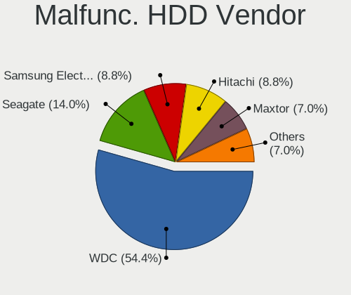

| Vendor              | Desktops | Drives | Percent |
|---------------------|----------|--------|---------|
| WDC                 | 17       | 23     | 48.57%  |
| Seagate             | 6        | 10     | 17.14%  |
| Samsung Electronics | 4        | 5      | 11.43%  |
| Maxtor              | 4        | 4      | 11.43%  |
| Toshiba             | 2        | 2      | 5.71%   |
| Hitachi             | 2        | 2      | 5.71%   |

Malfunc. Drive Kind
-------------------

Kinds of faulty drives

| Kind | Desktops | Drives | Percent |
|------|----------|--------|---------|
| HDD  | 29       | 46     | 82.86%  |
| SSD  | 6        | 6      | 17.14%  |

Failed Drives
-------------

Failed drive models

Zero info for selected period =(

Failed Drive Vendor
-------------------

Failed drive vendors

Zero info for selected period =(

Drive Status
------------

Number of failed and malfunc. drives

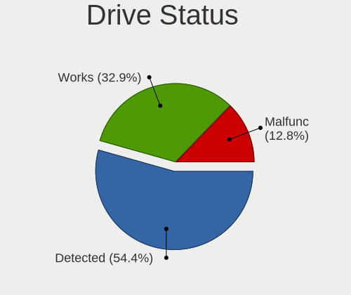

| Status   | Desktops | Drives | Percent |
|----------|----------|--------|---------|
| Detected | 148      | 370    | 56.49%  |
| Works    | 79       | 172    | 30.15%  |
| Malfunc  | 35       | 52     | 13.36%  |

Storage controller
------------------

Storage Vendor
--------------

Storage controller vendors

| Vendor                       | Desktops | Percent |
|------------------------------|----------|---------|
| Intel                        | 129      | 43.14%  |
| AMD                          | 91       | 30.43%  |
| Nvidia                       | 18       | 6.02%   |
| Samsung Electronics          | 13       | 4.35%   |
| JMicron Technology           | 13       | 4.35%   |
| Marvell Technology Group     | 8        | 2.68%   |
| ASMedia Technology           | 7        | 2.34%   |
| VIA Technologies             | 4        | 1.34%   |
| Silicon Motion               | 3        | 1%      |
| Phison Electronics           | 3        | 1%      |
| Kingston Technology Company  | 3        | 1%      |
| SanDisk                      | 2        | 0.67%   |
| LSI Logic / Symbios Logic    | 2        | 0.67%   |
| Toshiba America Info Systems | 1        | 0.33%   |
| Realtek Semiconductor        | 1        | 0.33%   |
| Broadcom / LSI               | 1        | 0.33%   |

Storage Model
-------------

Storage controller models

| Model                                                                                   | Desktops | Percent |
|-----------------------------------------------------------------------------------------|----------|---------|
| AMD FCH SATA Controller [AHCI mode]                                                     | 58       | 14.04%  |
| Intel NM10/ICH7 Family SATA Controller [IDE mode]                                       | 23       | 5.57%   |
| AMD FCH SATA Controller D                                                               | 18       | 4.36%   |
| Intel 8 Series/C220 Series Chipset Family 6-port SATA Controller 1 [AHCI mode]          | 16       | 3.87%   |
| AMD SB7x0/SB8x0/SB9x0 IDE Controller                                                    | 16       | 3.87%   |
| AMD 400 Series Chipset SATA Controller                                                  | 15       | 3.63%   |
| Intel 82801G (ICH7 Family) IDE Controller                                               | 13       | 3.15%   |
| Intel 7 Series/C210 Series Chipset Family 6-port SATA Controller [AHCI mode]            | 12       | 2.91%   |
| Intel 6 Series/C200 Series Chipset Family 6 port Desktop SATA AHCI Controller           | 12       | 2.91%   |
| AMD SB7x0/SB8x0/SB9x0 SATA Controller [IDE mode]                                        | 12       | 2.91%   |
| AMD SB7x0/SB8x0/SB9x0 SATA Controller [AHCI mode]                                       | 12       | 2.91%   |
| Nvidia MCP61 SATA Controller                                                            | 11       | 2.66%   |
| Nvidia MCP61 IDE                                                                        | 10       | 2.42%   |
| Intel Cannon Lake PCH SATA AHCI Controller                                              | 9        | 2.18%   |
| Samsung NVMe SSD Controller SM981/PM981/PM983                                           | 8        | 1.94%   |
| Intel Q170/Q150/B150/H170/H110/Z170/CM236 Chipset SATA Controller [AHCI Mode]           | 8        | 1.94%   |
| JMicron JMB363 SATA/IDE Controller                                                      | 7        | 1.69%   |
| Intel 200 Series PCH SATA controller [AHCI mode]                                        | 7        | 1.69%   |
| Intel SATA Controller [RAID mode]                                                       | 6        | 1.45%   |
| AMD FCH SATA Controller [IDE mode]                                                      | 6        | 1.45%   |
| Intel 6 Series/C200 Series Chipset Family Desktop SATA Controller (IDE mode, ports 4-5) | 5        | 1.21%   |
| Intel 6 Series/C200 Series Chipset Family Desktop SATA Controller (IDE mode, ports 0-3) | 5        | 1.21%   |
| JMicron JMB368 IDE controller                                                           | 4        | 0.97%   |
| Intel 82801JI (ICH10 Family) SATA AHCI Controller                                       | 4        | 0.97%   |
| ASMedia ASM1062 Serial ATA Controller                                                   | 4        | 0.97%   |
| Silicon Motion SM2263EN/SM2263XT SSD Controller                                         | 3        | 0.73%   |
| Samsung NVMe SSD Controller SM961/PM961/SM963                                           | 3        | 0.73%   |
| Intel 82801JI (ICH10 Family) 4 port SATA IDE Controller #1                              | 3        | 0.73%   |
| Intel 82801JI (ICH10 Family) 2 port SATA IDE Controller #2                              | 3        | 0.73%   |
| Intel 82801I (ICH9 Family) 2 port SATA Controller [IDE mode]                            | 3        | 0.73%   |
| Intel 5 Series/3400 Series Chipset 6 port SATA AHCI Controller                          | 3        | 0.73%   |
| Intel 5 Series/3400 Series Chipset 4 port SATA IDE Controller                           | 3        | 0.73%   |
| Intel 5 Series/3400 Series Chipset 2 port SATA IDE Controller                           | 3        | 0.73%   |
| ASMedia ASM1061 SATA IDE Controller                                                     | 3        | 0.73%   |
| AMD FCH IDE Controller                                                                  | 3        | 0.73%   |
| AMD 500 Series Chipset SATA Controller                                                  | 3        | 0.73%   |
| VIA VT82C586A/B/VT82C686/A/B/VT823x/A/C PIPC Bus Master IDE                             | 2        | 0.48%   |
| VIA VT6415 PATA IDE Host Controller                                                     | 2        | 0.48%   |
| Samsung NVMe SSD Controller 980                                                         | 2        | 0.48%   |
| Nvidia MCP78S [GeForce 8200] IDE                                                        | 2        | 0.48%   |
| Nvidia MCP65 SATA Controller                                                            | 2        | 0.48%   |
| Nvidia MCP65 IDE                                                                        | 2        | 0.48%   |
| Marvell Group 88SE9172 SATA 6Gb/s Controller                                            | 2        | 0.48%   |
| Marvell Group 88SE6101/6102 single-port PATA133 interface                               | 2        | 0.48%   |
| LSI Logic / Symbios Logic SAS1068E PCI-Express Fusion-MPT SAS                           | 2        | 0.48%   |
| Kingston Company A2000 NVMe SSD                                                         | 2        | 0.48%   |
| JMicron JMB361 AHCI/IDE                                                                 | 2        | 0.48%   |
| Intel Jasper Lake SATA AHCI Controller                                                  | 2        | 0.48%   |
| Intel 9 Series Chipset Family SATA Controller [AHCI Mode]                               | 2        | 0.48%   |
| Intel 82801IR/IO/IH (ICH9R/DO/DH) 6 port SATA Controller [AHCI mode]                    | 2        | 0.48%   |
| Intel 82801IR/IO/IH (ICH9R/DO/DH) 4 port SATA Controller [IDE mode]                     | 2        | 0.48%   |
| Intel 7 Series/C210 Series Chipset Family 4-port SATA Controller [IDE mode]             | 2        | 0.48%   |
| Intel 7 Series/C210 Series Chipset Family 2-port SATA Controller [IDE mode]             | 2        | 0.48%   |
| Intel 4 Series Chipset PT IDER Controller                                               | 2        | 0.48%   |
| AMD X399 Series Chipset SATA Controller                                                 | 2        | 0.48%   |
| VIA VT8237/8251 Serial ATA Controller                                                   | 1        | 0.24%   |
| VIA Serial ATA Controller                                                               | 1        | 0.24%   |
| Toshiba America Info Systems BG3 NVMe SSD Controller                                    | 1        | 0.24%   |
| SanDisk WD Blue SN550 NVMe SSD                                                          | 1        | 0.24%   |
| SanDisk WD Black SN750 / PC SN730 NVMe SSD                                              | 1        | 0.24%   |

Storage Kind
------------

Kind of storage controller (IDE, SATA, NVMe, SAS, ...)

| Kind | Desktops | Percent |
|------|----------|---------|
| SATA | 174      | 57.81%  |
| IDE  | 92       | 30.56%  |
| NVMe | 26       | 8.64%   |
| RAID | 6        | 1.99%   |
| SCSI | 2        | 0.66%   |
| SAS  | 1        | 0.33%   |

Processor
---------

CPU Vendor
----------

Processor vendors

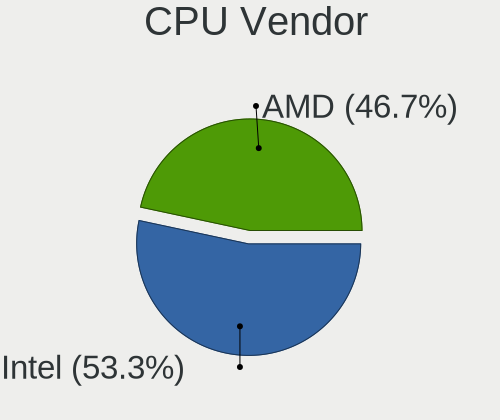

| Vendor | Desktops | Percent |
|--------|----------|---------|
| Intel  | 131      | 54.58%  |
| AMD    | 109      | 45.42%  |

CPU Model
---------

Processor models

| Model                                       | Desktops | Percent |
|---------------------------------------------|----------|---------|
| AMD Ryzen 5 1600 Six-Core Processor         | 7        | 2.92%   |
| AMD Ryzen 5 2400G with Radeon Vega Graphics | 5        | 2.08%   |
| Intel Core i5-2400 CPU @ 3.10GHz            | 4        | 1.67%   |
| Intel Core i3-4160 CPU @ 3.60GHz            | 4        | 1.67%   |
| Intel Core i3-3220 CPU @ 3.30GHz            | 4        | 1.67%   |
| AMD Ryzen 5 2600X Six-Core Processor        | 4        | 1.67%   |
| Intel Pentium Dual-Core CPU E5200 @ 2.50GHz | 3        | 1.25%   |
| Intel Core i7-3770 CPU @ 3.40GHz            | 3        | 1.25%   |
| Intel Core i7 CPU 870 @ 2.93GHz             | 3        | 1.25%   |
| Intel Core i3-8100 CPU @ 3.60GHz            | 3        | 1.25%   |
| Intel Core i3-6100 CPU @ 3.70GHz            | 3        | 1.25%   |
| Intel Core i3-4170 CPU @ 3.70GHz            | 3        | 1.25%   |
| Intel Core 2 Duo CPU E7500 @ 2.93GHz        | 3        | 1.25%   |
| Intel Core 2 Duo CPU E4500 @ 2.20GHz        | 3        | 1.25%   |
| AMD Ryzen 5 3600 6-Core Processor           | 3        | 1.25%   |
| AMD Ryzen 3 3200G with Radeon Vega Graphics | 3        | 1.25%   |
| AMD Phenom II X4 965 Processor              | 3        | 1.25%   |
| AMD Phenom II X4 945 Processor              | 3        | 1.25%   |
| AMD FX-6300 Six-Core Processor              | 3        | 1.25%   |
| AMD Athlon X4 750K Quad Core Processor      | 3        | 1.25%   |
| AMD A4-4020 APU with Radeon HD Graphics     | 3        | 1.25%   |
| Intel Xeon CPU X5660 @ 2.80GHz              | 2        | 0.83%   |
| Intel Pentium Gold G5400 CPU @ 3.70GHz      | 2        | 0.83%   |
| Intel Pentium Dual-Core CPU E5700 @ 3.00GHz | 2        | 0.83%   |
| Intel Pentium Dual-Core CPU E5300 @ 2.60GHz | 2        | 0.83%   |
| Intel Pentium CPU G630 @ 2.70GHz            | 2        | 0.83%   |
| Intel Pentium CPU G4560 @ 3.50GHz           | 2        | 0.83%   |
| Intel Pentium CPU G2030 @ 3.00GHz           | 2        | 0.83%   |
| Intel Core i7-4770K CPU @ 3.50GHz           | 2        | 0.83%   |
| Intel Core i7-3770K CPU @ 3.50GHz           | 2        | 0.83%   |
| Intel Core i7 CPU 920 @ 2.67GHz             | 2        | 0.83%   |
| Intel Core i5-6500 CPU @ 3.20GHz            | 2        | 0.83%   |
| Intel Core i5-3470 CPU @ 3.20GHz            | 2        | 0.83%   |
| Intel Core i3-4130 CPU @ 3.40GHz            | 2        | 0.83%   |
| Intel Core i3-2120 CPU @ 3.30GHz            | 2        | 0.83%   |
| Intel Core i3-2100 CPU @ 3.10GHz            | 2        | 0.83%   |
| Intel Core 2 Quad CPU Q9400 @ 2.66GHz       | 2        | 0.83%   |
| Intel Core 2 Duo CPU E8500 @ 3.16GHz        | 2        | 0.83%   |
| Intel Core 2 Duo CPU E8400 @ 3.00GHz        | 2        | 0.83%   |
| Intel Core 2 Duo CPU E7300 @ 2.66GHz        | 2        | 0.83%   |
| Intel Celeron N4500 @ 1.10GHz               | 2        | 0.83%   |
| Intel Celeron CPU E3400 @ 2.60GHz           | 2        | 0.83%   |
| AMD Ryzen 5 5600X 6-Core Processor          | 2        | 0.83%   |
| AMD Ryzen 3 2200G with Radeon Vega Graphics | 2        | 0.83%   |
| AMD Phenom II X6 1090T Processor            | 2        | 0.83%   |
| AMD Phenom II X4 955 Processor              | 2        | 0.83%   |
| AMD Athlon II X4 620 Processor              | 2        | 0.83%   |
| AMD Athlon II X2 215 Processor              | 2        | 0.83%   |
| AMD Athlon 5150 APU with Radeon R3          | 2        | 0.83%   |
| AMD A6-5400K APU with Radeon HD Graphics    | 2        | 0.83%   |
| Intel Xeon E-2224G CPU @ 3.50GHz            | 1        | 0.42%   |
| Intel Xeon CPU X5472 @ 3.00GHz              | 1        | 0.42%   |
| Intel Xeon CPU E5450 @ 3.00GHz              | 1        | 0.42%   |
| Intel Xeon CPU E5410 @ 2.33GHz              | 1        | 0.42%   |
| Intel Xeon CPU E5-1630 v3 @ 3.70GHz         | 1        | 0.42%   |
| Intel Pentium Dual CPU E2180 @ 2.00GHz      | 1        | 0.42%   |
| Intel Pentium D CPU 3.00GHz                 | 1        | 0.42%   |
| Intel Pentium CPU G3260 @ 3.30GHz           | 1        | 0.42%   |
| Intel Pentium CPU G2020 @ 2.90GHz           | 1        | 0.42%   |
| Intel Core i7-9700 CPU @ 3.00GHz            | 1        | 0.42%   |

CPU Model Family
----------------

Processor model prefix

| Model                   | Desktops | Percent |
|-------------------------|----------|---------|
| AMD Ryzen 5             | 27       | 11.25%  |
| Intel Core i3           | 26       | 10.83%  |
| Intel Core i5           | 24       | 10%     |
| Intel Core i7           | 19       | 7.92%   |
| Intel Core 2 Duo        | 17       | 7.08%   |
| AMD Phenom II X4        | 11       | 4.58%   |
| Intel Celeron           | 10       | 4.17%   |
| Intel Pentium           | 8        | 3.33%   |
| AMD Ryzen 3             | 8        | 3.33%   |
| AMD FX                  | 8        | 3.33%   |
| Intel Xeon              | 7        | 2.92%   |
| Intel Pentium Dual-Core | 7        | 2.92%   |
| Intel Core 2 Quad       | 6        | 2.5%    |
| AMD Athlon X4           | 6        | 2.5%    |
| AMD Athlon II X2        | 6        | 2.5%    |
| AMD A4                  | 6        | 2.5%    |
| AMD Athlon 64 X2        | 5        | 2.08%   |
| AMD Ryzen 7             | 4        | 1.67%   |
| AMD Athlon II X4        | 4        | 1.67%   |
| AMD Athlon II X3        | 3        | 1.25%   |
| AMD Athlon              | 3        | 1.25%   |
| Intel Pentium Gold      | 2        | 0.83%   |
| Intel Core 2            | 2        | 0.83%   |
| AMD Sempron             | 2        | 0.83%   |
| AMD Ryzen Threadripper  | 2        | 0.83%   |
| AMD Ryzen 9             | 2        | 0.83%   |
| AMD Phenom II X6        | 2        | 0.83%   |
| AMD Phenom              | 2        | 0.83%   |
| AMD A6                  | 2        | 0.83%   |
| Other                   | 1        | 0.42%   |
| Intel Pentium Dual      | 1        | 0.42%   |
| Intel Pentium D         | 1        | 0.42%   |
| AMD Ryzen 5 PRO         | 1        | 0.42%   |
| AMD Ryzen 3 PRO         | 1        | 0.42%   |
| AMD Phenom II X2        | 1        | 0.42%   |
| AMD E2                  | 1        | 0.42%   |
| AMD A8                  | 1        | 0.42%   |
| AMD A10                 | 1        | 0.42%   |

CPU Cores
---------

Number of processor cores

| Number  | Desktops | Percent |
|---------|----------|---------|
| 4       | 93       | 38.75%  |
| 2       | 90       | 37.5%   |
| 6       | 28       | 11.67%  |
| 1       | 11       | 4.58%   |
| 3       | 7        | 2.92%   |
| 8       | 6        | 2.5%    |
| 12      | 2        | 0.83%   |
| 32      | 1        | 0.42%   |
| 16      | 1        | 0.42%   |
| Unknown | 1        | 0.42%   |

CPU Sockets
-----------

Number of sockets

| Number | Desktops | Percent |
|--------|----------|---------|
| 1      | 239      | 99.58%  |
| 2      | 1        | 0.42%   |

CPU Threads
-----------

Threads per core (Hyper-Threading)

| Number  | Desktops | Percent |
|---------|----------|---------|
| 1       | 135      | 56.25%  |
| 2       | 104      | 43.33%  |
| Unknown | 1        | 0.42%   |

CPU Op-Modes
------------

CPU Operation Modes (32-bit, 64-bit)

| Op mode        | Desktops | Percent |
|----------------|----------|---------|
| 32-bit, 64-bit | 236      | 98.33%  |
| Unknown        | 4        | 1.67%   |

CPU Microcode
-------------

Microcode number

| Number     | Desktops | Percent |
|------------|----------|---------|
| Unknown    | 43       | 17.41%  |
| 0x1067a    | 20       | 8.1%    |
| 0x306c3    | 17       | 6.88%   |
| 0x306a9    | 15       | 6.07%   |
| 0x206a7    | 12       | 4.86%   |
| 0x0800820d | 10       | 4.05%   |
| 0x06001119 | 9        | 3.64%   |
| 0x08101016 | 7        | 2.83%   |
| 0x010000c8 | 7        | 2.83%   |
| 0x6fd      | 6        | 2.43%   |
| 0x506e3    | 6        | 2.43%   |
| 0x906ea    | 5        | 2.02%   |
| 0x906e9    | 5        | 2.02%   |
| 0x106e5    | 5        | 2.02%   |
| 0x10676    | 5        | 2.02%   |
| 0x08701021 | 5        | 2.02%   |
| 0x08108109 | 5        | 2.02%   |
| 0x906eb    | 4        | 1.62%   |
| 0x6fb      | 4        | 1.62%   |
| 0x08701013 | 4        | 1.62%   |
| 0x010000db | 4        | 1.62%   |
| 0x08001137 | 3        | 1.21%   |
| 0x06003106 | 3        | 1.21%   |
| 0x06000852 | 3        | 1.21%   |
| 0x906c0    | 2        | 0.81%   |
| 0x206c2    | 2        | 0.81%   |
| 0x106a4    | 2        | 0.81%   |
| 0x0a201016 | 2        | 0.81%   |
| 0x08001138 | 2        | 0.81%   |
| 0x0700010f | 2        | 0.81%   |
| 0x0700010b | 2        | 0.81%   |
| 0x06000822 | 2        | 0.81%   |
| 0x03000027 | 2        | 0.81%   |
| 0x010000b6 | 2        | 0.81%   |
| 0x01000086 | 2        | 0.81%   |
| 0xf65      | 1        | 0.4%    |
| 0xa0671    | 1        | 0.4%    |
| 0x906ed    | 1        | 0.4%    |
| 0x6f6      | 1        | 0.4%    |
| 0x6f2      | 1        | 0.4%    |
| 0x30678    | 1        | 0.4%    |
| 0x20655    | 1        | 0.4%    |
| 0x10661    | 1        | 0.4%    |
| 0x0a50000c | 1        | 0.4%    |
| 0x0a500007 | 1        | 0.4%    |
| 0x0a201009 | 1        | 0.4%    |
| 0x06006118 | 1        | 0.4%    |
| 0x010000dc | 1        | 0.4%    |
| 0x010000c9 | 1        | 0.4%    |
| 0x010000c7 | 1        | 0.4%    |
| 0x010000c6 | 1        | 0.4%    |
| 0x010000bf | 1        | 0.4%    |
| 0x01000095 | 1        | 0.4%    |

CPU Microarch
-------------

Microarchitecture

| Name        | Desktops | Percent |
|-------------|----------|---------|
| K10         | 28       | 11.67%  |
| Penryn      | 27       | 11.25%  |
| Haswell     | 20       | 8.33%   |
| Zen+        | 19       | 7.92%   |
| Piledriver  | 18       | 7.5%    |
| IvyBridge   | 18       | 7.5%    |
| KabyLake    | 17       | 7.08%   |
| SandyBridge | 14       | 5.83%   |
| Zen         | 13       | 5.42%   |
| Core        | 13       | 5.42%   |
| Zen 2       | 8        | 3.33%   |
| Skylake     | 7        | 2.92%   |
| Nehalem     | 7        | 2.92%   |
| K8 Hammer   | 7        | 2.92%   |
| Zen 3       | 5        | 2.08%   |
| Jaguar      | 4        | 1.67%   |
| Westmere    | 3        | 1.25%   |
| Steamroller | 3        | 1.25%   |
| Tremont     | 2        | 0.83%   |
| K10 Llano   | 2        | 0.83%   |
| Silvermont  | 1        | 0.42%   |
| NetBurst    | 1        | 0.42%   |
| Icelake     | 1        | 0.42%   |
| Excavator   | 1        | 0.42%   |
| Bulldozer   | 1        | 0.42%   |

Graphics
--------

GPU Vendor
----------

Vendors of graphics cards

| Vendor | Desktops | Percent |
|--------|----------|---------|
| AMD    | 116      | 46.03%  |
| Nvidia | 78       | 30.95%  |
| Intel  | 58       | 23.02%  |

GPU Model
---------

Graphics card models

| Model                                                                       | Desktops | Percent |
|-----------------------------------------------------------------------------|----------|---------|
| AMD Ellesmere [Radeon RX 470/480/570/570X/580/580X/590]                     | 17       | 6.49%   |
| Intel Xeon E3-1200 v2/3rd Gen Core processor Graphics Controller            | 9        | 3.44%   |
| AMD Turks PRO [Radeon HD 6570/7570/8550 / R5 230]                           | 8        | 3.05%   |
| Intel 4th Generation Core Processor Family Integrated Graphics Controller   | 7        | 2.67%   |
| Intel Xeon E3-1200 v3/4th Gen Core Processor Integrated Graphics Controller | 6        | 2.29%   |
| AMD Picasso/Raven 2 [Radeon Vega Series / Radeon Vega Mobile Series]        | 6        | 2.29%   |
| AMD Lexa PRO [Radeon 540/540X/550/550X / RX 540X/550/550X]                  | 6        | 2.29%   |
| AMD Cedar [Radeon HD 5000/6000/7350/8350 Series]                            | 6        | 2.29%   |
| Nvidia GK208B [GeForce GT 730]                                              | 5        | 1.91%   |
| Intel 2nd Generation Core Processor Family Integrated Graphics Controller   | 5        | 1.91%   |
| Nvidia GT218 [GeForce 210]                                                  | 4        | 1.53%   |
| Nvidia GP107 [GeForce GTX 1050]                                             | 4        | 1.53%   |
| Nvidia GP106 [GeForce GTX 1060 6GB]                                         | 4        | 1.53%   |
| Nvidia G96C [GeForce 9500 GT]                                               | 4        | 1.53%   |
| Intel HD Graphics 530                                                       | 4        | 1.53%   |
| Intel CoffeeLake-S GT2 [UHD Graphics 630]                                   | 4        | 1.53%   |
| Intel 4 Series Chipset Integrated Graphics Controller                       | 4        | 1.53%   |
| AMD RV710 [Radeon HD 4350/4550]                                             | 4        | 1.53%   |
| AMD Oland XT [Radeon HD 8670 / R5 340X OEM / R7 250/350/350X OEM]           | 4        | 1.53%   |
| AMD Cape Verde XT [Radeon HD 7770/8760 / R7 250X]                           | 4        | 1.53%   |
| AMD Caicos [Radeon HD 6450/7450/8450 / R5 230 OEM]                          | 4        | 1.53%   |
| AMD Baffin [Radeon RX 550 640SP / RX 560/560X]                              | 4        | 1.53%   |
| Nvidia GP108 [GeForce GT 1030]                                              | 3        | 1.15%   |
| Nvidia GP107 [GeForce GTX 1050 Ti]                                          | 3        | 1.15%   |
| Nvidia GF108 [GeForce GT 630]                                               | 3        | 1.15%   |
| Intel 82Q35 Express Integrated Graphics Controller                          | 3        | 1.15%   |
| Intel 82G33/G31 Express Integrated Graphics Controller                      | 3        | 1.15%   |
| AMD RV730 PRO [Radeon HD 4650]                                              | 3        | 1.15%   |
| AMD RS880 [Radeon HD 4250]                                                  | 3        | 1.15%   |
| AMD Raven Ridge [Radeon Vega Series / Radeon Vega Mobile Series]            | 3        | 1.15%   |
| AMD Pitcairn PRO [Radeon HD 7850 / R7 265 / R9 270 1024SP]                  | 3        | 1.15%   |
| AMD Cape Verde PRO [Radeon HD 7750/8740 / R7 250E]                          | 3        | 1.15%   |
| AMD Baffin [Radeon RX 460/560D / Pro 450/455/460/555/555X/560/560X]         | 3        | 1.15%   |
| Nvidia TU117 [GeForce GTX 1650]                                             | 2        | 0.76%   |
| Nvidia TU106 [GeForce RTX 2060 SUPER]                                       | 2        | 0.76%   |
| Nvidia GM107 [GeForce GTX 750 Ti]                                           | 2        | 0.76%   |
| Nvidia GK208B [GeForce GT 710]                                              | 2        | 0.76%   |
| Nvidia GK106 [GeForce GTX 650 Ti Boost]                                     | 2        | 0.76%   |
| Nvidia GK104 [GeForce GTX 760]                                              | 2        | 0.76%   |
| Nvidia GF119 [GeForce GT 610]                                               | 2        | 0.76%   |
| Nvidia GF106GL [Quadro 2000]                                                | 2        | 0.76%   |
| Nvidia G98 [GeForce 8400 GS Rev. 2]                                         | 2        | 0.76%   |
| Nvidia G86 [GeForce 8500 GT]                                                | 2        | 0.76%   |
| Nvidia C61 [GeForce 7025 / nForce 630a]                                     | 2        | 0.76%   |
| Intel JasperLake [UHD Graphics]                                             | 2        | 0.76%   |
| Intel HD Graphics 630                                                       | 2        | 0.76%   |
| Intel HD Graphics 610                                                       | 2        | 0.76%   |
| Intel 82945G/GZ Integrated Graphics Controller                              | 2        | 0.76%   |
| AMD Trinity 2 [Radeon HD 7480D]                                             | 2        | 0.76%   |
| AMD RV515 PRO [Radeon X1300/X1550 Series] (Secondary)                       | 2        | 0.76%   |
| AMD RV515 PRO [Radeon X1300/X1550 Series]                                   | 2        | 0.76%   |
| AMD RS880 [Radeon HD 4290]                                                  | 2        | 0.76%   |
| AMD Oland PRO [Radeon R7 240/340 / Radeon 520]                              | 2        | 0.76%   |
| AMD Kabini [Radeon HD 8400 / R3 Series]                                     | 2        | 0.76%   |
| AMD Juniper XT [Radeon HD 5770]                                             | 2        | 0.76%   |
| AMD Curacao XT / Trinidad XT [Radeon R7 370 / R9 270X/370X]                 | 2        | 0.76%   |
| AMD Cezanne                                                                 | 2        | 0.76%   |
| Nvidia TU116 [GeForce GTX 1660]                                             | 1        | 0.38%   |
| Nvidia TU116 [GeForce GTX 1660 SUPER]                                       | 1        | 0.38%   |
| Nvidia TU116 [GeForce GTX 1650]                                             | 1        | 0.38%   |

GPU Combo
---------

Combinations of graphics cards

| Name           | Desktops | Percent |
|----------------|----------|---------|
| 1 x AMD        | 106      | 43.98%  |
| 1 x Nvidia     | 73       | 30.29%  |
| 1 x Intel      | 49       | 20.33%  |
| 2 x AMD        | 8        | 3.32%   |
| Intel + Nvidia | 2        | 0.83%   |
| 2 x Nvidia     | 1        | 0.41%   |
| Intel + AMD    | 1        | 0.41%   |
| AMD + Nvidia   | 1        | 0.41%   |

GPU Driver
----------

Free vs proprietary

| Driver      | Desktops | Percent |
|-------------|----------|---------|
| Free        | 194      | 79.18%  |
| Proprietary | 41       | 16.73%  |
| Unknown     | 10       | 4.08%   |

GPU Memory
----------

Total video memory

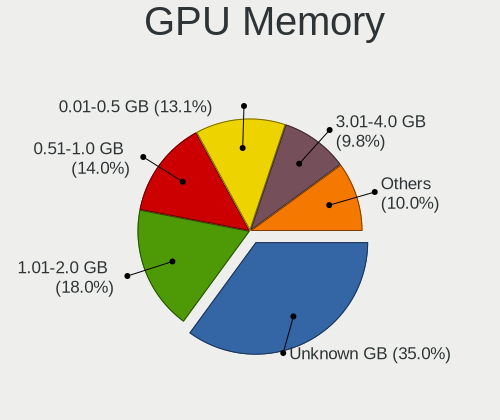

| Size in GB | Desktops | Percent |
|------------|----------|---------|
| Unknown    | 73       | 29.2%   |
| 1.01-2.0   | 46       | 18.4%   |
| 0.51-1.0   | 44       | 17.6%   |
| 0.01-0.5   | 43       | 17.2%   |
| 3.01-4.0   | 26       | 10.4%   |
| 7.01-8.0   | 9        | 3.6%    |
| 5.01-6.0   | 6        | 2.4%    |
| 2.01-3.0   | 2        | 0.8%    |
| 8.01-16.0  | 1        | 0.4%    |

Monitor
-------

Monitor Vendor
--------------

Monitor vendors

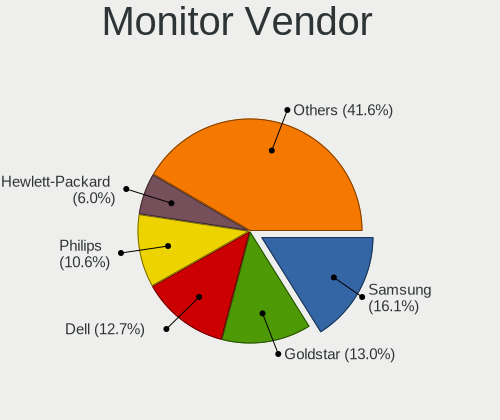

| Vendor               | Desktops | Percent |
|----------------------|----------|---------|
| Samsung Electronics  | 51       | 21.89%  |
| Goldstar             | 37       | 15.88%  |
| Dell                 | 26       | 11.16%  |
| Philips              | 23       | 9.87%   |
| Hewlett-Packard      | 14       | 6.01%   |
| BenQ                 | 13       | 5.58%   |
| Ancor Communications | 12       | 5.15%   |
| Acer                 | 10       | 4.29%   |
| ViewSonic            | 9        | 3.86%   |
| Lenovo               | 6        | 2.58%   |
| AOC                  | 6        | 2.58%   |
| LG Electronics       | 4        | 1.72%   |
| OEM                  | 3        | 1.29%   |
| Belinea              | 3        | 1.29%   |
| Unknown              | 2        | 0.86%   |
| HIC                  | 2        | 0.86%   |
| ASUSTek Computer     | 2        | 0.86%   |
| Vestel Elektronik    | 1        | 0.43%   |
| Toshiba              | 1        | 0.43%   |
| Panasonic            | 1        | 0.43%   |
| Medion               | 1        | 0.43%   |
| LED                  | 1        | 0.43%   |
| KTC                  | 1        | 0.43%   |
| GDH                  | 1        | 0.43%   |
| Fujitsu Siemens      | 1        | 0.43%   |
| Arnos Instruments    | 1        | 0.43%   |
| Unknown              | 1        | 0.43%   |

Monitor Model
-------------

Monitor models

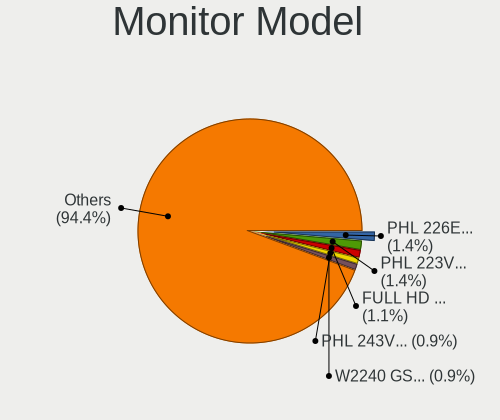

| Model                                                                 | Desktops | Percent |
|-----------------------------------------------------------------------|----------|---------|
| Philips PHL 226E9Q PHLC17D 1920x1080 476x268mm 21.5-inch              | 4        | 1.63%   |
| Philips PHL 223V5 PHLC0CF 1920x1080 477x268mm 21.5-inch               | 4        | 1.63%   |
| Goldstar W2240 GSM57A0 1920x1080 477x268mm 21.5-inch                  | 4        | 1.63%   |
| Goldstar FULL HD GSM5B55 1920x1080 480x270mm 21.7-inch                | 4        | 1.63%   |
| Samsung Electronics C24F390 SAM0D2C 1920x1080 521x293mm 23.5-inch     | 3        | 1.22%   |
| Goldstar W2243 GSM56FE 1920x1080 477x268mm 21.5-inch                  | 3        | 1.22%   |
| Samsung Electronics SyncMaster SAM0564 1360x768 410x230mm 18.5-inch   | 2        | 0.81%   |
| Samsung Electronics SyncMaster SAM022B 1280x1024 338x270mm 17.0-inch  | 2        | 0.81%   |
| Samsung Electronics SyncMaster SAM01B7 1280x1024 338x270mm 17.0-inch  | 2        | 0.81%   |
| Samsung Electronics SMBX2440 SAM068B 1920x1080 531x299mm 24.0-inch    | 2        | 0.81%   |
| Samsung Electronics S24F350 SAM0D20 1920x1080 521x293mm 23.5-inch     | 2        | 0.81%   |
| Samsung Electronics S23C350 SAM0A36 1920x1080 510x287mm 23.0-inch     | 2        | 0.81%   |
| Samsung Electronics S23C350 SAM0A35 1920x1080 510x287mm 23.0-inch     | 2        | 0.81%   |
| Samsung Electronics S22B300 SAM08AA 1920x1080 477x268mm 21.5-inch     | 2        | 0.81%   |
| Philips PHL 243V5 PHLC0D1 1920x1080 521x293mm 23.5-inch               | 2        | 0.81%   |
| Philips 226V4 PHLC0B1 1920x1080 477x268mm 21.5-inch                   | 2        | 0.81%   |
| OEM 32W_LCD_TV OEM3700 1920x540                                       | 2        | 0.81%   |
| Lenovo L24i-10 LEN65D6 1920x1080 527x296mm 23.8-inch                  | 2        | 0.81%   |
| HIC LCD Monitor HIC0001 1920x1080 256x192mm 12.6-inch                 | 2        | 0.81%   |
| Goldstar W2252 GSM567E 1680x1050 474x296mm 22.0-inch                  | 2        | 0.81%   |
| Goldstar IPS FULLHD GSM5AB6 1920x1080 480x270mm 21.7-inch             | 2        | 0.81%   |
| Goldstar 24MP55 GSM5A20 1920x1080 510x290mm 23.1-inch                 | 2        | 0.81%   |
| Dell S2421HN DEL41F1 1920x1080 527x296mm 23.8-inch                    | 2        | 0.81%   |
| Dell P2717H DEL40F6 1920x1080 598x336mm 27.0-inch                     | 2        | 0.81%   |
| Dell 1908FP DEL4026 1280x1024 376x301mm 19.0-inch                     | 2        | 0.81%   |
| Ancor Communications ASUS VW193D ACI19D5 1440x900 410x260mm 19.1-inch | 2        | 0.81%   |
| Acer V196HQL ACR033D 1366x768 410x230mm 18.5-inch                     | 2        | 0.81%   |
| ViewSonic VX2260WM VSCFC21 1920x1080 477x268mm 21.5-inch              | 1        | 0.41%   |
| ViewSonic VX2209 SERIES VSC662E 1920x1080 477x268mm 21.5-inch         | 1        | 0.41%   |
| ViewSonic VP2765 SERIES VSC9F28 1920x1080 598x336mm 27.0-inch         | 1        | 0.41%   |
| ViewSonic VA2342 SERIES VSCFA2B 1920x1080 509x286mm 23.0-inch         | 1        | 0.41%   |
| ViewSonic VA2246 SERIES VSC6F2E 1920x1080 477x268mm 21.5-inch         | 1        | 0.41%   |
| ViewSonic VA2013wSERIES VSCF122 1600x900 443x249mm 20.0-inch          | 1        | 0.41%   |
| ViewSonic VA1931 Series VSC5826 1366x768 410x230mm 18.5-inch          | 1        | 0.41%   |
| ViewSonic LCD Monitor VA2231 Series                                   | 1        | 0.41%   |
| ViewSonic LCD Monitor VA2213w 1920x1080                               | 1        | 0.41%   |
| Vestel Elektronik 28W_LCD_TV VES3700 1920x540                         | 1        | 0.41%   |
| Unknown LCD Monitor TSL 24MT600BF 3840x1080                           | 1        | 0.41%   |
| Unknown LCD Monitor TSL 24MT600BF                                     | 1        | 0.41%   |
| Unknown LCD Monitor Kingston Technology 40'TV 1834x1031               | 1        | 0.41%   |
| Toshiba TV TSB0108 1920x540                                           | 1        | 0.41%   |
| Samsung Electronics SyncMaster SAM059A 1920x1080 477x268mm 21.5-inch  | 1        | 0.41%   |
| Samsung Electronics SyncMaster SAM0589 1920x1080 521x293mm 23.5-inch  | 1        | 0.41%   |
| Samsung Electronics SyncMaster SAM04D5 1920x540                       | 1        | 0.41%   |
| Samsung Electronics SyncMaster SAM0420 1680x1050 474x296mm 22.0-inch  | 1        | 0.41%   |
| Samsung Electronics SyncMaster SAM03CF 1280x1024 338x270mm 17.0-inch  | 1        | 0.41%   |
| Samsung Electronics SyncMaster SAM037C 1680x1050 474x296mm 22.0-inch  | 1        | 0.41%   |
| Samsung Electronics SyncMaster SAM036F 1440x900 428x255mm 19.6-inch   | 1        | 0.41%   |
| Samsung Electronics SyncMaster SAM030D 1680x1050 474x296mm 22.0-inch  | 1        | 0.41%   |
| Samsung Electronics SyncMaster SAM027F 1680x1050 474x296mm 22.0-inch  | 1        | 0.41%   |
| Samsung Electronics SyncMaster SAM0248 1280x1024 376x301mm 19.0-inch  | 1        | 0.41%   |
| Samsung Electronics SyncMaster SAM021C 1400x1050 408x300mm 19.9-inch  | 1        | 0.41%   |
| Samsung Electronics SyncMaster SAM01F9 1280x1024 376x301mm 19.0-inch  | 1        | 0.41%   |
| Samsung Electronics SyncMaster SAM01E4 1280x1024 376x301mm 19.0-inch  | 1        | 0.41%   |
| Samsung Electronics SyncMaster SAM011E 1280x1024 338x270mm 17.0-inch  | 1        | 0.41%   |
| Samsung Electronics SyncMaster SAM010B 1280x1024 340x270mm 17.1-inch  | 1        | 0.41%   |
| Samsung Electronics SyncMaster SAM0108 1280x1024 312x234mm 15.4-inch  | 1        | 0.41%   |
| Samsung Electronics SyncMaster SAM0070 1280x1024 352x264mm 17.3-inch  | 1        | 0.41%   |
| Samsung Electronics SyncMaster SAM006E 1280x1024 338x270mm 17.0-inch  | 1        | 0.41%   |
| Samsung Electronics SMS19A100 SAM0867 1366x768 410x230mm 18.5-inch    | 1        | 0.41%   |

Monitor Resolution
------------------

Monitor screen resolution

| Resolution         | Desktops | Percent |
|--------------------|----------|---------|
| 1920x1080 (FHD)    | 122      | 53.51%  |
| 1280x1024 (SXGA)   | 33       | 14.47%  |
| 1680x1050 (WSXGA+) | 15       | 6.58%   |
| 3840x2160 (4K)     | 12       | 5.26%   |
| 1440x900 (WXGA+)   | 10       | 4.39%   |
| 1366x768 (WXGA)    | 9        | 3.95%   |
| 2560x1440 (QHD)    | 4        | 1.75%   |
| 1920x540           | 4        | 1.75%   |
| 1360x768           | 4        | 1.75%   |
| 1920x1200 (WUXGA)  | 3        | 1.32%   |
| Unknown            | 3        | 1.32%   |
| 3840x1080          | 2        | 0.88%   |
| 2560x1080          | 2        | 0.88%   |
| 1600x1200          | 2        | 0.88%   |
| 1834x1031          | 1        | 0.44%   |
| 1600x900 (HD+)     | 1        | 0.44%   |
| 1400x1050          | 1        | 0.44%   |

Monitor Diagonal
----------------

Diagonal size in inches

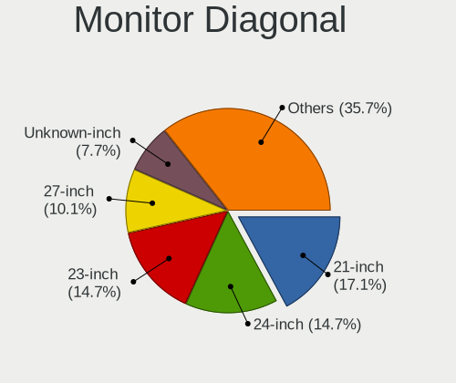

| Inches  | Desktops | Percent |
|---------|----------|---------|
| 21      | 46       | 19.74%  |
| 23      | 41       | 17.6%   |
| 24      | 27       | 11.59%  |
| Unknown | 22       | 9.44%   |
| 19      | 20       | 8.58%   |
| 17      | 19       | 8.15%   |
| 27      | 17       | 7.3%    |
| 18      | 14       | 6.01%   |
| 22      | 10       | 4.29%   |
| 20      | 3        | 1.29%   |
| 84      | 2        | 0.86%   |
| 72      | 2        | 0.86%   |
| 34      | 2        | 0.86%   |
| 12      | 2        | 0.86%   |
| 65      | 1        | 0.43%   |
| 52      | 1        | 0.43%   |
| 46      | 1        | 0.43%   |
| 26      | 1        | 0.43%   |
| 25      | 1        | 0.43%   |
| 15      | 1        | 0.43%   |

Monitor Width
-------------

Physical width

| Width in mm | Desktops | Percent |
|-------------|----------|---------|
| 501-600     | 80       | 35.71%  |
| 401-500     | 76       | 33.93%  |
| Unknown     | 22       | 9.82%   |
| 301-350     | 19       | 8.48%   |
| 351-400     | 15       | 6.7%    |
| 1501-2000   | 4        | 1.79%   |
| 1001-1500   | 3        | 1.34%   |
| 701-800     | 2        | 0.89%   |
| 201-300     | 2        | 0.89%   |
| 601-700     | 1        | 0.45%   |

Aspect Ratio
------------

Proportional relationship between the width and the height

| Ratio   | Desktops | Percent |
|---------|----------|---------|
| 16/9    | 135      | 60.81%  |
| 5/4     | 29       | 13.06%  |
| 16/10   | 24       | 10.81%  |
| Unknown | 20       | 9.01%   |
| 4/3     | 6        | 2.7%    |
| 3/2     | 4        | 1.8%    |
| 21/9    | 2        | 0.9%    |
| 6/5     | 1        | 0.45%   |
| 32/9    | 1        | 0.45%   |

Monitor Area
------------

Area in inch

| Area in inch | Desktops | Percent |
|----------------|----------|---------|
| 201-250        | 103      | 45.37%  |
| 151-200        | 35       | 15.42%  |
| 141-150        | 30       | 13.22%  |
| Unknown        | 22       | 9.69%   |
| 301-350        | 18       | 7.93%   |
| 251-300        | 7        | 3.08%   |
| More than 1000 | 6        | 2.64%   |
| 71-80          | 2        | 0.88%   |
| 351-500        | 2        | 0.88%   |
| 111-120        | 1        | 0.44%   |
| 501-1000       | 1        | 0.44%   |

Pixel Density
-------------

Pixels per inch

| Density | Desktops | Percent |
|---------|----------|---------|
| 51-100  | 143      | 63.56%  |
| 101-120 | 50       | 22.22%  |
| Unknown | 22       | 9.78%   |
| 1-50    | 5        | 2.22%   |
| 161-240 | 5        | 2.22%   |

Multiple Monitors
-----------------

Total monitors connected

| Total | Desktops | Percent |
|-------|----------|---------|
| 1     | 205      | 83.33%  |
| 2     | 27       | 10.98%  |
| 0     | 12       | 4.88%   |
| 3     | 2        | 0.81%   |

Network
-------

Net Controller Vendor
---------------------

Controller vendors

| Vendor                            | Desktops | Percent |
|-----------------------------------|----------|---------|
| Realtek Semiconductor             | 168      | 55.81%  |
| Intel                             | 52       | 17.28%  |
| Qualcomm Atheros                  | 26       | 8.64%   |
| Nvidia                            | 11       | 3.65%   |
| TP-Link                           | 9        | 2.99%   |
| Qualcomm Atheros Communications   | 8        | 2.66%   |
| Ralink Technology                 | 7        | 2.33%   |
| Broadcom                          | 3        | 1%      |
| Ralink                            | 2        | 0.66%   |
| Edimax Technology                 | 2        | 0.66%   |
| ZyXEL Communications              | 1        | 0.33%   |
| Xiaomi                            | 1        | 0.33%   |
| VIA Technologies                  | 1        | 0.33%   |
| Texas Instruments                 | 1        | 0.33%   |
| Sundance Technology Inc / IC Plus | 1        | 0.33%   |
| Sigma Designs                     | 1        | 0.33%   |
| OPPO Electronics                  | 1        | 0.33%   |
| MediaTek                          | 1        | 0.33%   |
| LSI                               | 1        | 0.33%   |
| D-Link System                     | 1        | 0.33%   |
| D-Link                            | 1        | 0.33%   |
| ASIX Electronics                  | 1        | 0.33%   |
| ADMtek                            | 1        | 0.33%   |

Net Controller Model
--------------------

Controller models

| Model                                                                         | Desktops | Percent |
|-------------------------------------------------------------------------------|----------|---------|
| Realtek RTL8111/8168/8411 PCI Express Gigabit Ethernet Controller             | 145      | 45.45%  |
| Realtek RTL810xE PCI Express Fast Ethernet controller                         | 9        | 2.82%   |
| Intel I211 Gigabit Network Connection                                         | 9        | 2.82%   |
| Qualcomm Atheros AR9271 802.11n                                               | 7        | 2.19%   |
| Intel Ethernet Connection (2) I219-V                                          | 7        | 2.19%   |
| Intel 82579LM Gigabit Network Connection (Lewisville)                         | 7        | 2.19%   |
| Realtek RTL-8100/8101L/8139 PCI Fast Ethernet Adapter                         | 6        | 1.88%   |
| Qualcomm Atheros AR2417 Wireless Network Adapter [AR5007G 802.11bg]           | 5        | 1.57%   |
| Nvidia MCP61 Ethernet                                                         | 5        | 1.57%   |
| TP-Link TL-WN722N v2/v3 [Realtek RTL8188EUS]                                  | 4        | 1.25%   |
| Realtek RTL8125 2.5GbE Controller                                             | 4        | 1.25%   |
| Qualcomm Atheros AR8131 Gigabit Ethernet                                      | 4        | 1.25%   |
| Intel 82567LM-3 Gigabit Network Connection                                    | 4        | 1.25%   |
| Realtek RTL-8110SC/8169SC Gigabit Ethernet                                    | 3        | 0.94%   |
| Ralink MT7601U Wireless Adapter                                               | 3        | 0.94%   |
| Qualcomm Atheros AR9462 Wireless Network Adapter                              | 3        | 0.94%   |
| Qualcomm Atheros AR9227 Wireless Network Adapter                              | 3        | 0.94%   |
| Qualcomm Atheros AR8161 Gigabit Ethernet                                      | 3        | 0.94%   |
| Intel Wireless 8265 / 8275                                                    | 3        | 0.94%   |
| Intel Wi-Fi 6 AX200                                                           | 3        | 0.94%   |
| Intel Ethernet Connection I217-LM                                             | 3        | 0.94%   |
| Intel Ethernet Connection (7) I219-V                                          | 3        | 0.94%   |
| Intel 82579V Gigabit Network Connection                                       | 3        | 0.94%   |
| Intel 82566DM-2 Gigabit Network Connection                                    | 3        | 0.94%   |
| TP-Link Archer T2U PLUS [RTL8821AU]                                           | 2        | 0.63%   |
| TP-Link AC600 wireless Realtek RTL8811AU [Archer T2U Nano]                    | 2        | 0.63%   |
| Realtek RTL8821CE 802.11ac PCIe Wireless Network Adapter                      | 2        | 0.63%   |
| Realtek RTL8188EUS 802.11n Wireless Network Adapter                           | 2        | 0.63%   |
| Realtek RTL8188EE Wireless Network Adapter                                    | 2        | 0.63%   |
| Realtek RTL8188CUS 802.11n WLAN Adapter                                       | 2        | 0.63%   |
| Qualcomm Atheros AR8151 v2.0 Gigabit Ethernet                                 | 2        | 0.63%   |
| Qualcomm Atheros AR8121/AR8113/AR8114 Gigabit or Fast Ethernet                | 2        | 0.63%   |
| Nvidia MCP77 Ethernet                                                         | 2        | 0.63%   |
| Intel Ethernet Connection I217-V                                              | 2        | 0.63%   |
| Intel Ethernet Connection (7) I219-LM                                         | 2        | 0.63%   |
| Edimax 802.11ac WLAN Adapter                                                  | 2        | 0.63%   |
| Broadcom NetXtreme BCM5764M Gigabit Ethernet PCIe                             | 2        | 0.63%   |
| ZyXEL NWD-270N Wireless N-lite USB Adapter                                    | 1        | 0.31%   |
| Xiaomi Mi/Redmi series (RNDIS)                                                | 1        | 0.31%   |
| VIA VT6102/VT6103 [Rhine-II]                                                  | 1        | 0.31%   |
| TP-Link Archer T3U [Realtek RTL8812BU]                                        | 1        | 0.31%   |
| Texas Instruments CC2531 ZigBee                                               | 1        | 0.31%   |
| Sundance Inc / IC Plus IC Plus IP100A Integrated 10/100 Ethernet MAC + PHY    | 1        | 0.31%   |
| Sigma Designs Aeotec Z-Stick Gen5 (ZW090) - UZB                               | 1        | 0.31%   |
| Realtek RTL8192EU 802.11b/g/n WLAN Adapter                                    | 1        | 0.31%   |
| Realtek RTL8188SU 802.11n WLAN Adapter                                        | 1        | 0.31%   |
| Realtek RTL8169 PCI Gigabit Ethernet Controller                               | 1        | 0.31%   |
| Ralink RT5372 Wireless Adapter                                                | 1        | 0.31%   |
| Ralink RT3072 Wireless Adapter                                                | 1        | 0.31%   |
| Ralink RT2870/RT3070 Wireless Adapter                                         | 1        | 0.31%   |
| Ralink RT2070 Wireless Adapter                                                | 1        | 0.31%   |
| Ralink RT5390 Wireless 802.11n 1T/1R PCIe                                     | 1        | 0.31%   |
| Ralink RT2561/RT61 802.11g PCI                                                | 1        | 0.31%   |
| Qualcomm Atheros Killer E220x Gigabit Ethernet Controller                     | 1        | 0.31%   |
| Qualcomm Atheros TP-Link TL-WN322G v3 / TL-WN422G v2 802.11g [Atheros AR9271] | 1        | 0.31%   |
| Qualcomm Atheros AR9485 Wireless Network Adapter                              | 1        | 0.31%   |
| Qualcomm Atheros AR93xx Wireless Network Adapter                              | 1        | 0.31%   |
| Qualcomm Atheros AR9287 Wireless Network Adapter (PCI-Express)                | 1        | 0.31%   |
| Qualcomm Atheros AR8152 v2.0 Fast Ethernet                                    | 1        | 0.31%   |
| Qualcomm Atheros AR5212/5213/2414 Wireless Network Adapter                    | 1        | 0.31%   |

Wireless Vendor
---------------

Wireless vendors

| Vendor                          | Desktops | Percent |
|---------------------------------|----------|---------|
| Qualcomm Atheros                | 15       | 23.81%  |
| Realtek Semiconductor           | 10       | 15.87%  |
| TP-Link                         | 9        | 14.29%  |
| Qualcomm Atheros Communications | 8        | 12.7%   |
| Ralink Technology               | 7        | 11.11%  |
| Intel                           | 7        | 11.11%  |
| Ralink                          | 2        | 3.17%   |
| Edimax Technology               | 2        | 3.17%   |
| ZyXEL Communications            | 1        | 1.59%   |
| D-Link                          | 1        | 1.59%   |
| Broadcom                        | 1        | 1.59%   |

Wireless Model
--------------

Wireless models

| Model                                                                         | Desktops | Percent |
|-------------------------------------------------------------------------------|----------|---------|
| Qualcomm Atheros AR9271 802.11n                                               | 7        | 11.11%  |
| Qualcomm Atheros AR2417 Wireless Network Adapter [AR5007G 802.11bg]           | 5        | 7.94%   |
| TP-Link TL-WN722N v2/v3 [Realtek RTL8188EUS]                                  | 4        | 6.35%   |
| Ralink MT7601U Wireless Adapter                                               | 3        | 4.76%   |
| Qualcomm Atheros AR9462 Wireless Network Adapter                              | 3        | 4.76%   |
| Qualcomm Atheros AR9227 Wireless Network Adapter                              | 3        | 4.76%   |
| Intel Wireless 8265 / 8275                                                    | 3        | 4.76%   |
| Intel Wi-Fi 6 AX200                                                           | 3        | 4.76%   |
| TP-Link Archer T2U PLUS [RTL8821AU]                                           | 2        | 3.17%   |
| TP-Link AC600 wireless Realtek RTL8811AU [Archer T2U Nano]                    | 2        | 3.17%   |
| Realtek RTL8821CE 802.11ac PCIe Wireless Network Adapter                      | 2        | 3.17%   |
| Realtek RTL8188EUS 802.11n Wireless Network Adapter                           | 2        | 3.17%   |
| Realtek RTL8188EE Wireless Network Adapter                                    | 2        | 3.17%   |
| Realtek RTL8188CUS 802.11n WLAN Adapter                                       | 2        | 3.17%   |
| Edimax 802.11ac WLAN Adapter                                                  | 2        | 3.17%   |
| ZyXEL NWD-270N Wireless N-lite USB Adapter                                    | 1        | 1.59%   |
| TP-Link Archer T3U [Realtek RTL8812BU]                                        | 1        | 1.59%   |
| Realtek RTL8192EU 802.11b/g/n WLAN Adapter                                    | 1        | 1.59%   |
| Realtek RTL8188SU 802.11n WLAN Adapter                                        | 1        | 1.59%   |
| Ralink RT5372 Wireless Adapter                                                | 1        | 1.59%   |
| Ralink RT3072 Wireless Adapter                                                | 1        | 1.59%   |
| Ralink RT2870/RT3070 Wireless Adapter                                         | 1        | 1.59%   |
| Ralink RT2070 Wireless Adapter                                                | 1        | 1.59%   |
| Ralink RT5390 Wireless 802.11n 1T/1R PCIe                                     | 1        | 1.59%   |
| Ralink RT2561/RT61 802.11g PCI                                                | 1        | 1.59%   |
| Qualcomm Atheros TP-Link TL-WN322G v3 / TL-WN422G v2 802.11g [Atheros AR9271] | 1        | 1.59%   |
| Qualcomm Atheros AR9485 Wireless Network Adapter                              | 1        | 1.59%   |
| Qualcomm Atheros AR93xx Wireless Network Adapter                              | 1        | 1.59%   |
| Qualcomm Atheros AR9287 Wireless Network Adapter (PCI-Express)                | 1        | 1.59%   |
| Qualcomm Atheros AR5212/5213/2414 Wireless Network Adapter                    | 1        | 1.59%   |
| Intel Wireless-AC 9260                                                        | 1        | 1.59%   |
| D-Link 802.11n WLAN Adapter                                                   | 1        | 1.59%   |
| Broadcom BCM4306 802.11b/g Wireless LAN Controller                            | 1        | 1.59%   |

Ethernet Vendor
---------------

Ethernet vendors

| Vendor                            | Desktops | Percent |
|-----------------------------------|----------|---------|
| Realtek Semiconductor             | 166      | 66.67%  |
| Intel                             | 49       | 19.68%  |
| Qualcomm Atheros                  | 13       | 5.22%   |
| Nvidia                            | 11       | 4.42%   |
| Broadcom                          | 2        | 0.8%    |
| Xiaomi                            | 1        | 0.4%    |
| VIA Technologies                  | 1        | 0.4%    |
| Sundance Technology Inc / IC Plus | 1        | 0.4%    |
| OPPO Electronics                  | 1        | 0.4%    |
| MediaTek                          | 1        | 0.4%    |
| D-Link System                     | 1        | 0.4%    |
| ASIX Electronics                  | 1        | 0.4%    |
| ADMtek                            | 1        | 0.4%    |

Ethernet Model
--------------

Ethernet models

| Model                                                                      | Desktops | Percent |
|----------------------------------------------------------------------------|----------|---------|
| Realtek RTL8111/8168/8411 PCI Express Gigabit Ethernet Controller          | 145      | 57.31%  |
| Realtek RTL810xE PCI Express Fast Ethernet controller                      | 9        | 3.56%   |
| Intel I211 Gigabit Network Connection                                      | 9        | 3.56%   |
| Intel Ethernet Connection (2) I219-V                                       | 7        | 2.77%   |
| Intel 82579LM Gigabit Network Connection (Lewisville)                      | 7        | 2.77%   |
| Realtek RTL-8100/8101L/8139 PCI Fast Ethernet Adapter                      | 6        | 2.37%   |
| Nvidia MCP61 Ethernet                                                      | 5        | 1.98%   |
| Realtek RTL8125 2.5GbE Controller                                          | 4        | 1.58%   |
| Qualcomm Atheros AR8131 Gigabit Ethernet                                   | 4        | 1.58%   |
| Intel 82567LM-3 Gigabit Network Connection                                 | 4        | 1.58%   |
| Realtek RTL-8110SC/8169SC Gigabit Ethernet                                 | 3        | 1.19%   |
| Qualcomm Atheros AR8161 Gigabit Ethernet                                   | 3        | 1.19%   |
| Intel Ethernet Connection I217-LM                                          | 3        | 1.19%   |
| Intel Ethernet Connection (7) I219-V                                       | 3        | 1.19%   |
| Intel 82579V Gigabit Network Connection                                    | 3        | 1.19%   |
| Intel 82566DM-2 Gigabit Network Connection                                 | 3        | 1.19%   |
| Qualcomm Atheros AR8151 v2.0 Gigabit Ethernet                              | 2        | 0.79%   |
| Qualcomm Atheros AR8121/AR8113/AR8114 Gigabit or Fast Ethernet             | 2        | 0.79%   |
| Nvidia MCP77 Ethernet                                                      | 2        | 0.79%   |
| Intel Ethernet Connection I217-V                                           | 2        | 0.79%   |
| Intel Ethernet Connection (7) I219-LM                                      | 2        | 0.79%   |
| Broadcom NetXtreme BCM5764M Gigabit Ethernet PCIe                          | 2        | 0.79%   |
| Xiaomi Mi/Redmi series (RNDIS)                                             | 1        | 0.4%    |
| VIA VT6102/VT6103 [Rhine-II]                                               | 1        | 0.4%    |
| Sundance Inc / IC Plus IC Plus IP100A Integrated 10/100 Ethernet MAC + PHY | 1        | 0.4%    |
| Realtek RTL8169 PCI Gigabit Ethernet Controller                            | 1        | 0.4%    |
| Qualcomm Atheros Killer E220x Gigabit Ethernet Controller                  | 1        | 0.4%    |
| Qualcomm Atheros AR8152 v2.0 Fast Ethernet                                 | 1        | 0.4%    |
| OPPO Find X2 Lite                                                          | 1        | 0.4%    |
| Nvidia MCP73 Ethernet                                                      | 1        | 0.4%    |
| Nvidia MCP65 Ethernet                                                      | 1        | 0.4%    |
| Nvidia MCP51 Ethernet Controller                                           | 1        | 0.4%    |
| Nvidia CK8S Ethernet Controller                                            | 1        | 0.4%    |
| MediaTek TECNO SPARK 3                                                     | 1        | 0.4%    |
| Intel PRO/100 VE Network Connection                                        | 1        | 0.4%    |
| Intel NM10/ICH7 Family LAN Controller                                      | 1        | 0.4%    |
| Intel Ethernet Connection (2) I218-LM                                      | 1        | 0.4%    |
| Intel 82578DM Gigabit Network Connection                                   | 1        | 0.4%    |
| Intel 82578DC Gigabit Network Connection                                   | 1        | 0.4%    |
| Intel 82575EB Gigabit Network Connection                                   | 1        | 0.4%    |
| Intel 82574L Gigabit Network Connection                                    | 1        | 0.4%    |
| Intel 80003ES2LAN Gigabit Ethernet Controller (Copper)                     | 1        | 0.4%    |
| D-Link System DGE-528T Gigabit Ethernet Adapter                            | 1        | 0.4%    |
| ASIX AX88179 Gigabit Ethernet                                              | 1        | 0.4%    |
| ADMtek AN8515 Ethernet                                                     | 1        | 0.4%    |

Net Controller Kind
-------------------

Ethernet, WiFi or modem

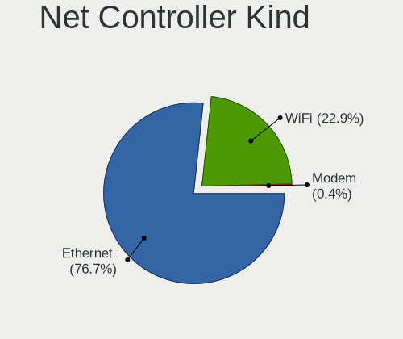

| Kind     | Desktops | Percent |
|----------|----------|---------|
| Ethernet | 239      | 78.88%  |
| WiFi     | 62       | 20.46%  |
| Modem    | 2        | 0.66%   |

Used Controller
---------------

Currently used network controller

| Kind     | Desktops | Percent |
|----------|----------|---------|
| Ethernet | 208      | 85.6%   |
| WiFi     | 35       | 14.4%   |

NICs
----

Total network controllers on board

| Total | Desktops | Percent |
|-------|----------|---------|
| 1     | 198      | 82.16%  |
| 2     | 36       | 14.94%  |
| 3     | 5        | 2.07%   |
| 5     | 1        | 0.41%   |
| 0     | 1        | 0.41%   |

IPv6
----

IPv6 vs IPv4

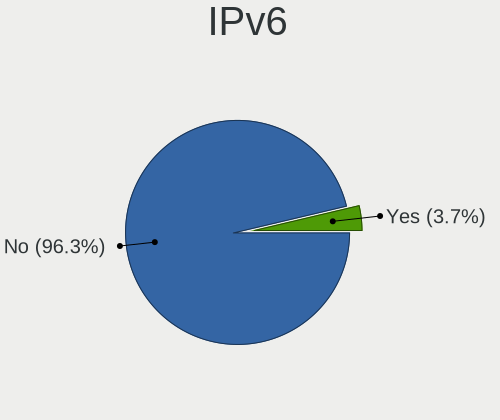

| Used | Desktops | Percent |
|------|----------|---------|
| No   | 238      | 99.17%  |
| Yes  | 2        | 0.83%   |

Bluetooth
---------

Bluetooth Vendor
----------------

Controller vendors

| Vendor                  | Desktops | Percent |
|-------------------------|----------|---------|
| Cambridge Silicon Radio | 14       | 46.67%  |
| Intel                   | 7        | 23.33%  |
| ASUSTek Computer        | 4        | 13.33%  |
| Lite-On Technology      | 2        | 6.67%   |
| IMC Networks            | 2        | 6.67%   |
| Apple                   | 1        | 3.33%   |

Bluetooth Model
---------------

Controller models

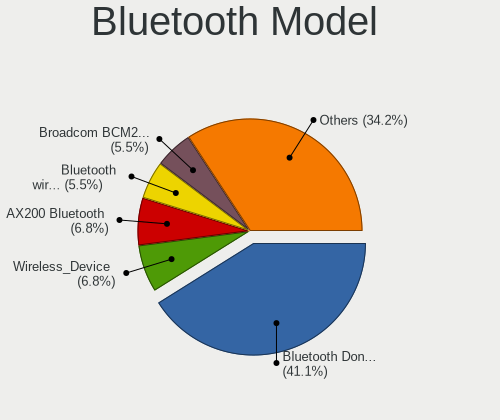

| Model                                               | Desktops | Percent |
|-----------------------------------------------------|----------|---------|
| Cambridge Silicon Radio Bluetooth Dongle (HCI mode) | 14       | 46.67%  |
| Intel Bluetooth wireless interface                  | 3        | 10%     |
| Intel AX200 Bluetooth                               | 3        | 10%     |
| Lite-On Bluetooth Device                            | 2        | 6.67%   |
| IMC Networks Bluetooth Radio                        | 2        | 6.67%   |
| ASUS Broadcom BCM20702A0 Bluetooth                  | 2        | 6.67%   |
| Intel Wireless-AC 9260 Bluetooth Adapter            | 1        | 3.33%   |
| ASUS Bluetooth Device                               | 1        | 3.33%   |
| ASUS ASUS USB-BT500                                 | 1        | 3.33%   |
| Apple Bluetooth HCI                                 | 1        | 3.33%   |

Sound
-----

Sound Vendor
------------

Sound card vendors

| Vendor                 | Desktops | Percent |
|------------------------|----------|---------|
| AMD                    | 138      | 37.5%   |
| Intel                  | 128      | 34.78%  |
| Nvidia                 | 77       | 20.92%  |
| Creative Labs          | 4        | 1.09%   |
| Generalplus Technology | 3        | 0.82%   |
| C-Media Electronics    | 3        | 0.82%   |
| VIA Technologies       | 2        | 0.54%   |
| Veho                   | 1        | 0.27%   |
| Turtle Beach           | 1        | 0.27%   |
| Syntek                 | 1        | 0.27%   |
| Sony                   | 1        | 0.27%   |
| RODE Microphones       | 1        | 0.27%   |
| Razer USA              | 1        | 0.27%   |
| Plantronics            | 1        | 0.27%   |
| Native Instruments     | 1        | 0.27%   |
| Meizu                  | 1        | 0.27%   |
| M-Audio                | 1        | 0.27%   |
| Logitech               | 1        | 0.27%   |
| Focusrite-Novation     | 1        | 0.27%   |
| ASUSTek Computer       | 1        | 0.27%   |

Sound Model
-----------

Sound card models

| Model                                                                             | Desktops | Percent |
|-----------------------------------------------------------------------------------|----------|---------|
| AMD SBx00 Azalia (Intel HDA)                                                      | 24       | 5.39%   |
| Intel NM10/ICH7 Family High Definition Audio Controller                           | 22       | 4.94%   |
| AMD Oland/Hainan/Cape Verde/Pitcairn HDMI Audio [Radeon HD 7000 Series]           | 19       | 4.27%   |
| AMD FCH Azalia Controller                                                         | 19       | 4.27%   |
| Intel 6 Series/C200 Series Chipset Family High Definition Audio Controller        | 18       | 4.04%   |
| AMD Family 17h (Models 00h-0fh) HD Audio Controller                               | 18       | 4.04%   |
| Intel 8 Series/C220 Series Chipset High Definition Audio Controller               | 17       | 3.82%   |
| AMD Ellesmere HDMI Audio [Radeon RX 470/480 / 570/580/590]                        | 17       | 3.82%   |
| AMD Family 17h/19h HD Audio Controller                                            | 15       | 3.37%   |
| Intel 7 Series/C216 Chipset Family High Definition Audio Controller               | 13       | 2.92%   |
| AMD Baffin HDMI/DP Audio [Radeon RX 550 640SP / RX 560/560X]                      | 13       | 2.92%   |
| Nvidia MCP61 High Definition Audio                                                | 11       | 2.47%   |
| AMD Starship/Matisse HD Audio Controller                                          | 11       | 2.47%   |
| Intel Xeon E3-1200 v3/4th Gen Core Processor HD Audio Controller                  | 9        | 2.02%   |
| Intel Cannon Lake PCH cAVS                                                        | 9        | 2.02%   |
| Intel 82801JI (ICH10 Family) HD Audio Controller                                  | 9        | 2.02%   |
| AMD Turks HDMI Audio [Radeon HD 6500/6600 / 6700M Series]                         | 9        | 2.02%   |
| AMD Raven/Raven2/Fenghuang HDMI/DP Audio Controller                               | 9        | 2.02%   |
| Intel 100 Series/C230 Series Chipset Family HD Audio Controller                   | 8        | 1.8%    |
| AMD RV710/730 HDMI Audio [Radeon HD 4000 series]                                  | 8        | 1.8%    |
| Nvidia GP107GL High Definition Audio Controller                                   | 7        | 1.57%   |
| Nvidia GK208 HDMI/DP Audio Controller                                             | 7        | 1.57%   |
| Intel 200 Series PCH HD Audio                                                     | 7        | 1.57%   |
| AMD Cedar HDMI Audio [Radeon HD 5400/6300/7300 Series]                            | 7        | 1.57%   |
| Nvidia High Definition Audio Controller                                           | 5        | 1.12%   |
| Nvidia GP106 High Definition Audio Controller                                     | 5        | 1.12%   |
| Intel 82801I (ICH9 Family) HD Audio Controller                                    | 5        | 1.12%   |
| Intel 5 Series/3400 Series Chipset High Definition Audio                          | 5        | 1.12%   |
| AMD RS880 HDMI Audio [Radeon HD 4200 Series]                                      | 5        | 1.12%   |
| AMD Caicos HDMI Audio [Radeon HD 6450 / 7450/8450/8490 OEM / R5 230/235/235X OEM] | 5        | 1.12%   |
| Nvidia GP104 High Definition Audio Controller                                     | 4        | 0.9%    |
| Nvidia GK106 HDMI Audio Controller                                                | 4        | 0.9%    |
| Intel 82801JD/DO (ICH10 Family) HD Audio Controller                               | 4        | 0.9%    |
| AMD Kabini HDMI/DP Audio                                                          | 4        | 0.9%    |
| Nvidia TU116 High Definition Audio Controller                                     | 3        | 0.67%   |
| Nvidia GP108 High Definition Audio Controller                                     | 3        | 0.67%   |
| Nvidia GK104 HDMI Audio Controller                                                | 3        | 0.67%   |
| Nvidia GF119 HDMI Audio Controller                                                | 3        | 0.67%   |
| Nvidia GF108 High Definition Audio Controller                                     | 3        | 0.67%   |
| Generalplus Technology IMYB 7.1 Channel                                           | 3        | 0.67%   |
| Creative Labs CA0106/CA0111 [SB Live!/Audigy/X-Fi Series]                         | 3        | 0.67%   |
| AMD Tobago HDMI Audio [Radeon R7 360 / R9 360 OEM]                                | 3        | 0.67%   |
| VIA Technologies VX900/VT8xxx High Definition Audio Controller                    | 2        | 0.45%   |
| Nvidia TU107 GeForce GTX 1650 High Definition Audio Controller                    | 2        | 0.45%   |
| Nvidia TU106 High Definition Audio Controller                                     | 2        | 0.45%   |
| Nvidia MCP72XE/MCP72P/MCP78U/MCP78S High Definition Audio                         | 2        | 0.45%   |
| Nvidia MCP65 High Definition Audio                                                | 2        | 0.45%   |
| Nvidia GM107 High Definition Audio Controller [GeForce 940MX]                     | 2        | 0.45%   |
| Nvidia GK107 HDMI Audio Controller                                                | 2        | 0.45%   |
| Nvidia GF116 High Definition Audio Controller                                     | 2        | 0.45%   |
| Nvidia GF106 High Definition Audio Controller                                     | 2        | 0.45%   |
| Intel Jasper Lake HD Audio                                                        | 2        | 0.45%   |
| Intel 9 Series Chipset Family HD Audio Controller                                 | 2        | 0.45%   |
| C-Media Electronics CM108 Audio Controller                                        | 2        | 0.45%   |
| AMD Trinity HDMI Audio Controller                                                 | 2        | 0.45%   |
| AMD RV770 HDMI Audio [Radeon HD 4850/4870]                                        | 2        | 0.45%   |
| AMD Renoir Radeon High Definition Audio Controller                                | 2        | 0.45%   |
| AMD Juniper HDMI Audio [Radeon HD 5700 Series]                                    | 2        | 0.45%   |
| Veho 2.4G Wireless Headset                                                        | 1        | 0.22%   |
| Turtle Beach PLa Headset                                                          | 1        | 0.22%   |

Memory
------

Memory Vendor
-------------

Memory module vendors

| Vendor              | Desktops | Percent |
|---------------------|----------|---------|
| Kingston            | 48       | 34.53%  |
| Unknown             | 32       | 23.02%  |
| Patriot             | 10       | 7.19%   |
| Samsung Electronics | 9        | 6.47%   |
| Apacer              | 6        | 4.32%   |
| Transcend           | 5        | 3.6%    |
| SK hynix            | 5        | 3.6%    |
| Crucial             | 5        | 3.6%    |
| A-DATA Technology   | 3        | 2.16%   |
| G.Skill             | 2        | 1.44%   |
| Elpida              | 2        | 1.44%   |
| Corsair             | 2        | 1.44%   |
| Unifosa             | 1        | 0.72%   |
| Ramos Technology    | 1        | 0.72%   |
| Ramaxel Technology  | 1        | 0.72%   |
| Qimonda             | 1        | 0.72%   |
| Nanya Technology    | 1        | 0.72%   |
| Mushkin             | 1        | 0.72%   |
| Micron Technology   | 1        | 0.72%   |
| GeIL                | 1        | 0.72%   |
| Exceleram           | 1        | 0.72%   |
| Unknown             | 1        | 0.72%   |

Memory Model
------------

Memory module models

| Model                                                                   | Desktops | Percent |
|-------------------------------------------------------------------------|----------|---------|
| Kingston RAM KHX3200C16D4/8GX 8192MB DIMM DDR4 3533MT/s                 | 4        | 2.56%   |
| Unknown RAM Module 2048MB DIMM 1333MT/s                                 | 3        | 1.92%   |
| Unknown RAM CL19-19-19 D4-2666 8192MB DIMM DDR4 2400MT/s                | 3        | 1.92%   |
| Kingston RAM KHX3200C16D4/16GX 16GB DIMM DDR4 3600MT/s                  | 3        | 1.92%   |
| Kingston RAM KHX2400C15/8G 8GB DIMM DDR4 2933MT/s                       | 3        | 1.92%   |
| Kingston RAM KHX1866C10D3/8G 8GB DIMM DDR3 1867MT/s                     | 3        | 1.92%   |
| Unknown RAM Module 4096MB DIMM 1600MT/s                                 | 2        | 1.28%   |
| Unknown RAM Module 2GB DIMM 1333MT/s                                    | 2        | 1.28%   |
| Unknown RAM Module 2048MB DIMM 400MT/s                                  | 2        | 1.28%   |
| Transcend RAM TS512MLK64V6H 4GB DIMM DDR3 1600MT/s                      | 2        | 1.28%   |
| Transcend RAM JM1333KLN-2G 2048MB DIMM DDR3 1333MT/s                    | 2        | 1.28%   |
| SK hynix RAM HMT451U6BFR8A-PB 4GB DIMM DDR3 1600MT/s                    | 2        | 1.28%   |
| Samsung RAM Module 4GB DIMM DDR3 1333MT/s                               | 2        | 1.28%   |
| Samsung RAM M393B1K70DH0-CH9 8GB DIMM DDR3 1333MT/s                     | 2        | 1.28%   |
| Samsung RAM M393B1K70CH0-CH9 8GB DIMM DDR3 1333MT/s                     | 2        | 1.28%   |
| Patriot RAM PSD34G133381 4GB DIMM DDR3 1333MT/s                         | 2        | 1.28%   |
| Patriot RAM 3000 C16 Series 8192MB DIMM DDR4 3200MT/s                   | 2        | 1.28%   |
| Kingston RAM KHX1866C10D3/4G 4GB DIMM DDR3 1867MT/s                     | 2        | 1.28%   |
| Kingston RAM KHX1600C9D3/4GX 4GB DIMM DDR3 2400MT/s                     | 2        | 1.28%   |
| Kingston RAM KHX1600C10D3/8G 8GB DIMM DDR3 1600MT/s                     | 2        | 1.28%   |
| Kingston RAM 9905595-010.A00LF 2048MB DIMM DDR3 1600MT/s                | 2        | 1.28%   |
| Kingston RAM 9905458-026.A00LF 4096MB DIMM DDR3 1333MT/s                | 2        | 1.28%   |
| Crucial RAM CT51264BA160BJ.C8F 4096MB DIMM DDR3 1600MT/s                | 2        | 1.28%   |
| Unknown RAM Module 512MB DIMM DDR                                       | 1        | 0.64%   |
| Unknown RAM Module 4GB DIMM 667MT/s                                     | 1        | 0.64%   |
| Unknown RAM Module 4096MB DIMM DDR3 667MT/s                             | 1        | 0.64%   |
| Unknown RAM Module 4096MB DIMM DDR3 1600MT/s                            | 1        | 0.64%   |
| Unknown RAM Module 4096MB DIMM DDR 1333MT/s                             | 1        | 0.64%   |
| Unknown RAM Module 2GB DIMM DDR2 800MT/s                                | 1        | 0.64%   |
| Unknown RAM Module 2GB DIMM DDR2 1067MT/s                               | 1        | 0.64%   |
| Unknown RAM Module 2GB DIMM 800MT/s                                     | 1        | 0.64%   |
| Unknown RAM Module 2GB DIMM                                             | 1        | 0.64%   |
| Unknown RAM Module 2048MB DIMM DDR3 667MT/s                             | 1        | 0.64%   |
| Unknown RAM Module 2048MB DIMM DDR2 800MT/s                             | 1        | 0.64%   |
| Unknown RAM Module 2048MB DIMM DDR2 667MT/s                             | 1        | 0.64%   |
| Unknown RAM Module 2048MB DIMM DDR 1333MT/s                             | 1        | 0.64%   |
| Unknown RAM Module 2048MB DIMM 800MT/s                                  | 1        | 0.64%   |
| Unknown RAM Module 1GB DIMM DDR2 800MT/s                                | 1        | 0.64%   |
| Unknown RAM Module 1GB DIMM DDR2 667MT/s                                | 1        | 0.64%   |
| Unknown RAM Module 1GB DIMM 800MT/s                                     | 1        | 0.64%   |
| Unknown RAM Module 1GB DIMM                                             | 1        | 0.64%   |
| Unknown RAM Module 1024MB DIMM DDR2 800MT/s                             | 1        | 0.64%   |
| Unknown RAM Module 1024MB DIMM DDR                                      | 1        | 0.64%   |
| Unknown RAM Module 1024MB DIMM 800MT/s                                  | 1        | 0.64%   |
| Unknown RAM Module 1024MB DIMM 400MT/s                                  | 1        | 0.64%   |
| Unknown RAM 991947 (996947) 2GB DIMM DDR3 1333MT/s                      | 1        | 0.64%   |
| Unknown RAM 3000 C16 Series 8192MB DIMM DDR4 2133MT/s                   | 1        | 0.64%   |
| Unifosa RAM GU512303EP02020000 2GB DIMM 1333MT/s                        | 1        | 0.64%   |
| Transcend RAM TS256MLK64V6N 2048MB DIMM DDR3 1600MT/s                   | 1        | 0.64%   |
| SK hynix RAM HYMP112U64CP8-S6 1GB DIMM DDR2 800MT/s                     | 1        | 0.64%   |
| SK hynix RAM HMT451U6AFR8C-PB 4GB DIMM DDR3 1600MT/s                    | 1        | 0.64%   |
| SK hynix RAM 48594D503132355536344350382D53362020 2GB DIMM DDR2 800MT/s | 1        | 0.64%   |
| Samsung RAM Module 4096MB DIMM DDR3 1333MT/s                            | 1        | 0.64%   |
| Samsung RAM M471B5173DB0-YK0 4GB SODIMM DDR3 1600MT/s                   | 1        | 0.64%   |
| Samsung RAM M471B1G73DB0-YK0 8GB SODIMM DDR3 1600MT/s                   | 1        | 0.64%   |
| Samsung RAM M391B5773CH0-CH9 2048MB DIMM DDR3 1333MT/s                  | 1        | 0.64%   |
| Samsung RAM M378B5773DH0-CH9 2048MB DIMM DDR3 1333MT/s                  | 1        | 0.64%   |
| Samsung RAM M378B5773CH0-CH9 2GB DIMM DDR3 1867MT/s                     | 1        | 0.64%   |
| Samsung RAM M378A1K43DB2-CTD 8GB DIMM DDR4 4333MT/s                     | 1        | 0.64%   |
| Ramos RAM EWB8GB681PAE-16IC 8GB DIMM DDR3 1600MT/s                      | 1        | 0.64%   |

Memory Kind
-----------

Memory module kinds

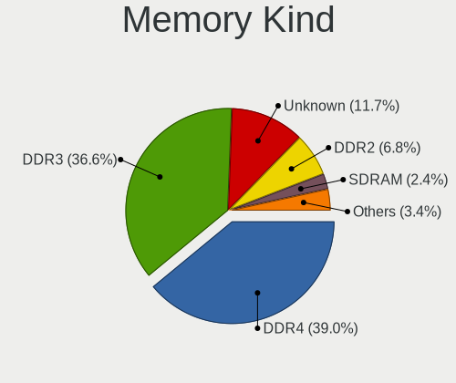

| Kind    | Desktops | Percent |
|---------|----------|---------|
| DDR3    | 45       | 37.82%  |
| DDR4    | 40       | 33.61%  |
| Unknown | 17       | 14.29%  |
| DDR2    | 12       | 10.08%  |
| SDRAM   | 3        | 2.52%   |
| DDR     | 2        | 1.68%   |

Memory Form Factor
------------------

Physical design of the memory module

| Name    | Desktops | Percent |
|---------|----------|---------|
| DIMM    | 113      | 96.58%  |
| SODIMM  | 3        | 2.56%   |
| FB-DIMM | 1        | 0.85%   |

Memory Size
-----------

Memory module size

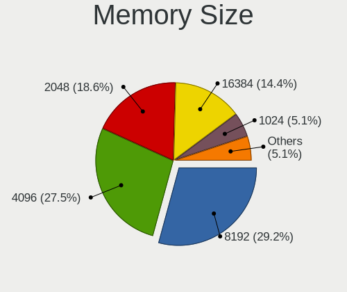

| Size  | Desktops | Percent |
|-------|----------|---------|
| 4096  | 40       | 29.85%  |
| 8192  | 37       | 27.61%  |
| 2048  | 29       | 21.64%  |
| 16384 | 15       | 11.19%  |
| 1024  | 9        | 6.72%   |
| 32768 | 3        | 2.24%   |
| 512   | 1        | 0.75%   |

Memory Speed
------------

Memory module speed

| Speed   | Desktops | Percent |
|---------|----------|---------|
| 1333    | 27       | 20.15%  |
| 1600    | 25       | 18.66%  |
| 800     | 12       | 8.96%   |
| 3200    | 8        | 5.97%   |
| 2667    | 7        | 5.22%   |
| 2400    | 7        | 5.22%   |
| 667     | 7        | 5.22%   |
| 2133    | 6        | 4.48%   |
| 3600    | 5        | 3.73%   |
| 3533    | 4        | 2.99%   |
| 2933    | 3        | 2.24%   |
| 2666    | 3        | 2.24%   |
| 1867    | 3        | 2.24%   |
| 400     | 3        | 2.24%   |
| 3733    | 2        | 1.49%   |
| 1866    | 2        | 1.49%   |
| Unknown | 2        | 1.49%   |
| 4333    | 1        | 0.75%   |
| 3334    | 1        | 0.75%   |
| 3333    | 1        | 0.75%   |
| 3151    | 1        | 0.75%   |
| 2800    | 1        | 0.75%   |
| 1400    | 1        | 0.75%   |
| 1067    | 1        | 0.75%   |
| 1066    | 1        | 0.75%   |

Printers & scanners
-------------------

Printer Vendor
--------------

Printer device vendors

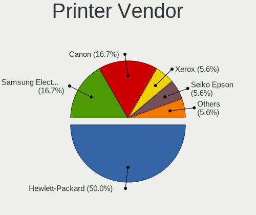

| Vendor                | Desktops | Percent |
|-----------------------|----------|---------|
| Hewlett-Packard       | 8        | 57.14%  |
| Canon                 | 3        | 21.43%  |
| Xerox                 | 1        | 7.14%   |
| Samsung Electronics   | 1        | 7.14%   |
| Lexmark International | 1        | 7.14%   |

Printer Model
-------------

Printer device models

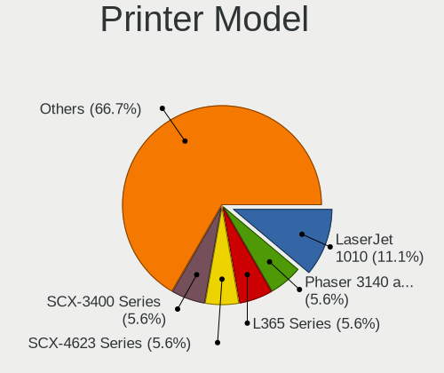

| Model                                      | Desktops | Percent |
|--------------------------------------------|----------|---------|
| Xerox Phaser 3140 and 3155                 | 1        | 7.14%   |
| Samsung SCX-3400 Series                    | 1        | 7.14%   |
| Lexmark International InkJet Color Printer | 1        | 7.14%   |
| HP LaserJet P2015 series                   | 1        | 7.14%   |
| HP LaserJet P2014                          | 1        | 7.14%   |
| HP LaserJet P1005                          | 1        | 7.14%   |
| HP LaserJet M101-M106                      | 1        | 7.14%   |
| HP LaserJet CP 1025                        | 1        | 7.14%   |
| HP LaserJet 1200                           | 1        | 7.14%   |
| HP LaserJet 1018                           | 1        | 7.14%   |
| HP LaserJet 1010                           | 1        | 7.14%   |
| Canon LiDE 300                             | 1        | 7.14%   |
| Canon LBP810                               | 1        | 7.14%   |
| Canon LBP2900                              | 1        | 7.14%   |

Scanner Vendor
--------------

Scanner device vendors

| Vendor             | Desktops | Percent |
|--------------------|----------|---------|
| Canon              | 2        | 40%     |
| Ultima Electronics | 1        | 20%     |
| Mustek Systems     | 1        | 20%     |
| Hewlett-Packard    | 1        | 20%     |

Scanner Model
-------------

Scanner device models

| Model                                                                                 | Desktops | Percent |
|---------------------------------------------------------------------------------------|----------|---------|
| Ultima Artec Ultima 2000 (GT6801 based)/Lifetec LT9385/ScanMagic 1200 UB Plus Scanner | 1        | 20%     |
| Mustek Systems BearPaw 1200 CU Plus                                                   | 1        | 20%     |
| HP ScanJet 2200c                                                                      | 1        | 20%     |
| Canon CanoScan LiDE 120                                                               | 1        | 20%     |
| Canon CanoScan LiDE 100                                                               | 1        | 20%     |

Camera
------

Camera Vendor
-------------

Camera device vendors

| Vendor                      | Desktops | Percent |
|-----------------------------|----------|---------|
| Logitech                    | 14       | 43.75%  |
| Microdia                    | 4        | 12.5%   |
| KYE Systems (Mouse Systems) | 3        | 9.38%   |
| Hewlett-Packard             | 2        | 6.25%   |
| Aveo Technology             | 2        | 6.25%   |
| Z-Star Microelectronics     | 1        | 3.13%   |
| Sony                        | 1        | 3.13%   |
| Realtek Semiconductor       | 1        | 3.13%   |
| Nokia Mobile Phones         | 1        | 3.13%   |
| Cubeternet                  | 1        | 3.13%   |
| Asuscom Network             | 1        | 3.13%   |
| Arkmicro Technologies       | 1        | 3.13%   |

Camera Model
------------

Camera device models

| Model                                          | Desktops | Percent |
|------------------------------------------------|----------|---------|
| Logitech Webcam C270                           | 5        | 15.63%  |
| Microdia Camera                                | 3        | 9.38%   |
| Logitech Webcam C200                           | 2        | 6.25%   |
| Logitech Webcam C170                           | 2        | 6.25%   |
| Logitech QuickCam Orbit/Sphere AF              | 2        | 6.25%   |
| HP HD-4110 Webcam                              | 2        | 6.25%   |
| Z-Star Venus USB2.0 Camera                     | 1        | 3.13%   |
| Sony CEVCECM                                   | 1        | 3.13%   |
| Realtek WEB CAMERA M9 Pro                      | 1        | 3.13%   |
| Nokia Mobile Phones Lumia 640 Phone            | 1        | 3.13%   |
| Microdia Webcam Vitade AF                      | 1        | 3.13%   |
| Logitech Webcam C310                           | 1        | 3.13%   |
| Logitech QuickCam Communicate MP/S5500         | 1        | 3.13%   |
| Logitech BRIO Ultra HD Webcam                  | 1        | 3.13%   |
| KYE Systems (Mouse Systems) Genius Webcam      | 1        | 3.13%   |
| KYE Systems (Mouse Systems) Genius FaceCam 320 | 1        | 3.13%   |
| KYE Systems (Mouse Systems) FaceCam 1000X      | 1        | 3.13%   |
| Cubeternet WebCam                              | 1        | 3.13%   |
| Aveo USB2.0 Camera                             | 1        | 3.13%   |
| Aveo Camera                                    | 1        | 3.13%   |
| Asuscom Network HD 1080P PC-Camera             | 1        | 3.13%   |
| Arkmicro USB2.0 PC CAMERA                      | 1        | 3.13%   |

Security
--------

Fingerprint Vendor
------------------

Fingerprint sensor vendors

| Vendor    | Desktops | Percent |
|-----------|----------|---------|
| Microsoft | 1        | 100%    |

Fingerprint Model
-----------------

Fingerprint sensor models

| Model                        | Desktops | Percent |
|------------------------------|----------|---------|
| Microsoft Fingerprint Reader | 1        | 100%    |

Chipcard Vendor
---------------

Chipcard module vendors

| Vendor                | Desktops | Percent |
|-----------------------|----------|---------|
| Gemalto (was Gemplus) | 8        | 88.89%  |
| OmniKey               | 1        | 11.11%  |

Chipcard Model
--------------

Chipcard module models

| Model                                             | Desktops | Percent |
|---------------------------------------------------|----------|---------|
| Gemalto (was Gemplus) GemPC Twin SmartCard Reader | 8        | 88.89%  |
| OmniKey CardMan 3021 / 3121                       | 1        | 11.11%  |

Unsupported
-----------

Unsupported Devices
-------------------

Total unsupported devices on board

| Total | Desktops | Percent |
|-------|----------|---------|
| 0     | 214      | 87.35%  |
| 1     | 28       | 11.43%  |
| 2     | 3        | 1.22%   |

Unsupported Device Types
------------------------

Types of unsupported devices

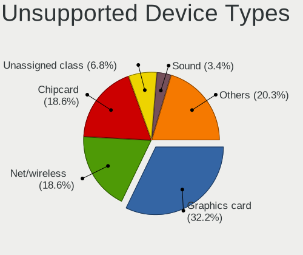

| Type                     | Desktops | Percent |
|--------------------------|----------|---------|
| Graphics card            | 10       | 31.25%  |
| Chipcard                 | 7        | 21.88%  |
| Net/wireless             | 6        | 18.75%  |
| Unassigned class         | 1        | 3.13%   |
| Storage/ide              | 1        | 3.13%   |
| Sound                    | 1        | 3.13%   |
| Modem                    | 1        | 3.13%   |
| Fingerprint reader       | 1        | 3.13%   |
| Dvb card                 | 1        | 3.13%   |
| Communication controller | 1        | 3.13%   |
| Card reader              | 1        | 3.13%   |
| Camera                   | 1        | 3.13%   |

