Linux in Serbia - Tested Hardware & Statistics (Desktops)
---------------------------------------------------------

A project to collect tested hardware configurations for Linux in Serbia.

Anyone can contribute to this report by the [hw-probe](https://github.com/linuxhw/hw-probe) tool:

    sudo -E hw-probe -all -upload

Please contribute! Especially if your hardware is rare.

Contents
--------

* [ Test Cases ](#test-cases)

* [ System ](#system)
  - [ OS                       ](#os)
  - [ OS Family                ](#os-family)
  - [ Kernel                   ](#kernel)
  - [ Kernel Family            ](#kernel-family)
  - [ Kernel Major Ver.        ](#kernel-major-ver)
  - [ Arch                     ](#arch)
  - [ DE                       ](#de)
  - [ Display Server           ](#display-server)
  - [ Display Manager          ](#display-manager)
  - [ OS Lang                  ](#os-lang)
  - [ Boot Mode                ](#boot-mode)
  - [ Filesystem               ](#filesystem)
  - [ Part. scheme             ](#part-scheme)
  - [ Dual Boot with Linux/BSD ](#dual-boot-with-linuxbsd)
  - [ Dual Boot (Win)          ](#dual-boot-win)

* [ Board ](#board)
  - [ Vendor                   ](#vendor)
  - [ Model                    ](#model)
  - [ Model Family             ](#model-family)
  - [ MFG Year                 ](#mfg-year)
  - [ Form Factor              ](#form-factor)
  - [ Secure Boot              ](#secure-boot)
  - [ Coreboot                 ](#coreboot)
  - [ RAM Size                 ](#ram-size)
  - [ RAM Used                 ](#ram-used)
  - [ Total Drives             ](#total-drives)
  - [ Has CD-ROM               ](#has-cd-rom)
  - [ Has Ethernet             ](#has-ethernet)
  - [ Has WiFi                 ](#has-wifi)
  - [ Has Bluetooth            ](#has-bluetooth)

* [ Location ](#location)
  - [ Country                  ](#country)
  - [ City                     ](#city)

* [ Drives ](#drives)
  - [ Drive Vendor             ](#drive-vendor)
  - [ Drive Model              ](#drive-model)
  - [ HDD Vendor               ](#hdd-vendor)
  - [ SSD Vendor               ](#ssd-vendor)
  - [ Drive Kind               ](#drive-kind)
  - [ Drive Connector          ](#drive-connector)
  - [ Drive Size               ](#drive-size)
  - [ Space Total              ](#space-total)
  - [ Space Used               ](#space-used)
  - [ Malfunc. Drives          ](#malfunc-drives)
  - [ Malfunc. Drive Vendor    ](#malfunc-drive-vendor)
  - [ Malfunc. HDD Vendor      ](#malfunc-hdd-vendor)
  - [ Malfunc. Drive Kind      ](#malfunc-drive-kind)
  - [ Failed Drives            ](#failed-drives)
  - [ Failed Drive Vendor      ](#failed-drive-vendor)
  - [ Drive Status             ](#drive-status)

* [ Storage controller ](#storage-controller)
  - [ Storage Vendor           ](#storage-vendor)
  - [ Storage Model            ](#storage-model)
  - [ Storage Kind             ](#storage-kind)

* [ Processor ](#processor)
  - [ CPU Vendor               ](#cpu-vendor)
  - [ CPU Model                ](#cpu-model)
  - [ CPU Model Family         ](#cpu-model-family)
  - [ CPU Cores                ](#cpu-cores)
  - [ CPU Sockets              ](#cpu-sockets)
  - [ CPU Threads              ](#cpu-threads)
  - [ CPU Op-Modes             ](#cpu-op-modes)
  - [ CPU Microcode            ](#cpu-microcode)
  - [ CPU Microarch            ](#cpu-microarch)

* [ Graphics ](#graphics)
  - [ GPU Vendor               ](#gpu-vendor)
  - [ GPU Model                ](#gpu-model)
  - [ GPU Combo                ](#gpu-combo)
  - [ GPU Driver               ](#gpu-driver)
  - [ GPU Memory               ](#gpu-memory)

* [ Monitor ](#monitor)
  - [ Monitor Vendor           ](#monitor-vendor)
  - [ Monitor Model            ](#monitor-model)
  - [ Monitor Resolution       ](#monitor-resolution)
  - [ Monitor Diagonal         ](#monitor-diagonal)
  - [ Monitor Width            ](#monitor-width)
  - [ Aspect Ratio             ](#aspect-ratio)
  - [ Monitor Area             ](#monitor-area)
  - [ Pixel Density            ](#pixel-density)
  - [ Multiple Monitors        ](#multiple-monitors)

* [ Network ](#network)
  - [ Net Controller Vendor    ](#net-controller-vendor)
  - [ Net Controller Model     ](#net-controller-model)
  - [ Wireless Vendor          ](#wireless-vendor)
  - [ Wireless Model           ](#wireless-model)
  - [ Ethernet Vendor          ](#ethernet-vendor)
  - [ Ethernet Model           ](#ethernet-model)
  - [ Net Controller Kind      ](#net-controller-kind)
  - [ Used Controller          ](#used-controller)
  - [ NICs                     ](#nics)
  - [ IPv6                     ](#ipv6)

* [ Bluetooth ](#bluetooth)
  - [ Bluetooth Vendor         ](#bluetooth-vendor)
  - [ Bluetooth Model          ](#bluetooth-model)

* [ Sound ](#sound)
  - [ Sound Vendor             ](#sound-vendor)
  - [ Sound Model              ](#sound-model)

* [ Memory ](#memory)
  - [ Memory Vendor            ](#memory-vendor)
  - [ Memory Model             ](#memory-model)
  - [ Memory Kind              ](#memory-kind)
  - [ Memory Form Factor       ](#memory-form-factor)
  - [ Memory Size              ](#memory-size)
  - [ Memory Speed             ](#memory-speed)

* [ Printers & scanners ](#printers--scanners)
  - [ Printer Vendor           ](#printer-vendor)
  - [ Printer Model            ](#printer-model)
  - [ Scanner Vendor           ](#scanner-vendor)
  - [ Scanner Model            ](#scanner-model)

* [ Camera ](#camera)
  - [ Camera Vendor            ](#camera-vendor)
  - [ Camera Model             ](#camera-model)

* [ Security ](#security)
  - [ Fingerprint Vendor       ](#fingerprint-vendor)
  - [ Fingerprint Model        ](#fingerprint-model)
  - [ Chipcard Vendor          ](#chipcard-vendor)
  - [ Chipcard Model           ](#chipcard-model)

* [ Unsupported ](#unsupported)
  - [ Unsupported Devices      ](#unsupported-devices)
  - [ Unsupported Device Types ](#unsupported-device-types)

Test Cases
----------

Total: 490

| Vendor     | Model                       | Probe                                                      | Date         |
|------------|-----------------------------|------------------------------------------------------------|--------------|
| Gigabyte   | B450 I AORUS PRO WIFI-CF    | [883a115efd](https://linux-hardware.org/?probe=883a115efd) | Aug 02, 2023 |
| ASUSTek    | PRIME Z270-P                | [e9c650988e](https://linux-hardware.org/?probe=e9c650988e) | Jul 20, 2023 |
| ASUSTek    | PRIME Z590-P                | [8d33346009](https://linux-hardware.org/?probe=8d33346009) | Jul 10, 2023 |
| MSI        | B450M-A PRO MAX             | [ceccedafbd](https://linux-hardware.org/?probe=ceccedafbd) | Jul 10, 2023 |
| HP         | 8918                        | [af366ea249](https://linux-hardware.org/?probe=af366ea249) | Jul 07, 2023 |
| ASUSTek    | H81M-R                      | [12561e59a4](https://linux-hardware.org/?probe=12561e59a4) | Jul 07, 2023 |
| ASUSTek    | H81M-R                      | [48526cd359](https://linux-hardware.org/?probe=48526cd359) | Jul 07, 2023 |
| Gigabyte   | H61M-S1                     | [b6be2d7f9f](https://linux-hardware.org/?probe=b6be2d7f9f) | Jun 30, 2023 |
| ASUSTek    | PRIME A320M-K               | [ec846958c9](https://linux-hardware.org/?probe=ec846958c9) | Jun 30, 2023 |
| ASUSTek    | PRIME A320M-K               | [310342d290](https://linux-hardware.org/?probe=310342d290) | Jun 30, 2023 |
| Gigabyte   | X79-UP4                     | [c269ef3dd7](https://linux-hardware.org/?probe=c269ef3dd7) | Jun 24, 2023 |
| Gigabyte   | B250M-DS3H-CF               | [1ca06fb3a9](https://linux-hardware.org/?probe=1ca06fb3a9) | Jun 23, 2023 |
| Gigabyte   | H77-D3H                     | [67f3cd78e2](https://linux-hardware.org/?probe=67f3cd78e2) | Jun 22, 2023 |
| Gigabyte   | GA-890GPA-UD3H              | [eeb6dfe9be](https://linux-hardware.org/?probe=eeb6dfe9be) | Jun 18, 2023 |
| ASRock     | A320M-HDV R4.0              | [e2e55f5267](https://linux-hardware.org/?probe=e2e55f5267) | Jun 16, 2023 |
| Gigabyte   | B450M DS3H V2               | [c3ec3eaa27](https://linux-hardware.org/?probe=c3ec3eaa27) | Jun 13, 2023 |
| ASUSTek    | M5A99X EVO                  | [45094360f2](https://linux-hardware.org/?probe=45094360f2) | Jun 11, 2023 |
| ASUSTek    | PRIME Z270-P                | [57fcd66521](https://linux-hardware.org/?probe=57fcd66521) | Jun 11, 2023 |
| Dell       | 0D883F A06                  | [f0d5120461](https://linux-hardware.org/?probe=f0d5120461) | Jun 10, 2023 |
| Acer       | Predator G3600              | [02a0cf3a71](https://linux-hardware.org/?probe=02a0cf3a71) | Jun 10, 2023 |
| Gigabyte   | GA-MA770-US3                | [c22850601d](https://linux-hardware.org/?probe=c22850601d) | Jun 07, 2023 |
| ASRock     | A320M-HDV R4.0              | [5e9fd3f392](https://linux-hardware.org/?probe=5e9fd3f392) | Jun 05, 2023 |
| Gigabyte   | X79-UP4                     | [e3fd506f5e](https://linux-hardware.org/?probe=e3fd506f5e) | Jun 03, 2023 |
| Fujitsu    | D3161-A1 S26361-D3161-A1    | [70a097a219](https://linux-hardware.org/?probe=70a097a219) | Jun 02, 2023 |
| Gigabyte   | Z97-HD3                     | [8505864d45](https://linux-hardware.org/?probe=8505864d45) | May 30, 2023 |
| ASUSTek    | A88X-PRO                    | [b5fd752412](https://linux-hardware.org/?probe=b5fd752412) | May 27, 2023 |
| Intel      | DG31PR AAD97573-302         | [a36e076c17](https://linux-hardware.org/?probe=a36e076c17) | May 23, 2023 |
| Gigabyte   | F2A55M-S1                   | [59ede76205](https://linux-hardware.org/?probe=59ede76205) | May 22, 2023 |
| Gigabyte   | F2A55M-S1                   | [a5c1b4eecd](https://linux-hardware.org/?probe=a5c1b4eecd) | May 22, 2023 |
| Acer       | Aspire XC-705               | [bdd393edd7](https://linux-hardware.org/?probe=bdd393edd7) | May 21, 2023 |
| ASUSTek    | PRIME Z270-P                | [e826ca7941](https://linux-hardware.org/?probe=e826ca7941) | May 11, 2023 |
| Gigabyte   | GA-890GPA-UD3H              | [b1fb1bdecf](https://linux-hardware.org/?probe=b1fb1bdecf) | May 06, 2023 |
| ASUSTek    | A88X-PRO                    | [faabff7b74](https://linux-hardware.org/?probe=faabff7b74) | May 06, 2023 |
| MSI        | B450 TOMAHAWK MAX           | [3a7e1532da](https://linux-hardware.org/?probe=3a7e1532da) | May 03, 2023 |
| ASUSTek    | P5B-Deluxe                  | [d0d3458299](https://linux-hardware.org/?probe=d0d3458299) | Apr 29, 2023 |
| ASUSTek    | PRIME Z590-P                | [5d03070db6](https://linux-hardware.org/?probe=5d03070db6) | Apr 24, 2023 |
| ASUSTek    | P5B-MX                      | [3770e032b4](https://linux-hardware.org/?probe=3770e032b4) | Apr 21, 2023 |
| Gigabyte   | F2A68HM-S1                  | [b5ce8ee6ec](https://linux-hardware.org/?probe=b5ce8ee6ec) | Apr 13, 2023 |
| Gigabyte   | A320M-H-CF                  | [6ac890debf](https://linux-hardware.org/?probe=6ac890debf) | Apr 12, 2023 |
| ASUSTek    | PRIME Z590-P                | [e4299a2ce6](https://linux-hardware.org/?probe=e4299a2ce6) | Apr 11, 2023 |
| Gigabyte   | G41MT-S2                    | [73233d1c4c](https://linux-hardware.org/?probe=73233d1c4c) | Apr 11, 2023 |
| ASUSTek    | M2N4-SLI                    | [870bba0c09](https://linux-hardware.org/?probe=870bba0c09) | Apr 03, 2023 |
| Gigabyte   | B450 I AORUS PRO WIFI-CF    | [b4a624599e](https://linux-hardware.org/?probe=b4a624599e) | Apr 01, 2023 |
| MSI        | H61M-P20                    | [18409d7178](https://linux-hardware.org/?probe=18409d7178) | Mar 28, 2023 |
| ASUSTek    | PRIME A320M-K               | [8d0ef2d912](https://linux-hardware.org/?probe=8d0ef2d912) | Mar 26, 2023 |
| Gigabyte   | B450M DS3H-CF               | [b48ee031b3](https://linux-hardware.org/?probe=b48ee031b3) | Mar 13, 2023 |
| ASUSTek    | H97-PRO                     | [b03c056ee1](https://linux-hardware.org/?probe=b03c056ee1) | Mar 13, 2023 |
| Medion     | MS-7800                     | [fcd708adc0](https://linux-hardware.org/?probe=fcd708adc0) | Mar 08, 2023 |
| Gigabyte   | B450M DS3H-CF               | [25e3173dc4](https://linux-hardware.org/?probe=25e3173dc4) | Mar 01, 2023 |
| Gigabyte   | GA-M56S-S3                  | [e8e3f57eef](https://linux-hardware.org/?probe=e8e3f57eef) | Feb 26, 2023 |
| ASUSTek    | M4A89GTD-PRO/USB3           | [9171567db4](https://linux-hardware.org/?probe=9171567db4) | Feb 24, 2023 |
| Lenovo     | 3138 NO DPK                 | [2beb8f24f3](https://linux-hardware.org/?probe=2beb8f24f3) | Feb 20, 2023 |
| Lenovo     | 3138 NO DPK                 | [992af7508c](https://linux-hardware.org/?probe=992af7508c) | Feb 20, 2023 |
| MSI        | B450M PRO-M2                | [eb1d201d1c](https://linux-hardware.org/?probe=eb1d201d1c) | Feb 15, 2023 |
| Gigabyte   | G41MT-S2                    | [9dfc369401](https://linux-hardware.org/?probe=9dfc369401) | Feb 15, 2023 |
| Biostar    | A68N-2100                   | [a0ebf68180](https://linux-hardware.org/?probe=a0ebf68180) | Feb 10, 2023 |
| NCR        | Pocono                      | [1a1c878e10](https://linux-hardware.org/?probe=1a1c878e10) | Jan 31, 2023 |
| ASRock     | FM2A68M-DG3+                | [7fb4a85c09](https://linux-hardware.org/?probe=7fb4a85c09) | Jan 30, 2023 |
| Lenovo     | 312A NOK                    | [ef4e303beb](https://linux-hardware.org/?probe=ef4e303beb) | Jan 23, 2023 |
| ASUSTek    | PRIME A320M-K               | [b20da22e41](https://linux-hardware.org/?probe=b20da22e41) | Jan 23, 2023 |
| Gigabyte   | G41MT-S2                    | [8f19cbfb31](https://linux-hardware.org/?probe=8f19cbfb31) | Jan 22, 2023 |
| ASUSTek    | A68HM-K                     | [770d2f3bb4](https://linux-hardware.org/?probe=770d2f3bb4) | Jan 22, 2023 |
| Lenovo     | SHARKBAY NOK                | [bc8b02043e](https://linux-hardware.org/?probe=bc8b02043e) | Jan 20, 2023 |
| ASUSTek    | M4A89GTD-PRO/USB3           | [61a73fa103](https://linux-hardware.org/?probe=61a73fa103) | Jan 12, 2023 |
| Medion     | MS-7621                     | [da2d61d475](https://linux-hardware.org/?probe=da2d61d475) | Jan 07, 2023 |
| ASRock     | X570 Pro4                   | [db00fde012](https://linux-hardware.org/?probe=db00fde012) | Jan 07, 2023 |
| Gigabyte   | A320M-H-CF                  | [b4511daea8](https://linux-hardware.org/?probe=b4511daea8) | Dec 30, 2022 |
| Gigabyte   | A320M-H-CF                  | [aff2b93aa5](https://linux-hardware.org/?probe=aff2b93aa5) | Dec 28, 2022 |
| ASUSTek    | ROG STRIX B450-F GAMING ... | [ee98173357](https://linux-hardware.org/?probe=ee98173357) | Dec 27, 2022 |
| ASUSTek    | M4A89GTD-PRO/USB3           | [f51a366bc2](https://linux-hardware.org/?probe=f51a366bc2) | Dec 26, 2022 |
| NCR        | Pocono                      | [d50ad710fb](https://linux-hardware.org/?probe=d50ad710fb) | Dec 26, 2022 |
| Gigabyte   | B450M S2H                   | [500abd4186](https://linux-hardware.org/?probe=500abd4186) | Dec 25, 2022 |
| ASUSTek    | M4A89GTD-PRO/USB3           | [73c8ec2eb1](https://linux-hardware.org/?probe=73c8ec2eb1) | Dec 22, 2022 |
| ASUSTek    | TUF Gaming B550M-PLUS       | [caaddcd344](https://linux-hardware.org/?probe=caaddcd344) | Dec 18, 2022 |
| MSI        | MPG X570S EDGE MAX WIFI     | [45eafa4ade](https://linux-hardware.org/?probe=45eafa4ade) | Dec 17, 2022 |
| ASUSTek    | P5KPL-AM/PS                 | [1fb1bc61c1](https://linux-hardware.org/?probe=1fb1bc61c1) | Dec 10, 2022 |
| ASUSTek    | P5KPL-AM/PS                 | [4cfe094684](https://linux-hardware.org/?probe=4cfe094684) | Dec 10, 2022 |
| Gigabyte   | B550 AORUS PRO V2           | [def749869a](https://linux-hardware.org/?probe=def749869a) | Dec 07, 2022 |
| ASUSTek    | ROG STRIX B550-E GAMING     | [6abdbbb7e7](https://linux-hardware.org/?probe=6abdbbb7e7) | Dec 07, 2022 |
| Gigabyte   | B450M DS3H-CF               | [9789efe96c](https://linux-hardware.org/?probe=9789efe96c) | Dec 07, 2022 |
| Gigabyte   | B450M DS3H-CF               | [9b5a24a1a2](https://linux-hardware.org/?probe=9b5a24a1a2) | Dec 07, 2022 |
| ASUSTek    | P7P55D DELUXE               | [a0864dbdc7](https://linux-hardware.org/?probe=a0864dbdc7) | Dec 06, 2022 |
| ASUSTek    | P7P55D DELUXE               | [ecb93d2406](https://linux-hardware.org/?probe=ecb93d2406) | Dec 06, 2022 |
| Gigabyte   | B250M-DS3H-CF               | [3fb8809375](https://linux-hardware.org/?probe=3fb8809375) | Dec 06, 2022 |
| ASUSTek    | PRIME A320M-K               | [a15aba2f94](https://linux-hardware.org/?probe=a15aba2f94) | Dec 04, 2022 |
| Gigabyte   | B450M DS3H-CF               | [660b9b7529](https://linux-hardware.org/?probe=660b9b7529) | Dec 01, 2022 |
| Gigabyte   | B450M DS3H-CF               | [9d7fdf83b6](https://linux-hardware.org/?probe=9d7fdf83b6) | Dec 01, 2022 |
| ASRock     | B75M-DGS                    | [ca277bb16c](https://linux-hardware.org/?probe=ca277bb16c) | Nov 30, 2022 |
| ASUSTek    | PRIME B450M-K               | [944ade9560](https://linux-hardware.org/?probe=944ade9560) | Nov 28, 2022 |
| ASUSTek    | PRIME A320M-K               | [37b51f19ef](https://linux-hardware.org/?probe=37b51f19ef) | Nov 27, 2022 |
| ASRock     | B450M-HDV R4.0              | [9dbd34c7bd](https://linux-hardware.org/?probe=9dbd34c7bd) | Nov 23, 2022 |
| ASRock     | B450M-HDV R4.0              | [5786af4776](https://linux-hardware.org/?probe=5786af4776) | Nov 23, 2022 |
| ASUSTek    | ROG STRIX X670E-F GAMING... | [a28ef28876](https://linux-hardware.org/?probe=a28ef28876) | Nov 20, 2022 |
| HP         | 212B                        | [d2ccd70744](https://linux-hardware.org/?probe=d2ccd70744) | Nov 05, 2022 |
| Gigabyte   | AB350M-DS3H V2-CF           | [27b07caa39](https://linux-hardware.org/?probe=27b07caa39) | Oct 31, 2022 |
| ASUSTek    | H97-PRO                     | [bae404d45c](https://linux-hardware.org/?probe=bae404d45c) | Oct 31, 2022 |
| Gigabyte   | F2A88X-D3H                  | [7290b40608](https://linux-hardware.org/?probe=7290b40608) | Oct 27, 2022 |
| MSI        | MS-7309                     | [fe0fae3528](https://linux-hardware.org/?probe=fe0fae3528) | Oct 26, 2022 |
| MSI        | MS-7309                     | [2db582d6dd](https://linux-hardware.org/?probe=2db582d6dd) | Oct 25, 2022 |
| ASUSTek    | ROG STRIX X670E-F GAMING... | [fbd1924bea](https://linux-hardware.org/?probe=fbd1924bea) | Oct 25, 2022 |
| Gigabyte   | P35C-DS3R                   | [c6966a0df9](https://linux-hardware.org/?probe=c6966a0df9) | Oct 25, 2022 |
| Gigabyte   | P35C-DS3R                   | [5b4ecfb7e9](https://linux-hardware.org/?probe=5b4ecfb7e9) | Oct 25, 2022 |
| MSI        | H61M-P20                    | [a50648c486](https://linux-hardware.org/?probe=a50648c486) | Oct 21, 2022 |
| ASUSTek    | P5B-Deluxe                  | [95a75ab35b](https://linux-hardware.org/?probe=95a75ab35b) | Oct 19, 2022 |
| ASUSTek    | ROG STRIX X670E-F GAMING... | [6941ece1e9](https://linux-hardware.org/?probe=6941ece1e9) | Oct 18, 2022 |
| ASUSTek    | H61M-K                      | [e0408b49e7](https://linux-hardware.org/?probe=e0408b49e7) | Oct 02, 2022 |
| MSI        | MAG X570 TOMAHAWK WIFI      | [6bfc8d43ef](https://linux-hardware.org/?probe=6bfc8d43ef) | Sep 27, 2022 |
| Gigabyte   | X570 AORUS ELITE            | [b21f5fee1a](https://linux-hardware.org/?probe=b21f5fee1a) | Sep 26, 2022 |
| Gigabyte   | X570 AORUS ELITE            | [24c93934d4](https://linux-hardware.org/?probe=24c93934d4) | Sep 26, 2022 |
| Gigabyte   | X570 AORUS ELITE            | [29f2bd4304](https://linux-hardware.org/?probe=29f2bd4304) | Sep 25, 2022 |
| Biostar    | TB250-BTC                   | [0a4522a059](https://linux-hardware.org/?probe=0a4522a059) | Sep 24, 2022 |
| ASUSTek    | PRIME A320M-K               | [815fe42722](https://linux-hardware.org/?probe=815fe42722) | Sep 23, 2022 |
| Gigabyte   | A320M-S2H-CF                | [015c8dd353](https://linux-hardware.org/?probe=015c8dd353) | Sep 20, 2022 |
| ASUSTek    | P5Q PRO TURBO               | [96564b490b](https://linux-hardware.org/?probe=96564b490b) | Sep 15, 2022 |
| ASUSTek    | P5Q PRO TURBO               | [846849e46c](https://linux-hardware.org/?probe=846849e46c) | Sep 15, 2022 |
| Foxconn    | 2AA9                        | [b671b09c1a](https://linux-hardware.org/?probe=b671b09c1a) | Sep 11, 2022 |
| ASUSTek    | PRIME A320M-K               | [cb47ce6e71](https://linux-hardware.org/?probe=cb47ce6e71) | Sep 09, 2022 |
| ASUSTek    | M4A89GTD-PRO/USB3           | [a355222b61](https://linux-hardware.org/?probe=a355222b61) | Sep 07, 2022 |
| HP         | 304Bh                       | [d395dd6c91](https://linux-hardware.org/?probe=d395dd6c91) | Sep 04, 2022 |
| Gigabyte   | 965P-DS3                    | [38a4407789](https://linux-hardware.org/?probe=38a4407789) | Aug 25, 2022 |
| HP         | 0980h                       | [1b4bdc2dd3](https://linux-hardware.org/?probe=1b4bdc2dd3) | Aug 25, 2022 |
| HP         | 0980h                       | [28433ca1db](https://linux-hardware.org/?probe=28433ca1db) | Aug 25, 2022 |
| HP         | 304Bh                       | [1e3d59e493](https://linux-hardware.org/?probe=1e3d59e493) | Aug 21, 2022 |
| Fujitsu    | D2990-A2 S26361-D2990-A2    | [bbeebdd421](https://linux-hardware.org/?probe=bbeebdd421) | Aug 01, 2022 |
| Gigabyte   | B450M DS3H-CF               | [7c68dbe47e](https://linux-hardware.org/?probe=7c68dbe47e) | Aug 01, 2022 |
| Gigabyte   | B450M DS3H-CF               | [6532751d00](https://linux-hardware.org/?probe=6532751d00) | Aug 01, 2022 |
| ASRock     | H81 Pro BTC R2.0            | [bece300d92](https://linux-hardware.org/?probe=bece300d92) | Jul 20, 2022 |
| Gigabyte   | B550M AORUS PRO-P           | [0c4f85c70e](https://linux-hardware.org/?probe=0c4f85c70e) | Jul 13, 2022 |
| MSI        | H61M-P20                    | [c86cefdaa6](https://linux-hardware.org/?probe=c86cefdaa6) | Jun 26, 2022 |
| ASUSTek    | H110M-R                     | [74d3cc8728](https://linux-hardware.org/?probe=74d3cc8728) | Jun 14, 2022 |
| ASRock     | G41C-GS                     | [c498f6f3bd](https://linux-hardware.org/?probe=c498f6f3bd) | Jun 13, 2022 |
| Gigabyte   | GA-H310TN-R2                | [2fecd41e0b](https://linux-hardware.org/?probe=2fecd41e0b) | Jun 03, 2022 |
| Gigabyte   | X570 GAMING X               | [2dba625d78](https://linux-hardware.org/?probe=2dba625d78) | May 28, 2022 |
| ASUSTek    | B85-PLUS                    | [ea1d17f234](https://linux-hardware.org/?probe=ea1d17f234) | May 27, 2022 |
| ASUSTek    | B85-PLUS                    | [e1efc36540](https://linux-hardware.org/?probe=e1efc36540) | May 27, 2022 |
| ASRock     | X570 Pro4                   | [da35dd6295](https://linux-hardware.org/?probe=da35dd6295) | May 22, 2022 |
| Gigabyte   | Z97P-D3                     | [1b7bdd0f65](https://linux-hardware.org/?probe=1b7bdd0f65) | May 21, 2022 |
| Gigabyte   | A520 AORUS ELITE            | [2fdd079ebc](https://linux-hardware.org/?probe=2fdd079ebc) | May 21, 2022 |
| Gigabyte   | B450 I AORUS PRO WIFI-CF    | [2f12c77058](https://linux-hardware.org/?probe=2f12c77058) | May 16, 2022 |
| Gigabyte   | H110M-DS2-CF                | [7166bb5a53](https://linux-hardware.org/?probe=7166bb5a53) | May 14, 2022 |
| ASUSTek    | TUF B450M-PLUS GAMING       | [fb2a9c9ddf](https://linux-hardware.org/?probe=fb2a9c9ddf) | May 13, 2022 |
| Fujitsu    | D3041-A1 S26361-D3041-A1    | [bc84347b65](https://linux-hardware.org/?probe=bc84347b65) | May 11, 2022 |
| ASUSTek    | M4A89GTD-PRO/USB3           | [38e20673c2](https://linux-hardware.org/?probe=38e20673c2) | May 09, 2022 |
| HP         | 3396                        | [468c2975ee](https://linux-hardware.org/?probe=468c2975ee) | Apr 30, 2022 |
| ASUSTek    | PRIME A320M-K               | [f4f8108d1e](https://linux-hardware.org/?probe=f4f8108d1e) | Apr 25, 2022 |
| ASUSTek    | P7H55                       | [d619f35fb8](https://linux-hardware.org/?probe=d619f35fb8) | Apr 16, 2022 |
| HP         | 845A                        | [cc8c320581](https://linux-hardware.org/?probe=cc8c320581) | Apr 16, 2022 |
| ASUSTek    | B150-PRO                    | [1ebe5f0e99](https://linux-hardware.org/?probe=1ebe5f0e99) | Apr 15, 2022 |
| Gigabyte   | 945PL-S3                    | [ef7f30cc40](https://linux-hardware.org/?probe=ef7f30cc40) | Apr 07, 2022 |
| Lenovo     | SHARKBAY 0B98401 PRO        | [55568ec828](https://linux-hardware.org/?probe=55568ec828) | Apr 06, 2022 |
| Apple      | Mac-F42C88C8 Proto1         | [55eda86e20](https://linux-hardware.org/?probe=55eda86e20) | Apr 05, 2022 |
| ASRock     | B560M Steel Legend          | [8caaa96b19](https://linux-hardware.org/?probe=8caaa96b19) | Mar 28, 2022 |
| HP         | 3398                        | [b84864ecc4](https://linux-hardware.org/?probe=b84864ecc4) | Mar 25, 2022 |
| HP         | 3032h                       | [e57d52908c](https://linux-hardware.org/?probe=e57d52908c) | Mar 21, 2022 |
| HP         | 3398                        | [5f018df1dd](https://linux-hardware.org/?probe=5f018df1dd) | Mar 17, 2022 |
| ASUSTek    | M5A99X EVO                  | [117ebec9fc](https://linux-hardware.org/?probe=117ebec9fc) | Mar 15, 2022 |
| MSI        | AM1I                        | [f19c9ef173](https://linux-hardware.org/?probe=f19c9ef173) | Mar 14, 2022 |
| MSI        | A68HM-E33 V2                | [9f17c99bb5](https://linux-hardware.org/?probe=9f17c99bb5) | Mar 06, 2022 |
| MSI        | B450M PRO-M2                | [723ab179b6](https://linux-hardware.org/?probe=723ab179b6) | Mar 06, 2022 |
| Gigabyte   | H81M-S2PH                   | [4a1c505260](https://linux-hardware.org/?probe=4a1c505260) | Mar 05, 2022 |
| ASUSTek    | PRIME A320M-K               | [65b41a7a67](https://linux-hardware.org/?probe=65b41a7a67) | Feb 26, 2022 |
| Gigabyte   | Z390 UD                     | [7ea66813f3](https://linux-hardware.org/?probe=7ea66813f3) | Feb 23, 2022 |
| Fujitsu    | D3041-A1 S26361-D3041-A1    | [1f607a3c8c](https://linux-hardware.org/?probe=1f607a3c8c) | Feb 21, 2022 |
| Gigabyte   | MJPLNCB-00                  | [d9a5169bbc](https://linux-hardware.org/?probe=d9a5169bbc) | Feb 16, 2022 |
| MSI        | A55M-P33                    | [31c0a9c67c](https://linux-hardware.org/?probe=31c0a9c67c) | Feb 15, 2022 |
| MSI        | GF615M-P33 V2               | [b5bfcbf8dc](https://linux-hardware.org/?probe=b5bfcbf8dc) | Feb 13, 2022 |
| Gigabyte   | B450 AORUS PRO-CF           | [1eb72bde90](https://linux-hardware.org/?probe=1eb72bde90) | Feb 12, 2022 |
| MSI        | MAG X570 TOMAHAWK WIFI      | [d6c5c1a6d2](https://linux-hardware.org/?probe=d6c5c1a6d2) | Feb 10, 2022 |
| ASUSTek    | P5KPL-AM/PS                 | [a530f2976f](https://linux-hardware.org/?probe=a530f2976f) | Feb 10, 2022 |
| ASUSTek    | P5KPL-AM/PS                 | [5480f2aa6c](https://linux-hardware.org/?probe=5480f2aa6c) | Feb 10, 2022 |
| ASUSTek    | M4A785TD-V EVO              | [b28eb819f0](https://linux-hardware.org/?probe=b28eb819f0) | Feb 09, 2022 |
| ASUSTek    | ROG ZENITH EXTREME          | [1c829ba8dd](https://linux-hardware.org/?probe=1c829ba8dd) | Feb 07, 2022 |
| MSI        | MAG X570 TOMAHAWK WIFI      | [80b24c2689](https://linux-hardware.org/?probe=80b24c2689) | Feb 03, 2022 |
| ASUSTek    | PRIME B450M-K               | [d644756f37](https://linux-hardware.org/?probe=d644756f37) | Feb 03, 2022 |
| MSI        | B450 TOMAHAWK               | [b5ae920f3b](https://linux-hardware.org/?probe=b5ae920f3b) | Feb 02, 2022 |
| ASRock     | P75 Pro3                    | [76bb99305c](https://linux-hardware.org/?probe=76bb99305c) | Jan 24, 2022 |
| Gigabyte   | 970A-DS3P                   | [b50f284364](https://linux-hardware.org/?probe=b50f284364) | Jan 23, 2022 |
| ASUSTek    | PRIME B450M-K               | [fa62cb2996](https://linux-hardware.org/?probe=fa62cb2996) | Jan 11, 2022 |
| Biostar    | TB250-BTC+                  | [ef57a01461](https://linux-hardware.org/?probe=ef57a01461) | Jan 06, 2022 |
| ASUSTek    | H110M-R                     | [8b6fab3f89](https://linux-hardware.org/?probe=8b6fab3f89) | Jan 05, 2022 |
| ASRock     | X570 Pro4                   | [0396ef9c72](https://linux-hardware.org/?probe=0396ef9c72) | Dec 30, 2021 |
| ASUSTek    | TUF B450M-PLUS GAMING       | [6324598512](https://linux-hardware.org/?probe=6324598512) | Dec 30, 2021 |
| ASUSTek    | TUF B450M-PLUS GAMING       | [38dda4af6b](https://linux-hardware.org/?probe=38dda4af6b) | Dec 30, 2021 |
| Gigabyte   | B550M DS3H                  | [9fb08ebeb4](https://linux-hardware.org/?probe=9fb08ebeb4) | Dec 26, 2021 |
| Gigabyte   | MJPLNCB-00                  | [fe81720eae](https://linux-hardware.org/?probe=fe81720eae) | Dec 23, 2021 |
| ASUSTek    | A68HM-K                     | [a6fc4a2adb](https://linux-hardware.org/?probe=a6fc4a2adb) | Dec 22, 2021 |
| MSI        | A55M-P33                    | [de87849301](https://linux-hardware.org/?probe=de87849301) | Dec 18, 2021 |
| MSI        | FM2-A55M-E33                | [85e65dae6a](https://linux-hardware.org/?probe=85e65dae6a) | Dec 15, 2021 |
| MSI        | FM2-A55M-E33                | [3ff4885854](https://linux-hardware.org/?probe=3ff4885854) | Dec 15, 2021 |
| Gigabyte   | X570 AORUS ELITE            | [eb5d5f4361](https://linux-hardware.org/?probe=eb5d5f4361) | Dec 12, 2021 |
| Gigabyte   | X570 AORUS ELITE            | [048c623b7a](https://linux-hardware.org/?probe=048c623b7a) | Dec 12, 2021 |
| Biostar    | NF520-A2 TE                 | [5878187120](https://linux-hardware.org/?probe=5878187120) | Dec 07, 2021 |
| MSI        | H61M-P20                    | [614ffcb196](https://linux-hardware.org/?probe=614ffcb196) | Dec 07, 2021 |
| ASUSTek    | PRIME A320M-K               | [19fbf0d287](https://linux-hardware.org/?probe=19fbf0d287) | Dec 04, 2021 |
| ASUSTek    | PRIME A320M-K               | [478ab590ac](https://linux-hardware.org/?probe=478ab590ac) | Dec 01, 2021 |
| ASUSTek    | P8B75-M LE                  | [7a8c29f7ba](https://linux-hardware.org/?probe=7a8c29f7ba) | Nov 23, 2021 |
| ASUSTek    | P8Z68-V LX                  | [0415c0798f](https://linux-hardware.org/?probe=0415c0798f) | Nov 18, 2021 |
| MSI        | G41M-P23                    | [82e51e3f78](https://linux-hardware.org/?probe=82e51e3f78) | Nov 04, 2021 |
| MSI        | G41M-P23                    | [ce4c8636f0](https://linux-hardware.org/?probe=ce4c8636f0) | Nov 04, 2021 |
| Gigabyte   | AB350M-Gaming 3-CF          | [b6338a1294](https://linux-hardware.org/?probe=b6338a1294) | Oct 25, 2021 |
| Gigabyte   | B450M S2H                   | [71c19b42fc](https://linux-hardware.org/?probe=71c19b42fc) | Oct 21, 2021 |
| Lenovo     | ThinkCentre M57 6075Y3W     | [a5e2419919](https://linux-hardware.org/?probe=a5e2419919) | Oct 19, 2021 |
| Gigabyte   | B450M DS3H-CF               | [f1fc83e719](https://linux-hardware.org/?probe=f1fc83e719) | Oct 17, 2021 |
| Gigabyte   | B450M DS3H-CF               | [2802b3ba4f](https://linux-hardware.org/?probe=2802b3ba4f) | Oct 17, 2021 |
| Gigabyte   | P35-S3G                     | [0582e2316b](https://linux-hardware.org/?probe=0582e2316b) | Oct 12, 2021 |
| ASUSTek    | M5A97 EVO R2.0              | [c8b4b9444e](https://linux-hardware.org/?probe=c8b4b9444e) | Oct 11, 2021 |
| ASRock     | QC5000-ITX/WiFi             | [74391da331](https://linux-hardware.org/?probe=74391da331) | Oct 09, 2021 |
| Biostar    | A320MH                      | [85950c5033](https://linux-hardware.org/?probe=85950c5033) | Sep 25, 2021 |
| ASUSTek    | H81M-R                      | [dfe4dc9048](https://linux-hardware.org/?probe=dfe4dc9048) | Sep 22, 2021 |
| MSI        | MS-7309                     | [f2ac6eb80a](https://linux-hardware.org/?probe=f2ac6eb80a) | Sep 18, 2021 |
| Lenovo     | ThinkCentre M57 6075Y3W     | [f133dd54a3](https://linux-hardware.org/?probe=f133dd54a3) | Sep 18, 2021 |
| HP         | 212B                        | [9a7f2627a3](https://linux-hardware.org/?probe=9a7f2627a3) | Sep 15, 2021 |
| HP         | 212B                        | [289f117cde](https://linux-hardware.org/?probe=289f117cde) | Sep 14, 2021 |
| ASUSTek    | H81M-R                      | [6a9795f23f](https://linux-hardware.org/?probe=6a9795f23f) | Sep 13, 2021 |
| Gigabyte   | X570 AORUS MASTER           | [67285c1d5d](https://linux-hardware.org/?probe=67285c1d5d) | Sep 11, 2021 |
| ASUSTek    | AM1M-A                      | [ab6a989deb](https://linux-hardware.org/?probe=ab6a989deb) | Sep 09, 2021 |
| ASRock     | Q1900M                      | [3f08533d5f](https://linux-hardware.org/?probe=3f08533d5f) | Sep 06, 2021 |
| ASRock     | Q1900M                      | [d342919044](https://linux-hardware.org/?probe=d342919044) | Sep 06, 2021 |
| ASUSTek    | AM1M-A                      | [433d420dd4](https://linux-hardware.org/?probe=433d420dd4) | Aug 20, 2021 |
| MSI        | 740GM-P25                   | [e1d245e0a3](https://linux-hardware.org/?probe=e1d245e0a3) | Aug 19, 2021 |
| ASUSTek    | AM1M-A                      | [c0653de55c](https://linux-hardware.org/?probe=c0653de55c) | Aug 18, 2021 |
| ASRock     | X570 Pro4                   | [3f122964da](https://linux-hardware.org/?probe=3f122964da) | Aug 14, 2021 |
| Gigabyte   | H61M-S2PV                   | [3985c521c2](https://linux-hardware.org/?probe=3985c521c2) | Aug 12, 2021 |
| ASUSTek    | M5A97 PLUS                  | [bf5a5f589f](https://linux-hardware.org/?probe=bf5a5f589f) | Aug 05, 2021 |
| Gigabyte   | B450M DS3H-CF               | [fda988dc8a](https://linux-hardware.org/?probe=fda988dc8a) | Jul 30, 2021 |
| Gigabyte   | H61M-S2PV                   | [766df6d543](https://linux-hardware.org/?probe=766df6d543) | Jul 30, 2021 |
| ASUSTek    | B75M-A                      | [d86a526a9b](https://linux-hardware.org/?probe=d86a526a9b) | Jul 28, 2021 |
| Gigabyte   | P31-DS3L                    | [48b32724e2](https://linux-hardware.org/?probe=48b32724e2) | Jul 27, 2021 |
| ASUSTek    | B75M-A                      | [25113d73cc](https://linux-hardware.org/?probe=25113d73cc) | Jul 21, 2021 |
| ASUSTek    | M2N-MX                      | [b5def43240](https://linux-hardware.org/?probe=b5def43240) | Jun 23, 2021 |
| MSI        | 760GM-P23                   | [2a7524175d](https://linux-hardware.org/?probe=2a7524175d) | Jun 20, 2021 |
| MSI        | 970A-G43                    | [447e2a364c](https://linux-hardware.org/?probe=447e2a364c) | Jun 18, 2021 |
| ASUSTek    | PRIME A320M-K               | [f2770a810e](https://linux-hardware.org/?probe=f2770a810e) | Jun 12, 2021 |
| MSI        | 970A-G43                    | [009fc99fc0](https://linux-hardware.org/?probe=009fc99fc0) | Jun 11, 2021 |
| ASUSTek    | P8Z77-V DELUXE              | [09f134f35d](https://linux-hardware.org/?probe=09f134f35d) | Jun 11, 2021 |
| Gigabyte   | 945PL-S3                    | [885dc78ef1](https://linux-hardware.org/?probe=885dc78ef1) | Jun 08, 2021 |
| MSI        | 970A-G43                    | [c0523d2ed9](https://linux-hardware.org/?probe=c0523d2ed9) | Jun 08, 2021 |
| Gigabyte   | H61M-DS2                    | [b527e6a2a9](https://linux-hardware.org/?probe=b527e6a2a9) | Jun 08, 2021 |
| ASUSTek    | PRIME A320M-K               | [69dd9fbe20](https://linux-hardware.org/?probe=69dd9fbe20) | Jun 07, 2021 |
| ASRock     | A320M-HDV R4.0              | [094ade14ae](https://linux-hardware.org/?probe=094ade14ae) | May 27, 2021 |
| ASRock     | B450M Pro4                  | [229b36f7f9](https://linux-hardware.org/?probe=229b36f7f9) | May 25, 2021 |
| Dell       | 0C27VV A01                  | [5824a76242](https://linux-hardware.org/?probe=5824a76242) | May 23, 2021 |
| Gigabyte   | B450M DS3H-CF               | [631e15df6a](https://linux-hardware.org/?probe=631e15df6a) | May 18, 2021 |
| ASRock     | H110 Pro BTC+               | [ff29bdd7f7](https://linux-hardware.org/?probe=ff29bdd7f7) | May 14, 2021 |
| ASUSTek    | PRIME A320M-K               | [7b5519e189](https://linux-hardware.org/?probe=7b5519e189) | May 10, 2021 |
| ASUSTek    | PRIME A320M-K               | [5ea8612591](https://linux-hardware.org/?probe=5ea8612591) | May 09, 2021 |
| ASUSTek    | PRIME A320M-K               | [e3f1850f8e](https://linux-hardware.org/?probe=e3f1850f8e) | May 07, 2021 |
| Gigabyte   | B450M DS3H-CF               | [211622d161](https://linux-hardware.org/?probe=211622d161) | May 05, 2021 |
| Gigabyte   | A320M-H-CF                  | [07a49be491](https://linux-hardware.org/?probe=07a49be491) | May 03, 2021 |
| Gigabyte   | H61M-S2PV                   | [325c441d47](https://linux-hardware.org/?probe=325c441d47) | Apr 27, 2021 |
| Gigabyte   | GA-890GPA-UD3H              | [15e01ddb68](https://linux-hardware.org/?probe=15e01ddb68) | Apr 27, 2021 |
| Inventec   | R CLASS A02                 | [d678a44af1](https://linux-hardware.org/?probe=d678a44af1) | Apr 18, 2021 |
| Lenovo     | 312A NOK                    | [5db737f928](https://linux-hardware.org/?probe=5db737f928) | Apr 16, 2021 |
| Gigabyte   | EP43-UD3L                   | [9988abc6d1](https://linux-hardware.org/?probe=9988abc6d1) | Mar 30, 2021 |
| HP         | 3032h                       | [04ae8fc721](https://linux-hardware.org/?probe=04ae8fc721) | Mar 26, 2021 |
| Acer       | FIH57                       | [ddb03d82a0](https://linux-hardware.org/?probe=ddb03d82a0) | Mar 24, 2021 |
| ASRock     | QC5000-ITX/WiFi             | [7940fddf34](https://linux-hardware.org/?probe=7940fddf34) | Mar 24, 2021 |
| HP         | 1497                        | [8a761041cb](https://linux-hardware.org/?probe=8a761041cb) | Mar 17, 2021 |
| MSI        | B450 TOMAHAWK               | [9d190d0899](https://linux-hardware.org/?probe=9d190d0899) | Mar 17, 2021 |
| ASRock     | Z390 Pro4                   | [5fe5bdf357](https://linux-hardware.org/?probe=5fe5bdf357) | Mar 16, 2021 |
| MSI        | 880GM-E41                   | [4f6b84a8c0](https://linux-hardware.org/?probe=4f6b84a8c0) | Mar 15, 2021 |
| MSI        | H61M-P20                    | [6c184c27d1](https://linux-hardware.org/?probe=6c184c27d1) | Mar 15, 2021 |
| Gigabyte   | GA-890GPA-UD3H              | [9aea38338d](https://linux-hardware.org/?probe=9aea38338d) | Mar 15, 2021 |
| Gigabyte   | H61M-D2H-USB3               | [7e3e20bba4](https://linux-hardware.org/?probe=7e3e20bba4) | Mar 15, 2021 |
| ASUSTek    | M5A88-V EVO                 | [3163da0fc6](https://linux-hardware.org/?probe=3163da0fc6) | Mar 12, 2021 |
| Intel      | 945                         | [87a90ecd5e](https://linux-hardware.org/?probe=87a90ecd5e) | Mar 11, 2021 |
| Intel      | 945                         | [4644c2d3dd](https://linux-hardware.org/?probe=4644c2d3dd) | Mar 10, 2021 |
| Intel      | 945                         | [bdcdd4c2c9](https://linux-hardware.org/?probe=bdcdd4c2c9) | Mar 09, 2021 |
| ASUSTek    | M5A88-V EVO                 | [54b1a7993c](https://linux-hardware.org/?probe=54b1a7993c) | Mar 09, 2021 |
| ASUSTek    | M5A88-V EVO                 | [20dd877fba](https://linux-hardware.org/?probe=20dd877fba) | Mar 09, 2021 |
| MSI        | MS-7369                     | [6b76ab1b0c](https://linux-hardware.org/?probe=6b76ab1b0c) | Mar 06, 2021 |
| MSI        | MS-7369                     | [c26816dad0](https://linux-hardware.org/?probe=c26816dad0) | Mar 06, 2021 |
| Supermicro | X8SIL                       | [5750984770](https://linux-hardware.org/?probe=5750984770) | Mar 05, 2021 |
| Supermicro | X8SIL                       | [c79eedd353](https://linux-hardware.org/?probe=c79eedd353) | Mar 04, 2021 |
| Lenovo     | 312A NOK                    | [10e16e0f14](https://linux-hardware.org/?probe=10e16e0f14) | Mar 02, 2021 |
| Gigabyte   | G31M-S2C                    | [a10534e0ba](https://linux-hardware.org/?probe=a10534e0ba) | Mar 02, 2021 |
| Supermicro | X8SIL                       | [325e488c16](https://linux-hardware.org/?probe=325e488c16) | Feb 28, 2021 |
| Supermicro | X8SIL                       | [58108e8eb1](https://linux-hardware.org/?probe=58108e8eb1) | Feb 28, 2021 |
| MSI        | 0A90                        | [36e73df6d5](https://linux-hardware.org/?probe=36e73df6d5) | Feb 26, 2021 |
| Intel      | 945                         | [de9b7b0ef0](https://linux-hardware.org/?probe=de9b7b0ef0) | Feb 25, 2021 |
| Intel      | 945                         | [d0b22beef3](https://linux-hardware.org/?probe=d0b22beef3) | Feb 25, 2021 |
| ASRock     | M3N78D                      | [c40a449681](https://linux-hardware.org/?probe=c40a449681) | Feb 23, 2021 |
| Gigabyte   | GA-890GPA-UD3H              | [888ff52208](https://linux-hardware.org/?probe=888ff52208) | Feb 21, 2021 |
| ASUSTek    | M4A89GTD-PRO/USB3           | [d2b9f26b16](https://linux-hardware.org/?probe=d2b9f26b16) | Feb 15, 2021 |
| ASUSTek    | P8B75-M LX                  | [dc49777ce8](https://linux-hardware.org/?probe=dc49777ce8) | Feb 14, 2021 |
| ASUSTek    | P5G41T-M LX3                | [d282a8d18c](https://linux-hardware.org/?probe=d282a8d18c) | Feb 14, 2021 |
| MSI        | 0A90                        | [bb71cea5b4](https://linux-hardware.org/?probe=bb71cea5b4) | Feb 09, 2021 |
| ASUSTek    | M4N78-AM                    | [4c528f55f3](https://linux-hardware.org/?probe=4c528f55f3) | Feb 07, 2021 |
| Gigabyte   | P31-ES3G                    | [5aca50689e](https://linux-hardware.org/?probe=5aca50689e) | Jan 29, 2021 |
| ASUSTek    | P5Q-EM                      | [e67f35f505](https://linux-hardware.org/?probe=e67f35f505) | Jan 28, 2021 |
| ASUSTek    | P5Q-EM                      | [d3ee3b13ef](https://linux-hardware.org/?probe=d3ee3b13ef) | Jan 28, 2021 |
| Gigabyte   | B450 AORUS ELITE            | [c7807c2ac4](https://linux-hardware.org/?probe=c7807c2ac4) | Jan 10, 2021 |
| ASRock     | B450M Steel Legend          | [e1424f6de3](https://linux-hardware.org/?probe=e1424f6de3) | Dec 31, 2020 |
| Gigabyte   | B85M-HD3                    | [e3a87784d6](https://linux-hardware.org/?probe=e3a87784d6) | Dec 29, 2020 |
| Biostar    | A320MH                      | [42b6908594](https://linux-hardware.org/?probe=42b6908594) | Dec 29, 2020 |
| Gigabyte   | Z87-HD3                     | [2f46386da3](https://linux-hardware.org/?probe=2f46386da3) | Dec 27, 2020 |
| Biostar    | NF520D3                     | [12a6b07515](https://linux-hardware.org/?probe=12a6b07515) | Dec 27, 2020 |
| Biostar    | NF520D3                     | [c78780427f](https://linux-hardware.org/?probe=c78780427f) | Dec 27, 2020 |
| Biostar    | NF520D3                     | [60a378a184](https://linux-hardware.org/?probe=60a378a184) | Dec 27, 2020 |
| ASUSTek    | M4N78-AM                    | [9973c728ba](https://linux-hardware.org/?probe=9973c728ba) | Dec 26, 2020 |
| MSI        | K9N6PGM2-V2                 | [e62cf453c7](https://linux-hardware.org/?probe=e62cf453c7) | Dec 26, 2020 |
| MSI        | MAG B550M BAZOOKA           | [a5084b2336](https://linux-hardware.org/?probe=a5084b2336) | Dec 26, 2020 |
| ASUSTek    | H110M-R                     | [3d6c26aa3c](https://linux-hardware.org/?probe=3d6c26aa3c) | Dec 18, 2020 |
| HP         | 1497                        | [b93a804d52](https://linux-hardware.org/?probe=b93a804d52) | Dec 09, 2020 |
| Gigabyte   | H310M S2H x.x               | [5fe883b8c8](https://linux-hardware.org/?probe=5fe883b8c8) | Dec 06, 2020 |
| Gigabyte   | E3000N                      | [2861121763](https://linux-hardware.org/?probe=2861121763) | Dec 03, 2020 |
| HP         | 1495                        | [260725df5b](https://linux-hardware.org/?probe=260725df5b) | Dec 02, 2020 |
| MSI        | H110M ECO                   | [d848b46f0e](https://linux-hardware.org/?probe=d848b46f0e) | Nov 29, 2020 |
| MSI        | H110M ECO                   | [3789cd7ccf](https://linux-hardware.org/?probe=3789cd7ccf) | Nov 29, 2020 |
| MSI        | 880GMS-E35                  | [821743caaa](https://linux-hardware.org/?probe=821743caaa) | Nov 29, 2020 |
| MSI        | A320M-A PRO                 | [ce774acedc](https://linux-hardware.org/?probe=ce774acedc) | Nov 27, 2020 |
| Gigabyte   | G31M-S2C                    | [d09ca3fed0](https://linux-hardware.org/?probe=d09ca3fed0) | Nov 24, 2020 |
| Dell       | 0F6X5P A00                  | [458d498ed4](https://linux-hardware.org/?probe=458d498ed4) | Nov 24, 2020 |
| ASUSTek    | H81M-R                      | [10a0831d44](https://linux-hardware.org/?probe=10a0831d44) | Nov 19, 2020 |
| ASUSTek    | PRIME A320M-K               | [546d681a51](https://linux-hardware.org/?probe=546d681a51) | Nov 18, 2020 |
| Dell       | 0KRC95 A02                  | [fb7486ffb1](https://linux-hardware.org/?probe=fb7486ffb1) | Nov 16, 2020 |
| Unknown    | MCP61                       | [c4aa33a4dc](https://linux-hardware.org/?probe=c4aa33a4dc) | Nov 16, 2020 |
| ASUSTek    | ROG STRIX B360-G GAMING     | [dc19b696c9](https://linux-hardware.org/?probe=dc19b696c9) | Nov 15, 2020 |
| ASRock     | A320M-HDV R4.0              | [c15d88af85](https://linux-hardware.org/?probe=c15d88af85) | Nov 12, 2020 |
| ASUSTek    | A55BM-K                     | [bff939ac49](https://linux-hardware.org/?probe=bff939ac49) | Nov 09, 2020 |
| ASUSTek    | ROG STRIX X470-F GAMING     | [579d5eed69](https://linux-hardware.org/?probe=579d5eed69) | Nov 07, 2020 |
| Supermicro | X8SIL                       | [10b7c06f49](https://linux-hardware.org/?probe=10b7c06f49) | Nov 02, 2020 |
| MSI        | H110M ECO                   | [bc31d5e177](https://linux-hardware.org/?probe=bc31d5e177) | Nov 01, 2020 |
| Supermicro | X8SIL                       | [e40055e7ca](https://linux-hardware.org/?probe=e40055e7ca) | Nov 01, 2020 |
| ASUSTek    | PRIME A320M-K               | [4c29ca1b5a](https://linux-hardware.org/?probe=4c29ca1b5a) | Oct 31, 2020 |
| Supermicro | X8SIL                       | [ff3a4a93df](https://linux-hardware.org/?probe=ff3a4a93df) | Oct 28, 2020 |
| Supermicro | X8SIL                       | [c6d306f861](https://linux-hardware.org/?probe=c6d306f861) | Oct 27, 2020 |
| Gigabyte   | 945PL-S3P                   | [b72f72f621](https://linux-hardware.org/?probe=b72f72f621) | Oct 26, 2020 |
| Intel      | D946GZIS AAD66165-302       | [ba9fec911f](https://linux-hardware.org/?probe=ba9fec911f) | Oct 20, 2020 |
| Dell       | 0GM819                      | [e0cbe10449](https://linux-hardware.org/?probe=e0cbe10449) | Oct 17, 2020 |
| Gigabyte   | X399 DESIGNARE EX-CF        | [a5f35bd977](https://linux-hardware.org/?probe=a5f35bd977) | Oct 12, 2020 |
| ASUSTek    | PRIME A320M-K               | [ca6c1b562d](https://linux-hardware.org/?probe=ca6c1b562d) | Oct 05, 2020 |
| MSI        | H87-G41 PC Mate             | [ee0ab6bf04](https://linux-hardware.org/?probe=ee0ab6bf04) | Oct 02, 2020 |
| Biostar    | A320MH                      | [ee41403938](https://linux-hardware.org/?probe=ee41403938) | Oct 02, 2020 |
| Fujitsu    | D3220-A1 S26361-D3220-A1    | [3e7beef386](https://linux-hardware.org/?probe=3e7beef386) | Sep 30, 2020 |
| Gigabyte   | B360M DS3H                  | [61dcf65bfa](https://linux-hardware.org/?probe=61dcf65bfa) | Sep 30, 2020 |
| Gigabyte   | G31M-S2C                    | [d73874f616](https://linux-hardware.org/?probe=d73874f616) | Sep 29, 2020 |
| Gigabyte   | G31M-S2C                    | [d662ed85f8](https://linux-hardware.org/?probe=d662ed85f8) | Sep 29, 2020 |
| Gigabyte   | F2A68HM-S1                  | [b886a607be](https://linux-hardware.org/?probe=b886a607be) | Sep 28, 2020 |
| MSI        | 760GM-P21                   | [b23305b1f3](https://linux-hardware.org/?probe=b23305b1f3) | Sep 12, 2020 |
| ASUSTek    | H97-PLUS                    | [a5726bfa80](https://linux-hardware.org/?probe=a5726bfa80) | Sep 10, 2020 |
| Gigabyte   | F2A58M-DS2H                 | [41b9e1526c](https://linux-hardware.org/?probe=41b9e1526c) | Sep 10, 2020 |
| MSI        | 970 GAMING                  | [44041b729e](https://linux-hardware.org/?probe=44041b729e) | Sep 06, 2020 |
| HP         | 2AF3                        | [75f15238ce](https://linux-hardware.org/?probe=75f15238ce) | Aug 31, 2020 |
| ASRock     | X570 Pro4                   | [0d7778cc62](https://linux-hardware.org/?probe=0d7778cc62) | Aug 29, 2020 |
| MSI        | K9N6PGM2-V2                 | [cb65aa7264](https://linux-hardware.org/?probe=cb65aa7264) | Aug 25, 2020 |
| Gigabyte   | GA-890GPA-UD3H              | [6bb8820098](https://linux-hardware.org/?probe=6bb8820098) | Aug 22, 2020 |
| HP         | 3398                        | [8590b22254](https://linux-hardware.org/?probe=8590b22254) | Aug 15, 2020 |
| Dell       | 0DR845                      | [a4ddbdc998](https://linux-hardware.org/?probe=a4ddbdc998) | Aug 11, 2020 |
| MSI        | GF615M-P33                  | [b5c3471e8b](https://linux-hardware.org/?probe=b5c3471e8b) | Aug 09, 2020 |
| MSI        | GF615M-P33                  | [50b0587266](https://linux-hardware.org/?probe=50b0587266) | Aug 09, 2020 |
| HP         | 3032h                       | [9abca57bf3](https://linux-hardware.org/?probe=9abca57bf3) | Aug 06, 2020 |
| ASUSTek    | PRIME X570-P                | [801277e6be](https://linux-hardware.org/?probe=801277e6be) | Aug 05, 2020 |
| ECS        | H61H2-M12                   | [2ac9b3f866](https://linux-hardware.org/?probe=2ac9b3f866) | Aug 02, 2020 |
| ASUSTek    | H110M-R                     | [09dac438f3](https://linux-hardware.org/?probe=09dac438f3) | Jul 31, 2020 |
| ASUSTek    | A58M-E                      | [6cb4e9e3e5](https://linux-hardware.org/?probe=6cb4e9e3e5) | Jul 30, 2020 |
| Gigabyte   | GA-MA770T-UD3P              | [200bdd5138](https://linux-hardware.org/?probe=200bdd5138) | Jul 25, 2020 |
| Gigabyte   | 970A-DS3P                   | [c5a0f02633](https://linux-hardware.org/?probe=c5a0f02633) | Jul 24, 2020 |
| Gigabyte   | Z77X-UD5H                   | [4f0031f39f](https://linux-hardware.org/?probe=4f0031f39f) | Jul 21, 2020 |
| Gigabyte   | F2A68HM-S1                  | [9bdd60ecdf](https://linux-hardware.org/?probe=9bdd60ecdf) | Jul 19, 2020 |
| Gigabyte   | H61M-S2P                    | [a30442ec07](https://linux-hardware.org/?probe=a30442ec07) | Jul 19, 2020 |
| Gigabyte   | H61M-S2P                    | [57b85cdafa](https://linux-hardware.org/?probe=57b85cdafa) | Jul 19, 2020 |
| MSI        | GF615M-P33 V2               | [64d092bac7](https://linux-hardware.org/?probe=64d092bac7) | Jul 18, 2020 |
| MSI        | GF615M-P33 V2               | [ca930a9e05](https://linux-hardware.org/?probe=ca930a9e05) | Jul 17, 2020 |
| ASUSTek    | H110M-R                     | [26e1de29bc](https://linux-hardware.org/?probe=26e1de29bc) | Jul 14, 2020 |
| HP         | 1497                        | [c26aebcc5f](https://linux-hardware.org/?probe=c26aebcc5f) | Jul 13, 2020 |
| Gigabyte   | Z77X-UD5H                   | [dbc59ac760](https://linux-hardware.org/?probe=dbc59ac760) | Jul 12, 2020 |
| Dell       | 0GTK4K A02                  | [d40a7e2ced](https://linux-hardware.org/?probe=d40a7e2ced) | Jul 11, 2020 |
| Dell       | 0GTK4K A02                  | [085d13e046](https://linux-hardware.org/?probe=085d13e046) | Jul 11, 2020 |
| HP         | 18E7                        | [d277840c01](https://linux-hardware.org/?probe=d277840c01) | Jul 03, 2020 |
| Gigabyte   | F2A58M-DS2H                 | [3ed1463dd4](https://linux-hardware.org/?probe=3ed1463dd4) | Jun 17, 2020 |
| Pegatron   | 2AB6                        | [f886c11963](https://linux-hardware.org/?probe=f886c11963) | Jun 12, 2020 |
| Pegatron   | 2AB6                        | [c9954b4a26](https://linux-hardware.org/?probe=c9954b4a26) | Jun 11, 2020 |
| ASUSTek    | H110M-R                     | [c201f6d857](https://linux-hardware.org/?probe=c201f6d857) | Jun 11, 2020 |
| MSI        | G41M-P28                    | [b0ce30ab32](https://linux-hardware.org/?probe=b0ce30ab32) | Jun 11, 2020 |
| ASUSTek    | A58M-K                      | [117bf5197f](https://linux-hardware.org/?probe=117bf5197f) | Jun 10, 2020 |
| ASUSTek    | A58M-K                      | [f8f58eaad6](https://linux-hardware.org/?probe=f8f58eaad6) | Jun 09, 2020 |
| ASUSTek    | P5Q-VM DO                   | [346628ed49](https://linux-hardware.org/?probe=346628ed49) | Jun 09, 2020 |
| MSI        | G31TM-P21                   | [a63d6c107a](https://linux-hardware.org/?probe=a63d6c107a) | Jun 08, 2020 |
| MSI        | MS-7519                     | [27185a4dad](https://linux-hardware.org/?probe=27185a4dad) | Jun 05, 2020 |
| MSI        | B75MA-E33                   | [e7156806db](https://linux-hardware.org/?probe=e7156806db) | May 25, 2020 |
| MSI        | B75MA-E33                   | [508ff9a8bd](https://linux-hardware.org/?probe=508ff9a8bd) | May 25, 2020 |
| ASUSTek    | P5N73-AM                    | [3258ee8b5d](https://linux-hardware.org/?probe=3258ee8b5d) | May 23, 2020 |
| ASUSTek    | P7H55-M LX                  | [9799c4742b](https://linux-hardware.org/?probe=9799c4742b) | May 23, 2020 |
| ASUSTek    | P5QL PRO                    | [c8e5e768fd](https://linux-hardware.org/?probe=c8e5e768fd) | May 21, 2020 |
| Gigabyte   | P55-USB3                    | [59982dc231](https://linux-hardware.org/?probe=59982dc231) | May 14, 2020 |
| Gigabyte   | P31-DS3L                    | [507a4c1c74](https://linux-hardware.org/?probe=507a4c1c74) | May 12, 2020 |
| Gigabyte   | G1.Sniper A88X-CF           | [9de43ba1db](https://linux-hardware.org/?probe=9de43ba1db) | May 07, 2020 |
| HP         | 3398                        | [86c6f07f18](https://linux-hardware.org/?probe=86c6f07f18) | May 06, 2020 |
| Gigabyte   | P31-DS3L                    | [63fea1c9cd](https://linux-hardware.org/?probe=63fea1c9cd) | May 03, 2020 |
| ASUSTek    | A58M-K                      | [b40e7fdbef](https://linux-hardware.org/?probe=b40e7fdbef) | May 03, 2020 |
| Gigabyte   | P31-ES3G                    | [33279e03d0](https://linux-hardware.org/?probe=33279e03d0) | Apr 30, 2020 |
| Gigabyte   | G1.Sniper A88X-CF           | [4cae21a722](https://linux-hardware.org/?probe=4cae21a722) | Apr 22, 2020 |
| ASUSTek    | P5Q-VM DO                   | [fc60d56b77](https://linux-hardware.org/?probe=fc60d56b77) | Apr 19, 2020 |
| ASUSTek    | A58M-K                      | [c86917f5cc](https://linux-hardware.org/?probe=c86917f5cc) | Apr 17, 2020 |
| MSI        | FM2-A55M-E33                | [2e15f64ca6](https://linux-hardware.org/?probe=2e15f64ca6) | Apr 14, 2020 |
| Pegatron   | 2AB5                        | [b041763dea](https://linux-hardware.org/?probe=b041763dea) | Apr 11, 2020 |
| ASUSTek    | PRIME A320M-K               | [1418f2501e](https://linux-hardware.org/?probe=1418f2501e) | Apr 10, 2020 |
| Biostar    | TB250-BTC                   | [fd92f418b8](https://linux-hardware.org/?probe=fd92f418b8) | Apr 08, 2020 |
| HP         | 18E7                        | [4d9f332c70](https://linux-hardware.org/?probe=4d9f332c70) | Apr 08, 2020 |
| HP         | 18E7                        | [6f953f68bd](https://linux-hardware.org/?probe=6f953f68bd) | Apr 08, 2020 |
| Gigabyte   | P31-DS3L                    | [b713dcca4f](https://linux-hardware.org/?probe=b713dcca4f) | Apr 08, 2020 |
| ASUSTek    | PRIME A320M-K               | [a34d2ffc57](https://linux-hardware.org/?probe=a34d2ffc57) | Apr 08, 2020 |
| ASUSTek    | A58M-K                      | [2d7bcf65f9](https://linux-hardware.org/?probe=2d7bcf65f9) | Apr 07, 2020 |
| ASUSTek    | A58M-K                      | [7db11256da](https://linux-hardware.org/?probe=7db11256da) | Apr 05, 2020 |
| ASUSTek    | P5Q-VM DO                   | [f1dcc22829](https://linux-hardware.org/?probe=f1dcc22829) | Apr 05, 2020 |
| MSI        | 760GM-P23                   | [67de432cb4](https://linux-hardware.org/?probe=67de432cb4) | Apr 01, 2020 |
| Gigabyte   | A320M-DS2-CF                | [27d1900fba](https://linux-hardware.org/?probe=27d1900fba) | Mar 28, 2020 |
| Gigabyte   | GA-890GPA-UD3H              | [d51cbbf880](https://linux-hardware.org/?probe=d51cbbf880) | Mar 07, 2020 |
| Gigabyte   | F2A55M-DS2                  | [a82780cd8c](https://linux-hardware.org/?probe=a82780cd8c) | Mar 04, 2020 |
| Fujitsu    | D3028-A1 S26361-D3028-A1    | [68b9561775](https://linux-hardware.org/?probe=68b9561775) | Mar 03, 2020 |
| ASUSTek    | P8B75-M LE                  | [6140664ce7](https://linux-hardware.org/?probe=6140664ce7) | Feb 26, 2020 |
| Gigabyte   | F2A55M-DS2                  | [d79a2cce0d](https://linux-hardware.org/?probe=d79a2cce0d) | Feb 25, 2020 |
| ASUSTek    | H110M-R                     | [2d9562d0e1](https://linux-hardware.org/?probe=2d9562d0e1) | Feb 24, 2020 |
| ASUSTek    | P5Q                         | [f22209135d](https://linux-hardware.org/?probe=f22209135d) | Feb 22, 2020 |
| ASUSTek    | P5Q                         | [6d0cd87c90](https://linux-hardware.org/?probe=6d0cd87c90) | Feb 22, 2020 |
| Biostar    | TB85                        | [ee5bd25897](https://linux-hardware.org/?probe=ee5bd25897) | Feb 13, 2020 |
| MSI        | MS-7309                     | [3a6ec44dd2](https://linux-hardware.org/?probe=3a6ec44dd2) | Feb 11, 2020 |
| Gigabyte   | G1.Sniper A88X-CF           | [034e07f7f9](https://linux-hardware.org/?probe=034e07f7f9) | Jan 28, 2020 |
| Gigabyte   | B360M DS3H                  | [eab9be2c36](https://linux-hardware.org/?probe=eab9be2c36) | Jan 25, 2020 |
| ASUSTek    | F2A55-M LK2 PLUS            | [a292515c70](https://linux-hardware.org/?probe=a292515c70) | Jan 24, 2020 |
| ASUSTek    | P5B                         | [149a63defe](https://linux-hardware.org/?probe=149a63defe) | Jan 15, 2020 |
| ASUSTek    | TUF X299 MARK 2             | [afa0b93a9a](https://linux-hardware.org/?probe=afa0b93a9a) | Jan 13, 2020 |
| ASUSTek    | TUF X299 MARK 2             | [3b4ed71c09](https://linux-hardware.org/?probe=3b4ed71c09) | Jan 13, 2020 |
| Gigabyte   | GA-880GA-UD3H               | [03401edcb4](https://linux-hardware.org/?probe=03401edcb4) | Jan 13, 2020 |
| MSI        | A55M-P33                    | [96778949af](https://linux-hardware.org/?probe=96778949af) | Jan 12, 2020 |
| Gigabyte   | GA-890GPA-UD3H              | [e722d70419](https://linux-hardware.org/?probe=e722d70419) | Dec 26, 2019 |
| ASUSTek    | M2V-MX SE                   | [476f99ff1b](https://linux-hardware.org/?probe=476f99ff1b) | Dec 25, 2019 |
| ASUSTek    | M2V-MX SE                   | [b3a4634787](https://linux-hardware.org/?probe=b3a4634787) | Dec 11, 2019 |
| HP         | 18E7                        | [df3ebe7dbd](https://linux-hardware.org/?probe=df3ebe7dbd) | Dec 05, 2019 |
| ASUSTek    | PRIME A320M-K               | [3d62acc94f](https://linux-hardware.org/?probe=3d62acc94f) | Nov 23, 2019 |
| Gigabyte   | Z170-D3H-CF                 | [38d61517b0](https://linux-hardware.org/?probe=38d61517b0) | Nov 18, 2019 |
| Gigabyte   | Z170-D3H-CF                 | [5e619cb47c](https://linux-hardware.org/?probe=5e619cb47c) | Nov 14, 2019 |
| Gigabyte   | H61M-S2PV                   | [e4374eaa46](https://linux-hardware.org/?probe=e4374eaa46) | Nov 13, 2019 |
| ASUSTek    | P5VD2-VM                    | [be44322d10](https://linux-hardware.org/?probe=be44322d10) | Nov 10, 2019 |
| HP         | 18E7                        | [92ce2d6aee](https://linux-hardware.org/?probe=92ce2d6aee) | Nov 01, 2019 |
| HP         | 18E7                        | [bddfdd0942](https://linux-hardware.org/?probe=bddfdd0942) | Oct 30, 2019 |
| ASUSTek    | H81M-PLUS                   | [dab482c9fe](https://linux-hardware.org/?probe=dab482c9fe) | Oct 17, 2019 |
| Gigabyte   | EX58-UD5                    | [e9b8af35f1](https://linux-hardware.org/?probe=e9b8af35f1) | Sep 18, 2019 |
| HP         | 0AECh D                     | [269249911a](https://linux-hardware.org/?probe=269249911a) | Sep 12, 2019 |
| HP         | 0AECh D                     | [ba5eb5e765](https://linux-hardware.org/?probe=ba5eb5e765) | Sep 10, 2019 |
| HP         | 0AECh D                     | [ced13a5341](https://linux-hardware.org/?probe=ced13a5341) | Sep 10, 2019 |
| HP         | 0AECh D                     | [a21951a4db](https://linux-hardware.org/?probe=a21951a4db) | Sep 10, 2019 |
| MSI        | K9A2 Neo2                   | [282a00eec9](https://linux-hardware.org/?probe=282a00eec9) | Sep 09, 2019 |
| ASUSTek    | STRIX B250F GAMING          | [8310a10125](https://linux-hardware.org/?probe=8310a10125) | Sep 04, 2019 |
| ASUSTek    | STRIX B250F GAMING          | [7dfedd3f65](https://linux-hardware.org/?probe=7dfedd3f65) | Sep 04, 2019 |
| Gigabyte   | Z77X-UD5H                   | [9795f4c856](https://linux-hardware.org/?probe=9795f4c856) | Aug 08, 2019 |
| MSI        | G31TM-P21                   | [95c164bfe9](https://linux-hardware.org/?probe=95c164bfe9) | Jul 09, 2019 |
| HP         | 18E7                        | [9f42078526](https://linux-hardware.org/?probe=9f42078526) | Jun 17, 2019 |
| Gigabyte   | Z370N WIFI-CF               | [1920d53d00](https://linux-hardware.org/?probe=1920d53d00) | Jun 14, 2019 |
| Gigabyte   | nForce                      | [bb385761f8](https://linux-hardware.org/?probe=bb385761f8) | Jun 13, 2019 |
| Gigabyte   | nForce                      | [8f095ad1ed](https://linux-hardware.org/?probe=8f095ad1ed) | Jun 13, 2019 |
| Gigabyte   | H77-DS3H                    | [2c88acf8c6](https://linux-hardware.org/?probe=2c88acf8c6) | May 09, 2019 |
| ASUSTek    | Z87-PRO                     | [d4224e0573](https://linux-hardware.org/?probe=d4224e0573) | May 07, 2019 |
| ASUSTek    | P5KPL-AM                    | [93fe493cc6](https://linux-hardware.org/?probe=93fe493cc6) | May 05, 2019 |
| Gigabyte   | Z68X-UD3H-B3                | [df39cb5ee3](https://linux-hardware.org/?probe=df39cb5ee3) | May 02, 2019 |
| ASUSTek    | P5KPL-AM                    | [b9c9d59c4d](https://linux-hardware.org/?probe=b9c9d59c4d) | Apr 29, 2019 |
| ASUSTek    | P5KPL-AM                    | [7e9b6e595f](https://linux-hardware.org/?probe=7e9b6e595f) | Apr 27, 2019 |
| ASUSTek    | P5KPL-AM                    | [cd90126cd9](https://linux-hardware.org/?probe=cd90126cd9) | Apr 27, 2019 |
| Gigabyte   | 945GZM-S2                   | [9b7c085767](https://linux-hardware.org/?probe=9b7c085767) | Apr 19, 2019 |
| ASRock     | Z370 Pro4                   | [4e2a505f4c](https://linux-hardware.org/?probe=4e2a505f4c) | Apr 14, 2019 |
| Biostar    | A320MH                      | [ec3de6c8f3](https://linux-hardware.org/?probe=ec3de6c8f3) | Apr 14, 2019 |
| HP         | 3397                        | [de1f50edc6](https://linux-hardware.org/?probe=de1f50edc6) | Apr 10, 2019 |
| ASUSTek    | P5KPL-AM SE                 | [d0387d6f7f](https://linux-hardware.org/?probe=d0387d6f7f) | Feb 14, 2019 |
| HP         | 304Bh                       | [d0e9c381f4](https://linux-hardware.org/?probe=d0e9c381f4) | Jan 30, 2019 |
| HP         | 304Bh                       | [20b87b0499](https://linux-hardware.org/?probe=20b87b0499) | Jan 30, 2019 |
| Gigabyte   | GA-M55PLUS-S3G              | [00e0d03d08](https://linux-hardware.org/?probe=00e0d03d08) | Dec 31, 2018 |
| Gigabyte   | GA-M55PLUS-S3G              | [bee5cfec2b](https://linux-hardware.org/?probe=bee5cfec2b) | Dec 31, 2018 |
| ASUSTek    | H81M-K                      | [feb3df641a](https://linux-hardware.org/?probe=feb3df641a) | Dec 30, 2018 |
| Sapphire   | PI-AM3RS785G                | [056357df30](https://linux-hardware.org/?probe=056357df30) | Nov 23, 2018 |
| Gigabyte   | GA-MA790XT-UD4P             | [4dc8527429](https://linux-hardware.org/?probe=4dc8527429) | Oct 18, 2018 |
| Gigabyte   | B360M DS3H                  | [28d5f5c509](https://linux-hardware.org/?probe=28d5f5c509) | Jun 07, 2018 |
| ASUSTek    | P5G41T-M LX                 | [5af7396727](https://linux-hardware.org/?probe=5af7396727) | May 09, 2018 |
| ASUSTek    | P5KPL-SE                    | [89e7fd236e](https://linux-hardware.org/?probe=89e7fd236e) | May 06, 2018 |
| ASUSTek    | P5K PRO                     | [56d1969bce](https://linux-hardware.org/?probe=56d1969bce) | Apr 17, 2018 |
| HP         | 18E7                        | [271b2e5f68](https://linux-hardware.org/?probe=271b2e5f68) | Mar 30, 2018 |
| HP         | 18E7                        | [5a5c8eb33e](https://linux-hardware.org/?probe=5a5c8eb33e) | Mar 09, 2018 |
| MSI        | Z77A-G41                    | [b153017c21](https://linux-hardware.org/?probe=b153017c21) | Dec 06, 2017 |
| Gigabyte   | EX58-UD5                    | [fa09aec26e](https://linux-hardware.org/?probe=fa09aec26e) | Nov 14, 2017 |
| ASUSTek    | P5KPL-SE                    | [28a8c15f9f](https://linux-hardware.org/?probe=28a8c15f9f) | Oct 05, 2017 |
| MSI        | Z77A-G41                    | [f58e7ca8f5](https://linux-hardware.org/?probe=f58e7ca8f5) | Jun 08, 2017 |
| MSI        | Z77A-G41                    | [c8b35c8a55](https://linux-hardware.org/?probe=c8b35c8a55) | May 14, 2017 |
| MSI        | Z77A-G41                    | [38f8ac507c](https://linux-hardware.org/?probe=38f8ac507c) | May 14, 2017 |
| Gigabyte   | M68MT-S2                    | [22698f1708](https://linux-hardware.org/?probe=22698f1708) | May 09, 2017 |
| Gigabyte   | H61M-S2PV                   | [1f46bc5de5](https://linux-hardware.org/?probe=1f46bc5de5) | May 01, 2017 |
| MSI        | A68HM-E33                   | [10a8c09f6f](https://linux-hardware.org/?probe=10a8c09f6f) | Feb 01, 2017 |
| Gigabyte   | EX58-UD5                    | [e05aaad3af](https://linux-hardware.org/?probe=e05aaad3af) | Jan 06, 2017 |
| MSI        | A68HM-E33                   | [d8ef39f103](https://linux-hardware.org/?probe=d8ef39f103) | Dec 23, 2016 |
| HP         | 18E7                        | [1c4f5fdfe5](https://linux-hardware.org/?probe=1c4f5fdfe5) | Nov 07, 2016 |
| HP         | 18E7                        | [b4c03f5538](https://linux-hardware.org/?probe=b4c03f5538) | Nov 07, 2016 |

System
------

OS
--

Installed operating systems

| Name                         | Desktops | Percent |
|------------------------------|----------|---------|
| Ubuntu 20.04                 | 48       | 13.71%  |
| Ubuntu 18.04                 | 22       | 6.29%   |
| OpenMandriva 4.2             | 18       | 5.14%   |
| OpenMandriva 4.3             | 17       | 4.86%   |
| Ubuntu 22.04                 | 12       | 3.43%   |
| BlackPanther 18.1            | 9        | 2.57%   |
| OpenMandriva 23.01           | 8        | 2.29%   |
| KDE neon 20.04               | 8        | 2.29%   |
| ROSA R10                     | 7        | 2%      |
| Arch Rolling                 | 7        | 2%      |
| Zorin 16                     | 6        | 1.71%   |
| Linux Mint 20                | 6        | 1.71%   |
| Ubuntu 21.10                 | 5        | 1.43%   |
| Pop!_OS 20.04                | 5        | 1.43%   |
| Fedora 38                    | 5        | 1.43%   |
| Arch                         | 5        | 1.43%   |
| Ubuntu 22.10                 | 4        | 1.14%   |
| Ubuntu 21.04                 | 4        | 1.14%   |
| Ubuntu 19.10                 | 4        | 1.14%   |
| ROSA R8                      | 4        | 1.14%   |
| ROSA R11.1                   | 4        | 1.14%   |
| ROSA R11                     | 4        | 1.14%   |
| Pop!_OS 22.04                | 4        | 1.14%   |
| Linux Mint 21.1              | 4        | 1.14%   |
| Linux Mint 19.3              | 4        | 1.14%   |
| Kubuntu 20.04                | 4        | 1.14%   |
| Zorin 15                     | 3        | 0.86%   |
| ROSA R9                      | 3        | 0.86%   |
| ROSA 12.2                    | 3        | 0.86%   |
| openSUSE Tumbleweed-XXXXXXXX | 3        | 0.86%   |
| OpenMandriva 23.03           | 3        | 0.86%   |
| Linux Mint 20.3              | 3        | 0.86%   |
| Linux Mint 20.2              | 3        | 0.86%   |
| Linux Mint 19.2              | 3        | 0.86%   |
| Fedora 36                    | 3        | 0.86%   |
| Debian 11                    | 3        | 0.86%   |
| Debian 10                    | 3        | 0.86%   |
| ArcoLinux Rolling            | 3        | 0.86%   |
| Zorin 12                     | 2        | 0.57%   |
| Ubuntu Unity 20.04           | 2        | 0.57%   |

OS Family
---------

OS without a version

| Name          | Desktops | Percent |
|---------------|----------|---------|
| Ubuntu        | 103      | 31.4%   |
| OpenMandriva  | 47       | 14.33%  |
| Linux Mint    | 23       | 7.01%   |
| ROSA          | 20       | 6.1%    |
| Pop!_OS       | 13       | 3.96%   |
| Fedora        | 12       | 3.66%   |
| Arch          | 12       | 3.66%   |
| Zorin         | 11       | 3.35%   |
| Kubuntu       | 11       | 3.35%   |
| BlackPanther  | 10       | 3.05%   |
| KDE neon      | 9        | 2.74%   |
| Debian        | 9        | 2.74%   |
| openSUSE      | 6        | 1.83%   |
| Manjaro       | 6        | 1.83%   |
| ArcoLinux     | 5        | 1.52%   |
| Ubuntu Unity  | 3        | 0.91%   |
| MX            | 3        | 0.91%   |
| Kali          | 3        | 0.91%   |
| Endless       | 3        | 0.91%   |
| Clear Linux   | 3        | 0.91%   |
| Nobara        | 2        | 0.61%   |
| LinuxFX       | 2        | 0.61%   |
| Xubuntu       | 1        | 0.3%    |
| Ubuntu Budgie | 1        | 0.3%    |
| Slackware     | 1        | 0.3%    |
| Serbian       | 1        | 0.3%    |
| PCLinuxOS     | 1        | 0.3%    |
| NixOS         | 1        | 0.3%    |
| LMDE          | 1        | 0.3%    |
| Garuda Linux  | 1        | 0.3%    |
| EndeavourOS   | 1        | 0.3%    |
| Elementary    | 1        | 0.3%    |
| Drauger OS    | 1        | 0.3%    |
| CentOS        | 1        | 0.3%    |

Kernel
------

Version of the Linux kernel

| Version                         | Desktops | Percent |
|---------------------------------|----------|---------|
| 5.10.14-desktop-1omv4002        | 18       | 4.74%   |
| 5.16.7-desktop-1omv4003         | 15       | 3.95%   |
| 5.4.0-42-generic                | 12       | 3.16%   |
| 6.1.1-desktop-1omv2290          | 8        | 2.11%   |
| 4.18.16-desktop-1bP             | 7        | 1.84%   |
| 5.15.0-56-generic               | 5        | 1.32%   |
| 5.15.0-53-generic               | 5        | 1.32%   |
| 5.4.0-91-generic                | 4        | 1.05%   |
| 5.13.0-28-generic               | 4        | 1.05%   |
| 4.18.0-17-generic               | 4        | 1.05%   |
| 5.4.0-54-generic                | 3        | 0.79%   |
| 5.4.0-48-generic                | 3        | 0.79%   |
| 5.4.0-40-generic                | 3        | 0.79%   |
| 5.4.0-31-generic                | 3        | 0.79%   |
| 5.4.0-26-generic                | 3        | 0.79%   |
| 5.3.0-46-generic                | 3        | 0.79%   |
| 5.11.0-34-generic               | 3        | 0.79%   |
| 4.9.60-nrj-desktop-1rosa-x86_64 | 3        | 0.79%   |
| 6.3.5-desktop-3omv2390          | 2        | 0.53%   |
| 6.2.6-desktop-1omv2390          | 2        | 0.53%   |
| 6.2.6-76060206-generic          | 2        | 0.53%   |
| 6.2.0-20-generic                | 2        | 0.53%   |
| 5.9.14-arch1-1                  | 2        | 0.53%   |
| 5.8.0-7642-generic              | 2        | 0.53%   |
| 5.8.0-7630-generic              | 2        | 0.53%   |
| 5.8.0-44-generic                | 2        | 0.53%   |
| 5.8.0-41-generic                | 2        | 0.53%   |
| 5.7.8-windowsfx-generic         | 2        | 0.53%   |
| 5.6.14-desktop-2bP              | 2        | 0.53%   |
| 5.4.32-generic-2rosa-x86_64     | 2        | 0.53%   |
| 5.4.0-74-generic                | 2        | 0.53%   |
| 5.4.0-58-generic                | 2        | 0.53%   |
| 5.4.0-56-generic                | 2        | 0.53%   |
| 5.4.0-53-generic                | 2        | 0.53%   |
| 5.4.0-52-generic                | 2        | 0.53%   |
| 5.4.0-37-generic                | 2        | 0.53%   |
| 5.4.0-29-generic                | 2        | 0.53%   |
| 5.4.0-28-generic                | 2        | 0.53%   |
| 5.4.0-110-generic               | 2        | 0.53%   |
| 5.3.18-lp152.106-preempt        | 2        | 0.53%   |

Kernel Family
-------------

Linux kernel without a distro release

| Version | Desktops | Percent |
|---------|----------|---------|
| 5.4.0   | 60       | 16.9%   |
| 4.15.0  | 22       | 6.2%    |
| 5.15.0  | 19       | 5.35%   |
| 5.10.14 | 18       | 5.07%   |
| 5.11.0  | 16       | 4.51%   |
| 5.8.0   | 15       | 4.23%   |
| 5.16.7  | 15       | 4.23%   |
| 5.13.0  | 14       | 3.94%   |
| 5.3.0   | 10       | 2.82%   |
| 6.1.1   | 9        | 2.54%   |
| 5.19.0  | 9        | 2.54%   |
| 4.18.16 | 7        | 1.97%   |
| 4.18.0  | 7        | 1.97%   |
| 6.2.0   | 5        | 1.41%   |
| 6.2.6   | 4        | 1.13%   |
| 5.0.0   | 4        | 1.13%   |
| 4.9.60  | 4        | 1.13%   |
| 4.19.0  | 4        | 1.13%   |
| 6.1.0   | 3        | 0.85%   |
| 5.7.8   | 3        | 0.85%   |
| 4.9.20  | 3        | 0.85%   |
| 6.3.5   | 2        | 0.56%   |
| 6.1.23  | 2        | 0.56%   |
| 6.0.8   | 2        | 0.56%   |
| 5.9.14  | 2        | 0.56%   |
| 5.6.14  | 2        | 0.56%   |
| 5.4.32  | 2        | 0.56%   |
| 5.3.18  | 2        | 0.56%   |
| 5.3.11  | 2        | 0.56%   |
| 5.2.0   | 2        | 0.56%   |
| 5.19.9  | 2        | 0.56%   |
| 5.17.9  | 2        | 0.56%   |
| 5.16.13 | 2        | 0.56%   |
| 5.14.0  | 2        | 0.56%   |
| 5.10.74 | 2        | 0.56%   |
| 5.10.0  | 2        | 0.56%   |
| 4.9.87  | 2        | 0.56%   |
| 4.4.0   | 2        | 0.56%   |
| 4.1.34  | 2        | 0.56%   |
| 6.4.6   | 1        | 0.28%   |

Kernel Major Ver.
-----------------

Linux kernel major version

| Version | Desktops | Percent |
|---------|----------|---------|
| 5.4     | 67       | 19.09%  |
| 5.15    | 24       | 6.84%   |
| 5.10    | 24       | 6.84%   |
| 4.15    | 22       | 6.27%   |
| 5.16    | 18       | 5.13%   |
| 5.11    | 18       | 5.13%   |
| 5.8     | 16       | 4.56%   |
| 5.19    | 16       | 4.56%   |
| 5.13    | 16       | 4.56%   |
| 5.3     | 15       | 4.27%   |
| 6.1     | 14       | 3.99%   |
| 4.18    | 14       | 3.99%   |
| 6.2     | 13       | 3.7%    |
| 4.9     | 10       | 2.85%   |
| 6.0     | 7        | 1.99%   |
| 5.6     | 7        | 1.99%   |
| 5.9     | 6        | 1.71%   |
| 5.7     | 6        | 1.71%   |
| 6.3     | 5        | 1.42%   |
| 5.0     | 5        | 1.42%   |
| 4.19    | 5        | 1.42%   |
| 5.14    | 4        | 1.14%   |
| 4.1     | 4        | 1.14%   |
| 5.17    | 3        | 0.85%   |
| 5.2     | 2        | 0.57%   |
| 5.18    | 2        | 0.57%   |
| 5.1     | 2        | 0.57%   |
| 4.4     | 2        | 0.57%   |
| 6.4     | 1        | 0.28%   |
| 5.5     | 1        | 0.28%   |
| 4.8     | 1        | 0.28%   |
| 4.13    | 1        | 0.28%   |

Arch
----

OS architecture (x86_64, i586, etc.)

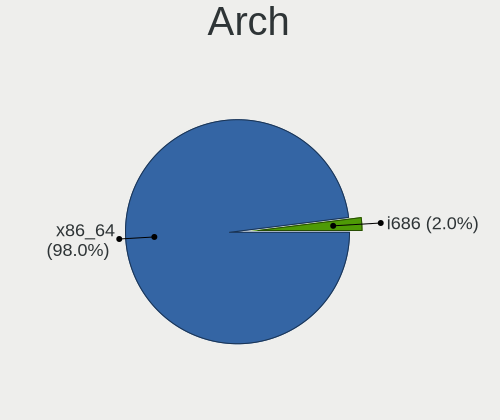

| Name   | Desktops | Percent |
|--------|----------|---------|
| x86_64 | 307      | 97.46%  |
| i686   | 8        | 2.54%   |

DE
--

Desktop Environment

| Name            | Desktops | Percent |
|-----------------|----------|---------|
| GNOME           | 131      | 40.68%  |
| KDE5            | 90       | 27.95%  |
| Unknown         | 24       | 7.45%   |
| X-Cinnamon      | 20       | 6.21%   |
| XFCE            | 19       | 5.9%    |
| KDE4            | 11       | 3.42%   |
| KDE             | 11       | 3.42%   |
| Cinnamon        | 4        | 1.24%   |
| Unity           | 3        | 0.93%   |
| i3              | 2        | 0.62%   |
| qtile           | 1        | 0.31%   |
| Pantheon        | 1        | 0.31%   |
| MATE            | 1        | 0.31%   |
| LXDE            | 1        | 0.31%   |
| i3-with-shmlog  | 1        | 0.31%   |
| GNOME Flashback | 1        | 0.31%   |
| Budgie          | 1        | 0.31%   |

Display Server
--------------

X11 or Wayland

| Name    | Desktops | Percent |
|---------|----------|---------|
| X11     | 278      | 85.28%  |
| Wayland | 37       | 11.35%  |
| Unknown | 8        | 2.45%   |
| Tty     | 3        | 0.92%   |

Display Manager
---------------

SDDM, LightDM, etc.

| Name    | Desktops | Percent |
|---------|----------|---------|
| Unknown | 165      | 50.3%   |
| SDDM    | 75       | 22.87%  |
| GDM3    | 29       | 8.84%   |
| GDM     | 20       | 6.1%    |
| LightDM | 19       | 5.79%   |
| KDM     | 11       | 3.35%   |
| TDM     | 6        | 1.83%   |
| XDM     | 1        | 0.3%    |
| MDM     | 1        | 0.3%    |
| Ly      | 1        | 0.3%    |

OS Lang
-------

Language

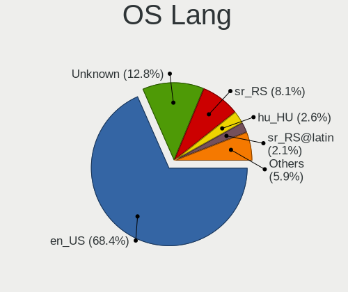

| Lang        | Desktops | Percent |
|-------------|----------|---------|
| en_US       | 219      | 67.18%  |
| Unknown     | 52       | 15.95%  |
| sr_RS       | 28       | 8.59%   |
| hu_HU       | 8        | 2.45%   |
| C           | 5        | 1.53%   |
| sr_RS@latin | 4        | 1.23%   |
| en_GB       | 3        | 0.92%   |
| en_AU       | 2        | 0.61%   |
| Default     | 2        | 0.61%   |
| sk_SK       | 1        | 0.31%   |
| ru_RU       | 1        | 0.31%   |
| de_DE       | 1        | 0.31%   |

Boot Mode
---------

EFI or BIOS

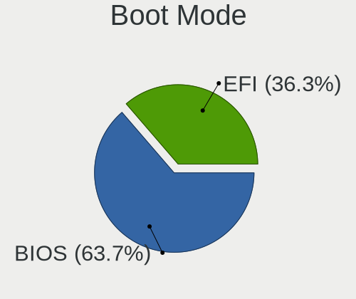

| Mode | Desktops | Percent |
|------|----------|---------|
| BIOS | 209      | 65.52%  |
| EFI  | 110      | 34.48%  |

Filesystem
----------

Type of filesystem

| Type    | Desktops | Percent |
|---------|----------|---------|
| Ext4    | 232      | 70.73%  |
| Overlay | 53       | 16.16%  |
| Unknown | 18       | 5.49%   |
| Btrfs   | 13       | 3.96%   |
| Zfs     | 4        | 1.22%   |
| Xfs     | 3        | 0.91%   |
| Tmpfs   | 2        | 0.61%   |
| Ext2    | 2        | 0.61%   |
| Ext3    | 1        | 0.3%    |

Part. scheme
------------

Scheme of partitioning

| Type    | Desktops | Percent |
|---------|----------|---------|
| Unknown | 175      | 54.52%  |
| GPT     | 89       | 27.73%  |
| MBR     | 57       | 17.76%  |

Dual Boot with Linux/BSD
------------------------

Hosting more than one Linux/BSD

| Dual boot | Desktops | Percent |
|-----------|----------|---------|
| No        | 259      | 80.69%  |
| Yes       | 62       | 19.31%  |

Dual Boot (Win)
---------------

Hosting Linux and Windows

| Dual boot | Desktops | Percent |
|-----------|----------|---------|
| No        | 197      | 61.37%  |
| Yes       | 124      | 38.63%  |

Board
-----

Vendor
------

Motherboard manufacturer

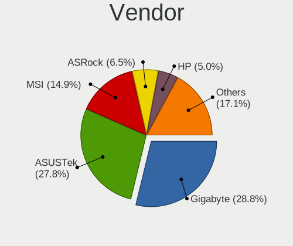

| Name                | Desktops | Percent |
|---------------------|----------|---------|
| Gigabyte Technology | 94       | 29.94%  |
| ASUSTek Computer    | 90       | 28.66%  |
| MSI                 | 47       | 14.97%  |
| Hewlett-Packard     | 18       | 5.73%   |
| ASRock              | 18       | 5.73%   |
| Biostar             | 11       | 3.5%    |
| Dell                | 7        | 2.23%   |
| Fujitsu             | 6        | 1.91%   |
| Lenovo              | 5        | 1.59%   |
| Intel               | 3        | 0.96%   |
| Acer                | 3        | 0.96%   |
| Pegatron            | 2        | 0.64%   |
| Medion              | 2        | 0.64%   |
| Supermicro          | 1        | 0.32%   |
| Sapphire            | 1        | 0.32%   |
| NCR                 | 1        | 0.32%   |
| Inventec            | 1        | 0.32%   |
| Foxconn             | 1        | 0.32%   |
| ECS                 | 1        | 0.32%   |
| Apple               | 1        | 0.32%   |
| Unknown             | 1        | 0.32%   |

Model
-----

Motherboard model

| Name                     | Desktops | Percent |
|--------------------------|----------|---------|
| ASUS PRIME A320M-K       | 15       | 4.78%   |
| ASUS All Series          | 11       | 3.5%    |
| Gigabyte B450M DS3H      | 6        | 1.91%   |
| MSI MS-7309              | 5        | 1.59%   |
| MSI MS-7641              | 4        | 1.27%   |
| Gigabyte H61M-S2PV       | 4        | 1.27%   |
| Biostar A320MH           | 4        | 1.27%   |
| MSI MS-7C02              | 3        | 0.96%   |
| MSI MS-7788              | 3        | 0.96%   |
| MSI MS-7721              | 3        | 0.96%   |
| MSI MS-7597              | 3        | 0.96%   |
| Gigabyte F2A68HM-S1      | 3        | 0.96%   |
| Gigabyte A320M-H         | 3        | 0.96%   |
| ASUS H110M-R             | 3        | 0.96%   |
| MSI MS-7C84              | 2        | 0.64%   |
| MSI MS-7786              | 2        | 0.64%   |
| MSI MS-7693              | 2        | 0.64%   |
| MSI MS-7623              | 2        | 0.64%   |
| MSI MS-7592              | 2        | 0.64%   |
| MSI MS-7529              | 2        | 0.64%   |
| HP Z800 Workstation      | 2        | 0.64%   |
| HP Z440 Workstation      | 2        | 0.64%   |
| HP ProDesk 600 G1 TWR    | 2        | 0.64%   |
| HP Compaq 6200 Pro MT PC | 2        | 0.64%   |
| Gigabyte Z77X-UD5H       | 2        | 0.64%   |
| Gigabyte P31-DS3L        | 2        | 0.64%   |
| Gigabyte GB-BMCE-4500C   | 2        | 0.64%   |
| Gigabyte GA-890GPA-UD3H  | 2        | 0.64%   |
| Gigabyte EX58-UD5        | 2        | 0.64%   |
| Gigabyte B450M S2H       | 2        | 0.64%   |
| Gigabyte B360M-DS3H      | 2        | 0.64%   |
| Gigabyte B250M-DS3H      | 2        | 0.64%   |
| Gigabyte 970A-DS3P       | 2        | 0.64%   |
| Dell OptiPlex 755        | 2        | 0.64%   |
| Biostar TB250-BTC        | 2        | 0.64%   |
| ASUS M5A99X EVO          | 2        | 0.64%   |
| ASUS M4A89GTD-PRO/USB3   | 2        | 0.64%   |
| ASUS A68HM-K             | 2        | 0.64%   |
| ASUS A58M-K              | 2        | 0.64%   |
| ASRock A320M-HDV R4.0    | 2        | 0.64%   |

Model Family
------------

Motherboard model prefix

| Name                    | Desktops | Percent |
|-------------------------|----------|---------|
| ASUS PRIME              | 19       | 6.05%   |
| ASUS All                | 11       | 3.5%    |
| HP Compaq               | 9        | 2.87%   |
| Gigabyte B450M          | 9        | 2.87%   |
| Fujitsu ESPRIMO         | 6        | 1.91%   |
| ASUS ROG                | 6        | 1.91%   |
| MSI MS-7309             | 5        | 1.59%   |
| Dell OptiPlex           | 5        | 1.59%   |
| MSI MS-7641             | 4        | 1.27%   |
| Lenovo ThinkCentre      | 4        | 1.27%   |
| Gigabyte H61M-S2PV      | 4        | 1.27%   |
| Biostar A320MH          | 4        | 1.27%   |
| MSI MS-7C02             | 3        | 0.96%   |
| MSI MS-7788             | 3        | 0.96%   |
| MSI MS-7721             | 3        | 0.96%   |
| MSI MS-7597             | 3        | 0.96%   |
| Gigabyte X570           | 3        | 0.96%   |
| Gigabyte F2A68HM-S1     | 3        | 0.96%   |
| Gigabyte B450           | 3        | 0.96%   |
| Gigabyte A320M-H        | 3        | 0.96%   |
| ASUS TUF                | 3        | 0.96%   |
| ASUS P5KPL-AM           | 3        | 0.96%   |
| ASUS H110M-R            | 3        | 0.96%   |
| MSI MS-7C84             | 2        | 0.64%   |
| MSI MS-7786             | 2        | 0.64%   |
| MSI MS-7693             | 2        | 0.64%   |
| MSI MS-7623             | 2        | 0.64%   |
| MSI MS-7592             | 2        | 0.64%   |
| MSI MS-7529             | 2        | 0.64%   |
| HP Z800                 | 2        | 0.64%   |
| HP Z440                 | 2        | 0.64%   |
| HP ProDesk              | 2        | 0.64%   |
| Gigabyte Z77X-UD5H      | 2        | 0.64%   |
| Gigabyte P31-DS3L       | 2        | 0.64%   |
| Gigabyte GB-BMCE-4500C  | 2        | 0.64%   |
| Gigabyte GA-890GPA-UD3H | 2        | 0.64%   |
| Gigabyte EX58-UD5       | 2        | 0.64%   |
| Gigabyte B550M          | 2        | 0.64%   |
| Gigabyte B360M-DS3H     | 2        | 0.64%   |
| Gigabyte B250M-DS3H     | 2        | 0.64%   |

MFG Year
--------

Motherboard manufacture year

| Year | Desktops | Percent |
|------|----------|---------|
| 2018 | 38       | 12.1%   |
| 2012 | 34       | 10.83%  |
| 2014 | 29       | 9.24%   |
| 2010 | 27       | 8.6%    |
| 2017 | 25       | 7.96%   |
| 2009 | 24       | 7.64%   |
| 2013 | 22       | 7.01%   |
| 2011 | 19       | 6.05%   |
| 2008 | 17       | 5.41%   |
| 2007 | 17       | 5.41%   |
| 2019 | 14       | 4.46%   |
| 2006 | 12       | 3.82%   |
| 2020 | 10       | 3.18%   |
| 2015 | 9        | 2.87%   |
| 2016 | 8        | 2.55%   |
| 2021 | 6        | 1.91%   |
| 2022 | 2        | 0.64%   |
| 2004 | 1        | 0.32%   |

Form Factor
-----------

Physical design of the computer

| Name    | Desktops | Percent |
|---------|----------|---------|
| Desktop | 314      | 100%    |

Secure Boot
-----------

Enabled or disabled

| State    | Desktops | Percent |
|----------|----------|---------|
| Disabled | 305      | 97.13%  |
| Enabled  | 9        | 2.87%   |

Coreboot
--------

Have coreboot on board

| Used | Desktops | Percent |
|------|----------|---------|
| No   | 314      | 100%    |

RAM Size
--------

Total RAM memory

| Size in GB  | Desktops | Percent |
|-------------|----------|---------|
| 8.01-16.0   | 88       | 27.16%  |
| 4.01-8.0    | 60       | 18.52%  |
| 3.01-4.0    | 60       | 18.52%  |
| 16.01-24.0  | 54       | 16.67%  |
| 32.01-64.0  | 23       | 7.1%    |
| 1.01-2.0    | 17       | 5.25%   |
| 24.01-32.0  | 8        | 2.47%   |
| 64.01-256.0 | 6        | 1.85%   |
| 0.51-1.0    | 5        | 1.54%   |
| 2.01-3.0    | 3        | 0.93%   |

RAM Used
--------

Used RAM memory

| Used GB    | Desktops | Percent |
|------------|----------|---------|
| 1.01-2.0   | 140      | 38.57%  |
| 2.01-3.0   | 82       | 22.59%  |
| 4.01-8.0   | 49       | 13.5%   |
| 3.01-4.0   | 34       | 9.37%   |
| 0.51-1.0   | 33       | 9.09%   |
| 0.01-0.5   | 12       | 3.31%   |
| 8.01-16.0  | 7        | 1.93%   |
| 16.01-24.0 | 4        | 1.1%    |
| 24.01-32.0 | 2        | 0.55%   |

Total Drives
------------

Number of drives on board

| Drives  | Desktops | Percent |
|---------|----------|---------|
| 1       | 130      | 39.27%  |
| 2       | 100      | 30.21%  |
| 3       | 48       | 14.5%   |
| 4       | 24       | 7.25%   |
| 5       | 14       | 4.23%   |
| 0       | 6        | 1.81%   |
| 6       | 3        | 0.91%   |
| 7       | 2        | 0.6%    |
| Unknown | 2        | 0.6%    |
| 10      | 1        | 0.3%    |
| 8       | 1        | 0.3%    |

Has CD-ROM
----------

Has CD-ROM on board

| Presented | Desktops | Percent |
|-----------|----------|---------|
| No        | 182      | 56.35%  |
| Yes       | 141      | 43.65%  |

Has Ethernet
------------

Has Ethernet on board

| Presented | Desktops | Percent |
|-----------|----------|---------|
| Yes       | 312      | 99.36%  |
| No        | 2        | 0.64%   |

Has WiFi
--------

Has WiFi module

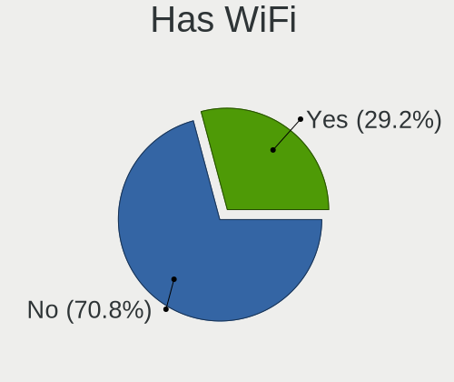

| Presented | Desktops | Percent |
|-----------|----------|---------|
| No        | 232      | 73.65%  |
| Yes       | 83       | 26.35%  |

Has Bluetooth
-------------

Has Bluetooth module

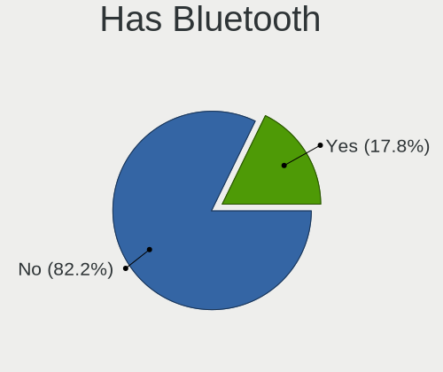

| Presented | Desktops | Percent |
|-----------|----------|---------|
| No        | 269      | 85.4%   |
| Yes       | 46       | 14.6%   |

Location
--------

Country
-------

Geographic location (country)

| Country | Desktops | Percent |
|---------|----------|---------|
| Serbia  | 314      | 100%    |

City
----

Geographic location (city)

| City               | Desktops | Percent |
|--------------------|----------|---------|
| Belgrade           | 164      | 49.1%   |
| Novi Sad           | 36       | 10.78%  |
| Ni               | 16       | 4.79%   |
| Subotica           | 9        | 2.69%   |
| Panevo           | 7        | 2.1%    |
| Kragujevac         | 7        | 2.1%    |
| Zrenjanin          | 5        | 1.5%    |
| Poarevac         | 5        | 1.5%    |
| Becej              | 4        | 1.2%    |
| Backa Topola       | 4        | 1.2%    |
| Senta              | 3        | 0.9%    |
| Semlin             | 3        | 0.9%    |
| Obrenovac          | 3        | 0.9%    |
| Leskovac           | 3        | 0.9%    |
| Cuprija            | 3        | 0.9%    |
| Zvecka             | 2        | 0.6%    |
| Rumenka            | 2        | 0.6%    |
| Ruma               | 2        | 0.6%    |
| Pirot              | 2        | 0.6%    |
| Palanka            | 2        | 0.6%    |
| Novi Knezevac      | 2        | 0.6%    |
| New Belgrade       | 2        | 0.6%    |
| Kraljevo           | 2        | 0.6%    |
| Jagodina           | 2        | 0.6%    |
| Crvenka            | 2        | 0.6%    |
| Banatsko Novo Selo | 2        | 0.6%    |
| Zajecar            | 1        | 0.3%    |
| Zabari             | 1        | 0.3%    |
| Veliko Orasje      | 1        | 0.3%    |
| Tutin              | 1        | 0.3%    |
| Trstenik           | 1        | 0.3%    |
| Stari Grad         | 1        | 0.3%    |
| Stara Pazova       | 1        | 0.3%    |
| Sremska Mitrovica  | 1        | 0.3%    |
| Smederevo          | 1        | 0.3%    |
| Savski Venac       | 1        | 0.3%    |
| Pukovac            | 1        | 0.3%    |
| Petrovac           | 1        | 0.3%    |
| Odzaci             | 1        | 0.3%    |
| Novi Karlovci      | 1        | 0.3%    |

Drives
------

Drive Vendor
------------

Hard drive vendors

| Vendor                      | Desktops | Drives | Percent |
|-----------------------------|----------|--------|---------|
| WDC                         | 125      | 219    | 22.48%  |
| Seagate                     | 69       | 100    | 12.41%  |
| Kingston                    | 67       | 99     | 12.05%  |
| Toshiba                     | 53       | 77     | 9.53%   |
| Samsung Electronics         | 49       | 86     | 8.81%   |
| Hitachi                     | 28       | 42     | 5.04%   |
| SPCC                        | 16       | 25     | 2.88%   |
| SanDisk                     | 16       | 20     | 2.88%   |
| Patriot                     | 14       | 16     | 2.52%   |
| Biostar                     | 14       | 16     | 2.52%   |
| Gigabyte Technology         | 13       | 16     | 2.34%   |
| Maxtor                      | 11       | 12     | 1.98%   |
| Transcend                   | 7        | 8      | 1.26%   |
| Intel                       | 7        | 10     | 1.26%   |
| Crucial                     | 7        | 7      | 1.26%   |
| Apacer                      | 7        | 9      | 1.26%   |
| A-DATA Technology           | 7        | 7      | 1.26%   |
| Silicon Motion              | 6        | 9      | 1.08%   |
| China                       | 4        | 6      | 0.72%   |
| StoreJet                    | 3        | 3      | 0.54%   |
| Kingston Technology Company | 3        | 5      | 0.54%   |
| HGST                        | 3        | 4      | 0.54%   |
| Unknown                     | 2        | 3      | 0.36%   |
| Phison Electronics          | 2        | 3      | 0.36%   |
| Phison                      | 2        | 9      | 0.36%   |
| Lexar                       | 2        | 5      | 0.36%   |
| Intenso                     | 2        | 2      | 0.36%   |
| ExcelStor                   | 2        | 2      | 0.36%   |
| AMD                         | 2        | 2      | 0.36%   |
| Verbatim                    | 1        | 1      | 0.18%   |
| Realtek Semiconductor       | 1        | 1      | 0.18%   |
| QUANTUM                     | 1        | 1      | 0.18%   |
| PNY                         | 1        | 3      | 0.18%   |
| OCZ                         | 1        | 2      | 0.18%   |
| Mushkin                     | 1        | 1      | 0.18%   |
| Leven                       | 1        | 1      | 0.18%   |
| KingDian                    | 1        | 1      | 0.18%   |
| GeIL                        | 1        | 1      | 0.18%   |
| Apple                       | 1        | 1      | 0.18%   |
| ADATA Technology            | 1        | 1      | 0.18%   |

Drive Model
-----------

Hard drive models

| Model                                                 | Desktops | Percent |
|-------------------------------------------------------|----------|---------|
| Kingston SA400S37120G 120GB SSD                       | 19       | 3%      |
| Toshiba DT01ACA100 1TB                                | 15       | 2.37%   |
| Kingston SA400S37240G 240GB SSD                       | 14       | 2.21%   |
| Kingston SA400S37480G 480GB SSD                       | 13       | 2.05%   |
| Toshiba DT01ACA050 500GB                              | 9        | 1.42%   |
| Seagate ST1000DM003-1ER162 1TB                        | 8        | 1.26%   |
| WDC WD5000AAKX-001CA0 500GB                           | 6        | 0.95%   |
| Toshiba HDWD110 1TB                                   | 6        | 0.95%   |
| Seagate ST1000DM010-2EP102 1TB                        | 6        | 0.95%   |
| Samsung NVMe SSD Drive 500GB                          | 6        | 0.95%   |
| Patriot Burst 240GB SSD                               | 6        | 0.95%   |
| Gigabyte GP-GSTFS31240GNTD 240GB SSD                  | 6        | 0.95%   |
| WDC WD3200AAJS-56B4A0 320GB                           | 5        | 0.79%   |
| Toshiba DT01ACA200 2TB                                | 5        | 0.79%   |
| SPCC Solid State Disk 256GB                           | 5        | 0.79%   |
| Seagate ST500DM002-1BD142 500GB                       | 5        | 0.79%   |
| Seagate ST1000DM003-1CH162 1TB                        | 5        | 0.79%   |
| Samsung SSD 860 EVO 250GB                             | 5        | 0.79%   |
| Hitachi HDS721050CLA362 500GB                         | 5        | 0.79%   |
| Gigabyte GP-GSTFS31120GNTD 120GB                      | 5        | 0.79%   |
| Biostar S100-120GB SSD                                | 5        | 0.79%   |
| WDC WD10EZEX-08WN4A0 1TB                              | 4        | 0.63%   |
| WDC WD1003FZEX-00K3CA0 1TB                            | 4        | 0.63%   |
| Toshiba HDWD120 2TB                                   | 4        | 0.63%   |
| Silicon Motion SM2263EN/SM2263XT SSD Controller 500GB | 4        | 0.63%   |
| Seagate ST2000DM008-2FR102 2TB                        | 4        | 0.63%   |
| Samsung SSD 860 EVO 500GB                             | 4        | 0.63%   |
| Samsung HD502HJ 500GB                                 | 4        | 0.63%   |
| Kingston SHFS37A120G 120GB SSD                        | 4        | 0.63%   |
| Kingston SH103S3120G 120GB SSD                        | 4        | 0.63%   |
| WDC WD3200AAJS-56M0A0 320GB                           | 3        | 0.47%   |
| WDC WD30EFRX-68EUZN0 3TB                              | 3        | 0.47%   |
| WDC WD2500BEVS-22UST0 250GB                           | 3        | 0.47%   |
| WDC WD2500AAKX-753CA1 250GB                           | 3        | 0.47%   |
| WDC WD20EFRX-68EUZN0 2TB                              | 3        | 0.47%   |
| WDC WD1600AAJS-00PSA0 160GB                           | 3        | 0.47%   |
| WDC WD1600AAJS-00L7A0 160GB                           | 3        | 0.47%   |
| WDC WD10EALX-009BA0 1TB                               | 3        | 0.47%   |
| WDC WD1003FZEX-00MK2A0 1TB                            | 3        | 0.47%   |
| StoreJet Transcend 500GB                              | 3        | 0.47%   |

HDD Vendor
----------

Hard disk drive vendors

| Vendor              | Desktops | Drives | Percent |
|---------------------|----------|--------|---------|
| WDC                 | 121      | 211    | 39.54%  |
| Seagate             | 66       | 96     | 21.57%  |
| Toshiba             | 51       | 75     | 16.67%  |
| Hitachi             | 28       | 42     | 9.15%   |
| Samsung Electronics | 19       | 26     | 6.21%   |
| Maxtor              | 11       | 12     | 3.59%   |
| HGST                | 3        | 4      | 0.98%   |
| Intenso             | 2        | 2      | 0.65%   |
| ExcelStor           | 2        | 2      | 0.65%   |
| Unknown             | 1        | 1      | 0.33%   |
| QUANTUM             | 1        | 1      | 0.33%   |
| Apple               | 1        | 1      | 0.33%   |

SSD Vendor
----------

Solid state drive vendors

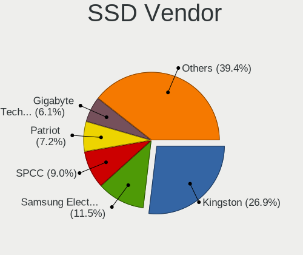

| Vendor              | Desktops | Drives | Percent |
|---------------------|----------|--------|---------|
| Kingston            | 60       | 89     | 29.41%  |
| Samsung Electronics | 19       | 27     | 9.31%   |
| SPCC                | 16       | 25     | 7.84%   |
| Gigabyte Technology | 13       | 16     | 6.37%   |
| SanDisk             | 12       | 16     | 5.88%   |
| Patriot             | 12       | 14     | 5.88%   |
| Biostar             | 11       | 13     | 5.39%   |
| Transcend           | 7        | 8      | 3.43%   |
| Intel               | 7        | 10     | 3.43%   |
| Crucial             | 7        | 7      | 3.43%   |
| A-DATA Technology   | 7        | 7      | 3.43%   |
| Apacer              | 6        | 8      | 2.94%   |
| WDC                 | 5        | 5      | 2.45%   |
| China               | 4        | 6      | 1.96%   |
| StoreJet            | 3        | 3      | 1.47%   |
| Lexar               | 2        | 5      | 0.98%   |
| AMD                 | 2        | 2      | 0.98%   |
| Verbatim            | 1        | 1      | 0.49%   |
| Toshiba             | 1        | 1      | 0.49%   |
| Seagate             | 1        | 1      | 0.49%   |
| PNY                 | 1        | 3      | 0.49%   |
| OCZ                 | 1        | 2      | 0.49%   |
| Mushkin             | 1        | 1      | 0.49%   |
| Leven               | 1        | 1      | 0.49%   |
| KingDian            | 1        | 1      | 0.49%   |
| GeIL                | 1        | 1      | 0.49%   |
| ADATA SU            | 1        | 1      | 0.49%   |
| Unknown             | 1        | 3      | 0.49%   |

Drive Kind
----------

HDD or SSD

| Kind    | Desktops | Drives | Percent |
|---------|----------|--------|---------|
| HDD     | 238      | 473    | 51.52%  |
| SSD     | 168      | 277    | 36.36%  |
| NVMe    | 49       | 82     | 10.61%  |
| Unknown | 7        | 8      | 1.52%   |

Drive Connector
---------------

SATA, SAS, NVMe, etc.

| Type | Desktops | Drives | Percent |
|------|----------|--------|---------|
| SATA | 297      | 742    | 82.04%  |
| NVMe | 49       | 82     | 13.54%  |
| SAS  | 16       | 16     | 4.42%   |

Drive Size
----------

Size of hard drive

| Size in TB      | Desktops | Drives | Percent |
|-----------------|----------|--------|---------|
| 0.01-0.5        | 256      | 487    | 61.39%  |
| 0.51-1.0        | 107      | 162    | 25.66%  |
| 1.01-2.0        | 36       | 61     | 8.63%   |
| 3.01-4.0        | 7        | 12     | 1.68%   |
| 2.01-3.0        | 6        | 19     | 1.44%   |
| 4.01-10.0       | 4        | 8      | 0.96%   |
| More than 100.0 | 1        | 1      | 0.24%   |

Space Total
-----------

Amount of disk space available on the file system

| Size in GB     | Desktops | Percent |
|----------------|----------|---------|
| 101-250        | 84       | 24.56%  |
| 251-500        | 59       | 17.25%  |
| 501-1000       | 45       | 13.16%  |
| 1-20           | 41       | 11.99%  |
| 1001-2000      | 31       | 9.06%   |
| 51-100         | 20       | 5.85%   |
| Unknown        | 18       | 5.26%   |
| 21-50          | 17       | 4.97%   |
| More than 3000 | 15       | 4.39%   |
| 2001-3000      | 12       | 3.51%   |

Space Used
----------

Amount of used disk space

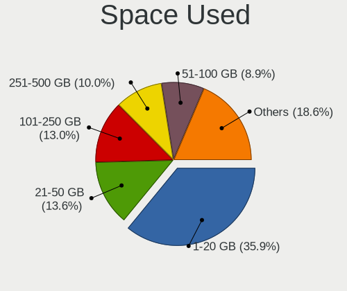

| Used GB        | Desktops | Percent |
|----------------|----------|---------|
| 1-20           | 134      | 38.29%  |
| 21-50          | 48       | 13.71%  |
| 101-250        | 41       | 11.71%  |
| 251-500        | 36       | 10.29%  |
| 51-100         | 31       | 8.86%   |
| 1001-2000      | 18       | 5.14%   |
| Unknown        | 18       | 5.14%   |
| 501-1000       | 15       | 4.29%   |
| 2001-3000      | 5        | 1.43%   |
| More than 3000 | 4        | 1.14%   |

Malfunc. Drives
---------------

Drive models with a malfunction

| Model                               | Desktops | Drives | Percent |
|-------------------------------------|----------|--------|---------|
| WDC WD5000AAKX-001CA0 500GB         | 3        | 3      | 5%      |
| WDC WD2002FAEX-007BA0 2TB           | 2        | 3      | 3.33%   |
| WDC WD10EALX-009BA0 1TB             | 2        | 3      | 3.33%   |
| Seagate ST500DM002-1BD142 500GB     | 2        | 5      | 3.33%   |
| Seagate ST380815AS 80GB             | 2        | 2      | 3.33%   |
| Seagate ST1000DM003-1CH162 1TB      | 2        | 2      | 3.33%   |
| Intel SSDSC2CW120A3 120GB           | 2        | 2      | 3.33%   |
| Hitachi HDP725050GLA360 500GB       | 2        | 2      | 3.33%   |
| WDC WD5002AALX-00J37A0 500GB        | 1        | 1      | 1.67%   |
| WDC WD5000AAKX-603CA0 500GB         | 1        | 1      | 1.67%   |
| WDC WD5000AAKX-329BA0 500GB         | 1        | 1      | 1.67%   |
| WDC WD5000AAKS-65A7B0 500GB         | 1        | 1      | 1.67%   |
| WDC WD5000AAKS-00UU3A0 500GB        | 1        | 1      | 1.67%   |
| WDC WD5000AAKS-00TMA0 500GB         | 1        | 1      | 1.67%   |
| WDC WD40EFRX-68WT0N0 4TB            | 1        | 1      | 1.67%   |
| WDC WD3200BEKT-60PVMT0 320GB        | 1        | 1      | 1.67%   |
| WDC WD3200AVVS-63L2B0 320GB         | 1        | 1      | 1.67%   |
| WDC WD3200AVVS-56L2B0 320GB         | 1        | 1      | 1.67%   |
| WDC WD20EARX-00PASB0 2TB            | 1        | 1      | 1.67%   |
| WDC WD1600AAJS-00PSA0 160GB         | 1        | 1      | 1.67%   |
| WDC WD1600AAJS-00L7A0 160GB         | 1        | 1      | 1.67%   |
| WDC WD15EARS-00Z5B1 1TB             | 1        | 1      | 1.67%   |
| WDC WD15EARS-00MVWB0 1TB            | 1        | 1      | 1.67%   |
| WDC WD10EZEX-75WN4A0 1TB            | 1        | 1      | 1.67%   |
| WDC WD10EZEX-22MFCA0 1TB            | 1        | 1      | 1.67%   |
| WDC WD10EZEX-00RKKA0 1TB            | 1        | 1      | 1.67%   |
| WDC WD10EARS-00Y5B1 1TB             | 1        | 1      | 1.67%   |
| WDC WD10EADS-00M2B0 1TB             | 1        | 2      | 1.67%   |
| WDC WD1003FZEX-00MK2A0 1TB          | 1        | 1      | 1.67%   |
| WDC WD1001FALS-00J7B1 1TB           | 1        | 1      | 1.67%   |
| Toshiba MQ02ABD100H 1TB             | 1        | 1      | 1.67%   |
| Toshiba MG03ACA200 2TB              | 1        | 1      | 1.67%   |
| Toshiba DT01ACA100 1TB              | 1        | 1      | 1.67%   |
| SPCC Solid State Disk 120GB         | 1        | 1      | 1.67%   |
| Seagate STM3250318AS 250GB          | 1        | 2      | 1.67%   |
| Seagate ST2000DM006-2DM164 2TB      | 1        | 1      | 1.67%   |
| Samsung Electronics SSD 870 EVO 1TB | 1        | 3      | 1.67%   |
| Samsung Electronics HD753LJ 752GB   | 1        | 2      | 1.67%   |
| Samsung Electronics HD502HJ 500GB   | 1        | 1      | 1.67%   |
| Samsung Electronics HD154UI 1TB     | 1        | 1      | 1.67%   |

Malfunc. Drive Vendor
---------------------

Vendors of faulty drives

| Vendor              | Desktops | Drives | Percent |
|---------------------|----------|--------|---------|
| WDC                 | 25       | 32     | 44.64%  |
| Seagate             | 8        | 12     | 14.29%  |
| Samsung Electronics | 6        | 9      | 10.71%  |
| Hitachi             | 5        | 5      | 8.93%   |
| Maxtor              | 4        | 5      | 7.14%   |
| Toshiba             | 3        | 3      | 5.36%   |
| Intel               | 2        | 2      | 3.57%   |
| SPCC                | 1        | 1      | 1.79%   |
| Kingston            | 1        | 1      | 1.79%   |
| Crucial             | 1        | 1      | 1.79%   |

Malfunc. HDD Vendor
-------------------

Vendors of faulty HDD drives

| Vendor              | Desktops | Drives | Percent |
|---------------------|----------|--------|---------|
| WDC                 | 25       | 32     | 50%     |
| Seagate             | 8        | 12     | 16%     |
| Samsung Electronics | 5        | 6      | 10%     |
| Hitachi             | 5        | 5      | 10%     |
| Maxtor              | 4        | 5      | 8%      |
| Toshiba             | 3        | 3      | 6%      |

Malfunc. Drive Kind
-------------------

Kinds of faulty drives

| Kind | Desktops | Drives | Percent |
|------|----------|--------|---------|
| HDD  | 42       | 63     | 87.5%   |
| SSD  | 6        | 8      | 12.5%   |

Failed Drives
-------------

Failed drive models

Zero info for selected period =(

Failed Drive Vendor
-------------------

Failed drive vendors

Zero info for selected period =(

Drive Status
------------

Number of failed and malfunc. drives

| Status   | Desktops | Drives | Percent |
|----------|----------|--------|---------|
| Detected | 192      | 523    | 55.49%  |
| Works    | 106      | 246    | 30.64%  |
| Malfunc  | 48       | 71     | 13.87%  |

Storage controller
------------------

Storage Vendor
--------------

Storage controller vendors

| Vendor                       | Desktops | Percent |
|------------------------------|----------|---------|
| Intel                        | 163      | 40.25%  |
| AMD                          | 127      | 31.36%  |
| Nvidia                       | 22       | 5.43%   |
| Samsung Electronics          | 19       | 4.69%   |
| JMicron Technology           | 19       | 4.69%   |
| Kingston Technology Company  | 12       | 2.96%   |
| Marvell Technology Group     | 9        | 2.22%   |
| Silicon Motion               | 7        | 1.73%   |
| ASMedia Technology           | 7        | 1.73%   |
| SanDisk                      | 5        | 1.23%   |
| VIA Technologies             | 4        | 0.99%   |
| Phison Electronics           | 4        | 0.99%   |
| LSI Logic / Symbios Logic    | 2        | 0.49%   |
| Toshiba America Info Systems | 1        | 0.25%   |
| Shenzhen Longsys Electronics | 1        | 0.25%   |
| Realtek Semiconductor        | 1        | 0.25%   |
| Broadcom / LSI               | 1        | 0.25%   |
| ADATA Technology             | 1        | 0.25%   |

Storage Model
-------------

Storage controller models

| Model                                                                                   | Desktops | Percent |
|-----------------------------------------------------------------------------------------|----------|---------|
| AMD FCH SATA Controller [AHCI mode]                                                     | 77       | 14.05%  |
| AMD FCH SATA Controller D                                                               | 27       | 4.93%   |
| Intel NM10/ICH7 Family SATA Controller [IDE mode]                                       | 26       | 4.74%   |
| AMD 400 Series Chipset SATA Controller                                                  | 24       | 4.38%   |
| Intel 8 Series/C220 Series Chipset Family 6-port SATA Controller 1 [AHCI mode]          | 20       | 3.65%   |
| AMD SB7x0/SB8x0/SB9x0 IDE Controller                                                    | 17       | 3.1%    |
| Intel 82801G (ICH7 Family) IDE Controller                                               | 15       | 2.74%   |
| Intel 7 Series/C210 Series Chipset Family 6-port SATA Controller [AHCI mode]            | 15       | 2.74%   |
| Intel 6 Series/C200 Series Chipset Family 6 port Desktop SATA AHCI Controller           | 15       | 2.74%   |
| AMD SB7x0/SB8x0/SB9x0 SATA Controller [AHCI mode]                                       | 14       | 2.55%   |
| AMD SB7x0/SB8x0/SB9x0 SATA Controller [IDE mode]                                        | 13       | 2.37%   |
| Nvidia MCP61 SATA Controller                                                            | 12       | 2.19%   |
| Nvidia MCP61 IDE                                                                        | 11       | 2.01%   |
| JMicron JMB363 SATA/IDE Controller                                                      | 11       | 2.01%   |
| Intel 200 Series PCH SATA controller [AHCI mode]                                        | 11       | 2.01%   |
| Intel Cannon Lake PCH SATA AHCI Controller                                              | 10       | 1.82%   |
| Samsung NVMe SSD Controller SM981/PM981/PM983                                           | 9        | 1.64%   |
| AMD FCH SATA Controller [IDE mode]                                                      | 9        | 1.64%   |
| Intel Q170/Q150/B150/H170/H110/Z170/CM236 Chipset SATA Controller [AHCI Mode]           | 8        | 1.46%   |
| Intel 6 Series/C200 Series Chipset Family Desktop SATA Controller (IDE mode, ports 4-5) | 8        | 1.46%   |
| Intel 6 Series/C200 Series Chipset Family Desktop SATA Controller (IDE mode, ports 0-3) | 8        | 1.46%   |
| Silicon Motion SM2263EN/SM2263XT (DRAM-less) NVMe SSD Controllers                       | 7        | 1.28%   |
| AMD 500 Series Chipset SATA Controller                                                  | 7        | 1.28%   |
| Intel SATA Controller [RAID mode]                                                       | 6        | 1.09%   |
| Kingston Company A2000 NVMe SSD                                                         | 5        | 0.91%   |
| Intel 82801JI (ICH10 Family) SATA AHCI Controller                                       | 5        | 0.91%   |
| Samsung NVMe SSD Controller 980                                                         | 4        | 0.73%   |
| JMicron JMB368 IDE controller                                                           | 4        | 0.73%   |
| Intel 9 Series Chipset Family SATA Controller [AHCI Mode]                               | 4        | 0.73%   |
| Intel 82801JI (ICH10 Family) 4 port SATA IDE Controller #1                              | 4        | 0.73%   |
| Intel 82801JI (ICH10 Family) 2 port SATA IDE Controller #2                              | 4        | 0.73%   |
| Intel 82801I (ICH9 Family) 2 port SATA Controller [IDE mode]                            | 4        | 0.73%   |
| Intel 5 Series/3400 Series Chipset 4 port SATA IDE Controller                           | 4        | 0.73%   |
| Intel 5 Series/3400 Series Chipset 2 port SATA IDE Controller                           | 4        | 0.73%   |
| ASMedia ASM1062 Serial ATA Controller                                                   | 4        | 0.73%   |
| AMD FCH IDE Controller                                                                  | 4        | 0.73%   |
| Samsung NVMe SSD Controller SM961/PM961/SM963                                           | 3        | 0.55%   |
| Samsung NVMe SSD Controller PM9A1/PM9A3/980PRO                                          | 3        | 0.55%   |
| Nvidia MCP65 SATA Controller                                                            | 3        | 0.55%   |
| Nvidia MCP65 IDE                                                                        | 3        | 0.55%   |

Storage Kind
------------

Kind of storage controller (IDE, SATA, NVMe, SAS, ...)

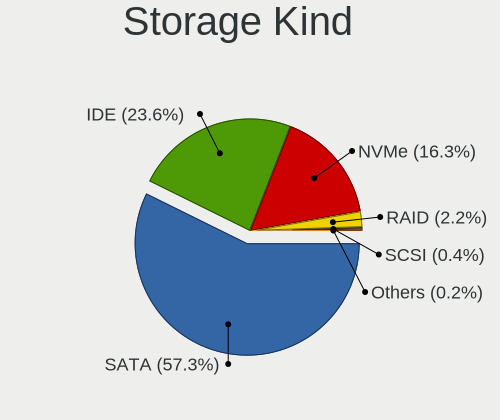

| Kind | Desktops | Percent |
|------|----------|---------|
| SATA | 233      | 57.96%  |
| IDE  | 109      | 27.11%  |
| NVMe | 49       | 12.19%  |
| RAID | 8        | 1.99%   |
| SCSI | 2        | 0.5%    |
| SAS  | 1        | 0.25%   |

Processor
---------

CPU Vendor
----------

Processor vendors

| Vendor | Desktops | Percent |
|--------|----------|---------|
| Intel  | 166      | 52.87%  |
| AMD    | 148      | 47.13%  |

CPU Model
---------

Processor models

| Model                                           | Desktops | Percent |
|-------------------------------------------------|----------|---------|
| AMD Ryzen 5 1600 Six-Core Processor             | 10       | 3.17%   |
| Intel Core i5-2400 CPU @ 3.10GHz                | 6        | 1.9%    |
| Intel Core i7-3770 CPU @ 3.40GHz                | 5        | 1.59%   |
| Intel Core 2 Duo CPU E4500 @ 2.20GHz            | 5        | 1.59%   |
| AMD Ryzen 5 5600X 6-Core Processor              | 5        | 1.59%   |
| AMD Ryzen 5 2600X Six-Core Processor            | 5        | 1.59%   |
| AMD Ryzen 5 2400G with Radeon Vega Graphics     | 5        | 1.59%   |
| Intel Core i3-4160 CPU @ 3.60GHz                | 4        | 1.27%   |
| Intel Core i3-3220 CPU @ 3.30GHz                | 4        | 1.27%   |
| AMD Ryzen 5 5600G with Radeon Graphics          | 4        | 1.27%   |
| AMD Ryzen 5 3600 6-Core Processor               | 4        | 1.27%   |
| AMD Ryzen 5 3400G with Radeon Vega Graphics     | 4        | 1.27%   |
| AMD A4-4020 APU with Radeon HD Graphics         | 4        | 1.27%   |
| Intel Pentium Dual-Core CPU E5200 @ 2.50GHz     | 3        | 0.95%   |
| Intel Core i7 CPU 870 @ 2.93GHz                 | 3        | 0.95%   |
| Intel Core i5-7400 CPU @ 3.00GHz                | 3        | 0.95%   |
| Intel Core i3-8100 CPU @ 3.60GHz                | 3        | 0.95%   |
| Intel Core i3-6100 CPU @ 3.70GHz                | 3        | 0.95%   |
| Intel Core i3-4170 CPU @ 3.70GHz                | 3        | 0.95%   |
| Intel Core 2 Duo CPU E8400 @ 3.00GHz            | 3        | 0.95%   |
| Intel Core 2 Duo CPU E7500 @ 2.93GHz            | 3        | 0.95%   |
| Intel Core 2 Duo CPU E7300 @ 2.66GHz            | 3        | 0.95%   |
| AMD Ryzen 9 5900X 12-Core Processor             | 3        | 0.95%   |
| AMD Ryzen 7 2700X Eight-Core Processor          | 3        | 0.95%   |
| AMD Ryzen 3 3200G with Radeon Vega Graphics     | 3        | 0.95%   |
| AMD Ryzen 3 2200G with Radeon Vega Graphics     | 3        | 0.95%   |
| AMD Phenom II X4 965 Processor                  | 3        | 0.95%   |
| AMD Phenom II X4 945 Processor                  | 3        | 0.95%   |
| AMD FX-6300 Six-Core Processor                  | 3        | 0.95%   |
| AMD Athlon X4 840 Quad Core Processor           | 3        | 0.95%   |
| AMD Athlon X4 750K Quad Core Processor          | 3        | 0.95%   |
| AMD A10-7850K Radeon R7, 12 Compute Cores 4C+8G | 3        | 0.95%   |
| Intel Xeon CPU X5660 @ 2.80GHz                  | 2        | 0.63%   |
| Intel Xeon CPU E5-1630 v3 @ 3.70GHz             | 2        | 0.63%   |
| Intel Pentium Gold G5400 CPU @ 3.70GHz          | 2        | 0.63%   |
| Intel Pentium Dual-Core CPU E5700 @ 3.00GHz     | 2        | 0.63%   |
| Intel Pentium Dual-Core CPU E5300 @ 2.60GHz     | 2        | 0.63%   |
| Intel Pentium CPU G630 @ 2.70GHz                | 2        | 0.63%   |
| Intel Pentium CPU G4560 @ 3.50GHz               | 2        | 0.63%   |
| Intel Pentium CPU G2030 @ 3.00GHz               | 2        | 0.63%   |

CPU Model Family
----------------

Processor model prefix

| Model                   | Desktops | Percent |
|-------------------------|----------|---------|
| AMD Ryzen 5             | 44       | 13.97%  |
| Intel Core i5           | 33       | 10.48%  |
| Intel Core i3           | 27       | 8.57%   |
| Intel Core i7           | 25       | 7.94%   |
| Intel Core 2 Duo        | 22       | 6.98%   |
| Intel Celeron           | 13       | 4.13%   |
| Intel Xeon              | 12       | 3.81%   |
| AMD Phenom II X4        | 11       | 3.49%   |
| Intel Pentium Dual-Core | 9        | 2.86%   |
| AMD Ryzen 3             | 9        | 2.86%   |
| AMD FX                  | 9        | 2.86%   |
| AMD Athlon X4           | 9        | 2.86%   |
| Intel Pentium           | 8        | 2.54%   |
| Intel Core 2 Quad       | 8        | 2.54%   |
| AMD Ryzen 7             | 7        | 2.22%   |
| AMD Athlon II X2        | 7        | 2.22%   |
| AMD Athlon 64 X2        | 7        | 2.22%   |
| AMD A4                  | 7        | 2.22%   |
| AMD Ryzen 9             | 5        | 1.59%   |
| AMD Athlon II X3        | 5        | 1.59%   |
| AMD Athlon II X4        | 4        | 1.27%   |
| AMD A10                 | 4        | 1.27%   |
| Other                   | 3        | 0.95%   |
| AMD Athlon              | 3        | 0.95%   |
| Intel Pentium Gold      | 2        | 0.63%   |
| Intel Core 2            | 2        | 0.63%   |
| AMD Sempron             | 2        | 0.63%   |
| AMD Ryzen Threadripper  | 2        | 0.63%   |
| AMD Ryzen 3 PRO         | 2        | 0.63%   |
| AMD Phenom II X6        | 2        | 0.63%   |
| AMD Phenom              | 2        | 0.63%   |
| AMD A6                  | 2        | 0.63%   |
| Intel Pentium Dual      | 1        | 0.32%   |
| Intel Pentium D         | 1        | 0.32%   |
| Intel Pentium 4         | 1        | 0.32%   |
| AMD Ryzen 5 PRO         | 1        | 0.32%   |
| AMD Phenom II X2        | 1        | 0.32%   |
| AMD E2                  | 1        | 0.32%   |
| AMD E1                  | 1        | 0.32%   |
| AMD A8                  | 1        | 0.32%   |

CPU Cores
---------

Number of processor cores

| Number  | Desktops | Percent |
|---------|----------|---------|
| 4       | 120      | 38.1%   |
| 2       | 111      | 35.24%  |
| 6       | 43       | 13.65%  |
| 1       | 13       | 4.13%   |
| 8       | 9        | 2.86%   |
| 3       | 9        | 2.86%   |
| 12      | 6        | 1.9%    |
| 16      | 2        | 0.63%   |
| 32      | 1        | 0.32%   |
| Unknown | 1        | 0.32%   |

CPU Sockets
-----------

Number of sockets

| Number | Desktops | Percent |
|--------|----------|---------|
| 1      | 312      | 99.36%  |
| 2      | 2        | 0.64%   |

CPU Threads
-----------

Threads per core (Hyper-Threading)

| Number  | Desktops | Percent |
|---------|----------|---------|
| 1       | 163      | 51.91%  |
| 2       | 150      | 47.77%  |
| Unknown | 1        | 0.32%   |

CPU Op-Modes
------------

CPU Operation Modes (32-bit, 64-bit)

| Op mode        | Desktops | Percent |
|----------------|----------|---------|
| 32-bit, 64-bit | 310      | 98.73%  |
| Unknown        | 4        | 1.27%   |

CPU Microcode
-------------

Microcode number

| Number     | Desktops | Percent |
|------------|----------|---------|
| Unknown    | 78       | 23.85%  |
| 0x1067a    | 23       | 7.03%   |
| 0x306c3    | 20       | 6.12%   |
| 0x306a9    | 17       | 5.2%    |
| 0x206a7    | 14       | 4.28%   |
| 0x0800820d | 14       | 4.28%   |
| 0x06001119 | 9        | 2.75%   |
| 0x906e9    | 8        | 2.45%   |
| 0x6fd      | 8        | 2.45%   |
| 0x08101016 | 8        | 2.45%   |
| 0x010000c8 | 8        | 2.45%   |
| 0x08701021 | 7        | 2.14%   |
| 0x08108109 | 7        | 2.14%   |
| 0x906ea    | 6        | 1.83%   |
| 0x506e3    | 6        | 1.83%   |
| 0x106e5    | 6        | 1.83%   |
| 0x06003106 | 6        | 1.83%   |
| 0x10676    | 5        | 1.53%   |
| 0x906eb    | 4        | 1.22%   |
| 0x6fb      | 4        | 1.22%   |
| 0x08701013 | 4        | 1.22%   |
| 0x010000db | 4        | 1.22%   |
| 0x0a50000c | 3        | 0.92%   |
| 0x0a201016 | 3        | 0.92%   |
| 0x08001138 | 3        | 0.92%   |
| 0x08001137 | 3        | 0.92%   |
| 0x0700010b | 3        | 0.92%   |
| 0x06000852 | 3        | 0.92%   |
| 0xa0671    | 2        | 0.61%   |
| 0x906c0    | 2        | 0.61%   |
| 0x206c2    | 2        | 0.61%   |
| 0x106a4    | 2        | 0.61%   |
| 0x0a50000d | 2        | 0.61%   |
| 0x0700010f | 2        | 0.61%   |
| 0x06000822 | 2        | 0.61%   |
| 0x03000027 | 2        | 0.61%   |
| 0x010000dc | 2        | 0.61%   |
| 0x010000b6 | 2        | 0.61%   |
| 0x01000086 | 2        | 0.61%   |
| 0xf65      | 1        | 0.31%   |

CPU Microarch
-------------

Microarchitecture

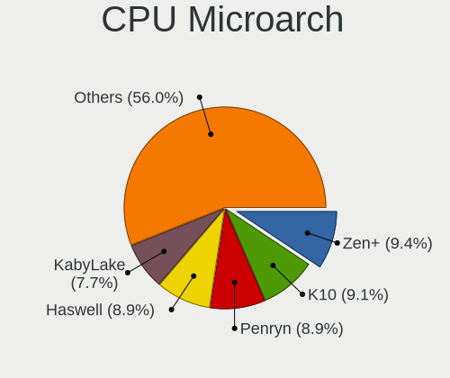

| Name        | Desktops | Percent |
|-------------|----------|---------|
| Penryn      | 33       | 10.51%  |
| K10         | 31       | 9.87%   |
| Zen+        | 30       | 9.55%   |
| Haswell     | 27       | 8.6%    |
| KabyLake    | 22       | 7.01%   |
| IvyBridge   | 22       | 7.01%   |
| Piledriver  | 21       | 6.69%   |
| SandyBridge | 20       | 6.37%   |
| Zen         | 15       | 4.78%   |
| Core        | 15       | 4.78%   |
| Zen 3       | 14       | 4.46%   |
| Zen 2       | 10       | 3.18%   |
| K8 Hammer   | 9        | 2.87%   |
| Steamroller | 8        | 2.55%   |
| Nehalem     | 8        | 2.55%   |
| Skylake     | 7        | 2.23%   |
| Jaguar      | 5        | 1.59%   |
| Westmere    | 4        | 1.27%   |
| Tremont     | 2        | 0.64%   |
| NetBurst    | 2        | 0.64%   |
| K10 Llano   | 2        | 0.64%   |
| Icelake     | 2        | 0.64%   |
| Unknown     | 2        | 0.64%   |
| Silvermont  | 1        | 0.32%   |
| Excavator   | 1        | 0.32%   |
| Bulldozer   | 1        | 0.32%   |

Graphics
--------

GPU Vendor
----------

Vendors of graphics cards

| Vendor | Desktops | Percent |
|--------|----------|---------|
| AMD    | 152      | 46.2%   |
| Nvidia | 110      | 33.43%  |
| Intel  | 67       | 20.36%  |

GPU Model
---------

Graphics card models

| Model                                                                       | Desktops | Percent |
|-----------------------------------------------------------------------------|----------|---------|
| AMD Ellesmere [Radeon RX 470/480/570/570X/580/580X/590]                     | 23       | 6.69%   |
| AMD Picasso/Raven 2 [Radeon Vega Series / Radeon Vega Mobile Series]        | 11       | 3.2%    |
| Intel Xeon E3-1200 v2/3rd Gen Core processor Graphics Controller            | 9        | 2.62%   |
| Intel Xeon E3-1200 v3/4th Gen Core Processor Integrated Graphics Controller | 8        | 2.33%   |
| Intel 2nd Generation Core Processor Family Integrated Graphics Controller   | 8        | 2.33%   |
| AMD Turks PRO [Radeon HD 6570/7570/8550 / R5 230]                           | 8        | 2.33%   |
| Nvidia GP107 [GeForce GTX 1050 Ti]                                          | 7        | 2.03%   |
| Intel 4th Generation Core Processor Family Integrated Graphics Controller   | 7        | 2.03%   |
| AMD Lexa PRO [Radeon 540/540X/550/550X / RX 540X/550/550X]                  | 7        | 2.03%   |
| Nvidia GP106 [GeForce GTX 1060 6GB]                                         | 6        | 1.74%   |
| AMD Cedar [Radeon HD 5000/6000/7350/8350 Series]                            | 6        | 1.74%   |
| Nvidia GP108 [GeForce GT 1030]                                              | 5        | 1.45%   |
| Nvidia GK208B [GeForce GT 730]                                              | 5        | 1.45%   |
| Nvidia G96C [GeForce 9500 GT]                                               | 5        | 1.45%   |
| Intel HD Graphics 630                                                       | 5        | 1.45%   |
| AMD Oland XT [Radeon HD 8670 / R5 340X OEM / R7 250/350/350X OEM]           | 5        | 1.45%   |
| AMD Oland PRO [Radeon R7 240/340 / Radeon 520]                              | 5        | 1.45%   |
| AMD Baffin [Radeon RX 550 640SP / RX 560/560X]                              | 5        | 1.45%   |
| Nvidia GT218 [GeForce 210]                                                  | 4        | 1.16%   |
| Nvidia GP107 [GeForce GTX 1050]                                             | 4        | 1.16%   |
| Nvidia GP104 [GeForce GTX 1080]                                             | 4        | 1.16%   |
| Nvidia GK208B [GeForce GT 710]                                              | 4        | 1.16%   |
| Intel HD Graphics 530                                                       | 4        | 1.16%   |
| Intel CoffeeLake-S GT2 [UHD Graphics 630]                                   | 4        | 1.16%   |
| Intel 4 Series Chipset Integrated Graphics Controller                       | 4        | 1.16%   |
| AMD RV730 PRO [Radeon HD 4650]                                              | 4        | 1.16%   |
| AMD RV710 [Radeon HD 4350/4550]                                             | 4        | 1.16%   |
| AMD Raven Ridge [Radeon Vega Series / Radeon Vega Mobile Series]            | 4        | 1.16%   |
| AMD Cape Verde XT [Radeon HD 7770/8760 / R7 250X]                           | 4        | 1.16%   |
| AMD Caicos [Radeon HD 6450/7450/8450 / R5 230 OEM]                          | 4        | 1.16%   |
| Nvidia GK104 [GeForce GTX 760]                                              | 3        | 0.87%   |
| Nvidia GF108 [GeForce GT 630]                                               | 3        | 0.87%   |
| Intel 82Q35 Express Integrated Graphics Controller                          | 3        | 0.87%   |
| Intel 82G33/G31 Express Integrated Graphics Controller                      | 3        | 0.87%   |
| AMD RS880 [Radeon HD 4250]                                                  | 3        | 0.87%   |
| AMD Pitcairn PRO [Radeon HD 7850 / R7 265 / R9 270 1024SP]                  | 3        | 0.87%   |
| AMD Kaveri [Radeon R7 Graphics]                                             | 3        | 0.87%   |
| AMD Curacao XT / Trinidad XT [Radeon R7 370 / R9 270X/370X]                 | 3        | 0.87%   |
| AMD Cape Verde PRO [Radeon HD 7750/8740 / R7 250E]                          | 3        | 0.87%   |
| AMD Baffin [Radeon RX 460/560D / Pro 450/455/460/555/555X/560/560X]         | 3        | 0.87%   |

GPU Combo
---------

Combinations of graphics cards

| Name           | Desktops | Percent |
|----------------|----------|---------|
| 1 x AMD        | 140      | 44.16%  |
| 1 x Nvidia     | 104      | 32.81%  |
| 1 x Intel      | 56       | 17.67%  |
| 2 x AMD        | 10       | 3.15%   |
| Intel + Nvidia | 3        | 0.95%   |
| Intel + AMD    | 2        | 0.63%   |
| 2 x Nvidia     | 1        | 0.32%   |
| AMD + Nvidia   | 1        | 0.32%   |

GPU Driver
----------

Free vs proprietary

| Driver      | Desktops | Percent |
|-------------|----------|---------|
| Free        | 249      | 77.57%  |
| Proprietary | 59       | 18.38%  |
| Unknown     | 13       | 4.05%   |

GPU Memory
----------

Total video memory

| Size in GB | Desktops | Percent |
|------------|----------|---------|
| Unknown    | 100      | 30.49%  |
| 1.01-2.0   | 61       | 18.6%   |
| 0.51-1.0   | 54       | 16.46%  |
| 0.01-0.5   | 48       | 14.63%  |
| 3.01-4.0   | 34       | 10.37%  |
| 7.01-8.0   | 17       | 5.18%   |
| 5.01-6.0   | 8        | 2.44%   |
| 8.01-16.0  | 4        | 1.22%   |
| 2.01-3.0   | 2        | 0.61%   |

Monitor
-------

Monitor Vendor
--------------

Monitor vendors

| Vendor               | Desktops | Percent |
|----------------------|----------|---------|
| Samsung Electronics  | 62       | 20.13%  |
| Goldstar             | 45       | 14.61%  |
| Dell                 | 33       | 10.71%  |
| Philips              | 28       | 9.09%   |
| Hewlett-Packard      | 18       | 5.84%   |
| BenQ                 | 17       | 5.52%   |
| Acer                 | 16       | 5.19%   |
| ViewSonic            | 14       | 4.55%   |
| Ancor Communications | 13       | 4.22%   |
| AOC                  | 11       | 3.57%   |
| LG Electronics       | 7        | 2.27%   |
| Lenovo               | 6        | 1.95%   |
| ASUSTek Computer     | 6        | 1.95%   |
| Belinea              | 4        | 1.3%    |
| OEM                  | 3        | 0.97%   |
| KTC                  | 3        | 0.97%   |
| Fujitsu Siemens      | 3        | 0.97%   |
| Unknown              | 2        | 0.65%   |
| Toshiba              | 2        | 0.65%   |
| HIC                  | 2        | 0.65%   |
| Gigabyte Technology  | 2        | 0.65%   |
| Unknown              | 2        | 0.65%   |
| Vestel Elektronik    | 1        | 0.32%   |
| SUNNY                | 1        | 0.32%   |
| SKY                  | 1        | 0.32%   |
| Panasonic            | 1        | 0.32%   |
| Medion               | 1        | 0.32%   |
| LED                  | 1        | 0.32%   |
| GDH                  | 1        | 0.32%   |
| CHD                  | 1        | 0.32%   |
| Arnos Instruments    | 1        | 0.32%   |

Monitor Model
-------------

Monitor models

| Model                                                                 | Desktops | Percent |
|-----------------------------------------------------------------------|----------|---------|
| Philips PHL 223V5 PHLC0CF 1920x1080 477x268mm 21.5-inch               | 5        | 1.54%   |
| Goldstar FULL HD GSM5B55 1920x1080 480x270mm 21.7-inch                | 5        | 1.54%   |
| Philips PHL 226E9Q PHLC17D 1920x1080 476x268mm 21.5-inch              | 4        | 1.23%   |
| Goldstar W2240 GSM57A0 1920x1080 477x268mm 21.5-inch                  | 4        | 1.23%   |
| Samsung Electronics SyncMaster SAM0564 1360x768 410x230mm 18.5-inch   | 3        | 0.92%   |
| Samsung Electronics SyncMaster SAM01B7 1280x1024 338x270mm 17.0-inch  | 3        | 0.92%   |
| Samsung Electronics S22B300 SAM08AA 1920x1080 477x268mm 21.5-inch     | 3        | 0.92%   |
| Samsung Electronics C24F390 SAM0D2C 1920x1080 521x293mm 23.5-inch     | 3        | 0.92%   |
| Goldstar W2243 GSM56FE 1920x1080 477x269mm 21.6-inch                  | 3        | 0.92%   |
| Toshiba TV TSB0108 1360x768 930x523mm 42.0-inch                       | 2        | 0.62%   |
| Samsung Electronics SyncMaster SAM0420 1680x1050 474x296mm 22.0-inch  | 2        | 0.62%   |
| Samsung Electronics SyncMaster SAM022B 1280x1024 338x270mm 17.0-inch  | 2        | 0.62%   |
| Samsung Electronics SMBX2440 SAM068B 1920x1080 531x299mm 24.0-inch    | 2        | 0.62%   |
| Samsung Electronics S24R65x SAM1027 1920x1080 527x296mm 23.8-inch     | 2        | 0.62%   |
| Samsung Electronics S24F350 SAM0D20 1920x1080 521x293mm 23.5-inch     | 2        | 0.62%   |
| Samsung Electronics S23C350 SAM0A36 1920x1080 510x287mm 23.0-inch     | 2        | 0.62%   |
| Samsung Electronics S23C350 SAM0A35 1920x1080 510x287mm 23.0-inch     | 2        | 0.62%   |
| Philips PHL 243V5 PHLC0D1 1920x1080 521x293mm 23.5-inch               | 2        | 0.62%   |
| Philips PHL 240V5 PHLC10A 1920x1080 530x300mm 24.0-inch               | 2        | 0.62%   |
| Philips 226V4 PHLC0B1 1920x1080 477x268mm 21.5-inch                   | 2        | 0.62%   |
| OEM 32W_LCD_TV OEM3700 1920x540                                       | 2        | 0.62%   |
| Lenovo L24i-10 LEN65D6 1920x1080 527x296mm 23.8-inch                  | 2        | 0.62%   |
| HIC LCD Monitor HIC0001 1920x1080 256x192mm 12.6-inch                 | 2        | 0.62%   |
| Hewlett-Packard Z24i HWP309E 1920x1200 518x324mm 24.1-inch            | 2        | 0.62%   |
| Goldstar W2252 GSM567E 1680x1050 474x296mm 22.0-inch                  | 2        | 0.62%   |
| Goldstar ULTRAWIDE GSM76F9 2560x1080 531x298mm 24.0-inch              | 2        | 0.62%   |
| Goldstar LG IPS FULLHD GSM5AB8 1920x1080 480x270mm 21.7-inch          | 2        | 0.62%   |
| Goldstar IPS FULLHD GSM5AB6 1920x1080 480x270mm 21.7-inch             | 2        | 0.62%   |
| Goldstar 24MP55 GSM5A20 1920x1080 510x290mm 23.1-inch                 | 2        | 0.62%   |
| Goldstar 24EN33 GSM59D5 1920x1080 521x293mm 23.5-inch                 | 2        | 0.62%   |
| Gigabyte Technology G27Q GBT2709 2560x1440 598x336mm 27.0-inch        | 2        | 0.62%   |
| Dell U2312HM DEL4072 1920x1080 510x287mm 23.0-inch                    | 2        | 0.62%   |
| Dell S2421HN DEL41F1 1920x1080 527x296mm 23.8-inch                    | 2        | 0.62%   |
| Dell P2717H DEL40F6 1920x1080 598x336mm 27.0-inch                     | 2        | 0.62%   |
| Dell 1908FP DEL4026 1280x1024 376x301mm 19.0-inch                     | 2        | 0.62%   |
| AOC 2270W AOC2270 1920x1080 477x268mm 21.5-inch                       | 2        | 0.62%   |
| Ancor Communications ASUS VW193D ACI19D5 1440x900 410x260mm 19.1-inch | 2        | 0.62%   |
| Acer V196HQL ACR033D 1366x768 410x230mm 18.5-inch                     | 2        | 0.62%   |
| Unknown                                                               | 2        | 0.62%   |
| ViewSonic VX3276-QHD VSCE635 2560x1440 698x393mm 31.5-inch            | 1        | 0.31%   |

Monitor Resolution
------------------

Monitor screen resolution

| Resolution         | Desktops | Percent |
|--------------------|----------|---------|
| 1920x1080 (FHD)    | 159      | 53.18%  |
| 1280x1024 (SXGA)   | 36       | 12.04%  |
| 1680x1050 (WSXGA+) | 19       | 6.35%   |
| 3840x2160 (4K)     | 16       | 5.35%   |
| 1440x900 (WXGA+)   | 12       | 4.01%   |
| 2560x1440 (QHD)    | 11       | 3.68%   |
| 1366x768 (WXGA)    | 11       | 3.68%   |
| 1920x1200 (WUXGA)  | 6        | 2.01%   |
| 1920x540           | 5        | 1.67%   |
| 1360x768           | 5        | 1.67%   |
| 3840x1080          | 3        | 1%      |
| 2560x1080          | 3        | 1%      |
| 1600x1200          | 3        | 1%      |
| Unknown            | 3        | 1%      |
| 1600x900 (HD+)     | 2        | 0.67%   |
| 3440x1440          | 1        | 0.33%   |
| 1834x1031          | 1        | 0.33%   |
| 1400x1050          | 1        | 0.33%   |
| 1280x720 (HD)      | 1        | 0.33%   |
| 1024x768 (XGA)     | 1        | 0.33%   |

Monitor Diagonal
----------------

Diagonal size in inches

| Inches  | Desktops | Percent |
|---------|----------|---------|
| 21      | 60       | 19.61%  |
| 23      | 50       | 16.34%  |
| 24      | 40       | 13.07%  |
| Unknown | 27       | 8.82%   |
| 27      | 23       | 7.52%   |
| 17      | 23       | 7.52%   |
| 19      | 21       | 6.86%   |
| 18      | 17       | 5.56%   |
| 22      | 14       | 4.58%   |
| 20      | 6        | 1.96%   |
| 34      | 4        | 1.31%   |
| 72      | 3        | 0.98%   |
| 31      | 3        | 0.98%   |
| 84      | 2        | 0.65%   |
| 52      | 2        | 0.65%   |
| 15      | 2        | 0.65%   |
| 12      | 2        | 0.65%   |
| 65      | 1        | 0.33%   |
| 46      | 1        | 0.33%   |
| 40      | 1        | 0.33%   |
| 33      | 1        | 0.33%   |
| 32      | 1        | 0.33%   |
| 26      | 1        | 0.33%   |
| 25      | 1        | 0.33%   |

Monitor Width
-------------

Physical width

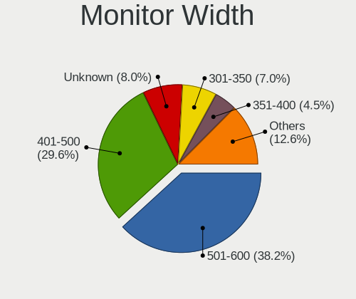

| Width in mm | Desktops | Percent |
|-------------|----------|---------|
| 501-600     | 107      | 36.27%  |
| 401-500     | 100      | 33.9%   |
| Unknown     | 27       | 9.15%   |
| 301-350     | 24       | 8.14%   |
| 351-400     | 15       | 5.08%   |
| 701-800     | 6        | 2.03%   |
| 1501-2000   | 5        | 1.69%   |
| 601-700     | 4        | 1.36%   |
| 1001-1500   | 4        | 1.36%   |
| 201-300     | 2        | 0.68%   |
| 801-900     | 1        | 0.34%   |

Aspect Ratio
------------

Proportional relationship between the width and the height

| Ratio   | Desktops | Percent |
|---------|----------|---------|
| 16/9    | 184      | 63.23%  |
| 5/4     | 33       | 11.34%  |
| 16/10   | 30       | 10.31%  |
| Unknown | 25       | 8.59%   |
| 4/3     | 8        | 2.75%   |
| 3/2     | 5        | 1.72%   |
| 21/9    | 4        | 1.37%   |
| 6/5     | 1        | 0.34%   |
| 32/9    | 1        | 0.34%   |

Monitor Area
------------

Area in inch

| Area in inch | Desktops | Percent |
|----------------|----------|---------|
| 201-250        | 138      | 46.15%  |
| 151-200        | 41       | 13.71%  |
| 141-150        | 37       | 12.37%  |
| Unknown        | 27       | 9.03%   |
| 301-350        | 24       | 8.03%   |
| 351-500        | 9        | 3.01%   |
| 251-300        | 9        | 3.01%   |
| More than 1000 | 8        | 2.68%   |
| 71-80          | 2        | 0.67%   |
| 501-1000       | 2        | 0.67%   |
| 111-120        | 1        | 0.33%   |
| 101-110        | 1        | 0.33%   |

Pixel Density
-------------

Pixels per inch

| Density | Desktops | Percent |
|---------|----------|---------|
| 51-100  | 184      | 62.8%   |
| 101-120 | 68       | 23.21%  |
| Unknown | 27       | 9.22%   |
| 1-50    | 7        | 2.39%   |
| 161-240 | 5        | 1.71%   |
| 121-160 | 2        | 0.68%   |

Multiple Monitors
-----------------

Total monitors connected

| Total | Desktops | Percent |
|-------|----------|---------|
| 1     | 262      | 81.11%  |
| 2     | 41       | 12.69%  |
| 0     | 16       | 4.95%   |
| 3     | 4        | 1.24%   |

Network
-------

Net Controller Vendor
---------------------

Controller vendors

| Vendor                            | Desktops | Percent |
|-----------------------------------|----------|---------|
| Realtek Semiconductor             | 223      | 56.31%  |
| Intel                             | 66       | 16.67%  |
| Qualcomm Atheros                  | 32       | 8.08%   |
| Nvidia                            | 14       | 3.54%   |
| TP-Link                           | 11       | 2.78%   |
| Qualcomm Atheros Communications   | 10       | 2.53%   |
| Ralink Technology                 | 8        | 2.02%   |
| Broadcom                          | 5        | 1.26%   |
| MediaTek                          | 3        | 0.76%   |
| VIA Technologies                  | 2        | 0.51%   |
| Ralink                            | 2        | 0.51%   |
| OPPO Electronics                  | 2        | 0.51%   |
| Marvell Technology Group          | 2        | 0.51%   |
| Edimax Technology                 | 2        | 0.51%   |
| ASUSTek Computer                  | 2        | 0.51%   |
| ZyXEL Communications              | 1        | 0.25%   |
| Xiaomi                            | 1        | 0.25%   |
| Texas Instruments                 | 1        | 0.25%   |
| Sundance Technology Inc / IC Plus | 1        | 0.25%   |
| Sigma Designs                     | 1        | 0.25%   |
| NetGear                           | 1        | 0.25%   |
| LSI                               | 1        | 0.25%   |
| DisplayLink                       | 1        | 0.25%   |
| D-Link System                     | 1        | 0.25%   |
| D-Link                            | 1        | 0.25%   |
| ASIX Electronics                  | 1        | 0.25%   |
| ADMtek                            | 1        | 0.25%   |

Net Controller Model
--------------------

Controller models

| Model                                                                         | Desktops | Percent |
|-------------------------------------------------------------------------------|----------|---------|
| Realtek RTL8111/8168/8411 PCI Express Gigabit Ethernet Controller             | 189      | 45%     |
| Realtek RTL810xE PCI Express Fast Ethernet controller                         | 11       | 2.62%   |
| Intel I211 Gigabit Network Connection                                         | 10       | 2.38%   |
| Realtek RTL8125 2.5GbE Controller                                             | 9        | 2.14%   |
| Intel 82579LM Gigabit Network Connection (Lewisville)                         | 9        | 2.14%   |
| Qualcomm Atheros AR9271 802.11n                                               | 7        | 1.67%   |
| Intel Ethernet Connection (2) I219-V                                          | 7        | 1.67%   |
| Realtek RTL-8100/8101L/8139 PCI Fast Ethernet Adapter                         | 6        | 1.43%   |
| Nvidia MCP61 Ethernet                                                         | 6        | 1.43%   |
| Qualcomm Atheros AR2417 Wireless Network Adapter [AR5007G 802.11bg]           | 5        | 1.19%   |
| Intel Wi-Fi 6 AX200                                                           | 5        | 1.19%   |
| Intel 82579V Gigabit Network Connection                                       | 5        | 1.19%   |
| TP-Link TL-WN722N v2/v3 [Realtek RTL8188EUS]                                  | 4        | 0.95%   |
| Realtek RTL8188EUS 802.11n Wireless Network Adapter                           | 4        | 0.95%   |
| Realtek RTL-8110SC/8169SC Gigabit Ethernet                                    | 4        | 0.95%   |
| Qualcomm Atheros AR8131 Gigabit Ethernet                                      | 4        | 0.95%   |
| Intel Ethernet Connection I217-LM                                             | 4        | 0.95%   |
| Intel 82567LM-3 Gigabit Network Connection                                    | 4        | 0.95%   |
| Realtek RTL8192EU 802.11b/g/n WLAN Adapter                                    | 3        | 0.71%   |
| Ralink MT7601U Wireless Adapter                                               | 3        | 0.71%   |
| Qualcomm Atheros TP-Link TL-WN322G v3 / TL-WN422G v2 802.11g [Atheros AR9271] | 3        | 0.71%   |
| Qualcomm Atheros AR9462 Wireless Network Adapter                              | 3        | 0.71%   |
| Qualcomm Atheros AR9227 Wireless Network Adapter                              | 3        | 0.71%   |
| Qualcomm Atheros AR8161 Gigabit Ethernet                                      | 3        | 0.71%   |
| Qualcomm Atheros AR8151 v2.0 Gigabit Ethernet                                 | 3        | 0.71%   |
| Qualcomm Atheros AR8121/AR8113/AR8114 Gigabit or Fast Ethernet                | 3        | 0.71%   |
| Intel Wireless 8265 / 8275                                                    | 3        | 0.71%   |
| Intel Ethernet Connection (7) I219-V                                          | 3        | 0.71%   |
| Intel Ethernet Connection (7) I219-LM                                         | 3        | 0.71%   |
| Intel 82566DM-2 Gigabit Network Connection                                    | 3        | 0.71%   |
| TP-Link Archer T3U [Realtek RTL8812BU]                                        | 2        | 0.48%   |
| TP-Link Archer T2U PLUS [RTL8821AU]                                           | 2        | 0.48%   |
| TP-Link AC600 wireless Realtek RTL8811AU [Archer T2U Nano]                    | 2        | 0.48%   |
| Realtek RTL8821CE 802.11ac PCIe Wireless Network Adapter                      | 2        | 0.48%   |
| Realtek RTL8188EE Wireless Network Adapter                                    | 2        | 0.48%   |
| Realtek RTL8188CUS 802.11n WLAN Adapter                                       | 2        | 0.48%   |
| Realtek RTL8169 PCI Gigabit Ethernet Controller                               | 2        | 0.48%   |
| OPPO SM6375-QRD _SN:F4A23F05                                                  | 2        | 0.48%   |
| Nvidia MCP77 Ethernet                                                         | 2        | 0.48%   |
| Nvidia MCP65 Ethernet                                                         | 2        | 0.48%   |

Wireless Vendor
---------------

Wireless vendors

| Vendor                          | Desktops | Percent |
|---------------------------------|----------|---------|
| Qualcomm Atheros                | 17       | 20.24%  |
| Realtek Semiconductor           | 15       | 17.86%  |
| TP-Link                         | 11       | 13.1%   |
| Intel                           | 11       | 13.1%   |
| Qualcomm Atheros Communications | 10       | 11.9%   |
| Ralink Technology               | 8        | 9.52%   |
| Ralink                          | 2        | 2.38%   |
| MediaTek                        | 2        | 2.38%   |
| Edimax Technology               | 2        | 2.38%   |
| ASUSTek Computer                | 2        | 2.38%   |
| ZyXEL Communications            | 1        | 1.19%   |
| NetGear                         | 1        | 1.19%   |
| D-Link                          | 1        | 1.19%   |
| Broadcom                        | 1        | 1.19%   |

Wireless Model
--------------

Wireless models

| Model                                                                         | Desktops | Percent |
|-------------------------------------------------------------------------------|----------|---------|
| Qualcomm Atheros AR9271 802.11n                                               | 7        | 8.33%   |
| Qualcomm Atheros AR2417 Wireless Network Adapter [AR5007G 802.11bg]           | 5        | 5.95%   |
| Intel Wi-Fi 6 AX200                                                           | 5        | 5.95%   |
| TP-Link TL-WN722N v2/v3 [Realtek RTL8188EUS]                                  | 4        | 4.76%   |
| Realtek RTL8188EUS 802.11n Wireless Network Adapter                           | 4        | 4.76%   |
| Realtek RTL8192EU 802.11b/g/n WLAN Adapter                                    | 3        | 3.57%   |
| Ralink MT7601U Wireless Adapter                                               | 3        | 3.57%   |
| Qualcomm Atheros TP-Link TL-WN322G v3 / TL-WN422G v2 802.11g [Atheros AR9271] | 3        | 3.57%   |
| Qualcomm Atheros AR9462 Wireless Network Adapter                              | 3        | 3.57%   |
| Qualcomm Atheros AR9227 Wireless Network Adapter                              | 3        | 3.57%   |
| Intel Wireless 8265 / 8275                                                    | 3        | 3.57%   |
| TP-Link Archer T3U [Realtek RTL8812BU]                                        | 2        | 2.38%   |
| TP-Link Archer T2U PLUS [RTL8821AU]                                           | 2        | 2.38%   |
| TP-Link AC600 wireless Realtek RTL8811AU [Archer T2U Nano]                    | 2        | 2.38%   |
| Realtek RTL8821CE 802.11ac PCIe Wireless Network Adapter                      | 2        | 2.38%   |
| Realtek RTL8188EE Wireless Network Adapter                                    | 2        | 2.38%   |
| Realtek RTL8188CUS 802.11n WLAN Adapter                                       | 2        | 2.38%   |
| Edimax AC600 USB                                                              | 2        | 2.38%   |
| ZyXEL NWD-270N Wireless N-lite USB Adapter                                    | 1        | 1.19%   |
| TP-Link 802.11n NIC                                                           | 1        | 1.19%   |
| Realtek RTL8191SEvB Wireless LAN Controller                                   | 1        | 1.19%   |
| Realtek RTL8188SU 802.11n WLAN Adapter                                        | 1        | 1.19%   |
| Ralink RT5372 Wireless Adapter                                                | 1        | 1.19%   |
| Ralink RT3072 Wireless Adapter                                                | 1        | 1.19%   |
| Ralink RT2870/RT3070 Wireless Adapter                                         | 1        | 1.19%   |
| Ralink RT2501/RT2573 Wireless Adapter                                         | 1        | 1.19%   |
| Ralink RT2070 Wireless Adapter                                                | 1        | 1.19%   |
| Ralink RT5390 Wireless 802.11n 1T/1R PCIe                                     | 1        | 1.19%   |
| Ralink RT2561/RT61 802.11g PCI                                                | 1        | 1.19%   |
| Qualcomm Atheros QCA9565 / AR9565 Wireless Network Adapter                    | 1        | 1.19%   |
| Qualcomm Atheros AR9485 Wireless Network Adapter                              | 1        | 1.19%   |
| Qualcomm Atheros AR93xx Wireless Network Adapter                              | 1        | 1.19%   |
| Qualcomm Atheros AR9287 Wireless Network Adapter (PCI-Express)                | 1        | 1.19%   |
| Qualcomm Atheros AR5416 Wireless Network Adapter [AR5008 802.11(a)bgn]        | 1        | 1.19%   |
| Qualcomm Atheros AR5212/5213/2414 Wireless Network Adapter                    | 1        | 1.19%   |
| NetGear WNA3100M(v1) Wireless-N 300 [Realtek RTL8192CU]                       | 1        | 1.19%   |
| MediaTek MT7922 802.11ax PCI Express Wireless Network Adapter                 | 1        | 1.19%   |
| MediaTek MT7921K (RZ608) Wi-Fi 6E 80MHz                                       | 1        | 1.19%   |
| Intel Wireless-AC 9260                                                        | 1        | 1.19%   |
| Intel Wi-Fi 6 AX210/AX211/AX411 160MHz                                        | 1        | 1.19%   |

Ethernet Vendor
---------------

Ethernet vendors

| Vendor                            | Desktops | Percent |
|-----------------------------------|----------|---------|
| Realtek Semiconductor             | 218      | 66.87%  |
| Intel                             | 60       | 18.4%   |
| Qualcomm Atheros                  | 17       | 5.21%   |
| Nvidia                            | 14       | 4.29%   |
| Broadcom                          | 4        | 1.23%   |
| VIA Technologies                  | 2        | 0.61%   |
| OPPO Electronics                  | 2        | 0.61%   |
| Marvell Technology Group          | 2        | 0.61%   |
| Xiaomi                            | 1        | 0.31%   |
| Sundance Technology Inc / IC Plus | 1        | 0.31%   |
| MediaTek                          | 1        | 0.31%   |
| DisplayLink                       | 1        | 0.31%   |
| D-Link System                     | 1        | 0.31%   |
| ASIX Electronics                  | 1        | 0.31%   |
| ADMtek                            | 1        | 0.31%   |

Ethernet Model
--------------

Ethernet models

| Model                                                                      | Desktops | Percent |
|----------------------------------------------------------------------------|----------|---------|
| Realtek RTL8111/8168/8411 PCI Express Gigabit Ethernet Controller          | 189      | 56.76%  |
| Realtek RTL810xE PCI Express Fast Ethernet controller                      | 11       | 3.3%    |
| Intel I211 Gigabit Network Connection                                      | 10       | 3%      |
| Realtek RTL8125 2.5GbE Controller                                          | 9        | 2.7%    |
| Intel 82579LM Gigabit Network Connection (Lewisville)                      | 9        | 2.7%    |
| Intel Ethernet Connection (2) I219-V                                       | 7        | 2.1%    |
| Realtek RTL-8100/8101L/8139 PCI Fast Ethernet Adapter                      | 6        | 1.8%    |
| Nvidia MCP61 Ethernet                                                      | 6        | 1.8%    |
| Intel 82579V Gigabit Network Connection                                    | 5        | 1.5%    |
| Realtek RTL-8110SC/8169SC Gigabit Ethernet                                 | 4        | 1.2%    |
| Qualcomm Atheros AR8131 Gigabit Ethernet                                   | 4        | 1.2%    |
| Intel Ethernet Connection I217-LM                                          | 4        | 1.2%    |
| Intel 82567LM-3 Gigabit Network Connection                                 | 4        | 1.2%    |
| Qualcomm Atheros AR8161 Gigabit Ethernet                                   | 3        | 0.9%    |
| Qualcomm Atheros AR8151 v2.0 Gigabit Ethernet                              | 3        | 0.9%    |
| Qualcomm Atheros AR8121/AR8113/AR8114 Gigabit or Fast Ethernet             | 3        | 0.9%    |
| Intel Ethernet Connection (7) I219-V                                       | 3        | 0.9%    |
| Intel Ethernet Connection (7) I219-LM                                      | 3        | 0.9%    |
| Intel 82566DM-2 Gigabit Network Connection                                 | 3        | 0.9%    |
| Realtek RTL8169 PCI Gigabit Ethernet Controller                            | 2        | 0.6%    |
| OPPO SM6375-QRD _SN:F4A23F05                                               | 2        | 0.6%    |
| Nvidia MCP77 Ethernet                                                      | 2        | 0.6%    |
| Nvidia MCP65 Ethernet                                                      | 2        | 0.6%    |
| Intel Ethernet Controller I225-V                                           | 2        | 0.6%    |
| Intel Ethernet Connection I217-V                                           | 2        | 0.6%    |
| Intel Ethernet Connection (2) I218-LM                                      | 2        | 0.6%    |
| Broadcom NetXtreme BCM5764M Gigabit Ethernet PCIe                          | 2        | 0.6%    |
| Xiaomi Mi/Redmi series (RNDIS)                                             | 1        | 0.3%    |
| VIA VT6105/VT6106S [Rhine-III]                                             | 1        | 0.3%    |
| VIA VT6102/VT6103 [Rhine-II]                                               | 1        | 0.3%    |
| Sundance Inc / IC Plus IC Plus IP100A Integrated 10/100 Ethernet MAC + PHY | 1        | 0.3%    |
| Qualcomm Atheros Killer E220x Gigabit Ethernet Controller                  | 1        | 0.3%    |
| Qualcomm Atheros Attansic L1 Gigabit Ethernet                              | 1        | 0.3%    |
| Qualcomm Atheros AR8152 v2.0 Fast Ethernet                                 | 1        | 0.3%    |
| Qualcomm Atheros AR8151 v1.0 Gigabit Ethernet                              | 1        | 0.3%    |
| Nvidia MCP73 Ethernet                                                      | 1        | 0.3%    |
| Nvidia MCP51 Ethernet Controller                                           | 1        | 0.3%    |
| Nvidia CK8S Ethernet Controller                                            | 1        | 0.3%    |
| Nvidia CK804 Ethernet Controller                                           | 1        | 0.3%    |
| MediaTek Titan pocket                                                      | 1        | 0.3%    |

Net Controller Kind
-------------------

Ethernet, WiFi or modem

| Kind     | Desktops | Percent |
|----------|----------|---------|
| Ethernet | 312      | 78.59%  |
| WiFi     | 83       | 20.91%  |
| Modem    | 2        | 0.5%    |

Used Controller
---------------

Currently used network controller

| Kind     | Desktops | Percent |
|----------|----------|---------|
| Ethernet | 266      | 83.65%  |
| WiFi     | 52       | 16.35%  |

NICs
----

Total network controllers on board

| Total | Desktops | Percent |
|-------|----------|---------|
| 1     | 257      | 81.59%  |
| 2     | 49       | 15.56%  |
| 3     | 5        | 1.59%   |
| 5     | 2        | 0.63%   |
| 0     | 2        | 0.63%   |

IPv6
----

IPv6 vs IPv4

| Used | Desktops | Percent |
|------|----------|---------|
| No   | 308      | 98.09%  |
| Yes  | 6        | 1.91%   |

Bluetooth
---------

Bluetooth Vendor
----------------

Controller vendors

| Vendor                  | Desktops | Percent |
|-------------------------|----------|---------|
| Cambridge Silicon Radio | 22       | 47.83%  |
| Intel                   | 11       | 23.91%  |
| ASUSTek Computer        | 5        | 10.87%  |
| Lite-On Technology      | 3        | 6.52%   |
| IMC Networks            | 2        | 4.35%   |
| MediaTek                | 1        | 2.17%   |
| Foxconn / Hon Hai       | 1        | 2.17%   |
| Apple                   | 1        | 2.17%   |

Bluetooth Model
---------------

Controller models

| Model                                               | Desktops | Percent |
|-----------------------------------------------------|----------|---------|
| Cambridge Silicon Radio Bluetooth Dongle (HCI mode) | 22       | 47.83%  |
| Intel AX200 Bluetooth                               | 5        | 10.87%  |
| Intel Bluetooth wireless interface                  | 3        | 6.52%   |
| ASUS Broadcom BCM20702A0 Bluetooth                  | 3        | 6.52%   |
| Lite-On Bluetooth Device                            | 2        | 4.35%   |
| IMC Networks Bluetooth Radio                        | 2        | 4.35%   |
| MediaTek Wireless_Device                            | 1        | 2.17%   |
| Lite-On Atheros AR3012 Bluetooth                    | 1        | 2.17%   |
| Intel Wireless-AC 9260 Bluetooth Adapter            | 1        | 2.17%   |
| Intel AX210 Bluetooth                               | 1        | 2.17%   |
| Intel AX201 Bluetooth                               | 1        | 2.17%   |
| Foxconn / Hon Hai Wireless_Device                   | 1        | 2.17%   |
| ASUS Bluetooth Device                               | 1        | 2.17%   |
| ASUS ASUS USB-BT500                                 | 1        | 2.17%   |
| Apple Bluetooth HCI                                 | 1        | 2.17%   |

Sound
-----

Sound Vendor
------------

Sound card vendors

| Vendor                                          | Desktops | Percent |
|-------------------------------------------------|----------|---------|
| AMD                                             | 185      | 37.15%  |
| Intel                                           | 162      | 32.53%  |
| Nvidia                                          | 107      | 21.49%  |
| C-Media Electronics                             | 6        | 1.2%    |
| Creative Labs                                   | 5        | 1%      |
| Generalplus Technology                          | 4        | 0.8%    |
| Focusrite-Novation                              | 4        | 0.8%    |
| VIA Technologies                                | 2        | 0.4%    |
| RODE Microphones                                | 2        | 0.4%    |
| Plantronics                                     | 2        | 0.4%    |
| JMTek                                           | 2        | 0.4%    |
| ASUSTek Computer                                | 2        | 0.4%    |
| XMOS                                            | 1        | 0.2%    |
| Veho                                            | 1        | 0.2%    |
| Unknown                                         | 1        | 0.2%    |
| Turtle Beach                                    | 1        | 0.2%    |
| Syntek                                          | 1        | 0.2%    |
| Sony                                            | 1        | 0.2%    |
| Razer USA                                       | 1        | 0.2%    |
| Oculus VR                                       | 1        | 0.2%    |
| Native Instruments                              | 1        | 0.2%    |
| Micro Star International                        | 1        | 0.2%    |
| Meizu                                           | 1        | 0.2%    |
| M-Audio                                         | 1        | 0.2%    |
| Logitech                                        | 1        | 0.2%    |
| Licensed by Sony Computer Entertainment America | 1        | 0.2%    |
| Ensoniq                                         | 1        | 0.2%    |

Sound Model
-----------

Sound card models

| Model                                                                             | Desktops | Percent |
|-----------------------------------------------------------------------------------|----------|---------|
| AMD SBx00 Azalia (Intel HDA)                                                      | 27       | 4.43%   |
| AMD FCH Azalia Controller                                                         | 27       | 4.43%   |
| AMD Oland/Hainan/Cape Verde/Pitcairn HDMI Audio [Radeon HD 7000 Series]           | 26       | 4.27%   |
| Intel NM10/ICH7 Family High Definition Audio Controller                           | 25       | 4.11%   |
| AMD Family 17h (Models 00h-0fh) HD Audio Controller                               | 25       | 4.11%   |
| Intel 6 Series/C200 Series Chipset Family High Definition Audio Controller        | 24       | 3.94%   |
| AMD Family 17h/19h HD Audio Controller                                            | 24       | 3.94%   |
| AMD Ellesmere HDMI Audio [Radeon RX 470/480 / 570/580/590]                        | 23       | 3.78%   |
| Intel 8 Series/C220 Series Chipset High Definition Audio Controller               | 21       | 3.45%   |
| AMD Starship/Matisse HD Audio Controller                                          | 19       | 3.12%   |
| Intel 7 Series/C216 Chipset Family High Definition Audio Controller               | 16       | 2.63%   |
| AMD Baffin HDMI/DP Audio [Radeon RX 550 640SP / RX 560/560X]                      | 16       | 2.63%   |
| AMD Raven/Raven2/Fenghuang HDMI/DP Audio Controller                               | 15       | 2.46%   |
| Nvidia MCP61 High Definition Audio                                                | 12       | 1.97%   |
| Nvidia GP107GL High Definition Audio Controller                                   | 12       | 1.97%   |
| Intel Xeon E3-1200 v3/4th Gen Core Processor HD Audio Controller                  | 11       | 1.81%   |
| Intel 82801JI (ICH10 Family) HD Audio Controller                                  | 11       | 1.81%   |
| Intel 200 Series PCH HD Audio                                                     | 11       | 1.81%   |
| Nvidia GK208 HDMI/DP Audio Controller                                             | 10       | 1.64%   |
| Intel Cannon Lake PCH cAVS                                                        | 10       | 1.64%   |
| AMD Turks HDMI Audio [Radeon HD 6500/6600 / 6700M Series]                         | 9        | 1.48%   |
| AMD RV710/730 HDMI Audio [Radeon HD 4000 series]                                  | 9        | 1.48%   |
| Nvidia GP104 High Definition Audio Controller                                     | 8        | 1.31%   |
| Intel 100 Series/C230 Series Chipset Family HD Audio Controller                   | 8        | 1.31%   |
| AMD Caicos HDMI Audio [Radeon HD 6450 / 7450/8450/8490 OEM / R5 230/235/235X OEM] | 8        | 1.31%   |
| Nvidia GP106 High Definition Audio Controller                                     | 7        | 1.15%   |
| AMD Cedar HDMI Audio [Radeon HD 5400/6300/7300 Series]                            | 7        | 1.15%   |
| Intel 82801I (ICH9 Family) HD Audio Controller                                    | 6        | 0.99%   |
| Intel 5 Series/3400 Series Chipset High Definition Audio                          | 6        | 0.99%   |
| Nvidia High Definition Audio Controller                                           | 5        | 0.82%   |
| Nvidia GP108 High Definition Audio Controller                                     | 5        | 0.82%   |
| Nvidia GF108 High Definition Audio Controller                                     | 5        | 0.82%   |
| AMD Tobago HDMI Audio [Radeon R7 360 / R9 360 OEM]                                | 5        | 0.82%   |
| AMD RS880 HDMI Audio [Radeon HD 4200 Series]                                      | 5        | 0.82%   |
| AMD Renoir Radeon High Definition Audio Controller                                | 5        | 0.82%   |
| AMD Kabini HDMI/DP Audio                                                          | 5        | 0.82%   |
| Nvidia GK106 HDMI Audio Controller                                                | 4        | 0.66%   |
| Nvidia GK104 HDMI Audio Controller                                                | 4        | 0.66%   |
| Intel 9 Series Chipset Family HD Audio Controller                                 | 4        | 0.66%   |
| Intel 82801JD/DO (ICH10 Family) HD Audio Controller                               | 4        | 0.66%   |

Memory
------

Memory Vendor
-------------

Memory module vendors

| Vendor              | Desktops | Percent |
|---------------------|----------|---------|
| Kingston            | 65       | 35.52%  |
| Unknown             | 39       | 21.31%  |
| Samsung Electronics | 14       | 7.65%   |
| Patriot             | 10       | 5.46%   |
| Crucial             | 8        | 4.37%   |
| SK hynix            | 7        | 3.83%   |
| Apacer              | 6        | 3.28%   |
| Transcend           | 5        | 2.73%   |
| Corsair             | 5        | 2.73%   |
| Nanya Technology    | 4        | 2.19%   |
| A-DATA Technology   | 3        | 1.64%   |
| GeIL                | 2        | 1.09%   |
| G.Skill             | 2        | 1.09%   |
| Elpida              | 2        | 1.09%   |
| Unknown             | 2        | 1.09%   |
| Unifosa             | 1        | 0.55%   |
| Swissbit            | 1        | 0.55%   |
| Silicon Power       | 1        | 0.55%   |
| Ramos Technology    | 1        | 0.55%   |
| Ramaxel Technology  | 1        | 0.55%   |
| Qimonda             | 1        | 0.55%   |
| Mushkin             | 1        | 0.55%   |
| Micron Technology   | 1        | 0.55%   |
| Exceleram           | 1        | 0.55%   |

Memory Model
------------

Memory module models

| Model                                                    | Desktops | Percent |
|----------------------------------------------------------|----------|---------|
| Kingston RAM KHX3200C16D4/8GX 8GB DIMM DDR4 3600MT/s     | 5        | 2.38%   |
| Kingston RAM KHX3200C16D4/16GX 16GB DIMM DDR4 3600MT/s   | 4        | 1.9%    |
| Kingston RAM KHX2400C15/8G 8GB DIMM DDR4 3400MT/s        | 4        | 1.9%    |
| Unknown RAM Module 2048MB DIMM 1333MT/s                  | 3        | 1.43%   |
| Unknown RAM CL19-19-19 D4-2666 8192MB DIMM DDR4 2400MT/s | 3        | 1.43%   |
| Samsung RAM M393B1K70CH0-CH9 8GB DIMM 1333MT/s           | 3        | 1.43%   |
| Kingston RAM KHX2666C16/8G 8GB DIMM DDR4 3466MT/s        | 3        | 1.43%   |
| Kingston RAM KHX1866C10D3/8G 8GB DIMM DDR3 2133MT/s      | 3        | 1.43%   |
| Kingston RAM KHX1600C9D3/4GX 4GB DIMM DDR3 1600MT/s      | 3        | 1.43%   |
| Unknown RAM Module 4096MB DIMM 1600MT/s                  | 2        | 0.95%   |
| Unknown RAM Module 2GB DIMM 800MT/s                      | 2        | 0.95%   |
| Unknown RAM Module 2GB DIMM 1333MT/s                     | 2        | 0.95%   |
| Unknown RAM Module 2048MB DIMM 800MT/s                   | 2        | 0.95%   |
| Unknown RAM Module 2048MB DIMM 400MT/s                   | 2        | 0.95%   |
| Transcend RAM TS512MLK64V6H 4GB DIMM DDR3 1600MT/s       | 2        | 0.95%   |
| Transcend RAM JM1333KLN-2G 2GB DIMM DDR3 1333MT/s        | 2        | 0.95%   |
| SK hynix RAM HMT451U6BFR8A-PB 4GB DIMM DDR3 1648MT/s     | 2        | 0.95%   |
| Samsung RAM Module 4GB DIMM DDR3 1333MT/s                | 2        | 0.95%   |
| Samsung RAM M393B1K70DH0-CH9 8GB DIMM 1333MT/s           | 2        | 0.95%   |
| Samsung RAM M378B5773CH0-CH9 2GB DIMM DDR3 1867MT/s      | 2        | 0.95%   |
| Patriot RAM PSD34G133381 4GB DIMM DDR3 1333MT/s          | 2        | 0.95%   |
| Patriot RAM 3000 C16 Series 16GB DIMM DDR4 3200MT/s      | 2        | 0.95%   |
| Kingston RAM KHX1866C10D3/4G 4GB DIMM DDR3 1867MT/s      | 2        | 0.95%   |
| Kingston RAM KHX1600C10D3/8G 8GB DIMM DDR3 1600MT/s      | 2        | 0.95%   |
| Kingston RAM 9905595-010.A00LF 2048MB DIMM DDR3 1600MT/s | 2        | 0.95%   |
| GeIL RAM CL17-17-17 D4-2400 8GB DIMM DDR4 2400MT/s       | 2        | 0.95%   |
| Crucial RAM CT51264BA160BJ.C8F 4GB DIMM DDR3 1600MT/s    | 2        | 0.95%   |
| Unknown                                                  | 2        | 0.95%   |
| Unknown RAM Module 8GB DIMM DDR3 1600MT/s                | 1        | 0.48%   |
| Unknown RAM Module 8GB DIMM DDR 1333MT/s                 | 1        | 0.48%   |
| Unknown RAM Module 512MB DIMM DDR                        | 1        | 0.48%   |
| Unknown RAM Module 4GB DIMM DDR3 1333MT/s                | 1        | 0.48%   |
| Unknown RAM Module 4GB DIMM 667MT/s                      | 1        | 0.48%   |
| Unknown RAM Module 4096MB DIMM DDR3 667MT/s              | 1        | 0.48%   |
| Unknown RAM Module 4096MB DIMM DDR3 1600MT/s             | 1        | 0.48%   |
| Unknown RAM Module 4096MB DIMM DDR 1333MT/s              | 1        | 0.48%   |
| Unknown RAM Module 2GB DIMM DDR2 800MT/s                 | 1        | 0.48%   |
| Unknown RAM Module 2GB DIMM DDR2 667MT/s                 | 1        | 0.48%   |
| Unknown RAM Module 2GB DIMM DDR2 1067MT/s                | 1        | 0.48%   |
| Unknown RAM Module 2GB DIMM DDR 1333MT/s                 | 1        | 0.48%   |

Memory Kind
-----------

Memory module kinds

| Kind    | Desktops | Percent |
|---------|----------|---------|
| DDR3    | 60       | 38.46%  |
| DDR4    | 54       | 34.62%  |
| Unknown | 20       | 12.82%  |
| DDR2    | 13       | 8.33%   |
| SDRAM   | 5        | 3.21%   |
| DDR     | 3        | 1.92%   |
| DDR5    | 1        | 0.64%   |

Memory Form Factor
------------------

Physical design of the memory module

| Name    | Desktops | Percent |
|---------|----------|---------|
| DIMM    | 149      | 97.39%  |
| SODIMM  | 3        | 1.96%   |
| FB-DIMM | 1        | 0.65%   |

Memory Size
-----------

Memory module size

| Size  | Desktops | Percent |
|-------|----------|---------|
| 4096  | 52       | 28.89%  |
| 8192  | 51       | 28.33%  |
| 2048  | 38       | 21.11%  |
| 16384 | 24       | 13.33%  |
| 1024  | 10       | 5.56%   |
| 32768 | 4        | 2.22%   |
| 512   | 1        | 0.56%   |

Memory Speed
------------

Memory module speed

| Speed   | Desktops | Percent |
|---------|----------|---------|
| 1333    | 34       | 18.68%  |
| 1600    | 32       | 17.58%  |
| 3600    | 14       | 7.69%   |
| 800     | 14       | 7.69%   |
| 2400    | 11       | 6.04%   |
| 667     | 9        | 4.95%   |
| 3200    | 8        | 4.4%    |
| 2667    | 8        | 4.4%    |
| 2133    | 7        | 3.85%   |
| 3400    | 5        | 2.75%   |
| 2666    | 4        | 2.2%    |
| 1867    | 4        | 2.2%    |
| 3466    | 3        | 1.65%   |
| 1866    | 3        | 1.65%   |
| 400     | 3        | 1.65%   |
| 3733    | 2        | 1.1%    |
| 3000    | 2        | 1.1%    |
| 1648    | 2        | 1.1%    |
| 1067    | 2        | 1.1%    |
| Unknown | 2        | 1.1%    |
| 5200    | 1        | 0.55%   |
| 4333    | 1        | 0.55%   |
| 3666    | 1        | 0.55%   |
| 3533    | 1        | 0.55%   |
| 3334    | 1        | 0.55%   |
| 3333    | 1        | 0.55%   |
| 3266    | 1        | 0.55%   |
| 3151    | 1        | 0.55%   |
| 2933    | 1        | 0.55%   |
| 2800    | 1        | 0.55%   |
| 2048    | 1        | 0.55%   |
| 2000    | 1        | 0.55%   |
| 1400    | 1        | 0.55%   |

Printers & scanners
-------------------

Printer Vendor
--------------

Printer device vendors

| Vendor                | Desktops | Percent |
|-----------------------|----------|---------|
| Hewlett-Packard       | 9        | 52.94%  |
| Canon                 | 3        | 17.65%  |
| Samsung Electronics   | 2        | 11.76%  |
| Xerox                 | 1        | 5.88%   |
| Seiko Epson           | 1        | 5.88%   |
| Lexmark International | 1        | 5.88%   |

Printer Model
-------------

Printer device models

| Model                                      | Desktops | Percent |
|--------------------------------------------|----------|---------|
| HP LaserJet 1010                           | 2        | 11.76%  |
| Xerox Phaser 3140 and 3155                 | 1        | 5.88%   |
| Seiko Epson L365 Series                    | 1        | 5.88%   |
| Samsung SCX-4623 Series                    | 1        | 5.88%   |
| Samsung SCX-3400 Series                    | 1        | 5.88%   |
| Lexmark International InkJet Color Printer | 1        | 5.88%   |
| HP LaserJet P2015 series                   | 1        | 5.88%   |
| HP LaserJet P2014                          | 1        | 5.88%   |
| HP LaserJet P1005                          | 1        | 5.88%   |
| HP LaserJet M101-M106                      | 1        | 5.88%   |
| HP LaserJet CP 1025nw                      | 1        | 5.88%   |
| HP LaserJet 1200                           | 1        | 5.88%   |
| HP LaserJet 1018                           | 1        | 5.88%   |
| Canon LBP810                               | 1        | 5.88%   |
| Canon LBP2900                              | 1        | 5.88%   |
| Canon CanoScan LiDE 300                    | 1        | 5.88%   |

Scanner Vendor
--------------

Scanner device vendors

| Vendor             | Desktops | Percent |
|--------------------|----------|---------|
| Canon              | 5        | 62.5%   |
| Ultima Electronics | 1        | 12.5%   |
| Mustek Systems     | 1        | 12.5%   |
| Hewlett-Packard    | 1        | 12.5%   |

Scanner Model
-------------

Scanner device models

| Model                                                                                 | Desktops | Percent |
|---------------------------------------------------------------------------------------|----------|---------|
| Canon CanoScan LiDE 100                                                               | 2        | 25%     |
| Ultima Artec Ultima 2000 (GT6801 based)/Lifetec LT9385/ScanMagic 1200 UB Plus Scanner | 1        | 12.5%   |
| Mustek Systems BearPaw 1200 CU Plus                                                   | 1        | 12.5%   |
| HP ScanJet 2200c                                                                      | 1        | 12.5%   |
| Canon CanoScan N1240U/LiDE 30                                                         | 1        | 12.5%   |
| Canon CanoScan LiDE 210                                                               | 1        | 12.5%   |
| Canon CanoScan LiDE 120                                                               | 1        | 12.5%   |

Camera
------

Camera Vendor
-------------

Camera device vendors

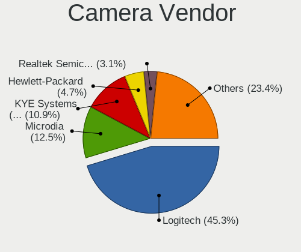

| Vendor                      | Desktops | Percent |
|-----------------------------|----------|---------|
| Logitech                    | 21       | 40.38%  |
| Microdia                    | 7        | 13.46%  |
| KYE Systems (Mouse Systems) | 7        | 13.46%  |
| Realtek Semiconductor       | 2        | 3.85%   |
| Hewlett-Packard             | 2        | 3.85%   |
| Aveo Technology             | 2        | 3.85%   |
| Z-Star Microelectronics     | 1        | 1.92%   |
| Sony                        | 1        | 1.92%   |
| Nokia Mobile Phones         | 1        | 1.92%   |
| Microsoft                   | 1        | 1.92%   |
| GEMBIRD                     | 1        | 1.92%   |
| Cubeternet                  | 1        | 1.92%   |
| Chicony Electronics         | 1        | 1.92%   |
| Asuscom Network             | 1        | 1.92%   |
| Arkmicro Technologies       | 1        | 1.92%   |
| ARC International           | 1        | 1.92%   |
| Apple                       | 1        | 1.92%   |

Camera Model
------------

Camera device models

| Model                                             | Desktops | Percent |
|---------------------------------------------------|----------|---------|
| Logitech Webcam C270                              | 6        | 11.54%  |
| Microdia Camera                                   | 5        | 9.62%   |
| Logitech Webcam C170                              | 4        | 7.69%   |
| KYE Systems (Mouse Systems) FaceCam 1000X         | 3        | 5.77%   |
| Realtek ICT Camera                                | 2        | 3.85%   |
| Microdia Webcam Vitade AF                         | 2        | 3.85%   |
| Logitech Webcam C200                              | 2        | 3.85%   |
| Logitech QuickCam Orbit/Sphere AF                 | 2        | 3.85%   |
| Logitech QuickCam Communicate MP/S5500            | 2        | 3.85%   |
| Logitech BRIO Ultra HD Webcam                     | 2        | 3.85%   |
| KYE Systems (Mouse Systems) Genius Webcam         | 2        | 3.85%   |
| HP HD-4110 Webcam                                 | 2        | 3.85%   |
| Z-Star Venus USB2.0 Camera                        | 1        | 1.92%   |
| Sony CEVCECM                                      | 1        | 1.92%   |
| Nokia Mobile Phones Lumia 640 Phone               | 1        | 1.92%   |
| Microsoft LifeCam VX-800                          | 1        | 1.92%   |
| Logitech Webcam C310                              | 1        | 1.92%   |
| Logitech Webcam C210                              | 1        | 1.92%   |
| Logitech HD Webcam C525                           | 1        | 1.92%   |
| KYE Systems (Mouse Systems) Genius FaceCam 320    | 1        | 1.92%   |
| KYE Systems (Mouse Systems) Eye 320               | 1        | 1.92%   |
| GEMBIRD Generic UVC 1.00 camera [AppoTech AX2311] | 1        | 1.92%   |
| Cubeternet WebCam                                 | 1        | 1.92%   |
| Chicony WebCam                                    | 1        | 1.92%   |
| Aveo USB2.0 Camera                                | 1        | 1.92%   |
| Aveo Camera                                       | 1        | 1.92%   |
| Asuscom Network HD 1080P PC-Camera                | 1        | 1.92%   |
| Arkmicro USB2.0 PC CAMERA                         | 1        | 1.92%   |
| ARC International Camera                          | 1        | 1.92%   |
| Apple iPhone 5/5C/5S/6/SE/7/8/X                   | 1        | 1.92%   |

Security
--------

Fingerprint Vendor
------------------

Fingerprint sensor vendors

| Vendor    | Desktops | Percent |
|-----------|----------|---------|
| Microsoft | 1        | 100%    |

Fingerprint Model
-----------------

Fingerprint sensor models

| Model                        | Desktops | Percent |
|------------------------------|----------|---------|
| Microsoft Fingerprint Reader | 1        | 100%    |

Chipcard Vendor
---------------

Chipcard module vendors

| Vendor                | Desktops | Percent |
|-----------------------|----------|---------|
| Gemalto (was Gemplus) | 9        | 81.82%  |
| Precise Biometrics    | 1        | 9.09%   |
| OmniKey               | 1        | 9.09%   |

Chipcard Model
--------------

Chipcard module models

| Model                                                      | Desktops | Percent |
|------------------------------------------------------------|----------|---------|
| Gemalto (was Gemplus) GemPC Twin SmartCard Reader          | 9        | 81.82%  |
| Precise Biometrics 200 MC FingerPrint and SmartCard Reader | 1        | 9.09%   |
| OmniKey CardMan 3021 / 3121                                | 1        | 9.09%   |

Unsupported
-----------

Unsupported Devices
-------------------

Total unsupported devices on board

| Total | Desktops | Percent |
|-------|----------|---------|
| 0     | 277      | 86.29%  |
| 1     | 41       | 12.77%  |
| 2     | 3        | 0.93%   |

Unsupported Device Types
------------------------

Types of unsupported devices

| Type                     | Desktops | Percent |
|--------------------------|----------|---------|
| Graphics card            | 16       | 35.56%  |
| Chipcard                 | 9        | 20%     |
| Net/wireless             | 7        | 15.56%  |
| Unassigned class         | 2        | 4.44%   |
| Communication controller | 2        | 4.44%   |
| Camera                   | 2        | 4.44%   |
| Storage/ide              | 1        | 2.22%   |
| Sound                    | 1        | 2.22%   |
| Multimedia controller    | 1        | 2.22%   |
| Modem                    | 1        | 2.22%   |
| Fingerprint reader       | 1        | 2.22%   |
| Dvb card                 | 1        | 2.22%   |
| Card reader              | 1        | 2.22%   |

