Linux in Serbia - Tested Hardware & Statistics (Notebooks)
----------------------------------------------------------

A project to collect tested hardware configurations for Linux in Serbia.

Anyone can contribute to this report by the [hw-probe](https://github.com/linuxhw/hw-probe) tool:

    sudo -E hw-probe -all -upload

Please contribute! Especially if your hardware is rare.

Contents
--------

* [ Test Cases ](#test-cases)

* [ System ](#system)
  - [ OS                       ](#os)
  - [ OS Family                ](#os-family)
  - [ Kernel                   ](#kernel)
  - [ Kernel Family            ](#kernel-family)
  - [ Kernel Major Ver.        ](#kernel-major-ver)
  - [ Arch                     ](#arch)
  - [ DE                       ](#de)
  - [ Display Server           ](#display-server)
  - [ Display Manager          ](#display-manager)
  - [ OS Lang                  ](#os-lang)
  - [ Boot Mode                ](#boot-mode)
  - [ Filesystem               ](#filesystem)
  - [ Part. scheme             ](#part-scheme)
  - [ Dual Boot with Linux/BSD ](#dual-boot-with-linuxbsd)
  - [ Dual Boot (Win)          ](#dual-boot-win)

* [ Board ](#board)
  - [ Vendor                   ](#vendor)
  - [ Model                    ](#model)
  - [ Model Family             ](#model-family)
  - [ MFG Year                 ](#mfg-year)
  - [ Form Factor              ](#form-factor)
  - [ Secure Boot              ](#secure-boot)
  - [ Coreboot                 ](#coreboot)
  - [ RAM Size                 ](#ram-size)
  - [ RAM Used                 ](#ram-used)
  - [ Total Drives             ](#total-drives)
  - [ Has CD-ROM               ](#has-cd-rom)
  - [ Has Ethernet             ](#has-ethernet)
  - [ Has WiFi                 ](#has-wifi)
  - [ Has Bluetooth            ](#has-bluetooth)

* [ Location ](#location)
  - [ Country                  ](#country)
  - [ City                     ](#city)

* [ Drives ](#drives)
  - [ Drive Vendor             ](#drive-vendor)
  - [ Drive Model              ](#drive-model)
  - [ HDD Vendor               ](#hdd-vendor)
  - [ SSD Vendor               ](#ssd-vendor)
  - [ Drive Kind               ](#drive-kind)
  - [ Drive Connector          ](#drive-connector)
  - [ Drive Size               ](#drive-size)
  - [ Space Total              ](#space-total)
  - [ Space Used               ](#space-used)
  - [ Malfunc. Drives          ](#malfunc-drives)
  - [ Malfunc. Drive Vendor    ](#malfunc-drive-vendor)
  - [ Malfunc. HDD Vendor      ](#malfunc-hdd-vendor)
  - [ Malfunc. Drive Kind      ](#malfunc-drive-kind)
  - [ Failed Drives            ](#failed-drives)
  - [ Failed Drive Vendor      ](#failed-drive-vendor)
  - [ Drive Status             ](#drive-status)

* [ Storage controller ](#storage-controller)
  - [ Storage Vendor           ](#storage-vendor)
  - [ Storage Model            ](#storage-model)
  - [ Storage Kind             ](#storage-kind)

* [ Processor ](#processor)
  - [ CPU Vendor               ](#cpu-vendor)
  - [ CPU Model                ](#cpu-model)
  - [ CPU Model Family         ](#cpu-model-family)
  - [ CPU Cores                ](#cpu-cores)
  - [ CPU Sockets              ](#cpu-sockets)
  - [ CPU Threads              ](#cpu-threads)
  - [ CPU Op-Modes             ](#cpu-op-modes)
  - [ CPU Microcode            ](#cpu-microcode)
  - [ CPU Microarch            ](#cpu-microarch)

* [ Graphics ](#graphics)
  - [ GPU Vendor               ](#gpu-vendor)
  - [ GPU Model                ](#gpu-model)
  - [ GPU Combo                ](#gpu-combo)
  - [ GPU Driver               ](#gpu-driver)
  - [ GPU Memory               ](#gpu-memory)

* [ Monitor ](#monitor)
  - [ Monitor Vendor           ](#monitor-vendor)
  - [ Monitor Model            ](#monitor-model)
  - [ Monitor Resolution       ](#monitor-resolution)
  - [ Monitor Diagonal         ](#monitor-diagonal)
  - [ Monitor Width            ](#monitor-width)
  - [ Aspect Ratio             ](#aspect-ratio)
  - [ Monitor Area             ](#monitor-area)
  - [ Pixel Density            ](#pixel-density)
  - [ Multiple Monitors        ](#multiple-monitors)

* [ Network ](#network)
  - [ Net Controller Vendor    ](#net-controller-vendor)
  - [ Net Controller Model     ](#net-controller-model)
  - [ Wireless Vendor          ](#wireless-vendor)
  - [ Wireless Model           ](#wireless-model)
  - [ Ethernet Vendor          ](#ethernet-vendor)
  - [ Ethernet Model           ](#ethernet-model)
  - [ Net Controller Kind      ](#net-controller-kind)
  - [ Used Controller          ](#used-controller)
  - [ NICs                     ](#nics)
  - [ IPv6                     ](#ipv6)

* [ Bluetooth ](#bluetooth)
  - [ Bluetooth Vendor         ](#bluetooth-vendor)
  - [ Bluetooth Model          ](#bluetooth-model)

* [ Sound ](#sound)
  - [ Sound Vendor             ](#sound-vendor)
  - [ Sound Model              ](#sound-model)

* [ Memory ](#memory)
  - [ Memory Vendor            ](#memory-vendor)
  - [ Memory Model             ](#memory-model)
  - [ Memory Kind              ](#memory-kind)
  - [ Memory Form Factor       ](#memory-form-factor)
  - [ Memory Size              ](#memory-size)
  - [ Memory Speed             ](#memory-speed)

* [ Printers & scanners ](#printers--scanners)
  - [ Printer Vendor           ](#printer-vendor)
  - [ Printer Model            ](#printer-model)
  - [ Scanner Vendor           ](#scanner-vendor)
  - [ Scanner Model            ](#scanner-model)

* [ Camera ](#camera)
  - [ Camera Vendor            ](#camera-vendor)
  - [ Camera Model             ](#camera-model)

* [ Security ](#security)
  - [ Fingerprint Vendor       ](#fingerprint-vendor)
  - [ Fingerprint Model        ](#fingerprint-model)
  - [ Chipcard Vendor          ](#chipcard-vendor)
  - [ Chipcard Model           ](#chipcard-model)

* [ Unsupported ](#unsupported)
  - [ Unsupported Devices      ](#unsupported-devices)
  - [ Unsupported Device Types ](#unsupported-device-types)

Test Cases
----------

Total: 924

| Vendor        | Model                       | Probe                                                      | Date         |
|---------------|-----------------------------|------------------------------------------------------------|--------------|
| Lenovo        | G560 20042                  | [e17c822249](https://linux-hardware.org/?probe=e17c822249) | Dec 24, 2025 |
| Dell          | Precision 7560              | [89aa07d4ea](https://linux-hardware.org/?probe=89aa07d4ea) | Dec 22, 2025 |
| eMachines     | eME642G                     | [0f2e86ec06](https://linux-hardware.org/?probe=0f2e86ec06) | Dec 21, 2025 |
| Apple         | MacBook5,2                  | [cd01a8c44e](https://linux-hardware.org/?probe=cd01a8c44e) | Dec 15, 2025 |
| Lenovo        | ThinkPad X1 Carbon Gen 1... | [f4148167f2](https://linux-hardware.org/?probe=f4148167f2) | Dec 13, 2025 |
| Lenovo        | IdeaPad N581 7505           | [5f1468e0bd](https://linux-hardware.org/?probe=5f1468e0bd) | Dec 07, 2025 |
| HP            | EliteBook 8440p             | [1a8a8c610d](https://linux-hardware.org/?probe=1a8a8c610d) | Dec 07, 2025 |
| HONOR         | MRA-XXX                     | [35a02e8c69](https://linux-hardware.org/?probe=35a02e8c69) | Nov 30, 2025 |
| Lenovo        | ThinkPad T480 20L6S2LK3A    | [8e5df87b1a](https://linux-hardware.org/?probe=8e5df87b1a) | Nov 29, 2025 |
| ASUSTek       | X550CC                      | [4c81a5aac8](https://linux-hardware.org/?probe=4c81a5aac8) | Nov 26, 2025 |
| ASUSTek       | X550CC                      | [d0cd150ef0](https://linux-hardware.org/?probe=d0cd150ef0) | Nov 26, 2025 |
| Maibenben     | Perfectum Series            | [a29c249351](https://linux-hardware.org/?probe=a29c249351) | Nov 20, 2025 |
| Toshiba       | Satellite L855              | [b7eb8caaaa](https://linux-hardware.org/?probe=b7eb8caaaa) | Nov 13, 2025 |
| MSI           | GE60 2PF                    | [77d360619e](https://linux-hardware.org/?probe=77d360619e) | Oct 29, 2025 |
| HP            | ProBook 430 G2              | [33c986bd6c](https://linux-hardware.org/?probe=33c986bd6c) | Oct 26, 2025 |
| ASUSTek       | VivoBook_ASUSLaptop X150... | [84cd0a5a45](https://linux-hardware.org/?probe=84cd0a5a45) | Oct 20, 2025 |
| Samsung       | 300V3A/300V4A/300V5A/200... | [4dcbcdf02c](https://linux-hardware.org/?probe=4dcbcdf02c) | Oct 16, 2025 |
| Lenovo        | ThinkPad T470s 20HF004QM... | [135701788c](https://linux-hardware.org/?probe=135701788c) | Oct 05, 2025 |
| Dell          | Inspiron 5720               | [d28f20bcea](https://linux-hardware.org/?probe=d28f20bcea) | Oct 03, 2025 |
| Lenovo        | IdeaPad 100S-14IBR 80R9     | [373190b264](https://linux-hardware.org/?probe=373190b264) | Sep 29, 2025 |
| ASUSTek       | VivoBook_ASUS Laptop X50... | [3706f5e8b7](https://linux-hardware.org/?probe=3706f5e8b7) | Sep 27, 2025 |
| Lenovo        | ThinkPad E14 20RA001LGE     | [aa48364370](https://linux-hardware.org/?probe=aa48364370) | Sep 24, 2025 |
| Timi          | A35                         | [1fcba71b91](https://linux-hardware.org/?probe=1fcba71b91) | Sep 21, 2025 |
| Dell          | Inspiron 3576               | [8b52e8a58a](https://linux-hardware.org/?probe=8b52e8a58a) | Sep 18, 2025 |
| Fujitsu       | LIFEBOOK A3511              | [445c121a74](https://linux-hardware.org/?probe=445c121a74) | Sep 14, 2025 |
| ASUSTek       | VivoBook_ASUSLaptop X150... | [0e1a311eb7](https://linux-hardware.org/?probe=0e1a311eb7) | Sep 14, 2025 |
| Acer          | Aspire VN7-793G             | [26dbe30294](https://linux-hardware.org/?probe=26dbe30294) | Sep 05, 2025 |
| Apple         | MacBook5,1                  | [67a2d8c156](https://linux-hardware.org/?probe=67a2d8c156) | Sep 05, 2025 |
| Lenovo        | ThinkBook 16 G8 IRL 21SH    | [e235124a60](https://linux-hardware.org/?probe=e235124a60) | Sep 04, 2025 |
| Lenovo        | ThinkPad P1 Gen 4i 20Y3S... | [452e8bedd2](https://linux-hardware.org/?probe=452e8bedd2) | Sep 04, 2025 |
| HP            | ProBook 440 G3              | [dad3927c77](https://linux-hardware.org/?probe=dad3927c77) | Aug 26, 2025 |
| Lenovo        | Legion 5 15IMH05 82AU       | [4cb7516f31](https://linux-hardware.org/?probe=4cb7516f31) | Aug 20, 2025 |
| ASUSTek       | Vivobook Go E1504FA_E150... | [9b1a2d1e94](https://linux-hardware.org/?probe=9b1a2d1e94) | Aug 17, 2025 |
| Dell          | Vostro 15 3530              | [af3edee5a3](https://linux-hardware.org/?probe=af3edee5a3) | Aug 05, 2025 |
| Lenovo        | ThinkPad T14s Gen 3 21CQ... | [41a3102b28](https://linux-hardware.org/?probe=41a3102b28) | Aug 05, 2025 |
| Toshiba       | Satellite C855-1TV          | [925a8f922a](https://linux-hardware.org/?probe=925a8f922a) | Aug 04, 2025 |
| Apple         | MacBookPro9,2               | [8582bc8f7f](https://linux-hardware.org/?probe=8582bc8f7f) | Jul 31, 2025 |
| HP            | 625                         | [6de688d694](https://linux-hardware.org/?probe=6de688d694) | Jul 27, 2025 |
| Lenovo        | Yoga Pro 9 14IRP8 83BU      | [18a830a267](https://linux-hardware.org/?probe=18a830a267) | Jul 22, 2025 |
| Acer          | Aspire E5-771G              | [22dc6ac787](https://linux-hardware.org/?probe=22dc6ac787) | Jul 16, 2025 |
| Toshiba       | Satellite C855-1TV          | [d1b8c220f3](https://linux-hardware.org/?probe=d1b8c220f3) | Jul 15, 2025 |
| Toshiba       | Satellite C855-1TV          | [227a76aba2](https://linux-hardware.org/?probe=227a76aba2) | Jul 14, 2025 |
| ASUSTek       | UX303LB                     | [869f426861](https://linux-hardware.org/?probe=869f426861) | Jul 13, 2025 |
| Lenovo        | Legion 5 15IMH05 82AU       | [0fd57bbce9](https://linux-hardware.org/?probe=0fd57bbce9) | Jul 12, 2025 |
| Lenovo        | IdeaPad Slim 3 15IAN8 82... | [393af8b648](https://linux-hardware.org/?probe=393af8b648) | Jul 09, 2025 |
| Lenovo        | IdeaPad Slim 3 15IAN8 82... | [e927486418](https://linux-hardware.org/?probe=e927486418) | Jul 09, 2025 |
| Toshiba       | Satellite C855-1TV          | [aaf11cc388](https://linux-hardware.org/?probe=aaf11cc388) | Jul 07, 2025 |
| Lenovo        | Legion Pro 5 16ARX8 82WM    | [68af441be3](https://linux-hardware.org/?probe=68af441be3) | Jun 28, 2025 |
| Acer          | Aspire AG15-51P             | [99e44d4c41](https://linux-hardware.org/?probe=99e44d4c41) | Jun 27, 2025 |
| Dell          | Latitude 7400               | [6ef6dba394](https://linux-hardware.org/?probe=6ef6dba394) | Jun 21, 2025 |
| Dell          | Latitude 7400               | [af46e1f02d](https://linux-hardware.org/?probe=af46e1f02d) | Jun 21, 2025 |
| Lenovo        | IdeaPad 110-15IBR 80T7      | [183158b0f6](https://linux-hardware.org/?probe=183158b0f6) | Jun 21, 2025 |
| Toshiba       | Satellite C855-1TV          | [948deb8c43](https://linux-hardware.org/?probe=948deb8c43) | Jun 15, 2025 |
| Huion         | Kavmas Studio 16            | [3dc1c8ea95](https://linux-hardware.org/?probe=3dc1c8ea95) | Jun 15, 2025 |
| Acer          | Aspire A315-23              | [838cae8199](https://linux-hardware.org/?probe=838cae8199) | Jun 09, 2025 |
| HP            | Notebook                    | [8e678c782d](https://linux-hardware.org/?probe=8e678c782d) | Jun 08, 2025 |
| ASUSTek       | K53U                        | [dd2cb048be](https://linux-hardware.org/?probe=dd2cb048be) | Jun 07, 2025 |
| Lenovo        | IdeaPad 3 15ALC6 82KU       | [55ba6e9314](https://linux-hardware.org/?probe=55ba6e9314) | Jun 05, 2025 |
| HP            | Notebook                    | [2c61696d4a](https://linux-hardware.org/?probe=2c61696d4a) | Jun 05, 2025 |
| Lenovo        | IdeaPad 3 15ABA7 82RN       | [8f4bdda1e0](https://linux-hardware.org/?probe=8f4bdda1e0) | Jun 01, 2025 |
| Toshiba       | Satellite C855-1TV          | [f4e2ee27bd](https://linux-hardware.org/?probe=f4e2ee27bd) | May 24, 2025 |
| Acer          | Aspire A315-44P             | [49b57ea945](https://linux-hardware.org/?probe=49b57ea945) | May 23, 2025 |
| Acer          | Aspire A315-44P             | [9c4e661da1](https://linux-hardware.org/?probe=9c4e661da1) | May 23, 2025 |
| MSI           | Summit E13 AI Evo A1MTG     | [bf2eb29374](https://linux-hardware.org/?probe=bf2eb29374) | May 23, 2025 |
| Toshiba       | Satellite C855-1TV          | [97030bc787](https://linux-hardware.org/?probe=97030bc787) | May 16, 2025 |
| HP            | 255 G5                      | [022de65e36](https://linux-hardware.org/?probe=022de65e36) | May 11, 2025 |
| Lenovo        | ThinkBook 16 G7 ARP 21MW    | [b6487f8c17](https://linux-hardware.org/?probe=b6487f8c17) | May 09, 2025 |
| HP            | Presario C700               | [3782cb3704](https://linux-hardware.org/?probe=3782cb3704) | May 08, 2025 |
| HP            | Presario CQ57               | [ee9842724a](https://linux-hardware.org/?probe=ee9842724a) | Apr 27, 2025 |
| Dell          | Vostro 15 3510              | [bf270dec95](https://linux-hardware.org/?probe=bf270dec95) | Apr 25, 2025 |
| Lenovo        | ThinkPad W500 4061WFA       | [a3c08476fd](https://linux-hardware.org/?probe=a3c08476fd) | Apr 23, 2025 |
| Lenovo        | IdeaPad 100-14IBY 80MH      | [7b0b4994c6](https://linux-hardware.org/?probe=7b0b4994c6) | Apr 19, 2025 |
| HP            | Laptop 15-dw1xxx            | [223498764f](https://linux-hardware.org/?probe=223498764f) | Apr 16, 2025 |
| Lenovo        | ThinkBook 16 G6 ABP 21KK    | [c77acb480d](https://linux-hardware.org/?probe=c77acb480d) | Apr 14, 2025 |
| Lenovo        | ThinkBook 16 G6 ABP 21KK    | [0b40780bb0](https://linux-hardware.org/?probe=0b40780bb0) | Apr 14, 2025 |
| Lenovo        | V15-IGL 82C3                | [c5bb869868](https://linux-hardware.org/?probe=c5bb869868) | Apr 12, 2025 |
| Toshiba       | Satellite L10W-B-101        | [dd14830ef3](https://linux-hardware.org/?probe=dd14830ef3) | Apr 10, 2025 |
| Dell          | Latitude 3450               | [66dac2dc33](https://linux-hardware.org/?probe=66dac2dc33) | Apr 09, 2025 |
| HP            | Laptop 15-ra0xx             | [b594dc1db1](https://linux-hardware.org/?probe=b594dc1db1) | Apr 07, 2025 |
| Dell          | Latitude 3450               | [8da74c34a2](https://linux-hardware.org/?probe=8da74c34a2) | Apr 01, 2025 |
| Lenovo        | IdeaPad 3 15ALC6 82KU       | [5b897ae567](https://linux-hardware.org/?probe=5b897ae567) | Apr 01, 2025 |
| HP            | Laptop 14s-fr0xxx           | [d167955d96](https://linux-hardware.org/?probe=d167955d96) | Mar 23, 2025 |
| Lenovo        | ThinkBook 15-IIL 20SM       | [c4cfee14ef](https://linux-hardware.org/?probe=c4cfee14ef) | Mar 21, 2025 |
| Acer          | TravelMate P214-52          | [aba1551a7b](https://linux-hardware.org/?probe=aba1551a7b) | Mar 07, 2025 |
| Lenovo        | ThinkPad T460 20FMS43J0V    | [089417b799](https://linux-hardware.org/?probe=089417b799) | Mar 03, 2025 |
| Acer          | Aspire ES1-512              | [8043c7c014](https://linux-hardware.org/?probe=8043c7c014) | Mar 02, 2025 |
| Lenovo        | IdeaPad Slim 5 14AHP9 83... | [bffaf32ff4](https://linux-hardware.org/?probe=bffaf32ff4) | Feb 25, 2025 |
| Sony          | VPCEB4X1E                   | [8b853bc4af](https://linux-hardware.org/?probe=8b853bc4af) | Feb 25, 2025 |
| Lenovo        | ThinkPad T61 64669YG        | [311862f324](https://linux-hardware.org/?probe=311862f324) | Feb 23, 2025 |
| Dell          | Inspiron 7577               | [71d3c276e9](https://linux-hardware.org/?probe=71d3c276e9) | Feb 22, 2025 |
| Toshiba       | Satellite L755              | [3efdfd83ea](https://linux-hardware.org/?probe=3efdfd83ea) | Feb 22, 2025 |
| ASUSTek       | X55A                        | [7a56c05033](https://linux-hardware.org/?probe=7a56c05033) | Feb 22, 2025 |
| Apple         | MacBookPro11,3              | [ad1dd0d17d](https://linux-hardware.org/?probe=ad1dd0d17d) | Feb 21, 2025 |
| Apple         | MacBook6,1                  | [c4dc60cb5e](https://linux-hardware.org/?probe=c4dc60cb5e) | Feb 21, 2025 |
| HP            | Laptop 15s-fq2xxx           | [157b3a58b7](https://linux-hardware.org/?probe=157b3a58b7) | Feb 21, 2025 |
| Lenovo        | ThinkPad T410 2522AN7       | [a6fe10d0a4](https://linux-hardware.org/?probe=a6fe10d0a4) | Feb 21, 2025 |
| Lenovo        | ThinkPad T410 2522AN7       | [e7e08853c7](https://linux-hardware.org/?probe=e7e08853c7) | Feb 21, 2025 |
| Acer          | Aspire VN7-793G             | [69d13b33e9](https://linux-hardware.org/?probe=69d13b33e9) | Feb 21, 2025 |
| Lenovo        | ThinkPad X1 Carbon Gen 1... | [aa3146a236](https://linux-hardware.org/?probe=aa3146a236) | Feb 21, 2025 |
| Dell          | Latitude E6520              | [505bae611a](https://linux-hardware.org/?probe=505bae611a) | Feb 20, 2025 |
| Lenovo        | ThinkPad X1 Carbon Gen 1... | [226bedcc69](https://linux-hardware.org/?probe=226bedcc69) | Feb 20, 2025 |
| Dell          | Vostro 15 3535              | [199b18d8e5](https://linux-hardware.org/?probe=199b18d8e5) | Feb 18, 2025 |
| HP            | 2000                        | [7f7bcec351](https://linux-hardware.org/?probe=7f7bcec351) | Feb 18, 2025 |
| Toshiba       | Satellite C55-C             | [c1d219f8f9](https://linux-hardware.org/?probe=c1d219f8f9) | Feb 16, 2025 |
| HP            | Laptop 15s-fq2xxx           | [4b2e9aeaf3](https://linux-hardware.org/?probe=4b2e9aeaf3) | Feb 14, 2025 |
| Toshiba       | Satellite C875D             | [be40b2ec02](https://linux-hardware.org/?probe=be40b2ec02) | Feb 12, 2025 |
| MSI           | GE62 6QC                    | [8f5408136e](https://linux-hardware.org/?probe=8f5408136e) | Feb 12, 2025 |
| Lenovo        | ThinkPad T61 7661E26        | [e6ee51adc1](https://linux-hardware.org/?probe=e6ee51adc1) | Feb 03, 2025 |
| Toshiba       | Satellite P500              | [b0a9517f32](https://linux-hardware.org/?probe=b0a9517f32) | Feb 03, 2025 |
| HP            | ProBook 450 15.6 inch G9... | [9baeac27c5](https://linux-hardware.org/?probe=9baeac27c5) | Jan 27, 2025 |
| Lenovo        | ThinkPad T14s Gen 3 21CQ... | [6d19c4e909](https://linux-hardware.org/?probe=6d19c4e909) | Jan 24, 2025 |
| Lenovo        | ThinkPad T480 20L6S29E0D    | [f71e3d2a0b](https://linux-hardware.org/?probe=f71e3d2a0b) | Jan 24, 2025 |
| Lenovo        | ThinkBook 16 G7 IML 21MS    | [05534db00b](https://linux-hardware.org/?probe=05534db00b) | Jan 24, 2025 |
| Lenovo        | ThinkBook 16 G7 IML 21MS    | [5d9ad551c5](https://linux-hardware.org/?probe=5d9ad551c5) | Jan 24, 2025 |
| Dell          | Vostro 3501                 | [7bad056fe7](https://linux-hardware.org/?probe=7bad056fe7) | Jan 23, 2025 |
| Medion        | P6402 MD60800               | [4800763819](https://linux-hardware.org/?probe=4800763819) | Jan 22, 2025 |
| Lenovo        | ThinkPad X1 Carbon 6th 2... | [38d07f9e8c](https://linux-hardware.org/?probe=38d07f9e8c) | Jan 12, 2025 |
| Lenovo        | V15-IGL 82C3                | [f32375b739](https://linux-hardware.org/?probe=f32375b739) | Jan 07, 2025 |
| Lenovo        | ThinkPad X1 Carbon Gen 1... | [fec4ba1f41](https://linux-hardware.org/?probe=fec4ba1f41) | Jan 06, 2025 |
| Fujitsu       | LIFEBOOK A3510              | [fd4e4972d2](https://linux-hardware.org/?probe=fd4e4972d2) | Jan 02, 2025 |
| Lenovo        | ThinkPad X230 23252UG       | [d8b0adf8fb](https://linux-hardware.org/?probe=d8b0adf8fb) | Dec 29, 2024 |
| Lenovo        | ThinkPad T14 Gen 2i 20W0... | [118daf4ced](https://linux-hardware.org/?probe=118daf4ced) | Dec 27, 2024 |
| Chuwi         | MiniBook X                  | [2959afdb7e](https://linux-hardware.org/?probe=2959afdb7e) | Dec 27, 2024 |
| Apple         | MacBookPro13,2              | [be5b63853b](https://linux-hardware.org/?probe=be5b63853b) | Dec 25, 2024 |
| Gigabyte      | AERO 17 KC                  | [3c4ef2900f](https://linux-hardware.org/?probe=3c4ef2900f) | Dec 24, 2024 |
| Lenovo        | ThinkBook 15 G4 IAP 21DJ    | [2f18fb67da](https://linux-hardware.org/?probe=2f18fb67da) | Dec 21, 2024 |
| ASUSTek       | Zenbook 15 UM3504DA_UM35... | [80f587830a](https://linux-hardware.org/?probe=80f587830a) | Dec 20, 2024 |
| Lenovo        | ThinkPad T14s Gen 6 21N1... | [179774f835](https://linux-hardware.org/?probe=179774f835) | Dec 15, 2024 |
| Acer          | TravelMate 5760G            | [2cd886d5d0](https://linux-hardware.org/?probe=2cd886d5d0) | Dec 14, 2024 |
| Lenovo        | B50-45 20388                | [72fb11f0e5](https://linux-hardware.org/?probe=72fb11f0e5) | Dec 13, 2024 |
| ASUSTek       | VivoBook_ASUSLaptop X150... | [8444dbbcc1](https://linux-hardware.org/?probe=8444dbbcc1) | Dec 10, 2024 |
| Samsung       | 300V3A/300V4A/300V5A/200... | [6806bb33b6](https://linux-hardware.org/?probe=6806bb33b6) | Dec 04, 2024 |
| ASUSTek       | VivoBook_ASUSLaptop M650... | [09c386afe5](https://linux-hardware.org/?probe=09c386afe5) | Dec 03, 2024 |
| HP            | ProBook 430 G1              | [d2da1e52a6](https://linux-hardware.org/?probe=d2da1e52a6) | Dec 02, 2024 |
| Lenovo        | ThinkPad T14 Gen 1 20UD0... | [614c58469c](https://linux-hardware.org/?probe=614c58469c) | Dec 01, 2024 |
| Samsung       | 300V3A/300V4A/300V5A/200... | [d8e8d7035d](https://linux-hardware.org/?probe=d8e8d7035d) | Dec 01, 2024 |
| HP            | 255 G1                      | [0dd46cadda](https://linux-hardware.org/?probe=0dd46cadda) | Nov 29, 2024 |
| Lenovo        | IdeaPad Slim 3 15IAH8 83... | [d24fd529d4](https://linux-hardware.org/?probe=d24fd529d4) | Nov 25, 2024 |
| Dell          | Latitude E6520              | [38d394dc79](https://linux-hardware.org/?probe=38d394dc79) | Nov 24, 2024 |
| HP            | EliteBook 840 G3            | [351278b423](https://linux-hardware.org/?probe=351278b423) | Nov 20, 2024 |
| MSI           | Thin GF63 12UC              | [be325a4b33](https://linux-hardware.org/?probe=be325a4b33) | Nov 17, 2024 |
| ASUSTek       | G75VW                       | [7d2ebdaf04](https://linux-hardware.org/?probe=7d2ebdaf04) | Nov 12, 2024 |
| Dixonsxp      | Crestline & ICH8M Chipse... | [dc7ab7548b](https://linux-hardware.org/?probe=dc7ab7548b) | Nov 10, 2024 |
| Medion        | P6402 MD60800               | [53a167ff43](https://linux-hardware.org/?probe=53a167ff43) | Nov 10, 2024 |
| Lenovo        | ThinkPad X121e 30457KG      | [9242b92b87](https://linux-hardware.org/?probe=9242b92b87) | Oct 30, 2024 |
| Lenovo        | ThinkPad X220 Tablet 429... | [dca92ab806](https://linux-hardware.org/?probe=dca92ab806) | Oct 29, 2024 |
| Acer          | Aspire A315-44P             | [e0ef97f425](https://linux-hardware.org/?probe=e0ef97f425) | Oct 24, 2024 |
| Lenovo        | ThinkPad X220 Tablet 429... | [7bdbf89412](https://linux-hardware.org/?probe=7bdbf89412) | Oct 22, 2024 |
| HP            | Laptop 14s-fq1xxx           | [36ce072639](https://linux-hardware.org/?probe=36ce072639) | Oct 14, 2024 |
| Acer          | Aspire A315-44P             | [a6d453856a](https://linux-hardware.org/?probe=a6d453856a) | Oct 12, 2024 |
| Lenovo        | ThinkBook 16 G7 IML 21MS    | [f8affb06fa](https://linux-hardware.org/?probe=f8affb06fa) | Oct 04, 2024 |
| Lenovo        | ThinkPad T450 20BV0003US    | [8b03391a58](https://linux-hardware.org/?probe=8b03391a58) | Sep 27, 2024 |
| Lenovo        | ThinkPad T450 20BV0003US    | [219c383c65](https://linux-hardware.org/?probe=219c383c65) | Sep 27, 2024 |
| HP            | Notebook                    | [cfe81118c3](https://linux-hardware.org/?probe=cfe81118c3) | Sep 27, 2024 |
| HP            | Notebook                    | [0695d61a4c](https://linux-hardware.org/?probe=0695d61a4c) | Sep 27, 2024 |
| Lenovo        | ThinkBook 16 G7 IML 21MS    | [9ea36acf55](https://linux-hardware.org/?probe=9ea36acf55) | Sep 21, 2024 |
| MSI           | GP66 Leopard 11UG           | [789fe7c711](https://linux-hardware.org/?probe=789fe7c711) | Sep 17, 2024 |
| Dell          | Inspiron 3593               | [fd31f9fa22](https://linux-hardware.org/?probe=fd31f9fa22) | Sep 13, 2024 |
| Lenovo        | ThinkPad T14 Gen 2i 20W0... | [73285b148e](https://linux-hardware.org/?probe=73285b148e) | Sep 11, 2024 |
| HP            | ProBook 440 G3              | [d3d00715d8](https://linux-hardware.org/?probe=d3d00715d8) | Sep 10, 2024 |
| Gigabyte      | AERO 17 KC                  | [ef6af38948](https://linux-hardware.org/?probe=ef6af38948) | Sep 09, 2024 |
| HP            | Notebook                    | [f0c02f3bc1](https://linux-hardware.org/?probe=f0c02f3bc1) | Sep 06, 2024 |
| Lenovo        | IdeaPad S145-15AST 81N3     | [eb3537a844](https://linux-hardware.org/?probe=eb3537a844) | Sep 04, 2024 |
| Lenovo        | G50-30 80G0                 | [eaa7e8d7c1](https://linux-hardware.org/?probe=eaa7e8d7c1) | Sep 04, 2024 |
| Lenovo        | ThinkPad T590 20N5S4GB00    | [30fc6b8d42](https://linux-hardware.org/?probe=30fc6b8d42) | Sep 03, 2024 |
| Lenovo        | Yoga 7 14ARP8 82YM          | [be1aacd5af](https://linux-hardware.org/?probe=be1aacd5af) | Sep 02, 2024 |
| ASUSTek       | K52F                        | [2f931b5122](https://linux-hardware.org/?probe=2f931b5122) | Aug 31, 2024 |
| HP            | EliteBook 850 G4            | [196f460748](https://linux-hardware.org/?probe=196f460748) | Aug 26, 2024 |
| Toshiba       | Satellite L755              | [25ca4ce2bc](https://linux-hardware.org/?probe=25ca4ce2bc) | Aug 25, 2024 |
| HP            | EliteBook 840 G6            | [27ca85151e](https://linux-hardware.org/?probe=27ca85151e) | Aug 23, 2024 |
| Lenovo        | Yoga Pro 9 16IMH9 83DN      | [d559890fdd](https://linux-hardware.org/?probe=d559890fdd) | Aug 21, 2024 |
| HP            | Pavilion dv7                | [7f5ad0bf57](https://linux-hardware.org/?probe=7f5ad0bf57) | Aug 13, 2024 |
| Lenovo        | IdeaPad Slim 3 15IAN8 82... | [e204f712c3](https://linux-hardware.org/?probe=e204f712c3) | Aug 11, 2024 |
| Acer          | Aspire 5755G                | [e6f02a1205](https://linux-hardware.org/?probe=e6f02a1205) | Aug 11, 2024 |
| Lenovo        | IdeaPad Slim 3 15IAN8 82... | [5adc998ab5](https://linux-hardware.org/?probe=5adc998ab5) | Aug 09, 2024 |
| Lenovo        | ThinkPad T61 7659CA1        | [8c59adcf60](https://linux-hardware.org/?probe=8c59adcf60) | Aug 04, 2024 |
| Lenovo        | ThinkPad T590 20N5S4GB00    | [c8205a5fa3](https://linux-hardware.org/?probe=c8205a5fa3) | Jul 30, 2024 |
| Lenovo        | ThinkPad T590 20N5S4GB00    | [b9d54d7c03](https://linux-hardware.org/?probe=b9d54d7c03) | Jul 30, 2024 |
| Lenovo        | ThinkPad T590 20N5S4GB00    | [800180188f](https://linux-hardware.org/?probe=800180188f) | Jul 30, 2024 |
| HP            | ProBook 440 G3              | [2bb0d4150f](https://linux-hardware.org/?probe=2bb0d4150f) | Jul 24, 2024 |
| Lenovo        | ThinkBook 15 G2 ARE 20VG    | [c6b7f59209](https://linux-hardware.org/?probe=c6b7f59209) | Jul 23, 2024 |
| ASUSTek       | X555LB                      | [6d5758cab5](https://linux-hardware.org/?probe=6d5758cab5) | Jul 19, 2024 |
| Lenovo        | ThinkBook 15 G4 IAP 21DJ    | [0e35608bc8](https://linux-hardware.org/?probe=0e35608bc8) | Jul 18, 2024 |
| Lenovo        | Legion S7 15ACH6 82K8       | [6366941838](https://linux-hardware.org/?probe=6366941838) | Jul 17, 2024 |
| Lenovo        | Legion S7 15ACH6 82K8       | [d7346cbde0](https://linux-hardware.org/?probe=d7346cbde0) | Jul 17, 2024 |
| Dell          | Latitude E7440              | [452d574c2c](https://linux-hardware.org/?probe=452d574c2c) | Jul 09, 2024 |
| Toshiba       | Satellite L755              | [3a39db9d9b](https://linux-hardware.org/?probe=3a39db9d9b) | Jul 09, 2024 |
| HP            | Pavilion Gaming Laptop 1... | [9999aa95d2](https://linux-hardware.org/?probe=9999aa95d2) | Jul 07, 2024 |
| ASUSTek       | ROG Zephyrus G14 GA401II... | [70831ae4a2](https://linux-hardware.org/?probe=70831ae4a2) | Jul 07, 2024 |
| ASUSTek       | VivoBook_ASUSLaptop M150... | [1dba93f632](https://linux-hardware.org/?probe=1dba93f632) | Jul 04, 2024 |
| Acer          | Aspire 5755G                | [d8a111b796](https://linux-hardware.org/?probe=d8a111b796) | Jul 02, 2024 |
| ASUSTek       | ROG Zephyrus G14 GA401II... | [8732c453e6](https://linux-hardware.org/?probe=8732c453e6) | Jun 30, 2024 |
| HP            | Pavilion Power Laptop 15... | [5b9357a1e9](https://linux-hardware.org/?probe=5b9357a1e9) | Jun 29, 2024 |
| HP            | Laptop 15-db1xxx            | [3bf2ec223f](https://linux-hardware.org/?probe=3bf2ec223f) | Jun 19, 2024 |
| ASUSTek       | X551MA                      | [d01928c9c4](https://linux-hardware.org/?probe=d01928c9c4) | Jun 15, 2024 |
| HP            | Compaq Presario CQ60        | [594a3967a3](https://linux-hardware.org/?probe=594a3967a3) | Jun 12, 2024 |
| Dixonsxp      | Crestline & ICH8M Chipse... | [b254287019](https://linux-hardware.org/?probe=b254287019) | Jun 12, 2024 |
| Lenovo        | IdeaPad S530-13IWL 81J7     | [74799da2eb](https://linux-hardware.org/?probe=74799da2eb) | Jun 12, 2024 |
| HP            | Pavilion Power Laptop 15... | [9a9443ff79](https://linux-hardware.org/?probe=9a9443ff79) | Jun 09, 2024 |
| Lenovo        | Yoga Slim 7 Pro 14ACH5 8... | [48e65e34a9](https://linux-hardware.org/?probe=48e65e34a9) | Jun 06, 2024 |
| Lenovo        | ThinkPad X1 Carbon Gen 8... | [0a84719b87](https://linux-hardware.org/?probe=0a84719b87) | Jun 04, 2024 |
| ASUSTek       | ROG Zephyrus G14 GA401II... | [4e4564be77](https://linux-hardware.org/?probe=4e4564be77) | Jun 03, 2024 |
| HP            | 250 G6 Notebook PC          | [a7e26ce30a](https://linux-hardware.org/?probe=a7e26ce30a) | Jun 03, 2024 |
| Acer          | Aspire A114-31              | [3953005786](https://linux-hardware.org/?probe=3953005786) | May 31, 2024 |
| Acer          | Aspire A114-31              | [48735b6276](https://linux-hardware.org/?probe=48735b6276) | May 31, 2024 |
| ASUSTek       | X540LA                      | [cd4885af14](https://linux-hardware.org/?probe=cd4885af14) | May 28, 2024 |
| Apple         | MacBookPro8,1               | [b545c96334](https://linux-hardware.org/?probe=b545c96334) | May 28, 2024 |
| Lenovo        | ThinkPad T590 20N5S4GB00    | [7370423e6a](https://linux-hardware.org/?probe=7370423e6a) | May 27, 2024 |
| Lenovo        | ThinkBook 15-IIL 20SM       | [ad48868e24](https://linux-hardware.org/?probe=ad48868e24) | May 24, 2024 |
| ASUSTek       | X540LA                      | [0544db3223](https://linux-hardware.org/?probe=0544db3223) | May 21, 2024 |
| Dixonsxp      | Crestline & ICH8M Chipse... | [4cab92f5ed](https://linux-hardware.org/?probe=4cab92f5ed) | May 15, 2024 |
| Acer          | AOD270                      | [af6b765474](https://linux-hardware.org/?probe=af6b765474) | May 05, 2024 |
| HP            | ProBook 430 G1              | [7aa4826b7e](https://linux-hardware.org/?probe=7aa4826b7e) | May 03, 2024 |
| Lenovo        | B50-45 20388                | [49ad9c2e0e](https://linux-hardware.org/?probe=49ad9c2e0e) | May 03, 2024 |
| Acer          | Aspire A515-44              | [d580243e57](https://linux-hardware.org/?probe=d580243e57) | Apr 30, 2024 |
| HP            | ProBook 440 G3              | [27ac0cda6c](https://linux-hardware.org/?probe=27ac0cda6c) | Apr 29, 2024 |
| Dixonsxp      | Crestline & ICH8M Chipse... | [1361feafda](https://linux-hardware.org/?probe=1361feafda) | Apr 28, 2024 |
| HP            | Laptop 15-da0xxx            | [a0fcbd666f](https://linux-hardware.org/?probe=a0fcbd666f) | Apr 28, 2024 |
| ASUSTek       | VivoBook_ASUSLaptop M160... | [3989576cd6](https://linux-hardware.org/?probe=3989576cd6) | Apr 28, 2024 |
| Dixonsxp      | Crestline & ICH8M Chipse... | [a9e235a9db](https://linux-hardware.org/?probe=a9e235a9db) | Apr 27, 2024 |
| Acer          | TravelMate P215-53          | [00d58edb3b](https://linux-hardware.org/?probe=00d58edb3b) | Apr 27, 2024 |
| HP            | ProBook 430 G1              | [9230399ac5](https://linux-hardware.org/?probe=9230399ac5) | Apr 25, 2024 |
| HP            | EliteBook 8460p             | [d8ad825d7c](https://linux-hardware.org/?probe=d8ad825d7c) | Apr 25, 2024 |
| HP            | EliteBook 8460p             | [7dab54dc06](https://linux-hardware.org/?probe=7dab54dc06) | Apr 24, 2024 |
| Lenovo        | G505s 20255                 | [b7d2ec7d4d](https://linux-hardware.org/?probe=b7d2ec7d4d) | Apr 24, 2024 |
| Toshiba       | Satellite Pro L650          | [5a4eb9f755](https://linux-hardware.org/?probe=5a4eb9f755) | Apr 24, 2024 |
| SLIMBOOK      | Executive                   | [bdaee49e30](https://linux-hardware.org/?probe=bdaee49e30) | Apr 19, 2024 |
| Lenovo        | IdeaPad Slim 3 15IAN8 82... | [7e7a28ef89](https://linux-hardware.org/?probe=7e7a28ef89) | Apr 18, 2024 |
| HP            | ProBook 470 G1              | [a400b6efad](https://linux-hardware.org/?probe=a400b6efad) | Apr 17, 2024 |
| ASUSTek       | VivoBook_ASUSLaptop M150... | [7597455fe9](https://linux-hardware.org/?probe=7597455fe9) | Apr 16, 2024 |
| Dell          | Inspiron 1521               | [0eae25d659](https://linux-hardware.org/?probe=0eae25d659) | Apr 13, 2024 |
| ASUSTek       | VivoBook_ASUSLaptop M150... | [b40a1b3e44](https://linux-hardware.org/?probe=b40a1b3e44) | Apr 12, 2024 |
| Lenovo        | ThinkPad X201 3680A44       | [db6aadf372](https://linux-hardware.org/?probe=db6aadf372) | Apr 10, 2024 |
| ASUSTek       | ROG Zephyrus G14 GA401II... | [0ca999c16b](https://linux-hardware.org/?probe=0ca999c16b) | Apr 06, 2024 |
| Lenovo        | IdeaPad Slim 3 15IAN8 82... | [5d0259d7a1](https://linux-hardware.org/?probe=5d0259d7a1) | Apr 06, 2024 |
| Lenovo        | IdeaPad Slim 3 15IAN8 82... | [47c56bd4ee](https://linux-hardware.org/?probe=47c56bd4ee) | Apr 05, 2024 |
| Lenovo        | IdeaPad Slim 3 15IAN8 82... | [a9490d11d7](https://linux-hardware.org/?probe=a9490d11d7) | Apr 04, 2024 |
| Acer          | Aspire A515-44              | [4b51c98fb6](https://linux-hardware.org/?probe=4b51c98fb6) | Apr 04, 2024 |
| Dell          | Latitude E7440              | [81be6cf5c3](https://linux-hardware.org/?probe=81be6cf5c3) | Apr 02, 2024 |
| Lenovo        | ThinkPad E16 Gen 1 21JT0... | [1d1e0bf9da](https://linux-hardware.org/?probe=1d1e0bf9da) | Apr 01, 2024 |
| Acer          | Aspire V3-331               | [0b74c17835](https://linux-hardware.org/?probe=0b74c17835) | Apr 01, 2024 |
| Dell          | Vostro 3520                 | [233178d530](https://linux-hardware.org/?probe=233178d530) | Mar 25, 2024 |
| ASUSTek       | VivoBook_ASUSLaptop X512... | [eb3211feaf](https://linux-hardware.org/?probe=eb3211feaf) | Mar 20, 2024 |
| HP            | EliteBook 840 Aero G8 No... | [ad05f2ffb7](https://linux-hardware.org/?probe=ad05f2ffb7) | Mar 18, 2024 |
| Lenovo        | ThinkBook 15 G4 IAP 21DJ    | [0e826ebda8](https://linux-hardware.org/?probe=0e826ebda8) | Mar 17, 2024 |
| Framework     | Laptop 16 (AMD Ryzen 704... | [aaab952c4c](https://linux-hardware.org/?probe=aaab952c4c) | Mar 14, 2024 |
| HP            | Pavilion dm3                | [2ae7a34348](https://linux-hardware.org/?probe=2ae7a34348) | Mar 13, 2024 |
| ASUSTek       | ROG Strix G513RC_G513RC     | [4832f2d4f3](https://linux-hardware.org/?probe=4832f2d4f3) | Mar 09, 2024 |
| ASUSTek       | ROG Strix G513RC_G513RC     | [3908a94356](https://linux-hardware.org/?probe=3908a94356) | Mar 08, 2024 |
| ASUSTek       | VivoBook_ASUSLaptop X150... | [829d14a64a](https://linux-hardware.org/?probe=829d14a64a) | Mar 08, 2024 |
| ASUSTek       | VivoBook_ASUSLaptop M160... | [30b8f48fa3](https://linux-hardware.org/?probe=30b8f48fa3) | Mar 05, 2024 |
| HP            | OMEN by Laptop 17-ck1xxx    | [3fac30b86d](https://linux-hardware.org/?probe=3fac30b86d) | Mar 04, 2024 |
| HUAWEI        | HKD-WXX                     | [ec838546ec](https://linux-hardware.org/?probe=ec838546ec) | Feb 29, 2024 |
| HP            | EliteBook 840 G5            | [2c00c513d3](https://linux-hardware.org/?probe=2c00c513d3) | Feb 26, 2024 |
| HP            | EliteBook 840 G5            | [60b6b91372](https://linux-hardware.org/?probe=60b6b91372) | Feb 26, 2024 |
| Lenovo        | Unknown                     | [a51f2dad65](https://linux-hardware.org/?probe=a51f2dad65) | Feb 15, 2024 |
| HP            | Laptop 15-db0xxx            | [31bafcc0cc](https://linux-hardware.org/?probe=31bafcc0cc) | Feb 13, 2024 |
| Lenovo        | IdeaPad 3 15IGL05 81WQ      | [f2003839e0](https://linux-hardware.org/?probe=f2003839e0) | Feb 01, 2024 |
| HP            | EliteBook 840 G3            | [84264495d3](https://linux-hardware.org/?probe=84264495d3) | Jan 27, 2024 |
| Lenovo        | IdeaPad 5 14ALC05 82LM      | [594794b707](https://linux-hardware.org/?probe=594794b707) | Jan 23, 2024 |
| Lenovo        | IdeaPad 3 15IGL05 81WQ      | [aca7a5c7c5](https://linux-hardware.org/?probe=aca7a5c7c5) | Jan 19, 2024 |
| Lenovo        | IdeaPad S145-15AST 81N3     | [8906f7de53](https://linux-hardware.org/?probe=8906f7de53) | Jan 16, 2024 |
| ASUSTek       | VivoBook_ASUSLaptop N760... | [e2058a8b66](https://linux-hardware.org/?probe=e2058a8b66) | Jan 14, 2024 |
| Lenovo        | ThinkPad X1 Carbon Gen 1... | [301f2ec339](https://linux-hardware.org/?probe=301f2ec339) | Jan 12, 2024 |
| Lenovo        | ThinkPad X1 Carbon Gen 1... | [84d67dfe96](https://linux-hardware.org/?probe=84d67dfe96) | Jan 12, 2024 |
| Lenovo        | ThinkBook 15 G4 IAP 21DJ    | [a32866554a](https://linux-hardware.org/?probe=a32866554a) | Dec 26, 2023 |
| Lenovo        | Legion Pro 7 16IRX8H 82W... | [97f532d3c8](https://linux-hardware.org/?probe=97f532d3c8) | Dec 26, 2023 |
| Dell          | Inspiron 3521               | [a109a64bdd](https://linux-hardware.org/?probe=a109a64bdd) | Dec 24, 2023 |
| Lenovo        | IdeaPad S145-15AST 81N3     | [dc5e6d8ad5](https://linux-hardware.org/?probe=dc5e6d8ad5) | Dec 16, 2023 |
| Lenovo        | ThinkPad T14s Gen 1 20T1... | [0121e6cb47](https://linux-hardware.org/?probe=0121e6cb47) | Dec 15, 2023 |
| HUAWEI        | CREFG-XX                    | [ee1bdd536f](https://linux-hardware.org/?probe=ee1bdd536f) | Dec 15, 2023 |
| Lenovo        | Legion Slim 5 16IRH8 82Y... | [cda15a71e9](https://linux-hardware.org/?probe=cda15a71e9) | Dec 14, 2023 |
| Lenovo        | ThinkPad L14 Gen 2 20X1S... | [371f238337](https://linux-hardware.org/?probe=371f238337) | Dec 11, 2023 |
| ASUSTek       | VivoBook_ASUSLaptop X512... | [1c72ad4560](https://linux-hardware.org/?probe=1c72ad4560) | Dec 04, 2023 |
| eMachines     | eME440                      | [a622dddd66](https://linux-hardware.org/?probe=a622dddd66) | Nov 29, 2023 |
| Dell          | Precision M4500             | [044aca6d38](https://linux-hardware.org/?probe=044aca6d38) | Nov 27, 2023 |
| HP            | EliteBook 840 G3            | [7a52012e4f](https://linux-hardware.org/?probe=7a52012e4f) | Nov 23, 2023 |
| Purism        | Librem 13 v4                | [0fdc9f6ef8](https://linux-hardware.org/?probe=0fdc9f6ef8) | Nov 23, 2023 |
| Purism        | Librem 13 v4                | [83c0da5aab](https://linux-hardware.org/?probe=83c0da5aab) | Nov 23, 2023 |
| HP            | EliteBook 840 G3            | [a286df39d9](https://linux-hardware.org/?probe=a286df39d9) | Nov 20, 2023 |
| HP            | Laptop 15-da0xxx            | [666f76f4e9](https://linux-hardware.org/?probe=666f76f4e9) | Nov 18, 2023 |
| HP            | EliteBook 840 G3            | [827e0f3b54](https://linux-hardware.org/?probe=827e0f3b54) | Nov 16, 2023 |
| Lenovo        | ThinkPad X1 Carbon 6th 2... | [8e6ebc6d70](https://linux-hardware.org/?probe=8e6ebc6d70) | Nov 15, 2023 |
| HP            | Laptop 15-da0xxx            | [3f0b4a0bfe](https://linux-hardware.org/?probe=3f0b4a0bfe) | Nov 15, 2023 |
| Toshiba       | Satellite C55t-A            | [22d791cf19](https://linux-hardware.org/?probe=22d791cf19) | Nov 12, 2023 |
| Lenovo        | ThinkPad T440p 20AN00DEU... | [99fde80a79](https://linux-hardware.org/?probe=99fde80a79) | Nov 11, 2023 |
| HP            | 250 G8 Notebook PC          | [fda2670cc5](https://linux-hardware.org/?probe=fda2670cc5) | Nov 10, 2023 |
| Lenovo        | ThinkPad E14 Gen 5 21JR0... | [e736653169](https://linux-hardware.org/?probe=e736653169) | Nov 08, 2023 |
| HP            | 250 G8 Notebook PC          | [38b21b9f64](https://linux-hardware.org/?probe=38b21b9f64) | Nov 08, 2023 |
| HP            | 655                         | [8cf9aa61c7](https://linux-hardware.org/?probe=8cf9aa61c7) | Nov 04, 2023 |
| HP            | 250 G8 Notebook PC          | [7a24e5115a](https://linux-hardware.org/?probe=7a24e5115a) | Nov 04, 2023 |
| Lenovo        | ThinkPad E14 Gen 5 21JR0... | [d1d65399a0](https://linux-hardware.org/?probe=d1d65399a0) | Nov 03, 2023 |
| Dell          | Inspiron 3542               | [87ec116ea6](https://linux-hardware.org/?probe=87ec116ea6) | Nov 01, 2023 |
| HP            | 250 G8 Notebook PC          | [cd1abadd3a](https://linux-hardware.org/?probe=cd1abadd3a) | Oct 25, 2023 |
| Samsung       | 355V4C/356V4C/3445VC/354... | [4312e9a007](https://linux-hardware.org/?probe=4312e9a007) | Oct 19, 2023 |
| HP            | 250 G8 Notebook PC          | [916bfc1646](https://linux-hardware.org/?probe=916bfc1646) | Oct 11, 2023 |
| HP            | EliteBook 820 G3            | [c474599b04](https://linux-hardware.org/?probe=c474599b04) | Oct 03, 2023 |
| Lenovo        | IdeaPad 5 14ALC05 82LM      | [4f7948d877](https://linux-hardware.org/?probe=4f7948d877) | Oct 02, 2023 |
| ASUSTek       | Vivobook Go E1504FA_E150... | [a8b35a2b8f](https://linux-hardware.org/?probe=a8b35a2b8f) | Sep 19, 2023 |
| Dell          | Vostro 15 3515              | [1929f30e86](https://linux-hardware.org/?probe=1929f30e86) | Sep 18, 2023 |
| HP            | Laptop 15-da0xxx            | [d66a3d9329](https://linux-hardware.org/?probe=d66a3d9329) | Sep 18, 2023 |
| ASUSTek       | K52JT                       | [5cf28fa81f](https://linux-hardware.org/?probe=5cf28fa81f) | Sep 16, 2023 |
| ASUSTek       | ROG Strix G513RM_G513RM     | [2085bafc62](https://linux-hardware.org/?probe=2085bafc62) | Sep 16, 2023 |
| Lenovo        | IdeaPad 100-15IBD 80QQ      | [797e19424f](https://linux-hardware.org/?probe=797e19424f) | Sep 16, 2023 |
| ASUSTek       | K54C                        | [23a000c4d4](https://linux-hardware.org/?probe=23a000c4d4) | Sep 16, 2023 |
| Lenovo        | ThinkPad T440p 20AWS5260... | [43ff008024](https://linux-hardware.org/?probe=43ff008024) | Sep 14, 2023 |
| Dell          | Latitude E7250              | [44983ff513](https://linux-hardware.org/?probe=44983ff513) | Sep 11, 2023 |
| Lenovo        | ThinkPad X220 Tablet 429... | [740fa4fb21](https://linux-hardware.org/?probe=740fa4fb21) | Sep 11, 2023 |
| HUAWEI        | HKD-WXX                     | [3b97b2d662](https://linux-hardware.org/?probe=3b97b2d662) | Sep 09, 2023 |
| Dell          | Latitude E5430 non-vPro     | [ee1a881e82](https://linux-hardware.org/?probe=ee1a881e82) | Sep 04, 2023 |
| Lenovo        | Legion Slim 5 16IRH8 82Y... | [8f29742c47](https://linux-hardware.org/?probe=8f29742c47) | Sep 02, 2023 |
| ASUSTek       | UX303LN                     | [43e624c0b4](https://linux-hardware.org/?probe=43e624c0b4) | Aug 30, 2023 |
| HP            | EliteBook 835 G7 Noteboo... | [fec29a37b2](https://linux-hardware.org/?probe=fec29a37b2) | Aug 27, 2023 |
| MSI           | GP76 Leopard 11UG           | [5de726089b](https://linux-hardware.org/?probe=5de726089b) | Aug 26, 2023 |
| Lenovo        | IdeaPad 5 14ALC05 82LM      | [e0d5cce513](https://linux-hardware.org/?probe=e0d5cce513) | Aug 23, 2023 |
| Apple         | MacBookPro8,2               | [2c42cc3ebb](https://linux-hardware.org/?probe=2c42cc3ebb) | Aug 18, 2023 |
| Lenovo        | ThinkPad T61 7661ZSF        | [2a461c159d](https://linux-hardware.org/?probe=2a461c159d) | Aug 18, 2023 |
| HP            | 255 15.6 inch G9 Noteboo... | [fb2095ddea](https://linux-hardware.org/?probe=fb2095ddea) | Aug 17, 2023 |
| HP            | EliteBook 8560w             | [dfdde7225d](https://linux-hardware.org/?probe=dfdde7225d) | Aug 13, 2023 |
| Lenovo        | ThinkPad Edge 03193VG       | [abb370836a](https://linux-hardware.org/?probe=abb370836a) | Aug 10, 2023 |
| HP            | EliteBook 8560w             | [ea34946fbd](https://linux-hardware.org/?probe=ea34946fbd) | Aug 09, 2023 |
| Alienware     | 14                          | [192b13997d](https://linux-hardware.org/?probe=192b13997d) | Aug 09, 2023 |
| Dell          | Latitude E7450              | [a426887b24](https://linux-hardware.org/?probe=a426887b24) | Aug 08, 2023 |
| HP            | EliteBook 8560w             | [b2177d3c55](https://linux-hardware.org/?probe=b2177d3c55) | Aug 06, 2023 |
| Dell          | Inspiron 5521               | [21063bc0bb](https://linux-hardware.org/?probe=21063bc0bb) | Aug 05, 2023 |
| Apple         | MacBookPro8,2               | [573e7f6ad0](https://linux-hardware.org/?probe=573e7f6ad0) | Aug 03, 2023 |
| Acer          | Aspire ES1-520              | [437e15fae7](https://linux-hardware.org/?probe=437e15fae7) | Aug 03, 2023 |
| Acer          | Aspire 5733                 | [f09853c0ed](https://linux-hardware.org/?probe=f09853c0ed) | Aug 03, 2023 |
| Acer          | Aspire ES1-520              | [1cf260b959](https://linux-hardware.org/?probe=1cf260b959) | Aug 02, 2023 |
| ASUSTek       | VivoBook_ASUSLaptop M340... | [f75ea8cfef](https://linux-hardware.org/?probe=f75ea8cfef) | Aug 02, 2023 |
| ASUSTek       | K54C                        | [f4fcf79e7e](https://linux-hardware.org/?probe=f4fcf79e7e) | Aug 02, 2023 |
| Lenovo        | V15-IGL 82C3                | [6c0a6fff0a](https://linux-hardware.org/?probe=6c0a6fff0a) | Jul 31, 2023 |
| HP            | EliteBook 840 G5            | [875ac8e861](https://linux-hardware.org/?probe=875ac8e861) | Jul 31, 2023 |
| ASUSTek       | VivoBook_ASUSLaptop M340... | [19b6ecf591](https://linux-hardware.org/?probe=19b6ecf591) | Jul 29, 2023 |
| Apple         | MacBookPro8,2               | [10db13c772](https://linux-hardware.org/?probe=10db13c772) | Jul 26, 2023 |
| Synology      | DS923+                      | [4e023a4222](https://linux-hardware.org/?probe=4e023a4222) | Jul 21, 2023 |
| Lenovo        | Legion 5 15ARH05H 82B1      | [31c0d94d23](https://linux-hardware.org/?probe=31c0d94d23) | Jul 18, 2023 |
| HP            | EliteBook 845 G8 Noteboo... | [d4a4fec7c0](https://linux-hardware.org/?probe=d4a4fec7c0) | Jul 17, 2023 |
| Lenovo        | IdeaPad 110-15IBR 80T7      | [6130474cb1](https://linux-hardware.org/?probe=6130474cb1) | Jul 13, 2023 |
| ASUSTek       | VivoBook_ASUSLaptop X512... | [b1ceb90106](https://linux-hardware.org/?probe=b1ceb90106) | Jul 12, 2023 |
| Lenovo        | ThinkPad T460 20FMS43Q00    | [3f0c520d07](https://linux-hardware.org/?probe=3f0c520d07) | Jul 10, 2023 |
| HP            | EliteBook 830 G6            | [7a29f3d086](https://linux-hardware.org/?probe=7a29f3d086) | Jun 20, 2023 |
| Lenovo        | ThinkBook 15 G4 IAP 21DJ    | [8550e224ec](https://linux-hardware.org/?probe=8550e224ec) | Jun 20, 2023 |
| Lenovo        | G550 20023                  | [a1eac5da7c](https://linux-hardware.org/?probe=a1eac5da7c) | Jun 18, 2023 |
| HP            | OMEN by Laptop 16-c0xxx     | [9529a983b8](https://linux-hardware.org/?probe=9529a983b8) | Jun 07, 2023 |
| Lenovo        | ThinkPad X201 3680Y4F       | [7823148e7d](https://linux-hardware.org/?probe=7823148e7d) | Jun 07, 2023 |
| Acer          | Aspire A315-31              | [d5da1b4b30](https://linux-hardware.org/?probe=d5da1b4b30) | Jun 06, 2023 |
| Lenovo        | ThinkBook 15 G2 ITL 20VE    | [c198463bc3](https://linux-hardware.org/?probe=c198463bc3) | May 31, 2023 |
| Lenovo        | ThinkBook 15 G2 ITL 20VE    | [574e88c4f3](https://linux-hardware.org/?probe=574e88c4f3) | May 28, 2023 |
| Acer          | Nitro AN517-54              | [4feb3e3196](https://linux-hardware.org/?probe=4feb3e3196) | May 27, 2023 |
| Dell          | Latitude 5440               | [9ed4f0e7ac](https://linux-hardware.org/?probe=9ed4f0e7ac) | May 27, 2023 |
| Lenovo        | ThinkBook 15 G2 ITL 20VE    | [4362f979b8](https://linux-hardware.org/?probe=4362f979b8) | May 26, 2023 |
| HP            | EliteBook 820 G1            | [1498cf091b](https://linux-hardware.org/?probe=1498cf091b) | May 26, 2023 |
| HP            | EliteBook 820 G1            | [46a6988c7a](https://linux-hardware.org/?probe=46a6988c7a) | May 25, 2023 |
| Dell          | Latitude 5440               | [5a27bd40e7](https://linux-hardware.org/?probe=5a27bd40e7) | May 25, 2023 |
| HP            | 250 G8 Notebook PC          | [b7d26b3293](https://linux-hardware.org/?probe=b7d26b3293) | May 24, 2023 |
| HP            | 250 G8 Notebook PC          | [e3a554c09d](https://linux-hardware.org/?probe=e3a554c09d) | May 24, 2023 |
| Acer          | Aspire A715-42G             | [39bb190ac7](https://linux-hardware.org/?probe=39bb190ac7) | May 22, 2023 |
| Apple         | MacBookPro16,2              | [e4adcd71f1](https://linux-hardware.org/?probe=e4adcd71f1) | May 21, 2023 |
| Apple         | MacBookPro16,2              | [09f37f2540](https://linux-hardware.org/?probe=09f37f2540) | May 21, 2023 |
| ASUSTek       | X540SC                      | [240bb6c246](https://linux-hardware.org/?probe=240bb6c246) | May 21, 2023 |
| HP            | EliteBook 820 G1            | [386869568d](https://linux-hardware.org/?probe=386869568d) | May 17, 2023 |
| HP            | 250 G8 Notebook PC          | [47430a463a](https://linux-hardware.org/?probe=47430a463a) | May 15, 2023 |
| HP            | EliteBook 820 G1            | [e50adfaff9](https://linux-hardware.org/?probe=e50adfaff9) | May 15, 2023 |
| Acer          | Aspire A715-42G             | [b43ec1363a](https://linux-hardware.org/?probe=b43ec1363a) | May 14, 2023 |
| Acer          | Aspire A715-42G             | [b80a472c1a](https://linux-hardware.org/?probe=b80a472c1a) | May 14, 2023 |
| Dell          | Precision M4500             | [315cccc082](https://linux-hardware.org/?probe=315cccc082) | May 14, 2023 |
| Timi          | Xiaomi Book Pro 14 2022     | [d01779a93b](https://linux-hardware.org/?probe=d01779a93b) | May 09, 2023 |
| Lenovo        | G550 20023                  | [33cc483e77](https://linux-hardware.org/?probe=33cc483e77) | May 09, 2023 |
| Lenovo        | IdeaPad 720S-13ARR 81BR     | [a9fe0fdf88](https://linux-hardware.org/?probe=a9fe0fdf88) | May 07, 2023 |
| Apple         | MacBookPro6,2               | [3e154e4ccc](https://linux-hardware.org/?probe=3e154e4ccc) | Apr 28, 2023 |
| Apple         | MacBookPro6,2               | [2628c3040f](https://linux-hardware.org/?probe=2628c3040f) | Apr 28, 2023 |
| HP            | OMEN by Laptop 15-dh1xxx    | [3c104a89ef](https://linux-hardware.org/?probe=3c104a89ef) | Apr 26, 2023 |
| Dell          | Vostro 15 3510              | [81cae0ba77](https://linux-hardware.org/?probe=81cae0ba77) | Apr 26, 2023 |
| Lenovo        | IdeaPad S530-13IWL 81J7     | [167000be9b](https://linux-hardware.org/?probe=167000be9b) | Apr 21, 2023 |
| Lenovo        | ThinkPad T14 Gen 1 20UDS... | [258a5bb354](https://linux-hardware.org/?probe=258a5bb354) | Apr 19, 2023 |
| Lenovo        | IdeaPad 5 Pro 16ACH6 82L... | [889301578c](https://linux-hardware.org/?probe=889301578c) | Apr 18, 2023 |
| Acer          | Aspire 5336                 | [ddf5053ffa](https://linux-hardware.org/?probe=ddf5053ffa) | Apr 18, 2023 |
| Lenovo        | ThinkBook 15-IIL 20SM       | [55a12acf3a](https://linux-hardware.org/?probe=55a12acf3a) | Apr 12, 2023 |
| Lenovo        | V570 1066EDG                | [8a8a256b79](https://linux-hardware.org/?probe=8a8a256b79) | Apr 02, 2023 |
| Lenovo        | ThinkPad T570 W10DG 20JX... | [51c7ed9156](https://linux-hardware.org/?probe=51c7ed9156) | Apr 01, 2023 |
| ASUSTek       | E200HA                      | [5dfef9c764](https://linux-hardware.org/?probe=5dfef9c764) | Mar 26, 2023 |
| Lenovo        | IdeaPad 110-15IBR 80T7      | [178936b7f4](https://linux-hardware.org/?probe=178936b7f4) | Mar 24, 2023 |
| HP            | EliteBook 2530p             | [06ad8714ea](https://linux-hardware.org/?probe=06ad8714ea) | Mar 22, 2023 |
| ASUSTek       | T300CHI                     | [371961ad53](https://linux-hardware.org/?probe=371961ad53) | Mar 19, 2023 |
| Lenovo        | G550 20023                  | [6296457407](https://linux-hardware.org/?probe=6296457407) | Mar 18, 2023 |
| Lenovo        | G550 20023                  | [f5bd764775](https://linux-hardware.org/?probe=f5bd764775) | Mar 18, 2023 |
| Lenovo        | G550 20023                  | [c356d98a54](https://linux-hardware.org/?probe=c356d98a54) | Mar 17, 2023 |
| ASUSTek       | K93SV                       | [aa66f39ad6](https://linux-hardware.org/?probe=aa66f39ad6) | Mar 13, 2023 |
| ASUSTek       | E200HA                      | [46a16afb4b](https://linux-hardware.org/?probe=46a16afb4b) | Mar 03, 2023 |
| Lenovo        | V570 1066EDG                | [deb326cc4b](https://linux-hardware.org/?probe=deb326cc4b) | Feb 26, 2023 |
| Lenovo        | V570 1066EDG                | [cc220b6122](https://linux-hardware.org/?probe=cc220b6122) | Feb 26, 2023 |
| Lenovo        | ThinkPad T495s 20QJS0GG0... | [6186149a54](https://linux-hardware.org/?probe=6186149a54) | Feb 24, 2023 |
| HONOR         | NBR-WAX9                    | [b16ea0055d](https://linux-hardware.org/?probe=b16ea0055d) | Feb 17, 2023 |
| HP            | OMEN by Laptop 17-ck1xxx    | [18f60be847](https://linux-hardware.org/?probe=18f60be847) | Feb 13, 2023 |
| ASUSTek       | VivoBook_ASUSLaptop X515... | [2f721ad33a](https://linux-hardware.org/?probe=2f721ad33a) | Feb 10, 2023 |
| ASUSTek       | ROG Strix G733QR_G733QR     | [da12318597](https://linux-hardware.org/?probe=da12318597) | Feb 10, 2023 |
| Dell          | Inspiron 3558               | [310425ba43](https://linux-hardware.org/?probe=310425ba43) | Feb 08, 2023 |
| Lenovo        | V570 1066EDG                | [f963048c4c](https://linux-hardware.org/?probe=f963048c4c) | Feb 08, 2023 |
| Lenovo        | V570 1066EDG                | [e3ffc73e43](https://linux-hardware.org/?probe=e3ffc73e43) | Feb 06, 2023 |
| TWC           | Unknown                     | [4ea2803396](https://linux-hardware.org/?probe=4ea2803396) | Feb 06, 2023 |
| HP            | Pavilion Laptop 14-dv1xx... | [fcd4f7a01a](https://linux-hardware.org/?probe=fcd4f7a01a) | Feb 06, 2023 |
| HP            | 250 G5 Notebook PC          | [d389ca29d1](https://linux-hardware.org/?probe=d389ca29d1) | Feb 06, 2023 |
| Lenovo        | V570 1066EDG                | [00714979fe](https://linux-hardware.org/?probe=00714979fe) | Feb 06, 2023 |
| Dell          | XPS 15 9550                 | [200495d065](https://linux-hardware.org/?probe=200495d065) | Feb 04, 2023 |
| Dell          | Vostro 15 3515              | [357d14774f](https://linux-hardware.org/?probe=357d14774f) | Jan 30, 2023 |
| ASUSTek       | K55A                        | [e3088b45e1](https://linux-hardware.org/?probe=e3088b45e1) | Jan 29, 2023 |
| ASUSTek       | K93SV                       | [3b4dd13d9f](https://linux-hardware.org/?probe=3b4dd13d9f) | Jan 29, 2023 |
| Toshiba       | Satellite C870-17H          | [8fe4718795](https://linux-hardware.org/?probe=8fe4718795) | Jan 28, 2023 |
| Lenovo        | ThinkPad L15 Gen 1 20U70... | [d825caa85e](https://linux-hardware.org/?probe=d825caa85e) | Jan 27, 2023 |
| Dell          | Precision 3550              | [4c42615cef](https://linux-hardware.org/?probe=4c42615cef) | Jan 27, 2023 |
| HP            | Laptop 15s-eq3xxx           | [b871955b27](https://linux-hardware.org/?probe=b871955b27) | Jan 23, 2023 |
| HP            | Pavilion Laptop 14-dv1xx... | [2194886c52](https://linux-hardware.org/?probe=2194886c52) | Jan 23, 2023 |
| Acer          | Aspire 5755G                | [1bf0fe4342](https://linux-hardware.org/?probe=1bf0fe4342) | Jan 22, 2023 |
| Apple         | MacBookPro5,3               | [2375f407c7](https://linux-hardware.org/?probe=2375f407c7) | Jan 22, 2023 |
| ASUSTek       | X453MA                      | [94b155d9c2](https://linux-hardware.org/?probe=94b155d9c2) | Jan 21, 2023 |
| HP            | Pavilion Laptop 14-dv1xx... | [db998abdae](https://linux-hardware.org/?probe=db998abdae) | Jan 19, 2023 |
| ASUSTek       | X201EP                      | [def6593908](https://linux-hardware.org/?probe=def6593908) | Jan 16, 2023 |
| Lenovo        | IdeaPad 510-15IKB 80SV      | [a09ace045e](https://linux-hardware.org/?probe=a09ace045e) | Jan 15, 2023 |
| ASUSTek       | VivoBook_ASUSLaptop M340... | [295ef21c8b](https://linux-hardware.org/?probe=295ef21c8b) | Jan 15, 2023 |
| Lenovo        | IdeaPad Y570 20091          | [3538dd1b8a](https://linux-hardware.org/?probe=3538dd1b8a) | Jan 11, 2023 |
| Lenovo        | ThinkPad T430 2349JN0       | [fceb17b32c](https://linux-hardware.org/?probe=fceb17b32c) | Jan 10, 2023 |
| Lenovo        | ThinkPad T430 2349JN0       | [04a54f4c2f](https://linux-hardware.org/?probe=04a54f4c2f) | Jan 09, 2023 |
| Dell          | Inspiron 3537               | [234580243d](https://linux-hardware.org/?probe=234580243d) | Jan 08, 2023 |
| Lenovo        | ThinkPad W500 4061WFA       | [4850dba7c8](https://linux-hardware.org/?probe=4850dba7c8) | Jan 08, 2023 |
| ASUSTek       | E200HA                      | [f84fb1bab3](https://linux-hardware.org/?probe=f84fb1bab3) | Jan 08, 2023 |
| eMachines     | E725                        | [0655d63f70](https://linux-hardware.org/?probe=0655d63f70) | Jan 06, 2023 |
| Lenovo        | ThinkPad S1 Yoga 20CD003... | [1afcc520de](https://linux-hardware.org/?probe=1afcc520de) | Jan 05, 2023 |
| ASUSTek       | K52JT                       | [77abcf7aee](https://linux-hardware.org/?probe=77abcf7aee) | Jan 05, 2023 |
| HP            | 255 G8 Notebook PC          | [05209e0503](https://linux-hardware.org/?probe=05209e0503) | Dec 29, 2022 |
| HP            | Victus by Laptop 16-e1xx... | [25183d70e2](https://linux-hardware.org/?probe=25183d70e2) | Dec 29, 2022 |
| Acer          | Aspire 5741                 | [1c41b5afb0](https://linux-hardware.org/?probe=1c41b5afb0) | Dec 27, 2022 |
| HUAWEI        | CREM-WXX9                   | [a48a2f6362](https://linux-hardware.org/?probe=a48a2f6362) | Dec 24, 2022 |
| Lenovo        | Legion 7 16IAX7 82TD        | [46e5d4fe56](https://linux-hardware.org/?probe=46e5d4fe56) | Dec 20, 2022 |
| Lenovo        | ThinkBook 15 G2 ARE 20VG    | [e8b0c03cb9](https://linux-hardware.org/?probe=e8b0c03cb9) | Dec 15, 2022 |
| Acer          | Nitro AN517-51              | [6b5fd6a48c](https://linux-hardware.org/?probe=6b5fd6a48c) | Dec 05, 2022 |
| Lenovo        | ThinkPad T14 Gen 1 20UDS... | [937053920b](https://linux-hardware.org/?probe=937053920b) | Dec 04, 2022 |
| Dell          | Inspiron N5050              | [c6bca6efa8](https://linux-hardware.org/?probe=c6bca6efa8) | Dec 03, 2022 |
| Dell          | Inspiron N5050              | [e4c533a89b](https://linux-hardware.org/?probe=e4c533a89b) | Nov 28, 2022 |
| Lenovo        | ThinkPad X1 Carbon 34601... | [ed678da106](https://linux-hardware.org/?probe=ed678da106) | Nov 26, 2022 |
| HP            | ProBook 445 14 inch G9 N... | [a20535bd66](https://linux-hardware.org/?probe=a20535bd66) | Nov 24, 2022 |
| HP            | Pavilion dv7                | [839266e415](https://linux-hardware.org/?probe=839266e415) | Nov 19, 2022 |
| HP            | Notebook                    | [2721a90e68](https://linux-hardware.org/?probe=2721a90e68) | Nov 19, 2022 |
| Dell          | Inspiron 3584               | [c3fde80859](https://linux-hardware.org/?probe=c3fde80859) | Nov 14, 2022 |
| Dell          | Inspiron 3584               | [c8e8add499](https://linux-hardware.org/?probe=c8e8add499) | Nov 14, 2022 |
| ASUSTek       | K93SV                       | [8511ee86ad](https://linux-hardware.org/?probe=8511ee86ad) | Nov 12, 2022 |
| ASUSTek       | VivoBook_ASUSLaptop X515... | [db62973b36](https://linux-hardware.org/?probe=db62973b36) | Nov 06, 2022 |
| Acer          | Aspire V3-571G              | [3d642bde4b](https://linux-hardware.org/?probe=3d642bde4b) | Nov 05, 2022 |
| Timi          | RedmiBook 14 II             | [374be77f36](https://linux-hardware.org/?probe=374be77f36) | Nov 05, 2022 |
| ASUSTek       | X751LB                      | [b9f1ea7699](https://linux-hardware.org/?probe=b9f1ea7699) | Nov 04, 2022 |
| ASUSTek       | X751LB                      | [e7334f33eb](https://linux-hardware.org/?probe=e7334f33eb) | Nov 04, 2022 |
| Lenovo        | IdeaPad 5 15ALC05 82LN      | [7d6d6c3c3a](https://linux-hardware.org/?probe=7d6d6c3c3a) | Nov 04, 2022 |
| Acer          | Aspire V3-571G              | [990a38ea87](https://linux-hardware.org/?probe=990a38ea87) | Nov 01, 2022 |
| Lenovo        | ThinkPad X1 Nano Gen 1 2... | [491477817a](https://linux-hardware.org/?probe=491477817a) | Oct 25, 2022 |
| ASUSTek       | N750JK                      | [341d4b53b1](https://linux-hardware.org/?probe=341d4b53b1) | Oct 20, 2022 |
| Lenovo        | IdeaPad 320-15ISK 80XH      | [d928c22430](https://linux-hardware.org/?probe=d928c22430) | Oct 14, 2022 |
| MSI           | GP66 Leopard 10UG           | [c2082a042d](https://linux-hardware.org/?probe=c2082a042d) | Oct 06, 2022 |
| Lenovo        | IdeaPad 5 14ARE05 81YM      | [b07d3b7b7f](https://linux-hardware.org/?probe=b07d3b7b7f) | Oct 05, 2022 |
| Lenovo        | B50-45 20388                | [c5f81be3fd](https://linux-hardware.org/?probe=c5f81be3fd) | Oct 02, 2022 |
| Lenovo        | V570 1066EDG                | [8e2439c590](https://linux-hardware.org/?probe=8e2439c590) | Oct 01, 2022 |
| Dell          | Precision M4800             | [d4142adadc](https://linux-hardware.org/?probe=d4142adadc) | Sep 29, 2022 |
| Lenovo        | ThinkPad X230 Tablet 343... | [d06b40ddf1](https://linux-hardware.org/?probe=d06b40ddf1) | Sep 29, 2022 |
| Lenovo        | IdeaPad 5 14IIL05 81YH      | [9fbedd972e](https://linux-hardware.org/?probe=9fbedd972e) | Sep 24, 2022 |
| Lenovo        | ThinkPad L14 Gen 2 20X1S... | [6e943a4d35](https://linux-hardware.org/?probe=6e943a4d35) | Sep 23, 2022 |
| Lenovo        | IdeaPad 5 14ALC05 82LM      | [641ad27b06](https://linux-hardware.org/?probe=641ad27b06) | Sep 22, 2022 |
| HP            | ProBook 6560b               | [743f401352](https://linux-hardware.org/?probe=743f401352) | Sep 20, 2022 |
| Lenovo        | IdeaPad Gaming 3 15IHU6 ... | [d0d43b3cc5](https://linux-hardware.org/?probe=d0d43b3cc5) | Sep 14, 2022 |
| Dell          | Inspiron N5050              | [131f5046db](https://linux-hardware.org/?probe=131f5046db) | Sep 11, 2022 |
| Apple         | MacBookPro8,2               | [a30032ef92](https://linux-hardware.org/?probe=a30032ef92) | Sep 11, 2022 |
| Apple         | MacBookPro8,2               | [0645f03606](https://linux-hardware.org/?probe=0645f03606) | Sep 11, 2022 |
| LG Electro... | 17Z990-R.AAS8U1             | [2df5aeabed](https://linux-hardware.org/?probe=2df5aeabed) | Sep 08, 2022 |
| Dell          | Inspiron 3593               | [fd6ab0c9e5](https://linux-hardware.org/?probe=fd6ab0c9e5) | Sep 07, 2022 |
| ASUSTek       | Zenbook UX5400EA_UX5400E... | [6ce8accfb1](https://linux-hardware.org/?probe=6ce8accfb1) | Sep 04, 2022 |
| Apple         | MacBookPro5,1               | [beec88b95c](https://linux-hardware.org/?probe=beec88b95c) | Sep 04, 2022 |
| Apple         | MacBookPro5,1               | [4c90105342](https://linux-hardware.org/?probe=4c90105342) | Sep 01, 2022 |
| ASUSTek       | Zenbook UX5401ZAS_UX5401... | [e3c7cd81e8](https://linux-hardware.org/?probe=e3c7cd81e8) | Aug 27, 2022 |
| Lenovo        | IdeaPad 3 15IIL05 81WE      | [f945f778b2](https://linux-hardware.org/?probe=f945f778b2) | Aug 26, 2022 |
| Apple         | MacBookPro5,1               | [6efab17b42](https://linux-hardware.org/?probe=6efab17b42) | Aug 25, 2022 |
| ASUSTek       | VivoBook_ASUSLaptop X531... | [255a1cdf9a](https://linux-hardware.org/?probe=255a1cdf9a) | Aug 24, 2022 |
| ASUSTek       | X542BA                      | [7e86736ebc](https://linux-hardware.org/?probe=7e86736ebc) | Aug 21, 2022 |
| ASUSTek       | K54C                        | [e10b52270f](https://linux-hardware.org/?probe=e10b52270f) | Aug 17, 2022 |
| Dell          | Inspiron 3521               | [ebf974be3e](https://linux-hardware.org/?probe=ebf974be3e) | Aug 13, 2022 |
| Dell          | Inspiron 3521               | [6dd71dbcf3](https://linux-hardware.org/?probe=6dd71dbcf3) | Aug 12, 2022 |
| Lenovo        | IdeaPad 3 15ITL6 82H8       | [fa9cdcd977](https://linux-hardware.org/?probe=fa9cdcd977) | Aug 12, 2022 |
| Apple         | MacBookPro5,1               | [ab09f2f44b](https://linux-hardware.org/?probe=ab09f2f44b) | Aug 11, 2022 |
| Sony          | VPCZ12M9E                   | [75f1c2f156](https://linux-hardware.org/?probe=75f1c2f156) | Aug 02, 2022 |
| Sony          | VPCEE23FX                   | [b4108910d3](https://linux-hardware.org/?probe=b4108910d3) | Jul 25, 2022 |
| Acer          | Nitro AN515-55              | [b121274e4f](https://linux-hardware.org/?probe=b121274e4f) | Jul 23, 2022 |
| Apple         | MacBookPro5,1               | [4bae560f04](https://linux-hardware.org/?probe=4bae560f04) | Jul 22, 2022 |
| Apple         | MacBookPro5,1               | [8a81341ecd](https://linux-hardware.org/?probe=8a81341ecd) | Jul 18, 2022 |
| HP            | Compaq nx7300 (RU373ES#A... | [3004f1d2b9](https://linux-hardware.org/?probe=3004f1d2b9) | Jul 16, 2022 |
| Gigabyte      | AERO 17 KC                  | [b6398b12e2](https://linux-hardware.org/?probe=b6398b12e2) | Jul 13, 2022 |
| Lenovo        | ThinkPad X280 20KES8D400    | [fdc339a6b0](https://linux-hardware.org/?probe=fdc339a6b0) | Jul 09, 2022 |
| Lenovo        | ThinkPad X280 20KES8D400    | [7d2b04b0ce](https://linux-hardware.org/?probe=7d2b04b0ce) | Jul 09, 2022 |
| Dell          | Vostro 15 3515              | [c6e9a42a66](https://linux-hardware.org/?probe=c6e9a42a66) | Jul 08, 2022 |
| ASUSTek       | VivoBook_ASUS Laptop X50... | [c01cf9f7fc](https://linux-hardware.org/?probe=c01cf9f7fc) | Jul 05, 2022 |
| HP            | 250 G4                      | [3d629889b2](https://linux-hardware.org/?probe=3d629889b2) | Jul 05, 2022 |
| HP            | 250 G4                      | [e19f8a8485](https://linux-hardware.org/?probe=e19f8a8485) | Jul 05, 2022 |
| Lenovo        | Legion 5 17ACH6 82K0        | [be7fd47ea1](https://linux-hardware.org/?probe=be7fd47ea1) | Jul 04, 2022 |
| Timi          | TM1613                      | [6d3f245289](https://linux-hardware.org/?probe=6d3f245289) | Jul 04, 2022 |
| Timi          | TM1613                      | [38d9919cfd](https://linux-hardware.org/?probe=38d9919cfd) | Jul 03, 2022 |
| Dell          | Inspiron 3593               | [5b091180ec](https://linux-hardware.org/?probe=5b091180ec) | Jun 28, 2022 |
| Lenovo        | ThinkPad T560 20FJS1KE00    | [f0cd91b4d2](https://linux-hardware.org/?probe=f0cd91b4d2) | Jun 21, 2022 |
| Lenovo        | Unknown                     | [cd2f32d91c](https://linux-hardware.org/?probe=cd2f32d91c) | Jun 16, 2022 |
| HP            | Pavilion Notebook           | [06c982ad14](https://linux-hardware.org/?probe=06c982ad14) | Jun 16, 2022 |
| Lenovo        | ThinkPad T60 2007FUG        | [2c1a306677](https://linux-hardware.org/?probe=2c1a306677) | Jun 16, 2022 |
| ASUSTek       | K55VD                       | [7fa5d36a45](https://linux-hardware.org/?probe=7fa5d36a45) | Jun 04, 2022 |
| HP            | ProBook 470 G1              | [ef73457d51](https://linux-hardware.org/?probe=ef73457d51) | May 31, 2022 |
| Lenovo        | ThinkPad T490 20N2000LMZ    | [9ebff03a43](https://linux-hardware.org/?probe=9ebff03a43) | May 26, 2022 |
| Lenovo        | ThinkPad T490 20N2000LMZ    | [cc80808aea](https://linux-hardware.org/?probe=cc80808aea) | May 26, 2022 |
| Lenovo        | ThinkPad T61 6463Y3W        | [065aa2538b](https://linux-hardware.org/?probe=065aa2538b) | May 18, 2022 |
| HP            | Laptop 15-db1xxx            | [f6262ce7f2](https://linux-hardware.org/?probe=f6262ce7f2) | May 12, 2022 |
| Lenovo        | IdeaPad 3 14ALC6 82KT       | [e90b6752ba](https://linux-hardware.org/?probe=e90b6752ba) | May 12, 2022 |
| HP            | ProBook 450 G2              | [2c2a15aab2](https://linux-hardware.org/?probe=2c2a15aab2) | May 12, 2022 |
| Lenovo        | IdeaPad 3 15ADA05 81W1      | [d18df271fd](https://linux-hardware.org/?probe=d18df271fd) | May 09, 2022 |
| Medion        | X781X/X782X                 | [fbe630f91c](https://linux-hardware.org/?probe=fbe630f91c) | May 07, 2022 |
| Lenovo        | IdeaPad Z370                | [be37f3c962](https://linux-hardware.org/?probe=be37f3c962) | May 04, 2022 |
| Lenovo        | IdeaPad 3 14ALC6 82KT       | [633bddd44b](https://linux-hardware.org/?probe=633bddd44b) | Apr 30, 2022 |
| Acer          | Nitro AN517-51              | [81d7fd8d2e](https://linux-hardware.org/?probe=81d7fd8d2e) | Apr 30, 2022 |
| Dell          | Latitude 7280               | [e64ba65609](https://linux-hardware.org/?probe=e64ba65609) | Apr 22, 2022 |
| Lenovo        | Unknown                     | [6e1760aed0](https://linux-hardware.org/?probe=6e1760aed0) | Apr 17, 2022 |
| Lenovo        | IdeaPad 320-15IKB 80YE      | [b888c78ed6](https://linux-hardware.org/?probe=b888c78ed6) | Apr 12, 2022 |
| Lenovo        | IdeaPad 320-15IKB 80YE      | [45dad76f04](https://linux-hardware.org/?probe=45dad76f04) | Apr 12, 2022 |
| HP            | Notebook                    | [4ffd4d11a5](https://linux-hardware.org/?probe=4ffd4d11a5) | Apr 09, 2022 |
| Lenovo        | ThinkPad T490 20N2CTO1WW    | [0dbb9e7eb0](https://linux-hardware.org/?probe=0dbb9e7eb0) | Apr 09, 2022 |
| Lenovo        | IdeaPad 3 15IIL05 81WE      | [950a436db3](https://linux-hardware.org/?probe=950a436db3) | Apr 06, 2022 |
| Lenovo        | Legion 5 15ARH05H 82B1      | [906de71a65](https://linux-hardware.org/?probe=906de71a65) | Apr 02, 2022 |
| Lenovo        | V330-15IKB 81AX             | [8a881c75f4](https://linux-hardware.org/?probe=8a881c75f4) | Mar 29, 2022 |
| HUAWEI        | NBLB-WAX9N                  | [5eb56f360e](https://linux-hardware.org/?probe=5eb56f360e) | Mar 29, 2022 |
| Fujitsu       | LIFEBOOK AH531              | [f92c8b77dc](https://linux-hardware.org/?probe=f92c8b77dc) | Mar 25, 2022 |
| Fujitsu Si... | AMILO Li3710                | [ab84e23108](https://linux-hardware.org/?probe=ab84e23108) | Mar 24, 2022 |
| Dell          | Inspiron 3542               | [6a8c31fa33](https://linux-hardware.org/?probe=6a8c31fa33) | Mar 21, 2022 |
| Apple         | MacBookPro8,1               | [f55145f34a](https://linux-hardware.org/?probe=f55145f34a) | Mar 16, 2022 |
| Toshiba       | Satellite C870-17H          | [0169bf05d7](https://linux-hardware.org/?probe=0169bf05d7) | Mar 10, 2022 |
| Fujitsu Si... | AMILO Li3710                | [7a4a682f45](https://linux-hardware.org/?probe=7a4a682f45) | Mar 07, 2022 |
| ASUSTek       | VivoBook_ASUSLaptop X513... | [2c44722344](https://linux-hardware.org/?probe=2c44722344) | Mar 03, 2022 |
| ASUSTek       | E200HA                      | [69ec87e43a](https://linux-hardware.org/?probe=69ec87e43a) | Mar 02, 2022 |
| HP            | Laptop 15s-fq0xxx           | [9acf95b26b](https://linux-hardware.org/?probe=9acf95b26b) | Feb 28, 2022 |
| Lenovo        | IdeaPad 110-15IBR 80T7      | [03a49e64cf](https://linux-hardware.org/?probe=03a49e64cf) | Feb 28, 2022 |
| Gigabyte      | AERO 17 KC                  | [08b488b969](https://linux-hardware.org/?probe=08b488b969) | Feb 27, 2022 |
| Dell          | Latitude 7490               | [003b6b4a95](https://linux-hardware.org/?probe=003b6b4a95) | Feb 21, 2022 |
| Dell          | Inspiron 3581               | [0ae0e53b53](https://linux-hardware.org/?probe=0ae0e53b53) | Feb 20, 2022 |
| HP            | Notebook                    | [a1f9f76ed0](https://linux-hardware.org/?probe=a1f9f76ed0) | Feb 19, 2022 |
| Toshiba       | Satellite C55-A             | [19133950aa](https://linux-hardware.org/?probe=19133950aa) | Feb 15, 2022 |
| ASUSTek       | X55A                        | [c6b17158ac](https://linux-hardware.org/?probe=c6b17158ac) | Feb 14, 2022 |
| Lenovo        | ThinkPad L14 Gen 2 20X1S... | [4f80537faf](https://linux-hardware.org/?probe=4f80537faf) | Feb 06, 2022 |
| Toshiba       | Satellite C55-C             | [379d3b37b1](https://linux-hardware.org/?probe=379d3b37b1) | Feb 05, 2022 |
| BenQ          | Joybook Lite U121           | [28f254dd8d](https://linux-hardware.org/?probe=28f254dd8d) | Feb 02, 2022 |
| Dell          | Vostro 3500                 | [729abacd12](https://linux-hardware.org/?probe=729abacd12) | Feb 01, 2022 |
| ASUSTek       | VivoBook_ASUSLaptop X513... | [5e9f8a1c0d](https://linux-hardware.org/?probe=5e9f8a1c0d) | Jan 29, 2022 |
| Dell          | Latitude E6510              | [efc619cc61](https://linux-hardware.org/?probe=efc619cc61) | Jan 28, 2022 |
| Lenovo        | IdeaPad 110-15ISK 80UD      | [37ec4f5294](https://linux-hardware.org/?probe=37ec4f5294) | Jan 25, 2022 |
| ASUSTek       | E200HA                      | [2c53d21746](https://linux-hardware.org/?probe=2c53d21746) | Jan 22, 2022 |
| ASUSTek       | E200HA                      | [02be439ac8](https://linux-hardware.org/?probe=02be439ac8) | Jan 22, 2022 |
| HP            | EliteBook 1050 G1           | [1bb5cb826f](https://linux-hardware.org/?probe=1bb5cb826f) | Jan 19, 2022 |
| TWC           | Unknown                     | [85a8fd2cf1](https://linux-hardware.org/?probe=85a8fd2cf1) | Jan 18, 2022 |
| TWC           | Unknown                     | [d4cc69cea7](https://linux-hardware.org/?probe=d4cc69cea7) | Jan 16, 2022 |
| Fujitsu       | LIFEBOOK A3510              | [b673072fbb](https://linux-hardware.org/?probe=b673072fbb) | Jan 11, 2022 |
| Dell          | Vostro 5402                 | [f586d10ee6](https://linux-hardware.org/?probe=f586d10ee6) | Jan 05, 2022 |
| MSI           | GT70 2PC                    | [61a5023d6a](https://linux-hardware.org/?probe=61a5023d6a) | Jan 03, 2022 |
| Dell          | Latitude 7490               | [2d6469644a](https://linux-hardware.org/?probe=2d6469644a) | Jan 02, 2022 |
| Lenovo        | ThinkPad T490 20N3S6VU00    | [afb7fa66f5](https://linux-hardware.org/?probe=afb7fa66f5) | Dec 30, 2021 |
| Dell          | Latitude 7490               | [4e350048ed](https://linux-hardware.org/?probe=4e350048ed) | Dec 27, 2021 |
| Fujitsu Si... | AMILO Li3710                | [183a47572f](https://linux-hardware.org/?probe=183a47572f) | Dec 27, 2021 |
| ASUSTek       | X580VD                      | [fe350107e3](https://linux-hardware.org/?probe=fe350107e3) | Dec 25, 2021 |
| ASUSTek       | VivoBook_ASUSLaptop X540... | [74591e1700](https://linux-hardware.org/?probe=74591e1700) | Dec 12, 2021 |
| Toshiba       | Satellite Pro L650          | [fd40a9d639](https://linux-hardware.org/?probe=fd40a9d639) | Dec 07, 2021 |
| HP            | Laptop 15s-eq1xxx           | [a61a3df5f9](https://linux-hardware.org/?probe=a61a3df5f9) | Dec 04, 2021 |
| Dell          | Vostro 3500                 | [3df309c91c](https://linux-hardware.org/?probe=3df309c91c) | Dec 03, 2021 |
| Fujitsu Si... | AMILO Li3910                | [6f355c1c73](https://linux-hardware.org/?probe=6f355c1c73) | Dec 01, 2021 |
| HP            | Laptop 14-ck0xxx            | [60a074698a](https://linux-hardware.org/?probe=60a074698a) | Dec 01, 2021 |
| Samsung       | 350V5C/350V5X/350V4C/350... | [440d34a6b0](https://linux-hardware.org/?probe=440d34a6b0) | Nov 28, 2021 |
| Samsung       | 350V5C/350V5X/350V4C/350... | [bb7b625409](https://linux-hardware.org/?probe=bb7b625409) | Nov 28, 2021 |
| ASUSTek       | N53SN                       | [67d66feb3e](https://linux-hardware.org/?probe=67d66feb3e) | Nov 20, 2021 |
| Acer          | Aspire ES1-533              | [14a4c57e27](https://linux-hardware.org/?probe=14a4c57e27) | Nov 05, 2021 |
| Lenovo        | G500 20236                  | [7708d61566](https://linux-hardware.org/?probe=7708d61566) | Nov 05, 2021 |
| eMachines     | eME440                      | [1427ebffb0](https://linux-hardware.org/?probe=1427ebffb0) | Oct 29, 2021 |
| Lenovo        | ThinkPad T490 20N3S6VU00    | [f8024b89d4](https://linux-hardware.org/?probe=f8024b89d4) | Oct 28, 2021 |
| Lenovo        | Legion Y530-15ICH 81FV      | [d180cf6efc](https://linux-hardware.org/?probe=d180cf6efc) | Oct 23, 2021 |
| Lenovo        | ThinkPad L14 Gen 2 20X1S... | [cb8bcc4d2d](https://linux-hardware.org/?probe=cb8bcc4d2d) | Oct 22, 2021 |
| Lenovo        | ThinkPad T490 20N3S6VU00    | [a99866abc1](https://linux-hardware.org/?probe=a99866abc1) | Oct 21, 2021 |
| HP            | EliteBook 840 G3            | [650c91f4db](https://linux-hardware.org/?probe=650c91f4db) | Oct 18, 2021 |
| HP            | EliteBook 840 G3            | [5e28e542c2](https://linux-hardware.org/?probe=5e28e542c2) | Oct 17, 2021 |
| Dell          | Inspiron 3520               | [7eafd054fc](https://linux-hardware.org/?probe=7eafd054fc) | Oct 17, 2021 |
| HP            | Laptop 15s-eq2xxx           | [2e7ac4731f](https://linux-hardware.org/?probe=2e7ac4731f) | Oct 16, 2021 |
| Lenovo        | G555 0873                   | [a38f52851a](https://linux-hardware.org/?probe=a38f52851a) | Oct 05, 2021 |
| ASUSTek       | 1005PE                      | [bd2044749b](https://linux-hardware.org/?probe=bd2044749b) | Sep 22, 2021 |
| Acer          | Aspire V3-571G              | [b9fcdffa50](https://linux-hardware.org/?probe=b9fcdffa50) | Sep 22, 2021 |
| ASUSTek       | 1005PE                      | [02ccb36302](https://linux-hardware.org/?probe=02ccb36302) | Sep 21, 2021 |
| ASUSTek       | 1005PE                      | [081e791398](https://linux-hardware.org/?probe=081e791398) | Sep 19, 2021 |
| Toshiba       | Satellite C55-B             | [59a0efda89](https://linux-hardware.org/?probe=59a0efda89) | Sep 18, 2021 |
| ASUSTek       | 1005PE                      | [a3adf0356c](https://linux-hardware.org/?probe=a3adf0356c) | Sep 18, 2021 |
| Acer          | Aspire V3-571G              | [cedbbde363](https://linux-hardware.org/?probe=cedbbde363) | Sep 13, 2021 |
| Lenovo        | G500 20236                  | [f77883b614](https://linux-hardware.org/?probe=f77883b614) | Sep 07, 2021 |
| HP            | ProBook 4730s               | [36834479ab](https://linux-hardware.org/?probe=36834479ab) | Sep 03, 2021 |
| Apple         | MacBookPro8,1               | [da332ba09e](https://linux-hardware.org/?probe=da332ba09e) | Sep 01, 2021 |
| Dell          | Inspiron 3537               | [cad80329d8](https://linux-hardware.org/?probe=cad80329d8) | Aug 31, 2021 |
| Lenovo        | G500 20236                  | [60f43f8815](https://linux-hardware.org/?probe=60f43f8815) | Aug 29, 2021 |
| Dell          | Inspiron 5593               | [ebac51e403](https://linux-hardware.org/?probe=ebac51e403) | Aug 28, 2021 |
| ASUSTek       | VivoBook_ASUSLaptop X515... | [62c96ffa5b](https://linux-hardware.org/?probe=62c96ffa5b) | Aug 25, 2021 |
| ASUSTek       | VivoBook_ASUSLaptop X515... | [516b9ff2ed](https://linux-hardware.org/?probe=516b9ff2ed) | Aug 25, 2021 |
| Dell          | Inspiron 7520               | [056e1c0825](https://linux-hardware.org/?probe=056e1c0825) | Aug 21, 2021 |
| Lenovo        | IdeaPad 330-15IKB 81DE      | [79051f2400](https://linux-hardware.org/?probe=79051f2400) | Aug 19, 2021 |
| HP            | EliteBook 840 G5            | [4c196e1abd](https://linux-hardware.org/?probe=4c196e1abd) | Aug 18, 2021 |
| HP            | G62                         | [b6eeeba9d1](https://linux-hardware.org/?probe=b6eeeba9d1) | Aug 15, 2021 |
| HP            | G62                         | [4adea9bed4](https://linux-hardware.org/?probe=4adea9bed4) | Aug 14, 2021 |
| HP            | Pavilion g6                 | [df95184640](https://linux-hardware.org/?probe=df95184640) | Aug 02, 2021 |
| HP            | Pavilion g6                 | [0e0aaaac98](https://linux-hardware.org/?probe=0e0aaaac98) | Aug 02, 2021 |
| Toshiba       | Satellite Pro L650          | [10e8624257](https://linux-hardware.org/?probe=10e8624257) | Jul 27, 2021 |
| Toshiba       | Satellite C55-B             | [c703c827c6](https://linux-hardware.org/?probe=c703c827c6) | Jul 21, 2021 |
| ASUSTek       | ASUS TUF Gaming F15 FX50... | [b44e9be41b](https://linux-hardware.org/?probe=b44e9be41b) | Jul 19, 2021 |
| Lenovo        | IdeaPad 5 14ALC05 82LM      | [56faa89619](https://linux-hardware.org/?probe=56faa89619) | Jul 16, 2021 |
| Lenovo        | V330-15IKB 81AX             | [70128f07ea](https://linux-hardware.org/?probe=70128f07ea) | Jul 13, 2021 |
| HP            | Compaq nx7400 (RU429EA#A... | [ce0542775b](https://linux-hardware.org/?probe=ce0542775b) | Jun 22, 2021 |
| Lenovo        | ThinkPad X201 Tablet 298... | [d04705eaef](https://linux-hardware.org/?probe=d04705eaef) | Jun 20, 2021 |
| ASUSTek       | G551JK                      | [aace05a48f](https://linux-hardware.org/?probe=aace05a48f) | Jun 17, 2021 |
| ASUSTek       | G551JK                      | [2947ae8fc2](https://linux-hardware.org/?probe=2947ae8fc2) | Jun 17, 2021 |
| ASUSTek       | VivoBook_ASUSLaptop X705... | [80b26a6c37](https://linux-hardware.org/?probe=80b26a6c37) | Jun 16, 2021 |
| Dell          | Inspiron 15-3567            | [8487e42c1e](https://linux-hardware.org/?probe=8487e42c1e) | Jun 12, 2021 |
| ASUSTek       | VivoBook_ASUSLaptop X705... | [18fd922adc](https://linux-hardware.org/?probe=18fd922adc) | Jun 10, 2021 |
| Dell          | Latitude 5520               | [45b3e7c2af](https://linux-hardware.org/?probe=45b3e7c2af) | Jun 06, 2021 |
| Dell          | Vostro 5402                 | [ec4c7c0192](https://linux-hardware.org/?probe=ec4c7c0192) | Jun 04, 2021 |
| MSI           | CR500                       | [76d2d77034](https://linux-hardware.org/?probe=76d2d77034) | Jun 03, 2021 |
| MSI           | CR500                       | [93f6fd0ae4](https://linux-hardware.org/?probe=93f6fd0ae4) | Jun 02, 2021 |
| MSI           | CR500                       | [b1d00d1444](https://linux-hardware.org/?probe=b1d00d1444) | May 30, 2021 |
| HP            | Notebook                    | [f60121b761](https://linux-hardware.org/?probe=f60121b761) | May 30, 2021 |
| ASUSTek       | TUF Gaming FX505DT_FX505... | [f794ea73e4](https://linux-hardware.org/?probe=f794ea73e4) | May 28, 2021 |
| Apple         | MacBookPro1,1               | [cc14c7fa2e](https://linux-hardware.org/?probe=cc14c7fa2e) | May 16, 2021 |
| HP            | ProBook 4530s               | [3d5a77511e](https://linux-hardware.org/?probe=3d5a77511e) | May 12, 2021 |
| Dell          | Vostro 5402                 | [03aa94f52f](https://linux-hardware.org/?probe=03aa94f52f) | May 11, 2021 |
| ASUSTek       | VivoBook_ASUSLaptop X705... | [b57920ccda](https://linux-hardware.org/?probe=b57920ccda) | May 10, 2021 |
| ASUSTek       | VivoBook_ASUSLaptop X705... | [19bf5a98df](https://linux-hardware.org/?probe=19bf5a98df) | May 10, 2021 |
| ASUSTek       | K53E                        | [314e6bbbd2](https://linux-hardware.org/?probe=314e6bbbd2) | May 04, 2021 |
| ASUSTek       | K53E                        | [9a34eba18a](https://linux-hardware.org/?probe=9a34eba18a) | May 03, 2021 |
| Fujitsu Si... | AMILO Pi 2512               | [bc0294a996](https://linux-hardware.org/?probe=bc0294a996) | May 03, 2021 |
| HP            | EliteBook 2540p             | [506fb4d003](https://linux-hardware.org/?probe=506fb4d003) | May 02, 2021 |
| Lenovo        | ThinkPad T440s 20ARS3B00... | [fa546522c1](https://linux-hardware.org/?probe=fa546522c1) | May 02, 2021 |
| Medion        | P6812                       | [a45bd7fc22](https://linux-hardware.org/?probe=a45bd7fc22) | Apr 19, 2021 |
| Acer          | Aspire A315-31              | [2b821447d2](https://linux-hardware.org/?probe=2b821447d2) | Apr 14, 2021 |
| Acer          | Aspire A315-31              | [e7a7c4b64f](https://linux-hardware.org/?probe=e7a7c4b64f) | Apr 14, 2021 |
| Acer          | Aspire A315-23              | [c7a0c1bf24](https://linux-hardware.org/?probe=c7a0c1bf24) | Apr 13, 2021 |
| HP            | Pavilion 15                 | [88ca55e5af](https://linux-hardware.org/?probe=88ca55e5af) | Apr 08, 2021 |
| Acer          | Aspire A515-51G             | [97f260c7d5](https://linux-hardware.org/?probe=97f260c7d5) | Mar 31, 2021 |
| Lenovo        | IdeaPad 3 15IIL05 81WE      | [084a69a05a](https://linux-hardware.org/?probe=084a69a05a) | Mar 30, 2021 |
| Dell          | G5 5587                     | [862386a9b4](https://linux-hardware.org/?probe=862386a9b4) | Mar 27, 2021 |
| HP            | Laptop 15-db1xxx            | [59fb434d97](https://linux-hardware.org/?probe=59fb434d97) | Mar 21, 2021 |
| HP            | Laptop 15-db1xxx            | [aab4f11f05](https://linux-hardware.org/?probe=aab4f11f05) | Mar 21, 2021 |
| Dell          | Inspiron 3542               | [517406f8b6](https://linux-hardware.org/?probe=517406f8b6) | Mar 21, 2021 |
| HP            | ZBook 15 G3                 | [4ab4d49018](https://linux-hardware.org/?probe=4ab4d49018) | Mar 17, 2021 |
| HP            | Laptop 15-da1xxx            | [ed4ddd6238](https://linux-hardware.org/?probe=ed4ddd6238) | Mar 15, 2021 |
| ASUSTek       | VivoBook_ASUSLaptop X421... | [640a0a3857](https://linux-hardware.org/?probe=640a0a3857) | Mar 13, 2021 |
| ASUSTek       | VivoBook_ASUSLaptop X421... | [66de852009](https://linux-hardware.org/?probe=66de852009) | Mar 11, 2021 |
| Acer          | Aspire 5742G                | [659f9d690c](https://linux-hardware.org/?probe=659f9d690c) | Mar 10, 2021 |
| Dell          | Latitude E6320              | [a69653a323](https://linux-hardware.org/?probe=a69653a323) | Mar 08, 2021 |
| Acer          | Aspire 5735                 | [cde827bd2e](https://linux-hardware.org/?probe=cde827bd2e) | Mar 07, 2021 |
| Acer          | Aspire 5735                 | [9730b9273d](https://linux-hardware.org/?probe=9730b9273d) | Mar 07, 2021 |
| Lenovo        | IdeaPad 330-15IKB 81DE      | [7d5313fdad](https://linux-hardware.org/?probe=7d5313fdad) | Mar 06, 2021 |
| Toshiba       | Satellite L20               | [875478a51a](https://linux-hardware.org/?probe=875478a51a) | Mar 06, 2021 |
| HP            | ProBook 650 G1              | [e21aaf16e3](https://linux-hardware.org/?probe=e21aaf16e3) | Mar 03, 2021 |
| Lenovo        | IdeaPad L340-15API 81LW     | [a94321f4aa](https://linux-hardware.org/?probe=a94321f4aa) | Feb 27, 2021 |
| Dell          | Inspiron 7520               | [4611155200](https://linux-hardware.org/?probe=4611155200) | Feb 20, 2021 |
| HP            | ProBook 470 G3              | [12ef122267](https://linux-hardware.org/?probe=12ef122267) | Feb 19, 2021 |
| Dell          | Inspiron 3542               | [d77d8a8749](https://linux-hardware.org/?probe=d77d8a8749) | Feb 18, 2021 |
| ASUSTek       | ASUS TUF Gaming F15 FX50... | [5843b21ecd](https://linux-hardware.org/?probe=5843b21ecd) | Feb 14, 2021 |
| HP            | ProBook 650 G1              | [2dcb1a408a](https://linux-hardware.org/?probe=2dcb1a408a) | Feb 13, 2021 |
| HP            | ProBook 650 G1              | [1d63d4f78d](https://linux-hardware.org/?probe=1d63d4f78d) | Feb 10, 2021 |
| Dell          | Latitude E5470              | [ac140ada48](https://linux-hardware.org/?probe=ac140ada48) | Feb 09, 2021 |
| Lenovo        | IdeaPad Y570 20091          | [e80a31db39](https://linux-hardware.org/?probe=e80a31db39) | Feb 03, 2021 |
| Dell          | Latitude E5470              | [72db68119a](https://linux-hardware.org/?probe=72db68119a) | Jan 27, 2021 |
| Dell          | Latitude E6430              | [b7f8906f0f](https://linux-hardware.org/?probe=b7f8906f0f) | Jan 27, 2021 |
| Lenovo        | IdeaPad Y570 20091          | [68fdde328b](https://linux-hardware.org/?probe=68fdde328b) | Jan 27, 2021 |
| HP            | EliteBook 8560p             | [875db98e08](https://linux-hardware.org/?probe=875db98e08) | Jan 23, 2021 |
| Acer          | Aspire 5736Z                | [6bb8df4de2](https://linux-hardware.org/?probe=6bb8df4de2) | Jan 21, 2021 |
| Lenovo        | Legion Y7000 2019 PG0 81... | [9f77ea6e17](https://linux-hardware.org/?probe=9f77ea6e17) | Jan 14, 2021 |
| Lenovo        | IdeaPad 320-15IAP 80XR      | [ab2decc440](https://linux-hardware.org/?probe=ab2decc440) | Jan 12, 2021 |
| Lenovo        | ThinkPad R400 2786W1L       | [5335da910d](https://linux-hardware.org/?probe=5335da910d) | Jan 10, 2021 |
| Lenovo        | ThinkPad R400 2786W1L       | [c7fbffcc09](https://linux-hardware.org/?probe=c7fbffcc09) | Jan 10, 2021 |
| Packard Be... | EasyNote TS11HR             | [ab603b2fe8](https://linux-hardware.org/?probe=ab603b2fe8) | Jan 06, 2021 |
| Lenovo        | IdeaPad 5 14ARE05 81YM      | [7e0f5ef3ce](https://linux-hardware.org/?probe=7e0f5ef3ce) | Jan 04, 2021 |
| Toshiba       | Satellite C650              | [da33e577bf](https://linux-hardware.org/?probe=da33e577bf) | Jan 02, 2021 |
| Packard Be... | EasyNote TS11HR             | [343249d2da](https://linux-hardware.org/?probe=343249d2da) | Jan 02, 2021 |
| Toshiba       | Satellite C650              | [3ccf619144](https://linux-hardware.org/?probe=3ccf619144) | Dec 31, 2020 |
| ASUSTek       | X541NA                      | [ce08535027](https://linux-hardware.org/?probe=ce08535027) | Dec 25, 2020 |
| ASUSTek       | X541NA                      | [a026c30d04](https://linux-hardware.org/?probe=a026c30d04) | Dec 25, 2020 |
| HP            | Laptop 15-db0xxx            | [87ecbeb3f9](https://linux-hardware.org/?probe=87ecbeb3f9) | Dec 22, 2020 |
| Lenovo        | V330-15IKB 81AX             | [7bbfaa08a2](https://linux-hardware.org/?probe=7bbfaa08a2) | Dec 19, 2020 |
| Lenovo        | IdeaPad 5 14ARE05 81YM      | [a3f26b77de](https://linux-hardware.org/?probe=a3f26b77de) | Dec 17, 2020 |
| Acer          | Aspire A315-31              | [3d19374493](https://linux-hardware.org/?probe=3d19374493) | Dec 17, 2020 |
| Dell          | XPS 13 9380                 | [1eae71a2dd](https://linux-hardware.org/?probe=1eae71a2dd) | Dec 14, 2020 |
| Acer          | Aspire A315-31              | [630a5fce15](https://linux-hardware.org/?probe=630a5fce15) | Dec 11, 2020 |
| Acer          | Aspire A715-75G             | [9c6b3be687](https://linux-hardware.org/?probe=9c6b3be687) | Dec 10, 2020 |
| Acer          | Aspire A717-71G             | [f355a859fe](https://linux-hardware.org/?probe=f355a859fe) | Dec 05, 2020 |
| Acer          | Aspire A717-71G             | [e0144299e5](https://linux-hardware.org/?probe=e0144299e5) | Dec 05, 2020 |
| Acer          | Aspire A715-75G             | [4d6f15896a](https://linux-hardware.org/?probe=4d6f15896a) | Dec 01, 2020 |
| Acer          | Aspire A715-75G             | [cea1efd2f4](https://linux-hardware.org/?probe=cea1efd2f4) | Dec 01, 2020 |
| Acer          | Aspire ES1-533              | [e20dc3c4e4](https://linux-hardware.org/?probe=e20dc3c4e4) | Nov 26, 2020 |
| Acer          | Aspire ES1-533              | [1ff481eb22](https://linux-hardware.org/?probe=1ff481eb22) | Nov 26, 2020 |
| Lenovo        | V15-ADA 82C7                | [c25d3746ee](https://linux-hardware.org/?probe=c25d3746ee) | Nov 24, 2020 |
| ASUSTek       | VivoBook_ASUSLaptop X580... | [b59cef94de](https://linux-hardware.org/?probe=b59cef94de) | Nov 22, 2020 |
| ASUSTek       | VivoBook_ASUSLaptop X580... | [cb540754ed](https://linux-hardware.org/?probe=cb540754ed) | Nov 22, 2020 |
| MSI           | CR610                       | [8e7bf69342](https://linux-hardware.org/?probe=8e7bf69342) | Nov 22, 2020 |
| MSI           | CR610                       | [ba50d62533](https://linux-hardware.org/?probe=ba50d62533) | Nov 22, 2020 |
| Dell          | Inspiron 3541               | [f10a3f7947](https://linux-hardware.org/?probe=f10a3f7947) | Nov 21, 2020 |
| Dell          | Inspiron 3541               | [28a2250b7c](https://linux-hardware.org/?probe=28a2250b7c) | Nov 21, 2020 |
| Lenovo        | V130-14IGM 81HM             | [e282aa9ff3](https://linux-hardware.org/?probe=e282aa9ff3) | Nov 20, 2020 |
| Lenovo        | V15-ADA 82C7                | [aa224b81ef](https://linux-hardware.org/?probe=aa224b81ef) | Nov 18, 2020 |
| HP            | Laptop 15-da0xxx            | [2cc03df5d0](https://linux-hardware.org/?probe=2cc03df5d0) | Nov 16, 2020 |
| HP            | Pavilion Notebook           | [c68070f9b3](https://linux-hardware.org/?probe=c68070f9b3) | Nov 10, 2020 |
| HP            | Pavilion Notebook           | [99e25d58ad](https://linux-hardware.org/?probe=99e25d58ad) | Nov 10, 2020 |
| Lenovo        | IdeaPad 320-15IAP 80XR      | [9555e785bb](https://linux-hardware.org/?probe=9555e785bb) | Nov 09, 2020 |
| Lenovo        | IdeaPad 320-15IAP 80XR      | [0de6c928a4](https://linux-hardware.org/?probe=0de6c928a4) | Nov 09, 2020 |
| Lenovo        | V130-14IGM 81HM             | [23fd9c7140](https://linux-hardware.org/?probe=23fd9c7140) | Nov 09, 2020 |
| Dell          | Inspiron 1720               | [d2018981ad](https://linux-hardware.org/?probe=d2018981ad) | Nov 05, 2020 |
| Lenovo        | V330-15IKB 81AX             | [c6872a9a60](https://linux-hardware.org/?probe=c6872a9a60) | Nov 03, 2020 |
| ASUSTek       | X541NA                      | [a3067761af](https://linux-hardware.org/?probe=a3067761af) | Oct 18, 2020 |
| ASUSTek       | X541NA                      | [baf94800b6](https://linux-hardware.org/?probe=baf94800b6) | Oct 18, 2020 |
| Lenovo        | 3000 N200 0769BNG           | [233a47535c](https://linux-hardware.org/?probe=233a47535c) | Oct 15, 2020 |
| ASUSTek       | TUF Gaming FA506II_FA506... | [9356879a60](https://linux-hardware.org/?probe=9356879a60) | Oct 13, 2020 |
| ASUSTek       | VivoBook_ASUSLaptop X509... | [4ccef20bb6](https://linux-hardware.org/?probe=4ccef20bb6) | Oct 13, 2020 |
| Lenovo        | 3000 N200 0769BNG           | [8ea03b6d29](https://linux-hardware.org/?probe=8ea03b6d29) | Oct 13, 2020 |
| ASUSTek       | VivoBook_ASUSLaptop X509... | [43c0586dbe](https://linux-hardware.org/?probe=43c0586dbe) | Oct 12, 2020 |
| Acer          | Aspire A315-31              | [00686fcd7b](https://linux-hardware.org/?probe=00686fcd7b) | Oct 12, 2020 |
| Dell          | Latitude E5470              | [a1ae53e261](https://linux-hardware.org/?probe=a1ae53e261) | Oct 06, 2020 |
| Acer          | Aspire A515-55              | [d88d774f7f](https://linux-hardware.org/?probe=d88d774f7f) | Oct 05, 2020 |
| Lenovo        | B50-45 20388                | [c25c3ef2d8](https://linux-hardware.org/?probe=c25c3ef2d8) | Oct 05, 2020 |
| Lenovo        | B50-45 20388                | [e3d174f961](https://linux-hardware.org/?probe=e3d174f961) | Oct 05, 2020 |
| Lenovo        | V330-15IKB 81AX             | [cb2c394f1a](https://linux-hardware.org/?probe=cb2c394f1a) | Oct 02, 2020 |
| HP            | Notebook                    | [9fcfc67d9c](https://linux-hardware.org/?probe=9fcfc67d9c) | Sep 29, 2020 |
| Lenovo        | V330-15IKB 81AX             | [1734ca75eb](https://linux-hardware.org/?probe=1734ca75eb) | Sep 29, 2020 |
| Lenovo        | ThinkPad T440p 20AWS0KK0... | [d231920967](https://linux-hardware.org/?probe=d231920967) | Sep 28, 2020 |
| HP            | 355 G2                      | [07981744ab](https://linux-hardware.org/?probe=07981744ab) | Sep 27, 2020 |
| HP            | 355 G2                      | [08e4ab3c53](https://linux-hardware.org/?probe=08e4ab3c53) | Sep 26, 2020 |
| Lenovo        | V330-15IKB 81AX             | [a34c376304](https://linux-hardware.org/?probe=a34c376304) | Sep 18, 2020 |
| Lenovo        | IdeaPad 330S-15IKB 81F5     | [20c5e9395d](https://linux-hardware.org/?probe=20c5e9395d) | Sep 16, 2020 |
| Toshiba       | QOSMIO F50                  | [b60fe2f9e5](https://linux-hardware.org/?probe=b60fe2f9e5) | Sep 16, 2020 |
| HP            | Laptop 17-by2xxx            | [d3fcaecf43](https://linux-hardware.org/?probe=d3fcaecf43) | Sep 12, 2020 |
| ASUSTek       | VivoBook_ASUSLaptop X509... | [eea494974a](https://linux-hardware.org/?probe=eea494974a) | Sep 11, 2020 |
| Lenovo        | ThinkPad X1 Carbon 4th 2... | [00956078a0](https://linux-hardware.org/?probe=00956078a0) | Sep 03, 2020 |
| Acer          | AOA150                      | [d7397a31d7](https://linux-hardware.org/?probe=d7397a31d7) | Aug 31, 2020 |
| Dell          | Inspiron 3593               | [2c97a34461](https://linux-hardware.org/?probe=2c97a34461) | Aug 20, 2020 |
| HP            | 530 Notebook PC(GU327AA#... | [55d79e4d6a](https://linux-hardware.org/?probe=55d79e4d6a) | Aug 17, 2020 |
| HP            | 530 Notebook PC(GU327AA#... | [19b6cecfad](https://linux-hardware.org/?probe=19b6cecfad) | Aug 17, 2020 |
| Lenovo        | ThinkPad T480 20L6S43212    | [e408e4045b](https://linux-hardware.org/?probe=e408e4045b) | Aug 16, 2020 |
| Dell          | Inspiron 5577               | [f10ef91563](https://linux-hardware.org/?probe=f10ef91563) | Aug 06, 2020 |
| MSI           | CR500                       | [a347574891](https://linux-hardware.org/?probe=a347574891) | Aug 03, 2020 |
| MSI           | CR500                       | [21b1264f8c](https://linux-hardware.org/?probe=21b1264f8c) | Aug 03, 2020 |
| Lenovo        | Legion Y530-15ICH 81FV      | [a2dd413553](https://linux-hardware.org/?probe=a2dd413553) | Jul 26, 2020 |
| Lenovo        | Legion Y530-15ICH 81FV      | [e1073052d4](https://linux-hardware.org/?probe=e1073052d4) | Jul 26, 2020 |
| HP            | ProBook 450 G1              | [8db5efa1fc](https://linux-hardware.org/?probe=8db5efa1fc) | Jul 22, 2020 |
| Acer          | Aspire A315-42              | [b5aacd7b39](https://linux-hardware.org/?probe=b5aacd7b39) | Jul 12, 2020 |
| Acer          | Aspire A315-42              | [88afcfbe5b](https://linux-hardware.org/?probe=88afcfbe5b) | Jul 11, 2020 |
| Lenovo        | V110-15AST 80TD             | [6a86c949a2](https://linux-hardware.org/?probe=6a86c949a2) | Jul 10, 2020 |
| Acer          | Aspire A315-31              | [3ab4bed99e](https://linux-hardware.org/?probe=3ab4bed99e) | Jul 05, 2020 |
| Acer          | Aspire E1-531               | [7baad79bd7](https://linux-hardware.org/?probe=7baad79bd7) | Jul 04, 2020 |
| Lenovo        | V110-15AST 80TD             | [16211b52a1](https://linux-hardware.org/?probe=16211b52a1) | Jun 25, 2020 |
| Sony          | VPCZ21X9E                   | [72e4be4ea5](https://linux-hardware.org/?probe=72e4be4ea5) | Jun 12, 2020 |
| Sony          | VPCZ21X9E                   | [26affa7385](https://linux-hardware.org/?probe=26affa7385) | Jun 12, 2020 |
| Apple         | MacBook5,1                  | [099f5faf14](https://linux-hardware.org/?probe=099f5faf14) | Jun 02, 2020 |
| ASUSTek       | N550JX                      | [99693da42c](https://linux-hardware.org/?probe=99693da42c) | May 31, 2020 |
| Dell          | Inspiron 5559               | [3eee5b1f3d](https://linux-hardware.org/?probe=3eee5b1f3d) | May 31, 2020 |
| HP            | 250 G5 Notebook PC          | [1a72632c64](https://linux-hardware.org/?probe=1a72632c64) | May 27, 2020 |
| Lenovo        | V330-15IKB 81AX             | [c4087d6c6a](https://linux-hardware.org/?probe=c4087d6c6a) | May 21, 2020 |
| ASUSTek       | K50AB                       | [96ccf326a8](https://linux-hardware.org/?probe=96ccf326a8) | May 19, 2020 |
| Dell          | Inspiron N5010              | [f1e4f13c21](https://linux-hardware.org/?probe=f1e4f13c21) | May 18, 2020 |
| Lenovo        | V310-15ISK 80SY             | [a608769eb0](https://linux-hardware.org/?probe=a608769eb0) | May 15, 2020 |
| Lenovo        | ThinkPad T460 20FNS0KT00    | [92e676e189](https://linux-hardware.org/?probe=92e676e189) | May 15, 2020 |
| Lenovo        | ThinkPad T460 20FNS0KT00    | [b7fd9a70e0](https://linux-hardware.org/?probe=b7fd9a70e0) | May 15, 2020 |
| ASUSTek       | G551JK                      | [1d29493d79](https://linux-hardware.org/?probe=1d29493d79) | May 14, 2020 |
| ASUSTek       | G551JK                      | [2aa55f08d0](https://linux-hardware.org/?probe=2aa55f08d0) | May 14, 2020 |
| ASUSTek       | VivoBook 15_ASUS Laptop ... | [03ba757adf](https://linux-hardware.org/?probe=03ba757adf) | May 13, 2020 |
| Lenovo        | IdeaPad 110-15IBR 80T7      | [dadd9d2790](https://linux-hardware.org/?probe=dadd9d2790) | May 12, 2020 |
| HP            | ZBook 15 G3                 | [3474070eb8](https://linux-hardware.org/?probe=3474070eb8) | May 10, 2020 |
| Lenovo        | G50-30 80G0                 | [4ac3289ec9](https://linux-hardware.org/?probe=4ac3289ec9) | May 09, 2020 |
| ASUSTek       | K54C                        | [3188c4843a](https://linux-hardware.org/?probe=3188c4843a) | May 08, 2020 |
| Dell          | Inspiron 5567               | [099e174bf4](https://linux-hardware.org/?probe=099e174bf4) | May 07, 2020 |
| Lenovo        | ThinkPad L470 20J5S4RS00    | [b646e36068](https://linux-hardware.org/?probe=b646e36068) | May 04, 2020 |
| Dell          | Inspiron 3537               | [a26c6f5812](https://linux-hardware.org/?probe=a26c6f5812) | Apr 21, 2020 |
| HP            | 250 G5 Notebook PC          | [01f3f0f185](https://linux-hardware.org/?probe=01f3f0f185) | Apr 14, 2020 |
| Lenovo        | ThinkPad E560 20EV003EMS    | [0b978ac786](https://linux-hardware.org/?probe=0b978ac786) | Apr 14, 2020 |
| HP            | ZBook 15 G3                 | [16ee557e51](https://linux-hardware.org/?probe=16ee557e51) | Apr 12, 2020 |
| HP            | Mini 110-3100               | [a32c0db8bb](https://linux-hardware.org/?probe=a32c0db8bb) | Apr 11, 2020 |
| Acer          | Aspire 7520G                | [d5bc992097](https://linux-hardware.org/?probe=d5bc992097) | Apr 04, 2020 |
| Toshiba       | TECRA Z50-A                 | [889a5aa1a6](https://linux-hardware.org/?probe=889a5aa1a6) | Apr 02, 2020 |
| Lenovo        | IdeaPad 330-15ARR 81D2      | [cb84e8c9af](https://linux-hardware.org/?probe=cb84e8c9af) | Mar 23, 2020 |
| Lenovo        | IdeaPad 330-15ARR 81D2      | [8670fa919e](https://linux-hardware.org/?probe=8670fa919e) | Mar 23, 2020 |
| ASUSTek       | X541NC                      | [63b197a2c0](https://linux-hardware.org/?probe=63b197a2c0) | Mar 21, 2020 |
| Fujitsu Si... | AMILO Li3710                | [11ebf93798](https://linux-hardware.org/?probe=11ebf93798) | Mar 18, 2020 |
| Lenovo        | Yoga 300-11IBR 80M1         | [b19ba42878](https://linux-hardware.org/?probe=b19ba42878) | Mar 17, 2020 |
| Dell          | Inspiron 15 7000 Gaming     | [334884c294](https://linux-hardware.org/?probe=334884c294) | Mar 10, 2020 |
| HP            | 250 G1                      | [7a7e2dfcee](https://linux-hardware.org/?probe=7a7e2dfcee) | Mar 10, 2020 |
| HP            | 250 G4                      | [d8b2caab0f](https://linux-hardware.org/?probe=d8b2caab0f) | Mar 08, 2020 |
| Acer          | Aspire A315-41              | [5870ecc433](https://linux-hardware.org/?probe=5870ecc433) | Mar 08, 2020 |
| Acer          | Aspire E3-112               | [62041aa7fa](https://linux-hardware.org/?probe=62041aa7fa) | Mar 08, 2020 |
| Lenovo        | ThinkPad T500 2056W2J       | [1923e28174](https://linux-hardware.org/?probe=1923e28174) | Mar 05, 2020 |
| Lenovo        | IdeaPad 330-15IKB 81DE      | [bda2f29230](https://linux-hardware.org/?probe=bda2f29230) | Feb 24, 2020 |
| Fujitsu       | LIFEBOOK AH530              | [5d93dd0911](https://linux-hardware.org/?probe=5d93dd0911) | Feb 20, 2020 |
| Dell          | Inspiron 15 7000 Gaming     | [eb55029938](https://linux-hardware.org/?probe=eb55029938) | Feb 18, 2020 |
| ASUSTek       | X551MA                      | [530fb26de2](https://linux-hardware.org/?probe=530fb26de2) | Feb 16, 2020 |
| Lenovo        | IdeaPad 330-15IKB 81DE      | [4d942fa22c](https://linux-hardware.org/?probe=4d942fa22c) | Feb 10, 2020 |
| ASUSTek       | X541UVK                     | [9e44db3513](https://linux-hardware.org/?probe=9e44db3513) | Feb 06, 2020 |
| Lenovo        | G505 20240                  | [3208a023bf](https://linux-hardware.org/?probe=3208a023bf) | Feb 04, 2020 |
| Lenovo        | IdeaPad 330-15IKB 81DE      | [91bdd7eccf](https://linux-hardware.org/?probe=91bdd7eccf) | Feb 01, 2020 |
| Lenovo        | IdeaPad 330-15IKB 81DE      | [a4a64dfa74](https://linux-hardware.org/?probe=a4a64dfa74) | Feb 01, 2020 |
| Acer          | Aspire E1-530               | [0e64af354b](https://linux-hardware.org/?probe=0e64af354b) | Jan 30, 2020 |
| Acer          | Swift SF314-56              | [303332d310](https://linux-hardware.org/?probe=303332d310) | Jan 29, 2020 |
| Toshiba       | Satellite C50-B             | [06c487df1d](https://linux-hardware.org/?probe=06c487df1d) | Jan 28, 2020 |
| Acer          | Aspire A315-31              | [b482e7ef86](https://linux-hardware.org/?probe=b482e7ef86) | Jan 25, 2020 |
| Lenovo        | ThinkPad T520 42406AG       | [7de4fdce8d](https://linux-hardware.org/?probe=7de4fdce8d) | Jan 23, 2020 |
| Lenovo        | V330-15IKB 81AX             | [b0d2c5611e](https://linux-hardware.org/?probe=b0d2c5611e) | Jan 22, 2020 |
| HP            | Compaq nc6320 (RU381ES#A... | [d3a7e386ae](https://linux-hardware.org/?probe=d3a7e386ae) | Jan 16, 2020 |
| ASUSTek       | VivoBook 15_ASUS Laptop ... | [84bf577e7d](https://linux-hardware.org/?probe=84bf577e7d) | Jan 16, 2020 |
| Acer          | Aspire A315-31              | [36dcda44ba](https://linux-hardware.org/?probe=36dcda44ba) | Jan 15, 2020 |
| ASUSTek       | VivoBook_ASUSLaptop X570... | [cc4a9ba559](https://linux-hardware.org/?probe=cc4a9ba559) | Jan 15, 2020 |
| ASUSTek       | VivoBook_ASUSLaptop X570... | [72f2c4c12a](https://linux-hardware.org/?probe=72f2c4c12a) | Jan 15, 2020 |
| ASUSTek       | VivoBook 15_ASUS Laptop ... | [b5d63aec77](https://linux-hardware.org/?probe=b5d63aec77) | Jan 15, 2020 |
| ASUSTek       | VivoBook 15_ASUS Laptop ... | [7d389b1fcb](https://linux-hardware.org/?probe=7d389b1fcb) | Jan 15, 2020 |
| Lenovo        | IdeaPad S540-14API 81NH     | [b2c0da1b44](https://linux-hardware.org/?probe=b2c0da1b44) | Jan 12, 2020 |
| HP            | ProBook 650 G1              | [224d2a830f](https://linux-hardware.org/?probe=224d2a830f) | Jan 08, 2020 |
| ASUSTek       | X55A                        | [3482727e9f](https://linux-hardware.org/?probe=3482727e9f) | Jan 03, 2020 |
| Lenovo        | ThinkPad P50 20EQS1AC00     | [0767220809](https://linux-hardware.org/?probe=0767220809) | Jan 03, 2020 |
| Dell          | Inspiron 3558               | [63be3850f8](https://linux-hardware.org/?probe=63be3850f8) | Dec 31, 2019 |
| Acer          | Aspire A315-51              | [fb858f1586](https://linux-hardware.org/?probe=fb858f1586) | Dec 30, 2019 |
| Acer          | Aspire A315-51              | [0dfa591b1c](https://linux-hardware.org/?probe=0dfa591b1c) | Dec 30, 2019 |
| ASUSTek       | VivoBook 15_ASUS Laptop ... | [dfac3d950c](https://linux-hardware.org/?probe=dfac3d950c) | Dec 29, 2019 |
| Samsung       | N250P/N145P                 | [708195d4f1](https://linux-hardware.org/?probe=708195d4f1) | Dec 27, 2019 |
| Toshiba       | Satellite C850-1H6          | [a0ffb29c6c](https://linux-hardware.org/?probe=a0ffb29c6c) | Dec 18, 2019 |
| HP            | ProBook 640 G1              | [0813940da0](https://linux-hardware.org/?probe=0813940da0) | Dec 09, 2019 |
| Lenovo        | IdeaPad L340-15API 81LW     | [3193d44169](https://linux-hardware.org/?probe=3193d44169) | Dec 04, 2019 |
| ASUSTek       | X550MJ                      | [3fde87c7b4](https://linux-hardware.org/?probe=3fde87c7b4) | Dec 04, 2019 |
| ASUSTek       | VivoBook 15_ASUS Laptop ... | [8a33af729e](https://linux-hardware.org/?probe=8a33af729e) | Dec 03, 2019 |
| Acer          | Aspire A315-51              | [77affe222c](https://linux-hardware.org/?probe=77affe222c) | Nov 16, 2019 |
| HP            | Notebook                    | [8df47391f9](https://linux-hardware.org/?probe=8df47391f9) | Nov 15, 2019 |
| Acer          | Aspire A315-31              | [3812d4729c](https://linux-hardware.org/?probe=3812d4729c) | Nov 14, 2019 |
| HP            | Notebook                    | [fe0316d8bb](https://linux-hardware.org/?probe=fe0316d8bb) | Nov 14, 2019 |
| Lenovo        | ThinkPad T420s 4174BB2      | [53037be14e](https://linux-hardware.org/?probe=53037be14e) | Nov 03, 2019 |
| Lenovo        | ThinkPad Edge E330 33544... | [c27afaa8d2](https://linux-hardware.org/?probe=c27afaa8d2) | Oct 20, 2019 |
| Acer          | Aspire 5350                 | [bfca910110](https://linux-hardware.org/?probe=bfca910110) | Oct 20, 2019 |
| Lenovo        | ThinkPad Edge E330 33544... | [0e391bc5f7](https://linux-hardware.org/?probe=0e391bc5f7) | Oct 20, 2019 |
| HP            | ProBook 650 G1              | [4886df0de1](https://linux-hardware.org/?probe=4886df0de1) | Oct 20, 2019 |
| Acer          | Aspire 5350                 | [6c1a1b4cd5](https://linux-hardware.org/?probe=6c1a1b4cd5) | Oct 19, 2019 |
| Dell          | Latitude 5580               | [e2d5fd3182](https://linux-hardware.org/?probe=e2d5fd3182) | Oct 18, 2019 |
| Dell          | Latitude 5580               | [fbb2c68803](https://linux-hardware.org/?probe=fbb2c68803) | Oct 18, 2019 |
| Dell          | Latitude 5580               | [4ba29dd71c](https://linux-hardware.org/?probe=4ba29dd71c) | Oct 18, 2019 |
| Acer          | Aspire A315-31              | [2ab608ac7e](https://linux-hardware.org/?probe=2ab608ac7e) | Oct 13, 2019 |
| HP            | Pavilion Notebook           | [dffd6ce6cb](https://linux-hardware.org/?probe=dffd6ce6cb) | Oct 13, 2019 |
| Lenovo        | IdeaPad S540-14API 81NH     | [d0671b5d7f](https://linux-hardware.org/?probe=d0671b5d7f) | Oct 12, 2019 |
| Acer          | Aspire A717-71G             | [4bad7bd17c](https://linux-hardware.org/?probe=4bad7bd17c) | Sep 21, 2019 |
| Lenovo        | ThinkPad T520 42406AG       | [3e835a3fea](https://linux-hardware.org/?probe=3e835a3fea) | Sep 15, 2019 |
| Razer         | Blade                       | [da397f901b](https://linux-hardware.org/?probe=da397f901b) | Sep 10, 2019 |
| Lenovo        | ThinkBook 13s-IWL 20R9      | [655aa5059b](https://linux-hardware.org/?probe=655aa5059b) | Sep 04, 2019 |
| HP            | Laptop 15-ra0xx             | [2e41137334](https://linux-hardware.org/?probe=2e41137334) | Sep 03, 2019 |
| HP            | Laptop 15-ra0xx             | [8aadf9c34a](https://linux-hardware.org/?probe=8aadf9c34a) | Sep 02, 2019 |
| HP            | Laptop 15-ra0xx             | [96e535cece](https://linux-hardware.org/?probe=96e535cece) | Sep 02, 2019 |
| Acer          | Aspire A315-31              | [9d8698e977](https://linux-hardware.org/?probe=9d8698e977) | Aug 28, 2019 |
| Acer          | Aspire A315-31              | [95dba17d9a](https://linux-hardware.org/?probe=95dba17d9a) | Aug 17, 2019 |
| Dell          | Precision 7730              | [b9281326d7](https://linux-hardware.org/?probe=b9281326d7) | Jul 25, 2019 |
| ASUSTek       | X201EP                      | [a1a1f1965a](https://linux-hardware.org/?probe=a1a1f1965a) | Jul 22, 2019 |
| Dell          | Latitude E5440              | [f40c3d18fb](https://linux-hardware.org/?probe=f40c3d18fb) | Jul 19, 2019 |
| Lenovo        | ThinkPad P51 20HHS04800     | [4013dc5bc1](https://linux-hardware.org/?probe=4013dc5bc1) | Jul 16, 2019 |
| Lenovo        | IdeaPad 330-15ICH 81FK      | [1613715663](https://linux-hardware.org/?probe=1613715663) | Jul 15, 2019 |
| Lenovo        | IdeaPad 330-15ICH 81FK      | [62ebee4d1f](https://linux-hardware.org/?probe=62ebee4d1f) | Jul 15, 2019 |
| ASUSTek       | X541NA                      | [5fdb751780](https://linux-hardware.org/?probe=5fdb751780) | Jul 11, 2019 |
| ASUSTek       | X541NA                      | [8676bfc466](https://linux-hardware.org/?probe=8676bfc466) | Jul 11, 2019 |
| HP            | Laptop 15-ra0xx             | [f28399b983](https://linux-hardware.org/?probe=f28399b983) | Jul 09, 2019 |
| Toshiba       | Satellite L755              | [e2413cea5d](https://linux-hardware.org/?probe=e2413cea5d) | Jul 06, 2019 |
| HP            | 250 G6 Notebook PC          | [7d8551e612](https://linux-hardware.org/?probe=7d8551e612) | Jun 29, 2019 |
| Lenovo        | G500 20236                  | [4faa6112c3](https://linux-hardware.org/?probe=4faa6112c3) | Jun 28, 2019 |
| HP            | Laptop 15-db0xxx            | [df6f074dbd](https://linux-hardware.org/?probe=df6f074dbd) | Jun 11, 2019 |
| IBM           | ThinkPad R52p 1847W5R       | [1dc1d8e6f2](https://linux-hardware.org/?probe=1dc1d8e6f2) | Jun 09, 2019 |
| HP            | Unknown                     | [cf3a7ad203](https://linux-hardware.org/?probe=cf3a7ad203) | Jun 05, 2019 |
| ASUSTek       | ZenBook Pro 15 UX550GDX_... | [f1a85fe5ba](https://linux-hardware.org/?probe=f1a85fe5ba) | Jun 05, 2019 |
| HP            | Pavilion Notebook           | [ad610739b6](https://linux-hardware.org/?probe=ad610739b6) | Jun 01, 2019 |
| HP            | Pavilion Notebook           | [476f3cfb4a](https://linux-hardware.org/?probe=476f3cfb4a) | May 26, 2019 |
| Acer          | Aspire A717-71G             | [882e32aaf7](https://linux-hardware.org/?probe=882e32aaf7) | May 21, 2019 |
| Dell          | Inspiron 5567               | [29fadee02e](https://linux-hardware.org/?probe=29fadee02e) | May 19, 2019 |
| HP            | 250 G1                      | [4550b3fdf6](https://linux-hardware.org/?probe=4550b3fdf6) | May 17, 2019 |
| HP            | 250 G1                      | [7dda48b144](https://linux-hardware.org/?probe=7dda48b144) | May 17, 2019 |
| ASUSTek       | X541SA                      | [dff8b29714](https://linux-hardware.org/?probe=dff8b29714) | May 10, 2019 |
| ASUSTek       | X541SA                      | [308cc99aee](https://linux-hardware.org/?probe=308cc99aee) | May 10, 2019 |
| ASUSTek       | X541SA                      | [f03f0840fb](https://linux-hardware.org/?probe=f03f0840fb) | May 10, 2019 |
| ASUSTek       | VivoBook_ASUSLaptop X580... | [8195906a99](https://linux-hardware.org/?probe=8195906a99) | May 06, 2019 |
| Acer          | Aspire E1-530               | [e5658355fa](https://linux-hardware.org/?probe=e5658355fa) | May 03, 2019 |
| LG Electro... | LW70-JJKG                   | [76f306de39](https://linux-hardware.org/?probe=76f306de39) | Apr 27, 2019 |
| Dell          | G3 3779                     | [8407de048a](https://linux-hardware.org/?probe=8407de048a) | Apr 26, 2019 |
| Acer          | Aspire A717-71G             | [7385402cb8](https://linux-hardware.org/?probe=7385402cb8) | Apr 25, 2019 |
| ASUSTek       | X541NC                      | [50aeeec380](https://linux-hardware.org/?probe=50aeeec380) | Apr 19, 2019 |
| ASUSTek       | X541NC                      | [5278c50f95](https://linux-hardware.org/?probe=5278c50f95) | Apr 13, 2019 |
| Fujitsu Si... | AMILO PRO V3515             | [1d96b8f60d](https://linux-hardware.org/?probe=1d96b8f60d) | Apr 11, 2019 |
| ASUSTek       | X541NA                      | [b94a9e24c1](https://linux-hardware.org/?probe=b94a9e24c1) | Apr 07, 2019 |
| Toshiba       | Satellite C870-17H          | [dc2ce35421](https://linux-hardware.org/?probe=dc2ce35421) | Apr 06, 2019 |
| Acer          | Aspire A717-71G             | [600ac82384](https://linux-hardware.org/?probe=600ac82384) | Mar 30, 2019 |
| Acer          | Aspire 6935                 | [d8a5d80999](https://linux-hardware.org/?probe=d8a5d80999) | Mar 23, 2019 |
| Dell          | Inspiron N5110              | [5137b5b274](https://linux-hardware.org/?probe=5137b5b274) | Mar 21, 2019 |
| HP            | Pavilion dv5                | [3f857e2920](https://linux-hardware.org/?probe=3f857e2920) | Mar 18, 2019 |
| ASUSTek       | X550MD                      | [4e37ad043d](https://linux-hardware.org/?probe=4e37ad043d) | Mar 14, 2019 |
| Sony          | VGN-FE31Z                   | [860dcaf74d](https://linux-hardware.org/?probe=860dcaf74d) | Feb 16, 2019 |
| Dell          | Precision M4600             | [6f6a52607b](https://linux-hardware.org/?probe=6f6a52607b) | Feb 14, 2019 |
| ASUSTek       | X540LA                      | [03ab6a3cd8](https://linux-hardware.org/?probe=03ab6a3cd8) | Feb 11, 2019 |
| Acer          | Aspire A315-21              | [b28972ad25](https://linux-hardware.org/?probe=b28972ad25) | Feb 10, 2019 |
| MSI           | MS-16Y1                     | [a676d0126f](https://linux-hardware.org/?probe=a676d0126f) | Feb 07, 2019 |
| ASUSTek       | X540LA                      | [a7cb02a6fb](https://linux-hardware.org/?probe=a7cb02a6fb) | Feb 02, 2019 |
| ASUSTek       | X540LA                      | [18752af5af](https://linux-hardware.org/?probe=18752af5af) | Jan 31, 2019 |
| ASUSTek       | X540LA                      | [dea612f99d](https://linux-hardware.org/?probe=dea612f99d) | Jan 31, 2019 |
| ASUSTek       | X541NA                      | [d66eb82eac](https://linux-hardware.org/?probe=d66eb82eac) | Jan 23, 2019 |
| ASUSTek       | K55DR                       | [13a17add51](https://linux-hardware.org/?probe=13a17add51) | Jan 22, 2019 |
| Acer          | Aspire ES1-532G             | [af17a54207](https://linux-hardware.org/?probe=af17a54207) | Jan 12, 2019 |
| ASUSTek       | X541NA                      | [53fba97f8a](https://linux-hardware.org/?probe=53fba97f8a) | Jan 04, 2019 |
| ASUSTek       | X541NA                      | [a0cb966487](https://linux-hardware.org/?probe=a0cb966487) | Jan 04, 2019 |
| Acer          | Aspire A717-71G             | [c3edad77d8](https://linux-hardware.org/?probe=c3edad77d8) | Dec 24, 2018 |
| Acer          | Aspire A315-21              | [9289091c83](https://linux-hardware.org/?probe=9289091c83) | Nov 28, 2018 |
| Acer          | Aspire A717-71G             | [3c22bb7c43](https://linux-hardware.org/?probe=3c22bb7c43) | Nov 04, 2018 |
| Acer          | Aspire A717-71G             | [65968eaade](https://linux-hardware.org/?probe=65968eaade) | Nov 01, 2018 |
| HP            | 15                          | [a6c00a0fde](https://linux-hardware.org/?probe=a6c00a0fde) | Jul 08, 2018 |
| HP            | 250 G5 Notebook PC          | [24f9e4ee20](https://linux-hardware.org/?probe=24f9e4ee20) | Jun 24, 2018 |
| HP            | Pavilion dv7                | [566fa1aed1](https://linux-hardware.org/?probe=566fa1aed1) | Feb 24, 2018 |
| HP            | ProBook 650 G1              | [b0a5c81710](https://linux-hardware.org/?probe=b0a5c81710) | Jan 24, 2018 |
| HP            | 250 G5 Notebook PC          | [c939de9629](https://linux-hardware.org/?probe=c939de9629) | Dec 17, 2017 |
| Toshiba       | Satellite C50-A-1G3         | [4d2b35494b](https://linux-hardware.org/?probe=4d2b35494b) | Dec 16, 2017 |
| HP            | 15                          | [93985df093](https://linux-hardware.org/?probe=93985df093) | Sep 26, 2017 |
| Dell          | Inspiron 7520               | [3b5516e47b](https://linux-hardware.org/?probe=3b5516e47b) | Aug 27, 2017 |
| Fujitsu Si... | ESPRIMO Mobile V5505        | [5ab0f522c2](https://linux-hardware.org/?probe=5ab0f522c2) | Aug 19, 2017 |
| Lenovo        | G560 20042                  | [6f5d9b39bb](https://linux-hardware.org/?probe=6f5d9b39bb) | May 09, 2017 |
| ASUSTek       | K55VD                       | [5fecb30529](https://linux-hardware.org/?probe=5fecb30529) | Jan 08, 2017 |
| ASUSTek       | K55VD                       | [f9af076683](https://linux-hardware.org/?probe=f9af076683) | Jan 07, 2017 |

...

See full list of test cases in the file [Test_Cases.md](</Location/Serbia/Notebook/Test_Cases.md>).

System
------

OS
--

Installed operating systems

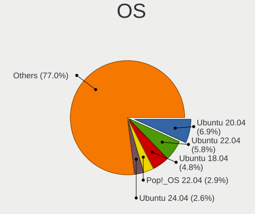

| Name                         | Notebooks | Percent |
|------------------------------|-----------|---------|
| Ubuntu 20.04                 | 47        | 6.85%   |
| Ubuntu 22.04                 | 40        | 5.83%   |
| Ubuntu 18.04                 | 33        | 4.81%   |
| Pop!_OS 22.04                | 20        | 2.92%   |
| Ubuntu 24.04                 | 18        | 2.62%   |
| Arch Rolling                 | 15        | 2.19%   |
| Fedora 40                    | 12        | 1.75%   |
| OpenMandriva 4.3             | 11        | 1.6%    |
| OpenMandriva 24.12           | 11        | 1.6%    |
| Zorin 15                     | 9         | 1.31%   |
| Debian 12                    | 9         | 1.31%   |
| BlackPanther 18.1            | 9         | 1.31%   |
| Zorin 17                     | 8         | 1.17%   |
| ROSA R11                     | 8         | 1.17%   |
| ArcoLinux Rolling            | 8         | 1.17%   |
| Arch                         | 8         | 1.17%   |
| Zorin 16                     | 7         | 1.02%   |
| Ubuntu 19.10                 | 7         | 1.02%   |
| openSUSE Tumbleweed-XXXXXXXX | 7         | 1.02%   |
| OpenMandriva 23.01           | 7         | 1.02%   |
| MX 23                        | 7         | 1.02%   |
| Linux Mint 19.3              | 7         | 1.02%   |
| Fedora 39                    | 7         | 1.02%   |
| Fedora 37                    | 7         | 1.02%   |
| OpenMandriva 4.2             | 6         | 0.87%   |
| Manjaro                      | 6         | 0.87%   |
| Linux Mint 22.1              | 6         | 0.87%   |
| Linux Mint 22                | 6         | 0.87%   |
| Linux Mint 20.3              | 6         | 0.87%   |
| Kubuntu 22.04                | 6         | 0.87%   |
| Fedora 42                    | 6         | 0.87%   |
| EndeavourOS Rolling          | 6         | 0.87%   |
| Ubuntu 21.10                 | 5         | 0.73%   |
| Ubuntu 18.10                 | 5         | 0.73%   |
| ROSA R10                     | 5         | 0.73%   |
| Linux Mint 21.2              | 5         | 0.73%   |
| Linux Mint 21.1              | 5         | 0.73%   |
| KDE neon 20.04               | 5         | 0.73%   |
| Fedora 41                    | 5         | 0.73%   |
| Zorin 18                     | 4         | 0.58%   |

OS Family
---------

OS without a version

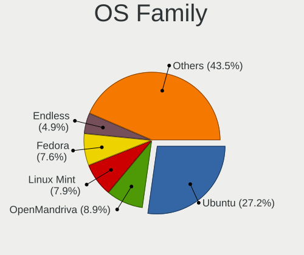

| Name          | Notebooks | Percent |
|---------------|-----------|---------|
| Ubuntu        | 172       | 27.22%  |
| OpenMandriva  | 56        | 8.86%   |
| Linux Mint    | 50        | 7.91%   |
| Fedora        | 48        | 7.59%   |
| Endless       | 31        | 4.91%   |
| Zorin         | 29        | 4.59%   |
| Pop!_OS       | 28        | 4.43%   |
| ROSA          | 24        | 3.8%    |
| Arch          | 23        | 3.64%   |
| Manjaro       | 19        | 3.01%   |
| Kubuntu       | 15        | 2.37%   |
| Debian        | 15        | 2.37%   |
| openSUSE      | 11        | 1.74%   |
| MX            | 11        | 1.74%   |
| KDE neon      | 10        | 1.58%   |
| BlackPanther  | 10        | 1.58%   |
| Xubuntu       | 9         | 1.42%   |
| ArcoLinux     | 8         | 1.27%   |
| Kali          | 7         | 1.11%   |
| EndeavourOS   | 6         | 0.95%   |
| Elementary    | 6         | 0.95%   |
| Ubuntu MATE   | 4         | 0.63%   |
| Lubuntu       | 4         | 0.63%   |
| NixOS         | 3         | 0.47%   |
| Nobara        | 2         | 0.32%   |
| Gentoo        | 2         | 0.32%   |
| Garuda Linux  | 2         | 0.32%   |
| Bazzite       | 2         | 0.32%   |
| Artix         | 2         | 0.32%   |
| Xero          | 1         | 0.16%   |
| Void Linux    | 1         | 0.16%   |
| Vanilla       | 1         | 0.16%   |
| UbuntuDDE     | 1         | 0.16%   |
| Ubuntu Unity  | 1         | 0.16%   |
| Ubuntu Budgie | 1         | 0.16%   |
| Solus         | 1         | 0.16%   |
| Slackware     | 1         | 0.16%   |
| PureOS        | 1         | 0.16%   |
| Peppermint    | 1         | 0.16%   |
| Parrot        | 1         | 0.16%   |

Kernel
------

Version of the Linux kernel

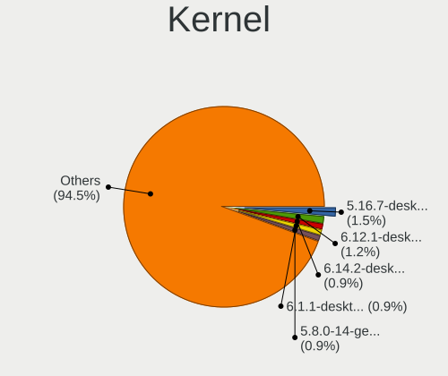

| Version                  | Notebooks | Percent |
|--------------------------|-----------|---------|
| 5.16.7-desktop-1omv4003  | 11        | 1.49%   |
| 6.12.1-desktop-1omv2490  | 9         | 1.22%   |
| 6.14.2-desktop-3omv2590  | 7         | 0.95%   |
| 6.1.1-desktop-1omv2290   | 7         | 0.95%   |
| 5.8.0-14-generic         | 7         | 0.95%   |
| 4.18.16-desktop-1bP      | 7         | 0.95%   |
| 6.8.0-51-generic         | 6         | 0.81%   |
| 5.3.0-40-generic         | 6         | 0.81%   |
| 5.15.0-48-generic        | 6         | 0.81%   |
| 5.10.14-desktop-1omv4002 | 6         | 0.81%   |
| 4.18.0-15-generic        | 6         | 0.81%   |
| 5.15.0-56-generic        | 5         | 0.68%   |
| 5.15.0-46-generic        | 5         | 0.68%   |
| 5.11.0-27-generic        | 5         | 0.68%   |
| 6.5.0-35-generic         | 4         | 0.54%   |
| 6.4.6-76060406-generic   | 4         | 0.54%   |
| 6.4.11-desktop-1omv2390  | 4         | 0.54%   |
| 6.2.0-26-generic         | 4         | 0.54%   |
| 5.4.0-47-generic         | 4         | 0.54%   |
| 5.4.0-42-generic         | 4         | 0.54%   |
| 5.3.0-23-generic         | 4         | 0.54%   |
| 5.15.0-52-generic        | 4         | 0.54%   |
| 4.18.0-25-generic        | 4         | 0.54%   |
| 4.18.0-12-generic        | 4         | 0.54%   |
| 4.15.0-15-generic        | 4         | 0.54%   |
| 6.9.3-76060903-generic   | 3         | 0.41%   |
| 6.8.0-52-generic         | 3         | 0.41%   |
| 6.8.0-45-generic         | 3         | 0.41%   |
| 6.8.0-31-generic         | 3         | 0.41%   |
| 6.5.0-27-generic         | 3         | 0.41%   |
| 6.5.0-21-generic         | 3         | 0.41%   |
| 6.12.9-desktop-1omv2490  | 3         | 0.41%   |
| 6.1.0-18-amd64           | 3         | 0.41%   |
| 5.4.0-58-generic         | 3         | 0.41%   |
| 5.4.0-52-generic         | 3         | 0.41%   |
| 5.4.0-48-generic         | 3         | 0.41%   |
| 5.4.0-19-generic         | 3         | 0.41%   |
| 5.4.0-150-generic        | 3         | 0.41%   |
| 5.3.0-51-generic         | 3         | 0.41%   |
| 5.3.0-29-generic         | 3         | 0.41%   |

Kernel Family
-------------

Linux kernel without a distro release

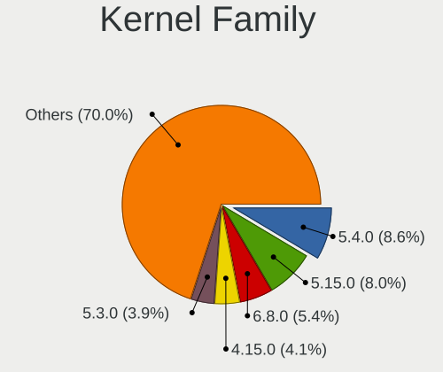

| Version | Notebooks | Percent |
|---------|-----------|---------|
| 5.4.0   | 60        | 8.57%   |
| 5.15.0  | 56        | 8%      |
| 6.8.0   | 38        | 5.43%   |
| 4.15.0  | 29        | 4.14%   |
| 5.3.0   | 27        | 3.86%   |
| 5.11.0  | 22        | 3.14%   |
| 4.18.0  | 22        | 3.14%   |
| 5.8.0   | 21        | 3%      |
| 6.5.0   | 19        | 2.71%   |
| 5.13.0  | 17        | 2.43%   |
| 5.0.0   | 17        | 2.43%   |
| 6.14.0  | 14        | 2%      |
| 6.1.0   | 14        | 2%      |
| 5.19.0  | 14        | 2%      |
| 5.16.7  | 11        | 1.57%   |
| 6.12.1  | 10        | 1.43%   |
| 5.10.0  | 9         | 1.29%   |
| 6.2.0   | 8         | 1.14%   |
| 6.14.2  | 8         | 1.14%   |
| 6.1.1   | 8         | 1.14%   |
| 4.18.16 | 7         | 1%      |
| 6.4.11  | 6         | 0.86%   |
| 5.10.14 | 6         | 0.86%   |
| 6.4.6   | 5         | 0.71%   |
| 6.9.3   | 4         | 0.57%   |
| 6.2.6   | 4         | 0.57%   |
| 6.11.0  | 4         | 0.57%   |
| 4.9.20  | 4         | 0.57%   |
| 6.14.9  | 3         | 0.43%   |
| 6.12.9  | 3         | 0.43%   |
| 6.11.7  | 3         | 0.43%   |
| 5.8.11  | 3         | 0.43%   |
| 5.14.21 | 3         | 0.43%   |
| 5.10.74 | 3         | 0.43%   |
| 6.8.5   | 2         | 0.29%   |
| 6.8.11  | 2         | 0.29%   |
| 6.7.9   | 2         | 0.29%   |
| 6.7.0   | 2         | 0.29%   |
| 6.6.13  | 2         | 0.29%   |
| 6.5.7   | 2         | 0.29%   |

Kernel Major Ver.
-----------------

Linux kernel major version

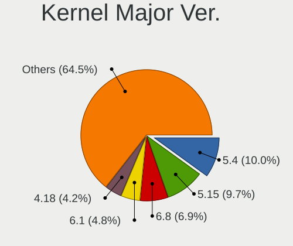

| Version | Notebooks | Percent |
|---------|-----------|---------|
| 5.4     | 69        | 9.97%   |
| 5.15    | 67        | 9.68%   |
| 6.8     | 48        | 6.94%   |
| 6.1     | 33        | 4.77%   |
| 4.18    | 29        | 4.19%   |
| 4.15    | 29        | 4.19%   |
| 6.5     | 28        | 4.05%   |
| 5.3     | 28        | 4.05%   |
| 5.11    | 28        | 4.05%   |
| 6.14    | 26        | 3.76%   |
| 6.12    | 25        | 3.61%   |
| 5.8     | 25        | 3.61%   |
| 5.10    | 23        | 3.32%   |
| 5.19    | 20        | 2.89%   |
| 5.13    | 19        | 2.75%   |
| 5.0     | 18        | 2.6%    |
| 6.4     | 16        | 2.31%   |
| 6.2     | 15        | 2.17%   |
| 5.16    | 15        | 2.17%   |
| 6.6     | 12        | 1.73%   |
| 6.11    | 11        | 1.59%   |
| 4.9     | 11        | 1.59%   |
| 6.10    | 10        | 1.45%   |
| 6.0     | 10        | 1.45%   |
| 6.9     | 8         | 1.16%   |
| 6.7     | 5         | 0.72%   |
| 6.3     | 5         | 0.72%   |
| 6.13    | 5         | 0.72%   |
| 5.18    | 5         | 0.72%   |
| 5.14    | 5         | 0.72%   |
| 5.12    | 5         | 0.72%   |
| 6.17    | 4         | 0.58%   |
| 6.16    | 4         | 0.58%   |
| 6.15    | 4         | 0.58%   |
| 5.6     | 4         | 0.58%   |
| 5.17    | 4         | 0.58%   |
| 5.9     | 2         | 0.29%   |
| 5.7     | 2         | 0.29%   |
| 5.1     | 2         | 0.29%   |
| 4.19    | 2         | 0.29%   |

Arch
----

OS architecture (x86_64, i586, etc.)

| Name    | Notebooks | Percent |
|---------|-----------|---------|
| x86_64  | 591       | 97.36%  |
| i686    | 15        | 2.47%   |
| aarch64 | 1         | 0.16%   |

DE
--

Desktop Environment

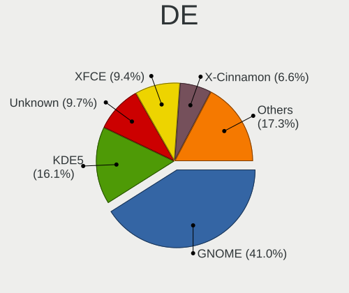

| Name            | Notebooks | Percent |
|-----------------|-----------|---------|
| GNOME           | 263       | 41.03%  |
| KDE5            | 103       | 16.07%  |
| Unknown         | 62        | 9.67%   |
| XFCE            | 60        | 9.36%   |
| X-Cinnamon      | 42        | 6.55%   |
| KDE6            | 32        | 4.99%   |
| KDE4            | 13        | 2.03%   |
| LXQt            | 11        | 1.72%   |
| MATE            | 8         | 1.25%   |
| KDE             | 8         | 1.25%   |
| Pantheon        | 6         | 0.94%   |
| i3              | 6         | 0.94%   |
| Cinnamon        | 6         | 0.94%   |
| LXDE            | 3         | 0.47%   |
| Hyprland        | 3         | 0.47%   |
| qtile           | 2         | 0.31%   |
| GNOME Flashback | 2         | 0.31%   |
| Deepin          | 2         | 0.31%   |
| Unity           | 1         | 0.16%   |
| Trinity         | 1         | 0.16%   |
| Sway            | 1         | 0.16%   |
| Openbox         | 1         | 0.16%   |
| DWM             | 1         | 0.16%   |
| COSMIC          | 1         | 0.16%   |
| BunsenLabs      | 1         | 0.16%   |
| Budgie          | 1         | 0.16%   |
| awesome         | 1         | 0.16%   |

Display Server
--------------

X11 or Wayland

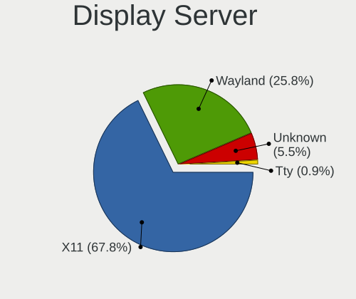

| Name    | Notebooks | Percent |
|---------|-----------|---------|
| X11     | 431       | 67.77%  |
| Wayland | 164       | 25.79%  |
| Unknown | 35        | 5.5%    |
| Tty     | 6         | 0.94%   |

Display Manager
---------------

SDDM, LightDM, etc.

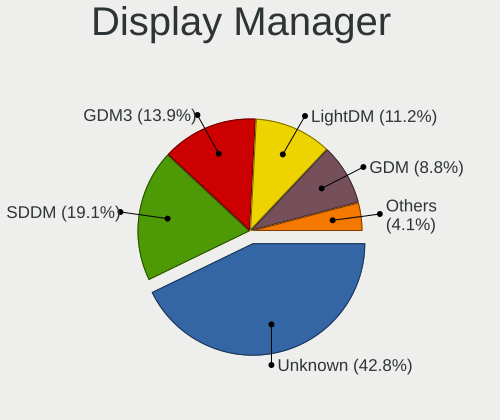

| Name    | Notebooks | Percent |
|---------|-----------|---------|
| Unknown | 271       | 42.81%  |
| SDDM    | 121       | 19.12%  |
| GDM3    | 88        | 13.9%   |
| LightDM | 71        | 11.22%  |
| GDM     | 56        | 8.85%   |
| KDM     | 12        | 1.9%    |
| TDM     | 9         | 1.42%   |
| XDM     | 1         | 0.16%   |
| LY-DM   | 1         | 0.16%   |
| Ly      | 1         | 0.16%   |
| LXDM    | 1         | 0.16%   |
| GREETD  | 1         | 0.16%   |

OS Lang
-------

Language

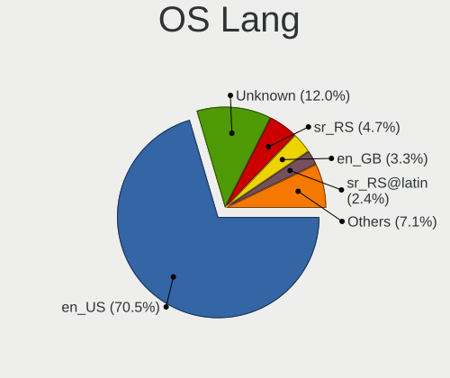

| Lang        | Notebooks | Percent |
|-------------|-----------|---------|
| en_US       | 446       | 70.46%  |
| Unknown     | 76        | 12.01%  |
| sr_RS       | 30        | 4.74%   |
| en_GB       | 21        | 3.32%   |
| sr_RS@latin | 15        | 2.37%   |
| C           | 13        | 2.05%   |
| ru_RU       | 9         | 1.42%   |
| de_DE       | 8         | 1.26%   |
| hu_HU       | 5         | 0.79%   |
| hr_HR       | 4         | 0.63%   |
| sk_SK       | 1         | 0.16%   |
| nl_NL       | 1         | 0.16%   |
| en_IE       | 1         | 0.16%   |
| en_DK       | 1         | 0.16%   |
| en_CA       | 1         | 0.16%   |
| en_AU       | 1         | 0.16%   |

Boot Mode
---------

EFI or BIOS

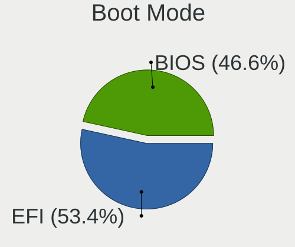

| Mode | Notebooks | Percent |
|------|-----------|---------|
| EFI  | 334       | 53.44%  |
| BIOS | 291       | 46.56%  |

Filesystem
----------

Type of filesystem

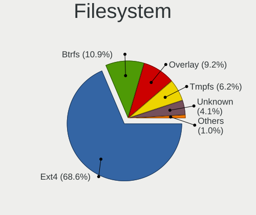

| Type    | Notebooks | Percent |
|---------|-----------|---------|
| Ext4    | 433       | 68.62%  |
| Btrfs   | 69        | 10.94%  |
| Overlay | 58        | 9.19%   |
| Tmpfs   | 39        | 6.18%   |
| Unknown | 26        | 4.12%   |
| Xfs     | 3         | 0.48%   |
| Zfs     | 2         | 0.32%   |
| Ext3    | 1         | 0.16%   |

Part. scheme
------------

Scheme of partitioning

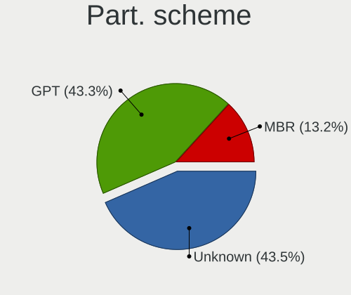

| Type    | Notebooks | Percent |
|---------|-----------|---------|
| Unknown | 273       | 43.47%  |
| GPT     | 272       | 43.31%  |
| MBR     | 83        | 13.22%  |

Dual Boot with Linux/BSD
------------------------

Hosting more than one Linux/BSD

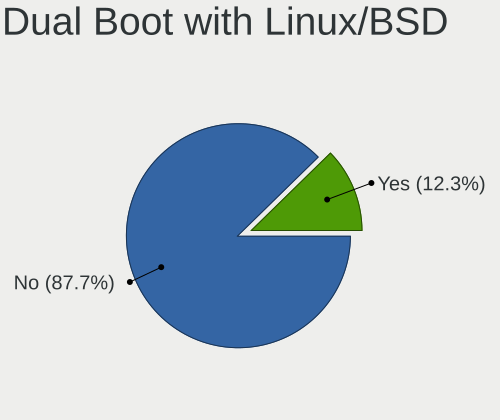

| Dual boot | Notebooks | Percent |
|-----------|-----------|---------|
| No        | 541       | 87.68%  |
| Yes       | 76        | 12.32%  |

Dual Boot (Win)
---------------

Hosting Linux and Windows

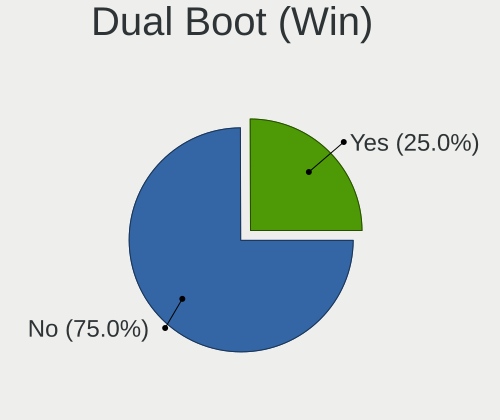

| Dual boot | Notebooks | Percent |
|-----------|-----------|---------|
| No        | 464       | 74.96%  |
| Yes       | 155       | 25.04%  |

Board
-----

Vendor
------

Motherboard manufacturer

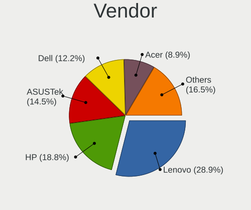

| Name                | Notebooks | Percent |
|---------------------|-----------|---------|
| Lenovo              | 175       | 28.93%  |
| Hewlett-Packard     | 114       | 18.84%  |
| ASUSTek Computer    | 88        | 14.55%  |
| Dell                | 74        | 12.23%  |
| Acer                | 54        | 8.93%   |
| Toshiba             | 20        | 3.31%   |
| Apple               | 16        | 2.64%   |
| MSI                 | 12        | 1.98%   |
| Fujitsu Siemens     | 6         | 0.99%   |
| Sony                | 5         | 0.83%   |
| Fujitsu             | 5         | 0.83%   |
| Timi                | 4         | 0.66%   |
| Samsung Electronics | 4         | 0.66%   |
| HUAWEI              | 4         | 0.66%   |
| Medion              | 3         | 0.5%    |
| eMachines           | 3         | 0.5%    |
| LG Electronics      | 2         | 0.33%   |
| HONOR               | 2         | 0.33%   |
| TWC                 | 1         | 0.17%   |
| Synology            | 1         | 0.17%   |
| SLIMBOOK            | 1         | 0.17%   |
| Razer               | 1         | 0.17%   |
| Purism              | 1         | 0.17%   |
| Packard Bell        | 1         | 0.17%   |
| IBM                 | 1         | 0.17%   |
| Huion               | 1         | 0.17%   |
| Gigabyte Technology | 1         | 0.17%   |
| Framework           | 1         | 0.17%   |
| Dixonsxp            | 1         | 0.17%   |
| Chuwi               | 1         | 0.17%   |
| BenQ                | 1         | 0.17%   |
| Alienware           | 1         | 0.17%   |

Model
-----

Motherboard model

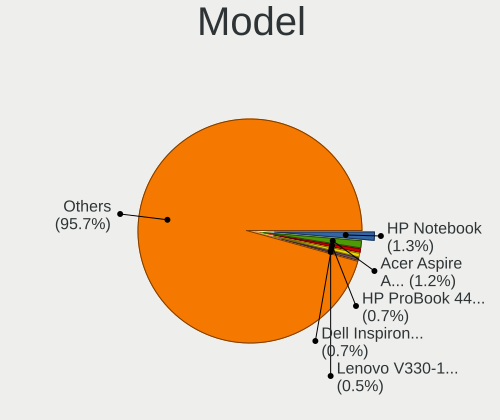

| Name                                | Notebooks | Percent |
|-------------------------------------|-----------|---------|
| HP Notebook                         | 8         | 1.32%   |
| Acer Aspire A315-31                 | 7         | 1.16%   |
| HP ProBook 440 G3                   | 4         | 0.66%   |
| Dell Inspiron 3593                  | 4         | 0.66%   |
| Lenovo V330-15IKB 81AX              | 3         | 0.5%    |
| Lenovo IdeaPad 5 14ARE05 81YM       | 3         | 0.5%    |
| Lenovo IdeaPad 5 14ALC05 82LM       | 3         | 0.5%    |
| Lenovo IdeaPad 330-15IKB 81DE       | 3         | 0.5%    |
| Lenovo IdeaPad 3 15IIL05 81WE       | 3         | 0.5%    |
| Lenovo IdeaPad 110-15IBR 80T7       | 3         | 0.5%    |
| Lenovo B50-45 20388                 | 3         | 0.5%    |
| HP Pavilion dv7                     | 3         | 0.5%    |
| HP Laptop 15-ra0xx                  | 3         | 0.5%    |
| HP Laptop 15-db1xxx                 | 3         | 0.5%    |
| HP Laptop 15-db0xxx                 | 3         | 0.5%    |
| HP Laptop 15-da0xxx                 | 3         | 0.5%    |
| HP EliteBook 840 G5                 | 3         | 0.5%    |
| HP 250 G5 Notebook PC               | 3         | 0.5%    |
| Dell Vostro 15 3515                 | 3         | 0.5%    |
| Dell Inspiron 3542                  | 3         | 0.5%    |
| ASUS X55A                           | 3         | 0.5%    |
| ASUS X541NA                         | 3         | 0.5%    |
| Apple MacBookPro8,1                 | 3         | 0.5%    |
| Unknown                             | 3         | 0.5%    |
| Toshiba Satellite L755              | 2         | 0.33%   |
| MSI CR500                           | 2         | 0.33%   |
| Lenovo V15-IGL 82C3                 | 2         | 0.33%   |
| Lenovo ThinkPad X220 Tablet 42992PG | 2         | 0.33%   |
| Lenovo ThinkBook 16 G7 IML 21MS     | 2         | 0.33%   |
| Lenovo ThinkBook 15 G4 IAP 21DJ     | 2         | 0.33%   |
| Lenovo ThinkBook 15 G2 ARE 20VG     | 2         | 0.33%   |
| Lenovo Legion Y530-15ICH 81FV       | 2         | 0.33%   |
| Lenovo Legion 5 15ARH05H 82B1       | 2         | 0.33%   |
| Lenovo IdeaPad Slim 3 15IAN8 82XB   | 2         | 0.33%   |
| Lenovo IdeaPad S540-14API 81NH      | 2         | 0.33%   |
| Lenovo IdeaPad L340-15API 81LW      | 2         | 0.33%   |
| Lenovo G560 20042                   | 2         | 0.33%   |
| Lenovo G500 20236                   | 2         | 0.33%   |
| Lenovo G50-30 80G0                  | 2         | 0.33%   |
| HP ProBook 470 G1                   | 2         | 0.33%   |

Model Family
------------

Motherboard model prefix

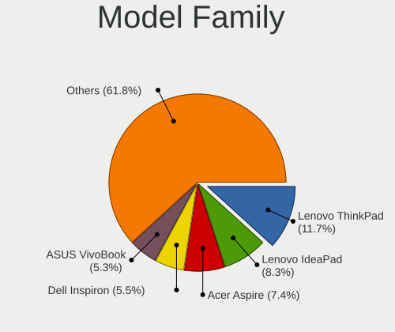

| Name                  | Notebooks | Percent |
|-----------------------|-----------|---------|
| Lenovo ThinkPad       | 71        | 11.74%  |
| Lenovo IdeaPad        | 50        | 8.26%   |
| Acer Aspire           | 45        | 7.44%   |
| Dell Inspiron         | 33        | 5.45%   |
| ASUS VivoBook         | 32        | 5.29%   |
| HP Laptop             | 23        | 3.8%    |
| HP EliteBook          | 20        | 3.31%   |
| Dell Latitude         | 19        | 3.14%   |
| Toshiba Satellite     | 18        | 2.98%   |
| HP ProBook            | 18        | 2.98%   |
| Lenovo ThinkBook      | 12        | 1.98%   |
| Lenovo Legion         | 12        | 1.98%   |
| HP Pavilion           | 12        | 1.98%   |
| Dell Vostro           | 12        | 1.98%   |
| HP Notebook           | 8         | 1.32%   |
| HP 250                | 8         | 1.32%   |
| Dell Precision        | 6         | 0.99%   |
| Lenovo Yoga           | 5         | 0.83%   |
| Fujitsu Siemens AMILO | 5         | 0.83%   |
| Fujitsu LIFEBOOK      | 5         | 0.83%   |
| HP Compaq             | 4         | 0.66%   |
| HP 255                | 4         | 0.66%   |
| ASUS Zenbook          | 4         | 0.66%   |
| ASUS ROG              | 4         | 0.66%   |
| Apple MacBookPro8     | 4         | 0.66%   |
| Lenovo V330-15IKB     | 3         | 0.5%    |
| Lenovo B50-45         | 3         | 0.5%    |
| HP OMEN               | 3         | 0.5%    |
| ASUS X55A             | 3         | 0.5%    |
| ASUS X541NA           | 3         | 0.5%    |
| Apple MacBook5        | 3         | 0.5%    |
| Acer TravelMate       | 3         | 0.5%    |
| Acer Nitro            | 3         | 0.5%    |
| Unknown               | 3         | 0.5%    |
| MSI GP66              | 2         | 0.33%   |
| MSI CR500             | 2         | 0.33%   |
| Lenovo V15-IGL        | 2         | 0.33%   |
| Lenovo G560           | 2         | 0.33%   |
| Lenovo G500           | 2         | 0.33%   |
| Lenovo G50-30         | 2         | 0.33%   |

MFG Year
--------

Motherboard manufacture year

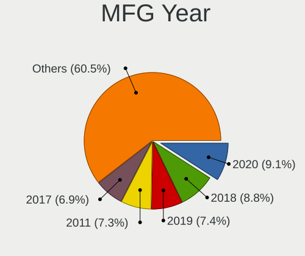

| Year | Notebooks | Percent |
|------|-----------|---------|
| 2020 | 55        | 9.09%   |
| 2018 | 53        | 8.76%   |
| 2019 | 45        | 7.44%   |
| 2011 | 44        | 7.27%   |
| 2017 | 42        | 6.94%   |
| 2021 | 39        | 6.45%   |
| 2012 | 38        | 6.28%   |
| 2013 | 36        | 5.95%   |
| 2015 | 33        | 5.45%   |
| 2016 | 32        | 5.29%   |
| 2014 | 31        | 5.12%   |
| 2022 | 30        | 4.96%   |
| 2010 | 28        | 4.63%   |
| 2023 | 24        | 3.97%   |
| 2009 | 21        | 3.47%   |
| 2008 | 19        | 3.14%   |
| 2007 | 14        | 2.31%   |
| 2024 | 11        | 1.82%   |
| 2006 | 6         | 0.99%   |
| 2025 | 2         | 0.33%   |
| 2005 | 2         | 0.33%   |

Form Factor
-----------

Physical design of the computer

| Name     | Notebooks | Percent |
|----------|-----------|---------|
| Notebook | 605       | 100%    |

Secure Boot
-----------

Enabled or disabled

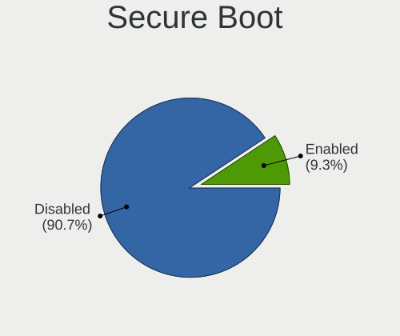

| State    | Notebooks | Percent |
|----------|-----------|---------|
| Disabled | 556       | 90.7%   |
| Enabled  | 57        | 9.3%    |

Coreboot
--------

Have coreboot on board

| Used | Notebooks | Percent |
|------|-----------|---------|
| No   | 604       | 99.83%  |
| Yes  | 1         | 0.17%   |

RAM Size
--------

Total RAM memory

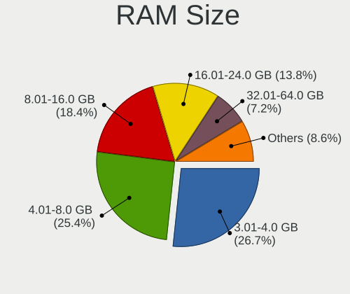

| Size in GB  | Notebooks | Percent |
|-------------|-----------|---------|
| 3.01-4.0    | 164       | 26.67%  |
| 4.01-8.0    | 156       | 25.37%  |
| 8.01-16.0   | 113       | 18.37%  |
| 16.01-24.0  | 85        | 13.82%  |
| 32.01-64.0  | 44        | 7.15%   |
| 1.01-2.0    | 25        | 4.07%   |
| 2.01-3.0    | 14        | 2.28%   |
| 24.01-32.0  | 10        | 1.63%   |
| 64.01-256.0 | 3         | 0.49%   |
| 0.51-1.0    | 1         | 0.16%   |

RAM Used
--------

Used RAM memory

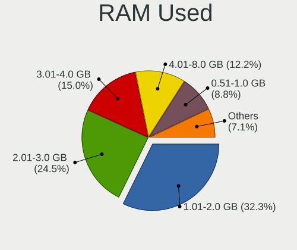

| Used GB    | Notebooks | Percent |
|------------|-----------|---------|
| 1.01-2.0   | 219       | 32.3%   |
| 2.01-3.0   | 166       | 24.48%  |
| 3.01-4.0   | 102       | 15.04%  |
| 4.01-8.0   | 83        | 12.24%  |
| 0.51-1.0   | 60        | 8.85%   |
| 8.01-16.0  | 40        | 5.9%    |
| 16.01-24.0 | 4         | 0.59%   |
| 0.01-0.5   | 3         | 0.44%   |
| 24.01-32.0 | 1         | 0.15%   |

Total Drives
------------

Number of drives on board

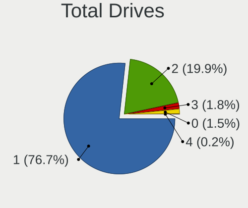

| Drives | Notebooks | Percent |
|--------|-----------|---------|
| 1      | 475       | 76.74%  |
| 2      | 123       | 19.87%  |
| 3      | 11        | 1.78%   |
| 0      | 9         | 1.45%   |
| 4      | 1         | 0.16%   |

Has CD-ROM
----------

Has CD-ROM on board

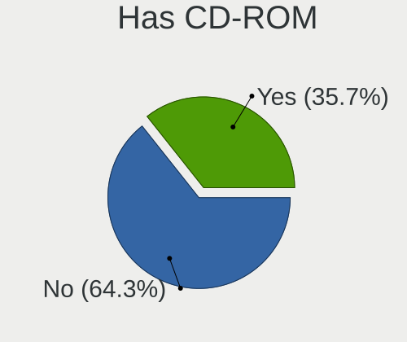

| Presented | Notebooks | Percent |
|-----------|-----------|---------|
| No        | 393       | 64.32%  |
| Yes       | 218       | 35.68%  |

Has Ethernet
------------

Has Ethernet on board

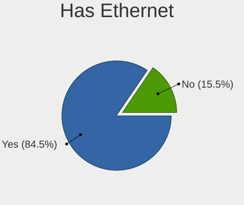

| Presented | Notebooks | Percent |
|-----------|-----------|---------|
| Yes       | 513       | 84.51%  |
| No        | 94        | 15.49%  |

Has WiFi
--------

Has WiFi module

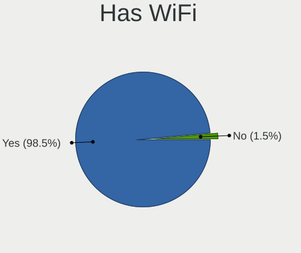

| Presented | Notebooks | Percent |
|-----------|-----------|---------|
| Yes       | 597       | 98.51%  |
| No        | 9         | 1.49%   |

Has Bluetooth
-------------

Has Bluetooth module

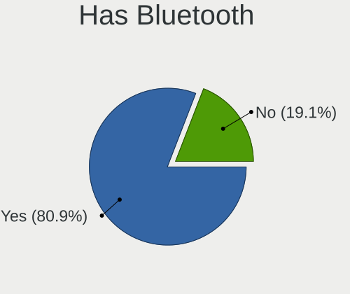

| Presented | Notebooks | Percent |
|-----------|-----------|---------|
| Yes       | 499       | 80.88%  |
| No        | 118       | 19.12%  |

Location
--------

Country
-------

Geographic location (country)

| Country | Notebooks | Percent |
|---------|-----------|---------|
| Serbia  | 605       | 100%    |

City
----

Geographic location (city)

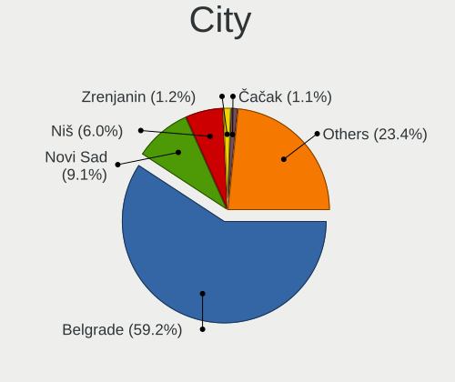

| City              | Notebooks | Percent |
|-------------------|-----------|---------|
| Belgrade          | 385       | 59.23%  |
| Novi Sad          | 59        | 9.08%   |
| Niš              | 39        | 6%      |
| Zrenjanin         | 8         | 1.23%   |
| Subotica          | 7         | 1.08%   |
| Kragujevac        | 7         | 1.08%   |
| Čačak           | 7         | 1.08%   |
| Pančevo          | 6         | 0.92%   |
| Vršac            | 5         | 0.77%   |
| Sabac             | 5         | 0.77%   |
| Senta             | 4         | 0.62%   |
| Savski Venac      | 4         | 0.62%   |
| Novi Belgrade     | 4         | 0.62%   |
| Leskovac          | 4         | 0.62%   |
| Indjija           | 4         | 0.62%   |
| Bor               | 4         | 0.62%   |
| Vranje            | 3         | 0.46%   |
| Stara Pazova      | 3         | 0.46%   |
| Požarevac        | 3         | 0.46%   |
| Palanka           | 3         | 0.46%   |
| Novi Karlovci     | 3         | 0.46%   |
| Lozovik           | 3         | 0.46%   |
| Kovin             | 3         | 0.46%   |
| Jagodina          | 3         | 0.46%   |
| Backa Topola      | 3         | 0.46%   |
| Varvarin          | 2         | 0.31%   |
| Valjevo           | 2         | 0.31%   |
| Užice            | 2         | 0.31%   |
| Trstenik          | 2         | 0.31%   |
| Sremska Mitrovica | 2         | 0.31%   |
| Sombor            | 2         | 0.31%   |
| Smederevo         | 2         | 0.31%   |
| Semlin            | 2         | 0.31%   |
| Ruma              | 2         | 0.31%   |
| Ripanj            | 2         | 0.31%   |
| Petrovaradin      | 2         | 0.31%   |
| New Belgrade      | 2         | 0.31%   |
| Mladenovac        | 2         | 0.31%   |
| Lazarevac         | 2         | 0.31%   |
| Kruševac         | 2         | 0.31%   |

Drives
------

Drive Vendor
------------

Hard drive vendors

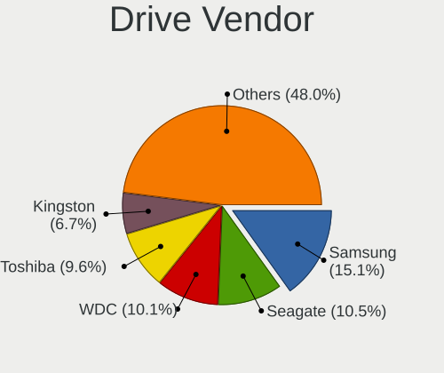

| Vendor                       | Notebooks | Drives | Percent |
|------------------------------|-----------|--------|---------|
| Samsung Electronics          | 109       | 139    | 15.12%  |
| Seagate                      | 76        | 91     | 10.54%  |
| WDC                          | 73        | 104    | 10.12%  |
| Toshiba                      | 69        | 88     | 9.57%   |
| Kingston                     | 48        | 55     | 6.66%   |
| Sandisk                      | 43        | 53     | 5.96%   |
| SK hynix                     | 39        | 48     | 5.41%   |
| Micron Technology            | 29        | 35     | 4.02%   |
| Hitachi                      | 26        | 30     | 3.61%   |
| Unknown                      | 25        | 33     | 3.47%   |
| Intel                        | 22        | 33     | 3.05%   |
| HGST                         | 21        | 32     | 2.91%   |
| SPCC                         | 17        | 28     | 2.36%   |
| Patriot                      | 14        | 17     | 1.94%   |
| KIOXIA                       | 8         | 9      | 1.11%   |
| Kingston Technology Company  | 7         | 11     | 0.97%   |
| Fujitsu                      | 7         | 7      | 0.97%   |
| LITEON                       | 6         | 7      | 0.83%   |
| Crucial                      | 6         | 8      | 0.83%   |
| GeIL                         | 5         | 6      | 0.69%   |
| A-DATA Technology            | 5         | 5      | 0.69%   |
| Transcend                    | 4         | 5      | 0.55%   |
| Netac                        | 4         | 6      | 0.55%   |
| Gigabyte Technology          | 4         | 4      | 0.55%   |
| Unknown                      | 4         | 4      | 0.55%   |
| Shenzhen Longsys Electronics | 3         | 3      | 0.42%   |
| Phison                       | 3         | 5      | 0.42%   |
| Apple                        | 3         | 4      | 0.42%   |
| Union Memory                 | 2         | 2      | 0.28%   |
| TwinMOS                      | 2         | 2      | 0.28%   |
| Solid State Storage          | 2         | 2      | 0.28%   |
| PNY                          | 2         | 2      | 0.28%   |
| China                        | 2         | 2      | 0.28%   |
| Biostar                      | 2         | 2      | 0.28%   |
| Apacer                       | 2         | 2      | 0.28%   |
| AMD                          | 2         | 4      | 0.28%   |
| ADATA Technology             | 2         | 2      | 0.28%   |
| Yangtze Memory Technologies  | 1         | 1      | 0.14%   |
| Verbatim                     | 1         | 1      | 0.14%   |
| Union Memory (Shenzhen)      | 1         | 1      | 0.14%   |

Drive Model
-----------

Hard drive models

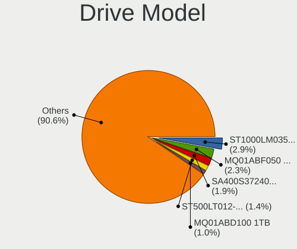

| Model                                              | Notebooks | Percent |
|----------------------------------------------------|-----------|---------|
| Seagate ST1000LM035-1RK172 1TB                     | 21        | 2.87%   |
| Toshiba MQ01ABF050 500GB                           | 17        | 2.33%   |
| Kingston SA400S37240G 240GB SSD                    | 14        | 1.92%   |
| Seagate ST500LT012-1DG142 500GB                    | 10        | 1.37%   |
| Toshiba MQ01ABD100 1TB                             | 7         | 0.96%   |
| Seagate ST500LT012-9WS142 500GB                    | 7         | 0.96%   |
| Seagate ST1000LM024 HN-M101MBB 1TB                 | 7         | 0.96%   |
| Samsung NVMe SSD Controller SM981/PM981/PM983 1TB  | 7         | 0.96%   |
| Samsung MZALQ512HALU-000L2 512GB                   | 7         | 0.96%   |
| Kingston SA400S37120G 120GB SSD                    | 7         | 0.96%   |
| WDC WDS500G2B0A 500GB SSD                          | 6         | 0.82%   |
| Toshiba MQ04ABF100 1TB                             | 6         | 0.82%   |
| SPCC Solid State Disk 256GB                        | 6         | 0.82%   |
| Samsung NVMe SSD Controller PM9A1/PM9A3/980PRO 1TB | 6         | 0.82%   |
| Sandisk WD Blue SN550 NVMe SSD 1024GB              | 5         | 0.68%   |
| Kingston SA400S37480G 480GB SSD                    | 5         | 0.68%   |
| HGST HTS545050A7E680 500GB                         | 5         | 0.68%   |
| HGST HTS545050A7E380 500GB                         | 5         | 0.68%   |
| WDC PC SN530 SDBPMPZ-512G-1101 512GB               | 4         | 0.55%   |
| Unknown NVMe SSD Drive 512GB                       | 4         | 0.55%   |
| Samsung SSD 850 EVO 120GB                          | 4         | 0.55%   |
| Samsung NVMe SSD Drive 256GB                       | 4         | 0.55%   |
| Micron 1100_MTFDDAV256TBN 256GB SSD                | 4         | 0.55%   |
| Hitachi HTS545050A7E380 500GB                      | 4         | 0.55%   |
| HGST HTS721010A9E630 1TB                           | 4         | 0.55%   |
| Unknown                                            | 4         | 0.55%   |
| WDC WD5000LPCX-24VHAT0 500GB                       | 3         | 0.41%   |
| WDC WD3200BEVT-22ZCT0 320GB                        | 3         | 0.41%   |
| Unknown MMC Card  64GB                             | 3         | 0.41%   |
| Unknown MMC Card  2GB                              | 3         | 0.41%   |
| SPCC Solid State Disk 120GB                        | 3         | 0.41%   |
| SK hynix NVMe SSD Drive 256GB                      | 3         | 0.41%   |
| Seagate ST9250410AS 250GB                          | 3         | 0.41%   |
| SanDisk NVMe SSD Drive 256GB                       | 3         | 0.41%   |
| Samsung SSD 870 EVO 500GB                          | 3         | 0.41%   |
| Samsung SSD 850 EVO 250GB                          | 3         | 0.41%   |
| Samsung MZALQ256HBJD-00BL2 256GB                   | 3         | 0.41%   |
| Micron 2400_MTFDKBA512QFM 512GB                    | 3         | 0.41%   |
| Kingston RBUSC180DS37256GJ 256GB SSD               | 3         | 0.41%   |
| Hitachi HTS547575A9E384 752GB                      | 3         | 0.41%   |

HDD Vendor
----------

Hard disk drive vendors

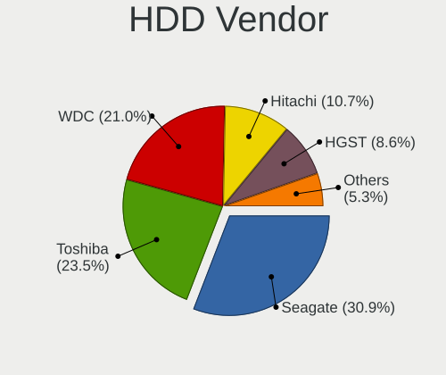

| Vendor              | Notebooks | Drives | Percent |
|---------------------|-----------|--------|---------|
| Seagate             | 75        | 90     | 30.86%  |
| Toshiba             | 57        | 72     | 23.46%  |
| WDC                 | 51        | 78     | 20.99%  |
| Hitachi             | 26        | 30     | 10.7%   |
| HGST                | 21        | 32     | 8.64%   |
| Fujitsu             | 7         | 7      | 2.88%   |
| Samsung Electronics | 2         | 3      | 0.82%   |
| Unknown             | 1         | 1      | 0.41%   |
| TO Exter            | 1         | 1      | 0.41%   |
| JMicron Technology  | 1         | 1      | 0.41%   |
| IBM/Hitachi         | 1         | 1      | 0.41%   |

SSD Vendor
----------

Solid state drive vendors

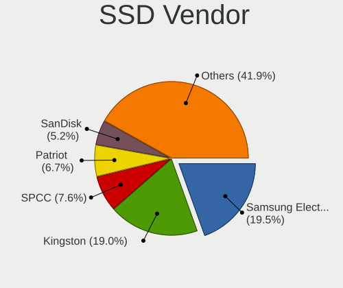

| Vendor              | Notebooks | Drives | Percent |
|---------------------|-----------|--------|---------|
| Samsung Electronics | 41        | 51     | 19.52%  |
| Kingston            | 40        | 44     | 19.05%  |
| SPCC                | 16        | 27     | 7.62%   |
| Patriot             | 14        | 17     | 6.67%   |
| SanDisk             | 11        | 15     | 5.24%   |
| Micron Technology   | 9         | 11     | 4.29%   |
| WDC                 | 8         | 10     | 3.81%   |
| Toshiba             | 6         | 7      | 2.86%   |
| LITEON              | 6         | 7      | 2.86%   |
| Intel               | 6         | 7      | 2.86%   |
| Crucial             | 6         | 8      | 2.86%   |
| GeIL                | 5         | 6      | 2.38%   |
| Transcend           | 4         | 5      | 1.9%    |
| SK hynix            | 4         | 5      | 1.9%    |
| A-DATA Technology   | 4         | 4      | 1.9%    |
| Netac               | 3         | 5      | 1.43%   |
| Unknown             | 3         | 3      | 1.43%   |
| TwinMOS             | 2         | 2      | 0.95%   |
| PNY                 | 2         | 2      | 0.95%   |
| Gigabyte Technology | 2         | 2      | 0.95%   |
| China               | 2         | 2      | 0.95%   |
| Biostar             | 2         | 2      | 0.95%   |
| Apacer              | 2         | 2      | 0.95%   |
| AMD                 | 2         | 4      | 0.95%   |
| Verbatim            | 1         | 1      | 0.48%   |
| SSSTC               | 1         | 1      | 0.48%   |
| Phison              | 1         | 2      | 0.48%   |
| PHD 3.0             | 1         | 1      | 0.48%   |
| OCZ                 | 1         | 1      | 0.48%   |
| LITEONIT            | 1         | 1      | 0.48%   |
| Hewlett-Packard     | 1         | 1      | 0.48%   |
| Cyclone             | 1         | 1      | 0.48%   |
| Bestoss             | 1         | 1      | 0.48%   |
| Apple               | 1         | 1      | 0.48%   |

Drive Kind
----------

HDD or SSD

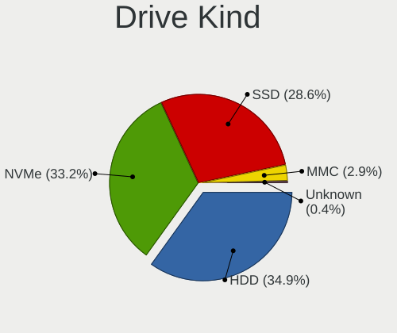

| Kind    | Notebooks | Drives | Percent |
|---------|-----------|--------|---------|
| HDD     | 241       | 316    | 34.93%  |
| NVMe    | 229       | 312    | 33.19%  |
| SSD     | 197       | 259    | 28.55%  |
| MMC     | 20        | 27     | 2.9%    |
| Unknown | 3         | 3      | 0.43%   |

Drive Connector
---------------

SATA, SAS, NVMe, etc.

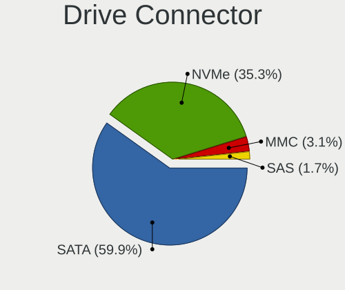

| Type | Notebooks | Drives | Percent |
|------|-----------|--------|---------|
| SATA | 388       | 565    | 59.88%  |
| NVMe | 229       | 311    | 35.34%  |
| MMC  | 20        | 27     | 3.09%   |
| SAS  | 11        | 14     | 1.7%    |

Drive Size
----------

Size of hard drive

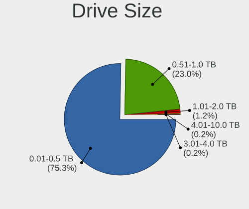

| Size in TB | Notebooks | Drives | Percent |
|------------|-----------|--------|---------|
| 0.01-0.5   | 317       | 429    | 75.3%   |
| 0.51-1.0   | 97        | 128    | 23.04%  |
| 1.01-2.0   | 5         | 14     | 1.19%   |
| 3.01-4.0   | 1         | 1      | 0.24%   |
| 4.01-10.0  | 1         | 3      | 0.24%   |

Space Total
-----------

Amount of disk space available on the file system

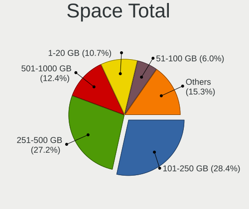

| Size in GB     | Notebooks | Percent |
|----------------|-----------|---------|
| 101-250        | 186       | 28.44%  |
| 251-500        | 178       | 27.22%  |
| 501-1000       | 81        | 12.39%  |
| 1-20           | 70        | 10.7%   |
| 51-100         | 39        | 5.96%   |
| 1001-2000      | 29        | 4.43%   |
| 21-50          | 24        | 3.67%   |
| Unknown        | 24        | 3.67%   |
| 2001-3000      | 12        | 1.83%   |
| More than 3000 | 11        | 1.68%   |

Space Used
----------

Amount of used disk space

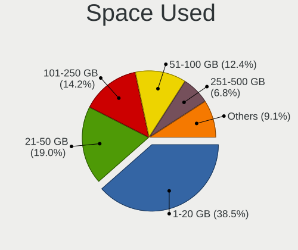

| Used GB        | Notebooks | Percent |
|----------------|-----------|---------|
| 1-20           | 261       | 38.5%   |
| 21-50          | 129       | 19.03%  |
| 101-250        | 96        | 14.16%  |
| 51-100         | 84        | 12.39%  |
| 251-500        | 46        | 6.78%   |
| Unknown        | 24        | 3.54%   |
| 501-1000       | 21        | 3.1%    |
| 1001-2000      | 9         | 1.33%   |
| 2001-3000      | 4         | 0.59%   |
| 0              | 3         | 0.44%   |
| More than 3000 | 1         | 0.15%   |

Malfunc. Drives
---------------

Drive models with a malfunction

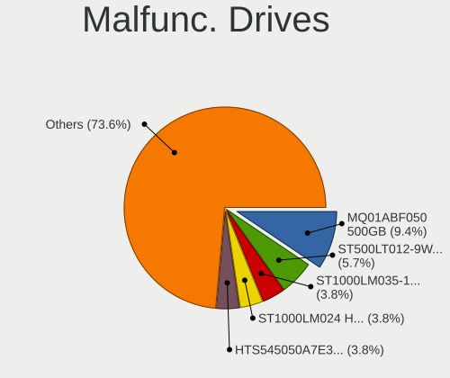

| Model                                     | Notebooks | Drives | Percent |
|-------------------------------------------|-----------|--------|---------|
| Toshiba MQ01ABF050 500GB                  | 5         | 5      | 9.43%   |
| Seagate ST500LT012-9WS142 500GB           | 3         | 3      | 5.66%   |
| Seagate ST1000LM035-1RK172 1TB            | 2         | 2      | 3.77%   |
| Seagate ST1000LM024 HN-M101MBB 1TB        | 2         | 3      | 3.77%   |
| Hitachi HTS545050A7E380 500GB             | 2         | 2      | 3.77%   |
| Hitachi HTS541612J9SA00 120GB             | 2         | 2      | 3.77%   |
| HGST HTS725050A7E630 500GB                | 2         | 6      | 3.77%   |
| WDC WD5000BEVT-24A0RT0 500GB              | 1         | 1      | 1.89%   |
| WDC WD3200BEVT-22ZCT0 320GB               | 1         | 1      | 1.89%   |
| WDC WD3200BEKX-75B7WT0 320GB              | 1         | 1      | 1.89%   |
| Toshiba MQ01ABD100 1TB                    | 1         | 1      | 1.89%   |
| Toshiba MQ01ABD032 320GB                  | 1         | 1      | 1.89%   |
| Toshiba MK5061GSYN 500GB                  | 1         | 1      | 1.89%   |
| Toshiba MK5055GSX 500GB                   | 1         | 1      | 1.89%   |
| Toshiba MK3252GSX 320GB                   | 1         | 1      | 1.89%   |
| Toshiba MK1652GSX 160GB                   | 1         | 1      | 1.89%   |
| Toshiba MK1637GSX 160GB                   | 1         | 1      | 1.89%   |
| Toshiba KSG60ZMV256G M.2 2280 256GB SSD   | 1         | 1      | 1.89%   |
| SPCC Solid State DiskB27 32GB             | 1         | 1      | 1.89%   |
| SK hynix HFS256G39TND-N210A 256GB SSD     | 1         | 2      | 1.89%   |
| Seagate ST980813AS 80GB                   | 1         | 1      | 1.89%   |
| Seagate ST9500420AS 500GB                 | 1         | 1      | 1.89%   |
| Seagate ST9250827AS 250GB                 | 1         | 1      | 1.89%   |
| Seagate ST9250410AS 250GB                 | 1         | 1      | 1.89%   |
| Seagate ST9120822AS 120GB                 | 1         | 1      | 1.89%   |
| Seagate ST750LM022 HN-M750MBB 752GB       | 1         | 1      | 1.89%   |
| Seagate ST500LT012-1DG142 500GB           | 1         | 2      | 1.89%   |
| Seagate ST1000LM048-2E7172 1TB            | 1         | 1      | 1.89%   |
| Samsung Electronics SSD SM841 mSATA 256GB | 1         | 1      | 1.89%   |
| Samsung Electronics HM250HI 250GB         | 1         | 1      | 1.89%   |
| Samsung Electronics HM120JI 120GB         | 1         | 2      | 1.89%   |
| Patriot Burst Elite 120GB SSD             | 1         | 1      | 1.89%   |
| Kingston SA400S37480G 480GB SSD           | 1         | 1      | 1.89%   |
| Kingston RBU-SNS8350DES3128GP 128GB SSD   | 1         | 1      | 1.89%   |
| Hitachi HTS723216L9SA60 160GB             | 1         | 1      | 1.89%   |
| Hitachi HTS722080K9A300 80GB              | 1         | 1      | 1.89%   |
| Hitachi HTS541616J9SA00 160GB             | 1         | 1      | 1.89%   |
| HGST HTS721010A9E630 1TB                  | 1         | 2      | 1.89%   |
| HGST HTS545050A7E680 500GB                | 1         | 2      | 1.89%   |
| HGST HTS545050A7E380 500GB                | 1         | 1      | 1.89%   |

Malfunc. Drive Vendor
---------------------

Vendors of faulty drives

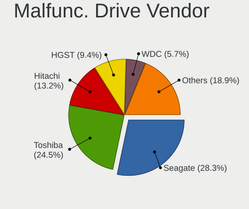

| Vendor              | Notebooks | Drives | Percent |
|---------------------|-----------|--------|---------|
| Seagate             | 15        | 17     | 28.3%   |
| Toshiba             | 13        | 13     | 24.53%  |
| Hitachi             | 7         | 7      | 13.21%  |
| HGST                | 5         | 11     | 9.43%   |
| WDC                 | 3         | 3      | 5.66%   |
| Samsung Electronics | 3         | 4      | 5.66%   |
| Kingston            | 2         | 2      | 3.77%   |
| Fujitsu             | 2         | 2      | 3.77%   |
| SPCC                | 1         | 1      | 1.89%   |
| SK hynix            | 1         | 2      | 1.89%   |
| Patriot             | 1         | 1      | 1.89%   |

Malfunc. HDD Vendor
-------------------

Vendors of faulty HDD drives

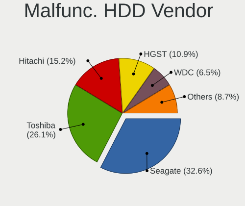

| Vendor              | Notebooks | Drives | Percent |
|---------------------|-----------|--------|---------|
| Seagate             | 15        | 17     | 32.61%  |
| Toshiba             | 12        | 12     | 26.09%  |
| Hitachi             | 7         | 7      | 15.22%  |
| HGST                | 5         | 11     | 10.87%  |
| WDC                 | 3         | 3      | 6.52%   |
| Samsung Electronics | 2         | 3      | 4.35%   |
| Fujitsu             | 2         | 2      | 4.35%   |

Malfunc. Drive Kind
-------------------

Kinds of faulty drives

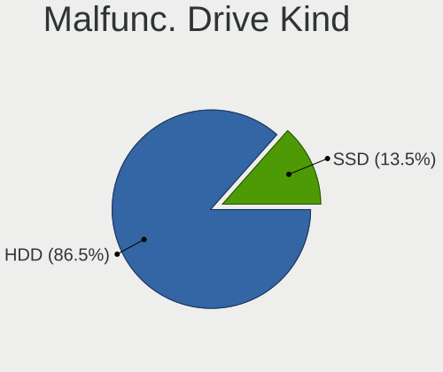

| Kind | Notebooks | Drives | Percent |
|------|-----------|--------|---------|
| HDD  | 45        | 55     | 86.54%  |
| SSD  | 7         | 8      | 13.46%  |

Failed Drives
-------------

Failed drive models

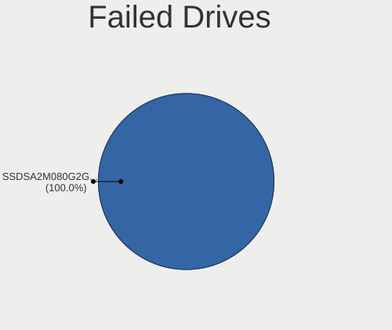

| Model                     | Notebooks | Drives | Percent |
|---------------------------|-----------|--------|---------|
| Intel SSDSA2M080G2GC 80GB | 1         | 1      | 100%    |

Failed Drive Vendor
-------------------

Failed drive vendors

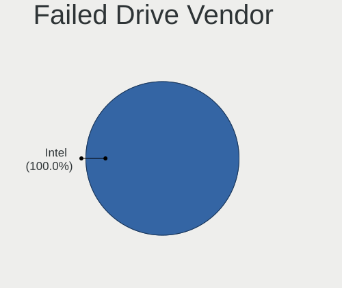

| Vendor | Notebooks | Drives | Percent |
|--------|-----------|--------|---------|
| Intel  | 1         | 1      | 100%    |

Drive Status
------------

Number of failed and malfunc. drives

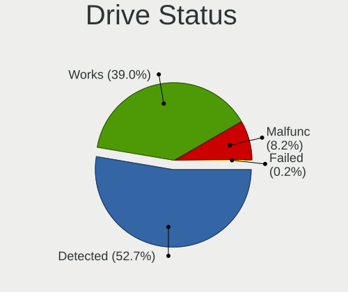

| Status   | Notebooks | Drives | Percent |
|----------|-----------|--------|---------|
| Detected | 335       | 532    | 52.67%  |
| Works    | 248       | 321    | 38.99%  |
| Malfunc  | 52        | 63     | 8.18%   |
| Failed   | 1         | 1      | 0.16%   |

Storage controller
------------------

Storage Vendor
--------------

Storage controller vendors

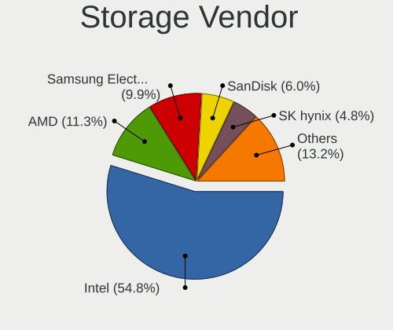

| Vendor                         | Notebooks | Percent |
|--------------------------------|-----------|---------|
| Intel                          | 399       | 54.81%  |
| AMD                            | 82        | 11.26%  |
| Samsung Electronics            | 72        | 9.89%   |
| SanDisk                        | 44        | 6.04%   |
| SK hynix                       | 35        | 4.81%   |
| Micron Technology              | 20        | 2.75%   |
| Kingston Technology Company    | 15        | 2.06%   |
| Nvidia                         | 10        | 1.37%   |
| KIOXIA                         | 8         | 1.1%    |
| Toshiba America Info Systems   | 7         | 0.96%   |
| Solidigm                       | 5         | 0.69%   |
| Phison Electronics             | 4         | 0.55%   |
| Union Memory (Shenzhen)        | 3         | 0.41%   |
| Shenzhen Longsys Electronics   | 3         | 0.41%   |
| MAXIO Technology (Hangzhou)    | 3         | 0.41%   |
| ADATA Technology               | 3         | 0.41%   |
| Solid State Storage Technology | 2         | 0.27%   |
| JMicron Technology             | 2         | 0.27%   |
| Apple                          | 2         | 0.27%   |
| Yangtze Memory Technologies    | 1         | 0.14%   |
| VIA Technologies               | 1         | 0.14%   |
| Silicon Motion                 | 1         | 0.14%   |
| Silicon Image                  | 1         | 0.14%   |
| Realtek Semiconductor          | 1         | 0.14%   |
| Lenovo                         | 1         | 0.14%   |
| Hosin Global Electronics       | 1         | 0.14%   |
| ASMedia Technology             | 1         | 0.14%   |
| Unknown                        | 1         | 0.14%   |

Storage Model
-------------

Storage controller models

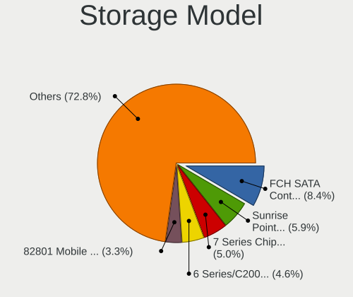

| Model                                                                            | Notebooks | Percent |
|----------------------------------------------------------------------------------|-----------|---------|
| AMD FCH SATA Controller [AHCI mode]                                              | 66        | 8.44%   |
| Intel Sunrise Point-LP SATA Controller [AHCI mode]                               | 46        | 5.88%   |
| Intel 7 Series Chipset Family 6-port SATA Controller [AHCI mode]                 | 39        | 4.99%   |
| Intel 6 Series/C200 Series Chipset Family 6 port Mobile SATA AHCI Controller     | 36        | 4.6%    |
| Intel 82801 Mobile SATA Controller [RAID mode]                                   | 26        | 3.32%   |
| Samsung NVMe SSD Controller 980 (DRAM-less)                                      | 21        | 2.69%   |
| Samsung NVMe SSD Controller SM981/PM981/PM983                                    | 20        | 2.56%   |
| Intel Wildcat Point-LP SATA Controller [AHCI Mode]                               | 20        | 2.56%   |
| Intel Celeron N3350/Pentium N4200/Atom E3900 Series SATA AHCI Controller         | 15        | 1.92%   |
| Intel Atom/Celeron/Pentium Processor x5-E8000/J3xxx/N3xxx Series SATA Controller | 15        | 1.92%   |
| Intel 8 Series SATA Controller 1 [AHCI mode]                                     | 15        | 1.92%   |
| Intel Atom Processor E3800 Series SATA AHCI Controller                           | 14        | 1.79%   |
| Intel 8 Series/C220 Series Chipset Family 6-port SATA Controller 1 [AHCI mode]   | 14        | 1.79%   |
| Intel Volume Management Device NVMe RAID Controller                              | 13        | 1.66%   |
| Intel Ice Lake-LP SATA Controller [AHCI mode]                                    | 13        | 1.66%   |
| Intel 82801IBM/IEM (ICH9M/ICH9M-E) 4 port SATA Controller [AHCI mode]            | 13        | 1.66%   |
| Intel 5 Series/3400 Series Chipset 4 port SATA AHCI Controller                   | 13        | 1.66%   |
| Intel Celeron/Pentium Silver Processor SATA Controller                           | 12        | 1.53%   |
| Intel 82801HM/HEM (ICH8M/ICH8M-E) SATA Controller [AHCI mode]                    | 12        | 1.53%   |
| Intel 82801HM/HEM (ICH8M/ICH8M-E) IDE Controller                                 | 12        | 1.53%   |
| AMD SB7x0/SB8x0/SB9x0 SATA Controller [AHCI mode]                                | 12        | 1.53%   |
| SK hynix Gold P31/BC711/PC711 NVMe Solid State Drive                             | 10        | 1.28%   |
| Samsung NVMe SSD Controller PM9A1/PM9A3/980PRO                                   | 10        | 1.28%   |
| SanDisk Ultra 3D / WD PC SN530, IX SN530, Blue SN550 NVMe SSD (DRAM-less)        | 9         | 1.15%   |
| Intel Tiger Lake-LP SATA Controller                                              | 9         | 1.15%   |
| Intel HM170/QM170 Chipset SATA Controller [AHCI Mode]                            | 9         | 1.15%   |
| SK hynix BC511 NVMe SSD                                                          | 8         | 1.02%   |
| Nvidia MCP79 AHCI Controller                                                     | 8         | 1.02%   |
| Intel Cannon Lake Mobile PCH SATA AHCI Controller                                | 8         | 1.02%   |
| SanDisk PC SN530 NVMe SSD (DRAM-less)                                            | 7         | 0.9%    |
| SanDisk Extreme Pro / WD Black SN750 / PC SN730 / Red SN700 NVMe SSD             | 7         | 0.9%    |
| Intel 82801G (ICH7 Family) IDE Controller                                        | 7         | 0.9%    |
| Intel 5 Series/3400 Series Chipset 6 port SATA AHCI Controller                   | 7         | 0.9%    |
| Samsung NVMe SSD Controller PM9C1a (DRAM-less)                                   | 6         | 0.77%   |
| Samsung NVMe SSD Controller PM9B1 (DRAM-less)                                    | 6         | 0.77%   |
| Micron 2450 NVMe SSD [HendrixV] (DRAM-less)                                      | 6         | 0.77%   |
| Intel SSD 670p Series [Keystone Harbor]                                          | 6         | 0.77%   |
| Solidigm P41 Plus NVMe SSD (DRAM-less) [Echo Harbor]                             | 5         | 0.64%   |
| SK hynix BC501 NVMe Solid State Drive                                            | 5         | 0.64%   |
| Samsung NVMe SSD Controller SM961/PM961/SM963                                    | 5         | 0.64%   |

Storage Kind
------------

Kind of storage controller (IDE, SATA, NVMe, SAS, ...)

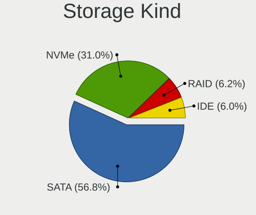

| Kind | Notebooks | Percent |
|------|-----------|---------|
| SATA | 427       | 56.78%  |
| NVMe | 233       | 30.98%  |
| RAID | 47        | 6.25%   |
| IDE  | 45        | 5.98%   |

Processor
---------

CPU Vendor
----------

Processor vendors

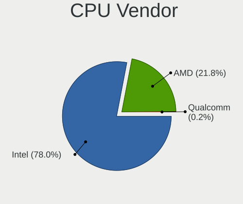

| Vendor   | Notebooks | Percent |
|----------|-----------|---------|
| Intel    | 472       | 78.02%  |
| AMD      | 132       | 21.82%  |
| Qualcomm | 1         | 0.17%   |

CPU Model
---------

Processor models

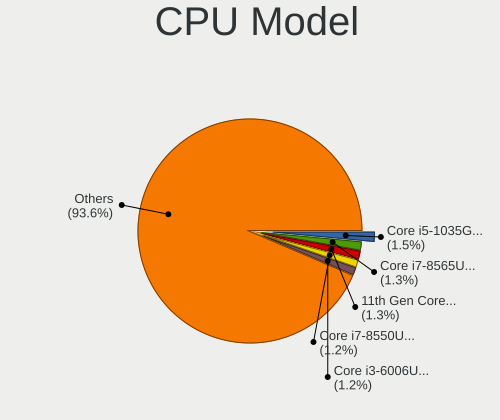

| Model                                         | Notebooks | Percent |
|-----------------------------------------------|-----------|---------|
| Intel Core i5-1035G1 CPU @ 1.00GHz            | 9         | 1.49%   |
| Intel Core i7-8565U CPU @ 1.80GHz             | 8         | 1.32%   |
| Intel 11th Gen Core i5-1135G7 @ 2.40GHz       | 8         | 1.32%   |
| Intel Core i7-8550U CPU @ 1.80GHz             | 7         | 1.16%   |
| Intel Core i3-6006U CPU @ 2.00GHz             | 7         | 1.16%   |
| Intel Core i3-5005U CPU @ 2.00GHz             | 7         | 1.16%   |
| Intel Celeron CPU N3350 @ 1.10GHz             | 7         | 1.16%   |
| Intel Celeron CPU N3060 @ 1.60GHz             | 7         | 1.16%   |
| Intel 11th Gen Core i7-1165G7 @ 2.80GHz       | 7         | 1.16%   |
| AMD Ryzen 5 3500U with Radeon Vega Mobile Gfx | 7         | 1.16%   |
| AMD Ryzen 5 2500U with Radeon Vega Mobile Gfx | 7         | 1.16%   |
| Intel Core i7-8750H CPU @ 2.20GHz             | 6         | 0.99%   |
| Intel Core i7-6500U CPU @ 2.50GHz             | 6         | 0.99%   |
| Intel Pentium Silver N5030 CPU @ 1.10GHz      | 5         | 0.83%   |
| Intel Pentium CPU N4200 @ 1.10GHz             | 5         | 0.83%   |
| Intel Core i7-7700HQ CPU @ 2.80GHz            | 5         | 0.83%   |
| Intel Core i7-2670QM CPU @ 2.20GHz            | 5         | 0.83%   |
| Intel Core i7-10750H CPU @ 2.60GHz            | 5         | 0.83%   |
| Intel Core i5-7200U CPU @ 2.50GHz             | 5         | 0.83%   |
| Intel Core i5-6300U CPU @ 2.40GHz             | 5         | 0.83%   |
| Intel Core i5-6200U CPU @ 2.30GHz             | 5         | 0.83%   |
| Intel Core i5-5200U CPU @ 2.20GHz             | 5         | 0.83%   |
| AMD Ryzen 7 7730U with Radeon Graphics        | 5         | 0.83%   |
| AMD Ryzen 7 5700U with Radeon Graphics        | 5         | 0.83%   |
| AMD Ryzen 7 3700U with Radeon Vega Mobile Gfx | 5         | 0.83%   |
| AMD Ryzen 5 5500U with Radeon Graphics        | 5         | 0.83%   |
| AMD Ryzen 5 4500U with Radeon Graphics        | 5         | 0.83%   |
| Intel Pentium CPU N3700 @ 1.60GHz             | 4         | 0.66%   |
| Intel Pentium CPU 2020M @ 2.40GHz             | 4         | 0.66%   |
| Intel Core Ultra 7 155H                       | 4         | 0.66%   |
| Intel Core i7-6700HQ CPU @ 2.60GHz            | 4         | 0.66%   |
| Intel Core i7-6600U CPU @ 2.60GHz             | 4         | 0.66%   |
| Intel Core i7-4600U CPU @ 2.10GHz             | 4         | 0.66%   |
| Intel Core i5-8350U CPU @ 1.70GHz             | 4         | 0.66%   |
| Intel Core i5-7300U CPU @ 2.60GHz             | 4         | 0.66%   |
| Intel Core i5-2520M CPU @ 2.50GHz             | 4         | 0.66%   |
| Intel Core i5 CPU M 540 @ 2.53GHz             | 4         | 0.66%   |
| Intel Core i3-7020U CPU @ 2.30GHz             | 4         | 0.66%   |
| Intel Celeron CPU N2840 @ 2.16GHz             | 4         | 0.66%   |
| Intel Celeron CPU 1000M @ 1.80GHz             | 4         | 0.66%   |

CPU Model Family
----------------

Processor model prefix

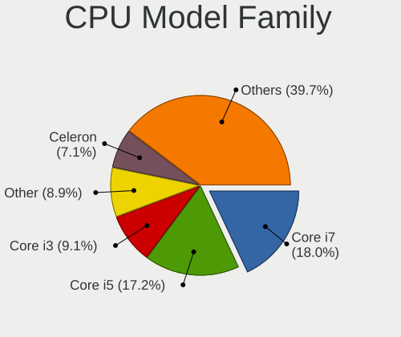

| Model                   | Notebooks | Percent |
|-------------------------|-----------|---------|
| Intel Core i7           | 109       | 18.02%  |
| Intel Core i5           | 104       | 17.19%  |
| Intel Core i3           | 55        | 9.09%   |
| Other                   | 54        | 8.93%   |
| Intel Celeron           | 43        | 7.11%   |
| AMD Ryzen 5             | 42        | 6.94%   |
| Intel Pentium           | 40        | 6.61%   |
| AMD Ryzen 7             | 32        | 5.29%   |
| Intel Core 2 Duo        | 27        | 4.46%   |
| Intel Core              | 8         | 1.32%   |
| Intel Atom              | 8         | 1.32%   |
| Intel Pentium Silver    | 7         | 1.16%   |
| AMD Ryzen 3             | 7         | 1.16%   |
| AMD A8                  | 6         | 0.99%   |
| Intel Core 2            | 4         | 0.66%   |
| AMD Ryzen 9             | 4         | 0.66%   |
| AMD E2                  | 4         | 0.66%   |
| AMD Athlon II           | 4         | 0.66%   |
| AMD A6                  | 4         | 0.66%   |
| Intel Pentium M         | 3         | 0.5%    |
| Intel Pentium Dual-Core | 3         | 0.5%    |
| Intel Pentium Dual      | 3         | 0.5%    |
| AMD Ryzen 5 PRO         | 3         | 0.5%    |
| AMD A4                  | 3         | 0.5%    |
| Intel Genuine           | 2         | 0.33%   |
| AMD Ryzen 7 PRO         | 2         | 0.33%   |
| AMD Phenom II           | 2         | 0.33%   |
| AMD E1                  | 2         | 0.33%   |
| AMD E                   | 2         | 0.33%   |
| AMD Athlon X2           | 2         | 0.33%   |
| AMD Athlon II Dual-Core | 2         | 0.33%   |
| AMD Athlon              | 2         | 0.33%   |
| Intel Xeon              | 1         | 0.17%   |
| Intel Pentium Gold      | 1         | 0.17%   |
| Intel Core M            | 1         | 0.17%   |
| Intel Core Duo          | 1         | 0.17%   |
| Intel Celeron M         | 1         | 0.17%   |
| AMD V120                | 1         | 0.17%   |
| AMD Turion Dual-Core    | 1         | 0.17%   |
| AMD Turion 64 X2 Mobile | 1         | 0.17%   |

CPU Cores
---------

Number of processor cores

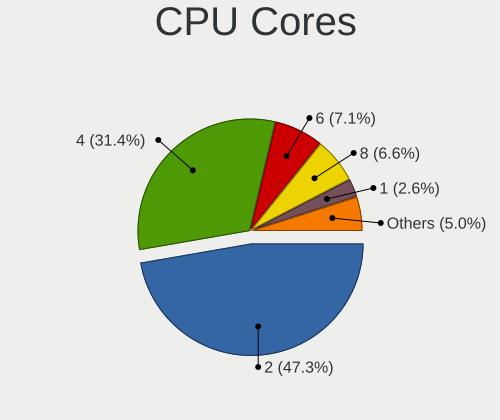

| Number | Notebooks | Percent |
|--------|-----------|---------|
| 2      | 286       | 47.27%  |
| 4      | 190       | 31.4%   |
| 6      | 43        | 7.11%   |
| 8      | 40        | 6.61%   |
| 1      | 16        | 2.64%   |
| 10     | 9         | 1.49%   |
| 14     | 8         | 1.32%   |
| 16     | 7         | 1.16%   |
| 12     | 4         | 0.66%   |
| 24     | 1         | 0.17%   |
| 5      | 1         | 0.17%   |

CPU Sockets
-----------

Number of sockets

| Number | Notebooks | Percent |
|--------|-----------|---------|
| 1      | 605       | 100%    |

CPU Threads
-----------

Threads per core (Hyper-Threading)

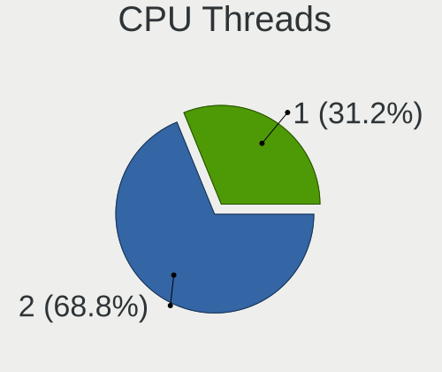

| Number | Notebooks | Percent |
|--------|-----------|---------|
| 2      | 417       | 68.81%  |
| 1      | 189       | 31.19%  |

CPU Op-Modes
------------

CPU Operation Modes (32-bit, 64-bit)

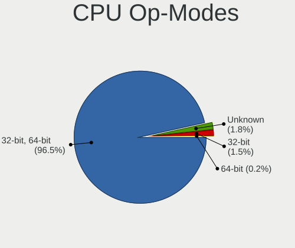

| Op mode        | Notebooks | Percent |
|----------------|-----------|---------|
| 32-bit, 64-bit | 585       | 96.53%  |
| Unknown        | 11        | 1.82%   |
| 32-bit         | 9         | 1.49%   |
| 64-bit         | 1         | 0.17%   |

CPU Microcode
-------------

Microcode number

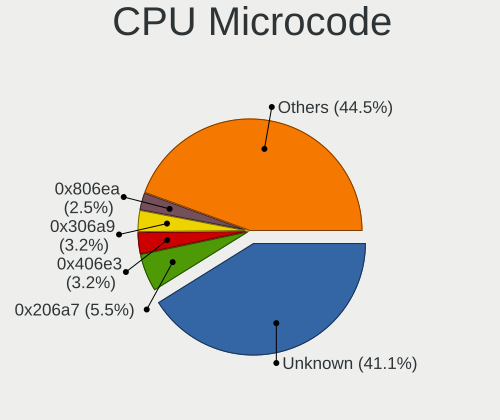

| Number     | Notebooks | Percent |
|------------|-----------|---------|
| Unknown    | 260       | 41.14%  |
| 0x206a7    | 35        | 5.54%   |
| 0x406e3    | 20        | 3.16%   |
| 0x306a9    | 20        | 3.16%   |
| 0x806ea    | 16        | 2.53%   |
| 0x506c9    | 12        | 1.9%    |
| 0x806e9    | 11        | 1.74%   |
| 0x706e5    | 11        | 1.74%   |
| 0x40651    | 11        | 1.74%   |
| 0x906ea    | 10        | 1.58%   |
| 0x306d4    | 10        | 1.58%   |
| 0x1067a    | 10        | 1.58%   |
| 0x806ec    | 9         | 1.42%   |
| 0x806c1    | 9         | 1.42%   |
| 0x406c4    | 8         | 1.27%   |
| 0x306c3    | 8         | 1.27%   |
| 0x6fd      | 7         | 1.11%   |
| 0x0a50000c | 7         | 1.11%   |
| 0x08600106 | 7         | 1.11%   |
| 0x08108109 | 7         | 1.11%   |
| 0x08108102 | 7         | 1.11%   |
| 0x906e9    | 6         | 0.95%   |
| 0x806eb    | 6         | 0.95%   |
| 0x506e3    | 6         | 0.95%   |
| 0x30678    | 6         | 0.95%   |
| 0x20655    | 6         | 0.95%   |
| 0x20652    | 6         | 0.95%   |
| 0x10676    | 6         | 0.95%   |
| 0xa0652    | 5         | 0.79%   |
| 0x706a8    | 5         | 0.79%   |
| 0x0a50000d | 5         | 0.79%   |
| 0x08608103 | 5         | 0.79%   |
| 0x706a1    | 4         | 0.63%   |
| 0x08600104 | 4         | 0.63%   |
| 0x010000c8 | 4         | 0.63%   |
| 0x6d8      | 3         | 0.47%   |
| 0x406c3    | 3         | 0.47%   |
| 0x30673    | 3         | 0.47%   |
| 0x106ca    | 3         | 0.47%   |
| 0x0a404102 | 3         | 0.47%   |

CPU Microarch
-------------

Microarchitecture

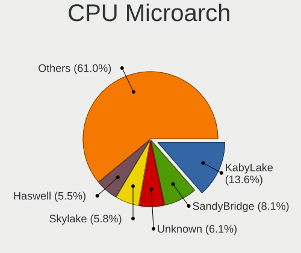

| Name              | Notebooks | Percent |
|-------------------|-----------|---------|
| KabyLake          | 82        | 13.55%  |
| SandyBridge       | 49        | 8.1%    |
| Unknown           | 37        | 6.12%   |
| Skylake           | 35        | 5.79%   |
| Haswell           | 33        | 5.45%   |
| IvyBridge         | 32        | 5.29%   |
| Silvermont        | 30        | 4.96%   |
| Zen 3             | 23        | 3.8%    |
| Westmere          | 23        | 3.8%    |
| Zen+              | 22        | 3.64%   |
| TigerLake         | 22        | 3.64%   |
| Penryn            | 21        | 3.47%   |
| Broadwell         | 21        | 3.47%   |
| Alderlake Hybrid  | 21        | 3.47%   |
| IceLake           | 18        | 2.98%   |
| Core              | 18        | 2.98%   |
| Zen 2             | 16        | 2.64%   |
| Goldmont          | 15        | 2.48%   |
| Goldmont plus     | 12        | 1.98%   |
| Zen               | 10        | 1.65%   |
| K10               | 10        | 1.65%   |
| CometLake         | 8         | 1.32%   |
| Puma              | 7         | 1.16%   |
| P6                | 7         | 1.16%   |
| Bonnell           | 6         | 0.99%   |
| Bobcat            | 5         | 0.83%   |
| Piledriver        | 4         | 0.66%   |
| Meteorlake Hybrid | 4         | 0.66%   |
| Excavator         | 4         | 0.66%   |
| K8 & K10 hybrid   | 3         | 0.5%    |
| K8 Hammer         | 2         | 0.33%   |
| Jaguar            | 2         | 0.33%   |
| Nehalem           | 1         | 0.17%   |
| Lunarlake Hybrid  | 1         | 0.17%   |
| Gracemont         | 1         | 0.17%   |

Graphics
--------

GPU Vendor
----------

Vendors of graphics cards

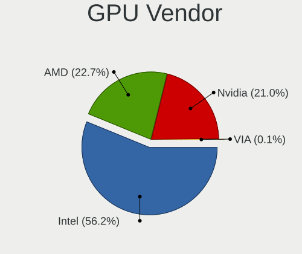

| Vendor           | Notebooks | Percent |
|------------------|-----------|---------|
| Intel            | 428       | 56.17%  |
| AMD              | 173       | 22.7%   |
| Nvidia           | 160       | 21%     |
| VIA Technologies | 1         | 0.13%   |

GPU Model
---------

Graphics card models

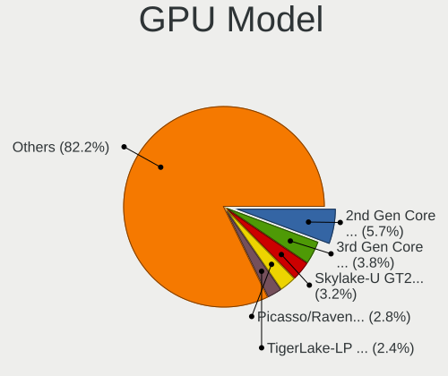

| Model                                                                                    | Notebooks | Percent |
|------------------------------------------------------------------------------------------|-----------|---------|
| Intel 2nd Generation Core Processor Family Integrated Graphics Controller                | 45        | 5.68%   |
| Intel 3rd Gen Core processor Graphics Controller                                         | 30        | 3.79%   |
| Intel Skylake-U GT2 [HD Graphics 520]                                                    | 25        | 3.16%   |
| AMD Picasso/Raven 2 [Radeon Vega Series / Radeon Vega Mobile Series]                     | 22        | 2.78%   |
| Intel TigerLake-LP GT2 [Iris Xe Graphics]                                                | 19        | 2.4%    |
| Intel Broadwell-U GT2 [HD Graphics 5500]                                                 | 18        | 2.27%   |
| Intel Kaby Lake-R GT2 [UHD Graphics 620]                                                 | 17        | 2.15%   |
| Intel Haswell-ULT Integrated Graphics Controller                                         | 17        | 2.15%   |
| Intel Atom/Celeron/Pentium Processor x5-E8000/J3xxx/N3xxx Integrated Graphics Controller | 16        | 2.02%   |
| Intel WhiskeyLake-U GT2 [UHD Graphics 620]                                               | 15        | 1.89%   |
| Intel Core Processor Integrated Graphics Controller                                      | 15        | 1.89%   |
| Intel 4th Gen Core Processor Integrated Graphics Controller                              | 15        | 1.89%   |
| AMD Renoir [Radeon Vega Series / Radeon Vega Mobile Series]                              | 15        | 1.89%   |
| Intel Kaby Lake-U GT2 [HD Graphics 620]                                                  | 14        | 1.77%   |
| Intel Atom Processor Z36xxx/Z37xxx Series Graphics & Display                             | 14        | 1.77%   |
| Nvidia GP107M [GeForce GTX 1050 Mobile]                                                  | 12        | 1.52%   |
| Intel Iris Plus Graphics G1 (Ice Lake)                                                   | 12        | 1.52%   |
| Intel CoffeeLake-H GT2 [UHD Graphics 630]                                                | 12        | 1.52%   |
| AMD Lucienne                                                                             | 12        | 1.52%   |
| AMD Barcelo                                                                              | 12        | 1.52%   |
| AMD Cezanne [Radeon Vega Series / Radeon Vega Mobile Series]                             | 11        | 1.39%   |
| Intel Mobile 4 Series Chipset Integrated Graphics Controller                             | 10        | 1.26%   |
| Intel Apollo Lake GT1 [HD Graphics 500]                                                  | 10        | 1.26%   |
| Intel Mobile GM965/GL960 Integrated Graphics Controller (secondary)                      | 9         | 1.14%   |
| Intel Mobile GM965/GL960 Integrated Graphics Controller (primary)                        | 9         | 1.14%   |
| AMD Sun XT [Radeon HD 8670A/8670M/8690M / R5 M330 / M430 / Radeon 520 Mobile]            | 9         | 1.14%   |
| AMD RS880M [Mobility Radeon HD 4225/4250]                                                | 9         | 1.14%   |
| AMD Raven Ridge [Radeon Vega Series / Radeon Vega Mobile Series]                         | 9         | 1.14%   |
| Intel Raptor Lake-P [Iris Xe Graphics]                                                   | 8         | 1.01%   |
| Intel Kaby Lake-H GT2 [HD Graphics 630]                                                  | 8         | 1.01%   |
| Intel CometLake-U GT2 [UHD Graphics]                                                     | 8         | 1.01%   |
| Nvidia TU117M [GeForce GTX 1650 Mobile / Max-Q]                                          | 7         | 0.88%   |
| Nvidia GF117M [GeForce 610M/710M/810M/820M / GT 620M/625M/630M/720M]                     | 7         | 0.88%   |
| Intel Skylake-H GT2 [HD Graphics 530]                                                    | 7         | 0.88%   |
| Intel GeminiLake [UHD Graphics 605]                                                      | 7         | 0.88%   |
| AMD Topaz XT [Radeon R7 M260/M265 / M340/M360 / M440/M445 / 530/535 / 620/625 Mobile]    | 7         | 0.88%   |
| AMD Rembrandt [Radeon 680M]                                                              | 7         | 0.88%   |
| Nvidia GA107M [GeForce RTX 3050 Mobile]                                                  | 6         | 0.76%   |
| Intel CometLake-H GT2 [UHD Graphics]                                                     | 6         | 0.76%   |
| AMD Seymour [Radeon HD 6400M/7400M Series]                                               | 6         | 0.76%   |

GPU Combo
---------

Combinations of graphics cards

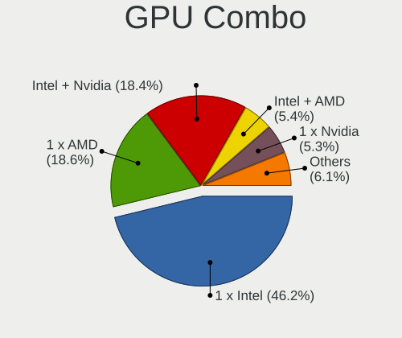

| Name           | Notebooks | Percent |
|----------------|-----------|---------|
| 1 x Intel      | 281       | 46.22%  |
| 1 x AMD        | 113       | 18.59%  |
| Intel + Nvidia | 112       | 18.42%  |
| Intel + AMD    | 33        | 5.43%   |
| 1 x Nvidia     | 32        | 5.26%   |
| AMD + Nvidia   | 14        | 2.3%    |
| 2 x AMD        | 13        | 2.14%   |
| 2 x Intel      | 5         | 0.82%   |
| Other          | 2         | 0.33%   |
| 2 x Nvidia     | 2         | 0.33%   |
| 1 x VIA        | 1         | 0.16%   |

GPU Driver
----------

Free vs proprietary

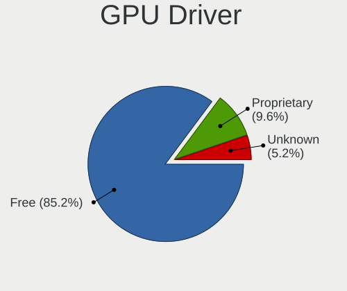

| Driver      | Notebooks | Percent |
|-------------|-----------|---------|
| Free        | 523       | 85.18%  |
| Proprietary | 59        | 9.61%   |
| Unknown     | 32        | 5.21%   |

GPU Memory
----------

Total video memory

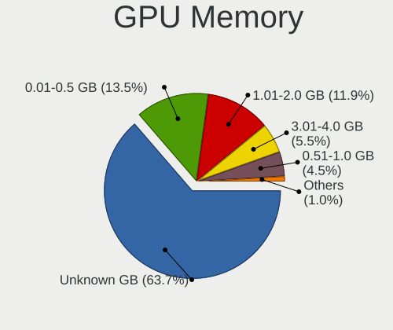

| Size in GB | Notebooks | Percent |
|------------|-----------|---------|
| Unknown    | 396       | 63.67%  |
| 0.01-0.5   | 84        | 13.5%   |
| 1.01-2.0   | 74        | 11.9%   |
| 3.01-4.0   | 34        | 5.47%   |
| 0.51-1.0   | 28        | 4.5%    |
| 7.01-8.0   | 3         | 0.48%   |
| 5.01-6.0   | 2         | 0.32%   |
| 8.01-16.0  | 1         | 0.16%   |

Monitor
-------

Monitor Vendor
--------------

Monitor vendors

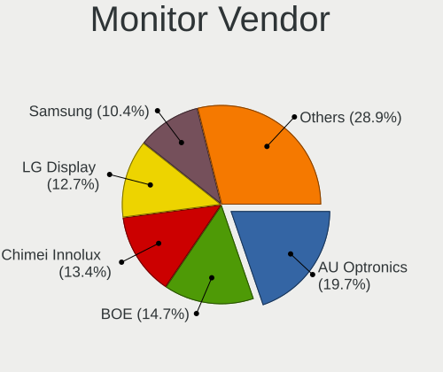

| Vendor                  | Notebooks | Percent |
|-------------------------|-----------|---------|
| AU Optronics            | 138       | 19.74%  |
| BOE                     | 103       | 14.74%  |
| Chimei Innolux          | 94        | 13.45%  |
| LG Display              | 89        | 12.73%  |
| Samsung Electronics     | 73        | 10.44%  |
| Lenovo                  | 25        | 3.58%   |
| Dell                    | 19        | 2.72%   |
| Chi Mei Optoelectronics | 19        | 2.72%   |
| Apple                   | 16        | 2.29%   |
| Philips                 | 12        | 1.72%   |
| PANDA                   | 12        | 1.72%   |
| Sharp                   | 9         | 1.29%   |
| Goldstar                | 9         | 1.29%   |
| AOC                     | 7         | 1%      |
| LG Philips              | 6         | 0.86%   |
| Hewlett-Packard         | 6         | 0.86%   |
| Sony                    | 5         | 0.72%   |
| InfoVision              | 5         | 0.72%   |
| Ancor Communications    | 5         | 0.72%   |
| CSO                     | 4         | 0.57%   |
| CPT                     | 4         | 0.57%   |
| BenQ                    | 4         | 0.57%   |
| Unknown                 | 3         | 0.43%   |
| Toshiba                 | 3         | 0.43%   |
| CHD                     | 3         | 0.43%   |
| ASUSTek Computer        | 3         | 0.43%   |
| ViewSonic               | 2         | 0.29%   |
| CSW                     | 2         | 0.29%   |
| TSL                     | 1         | 0.14%   |
| TMX                     | 1         | 0.14%   |
| SKY                     | 1         | 0.14%   |
| Seiko/Epson             | 1         | 0.14%   |
| RTK                     | 1         | 0.14%   |
| Pixio                   | 1         | 0.14%   |
| NEC Computers           | 1         | 0.14%   |
| MTK                     | 1         | 0.14%   |
| LPL                     | 1         | 0.14%   |
| InnoLux Display         | 1         | 0.14%   |
| Iiyama                  | 1         | 0.14%   |
| HKC                     | 1         | 0.14%   |

Monitor Model
-------------

Monitor models

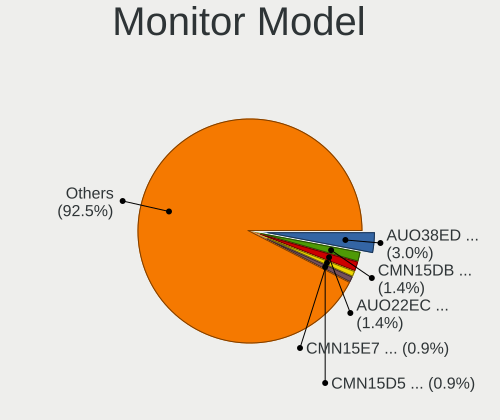

| Model                                                                    | Notebooks | Percent |
|--------------------------------------------------------------------------|-----------|---------|
| AU Optronics LCD Monitor AUO38ED 1920x1080 344x193mm 15.5-inch           | 21        | 2.98%   |
| Chimei Innolux LCD Monitor CMN15DB 1366x768 344x193mm 15.5-inch          | 10        | 1.42%   |
| AU Optronics LCD Monitor AUO22EC 1366x768 344x193mm 15.5-inch            | 10        | 1.42%   |
| Chimei Innolux LCD Monitor CMN15E7 1920x1080 344x193mm 15.5-inch         | 6         | 0.85%   |
| Chimei Innolux LCD Monitor CMN15D5 1920x1080 344x193mm 15.5-inch         | 6         | 0.85%   |
| BOE LCD Monitor BOE0812 1920x1080 344x194mm 15.5-inch                    | 6         | 0.85%   |
| BOE LCD Monitor BOE06A4 1366x768 344x194mm 15.5-inch                     | 6         | 0.85%   |
| PANDA LCD Monitor NCP004D 1920x1080 344x194mm 15.5-inch                  | 5         | 0.71%   |
| LG Display LCD Monitor LGD02DC 1366x768 344x194mm 15.5-inch              | 5         | 0.71%   |
| Chimei Innolux LCD Monitor CMN15F5 1920x1080 344x193mm 15.5-inch         | 5         | 0.71%   |
| Chimei Innolux LCD Monitor CMN14D4 1920x1080 309x173mm 13.9-inch         | 5         | 0.71%   |
| AU Optronics LCD Monitor AUO26EC 1366x768 344x193mm 15.5-inch            | 5         | 0.71%   |
| Samsung Electronics LCD Monitor SDC4161 1920x1080 344x194mm 15.5-inch    | 4         | 0.57%   |
| Chimei Innolux LCD Monitor CMN15CA 1366x768 344x193mm 15.5-inch          | 4         | 0.57%   |
| Chi Mei Optoelectronics LCD Monitor CMO15A7 1366x768 344x193mm 15.5-inch | 4         | 0.57%   |
| BOE LCD Monitor BOE069C 1920x1080 344x193mm 15.5-inch                    | 4         | 0.57%   |
| BOE LCD Monitor BOE0687 1920x1080 344x193mm 15.5-inch                    | 4         | 0.57%   |
| BOE LCD Monitor BOE0675 1366x768 344x194mm 15.5-inch                     | 4         | 0.57%   |
| AU Optronics LCD Monitor AUO312C 1366x768 293x164mm 13.2-inch            | 4         | 0.57%   |
| AU Optronics LCD Monitor AUO20EC 1366x768 344x193mm 15.5-inch            | 4         | 0.57%   |
| AU Optronics LCD Monitor AUO1B3D 1920x1080 309x173mm 13.9-inch           | 4         | 0.57%   |
| Samsung Electronics LCD Monitor SEC544B 1600x900 382x214mm 17.2-inch     | 3         | 0.43%   |
| Samsung Electronics LCD Monitor SEC3046 1366x768 344x193mm 15.5-inch     | 3         | 0.43%   |
| Samsung Electronics LCD Monitor SDC4154 2880x1800 302x189mm 14.0-inch    | 3         | 0.43%   |
| Samsung Electronics LCD Monitor SDC324C 1920x1080 344x194mm 15.5-inch    | 3         | 0.43%   |
| LG Display LP156WH2-TLAA LGD0230 1366x768 344x194mm 15.5-inch            | 3         | 0.43%   |
| LG Display LCD Monitor LGD05E5 1920x1080 344x194mm 15.5-inch             | 3         | 0.43%   |
| LG Display LCD Monitor LGD0456 1366x768 344x194mm 15.5-inch              | 3         | 0.43%   |
| LG Display LCD Monitor LGD03AB 1366x768 344x194mm 15.5-inch              | 3         | 0.43%   |
| LG Display LCD Monitor LGD038E 1366x768 344x194mm 15.5-inch              | 3         | 0.43%   |
| LG Display LCD Monitor LGD02D8 1366x768 277x156mm 12.5-inch              | 3         | 0.43%   |
| Lenovo LCD Monitor LEN4031 1280x800 304x190mm 14.1-inch                  | 3         | 0.43%   |
| Lenovo LCD Monitor LEN4011 1280x800 261x163mm 12.1-inch                  | 3         | 0.43%   |
| Dell P2417H DELA0DC 1920x1080 527x296mm 23.8-inch                        | 3         | 0.43%   |
| Chimei Innolux LCD Monitor CMN15E5 1920x1080 344x193mm 15.5-inch         | 3         | 0.43%   |
| Chimei Innolux LCD Monitor CMN15BF 1366x768 344x194mm 15.5-inch          | 3         | 0.43%   |
| Chimei Innolux LCD Monitor CMN15BD 1366x768 344x193mm 15.5-inch          | 3         | 0.43%   |
| Chimei Innolux LCD Monitor CMN140A 1920x1080 309x173mm 13.9-inch         | 3         | 0.43%   |
| BOE LCD Monitor BOE08E7 1920x1080 344x193mm 15.5-inch                    | 3         | 0.43%   |
| BOE LCD Monitor BOE08D7 1920x1080 309x174mm 14.0-inch                    | 3         | 0.43%   |

Monitor Resolution
------------------

Monitor screen resolution

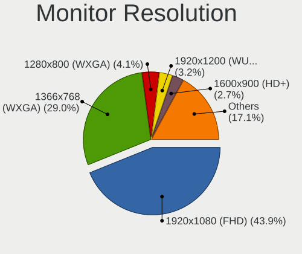

| Resolution         | Notebooks | Percent |
|--------------------|-----------|---------|
| 1920x1080 (FHD)    | 288       | 43.9%   |
| 1366x768 (WXGA)    | 190       | 28.96%  |
| 1280x800 (WXGA)    | 27        | 4.12%   |
| 1920x1200 (WUXGA)  | 21        | 3.2%    |
| 1600x900 (HD+)     | 18        | 2.74%   |
| 3840x2160 (4K)     | 17        | 2.59%   |
| 2560x1440 (QHD)    | 15        | 2.29%   |
| 2560x1600          | 11        | 1.68%   |
| 2880x1800          | 9         | 1.37%   |
| 1680x1050 (WSXGA+) | 9         | 1.37%   |
| 1440x900 (WXGA+)   | 9         | 1.37%   |
| 1360x768           | 4         | 0.61%   |
| 1024x600           | 4         | 0.61%   |
| 2520x1680          | 3         | 0.46%   |
| 1280x1024 (SXGA)   | 3         | 0.46%   |
| Unknown            | 3         | 0.46%   |
| 3840x2400          | 2         | 0.3%    |
| 3840x1080          | 2         | 0.3%    |
| 3440x1440          | 2         | 0.3%    |
| 1680x945           | 2         | 0.3%    |
| 1024x768 (XGA)     | 2         | 0.3%    |
| 3456x2160          | 1         | 0.15%   |
| 3360x1200          | 1         | 0.15%   |
| 3280x1080          | 1         | 0.15%   |
| 3200x2000          | 1         | 0.15%   |
| 3200x1800 (QHD+)   | 1         | 0.15%   |
| 3072x1920          | 1         | 0.15%   |
| 2880x1920          | 1         | 0.15%   |
| 2880x1620          | 1         | 0.15%   |
| 2560x1080          | 1         | 0.15%   |
| 2288x1287          | 1         | 0.15%   |
| 2240x1400          | 1         | 0.15%   |
| 2160x1350          | 1         | 0.15%   |
| 1920x540           | 1         | 0.15%   |
| 1400x1050          | 1         | 0.15%   |
| 1280x720 (HD)      | 1         | 0.15%   |

Monitor Diagonal
----------------

Diagonal size in inches

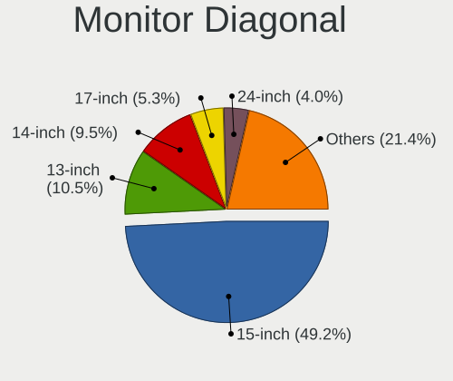

| Inches  | Notebooks | Percent |
|---------|-----------|---------|
| 15      | 342       | 49.21%  |
| 13      | 73        | 10.5%   |
| 14      | 66        | 9.5%    |
| 17      | 37        | 5.32%   |
| 24      | 28        | 4.03%   |
| 16      | 22        | 3.17%   |
| 23      | 17        | 2.45%   |
| 12      | 17        | 2.45%   |
| 21      | 15        | 2.16%   |
| 27      | 14        | 2.01%   |
| 31      | 12        | 1.73%   |
| Unknown | 10        | 1.44%   |
| 11      | 7         | 1.01%   |
| 22      | 6         | 0.86%   |
| 18      | 4         | 0.58%   |
| 72      | 3         | 0.43%   |
| 10      | 3         | 0.43%   |
| 48      | 2         | 0.29%   |
| 40      | 2         | 0.29%   |
| 34      | 2         | 0.29%   |
| 32      | 2         | 0.29%   |
| 19      | 2         | 0.29%   |
| 142     | 1         | 0.14%   |
| 86      | 1         | 0.14%   |
| 84      | 1         | 0.14%   |
| 54      | 1         | 0.14%   |
| 46      | 1         | 0.14%   |
| 43      | 1         | 0.14%   |
| 29      | 1         | 0.14%   |
| 20      | 1         | 0.14%   |
| 8       | 1         | 0.14%   |

Monitor Width
-------------

Physical width

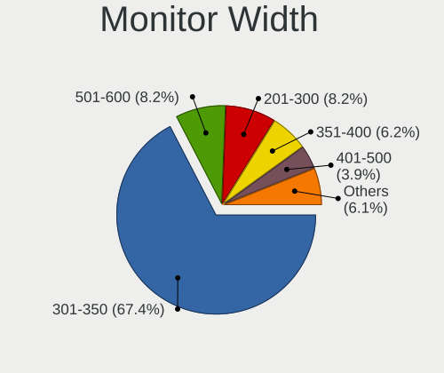

| Width in mm    | Notebooks | Percent |
|----------------|-----------|---------|
| 301-350        | 467       | 67.39%  |
| 501-600        | 57        | 8.23%   |
| 201-300        | 57        | 8.23%   |
| 351-400        | 43        | 6.2%    |
| 401-500        | 27        | 3.9%    |
| 601-700        | 14        | 2.02%   |
| Unknown        | 10        | 1.44%   |
| 1001-1500      | 5         | 0.72%   |
| 701-800        | 4         | 0.58%   |
| 1501-2000      | 4         | 0.58%   |
| 801-900        | 2         | 0.29%   |
| More than 2000 | 1         | 0.14%   |
| 101-200        | 1         | 0.14%   |
| 901-1000       | 1         | 0.14%   |

Aspect Ratio
------------

Proportional relationship between the width and the height

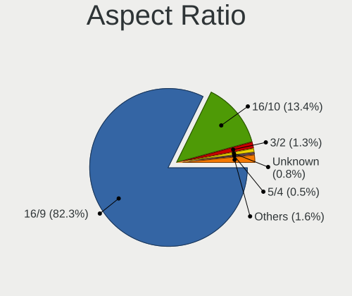

| Ratio   | Notebooks | Percent |
|---------|-----------|---------|
| 16/9    | 502       | 82.3%   |
| 16/10   | 82        | 13.44%  |
| 3/2     | 8         | 1.31%   |
| Unknown | 5         | 0.82%   |
| 5/4     | 3         | 0.49%   |
| 4/3     | 3         | 0.49%   |
| 21/9    | 3         | 0.49%   |
| 32/9    | 2         | 0.33%   |
| 1.00    | 1         | 0.16%   |
| 0.56    | 1         | 0.16%   |

Monitor Area
------------

Area in inch²

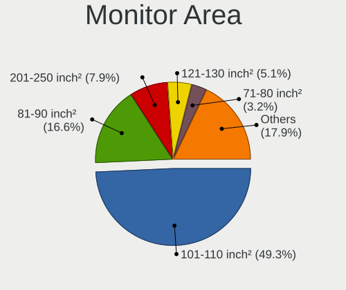

| Area in inch² | Notebooks | Percent |
|----------------|-----------|---------|
| 101-110        | 341       | 49.28%  |
| 81-90          | 115       | 16.62%  |
| 201-250        | 55        | 7.95%   |
| 121-130        | 35        | 5.06%   |
| 71-80          | 22        | 3.18%   |
| 111-120        | 21        | 3.03%   |
| 61-70          | 16        | 2.31%   |
| 351-500        | 16        | 2.31%   |
| 301-350        | 15        | 2.17%   |
| Unknown        | 10        | 1.45%   |
| More than 1000 | 7         | 1.01%   |
| 51-60          | 7         | 1.01%   |
| 251-300        | 6         | 0.87%   |
| 501-1000       | 6         | 0.87%   |
| 151-200        | 5         | 0.72%   |
| 141-150        | 4         | 0.58%   |
| 91-100         | 4         | 0.58%   |
| 41-50          | 3         | 0.43%   |
| 131-140        | 3         | 0.43%   |
| 1-40           | 1         | 0.14%   |

Pixel Density
-------------

Pixels per inch

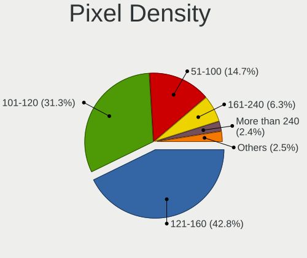

| Density       | Notebooks | Percent |
|---------------|-----------|---------|
| 121-160       | 290       | 42.77%  |
| 101-120       | 212       | 31.27%  |
| 51-100        | 100       | 14.75%  |
| 161-240       | 43        | 6.34%   |
| More than 240 | 16        | 2.36%   |
| Unknown       | 10        | 1.47%   |
| 1-50          | 7         | 1.03%   |

Multiple Monitors
-----------------

Total monitors connected

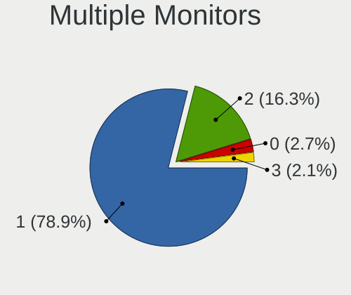

| Total | Notebooks | Percent |
|-------|-----------|---------|
| 1     | 495       | 78.95%  |
| 2     | 102       | 16.27%  |
| 0     | 17        | 2.71%   |
| 3     | 13        | 2.07%   |

Network
-------

Net Controller Vendor
---------------------

Controller vendors

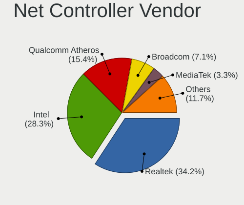

| Vendor                            | Notebooks | Percent |
|-----------------------------------|-----------|---------|
| Realtek Semiconductor             | 339       | 34.24%  |
| Intel                             | 280       | 28.28%  |
| Qualcomm Atheros                  | 152       | 15.35%  |
| Broadcom                          | 70        | 7.07%   |
| MediaTek                          | 33        | 3.33%   |
| Ralink                            | 14        | 1.41%   |
| Broadcom Limited                  | 12        | 1.21%   |
| Nvidia                            | 10        | 1.01%   |
| Samsung Electronics               | 7         | 0.71%   |
| Marvell Technology Group          | 7         | 0.71%   |
| Dell                              | 7         | 0.71%   |
| TP-Link                           | 6         | 0.61%   |
| Ralink Technology                 | 5         | 0.51%   |
| Xiaomi                            | 4         | 0.4%    |
| Sierra Wireless                   | 4         | 0.4%    |
| Ericsson Business Mobile Networks | 4         | 0.4%    |
| ASIX Electronics                  | 4         | 0.4%    |
| ZTE WCDMA Technologies MSM        | 3         | 0.3%    |
| Shenzhen Goodix Technology        | 3         | 0.3%    |
| Lenovo                            | 3         | 0.3%    |
| JMicron Technology                | 3         | 0.3%    |
| Huawei Technologies               | 3         | 0.3%    |
| Qualcomm Atheros Communications   | 2         | 0.2%    |
| Hewlett-Packard                   | 2         | 0.2%    |
| D-Link                            | 2         | 0.2%    |
| VIA Technologies                  | 1         | 0.1%    |
| Qualcomm Technologies             | 1         | 0.1%    |
| Qualcomm                          | 1         | 0.1%    |
| Microchip Technology              | 1         | 0.1%    |
| Linksys                           | 1         | 0.1%    |
| IMC Networks                      | 1         | 0.1%    |
| ICS Advent                        | 1         | 0.1%    |
| Fibocom                           | 1         | 0.1%    |
| Edimax Technology                 | 1         | 0.1%    |
| Arduino SA                        | 1         | 0.1%    |
| Apple                             | 1         | 0.1%    |

Net Controller Model
--------------------

Controller models

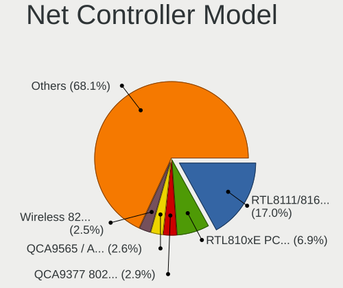

| Model                                                                  | Notebooks | Percent |
|------------------------------------------------------------------------|-----------|---------|
| Realtek RTL8111/8168/8211/8411 PCI Express Gigabit Ethernet Controller | 199       | 16.97%  |
| Realtek RTL810xE PCI Express Fast Ethernet controller                  | 81        | 6.91%   |
| Qualcomm Atheros QCA9377 802.11ac Wireless Network Adapter             | 34        | 2.9%    |
| Qualcomm Atheros QCA9565 / AR9565 Wireless Network Adapter             | 31        | 2.64%   |
| Intel Wireless 8265 / 8275                                             | 29        | 2.47%   |
| Realtek RTL8821CE 802.11ac PCIe Wireless Network Adapter               | 28        | 2.39%   |
| Realtek RTL8822CE 802.11ac PCIe Wireless Network Adapter               | 18        | 1.53%   |
| Realtek RTL8723BE PCIe Wireless Network Adapter                        | 16        | 1.36%   |
| Broadcom BCM43142 802.11b/g/n                                          | 16        | 1.36%   |
| Realtek RTL8153 Gigabit Ethernet Adapter                               | 15        | 1.28%   |
| Qualcomm Atheros AR9485 Wireless Network Adapter                       | 15        | 1.28%   |
| Qualcomm Atheros AR9285 Wireless Network Adapter (PCI-Express)         | 15        | 1.28%   |
| Intel Wireless 8260                                                    | 15        | 1.28%   |
| Intel Wireless 3165                                                    | 15        | 1.28%   |
| Intel Wi-Fi 6 AX201                                                    | 15        | 1.28%   |
| Intel Wi-Fi 6 AX200                                                    | 15        | 1.28%   |
| MediaTek MT7921 802.11ax PCIe Wireless Network Adapter [Filogic 330]   | 14        | 1.19%   |
| Intel Wireless 7260                                                    | 14        | 1.19%   |
| Intel 82579LM Gigabit Network Connection (Lewisville)                  | 14        | 1.19%   |
| Broadcom BCM4313 802.11bgn Wireless Network Adapter                    | 14        | 1.19%   |
| Intel Ethernet Connection (4) I219-LM                                  | 11        | 0.94%   |
| Intel Centrino Advanced-N 6205 [Taylor Peak]                           | 11        | 0.94%   |
| MediaTek MT7922 802.11ax PCI Express Wireless Network Adapter          | 10        | 0.85%   |
| Intel Cannon Point-LP CNVi [Wireless-AC]                               | 10        | 0.85%   |
| Qualcomm Atheros QCA6174 802.11ac Wireless Network Adapter             | 9         | 0.77%   |
| Qualcomm Atheros AR8151 v2.0 Gigabit Ethernet                          | 9         | 0.77%   |
| MediaTek MT7902 802.11ax PCIe Wireless Network Adapter [Filogic 310]   | 9         | 0.77%   |
| Intel Wireless 7265                                                    | 9         | 0.77%   |
| Intel Ice Lake-LP PCH CNVi WiFi                                        | 9         | 0.77%   |
| Intel Ethernet Connection I219-LM                                      | 9         | 0.77%   |
| Nvidia MCP79 Ethernet                                                  | 8         | 0.68%   |
| Intel Wireless 3160                                                    | 8         | 0.68%   |
| Intel Wi-Fi 6E(802.11ax) AX210/AX1675* 2x2 [Typhoon Peak]              | 8         | 0.68%   |
| Intel 82577LM Gigabit Network Connection                               | 8         | 0.68%   |
| Realtek RTL8125 2.5GbE Controller                                      | 7         | 0.6%    |
| Qualcomm Atheros AR9462 Wireless Network Adapter                       | 7         | 0.6%    |
| Qualcomm Atheros AR9287 Wireless Network Adapter (PCI-Express)         | 7         | 0.6%    |
| Intel Raptor Lake PCH CNVi WiFi                                        | 7         | 0.6%    |
| Intel PRO/Wireless 3945ABG [Golan] Network Connection                  | 7         | 0.6%    |
| Intel Dual Band Wireless-AC 3165 Plus Bluetooth                        | 7         | 0.6%    |

Wireless Vendor
---------------

Wireless vendors

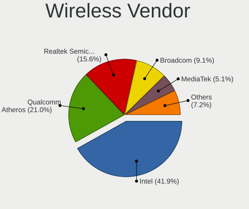

| Vendor                          | Notebooks | Percent |
|---------------------------------|-----------|---------|
| Intel                           | 261       | 41.89%  |
| Qualcomm Atheros                | 131       | 21.03%  |
| Realtek Semiconductor           | 97        | 15.57%  |
| Broadcom                        | 57        | 9.15%   |
| MediaTek                        | 32        | 5.14%   |
| Ralink                          | 14        | 2.25%   |
| Ralink Technology               | 5         | 0.8%    |
| TP-Link                         | 4         | 0.64%   |
| Sierra Wireless                 | 4         | 0.64%   |
| Dell                            | 4         | 0.64%   |
| Broadcom Limited                | 3         | 0.48%   |
| Qualcomm Atheros Communications | 2         | 0.32%   |
| Hewlett-Packard                 | 2         | 0.32%   |
| D-Link                          | 2         | 0.32%   |
| Qualcomm                        | 1         | 0.16%   |
| Linksys                         | 1         | 0.16%   |
| IMC Networks                    | 1         | 0.16%   |
| Fibocom                         | 1         | 0.16%   |
| Edimax Technology               | 1         | 0.16%   |

Wireless Model
--------------

Wireless models

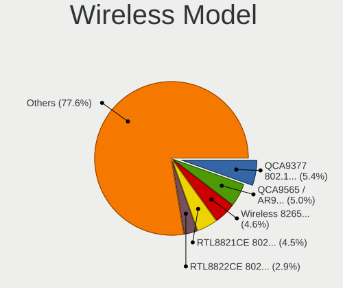

| Model                                                                   | Notebooks | Percent |
|-------------------------------------------------------------------------|-----------|---------|
| Qualcomm Atheros QCA9377 802.11ac Wireless Network Adapter              | 34        | 5.44%   |
| Qualcomm Atheros QCA9565 / AR9565 Wireless Network Adapter              | 31        | 4.96%   |
| Intel Wireless 8265 / 8275                                              | 29        | 4.64%   |
| Realtek RTL8821CE 802.11ac PCIe Wireless Network Adapter                | 28        | 4.48%   |
| Realtek RTL8822CE 802.11ac PCIe Wireless Network Adapter                | 18        | 2.88%   |
| Realtek RTL8723BE PCIe Wireless Network Adapter                         | 16        | 2.56%   |
| Broadcom BCM43142 802.11b/g/n                                           | 16        | 2.56%   |
| Qualcomm Atheros AR9485 Wireless Network Adapter                        | 15        | 2.4%    |
| Qualcomm Atheros AR9285 Wireless Network Adapter (PCI-Express)          | 15        | 2.4%    |
| Intel Wireless 8260                                                     | 15        | 2.4%    |
| Intel Wireless 3165                                                     | 15        | 2.4%    |
| Intel Wi-Fi 6 AX201                                                     | 15        | 2.4%    |
| Intel Wi-Fi 6 AX200                                                     | 15        | 2.4%    |
| MediaTek MT7921 802.11ax PCIe Wireless Network Adapter [Filogic 330]    | 14        | 2.24%   |
| Intel Wireless 7260                                                     | 14        | 2.24%   |
| Broadcom BCM4313 802.11bgn Wireless Network Adapter                     | 14        | 2.24%   |
| Intel Centrino Advanced-N 6205 [Taylor Peak]                            | 11        | 1.76%   |
| Intel Cannon Point-LP CNVi [Wireless-AC]                                | 10        | 1.6%    |
| Qualcomm Atheros QCA6174 802.11ac Wireless Network Adapter              | 9         | 1.44%   |
| MediaTek MT7922 802.11ax PCI Express Wireless Network Adapter           | 9         | 1.44%   |
| MediaTek MT7902 802.11ax PCIe Wireless Network Adapter [Filogic 310]    | 9         | 1.44%   |
| Intel Wireless 7265                                                     | 9         | 1.44%   |
| Intel Ice Lake-LP PCH CNVi WiFi                                         | 9         | 1.44%   |
| Intel Wireless 3160                                                     | 8         | 1.28%   |
| Intel Wi-Fi 6E(802.11ax) AX210/AX1675* 2x2 [Typhoon Peak]               | 8         | 1.28%   |
| Qualcomm Atheros AR9462 Wireless Network Adapter                        | 7         | 1.12%   |
| Qualcomm Atheros AR9287 Wireless Network Adapter (PCI-Express)          | 7         | 1.12%   |
| Intel Raptor Lake PCH CNVi WiFi                                         | 7         | 1.12%   |
| Intel PRO/Wireless 3945ABG [Golan] Network Connection                   | 7         | 1.12%   |
| Intel Dual Band Wireless-AC 3165 Plus Bluetooth                         | 7         | 1.12%   |
| Intel Comet Lake PCH-LP CNVi WiFi                                       | 7         | 1.12%   |
| Intel Comet Lake PCH CNVi WiFi                                          | 7         | 1.12%   |
| Intel Cannon Lake PCH CNVi WiFi                                         | 7         | 1.12%   |
| Realtek RTL8821AE 802.11ac PCIe Wireless Network Adapter                | 6         | 0.96%   |
| Intel Dual Band Wireless-AC 3168NGW [Stone Peak]                        | 6         | 0.96%   |
| Realtek RTL8852BE PCIe 802.11ax Wireless Network Controller             | 5         | 0.8%    |
| Realtek RTL8822BE 802.11a/b/g/n/ac WiFi adapter                         | 5         | 0.8%    |
| Ralink RT3290 Wireless 802.11n 1T/1R PCIe                               | 5         | 0.8%    |
| Qualcomm Atheros AR242x / AR542x Wireless Network Adapter (PCI-Express) | 5         | 0.8%    |
| Intel PRO/Wireless 5100 AGN [Shiloh] Network Connection                 | 5         | 0.8%    |

Ethernet Vendor
---------------

Ethernet vendors

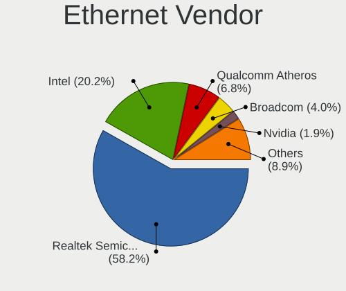

| Vendor                     | Notebooks | Percent |
|----------------------------|-----------|---------|
| Realtek Semiconductor      | 306       | 58.17%  |
| Intel                      | 106       | 20.15%  |
| Qualcomm Atheros           | 36        | 6.84%   |
| Broadcom                   | 21        | 3.99%   |
| Nvidia                     | 10        | 1.9%    |
| Broadcom Limited           | 9         | 1.71%   |
| Samsung Electronics        | 7         | 1.33%   |
| Marvell Technology Group   | 7         | 1.33%   |
| Xiaomi                     | 4         | 0.76%   |
| ASIX Electronics           | 4         | 0.76%   |
| Lenovo                     | 3         | 0.57%   |
| JMicron Technology         | 3         | 0.57%   |
| TP-Link                    | 2         | 0.38%   |
| MediaTek                   | 2         | 0.38%   |
| ZTE WCDMA Technologies MSM | 1         | 0.19%   |
| VIA Technologies           | 1         | 0.19%   |
| Qualcomm Technologies      | 1         | 0.19%   |
| ICS Advent                 | 1         | 0.19%   |
| Huawei Technologies        | 1         | 0.19%   |
| Apple                      | 1         | 0.19%   |

Ethernet Model
--------------

Ethernet models

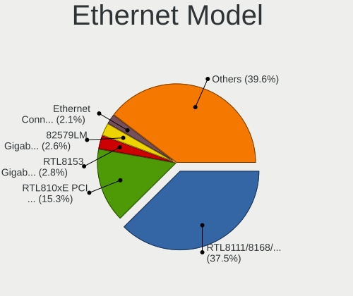

| Model                                                                  | Notebooks | Percent |
|------------------------------------------------------------------------|-----------|---------|
| Realtek RTL8111/8168/8211/8411 PCI Express Gigabit Ethernet Controller | 199       | 37.55%  |
| Realtek RTL810xE PCI Express Fast Ethernet controller                  | 81        | 15.28%  |
| Realtek RTL8153 Gigabit Ethernet Adapter                               | 15        | 2.83%   |
| Intel 82579LM Gigabit Network Connection (Lewisville)                  | 14        | 2.64%   |
| Intel Ethernet Connection (4) I219-LM                                  | 11        | 2.08%   |
| Qualcomm Atheros AR8151 v2.0 Gigabit Ethernet                          | 9         | 1.7%    |
| Intel Ethernet Connection I219-LM                                      | 9         | 1.7%    |
| Nvidia MCP79 Ethernet                                                  | 8         | 1.51%   |
| Intel 82577LM Gigabit Network Connection                               | 8         | 1.51%   |
| Realtek RTL8125 2.5GbE Controller                                      | 7         | 1.32%   |
| Qualcomm Atheros AR8161 Gigabit Ethernet                               | 6         | 1.13%   |
| Broadcom NetLink BCM57785 Gigabit Ethernet PCIe                        | 6         | 1.13%   |
| Qualcomm Atheros QCA8172 Fast Ethernet                                 | 5         | 0.94%   |
| Intel Ethernet Connection I218-LM                                      | 5         | 0.94%   |
| Intel 82566MM Gigabit Network Connection                               | 5         | 0.94%   |
| Broadcom NetXtreme BCM57765 Gigabit Ethernet PCIe                      | 5         | 0.94%   |
| Samsung Galaxy series, misc. (tethering mode)                          | 4         | 0.75%   |
| Qualcomm Atheros Killer E220x Gigabit Ethernet Controller              | 4         | 0.75%   |
| Intel Ethernet Connection I217-LM                                      | 4         | 0.75%   |
| Intel Ethernet Connection (4) I219-V                                   | 4         | 0.75%   |
| Intel Ethernet Connection (13) I219-V                                  | 4         | 0.75%   |
| Intel 82567LM Gigabit Network Connection                               | 4         | 0.75%   |
| Broadcom Limited NetLink BCM57780 Gigabit Ethernet PCIe                | 4         | 0.75%   |
| ASIX AX88179 Gigabit Ethernet                                          | 4         | 0.75%   |
| Samsung GT-I9070 (network tethering, USB debugging enabled)            | 3         | 0.57%   |
| Realtek RTL8152 Fast Ethernet Adapter                                  | 3         | 0.57%   |
| Qualcomm Atheros AR8132 Fast Ethernet                                  | 3         | 0.57%   |
| Intel Ethernet Connection (6) I219-V                                   | 3         | 0.57%   |
| Intel Ethernet Connection (6) I219-LM                                  | 3         | 0.57%   |
| Intel Ethernet Connection (3) I218-LM                                  | 3         | 0.57%   |
| Intel Ethernet Connection (2) I219-LM                                  | 3         | 0.57%   |
| Intel Alder Lake-P PCH CNVi WiFi                                       | 3         | 0.57%   |
| Broadcom NetLink BCM57780 Gigabit Ethernet PCIe                        | 3         | 0.57%   |
| Xiaomi Mi/Redmi series (RNDIS)                                         | 2         | 0.38%   |
| Xiaomi Mi/Redmi series (RNDIS + ADB)                                   | 2         | 0.38%   |
| TP-Link UE300 10/100/1000 LAN (ethernet mode) [Realtek RTL8153]        | 2         | 0.38%   |
| Realtek RTL-8100/8101L/8139 PCI Fast Ethernet Adapter                  | 2         | 0.38%   |
| Realtek Killer E2600 GbE Controller                                    | 2         | 0.38%   |
| Qualcomm Atheros Killer E2400 Gigabit Ethernet Controller              | 2         | 0.38%   |
| Qualcomm Atheros AR8162 Fast Ethernet                                  | 2         | 0.38%   |

Net Controller Kind
-------------------

Ethernet, WiFi or modem

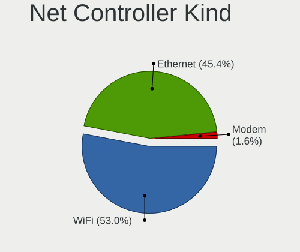

| Kind     | Notebooks | Percent |
|----------|-----------|---------|
| WiFi     | 597       | 52.97%  |
| Ethernet | 512       | 45.43%  |
| Modem    | 18        | 1.6%    |

Used Controller
---------------

Currently used network controller

| Kind     | Notebooks | Percent |
|----------|-----------|---------|
| WiFi     | 496       | 78.48%  |
| Ethernet | 135       | 21.36%  |
| Modem    | 1         | 0.16%   |

NICs
----

Total network controllers on board

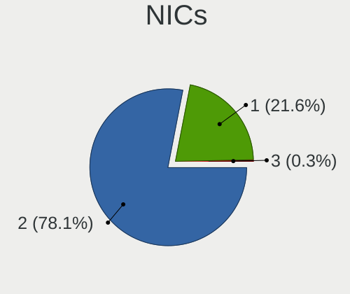

| Total | Notebooks | Percent |
|-------|-----------|---------|
| 2     | 473       | 78.05%  |
| 1     | 131       | 21.62%  |
| 3     | 2         | 0.33%   |

IPv6
----

IPv6 vs IPv4

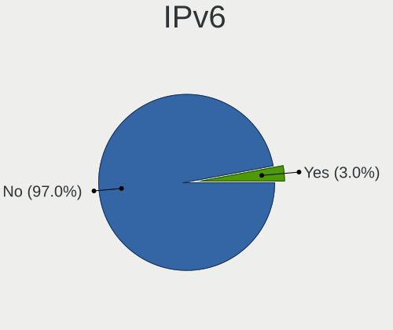

| Used | Notebooks | Percent |
|------|-----------|---------|
| No   | 591       | 97.04%  |
| Yes  | 18        | 2.96%   |

Bluetooth
---------

Bluetooth Vendor
----------------

Controller vendors

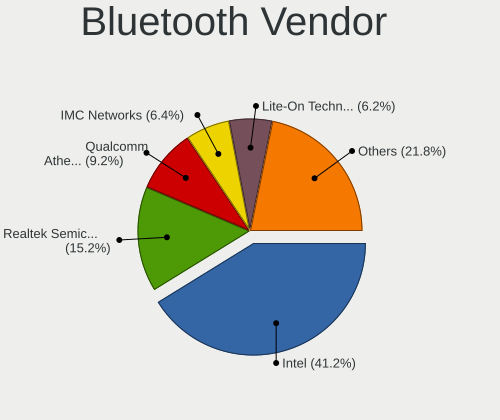

| Vendor                          | Notebooks | Percent |
|---------------------------------|-----------|---------|
| Intel                           | 206       | 41.2%   |
| Realtek Semiconductor           | 76        | 15.2%   |
| Qualcomm Atheros Communications | 46        | 9.2%    |
| IMC Networks                    | 32        | 6.4%    |
| Lite-On Technology              | 31        | 6.2%    |
| Foxconn / Hon Hai               | 26        | 5.2%    |
| Broadcom                        | 26        | 5.2%    |
| Apple                           | 13        | 2.6%    |
| Toshiba                         | 9         | 1.8%    |
| Hewlett-Packard                 | 8         | 1.6%    |
| Dell                            | 6         | 1.2%    |
| Ralink                          | 5         | 1%      |
| USI                             | 3         | 0.6%    |
| Foxconn International           | 3         | 0.6%    |
| Cambridge Silicon Radio         | 3         | 0.6%    |
| Ralink Technology               | 2         | 0.4%    |
| Realtek                         | 1         | 0.2%    |
| Opticis                         | 1         | 0.2%    |
| MediaTek                        | 1         | 0.2%    |
| Askey Computer                  | 1         | 0.2%    |
| Alps Electric                   | 1         | 0.2%    |

Bluetooth Model
---------------

Controller models

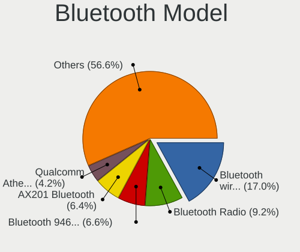

| Model                                               | Notebooks | Percent |
|-----------------------------------------------------|-----------|---------|
| Intel Bluetooth wireless interface                  | 85        | 17%     |
| Realtek Bluetooth Radio                             | 46        | 9.2%    |
| Intel Bluetooth 9460/9560 Jefferson Peak (JfP)      | 33        | 6.6%    |
| Intel AX201 Bluetooth                               | 32        | 6.4%    |
| Qualcomm Atheros  Bluetooth Device                  | 21        | 4.2%    |
| Realtek  Bluetooth 4.2 Adapter                      | 19        | 3.8%    |
| Intel Bluetooth Device                              | 16        | 3.2%    |
| Intel AX200 Bluetooth                               | 15        | 3%      |
| IMC Networks Wireless_Device                        | 15        | 3%      |
| Lite-On Qualcomm Atheros QCA9377 Bluetooth          | 14        | 2.8%    |
| Apple Bluetooth Host Controller                     | 10        | 2%      |
| Lite-On Bluetooth Device                            | 8         | 1.6%    |
| Intel AX210 Bluetooth                               | 8         | 1.6%    |
| Foxconn / Hon Hai Wireless_Device                   | 8         | 1.6%    |
| IMC Networks Bluetooth Radio                        | 7         | 1.4%    |
| Foxconn / Hon Hai MediaTek Bluetooth Adapter        | 7         | 1.4%    |
| Qualcomm Atheros AR9462 Bluetooth                   | 6         | 1.2%    |
| Qualcomm Atheros AR3012 Bluetooth 4.0               | 6         | 1.2%    |
| Realtek RTL8821A Bluetooth                          | 5         | 1%      |
| Ralink RT3290 Bluetooth                             | 5         | 1%      |
| Qualcomm Atheros AR3011 Bluetooth                   | 5         | 1%      |
| Intel Wireless-AC 3168 Bluetooth                    | 5         | 1%      |
| Intel Centrino Bluetooth Wireless Transceiver       | 5         | 1%      |
| HP Broadcom 2070 Bluetooth Combo                    | 5         | 1%      |
| Foxconn / Hon Hai Bluetooth Device                  | 5         | 1%      |
| Dell DW375 Bluetooth Module                         | 5         | 1%      |
| Broadcom BCM43142A0 Bluetooth 4.0                   | 5         | 1%      |
| Realtek RTL8723B Bluetooth                          | 4         | 0.8%    |
| Qualcomm Atheros QCA61x4 Bluetooth 4.0              | 4         | 0.8%    |
| Qualcomm Atheros AR3012 Bluetooth                   | 4         | 0.8%    |
| Lite-On Atheros AR3012 Bluetooth                    | 4         | 0.8%    |
| Intel Centrino Advanced-N 6230 Bluetooth adapter    | 4         | 0.8%    |
| IMC Networks Bluetooth Device                       | 4         | 0.8%    |
| Toshiba Bluetooth Device                            | 3         | 0.6%    |
| IMC Networks Atheros AR3012 Bluetooth 4.0 Adapter   | 3         | 0.6%    |
| HP Bluetooth 2.0 Interface [Broadcom BCM2045]       | 3         | 0.6%    |
| Foxconn International BCM43142A0 Bluetooth module   | 3         | 0.6%    |
| Foxconn / Hon Hai Broadcom Bluetooth 2.1 Device     | 3         | 0.6%    |
| Cambridge Silicon Radio Bluetooth Dongle (HCI mode) | 3         | 0.6%    |
| Broadcom BCM43142 Bluetooth 4.0                     | 3         | 0.6%    |

Sound
-----

Sound Vendor
------------

Sound card vendors

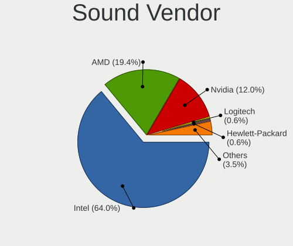

| Vendor                               | Notebooks | Percent |
|--------------------------------------|-----------|---------|
| Intel                                | 459       | 64.02%  |
| AMD                                  | 139       | 19.39%  |
| Nvidia                               | 86        | 11.99%  |
| Logitech                             | 4         | 0.56%   |
| Hewlett-Packard                      | 4         | 0.56%   |
| Lenovo                               | 3         | 0.42%   |
| Microsoft                            | 2         | 0.28%   |
| GN Netcom                            | 2         | 0.28%   |
| C-Media Electronics                  | 2         | 0.28%   |
| Apple                                | 2         | 0.28%   |
| VIA Technologies                     | 1         | 0.14%   |
| Thesycon Systemsoftware & Consulting | 1         | 0.14%   |
| Tenx Technology                      | 1         | 0.14%   |
| SteelSeries ApS                      | 1         | 0.14%   |
| Plantronics                          | 1         | 0.14%   |
| Nordic Semiconductor ASA             | 1         | 0.14%   |
| Native Instruments                   | 1         | 0.14%   |
| Kingston Technology                  | 1         | 0.14%   |
| Jieli Technology                     | 1         | 0.14%   |
| Focusrite-Novation                   | 1         | 0.14%   |
| FiiO Electronics Technology          | 1         | 0.14%   |
| ESI Audiotechnik                     | 1         | 0.14%   |
| Creative Technology                  | 1         | 0.14%   |
| Cambridge Silicon Radio              | 1         | 0.14%   |

Sound Model
-----------

Sound card models

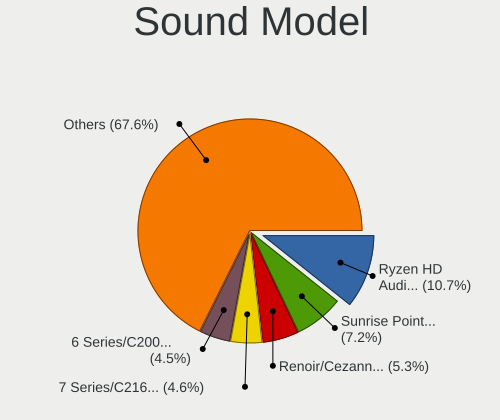

| Model                                                                                             | Notebooks | Percent |
|---------------------------------------------------------------------------------------------------|-----------|---------|
| AMD Ryzen HD Audio Controller                                                                     | 95        | 10.71%  |
| Intel Sunrise Point-LP HD Audio                                                                   | 64        | 7.22%   |
| AMD Renoir/Cezanne HDMI/DP Audio Controller                                                       | 47        | 5.3%    |
| Intel 7 Series/C216 Chipset Family High Definition Audio Controller                               | 41        | 4.62%   |
| Intel 6 Series/C200 Series Chipset Family High Definition Audio Controller                        | 40        | 4.51%   |
| AMD Raven/Raven2/Fenghuang HDMI/DP Audio Controller                                               | 30        | 3.38%   |
| Intel 5 Series/3400 Series Chipset High Definition Audio                                          | 23        | 2.59%   |
| Intel Tiger Lake-LP Smart Sound Technology Audio Controller                                       | 22        | 2.48%   |
| Intel Wildcat Point-LP High Definition Audio Controller                                           | 21        | 2.37%   |
| Intel Broadwell-U Audio Controller                                                                | 21        | 2.37%   |
| Intel Haswell-ULT HD Audio Controller                                                             | 17        | 1.92%   |
| Intel 8 Series HD Audio Controller                                                                | 17        | 1.92%   |
| Intel Ice Lake-LP Smart Sound Technology Audio Controller                                         | 16        | 1.8%    |
| Intel 8 Series/C220 Series Chipset High Definition Audio Controller                               | 16        | 1.8%    |
| AMD FCH Azalia Controller                                                                         | 16        | 1.8%    |
| Intel Celeron N3350/Pentium N4200/Atom E3900 Series Audio Cluster                                 | 15        | 1.69%   |
| Intel Cannon Point-LP High Definition Audio Controller                                            | 15        | 1.69%   |
| Intel Atom/Celeron/Pentium Processor x5-E8000/J3xxx/N3xxx Series High Definition Audio Controller | 15        | 1.69%   |
| Intel 82801I (ICH9 Family) HD Audio Controller                                                    | 15        | 1.69%   |
| AMD SBx00 Azalia (Intel HDA)                                                                      | 15        | 1.69%   |
| Intel Xeon E3-1200 v3/4th Gen Core Processor HD Audio Controller                                  | 14        | 1.58%   |
| Intel Atom Processor Z36xxx/Z37xxx Series High Definition Audio Controller                        | 14        | 1.58%   |
| Intel Alder Lake PCH-P High Definition Audio Controller                                           | 13        | 1.47%   |
| Intel NM10/ICH7 Family High Definition Audio Controller                                           | 12        | 1.35%   |
| Intel Celeron/Pentium Silver Processor High Definition Audio                                      | 12        | 1.35%   |
| Intel Cannon Lake PCH cAVS                                                                        | 12        | 1.35%   |
| Intel 82801H (ICH8 Family) HD Audio Controller                                                    | 12        | 1.35%   |
| Intel Raptor Lake-P/U/H cAVS                                                                      | 10        | 1.13%   |
| Nvidia TU107 GeForce GTX 1650 High Definition Audio Controller                                    | 9         | 1.01%   |
| Nvidia GF108 High Definition Audio Controller                                                     | 9         | 1.01%   |
| Intel CM238 HD Audio Controller                                                                   | 9         | 1.01%   |
| AMD Radeon High Definition Audio Controller                                                       | 9         | 1.01%   |
| AMD Kabini HDMI/DP Audio                                                                          | 9         | 1.01%   |
| Nvidia MCP79 High Definition Audio                                                                | 8         | 0.9%    |
| Nvidia GA104 High Definition Audio Controller                                                     | 8         | 0.9%    |
| Intel Comet Lake PCH-LP cAVS                                                                      | 8         | 0.9%    |
| Intel Comet Lake PCH cAVS                                                                         | 8         | 0.9%    |
| Intel 100 Series/C230 Series Chipset Family HD Audio Controller                                   | 7         | 0.79%   |
| AMD RS880 HDMI Audio [Radeon HD 4200 Series]                                                      | 7         | 0.79%   |
| Nvidia GP107GL High Definition Audio Controller                                                   | 6         | 0.68%   |

Memory
------

Memory Vendor
-------------

Memory module vendors

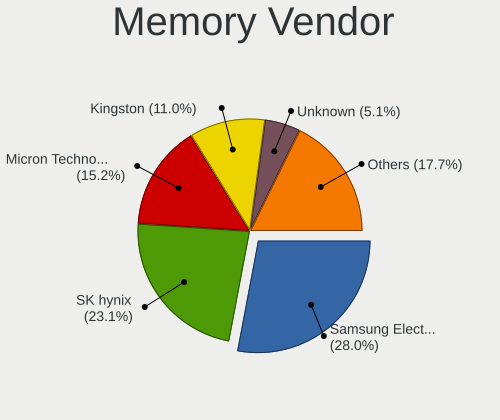

| Vendor              | Notebooks | Percent |
|---------------------|-----------|---------|
| Samsung Electronics | 120       | 27.97%  |
| SK hynix            | 99        | 23.08%  |
| Micron Technology   | 65        | 15.15%  |
| Kingston            | 47        | 10.96%  |
| Unknown             | 22        | 5.13%   |
| Ramaxel Technology  | 19        | 4.43%   |
| A-DATA Technology   | 10        | 2.33%   |
| Transcend           | 8         | 1.86%   |
| Elpida              | 8         | 1.86%   |
| Crucial             | 6         | 1.4%    |
| Patriot             | 4         | 0.93%   |
| Unknown             | 4         | 0.93%   |
| Nanya Technology    | 2         | 0.47%   |
| Corsair             | 2         | 0.47%   |
| Apacer              | 2         | 0.47%   |
| Unknown (89F7)      | 1         | 0.23%   |
| Unknown (06F1)      | 1         | 0.23%   |
| Silicon Power       | 1         | 0.23%   |
| SHARETRONIC         | 1         | 0.23%   |
| Qimonda             | 1         | 0.23%   |
| PNY                 | 1         | 0.23%   |
| Kllisre             | 1         | 0.23%   |
| G.Skill             | 1         | 0.23%   |
| CSX                 | 1         | 0.23%   |
| AMD                 | 1         | 0.23%   |
| 48spaces            | 1         | 0.23%   |

Memory Model
------------

Memory module models

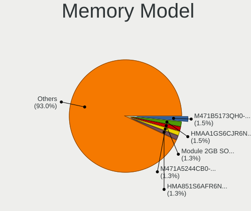

| Model                                                       | Notebooks | Percent |
|-------------------------------------------------------------|-----------|---------|
| SK hynix RAM HMAA1GS6CJR6N-XN 8GB SODIMM DDR4 3200MT/s      | 7         | 1.53%   |
| Samsung RAM M471B5173QH0-YK0 4GB SODIMM DDR3 1600MT/s       | 7         | 1.53%   |
| Unknown RAM Module 2GB SODIMM DDR2 667MT/s                  | 6         | 1.31%   |
| SK hynix RAM HMA851S6AFR6N-UH 4GB SODIMM DDR4 2667MT/s      | 6         | 1.31%   |
| Samsung RAM M471A5244CB0-CRC 4GB SODIMM DDR4 2667MT/s       | 6         | 1.31%   |
| Micron RAM 8ATF1G64HZ-3G2J1 8GB SODIMM DDR4 3200MT/s        | 6         | 1.31%   |
| Micron RAM 4ATF51264HZ-2G6E1 4GB SODIMM DDR4 2667MT/s       | 6         | 1.31%   |
| Micron RAM 4ATF1G64HZ-3G2F1 8GB SODIMM DDR4 3200MT/s        | 6         | 1.31%   |
| Micron RAM 4ATF1G64HZ-3G2E1 8GB SODIMM DDR4 3200MT/s        | 6         | 1.31%   |
| Kingston RAM 99U5428-018.A00LF 8GB SODIMM DDR3 1600MT/s     | 6         | 1.31%   |
| Samsung RAM M471B5173EB0-YK0 4GB SODIMM DDR3 1600MT/s       | 5         | 1.09%   |
| Samsung RAM M471A1G44BB0-CWE 8GB SODIMM DDR4 3200MT/s       | 5         | 1.09%   |
| SK hynix RAM HMT451S6BFR8A-PB 4GB SODIMM DDR3 1600MT/s      | 4         | 0.87%   |
| SK hynix RAM HMA851S6JJR6N-VK 4GB SODIMM DDR4 2667MT/s      | 4         | 0.87%   |
| SK hynix RAM HMA81GS6DJR8N-XN 8GB SODIMM DDR4 3200MT/s      | 4         | 0.87%   |
| Samsung RAM M471B5773DH0-CH9 2GB SODIMM DDR3 1600MT/s       | 4         | 0.87%   |
| Samsung RAM M471A5244CB0-CWE 4GB SODIMM DDR4 3200MT/s       | 4         | 0.87%   |
| Samsung RAM M471A5244CB0-CTD 4GB SODIMM DDR4 3266MT/s       | 4         | 0.87%   |
| Samsung RAM M471A1K43EB1-CWE 8GB SODIMM DDR4 3200MT/s       | 4         | 0.87%   |
| Samsung RAM M471A1K43DB1-CWE 8GB SODIMM DDR4 3200MT/s       | 4         | 0.87%   |
| Samsung RAM M471A1G44AB0-CWE 8GiB SODIMM DDR4 3200MT/s      | 4         | 0.87%   |
| Micron RAM 4ATF51264HZ-2G6E! 4GB SODIMM DDR4 2400MT/s       | 4         | 0.87%   |
| Kingston RAM KF3200C20S4/32GX 32GB SODIMM DDR4 3200MT/s     | 4         | 0.87%   |
| Elpida RAM EBJ41UF8BCS0-DJ-F 4GB SODIMM DDR3 1334MT/s       | 4         | 0.87%   |
| Unknown                                                     | 4         | 0.87%   |
| SK hynix RAM HMCG78MEBSA092N 16GB SODIMM DDR5 4800MT/s      | 3         | 0.65%   |
| SK hynix RAM HMCG78AGBSA095N 16GB SODIMM DDR5 5600MT/s      | 3         | 0.65%   |
| SK hynix RAM HMA81GS6AFR8N-UH 8GB SODIMM DDR4 2667MT/s      | 3         | 0.65%   |
| Samsung RAM M471B5673FH0-CF8 2048MB SODIMM DDR3 1067MT/s    | 3         | 0.65%   |
| Samsung RAM M471B5173DB0-YK0 4GB SODIMM DDR3 1600MT/s       | 3         | 0.65%   |
| Samsung RAM M471B1G73EB0-YK0 8192MB SODIMM DDR3 1600MT/s    | 3         | 0.65%   |
| Samsung RAM M471B1G73DB0-YK0 8GB SODIMM DDR3 1600MT/s       | 3         | 0.65%   |
| Samsung RAM M471A1K43DB1-CTD 8GB SODIMM DDR4 2667MT/s       | 3         | 0.65%   |
| Samsung RAM M471A1K43CB1-CRC 8GB SODIMM DDR4 8400MT/s       | 3         | 0.65%   |
| Samsung RAM M471A1G44BB0-CWE 8GB Row Of Chips DDR4 3200MT/s | 3         | 0.65%   |
| Samsung RAM M471A1G44AB0-CWE 8GB Row Of Chips DDR4 3200MT/s | 3         | 0.65%   |
| Ramaxel RAM RMT3160ED58E9W1600 4GB SODIMM DDR3 1600MT/s     | 3         | 0.65%   |
| Micron RAM Module 4GB Row Of Chips DDR4 2400MT/s            | 3         | 0.65%   |
| Micron RAM 4ATS1G64HZ-2G6E1 8GB SODIMM DDR4 2667MT/s        | 3         | 0.65%   |
| Unknown RAM Module 1024MB SODIMM DDR                        | 2         | 0.44%   |

Memory Kind
-----------

Memory module kinds

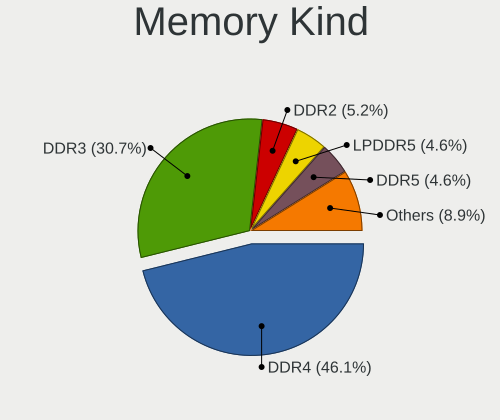

| Kind    | Notebooks | Percent |
|---------|-----------|---------|
| DDR4    | 161       | 46.13%  |
| DDR3    | 107       | 30.66%  |
| DDR2    | 18        | 5.16%   |
| LPDDR5  | 16        | 4.58%   |
| DDR5    | 16        | 4.58%   |
| SDRAM   | 10        | 2.87%   |
| LPDDR4  | 10        | 2.87%   |
| LPDDR3  | 5         | 1.43%   |
| Unknown | 3         | 0.86%   |
| DDR     | 2         | 0.57%   |
| DRAM    | 1         | 0.29%   |

Memory Form Factor
------------------

Physical design of the memory module

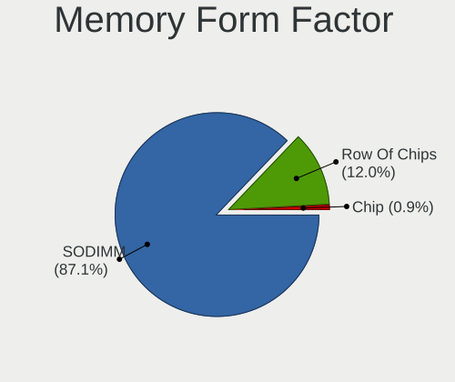

| Name         | Notebooks | Percent |
|--------------|-----------|---------|
| SODIMM       | 305       | 87.14%  |
| Row Of Chips | 42        | 12%     |
| Chip         | 3         | 0.86%   |

Memory Size
-----------

Memory module size

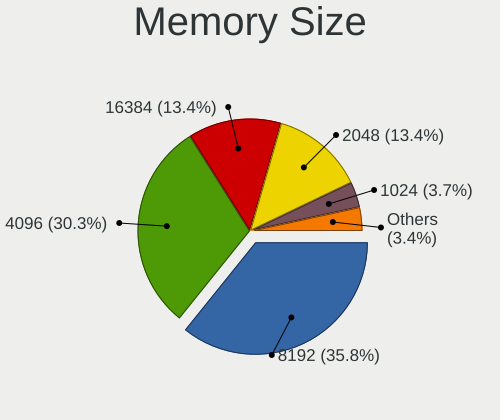

| Size  | Notebooks | Percent |
|-------|-----------|---------|
| 8192  | 136       | 35.79%  |
| 4096  | 115       | 30.26%  |
| 16384 | 51        | 13.42%  |
| 2048  | 51        | 13.42%  |
| 1024  | 14        | 3.68%   |
| 32768 | 11        | 2.89%   |
| 3072  | 1         | 0.26%   |
| 512   | 1         | 0.26%   |

Memory Speed
------------

Memory module speed

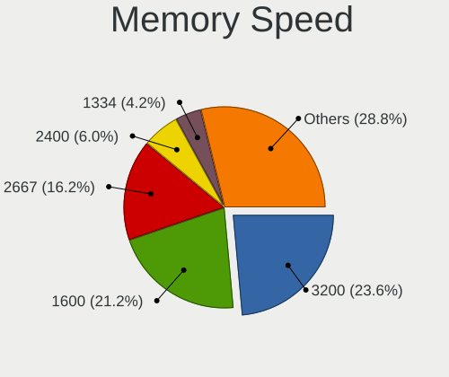

| Speed   | Notebooks | Percent |
|---------|-----------|---------|
| 3200    | 90        | 23.56%  |
| 1600    | 81        | 21.2%   |
| 2667    | 62        | 16.23%  |
| 2400    | 23        | 6.02%   |
| 1334    | 16        | 4.19%   |
| 667     | 12        | 3.14%   |
| 6400    | 11        | 2.88%   |
| 2133    | 11        | 2.88%   |
| 1067    | 11        | 2.88%   |
| 5600    | 10        | 2.62%   |
| 4199    | 7         | 1.83%   |
| Unknown | 7         | 1.83%   |
| 4800    | 6         | 1.57%   |
| 1333    | 5         | 1.31%   |
| 800     | 5         | 1.31%   |
| 4267    | 4         | 1.05%   |
| 3266    | 4         | 1.05%   |
| 8533    | 3         | 0.79%   |
| 8400    | 3         | 0.79%   |
| 2048    | 3         | 0.79%   |
| 975     | 3         | 0.79%   |
| 7500    | 2         | 0.52%   |
| 533     | 2         | 0.52%   |
| 2933    | 1         | 0.26%   |

Printers & scanners
-------------------

Printer Vendor
--------------

Printer device vendors

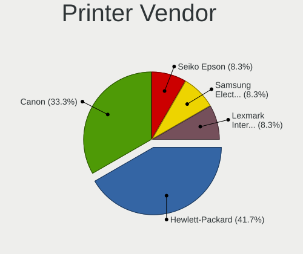

| Vendor                | Notebooks | Percent |
|-----------------------|-----------|---------|
| Hewlett-Packard       | 5         | 41.67%  |
| Canon                 | 4         | 33.33%  |
| Seiko Epson           | 1         | 8.33%   |
| Samsung Electronics   | 1         | 8.33%   |
| Lexmark International | 1         | 8.33%   |

Printer Model
-------------

Printer device models

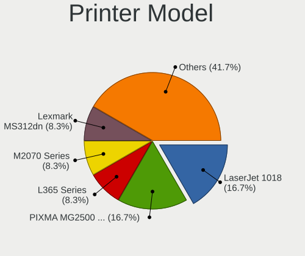

| Model                                 | Notebooks | Percent |
|---------------------------------------|-----------|---------|
| HP LaserJet 1018                      | 2         | 16.67%  |
| Canon PIXMA MG2500 Series             | 2         | 16.67%  |
| Seiko Epson L365 Series               | 1         | 8.33%   |
| Samsung M2070 Series                  | 1         | 8.33%   |
| Lexmark International Lexmark MS312dn | 1         | 8.33%   |
| HP LaserJet M14-M17                   | 1         | 8.33%   |
| HP LaserJet 1020                      | 1         | 8.33%   |
| HP DeskJet 845c                       | 1         | 8.33%   |
| Canon LBP6030/6030B/6018L             | 1         | 8.33%   |
| Canon iP7200 series                   | 1         | 8.33%   |

Scanner Vendor
--------------

Scanner device vendors

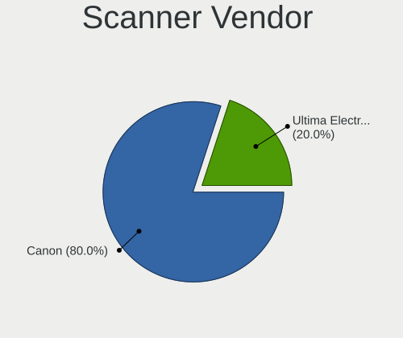

| Vendor             | Notebooks | Percent |
|--------------------|-----------|---------|
| Canon              | 4         | 66.67%  |
| Ultima Electronics | 1         | 16.67%  |
| Seiko Epson        | 1         | 16.67%  |

Scanner Model
-------------

Scanner device models

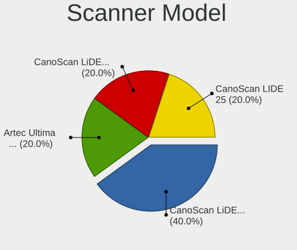

| Model                                                                                 | Notebooks | Percent |
|---------------------------------------------------------------------------------------|-----------|---------|
| Canon CanoScan LiDE 110                                                               | 2         | 33.33%  |
| Ultima Artec Ultima 2000 (GT6801 based)/Lifetec LT9385/ScanMagic 1200 UB Plus Scanner | 1         | 16.67%  |
| Seiko Epson GT-7300U [Perfection 1260/1260 PHOTO]                                     | 1         | 16.67%  |
| Canon CanoScan LIDE 25                                                                | 1         | 16.67%  |
| Canon CanoScan LiDE 210                                                               | 1         | 16.67%  |

Camera
------

Camera Vendor
-------------

Camera device vendors

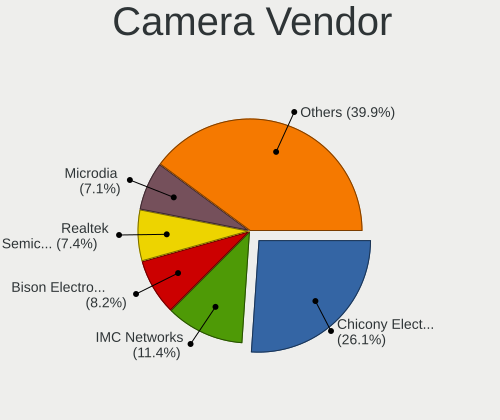

| Vendor                                 | Notebooks | Percent |
|----------------------------------------|-----------|---------|
| Chicony Electronics                    | 144       | 26.09%  |
| IMC Networks                           | 63        | 11.41%  |
| Bison Electronics                      | 45        | 8.15%   |
| Realtek Semiconductor                  | 41        | 7.43%   |
| Microdia                               | 39        | 7.07%   |
| Quanta                                 | 31        | 5.62%   |
| Sunplus Innovation Technology          | 26        | 4.71%   |
| Cheng Uei Precision Industry (Foxlink) | 24        | 4.35%   |
| Syntek                                 | 23        | 4.17%   |
| Suyin                                  | 21        | 3.8%    |
| Apple                                  | 13        | 2.36%   |
| Luxvisions Innotech Limited            | 12        | 2.17%   |
| Lite-On Technology                     | 11        | 1.99%   |
| Shinetech                              | 8         | 1.45%   |
| Silicon Motion                         | 6         | 1.09%   |
| Logitech                               | 6         | 1.09%   |
| Lenovo                                 | 5         | 0.91%   |
| Importek                               | 5         | 0.91%   |
| Sonix Technology                       | 4         | 0.72%   |
| ALi                                    | 4         | 0.72%   |
| Alcor Micro                            | 3         | 0.54%   |
| Acer                                   | 3         | 0.54%   |
| Primax Electronics                     | 2         | 0.36%   |
| OmniVision Technologies                | 2         | 0.36%   |
| Z-Star Microelectronics                | 1         | 0.18%   |
| Sweex                                  | 1         | 0.18%   |
| SunplusIT                              | 1         | 0.18%   |
| Shine-optics                           | 1         | 0.18%   |
| Samsung Electronics                    | 1         | 0.18%   |
| Ricoh                                  | 1         | 0.18%   |
| KYE Systems (Mouse Systems)            | 1         | 0.18%   |
| HYGD-220831-A                          | 1         | 0.18%   |
| Genesys Logic                          | 1         | 0.18%   |
| Generalplus Technology                 | 1         | 0.18%   |
| DigiTech                               | 1         | 0.18%   |

Camera Model
------------

Camera device models

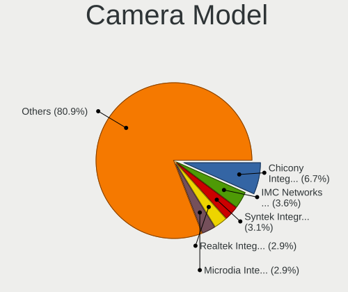

| Model                                                          | Notebooks | Percent |
|----------------------------------------------------------------|-----------|---------|
| Chicony Integrated Camera                                      | 37        | 6.67%   |
| IMC Networks USB2.0 VGA UVC WebCam                             | 20        | 3.6%    |
| Syntek Integrated Camera                                       | 17        | 3.06%   |
| Realtek Integrated_Webcam_HD                                   | 16        | 2.88%   |
| Microdia Integrated_Webcam_HD                                  | 16        | 2.88%   |
| Bison Integrated Camera                                        | 16        | 2.88%   |
| IMC Networks USB2.0 HD UVC WebCam                              | 14        | 2.52%   |
| IMC Networks Integrated Camera                                 | 13        | 2.34%   |
| Sunplus Integrated_Webcam_HD                                   | 10        | 1.8%    |
| Chicony HP Webcam                                              | 10        | 1.8%    |
| ShineTech USB2.0 HD UVC WebCam                                 | 7         | 1.26%   |
| Quanta HD Webcam                                               | 7         | 1.26%   |
| Chicony VGA Webcam                                             | 7         | 1.26%   |
| Chicony TOSHIBA Web Camera - HD                                | 7         | 1.26%   |
| Bison Lenovo EasyCamera                                        | 7         | 1.26%   |
| Quanta VGA WebCam                                              | 6         | 1.08%   |
| Chicony HD WebCam                                              | 6         | 1.08%   |
| Apple Built-in iSight                                          | 6         | 1.08%   |
| Suyin Acer/HP Integrated Webcam [CN0314]                       | 5         | 0.9%    |
| Sunplus Asus Webcam                                            | 5         | 0.9%    |
| Realtek USB Camera                                             | 5         | 0.9%    |
| Quanta HD User Facing                                          | 5         | 0.9%    |
| Microdia Integrated Webcam                                     | 5         | 0.9%    |
| Luxvisions Innotech Limited HP TrueVision HD Camera            | 5         | 0.9%    |
| Chicony Integrated Camera (1280x720@30)                        | 5         | 0.9%    |
| Chicony HP HD Camera                                           | 5         | 0.9%    |
| Chicony EasyCamera                                             | 5         | 0.9%    |
| Cheng Uei Precision Industry (Foxlink) HP Webcam               | 5         | 0.9%    |
| Cheng Uei Precision Industry (Foxlink) HP TrueVision HD Camera | 5         | 0.9%    |
| Cheng Uei Precision Industry (Foxlink) HP HD Camera            | 5         | 0.9%    |
| Apple FaceTime HD Camera                                       | 5         | 0.9%    |
| Syntek EasyCamera                                              | 4         | 0.72%   |
| Realtek Lenovo EasyCamera                                      | 4         | 0.72%   |
| Quanta HP TrueVision HD Camera                                 | 4         | 0.72%   |
| IMC Networks EasyCamera                                        | 4         | 0.72%   |
| Chicony USB2.0 VGA UVC WebCam                                  | 4         | 0.72%   |
| Chicony HP Truevision HD                                       | 4         | 0.72%   |
| Chicony HD User Facing                                         | 4         | 0.72%   |
| Bison SunplusIT Integrated Camera                              | 4         | 0.72%   |
| Silicon Motion Lenovo EasyCamera                               | 3         | 0.54%   |

Security
--------

Fingerprint Vendor
------------------

Fingerprint sensor vendors

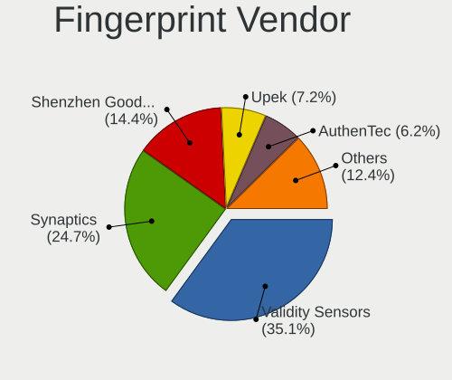

| Vendor                             | Notebooks | Percent |
|------------------------------------|-----------|---------|
| Validity Sensors                   | 34        | 35.05%  |
| Synaptics                          | 24        | 24.74%  |
| Shenzhen Goodix Technology         | 14        | 14.43%  |
| Upek                               | 7         | 7.22%   |
| AuthenTec                          | 6         | 6.19%   |
| Elan Microelectronics              | 4         | 4.12%   |
| STMicroelectronics                 | 3         | 3.09%   |
| LighTuning Technology              | 3         | 3.09%   |
| Realtek USB2.0 Finger Print Bridge | 2         | 2.06%   |

Fingerprint Model
-----------------

Fingerprint sensor models

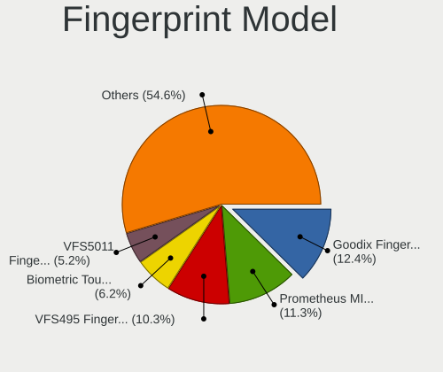

| Model                                                                      | Notebooks | Percent |
|----------------------------------------------------------------------------|-----------|---------|
| Shenzhen Goodix  FingerPrint Device                                        | 12        | 12.37%  |
| Synaptics Prometheus MIS Touch Fingerprint Reader                          | 11        | 11.34%  |
| Validity Sensors VFS495 Fingerprint Reader                                 | 10        | 10.31%  |
| Upek Biometric Touchchip/Touchstrip Fingerprint Sensor                     | 6         | 6.19%   |
| Validity Sensors VFS5011 Fingerprint Reader                                | 5         | 5.15%   |
| Validity Sensors VFS471 Fingerprint Reader                                 | 4         | 4.12%   |
| Validity Sensors VFS 5011 fingerprint sensor                               | 4         | 4.12%   |
| Validity Sensors Synaptics VFS7552 Touch Fingerprint Sensor with PurePrint | 3         | 3.09%   |
| Synaptics  WBDI                                                            | 3         | 3.09%   |
| Synaptics Metallica MIS Touch Fingerprint Reader                           | 3         | 3.09%   |
| STMicroelectronics Fingerprint Reader                                      | 3         | 3.09%   |
| Elan ELAN:Fingerprint                                                      | 3         | 3.09%   |
| AuthenTec AES2501 Fingerprint Sensor                                       | 3         | 3.09%   |
| Validity Sensors VFS7500 Touch Fingerprint Sensor                          | 2         | 2.06%   |
| Validity Sensors Synaptics WBDI                                            | 2         | 2.06%   |
| Synaptics WBDI                                                             | 2         | 2.06%   |
| Synaptics Prometheus Fingerprint Reader                                    | 2         | 2.06%   |
| Shenzhen Goodix Fingerprint Reader                                         | 2         | 2.06%   |
| Realtek USB2.0 Finger Print Bridge FocalTech Fingerprint Device            | 2         | 2.06%   |
| LighTuning ES603 Swipe Fingerprint Sensor                                  | 2         | 2.06%   |
| AuthenTec AES2810                                                          | 2         | 2.06%   |
| Validity Sensors VFS451 Fingerprint Reader                                 | 1         | 1.03%   |
| Validity Sensors VFS101 Fingerprint Reader                                 | 1         | 1.03%   |
| Validity Sensors VFS Fingerprint sensor                                    | 1         | 1.03%   |
| Validity Sensors Fingerprint scanner                                       | 1         | 1.03%   |
| Upek TCS5B Fingerprint sensor                                              | 1         | 1.03%   |
| Synaptics UWP WBDI Device                                                  | 1         | 1.03%   |
| Synaptics FS7604 Touch Fingerprint Sensor with PurePrint                   | 1         | 1.03%   |
| Synaptics Fingerprint reader [HP G6]                                       | 1         | 1.03%   |
| LighTuning EgisTec Touch Fingerprint Sensor                                | 1         | 1.03%   |
| Elan ELAN:ARM-M4                                                           | 1         | 1.03%   |
| AuthenTec AES1660 Fingerprint Sensor                                       | 1         | 1.03%   |

Chipcard Vendor
---------------

Chipcard module vendors

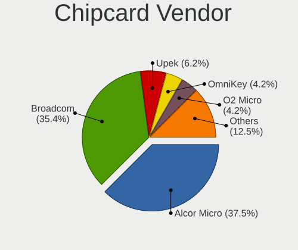

| Vendor                    | Notebooks | Percent |
|---------------------------|-----------|---------|
| Alcor Micro               | 18        | 37.5%   |
| Broadcom                  | 17        | 35.42%  |
| Upek                      | 3         | 6.25%   |
| OmniKey                   | 2         | 4.17%   |
| O2 Micro                  | 2         | 4.17%   |
| Lenovo                    | 2         | 4.17%   |
| Yubico.com                | 1         | 2.08%   |
| Realtek Semiconductor     | 1         | 2.08%   |
| Gemalto (was Gemplus)     | 1         | 2.08%   |
| Fujitsu Siemens Computers | 1         | 2.08%   |

Chipcard Model
--------------

Chipcard module models

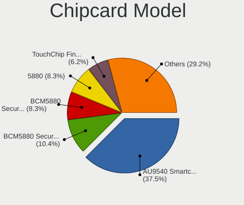

| Model                                                                        | Notebooks | Percent |
|------------------------------------------------------------------------------|-----------|---------|
| Alcor Micro AU9540 Smartcard Reader                                          | 18        | 37.5%   |
| Broadcom BCM5880 Secure Applications Processor                               | 5         | 10.42%  |
| Broadcom BCM5880 Secure Applications Processor with fingerprint swipe sensor | 4         | 8.33%   |
| Broadcom 5880                                                                | 4         | 8.33%   |
| Upek TouchChip Fingerprint Coprocessor (WBF advanced mode)                   | 3         | 6.25%   |
| Broadcom BCM58200 ControlVault 3 (FingerPrint sensor + Contacted SmartCard)  | 3         | 6.25%   |
| O2 Micro OZ776 CCID Smartcard Reader                                         | 2         | 4.17%   |
| Lenovo Integrated Smart Card Reader                                          | 2         | 4.17%   |
| Yubico.com Yubikey 4/5 U2F+CCID                                              | 1         | 2.08%   |
| Realtek Semiconductor Smart Card Reader Interface                            | 1         | 2.08%   |
| OmniKey CardMan 4321                                                         | 1         | 2.08%   |
| OmniKey 3x21 Smart Card Reader                                               | 1         | 2.08%   |
| Gemalto (was Gemplus) GemPC Twin SmartCard Reader                            | 1         | 2.08%   |
| Fujitsu Siemens Computers SmartCard Reader 2A                                | 1         | 2.08%   |
| Broadcom 58200                                                               | 1         | 2.08%   |

Unsupported
-----------

Unsupported Devices
-------------------

Total unsupported devices on board

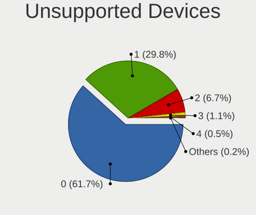

| Total | Notebooks | Percent |
|-------|-----------|---------|
| 0     | 389       | 61.75%  |
| 1     | 188       | 29.84%  |
| 2     | 42        | 6.67%   |
| 3     | 7         | 1.11%   |
| 4     | 3         | 0.48%   |
| 8     | 1         | 0.16%   |

Unsupported Device Types
------------------------

Types of unsupported devices

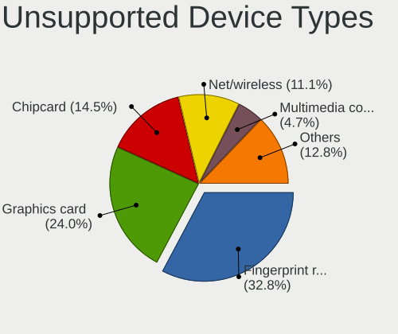

| Type                     | Notebooks | Percent |
|--------------------------|-----------|---------|
| Fingerprint reader       | 97        | 32.77%  |
| Graphics card            | 71        | 23.99%  |
| Chipcard                 | 43        | 14.53%  |
| Net/wireless             | 33        | 11.15%  |
| Multimedia controller    | 14        | 4.73%   |
| Bluetooth                | 11        | 3.72%   |
| Sound                    | 6         | 2.03%   |
| Communication controller | 5         | 1.69%   |
| Camera                   | 5         | 1.69%   |
| Card reader              | 4         | 1.35%   |
| Storage                  | 3         | 1.01%   |
| Net/ethernet             | 3         | 1.01%   |
| Modem                    | 1         | 0.34%   |

