Linux in Serbia - Tested Hardware & Statistics (Notebooks)
----------------------------------------------------------

A project to collect tested hardware configurations for Linux in Serbia.

Anyone can contribute to this report by the [hw-probe](https://github.com/linuxhw/hw-probe) tool:

    sudo -E hw-probe -all -upload

Please contribute! Especially if your hardware is rare.

Contents
--------

* [ Test Cases ](#test-cases)

* [ System ](#system)
  - [ OS                       ](#os)
  - [ OS Family                ](#os-family)
  - [ Kernel                   ](#kernel)
  - [ Kernel Family            ](#kernel-family)
  - [ Kernel Major Ver.        ](#kernel-major-ver)
  - [ Arch                     ](#arch)
  - [ DE                       ](#de)
  - [ Display Server           ](#display-server)
  - [ Display Manager          ](#display-manager)
  - [ OS Lang                  ](#os-lang)
  - [ Boot Mode                ](#boot-mode)
  - [ Filesystem               ](#filesystem)
  - [ Part. scheme             ](#part-scheme)
  - [ Dual Boot with Linux/BSD ](#dual-boot-with-linuxbsd)
  - [ Dual Boot (Win)          ](#dual-boot-win)

* [ Board ](#board)
  - [ Vendor                   ](#vendor)
  - [ Model                    ](#model)
  - [ Model Family             ](#model-family)
  - [ MFG Year                 ](#mfg-year)
  - [ Form Factor              ](#form-factor)
  - [ Secure Boot              ](#secure-boot)
  - [ Coreboot                 ](#coreboot)
  - [ RAM Size                 ](#ram-size)
  - [ RAM Used                 ](#ram-used)
  - [ Total Drives             ](#total-drives)
  - [ Has CD-ROM               ](#has-cd-rom)
  - [ Has Ethernet             ](#has-ethernet)
  - [ Has WiFi                 ](#has-wifi)
  - [ Has Bluetooth            ](#has-bluetooth)

* [ Location ](#location)
  - [ Country                  ](#country)
  - [ City                     ](#city)

* [ Drives ](#drives)
  - [ Drive Vendor             ](#drive-vendor)
  - [ Drive Model              ](#drive-model)
  - [ HDD Vendor               ](#hdd-vendor)
  - [ SSD Vendor               ](#ssd-vendor)
  - [ Drive Kind               ](#drive-kind)
  - [ Drive Connector          ](#drive-connector)
  - [ Drive Size               ](#drive-size)
  - [ Space Total              ](#space-total)
  - [ Space Used               ](#space-used)
  - [ Malfunc. Drives          ](#malfunc-drives)
  - [ Malfunc. Drive Vendor    ](#malfunc-drive-vendor)
  - [ Malfunc. HDD Vendor      ](#malfunc-hdd-vendor)
  - [ Malfunc. Drive Kind      ](#malfunc-drive-kind)
  - [ Failed Drives            ](#failed-drives)
  - [ Failed Drive Vendor      ](#failed-drive-vendor)
  - [ Drive Status             ](#drive-status)

* [ Storage controller ](#storage-controller)
  - [ Storage Vendor           ](#storage-vendor)
  - [ Storage Model            ](#storage-model)
  - [ Storage Kind             ](#storage-kind)

* [ Processor ](#processor)
  - [ CPU Vendor               ](#cpu-vendor)
  - [ CPU Model                ](#cpu-model)
  - [ CPU Model Family         ](#cpu-model-family)
  - [ CPU Cores                ](#cpu-cores)
  - [ CPU Sockets              ](#cpu-sockets)
  - [ CPU Threads              ](#cpu-threads)
  - [ CPU Op-Modes             ](#cpu-op-modes)
  - [ CPU Microcode            ](#cpu-microcode)
  - [ CPU Microarch            ](#cpu-microarch)

* [ Graphics ](#graphics)
  - [ GPU Vendor               ](#gpu-vendor)
  - [ GPU Model                ](#gpu-model)
  - [ GPU Combo                ](#gpu-combo)
  - [ GPU Driver               ](#gpu-driver)
  - [ GPU Memory               ](#gpu-memory)

* [ Monitor ](#monitor)
  - [ Monitor Vendor           ](#monitor-vendor)
  - [ Monitor Model            ](#monitor-model)
  - [ Monitor Resolution       ](#monitor-resolution)
  - [ Monitor Diagonal         ](#monitor-diagonal)
  - [ Monitor Width            ](#monitor-width)
  - [ Aspect Ratio             ](#aspect-ratio)
  - [ Monitor Area             ](#monitor-area)
  - [ Pixel Density            ](#pixel-density)
  - [ Multiple Monitors        ](#multiple-monitors)

* [ Network ](#network)
  - [ Net Controller Vendor    ](#net-controller-vendor)
  - [ Net Controller Model     ](#net-controller-model)
  - [ Wireless Vendor          ](#wireless-vendor)
  - [ Wireless Model           ](#wireless-model)
  - [ Ethernet Vendor          ](#ethernet-vendor)
  - [ Ethernet Model           ](#ethernet-model)
  - [ Net Controller Kind      ](#net-controller-kind)
  - [ Used Controller          ](#used-controller)
  - [ NICs                     ](#nics)
  - [ IPv6                     ](#ipv6)

* [ Bluetooth ](#bluetooth)
  - [ Bluetooth Vendor         ](#bluetooth-vendor)
  - [ Bluetooth Model          ](#bluetooth-model)

* [ Sound ](#sound)
  - [ Sound Vendor             ](#sound-vendor)
  - [ Sound Model              ](#sound-model)

* [ Memory ](#memory)
  - [ Memory Vendor            ](#memory-vendor)
  - [ Memory Model             ](#memory-model)
  - [ Memory Kind              ](#memory-kind)
  - [ Memory Form Factor       ](#memory-form-factor)
  - [ Memory Size              ](#memory-size)
  - [ Memory Speed             ](#memory-speed)

* [ Printers & scanners ](#printers--scanners)
  - [ Printer Vendor           ](#printer-vendor)
  - [ Printer Model            ](#printer-model)
  - [ Scanner Vendor           ](#scanner-vendor)
  - [ Scanner Model            ](#scanner-model)

* [ Camera ](#camera)
  - [ Camera Vendor            ](#camera-vendor)
  - [ Camera Model             ](#camera-model)

* [ Security ](#security)
  - [ Fingerprint Vendor       ](#fingerprint-vendor)
  - [ Fingerprint Model        ](#fingerprint-model)
  - [ Chipcard Vendor          ](#chipcard-vendor)
  - [ Chipcard Model           ](#chipcard-model)

* [ Unsupported ](#unsupported)
  - [ Unsupported Devices      ](#unsupported-devices)
  - [ Unsupported Device Types ](#unsupported-device-types)

Test Cases
----------

Total: 496

| Vendor        | Model                       | Probe                                                      | Date         |
|---------------|-----------------------------|------------------------------------------------------------|--------------|
| HP            | 255 G8 Notebook PC          | [05209e0503](https://linux-hardware.org/?probe=05209e0503) | Dec 29, 2022 |
| HP            | Victus by Laptop 16-e1xx... | [25183d70e2](https://linux-hardware.org/?probe=25183d70e2) | Dec 29, 2022 |
| Acer          | Aspire 5741                 | [1c41b5afb0](https://linux-hardware.org/?probe=1c41b5afb0) | Dec 27, 2022 |
| HUAWEI        | CREM-WXX9                   | [a48a2f6362](https://linux-hardware.org/?probe=a48a2f6362) | Dec 24, 2022 |
| Lenovo        | Legion 7 16IAX7 82TD        | [46e5d4fe56](https://linux-hardware.org/?probe=46e5d4fe56) | Dec 20, 2022 |
| Lenovo        | ThinkBook 15 G2 ARE 20VG    | [e8b0c03cb9](https://linux-hardware.org/?probe=e8b0c03cb9) | Dec 15, 2022 |
| Acer          | Nitro AN517-51              | [6b5fd6a48c](https://linux-hardware.org/?probe=6b5fd6a48c) | Dec 05, 2022 |
| Lenovo        | ThinkPad T14 Gen 1 20UDS... | [937053920b](https://linux-hardware.org/?probe=937053920b) | Dec 04, 2022 |
| Dell          | Inspiron N5050              | [c6bca6efa8](https://linux-hardware.org/?probe=c6bca6efa8) | Dec 03, 2022 |
| Dell          | Inspiron N5050              | [e4c533a89b](https://linux-hardware.org/?probe=e4c533a89b) | Nov 28, 2022 |
| Lenovo        | ThinkPad X1 Carbon 34601... | [ed678da106](https://linux-hardware.org/?probe=ed678da106) | Nov 26, 2022 |
| HP            | ProBook 445 14 inch G9 N... | [a20535bd66](https://linux-hardware.org/?probe=a20535bd66) | Nov 24, 2022 |
| HP            | Pavilion dv7                | [839266e415](https://linux-hardware.org/?probe=839266e415) | Nov 19, 2022 |
| HP            | Notebook                    | [2721a90e68](https://linux-hardware.org/?probe=2721a90e68) | Nov 19, 2022 |
| Dell          | Inspiron 3584               | [c3fde80859](https://linux-hardware.org/?probe=c3fde80859) | Nov 14, 2022 |
| Dell          | Inspiron 3584               | [c8e8add499](https://linux-hardware.org/?probe=c8e8add499) | Nov 14, 2022 |
| ASUSTek       | K93SV                       | [8511ee86ad](https://linux-hardware.org/?probe=8511ee86ad) | Nov 12, 2022 |
| ASUSTek       | VivoBook_ASUSLaptop X515... | [db62973b36](https://linux-hardware.org/?probe=db62973b36) | Nov 06, 2022 |
| Acer          | Aspire V3-571G              | [3d642bde4b](https://linux-hardware.org/?probe=3d642bde4b) | Nov 05, 2022 |
| Timi          | RedmiBook 14 II             | [374be77f36](https://linux-hardware.org/?probe=374be77f36) | Nov 05, 2022 |
| ASUSTek       | X751LB                      | [b9f1ea7699](https://linux-hardware.org/?probe=b9f1ea7699) | Nov 04, 2022 |
| ASUSTek       | X751LB                      | [e7334f33eb](https://linux-hardware.org/?probe=e7334f33eb) | Nov 04, 2022 |
| Lenovo        | IdeaPad 5 15ALC05 82LN      | [7d6d6c3c3a](https://linux-hardware.org/?probe=7d6d6c3c3a) | Nov 04, 2022 |
| Acer          | Aspire V3-571G              | [990a38ea87](https://linux-hardware.org/?probe=990a38ea87) | Nov 01, 2022 |
| Lenovo        | ThinkPad X1 Nano Gen 1 2... | [491477817a](https://linux-hardware.org/?probe=491477817a) | Oct 25, 2022 |
| ASUSTek       | N750JK                      | [341d4b53b1](https://linux-hardware.org/?probe=341d4b53b1) | Oct 20, 2022 |
| Lenovo        | IdeaPad 320-15ISK 80XH      | [d928c22430](https://linux-hardware.org/?probe=d928c22430) | Oct 14, 2022 |
| MSI           | GP66 Leopard 10UG           | [c2082a042d](https://linux-hardware.org/?probe=c2082a042d) | Oct 06, 2022 |
| Lenovo        | IdeaPad 5 14ARE05 81YM      | [b07d3b7b7f](https://linux-hardware.org/?probe=b07d3b7b7f) | Oct 05, 2022 |
| Lenovo        | B50-45 20388                | [c5f81be3fd](https://linux-hardware.org/?probe=c5f81be3fd) | Oct 02, 2022 |
| Lenovo        | V570 1066EDG                | [8e2439c590](https://linux-hardware.org/?probe=8e2439c590) | Oct 01, 2022 |
| Dell          | Precision M4800             | [d4142adadc](https://linux-hardware.org/?probe=d4142adadc) | Sep 29, 2022 |
| Lenovo        | ThinkPad X230 Tablet 343... | [d06b40ddf1](https://linux-hardware.org/?probe=d06b40ddf1) | Sep 29, 2022 |
| Lenovo        | IdeaPad 5 14IIL05 81YH      | [9fbedd972e](https://linux-hardware.org/?probe=9fbedd972e) | Sep 24, 2022 |
| Lenovo        | ThinkPad L14 Gen 2 20X1S... | [6e943a4d35](https://linux-hardware.org/?probe=6e943a4d35) | Sep 23, 2022 |
| Lenovo        | IdeaPad 5 14ALC05 82LM      | [641ad27b06](https://linux-hardware.org/?probe=641ad27b06) | Sep 22, 2022 |
| HP            | ProBook 6560b               | [743f401352](https://linux-hardware.org/?probe=743f401352) | Sep 20, 2022 |
| Lenovo        | IdeaPad Gaming 3 15IHU6 ... | [d0d43b3cc5](https://linux-hardware.org/?probe=d0d43b3cc5) | Sep 14, 2022 |
| Dell          | Inspiron N5050              | [131f5046db](https://linux-hardware.org/?probe=131f5046db) | Sep 11, 2022 |
| Apple         | MacBookPro8,2               | [a30032ef92](https://linux-hardware.org/?probe=a30032ef92) | Sep 11, 2022 |
| Apple         | MacBookPro8,2               | [0645f03606](https://linux-hardware.org/?probe=0645f03606) | Sep 11, 2022 |
| LG Electro... | 17Z990-R.AAS8U1             | [2df5aeabed](https://linux-hardware.org/?probe=2df5aeabed) | Sep 08, 2022 |
| Dell          | Inspiron 3593               | [fd6ab0c9e5](https://linux-hardware.org/?probe=fd6ab0c9e5) | Sep 07, 2022 |
| ASUSTek       | Zenbook UX5400EA_UX5400E... | [6ce8accfb1](https://linux-hardware.org/?probe=6ce8accfb1) | Sep 04, 2022 |
| Apple         | MacBookPro5,1               | [beec88b95c](https://linux-hardware.org/?probe=beec88b95c) | Sep 04, 2022 |
| Apple         | MacBookPro5,1               | [4c90105342](https://linux-hardware.org/?probe=4c90105342) | Sep 01, 2022 |
| ASUSTek       | Zenbook UX5401ZAS_UX5401... | [e3c7cd81e8](https://linux-hardware.org/?probe=e3c7cd81e8) | Aug 27, 2022 |
| Lenovo        | IdeaPad 3 15IIL05 81WE      | [f945f778b2](https://linux-hardware.org/?probe=f945f778b2) | Aug 26, 2022 |
| Apple         | MacBookPro5,1               | [6efab17b42](https://linux-hardware.org/?probe=6efab17b42) | Aug 25, 2022 |
| ASUSTek       | VivoBook_ASUSLaptop X531... | [255a1cdf9a](https://linux-hardware.org/?probe=255a1cdf9a) | Aug 24, 2022 |
| ASUSTek       | X542BA                      | [7e86736ebc](https://linux-hardware.org/?probe=7e86736ebc) | Aug 21, 2022 |
| ASUSTek       | K54C                        | [e10b52270f](https://linux-hardware.org/?probe=e10b52270f) | Aug 17, 2022 |
| Dell          | Inspiron 3521               | [ebf974be3e](https://linux-hardware.org/?probe=ebf974be3e) | Aug 13, 2022 |
| Dell          | Inspiron 3521               | [6dd71dbcf3](https://linux-hardware.org/?probe=6dd71dbcf3) | Aug 12, 2022 |
| Lenovo        | IdeaPad 3 15ITL6 82H8       | [fa9cdcd977](https://linux-hardware.org/?probe=fa9cdcd977) | Aug 12, 2022 |
| Apple         | MacBookPro5,1               | [ab09f2f44b](https://linux-hardware.org/?probe=ab09f2f44b) | Aug 11, 2022 |
| Sony          | VPCZ12M9E                   | [75f1c2f156](https://linux-hardware.org/?probe=75f1c2f156) | Aug 02, 2022 |
| Sony          | VPCEE23FX                   | [b4108910d3](https://linux-hardware.org/?probe=b4108910d3) | Jul 25, 2022 |
| Acer          | Nitro AN515-55              | [b121274e4f](https://linux-hardware.org/?probe=b121274e4f) | Jul 23, 2022 |
| Apple         | MacBookPro5,1               | [4bae560f04](https://linux-hardware.org/?probe=4bae560f04) | Jul 22, 2022 |
| Apple         | MacBookPro5,1               | [8a81341ecd](https://linux-hardware.org/?probe=8a81341ecd) | Jul 18, 2022 |
| HP            | Compaq nx7300 (RU373ES#A... | [3004f1d2b9](https://linux-hardware.org/?probe=3004f1d2b9) | Jul 16, 2022 |
| Gigabyte      | AERO 17 KC                  | [b6398b12e2](https://linux-hardware.org/?probe=b6398b12e2) | Jul 13, 2022 |
| Lenovo        | ThinkPad X280 20KES8D400    | [fdc339a6b0](https://linux-hardware.org/?probe=fdc339a6b0) | Jul 09, 2022 |
| Lenovo        | ThinkPad X280 20KES8D400    | [7d2b04b0ce](https://linux-hardware.org/?probe=7d2b04b0ce) | Jul 09, 2022 |
| Dell          | Vostro 15 3515              | [c6e9a42a66](https://linux-hardware.org/?probe=c6e9a42a66) | Jul 08, 2022 |
| ASUSTek       | VivoBook_ASUS Laptop X50... | [c01cf9f7fc](https://linux-hardware.org/?probe=c01cf9f7fc) | Jul 05, 2022 |
| HP            | 250 G4                      | [3d629889b2](https://linux-hardware.org/?probe=3d629889b2) | Jul 05, 2022 |
| HP            | 250 G4                      | [e19f8a8485](https://linux-hardware.org/?probe=e19f8a8485) | Jul 05, 2022 |
| Lenovo        | Legion 5 17ACH6 82K0        | [be7fd47ea1](https://linux-hardware.org/?probe=be7fd47ea1) | Jul 04, 2022 |
| Timi          | TM1613                      | [6d3f245289](https://linux-hardware.org/?probe=6d3f245289) | Jul 04, 2022 |
| Timi          | TM1613                      | [38d9919cfd](https://linux-hardware.org/?probe=38d9919cfd) | Jul 03, 2022 |
| Dell          | Inspiron 3593               | [5b091180ec](https://linux-hardware.org/?probe=5b091180ec) | Jun 28, 2022 |
| Lenovo        | ThinkPad T560 20FJS1KE00    | [f0cd91b4d2](https://linux-hardware.org/?probe=f0cd91b4d2) | Jun 21, 2022 |
| Lenovo        | Unknown                     | [cd2f32d91c](https://linux-hardware.org/?probe=cd2f32d91c) | Jun 16, 2022 |
| HP            | Pavilion Notebook           | [06c982ad14](https://linux-hardware.org/?probe=06c982ad14) | Jun 16, 2022 |
| Lenovo        | ThinkPad T60 2007FUG        | [2c1a306677](https://linux-hardware.org/?probe=2c1a306677) | Jun 16, 2022 |
| ASUSTek       | K55VD                       | [7fa5d36a45](https://linux-hardware.org/?probe=7fa5d36a45) | Jun 04, 2022 |
| HP            | ProBook 470 G1              | [ef73457d51](https://linux-hardware.org/?probe=ef73457d51) | May 31, 2022 |
| Lenovo        | ThinkPad T490 20N2000LMZ    | [9ebff03a43](https://linux-hardware.org/?probe=9ebff03a43) | May 26, 2022 |
| Lenovo        | ThinkPad T490 20N2000LMZ    | [cc80808aea](https://linux-hardware.org/?probe=cc80808aea) | May 26, 2022 |
| Lenovo        | ThinkPad T61 6463Y3W        | [065aa2538b](https://linux-hardware.org/?probe=065aa2538b) | May 18, 2022 |
| HP            | Laptop 15-db1xxx            | [f6262ce7f2](https://linux-hardware.org/?probe=f6262ce7f2) | May 12, 2022 |
| Lenovo        | IdeaPad 3 14ALC6 82KT       | [e90b6752ba](https://linux-hardware.org/?probe=e90b6752ba) | May 12, 2022 |
| HP            | ProBook 450 G2              | [2c2a15aab2](https://linux-hardware.org/?probe=2c2a15aab2) | May 12, 2022 |
| Lenovo        | IdeaPad 3 15ADA05 81W1      | [d18df271fd](https://linux-hardware.org/?probe=d18df271fd) | May 09, 2022 |
| Medion        | X781X/X782X                 | [fbe630f91c](https://linux-hardware.org/?probe=fbe630f91c) | May 07, 2022 |
| Lenovo        | IdeaPad Z370                | [be37f3c962](https://linux-hardware.org/?probe=be37f3c962) | May 04, 2022 |
| Lenovo        | IdeaPad 3 14ALC6 82KT       | [633bddd44b](https://linux-hardware.org/?probe=633bddd44b) | Apr 30, 2022 |
| Acer          | Nitro AN517-51              | [81d7fd8d2e](https://linux-hardware.org/?probe=81d7fd8d2e) | Apr 30, 2022 |
| Dell          | Latitude 7280               | [e64ba65609](https://linux-hardware.org/?probe=e64ba65609) | Apr 22, 2022 |
| Lenovo        | Unknown                     | [6e1760aed0](https://linux-hardware.org/?probe=6e1760aed0) | Apr 17, 2022 |
| Lenovo        | IdeaPad 320-15IKB 80YE      | [b888c78ed6](https://linux-hardware.org/?probe=b888c78ed6) | Apr 12, 2022 |
| Lenovo        | IdeaPad 320-15IKB 80YE      | [45dad76f04](https://linux-hardware.org/?probe=45dad76f04) | Apr 12, 2022 |
| HP            | Notebook                    | [4ffd4d11a5](https://linux-hardware.org/?probe=4ffd4d11a5) | Apr 09, 2022 |
| Lenovo        | ThinkPad T490 20N2CTO1WW    | [0dbb9e7eb0](https://linux-hardware.org/?probe=0dbb9e7eb0) | Apr 09, 2022 |
| Lenovo        | IdeaPad 3 15IIL05 81WE      | [950a436db3](https://linux-hardware.org/?probe=950a436db3) | Apr 06, 2022 |
| Lenovo        | Legion 5 15ARH05H 82B1      | [906de71a65](https://linux-hardware.org/?probe=906de71a65) | Apr 02, 2022 |
| Lenovo        | V330-15IKB 81AX             | [8a881c75f4](https://linux-hardware.org/?probe=8a881c75f4) | Mar 29, 2022 |
| HUAWEI        | NBLB-WAX9N                  | [5eb56f360e](https://linux-hardware.org/?probe=5eb56f360e) | Mar 29, 2022 |
| Fujitsu       | LIFEBOOK AH531              | [f92c8b77dc](https://linux-hardware.org/?probe=f92c8b77dc) | Mar 25, 2022 |
| Fujitsu Si... | AMILO Li3710                | [ab84e23108](https://linux-hardware.org/?probe=ab84e23108) | Mar 24, 2022 |
| Dell          | Inspiron 3542               | [6a8c31fa33](https://linux-hardware.org/?probe=6a8c31fa33) | Mar 21, 2022 |
| Apple         | MacBookPro8,1               | [f55145f34a](https://linux-hardware.org/?probe=f55145f34a) | Mar 16, 2022 |
| Toshiba       | Satellite C870-17H          | [0169bf05d7](https://linux-hardware.org/?probe=0169bf05d7) | Mar 10, 2022 |
| Fujitsu Si... | AMILO Li3710                | [7a4a682f45](https://linux-hardware.org/?probe=7a4a682f45) | Mar 07, 2022 |
| ASUSTek       | VivoBook_ASUSLaptop X513... | [2c44722344](https://linux-hardware.org/?probe=2c44722344) | Mar 03, 2022 |
| ASUSTek       | E200HA                      | [69ec87e43a](https://linux-hardware.org/?probe=69ec87e43a) | Mar 02, 2022 |
| HP            | Laptop 15s-fq0xxx           | [9acf95b26b](https://linux-hardware.org/?probe=9acf95b26b) | Feb 28, 2022 |
| Lenovo        | IdeaPad 110-15IBR 80T7      | [03a49e64cf](https://linux-hardware.org/?probe=03a49e64cf) | Feb 28, 2022 |
| Gigabyte      | AERO 17 KC                  | [08b488b969](https://linux-hardware.org/?probe=08b488b969) | Feb 27, 2022 |
| Dell          | Latitude 7490               | [003b6b4a95](https://linux-hardware.org/?probe=003b6b4a95) | Feb 21, 2022 |
| Dell          | Inspiron 3581               | [0ae0e53b53](https://linux-hardware.org/?probe=0ae0e53b53) | Feb 20, 2022 |
| HP            | Notebook                    | [a1f9f76ed0](https://linux-hardware.org/?probe=a1f9f76ed0) | Feb 19, 2022 |
| Toshiba       | Satellite C55-A             | [19133950aa](https://linux-hardware.org/?probe=19133950aa) | Feb 15, 2022 |
| ASUSTek       | X55A                        | [c6b17158ac](https://linux-hardware.org/?probe=c6b17158ac) | Feb 14, 2022 |
| Lenovo        | ThinkPad L14 Gen 2 20X1S... | [4f80537faf](https://linux-hardware.org/?probe=4f80537faf) | Feb 06, 2022 |
| Toshiba       | Satellite C55-C             | [379d3b37b1](https://linux-hardware.org/?probe=379d3b37b1) | Feb 05, 2022 |
| BenQ          | Joybook Lite U121           | [28f254dd8d](https://linux-hardware.org/?probe=28f254dd8d) | Feb 02, 2022 |
| Dell          | Vostro 3500                 | [729abacd12](https://linux-hardware.org/?probe=729abacd12) | Feb 01, 2022 |
| ASUSTek       | VivoBook_ASUSLaptop X513... | [5e9f8a1c0d](https://linux-hardware.org/?probe=5e9f8a1c0d) | Jan 29, 2022 |
| Dell          | Latitude E6510              | [efc619cc61](https://linux-hardware.org/?probe=efc619cc61) | Jan 28, 2022 |
| Lenovo        | IdeaPad 110-15ISK 80UD      | [37ec4f5294](https://linux-hardware.org/?probe=37ec4f5294) | Jan 25, 2022 |
| ASUSTek       | E200HA                      | [2c53d21746](https://linux-hardware.org/?probe=2c53d21746) | Jan 22, 2022 |
| ASUSTek       | E200HA                      | [02be439ac8](https://linux-hardware.org/?probe=02be439ac8) | Jan 22, 2022 |
| HP            | EliteBook 1050 G1           | [1bb5cb826f](https://linux-hardware.org/?probe=1bb5cb826f) | Jan 19, 2022 |
| TWC           | Unknown                     | [85a8fd2cf1](https://linux-hardware.org/?probe=85a8fd2cf1) | Jan 18, 2022 |
| TWC           | Unknown                     | [d4cc69cea7](https://linux-hardware.org/?probe=d4cc69cea7) | Jan 16, 2022 |
| Fujitsu       | LIFEBOOK A3510              | [b673072fbb](https://linux-hardware.org/?probe=b673072fbb) | Jan 11, 2022 |
| Dell          | Vostro 5402                 | [f586d10ee6](https://linux-hardware.org/?probe=f586d10ee6) | Jan 05, 2022 |
| MSI           | GT70 2PC                    | [61a5023d6a](https://linux-hardware.org/?probe=61a5023d6a) | Jan 03, 2022 |
| Dell          | Latitude 7490               | [2d6469644a](https://linux-hardware.org/?probe=2d6469644a) | Jan 02, 2022 |
| Lenovo        | ThinkPad T490 20N3S6VU00    | [afb7fa66f5](https://linux-hardware.org/?probe=afb7fa66f5) | Dec 30, 2021 |
| Dell          | Latitude 7490               | [4e350048ed](https://linux-hardware.org/?probe=4e350048ed) | Dec 27, 2021 |
| Fujitsu Si... | AMILO Li3710                | [183a47572f](https://linux-hardware.org/?probe=183a47572f) | Dec 27, 2021 |
| ASUSTek       | X580VD                      | [fe350107e3](https://linux-hardware.org/?probe=fe350107e3) | Dec 25, 2021 |
| ASUSTek       | VivoBook_ASUSLaptop X540... | [74591e1700](https://linux-hardware.org/?probe=74591e1700) | Dec 12, 2021 |
| Toshiba       | Satellite Pro L650          | [fd40a9d639](https://linux-hardware.org/?probe=fd40a9d639) | Dec 07, 2021 |
| HP            | Laptop 15s-eq1xxx           | [a61a3df5f9](https://linux-hardware.org/?probe=a61a3df5f9) | Dec 04, 2021 |
| Dell          | Vostro 3500                 | [3df309c91c](https://linux-hardware.org/?probe=3df309c91c) | Dec 03, 2021 |
| Fujitsu Si... | AMILO Li3910                | [6f355c1c73](https://linux-hardware.org/?probe=6f355c1c73) | Dec 01, 2021 |
| HP            | Laptop 14-ck0xxx            | [60a074698a](https://linux-hardware.org/?probe=60a074698a) | Dec 01, 2021 |
| Samsung       | 350V5C/350V5X/350V4C/350... | [440d34a6b0](https://linux-hardware.org/?probe=440d34a6b0) | Nov 28, 2021 |
| Samsung       | 350V5C/350V5X/350V4C/350... | [bb7b625409](https://linux-hardware.org/?probe=bb7b625409) | Nov 28, 2021 |
| ASUSTek       | N53SN                       | [67d66feb3e](https://linux-hardware.org/?probe=67d66feb3e) | Nov 20, 2021 |
| Acer          | Aspire ES1-533              | [14a4c57e27](https://linux-hardware.org/?probe=14a4c57e27) | Nov 05, 2021 |
| Lenovo        | G500 20236                  | [7708d61566](https://linux-hardware.org/?probe=7708d61566) | Nov 05, 2021 |
| eMachines     | eME440                      | [1427ebffb0](https://linux-hardware.org/?probe=1427ebffb0) | Oct 29, 2021 |
| Lenovo        | ThinkPad T490 20N3S6VU00    | [f8024b89d4](https://linux-hardware.org/?probe=f8024b89d4) | Oct 28, 2021 |
| Lenovo        | Legion Y530-15ICH 81FV      | [d180cf6efc](https://linux-hardware.org/?probe=d180cf6efc) | Oct 23, 2021 |
| Lenovo        | ThinkPad L14 Gen 2 20X1S... | [cb8bcc4d2d](https://linux-hardware.org/?probe=cb8bcc4d2d) | Oct 22, 2021 |
| Lenovo        | ThinkPad T490 20N3S6VU00    | [a99866abc1](https://linux-hardware.org/?probe=a99866abc1) | Oct 21, 2021 |
| HP            | EliteBook 840 G3            | [650c91f4db](https://linux-hardware.org/?probe=650c91f4db) | Oct 18, 2021 |
| HP            | EliteBook 840 G3            | [5e28e542c2](https://linux-hardware.org/?probe=5e28e542c2) | Oct 17, 2021 |
| Dell          | Inspiron 3520               | [7eafd054fc](https://linux-hardware.org/?probe=7eafd054fc) | Oct 17, 2021 |
| HP            | Laptop 15s-eq2xxx           | [2e7ac4731f](https://linux-hardware.org/?probe=2e7ac4731f) | Oct 16, 2021 |
| Lenovo        | G555 0873                   | [a38f52851a](https://linux-hardware.org/?probe=a38f52851a) | Oct 05, 2021 |
| ASUSTek       | 1005PE                      | [bd2044749b](https://linux-hardware.org/?probe=bd2044749b) | Sep 22, 2021 |
| Acer          | Aspire V3-571G              | [b9fcdffa50](https://linux-hardware.org/?probe=b9fcdffa50) | Sep 22, 2021 |
| ASUSTek       | 1005PE                      | [02ccb36302](https://linux-hardware.org/?probe=02ccb36302) | Sep 21, 2021 |
| ASUSTek       | 1005PE                      | [081e791398](https://linux-hardware.org/?probe=081e791398) | Sep 19, 2021 |
| Toshiba       | Satellite C55-B             | [59a0efda89](https://linux-hardware.org/?probe=59a0efda89) | Sep 18, 2021 |
| ASUSTek       | 1005PE                      | [a3adf0356c](https://linux-hardware.org/?probe=a3adf0356c) | Sep 18, 2021 |
| Acer          | Aspire V3-571G              | [cedbbde363](https://linux-hardware.org/?probe=cedbbde363) | Sep 13, 2021 |
| Lenovo        | G500 20236                  | [f77883b614](https://linux-hardware.org/?probe=f77883b614) | Sep 07, 2021 |
| HP            | ProBook 4730s               | [36834479ab](https://linux-hardware.org/?probe=36834479ab) | Sep 03, 2021 |
| Apple         | MacBookPro8,1               | [da332ba09e](https://linux-hardware.org/?probe=da332ba09e) | Sep 01, 2021 |
| Dell          | Inspiron 3537               | [cad80329d8](https://linux-hardware.org/?probe=cad80329d8) | Aug 31, 2021 |
| Lenovo        | G500 20236                  | [60f43f8815](https://linux-hardware.org/?probe=60f43f8815) | Aug 29, 2021 |
| Dell          | Inspiron 5593               | [ebac51e403](https://linux-hardware.org/?probe=ebac51e403) | Aug 28, 2021 |
| ASUSTek       | VivoBook_ASUSLaptop X515... | [62c96ffa5b](https://linux-hardware.org/?probe=62c96ffa5b) | Aug 25, 2021 |
| ASUSTek       | VivoBook_ASUSLaptop X515... | [516b9ff2ed](https://linux-hardware.org/?probe=516b9ff2ed) | Aug 25, 2021 |
| Dell          | Inspiron 7520               | [056e1c0825](https://linux-hardware.org/?probe=056e1c0825) | Aug 21, 2021 |
| Lenovo        | IdeaPad 330-15IKB 81DE      | [79051f2400](https://linux-hardware.org/?probe=79051f2400) | Aug 19, 2021 |
| HP            | EliteBook 840 G5            | [4c196e1abd](https://linux-hardware.org/?probe=4c196e1abd) | Aug 18, 2021 |
| HP            | G62                         | [b6eeeba9d1](https://linux-hardware.org/?probe=b6eeeba9d1) | Aug 15, 2021 |
| HP            | G62                         | [4adea9bed4](https://linux-hardware.org/?probe=4adea9bed4) | Aug 14, 2021 |
| HP            | Pavilion g6                 | [df95184640](https://linux-hardware.org/?probe=df95184640) | Aug 02, 2021 |
| HP            | Pavilion g6                 | [0e0aaaac98](https://linux-hardware.org/?probe=0e0aaaac98) | Aug 02, 2021 |
| Toshiba       | Satellite Pro L650          | [10e8624257](https://linux-hardware.org/?probe=10e8624257) | Jul 27, 2021 |
| Toshiba       | Satellite C55-B             | [c703c827c6](https://linux-hardware.org/?probe=c703c827c6) | Jul 21, 2021 |
| ASUSTek       | ASUS TUF Gaming F15 FX50... | [b44e9be41b](https://linux-hardware.org/?probe=b44e9be41b) | Jul 19, 2021 |
| Lenovo        | IdeaPad 5 14ALC05 82LM      | [56faa89619](https://linux-hardware.org/?probe=56faa89619) | Jul 16, 2021 |
| Lenovo        | V330-15IKB 81AX             | [70128f07ea](https://linux-hardware.org/?probe=70128f07ea) | Jul 13, 2021 |
| HP            | Compaq nx7400 (RU429EA#A... | [ce0542775b](https://linux-hardware.org/?probe=ce0542775b) | Jun 22, 2021 |
| Lenovo        | ThinkPad X201 Tablet 298... | [d04705eaef](https://linux-hardware.org/?probe=d04705eaef) | Jun 20, 2021 |
| ASUSTek       | G551JK                      | [aace05a48f](https://linux-hardware.org/?probe=aace05a48f) | Jun 17, 2021 |
| ASUSTek       | G551JK                      | [2947ae8fc2](https://linux-hardware.org/?probe=2947ae8fc2) | Jun 17, 2021 |
| ASUSTek       | VivoBook_ASUSLaptop X705... | [80b26a6c37](https://linux-hardware.org/?probe=80b26a6c37) | Jun 16, 2021 |
| Dell          | Inspiron 15-3567            | [8487e42c1e](https://linux-hardware.org/?probe=8487e42c1e) | Jun 12, 2021 |
| ASUSTek       | VivoBook_ASUSLaptop X705... | [18fd922adc](https://linux-hardware.org/?probe=18fd922adc) | Jun 10, 2021 |
| Dell          | Latitude 5520               | [45b3e7c2af](https://linux-hardware.org/?probe=45b3e7c2af) | Jun 06, 2021 |
| Dell          | Vostro 5402                 | [ec4c7c0192](https://linux-hardware.org/?probe=ec4c7c0192) | Jun 04, 2021 |
| MSI           | CR500                       | [76d2d77034](https://linux-hardware.org/?probe=76d2d77034) | Jun 03, 2021 |
| MSI           | CR500                       | [93f6fd0ae4](https://linux-hardware.org/?probe=93f6fd0ae4) | Jun 02, 2021 |
| MSI           | CR500                       | [b1d00d1444](https://linux-hardware.org/?probe=b1d00d1444) | May 30, 2021 |
| HP            | Notebook                    | [f60121b761](https://linux-hardware.org/?probe=f60121b761) | May 30, 2021 |
| ASUSTek       | TUF Gaming FX505DT_FX505... | [f794ea73e4](https://linux-hardware.org/?probe=f794ea73e4) | May 28, 2021 |
| Apple         | MacBookPro1,1               | [cc14c7fa2e](https://linux-hardware.org/?probe=cc14c7fa2e) | May 16, 2021 |
| HP            | ProBook 4530s               | [3d5a77511e](https://linux-hardware.org/?probe=3d5a77511e) | May 12, 2021 |
| Dell          | Vostro 5402                 | [03aa94f52f](https://linux-hardware.org/?probe=03aa94f52f) | May 11, 2021 |
| ASUSTek       | VivoBook_ASUSLaptop X705... | [b57920ccda](https://linux-hardware.org/?probe=b57920ccda) | May 10, 2021 |
| ASUSTek       | VivoBook_ASUSLaptop X705... | [19bf5a98df](https://linux-hardware.org/?probe=19bf5a98df) | May 10, 2021 |
| ASUSTek       | K53E                        | [314e6bbbd2](https://linux-hardware.org/?probe=314e6bbbd2) | May 04, 2021 |
| ASUSTek       | K53E                        | [9a34eba18a](https://linux-hardware.org/?probe=9a34eba18a) | May 03, 2021 |
| Fujitsu Si... | AMILO Pi 2512               | [bc0294a996](https://linux-hardware.org/?probe=bc0294a996) | May 03, 2021 |
| HP            | EliteBook 2540p             | [506fb4d003](https://linux-hardware.org/?probe=506fb4d003) | May 02, 2021 |
| Lenovo        | ThinkPad T440s 20ARS3B00... | [fa546522c1](https://linux-hardware.org/?probe=fa546522c1) | May 02, 2021 |
| Medion        | P6812                       | [a45bd7fc22](https://linux-hardware.org/?probe=a45bd7fc22) | Apr 19, 2021 |
| Acer          | Aspire A315-31              | [2b821447d2](https://linux-hardware.org/?probe=2b821447d2) | Apr 14, 2021 |
| Acer          | Aspire A315-31              | [e7a7c4b64f](https://linux-hardware.org/?probe=e7a7c4b64f) | Apr 14, 2021 |
| Acer          | Aspire A315-23              | [c7a0c1bf24](https://linux-hardware.org/?probe=c7a0c1bf24) | Apr 13, 2021 |
| HP            | Pavilion 15                 | [88ca55e5af](https://linux-hardware.org/?probe=88ca55e5af) | Apr 08, 2021 |
| Acer          | Aspire A515-51G             | [97f260c7d5](https://linux-hardware.org/?probe=97f260c7d5) | Mar 31, 2021 |
| Lenovo        | IdeaPad 3 15IIL05 81WE      | [084a69a05a](https://linux-hardware.org/?probe=084a69a05a) | Mar 30, 2021 |
| Dell          | G5 5587                     | [862386a9b4](https://linux-hardware.org/?probe=862386a9b4) | Mar 27, 2021 |
| HP            | Laptop 15-db1xxx            | [59fb434d97](https://linux-hardware.org/?probe=59fb434d97) | Mar 21, 2021 |
| HP            | Laptop 15-db1xxx            | [aab4f11f05](https://linux-hardware.org/?probe=aab4f11f05) | Mar 21, 2021 |
| Dell          | Inspiron 3542               | [517406f8b6](https://linux-hardware.org/?probe=517406f8b6) | Mar 21, 2021 |
| HP            | ZBook 15 G3                 | [4ab4d49018](https://linux-hardware.org/?probe=4ab4d49018) | Mar 17, 2021 |
| HP            | Laptop 15-da1xxx            | [ed4ddd6238](https://linux-hardware.org/?probe=ed4ddd6238) | Mar 15, 2021 |
| ASUSTek       | VivoBook_ASUSLaptop X421... | [640a0a3857](https://linux-hardware.org/?probe=640a0a3857) | Mar 13, 2021 |
| ASUSTek       | VivoBook_ASUSLaptop X421... | [66de852009](https://linux-hardware.org/?probe=66de852009) | Mar 11, 2021 |
| Acer          | Aspire 5742G                | [659f9d690c](https://linux-hardware.org/?probe=659f9d690c) | Mar 10, 2021 |
| Dell          | Latitude E6320              | [a69653a323](https://linux-hardware.org/?probe=a69653a323) | Mar 08, 2021 |
| Acer          | Aspire 5735                 | [cde827bd2e](https://linux-hardware.org/?probe=cde827bd2e) | Mar 07, 2021 |
| Acer          | Aspire 5735                 | [9730b9273d](https://linux-hardware.org/?probe=9730b9273d) | Mar 07, 2021 |
| Lenovo        | IdeaPad 330-15IKB 81DE      | [7d5313fdad](https://linux-hardware.org/?probe=7d5313fdad) | Mar 06, 2021 |
| Toshiba       | Satellite L20               | [875478a51a](https://linux-hardware.org/?probe=875478a51a) | Mar 06, 2021 |
| HP            | ProBook 650 G1              | [e21aaf16e3](https://linux-hardware.org/?probe=e21aaf16e3) | Mar 03, 2021 |
| Lenovo        | IdeaPad L340-15API 81LW     | [a94321f4aa](https://linux-hardware.org/?probe=a94321f4aa) | Feb 27, 2021 |
| Dell          | Inspiron 7520               | [4611155200](https://linux-hardware.org/?probe=4611155200) | Feb 20, 2021 |
| HP            | ProBook 470 G3              | [12ef122267](https://linux-hardware.org/?probe=12ef122267) | Feb 19, 2021 |
| Dell          | Inspiron 3542               | [d77d8a8749](https://linux-hardware.org/?probe=d77d8a8749) | Feb 18, 2021 |
| ASUSTek       | ASUS TUF Gaming F15 FX50... | [5843b21ecd](https://linux-hardware.org/?probe=5843b21ecd) | Feb 14, 2021 |
| HP            | ProBook 650 G1              | [2dcb1a408a](https://linux-hardware.org/?probe=2dcb1a408a) | Feb 13, 2021 |
| HP            | ProBook 650 G1              | [1d63d4f78d](https://linux-hardware.org/?probe=1d63d4f78d) | Feb 10, 2021 |
| Dell          | Latitude E5470              | [ac140ada48](https://linux-hardware.org/?probe=ac140ada48) | Feb 09, 2021 |
| Lenovo        | IdeaPad Y570 20091          | [e80a31db39](https://linux-hardware.org/?probe=e80a31db39) | Feb 03, 2021 |
| Dell          | Latitude E5470              | [72db68119a](https://linux-hardware.org/?probe=72db68119a) | Jan 27, 2021 |
| Dell          | Latitude E6430              | [b7f8906f0f](https://linux-hardware.org/?probe=b7f8906f0f) | Jan 27, 2021 |
| Lenovo        | IdeaPad Y570 20091          | [68fdde328b](https://linux-hardware.org/?probe=68fdde328b) | Jan 27, 2021 |
| HP            | EliteBook 8560p             | [875db98e08](https://linux-hardware.org/?probe=875db98e08) | Jan 23, 2021 |
| Acer          | Aspire 5736Z                | [6bb8df4de2](https://linux-hardware.org/?probe=6bb8df4de2) | Jan 21, 2021 |
| Lenovo        | Legion Y7000 2019 PG0 81... | [9f77ea6e17](https://linux-hardware.org/?probe=9f77ea6e17) | Jan 14, 2021 |
| Lenovo        | IdeaPad 320-15IAP 80XR      | [ab2decc440](https://linux-hardware.org/?probe=ab2decc440) | Jan 12, 2021 |
| Lenovo        | ThinkPad R400 2786W1L       | [5335da910d](https://linux-hardware.org/?probe=5335da910d) | Jan 10, 2021 |
| Lenovo        | ThinkPad R400 2786W1L       | [c7fbffcc09](https://linux-hardware.org/?probe=c7fbffcc09) | Jan 10, 2021 |
| Packard Be... | EasyNote TS11HR             | [ab603b2fe8](https://linux-hardware.org/?probe=ab603b2fe8) | Jan 06, 2021 |
| Lenovo        | IdeaPad 5 14ARE05 81YM      | [7e0f5ef3ce](https://linux-hardware.org/?probe=7e0f5ef3ce) | Jan 04, 2021 |
| Toshiba       | Satellite C650              | [da33e577bf](https://linux-hardware.org/?probe=da33e577bf) | Jan 02, 2021 |
| Packard Be... | EasyNote TS11HR             | [343249d2da](https://linux-hardware.org/?probe=343249d2da) | Jan 02, 2021 |
| Toshiba       | Satellite C650              | [3ccf619144](https://linux-hardware.org/?probe=3ccf619144) | Dec 31, 2020 |
| ASUSTek       | X541NA                      | [ce08535027](https://linux-hardware.org/?probe=ce08535027) | Dec 25, 2020 |
| ASUSTek       | X541NA                      | [a026c30d04](https://linux-hardware.org/?probe=a026c30d04) | Dec 25, 2020 |
| HP            | Laptop 15-db0xxx            | [87ecbeb3f9](https://linux-hardware.org/?probe=87ecbeb3f9) | Dec 22, 2020 |
| Lenovo        | V330-15IKB 81AX             | [7bbfaa08a2](https://linux-hardware.org/?probe=7bbfaa08a2) | Dec 19, 2020 |
| Lenovo        | IdeaPad 5 14ARE05 81YM      | [a3f26b77de](https://linux-hardware.org/?probe=a3f26b77de) | Dec 17, 2020 |
| Acer          | Aspire A315-31              | [3d19374493](https://linux-hardware.org/?probe=3d19374493) | Dec 17, 2020 |
| Dell          | XPS 13 9380                 | [1eae71a2dd](https://linux-hardware.org/?probe=1eae71a2dd) | Dec 14, 2020 |
| Acer          | Aspire A315-31              | [630a5fce15](https://linux-hardware.org/?probe=630a5fce15) | Dec 11, 2020 |
| Acer          | Aspire A715-75G             | [9c6b3be687](https://linux-hardware.org/?probe=9c6b3be687) | Dec 10, 2020 |
| Acer          | Aspire A717-71G             | [f355a859fe](https://linux-hardware.org/?probe=f355a859fe) | Dec 05, 2020 |
| Acer          | Aspire A717-71G             | [e0144299e5](https://linux-hardware.org/?probe=e0144299e5) | Dec 05, 2020 |
| Acer          | Aspire A715-75G             | [4d6f15896a](https://linux-hardware.org/?probe=4d6f15896a) | Dec 01, 2020 |
| Acer          | Aspire A715-75G             | [cea1efd2f4](https://linux-hardware.org/?probe=cea1efd2f4) | Dec 01, 2020 |
| Acer          | Aspire ES1-533              | [e20dc3c4e4](https://linux-hardware.org/?probe=e20dc3c4e4) | Nov 26, 2020 |
| Acer          | Aspire ES1-533              | [1ff481eb22](https://linux-hardware.org/?probe=1ff481eb22) | Nov 26, 2020 |
| Lenovo        | V15-ADA 82C7                | [c25d3746ee](https://linux-hardware.org/?probe=c25d3746ee) | Nov 24, 2020 |
| ASUSTek       | VivoBook_ASUSLaptop X580... | [b59cef94de](https://linux-hardware.org/?probe=b59cef94de) | Nov 22, 2020 |
| ASUSTek       | VivoBook_ASUSLaptop X580... | [cb540754ed](https://linux-hardware.org/?probe=cb540754ed) | Nov 22, 2020 |
| MSI           | CR610                       | [8e7bf69342](https://linux-hardware.org/?probe=8e7bf69342) | Nov 22, 2020 |
| MSI           | CR610                       | [ba50d62533](https://linux-hardware.org/?probe=ba50d62533) | Nov 22, 2020 |
| Dell          | Inspiron 3541               | [f10a3f7947](https://linux-hardware.org/?probe=f10a3f7947) | Nov 21, 2020 |
| Dell          | Inspiron 3541               | [28a2250b7c](https://linux-hardware.org/?probe=28a2250b7c) | Nov 21, 2020 |
| Lenovo        | V130-14IGM 81HM             | [e282aa9ff3](https://linux-hardware.org/?probe=e282aa9ff3) | Nov 20, 2020 |
| Lenovo        | V15-ADA 82C7                | [aa224b81ef](https://linux-hardware.org/?probe=aa224b81ef) | Nov 18, 2020 |
| HP            | Laptop 15-da0xxx            | [2cc03df5d0](https://linux-hardware.org/?probe=2cc03df5d0) | Nov 16, 2020 |
| HP            | Pavilion Notebook           | [c68070f9b3](https://linux-hardware.org/?probe=c68070f9b3) | Nov 10, 2020 |
| HP            | Pavilion Notebook           | [99e25d58ad](https://linux-hardware.org/?probe=99e25d58ad) | Nov 10, 2020 |
| Lenovo        | IdeaPad 320-15IAP 80XR      | [9555e785bb](https://linux-hardware.org/?probe=9555e785bb) | Nov 09, 2020 |
| Lenovo        | IdeaPad 320-15IAP 80XR      | [0de6c928a4](https://linux-hardware.org/?probe=0de6c928a4) | Nov 09, 2020 |
| Lenovo        | V130-14IGM 81HM             | [23fd9c7140](https://linux-hardware.org/?probe=23fd9c7140) | Nov 09, 2020 |
| Dell          | Inspiron 1720               | [d2018981ad](https://linux-hardware.org/?probe=d2018981ad) | Nov 05, 2020 |
| Lenovo        | V330-15IKB 81AX             | [c6872a9a60](https://linux-hardware.org/?probe=c6872a9a60) | Nov 03, 2020 |
| ASUSTek       | X541NA                      | [a3067761af](https://linux-hardware.org/?probe=a3067761af) | Oct 18, 2020 |
| ASUSTek       | X541NA                      | [baf94800b6](https://linux-hardware.org/?probe=baf94800b6) | Oct 18, 2020 |
| Lenovo        | 3000 N200 0769BNG           | [233a47535c](https://linux-hardware.org/?probe=233a47535c) | Oct 15, 2020 |
| ASUSTek       | TUF Gaming FA506II_FA506... | [9356879a60](https://linux-hardware.org/?probe=9356879a60) | Oct 13, 2020 |
| ASUSTek       | VivoBook_ASUSLaptop X509... | [4ccef20bb6](https://linux-hardware.org/?probe=4ccef20bb6) | Oct 13, 2020 |
| Lenovo        | 3000 N200 0769BNG           | [8ea03b6d29](https://linux-hardware.org/?probe=8ea03b6d29) | Oct 13, 2020 |
| ASUSTek       | VivoBook_ASUSLaptop X509... | [43c0586dbe](https://linux-hardware.org/?probe=43c0586dbe) | Oct 12, 2020 |
| Acer          | Aspire A315-31              | [00686fcd7b](https://linux-hardware.org/?probe=00686fcd7b) | Oct 12, 2020 |
| Dell          | Latitude E5470              | [a1ae53e261](https://linux-hardware.org/?probe=a1ae53e261) | Oct 06, 2020 |
| Acer          | Aspire A515-55              | [d88d774f7f](https://linux-hardware.org/?probe=d88d774f7f) | Oct 05, 2020 |
| Lenovo        | B50-45 20388                | [c25c3ef2d8](https://linux-hardware.org/?probe=c25c3ef2d8) | Oct 05, 2020 |
| Lenovo        | B50-45 20388                | [e3d174f961](https://linux-hardware.org/?probe=e3d174f961) | Oct 05, 2020 |
| Lenovo        | V330-15IKB 81AX             | [cb2c394f1a](https://linux-hardware.org/?probe=cb2c394f1a) | Oct 02, 2020 |
| HP            | Notebook                    | [9fcfc67d9c](https://linux-hardware.org/?probe=9fcfc67d9c) | Sep 29, 2020 |
| Lenovo        | V330-15IKB 81AX             | [1734ca75eb](https://linux-hardware.org/?probe=1734ca75eb) | Sep 29, 2020 |
| Lenovo        | ThinkPad T440p 20AWS0KK0... | [d231920967](https://linux-hardware.org/?probe=d231920967) | Sep 28, 2020 |
| HP            | 355 G2                      | [07981744ab](https://linux-hardware.org/?probe=07981744ab) | Sep 27, 2020 |
| HP            | 355 G2                      | [08e4ab3c53](https://linux-hardware.org/?probe=08e4ab3c53) | Sep 26, 2020 |
| Lenovo        | V330-15IKB 81AX             | [a34c376304](https://linux-hardware.org/?probe=a34c376304) | Sep 18, 2020 |
| Lenovo        | IdeaPad 330S-15IKB 81F5     | [20c5e9395d](https://linux-hardware.org/?probe=20c5e9395d) | Sep 16, 2020 |
| Toshiba       | QOSMIO F50                  | [b60fe2f9e5](https://linux-hardware.org/?probe=b60fe2f9e5) | Sep 16, 2020 |
| HP            | Laptop 17-by2xxx            | [d3fcaecf43](https://linux-hardware.org/?probe=d3fcaecf43) | Sep 12, 2020 |
| ASUSTek       | VivoBook_ASUSLaptop X509... | [eea494974a](https://linux-hardware.org/?probe=eea494974a) | Sep 11, 2020 |
| Lenovo        | ThinkPad X1 Carbon 4th 2... | [00956078a0](https://linux-hardware.org/?probe=00956078a0) | Sep 03, 2020 |
| Acer          | AOA150                      | [d7397a31d7](https://linux-hardware.org/?probe=d7397a31d7) | Aug 31, 2020 |
| Dell          | Inspiron 3593               | [2c97a34461](https://linux-hardware.org/?probe=2c97a34461) | Aug 20, 2020 |
| HP            | 530 Notebook PC(GU327AA#... | [55d79e4d6a](https://linux-hardware.org/?probe=55d79e4d6a) | Aug 17, 2020 |
| HP            | 530 Notebook PC(GU327AA#... | [19b6cecfad](https://linux-hardware.org/?probe=19b6cecfad) | Aug 17, 2020 |
| Lenovo        | ThinkPad T480 20L6S43212    | [e408e4045b](https://linux-hardware.org/?probe=e408e4045b) | Aug 16, 2020 |
| Dell          | Inspiron 5577               | [f10ef91563](https://linux-hardware.org/?probe=f10ef91563) | Aug 06, 2020 |
| MSI           | CR500                       | [a347574891](https://linux-hardware.org/?probe=a347574891) | Aug 03, 2020 |
| MSI           | CR500                       | [21b1264f8c](https://linux-hardware.org/?probe=21b1264f8c) | Aug 03, 2020 |
| Lenovo        | Legion Y530-15ICH 81FV      | [a2dd413553](https://linux-hardware.org/?probe=a2dd413553) | Jul 26, 2020 |
| Lenovo        | Legion Y530-15ICH 81FV      | [e1073052d4](https://linux-hardware.org/?probe=e1073052d4) | Jul 26, 2020 |
| HP            | ProBook 450 G1              | [8db5efa1fc](https://linux-hardware.org/?probe=8db5efa1fc) | Jul 22, 2020 |
| Acer          | Aspire A315-42              | [b5aacd7b39](https://linux-hardware.org/?probe=b5aacd7b39) | Jul 12, 2020 |
| Acer          | Aspire A315-42              | [88afcfbe5b](https://linux-hardware.org/?probe=88afcfbe5b) | Jul 11, 2020 |
| Lenovo        | V110-15AST 80TD             | [6a86c949a2](https://linux-hardware.org/?probe=6a86c949a2) | Jul 10, 2020 |
| Acer          | Aspire A315-31              | [3ab4bed99e](https://linux-hardware.org/?probe=3ab4bed99e) | Jul 05, 2020 |
| Acer          | Aspire E1-531               | [7baad79bd7](https://linux-hardware.org/?probe=7baad79bd7) | Jul 04, 2020 |
| Lenovo        | V110-15AST 80TD             | [16211b52a1](https://linux-hardware.org/?probe=16211b52a1) | Jun 25, 2020 |
| Sony          | VPCZ21X9E                   | [72e4be4ea5](https://linux-hardware.org/?probe=72e4be4ea5) | Jun 12, 2020 |
| Sony          | VPCZ21X9E                   | [26affa7385](https://linux-hardware.org/?probe=26affa7385) | Jun 12, 2020 |
| Apple         | MacBook5,1                  | [099f5faf14](https://linux-hardware.org/?probe=099f5faf14) | Jun 02, 2020 |
| ASUSTek       | N550JX                      | [99693da42c](https://linux-hardware.org/?probe=99693da42c) | May 31, 2020 |
| Dell          | Inspiron 5559               | [3eee5b1f3d](https://linux-hardware.org/?probe=3eee5b1f3d) | May 31, 2020 |
| HP            | 250 G5 Notebook PC          | [1a72632c64](https://linux-hardware.org/?probe=1a72632c64) | May 27, 2020 |
| Lenovo        | V330-15IKB 81AX             | [c4087d6c6a](https://linux-hardware.org/?probe=c4087d6c6a) | May 21, 2020 |
| ASUSTek       | K50AB                       | [96ccf326a8](https://linux-hardware.org/?probe=96ccf326a8) | May 19, 2020 |
| Dell          | Inspiron N5010              | [f1e4f13c21](https://linux-hardware.org/?probe=f1e4f13c21) | May 18, 2020 |
| Lenovo        | V310-15ISK 80SY             | [a608769eb0](https://linux-hardware.org/?probe=a608769eb0) | May 15, 2020 |
| Lenovo        | ThinkPad T460 20FNS0KT00    | [92e676e189](https://linux-hardware.org/?probe=92e676e189) | May 15, 2020 |
| Lenovo        | ThinkPad T460 20FNS0KT00    | [b7fd9a70e0](https://linux-hardware.org/?probe=b7fd9a70e0) | May 15, 2020 |
| ASUSTek       | G551JK                      | [1d29493d79](https://linux-hardware.org/?probe=1d29493d79) | May 14, 2020 |
| ASUSTek       | G551JK                      | [2aa55f08d0](https://linux-hardware.org/?probe=2aa55f08d0) | May 14, 2020 |
| ASUSTek       | VivoBook 15_ASUS Laptop ... | [03ba757adf](https://linux-hardware.org/?probe=03ba757adf) | May 13, 2020 |
| Lenovo        | IdeaPad 110-15IBR 80T7      | [dadd9d2790](https://linux-hardware.org/?probe=dadd9d2790) | May 12, 2020 |
| HP            | ZBook 15 G3                 | [3474070eb8](https://linux-hardware.org/?probe=3474070eb8) | May 10, 2020 |
| Lenovo        | G50-30 80G0                 | [4ac3289ec9](https://linux-hardware.org/?probe=4ac3289ec9) | May 09, 2020 |
| ASUSTek       | K54C                        | [3188c4843a](https://linux-hardware.org/?probe=3188c4843a) | May 08, 2020 |
| Dell          | Inspiron 5567               | [099e174bf4](https://linux-hardware.org/?probe=099e174bf4) | May 07, 2020 |
| Lenovo        | ThinkPad L470 20J5S4RS00    | [b646e36068](https://linux-hardware.org/?probe=b646e36068) | May 04, 2020 |
| Dell          | Inspiron 3537               | [a26c6f5812](https://linux-hardware.org/?probe=a26c6f5812) | Apr 21, 2020 |
| HP            | 250 G5 Notebook PC          | [01f3f0f185](https://linux-hardware.org/?probe=01f3f0f185) | Apr 14, 2020 |
| Lenovo        | ThinkPad E560 20EV003EMS    | [0b978ac786](https://linux-hardware.org/?probe=0b978ac786) | Apr 14, 2020 |
| HP            | ZBook 15 G3                 | [16ee557e51](https://linux-hardware.org/?probe=16ee557e51) | Apr 12, 2020 |
| HP            | Mini 110-3100               | [a32c0db8bb](https://linux-hardware.org/?probe=a32c0db8bb) | Apr 11, 2020 |
| Acer          | Aspire 7520G                | [d5bc992097](https://linux-hardware.org/?probe=d5bc992097) | Apr 04, 2020 |
| Toshiba       | TECRA Z50-A                 | [889a5aa1a6](https://linux-hardware.org/?probe=889a5aa1a6) | Apr 02, 2020 |
| Lenovo        | IdeaPad 330-15ARR 81D2      | [cb84e8c9af](https://linux-hardware.org/?probe=cb84e8c9af) | Mar 23, 2020 |
| Lenovo        | IdeaPad 330-15ARR 81D2      | [8670fa919e](https://linux-hardware.org/?probe=8670fa919e) | Mar 23, 2020 |
| ASUSTek       | X541NC                      | [63b197a2c0](https://linux-hardware.org/?probe=63b197a2c0) | Mar 21, 2020 |
| Fujitsu Si... | AMILO Li3710                | [11ebf93798](https://linux-hardware.org/?probe=11ebf93798) | Mar 18, 2020 |
| Lenovo        | Yoga 300-11IBR 80M1         | [b19ba42878](https://linux-hardware.org/?probe=b19ba42878) | Mar 17, 2020 |
| Dell          | Inspiron 15 7000 Gaming     | [334884c294](https://linux-hardware.org/?probe=334884c294) | Mar 10, 2020 |
| HP            | 250 G1                      | [7a7e2dfcee](https://linux-hardware.org/?probe=7a7e2dfcee) | Mar 10, 2020 |
| HP            | 250 G4                      | [d8b2caab0f](https://linux-hardware.org/?probe=d8b2caab0f) | Mar 08, 2020 |
| Acer          | Aspire A315-41              | [5870ecc433](https://linux-hardware.org/?probe=5870ecc433) | Mar 08, 2020 |
| Acer          | Aspire E3-112               | [62041aa7fa](https://linux-hardware.org/?probe=62041aa7fa) | Mar 08, 2020 |
| Lenovo        | ThinkPad T500 2056W2J       | [1923e28174](https://linux-hardware.org/?probe=1923e28174) | Mar 05, 2020 |
| Lenovo        | IdeaPad 330-15IKB 81DE      | [bda2f29230](https://linux-hardware.org/?probe=bda2f29230) | Feb 24, 2020 |
| Fujitsu       | LIFEBOOK AH530              | [5d93dd0911](https://linux-hardware.org/?probe=5d93dd0911) | Feb 20, 2020 |
| Dell          | Inspiron 15 7000 Gaming     | [eb55029938](https://linux-hardware.org/?probe=eb55029938) | Feb 18, 2020 |
| ASUSTek       | X551MA                      | [530fb26de2](https://linux-hardware.org/?probe=530fb26de2) | Feb 16, 2020 |
| Lenovo        | IdeaPad 330-15IKB 81DE      | [4d942fa22c](https://linux-hardware.org/?probe=4d942fa22c) | Feb 10, 2020 |
| ASUSTek       | X541UVK                     | [9e44db3513](https://linux-hardware.org/?probe=9e44db3513) | Feb 06, 2020 |
| Lenovo        | G505 20240                  | [3208a023bf](https://linux-hardware.org/?probe=3208a023bf) | Feb 04, 2020 |
| Lenovo        | IdeaPad 330-15IKB 81DE      | [91bdd7eccf](https://linux-hardware.org/?probe=91bdd7eccf) | Feb 01, 2020 |
| Lenovo        | IdeaPad 330-15IKB 81DE      | [a4a64dfa74](https://linux-hardware.org/?probe=a4a64dfa74) | Feb 01, 2020 |
| Acer          | Aspire E1-530               | [0e64af354b](https://linux-hardware.org/?probe=0e64af354b) | Jan 30, 2020 |
| Acer          | Swift SF314-56              | [303332d310](https://linux-hardware.org/?probe=303332d310) | Jan 29, 2020 |
| Toshiba       | Satellite C50-B             | [06c487df1d](https://linux-hardware.org/?probe=06c487df1d) | Jan 28, 2020 |
| Acer          | Aspire A315-31              | [b482e7ef86](https://linux-hardware.org/?probe=b482e7ef86) | Jan 25, 2020 |
| Lenovo        | ThinkPad T520 42406AG       | [7de4fdce8d](https://linux-hardware.org/?probe=7de4fdce8d) | Jan 23, 2020 |
| Lenovo        | V330-15IKB 81AX             | [b0d2c5611e](https://linux-hardware.org/?probe=b0d2c5611e) | Jan 22, 2020 |
| HP            | Compaq nc6320 (RU381ES#A... | [d3a7e386ae](https://linux-hardware.org/?probe=d3a7e386ae) | Jan 16, 2020 |
| ASUSTek       | VivoBook 15_ASUS Laptop ... | [84bf577e7d](https://linux-hardware.org/?probe=84bf577e7d) | Jan 16, 2020 |
| Acer          | Aspire A315-31              | [36dcda44ba](https://linux-hardware.org/?probe=36dcda44ba) | Jan 15, 2020 |
| ASUSTek       | VivoBook_ASUSLaptop X570... | [cc4a9ba559](https://linux-hardware.org/?probe=cc4a9ba559) | Jan 15, 2020 |
| ASUSTek       | VivoBook_ASUSLaptop X570... | [72f2c4c12a](https://linux-hardware.org/?probe=72f2c4c12a) | Jan 15, 2020 |
| ASUSTek       | VivoBook 15_ASUS Laptop ... | [b5d63aec77](https://linux-hardware.org/?probe=b5d63aec77) | Jan 15, 2020 |
| ASUSTek       | VivoBook 15_ASUS Laptop ... | [7d389b1fcb](https://linux-hardware.org/?probe=7d389b1fcb) | Jan 15, 2020 |
| Lenovo        | IdeaPad S540-14API 81NH     | [b2c0da1b44](https://linux-hardware.org/?probe=b2c0da1b44) | Jan 12, 2020 |
| HP            | ProBook 650 G1              | [224d2a830f](https://linux-hardware.org/?probe=224d2a830f) | Jan 08, 2020 |
| ASUSTek       | X55A                        | [3482727e9f](https://linux-hardware.org/?probe=3482727e9f) | Jan 03, 2020 |
| Lenovo        | ThinkPad P50 20EQS1AC00     | [0767220809](https://linux-hardware.org/?probe=0767220809) | Jan 03, 2020 |
| Dell          | Inspiron 3558               | [63be3850f8](https://linux-hardware.org/?probe=63be3850f8) | Dec 31, 2019 |
| Acer          | Aspire A315-51              | [fb858f1586](https://linux-hardware.org/?probe=fb858f1586) | Dec 30, 2019 |
| Acer          | Aspire A315-51              | [0dfa591b1c](https://linux-hardware.org/?probe=0dfa591b1c) | Dec 30, 2019 |
| ASUSTek       | VivoBook 15_ASUS Laptop ... | [dfac3d950c](https://linux-hardware.org/?probe=dfac3d950c) | Dec 29, 2019 |
| Samsung       | N250P/N145P                 | [708195d4f1](https://linux-hardware.org/?probe=708195d4f1) | Dec 27, 2019 |
| Toshiba       | Satellite C850-1H6          | [a0ffb29c6c](https://linux-hardware.org/?probe=a0ffb29c6c) | Dec 18, 2019 |
| HP            | ProBook 640 G1              | [0813940da0](https://linux-hardware.org/?probe=0813940da0) | Dec 09, 2019 |
| Lenovo        | IdeaPad L340-15API 81LW     | [3193d44169](https://linux-hardware.org/?probe=3193d44169) | Dec 04, 2019 |
| ASUSTek       | X550MJ                      | [3fde87c7b4](https://linux-hardware.org/?probe=3fde87c7b4) | Dec 04, 2019 |
| ASUSTek       | VivoBook 15_ASUS Laptop ... | [8a33af729e](https://linux-hardware.org/?probe=8a33af729e) | Dec 03, 2019 |
| Acer          | Aspire A315-51              | [77affe222c](https://linux-hardware.org/?probe=77affe222c) | Nov 16, 2019 |
| HP            | Notebook                    | [8df47391f9](https://linux-hardware.org/?probe=8df47391f9) | Nov 15, 2019 |
| Acer          | Aspire A315-31              | [3812d4729c](https://linux-hardware.org/?probe=3812d4729c) | Nov 14, 2019 |
| HP            | Notebook                    | [fe0316d8bb](https://linux-hardware.org/?probe=fe0316d8bb) | Nov 14, 2019 |
| Lenovo        | ThinkPad T420s 4174BB2      | [53037be14e](https://linux-hardware.org/?probe=53037be14e) | Nov 03, 2019 |
| Lenovo        | ThinkPad Edge E330 33544... | [c27afaa8d2](https://linux-hardware.org/?probe=c27afaa8d2) | Oct 20, 2019 |
| Acer          | Aspire 5350                 | [bfca910110](https://linux-hardware.org/?probe=bfca910110) | Oct 20, 2019 |
| Lenovo        | ThinkPad Edge E330 33544... | [0e391bc5f7](https://linux-hardware.org/?probe=0e391bc5f7) | Oct 20, 2019 |
| HP            | ProBook 650 G1              | [4886df0de1](https://linux-hardware.org/?probe=4886df0de1) | Oct 20, 2019 |
| Acer          | Aspire 5350                 | [6c1a1b4cd5](https://linux-hardware.org/?probe=6c1a1b4cd5) | Oct 19, 2019 |
| Dell          | Latitude 5580               | [e2d5fd3182](https://linux-hardware.org/?probe=e2d5fd3182) | Oct 18, 2019 |
| Dell          | Latitude 5580               | [fbb2c68803](https://linux-hardware.org/?probe=fbb2c68803) | Oct 18, 2019 |
| Dell          | Latitude 5580               | [4ba29dd71c](https://linux-hardware.org/?probe=4ba29dd71c) | Oct 18, 2019 |
| Acer          | Aspire A315-31              | [2ab608ac7e](https://linux-hardware.org/?probe=2ab608ac7e) | Oct 13, 2019 |
| HP            | Pavilion Notebook           | [dffd6ce6cb](https://linux-hardware.org/?probe=dffd6ce6cb) | Oct 13, 2019 |
| Lenovo        | IdeaPad S540-14API 81NH     | [d0671b5d7f](https://linux-hardware.org/?probe=d0671b5d7f) | Oct 12, 2019 |
| Acer          | Aspire A717-71G             | [4bad7bd17c](https://linux-hardware.org/?probe=4bad7bd17c) | Sep 21, 2019 |
| Lenovo        | ThinkPad T520 42406AG       | [3e835a3fea](https://linux-hardware.org/?probe=3e835a3fea) | Sep 15, 2019 |
| Razer         | Blade                       | [da397f901b](https://linux-hardware.org/?probe=da397f901b) | Sep 10, 2019 |
| Lenovo        | ThinkBook 13s-IWL 20R9      | [655aa5059b](https://linux-hardware.org/?probe=655aa5059b) | Sep 04, 2019 |
| HP            | Laptop 15-ra0xx             | [2e41137334](https://linux-hardware.org/?probe=2e41137334) | Sep 03, 2019 |
| HP            | Laptop 15-ra0xx             | [8aadf9c34a](https://linux-hardware.org/?probe=8aadf9c34a) | Sep 02, 2019 |
| HP            | Laptop 15-ra0xx             | [96e535cece](https://linux-hardware.org/?probe=96e535cece) | Sep 02, 2019 |
| Acer          | Aspire A315-31              | [9d8698e977](https://linux-hardware.org/?probe=9d8698e977) | Aug 28, 2019 |
| Acer          | Aspire A315-31              | [95dba17d9a](https://linux-hardware.org/?probe=95dba17d9a) | Aug 17, 2019 |
| Dell          | Precision 7730              | [b9281326d7](https://linux-hardware.org/?probe=b9281326d7) | Jul 25, 2019 |
| ASUSTek       | X201EP                      | [a1a1f1965a](https://linux-hardware.org/?probe=a1a1f1965a) | Jul 22, 2019 |
| Dell          | Latitude E5440              | [f40c3d18fb](https://linux-hardware.org/?probe=f40c3d18fb) | Jul 19, 2019 |
| Lenovo        | ThinkPad P51 20HHS04800     | [4013dc5bc1](https://linux-hardware.org/?probe=4013dc5bc1) | Jul 16, 2019 |
| Lenovo        | IdeaPad 330-15ICH 81FK      | [1613715663](https://linux-hardware.org/?probe=1613715663) | Jul 15, 2019 |
| Lenovo        | IdeaPad 330-15ICH 81FK      | [62ebee4d1f](https://linux-hardware.org/?probe=62ebee4d1f) | Jul 15, 2019 |
| ASUSTek       | X541NA                      | [5fdb751780](https://linux-hardware.org/?probe=5fdb751780) | Jul 11, 2019 |
| ASUSTek       | X541NA                      | [8676bfc466](https://linux-hardware.org/?probe=8676bfc466) | Jul 11, 2019 |
| HP            | Laptop 15-ra0xx             | [f28399b983](https://linux-hardware.org/?probe=f28399b983) | Jul 09, 2019 |
| Toshiba       | Satellite L755              | [e2413cea5d](https://linux-hardware.org/?probe=e2413cea5d) | Jul 06, 2019 |
| HP            | 250 G6 Notebook PC          | [7d8551e612](https://linux-hardware.org/?probe=7d8551e612) | Jun 29, 2019 |
| Lenovo        | G500 20236                  | [4faa6112c3](https://linux-hardware.org/?probe=4faa6112c3) | Jun 28, 2019 |
| HP            | Laptop 15-db0xxx            | [df6f074dbd](https://linux-hardware.org/?probe=df6f074dbd) | Jun 11, 2019 |
| IBM           | ThinkPad R52p 1847W5R       | [1dc1d8e6f2](https://linux-hardware.org/?probe=1dc1d8e6f2) | Jun 09, 2019 |
| HP            | Unknown                     | [cf3a7ad203](https://linux-hardware.org/?probe=cf3a7ad203) | Jun 05, 2019 |
| ASUSTek       | ZenBook Pro 15 UX550GDX_... | [f1a85fe5ba](https://linux-hardware.org/?probe=f1a85fe5ba) | Jun 05, 2019 |
| HP            | Pavilion Notebook           | [ad610739b6](https://linux-hardware.org/?probe=ad610739b6) | Jun 01, 2019 |
| HP            | Pavilion Notebook           | [476f3cfb4a](https://linux-hardware.org/?probe=476f3cfb4a) | May 26, 2019 |
| Acer          | Aspire A717-71G             | [882e32aaf7](https://linux-hardware.org/?probe=882e32aaf7) | May 21, 2019 |
| Dell          | Inspiron 5567               | [29fadee02e](https://linux-hardware.org/?probe=29fadee02e) | May 19, 2019 |
| Lenovo        | V330-15IKB 81AX             | [8f1cfe4955](https://linux-hardware.org/?probe=8f1cfe4955) | May 17, 2019 |
| HP            | 250 G1                      | [4550b3fdf6](https://linux-hardware.org/?probe=4550b3fdf6) | May 17, 2019 |
| HP            | 250 G1                      | [7dda48b144](https://linux-hardware.org/?probe=7dda48b144) | May 17, 2019 |
| ASUSTek       | X541SA                      | [dff8b29714](https://linux-hardware.org/?probe=dff8b29714) | May 10, 2019 |
| ASUSTek       | X541SA                      | [308cc99aee](https://linux-hardware.org/?probe=308cc99aee) | May 10, 2019 |
| ASUSTek       | X541SA                      | [f03f0840fb](https://linux-hardware.org/?probe=f03f0840fb) | May 10, 2019 |
| ASUSTek       | VivoBook_ASUSLaptop X580... | [8195906a99](https://linux-hardware.org/?probe=8195906a99) | May 06, 2019 |
| Acer          | Aspire E1-530               | [e5658355fa](https://linux-hardware.org/?probe=e5658355fa) | May 03, 2019 |
| LG Electro... | LW70-JJKG                   | [76f306de39](https://linux-hardware.org/?probe=76f306de39) | Apr 27, 2019 |
| Dell          | G3 3779                     | [8407de048a](https://linux-hardware.org/?probe=8407de048a) | Apr 26, 2019 |
| Acer          | Aspire A717-71G             | [7385402cb8](https://linux-hardware.org/?probe=7385402cb8) | Apr 25, 2019 |
| ASUSTek       | X541NC                      | [50aeeec380](https://linux-hardware.org/?probe=50aeeec380) | Apr 19, 2019 |
| ASUSTek       | X541NC                      | [5278c50f95](https://linux-hardware.org/?probe=5278c50f95) | Apr 13, 2019 |
| Fujitsu Si... | AMILO PRO V3515             | [1d96b8f60d](https://linux-hardware.org/?probe=1d96b8f60d) | Apr 11, 2019 |
| ASUSTek       | X541NA                      | [b94a9e24c1](https://linux-hardware.org/?probe=b94a9e24c1) | Apr 07, 2019 |
| Toshiba       | Satellite C870-17H          | [dc2ce35421](https://linux-hardware.org/?probe=dc2ce35421) | Apr 06, 2019 |
| Acer          | Aspire A717-71G             | [600ac82384](https://linux-hardware.org/?probe=600ac82384) | Mar 30, 2019 |
| Acer          | Aspire 6935                 | [d8a5d80999](https://linux-hardware.org/?probe=d8a5d80999) | Mar 23, 2019 |
| Dell          | Inspiron N5110              | [5137b5b274](https://linux-hardware.org/?probe=5137b5b274) | Mar 21, 2019 |
| HP            | Pavilion dv5                | [3f857e2920](https://linux-hardware.org/?probe=3f857e2920) | Mar 18, 2019 |
| ASUSTek       | X550MD                      | [4e37ad043d](https://linux-hardware.org/?probe=4e37ad043d) | Mar 14, 2019 |
| Sony          | VGN-FE31Z                   | [860dcaf74d](https://linux-hardware.org/?probe=860dcaf74d) | Feb 16, 2019 |
| Dell          | Precision M4600             | [6f6a52607b](https://linux-hardware.org/?probe=6f6a52607b) | Feb 14, 2019 |
| ASUSTek       | X540LA                      | [03ab6a3cd8](https://linux-hardware.org/?probe=03ab6a3cd8) | Feb 11, 2019 |
| Acer          | Aspire A315-21              | [b28972ad25](https://linux-hardware.org/?probe=b28972ad25) | Feb 10, 2019 |
| MSI           | MS-16Y1                     | [a676d0126f](https://linux-hardware.org/?probe=a676d0126f) | Feb 07, 2019 |
| ASUSTek       | X540LA                      | [a7cb02a6fb](https://linux-hardware.org/?probe=a7cb02a6fb) | Feb 02, 2019 |
| ASUSTek       | X540LA                      | [18752af5af](https://linux-hardware.org/?probe=18752af5af) | Jan 31, 2019 |
| ASUSTek       | X540LA                      | [dea612f99d](https://linux-hardware.org/?probe=dea612f99d) | Jan 31, 2019 |
| ASUSTek       | X541NA                      | [d66eb82eac](https://linux-hardware.org/?probe=d66eb82eac) | Jan 23, 2019 |
| ASUSTek       | K55DR                       | [13a17add51](https://linux-hardware.org/?probe=13a17add51) | Jan 22, 2019 |
| Acer          | Aspire ES1-532G             | [af17a54207](https://linux-hardware.org/?probe=af17a54207) | Jan 12, 2019 |
| ASUSTek       | X541NA                      | [53fba97f8a](https://linux-hardware.org/?probe=53fba97f8a) | Jan 04, 2019 |
| ASUSTek       | X541NA                      | [a0cb966487](https://linux-hardware.org/?probe=a0cb966487) | Jan 04, 2019 |
| Acer          | Aspire A717-71G             | [c3edad77d8](https://linux-hardware.org/?probe=c3edad77d8) | Dec 24, 2018 |
| Acer          | Aspire A315-21              | [9289091c83](https://linux-hardware.org/?probe=9289091c83) | Nov 28, 2018 |
| Acer          | Aspire A717-71G             | [3c22bb7c43](https://linux-hardware.org/?probe=3c22bb7c43) | Nov 04, 2018 |
| Acer          | Aspire A717-71G             | [65968eaade](https://linux-hardware.org/?probe=65968eaade) | Nov 01, 2018 |
| HP            | 15                          | [a6c00a0fde](https://linux-hardware.org/?probe=a6c00a0fde) | Jul 08, 2018 |
| HP            | 250 G5 Notebook PC          | [24f9e4ee20](https://linux-hardware.org/?probe=24f9e4ee20) | Jun 24, 2018 |
| HP            | Pavilion dv7                | [566fa1aed1](https://linux-hardware.org/?probe=566fa1aed1) | Feb 24, 2018 |
| HP            | ProBook 650 G1              | [b0a5c81710](https://linux-hardware.org/?probe=b0a5c81710) | Jan 24, 2018 |
| HP            | 250 G5 Notebook PC          | [c939de9629](https://linux-hardware.org/?probe=c939de9629) | Dec 17, 2017 |
| Toshiba       | Satellite C50-A-1G3         | [4d2b35494b](https://linux-hardware.org/?probe=4d2b35494b) | Dec 16, 2017 |
| HP            | 15                          | [93985df093](https://linux-hardware.org/?probe=93985df093) | Sep 26, 2017 |
| Dell          | Inspiron 7520               | [3b5516e47b](https://linux-hardware.org/?probe=3b5516e47b) | Aug 27, 2017 |
| Fujitsu Si... | ESPRIMO Mobile V5505        | [5ab0f522c2](https://linux-hardware.org/?probe=5ab0f522c2) | Aug 19, 2017 |
| Lenovo        | G560 20042                  | [6f5d9b39bb](https://linux-hardware.org/?probe=6f5d9b39bb) | May 09, 2017 |
| ASUSTek       | K55VD                       | [5fecb30529](https://linux-hardware.org/?probe=5fecb30529) | Jan 08, 2017 |
| ASUSTek       | K55VD                       | [f9af076683](https://linux-hardware.org/?probe=f9af076683) | Jan 07, 2017 |

System
------

OS
--

Installed operating systems

| Name                         | Notebooks | Percent |
|------------------------------|-----------|---------|
| Ubuntu 20.04                 | 43        | 11.59%  |
| Ubuntu 18.04                 | 29        | 7.82%   |
| Ubuntu 22.04                 | 15        | 4.04%   |
| OpenMandriva 4.3             | 10        | 2.7%    |
| Zorin 15                     | 9         | 2.43%   |
| BlackPanther 18.1            | 9         | 2.43%   |
| ROSA R11                     | 8         | 2.16%   |
| Arch                         | 8         | 2.16%   |
| Ubuntu 19.10                 | 7         | 1.89%   |
| Linux Mint 19.3              | 7         | 1.89%   |
| OpenMandriva 4.2             | 6         | 1.62%   |
| Linux Mint 20.3              | 6         | 1.62%   |
| Ubuntu 21.10                 | 5         | 1.35%   |
| Ubuntu 18.10                 | 5         | 1.35%   |
| ROSA R10                     | 5         | 1.35%   |
| Pop!_OS 22.04                | 5         | 1.35%   |
| KDE neon 20.04               | 5         | 1.35%   |
| ROSA R11.1                   | 4         | 1.08%   |
| Pop!_OS 21.04                | 4         | 1.08%   |
| openSUSE Tumbleweed-XXXXXXXX | 4         | 1.08%   |
| Fedora 34                    | 4         | 1.08%   |
| ArcoLinux Rolling            | 4         | 1.08%   |
| Arch Rolling                 | 4         | 1.08%   |
| Zorin 16                     | 3         | 0.81%   |
| Xubuntu 20.04                | 3         | 0.81%   |
| Ubuntu 21.04                 | 3         | 0.81%   |
| Ubuntu 19.04                 | 3         | 0.81%   |
| ROSA R9                      | 3         | 0.81%   |
| ROSA 12.2                    | 3         | 0.81%   |
| Manjaro                      | 3         | 0.81%   |
| Linux Mint 21                | 3         | 0.81%   |
| Linux Mint 20.2              | 3         | 0.81%   |
| Linux Mint 20.1              | 3         | 0.81%   |
| KDE neon 18.04               | 3         | 0.81%   |
| Fedora 35                    | 3         | 0.81%   |
| Fedora 30                    | 3         | 0.81%   |
| Endless 3.9.4                | 3         | 0.81%   |
| Endless 3.9.0                | 3         | 0.81%   |
| Endless 3.5.4                | 3         | 0.81%   |
| Xubuntu 18.04                | 2         | 0.54%   |

OS Family
---------

OS without a version

| Name          | Notebooks | Percent |
|---------------|-----------|---------|
| Ubuntu        | 114       | 33.24%  |
| Endless       | 30        | 8.75%   |
| Linux Mint    | 23        | 6.71%   |
| ROSA          | 22        | 6.41%   |
| OpenMandriva  | 17        | 4.96%   |
| Fedora        | 16        | 4.66%   |
| Pop!_OS       | 14        | 4.08%   |
| Zorin         | 13        | 3.79%   |
| Manjaro       | 12        | 3.5%    |
| Arch          | 12        | 3.5%    |
| BlackPanther  | 10        | 2.92%   |
| KDE neon      | 8         | 2.33%   |
| Xubuntu       | 6         | 1.75%   |
| Kubuntu       | 6         | 1.75%   |
| openSUSE      | 5         | 1.46%   |
| Kali          | 5         | 1.46%   |
| ArcoLinux     | 4         | 1.17%   |
| Ubuntu MATE   | 3         | 0.87%   |
| Lubuntu       | 3         | 0.87%   |
| Elementary    | 3         | 0.87%   |
| MX            | 2         | 0.58%   |
| EndeavourOS   | 2         | 0.58%   |
| UbuntuDDE     | 1         | 0.29%   |
| Ubuntu Unity  | 1         | 0.29%   |
| Ubuntu Budgie | 1         | 0.29%   |
| Slackware     | 1         | 0.29%   |
| Peppermint    | 1         | 0.29%   |
| Nobara        | 1         | 0.29%   |
| GNOME OS      | 1         | 0.29%   |
| Generic       | 1         | 0.29%   |
| Garuda Linux  | 1         | 0.29%   |
| Devuan        | 1         | 0.29%   |
| Deepin        | 1         | 0.29%   |
| Debian        | 1         | 0.29%   |
| Clear Linux   | 1         | 0.29%   |

Kernel
------

Version of the Linux kernel

| Version                            | Notebooks | Percent |
|------------------------------------|-----------|---------|
| 5.16.7-desktop-1omv4003            | 10        | 2.55%   |
| 4.18.16-desktop-1bP                | 7         | 1.79%   |
| 5.8.0-14-generic                   | 6         | 1.53%   |
| 5.3.0-40-generic                   | 6         | 1.53%   |
| 5.15.0-48-generic                  | 6         | 1.53%   |
| 5.10.14-desktop-1omv4002           | 6         | 1.53%   |
| 4.18.0-15-generic                  | 6         | 1.53%   |
| 5.15.0-46-generic                  | 5         | 1.28%   |
| 5.11.0-27-generic                  | 5         | 1.28%   |
| 5.4.0-47-generic                   | 4         | 1.02%   |
| 5.4.0-42-generic                   | 4         | 1.02%   |
| 5.3.0-23-generic                   | 4         | 1.02%   |
| 5.15.0-52-generic                  | 4         | 1.02%   |
| 4.18.0-25-generic                  | 4         | 1.02%   |
| 4.18.0-12-generic                  | 4         | 1.02%   |
| 4.15.0-15-generic                  | 4         | 1.02%   |
| 5.4.0-58-generic                   | 3         | 0.77%   |
| 5.4.0-52-generic                   | 3         | 0.77%   |
| 5.4.0-48-generic                   | 3         | 0.77%   |
| 5.4.0-19-generic                   | 3         | 0.77%   |
| 5.3.0-51-generic                   | 3         | 0.77%   |
| 5.3.0-29-generic                   | 3         | 0.77%   |
| 5.3.0-28-generic                   | 3         | 0.77%   |
| 5.15.0-56-generic                  | 3         | 0.77%   |
| 5.15.0-40-generic                  | 3         | 0.77%   |
| 5.13.0-30-generic                  | 3         | 0.77%   |
| 5.10.74-generic-2rosa2021.1-x86_64 | 3         | 0.77%   |
| 5.0.0-31-generic                   | 3         | 0.77%   |
| 4.9.20-nrj-desktop-1rosa-x86_64    | 3         | 0.77%   |
| 4.18.0-10-generic                  | 3         | 0.77%   |
| 4.15.0-desktop-45.1rosa-x86_64     | 3         | 0.77%   |
| 5.8.11-1-MANJARO                   | 2         | 0.51%   |
| 5.8.0-55-generic                   | 2         | 0.51%   |
| 5.8.0-48-generic                   | 2         | 0.51%   |
| 5.8.0-33-generic                   | 2         | 0.51%   |
| 5.6.14-desktop-2bP                 | 2         | 0.51%   |
| 5.4.0-94-generic                   | 2         | 0.51%   |
| 5.4.0-88-generic                   | 2         | 0.51%   |
| 5.4.0-74-generic                   | 2         | 0.51%   |
| 5.4.0-73-generic                   | 2         | 0.51%   |

Kernel Family
-------------

Linux kernel without a distro release

| Version | Notebooks | Percent |
|---------|-----------|---------|
| 5.4.0   | 54        | 14.44%  |
| 4.15.0  | 29        | 7.75%   |
| 5.15.0  | 28        | 7.49%   |
| 5.3.0   | 27        | 7.22%   |
| 5.11.0  | 21        | 5.61%   |
| 4.18.0  | 21        | 5.61%   |
| 5.8.0   | 20        | 5.35%   |
| 5.13.0  | 17        | 4.55%   |
| 5.0.0   | 17        | 4.55%   |
| 5.16.7  | 10        | 2.67%   |
| 4.18.16 | 7         | 1.87%   |
| 5.10.14 | 6         | 1.6%    |
| 5.10.0  | 6         | 1.6%    |
| 4.9.20  | 4         | 1.07%   |
| 5.8.11  | 3         | 0.8%    |
| 5.19.0  | 3         | 0.8%    |
| 5.10.74 | 3         | 0.8%    |
| 5.6.14  | 2         | 0.53%   |
| 5.19.7  | 2         | 0.53%   |
| 5.18.10 | 2         | 0.53%   |
| 5.17.0  | 2         | 0.53%   |
| 5.16.0  | 2         | 0.53%   |
| 5.15.11 | 2         | 0.53%   |
| 5.12.9  | 2         | 0.53%   |
| 4.9.76  | 2         | 0.53%   |
| 4.13.0  | 2         | 0.53%   |
| 6.1.1   | 1         | 0.27%   |
| 6.0.9   | 1         | 0.27%   |
| 6.0.8   | 1         | 0.27%   |
| 6.0.6   | 1         | 0.27%   |
| 6.0.5   | 1         | 0.27%   |
| 6.0.14  | 1         | 0.27%   |
| 6.0.10  | 1         | 0.27%   |
| 5.9.8   | 1         | 0.27%   |
| 5.9.12  | 1         | 0.27%   |
| 5.8.13  | 1         | 0.27%   |
| 5.7.9   | 1         | 0.27%   |
| 5.7.10  | 1         | 0.27%   |
| 5.6.8   | 1         | 0.27%   |
| 5.6.3   | 1         | 0.27%   |

Kernel Major Ver.
-----------------

Linux kernel major version

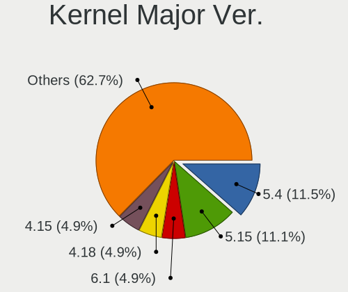

| Version | Notebooks | Percent |
|---------|-----------|---------|
| 5.4     | 63        | 17.03%  |
| 5.15    | 38        | 10.27%  |
| 4.15    | 29        | 7.84%   |
| 5.3     | 28        | 7.57%   |
| 4.18    | 28        | 7.57%   |
| 5.11    | 27        | 7.3%    |
| 5.8     | 24        | 6.49%   |
| 5.10    | 20        | 5.41%   |
| 5.13    | 19        | 5.14%   |
| 5.0     | 19        | 5.14%   |
| 5.16    | 14        | 3.78%   |
| 4.9     | 11        | 2.97%   |
| 5.19    | 9         | 2.43%   |
| 6.0     | 6         | 1.62%   |
| 5.18    | 5         | 1.35%   |
| 5.12    | 5         | 1.35%   |
| 5.6     | 4         | 1.08%   |
| 5.17    | 3         | 0.81%   |
| 5.9     | 2         | 0.54%   |
| 5.7     | 2         | 0.54%   |
| 5.1     | 2         | 0.54%   |
| 4.19    | 2         | 0.54%   |
| 4.13    | 2         | 0.54%   |
| 4.1     | 2         | 0.54%   |
| 6.1     | 1         | 0.27%   |
| 5.5     | 1         | 0.27%   |
| 5.14    | 1         | 0.27%   |
| 4.17    | 1         | 0.27%   |
| 4.12    | 1         | 0.27%   |
| 4.10    | 1         | 0.27%   |

Arch
----

OS architecture (x86_64, i586, etc.)

| Name   | Notebooks | Percent |
|--------|-----------|---------|
| x86_64 | 317       | 95.77%  |
| i686   | 14        | 4.23%   |

DE
--

Desktop Environment

| Name            | Notebooks | Percent |
|-----------------|-----------|---------|
| GNOME           | 141       | 40.4%   |
| KDE5            | 57        | 16.33%  |
| Unknown         | 55        | 15.76%  |
| XFCE            | 29        | 8.31%   |
| X-Cinnamon      | 17        | 4.87%   |
| KDE4            | 11        | 3.15%   |
| MATE            | 6         | 1.72%   |
| KDE             | 6         | 1.72%   |
| Cinnamon        | 6         | 1.72%   |
| i3              | 5         | 1.43%   |
| LXQt            | 4         | 1.15%   |
| Pantheon        | 3         | 0.86%   |
| qtile           | 2         | 0.57%   |
| Deepin          | 2         | 0.57%   |
| Unity           | 1         | 0.29%   |
| LXDE            | 1         | 0.29%   |
| GNOME Flashback | 1         | 0.29%   |
| DWM             | 1         | 0.29%   |
| Budgie          | 1         | 0.29%   |

Display Server
--------------

X11 or Wayland

| Name    | Notebooks | Percent |
|---------|-----------|---------|
| X11     | 271       | 79.01%  |
| Wayland | 36        | 10.5%   |
| Unknown | 31        | 9.04%   |
| Tty     | 5         | 1.46%   |

Display Manager
---------------

SDDM, LightDM, etc.

| Name    | Notebooks | Percent |
|---------|-----------|---------|
| Unknown | 178       | 52.05%  |
| SDDM    | 53        | 15.5%   |
| GDM     | 34        | 9.94%   |
| LightDM | 28        | 8.19%   |
| GDM3    | 26        | 7.6%    |
| KDM     | 12        | 3.51%   |
| TDM     | 9         | 2.63%   |
| XDM     | 1         | 0.29%   |
| Ly      | 1         | 0.29%   |

OS Lang
-------

Language

| Lang        | Notebooks | Percent |
|-------------|-----------|---------|
| en_US       | 223       | 63.71%  |
| Unknown     | 75        | 21.43%  |
| sr_RS       | 18        | 5.14%   |
| sr_RS@latin | 11        | 3.14%   |
| en_GB       | 9         | 2.57%   |
| C           | 4         | 1.14%   |
| ru_RU       | 3         | 0.86%   |
| hu_HU       | 3         | 0.86%   |
| de_DE       | 2         | 0.57%   |
| en_IE       | 1         | 0.29%   |
| en_AU       | 1         | 0.29%   |

Boot Mode
---------

EFI or BIOS

| Mode | Notebooks | Percent |
|------|-----------|---------|
| EFI  | 186       | 55.03%  |
| BIOS | 152       | 44.97%  |

Filesystem
----------

Type of filesystem

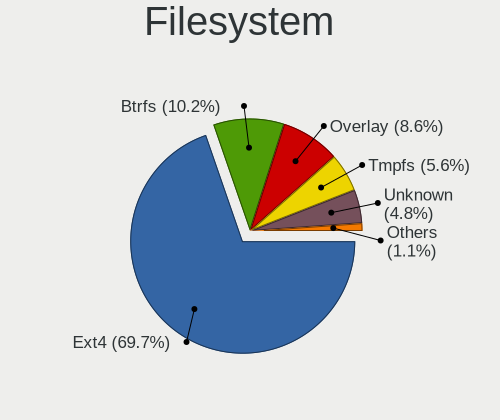

| Type    | Notebooks | Percent |
|---------|-----------|---------|
| Ext4    | 266       | 77.55%  |
| Overlay | 30        | 8.75%   |
| Unknown | 26        | 7.58%   |
| Btrfs   | 18        | 5.25%   |
| Zfs     | 2         | 0.58%   |
| Tmpfs   | 1         | 0.29%   |

Part. scheme
------------

Scheme of partitioning

| Type    | Notebooks | Percent |
|---------|-----------|---------|
| Unknown | 186       | 54.71%  |
| GPT     | 103       | 30.29%  |
| MBR     | 51        | 15%     |

Dual Boot with Linux/BSD
------------------------

Hosting more than one Linux/BSD

| Dual boot | Notebooks | Percent |
|-----------|-----------|---------|
| No        | 295       | 88.06%  |
| Yes       | 40        | 11.94%  |

Dual Boot (Win)
---------------

Hosting Linux and Windows

| Dual boot | Notebooks | Percent |
|-----------|-----------|---------|
| No        | 250       | 74.4%   |
| Yes       | 86        | 25.6%   |

Board
-----

Vendor
------

Motherboard manufacturer

| Name                | Notebooks | Percent |
|---------------------|-----------|---------|
| Lenovo              | 87        | 26.36%  |
| Hewlett-Packard     | 58        | 17.58%  |
| ASUSTek Computer    | 51        | 15.45%  |
| Dell                | 45        | 13.64%  |
| Acer                | 34        | 10.3%   |
| Toshiba             | 13        | 3.94%   |
| MSI                 | 6         | 1.82%   |
| Fujitsu Siemens     | 6         | 1.82%   |
| Apple               | 6         | 1.82%   |
| Sony                | 4         | 1.21%   |
| Fujitsu             | 3         | 0.91%   |
| Timi                | 2         | 0.61%   |
| Samsung Electronics | 2         | 0.61%   |
| Medion              | 2         | 0.61%   |
| LG Electronics      | 2         | 0.61%   |
| HUAWEI              | 2         | 0.61%   |
| TWC                 | 1         | 0.3%    |
| Razer               | 1         | 0.3%    |
| Packard Bell        | 1         | 0.3%    |
| IBM                 | 1         | 0.3%    |
| Gigabyte Technology | 1         | 0.3%    |
| eMachines           | 1         | 0.3%    |
| BenQ                | 1         | 0.3%    |

Model
-----

Motherboard model

| Name                                       | Notebooks | Percent |
|--------------------------------------------|-----------|---------|
| Acer Aspire A315-31                        | 6         | 1.82%   |
| HP Notebook                                | 5         | 1.52%   |
| Lenovo V330-15IKB 81AX                     | 4         | 1.21%   |
| Lenovo IdeaPad 5 14ARE05 81YM              | 3         | 0.91%   |
| Lenovo IdeaPad 330-15IKB 81DE              | 3         | 0.91%   |
| Lenovo IdeaPad 3 15IIL05 81WE              | 3         | 0.91%   |
| Dell Inspiron 3593                         | 3         | 0.91%   |
| ASUS X541NA                                | 3         | 0.91%   |
| Unknown                                    | 3         | 0.91%   |
| MSI CR500                                  | 2         | 0.61%   |
| Lenovo Legion Y530-15ICH 81FV              | 2         | 0.61%   |
| Lenovo IdeaPad S540-14API 81NH             | 2         | 0.61%   |
| Lenovo IdeaPad L340-15API 81LW             | 2         | 0.61%   |
| Lenovo IdeaPad 5 14ALC05 82LM              | 2         | 0.61%   |
| Lenovo IdeaPad 110-15IBR 80T7              | 2         | 0.61%   |
| Lenovo G500 20236                          | 2         | 0.61%   |
| Lenovo B50-45 20388                        | 2         | 0.61%   |
| HP Pavilion Notebook                       | 2         | 0.61%   |
| HP Pavilion dv7                            | 2         | 0.61%   |
| HP Laptop 15-ra0xx                         | 2         | 0.61%   |
| HP Laptop 15-db1xxx                        | 2         | 0.61%   |
| HP Laptop 15-db0xxx                        | 2         | 0.61%   |
| HP G62                                     | 2         | 0.61%   |
| HP 250 G5 Notebook PC                      | 2         | 0.61%   |
| Fujitsu Siemens AMILO Li3710               | 2         | 0.61%   |
| Dell Vostro 3500                           | 2         | 0.61%   |
| Dell Latitude E5470                        | 2         | 0.61%   |
| Dell Latitude 7490                         | 2         | 0.61%   |
| Dell Inspiron 3542                         | 2         | 0.61%   |
| Dell Inspiron 3537                         | 2         | 0.61%   |
| ASUS X55A                                  | 2         | 0.61%   |
| ASUS X541NC                                | 2         | 0.61%   |
| ASUS VivoBook_ASUSLaptop X580GD_N580GD     | 2         | 0.61%   |
| ASUS VivoBook 15_ASUS Laptop X540MA_X543MA | 2         | 0.61%   |
| ASUS K54C                                  | 2         | 0.61%   |
| Apple MacBookPro8,1                        | 2         | 0.61%   |
| Acer Aspire V3-571G                        | 2         | 0.61%   |
| Acer Aspire A315-51                        | 2         | 0.61%   |
| Toshiba TECRA Z50-A                        | 1         | 0.3%    |
| Toshiba Satellite Pro L650                 | 1         | 0.3%    |

Model Family
------------

Motherboard model prefix

| Name                  | Notebooks | Percent |
|-----------------------|-----------|---------|
| Lenovo IdeaPad        | 32        | 9.7%    |
| Acer Aspire           | 30        | 9.09%   |
| Lenovo ThinkPad       | 27        | 8.18%   |
| Dell Inspiron         | 24        | 7.27%   |
| ASUS VivoBook         | 15        | 4.55%   |
| HP Laptop             | 13        | 3.94%   |
| Toshiba Satellite     | 11        | 3.33%   |
| Dell Latitude         | 11        | 3.33%   |
| HP ProBook            | 10        | 3.03%   |
| HP Pavilion           | 7         | 2.12%   |
| Lenovo Legion         | 6         | 1.82%   |
| HP Notebook           | 5         | 1.52%   |
| HP EliteBook          | 5         | 1.52%   |
| HP 250                | 5         | 1.52%   |
| Fujitsu Siemens AMILO | 5         | 1.52%   |
| Lenovo V330-15IKB     | 4         | 1.21%   |
| Dell Vostro           | 4         | 1.21%   |
| HP Compaq             | 3         | 0.91%   |
| Fujitsu LIFEBOOK      | 3         | 0.91%   |
| Dell Precision        | 3         | 0.91%   |
| ASUS ZenBook          | 3         | 0.91%   |
| ASUS X541NA           | 3         | 0.91%   |
| Apple MacBookPro8     | 3         | 0.91%   |
| Unknown               | 3         | 0.91%   |
| MSI CR500             | 2         | 0.61%   |
| Lenovo ThinkBook      | 2         | 0.61%   |
| Lenovo G500           | 2         | 0.61%   |
| Lenovo B50-45         | 2         | 0.61%   |
| HP G62                | 2         | 0.61%   |
| ASUS X55A             | 2         | 0.61%   |
| ASUS X541NC           | 2         | 0.61%   |
| ASUS TUF              | 2         | 0.61%   |
| ASUS K54C             | 2         | 0.61%   |
| Acer Nitro            | 2         | 0.61%   |
| Toshiba TECRA         | 1         | 0.3%    |
| Toshiba QOSMIO        | 1         | 0.3%    |
| Timi TM1613           | 1         | 0.3%    |
| Timi RedmiBook        | 1         | 0.3%    |
| Sony VPCZ21X9E        | 1         | 0.3%    |
| Sony VPCZ12M9E        | 1         | 0.3%    |

MFG Year
--------

Motherboard manufacture year

| Year | Notebooks | Percent |
|------|-----------|---------|
| 2018 | 39        | 11.82%  |
| 2020 | 33        | 10%     |
| 2019 | 30        | 9.09%   |
| 2011 | 30        | 9.09%   |
| 2017 | 29        | 8.79%   |
| 2016 | 25        | 7.58%   |
| 2013 | 22        | 6.67%   |
| 2012 | 21        | 6.36%   |
| 2010 | 18        | 5.45%   |
| 2014 | 16        | 4.85%   |
| 2008 | 14        | 4.24%   |
| 2015 | 13        | 3.94%   |
| 2021 | 11        | 3.33%   |
| 2009 | 8         | 2.42%   |
| 2007 | 7         | 2.12%   |
| 2022 | 6         | 1.82%   |
| 2006 | 6         | 1.82%   |
| 2005 | 2         | 0.61%   |

Form Factor
-----------

Physical design of the computer

| Name     | Notebooks | Percent |
|----------|-----------|---------|
| Notebook | 330       | 100%    |

Secure Boot
-----------

Enabled or disabled

| State    | Notebooks | Percent |
|----------|-----------|---------|
| Disabled | 304       | 90.75%  |
| Enabled  | 31        | 9.25%   |

Coreboot
--------

Have coreboot on board

| Used | Notebooks | Percent |
|------|-----------|---------|
| No   | 330       | 100%    |

RAM Size
--------

Total RAM memory

| Size in GB | Notebooks | Percent |
|------------|-----------|---------|
| 3.01-4.0   | 101       | 30.06%  |
| 4.01-8.0   | 87        | 25.89%  |
| 8.01-16.0  | 59        | 17.56%  |
| 16.01-24.0 | 45        | 13.39%  |
| 1.01-2.0   | 18        | 5.36%   |
| 32.01-64.0 | 11        | 3.27%   |
| 2.01-3.0   | 10        | 2.98%   |
| 24.01-32.0 | 4         | 1.19%   |
| 0.51-1.0   | 1         | 0.3%    |

RAM Used
--------

Used RAM memory

| Used GB   | Notebooks | Percent |
|-----------|-----------|---------|
| 1.01-2.0  | 134       | 36.61%  |
| 2.01-3.0  | 85        | 23.22%  |
| 0.51-1.0  | 48        | 13.11%  |
| 3.01-4.0  | 45        | 12.3%   |
| 4.01-8.0  | 40        | 10.93%  |
| 8.01-16.0 | 13        | 3.55%   |
| 0.01-0.5  | 1         | 0.27%   |

Total Drives
------------

Number of drives on board

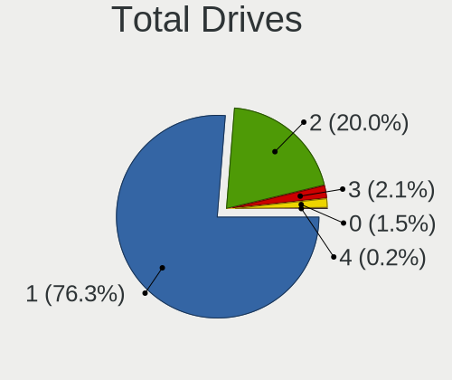

| Drives | Notebooks | Percent |
|--------|-----------|---------|
| 1      | 257       | 76.04%  |
| 2      | 67        | 19.82%  |
| 3      | 7         | 2.07%   |
| 0      | 7         | 2.07%   |

Has CD-ROM
----------

Has CD-ROM on board

| Presented | Notebooks | Percent |
|-----------|-----------|---------|
| No        | 188       | 56.46%  |
| Yes       | 145       | 43.54%  |

Has Ethernet
------------

Has Ethernet on board

| Presented | Notebooks | Percent |
|-----------|-----------|---------|
| Yes       | 288       | 87.27%  |
| No        | 42        | 12.73%  |

Has WiFi
--------

Has WiFi module

| Presented | Notebooks | Percent |
|-----------|-----------|---------|
| Yes       | 330       | 99.7%   |
| No        | 1         | 0.3%    |

Has Bluetooth
-------------

Has Bluetooth module

| Presented | Notebooks | Percent |
|-----------|-----------|---------|
| Yes       | 270       | 81.08%  |
| No        | 63        | 18.92%  |

Location
--------

Country
-------

Geographic location (country)

| Country | Notebooks | Percent |
|---------|-----------|---------|
| Serbia  | 330       | 100%    |

City
----

Geographic location (city)

| City          | Notebooks | Percent |
|---------------|-----------|---------|
| Belgrade      | 214       | 61.14%  |
| Novi Sad      | 36        | 10.29%  |
| Ni          | 20        | 5.71%   |
| Subotica      | 5         | 1.43%   |
| Panevo      | 4         | 1.14%   |
| Novi Belgrade | 4         | 1.14%   |
| Leskovac      | 4         | 1.14%   |
| Zrenjanin     | 3         | 0.86%   |
| Senta         | 3         | 0.86%   |
| Savski Venac  | 3         | 0.86%   |
| Novi Karlovci | 3         | 0.86%   |
| Lozovik       | 3         | 0.86%   |
| Kovin         | 3         | 0.86%   |
| Varvarin      | 2         | 0.57%   |
| Mladenovac    | 2         | 0.57%   |
| Lazarevac     | 2         | 0.57%   |
| Kragujevac    | 2         | 0.57%   |
| Jagodina      | 2         | 0.57%   |
| Branicevo     | 2         | 0.57%   |
| Becej         | 2         | 0.57%   |
| Backa Topola  | 2         | 0.57%   |
| Vranje        | 1         | 0.29%   |
| Valjevo       | 1         | 0.29%   |
| Uice        | 1         | 0.29%   |
| Uice      | 1         | 0.29%   |
| Trstenik      | 1         | 0.29%   |
| Stara Pazova  | 1         | 0.29%   |
| Semlin        | 1         | 0.29%   |
| Sabac         | 1         | 0.29%   |
| Ruma          | 1         | 0.29%   |
| Ripanj        | 1         | 0.29%   |
| Pukovac       | 1         | 0.29%   |
| Poarevac    | 1         | 0.29%   |
| Novi Knezevac | 1         | 0.29%   |
| New Belgrade  | 1         | 0.29%   |
| Kruevac     | 1         | 0.29%   |
| Kraljevo      | 1         | 0.29%   |
| Guca          | 1         | 0.29%   |
| Grocka        | 1         | 0.29%   |
| Cuprija       | 1         | 0.29%   |

Drives
------

Drive Vendor
------------

Hard drive vendors

| Vendor                      | Notebooks | Drives | Percent |
|-----------------------------|-----------|--------|---------|
| WDC                         | 53        | 75     | 13.73%  |
| Seagate                     | 52        | 62     | 13.47%  |
| Toshiba                     | 47        | 59     | 12.18%  |
| Samsung Electronics         | 47        | 58     | 12.18%  |
| Kingston                    | 26        | 30     | 6.74%   |
| SK hynix                    | 18        | 22     | 4.66%   |
| Hitachi                     | 18        | 18     | 4.66%   |
| SanDisk                     | 15        | 21     | 3.89%   |
| Intel                       | 15        | 24     | 3.89%   |
| Micron Technology           | 12        | 13     | 3.11%   |
| Unknown                     | 11        | 12     | 2.85%   |
| Patriot                     | 10        | 12     | 2.59%   |
| HGST                        | 10        | 19     | 2.59%   |
| SPCC                        | 6         | 7      | 1.55%   |
| Fujitsu                     | 5         | 5      | 1.3%    |
| Gigabyte Technology         | 4         | 4      | 1.04%   |
| A-DATA Technology           | 4         | 4      | 1.04%   |
| Transcend                   | 3         | 3      | 0.78%   |
| KIOXIA                      | 3         | 3      | 0.78%   |
| GeIL                        | 3         | 3      | 0.78%   |
| Crucial                     | 3         | 3      | 0.78%   |
| Union Memory                | 2         | 2      | 0.52%   |
| Phison                      | 2         | 3      | 0.52%   |
| LITEON                      | 2         | 3      | 0.52%   |
| Biostar                     | 2         | 2      | 0.52%   |
| Verbatim                    | 1         | 1      | 0.26%   |
| Union Memory (Shenzhen)     | 1         | 1      | 0.26%   |
| SSSTC                       | 1         | 1      | 0.26%   |
| Solid State Storage         | 1         | 1      | 0.26%   |
| Realtek Semiconductor       | 1         | 4      | 0.26%   |
| PNY                         | 1         | 1      | 0.26%   |
| Netac                       | 1         | 1      | 0.26%   |
| Kingston Technology Company | 1         | 1      | 0.26%   |
| JMicron Technology          | 1         | 1      | 0.26%   |
| IBM/Hitachi                 | 1         | 1      | 0.26%   |
| HUAWEI                      | 1         | 1      | 0.26%   |
| AMD                         | 1         | 1      | 0.26%   |
| Unknown                     | 1         | 1      | 0.26%   |

Drive Model
-----------

Hard drive models

| Model                                   | Notebooks | Percent |
|-----------------------------------------|-----------|---------|
| Seagate ST1000LM035-1RK172 1TB          | 18        | 4.62%   |
| Toshiba MQ01ABF050 500GB                | 12        | 3.08%   |
| Seagate ST500LT012-1DG142 500GB         | 8         | 2.05%   |
| Kingston SA400S37240G 240GB SSD         | 6         | 1.54%   |
| Toshiba MQ04ABF100 1TB                  | 5         | 1.28%   |
| Toshiba MQ01ABD100 1TB                  | 5         | 1.28%   |
| Seagate ST500LT012-9WS142 500GB         | 5         | 1.28%   |
| Seagate ST1000LM024 HN-M101MBB 1TB      | 5         | 1.28%   |
| Samsung SM963 2.5" NVMe PCIe SSD 256GB  | 5         | 1.28%   |
| WDC PC SN530 SDBPMPZ-512G-1101 512GB    | 4         | 1.03%   |
| Kingston SA400S37480G 480GB SSD         | 4         | 1.03%   |
| Kingston SA400S37120G 120GB SSD         | 4         | 1.03%   |
| WDC WD5000LPCX-24VHAT0 500GB            | 3         | 0.77%   |
| SK hynix NVMe SSD Drive 256GB           | 3         | 0.77%   |
| SanDisk NVMe SSD Drive 256GB            | 3         | 0.77%   |
| Samsung MZALQ512HALU-000L2 512GB        | 3         | 0.77%   |
| Micron 1100_MTFDDAV256TBN 256GB SSD     | 3         | 0.77%   |
| Kingston RBUSC180DS37256GJ 256GB SSD    | 3         | 0.77%   |
| Hitachi HTS545050A7E380 500GB           | 3         | 0.77%   |
| HGST HTS721010A9E630 1TB                | 3         | 0.77%   |
| GeIL R3_128GB                           | 3         | 0.77%   |
| WDC WD5000LPVX-75V0TT0 500GB            | 2         | 0.51%   |
| WDC WD5000LPCX-80VHAT1 500GB            | 2         | 0.51%   |
| WDC WD5000LPCX-60VHAT0 500GB            | 2         | 0.51%   |
| WDC WD3200BEVT-22ZCT0 320GB             | 2         | 0.51%   |
| WDC WD3200BEVT-22A23T0 320GB            | 2         | 0.51%   |
| WDC WD2500BEVS-22UST0 250GB             | 2         | 0.51%   |
| WDC WD1200BEVS-22UST0 120GB             | 2         | 0.51%   |
| WDC WD10SPZX-24Z10 1TB                  | 2         | 0.51%   |
| WDC WD10SPZX-21Z10T0 1TB                | 2         | 0.51%   |
| WDC PC SN530 SDBPNPZ-256G-1002 256GB    | 2         | 0.51%   |
| Unknown MMC Card  32GB                  | 2         | 0.51%   |
| Union Memory UMIS RPJTJ512MEE1OWX 512GB | 2         | 0.51%   |
| Toshiba NVMe SSD Drive 512GB            | 2         | 0.51%   |
| Toshiba NVMe SSD Drive 256GB            | 2         | 0.51%   |
| Toshiba MQ01ABD050 500GB                | 2         | 0.51%   |
| Toshiba MK1637GSX 160GB                 | 2         | 0.51%   |
| SPCC Solid State Disk 120GB             | 2         | 0.51%   |
| SK hynix HFS128G32TNF-N3A0A 128GB SSD   | 2         | 0.51%   |
| Seagate ST9500325AS 500GB               | 2         | 0.51%   |

HDD Vendor
----------

Hard disk drive vendors

| Vendor              | Notebooks | Drives | Percent |
|---------------------|-----------|--------|---------|
| Seagate             | 52        | 62     | 30.95%  |
| WDC                 | 41        | 62     | 24.4%   |
| Toshiba             | 39        | 48     | 23.21%  |
| Hitachi             | 18        | 18     | 10.71%  |
| HGST                | 10        | 19     | 5.95%   |
| Fujitsu             | 5         | 5      | 2.98%   |
| Unknown             | 1         | 1      | 0.6%    |
| Samsung Electronics | 1         | 2      | 0.6%    |
| IBM/Hitachi         | 1         | 1      | 0.6%    |

SSD Vendor
----------

Solid state drive vendors

| Vendor              | Notebooks | Drives | Percent |
|---------------------|-----------|--------|---------|
| Samsung Electronics | 24        | 29     | 21.24%  |
| Kingston            | 23        | 26     | 20.35%  |
| Patriot             | 10        | 12     | 8.85%   |
| SanDisk             | 7         | 11     | 6.19%   |
| SPCC                | 6         | 7      | 5.31%   |
| Micron Technology   | 5         | 5      | 4.42%   |
| Intel               | 5         | 6      | 4.42%   |
| Toshiba             | 4         | 5      | 3.54%   |
| Transcend           | 3         | 3      | 2.65%   |
| SK hynix            | 3         | 3      | 2.65%   |
| GeIL                | 3         | 3      | 2.65%   |
| Crucial             | 3         | 3      | 2.65%   |
| A-DATA Technology   | 3         | 3      | 2.65%   |
| WDC                 | 2         | 3      | 1.77%   |
| LITEON              | 2         | 3      | 1.77%   |
| Gigabyte Technology | 2         | 2      | 1.77%   |
| Biostar             | 2         | 2      | 1.77%   |
| Verbatim            | 1         | 1      | 0.88%   |
| SSSTC               | 1         | 1      | 0.88%   |
| PNY                 | 1         | 1      | 0.88%   |
| Netac               | 1         | 1      | 0.88%   |
| JMicron Technology  | 1         | 1      | 0.88%   |
| AMD                 | 1         | 1      | 0.88%   |

Drive Kind
----------

HDD or SSD

| Kind    | Notebooks | Drives | Percent |
|---------|-----------|--------|---------|
| HDD     | 168       | 218    | 45.04%  |
| SSD     | 103       | 132    | 27.61%  |
| NVMe    | 91        | 121    | 24.4%   |
| MMC     | 10        | 11     | 2.68%   |
| Unknown | 1         | 1      | 0.27%   |

Drive Connector
---------------

SATA, SAS, NVMe, etc.

| Type | Notebooks | Drives | Percent |
|------|-----------|--------|---------|
| SATA | 245       | 346    | 69.8%   |
| NVMe | 91        | 121    | 25.93%  |
| MMC  | 10        | 11     | 2.85%   |
| SAS  | 5         | 5      | 1.42%   |

Drive Size
----------

Size of hard drive

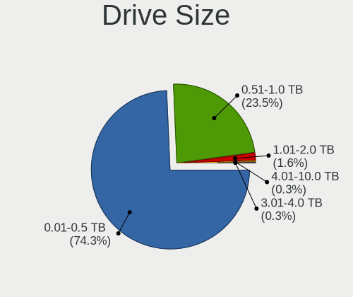

| Size in TB | Notebooks | Drives | Percent |
|------------|-----------|--------|---------|
| 0.01-0.5   | 193       | 247    | 72.83%  |
| 0.51-1.0   | 68        | 96     | 25.66%  |
| 1.01-2.0   | 4         | 7      | 1.51%   |

Space Total
-----------

Amount of disk space available on the file system

| Size in GB     | Notebooks | Percent |
|----------------|-----------|---------|
| 101-250        | 101       | 28.37%  |
| 251-500        | 100       | 28.09%  |
| 501-1000       | 43        | 12.08%  |
| 1-20           | 31        | 8.71%   |
| 51-100         | 26        | 7.3%    |
| 21-50          | 20        | 5.62%   |
| Unknown        | 15        | 4.21%   |
| 1001-2000      | 12        | 3.37%   |
| 2001-3000      | 6         | 1.69%   |
| More than 3000 | 2         | 0.56%   |

Space Used
----------

Amount of used disk space

| Used GB   | Notebooks | Percent |
|-----------|-----------|---------|
| 1-20      | 148       | 40.55%  |
| 21-50     | 67        | 18.36%  |
| 101-250   | 49        | 13.42%  |
| 51-100    | 47        | 12.88%  |
| 251-500   | 25        | 6.85%   |
| Unknown   | 15        | 4.11%   |
| 501-1000  | 9         | 2.47%   |
| 1001-2000 | 5         | 1.37%   |

Malfunc. Drives
---------------

Drive models with a malfunction

| Model                                   | Notebooks | Drives | Percent |
|-----------------------------------------|-----------|--------|---------|
| Toshiba MQ01ABF050 500GB                | 2         | 2      | 8%      |
| Seagate ST1000LM035-1RK172 1TB          | 2         | 2      | 8%      |
| WDC WD5000BEVT-24A0RT0 500GB            | 1         | 1      | 4%      |
| WDC WD3200BEVT-22ZCT0 320GB             | 1         | 1      | 4%      |
| Toshiba MQ01ABD032 320GB                | 1         | 1      | 4%      |
| Toshiba MK1637GSX 160GB                 | 1         | 1      | 4%      |
| Toshiba KSG60ZMV256G M.2 2280 256GB SSD | 1         | 1      | 4%      |
| SPCC Solid State DiskB27 32GB           | 1         | 1      | 4%      |
| Seagate ST980813AS 80GB                 | 1         | 1      | 4%      |
| Seagate ST9250827AS 250GB               | 1         | 1      | 4%      |
| Seagate ST9120822AS 120GB               | 1         | 1      | 4%      |
| Seagate ST750LM022 HN-M750MBB 752GB     | 1         | 1      | 4%      |
| Seagate ST500LT012-9WS142 500GB         | 1         | 1      | 4%      |
| Seagate ST500LT012-1DG142 500GB         | 1         | 2      | 4%      |
| Samsung Electronics HM120JI 120GB       | 1         | 2      | 4%      |
| Kingston SA400S37480G 480GB SSD         | 1         | 1      | 4%      |
| Hitachi HTS722080K9A300 80GB            | 1         | 1      | 4%      |
| Hitachi HTS545050A7E380 500GB           | 1         | 1      | 4%      |
| Hitachi HTS541612J9SA00 120GB           | 1         | 1      | 4%      |
| HGST HTS725050A7E630 500GB              | 1         | 5      | 4%      |
| HGST HTS721010A9E630 1TB                | 1         | 2      | 4%      |
| Fujitsu MHZ2160BH G1 160GB              | 1         | 1      | 4%      |
| Fujitsu MHW2160BH PL 160GB              | 1         | 1      | 4%      |

Malfunc. Drive Vendor
---------------------

Vendors of faulty drives

| Vendor              | Notebooks | Drives | Percent |
|---------------------|-----------|--------|---------|
| Seagate             | 8         | 9      | 32%     |
| Toshiba             | 5         | 5      | 20%     |
| Hitachi             | 3         | 3      | 12%     |
| WDC                 | 2         | 2      | 8%      |
| HGST                | 2         | 7      | 8%      |
| Fujitsu             | 2         | 2      | 8%      |
| SPCC                | 1         | 1      | 4%      |
| Samsung Electronics | 1         | 2      | 4%      |
| Kingston            | 1         | 1      | 4%      |

Malfunc. HDD Vendor
-------------------

Vendors of faulty HDD drives

| Vendor              | Notebooks | Drives | Percent |
|---------------------|-----------|--------|---------|
| Seagate             | 8         | 9      | 36.36%  |
| Toshiba             | 4         | 4      | 18.18%  |
| Hitachi             | 3         | 3      | 13.64%  |
| WDC                 | 2         | 2      | 9.09%   |
| HGST                | 2         | 7      | 9.09%   |
| Fujitsu             | 2         | 2      | 9.09%   |
| Samsung Electronics | 1         | 2      | 4.55%   |

Malfunc. Drive Kind
-------------------

Kinds of faulty drives

| Kind | Notebooks | Drives | Percent |
|------|-----------|--------|---------|
| HDD  | 22        | 29     | 88%     |
| SSD  | 3         | 3      | 12%     |

Failed Drives
-------------

Failed drive models

Zero info for selected period =(

Failed Drive Vendor
-------------------

Failed drive vendors

Zero info for selected period =(

Drive Status
------------

Number of failed and malfunc. drives

| Status   | Notebooks | Drives | Percent |
|----------|-----------|--------|---------|
| Detected | 197       | 305    | 57.27%  |
| Works    | 122       | 146    | 35.47%  |
| Malfunc  | 25        | 32     | 7.27%   |

Storage controller
------------------

Storage Vendor
--------------

Storage controller vendors

| Vendor                         | Notebooks | Percent |
|--------------------------------|-----------|---------|
| Intel                          | 247       | 63.5%   |
| AMD                            | 45        | 11.57%  |
| Samsung Electronics            | 27        | 6.94%   |
| SanDisk                        | 17        | 4.37%   |
| SK hynix                       | 15        | 3.86%   |
| Micron Technology              | 7         | 1.8%    |
| Nvidia                         | 5         | 1.29%   |
| Toshiba America Info Systems   | 4         | 1.03%   |
| Phison Electronics             | 4         | 1.03%   |
| KIOXIA                         | 4         | 1.03%   |
| Kingston Technology Company    | 4         | 1.03%   |
| Union Memory (Shenzhen)        | 3         | 0.77%   |
| VIA Technologies               | 1         | 0.26%   |
| Solid State Storage Technology | 1         | 0.26%   |
| Silicon Image                  | 1         | 0.26%   |
| Realtek Semiconductor          | 1         | 0.26%   |
| JMicron Technology             | 1         | 0.26%   |
| ASMedia Technology             | 1         | 0.26%   |
| ADATA Technology               | 1         | 0.26%   |

Storage Model
-------------

Storage controller models

| Model                                                                            | Notebooks | Percent |
|----------------------------------------------------------------------------------|-----------|---------|
| AMD FCH SATA Controller [AHCI mode]                                              | 36        | 8.53%   |
| Intel Sunrise Point-LP SATA Controller [AHCI mode]                               | 30        | 7.11%   |
| Intel 6 Series/C200 Series Chipset Family 6 port Mobile SATA AHCI Controller     | 26        | 6.16%   |
| Intel 7 Series Chipset Family 6-port SATA Controller [AHCI mode]                 | 24        | 5.69%   |
| Intel 82801 Mobile SATA Controller [RAID mode]                                   | 20        | 4.74%   |
| Intel Celeron N3350/Pentium N4200/Atom E3900 Series SATA AHCI Controller         | 13        | 3.08%   |
| Intel Wildcat Point-LP SATA Controller [AHCI Mode]                               | 10        | 2.37%   |
| Samsung NVMe SSD Controller SM981/PM981/PM983                                    | 9         | 2.13%   |
| Samsung NVMe SSD Controller 980                                                  | 9         | 2.13%   |
| Intel Ice Lake-LP SATA Controller [AHCI mode]                                    | 9         | 2.13%   |
| Intel Atom/Celeron/Pentium Processor x5-E8000/J3xxx/N3xxx Series SATA Controller | 9         | 2.13%   |
| Intel 8 Series/C220 Series Chipset Family 6-port SATA Controller 1 [AHCI mode]   | 9         | 2.13%   |
| Intel Cannon Lake Mobile PCH SATA AHCI Controller                                | 8         | 1.9%    |
| Intel Atom Processor E3800 Series SATA AHCI Controller                           | 8         | 1.9%    |
| Intel 82801IBM/IEM (ICH9M/ICH9M-E) 4 port SATA Controller [AHCI mode]            | 8         | 1.9%    |
| Intel 8 Series SATA Controller 1 [AHCI mode]                                     | 8         | 1.9%    |
| AMD SB7x0/SB8x0/SB9x0 SATA Controller [AHCI mode]                                | 8         | 1.9%    |
| SanDisk Non-Volatile memory controller                                           | 7         | 1.66%   |
| Micron Non-Volatile memory controller                                            | 7         | 1.66%   |
| Intel 82801G (ICH7 Family) IDE Controller                                        | 7         | 1.66%   |
| SK hynix BC511                                                                   | 6         | 1.42%   |
| Samsung NVMe SSD Controller SM961/PM961/SM963                                    | 6         | 1.42%   |
| Intel Celeron/Pentium Silver Processor SATA Controller                           | 6         | 1.42%   |
| Intel 82801HM/HEM (ICH8M/ICH8M-E) SATA Controller [AHCI mode]                    | 6         | 1.42%   |
| Intel 82801HM/HEM (ICH8M/ICH8M-E) IDE Controller                                 | 6         | 1.42%   |
| Intel 5 Series/3400 Series Chipset 4 port SATA AHCI Controller                   | 6         | 1.42%   |
| Intel Volume Management Device NVMe RAID Controller                              | 5         | 1.18%   |
| Intel 82801GBM/GHM (ICH7-M Family) SATA Controller [AHCI mode]                   | 5         | 1.18%   |
| SanDisk WD Blue SN550 NVMe SSD                                                   | 4         | 0.95%   |
| Nvidia MCP79 AHCI Controller                                                     | 4         | 0.95%   |
| KIOXIA NVMe SSD Controller BG4                                                   | 4         | 0.95%   |
| Intel Tiger Lake-LP SATA Controller                                              | 4         | 0.95%   |
| Intel SSD 660P Series                                                            | 4         | 0.95%   |
| Intel HM170/QM170 Chipset SATA Controller [AHCI Mode]                            | 4         | 0.95%   |
| Intel Cannon Point-LP SATA Controller [AHCI Mode]                                | 4         | 0.95%   |
| Intel 5 Series/3400 Series Chipset 6 port SATA AHCI Controller                   | 4         | 0.95%   |
| Union Memory (Shenzhen) Non-Volatile memory controller                           | 3         | 0.71%   |
| SK hynix Non-Volatile memory controller                                          | 3         | 0.71%   |
| SK hynix Gold P31/PC711 NVMe Solid State Drive                                   | 3         | 0.71%   |
| SK hynix BC501 NVMe Solid State Drive                                            | 3         | 0.71%   |

Storage Kind
------------

Kind of storage controller (IDE, SATA, NVMe, SAS, ...)

| Kind | Notebooks | Percent |
|------|-----------|---------|
| SATA | 258       | 62.93%  |
| NVMe | 95        | 23.17%  |
| IDE  | 29        | 7.07%   |
| RAID | 28        | 6.83%   |

Processor
---------

CPU Vendor
----------

Processor vendors

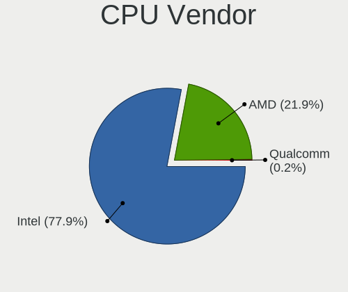

| Vendor | Notebooks | Percent |
|--------|-----------|---------|
| Intel  | 270       | 81.82%  |
| AMD    | 60        | 18.18%  |

CPU Model
---------

Processor models

| Model                                         | Notebooks | Percent |
|-----------------------------------------------|-----------|---------|
| Intel Core i5-1035G1 CPU @ 1.00GHz            | 8         | 2.42%   |
| Intel Core i7-8750H CPU @ 2.20GHz             | 6         | 1.82%   |
| Intel Core i7-8565U CPU @ 1.80GHz             | 6         | 1.82%   |
| Intel Core i3-6006U CPU @ 2.00GHz             | 6         | 1.82%   |
| Intel Pentium CPU N4200 @ 1.10GHz             | 5         | 1.52%   |
| Intel Core i7-8550U CPU @ 1.80GHz             | 5         | 1.52%   |
| Intel Core i7-2670QM CPU @ 2.20GHz            | 5         | 1.52%   |
| Intel Core i5-7200U CPU @ 2.50GHz             | 5         | 1.52%   |
| Intel Core i3-5005U CPU @ 2.00GHz             | 5         | 1.52%   |
| Intel Celeron CPU N3350 @ 1.10GHz             | 5         | 1.52%   |
| AMD Ryzen 5 3500U with Radeon Vega Mobile Gfx | 5         | 1.52%   |
| Intel Core i3-7020U CPU @ 2.30GHz             | 4         | 1.21%   |
| Intel Celeron CPU N3060 @ 1.60GHz             | 4         | 1.21%   |
| Intel Celeron CPU 1000M @ 1.80GHz             | 4         | 1.21%   |
| Intel 11th Gen Core i5-1135G7 @ 2.40GHz       | 4         | 1.21%   |
| AMD Ryzen 7 3700U with Radeon Vega Mobile Gfx | 4         | 1.21%   |
| AMD Ryzen 5 2500U with Radeon Vega Mobile Gfx | 4         | 1.21%   |
| Intel Pentium M processor 1.86GHz             | 3         | 0.91%   |
| Intel Pentium CPU 2020M @ 2.40GHz             | 3         | 0.91%   |
| Intel Core i7-7700HQ CPU @ 2.80GHz            | 3         | 0.91%   |
| Intel Core i7-6600U CPU @ 2.60GHz             | 3         | 0.91%   |
| Intel Core i7-4600U CPU @ 2.10GHz             | 3         | 0.91%   |
| Intel Core i5-8300H CPU @ 2.30GHz             | 3         | 0.91%   |
| Intel Core i5-6200U CPU @ 2.30GHz             | 3         | 0.91%   |
| Intel Core i5-5200U CPU @ 2.20GHz             | 3         | 0.91%   |
| Intel Core i5-2450M CPU @ 2.50GHz             | 3         | 0.91%   |
| Intel Core i3 CPU M 330 @ 2.13GHz             | 3         | 0.91%   |
| Intel Core 2 CPU T5600 @ 1.83GHz              | 3         | 0.91%   |
| Intel Celeron CPU N3450 @ 1.10GHz             | 3         | 0.91%   |
| AMD Ryzen 7 5700U with Radeon Graphics        | 3         | 0.91%   |
| AMD Ryzen 7 4700U with Radeon Graphics        | 3         | 0.91%   |
| AMD Ryzen 5 5500U with Radeon Graphics        | 3         | 0.91%   |
| AMD Ryzen 5 4500U with Radeon Graphics        | 3         | 0.91%   |
| AMD A8-6410 APU with AMD Radeon R5 Graphics   | 3         | 0.91%   |
| Intel Pentium CPU N3710 @ 1.60GHz             | 2         | 0.61%   |
| Intel Pentium CPU N3700 @ 1.60GHz             | 2         | 0.61%   |
| Intel Pentium CPU N3540 @ 2.16GHz             | 2         | 0.61%   |
| Intel Pentium CPU B960 @ 2.20GHz              | 2         | 0.61%   |
| Intel Pentium CPU B950 @ 2.10GHz              | 2         | 0.61%   |
| Intel Pentium CPU 4417U @ 2.30GHz             | 2         | 0.61%   |

CPU Model Family
----------------

Processor model prefix

| Model                   | Notebooks | Percent |
|-------------------------|-----------|---------|
| Intel Core i7           | 66        | 20%     |
| Intel Core i5           | 61        | 18.48%  |
| Intel Core i3           | 36        | 10.91%  |
| Intel Celeron           | 31        | 9.39%   |
| Intel Pentium           | 27        | 8.18%   |
| AMD Ryzen 5             | 21        | 6.36%   |
| Intel Core 2 Duo        | 13        | 3.94%   |
| AMD Ryzen 7             | 13        | 3.94%   |
| Other                   | 12        | 3.64%   |
| Intel Atom              | 7         | 2.12%   |
| Intel Core 2            | 4         | 1.21%   |
| AMD Ryzen 3             | 4         | 1.21%   |
| AMD A8                  | 4         | 1.21%   |
| Intel Pentium M         | 3         | 0.91%   |
| Intel Pentium Dual      | 3         | 0.91%   |
| Intel Pentium Silver    | 2         | 0.61%   |
| Intel Pentium Dual-Core | 2         | 0.61%   |
| Intel Genuine           | 2         | 0.61%   |
| AMD Phenom II           | 2         | 0.61%   |
| AMD Athlon X2           | 2         | 0.61%   |
| AMD Athlon II Dual-Core | 2         | 0.61%   |
| AMD Athlon II           | 2         | 0.61%   |
| AMD A4                  | 2         | 0.61%   |
| Intel Pentium Gold      | 1         | 0.3%    |
| Intel Core Duo          | 1         | 0.3%    |
| Intel Celeron M         | 1         | 0.3%    |
| AMD V120                | 1         | 0.3%    |
| AMD Turion 64 X2 Mobile | 1         | 0.3%    |
| AMD Ryzen 5 PRO         | 1         | 0.3%    |
| AMD E2                  | 1         | 0.3%    |
| AMD E1                  | 1         | 0.3%    |
| AMD A6                  | 1         | 0.3%    |

CPU Cores
---------

Number of processor cores

| Number | Notebooks | Percent |
|--------|-----------|---------|
| 2      | 168       | 50.91%  |
| 4      | 116       | 35.15%  |
| 6      | 21        | 6.36%   |
| 1      | 14        | 4.24%   |
| 8      | 9         | 2.73%   |
| 16     | 1         | 0.3%    |
| 14     | 1         | 0.3%    |

CPU Sockets
-----------

Number of sockets

| Number | Notebooks | Percent |
|--------|-----------|---------|
| 1      | 330       | 100%    |

CPU Threads
-----------

Threads per core (Hyper-Threading)

| Number | Notebooks | Percent |
|--------|-----------|---------|
| 2      | 214       | 64.85%  |
| 1      | 116       | 35.15%  |

CPU Op-Modes
------------

CPU Operation Modes (32-bit, 64-bit)

| Op mode        | Notebooks | Percent |
|----------------|-----------|---------|
| 32-bit, 64-bit | 311       | 93.96%  |
| Unknown        | 11        | 3.32%   |
| 32-bit         | 9         | 2.72%   |

CPU Microcode
-------------

Microcode number

| Number     | Notebooks | Percent |
|------------|-----------|---------|
| Unknown    | 52        | 15.12%  |
| 0x206a7    | 30        | 8.72%   |
| 0x306a9    | 17        | 4.94%   |
| 0x806ea    | 16        | 4.65%   |
| 0x406e3    | 15        | 4.36%   |
| 0x506c9    | 12        | 3.49%   |
| 0x906ea    | 10        | 2.91%   |
| 0x706e5    | 10        | 2.91%   |
| 0x806e9    | 8         | 2.33%   |
| 0x306d4    | 8         | 2.33%   |
| 0x6fd      | 7         | 2.03%   |
| 0x40651    | 7         | 2.03%   |
| 0x306c3    | 7         | 2.03%   |
| 0x08108102 | 7         | 2.03%   |
| 0x906e9    | 6         | 1.74%   |
| 0x806ec    | 6         | 1.74%   |
| 0x806eb    | 6         | 1.74%   |
| 0x806c1    | 6         | 1.74%   |
| 0x406c4    | 6         | 1.74%   |
| 0x08108109 | 6         | 1.74%   |
| 0xa0652    | 5         | 1.45%   |
| 0x506e3    | 5         | 1.45%   |
| 0x30678    | 5         | 1.45%   |
| 0x10676    | 5         | 1.45%   |
| 0x08608103 | 5         | 1.45%   |
| 0x08600106 | 5         | 1.45%   |
| 0x20655    | 4         | 1.16%   |
| 0x1067a    | 4         | 1.16%   |
| 0x706a8    | 3         | 0.87%   |
| 0x706a1    | 3         | 0.87%   |
| 0x6d8      | 3         | 0.87%   |
| 0x406c3    | 3         | 0.87%   |
| 0x30673    | 3         | 0.87%   |
| 0x20652    | 3         | 0.87%   |
| 0x106ca    | 3         | 0.87%   |
| 0x0a50000c | 3         | 0.87%   |
| 0x0810100b | 3         | 0.87%   |
| 0x07030104 | 3         | 0.87%   |
| 0x010000c8 | 3         | 0.87%   |
| 0x6ec      | 2         | 0.58%   |

CPU Microarch
-------------

Microarchitecture

| Name             | Notebooks | Percent |
|------------------|-----------|---------|
| KabyLake         | 56        | 16.97%  |
| SandyBridge      | 35        | 10.61%  |
| Skylake          | 21        | 6.36%   |
| IvyBridge        | 19        | 5.76%   |
| Haswell          | 19        | 5.76%   |
| Silvermont       | 18        | 5.45%   |
| Core             | 14        | 4.24%   |
| Zen+             | 13        | 3.94%   |
| Goldmont         | 13        | 3.94%   |
| Westmere         | 11        | 3.33%   |
| IceLake          | 11        | 3.33%   |
| Broadwell        | 10        | 3.03%   |
| Zen 2            | 9         | 2.73%   |
| TigerLake        | 9         | 2.73%   |
| Penryn           | 9         | 2.73%   |
| Unknown          | 8         | 2.42%   |
| Zen              | 7         | 2.12%   |
| P6               | 7         | 2.12%   |
| K10              | 7         | 2.12%   |
| Goldmont plus    | 6         | 1.82%   |
| CometLake        | 5         | 1.52%   |
| Bonnell          | 5         | 1.52%   |
| Puma             | 4         | 1.21%   |
| Zen 3            | 3         | 0.91%   |
| Excavator        | 3         | 0.91%   |
| Piledriver       | 2         | 0.61%   |
| K8 & K10 hybrid  | 2         | 0.61%   |
| Alderlake Hybrid | 2         | 0.61%   |
| K8 Hammer        | 1         | 0.3%    |
| Jaguar           | 1         | 0.3%    |

Graphics
--------

GPU Vendor
----------

Vendors of graphics cards

| Vendor           | Notebooks | Percent |
|------------------|-----------|---------|
| Intel            | 245       | 56.45%  |
| Nvidia           | 94        | 21.66%  |
| AMD              | 94        | 21.66%  |
| VIA Technologies | 1         | 0.23%   |

GPU Model
---------

Graphics card models

| Model                                                                                    | Notebooks | Percent |
|------------------------------------------------------------------------------------------|-----------|---------|
| Intel 2nd Generation Core Processor Family Integrated Graphics Controller                | 32        | 7.08%   |
| Intel 3rd Gen Core processor Graphics Controller                                         | 19        | 4.2%    |
| Intel Skylake GT2 [HD Graphics 520]                                                      | 14        | 3.1%    |
| AMD Picasso/Raven 2 [Radeon Vega Series / Radeon Vega Mobile Series]                     | 14        | 3.1%    |
| Intel UHD Graphics 620                                                                   | 12        | 2.65%   |
| Intel CoffeeLake-H GT2 [UHD Graphics 630]                                                | 12        | 2.65%   |
| Nvidia GP107M [GeForce GTX 1050 Mobile]                                                  | 11        | 2.43%   |
| Intel HD Graphics 620                                                                    | 11        | 2.43%   |
| Intel WhiskeyLake-U GT2 [UHD Graphics 620]                                               | 10        | 2.21%   |
| Intel Atom/Celeron/Pentium Processor x5-E8000/J3xxx/N3xxx Integrated Graphics Controller | 10        | 2.21%   |
| Intel 4th Gen Core Processor Integrated Graphics Controller                              | 10        | 2.21%   |
| Intel Iris Plus Graphics G1 (Ice Lake)                                                   | 9         | 1.99%   |
| Intel Haswell-ULT Integrated Graphics Controller                                         | 9         | 1.99%   |
| AMD Renoir                                                                               | 9         | 1.99%   |
| Intel HD Graphics 5500                                                                   | 8         | 1.77%   |
| Intel HD Graphics 500                                                                    | 8         | 1.77%   |
| Intel Core Processor Integrated Graphics Controller                                      | 8         | 1.77%   |
| Intel Atom Processor Z36xxx/Z37xxx Series Graphics & Display                             | 8         | 1.77%   |
| AMD Topaz XT [Radeon R7 M260/M265 / M340/M360 / M440/M445 / 530/535 / 620/625 Mobile]    | 8         | 1.77%   |
| Intel TigerLake-LP GT2 [Iris Xe Graphics]                                                | 7         | 1.55%   |
| AMD RS880M [Mobility Radeon HD 4225/4250]                                                | 7         | 1.55%   |
| AMD Lucienne                                                                             | 7         | 1.55%   |
| Intel Mobile 4 Series Chipset Integrated Graphics Controller                             | 6         | 1.33%   |
| AMD Sun XT [Radeon HD 8670A/8670M/8690M / R5 M330 / M430 / Radeon 520 Mobile]            | 6         | 1.33%   |
| AMD Raven Ridge [Radeon Vega Series / Radeon Vega Mobile Series]                         | 6         | 1.33%   |
| Intel Mobile 945GM/GMS/GME, 943/940GML Express Integrated Graphics Controller            | 5         | 1.11%   |
| Intel HD Graphics 630                                                                    | 5         | 1.11%   |
| Intel HD Graphics 530                                                                    | 5         | 1.11%   |
| Intel CometLake-H GT2 [UHD Graphics]                                                     | 5         | 1.11%   |
| Intel Apollo Lake [HD Graphics 505]                                                      | 5         | 1.11%   |
| Nvidia GP108M [GeForce MX230]                                                            | 4         | 0.88%   |
| Nvidia GP108M [GeForce MX150]                                                            | 4         | 0.88%   |
| Intel Mobile 945GM/GMS, 943/940GML Express Integrated Graphics Controller                | 4         | 0.88%   |
| Intel GeminiLake [UHD Graphics 600]                                                      | 4         | 0.88%   |
| Nvidia TU117M [GeForce GTX 1650 Mobile / Max-Q]                                          | 3         | 0.66%   |
| Nvidia GP107M [GeForce GTX 1050 Ti Mobile]                                               | 3         | 0.66%   |
| Nvidia GM108M [GeForce 920MX]                                                            | 3         | 0.66%   |
| Nvidia GF117M [GeForce 610M/710M/810M/820M / GT 620M/625M/630M/720M]                     | 3         | 0.66%   |
| Nvidia GF108M [GeForce GT 525M]                                                          | 3         | 0.66%   |
| Intel Mobile GM965/GL960 Integrated Graphics Controller (secondary)                      | 3         | 0.66%   |

GPU Combo
---------

Combinations of graphics cards

| Name           | Notebooks | Percent |
|----------------|-----------|---------|
| 1 x Intel      | 149       | 44.88%  |
| Intel + Nvidia | 73        | 21.99%  |
| 1 x AMD        | 55        | 16.57%  |
| Intel + AMD    | 25        | 7.53%   |
| 1 x Nvidia     | 14        | 4.22%   |
| 2 x AMD        | 8         | 2.41%   |
| AMD + Nvidia   | 6         | 1.81%   |
| 2 x Nvidia     | 1         | 0.3%    |
| 1 x VIA        | 1         | 0.3%    |

GPU Driver
----------

Free vs proprietary

| Driver      | Notebooks | Percent |
|-------------|-----------|---------|
| Free        | 283       | 84.48%  |
| Proprietary | 42        | 12.54%  |
| Unknown     | 10        | 2.99%   |

GPU Memory
----------

Total video memory

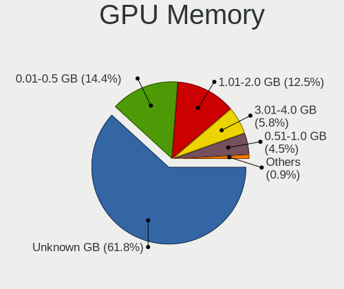

| Size in GB | Notebooks | Percent |
|------------|-----------|---------|
| Unknown    | 187       | 54.84%  |
| 1.01-2.0   | 61        | 17.89%  |
| 0.01-0.5   | 49        | 14.37%  |
| 3.01-4.0   | 26        | 7.62%   |
| 0.51-1.0   | 18        | 5.28%   |

Monitor
-------

Monitor Vendor
--------------

Monitor vendors

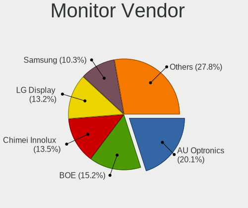

| Vendor                  | Notebooks | Percent |
|-------------------------|-----------|---------|
| AU Optronics            | 79        | 21.07%  |
| LG Display              | 58        | 15.47%  |
| BOE                     | 58        | 15.47%  |
| Chimei Innolux          | 48        | 12.8%   |
| Samsung Electronics     | 36        | 9.6%    |
| Dell                    | 11        | 2.93%   |
| Lenovo                  | 10        | 2.67%   |
| Chi Mei Optoelectronics | 10        | 2.67%   |
| PANDA                   | 7         | 1.87%   |
| Apple                   | 6         | 1.6%    |
| Philips                 | 5         | 1.33%   |
| LG Philips              | 5         | 1.33%   |
| Hewlett-Packard         | 5         | 1.33%   |
| Sony                    | 4         | 1.07%   |
| Sharp                   | 4         | 1.07%   |
| CPT                     | 4         | 1.07%   |
| InfoVision              | 3         | 0.8%    |
| Goldstar                | 3         | 0.8%    |
| BenQ                    | 3         | 0.8%    |
| Unknown                 | 2         | 0.53%   |
| Toshiba                 | 2         | 0.53%   |
| ViewSonic               | 1         | 0.27%   |
| SKY                     | 1         | 0.27%   |
| Seiko/Epson             | 1         | 0.27%   |
| LPL                     | 1         | 0.27%   |
| InnoLux Display         | 1         | 0.27%   |
| Iiyama                  | 1         | 0.27%   |
| Hitachi                 | 1         | 0.27%   |
| HannStar                | 1         | 0.27%   |
| CSO                     | 1         | 0.27%   |
| ASUSTek Computer        | 1         | 0.27%   |
| AOC                     | 1         | 0.27%   |
| Ancor Communications    | 1         | 0.27%   |

Monitor Model
-------------

Monitor models

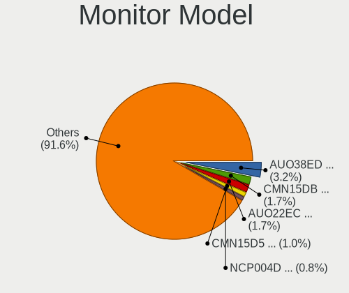

| Model                                                                 | Notebooks | Percent |
|-----------------------------------------------------------------------|-----------|---------|
| AU Optronics LCD Monitor AUO38ED 1920x1080 344x193mm 15.5-inch        | 16        | 4.22%   |
| AU Optronics LCD Monitor AUO22EC 1366x768 344x193mm 15.5-inch         | 9         | 2.37%   |
| Chimei Innolux LCD Monitor CMN15DB 1366x768 344x193mm 15.5-inch       | 8         | 2.11%   |
| Chimei Innolux LCD Monitor CMN15D5 1920x1080 344x193mm 15.5-inch      | 7         | 1.85%   |
| LG Display LCD Monitor LGD02DC 1366x768 344x194mm 15.5-inch           | 5         | 1.32%   |
| BOE LCD Monitor BOE06A4 1366x768 344x194mm 15.5-inch                  | 5         | 1.32%   |
| BOE LCD Monitor BOE069C 1920x1080 344x193mm 15.5-inch                 | 4         | 1.06%   |
| BOE LCD Monitor BOE0687 1920x1080 344x193mm 15.5-inch                 | 4         | 1.06%   |
| AU Optronics LCD Monitor AUO61ED 1920x1080 344x194mm 15.5-inch        | 4         | 1.06%   |
| LG Display LP156WH2-TLAA LGD0230 1366x768 344x194mm 15.5-inch         | 3         | 0.79%   |
| LG Display LCD Monitor LGD05E5 1920x1080 340x190mm 15.3-inch          | 3         | 0.79%   |
| Dell P2417H DELA0DC 1920x1080 527x296mm 23.8-inch                     | 3         | 0.79%   |
| Chimei Innolux LCD Monitor CMN15F5 1920x1080 344x193mm 15.5-inch      | 3         | 0.79%   |
| Chimei Innolux LCD Monitor CMN15BF 1366x768 344x193mm 15.5-inch       | 3         | 0.79%   |
| Chimei Innolux LCD Monitor CMN140A 1920x1080 309x173mm 13.9-inch      | 3         | 0.79%   |
| BOE LCD Monitor BOE08D7 1920x1080 309x174mm 14.0-inch                 | 3         | 0.79%   |
| BOE LCD Monitor BOE0812 1920x1080 344x194mm 15.5-inch                 | 3         | 0.79%   |
| BOE LCD Monitor BOE07A3 1920x1080 344x193mm 15.5-inch                 | 3         | 0.79%   |
| BOE LCD Monitor BOE0675 1366x768 344x194mm 15.5-inch                  | 3         | 0.79%   |
| AU Optronics LCD Monitor AUO20EC 1366x768 344x193mm 15.5-inch         | 3         | 0.79%   |
| Sony Nvidia Defaul t Flat Panel SNY06FA 1600x900 360x200mm 16.2-inch  | 2         | 0.53%   |
| Samsung Electronics LCD Monitor SEC3046 1366x768 344x193mm 15.5-inch  | 2         | 0.53%   |
| Samsung Electronics LCD Monitor SDC4347 1366x768 344x193mm 15.5-inch  | 2         | 0.53%   |
| Samsung Electronics LCD Monitor SDC4154 2880x1800 302x189mm 14.0-inch | 2         | 0.53%   |
| Samsung Electronics LCD Monitor SDC324C 1920x1080 344x194mm 15.5-inch | 2         | 0.53%   |
| PANDA LCD Monitor NCP006E 1920x1080 344x194mm 15.5-inch               | 2         | 0.53%   |
| PANDA LCD Monitor NCP004D 1920x1080 344x194mm 15.5-inch               | 2         | 0.53%   |
| LG Display LCD Monitor LGD05EC 1920x1080 309x174mm 14.0-inch          | 2         | 0.53%   |
| LG Display LCD Monitor LGD0519 1920x1080 344x194mm 15.5-inch          | 2         | 0.53%   |
| LG Display LCD Monitor LGD0456 1366x768 344x194mm 15.5-inch           | 2         | 0.53%   |
| LG Display LCD Monitor LGD03AB 1366x768 344x194mm 15.5-inch           | 2         | 0.53%   |
| LG Display LCD Monitor LGD038E 1366x768 344x194mm 15.5-inch           | 2         | 0.53%   |
| LG Display LCD Monitor LGD033A 1366x768 344x194mm 15.5-inch           | 2         | 0.53%   |
| Lenovo L24q-10 LEN65CF 2560x1440 527x296mm 23.8-inch                  | 2         | 0.53%   |
| Dell U2412M DELA079 1920x1200 518x324mm 24.1-inch                     | 2         | 0.53%   |
| CPT LCD Monitor CPT14BF 1366x768 344x193mm 15.5-inch                  | 2         | 0.53%   |
| Chimei Innolux LCD Monitor CMN1738 1920x1080 381x214mm 17.2-inch      | 2         | 0.53%   |
| Chimei Innolux LCD Monitor CMN15DC 1366x768 344x193mm 15.5-inch       | 2         | 0.53%   |
| Chimei Innolux LCD Monitor CMN15CA 1366x768 344x193mm 15.5-inch       | 2         | 0.53%   |
| Chimei Innolux LCD Monitor CMN14D4 1920x1080 309x173mm 13.9-inch      | 2         | 0.53%   |

Monitor Resolution
------------------

Monitor screen resolution

| Resolution         | Notebooks | Percent |
|--------------------|-----------|---------|
| 1920x1080 (FHD)    | 164       | 46.59%  |
| 1366x768 (WXGA)    | 120       | 34.09%  |
| 1280x800 (WXGA)    | 13        | 3.69%   |
| 1600x900 (HD+)     | 11        | 3.13%   |
| 3840x2160 (4K)     | 5         | 1.42%   |
| 1440x900 (WXGA+)   | 5         | 1.42%   |
| 2560x1440 (QHD)    | 4         | 1.14%   |
| 1360x768           | 4         | 1.14%   |
| 1920x1200 (WUXGA)  | 3         | 0.85%   |
| 1680x1050 (WSXGA+) | 3         | 0.85%   |
| 1024x600           | 3         | 0.85%   |
| 2880x1800          | 2         | 0.57%   |
| 2560x1600          | 2         | 0.57%   |
| 1280x1024 (SXGA)   | 2         | 0.57%   |
| 1024x768 (XGA)     | 2         | 0.57%   |
| Unknown            | 2         | 0.57%   |
| 3360x1200          | 1         | 0.28%   |
| 3280x1080          | 1         | 0.28%   |
| 2520x1680          | 1         | 0.28%   |
| 2160x1350          | 1         | 0.28%   |
| 1920x540           | 1         | 0.28%   |
| 1680x945           | 1         | 0.28%   |
| 1400x1050          | 1         | 0.28%   |

Monitor Diagonal
----------------

Diagonal size in inches

| Inches  | Notebooks | Percent |
|---------|-----------|---------|
| 15      | 218       | 58.29%  |
| 13      | 29        | 7.75%   |
| 14      | 25        | 6.68%   |
| 17      | 24        | 6.42%   |
| 24      | 15        | 4.01%   |
| 23      | 11        | 2.94%   |
| 21      | 7         | 1.87%   |
| Unknown | 6         | 1.6%    |
| 27      | 5         | 1.34%   |
| 12      | 5         | 1.34%   |
| 11      | 5         | 1.34%   |
| 31      | 4         | 1.07%   |
| 72      | 3         | 0.8%    |
| 16      | 3         | 0.8%    |
| 18      | 2         | 0.53%   |
| 10      | 2         | 0.53%   |
| 84      | 1         | 0.27%   |
| 54      | 1         | 0.27%   |
| 46      | 1         | 0.27%   |
| 43      | 1         | 0.27%   |
| 40      | 1         | 0.27%   |
| 32      | 1         | 0.27%   |
| 26      | 1         | 0.27%   |
| 20      | 1         | 0.27%   |
| 19      | 1         | 0.27%   |
| 8       | 1         | 0.27%   |

Monitor Width
-------------

Physical width

| Width in mm | Notebooks | Percent |
|-------------|-----------|---------|
| 301-350     | 260       | 69.52%  |
| 501-600     | 32        | 8.56%   |
| 351-400     | 28        | 7.49%   |
| 201-300     | 23        | 6.15%   |
| 401-500     | 11        | 2.94%   |
| Unknown     | 6         | 1.6%    |
| 601-700     | 4         | 1.07%   |
| 1501-2000   | 4         | 1.07%   |
| 1001-1500   | 2         | 0.53%   |
| 801-900     | 1         | 0.27%   |
| 701-800     | 1         | 0.27%   |
| 101-200     | 1         | 0.27%   |
| 901-1000    | 1         | 0.27%   |

Aspect Ratio
------------

Proportional relationship between the width and the height

| Ratio   | Notebooks | Percent |
|---------|-----------|---------|
| 16/9    | 293       | 88.79%  |
| 16/10   | 27        | 8.18%   |
| 4/3     | 4         | 1.21%   |
| Unknown | 3         | 0.91%   |
| 3/2     | 2         | 0.61%   |
| 5/4     | 1         | 0.3%    |

Monitor Area
------------

Area in inch

| Area in inch | Notebooks | Percent |
|----------------|-----------|---------|
| 101-110        | 219       | 58.4%   |
| 81-90          | 45        | 12%     |
| 201-250        | 29        | 7.73%   |
| 121-130        | 23        | 6.13%   |
| 71-80          | 9         | 2.4%    |
| 301-350        | 6         | 1.6%    |
| Unknown        | 6         | 1.6%    |
| More than 1000 | 5         | 1.33%   |
| 51-60          | 5         | 1.33%   |
| 351-500        | 5         | 1.33%   |
| 61-70          | 4         | 1.07%   |
| 251-300        | 4         | 1.07%   |
| 151-200        | 3         | 0.8%    |
| 501-1000       | 3         | 0.8%    |
| 41-50          | 2         | 0.53%   |
| 141-150        | 2         | 0.53%   |
| 111-120        | 2         | 0.53%   |
| 1-40           | 1         | 0.27%   |
| 131-140        | 1         | 0.27%   |
| 91-100         | 1         | 0.27%   |

Pixel Density
-------------

Pixels per inch

| Density       | Notebooks | Percent |
|---------------|-----------|---------|
| 121-160       | 157       | 43.25%  |
| 101-120       | 127       | 34.99%  |
| 51-100        | 55        | 15.15%  |
| 161-240       | 10        | 2.75%   |
| Unknown       | 6         | 1.65%   |
| 1-50          | 5         | 1.38%   |
| More than 240 | 3         | 0.83%   |

Multiple Monitors
-----------------

Total monitors connected

| Total | Notebooks | Percent |
|-------|-----------|---------|
| 1     | 272       | 80.24%  |
| 2     | 54        | 15.93%  |
| 0     | 8         | 2.36%   |
| 3     | 5         | 1.47%   |

Network
-------

Net Controller Vendor
---------------------

Controller vendors

| Vendor                            | Notebooks | Percent |
|-----------------------------------|-----------|---------|
| Realtek Semiconductor             | 200       | 36.7%   |
| Intel                             | 141       | 25.87%  |
| Qualcomm Atheros                  | 101       | 18.53%  |
| Broadcom                          | 41        | 7.52%   |
| Ralink                            | 9         | 1.65%   |
| Broadcom Limited                  | 8         | 1.47%   |
| Nvidia                            | 5         | 0.92%   |
| MediaTek                          | 5         | 0.92%   |
| Marvell Technology Group          | 5         | 0.92%   |
| Ralink Technology                 | 4         | 0.73%   |
| Dell                              | 4         | 0.73%   |
| Huawei Technologies               | 3         | 0.55%   |
| Ericsson Business Mobile Networks | 3         | 0.55%   |
| ZTE WCDMA Technologies MSM        | 2         | 0.37%   |
| Sierra Wireless                   | 2         | 0.37%   |
| Qualcomm Atheros Communications   | 2         | 0.37%   |
| Xiaomi                            | 1         | 0.18%   |
| VIA Technologies                  | 1         | 0.18%   |
| TP-Link                           | 1         | 0.18%   |
| Samsung Electronics               | 1         | 0.18%   |
| Linksys                           | 1         | 0.18%   |
| JMicron Technology                | 1         | 0.18%   |
| IMC Networks                      | 1         | 0.18%   |
| D-Link                            | 1         | 0.18%   |
| Arduino SA                        | 1         | 0.18%   |
| Apple                             | 1         | 0.18%   |

Net Controller Model
--------------------

Controller models

| Model                                                                   | Notebooks | Percent |
|-------------------------------------------------------------------------|-----------|---------|
| Realtek RTL8111/8168/8411 PCI Express Gigabit Ethernet Controller       | 116       | 17.87%  |
| Realtek RTL810xE PCI Express Fast Ethernet controller                   | 58        | 8.94%   |
| Qualcomm Atheros QCA9377 802.11ac Wireless Network Adapter              | 29        | 4.47%   |
| Qualcomm Atheros QCA9565 / AR9565 Wireless Network Adapter              | 18        | 2.77%   |
| Realtek RTL8821CE 802.11ac PCIe Wireless Network Adapter                | 17        | 2.62%   |
| Intel Wireless 8265 / 8275                                              | 16        | 2.47%   |
| Realtek RTL8723BE PCIe Wireless Network Adapter                         | 12        | 1.85%   |
| Broadcom BCM43142 802.11b/g/n                                           | 12        | 1.85%   |
| Qualcomm Atheros AR9285 Wireless Network Adapter (PCI-Express)          | 11        | 1.69%   |
| Realtek RTL8822CE 802.11ac PCIe Wireless Network Adapter                | 10        | 1.54%   |
| Intel Wireless 8260                                                     | 10        | 1.54%   |
| Broadcom BCM4313 802.11bgn Wireless Network Adapter                     | 10        | 1.54%   |
| Intel Wireless 7260                                                     | 9         | 1.39%   |
| Intel Dual Band Wireless-AC 3165 Plus Bluetooth                         | 8         | 1.23%   |
| Intel Ice Lake-LP PCH CNVi WiFi                                         | 7         | 1.08%   |
| Intel Cannon Point-LP CNVi [Wireless-AC]                                | 7         | 1.08%   |
| Intel Cannon Lake PCH CNVi WiFi                                         | 7         | 1.08%   |
| Intel 82579LM Gigabit Network Connection (Lewisville)                   | 7         | 1.08%   |
| Qualcomm Atheros QCA6174 802.11ac Wireless Network Adapter              | 6         | 0.92%   |
| Qualcomm Atheros AR9485 Wireless Network Adapter                        | 6         | 0.92%   |
| Qualcomm Atheros AR8151 v2.0 Gigabit Ethernet                           | 6         | 0.92%   |
| Intel Wireless 3165                                                     | 6         | 0.92%   |
| Intel Wi-Fi 6 AX200                                                     | 6         | 0.92%   |
| Intel PRO/Wireless 3945ABG [Golan] Network Connection                   | 6         | 0.92%   |
| Intel Ethernet Connection (4) I219-LM                                   | 6         | 0.92%   |
| Realtek RTL8822BE 802.11a/b/g/n/ac WiFi adapter                         | 5         | 0.77%   |
| Realtek RTL8821AE 802.11ac PCIe Wireless Network Adapter                | 5         | 0.77%   |
| Qualcomm Atheros AR9462 Wireless Network Adapter                        | 5         | 0.77%   |
| Qualcomm Atheros AR242x / AR542x Wireless Network Adapter (PCI-Express) | 5         | 0.77%   |
| Intel Wi-Fi 6 AX201                                                     | 5         | 0.77%   |
| Intel Ethernet Connection I219-LM                                       | 5         | 0.77%   |
| Intel Centrino Advanced-N 6205 [Taylor Peak]                            | 5         | 0.77%   |
| Broadcom NetLink BCM57785 Gigabit Ethernet PCIe                         | 5         | 0.77%   |
| Realtek RTL8153 Gigabit Ethernet Adapter                                | 4         | 0.62%   |
| Ralink RT3090 Wireless 802.11n 1T/1R PCIe                               | 4         | 0.62%   |
| Qualcomm Atheros QCA8172 Fast Ethernet                                  | 4         | 0.62%   |
| Qualcomm Atheros AR9287 Wireless Network Adapter (PCI-Express)          | 4         | 0.62%   |
| Nvidia MCP79 Ethernet                                                   | 4         | 0.62%   |
| MediaTek MT7921 802.11ax PCI Express Wireless Network Adapter           | 4         | 0.62%   |
| Intel Dual Band Wireless-AC 3168NGW [Stone Peak]                        | 4         | 0.62%   |

Wireless Vendor
---------------

Wireless vendors

| Vendor                          | Notebooks | Percent |
|---------------------------------|-----------|---------|
| Intel                           | 134       | 39.07%  |
| Qualcomm Atheros                | 88        | 25.66%  |
| Realtek Semiconductor           | 58        | 16.91%  |
| Broadcom                        | 32        | 9.33%   |
| Ralink                          | 9         | 2.62%   |
| MediaTek                        | 5         | 1.46%   |
| Ralink Technology               | 4         | 1.17%   |
| Dell                            | 3         | 0.87%   |
| Sierra Wireless                 | 2         | 0.58%   |
| Qualcomm Atheros Communications | 2         | 0.58%   |
| Broadcom Limited                | 2         | 0.58%   |
| TP-Link                         | 1         | 0.29%   |
| Linksys                         | 1         | 0.29%   |
| IMC Networks                    | 1         | 0.29%   |
| D-Link                          | 1         | 0.29%   |

Wireless Model
--------------

Wireless models

| Model                                                                   | Notebooks | Percent |
|-------------------------------------------------------------------------|-----------|---------|
| Qualcomm Atheros QCA9377 802.11ac Wireless Network Adapter              | 29        | 8.43%   |
| Qualcomm Atheros QCA9565 / AR9565 Wireless Network Adapter              | 18        | 5.23%   |
| Realtek RTL8821CE 802.11ac PCIe Wireless Network Adapter                | 17        | 4.94%   |
| Intel Wireless 8265 / 8275                                              | 16        | 4.65%   |
| Realtek RTL8723BE PCIe Wireless Network Adapter                         | 12        | 3.49%   |
| Broadcom BCM43142 802.11b/g/n                                           | 12        | 3.49%   |
| Qualcomm Atheros AR9285 Wireless Network Adapter (PCI-Express)          | 11        | 3.2%    |
| Realtek RTL8822CE 802.11ac PCIe Wireless Network Adapter                | 10        | 2.91%   |
| Intel Wireless 8260                                                     | 10        | 2.91%   |
| Broadcom BCM4313 802.11bgn Wireless Network Adapter                     | 10        | 2.91%   |
| Intel Wireless 7260                                                     | 9         | 2.62%   |
| Intel Dual Band Wireless-AC 3165 Plus Bluetooth                         | 8         | 2.33%   |
| Intel Ice Lake-LP PCH CNVi WiFi                                         | 7         | 2.03%   |
| Intel Cannon Point-LP CNVi [Wireless-AC]                                | 7         | 2.03%   |
| Intel Cannon Lake PCH CNVi WiFi                                         | 7         | 2.03%   |
| Qualcomm Atheros QCA6174 802.11ac Wireless Network Adapter              | 6         | 1.74%   |
| Qualcomm Atheros AR9485 Wireless Network Adapter                        | 6         | 1.74%   |
| Intel Wireless 3165                                                     | 6         | 1.74%   |
| Intel Wi-Fi 6 AX200                                                     | 6         | 1.74%   |
| Intel PRO/Wireless 3945ABG [Golan] Network Connection                   | 6         | 1.74%   |
| Realtek RTL8822BE 802.11a/b/g/n/ac WiFi adapter                         | 5         | 1.45%   |
| Realtek RTL8821AE 802.11ac PCIe Wireless Network Adapter                | 5         | 1.45%   |
| Qualcomm Atheros AR9462 Wireless Network Adapter                        | 5         | 1.45%   |
| Qualcomm Atheros AR242x / AR542x Wireless Network Adapter (PCI-Express) | 5         | 1.45%   |
| Intel Wi-Fi 6 AX201                                                     | 5         | 1.45%   |
| Intel Centrino Advanced-N 6205 [Taylor Peak]                            | 5         | 1.45%   |
| Ralink RT3090 Wireless 802.11n 1T/1R PCIe                               | 4         | 1.16%   |
| Qualcomm Atheros AR9287 Wireless Network Adapter (PCI-Express)          | 4         | 1.16%   |
| MediaTek MT7921 802.11ax PCI Express Wireless Network Adapter           | 4         | 1.16%   |
| Intel Dual Band Wireless-AC 3168NGW [Stone Peak]                        | 4         | 1.16%   |
| Intel Comet Lake PCH CNVi WiFi                                          | 4         | 1.16%   |
| Ralink RT3290 Wireless 802.11n 1T/1R PCIe                               | 3         | 0.87%   |
| Intel Wireless 3160                                                     | 3         | 0.87%   |
| Intel Centrino Wireless-N 2230                                          | 3         | 0.87%   |
| Intel Centrino Ultimate-N 6300                                          | 3         | 0.87%   |
| Intel Centrino Advanced-N 6200                                          | 3         | 0.87%   |
| Dell DW5811e Snapdragon X7 LTE                                    | 3         | 0.87%   |
| Broadcom BCM4331 802.11a/b/g/n                                          | 3         | 0.87%   |
| Broadcom BCM4311 802.11b/g WLAN                                         | 3         | 0.87%   |
| Realtek RTL8723DE Wireless Network Adapter                              | 2         | 0.58%   |

Ethernet Vendor
---------------

Ethernet vendors

| Vendor                     | Notebooks | Percent |
|----------------------------|-----------|---------|
| Realtek Semiconductor      | 182       | 62.12%  |
| Intel                      | 51        | 17.41%  |
| Qualcomm Atheros           | 22        | 7.51%   |
| Broadcom                   | 14        | 4.78%   |
| Broadcom Limited           | 6         | 2.05%   |
| Nvidia                     | 5         | 1.71%   |
| Marvell Technology Group   | 5         | 1.71%   |
| ZTE WCDMA Technologies MSM | 2         | 0.68%   |
| Xiaomi                     | 1         | 0.34%   |
| VIA Technologies           | 1         | 0.34%   |
| Samsung Electronics        | 1         | 0.34%   |
| JMicron Technology         | 1         | 0.34%   |
| Huawei Technologies        | 1         | 0.34%   |
| Apple                      | 1         | 0.34%   |

Ethernet Model
--------------

Ethernet models

| Model                                                             | Notebooks | Percent |
|-------------------------------------------------------------------|-----------|---------|
| Realtek RTL8111/8168/8411 PCI Express Gigabit Ethernet Controller | 116       | 39.19%  |
| Realtek RTL810xE PCI Express Fast Ethernet controller             | 58        | 19.59%  |
| Intel 82579LM Gigabit Network Connection (Lewisville)             | 7         | 2.36%   |
| Qualcomm Atheros AR8151 v2.0 Gigabit Ethernet                     | 6         | 2.03%   |
| Intel Ethernet Connection (4) I219-LM                             | 6         | 2.03%   |
| Intel Ethernet Connection I219-LM                                 | 5         | 1.69%   |
| Broadcom NetLink BCM57785 Gigabit Ethernet PCIe                   | 5         | 1.69%   |
| Realtek RTL8153 Gigabit Ethernet Adapter                          | 4         | 1.35%   |
| Qualcomm Atheros QCA8172 Fast Ethernet                            | 4         | 1.35%   |
| Nvidia MCP79 Ethernet                                             | 4         | 1.35%   |
| Realtek RTL8152 Fast Ethernet Adapter                             | 3         | 1.01%   |
| Qualcomm Atheros AR8161 Gigabit Ethernet                          | 3         | 1.01%   |
| Intel Ethernet Connection I218-LM                                 | 3         | 1.01%   |
| Intel Ethernet Connection (2) I219-LM                             | 3         | 1.01%   |
| Intel 82577LM Gigabit Network Connection                          | 3         | 1.01%   |
| Broadcom NetXtreme BCM57765 Gigabit Ethernet PCIe                 | 3         | 1.01%   |
| Realtek RTL8125 2.5GbE Controller                                 | 2         | 0.68%   |
| Qualcomm Atheros Killer E220x Gigabit Ethernet Controller         | 2         | 0.68%   |
| Qualcomm Atheros AR8152 v1.1 Fast Ethernet                        | 2         | 0.68%   |
| Qualcomm Atheros AR8132 Fast Ethernet                             | 2         | 0.68%   |
| Intel Ethernet Connection I217-V                                  | 2         | 0.68%   |
| Intel Ethernet Connection I217-LM                                 | 2         | 0.68%   |
| Intel Ethernet Connection (6) I219-LM                             | 2         | 0.68%   |
| Intel Ethernet Connection (5) I219-LM                             | 2         | 0.68%   |
| Intel Ethernet Connection (13) I219-V                             | 2         | 0.68%   |
| Intel 82567LM Gigabit Network Connection                          | 2         | 0.68%   |
| Broadcom NetLink BCM57780 Gigabit Ethernet PCIe                   | 2         | 0.68%   |
| Broadcom Limited NetLink BCM57780 Gigabit Ethernet PCIe           | 2         | 0.68%   |
| Broadcom BCM4401-B0 100Base-TX                                    | 2         | 0.68%   |
| ZTE WCDMA MSM ZTE WCDMA MSM                                       | 1         | 0.34%   |
| ZTE WCDMA MSM Spreadtrum Phone                                    | 1         | 0.34%   |
| Xiaomi Mi/Redmi series (RNDIS + ADB)                              | 1         | 0.34%   |
| VIA VT6102/VT6103 [Rhine-II]                                      | 1         | 0.34%   |
| Samsung GT-I9070 (network tethering, USB debugging enabled)       | 1         | 0.34%   |
| Realtek RTL-8100/8101L/8139 PCI Fast Ethernet Adapter             | 1         | 0.34%   |
| Realtek Killer E2600 Gigabit Ethernet Controller                  | 1         | 0.34%   |
| Qualcomm Atheros Killer E2400 Gigabit Ethernet Controller         | 1         | 0.34%   |
| Qualcomm Atheros AR8162 Fast Ethernet                             | 1         | 0.34%   |
| Qualcomm Atheros AR8121/AR8113/AR8114 Gigabit or Fast Ethernet    | 1         | 0.34%   |
| Nvidia MCP67 Ethernet                                             | 1         | 0.34%   |

Net Controller Kind
-------------------

Ethernet, WiFi or modem

| Kind     | Notebooks | Percent |
|----------|-----------|---------|
| WiFi     | 330       | 52.63%  |
| Ethernet | 288       | 45.93%  |
| Modem    | 9         | 1.44%   |

Used Controller
---------------

Currently used network controller

| Kind     | Notebooks | Percent |
|----------|-----------|---------|
| WiFi     | 274       | 77.84%  |
| Ethernet | 78        | 22.16%  |

NICs
----

Total network controllers on board

| Total | Notebooks | Percent |
|-------|-----------|---------|
| 2     | 277       | 83.69%  |
| 1     | 53        | 16.01%  |
| 3     | 1         | 0.3%    |

IPv6
----

IPv6 vs IPv4

| Used | Notebooks | Percent |
|------|-----------|---------|
| No   | 327       | 98.79%  |
| Yes  | 4         | 1.21%   |

Bluetooth
---------

Bluetooth Vendor
----------------

Controller vendors

| Vendor                          | Notebooks | Percent |
|---------------------------------|-----------|---------|
| Intel                           | 95        | 35.19%  |
| Realtek Semiconductor           | 44        | 16.3%   |
| Qualcomm Atheros Communications | 33        | 12.22%  |
| Lite-On Technology              | 21        | 7.78%   |
| IMC Networks                    | 17        | 6.3%    |
| Broadcom                        | 16        | 5.93%   |
| Foxconn / Hon Hai               | 10        | 3.7%    |
| Toshiba                         | 6         | 2.22%   |
| Apple                           | 6         | 2.22%   |
| Hewlett-Packard                 | 4         | 1.48%   |
| Ralink                          | 3         | 1.11%   |
| Foxconn International           | 3         | 1.11%   |
| Dell                            | 3         | 1.11%   |
| USI                             | 2         | 0.74%   |
| Ralink Technology               | 2         | 0.74%   |
| Cambridge Silicon Radio         | 2         | 0.74%   |
| Realtek                         | 1         | 0.37%   |
| Askey Computer                  | 1         | 0.37%   |
| Alps Electric                   | 1         | 0.37%   |

Bluetooth Model
---------------

Controller models

| Model                                               | Notebooks | Percent |
|-----------------------------------------------------|-----------|---------|
| Intel Bluetooth wireless interface                  | 45        | 16.67%  |
| Realtek Bluetooth Radio                             | 26        | 9.63%   |
| Intel Bluetooth 9460/9560 Jefferson Peak (JfP)      | 21        | 7.78%   |
| Qualcomm Atheros  Bluetooth Device                  | 18        | 6.67%   |
| Lite-On Qualcomm Atheros QCA9377 Bluetooth          | 12        | 4.44%   |
| Realtek  Bluetooth 4.2 Adapter                      | 11        | 4.07%   |
| Intel AX201 Bluetooth                               | 10        | 3.7%    |
| IMC Networks Bluetooth Radio                        | 7         | 2.59%   |
| Intel AX200 Bluetooth                               | 6         | 2.22%   |
| Lite-On Bluetooth Device                            | 5         | 1.85%   |
| Apple Bluetooth Host Controller                     | 5         | 1.85%   |
| Realtek RTL8821A Bluetooth                          | 4         | 1.48%   |
| Qualcomm Atheros AR9462 Bluetooth                   | 4         | 1.48%   |
| Qualcomm Atheros AR3011 Bluetooth                   | 4         | 1.48%   |
| Intel Centrino Bluetooth Wireless Transceiver       | 4         | 1.48%   |
| Foxconn / Hon Hai Bluetooth Device                  | 4         | 1.48%   |
| Broadcom BCM43142A0 Bluetooth 4.0                   | 4         | 1.48%   |
| Realtek RTL8723B Bluetooth                          | 3         | 1.11%   |
| Ralink RT3290 Bluetooth                             | 3         | 1.11%   |
| Qualcomm Atheros QCA61x4 Bluetooth 4.0              | 3         | 1.11%   |
| Intel Wireless-AC 3168 Bluetooth                    | 3         | 1.11%   |
| Intel Centrino Advanced-N 6230 Bluetooth adapter    | 3         | 1.11%   |
| IMC Networks Wireless_Device                        | 3         | 1.11%   |
| IMC Networks Bluetooth Device                       | 3         | 1.11%   |
| Foxconn International BCM43142A0 Bluetooth module   | 3         | 1.11%   |
| Dell DW375 Bluetooth Module                         | 3         | 1.11%   |
| USI Bluetooth Module BCM92070                       | 2         | 0.74%   |
| Toshiba Bluetooth Device                            | 2         | 0.74%   |
| Qualcomm Atheros AR3012 Bluetooth 4.0               | 2         | 0.74%   |
| Qualcomm Atheros AR3012 Bluetooth                   | 2         | 0.74%   |
| Lite-On Atheros AR3012 Bluetooth                    | 2         | 0.74%   |
| IMC Networks Atheros AR3012 Bluetooth 4.0 Adapter   | 2         | 0.74%   |
| HP Broadcom 2070 Bluetooth Combo                    | 2         | 0.74%   |
| HP Bluetooth 2.0 Interface [Broadcom BCM2045]       | 2         | 0.74%   |
| Foxconn / Hon Hai Wireless_Device                   | 2         | 0.74%   |
| Foxconn / Hon Hai Broadcom Bluetooth 2.1 Device     | 2         | 0.74%   |
| Cambridge Silicon Radio Bluetooth Dongle (HCI mode) | 2         | 0.74%   |
| Broadcom BCM43142 Bluetooth 4.0                     | 2         | 0.74%   |
| Broadcom BCM20702 Bluetooth 4.0 [ThinkPad]          | 2         | 0.74%   |
| Broadcom BCM2070 Bluetooth 2.1 + EDR                | 2         | 0.74%   |

Sound
-----

Sound Vendor
------------

Sound card vendors

| Vendor              | Notebooks | Percent |
|---------------------|-----------|---------|
| Intel               | 263       | 69.03%  |
| AMD                 | 65        | 17.06%  |
| Nvidia              | 44        | 11.55%  |
| GN Netcom           | 2         | 0.52%   |
| VIA Technologies    | 1         | 0.26%   |
| Native Instruments  | 1         | 0.26%   |
| Kingston Technology | 1         | 0.26%   |
| Hewlett-Packard     | 1         | 0.26%   |
| Focusrite-Novation  | 1         | 0.26%   |
| C-Media Electronics | 1         | 0.26%   |
| Apple               | 1         | 0.26%   |

Sound Model
-----------

Sound card models

| Model                                                                                             | Notebooks | Percent |
|---------------------------------------------------------------------------------------------------|-----------|---------|
| Intel Sunrise Point-LP HD Audio                                                                   | 41        | 8.84%   |
| AMD Family 17h/19h HD Audio Controller                                                            | 40        | 8.62%   |
| Intel 6 Series/C200 Series Chipset Family High Definition Audio Controller                        | 29        | 6.25%   |
| Intel 7 Series/C216 Chipset Family High Definition Audio Controller                               | 25        | 5.39%   |
| AMD Raven/Raven2/Fenghuang HDMI/DP Audio Controller                                               | 19        | 4.09%   |
| AMD Renoir Radeon High Definition Audio Controller                                                | 17        | 3.66%   |
| Intel Celeron N3350/Pentium N4200/Atom E3900 Series Audio Cluster                                 | 13        | 2.8%    |
| Intel Cannon Lake PCH cAVS                                                                        | 12        | 2.59%   |
| Intel NM10/ICH7 Family High Definition Audio Controller                                           | 11        | 2.37%   |
| Intel Ice Lake-LP Smart Sound Technology Audio Controller                                         | 11        | 2.37%   |
| Intel 5 Series/3400 Series Chipset High Definition Audio                                          | 11        | 2.37%   |
| Intel Wildcat Point-LP High Definition Audio Controller                                           | 10        | 2.16%   |
| Intel Cannon Point-LP High Definition Audio Controller                                            | 10        | 2.16%   |
| Intel Broadwell-U Audio Controller                                                                | 10        | 2.16%   |
| Intel 8 Series/C220 Series Chipset High Definition Audio Controller                               | 10        | 2.16%   |
| Intel Xeon E3-1200 v3/4th Gen Core Processor HD Audio Controller                                  | 9         | 1.94%   |
| Intel Tiger Lake-LP Smart Sound Technology Audio Controller                                       | 9         | 1.94%   |
| Intel Haswell-ULT HD Audio Controller                                                             | 9         | 1.94%   |
| Intel Atom/Celeron/Pentium Processor x5-E8000/J3xxx/N3xxx Series High Definition Audio Controller | 9         | 1.94%   |
| Intel 82801I (ICH9 Family) HD Audio Controller                                                    | 9         | 1.94%   |
| Intel 8 Series HD Audio Controller                                                                | 9         | 1.94%   |
| AMD SBx00 Azalia (Intel HDA)                                                                      | 9         | 1.94%   |
| Intel Atom Processor Z36xxx/Z37xxx Series High Definition Audio Controller                        | 8         | 1.72%   |
| Nvidia TU107 GeForce GTX 1650 High Definition Audio Controller                                    | 7         | 1.51%   |
| Nvidia GF108 High Definition Audio Controller                                                     | 7         | 1.51%   |
| AMD FCH Azalia Controller                                                                         | 7         | 1.51%   |
| Intel CM238 HD Audio Controller                                                                   | 6         | 1.29%   |
| Intel Celeron/Pentium Silver Processor High Definition Audio                                      | 6         | 1.29%   |
| Intel 82801H (ICH8 Family) HD Audio Controller                                                    | 6         | 1.29%   |
| Nvidia GP107GL High Definition Audio Controller                                                   | 5         | 1.08%   |
| Nvidia GM107 High Definition Audio Controller [GeForce 940MX]                                     | 5         | 1.08%   |
| Intel Comet Lake PCH cAVS                                                                         | 5         | 1.08%   |
| Intel 100 Series/C230 Series Chipset Family HD Audio Controller                                   | 5         | 1.08%   |
| AMD RS880 HDMI Audio [Radeon HD 4200 Series]                                                      | 5         | 1.08%   |
| AMD Kabini HDMI/DP Audio                                                                          | 5         | 1.08%   |
| Nvidia MCP79 High Definition Audio                                                                | 4         | 0.86%   |
| AMD High Definition Audio Controller                                                              | 3         | 0.65%   |
| AMD Family 15h (Models 60h-6fh) Audio Controller                                                  | 3         | 0.65%   |
| Nvidia GP104 High Definition Audio Controller                                                     | 2         | 0.43%   |
| Nvidia GK104 HDMI Audio Controller                                                                | 2         | 0.43%   |

Memory
------

Memory Vendor
-------------

Memory module vendors

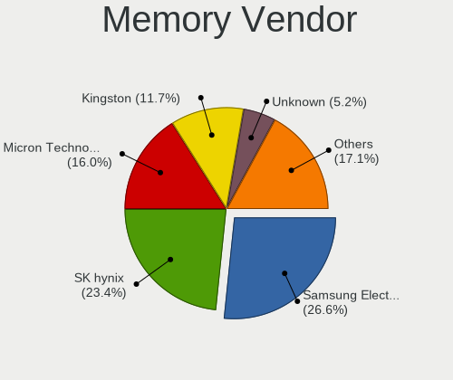

| Vendor              | Notebooks | Percent |
|---------------------|-----------|---------|
| Samsung Electronics | 55        | 25%     |
| SK hynix            | 49        | 22.27%  |
| Micron Technology   | 34        | 15.45%  |
| Kingston            | 29        | 13.18%  |
| Unknown             | 15        | 6.82%   |
| Ramaxel Technology  | 11        | 5%      |
| Transcend           | 7         | 3.18%   |
| Patriot             | 3         | 1.36%   |
| Elpida              | 3         | 1.36%   |
| Crucial             | 3         | 1.36%   |
| Corsair             | 2         | 0.91%   |
| A-DATA Technology   | 2         | 0.91%   |
| SHARETRONIC         | 1         | 0.45%   |
| PNY                 | 1         | 0.45%   |
| Nanya Technology    | 1         | 0.45%   |
| Apacer              | 1         | 0.45%   |
| AMD                 | 1         | 0.45%   |
| 48spaces            | 1         | 0.45%   |
| Unknown             | 1         | 0.45%   |

Memory Model
------------

Memory module models

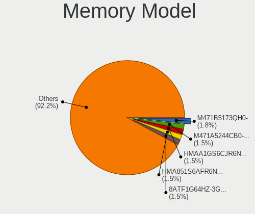

| Model                                                       | Notebooks | Percent |
|-------------------------------------------------------------|-----------|---------|
| Samsung RAM M471A5244CB0-CRC 4GB SODIMM DDR4 2667MT/s       | 6         | 2.51%   |
| Samsung RAM M471B5173QH0-YK0 4GB SODIMM DDR3 1600MT/s       | 5         | 2.09%   |
| Micron RAM 8ATF1G64HZ-3G2J1 8GB SODIMM DDR4 3200MT/s        | 5         | 2.09%   |
| SK hynix RAM HMAA1GS6CJR6N-XN 8GB SODIMM DDR4 3200MT/s      | 4         | 1.67%   |
| SK hynix RAM HMA851S6JJR6N-VK 4GB SODIMM DDR4 2667MT/s      | 4         | 1.67%   |
| SK hynix RAM HMA851S6AFR6N-UH 2GB SODIMM LPDDR4 2667MT/s    | 4         | 1.67%   |
| Micron RAM 4ATF51264HZ-2G6E1 4GB SODIMM DDR4 2667MT/s       | 4         | 1.67%   |
| Micron RAM 4ATF51264HZ-2G6E! 4GB SODIMM DDR4 2400MT/s       | 4         | 1.67%   |
| Kingston RAM 99U5428-018.A00LF 8GB SODIMM DDR3 1600MT/s     | 4         | 1.67%   |
| SK hynix RAM HMT351S6CFR8C-PB 4GB SODIMM DDR3 1600MT/s      | 3         | 1.26%   |
| SK hynix RAM HMA81GS6DJR8N-XN 8GB SODIMM DDR4 3200MT/s      | 3         | 1.26%   |
| Samsung RAM M471B5173EB0-YK0 4GB SODIMM DDR3 1600MT/s       | 3         | 1.26%   |
| Samsung RAM M471A5244CB0-CTD 4GB SODIMM DDR4 3266MT/s       | 3         | 1.26%   |
| Samsung RAM M471A1K43DB1-CTD 8GB SODIMM DDR4 2667MT/s       | 3         | 1.26%   |
| Samsung RAM M471A1G44AB0-CWE 8GB SODIMM DDR4 3200MT/s       | 3         | 1.26%   |
| Micron RAM 4ATS1G64HZ-2G6E1 8GB SODIMM DDR4 2667MT/s        | 3         | 1.26%   |
| Micron RAM 4ATF1G64HZ-3G2E1 8GB SODIMM DDR4 3200MT/s        | 3         | 1.26%   |
| Unknown RAM Module 2GB SODIMM DDR2 667MT/s                  | 2         | 0.84%   |
| Unknown RAM Module 1024MB SODIMM DDR                        | 2         | 0.84%   |
| Transcend RAM JM3200HSG-8G 8GB SODIMM DDR4 3200MT/s         | 2         | 0.84%   |
| SK hynix RAM HYMP125S64CP8-S6 2GB SODIMM DDR2 2048MT/s      | 2         | 0.84%   |
| SK hynix RAM HMT351S6CFR8C-H9 4GB SODIMM DDR3 1334MT/s      | 2         | 0.84%   |
| SK hynix RAM HMT325S6BFR8C-H9 2GB SODIMM DDR3 1600MT/s      | 2         | 0.84%   |
| SK hynix RAM HMA851S6CJR6N-VK 4GB SODIMM DDR4 2667MT/s      | 2         | 0.84%   |
| SK hynix RAM HMA81GS6AFR8N-UH 8GB SODIMM DDR4 2667MT/s      | 2         | 0.84%   |
| SK hynix RAM HMA41GS6AFR8N-TF 8GB SODIMM DDR4 2667MT/s      | 2         | 0.84%   |
| Samsung RAM M471B5773DH0-CH9 2GB SODIMM DDR3 1600MT/s       | 2         | 0.84%   |
| Samsung RAM M471B5673FH0-CH9 2GB SODIMM DDR3 1334MT/s       | 2         | 0.84%   |
| Samsung RAM M471B5673FH0-CF8 2GB SODIMM DDR3 1067MT/s       | 2         | 0.84%   |
| Samsung RAM M471B5273DH0-CH9 4096MB SODIMM DDR3 1334MT/s    | 2         | 0.84%   |
| Samsung RAM M471B1G73EB0-YK0 8GB SODIMM DDR3 1600MT/s       | 2         | 0.84%   |
| Samsung RAM M471A5244CB0-CWE 4GB SODIMM DDR4 3200MT/s       | 2         | 0.84%   |
| Samsung RAM M471A5244CB0-CWE 4GB Row Of Chips DDR4 3200MT/s | 2         | 0.84%   |
| Samsung RAM M471A1K43CB1-CRC 8GB SODIMM DDR4 2667MT/s       | 2         | 0.84%   |
| Samsung RAM M471A1G44BB0-CWE 8GB SODIMM DDR4 3200MT/s       | 2         | 0.84%   |
| Micron RAM 4ATF1G64HZ-3G2E1 8GB Row Of Chips DDR4 3200MT/s  | 2         | 0.84%   |
| Kingston RAM 99U5469-045.A00LF 4GB SODIMM DDR3 1600MT/s     | 2         | 0.84%   |
| Elpida RAM EBJ41UF8BCS0-DJ-F 4GB SODIMM DDR3 1334MT/s       | 2         | 0.84%   |
| Unknown RAM Module 8GB SODIMM DDR4 2400MT/s                 | 1         | 0.42%   |
| Unknown RAM Module 8192MB SODIMM DDR4 3200MT/s              | 1         | 0.42%   |

Memory Kind
-----------

Memory module kinds

| Kind    | Notebooks | Percent |
|---------|-----------|---------|
| DDR4    | 82        | 47.4%   |
| DDR3    | 60        | 34.68%  |
| DDR2    | 11        | 6.36%   |
| SDRAM   | 6         | 3.47%   |
| LPDDR4  | 6         | 3.47%   |
| DDR5    | 2         | 1.16%   |
| DDR     | 2         | 1.16%   |
| Unknown | 2         | 1.16%   |
| LPDDR5  | 1         | 0.58%   |
| LPDDR3  | 1         | 0.58%   |

Memory Form Factor
------------------

Physical design of the memory module

| Name         | Notebooks | Percent |
|--------------|-----------|---------|
| SODIMM       | 160       | 91.95%  |
| Row Of Chips | 12        | 6.9%    |
| Chip         | 2         | 1.15%   |

Memory Size
-----------

Memory module size

| Size  | Notebooks | Percent |
|-------|-----------|---------|
| 8192  | 68        | 35.79%  |
| 4096  | 66        | 34.74%  |
| 2048  | 32        | 16.84%  |
| 16384 | 13        | 6.84%   |
| 1024  | 9         | 4.74%   |
| 32768 | 1         | 0.53%   |
| 512   | 1         | 0.53%   |

Memory Speed
------------

Memory module speed

| Speed   | Notebooks | Percent |
|---------|-----------|---------|
| 1600    | 43        | 22.28%  |
| 2667    | 41        | 21.24%  |
| 3200    | 34        | 17.62%  |
| 2400    | 15        | 7.77%   |
| 1334    | 11        | 5.7%    |
| 667     | 6         | 3.11%   |
| Unknown | 6         | 3.11%   |
| 2133    | 5         | 2.59%   |
| 1333    | 5         | 2.59%   |
| 1067    | 5         | 2.59%   |
| 4199    | 3         | 1.55%   |
| 3266    | 3         | 1.55%   |
| 2048    | 3         | 1.55%   |
| 4800    | 2         | 1.04%   |
| 4267    | 2         | 1.04%   |
| 975     | 2         | 1.04%   |
| 800     | 2         | 1.04%   |
| 533     | 2         | 1.04%   |
| 6400    | 1         | 0.52%   |
| 2933    | 1         | 0.52%   |
| 1066    | 1         | 0.52%   |

Printers & scanners
-------------------

Printer Vendor
--------------

Printer device vendors

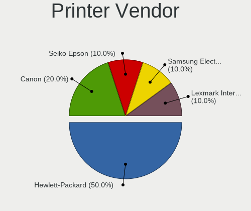

| Vendor                | Notebooks | Percent |
|-----------------------|-----------|---------|
| Hewlett-Packard       | 5         | 50%     |
| Canon                 | 2         | 20%     |
| Seiko Epson           | 1         | 10%     |
| Samsung Electronics   | 1         | 10%     |
| Lexmark International | 1         | 10%     |

Printer Model
-------------

Printer device models

| Model                                 | Notebooks | Percent |
|---------------------------------------|-----------|---------|
| HP LaserJet 1018                      | 2         | 20%     |
| Seiko Epson L365 Series               | 1         | 10%     |
| Samsung M2070 Series                  | 1         | 10%     |
| Lexmark International Lexmark MS312dn | 1         | 10%     |
| HP LaserJet M14-M17                   | 1         | 10%     |
| HP LaserJet 1020                      | 1         | 10%     |
| HP DeskJet 845c                       | 1         | 10%     |
| Canon LBP6030w/6018w                  | 1         | 10%     |
| Canon iP7200 series                   | 1         | 10%     |

Scanner Vendor
--------------

Scanner device vendors

| Vendor | Notebooks | Percent |
|--------|-----------|---------|
| Canon  | 4         | 100%    |

Scanner Model
-------------

Scanner device models

| Model                   | Notebooks | Percent |
|-------------------------|-----------|---------|
| Canon CanoScan LiDE 110 | 2         | 50%     |
| Canon CanoScan LIDE 25  | 1         | 25%     |
| Canon CanoScan LiDE 210 | 1         | 25%     |

Camera
------

Camera Vendor
-------------

Camera device vendors

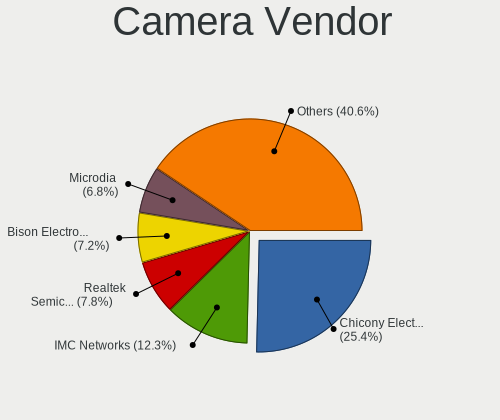

| Vendor                                 | Notebooks | Percent |
|----------------------------------------|-----------|---------|
| Chicony Electronics                    | 84        | 27.72%  |
| IMC Networks                           | 45        | 14.85%  |
| Realtek Semiconductor                  | 27        | 8.91%   |
| Acer                                   | 21        | 6.93%   |
| Microdia                               | 20        | 6.6%    |
| Quanta                                 | 19        | 6.27%   |
| Cheng Uei Precision Industry (Foxlink) | 16        | 5.28%   |
| Suyin                                  | 15        | 4.95%   |
| Sunplus Innovation Technology          | 14        | 4.62%   |
| Syntek                                 | 11        | 3.63%   |
| Lite-On Technology                     | 7         | 2.31%   |
| Apple                                  | 6         | 1.98%   |
| Importek                               | 3         | 0.99%   |
| Silicon Motion                         | 2         | 0.66%   |
| Luxvisions Innotech Limited            | 2         | 0.66%   |
| Alcor Micro                            | 2         | 0.66%   |
| Samsung Electronics                    | 1         | 0.33%   |
| Ricoh                                  | 1         | 0.33%   |
| OmniVision Technologies                | 1         | 0.33%   |
| Logitech                               | 1         | 0.33%   |
| Lenovo                                 | 1         | 0.33%   |
| KYE Systems (Mouse Systems)            | 1         | 0.33%   |
| Generalplus Technology                 | 1         | 0.33%   |
| DigiTech                               | 1         | 0.33%   |
| ALi                                    | 1         | 0.33%   |

Camera Model
------------

Camera device models

| Model                                                          | Notebooks | Percent |
|----------------------------------------------------------------|-----------|---------|
| IMC Networks USB2.0 VGA UVC WebCam                             | 19        | 6.25%   |
| Chicony Integrated Camera                                      | 19        | 6.25%   |
| Realtek Integrated_Webcam_HD                                   | 12        | 3.95%   |
| IMC Networks USB2.0 HD UVC WebCam                              | 9         | 2.96%   |
| Syntek Integrated Camera                                       | 8         | 2.63%   |
| Acer Integrated Camera                                         | 8         | 2.63%   |
| Microdia Integrated_Webcam_HD                                  | 7         | 2.3%    |
| Sunplus Integrated_Webcam_HD                                   | 6         | 1.97%   |
| IMC Networks Integrated Camera                                 | 6         | 1.97%   |
| Realtek USB Camera                                             | 5         | 1.64%   |
| Quanta VGA WebCam                                              | 5         | 1.64%   |
| Quanta HD WebCam                                               | 5         | 1.64%   |
| Chicony TOSHIBA Web Camera - HD                                | 5         | 1.64%   |
| Chicony Integrated Camera (1280x720@30)                        | 5         | 1.64%   |
| Chicony EasyCamera                                             | 5         | 1.64%   |
| Suyin Acer/HP Integrated Webcam [CN0314]                       | 4         | 1.32%   |
| Realtek Lenovo EasyCamera                                      | 4         | 1.32%   |
| Quanta HP TrueVision HD Camera                                 | 4         | 1.32%   |
| IMC Networks EasyCamera                                        | 4         | 1.32%   |
| Chicony VGA Webcam                                             | 4         | 1.32%   |
| Chicony HP Webcam                                              | 4         | 1.32%   |
| Chicony HD WebCam                                              | 4         | 1.32%   |
| Cheng Uei Precision Industry (Foxlink) HP Webcam               | 4         | 1.32%   |
| Acer Lenovo EasyCamera                                         | 4         | 1.32%   |
| Syntek EasyCamera                                              | 3         | 0.99%   |
| Microdia Integrated Webcam                                     | 3         | 0.99%   |
| Chicony USB 2.0 Camera                                         | 3         | 0.99%   |
| Chicony HP Truevision HD                                       | 3         | 0.99%   |
| Chicony HD User Facing                                         | 3         | 0.99%   |
| Chicony 1.3M HD WebCam                                         | 3         | 0.99%   |
| Cheng Uei Precision Industry (Foxlink) HP TrueVision HD Camera | 3         | 0.99%   |
| Cheng Uei Precision Industry (Foxlink) HP HD Camera            | 3         | 0.99%   |
| Apple FaceTime HD Camera                                       | 3         | 0.99%   |
| Acer BisonCam, NB Pro                                          | 3         | 0.99%   |
| Suyin Integrated_Webcam_HD                                     | 2         | 0.66%   |
| Suyin Acer CrystalEye Webcam                                   | 2         | 0.66%   |
| Suyin 1.3M WebCam (notebook emachines E730, Acer sub-brand)    | 2         | 0.66%   |
| Sunplus HP Wide Vision HD                                      | 2         | 0.66%   |
| Sunplus Asus Webcam                                            | 2         | 0.66%   |
| Microdia Laptop_Integrated_Webcam_HD                           | 2         | 0.66%   |

Security
--------

Fingerprint Vendor
------------------

Fingerprint sensor vendors

| Vendor                     | Notebooks | Percent |
|----------------------------|-----------|---------|
| Validity Sensors           | 21        | 38.89%  |
| Synaptics                  | 11        | 20.37%  |
| Shenzhen Goodix Technology | 9         | 16.67%  |
| AuthenTec                  | 5         | 9.26%   |
| Upek                       | 3         | 5.56%   |
| LighTuning Technology      | 2         | 3.7%    |
| Elan Microelectronics      | 2         | 3.7%    |
| STMicroelectronics         | 1         | 1.85%   |

Fingerprint Model
-----------------

Fingerprint sensor models

| Model                                                                      | Notebooks | Percent |
|----------------------------------------------------------------------------|-----------|---------|
| Shenzhen Goodix  Fingerprint Device                                        | 8         | 14.81%  |
| Synaptics Prometheus MIS Touch Fingerprint Reader                          | 6         | 11.11%  |
| Validity Sensors VFS5011 Fingerprint Reader                                | 5         | 9.26%   |
| Validity Sensors VFS495 Fingerprint Reader                                 | 5         | 9.26%   |
| Synaptics  WBDI                                                            | 4         | 7.41%   |
| AuthenTec AES2501 Fingerprint Sensor                                       | 3         | 5.56%   |
| Validity Sensors VFS7500 Touch Fingerprint Sensor                          | 2         | 3.7%    |
| Validity Sensors VFS471 Fingerprint Reader                                 | 2         | 3.7%    |
| Validity Sensors VFS 5011 fingerprint sensor                               | 2         | 3.7%    |
| Upek Biometric Touchchip/Touchstrip Fingerprint Sensor                     | 2         | 3.7%    |
| Elan ELAN:Fingerprint                                                      | 2         | 3.7%    |
| Validity Sensors VFS101 Fingerprint Reader                                 | 1         | 1.85%   |
| Validity Sensors VFS Fingerprint sensor                                    | 1         | 1.85%   |
| Validity Sensors Synaptics WBDI                                            | 1         | 1.85%   |
| Validity Sensors Synaptics VFS7552 Touch Fingerprint Sensor with PurePrint | 1         | 1.85%   |
| Validity Sensors Fingerprint scanner                                       | 1         | 1.85%   |
| Upek TCS5B Fingerprint sensor                                              | 1         | 1.85%   |
| STMicroelectronics Fingerprint Reader                                      | 1         | 1.85%   |
| Shenzhen Goodix Fingerprint Reader                                         | 1         | 1.85%   |
| LighTuning ES603 Swipe Fingerprint Sensor                                  | 1         | 1.85%   |
| LighTuning EgisTec Touch Fingerprint Sensor                                | 1         | 1.85%   |
| AuthenTec AES2810                                                          | 1         | 1.85%   |
| AuthenTec AES1660 Fingerprint Sensor                                       | 1         | 1.85%   |
| Unknown                                                                    | 1         | 1.85%   |

Chipcard Vendor
---------------

Chipcard module vendors

| Vendor                | Notebooks | Percent |
|-----------------------|-----------|---------|
| Broadcom              | 9         | 39.13%  |
| Alcor Micro           | 7         | 30.43%  |
| OmniKey               | 2         | 8.7%    |
| O2 Micro              | 2         | 8.7%    |
| Upek                  | 1         | 4.35%   |
| Lenovo                | 1         | 4.35%   |
| Gemalto (was Gemplus) | 1         | 4.35%   |

Chipcard Model
--------------

Chipcard module models

| Model                                                      | Notebooks | Percent |
|------------------------------------------------------------|-----------|---------|
| Alcor Micro AU9540 Smartcard Reader                        | 7         | 30.43%  |
| Broadcom BCM5880 Secure Applications Processor             | 4         | 17.39%  |
| Broadcom 5880                                              | 4         | 17.39%  |
| O2 Micro OZ776 CCID Smartcard Reader                       | 2         | 8.7%    |
| Upek TouchChip Fingerprint Coprocessor (WBF advanced mode) | 1         | 4.35%   |
| OmniKey CardMan 4321                                       | 1         | 4.35%   |
| OmniKey 3x21 Smart Card Reader                             | 1         | 4.35%   |
| Lenovo Integrated Smart Card Reader                        | 1         | 4.35%   |
| Gemalto (was Gemplus) GemPC Twin SmartCard Reader          | 1         | 4.35%   |
| Broadcom 58200                                             | 1         | 4.35%   |

Unsupported
-----------

Unsupported Devices
-------------------

Total unsupported devices on board

| Total | Notebooks | Percent |
|-------|-----------|---------|
| 0     | 219       | 63.66%  |
| 1     | 96        | 27.91%  |
| 2     | 23        | 6.69%   |
| 3     | 3         | 0.87%   |
| 4     | 2         | 0.58%   |
| 8     | 1         | 0.29%   |

Unsupported Device Types
------------------------

Types of unsupported devices

| Type                     | Notebooks | Percent |
|--------------------------|-----------|---------|
| Fingerprint reader       | 54        | 34.62%  |
| Graphics card            | 35        | 22.44%  |
| Chipcard                 | 21        | 13.46%  |
| Net/wireless             | 17        | 10.9%   |
| Multimedia controller    | 7         | 4.49%   |
| Bluetooth                | 6         | 3.85%   |
| Communication controller | 5         | 3.21%   |
| Camera                   | 3         | 1.92%   |
| Sound                    | 2         | 1.28%   |
| Net/ethernet             | 2         | 1.28%   |
| Card reader              | 2         | 1.28%   |
| Storage                  | 1         | 0.64%   |
| Modem                    | 1         | 0.64%   |

