Linux in Serbia - Tested Hardware & Statistics
----------------------------------------------

A project to collect tested hardware configurations for Linux in Serbia.

Anyone can contribute to this report by the [hw-probe](https://github.com/linuxhw/hw-probe) tool:

    sudo -E hw-probe -all -upload

Please contribute! Especially if your hardware is rare.

This is a report for all computer types. See also reports for [desktops](/Location/Serbia/Desktop/README.md) and [notebooks](/Location/Serbia/Notebook/README.md).

Contents
--------

* [ Test Cases ](#test-cases)

* [ System ](#system)
  - [ OS                       ](#os)
  - [ OS Family                ](#os-family)
  - [ Kernel                   ](#kernel)
  - [ Kernel Family            ](#kernel-family)
  - [ Kernel Major Ver.        ](#kernel-major-ver)
  - [ Arch                     ](#arch)
  - [ DE                       ](#de)
  - [ Display Server           ](#display-server)
  - [ Display Manager          ](#display-manager)
  - [ OS Lang                  ](#os-lang)
  - [ Boot Mode                ](#boot-mode)
  - [ Filesystem               ](#filesystem)
  - [ Part. scheme             ](#part-scheme)
  - [ Dual Boot with Linux/BSD ](#dual-boot-with-linuxbsd)
  - [ Dual Boot (Win)          ](#dual-boot-win)

* [ Board ](#board)
  - [ Vendor                   ](#vendor)
  - [ Model                    ](#model)
  - [ Model Family             ](#model-family)
  - [ MFG Year                 ](#mfg-year)
  - [ Form Factor              ](#form-factor)
  - [ Secure Boot              ](#secure-boot)
  - [ Coreboot                 ](#coreboot)
  - [ RAM Size                 ](#ram-size)
  - [ RAM Used                 ](#ram-used)
  - [ Total Drives             ](#total-drives)
  - [ Has CD-ROM               ](#has-cd-rom)
  - [ Has Ethernet             ](#has-ethernet)
  - [ Has WiFi                 ](#has-wifi)
  - [ Has Bluetooth            ](#has-bluetooth)

* [ Location ](#location)
  - [ Country                  ](#country)
  - [ City                     ](#city)

* [ Drives ](#drives)
  - [ Drive Vendor             ](#drive-vendor)
  - [ Drive Model              ](#drive-model)
  - [ HDD Vendor               ](#hdd-vendor)
  - [ SSD Vendor               ](#ssd-vendor)
  - [ Drive Kind               ](#drive-kind)
  - [ Drive Connector          ](#drive-connector)
  - [ Drive Size               ](#drive-size)
  - [ Space Total              ](#space-total)
  - [ Space Used               ](#space-used)
  - [ Malfunc. Drives          ](#malfunc-drives)
  - [ Malfunc. Drive Vendor    ](#malfunc-drive-vendor)
  - [ Malfunc. HDD Vendor      ](#malfunc-hdd-vendor)
  - [ Malfunc. Drive Kind      ](#malfunc-drive-kind)
  - [ Failed Drives            ](#failed-drives)
  - [ Failed Drive Vendor      ](#failed-drive-vendor)
  - [ Drive Status             ](#drive-status)

* [ Storage controller ](#storage-controller)
  - [ Storage Vendor           ](#storage-vendor)
  - [ Storage Model            ](#storage-model)
  - [ Storage Kind             ](#storage-kind)

* [ Processor ](#processor)
  - [ CPU Vendor               ](#cpu-vendor)
  - [ CPU Model                ](#cpu-model)
  - [ CPU Model Family         ](#cpu-model-family)
  - [ CPU Cores                ](#cpu-cores)
  - [ CPU Sockets              ](#cpu-sockets)
  - [ CPU Threads              ](#cpu-threads)
  - [ CPU Op-Modes             ](#cpu-op-modes)
  - [ CPU Microcode            ](#cpu-microcode)
  - [ CPU Microarch            ](#cpu-microarch)

* [ Graphics ](#graphics)
  - [ GPU Vendor               ](#gpu-vendor)
  - [ GPU Model                ](#gpu-model)
  - [ GPU Combo                ](#gpu-combo)
  - [ GPU Driver               ](#gpu-driver)
  - [ GPU Memory               ](#gpu-memory)

* [ Monitor ](#monitor)
  - [ Monitor Vendor           ](#monitor-vendor)
  - [ Monitor Model            ](#monitor-model)
  - [ Monitor Resolution       ](#monitor-resolution)
  - [ Monitor Diagonal         ](#monitor-diagonal)
  - [ Monitor Width            ](#monitor-width)
  - [ Aspect Ratio             ](#aspect-ratio)
  - [ Monitor Area             ](#monitor-area)
  - [ Pixel Density            ](#pixel-density)
  - [ Multiple Monitors        ](#multiple-monitors)

* [ Network ](#network)
  - [ Net Controller Vendor    ](#net-controller-vendor)
  - [ Net Controller Model     ](#net-controller-model)
  - [ Wireless Vendor          ](#wireless-vendor)
  - [ Wireless Model           ](#wireless-model)
  - [ Ethernet Vendor          ](#ethernet-vendor)
  - [ Ethernet Model           ](#ethernet-model)
  - [ Net Controller Kind      ](#net-controller-kind)
  - [ Used Controller          ](#used-controller)
  - [ NICs                     ](#nics)
  - [ IPv6                     ](#ipv6)

* [ Bluetooth ](#bluetooth)
  - [ Bluetooth Vendor         ](#bluetooth-vendor)
  - [ Bluetooth Model          ](#bluetooth-model)

* [ Sound ](#sound)
  - [ Sound Vendor             ](#sound-vendor)
  - [ Sound Model              ](#sound-model)

* [ Memory ](#memory)
  - [ Memory Vendor            ](#memory-vendor)
  - [ Memory Model             ](#memory-model)
  - [ Memory Kind              ](#memory-kind)
  - [ Memory Form Factor       ](#memory-form-factor)
  - [ Memory Size              ](#memory-size)
  - [ Memory Speed             ](#memory-speed)

* [ Printers & scanners ](#printers--scanners)
  - [ Printer Vendor           ](#printer-vendor)
  - [ Printer Model            ](#printer-model)
  - [ Scanner Vendor           ](#scanner-vendor)
  - [ Scanner Model            ](#scanner-model)

* [ Camera ](#camera)
  - [ Camera Vendor            ](#camera-vendor)
  - [ Camera Model             ](#camera-model)

* [ Security ](#security)
  - [ Fingerprint Vendor       ](#fingerprint-vendor)
  - [ Fingerprint Model        ](#fingerprint-model)
  - [ Chipcard Vendor          ](#chipcard-vendor)
  - [ Chipcard Model           ](#chipcard-model)

* [ Unsupported ](#unsupported)
  - [ Unsupported Devices      ](#unsupported-devices)
  - [ Unsupported Device Types ](#unsupported-device-types)

Test Cases
----------

Total: 854

| Vendor        | Model                       | Form-Factor | Probe                                                      | Date         |
|---------------|-----------------------------|-------------|------------------------------------------------------------|--------------|
| Apple         | Mac-F22C86C8                | Mini pc     | [a716192ef4](https://linux-hardware.org/?probe=a716192ef4) | May 06, 2022 |
| Lenovo        | IdeaPad Z370                | Notebook    | [be37f3c962](https://linux-hardware.org/?probe=be37f3c962) | May 04, 2022 |
| Lenovo        | SHARKBAY NO DPK             | All in one  | [e23317d53c](https://linux-hardware.org/?probe=e23317d53c) | May 01, 2022 |
| Lenovo        | IdeaPad 3 14ALC6 82KT       | Notebook    | [633bddd44b](https://linux-hardware.org/?probe=633bddd44b) | Apr 30, 2022 |
| Acer          | Nitro AN517-51              | Notebook    | [81d7fd8d2e](https://linux-hardware.org/?probe=81d7fd8d2e) | Apr 30, 2022 |
| HP            | 3396                        | Desktop     | [468c2975ee](https://linux-hardware.org/?probe=468c2975ee) | Apr 30, 2022 |
| ASUSTek       | PRIME A320M-K               | Desktop     | [f4f8108d1e](https://linux-hardware.org/?probe=f4f8108d1e) | Apr 25, 2022 |
| Dell          | Latitude 7280               | Notebook    | [e64ba65609](https://linux-hardware.org/?probe=e64ba65609) | Apr 22, 2022 |
| HP            | EliteBook x360 1030 G4      | Convertible | [4e8f764b38](https://linux-hardware.org/?probe=4e8f764b38) | Apr 18, 2022 |
| Lenovo        | Unknown                     | Notebook    | [6e1760aed0](https://linux-hardware.org/?probe=6e1760aed0) | Apr 17, 2022 |
| ASUSTek       | P7H55                       | Desktop     | [d619f35fb8](https://linux-hardware.org/?probe=d619f35fb8) | Apr 16, 2022 |
| HP            | 845A                        | Desktop     | [cc8c320581](https://linux-hardware.org/?probe=cc8c320581) | Apr 16, 2022 |
| ASUSTek       | B150-PRO                    | Desktop     | [1ebe5f0e99](https://linux-hardware.org/?probe=1ebe5f0e99) | Apr 15, 2022 |
| Lenovo        | IdeaPad 320-15IKB 80YE      | Notebook    | [b888c78ed6](https://linux-hardware.org/?probe=b888c78ed6) | Apr 12, 2022 |
| Lenovo        | IdeaPad 320-15IKB 80YE      | Notebook    | [45dad76f04](https://linux-hardware.org/?probe=45dad76f04) | Apr 12, 2022 |
| HP            | Notebook                    | Notebook    | [4ffd4d11a5](https://linux-hardware.org/?probe=4ffd4d11a5) | Apr 09, 2022 |
| Lenovo        | ThinkPad T490 20N2CTO1WW    | Notebook    | [0dbb9e7eb0](https://linux-hardware.org/?probe=0dbb9e7eb0) | Apr 09, 2022 |
| Gigabyte      | 945PL-S3                    | Desktop     | [ef7f30cc40](https://linux-hardware.org/?probe=ef7f30cc40) | Apr 07, 2022 |
| Lenovo        | SHARKBAY 0B98401 PRO        | Desktop     | [55568ec828](https://linux-hardware.org/?probe=55568ec828) | Apr 06, 2022 |
| Lenovo        | IdeaPad 3 15IIL05 81WE      | Notebook    | [950a436db3](https://linux-hardware.org/?probe=950a436db3) | Apr 06, 2022 |
| Apple         | Mac-F42C88C8 Proto1         | Desktop     | [55eda86e20](https://linux-hardware.org/?probe=55eda86e20) | Apr 05, 2022 |
| Lenovo        | Legion 5 15ARH05H 82B1      | Notebook    | [906de71a65](https://linux-hardware.org/?probe=906de71a65) | Apr 02, 2022 |
| Lenovo        | V330-15IKB 81AX             | Notebook    | [8a881c75f4](https://linux-hardware.org/?probe=8a881c75f4) | Mar 29, 2022 |
| HUAWEI        | NBLB-WAX9N                  | Notebook    | [5eb56f360e](https://linux-hardware.org/?probe=5eb56f360e) | Mar 29, 2022 |
| Lenovo        | SHARKBAY NO DPK             | All in one  | [7d0de80b18](https://linux-hardware.org/?probe=7d0de80b18) | Mar 29, 2022 |
| ASRock        | B560M Steel Legend          | Desktop     | [8caaa96b19](https://linux-hardware.org/?probe=8caaa96b19) | Mar 28, 2022 |
| Fujitsu       | LIFEBOOK AH531              | Notebook    | [f92c8b77dc](https://linux-hardware.org/?probe=f92c8b77dc) | Mar 25, 2022 |
| HP            | 3398                        | Desktop     | [b84864ecc4](https://linux-hardware.org/?probe=b84864ecc4) | Mar 25, 2022 |
| Fujitsu Si... | AMILO Li3710                | Notebook    | [ab84e23108](https://linux-hardware.org/?probe=ab84e23108) | Mar 24, 2022 |
| Dell          | Inspiron 3542               | Notebook    | [6a8c31fa33](https://linux-hardware.org/?probe=6a8c31fa33) | Mar 21, 2022 |
| HP            | 3032h                       | Desktop     | [e57d52908c](https://linux-hardware.org/?probe=e57d52908c) | Mar 21, 2022 |
| HP            | 3398                        | Desktop     | [5f018df1dd](https://linux-hardware.org/?probe=5f018df1dd) | Mar 17, 2022 |
| Apple         | MacBookPro8,1               | Notebook    | [f55145f34a](https://linux-hardware.org/?probe=f55145f34a) | Mar 16, 2022 |
| ASUSTek       | M5A99X EVO                  | Desktop     | [117ebec9fc](https://linux-hardware.org/?probe=117ebec9fc) | Mar 15, 2022 |
| MSI           | AM1I                        | Desktop     | [f19c9ef173](https://linux-hardware.org/?probe=f19c9ef173) | Mar 14, 2022 |
| Lenovo        | SHARKBAY NO DPK             | All in one  | [951ea7a2b4](https://linux-hardware.org/?probe=951ea7a2b4) | Mar 11, 2022 |
| Toshiba       | Satellite C870-17H          | Notebook    | [0169bf05d7](https://linux-hardware.org/?probe=0169bf05d7) | Mar 10, 2022 |
| Fujitsu Si... | AMILO Li3710                | Notebook    | [7a4a682f45](https://linux-hardware.org/?probe=7a4a682f45) | Mar 07, 2022 |
| MSI           | A68HM-E33 V2                | Desktop     | [9f17c99bb5](https://linux-hardware.org/?probe=9f17c99bb5) | Mar 06, 2022 |
| MSI           | B450M PRO-M2                | Desktop     | [723ab179b6](https://linux-hardware.org/?probe=723ab179b6) | Mar 06, 2022 |
| Gigabyte      | H81M-S2PH                   | Desktop     | [4a1c505260](https://linux-hardware.org/?probe=4a1c505260) | Mar 05, 2022 |
| ASUSTek       | VivoBook_ASUSLaptop X513... | Notebook    | [2c44722344](https://linux-hardware.org/?probe=2c44722344) | Mar 03, 2022 |
| ASUSTek       | E200HA                      | Notebook    | [69ec87e43a](https://linux-hardware.org/?probe=69ec87e43a) | Mar 02, 2022 |
| HP            | Laptop 15s-fq0xxx           | Notebook    | [9acf95b26b](https://linux-hardware.org/?probe=9acf95b26b) | Feb 28, 2022 |
| Lenovo        | IdeaPad 110-15IBR 80T7      | Notebook    | [03a49e64cf](https://linux-hardware.org/?probe=03a49e64cf) | Feb 28, 2022 |
| Gigabyte      | AERO 17 KC                  | Notebook    | [08b488b969](https://linux-hardware.org/?probe=08b488b969) | Feb 27, 2022 |
| ASUSTek       | PRIME A320M-K               | Desktop     | [65b41a7a67](https://linux-hardware.org/?probe=65b41a7a67) | Feb 26, 2022 |
| Gigabyte      | Z390 UD                     | Desktop     | [7ea66813f3](https://linux-hardware.org/?probe=7ea66813f3) | Feb 23, 2022 |
| Dell          | Latitude 7490               | Notebook    | [003b6b4a95](https://linux-hardware.org/?probe=003b6b4a95) | Feb 21, 2022 |
| Fujitsu       | D3041-A1 S26361-D3041-A1    | Desktop     | [1f607a3c8c](https://linux-hardware.org/?probe=1f607a3c8c) | Feb 21, 2022 |
| Dell          | Inspiron 3581               | Notebook    | [0ae0e53b53](https://linux-hardware.org/?probe=0ae0e53b53) | Feb 20, 2022 |
| HP            | Notebook                    | Notebook    | [a1f9f76ed0](https://linux-hardware.org/?probe=a1f9f76ed0) | Feb 19, 2022 |
| Gigabyte      | MJPLNCB-00                  | Desktop     | [d9a5169bbc](https://linux-hardware.org/?probe=d9a5169bbc) | Feb 16, 2022 |
| MSI           | A55M-P33                    | Desktop     | [31c0a9c67c](https://linux-hardware.org/?probe=31c0a9c67c) | Feb 15, 2022 |
| Toshiba       | Satellite C55-A             | Notebook    | [19133950aa](https://linux-hardware.org/?probe=19133950aa) | Feb 15, 2022 |
| Apple         | Mac-F22C86C8                | Mini pc     | [9055e23b83](https://linux-hardware.org/?probe=9055e23b83) | Feb 14, 2022 |
| ASUSTek       | X55A                        | Notebook    | [c6b17158ac](https://linux-hardware.org/?probe=c6b17158ac) | Feb 14, 2022 |
| Apple         | Mac-F22C86C8                | Mini pc     | [fc63d0ede8](https://linux-hardware.org/?probe=fc63d0ede8) | Feb 13, 2022 |
| MSI           | GF615M-P33 V2               | Desktop     | [b5bfcbf8dc](https://linux-hardware.org/?probe=b5bfcbf8dc) | Feb 13, 2022 |
| Gigabyte      | B450 AORUS PRO-CF           | Desktop     | [1eb72bde90](https://linux-hardware.org/?probe=1eb72bde90) | Feb 12, 2022 |
| MSI           | MAG X570 TOMAHAWK WIFI      | Desktop     | [d6c5c1a6d2](https://linux-hardware.org/?probe=d6c5c1a6d2) | Feb 10, 2022 |
| ASUSTek       | P5KPL-AM/PS                 | Desktop     | [a530f2976f](https://linux-hardware.org/?probe=a530f2976f) | Feb 10, 2022 |
| ASUSTek       | P5KPL-AM/PS                 | Desktop     | [5480f2aa6c](https://linux-hardware.org/?probe=5480f2aa6c) | Feb 10, 2022 |
| ASUSTek       | M4A785TD-V EVO              | Desktop     | [b28eb819f0](https://linux-hardware.org/?probe=b28eb819f0) | Feb 09, 2022 |
| ASUSTek       | ROG ZENITH EXTREME          | Desktop     | [1c829ba8dd](https://linux-hardware.org/?probe=1c829ba8dd) | Feb 07, 2022 |
| Lenovo        | ThinkPad L14 Gen 2 20X1S... | Notebook    | [4f80537faf](https://linux-hardware.org/?probe=4f80537faf) | Feb 06, 2022 |
| Toshiba       | Satellite C55-C             | Notebook    | [379d3b37b1](https://linux-hardware.org/?probe=379d3b37b1) | Feb 05, 2022 |
| MSI           | MAG X570 TOMAHAWK WIFI      | Desktop     | [80b24c2689](https://linux-hardware.org/?probe=80b24c2689) | Feb 03, 2022 |
| ASUSTek       | VivoBook_ASUSLaptop X513... | Notebook    | [42a767e746](https://linux-hardware.org/?probe=42a767e746) | Feb 03, 2022 |
| ASUSTek       | PRIME B450M-K               | Desktop     | [d644756f37](https://linux-hardware.org/?probe=d644756f37) | Feb 03, 2022 |
| MSI           | B450 TOMAHAWK               | Desktop     | [b5ae920f3b](https://linux-hardware.org/?probe=b5ae920f3b) | Feb 02, 2022 |
| BenQ          | Joybook Lite U121           | Notebook    | [28f254dd8d](https://linux-hardware.org/?probe=28f254dd8d) | Feb 02, 2022 |
| Dell          | Vostro 3500                 | Notebook    | [729abacd12](https://linux-hardware.org/?probe=729abacd12) | Feb 01, 2022 |
| ASUSTek       | VivoBook_ASUSLaptop X513... | Notebook    | [5e9f8a1c0d](https://linux-hardware.org/?probe=5e9f8a1c0d) | Jan 29, 2022 |
| Dell          | Latitude E6510              | Notebook    | [efc619cc61](https://linux-hardware.org/?probe=efc619cc61) | Jan 28, 2022 |
| ASUSTek       | VivoBook_ASUSLaptop TP42... | Convertible | [ca6be0ae4b](https://linux-hardware.org/?probe=ca6be0ae4b) | Jan 26, 2022 |
| Lenovo        | IdeaPad 110-15ISK 80UD      | Notebook    | [37ec4f5294](https://linux-hardware.org/?probe=37ec4f5294) | Jan 25, 2022 |
| ASRock        | P75 Pro3                    | Desktop     | [76bb99305c](https://linux-hardware.org/?probe=76bb99305c) | Jan 24, 2022 |
| Gigabyte      | 970A-DS3P                   | Desktop     | [b50f284364](https://linux-hardware.org/?probe=b50f284364) | Jan 23, 2022 |
| ASUSTek       | E200HA                      | Notebook    | [2c53d21746](https://linux-hardware.org/?probe=2c53d21746) | Jan 22, 2022 |
| ASUSTek       | E200HA                      | Notebook    | [02be439ac8](https://linux-hardware.org/?probe=02be439ac8) | Jan 22, 2022 |
| HP            | EliteBook 1050 G1           | Notebook    | [1bb5cb826f](https://linux-hardware.org/?probe=1bb5cb826f) | Jan 19, 2022 |
| TWC           | Unknown                     | Notebook    | [85a8fd2cf1](https://linux-hardware.org/?probe=85a8fd2cf1) | Jan 18, 2022 |
| TWC           | Unknown                     | Notebook    | [d4cc69cea7](https://linux-hardware.org/?probe=d4cc69cea7) | Jan 16, 2022 |
| ASUSTek       | PRIME B450M-K               | Desktop     | [fa62cb2996](https://linux-hardware.org/?probe=fa62cb2996) | Jan 11, 2022 |
| Fujitsu       | LIFEBOOK A3510              | Notebook    | [b673072fbb](https://linux-hardware.org/?probe=b673072fbb) | Jan 11, 2022 |
| Biostar       | TB250-BTC+                  | Desktop     | [ef57a01461](https://linux-hardware.org/?probe=ef57a01461) | Jan 06, 2022 |
| Dell          | Vostro 5402                 | Notebook    | [f586d10ee6](https://linux-hardware.org/?probe=f586d10ee6) | Jan 05, 2022 |
| ASUSTek       | H110M-R                     | Desktop     | [8b6fab3f89](https://linux-hardware.org/?probe=8b6fab3f89) | Jan 05, 2022 |
| MSI           | GT70 2PC                    | Notebook    | [61a5023d6a](https://linux-hardware.org/?probe=61a5023d6a) | Jan 03, 2022 |
| Dell          | Latitude 7490               | Notebook    | [2d6469644a](https://linux-hardware.org/?probe=2d6469644a) | Jan 02, 2022 |
| ASRock        | X570 Pro4                   | Desktop     | [0396ef9c72](https://linux-hardware.org/?probe=0396ef9c72) | Dec 30, 2021 |
| ASUSTek       | TUF B450M-PLUS GAMING       | Desktop     | [6324598512](https://linux-hardware.org/?probe=6324598512) | Dec 30, 2021 |
| ASUSTek       | TUF B450M-PLUS GAMING       | Desktop     | [38dda4af6b](https://linux-hardware.org/?probe=38dda4af6b) | Dec 30, 2021 |
| Lenovo        | ThinkPad T490 20N3S6VU00    | Notebook    | [afb7fa66f5](https://linux-hardware.org/?probe=afb7fa66f5) | Dec 30, 2021 |
| Dell          | Latitude 7490               | Notebook    | [4e350048ed](https://linux-hardware.org/?probe=4e350048ed) | Dec 27, 2021 |
| Fujitsu Si... | AMILO Li3710                | Notebook    | [183a47572f](https://linux-hardware.org/?probe=183a47572f) | Dec 27, 2021 |
| Gigabyte      | B550M DS3H                  | Desktop     | [9fb08ebeb4](https://linux-hardware.org/?probe=9fb08ebeb4) | Dec 26, 2021 |
| ASUSTek       | X580VD                      | Notebook    | [fe350107e3](https://linux-hardware.org/?probe=fe350107e3) | Dec 25, 2021 |
| Gigabyte      | MJPLNCB-00                  | Desktop     | [fe81720eae](https://linux-hardware.org/?probe=fe81720eae) | Dec 23, 2021 |
| ASUSTek       | A68HM-K                     | Desktop     | [a6fc4a2adb](https://linux-hardware.org/?probe=a6fc4a2adb) | Dec 22, 2021 |
| MSI           | A55M-P33                    | Desktop     | [de87849301](https://linux-hardware.org/?probe=de87849301) | Dec 18, 2021 |
| MSI           | FM2-A55M-E33                | Desktop     | [85e65dae6a](https://linux-hardware.org/?probe=85e65dae6a) | Dec 15, 2021 |
| MSI           | FM2-A55M-E33                | Desktop     | [3ff4885854](https://linux-hardware.org/?probe=3ff4885854) | Dec 15, 2021 |
| ASUSTek       | VivoBook_ASUSLaptop X540... | Notebook    | [74591e1700](https://linux-hardware.org/?probe=74591e1700) | Dec 12, 2021 |
| Gigabyte      | X570 AORUS ELITE            | Desktop     | [eb5d5f4361](https://linux-hardware.org/?probe=eb5d5f4361) | Dec 12, 2021 |
| Gigabyte      | X570 AORUS ELITE            | Desktop     | [048c623b7a](https://linux-hardware.org/?probe=048c623b7a) | Dec 12, 2021 |
| Biostar       | NF520-A2 TE                 | Desktop     | [5878187120](https://linux-hardware.org/?probe=5878187120) | Dec 07, 2021 |
| Toshiba       | Satellite Pro L650          | Notebook    | [fd40a9d639](https://linux-hardware.org/?probe=fd40a9d639) | Dec 07, 2021 |
| MSI           | H61M-P20                    | Desktop     | [614ffcb196](https://linux-hardware.org/?probe=614ffcb196) | Dec 07, 2021 |
| HP            | Laptop 15s-eq1xxx           | Notebook    | [a61a3df5f9](https://linux-hardware.org/?probe=a61a3df5f9) | Dec 04, 2021 |
| ASUSTek       | PRIME A320M-K               | Desktop     | [19fbf0d287](https://linux-hardware.org/?probe=19fbf0d287) | Dec 04, 2021 |
| Dell          | Vostro 3500                 | Notebook    | [3df309c91c](https://linux-hardware.org/?probe=3df309c91c) | Dec 03, 2021 |
| ASUSTek       | PRIME A320M-K               | Desktop     | [478ab590ac](https://linux-hardware.org/?probe=478ab590ac) | Dec 01, 2021 |
| Fujitsu Si... | AMILO Li3910                | Notebook    | [6f355c1c73](https://linux-hardware.org/?probe=6f355c1c73) | Dec 01, 2021 |
| HP            | Laptop 14-ck0xxx            | Notebook    | [60a074698a](https://linux-hardware.org/?probe=60a074698a) | Dec 01, 2021 |
| Samsung       | 350V5C/350V5X/350V4C/350... | Notebook    | [440d34a6b0](https://linux-hardware.org/?probe=440d34a6b0) | Nov 28, 2021 |
| Samsung       | 350V5C/350V5X/350V4C/350... | Notebook    | [bb7b625409](https://linux-hardware.org/?probe=bb7b625409) | Nov 28, 2021 |
| ASUSTek       | P8B75-M LE                  | Desktop     | [7a8c29f7ba](https://linux-hardware.org/?probe=7a8c29f7ba) | Nov 23, 2021 |
| ASUSTek       | N53SN                       | Notebook    | [67d66feb3e](https://linux-hardware.org/?probe=67d66feb3e) | Nov 20, 2021 |
| ASUSTek       | P8Z68-V LX                  | Desktop     | [0415c0798f](https://linux-hardware.org/?probe=0415c0798f) | Nov 18, 2021 |
| ASRock        | X570 Pro4                   | Desktop     | [36ea469d12](https://linux-hardware.org/?probe=36ea469d12) | Nov 12, 2021 |
| Acer          | Aspire ES1-533              | Notebook    | [14a4c57e27](https://linux-hardware.org/?probe=14a4c57e27) | Nov 05, 2021 |
| Lenovo        | G500 20236                  | Notebook    | [7708d61566](https://linux-hardware.org/?probe=7708d61566) | Nov 05, 2021 |
| MSI           | G41M-P23                    | Desktop     | [82e51e3f78](https://linux-hardware.org/?probe=82e51e3f78) | Nov 04, 2021 |
| MSI           | G41M-P23                    | Desktop     | [ce4c8636f0](https://linux-hardware.org/?probe=ce4c8636f0) | Nov 04, 2021 |
| eMachines     | eME440                      | Notebook    | [1427ebffb0](https://linux-hardware.org/?probe=1427ebffb0) | Oct 29, 2021 |
| Lenovo        | ThinkPad T490 20N3S6VU00    | Notebook    | [f8024b89d4](https://linux-hardware.org/?probe=f8024b89d4) | Oct 28, 2021 |
| Gigabyte      | AB350M-Gaming 3-CF          | Desktop     | [b6338a1294](https://linux-hardware.org/?probe=b6338a1294) | Oct 25, 2021 |
| Lenovo        | Legion Y530-15ICH 81FV      | Notebook    | [d180cf6efc](https://linux-hardware.org/?probe=d180cf6efc) | Oct 23, 2021 |
| Lenovo        | ThinkPad L14 Gen 2 20X1S... | Notebook    | [cb8bcc4d2d](https://linux-hardware.org/?probe=cb8bcc4d2d) | Oct 22, 2021 |
| Gigabyte      | B450M S2H                   | Desktop     | [71c19b42fc](https://linux-hardware.org/?probe=71c19b42fc) | Oct 21, 2021 |
| Lenovo        | ThinkPad T490 20N3S6VU00    | Notebook    | [9932dd3c21](https://linux-hardware.org/?probe=9932dd3c21) | Oct 21, 2021 |
| Lenovo        | ThinkPad T490 20N3S6VU00    | Notebook    | [a99866abc1](https://linux-hardware.org/?probe=a99866abc1) | Oct 21, 2021 |
| Lenovo        | ThinkCentre M57 6075Y3W     | Desktop     | [a5e2419919](https://linux-hardware.org/?probe=a5e2419919) | Oct 19, 2021 |
| HP            | EliteBook 840 G3            | Notebook    | [650c91f4db](https://linux-hardware.org/?probe=650c91f4db) | Oct 18, 2021 |
| HP            | EliteBook 840 G3            | Notebook    | [5e28e542c2](https://linux-hardware.org/?probe=5e28e542c2) | Oct 17, 2021 |
| Dell          | Inspiron 3520               | Notebook    | [7eafd054fc](https://linux-hardware.org/?probe=7eafd054fc) | Oct 17, 2021 |
| Gigabyte      | B450M DS3H-CF               | Desktop     | [f1fc83e719](https://linux-hardware.org/?probe=f1fc83e719) | Oct 17, 2021 |
| Gigabyte      | B450M DS3H-CF               | Desktop     | [2802b3ba4f](https://linux-hardware.org/?probe=2802b3ba4f) | Oct 17, 2021 |
| HP            | Laptop 15s-eq2xxx           | Notebook    | [2e7ac4731f](https://linux-hardware.org/?probe=2e7ac4731f) | Oct 16, 2021 |
| Gigabyte      | P35-S3G                     | Desktop     | [0582e2316b](https://linux-hardware.org/?probe=0582e2316b) | Oct 12, 2021 |
| ASUSTek       | M5A97 EVO R2.0              | Desktop     | [c8b4b9444e](https://linux-hardware.org/?probe=c8b4b9444e) | Oct 11, 2021 |
| ASRock        | QC5000-ITX/WiFi             | Desktop     | [74391da331](https://linux-hardware.org/?probe=74391da331) | Oct 09, 2021 |
| Lenovo        | G555 0873                   | Notebook    | [a38f52851a](https://linux-hardware.org/?probe=a38f52851a) | Oct 05, 2021 |
| Lenovo        | ThinkCentre M57 6075Y3W     | Desktop     | [46c6b9a92c](https://linux-hardware.org/?probe=46c6b9a92c) | Sep 30, 2021 |
| Biostar       | A320MH                      | Desktop     | [85950c5033](https://linux-hardware.org/?probe=85950c5033) | Sep 25, 2021 |
| ASUSTek       | 1005PE                      | Notebook    | [bd2044749b](https://linux-hardware.org/?probe=bd2044749b) | Sep 22, 2021 |
| Acer          | Aspire V3-571G              | Notebook    | [b9fcdffa50](https://linux-hardware.org/?probe=b9fcdffa50) | Sep 22, 2021 |
| ASUSTek       | H81M-R                      | Desktop     | [dfe4dc9048](https://linux-hardware.org/?probe=dfe4dc9048) | Sep 22, 2021 |
| ASUSTek       | 1005PE                      | Notebook    | [02ccb36302](https://linux-hardware.org/?probe=02ccb36302) | Sep 21, 2021 |
| ASUSTek       | 1005PE                      | Notebook    | [081e791398](https://linux-hardware.org/?probe=081e791398) | Sep 19, 2021 |
| Toshiba       | Satellite C55-B             | Notebook    | [59a0efda89](https://linux-hardware.org/?probe=59a0efda89) | Sep 18, 2021 |
| MSI           | MS-7309                     | Desktop     | [f2ac6eb80a](https://linux-hardware.org/?probe=f2ac6eb80a) | Sep 18, 2021 |
| Lenovo        | ThinkCentre M57 6075Y3W     | Desktop     | [f133dd54a3](https://linux-hardware.org/?probe=f133dd54a3) | Sep 18, 2021 |
| ASUSTek       | 1005PE                      | Notebook    | [a3adf0356c](https://linux-hardware.org/?probe=a3adf0356c) | Sep 18, 2021 |
| HP            | 212B                        | Desktop     | [9a7f2627a3](https://linux-hardware.org/?probe=9a7f2627a3) | Sep 15, 2021 |
| HP            | 212B                        | Desktop     | [289f117cde](https://linux-hardware.org/?probe=289f117cde) | Sep 14, 2021 |
| ASUSTek       | H81M-R                      | Desktop     | [6a9795f23f](https://linux-hardware.org/?probe=6a9795f23f) | Sep 13, 2021 |
| Acer          | Aspire V3-571G              | Notebook    | [cedbbde363](https://linux-hardware.org/?probe=cedbbde363) | Sep 13, 2021 |
| Gigabyte      | X570 AORUS MASTER           | Desktop     | [67285c1d5d](https://linux-hardware.org/?probe=67285c1d5d) | Sep 11, 2021 |
| ASUSTek       | AM1M-A                      | Desktop     | [ab6a989deb](https://linux-hardware.org/?probe=ab6a989deb) | Sep 09, 2021 |
| ASUSTek       | AM1M-A                      | Desktop     | [bc4f850240](https://linux-hardware.org/?probe=bc4f850240) | Sep 09, 2021 |
| Lenovo        | G500 20236                  | Notebook    | [f77883b614](https://linux-hardware.org/?probe=f77883b614) | Sep 07, 2021 |
| ASRock        | Q1900M                      | Desktop     | [3f08533d5f](https://linux-hardware.org/?probe=3f08533d5f) | Sep 06, 2021 |
| ASRock        | Q1900M                      | Desktop     | [d342919044](https://linux-hardware.org/?probe=d342919044) | Sep 06, 2021 |
| HP            | ProBook 4730s               | Notebook    | [36834479ab](https://linux-hardware.org/?probe=36834479ab) | Sep 03, 2021 |
| Apple         | MacBookPro8,1               | Notebook    | [da332ba09e](https://linux-hardware.org/?probe=da332ba09e) | Sep 01, 2021 |
| Dell          | Inspiron 3537               | Notebook    | [cad80329d8](https://linux-hardware.org/?probe=cad80329d8) | Aug 31, 2021 |
| Lenovo        | G500 20236                  | Notebook    | [60f43f8815](https://linux-hardware.org/?probe=60f43f8815) | Aug 29, 2021 |
| Dell          | Inspiron 5593               | Notebook    | [ebac51e403](https://linux-hardware.org/?probe=ebac51e403) | Aug 28, 2021 |
| ASUSTek       | VivoBook_ASUSLaptop X515... | Notebook    | [62c96ffa5b](https://linux-hardware.org/?probe=62c96ffa5b) | Aug 25, 2021 |
| ASUSTek       | VivoBook_ASUSLaptop X515... | Notebook    | [516b9ff2ed](https://linux-hardware.org/?probe=516b9ff2ed) | Aug 25, 2021 |
| Dell          | Inspiron 7520               | Notebook    | [056e1c0825](https://linux-hardware.org/?probe=056e1c0825) | Aug 21, 2021 |
| ASUSTek       | AM1M-A                      | Desktop     | [433d420dd4](https://linux-hardware.org/?probe=433d420dd4) | Aug 20, 2021 |
| Lenovo        | IdeaPad 330-15IKB 81DE      | Notebook    | [79051f2400](https://linux-hardware.org/?probe=79051f2400) | Aug 19, 2021 |
| MSI           | 740GM-P25                   | Desktop     | [e1d245e0a3](https://linux-hardware.org/?probe=e1d245e0a3) | Aug 19, 2021 |
| ASUSTek       | AM1M-A                      | Desktop     | [c0653de55c](https://linux-hardware.org/?probe=c0653de55c) | Aug 18, 2021 |
| HP            | EliteBook 840 G5            | Notebook    | [4c196e1abd](https://linux-hardware.org/?probe=4c196e1abd) | Aug 18, 2021 |
| HP            | G62                         | Notebook    | [b6eeeba9d1](https://linux-hardware.org/?probe=b6eeeba9d1) | Aug 15, 2021 |
| ASRock        | X570 Pro4                   | Desktop     | [3f122964da](https://linux-hardware.org/?probe=3f122964da) | Aug 14, 2021 |
| HP            | G62                         | Notebook    | [4adea9bed4](https://linux-hardware.org/?probe=4adea9bed4) | Aug 14, 2021 |
| Gigabyte      | H61M-S2PV                   | Desktop     | [3985c521c2](https://linux-hardware.org/?probe=3985c521c2) | Aug 12, 2021 |
| ASUSTek       | M5A97 PLUS                  | Desktop     | [bf5a5f589f](https://linux-hardware.org/?probe=bf5a5f589f) | Aug 05, 2021 |
| HP            | Pavilion g6                 | Notebook    | [df95184640](https://linux-hardware.org/?probe=df95184640) | Aug 02, 2021 |
| HP            | Pavilion g6                 | Notebook    | [0e0aaaac98](https://linux-hardware.org/?probe=0e0aaaac98) | Aug 02, 2021 |
| Gigabyte      | B450M DS3H-CF               | Desktop     | [fda988dc8a](https://linux-hardware.org/?probe=fda988dc8a) | Jul 30, 2021 |
| Gigabyte      | H61M-S2PV                   | Desktop     | [766df6d543](https://linux-hardware.org/?probe=766df6d543) | Jul 30, 2021 |
| ASUSTek       | B75M-A                      | Desktop     | [d86a526a9b](https://linux-hardware.org/?probe=d86a526a9b) | Jul 28, 2021 |
| Gigabyte      | P31-DS3L                    | Desktop     | [48b32724e2](https://linux-hardware.org/?probe=48b32724e2) | Jul 27, 2021 |
| Toshiba       | Satellite Pro L650          | Notebook    | [10e8624257](https://linux-hardware.org/?probe=10e8624257) | Jul 27, 2021 |
| Toshiba       | Satellite C55-B             | Notebook    | [c703c827c6](https://linux-hardware.org/?probe=c703c827c6) | Jul 21, 2021 |
| ASUSTek       | B75M-A                      | Desktop     | [25113d73cc](https://linux-hardware.org/?probe=25113d73cc) | Jul 21, 2021 |
| ASUSTek       | ASUS TUF Gaming F15 FX50... | Notebook    | [b44e9be41b](https://linux-hardware.org/?probe=b44e9be41b) | Jul 19, 2021 |
| Lenovo        | IdeaPad 5 14ALC05 82LM      | Notebook    | [56faa89619](https://linux-hardware.org/?probe=56faa89619) | Jul 16, 2021 |
| Lenovo        | V330-15IKB 81AX             | Notebook    | [70128f07ea](https://linux-hardware.org/?probe=70128f07ea) | Jul 13, 2021 |
| ASUSTek       | M2N-MX                      | Desktop     | [b5def43240](https://linux-hardware.org/?probe=b5def43240) | Jun 23, 2021 |
| HP            | Compaq nx7400 (RU429EA#A... | Notebook    | [ce0542775b](https://linux-hardware.org/?probe=ce0542775b) | Jun 22, 2021 |
| Lenovo        | ThinkPad X201 Tablet 298... | Notebook    | [d04705eaef](https://linux-hardware.org/?probe=d04705eaef) | Jun 20, 2021 |
| MSI           | 760GM-P23                   | Desktop     | [2a7524175d](https://linux-hardware.org/?probe=2a7524175d) | Jun 20, 2021 |
| MSI           | 970A-G43                    | Desktop     | [447e2a364c](https://linux-hardware.org/?probe=447e2a364c) | Jun 18, 2021 |
| ASUSTek       | G551JK                      | Notebook    | [aace05a48f](https://linux-hardware.org/?probe=aace05a48f) | Jun 17, 2021 |
| ASUSTek       | G551JK                      | Notebook    | [2947ae8fc2](https://linux-hardware.org/?probe=2947ae8fc2) | Jun 17, 2021 |
| ASUSTek       | VivoBook_ASUSLaptop X705... | Notebook    | [80b26a6c37](https://linux-hardware.org/?probe=80b26a6c37) | Jun 16, 2021 |
| ASUSTek       | PRIME A320M-K               | Desktop     | [f2770a810e](https://linux-hardware.org/?probe=f2770a810e) | Jun 12, 2021 |
| Dell          | Inspiron 15-3567            | Notebook    | [8487e42c1e](https://linux-hardware.org/?probe=8487e42c1e) | Jun 12, 2021 |
| MSI           | 970A-G43                    | Desktop     | [009fc99fc0](https://linux-hardware.org/?probe=009fc99fc0) | Jun 11, 2021 |
| ASUSTek       | P8Z77-V DELUXE              | Desktop     | [09f134f35d](https://linux-hardware.org/?probe=09f134f35d) | Jun 11, 2021 |
| ASUSTek       | VivoBook_ASUSLaptop X705... | Notebook    | [18fd922adc](https://linux-hardware.org/?probe=18fd922adc) | Jun 10, 2021 |
| Gigabyte      | 945PL-S3                    | Desktop     | [885dc78ef1](https://linux-hardware.org/?probe=885dc78ef1) | Jun 08, 2021 |
| MSI           | 970A-G43                    | Desktop     | [c0523d2ed9](https://linux-hardware.org/?probe=c0523d2ed9) | Jun 08, 2021 |
| Gigabyte      | H61M-DS2                    | Desktop     | [b527e6a2a9](https://linux-hardware.org/?probe=b527e6a2a9) | Jun 08, 2021 |
| ASUSTek       | PRIME A320M-K               | Desktop     | [69dd9fbe20](https://linux-hardware.org/?probe=69dd9fbe20) | Jun 07, 2021 |
| Dell          | Latitude 5520               | Notebook    | [45b3e7c2af](https://linux-hardware.org/?probe=45b3e7c2af) | Jun 06, 2021 |
| Dell          | Vostro 5402                 | Notebook    | [ec4c7c0192](https://linux-hardware.org/?probe=ec4c7c0192) | Jun 04, 2021 |
| MSI           | CR500                       | Notebook    | [76d2d77034](https://linux-hardware.org/?probe=76d2d77034) | Jun 03, 2021 |
| MSI           | CR500                       | Notebook    | [93f6fd0ae4](https://linux-hardware.org/?probe=93f6fd0ae4) | Jun 02, 2021 |
| MSI           | CR500                       | Notebook    | [b1d00d1444](https://linux-hardware.org/?probe=b1d00d1444) | May 30, 2021 |
| HP            | Notebook                    | Notebook    | [f60121b761](https://linux-hardware.org/?probe=f60121b761) | May 30, 2021 |
| ASUSTek       | TUF Gaming FX505DT_FX505... | Notebook    | [f794ea73e4](https://linux-hardware.org/?probe=f794ea73e4) | May 28, 2021 |
| ASRock        | A320M-HDV R4.0              | Desktop     | [094ade14ae](https://linux-hardware.org/?probe=094ade14ae) | May 27, 2021 |
| ASRock        | B450M Pro4                  | Desktop     | [229b36f7f9](https://linux-hardware.org/?probe=229b36f7f9) | May 25, 2021 |
| Dell          | 0C27VV A01                  | Desktop     | [5824a76242](https://linux-hardware.org/?probe=5824a76242) | May 23, 2021 |
| Gigabyte      | B450M DS3H-CF               | Desktop     | [631e15df6a](https://linux-hardware.org/?probe=631e15df6a) | May 18, 2021 |
| Apple         | MacBookPro1,1               | Notebook    | [cc14c7fa2e](https://linux-hardware.org/?probe=cc14c7fa2e) | May 16, 2021 |
| ASRock        | H110 Pro BTC+               | Desktop     | [ff29bdd7f7](https://linux-hardware.org/?probe=ff29bdd7f7) | May 14, 2021 |
| HP            | ProBook 4530s               | Notebook    | [3d5a77511e](https://linux-hardware.org/?probe=3d5a77511e) | May 12, 2021 |
| Dell          | Vostro 5402                 | Notebook    | [03aa94f52f](https://linux-hardware.org/?probe=03aa94f52f) | May 11, 2021 |
| ASUSTek       | PRIME A320M-K               | Desktop     | [7b5519e189](https://linux-hardware.org/?probe=7b5519e189) | May 10, 2021 |
| ASUSTek       | VivoBook_ASUSLaptop X705... | Notebook    | [b57920ccda](https://linux-hardware.org/?probe=b57920ccda) | May 10, 2021 |
| ASUSTek       | VivoBook_ASUSLaptop X705... | Notebook    | [19bf5a98df](https://linux-hardware.org/?probe=19bf5a98df) | May 10, 2021 |
| ASUSTek       | PRIME A320M-K               | Desktop     | [5ea8612591](https://linux-hardware.org/?probe=5ea8612591) | May 09, 2021 |
| ASUSTek       | PRIME A320M-K               | Desktop     | [e3f1850f8e](https://linux-hardware.org/?probe=e3f1850f8e) | May 07, 2021 |
| Gigabyte      | B450M DS3H-CF               | Desktop     | [211622d161](https://linux-hardware.org/?probe=211622d161) | May 05, 2021 |
| ASUSTek       | K53E                        | Notebook    | [314e6bbbd2](https://linux-hardware.org/?probe=314e6bbbd2) | May 04, 2021 |
| Gigabyte      | A320M-H-CF                  | Desktop     | [07a49be491](https://linux-hardware.org/?probe=07a49be491) | May 03, 2021 |
| ASUSTek       | K53E                        | Notebook    | [9a34eba18a](https://linux-hardware.org/?probe=9a34eba18a) | May 03, 2021 |
| Fujitsu Si... | AMILO Pi 2512               | Notebook    | [bc0294a996](https://linux-hardware.org/?probe=bc0294a996) | May 03, 2021 |
| HP            | EliteBook 2540p             | Notebook    | [506fb4d003](https://linux-hardware.org/?probe=506fb4d003) | May 02, 2021 |
| Lenovo        | ThinkPad T440s 20ARS3B00... | Notebook    | [fa546522c1](https://linux-hardware.org/?probe=fa546522c1) | May 02, 2021 |
| Gigabyte      | H61M-S2PV                   | Desktop     | [325c441d47](https://linux-hardware.org/?probe=325c441d47) | Apr 27, 2021 |
| Gigabyte      | GA-890GPA-UD3H              | Desktop     | [15e01ddb68](https://linux-hardware.org/?probe=15e01ddb68) | Apr 27, 2021 |
| Medion        | P6812                       | Notebook    | [a45bd7fc22](https://linux-hardware.org/?probe=a45bd7fc22) | Apr 19, 2021 |
| Inventec      | R CLASS A02                 | Desktop     | [d678a44af1](https://linux-hardware.org/?probe=d678a44af1) | Apr 18, 2021 |
| Lenovo        | 312A NOK                    | Desktop     | [5db737f928](https://linux-hardware.org/?probe=5db737f928) | Apr 16, 2021 |
| Acer          | Aspire A315-31              | Notebook    | [2b821447d2](https://linux-hardware.org/?probe=2b821447d2) | Apr 14, 2021 |
| Acer          | Aspire A315-31              | Notebook    | [e7a7c4b64f](https://linux-hardware.org/?probe=e7a7c4b64f) | Apr 14, 2021 |
| Acer          | Aspire A315-23              | Notebook    | [c7a0c1bf24](https://linux-hardware.org/?probe=c7a0c1bf24) | Apr 13, 2021 |
| HP            | Pavilion 15                 | Notebook    | [88ca55e5af](https://linux-hardware.org/?probe=88ca55e5af) | Apr 08, 2021 |
| SUN MICROS... | ASSY,MOTHERBOARD,X4170 5... | Server      | [8f6e544820](https://linux-hardware.org/?probe=8f6e544820) | Apr 07, 2021 |
| ASUSTek       | PN62S                       | Mini pc     | [1c1741820b](https://linux-hardware.org/?probe=1c1741820b) | Apr 03, 2021 |
| Acer          | Aspire A515-51G             | Notebook    | [97f260c7d5](https://linux-hardware.org/?probe=97f260c7d5) | Mar 31, 2021 |
| Lenovo        | IdeaPad 3 15IIL05 81WE      | Notebook    | [084a69a05a](https://linux-hardware.org/?probe=084a69a05a) | Mar 30, 2021 |
| Gigabyte      | EP43-UD3L                   | Desktop     | [9988abc6d1](https://linux-hardware.org/?probe=9988abc6d1) | Mar 30, 2021 |
| Dell          | G5 5587                     | Notebook    | [862386a9b4](https://linux-hardware.org/?probe=862386a9b4) | Mar 27, 2021 |
| HP            | 3032h                       | Desktop     | [04ae8fc721](https://linux-hardware.org/?probe=04ae8fc721) | Mar 26, 2021 |
| Acer          | FIH57                       | Desktop     | [ddb03d82a0](https://linux-hardware.org/?probe=ddb03d82a0) | Mar 24, 2021 |
| ASRock        | QC5000-ITX/WiFi             | Desktop     | [7940fddf34](https://linux-hardware.org/?probe=7940fddf34) | Mar 24, 2021 |
| HP            | Laptop 15-db1xxx            | Notebook    | [59fb434d97](https://linux-hardware.org/?probe=59fb434d97) | Mar 21, 2021 |
| HP            | Laptop 15-db1xxx            | Notebook    | [aab4f11f05](https://linux-hardware.org/?probe=aab4f11f05) | Mar 21, 2021 |
| Dell          | Inspiron 3542               | Notebook    | [517406f8b6](https://linux-hardware.org/?probe=517406f8b6) | Mar 21, 2021 |
| HP            | 1497                        | Desktop     | [8a761041cb](https://linux-hardware.org/?probe=8a761041cb) | Mar 17, 2021 |
| MSI           | B450 TOMAHAWK               | Desktop     | [9d190d0899](https://linux-hardware.org/?probe=9d190d0899) | Mar 17, 2021 |
| HP            | ZBook 15 G3                 | Notebook    | [4ab4d49018](https://linux-hardware.org/?probe=4ab4d49018) | Mar 17, 2021 |
| ASRock        | Z390 Pro4                   | Desktop     | [5fe5bdf357](https://linux-hardware.org/?probe=5fe5bdf357) | Mar 16, 2021 |
| MSI           | 880GM-E41                   | Desktop     | [4f6b84a8c0](https://linux-hardware.org/?probe=4f6b84a8c0) | Mar 15, 2021 |
| HP            | Laptop 15-da1xxx            | Notebook    | [ed4ddd6238](https://linux-hardware.org/?probe=ed4ddd6238) | Mar 15, 2021 |
| MSI           | H61M-P20                    | Desktop     | [6c184c27d1](https://linux-hardware.org/?probe=6c184c27d1) | Mar 15, 2021 |
| Gigabyte      | GA-890GPA-UD3H              | Desktop     | [9aea38338d](https://linux-hardware.org/?probe=9aea38338d) | Mar 15, 2021 |
| Gigabyte      | H61M-D2H-USB3               | Desktop     | [7e3e20bba4](https://linux-hardware.org/?probe=7e3e20bba4) | Mar 15, 2021 |
| ASUSTek       | VivoBook_ASUSLaptop X421... | Notebook    | [640a0a3857](https://linux-hardware.org/?probe=640a0a3857) | Mar 13, 2021 |
| Gigabyte      | GA-890GPA-UD3H              | Desktop     | [f85a5a6194](https://linux-hardware.org/?probe=f85a5a6194) | Mar 13, 2021 |
| ASUSTek       | M5A88-V EVO                 | Desktop     | [3163da0fc6](https://linux-hardware.org/?probe=3163da0fc6) | Mar 12, 2021 |
| Intel         | 945                         | Desktop     | [87a90ecd5e](https://linux-hardware.org/?probe=87a90ecd5e) | Mar 11, 2021 |
| ASUSTek       | VivoBook_ASUSLaptop X421... | Notebook    | [66de852009](https://linux-hardware.org/?probe=66de852009) | Mar 11, 2021 |
| Acer          | Aspire 5742G                | Notebook    | [659f9d690c](https://linux-hardware.org/?probe=659f9d690c) | Mar 10, 2021 |
| Intel         | 945                         | Desktop     | [4644c2d3dd](https://linux-hardware.org/?probe=4644c2d3dd) | Mar 10, 2021 |
| Intel         | 945                         | Desktop     | [bdcdd4c2c9](https://linux-hardware.org/?probe=bdcdd4c2c9) | Mar 09, 2021 |
| Intel         | 945                         | Desktop     | [0207476fc4](https://linux-hardware.org/?probe=0207476fc4) | Mar 09, 2021 |
| ASUSTek       | M5A88-V EVO                 | Desktop     | [54b1a7993c](https://linux-hardware.org/?probe=54b1a7993c) | Mar 09, 2021 |
| ASUSTek       | M5A88-V EVO                 | Desktop     | [20dd877fba](https://linux-hardware.org/?probe=20dd877fba) | Mar 09, 2021 |
| Dell          | Latitude E6320              | Notebook    | [a69653a323](https://linux-hardware.org/?probe=a69653a323) | Mar 08, 2021 |
| Acer          | Aspire 5735                 | Notebook    | [cde827bd2e](https://linux-hardware.org/?probe=cde827bd2e) | Mar 07, 2021 |
| Acer          | Aspire 5735                 | Notebook    | [9730b9273d](https://linux-hardware.org/?probe=9730b9273d) | Mar 07, 2021 |
| MSI           | MS-7369                     | Desktop     | [6b76ab1b0c](https://linux-hardware.org/?probe=6b76ab1b0c) | Mar 06, 2021 |
| MSI           | MS-7369                     | Desktop     | [c26816dad0](https://linux-hardware.org/?probe=c26816dad0) | Mar 06, 2021 |
| Lenovo        | IdeaPad 330-15IKB 81DE      | Notebook    | [7d5313fdad](https://linux-hardware.org/?probe=7d5313fdad) | Mar 06, 2021 |
| Acer          | One S1003                   | Tablet      | [b03462916e](https://linux-hardware.org/?probe=b03462916e) | Mar 06, 2021 |
| Toshiba       | Satellite L20               | Notebook    | [875478a51a](https://linux-hardware.org/?probe=875478a51a) | Mar 06, 2021 |
| Supermicro    | X8SIL                       | Desktop     | [5750984770](https://linux-hardware.org/?probe=5750984770) | Mar 05, 2021 |
| Supermicro    | X8SIL                       | Desktop     | [c79eedd353](https://linux-hardware.org/?probe=c79eedd353) | Mar 04, 2021 |
| HP            | ProBook 650 G1              | Notebook    | [e21aaf16e3](https://linux-hardware.org/?probe=e21aaf16e3) | Mar 03, 2021 |
| Lenovo        | 312A NOK                    | Desktop     | [10e16e0f14](https://linux-hardware.org/?probe=10e16e0f14) | Mar 02, 2021 |
| Gigabyte      | G31M-S2C                    | Desktop     | [a10534e0ba](https://linux-hardware.org/?probe=a10534e0ba) | Mar 02, 2021 |
| Supermicro    | X8SIL                       | Desktop     | [325e488c16](https://linux-hardware.org/?probe=325e488c16) | Feb 28, 2021 |
| Supermicro    | X8SIL                       | Desktop     | [58108e8eb1](https://linux-hardware.org/?probe=58108e8eb1) | Feb 28, 2021 |
| Lenovo        | IdeaPad L340-15API 81LW     | Notebook    | [a94321f4aa](https://linux-hardware.org/?probe=a94321f4aa) | Feb 27, 2021 |
| MSI           | 0A90                        | Desktop     | [36e73df6d5](https://linux-hardware.org/?probe=36e73df6d5) | Feb 26, 2021 |
| Intel         | 945                         | Desktop     | [de9b7b0ef0](https://linux-hardware.org/?probe=de9b7b0ef0) | Feb 25, 2021 |
| Intel         | 945                         | Desktop     | [d0b22beef3](https://linux-hardware.org/?probe=d0b22beef3) | Feb 25, 2021 |
| ASRock        | M3N78D                      | Desktop     | [c40a449681](https://linux-hardware.org/?probe=c40a449681) | Feb 23, 2021 |
| Gigabyte      | GA-890GPA-UD3H              | Desktop     | [fe332d1e2f](https://linux-hardware.org/?probe=fe332d1e2f) | Feb 21, 2021 |
| Gigabyte      | GA-890GPA-UD3H              | Desktop     | [888ff52208](https://linux-hardware.org/?probe=888ff52208) | Feb 21, 2021 |
| Dell          | Inspiron 7520               | Notebook    | [4611155200](https://linux-hardware.org/?probe=4611155200) | Feb 20, 2021 |
| HP            | ProBook 470 G3              | Notebook    | [12ef122267](https://linux-hardware.org/?probe=12ef122267) | Feb 19, 2021 |
| Dell          | Inspiron 3542               | Notebook    | [d77d8a8749](https://linux-hardware.org/?probe=d77d8a8749) | Feb 18, 2021 |
| ASUSTek       | M4A89GTD-PRO/USB3           | Desktop     | [d2b9f26b16](https://linux-hardware.org/?probe=d2b9f26b16) | Feb 15, 2021 |
| ASUSTek       | P8B75-M LX                  | Desktop     | [dc49777ce8](https://linux-hardware.org/?probe=dc49777ce8) | Feb 14, 2021 |
| ASUSTek       | P5G41T-M LX3                | Desktop     | [d282a8d18c](https://linux-hardware.org/?probe=d282a8d18c) | Feb 14, 2021 |
| ASUSTek       | ASUS TUF Gaming F15 FX50... | Notebook    | [5843b21ecd](https://linux-hardware.org/?probe=5843b21ecd) | Feb 14, 2021 |
| HP            | ProBook 650 G1              | Notebook    | [2dcb1a408a](https://linux-hardware.org/?probe=2dcb1a408a) | Feb 13, 2021 |
| MSI           | 0A90                        | Desktop     | [e5014c1822](https://linux-hardware.org/?probe=e5014c1822) | Feb 11, 2021 |
| Gigabyte      | G31M-S2C                    | Desktop     | [c941d7f004](https://linux-hardware.org/?probe=c941d7f004) | Feb 11, 2021 |
| HP            | ProBook 650 G1              | Notebook    | [1d63d4f78d](https://linux-hardware.org/?probe=1d63d4f78d) | Feb 10, 2021 |
| MSI           | 0A90                        | Desktop     | [bb71cea5b4](https://linux-hardware.org/?probe=bb71cea5b4) | Feb 09, 2021 |
| Dell          | Latitude E5470              | Notebook    | [ac140ada48](https://linux-hardware.org/?probe=ac140ada48) | Feb 09, 2021 |
| ASUSTek       | M4N78-AM                    | Desktop     | [4c528f55f3](https://linux-hardware.org/?probe=4c528f55f3) | Feb 07, 2021 |
| Lenovo        | IdeaPad Y570 20091          | Notebook    | [e80a31db39](https://linux-hardware.org/?probe=e80a31db39) | Feb 03, 2021 |
| Gigabyte      | P31-ES3G                    | Desktop     | [5aca50689e](https://linux-hardware.org/?probe=5aca50689e) | Jan 29, 2021 |
| ASUSTek       | P5Q-EM                      | Desktop     | [e67f35f505](https://linux-hardware.org/?probe=e67f35f505) | Jan 28, 2021 |
| ASUSTek       | P5Q-EM                      | Desktop     | [d3ee3b13ef](https://linux-hardware.org/?probe=d3ee3b13ef) | Jan 28, 2021 |
| Dell          | Latitude E5470              | Notebook    | [72db68119a](https://linux-hardware.org/?probe=72db68119a) | Jan 27, 2021 |
| Dell          | Latitude E6430              | Notebook    | [b7f8906f0f](https://linux-hardware.org/?probe=b7f8906f0f) | Jan 27, 2021 |
| Lenovo        | IdeaPad Y570 20091          | Notebook    | [68fdde328b](https://linux-hardware.org/?probe=68fdde328b) | Jan 27, 2021 |
| HP            | EliteBook 8560p             | Notebook    | [875db98e08](https://linux-hardware.org/?probe=875db98e08) | Jan 23, 2021 |
| Acer          | Aspire 5736Z                | Notebook    | [6bb8df4de2](https://linux-hardware.org/?probe=6bb8df4de2) | Jan 21, 2021 |
| Lenovo        | Legion Y7000 2019 PG0 81... | Notebook    | [9f77ea6e17](https://linux-hardware.org/?probe=9f77ea6e17) | Jan 14, 2021 |
| Lenovo        | IdeaPad 320-15IAP 80XR      | Notebook    | [ab2decc440](https://linux-hardware.org/?probe=ab2decc440) | Jan 12, 2021 |
| Gigabyte      | B450 AORUS ELITE            | Desktop     | [c7807c2ac4](https://linux-hardware.org/?probe=c7807c2ac4) | Jan 10, 2021 |
| Lenovo        | ThinkPad R400 2786W1L       | Notebook    | [5335da910d](https://linux-hardware.org/?probe=5335da910d) | Jan 10, 2021 |
| Lenovo        | ThinkPad R400 2786W1L       | Notebook    | [c7fbffcc09](https://linux-hardware.org/?probe=c7fbffcc09) | Jan 10, 2021 |
| HP            | 510 Notebook PC (RU964AA... | Notebook    | [fe8a07348f](https://linux-hardware.org/?probe=fe8a07348f) | Jan 08, 2021 |
| HP            | 510 Notebook PC (RU964AA... | Notebook    | [86ef2cddd1](https://linux-hardware.org/?probe=86ef2cddd1) | Jan 08, 2021 |
| Packard Be... | EasyNote TS11HR             | Notebook    | [ab603b2fe8](https://linux-hardware.org/?probe=ab603b2fe8) | Jan 06, 2021 |
| Lenovo        | IdeaPad 5 14ARE05 81YM      | Notebook    | [7e0f5ef3ce](https://linux-hardware.org/?probe=7e0f5ef3ce) | Jan 04, 2021 |
| Toshiba       | Satellite C650              | Notebook    | [da33e577bf](https://linux-hardware.org/?probe=da33e577bf) | Jan 02, 2021 |
| Packard Be... | EasyNote TS11HR             | Notebook    | [343249d2da](https://linux-hardware.org/?probe=343249d2da) | Jan 02, 2021 |
| Toshiba       | Satellite C650              | Notebook    | [3ccf619144](https://linux-hardware.org/?probe=3ccf619144) | Dec 31, 2020 |
| ASRock        | B450M Steel Legend          | Desktop     | [e1424f6de3](https://linux-hardware.org/?probe=e1424f6de3) | Dec 31, 2020 |
| Gigabyte      | B85M-HD3                    | Desktop     | [e3a87784d6](https://linux-hardware.org/?probe=e3a87784d6) | Dec 29, 2020 |
| Biostar       | A320MH                      | Desktop     | [42b6908594](https://linux-hardware.org/?probe=42b6908594) | Dec 29, 2020 |
| Gigabyte      | Z87-HD3                     | Desktop     | [2f46386da3](https://linux-hardware.org/?probe=2f46386da3) | Dec 27, 2020 |
| Biostar       | NF520D3                     | Desktop     | [12a6b07515](https://linux-hardware.org/?probe=12a6b07515) | Dec 27, 2020 |
| Biostar       | NF520D3                     | Desktop     | [c78780427f](https://linux-hardware.org/?probe=c78780427f) | Dec 27, 2020 |
| Biostar       | NF520D3                     | Desktop     | [60a378a184](https://linux-hardware.org/?probe=60a378a184) | Dec 27, 2020 |
| ASUSTek       | M4N78-AM                    | Desktop     | [9973c728ba](https://linux-hardware.org/?probe=9973c728ba) | Dec 26, 2020 |
| MSI           | K9N6PGM2-V2                 | Desktop     | [e62cf453c7](https://linux-hardware.org/?probe=e62cf453c7) | Dec 26, 2020 |
| Lenovo        | MIIX 320-10ICR 80XF         | Tablet      | [e339224671](https://linux-hardware.org/?probe=e339224671) | Dec 26, 2020 |
| MSI           | MAG B550M BAZOOKA           | Desktop     | [a5084b2336](https://linux-hardware.org/?probe=a5084b2336) | Dec 26, 2020 |
| ASUSTek       | X541NA                      | Notebook    | [ce08535027](https://linux-hardware.org/?probe=ce08535027) | Dec 25, 2020 |
| ASUSTek       | X541NA                      | Notebook    | [a026c30d04](https://linux-hardware.org/?probe=a026c30d04) | Dec 25, 2020 |
| HP            | Laptop 15-db0xxx            | Notebook    | [87ecbeb3f9](https://linux-hardware.org/?probe=87ecbeb3f9) | Dec 22, 2020 |
| Lenovo        | V330-15IKB 81AX             | Notebook    | [7bbfaa08a2](https://linux-hardware.org/?probe=7bbfaa08a2) | Dec 19, 2020 |
| ASUSTek       | H110M-R                     | Desktop     | [3d6c26aa3c](https://linux-hardware.org/?probe=3d6c26aa3c) | Dec 18, 2020 |
| Lenovo        | IdeaPad 5 14ARE05 81YM      | Notebook    | [a3f26b77de](https://linux-hardware.org/?probe=a3f26b77de) | Dec 17, 2020 |
| Acer          | Aspire A315-31              | Notebook    | [3d19374493](https://linux-hardware.org/?probe=3d19374493) | Dec 17, 2020 |
| Dell          | XPS 13 9380                 | Notebook    | [1eae71a2dd](https://linux-hardware.org/?probe=1eae71a2dd) | Dec 14, 2020 |
| Acer          | Aspire A315-31              | Notebook    | [630a5fce15](https://linux-hardware.org/?probe=630a5fce15) | Dec 11, 2020 |
| Acer          | Aspire A715-75G             | Notebook    | [9c6b3be687](https://linux-hardware.org/?probe=9c6b3be687) | Dec 10, 2020 |
| Lenovo        | V330-15IKB 81AX             | Notebook    | [6c24374647](https://linux-hardware.org/?probe=6c24374647) | Dec 10, 2020 |
| HP            | 1497                        | Desktop     | [b93a804d52](https://linux-hardware.org/?probe=b93a804d52) | Dec 09, 2020 |
| Gigabyte      | H310M S2H x.x               | Desktop     | [5fe883b8c8](https://linux-hardware.org/?probe=5fe883b8c8) | Dec 06, 2020 |
| Dell          | 0W7H8C A05                  | Server      | [a4512466f1](https://linux-hardware.org/?probe=a4512466f1) | Dec 06, 2020 |
| Dell          | 0W7H8C A05                  | Server      | [fd5e2f0584](https://linux-hardware.org/?probe=fd5e2f0584) | Dec 05, 2020 |
| Acer          | Aspire A717-71G             | Notebook    | [f355a859fe](https://linux-hardware.org/?probe=f355a859fe) | Dec 05, 2020 |
| Acer          | Aspire A717-71G             | Notebook    | [e0144299e5](https://linux-hardware.org/?probe=e0144299e5) | Dec 05, 2020 |
| Gigabyte      | E3000N                      | Desktop     | [2861121763](https://linux-hardware.org/?probe=2861121763) | Dec 03, 2020 |
| HP            | 1495                        | Desktop     | [260725df5b](https://linux-hardware.org/?probe=260725df5b) | Dec 02, 2020 |
| Acer          | Aspire A715-75G             | Notebook    | [4d6f15896a](https://linux-hardware.org/?probe=4d6f15896a) | Dec 01, 2020 |
| Acer          | Aspire A715-75G             | Notebook    | [cea1efd2f4](https://linux-hardware.org/?probe=cea1efd2f4) | Dec 01, 2020 |
| Lenovo        | V330-15IKB 81AX             | Notebook    | [595efbaa81](https://linux-hardware.org/?probe=595efbaa81) | Nov 30, 2020 |
| MSI           | H110M ECO                   | Desktop     | [d848b46f0e](https://linux-hardware.org/?probe=d848b46f0e) | Nov 29, 2020 |
| MSI           | H110M ECO                   | Desktop     | [3789cd7ccf](https://linux-hardware.org/?probe=3789cd7ccf) | Nov 29, 2020 |
| MSI           | 880GMS-E35                  | Desktop     | [821743caaa](https://linux-hardware.org/?probe=821743caaa) | Nov 29, 2020 |
| Lenovo        | V330-15IKB 81AX             | Notebook    | [527ae14cfa](https://linux-hardware.org/?probe=527ae14cfa) | Nov 28, 2020 |
| MSI           | A320M-A PRO                 | Desktop     | [ce774acedc](https://linux-hardware.org/?probe=ce774acedc) | Nov 27, 2020 |
| Gigabyte      | G31M-S2C                    | Desktop     | [ed76716c3e](https://linux-hardware.org/?probe=ed76716c3e) | Nov 26, 2020 |
| Gigabyte      | G31M-S2C                    | Desktop     | [c00818b4ba](https://linux-hardware.org/?probe=c00818b4ba) | Nov 26, 2020 |
| Acer          | Aspire ES1-533              | Notebook    | [e20dc3c4e4](https://linux-hardware.org/?probe=e20dc3c4e4) | Nov 26, 2020 |
| Acer          | Aspire ES1-533              | Notebook    | [1ff481eb22](https://linux-hardware.org/?probe=1ff481eb22) | Nov 26, 2020 |
| Gigabyte      | G31M-S2C                    | Desktop     | [d09ca3fed0](https://linux-hardware.org/?probe=d09ca3fed0) | Nov 24, 2020 |
| Gigabyte      | G31M-S2C                    | Desktop     | [788b6f98ff](https://linux-hardware.org/?probe=788b6f98ff) | Nov 24, 2020 |
| Dell          | 0W7H8C A05                  | Server      | [e217ea9f60](https://linux-hardware.org/?probe=e217ea9f60) | Nov 24, 2020 |
| Dell          | 0W7H8C A05                  | Server      | [494f8123bb](https://linux-hardware.org/?probe=494f8123bb) | Nov 24, 2020 |
| Lenovo        | V15-ADA 82C7                | Notebook    | [c25d3746ee](https://linux-hardware.org/?probe=c25d3746ee) | Nov 24, 2020 |
| Dell          | 0F6X5P A00                  | Desktop     | [458d498ed4](https://linux-hardware.org/?probe=458d498ed4) | Nov 24, 2020 |
| ASUSTek       | VivoBook_ASUSLaptop X580... | Notebook    | [b59cef94de](https://linux-hardware.org/?probe=b59cef94de) | Nov 22, 2020 |
| ASUSTek       | VivoBook_ASUSLaptop X580... | Notebook    | [cb540754ed](https://linux-hardware.org/?probe=cb540754ed) | Nov 22, 2020 |
| MSI           | CR610                       | Notebook    | [8e7bf69342](https://linux-hardware.org/?probe=8e7bf69342) | Nov 22, 2020 |
| MSI           | CR610                       | Notebook    | [ba50d62533](https://linux-hardware.org/?probe=ba50d62533) | Nov 22, 2020 |
| Dell          | Inspiron 3541               | Notebook    | [f10a3f7947](https://linux-hardware.org/?probe=f10a3f7947) | Nov 21, 2020 |
| Dell          | Inspiron 3541               | Notebook    | [28a2250b7c](https://linux-hardware.org/?probe=28a2250b7c) | Nov 21, 2020 |
| Lenovo        | V130-14IGM 81HM             | Notebook    | [e282aa9ff3](https://linux-hardware.org/?probe=e282aa9ff3) | Nov 20, 2020 |
| ASUSTek       | H81M-R                      | Desktop     | [10a0831d44](https://linux-hardware.org/?probe=10a0831d44) | Nov 19, 2020 |
| Lenovo        | V15-ADA 82C7                | Notebook    | [aa224b81ef](https://linux-hardware.org/?probe=aa224b81ef) | Nov 18, 2020 |
| ASUSTek       | PRIME A320M-K               | Desktop     | [546d681a51](https://linux-hardware.org/?probe=546d681a51) | Nov 18, 2020 |
| Dell          | 0KRC95 A02                  | Desktop     | [fb7486ffb1](https://linux-hardware.org/?probe=fb7486ffb1) | Nov 16, 2020 |
| Lenovo        | V330-15IKB 81AX             | Notebook    | [e9bb35fd43](https://linux-hardware.org/?probe=e9bb35fd43) | Nov 16, 2020 |
| HP            | Laptop 15-da0xxx            | Notebook    | [2cc03df5d0](https://linux-hardware.org/?probe=2cc03df5d0) | Nov 16, 2020 |
| Unknown       | MCP61                       | Desktop     | [c4aa33a4dc](https://linux-hardware.org/?probe=c4aa33a4dc) | Nov 16, 2020 |
| ASUSTek       | ROG STRIX B360-G GAMING     | Desktop     | [dc19b696c9](https://linux-hardware.org/?probe=dc19b696c9) | Nov 15, 2020 |
| Lenovo        | IdeaPad 320-15IAP 80XR      | Notebook    | [61cf6eb8ca](https://linux-hardware.org/?probe=61cf6eb8ca) | Nov 12, 2020 |
| Lenovo        | IdeaPad 320-15IAP 80XR      | Notebook    | [0027bc22b9](https://linux-hardware.org/?probe=0027bc22b9) | Nov 12, 2020 |
| ASRock        | A320M-HDV R4.0              | Desktop     | [c15d88af85](https://linux-hardware.org/?probe=c15d88af85) | Nov 12, 2020 |
| HP            | Pavilion Notebook           | Notebook    | [c68070f9b3](https://linux-hardware.org/?probe=c68070f9b3) | Nov 10, 2020 |
| HP            | Pavilion Notebook           | Notebook    | [99e25d58ad](https://linux-hardware.org/?probe=99e25d58ad) | Nov 10, 2020 |
| Lenovo        | V330-15IKB 81AX             | Notebook    | [1002a4d16c](https://linux-hardware.org/?probe=1002a4d16c) | Nov 10, 2020 |
| Lenovo        | IdeaPad 320-15IAP 80XR      | Notebook    | [9555e785bb](https://linux-hardware.org/?probe=9555e785bb) | Nov 09, 2020 |
| Lenovo        | IdeaPad 320-15IAP 80XR      | Notebook    | [0de6c928a4](https://linux-hardware.org/?probe=0de6c928a4) | Nov 09, 2020 |
| Lenovo        | V130-14IGM 81HM             | Notebook    | [5c6c0ac3fa](https://linux-hardware.org/?probe=5c6c0ac3fa) | Nov 09, 2020 |
| Lenovo        | V130-14IGM 81HM             | Notebook    | [23fd9c7140](https://linux-hardware.org/?probe=23fd9c7140) | Nov 09, 2020 |
| ASUSTek       | A55BM-K                     | Desktop     | [bff939ac49](https://linux-hardware.org/?probe=bff939ac49) | Nov 09, 2020 |
| ASUSTek       | ROG STRIX X470-F GAMING     | Desktop     | [579d5eed69](https://linux-hardware.org/?probe=579d5eed69) | Nov 07, 2020 |
| Dell          | Inspiron 1720               | Notebook    | [d2018981ad](https://linux-hardware.org/?probe=d2018981ad) | Nov 05, 2020 |
| Lenovo        | V330-15IKB 81AX             | Notebook    | [c6872a9a60](https://linux-hardware.org/?probe=c6872a9a60) | Nov 03, 2020 |
| Supermicro    | X8SIL                       | Desktop     | [10b7c06f49](https://linux-hardware.org/?probe=10b7c06f49) | Nov 02, 2020 |
| MSI           | H110M ECO                   | Desktop     | [bc31d5e177](https://linux-hardware.org/?probe=bc31d5e177) | Nov 01, 2020 |
| Supermicro    | X8SIL                       | Desktop     | [e40055e7ca](https://linux-hardware.org/?probe=e40055e7ca) | Nov 01, 2020 |
| ASUSTek       | PRIME A320M-K               | Desktop     | [4c29ca1b5a](https://linux-hardware.org/?probe=4c29ca1b5a) | Oct 31, 2020 |
| Lenovo        | V330-15IKB 81AX             | Notebook    | [8a944117b6](https://linux-hardware.org/?probe=8a944117b6) | Oct 30, 2020 |
| Supermicro    | X8SIL                       | Desktop     | [ff3a4a93df](https://linux-hardware.org/?probe=ff3a4a93df) | Oct 28, 2020 |
| Supermicro    | X8SIL                       | Desktop     | [c6d306f861](https://linux-hardware.org/?probe=c6d306f861) | Oct 27, 2020 |
| Gigabyte      | 945PL-S3P                   | Desktop     | [b72f72f621](https://linux-hardware.org/?probe=b72f72f621) | Oct 26, 2020 |
| Lenovo        | V330-15IKB 81AX             | Notebook    | [13e94ba726](https://linux-hardware.org/?probe=13e94ba726) | Oct 24, 2020 |
| Intel         | D946GZIS AAD66165-302       | Desktop     | [ba9fec911f](https://linux-hardware.org/?probe=ba9fec911f) | Oct 20, 2020 |
| ASUSTek       | X541NA                      | Notebook    | [a3067761af](https://linux-hardware.org/?probe=a3067761af) | Oct 18, 2020 |
| ASUSTek       | X541NA                      | Notebook    | [baf94800b6](https://linux-hardware.org/?probe=baf94800b6) | Oct 18, 2020 |
| Lenovo        | V330-15IKB 81AX             | Notebook    | [c62a099887](https://linux-hardware.org/?probe=c62a099887) | Oct 17, 2020 |
| Dell          | 0GM819                      | Desktop     | [e0cbe10449](https://linux-hardware.org/?probe=e0cbe10449) | Oct 17, 2020 |
| Lenovo        | 3000 N200 0769BNG           | Notebook    | [233a47535c](https://linux-hardware.org/?probe=233a47535c) | Oct 15, 2020 |
| Lenovo        | V330-15IKB 81AX             | Notebook    | [ef9f54d6a4](https://linux-hardware.org/?probe=ef9f54d6a4) | Oct 13, 2020 |
| ASUSTek       | TUF Gaming FA506II_FA506... | Notebook    | [9356879a60](https://linux-hardware.org/?probe=9356879a60) | Oct 13, 2020 |
| ASUSTek       | VivoBook_ASUSLaptop X509... | Notebook    | [4ccef20bb6](https://linux-hardware.org/?probe=4ccef20bb6) | Oct 13, 2020 |
| Lenovo        | 3000 N200 0769BNG           | Notebook    | [8ea03b6d29](https://linux-hardware.org/?probe=8ea03b6d29) | Oct 13, 2020 |
| Gigabyte      | G31M-S2C                    | Desktop     | [467ddae5a5](https://linux-hardware.org/?probe=467ddae5a5) | Oct 12, 2020 |
| ASUSTek       | VivoBook_ASUSLaptop X509... | Notebook    | [43c0586dbe](https://linux-hardware.org/?probe=43c0586dbe) | Oct 12, 2020 |
| Acer          | Aspire A315-31              | Notebook    | [00686fcd7b](https://linux-hardware.org/?probe=00686fcd7b) | Oct 12, 2020 |
| Gigabyte      | X399 DESIGNARE EX-CF        | Desktop     | [a5f35bd977](https://linux-hardware.org/?probe=a5f35bd977) | Oct 12, 2020 |
| Dell          | 0W7H8C A05                  | Server      | [815d325e62](https://linux-hardware.org/?probe=815d325e62) | Oct 10, 2020 |
| Lenovo        | V330-15IKB 81AX             | Notebook    | [57ae3d57ca](https://linux-hardware.org/?probe=57ae3d57ca) | Oct 08, 2020 |
| Lenovo        | V330-15IKB 81AX             | Notebook    | [0ea16a8e3e](https://linux-hardware.org/?probe=0ea16a8e3e) | Oct 06, 2020 |
| Dell          | Latitude E5470              | Notebook    | [a1ae53e261](https://linux-hardware.org/?probe=a1ae53e261) | Oct 06, 2020 |
| Lenovo        | V330-15IKB 81AX             | Notebook    | [1d9a643a95](https://linux-hardware.org/?probe=1d9a643a95) | Oct 05, 2020 |
| ASUSTek       | PRIME A320M-K               | Desktop     | [ca6c1b562d](https://linux-hardware.org/?probe=ca6c1b562d) | Oct 05, 2020 |
| Acer          | Aspire A515-55              | Notebook    | [d88d774f7f](https://linux-hardware.org/?probe=d88d774f7f) | Oct 05, 2020 |
| Lenovo        | B50-45 20388                | Notebook    | [c25c3ef2d8](https://linux-hardware.org/?probe=c25c3ef2d8) | Oct 05, 2020 |
| Lenovo        | B50-45 20388                | Notebook    | [e3d174f961](https://linux-hardware.org/?probe=e3d174f961) | Oct 05, 2020 |
| Lenovo        | V330-15IKB 81AX             | Notebook    | [bd37f66ed6](https://linux-hardware.org/?probe=bd37f66ed6) | Oct 04, 2020 |
| Lenovo        | V330-15IKB 81AX             | Notebook    | [7edd946537](https://linux-hardware.org/?probe=7edd946537) | Oct 03, 2020 |
| Lenovo        | V330-15IKB 81AX             | Notebook    | [cb2c394f1a](https://linux-hardware.org/?probe=cb2c394f1a) | Oct 02, 2020 |
| MSI           | H87-G41 PC Mate             | Desktop     | [ee0ab6bf04](https://linux-hardware.org/?probe=ee0ab6bf04) | Oct 02, 2020 |
| Biostar       | A320MH                      | Desktop     | [ee41403938](https://linux-hardware.org/?probe=ee41403938) | Oct 02, 2020 |
| Fujitsu       | D3220-A1 S26361-D3220-A1    | Desktop     | [3e7beef386](https://linux-hardware.org/?probe=3e7beef386) | Sep 30, 2020 |
| Gigabyte      | B360M DS3H                  | Desktop     | [61dcf65bfa](https://linux-hardware.org/?probe=61dcf65bfa) | Sep 30, 2020 |
| Gigabyte      | G31M-S2C                    | Desktop     | [d73874f616](https://linux-hardware.org/?probe=d73874f616) | Sep 29, 2020 |
| Gigabyte      | G31M-S2C                    | Desktop     | [d662ed85f8](https://linux-hardware.org/?probe=d662ed85f8) | Sep 29, 2020 |
| HP            | Notebook                    | Notebook    | [9fcfc67d9c](https://linux-hardware.org/?probe=9fcfc67d9c) | Sep 29, 2020 |
| Lenovo        | V330-15IKB 81AX             | Notebook    | [1734ca75eb](https://linux-hardware.org/?probe=1734ca75eb) | Sep 29, 2020 |
| Lenovo        | ThinkPad T440p 20AWS0KK0... | Notebook    | [d231920967](https://linux-hardware.org/?probe=d231920967) | Sep 28, 2020 |
| Gigabyte      | F2A68HM-S1                  | Desktop     | [b886a607be](https://linux-hardware.org/?probe=b886a607be) | Sep 28, 2020 |
| Dell          | 0W7H8C A05                  | Server      | [e4e1a6fb02](https://linux-hardware.org/?probe=e4e1a6fb02) | Sep 28, 2020 |
| HP            | 355 G2                      | Notebook    | [07981744ab](https://linux-hardware.org/?probe=07981744ab) | Sep 27, 2020 |
| HP            | 355 G2                      | Notebook    | [08e4ab3c53](https://linux-hardware.org/?probe=08e4ab3c53) | Sep 26, 2020 |
| Lenovo        | V330-15IKB 81AX             | Notebook    | [b5b69c2c93](https://linux-hardware.org/?probe=b5b69c2c93) | Sep 23, 2020 |
| Lenovo        | V330-15IKB 81AX             | Notebook    | [412119695d](https://linux-hardware.org/?probe=412119695d) | Sep 21, 2020 |
| Lenovo        | V330-15IKB 81AX             | Notebook    | [c0ec6549e6](https://linux-hardware.org/?probe=c0ec6549e6) | Sep 18, 2020 |
| Lenovo        | V330-15IKB 81AX             | Notebook    | [a34c376304](https://linux-hardware.org/?probe=a34c376304) | Sep 18, 2020 |
| Lenovo        | IdeaPad 330S-15IKB 81F5     | Notebook    | [20c5e9395d](https://linux-hardware.org/?probe=20c5e9395d) | Sep 16, 2020 |
| Toshiba       | QOSMIO F50                  | Notebook    | [b60fe2f9e5](https://linux-hardware.org/?probe=b60fe2f9e5) | Sep 16, 2020 |
| HP            | Laptop 17-by2xxx            | Notebook    | [d3fcaecf43](https://linux-hardware.org/?probe=d3fcaecf43) | Sep 12, 2020 |
| MSI           | 760GM-P21                   | Desktop     | [b23305b1f3](https://linux-hardware.org/?probe=b23305b1f3) | Sep 12, 2020 |
| ASUSTek       | VivoBook_ASUSLaptop X509... | Notebook    | [eea494974a](https://linux-hardware.org/?probe=eea494974a) | Sep 11, 2020 |
| ASUSTek       | H97-PLUS                    | Desktop     | [a5726bfa80](https://linux-hardware.org/?probe=a5726bfa80) | Sep 10, 2020 |
| Gigabyte      | F2A58M-DS2H                 | Desktop     | [41b9e1526c](https://linux-hardware.org/?probe=41b9e1526c) | Sep 10, 2020 |
| MSI           | 970 GAMING                  | Desktop     | [44041b729e](https://linux-hardware.org/?probe=44041b729e) | Sep 06, 2020 |
| Gigabyte      | F2A58M-DS2H                 | Desktop     | [aed63223c6](https://linux-hardware.org/?probe=aed63223c6) | Sep 05, 2020 |
| Gigabyte      | F2A58M-DS2H                 | Desktop     | [af6ead9ec8](https://linux-hardware.org/?probe=af6ead9ec8) | Sep 05, 2020 |
| Lenovo        | ThinkPad X1 Carbon 4th 2... | Notebook    | [00956078a0](https://linux-hardware.org/?probe=00956078a0) | Sep 03, 2020 |
| HP            | 2AF3                        | Desktop     | [75f15238ce](https://linux-hardware.org/?probe=75f15238ce) | Aug 31, 2020 |
| ASRock        | X570 Pro4                   | Desktop     | [0d7778cc62](https://linux-hardware.org/?probe=0d7778cc62) | Aug 29, 2020 |
| MSI           | K9N6PGM2-V2                 | Desktop     | [cb65aa7264](https://linux-hardware.org/?probe=cb65aa7264) | Aug 25, 2020 |
| Gigabyte      | GA-890GPA-UD3H              | Desktop     | [6bb8820098](https://linux-hardware.org/?probe=6bb8820098) | Aug 22, 2020 |
| Gigabyte      | GA-890GPA-UD3H              | Desktop     | [1d0649375e](https://linux-hardware.org/?probe=1d0649375e) | Aug 22, 2020 |
| Dell          | Inspiron 3593               | Notebook    | [2c97a34461](https://linux-hardware.org/?probe=2c97a34461) | Aug 20, 2020 |
| HP            | 530 Notebook PC(GU327AA#... | Notebook    | [55d79e4d6a](https://linux-hardware.org/?probe=55d79e4d6a) | Aug 17, 2020 |
| HP            | 530 Notebook PC(GU327AA#... | Notebook    | [19b6cecfad](https://linux-hardware.org/?probe=19b6cecfad) | Aug 17, 2020 |
| Lenovo        | ThinkPad T480 20L6S43212    | Notebook    | [e408e4045b](https://linux-hardware.org/?probe=e408e4045b) | Aug 16, 2020 |
| HP            | 3398                        | Desktop     | [8590b22254](https://linux-hardware.org/?probe=8590b22254) | Aug 15, 2020 |
| Dell          | 0DR845                      | Desktop     | [a4ddbdc998](https://linux-hardware.org/?probe=a4ddbdc998) | Aug 11, 2020 |
| MSI           | GF615M-P33                  | Desktop     | [b5c3471e8b](https://linux-hardware.org/?probe=b5c3471e8b) | Aug 09, 2020 |
| MSI           | GF615M-P33                  | Desktop     | [50b0587266](https://linux-hardware.org/?probe=50b0587266) | Aug 09, 2020 |
| Dell          | Inspiron 5577               | Notebook    | [f10ef91563](https://linux-hardware.org/?probe=f10ef91563) | Aug 06, 2020 |
| HP            | 3032h                       | Desktop     | [9abca57bf3](https://linux-hardware.org/?probe=9abca57bf3) | Aug 06, 2020 |
| ASUSTek       | PRIME X570-P                | Desktop     | [801277e6be](https://linux-hardware.org/?probe=801277e6be) | Aug 05, 2020 |
| MSI           | CR500                       | Notebook    | [a347574891](https://linux-hardware.org/?probe=a347574891) | Aug 03, 2020 |
| MSI           | CR500                       | Notebook    | [21b1264f8c](https://linux-hardware.org/?probe=21b1264f8c) | Aug 03, 2020 |
| ECS           | H61H2-M12                   | Desktop     | [2ac9b3f866](https://linux-hardware.org/?probe=2ac9b3f866) | Aug 02, 2020 |
| ASUSTek       | H110M-R                     | Desktop     | [09dac438f3](https://linux-hardware.org/?probe=09dac438f3) | Jul 31, 2020 |
| ASUSTek       | A58M-E                      | Desktop     | [6cb4e9e3e5](https://linux-hardware.org/?probe=6cb4e9e3e5) | Jul 30, 2020 |
| Lenovo        | Legion Y530-15ICH 81FV      | Notebook    | [a2dd413553](https://linux-hardware.org/?probe=a2dd413553) | Jul 26, 2020 |
| Lenovo        | Legion Y530-15ICH 81FV      | Notebook    | [e1073052d4](https://linux-hardware.org/?probe=e1073052d4) | Jul 26, 2020 |
| Gigabyte      | GA-MA770T-UD3P              | Desktop     | [200bdd5138](https://linux-hardware.org/?probe=200bdd5138) | Jul 25, 2020 |
| Gigabyte      | 970A-DS3P                   | Desktop     | [c5a0f02633](https://linux-hardware.org/?probe=c5a0f02633) | Jul 24, 2020 |
| HP            | ProBook 450 G1              | Notebook    | [8db5efa1fc](https://linux-hardware.org/?probe=8db5efa1fc) | Jul 22, 2020 |
| Gigabyte      | Z77X-UD5H                   | Desktop     | [4f0031f39f](https://linux-hardware.org/?probe=4f0031f39f) | Jul 21, 2020 |
| Gigabyte      | F2A68HM-S1                  | Desktop     | [9bdd60ecdf](https://linux-hardware.org/?probe=9bdd60ecdf) | Jul 19, 2020 |
| Gigabyte      | H61M-S2P                    | Desktop     | [a30442ec07](https://linux-hardware.org/?probe=a30442ec07) | Jul 19, 2020 |
| Gigabyte      | H61M-S2P                    | Desktop     | [57b85cdafa](https://linux-hardware.org/?probe=57b85cdafa) | Jul 19, 2020 |
| MSI           | GF615M-P33 V2               | Desktop     | [64d092bac7](https://linux-hardware.org/?probe=64d092bac7) | Jul 18, 2020 |
| MSI           | GF615M-P33 V2               | Desktop     | [ca930a9e05](https://linux-hardware.org/?probe=ca930a9e05) | Jul 17, 2020 |
| ASUSTek       | H110M-R                     | Desktop     | [26e1de29bc](https://linux-hardware.org/?probe=26e1de29bc) | Jul 14, 2020 |
| HP            | 1497                        | Desktop     | [c26aebcc5f](https://linux-hardware.org/?probe=c26aebcc5f) | Jul 13, 2020 |
| Acer          | Aspire A315-42              | Notebook    | [b5aacd7b39](https://linux-hardware.org/?probe=b5aacd7b39) | Jul 12, 2020 |
| Gigabyte      | Z77X-UD5H                   | Desktop     | [dbc59ac760](https://linux-hardware.org/?probe=dbc59ac760) | Jul 12, 2020 |
| Dell          | 0GTK4K A02                  | Desktop     | [d40a7e2ced](https://linux-hardware.org/?probe=d40a7e2ced) | Jul 11, 2020 |
| Acer          | Aspire A315-42              | Notebook    | [88afcfbe5b](https://linux-hardware.org/?probe=88afcfbe5b) | Jul 11, 2020 |
| Dell          | 0GTK4K A02                  | Desktop     | [085d13e046](https://linux-hardware.org/?probe=085d13e046) | Jul 11, 2020 |
| Lenovo        | V110-15AST 80TD             | Notebook    | [6a86c949a2](https://linux-hardware.org/?probe=6a86c949a2) | Jul 10, 2020 |
| Gigabyte      | F2A58M-DS2H                 | Desktop     | [242b7a08c2](https://linux-hardware.org/?probe=242b7a08c2) | Jul 09, 2020 |
| Acer          | Aspire A315-31              | Notebook    | [3ab4bed99e](https://linux-hardware.org/?probe=3ab4bed99e) | Jul 05, 2020 |
| Lenovo        | V110-15AST 80TD             | Notebook    | [2e769c8f2e](https://linux-hardware.org/?probe=2e769c8f2e) | Jul 04, 2020 |
| Acer          | Aspire E1-531               | Notebook    | [7baad79bd7](https://linux-hardware.org/?probe=7baad79bd7) | Jul 04, 2020 |
| HP            | 18E7                        | Desktop     | [d277840c01](https://linux-hardware.org/?probe=d277840c01) | Jul 03, 2020 |
| Lenovo        | V110-15AST 80TD             | Notebook    | [16211b52a1](https://linux-hardware.org/?probe=16211b52a1) | Jun 25, 2020 |
| Gigabyte      | F2A58M-DS2H                 | Desktop     | [3ed1463dd4](https://linux-hardware.org/?probe=3ed1463dd4) | Jun 17, 2020 |
| Pegatron      | 2AB6                        | Desktop     | [f886c11963](https://linux-hardware.org/?probe=f886c11963) | Jun 12, 2020 |
| Sony          | VPCZ21X9E                   | Notebook    | [72e4be4ea5](https://linux-hardware.org/?probe=72e4be4ea5) | Jun 12, 2020 |
| Sony          | VPCZ21X9E                   | Notebook    | [26affa7385](https://linux-hardware.org/?probe=26affa7385) | Jun 12, 2020 |
| Pegatron      | 2AB6                        | Desktop     | [c9954b4a26](https://linux-hardware.org/?probe=c9954b4a26) | Jun 11, 2020 |
| ASUSTek       | H110M-R                     | Desktop     | [c201f6d857](https://linux-hardware.org/?probe=c201f6d857) | Jun 11, 2020 |
| MSI           | G41M-P28                    | Desktop     | [b0ce30ab32](https://linux-hardware.org/?probe=b0ce30ab32) | Jun 11, 2020 |
| ASUSTek       | A58M-K                      | Desktop     | [117bf5197f](https://linux-hardware.org/?probe=117bf5197f) | Jun 10, 2020 |
| ASUSTek       | A58M-K                      | Desktop     | [f8f58eaad6](https://linux-hardware.org/?probe=f8f58eaad6) | Jun 09, 2020 |
| ASUSTek       | P5Q-VM DO                   | Desktop     | [346628ed49](https://linux-hardware.org/?probe=346628ed49) | Jun 09, 2020 |
| MSI           | G31TM-P21                   | Desktop     | [a63d6c107a](https://linux-hardware.org/?probe=a63d6c107a) | Jun 08, 2020 |
| MSI           | MS-7519                     | Desktop     | [27185a4dad](https://linux-hardware.org/?probe=27185a4dad) | Jun 05, 2020 |
| Apple         | MacBook5,1                  | Notebook    | [099f5faf14](https://linux-hardware.org/?probe=099f5faf14) | Jun 02, 2020 |
| ASUSTek       | N550JX                      | Notebook    | [99693da42c](https://linux-hardware.org/?probe=99693da42c) | May 31, 2020 |
| Dell          | Inspiron 5559               | Notebook    | [3eee5b1f3d](https://linux-hardware.org/?probe=3eee5b1f3d) | May 31, 2020 |
| HP            | 250 G5 Notebook PC          | Notebook    | [1a72632c64](https://linux-hardware.org/?probe=1a72632c64) | May 27, 2020 |
| MSI           | B75MA-E33                   | Desktop     | [e7156806db](https://linux-hardware.org/?probe=e7156806db) | May 25, 2020 |
| MSI           | B75MA-E33                   | Desktop     | [508ff9a8bd](https://linux-hardware.org/?probe=508ff9a8bd) | May 25, 2020 |
| ASUSTek       | P5N73-AM                    | Desktop     | [3258ee8b5d](https://linux-hardware.org/?probe=3258ee8b5d) | May 23, 2020 |
| ASUSTek       | P7H55-M LX                  | Desktop     | [9799c4742b](https://linux-hardware.org/?probe=9799c4742b) | May 23, 2020 |
| Lenovo        | V330-15IKB 81AX             | Notebook    | [c4087d6c6a](https://linux-hardware.org/?probe=c4087d6c6a) | May 21, 2020 |
| ASUSTek       | P5QL PRO                    | Desktop     | [c8e5e768fd](https://linux-hardware.org/?probe=c8e5e768fd) | May 21, 2020 |
| ASUSTek       | K50AB                       | Notebook    | [96ccf326a8](https://linux-hardware.org/?probe=96ccf326a8) | May 19, 2020 |
| Dell          | Inspiron N5010              | Notebook    | [f1e4f13c21](https://linux-hardware.org/?probe=f1e4f13c21) | May 18, 2020 |
| Lenovo        | V310-15ISK 80SY             | Notebook    | [a608769eb0](https://linux-hardware.org/?probe=a608769eb0) | May 15, 2020 |
| Lenovo        | ThinkPad T460 20FNS0KT00    | Notebook    | [92e676e189](https://linux-hardware.org/?probe=92e676e189) | May 15, 2020 |
| Lenovo        | ThinkPad T460 20FNS0KT00    | Notebook    | [929d9cb841](https://linux-hardware.org/?probe=929d9cb841) | May 15, 2020 |
| Lenovo        | ThinkPad T460 20FNS0KT00    | Notebook    | [76d6c968f9](https://linux-hardware.org/?probe=76d6c968f9) | May 15, 2020 |
| Lenovo        | ThinkPad T460 20FNS0KT00    | Notebook    | [b7fd9a70e0](https://linux-hardware.org/?probe=b7fd9a70e0) | May 15, 2020 |
| Gigabyte      | P55-USB3                    | Desktop     | [59982dc231](https://linux-hardware.org/?probe=59982dc231) | May 14, 2020 |
| ASUSTek       | G551JK                      | Notebook    | [1d29493d79](https://linux-hardware.org/?probe=1d29493d79) | May 14, 2020 |
| ASUSTek       | G551JK                      | Notebook    | [2aa55f08d0](https://linux-hardware.org/?probe=2aa55f08d0) | May 14, 2020 |
| ASUSTek       | VivoBook 15_ASUS Laptop ... | Notebook    | [03ba757adf](https://linux-hardware.org/?probe=03ba757adf) | May 13, 2020 |
| Lenovo        | IdeaPad 110-15IBR 80T7      | Notebook    | [dadd9d2790](https://linux-hardware.org/?probe=dadd9d2790) | May 12, 2020 |
| Gigabyte      | P31-DS3L                    | Desktop     | [507a4c1c74](https://linux-hardware.org/?probe=507a4c1c74) | May 12, 2020 |
| HP            | ZBook 15 G3                 | Notebook    | [3474070eb8](https://linux-hardware.org/?probe=3474070eb8) | May 10, 2020 |
| Lenovo        | G50-30 80G0                 | Notebook    | [4ac3289ec9](https://linux-hardware.org/?probe=4ac3289ec9) | May 09, 2020 |
| Dell          | Latitude 7400 2-in-1        | Convertible | [b015c22cfb](https://linux-hardware.org/?probe=b015c22cfb) | May 09, 2020 |
| Dell          | Latitude 7400 2-in-1        | Convertible | [507b301572](https://linux-hardware.org/?probe=507b301572) | May 09, 2020 |
| ASUSTek       | K54C                        | Notebook    | [3188c4843a](https://linux-hardware.org/?probe=3188c4843a) | May 08, 2020 |
| Dell          | Inspiron 5567               | Notebook    | [099e174bf4](https://linux-hardware.org/?probe=099e174bf4) | May 07, 2020 |
| Gigabyte      | G1.Sniper A88X-CF           | Desktop     | [9de43ba1db](https://linux-hardware.org/?probe=9de43ba1db) | May 07, 2020 |
| HP            | 3398                        | Desktop     | [86c6f07f18](https://linux-hardware.org/?probe=86c6f07f18) | May 06, 2020 |
| Lenovo        | ThinkPad L470 20J5S4RS00    | Notebook    | [b646e36068](https://linux-hardware.org/?probe=b646e36068) | May 04, 2020 |
| Gigabyte      | P31-DS3L                    | Desktop     | [63fea1c9cd](https://linux-hardware.org/?probe=63fea1c9cd) | May 03, 2020 |
| ASUSTek       | A58M-K                      | Desktop     | [b40e7fdbef](https://linux-hardware.org/?probe=b40e7fdbef) | May 03, 2020 |
| Gigabyte      | P31-ES3G                    | Desktop     | [33279e03d0](https://linux-hardware.org/?probe=33279e03d0) | Apr 30, 2020 |
| Gigabyte      | G1.Sniper A88X-CF           | Desktop     | [4cae21a722](https://linux-hardware.org/?probe=4cae21a722) | Apr 22, 2020 |
| Dell          | Inspiron 3537               | Notebook    | [a26c6f5812](https://linux-hardware.org/?probe=a26c6f5812) | Apr 21, 2020 |
| ASUSTek       | P5Q-VM DO                   | Desktop     | [fc60d56b77](https://linux-hardware.org/?probe=fc60d56b77) | Apr 19, 2020 |
| ASUSTek       | A58M-K                      | Desktop     | [c86917f5cc](https://linux-hardware.org/?probe=c86917f5cc) | Apr 17, 2020 |
| HP            | 250 G5 Notebook PC          | Notebook    | [01f3f0f185](https://linux-hardware.org/?probe=01f3f0f185) | Apr 14, 2020 |
| MSI           | FM2-A55M-E33                | Desktop     | [2e15f64ca6](https://linux-hardware.org/?probe=2e15f64ca6) | Apr 14, 2020 |
| Lenovo        | ThinkPad E560 20EV003EMS    | Notebook    | [0b978ac786](https://linux-hardware.org/?probe=0b978ac786) | Apr 14, 2020 |
| HP            | ZBook 15 G3                 | Notebook    | [16ee557e51](https://linux-hardware.org/?probe=16ee557e51) | Apr 12, 2020 |
| HP            | Mini 110-3100               | Notebook    | [a32c0db8bb](https://linux-hardware.org/?probe=a32c0db8bb) | Apr 11, 2020 |
| Pegatron      | 2AB5                        | Desktop     | [b041763dea](https://linux-hardware.org/?probe=b041763dea) | Apr 11, 2020 |
| ASUSTek       | PRIME A320M-K               | Desktop     | [1418f2501e](https://linux-hardware.org/?probe=1418f2501e) | Apr 10, 2020 |
| Biostar       | TB250-BTC                   | Desktop     | [fd92f418b8](https://linux-hardware.org/?probe=fd92f418b8) | Apr 08, 2020 |
| HP            | 18E7                        | Desktop     | [4d9f332c70](https://linux-hardware.org/?probe=4d9f332c70) | Apr 08, 2020 |
| HP            | 18E7                        | Desktop     | [6f953f68bd](https://linux-hardware.org/?probe=6f953f68bd) | Apr 08, 2020 |
| Gigabyte      | P31-DS3L                    | Desktop     | [b713dcca4f](https://linux-hardware.org/?probe=b713dcca4f) | Apr 08, 2020 |
| ASUSTek       | PRIME A320M-K               | Desktop     | [a34d2ffc57](https://linux-hardware.org/?probe=a34d2ffc57) | Apr 08, 2020 |
| ASUSTek       | A58M-K                      | Desktop     | [2d7bcf65f9](https://linux-hardware.org/?probe=2d7bcf65f9) | Apr 07, 2020 |
| ASUSTek       | A58M-K                      | Desktop     | [5deb781208](https://linux-hardware.org/?probe=5deb781208) | Apr 06, 2020 |
| ASUSTek       | A58M-K                      | Desktop     | [c9e8259a51](https://linux-hardware.org/?probe=c9e8259a51) | Apr 05, 2020 |
| ASUSTek       | A58M-K                      | Desktop     | [1d6ece6ba0](https://linux-hardware.org/?probe=1d6ece6ba0) | Apr 05, 2020 |
| ASUSTek       | A58M-K                      | Desktop     | [7db11256da](https://linux-hardware.org/?probe=7db11256da) | Apr 05, 2020 |
| ASUSTek       | P5Q-VM DO                   | Desktop     | [f1dcc22829](https://linux-hardware.org/?probe=f1dcc22829) | Apr 05, 2020 |
| Acer          | Aspire 7520G                | Notebook    | [d5bc992097](https://linux-hardware.org/?probe=d5bc992097) | Apr 04, 2020 |
| Toshiba       | TECRA Z50-A                 | Notebook    | [889a5aa1a6](https://linux-hardware.org/?probe=889a5aa1a6) | Apr 02, 2020 |
| MSI           | 760GM-P23                   | Desktop     | [67de432cb4](https://linux-hardware.org/?probe=67de432cb4) | Apr 01, 2020 |
| Gigabyte      | A320M-DS2-CF                | Desktop     | [27d1900fba](https://linux-hardware.org/?probe=27d1900fba) | Mar 28, 2020 |
| Lenovo        | IdeaPad 330-15ARR 81D2      | Notebook    | [cb84e8c9af](https://linux-hardware.org/?probe=cb84e8c9af) | Mar 23, 2020 |
| Lenovo        | IdeaPad 330-15ARR 81D2      | Notebook    | [8670fa919e](https://linux-hardware.org/?probe=8670fa919e) | Mar 23, 2020 |
| ASUSTek       | X541NC                      | Notebook    | [63b197a2c0](https://linux-hardware.org/?probe=63b197a2c0) | Mar 21, 2020 |
| Fujitsu Si... | AMILO Li3710                | Notebook    | [11ebf93798](https://linux-hardware.org/?probe=11ebf93798) | Mar 18, 2020 |
| Lenovo        | Yoga 300-11IBR 80M1         | Notebook    | [b19ba42878](https://linux-hardware.org/?probe=b19ba42878) | Mar 17, 2020 |
| Dell          | Inspiron 15 7000 Gaming     | Notebook    | [334884c294](https://linux-hardware.org/?probe=334884c294) | Mar 10, 2020 |
| HP            | 250 G1                      | Notebook    | [7a7e2dfcee](https://linux-hardware.org/?probe=7a7e2dfcee) | Mar 10, 2020 |
| HP            | 250 G4                      | Notebook    | [d8b2caab0f](https://linux-hardware.org/?probe=d8b2caab0f) | Mar 08, 2020 |
| Acer          | Aspire A315-41              | Notebook    | [5870ecc433](https://linux-hardware.org/?probe=5870ecc433) | Mar 08, 2020 |
| Acer          | Aspire E3-112               | Notebook    | [62041aa7fa](https://linux-hardware.org/?probe=62041aa7fa) | Mar 08, 2020 |
| Gigabyte      | GA-890GPA-UD3H              | Desktop     | [d51cbbf880](https://linux-hardware.org/?probe=d51cbbf880) | Mar 07, 2020 |
| Lenovo        | ThinkPad T500 2056W2J       | Notebook    | [1923e28174](https://linux-hardware.org/?probe=1923e28174) | Mar 05, 2020 |
| Gigabyte      | F2A55M-DS2                  | Desktop     | [a82780cd8c](https://linux-hardware.org/?probe=a82780cd8c) | Mar 04, 2020 |
| Fujitsu       | D3028-A1 S26361-D3028-A1    | Desktop     | [68b9561775](https://linux-hardware.org/?probe=68b9561775) | Mar 03, 2020 |
| ASUSTek       | P8B75-M LE                  | Desktop     | [6140664ce7](https://linux-hardware.org/?probe=6140664ce7) | Feb 26, 2020 |
| Gigabyte      | F2A55M-DS2                  | Desktop     | [d79a2cce0d](https://linux-hardware.org/?probe=d79a2cce0d) | Feb 25, 2020 |
| Lenovo        | IdeaPad 330-15IKB 81DE      | Notebook    | [bda2f29230](https://linux-hardware.org/?probe=bda2f29230) | Feb 24, 2020 |
| ASUSTek       | H110M-R                     | Desktop     | [2d9562d0e1](https://linux-hardware.org/?probe=2d9562d0e1) | Feb 24, 2020 |
| ASUSTek       | P5Q                         | Desktop     | [f22209135d](https://linux-hardware.org/?probe=f22209135d) | Feb 22, 2020 |
| ASUSTek       | P5Q                         | Desktop     | [65e66fc6f2](https://linux-hardware.org/?probe=65e66fc6f2) | Feb 22, 2020 |
| ASUSTek       | P5Q                         | Desktop     | [6d0cd87c90](https://linux-hardware.org/?probe=6d0cd87c90) | Feb 22, 2020 |
| Fujitsu       | LIFEBOOK AH530              | Notebook    | [5d93dd0911](https://linux-hardware.org/?probe=5d93dd0911) | Feb 20, 2020 |
| Dell          | Inspiron 15 7000 Gaming     | Notebook    | [eb55029938](https://linux-hardware.org/?probe=eb55029938) | Feb 18, 2020 |
| ASUSTek       | X551MA                      | Notebook    | [530fb26de2](https://linux-hardware.org/?probe=530fb26de2) | Feb 16, 2020 |
| Biostar       | TB85                        | Desktop     | [ee5bd25897](https://linux-hardware.org/?probe=ee5bd25897) | Feb 13, 2020 |
| MSI           | MS-7309                     | Desktop     | [3a6ec44dd2](https://linux-hardware.org/?probe=3a6ec44dd2) | Feb 11, 2020 |
| Lenovo        | IdeaPad 330-15IKB 81DE      | Notebook    | [4d942fa22c](https://linux-hardware.org/?probe=4d942fa22c) | Feb 10, 2020 |
| ASUSTek       | X541UVK                     | Notebook    | [9e44db3513](https://linux-hardware.org/?probe=9e44db3513) | Feb 06, 2020 |
| Lenovo        | G505 20240                  | Notebook    | [3208a023bf](https://linux-hardware.org/?probe=3208a023bf) | Feb 04, 2020 |
| Lenovo        | IdeaPad 330-15IKB 81DE      | Notebook    | [91bdd7eccf](https://linux-hardware.org/?probe=91bdd7eccf) | Feb 01, 2020 |
| Lenovo        | IdeaPad 330-15IKB 81DE      | Notebook    | [a4a64dfa74](https://linux-hardware.org/?probe=a4a64dfa74) | Feb 01, 2020 |
| Acer          | Aspire E1-530               | Notebook    | [0e64af354b](https://linux-hardware.org/?probe=0e64af354b) | Jan 30, 2020 |
| Acer          | Swift SF314-56              | Notebook    | [303332d310](https://linux-hardware.org/?probe=303332d310) | Jan 29, 2020 |
| Toshiba       | Satellite C50-B             | Notebook    | [06c487df1d](https://linux-hardware.org/?probe=06c487df1d) | Jan 28, 2020 |
| Gigabyte      | G1.Sniper A88X-CF           | Desktop     | [034e07f7f9](https://linux-hardware.org/?probe=034e07f7f9) | Jan 28, 2020 |
| Acer          | Aspire A315-31              | Notebook    | [b482e7ef86](https://linux-hardware.org/?probe=b482e7ef86) | Jan 25, 2020 |
| Gigabyte      | B360M DS3H                  | Desktop     | [eab9be2c36](https://linux-hardware.org/?probe=eab9be2c36) | Jan 25, 2020 |
| ASUSTek       | F2A55-M LK2 PLUS            | Desktop     | [a292515c70](https://linux-hardware.org/?probe=a292515c70) | Jan 24, 2020 |
| Lenovo        | ThinkPad T520 42406AG       | Notebook    | [7de4fdce8d](https://linux-hardware.org/?probe=7de4fdce8d) | Jan 23, 2020 |
| Dell          | Inspiron 5567               | Notebook    | [ea03a26936](https://linux-hardware.org/?probe=ea03a26936) | Jan 23, 2020 |
| Lenovo        | V330-15IKB 81AX             | Notebook    | [b0d2c5611e](https://linux-hardware.org/?probe=b0d2c5611e) | Jan 22, 2020 |
| HP            | Compaq nc6320 (RU381ES#A... | Notebook    | [d3a7e386ae](https://linux-hardware.org/?probe=d3a7e386ae) | Jan 16, 2020 |
| ASUSTek       | VivoBook 15_ASUS Laptop ... | Notebook    | [84bf577e7d](https://linux-hardware.org/?probe=84bf577e7d) | Jan 16, 2020 |
| Acer          | Aspire A315-31              | Notebook    | [36dcda44ba](https://linux-hardware.org/?probe=36dcda44ba) | Jan 15, 2020 |
| ASUSTek       | P5B                         | Desktop     | [149a63defe](https://linux-hardware.org/?probe=149a63defe) | Jan 15, 2020 |
| ASUSTek       | VivoBook_ASUSLaptop X570... | Notebook    | [cc4a9ba559](https://linux-hardware.org/?probe=cc4a9ba559) | Jan 15, 2020 |
| ASUSTek       | VivoBook_ASUSLaptop X570... | Notebook    | [72f2c4c12a](https://linux-hardware.org/?probe=72f2c4c12a) | Jan 15, 2020 |
| ASUSTek       | VivoBook 15_ASUS Laptop ... | Notebook    | [b5d63aec77](https://linux-hardware.org/?probe=b5d63aec77) | Jan 15, 2020 |
| ASUSTek       | VivoBook 15_ASUS Laptop ... | Notebook    | [3d894f515a](https://linux-hardware.org/?probe=3d894f515a) | Jan 15, 2020 |
| ASUSTek       | VivoBook 15_ASUS Laptop ... | Notebook    | [7d389b1fcb](https://linux-hardware.org/?probe=7d389b1fcb) | Jan 15, 2020 |
| ASUSTek       | TUF X299 MARK 2             | Desktop     | [afa0b93a9a](https://linux-hardware.org/?probe=afa0b93a9a) | Jan 13, 2020 |
| ASUSTek       | TUF X299 MARK 2             | Desktop     | [dcd293e362](https://linux-hardware.org/?probe=dcd293e362) | Jan 13, 2020 |
| ASUSTek       | TUF X299 MARK 2             | Desktop     | [3b4ed71c09](https://linux-hardware.org/?probe=3b4ed71c09) | Jan 13, 2020 |
| Gigabyte      | GA-880GA-UD3H               | Desktop     | [03401edcb4](https://linux-hardware.org/?probe=03401edcb4) | Jan 13, 2020 |
| Lenovo        | IdeaPad S540-14API 81NH     | Notebook    | [b2c0da1b44](https://linux-hardware.org/?probe=b2c0da1b44) | Jan 12, 2020 |
| MSI           | A55M-P33                    | Desktop     | [96778949af](https://linux-hardware.org/?probe=96778949af) | Jan 12, 2020 |
| HP            | ProBook 650 G1              | Notebook    | [224d2a830f](https://linux-hardware.org/?probe=224d2a830f) | Jan 08, 2020 |
| ASUSTek       | X55A                        | Notebook    | [3482727e9f](https://linux-hardware.org/?probe=3482727e9f) | Jan 03, 2020 |
| Lenovo        | ThinkPad P50 20EQS1AC00     | Notebook    | [0767220809](https://linux-hardware.org/?probe=0767220809) | Jan 03, 2020 |
| Dell          | Inspiron 3558               | Notebook    | [63be3850f8](https://linux-hardware.org/?probe=63be3850f8) | Dec 31, 2019 |
| Acer          | Aspire A315-51              | Notebook    | [fb858f1586](https://linux-hardware.org/?probe=fb858f1586) | Dec 30, 2019 |
| Acer          | Aspire A315-51              | Notebook    | [0dfa591b1c](https://linux-hardware.org/?probe=0dfa591b1c) | Dec 30, 2019 |
| ASUSTek       | VivoBook 15_ASUS Laptop ... | Notebook    | [dfac3d950c](https://linux-hardware.org/?probe=dfac3d950c) | Dec 29, 2019 |
| Samsung       | N250P/N145P                 | Notebook    | [708195d4f1](https://linux-hardware.org/?probe=708195d4f1) | Dec 27, 2019 |
| Gigabyte      | GA-890GPA-UD3H              | Desktop     | [e722d70419](https://linux-hardware.org/?probe=e722d70419) | Dec 26, 2019 |
| ASUSTek       | M2V-MX SE                   | Desktop     | [476f99ff1b](https://linux-hardware.org/?probe=476f99ff1b) | Dec 25, 2019 |
| Lenovo        | ThinkPad X1 Yoga 1st 20F... | Convertible | [3504f119ea](https://linux-hardware.org/?probe=3504f119ea) | Dec 21, 2019 |
| Toshiba       | Satellite C850-1H6          | Notebook    | [a0ffb29c6c](https://linux-hardware.org/?probe=a0ffb29c6c) | Dec 18, 2019 |
| ASUSTek       | M2V-MX SE                   | Desktop     | [b3a4634787](https://linux-hardware.org/?probe=b3a4634787) | Dec 11, 2019 |
| HP            | ProBook 640 G1              | Notebook    | [0813940da0](https://linux-hardware.org/?probe=0813940da0) | Dec 09, 2019 |
| HP            | 18E7                        | Desktop     | [df3ebe7dbd](https://linux-hardware.org/?probe=df3ebe7dbd) | Dec 05, 2019 |
| HP            | 18E7                        | Desktop     | [14caed95e3](https://linux-hardware.org/?probe=14caed95e3) | Dec 05, 2019 |
| Lenovo        | IdeaPad L340-15API 81LW     | Notebook    | [3193d44169](https://linux-hardware.org/?probe=3193d44169) | Dec 04, 2019 |
| ASUSTek       | X550MJ                      | Notebook    | [3fde87c7b4](https://linux-hardware.org/?probe=3fde87c7b4) | Dec 04, 2019 |
| ASUSTek       | VivoBook 15_ASUS Laptop ... | Notebook    | [8a33af729e](https://linux-hardware.org/?probe=8a33af729e) | Dec 03, 2019 |
| ASUSTek       | PRIME A320M-K               | Desktop     | [3d62acc94f](https://linux-hardware.org/?probe=3d62acc94f) | Nov 23, 2019 |
| Gigabyte      | Z170-D3H-CF                 | Desktop     | [38d61517b0](https://linux-hardware.org/?probe=38d61517b0) | Nov 18, 2019 |
| Gigabyte      | Z170-D3H-CF                 | Desktop     | [43113f0665](https://linux-hardware.org/?probe=43113f0665) | Nov 17, 2019 |
| Acer          | Aspire A315-51              | Notebook    | [77affe222c](https://linux-hardware.org/?probe=77affe222c) | Nov 16, 2019 |
| HP            | Notebook                    | Notebook    | [8df47391f9](https://linux-hardware.org/?probe=8df47391f9) | Nov 15, 2019 |
| Acer          | Aspire A315-31              | Notebook    | [3812d4729c](https://linux-hardware.org/?probe=3812d4729c) | Nov 14, 2019 |
| HP            | Notebook                    | Notebook    | [fe0316d8bb](https://linux-hardware.org/?probe=fe0316d8bb) | Nov 14, 2019 |
| Gigabyte      | Z170-D3H-CF                 | Desktop     | [5e619cb47c](https://linux-hardware.org/?probe=5e619cb47c) | Nov 14, 2019 |
| Gigabyte      | H61M-S2PV                   | Desktop     | [e4374eaa46](https://linux-hardware.org/?probe=e4374eaa46) | Nov 13, 2019 |
| ASUSTek       | P5VD2-VM                    | Desktop     | [be44322d10](https://linux-hardware.org/?probe=be44322d10) | Nov 10, 2019 |
| HP            | 18E7                        | Desktop     | [995dfc3dd3](https://linux-hardware.org/?probe=995dfc3dd3) | Nov 05, 2019 |
| Lenovo        | ThinkPad T420s 4174BB2      | Notebook    | [53037be14e](https://linux-hardware.org/?probe=53037be14e) | Nov 03, 2019 |
| HP            | 18E7                        | Desktop     | [92ce2d6aee](https://linux-hardware.org/?probe=92ce2d6aee) | Nov 01, 2019 |
| HP            | 18E7                        | Desktop     | [927159b430](https://linux-hardware.org/?probe=927159b430) | Oct 30, 2019 |
| HP            | 18E7                        | Desktop     | [bddfdd0942](https://linux-hardware.org/?probe=bddfdd0942) | Oct 30, 2019 |
| HP            | 18E7                        | Desktop     | [1b306e46c0](https://linux-hardware.org/?probe=1b306e46c0) | Oct 22, 2019 |
| HP            | 18E7                        | Desktop     | [8139d6ebc1](https://linux-hardware.org/?probe=8139d6ebc1) | Oct 21, 2019 |
| Lenovo        | ThinkPad Edge E330 33544... | Notebook    | [c27afaa8d2](https://linux-hardware.org/?probe=c27afaa8d2) | Oct 20, 2019 |
| Acer          | Aspire 5350                 | Notebook    | [bfca910110](https://linux-hardware.org/?probe=bfca910110) | Oct 20, 2019 |
| HP            | 18E7                        | Desktop     | [58b65ddd0f](https://linux-hardware.org/?probe=58b65ddd0f) | Oct 20, 2019 |
| Lenovo        | ThinkPad Edge E330 33544... | Notebook    | [0e391bc5f7](https://linux-hardware.org/?probe=0e391bc5f7) | Oct 20, 2019 |
| HP            | ProBook 650 G1              | Notebook    | [4886df0de1](https://linux-hardware.org/?probe=4886df0de1) | Oct 20, 2019 |
| HP            | ProBook 650 G1              | Notebook    | [18266414a7](https://linux-hardware.org/?probe=18266414a7) | Oct 20, 2019 |
| Acer          | Aspire 5350                 | Notebook    | [e5bf30121c](https://linux-hardware.org/?probe=e5bf30121c) | Oct 19, 2019 |
| Acer          | Aspire 5350                 | Notebook    | [0c742aa39e](https://linux-hardware.org/?probe=0c742aa39e) | Oct 19, 2019 |
| Acer          | Aspire 5350                 | Notebook    | [6c1a1b4cd5](https://linux-hardware.org/?probe=6c1a1b4cd5) | Oct 19, 2019 |
| Dell          | Latitude 5580               | Notebook    | [e2d5fd3182](https://linux-hardware.org/?probe=e2d5fd3182) | Oct 18, 2019 |
| Dell          | Latitude 5580               | Notebook    | [fbb2c68803](https://linux-hardware.org/?probe=fbb2c68803) | Oct 18, 2019 |
| Dell          | Latitude 5580               | Notebook    | [4ba29dd71c](https://linux-hardware.org/?probe=4ba29dd71c) | Oct 18, 2019 |
| ASUSTek       | H81M-PLUS                   | Desktop     | [dab482c9fe](https://linux-hardware.org/?probe=dab482c9fe) | Oct 17, 2019 |
| Acer          | Aspire A315-31              | Notebook    | [2ab608ac7e](https://linux-hardware.org/?probe=2ab608ac7e) | Oct 13, 2019 |
| HP            | Pavilion Notebook           | Notebook    | [dffd6ce6cb](https://linux-hardware.org/?probe=dffd6ce6cb) | Oct 13, 2019 |
| Lenovo        | IdeaPad S540-14API 81NH     | Notebook    | [d0671b5d7f](https://linux-hardware.org/?probe=d0671b5d7f) | Oct 12, 2019 |
| Acer          | Aspire A717-71G             | Notebook    | [4bad7bd17c](https://linux-hardware.org/?probe=4bad7bd17c) | Sep 21, 2019 |
| Gigabyte      | EX58-UD5                    | Desktop     | [e9b8af35f1](https://linux-hardware.org/?probe=e9b8af35f1) | Sep 18, 2019 |
| Lenovo        | ThinkPad T520 42406AG       | Notebook    | [3e835a3fea](https://linux-hardware.org/?probe=3e835a3fea) | Sep 15, 2019 |
| HP            | 0AECh D                     | Desktop     | [269249911a](https://linux-hardware.org/?probe=269249911a) | Sep 12, 2019 |
| HP            | 0AECh D                     | Desktop     | [8add346462](https://linux-hardware.org/?probe=8add346462) | Sep 11, 2019 |
| HP            | 0AECh D                     | Desktop     | [ba5eb5e765](https://linux-hardware.org/?probe=ba5eb5e765) | Sep 10, 2019 |
| HP            | 0AECh D                     | Desktop     | [ced13a5341](https://linux-hardware.org/?probe=ced13a5341) | Sep 10, 2019 |
| HP            | 0AECh D                     | Desktop     | [a21951a4db](https://linux-hardware.org/?probe=a21951a4db) | Sep 10, 2019 |
| Razer         | Blade                       | Notebook    | [da397f901b](https://linux-hardware.org/?probe=da397f901b) | Sep 10, 2019 |
| MSI           | K9A2 Neo2                   | Desktop     | [282a00eec9](https://linux-hardware.org/?probe=282a00eec9) | Sep 09, 2019 |
| Lenovo        | ThinkBook 13s-IWL 20R9      | Notebook    | [655aa5059b](https://linux-hardware.org/?probe=655aa5059b) | Sep 04, 2019 |
| ASUSTek       | STRIX B250F GAMING          | Desktop     | [8310a10125](https://linux-hardware.org/?probe=8310a10125) | Sep 04, 2019 |
| ASUSTek       | STRIX B250F GAMING          | Desktop     | [7dfedd3f65](https://linux-hardware.org/?probe=7dfedd3f65) | Sep 04, 2019 |
| Sony          | VAIO                        | All in one  | [9a053a8872](https://linux-hardware.org/?probe=9a053a8872) | Sep 03, 2019 |
| HP            | Laptop 15-ra0xx             | Notebook    | [2e41137334](https://linux-hardware.org/?probe=2e41137334) | Sep 03, 2019 |
| HP            | Laptop 15-ra0xx             | Notebook    | [8aadf9c34a](https://linux-hardware.org/?probe=8aadf9c34a) | Sep 02, 2019 |
| HP            | Laptop 15-ra0xx             | Notebook    | [f45b17a38f](https://linux-hardware.org/?probe=f45b17a38f) | Sep 02, 2019 |
| HP            | Laptop 15-ra0xx             | Notebook    | [f76eb7e465](https://linux-hardware.org/?probe=f76eb7e465) | Sep 02, 2019 |
| HP            | Laptop 15-ra0xx             | Notebook    | [96e535cece](https://linux-hardware.org/?probe=96e535cece) | Sep 02, 2019 |
| Acer          | Aspire A315-31              | Notebook    | [9d8698e977](https://linux-hardware.org/?probe=9d8698e977) | Aug 28, 2019 |
| Acer          | Aspire A315-31              | Notebook    | [95dba17d9a](https://linux-hardware.org/?probe=95dba17d9a) | Aug 17, 2019 |
| Gigabyte      | Z77X-UD5H                   | Desktop     | [9795f4c856](https://linux-hardware.org/?probe=9795f4c856) | Aug 08, 2019 |
| Dell          | Precision 7730              | Notebook    | [b9281326d7](https://linux-hardware.org/?probe=b9281326d7) | Jul 25, 2019 |
| ASUSTek       | X201EP                      | Notebook    | [a1a1f1965a](https://linux-hardware.org/?probe=a1a1f1965a) | Jul 22, 2019 |
| Dell          | Latitude E5440              | Notebook    | [f40c3d18fb](https://linux-hardware.org/?probe=f40c3d18fb) | Jul 19, 2019 |
| Lenovo        | ThinkPad P51 20HHS04800     | Notebook    | [4013dc5bc1](https://linux-hardware.org/?probe=4013dc5bc1) | Jul 16, 2019 |
| Lenovo        | IdeaPad 330-15ICH 81FK      | Notebook    | [1613715663](https://linux-hardware.org/?probe=1613715663) | Jul 15, 2019 |
| Lenovo        | IdeaPad 330-15ICH 81FK      | Notebook    | [aed8974317](https://linux-hardware.org/?probe=aed8974317) | Jul 15, 2019 |
| Lenovo        | IdeaPad 330-15ICH 81FK      | Notebook    | [62ebee4d1f](https://linux-hardware.org/?probe=62ebee4d1f) | Jul 15, 2019 |
| ASUSTek       | X541NA                      | Notebook    | [5fdb751780](https://linux-hardware.org/?probe=5fdb751780) | Jul 11, 2019 |
| ASUSTek       | X541NA                      | Notebook    | [8676bfc466](https://linux-hardware.org/?probe=8676bfc466) | Jul 11, 2019 |
| HP            | Laptop 15-ra0xx             | Notebook    | [f28399b983](https://linux-hardware.org/?probe=f28399b983) | Jul 09, 2019 |
| MSI           | G31TM-P21                   | Desktop     | [95c164bfe9](https://linux-hardware.org/?probe=95c164bfe9) | Jul 09, 2019 |
| Toshiba       | Satellite L755              | Notebook    | [e2413cea5d](https://linux-hardware.org/?probe=e2413cea5d) | Jul 06, 2019 |
| HP            | 250 G6 Notebook PC          | Notebook    | [7d8551e612](https://linux-hardware.org/?probe=7d8551e612) | Jun 29, 2019 |
| Lenovo        | G500 20236                  | Notebook    | [4faa6112c3](https://linux-hardware.org/?probe=4faa6112c3) | Jun 28, 2019 |
| HP            | 18E7                        | Desktop     | [9f42078526](https://linux-hardware.org/?probe=9f42078526) | Jun 17, 2019 |
| Gigabyte      | Z370N WIFI-CF               | Desktop     | [1920d53d00](https://linux-hardware.org/?probe=1920d53d00) | Jun 14, 2019 |
| Gigabyte      | nForce                      | Desktop     | [bb385761f8](https://linux-hardware.org/?probe=bb385761f8) | Jun 13, 2019 |
| Gigabyte      | nForce                      | Desktop     | [8f095ad1ed](https://linux-hardware.org/?probe=8f095ad1ed) | Jun 13, 2019 |
| HP            | Laptop 15-db0xxx            | Notebook    | [df6f074dbd](https://linux-hardware.org/?probe=df6f074dbd) | Jun 11, 2019 |
| IBM           | ThinkPad R52p 1847W5R       | Notebook    | [1dc1d8e6f2](https://linux-hardware.org/?probe=1dc1d8e6f2) | Jun 09, 2019 |
| HP            | Unknown                     | Notebook    | [cf3a7ad203](https://linux-hardware.org/?probe=cf3a7ad203) | Jun 05, 2019 |
| ASUSTek       | ZenBook Pro 15 UX550GDX_... | Notebook    | [f1a85fe5ba](https://linux-hardware.org/?probe=f1a85fe5ba) | Jun 05, 2019 |
| HP            | Pavilion Notebook           | Notebook    | [ad610739b6](https://linux-hardware.org/?probe=ad610739b6) | Jun 01, 2019 |
| HP            | Pavilion Notebook           | Notebook    | [476f3cfb4a](https://linux-hardware.org/?probe=476f3cfb4a) | May 26, 2019 |
| Acer          | Aspire A717-71G             | Notebook    | [882e32aaf7](https://linux-hardware.org/?probe=882e32aaf7) | May 21, 2019 |
| Dell          | Inspiron 5567               | Notebook    | [29fadee02e](https://linux-hardware.org/?probe=29fadee02e) | May 19, 2019 |
| Lenovo        | V330-15IKB 81AX             | Notebook    | [8f1cfe4955](https://linux-hardware.org/?probe=8f1cfe4955) | May 17, 2019 |
| HP            | 250 G1                      | Notebook    | [4550b3fdf6](https://linux-hardware.org/?probe=4550b3fdf6) | May 17, 2019 |
| HP            | 250 G1                      | Notebook    | [41f6802b88](https://linux-hardware.org/?probe=41f6802b88) | May 17, 2019 |
| HP            | 250 G1                      | Notebook    | [7dda48b144](https://linux-hardware.org/?probe=7dda48b144) | May 17, 2019 |
| ASUSTek       | X541SA                      | Notebook    | [dff8b29714](https://linux-hardware.org/?probe=dff8b29714) | May 10, 2019 |
| ASUSTek       | X541SA                      | Notebook    | [308cc99aee](https://linux-hardware.org/?probe=308cc99aee) | May 10, 2019 |
| ASUSTek       | X541SA                      | Notebook    | [f03f0840fb](https://linux-hardware.org/?probe=f03f0840fb) | May 10, 2019 |
| Gigabyte      | H77-DS3H                    | Desktop     | [2c88acf8c6](https://linux-hardware.org/?probe=2c88acf8c6) | May 09, 2019 |
| ASUSTek       | Z87-PRO                     | Desktop     | [d4224e0573](https://linux-hardware.org/?probe=d4224e0573) | May 07, 2019 |
| ASUSTek       | VivoBook_ASUSLaptop X580... | Notebook    | [8195906a99](https://linux-hardware.org/?probe=8195906a99) | May 06, 2019 |
| ASUSTek       | P5KPL-AM                    | Desktop     | [93fe493cc6](https://linux-hardware.org/?probe=93fe493cc6) | May 05, 2019 |
| Acer          | Aspire E1-530               | Notebook    | [e5658355fa](https://linux-hardware.org/?probe=e5658355fa) | May 03, 2019 |
| Gigabyte      | Z68X-UD3H-B3                | Desktop     | [df39cb5ee3](https://linux-hardware.org/?probe=df39cb5ee3) | May 02, 2019 |
| ASUSTek       | P5KPL-AM                    | Desktop     | [b9c9d59c4d](https://linux-hardware.org/?probe=b9c9d59c4d) | Apr 29, 2019 |
| LG Electro... | LW70-JJKG                   | Notebook    | [76f306de39](https://linux-hardware.org/?probe=76f306de39) | Apr 27, 2019 |
| ASUSTek       | P5KPL-AM                    | Desktop     | [7e9b6e595f](https://linux-hardware.org/?probe=7e9b6e595f) | Apr 27, 2019 |
| ASUSTek       | P5KPL-AM                    | Desktop     | [cd90126cd9](https://linux-hardware.org/?probe=cd90126cd9) | Apr 27, 2019 |
| ASUSTek       | P5KPL-AM                    | Desktop     | [77296c078b](https://linux-hardware.org/?probe=77296c078b) | Apr 27, 2019 |
| Dell          | G3 3779                     | Notebook    | [8407de048a](https://linux-hardware.org/?probe=8407de048a) | Apr 26, 2019 |
| Acer          | Aspire A717-71G             | Notebook    | [7385402cb8](https://linux-hardware.org/?probe=7385402cb8) | Apr 25, 2019 |
| Gigabyte      | 945GZM-S2                   | Desktop     | [9b7c085767](https://linux-hardware.org/?probe=9b7c085767) | Apr 19, 2019 |
| ASUSTek       | X541NC                      | Notebook    | [50aeeec380](https://linux-hardware.org/?probe=50aeeec380) | Apr 19, 2019 |
| ASRock        | Z370 Pro4                   | Desktop     | [4e2a505f4c](https://linux-hardware.org/?probe=4e2a505f4c) | Apr 14, 2019 |
| Biostar       | A320MH                      | Desktop     | [ec3de6c8f3](https://linux-hardware.org/?probe=ec3de6c8f3) | Apr 14, 2019 |
| ASUSTek       | X541NC                      | Notebook    | [5278c50f95](https://linux-hardware.org/?probe=5278c50f95) | Apr 13, 2019 |
| Fujitsu Si... | AMILO PRO V3515             | Notebook    | [1d96b8f60d](https://linux-hardware.org/?probe=1d96b8f60d) | Apr 11, 2019 |
| HP            | 3397                        | Desktop     | [de1f50edc6](https://linux-hardware.org/?probe=de1f50edc6) | Apr 10, 2019 |
| ASUSTek       | X541NA                      | Notebook    | [b94a9e24c1](https://linux-hardware.org/?probe=b94a9e24c1) | Apr 07, 2019 |
| Toshiba       | Satellite C870-17H          | Notebook    | [dc2ce35421](https://linux-hardware.org/?probe=dc2ce35421) | Apr 06, 2019 |
| Acer          | Aspire A717-71G             | Notebook    | [600ac82384](https://linux-hardware.org/?probe=600ac82384) | Mar 30, 2019 |
| Acer          | Aspire 6935                 | Notebook    | [d8a5d80999](https://linux-hardware.org/?probe=d8a5d80999) | Mar 23, 2019 |
| Dell          | Inspiron N5110              | Notebook    | [5137b5b274](https://linux-hardware.org/?probe=5137b5b274) | Mar 21, 2019 |
| HP            | Pavilion dv5                | Notebook    | [3f857e2920](https://linux-hardware.org/?probe=3f857e2920) | Mar 18, 2019 |
| ASUSTek       | X550MD                      | Notebook    | [4e37ad043d](https://linux-hardware.org/?probe=4e37ad043d) | Mar 14, 2019 |
| Sony          | VGN-FE31Z                   | Notebook    | [860dcaf74d](https://linux-hardware.org/?probe=860dcaf74d) | Feb 16, 2019 |
| ASUSTek       | P5KPL-AM SE                 | Desktop     | [d0387d6f7f](https://linux-hardware.org/?probe=d0387d6f7f) | Feb 14, 2019 |
| Dell          | Precision M4600             | Notebook    | [6f6a52607b](https://linux-hardware.org/?probe=6f6a52607b) | Feb 14, 2019 |
| ASUSTek       | X540LA                      | Notebook    | [03ab6a3cd8](https://linux-hardware.org/?probe=03ab6a3cd8) | Feb 11, 2019 |
| Acer          | Aspire A315-21              | Notebook    | [b28972ad25](https://linux-hardware.org/?probe=b28972ad25) | Feb 10, 2019 |
| MSI           | MS-16Y1                     | Notebook    | [a676d0126f](https://linux-hardware.org/?probe=a676d0126f) | Feb 07, 2019 |
| ASUSTek       | X540LA                      | Notebook    | [a7cb02a6fb](https://linux-hardware.org/?probe=a7cb02a6fb) | Feb 02, 2019 |
| ASUSTek       | X540LA                      | Notebook    | [18752af5af](https://linux-hardware.org/?probe=18752af5af) | Jan 31, 2019 |
| ASUSTek       | X540LA                      | Notebook    | [dea612f99d](https://linux-hardware.org/?probe=dea612f99d) | Jan 31, 2019 |
| HP            | 304Bh                       | Desktop     | [d0e9c381f4](https://linux-hardware.org/?probe=d0e9c381f4) | Jan 30, 2019 |
| HP            | 304Bh                       | Desktop     | [20b87b0499](https://linux-hardware.org/?probe=20b87b0499) | Jan 30, 2019 |
| ASUSTek       | X541NA                      | Notebook    | [d66eb82eac](https://linux-hardware.org/?probe=d66eb82eac) | Jan 23, 2019 |
| ASUSTek       | K55DR                       | Notebook    | [13a17add51](https://linux-hardware.org/?probe=13a17add51) | Jan 22, 2019 |
| Acer          | Aspire ES1-532G             | Notebook    | [af17a54207](https://linux-hardware.org/?probe=af17a54207) | Jan 12, 2019 |
| ASUSTek       | X541NA                      | Notebook    | [53fba97f8a](https://linux-hardware.org/?probe=53fba97f8a) | Jan 04, 2019 |
| ASUSTek       | X541NA                      | Notebook    | [a0cb966487](https://linux-hardware.org/?probe=a0cb966487) | Jan 04, 2019 |
| Gigabyte      | GA-M55PLUS-S3G              | Desktop     | [00e0d03d08](https://linux-hardware.org/?probe=00e0d03d08) | Dec 31, 2018 |
| Gigabyte      | GA-M55PLUS-S3G              | Desktop     | [216f66cdb4](https://linux-hardware.org/?probe=216f66cdb4) | Dec 31, 2018 |
| Gigabyte      | GA-M55PLUS-S3G              | Desktop     | [f9167c41ff](https://linux-hardware.org/?probe=f9167c41ff) | Dec 31, 2018 |
| Gigabyte      | GA-M55PLUS-S3G              | Desktop     | [354ea7af40](https://linux-hardware.org/?probe=354ea7af40) | Dec 31, 2018 |
| Gigabyte      | GA-M55PLUS-S3G              | Desktop     | [bee5cfec2b](https://linux-hardware.org/?probe=bee5cfec2b) | Dec 31, 2018 |
| ASUSTek       | H81M-K                      | Desktop     | [feb3df641a](https://linux-hardware.org/?probe=feb3df641a) | Dec 30, 2018 |
| Acer          | Aspire A717-71G             | Notebook    | [c3edad77d8](https://linux-hardware.org/?probe=c3edad77d8) | Dec 24, 2018 |
| Acer          | Aspire A315-21              | Notebook    | [9289091c83](https://linux-hardware.org/?probe=9289091c83) | Nov 28, 2018 |
| Sapphire      | PI-AM3RS785G                | Desktop     | [056357df30](https://linux-hardware.org/?probe=056357df30) | Nov 23, 2018 |
| Acer          | Aspire A717-71G             | Notebook    | [3c22bb7c43](https://linux-hardware.org/?probe=3c22bb7c43) | Nov 04, 2018 |
| Acer          | Aspire A717-71G             | Notebook    | [65968eaade](https://linux-hardware.org/?probe=65968eaade) | Nov 01, 2018 |
| Gigabyte      | GA-MA790XT-UD4P             | Desktop     | [4dc8527429](https://linux-hardware.org/?probe=4dc8527429) | Oct 18, 2018 |
| HP            | 15                          | Notebook    | [a6c00a0fde](https://linux-hardware.org/?probe=a6c00a0fde) | Jul 08, 2018 |
| HP            | 250 G5 Notebook PC          | Notebook    | [24f9e4ee20](https://linux-hardware.org/?probe=24f9e4ee20) | Jun 24, 2018 |
| Gigabyte      | B360M DS3H                  | Desktop     | [28d5f5c509](https://linux-hardware.org/?probe=28d5f5c509) | Jun 07, 2018 |
| ASUSTek       | P5G41T-M LX                 | Desktop     | [5af7396727](https://linux-hardware.org/?probe=5af7396727) | May 09, 2018 |
| ASUSTek       | P5KPL-SE                    | Desktop     | [89e7fd236e](https://linux-hardware.org/?probe=89e7fd236e) | May 06, 2018 |
| ASUSTek       | P5K PRO                     | Desktop     | [56d1969bce](https://linux-hardware.org/?probe=56d1969bce) | Apr 17, 2018 |
| HP            | 18E7                        | Desktop     | [271b2e5f68](https://linux-hardware.org/?probe=271b2e5f68) | Mar 30, 2018 |
| HP            | 18E7                        | Desktop     | [5a5c8eb33e](https://linux-hardware.org/?probe=5a5c8eb33e) | Mar 09, 2018 |
| HP            | Pavilion dv7                | Notebook    | [566fa1aed1](https://linux-hardware.org/?probe=566fa1aed1) | Feb 24, 2018 |
| HP            | ProBook 650 G1              | Notebook    | [b0a5c81710](https://linux-hardware.org/?probe=b0a5c81710) | Jan 24, 2018 |
| HP            | 250 G5 Notebook PC          | Notebook    | [c939de9629](https://linux-hardware.org/?probe=c939de9629) | Dec 17, 2017 |
| Toshiba       | Satellite C50-A-1G3         | Notebook    | [4d2b35494b](https://linux-hardware.org/?probe=4d2b35494b) | Dec 16, 2017 |
| MSI           | Z77A-G41                    | Desktop     | [b153017c21](https://linux-hardware.org/?probe=b153017c21) | Dec 06, 2017 |
| Gigabyte      | EX58-UD5                    | Desktop     | [fa09aec26e](https://linux-hardware.org/?probe=fa09aec26e) | Nov 14, 2017 |
| HP            | 250 G5 Notebook PC          | Notebook    | [4eb6c6658d](https://linux-hardware.org/?probe=4eb6c6658d) | Nov 07, 2017 |
| HP            | 250 G5 Notebook PC          | Notebook    | [646e8828f6](https://linux-hardware.org/?probe=646e8828f6) | Oct 09, 2017 |
| ASUSTek       | P5KPL-SE                    | Desktop     | [28a8c15f9f](https://linux-hardware.org/?probe=28a8c15f9f) | Oct 05, 2017 |
| HP            | 15                          | Notebook    | [93985df093](https://linux-hardware.org/?probe=93985df093) | Sep 26, 2017 |
| HP            | 250 G5 Notebook PC          | Notebook    | [0385f32927](https://linux-hardware.org/?probe=0385f32927) | Sep 05, 2017 |
| Dell          | Inspiron 7520               | Notebook    | [3b5516e47b](https://linux-hardware.org/?probe=3b5516e47b) | Aug 27, 2017 |
| Fujitsu Si... | ESPRIMO Mobile V5505        | Notebook    | [5ab0f522c2](https://linux-hardware.org/?probe=5ab0f522c2) | Aug 19, 2017 |
| MSI           | Z77A-G41                    | Desktop     | [f58e7ca8f5](https://linux-hardware.org/?probe=f58e7ca8f5) | Jun 08, 2017 |
| MSI           | Z77A-G41                    | Desktop     | [5a7aff71ae](https://linux-hardware.org/?probe=5a7aff71ae) | May 18, 2017 |
| MSI           | Z77A-G41                    | Desktop     | [c8b35c8a55](https://linux-hardware.org/?probe=c8b35c8a55) | May 14, 2017 |
| MSI           | Z77A-G41                    | Desktop     | [38f8ac507c](https://linux-hardware.org/?probe=38f8ac507c) | May 14, 2017 |
| Gigabyte      | M68MT-S2                    | Desktop     | [22698f1708](https://linux-hardware.org/?probe=22698f1708) | May 09, 2017 |
| Lenovo        | G560 20042                  | Notebook    | [6f5d9b39bb](https://linux-hardware.org/?probe=6f5d9b39bb) | May 09, 2017 |
| Gigabyte      | H61M-S2PV                   | Desktop     | [1f46bc5de5](https://linux-hardware.org/?probe=1f46bc5de5) | May 01, 2017 |
| MSI           | A68HM-E33                   | Desktop     | [10a8c09f6f](https://linux-hardware.org/?probe=10a8c09f6f) | Feb 01, 2017 |
| ASUSTek       | K55VD                       | Notebook    | [5fecb30529](https://linux-hardware.org/?probe=5fecb30529) | Jan 08, 2017 |
| ASUSTek       | K55VD                       | Notebook    | [f9af076683](https://linux-hardware.org/?probe=f9af076683) | Jan 07, 2017 |
| Gigabyte      | EX58-UD5                    | Desktop     | [e05aaad3af](https://linux-hardware.org/?probe=e05aaad3af) | Jan 06, 2017 |
| Gigabyte      | EX58-UD5                    | Desktop     | [1adfa6a5ac](https://linux-hardware.org/?probe=1adfa6a5ac) | Jan 06, 2017 |
| MSI           | A68HM-E33                   | Desktop     | [d8ef39f103](https://linux-hardware.org/?probe=d8ef39f103) | Dec 23, 2016 |
| MSI           | A68HM-E33                   | Desktop     | [1255c1ae15](https://linux-hardware.org/?probe=1255c1ae15) | Dec 12, 2016 |
| Gigabyte      | EX58-UD5                    | Desktop     | [9abb6b91c0](https://linux-hardware.org/?probe=9abb6b91c0) | Nov 25, 2016 |
| Gigabyte      | EX58-UD5                    | Desktop     | [4ff332223a](https://linux-hardware.org/?probe=4ff332223a) | Nov 25, 2016 |
| HP            | 18E7                        | Desktop     | [1c4f5fdfe5](https://linux-hardware.org/?probe=1c4f5fdfe5) | Nov 07, 2016 |
| HP            | 18E7                        | Desktop     | [b4c03f5538](https://linux-hardware.org/?probe=b4c03f5538) | Nov 07, 2016 |

System
------

OS
--

Installed operating systems

| Name               | Computers | Percent |
|--------------------|-----------|---------|
| Ubuntu 20.04       | 89        | 15.72%  |
| Ubuntu 18.04       | 50        | 8.83%   |
| OpenMandriva 4.2   | 25        | 4.42%   |
| OpenMandriva 4.3   | 18        | 3.18%   |
| BlackPanther 18.1  | 18        | 3.18%   |
| Zorin 15           | 13        | 2.3%    |
| ROSA R11           | 12        | 2.12%   |
| ROSA R10           | 12        | 2.12%   |
| Arch               | 12        | 2.12%   |
| Ubuntu 19.10       | 11        | 1.94%   |
| Ubuntu 21.10       | 10        | 1.77%   |
| Linux Mint 19.3    | 10        | 1.77%   |
| KDE neon 20.04     | 10        | 1.77%   |
| Ubuntu 21.04       | 8         | 1.41%   |
| Ubuntu 18.10       | 7         | 1.24%   |
| ROSA R9            | 7         | 1.24%   |
| ROSA R11.1         | 7         | 1.24%   |
| Pop!_OS 20.04      | 7         | 1.24%   |
| Arch Rolling       | 7         | 1.24%   |
| Linux Mint 20.2    | 6         | 1.06%   |
| Linux Mint 20      | 6         | 1.06%   |
| Kubuntu 20.04      | 6         | 1.06%   |
| Fedora 34          | 6         | 1.06%   |
| Ubuntu 16.04       | 5         | 0.88%   |
| ROSA R8            | 5         | 0.88%   |
| Zorin 16           | 4         | 0.71%   |
| Xubuntu 20.04      | 4         | 0.71%   |
| Ubuntu 19.04       | 4         | 0.71%   |
| Pop!_OS 21.10      | 4         | 0.71%   |
| Pop!_OS 20.10      | 4         | 0.71%   |
| Manjaro 18.1.5     | 4         | 0.71%   |
| Manjaro            | 4         | 0.71%   |
| Linux Mint 20.1    | 4         | 0.71%   |
| Linux Mint 19.2    | 4         | 0.71%   |
| KDE neon 18.04     | 4         | 0.71%   |
| Fedora 30          | 4         | 0.71%   |
| Zorin 12           | 3         | 0.53%   |
| ROSA R8.1          | 3         | 0.53%   |
| Pop!_OS 21.04      | 3         | 0.53%   |
| Linux Mint 20.3    | 3         | 0.53%   |
| Linux Mint 19.1    | 3         | 0.53%   |
| Fedora 32          | 3         | 0.53%   |
| Fedora 31          | 3         | 0.53%   |
| Endless 3.9.4      | 3         | 0.53%   |
| Endless 3.9.0      | 3         | 0.53%   |
| Endless 3.8.7      | 3         | 0.53%   |
| Endless 3.5.4      | 3         | 0.53%   |
| Debian 10          | 3         | 0.53%   |
| ArcoLinux Rolling  | 3         | 0.53%   |
| Xubuntu 21.10      | 2         | 0.35%   |
| Xubuntu 18.04      | 2         | 0.35%   |
| Ubuntu 20.10       | 2         | 0.35%   |
| openSUSE Leap-15.2 | 2         | 0.35%   |
| MX 19              | 2         | 0.35%   |
| Kali 2022.1        | 2         | 0.35%   |
| Fedora 35          | 2         | 0.35%   |
| Fedora 33          | 2         | 0.35%   |
| Endless 3.9.3      | 2         | 0.35%   |
| Endless 3.7.5      | 2         | 0.35%   |
| Endless 3.7.3      | 2         | 0.35%   |

OS Family
---------

OS without a version

| Name          | Computers | Percent |
|---------------|-----------|---------|
| Ubuntu        | 185       | 35.04%  |
| OpenMandriva  | 43        | 8.14%   |
| ROSA          | 37        | 7.01%   |
| Linux Mint    | 34        | 6.44%   |
| Endless       | 32        | 6.06%   |
| Zorin         | 20        | 3.79%   |
| BlackPanther  | 19        | 3.6%    |
| Arch          | 19        | 3.6%    |
| Pop!_OS       | 18        | 3.41%   |
| Fedora        | 17        | 3.22%   |
| Manjaro       | 15        | 2.84%   |
| KDE neon      | 14        | 2.65%   |
| Kubuntu       | 11        | 2.08%   |
| Xubuntu       | 8         | 1.52%   |
| openSUSE      | 7         | 1.33%   |
| Debian        | 6         | 1.14%   |
| Kali          | 5         | 0.95%   |
| ArcoLinux     | 5         | 0.95%   |
| MX            | 4         | 0.76%   |
| Clear Linux   | 4         | 0.76%   |
| Lubuntu       | 3         | 0.57%   |
| Elementary    | 3         | 0.57%   |
| Slackware     | 2         | 0.38%   |
| LinuxFX       | 2         | 0.38%   |
| CentOS        | 2         | 0.38%   |
| Ubuntu MATE   | 1         | 0.19%   |
| Ubuntu Budgie | 1         | 0.19%   |
| Serbian       | 1         | 0.19%   |
| Peppermint    | 1         | 0.19%   |
| PCLinuxOS     | 1         | 0.19%   |
| NixOS         | 1         | 0.19%   |
| LMDE          | 1         | 0.19%   |
| GNOME OS      | 1         | 0.19%   |
| Generic       | 1         | 0.19%   |
| Garuda Linux  | 1         | 0.19%   |
| EndeavourOS   | 1         | 0.19%   |
| Drauger OS    | 1         | 0.19%   |
| Deepin        | 1         | 0.19%   |

Kernel
------

Version of the Linux kernel

| Version                         | Computers | Percent |
|---------------------------------|-----------|---------|
| 5.10.14-desktop-1omv4002        | 25        | 4.08%   |
| 5.16.7-desktop-1omv4003         | 18        | 2.94%   |
| 5.4.0-42-generic                | 16        | 2.61%   |
| 4.18.16-desktop-1bP             | 14        | 2.29%   |
| 5.3.0-40-generic                | 8         | 1.31%   |
| 4.18.0-15-generic               | 8         | 1.31%   |
| 5.8.0-14-generic                | 6         | 0.98%   |
| 5.4.0-48-generic                | 6         | 0.98%   |
| 5.13.0-28-generic               | 6         | 0.98%   |
| 5.11.0-27-generic               | 6         | 0.98%   |
| 4.18.0-17-generic               | 6         | 0.98%   |
| 5.4.0-58-generic                | 5         | 0.82%   |
| 5.4.0-54-generic                | 5         | 0.82%   |
| 5.4.0-52-generic                | 5         | 0.82%   |
| 5.4.0-47-generic                | 5         | 0.82%   |
| 5.4.0-40-generic                | 5         | 0.82%   |
| 5.4.0-31-generic                | 5         | 0.82%   |
| 5.4.0-29-generic                | 5         | 0.82%   |
| 5.3.0-51-generic                | 5         | 0.82%   |
| 5.13.0-30-generic               | 5         | 0.82%   |
| 5.11.0-34-generic               | 5         | 0.82%   |
| 5.0.0-27-generic                | 5         | 0.82%   |
| 4.9.20-nrj-desktop-1rosa-x86_64 | 5         | 0.82%   |
| 5.6.14-desktop-2bP              | 4         | 0.65%   |
| 5.4.0-91-generic                | 4         | 0.65%   |
| 5.4.0-74-generic                | 4         | 0.65%   |
| 5.4.0-66-generic                | 4         | 0.65%   |
| 5.4.0-56-generic                | 4         | 0.65%   |
| 5.4.0-26-generic                | 4         | 0.65%   |
| 5.3.0-24-generic                | 4         | 0.65%   |
| 5.3.0-23-generic                | 4         | 0.65%   |
| 5.13.0-39-generic               | 4         | 0.65%   |
| 5.11.0-38-generic               | 4         | 0.65%   |
| 4.9.60-nrj-desktop-1rosa-x86_64 | 4         | 0.65%   |
| 4.18.0-25-generic               | 4         | 0.65%   |
| 4.18.0-12-generic               | 4         | 0.65%   |
| 4.15.0-15-generic               | 4         | 0.65%   |
| 5.8.0-7642-generic              | 3         | 0.49%   |
| 5.8.0-7630-generic              | 3         | 0.49%   |
| 5.8.0-55-generic                | 3         | 0.49%   |
| 5.8.0-48-generic                | 3         | 0.49%   |
| 5.8.0-44-generic                | 3         | 0.49%   |
| 5.4.32-generic-2rosa-x86_64     | 3         | 0.49%   |
| 5.4.0-73-generic                | 3         | 0.49%   |
| 5.4.0-53-generic                | 3         | 0.49%   |
| 5.4.0-37-generic                | 3         | 0.49%   |
| 5.4.0-33-generic                | 3         | 0.49%   |
| 5.4.0-28-generic                | 3         | 0.49%   |
| 5.4.0-19-generic                | 3         | 0.49%   |
| 5.3.0-46-generic                | 3         | 0.49%   |
| 5.3.0-45-generic                | 3         | 0.49%   |
| 5.3.0-29-generic                | 3         | 0.49%   |
| 5.3.0-28-generic                | 3         | 0.49%   |
| 5.15.15-76051515-generic        | 3         | 0.49%   |
| 5.13.0-19-generic               | 3         | 0.49%   |
| 5.11.0-43-generic               | 3         | 0.49%   |
| 5.11.0-35-generic               | 3         | 0.49%   |
| 5.0.0-37-generic                | 3         | 0.49%   |
| 5.0.0-31-generic                | 3         | 0.49%   |
| 4.18.0-10-generic               | 3         | 0.49%   |

Kernel Family
-------------

Linux kernel without a distro release

| Version | Computers | Percent |
|---------|-----------|---------|
| 5.4.0   | 109       | 19.12%  |
| 4.15.0  | 52        | 9.12%   |
| 5.3.0   | 37        | 6.49%   |
| 5.11.0  | 36        | 6.32%   |
| 5.8.0   | 33        | 5.79%   |
| 4.18.0  | 29        | 5.09%   |
| 5.13.0  | 28        | 4.91%   |
| 5.10.14 | 25        | 4.39%   |
| 5.0.0   | 23        | 4.04%   |
| 5.16.7  | 18        | 3.16%   |
| 4.18.16 | 14        | 2.46%   |
| 4.9.20  | 7         | 1.23%   |
| 5.10.0  | 6         | 1.05%   |
| 4.9.60  | 5         | 0.88%   |
| 5.6.14  | 4         | 0.7%    |
| 4.19.0  | 4         | 0.7%    |
| 5.8.11  | 3         | 0.53%   |
| 5.7.8   | 3         | 0.53%   |
| 5.4.32  | 3         | 0.53%   |
| 5.15.15 | 3         | 0.53%   |
| 4.1.34  | 3         | 0.53%   |
| 5.9.8   | 2         | 0.35%   |
| 5.9.14  | 2         | 0.35%   |
| 5.4.6   | 2         | 0.35%   |
| 5.3.18  | 2         | 0.35%   |
| 5.3.11  | 2         | 0.35%   |
| 5.2.0   | 2         | 0.35%   |
| 5.16.2  | 2         | 0.35%   |
| 5.16.0  | 2         | 0.35%   |
| 5.15.11 | 2         | 0.35%   |
| 5.15.0  | 2         | 0.35%   |
| 5.12.9  | 2         | 0.35%   |
| 5.11.6  | 2         | 0.35%   |
| 5.11.12 | 2         | 0.35%   |
| 4.9.87  | 2         | 0.35%   |
| 4.9.76  | 2         | 0.35%   |
| 4.9.124 | 2         | 0.35%   |
| 4.4.0   | 2         | 0.35%   |
| 4.13.0  | 2         | 0.35%   |
| 4.1.38  | 2         | 0.35%   |
| 5.9.6   | 1         | 0.18%   |
| 5.9.13  | 1         | 0.18%   |
| 5.9.12  | 1         | 0.18%   |
| 5.9.10  | 1         | 0.18%   |
| 5.8.13  | 1         | 0.18%   |
| 5.8.12  | 1         | 0.18%   |
| 5.7.9   | 1         | 0.18%   |
| 5.7.7   | 1         | 0.18%   |
| 5.7.12  | 1         | 0.18%   |
| 5.7.10  | 1         | 0.18%   |
| 5.7.0   | 1         | 0.18%   |
| 5.6.8   | 1         | 0.18%   |
| 5.6.7   | 1         | 0.18%   |
| 5.6.3   | 1         | 0.18%   |
| 5.6.2   | 1         | 0.18%   |
| 5.6.19  | 1         | 0.18%   |
| 5.6.16  | 1         | 0.18%   |
| 5.6.15  | 1         | 0.18%   |
| 5.6.11  | 1         | 0.18%   |
| 5.6.0   | 1         | 0.18%   |

Kernel Major Ver.
-----------------

Linux kernel major version

| Version | Computers | Percent |
|---------|-----------|---------|
| 5.4     | 125       | 22.24%  |
| 4.15    | 52        | 9.25%   |
| 5.11    | 45        | 8.01%   |
| 5.3     | 43        | 7.65%   |
| 4.18    | 43        | 7.65%   |
| 5.8     | 38        | 6.76%   |
| 5.10    | 38        | 6.76%   |
| 5.13    | 32        | 5.69%   |
| 5.0     | 26        | 4.63%   |
| 5.16    | 24        | 4.27%   |
| 4.9     | 20        | 3.56%   |
| 5.6     | 11        | 1.96%   |
| 5.15    | 10        | 1.78%   |
| 5.9     | 8         | 1.42%   |
| 5.7     | 8         | 1.42%   |
| 4.19    | 7         | 1.25%   |
| 4.1     | 6         | 1.07%   |
| 5.12    | 5         | 0.89%   |
| 5.1     | 4         | 0.71%   |
| 5.14    | 3         | 0.53%   |
| 4.13    | 3         | 0.53%   |
| 5.5     | 2         | 0.36%   |
| 5.2     | 2         | 0.36%   |
| 4.4     | 2         | 0.36%   |
| 5.17    | 1         | 0.18%   |
| 4.8     | 1         | 0.18%   |
| 4.17    | 1         | 0.18%   |
| 4.12    | 1         | 0.18%   |
| 4.10    | 1         | 0.18%   |

Arch
----

OS architecture (x86_64, i586, etc.)

| Name   | Computers | Percent |
|--------|-----------|---------|
| x86_64 | 491       | 95.71%  |
| i686   | 22        | 4.29%   |

DE
--

Desktop Environment

| Name            | Computers | Percent |
|-----------------|-----------|---------|
| GNOME           | 212       | 39.92%  |
| KDE5            | 103       | 19.4%   |
| Unknown         | 74        | 13.94%  |
| XFCE            | 38        | 7.16%   |
| X-Cinnamon      | 25        | 4.71%   |
| KDE4            | 21        | 3.95%   |
| KDE             | 18        | 3.39%   |
| Cinnamon        | 9         | 1.69%   |
| Unity           | 5         | 0.94%   |
| MATE            | 5         | 0.94%   |
| i3              | 5         | 0.94%   |
| LXQt            | 4         | 0.75%   |
| Pantheon        | 3         | 0.56%   |
| Deepin          | 3         | 0.56%   |
| GNOME Flashback | 2         | 0.38%   |
| qtile           | 1         | 0.19%   |
| LXDE            | 1         | 0.19%   |
| dwm             | 1         | 0.19%   |
| Budgie          | 1         | 0.19%   |

Display Server
--------------

X11 or Wayland

| Name    | Computers | Percent |
|---------|-----------|---------|
| X11     | 446       | 85.11%  |
| Unknown | 38        | 7.25%   |
| Wayland | 32        | 6.11%   |
| Tty     | 8         | 1.53%   |

Display Manager
---------------

SDDM, LightDM, etc.

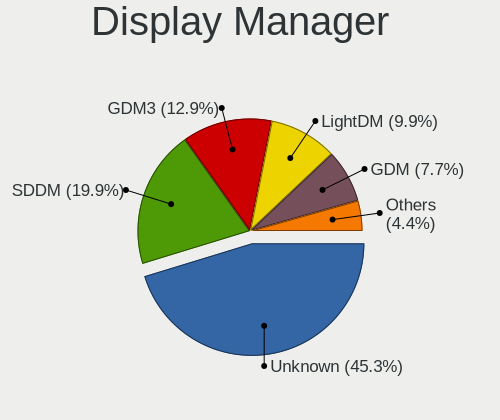

| Name    | Computers | Percent |
|---------|-----------|---------|
| Unknown | 304       | 57.36%  |
| SDDM    | 95        | 17.92%  |
| GDM     | 44        | 8.3%    |
| LightDM | 28        | 5.28%   |
| KDM     | 22        | 4.15%   |
| GDM3    | 18        | 3.4%    |
| TDM     | 14        | 2.64%   |
| XDM     | 2         | 0.38%   |
| Ly      | 2         | 0.38%   |
| MDM     | 1         | 0.19%   |

OS Lang
-------

Language

| Lang        | Computers | Percent |
|-------------|-----------|---------|
| en_US       | 333       | 62.24%  |
| Unknown     | 126       | 23.55%  |
| sr_RS       | 29        | 5.42%   |
| sr_RS@latin | 15        | 2.8%    |
| hu_HU       | 9         | 1.68%   |
| C           | 9         | 1.68%   |
| en_GB       | 8         | 1.5%    |
| de_DE       | 2         | 0.37%   |
| sk_SK       | 1         | 0.19%   |
| ru_RU       | 1         | 0.19%   |
| en_AU       | 1         | 0.19%   |
| bs_BA       | 1         | 0.19%   |

Boot Mode
---------

EFI or BIOS

| Mode | Computers | Percent |
|------|-----------|---------|
| BIOS | 285       | 55.13%  |
| EFI  | 232       | 44.87%  |

Filesystem
----------

Type of filesystem

| Type    | Computers | Percent |
|---------|-----------|---------|
| Ext4    | 393       | 74.15%  |
| Overlay | 69        | 13.02%  |
| Unknown | 43        | 8.11%   |
| Btrfs   | 12        | 2.26%   |
| Xfs     | 5         | 0.94%   |
| Zfs     | 4         | 0.75%   |
| Ext2    | 2         | 0.38%   |
| Tmpfs   | 1         | 0.19%   |
| Ext3    | 1         | 0.19%   |

Part. scheme
------------

Scheme of partitioning

| Type    | Computers | Percent |
|---------|-----------|---------|
| Unknown | 318       | 61.15%  |
| GPT     | 120       | 23.08%  |
| MBR     | 82        | 15.77%  |

Dual Boot with Linux/BSD
------------------------

Hosting more than one Linux/BSD

| Dual boot | Computers | Percent |
|-----------|-----------|---------|
| No        | 450       | 86.54%  |
| Yes       | 70        | 13.46%  |

Dual Boot (Win)
---------------

Hosting Linux and Windows

| Dual boot | Computers | Percent |
|-----------|-----------|---------|
| No        | 354       | 68.08%  |
| Yes       | 166       | 31.92%  |

Board
-----

Vendor
------

Motherboard manufacturer

| Name                | Computers | Percent |
|---------------------|-----------|---------|
| ASUSTek Computer    | 110       | 21.57%  |
| Lenovo              | 70        | 13.73%  |
| Hewlett-Packard     | 65        | 12.75%  |
| Gigabyte Technology | 64        | 12.55%  |
| MSI                 | 47        | 9.22%   |
| Dell                | 46        | 9.02%   |
| Acer                | 32        | 6.27%   |
| Toshiba             | 13        | 2.55%   |
| ASRock              | 12        | 2.35%   |
| Biostar             | 9         | 1.76%   |
| Fujitsu Siemens     | 6         | 1.18%   |
| Fujitsu             | 6         | 1.18%   |
| Apple               | 6         | 1.18%   |
| Sony                | 3         | 0.59%   |
| Samsung Electronics | 2         | 0.39%   |
| Pegatron            | 2         | 0.39%   |
| Intel               | 2         | 0.39%   |
| TWC                 | 1         | 0.2%    |
| Supermicro          | 1         | 0.2%    |
| SUN MICROSYSTEMS    | 1         | 0.2%    |
| Sapphire            | 1         | 0.2%    |
| Razer               | 1         | 0.2%    |
| Packard Bell        | 1         | 0.2%    |
| Medion              | 1         | 0.2%    |
| LG Electronics      | 1         | 0.2%    |
| Inventec            | 1         | 0.2%    |
| IBM                 | 1         | 0.2%    |
| HUAWEI              | 1         | 0.2%    |
| eMachines           | 1         | 0.2%    |
| ECS                 | 1         | 0.2%    |
| BenQ                | 1         | 0.2%    |
| Unknown             | 1         | 0.2%    |

Model
-----

Motherboard model

| Name                                       | Computers | Percent |
|--------------------------------------------|-----------|---------|
| ASUS PRIME A320M-K                         | 10        | 1.96%   |
| ASUS All Series                            | 8         | 1.57%   |
| Acer Aspire A315-31                        | 6         | 1.18%   |
| MSI MS-7641                                | 4         | 0.78%   |
| MSI MS-7309                                | 4         | 0.78%   |
| Lenovo V330-15IKB 81AX                     | 4         | 0.78%   |
| HP Notebook                                | 4         | 0.78%   |
| Gigabyte H61M-S2PV                         | 4         | 0.78%   |
| Biostar A320MH                             | 4         | 0.78%   |
| Unknown                                    | 4         | 0.78%   |
| MSI MS-7721                                | 3         | 0.59%   |
| MSI MS-7597                                | 3         | 0.59%   |
| Lenovo IdeaPad 330-15IKB 81DE              | 3         | 0.59%   |
| Gigabyte B450M DS3H                        | 3         | 0.59%   |
| ASUS X541NA                                | 3         | 0.59%   |
| ASUS H110M-R                               | 3         | 0.59%   |
| MSI MS-7C84                                | 2         | 0.39%   |
| MSI MS-7C02                                | 2         | 0.39%   |
| MSI MS-7788                                | 2         | 0.39%   |
| MSI MS-7786                                | 2         | 0.39%   |
| MSI MS-7693                                | 2         | 0.39%   |
| MSI MS-7623                                | 2         | 0.39%   |
| MSI MS-7592                                | 2         | 0.39%   |
| MSI MS-7529                                | 2         | 0.39%   |
| MSI CR500                                  | 2         | 0.39%   |
| Lenovo Legion Y530-15ICH 81FV              | 2         | 0.39%   |
| Lenovo IdeaPad S540-14API 81NH             | 2         | 0.39%   |
| Lenovo IdeaPad L340-15API 81LW             | 2         | 0.39%   |
| Lenovo IdeaPad 5 14ARE05 81YM              | 2         | 0.39%   |
| Lenovo IdeaPad 3 15IIL05 81WE              | 2         | 0.39%   |
| Lenovo IdeaPad 110-15IBR 80T7              | 2         | 0.39%   |
| Lenovo G500 20236                          | 2         | 0.39%   |
| HP Z800 Workstation                        | 2         | 0.39%   |
| HP ProDesk 600 G1 TWR                      | 2         | 0.39%   |
| HP Pavilion Notebook                       | 2         | 0.39%   |
| HP Laptop 15-ra0xx                         | 2         | 0.39%   |
| HP Laptop 15-db0xxx                        | 2         | 0.39%   |
| HP G62                                     | 2         | 0.39%   |
| HP Compaq 6200 Pro MT PC                   | 2         | 0.39%   |
| HP 250 G5 Notebook PC                      | 2         | 0.39%   |
| Gigabyte Z77X-UD5H                         | 2         | 0.39%   |
| Gigabyte P31-DS3L                          | 2         | 0.39%   |
| Gigabyte GB-BMCE-4500C                     | 2         | 0.39%   |
| Gigabyte GA-890GPA-UD3H                    | 2         | 0.39%   |
| Gigabyte F2A68HM-S1                        | 2         | 0.39%   |
| Gigabyte EX58-UD5                          | 2         | 0.39%   |
| Gigabyte B360M-DS3H                        | 2         | 0.39%   |
| Gigabyte 970A-DS3P                         | 2         | 0.39%   |
| Fujitsu Siemens AMILO Li3710               | 2         | 0.39%   |
| Dell Vostro 3500                           | 2         | 0.39%   |
| Dell OptiPlex 755                          | 2         | 0.39%   |
| Dell Latitude E5470                        | 2         | 0.39%   |
| Dell Latitude 7490                         | 2         | 0.39%   |
| Dell Inspiron 3542                         | 2         | 0.39%   |
| Dell Inspiron 3537                         | 2         | 0.39%   |
| ASUS X55A                                  | 2         | 0.39%   |
| ASUS X541NC                                | 2         | 0.39%   |
| ASUS VivoBook_ASUSLaptop X580GD_N580GD     | 2         | 0.39%   |
| ASUS VivoBook 15_ASUS Laptop X540MA_X543MA | 2         | 0.39%   |
| ASUS A58M-K                                | 2         | 0.39%   |

Model Family
------------

Motherboard model prefix

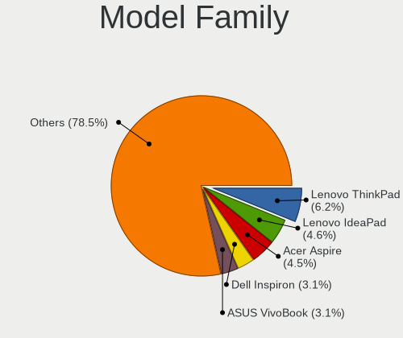

| Name                    | Computers | Percent |
|-------------------------|-----------|---------|
| Acer Aspire             | 29        | 5.69%   |
| Lenovo IdeaPad          | 23        | 4.51%   |
| Lenovo ThinkPad         | 19        | 3.73%   |
| Dell Inspiron           | 19        | 3.73%   |
| ASUS VivoBook           | 14        | 2.75%   |
| HP Laptop               | 12        | 2.35%   |
| Dell Latitude           | 12        | 2.35%   |
| ASUS PRIME              | 12        | 2.35%   |
| Toshiba Satellite       | 11        | 2.16%   |
| HP Compaq               | 10        | 1.96%   |
| ASUS All                | 8         | 1.57%   |
| HP ProBook              | 6         | 1.18%   |
| HP Pavilion             | 6         | 1.18%   |
| HP EliteBook            | 6         | 1.18%   |
| HP 250                  | 5         | 0.98%   |
| Fujitsu Siemens AMILO   | 5         | 0.98%   |
| Dell OptiPlex           | 5         | 0.98%   |
| MSI MS-7641             | 4         | 0.78%   |
| MSI MS-7309             | 4         | 0.78%   |
| Lenovo V330-15IKB       | 4         | 0.78%   |
| Lenovo Legion           | 4         | 0.78%   |
| HP Notebook             | 4         | 0.78%   |
| Gigabyte H61M-S2PV      | 4         | 0.78%   |
| Gigabyte B450M          | 4         | 0.78%   |
| Biostar A320MH          | 4         | 0.78%   |
| ASUS TUF                | 4         | 0.78%   |
| Unknown                 | 4         | 0.78%   |
| MSI MS-7721             | 3         | 0.59%   |
| MSI MS-7597             | 3         | 0.59%   |
| Lenovo ThinkCentre      | 3         | 0.59%   |
| Fujitsu LIFEBOOK        | 3         | 0.59%   |
| Fujitsu ESPRIMO         | 3         | 0.59%   |
| Dell Vostro             | 3         | 0.59%   |
| ASUS X541NA             | 3         | 0.59%   |
| ASUS ROG                | 3         | 0.59%   |
| ASUS P5KPL-AM           | 3         | 0.59%   |
| ASUS H110M-R            | 3         | 0.59%   |
| MSI MS-7C84             | 2         | 0.39%   |
| MSI MS-7C02             | 2         | 0.39%   |
| MSI MS-7788             | 2         | 0.39%   |
| MSI MS-7786             | 2         | 0.39%   |
| MSI MS-7693             | 2         | 0.39%   |
| MSI MS-7623             | 2         | 0.39%   |
| MSI MS-7592             | 2         | 0.39%   |
| MSI MS-7529             | 2         | 0.39%   |
| MSI CR500               | 2         | 0.39%   |
| Lenovo G500             | 2         | 0.39%   |
| HP Z800                 | 2         | 0.39%   |
| HP ProDesk              | 2         | 0.39%   |
| HP G62                  | 2         | 0.39%   |
| Gigabyte Z77X-UD5H      | 2         | 0.39%   |
| Gigabyte X570           | 2         | 0.39%   |
| Gigabyte P31-DS3L       | 2         | 0.39%   |
| Gigabyte GB-BMCE-4500C  | 2         | 0.39%   |
| Gigabyte GA-890GPA-UD3H | 2         | 0.39%   |
| Gigabyte F2A68HM-S1     | 2         | 0.39%   |
| Gigabyte EX58-UD5       | 2         | 0.39%   |
| Gigabyte B450           | 2         | 0.39%   |
| Gigabyte B360M-DS3H     | 2         | 0.39%   |
| Gigabyte 970A-DS3P      | 2         | 0.39%   |

MFG Year
--------

Motherboard manufacture year

| Year | Computers | Percent |
|------|-----------|---------|
| 2018 | 65        | 12.75%  |
| 2017 | 49        | 9.61%   |
| 2011 | 43        | 8.43%   |
| 2012 | 40        | 7.84%   |
| 2013 | 38        | 7.45%   |
| 2010 | 38        | 7.45%   |
| 2019 | 34        | 6.67%   |
| 2014 | 33        | 6.47%   |
| 2020 | 29        | 5.69%   |
| 2016 | 27        | 5.29%   |
| 2009 | 27        | 5.29%   |
| 2008 | 27        | 5.29%   |
| 2007 | 22        | 4.31%   |
| 2015 | 17        | 3.33%   |
| 2006 | 11        | 2.16%   |
| 2021 | 7         | 1.37%   |
| 2005 | 2         | 0.39%   |
| 2022 | 1         | 0.2%    |

Form Factor
-----------

Physical design of the computer

| Name        | Computers | Percent |
|-------------|-----------|---------|
| Notebook    | 268       | 52.55%  |
| Desktop     | 230       | 45.1%   |
| Convertible | 4         | 0.78%   |
| Tablet      | 2         | 0.39%   |
| Mini pc     | 2         | 0.39%   |
| All in one  | 2         | 0.39%   |
| Server      | 2         | 0.39%   |

Secure Boot
-----------

Enabled or disabled

| State    | Computers | Percent |
|----------|-----------|---------|
| Disabled | 478       | 93%     |
| Enabled  | 36        | 7%      |

Coreboot
--------

Have coreboot on board

| Used | Computers | Percent |
|------|-----------|---------|
| No   | 510       | 100%    |

RAM Size
--------

Total RAM memory

| Size in GB  | Computers | Percent |
|-------------|-----------|---------|
| 3.01-4.0    | 140       | 26.72%  |
| 4.01-8.0    | 121       | 23.09%  |
| 8.01-16.0   | 112       | 21.37%  |
| 16.01-24.0  | 66        | 12.6%   |
| 1.01-2.0    | 31        | 5.92%   |
| 32.01-64.0  | 19        | 3.63%   |
| 2.01-3.0    | 15        | 2.86%   |
| 24.01-32.0  | 8         | 1.53%   |
| 64.01-256.0 | 6         | 1.15%   |
| 0.51-1.0    | 6         | 1.15%   |

RAM Used
--------

Used RAM memory

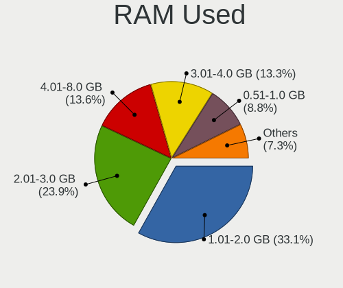

| Used GB    | Computers | Percent |
|------------|-----------|---------|
| 1.01-2.0   | 228       | 39.51%  |
| 2.01-3.0   | 123       | 21.32%  |
| 0.51-1.0   | 79        | 13.69%  |
| 3.01-4.0   | 61        | 10.57%  |
| 4.01-8.0   | 58        | 10.05%  |
| 8.01-16.0  | 11        | 1.91%   |
| 0.01-0.5   | 11        | 1.91%   |
| 16.01-24.0 | 4         | 0.69%   |
| 24.01-32.0 | 2         | 0.35%   |

Total Drives
------------

Number of drives on board

| Drives  | Computers | Percent |
|---------|-----------|---------|
| 1       | 323       | 61.41%  |
| 2       | 129       | 24.52%  |
| 3       | 35        | 6.65%   |
| 4       | 17        | 3.23%   |
| 0       | 10        | 1.9%    |
| 5       | 5         | 0.95%   |
| 7       | 2         | 0.38%   |
| 6       | 2         | 0.38%   |
| Unknown | 2         | 0.38%   |
| 8       | 1         | 0.19%   |

Has CD-ROM
----------

Has CD-ROM on board

| Presented | Computers | Percent |
|-----------|-----------|---------|
| No        | 279       | 53.45%  |
| Yes       | 243       | 46.55%  |

Has Ethernet
------------

Has Ethernet on board

| Presented | Computers | Percent |
|-----------|-----------|---------|
| Yes       | 475       | 93.14%  |
| No        | 35        | 6.86%   |

Has WiFi
--------

Has WiFi module

| Presented | Computers | Percent |
|-----------|-----------|---------|
| Yes       | 337       | 65.82%  |
| No        | 175       | 34.18%  |

Has Bluetooth
-------------

Has Bluetooth module

| Presented | Computers | Percent |
|-----------|-----------|---------|
| No        | 263       | 51.37%  |
| Yes       | 249       | 48.63%  |

Location
--------

Country
-------

Geographic location (country)

| Country | Computers | Percent |
|---------|-----------|---------|
| Serbia  | 510       | 100%    |

City
----

Geographic location (city)

| City              | Computers | Percent |
|-------------------|-----------|---------|
| Belgrade          | 300       | 55.05%  |
| Novi Sad          | 68        | 12.48%  |
| Ni            | 17        | 3.12%   |
| Kragujevac        | 7         | 1.28%   |
| aak       | 6         | 1.1%    |
| Ni              | 6         | 1.1%    |
| New Belgrade      | 6         | 1.1%    |
| Zrenjanin         | 5         | 0.92%   |
| Jagodina          | 5         | 0.92%   |
| Becej             | 5         | 0.92%   |
| Backa Topola      | 5         | 0.92%   |
| Savski Venac      | 4         | 0.73%   |
| Novi Belgrade     | 4         | 0.73%   |
| Negotin           | 4         | 0.73%   |
| Apatin            | 4         | 0.73%   |
| Sremska Mitrovica | 3         | 0.55%   |
| Smederevo         | 3         | 0.55%   |
| Prokuplje         | 3         | 0.55%   |
| Leskovac          | 3         | 0.55%   |
| Lazarevac         | 3         | 0.55%   |
| Kanjiza           | 3         | 0.55%   |
| Zajecar           | 2         | 0.37%   |
| Valjevo           | 2         | 0.37%   |
| Subotica          | 2         | 0.37%   |
| Senta             | 2         | 0.37%   |
| Palilula          | 2         | 0.37%   |
| Palanka           | 2         | 0.37%   |
| Novi Pazar        | 2         | 0.37%   |
| Novi Knezevac     | 2         | 0.37%   |
| Ni            | 2         | 0.37%   |
| Kovin             | 2         | 0.37%   |
| Karavukovo        | 2         | 0.37%   |
| Brezane           | 2         | 0.37%   |
| Badince           | 2         | 0.37%   |
| Arilje            | 2         | 0.37%   |
| Aleksandrovac     | 2         | 0.37%   |
| Zvecka            | 1         | 0.18%   |
| Vojka             | 1         | 0.18%   |
| Veliko Orasje     | 1         | 0.18%   |
| Uice          | 1         | 0.18%   |
| Uice          | 1         | 0.18%   |
| Temerin           | 1         | 0.18%   |
| Svrljig           | 1         | 0.18%   |
| Sombor            | 1         | 0.18%   |
| Sljivovac         | 1         | 0.18%   |
| Semlin            | 1         | 0.18%   |
| Sabac             | 1         | 0.18%   |
| Ruanj         | 1         | 0.18%   |
| Rumenka           | 1         | 0.18%   |
| Ruma              | 1         | 0.18%   |
| Rivica            | 1         | 0.18%   |
| Ripanj            | 1         | 0.18%   |
| Raska             | 1         | 0.18%   |
| Pukovac           | 1         | 0.18%   |
| Poarevac      | 1         | 0.18%   |
| Pivnice           | 1         | 0.18%   |
| Pirot             | 1         | 0.18%   |
| Petrovac          | 1         | 0.18%   |
| Paracin           | 1         | 0.18%   |
| Panevo        | 1         | 0.18%   |

Drives
------

Drive Vendor
------------

Hard drive vendors

| Vendor                  | Computers | Drives | Percent |
|-------------------------|-----------|--------|---------|
| WDC                     | 139       | 230    | 19.63%  |
| Seagate                 | 90        | 116    | 12.71%  |
| Toshiba                 | 84        | 113    | 11.86%  |
| Kingston                | 71        | 96     | 10.03%  |
| Samsung Electronics     | 65        | 92     | 9.18%   |
| Hitachi                 | 40        | 55     | 5.65%   |
| Sandisk                 | 22        | 30     | 3.11%   |
| Patriot                 | 18        | 21     | 2.54%   |
| Intel                   | 16        | 29     | 2.26%   |
| SPCC                    | 14        | 21     | 1.98%   |
| SK Hynix                | 14        | 17     | 1.98%   |
| Unknown                 | 13        | 14     | 1.84%   |
| Biostar                 | 13        | 15     | 1.84%   |
| Gigabyte Technology     | 12        | 14     | 1.69%   |
| Transcend               | 10        | 12     | 1.41%   |
| HGST                    | 10        | 18     | 1.41%   |
| Micron Technology       | 8         | 9      | 1.13%   |
| MAXTOR                  | 8         | 8      | 1.13%   |
| Fujitsu                 | 5         | 5      | 0.71%   |
| Crucial                 | 5         | 5      | 0.71%   |
| Apacer                  | 5         | 6      | 0.71%   |
| A-DATA Technology       | 5         | 5      | 0.71%   |
| Phison                  | 4         | 11     | 0.56%   |
| KIOXIA                  | 3         | 3      | 0.42%   |
| GeIL                    | 3         | 3      | 0.42%   |
| Verbatim                | 2         | 2      | 0.28%   |
| Union Memory            | 2         | 2      | 0.28%   |
| StoreJet                | 2         | 2      | 0.28%   |
| Silicon Motion          | 2         | 2      | 0.28%   |
| LITEON                  | 2         | 3      | 0.28%   |
| JMicron                 | 2         | 2      | 0.28%   |
| ExcelStor               | 2         | 2      | 0.28%   |
| China                   | 2         | 2      | 0.28%   |
| AMD                     | 2         | 2      | 0.28%   |
| Union Memory (Shenzhen) | 1         | 1      | 0.14%   |
| SSSTC                   | 1         | 1      | 0.14%   |
| Realtek Semiconductor   | 1         | 4      | 0.14%   |
| QUANTUM                 | 1         | 1      | 0.14%   |
| PNY                     | 1         | 1      | 0.14%   |
| OCZ                     | 1         | 2      | 0.14%   |
| Netac                   | 1         | 1      | 0.14%   |
| Mushkin                 | 1         | 1      | 0.14%   |
| Leven                   | 1         | 1      | 0.14%   |
| KingDian                | 1         | 1      | 0.14%   |
| IBM/Hitachi             | 1         | 1      | 0.14%   |
| HUAWEI                  | 1         | 1      | 0.14%   |
| ASMT                    | 1         | 1      | 0.14%   |

Drive Model
-----------

Hard drive models

| Model                                | Computers | Percent |
|--------------------------------------|-----------|---------|
| Kingston SA400S37120G 120GB SSD      | 18        | 2.35%   |
| Kingston SA400S37240G 240GB SSD      | 16        | 2.09%   |
| Seagate ST1000LM035-1RK172 1TB       | 15        | 1.96%   |
| Toshiba MQ01ABF050 500GB             | 14        | 1.83%   |
| Toshiba DT01ACA100 1TB               | 11        | 1.44%   |
| Kingston SA400S37480G 480GB SSD      | 11        | 1.44%   |
| Toshiba DT01ACA050 500GB             | 8         | 1.04%   |
| Seagate ST500LT012-1DG142 500GB      | 8         | 1.04%   |
| Seagate ST1000DM003-1ER162 1TB       | 7         | 0.91%   |
| Samsung NVMe SSD Drive 500GB         | 7         | 0.91%   |
| Toshiba MQ01ABD100 1TB               | 6         | 0.78%   |
| Samsung SSD 860 EVO 500GB            | 6         | 0.78%   |
| Gigabyte GP-GSTFS31240GNTD 240GB SSD | 6         | 0.78%   |
| Biostar S100-120GB                   | 6         | 0.78%   |
| WDC WD5000AAKX-001CA0 500GB          | 5         | 0.65%   |
| WDC WD3200AAJS-56B4A0 320GB          | 5         | 0.65%   |
| Toshiba HDWD110 1TB                  | 5         | 0.65%   |
| Toshiba DT01ACA200 2TB               | 5         | 0.65%   |
| Seagate ST1000LM024 HN-M101MBB 1TB   | 5         | 0.65%   |
| Samsung SSD 860 EVO 250GB            | 5         | 0.65%   |
| Samsung NVMe SSD Drive 256GB         | 5         | 0.65%   |
| Patriot Burst 240GB SSD              | 5         | 0.65%   |
| Hitachi HDS721050CLA362 500GB        | 5         | 0.65%   |
| WDC WD2500BEVS-22UST0 250GB          | 4         | 0.52%   |
| Toshiba MQ04ABF100 1TB               | 4         | 0.52%   |
| Toshiba HDWD120 2TB                  | 4         | 0.52%   |
| SPCC Solid State Disk 256GB          | 4         | 0.52%   |
| Seagate ST500LT012-9WS142 500GB      | 4         | 0.52%   |
| Seagate ST500DM002-1BD142 500GB      | 4         | 0.52%   |
| Seagate ST1000DM010-2EP102 1TB       | 4         | 0.52%   |
| Gigabyte GP-GSTFS31120GNTD 120GB     | 4         | 0.52%   |
| WDC WD3200BEVT-22ZCT0 320GB          | 3         | 0.39%   |
| WDC WD3200AAJS-56M0A0 320GB          | 3         | 0.39%   |
| WDC WD30EFRX-68EUZN0 3TB             | 3         | 0.39%   |
| WDC WD2500AAKX-753CA1 250GB          | 3         | 0.39%   |
| WDC WD1600AAJS-00L7A0 160GB          | 3         | 0.39%   |
| WDC WD10EZEX-08WN4A0 1TB             | 3         | 0.39%   |
| WDC WD1003FZEX-00K3CA0 1TB           | 3         | 0.39%   |
| WDC PC SN530 SDBPMPZ-512G-1101 512GB | 3         | 0.39%   |
| Transcend TS120GSSD220S 120GB        | 3         | 0.39%   |
| Toshiba NVMe SSD Drive 256GB         | 3         | 0.39%   |
| Toshiba MQ01ABD050 500GB             | 3         | 0.39%   |
| SK Hynix NVMe SSD Drive 256GB        | 3         | 0.39%   |
| Seagate ST31000528AS 1TB             | 3         | 0.39%   |
| Seagate ST1000DM003-1CH162 1TB       | 3         | 0.39%   |
| SanDisk SSD PLUS 120GB               | 3         | 0.39%   |
| SanDisk SDSSDA120G 120GB             | 3         | 0.39%   |
| Sandisk NVMe SSD Drive 256GB         | 3         | 0.39%   |
| Samsung SSD 850 EVO 250GB            | 3         | 0.39%   |
| Samsung NVMe SSD Drive 1TB           | 3         | 0.39%   |
| Kingston SV300S37A120G 120GB SSD     | 3         | 0.39%   |
| Kingston SHFS37A120G 120GB SSD       | 3         | 0.39%   |
| Kingston SH103S3120G 120GB SSD       | 3         | 0.39%   |
| Kingston RBUSC180DS37256GJ 256GB SSD | 3         | 0.39%   |
| Hitachi HTS545050A7E380 500GB        | 3         | 0.39%   |
| GeIL R3_128GB SSD                    | 3         | 0.39%   |
| WDC WD5000LPVX-75V0TT0 500GB         | 2         | 0.26%   |
| WDC WD5000LPCX-80VHAT1 500GB         | 2         | 0.26%   |
| WDC WD5000LPCX-60VHAT0 500GB         | 2         | 0.26%   |
| WDC WD5000LPCX-24VHAT0 500GB         | 2         | 0.26%   |

HDD Vendor
----------

Hard disk drive vendors

| Vendor              | Computers | Drives | Percent |
|---------------------|-----------|--------|---------|
| WDC                 | 130       | 218    | 34.57%  |
| Seagate             | 88        | 114    | 23.4%   |
| Toshiba             | 75        | 103    | 19.95%  |
| Hitachi             | 40        | 55     | 10.64%  |
| Samsung Electronics | 14        | 19     | 3.72%   |
| HGST                | 10        | 18     | 2.66%   |
| MAXTOR              | 8         | 8      | 2.13%   |
| Fujitsu             | 5         | 5      | 1.33%   |
| ExcelStor           | 2         | 2      | 0.53%   |
| Unknown             | 1         | 1      | 0.27%   |
| QUANTUM             | 1         | 1      | 0.27%   |
| IBM/Hitachi         | 1         | 1      | 0.27%   |
| ASMT                | 1         | 1      | 0.27%   |

SSD Vendor
----------

Solid state drive vendors

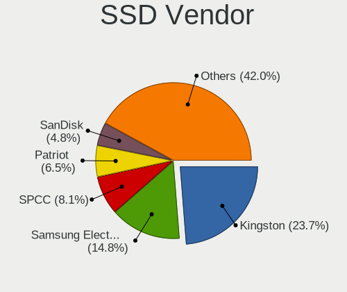

| Vendor              | Computers | Drives | Percent |
|---------------------|-----------|--------|---------|
| Kingston            | 65        | 89     | 27.78%  |
| Samsung Electronics | 34        | 43     | 14.53%  |
| Patriot             | 16        | 19     | 6.84%   |
| SanDisk             | 15        | 21     | 6.41%   |
| SPCC                | 14        | 21     | 5.98%   |
| Gigabyte Technology | 11        | 13     | 4.7%    |
| Transcend           | 10        | 12     | 4.27%   |
| Intel               | 9         | 13     | 3.85%   |
| Biostar             | 9         | 11     | 3.85%   |
| Micron Technology   | 5         | 6      | 2.14%   |
| Crucial             | 5         | 5      | 2.14%   |
| Apacer              | 5         | 6      | 2.14%   |
| WDC                 | 4         | 4      | 1.71%   |
| A-DATA Technology   | 4         | 4      | 1.71%   |
| SK Hynix            | 3         | 3      | 1.28%   |
| GeIL                | 3         | 3      | 1.28%   |
| Verbatim            | 2         | 2      | 0.85%   |
| Toshiba             | 2         | 2      | 0.85%   |
| StoreJet            | 2         | 2      | 0.85%   |
| LITEON              | 2         | 3      | 0.85%   |
| JMicron             | 2         | 2      | 0.85%   |
| China               | 2         | 2      | 0.85%   |
| AMD                 | 2         | 2      | 0.85%   |
| SSSTC               | 1         | 1      | 0.43%   |
| Seagate             | 1         | 1      | 0.43%   |
| PNY                 | 1         | 1      | 0.43%   |
| OCZ                 | 1         | 2      | 0.43%   |
| Netac               | 1         | 1      | 0.43%   |
| Mushkin             | 1         | 1      | 0.43%   |
| Leven               | 1         | 1      | 0.43%   |
| KingDian            | 1         | 1      | 0.43%   |

Drive Kind
----------

HDD or SSD

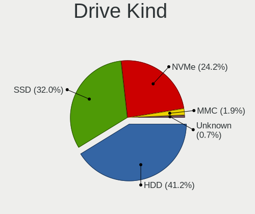

| Kind    | Computers | Drives | Percent |
|---------|-----------|--------|---------|
| HDD     | 332       | 546    | 51.96%  |
| SSD     | 203       | 297    | 31.77%  |
| NVMe    | 87        | 123    | 13.62%  |
| MMC     | 11        | 12     | 1.72%   |
| Unknown | 6         | 6      | 0.94%   |

Drive Connector
---------------

SATA, SAS, NVMe, etc.

| Type | Computers | Drives | Percent |
|------|-----------|--------|---------|
| SATA | 436       | 840    | 80%     |
| NVMe | 87        | 123    | 15.96%  |
| SAS  | 11        | 9      | 2.02%   |
| MMC  | 11        | 12     | 2.02%   |

Drive Size
----------

Size of hard drive

| Size in TB | Computers | Drives | Percent |
|------------|-----------|--------|---------|
| 0.01-0.5   | 361       | 574    | 67.48%  |
| 0.51-1.0   | 134       | 197    | 25.05%  |
| 1.01-2.0   | 28        | 44     | 5.23%   |
| 2.01-3.0   | 6         | 18     | 1.12%   |
| 3.01-4.0   | 5         | 9      | 0.93%   |
| 4.01-10.0  | 1         | 1      | 0.19%   |

Space Total
-----------

Amount of disk space available on the file system

| Size in GB     | Computers | Percent |
|----------------|-----------|---------|
| 101-250        | 151       | 27.31%  |
| 251-500        | 122       | 22.06%  |
| 501-1000       | 72        | 13.02%  |
| 1-20           | 53        | 9.58%   |
| 51-100         | 38        | 6.87%   |
| 21-50          | 37        | 6.69%   |
| Unknown        | 30        | 5.42%   |
| 1001-2000      | 29        | 5.24%   |
| 2001-3000      | 11        | 1.99%   |
| More than 3000 | 10        | 1.81%   |

Space Used
----------

Amount of used disk space

| Used GB        | Computers | Percent |
|----------------|-----------|---------|
| 1-20           | 238       | 42.27%  |
| 21-50          | 89        | 15.81%  |
| 101-250        | 68        | 12.08%  |
| 51-100         | 54        | 9.59%   |
| 251-500        | 48        | 8.53%   |
| Unknown        | 30        | 5.33%   |
| 501-1000       | 15        | 2.66%   |
| 1001-2000      | 13        | 2.31%   |
| 2001-3000      | 5         | 0.89%   |
| More than 3000 | 3         | 0.53%   |

Malfunc. Drives
---------------

Drive models with a malfunction

| Model                                   | Computers | Drives | Percent |
|-----------------------------------------|-----------|--------|---------|
| WDC WD5000AAKX-001CA0 500GB             | 3         | 3      | 5%      |
| Toshiba MQ01ABF050 500GB                | 2         | 2      | 3.33%   |
| Seagate ST500DM002-1BD142 500GB         | 2         | 5      | 3.33%   |
| Intel SSDSC2CW120A3 120GB               | 2         | 2      | 3.33%   |
| WDC WD5002AALX-00J37A0 500GB            | 1         | 1      | 1.67%   |
| WDC WD5000BEVT-24A0RT0 500GB            | 1         | 1      | 1.67%   |
| WDC WD5000AAKX-603CA0 500GB             | 1         | 1      | 1.67%   |
| WDC WD5000AAKS-00UU3A0 500GB            | 1         | 1      | 1.67%   |
| WDC WD5000AAKS-00TMA0 500GB             | 1         | 1      | 1.67%   |
| WDC WD40EFRX-68WT0N0 4TB                | 1         | 1      | 1.67%   |
| WDC WD3200AVVS-63L2B0 320GB             | 1         | 1      | 1.67%   |
| WDC WD3200AVVS-56L2B0 320GB             | 1         | 1      | 1.67%   |
| WDC WD20EARX-00PASB0 2TB                | 1         | 1      | 1.67%   |
| WDC WD2002FAEX-007BA0 2TB               | 1         | 2      | 1.67%   |
| WDC WD1600AAJS-00L7A0 160GB             | 1         | 1      | 1.67%   |
| WDC WD15EARS-00MVWB0 1TB                | 1         | 1      | 1.67%   |
| WDC WD10EZEX-75WN4A0 1TB                | 1         | 1      | 1.67%   |
| WDC WD10EZEX-00RKKA0 1TB                | 1         | 1      | 1.67%   |
| WDC WD10EARS-00Y5B1 1TB                 | 1         | 1      | 1.67%   |
| WDC WD10EALX-009BA0 1TB                 | 1         | 2      | 1.67%   |
| WDC WD10EADS-00M2B0 1TB                 | 1         | 2      | 1.67%   |
| WDC WD1001FALS-00J7B1 1TB               | 1         | 1      | 1.67%   |
| Toshiba MQ01ABD032 320GB                | 1         | 1      | 1.67%   |
| Toshiba MG03ACA200 2TB                  | 1         | 1      | 1.67%   |
| Toshiba KSG60ZMV256G M.2 2280 256GB SSD | 1         | 1      | 1.67%   |
| Toshiba DT01ACA100 1TB                  | 1         | 1      | 1.67%   |
| SPCC Solid State DiskB27 32GB           | 1         | 1      | 1.67%   |
| SPCC Solid State Disk 120GB             | 1         | 1      | 1.67%   |
| Seagate STM3250318AS 250GB              | 1         | 2      | 1.67%   |
| Seagate ST980813AS 80GB                 | 1         | 1      | 1.67%   |
| Seagate ST9250827AS 250GB               | 1         | 1      | 1.67%   |
| Seagate ST9120822AS 120GB               | 1         | 1      | 1.67%   |
| Seagate ST750LM022 HN-M750MBB 752GB     | 1         | 1      | 1.67%   |
| Seagate ST500LT012-9WS142 500GB         | 1         | 1      | 1.67%   |
| Seagate ST500LT012-1DG142 500GB         | 1         | 2      | 1.67%   |
| Seagate ST380815AS 80GB                 | 1         | 1      | 1.67%   |
| Seagate ST1000DM003-1CH162 1TB          | 1         | 1      | 1.67%   |
| Samsung Electronics HM120JI 120GB       | 1         | 2      | 1.67%   |
| Samsung Electronics HD753LJ 752GB       | 1         | 2      | 1.67%   |
| Samsung Electronics HD154UI 1TB         | 1         | 1      | 1.67%   |
| Samsung Electronics HD040GJ 40GB        | 1         | 1      | 1.67%   |
| MAXTOR STM380211AS 80GB                 | 1         | 1      | 1.67%   |
| MAXTOR STM3250310AS 250GB               | 1         | 1      | 1.67%   |
| MAXTOR STM3160811AS 160GB               | 1         | 1      | 1.67%   |
| MAXTOR 6Y160P0 164GB                    | 1         | 1      | 1.67%   |
| Kingston SA400S37 120GB SSD             | 1         | 1      | 1.67%   |
| Hitachi HTS722080K9A300 80GB            | 1         | 1      | 1.67%   |
| Hitachi HTS545050A7E380 500GB           | 1         | 1      | 1.67%   |
| Hitachi HTS541612J9SA00 120GB           | 1         | 1      | 1.67%   |
| Hitachi HDS721050CLA662 500GB           | 1         | 1      | 1.67%   |
| Hitachi HDP725050GLA360 500GB           | 1         | 1      | 1.67%   |
| HGST HTS725050A7E630 500GB              | 1         | 5      | 1.67%   |
| HGST HTS721010A9E630 1TB                | 1         | 1      | 1.67%   |
| Fujitsu MHZ2160BH G1 160GB              | 1         | 1      | 1.67%   |
| Fujitsu MHW2160BH PL 160GB              | 1         | 1      | 1.67%   |

Malfunc. Drive Vendor
---------------------

Vendors of faulty drives

| Vendor              | Computers | Drives | Percent |
|---------------------|-----------|--------|---------|
| WDC                 | 18        | 24     | 31.58%  |
| Seagate             | 11        | 16     | 19.3%   |
| Toshiba             | 6         | 6      | 10.53%  |
| Hitachi             | 5         | 5      | 8.77%   |
| Samsung Electronics | 4         | 6      | 7.02%   |
| MAXTOR              | 4         | 4      | 7.02%   |
| SPCC                | 2         | 2      | 3.51%   |
| Intel               | 2         | 2      | 3.51%   |
| HGST                | 2         | 6      | 3.51%   |
| Fujitsu             | 2         | 2      | 3.51%   |
| Kingston            | 1         | 1      | 1.75%   |

Malfunc. HDD Vendor
-------------------

Vendors of faulty HDD drives

| Vendor              | Computers | Drives | Percent |
|---------------------|-----------|--------|---------|
| WDC                 | 18        | 24     | 35.29%  |
| Seagate             | 11        | 16     | 21.57%  |
| Toshiba             | 5         | 5      | 9.8%    |
| Hitachi             | 5         | 5      | 9.8%    |
| Samsung Electronics | 4         | 6      | 7.84%   |
| MAXTOR              | 4         | 4      | 7.84%   |
| HGST                | 2         | 6      | 3.92%   |
| Fujitsu             | 2         | 2      | 3.92%   |

Malfunc. Drive Kind
-------------------

Kinds of faulty drives

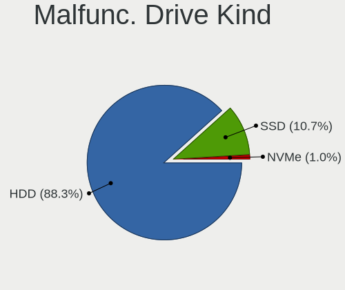

| Kind | Computers | Drives | Percent |
|------|-----------|--------|---------|
| HDD  | 46        | 68     | 88.46%  |
| SSD  | 6         | 6      | 11.54%  |

Failed Drives
-------------

Failed drive models

Zero info for selected period =(

Failed Drive Vendor
-------------------

Failed drive vendors

Zero info for selected period =(

Drive Status
------------

Number of failed and malfunc. drives

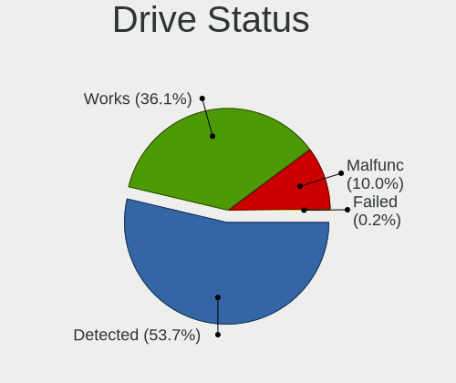

| Status   | Computers | Drives | Percent |
|----------|-----------|--------|---------|
| Detected | 323       | 642    | 60.26%  |
| Works    | 161       | 268    | 30.04%  |
| Malfunc  | 52        | 74     | 9.7%    |

Storage controller
------------------

Storage Vendor
--------------

Storage controller vendors

| Vendor                       | Computers | Percent |
|------------------------------|-----------|---------|
| Intel                        | 337       | 55.79%  |
| AMD                          | 121       | 20.03%  |
| Samsung Electronics          | 26        | 4.3%    |
| Nvidia                       | 23        | 3.81%   |
| Sandisk                      | 14        | 2.32%   |
| JMicron Technology           | 13        | 2.15%   |
| SK Hynix                     | 11        | 1.82%   |
| Marvell Technology Group     | 8         | 1.32%   |
| Toshiba America Info Systems | 7         | 1.16%   |
| Kingston Technology Company  | 7         | 1.16%   |
| Phison Electronics           | 6         | 0.99%   |
| ASMedia Technology           | 6         | 0.99%   |
| VIA Technologies             | 5         | 0.83%   |
| KIOXIA                       | 4         | 0.66%   |
| Union Memory (Shenzhen)      | 3         | 0.5%    |
| Silicon Motion               | 3         | 0.5%    |
| Micron Technology            | 3         | 0.5%    |
| LSI Logic / Symbios Logic    | 2         | 0.33%   |
| Broadcom / LSI               | 2         | 0.33%   |
| Silicon Image                | 1         | 0.17%   |
| Realtek Semiconductor        | 1         | 0.17%   |
| ADATA Technology             | 1         | 0.17%   |

Storage Model
-------------

Storage controller models

| Model                                                                                   | Computers | Percent |
|-----------------------------------------------------------------------------------------|-----------|---------|
| AMD FCH SATA Controller [AHCI mode]                                                     | 83        | 11.25%  |
| Intel Sunrise Point-LP SATA Controller [AHCI mode]                                      | 27        | 3.66%   |
| Intel 8 Series/C220 Series Chipset Family 6-port SATA Controller 1 [AHCI mode]          | 22        | 2.98%   |
| Intel 6 Series/C200 Series Chipset Family 6 port Mobile SATA AHCI Controller            | 22        | 2.98%   |
| Intel NM10/ICH7 Family SATA Controller [IDE mode]                                       | 21        | 2.85%   |
| Intel 7 Series Chipset Family 6-port SATA Controller [AHCI mode]                        | 19        | 2.57%   |
| AMD FCH SATA Controller D                                                               | 18        | 2.44%   |
| Intel 82801G (ICH7 Family) IDE Controller                                               | 17        | 2.3%    |
| Intel 82801 Mobile SATA Controller [RAID mode]                                          | 17        | 2.3%    |
| AMD SB7x0/SB8x0/SB9x0 SATA Controller [AHCI mode]                                       | 17        | 2.3%    |
| AMD SB7x0/SB8x0/SB9x0 IDE Controller                                                    | 17        | 2.3%    |
| Samsung NVMe SSD Controller SM981/PM981/PM983                                           | 14        | 1.9%    |
| AMD 400 Series Chipset SATA Controller                                                  | 14        | 1.9%    |
| Intel Celeron N3350/Pentium N4200/Atom E3900 Series SATA AHCI Controller                | 13        | 1.76%   |
| AMD SB7x0/SB8x0/SB9x0 SATA Controller [IDE mode]                                        | 13        | 1.76%   |
| Intel 7 Series/C210 Series Chipset Family 6-port SATA Controller [AHCI mode]            | 12        | 1.63%   |
| Intel 6 Series/C200 Series Chipset Family 6 port Desktop SATA AHCI Controller           | 12        | 1.63%   |
| Nvidia MCP61 SATA Controller                                                            | 11        | 1.49%   |
| Nvidia MCP61 IDE                                                                        | 10        | 1.36%   |
| Intel Wildcat Point-LP SATA Controller [AHCI Mode]                                      | 9         | 1.22%   |
| Intel Q170/Q150/B150/H170/H110/Z170/CM236 Chipset SATA Controller [AHCI Mode]           | 9         | 1.22%   |
| Intel Atom Processor E3800 Series SATA AHCI Controller                                  | 9         | 1.22%   |
| JMicron JMB363 SATA/IDE Controller                                                      | 8         | 1.08%   |
| Intel SATA Controller [RAID mode]                                                       | 8         | 1.08%   |
| Intel Cannon Lake PCH SATA AHCI Controller                                              | 8         | 1.08%   |
| Intel Cannon Lake Mobile PCH SATA AHCI Controller                                       | 8         | 1.08%   |
| Intel Atom/Celeron/Pentium Processor x5-E8000/J3xxx/N3xxx Series SATA Controller        | 8         | 1.08%   |
| Intel 82801IBM/IEM (ICH9M/ICH9M-E) 4 port SATA Controller [AHCI mode]                   | 8         | 1.08%   |
| Intel 8 Series SATA Controller 1 [AHCI mode]                                            | 8         | 1.08%   |
| Samsung NVMe SSD Controller SM961/PM961/SM963                                           | 7         | 0.95%   |
| Intel 5 Series/3400 Series Chipset 6 port SATA AHCI Controller                          | 7         | 0.95%   |
| Intel 200 Series PCH SATA controller [AHCI mode]                                        | 7         | 0.95%   |
| SK Hynix BC511                                                                          | 6         | 0.81%   |
| Intel Ice Lake-LP SATA Controller [AHCI mode]                                           | 6         | 0.81%   |
| Intel Celeron/Pentium Silver Processor SATA Controller                                  | 6         | 0.81%   |
| AMD FCH SATA Controller [IDE mode]                                                      | 6         | 0.81%   |
| Intel 82801JI (ICH10 Family) SATA AHCI Controller                                       | 5         | 0.68%   |
| Intel 82801HM/HEM (ICH8M/ICH8M-E) SATA Controller [AHCI mode]                           | 5         | 0.68%   |
| Intel 82801HM/HEM (ICH8M/ICH8M-E) IDE Controller                                        | 5         | 0.68%   |
| Intel 6 Series/C200 Series Chipset Family Desktop SATA Controller (IDE mode, ports 4-5) | 5         | 0.68%   |
| Intel 6 Series/C200 Series Chipset Family Desktop SATA Controller (IDE mode, ports 0-3) | 5         | 0.68%   |
| Intel 5 Series/3400 Series Chipset 4 port SATA AHCI Controller                          | 5         | 0.68%   |
| Sandisk WD Blue SN550 NVMe SSD                                                          | 4         | 0.54%   |
| Sandisk Non-Volatile memory controller                                                  | 4         | 0.54%   |
| Samsung NVMe SSD Controller 980                                                         | 4         | 0.54%   |
| Nvidia MCP79 AHCI Controller                                                            | 4         | 0.54%   |
| KIOXIA Non-Volatile memory controller                                                   | 4         | 0.54%   |
| Intel HM170/QM170 Chipset SATA Controller [AHCI Mode]                                   | 4         | 0.54%   |
| ASMedia ASM1062 Serial ATA Controller                                                   | 4         | 0.54%   |
| VIA VT82C586A/B/VT82C686/A/B/VT823x/A/C PIPC Bus Master IDE                             | 3         | 0.41%   |
| Union Memory (Shenzhen) Non-Volatile memory controller                                  | 3         | 0.41%   |
| Toshiba America Info Systems BG3 NVMe SSD Controller                                    | 3         | 0.41%   |
| SK Hynix Non-Volatile memory controller                                                 | 3         | 0.41%   |
| Silicon Motion SM2263EN/SM2263XT SSD Controller                                         | 3         | 0.41%   |
| Micron Non-Volatile memory controller                                                   | 3         | 0.41%   |
| JMicron JMB368 IDE controller                                                           | 3         | 0.41%   |
| Intel SSD 660P Series                                                                   | 3         | 0.41%   |
| Intel NM10/ICH7 Family SATA Controller [AHCI mode]                                      | 3         | 0.41%   |
| Intel 82801JI (ICH10 Family) 4 port SATA IDE Controller #1                              | 3         | 0.41%   |
| Intel 82801JI (ICH10 Family) 2 port SATA IDE Controller #2                              | 3         | 0.41%   |

Storage Kind
------------

Kind of storage controller (IDE, SATA, NVMe, SAS, ...)

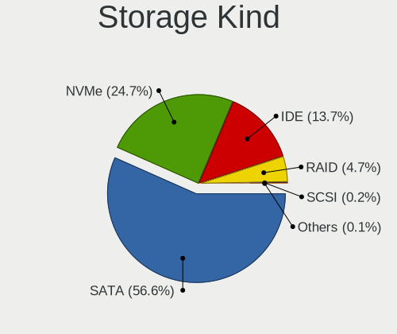

| Kind | Computers | Percent |
|------|-----------|---------|
| SATA | 388       | 62.48%  |
| IDE  | 112       | 18.04%  |
| NVMe | 91        | 14.65%  |
| RAID | 27        | 4.35%   |
| SCSI | 3         | 0.48%   |

Processor
---------

CPU Vendor
----------

Processor vendors

| Vendor | Computers | Percent |
|--------|-----------|---------|
| Intel  | 363       | 71.18%  |
| AMD    | 147       | 28.82%  |

CPU Model
---------

Processor models

| Model                                         | Computers | Percent |
|-----------------------------------------------|-----------|---------|
| AMD Ryzen 5 1600 Six-Core Processor           | 7         | 1.37%   |
| Intel Core i7-8750H CPU @ 2.20GHz             | 6         | 1.18%   |
| Intel Core i5-1035G1 CPU @ 1.00GHz            | 6         | 1.18%   |
| Intel Pentium CPU N4200 @ 1.10GHz             | 5         | 0.98%   |
| Intel Core i7-8550U CPU @ 1.80GHz             | 5         | 0.98%   |
| Intel Core i5-7200U CPU @ 2.50GHz             | 5         | 0.98%   |
| Intel Core i3-6006U CPU @ 2.00GHz             | 5         | 0.98%   |
| Intel Core i3-5005U CPU @ 2.00GHz             | 5         | 0.98%   |
| Intel Celeron CPU N3350 @ 1.10GHz             | 5         | 0.98%   |
| AMD Ryzen 5 2400G with Radeon Vega Graphics   | 5         | 0.98%   |
| Intel Core i7-2670QM CPU @ 2.20GHz            | 4         | 0.78%   |
| Intel Core i5-2400 CPU @ 3.10GHz              | 4         | 0.78%   |
| Intel Core i3-4160 CPU @ 3.60GHz              | 4         | 0.78%   |
| Intel Core i3-3220 CPU @ 3.30GHz              | 4         | 0.78%   |
| Intel Celeron CPU N3060 @ 1.60GHz             | 4         | 0.78%   |
| Intel Celeron CPU 1000M @ 1.80GHz             | 4         | 0.78%   |
| Intel 11th Gen Core i5-1135G7 @ 2.40GHz       | 4         | 0.78%   |
| AMD Ryzen 7 3700U with Radeon Vega Mobile Gfx | 4         | 0.78%   |
| AMD Ryzen 5 3500U with Radeon Vega Mobile Gfx | 4         | 0.78%   |
| AMD Ryzen 5 2600X Six-Core Processor          | 4         | 0.78%   |
| Intel Pentium M processor 1.86GHz             | 3         | 0.59%   |
| Intel Pentium Dual-Core CPU E5200 @ 2.50GHz   | 3         | 0.59%   |
| Intel Pentium CPU 2020M @ 2.40GHz             | 3         | 0.59%   |
| Intel Core i7-8565U CPU @ 1.80GHz             | 3         | 0.59%   |
| Intel Core i7-7700HQ CPU @ 2.80GHz            | 3         | 0.59%   |
| Intel Core i7-6600U CPU @ 2.60GHz             | 3         | 0.59%   |
| Intel Core i7-4600U CPU @ 2.10GHz             | 3         | 0.59%   |
| Intel Core i7-3770 CPU @ 3.40GHz              | 3         | 0.59%   |
| Intel Core i7 CPU 870 @ 2.93GHz               | 3         | 0.59%   |
| Intel Core i5-8300H CPU @ 2.30GHz             | 3         | 0.59%   |
| Intel Core i5-2450M CPU @ 2.50GHz             | 3         | 0.59%   |
| Intel Core i3-8100 CPU @ 3.60GHz              | 3         | 0.59%   |
| Intel Core i3-7020U CPU @ 2.30GHz             | 3         | 0.59%   |
| Intel Core i3-6100 CPU @ 3.70GHz              | 3         | 0.59%   |
| Intel Core i3-4170 CPU @ 3.70GHz              | 3         | 0.59%   |
| Intel Core 2 Duo CPU E7500 @ 2.93GHz          | 3         | 0.59%   |
| Intel Core 2 Duo CPU E4500 @ 2.20GHz          | 3         | 0.59%   |
| Intel Celeron CPU N3450 @ 1.10GHz             | 3         | 0.59%   |
| AMD Ryzen 7 4700U with Radeon Graphics        | 3         | 0.59%   |
| AMD Ryzen 5 3600 6-Core Processor             | 3         | 0.59%   |
| AMD Ryzen 5 2500U with Radeon Vega Mobile Gfx | 3         | 0.59%   |
| AMD Ryzen 3 3200G with Radeon Vega Graphics   | 3         | 0.59%   |
| AMD Phenom II X4 945 Processor                | 3         | 0.59%   |
| AMD FX-6300 Six-Core Processor                | 3         | 0.59%   |
| AMD Athlon X4 750K Quad Core Processor        | 3         | 0.59%   |
| AMD A4-4020 APU with Radeon HD Graphics       | 3         | 0.59%   |
| Intel Xeon CPU X5660 @ 2.80GHz                | 2         | 0.39%   |
| Intel Pentium Gold G5400 CPU @ 3.70GHz        | 2         | 0.39%   |
| Intel Pentium Dual-Core CPU E5700 @ 3.00GHz   | 2         | 0.39%   |
| Intel Pentium Dual-Core CPU E5300 @ 2.60GHz   | 2         | 0.39%   |
| Intel Pentium CPU N3710 @ 1.60GHz             | 2         | 0.39%   |
| Intel Pentium CPU N3540 @ 2.16GHz             | 2         | 0.39%   |
| Intel Pentium CPU G630 @ 2.70GHz              | 2         | 0.39%   |
| Intel Pentium CPU G2030 @ 3.00GHz             | 2         | 0.39%   |
| Intel Pentium CPU B960 @ 2.20GHz              | 2         | 0.39%   |
| Intel Pentium CPU B950 @ 2.10GHz              | 2         | 0.39%   |
| Intel Pentium CPU 4417U @ 2.30GHz             | 2         | 0.39%   |
| Intel Pentium CPU 3825U @ 1.90GHz             | 2         | 0.39%   |
| Intel Core i7-8665U CPU @ 1.90GHz             | 2         | 0.39%   |
| Intel Core i7-8650U CPU @ 1.90GHz             | 2         | 0.39%   |

CPU Model Family
----------------

Processor model prefix

| Model                   | Computers | Percent |
|-------------------------|-----------|---------|
| Intel Core i5           | 75        | 14.71%  |
| Intel Core i7           | 71        | 13.92%  |
| Intel Core i3           | 58        | 11.37%  |
| Intel Celeron           | 40        | 7.84%   |
| AMD Ryzen 5             | 39        | 7.65%   |
| Intel Pentium           | 33        | 6.47%   |
| Intel Core 2 Duo        | 27        | 5.29%   |
| AMD Ryzen 7             | 12        | 2.35%   |
| AMD Ryzen 3             | 10        | 1.96%   |
| AMD Phenom II X4        | 10        | 1.96%   |
| Intel Xeon              | 9         | 1.76%   |
| Intel Pentium Dual-Core | 9         | 1.76%   |
| Intel Atom              | 8         | 1.57%   |
| AMD FX                  | 8         | 1.57%   |
| AMD A4                  | 8         | 1.57%   |
| Other                   | 7         | 1.37%   |
| Intel Core 2 Quad       | 6         | 1.18%   |
| AMD Athlon X4           | 6         | 1.18%   |
| AMD Athlon II X2        | 6         | 1.18%   |
| Intel Core 2            | 5         | 0.98%   |
| AMD Athlon 64 X2        | 5         | 0.98%   |
| Intel Pentium M         | 4         | 0.78%   |
| Intel Pentium Dual      | 4         | 0.78%   |
| AMD Athlon II X4        | 4         | 0.78%   |
| AMD A8                  | 4         | 0.78%   |
| AMD Athlon II X3        | 3         | 0.59%   |
| AMD Athlon              | 3         | 0.59%   |
| AMD A6                  | 3         | 0.59%   |
| Intel Pentium Silver    | 2         | 0.39%   |
| Intel Pentium Gold      | 2         | 0.39%   |
| Intel Genuine           | 2         | 0.39%   |
| AMD Sempron             | 2         | 0.39%   |
| AMD Ryzen Threadripper  | 2         | 0.39%   |
| AMD Ryzen 9             | 2         | 0.39%   |
| AMD Phenom II X6        | 2         | 0.39%   |
| AMD Phenom              | 2         | 0.39%   |
| AMD E2                  | 2         | 0.39%   |
| AMD Athlon X2           | 2         | 0.39%   |
| AMD Athlon II Dual-Core | 2         | 0.39%   |
| Intel Pentium D         | 1         | 0.2%    |
| Intel Celeron M         | 1         | 0.2%    |
| AMD V120                | 1         | 0.2%    |
| AMD Turion 64 X2 Mobile | 1         | 0.2%    |
| AMD Ryzen 5 PRO         | 1         | 0.2%    |
| AMD Ryzen 3 PRO         | 1         | 0.2%    |
| AMD Phenom II X2        | 1         | 0.2%    |
| AMD Phenom II           | 1         | 0.2%    |
| AMD E1                  | 1         | 0.2%    |
| AMD Athlon II           | 1         | 0.2%    |
| AMD A10                 | 1         | 0.2%    |

CPU Cores
---------

Number of processor cores

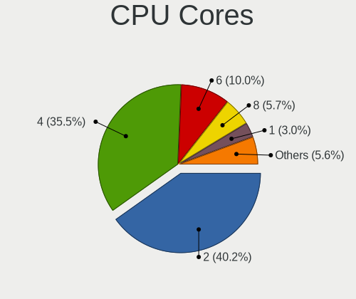

| Number  | Computers | Percent |
|---------|-----------|---------|
| 2       | 238       | 46.67%  |
| 4       | 184       | 36.08%  |
| 6       | 41        | 8.04%   |
| 1       | 24        | 4.71%   |
| 8       | 11        | 2.16%   |
| 3       | 7         | 1.37%   |
| 12      | 2         | 0.39%   |
| 32      | 1         | 0.2%    |
| 16      | 1         | 0.2%    |
| Unknown | 1         | 0.2%    |

CPU Sockets
-----------

Number of sockets

| Number | Computers | Percent |
|--------|-----------|---------|
| 1      | 508       | 99.61%  |
| 2      | 2         | 0.39%   |

CPU Threads
-----------

Threads per core (Hyper-Threading)

| Number  | Computers | Percent |
|---------|-----------|---------|
| 2       | 272       | 53.33%  |
| 1       | 237       | 46.47%  |
| Unknown | 1         | 0.2%    |

CPU Op-Modes
------------

CPU Operation Modes (32-bit, 64-bit)

| Op mode        | Computers | Percent |
|----------------|-----------|---------|
| 32-bit, 64-bit | 488       | 95.5%   |
| Unknown        | 15        | 2.94%   |
| 32-bit         | 8         | 1.57%   |

CPU Microcode
-------------

Microcode number

| Number     | Computers | Percent |
|------------|-----------|---------|
| Unknown    | 85        | 16.13%  |
| 0x206a7    | 38        | 7.21%   |
| 0x306a9    | 28        | 5.31%   |
| 0x1067a    | 22        | 4.17%   |
| 0x306c3    | 20        | 3.8%    |
| 0x806ea    | 15        | 2.85%   |
| 0x906ea    | 14        | 2.66%   |
| 0x6fd      | 13        | 2.47%   |
| 0x406e3    | 13        | 2.47%   |
| 0x506c9    | 12        | 2.28%   |
| 0x506e3    | 11        | 2.09%   |
| 0x906e9    | 10        | 1.9%    |
| 0x0800820d | 10        | 1.9%    |
| 0x06001119 | 10        | 1.9%    |
| 0x10676    | 9         | 1.71%   |
| 0x010000c8 | 9         | 1.71%   |
| 0x806ec    | 8         | 1.52%   |
| 0x806e9    | 8         | 1.52%   |
| 0x306d4    | 8         | 1.52%   |
| 0x08108109 | 8         | 1.52%   |
| 0x706e5    | 7         | 1.33%   |
| 0x406c4    | 7         | 1.33%   |
| 0x40651    | 7         | 1.33%   |
| 0x08108102 | 7         | 1.33%   |
| 0x08101016 | 7         | 1.33%   |
| 0x30678    | 6         | 1.14%   |
| 0x806c1    | 5         | 0.95%   |
| 0x106e5    | 5         | 0.95%   |
| 0x906eb    | 4         | 0.76%   |
| 0x806eb    | 4         | 0.76%   |
| 0x6fb      | 4         | 0.76%   |
| 0x6d8      | 4         | 0.76%   |
| 0x20655    | 4         | 0.76%   |
| 0x08701021 | 4         | 0.76%   |
| 0x08701013 | 4         | 0.76%   |
| 0x010000db | 4         | 0.76%   |
| 0x706a8    | 3         | 0.57%   |
| 0x706a1    | 3         | 0.57%   |
| 0x406c3    | 3         | 0.57%   |
| 0x30673    | 3         | 0.57%   |
| 0x106ca    | 3         | 0.57%   |
| 0x08600104 | 3         | 0.57%   |
| 0x0810100b | 3         | 0.57%   |
| 0x08001137 | 3         | 0.57%   |
| 0x0700010f | 3         | 0.57%   |
| 0x06003106 | 3         | 0.57%   |
| 0x06000852 | 3         | 0.57%   |
| 0xa0652    | 2         | 0.38%   |
| 0x906ed    | 2         | 0.38%   |
| 0x906c0    | 2         | 0.38%   |
| 0x6f6      | 2         | 0.38%   |
| 0x6e8      | 2         | 0.38%   |
| 0x206c2    | 2         | 0.38%   |
| 0x20652    | 2         | 0.38%   |
| 0x106a4    | 2         | 0.38%   |
| 0x0a201016 | 2         | 0.38%   |
| 0x08608103 | 2         | 0.38%   |
| 0x08001138 | 2         | 0.38%   |
| 0x07030104 | 2         | 0.38%   |
| 0x0700010b | 2         | 0.38%   |

CPU Microarch
-------------

Microarchitecture

| Name            | Computers | Percent |
|-----------------|-----------|---------|
| KabyLake        | 69        | 13.53%  |
| SandyBridge     | 45        | 8.82%   |
| Penryn          | 34        | 6.67%   |
| Haswell         | 34        | 6.67%   |
| K10             | 32        | 6.27%   |
| IvyBridge       | 32        | 6.27%   |
| Zen+            | 29        | 5.69%   |
| Skylake         | 26        | 5.1%    |
| Core            | 25        | 4.9%    |
| Silvermont      | 20        | 3.92%   |
| Piledriver      | 20        | 3.92%   |
| Zen             | 19        | 3.73%   |
| Zen 2           | 13        | 2.55%   |
| Goldmont        | 13        | 2.55%   |
| Westmere        | 12        | 2.35%   |
| Broadwell       | 9         | 1.76%   |
| Nehalem         | 8         | 1.57%   |
| K8 Hammer       | 8         | 1.57%   |
| Icelake         | 8         | 1.57%   |
| P6              | 7         | 1.37%   |
| Goldmont plus   | 6         | 1.18%   |
| TigerLake       | 5         | 0.98%   |
| Jaguar          | 5         | 0.98%   |
| Bonnell         | 4         | 0.78%   |
| Unknown         | 4         | 0.78%   |
| Zen 3           | 3         | 0.59%   |
| Steamroller     | 3         | 0.59%   |
| Puma            | 3         | 0.59%   |
| Excavator       | 3         | 0.59%   |
| CometLake       | 3         | 0.59%   |
| Tremont         | 2         | 0.39%   |
| K8 & K10 hybrid | 2         | 0.39%   |
| K10 Llano       | 2         | 0.39%   |
| NetBurst        | 1         | 0.2%    |
| Bulldozer       | 1         | 0.2%    |

Graphics
--------

GPU Vendor
----------

Vendors of graphics cards

| Vendor                     | Computers | Percent |
|----------------------------|-----------|---------|
| Intel                      | 265       | 44.02%  |
| AMD                        | 183       | 30.4%   |
| Nvidia                     | 151       | 25.08%  |
| VIA Technologies           | 1         | 0.17%   |
| Matrox Electronics Systems | 1         | 0.17%   |
| ASPEED Technology          | 1         | 0.17%   |

GPU Model
---------

Graphics card models

| Model                                                                                    | Computers | Percent |
|------------------------------------------------------------------------------------------|-----------|---------|
| Intel 2nd Generation Core Processor Family Integrated Graphics Controller                | 31        | 4.97%   |
| AMD Picasso/Raven 2 [Radeon Vega Series / Radeon Vega Mobile Series]                     | 17        | 2.72%   |
| AMD Ellesmere [Radeon RX 470/480/570/570X/580/580X/590]                                  | 17        | 2.72%   |
| Intel 3rd Gen Core processor Graphics Controller                                         | 14        | 2.24%   |
| Intel Skylake GT2 [HD Graphics 520]                                                      | 13        | 2.08%   |
| Intel CoffeeLake-H GT2 [UHD Graphics 630]                                                | 12        | 1.92%   |
| Nvidia GP107M [GeForce GTX 1050 Mobile]                                                  | 11        | 1.76%   |
| Intel UHD Graphics 620                                                                   | 11        | 1.76%   |
| Intel Atom/Celeron/Pentium Processor x5-E8000/J3xxx/N3xxx Integrated Graphics Controller | 11        | 1.76%   |
| Intel Xeon E3-1200 v2/3rd Gen Core processor Graphics Controller                         | 9         | 1.44%   |
| Intel WhiskeyLake-U GT2 [UHD Graphics 620]                                               | 9         | 1.44%   |
| Intel HD Graphics 620                                                                    | 9         | 1.44%   |
| Intel HD Graphics 530                                                                    | 9         | 1.44%   |
| Intel Haswell-ULT Integrated Graphics Controller                                         | 9         | 1.44%   |
| Intel HD Graphics 500                                                                    | 8         | 1.28%   |
| Intel Atom Processor Z36xxx/Z37xxx Series Graphics & Display                             | 8         | 1.28%   |
| AMD Turks PRO [Radeon HD 6570/7570/8550 / R5 230]                                        | 8         | 1.28%   |
| AMD Topaz XT [Radeon R7 M260/M265 / M340/M360 / M440/M445 / 530/535 / 620/625 Mobile]    | 8         | 1.28%   |
| AMD Raven Ridge [Radeon Vega Series / Radeon Vega Mobile Series]                         | 8         | 1.28%   |
| Intel Iris Plus Graphics G1 (Ice Lake)                                                   | 7         | 1.12%   |
| Intel HD Graphics 630                                                                    | 7         | 1.12%   |
| Intel HD Graphics 5500                                                                   | 7         | 1.12%   |
| Intel Core Processor Integrated Graphics Controller                                      | 7         | 1.12%   |
| Intel 4th Generation Core Processor Family Integrated Graphics Controller                | 7         | 1.12%   |
| Intel 4th Gen Core Processor Integrated Graphics Controller                              | 7         | 1.12%   |
| Intel Mobile 4 Series Chipset Integrated Graphics Controller                             | 6         | 0.96%   |
| AMD Renoir                                                                               | 6         | 0.96%   |
| AMD Lexa PRO [Radeon 540/540X/550/550X / RX 540X/550/550X]                               | 6         | 0.96%   |
| Nvidia GK208B [GeForce GT 730]                                                           | 5         | 0.8%    |
| Intel TigerLake-LP GT2 [Iris Xe Graphics]                                                | 5         | 0.8%    |
| Intel Celeron N3350/Pentium N4200/Atom E3900 Series Integrated Graphics Controller       | 5         | 0.8%    |
| AMD Sun XT [Radeon HD 8670A/8670M/8690M / R5 M330 / M430 / Radeon 520 Mobile]            | 5         | 0.8%    |
| AMD RS880M [Mobility Radeon HD 4225/4250]                                                | 5         | 0.8%    |
| AMD Cedar [Radeon HD 5000/6000/7350/8350 Series]                                         | 5         | 0.8%    |
| Nvidia GT218 [GeForce 210]                                                               | 4         | 0.64%   |
| Nvidia GP108M [GeForce MX150]                                                            | 4         | 0.64%   |
| Nvidia GP107 [GeForce GTX 1050]                                                          | 4         | 0.64%   |
| Intel Xeon E3-1200 v3/4th Gen Core Processor Integrated Graphics Controller              | 4         | 0.64%   |
| Intel GeminiLake [UHD Graphics 600]                                                      | 4         | 0.64%   |
| AMD RV710 [Radeon HD 4350/4550]                                                          | 4         | 0.64%   |
| AMD Oland XT [Radeon HD 8670 / R5 340X OEM / R7 250/350/350X OEM]                        | 4         | 0.64%   |
| AMD Lucienne                                                                             | 4         | 0.64%   |
| AMD Caicos [Radeon HD 6450/7450/8450 / R5 230 OEM]                                       | 4         | 0.64%   |
| AMD Baffin [Radeon RX 550 640SP / RX 560/560X]                                           | 4         | 0.64%   |
| Nvidia TU117M [GeForce GTX 1650 Mobile / Max-Q]                                          | 3         | 0.48%   |
| Nvidia GP108 [GeForce GT 1030]                                                           | 3         | 0.48%   |
| Nvidia GP107M [GeForce GTX 1050 Ti Mobile]                                               | 3         | 0.48%   |
| Nvidia GP107 [GeForce GTX 1050 Ti]                                                       | 3         | 0.48%   |
| Nvidia GP106 [GeForce GTX 1060 6GB]                                                      | 3         | 0.48%   |
| Nvidia GF117M [GeForce 610M/710M/810M/820M / GT 620M/625M/630M/720M]                     | 3         | 0.48%   |
| Nvidia GF108 [GeForce GT 630]                                                            | 3         | 0.48%   |
| Nvidia G96C [GeForce 9500 GT]                                                            | 3         | 0.48%   |
| Intel Mobile 945GM/GMS/GME, 943/940GML Express Integrated Graphics Controller            | 3         | 0.48%   |
| Intel Mobile 945GM/GMS, 943/940GML Express Integrated Graphics Controller                | 3         | 0.48%   |
| Intel CometLake-U GT2 [UHD Graphics]                                                     | 3         | 0.48%   |
| Intel CometLake-H GT2 [UHD Graphics]                                                     | 3         | 0.48%   |
| Intel CoffeeLake-S GT2 [UHD Graphics 630]                                                | 3         | 0.48%   |
| Intel Atom Processor D4xx/D5xx/N4xx/N5xx Integrated Graphics Controller                  | 3         | 0.48%   |
| Intel 82Q35 Express Integrated Graphics Controller                                       | 3         | 0.48%   |
| Intel 82G33/G31 Express Integrated Graphics Controller                                   | 3         | 0.48%   |

GPU Combo
---------

Combinations of graphics cards

| Name           | Computers | Percent |
|----------------|-----------|---------|
| 1 x Intel      | 181       | 35.35%  |
| 1 x AMD        | 142       | 27.73%  |
| 1 x Nvidia     | 86        | 16.8%   |
| Intel + Nvidia | 58        | 11.33%  |
| Intel + AMD    | 22        | 4.3%    |
| 2 x AMD        | 14        | 2.73%   |
| AMD + Nvidia   | 5         | 0.98%   |
| 2 x Nvidia     | 1         | 0.2%    |
| 1 x VIA        | 1         | 0.2%    |
| 1 x Matrox     | 1         | 0.2%    |
| 1 x ASPEED     | 1         | 0.2%    |

GPU Driver
----------

Free vs proprietary

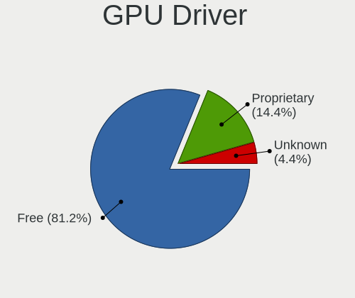

| Driver      | Computers | Percent |
|-------------|-----------|---------|
| Free        | 431       | 83.04%  |
| Proprietary | 69        | 13.29%  |
| Unknown     | 19        | 3.66%   |

GPU Memory
----------

Total video memory

| Size in GB | Computers | Percent |
|------------|-----------|---------|
| Unknown    | 230       | 43.56%  |
| 1.01-2.0   | 99        | 18.75%  |
| 0.01-0.5   | 78        | 14.77%  |
| 0.51-1.0   | 54        | 10.23%  |
| 3.01-4.0   | 50        | 9.47%   |
| 7.01-8.0   | 9         | 1.7%    |
| 5.01-6.0   | 5         | 0.95%   |
| 2.01-3.0   | 2         | 0.38%   |
| 8.01-16.0  | 1         | 0.19%   |

Monitor
-------

Monitor Vendor
--------------

Monitor vendors

| Vendor                  | Computers | Percent |
|-------------------------|-----------|---------|
| Samsung Electronics     | 81        | 15.11%  |
| AU Optronics            | 63        | 11.75%  |
| BOE                     | 46        | 8.58%   |
| LG Display              | 45        | 8.4%    |
| Chimei Innolux          | 42        | 7.84%   |
| Goldstar                | 39        | 7.28%   |
| Dell                    | 31        | 5.78%   |
| Philips                 | 27        | 5.04%   |
| Hewlett-Packard         | 19        | 3.54%   |
| BenQ                    | 16        | 2.99%   |
| Lenovo                  | 14        | 2.61%   |
| Ancor Communications    | 13        | 2.43%   |
| ViewSonic               | 10        | 1.87%   |
| Acer                    | 10        | 1.87%   |
| Chi Mei Optoelectronics | 8         | 1.49%   |
| PANDA                   | 6         | 1.12%   |
| LG Philips              | 6         | 1.12%   |
| AOC                     | 6         | 1.12%   |
| Sony                    | 4         | 0.75%   |
| Sharp                   | 4         | 0.75%   |
| LG Electronics          | 4         | 0.75%   |
| CPT                     | 4         | 0.75%   |
| Apple                   | 4         | 0.75%   |
| Unknown                 | 3         | 0.56%   |
| OEM                     | 3         | 0.56%   |
| InfoVision              | 3         | 0.56%   |
| Belinea                 | 3         | 0.56%   |
| Toshiba                 | 2         | 0.37%   |
| LED                     | 2         | 0.37%   |
| HIC                     | 2         | 0.37%   |
| ASUSTek Computer        | 2         | 0.37%   |
| Vestel Elektronik       | 1         | 0.19%   |
| SKY                     | 1         | 0.19%   |
| Seiko/Epson             | 1         | 0.19%   |
| Panasonic               | 1         | 0.19%   |
| Medion                  | 1         | 0.19%   |
| LPL                     | 1         | 0.19%   |
| KTC                     | 1         | 0.19%   |
| InnoLux Display         | 1         | 0.19%   |
| HannStar                | 1         | 0.19%   |
| Hannspree               | 1         | 0.19%   |
| GDH                     | 1         | 0.19%   |
| Fujitsu Siemens         | 1         | 0.19%   |
| Arnos Instruments       | 1         | 0.19%   |
| Unknown                 | 1         | 0.19%   |

Monitor Model
-------------

Monitor models

| Model                                                                    | Computers | Percent |
|--------------------------------------------------------------------------|-----------|---------|
| AU Optronics LCD Monitor AUO38ED 1920x1080 344x193mm 15.5-inch           | 14        | 2.55%   |
| Chimei Innolux LCD Monitor CMN15DB 1366x768 344x193mm 15.5-inch          | 7         | 1.27%   |
| AU Optronics LCD Monitor AUO22EC 1366x768 344x193mm 15.5-inch            | 7         | 1.27%   |
| Chimei Innolux LCD Monitor CMN15D5 1920x1080 344x193mm 15.5-inch         | 6         | 1.09%   |
| BOE LCD Monitor BOE06A4 1366x768 344x194mm 15.5-inch                     | 5         | 0.91%   |
| Philips PHL 226E9Q PHLC17D 1920x1080 477x268mm 21.5-inch                 | 4         | 0.73%   |
| LG Display LCD Monitor LGD02DC 1366x768 344x194mm 15.5-inch              | 4         | 0.73%   |
| Goldstar W2240 GSM57A0 1920x1080 477x268mm 21.5-inch                     | 4         | 0.73%   |
| BOE LCD Monitor BOE069C 1920x1080 344x193mm 15.5-inch                    | 4         | 0.73%   |
| BOE LCD Monitor BOE0687 1920x1080 344x193mm 15.5-inch                    | 4         | 0.73%   |
| AU Optronics LCD Monitor AUO61ED 1920x1080 344x194mm 15.5-inch           | 4         | 0.73%   |
| Samsung Electronics C24F390 SAM0D2C 1920x1080 521x293mm 23.5-inch        | 3         | 0.55%   |
| Philips PHL 243V5 PHLC0D1 1920x1080 521x293mm 23.5-inch                  | 3         | 0.55%   |
| Philips PHL 223V5 PHLC0CF 1920x1080 477x268mm 21.5-inch                  | 3         | 0.55%   |
| LG Display LP156WH2-TLAA LGD0230 1366x768 344x194mm 15.5-inch            | 3         | 0.55%   |
| Lenovo L24i-10 LEN65D6 1920x1080 527x296mm 23.8-inch                     | 3         | 0.55%   |
| Goldstar W2243 GSM56FE 1920x1080 480x270mm 21.7-inch                     | 3         | 0.55%   |
| Goldstar FULL HD GSM5B55 1920x1080 480x270mm 21.7-inch                   | 3         | 0.55%   |
| Dell S2421HN DEL41F1 1920x1080 527x296mm 23.8-inch                       | 3         | 0.55%   |
| Chimei Innolux LCD Monitor CMN14D4 1920x1080 309x173mm 13.9-inch         | 3         | 0.55%   |
| Chimei Innolux LCD Monitor CMN140A 1920x1080 309x173mm 13.9-inch         | 3         | 0.55%   |
| BOE LCD Monitor BOE07A3 1920x1080 344x193mm 15.5-inch                    | 3         | 0.55%   |
| BOE LCD Monitor BOE0675 1366x768 344x194mm 15.5-inch                     | 3         | 0.55%   |
| AU Optronics LCD Monitor AUO20EC 1366x768 344x193mm 15.5-inch            | 3         | 0.55%   |
| Toshiba TV TSB0108 1920x540                                              | 2         | 0.36%   |
| Samsung Electronics SyncMaster SAM0564 1360x768 410x230mm 18.5-inch      | 2         | 0.36%   |
| Samsung Electronics SyncMaster SAM01B7 1280x1024 338x270mm 17.0-inch     | 2         | 0.36%   |
| Samsung Electronics SMBX2440 SAM068B 1920x1080 531x299mm 24.0-inch       | 2         | 0.36%   |
| Samsung Electronics S24F350 SAM0D20 1920x1080 520x290mm 23.4-inch        | 2         | 0.36%   |
| Samsung Electronics S24D390 SAM0B65 1920x1080 521x293mm 23.5-inch        | 2         | 0.36%   |
| Samsung Electronics S23C350 SAM0A36 1920x1080 510x287mm 23.0-inch        | 2         | 0.36%   |
| Samsung Electronics S23C350 SAM0A35 1920x1080 510x287mm 23.0-inch        | 2         | 0.36%   |
| Samsung Electronics S22B300 SAM08AA 1920x1080 477x268mm 21.5-inch        | 2         | 0.36%   |
| Samsung Electronics LCD Monitor SEC3046 1366x768 344x193mm 15.5-inch     | 2         | 0.36%   |
| Samsung Electronics LCD Monitor SDC4347 1366x768 344x193mm 15.5-inch     | 2         | 0.36%   |
| Samsung Electronics LCD Monitor SDC324C 1920x1080 344x194mm 15.5-inch    | 2         | 0.36%   |
| Philips 226V4 PHLC0B1 1920x1080 477x268mm 21.5-inch                      | 2         | 0.36%   |
| PANDA LCD Monitor NCP006E 1920x1080 344x194mm 15.5-inch                  | 2         | 0.36%   |
| OEM 32W_LCD_TV OEM3700 1920x540                                          | 2         | 0.36%   |
| LG Display LCD Monitor LGD05EC 1920x1080 309x174mm 14.0-inch             | 2         | 0.36%   |
| LG Display LCD Monitor LGD05E5 1920x1080 344x194mm 15.5-inch             | 2         | 0.36%   |
| LG Display LCD Monitor LGD0519 1920x1080 344x194mm 15.5-inch             | 2         | 0.36%   |
| LG Display LCD Monitor LGD0456 1366x768 344x194mm 15.5-inch              | 2         | 0.36%   |
| LG Display LCD Monitor LGD038E 1366x768 344x194mm 15.5-inch              | 2         | 0.36%   |
| LG Display LCD Monitor LGD033A 1366x768 344x194mm 15.5-inch              | 2         | 0.36%   |
| Lenovo L24q-10 LEN65CF 2560x1440 527x296mm 23.8-inch                     | 2         | 0.36%   |
| LED Crystal View LED0001 1920x1080 408x255mm 18.9-inch                   | 2         | 0.36%   |
| HIC LCD Monitor HIC0001 1920x1080 256x192mm 12.6-inch                    | 2         | 0.36%   |
| Goldstar W2252 GSM567E 1680x1050 474x296mm 22.0-inch                     | 2         | 0.36%   |
| Goldstar IPS FULLHD GSM5AB6 1920x1080 480x270mm 21.7-inch                | 2         | 0.36%   |
| Goldstar 24MP55 GSM5A20 1920x1080 510x290mm 23.1-inch                    | 2         | 0.36%   |
| Dell U2412M DELA079 1920x1200 518x324mm 24.1-inch                        | 2         | 0.36%   |
| Dell P2417H DELA0DC 1920x1080 527x296mm 23.8-inch                        | 2         | 0.36%   |
| Dell 1908FP DEL4026 1280x1024 376x301mm 19.0-inch                        | 2         | 0.36%   |
| CPT LCD Monitor CPT14BF 1366x768 344x193mm 15.5-inch                     | 2         | 0.36%   |
| Chimei Innolux LCD Monitor CMN1738 1920x1080 381x214mm 17.2-inch         | 2         | 0.36%   |
| Chimei Innolux LCD Monitor CMN15F5 1920x1080 344x193mm 15.5-inch         | 2         | 0.36%   |
| Chimei Innolux LCD Monitor CMN15DC 1366x768 344x193mm 15.5-inch          | 2         | 0.36%   |
| Chimei Innolux LCD Monitor CMN15BF 1366x768 344x194mm 15.5-inch          | 2         | 0.36%   |
| Chi Mei Optoelectronics LCD Monitor CMO15A7 1366x768 344x193mm 15.5-inch | 2         | 0.36%   |

Monitor Resolution
------------------

Monitor screen resolution

| Resolution         | Computers | Percent |
|--------------------|-----------|---------|
| 1920x1080 (FHD)    | 253       | 49.41%  |
| 1366x768 (WXGA)    | 116       | 22.66%  |
| 1280x1024 (SXGA)   | 34        | 6.64%   |
| 1680x1050 (WSXGA+) | 19        | 3.71%   |
| 1440x900 (WXGA+)   | 13        | 2.54%   |
| 3840x2160 (4K)     | 12        | 2.34%   |
| 1280x800 (WXGA)    | 12        | 2.34%   |
| 2560x1440 (QHD)    | 9         | 1.76%   |
| 1600x900 (HD+)     | 8         | 1.56%   |
| 1360x768           | 8         | 1.56%   |
| 1920x540           | 5         | 0.98%   |
| 1920x1200 (WUXGA)  | 5         | 0.98%   |
| Unknown            | 4         | 0.78%   |
| 3840x1080          | 2         | 0.39%   |
| 2560x1080          | 2         | 0.39%   |
| 1600x1200          | 2         | 0.39%   |
| 1024x768 (XGA)     | 2         | 0.39%   |
| 1024x600           | 2         | 0.39%   |
| 3280x1080          | 1         | 0.2%    |
| 1834x1031          | 1         | 0.2%    |
| 1680x945           | 1         | 0.2%    |
| 1400x1050          | 1         | 0.2%    |

Monitor Diagonal
----------------

Diagonal size in inches

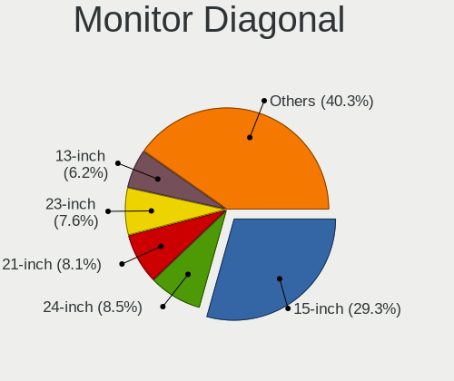

| Inches  | Computers | Percent |
|---------|-----------|---------|
| 15      | 186       | 34.77%  |
| 21      | 50        | 9.35%   |
| 23      | 49        | 9.16%   |
| 24      | 39        | 7.29%   |
| 17      | 34        | 6.36%   |
| 13      | 29        | 5.42%   |
| Unknown | 27        | 5.05%   |
| 19      | 21        | 3.93%   |
| 27      | 20        | 3.74%   |
| 14      | 17        | 3.18%   |
| 18      | 15        | 2.8%    |
| 22      | 11        | 2.06%   |
| 72      | 6         | 1.12%   |
| 20      | 5         | 0.93%   |
| 12      | 5         | 0.93%   |
| 11      | 5         | 0.93%   |
| 84      | 2         | 0.37%   |
| 40      | 2         | 0.37%   |
| 34      | 2         | 0.37%   |
| 32      | 2         | 0.37%   |
| 31      | 2         | 0.37%   |
| 10      | 2         | 0.37%   |
| 65      | 1         | 0.19%   |
| 46      | 1         | 0.19%   |
| 26      | 1         | 0.19%   |
| 25      | 1         | 0.19%   |

Monitor Width
-------------

Physical width

| Width in mm | Computers | Percent |
|-------------|-----------|---------|
| 301-350     | 238       | 45.33%  |
| 501-600     | 103       | 19.62%  |
| 401-500     | 85        | 16.19%  |
| 351-400     | 32        | 6.1%    |
| Unknown     | 27        | 5.14%   |
| 201-300     | 21        | 4%      |
| 1501-2000   | 8         | 1.52%   |
| 701-800     | 4         | 0.76%   |
| 601-700     | 3         | 0.57%   |
| 801-900     | 2         | 0.38%   |
| 1001-1500   | 2         | 0.38%   |

Aspect Ratio
------------

Proportional relationship between the width and the height

| Ratio   | Computers | Percent |
|---------|-----------|---------|
| 16/9    | 375       | 77%     |
| 16/10   | 43        | 8.83%   |
| 5/4     | 30        | 6.16%   |
| Unknown | 22        | 4.52%   |
| 4/3     | 8         | 1.64%   |
| 3/2     | 5         | 1.03%   |
| 21/9    | 2         | 0.41%   |
| 6/5     | 1         | 0.21%   |
| 32/9    | 1         | 0.21%   |

Monitor Area
------------

Area in inch

| Area in inch | Computers | Percent |
|----------------|-----------|---------|
| 101-110        | 185       | 34.91%  |
| 201-250        | 126       | 23.77%  |
| 81-90          | 39        | 7.36%   |
| 151-200        | 39        | 7.36%   |
| 141-150        | 31        | 5.85%   |
| Unknown        | 27        | 5.09%   |
| 301-350        | 21        | 3.96%   |
| 121-130        | 14        | 2.64%   |
| 71-80          | 10        | 1.89%   |
| More than 1000 | 9         | 1.7%    |
| 251-300        | 9         | 1.7%    |
| 351-500        | 6         | 1.13%   |
| 51-60          | 5         | 0.94%   |
| 501-1000       | 3         | 0.57%   |
| 61-70          | 2         | 0.38%   |
| 41-50          | 2         | 0.38%   |
| 131-140        | 1         | 0.19%   |
| 111-120        | 1         | 0.19%   |

Pixel Density
-------------

Pixels per inch

| Density       | Computers | Percent |
|---------------|-----------|---------|
| 51-100        | 186       | 36.12%  |
| 101-120       | 157       | 30.49%  |
| 121-160       | 126       | 24.47%  |
| Unknown       | 27        | 5.24%   |
| 161-240       | 11        | 2.14%   |
| 1-50          | 7         | 1.36%   |
| More than 240 | 1         | 0.19%   |

Multiple Monitors
-----------------

Total monitors connected

| Total | Computers | Percent |
|-------|-----------|---------|
| 1     | 430       | 82.53%  |
| 2     | 66        | 12.67%  |
| 0     | 19        | 3.65%   |
| 3     | 6         | 1.15%   |

Network
-------

Net Controller Vendor
---------------------

Controller vendors

| Vendor                            | Computers | Percent |
|-----------------------------------|-----------|---------|
| Realtek Semiconductor             | 325       | 43.22%  |
| Intel                             | 171       | 22.74%  |
| Qualcomm Atheros                  | 117       | 15.56%  |
| Broadcom                          | 36        | 4.79%   |
| Nvidia                            | 16        | 2.13%   |
| Ralink Technology                 | 11        | 1.46%   |
| Ralink                            | 10        | 1.33%   |
| Qualcomm Atheros Communications   | 10        | 1.33%   |
| TP-Link                           | 9         | 1.2%    |
| Broadcom Limited                  | 7         | 0.93%   |
| Marvell Technology Group          | 5         | 0.66%   |
| Dell                              | 4         | 0.53%   |
| Huawei Technologies               | 3         | 0.4%    |
| ZTE WCDMA Technologies MSM        | 2         | 0.27%   |
| VIA Technologies                  | 2         | 0.27%   |
| Sierra Wireless                   | 2         | 0.27%   |
| MEDIATEK                          | 2         | 0.27%   |
| Ericsson Business Mobile Networks | 2         | 0.27%   |
| Edimax Technology                 | 2         | 0.27%   |
| D-Link                            | 2         | 0.27%   |
| ZyXEL Communications              | 1         | 0.13%   |
| Xiaomi                            | 1         | 0.13%   |
| Texas Instruments                 | 1         | 0.13%   |
| Sundance Technology Inc / IC Plus | 1         | 0.13%   |
| Sigma Designs                     | 1         | 0.13%   |
| LSI                               | 1         | 0.13%   |
| Linksys                           | 1         | 0.13%   |
| JMicron Technology                | 1         | 0.13%   |
| IMC Networks                      | 1         | 0.13%   |
| D-Link System                     | 1         | 0.13%   |
| ASUSTek Computer                  | 1         | 0.13%   |
| ASIX Electronics                  | 1         | 0.13%   |
| Apple                             | 1         | 0.13%   |
| ADMtek                            | 1         | 0.13%   |

Net Controller Model
--------------------

Controller models

| Model                                                                   | Computers | Percent |
|-------------------------------------------------------------------------|-----------|---------|
| Realtek RTL8111/8168/8411 PCI Express Gigabit Ethernet Controller       | 233       | 27.19%  |
| Realtek RTL810xE PCI Express Fast Ethernet controller                   | 60        | 7%      |
| Qualcomm Atheros QCA9377 802.11ac Wireless Network Adapter              | 25        | 2.92%   |
| Realtek RTL8821CE 802.11ac PCIe Wireless Network Adapter                | 17        | 1.98%   |
| Qualcomm Atheros QCA9565 / AR9565 Wireless Network Adapter              | 17        | 1.98%   |
| Intel Wireless 8265 / 8275                                              | 16        | 1.87%   |
| Intel 82579LM Gigabit Network Connection (Lewisville)                   | 13        | 1.52%   |
| Qualcomm Atheros AR9285 Wireless Network Adapter (PCI-Express)          | 10        | 1.17%   |
| Intel Wi-Fi 6 AX200                                                     | 10        | 1.17%   |
| Broadcom BCM43142 802.11b/g/n                                           | 10        | 1.17%   |
| Realtek RTL8723BE PCIe Wireless Network Adapter                         | 9         | 1.05%   |
| Qualcomm Atheros AR9271 802.11n                                         | 9         | 1.05%   |
| Intel Wireless 8260                                                     | 9         | 1.05%   |
| Intel I211 Gigabit Network Connection                                   | 8         | 0.93%   |
| Intel Dual Band Wireless-AC 3165 Plus Bluetooth                         | 8         | 0.93%   |
| Broadcom BCM4313 802.11bgn Wireless Network Adapter                     | 8         | 0.93%   |
| Realtek RTL-8100/8101L/8139 PCI Fast Ethernet Adapter                   | 7         | 0.82%   |
| Qualcomm Atheros AR9485 Wireless Network Adapter                        | 7         | 0.82%   |
| Qualcomm Atheros AR9462 Wireless Network Adapter                        | 7         | 0.82%   |
| Qualcomm Atheros AR8151 v2.0 Gigabit Ethernet                           | 7         | 0.82%   |
| Intel Wireless 3165                                                     | 7         | 0.82%   |
| Intel Ethernet Connection (2) I219-V                                    | 7         | 0.82%   |
| Intel Cannon Lake PCH CNVi WiFi                                         | 7         | 0.82%   |
| Qualcomm Atheros AR9287 Wireless Network Adapter (PCI-Express)          | 6         | 0.7%    |
| Qualcomm Atheros AR8161 Gigabit Ethernet                                | 6         | 0.7%    |
| Intel Wireless 7260                                                     | 6         | 0.7%    |
| Intel Cannon Point-LP CNVi [Wireless-AC]                                | 6         | 0.7%    |
| TP-Link TL-WN722N v2/v3 [Realtek RTL8188EUS]                            | 5         | 0.58%   |
| Realtek RTL8822CE 802.11ac PCIe Wireless Network Adapter                | 5         | 0.58%   |
| Realtek RTL8822BE 802.11a/b/g/n/ac WiFi adapter                         | 5         | 0.58%   |
| Realtek RTL8125 2.5GbE Controller                                       | 5         | 0.58%   |
| Qualcomm Atheros QCA6174 802.11ac Wireless Network Adapter              | 5         | 0.58%   |
| Qualcomm Atheros AR2417 Wireless Network Adapter [AR5007G 802.11bg]     | 5         | 0.58%   |
| Nvidia MCP61 Ethernet                                                   | 5         | 0.58%   |
| Intel Ice Lake-LP PCH CNVi WiFi                                         | 5         | 0.58%   |
| Intel Ethernet Connection I219-LM                                       | 5         | 0.58%   |
| Intel Ethernet Connection (4) I219-LM                                   | 5         | 0.58%   |
| Realtek RTL8821AE 802.11ac PCIe Wireless Network Adapter                | 4         | 0.47%   |
| Ralink MT7601U Wireless Adapter                                         | 4         | 0.47%   |
| Ralink RT3090 Wireless 802.11n 1T/1R PCIe                               | 4         | 0.47%   |
| Qualcomm Atheros QCA8172 Fast Ethernet                                  | 4         | 0.47%   |
| Qualcomm Atheros AR8131 Gigabit Ethernet                                | 4         | 0.47%   |
| Qualcomm Atheros AR242x / AR542x Wireless Network Adapter (PCI-Express) | 4         | 0.47%   |
| Nvidia MCP79 Ethernet                                                   | 4         | 0.47%   |
| Intel PRO/Wireless 3945ABG [Golan] Network Connection                   | 4         | 0.47%   |
| Intel Ethernet Connection I217-V                                        | 4         | 0.47%   |
| Intel Ethernet Connection I217-LM                                       | 4         | 0.47%   |
| Intel Dual Band Wireless-AC 3168NGW [Stone Peak]                        | 4         | 0.47%   |
| Intel 82567LM-3 Gigabit Network Connection                              | 4         | 0.47%   |
| Broadcom NetLink BCM57785 Gigabit Ethernet PCIe                         | 4         | 0.47%   |
| Realtek RTL8188EE Wireless Network Adapter                              | 3         | 0.35%   |
| Realtek RTL8152 Fast Ethernet Adapter                                   | 3         | 0.35%   |
| Realtek RTL-8110SC/8169SC Gigabit Ethernet                              | 3         | 0.35%   |
| Ralink RT2870/RT3070 Wireless Adapter                                   | 3         | 0.35%   |
| Ralink RT3290 Wireless 802.11n 1T/1R PCIe                               | 3         | 0.35%   |
| Qualcomm Atheros AR9227 Wireless Network Adapter                        | 3         | 0.35%   |
| Qualcomm Atheros AR8121/AR8113/AR8114 Gigabit or Fast Ethernet          | 3         | 0.35%   |
| Intel Wireless 3160                                                     | 3         | 0.35%   |
| Intel PRO/100 VE Network Connection                                     | 3         | 0.35%   |
| Intel Ethernet Connection I218-LM                                       | 3         | 0.35%   |

Wireless Vendor
---------------

Wireless vendors

| Vendor                          | Computers | Percent |
|---------------------------------|-----------|---------|
| Intel                           | 119       | 34%     |
| Qualcomm Atheros                | 95        | 27.14%  |
| Realtek Semiconductor           | 56        | 16%     |
| Broadcom                        | 25        | 7.14%   |
| Ralink Technology               | 11        | 3.14%   |
| Ralink                          | 10        | 2.86%   |
| Qualcomm Atheros Communications | 10        | 2.86%   |
| TP-Link                         | 9         | 2.57%   |
| Dell                            | 3         | 0.86%   |
| Sierra Wireless                 | 2         | 0.57%   |
| Edimax Technology               | 2         | 0.57%   |
| D-Link                          | 2         | 0.57%   |
| ZyXEL Communications            | 1         | 0.29%   |
| MEDIATEK                        | 1         | 0.29%   |
| Linksys                         | 1         | 0.29%   |
| IMC Networks                    | 1         | 0.29%   |
| Broadcom Limited                | 1         | 0.29%   |
| ASUSTek Computer                | 1         | 0.29%   |

Wireless Model
--------------

Wireless models

| Model                                                                   | Computers | Percent |
|-------------------------------------------------------------------------|-----------|---------|
| Qualcomm Atheros QCA9377 802.11ac Wireless Network Adapter              | 25        | 7.12%   |
| Realtek RTL8821CE 802.11ac PCIe Wireless Network Adapter                | 17        | 4.84%   |
| Qualcomm Atheros QCA9565 / AR9565 Wireless Network Adapter              | 17        | 4.84%   |
| Intel Wireless 8265 / 8275                                              | 16        | 4.56%   |
| Qualcomm Atheros AR9285 Wireless Network Adapter (PCI-Express)          | 10        | 2.85%   |
| Intel Wi-Fi 6 AX200                                                     | 10        | 2.85%   |
| Broadcom BCM43142 802.11b/g/n                                           | 10        | 2.85%   |
| Realtek RTL8723BE PCIe Wireless Network Adapter                         | 9         | 2.56%   |
| Qualcomm Atheros AR9271 802.11n                                         | 9         | 2.56%   |
| Intel Wireless 8260                                                     | 9         | 2.56%   |
| Intel Dual Band Wireless-AC 3165 Plus Bluetooth                         | 8         | 2.28%   |
| Broadcom BCM4313 802.11bgn Wireless Network Adapter                     | 8         | 2.28%   |
| Qualcomm Atheros AR9485 Wireless Network Adapter                        | 7         | 1.99%   |
| Qualcomm Atheros AR9462 Wireless Network Adapter                        | 7         | 1.99%   |
| Intel Wireless 3165                                                     | 7         | 1.99%   |
| Intel Cannon Lake PCH CNVi WiFi                                         | 7         | 1.99%   |
| Qualcomm Atheros AR9287 Wireless Network Adapter (PCI-Express)          | 6         | 1.71%   |
| Intel Wireless 7260                                                     | 6         | 1.71%   |
| Intel Cannon Point-LP CNVi [Wireless-AC]                                | 6         | 1.71%   |
| TP-Link TL-WN722N v2/v3 [Realtek RTL8188EUS]                            | 5         | 1.42%   |
| Realtek RTL8822CE 802.11ac PCIe Wireless Network Adapter                | 5         | 1.42%   |
| Realtek RTL8822BE 802.11a/b/g/n/ac WiFi adapter                         | 5         | 1.42%   |
| Qualcomm Atheros QCA6174 802.11ac Wireless Network Adapter              | 5         | 1.42%   |
| Qualcomm Atheros AR2417 Wireless Network Adapter [AR5007G 802.11bg]     | 5         | 1.42%   |
| Intel Ice Lake-LP PCH CNVi WiFi                                         | 5         | 1.42%   |
| Realtek RTL8821AE 802.11ac PCIe Wireless Network Adapter                | 4         | 1.14%   |
| Ralink MT7601U Wireless Adapter                                         | 4         | 1.14%   |
| Ralink RT3090 Wireless 802.11n 1T/1R PCIe                               | 4         | 1.14%   |
| Qualcomm Atheros AR242x / AR542x Wireless Network Adapter (PCI-Express) | 4         | 1.14%   |
| Intel PRO/Wireless 3945ABG [Golan] Network Connection                   | 4         | 1.14%   |
| Intel Dual Band Wireless-AC 3168NGW [Stone Peak]                        | 4         | 1.14%   |
| Realtek RTL8188EE Wireless Network Adapter                              | 3         | 0.85%   |
| Ralink RT2870/RT3070 Wireless Adapter                                   | 3         | 0.85%   |
| Ralink RT3290 Wireless 802.11n 1T/1R PCIe                               | 3         | 0.85%   |
| Qualcomm Atheros AR9227 Wireless Network Adapter                        | 3         | 0.85%   |
| Intel Wireless 3160                                                     | 3         | 0.85%   |
| Intel Centrino Ultimate-N 6300                                          | 3         | 0.85%   |
| Intel Centrino Advanced-N 6205 [Taylor Peak]                            | 3         | 0.85%   |
| Dell DW5811e Snapdragon X7 LTE                                    | 3         | 0.85%   |
| TP-Link AC600 wireless Realtek RTL8811AU [Archer T2U Nano]              | 2         | 0.57%   |
| TP-Link 802.11ac WLAN Adapter                                           | 2         | 0.57%   |
| Realtek RTL8723DE Wireless Network Adapter                              | 2         | 0.57%   |
| Realtek RTL8723AE PCIe Wireless Network Adapter                         | 2         | 0.57%   |
| Realtek RTL8192EU 802.11b/g/n WLAN Adapter                              | 2         | 0.57%   |
| Realtek RTL8188EUS 802.11n Wireless Network Adapter                     | 2         | 0.57%   |
| Realtek RTL8188CUS 802.11n WLAN Adapter                                 | 2         | 0.57%   |
| Realtek RTL8187B Wireless 802.11g 54Mbps Network Adapter                | 2         | 0.57%   |
| Ralink RT2070 Wireless Adapter                                          | 2         | 0.57%   |
| Qualcomm Atheros AR928X Wireless Network Adapter (PCI-Express)          | 2         | 0.57%   |
| Intel Wireless 7265                                                     | 2         | 0.57%   |
| Intel WiFi Link 5100                                                    | 2         | 0.57%   |
| Intel PRO/Wireless 5100 AGN [Shiloh] Network Connection                 | 2         | 0.57%   |
| Intel PRO/Wireless 4965 AG or AGN [Kedron] Network Connection           | 2         | 0.57%   |
| Intel PRO/Wireless 2200BG [Calexico2] Network Connection                | 2         | 0.57%   |
| Intel Comet Lake PCH-LP CNVi WiFi                                       | 2         | 0.57%   |
| Intel Comet Lake PCH CNVi WiFi                                          | 2         | 0.57%   |
| Intel Centrino Wireless-N 2230                                          | 2         | 0.57%   |
| Intel Centrino Wireless-N 1030 [Rainbow Peak]                           | 2         | 0.57%   |
| Intel Centrino Wireless-N 1000 [Condor Peak]                            | 2         | 0.57%   |
| Intel Centrino Advanced-N 6200                                          | 2         | 0.57%   |

Ethernet Vendor
---------------

Ethernet vendors

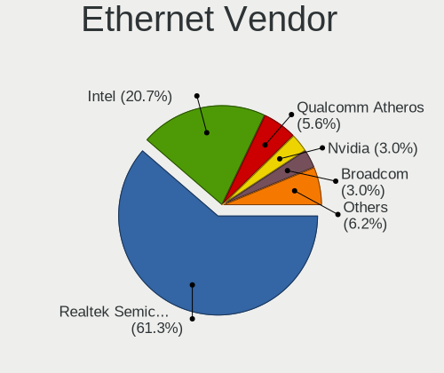

| Vendor                            | Computers | Percent |
|-----------------------------------|-----------|---------|
| Realtek Semiconductor             | 309       | 63.45%  |
| Intel                             | 92        | 18.89%  |
| Qualcomm Atheros                  | 33        | 6.78%   |
| Nvidia                            | 16        | 3.29%   |
| Broadcom                          | 13        | 2.67%   |
| Broadcom Limited                  | 6         | 1.23%   |
| Marvell Technology Group          | 5         | 1.03%   |
| ZTE WCDMA Technologies MSM        | 2         | 0.41%   |
| VIA Technologies                  | 2         | 0.41%   |
| Xiaomi                            | 1         | 0.21%   |
| Sundance Technology Inc / IC Plus | 1         | 0.21%   |
| MediaTek                          | 1         | 0.21%   |
| JMicron Technology                | 1         | 0.21%   |
| Huawei Technologies               | 1         | 0.21%   |
| D-Link System                     | 1         | 0.21%   |
| ASIX Electronics                  | 1         | 0.21%   |
| Apple                             | 1         | 0.21%   |
| ADMtek                            | 1         | 0.21%   |

Ethernet Model
--------------

Ethernet models

| Model                                                                      | Computers | Percent |
|----------------------------------------------------------------------------|-----------|---------|
| Realtek RTL8111/8168/8411 PCI Express Gigabit Ethernet Controller          | 233       | 47.07%  |
| Realtek RTL810xE PCI Express Fast Ethernet controller                      | 60        | 12.12%  |
| Intel 82579LM Gigabit Network Connection (Lewisville)                      | 13        | 2.63%   |
| Intel I211 Gigabit Network Connection                                      | 8         | 1.62%   |
| Realtek RTL-8100/8101L/8139 PCI Fast Ethernet Adapter                      | 7         | 1.41%   |
| Qualcomm Atheros AR8151 v2.0 Gigabit Ethernet                              | 7         | 1.41%   |
| Intel Ethernet Connection (2) I219-V                                       | 7         | 1.41%   |
| Qualcomm Atheros AR8161 Gigabit Ethernet                                   | 6         | 1.21%   |
| Realtek RTL8125 2.5GbE Controller                                          | 5         | 1.01%   |
| Nvidia MCP61 Ethernet                                                      | 5         | 1.01%   |
| Intel Ethernet Connection I219-LM                                          | 5         | 1.01%   |
| Intel Ethernet Connection (4) I219-LM                                      | 5         | 1.01%   |
| Qualcomm Atheros QCA8172 Fast Ethernet                                     | 4         | 0.81%   |
| Qualcomm Atheros AR8131 Gigabit Ethernet                                   | 4         | 0.81%   |
| Nvidia MCP79 Ethernet                                                      | 4         | 0.81%   |
| Intel Ethernet Connection I217-V                                           | 4         | 0.81%   |
| Intel Ethernet Connection I217-LM                                          | 4         | 0.81%   |
| Intel 82567LM-3 Gigabit Network Connection                                 | 4         | 0.81%   |
| Broadcom NetLink BCM57785 Gigabit Ethernet PCIe                            | 4         | 0.81%   |
| Realtek RTL8152 Fast Ethernet Adapter                                      | 3         | 0.61%   |
| Realtek RTL-8110SC/8169SC Gigabit Ethernet                                 | 3         | 0.61%   |
| Qualcomm Atheros AR8121/AR8113/AR8114 Gigabit or Fast Ethernet             | 3         | 0.61%   |
| Intel PRO/100 VE Network Connection                                        | 3         | 0.61%   |
| Intel Ethernet Connection I218-LM                                          | 3         | 0.61%   |
| Intel Ethernet Connection (7) I219-V                                       | 3         | 0.61%   |
| Intel Ethernet Connection (7) I219-LM                                      | 3         | 0.61%   |
| Intel Ethernet Connection (2) I219-LM                                      | 3         | 0.61%   |
| Intel 82579V Gigabit Network Connection                                    | 3         | 0.61%   |
| Intel 82577LM Gigabit Network Connection                                   | 3         | 0.61%   |
| Intel 82566DM-2 Gigabit Network Connection                                 | 3         | 0.61%   |
| VIA VT6102/VT6103 [Rhine-II]                                               | 2         | 0.4%    |
| Realtek RTL8153 Gigabit Ethernet Adapter                                   | 2         | 0.4%    |
| Qualcomm Atheros Killer E220x Gigabit Ethernet Controller                  | 2         | 0.4%    |
| Qualcomm Atheros AR8152 v1.1 Fast Ethernet                                 | 2         | 0.4%    |
| Qualcomm Atheros AR8132 Fast Ethernet                                      | 2         | 0.4%    |
| Nvidia MCP77 Ethernet                                                      | 2         | 0.4%    |
| Intel Ethernet Connection (6) I219-LM                                      | 2         | 0.4%    |
| Intel Ethernet Connection (5) I219-LM                                      | 2         | 0.4%    |
| Intel Ethernet Connection (13) I219-V                                      | 2         | 0.4%    |
| Intel 82575EB Gigabit Network Connection                                   | 2         | 0.4%    |
| Intel 82567LM Gigabit Network Connection                                   | 2         | 0.4%    |
| Broadcom NetXtreme BCM57765 Gigabit Ethernet PCIe                          | 2         | 0.4%    |
| Broadcom NetXtreme BCM5764M Gigabit Ethernet PCIe                          | 2         | 0.4%    |
| Broadcom Limited NetLink BCM57780 Gigabit Ethernet PCIe                    | 2         | 0.4%    |
| ZTE WCDMA MSM ZTE MSM                                                      | 1         | 0.2%    |
| ZTE WCDMA MSM Z6201V                                                       | 1         | 0.2%    |
| Xiaomi Mi/Redmi series (RNDIS)                                             | 1         | 0.2%    |
| Sundance Inc / IC Plus IC Plus IP100A Integrated 10/100 Ethernet MAC + PHY | 1         | 0.2%    |
| Realtek RTL8169 PCI Gigabit Ethernet Controller                            | 1         | 0.2%    |
| Qualcomm Atheros Killer E2400 Gigabit Ethernet Controller                  | 1         | 0.2%    |
| Qualcomm Atheros AR8162 Fast Ethernet                                      | 1         | 0.2%    |
| Qualcomm Atheros AR8152 v2.0 Fast Ethernet                                 | 1         | 0.2%    |
| Nvidia MCP73 Ethernet                                                      | 1         | 0.2%    |
| Nvidia MCP67 Ethernet                                                      | 1         | 0.2%    |
| Nvidia MCP65 Ethernet                                                      | 1         | 0.2%    |
| Nvidia MCP51 Ethernet Controller                                           | 1         | 0.2%    |
| Nvidia CK8S Ethernet Controller                                            | 1         | 0.2%    |
| MediaTek NOA N2                                                            | 1         | 0.2%    |
| Marvell Group 88E8071 PCI-E Gigabit Ethernet Controller                    | 1         | 0.2%    |
| Marvell Group 88E8055 PCI-E Gigabit Ethernet Controller                    | 1         | 0.2%    |

Net Controller Kind
-------------------

Ethernet, WiFi or modem

| Kind     | Computers | Percent |
|----------|-----------|---------|
| Ethernet | 475       | 57.79%  |
| WiFi     | 337       | 41%     |
| Modem    | 10        | 1.22%   |

Used Controller
---------------

Currently used network controller

| Kind     | Computers | Percent |
|----------|-----------|---------|
| Ethernet | 345       | 55.02%  |
| WiFi     | 282       | 44.98%  |

NICs
----

Total network controllers on board

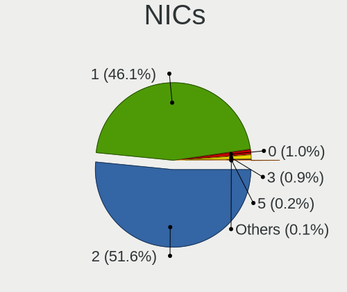

| Total | Computers | Percent |
|-------|-----------|---------|
| 2     | 271       | 52.93%  |
| 1     | 232       | 45.31%  |
| 3     | 5         | 0.98%   |
| 0     | 2         | 0.39%   |
| 8     | 1         | 0.2%    |
| 5     | 1         | 0.2%    |

IPv6
----

IPv6 vs IPv4

| Used | Computers | Percent |
|------|-----------|---------|
| No   | 508       | 99.41%  |
| Yes  | 3         | 0.59%   |

Bluetooth
---------

Bluetooth Vendor
----------------

Controller vendors

| Vendor                          | Computers | Percent |
|---------------------------------|-----------|---------|
| Intel                           | 86        | 34.54%  |
| Realtek Semiconductor           | 33        | 13.25%  |
| Qualcomm Atheros Communications | 28        | 11.24%  |
| Lite-On Technology              | 23        | 9.24%   |
| IMC Networks                    | 16        | 6.43%   |
| Cambridge Silicon Radio         | 15        | 6.02%   |
| Broadcom                        | 9         | 3.61%   |
| Toshiba                         | 6         | 2.41%   |
| Foxconn / Hon Hai               | 6         | 2.41%   |
| Apple                           | 6         | 2.41%   |
| Ralink                          | 3         | 1.2%    |
| Hewlett-Packard                 | 3         | 1.2%    |
| Foxconn International           | 3         | 1.2%    |
| Dell                            | 3         | 1.2%    |
| ASUSTek Computer                | 3         | 1.2%    |
| USI                             | 2         | 0.8%    |
| Ralink Technology               | 2         | 0.8%    |
| Askey Computer                  | 1         | 0.4%    |
| Alps Electric                   | 1         | 0.4%    |

Bluetooth Model
---------------

Controller models

| Model                                                                               | Computers | Percent |
|-------------------------------------------------------------------------------------|-----------|---------|
| Intel Bluetooth wireless interface                                                  | 44        | 17.67%  |
| Realtek Bluetooth Radio                                                             | 18        | 7.23%   |
| Intel Bluetooth 9460/9560 Jefferson Peak (JfP)                                      | 17        | 6.83%   |
| Qualcomm Atheros  Bluetooth Device                                                  | 15        | 6.02%   |
| Cambridge Silicon Radio Bluetooth Dongle (HCI mode)                                 | 15        | 6.02%   |
| Lite-On Qualcomm Atheros QCA9377 Bluetooth                                          | 12        | 4.82%   |
| Intel AX200 Bluetooth                                                               | 10        | 4.02%   |
| IMC Networks Bluetooth Radio                                                        | 9         | 3.61%   |
| Realtek  Bluetooth 4.2 Adapter                                                      | 8         | 3.21%   |
| Lite-On Bluetooth Device                                                            | 7         | 2.81%   |
| Intel AX201 Bluetooth                                                               | 5         | 2.01%   |
| Qualcomm Atheros AR9462 Bluetooth                                                   | 4         | 1.61%   |
| Qualcomm Atheros AR3011 Bluetooth                                                   | 4         | 1.61%   |
| Realtek RTL8821A Bluetooth                                                          | 3         | 1.2%    |
| Ralink RT3290 Bluetooth                                                             | 3         | 1.2%    |
| Intel Wireless-AC 3168 Bluetooth                                                    | 3         | 1.2%    |
| Intel Centrino Bluetooth Wireless Transceiver                                       | 3         | 1.2%    |
| Intel Bluetooth Device                                                              | 3         | 1.2%    |
| Foxconn International BCM43142A0 Bluetooth module                                   | 3         | 1.2%    |
| Foxconn / Hon Hai Bluetooth Device                                                  | 3         | 1.2%    |
| Dell DW375 Bluetooth Module                                                         | 3         | 1.2%    |
| Broadcom BCM43142A0 Bluetooth 4.0                                                   | 3         | 1.2%    |
| Apple Bluetooth Host Controller                                                     | 3         | 1.2%    |
| USI Bluetooth Module BCM92070                                                       | 2         | 0.8%    |
| Toshiba Bluetooth Device                                                            | 2         | 0.8%    |
| Realtek RTL8723B Bluetooth                                                          | 2         | 0.8%    |
| Realtek 802.11n WLAN Adapter                                                        | 2         | 0.8%    |
| Qualcomm Atheros QCA61x4 Bluetooth 4.0                                              | 2         | 0.8%    |
| Qualcomm Atheros AR3012 Bluetooth 4.0                                               | 2         | 0.8%    |
| Lite-On Atheros AR3012 Bluetooth                                                    | 2         | 0.8%    |
| IMC Networks Bluetooth Device                                                       | 2         | 0.8%    |
| IMC Networks Atheros AR3012 Bluetooth 4.0 Adapter                                   | 2         | 0.8%    |
| HP Bluetooth 2.0 Interface [Broadcom BCM2045]                                       | 2         | 0.8%    |
| Broadcom BCM2045B (BDC-2.1) [Bluetooth Controller]                                  | 2         | 0.8%    |
| Apple Bluetooth HCI                                                                 | 2         | 0.8%    |
| Toshiba RT Bluetooth Radio                                                          | 1         | 0.4%    |
| Toshiba Integrated Bluetooth (Taiyo Yuden)                                          | 1         | 0.4%    |
| Toshiba BCM43142A0                                                                  | 1         | 0.4%    |
| Toshiba Askey Bluetooth Module                                                      | 1         | 0.4%    |
| Ralink Motorola BC4 Bluetooth 3.0+HS Adapter                                        | 1         | 0.4%    |
| Ralink CSR BS8510                                                                   | 1         | 0.4%    |
| Qualcomm Atheros AR3012 Bluetooth                                                   | 1         | 0.4%    |
| Lite-On Broadcom BCM43142A0 Bluetooth Device                                        | 1         | 0.4%    |
| Lite-On Atheros Bluetooth                                                           | 1         | 0.4%    |
| Intel Wireless-AC 9260 Bluetooth Adapter                                            | 1         | 0.4%    |
| IMC Networks Wireless_Device                                                        | 1         | 0.4%    |
| IMC Networks Internal Bluetooth                                                     | 1         | 0.4%    |
| IMC Networks Bluetooth                                                              | 1         | 0.4%    |
| HP Broadcom 2070 Bluetooth Combo                                                    | 1         | 0.4%    |
| Foxconn / Hon Hai Foxconn T77H114 BCM2070 [Single-Chip Bluetooth 2.1 + EDR Adapter] | 1         | 0.4%    |
| Foxconn / Hon Hai Broadcom Bluetooth 2.1 Device                                     | 1         | 0.4%    |
| Foxconn / Hon Hai BCM20702A0                                                        | 1         | 0.4%    |
| Broadcom HP Portable Bumble Bee                                                     | 1         | 0.4%    |
| Broadcom BCM43142A0 Bluetooth Device                                                | 1         | 0.4%    |
| Broadcom BCM43142 Bluetooth 4.0                                                     | 1         | 0.4%    |
| Broadcom BCM2045 Bluetooth                                                          | 1         | 0.4%    |
| ASUS Broadcom BCM20702A0 Bluetooth                                                  | 1         | 0.4%    |
| ASUS Bluetooth Device                                                               | 1         | 0.4%    |
| ASUS ASUS USB-BT500                                                                 | 1         | 0.4%    |
| Askey Bluetooth Device                                                              | 1         | 0.4%    |

Sound
-----

Sound Vendor
------------

Sound card vendors

| Vendor                 | Computers | Percent |
|------------------------|-----------|---------|
| Intel                  | 349       | 52.17%  |
| AMD                    | 179       | 26.76%  |
| Nvidia                 | 110       | 16.44%  |
| Creative Labs          | 4         | 0.6%    |
| VIA Technologies       | 3         | 0.45%   |
| Generalplus Technology | 3         | 0.45%   |
| C-Media Electronics    | 3         | 0.45%   |
| GN Netcom              | 2         | 0.3%    |
| Focusrite-Novation     | 2         | 0.3%    |
| Veho                   | 1         | 0.15%   |
| Turtle Beach           | 1         | 0.15%   |
| Sony                   | 1         | 0.15%   |
| SAVITECH               | 1         | 0.15%   |
| RODE Microphones       | 1         | 0.15%   |
| Razer USA              | 1         | 0.15%   |
| Plantronics            | 1         | 0.15%   |
| Native Instruments     | 1         | 0.15%   |
| Meizu                  | 1         | 0.15%   |
| M-Audio                | 1         | 0.15%   |
| Logitech               | 1         | 0.15%   |
| Kingston Technology    | 1         | 0.15%   |
| Hewlett-Packard        | 1         | 0.15%   |
| ASUSTek Computer       | 1         | 0.15%   |

Sound Model
-----------

Sound card models

| Model                                                                                             | Computers | Percent |
|---------------------------------------------------------------------------------------------------|-----------|---------|
| Intel 6 Series/C200 Series Chipset Family High Definition Audio Controller                        | 42        | 5.22%   |
| AMD Family 17h/19h HD Audio Controller                                                            | 39        | 4.85%   |
| Intel Sunrise Point-LP HD Audio                                                                   | 37        | 4.6%    |
| Intel 7 Series/C216 Chipset Family High Definition Audio Controller                               | 33        | 4.1%    |
| AMD SBx00 Azalia (Intel HDA)                                                                      | 30        | 3.73%   |
| Intel NM10/ICH7 Family High Definition Audio Controller                                           | 28        | 3.48%   |
| AMD FCH Azalia Controller                                                                         | 25        | 3.11%   |
| AMD Raven/Raven2/Fenghuang HDMI/DP Audio Controller                                               | 24        | 2.99%   |
| Intel 8 Series/C220 Series Chipset High Definition Audio Controller                               | 23        | 2.86%   |
| Intel Cannon Lake PCH cAVS                                                                        | 20        | 2.49%   |
| AMD Oland/Hainan/Cape Verde/Pitcairn HDMI Audio [Radeon HD 7000 Series]                           | 18        | 2.24%   |
| AMD Family 17h (Models 00h-0fh) HD Audio Controller                                               | 18        | 2.24%   |
| AMD Ellesmere HDMI Audio [Radeon RX 470/480 / 570/580/590]                                        | 17        | 2.11%   |
| Intel Xeon E3-1200 v3/4th Gen Core Processor HD Audio Controller                                  | 14        | 1.74%   |
| Intel 82801I (ICH9 Family) HD Audio Controller                                                    | 14        | 1.74%   |
| Intel 5 Series/3400 Series Chipset High Definition Audio                                          | 14        | 1.74%   |
| Intel Celeron N3350/Pentium N4200/Atom E3900 Series Audio Cluster                                 | 13        | 1.62%   |
| AMD Baffin HDMI/DP Audio [Radeon RX 550 640SP / RX 560/560X]                                      | 13        | 1.62%   |
| Nvidia GP107GL High Definition Audio Controller                                                   | 12        | 1.49%   |
| Intel 100 Series/C230 Series Chipset Family HD Audio Controller                                   | 12        | 1.49%   |
| Nvidia MCP61 High Definition Audio                                                                | 11        | 1.37%   |
| AMD Starship/Matisse HD Audio Controller                                                          | 10        | 1.24%   |
| AMD RV710/730 HDMI Audio [Radeon HD 4000 series]                                                  | 10        | 1.24%   |
| Nvidia GF108 High Definition Audio Controller                                                     | 9         | 1.12%   |
| Intel Wildcat Point-LP High Definition Audio Controller                                           | 9         | 1.12%   |
| Intel Haswell-ULT HD Audio Controller                                                             | 9         | 1.12%   |
| Intel Cannon Point-LP High Definition Audio Controller                                            | 9         | 1.12%   |
| Intel Broadwell-U Audio Controller                                                                | 9         | 1.12%   |
| Intel Atom Processor Z36xxx/Z37xxx Series High Definition Audio Controller                        | 9         | 1.12%   |
| Intel 82801JI (ICH10 Family) HD Audio Controller                                                  | 9         | 1.12%   |
| Intel 8 Series HD Audio Controller                                                                | 9         | 1.12%   |
| AMD Turks HDMI Audio [Radeon HD 6500/6600 / 6700M Series]                                         | 9         | 1.12%   |
| AMD RS880 HDMI Audio [Radeon HD 4200 Series]                                                      | 9         | 1.12%   |
| AMD Renoir Radeon High Definition Audio Controller                                                | 9         | 1.12%   |
| Nvidia GK208 HDMI/DP Audio Controller                                                             | 8         | 1%      |
| Intel Atom/Celeron/Pentium Processor x5-E8000/J3xxx/N3xxx Series High Definition Audio Controller | 8         | 1%      |
| AMD Kabini HDMI/DP Audio                                                                          | 8         | 1%      |
| Nvidia TU107 GeForce GTX 1650 High Definition Audio Controller                                    | 7         | 0.87%   |
| Nvidia GM107 High Definition Audio Controller [GeForce 940MX]                                     | 7         | 0.87%   |
| Intel Ice Lake-LP Smart Sound Technology Audio Controller                                         | 7         | 0.87%   |
| Intel 200 Series PCH HD Audio                                                                     | 7         | 0.87%   |
| Intel CM238 HD Audio Controller                                                                   | 6         | 0.75%   |
| Intel Celeron/Pentium Silver Processor High Definition Audio                                      | 6         | 0.75%   |
| Intel 82801H (ICH8 Family) HD Audio Controller                                                    | 6         | 0.75%   |
| AMD Cedar HDMI Audio [Radeon HD 5400/6300/7300 Series]                                            | 6         | 0.75%   |
| AMD Caicos HDMI Audio [Radeon HD 6450 / 7450/8450/8490 OEM / R5 230/235/235X OEM]                 | 6         | 0.75%   |
| Nvidia High Definition Audio Controller                                                           | 5         | 0.62%   |
| Nvidia GP104 High Definition Audio Controller                                                     | 5         | 0.62%   |
| Intel Tiger Lake-LP Smart Sound Technology Audio Controller                                       | 5         | 0.62%   |
| Nvidia MCP79 High Definition Audio                                                                | 4         | 0.5%    |
| Nvidia GP106 High Definition Audio Controller                                                     | 4         | 0.5%    |
| Nvidia GK106 HDMI Audio Controller                                                                | 4         | 0.5%    |
| Nvidia GK104 HDMI Audio Controller                                                                | 4         | 0.5%    |
| Nvidia GF119 HDMI Audio Controller                                                                | 4         | 0.5%    |
| Intel 82801JD/DO (ICH10 Family) HD Audio Controller                                               | 4         | 0.5%    |
| AMD Trinity HDMI Audio Controller                                                                 | 4         | 0.5%    |
| VIA Technologies VX900/VT8xxx High Definition Audio Controller                                    | 3         | 0.37%   |
| Nvidia TU116 High Definition Audio Controller                                                     | 3         | 0.37%   |
| Nvidia TU106 High Definition Audio Controller                                                     | 3         | 0.37%   |
| Nvidia GP108 High Definition Audio Controller                                                     | 3         | 0.37%   |

Memory
------

Memory Vendor
-------------

Memory module vendors

| Vendor              | Computers | Percent |
|---------------------|-----------|---------|
| Kingston            | 69        | 23.08%  |
| Samsung Electronics | 50        | 16.72%  |
| SK Hynix            | 46        | 15.38%  |
| Unknown             | 42        | 14.05%  |
| Micron Technology   | 24        | 8.03%   |
| Patriot             | 11        | 3.68%   |
| Transcend           | 10        | 3.34%   |
| Ramaxel Technology  | 9         | 3.01%   |
| Crucial             | 7         | 2.34%   |
| Apacer              | 7         | 2.34%   |
| Corsair             | 4         | 1.34%   |
| Elpida              | 3         | 1%      |
| A-DATA Technology   | 3         | 1%      |
| Nanya Technology    | 2         | 0.67%   |
| G.Skill             | 2         | 0.67%   |
| Unifosa             | 1         | 0.33%   |
| SHARETRONIC         | 1         | 0.33%   |
| Ramos Technology    | 1         | 0.33%   |
| Qimonda             | 1         | 0.33%   |
| PNY                 | 1         | 0.33%   |
| Mushkin             | 1         | 0.33%   |
| GEIL                | 1         | 0.33%   |
| Exceleram           | 1         | 0.33%   |
| 48spaces            | 1         | 0.33%   |
| Unknown             | 1         | 0.33%   |

Memory Model
------------

Memory module models

| Model                                                       | Computers | Percent |
|-------------------------------------------------------------|-----------|---------|
| SK Hynix RAM HMA851S6JJR6N-VK 4GB SODIMM DDR4 2667MT/s      | 4         | 1.22%   |
| SK Hynix RAM HMA851S6AFR6N-UH 4GB SODIMM DDR4 2667MT/s      | 4         | 1.22%   |
| SK Hynix RAM HMA81GS6DJR8N-XN 8GB SODIMM DDR4 3200MT/s      | 4         | 1.22%   |
| Samsung RAM M471A5244CB0-CRC 4096MB SODIMM DDR4 2667MT/s    | 4         | 1.22%   |
| Micron RAM 4ATF51264HZ-2G6E1 4096MB SODIMM DDR4 2667MT/s    | 4         | 1.22%   |
| Kingston RAM KHX3200C16D4/8GX 8GB DIMM DDR4 3533MT/s        | 4         | 1.22%   |
| Unknown RAM Module 2048MB DIMM 1333MT/s                     | 3         | 0.91%   |
| Unknown RAM CL19-19-19 D4-2666 8192MB DIMM DDR4 2400MT/s    | 3         | 0.91%   |
| Samsung RAM M471B5173QH0-YK0 4GB SODIMM DDR3 1600MT/s       | 3         | 0.91%   |
| Samsung RAM M471A5244CB0-CTD 4GB SODIMM DDR4 3266MT/s       | 3         | 0.91%   |
| Micron RAM 8ATF1G64HZ-3G2J1 8192MB SODIMM DDR4 3200MT/s     | 3         | 0.91%   |
| Micron RAM 4ATF51264HZ-2G6E! 4096MB SODIMM DDR4 2400MT/s    | 3         | 0.91%   |
| Micron RAM 4ATF1G64HZ-3G2E1 8GB SODIMM DDR4 3200MT/s        | 3         | 0.91%   |
| Kingston RAM KHX2400C15/8G 8GB DIMM DDR4 2933MT/s           | 3         | 0.91%   |
| Kingston RAM 99U5428-018.A00LF 8192MB SODIMM DDR3 1600MT/s  | 3         | 0.91%   |
| Unknown RAM Module 4096MB DIMM 1600MT/s                     | 2         | 0.61%   |
| Unknown RAM Module 2GB DIMM 1333MT/s                        | 2         | 0.61%   |
| Unknown RAM Module 2048MB DIMM 400MT/s                      | 2         | 0.61%   |
| Unknown RAM Module 1024MB SODIMM DDR                        | 2         | 0.61%   |
| Transcend RAM TS512MLK64V6H 4GB DIMM DDR3 1600MT/s          | 2         | 0.61%   |
| Transcend RAM JM3200HSG-8G 8192MB SODIMM DDR4 2667MT/s      | 2         | 0.61%   |
| Transcend RAM JM1333KLN-2G 2GB DIMM DDR3 1333MT/s           | 2         | 0.61%   |
| SK Hynix RAM HYMP125S64CP8-S6 2048MB SODIMM SDRAM           | 2         | 0.61%   |
| SK Hynix RAM HMT451U6BFR8A-PB 4GB DIMM DDR3 1600MT/s        | 2         | 0.61%   |
| SK Hynix RAM HMT325S6BFR8C-H9 2GB SODIMM DDR3 1600MT/s      | 2         | 0.61%   |
| SK Hynix RAM HMA851S6CJR6N-VK 4GB SODIMM DDR4 2667MT/s      | 2         | 0.61%   |
| SK Hynix RAM HMA81GS6AFR8N-UH 8GB SODIMM DDR4 2667MT/s      | 2         | 0.61%   |
| SK Hynix RAM HMA41GS6AFR8N-TF 8GB SODIMM DDR4 2667MT/s      | 2         | 0.61%   |
| Samsung RAM Module 4GB DIMM DDR3 1333MT/s                   | 2         | 0.61%   |
| Samsung RAM M471B5773DH0-CH9 2GB SODIMM DDR3 1600MT/s       | 2         | 0.61%   |
| Samsung RAM M471B5673FH0-CH9 2048MB SODIMM DDR3 1334MT/s    | 2         | 0.61%   |
| Samsung RAM M471B5273DH0-CH9 4GB SODIMM DDR3 1334MT/s       | 2         | 0.61%   |
| Samsung RAM M471B5173EB0-YK0 4GB SODIMM DDR3 1600MT/s       | 2         | 0.61%   |
| Samsung RAM M471B5173DB0-YK0 4096MB SODIMM DDR3 1600MT/s    | 2         | 0.61%   |
| Samsung RAM M471B1G73EB0-YK0 8192MB SODIMM DDR3 1600MT/s    | 2         | 0.61%   |
| Samsung RAM M471A5244CB0-CWE 4GB SODIMM DDR4 3200MT/s       | 2         | 0.61%   |
| Samsung RAM M471A5244CB0-CWE 4GB Row Of Chips DDR4 3200MT/s | 2         | 0.61%   |
| Samsung RAM M471A1K43DB1-CTD 8GB SODIMM DDR4 2667MT/s       | 2         | 0.61%   |
| Samsung RAM M471A1G44AB0-CWE 8GB SODIMM DDR4 3200MT/s       | 2         | 0.61%   |
| Samsung RAM M393B1K70DH0-CH9 8GB DIMM DDR3 1333MT/s         | 2         | 0.61%   |
| Samsung RAM M393B1K70CH0-CH9 8GB DIMM DDR3 1333MT/s         | 2         | 0.61%   |
| Patriot RAM PSD34G133381 4GB DIMM DDR3 1333MT/s             | 2         | 0.61%   |
| Patriot RAM 3000 C16 Series 16GB DIMM DDR4 3200MT/s         | 2         | 0.61%   |
| Kingston RAM KHX3200C16D4/16GX 16384MB DIMM DDR4 3600MT/s   | 2         | 0.61%   |
| Kingston RAM KHX1866C10D3/8G 8GB DIMM DDR3 1867MT/s         | 2         | 0.61%   |
| Kingston RAM KHX1866C10D3/4G 4GB DIMM DDR3 1867MT/s         | 2         | 0.61%   |
| Kingston RAM KHX1600C9D3/4GX 4GB DIMM DDR3 2400MT/s         | 2         | 0.61%   |
| Kingston RAM KHX1600C10D3/8G 8GB DIMM DDR3 1600MT/s         | 2         | 0.61%   |
| Kingston RAM 9905595-010.A00LF 4096MB DIMM 1600MT/s         | 2         | 0.61%   |
| Kingston RAM 9905458-026.A00LF 4096MB DIMM DDR3 1333MT/s    | 2         | 0.61%   |
| Crucial RAM CT51264BA160BJ.C8F 4GB DIMM DDR3 1600MT/s       | 2         | 0.61%   |
| Unknown RAM Module 8GB SODIMM DDR4 3200MT/s                 | 1         | 0.3%    |
| Unknown RAM Module 8192MB SODIMM DDR4 3200MT/s              | 1         | 0.3%    |
| Unknown RAM Module 512MB DIMM DDR                           | 1         | 0.3%    |
| Unknown RAM Module 4GB SODIMM DDR3 1600MT/s                 | 1         | 0.3%    |
| Unknown RAM Module 4GB DIMM 667MT/s                         | 1         | 0.3%    |
| Unknown RAM Module 4096MB DIMM DDR3 667MT/s                 | 1         | 0.3%    |
| Unknown RAM Module 4096MB DIMM DDR3 1600MT/s                | 1         | 0.3%    |
| Unknown RAM Module 4096MB DIMM DDR 1333MT/s                 | 1         | 0.3%    |
| Unknown RAM Module 2GB SODIMM DDR2 667MT/s                  | 1         | 0.3%    |

Memory Kind
-----------

Memory module kinds

| Kind    | Computers | Percent |
|---------|-----------|---------|
| DDR4    | 97        | 39.75%  |
| DDR3    | 91        | 37.3%   |
| DDR2    | 20        | 8.2%    |
| Unknown | 18        | 7.38%   |
| SDRAM   | 8         | 3.28%   |
| LPDDR4  | 4         | 1.64%   |
| DDR     | 4         | 1.64%   |
| LPDDR3  | 2         | 0.82%   |

Memory Form Factor
------------------

Physical design of the memory module

| Name         | Computers | Percent |
|--------------|-----------|---------|
| SODIMM       | 127       | 52.92%  |
| DIMM         | 107       | 44.58%  |
| Row Of Chips | 5         | 2.08%   |
| FB-DIMM      | 1         | 0.42%   |

Memory Size
-----------

Memory module size

| Size  | Computers | Percent |
|-------|-----------|---------|
| 4096  | 93        | 34.83%  |
| 8192  | 78        | 29.21%  |
| 2048  | 56        | 20.97%  |
| 16384 | 20        | 7.49%   |
| 1024  | 16        | 5.99%   |
| 32768 | 3         | 1.12%   |
| 512   | 1         | 0.37%   |

Memory Speed
------------

Memory module speed

| Speed   | Computers | Percent |
|---------|-----------|---------|
| 1600    | 61        | 22.1%   |
| 2667    | 41        | 14.86%  |
| 1333    | 31        | 11.23%  |
| 3200    | 29        | 10.51%  |
| 2400    | 18        | 6.52%   |
| 800     | 14        | 5.07%   |
| 667     | 13        | 4.71%   |
| 1334    | 9         | 3.26%   |
| 2133    | 8         | 2.9%    |
| Unknown | 5         | 1.81%   |
| 3533    | 4         | 1.45%   |
| 1067    | 4         | 1.45%   |
| 3600    | 3         | 1.09%   |
| 3266    | 3         | 1.09%   |
| 2933    | 3         | 1.09%   |
| 2666    | 3         | 1.09%   |
| 2048    | 3         | 1.09%   |
| 1867    | 3         | 1.09%   |
| 1066    | 3         | 1.09%   |
| 400     | 3         | 1.09%   |
| 4199    | 2         | 0.72%   |
| 3733    | 2         | 0.72%   |
| 1866    | 2         | 0.72%   |
| 975     | 2         | 0.72%   |
| 4333    | 1         | 0.36%   |
| 3334    | 1         | 0.36%   |
| 3333    | 1         | 0.36%   |
| 3151    | 1         | 0.36%   |
| 2800    | 1         | 0.36%   |
| 1400    | 1         | 0.36%   |
| 533     | 1         | 0.36%   |

Printers & scanners
-------------------

Printer Vendor
--------------

Printer device vendors

| Vendor                | Computers | Percent |
|-----------------------|-----------|---------|
| Hewlett-Packard       | 12        | 54.55%  |
| Canon                 | 5         | 22.73%  |
| Lexmark International | 2         | 9.09%   |
| Xerox                 | 1         | 4.55%   |
| Seiko Epson           | 1         | 4.55%   |
| Samsung Electronics   | 1         | 4.55%   |

Printer Model
-------------

Printer device models

| Model                                      | Computers | Percent |
|--------------------------------------------|-----------|---------|
| HP LaserJet 1018                           | 3         | 13.64%  |
| Xerox Phaser 3140 and 3155                 | 1         | 4.55%   |
| Seiko Epson L365 Series                    | 1         | 4.55%   |
| Samsung SCX-3400 Series                    | 1         | 4.55%   |
| Lexmark International Lexmark MS312dn      | 1         | 4.55%   |
| Lexmark International InkJet Color Printer | 1         | 4.55%   |
| HP LaserJet P2015 series                   | 1         | 4.55%   |
| HP LaserJet P2014                          | 1         | 4.55%   |
| HP LaserJet P1005                          | 1         | 4.55%   |
| HP LaserJet M101-M106                      | 1         | 4.55%   |
| HP LaserJet CP 1025                        | 1         | 4.55%   |
| HP LaserJet 1200                           | 1         | 4.55%   |
| HP LaserJet 1020                           | 1         | 4.55%   |
| HP LaserJet 1010                           | 1         | 4.55%   |
| HP DeskJet 845c                            | 1         | 4.55%   |
| Canon LBP810                               | 1         | 4.55%   |
| Canon LBP6030/6030B/6018L                  | 1         | 4.55%   |
| Canon LBP2900                              | 1         | 4.55%   |
| Canon iP7200 series                        | 1         | 4.55%   |
| Canon CanoScan LiDE 300                    | 1         | 4.55%   |

Scanner Vendor
--------------

Scanner device vendors

| Vendor             | Computers | Percent |
|--------------------|-----------|---------|
| Canon              | 6         | 66.67%  |
| Ultima Electronics | 1         | 11.11%  |
| Mustek Systems     | 1         | 11.11%  |
| Hewlett-Packard    | 1         | 11.11%  |

Scanner Model
-------------

Scanner device models

| Model                                                                                 | Computers | Percent |
|---------------------------------------------------------------------------------------|-----------|---------|
| Canon CanoScan LiDE 110                                                               | 2         | 22.22%  |
| Ultima Artec Ultima 2000 (GT6801 based)/Lifetec LT9385/ScanMagic 1200 UB Plus Scanner | 1         | 11.11%  |
| Mustek Systems BearPaw 1200 CU Plus                                                   | 1         | 11.11%  |
| HP ScanJet 2200c                                                                      | 1         | 11.11%  |
| Canon CanoScan LIDE 25                                                                | 1         | 11.11%  |
| Canon CanoScan LiDE 210                                                               | 1         | 11.11%  |
| Canon CanoScan LiDE 120                                                               | 1         | 11.11%  |
| Canon CanoScan LiDE 100                                                               | 1         | 11.11%  |

Camera
------

Camera Vendor
-------------

Camera device vendors

| Vendor                                 | Computers | Percent |
|----------------------------------------|-----------|---------|
| Chicony Electronics                    | 71        | 24.83%  |
| IMC Networks                           | 37        | 12.94%  |
| Realtek Semiconductor                  | 24        | 8.39%   |
| Microdia                               | 22        | 7.69%   |
| Logitech                               | 16        | 5.59%   |
| Acer                                   | 15        | 5.24%   |
| Suyin                                  | 14        | 4.9%    |
| Sunplus Innovation Technology          | 14        | 4.9%    |
| Quanta                                 | 14        | 4.9%    |
| Cheng Uei Precision Industry (Foxlink) | 13        | 4.55%   |
| Syntek                                 | 8         | 2.8%    |
| Lite-On Technology                     | 6         | 2.1%    |
| Apple                                  | 4         | 1.4%    |
| KYE Systems (Mouse Systems)            | 3         | 1.05%   |
| Importek                               | 3         | 1.05%   |
| Silicon Motion                         | 2         | 0.7%    |
| Luxvisions Innotech Limited            | 2         | 0.7%    |
| Hewlett-Packard                        | 2         | 0.7%    |
| Aveo Technology                        | 2         | 0.7%    |
| Alcor Micro                            | 2         | 0.7%    |
| Z-Star Microelectronics                | 1         | 0.35%   |
| Xiaomi                                 | 1         | 0.35%   |
| Sony                                   | 1         | 0.35%   |
| Samsung Electronics                    | 1         | 0.35%   |
| Ricoh                                  | 1         | 0.35%   |
| OmniVision Technologies                | 1         | 0.35%   |
| Nokia Mobile Phones                    | 1         | 0.35%   |
| Lenovo                                 | 1         | 0.35%   |
| DigiTech                               | 1         | 0.35%   |
| Cubeternet                             | 1         | 0.35%   |
| Asuscom Network                        | 1         | 0.35%   |
| Arkmicro Technologies                  | 1         | 0.35%   |

Camera Model
------------

Camera device models

| Model                                                          | Computers | Percent |
|----------------------------------------------------------------|-----------|---------|
| IMC Networks USB2.0 VGA UVC WebCam                             | 17        | 5.94%   |
| Chicony Integrated Camera                                      | 13        | 4.55%   |
| Realtek Integrated_Webcam_HD                                   | 8         | 2.8%    |
| IMC Networks USB2.0 HD UVC WebCam                              | 8         | 2.8%    |
| Sunplus Integrated_Webcam_HD                                   | 6         | 2.1%    |
| Microdia Integrated_Webcam_HD                                  | 6         | 2.1%    |
| Realtek Lenovo EasyCamera                                      | 5         | 1.75%   |
| Quanta VGA WebCam                                              | 5         | 1.75%   |
| Quanta HD WebCam                                               | 5         | 1.75%   |
| Logitech Webcam C270                                           | 5         | 1.75%   |
| IMC Networks Integrated Camera                                 | 5         | 1.75%   |
| Chicony TOSHIBA Web Camera - HD                                | 5         | 1.75%   |
| Chicony EasyCamera                                             | 5         | 1.75%   |
| Acer Integrated Camera                                         | 5         | 1.75%   |
| Syntek Integrated Camera                                       | 4         | 1.4%    |
| Suyin Acer/HP Integrated Webcam [CN0314]                       | 4         | 1.4%    |
| Realtek USB Camera                                             | 4         | 1.4%    |
| Chicony VGA Webcam                                             | 4         | 1.4%    |
| Chicony Integrated Camera (1280x720@30)                        | 4         | 1.4%    |
| Chicony HP Webcam                                              | 4         | 1.4%    |
| Chicony HD WebCam                                              | 4         | 1.4%    |
| Cheng Uei Precision Industry (Foxlink) HP Webcam               | 4         | 1.4%    |
| Syntek EasyCamera                                              | 3         | 1.05%   |
| Realtek Integrated Webcam HD                                   | 3         | 1.05%   |
| Microdia Camera                                                | 3         | 1.05%   |
| IMC Networks EasyCamera                                        | 3         | 1.05%   |
| Chicony USB 2.0 Camera                                         | 3         | 1.05%   |
| Chicony HD User Facing                                         | 3         | 1.05%   |
| Cheng Uei Precision Industry (Foxlink) HP TrueVision HD Camera | 3         | 1.05%   |
| Acer BisonCam, NB Pro                                          | 3         | 1.05%   |
| Suyin Acer CrystalEye Webcam                                   | 2         | 0.7%    |
| Suyin 1.3M WebCam (notebook emachines E730, Acer sub-brand)    | 2         | 0.7%    |
| Sunplus HP Wide Vision HD                                      | 2         | 0.7%    |
| Sunplus ASUS USB2.0 Webcam                                     | 2         | 0.7%    |
| Quanta HP TrueVision HD Camera                                 | 2         | 0.7%    |
| Microdia Laptop_Integrated_Webcam_HD                           | 2         | 0.7%    |
| Microdia Integrated Webcam                                     | 2         | 0.7%    |
| Microdia HP Webcam                                             | 2         | 0.7%    |
| Luxvisions Innotech Limited HP TrueVision HD Camera            | 2         | 0.7%    |
| Logitech Webcam C200                                           | 2         | 0.7%    |
| Logitech Webcam C170                                           | 2         | 0.7%    |
| Logitech QuickCam Orbit/Sphere AF                              | 2         | 0.7%    |
| Lite-On HP TrueVision HD Camera                                | 2         | 0.7%    |
| Lite-On HP HD Webcam                                           | 2         | 0.7%    |
| Importek Laptop Integrated Webcam                              | 2         | 0.7%    |
| HP HD-4110 Webcam                                              | 2         | 0.7%    |
| Chicony UVC 1.00 device HD UVC WebCam                          | 2         | 0.7%    |
| Chicony USB2.0 VGA UVC WebCam                                  | 2         | 0.7%    |
| Chicony USB2.0 HD UVC WebCam                                   | 2         | 0.7%    |
| Chicony HP Truevision HD                                       | 2         | 0.7%    |
| Chicony HP HD Camera                                           | 2         | 0.7%    |
| Chicony 1.3M HD WebCam                                         | 2         | 0.7%    |
| Cheng Uei Precision Industry (Foxlink) Webcam                  | 2         | 0.7%    |
| Cheng Uei Precision Industry (Foxlink) HP HD Camera            | 2         | 0.7%    |
| Apple FaceTime HD Camera                                       | 2         | 0.7%    |
| Acer Lenovo Integrated Webcam                                  | 2         | 0.7%    |
| Acer Lenovo EasyCamera                                         | 2         | 0.7%    |
| Z-Star Venus USB2.0 Camera                                     | 1         | 0.35%   |
| Xiaomi Mi/Redmi series (PTP + ADB)                             | 1         | 0.35%   |
| Syntek Lenovo USB2.0 UVC Camera                                | 1         | 0.35%   |

Security
--------

Fingerprint Vendor
------------------

Fingerprint sensor vendors

| Vendor                     | Computers | Percent |
|----------------------------|-----------|---------|
| Validity Sensors           | 17        | 38.64%  |
| Synaptics                  | 9         | 20.45%  |
| Shenzhen Goodix Technology | 6         | 13.64%  |
| AuthenTec                  | 5         | 11.36%  |
| Elan Microelectronics      | 3         | 6.82%   |
| Upek                       | 2         | 4.55%   |
| Microsoft                  | 1         | 2.27%   |
| LighTuning Technology      | 1         | 2.27%   |

Fingerprint Model
-----------------

Fingerprint sensor models

| Model                                                                      | Computers | Percent |
|----------------------------------------------------------------------------|-----------|---------|
| Shenzhen Goodix  FingerPrint Device                                        | 5         | 11.36%  |
| Validity Sensors VFS5011 Fingerprint Reader                                | 4         | 9.09%   |
| Synaptics  WBDI                                                            | 4         | 9.09%   |
| Validity Sensors VFS7500 Touch Fingerprint Sensor                          | 3         | 6.82%   |
| Validity Sensors VFS495 Fingerprint Reader                                 | 3         | 6.82%   |
| Synaptics Prometheus MIS Touch Fingerprint Reader                          | 3         | 6.82%   |
| Elan ELAN:Fingerprint                                                      | 3         | 6.82%   |
| AuthenTec AES2501 Fingerprint Sensor                                       | 3         | 6.82%   |
| Upek Biometric Touchchip/Touchstrip Fingerprint Sensor                     | 2         | 4.55%   |
| Validity Sensors VFS471 Fingerprint Reader                                 | 1         | 2.27%   |
| Validity Sensors VFS101 Fingerprint Reader                                 | 1         | 2.27%   |
| Validity Sensors VFS Fingerprint sensor                                    | 1         | 2.27%   |
| Validity Sensors VFS 5011 fingerprint sensor                               | 1         | 2.27%   |
| Validity Sensors Synaptics WBDI                                            | 1         | 2.27%   |
| Validity Sensors Synaptics VFS7552 Touch Fingerprint Sensor with PurePrint | 1         | 2.27%   |
| Validity Sensors Fingerprint scanner                                       | 1         | 2.27%   |
| Synaptics  VFS7552 Touch Fingerprint Sensor with PurePrint                 | 1         | 2.27%   |
| Shenzhen Goodix Fingerprint Reader                                         | 1         | 2.27%   |
| Microsoft Fingerprint Reader                                               | 1         | 2.27%   |
| LighTuning EgisTec Touch Fingerprint Sensor                                | 1         | 2.27%   |
| AuthenTec AES2810                                                          | 1         | 2.27%   |
| AuthenTec AES1660 Fingerprint Sensor                                       | 1         | 2.27%   |
| Unknown                                                                    | 1         | 2.27%   |

Chipcard Vendor
---------------

Chipcard module vendors

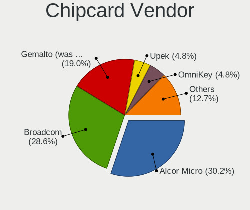

| Vendor                | Computers | Percent |
|-----------------------|-----------|---------|
| Gemalto (was Gemplus) | 9         | 36%     |
| Broadcom              | 9         | 36%     |
| Alcor Micro           | 3         | 12%     |
| O2 Micro              | 2         | 8%      |
| OmniKey               | 1         | 4%      |
| Lenovo                | 1         | 4%      |

Chipcard Model
--------------

Chipcard module models

| Model                                             | Computers | Percent |
|---------------------------------------------------|-----------|---------|
| Gemalto (was Gemplus) GemPC Twin SmartCard Reader | 9         | 36%     |
| Broadcom 5880                                     | 4         | 16%     |
| Broadcom BCM5880 Secure Applications Processor    | 3         | 12%     |
| Alcor Micro AU9540 Smartcard Reader               | 3         | 12%     |
| O2 Micro OZ776 CCID Smartcard Reader              | 2         | 8%      |
| Broadcom 58200                                    | 2         | 8%      |
| OmniKey 3x21 Smart Card Reader                    | 1         | 4%      |
| Lenovo Integrated Smart Card Reader               | 1         | 4%      |

Unsupported
-----------

Unsupported Devices
-------------------

Total unsupported devices on board

| Total | Computers | Percent |
|-------|-----------|---------|
| 0     | 395       | 75.1%   |
| 1     | 105       | 19.96%  |
| 2     | 21        | 3.99%   |
| 4     | 2         | 0.38%   |
| 3     | 2         | 0.38%   |
| 8     | 1         | 0.19%   |

Unsupported Device Types
------------------------

Types of unsupported devices

| Type                     | Computers | Percent |
|--------------------------|-----------|---------|
| Fingerprint reader       | 44        | 27.85%  |
| Graphics card            | 37        | 23.42%  |
| Chipcard                 | 22        | 13.92%  |
| Net/wireless             | 20        | 12.66%  |
| Communication controller | 7         | 4.43%   |
| Bluetooth                | 6         | 3.8%    |
| Multimedia controller    | 5         | 3.16%   |
| Sound                    | 3         | 1.9%    |
| Modem                    | 3         | 1.9%    |
| Card reader              | 3         | 1.9%    |
| Camera                   | 3         | 1.9%    |
| Net/ethernet             | 2         | 1.27%   |
| Unassigned class         | 1         | 0.63%   |
| Storage                  | 1         | 0.63%   |
| Dvb card                 | 1         | 0.63%   |

