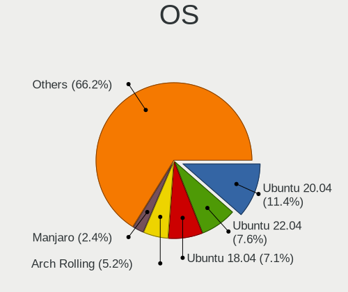
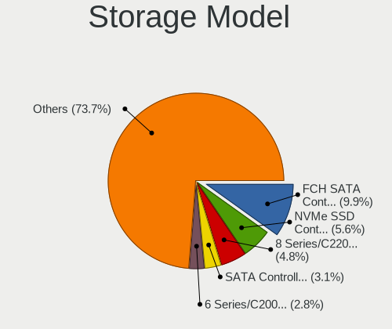
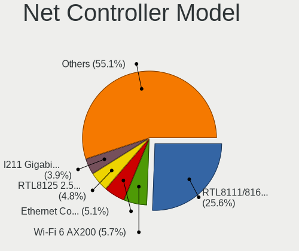
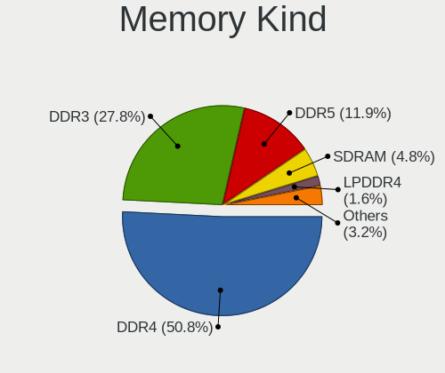
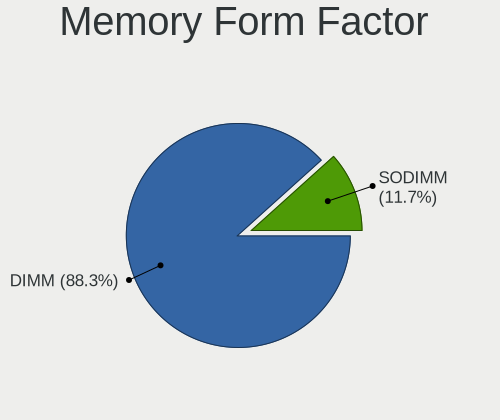
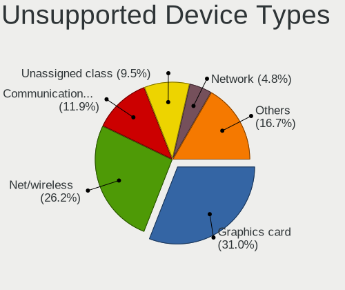

Linux in Singapore - Tested Hardware & Statistics (Desktops)
------------------------------------------------------------

A project to collect tested hardware configurations for Linux in Singapore.

Anyone can contribute to this report by the [hw-probe](https://github.com/linuxhw/hw-probe) tool:

    sudo -E hw-probe -all -upload

Please contribute! Especially if your hardware is rare.

Contents
--------

* [ Test Cases ](#test-cases)

* [ System ](#system)
  - [ OS                       ](#os)
  - [ OS Family                ](#os-family)
  - [ Kernel                   ](#kernel)
  - [ Kernel Family            ](#kernel-family)
  - [ Kernel Major Ver.        ](#kernel-major-ver)
  - [ Arch                     ](#arch)
  - [ DE                       ](#de)
  - [ Display Server           ](#display-server)
  - [ Display Manager          ](#display-manager)
  - [ OS Lang                  ](#os-lang)
  - [ Boot Mode                ](#boot-mode)
  - [ Filesystem               ](#filesystem)
  - [ Part. scheme             ](#part-scheme)
  - [ Dual Boot with Linux/BSD ](#dual-boot-with-linuxbsd)
  - [ Dual Boot (Win)          ](#dual-boot-win)

* [ Board ](#board)
  - [ Vendor                   ](#vendor)
  - [ Model                    ](#model)
  - [ Model Family             ](#model-family)
  - [ MFG Year                 ](#mfg-year)
  - [ Form Factor              ](#form-factor)
  - [ Secure Boot              ](#secure-boot)
  - [ Coreboot                 ](#coreboot)
  - [ RAM Size                 ](#ram-size)
  - [ RAM Used                 ](#ram-used)
  - [ Total Drives             ](#total-drives)
  - [ Has CD-ROM               ](#has-cd-rom)
  - [ Has Ethernet             ](#has-ethernet)
  - [ Has WiFi                 ](#has-wifi)
  - [ Has Bluetooth            ](#has-bluetooth)

* [ Location ](#location)
  - [ Country                  ](#country)
  - [ City                     ](#city)

* [ Drives ](#drives)
  - [ Drive Vendor             ](#drive-vendor)
  - [ Drive Model              ](#drive-model)
  - [ HDD Vendor               ](#hdd-vendor)
  - [ SSD Vendor               ](#ssd-vendor)
  - [ Drive Kind               ](#drive-kind)
  - [ Drive Connector          ](#drive-connector)
  - [ Drive Size               ](#drive-size)
  - [ Space Total              ](#space-total)
  - [ Space Used               ](#space-used)
  - [ Malfunc. Drives          ](#malfunc-drives)
  - [ Malfunc. Drive Vendor    ](#malfunc-drive-vendor)
  - [ Malfunc. HDD Vendor      ](#malfunc-hdd-vendor)
  - [ Malfunc. Drive Kind      ](#malfunc-drive-kind)
  - [ Failed Drives            ](#failed-drives)
  - [ Failed Drive Vendor      ](#failed-drive-vendor)
  - [ Drive Status             ](#drive-status)

* [ Storage controller ](#storage-controller)
  - [ Storage Vendor           ](#storage-vendor)
  - [ Storage Model            ](#storage-model)
  - [ Storage Kind             ](#storage-kind)

* [ Processor ](#processor)
  - [ CPU Vendor               ](#cpu-vendor)
  - [ CPU Model                ](#cpu-model)
  - [ CPU Model Family         ](#cpu-model-family)
  - [ CPU Cores                ](#cpu-cores)
  - [ CPU Sockets              ](#cpu-sockets)
  - [ CPU Threads              ](#cpu-threads)
  - [ CPU Op-Modes             ](#cpu-op-modes)
  - [ CPU Microcode            ](#cpu-microcode)
  - [ CPU Microarch            ](#cpu-microarch)

* [ Graphics ](#graphics)
  - [ GPU Vendor               ](#gpu-vendor)
  - [ GPU Model                ](#gpu-model)
  - [ GPU Combo                ](#gpu-combo)
  - [ GPU Driver               ](#gpu-driver)
  - [ GPU Memory               ](#gpu-memory)

* [ Monitor ](#monitor)
  - [ Monitor Vendor           ](#monitor-vendor)
  - [ Monitor Model            ](#monitor-model)
  - [ Monitor Resolution       ](#monitor-resolution)
  - [ Monitor Diagonal         ](#monitor-diagonal)
  - [ Monitor Width            ](#monitor-width)
  - [ Aspect Ratio             ](#aspect-ratio)
  - [ Monitor Area             ](#monitor-area)
  - [ Pixel Density            ](#pixel-density)
  - [ Multiple Monitors        ](#multiple-monitors)

* [ Network ](#network)
  - [ Net Controller Vendor    ](#net-controller-vendor)
  - [ Net Controller Model     ](#net-controller-model)
  - [ Wireless Vendor          ](#wireless-vendor)
  - [ Wireless Model           ](#wireless-model)
  - [ Ethernet Vendor          ](#ethernet-vendor)
  - [ Ethernet Model           ](#ethernet-model)
  - [ Net Controller Kind      ](#net-controller-kind)
  - [ Used Controller          ](#used-controller)
  - [ NICs                     ](#nics)
  - [ IPv6                     ](#ipv6)

* [ Bluetooth ](#bluetooth)
  - [ Bluetooth Vendor         ](#bluetooth-vendor)
  - [ Bluetooth Model          ](#bluetooth-model)

* [ Sound ](#sound)
  - [ Sound Vendor             ](#sound-vendor)
  - [ Sound Model              ](#sound-model)

* [ Memory ](#memory)
  - [ Memory Vendor            ](#memory-vendor)
  - [ Memory Model             ](#memory-model)
  - [ Memory Kind              ](#memory-kind)
  - [ Memory Form Factor       ](#memory-form-factor)
  - [ Memory Size              ](#memory-size)
  - [ Memory Speed             ](#memory-speed)

* [ Printers & scanners ](#printers--scanners)
  - [ Printer Vendor           ](#printer-vendor)
  - [ Printer Model            ](#printer-model)
  - [ Scanner Vendor           ](#scanner-vendor)
  - [ Scanner Model            ](#scanner-model)

* [ Camera ](#camera)
  - [ Camera Vendor            ](#camera-vendor)
  - [ Camera Model             ](#camera-model)

* [ Security ](#security)
  - [ Fingerprint Vendor       ](#fingerprint-vendor)
  - [ Fingerprint Model        ](#fingerprint-model)
  - [ Chipcard Vendor          ](#chipcard-vendor)
  - [ Chipcard Model           ](#chipcard-model)

* [ Unsupported ](#unsupported)
  - [ Unsupported Devices      ](#unsupported-devices)
  - [ Unsupported Device Types ](#unsupported-device-types)

Test Cases
----------

Total: 94

| Vendor     | Model                       | Probe                                                      | Date         |
|------------|-----------------------------|------------------------------------------------------------|--------------|
| ASUSTek    | B85M-E                      | [bd4201a786](https://linux-hardware.org/?probe=bd4201a786) | May 09, 2022 |
| ASUSTek    | B85M-E                      | [78752966d0](https://linux-hardware.org/?probe=78752966d0) | May 02, 2022 |
| ASUSTek    | B85M-E                      | [200ed04d31](https://linux-hardware.org/?probe=200ed04d31) | May 02, 2022 |
| Dell       | 06CV2N A00                  | [f9e949ad9b](https://linux-hardware.org/?probe=f9e949ad9b) | Apr 24, 2022 |
| ASUSTek    | ROG STRIX B550-I GAMING     | [69b4016133](https://linux-hardware.org/?probe=69b4016133) | Apr 15, 2022 |
| Dell       | 0NK70N A03                  | [7d4e906833](https://linux-hardware.org/?probe=7d4e906833) | Mar 11, 2022 |
| HP         | 8054                        | [dfbd7e95d0](https://linux-hardware.org/?probe=dfbd7e95d0) | Mar 06, 2022 |
| Dell       | 09M8Y8 A02                  | [862667e874](https://linux-hardware.org/?probe=862667e874) | Feb 22, 2022 |
| Dell       | 06CV2N A00                  | [b3be05cbce](https://linux-hardware.org/?probe=b3be05cbce) | Feb 06, 2022 |
| Gigabyte   | Z77-D3H                     | [190a99dd63](https://linux-hardware.org/?probe=190a99dd63) | Jan 31, 2022 |
| ASRock     | AB350 Gaming-ITX/ac         | [6c19d2fbd6](https://linux-hardware.org/?probe=6c19d2fbd6) | Jan 11, 2022 |
| Gigabyte   | B550I AORUS PRO AX          | [9309138e99](https://linux-hardware.org/?probe=9309138e99) | Dec 31, 2021 |
| ASRock     | B560M Pro4                  | [bd3ec294cb](https://linux-hardware.org/?probe=bd3ec294cb) | Dec 18, 2021 |
| Dell       | 0VD5HY A04                  | [2aaa0df82d](https://linux-hardware.org/?probe=2aaa0df82d) | Dec 18, 2021 |
| Dell       | 0HD5W2 A01                  | [72329a4b56](https://linux-hardware.org/?probe=72329a4b56) | Dec 17, 2021 |
| AMI        | Cherry Trail CR             | [96c2c68676](https://linux-hardware.org/?probe=96c2c68676) | Dec 16, 2021 |
| Dell       | 0C96W1 A02                  | [31f32bf184](https://linux-hardware.org/?probe=31f32bf184) | Dec 16, 2021 |
| ASRock     | B450M Steel Legend          | [91b2a03d70](https://linux-hardware.org/?probe=91b2a03d70) | Dec 13, 2021 |
| MSI        | MPG Z690 CARBON WIFI        | [19812541db](https://linux-hardware.org/?probe=19812541db) | Nov 23, 2021 |
| MSI        | MPG Z690 CARBON WIFI        | [0eac4a44ef](https://linux-hardware.org/?probe=0eac4a44ef) | Nov 23, 2021 |
| Gigabyte   | B365M GAMING HD             | [cf60dd841c](https://linux-hardware.org/?probe=cf60dd841c) | Nov 10, 2021 |
| Dell       | 0XCR8D A03                  | [97e2f36d1f](https://linux-hardware.org/?probe=97e2f36d1f) | Nov 07, 2021 |
| ASUSTek    | Z170-A                      | [5d9f112e39](https://linux-hardware.org/?probe=5d9f112e39) | Nov 07, 2021 |
| MSI        | B450 TOMAHAWK               | [02983fa577](https://linux-hardware.org/?probe=02983fa577) | Sep 08, 2021 |
| MSI        | A320M-A PRO MAX             | [6daf2c7553](https://linux-hardware.org/?probe=6daf2c7553) | Sep 04, 2021 |
| MSI        | A320M-A PRO MAX             | [bea89f1164](https://linux-hardware.org/?probe=bea89f1164) | Sep 04, 2021 |
| ASRock     | Z77 Extreme3                | [0e95fc1e3d](https://linux-hardware.org/?probe=0e95fc1e3d) | Sep 03, 2021 |
| Lenovo     | 1046 SDK0T08861 WIN 3305... | [adf156f9db](https://linux-hardware.org/?probe=adf156f9db) | Aug 26, 2021 |
| ASUSTek    | ROG STRIX B550-I GAMING     | [d97a42e31e](https://linux-hardware.org/?probe=d97a42e31e) | Aug 26, 2021 |
| Lenovo     | NOK                         | [274005087d](https://linux-hardware.org/?probe=274005087d) | Aug 23, 2021 |
| Biostar    | TB250-BTC+                  | [f45d61ab64](https://linux-hardware.org/?probe=f45d61ab64) | Jul 31, 2021 |
| Dell       | 0NKW6Y A00                  | [85f066488a](https://linux-hardware.org/?probe=85f066488a) | Jul 29, 2021 |
| Dell       | 0NKW6Y A00                  | [fd1285b7f2](https://linux-hardware.org/?probe=fd1285b7f2) | Jul 29, 2021 |
| ASUSTek    | M5A78L-M LX V2              | [502fe1bf66](https://linux-hardware.org/?probe=502fe1bf66) | Jul 19, 2021 |
| MSI        | A68HM-E33 V2                | [983bc90bc7](https://linux-hardware.org/?probe=983bc90bc7) | Jul 14, 2021 |
| LattePanda | Alpha                       | [1d9daab9aa](https://linux-hardware.org/?probe=1d9daab9aa) | Jun 20, 2021 |
| LattePanda | Alpha                       | [e9ef19ed6e](https://linux-hardware.org/?probe=e9ef19ed6e) | Jun 20, 2021 |
| HP         | 198E                        | [a44ce74aaa](https://linux-hardware.org/?probe=a44ce74aaa) | May 22, 2021 |
| Gigabyte   | H81M-DS2                    | [589d53b7ce](https://linux-hardware.org/?probe=589d53b7ce) | May 11, 2021 |
| ASUSTek    | M5A78L-M LX V2              | [e20da66200](https://linux-hardware.org/?probe=e20da66200) | Apr 17, 2021 |
| ASRock     | HM55-MXM                    | [e56d216ab7](https://linux-hardware.org/?probe=e56d216ab7) | Apr 14, 2021 |
| Lenovo     | ThinkCentre M90p 5864BM3    | [666e4f970e](https://linux-hardware.org/?probe=666e4f970e) | Apr 10, 2021 |
| Dell       | 0D6H9T A00                  | [94d321f020](https://linux-hardware.org/?probe=94d321f020) | Apr 02, 2021 |
| Gigabyte   | B550I AORUS PRO AX          | [9eff035231](https://linux-hardware.org/?probe=9eff035231) | Mar 01, 2021 |
| Gigabyte   | X570 AORUS PRO WIFI         | [e6cb859b40](https://linux-hardware.org/?probe=e6cb859b40) | Feb 21, 2021 |
| Lenovo     | SHARKBAY NOK                | [563ceb4238](https://linux-hardware.org/?probe=563ceb4238) | Jan 28, 2021 |
| Dell       | 00V62H A01                  | [e08b05c812](https://linux-hardware.org/?probe=e08b05c812) | Jan 09, 2021 |
| MSI        | MAG X570 TOMAHAWK WIFI      | [e5b808ee57](https://linux-hardware.org/?probe=e5b808ee57) | Jan 02, 2021 |
| MSI        | MAG X570 TOMAHAWK WIFI      | [ca915222e5](https://linux-hardware.org/?probe=ca915222e5) | Dec 07, 2020 |
| Dell       | 0D02VH A01                  | [1d822ef5a3](https://linux-hardware.org/?probe=1d822ef5a3) | Dec 07, 2020 |
| MSI        | MAG X570 TOMAHAWK WIFI      | [b9461ebddd](https://linux-hardware.org/?probe=b9461ebddd) | Nov 29, 2020 |
| Dell       | 0D441T A03                  | [b57394e325](https://linux-hardware.org/?probe=b57394e325) | Nov 20, 2020 |
| ASUSTek    | E3M-ET V5 SERIES            | [f1faffa793](https://linux-hardware.org/?probe=f1faffa793) | Nov 20, 2020 |
| ASUSTek    | E3M-ET V5 SERIES            | [e727ca80a6](https://linux-hardware.org/?probe=e727ca80a6) | Nov 20, 2020 |
| ASUSTek    | M4A78-EM-1394               | [3736bdc191](https://linux-hardware.org/?probe=3736bdc191) | Nov 12, 2020 |
| ASRock     | H110M-HDS R3.0              | [7dea4e7c04](https://linux-hardware.org/?probe=7dea4e7c04) | Nov 10, 2020 |
| ASRock     | 990FX Killer                | [4faf15fe7f](https://linux-hardware.org/?probe=4faf15fe7f) | Oct 08, 2020 |
| MSI        | X370 GAMING PRO CARBON      | [f542320df7](https://linux-hardware.org/?probe=f542320df7) | Sep 28, 2020 |
| ASUSTek    | M3A78-EM                    | [65ed8bba9c](https://linux-hardware.org/?probe=65ed8bba9c) | Sep 23, 2020 |
| ASUSTek    | Z97M-PLUS                   | [db8a9ea1ef](https://linux-hardware.org/?probe=db8a9ea1ef) | Sep 04, 2020 |
| Gigabyte   | 945GZM-S2                   | [56d2f5c077](https://linux-hardware.org/?probe=56d2f5c077) | Sep 03, 2020 |
| Gigabyte   | 945GZM-S2                   | [3a8e991dee](https://linux-hardware.org/?probe=3a8e991dee) | Sep 01, 2020 |
| ASUSTek    | P8H77-V LE                  | [efb532b71e](https://linux-hardware.org/?probe=efb532b71e) | Jul 24, 2020 |
| ASRock     | HM55-MXM                    | [7f12e5a53c](https://linux-hardware.org/?probe=7f12e5a53c) | Jul 19, 2020 |
| Gigabyte   | G1.Sniper A88X-CF           | [6d5b75622f](https://linux-hardware.org/?probe=6d5b75622f) | Jul 10, 2020 |
| ECS        | H61H2-MV                    | [a4ebb57c65](https://linux-hardware.org/?probe=a4ebb57c65) | Jun 19, 2020 |
| ASUSTek    | P8H77-V LE                  | [5d31ba79a1](https://linux-hardware.org/?probe=5d31ba79a1) | Jun 17, 2020 |
| ASUSTek    | H87I-PLUS                   | [9e8603cab8](https://linux-hardware.org/?probe=9e8603cab8) | Jun 05, 2020 |
| ASRock     | A320M-HDV R4.0              | [3da3ba498c](https://linux-hardware.org/?probe=3da3ba498c) | Jun 03, 2020 |
| ASRock     | H110M-HDS R3.0              | [8610132ae8](https://linux-hardware.org/?probe=8610132ae8) | Jun 03, 2020 |
| ASUSTek    | H87I-PLUS                   | [74e66b2a4a](https://linux-hardware.org/?probe=74e66b2a4a) | May 30, 2020 |
| ASUSTek    | Berkeley                    | [ebb35e1770](https://linux-hardware.org/?probe=ebb35e1770) | May 14, 2020 |
| ASUSTek    | Berkeley                    | [038ada5ee3](https://linux-hardware.org/?probe=038ada5ee3) | May 14, 2020 |
| ASRock     | A320M-HDV R4.0              | [b56e1d0e1a](https://linux-hardware.org/?probe=b56e1d0e1a) | May 13, 2020 |
| ASUSTek    | Berkeley                    | [ea544afa99](https://linux-hardware.org/?probe=ea544afa99) | May 12, 2020 |
| ASUSTek    | Berkeley                    | [058ecc2781](https://linux-hardware.org/?probe=058ecc2781) | May 12, 2020 |
| ASUSTek    | PRIME H310M-A               | [aaed21ffd0](https://linux-hardware.org/?probe=aaed21ffd0) | May 08, 2020 |
| Dell       | 06D7TR A00                  | [60b49366ed](https://linux-hardware.org/?probe=60b49366ed) | Apr 30, 2020 |
| ASUSTek    | ROG CROSSHAIR VII HERO      | [26486f2fff](https://linux-hardware.org/?probe=26486f2fff) | Mar 24, 2020 |
| Dell       | 0X8DXD A01                  | [37012211e0](https://linux-hardware.org/?probe=37012211e0) | Mar 05, 2020 |
| Dell       | 00V62H A01                  | [001695659e](https://linux-hardware.org/?probe=001695659e) | Mar 04, 2020 |
| Dell       | 00V62H A01                  | [199fc82812](https://linux-hardware.org/?probe=199fc82812) | Mar 04, 2020 |
| Gigabyte   | Z270X-UD5-CF                | [a38c129cd9](https://linux-hardware.org/?probe=a38c129cd9) | Jan 04, 2020 |
| Acer       | Aspire X3950                | [fd467d33f5](https://linux-hardware.org/?probe=fd467d33f5) | Jan 03, 2020 |
| ASRock     | Z370 Pro4                   | [f681da046d](https://linux-hardware.org/?probe=f681da046d) | Dec 09, 2019 |
| Lenovo     | 30C0 SDK0J40697 WIN 3305... | [f35675231e](https://linux-hardware.org/?probe=f35675231e) | Dec 02, 2019 |
| Gigabyte   | X570 AORUS PRO WIFI         | [6bee5d9a22](https://linux-hardware.org/?probe=6bee5d9a22) | Nov 16, 2019 |
| Gigabyte   | X570 AORUS PRO WIFI         | [1b0467dde0](https://linux-hardware.org/?probe=1b0467dde0) | Nov 16, 2019 |
| Dell       | 0F3KHR A00                  | [636fbfdcb6](https://linux-hardware.org/?probe=636fbfdcb6) | Sep 22, 2019 |
| ASUSTek    | P8H67-M PRO                 | [c6888a9735](https://linux-hardware.org/?probe=c6888a9735) | May 31, 2019 |
| ASUSTek    | ET2020I                     | [a695a9c422](https://linux-hardware.org/?probe=a695a9c422) | Apr 07, 2019 |
| MSI        | X299 RAIDER                 | [3f982f3e86](https://linux-hardware.org/?probe=3f982f3e86) | Dec 04, 2018 |
| MSI        | X299 RAIDER                 | [1207b80721](https://linux-hardware.org/?probe=1207b80721) | Dec 04, 2018 |
| MSI        | Boston                      | [104569cafb](https://linux-hardware.org/?probe=104569cafb) | Oct 24, 2018 |

System
------

OS
--

Installed operating systems

| Name                | Desktops | Percent |
|---------------------|----------|---------|
| Ubuntu 20.04        | 16       | 21.92%  |
| Ubuntu 18.04        | 13       | 17.81%  |
| Pop!_OS 20.04       | 3        | 4.11%   |
| Debian 11           | 3        | 4.11%   |
| Arch Rolling        | 3        | 4.11%   |
| Ubuntu 21.04        | 2        | 2.74%   |
| Rocky Linux 8.5     | 2        | 2.74%   |
| Pop!_OS 21.04       | 2        | 2.74%   |
| OpenMandriva 4.50   | 2        | 2.74%   |
| Manjaro             | 2        | 2.74%   |
| Linux Mint 20       | 2        | 2.74%   |
| Fedora 33           | 2        | 2.74%   |
| Arch                | 2        | 2.74%   |
| Xubuntu 20.04       | 1        | 1.37%   |
| Ubuntu MATE 20.04   | 1        | 1.37%   |
| Ubuntu 19.10        | 1        | 1.37%   |
| Ubuntu 19.04        | 1        | 1.37%   |
| Ubuntu 18.10        | 1        | 1.37%   |
| Ubuntu 16.04        | 1        | 1.37%   |
| Rocky Linux 8.4     | 1        | 1.37%   |
| Pop!_OS 21.10       | 1        | 1.37%   |
| OpenMandriva 4.3    | 1        | 1.37%   |
| OpenMandriva 4.2    | 1        | 1.37%   |
| Manjaro 20.2        | 1        | 1.37%   |
| Lubuntu 20.04       | 1        | 1.37%   |
| Linux Mint 19.3     | 1        | 1.37%   |
| KDE neon 20.04      | 1        | 1.37%   |
| Fedora 34           | 1        | 1.37%   |
| EndeavourOS Rolling | 1        | 1.37%   |
| Debian 9            | 1        | 1.37%   |
| CentOS 7            | 1        | 1.37%   |
| ArcoLinux Rolling   | 1        | 1.37%   |

OS Family
---------

OS without a version

| Name         | Desktops | Percent |
|--------------|----------|---------|
| Ubuntu       | 35       | 48.61%  |
| Pop!_OS      | 6        | 8.33%   |
| Arch         | 5        | 6.94%   |
| OpenMandriva | 4        | 5.56%   |
| Debian       | 4        | 5.56%   |
| Rocky Linux  | 3        | 4.17%   |
| Manjaro      | 3        | 4.17%   |
| Fedora       | 3        | 4.17%   |
| Linux Mint   | 2        | 2.78%   |
| Xubuntu      | 1        | 1.39%   |
| Ubuntu MATE  | 1        | 1.39%   |
| Lubuntu      | 1        | 1.39%   |
| KDE neon     | 1        | 1.39%   |
| EndeavourOS  | 1        | 1.39%   |
| CentOS       | 1        | 1.39%   |
| ArcoLinux    | 1        | 1.39%   |

Kernel
------

Version of the Linux kernel

| Version                        | Desktops | Percent |
|--------------------------------|----------|---------|
| 5.4.0-29-generic               | 3        | 3.75%   |
| 5.9.8-200.fc33.x86_64          | 2        | 2.5%    |
| 5.4.0-7642-generic             | 2        | 2.5%    |
| 5.4.0-70-generic               | 2        | 2.5%    |
| 5.4.0-42-generic               | 2        | 2.5%    |
| 5.4.0-40-generic               | 2        | 2.5%    |
| 5.4.0-37-generic               | 2        | 2.5%    |
| 5.3.0-51-generic               | 2        | 2.5%    |
| 5.12.7-desktop-1omv4003        | 2        | 2.5%    |
| 5.11.0-27-generic              | 2        | 2.5%    |
| 5.0.0-36-generic               | 2        | 2.5%    |
| 4.18.0-348.12.2.el8_5.x86_64   | 2        | 2.5%    |
| 5.9.11-3-MANJARO               | 1        | 1.25%   |
| 5.8.18-1-MANJARO               | 1        | 1.25%   |
| 5.8.0-53-generic               | 1        | 1.25%   |
| 5.8.0-48-generic               | 1        | 1.25%   |
| 5.8.0-31-generic               | 1        | 1.25%   |
| 5.4.0-96-generic               | 1        | 1.25%   |
| 5.4.0-81-generic               | 1        | 1.25%   |
| 5.4.0-7634-generic             | 1        | 1.25%   |
| 5.4.0-7629-generic             | 1        | 1.25%   |
| 5.4.0-66-generic               | 1        | 1.25%   |
| 5.4.0-65-generic               | 1        | 1.25%   |
| 5.4.0-53-generic               | 1        | 1.25%   |
| 5.4.0-52-generic               | 1        | 1.25%   |
| 5.4.0-48-generic               | 1        | 1.25%   |
| 5.4.0-45-generic               | 1        | 1.25%   |
| 5.4.0-33-generic               | 1        | 1.25%   |
| 5.3.0-53-generic               | 1        | 1.25%   |
| 5.3.0-40-generic               | 1        | 1.25%   |
| 5.16.7-desktop-1omv4003        | 1        | 1.25%   |
| 5.16.18-100.fc34.x86_64        | 1        | 1.25%   |
| 5.16.11-76051611-generic       | 1        | 1.25%   |
| 5.15.8-arch1-1                 | 1        | 1.25%   |
| 5.15.7-arch1-1                 | 1        | 1.25%   |
| 5.15.6-tkg-pds                 | 1        | 1.25%   |
| 5.15.13-arch1-1                | 1        | 1.25%   |
| 5.15.10-arch1-1                | 1        | 1.25%   |
| 5.14.18-1-MANJARO              | 1        | 1.25%   |
| 5.14.16-arch1-1                | 1        | 1.25%   |
| 5.13.13-xanmod1                | 1        | 1.25%   |
| 5.13.12-200.fc34.x86_64        | 1        | 1.25%   |
| 5.13.0-40-generic              | 1        | 1.25%   |
| 5.12.11-arch1-1                | 1        | 1.25%   |
| 5.11.11-desktop-clang-1omv4050 | 1        | 1.25%   |
| 5.11.0-43-generic              | 1        | 1.25%   |
| 5.11.0-41-generic              | 1        | 1.25%   |
| 5.11.0-37-generic              | 1        | 1.25%   |
| 5.11.0-25-generic              | 1        | 1.25%   |
| 5.10.84-1-lts                  | 1        | 1.25%   |
| 5.10.14-desktop-1omv4002       | 1        | 1.25%   |
| 5.10.0-8-amd64                 | 1        | 1.25%   |
| 5.10.0-6-amd64                 | 1        | 1.25%   |
| 5.10.0-11-amd64                | 1        | 1.25%   |
| 5.0.0-37-generic               | 1        | 1.25%   |
| 5.0.0-32-generic               | 1        | 1.25%   |
| 5.0.0-29-generic               | 1        | 1.25%   |
| 5.0.0-23-generic               | 1        | 1.25%   |
| 5.0.0-15-generic               | 1        | 1.25%   |
| 4.18.0-305.12.1.el8_4.x86_64   | 1        | 1.25%   |

Kernel Family
-------------

Linux kernel without a distro release

| Version | Desktops | Percent |
|---------|----------|---------|
| 5.4.0   | 21       | 27.63%  |
| 5.0.0   | 7        | 9.21%   |
| 5.11.0  | 6        | 7.89%   |
| 4.18.0  | 5        | 6.58%   |
| 5.8.0   | 3        | 3.95%   |
| 5.3.0   | 3        | 3.95%   |
| 5.10.0  | 3        | 3.95%   |
| 4.15.0  | 3        | 3.95%   |
| 5.9.8   | 2        | 2.63%   |
| 5.12.7  | 2        | 2.63%   |
| 5.9.11  | 1        | 1.32%   |
| 5.8.18  | 1        | 1.32%   |
| 5.16.7  | 1        | 1.32%   |
| 5.16.18 | 1        | 1.32%   |
| 5.16.11 | 1        | 1.32%   |
| 5.15.8  | 1        | 1.32%   |
| 5.15.7  | 1        | 1.32%   |
| 5.15.6  | 1        | 1.32%   |
| 5.15.13 | 1        | 1.32%   |
| 5.15.10 | 1        | 1.32%   |
| 5.14.18 | 1        | 1.32%   |
| 5.14.16 | 1        | 1.32%   |
| 5.13.13 | 1        | 1.32%   |
| 5.13.12 | 1        | 1.32%   |
| 5.13.0  | 1        | 1.32%   |
| 5.12.11 | 1        | 1.32%   |
| 5.11.11 | 1        | 1.32%   |
| 5.10.84 | 1        | 1.32%   |
| 5.10.14 | 1        | 1.32%   |
| 4.16.0  | 1        | 1.32%   |
| 3.10.0  | 1        | 1.32%   |

Kernel Major Ver.
-----------------

Linux kernel major version

| Version | Desktops | Percent |
|---------|----------|---------|
| 5.4     | 21       | 27.63%  |
| 5.11    | 7        | 9.21%   |
| 5.0     | 7        | 9.21%   |
| 5.15    | 5        | 6.58%   |
| 5.10    | 5        | 6.58%   |
| 4.18    | 5        | 6.58%   |
| 5.8     | 4        | 5.26%   |
| 5.9     | 3        | 3.95%   |
| 5.3     | 3        | 3.95%   |
| 5.16    | 3        | 3.95%   |
| 5.13    | 3        | 3.95%   |
| 5.12    | 3        | 3.95%   |
| 4.15    | 3        | 3.95%   |
| 5.14    | 2        | 2.63%   |
| 4.16    | 1        | 1.32%   |
| 3.10    | 1        | 1.32%   |

Arch
----

OS architecture (x86_64, i586, etc.)

| Name   | Desktops | Percent |
|--------|----------|---------|
| x86_64 | 71       | 100%    |

DE
--

Desktop Environment

| Name          | Desktops | Percent |
|---------------|----------|---------|
| GNOME         | 38       | 52.05%  |
| Unknown       | 13       | 17.81%  |
| KDE5          | 7        | 9.59%   |
| X-Cinnamon    | 3        | 4.11%   |
| XFCE          | 2        | 2.74%   |
| Unity         | 2        | 2.74%   |
| i3            | 2        | 2.74%   |
| MATE          | 1        | 1.37%   |
| LXQt          | 1        | 1.37%   |
| KDE           | 1        | 1.37%   |
| GNOME Classic | 1        | 1.37%   |
| Cinnamon      | 1        | 1.37%   |
| Budgie        | 1        | 1.37%   |

Display Server
--------------

X11 or Wayland

| Name    | Desktops | Percent |
|---------|----------|---------|
| X11     | 58       | 80.56%  |
| Unknown | 6        | 8.33%   |
| Wayland | 5        | 6.94%   |
| Tty     | 3        | 4.17%   |

Display Manager
---------------

SDDM, LightDM, etc.

| Name    | Desktops | Percent |
|---------|----------|---------|
| Unknown | 44       | 61.97%  |
| GDM     | 13       | 18.31%  |
| SDDM    | 8        | 11.27%  |
| LightDM | 3        | 4.23%   |
| GDM3    | 2        | 2.82%   |
| TDM     | 1        | 1.41%   |

OS Lang
-------

Language

| Lang    | Desktops | Percent |
|---------|----------|---------|
| en_US   | 29       | 40.28%  |
| en_SG   | 29       | 40.28%  |
| Unknown | 5        | 6.94%   |
| en_AU   | 2        | 2.78%   |
| de_DE   | 2        | 2.78%   |
| C       | 2        | 2.78%   |
| zh_CN   | 1        | 1.39%   |
| fr_FR   | 1        | 1.39%   |
| en_PH   | 1        | 1.39%   |

Boot Mode
---------

EFI or BIOS

| Mode | Desktops | Percent |
|------|----------|---------|
| BIOS | 39       | 54.93%  |
| EFI  | 32       | 45.07%  |

Filesystem
----------

Type of filesystem

| Type    | Desktops | Percent |
|---------|----------|---------|
| Ext4    | 54       | 75%     |
| Btrfs   | 6        | 8.33%   |
| Xfs     | 5        | 6.94%   |
| Overlay | 4        | 5.56%   |
| Unknown | 3        | 4.17%   |

Part. scheme
------------

Scheme of partitioning

| Type    | Desktops | Percent |
|---------|----------|---------|
| Unknown | 43       | 60.56%  |
| GPT     | 23       | 32.39%  |
| MBR     | 5        | 7.04%   |

Dual Boot with Linux/BSD
------------------------

Hosting more than one Linux/BSD

| Dual boot | Desktops | Percent |
|-----------|----------|---------|
| No        | 60       | 83.33%  |
| Yes       | 12       | 16.67%  |

Dual Boot (Win)
---------------

Hosting Linux and Windows

| Dual boot | Desktops | Percent |
|-----------|----------|---------|
| No        | 51       | 71.83%  |
| Yes       | 20       | 28.17%  |

Board
-----

Vendor
------

Motherboard manufacturer

| Name                | Desktops | Percent |
|---------------------|----------|---------|
| Dell                | 15       | 21.13%  |
| ASUSTek Computer    | 15       | 21.13%  |
| Gigabyte Technology | 11       | 15.49%  |
| MSI                 | 9        | 12.68%  |
| ASRock              | 9        | 12.68%  |
| Lenovo              | 5        | 7.04%   |
| Hewlett-Packard     | 2        | 2.82%   |
| LattePanda          | 1        | 1.41%   |
| ECS                 | 1        | 1.41%   |
| Biostar             | 1        | 1.41%   |
| AMI                 | 1        | 1.41%   |
| Acer                | 1        | 1.41%   |

Model
-----

Motherboard model

| Name                                | Desktops | Percent |
|-------------------------------------|----------|---------|
| Gigabyte X570 AORUS PRO WIFI        | 3        | 4.23%   |
| ASUS All Series                     | 3        | 4.23%   |
| MSI MS-7C84                         | 2        | 2.82%   |
| Gigabyte B550I AORUS PRO AX         | 2        | 2.82%   |
| Dell OptiPlex 990                   | 2        | 2.82%   |
| Dell OptiPlex 9020                  | 2        | 2.82%   |
| MSI MS-7D30                         | 1        | 1.41%   |
| MSI MS-7C52                         | 1        | 1.41%   |
| MSI MS-7C02                         | 1        | 1.41%   |
| MSI MS-7A94                         | 1        | 1.41%   |
| MSI MS-7A32                         | 1        | 1.41%   |
| MSI MS-7721                         | 1        | 1.41%   |
| MSI KT308AA-AB4 SR5472CF            | 1        | 1.41%   |
| Lenovo ThinkStation P620 30E1S3VH00 | 1        | 1.41%   |
| Lenovo ThinkStation P310 30ASS2WG00 | 1        | 1.41%   |
| Lenovo ThinkCentre M90p 5864BM3     | 1        | 1.41%   |
| Lenovo ThinkCentre M73 10AXS26C00   | 1        | 1.41%   |
| Lenovo ThinkCentre M72e 36601Y8     | 1        | 1.41%   |
| LattePanda Alpha                    | 1        | 1.41%   |
| HP ProDesk 400 G2 MT                | 1        | 1.41%   |
| HP EliteDesk 800 G2 SFF             | 1        | 1.41%   |
| Gigabyte Z77-D3H                    | 1        | 1.41%   |
| Gigabyte Z270X-UD5                  | 1        | 1.41%   |
| Gigabyte H81M-DS2                   | 1        | 1.41%   |
| Gigabyte G1.Sniper A88X-CF          | 1        | 1.41%   |
| Gigabyte B365M GAMING HD            | 1        | 1.41%   |
| Gigabyte 945GZM-S2                  | 1        | 1.41%   |
| ECS H61H2-MV                        | 1        | 1.41%   |
| Dell Vostro 3681                    | 1        | 1.41%   |
| Dell Precision T7610                | 1        | 1.41%   |
| Dell Precision T3610                | 1        | 1.41%   |
| Dell Precision 5820 Tower           | 1        | 1.41%   |
| Dell PowerEdge T20                  | 1        | 1.41%   |
| Dell OptiPlex 980                   | 1        | 1.41%   |
| Dell OptiPlex 9010                  | 1        | 1.41%   |
| Dell OptiPlex 790                   | 1        | 1.41%   |
| Dell OptiPlex 7060                  | 1        | 1.41%   |
| Dell OptiPlex 7040                  | 1        | 1.41%   |
| Dell Inspiron 3470                  | 1        | 1.41%   |
| Biostar TB250-BTC+                  | 1        | 1.41%   |
| ASUS Z170-A                         | 1        | 1.41%   |
| ASUS ROG STRIX B550-I GAMING        | 1        | 1.41%   |
| ASUS ROG CROSSHAIR VII HERO         | 1        | 1.41%   |
| ASUS PRIME H310M-A                  | 1        | 1.41%   |
| ASUS P8H77-V LE                     | 1        | 1.41%   |
| ASUS P8H67-M PRO                    | 1        | 1.41%   |
| ASUS M5A78L-M LX V2                 | 1        | 1.41%   |
| ASUS M4A78-EM-1394                  | 1        | 1.41%   |
| ASUS M3A78-EM                       | 1        | 1.41%   |
| ASUS KJ264AA-AB4 SR5298CF           | 1        | 1.41%   |
| ASUS ET2020I                        | 1        | 1.41%   |
| ASUS E3M-ET V5 SERIES               | 1        | 1.41%   |
| ASRock Z77 Extreme3                 | 1        | 1.41%   |
| ASRock Z370 Pro4                    | 1        | 1.41%   |
| ASRock HM55-MXM                     | 1        | 1.41%   |
| ASRock H110M-HDS R3.0               | 1        | 1.41%   |
| ASRock B560M Pro4                   | 1        | 1.41%   |
| ASRock B450M Steel Legend           | 1        | 1.41%   |
| ASRock AB350 Gaming-ITX/ac          | 1        | 1.41%   |
| ASRock A320M-HDV R4.0               | 1        | 1.41%   |

Model Family
------------

Motherboard model prefix

| Name                | Desktops | Percent |
|---------------------|----------|---------|
| Dell OptiPlex       | 9        | 12.68%  |
| Lenovo ThinkCentre  | 3        | 4.23%   |
| Gigabyte X570       | 3        | 4.23%   |
| Dell Precision      | 3        | 4.23%   |
| ASUS All            | 3        | 4.23%   |
| MSI MS-7C84         | 2        | 2.82%   |
| Lenovo ThinkStation | 2        | 2.82%   |
| Gigabyte B550I      | 2        | 2.82%   |
| ASUS ROG            | 2        | 2.82%   |
| MSI MS-7D30         | 1        | 1.41%   |
| MSI MS-7C52         | 1        | 1.41%   |
| MSI MS-7C02         | 1        | 1.41%   |
| MSI MS-7A94         | 1        | 1.41%   |
| MSI MS-7A32         | 1        | 1.41%   |
| MSI MS-7721         | 1        | 1.41%   |
| MSI KT308AA-AB4     | 1        | 1.41%   |
| LattePanda Alpha    | 1        | 1.41%   |
| HP ProDesk          | 1        | 1.41%   |
| HP EliteDesk        | 1        | 1.41%   |
| Gigabyte Z77-D3H    | 1        | 1.41%   |
| Gigabyte Z270X-UD5  | 1        | 1.41%   |
| Gigabyte H81M-DS2   | 1        | 1.41%   |
| Gigabyte G1.Sniper  | 1        | 1.41%   |
| Gigabyte B365M      | 1        | 1.41%   |
| Gigabyte 945GZM-S2  | 1        | 1.41%   |
| ECS H61H2-MV        | 1        | 1.41%   |
| Dell Vostro         | 1        | 1.41%   |
| Dell PowerEdge      | 1        | 1.41%   |
| Dell Inspiron       | 1        | 1.41%   |
| Biostar TB250-BTC+  | 1        | 1.41%   |
| ASUS Z170-A         | 1        | 1.41%   |
| ASUS PRIME          | 1        | 1.41%   |
| ASUS P8H77-V        | 1        | 1.41%   |
| ASUS P8H67-M        | 1        | 1.41%   |
| ASUS M5A78L-M       | 1        | 1.41%   |
| ASUS M4A78-EM-1394  | 1        | 1.41%   |
| ASUS M3A78-EM       | 1        | 1.41%   |
| ASUS KJ264AA-AB4    | 1        | 1.41%   |
| ASUS ET2020I        | 1        | 1.41%   |
| ASUS E3M-ET         | 1        | 1.41%   |
| ASRock Z77          | 1        | 1.41%   |
| ASRock Z370         | 1        | 1.41%   |
| ASRock HM55-MXM     | 1        | 1.41%   |
| ASRock H110M-HDS    | 1        | 1.41%   |
| ASRock B560M        | 1        | 1.41%   |
| ASRock B450M        | 1        | 1.41%   |
| ASRock AB350        | 1        | 1.41%   |
| ASRock A320M-HDV    | 1        | 1.41%   |
| ASRock 990FX        | 1        | 1.41%   |
| AMI Cherry          | 1        | 1.41%   |
| Acer Aspire         | 1        | 1.41%   |

MFG Year
--------

Motherboard manufacture year

| Year | Desktops | Percent |
|------|----------|---------|
| 2013 | 10       | 14.08%  |
| 2020 | 8        | 11.27%  |
| 2018 | 8        | 11.27%  |
| 2019 | 7        | 9.86%   |
| 2011 | 6        | 8.45%   |
| 2016 | 5        | 7.04%   |
| 2014 | 5        | 7.04%   |
| 2017 | 4        | 5.63%   |
| 2015 | 4        | 5.63%   |
| 2012 | 4        | 5.63%   |
| 2010 | 4        | 5.63%   |
| 2021 | 2        | 2.82%   |
| 2008 | 2        | 2.82%   |
| 2007 | 2        | 2.82%   |

Form Factor
-----------

Physical design of the computer

| Name    | Desktops | Percent |
|---------|----------|---------|
| Desktop | 71       | 100%    |

Secure Boot
-----------

Enabled or disabled

| State    | Desktops | Percent |
|----------|----------|---------|
| Disabled | 70       | 98.59%  |
| Enabled  | 1        | 1.41%   |

Coreboot
--------

Have coreboot on board

| Used | Desktops | Percent |
|------|----------|---------|
| No   | 71       | 100%    |

RAM Size
--------

Total RAM memory

| Size in GB      | Desktops | Percent |
|-----------------|----------|---------|
| 16.01-24.0      | 20       | 28.17%  |
| 8.01-16.0       | 16       | 22.54%  |
| 4.01-8.0        | 12       | 16.9%   |
| 32.01-64.0      | 9        | 12.68%  |
| 24.01-32.0      | 5        | 7.04%   |
| 3.01-4.0        | 4        | 5.63%   |
| 64.01-256.0     | 2        | 2.82%   |
| 1.01-2.0        | 2        | 2.82%   |
| More than 256.0 | 1        | 1.41%   |

RAM Used
--------

Used RAM memory

| Used GB   | Desktops | Percent |
|-----------|----------|---------|
| 1.01-2.0  | 25       | 33.78%  |
| 2.01-3.0  | 19       | 25.68%  |
| 3.01-4.0  | 15       | 20.27%  |
| 4.01-8.0  | 8        | 10.81%  |
| 0.51-1.0  | 5        | 6.76%   |
| 8.01-16.0 | 2        | 2.7%    |

Total Drives
------------

Number of drives on board

| Drives | Desktops | Percent |
|--------|----------|---------|
| 1      | 29       | 40.28%  |
| 2      | 18       | 25%     |
| 3      | 13       | 18.06%  |
| 4      | 8        | 11.11%  |
| 5      | 2        | 2.78%   |
| 0      | 2        | 2.78%   |

Has CD-ROM
----------

Has CD-ROM on board

| Presented | Desktops | Percent |
|-----------|----------|---------|
| No        | 41       | 57.75%  |
| Yes       | 30       | 42.25%  |

Has Ethernet
------------

Has Ethernet on board

| Presented | Desktops | Percent |
|-----------|----------|---------|
| Yes       | 71       | 100%    |

Has WiFi
--------

Has WiFi module

| Presented | Desktops | Percent |
|-----------|----------|---------|
| No        | 38       | 52.78%  |
| Yes       | 34       | 47.22%  |

Has Bluetooth
-------------

Has Bluetooth module

| Presented | Desktops | Percent |
|-----------|----------|---------|
| No        | 50       | 70.42%  |
| Yes       | 21       | 29.58%  |

Location
--------

Country
-------

Geographic location (country)

| Country   | Desktops | Percent |
|-----------|----------|---------|
| Singapore | 71       | 100%    |

City
----

Geographic location (city)

| City              | Desktops | Percent |
|-------------------|----------|---------|
| Singapore         | 67       | 94.37%  |
| Jurong West       | 3        | 4.23%   |
| Queenstown Estate | 1        | 1.41%   |

Drives
------

Drive Vendor
------------

Hard drive vendors

| Vendor                    | Desktops | Drives | Percent |
|---------------------------|----------|--------|---------|
| Samsung Electronics       | 23       | 35     | 18.7%   |
| Seagate                   | 22       | 26     | 17.89%  |
| WDC                       | 18       | 26     | 14.63%  |
| Toshiba                   | 12       | 12     | 9.76%   |
| Hitachi                   | 6        | 7      | 4.88%   |
| Kingston                  | 5        | 7      | 4.07%   |
| Sandisk                   | 4        | 5      | 3.25%   |
| JMicron                   | 3        | 4      | 2.44%   |
| Crucial                   | 3        | 4      | 2.44%   |
| Unknown                   | 2        | 2      | 1.63%   |
| SK Hynix                  | 2        | 2      | 1.63%   |
| Phison                    | 2        | 2      | 1.63%   |
| KLEVV                     | 2        | 2      | 1.63%   |
| Intel                     | 2        | 2      | 1.63%   |
| HGST                      | 2        | 4      | 1.63%   |
| Hewlett-Packard           | 2        | 2      | 1.63%   |
| A-DATA Technology         | 2        | 2      | 1.63%   |
| Vaseky                    | 1        | 1      | 0.81%   |
| USB30                     | 1        | 1      | 0.81%   |
| Silicon Motion            | 1        | 2      | 0.81%   |
| PLEXTOR                   | 1        | 1      | 0.81%   |
| Pioneer                   | 1        | 1      | 0.81%   |
| OCZ                       | 1        | 1      | 0.81%   |
| Micron/Crucial Technology | 1        | 1      | 0.81%   |
| Lexar                     | 1        | 1      | 0.81%   |
| GAMER                     | 1        | 1      | 0.81%   |
| DREVO                     | 1        | 1      | 0.81%   |
| Apacer                    | 1        | 1      | 0.81%   |

Drive Model
-----------

Hard drive models

| Model                               | Desktops | Percent |
|-------------------------------------|----------|---------|
| Toshiba DT01ACA100 1TB              | 6        | 4.29%   |
| Seagate ST1000DM010-2EP102 1TB      | 3        | 2.14%   |
| Samsung SSD 850 EVO 250GB           | 3        | 2.14%   |
| JMicron Generic 128GB               | 3        | 2.14%   |
| WDC WDS120G2G0A-00JH30 120GB SSD    | 2        | 1.43%   |
| WDC WD6400AAKS-22A7B2 640GB         | 2        | 1.43%   |
| Toshiba DT01ACA200 2TB              | 2        | 1.43%   |
| SK Hynix SC311 SATA 128GB SSD       | 2        | 1.43%   |
| Seagate BUP Portable 5TB            | 2        | 1.43%   |
| Samsung SSD 860 EVO 500GB           | 2        | 1.43%   |
| Samsung SSD 860 EVO 1TB             | 2        | 1.43%   |
| Samsung NVMe SSD Drive 500GB        | 2        | 1.43%   |
| Samsung NVMe SSD Drive 1024GB       | 2        | 1.43%   |
| Crucial CT500MX500SSD1 500GB        | 2        | 1.43%   |
| A-DATA HC660 1TB SSD                | 2        | 1.43%   |
| WDC WDS500G3X0C-00SJG0 500GB        | 1        | 0.71%   |
| WDC WDS500G1X0E-00AFY0 500GB        | 1        | 0.71%   |
| WDC WD800JD-08MSA1 80GB             | 1        | 0.71%   |
| WDC WD6002FFWX-68TZ4N0 6TB          | 1        | 0.71%   |
| WDC WD5000AZLX-08K2TA0 500GB        | 1        | 0.71%   |
| WDC WD5000AUDX-63WNHY0 500GB        | 1        | 0.71%   |
| WDC WD5000AAKX-60U6AA0 500GB        | 1        | 0.71%   |
| WDC WD5000AAKS-22V1A0 500GB         | 1        | 0.71%   |
| WDC WD50 EZRX-00MVLB1 5TB           | 1        | 0.71%   |
| WDC WD40EZRZ-75GXCB0 4TB            | 1        | 0.71%   |
| WDC WD40EZRX-19SPEB0 4TB            | 1        | 0.71%   |
| WDC WD30EZRX-19D8PB0 3TB            | 1        | 0.71%   |
| WDC WD20EZRZ-00Z5HB0 2TB            | 1        | 0.71%   |
| WDC WD20EZAZ-00GGJB0 2TB            | 1        | 0.71%   |
| WDC WD15EADS-11R6B1 1TB             | 1        | 0.71%   |
| WDC WD15EADS-00R6B0 1TB             | 1        | 0.71%   |
| WDC WD10JPVT-00A1YT0 1TB            | 1        | 0.71%   |
| WDC WD10EZEX-60M2NA0 1TB            | 1        | 0.71%   |
| WDC WD10EZEX-22MFCA0 1TB            | 1        | 0.71%   |
| Vaseky V800/500G 512GB              | 1        | 0.71%   |
| USB30 Disk 500GB                    | 1        | 0.71%   |
| Unknown NCard  32GB                 | 1        | 0.71%   |
| Unknown MMC Card  64GB              | 1        | 0.71%   |
| Toshiba RC100 240GB                 | 1        | 0.71%   |
| Toshiba NVMe SSD Drive 240GB        | 1        | 0.71%   |
| Toshiba HDWD110 1TB                 | 1        | 0.71%   |
| Toshiba DT01ACA300 3TB              | 1        | 0.71%   |
| Silicon Motion NVMe SSD Drive 128GB | 1        | 0.71%   |
| Seagate ST500LX025-1U717D 500GB     | 1        | 0.71%   |
| Seagate ST500LT032-1E9142 500GB     | 1        | 0.71%   |
| Seagate ST500DM002-1BD142 500GB     | 1        | 0.71%   |
| Seagate ST5000DM000-1FK178 5TB      | 1        | 0.71%   |
| Seagate ST4000NM0035-1V4107 4TB     | 1        | 0.71%   |
| Seagate ST3500630AS 500GB           | 1        | 0.71%   |
| Seagate ST3250410AS 250GB           | 1        | 0.71%   |
| Seagate ST250DM000-1BD141 250GB     | 1        | 0.71%   |
| Seagate ST2000VN004-2E4164 2TB      | 1        | 0.71%   |
| Seagate ST2000DX002-2DV164 2TB      | 1        | 0.71%   |
| Seagate ST2000DM008-2FR102 2TB      | 1        | 0.71%   |
| Seagate ST2000DM006-2DM164 2TB      | 1        | 0.71%   |
| Seagate ST2000DM005-2CW102 2TB      | 1        | 0.71%   |
| Seagate ST1000VX005-2EZ102 1TB      | 1        | 0.71%   |
| Seagate ST1000DM003-9YN162 1TB      | 1        | 0.71%   |
| Seagate ST1000DM003-1SB102 1TB      | 1        | 0.71%   |
| Seagate ST1000DM003-1ER162 1TB      | 1        | 0.71%   |

HDD Vendor
----------

Hard disk drive vendors

| Vendor              | Desktops | Drives | Percent |
|---------------------|----------|--------|---------|
| Seagate             | 21       | 25     | 37.5%   |
| WDC                 | 16       | 22     | 28.57%  |
| Toshiba             | 10       | 10     | 17.86%  |
| Hitachi             | 6        | 7      | 10.71%  |
| HGST                | 2        | 4      | 3.57%   |
| Samsung Electronics | 1        | 1      | 1.79%   |

SSD Vendor
----------

Solid state drive vendors

| Vendor              | Desktops | Drives | Percent |
|---------------------|----------|--------|---------|
| Samsung Electronics | 15       | 20     | 32.61%  |
| Kingston            | 5        | 7      | 10.87%  |
| SanDisk             | 3        | 3      | 6.52%   |
| JMicron             | 3        | 4      | 6.52%   |
| Crucial             | 3        | 4      | 6.52%   |
| WDC                 | 2        | 2      | 4.35%   |
| SK Hynix            | 2        | 2      | 4.35%   |
| Hewlett-Packard     | 2        | 2      | 4.35%   |
| A-DATA Technology   | 2        | 2      | 4.35%   |
| Vaseky              | 1        | 1      | 2.17%   |
| USB30               | 1        | 1      | 2.17%   |
| PLEXTOR             | 1        | 1      | 2.17%   |
| Pioneer             | 1        | 1      | 2.17%   |
| OCZ                 | 1        | 1      | 2.17%   |
| Lexar               | 1        | 1      | 2.17%   |
| KLEVV               | 1        | 1      | 2.17%   |
| Intel               | 1        | 1      | 2.17%   |
| Apacer              | 1        | 1      | 2.17%   |

Drive Kind
----------

HDD or SSD

| Kind    | Desktops | Drives | Percent |
|---------|----------|--------|---------|
| HDD     | 47       | 69     | 43.12%  |
| SSD     | 37       | 55     | 33.94%  |
| NVMe    | 20       | 27     | 18.35%  |
| Unknown | 3        | 3      | 2.75%   |
| MMC     | 2        | 2      | 1.83%   |

Drive Connector
---------------

SATA, SAS, NVMe, etc.

| Type | Desktops | Drives | Percent |
|------|----------|--------|---------|
| SATA | 61       | 115    | 64.89%  |
| NVMe | 20       | 27     | 21.28%  |
| SAS  | 11       | 12     | 11.7%   |
| MMC  | 2        | 2      | 2.13%   |

Drive Size
----------

Size of hard drive

| Size in TB | Desktops | Drives | Percent |
|------------|----------|--------|---------|
| 0.01-0.5   | 43       | 64     | 47.25%  |
| 0.51-1.0   | 25       | 33     | 27.47%  |
| 1.01-2.0   | 10       | 12     | 10.99%  |
| 4.01-10.0  | 6        | 8      | 6.59%   |
| 3.01-4.0   | 4        | 4      | 4.4%    |
| 2.01-3.0   | 3        | 3      | 3.3%    |

Space Total
-----------

Amount of disk space available on the file system

| Size in GB     | Desktops | Percent |
|----------------|----------|---------|
| 101-250        | 17       | 22.67%  |
| 501-1000       | 14       | 18.67%  |
| 251-500        | 10       | 13.33%  |
| 1001-2000      | 10       | 13.33%  |
| More than 3000 | 8        | 10.67%  |
| 2001-3000      | 5        | 6.67%   |
| 1-20           | 5        | 6.67%   |
| 21-50          | 3        | 4%      |
| Unknown        | 3        | 4%      |

Space Used
----------

Amount of used disk space

| Used GB        | Desktops | Percent |
|----------------|----------|---------|
| 1-20           | 22       | 29.33%  |
| 21-50          | 13       | 17.33%  |
| 101-250        | 11       | 14.67%  |
| 251-500        | 8        | 10.67%  |
| 51-100         | 8        | 10.67%  |
| 501-1000       | 4        | 5.33%   |
| More than 3000 | 3        | 4%      |
| Unknown        | 3        | 4%      |
| 1001-2000      | 2        | 2.67%   |
| 2001-3000      | 1        | 1.33%   |

Malfunc. Drives
---------------

Drive models with a malfunction

| Model                       | Desktops | Drives | Percent |
|-----------------------------|----------|--------|---------|
| WDC WD6400AAKS-22A7B2 640GB | 2        | 3      | 25%     |
| WDC WD5000AAKS-22V1A0 500GB | 1        | 1      | 12.5%   |
| WDC WD50 EZRX-00MVLB1 5TB   | 1        | 1      | 12.5%   |
| WDC WD10EZEX-60M2NA0 1TB    | 1        | 1      | 12.5%   |
| Hitachi HDS721010CLA632 1TB | 1        | 1      | 12.5%   |
| HGST HTS545050A7E380 500GB  | 1        | 1      | 12.5%   |
| Crucial CT120M500SSD1 120GB | 1        | 1      | 12.5%   |

Malfunc. Drive Vendor
---------------------

Vendors of faulty drives

| Vendor  | Desktops | Drives | Percent |
|---------|----------|--------|---------|
| WDC     | 5        | 6      | 62.5%   |
| Hitachi | 1        | 1      | 12.5%   |
| HGST    | 1        | 1      | 12.5%   |
| Crucial | 1        | 1      | 12.5%   |

Malfunc. HDD Vendor
-------------------

Vendors of faulty HDD drives

| Vendor  | Desktops | Drives | Percent |
|---------|----------|--------|---------|
| WDC     | 5        | 6      | 71.43%  |
| Hitachi | 1        | 1      | 14.29%  |
| HGST    | 1        | 1      | 14.29%  |

Malfunc. Drive Kind
-------------------

Kinds of faulty drives

| Kind | Desktops | Drives | Percent |
|------|----------|--------|---------|
| HDD  | 7        | 8      | 87.5%   |
| SSD  | 1        | 1      | 12.5%   |

Failed Drives
-------------

Failed drive models

Zero info for selected period =(

Failed Drive Vendor
-------------------

Failed drive vendors

Zero info for selected period =(

Drive Status
------------

Number of failed and malfunc. drives

| Status   | Desktops | Drives | Percent |
|----------|----------|--------|---------|
| Detected | 46       | 92     | 57.5%   |
| Works    | 26       | 55     | 32.5%   |
| Malfunc  | 8        | 9      | 10%     |

Storage controller
------------------

Storage Vendor
--------------

Storage controller vendors

| Vendor                       | Desktops | Percent |
|------------------------------|----------|---------|
| Intel                        | 47       | 49.47%  |
| AMD                          | 22       | 23.16%  |
| Samsung Electronics          | 12       | 12.63%  |
| Sandisk                      | 3        | 3.16%   |
| Toshiba America Info Systems | 2        | 2.11%   |
| Silicon Motion               | 2        | 2.11%   |
| Phison Electronics           | 2        | 2.11%   |
| VIA Technologies             | 1        | 1.05%   |
| Micron/Crucial Technology    | 1        | 1.05%   |
| Marvell Technology Group     | 1        | 1.05%   |
| Broadcom / LSI               | 1        | 1.05%   |
| ASMedia Technology           | 1        | 1.05%   |

Storage Model
-------------

Storage controller models

| Model                                                                                   | Desktops | Percent |
|-----------------------------------------------------------------------------------------|----------|---------|
| AMD FCH SATA Controller [AHCI mode]                                                     | 14       | 12.17%  |
| Samsung NVMe SSD Controller SM981/PM981/PM983                                           | 9        | 7.83%   |
| Intel SATA Controller [RAID mode]                                                       | 7        | 6.09%   |
| Intel 8 Series/C220 Series Chipset Family 6-port SATA Controller 1 [AHCI mode]          | 6        | 5.22%   |
| Intel Q170/Q150/B150/H170/H110/Z170/CM236 Chipset SATA Controller [AHCI Mode]           | 5        | 4.35%   |
| Intel 200 Series PCH SATA controller [AHCI mode]                                        | 5        | 4.35%   |
| AMD SB7x0/SB8x0/SB9x0 IDE Controller                                                    | 4        | 3.48%   |
| Intel Cannon Lake PCH SATA AHCI Controller                                              | 3        | 2.61%   |
| Intel 7 Series/C210 Series Chipset Family 6-port SATA Controller [AHCI mode]            | 3        | 2.61%   |
| Intel 5 Series/3400 Series Chipset 6 port SATA AHCI Controller                          | 3        | 2.61%   |
| AMD SB7x0/SB8x0/SB9x0 SATA Controller [IDE mode]                                        | 3        | 2.61%   |
| AMD 500 Series Chipset SATA Controller                                                  | 3        | 2.61%   |
| AMD 400 Series Chipset SATA Controller                                                  | 3        | 2.61%   |
| Toshiba America Info Systems BG3 NVMe SSD Controller                                    | 2        | 1.74%   |
| Silicon Motion SM2263EN/SM2263XT SSD Controller                                         | 2        | 1.74%   |
| Intel NM10/ICH7 Family SATA Controller [IDE mode]                                       | 2        | 1.74%   |
| Intel C600/X79 series chipset 6-Port SATA AHCI Controller                               | 2        | 1.74%   |
| Intel 6 Series/C200 Series Chipset Family Desktop SATA Controller (IDE mode, ports 4-5) | 2        | 1.74%   |
| Intel 6 Series/C200 Series Chipset Family Desktop SATA Controller (IDE mode, ports 0-3) | 2        | 1.74%   |
| Intel 6 Series/C200 Series Chipset Family 6 port Desktop SATA AHCI Controller           | 2        | 1.74%   |
| AMD FCH SATA Controller D                                                               | 2        | 1.74%   |
| VIA VT6415 PATA IDE Host Controller                                                     | 1        | 0.87%   |
| Sandisk WD PC SN810 / Black SN850 NVMe SSD                                              | 1        | 0.87%   |
| Sandisk WD Black SN750 / PC SN730 NVMe SSD                                              | 1        | 0.87%   |
| Sandisk WD Black 2018/SN750 / PC SN720 NVMe SSD                                         | 1        | 0.87%   |
| Samsung NVMe SSD Controller SM961/PM961/SM963                                           | 1        | 0.87%   |
| Samsung NVMe SSD Controller SM951/PM951                                                 | 1        | 0.87%   |
| Samsung NVMe SSD Controller PM9A1/PM9A3/980PRO                                          | 1        | 0.87%   |
| Phison PS5013 E13 NVMe Controller                                                       | 1        | 0.87%   |
| Phison E16 PCIe4 NVMe Controller                                                        | 1        | 0.87%   |
| Micron/Crucial P2 NVMe PCIe SSD                                                         | 1        | 0.87%   |
| Marvell Group 88SE9230 PCIe 2.0 x2 4-port SATA 6 Gb/s RAID Controller                   | 1        | 0.87%   |
| Intel Volume Management Device NVMe RAID Controller                                     | 1        | 0.87%   |
| Intel PCIe Data Center SSD                                                              | 1        | 0.87%   |
| Intel C600/X79 series chipset SATA RAID Controller                                      | 1        | 0.87%   |
| Intel C600/X79 series chipset IDE-r Controller                                          | 1        | 0.87%   |
| Intel Alder Lake-S PCH SATA Controller [AHCI Mode]                                      | 1        | 0.87%   |
| Intel 9 Series Chipset Family SATA Controller [AHCI Mode]                               | 1        | 0.87%   |
| Intel 82801IR/IO/IH (ICH9R/DO/DH) 4 port SATA Controller [IDE mode]                     | 1        | 0.87%   |
| Intel 82801I (ICH9 Family) 2 port SATA Controller [IDE mode]                            | 1        | 0.87%   |
| Intel 7 Series/C210 Series Chipset Family 4-port SATA Controller [IDE mode]             | 1        | 0.87%   |
| Intel 7 Series/C210 Series Chipset Family 2-port SATA Controller [IDE mode]             | 1        | 0.87%   |
| Intel 500 Series Chipset Family SATA AHCI Controller                                    | 1        | 0.87%   |
| Intel 5 Series/3400 Series Chipset PT IDER Controller                                   | 1        | 0.87%   |
| Intel 5 Series/3400 Series Chipset 4 port SATA IDE Controller                           | 1        | 0.87%   |
| Intel 5 Series/3400 Series Chipset 2 port SATA IDE Controller                           | 1        | 0.87%   |
| Intel 400 Series Chipset Family SATA AHCI Controller                                    | 1        | 0.87%   |
| Broadcom / LSI SAS2308 PCI-Express Fusion-MPT SAS-2                                     | 1        | 0.87%   |
| ASMedia ASM1062 Serial ATA Controller                                                   | 1        | 0.87%   |
| AMD X370 Series Chipset SATA Controller                                                 | 1        | 0.87%   |
| AMD SB7x0/SB8x0/SB9x0 SATA Controller [AHCI mode]                                       | 1        | 0.87%   |
| AMD 300 Series Chipset SATA Controller                                                  | 1        | 0.87%   |

Storage Kind
------------

Kind of storage controller (IDE, SATA, NVMe, SAS, ...)

| Kind | Desktops | Percent |
|------|----------|---------|
| SATA | 56       | 57.14%  |
| NVMe | 20       | 20.41%  |
| IDE  | 13       | 13.27%  |
| RAID | 8        | 8.16%   |
| SAS  | 1        | 1.02%   |

Processor
---------

CPU Vendor
----------

Processor vendors

| Vendor | Desktops | Percent |
|--------|----------|---------|
| Intel  | 49       | 69.01%  |
| AMD    | 22       | 30.99%  |

CPU Model
---------

Processor models

| Model                                           | Desktops | Percent |
|-------------------------------------------------|----------|---------|
| Intel Core i7-2600 CPU @ 3.40GHz                | 3        | 4.23%   |
| Intel Core i5-6500 CPU @ 3.20GHz                | 3        | 4.23%   |
| Intel Core i5-8400 CPU @ 2.80GHz                | 2        | 2.82%   |
| Intel Core i5-4690 CPU @ 3.50GHz                | 2        | 2.82%   |
| Intel Core i5-3570 CPU @ 3.40GHz                | 2        | 2.82%   |
| Intel Core i5 CPU 650 @ 3.20GHz                 | 2        | 2.82%   |
| AMD Ryzen 5 5600X 6-Core Processor              | 2        | 2.82%   |
| AMD Ryzen 5 3600X 6-Core Processor              | 2        | 2.82%   |
| AMD Ryzen 5 3500X 6-Core Processor              | 2        | 2.82%   |
| AMD Ryzen 5 3400G with Radeon Vega Graphics     | 2        | 2.82%   |
| Intel Xeon W-2155 CPU @ 3.30GHz                 | 1        | 1.41%   |
| Intel Xeon CPU E5-2687W v2 @ 3.40GHz            | 1        | 1.41%   |
| Intel Xeon CPU E5-2650 v2 @ 2.60GHz             | 1        | 1.41%   |
| Intel Xeon CPU E3-1240 v3 @ 3.40GHz             | 1        | 1.41%   |
| Intel Xeon CPU E3-1230 v5 @ 3.40GHz             | 1        | 1.41%   |
| Intel Xeon CPU E3-1225 v3 @ 3.20GHz             | 1        | 1.41%   |
| Intel Pentium Gold G5400 CPU @ 3.70GHz          | 1        | 1.41%   |
| Intel Pentium Dual CPU E2200 @ 2.20GHz          | 1        | 1.41%   |
| Intel Pentium CPU G2020 @ 2.90GHz               | 1        | 1.41%   |
| Intel Pentium 4 CPU 3.00GHz                     | 1        | 1.41%   |
| Intel Core m3-8100Y CPU @ 1.10GHz               | 1        | 1.41%   |
| Intel Core i9-7940X CPU @ 3.10GHz               | 1        | 1.41%   |
| Intel Core i7-8700K CPU @ 3.70GHz               | 1        | 1.41%   |
| Intel Core i7-8700 CPU @ 3.20GHz                | 1        | 1.41%   |
| Intel Core i7-7700 CPU @ 3.60GHz                | 1        | 1.41%   |
| Intel Core i7-6700 CPU @ 3.40GHz                | 1        | 1.41%   |
| Intel Core i7-4790 CPU @ 3.60GHz                | 1        | 1.41%   |
| Intel Core i7-10700 CPU @ 2.90GHz               | 1        | 1.41%   |
| Intel Core i5-7600K CPU @ 3.80GHz               | 1        | 1.41%   |
| Intel Core i5-6600 CPU @ 3.30GHz                | 1        | 1.41%   |
| Intel Core i5-4570 CPU @ 3.20GHz                | 1        | 1.41%   |
| Intel Core i5-4460 CPU @ 3.20GHz                | 1        | 1.41%   |
| Intel Core i5-3570K CPU @ 3.40GHz               | 1        | 1.41%   |
| Intel Core i5-3470 CPU @ 3.20GHz                | 1        | 1.41%   |
| Intel Core i5-2500K CPU @ 3.30GHz               | 1        | 1.41%   |
| Intel Core i5-2400S CPU @ 2.50GHz               | 1        | 1.41%   |
| Intel Core i5 CPU M 460 @ 2.53GHz               | 1        | 1.41%   |
| Intel Core i3-4160 CPU @ 3.60GHz                | 1        | 1.41%   |
| Intel Core i3-4150 CPU @ 3.50GHz                | 1        | 1.41%   |
| Intel Core i3-3220T CPU @ 2.80GHz               | 1        | 1.41%   |
| Intel Core i3 CPU 550 @ 3.20GHz                 | 1        | 1.41%   |
| Intel Core 2 Quad CPU Q6600 @ 2.40GHz           | 1        | 1.41%   |
| Intel Atom x5-Z8350 CPU @ 1.44GHz               | 1        | 1.41%   |
| Intel 12th Gen Core i9-12900K                   | 1        | 1.41%   |
| Intel 11th Gen Core i5-11400 @ 2.60GHz          | 1        | 1.41%   |
| AMD Ryzen Threadripper PRO 3955WX 16-Cores      | 1        | 1.41%   |
| AMD Ryzen 9 3900X 12-Core Processor             | 1        | 1.41%   |
| AMD Ryzen 7 3800X 8-Core Processor              | 1        | 1.41%   |
| AMD Ryzen 7 3700X 8-Core Processor              | 1        | 1.41%   |
| AMD Ryzen 7 1700X Eight-Core Processor          | 1        | 1.41%   |
| AMD Ryzen 7 1700 Eight-Core Processor           | 1        | 1.41%   |
| AMD Ryzen 5 PRO 4650G with Radeon Graphics      | 1        | 1.41%   |
| AMD Phenom II X4 955 Processor                  | 1        | 1.41%   |
| AMD FX-8350 Eight-Core Processor                | 1        | 1.41%   |
| AMD FX-6300 Six-Core Processor                  | 1        | 1.41%   |
| AMD Athlon 7750 Dual-Core Processor             | 1        | 1.41%   |
| AMD Athlon 200GE with Radeon Vega Graphics      | 1        | 1.41%   |
| AMD A10-7860K Radeon R7, 12 Compute Cores 4C+8G | 1        | 1.41%   |
| AMD A10-7800 Radeon R7, 12 Compute Cores 4C+8G  | 1        | 1.41%   |

CPU Model Family
----------------

Processor model prefix

| Model                  | Desktops | Percent |
|------------------------|----------|---------|
| Intel Core i5          | 20       | 28.17%  |
| Intel Core i7          | 9        | 12.68%  |
| AMD Ryzen 5            | 8        | 11.27%  |
| Intel Xeon             | 6        | 8.45%   |
| Intel Core i3          | 4        | 5.63%   |
| AMD Ryzen 7            | 4        | 5.63%   |
| Other                  | 2        | 2.82%   |
| AMD FX                 | 2        | 2.82%   |
| AMD Athlon             | 2        | 2.82%   |
| AMD A10                | 2        | 2.82%   |
| Intel Pentium Gold     | 1        | 1.41%   |
| Intel Pentium Dual     | 1        | 1.41%   |
| Intel Pentium 4        | 1        | 1.41%   |
| Intel Pentium          | 1        | 1.41%   |
| Intel Core m3          | 1        | 1.41%   |
| Intel Core i9          | 1        | 1.41%   |
| Intel Core 2 Quad      | 1        | 1.41%   |
| Intel Atom             | 1        | 1.41%   |
| AMD Ryzen Threadripper | 1        | 1.41%   |
| AMD Ryzen 9            | 1        | 1.41%   |
| AMD Ryzen 5 PRO        | 1        | 1.41%   |
| AMD Phenom II X4       | 1        | 1.41%   |

CPU Cores
---------

Number of processor cores

| Number | Desktops | Percent |
|--------|----------|---------|
| 4      | 30       | 42.25%  |
| 2      | 15       | 21.13%  |
| 6      | 12       | 16.9%   |
| 8      | 7        | 9.86%   |
| 16     | 2        | 2.82%   |
| 14     | 1        | 1.41%   |
| 12     | 1        | 1.41%   |
| 10     | 1        | 1.41%   |
| 3      | 1        | 1.41%   |
| 1      | 1        | 1.41%   |

CPU Sockets
-----------

Number of sockets

| Number | Desktops | Percent |
|--------|----------|---------|
| 1      | 71       | 100%    |

CPU Threads
-----------

Threads per core (Hyper-Threading)

| Number | Desktops | Percent |
|--------|----------|---------|
| 2      | 43       | 60.56%  |
| 1      | 28       | 39.44%  |

CPU Op-Modes
------------

CPU Operation Modes (32-bit, 64-bit)

| Op mode        | Desktops | Percent |
|----------------|----------|---------|
| 32-bit, 64-bit | 70       | 98.59%  |
| Unknown        | 1        | 1.41%   |

CPU Microcode
-------------

Microcode number

| Number     | Desktops | Percent |
|------------|----------|---------|
| Unknown    | 10       | 13.89%  |
| 0x306c3    | 7        | 9.72%   |
| 0x506e3    | 6        | 8.33%   |
| 0x306a9    | 5        | 6.94%   |
| 0x906ea    | 4        | 5.56%   |
| 0x20655    | 4        | 5.56%   |
| 0x08701021 | 4        | 5.56%   |
| 0x206a7    | 3        | 4.17%   |
| 0x08701013 | 3        | 4.17%   |
| 0x906e9    | 2        | 2.78%   |
| 0x50654    | 2        | 2.78%   |
| 0x306e4    | 2        | 2.78%   |
| 0x06003106 | 2        | 2.78%   |
| 0x06000852 | 2        | 2.78%   |
| 0xf41      | 1        | 1.39%   |
| 0xa0671    | 1        | 1.39%   |
| 0xa0655    | 1        | 1.39%   |
| 0x6fd      | 1        | 1.39%   |
| 0x6fb      | 1        | 1.39%   |
| 0x0a201016 | 1        | 1.39%   |
| 0x0a201009 | 1        | 1.39%   |
| 0x08600106 | 1        | 1.39%   |
| 0x08301039 | 1        | 1.39%   |
| 0x08108109 | 1        | 1.39%   |
| 0x08101102 | 1        | 1.39%   |
| 0x08001138 | 1        | 1.39%   |
| 0x08001137 | 1        | 1.39%   |
| 0x0600081c | 1        | 1.39%   |
| 0x010000db | 1        | 1.39%   |
| 0x01000083 | 1        | 1.39%   |

CPU Microarch
-------------

Microarchitecture

| Name        | Desktops | Percent |
|-------------|----------|---------|
| Zen 2       | 9        | 12.68%  |
| Haswell     | 9        | 12.68%  |
| Skylake     | 8        | 11.27%  |
| KabyLake    | 8        | 11.27%  |
| IvyBridge   | 8        | 11.27%  |
| SandyBridge | 5        | 7.04%   |
| Westmere    | 4        | 5.63%   |
| Zen         | 3        | 4.23%   |
| Zen+        | 2        | 2.82%   |
| Zen 3       | 2        | 2.82%   |
| Steamroller | 2        | 2.82%   |
| Piledriver  | 2        | 2.82%   |
| K10         | 2        | 2.82%   |
| Core        | 2        | 2.82%   |
| Silvermont  | 1        | 1.41%   |
| NetBurst    | 1        | 1.41%   |
| Icelake     | 1        | 1.41%   |
| CometLake   | 1        | 1.41%   |
| Unknown     | 1        | 1.41%   |

Graphics
--------

GPU Vendor
----------

Vendors of graphics cards

| Vendor | Desktops | Percent |
|--------|----------|---------|
| Intel  | 32       | 39.02%  |
| Nvidia | 31       | 37.8%   |
| AMD    | 19       | 23.17%  |

GPU Model
---------

Graphics card models

| Model                                                                                    | Desktops | Percent |
|------------------------------------------------------------------------------------------|----------|---------|
| Intel 2nd Generation Core Processor Family Integrated Graphics Controller                | 5        | 5.88%   |
| Intel Xeon E3-1200 v3/4th Gen Core Processor Integrated Graphics Controller              | 4        | 4.71%   |
| Intel HD Graphics 530                                                                    | 4        | 4.71%   |
| Nvidia GP107 [GeForce GTX 1050 Ti]                                                       | 3        | 3.53%   |
| Nvidia GK208B [GeForce GT 710]                                                           | 3        | 3.53%   |
| Intel CoffeeLake-S GT2 [UHD Graphics 630]                                                | 3        | 3.53%   |
| Nvidia TU106 [GeForce RTX 2060 SUPER]                                                    | 2        | 2.35%   |
| Nvidia GP108 [GeForce GT 1030]                                                           | 2        | 2.35%   |
| Nvidia GP106 [GeForce GTX 1060 6GB]                                                      | 2        | 2.35%   |
| Intel Xeon E3-1200 v2/3rd Gen Core processor Graphics Controller                         | 2        | 2.35%   |
| Intel Core Processor Integrated Graphics Controller                                      | 2        | 2.35%   |
| Intel 82G33/G31 Express Integrated Graphics Controller                                   | 2        | 2.35%   |
| Intel 4th Generation Core Processor Family Integrated Graphics Controller                | 2        | 2.35%   |
| AMD Picasso/Raven 2 [Radeon Vega Series / Radeon Vega Mobile Series]                     | 2        | 2.35%   |
| AMD Navi 10 [Radeon RX 5600 OEM/5600 XT / 5700/5700 XT]                                  | 2        | 2.35%   |
| AMD Curacao XT / Trinidad XT [Radeon R7 370 / R9 270X/370X]                              | 2        | 2.35%   |
| Nvidia TU106 [GeForce RTX 2060 Rev. A]                                                   | 1        | 1.18%   |
| Nvidia TU104 [GeForce RTX 2080 SUPER]                                                    | 1        | 1.18%   |
| Nvidia TU102 [GeForce RTX 2080 Ti]                                                       | 1        | 1.18%   |
| Nvidia GT218 [GeForce 210]                                                               | 1        | 1.18%   |
| Nvidia GP107GL [Quadro P400]                                                             | 1        | 1.18%   |
| Nvidia GP104 [GeForce GTX 1070]                                                          | 1        | 1.18%   |
| Nvidia GP104 [GeForce GTX 1070 Ti]                                                       | 1        | 1.18%   |
| Nvidia GP102 [GeForce GTX 1080 Ti]                                                       | 1        | 1.18%   |
| Nvidia GM204 [GeForce GTX 970]                                                           | 1        | 1.18%   |
| Nvidia GM107GL [Quadro K620]                                                             | 1        | 1.18%   |
| Nvidia GM107 [GeForce GTX 745]                                                           | 1        | 1.18%   |
| Nvidia GK107GL [Quadro K600]                                                             | 1        | 1.18%   |
| Nvidia GK107 [NVS 510]                                                                   | 1        | 1.18%   |
| Nvidia GK107 [GeForce GT 640]                                                            | 1        | 1.18%   |
| Nvidia GF119 [GeForce GT 520]                                                            | 1        | 1.18%   |
| Nvidia GF108M [GeForce GT 425M]                                                          | 1        | 1.18%   |
| Nvidia GF108 [GeForce GT 440]                                                            | 1        | 1.18%   |
| Nvidia GF108 [GeForce GT 430]                                                            | 1        | 1.18%   |
| Nvidia GA104 [GeForce RTX 3060 Ti Lite Hash Rate]                                        | 1        | 1.18%   |
| Nvidia GA102 [GeForce RTX 3080 Ti]                                                       | 1        | 1.18%   |
| Nvidia G84 [GeForce 8600 GT]                                                             | 1        | 1.18%   |
| Intel Xeon E3-1200 v3 Processor Integrated Graphics Controller                           | 1        | 1.18%   |
| Intel UHD Graphics 615                                                                   | 1        | 1.18%   |
| Intel HD Graphics 630                                                                    | 1        | 1.18%   |
| Intel CometLake-S GT2 [UHD Graphics 630]                                                 | 1        | 1.18%   |
| Intel CoffeeLake-S GT1 [UHD Graphics 610]                                                | 1        | 1.18%   |
| Intel Atom/Celeron/Pentium Processor x5-E8000/J3xxx/N3xxx Integrated Graphics Controller | 1        | 1.18%   |
| Intel AlderLake-S GT1                                                                    | 1        | 1.18%   |
| Intel 82945G/GZ Integrated Graphics Controller                                           | 1        | 1.18%   |
| AMD RS780 [Radeon HD 3200]                                                               | 1        | 1.18%   |
| AMD Renoir                                                                               | 1        | 1.18%   |
| AMD Raven Ridge [Radeon Vega Series / Radeon Vega Mobile Series]                         | 1        | 1.18%   |
| AMD R423 [Radeon X800 GT] (Secondary)                                                    | 1        | 1.18%   |
| AMD R423 [Radeon X800 GT/SE]                                                             | 1        | 1.18%   |
| AMD Navi 21 [Radeon RX 6800/6800 XT / 6900 XT]                                           | 1        | 1.18%   |
| AMD Navi 14 [Radeon RX 5500/5500M / Pro 5500M]                                           | 1        | 1.18%   |
| AMD Kaveri [Radeon R7 Graphics]                                                          | 1        | 1.18%   |
| AMD Ellesmere [Radeon RX 470/480/570/570X/580/580X/590]                                  | 1        | 1.18%   |
| AMD Cedar [Radeon HD 7350/8350 / R5 220]                                                 | 1        | 1.18%   |
| AMD Cayman PRO [Radeon HD 6950]                                                          | 1        | 1.18%   |
| AMD Cape Verde GL [FirePro W4100]                                                        | 1        | 1.18%   |
| AMD Bonaire [FirePro W5100]                                                              | 1        | 1.18%   |
| AMD Baffin [Radeon RX 460/560D / Pro 450/455/460/555/555X/560/560X]                      | 1        | 1.18%   |

GPU Combo
---------

Combinations of graphics cards

| Name           | Desktops | Percent |
|----------------|----------|---------|
| 1 x Nvidia     | 26       | 35.14%  |
| 1 x Intel      | 24       | 32.43%  |
| 1 x AMD        | 16       | 21.62%  |
| Intel + Nvidia | 3        | 4.05%   |
| 2 x Nvidia     | 2        | 2.7%    |
| Intel + AMD    | 2        | 2.7%    |
| 2 x AMD        | 1        | 1.35%   |

GPU Driver
----------

Free vs proprietary

| Driver      | Desktops | Percent |
|-------------|----------|---------|
| Free        | 53       | 73.61%  |
| Proprietary | 18       | 25%     |
| Unknown     | 1        | 1.39%   |

GPU Memory
----------

Total video memory

| Size in GB | Desktops | Percent |
|------------|----------|---------|
| Unknown    | 27       | 36.99%  |
| 1.01-2.0   | 12       | 16.44%  |
| 3.01-4.0   | 9        | 12.33%  |
| 7.01-8.0   | 8        | 10.96%  |
| 0.51-1.0   | 8        | 10.96%  |
| 5.01-6.0   | 3        | 4.11%   |
| 8.01-16.0  | 3        | 4.11%   |
| 0.01-0.5   | 3        | 4.11%   |

Monitor
-------

Monitor Vendor
--------------

Monitor vendors

| Vendor               | Desktops | Percent |
|----------------------|----------|---------|
| Dell                 | 20       | 28.57%  |
| Samsung Electronics  | 7        | 10%     |
| Acer                 | 7        | 10%     |
| Goldstar             | 5        | 7.14%   |
| Hewlett-Packard      | 4        | 5.71%   |
| AOC                  | 4        | 5.71%   |
| PRISM+               | 3        | 4.29%   |
| Denver               | 3        | 4.29%   |
| Philips              | 2        | 2.86%   |
| Lenovo Group Limited | 2        | 2.86%   |
| Ancor Communications | 2        | 2.86%   |
| Wacom                | 1        | 1.43%   |
| Sony                 | 1        | 1.43%   |
| Sharp                | 1        | 1.43%   |
| SGT                  | 1        | 1.43%   |
| SAC                  | 1        | 1.43%   |
| Pixio                | 1        | 1.43%   |
| Lenovo               | 1        | 1.43%   |
| CVT                  | 1        | 1.43%   |
| CHR                  | 1        | 1.43%   |
| BenQ                 | 1        | 1.43%   |
| ASUSTek Computer     | 1        | 1.43%   |

Monitor Model
-------------

Monitor models

| Model                                                                 | Desktops | Percent |
|-----------------------------------------------------------------------|----------|---------|
| PRISM+ X315 INN3200 2560x1440 697x393mm 31.5-inch                     | 2        | 2.78%   |
| Goldstar W1943 GSM4BAD 1360x768 406x229mm 18.4-inch                   | 2        | 2.78%   |
| Goldstar HDR 4K GSM7706 3840x2160 600x340mm 27.2-inch                 | 2        | 2.78%   |
| Denver F240v LHC0236 1920x1080 530x280mm 23.6-inch                    | 2        | 2.78%   |
| Dell SE2417HG DELD08C 1920x1080 521x293mm 23.5-inch                   | 2        | 2.78%   |
| Dell S2340L DELD058 1920x1080 510x290mm 23.1-inch                     | 2        | 2.78%   |
| Dell E2213H DELA08F 1920x1080 480x270mm 21.7-inch                     | 2        | 2.78%   |
| Dell E2011H DEL406C 1600x900 443x249mm 20.0-inch                      | 2        | 2.78%   |
| Acer S201HL ACR01A5 1600x900 443x249mm 20.0-inch                      | 2        | 2.78%   |
| Acer EB321HQU ACR0507 2560x1440 699x393mm 31.6-inch                   | 2        | 2.78%   |
| Wacom CintiqPro24P WAC1063 3840x2160 530x300mm 24.0-inch              | 1        | 1.39%   |
| Sony TV SNY2C02 1920x1080 1018x573mm 46.0-inch                        | 1        | 1.39%   |
| Sharp HDMI SHP115C 1920x1080 880x480mm 39.5-inch                      | 1        | 1.39%   |
| SGT Split SGT0156 1920x1080 346x194mm 15.6-inch                       | 1        | 1.39%   |
| Samsung Electronics S27F350 SAM0D22 1920x1080 598x336mm 27.0-inch     | 1        | 1.39%   |
| Samsung Electronics S24D300 SAM0B42 1920x1080 531x299mm 24.0-inch     | 1        | 1.39%   |
| Samsung Electronics LU28R55 SAM1017 3840x2160 630x360mm 28.6-inch     | 1        | 1.39%   |
| Samsung Electronics LCD Monitor SAM0DF6 3840x2160 890x500mm 40.2-inch | 1        | 1.39%   |
| Samsung Electronics LCD Monitor SAM0509 1920x1080                     | 1        | 1.39%   |
| Samsung Electronics LCD Monitor S27A950D 1920x1080                    | 1        | 1.39%   |
| Samsung Electronics C27F390 SAM0D32 1920x1080 598x336mm 27.0-inch     | 1        | 1.39%   |
| SAC DP_FREESYNC SAC2700 2560x1440 597x336mm 27.0-inch                 | 1        | 1.39%   |
| PRISM+ P270 INN2700 3840x2160 597x336mm 27.0-inch                     | 1        | 1.39%   |
| Pixio HDMI WAM2700 1920x1080 600x332mm 27.0-inch                      | 1        | 1.39%   |
| Philips PHL 274E5 PHLC0C8 1920x1080 598x336mm 27.0-inch               | 1        | 1.39%   |
| Philips 227E4QH PHLC0AA 1920x1080 477x268mm 21.5-inch                 | 1        | 1.39%   |
| Lenovo LEN LT2452pwC LEN1144 1920x1200 518x324mm 24.1-inch            | 1        | 1.39%   |
| Lenovo Group Limited LCD Monitor LEN T27i-10 1920x1080                | 1        | 1.39%   |
| Lenovo Group Limited LCD Monitor LEN LS2323wA 1920x1080               | 1        | 1.39%   |
| Hewlett-Packard L1950 HWP26E8 1280x1024 380x300mm 19.1-inch           | 1        | 1.39%   |
| Hewlett-Packard 24f HPN3545 1920x1080 527x296mm 23.8-inch             | 1        | 1.39%   |
| Hewlett-Packard 23es HWP331E 1920x1080 509x286mm 23.0-inch            | 1        | 1.39%   |
| Hewlett-Packard 2011 HWP2934 1600x900 443x249mm 20.0-inch             | 1        | 1.39%   |
| Goldstar IPS224 GSM58D5 1920x1080 477x268mm 21.5-inch                 | 1        | 1.39%   |
| Denver MLE-2401 LHC2360 1920x1080 521x294mm 23.6-inch                 | 1        | 1.39%   |
| Dell U2917W DEL40F8 2560x1080 673x284mm 28.8-inch                     | 1        | 1.39%   |
| Dell U2717D DEL40EA 2560x1440 597x336mm 27.0-inch                     | 1        | 1.39%   |
| Dell U2713HM DEL407E 2560x1440 600x340mm 27.2-inch                    | 1        | 1.39%   |
| Dell U2518D DEL413A 2560x1440 553x311mm 25.0-inch                     | 1        | 1.39%   |
| Dell U2311H DELA05E 1920x1080 509x286mm 23.0-inch                     | 1        | 1.39%   |
| Dell ST2410 DELA05B 1920x1080 531x299mm 24.0-inch                     | 1        | 1.39%   |
| Dell SE2219H DELF10F 1920x1080 476x268mm 21.5-inch                    | 1        | 1.39%   |
| Dell P2421D DELD0FE 2560x1440 527x296mm 23.8-inch                     | 1        | 1.39%   |
| Dell P2418D DELD0C1 2560x1440 526x296mm 23.8-inch                     | 1        | 1.39%   |
| Dell P1913 DELA088 1440x900 410x260mm 19.1-inch                       | 1        | 1.39%   |
| Dell LCD Monitor P2717H 1920x1080                                     | 1        | 1.39%   |
| Dell E2213H DELA090 1920x1080 480x270mm 21.7-inch                     | 1        | 1.39%   |
| Dell E2211H DELA072 1920x1080 477x268mm 21.5-inch                     | 1        | 1.39%   |
| Dell E2011H DEL406B 1600x900 443x249mm 20.0-inch                      | 1        | 1.39%   |
| CVT Monitor CVT4670 1920x1080 360x290mm 18.2-inch                     | 1        | 1.39%   |
| CHR M190PW01 V7 CHR7511 1440x900 518x333mm 24.2-inch                  | 1        | 1.39%   |
| BenQ GL2580 BNQ78E5 1920x1080 544x303mm 24.5-inch                     | 1        | 1.39%   |
| ASUSTek Computer VG278 AUS27AD 1920x1080 598x336mm 27.0-inch          | 1        | 1.39%   |
| AOC U3277WB AOC3277 3840x2160 698x393mm 31.5-inch                     | 1        | 1.39%   |
| AOC 27G2G4 AOC2702 1920x1080 598x336mm 27.0-inch                      | 1        | 1.39%   |
| AOC 24B2W1G5 AOC2402 1920x1080 527x296mm 23.8-inch                    | 1        | 1.39%   |
| AOC 1970W AOC1970 1366x768 410x230mm 18.5-inch                        | 1        | 1.39%   |
| Ancor Communications LCD Monitor ROG PG279Q 2560x1440                 | 1        | 1.39%   |
| Ancor Communications ASUS VC239 ACI23C4 1920x1080 509x286mm 23.0-inch | 1        | 1.39%   |
| Acer LCD Monitor X223HQ 1920x1080                                     | 1        | 1.39%   |

Monitor Resolution
------------------

Monitor screen resolution

| Resolution       | Desktops | Percent |
|------------------|----------|---------|
| 1920x1080 (FHD)  | 37       | 52.11%  |
| 2560x1440 (QHD)  | 11       | 15.49%  |
| 3840x2160 (4K)   | 10       | 14.08%  |
| 1600x900 (HD+)   | 7        | 9.86%   |
| 1360x768         | 2        | 2.82%   |
| 2560x1080        | 1        | 1.41%   |
| 1440x900 (WXGA+) | 1        | 1.41%   |
| 1366x768 (WXGA)  | 1        | 1.41%   |
| 1280x1024 (SXGA) | 1        | 1.41%   |

Monitor Diagonal
----------------

Diagonal size in inches

| Inches  | Desktops | Percent |
|---------|----------|---------|
| 27      | 10       | 14.71%  |
| 24      | 10       | 14.71%  |
| 23      | 10       | 14.71%  |
| Unknown | 7        | 10.29%  |
| 21      | 6        | 8.82%   |
| 20      | 6        | 8.82%   |
| 31      | 4        | 5.88%   |
| 18      | 4        | 5.88%   |
| 19      | 3        | 4.41%   |
| 28      | 2        | 2.94%   |
| 84      | 1        | 1.47%   |
| 55      | 1        | 1.47%   |
| 39      | 1        | 1.47%   |
| 32      | 1        | 1.47%   |
| 25      | 1        | 1.47%   |
| 15      | 1        | 1.47%   |

Monitor Width
-------------

Physical width

| Width in mm | Desktops | Percent |
|-------------|----------|---------|
| 501-600     | 31       | 45.59%  |
| 401-500     | 17       | 25%     |
| Unknown     | 7        | 10.29%  |
| 601-700     | 6        | 8.82%   |
| 351-400     | 2        | 2.94%   |
| 801-900     | 1        | 1.47%   |
| 701-800     | 1        | 1.47%   |
| 301-350     | 1        | 1.47%   |
| 1501-2000   | 1        | 1.47%   |
| 1001-1500   | 1        | 1.47%   |

Aspect Ratio
------------

Proportional relationship between the width and the height

| Ratio   | Desktops | Percent |
|---------|----------|---------|
| 16/9    | 55       | 82.09%  |
| Unknown | 6        | 8.96%   |
| 16/10   | 3        | 4.48%   |
| 6/5     | 1        | 1.49%   |
| 5/4     | 1        | 1.49%   |
| 21/9    | 1        | 1.49%   |

Monitor Area
------------

Area in inch

| Area in inch | Desktops | Percent |
|----------------|----------|---------|
| 201-250        | 20       | 29.85%  |
| 151-200        | 11       | 16.42%  |
| 301-350        | 10       | 14.93%  |
| Unknown        | 7        | 10.45%  |
| 351-500        | 6        | 8.96%   |
| 251-300        | 6        | 8.96%   |
| 141-150        | 3        | 4.48%   |
| More than 1000 | 2        | 2.99%   |
| 101-110        | 1        | 1.49%   |
| 501-1000       | 1        | 1.49%   |

Pixel Density
-------------

Pixels per inch

| Density | Desktops | Percent |
|---------|----------|---------|
| 51-100  | 40       | 58.82%  |
| 101-120 | 11       | 16.18%  |
| Unknown | 7        | 10.29%  |
| 121-160 | 5        | 7.35%   |
| 161-240 | 4        | 5.88%   |
| 1-50    | 1        | 1.47%   |

Multiple Monitors
-----------------

Total monitors connected

| Total | Desktops | Percent |
|-------|----------|---------|
| 1     | 65       | 89.04%  |
| 2     | 5        | 6.85%   |
| 0     | 3        | 4.11%   |

Network
-------

Net Controller Vendor
---------------------

Controller vendors

| Vendor                | Desktops | Percent |
|-----------------------|----------|---------|
| Realtek Semiconductor | 41       | 39.81%  |
| Intel                 | 41       | 39.81%  |
| Qualcomm Atheros      | 6        | 5.83%   |
| TP-Link               | 4        | 3.88%   |
| Broadcom              | 3        | 2.91%   |
| Samsung Electronics   | 2        | 1.94%   |
| Linksys               | 1        | 0.97%   |
| Hewlett-Packard       | 1        | 0.97%   |
| Fargo                 | 1        | 0.97%   |
| Exar                  | 1        | 0.97%   |
| Edimax Technology     | 1        | 0.97%   |
| Aquantia              | 1        | 0.97%   |

Net Controller Model
--------------------

Controller models

| Model                                                             | Desktops | Percent |
|-------------------------------------------------------------------|----------|---------|
| Realtek RTL8111/8168/8411 PCI Express Gigabit Ethernet Controller | 28       | 24.35%  |
| Intel Wi-Fi 6 AX200                                               | 10       | 8.7%    |
| Intel I211 Gigabit Network Connection                             | 7        | 6.09%   |
| Intel 82579LM Gigabit Network Connection (Lewisville)             | 6        | 5.22%   |
| Realtek RTL8125 2.5GbE Controller                                 | 5        | 4.35%   |
| Intel Ethernet Connection (2) I219-V                              | 4        | 3.48%   |
| Intel Ethernet Connection I217-LM                                 | 3        | 2.61%   |
| Intel Ethernet Connection (2) I219-LM                             | 3        | 2.61%   |
| TP-Link Archer T9UH v1 [Realtek RTL8814AU]                        | 2        | 1.74%   |
| TP-Link 802.11ac WLAN Adapter                                     | 2        | 1.74%   |
| Samsung Galaxy series, misc. (tethering mode)                     | 2        | 1.74%   |
| Realtek RTL8811AU 802.11a/b/g/n/ac WLAN Adapter                   | 2        | 1.74%   |
| Qualcomm Atheros AR9287 Wireless Network Adapter (PCI-Express)    | 2        | 1.74%   |
| Intel Wireless 3165                                               | 2        | 1.74%   |
| Intel Ethernet Controller I225-V                                  | 2        | 1.74%   |
| Intel Ethernet Connection I217-V                                  | 2        | 1.74%   |
| Intel 82578DM Gigabit Network Connection                          | 2        | 1.74%   |
| Broadcom BCM4360 802.11ac Wireless Network Adapter                | 2        | 1.74%   |
| Realtek RTL8191SU 802.11n WLAN Adapter                            | 1        | 0.87%   |
| Realtek RTL8188FTV 802.11b/g/n 1T1R 2.4G WLAN Adapter             | 1        | 0.87%   |
| Realtek RTL8169 PCI Gigabit Ethernet Controller                   | 1        | 0.87%   |
| Realtek RTL8153 Gigabit Ethernet Adapter                          | 1        | 0.87%   |
| Realtek RTL8152 Fast Ethernet Adapter                             | 1        | 0.87%   |
| Realtek RTL810xE PCI Express Fast Ethernet controller             | 1        | 0.87%   |
| Realtek RTL-8110SC/8169SC Gigabit Ethernet                        | 1        | 0.87%   |
| Realtek 802.11ac NIC                                              | 1        | 0.87%   |
| Qualcomm Atheros QCA9565 / AR9565 Wireless Network Adapter        | 1        | 0.87%   |
| Qualcomm Atheros Killer E220x Gigabit Ethernet Controller         | 1        | 0.87%   |
| Qualcomm Atheros AR9485 Wireless Network Adapter                  | 1        | 0.87%   |
| Qualcomm Atheros AR8151 v2.0 Gigabit Ethernet                     | 1        | 0.87%   |
| Linksys WUSB6100M 802.11a/b/g/n/ac Wireless Adapter               | 1        | 0.87%   |
| Intel Wireless-AC 9260                                            | 1        | 0.87%   |
| Intel Wireless 8260                                               | 1        | 0.87%   |
| Intel Wi-Fi 6 AX210/AX211/AX411 160MHz                            | 1        | 0.87%   |
| Intel Ethernet Connection (7) I219-LM                             | 1        | 0.87%   |
| Intel Ethernet Connection (5) I219-LM                             | 1        | 0.87%   |
| Intel Ethernet Connection (2) I218-V                              | 1        | 0.87%   |
| Intel Ethernet Connection (11) I219-V                             | 1        | 0.87%   |
| Intel Dual Band Wireless-AC 3168NGW [Stone Peak]                  | 1        | 0.87%   |
| Intel Cannon Lake PCH CNVi WiFi                                   | 1        | 0.87%   |
| Intel 82566DC-2 Gigabit Network Connection                        | 1        | 0.87%   |
| HP lt4120 Snapdragon X5 LTE                                       | 1        | 0.87%   |
| Fargo DTC1000                                                     | 1        | 0.87%   |
| Exar XR21V1410 USB-UART IC                                        | 1        | 0.87%   |
| Edimax EW-7822ULC 802.11ac Wireless Adapter [Realtek RTL8812AU]   | 1        | 0.87%   |
| Broadcom BCM4352 802.11ac Wireless Network Adapter                | 1        | 0.87%   |
| Aquantia AQC107 NBase-T/IEEE 802.3bz Ethernet Controller [AQtion] | 1        | 0.87%   |

Wireless Vendor
---------------

Wireless vendors

| Vendor                | Desktops | Percent |
|-----------------------|----------|---------|
| Intel                 | 17       | 48.57%  |
| Realtek Semiconductor | 5        | 14.29%  |
| TP-Link               | 4        | 11.43%  |
| Qualcomm Atheros      | 4        | 11.43%  |
| Broadcom              | 3        | 8.57%   |
| Linksys               | 1        | 2.86%   |
| Edimax Technology     | 1        | 2.86%   |

Wireless Model
--------------

Wireless models

| Model                                                           | Desktops | Percent |
|-----------------------------------------------------------------|----------|---------|
| Intel Wi-Fi 6 AX200                                             | 10       | 28.57%  |
| TP-Link Archer T9UH v1 [Realtek RTL8814AU]                      | 2        | 5.71%   |
| TP-Link 802.11ac WLAN Adapter                                   | 2        | 5.71%   |
| Realtek RTL8811AU 802.11a/b/g/n/ac WLAN Adapter                 | 2        | 5.71%   |
| Qualcomm Atheros AR9287 Wireless Network Adapter (PCI-Express)  | 2        | 5.71%   |
| Intel Wireless 3165                                             | 2        | 5.71%   |
| Broadcom BCM4360 802.11ac Wireless Network Adapter              | 2        | 5.71%   |
| Realtek RTL8191SU 802.11n WLAN Adapter                          | 1        | 2.86%   |
| Realtek RTL8188FTV 802.11b/g/n 1T1R 2.4G WLAN Adapter           | 1        | 2.86%   |
| Realtek 802.11ac NIC                                            | 1        | 2.86%   |
| Qualcomm Atheros QCA9565 / AR9565 Wireless Network Adapter      | 1        | 2.86%   |
| Qualcomm Atheros AR9485 Wireless Network Adapter                | 1        | 2.86%   |
| Linksys WUSB6100M 802.11a/b/g/n/ac Wireless Adapter             | 1        | 2.86%   |
| Intel Wireless-AC 9260                                          | 1        | 2.86%   |
| Intel Wireless 8260                                             | 1        | 2.86%   |
| Intel Wi-Fi 6 AX210/AX211/AX411 160MHz                          | 1        | 2.86%   |
| Intel Dual Band Wireless-AC 3168NGW [Stone Peak]                | 1        | 2.86%   |
| Intel Cannon Lake PCH CNVi WiFi                                 | 1        | 2.86%   |
| Edimax EW-7822ULC 802.11ac Wireless Adapter [Realtek RTL8812AU] | 1        | 2.86%   |
| Broadcom BCM4352 802.11ac Wireless Network Adapter              | 1        | 2.86%   |

Ethernet Vendor
---------------

Ethernet vendors

| Vendor                | Desktops | Percent |
|-----------------------|----------|---------|
| Realtek Semiconductor | 37       | 48.68%  |
| Intel                 | 33       | 43.42%  |
| Samsung Electronics   | 2        | 2.63%   |
| Qualcomm Atheros      | 2        | 2.63%   |
| Hewlett-Packard       | 1        | 1.32%   |
| Aquantia              | 1        | 1.32%   |

Ethernet Model
--------------

Ethernet models

| Model                                                             | Desktops | Percent |
|-------------------------------------------------------------------|----------|---------|
| Realtek RTL8111/8168/8411 PCI Express Gigabit Ethernet Controller | 28       | 35.9%   |
| Intel I211 Gigabit Network Connection                             | 7        | 8.97%   |
| Intel 82579LM Gigabit Network Connection (Lewisville)             | 6        | 7.69%   |
| Realtek RTL8125 2.5GbE Controller                                 | 5        | 6.41%   |
| Intel Ethernet Connection (2) I219-V                              | 4        | 5.13%   |
| Intel Ethernet Connection I217-LM                                 | 3        | 3.85%   |
| Intel Ethernet Connection (2) I219-LM                             | 3        | 3.85%   |
| Samsung Galaxy series, misc. (tethering mode)                     | 2        | 2.56%   |
| Intel Ethernet Controller I225-V                                  | 2        | 2.56%   |
| Intel Ethernet Connection I217-V                                  | 2        | 2.56%   |
| Intel 82578DM Gigabit Network Connection                          | 2        | 2.56%   |
| Realtek RTL8169 PCI Gigabit Ethernet Controller                   | 1        | 1.28%   |
| Realtek RTL8153 Gigabit Ethernet Adapter                          | 1        | 1.28%   |
| Realtek RTL8152 Fast Ethernet Adapter                             | 1        | 1.28%   |
| Realtek RTL810xE PCI Express Fast Ethernet controller             | 1        | 1.28%   |
| Realtek RTL-8110SC/8169SC Gigabit Ethernet                        | 1        | 1.28%   |
| Qualcomm Atheros Killer E220x Gigabit Ethernet Controller         | 1        | 1.28%   |
| Qualcomm Atheros AR8151 v2.0 Gigabit Ethernet                     | 1        | 1.28%   |
| Intel Ethernet Connection (7) I219-LM                             | 1        | 1.28%   |
| Intel Ethernet Connection (5) I219-LM                             | 1        | 1.28%   |
| Intel Ethernet Connection (2) I218-V                              | 1        | 1.28%   |
| Intel Ethernet Connection (11) I219-V                             | 1        | 1.28%   |
| Intel 82566DC-2 Gigabit Network Connection                        | 1        | 1.28%   |
| HP lt4120 Snapdragon X5 LTE                                       | 1        | 1.28%   |
| Aquantia AQC107 NBase-T/IEEE 802.3bz Ethernet Controller [AQtion] | 1        | 1.28%   |

Net Controller Kind
-------------------

Ethernet, WiFi or modem

| Kind     | Desktops | Percent |
|----------|----------|---------|
| Ethernet | 71       | 66.36%  |
| WiFi     | 34       | 31.78%  |
| Modem    | 1        | 0.93%   |
| Unknown  | 1        | 0.93%   |

Used Controller
---------------

Currently used network controller

| Kind     | Desktops | Percent |
|----------|----------|---------|
| Ethernet | 57       | 75%     |
| WiFi     | 18       | 23.68%  |
| Unknown  | 1        | 1.32%   |

NICs
----

Total network controllers on board

| Total | Desktops | Percent |
|-------|----------|---------|
| 1     | 45       | 63.38%  |
| 2     | 23       | 32.39%  |
| 3     | 2        | 2.82%   |
| 0     | 1        | 1.41%   |

IPv6
----

IPv6 vs IPv4

| Used | Desktops | Percent |
|------|----------|---------|
| No   | 67       | 94.37%  |
| Yes  | 4        | 5.63%   |

Bluetooth
---------

Bluetooth Vendor
----------------

Controller vendors

| Vendor                          | Desktops | Percent |
|---------------------------------|----------|---------|
| Intel                           | 14       | 60.87%  |
| Cambridge Silicon Radio         | 5        | 21.74%  |
| TP-Link                         | 2        | 8.7%    |
| Qualcomm Atheros Communications | 1        | 4.35%   |
| Broadcom                        | 1        | 4.35%   |

Bluetooth Model
---------------

Controller models

| Model                                               | Desktops | Percent |
|-----------------------------------------------------|----------|---------|
| Intel AX200 Bluetooth                               | 8        | 34.78%  |
| Cambridge Silicon Radio Bluetooth Dongle (HCI mode) | 5        | 21.74%  |
| Intel Bluetooth wireless interface                  | 3        | 13.04%  |
| TP-Link UB500 Adapter                               | 2        | 8.7%    |
| Qualcomm Atheros  Bluetooth Device                  | 1        | 4.35%   |
| Intel Wireless-AC 9260 Bluetooth Adapter            | 1        | 4.35%   |
| Intel Bluetooth 9460/9560 Jefferson Peak (JfP)      | 1        | 4.35%   |
| Intel AX210 Bluetooth                               | 1        | 4.35%   |
| Broadcom BCM20702A0 Bluetooth 4.0                   | 1        | 4.35%   |

Sound
-----

Sound Vendor
------------

Sound card vendors

| Vendor                      | Desktops | Percent |
|-----------------------------|----------|---------|
| Intel                       | 48       | 43.24%  |
| Nvidia                      | 30       | 27.03%  |
| AMD                         | 24       | 21.62%  |
| XMOS                        | 1        | 0.9%    |
| Unknown                     | 1        | 0.9%    |
| SteelSeries ApS             | 1        | 0.9%    |
| Sony                        | 1        | 0.9%    |
| Samson Technologies         | 1        | 0.9%    |
| Realtek Semiconductor       | 1        | 0.9%    |
| Micro Star International    | 1        | 0.9%    |
| FiiO Electronics Technology | 1        | 0.9%    |
| C-Media Electronics         | 1        | 0.9%    |

Sound Model
-----------

Sound card models

| Model                                                                      | Desktops | Percent |
|----------------------------------------------------------------------------|----------|---------|
| AMD Starship/Matisse HD Audio Controller                                   | 9        | 6.87%   |
| Intel 8 Series/C220 Series Chipset High Definition Audio Controller        | 8        | 6.11%   |
| Intel 6 Series/C200 Series Chipset Family High Definition Audio Controller | 6        | 4.58%   |
| Intel 200 Series PCH HD Audio                                              | 6        | 4.58%   |
| Intel 100 Series/C230 Series Chipset Family HD Audio Controller            | 6        | 4.58%   |
| Intel Xeon E3-1200 v3/4th Gen Core Processor HD Audio Controller           | 5        | 3.82%   |
| Intel 7 Series/C216 Chipset Family High Definition Audio Controller        | 5        | 3.82%   |
| Nvidia GP107GL High Definition Audio Controller                            | 4        | 3.05%   |
| Intel 5 Series/3400 Series Chipset High Definition Audio                   | 4        | 3.05%   |
| AMD SBx00 Azalia (Intel HDA)                                               | 4        | 3.05%   |
| AMD Family 17h/19h HD Audio Controller                                     | 4        | 3.05%   |
| Nvidia TU106 High Definition Audio Controller                              | 3        | 2.29%   |
| Nvidia GK208 HDMI/DP Audio Controller                                      | 3        | 2.29%   |
| Nvidia GK107 HDMI Audio Controller                                         | 3        | 2.29%   |
| Nvidia GF108 High Definition Audio Controller                              | 3        | 2.29%   |
| Intel Cannon Lake PCH cAVS                                                 | 3        | 2.29%   |
| AMD Raven/Raven2/Fenghuang HDMI/DP Audio Controller                        | 3        | 2.29%   |
| AMD Oland/Hainan/Cape Verde/Pitcairn HDMI Audio [Radeon HD 7000 Series]    | 3        | 2.29%   |
| AMD Navi 10 HDMI Audio                                                     | 3        | 2.29%   |
| Nvidia GP108 High Definition Audio Controller                              | 2        | 1.53%   |
| Nvidia GP106 High Definition Audio Controller                              | 2        | 1.53%   |
| Nvidia GP104 High Definition Audio Controller                              | 2        | 1.53%   |
| Nvidia GM107 High Definition Audio Controller [GeForce 940MX]              | 2        | 1.53%   |
| Intel NM10/ICH7 Family High Definition Audio Controller                    | 2        | 1.53%   |
| Intel C600/X79 series chipset High Definition Audio Controller             | 2        | 1.53%   |
| XMOS iFi (by AMR) HD USB Audio                                             | 1        | 0.76%   |
| Unknown Realtek USB Audio Rear                                             | 1        | 0.76%   |
| Unknown Realtek USB Audio Front                                            | 1        | 0.76%   |
| SteelSeries ApS SteelSeries Arctis 5                                       | 1        | 0.76%   |
| Sony WALKMAN                                                               | 1        | 0.76%   |
| Samson Technologies Meteor condenser microphone                            | 1        | 0.76%   |
| Realtek Semiconductor USB Audio                                            | 1        | 0.76%   |
| Nvidia TU104 HD Audio Controller                                           | 1        | 0.76%   |
| Nvidia TU102 High Definition Audio Controller                              | 1        | 0.76%   |
| Nvidia High Definition Audio Controller                                    | 1        | 0.76%   |
| Nvidia GP102 HDMI Audio Controller                                         | 1        | 0.76%   |
| Nvidia GM204 High Definition Audio Controller                              | 1        | 0.76%   |
| Nvidia GF119 HDMI Audio Controller                                         | 1        | 0.76%   |
| Nvidia GA104 High Definition Audio Controller                              | 1        | 0.76%   |
| Nvidia GA102 High Definition Audio Controller                              | 1        | 0.76%   |
| Micro Star International USB Audio                                         | 1        | 0.76%   |
| Intel Tiger Lake-H HD Audio Controller                                     | 1        | 0.76%   |
| Intel Sunrise Point-LP HD Audio                                            | 1        | 0.76%   |
| Intel Comet Lake PCH-V cAVS                                                | 1        | 0.76%   |
| Intel Alder Lake-S HD Audio Controller                                     | 1        | 0.76%   |
| Intel 9 Series Chipset Family HD Audio Controller                          | 1        | 0.76%   |
| Intel 82801I (ICH9 Family) HD Audio Controller                             | 1        | 0.76%   |
| FiiO Electronics Technology Exynos                                         | 1        | 0.76%   |
| C-Media Electronics Q9-1                                                   | 1        | 0.76%   |
| AMD Tobago HDMI Audio [Radeon R7 360 / R9 360 OEM]                         | 1        | 0.76%   |
| AMD RS780 HDMI Audio [Radeon 3000/3100 / HD 3200/3300]                     | 1        | 0.76%   |
| AMD Renoir Radeon High Definition Audio Controller                         | 1        | 0.76%   |
| AMD Navi 21/23 HDMI/DP Audio Controller                                    | 1        | 0.76%   |
| AMD Kaveri HDMI/DP Audio Controller                                        | 1        | 0.76%   |
| AMD FCH Azalia Controller                                                  | 1        | 0.76%   |
| AMD Family 17h (Models 00h-0fh) HD Audio Controller                        | 1        | 0.76%   |
| AMD Ellesmere HDMI Audio [Radeon RX 470/480 / 570/580/590]                 | 1        | 0.76%   |
| AMD Cayman/Antilles HDMI Audio [Radeon HD 6930/6950/6970/6990]             | 1        | 0.76%   |
| AMD Baffin HDMI/DP Audio [Radeon RX 550 640SP / RX 560/560X]               | 1        | 0.76%   |

Memory
------

Memory Vendor
-------------

Memory module vendors

| Vendor                         | Desktops | Percent |
|--------------------------------|----------|---------|
| Kingston                       | 10       | 21.74%  |
| SK Hynix                       | 5        | 10.87%  |
| G.Skill                        | 5        | 10.87%  |
| Samsung Electronics            | 4        | 8.7%    |
| Micron Technology              | 4        | 8.7%    |
| Corsair                        | 4        | 8.7%    |
| Transcend                      | 2        | 4.35%   |
| Kingmax                        | 2        | 4.35%   |
| Crucial                        | 2        | 4.35%   |
| Unknown                        | 1        | 2.17%   |
| Qimonda                        | 1        | 2.17%   |
| Patriot                        | 1        | 2.17%   |
| Nanya Technology               | 1        | 2.17%   |
| MKF_SMBIOS_TYPE17_MANUFACTURER | 1        | 2.17%   |
| Klevv                          | 1        | 2.17%   |
| Essencore Limited              | 1        | 2.17%   |
| A-DATA Technology              | 1        | 2.17%   |

Memory Model
------------

Memory module models

| Model                                                               | Desktops | Percent |
|---------------------------------------------------------------------|----------|---------|
| Kingston RAM KY7N41-MIE 8192MB DIMM DDR4 2666MT/s                   | 2        | 3.85%   |
| Kingston RAM KHX1600C9D3/4GX 4096MB DIMM DDR3 2400MT/s              | 2        | 3.85%   |
| Kingston RAM 9905471-011.A00LF 4GB DIMM DDR3 1600MT/s               | 2        | 3.85%   |
| Kingmax RAM GLLG42F-DA--------- 8GB DIMM DDR4 2400MT/s              | 2        | 3.85%   |
| G.Skill RAM F4-3200C16-8GTZN 8GB DIMM DDR4 3200MT/s                 | 2        | 3.85%   |
| Unknown RAM Module 8GB DIMM 1600MT/s                                | 1        | 1.92%   |
| Unknown RAM Module 4GB DIMM 1600MT/s                                | 1        | 1.92%   |
| Transcend RAM JM800QLU-2G 2048MB DIMM DDR2 2048MT/s                 | 1        | 1.92%   |
| Transcend RAM JM1600KLH-8G 8GB DIMM DDR3 1600MT/s                   | 1        | 1.92%   |
| SK Hynix RAM HMT451U7AFR8A-PB 4GB DIMM DDR3 1600MT/s                | 1        | 1.92%   |
| SK Hynix RAM HMT351U6EFR8C-PB 4GB DIMM DDR3 1800MT/s                | 1        | 1.92%   |
| SK Hynix RAM HMT351U6CFR8C-PB 4096MB DIMM DDR3 1800MT/s             | 1        | 1.92%   |
| SK Hynix RAM HMT125U6TFR8C-H9 2048MB DIMM DDR3 1333MT/s             | 1        | 1.92%   |
| SK Hynix RAM HMA451U6AFR8N-TF 4GB DIMM DDR4 2133MT/s                | 1        | 1.92%   |
| Samsung RAM M378B5773CH0-CH9 2GB DIMM SDRAM 1867MT/s                | 1        | 1.92%   |
| Samsung RAM M378B5273DH0-CK0 4GB DIMM DDR3 2200MT/s                 | 1        | 1.92%   |
| Samsung RAM M378A2K43CB1-CRC 16GB DIMM DDR4 2400MT/s                | 1        | 1.92%   |
| Samsung RAM M378A1K43DB2-CTD 8GB DIMM DDR4 4333MT/s                 | 1        | 1.92%   |
| Samsung RAM M378A1K43CB2-CTD 8GB DIMM DDR4 3200MT/s                 | 1        | 1.92%   |
| Qimonda RAM 64T128020HU3SB 1GB DIMM DDR2 667MT/s                    | 1        | 1.92%   |
| Patriot RAM 3200 C16 Series 8GB DIMM DDR4 3200MT/s                  | 1        | 1.92%   |
| Nanya RAM NT2GT64U8HD0BY-AD 2048MB DIMM DDR2 2048MT/s               | 1        | 1.92%   |
| MKF_SMBIOS_TYPE17_MANUFACTURER RAM Module 2048MB DIMM DDR3 1600MT/s | 1        | 1.92%   |
| Micron RAM TEAMGROUP-UD4-2133 16384MB DIMM DDR4 2134MT/s            | 1        | 1.92%   |
| Micron RAM 9JSF51272PZ-1G9E2 4GB DIMM DDR3 1866MT/s                 | 1        | 1.92%   |
| Micron RAM 8ATF1G64AZ-3G2J1 8GB DIMM DDR4 3200MT/s                  | 1        | 1.92%   |
| Micron RAM 16ATF2G64AZ-2G6E1 16GB DIMM DDR4 2667MT/s                | 1        | 1.92%   |
| Klevv RAM KD48GU881-26N190A 8GB DIMM DDR4 2667MT/s                  | 1        | 1.92%   |
| Kingston RAM KHX3200C16D4/16GX 16GB DIMM DDR4 3600MT/s              | 1        | 1.92%   |
| Kingston RAM KHX1600C10D3/4G 4GB DIMM DDR3 1866MT/s                 | 1        | 1.92%   |
| Kingston RAM HMT351U6CFR8C-PB 4GB DIMM DDR3 1600MT/s                | 1        | 1.92%   |
| Kingston RAM 99U5474-028.A00LF 4GB DIMM DDR3 1600MT/s               | 1        | 1.92%   |
| Kingston RAM 99U5469-051.A00LF 4096MB SODIMM DDR3 1600MT/s          | 1        | 1.92%   |
| Kingston RAM 9905471-006.A00LF 4GB DIMM DDR3 1333MT/s               | 1        | 1.92%   |
| Kingston RAM 9905417-082.A00G 4GB SODIMM DDR3 1600MT/s              | 1        | 1.92%   |
| G.Skill RAM F4-3600C16-16GTZNC 16GB DIMM DDR4 3600MT/s              | 1        | 1.92%   |
| G.Skill RAM F3-2400C11-8GXM 8192MB DIMM DDR3 2400MT/s               | 1        | 1.92%   |
| G.Skill RAM F3-1600C11-8GNT 8GB DIMM DDR3 1600MT/s                  | 1        | 1.92%   |
| Essencore Limited RAM KD48GU880-32A160U 8GB DIMM DDR4 2667MT/s      | 1        | 1.92%   |
| Essencore Limited RAM KD48GU880-32A160T 8GB DIMM DDR4 2667MT/s      | 1        | 1.92%   |
| Crucial RAM CT8G4DFS8213.C8FBD1 8GB DIMM DDR4 2133MT/s              | 1        | 1.92%   |
| Crucial RAM BL8G36C16U4BL.M8FE1 8192MB DIMM DDR4 3600MT/s           | 1        | 1.92%   |
| Corsair RAM CMW32GX4M2D3600C18 16GB DIMM DDR4 3600MT/s              | 1        | 1.92%   |
| Corsair RAM CMU32GX4M2A2666C16 16384MB DIMM DDR4 2133MT/s           | 1        | 1.92%   |
| Corsair RAM CMK16GX4M2D3200C16 8GB DIMM DDR4 3200MT/s               | 1        | 1.92%   |
| Corsair RAM CMK16GX4M2A2666C16 8GB DIMM DDR4 3200MT/s               | 1        | 1.92%   |
| A-DATA RAM DDR4 3200 8GB DIMM DDR4 3200MT/s                         | 1        | 1.92%   |

Memory Kind
-----------

Memory module kinds

| Kind    | Desktops | Percent |
|---------|----------|---------|
| DDR4    | 21       | 55.26%  |
| DDR3    | 13       | 34.21%  |
| DDR2    | 2        | 5.26%   |
| SDRAM   | 1        | 2.63%   |
| Unknown | 1        | 2.63%   |

Memory Form Factor
------------------

Physical design of the memory module

| Name   | Desktops | Percent |
|--------|----------|---------|
| DIMM   | 36       | 97.3%   |
| SODIMM | 1        | 2.7%    |

Memory Size
-----------

Memory module size

| Size  | Desktops | Percent |
|-------|----------|---------|
| 8192  | 16       | 37.21%  |
| 4096  | 13       | 30.23%  |
| 16384 | 6        | 13.95%  |
| 2048  | 5        | 11.63%  |
| 32768 | 2        | 4.65%   |
| 1024  | 1        | 2.33%   |

Memory Speed
------------

Memory module speed

| Speed | Desktops | Percent |
|-------|----------|---------|
| 1600  | 9        | 18.75%  |
| 3200  | 8        | 16.67%  |
| 2400  | 6        | 12.5%   |
| 3600  | 4        | 8.33%   |
| 2667  | 3        | 6.25%   |
| 2133  | 3        | 6.25%   |
| 2666  | 2        | 4.17%   |
| 2048  | 2        | 4.17%   |
| 1866  | 2        | 4.17%   |
| 1800  | 2        | 4.17%   |
| 1333  | 2        | 4.17%   |
| 4333  | 1        | 2.08%   |
| 2200  | 1        | 2.08%   |
| 2134  | 1        | 2.08%   |
| 1867  | 1        | 2.08%   |
| 667   | 1        | 2.08%   |

Printers & scanners
-------------------

Printer Vendor
--------------

Printer device vendors

| Vendor              | Desktops | Percent |
|---------------------|----------|---------|
| Samsung Electronics | 1        | 100%    |

Printer Model
-------------

Printer device models

| Model                | Desktops | Percent |
|----------------------|----------|---------|
| Samsung M2020 Series | 1        | 100%    |

Scanner Vendor
--------------

Scanner device vendors

Zero info for selected period =(

Scanner Model
-------------

Scanner device models

Zero info for selected period =(

Camera
------

Camera Vendor
-------------

Camera device vendors

| Vendor                | Desktops | Percent |
|-----------------------|----------|---------|
| Logitech              | 3        | 60%     |
| Realtek Semiconductor | 1        | 20%     |
| Alcor Micro           | 1        | 20%     |

Camera Model
------------

Camera device models

| Model                         | Desktops | Percent |
|-------------------------------|----------|---------|
| Logitech HD Webcam C615       | 2        | 40%     |
| Realtek Asus laptop camera    | 1        | 20%     |
| Logitech Webcam C310          | 1        | 20%     |
| Alcor Micro USB 2.0 PC Camera | 1        | 20%     |

Security
--------

Fingerprint Vendor
------------------

Fingerprint sensor vendors

Zero info for selected period =(

Fingerprint Model
-----------------

Fingerprint sensor models

Zero info for selected period =(

Chipcard Vendor
---------------

Chipcard module vendors

Zero info for selected period =(

Chipcard Model
--------------

Chipcard module models

Zero info for selected period =(

Unsupported
-----------

Unsupported Devices
-------------------

Total unsupported devices on board

| Total | Desktops | Percent |
|-------|----------|---------|
| 0     | 62       | 87.32%  |
| 1     | 9        | 12.68%  |

Unsupported Device Types
------------------------

Types of unsupported devices

| Type          | Desktops | Percent |
|---------------|----------|---------|
| Net/wireless  | 5        | 55.56%  |
| Network       | 2        | 22.22%  |
| Net/ethernet  | 1        | 11.11%  |
| Graphics card | 1        | 11.11%  |

