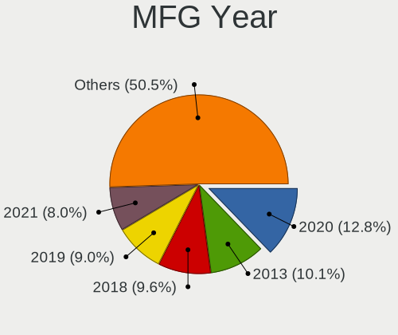
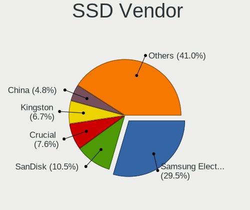
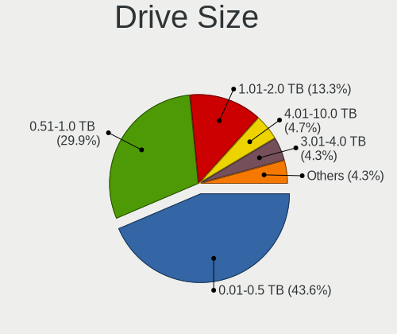
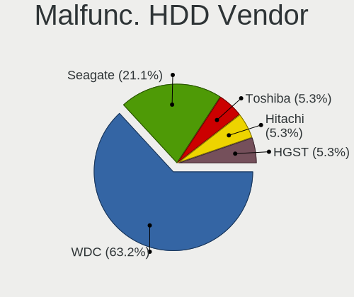
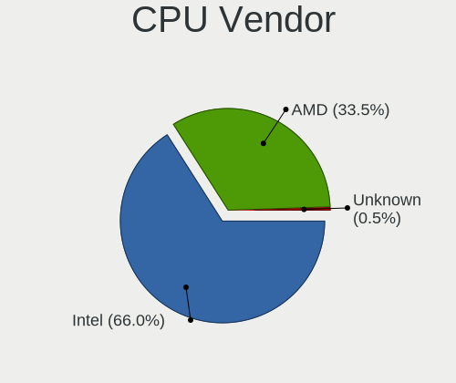
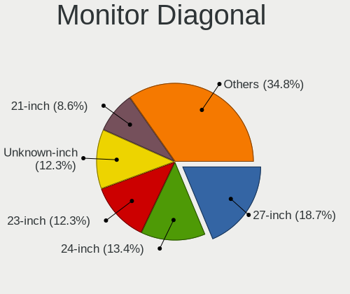
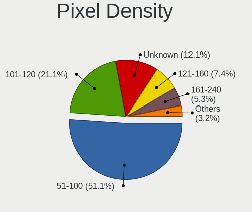
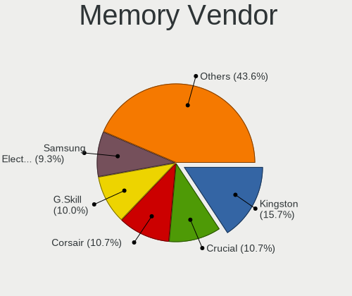

Linux in Singapore - Tested Hardware & Statistics (Desktops)
------------------------------------------------------------

A project to collect tested hardware configurations for Linux in Singapore.

Anyone can contribute to this report by the [hw-probe](https://github.com/linuxhw/hw-probe) tool:

    sudo -E hw-probe -all -upload

Please contribute! Especially if your hardware is rare.

Contents
--------

* [ Test Cases ](#test-cases)

* [ System ](#system)
  - [ OS                       ](#os)
  - [ OS Family                ](#os-family)
  - [ Kernel                   ](#kernel)
  - [ Kernel Family            ](#kernel-family)
  - [ Kernel Major Ver.        ](#kernel-major-ver)
  - [ Arch                     ](#arch)
  - [ DE                       ](#de)
  - [ Display Server           ](#display-server)
  - [ Display Manager          ](#display-manager)
  - [ OS Lang                  ](#os-lang)
  - [ Boot Mode                ](#boot-mode)
  - [ Filesystem               ](#filesystem)
  - [ Part. scheme             ](#part-scheme)
  - [ Dual Boot with Linux/BSD ](#dual-boot-with-linuxbsd)
  - [ Dual Boot (Win)          ](#dual-boot-win)

* [ Board ](#board)
  - [ Vendor                   ](#vendor)
  - [ Model                    ](#model)
  - [ Model Family             ](#model-family)
  - [ MFG Year                 ](#mfg-year)
  - [ Form Factor              ](#form-factor)
  - [ Secure Boot              ](#secure-boot)
  - [ Coreboot                 ](#coreboot)
  - [ RAM Size                 ](#ram-size)
  - [ RAM Used                 ](#ram-used)
  - [ Total Drives             ](#total-drives)
  - [ Has CD-ROM               ](#has-cd-rom)
  - [ Has Ethernet             ](#has-ethernet)
  - [ Has WiFi                 ](#has-wifi)
  - [ Has Bluetooth            ](#has-bluetooth)

* [ Location ](#location)
  - [ Country                  ](#country)
  - [ City                     ](#city)

* [ Drives ](#drives)
  - [ Drive Vendor             ](#drive-vendor)
  - [ Drive Model              ](#drive-model)
  - [ HDD Vendor               ](#hdd-vendor)
  - [ SSD Vendor               ](#ssd-vendor)
  - [ Drive Kind               ](#drive-kind)
  - [ Drive Connector          ](#drive-connector)
  - [ Drive Size               ](#drive-size)
  - [ Space Total              ](#space-total)
  - [ Space Used               ](#space-used)
  - [ Malfunc. Drives          ](#malfunc-drives)
  - [ Malfunc. Drive Vendor    ](#malfunc-drive-vendor)
  - [ Malfunc. HDD Vendor      ](#malfunc-hdd-vendor)
  - [ Malfunc. Drive Kind      ](#malfunc-drive-kind)
  - [ Failed Drives            ](#failed-drives)
  - [ Failed Drive Vendor      ](#failed-drive-vendor)
  - [ Drive Status             ](#drive-status)

* [ Storage controller ](#storage-controller)
  - [ Storage Vendor           ](#storage-vendor)
  - [ Storage Model            ](#storage-model)
  - [ Storage Kind             ](#storage-kind)

* [ Processor ](#processor)
  - [ CPU Vendor               ](#cpu-vendor)
  - [ CPU Model                ](#cpu-model)
  - [ CPU Model Family         ](#cpu-model-family)
  - [ CPU Cores                ](#cpu-cores)
  - [ CPU Sockets              ](#cpu-sockets)
  - [ CPU Threads              ](#cpu-threads)
  - [ CPU Op-Modes             ](#cpu-op-modes)
  - [ CPU Microcode            ](#cpu-microcode)
  - [ CPU Microarch            ](#cpu-microarch)

* [ Graphics ](#graphics)
  - [ GPU Vendor               ](#gpu-vendor)
  - [ GPU Model                ](#gpu-model)
  - [ GPU Combo                ](#gpu-combo)
  - [ GPU Driver               ](#gpu-driver)
  - [ GPU Memory               ](#gpu-memory)

* [ Monitor ](#monitor)
  - [ Monitor Vendor           ](#monitor-vendor)
  - [ Monitor Model            ](#monitor-model)
  - [ Monitor Resolution       ](#monitor-resolution)
  - [ Monitor Diagonal         ](#monitor-diagonal)
  - [ Monitor Width            ](#monitor-width)
  - [ Aspect Ratio             ](#aspect-ratio)
  - [ Monitor Area             ](#monitor-area)
  - [ Pixel Density            ](#pixel-density)
  - [ Multiple Monitors        ](#multiple-monitors)

* [ Network ](#network)
  - [ Net Controller Vendor    ](#net-controller-vendor)
  - [ Net Controller Model     ](#net-controller-model)
  - [ Wireless Vendor          ](#wireless-vendor)
  - [ Wireless Model           ](#wireless-model)
  - [ Ethernet Vendor          ](#ethernet-vendor)
  - [ Ethernet Model           ](#ethernet-model)
  - [ Net Controller Kind      ](#net-controller-kind)
  - [ Used Controller          ](#used-controller)
  - [ NICs                     ](#nics)
  - [ IPv6                     ](#ipv6)

* [ Bluetooth ](#bluetooth)
  - [ Bluetooth Vendor         ](#bluetooth-vendor)
  - [ Bluetooth Model          ](#bluetooth-model)

* [ Sound ](#sound)
  - [ Sound Vendor             ](#sound-vendor)
  - [ Sound Model              ](#sound-model)

* [ Memory ](#memory)
  - [ Memory Vendor            ](#memory-vendor)
  - [ Memory Model             ](#memory-model)
  - [ Memory Kind              ](#memory-kind)
  - [ Memory Form Factor       ](#memory-form-factor)
  - [ Memory Size              ](#memory-size)
  - [ Memory Speed             ](#memory-speed)

* [ Printers & scanners ](#printers--scanners)
  - [ Printer Vendor           ](#printer-vendor)
  - [ Printer Model            ](#printer-model)
  - [ Scanner Vendor           ](#scanner-vendor)
  - [ Scanner Model            ](#scanner-model)

* [ Camera ](#camera)
  - [ Camera Vendor            ](#camera-vendor)
  - [ Camera Model             ](#camera-model)

* [ Security ](#security)
  - [ Fingerprint Vendor       ](#fingerprint-vendor)
  - [ Fingerprint Model        ](#fingerprint-model)
  - [ Chipcard Vendor          ](#chipcard-vendor)
  - [ Chipcard Model           ](#chipcard-model)

* [ Unsupported ](#unsupported)
  - [ Unsupported Devices      ](#unsupported-devices)
  - [ Unsupported Device Types ](#unsupported-device-types)

Test Cases
----------

Total: 205

| Vendor        | Model                       | Probe                                                      | Date         |
|---------------|-----------------------------|------------------------------------------------------------|--------------|
| ASUSTek       | ROG STRIX B650E-I GAMING... | [769bd9153a](https://linux-hardware.org/?probe=769bd9153a) | Jan 01, 2024 |
| KunPengDia... | Unknown                     | [574df96e17](https://linux-hardware.org/?probe=574df96e17) | Jan 01, 2024 |
| ASUSTek       | ROG STRIX B650E-I GAMING... | [ca4a3eaa00](https://linux-hardware.org/?probe=ca4a3eaa00) | Dec 31, 2023 |
| Lenovo        | 30BD NOK                    | [033b3c8abd](https://linux-hardware.org/?probe=033b3c8abd) | Dec 30, 2023 |
| HP            | 0B40h                       | [de46075b7e](https://linux-hardware.org/?probe=de46075b7e) | Dec 29, 2023 |
| JHZD          | BQM6                        | [fa041569a6](https://linux-hardware.org/?probe=fa041569a6) | Dec 28, 2023 |
| HP            | 0B40h                       | [e3ad55af3f](https://linux-hardware.org/?probe=e3ad55af3f) | Dec 24, 2023 |
| ASUSTek       | PRIME Z490-P                | [61724f27e7](https://linux-hardware.org/?probe=61724f27e7) | Dec 23, 2023 |
| MSI           | PRO H410M-B                 | [28d6a6092b](https://linux-hardware.org/?probe=28d6a6092b) | Dec 23, 2023 |
| Acer          | Veriton M4630G V:1.0        | [6e74b5d77f](https://linux-hardware.org/?probe=6e74b5d77f) | Dec 05, 2023 |
| ASRock        | X300TM-ITX                  | [6c74495d5f](https://linux-hardware.org/?probe=6c74495d5f) | Dec 03, 2023 |
| JINGSHA       | X99-D8I                     | [a142726fb0](https://linux-hardware.org/?probe=a142726fb0) | Dec 02, 2023 |
| JINGSHA       | X99-D8I                     | [52a45bbcdb](https://linux-hardware.org/?probe=52a45bbcdb) | Dec 02, 2023 |
| Unknown       | Intel BayTrail Series R1... | [6ab4075642](https://linux-hardware.org/?probe=6ab4075642) | Nov 29, 2023 |
| Unknown       | Unknown                     | [ada9cf1c70](https://linux-hardware.org/?probe=ada9cf1c70) | Nov 07, 2023 |
| Unknown       | Unknown                     | [50949c6e51](https://linux-hardware.org/?probe=50949c6e51) | Nov 04, 2023 |
| Gigabyte      | TRX40 AORUS XTREME          | [d16f2b19b0](https://linux-hardware.org/?probe=d16f2b19b0) | Oct 30, 2023 |
| MACHINIST     | B75 PRO V1.0                | [8927fc6f11](https://linux-hardware.org/?probe=8927fc6f11) | Oct 27, 2023 |
| MSI           | B85M-E45                    | [acc8588daa](https://linux-hardware.org/?probe=acc8588daa) | Oct 16, 2023 |
| SZMZ          | X99M-G2                     | [1b0f7ae9a7](https://linux-hardware.org/?probe=1b0f7ae9a7) | Oct 15, 2023 |
| HP            | 82F2                        | [6a5c62ec30](https://linux-hardware.org/?probe=6a5c62ec30) | Oct 12, 2023 |
| HP            | 82F2                        | [ebf3c3339a](https://linux-hardware.org/?probe=ebf3c3339a) | Oct 12, 2023 |
| Shenzhen M... | HX90G                       | [a6e9f6c7fc](https://linux-hardware.org/?probe=a6e9f6c7fc) | Oct 01, 2023 |
| MSI           | B550M PRO-VDH WIFI          | [ce357bee14](https://linux-hardware.org/?probe=ce357bee14) | Sep 28, 2023 |
| Gigabyte      | B85M-D3H                    | [cfcdb2a961](https://linux-hardware.org/?probe=cfcdb2a961) | Sep 23, 2023 |
| ASUSTek       | ROG STRIX B650E-I GAMING... | [816502caea](https://linux-hardware.org/?probe=816502caea) | Sep 21, 2023 |
| ASUSTek       | E3M-ET V5 SERIES            | [62d1008e3a](https://linux-hardware.org/?probe=62d1008e3a) | Sep 01, 2023 |
| Huanan        | X99-4MT V1.0                | [b1ebbd0661](https://linux-hardware.org/?probe=b1ebbd0661) | Aug 29, 2023 |
| HP            | 0B4Ch D                     | [958521d2be](https://linux-hardware.org/?probe=958521d2be) | Aug 25, 2023 |
| HP            | 0B4Ch D                     | [5abce3a991](https://linux-hardware.org/?probe=5abce3a991) | Aug 23, 2023 |
| Dell          | 04Y8V0 A02                  | [645bd9ed6b](https://linux-hardware.org/?probe=645bd9ed6b) | Aug 20, 2023 |
| ASRock        | H71M-DGS                    | [c200c4f848](https://linux-hardware.org/?probe=c200c4f848) | Aug 14, 2023 |
| Foxconn       | 2A8Ch                       | [a936584caa](https://linux-hardware.org/?probe=a936584caa) | Aug 09, 2023 |
| Shenzhen M... | HX90G                       | [04a083671d](https://linux-hardware.org/?probe=04a083671d) | Aug 05, 2023 |
| Dell          | 09M8Y8 A02                  | [4b57bbf30e](https://linux-hardware.org/?probe=4b57bbf30e) | Aug 04, 2023 |
| Intel         | JSL MRD                     | [feb19ee725](https://linux-hardware.org/?probe=feb19ee725) | Jul 29, 2023 |
| Intel         | JSL MRD                     | [ca5990cfa3](https://linux-hardware.org/?probe=ca5990cfa3) | Jul 29, 2023 |
| Dell          | 00V62H A01                  | [1a6962dc65](https://linux-hardware.org/?probe=1a6962dc65) | Jul 27, 2023 |
| MECHREVO      | F7BFD V1.0                  | [f9be0fc5a7](https://linux-hardware.org/?probe=f9be0fc5a7) | Jul 26, 2023 |
| Gigabyte      | B450M DS3H-CF               | [556e4cd2c9](https://linux-hardware.org/?probe=556e4cd2c9) | Jul 21, 2023 |
| AZW           | Gemini J45                  | [0ed36a4286](https://linux-hardware.org/?probe=0ed36a4286) | Jul 18, 2023 |
| Shenzhen M... | HX90G                       | [f42afac191](https://linux-hardware.org/?probe=f42afac191) | Jul 15, 2023 |
| Gigabyte      | Z690 AERO D                 | [f42140d294](https://linux-hardware.org/?probe=f42140d294) | Jul 03, 2023 |
| Shenzhen M... | HX90G                       | [d1d0bb38d0](https://linux-hardware.org/?probe=d1d0bb38d0) | Jun 20, 2023 |
| ASUSTek       | PRIME H510M-E               | [7b370bd18c](https://linux-hardware.org/?probe=7b370bd18c) | Jun 19, 2023 |
| Gigabyte      | B365M D2V                   | [e16cbf315f](https://linux-hardware.org/?probe=e16cbf315f) | Jun 19, 2023 |
| MSI           | PRO Z790-P WIFI DDR4        | [f0f0a1b2ac](https://linux-hardware.org/?probe=f0f0a1b2ac) | Jun 13, 2023 |
| MSI           | B450M MORTAR                | [6d2c05fd11](https://linux-hardware.org/?probe=6d2c05fd11) | Jun 05, 2023 |
| Gigabyte      | B450M AORUS ELITE           | [f17ae033ef](https://linux-hardware.org/?probe=f17ae033ef) | Jun 03, 2023 |
| SZMZ          | X99M-G2                     | [e9b164885c](https://linux-hardware.org/?probe=e9b164885c) | Jun 03, 2023 |
| Dell          | 04Y8V0 A02                  | [ce749a8df5](https://linux-hardware.org/?probe=ce749a8df5) | Jun 02, 2023 |
| AZW           | MINI S 10                   | [c64432906e](https://linux-hardware.org/?probe=c64432906e) | May 10, 2023 |
| ASUSTek       | E3M-ET V5 SERIES            | [64f08f10f3](https://linux-hardware.org/?probe=64f08f10f3) | May 10, 2023 |
| Dell          | 04Y8V0 A02                  | [d21ef87b63](https://linux-hardware.org/?probe=d21ef87b63) | May 10, 2023 |
| Unknown       | Unknown                     | [c4941a5c16](https://linux-hardware.org/?probe=c4941a5c16) | Apr 27, 2023 |
| Gigabyte      | H61M-S2PH                   | [ec36f4ada2](https://linux-hardware.org/?probe=ec36f4ada2) | Apr 23, 2023 |
| Gigabyte      | X670 AORUS ELITE AX         | [170b38e40f](https://linux-hardware.org/?probe=170b38e40f) | Apr 20, 2023 |
| ASUSTek       | E3M-ET V5 SERIES            | [7e0735056c](https://linux-hardware.org/?probe=7e0735056c) | Apr 12, 2023 |
| ASRock        | B450 Pro4                   | [ac4522914d](https://linux-hardware.org/?probe=ac4522914d) | Apr 02, 2023 |
| Pegatron      | 2ADC                        | [1326ad508e](https://linux-hardware.org/?probe=1326ad508e) | Mar 30, 2023 |
| Unknown       | GB01                        | [ad0e76307c](https://linux-hardware.org/?probe=ad0e76307c) | Mar 24, 2023 |
| ASUSTek       | ROG STRIX H370-F GAMING     | [c02aa4b9e1](https://linux-hardware.org/?probe=c02aa4b9e1) | Mar 23, 2023 |
| Gigabyte      | X570 AORUS PRO WIFI         | [d507b4619f](https://linux-hardware.org/?probe=d507b4619f) | Mar 13, 2023 |
| HP            | 1589                        | [2fc61ae7b4](https://linux-hardware.org/?probe=2fc61ae7b4) | Mar 09, 2023 |
| Gigabyte      | X670 AORUS ELITE AX         | [63f1f6f5dd](https://linux-hardware.org/?probe=63f1f6f5dd) | Mar 08, 2023 |
| SZMZ          | X99M-G2                     | [e2244668d1](https://linux-hardware.org/?probe=e2244668d1) | Mar 02, 2023 |
| SZMZ          | X99M-G2                     | [4e45d95aa1](https://linux-hardware.org/?probe=4e45d95aa1) | Mar 01, 2023 |
| Novatte       | M20                         | [f3b00d12f2](https://linux-hardware.org/?probe=f3b00d12f2) | Feb 14, 2023 |
| ASUSTek       | ROG STRIX X570-E GAMING     | [de144d5025](https://linux-hardware.org/?probe=de144d5025) | Feb 12, 2023 |
| MSI           | PRO Z690-A WIFI DDR4        | [95337ab460](https://linux-hardware.org/?probe=95337ab460) | Feb 11, 2023 |
| ASUSTek       | TUF Gaming B550M-PLUS       | [65e66dbf71](https://linux-hardware.org/?probe=65e66dbf71) | Feb 10, 2023 |
| Foxconn       | 2A8Ch                       | [e7cc1c6b15](https://linux-hardware.org/?probe=e7cc1c6b15) | Feb 07, 2023 |
| HPE           | ProLiant MicroServer Gen... | [9a9b3eed69](https://linux-hardware.org/?probe=9a9b3eed69) | Feb 05, 2023 |
| Foxconn       | 17A0                        | [1a98ed31ed](https://linux-hardware.org/?probe=1a98ed31ed) | Feb 05, 2023 |
| Lenovo        | NOK                         | [507b602676](https://linux-hardware.org/?probe=507b602676) | Jan 25, 2023 |
| MSI           | MAG B550 TOMAHAWK           | [2e6f75ca07](https://linux-hardware.org/?probe=2e6f75ca07) | Jan 06, 2023 |
| ASUSTek       | TUF Gaming B550M-PLUS       | [c96c7d74fe](https://linux-hardware.org/?probe=c96c7d74fe) | Jan 02, 2023 |
| Gigabyte      | B660M AORUS PRO AX DDR4     | [c6325d4647](https://linux-hardware.org/?probe=c6325d4647) | Dec 29, 2022 |
| ASUSTek       | Z87M-PLUS                   | [6dac0c0943](https://linux-hardware.org/?probe=6dac0c0943) | Dec 29, 2022 |
| Gigabyte      | B365M D2V                   | [93f7c010a2](https://linux-hardware.org/?probe=93f7c010a2) | Dec 28, 2022 |
| ASRock        | Z370M-ITX/ac                | [f87fbed6a1](https://linux-hardware.org/?probe=f87fbed6a1) | Dec 28, 2022 |
| ASUSTek       | A88XM-A                     | [8633f00865](https://linux-hardware.org/?probe=8633f00865) | Dec 26, 2022 |
| ASUSTek       | A88XM-A                     | [802e7982de](https://linux-hardware.org/?probe=802e7982de) | Dec 26, 2022 |
| HP            | 8061                        | [4427032526](https://linux-hardware.org/?probe=4427032526) | Dec 24, 2022 |
| ASRock        | B75 Pro3-M                  | [e24692f75f](https://linux-hardware.org/?probe=e24692f75f) | Dec 24, 2022 |
| ASRock        | B450 Pro4                   | [61f064d35f](https://linux-hardware.org/?probe=61f064d35f) | Dec 22, 2022 |
| ASRock        | B450 Pro4                   | [d387b553bd](https://linux-hardware.org/?probe=d387b553bd) | Dec 22, 2022 |
| Foxconn       | 17A0                        | [58a3486afd](https://linux-hardware.org/?probe=58a3486afd) | Dec 20, 2022 |
| Foxconn       | 17A0                        | [be57227f43](https://linux-hardware.org/?probe=be57227f43) | Dec 17, 2022 |
| Foxconn       | 17A0                        | [b2185eeab5](https://linux-hardware.org/?probe=b2185eeab5) | Dec 16, 2022 |
| Foxconn       | 17A0                        | [4518247b07](https://linux-hardware.org/?probe=4518247b07) | Dec 14, 2022 |
| Foxconn       | 17A0                        | [2f3b2f9fbb](https://linux-hardware.org/?probe=2f3b2f9fbb) | Dec 07, 2022 |
| HP            | 8061                        | [6e4cb7cde8](https://linux-hardware.org/?probe=6e4cb7cde8) | Dec 07, 2022 |
| HP            | 8061                        | [9d30b0126f](https://linux-hardware.org/?probe=9d30b0126f) | Dec 05, 2022 |
| MSI           | MAG B660M MORTAR DDR4       | [14e8385f99](https://linux-hardware.org/?probe=14e8385f99) | Oct 31, 2022 |
| Acer          | RS880M05                    | [7adee2fd97](https://linux-hardware.org/?probe=7adee2fd97) | Oct 21, 2022 |
| ASUSTek       | Maximus IV Extreme          | [d84677af13](https://linux-hardware.org/?probe=d84677af13) | Oct 17, 2022 |
| Gigabyte      | B550M DS3H AC               | [9ec02e49a3](https://linux-hardware.org/?probe=9ec02e49a3) | Oct 13, 2022 |
| Gigabyte      | X99-Ultra Gaming-CF         | [568bffc355](https://linux-hardware.org/?probe=568bffc355) | Sep 22, 2022 |
| MSI           | MAG X570 TOMAHAWK WIFI      | [73fd6c23e1](https://linux-hardware.org/?probe=73fd6c23e1) | Sep 21, 2022 |
| ASUSTek       | X99-E WS                    | [c76dceef8e](https://linux-hardware.org/?probe=c76dceef8e) | Sep 08, 2022 |
| ASUSTek       | ROG STRIX H370-F GAMING     | [a61798e4d3](https://linux-hardware.org/?probe=a61798e4d3) | Sep 05, 2022 |
| ASUSTek       | ROG STRIX H370-F GAMING     | [0ba66b6e07](https://linux-hardware.org/?probe=0ba66b6e07) | Sep 05, 2022 |
| ASUSTek       | ROG STRIX H370-F GAMING     | [169df470a6](https://linux-hardware.org/?probe=169df470a6) | Sep 05, 2022 |
| ASUSTek       | Pro WS WRX80E-SAGE SE WI... | [a332f284ab](https://linux-hardware.org/?probe=a332f284ab) | Aug 22, 2022 |
| HP            | 843B                        | [6033dabb9d](https://linux-hardware.org/?probe=6033dabb9d) | Aug 09, 2022 |
| Gigabyte      | H61M-S2PH                   | [31bd0a48c9](https://linux-hardware.org/?probe=31bd0a48c9) | Aug 02, 2022 |
| ASUSTek       | ROG STRIX B550-I GAMING     | [1a28383fee](https://linux-hardware.org/?probe=1a28383fee) | Jul 19, 2022 |
| MSI           | PRO B660M-A WIFI DDR4       | [b33dcf5312](https://linux-hardware.org/?probe=b33dcf5312) | Jul 12, 2022 |
| Gigabyte      | H87N-WIFI                   | [613bb8fe40](https://linux-hardware.org/?probe=613bb8fe40) | Jun 16, 2022 |
| MSI           | Z87-G45 GAMING              | [53877eebd1](https://linux-hardware.org/?probe=53877eebd1) | Jun 10, 2022 |
| ASUSTek       | B85M-E                      | [bd4201a786](https://linux-hardware.org/?probe=bd4201a786) | May 09, 2022 |
| ASUSTek       | B85M-E                      | [78752966d0](https://linux-hardware.org/?probe=78752966d0) | May 02, 2022 |
| ASUSTek       | B85M-E                      | [200ed04d31](https://linux-hardware.org/?probe=200ed04d31) | May 02, 2022 |
| Dell          | 06CV2N A00                  | [f9e949ad9b](https://linux-hardware.org/?probe=f9e949ad9b) | Apr 24, 2022 |
| ASUSTek       | ROG STRIX B550-I GAMING     | [69b4016133](https://linux-hardware.org/?probe=69b4016133) | Apr 15, 2022 |
| Dell          | 0NK70N A03                  | [7d4e906833](https://linux-hardware.org/?probe=7d4e906833) | Mar 11, 2022 |
| HP            | 8054                        | [dfbd7e95d0](https://linux-hardware.org/?probe=dfbd7e95d0) | Mar 06, 2022 |
| Dell          | 09M8Y8 A02                  | [862667e874](https://linux-hardware.org/?probe=862667e874) | Feb 22, 2022 |
| Dell          | 06CV2N A00                  | [b3be05cbce](https://linux-hardware.org/?probe=b3be05cbce) | Feb 06, 2022 |
| Gigabyte      | Z77-D3H                     | [190a99dd63](https://linux-hardware.org/?probe=190a99dd63) | Jan 31, 2022 |
| ASRock        | AB350 Gaming-ITX/ac         | [6c19d2fbd6](https://linux-hardware.org/?probe=6c19d2fbd6) | Jan 11, 2022 |
| Gigabyte      | B550I AORUS PRO AX          | [9309138e99](https://linux-hardware.org/?probe=9309138e99) | Dec 31, 2021 |
| ASRock        | B560M Pro4                  | [bd3ec294cb](https://linux-hardware.org/?probe=bd3ec294cb) | Dec 18, 2021 |
| Dell          | 0VD5HY A04                  | [2aaa0df82d](https://linux-hardware.org/?probe=2aaa0df82d) | Dec 18, 2021 |
| Dell          | 0HD5W2 A01                  | [72329a4b56](https://linux-hardware.org/?probe=72329a4b56) | Dec 17, 2021 |
| AMI           | Cherry Trail CR             | [96c2c68676](https://linux-hardware.org/?probe=96c2c68676) | Dec 16, 2021 |
| Dell          | 0C96W1 A02                  | [31f32bf184](https://linux-hardware.org/?probe=31f32bf184) | Dec 16, 2021 |
| ASRock        | B450M Steel Legend          | [91b2a03d70](https://linux-hardware.org/?probe=91b2a03d70) | Dec 13, 2021 |
| MSI           | MPG Z690 CARBON WIFI        | [19812541db](https://linux-hardware.org/?probe=19812541db) | Nov 23, 2021 |
| MSI           | MPG Z690 CARBON WIFI        | [0eac4a44ef](https://linux-hardware.org/?probe=0eac4a44ef) | Nov 23, 2021 |
| Gigabyte      | B365M GAMING HD             | [cf60dd841c](https://linux-hardware.org/?probe=cf60dd841c) | Nov 10, 2021 |
| Dell          | 0XCR8D A03                  | [97e2f36d1f](https://linux-hardware.org/?probe=97e2f36d1f) | Nov 07, 2021 |
| ASUSTek       | Z170-A                      | [5d9f112e39](https://linux-hardware.org/?probe=5d9f112e39) | Nov 07, 2021 |
| MSI           | B450 TOMAHAWK               | [02983fa577](https://linux-hardware.org/?probe=02983fa577) | Sep 08, 2021 |
| MSI           | A320M-A PRO MAX             | [6daf2c7553](https://linux-hardware.org/?probe=6daf2c7553) | Sep 04, 2021 |
| MSI           | A320M-A PRO MAX             | [bea89f1164](https://linux-hardware.org/?probe=bea89f1164) | Sep 04, 2021 |
| ASRock        | Z77 Extreme3                | [0e95fc1e3d](https://linux-hardware.org/?probe=0e95fc1e3d) | Sep 03, 2021 |
| Lenovo        | 1046 SDK0T08861 WIN 3305... | [adf156f9db](https://linux-hardware.org/?probe=adf156f9db) | Aug 26, 2021 |
| ASUSTek       | ROG STRIX B550-I GAMING     | [d97a42e31e](https://linux-hardware.org/?probe=d97a42e31e) | Aug 26, 2021 |
| Lenovo        | NOK                         | [274005087d](https://linux-hardware.org/?probe=274005087d) | Aug 23, 2021 |
| Biostar       | TB250-BTC+                  | [f45d61ab64](https://linux-hardware.org/?probe=f45d61ab64) | Jul 31, 2021 |
| Dell          | 0NKW6Y A00                  | [85f066488a](https://linux-hardware.org/?probe=85f066488a) | Jul 29, 2021 |
| Dell          | 0NKW6Y A00                  | [fd1285b7f2](https://linux-hardware.org/?probe=fd1285b7f2) | Jul 29, 2021 |
| ASUSTek       | M5A78L-M LX V2              | [502fe1bf66](https://linux-hardware.org/?probe=502fe1bf66) | Jul 19, 2021 |
| MSI           | A68HM-E33 V2                | [983bc90bc7](https://linux-hardware.org/?probe=983bc90bc7) | Jul 14, 2021 |
| LattePanda    | Alpha                       | [1d9daab9aa](https://linux-hardware.org/?probe=1d9daab9aa) | Jun 20, 2021 |
| LattePanda    | Alpha                       | [e9ef19ed6e](https://linux-hardware.org/?probe=e9ef19ed6e) | Jun 20, 2021 |
| HP            | 198E                        | [a44ce74aaa](https://linux-hardware.org/?probe=a44ce74aaa) | May 22, 2021 |
| Gigabyte      | H81M-DS2                    | [589d53b7ce](https://linux-hardware.org/?probe=589d53b7ce) | May 11, 2021 |
| ASUSTek       | M5A78L-M LX V2              | [e20da66200](https://linux-hardware.org/?probe=e20da66200) | Apr 17, 2021 |
| ASRock        | HM55-MXM                    | [e56d216ab7](https://linux-hardware.org/?probe=e56d216ab7) | Apr 14, 2021 |
| Lenovo        | ThinkCentre M90p 5864BM3    | [666e4f970e](https://linux-hardware.org/?probe=666e4f970e) | Apr 10, 2021 |
| Dell          | 0D6H9T A00                  | [94d321f020](https://linux-hardware.org/?probe=94d321f020) | Apr 02, 2021 |
| Gigabyte      | B550I AORUS PRO AX          | [9eff035231](https://linux-hardware.org/?probe=9eff035231) | Mar 01, 2021 |
| Gigabyte      | X570 AORUS PRO WIFI         | [e6cb859b40](https://linux-hardware.org/?probe=e6cb859b40) | Feb 21, 2021 |
| Lenovo        | SHARKBAY NOK                | [563ceb4238](https://linux-hardware.org/?probe=563ceb4238) | Jan 28, 2021 |
| Dell          | 00V62H A01                  | [e08b05c812](https://linux-hardware.org/?probe=e08b05c812) | Jan 09, 2021 |
| MSI           | MAG X570 TOMAHAWK WIFI      | [e5b808ee57](https://linux-hardware.org/?probe=e5b808ee57) | Jan 02, 2021 |
| MSI           | MAG X570 TOMAHAWK WIFI      | [ca915222e5](https://linux-hardware.org/?probe=ca915222e5) | Dec 07, 2020 |
| Dell          | 0D02VH A01                  | [1d822ef5a3](https://linux-hardware.org/?probe=1d822ef5a3) | Dec 07, 2020 |
| MSI           | MAG X570 TOMAHAWK WIFI      | [b9461ebddd](https://linux-hardware.org/?probe=b9461ebddd) | Nov 29, 2020 |
| Dell          | 0D441T A03                  | [b57394e325](https://linux-hardware.org/?probe=b57394e325) | Nov 20, 2020 |
| ASUSTek       | E3M-ET V5 SERIES            | [f1faffa793](https://linux-hardware.org/?probe=f1faffa793) | Nov 20, 2020 |
| ASUSTek       | E3M-ET V5 SERIES            | [e727ca80a6](https://linux-hardware.org/?probe=e727ca80a6) | Nov 20, 2020 |
| ASUSTek       | M4A78-EM-1394               | [3736bdc191](https://linux-hardware.org/?probe=3736bdc191) | Nov 12, 2020 |
| ASRock        | H110M-HDS R3.0              | [7dea4e7c04](https://linux-hardware.org/?probe=7dea4e7c04) | Nov 10, 2020 |
| ASRock        | 990FX Killer                | [4faf15fe7f](https://linux-hardware.org/?probe=4faf15fe7f) | Oct 08, 2020 |
| MSI           | X370 GAMING PRO CARBON      | [f542320df7](https://linux-hardware.org/?probe=f542320df7) | Sep 28, 2020 |
| ASUSTek       | M3A78-EM                    | [65ed8bba9c](https://linux-hardware.org/?probe=65ed8bba9c) | Sep 23, 2020 |
| ASUSTek       | Z97M-PLUS                   | [db8a9ea1ef](https://linux-hardware.org/?probe=db8a9ea1ef) | Sep 04, 2020 |
| Gigabyte      | 945GZM-S2                   | [56d2f5c077](https://linux-hardware.org/?probe=56d2f5c077) | Sep 03, 2020 |
| Gigabyte      | 945GZM-S2                   | [3a8e991dee](https://linux-hardware.org/?probe=3a8e991dee) | Sep 01, 2020 |
| ASUSTek       | P8H77-V LE                  | [efb532b71e](https://linux-hardware.org/?probe=efb532b71e) | Jul 24, 2020 |
| ASRock        | HM55-MXM                    | [7f12e5a53c](https://linux-hardware.org/?probe=7f12e5a53c) | Jul 19, 2020 |
| Gigabyte      | G1.Sniper A88X-CF           | [6d5b75622f](https://linux-hardware.org/?probe=6d5b75622f) | Jul 10, 2020 |
| ECS           | H61H2-MV                    | [a4ebb57c65](https://linux-hardware.org/?probe=a4ebb57c65) | Jun 19, 2020 |
| ASUSTek       | P8H77-V LE                  | [5d31ba79a1](https://linux-hardware.org/?probe=5d31ba79a1) | Jun 17, 2020 |
| ASUSTek       | H87I-PLUS                   | [9e8603cab8](https://linux-hardware.org/?probe=9e8603cab8) | Jun 05, 2020 |
| ASRock        | A320M-HDV R4.0              | [3da3ba498c](https://linux-hardware.org/?probe=3da3ba498c) | Jun 03, 2020 |
| ASRock        | H110M-HDS R3.0              | [8610132ae8](https://linux-hardware.org/?probe=8610132ae8) | Jun 03, 2020 |
| ASUSTek       | H87I-PLUS                   | [74e66b2a4a](https://linux-hardware.org/?probe=74e66b2a4a) | May 30, 2020 |
| ASUSTek       | Berkeley                    | [ebb35e1770](https://linux-hardware.org/?probe=ebb35e1770) | May 14, 2020 |
| ASUSTek       | Berkeley                    | [038ada5ee3](https://linux-hardware.org/?probe=038ada5ee3) | May 14, 2020 |
| ASRock        | A320M-HDV R4.0              | [b56e1d0e1a](https://linux-hardware.org/?probe=b56e1d0e1a) | May 13, 2020 |
| ASUSTek       | Berkeley                    | [ea544afa99](https://linux-hardware.org/?probe=ea544afa99) | May 12, 2020 |
| ASUSTek       | Berkeley                    | [058ecc2781](https://linux-hardware.org/?probe=058ecc2781) | May 12, 2020 |
| ASUSTek       | PRIME H310M-A               | [aaed21ffd0](https://linux-hardware.org/?probe=aaed21ffd0) | May 08, 2020 |
| Dell          | 06D7TR A00                  | [60b49366ed](https://linux-hardware.org/?probe=60b49366ed) | Apr 30, 2020 |
| ASUSTek       | ROG CROSSHAIR VII HERO      | [26486f2fff](https://linux-hardware.org/?probe=26486f2fff) | Mar 24, 2020 |
| Dell          | 0X8DXD A01                  | [37012211e0](https://linux-hardware.org/?probe=37012211e0) | Mar 05, 2020 |
| Dell          | 00V62H A01                  | [001695659e](https://linux-hardware.org/?probe=001695659e) | Mar 04, 2020 |
| Dell          | 00V62H A01                  | [199fc82812](https://linux-hardware.org/?probe=199fc82812) | Mar 04, 2020 |
| Gigabyte      | Z270X-UD5-CF                | [a38c129cd9](https://linux-hardware.org/?probe=a38c129cd9) | Jan 04, 2020 |
| Acer          | Aspire X3950                | [fd467d33f5](https://linux-hardware.org/?probe=fd467d33f5) | Jan 03, 2020 |
| ASRock        | Z370 Pro4                   | [f681da046d](https://linux-hardware.org/?probe=f681da046d) | Dec 09, 2019 |
| Lenovo        | 30C0 SDK0J40697 WIN 3305... | [f35675231e](https://linux-hardware.org/?probe=f35675231e) | Dec 02, 2019 |
| Gigabyte      | X570 AORUS PRO WIFI         | [6bee5d9a22](https://linux-hardware.org/?probe=6bee5d9a22) | Nov 16, 2019 |
| Gigabyte      | X570 AORUS PRO WIFI         | [1b0467dde0](https://linux-hardware.org/?probe=1b0467dde0) | Nov 16, 2019 |
| Dell          | 0F3KHR A00                  | [636fbfdcb6](https://linux-hardware.org/?probe=636fbfdcb6) | Sep 22, 2019 |
| ASUSTek       | P8H67-M PRO                 | [c6888a9735](https://linux-hardware.org/?probe=c6888a9735) | May 31, 2019 |
| ASUSTek       | ET2020I                     | [a695a9c422](https://linux-hardware.org/?probe=a695a9c422) | Apr 07, 2019 |
| MSI           | X299 RAIDER                 | [3f982f3e86](https://linux-hardware.org/?probe=3f982f3e86) | Dec 04, 2018 |
| MSI           | X299 RAIDER                 | [1207b80721](https://linux-hardware.org/?probe=1207b80721) | Dec 04, 2018 |
| MSI           | Boston                      | [104569cafb](https://linux-hardware.org/?probe=104569cafb) | Oct 24, 2018 |

System
------

OS
--

Installed operating systems

| Name                         | Desktops | Percent |
|------------------------------|----------|---------|
| Ubuntu 20.04                 | 22       | 13.58%  |
| Ubuntu 18.04                 | 15       | 9.26%   |
| Ubuntu 22.04                 | 14       | 8.64%   |
| Arch Rolling                 | 8        | 4.94%   |
| Manjaro                      | 5        | 3.09%   |
| Linux Mint 21                | 5        | 3.09%   |
| openSUSE Tumbleweed-XXXXXXXX | 4        | 2.47%   |
| KDE neon 20.04               | 4        | 2.47%   |
| Fedora 38                    | 4        | 2.47%   |
| ArcoLinux Rolling            | 4        | 2.47%   |
| Pop!_OS 20.04                | 3        | 1.85%   |
| OpenMandriva 23.11           | 3        | 1.85%   |
| OpenMandriva 23.03           | 3        | 1.85%   |
| Linux Mint 21.2              | 3        | 1.85%   |
| Debian 11                    | 3        | 1.85%   |
| Ubuntu 21.04                 | 2        | 1.23%   |
| Rocky Linux 8.5              | 2        | 1.23%   |
| Pop!_OS 21.04                | 2        | 1.23%   |
| OpenMandriva 4.50            | 2        | 1.23%   |
| OpenMandriva 4.3             | 2        | 1.23%   |
| MX 21                        | 2        | 1.23%   |
| Linux Mint 20.3              | 2        | 1.23%   |
| Linux Mint 20                | 2        | 1.23%   |
| Fedora 37                    | 2        | 1.23%   |
| Fedora 33                    | 2        | 1.23%   |
| Debian 12                    | 2        | 1.23%   |
| Arch                         | 2        | 1.23%   |
| Zorin 16                     | 1        | 0.62%   |
| Xubuntu 23.10                | 1        | 0.62%   |
| Xubuntu 23.04                | 1        | 0.62%   |
| Xubuntu 20.04                | 1        | 0.62%   |
| Ubuntu Unity 20.04           | 1        | 0.62%   |
| Ubuntu Unity 16.04           | 1        | 0.62%   |
| Ubuntu MATE 20.04            | 1        | 0.62%   |
| Ubuntu Kylin 22.04           | 1        | 0.62%   |
| Ubuntu 23.10                 | 1        | 0.62%   |
| Ubuntu 23.04                 | 1        | 0.62%   |
| Ubuntu 22.10                 | 1        | 0.62%   |
| Ubuntu 19.10                 | 1        | 0.62%   |
| Ubuntu 19.04                 | 1        | 0.62%   |

OS Family
---------

OS without a version

| Name         | Desktops | Percent |
|--------------|----------|---------|
| Ubuntu       | 57       | 37.5%   |
| OpenMandriva | 14       | 9.21%   |
| Linux Mint   | 12       | 7.89%   |
| Arch         | 10       | 6.58%   |
| Fedora       | 8        | 5.26%   |
| Pop!_OS      | 7        | 4.61%   |
| Manjaro      | 6        | 3.95%   |
| Debian       | 6        | 3.95%   |
| Rocky Linux  | 4        | 2.63%   |
| openSUSE     | 4        | 2.63%   |
| KDE neon     | 4        | 2.63%   |
| ArcoLinux    | 4        | 2.63%   |
| Xubuntu      | 3        | 1.97%   |
| Ubuntu Unity | 2        | 1.32%   |
| MX           | 2        | 1.32%   |
| Zorin        | 1        | 0.66%   |
| Ubuntu MATE  | 1        | 0.66%   |
| Ubuntu Kylin | 1        | 0.66%   |
| Lubuntu      | 1        | 0.66%   |
| Gentoo       | 1        | 0.66%   |
| Garuda Linux | 1        | 0.66%   |
| EndeavourOS  | 1        | 0.66%   |
| CentOS       | 1        | 0.66%   |
| Atz          | 1        | 0.66%   |

Kernel
------

Version of the Linux kernel

| Version                      | Desktops | Percent |
|------------------------------|----------|---------|
| 5.15.0-56-generic            | 7        | 3.98%   |
| 5.15.0-46-generic            | 4        | 2.27%   |
| 6.2.6-desktop-1omv2390       | 3        | 1.7%    |
| 5.4.0-29-generic             | 3        | 1.7%    |
| 5.15.0-58-generic            | 3        | 1.7%    |
| 6.6.2-desktop-1omv2390       | 2        | 1.14%   |
| 6.3.8-zen1-1-zen             | 2        | 1.14%   |
| 6.2.14-300.fc38.x86_64       | 2        | 1.14%   |
| 6.2.0-39-generic             | 2        | 1.14%   |
| 6.2.0-34-generic             | 2        | 1.14%   |
| 6.2.0-31-generic             | 2        | 1.14%   |
| 6.0.15-300.fc37.x86_64       | 2        | 1.14%   |
| 5.9.8-200.fc33.x86_64        | 2        | 1.14%   |
| 5.4.0-7642-generic           | 2        | 1.14%   |
| 5.4.0-70-generic             | 2        | 1.14%   |
| 5.4.0-42-generic             | 2        | 1.14%   |
| 5.4.0-40-generic             | 2        | 1.14%   |
| 5.4.0-37-generic             | 2        | 1.14%   |
| 5.3.0-51-generic             | 2        | 1.14%   |
| 5.19.0-35-generic            | 2        | 1.14%   |
| 5.16.7-desktop-1omv4003      | 2        | 1.14%   |
| 5.15.0-71-generic            | 2        | 1.14%   |
| 5.15.0-52-generic            | 2        | 1.14%   |
| 5.12.7-desktop-1omv4003      | 2        | 1.14%   |
| 5.11.0-27-generic            | 2        | 1.14%   |
| 5.0.0-36-generic             | 2        | 1.14%   |
| 4.18.0-348.12.2.el8_5.x86_64 | 2        | 1.14%   |
| 6.6.7-arch1-1                | 1        | 0.57%   |
| 6.6.1-desktop-1omv2390       | 1        | 0.57%   |
| 6.5.9-zen2-1-zen             | 1        | 0.57%   |
| 6.5.9-1-default              | 1        | 0.57%   |
| 6.5.8-200.fc38.x86_64        | 1        | 0.57%   |
| 6.5.0-9-generic              | 1        | 0.57%   |
| 6.5.0-14-generic             | 1        | 0.57%   |
| 6.4.8-desktop-2omv2390       | 1        | 0.57%   |
| 6.4.7-desktop-1omv2390       | 1        | 0.57%   |
| 6.4.6-76060406-generic       | 1        | 0.57%   |
| 6.4.3-zen1-1-zen             | 1        | 0.57%   |
| 6.4.12-200.fc38.x86_64       | 1        | 0.57%   |
| 6.4.10-200.fc38.x86_64       | 1        | 0.57%   |

Kernel Family
-------------

Linux kernel without a distro release

| Version  | Desktops | Percent |
|----------|----------|---------|
| 5.15.0   | 25       | 14.71%  |
| 5.4.0    | 24       | 14.12%  |
| 6.2.0    | 10       | 5.88%   |
| 5.0.0    | 7        | 4.12%   |
| 5.11.0   | 6        | 3.53%   |
| 5.10.0   | 5        | 2.94%   |
| 4.18.0   | 5        | 2.94%   |
| 4.15.0   | 4        | 2.35%   |
| 6.3.8    | 3        | 1.76%   |
| 6.2.6    | 3        | 1.76%   |
| 5.8.0    | 3        | 1.76%   |
| 5.3.0    | 3        | 1.76%   |
| 5.19.0   | 3        | 1.76%   |
| 6.6.2    | 2        | 1.18%   |
| 6.5.9    | 2        | 1.18%   |
| 6.5.0    | 2        | 1.18%   |
| 6.3.9    | 2        | 1.18%   |
| 6.2.14   | 2        | 1.18%   |
| 6.1.0    | 2        | 1.18%   |
| 6.0.15   | 2        | 1.18%   |
| 5.9.8    | 2        | 1.18%   |
| 5.16.7   | 2        | 1.18%   |
| 5.13.0   | 2        | 1.18%   |
| 5.12.7   | 2        | 1.18%   |
| 6.6.7    | 1        | 0.59%   |
| 6.6.1    | 1        | 0.59%   |
| 6.5.8    | 1        | 0.59%   |
| 6.4.8    | 1        | 0.59%   |
| 6.4.7    | 1        | 0.59%   |
| 6.4.6    | 1        | 0.59%   |
| 6.4.3    | 1        | 0.59%   |
| 6.4.12   | 1        | 0.59%   |
| 6.4.10   | 1        | 0.59%   |
| 6.3.7    | 1        | 0.59%   |
| 6.3.5    | 1        | 0.59%   |
| 6.3.4    | 1        | 0.59%   |
| 6.3.0.11 | 1        | 0.59%   |
| 6.2.9    | 1        | 0.59%   |
| 6.2.2    | 1        | 0.59%   |
| 6.1.69   | 1        | 0.59%   |

Kernel Major Ver.
-----------------

Linux kernel major version

| Version | Desktops | Percent |
|---------|----------|---------|
| 5.15    | 32       | 18.93%  |
| 5.4     | 24       | 14.2%   |
| 6.2     | 16       | 9.47%   |
| 6.3     | 8        | 4.73%   |
| 6.1     | 8        | 4.73%   |
| 5.11    | 7        | 4.14%   |
| 5.10    | 7        | 4.14%   |
| 5.0     | 7        | 4.14%   |
| 6.4     | 6        | 3.55%   |
| 6.5     | 5        | 2.96%   |
| 4.18    | 5        | 2.96%   |
| 6.6     | 4        | 2.37%   |
| 6.0     | 4        | 2.37%   |
| 5.8     | 4        | 2.37%   |
| 5.16    | 4        | 2.37%   |
| 5.13    | 4        | 2.37%   |
| 4.15    | 4        | 2.37%   |
| 5.9     | 3        | 1.78%   |
| 5.3     | 3        | 1.78%   |
| 5.19    | 3        | 1.78%   |
| 5.14    | 3        | 1.78%   |
| 5.12    | 3        | 1.78%   |
| 6.3.0   | 1        | 0.59%   |
| 5.18    | 1        | 0.59%   |
| 5.17    | 1        | 0.59%   |
| 4.16    | 1        | 0.59%   |
| 3.10    | 1        | 0.59%   |

Arch
----

OS architecture (x86_64, i586, etc.)

| Name   | Desktops | Percent |
|--------|----------|---------|
| x86_64 | 150      | 100%    |

DE
--

Desktop Environment

| Name          | Desktops | Percent |
|---------------|----------|---------|
| GNOME         | 65       | 41.94%  |
| KDE5          | 26       | 16.77%  |
| Unknown       | 26       | 16.77%  |
| X-Cinnamon    | 13       | 8.39%   |
| XFCE          | 10       | 6.45%   |
| LXQT          | 3        | 1.94%   |
| i3            | 3        | 1.94%   |
| Unity         | 2        | 1.29%   |
| Cinnamon      | 2        | 1.29%   |
| UKUI          | 1        | 0.65%   |
| MATE          | 1        | 0.65%   |
| KDE           | 1        | 0.65%   |
| GNOME Classic | 1        | 0.65%   |
| Budgie        | 1        | 0.65%   |

Display Server
--------------

X11 or Wayland

| Name    | Desktops | Percent |
|---------|----------|---------|
| X11     | 118      | 75.64%  |
| Wayland | 20       | 12.82%  |
| Tty     | 9        | 5.77%   |
| Unknown | 9        | 5.77%   |

Display Manager
---------------

SDDM, LightDM, etc.

| Name    | Desktops | Percent |
|---------|----------|---------|
| Unknown | 71       | 46.41%  |
| SDDM    | 27       | 17.65%  |
| GDM3    | 20       | 13.07%  |
| GDM     | 18       | 11.76%  |
| LightDM | 15       | 9.8%    |
| TDM     | 1        | 0.65%   |
| GREETD  | 1        | 0.65%   |

OS Lang
-------

Language

| Lang    | Desktops | Percent |
|---------|----------|---------|
| en_US   | 63       | 40.91%  |
| en_SG   | 55       | 35.71%  |
| Unknown | 11       | 7.14%   |
| zh_CN   | 8        | 5.19%   |
| en_AU   | 4        | 2.6%    |
| C       | 4        | 2.6%    |
| de_DE   | 3        | 1.95%   |
| en_GB   | 2        | 1.3%    |
| fr_FR   | 1        | 0.65%   |
| en_PH   | 1        | 0.65%   |
| en_IN   | 1        | 0.65%   |
| en_HK   | 1        | 0.65%   |

Boot Mode
---------

EFI or BIOS

| Mode | Desktops | Percent |
|------|----------|---------|
| EFI  | 89       | 59.33%  |
| BIOS | 61       | 40.67%  |

Filesystem
----------

Type of filesystem

| Type    | Desktops | Percent |
|---------|----------|---------|
| Ext4    | 104      | 67.97%  |
| Btrfs   | 19       | 12.42%  |
| Overlay | 12       | 7.84%   |
| Xfs     | 10       | 6.54%   |
| Tmpfs   | 5        | 3.27%   |
| Unknown | 3        | 1.96%   |

Part. scheme
------------

Scheme of partitioning

| Type    | Desktops | Percent |
|---------|----------|---------|
| GPT     | 78       | 51.66%  |
| Unknown | 59       | 39.07%  |
| MBR     | 14       | 9.27%   |

Dual Boot with Linux/BSD
------------------------

Hosting more than one Linux/BSD

| Dual boot | Desktops | Percent |
|-----------|----------|---------|
| No        | 115      | 75.16%  |
| Yes       | 38       | 24.84%  |

Dual Boot (Win)
---------------

Hosting Linux and Windows

| Dual boot | Desktops | Percent |
|-----------|----------|---------|
| No        | 95       | 62.5%   |
| Yes       | 57       | 37.5%   |

Board
-----

Vendor
------

Motherboard manufacturer

| Name                                 | Desktops | Percent |
|--------------------------------------|----------|---------|
| ASUSTek Computer                     | 29       | 19.33%  |
| Gigabyte Technology                  | 24       | 16%     |
| MSI                                  | 20       | 13.33%  |
| Dell                                 | 17       | 11.33%  |
| ASRock                               | 15       | 10%     |
| Hewlett-Packard                      | 9        | 6%      |
| Lenovo                               | 6        | 4%      |
| Unknown                              | 5        | 3.33%   |
| Foxconn                              | 4        | 2.67%   |
| Acer                                 | 3        | 2%      |
| AZW                                  | 2        | 1.33%   |
| SZMZ                                 | 1        | 0.67%   |
| Shenzhen Meigao Electronic Equipment | 1        | 0.67%   |
| Pegatron                             | 1        | 0.67%   |
| Novatte                              | 1        | 0.67%   |
| MECHREVO                             | 1        | 0.67%   |
| MACHINIST                            | 1        | 0.67%   |
| LattePanda                           | 1        | 0.67%   |
| KunPengDianTong(KPDT)                | 1        | 0.67%   |
| JINGSHA                              | 1        | 0.67%   |
| JHZD                                 | 1        | 0.67%   |
| Intel                                | 1        | 0.67%   |
| Huanan                               | 1        | 0.67%   |
| HPE                                  | 1        | 0.67%   |
| ECS                                  | 1        | 0.67%   |
| Biostar                              | 1        | 0.67%   |
| AMI                                  | 1        | 0.67%   |

Model
-----

Motherboard model

| Name                                       | Desktops | Percent |
|--------------------------------------------|----------|---------|
| Unknown                                    | 6        | 4%      |
| ASUS All Series                            | 5        | 3.33%   |
| Gigabyte X570 AORUS PRO WIFI               | 4        | 2.67%   |
| MSI MS-7C84                                | 3        | 2%      |
| Foxconn Pro 3330 MT                        | 3        | 2%      |
| Dell OptiPlex 9020                         | 3        | 2%      |
| ASUS ROG STRIX B650E-I GAMING WIFI         | 3        | 2%      |
| HP Z200 Workstation                        | 2        | 1.33%   |
| Gigabyte B550I AORUS PRO AX                | 2        | 1.33%   |
| Dell OptiPlex 990                          | 2        | 1.33%   |
| ASUS ROG STRIX B550-I GAMING               | 2        | 1.33%   |
| ASRock B450 Pro4                           | 2        | 1.33%   |
| SZMZ X99M-H2                               | 1        | 0.67%   |
| Shenzhen Meigao Electronic Equipment HX90G | 1        | 0.67%   |
| Pegatron 23-d018d                          | 1        | 0.67%   |
| Novatte M20                                | 1        | 0.67%   |
| MSI MS-7E06                                | 1        | 0.67%   |
| MSI MS-7D82                                | 1        | 0.67%   |
| MSI MS-7D43                                | 1        | 0.67%   |
| MSI MS-7D42                                | 1        | 0.67%   |
| MSI MS-7D30                                | 1        | 0.67%   |
| MSI MS-7D25                                | 1        | 0.67%   |
| MSI MS-7C95                                | 1        | 0.67%   |
| MSI MS-7C91                                | 1        | 0.67%   |
| MSI MS-7C52                                | 1        | 0.67%   |
| MSI MS-7C02                                | 1        | 0.67%   |
| MSI MS-7B89                                | 1        | 0.67%   |
| MSI MS-7A94                                | 1        | 0.67%   |
| MSI MS-7A32                                | 1        | 0.67%   |
| MSI MS-7821                                | 1        | 0.67%   |
| MSI MS-7817                                | 1        | 0.67%   |
| MSI MS-7721                                | 1        | 0.67%   |
| MSI KT308AA-AB4 SR5472CF                   | 1        | 0.67%   |
| MECHREVO F7BFD V1.0                        | 1        | 0.67%   |
| MACHINIST B75 PRO V1.0                     | 1        | 0.67%   |
| Lenovo ThinkStation P620 30E1S3VH00        | 1        | 0.67%   |
| Lenovo ThinkStation P310 30ASS2WG00        | 1        | 0.67%   |
| Lenovo ThinkCentre M90p 5864BM3            | 1        | 0.67%   |
| Lenovo ThinkCentre M73 10AXS26C00          | 1        | 0.67%   |
| Lenovo ThinkCentre M72e 36601Y8            | 1        | 0.67%   |

Model Family
------------

Motherboard model prefix

| Name                                       | Desktops | Percent |
|--------------------------------------------|----------|---------|
| Dell OptiPlex                              | 11       | 7.33%   |
| ASUS ROG                                   | 8        | 5.33%   |
| Unknown                                    | 6        | 4%      |
| ASUS All                                   | 5        | 3.33%   |
| Gigabyte X570                              | 4        | 2.67%   |
| MSI MS-7C84                                | 3        | 2%      |
| Lenovo ThinkCentre                         | 3        | 2%      |
| Foxconn Pro                                | 3        | 2%      |
| Dell Precision                             | 3        | 2%      |
| ASUS PRIME                                 | 3        | 2%      |
| Lenovo ThinkStation                        | 2        | 1.33%   |
| HP Z200                                    | 2        | 1.33%   |
| HP ProDesk                                 | 2        | 1.33%   |
| Gigabyte B550I                             | 2        | 1.33%   |
| Gigabyte B450M                             | 2        | 1.33%   |
| Gigabyte B365M                             | 2        | 1.33%   |
| ASRock B450                                | 2        | 1.33%   |
| Acer Veriton                               | 2        | 1.33%   |
| SZMZ X99M-H2                               | 1        | 0.67%   |
| Shenzhen Meigao Electronic Equipment HX90G | 1        | 0.67%   |
| Pegatron 23-d018d                          | 1        | 0.67%   |
| Novatte M20                                | 1        | 0.67%   |
| MSI MS-7E06                                | 1        | 0.67%   |
| MSI MS-7D82                                | 1        | 0.67%   |
| MSI MS-7D43                                | 1        | 0.67%   |
| MSI MS-7D42                                | 1        | 0.67%   |
| MSI MS-7D30                                | 1        | 0.67%   |
| MSI MS-7D25                                | 1        | 0.67%   |
| MSI MS-7C95                                | 1        | 0.67%   |
| MSI MS-7C91                                | 1        | 0.67%   |
| MSI MS-7C52                                | 1        | 0.67%   |
| MSI MS-7C02                                | 1        | 0.67%   |
| MSI MS-7B89                                | 1        | 0.67%   |
| MSI MS-7A94                                | 1        | 0.67%   |
| MSI MS-7A32                                | 1        | 0.67%   |
| MSI MS-7821                                | 1        | 0.67%   |
| MSI MS-7817                                | 1        | 0.67%   |
| MSI MS-7721                                | 1        | 0.67%   |
| MSI KT308AA-AB4                            | 1        | 0.67%   |
| MECHREVO F7BFD                             | 1        | 0.67%   |

MFG Year
--------

Motherboard manufacture year

| Year | Desktops | Percent |
|------|----------|---------|
| 2020 | 18       | 12%     |
| 2013 | 17       | 11.33%  |
| 2018 | 16       | 10.67%  |
| 2021 | 13       | 8.67%   |
| 2019 | 13       | 8.67%   |
| 2012 | 10       | 6.67%   |
| 2011 | 9        | 6%      |
| 2023 | 8        | 5.33%   |
| 2022 | 8        | 5.33%   |
| 2010 | 8        | 5.33%   |
| 2016 | 7        | 4.67%   |
| 2014 | 7        | 4.67%   |
| 2017 | 6        | 4%      |
| 2015 | 5        | 3.33%   |
| 2008 | 2        | 1.33%   |
| 2007 | 2        | 1.33%   |
| 2009 | 1        | 0.67%   |

Form Factor
-----------

Physical design of the computer

| Name    | Desktops | Percent |
|---------|----------|---------|
| Desktop | 150      | 100%    |

Secure Boot
-----------

Enabled or disabled

| State    | Desktops | Percent |
|----------|----------|---------|
| Disabled | 147      | 98%     |
| Enabled  | 3        | 2%      |

Coreboot
--------

Have coreboot on board

| Used | Desktops | Percent |
|------|----------|---------|
| No   | 150      | 100%    |

RAM Size
--------

Total RAM memory

| Size in GB      | Desktops | Percent |
|-----------------|----------|---------|
| 16.01-24.0      | 35       | 22.88%  |
| 4.01-8.0        | 30       | 19.61%  |
| 32.01-64.0      | 30       | 19.61%  |
| 8.01-16.0       | 22       | 14.38%  |
| 64.01-256.0     | 13       | 8.5%    |
| 3.01-4.0        | 9        | 5.88%   |
| 24.01-32.0      | 9        | 5.88%   |
| More than 256.0 | 3        | 1.96%   |
| 1.01-2.0        | 2        | 1.31%   |

RAM Used
--------

Used RAM memory

| Used GB    | Desktops | Percent |
|------------|----------|---------|
| 1.01-2.0   | 48       | 29.45%  |
| 2.01-3.0   | 37       | 22.7%   |
| 3.01-4.0   | 32       | 19.63%  |
| 4.01-8.0   | 26       | 15.95%  |
| 8.01-16.0  | 10       | 6.13%   |
| 0.51-1.0   | 6        | 3.68%   |
| 16.01-24.0 | 2        | 1.23%   |
| 32.01-64.0 | 1        | 0.61%   |
| 0.01-0.5   | 1        | 0.61%   |

Total Drives
------------

Number of drives on board

| Drives | Desktops | Percent |
|--------|----------|---------|
| 1      | 57       | 36.31%  |
| 2      | 45       | 28.66%  |
| 3      | 28       | 17.83%  |
| 4      | 15       | 9.55%   |
| 5      | 8        | 5.1%    |
| 6      | 2        | 1.27%   |
| 0      | 2        | 1.27%   |

Has CD-ROM
----------

Has CD-ROM on board

| Presented | Desktops | Percent |
|-----------|----------|---------|
| No        | 105      | 69.54%  |
| Yes       | 46       | 30.46%  |

Has Ethernet
------------

Has Ethernet on board

| Presented | Desktops | Percent |
|-----------|----------|---------|
| Yes       | 149      | 99.33%  |
| No        | 1        | 0.67%   |

Has WiFi
--------

Has WiFi module

| Presented | Desktops | Percent |
|-----------|----------|---------|
| Yes       | 83       | 53.55%  |
| No        | 72       | 46.45%  |

Has Bluetooth
-------------

Has Bluetooth module

| Presented | Desktops | Percent |
|-----------|----------|---------|
| No        | 88       | 58.28%  |
| Yes       | 63       | 41.72%  |

Location
--------

Country
-------

Geographic location (country)

| Country   | Desktops | Percent |
|-----------|----------|---------|
| Singapore | 150      | 100%    |

City
----

Geographic location (city)

| City              | Desktops | Percent |
|-------------------|----------|---------|
| Singapore         | 142      | 94.04%  |
| Kampong Pasir Ris | 5        | 3.31%   |
| Jurong West       | 3        | 1.99%   |
| Queenstown Estate | 1        | 0.66%   |

Drives
------

Drive Vendor
------------

Hard drive vendors

| Vendor                       | Desktops | Drives | Percent |
|------------------------------|----------|--------|---------|
| Samsung Electronics          | 52       | 82     | 18.44%  |
| Seagate                      | 40       | 51     | 14.18%  |
| WDC                          | 39       | 68     | 13.83%  |
| Toshiba                      | 22       | 28     | 7.8%    |
| SanDisk                      | 18       | 22     | 6.38%   |
| Unknown                      | 11       | 13     | 3.9%    |
| Crucial                      | 10       | 14     | 3.55%   |
| Kingston                     | 9        | 13     | 3.19%   |
| Hitachi                      | 7        | 8      | 2.48%   |
| Silicon Motion               | 4        | 6      | 1.42%   |
| A-DATA Technology            | 4        | 4      | 1.42%   |
| Plextor                      | 3        | 3      | 1.06%   |
| Phison Electronics           | 3        | 4      | 1.06%   |
| Phison                       | 3        | 3      | 1.06%   |
| Micron/Crucial Technology    | 3        | 4      | 1.06%   |
| Kingston Technology Company  | 3        | 3      | 1.06%   |
| JMicron Technology           | 3        | 4      | 1.06%   |
| Intel                        | 3        | 3      | 1.06%   |
| HGST                         | 3        | 5      | 1.06%   |
| China                        | 3        | 3      | 1.06%   |
| Transcend                    | 2        | 2      | 0.71%   |
| SK hynix                     | 2        | 2      | 0.71%   |
| Maxtor                       | 2        | 2      | 0.71%   |
| Lexar                        | 2        | 2      | 0.71%   |
| KLEVV                        | 2        | 2      | 0.71%   |
| KingSpec                     | 2        | 2      | 0.71%   |
| Hewlett-Packard              | 2        | 2      | 0.71%   |
| Yangtze Memory Technologies  | 1        | 1      | 0.35%   |
| WALRAM                       | 1        | 1      | 0.35%   |
| Vaseky                       | 1        | 1      | 0.35%   |
| USB30                        | 1        | 1      | 0.35%   |
| Teclast                      | 1        | 1      | 0.35%   |
| SSK                          | 1        | 1      | 0.35%   |
| Shenzhen Longsys Electronics | 1        | 1      | 0.35%   |
| SABRENT                      | 1        | 2      | 0.35%   |
| PNY                          | 1        | 1      | 0.35%   |
| Pioneer                      | 1        | 1      | 0.35%   |
| OCZ                          | 1        | 1      | 0.35%   |
| Mushkin                      | 1        | 1      | 0.35%   |
| MARVELL                      | 1        | 1      | 0.35%   |

Drive Model
-----------

Hard drive models

| Model                                                 | Desktops | Percent |
|-------------------------------------------------------|----------|---------|
| Toshiba DT01ACA100 1TB                                | 9        | 2.77%   |
| Samsung NVMe SSD Controller SM981/PM981/PM983 512GB   | 6        | 1.85%   |
| Toshiba DT01ACA200 2TB                                | 5        | 1.54%   |
| Samsung SSD 850 EVO 250GB                             | 5        | 1.54%   |
| WDC WD6400AAKS-22A7B2 640GB                           | 4        | 1.23%   |
| Seagate ST500DM002-1BD142 500GB                       | 4        | 1.23%   |
| Seagate ST1000DM010-2EP102 1TB                        | 4        | 1.23%   |
| SanDisk NVMe SSD Drive 500GB                          | 4        | 1.23%   |
| Samsung SSD 980 PRO 1TB                               | 4        | 1.23%   |
| Samsung SSD 980 500GB                                 | 4        | 1.23%   |
| Samsung SSD 860 EVO 500GB                             | 4        | 1.23%   |
| Samsung SSD 860 EVO 1TB                               | 4        | 1.23%   |
| WDC WD10EZEX-08WN4A0 1TB                              | 3        | 0.92%   |
| WDC WD10EZEX-00BN5A0 1TB                              | 3        | 0.92%   |
| WDC WD1002FAEX-00Z3A0 1TB                             | 3        | 0.92%   |
| Silicon Motion SM2263EN/SM2263XT SSD Controller 500GB | 3        | 0.92%   |
| Seagate ST2000DM008-2FR102 2TB                        | 3        | 0.92%   |
| Samsung NVMe SSD Controller PM9A1/PM9A3/980PRO 2TB    | 3        | 0.92%   |
| JMicron Generic 2TB                                   | 3        | 0.92%   |
| Crucial CT500MX500SSD1 500GB                          | 3        | 0.92%   |
| A-DATA HC660 1TB SSD                                  | 3        | 0.92%   |
| WDC WDS120G2G0A-00JH30 120GB SSD                      | 2        | 0.62%   |
| WDC WD20EZRZ-00Z5HB0 2TB                              | 2        | 0.62%   |
| Unknown NVMe SSD Drive 512GB                          | 2        | 0.62%   |
| Toshiba HDWD110 1TB                                   | 2        | 0.62%   |
| Toshiba DT01ACA050 500GB                              | 2        | 0.62%   |
| SK hynix SC311 SATA 128GB SSD                         | 2        | 0.62%   |
| Seagate ST2000DM006-2DM164 2TB                        | 2        | 0.62%   |
| Seagate Expansion HDD 2TB                             | 2        | 0.62%   |
| Seagate BUP Portable 4TB                              | 2        | 0.62%   |
| SanDisk SSD PLUS 480GB                                | 2        | 0.62%   |
| SanDisk SSD PLUS 1000GB                               | 2        | 0.62%   |
| SanDisk NVMe SSD Drive 1TB                            | 2        | 0.62%   |
| Samsung SSD 980 1TB                                   | 2        | 0.62%   |
| Samsung SSD 970 EVO Plus 500GB                        | 2        | 0.62%   |
| Samsung SSD 960 EVO 250GB                             | 2        | 0.62%   |
| Samsung NVMe SSD Drive 500GB                          | 2        | 0.62%   |
| Samsung NVMe SSD Drive 1024GB                         | 2        | 0.62%   |
| Samsung HN-M750MBB 752GB                              | 2        | 0.62%   |
| Plextor PX-128M6S 128GB SSD                           | 2        | 0.62%   |

HDD Vendor
----------

Hard disk drive vendors

| Vendor              | Desktops | Drives | Percent |
|---------------------|----------|--------|---------|
| Seagate             | 39       | 50     | 34.51%  |
| WDC                 | 34       | 61     | 30.09%  |
| Toshiba             | 20       | 26     | 17.7%   |
| Hitachi             | 7        | 8      | 6.19%   |
| Samsung Electronics | 4        | 4      | 3.54%   |
| HGST                | 3        | 5      | 2.65%   |
| Maxtor              | 2        | 2      | 1.77%   |
| Unknown             | 1        | 1      | 0.88%   |
| SSK                 | 1        | 1      | 0.88%   |
| SABRENT             | 1        | 2      | 0.88%   |
| MARVELL             | 1        | 1      | 0.88%   |

SSD Vendor
----------

Solid state drive vendors

| Vendor              | Desktops | Drives | Percent |
|---------------------|----------|--------|---------|
| Samsung Electronics | 26       | 33     | 28.26%  |
| SanDisk             | 9        | 9      | 9.78%   |
| Crucial             | 8        | 12     | 8.7%    |
| Kingston            | 7        | 9      | 7.61%   |
| WDC                 | 3        | 3      | 3.26%   |
| Plextor             | 3        | 3      | 3.26%   |
| JMicron Technology  | 3        | 4      | 3.26%   |
| China               | 3        | 3      | 3.26%   |
| A-DATA Technology   | 3        | 3      | 3.26%   |
| Transcend           | 2        | 2      | 2.17%   |
| SK hynix            | 2        | 2      | 2.17%   |
| KingSpec            | 2        | 2      | 2.17%   |
| Intel               | 2        | 2      | 2.17%   |
| Hewlett-Packard     | 2        | 2      | 2.17%   |
| WALRAM              | 1        | 1      | 1.09%   |
| Vaseky              | 1        | 1      | 1.09%   |
| USB30               | 1        | 1      | 1.09%   |
| Unknown             | 1        | 1      | 1.09%   |
| Teclast             | 1        | 1      | 1.09%   |
| Pioneer             | 1        | 1      | 1.09%   |
| OCZ                 | 1        | 1      | 1.09%   |
| LITEONIT            | 1        | 1      | 1.09%   |
| Lexar               | 1        | 1      | 1.09%   |
| KLEVV               | 1        | 1      | 1.09%   |
| Kingmax             | 1        | 1      | 1.09%   |
| KINGBANK            | 1        | 1      | 1.09%   |
| GAMER               | 1        | 1      | 1.09%   |
| GALAX               | 1        | 1      | 1.09%   |
| Fanxiang            | 1        | 1      | 1.09%   |
| Apacer              | 1        | 1      | 1.09%   |
| Unknown             | 1        | 1      | 1.09%   |

Drive Kind
----------

HDD or SSD

| Kind    | Desktops | Drives | Percent |
|---------|----------|--------|---------|
| HDD     | 91       | 161    | 39.06%  |
| SSD     | 71       | 106    | 30.47%  |
| NVMe    | 62       | 104    | 26.61%  |
| Unknown | 5        | 7      | 2.15%   |
| MMC     | 4        | 4      | 1.72%   |

Drive Connector
---------------

SATA, SAS, NVMe, etc.

| Type | Desktops | Drives | Percent |
|------|----------|--------|---------|
| SATA | 122      | 251    | 58.94%  |
| NVMe | 62       | 104    | 29.95%  |
| SAS  | 19       | 23     | 9.18%   |
| MMC  | 4        | 4      | 1.93%   |

Drive Size
----------

Size of hard drive

| Size in TB | Desktops | Drives | Percent |
|------------|----------|--------|---------|
| 0.01-0.5   | 79       | 113    | 42.93%  |
| 0.51-1.0   | 54       | 79     | 29.35%  |
| 1.01-2.0   | 28       | 38     | 15.22%  |
| 3.01-4.0   | 11       | 14     | 5.98%   |
| 4.01-10.0  | 6        | 15     | 3.26%   |
| 2.01-3.0   | 5        | 5      | 2.72%   |
| 10.01-20.0 | 1        | 3      | 0.54%   |

Space Total
-----------

Amount of disk space available on the file system

| Size in GB     | Desktops | Percent |
|----------------|----------|---------|
| 501-1000       | 34       | 21.38%  |
| 101-250        | 26       | 16.35%  |
| 251-500        | 21       | 13.21%  |
| More than 3000 | 20       | 12.58%  |
| 1001-2000      | 18       | 11.32%  |
| 2001-3000      | 12       | 7.55%   |
| 1-20           | 12       | 7.55%   |
| Unknown        | 9        | 5.66%   |
| 51-100         | 4        | 2.52%   |
| 21-50          | 3        | 1.89%   |

Space Used
----------

Amount of used disk space

| Used GB        | Desktops | Percent |
|----------------|----------|---------|
| 1-20           | 41       | 25.47%  |
| 21-50          | 28       | 17.39%  |
| 101-250        | 22       | 13.66%  |
| 251-500        | 19       | 11.8%   |
| 501-1000       | 12       | 7.45%   |
| 51-100         | 12       | 7.45%   |
| 1001-2000      | 10       | 6.21%   |
| Unknown        | 9        | 5.59%   |
| More than 3000 | 7        | 4.35%   |
| 2001-3000      | 1        | 0.62%   |

Malfunc. Drives
---------------

Drive models with a malfunction

| Model                           | Desktops | Drives | Percent |
|---------------------------------|----------|--------|---------|
| WDC WD6400AAKS-22A7B2 640GB     | 4        | 6      | 20%     |
| WDC WD5000AVDS-73U7B1 500GB     | 1        | 1      | 5%      |
| WDC WD5000AAKS-22V1A0 500GB     | 1        | 1      | 5%      |
| WDC WD50 EZRX-00MVLB1 5TB       | 1        | 1      | 5%      |
| WDC WD1600AAJS-65WAA0 160GB     | 1        | 1      | 5%      |
| WDC WD10EZEX-60M2NA0 1TB        | 1        | 1      | 5%      |
| WDC WD1002FAEX-00Z3A0 1TB       | 1        | 1      | 5%      |
| WDC WD1002FAEX-00Y9A0 1TB       | 1        | 1      | 5%      |
| Toshiba DT01ACA050 500GB        | 1        | 1      | 5%      |
| Teclast 480GB A800 SSD          | 1        | 1      | 5%      |
| Seagate ST8000NM0055-1RM112 8TB | 1        | 1      | 5%      |
| Seagate ST500DM002-1BD142 500GB | 1        | 1      | 5%      |
| Seagate ST31500341AS 1TB        | 1        | 1      | 5%      |
| Seagate ST2000LM007-1R8174 2TB  | 1        | 1      | 5%      |
| Hitachi HDS721010CLA632 1TB     | 1        | 1      | 5%      |
| HGST HTS545050A7E380 500GB      | 1        | 1      | 5%      |
| Crucial CT120M500SSD1 120GB     | 1        | 4      | 5%      |

Malfunc. Drive Vendor
---------------------

Vendors of faulty drives

| Vendor  | Desktops | Drives | Percent |
|---------|----------|--------|---------|
| WDC     | 10       | 13     | 55.56%  |
| Seagate | 3        | 4      | 16.67%  |
| Toshiba | 1        | 1      | 5.56%   |
| Teclast | 1        | 1      | 5.56%   |
| Hitachi | 1        | 1      | 5.56%   |
| HGST    | 1        | 1      | 5.56%   |
| Crucial | 1        | 4      | 5.56%   |

Malfunc. HDD Vendor
-------------------

Vendors of faulty HDD drives

| Vendor  | Desktops | Drives | Percent |
|---------|----------|--------|---------|
| WDC     | 10       | 13     | 62.5%   |
| Seagate | 3        | 4      | 18.75%  |
| Toshiba | 1        | 1      | 6.25%   |
| Hitachi | 1        | 1      | 6.25%   |
| HGST    | 1        | 1      | 6.25%   |

Malfunc. Drive Kind
-------------------

Kinds of faulty drives

| Kind | Desktops | Drives | Percent |
|------|----------|--------|---------|
| HDD  | 16       | 20     | 88.89%  |
| SSD  | 2        | 5      | 11.11%  |

Failed Drives
-------------

Failed drive models

| Model                     | Desktops | Drives | Percent |
|---------------------------|----------|--------|---------|
| WDC WD1002FAEX-00Z3A0 1TB | 1        | 1      | 100%    |

Failed Drive Vendor
-------------------

Failed drive vendors

| Vendor | Desktops | Drives | Percent |
|--------|----------|--------|---------|
| WDC    | 1        | 1      | 100%    |

Drive Status
------------

Number of failed and malfunc. drives

| Status   | Desktops | Drives | Percent |
|----------|----------|--------|---------|
| Detected | 85       | 181    | 46.96%  |
| Works    | 77       | 175    | 42.54%  |
| Malfunc  | 18       | 25     | 9.94%   |
| Failed   | 1        | 1      | 0.55%   |

Storage controller
------------------

Storage Vendor
--------------

Storage controller vendors

| Vendor                       | Desktops | Percent |
|------------------------------|----------|---------|
| Intel                        | 97       | 40.76%  |
| AMD                          | 46       | 19.33%  |
| Samsung Electronics          | 32       | 13.45%  |
| Sandisk                      | 13       | 5.46%   |
| ASMedia Technology           | 9        | 3.78%   |
| Silicon Motion               | 6        | 2.52%   |
| Phison Electronics           | 6        | 2.52%   |
| Micron/Crucial Technology    | 5        | 2.1%    |
| Kingston Technology Company  | 5        | 2.1%    |
| Marvell Technology Group     | 3        | 1.26%   |
| Toshiba America Info Systems | 2        | 0.84%   |
| Shenzhen Longsys Electronics | 2        | 0.84%   |
| Realtek Semiconductor        | 2        | 0.84%   |
| Adaptec                      | 2        | 0.84%   |
| Yangtze Memory Technologies  | 1        | 0.42%   |
| VIA Technologies             | 1        | 0.42%   |
| MAXIO Technology (Hangzhou)  | 1        | 0.42%   |
| KIOXIA                       | 1        | 0.42%   |
| JMicron Technology           | 1        | 0.42%   |
| INNOGRIT                     | 1        | 0.42%   |
| Hosin Global Electronics     | 1        | 0.42%   |
| Broadcom / LSI               | 1        | 0.42%   |

Storage Model
-------------

Storage controller models

| Model                                                                                   | Desktops | Percent |
|-----------------------------------------------------------------------------------------|----------|---------|
| AMD FCH SATA Controller [AHCI mode]                                                     | 30       | 11.15%  |
| Samsung NVMe SSD Controller SM981/PM981/PM983                                           | 15       | 5.58%   |
| Intel 8 Series/C220 Series Chipset Family 6-port SATA Controller 1 [AHCI mode]          | 14       | 5.2%    |
| Intel SATA Controller [RAID mode]                                                       | 10       | 3.72%   |
| Intel 6 Series/C200 Series Chipset Family 6 port Desktop SATA AHCI Controller           | 8        | 2.97%   |
| Intel 200 Series PCH SATA controller [AHCI mode]                                        | 8        | 2.97%   |
| ASMedia ASM1062 Serial ATA Controller                                                   | 8        | 2.97%   |
| AMD 500 Series Chipset SATA Controller                                                  | 8        | 2.97%   |
| AMD 400 Series Chipset SATA Controller                                                  | 8        | 2.97%   |
| Samsung NVMe SSD Controller PM9A1/PM9A3/980PRO                                          | 7        | 2.6%    |
| Intel Q170/Q150/B150/H170/H110/Z170/CM236 Chipset SATA Controller [AHCI Mode]           | 7        | 2.6%    |
| Silicon Motion SM2263EN/SM2263XT (DRAM-less) NVMe SSD Controllers                       | 6        | 2.23%   |
| Intel Cannon Lake PCH SATA AHCI Controller                                              | 6        | 2.23%   |
| Samsung NVMe SSD Controller 980 (DRAM-less)                                             | 5        | 1.86%   |
| Intel 7 Series/C210 Series Chipset Family 6-port SATA Controller [AHCI mode]            | 5        | 1.86%   |
| Micron/Crucial P2 [Nick P2] / P3 / P3 Plus NVMe PCIe SSD (DRAM-less)                    | 4        | 1.49%   |
| Intel C600/X79 series chipset 6-Port SATA AHCI Controller                               | 4        | 1.49%   |
| Intel Alder Lake-S PCH SATA Controller [AHCI Mode]                                      | 4        | 1.49%   |
| AMD SB7x0/SB8x0/SB9x0 IDE Controller                                                    | 4        | 1.49%   |
| Phison PS5013-E13 PCIe3 NVMe Controller (DRAM-less)                                     | 3        | 1.12%   |
| Kingston Company NV2 NVMe SSD SM2267XT                                                  | 3        | 1.12%   |
| Intel NM10/ICH7 Family SATA Controller [IDE mode]                                       | 3        | 1.12%   |
| Intel C610/X99 series chipset 6-Port SATA Controller [AHCI mode]                        | 3        | 1.12%   |
| Intel 6 Series/C200 Series Chipset Family Desktop SATA Controller (IDE mode, ports 4-5) | 3        | 1.12%   |
| Intel 6 Series/C200 Series Chipset Family Desktop SATA Controller (IDE mode, ports 0-3) | 3        | 1.12%   |
| Intel 500 Series Chipset Family SATA AHCI Controller                                    | 3        | 1.12%   |
| Intel 5 Series/3400 Series Chipset 6 port SATA AHCI Controller                          | 3        | 1.12%   |
| AMD SB7x0/SB8x0/SB9x0 SATA Controller [IDE mode]                                        | 3        | 1.12%   |
| Toshiba America Info Systems BG3 x2 NVMe SSD Controller (DRAM-less)                     | 2        | 0.74%   |
| SanDisk WD PC SN810 / Black SN850 NVMe SSD                                              | 2        | 0.74%   |
| SanDisk PC SN735 NVMe SSD (DRAM-less)                                                   | 2        | 0.74%   |
| SanDisk Extreme Pro / WD Black SN750 / PC SN730 / Red SN700 NVMe SSD                    | 2        | 0.74%   |
| SanDisk Extreme Pro / WD Black 2018/SN750/PC SN720 NVMe SSD                             | 2        | 0.74%   |
| Samsung NVMe SSD Controller SM961/PM961/SM963                                           | 2        | 0.74%   |
| Samsung NVMe SSD Controller S4LV008[Pascal]                                             | 2        | 0.74%   |
| Marvell Group 88SE9230 PCIe 2.0 x2 4-port SATA 6 Gb/s RAID Controller                   | 2        | 0.74%   |
| Intel Volume Management Device NVMe RAID Controller                                     | 2        | 0.74%   |
| Intel Jasper Lake SATA AHCI Controller                                                  | 2        | 0.74%   |
| Intel C602 chipset 4-Port SATA Storage Control Unit                                     | 2        | 0.74%   |
| AMD SB7x0/SB8x0/SB9x0 SATA Controller [AHCI mode]                                       | 2        | 0.74%   |

Storage Kind
------------

Kind of storage controller (IDE, SATA, NVMe, SAS, ...)

| Kind | Desktops | Percent |
|------|----------|---------|
| SATA | 125      | 56.82%  |
| NVMe | 62       | 28.18%  |
| IDE  | 16       | 7.27%   |
| RAID | 13       | 5.91%   |
| SAS  | 4        | 1.82%   |

Processor
---------

CPU Vendor
----------

Processor vendors

| Vendor | Desktops | Percent |
|--------|----------|---------|
| Intel  | 102      | 68%     |
| AMD    | 48       | 32%     |

CPU Model
---------

Processor models

| Model                                       | Desktops | Percent |
|---------------------------------------------|----------|---------|
| AMD Ryzen 5 5600X 6-Core Processor          | 6        | 4%      |
| Intel Core i5-8400 CPU @ 2.80GHz            | 4        | 2.67%   |
| Intel Core i5-6500 CPU @ 3.20GHz            | 4        | 2.67%   |
| Intel Core i7-3770 CPU @ 3.40GHz            | 3        | 2%      |
| Intel Core i7-2600 CPU @ 3.40GHz            | 3        | 2%      |
| Intel Core i7-8700 CPU @ 3.20GHz            | 2        | 1.33%   |
| Intel Core i7-6700 CPU @ 3.40GHz            | 2        | 1.33%   |
| Intel Core i7-2600K CPU @ 3.40GHz           | 2        | 1.33%   |
| Intel Core i5-4690 CPU @ 3.50GHz            | 2        | 1.33%   |
| Intel Core i5-4670K CPU @ 3.40GHz           | 2        | 1.33%   |
| Intel Core i5-4570 CPU @ 3.20GHz            | 2        | 1.33%   |
| Intel Core i5-4460 CPU @ 3.20GHz            | 2        | 1.33%   |
| Intel Core i5-3570 CPU @ 3.40GHz            | 2        | 1.33%   |
| Intel Core i5-3470 CPU @ 3.20GHz            | 2        | 1.33%   |
| Intel Core i5 CPU 650 @ 3.20GHz             | 2        | 1.33%   |
| Intel Core i3 CPU 560 @ 3.33GHz             | 2        | 1.33%   |
| Intel 12th Gen Core i7-12700                | 2        | 1.33%   |
| AMD Ryzen Threadripper PRO 3955WX 16-Cores  | 2        | 1.33%   |
| AMD Ryzen 7 3700X 8-Core Processor          | 2        | 1.33%   |
| AMD Ryzen 5 3600X 6-Core Processor          | 2        | 1.33%   |
| AMD Ryzen 5 3500X 6-Core Processor          | 2        | 1.33%   |
| AMD Ryzen 5 3400G with Radeon Vega Graphics | 2        | 1.33%   |
| AMD Ryzen 5 2600X Six-Core Processor        | 2        | 1.33%   |
| Intel Xeon W-2155 CPU @ 3.30GHz             | 1        | 0.67%   |
| Intel Xeon CPU W3680 @ 3.33GHz              | 1        | 0.67%   |
| Intel Xeon CPU E5-2696 v4 @ 2.20GHz         | 1        | 0.67%   |
| Intel Xeon CPU E5-2695 v2 @ 2.40GHz         | 1        | 0.67%   |
| Intel Xeon CPU E5-2687W v2 @ 3.40GHz        | 1        | 0.67%   |
| Intel Xeon CPU E5-2676 v3 @ 2.40GHz         | 1        | 0.67%   |
| Intel Xeon CPU E5-2670 v3 @ 2.30GHz         | 1        | 0.67%   |
| Intel Xeon CPU E5-2667 v2 @ 3.30GHz         | 1        | 0.67%   |
| Intel Xeon CPU E5-2650 v2 @ 2.60GHz         | 1        | 0.67%   |
| Intel Xeon CPU E5-2620 v4 @ 2.10GHz         | 1        | 0.67%   |
| Intel Xeon CPU E3-1240 v3 @ 3.40GHz         | 1        | 0.67%   |
| Intel Xeon CPU E3-1230 v5 @ 3.40GHz         | 1        | 0.67%   |
| Intel Xeon CPU E3-1225 v3 @ 3.20GHz         | 1        | 0.67%   |
| Intel Pentium Silver N6005 @ 2.00GHz        | 1        | 0.67%   |
| Intel Pentium Gold G5400 CPU @ 3.70GHz      | 1        | 0.67%   |
| Intel Pentium Dual CPU E2200 @ 2.20GHz      | 1        | 0.67%   |
| Intel Pentium CPU J4205 @ 1.50GHz           | 1        | 0.67%   |

CPU Model Family
----------------

Processor model prefix

| Model                  | Desktops | Percent |
|------------------------|----------|---------|
| Intel Core i5          | 35       | 23.33%  |
| AMD Ryzen 5            | 18       | 12%     |
| Intel Core i7          | 17       | 11.33%  |
| Intel Xeon             | 13       | 8.67%   |
| Other                  | 11       | 7.33%   |
| Intel Core i3          | 10       | 6.67%   |
| AMD Ryzen 7            | 10       | 6.67%   |
| AMD Ryzen 9            | 5        | 3.33%   |
| Intel Celeron          | 4        | 2.67%   |
| AMD Ryzen Threadripper | 3        | 2%      |
| Intel Pentium          | 2        | 1.33%   |
| Intel Core i9          | 2        | 1.33%   |
| Intel Core 2 Quad      | 2        | 1.33%   |
| AMD FX                 | 2        | 1.33%   |
| AMD Athlon             | 2        | 1.33%   |
| AMD A10                | 2        | 1.33%   |
| Intel Pentium Silver   | 1        | 0.67%   |
| Intel Pentium Gold     | 1        | 0.67%   |
| Intel Pentium Dual     | 1        | 0.67%   |
| Intel Pentium 4        | 1        | 0.67%   |
| Intel Core m3          | 1        | 0.67%   |
| Intel Atom             | 1        | 0.67%   |
| AMD Ryzen 5 PRO        | 1        | 0.67%   |
| AMD Ryzen 3            | 1        | 0.67%   |
| AMD PRO A10            | 1        | 0.67%   |
| AMD Phenom II X6       | 1        | 0.67%   |
| AMD Phenom II X4       | 1        | 0.67%   |
| AMD Opteron            | 1        | 0.67%   |

CPU Cores
---------

Number of processor cores

| Number | Desktops | Percent |
|--------|----------|---------|
| 4      | 60       | 40%     |
| 6      | 29       | 19.33%  |
| 2      | 21       | 14%     |
| 8      | 16       | 10.67%  |
| 12     | 8        | 5.33%   |
| 16     | 6        | 4%      |
| 10     | 3        | 2%      |
| 14     | 2        | 1.33%   |
| 32     | 1        | 0.67%   |
| 24     | 1        | 0.67%   |
| 22     | 1        | 0.67%   |
| 3      | 1        | 0.67%   |
| 1      | 1        | 0.67%   |

CPU Sockets
-----------

Number of sockets

| Number | Desktops | Percent |
|--------|----------|---------|
| 1      | 149      | 99.33%  |
| 2      | 1        | 0.67%   |

CPU Threads
-----------

Threads per core (Hyper-Threading)

| Number | Desktops | Percent |
|--------|----------|---------|
| 2      | 95       | 63.33%  |
| 1      | 55       | 36.67%  |

CPU Op-Modes
------------

CPU Operation Modes (32-bit, 64-bit)

| Op mode        | Desktops | Percent |
|----------------|----------|---------|
| 32-bit, 64-bit | 149      | 99.33%  |
| Unknown        | 1        | 0.67%   |

CPU Microcode
-------------

Microcode number

| Number     | Desktops | Percent |
|------------|----------|---------|
| Unknown    | 45       | 28.66%  |
| 0x306c3    | 12       | 7.64%   |
| 0x306a9    | 9        | 5.73%   |
| 0x906ea    | 8        | 5.1%    |
| 0x506e3    | 7        | 4.46%   |
| 0x08701021 | 6        | 3.82%   |
| 0x206a7    | 5        | 3.18%   |
| 0x90672    | 4        | 2.55%   |
| 0x306e4    | 4        | 2.55%   |
| 0x20655    | 4        | 2.55%   |
| 0x0a201016 | 3        | 1.91%   |
| 0x08701013 | 3        | 1.91%   |
| 0x06003106 | 3        | 1.91%   |
| 0x906e9    | 2        | 1.27%   |
| 0x906c0    | 2        | 1.27%   |
| 0x50654    | 2        | 1.27%   |
| 0x406f1    | 2        | 1.27%   |
| 0x0a601203 | 2        | 1.27%   |
| 0x0a50000d | 2        | 1.27%   |
| 0x0a20120a | 2        | 1.27%   |
| 0x06000852 | 2        | 1.27%   |
| 0xf41      | 1        | 0.64%   |
| 0xb06e0    | 1        | 0.64%   |
| 0xa0671    | 1        | 0.64%   |
| 0xa0655    | 1        | 0.64%   |
| 0x706a1    | 1        | 0.64%   |
| 0x6fd      | 1        | 0.64%   |
| 0x6fb      | 1        | 0.64%   |
| 0x1067a    | 1        | 0.64%   |
| 0x0a601206 | 1        | 0.64%   |
| 0x0a601201 | 1        | 0.64%   |
| 0x0a50000c | 1        | 0.64%   |
| 0x0a404102 | 1        | 0.64%   |
| 0x0a201009 | 1        | 0.64%   |
| 0x08600106 | 1        | 0.64%   |
| 0x0830107a | 1        | 0.64%   |
| 0x0830104d | 1        | 0.64%   |
| 0x08301039 | 1        | 0.64%   |
| 0x08108109 | 1        | 0.64%   |
| 0x08101102 | 1        | 0.64%   |

CPU Microarch
-------------

Microarchitecture

| Name             | Desktops | Percent |
|------------------|----------|---------|
| Haswell          | 18       | 12%     |
| IvyBridge        | 17       | 11.33%  |
| Zen 2            | 15       | 10%     |
| KabyLake         | 14       | 9.33%   |
| Zen 3            | 11       | 7.33%   |
| Skylake          | 10       | 6.67%   |
| Unknown          | 8        | 5.33%   |
| Westmere         | 7        | 4.67%   |
| SandyBridge      | 7        | 4.67%   |
| Alderlake Hybrid | 7        | 4.67%   |
| Zen+             | 4        | 2.67%   |
| Zen              | 4        | 2.67%   |
| CometLake        | 4        | 2.67%   |
| Steamroller      | 3        | 2%      |
| K10              | 3        | 2%      |
| Broadwell        | 3        | 2%      |
| Tremont          | 2        | 1.33%   |
| Silvermont       | 2        | 1.33%   |
| Piledriver       | 2        | 1.33%   |
| Core             | 2        | 1.33%   |
| TigerLake        | 1        | 0.67%   |
| Penryn           | 1        | 0.67%   |
| NetBurst         | 1        | 0.67%   |
| Icelake          | 1        | 0.67%   |
| Goldmont plus    | 1        | 0.67%   |
| Goldmont         | 1        | 0.67%   |
| Excavator        | 1        | 0.67%   |

Graphics
--------

GPU Vendor
----------

Vendors of graphics cards

| Vendor            | Desktops | Percent |
|-------------------|----------|---------|
| Nvidia            | 68       | 38.2%   |
| Intel             | 63       | 35.39%  |
| AMD               | 46       | 25.84%  |
| ASPEED Technology | 1        | 0.56%   |

GPU Model
---------

Graphics card models

| Model                                                                       | Desktops | Percent |
|-----------------------------------------------------------------------------|----------|---------|
| Intel Xeon E3-1200 v3/4th Gen Core Processor Integrated Graphics Controller | 8        | 4.37%   |
| Intel HD Graphics 530                                                       | 6        | 3.28%   |
| Intel 2nd Generation Core Processor Family Integrated Graphics Controller   | 6        | 3.28%   |
| Intel Xeon E3-1200 v2/3rd Gen Core processor Graphics Controller            | 5        | 2.73%   |
| Intel CoffeeLake-S GT2 [UHD Graphics 630]                                   | 5        | 2.73%   |
| Nvidia GP107 [GeForce GTX 1050 Ti]                                          | 4        | 2.19%   |
| Nvidia GK208B [GeForce GT 710]                                              | 4        | 2.19%   |
| Intel AlderLake-S GT1                                                       | 4        | 2.19%   |
| AMD Raphael                                                                 | 4        | 2.19%   |
| Nvidia GP106 [GeForce GTX 1060 6GB]                                         | 3        | 1.64%   |
| Nvidia GP102 [GeForce GTX 1080 Ti]                                          | 3        | 1.64%   |
| Nvidia GK107 [GeForce GT 640]                                               | 3        | 1.64%   |
| Nvidia GA104 [GeForce RTX 3060 Ti Lite Hash Rate]                           | 3        | 1.64%   |
| Nvidia G96CGL [Quadro FX 580]                                               | 3        | 1.64%   |
| Intel JasperLake [UHD Graphics]                                             | 3        | 1.64%   |
| Intel IvyBridge GT2 [HD Graphics 4000]                                      | 3        | 1.64%   |
| Intel 4th Generation Core Processor Family Integrated Graphics Controller   | 3        | 1.64%   |
| AMD Polaris 20 XL [Radeon RX 580 2048SP]                                    | 3        | 1.64%   |
| AMD Navi 21 [Radeon RX 6800/6800 XT / 6900 XT]                              | 3        | 1.64%   |
| AMD Navi 10 [Radeon RX 5600 OEM/5600 XT / 5700/5700 XT]                     | 3        | 1.64%   |
| AMD Cezanne [Radeon Vega Series / Radeon Vega Mobile Series]                | 3        | 1.64%   |
| Nvidia TU117 [GeForce GTX 1650]                                             | 2        | 1.09%   |
| Nvidia TU106 [GeForce RTX 2060 SUPER]                                       | 2        | 1.09%   |
| Nvidia TU106 [GeForce RTX 2060 Rev. A]                                      | 2        | 1.09%   |
| Nvidia GP108 [GeForce GT 1030]                                              | 2        | 1.09%   |
| Nvidia GP104 [GeForce GTX 1070 Ti]                                          | 2        | 1.09%   |
| Nvidia GF119 [GeForce 605]                                                  | 2        | 1.09%   |
| Nvidia GA102 [GeForce RTX 3090]                                             | 2        | 1.09%   |
| Nvidia GA102 [GeForce RTX 3080 Ti]                                          | 2        | 1.09%   |
| Intel HD Graphics 630                                                       | 2        | 1.09%   |
| Intel Core Processor Integrated Graphics Controller                         | 2        | 1.09%   |
| Intel CometLake-S GT2 [UHD Graphics 630]                                    | 2        | 1.09%   |
| Intel 82G33/G31 Express Integrated Graphics Controller                      | 2        | 1.09%   |
| AMD Raven Ridge [Radeon Vega Series / Radeon Vega Mobile Series]            | 2        | 1.09%   |
| AMD Picasso/Raven 2 [Radeon Vega Series / Radeon Vega Mobile Series]        | 2        | 1.09%   |
| AMD Navi 23 [Radeon RX 6600/6600 XT/6600M]                                  | 2        | 1.09%   |
| AMD Kaveri [Radeon R7 Graphics]                                             | 2        | 1.09%   |
| AMD Jet PRO [Radeon R5 M230 / R7 M260DX / Radeon 520/610 Mobile]            | 2        | 1.09%   |
| AMD Ellesmere [Radeon RX 470/480/570/570X/580/580X/590]                     | 2        | 1.09%   |
| AMD Curacao XT / Trinidad XT [Radeon R7 370 / R9 270X/370X]                 | 2        | 1.09%   |

GPU Combo
---------

Combinations of graphics cards

| Name            | Desktops | Percent |
|-----------------|----------|---------|
| 1 x Nvidia      | 53       | 33.97%  |
| 1 x Intel       | 47       | 30.13%  |
| 1 x AMD         | 34       | 21.79%  |
| Intel + Nvidia  | 6        | 3.85%   |
| Intel + AMD     | 5        | 3.21%   |
| 2 x Nvidia      | 4        | 2.56%   |
| AMD + Nvidia    | 4        | 2.56%   |
| 2 x AMD         | 2        | 1.28%   |
| Nvidia + ASPEED | 1        | 0.64%   |

GPU Driver
----------

Free vs proprietary

| Driver      | Desktops | Percent |
|-------------|----------|---------|
| Free        | 98       | 64.05%  |
| Proprietary | 48       | 31.37%  |
| Unknown     | 7        | 4.58%   |

GPU Memory
----------

Total video memory

| Size in GB | Desktops | Percent |
|------------|----------|---------|
| Unknown    | 64       | 41.03%  |
| 1.01-2.0   | 20       | 12.82%  |
| 7.01-8.0   | 16       | 10.26%  |
| 3.01-4.0   | 15       | 9.62%   |
| 8.01-16.0  | 13       | 8.33%   |
| 0.51-1.0   | 12       | 7.69%   |
| 0.01-0.5   | 9        | 5.77%   |
| 5.01-6.0   | 6        | 3.85%   |
| 16.01-24.0 | 1        | 0.64%   |

Monitor
-------

Monitor Vendor
--------------

Monitor vendors

| Vendor               | Desktops | Percent |
|----------------------|----------|---------|
| Dell                 | 41       | 26.62%  |
| Samsung Electronics  | 17       | 11.04%  |
| Hewlett-Packard      | 12       | 7.79%   |
| Goldstar             | 10       | 6.49%   |
| Acer                 | 9        | 5.84%   |
| AOC                  | 7        | 4.55%   |
| Philips              | 6        | 3.9%    |
| ViewSonic            | 3        | 1.95%   |
| PRISM+               | 3        | 1.95%   |
| Lenovo               | 3        | 1.95%   |
| Denver               | 3        | 1.95%   |
| Unknown (XXX)        | 2        | 1.3%    |
| Sharp                | 2        | 1.3%    |
| Pixio                | 2        | 1.3%    |
| Mi                   | 2        | 1.3%    |
| LG Electronics       | 2        | 1.3%    |
| Lenovo Group Limited | 2        | 1.3%    |
| AU Optronics         | 2        | 1.3%    |
| ASUSTek Computer     | 2        | 1.3%    |
| Ancor Communications | 2        | 1.3%    |
| Unknown              | 2        | 1.3%    |
| Xiaomi               | 1        | 0.65%   |
| Wacom                | 1        | 0.65%   |
| Toshiba              | 1        | 0.65%   |
| Sony                 | 1        | 0.65%   |
| SGT                  | 1        | 0.65%   |
| SAC                  | 1        | 0.65%   |
| RTK                  | 1        | 0.65%   |
| MSI                  | 1        | 0.65%   |
| InnoView             | 1        | 0.65%   |
| IDV                  | 1        | 0.65%   |
| HPN                  | 1        | 0.65%   |
| HPD                  | 1        | 0.65%   |
| HKC                  | 1        | 0.65%   |
| GLE                  | 1        | 0.65%   |
| Fujitsu Siemens      | 1        | 0.65%   |
| CVT                  | 1        | 0.65%   |
| CHR                  | 1        | 0.65%   |
| CGC                  | 1        | 0.65%   |
| AUS                  | 1        | 0.65%   |

Monitor Model
-------------

Monitor models

| Model                                                                   | Desktops | Percent |
|-------------------------------------------------------------------------|----------|---------|
| Goldstar HDR 4K GSM7706 3840x2160 600x340mm 27.2-inch                   | 4        | 2.48%   |
| Dell D2015H DELF063 1920x1080 440x240mm 19.7-inch                       | 3        | 1.86%   |
| Samsung Electronics S27F350 SAM0D22 1920x1080 598x336mm 27.0-inch       | 2        | 1.24%   |
| Samsung Electronics S24D300 SAM0B45 1920x1080 521x293mm 23.5-inch       | 2        | 1.24%   |
| PRISM+ K3A8F HDMI INN3200 1920x1080 698x393mm 31.5-inch                 | 2        | 1.24%   |
| Pixio UG27Q WAM2700 2560x1440 597x336mm 27.0-inch                       | 2        | 1.24%   |
| Philips 227E4QH PHLC0AA 1920x1080 477x268mm 21.5-inch                   | 2        | 1.24%   |
| Goldstar W1943 GSM4BAD 1360x768 406x229mm 18.4-inch                     | 2        | 1.24%   |
| Denver GB-2461CF LHC0236 1920x1080 530x280mm 23.6-inch                  | 2        | 1.24%   |
| Dell SE2417HG DELD08C 1920x1080 521x293mm 23.5-inch                     | 2        | 1.24%   |
| Dell S2340L DELD058 1920x1080 509x286mm 23.0-inch                       | 2        | 1.24%   |
| Dell LCD Monitor P2217H 1920x1080                                       | 2        | 1.24%   |
| Dell E2219HN DEL2008 1920x1080 476x268mm 21.5-inch                      | 2        | 1.24%   |
| Dell E2213H DELA08F 1920x1080 477x268mm 21.5-inch                       | 2        | 1.24%   |
| Dell E2011H DEL406C 1600x900 443x249mm 20.0-inch                        | 2        | 1.24%   |
| Dell E2011H DEL406B 1600x900 443x249mm 20.0-inch                        | 2        | 1.24%   |
| AOC 27G2G4 AOC2702 1920x1080 598x336mm 27.0-inch                        | 2        | 1.24%   |
| Acer S201HL ACR01A5 1600x900 443x249mm 20.0-inch                        | 2        | 1.24%   |
| Acer EB321HQU ACR0507 2560x1440 699x393mm 31.6-inch                     | 2        | 1.24%   |
| Unknown                                                                 | 2        | 1.24%   |
| Xiaomi Mi TV XMD004A 1440x900 708x398mm 32.0-inch                       | 1        | 0.62%   |
| Wacom CintiqPro24P WAC1063 3840x2160 522x293mm 23.6-inch                | 1        | 0.62%   |
| ViewSonic VX3276-QHD VSCE635 2560x1440 698x393mm 31.5-inch              | 1        | 0.62%   |
| ViewSonic VX2480-2K VSC7B3B 2560x1440 530x300mm 24.0-inch               | 1        | 0.62%   |
| ViewSonic LCD Monitor VX2480-2K 2560x1440                               | 1        | 0.62%   |
| Unknown (XXX) Union TV XXX2841 1920x1080 1209x680mm 54.6-inch           | 1        | 0.62%   |
| Unknown (XXX) Beyond TV XXX2851 1920x1080 1209x680mm 54.6-inch          | 1        | 0.62%   |
| Toshiba TV TSB0110 1920x1080 1110x620mm 50.1-inch                       | 1        | 0.62%   |
| Sony TV SNY2C02 1920x1080 708x398mm 32.0-inch                           | 1        | 0.62%   |
| Sharp HDMI SHP1197 1920x1080 1103x622mm 49.9-inch                       | 1        | 0.62%   |
| Sharp HDMI SHP115C 1920x1080 880x480mm 39.5-inch                        | 1        | 0.62%   |
| SGT AoXinYuan SGT0156 1920x1080 345x194mm 15.6-inch                     | 1        | 0.62%   |
| Samsung Electronics S24D300 SAM0B43 1920x1080 531x299mm 24.0-inch       | 1        | 0.62%   |
| Samsung Electronics S24D300 SAM0B42 1920x1080 531x299mm 24.0-inch       | 1        | 0.62%   |
| Samsung Electronics S22C300 SAM0A1D 1920x1080 477x268mm 21.5-inch       | 1        | 0.62%   |
| Samsung Electronics LU28R55 SAM1018 3840x2160 632x360mm 28.6-inch       | 1        | 0.62%   |
| Samsung Electronics LU28R55 SAM1017 3840x2160 632x360mm 28.6-inch       | 1        | 0.62%   |
| Samsung Electronics LCD Monitor SAM0F18 3840x2160 1872x1053mm 84.6-inch | 1        | 0.62%   |
| Samsung Electronics LCD Monitor SAM0DF6 3840x2160 1110x620mm 50.1-inch  | 1        | 0.62%   |
| Samsung Electronics LCD Monitor SAM0902 1920x1080 700x390mm 31.5-inch   | 1        | 0.62%   |

Monitor Resolution
------------------

Monitor screen resolution

| Resolution         | Desktops | Percent |
|--------------------|----------|---------|
| 1920x1080 (FHD)    | 77       | 50%     |
| 2560x1440 (QHD)    | 26       | 16.88%  |
| 3840x2160 (4K)     | 22       | 14.29%  |
| 1600x900 (HD+)     | 12       | 7.79%   |
| 3440x1440          | 2        | 1.3%    |
| 2560x1600          | 2        | 1.3%    |
| 2560x1080          | 2        | 1.3%    |
| 1680x1050 (WSXGA+) | 2        | 1.3%    |
| 1366x768 (WXGA)    | 2        | 1.3%    |
| 1360x768           | 2        | 1.3%    |
| 1280x1024 (SXGA)   | 2        | 1.3%    |
| 7680x2160          | 1        | 0.65%   |
| 1440x900 (WXGA+)   | 1        | 0.65%   |
| Unknown            | 1        | 0.65%   |

Monitor Diagonal
----------------

Diagonal size in inches

| Inches  | Desktops | Percent |
|---------|----------|---------|
| 27      | 26       | 17.22%  |
| 23      | 20       | 13.25%  |
| Unknown | 20       | 13.25%  |
| 24      | 16       | 10.6%   |
| 21      | 15       | 9.93%   |
| 20      | 8        | 5.3%    |
| 19      | 8        | 5.3%    |
| 31      | 6        | 3.97%   |
| 18      | 4        | 2.65%   |
| 54      | 3        | 1.99%   |
| 28      | 3        | 1.99%   |
| 15      | 3        | 1.99%   |
| 84      | 2        | 1.32%   |
| 40      | 2        | 1.32%   |
| 32      | 2        | 1.32%   |
| 72      | 1        | 0.66%   |
| 65      | 1        | 0.66%   |
| 55      | 1        | 0.66%   |
| 50      | 1        | 0.66%   |
| 49      | 1        | 0.66%   |
| 39      | 1        | 0.66%   |
| 34      | 1        | 0.66%   |
| 33      | 1        | 0.66%   |
| 26      | 1        | 0.66%   |
| 25      | 1        | 0.66%   |
| 22      | 1        | 0.66%   |
| 17      | 1        | 0.66%   |
| 16      | 1        | 0.66%   |

Monitor Width
-------------

Physical width

| Width in mm | Desktops | Percent |
|-------------|----------|---------|
| 501-600     | 60       | 40.54%  |
| 401-500     | 34       | 22.97%  |
| Unknown     | 20       | 13.51%  |
| 601-700     | 10       | 6.76%   |
| 1001-1500   | 7        | 4.73%   |
| 701-800     | 4        | 2.7%    |
| 301-350     | 4        | 2.7%    |
| 801-900     | 3        | 2.03%   |
| 351-400     | 3        | 2.03%   |
| 1501-2000   | 3        | 2.03%   |

Aspect Ratio
------------

Proportional relationship between the width and the height

| Ratio   | Desktops | Percent |
|---------|----------|---------|
| 16/9    | 116      | 80%     |
| Unknown | 18       | 12.41%  |
| 16/10   | 5        | 3.45%   |
| 21/9    | 3        | 2.07%   |
| 5/4     | 2        | 1.38%   |
| 6/5     | 1        | 0.69%   |

Monitor Area
------------

Area in inch

| Area in inch | Desktops | Percent |
|----------------|----------|---------|
| 201-250        | 44       | 29.33%  |
| 301-350        | 26       | 17.33%  |
| 151-200        | 21       | 14%     |
| Unknown        | 20       | 13.33%  |
| 351-500        | 12       | 8%      |
| More than 1000 | 10       | 6.67%   |
| 251-300        | 6        | 4%      |
| 141-150        | 4        | 2.67%   |
| 101-110        | 4        | 2.67%   |
| 501-1000       | 3        | 2%      |

Pixel Density
-------------

Pixels per inch

| Density | Desktops | Percent |
|---------|----------|---------|
| 51-100  | 73       | 48.03%  |
| 101-120 | 34       | 22.37%  |
| Unknown | 20       | 13.16%  |
| 121-160 | 11       | 7.24%   |
| 161-240 | 8        | 5.26%   |
| 1-50    | 6        | 3.95%   |

Multiple Monitors
-----------------

Total monitors connected

| Total | Desktops | Percent |
|-------|----------|---------|
| 1     | 128      | 82.05%  |
| 2     | 17       | 10.9%   |
| 0     | 10       | 6.41%   |
| 3     | 1        | 0.64%   |

Network
-------

Net Controller Vendor
---------------------

Controller vendors

| Vendor                | Desktops | Percent |
|-----------------------|----------|---------|
| Realtek Semiconductor | 91       | 40.81%  |
| Intel                 | 81       | 36.32%  |
| Qualcomm Atheros      | 12       | 5.38%   |
| TP-Link               | 7        | 3.14%   |
| MediaTek              | 7        | 3.14%   |
| Broadcom              | 6        | 2.69%   |
| Ralink Technology     | 4        | 1.79%   |
| ASUSTek Computer      | 3        | 1.35%   |
| Aquantia              | 3        | 1.35%   |
| Samsung Electronics   | 2        | 0.9%    |
| Qualcomm              | 1        | 0.45%   |
| Linksys               | 1        | 0.45%   |
| Hewlett-Packard       | 1        | 0.45%   |
| Fargo                 | 1        | 0.45%   |
| Exar                  | 1        | 0.45%   |
| Edimax Technology     | 1        | 0.45%   |
| ASIX Electronics      | 1        | 0.45%   |

Net Controller Model
--------------------

Controller models

| Model                                                             | Desktops | Percent |
|-------------------------------------------------------------------|----------|---------|
| Realtek RTL8111/8168/8411 PCI Express Gigabit Ethernet Controller | 68       | 26.77%  |
| Intel Wi-Fi 6 AX200                                               | 16       | 6.3%    |
| Intel Ethernet Controller I225-V                                  | 14       | 5.51%   |
| Realtek RTL8125 2.5GbE Controller                                 | 12       | 4.72%   |
| Intel I211 Gigabit Network Connection                             | 10       | 3.94%   |
| Intel 82579LM Gigabit Network Connection (Lewisville)             | 7        | 2.76%   |
| Intel Ethernet Connection (2) I219-V                              | 5        | 1.97%   |
| MediaTek MT7921K (RZ608) Wi-Fi 6E 80MHz                           | 4        | 1.57%   |
| Intel Wi-Fi 6 AX210/AX211/AX411 160MHz                            | 4        | 1.57%   |
| Intel Ethernet Connection I217-LM                                 | 4        | 1.57%   |
| Intel Ethernet Connection (2) I219-LM                             | 4        | 1.57%   |
| Intel Alder Lake-S PCH CNVi WiFi                                  | 4        | 1.57%   |
| Realtek RTL8821CE 802.11ac PCIe Wireless Network Adapter          | 3        | 1.18%   |
| Ralink MT7601U Wireless Adapter                                   | 3        | 1.18%   |
| MediaTek MT7922 802.11ax PCI Express Wireless Network Adapter     | 3        | 1.18%   |
| Intel Wireless 3165                                               | 3        | 1.18%   |
| Intel Ethernet Connection I217-V                                  | 3        | 1.18%   |
| Intel 82578DM Gigabit Network Connection                          | 3        | 1.18%   |
| Broadcom BCM4360 802.11ac Dual Band Wireless Network Adapter      | 3        | 1.18%   |
| ASUS USB-N14 802.11b/g/n (2x2) Wireless Adapter [Ralink RT5372]   | 3        | 1.18%   |
| TP-Link Archer T9UH v1 [Realtek RTL8814AU]                        | 2        | 0.79%   |
| TP-Link AC600 wireless Realtek RTL8811AU [Archer T2U Nano]        | 2        | 0.79%   |
| Samsung Galaxy series, misc. (tethering mode)                     | 2        | 0.79%   |
| Realtek RTL8811AU 802.11a/b/g/n/ac WLAN Adapter                   | 2        | 0.79%   |
| Realtek RTL810xE PCI Express Fast Ethernet controller             | 2        | 0.79%   |
| Realtek 802.11ac NIC                                              | 2        | 0.79%   |
| Qualcomm Atheros Killer E220x Gigabit Ethernet Controller         | 2        | 0.79%   |
| Qualcomm Atheros AR9462 Wireless Network Adapter                  | 2        | 0.79%   |
| Qualcomm Atheros AR9287 Wireless Network Adapter (PCI-Express)    | 2        | 0.79%   |
| Intel Wireless 7260                                               | 2        | 0.79%   |
| Intel Ethernet Connection (2) I218-V                              | 2        | 0.79%   |
| Intel Dual Band Wireless-AC 3168NGW [Stone Peak]                  | 2        | 0.79%   |
| Aquantia AQC107 NBase-T/IEEE 802.3bz Ethernet Controller [AQtion] | 2        | 0.79%   |
| TP-Link TL-WN821N Version 5 RTL8192EU                             | 1        | 0.39%   |
| TP-Link Archer T4U ver.3                                          | 1        | 0.39%   |
| TP-Link 802.11ac WLAN Adapter                                     | 1        | 0.39%   |
| Realtek USB 10/100/1G/2.5G LAN                                    | 1        | 0.39%   |
| Realtek RTL88x2bu [AC1200 Techkey]                                | 1        | 0.39%   |
| Realtek RTL8852BE PCIe 802.11ax Wireless Network Controller       | 1        | 0.39%   |
| Realtek RTL8192CE PCIe Wireless Network Adapter                   | 1        | 0.39%   |

Wireless Vendor
---------------

Wireless vendors

| Vendor                | Desktops | Percent |
|-----------------------|----------|---------|
| Intel                 | 39       | 46.43%  |
| Realtek Semiconductor | 11       | 13.1%   |
| TP-Link               | 7        | 8.33%   |
| Qualcomm Atheros      | 7        | 8.33%   |
| MediaTek              | 7        | 8.33%   |
| Ralink Technology     | 4        | 4.76%   |
| Broadcom              | 4        | 4.76%   |
| ASUSTek Computer      | 3        | 3.57%   |
| Linksys               | 1        | 1.19%   |
| Edimax Technology     | 1        | 1.19%   |

Wireless Model
--------------

Wireless models

| Model                                                           | Desktops | Percent |
|-----------------------------------------------------------------|----------|---------|
| Intel Wi-Fi 6 AX200                                             | 16       | 18.82%  |
| MediaTek MT7921K (RZ608) Wi-Fi 6E 80MHz                         | 4        | 4.71%   |
| Intel Wi-Fi 6 AX210/AX211/AX411 160MHz                          | 4        | 4.71%   |
| Intel Alder Lake-S PCH CNVi WiFi                                | 4        | 4.71%   |
| Realtek RTL8821CE 802.11ac PCIe Wireless Network Adapter        | 3        | 3.53%   |
| Ralink MT7601U Wireless Adapter                                 | 3        | 3.53%   |
| MediaTek MT7922 802.11ax PCI Express Wireless Network Adapter   | 3        | 3.53%   |
| Intel Wireless 3165                                             | 3        | 3.53%   |
| Broadcom BCM4360 802.11ac Dual Band Wireless Network Adapter    | 3        | 3.53%   |
| ASUS USB-N14 802.11b/g/n (2x2) Wireless Adapter [Ralink RT5372] | 3        | 3.53%   |
| TP-Link Archer T9UH v1 [Realtek RTL8814AU]                      | 2        | 2.35%   |
| TP-Link AC600 wireless Realtek RTL8811AU [Archer T2U Nano]      | 2        | 2.35%   |
| Realtek RTL8811AU 802.11a/b/g/n/ac WLAN Adapter                 | 2        | 2.35%   |
| Realtek 802.11ac NIC                                            | 2        | 2.35%   |
| Qualcomm Atheros AR9462 Wireless Network Adapter                | 2        | 2.35%   |
| Qualcomm Atheros AR9287 Wireless Network Adapter (PCI-Express)  | 2        | 2.35%   |
| Intel Wireless 7260                                             | 2        | 2.35%   |
| Intel Dual Band Wireless-AC 3168NGW [Stone Peak]                | 2        | 2.35%   |
| TP-Link TL-WN821N Version 5 RTL8192EU                           | 1        | 1.18%   |
| TP-Link Archer T4U ver.3                                        | 1        | 1.18%   |
| TP-Link 802.11ac WLAN Adapter                                   | 1        | 1.18%   |
| Realtek RTL88x2bu [AC1200 Techkey]                              | 1        | 1.18%   |
| Realtek RTL8852BE PCIe 802.11ax Wireless Network Controller     | 1        | 1.18%   |
| Realtek RTL8192CE PCIe Wireless Network Adapter                 | 1        | 1.18%   |
| Realtek RTL8191SU 802.11n WLAN Adapter                          | 1        | 1.18%   |
| Realtek RTL8188FTV 802.11b/g/n 1T1R 2.4G WLAN Adapter           | 1        | 1.18%   |
| Ralink RT2870/RT3070 Wireless Adapter                           | 1        | 1.18%   |
| Qualcomm Atheros QCA9565 / AR9565 Wireless Network Adapter      | 1        | 1.18%   |
| Qualcomm Atheros QCA6174 802.11ac Wireless Network Adapter      | 1        | 1.18%   |
| Qualcomm Atheros AR9485 Wireless Network Adapter                | 1        | 1.18%   |
| Linksys WUSB6100M 802.11a/b/g/n/ac Wireless Adapter             | 1        | 1.18%   |
| Intel Wireless-AC 9260                                          | 1        | 1.18%   |
| Intel Wireless 8260                                             | 1        | 1.18%   |
| Intel Wireless 7265                                             | 1        | 1.18%   |
| Intel Wireless 3160                                             | 1        | 1.18%   |
| Intel Wi-Fi 6 AX201 160MHz                                      | 1        | 1.18%   |
| Intel Gemini Lake PCH CNVi WiFi                                 | 1        | 1.18%   |
| Intel Cannon Lake PCH CNVi WiFi                                 | 1        | 1.18%   |
| Intel 700 Series Chipset Family Wi-Fi                           | 1        | 1.18%   |
| Edimax EW-7822ULC 802.11ac Wireless Adapter [Realtek RTL8812AU] | 1        | 1.18%   |

Ethernet Vendor
---------------

Ethernet vendors

| Vendor                | Desktops | Percent |
|-----------------------|----------|---------|
| Realtek Semiconductor | 85       | 52.8%   |
| Intel                 | 61       | 37.89%  |
| Qualcomm Atheros      | 5        | 3.11%   |
| Aquantia              | 3        | 1.86%   |
| Samsung Electronics   | 2        | 1.24%   |
| Broadcom              | 2        | 1.24%   |
| Qualcomm              | 1        | 0.62%   |
| Hewlett-Packard       | 1        | 0.62%   |
| ASIX Electronics      | 1        | 0.62%   |

Ethernet Model
--------------

Ethernet models

| Model                                                             | Desktops | Percent |
|-------------------------------------------------------------------|----------|---------|
| Realtek RTL8111/8168/8411 PCI Express Gigabit Ethernet Controller | 68       | 40.72%  |
| Intel Ethernet Controller I225-V                                  | 14       | 8.38%   |
| Realtek RTL8125 2.5GbE Controller                                 | 12       | 7.19%   |
| Intel I211 Gigabit Network Connection                             | 10       | 5.99%   |
| Intel 82579LM Gigabit Network Connection (Lewisville)             | 7        | 4.19%   |
| Intel Ethernet Connection (2) I219-V                              | 5        | 2.99%   |
| Intel Ethernet Connection I217-LM                                 | 4        | 2.4%    |
| Intel Ethernet Connection (2) I219-LM                             | 4        | 2.4%    |
| Intel Ethernet Connection I217-V                                  | 3        | 1.8%    |
| Intel 82578DM Gigabit Network Connection                          | 3        | 1.8%    |
| Samsung Galaxy series, misc. (tethering mode)                     | 2        | 1.2%    |
| Realtek RTL810xE PCI Express Fast Ethernet controller             | 2        | 1.2%    |
| Qualcomm Atheros Killer E220x Gigabit Ethernet Controller         | 2        | 1.2%    |
| Intel Ethernet Connection (2) I218-V                              | 2        | 1.2%    |
| Aquantia AQC107 NBase-T/IEEE 802.3bz Ethernet Controller [AQtion] | 2        | 1.2%    |
| Realtek USB 10/100/1G/2.5G LAN                                    | 1        | 0.6%    |
| Realtek RTL8169 PCI Gigabit Ethernet Controller                   | 1        | 0.6%    |
| Realtek RTL8153 Gigabit Ethernet Adapter                          | 1        | 0.6%    |
| Realtek RTL8152 Fast Ethernet Adapter                             | 1        | 0.6%    |
| Realtek RTL-8110SC/8169SC Gigabit Ethernet                        | 1        | 0.6%    |
| Qualcomm CAPE-MTP _SN:14677F87                                    | 1        | 0.6%    |
| Qualcomm Atheros Killer E2400 Gigabit Ethernet Controller         | 1        | 0.6%    |
| Qualcomm Atheros AR8161 Gigabit Ethernet                          | 1        | 0.6%    |
| Qualcomm Atheros AR8151 v2.0 Gigabit Ethernet                     | 1        | 0.6%    |
| Intel I350 Gigabit Network Connection                             | 1        | 0.6%    |
| Intel I210 Gigabit Network Connection                             | 1        | 0.6%    |
| Intel Ethernet Controller X550                                    | 1        | 0.6%    |
| Intel Ethernet Controller I226-V                                  | 1        | 0.6%    |
| Intel Ethernet Connection (7) I219-V                              | 1        | 0.6%    |
| Intel Ethernet Connection (7) I219-LM                             | 1        | 0.6%    |
| Intel Ethernet Connection (5) I219-LM                             | 1        | 0.6%    |
| Intel Ethernet Connection (2) I218-LM                             | 1        | 0.6%    |
| Intel Ethernet Connection (14) I219-V                             | 1        | 0.6%    |
| Intel Ethernet Connection (11) I219-V                             | 1        | 0.6%    |
| Intel 82583V Gigabit Network Connection                           | 1        | 0.6%    |
| Intel 82579V Gigabit Network Connection                           | 1        | 0.6%    |
| Intel 82566DC-2 Gigabit Network Connection                        | 1        | 0.6%    |
| HP lt4120 Snapdragon X5 LTE                                       | 1        | 0.6%    |
| Broadcom NetXtreme BCM5764M Gigabit Ethernet PCIe                 | 1        | 0.6%    |
| Broadcom NetXtreme BCM5720 Gigabit Ethernet PCIe                  | 1        | 0.6%    |

Net Controller Kind
-------------------

Ethernet, WiFi or modem

| Kind     | Desktops | Percent |
|----------|----------|---------|
| Ethernet | 149      | 63.95%  |
| WiFi     | 82       | 35.19%  |
| Modem    | 1        | 0.43%   |
| Unknown  | 1        | 0.43%   |

Used Controller
---------------

Currently used network controller

| Kind     | Desktops | Percent |
|----------|----------|---------|
| Ethernet | 113      | 70.19%  |
| WiFi     | 47       | 29.19%  |
| Unknown  | 1        | 0.62%   |

NICs
----

Total network controllers on board

| Total | Desktops | Percent |
|-------|----------|---------|
| 1     | 74       | 49.33%  |
| 2     | 70       | 46.67%  |
| 3     | 4        | 2.67%   |
| 0     | 2        | 1.33%   |

IPv6
----

IPv6 vs IPv4

| Used | Desktops | Percent |
|------|----------|---------|
| No   | 141      | 94%     |
| Yes  | 9        | 6%      |

Bluetooth
---------

Bluetooth Vendor
----------------

Controller vendors

| Vendor                          | Desktops | Percent |
|---------------------------------|----------|---------|
| Intel                           | 32       | 47.06%  |
| Cambridge Silicon Radio         | 12       | 17.65%  |
| TP-Link                         | 5        | 7.35%   |
| Realtek Semiconductor           | 5        | 7.35%   |
| MediaTek                        | 5        | 7.35%   |
| Qualcomm Atheros Communications | 3        | 4.41%   |
| Foxconn / Hon Hai               | 2        | 2.94%   |
| Broadcom                        | 2        | 2.94%   |
| SINO WEALTH                     | 1        | 1.47%   |
| Unknown                         | 1        | 1.47%   |

Bluetooth Model
---------------

Controller models

| Model                                               | Desktops | Percent |
|-----------------------------------------------------|----------|---------|
| Intel AX200 Bluetooth                               | 13       | 19.12%  |
| Cambridge Silicon Radio Bluetooth Dongle (HCI mode) | 12       | 17.65%  |
| Intel Bluetooth wireless interface                  | 7        | 10.29%  |
| TP-Link UB500 Adapter                               | 5        | 7.35%   |
| MediaTek Wireless_Device                            | 5        | 7.35%   |
| Intel Bluetooth Device                              | 5        | 7.35%   |
| Realtek Bluetooth Radio                             | 3        | 4.41%   |
| Qualcomm Atheros  Bluetooth Device                  | 3        | 4.41%   |
| Intel AX210 Bluetooth                               | 3        | 4.41%   |
| Realtek  Bluetooth 4.2 Adapter                      | 2        | 2.94%   |
| Intel Bluetooth 9460/9560 Jefferson Peak (JfP)      | 2        | 2.94%   |
| Foxconn / Hon Hai Wireless_Device                   | 2        | 2.94%   |
| Broadcom BCM20702A0 Bluetooth 4.0                   | 2        | 2.94%   |
| SINO WEALTH RK Bluetooth Keyboar                    | 1        | 1.47%   |
| Intel Wireless-AC 9260 Bluetooth Adapter            | 1        | 1.47%   |
| Intel Wireless-AC 3168 Bluetooth                    | 1        | 1.47%   |
| Unknown                                             | 1        | 1.47%   |

Sound
-----

Sound Vendor
------------

Sound card vendors

| Vendor                                       | Desktops | Percent |
|----------------------------------------------|----------|---------|
| Intel                                        | 100      | 39.84%  |
| Nvidia                                       | 62       | 24.7%   |
| AMD                                          | 54       | 21.51%  |
| C-Media Electronics                          | 4        | 1.59%   |
| ASUSTek Computer                             | 4        | 1.59%   |
| Zoran Co. Personal Media Division (Nogatech) | 2        | 0.8%    |
| SteelSeries ApS                              | 2        | 0.8%    |
| Giga-Byte Technology                         | 2        | 0.8%    |
| Creative Labs                                | 2        | 0.8%    |
| XMOS                                         | 1        | 0.4%    |
| TTGK Technology                              | 1        | 0.4%    |
| Thesycon Systemsoftware & Consulting         | 1        | 0.4%    |
| Texas Instruments                            | 1        | 0.4%    |
| Tenx Technology                              | 1        | 0.4%    |
| Sony                                         | 1        | 0.4%    |
| Setek Elektronik                             | 1        | 0.4%    |
| SAVITECH                                     | 1        | 0.4%    |
| Samson Technologies                          | 1        | 0.4%    |
| RODE Microphones                             | 1        | 0.4%    |
| Realtek Semiconductor                        | 1        | 0.4%    |
| MV                                           | 1        | 0.4%    |
| Micro Star International                     | 1        | 0.4%    |
| Logitech                                     | 1        | 0.4%    |
| JMTek                                        | 1        | 0.4%    |
| Huawei Technologies                          | 1        | 0.4%    |
| FiiO Electronics Technology                  | 1        | 0.4%    |
| DSEA A/S                                     | 1        | 0.4%    |
| BR23                                         | 1        | 0.4%    |

Sound Model
-----------

Sound card models

| Model                                                                      | Desktops | Percent |
|----------------------------------------------------------------------------|----------|---------|
| AMD Starship/Matisse HD Audio Controller                                   | 20       | 6.87%   |
| Intel 8 Series/C220 Series Chipset High Definition Audio Controller        | 17       | 5.84%   |
| Intel 6 Series/C200 Series Chipset Family High Definition Audio Controller | 12       | 4.12%   |
| Intel Xeon E3-1200 v3/4th Gen Core Processor HD Audio Controller           | 10       | 3.44%   |
| AMD Family 17h/19h HD Audio Controller                                     | 10       | 3.44%   |
| Intel 200 Series PCH HD Audio                                              | 9        | 3.09%   |
| Intel 100 Series/C230 Series Chipset Family HD Audio Controller            | 8        | 2.75%   |
| Intel 7 Series/C216 Chipset Family High Definition Audio Controller        | 7        | 2.41%   |
| Intel Cannon Lake PCH cAVS                                                 | 6        | 2.06%   |
| Intel Alder Lake-S HD Audio Controller                                     | 6        | 2.06%   |
| Intel 5 Series/3400 Series Chipset High Definition Audio                   | 6        | 2.06%   |
| AMD Navi 21/23 HDMI/DP Audio Controller                                    | 6        | 2.06%   |
| Nvidia GP107GL High Definition Audio Controller                            | 5        | 1.72%   |
| Nvidia GK107 HDMI Audio Controller                                         | 5        | 1.72%   |
| Nvidia GA104 High Definition Audio Controller                              | 5        | 1.72%   |
| AMD SBx00 Azalia (Intel HDA)                                               | 5        | 1.72%   |
| AMD Rembrandt Radeon High Definition Audio Controller                      | 5        | 1.72%   |
| AMD Ellesmere HDMI Audio [Radeon RX 470/480 / 570/580/590]                 | 5        | 1.72%   |
| Nvidia TU106 High Definition Audio Controller                              | 4        | 1.37%   |
| Nvidia GK208 HDMI/DP Audio Controller                                      | 4        | 1.37%   |
| Nvidia GF108 High Definition Audio Controller                              | 4        | 1.37%   |
| Nvidia GA102 High Definition Audio Controller                              | 4        | 1.37%   |
| Intel C600/X79 series chipset High Definition Audio Controller             | 4        | 1.37%   |
| AMD Renoir Radeon High Definition Audio Controller                         | 4        | 1.37%   |
| AMD Raven/Raven2/Fenghuang HDMI/DP Audio Controller                        | 4        | 1.37%   |
| AMD Oland/Hainan/Cape Verde/Pitcairn HDMI Audio [Radeon HD 7000 Series]    | 4        | 1.37%   |
| AMD Navi 10 HDMI Audio                                                     | 4        | 1.37%   |
| Nvidia GP106 High Definition Audio Controller                              | 3        | 1.03%   |
| Nvidia GP104 High Definition Audio Controller                              | 3        | 1.03%   |
| Nvidia GP102 HDMI Audio Controller                                         | 3        | 1.03%   |
| Nvidia GM107 High Definition Audio Controller [GeForce 940MX]              | 3        | 1.03%   |
| Nvidia GF119 HDMI Audio Controller                                         | 3        | 1.03%   |
| Intel NM10/ICH7 Family High Definition Audio Controller                    | 3        | 1.03%   |
| Intel Jasper Lake HD Audio                                                 | 3        | 1.03%   |
| Intel C610/X99 series chipset HD Audio Controller                          | 3        | 1.03%   |
| ASUSTek Computer USB Audio                                                 | 3        | 1.03%   |
| AMD Family 17h (Models 00h-0fh) HD Audio Controller                        | 3        | 1.03%   |
| Zoran Co. Personal Media Division (Nogatech) USB Audio and HID             | 2        | 0.69%   |
| Nvidia TU107 GeForce GTX 1650 High Definition Audio Controller             | 2        | 0.69%   |
| Nvidia TU104 HD Audio Controller                                           | 2        | 0.69%   |

Memory
------

Memory Vendor
-------------

Memory module vendors

| Vendor                         | Desktops | Percent |
|--------------------------------|----------|---------|
| Kingston                       | 21       | 19.27%  |
| Crucial                        | 11       | 10.09%  |
| Corsair                        | 11       | 10.09%  |
| SK hynix                       | 10       | 9.17%   |
| Samsung Electronics            | 10       | 9.17%   |
| G.Skill                        | 10       | 9.17%   |
| Micron Technology              | 8        | 7.34%   |
| KLEVV                          | 4        | 3.67%   |
| Transcend                      | 3        | 2.75%   |
| A-DATA Technology              | 3        | 2.75%   |
| Unknown (ABCD)                 | 2        | 1.83%   |
| Kingmax                        | 2        | 1.83%   |
| Unknown (0x0E9D)               | 1        | 0.92%   |
| Unknown (0x0E25)               | 1        | 0.92%   |
| Unknown (0x0B92)               | 1        | 0.92%   |
| Unknown                        | 1        | 0.92%   |
| Qimonda                        | 1        | 0.92%   |
| Patriot                        | 1        | 0.92%   |
| Nanya Technology               | 1        | 0.92%   |
| MKF_SMBIOS_TYPE17_MANUFACTURER | 1        | 0.92%   |
| Lexar                          | 1        | 0.92%   |
| Kingmax Semiconductor          | 1        | 0.92%   |
| Essencore Limited              | 1        | 0.92%   |
| Elpida                         | 1        | 0.92%   |
| ASint Technology               | 1        | 0.92%   |
| Unknown                        | 1        | 0.92%   |

Memory Model
------------

Memory module models

| Model                                                            | Desktops | Percent |
|------------------------------------------------------------------|----------|---------|
| Samsung RAM M378B5673EH1-CH9 2GB DIMM DDR3 1333MT/s              | 3        | 2.48%   |
| Kingston RAM KY7N41-MIE 8GB DIMM DDR4 2666MT/s                   | 3        | 2.48%   |
| Unknown (ABCD) RAM 123456789012345678 2GB DIMM LPDDR4 2400MT/s   | 2        | 1.65%   |
| Kingston RAM KHX1600C9D3/4GX 4096MB DIMM DDR3 1600MT/s           | 2        | 1.65%   |
| Kingston RAM 99U5471-012.A00LF 4GB DIMM DDR3 1600MT/s            | 2        | 1.65%   |
| Kingston RAM 9905471-011.A00LF 4GB DIMM DDR3 1600MT/s            | 2        | 1.65%   |
| Kingmax RAM GLLG42F-DA--------- 8GB DIMM DDR4 2400MT/s           | 2        | 1.65%   |
| G.Skill RAM F5-6000J3636F16G 16GB DIMM 6400MT/s                  | 2        | 1.65%   |
| G.Skill RAM F4-3200C16-8GTZN 8GB DIMM DDR4 3600MT/s              | 2        | 1.65%   |
| A-DATA RAM DDR4 3200 8GB DIMM DDR4 3600MT/s                      | 2        | 1.65%   |
| Unknown RAM Module 8GB DIMM 1600MT/s                             | 1        | 0.83%   |
| Unknown RAM Module 4GB DIMM 1600MT/s                             | 1        | 0.83%   |
| Unknown (0x0E9D) RAM KINSOTIN8GB2666MHZ 8GB SODIMM DDR4 2667MT/s | 1        | 0.83%   |
| Unknown (0x0E25) RAM HMA82GS6AFR8N-VK 16GB SODIMM DDR4 2667MT/s  | 1        | 0.83%   |
| Unknown (0x0B92) RAM Module 16GB DIMM DDR4 3200MT/s              | 1        | 0.83%   |
| Transcend RAM TS1GSH64V2B 8GB SODIMM DDR4 3200MT/s               | 1        | 0.83%   |
| Transcend RAM JM800QLU-2G 2GB DIMM DDR2 2048MT/s                 | 1        | 0.83%   |
| Transcend RAM JM1600KLH-8G 8GB DIMM DDR3 1600MT/s                | 1        | 0.83%   |
| SK hynix RAM Module 4GB DIMM DDR3 1600MT/s                       | 1        | 0.83%   |
| SK hynix RAM HMT451U7AFR8A-PB 4GB DIMM DDR3 1600MT/s             | 1        | 0.83%   |
| SK hynix RAM HMT41GS6AFR8A-PB 8GB DIMM DDR3 1600MT/s             | 1        | 0.83%   |
| SK hynix RAM HMT351U6EFR8C-PB 4GB DIMM DDR3 1800MT/s             | 1        | 0.83%   |
| SK hynix RAM HMT351U6CFR8C-PB 4GB DIMM DDR3 1800MT/s             | 1        | 0.83%   |
| SK hynix RAM HMT351S6CFR8C-PB 4GB SODIMM DDR3 1600MT/s           | 1        | 0.83%   |
| SK hynix RAM HMT125U6TFR8C-H9 2GB DIMM DDR3 1333MT/s             | 1        | 0.83%   |
| SK hynix RAM HMA84GL7MMR4N-TF 32GB DIMM DDR4 2133MT/s            | 1        | 0.83%   |
| SK hynix RAM HMA81GU7CJR8N-VK 8GB DIMM DDR4 2400MT/s             | 1        | 0.83%   |
| SK hynix RAM HMA451U6AFR8N-TF 4GB DIMM DDR4 2133MT/s             | 1        | 0.83%   |
| Samsung RAM M391A1K43BB1-CRC 8GB DIMM DDR4 2400MT/s              | 1        | 0.83%   |
| Samsung RAM M386B4G70DM0-YK04 32GB DIMM DDR3 1600MT/s            | 1        | 0.83%   |
| Samsung RAM M378B5773CH0-CH9 2GB DIMM DDR3 1867MT/s              | 1        | 0.83%   |
| Samsung RAM M378B5273DH0-CK0 4GB DIMM DDR3 2200MT/s              | 1        | 0.83%   |
| Samsung RAM M378B5173EB0-CK0 4GB DIMM DDR3 1600MT/s              | 1        | 0.83%   |
| Samsung RAM M378B5173DB0-CK0 4GB DIMM DDR3 1600MT/s              | 1        | 0.83%   |
| Samsung RAM M378A2K43CB1-CRC 16GB DIMM DDR4 2400MT/s             | 1        | 0.83%   |
| Samsung RAM M378A1K43DB2-CTD 8GB DIMM DDR4 4333MT/s              | 1        | 0.83%   |
| Samsung RAM M378A1K43CB2-CTD 8GB DIMM DDR4 3266MT/s              | 1        | 0.83%   |
| Qimonda RAM 64T128020HU3SB 1GB DIMM DDR2 667MT/s                 | 1        | 0.83%   |
| Patriot RAM 3200 C16 Series 8GB DIMM DDR4 3600MT/s               | 1        | 0.83%   |
| Nanya RAM NT2GT64U8HD0BY-AD 2048MB DIMM DDR2 2048MT/s            | 1        | 0.83%   |

Memory Kind
-----------

Memory module kinds

| Kind    | Desktops | Percent |
|---------|----------|---------|
| DDR4    | 52       | 52.53%  |
| DDR3    | 29       | 29.29%  |
| DDR5    | 7        | 7.07%   |
| SDRAM   | 6        | 6.06%   |
| LPDDR4  | 2        | 2.02%   |
| DDR2    | 2        | 2.02%   |
| Unknown | 1        | 1.01%   |

Memory Form Factor
------------------

Physical design of the memory module

| Name   | Desktops | Percent |
|--------|----------|---------|
| DIMM   | 83       | 89.25%  |
| SODIMM | 10       | 10.75%  |

Memory Size
-----------

Memory module size

| Size  | Desktops | Percent |
|-------|----------|---------|
| 16384 | 33       | 31.43%  |
| 8192  | 32       | 30.48%  |
| 4096  | 21       | 20%     |
| 2048  | 9        | 8.57%   |
| 32768 | 8        | 7.62%   |
| 49152 | 1        | 0.95%   |
| 1024  | 1        | 0.95%   |

Memory Speed
------------

Memory module speed

| Speed | Desktops | Percent |
|-------|----------|---------|
| 1600  | 21       | 18.75%  |
| 2400  | 14       | 12.5%   |
| 3200  | 13       | 11.61%  |
| 3600  | 12       | 10.71%  |
| 1333  | 8        | 7.14%   |
| 2667  | 6        | 5.36%   |
| 2666  | 5        | 4.46%   |
| 2133  | 4        | 3.57%   |
| 6400  | 2        | 1.79%   |
| 3733  | 2        | 1.79%   |
| 3666  | 2        | 1.79%   |
| 3400  | 2        | 1.79%   |
| 2048  | 2        | 1.79%   |
| 1867  | 2        | 1.79%   |
| 1866  | 2        | 1.79%   |
| 1800  | 2        | 1.79%   |
| 7000  | 1        | 0.89%   |
| 5808  | 1        | 0.89%   |
| 5600  | 1        | 0.89%   |
| 5200  | 1        | 0.89%   |
| 4800  | 1        | 0.89%   |
| 4333  | 1        | 0.89%   |
| 4000  | 1        | 0.89%   |
| 3800  | 1        | 0.89%   |
| 3266  | 1        | 0.89%   |
| 2200  | 1        | 0.89%   |
| 2134  | 1        | 0.89%   |
| 1067  | 1        | 0.89%   |
| 667   | 1        | 0.89%   |

Printers & scanners
-------------------

Printer Vendor
--------------

Printer device vendors

| Vendor              | Desktops | Percent |
|---------------------|----------|---------|
| Samsung Electronics | 1        | 33.33%  |
| Philips (or NXP)    | 1        | 33.33%  |
| Brother Industries  | 1        | 33.33%  |

Printer Model
-------------

Printer device models

| Model                        | Desktops | Percent |
|------------------------------|----------|---------|
| Samsung M2020 Series         | 1        | 33.33%  |
| Philips (or NXP) USB Printer | 1        | 33.33%  |
| Brother MFC-L2715DW series   | 1        | 33.33%  |

Scanner Vendor
--------------

Scanner device vendors

Zero info for selected period =(

Scanner Model
-------------

Scanner device models

Zero info for selected period =(

Camera
------

Camera Vendor
-------------

Camera device vendors

| Vendor                | Desktops | Percent |
|-----------------------|----------|---------|
| Logitech              | 7        | 50%     |
| Realtek Semiconductor | 2        | 14.29%  |
| Microdia              | 2        | 14.29%  |
| Samsung Electronics   | 1        | 7.14%   |
| Apple                 | 1        | 7.14%   |
| Alcor Micro           | 1        | 7.14%   |

Camera Model
------------

Camera device models

| Model                                   | Desktops | Percent |
|-----------------------------------------|----------|---------|
| Logitech HD Pro Webcam C920             | 3        | 21.43%  |
| Logitech HD Webcam C615                 | 2        | 14.29%  |
| Samsung Galaxy series, misc. (MTP mode) | 1        | 7.14%   |
| Realtek HP 1.0MP High Definition Webcam | 1        | 7.14%   |
| Realtek Asus laptop camera              | 1        | 7.14%   |
| Microdia Webcam Vitade AF               | 1        | 7.14%   |
| Microdia USB Camera                     | 1        | 7.14%   |
| Logitech Webcam C310                    | 1        | 7.14%   |
| Logitech Webcam C270                    | 1        | 7.14%   |
| Apple iPhone 5/5C/5S/6/SE               | 1        | 7.14%   |
| Alcor Micro USB 2.0 PC Camera           | 1        | 7.14%   |

Security
--------

Fingerprint Vendor
------------------

Fingerprint sensor vendors

Zero info for selected period =(

Fingerprint Model
-----------------

Fingerprint sensor models

Zero info for selected period =(

Chipcard Vendor
---------------

Chipcard module vendors

Zero info for selected period =(

Chipcard Model
--------------

Chipcard module models

Zero info for selected period =(

Unsupported
-----------

Unsupported Devices
-------------------

Total unsupported devices on board

| Total | Desktops | Percent |
|-------|----------|---------|
| 0     | 124      | 82.12%  |
| 1     | 24       | 15.89%  |
| 2     | 2        | 1.32%   |
| 6     | 1        | 0.66%   |

Unsupported Device Types
------------------------

Types of unsupported devices

| Type                     | Desktops | Percent |
|--------------------------|----------|---------|
| Graphics card            | 9        | 31.03%  |
| Net/wireless             | 7        | 24.14%  |
| Communication controller | 4        | 13.79%  |
| Unassigned class         | 3        | 10.34%  |
| Network                  | 2        | 6.9%    |
| Multimedia controller    | 2        | 6.9%    |
| Net/ethernet             | 1        | 3.45%   |
| Dvb card                 | 1        | 3.45%   |

