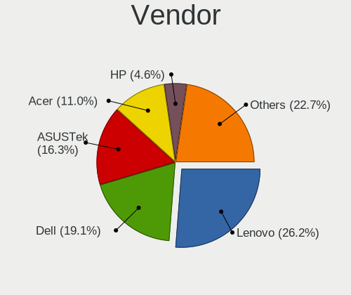
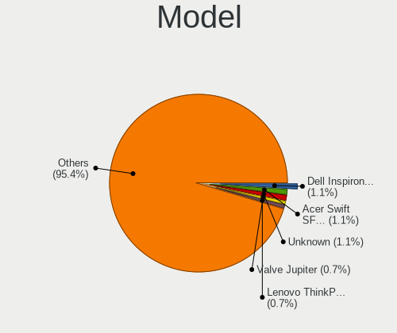
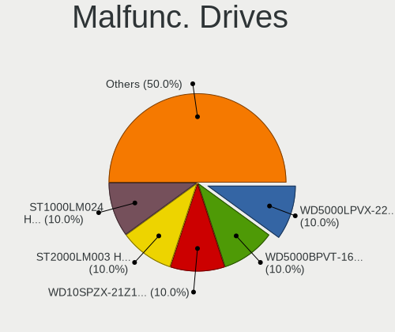
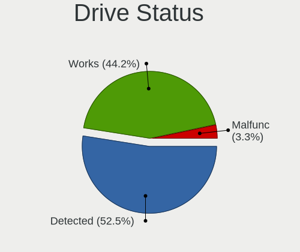
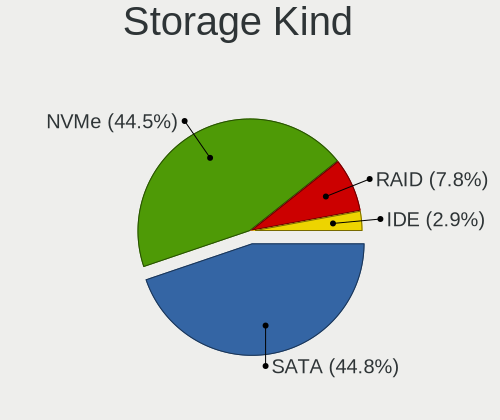
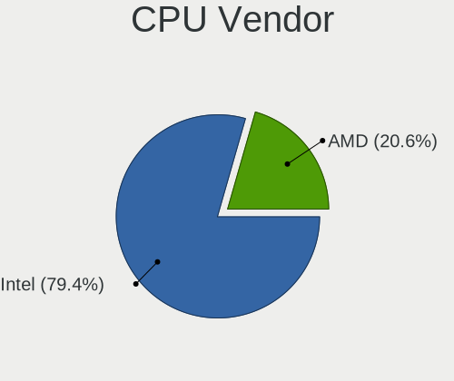
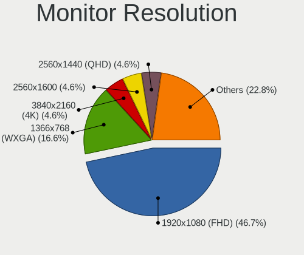
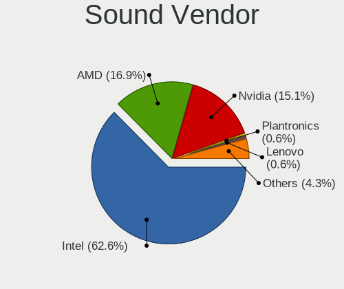

Linux in Singapore - Tested Hardware & Statistics (Notebooks)
-------------------------------------------------------------

A project to collect tested hardware configurations for Linux in Singapore.

Anyone can contribute to this report by the [hw-probe](https://github.com/linuxhw/hw-probe) tool:

    sudo -E hw-probe -all -upload

Please contribute! Especially if your hardware is rare.

Contents
--------

* [ Test Cases ](#test-cases)

* [ System ](#system)
  - [ OS                       ](#os)
  - [ OS Family                ](#os-family)
  - [ Kernel                   ](#kernel)
  - [ Kernel Family            ](#kernel-family)
  - [ Kernel Major Ver.        ](#kernel-major-ver)
  - [ Arch                     ](#arch)
  - [ DE                       ](#de)
  - [ Display Server           ](#display-server)
  - [ Display Manager          ](#display-manager)
  - [ OS Lang                  ](#os-lang)
  - [ Boot Mode                ](#boot-mode)
  - [ Filesystem               ](#filesystem)
  - [ Part. scheme             ](#part-scheme)
  - [ Dual Boot with Linux/BSD ](#dual-boot-with-linuxbsd)
  - [ Dual Boot (Win)          ](#dual-boot-win)

* [ Board ](#board)
  - [ Vendor                   ](#vendor)
  - [ Model                    ](#model)
  - [ Model Family             ](#model-family)
  - [ MFG Year                 ](#mfg-year)
  - [ Form Factor              ](#form-factor)
  - [ Secure Boot              ](#secure-boot)
  - [ Coreboot                 ](#coreboot)
  - [ RAM Size                 ](#ram-size)
  - [ RAM Used                 ](#ram-used)
  - [ Total Drives             ](#total-drives)
  - [ Has CD-ROM               ](#has-cd-rom)
  - [ Has Ethernet             ](#has-ethernet)
  - [ Has WiFi                 ](#has-wifi)
  - [ Has Bluetooth            ](#has-bluetooth)

* [ Location ](#location)
  - [ Country                  ](#country)
  - [ City                     ](#city)

* [ Drives ](#drives)
  - [ Drive Vendor             ](#drive-vendor)
  - [ Drive Model              ](#drive-model)
  - [ HDD Vendor               ](#hdd-vendor)
  - [ SSD Vendor               ](#ssd-vendor)
  - [ Drive Kind               ](#drive-kind)
  - [ Drive Connector          ](#drive-connector)
  - [ Drive Size               ](#drive-size)
  - [ Space Total              ](#space-total)
  - [ Space Used               ](#space-used)
  - [ Malfunc. Drives          ](#malfunc-drives)
  - [ Malfunc. Drive Vendor    ](#malfunc-drive-vendor)
  - [ Malfunc. HDD Vendor      ](#malfunc-hdd-vendor)
  - [ Malfunc. Drive Kind      ](#malfunc-drive-kind)
  - [ Failed Drives            ](#failed-drives)
  - [ Failed Drive Vendor      ](#failed-drive-vendor)
  - [ Drive Status             ](#drive-status)

* [ Storage controller ](#storage-controller)
  - [ Storage Vendor           ](#storage-vendor)
  - [ Storage Model            ](#storage-model)
  - [ Storage Kind             ](#storage-kind)

* [ Processor ](#processor)
  - [ CPU Vendor               ](#cpu-vendor)
  - [ CPU Model                ](#cpu-model)
  - [ CPU Model Family         ](#cpu-model-family)
  - [ CPU Cores                ](#cpu-cores)
  - [ CPU Sockets              ](#cpu-sockets)
  - [ CPU Threads              ](#cpu-threads)
  - [ CPU Op-Modes             ](#cpu-op-modes)
  - [ CPU Microcode            ](#cpu-microcode)
  - [ CPU Microarch            ](#cpu-microarch)

* [ Graphics ](#graphics)
  - [ GPU Vendor               ](#gpu-vendor)
  - [ GPU Model                ](#gpu-model)
  - [ GPU Combo                ](#gpu-combo)
  - [ GPU Driver               ](#gpu-driver)
  - [ GPU Memory               ](#gpu-memory)

* [ Monitor ](#monitor)
  - [ Monitor Vendor           ](#monitor-vendor)
  - [ Monitor Model            ](#monitor-model)
  - [ Monitor Resolution       ](#monitor-resolution)
  - [ Monitor Diagonal         ](#monitor-diagonal)
  - [ Monitor Width            ](#monitor-width)
  - [ Aspect Ratio             ](#aspect-ratio)
  - [ Monitor Area             ](#monitor-area)
  - [ Pixel Density            ](#pixel-density)
  - [ Multiple Monitors        ](#multiple-monitors)

* [ Network ](#network)
  - [ Net Controller Vendor    ](#net-controller-vendor)
  - [ Net Controller Model     ](#net-controller-model)
  - [ Wireless Vendor          ](#wireless-vendor)
  - [ Wireless Model           ](#wireless-model)
  - [ Ethernet Vendor          ](#ethernet-vendor)
  - [ Ethernet Model           ](#ethernet-model)
  - [ Net Controller Kind      ](#net-controller-kind)
  - [ Used Controller          ](#used-controller)
  - [ NICs                     ](#nics)
  - [ IPv6                     ](#ipv6)

* [ Bluetooth ](#bluetooth)
  - [ Bluetooth Vendor         ](#bluetooth-vendor)
  - [ Bluetooth Model          ](#bluetooth-model)

* [ Sound ](#sound)
  - [ Sound Vendor             ](#sound-vendor)
  - [ Sound Model              ](#sound-model)

* [ Memory ](#memory)
  - [ Memory Vendor            ](#memory-vendor)
  - [ Memory Model             ](#memory-model)
  - [ Memory Kind              ](#memory-kind)
  - [ Memory Form Factor       ](#memory-form-factor)
  - [ Memory Size              ](#memory-size)
  - [ Memory Speed             ](#memory-speed)

* [ Printers & scanners ](#printers--scanners)
  - [ Printer Vendor           ](#printer-vendor)
  - [ Printer Model            ](#printer-model)
  - [ Scanner Vendor           ](#scanner-vendor)
  - [ Scanner Model            ](#scanner-model)

* [ Camera ](#camera)
  - [ Camera Vendor            ](#camera-vendor)
  - [ Camera Model             ](#camera-model)

* [ Security ](#security)
  - [ Fingerprint Vendor       ](#fingerprint-vendor)
  - [ Fingerprint Model        ](#fingerprint-model)
  - [ Chipcard Vendor          ](#chipcard-vendor)
  - [ Chipcard Model           ](#chipcard-model)

* [ Unsupported ](#unsupported)
  - [ Unsupported Devices      ](#unsupported-devices)
  - [ Unsupported Device Types ](#unsupported-device-types)

Test Cases
----------

Total: 237

| Vendor        | Model                       | Probe                                                      | Date         |
|---------------|-----------------------------|------------------------------------------------------------|--------------|
| Dell          | XPS 13 7390                 | [8deb85f8e2](https://linux-hardware.org/?probe=8deb85f8e2) | May 03, 2022 |
| HP            | Pavilion Laptop 14-ec0xx... | [3a7cd290f6](https://linux-hardware.org/?probe=3a7cd290f6) | Apr 30, 2022 |
| Dell          | Latitude 3120               | [c6b9dfe36e](https://linux-hardware.org/?probe=c6b9dfe36e) | Apr 18, 2022 |
| Lenovo        | Legion 5 Pro 16ACH6H 82J... | [7fe8e51699](https://linux-hardware.org/?probe=7fe8e51699) | Apr 13, 2022 |
| Foxconn       | Kangaroo Mobile Desktop     | [8e602bc358](https://linux-hardware.org/?probe=8e602bc358) | Apr 07, 2022 |
| Foxconn       | Kangaroo Mobile Desktop     | [7309102f77](https://linux-hardware.org/?probe=7309102f77) | Apr 07, 2022 |
| Lenovo        | IdeaPad 5 14ITL05 82FE      | [ceee79344c](https://linux-hardware.org/?probe=ceee79344c) | Mar 31, 2022 |
| Acer          | Swift SF314-54G             | [615009b8ee](https://linux-hardware.org/?probe=615009b8ee) | Mar 23, 2022 |
| Acer          | Aspire VN7-592G             | [f4d3207c6d](https://linux-hardware.org/?probe=f4d3207c6d) | Mar 22, 2022 |
| AMI           | Intel                       | [6d581b03a6](https://linux-hardware.org/?probe=6d581b03a6) | Mar 19, 2022 |
| ASUSTek       | Vivobook_ASUSLaptop M350... | [d7f14afdd4](https://linux-hardware.org/?probe=d7f14afdd4) | Feb 26, 2022 |
| Dell          | Inspiron 3501               | [a8c8bdd208](https://linux-hardware.org/?probe=a8c8bdd208) | Feb 23, 2022 |
| ASUSTek       | Vivobook_ASUSLaptop M350... | [fbb2caeacf](https://linux-hardware.org/?probe=fbb2caeacf) | Feb 20, 2022 |
| ASUSTek       | Vivobook_ASUSLaptop M350... | [c5acc050e4](https://linux-hardware.org/?probe=c5acc050e4) | Feb 19, 2022 |
| Dell          | Precision 7560              | [811983afdd](https://linux-hardware.org/?probe=811983afdd) | Feb 17, 2022 |
| Lenovo        | IdeaPad S340-14API 81NB     | [25da470504](https://linux-hardware.org/?probe=25da470504) | Feb 14, 2022 |
| ASUSTek       | N501JW                      | [55550ca825](https://linux-hardware.org/?probe=55550ca825) | Feb 13, 2022 |
| COPELION I... | ZX Series                   | [764c80257b](https://linux-hardware.org/?probe=764c80257b) | Feb 12, 2022 |
| COPELION I... | ZX Series                   | [958dcebefa](https://linux-hardware.org/?probe=958dcebefa) | Feb 12, 2022 |
| Dell          | Latitude E5450              | [b426feb1d9](https://linux-hardware.org/?probe=b426feb1d9) | Feb 11, 2022 |
| Acer          | Predator G9-792             | [a01c295f77](https://linux-hardware.org/?probe=a01c295f77) | Feb 09, 2022 |
| Acer          | Predator G9-792             | [c030ff8b96](https://linux-hardware.org/?probe=c030ff8b96) | Feb 09, 2022 |
| Dell          | Latitude E7250              | [a7ba3830f7](https://linux-hardware.org/?probe=a7ba3830f7) | Feb 07, 2022 |
| Dell          | Inspiron 15 5510            | [3dbd4103ce](https://linux-hardware.org/?probe=3dbd4103ce) | Feb 06, 2022 |
| ASUSTek       | K45VM                       | [5cb4dcfe48](https://linux-hardware.org/?probe=5cb4dcfe48) | Jan 29, 2022 |
| ASUSTek       | K45VM                       | [39cac76612](https://linux-hardware.org/?probe=39cac76612) | Jan 28, 2022 |
| Lenovo        | ThinkBook 14p Gen 2 20YN    | [a172ae51cf](https://linux-hardware.org/?probe=a172ae51cf) | Jan 21, 2022 |
| Lenovo        | ThinkPad X1 Carbon 6th 2... | [efbe19b07b](https://linux-hardware.org/?probe=efbe19b07b) | Jan 20, 2022 |
| ASUSTek       | N501JW                      | [af9aaff7ee](https://linux-hardware.org/?probe=af9aaff7ee) | Jan 05, 2022 |
| Apple         | MacBookPro7,1               | [9f745065df](https://linux-hardware.org/?probe=9f745065df) | Dec 23, 2021 |
| Lenovo        | ThinkPad X1 Carbon 2nd 2... | [aae3ae242f](https://linux-hardware.org/?probe=aae3ae242f) | Dec 21, 2021 |
| Apple         | MacBookAir3,1               | [ef12425b00](https://linux-hardware.org/?probe=ef12425b00) | Dec 19, 2021 |
| Apple         | MacBookPro7,1               | [b92a9a109f](https://linux-hardware.org/?probe=b92a9a109f) | Dec 18, 2021 |
| Dell          | Inspiron 5580               | [29d56d5a5e](https://linux-hardware.org/?probe=29d56d5a5e) | Dec 06, 2021 |
| Chuwi         | HeroBox Pro                 | [a18fff612e](https://linux-hardware.org/?probe=a18fff612e) | Dec 05, 2021 |
| ASUSTek       | K501UX                      | [3f9b547c57](https://linux-hardware.org/?probe=3f9b547c57) | Dec 04, 2021 |
| Lenovo        | Legion 5 Pro 16ACH6H 82J... | [8876123555](https://linux-hardware.org/?probe=8876123555) | Nov 26, 2021 |
| Lenovo        | Legion 5 Pro 16ACH6H 82J... | [97e66fa893](https://linux-hardware.org/?probe=97e66fa893) | Nov 09, 2021 |
| Dell          | XPS 15 9570                 | [8e3c5b2ef0](https://linux-hardware.org/?probe=8e3c5b2ef0) | Nov 03, 2021 |
| ASUSTek       | ROG Zephyrus G15 GA503QR... | [4b9f5aed33](https://linux-hardware.org/?probe=4b9f5aed33) | Nov 01, 2021 |
| Dell          | XPS 15 9510                 | [9ad082f18e](https://linux-hardware.org/?probe=9ad082f18e) | Nov 01, 2021 |
| Lenovo        | IdeaPad S340-14API 81NB     | [7ad1f07edb](https://linux-hardware.org/?probe=7ad1f07edb) | Oct 21, 2021 |
| ASUSTek       | K45VM                       | [b76608b8c2](https://linux-hardware.org/?probe=b76608b8c2) | Oct 21, 2021 |
| Lenovo        | ThinkPad X220 Tablet 429... | [6edbff3019](https://linux-hardware.org/?probe=6edbff3019) | Oct 14, 2021 |
| ASUSTek       | K45VM                       | [6650f44094](https://linux-hardware.org/?probe=6650f44094) | Oct 02, 2021 |
| ASUSTek       | VivoBook_ASUSLaptop X412... | [5ac27f4e29](https://linux-hardware.org/?probe=5ac27f4e29) | Oct 01, 2021 |
| ASUSTek       | VivoBook_ASUSLaptop X412... | [6e2173f8b4](https://linux-hardware.org/?probe=6e2173f8b4) | Sep 30, 2021 |
| ASUSTek       | UX32LA                      | [9763fb0928](https://linux-hardware.org/?probe=9763fb0928) | Sep 25, 2021 |
| ASUSTek       | UX32LA                      | [e97b7fce6b](https://linux-hardware.org/?probe=e97b7fce6b) | Sep 25, 2021 |
| ASUSTek       | ZenBook UX333FN_UX333FN     | [3d0115d011](https://linux-hardware.org/?probe=3d0115d011) | Sep 15, 2021 |
| Acer          | Aspire 6935                 | [fc440eee50](https://linux-hardware.org/?probe=fc440eee50) | Sep 12, 2021 |
| Acer          | Aspire 6935                 | [24cfb86539](https://linux-hardware.org/?probe=24cfb86539) | Sep 12, 2021 |
| ASUSTek       | TUF Gaming FX505DY_FX505... | [b7ff195931](https://linux-hardware.org/?probe=b7ff195931) | Sep 02, 2021 |
| Dell          | Precision 7560              | [75c607555e](https://linux-hardware.org/?probe=75c607555e) | Aug 27, 2021 |
| ASUSTek       | VivoBook_ASUSLaptop X409... | [a613776a9c](https://linux-hardware.org/?probe=a613776a9c) | Aug 18, 2021 |
| Acer          | Nitro AN515-43              | [d0952296d7](https://linux-hardware.org/?probe=d0952296d7) | Aug 17, 2021 |
| Dell          | Inspiron 7370               | [b702f17a07](https://linux-hardware.org/?probe=b702f17a07) | Aug 17, 2021 |
| Acer          | Swift SF314-57G             | [a5f10ae10b](https://linux-hardware.org/?probe=a5f10ae10b) | Aug 17, 2021 |
| Lenovo        | IdeaPad S530 13IML 81WU     | [978dbea880](https://linux-hardware.org/?probe=978dbea880) | Jul 27, 2021 |
| Lenovo        | IdeaPad S530 13IML 81WU     | [e3c0726e19](https://linux-hardware.org/?probe=e3c0726e19) | Jul 27, 2021 |
| Lenovo        | IdeaPad 100-14IBY 80MH      | [e74f010570](https://linux-hardware.org/?probe=e74f010570) | Jul 26, 2021 |
| Toshiba       | PORTEGE R930                | [6141314610](https://linux-hardware.org/?probe=6141314610) | Jul 22, 2021 |
| ASUSTek       | K45VM                       | [50921406d4](https://linux-hardware.org/?probe=50921406d4) | Jul 17, 2021 |
| ASUSTek       | K45VM                       | [6d08e71c4e](https://linux-hardware.org/?probe=6d08e71c4e) | Jul 07, 2021 |
| Lenovo        | Yoga Slim 7 Pro 14ACH5 8... | [f4778083d9](https://linux-hardware.org/?probe=f4778083d9) | Jul 02, 2021 |
| Acer          | Swift SF314-41G             | [fe5e126da1](https://linux-hardware.org/?probe=fe5e126da1) | Jul 01, 2021 |
| Toshiba       | PORTEGE R930                | [ce5aa11678](https://linux-hardware.org/?probe=ce5aa11678) | Jun 23, 2021 |
| Toshiba       | PORTEGE R930                | [9cdae69a3e](https://linux-hardware.org/?probe=9cdae69a3e) | Jun 23, 2021 |
| Acer          | Aspire one                  | [adae8c183d](https://linux-hardware.org/?probe=adae8c183d) | Jun 22, 2021 |
| Sony          | VPCSB36FG                   | [c834499816](https://linux-hardware.org/?probe=c834499816) | Jun 10, 2021 |
| Lenovo        | IdeaPad Gaming 3 15ARH05... | [650e1b9bf5](https://linux-hardware.org/?probe=650e1b9bf5) | Jun 05, 2021 |
| Dell          | Latitude 7490               | [879fc7a838](https://linux-hardware.org/?probe=879fc7a838) | May 27, 2021 |
| ASUSTek       | K45VM                       | [18256efdf8](https://linux-hardware.org/?probe=18256efdf8) | May 24, 2021 |
| Lenovo        | ThinkPad X1 Carbon 5th 2... | [920ef637b1](https://linux-hardware.org/?probe=920ef637b1) | May 21, 2021 |
| Razer         | Blade 15 Advanced Model ... | [c9c9d02ede](https://linux-hardware.org/?probe=c9c9d02ede) | May 20, 2021 |
| Sony          | VPCSB36FG                   | [828a8ac75d](https://linux-hardware.org/?probe=828a8ac75d) | May 18, 2021 |
| Dell          | XPS 15 9500                 | [ffa207ed1e](https://linux-hardware.org/?probe=ffa207ed1e) | May 14, 2021 |
| Lenovo        | ThinkPad X1 Carbon 5th 2... | [c17ba8c1a6](https://linux-hardware.org/?probe=c17ba8c1a6) | May 04, 2021 |
| ASUSTek       | K45VM                       | [24c07d134b](https://linux-hardware.org/?probe=24c07d134b) | Apr 20, 2021 |
| Lenovo        | ThinkPad P1 Gen 3 20TJS2... | [46bb05613f](https://linux-hardware.org/?probe=46bb05613f) | Apr 13, 2021 |
| Lenovo        | ThinkPad P1 Gen 3 20TJS2... | [ecc3dfa09a](https://linux-hardware.org/?probe=ecc3dfa09a) | Apr 13, 2021 |
| Foxconn       | Kangaroo Mobile Desktop     | [e26f3c0f44](https://linux-hardware.org/?probe=e26f3c0f44) | Mar 29, 2021 |
| Foxconn       | Kangaroo Mobile Desktop     | [e4c813c694](https://linux-hardware.org/?probe=e4c813c694) | Mar 29, 2021 |
| Lenovo        | ThinkPad P14s Gen 1 20S4... | [ce138f71dd](https://linux-hardware.org/?probe=ce138f71dd) | Mar 15, 2021 |
| Toshiba       | PORTEGE R930                | [6e5981a1c8](https://linux-hardware.org/?probe=6e5981a1c8) | Mar 14, 2021 |
| Lenovo        | ThinkPad X1 Carbon Gen 8... | [81b4d6916d](https://linux-hardware.org/?probe=81b4d6916d) | Mar 11, 2021 |
| Acer          | Swift SF314-56G             | [46ff93e8b8](https://linux-hardware.org/?probe=46ff93e8b8) | Mar 09, 2021 |
| Acer          | Swift SF314-56G             | [98a5817785](https://linux-hardware.org/?probe=98a5817785) | Mar 09, 2021 |
| Acer          | Aspire A515-51G             | [820e208bca](https://linux-hardware.org/?probe=820e208bca) | Mar 05, 2021 |
| Dell          | XPS 13 9310                 | [d8b4e607e1](https://linux-hardware.org/?probe=d8b4e607e1) | Mar 02, 2021 |
| Dell          | XPS 13 9310                 | [eca0e7f55f](https://linux-hardware.org/?probe=eca0e7f55f) | Mar 02, 2021 |
| Lenovo        | ThinkPad X395 20NL000TCD    | [eb33727eff](https://linux-hardware.org/?probe=eb33727eff) | Feb 18, 2021 |
| ASUSTek       | ZenBook UX533FD_UX533FD     | [b2795c1a02](https://linux-hardware.org/?probe=b2795c1a02) | Feb 13, 2021 |
| Acer          | Swift SF314-56G             | [e67e7f24e8](https://linux-hardware.org/?probe=e67e7f24e8) | Feb 11, 2021 |
| Lenovo        | ThinkPad X220 4286C11       | [cbb8e959b4](https://linux-hardware.org/?probe=cbb8e959b4) | Feb 05, 2021 |
| Lenovo        | ThinkPad X220 4286C11       | [a8f5211aee](https://linux-hardware.org/?probe=a8f5211aee) | Feb 04, 2021 |
| ASUSTek       | VivoBook_ASUSLaptop X580... | [f4505630e3](https://linux-hardware.org/?probe=f4505630e3) | Feb 03, 2021 |
| ASUSTek       | K45VM                       | [b4bb5aa0f9](https://linux-hardware.org/?probe=b4bb5aa0f9) | Feb 02, 2021 |
| Foxconn       | Kangaroo Mobile Desktop     | [0e5eeb215d](https://linux-hardware.org/?probe=0e5eeb215d) | Jan 28, 2021 |
| Lenovo        | RESCUER R720-15IKBN 80WW    | [15d05a517c](https://linux-hardware.org/?probe=15d05a517c) | Jan 23, 2021 |
| Notebook      | P65_P67SE                   | [1b4cd968fd](https://linux-hardware.org/?probe=1b4cd968fd) | Jan 22, 2021 |
| Lenovo        | ThinkPad X395 20NL000TCD    | [08990229db](https://linux-hardware.org/?probe=08990229db) | Jan 17, 2021 |
| Lenovo        | ThinkPad X395 20NL000TCD    | [dc6edb4a25](https://linux-hardware.org/?probe=dc6edb4a25) | Jan 14, 2021 |
| Dell          | G3 3500                     | [27386ee67b](https://linux-hardware.org/?probe=27386ee67b) | Jan 12, 2021 |
| Lenovo        | ThinkPad E14 20RA0058VA     | [3c08ce49f5](https://linux-hardware.org/?probe=3c08ce49f5) | Jan 08, 2021 |
| ASUSTek       | TUF Gaming FA506IU_FA506... | [4b19f38fcd](https://linux-hardware.org/?probe=4b19f38fcd) | Jan 02, 2021 |
| Samsung       | RF510/RF410/RF710           | [3f041f4b71](https://linux-hardware.org/?probe=3f041f4b71) | Jan 01, 2021 |
| ASUSTek       | TUF Gaming FA506IU_FA506... | [c30d1c7374](https://linux-hardware.org/?probe=c30d1c7374) | Dec 31, 2020 |
| Lenovo        | ThinkPad T14s Gen 1 20UH... | [ccd41dd67e](https://linux-hardware.org/?probe=ccd41dd67e) | Dec 28, 2020 |
| HP            | EliteBook 845 G7 Noteboo... | [2fd914ada2](https://linux-hardware.org/?probe=2fd914ada2) | Dec 25, 2020 |
| Acer          | Aspire one                  | [556332908d](https://linux-hardware.org/?probe=556332908d) | Dec 14, 2020 |
| ASUSTek       | K45VM                       | [9653846e77](https://linux-hardware.org/?probe=9653846e77) | Dec 12, 2020 |
| Lenovo        | ThinkPad T400 2768CJ6       | [1d878eeb02](https://linux-hardware.org/?probe=1d878eeb02) | Dec 10, 2020 |
| HP            | ProBook 440 G4              | [e28bcb99e5](https://linux-hardware.org/?probe=e28bcb99e5) | Dec 07, 2020 |
| ASUSTek       | K45VM                       | [9dedb35f93](https://linux-hardware.org/?probe=9dedb35f93) | Dec 04, 2020 |
| Samsung       | RF510/RF410/RF710           | [46d26f2bf7](https://linux-hardware.org/?probe=46d26f2bf7) | Nov 29, 2020 |
| Aftershock    | N15_N17RF1                  | [09b42b449a](https://linux-hardware.org/?probe=09b42b449a) | Nov 27, 2020 |
| Dell          | Precision 7530              | [6ea3afdb4a](https://linux-hardware.org/?probe=6ea3afdb4a) | Nov 26, 2020 |
| Samsung       | RF510/RF410/RF710           | [1250c7dfbe](https://linux-hardware.org/?probe=1250c7dfbe) | Nov 25, 2020 |
| Lenovo        | ThinkPad X220 42911H8       | [cc79643d27](https://linux-hardware.org/?probe=cc79643d27) | Nov 22, 2020 |
| Dell          | Latitude 7400               | [3154149e40](https://linux-hardware.org/?probe=3154149e40) | Nov 21, 2020 |
| Lenovo        | ThinkPad P14s Gen 1 20S4... | [93678477d7](https://linux-hardware.org/?probe=93678477d7) | Nov 20, 2020 |
| Lenovo        | ThinkPad X220 42911H8       | [c0ab31022d](https://linux-hardware.org/?probe=c0ab31022d) | Nov 20, 2020 |
| Dell          | Inspiron 5379               | [63815d0103](https://linux-hardware.org/?probe=63815d0103) | Nov 15, 2020 |
| Fujitsu       | LIFEBOOK SH561              | [759718c54b](https://linux-hardware.org/?probe=759718c54b) | Nov 10, 2020 |
| Lenovo        | ThinkPad X240 20AMS00100    | [f3f5326846](https://linux-hardware.org/?probe=f3f5326846) | Nov 08, 2020 |
| ASUSTek       | VivoBook_ASUSLaptop X580... | [3c14e8fc1a](https://linux-hardware.org/?probe=3c14e8fc1a) | Nov 08, 2020 |
| ASUSTek       | VivoBook_ASUSLaptop X580... | [14cf318590](https://linux-hardware.org/?probe=14cf318590) | Oct 29, 2020 |
| Acer          | Swift SF314-54              | [35aa366265](https://linux-hardware.org/?probe=35aa366265) | Oct 18, 2020 |
| Acer          | ConceptD CN715-71           | [8396c1d9e6](https://linux-hardware.org/?probe=8396c1d9e6) | Oct 13, 2020 |
| Lenovo        | ThinkPad P14s Gen 1 20S4... | [b47f8da412](https://linux-hardware.org/?probe=b47f8da412) | Oct 09, 2020 |
| HP            | Compaq 6510b                | [cf190a85ea](https://linux-hardware.org/?probe=cf190a85ea) | Oct 08, 2020 |
| HP            | Compaq 6510b                | [96798436e8](https://linux-hardware.org/?probe=96798436e8) | Oct 08, 2020 |
| Lenovo        | Legion 5 15ARH05 82B5       | [05ef194f79](https://linux-hardware.org/?probe=05ef194f79) | Sep 28, 2020 |
| Lenovo        | ThinkPad X240 20AMS00100    | [78566669f0](https://linux-hardware.org/?probe=78566669f0) | Sep 27, 2020 |
| ASUSTek       | T300LA                      | [9ca4cba592](https://linux-hardware.org/?probe=9ca4cba592) | Sep 27, 2020 |
| Dell          | Inspiron 3476               | [021351472c](https://linux-hardware.org/?probe=021351472c) | Sep 26, 2020 |
| HP            | Compaq 6510b                | [9b9a4b4614](https://linux-hardware.org/?probe=9b9a4b4614) | Sep 22, 2020 |
| HP            | Compaq 6510b                | [3487aab3a6](https://linux-hardware.org/?probe=3487aab3a6) | Sep 20, 2020 |
| HP            | Compaq 6510b                | [b7382d2141](https://linux-hardware.org/?probe=b7382d2141) | Sep 19, 2020 |
| ASUSTek       | ZenBook UX433FN_UX433FN     | [4a4a01267c](https://linux-hardware.org/?probe=4a4a01267c) | Sep 18, 2020 |
| Toshiba       | PORTEGE R930                | [06b0062522](https://linux-hardware.org/?probe=06b0062522) | Sep 16, 2020 |
| Acer          | Aspire A515-51G             | [4abfa0e2df](https://linux-hardware.org/?probe=4abfa0e2df) | Sep 14, 2020 |
| Acer          | Aspire A515-51G             | [696c116447](https://linux-hardware.org/?probe=696c116447) | Sep 14, 2020 |
| ASUSTek       | UX305CA                     | [dc9532c57b](https://linux-hardware.org/?probe=dc9532c57b) | Sep 12, 2020 |
| Samsung       | 305U1A                      | [9949d76953](https://linux-hardware.org/?probe=9949d76953) | Sep 09, 2020 |
| Samsung       | 305U1A                      | [9dbf37ad63](https://linux-hardware.org/?probe=9dbf37ad63) | Sep 09, 2020 |
| Dell          | Inspiron 15 7000 Gaming     | [cab06cdbd7](https://linux-hardware.org/?probe=cab06cdbd7) | Sep 07, 2020 |
| Acer          | Aspire A515-51G             | [c9d6ce6954](https://linux-hardware.org/?probe=c9d6ce6954) | Sep 05, 2020 |
| Aftershock    | N8xxEP6                     | [d8e9d4edfd](https://linux-hardware.org/?probe=d8e9d4edfd) | Sep 04, 2020 |
| Dell          | Precision 7530              | [91306b715e](https://linux-hardware.org/?probe=91306b715e) | Sep 03, 2020 |
| Aftershock    | N15_N17RF1                  | [e3e85f51cc](https://linux-hardware.org/?probe=e3e85f51cc) | Sep 03, 2020 |
| Dell          | Latitude 5400               | [498b1be7bd](https://linux-hardware.org/?probe=498b1be7bd) | Sep 02, 2020 |
| Toshiba       | PORTEGE R930                | [64ba8fde9d](https://linux-hardware.org/?probe=64ba8fde9d) | Aug 31, 2020 |
| Toshiba       | PORTEGE R930                | [b37b0d860d](https://linux-hardware.org/?probe=b37b0d860d) | Aug 31, 2020 |
| Lenovo        | Yoga 3 14 80JH              | [3623866056](https://linux-hardware.org/?probe=3623866056) | Aug 28, 2020 |
| HP            | Compaq 6510b                | [7db74443d5](https://linux-hardware.org/?probe=7db74443d5) | Aug 25, 2020 |
| HP            | Compaq 6510b                | [7d41e43d52](https://linux-hardware.org/?probe=7d41e43d52) | Aug 25, 2020 |
| HP            | Compaq 6510b                | [20f281e6e5](https://linux-hardware.org/?probe=20f281e6e5) | Aug 25, 2020 |
| HP            | Compaq 6510b                | [2791e33d53](https://linux-hardware.org/?probe=2791e33d53) | Aug 24, 2020 |
| ASUSTek       | ZenBook UX434FLC_UX433FL... | [8bc9e504d7](https://linux-hardware.org/?probe=8bc9e504d7) | Aug 13, 2020 |
| Toshiba       | PORTEGE R930                | [9f944b581d](https://linux-hardware.org/?probe=9f944b581d) | Aug 09, 2020 |
| Sony          | VGN-CR32G_W                 | [faf8f6a6fa](https://linux-hardware.org/?probe=faf8f6a6fa) | Aug 08, 2020 |
| Sony          | VGN-CR32G_W                 | [421ed7dcba](https://linux-hardware.org/?probe=421ed7dcba) | Aug 08, 2020 |
| MECHREVO      | Code 01 Series PF5NU1G      | [4dffd28998](https://linux-hardware.org/?probe=4dffd28998) | Aug 07, 2020 |
| ASUSTek       | UX305CA                     | [5855688e00](https://linux-hardware.org/?probe=5855688e00) | Aug 05, 2020 |
| Lenovo        | ThinkPad X230 23257VA       | [4319315cd0](https://linux-hardware.org/?probe=4319315cd0) | Jul 25, 2020 |
| Lenovo        | ThinkPad X1 Extreme 2nd ... | [b6111e69ca](https://linux-hardware.org/?probe=b6111e69ca) | Jul 19, 2020 |
| HP            | Pavilion Sleekbook 14 PC    | [b554a2c8ec](https://linux-hardware.org/?probe=b554a2c8ec) | Jul 14, 2020 |
| Lenovo        | ThinkPad T420s 417429U      | [133ff64caa](https://linux-hardware.org/?probe=133ff64caa) | Jul 11, 2020 |
| HP            | Pavilion dv6000 (GF659EA... | [84a4ec9209](https://linux-hardware.org/?probe=84a4ec9209) | Jul 09, 2020 |
| HP            | EliteBook 725 G4            | [941e94f528](https://linux-hardware.org/?probe=941e94f528) | Jul 09, 2020 |
| Lenovo        | ThinkPad T490 20N3S5DU27    | [d4bb886295](https://linux-hardware.org/?probe=d4bb886295) | Jul 08, 2020 |
| Dell          | XPS 13 9370                 | [e794850de2](https://linux-hardware.org/?probe=e794850de2) | Jul 05, 2020 |
| HP            | EliteBook 725 G4            | [b3e1336d2f](https://linux-hardware.org/?probe=b3e1336d2f) | Jul 04, 2020 |
| Acer          | Swift SF514-54GT            | [a5b63702a2](https://linux-hardware.org/?probe=a5b63702a2) | Jul 03, 2020 |
| Lenovo        | ThinkPad T420s 417429U      | [8d9ec3fd6e](https://linux-hardware.org/?probe=8d9ec3fd6e) | Jun 27, 2020 |
| ASUSTek       | UX305CA                     | [7b35a1c840](https://linux-hardware.org/?probe=7b35a1c840) | Jun 26, 2020 |
| Toshiba       | PORTEGE Z10t-A              | [dd0834c2dd](https://linux-hardware.org/?probe=dd0834c2dd) | Jun 23, 2020 |
| Lenovo        | IdeaPad U460 20056          | [31c7edc616](https://linux-hardware.org/?probe=31c7edc616) | Jun 17, 2020 |
| ASUSTek       | ZenBook UX434FLC_UX433FL... | [4add01698f](https://linux-hardware.org/?probe=4add01698f) | Jun 14, 2020 |
| Dell          | Latitude E7440              | [1664235765](https://linux-hardware.org/?probe=1664235765) | Jun 03, 2020 |
| Dell          | Latitude E7440              | [d71cf3dba2](https://linux-hardware.org/?probe=d71cf3dba2) | Jun 03, 2020 |
| Lenovo        | G550 2958                   | [a8c4b1a8cf](https://linux-hardware.org/?probe=a8c4b1a8cf) | Jun 01, 2020 |
| Lenovo        | ThinkPad L460 20FUCTO1WW    | [da2a23020c](https://linux-hardware.org/?probe=da2a23020c) | May 21, 2020 |
| Dell          | XPS 15 7590                 | [c91cd5679c](https://linux-hardware.org/?probe=c91cd5679c) | May 19, 2020 |
| Dell          | XPS 13 9360                 | [10e8823c6b](https://linux-hardware.org/?probe=10e8823c6b) | May 17, 2020 |
| Lenovo        | G550 2958                   | [4e4bcc14f1](https://linux-hardware.org/?probe=4e4bcc14f1) | May 11, 2020 |
| Lenovo        | G550 2958                   | [e4d76f72dc](https://linux-hardware.org/?probe=e4d76f72dc) | May 11, 2020 |
| Lenovo        | G550 2958                   | [ea8d2d9296](https://linux-hardware.org/?probe=ea8d2d9296) | May 11, 2020 |
| Lenovo        | G550 2958                   | [9047aee0a4](https://linux-hardware.org/?probe=9047aee0a4) | May 11, 2020 |
| Lenovo        | G550 2958                   | [cfd6e82a6f](https://linux-hardware.org/?probe=cfd6e82a6f) | May 11, 2020 |
| Acer          | Predator PH315-52           | [7adb1a873c](https://linux-hardware.org/?probe=7adb1a873c) | May 04, 2020 |
| Lenovo        | ThinkPad X230 23257VA       | [09817eac19](https://linux-hardware.org/?probe=09817eac19) | May 01, 2020 |
| Lenovo        | ThinkPad T400 2768AA6       | [665d6e56af](https://linux-hardware.org/?probe=665d6e56af) | May 01, 2020 |
| ASUSTek       | T300LA                      | [c173e838c3](https://linux-hardware.org/?probe=c173e838c3) | Apr 26, 2020 |
| ASUSTek       | T300LA                      | [6311e7f4b5](https://linux-hardware.org/?probe=6311e7f4b5) | Apr 26, 2020 |
| Apple         | MacBookPro8,1               | [42636a47b1](https://linux-hardware.org/?probe=42636a47b1) | Apr 26, 2020 |
| ASUSTek       | ASUS Gaming FX570UD         | [ff68707cc2](https://linux-hardware.org/?probe=ff68707cc2) | Apr 22, 2020 |
| ASUSTek       | ASUS Gaming FX570UD         | [a9cd8ef28f](https://linux-hardware.org/?probe=a9cd8ef28f) | Apr 22, 2020 |
| Acer          | Aspire 5580                 | [791259386e](https://linux-hardware.org/?probe=791259386e) | Apr 16, 2020 |
| Lenovo        | B50-30 20382                | [57b8f867a1](https://linux-hardware.org/?probe=57b8f867a1) | Apr 09, 2020 |
| Acer          | Aspire E5-473G              | [17f3a0e473](https://linux-hardware.org/?probe=17f3a0e473) | Apr 08, 2020 |
| Apple         | MacBookPro8,1               | [429fde3ebd](https://linux-hardware.org/?probe=429fde3ebd) | Apr 02, 2020 |
| Dell          | Latitude E6410              | [920a80dc90](https://linux-hardware.org/?probe=920a80dc90) | Mar 31, 2020 |
| Apple         | MacBookPro11,4              | [3c9bd63848](https://linux-hardware.org/?probe=3c9bd63848) | Mar 30, 2020 |
| Acer          | ConceptD CN715-71           | [2a99d0f76b](https://linux-hardware.org/?probe=2a99d0f76b) | Mar 28, 2020 |
| Acer          | ConceptD CN715-71           | [93d970f678](https://linux-hardware.org/?probe=93d970f678) | Mar 24, 2020 |
| Samsung       | RF510/RF410/RF710           | [daa4d098dc](https://linux-hardware.org/?probe=daa4d098dc) | Mar 13, 2020 |
| Lenovo        | ThinkPad X1 Carbon 6th E... | [b913bc5cc5](https://linux-hardware.org/?probe=b913bc5cc5) | Feb 18, 2020 |
| Lenovo        | Yoga 3 Pro-1370 80HE        | [819116ee69](https://linux-hardware.org/?probe=819116ee69) | Feb 16, 2020 |
| Acer          | ConceptD CN715-71           | [93c40180a2](https://linux-hardware.org/?probe=93c40180a2) | Feb 11, 2020 |
| Acer          | ConceptD CN715-71           | [0494839d68](https://linux-hardware.org/?probe=0494839d68) | Feb 11, 2020 |
| Acer          | ConceptD CN715-71           | [f6c3a576c2](https://linux-hardware.org/?probe=f6c3a576c2) | Feb 11, 2020 |
| Lenovo        | ThinkPad W540 20BG001KUK    | [627909b9e5](https://linux-hardware.org/?probe=627909b9e5) | Feb 04, 2020 |
| Dell          | Inspiron 7591               | [b33d5cddc5](https://linux-hardware.org/?probe=b33d5cddc5) | Jan 25, 2020 |
| ASUSTek       | U24E                        | [563b794d8a](https://linux-hardware.org/?probe=563b794d8a) | Dec 23, 2019 |
| Lenovo        | ThinkPad T400 2768CJ6       | [011ab343ef](https://linux-hardware.org/?probe=011ab343ef) | Dec 22, 2019 |
| Lenovo        | ThinkPad T400 2768CJ6       | [bb9da61133](https://linux-hardware.org/?probe=bb9da61133) | Dec 21, 2019 |
| Acer          | ConceptD CN715-71           | [54109739eb](https://linux-hardware.org/?probe=54109739eb) | Dec 20, 2019 |
| Acer          | ConceptD CN715-71           | [5d75e45350](https://linux-hardware.org/?probe=5d75e45350) | Dec 20, 2019 |
| Acer          | ConceptD CN715-71           | [fb27c8cabb](https://linux-hardware.org/?probe=fb27c8cabb) | Dec 20, 2019 |
| Lenovo        | ThinkPad X395 20NL000TCD    | [adec400398](https://linux-hardware.org/?probe=adec400398) | Dec 19, 2019 |
| ASUSTek       | VivoBook 15_ASUS Laptop ... | [86221df903](https://linux-hardware.org/?probe=86221df903) | Nov 30, 2019 |
| HP            | ZBook Studio G5             | [87503b1263](https://linux-hardware.org/?probe=87503b1263) | Aug 22, 2019 |
| ASUSTek       | X406UAR                     | [5e3ebad239](https://linux-hardware.org/?probe=5e3ebad239) | Jul 05, 2019 |
| Apple         | MacBookPro9,2               | [1d4494ee1f](https://linux-hardware.org/?probe=1d4494ee1f) | Jul 03, 2019 |
| Lenovo        | S20-30 20421                | [5c27867f6e](https://linux-hardware.org/?probe=5c27867f6e) | Jun 26, 2019 |
| Dell          | Inspiron 13-5378            | [f938ce631a](https://linux-hardware.org/?probe=f938ce631a) | Jun 17, 2019 |
| Dell          | Inspiron 13-5378            | [5e33156c57](https://linux-hardware.org/?probe=5e33156c57) | Jun 17, 2019 |
| Lenovo        | ThinkPad X1 Carbon 5th 2... | [0ab22425ea](https://linux-hardware.org/?probe=0ab22425ea) | May 28, 2019 |
| Apple         | MacBookPro11,5              | [ab95788992](https://linux-hardware.org/?probe=ab95788992) | May 18, 2019 |
| ASUSTek       | S500CA                      | [c0218275f7](https://linux-hardware.org/?probe=c0218275f7) | Apr 28, 2019 |
| Acer          | AO751h                      | [0ee57513c5](https://linux-hardware.org/?probe=0ee57513c5) | Apr 07, 2019 |
| MSI           | GE63VR 7RE                  | [635226b290](https://linux-hardware.org/?probe=635226b290) | May 31, 2018 |
| Lenovo        | ThinkPad W540 20BG001KUK    | [ecd2f8138f](https://linux-hardware.org/?probe=ecd2f8138f) | Dec 27, 2016 |
| Lenovo        | ThinkPad W540 20BG001KUK    | [969879cddc](https://linux-hardware.org/?probe=969879cddc) | Dec 27, 2016 |

System
------

OS
--

Installed operating systems

| Name                   | Notebooks | Percent |
|------------------------|-----------|---------|
| Ubuntu 20.04           | 42        | 27.63%  |
| Ubuntu 18.04           | 17        | 11.18%  |
| Fedora 33              | 10        | 6.58%   |
| Pop!_OS 20.04          | 5         | 3.29%   |
| Arch                   | 5         | 3.29%   |
| Xubuntu 20.04          | 3         | 1.97%   |
| Linux Mint 20          | 3         | 1.97%   |
| Fedora 32              | 3         | 1.97%   |
| Debian 11              | 3         | 1.97%   |
| Arch Rolling           | 3         | 1.97%   |
| Zorin 16               | 2         | 1.32%   |
| Ubuntu 21.10           | 2         | 1.32%   |
| Pop!_OS 21.04          | 2         | 1.32%   |
| OpenMandriva 4.3       | 2         | 1.32%   |
| Manjaro 20.1           | 2         | 1.32%   |
| Kubuntu 20.10          | 2         | 1.32%   |
| Fedora 34              | 2         | 1.32%   |
| Fedora 31              | 2         | 1.32%   |
| ArcoLinux Rolling      | 2         | 1.32%   |
| Zorin 15               | 1         | 0.66%   |
| Xubuntu 21.04          | 1         | 0.66%   |
| Ubuntu Budgie 20.04    | 1         | 0.66%   |
| Ubuntu 22.04           | 1         | 0.66%   |
| Ubuntu 21.04           | 1         | 0.66%   |
| Ubuntu 19.10           | 1         | 0.66%   |
| Ubuntu 19.04           | 1         | 0.66%   |
| Ubuntu 18.10           | 1         | 0.66%   |
| Ubuntu 16.04           | 1         | 0.66%   |
| ROSA R8                | 1         | 0.66%   |
| ROSA R11               | 1         | 0.66%   |
| RHEL 8                 | 1         | 0.66%   |
| RHEL 7                 | 1         | 0.66%   |
| Q4OS 4                 | 1         | 0.66%   |
| Pop!_OS 21.10          | 1         | 0.66%   |
| Pop!_OS 20.10          | 1         | 0.66%   |
| openSUSE 20200917      | 1         | 0.66%   |
| openSUSE 20200910      | 1         | 0.66%   |
| OpenMandriva 4.2       | 1         | 0.66%   |
| OpenMandriva 4.1       | 1         | 0.66%   |
| Manjaro 20.2           | 1         | 0.66%   |
| Manjaro 18.0.4         | 1         | 0.66%   |
| Lubuntu 20.04          | 1         | 0.66%   |
| Lubuntu 18.04          | 1         | 0.66%   |
| LMDE 4                 | 1         | 0.66%   |
| Linux Mint 20.3        | 1         | 0.66%   |
| Linux Mint 20.1        | 1         | 0.66%   |
| Kubuntu 20.04          | 1         | 0.66%   |
| KDE neon 20.04         | 1         | 0.66%   |
| Kali 2020.3            | 1         | 0.66%   |
| Gentoo 2.6             | 1         | 0.66%   |
| Garuda Linux Soaring   | 1         | 0.66%   |
| Fedora 35              | 1         | 0.66%   |
| Endless 3.6.0          | 1         | 0.66%   |
| Endless 3.3.16-nexthw1 | 1         | 0.66%   |
| Deepin 20              | 1         | 0.66%   |
| Debian Testing         | 1         | 0.66%   |
| Debian 10              | 1         | 0.66%   |
| Clear Linux 35000      | 1         | 0.66%   |
| Clear Linux 32910      | 1         | 0.66%   |

OS Family
---------

OS without a version

| Name          | Notebooks | Percent |
|---------------|-----------|---------|
| Ubuntu        | 67        | 45.58%  |
| Fedora        | 16        | 10.88%  |
| Pop!_OS       | 9         | 6.12%   |
| Arch          | 7         | 4.76%   |
| Debian        | 5         | 3.4%    |
| Xubuntu       | 4         | 2.72%   |
| OpenMandriva  | 4         | 2.72%   |
| Linux Mint    | 4         | 2.72%   |
| Zorin         | 3         | 2.04%   |
| Manjaro       | 3         | 2.04%   |
| Kubuntu       | 3         | 2.04%   |
| ROSA          | 2         | 1.36%   |
| RHEL          | 2         | 1.36%   |
| openSUSE      | 2         | 1.36%   |
| Lubuntu       | 2         | 1.36%   |
| Endless       | 2         | 1.36%   |
| Clear Linux   | 2         | 1.36%   |
| ArcoLinux     | 2         | 1.36%   |
| Ubuntu Budgie | 1         | 0.68%   |
| Q4OS          | 1         | 0.68%   |
| LMDE          | 1         | 0.68%   |
| KDE neon      | 1         | 0.68%   |
| Kali          | 1         | 0.68%   |
| Gentoo        | 1         | 0.68%   |
| Garuda Linux  | 1         | 0.68%   |
| Deepin        | 1         | 0.68%   |

Kernel
------

Version of the Linux kernel

| Version                 | Notebooks | Percent |
|-------------------------|-----------|---------|
| 5.4.0-48-generic        | 5         | 2.87%   |
| 5.4.0-42-generic        | 5         | 2.87%   |
| 5.4.0-40-generic        | 5         | 2.87%   |
| 5.9.8-200.fc33.x86_64   | 4         | 2.3%    |
| 5.4.0-47-generic        | 4         | 2.3%    |
| 5.3.0-62-generic        | 4         | 2.3%    |
| 5.11.0-43-generic       | 4         | 2.3%    |
| 5.4.0-65-generic        | 3         | 1.72%   |
| 5.4.0-37-generic        | 3         | 1.72%   |
| 5.4.0-29-generic        | 3         | 1.72%   |
| 5.13.0-28-generic       | 3         | 1.72%   |
| 5.11.0-38-generic       | 3         | 1.72%   |
| 5.8.7-1-default         | 2         | 1.15%   |
| 5.4.5-050405-generic    | 2         | 1.15%   |
| 5.4.0-77-generic        | 2         | 1.15%   |
| 5.4.0-7634-generic      | 2         | 1.15%   |
| 5.4.0-52-generic        | 2         | 1.15%   |
| 5.4.0-31-generic        | 2         | 1.15%   |
| 5.4.0-26-generic        | 2         | 1.15%   |
| 5.16.7-desktop-1omv4003 | 2         | 1.15%   |
| 5.13.0-40-generic       | 2         | 1.15%   |
| 5.13.0-37-generic       | 2         | 1.15%   |
| 5.11.0-37-generic       | 2         | 1.15%   |
| 5.11.0-25-generic       | 2         | 1.15%   |
| 5.0.0-23-generic        | 2         | 1.15%   |
| 4.18.0-15-generic       | 2         | 1.15%   |
| 5.9.9-200.fc33.x86_64   | 1         | 0.57%   |
| 5.9.16-200.fc33.x86_64  | 1         | 0.57%   |
| 5.9.15-200.fc33.x86_64  | 1         | 0.57%   |
| 5.9.10-arch1-1          | 1         | 0.57%   |
| 5.8.5-arch1-1           | 1         | 0.57%   |
| 5.8.3-arch1-1           | 1         | 0.57%   |
| 5.8.12-200.fc32.x86_64  | 1         | 0.57%   |
| 5.8.11-200.fc32.x86_64  | 1         | 0.57%   |
| 5.8.0-7630-generic      | 1         | 0.57%   |
| 5.8.0-63-generic        | 1         | 0.57%   |
| 5.8.0-55-generic        | 1         | 0.57%   |
| 5.8.0-53-generic        | 1         | 0.57%   |
| 5.8.0-50-generic        | 1         | 0.57%   |
| 5.8.0-48-generic        | 1         | 0.57%   |
| 5.8.0-45-generic        | 1         | 0.57%   |
| 5.8.0-44-generic        | 1         | 0.57%   |
| 5.8.0-43-generic        | 1         | 0.57%   |
| 5.8.0-41-generic        | 1         | 0.57%   |
| 5.8.0-38-generic        | 1         | 0.57%   |
| 5.8.0-33-generic        | 1         | 0.57%   |
| 5.8.0-29-generic        | 1         | 0.57%   |
| 5.7.0-kali3-amd64       | 1         | 0.57%   |
| 5.6.7-050607-generic    | 1         | 0.57%   |
| 5.6.5-941.native        | 1         | 0.57%   |
| 5.6.15-300.fc32.x86_64  | 1         | 0.57%   |
| 5.6.0-1047-oem          | 1         | 0.57%   |
| 5.5.2-050502-generic    | 1         | 0.57%   |
| 5.5.0-desktop-1omv4001  | 1         | 0.57%   |
| 5.4.8-200.fc31.x86_64   | 1         | 0.57%   |
| 5.4.78-1-MANJARO        | 1         | 0.57%   |
| 5.4.70-amd64-desktop    | 1         | 0.57%   |
| 5.4.60-2-MANJARO        | 1         | 0.57%   |
| 5.4.12-200.fc31.x86_64  | 1         | 0.57%   |
| 5.4.0-96-generic        | 1         | 0.57%   |

Kernel Family
-------------

Linux kernel without a distro release

| Version  | Notebooks | Percent |
|----------|-----------|---------|
| 5.4.0    | 36        | 22.36%  |
| 5.11.0   | 13        | 8.07%   |
| 5.8.0    | 11        | 6.83%   |
| 5.13.0   | 10        | 6.21%   |
| 5.3.0    | 7         | 4.35%   |
| 4.18.0   | 7         | 4.35%   |
| 4.15.0   | 7         | 4.35%   |
| 5.9.8    | 4         | 2.48%   |
| 5.10.0   | 4         | 2.48%   |
| 5.0.0    | 4         | 2.48%   |
| 5.8.7    | 2         | 1.24%   |
| 5.4.5    | 2         | 1.24%   |
| 5.16.7   | 2         | 1.24%   |
| 5.15.5   | 2         | 1.24%   |
| 5.13.13  | 2         | 1.24%   |
| 4.19.0   | 2         | 1.24%   |
| 5.9.9    | 1         | 0.62%   |
| 5.9.16   | 1         | 0.62%   |
| 5.9.15   | 1         | 0.62%   |
| 5.9.10   | 1         | 0.62%   |
| 5.8.5    | 1         | 0.62%   |
| 5.8.3    | 1         | 0.62%   |
| 5.8.12   | 1         | 0.62%   |
| 5.8.11   | 1         | 0.62%   |
| 5.7.0    | 1         | 0.62%   |
| 5.6.7    | 1         | 0.62%   |
| 5.6.5    | 1         | 0.62%   |
| 5.6.15   | 1         | 0.62%   |
| 5.6.0    | 1         | 0.62%   |
| 5.5.2    | 1         | 0.62%   |
| 5.5.0    | 1         | 0.62%   |
| 5.4.8    | 1         | 0.62%   |
| 5.4.78   | 1         | 0.62%   |
| 5.4.70   | 1         | 0.62%   |
| 5.4.60   | 1         | 0.62%   |
| 5.4.12   | 1         | 0.62%   |
| 5.16.9   | 1         | 0.62%   |
| 5.16.8   | 1         | 0.62%   |
| 5.16.15  | 1         | 0.62%   |
| 5.16.0   | 1         | 0.62%   |
| 5.15.1   | 1         | 0.62%   |
| 5.15.0   | 1         | 0.62%   |
| 5.14.10  | 1         | 0.62%   |
| 5.13.9   | 1         | 0.62%   |
| 5.13.7   | 1         | 0.62%   |
| 5.13.4   | 1         | 0.62%   |
| 5.13.12  | 1         | 0.62%   |
| 5.12.6   | 1         | 0.62%   |
| 5.12.14  | 1         | 0.62%   |
| 5.12.1   | 1         | 0.62%   |
| 5.11.2   | 1         | 0.62%   |
| 5.10.8   | 1         | 0.62%   |
| 5.10.47  | 1         | 0.62%   |
| 5.10.22  | 1         | 0.62%   |
| 5.10.15  | 1         | 0.62%   |
| 5.10.14  | 1         | 0.62%   |
| 5.10.11  | 1         | 0.62%   |
| 5.0.15   | 1         | 0.62%   |
| 4.4.38   | 1         | 0.62%   |
| 4.19.141 | 1         | 0.62%   |

Kernel Major Ver.
-----------------

Linux kernel major version

| Version | Notebooks | Percent |
|---------|-----------|---------|
| 5.4     | 42        | 26.42%  |
| 5.8     | 17        | 10.69%  |
| 5.13    | 16        | 10.06%  |
| 5.11    | 14        | 8.81%   |
| 5.10    | 10        | 6.29%   |
| 5.9     | 7         | 4.4%    |
| 5.3     | 7         | 4.4%    |
| 4.18    | 7         | 4.4%    |
| 4.15    | 7         | 4.4%    |
| 5.16    | 6         | 3.77%   |
| 5.0     | 5         | 3.14%   |
| 5.6     | 4         | 2.52%   |
| 5.15    | 4         | 2.52%   |
| 5.12    | 3         | 1.89%   |
| 4.19    | 3         | 1.89%   |
| 5.5     | 2         | 1.26%   |
| 5.7     | 1         | 0.63%   |
| 5.14    | 1         | 0.63%   |
| 4.4     | 1         | 0.63%   |
| 4.16    | 1         | 0.63%   |
| 3.10    | 1         | 0.63%   |

Arch
----

OS architecture (x86_64, i586, etc.)

| Name   | Notebooks | Percent |
|--------|-----------|---------|
| x86_64 | 139       | 98.58%  |
| i686   | 2         | 1.42%   |

DE
--

Desktop Environment

| Name            | Notebooks | Percent |
|-----------------|-----------|---------|
| GNOME           | 87        | 58.39%  |
| KDE5            | 17        | 11.41%  |
| Unknown         | 17        | 11.41%  |
| X-Cinnamon      | 6         | 4.03%   |
| XFCE            | 5         | 3.36%   |
| KDE             | 5         | 3.36%   |
| LXQt            | 3         | 2.01%   |
| Cinnamon        | 3         | 2.01%   |
| Unity           | 1         | 0.67%   |
| KDE4            | 1         | 0.67%   |
| i3              | 1         | 0.67%   |
| GNOME Flashback | 1         | 0.67%   |
| GNOME Classic   | 1         | 0.67%   |
| Budgie          | 1         | 0.67%   |

Display Server
--------------

X11 or Wayland

| Name    | Notebooks | Percent |
|---------|-----------|---------|
| X11     | 112       | 77.24%  |
| Wayland | 16        | 11.03%  |
| Unknown | 12        | 8.28%   |
| Tty     | 5         | 3.45%   |

Display Manager
---------------

SDDM, LightDM, etc.

| Name    | Notebooks | Percent |
|---------|-----------|---------|
| Unknown | 78        | 53.06%  |
| GDM     | 33        | 22.45%  |
| SDDM    | 19        | 12.93%  |
| GDM3    | 8         | 5.44%   |
| TDM     | 4         | 2.72%   |
| LightDM | 4         | 2.72%   |
| KDM     | 1         | 0.68%   |

OS Lang
-------

Language

| Lang    | Notebooks | Percent |
|---------|-----------|---------|
| en_SG   | 58        | 40.56%  |
| en_US   | 53        | 37.06%  |
| Unknown | 15        | 10.49%  |
| en_IN   | 4         | 2.8%    |
| de_DE   | 3         | 2.1%    |
| zh_CN   | 2         | 1.4%    |
| en_GB   | 2         | 1.4%    |
| en_AU   | 2         | 1.4%    |
| C       | 2         | 1.4%    |
| ru_UA   | 1         | 0.7%    |
| en_IE   | 1         | 0.7%    |

Boot Mode
---------

EFI or BIOS

| Mode | Notebooks | Percent |
|------|-----------|---------|
| EFI  | 103       | 72.54%  |
| BIOS | 39        | 27.46%  |

Filesystem
----------

Type of filesystem

| Type    | Notebooks | Percent |
|---------|-----------|---------|
| Ext4    | 118       | 82.52%  |
| Btrfs   | 10        | 6.99%   |
| Unknown | 7         | 4.9%    |
| Overlay | 4         | 2.8%    |
| Zfs     | 2         | 1.4%    |
| Xfs     | 2         | 1.4%    |

Part. scheme
------------

Scheme of partitioning

| Type    | Notebooks | Percent |
|---------|-----------|---------|
| Unknown | 83        | 58.04%  |
| GPT     | 58        | 40.56%  |
| MBR     | 2         | 1.4%    |

Dual Boot with Linux/BSD
------------------------

Hosting more than one Linux/BSD

| Dual boot | Notebooks | Percent |
|-----------|-----------|---------|
| No        | 130       | 89.66%  |
| Yes       | 15        | 10.34%  |

Dual Boot (Win)
---------------

Hosting Linux and Windows

| Dual boot | Notebooks | Percent |
|-----------|-----------|---------|
| No        | 89        | 62.68%  |
| Yes       | 53        | 37.32%  |

Board
-----

Vendor
------

Motherboard manufacturer

| Name                   | Notebooks | Percent |
|------------------------|-----------|---------|
| Lenovo                 | 40        | 28.37%  |
| Dell                   | 28        | 19.86%  |
| ASUSTek Computer       | 22        | 15.6%   |
| Acer                   | 18        | 12.77%  |
| Hewlett-Packard        | 9         | 6.38%   |
| Apple                  | 6         | 4.26%   |
| Toshiba                | 2         | 1.42%   |
| Sony                   | 2         | 1.42%   |
| Samsung Electronics    | 2         | 1.42%   |
| Foxconn                | 2         | 1.42%   |
| Aftershock             | 2         | 1.42%   |
| Razer                  | 1         | 0.71%   |
| Notebook               | 1         | 0.71%   |
| MSI                    | 1         | 0.71%   |
| MECHREVO               | 1         | 0.71%   |
| Fujitsu                | 1         | 0.71%   |
| COPELION INTERNATIONAL | 1         | 0.71%   |
| Chuwi                  | 1         | 0.71%   |
| AMI                    | 1         | 0.71%   |

Model
-----

Motherboard model

| Name                                                  | Notebooks | Percent |
|-------------------------------------------------------|-----------|---------|
| Lenovo ThinkPad X220 42911H8                          | 2         | 1.42%   |
| Lenovo Legion 5 Pro 16ACH6H 82JQ                      | 2         | 1.42%   |
| Lenovo IdeaPad S340-14API 81NB                        | 2         | 1.42%   |
| HP Compaq 6510b                                       | 2         | 1.42%   |
| Foxconn Kangaroo Mobile Desktop                       | 2         | 1.42%   |
| ASUS T300LA                                           | 2         | 1.42%   |
| Acer ConceptD CN715-71                                | 2         | 1.42%   |
| Toshiba PORTEGE Z10t-A                                | 1         | 0.71%   |
| Toshiba PORTEGE R930                                  | 1         | 0.71%   |
| Sony VPCSB36FG                                        | 1         | 0.71%   |
| Sony VGN-CR32G_W                                      | 1         | 0.71%   |
| Samsung RF510/RF410/RF710                             | 1         | 0.71%   |
| Samsung 305U1A                                        | 1         | 0.71%   |
| Razer Blade 15 Advanced Model (Early 2020) - RZ09-033 | 1         | 0.71%   |
| Notebook P65_P67SE                                    | 1         | 0.71%   |
| MSI GE63VR 7RE                                        | 1         | 0.71%   |
| MECHREVO Code 01 Series PF5NU1G                       | 1         | 0.71%   |
| Lenovo Yoga Slim 7 Pro 14ACH5 82MS                    | 1         | 0.71%   |
| Lenovo Yoga 3 Pro-1370 80HE                           | 1         | 0.71%   |
| Lenovo Yoga 3 14 80JH                                 | 1         | 0.71%   |
| Lenovo ThinkPad X395 20NL000TCD                       | 1         | 0.71%   |
| Lenovo ThinkPad X240 20AMS00100                       | 1         | 0.71%   |
| Lenovo ThinkPad X230 23257VA                          | 1         | 0.71%   |
| Lenovo ThinkPad X220 Tablet 4298WBT                   | 1         | 0.71%   |
| Lenovo ThinkPad X220 4286C11                          | 1         | 0.71%   |
| Lenovo ThinkPad X1 Extreme 2nd 20QVCTO1WW             | 1         | 0.71%   |
| Lenovo ThinkPad X1 Carbon Gen 8 20U9005TSG            | 1         | 0.71%   |
| Lenovo ThinkPad X1 Carbon 6th EX480SIT13              | 1         | 0.71%   |
| Lenovo ThinkPad X1 Carbon 6th 20KGCTO1WW              | 1         | 0.71%   |
| Lenovo ThinkPad X1 Carbon 5th 20HRCTO1WW              | 1         | 0.71%   |
| Lenovo ThinkPad X1 Carbon 5th 20HQCTO1WW              | 1         | 0.71%   |
| Lenovo ThinkPad X1 Carbon 2nd 20A8S0WE01              | 1         | 0.71%   |
| Lenovo ThinkPad W540 20BG001KUK                       | 1         | 0.71%   |
| Lenovo ThinkPad T490 20N3S5DU27                       | 1         | 0.71%   |
| Lenovo ThinkPad T420s 417429U                         | 1         | 0.71%   |
| Lenovo ThinkPad T400 2768CJ6                          | 1         | 0.71%   |
| Lenovo ThinkPad T400 2768AA6                          | 1         | 0.71%   |
| Lenovo ThinkPad T14s Gen 1 20UHCTO1WW                 | 1         | 0.71%   |
| Lenovo ThinkPad P14s Gen 1 20S4A001CD                 | 1         | 0.71%   |
| Lenovo ThinkPad P1 Gen 3 20TJS2F45V                   | 1         | 0.71%   |
| Lenovo ThinkPad L460 20FUCTO1WW                       | 1         | 0.71%   |
| Lenovo ThinkPad E14 20RA0058VA                        | 1         | 0.71%   |
| Lenovo ThinkBook 14p Gen 2 20YN                       | 1         | 0.71%   |
| Lenovo S20-30 20421                                   | 1         | 0.71%   |
| Lenovo Legion 5 15ARH05 82B5                          | 1         | 0.71%   |
| Lenovo IdeaPad U460 20056                             | 1         | 0.71%   |
| Lenovo IdeaPad S530 13IML 81WU                        | 1         | 0.71%   |
| Lenovo IdeaPad 5 14ITL05 82FE                         | 1         | 0.71%   |
| Lenovo IdeaPad 100-14IBY 80MH                         | 1         | 0.71%   |
| Lenovo G550 2958                                      | 1         | 0.71%   |
| Lenovo B50-30 20382                                   | 1         | 0.71%   |
| HP ZBook Studio G5                                    | 1         | 0.71%   |
| HP ProBook 440 G4                                     | 1         | 0.71%   |
| HP Pavilion Sleekbook 14 PC                           | 1         | 0.71%   |
| HP Pavilion Laptop 14-ec0xxx                          | 1         | 0.71%   |
| HP Pavilion dv6000 (GF659EA#ABF)                      | 1         | 0.71%   |
| HP EliteBook 845 G7 Notebook PC                       | 1         | 0.71%   |
| HP EliteBook 725 G4                                   | 1         | 0.71%   |
| Fujitsu LIFEBOOK SH561                                | 1         | 0.71%   |
| Dell XPS 15 9570                                      | 1         | 0.71%   |

Model Family
------------

Motherboard model prefix

| Name                      | Notebooks | Percent |
|---------------------------|-----------|---------|
| Lenovo ThinkPad           | 24        | 17.02%  |
| Dell Inspiron             | 9         | 6.38%   |
| Dell XPS                  | 8         | 5.67%   |
| Dell Latitude             | 8         | 5.67%   |
| Lenovo IdeaPad            | 6         | 4.26%   |
| Acer Swift                | 6         | 4.26%   |
| Acer Aspire               | 6         | 4.26%   |
| ASUS VivoBook             | 5         | 3.55%   |
| Lenovo Yoga               | 3         | 2.13%   |
| Lenovo Legion             | 3         | 2.13%   |
| HP Pavilion               | 3         | 2.13%   |
| ASUS ZenBook              | 3         | 2.13%   |
| Toshiba PORTEGE           | 2         | 1.42%   |
| HP EliteBook              | 2         | 1.42%   |
| HP Compaq                 | 2         | 1.42%   |
| Foxconn Kangaroo          | 2         | 1.42%   |
| Dell Precision            | 2         | 1.42%   |
| ASUS TUF                  | 2         | 1.42%   |
| ASUS T300LA               | 2         | 1.42%   |
| Apple MacBookPro11        | 2         | 1.42%   |
| Acer Predator             | 2         | 1.42%   |
| Acer ConceptD             | 2         | 1.42%   |
| Sony VPCSB36FG            | 1         | 0.71%   |
| Sony VGN-CR32G            | 1         | 0.71%   |
| Samsung RF510             | 1         | 0.71%   |
| Samsung 305U1A            | 1         | 0.71%   |
| Razer Blade               | 1         | 0.71%   |
| Notebook P65              | 1         | 0.71%   |
| MSI GE63VR                | 1         | 0.71%   |
| MECHREVO Code             | 1         | 0.71%   |
| Lenovo ThinkBook          | 1         | 0.71%   |
| Lenovo S20-30             | 1         | 0.71%   |
| Lenovo G550               | 1         | 0.71%   |
| Lenovo B50-30             | 1         | 0.71%   |
| HP ZBook                  | 1         | 0.71%   |
| HP ProBook                | 1         | 0.71%   |
| Fujitsu LIFEBOOK          | 1         | 0.71%   |
| Dell G3                   | 1         | 0.71%   |
| COPELION INTERNATIONAL ZX | 1         | 0.71%   |
| Chuwi HeroBox             | 1         | 0.71%   |
| ASUS X406UAR              | 1         | 0.71%   |
| ASUS UX32LA               | 1         | 0.71%   |
| ASUS UX305CA              | 1         | 0.71%   |
| ASUS U24E                 | 1         | 0.71%   |
| ASUS S500CA               | 1         | 0.71%   |
| ASUS ROG                  | 1         | 0.71%   |
| ASUS N501JW               | 1         | 0.71%   |
| ASUS K501UX               | 1         | 0.71%   |
| ASUS K45VM                | 1         | 0.71%   |
| ASUS ASUS                 | 1         | 0.71%   |
| Apple MacBookPro9         | 1         | 0.71%   |
| Apple MacBookPro8         | 1         | 0.71%   |
| Apple MacBookPro7         | 1         | 0.71%   |
| Apple MacBookAir3         | 1         | 0.71%   |
| AMI Intel                 | 1         | 0.71%   |
| Aftershock N8xxEP6        | 1         | 0.71%   |
| Aftershock N15            | 1         | 0.71%   |
| Acer Nitro                | 1         | 0.71%   |
| Acer AO751h               | 1         | 0.71%   |

MFG Year
--------

Motherboard manufacture year

| Year | Notebooks | Percent |
|------|-----------|---------|
| 2019 | 24        | 17.02%  |
| 2020 | 17        | 12.06%  |
| 2018 | 16        | 11.35%  |
| 2021 | 13        | 9.22%   |
| 2014 | 11        | 7.8%    |
| 2011 | 10        | 7.09%   |
| 2017 | 9         | 6.38%   |
| 2016 | 8         | 5.67%   |
| 2015 | 8         | 5.67%   |
| 2012 | 7         | 4.96%   |
| 2010 | 5         | 3.55%   |
| 2008 | 4         | 2.84%   |
| 2007 | 4         | 2.84%   |
| 2009 | 3         | 2.13%   |
| 2013 | 2         | 1.42%   |

Form Factor
-----------

Physical design of the computer

| Name     | Notebooks | Percent |
|----------|-----------|---------|
| Notebook | 141       | 100%    |

Secure Boot
-----------

Enabled or disabled

| State    | Notebooks | Percent |
|----------|-----------|---------|
| Disabled | 120       | 84.51%  |
| Enabled  | 22        | 15.49%  |

Coreboot
--------

Have coreboot on board

| Used | Notebooks | Percent |
|------|-----------|---------|
| No   | 141       | 100%    |

RAM Size
--------

Total RAM memory

| Size in GB  | Notebooks | Percent |
|-------------|-----------|---------|
| 16.01-24.0  | 37        | 25.69%  |
| 4.01-8.0    | 34        | 23.61%  |
| 3.01-4.0    | 23        | 15.97%  |
| 8.01-16.0   | 22        | 15.28%  |
| 32.01-64.0  | 16        | 11.11%  |
| 1.01-2.0    | 6         | 4.17%   |
| 24.01-32.0  | 2         | 1.39%   |
| 2.01-3.0    | 2         | 1.39%   |
| 64.01-256.0 | 2         | 1.39%   |

RAM Used
--------

Used RAM memory

| Used GB    | Notebooks | Percent |
|------------|-----------|---------|
| 1.01-2.0   | 50        | 30.49%  |
| 2.01-3.0   | 39        | 23.78%  |
| 4.01-8.0   | 31        | 18.9%   |
| 3.01-4.0   | 24        | 14.63%  |
| 8.01-16.0  | 9         | 5.49%   |
| 0.51-1.0   | 9         | 5.49%   |
| 16.01-24.0 | 1         | 0.61%   |
| 0.01-0.5   | 1         | 0.61%   |

Total Drives
------------

Number of drives on board

| Drives | Notebooks | Percent |
|--------|-----------|---------|
| 1      | 100       | 69.93%  |
| 2      | 36        | 25.17%  |
| 3      | 6         | 4.2%    |
| 0      | 1         | 0.7%    |

Has CD-ROM
----------

Has CD-ROM on board

| Presented | Notebooks | Percent |
|-----------|-----------|---------|
| No        | 117       | 82.39%  |
| Yes       | 25        | 17.61%  |

Has Ethernet
------------

Has Ethernet on board

| Presented | Notebooks | Percent |
|-----------|-----------|---------|
| Yes       | 92        | 65.25%  |
| No        | 49        | 34.75%  |

Has WiFi
--------

Has WiFi module

| Presented | Notebooks | Percent |
|-----------|-----------|---------|
| Yes       | 137       | 97.16%  |
| No        | 4         | 2.84%   |

Has Bluetooth
-------------

Has Bluetooth module

| Presented | Notebooks | Percent |
|-----------|-----------|---------|
| Yes       | 117       | 82.39%  |
| No        | 25        | 17.61%  |

Location
--------

Country
-------

Geographic location (country)

| Country   | Notebooks | Percent |
|-----------|-----------|---------|
| Singapore | 141       | 100%    |

City
----

Geographic location (city)

| City               | Notebooks | Percent |
|--------------------|-----------|---------|
| Singapore          | 132       | 90.41%  |
| Jurong West        | 5         | 3.42%   |
| Woodlands          | 3         | 2.05%   |
| Queenstown Estate  | 2         | 1.37%   |
| Kampong Ulu Jurong | 2         | 1.37%   |
| Tampines New Town  | 1         | 0.68%   |
| Bedok New Town     | 1         | 0.68%   |

Drives
------

Drive Vendor
------------

Hard drive vendors

| Vendor              | Notebooks | Drives | Percent |
|---------------------|-----------|--------|---------|
| Samsung Electronics | 39        | 56     | 21.55%  |
| Seagate             | 18        | 21     | 9.94%   |
| Sandisk             | 16        | 17     | 8.84%   |
| WDC                 | 15        | 38     | 8.29%   |
| SK Hynix            | 13        | 13     | 7.18%   |
| Toshiba             | 12        | 18     | 6.63%   |
| Unknown             | 10        | 11     | 5.52%   |
| Intel               | 7         | 8      | 3.87%   |
| HGST                | 7         | 11     | 3.87%   |
| Hitachi             | 6         | 6      | 3.31%   |
| Micron Technology   | 4         | 6      | 2.21%   |
| Apple               | 4         | 4      | 2.21%   |
| Phison              | 3         | 4      | 1.66%   |
| Kingston            | 3         | 4      | 1.66%   |
| LITEON              | 2         | 4      | 1.1%    |
| Lexar               | 2         | 2      | 1.1%    |
| Lenovo              | 2         | 2      | 1.1%    |
| KIOXIA              | 2         | 2      | 1.1%    |
| Hewlett-Packard     | 2         | 3      | 1.1%    |
| China               | 2         | 2      | 1.1%    |
| UMIS                | 1         | 1      | 0.55%   |
| TO Exter            | 1         | 1      | 0.55%   |
| SPCC                | 1         | 1      | 0.55%   |
| OCZ                 | 1         | 1      | 0.55%   |
| Netac               | 1         | 1      | 0.55%   |
| JMicron             | 1         | 1      | 0.55%   |
| INTEL SS            | 1         | 1      | 0.55%   |
| Fujitsu             | 1         | 1      | 0.55%   |
| External            | 1         | 1      | 0.55%   |
| CT1000MX            | 1         | 3      | 0.55%   |
| Crucial             | 1         | 1      | 0.55%   |
| Corsair             | 1         | 2      | 0.55%   |

Drive Model
-----------

Hard drive models

| Model                                     | Notebooks | Percent |
|-------------------------------------------|-----------|---------|
| Seagate ST1000LM035-1RK172 1TB            | 5         | 2.69%   |
| Sandisk NVMe SSD Drive 512GB              | 3         | 1.61%   |
| WDC WDS500G2X0C-00L350 500GB              | 2         | 1.08%   |
| WDC WDS100T2X0C-00L350 1TB                | 2         | 1.08%   |
| WDC PC SN720 SED SDAQNTW-1T00 1TB         | 2         | 1.08%   |
| Unknown MMC Card  32GB                    | 2         | 1.08%   |
| Toshiba MQ04ABF100 1TB                    | 2         | 1.08%   |
| Toshiba MQ01ABD100 1TB                    | 2         | 1.08%   |
| Toshiba MK5055GSX 500GB                   | 2         | 1.08%   |
| SK Hynix SKHynix_HFS001TDE9X084N 1TB      | 2         | 1.08%   |
| SK Hynix HFM512GDJTNG-8310A 512GB         | 2         | 1.08%   |
| Seagate ST1000LM049-2GH172 1TB            | 2         | 1.08%   |
| SanDisk SSD PLUS 240GB                    | 2         | 1.08%   |
| SanDisk SD6SN1M128G1002 128GB SSD         | 2         | 1.08%   |
| Samsung SSD 860 EVO 500GB                 | 2         | 1.08%   |
| Samsung SSD 860 EVO 250GB                 | 2         | 1.08%   |
| Samsung SSD 850 EVO 500GB                 | 2         | 1.08%   |
| Samsung SSD 840 EVO 250GB                 | 2         | 1.08%   |
| Samsung NVMe SSD Drive 512GB              | 2         | 1.08%   |
| Samsung NVMe SSD Drive 1024GB             | 2         | 1.08%   |
| Samsung MZVLB1T0HBLR-000L7 1TB            | 2         | 1.08%   |
| Intel NVMe SSD Drive 1024GB               | 2         | 1.08%   |
| HGST HTS725050A7E630 500GB                | 2         | 1.08%   |
| HGST HTS721010A9E630 1TB                  | 2         | 1.08%   |
| HGST HTS545050A7E380 500GB                | 2         | 1.08%   |
| WDC WDS120G2G0B-00EPW0 120GB SSD          | 1         | 0.54%   |
| WDC WDS100T3X0C-00SJG0 1TB                | 1         | 0.54%   |
| WDC WDS100T2B0B-00YS70 1TB SSD            | 1         | 0.54%   |
| WDC WD7500BPVT-80HXZT3 752GB              | 1         | 0.54%   |
| WDC WD5000LPLX-60ZNTT1 500GB              | 1         | 0.54%   |
| WDC WD3200BEVT-22ZCT0 320GB               | 1         | 0.54%   |
| WDC WD10SPZX-21Z10T0 1TB                  | 1         | 0.54%   |
| WDC WD10JPVX-22JC3T0 1TB                  | 1         | 0.54%   |
| WDC PC SN730 SDBPNTY-1T00-1101 1TB        | 1         | 0.54%   |
| WDC PC SN730 NVMe 256GB                   | 1         | 0.54%   |
| WDC PC SN520 SDAPMUW-512G-1101 512GB      | 1         | 0.54%   |
| Unknown SN256  256GB                      | 1         | 0.54%   |
| Unknown SEM64G  64GB                      | 1         | 0.54%   |
| Unknown SD/MMC 16GB                       | 1         | 0.54%   |
| Unknown SD  32GB                          | 1         | 0.54%   |
| Unknown SB32G  32GB                       | 1         | 0.54%   |
| Unknown NVMe SSD Drive 512GB              | 1         | 0.54%   |
| Unknown NVMe SSD Drive 1024GB             | 1         | 0.54%   |
| Unknown MMC Card  64GB                    | 1         | 0.54%   |
| Unknown MMC Card  394GB                   | 1         | 0.54%   |
| UMIS RPFTJ256PDD2MWX 256GB                | 1         | 0.54%   |
| Toshiba THNSNF128GMCS 128GB SSD           | 1         | 0.54%   |
| Toshiba NVMe SSD Drive 256GB              | 1         | 0.54%   |
| Toshiba MQ02ABD100H 1TB                   | 1         | 0.54%   |
| Toshiba MQ01ABD050 500GB                  | 1         | 0.54%   |
| Toshiba KXG50ZNV512G NVMe 512GB           | 1         | 0.54%   |
| Toshiba KXG50ZNV256G NVMe 256GB           | 1         | 0.54%   |
| TO Exter nal USB 3.0 128GB                | 1         | 0.54%   |
| SPCC M.2 SSD 256GB                        | 1         | 0.54%   |
| SK Hynix SKHynix_HFS512GDE9X084N 512GB    | 1         | 0.54%   |
| SK Hynix SKHynix_HFM512GDHTNI-87A0B 512GB | 1         | 0.54%   |
| SK Hynix SC311 SATA 512GB SSD             | 1         | 0.54%   |
| SK Hynix NVMe SSD Drive 512GB             | 1         | 0.54%   |
| SK Hynix NVMe SSD Drive 256GB             | 1         | 0.54%   |
| SK Hynix NVMe SSD Drive 1024GB            | 1         | 0.54%   |

HDD Vendor
----------

Hard disk drive vendors

| Vendor              | Notebooks | Drives | Percent |
|---------------------|-----------|--------|---------|
| Seagate             | 17        | 20     | 36.96%  |
| Toshiba             | 8         | 14     | 17.39%  |
| HGST                | 7         | 11     | 15.22%  |
| Hitachi             | 6         | 6      | 13.04%  |
| WDC                 | 5         | 11     | 10.87%  |
| Samsung Electronics | 1         | 3      | 2.17%   |
| Fujitsu             | 1         | 1      | 2.17%   |
| Apple               | 1         | 1      | 2.17%   |

SSD Vendor
----------

Solid state drive vendors

| Vendor              | Notebooks | Drives | Percent |
|---------------------|-----------|--------|---------|
| Samsung Electronics | 23        | 33     | 38.33%  |
| SanDisk             | 10        | 10     | 16.67%  |
| Apple               | 3         | 3      | 5%      |
| WDC                 | 2         | 3      | 3.33%   |
| SK Hynix            | 2         | 2      | 3.33%   |
| Micron Technology   | 2         | 4      | 3.33%   |
| LITEON              | 2         | 4      | 3.33%   |
| Kingston            | 2         | 3      | 3.33%   |
| China               | 2         | 2      | 3.33%   |
| Toshiba             | 1         | 1      | 1.67%   |
| TO Exter            | 1         | 1      | 1.67%   |
| SPCC                | 1         | 1      | 1.67%   |
| OCZ                 | 1         | 1      | 1.67%   |
| Netac               | 1         | 1      | 1.67%   |
| Lexar               | 1         | 1      | 1.67%   |
| JMicron             | 1         | 1      | 1.67%   |
| INTEL SS            | 1         | 1      | 1.67%   |
| Hewlett-Packard     | 1         | 2      | 1.67%   |
| External            | 1         | 1      | 1.67%   |
| CT1000MX            | 1         | 3      | 1.67%   |
| Crucial             | 1         | 1      | 1.67%   |

Drive Kind
----------

HDD or SSD

| Kind    | Notebooks | Drives | Percent |
|---------|-----------|--------|---------|
| NVMe    | 63        | 92     | 36.63%  |
| SSD     | 56        | 79     | 32.56%  |
| HDD     | 45        | 67     | 26.16%  |
| MMC     | 7         | 8      | 4.07%   |
| Unknown | 1         | 1      | 0.58%   |

Drive Connector
---------------

SATA, SAS, NVMe, etc.

| Type | Notebooks | Drives | Percent |
|------|-----------|--------|---------|
| SATA | 85        | 138    | 52.47%  |
| NVMe | 63        | 92     | 38.89%  |
| SAS  | 7         | 9      | 4.32%   |
| MMC  | 7         | 8      | 4.32%   |

Drive Size
----------

Size of hard drive

| Size in TB | Notebooks | Drives | Percent |
|------------|-----------|--------|---------|
| 0.01-0.5   | 64        | 91     | 65.31%  |
| 0.51-1.0   | 30        | 50     | 30.61%  |
| 1.01-2.0   | 4         | 5      | 4.08%   |

Space Total
-----------

Amount of disk space available on the file system

| Size in GB     | Notebooks | Percent |
|----------------|-----------|---------|
| 101-250        | 37        | 24.83%  |
| 251-500        | 31        | 20.81%  |
| 501-1000       | 28        | 18.79%  |
| 51-100         | 14        | 9.4%    |
| 1001-2000      | 12        | 8.05%   |
| 1-20           | 10        | 6.71%   |
| 21-50          | 7         | 4.7%    |
| More than 3000 | 4         | 2.68%   |
| Unknown        | 4         | 2.68%   |
| 2001-3000      | 2         | 1.34%   |

Space Used
----------

Amount of used disk space

| Used GB        | Notebooks | Percent |
|----------------|-----------|---------|
| 1-20           | 62        | 40.79%  |
| 21-50          | 27        | 17.76%  |
| 101-250        | 20        | 13.16%  |
| 51-100         | 15        | 9.87%   |
| 251-500        | 13        | 8.55%   |
| 501-1000       | 6         | 3.95%   |
| Unknown        | 4         | 2.63%   |
| 1001-2000      | 3         | 1.97%   |
| More than 3000 | 1         | 0.66%   |
| 2001-3000      | 1         | 0.66%   |

Malfunc. Drives
---------------

Drive models with a malfunction

| Model                              | Notebooks | Drives | Percent |
|------------------------------------|-----------|--------|---------|
| Seagate ST2000LM003 HN-M201RAD 2TB | 1         | 1      | 25%     |
| Seagate ST1000LM024 HN-M 1TB       | 1         | 1      | 25%     |
| Hitachi HTS545032B9A300 320GB      | 1         | 1      | 25%     |
| Hitachi HTS541010A9E680 1TB        | 1         | 1      | 25%     |

Malfunc. Drive Vendor
---------------------

Vendors of faulty drives

| Vendor  | Notebooks | Drives | Percent |
|---------|-----------|--------|---------|
| Seagate | 2         | 2      | 50%     |
| Hitachi | 2         | 2      | 50%     |

Malfunc. HDD Vendor
-------------------

Vendors of faulty HDD drives

| Vendor  | Notebooks | Drives | Percent |
|---------|-----------|--------|---------|
| Seagate | 2         | 2      | 50%     |
| Hitachi | 2         | 2      | 50%     |

Malfunc. Drive Kind
-------------------

Kinds of faulty drives

| Kind | Notebooks | Drives | Percent |
|------|-----------|--------|---------|
| HDD  | 4         | 4      | 100%    |

Failed Drives
-------------

Failed drive models

Zero info for selected period =(

Failed Drive Vendor
-------------------

Failed drive vendors

Zero info for selected period =(

Drive Status
------------

Number of failed and malfunc. drives

| Status   | Notebooks | Drives | Percent |
|----------|-----------|--------|---------|
| Detected | 94        | 165    | 62.25%  |
| Works    | 53        | 78     | 35.1%   |
| Malfunc  | 4         | 4      | 2.65%   |

Storage controller
------------------

Storage Vendor
--------------

Storage controller vendors

| Vendor                       | Notebooks | Percent |
|------------------------------|-----------|---------|
| Intel                        | 93        | 54.71%  |
| Samsung Electronics          | 18        | 10.59%  |
| Sandisk                      | 14        | 8.24%   |
| AMD                          | 12        | 7.06%   |
| SK Hynix                     | 11        | 6.47%   |
| Toshiba America Info Systems | 3         | 1.76%   |
| Phison Electronics           | 3         | 1.76%   |
| Nvidia                       | 3         | 1.76%   |
| KIOXIA                       | 3         | 1.76%   |
| Micron Technology            | 2         | 1.18%   |
| Lenovo                       | 2         | 1.18%   |
| Union Memory (Shenzhen)      | 1         | 0.59%   |
| Silicon Motion               | 1         | 0.59%   |
| Shenzhen Longsys Electronics | 1         | 0.59%   |
| Seagate Technology           | 1         | 0.59%   |
| Kingston Technology Company  | 1         | 0.59%   |
| ADATA Technology             | 1         | 0.59%   |

Storage Model
-------------

Storage controller models

| Model                                                                            | Notebooks | Percent |
|----------------------------------------------------------------------------------|-----------|---------|
| Samsung NVMe SSD Controller SM981/PM981/PM983                                    | 13        | 7.43%   |
| Intel Sunrise Point-LP SATA Controller [AHCI mode]                               | 12        | 6.86%   |
| AMD FCH SATA Controller [AHCI mode]                                              | 11        | 6.29%   |
| Intel 82801 Mobile SATA Controller [RAID mode]                                   | 10        | 5.71%   |
| Intel 6 Series/C200 Series Chipset Family 6 port Mobile SATA AHCI Controller     | 9         | 5.14%   |
| Intel Cannon Lake Mobile PCH SATA AHCI Controller                                | 7         | 4%      |
| Sandisk WD Black 2018/SN750 / PC SN720 NVMe SSD                                  | 6         | 3.43%   |
| Intel 8 Series SATA Controller 1 [AHCI mode]                                     | 6         | 3.43%   |
| Intel 7 Series Chipset Family 6-port SATA Controller [AHCI mode]                 | 6         | 3.43%   |
| Sandisk WD Black SN750 / PC SN730 NVMe SSD                                       | 5         | 2.86%   |
| SK Hynix Gold P31 SSD                                                            | 4         | 2.29%   |
| Intel SSD 660P Series                                                            | 4         | 2.29%   |
| Intel HM170/QM170 Chipset SATA Controller [AHCI Mode]                            | 4         | 2.29%   |
| Intel 82801IBM/IEM (ICH9M/ICH9M-E) 4 port SATA Controller [AHCI mode]            | 4         | 2.29%   |
| Toshiba America Info Systems Toshiba America Info Non-Volatile memory controller | 3         | 1.71%   |
| SK Hynix Non-Volatile memory controller                                          | 3         | 1.71%   |
| SK Hynix BC501 NVMe Solid State Drive                                            | 3         | 1.71%   |
| KIOXIA Non-Volatile memory controller                                            | 3         | 1.71%   |
| Intel Wildcat Point-LP SATA Controller [AHCI Mode]                               | 3         | 1.71%   |
| Intel Cannon Point-LP SATA Controller [AHCI Mode]                                | 3         | 1.71%   |
| Intel Atom Processor E3800 Series SATA AHCI Controller                           | 3         | 1.71%   |
| Intel 8 Series/C220 Series Chipset Family 6-port SATA Controller 1 [AHCI mode]   | 3         | 1.71%   |
| Sandisk WD Blue SN550 NVMe SSD                                                   | 2         | 1.14%   |
| Samsung NVMe SSD Controller SM961/PM961/SM963                                    | 2         | 1.14%   |
| Samsung Electronics SATA controller                                              | 2         | 1.14%   |
| Phison E12 NVMe Controller                                                       | 2         | 1.14%   |
| Nvidia MCP89 SATA Controller (AHCI mode)                                         | 2         | 1.14%   |
| Micron Non-Volatile memory controller                                            | 2         | 1.14%   |
| Lenovo Non-Volatile memory controller                                            | 2         | 1.14%   |
| Intel Volume Management Device NVMe RAID Controller                              | 2         | 1.14%   |
| Intel Non-Volatile memory controller                                             | 2         | 1.14%   |
| Intel Comet Lake SATA AHCI Controller                                            | 2         | 1.14%   |
| Intel Celeron/Pentium Silver Processor SATA Controller                           | 2         | 1.14%   |
| Intel 82801HM/HEM (ICH8M/ICH8M-E) SATA Controller [AHCI mode]                    | 2         | 1.14%   |
| Intel 82801HM/HEM (ICH8M/ICH8M-E) IDE Controller                                 | 2         | 1.14%   |
| Union Memory (Shenzhen) Non-Volatile memory controller                           | 1         | 0.57%   |
| SK Hynix BC511                                                                   | 1         | 0.57%   |
| Silicon Motion SM2263EN/SM2263XT SSD Controller                                  | 1         | 0.57%   |
| Shenzhen Longsys SM2263EN/SM2263XT-based OEM SSD                                 | 1         | 0.57%   |
| Seagate FireCuda 520 SSD                                                         | 1         | 0.57%   |
| Sandisk PC SN520 NVMe SSD                                                        | 1         | 0.57%   |
| Samsung NVMe SSD Controller 980                                                  | 1         | 0.57%   |
| Phison NVMe Storage Controller                                                   | 1         | 0.57%   |
| Nvidia MCP51 Serial ATA Controller                                               | 1         | 0.57%   |
| Nvidia MCP51 IDE                                                                 | 1         | 0.57%   |
| Kingston Company U-SNS8154P3 NVMe SSD                                            | 1         | 0.57%   |
| Intel US15W/US15X/US15L/UL11L SCH [Poulsbo] IDE Controller                       | 1         | 0.57%   |
| Intel Tiger Lake-LP SATA Controller [AHCI mode]                                  | 1         | 0.57%   |
| Intel SSD 600P Series                                                            | 1         | 0.57%   |
| Intel Jasper Lake SATA AHCI Controller                                           | 1         | 0.57%   |
| Intel Comet Lake PCH-H RAID                                                      | 1         | 0.57%   |
| Intel 82801HM/HEM (ICH8M/ICH8M-E) SATA Controller [IDE mode]                     | 1         | 0.57%   |
| Intel 82801GBM/GHM (ICH7-M Family) SATA Controller [IDE mode]                    | 1         | 0.57%   |
| Intel 82801GBM/GHM (ICH7-M Family) SATA Controller [AHCI mode]                   | 1         | 0.57%   |
| Intel 5 Series/3400 Series Chipset 4 port SATA IDE Controller                    | 1         | 0.57%   |
| Intel 5 Series/3400 Series Chipset 4 port SATA AHCI Controller                   | 1         | 0.57%   |
| Intel 5 Series/3400 Series Chipset 2 port SATA IDE Controller                    | 1         | 0.57%   |
| AMD SB7x0/SB8x0/SB9x0 SATA Controller [AHCI mode]                                | 1         | 0.57%   |
| ADATA XPG SX8200 Pro PCIe Gen3x4 M.2 2280 Solid State Drive                      | 1         | 0.57%   |

Storage Kind
------------

Kind of storage controller (IDE, SATA, NVMe, SAS, ...)

| Kind | Notebooks | Percent |
|------|-----------|---------|
| SATA | 86        | 50.59%  |
| NVMe | 64        | 37.65%  |
| RAID | 13        | 7.65%   |
| IDE  | 7         | 4.12%   |

Processor
---------

CPU Vendor
----------

Processor vendors

| Vendor | Notebooks | Percent |
|--------|-----------|---------|
| Intel  | 119       | 84.4%   |
| AMD    | 22        | 15.6%   |

CPU Model
---------

Processor models

| Model                                         | Notebooks | Percent |
|-----------------------------------------------|-----------|---------|
| Intel Core i7-8550U CPU @ 1.80GHz             | 8         | 5.67%   |
| Intel Core i7-10510U CPU @ 1.80GHz            | 6         | 4.26%   |
| Intel Core i7-9750H CPU @ 2.60GHz             | 5         | 3.55%   |
| AMD Ryzen 7 5800H with Radeon Graphics        | 5         | 3.55%   |
| Intel Core i7-8565U CPU @ 1.80GHz             | 4         | 2.84%   |
| Intel Core i5-4200U CPU @ 1.60GHz             | 4         | 2.84%   |
| Intel Core i5-2520M CPU @ 2.50GHz             | 4         | 2.84%   |
| Intel Core i7-8750H CPU @ 2.20GHz             | 3         | 2.13%   |
| Intel Core i7-6700HQ CPU @ 2.60GHz            | 3         | 2.13%   |
| Intel Core i5-8250U CPU @ 1.60GHz             | 3         | 2.13%   |
| AMD Ryzen 7 4800H with Radeon Graphics        | 3         | 2.13%   |
| AMD Ryzen 5 3500U with Radeon Vega Mobile Gfx | 3         | 2.13%   |
| Intel Xeon E-2176M CPU @ 2.70GHz              | 2         | 1.42%   |
| Intel Core i7-7700HQ CPU @ 2.80GHz            | 2         | 1.42%   |
| Intel Core i7-7500U CPU @ 2.70GHz             | 2         | 1.42%   |
| Intel Core i7-6500U CPU @ 2.50GHz             | 2         | 1.42%   |
| Intel Core i7-5500U CPU @ 2.40GHz             | 2         | 1.42%   |
| Intel Core i7-1065G7 CPU @ 1.30GHz            | 2         | 1.42%   |
| Intel Core i5-8365U CPU @ 1.60GHz             | 2         | 1.42%   |
| Intel Core i5-8350U CPU @ 1.70GHz             | 2         | 1.42%   |
| Intel Core i5-8265U CPU @ 1.60GHz             | 2         | 1.42%   |
| Intel Core i5-3317U CPU @ 1.70GHz             | 2         | 1.42%   |
| Intel Core i5-2430M CPU @ 2.40GHz             | 2         | 1.42%   |
| Intel Core i5 CPU M 560 @ 2.67GHz             | 2         | 1.42%   |
| Intel Core 2 Duo CPU T7100 @ 1.80GHz          | 2         | 1.42%   |
| Intel Core 2 Duo CPU P8600 @ 2.40GHz          | 2         | 1.42%   |
| Intel Atom x5-Z8500 CPU @ 1.44GHz             | 2         | 1.42%   |
| Intel 11th Gen Core i7-1165G7 @ 2.80GHz       | 2         | 1.42%   |
| AMD Ryzen 7 PRO 4750U with Radeon Graphics    | 2         | 1.42%   |
| AMD Ryzen 5 3550H with Radeon Vega Mobile Gfx | 2         | 1.42%   |
| Intel Xeon W-11955M CPU @ 2.60GHz             | 1         | 0.71%   |
| Intel Processor 5Y70 CPU @ 1.10GHz            | 1         | 0.71%   |
| Intel Pentium Silver N6000 @ 1.10GHz          | 1         | 0.71%   |
| Intel Pentium Silver N5000 CPU @ 1.10GHz      | 1         | 0.71%   |
| Intel Pentium Dual CPU T2370 @ 1.73GHz        | 1         | 0.71%   |
| Intel Core m3-6Y30 CPU @ 0.90GHz              | 1         | 0.71%   |
| Intel Core i9-9880H CPU @ 2.30GHz             | 1         | 0.71%   |
| Intel Core i9-10885H CPU @ 2.40GHz            | 1         | 0.71%   |
| Intel Core i7-5600U CPU @ 2.60GHz             | 1         | 0.71%   |
| Intel Core i7-4870HQ CPU @ 2.50GHz            | 1         | 0.71%   |
| Intel Core i7-4770HQ CPU @ 2.20GHz            | 1         | 0.71%   |
| Intel Core i7-4720HQ CPU @ 2.60GHz            | 1         | 0.71%   |
| Intel Core i7-4710HQ CPU @ 2.50GHz            | 1         | 0.71%   |
| Intel Core i7-4700MQ CPU @ 2.40GHz            | 1         | 0.71%   |
| Intel Core i7-4600U CPU @ 2.10GHz             | 1         | 0.71%   |
| Intel Core i7-3630QM CPU @ 2.40GHz            | 1         | 0.71%   |
| Intel Core i7-3520M CPU @ 2.90GHz             | 1         | 0.71%   |
| Intel Core i7-2620M CPU @ 2.70GHz             | 1         | 0.71%   |
| Intel Core i7-10875H CPU @ 2.30GHz            | 1         | 0.71%   |
| Intel Core i7-10850H CPU @ 2.70GHz            | 1         | 0.71%   |
| Intel Core i5-7300U CPU @ 2.60GHz             | 1         | 0.71%   |
| Intel Core i5-5300U CPU @ 2.30GHz             | 1         | 0.71%   |
| Intel Core i5-4310U CPU @ 2.00GHz             | 1         | 0.71%   |
| Intel Core i5-3340M CPU @ 2.70GHz             | 1         | 0.71%   |
| Intel Core i5-3210M CPU @ 2.50GHz             | 1         | 0.71%   |
| Intel Core i5-2435M CPU @ 2.40GHz             | 1         | 0.71%   |
| Intel Core i5-10300H CPU @ 2.50GHz            | 1         | 0.71%   |
| Intel Core i5 CPU M 450 @ 2.40GHz             | 1         | 0.71%   |
| Intel Core i3-7100U CPU @ 2.40GHz             | 1         | 0.71%   |
| Intel Core i3-2310M CPU @ 2.10GHz             | 1         | 0.71%   |

CPU Model Family
----------------

Processor model prefix

| Model                   | Notebooks | Percent |
|-------------------------|-----------|---------|
| Intel Core i7           | 51        | 36.17%  |
| Intel Core i5           | 31        | 21.99%  |
| Intel Core 2 Duo        | 8         | 5.67%   |
| AMD Ryzen 7             | 8         | 5.67%   |
| Other                   | 6         | 4.26%   |
| Intel Celeron           | 6         | 4.26%   |
| AMD Ryzen 5             | 6         | 4.26%   |
| Intel Atom              | 4         | 2.84%   |
| Intel Xeon              | 3         | 2.13%   |
| Intel Core i3           | 3         | 2.13%   |
| Intel Pentium Silver    | 2         | 1.42%   |
| Intel Core i9           | 2         | 1.42%   |
| AMD Ryzen 7 PRO         | 2         | 1.42%   |
| Intel Pentium Dual      | 1         | 0.71%   |
| Intel Core m3           | 1         | 0.71%   |
| Intel Core 2            | 1         | 0.71%   |
| AMD Turion 64 X2 Mobile | 1         | 0.71%   |
| AMD Ryzen 9             | 1         | 0.71%   |
| AMD Ryzen 5 PRO         | 1         | 0.71%   |
| AMD Ryzen 3             | 1         | 0.71%   |
| AMD PRO A10             | 1         | 0.71%   |
| AMD E                   | 1         | 0.71%   |

CPU Cores
---------

Number of processor cores

| Number | Notebooks | Percent |
|--------|-----------|---------|
| 4      | 57        | 40.43%  |
| 2      | 54        | 38.3%   |
| 8      | 16        | 11.35%  |
| 6      | 12        | 8.51%   |
| 1      | 2         | 1.42%   |

CPU Sockets
-----------

Number of sockets

| Number | Notebooks | Percent |
|--------|-----------|---------|
| 1      | 141       | 100%    |

CPU Threads
-----------

Threads per core (Hyper-Threading)

| Number | Notebooks | Percent |
|--------|-----------|---------|
| 2      | 117       | 81.82%  |
| 1      | 26        | 18.18%  |

CPU Op-Modes
------------

CPU Operation Modes (32-bit, 64-bit)

| Op mode        | Notebooks | Percent |
|----------------|-----------|---------|
| 32-bit, 64-bit | 138       | 97.87%  |
| 32-bit         | 2         | 1.42%   |
| Unknown        | 1         | 0.71%   |

CPU Microcode
-------------

Microcode number

| Number     | Notebooks | Percent |
|------------|-----------|---------|
| Unknown    | 25        | 17.12%  |
| 0x806ea    | 11        | 7.53%   |
| 0x906ea    | 10        | 6.85%   |
| 0x806ec    | 10        | 6.85%   |
| 0x206a7    | 9         | 6.16%   |
| 0x40651    | 6         | 4.11%   |
| 0x306a9    | 6         | 4.11%   |
| 0x306d4    | 5         | 3.42%   |
| 0x806eb    | 4         | 2.74%   |
| 0x1067a    | 4         | 2.74%   |
| 0x0a50000c | 4         | 2.74%   |
| 0x08108109 | 4         | 2.74%   |
| 0xa0652    | 3         | 2.05%   |
| 0x806e9    | 3         | 2.05%   |
| 0x6fd      | 3         | 2.05%   |
| 0x506e3    | 3         | 2.05%   |
| 0x406e3    | 3         | 2.05%   |
| 0x306c3    | 3         | 2.05%   |
| 0x20655    | 3         | 2.05%   |
| 0x906e9    | 2         | 1.37%   |
| 0x806d1    | 2         | 1.37%   |
| 0x706a1    | 2         | 1.37%   |
| 0x406c3    | 2         | 1.37%   |
| 0x40661    | 2         | 1.37%   |
| 0x30678    | 2         | 1.37%   |
| 0x106c2    | 2         | 1.37%   |
| 0x08600106 | 2         | 1.37%   |
| 0x08600103 | 2         | 1.37%   |
| 0x906ed    | 1         | 0.68%   |
| 0x906c0    | 1         | 0.68%   |
| 0x806c2    | 1         | 0.68%   |
| 0x706e5    | 1         | 0.68%   |
| 0x6f6      | 1         | 0.68%   |
| 0x10676    | 1         | 0.68%   |
| 0x08608103 | 1         | 0.68%   |
| 0x08108102 | 1         | 0.68%   |
| 0x0600611a | 1         | 0.68%   |

CPU Microarch
-------------

Microarchitecture

| Name          | Notebooks | Percent |
|---------------|-----------|---------|
| KabyLake      | 45        | 31.91%  |
| Haswell       | 11        | 7.8%    |
| SandyBridge   | 10        | 7.09%   |
| Zen+          | 7         | 4.96%   |
| Zen 3         | 6         | 4.26%   |
| Skylake       | 6         | 4.26%   |
| Penryn        | 6         | 4.26%   |
| IvyBridge     | 6         | 4.26%   |
| Zen 2         | 5         | 3.55%   |
| Silvermont    | 5         | 3.55%   |
| Broadwell     | 5         | 3.55%   |
| TigerLake     | 4         | 2.84%   |
| IceLake       | 4         | 2.84%   |
| Core          | 4         | 2.84%   |
| CometLake     | 4         | 2.84%   |
| Westmere      | 3         | 2.13%   |
| Goldmont plus | 2         | 1.42%   |
| Bonnell       | 2         | 1.42%   |
| Unknown       | 2         | 1.42%   |
| Tremont       | 1         | 0.71%   |
| K8 Hammer     | 1         | 0.71%   |
| Excavator     | 1         | 0.71%   |
| Bobcat        | 1         | 0.71%   |

Graphics
--------

GPU Vendor
----------

Vendors of graphics cards

| Vendor | Notebooks | Percent |
|--------|-----------|---------|
| Intel  | 109       | 57.07%  |
| Nvidia | 57        | 29.84%  |
| AMD    | 25        | 13.09%  |

GPU Model
---------

Graphics card models

| Model                                                                                    | Notebooks | Percent |
|------------------------------------------------------------------------------------------|-----------|---------|
| Intel UHD Graphics 620                                                                   | 13        | 6.57%   |
| Intel CoffeeLake-H GT2 [UHD Graphics 630]                                                | 9         | 4.55%   |
| Intel 2nd Generation Core Processor Family Integrated Graphics Controller                | 9         | 4.55%   |
| Intel WhiskeyLake-U GT2 [UHD Graphics 620]                                               | 8         | 4.04%   |
| Intel CometLake-U GT2 [UHD Graphics]                                                     | 7         | 3.54%   |
| AMD Picasso/Raven 2 [Radeon Vega Series / Radeon Vega Mobile Series]                     | 7         | 3.54%   |
| Intel Haswell-ULT Integrated Graphics Controller                                         | 6         | 3.03%   |
| Intel 3rd Gen Core processor Graphics Controller                                         | 6         | 3.03%   |
| AMD Renoir                                                                               | 5         | 2.53%   |
| Intel HD Graphics 620                                                                    | 4         | 2.02%   |
| Intel HD Graphics 5500                                                                   | 4         | 2.02%   |
| Intel CometLake-H GT2 [UHD Graphics]                                                     | 4         | 2.02%   |
| AMD Cezanne                                                                              | 4         | 2.02%   |
| Nvidia TU117M [GeForce GTX 1650 Mobile / Max-Q]                                          | 3         | 1.52%   |
| Nvidia GP108M [GeForce MX150]                                                            | 3         | 1.52%   |
| Nvidia GP108BM [GeForce MX250]                                                           | 3         | 1.52%   |
| Nvidia GP107M [GeForce GTX 1050 Mobile]                                                  | 3         | 1.52%   |
| Intel TigerLake-LP GT2 [Iris Xe Graphics]                                                | 3         | 1.52%   |
| Intel Mobile GM965/GL960 Integrated Graphics Controller (secondary)                      | 3         | 1.52%   |
| Intel Mobile GM965/GL960 Integrated Graphics Controller (primary)                        | 3         | 1.52%   |
| Intel Mobile 4 Series Chipset Integrated Graphics Controller                             | 3         | 1.52%   |
| Intel Atom Processor Z36xxx/Z37xxx Series Graphics & Display                             | 3         | 1.52%   |
| Intel 4th Gen Core Processor Integrated Graphics Controller                              | 3         | 1.52%   |
| Nvidia TU117M [GeForce GTX 1650 Ti Mobile]                                               | 2         | 1.01%   |
| Nvidia TU104M [GeForce RTX 2080 Mobile]                                                  | 2         | 1.01%   |
| Nvidia MCP89 [GeForce 320M]                                                              | 2         | 1.01%   |
| Nvidia GP108M [GeForce MX250]                                                            | 2         | 1.01%   |
| Nvidia GP107M [GeForce GTX 1050 Ti Mobile]                                               | 2         | 1.01%   |
| Nvidia GP106M [GeForce GTX 1060 Mobile]                                                  | 2         | 1.01%   |
| Nvidia GM108M [GeForce 940M]                                                             | 2         | 1.01%   |
| Nvidia GM107M [GeForce GTX 960M]                                                         | 2         | 1.01%   |
| Nvidia GA104M [GeForce RTX 3070 Mobile / Max-Q]                                          | 2         | 1.01%   |
| Intel Skylake GT2 [HD Graphics 520]                                                      | 2         | 1.01%   |
| Intel Mobile 945GM/GMS/GME, 943/940GML Express Integrated Graphics Controller            | 2         | 1.01%   |
| Intel JasperLake [UHD Graphics]                                                          | 2         | 1.01%   |
| Intel Iris Plus Graphics G7                                                              | 2         | 1.01%   |
| Intel HD Graphics 630                                                                    | 2         | 1.01%   |
| Intel HD Graphics 530                                                                    | 2         | 1.01%   |
| Intel Atom/Celeron/Pentium Processor x5-E8000/J3xxx/N3xxx Integrated Graphics Controller | 2         | 1.01%   |
| AMD RV620/M82 [Mobility Radeon HD 3450/3470]                                             | 2         | 1.01%   |
| Nvidia TU117M [GeForce MX450]                                                            | 1         | 0.51%   |
| Nvidia TU117M                                                                            | 1         | 0.51%   |
| Nvidia TU116M [GeForce GTX 1660 Ti Mobile]                                               | 1         | 0.51%   |
| Nvidia TU106M [GeForce RTX 2060 Mobile]                                                  | 1         | 0.51%   |
| Nvidia TU104M [GeForce RTX 2070 SUPER Mobile / Max-Q]                                    | 1         | 0.51%   |
| Nvidia TU104GLM [Quadro RTX 5000 Mobile / Max-Q]                                         | 1         | 0.51%   |
| Nvidia GT218M [NVS 3100M]                                                                | 1         | 0.51%   |
| Nvidia GP108M [GeForce MX230]                                                            | 1         | 0.51%   |
| Nvidia GP108GLM [Quadro P520]                                                            | 1         | 0.51%   |
| Nvidia GP107M [GeForce MX350]                                                            | 1         | 0.51%   |
| Nvidia GP107GLM [Quadro P1000 Mobile]                                                    | 1         | 0.51%   |
| Nvidia GM206M [GeForce GTX 965M]                                                         | 1         | 0.51%   |
| Nvidia GM204M [GeForce GTX 980M]                                                         | 1         | 0.51%   |
| Nvidia GM204M [GeForce GTX 970M]                                                         | 1         | 0.51%   |
| Nvidia GM108M [GeForce MX130]                                                            | 1         | 0.51%   |
| Nvidia GM108M [GeForce MX110]                                                            | 1         | 0.51%   |
| Nvidia GM107M [GeForce GTX 950M]                                                         | 1         | 0.51%   |
| Nvidia GK107GLM [Quadro K1100M]                                                          | 1         | 0.51%   |
| Nvidia GF119M [GeForce GT 520M]                                                          | 1         | 0.51%   |
| Nvidia GF108M [GeForce GT 620M/630M/635M/640M LE]                                        | 1         | 0.51%   |

GPU Combo
---------

Combinations of graphics cards

| Name           | Notebooks | Percent |
|----------------|-----------|---------|
| 1 x Intel      | 63        | 44.37%  |
| Intel + Nvidia | 41        | 28.87%  |
| 1 x AMD        | 14        | 9.86%   |
| 1 x Nvidia     | 13        | 9.15%   |
| Intel + AMD    | 5         | 3.52%   |
| AMD + Nvidia   | 4         | 2.82%   |
| 2 x AMD        | 2         | 1.41%   |

GPU Driver
----------

Free vs proprietary

| Driver      | Notebooks | Percent |
|-------------|-----------|---------|
| Free        | 114       | 78.08%  |
| Proprietary | 29        | 19.86%  |
| Unknown     | 3         | 2.05%   |

GPU Memory
----------

Total video memory

| Size in GB | Notebooks | Percent |
|------------|-----------|---------|
| Unknown    | 92        | 61.33%  |
| 1.01-2.0   | 25        | 16.67%  |
| 3.01-4.0   | 13        | 8.67%   |
| 0.01-0.5   | 11        | 7.33%   |
| 7.01-8.0   | 3         | 2%      |
| 5.01-6.0   | 3         | 2%      |
| 0.51-1.0   | 2         | 1.33%   |
| 8.01-16.0  | 1         | 0.67%   |

Monitor
-------

Monitor Vendor
--------------

Monitor vendors

| Vendor                  | Notebooks | Percent |
|-------------------------|-----------|---------|
| AU Optronics            | 41        | 25.15%  |
| LG Display              | 21        | 12.88%  |
| Samsung Electronics     | 19        | 11.66%  |
| BOE                     | 17        | 10.43%  |
| Chimei Innolux          | 15        | 9.2%    |
| Dell                    | 11        | 6.75%   |
| Sharp                   | 6         | 3.68%   |
| Apple                   | 6         | 3.68%   |
| Philips                 | 4         | 2.45%   |
| Acer                    | 4         | 2.45%   |
| InfoVision              | 3         | 1.84%   |
| Goldstar                | 3         | 1.84%   |
| CSO                     | 3         | 1.84%   |
| LG Philips              | 2         | 1.23%   |
| Toshiba                 | 1         | 0.61%   |
| PANDA                   | 1         | 0.61%   |
| Mi                      | 1         | 0.61%   |
| Lenovo                  | 1         | 0.61%   |
| Hewlett-Packard         | 1         | 0.61%   |
| EXP                     | 1         | 0.61%   |
| Chi Mei Optoelectronics | 1         | 0.61%   |
| ASUSTek Computer        | 1         | 0.61%   |

Monitor Model
-------------

Monitor models

| Model                                                                 | Notebooks | Percent |
|-----------------------------------------------------------------------|-----------|---------|
| Dell P2421D DELD0FF 2560x1440 530x300mm 24.0-inch                     | 3         | 1.84%   |
| Samsung Electronics C24F390 SAM0D2C 1920x1080 521x293mm 23.5-inch     | 2         | 1.23%   |
| LG Philips LCD Monitor LPL8D00 1280x800 304x190mm 14.1-inch           | 2         | 1.23%   |
| LG Display LCD Monitor LGD05F6 1920x1080 309x174mm 14.0-inch          | 2         | 1.23%   |
| LG Display LCD Monitor LGD046F 1920x1080 344x194mm 15.5-inch          | 2         | 1.23%   |
| Goldstar ULTRAGEAR GSM5B7F 2560x1440 597x336mm 27.0-inch              | 2         | 1.23%   |
| Chimei Innolux LCD Monitor CMN1354 1920x1080 293x165mm 13.2-inch      | 2         | 1.23%   |
| BOE LCD Monitor BOE06A7 1920x1080 294x165mm 13.3-inch                 | 2         | 1.23%   |
| AU Optronics LCD Monitor AUO61ED 1920x1080 344x194mm 15.5-inch        | 2         | 1.23%   |
| AU Optronics LCD Monitor AUO403D 1920x1080 309x173mm 13.9-inch        | 2         | 1.23%   |
| AU Optronics LCD Monitor AUO31EB 3840x2160 344x193mm 15.5-inch        | 2         | 1.23%   |
| AU Optronics LCD Monitor AUO313D 1920x1080 309x174mm 14.0-inch        | 2         | 1.23%   |
| AU Optronics LCD Monitor AUO205C 1366x768 256x144mm 11.6-inch         | 2         | 1.23%   |
| Toshiba LCD TV LCD0030 1920x1080 708x398mm 32.0-inch                  | 1         | 0.61%   |
| Sharp LCD Monitor SHP14F9 1920x1200 288x180mm 13.4-inch               | 1         | 0.61%   |
| Sharp LCD Monitor SHP14D0 3840x2400 336x210mm 15.6-inch               | 1         | 0.61%   |
| Sharp LCD Monitor SHP149A 1920x1080 344x194mm 15.5-inch               | 1         | 0.61%   |
| Sharp LCD Monitor SHP148B 3840x2160 294x165mm 13.3-inch               | 1         | 0.61%   |
| Sharp LCD Monitor SHP1485 1920x1080 294x165mm 13.3-inch               | 1         | 0.61%   |
| Sharp LCD Monitor SHP1449 1920x1080 294x165mm 13.3-inch               | 1         | 0.61%   |
| Samsung Electronics U32R59x SAM0F94 3840x2160 700x390mm 31.5-inch     | 1         | 0.61%   |
| Samsung Electronics S24R35xFZ SAM71A8 1920x1080 527x296mm 23.8-inch   | 1         | 0.61%   |
| Samsung Electronics LCD Monitor SEC554E 1024x600 223x125mm 10.1-inch  | 1         | 0.61%   |
| Samsung Electronics LCD Monitor SEC5441 1366x768 309x174mm 14.0-inch  | 1         | 0.61%   |
| Samsung Electronics LCD Monitor SEC3345 1280x800 331x207mm 15.4-inch  | 1         | 0.61%   |
| Samsung Electronics LCD Monitor SEC3052 1366x768 256x144mm 11.6-inch  | 1         | 0.61%   |
| Samsung Electronics LCD Monitor SEC304C 1366x768 353x198mm 15.9-inch  | 1         | 0.61%   |
| Samsung Electronics LCD Monitor SEC3047 1366x768 277x156mm 12.5-inch  | 1         | 0.61%   |
| Samsung Electronics LCD Monitor SDCA029 3840x2160 344x194mm 15.5-inch | 1         | 0.61%   |
| Samsung Electronics LCD Monitor SDC4C48 1920x1080 239x134mm 10.8-inch | 1         | 0.61%   |
| Samsung Electronics LCD Monitor SDC434A 3200x1800 293x165mm 13.2-inch | 1         | 0.61%   |
| Samsung Electronics LCD Monitor SDC4161 1920x1080 344x194mm 15.5-inch | 1         | 0.61%   |
| Samsung Electronics LCD Monitor SDC4141 3840x2160 344x194mm 15.5-inch | 1         | 0.61%   |
| Samsung Electronics LCD Monitor SDC3652 1366x768 344x194mm 15.5-inch  | 1         | 0.61%   |
| Samsung Electronics LCD Monitor SAM0902 1920x1080 700x390mm 31.5-inch | 1         | 0.61%   |
| Samsung Electronics LCD Monitor SAM03D4 1280x720                      | 1         | 0.61%   |
| Samsung Electronics C27F591 SAM0D36 1920x1080 600x340mm 27.2-inch     | 1         | 0.61%   |
| Philips PHL 272P7VU PHL093A 3840x2160 597x336mm 27.0-inch             | 1         | 0.61%   |
| Philips PHL 223V7 PHLC154 1920x1080 476x268mm 21.5-inch               | 1         | 0.61%   |
| Philips PHL 223V5 PHLC0CF 1920x1080 477x268mm 21.5-inch               | 1         | 0.61%   |
| Philips 32PFL1335/98 PFL1335 1360x768 708x398mm 32.0-inch             | 1         | 0.61%   |
| PANDA LCD Monitor NCP0036 1920x1080 344x194mm 15.5-inch               | 1         | 0.61%   |
| Mi Monitor XMI23C3 1920x1080 527x293mm 23.7-inch                      | 1         | 0.61%   |
| LG Display LCD Monitor LGDD302 1366x768 277x156mm 12.5-inch           | 1         | 0.61%   |
| LG Display LCD Monitor LGD06B3 1920x1200 336x210mm 15.6-inch          | 1         | 0.61%   |
| LG Display LCD Monitor LGD0657 1920x1080 344x194mm 15.5-inch          | 1         | 0.61%   |
| LG Display LCD Monitor LGD061A 1920x1080 344x194mm 15.5-inch          | 1         | 0.61%   |
| LG Display LCD Monitor LGD060A 1920x1080 294x165mm 13.3-inch          | 1         | 0.61%   |
| LG Display LCD Monitor LGD05EC 1920x1080 309x174mm 14.0-inch          | 1         | 0.61%   |
| LG Display LCD Monitor LGD05E9 1920x1080 294x165mm 13.3-inch          | 1         | 0.61%   |
| LG Display LCD Monitor LGD05C4 1920x1080 344x194mm 15.5-inch          | 1         | 0.61%   |
| LG Display LCD Monitor LGD0599 1920x1080 309x174mm 14.0-inch          | 1         | 0.61%   |
| LG Display LCD Monitor LGD053F 1920x1080 344x194mm 15.5-inch          | 1         | 0.61%   |
| LG Display LCD Monitor LGD0533 1920x1080 344x194mm 15.5-inch          | 1         | 0.61%   |
| LG Display LCD Monitor LGD04F9 1920x1080 309x174mm 14.0-inch          | 1         | 0.61%   |
| LG Display LCD Monitor LGD0419 2560x1440 310x174mm 14.0-inch          | 1         | 0.61%   |
| LG Display LCD Monitor LGD03ED 1366x768 277x156mm 12.5-inch           | 1         | 0.61%   |
| LG Display LCD Monitor LGD03A3 1366x768 277x156mm 12.5-inch           | 1         | 0.61%   |
| LG Display LCD Monitor LGD02D8 1366x768 277x156mm 12.5-inch           | 1         | 0.61%   |
| LG Display LCD Monitor LGD02D3 1366x768 277x156mm 12.5-inch           | 1         | 0.61%   |

Monitor Resolution
------------------

Monitor screen resolution

| Resolution        | Notebooks | Percent |
|-------------------|-----------|---------|
| 1920x1080 (FHD)   | 81        | 54%     |
| 1366x768 (WXGA)   | 27        | 18%     |
| 3840x2160 (4K)    | 9         | 6%      |
| 1280x800 (WXGA)   | 8         | 5.33%   |
| 2560x1440 (QHD)   | 7         | 4.67%   |
| 2880x1800         | 2         | 1.33%   |
| 2560x1600         | 2         | 1.33%   |
| 2240x1400         | 2         | 1.33%   |
| 1920x1200 (WUXGA) | 2         | 1.33%   |
| 1360x768          | 2         | 1.33%   |
| 3840x2400         | 1         | 0.67%   |
| 3440x1440         | 1         | 0.67%   |
| 3200x1800 (QHD+)  | 1         | 0.67%   |
| 1600x900 (HD+)    | 1         | 0.67%   |
| 1440x900 (WXGA+)  | 1         | 0.67%   |
| 1280x720 (HD)     | 1         | 0.67%   |
| 1280x1024 (SXGA)  | 1         | 0.67%   |
| 1024x600          | 1         | 0.67%   |

Monitor Diagonal
----------------

Diagonal size in inches

| Inches  | Notebooks | Percent |
|---------|-----------|---------|
| 15      | 46        | 28.4%   |
| 13      | 33        | 20.37%  |
| 14      | 30        | 18.52%  |
| 27      | 8         | 4.94%   |
| 23      | 8         | 4.94%   |
| 12      | 8         | 4.94%   |
| 11      | 6         | 3.7%    |
| 24      | 4         | 2.47%   |
| 21      | 3         | 1.85%   |
| 32      | 2         | 1.23%   |
| 19      | 2         | 1.23%   |
| 18      | 2         | 1.23%   |
| 16      | 2         | 1.23%   |
| 54      | 1         | 0.62%   |
| 52      | 1         | 0.62%   |
| 40      | 1         | 0.62%   |
| 35      | 1         | 0.62%   |
| 31      | 1         | 0.62%   |
| 17      | 1         | 0.62%   |
| 10      | 1         | 0.62%   |
| Unknown | 1         | 0.62%   |

Monitor Width
-------------

Physical width

| Width in mm | Notebooks | Percent |
|-------------|-----------|---------|
| 301-350     | 90        | 55.56%  |
| 201-300     | 33        | 20.37%  |
| 501-600     | 20        | 12.35%  |
| 401-500     | 6         | 3.7%    |
| 351-400     | 5         | 3.09%   |
| 801-900     | 2         | 1.23%   |
| 701-800     | 2         | 1.23%   |
| 1001-1500   | 2         | 1.23%   |
| 601-700     | 1         | 0.62%   |
| Unknown     | 1         | 0.62%   |

Aspect Ratio
------------

Proportional relationship between the width and the height

| Ratio | Notebooks | Percent |
|-------|-----------|---------|
| 16/9  | 118       | 85.51%  |
| 16/10 | 17        | 12.32%  |
| 5/4   | 1         | 0.72%   |
| 3/2   | 1         | 0.72%   |
| 21/9  | 1         | 0.72%   |

Monitor Area
------------

Area in inch

| Area in inch | Notebooks | Percent |
|----------------|-----------|---------|
| 81-90          | 48        | 29.63%  |
| 101-110        | 46        | 28.4%   |
| 71-80          | 15        | 9.26%   |
| 201-250        | 14        | 8.64%   |
| 61-70          | 8         | 4.94%   |
| 301-350        | 8         | 4.94%   |
| 51-60          | 6         | 3.7%    |
| 351-500        | 4         | 2.47%   |
| 151-200        | 3         | 1.85%   |
| More than 1000 | 2         | 1.23%   |
| 141-150        | 2         | 1.23%   |
| 111-120        | 2         | 1.23%   |
| 41-50          | 1         | 0.62%   |
| 121-130        | 1         | 0.62%   |
| 501-1000       | 1         | 0.62%   |
| Unknown        | 1         | 0.62%   |

Pixel Density
-------------

Pixels per inch

| Density       | Notebooks | Percent |
|---------------|-----------|---------|
| 121-160       | 75        | 48.08%  |
| 101-120       | 26        | 16.67%  |
| 161-240       | 22        | 14.1%   |
| 51-100        | 21        | 13.46%  |
| More than 240 | 8         | 5.13%   |
| 1-50          | 3         | 1.92%   |
| Unknown       | 1         | 0.64%   |

Multiple Monitors
-----------------

Total monitors connected

| Total | Notebooks | Percent |
|-------|-----------|---------|
| 1     | 113       | 76.87%  |
| 2     | 28        | 19.05%  |
| 0     | 5         | 3.4%    |
| 3     | 1         | 0.68%   |

Network
-------

Net Controller Vendor
---------------------

Controller vendors

| Vendor                   | Notebooks | Percent |
|--------------------------|-----------|---------|
| Intel                    | 85        | 42.29%  |
| Realtek Semiconductor    | 52        | 25.87%  |
| Qualcomm Atheros         | 28        | 13.93%  |
| Broadcom                 | 12        | 5.97%   |
| MEDIATEK                 | 4         | 1.99%   |
| ASIX Electronics         | 4         | 1.99%   |
| Broadcom Limited         | 3         | 1.49%   |
| Marvell Technology Group | 2         | 1%      |
| Sierra Wireless          | 1         | 0.5%    |
| Samsung Electronics      | 1         | 0.5%    |
| Ralink Technology        | 1         | 0.5%    |
| Ralink                   | 1         | 0.5%    |
| Qualcomm                 | 1         | 0.5%    |
| Nvidia                   | 1         | 0.5%    |
| MosChip Semiconductor    | 1         | 0.5%    |
| Lenovo                   | 1         | 0.5%    |
| Google                   | 1         | 0.5%    |
| D-Link                   | 1         | 0.5%    |
| Apple                    | 1         | 0.5%    |

Net Controller Model
--------------------

Controller models

| Model                                                                   | Notebooks | Percent |
|-------------------------------------------------------------------------|-----------|---------|
| Realtek RTL8111/8168/8411 PCI Express Gigabit Ethernet Controller       | 31        | 12.97%  |
| Intel Wireless 7265                                                     | 12        | 5.02%   |
| Intel Wi-Fi 6 AX200                                                     | 10        | 4.18%   |
| Qualcomm Atheros QCA6174 802.11ac Wireless Network Adapter              | 9         | 3.77%   |
| Realtek RTL810xE PCI Express Fast Ethernet controller                   | 7         | 2.93%   |
| Qualcomm Atheros QCA9377 802.11ac Wireless Network Adapter              | 7         | 2.93%   |
| Intel Wireless 8265 / 8275                                              | 7         | 2.93%   |
| Intel Wireless 7260                                                     | 6         | 2.51%   |
| Intel Comet Lake PCH-LP CNVi WiFi                                       | 6         | 2.51%   |
| Intel Cannon Point-LP CNVi [Wireless-AC]                                | 6         | 2.51%   |
| Intel 82579LM Gigabit Network Connection (Lewisville)                   | 6         | 2.51%   |
| Intel Centrino Advanced-N 6205 [Taylor Peak]                            | 5         | 2.09%   |
| Intel Cannon Lake PCH CNVi WiFi                                         | 5         | 2.09%   |
| MEDIATEK MT7921 802.11ax PCI Express Wireless Network Adapter           | 4         | 1.67%   |
| ASIX AX88179 Gigabit Ethernet                                           | 4         | 1.67%   |
| Realtek RTL8821CE 802.11ac PCIe Wireless Network Adapter                | 3         | 1.26%   |
| Realtek RTL8153 Gigabit Ethernet Adapter                                | 3         | 1.26%   |
| Qualcomm Atheros AR9485 Wireless Network Adapter                        | 3         | 1.26%   |
| Intel Wireless 3165                                                     | 3         | 1.26%   |
| Intel Wi-Fi 6 AX201                                                     | 3         | 1.26%   |
| Intel Ethernet Connection I218-LM                                       | 3         | 1.26%   |
| Intel Ethernet Connection (4) I219-LM                                   | 3         | 1.26%   |
| Intel Comet Lake PCH CNVi WiFi                                          | 3         | 1.26%   |
| Realtek RTL8822BE 802.11a/b/g/n/ac WiFi adapter                         | 2         | 0.84%   |
| Realtek RTL8188CUS 802.11n WLAN Adapter                                 | 2         | 0.84%   |
| Realtek Killer E3000 2.5GbE Controller                                  | 2         | 0.84%   |
| Qualcomm Atheros Killer E2500 Gigabit Ethernet Controller               | 2         | 0.84%   |
| Qualcomm Atheros AR9285 Wireless Network Adapter (PCI-Express)          | 2         | 0.84%   |
| Qualcomm Atheros AR242x / AR542x Wireless Network Adapter (PCI-Express) | 2         | 0.84%   |
| Intel Wireless-AC 9260                                                  | 2         | 0.84%   |
| Intel PRO/Wireless 5100 AGN [Shiloh] Network Connection                 | 2         | 0.84%   |
| Intel Ice Lake-LP PCH CNVi WiFi                                         | 2         | 0.84%   |
| Intel Ethernet Connection (4) I219-V                                    | 2         | 0.84%   |
| Intel Ethernet Connection (3) I218-LM                                   | 2         | 0.84%   |
| Intel Ethernet Connection (10) I219-V                                   | 2         | 0.84%   |
| Intel 82579V Gigabit Network Connection                                 | 2         | 0.84%   |
| Intel 82567LM Gigabit Network Connection                                | 2         | 0.84%   |
| Broadcom NetXtreme BCM57765 Gigabit Ethernet PCIe                       | 2         | 0.84%   |
| Broadcom Limited BCM4352 802.11ac Wireless Network Adapter              | 2         | 0.84%   |
| Broadcom BCM43602 802.11ac Wireless LAN SoC                             | 2         | 0.84%   |
| Broadcom BCM4331 802.11a/b/g/n                                          | 2         | 0.84%   |
| Broadcom BCM4311 802.11a/b/g                                            | 2         | 0.84%   |
| Sierra Wireless EM7455                                                  | 1         | 0.42%   |
| Samsung Galaxy series, misc. (tethering mode)                           | 1         | 0.42%   |
| Realtek RTL8852AE 802.11ax PCIe Wireless Network Adapter                | 1         | 0.42%   |
| Realtek RTL8822CE 802.11ac PCIe Wireless Network Adapter                | 1         | 0.42%   |
| Realtek RTL8723BE PCIe Wireless Network Adapter                         | 1         | 0.42%   |
| Realtek RTL8188CE 802.11b/g/n WiFi Adapter                              | 1         | 0.42%   |
| Realtek Realtek Ethernet controller                                     | 1         | 0.42%   |
| Realtek 802.11ac NIC                                                    | 1         | 0.42%   |
| Ralink RT5370 Wireless Adapter                                          | 1         | 0.42%   |
| Ralink RT3090 Wireless 802.11n 1T/1R PCIe                               | 1         | 0.42%   |
| Qualcomm QCA6390 Wireless Network Adapter                               | 1         | 0.42%   |
| Qualcomm Atheros QCA9565 / AR9565 Wireless Network Adapter              | 1         | 0.42%   |
| Qualcomm Atheros Killer E2400 Gigabit Ethernet Controller               | 1         | 0.42%   |
| Qualcomm Atheros AR9462 Wireless Network Adapter                        | 1         | 0.42%   |
| Qualcomm Atheros AR8161 Gigabit Ethernet                                | 1         | 0.42%   |
| Qualcomm Atheros AR8132 Fast Ethernet                                   | 1         | 0.42%   |
| Qualcomm Atheros AR8131 Gigabit Ethernet                                | 1         | 0.42%   |
| Qualcomm Atheros AR8121/AR8113/AR8114 Gigabit or Fast Ethernet          | 1         | 0.42%   |

Wireless Vendor
---------------

Wireless vendors

| Vendor                | Notebooks | Percent |
|-----------------------|-----------|---------|
| Intel                 | 83        | 58.87%  |
| Qualcomm Atheros      | 25        | 17.73%  |
| Realtek Semiconductor | 12        | 8.51%   |
| Broadcom              | 10        | 7.09%   |
| MEDIATEK              | 4         | 2.84%   |
| Broadcom Limited      | 2         | 1.42%   |
| Sierra Wireless       | 1         | 0.71%   |
| Ralink Technology     | 1         | 0.71%   |
| Ralink                | 1         | 0.71%   |
| Qualcomm              | 1         | 0.71%   |
| D-Link                | 1         | 0.71%   |

Wireless Model
--------------

Wireless models

| Model                                                                   | Notebooks | Percent |
|-------------------------------------------------------------------------|-----------|---------|
| Intel Wireless 7265                                                     | 12        | 8.51%   |
| Intel Wi-Fi 6 AX200                                                     | 10        | 7.09%   |
| Qualcomm Atheros QCA6174 802.11ac Wireless Network Adapter              | 9         | 6.38%   |
| Qualcomm Atheros QCA9377 802.11ac Wireless Network Adapter              | 7         | 4.96%   |
| Intel Wireless 8265 / 8275                                              | 7         | 4.96%   |
| Intel Wireless 7260                                                     | 6         | 4.26%   |
| Intel Comet Lake PCH-LP CNVi WiFi                                       | 6         | 4.26%   |
| Intel Cannon Point-LP CNVi [Wireless-AC]                                | 6         | 4.26%   |
| Intel Centrino Advanced-N 6205 [Taylor Peak]                            | 5         | 3.55%   |
| Intel Cannon Lake PCH CNVi WiFi                                         | 5         | 3.55%   |
| MEDIATEK MT7921 802.11ax PCI Express Wireless Network Adapter           | 4         | 2.84%   |
| Realtek RTL8821CE 802.11ac PCIe Wireless Network Adapter                | 3         | 2.13%   |
| Qualcomm Atheros AR9485 Wireless Network Adapter                        | 3         | 2.13%   |
| Intel Wireless 3165                                                     | 3         | 2.13%   |
| Intel Wi-Fi 6 AX201                                                     | 3         | 2.13%   |
| Intel Comet Lake PCH CNVi WiFi                                          | 3         | 2.13%   |
| Realtek RTL8822BE 802.11a/b/g/n/ac WiFi adapter                         | 2         | 1.42%   |
| Realtek RTL8188CUS 802.11n WLAN Adapter                                 | 2         | 1.42%   |
| Qualcomm Atheros AR9285 Wireless Network Adapter (PCI-Express)          | 2         | 1.42%   |
| Qualcomm Atheros AR242x / AR542x Wireless Network Adapter (PCI-Express) | 2         | 1.42%   |
| Intel Wireless-AC 9260                                                  | 2         | 1.42%   |
| Intel PRO/Wireless 5100 AGN [Shiloh] Network Connection                 | 2         | 1.42%   |
| Intel Ice Lake-LP PCH CNVi WiFi                                         | 2         | 1.42%   |
| Broadcom Limited BCM4352 802.11ac Wireless Network Adapter              | 2         | 1.42%   |
| Broadcom BCM43602 802.11ac Wireless LAN SoC                             | 2         | 1.42%   |
| Broadcom BCM4331 802.11a/b/g/n                                          | 2         | 1.42%   |
| Broadcom BCM4311 802.11a/b/g                                            | 2         | 1.42%   |
| Sierra Wireless EM7455                                                  | 1         | 0.71%   |
| Realtek RTL8852AE 802.11ax PCIe Wireless Network Adapter                | 1         | 0.71%   |
| Realtek RTL8822CE 802.11ac PCIe Wireless Network Adapter                | 1         | 0.71%   |
| Realtek RTL8723BE PCIe Wireless Network Adapter                         | 1         | 0.71%   |
| Realtek RTL8188CE 802.11b/g/n WiFi Adapter                              | 1         | 0.71%   |
| Realtek 802.11ac NIC                                                    | 1         | 0.71%   |
| Ralink RT5370 Wireless Adapter                                          | 1         | 0.71%   |
| Ralink RT3090 Wireless 802.11n 1T/1R PCIe                               | 1         | 0.71%   |
| Qualcomm QCA6390 Wireless Network Adapter                               | 1         | 0.71%   |
| Qualcomm Atheros QCA9565 / AR9565 Wireless Network Adapter              | 1         | 0.71%   |
| Qualcomm Atheros AR9462 Wireless Network Adapter                        | 1         | 0.71%   |
| Intel Wireless 8260                                                     | 1         | 0.71%   |
| Intel Wi-Fi 6 AX210/AX211/AX411 160MHz                                  | 1         | 0.71%   |
| Intel Wi-Fi 6 AX201 160MHz                                              | 1         | 0.71%   |
| Intel Ultimate N WiFi Link 5300                                         | 1         | 0.71%   |
| Intel Tiger Lake PCH CNVi WiFi                                          | 1         | 0.71%   |
| Intel PRO/Wireless 3945ABG [Golan] Network Connection                   | 1         | 0.71%   |
| Intel Gemini Lake PCH CNVi WiFi                                         | 1         | 0.71%   |
| Intel Centrino Ultimate-N 6300                                          | 1         | 0.71%   |
| Intel Centrino Advanced-N 6235                                          | 1         | 0.71%   |
| Intel Centrino Advanced-N 6230 [Rainbow Peak]                           | 1         | 0.71%   |
| Intel Centrino Advanced-N 6200                                          | 1         | 0.71%   |
| D-Link DWA-182 Wireless AC Dualband Adapter(rev.C) [Realtek RTL8812AU]  | 1         | 0.71%   |
| Broadcom BCM43224 802.11a/b/g/n                                         | 1         | 0.71%   |
| Broadcom BCM43142 802.11b/g/n                                           | 1         | 0.71%   |
| Broadcom BCM4313 802.11bgn Wireless Network Adapter                     | 1         | 0.71%   |
| Broadcom BCM4312 802.11b/g LP-PHY                                       | 1         | 0.71%   |

Ethernet Vendor
---------------

Ethernet vendors

| Vendor                   | Notebooks | Percent |
|--------------------------|-----------|---------|
| Realtek Semiconductor    | 44        | 44.9%   |
| Intel                    | 29        | 29.59%  |
| Qualcomm Atheros         | 7         | 7.14%   |
| Broadcom                 | 5         | 5.1%    |
| ASIX Electronics         | 4         | 4.08%   |
| Marvell Technology Group | 2         | 2.04%   |
| Samsung Electronics      | 1         | 1.02%   |
| Nvidia                   | 1         | 1.02%   |
| MosChip Semiconductor    | 1         | 1.02%   |
| Lenovo                   | 1         | 1.02%   |
| Google                   | 1         | 1.02%   |
| Broadcom Limited         | 1         | 1.02%   |
| Apple                    | 1         | 1.02%   |

Ethernet Model
--------------

Ethernet models

| Model                                                                          | Notebooks | Percent |
|--------------------------------------------------------------------------------|-----------|---------|
| Realtek RTL8111/8168/8411 PCI Express Gigabit Ethernet Controller              | 31        | 31.63%  |
| Realtek RTL810xE PCI Express Fast Ethernet controller                          | 7         | 7.14%   |
| Intel 82579LM Gigabit Network Connection (Lewisville)                          | 6         | 6.12%   |
| ASIX AX88179 Gigabit Ethernet                                                  | 4         | 4.08%   |
| Realtek RTL8153 Gigabit Ethernet Adapter                                       | 3         | 3.06%   |
| Intel Ethernet Connection I218-LM                                              | 3         | 3.06%   |
| Intel Ethernet Connection (4) I219-LM                                          | 3         | 3.06%   |
| Realtek Killer E3000 2.5GbE Controller                                         | 2         | 2.04%   |
| Qualcomm Atheros Killer E2500 Gigabit Ethernet Controller                      | 2         | 2.04%   |
| Intel Ethernet Connection (4) I219-V                                           | 2         | 2.04%   |
| Intel Ethernet Connection (3) I218-LM                                          | 2         | 2.04%   |
| Intel Ethernet Connection (10) I219-V                                          | 2         | 2.04%   |
| Intel 82579V Gigabit Network Connection                                        | 2         | 2.04%   |
| Intel 82567LM Gigabit Network Connection                                       | 2         | 2.04%   |
| Broadcom NetXtreme BCM57765 Gigabit Ethernet PCIe                              | 2         | 2.04%   |
| Samsung Galaxy series, misc. (tethering mode)                                  | 1         | 1.02%   |
| Realtek Realtek Ethernet controller                                            | 1         | 1.02%   |
| Qualcomm Atheros Killer E2400 Gigabit Ethernet Controller                      | 1         | 1.02%   |
| Qualcomm Atheros AR8161 Gigabit Ethernet                                       | 1         | 1.02%   |
| Qualcomm Atheros AR8132 Fast Ethernet                                          | 1         | 1.02%   |
| Qualcomm Atheros AR8131 Gigabit Ethernet                                       | 1         | 1.02%   |
| Qualcomm Atheros AR8121/AR8113/AR8114 Gigabit or Fast Ethernet                 | 1         | 1.02%   |
| Nvidia MCP51 Ethernet Controller                                               | 1         | 1.02%   |
| MosChip MCS7830 10/100 Mbps Ethernet adapter                                   | 1         | 1.02%   |
| Marvell Group Yukon Optima 88E8059 [PCIe Gigabit Ethernet Controller with AVB] | 1         | 1.02%   |
| Marvell Group 88E8038 PCI-E Fast Ethernet Controller                           | 1         | 1.02%   |
| Lenovo USB-C Dock Ethernet                                                     | 1         | 1.02%   |
| Intel Ethernet Connection I217-LM                                              | 1         | 1.02%   |
| Intel Ethernet Connection (7) I219-V                                           | 1         | 1.02%   |
| Intel Ethernet Connection (7) I219-LM                                          | 1         | 1.02%   |
| Intel Ethernet Connection (6) I219-V                                           | 1         | 1.02%   |
| Intel Ethernet Connection (6) I219-LM                                          | 1         | 1.02%   |
| Intel Ethernet Connection (14) I219-LM                                         | 1         | 1.02%   |
| Intel 82577LM Gigabit Network Connection                                       | 1         | 1.02%   |
| Google Nexus/Pixel Device (tether)                                             | 1         | 1.02%   |
| Broadcom NetXtreme BCM5764M Gigabit Ethernet PCIe                              | 1         | 1.02%   |
| Broadcom NetXtreme BCM5762 Gigabit Ethernet PCIe                               | 1         | 1.02%   |
| Broadcom NetLink BCM5906M Fast Ethernet PCI Express                            | 1         | 1.02%   |
| Broadcom Limited NetLink BCM5787M Gigabit Ethernet PCI Express                 | 1         | 1.02%   |
| Apple iPad 4/Mini1                                                             | 1         | 1.02%   |

Net Controller Kind
-------------------

Ethernet, WiFi or modem

| Kind     | Notebooks | Percent |
|----------|-----------|---------|
| WiFi     | 137       | 59.83%  |
| Ethernet | 92        | 40.17%  |

Used Controller
---------------

Currently used network controller

| Kind     | Notebooks | Percent |
|----------|-----------|---------|
| WiFi     | 126       | 70.39%  |
| Ethernet | 53        | 29.61%  |

NICs
----

Total network controllers on board

| Total | Notebooks | Percent |
|-------|-----------|---------|
| 2     | 81        | 57.04%  |
| 1     | 59        | 41.55%  |
| 3     | 1         | 0.7%    |
| 0     | 1         | 0.7%    |

IPv6
----

IPv6 vs IPv4

| Used | Notebooks | Percent |
|------|-----------|---------|
| No   | 134       | 95.04%  |
| Yes  | 7         | 4.96%   |

Bluetooth
---------

Bluetooth Vendor
----------------

Controller vendors

| Vendor                          | Notebooks | Percent |
|---------------------------------|-----------|---------|
| Intel                           | 67        | 56.78%  |
| Qualcomm Atheros Communications | 9         | 7.63%   |
| IMC Networks                    | 9         | 7.63%   |
| Foxconn / Hon Hai               | 8         | 6.78%   |
| Broadcom                        | 7         | 5.93%   |
| Apple                           | 5         | 4.24%   |
| Lite-On Technology              | 4         | 3.39%   |
| Realtek Semiconductor           | 3         | 2.54%   |
| Toshiba                         | 1         | 0.85%   |
| Ralink Technology               | 1         | 0.85%   |
| Foxconn International           | 1         | 0.85%   |
| Chicony Electronics             | 1         | 0.85%   |
| Cambridge Silicon Radio         | 1         | 0.85%   |
| Alps Electric                   | 1         | 0.85%   |

Bluetooth Model
---------------

Controller models

| Model                                               | Notebooks | Percent |
|-----------------------------------------------------|-----------|---------|
| Intel Bluetooth wireless interface                  | 27        | 22.88%  |
| Intel Bluetooth 9460/9560 Jefferson Peak (JfP)      | 15        | 12.71%  |
| Intel AX201 Bluetooth                               | 13        | 11.02%  |
| Intel AX200 Bluetooth                               | 9         | 7.63%   |
| Qualcomm Atheros  Bluetooth Device                  | 4         | 3.39%   |
| Qualcomm Atheros QCA61x4 Bluetooth 4.0              | 4         | 3.39%   |
| Realtek Bluetooth Radio                             | 3         | 2.54%   |
| IMC Networks Bluetooth Radio                        | 3         | 2.54%   |
| IMC Networks Bluetooth Device                       | 3         | 2.54%   |
| Foxconn / Hon Hai Bluetooth Device                  | 3         | 2.54%   |
| Foxconn / Hon Hai BCM20702A0                        | 3         | 2.54%   |
| Broadcom BCM2045B (BDC-2.1)                         | 3         | 2.54%   |
| Apple Bluetooth Host Controller                     | 3         | 2.54%   |
| Lite-On Bluetooth Device                            | 2         | 1.69%   |
| IMC Networks Wireless_Device                        | 2         | 1.69%   |
| Foxconn / Hon Hai Wireless_Device                   | 2         | 1.69%   |
| Broadcom BCM2045 Bluetooth                          | 2         | 1.69%   |
| Apple Bluetooth USB Host Controller                 | 2         | 1.69%   |
| Toshiba Bluetooth USB Host Controller               | 1         | 0.85%   |
| Ralink Motorola BC4 Bluetooth 3.0+HS Adapter        | 1         | 0.85%   |
| Qualcomm Atheros AR3012 Bluetooth 4.0               | 1         | 0.85%   |
| Lite-On Qualcomm Atheros QCA9377 Bluetooth          | 1         | 0.85%   |
| Lite-On Bluetooth Radio                             | 1         | 0.85%   |
| Intel Wireless-AC 9260 Bluetooth Adapter            | 1         | 0.85%   |
| Intel Centrino Bluetooth Wireless Transceiver       | 1         | 0.85%   |
| Intel AX210 Bluetooth                               | 1         | 0.85%   |
| IMC Networks Bluetooth module                       | 1         | 0.85%   |
| Foxconn International BCM43142A0 Bluetooth module   | 1         | 0.85%   |
| Chicony Bluetooth (RTL8723BE)                       | 1         | 0.85%   |
| Cambridge Silicon Radio Bluetooth Dongle (HCI mode) | 1         | 0.85%   |
| Broadcom Bluetooth                                  | 1         | 0.85%   |
| Broadcom BCM20702 Bluetooth 4.0 [ThinkPad]          | 1         | 0.85%   |
| Alps Electric Bluetooth Adapter                     | 1         | 0.85%   |

Sound
-----

Sound Vendor
------------

Sound card vendors

| Vendor              | Notebooks | Percent |
|---------------------|-----------|---------|
| Intel               | 114       | 68.67%  |
| Nvidia              | 24        | 14.46%  |
| AMD                 | 22        | 13.25%  |
| Apple               | 2         | 1.2%    |
| Razer USA           | 1         | 0.6%    |
| Plantronics         | 1         | 0.6%    |
| Lenovo              | 1         | 0.6%    |
| Kingston Technology | 1         | 0.6%    |

Sound Model
-----------

Sound card models

| Model                                                                      | Notebooks | Percent |
|----------------------------------------------------------------------------|-----------|---------|
| Intel Sunrise Point-LP HD Audio                                            | 20        | 10%     |
| AMD Family 17h/19h HD Audio Controller                                     | 19        | 9.5%    |
| Intel Cannon Lake PCH cAVS                                                 | 11        | 5.5%    |
| Intel 6 Series/C200 Series Chipset Family High Definition Audio Controller | 9         | 4.5%    |
| AMD Renoir Radeon High Definition Audio Controller                         | 9         | 4.5%    |
| Intel Comet Lake PCH-LP cAVS                                               | 7         | 3.5%    |
| Intel Cannon Point-LP High Definition Audio Controller                     | 7         | 3.5%    |
| Intel 7 Series/C216 Chipset Family High Definition Audio Controller        | 7         | 3.5%    |
| AMD Raven/Raven2/Fenghuang HDMI/DP Audio Controller                        | 7         | 3.5%    |
| Intel Haswell-ULT HD Audio Controller                                      | 6         | 3%      |
| Intel 8 Series HD Audio Controller                                         | 6         | 3%      |
| Intel Wildcat Point-LP High Definition Audio Controller                    | 5         | 2.5%    |
| Intel Broadwell-U Audio Controller                                         | 5         | 2.5%    |
| Intel 8 Series/C220 Series Chipset High Definition Audio Controller        | 5         | 2.5%    |
| Nvidia TU104 HD Audio Controller                                           | 4         | 2%      |
| Intel Tiger Lake-LP Smart Sound Technology Audio Controller                | 4         | 2%      |
| Intel Comet Lake PCH cAVS                                                  | 4         | 2%      |
| Intel 82801I (ICH9 Family) HD Audio Controller                             | 4         | 2%      |
| Nvidia TU107 GeForce GTX 1650 High Definition Audio Controller             | 3         | 1.5%    |
| Nvidia GA104 High Definition Audio Controller                              | 3         | 1.5%    |
| Intel Xeon E3-1200 v3/4th Gen Core Processor HD Audio Controller           | 3         | 1.5%    |
| Intel Atom Processor Z36xxx/Z37xxx Series High Definition Audio Controller | 3         | 1.5%    |
| Intel 82801H (ICH8 Family) HD Audio Controller                             | 3         | 1.5%    |
| Intel 5 Series/3400 Series Chipset High Definition Audio                   | 3         | 1.5%    |
| Intel 100 Series/C230 Series Chipset Family HD Audio Controller            | 3         | 1.5%    |
| Nvidia MCP89 High Definition Audio                                         | 2         | 1%      |
| Nvidia GF108 High Definition Audio Controller                              | 2         | 1%      |
| Intel Tiger Lake-H HD Audio Controller                                     | 2         | 1%      |
| Intel NM10/ICH7 Family High Definition Audio Controller                    | 2         | 1%      |
| Intel Jasper Lake HD Audio                                                 | 2         | 1%      |
| Intel Ice Lake-LP Smart Sound Technology Audio Controller                  | 2         | 1%      |
| Intel CM238 HD Audio Controller                                            | 2         | 1%      |
| Intel Celeron/Pentium Silver Processor High Definition Audio               | 2         | 1%      |
| Apple USB-C to 3.5mm Headphone Jack Adapter                                | 2         | 1%      |
| Razer USA Electra V2 USB                                                   | 1         | 0.5%    |
| Plantronics Blackwire 3225 Series                                          | 1         | 0.5%    |
| Nvidia TU116 High Definition Audio Controller                              | 1         | 0.5%    |
| Nvidia TU106 High Definition Audio Controller                              | 1         | 0.5%    |
| Nvidia MCP51 High Definition Audio                                         | 1         | 0.5%    |
| Nvidia High Definition Audio Controller                                    | 1         | 0.5%    |
| Nvidia GP107GL High Definition Audio Controller                            | 1         | 0.5%    |
| Nvidia GM206 High Definition Audio Controller                              | 1         | 0.5%    |
| Nvidia GM204 High Definition Audio Controller                              | 1         | 0.5%    |
| Nvidia GK107 HDMI Audio Controller                                         | 1         | 0.5%    |
| Nvidia GF119 HDMI Audio Controller                                         | 1         | 0.5%    |
| Nvidia Audio device                                                        | 1         | 0.5%    |
| Lenovo ThinkPad USB-C Dock Gen2 USB Audio                                  | 1         | 0.5%    |
| Kingston Technology HyperX 7.1 Audio                                       | 1         | 0.5%    |
| Intel USB PnP Sound Device                                                 | 1         | 0.5%    |
| Intel US15W/US15X/US15L/UL11L SCH [Poulsbo] HD Audio Controller            | 1         | 0.5%    |
| Intel Crystal Well HD Audio Controller                                     | 1         | 0.5%    |
| AMD Wrestler HDMI Audio                                                    | 1         | 0.5%    |
| AMD SBx00 Azalia (Intel HDA)                                               | 1         | 0.5%    |
| AMD Oland/Hainan/Cape Verde/Pitcairn HDMI Audio [Radeon HD 7000 Series]    | 1         | 0.5%    |
| AMD Kabini HDMI/DP Audio                                                   | 1         | 0.5%    |
| AMD Family 15h (Models 60h-6fh) Audio Controller                           | 1         | 0.5%    |

Memory
------

Memory Vendor
-------------

Memory module vendors

| Vendor              | Notebooks | Percent |
|---------------------|-----------|---------|
| SK Hynix            | 32        | 34.41%  |
| Samsung Electronics | 21        | 22.58%  |
| Micron Technology   | 15        | 16.13%  |
| Kingston            | 6         | 6.45%   |
| Crucial             | 5         | 5.38%   |
| Unknown             | 3         | 3.23%   |
| Ramaxel Technology  | 3         | 3.23%   |
| Transcend           | 2         | 2.15%   |
| A-DATA Technology   | 2         | 2.15%   |
| Unknown (ABCD)      | 1         | 1.08%   |
| Lexar               | 1         | 1.08%   |
| Elpida              | 1         | 1.08%   |
| Corsair             | 1         | 1.08%   |

Memory Model
------------

Memory module models

| Model                                                               | Notebooks | Percent |
|---------------------------------------------------------------------|-----------|---------|
| SK Hynix RAM HMA851S6CJR6N-VK 4GB SODIMM DDR4 2667MT/s              | 3         | 3.13%   |
| SK Hynix RAM H9CCNNNCLGALAR-NVD 8192MB Row Of Chips LPDDR3 2133MT/s | 3         | 3.13%   |
| Samsung RAM M471B5273DH0-CH9 4GB SODIMM DDR3 1334MT/s               | 3         | 3.13%   |
| SK Hynix RAM Module 8192MB SODIMM DDR3 1600MT/s                     | 2         | 2.08%   |
| SK Hynix RAM HMT41GS6BFR8A-PB 8GB SODIMM DDR3 1600MT/s              | 2         | 2.08%   |
| SK Hynix RAM HMA82GS6CJR8N-VK 16GB SODIMM DDR4 2667MT/s             | 2         | 2.08%   |
| SK Hynix RAM HMA81GS6JJR8N-VK 8GB SODIMM DDR4 2667MT/s              | 2         | 2.08%   |
| Samsung RAM M471A5244CB0-CTD 4GB SODIMM DDR4 3266MT/s               | 2         | 2.08%   |
| Samsung RAM M471A1G44AB0-CWE 8GB SODIMM DDR4 3200MT/s               | 2         | 2.08%   |
| Micron RAM 8ATF1G64HZ-2G3E1 8GB SODIMM DDR4 2400MT/s                | 2         | 2.08%   |
| Micron RAM 4ATF51264HZ-2G6E1 4096MB SODIMM DDR4 2667MT/s            | 2         | 2.08%   |
| Unknown RAM Module 4096MB SODIMM LPDDR3 1600MT/s                    | 1         | 1.04%   |
| Unknown RAM Module 2GB SODIMM DDR3 1600MT/s                         | 1         | 1.04%   |
| Unknown RAM Module 2048MB SODIMM DDR3 1600MT/s                      | 1         | 1.04%   |
| Unknown RAM Module 1GB SODIMM DDR3 1600MT/s                         | 1         | 1.04%   |
| Unknown (ABCD) RAM 123456789012345678 2048MB SODIMM LPDDR4 2400MT/s | 1         | 1.04%   |
| Transcend RAM TS1GSK64V3H 8192MB SODIMM DDR3 1333MT/s               | 1         | 1.04%   |
| Transcend RAM JM3200HSB-16G 16GB SODIMM DDR4 3200MT/s               | 1         | 1.04%   |
| SK Hynix RAM Module 4096MB SODIMM DDR3 1600MT/s                     | 1         | 1.04%   |
| SK Hynix RAM HMT451S6BFR8A-PB 4GB SODIMM DDR3 1600MT/s              | 1         | 1.04%   |
| SK Hynix RAM HMT41GS6MFR8C-PB 8GB SODIMM DDR3 1600MT/s              | 1         | 1.04%   |
| SK Hynix RAM HMT41GS6MFR8C-PB 8192MB SODIMM DDR3 1600MT/s           | 1         | 1.04%   |
| SK Hynix RAM HMT41GS6AFR8A-PB 8GB SODIMM DDR3 1600MT/s              | 1         | 1.04%   |
| SK Hynix RAM HMT351S6EFR8C-PB 4096MB SODIMM DDR3 1600MT/s           | 1         | 1.04%   |
| SK Hynix RAM HMT351S6EFR8A-PB 4GB SODIMM DDR3 1600MT/s              | 1         | 1.04%   |
| SK Hynix RAM HMT351S6CFR8C-PB 4GB SODIMM DDR3 1600MT/s              | 1         | 1.04%   |
| SK Hynix RAM HMT351S6CFR8C-H9 4GB SODIMM DDR3 1333MT/s              | 1         | 1.04%   |
| SK Hynix RAM HMAB2GS6AMR6N-XN 16GB Row Of Chips DDR4 3200MT/s       | 1         | 1.04%   |
| SK Hynix RAM HMAA1GS6CJR6N-XN 8GB SODIMM DDR4 3200MT/s              | 1         | 1.04%   |
| SK Hynix RAM HMAA1GS6CJR6N-XN 8GB Row Of Chips DDR4 3200MT/s        | 1         | 1.04%   |
| SK Hynix RAM HMA851S6DJR6N-XN 4GB SODIMM DDR4 3200MT/s              | 1         | 1.04%   |
| SK Hynix RAM HMA82GS6AFR8N-UH 16384MB SODIMM DDR4 2667MT/s          | 1         | 1.04%   |
| SK Hynix RAM HMA81GS6CJR8N-VK 8GB SODIMM DDR4 2667MT/s              | 1         | 1.04%   |
| SK Hynix RAM HMA41GS6AFR8N-TF 8GB SODIMM DDR4 2667MT/s              | 1         | 1.04%   |
| SK Hynix RAM HCNNNBKMMLXR-NEE 4GB Row Of Chips LPDDR4 4267MT/s      | 1         | 1.04%   |
| SK Hynix RAM H9HCNNNCPMALHR-NEE 8GB Row Of Chips LPDDR4 4267MT/s    | 1         | 1.04%   |
| Samsung RAM Module 8192MB Row Of Chips LPDDR3 2133MT/s              | 1         | 1.04%   |
| Samsung RAM Module 4GB SODIMM DDR3 1600MT/s                         | 1         | 1.04%   |
| Samsung RAM Module 16384MB SODIMM DDR4 3200MT/s                     | 1         | 1.04%   |
| Samsung RAM M474A2K43BB1-CTD 16GB SODIMM DDR4 2667MT/s              | 1         | 1.04%   |
| Samsung RAM M471B5673EH1-CF8 2048MB SODIMM DDR3 4199MT/s            | 1         | 1.04%   |
| Samsung RAM M471B5173BH0-CK0 4GB SODIMM DDR3 1600MT/s               | 1         | 1.04%   |
| Samsung RAM M471B2874EH1-CF8 1024MB SODIMM 1067MT/s                 | 1         | 1.04%   |
| Samsung RAM M471B1G73QH0-YK0 8GB SODIMM DDR3 1600MT/s               | 1         | 1.04%   |
| Samsung RAM M471B1G73DB0-YK0 8GB SODIMM DDR3 1600MT/s               | 1         | 1.04%   |
| Samsung RAM M471A5244BB0-CRC 4GB SODIMM DDR4 2667MT/s               | 1         | 1.04%   |
| Samsung RAM M471A4G43MB1-CTD 32GB SODIMM DDR4 2667MT/s              | 1         | 1.04%   |
| Samsung RAM M471A4G43AB1-CWE 32GB SODIMM DDR4 3200MT/s              | 1         | 1.04%   |
| Samsung RAM M471A2K43DB1-CWE 16GB SODIMM DDR4 3200MT/s              | 1         | 1.04%   |
| Samsung RAM M471A2K43CB1-CTD 16GB SODIMM DDR4 2667MT/s              | 1         | 1.04%   |
| Samsung RAM M471A2G44AM0-CWE 16GB SODIMM DDR4 3200MT/s              | 1         | 1.04%   |
| Samsung RAM M471A1K44BM0-CRC 8GB SODIMM DDR4 2400MT/s               | 1         | 1.04%   |
| Ramaxel RAM RMSA3320MJ78HAF-3200 8GB SODIMM DDR4 3200MT/s           | 1         | 1.04%   |
| Ramaxel RAM RMSA3270ME86H9F-2666 4GB SODIMM DDR4 2667MT/s           | 1         | 1.04%   |
| Ramaxel RAM RMSA3260ME78HAF-2666 8GB SODIMM DDR4 2667MT/s           | 1         | 1.04%   |
| Micron RAM MT52L512M32D2PF-10 4096MB Row Of Chips LPDDR3 1867MT/s   | 1         | 1.04%   |
| Micron RAM MT52L1G32D4PG-093 8GB Row Of Chips LPDDR3 2133MT/s       | 1         | 1.04%   |
| Micron RAM MT40A1G16RC-062E:B 8GB Row Of Chips DDR4 3200MT/s        | 1         | 1.04%   |
| Micron RAM Module 8192MB Row Of Chips DDR4 2400MT/s                 | 1         | 1.04%   |
| Micron RAM 8KTF51264HDZ-1G9E1 4GB SODIMM DDR3 1600MT/s              | 1         | 1.04%   |

Memory Kind
-----------

Memory module kinds

| Kind   | Notebooks | Percent |
|--------|-----------|---------|
| DDR4   | 42        | 56.76%  |
| DDR3   | 21        | 28.38%  |
| LPDDR3 | 7         | 9.46%   |
| LPDDR4 | 3         | 4.05%   |
| SDRAM  | 1         | 1.35%   |

Memory Form Factor
------------------

Physical design of the memory module

| Name         | Notebooks | Percent |
|--------------|-----------|---------|
| SODIMM       | 60        | 82.19%  |
| Row Of Chips | 12        | 16.44%  |
| Chip         | 1         | 1.37%   |

Memory Size
-----------

Memory module size

| Size  | Notebooks | Percent |
|-------|-----------|---------|
| 8192  | 39        | 44.83%  |
| 4096  | 24        | 27.59%  |
| 16384 | 17        | 19.54%  |
| 32768 | 3         | 3.45%   |
| 2048  | 2         | 2.3%    |
| 1024  | 2         | 2.3%    |

Memory Speed
------------

Memory module speed

| Speed | Notebooks | Percent |
|-------|-----------|---------|
| 2667  | 21        | 25.3%   |
| 1600  | 19        | 22.89%  |
| 3200  | 17        | 20.48%  |
| 2400  | 8         | 9.64%   |
| 2133  | 6         | 7.23%   |
| 1334  | 3         | 3.61%   |
| 4267  | 2         | 2.41%   |
| 3266  | 2         | 2.41%   |
| 1333  | 2         | 2.41%   |
| 4199  | 1         | 1.2%    |
| 1867  | 1         | 1.2%    |
| 1067  | 1         | 1.2%    |

Printers & scanners
-------------------

Printer Vendor
--------------

Printer device vendors

Zero info for selected period =(

Printer Model
-------------

Printer device models

Zero info for selected period =(

Scanner Vendor
--------------

Scanner device vendors

Zero info for selected period =(

Scanner Model
-------------

Scanner device models

Zero info for selected period =(

Camera
------

Camera Vendor
-------------

Camera device vendors

| Vendor                                 | Notebooks | Percent |
|----------------------------------------|-----------|---------|
| Chicony Electronics                    | 32        | 26.23%  |
| IMC Networks                           | 20        | 16.39%  |
| Microdia                               | 14        | 11.48%  |
| Realtek Semiconductor                  | 13        | 10.66%  |
| Sunplus Innovation Technology          | 9         | 7.38%   |
| Acer                                   | 6         | 4.92%   |
| Syntek                                 | 4         | 3.28%   |
| Suyin                                  | 4         | 3.28%   |
| Samsung Electronics                    | 3         | 2.46%   |
| Logitech                               | 3         | 2.46%   |
| Apple                                  | 3         | 2.46%   |
| Silicon Motion                         | 2         | 1.64%   |
| Sony Ericsson Mobile Communications AB | 1         | 0.82%   |
| Ricoh                                  | 1         | 0.82%   |
| Quanta                                 | 1         | 0.82%   |
| OnePlus Technology (Shenzhen)          | 1         | 0.82%   |
| Magic Control Technology               | 1         | 0.82%   |
| Luxvisions Innotech Limited            | 1         | 0.82%   |
| Lite-On Technology                     | 1         | 0.82%   |
| Lenovo                                 | 1         | 0.82%   |
| Intel                                  | 1         | 0.82%   |

Camera Model
------------

Camera device models

| Model                                                      | Notebooks | Percent |
|------------------------------------------------------------|-----------|---------|
| Microdia Integrated_Webcam_HD                              | 9         | 7.38%   |
| Chicony HD WebCam                                          | 8         | 6.56%   |
| IMC Networks Integrated Camera                             | 7         | 5.74%   |
| Chicony Integrated Camera                                  | 7         | 5.74%   |
| Sunplus Integrated_Webcam_HD                               | 5         | 4.1%    |
| Realtek Integrated_Webcam_HD                               | 5         | 4.1%    |
| IMC Networks USB2.0 HD UVC WebCam                          | 5         | 4.1%    |
| Syntek Integrated Camera                                   | 3         | 2.46%   |
| Samsung Galaxy A5 (MTP)                                    | 3         | 2.46%   |
| IMC Networks USB2.0 VGA UVC WebCam                         | 3         | 2.46%   |
| IMC Networks USB2.0 HD IR UVC WebCam                       | 3         | 2.46%   |
| Chicony Lenovo Integrated Camera (0.3MP)                   | 3         | 2.46%   |
| Chicony HP HD Camera                                       | 3         | 2.46%   |
| Realtek Integrated Webcam_HD                               | 2         | 1.64%   |
| Realtek Asus 2.0 USB Webcam                                | 2         | 1.64%   |
| Microdia Sonix USB 2.0 Camera                              | 2         | 1.64%   |
| IMC Networks Lenovo EasyCamera                             | 2         | 1.64%   |
| Chicony USB2.0 Camera                                      | 2         | 1.64%   |
| Apple FaceTime HD Camera                                   | 2         | 1.64%   |
| Acer Integrated Camera                                     | 2         | 1.64%   |
| Acer BisonCam, NB Pro                                      | 2         | 1.64%   |
| Syntek Lenovo EasyCamera                                   | 1         | 0.82%   |
| Suyin UVC HD Webcam                                        | 1         | 0.82%   |
| Suyin Asus Integrated Webcam                               | 1         | 0.82%   |
| Suyin Acer/Lenovo Webcam [CN0316]                          | 1         | 0.82%   |
| Suyin Acer HD Crystal Eye webcam                           | 1         | 0.82%   |
| Sunplus TOSHIBA Web Camera - HD                            | 1         | 0.82%   |
| Sunplus Lenovo EasyCamera                                  | 1         | 0.82%   |
| Sunplus Laptop Integrated Webcam HD                        | 1         | 0.82%   |
| Sunplus HD User Facing                                     | 1         | 0.82%   |
| Sony Ericsson Mobile AB XQ-BQ72                            | 1         | 0.82%   |
| Silicon Motion WebCam SCB-1100N                            | 1         | 0.82%   |
| Silicon Motion WebCam SCB-0370N                            | 1         | 0.82%   |
| Ricoh Visual Communication Camera VGP-VCC6 [R5U870]        | 1         | 0.82%   |
| Realtek USB Camera                                         | 1         | 0.82%   |
| Realtek USB Boot                                           | 1         | 0.82%   |
| Realtek Integrated Webcam HD                               | 1         | 0.82%   |
| Realtek HD Webcam - Realtek                                | 1         | 0.82%   |
| Quanta HD User Facing                                      | 1         | 0.82%   |
| OnePlus (Shenzhen) A3000 phone (PTP mode, with debug) [3T] | 1         | 0.82%   |
| Microdia USB 2.0 Camera                                    | 1         | 0.82%   |
| Microdia Integrated Webcam HD                              | 1         | 0.82%   |
| Microdia Integrated Webcam                                 | 1         | 0.82%   |
| Magic Control j5 WebCam JVCU100                            | 1         | 0.82%   |
| Luxvisions Innotech Limited Integrated Camera              | 1         | 0.82%   |
| Logitech Webcam C270                                       | 1         | 0.82%   |
| Logitech HD Webcam C615                                    | 1         | 0.82%   |
| Logitech C922 Pro Stream Webcam                            | 1         | 0.82%   |
| Lite-On HP HD Camera                                       | 1         | 0.82%   |
| Lenovo Integrated Webcam                                   | 1         | 0.82%   |
| Intel RealSense Camera SR300                               | 1         | 0.82%   |
| Chicony USB2.0 VGA UVC WebCam                              | 1         | 0.82%   |
| Chicony USB2.0 HD UVC WebCam                               | 1         | 0.82%   |
| Chicony Lenovo EasyCamera                                  | 1         | 0.82%   |
| Chicony Integrated Camera [ThinkPad]                       | 1         | 0.82%   |
| Chicony HP Wide Vision HD Camera                           | 1         | 0.82%   |
| Chicony HP Truevision HD                                   | 1         | 0.82%   |
| Chicony HD WebCam (Asus N-series)                          | 1         | 0.82%   |
| Chicony HD User Facing                                     | 1         | 0.82%   |
| Chicony FJ Camera                                          | 1         | 0.82%   |

Security
--------

Fingerprint Vendor
------------------

Fingerprint sensor vendors

| Vendor                     | Notebooks | Percent |
|----------------------------|-----------|---------|
| Synaptics                  | 11        | 25.58%  |
| Validity Sensors           | 7         | 16.28%  |
| LighTuning Technology      | 6         | 13.95%  |
| AuthenTec                  | 6         | 13.95%  |
| Upek                       | 5         | 11.63%  |
| Shenzhen Goodix Technology | 5         | 11.63%  |
| Elan Microelectronics      | 3         | 6.98%   |

Fingerprint Model
-----------------

Fingerprint sensor models

| Model                                                     | Notebooks | Percent |
|-----------------------------------------------------------|-----------|---------|
| Synaptics Prometheus MIS Touch Fingerprint Reader         | 7         | 16.28%  |
| LighTuning EgisTec Touch Fingerprint Sensor               | 6         | 13.95%  |
| Upek Biometric Touchchip/Touchstrip Fingerprint Sensor    | 5         | 11.63%  |
| Validity Sensors VFS495 Fingerprint Reader                | 2         | 4.65%   |
| Validity Sensors Synaptics WBDI                           | 2         | 4.65%   |
| Synaptics Metallica MIS Touch Fingerprint Reader          | 2         | 4.65%   |
| Shenzhen Goodix Fingerprint Reader                        | 2         | 4.65%   |
| Shenzhen Goodix FingerPrint                               | 2         | 4.65%   |
| Elan ELAN:Fingerprint                                     | 2         | 4.65%   |
| AuthenTec AES2810                                         | 2         | 4.65%   |
| AuthenTec AES2501 Fingerprint Sensor                      | 2         | 4.65%   |
| Validity Sensors VFS7552 Touch Fingerprint Sensor         | 1         | 2.33%   |
| Validity Sensors VFS101 Fingerprint Reader                | 1         | 2.33%   |
| Validity Sensors VFS 5011 fingerprint sensor              | 1         | 2.33%   |
| Synaptics  FS7604 Touch Fingerprint Sensor with PurePrint | 1         | 2.33%   |
| Shenzhen Goodix  FingerPrint Device                       | 1         | 2.33%   |
| Elan ELAN:ARM-M4                                          | 1         | 2.33%   |
| AuthenTec Fingerprint Sensor                              | 1         | 2.33%   |
| AuthenTec AES1660 Fingerprint Sensor                      | 1         | 2.33%   |
| Unknown                                                   | 1         | 2.33%   |

Chipcard Vendor
---------------

Chipcard module vendors

| Vendor   | Notebooks | Percent |
|----------|-----------|---------|
| Broadcom | 6         | 100%    |

Chipcard Model
--------------

Chipcard module models

| Model                                          | Notebooks | Percent |
|------------------------------------------------|-----------|---------|
| Broadcom 58200                                 | 3         | 50%     |
| Broadcom BCM5880 Secure Applications Processor | 2         | 33.33%  |
| Broadcom 5880                                  | 1         | 16.67%  |

Unsupported
-----------

Unsupported Devices
-------------------

Total unsupported devices on board

| Total | Notebooks | Percent |
|-------|-----------|---------|
| 0     | 79        | 52.67%  |
| 1     | 55        | 36.67%  |
| 2     | 14        | 9.33%   |
| 3     | 2         | 1.33%   |

Unsupported Device Types
------------------------

Types of unsupported devices

| Type                     | Notebooks | Percent |
|--------------------------|-----------|---------|
| Fingerprint reader       | 42        | 48.84%  |
| Graphics card            | 20        | 23.26%  |
| Net/wireless             | 8         | 9.3%    |
| Chipcard                 | 5         | 5.81%   |
| Multimedia controller    | 3         | 3.49%   |
| Net/ethernet             | 2         | 2.33%   |
| Camera                   | 2         | 2.33%   |
| Wireless                 | 1         | 1.16%   |
| Firewire controller      | 1         | 1.16%   |
| Communication controller | 1         | 1.16%   |
| Bluetooth                | 1         | 1.16%   |

