Linux in Singapore - Tested Hardware & Statistics (Notebooks)
-------------------------------------------------------------

A project to collect tested hardware configurations for Linux in Singapore.

Anyone can contribute to this report by the [hw-probe](https://github.com/linuxhw/hw-probe) tool:

    sudo -E hw-probe -all -upload

Please contribute! Especially if your hardware is rare.

Contents
--------

* [ Test Cases ](#test-cases)

* [ System ](#system)
  - [ OS                       ](#os)
  - [ OS Family                ](#os-family)
  - [ Kernel                   ](#kernel)
  - [ Kernel Family            ](#kernel-family)
  - [ Kernel Major Ver.        ](#kernel-major-ver)
  - [ Arch                     ](#arch)
  - [ DE                       ](#de)
  - [ Display Server           ](#display-server)
  - [ Display Manager          ](#display-manager)
  - [ OS Lang                  ](#os-lang)
  - [ Boot Mode                ](#boot-mode)
  - [ Filesystem               ](#filesystem)
  - [ Part. scheme             ](#part-scheme)
  - [ Dual Boot with Linux/BSD ](#dual-boot-with-linuxbsd)
  - [ Dual Boot (Win)          ](#dual-boot-win)

* [ Board ](#board)
  - [ Vendor                   ](#vendor)
  - [ Model                    ](#model)
  - [ Model Family             ](#model-family)
  - [ MFG Year                 ](#mfg-year)
  - [ Form Factor              ](#form-factor)
  - [ Secure Boot              ](#secure-boot)
  - [ Coreboot                 ](#coreboot)
  - [ RAM Size                 ](#ram-size)
  - [ RAM Used                 ](#ram-used)
  - [ Total Drives             ](#total-drives)
  - [ Has CD-ROM               ](#has-cd-rom)
  - [ Has Ethernet             ](#has-ethernet)
  - [ Has WiFi                 ](#has-wifi)
  - [ Has Bluetooth            ](#has-bluetooth)

* [ Location ](#location)
  - [ Country                  ](#country)
  - [ City                     ](#city)

* [ Drives ](#drives)
  - [ Drive Vendor             ](#drive-vendor)
  - [ Drive Model              ](#drive-model)
  - [ HDD Vendor               ](#hdd-vendor)
  - [ SSD Vendor               ](#ssd-vendor)
  - [ Drive Kind               ](#drive-kind)
  - [ Drive Connector          ](#drive-connector)
  - [ Drive Size               ](#drive-size)
  - [ Space Total              ](#space-total)
  - [ Space Used               ](#space-used)
  - [ Malfunc. Drives          ](#malfunc-drives)
  - [ Malfunc. Drive Vendor    ](#malfunc-drive-vendor)
  - [ Malfunc. HDD Vendor      ](#malfunc-hdd-vendor)
  - [ Malfunc. Drive Kind      ](#malfunc-drive-kind)
  - [ Failed Drives            ](#failed-drives)
  - [ Failed Drive Vendor      ](#failed-drive-vendor)
  - [ Drive Status             ](#drive-status)

* [ Storage controller ](#storage-controller)
  - [ Storage Vendor           ](#storage-vendor)
  - [ Storage Model            ](#storage-model)
  - [ Storage Kind             ](#storage-kind)

* [ Processor ](#processor)
  - [ CPU Vendor               ](#cpu-vendor)
  - [ CPU Model                ](#cpu-model)
  - [ CPU Model Family         ](#cpu-model-family)
  - [ CPU Cores                ](#cpu-cores)
  - [ CPU Sockets              ](#cpu-sockets)
  - [ CPU Threads              ](#cpu-threads)
  - [ CPU Op-Modes             ](#cpu-op-modes)
  - [ CPU Microcode            ](#cpu-microcode)
  - [ CPU Microarch            ](#cpu-microarch)

* [ Graphics ](#graphics)
  - [ GPU Vendor               ](#gpu-vendor)
  - [ GPU Model                ](#gpu-model)
  - [ GPU Combo                ](#gpu-combo)
  - [ GPU Driver               ](#gpu-driver)
  - [ GPU Memory               ](#gpu-memory)

* [ Monitor ](#monitor)
  - [ Monitor Vendor           ](#monitor-vendor)
  - [ Monitor Model            ](#monitor-model)
  - [ Monitor Resolution       ](#monitor-resolution)
  - [ Monitor Diagonal         ](#monitor-diagonal)
  - [ Monitor Width            ](#monitor-width)
  - [ Aspect Ratio             ](#aspect-ratio)
  - [ Monitor Area             ](#monitor-area)
  - [ Pixel Density            ](#pixel-density)
  - [ Multiple Monitors        ](#multiple-monitors)

* [ Network ](#network)
  - [ Net Controller Vendor    ](#net-controller-vendor)
  - [ Net Controller Model     ](#net-controller-model)
  - [ Wireless Vendor          ](#wireless-vendor)
  - [ Wireless Model           ](#wireless-model)
  - [ Ethernet Vendor          ](#ethernet-vendor)
  - [ Ethernet Model           ](#ethernet-model)
  - [ Net Controller Kind      ](#net-controller-kind)
  - [ Used Controller          ](#used-controller)
  - [ NICs                     ](#nics)
  - [ IPv6                     ](#ipv6)

* [ Bluetooth ](#bluetooth)
  - [ Bluetooth Vendor         ](#bluetooth-vendor)
  - [ Bluetooth Model          ](#bluetooth-model)

* [ Sound ](#sound)
  - [ Sound Vendor             ](#sound-vendor)
  - [ Sound Model              ](#sound-model)

* [ Memory ](#memory)
  - [ Memory Vendor            ](#memory-vendor)
  - [ Memory Model             ](#memory-model)
  - [ Memory Kind              ](#memory-kind)
  - [ Memory Form Factor       ](#memory-form-factor)
  - [ Memory Size              ](#memory-size)
  - [ Memory Speed             ](#memory-speed)

* [ Printers & scanners ](#printers--scanners)
  - [ Printer Vendor           ](#printer-vendor)
  - [ Printer Model            ](#printer-model)
  - [ Scanner Vendor           ](#scanner-vendor)
  - [ Scanner Model            ](#scanner-model)

* [ Camera ](#camera)
  - [ Camera Vendor            ](#camera-vendor)
  - [ Camera Model             ](#camera-model)

* [ Security ](#security)
  - [ Fingerprint Vendor       ](#fingerprint-vendor)
  - [ Fingerprint Model        ](#fingerprint-model)
  - [ Chipcard Vendor          ](#chipcard-vendor)
  - [ Chipcard Model           ](#chipcard-model)

* [ Unsupported ](#unsupported)
  - [ Unsupported Devices      ](#unsupported-devices)
  - [ Unsupported Device Types ](#unsupported-device-types)

Test Cases
----------

Total: 405

| Vendor        | Model                       | Probe                                                      | Date         |
|---------------|-----------------------------|------------------------------------------------------------|--------------|
| Dell          | Latitude E7250              | [24ea631399](https://linux-hardware.org/?probe=24ea631399) | Jan 31, 2024 |
| Lenovo        | ThinkPad X220 42911H8       | [2ab9e19a09](https://linux-hardware.org/?probe=2ab9e19a09) | Jan 22, 2024 |
| MECHREVO      | WUJIE 14                    | [70a728ef39](https://linux-hardware.org/?probe=70a728ef39) | Jan 17, 2024 |
| System76      | Oryx Pro                    | [db771e1a08](https://linux-hardware.org/?probe=db771e1a08) | Jan 16, 2024 |
| Lenovo        | ThinkPad X220 42911H8       | [65ec7304a9](https://linux-hardware.org/?probe=65ec7304a9) | Jan 09, 2024 |
| HUAWEI        | CREM-WXX9                   | [29104c358b](https://linux-hardware.org/?probe=29104c358b) | Jan 07, 2024 |
| MECHREVO      | JiguangE Series GM5AR0E     | [dcaf044fe4](https://linux-hardware.org/?probe=dcaf044fe4) | Jan 05, 2024 |
| Apple         | MacBookPro11,5              | [4987fb1cb9](https://linux-hardware.org/?probe=4987fb1cb9) | Dec 30, 2023 |
| Lenovo        | Legion Y7000 81FW           | [f67367aa62](https://linux-hardware.org/?probe=f67367aa62) | Dec 23, 2023 |
| Dell          | Latitude 5440               | [bd5e743ebb](https://linux-hardware.org/?probe=bd5e743ebb) | Dec 21, 2023 |
| Valve         | Jupiter                     | [b746c80979](https://linux-hardware.org/?probe=b746c80979) | Dec 13, 2023 |
| ASUSTek       | X202E                       | [3d45a17e7f](https://linux-hardware.org/?probe=3d45a17e7f) | Dec 11, 2023 |
| MSI           | Prestige 15 A10SC           | [b1c3e47458](https://linux-hardware.org/?probe=b1c3e47458) | Dec 07, 2023 |
| Acer          | Swift SFE16-42              | [f61134a2d0](https://linux-hardware.org/?probe=f61134a2d0) | Dec 04, 2023 |
| Dell          | XPS 13 9300                 | [68ba1c0162](https://linux-hardware.org/?probe=68ba1c0162) | Nov 26, 2023 |
| Dell          | XPS 15 9570                 | [8e243668e7](https://linux-hardware.org/?probe=8e243668e7) | Nov 26, 2023 |
| Acer          | Swift SFE16-42              | [6b2a075d5a](https://linux-hardware.org/?probe=6b2a075d5a) | Nov 25, 2023 |
| ASUSTek       | TUF Gaming FX505DT_FX95D... | [0a24a8ef6d](https://linux-hardware.org/?probe=0a24a8ef6d) | Nov 24, 2023 |
| Apple         | MacBookPro11,1              | [2018ab1ad9](https://linux-hardware.org/?probe=2018ab1ad9) | Nov 19, 2023 |
| Valve         | Jupiter                     | [31a965ca9d](https://linux-hardware.org/?probe=31a965ca9d) | Nov 14, 2023 |
| Timi          | RedmiBook 15                | [5f0d169445](https://linux-hardware.org/?probe=5f0d169445) | Nov 12, 2023 |
| ASUSTek       | K401UB                      | [3bc894aa34](https://linux-hardware.org/?probe=3bc894aa34) | Nov 05, 2023 |
| Lenovo        | IdeaPad 5 Pro 16ARH7 82S... | [d690fa8f27](https://linux-hardware.org/?probe=d690fa8f27) | Oct 29, 2023 |
| ASUSTek       | PRIME X570-P                | [4506612f98](https://linux-hardware.org/?probe=4506612f98) | Oct 19, 2023 |
| ASUSTek       | UX310UQK                    | [9c8029cd07](https://linux-hardware.org/?probe=9c8029cd07) | Oct 17, 2023 |
| ASUSTek       | VivoBook S14 X411UF         | [fb1c2503cf](https://linux-hardware.org/?probe=fb1c2503cf) | Sep 29, 2023 |
| Acer          | Aspire 5750                 | [89dc9a349f](https://linux-hardware.org/?probe=89dc9a349f) | Sep 26, 2023 |
| HP            | EliteBook 725 G4            | [1ef194c5fd](https://linux-hardware.org/?probe=1ef194c5fd) | Sep 22, 2023 |
| EUROCOM       | RAPTOR X17                  | [bbd769440e](https://linux-hardware.org/?probe=bbd769440e) | Sep 21, 2023 |
| TUXEDO        | Stellaris Intel Gen5        | [fb5af8d0d8](https://linux-hardware.org/?probe=fb5af8d0d8) | Sep 19, 2023 |
| TUXEDO        | Stellaris Intel Gen5        | [c75315410e](https://linux-hardware.org/?probe=c75315410e) | Sep 19, 2023 |
| EUROCOM       | RAPTOR X17                  | [15e2ca1220](https://linux-hardware.org/?probe=15e2ca1220) | Sep 19, 2023 |
| Lenovo        | ThinkPad X230 23256N6       | [a32457e14d](https://linux-hardware.org/?probe=a32457e14d) | Sep 15, 2023 |
| Dell          | Latitude 7280               | [ecca4887d5](https://linux-hardware.org/?probe=ecca4887d5) | Sep 15, 2023 |
| Lenovo        | ThinkPad X220 42911H8       | [032cd70e81](https://linux-hardware.org/?probe=032cd70e81) | Sep 15, 2023 |
| Lenovo        | ThinkPad X230 23256N6       | [938cec3228](https://linux-hardware.org/?probe=938cec3228) | Sep 09, 2023 |
| Lenovo        | ThinkPad X230 23256N6       | [7ce5ebe4bc](https://linux-hardware.org/?probe=7ce5ebe4bc) | Sep 07, 2023 |
| Lenovo        | Legion Y7000P IRH8 82YA     | [235e80247e](https://linux-hardware.org/?probe=235e80247e) | Sep 05, 2023 |
| ASUSTek       | K401UB                      | [14a7bf0f59](https://linux-hardware.org/?probe=14a7bf0f59) | Aug 28, 2023 |
| Lenovo        | ThinkPad X230 23256N6       | [efa1e38911](https://linux-hardware.org/?probe=efa1e38911) | Aug 26, 2023 |
| MSI           | GP66 Leopard 10UE           | [54eaec1cae](https://linux-hardware.org/?probe=54eaec1cae) | Aug 26, 2023 |
| Lenovo        | ThinkPad X230 23256N6       | [4d631eed0e](https://linux-hardware.org/?probe=4d631eed0e) | Aug 21, 2023 |
| Lenovo        | Legion Y7000P IRH8 82YA     | [70062471e2](https://linux-hardware.org/?probe=70062471e2) | Aug 19, 2023 |
| Acer          | Aspire A514-55              | [98ebe4bf9a](https://linux-hardware.org/?probe=98ebe4bf9a) | Aug 19, 2023 |
| Acer          | Aspire A514-55              | [cace7d6efb](https://linux-hardware.org/?probe=cace7d6efb) | Aug 18, 2023 |
| MSI           | GP66 Leopard 10UE           | [9f6cf770d1](https://linux-hardware.org/?probe=9f6cf770d1) | Aug 18, 2023 |
| Beelink       | Gemini X                    | [d5c4e54794](https://linux-hardware.org/?probe=d5c4e54794) | Aug 14, 2023 |
| Beelink       | Gemini X                    | [1610652627](https://linux-hardware.org/?probe=1610652627) | Aug 14, 2023 |
| Lenovo        | Yoga Pro 9 14IRP8 83BU      | [f46a14b981](https://linux-hardware.org/?probe=f46a14b981) | Aug 12, 2023 |
| Lenovo        | IdeaPad 3 14ITL6 82H7       | [dfc4d46266](https://linux-hardware.org/?probe=dfc4d46266) | Aug 05, 2023 |
| HUAWEI        | MACHD-WXX9                  | [8511f4c245](https://linux-hardware.org/?probe=8511f4c245) | Aug 05, 2023 |
| Dell          | Inspiron 14-3462            | [9300232981](https://linux-hardware.org/?probe=9300232981) | Aug 05, 2023 |
| Lenovo        | ThinkPad X250 20CL0007SG    | [f30d61c851](https://linux-hardware.org/?probe=f30d61c851) | Aug 01, 2023 |
| ASUSTek       | PRIME X570-P                | [fa1452d305](https://linux-hardware.org/?probe=fa1452d305) | Jul 28, 2023 |
| Apple         | MacBookPro12,1              | [5bc4bf8334](https://linux-hardware.org/?probe=5bc4bf8334) | Jul 28, 2023 |
| Apple         | MacBookPro11,5              | [57e295e5cf](https://linux-hardware.org/?probe=57e295e5cf) | Jul 27, 2023 |
| Lenovo        | ThinkPad T470 W10DG 20JN... | [78560cbf59](https://linux-hardware.org/?probe=78560cbf59) | Jul 24, 2023 |
| ASUSTek       | K46CB                       | [144d523bf1](https://linux-hardware.org/?probe=144d523bf1) | Jul 18, 2023 |
| Lenovo        | IdeaPad S145-14AST 81ST     | [dfe9381867](https://linux-hardware.org/?probe=dfe9381867) | Jul 14, 2023 |
| Lenovo        | ThinkPad P52 20M9CTO1WW     | [b50c5ad983](https://linux-hardware.org/?probe=b50c5ad983) | Jul 06, 2023 |
| ASUSTek       | ROG Strix G533ZM_G533ZM     | [e141746297](https://linux-hardware.org/?probe=e141746297) | Jul 05, 2023 |
| Lenovo        | ThinkPad T14 Gen 2i 20W0... | [d94ad2e231](https://linux-hardware.org/?probe=d94ad2e231) | Jun 28, 2023 |
| Lenovo        | Legion R7000P2021 82JW      | [df59b5e8b7](https://linux-hardware.org/?probe=df59b5e8b7) | Jun 19, 2023 |
| Dell          | Precision 5520              | [8d5ec720c1](https://linux-hardware.org/?probe=8d5ec720c1) | Jun 19, 2023 |
| Lenovo        | Legion Y7000 2019 PG0 81... | [46ffcb9672](https://linux-hardware.org/?probe=46ffcb9672) | Jun 18, 2023 |
| Sony          | SVE11116FGW                 | [4c34707bef](https://linux-hardware.org/?probe=4c34707bef) | Jun 13, 2023 |
| Sony          | SVE11116FGW                 | [a048cbcdeb](https://linux-hardware.org/?probe=a048cbcdeb) | Jun 13, 2023 |
| Lenovo        | ThinkPad X220 42911H8       | [e28e041a5c](https://linux-hardware.org/?probe=e28e041a5c) | Jun 02, 2023 |
| Lenovo        | ThinkPad X220 42911H8       | [dcba8dc683](https://linux-hardware.org/?probe=dcba8dc683) | Jun 02, 2023 |
| Dell          | Latitude 7400               | [ef9ef10e4e](https://linux-hardware.org/?probe=ef9ef10e4e) | Jun 02, 2023 |
| Lenovo        | Yoga Slim 7 proX 14ARH7 ... | [684751d3db](https://linux-hardware.org/?probe=684751d3db) | May 26, 2023 |
| Acer          | Aspire 4750                 | [704221c10c](https://linux-hardware.org/?probe=704221c10c) | May 21, 2023 |
| Lenovo        | ThinkPad X220 42911H8       | [d6933984d7](https://linux-hardware.org/?probe=d6933984d7) | May 10, 2023 |
| Lenovo        | ThinkPad X220 42911H8       | [6beb57f72d](https://linux-hardware.org/?probe=6beb57f72d) | May 10, 2023 |
| Unknown       | AG958                       | [70aa4b6cf2](https://linux-hardware.org/?probe=70aa4b6cf2) | May 08, 2023 |
| Lenovo        | IdeaPad Gaming 3 15ARH7 ... | [9355511511](https://linux-hardware.org/?probe=9355511511) | May 07, 2023 |
| Acer          | Swift SF314-57G             | [6fd79b811f](https://linux-hardware.org/?probe=6fd79b811f) | Apr 28, 2023 |
| Dell          | XPS 13 7390                 | [318ea8ad1e](https://linux-hardware.org/?probe=318ea8ad1e) | Apr 27, 2023 |
| Dell          | Inspiron 15 5510            | [c8f22361f6](https://linux-hardware.org/?probe=c8f22361f6) | Apr 24, 2023 |
| AZW           | GT-R                        | [c37dabb7a7](https://linux-hardware.org/?probe=c37dabb7a7) | Apr 15, 2023 |
| Dell          | Latitude 7400               | [0f917420a1](https://linux-hardware.org/?probe=0f917420a1) | Apr 14, 2023 |
| Dell          | Inspiron 1525               | [c518902ba7](https://linux-hardware.org/?probe=c518902ba7) | Apr 13, 2023 |
| Lenovo        | ThinkPad X220 42911H8       | [7eee4a859e](https://linux-hardware.org/?probe=7eee4a859e) | Apr 12, 2023 |
| Lenovo        | ThinkPad X220 42911H8       | [874513db8d](https://linux-hardware.org/?probe=874513db8d) | Apr 12, 2023 |
| Lenovo        | ThinkPad X230 23256N6       | [0779903086](https://linux-hardware.org/?probe=0779903086) | Apr 05, 2023 |
| ASUSTek       | VivoBook_ASUSLaptop M740... | [c1f1d2bcc8](https://linux-hardware.org/?probe=c1f1d2bcc8) | Mar 28, 2023 |
| ASUSTek       | X45A                        | [a0401520d5](https://linux-hardware.org/?probe=a0401520d5) | Mar 27, 2023 |
| ASUSTek       | X45A                        | [dbe8e77436](https://linux-hardware.org/?probe=dbe8e77436) | Mar 27, 2023 |
| ASUSTek       | X45A                        | [675de376da](https://linux-hardware.org/?probe=675de376da) | Mar 27, 2023 |
| Lenovo        | ThinkPad X230 23256N6       | [c7ec617422](https://linux-hardware.org/?probe=c7ec617422) | Mar 24, 2023 |
| Apple         | MacBookPro11,2              | [92208949d5](https://linux-hardware.org/?probe=92208949d5) | Mar 22, 2023 |
| Apple         | MacBookPro11,2              | [aa71c25dba](https://linux-hardware.org/?probe=aa71c25dba) | Mar 22, 2023 |
| Lenovo        | ThinkPad X270 20HMS1KL0C    | [f27bb76a32](https://linux-hardware.org/?probe=f27bb76a32) | Mar 12, 2023 |
| ASUSTek       | ZenBook 13 UX331UAL         | [9b38c9668e](https://linux-hardware.org/?probe=9b38c9668e) | Mar 10, 2023 |
| Dell          | XPS 13 9310                 | [037f2e4a2d](https://linux-hardware.org/?probe=037f2e4a2d) | Mar 10, 2023 |
| Dell          | Inspiron 3468               | [e5977ee094](https://linux-hardware.org/?probe=e5977ee094) | Feb 21, 2023 |
| HUAWEI        | MACHC-WAX9                  | [69a8710cbb](https://linux-hardware.org/?probe=69a8710cbb) | Feb 18, 2023 |
| HUAWEI        | MACHC-WAX9                  | [db5d2b956a](https://linux-hardware.org/?probe=db5d2b956a) | Feb 18, 2023 |
| MSI           | GE62VR 6RF                  | [89c148a5f9](https://linux-hardware.org/?probe=89c148a5f9) | Feb 12, 2023 |
| Lenovo        | ThinkPad X230 23256N6       | [c454139724](https://linux-hardware.org/?probe=c454139724) | Feb 06, 2023 |
| Acer          | Aspire V5-132               | [7f74397112](https://linux-hardware.org/?probe=7f74397112) | Jan 24, 2023 |
| ASUSTek       | K45VM                       | [7fef453cdb](https://linux-hardware.org/?probe=7fef453cdb) | Jan 23, 2023 |
| Acer          | Aspire ES1-432              | [4a81caf8b2](https://linux-hardware.org/?probe=4a81caf8b2) | Jan 18, 2023 |
| Acer          | Aspire 5750G                | [d696233b84](https://linux-hardware.org/?probe=d696233b84) | Jan 18, 2023 |
| Dell          | Latitude 7390               | [cc5d8632f5](https://linux-hardware.org/?probe=cc5d8632f5) | Jan 13, 2023 |
| Dell          | Latitude 7390               | [a8ee39edc5](https://linux-hardware.org/?probe=a8ee39edc5) | Jan 13, 2023 |
| Unknown       | Unknown                     | [ae506ac561](https://linux-hardware.org/?probe=ae506ac561) | Jan 12, 2023 |
| HUAWEI        | MACHD-WXX9                  | [3e870855db](https://linux-hardware.org/?probe=3e870855db) | Jan 08, 2023 |
| Lenovo        | ThinkPad T14 Gen 3 21CF0... | [14273d90fd](https://linux-hardware.org/?probe=14273d90fd) | Jan 08, 2023 |
| ASUSTek       | X555LAB                     | [3af1bc02b8](https://linux-hardware.org/?probe=3af1bc02b8) | Jan 05, 2023 |
| ASUSTek       | X555LAB                     | [0a1360a7dc](https://linux-hardware.org/?probe=0a1360a7dc) | Jan 05, 2023 |
| Lenovo        | ThinkPad X230 23256N6       | [09d6510700](https://linux-hardware.org/?probe=09d6510700) | Jan 01, 2023 |
| Dell          | Inspiron 1420               | [fe6a8714da](https://linux-hardware.org/?probe=fe6a8714da) | Dec 31, 2022 |
| Lenovo        | ThinkPad X230 23256N6       | [6b09c2afcf](https://linux-hardware.org/?probe=6b09c2afcf) | Dec 23, 2022 |
| Lenovo        | ThinkPad X230 23256N6       | [efc1b154fb](https://linux-hardware.org/?probe=efc1b154fb) | Dec 23, 2022 |
| ASUSTek       | K45VM                       | [ee344993aa](https://linux-hardware.org/?probe=ee344993aa) | Dec 22, 2022 |
| ASUSTek       | K45VM                       | [cc9fb3fd05](https://linux-hardware.org/?probe=cc9fb3fd05) | Dec 22, 2022 |
| Lenovo        | Legion 5 15ARH7H 82RD       | [51f520d152](https://linux-hardware.org/?probe=51f520d152) | Dec 21, 2022 |
| Lenovo        | Legion 5 15ARH7H 82RD       | [d5171f9491](https://linux-hardware.org/?probe=d5171f9491) | Dec 19, 2022 |
| ASUSTek       | ASUS TUF Gaming A15 FA50... | [615d3e1599](https://linux-hardware.org/?probe=615d3e1599) | Dec 14, 2022 |
| Lenovo        | ThinkPad X390 20Q0CTO1WW    | [52546b1dd0](https://linux-hardware.org/?probe=52546b1dd0) | Dec 10, 2022 |
| HP            | ZBook 15                    | [2ff5969ae6](https://linux-hardware.org/?probe=2ff5969ae6) | Nov 26, 2022 |
| HP            | ZBook 15                    | [55e4fb5ba0](https://linux-hardware.org/?probe=55e4fb5ba0) | Nov 26, 2022 |
| Lenovo        | ThinkPad X230 23256N6       | [a462983d82](https://linux-hardware.org/?probe=a462983d82) | Nov 25, 2022 |
| ASUSTek       | VivoBook_ASUSLaptop N740... | [37145c9282](https://linux-hardware.org/?probe=37145c9282) | Nov 19, 2022 |
| Lenovo        | ThinkPad T480s 20L8S1R50... | [61f6e057e6](https://linux-hardware.org/?probe=61f6e057e6) | Nov 17, 2022 |
| Lenovo        | ThinkPad X230 23256N6       | [facd5aa317](https://linux-hardware.org/?probe=facd5aa317) | Nov 16, 2022 |
| Dell          | Precision 3571              | [039ece6391](https://linux-hardware.org/?probe=039ece6391) | Nov 10, 2022 |
| Google        | Atlas                       | [77922a522d](https://linux-hardware.org/?probe=77922a522d) | Nov 09, 2022 |
| Google        | Atlas                       | [829fcb8f6a](https://linux-hardware.org/?probe=829fcb8f6a) | Nov 09, 2022 |
| Dell          | Precision 3571              | [d305848533](https://linux-hardware.org/?probe=d305848533) | Nov 08, 2022 |
| Dell          | Precision 3571              | [681a655e1c](https://linux-hardware.org/?probe=681a655e1c) | Nov 08, 2022 |
| Dell          | Precision 3571              | [6f845855a5](https://linux-hardware.org/?probe=6f845855a5) | Nov 08, 2022 |
| Dell          | Precision 3571              | [9da55445b0](https://linux-hardware.org/?probe=9da55445b0) | Nov 08, 2022 |
| Lenovo        | ThinkPad X1 Carbon 4th 2... | [cd0e637d88](https://linux-hardware.org/?probe=cd0e637d88) | Nov 01, 2022 |
| Lenovo        | ThinkPad X230 23256N6       | [a2d71fd3ca](https://linux-hardware.org/?probe=a2d71fd3ca) | Oct 28, 2022 |
| ASUSTek       | VivoBook_ASUSLaptop M140... | [0a0922ed82](https://linux-hardware.org/?probe=0a0922ed82) | Oct 27, 2022 |
| Lenovo        | IdeaPad 5 14ARE05 81YM      | [52701ec9f4](https://linux-hardware.org/?probe=52701ec9f4) | Oct 24, 2022 |
| Lenovo        | IdeaPad 5 15ITL05 82FG      | [1dc7719a4d](https://linux-hardware.org/?probe=1dc7719a4d) | Oct 21, 2022 |
| ASUSTek       | VivoBook_ASUSLaptop M350... | [ef7b367052](https://linux-hardware.org/?probe=ef7b367052) | Oct 21, 2022 |
| ASUSTek       | VivoBook_ASUSLaptop X415... | [18893915f3](https://linux-hardware.org/?probe=18893915f3) | Oct 17, 2022 |
| Lenovo        | ThinkPad X230 23256N6       | [e59c8f50b4](https://linux-hardware.org/?probe=e59c8f50b4) | Oct 07, 2022 |
| HP            | Pavilion Aero Laptop 13-... | [d67006c592](https://linux-hardware.org/?probe=d67006c592) | Oct 07, 2022 |
| Fujitsu       | LIFEBOOK LH531              | [5ace2d0c1f](https://linux-hardware.org/?probe=5ace2d0c1f) | Oct 06, 2022 |
| Fujitsu       | LIFEBOOK LH531              | [3338607f1a](https://linux-hardware.org/?probe=3338607f1a) | Oct 05, 2022 |
| Lenovo        | ThinkPad X230 23256N6       | [082814c248](https://linux-hardware.org/?probe=082814c248) | Oct 04, 2022 |
| Lenovo        | ThinkPad X230 23256N6       | [ec44263cbd](https://linux-hardware.org/?probe=ec44263cbd) | Oct 01, 2022 |
| MSI           | Modern 14 B5M               | [1914cf579b](https://linux-hardware.org/?probe=1914cf579b) | Sep 29, 2022 |
| Lenovo        | ThinkPad X230 23256N6       | [f061f902ff](https://linux-hardware.org/?probe=f061f902ff) | Sep 25, 2022 |
| Acer          | Aspire E1-422               | [855ad327a4](https://linux-hardware.org/?probe=855ad327a4) | Sep 25, 2022 |
| Acer          | Aspire E1-422               | [829ec8aac1](https://linux-hardware.org/?probe=829ec8aac1) | Sep 25, 2022 |
| Acer          | Swift SF314-511             | [93680a7429](https://linux-hardware.org/?probe=93680a7429) | Sep 25, 2022 |
| Acer          | Swift SF314-511             | [ae5fd894b6](https://linux-hardware.org/?probe=ae5fd894b6) | Sep 25, 2022 |
| Lenovo        | Legion R9000K2021H 82N6     | [d739547049](https://linux-hardware.org/?probe=d739547049) | Sep 23, 2022 |
| Dell          | Inspiron 15 5510            | [0f698c857c](https://linux-hardware.org/?probe=0f698c857c) | Sep 16, 2022 |
| Dell          | Precision 3561              | [b61765a085](https://linux-hardware.org/?probe=b61765a085) | Sep 15, 2022 |
| Dell          | Inspiron 5567               | [3af5d11f3f](https://linux-hardware.org/?probe=3af5d11f3f) | Sep 14, 2022 |
| Dell          | Inspiron 5567               | [22e62266a2](https://linux-hardware.org/?probe=22e62266a2) | Sep 13, 2022 |
| Dell          | Latitude 3320               | [1ab9888966](https://linux-hardware.org/?probe=1ab9888966) | Sep 09, 2022 |
| MSI           | Pulse GL66 11UGK            | [db7f9099f2](https://linux-hardware.org/?probe=db7f9099f2) | Sep 05, 2022 |
| HP            | EliteBook 830 G8 Noteboo... | [814c094769](https://linux-hardware.org/?probe=814c094769) | Sep 01, 2022 |
| Timi          | Redmi Book Pro 14 2022      | [3f61df6540](https://linux-hardware.org/?probe=3f61df6540) | Aug 26, 2022 |
| Apple         | MacBookPro8,1               | [c94e06f68f](https://linux-hardware.org/?probe=c94e06f68f) | Aug 26, 2022 |
| Apple         | MacBookPro8,1               | [7be66c9d4c](https://linux-hardware.org/?probe=7be66c9d4c) | Aug 25, 2022 |
| Acer          | Aspire V5-471PG             | [c91dcf26c8](https://linux-hardware.org/?probe=c91dcf26c8) | Aug 14, 2022 |
| Dell          | Latitude 3320               | [b8e1190875](https://linux-hardware.org/?probe=b8e1190875) | Aug 14, 2022 |
| Dell          | Latitude 3320               | [f489cd4f21](https://linux-hardware.org/?probe=f489cd4f21) | Aug 14, 2022 |
| Timi          | TM1701                      | [dc4d12ca83](https://linux-hardware.org/?probe=dc4d12ca83) | Aug 14, 2022 |
| Acer          | Aspire V5-471PG             | [5c2d9bf35f](https://linux-hardware.org/?probe=5c2d9bf35f) | Aug 13, 2022 |
| Dell          | G15 5520                    | [07feaad5d2](https://linux-hardware.org/?probe=07feaad5d2) | Aug 11, 2022 |
| Lenovo        | ThinkPad E14 Gen 2 20TAS... | [5931b46fe1](https://linux-hardware.org/?probe=5931b46fe1) | Aug 10, 2022 |
| Dell          | Latitude 3320               | [b99f237d17](https://linux-hardware.org/?probe=b99f237d17) | Aug 09, 2022 |
| Acer          | Aspire A315-41              | [6a9c811ea3](https://linux-hardware.org/?probe=6a9c811ea3) | Aug 07, 2022 |
| HP            | ZBook 15v G5                | [b08d670a98](https://linux-hardware.org/?probe=b08d670a98) | Jul 28, 2022 |
| Lenovo        | ThinkBook 14p Gen 2 20YN    | [b41ce610a4](https://linux-hardware.org/?probe=b41ce610a4) | Jul 22, 2022 |
| Acer          | Aspire A315-41              | [366f3c9611](https://linux-hardware.org/?probe=366f3c9611) | Jul 14, 2022 |
| Acer          | Aspire A315-41              | [27f2c99f99](https://linux-hardware.org/?probe=27f2c99f99) | Jul 14, 2022 |
| Sony          | SVF1531V8CW                 | [bebf2fb162](https://linux-hardware.org/?probe=bebf2fb162) | Jul 13, 2022 |
| Dell          | Latitude 3120               | [361c9c4fa3](https://linux-hardware.org/?probe=361c9c4fa3) | Jul 06, 2022 |
| HP            | Pavilion Aero Laptop 13-... | [3af286a188](https://linux-hardware.org/?probe=3af286a188) | Jun 30, 2022 |
| Lenovo        | ThinkBook 14p Gen 2 20YN    | [e91c32dba7](https://linux-hardware.org/?probe=e91c32dba7) | Jun 25, 2022 |
| Lenovo        | Legion 7 16ACHg6 82N6       | [c434fdda77](https://linux-hardware.org/?probe=c434fdda77) | Jun 20, 2022 |
| ASUSTek       | VivoBook_ASUS Laptop E51... | [6941a8232a](https://linux-hardware.org/?probe=6941a8232a) | Jun 17, 2022 |
| ASUSTek       | GL552VW                     | [8ed24a5d98](https://linux-hardware.org/?probe=8ed24a5d98) | Jun 11, 2022 |
| Sony          | VPCCA15FG                   | [d155f5ee52](https://linux-hardware.org/?probe=d155f5ee52) | Jun 08, 2022 |
| Dell          | Inspiron 13 5310            | [70eccb19d4](https://linux-hardware.org/?probe=70eccb19d4) | Jun 01, 2022 |
| Lenovo        | 14w 81MQS02H00              | [e31087bfa9](https://linux-hardware.org/?probe=e31087bfa9) | May 27, 2022 |
| ASUSTek       | VivoBook_ASUSLaptop M350... | [f1f75187e1](https://linux-hardware.org/?probe=f1f75187e1) | May 21, 2022 |
| ASUSTek       | ZenBook UX333FN_UX333FN     | [bdc04b3c5d](https://linux-hardware.org/?probe=bdc04b3c5d) | May 19, 2022 |
| Lenovo        | ThinkPad X220 4286C11       | [8fd4bc6a6d](https://linux-hardware.org/?probe=8fd4bc6a6d) | May 15, 2022 |
| Lenovo        | ThinkPad X220 4286C11       | [0906d694b9](https://linux-hardware.org/?probe=0906d694b9) | May 15, 2022 |
| Dell          | XPS 13 7390                 | [8deb85f8e2](https://linux-hardware.org/?probe=8deb85f8e2) | May 03, 2022 |
| HP            | Pavilion Laptop 14-ec0xx... | [3a7cd290f6](https://linux-hardware.org/?probe=3a7cd290f6) | Apr 30, 2022 |
| Dell          | Latitude 3120               | [c6b9dfe36e](https://linux-hardware.org/?probe=c6b9dfe36e) | Apr 18, 2022 |
| Lenovo        | Legion 5 Pro 16ACH6H 82J... | [7fe8e51699](https://linux-hardware.org/?probe=7fe8e51699) | Apr 13, 2022 |
| Foxconn       | Kangaroo Mobile Desktop     | [8e602bc358](https://linux-hardware.org/?probe=8e602bc358) | Apr 07, 2022 |
| Foxconn       | Kangaroo Mobile Desktop     | [7309102f77](https://linux-hardware.org/?probe=7309102f77) | Apr 07, 2022 |
| Lenovo        | IdeaPad 5 14ITL05 82FE      | [ceee79344c](https://linux-hardware.org/?probe=ceee79344c) | Mar 31, 2022 |
| Acer          | Swift SF314-54G             | [615009b8ee](https://linux-hardware.org/?probe=615009b8ee) | Mar 23, 2022 |
| Acer          | Aspire VN7-592G             | [f4d3207c6d](https://linux-hardware.org/?probe=f4d3207c6d) | Mar 22, 2022 |
| AMI           | Intel                       | [6d581b03a6](https://linux-hardware.org/?probe=6d581b03a6) | Mar 19, 2022 |
| ASUSTek       | VivoBook_ASUSLaptop M350... | [d7f14afdd4](https://linux-hardware.org/?probe=d7f14afdd4) | Feb 26, 2022 |
| Dell          | Inspiron 3501               | [a8c8bdd208](https://linux-hardware.org/?probe=a8c8bdd208) | Feb 23, 2022 |
| ASUSTek       | VivoBook_ASUSLaptop M350... | [fbb2caeacf](https://linux-hardware.org/?probe=fbb2caeacf) | Feb 20, 2022 |
| ASUSTek       | VivoBook_ASUSLaptop M350... | [c5acc050e4](https://linux-hardware.org/?probe=c5acc050e4) | Feb 19, 2022 |
| Dell          | Precision 7560              | [811983afdd](https://linux-hardware.org/?probe=811983afdd) | Feb 17, 2022 |
| Lenovo        | IdeaPad S340-14API 81NB     | [25da470504](https://linux-hardware.org/?probe=25da470504) | Feb 14, 2022 |
| ASUSTek       | N501JW                      | [55550ca825](https://linux-hardware.org/?probe=55550ca825) | Feb 13, 2022 |
| COPELION I... | ZX Series                   | [764c80257b](https://linux-hardware.org/?probe=764c80257b) | Feb 12, 2022 |
| COPELION I... | ZX Series                   | [958dcebefa](https://linux-hardware.org/?probe=958dcebefa) | Feb 12, 2022 |
| Dell          | Latitude E5450              | [b426feb1d9](https://linux-hardware.org/?probe=b426feb1d9) | Feb 11, 2022 |
| Acer          | Predator G9-792             | [a01c295f77](https://linux-hardware.org/?probe=a01c295f77) | Feb 09, 2022 |
| Acer          | Predator G9-792             | [c030ff8b96](https://linux-hardware.org/?probe=c030ff8b96) | Feb 09, 2022 |
| Dell          | Latitude E7250              | [a7ba3830f7](https://linux-hardware.org/?probe=a7ba3830f7) | Feb 07, 2022 |
| Dell          | Inspiron 15 5510            | [3dbd4103ce](https://linux-hardware.org/?probe=3dbd4103ce) | Feb 06, 2022 |
| ASUSTek       | K45VM                       | [5cb4dcfe48](https://linux-hardware.org/?probe=5cb4dcfe48) | Jan 29, 2022 |
| ASUSTek       | K45VM                       | [39cac76612](https://linux-hardware.org/?probe=39cac76612) | Jan 28, 2022 |
| Lenovo        | ThinkBook 14p Gen 2 20YN    | [a172ae51cf](https://linux-hardware.org/?probe=a172ae51cf) | Jan 21, 2022 |
| Lenovo        | ThinkPad X1 Carbon 6th 2... | [efbe19b07b](https://linux-hardware.org/?probe=efbe19b07b) | Jan 20, 2022 |
| ASUSTek       | N501JW                      | [af9aaff7ee](https://linux-hardware.org/?probe=af9aaff7ee) | Jan 05, 2022 |
| Apple         | MacBookPro7,1               | [9f745065df](https://linux-hardware.org/?probe=9f745065df) | Dec 23, 2021 |
| Lenovo        | ThinkPad X1 Carbon 2nd 2... | [aae3ae242f](https://linux-hardware.org/?probe=aae3ae242f) | Dec 21, 2021 |
| Apple         | MacBookAir3,1               | [ef12425b00](https://linux-hardware.org/?probe=ef12425b00) | Dec 19, 2021 |
| Apple         | MacBookPro7,1               | [b92a9a109f](https://linux-hardware.org/?probe=b92a9a109f) | Dec 18, 2021 |
| Dell          | Inspiron 5580               | [29d56d5a5e](https://linux-hardware.org/?probe=29d56d5a5e) | Dec 06, 2021 |
| ASUSTek       | K501UX                      | [3f9b547c57](https://linux-hardware.org/?probe=3f9b547c57) | Dec 04, 2021 |
| Lenovo        | Legion 5 Pro 16ACH6H 82J... | [8876123555](https://linux-hardware.org/?probe=8876123555) | Nov 26, 2021 |
| Lenovo        | Legion 5 Pro 16ACH6H 82J... | [97e66fa893](https://linux-hardware.org/?probe=97e66fa893) | Nov 09, 2021 |
| Dell          | XPS 15 9570                 | [8e3c5b2ef0](https://linux-hardware.org/?probe=8e3c5b2ef0) | Nov 03, 2021 |
| ASUSTek       | ROG Zephyrus G15 GA503QR... | [4b9f5aed33](https://linux-hardware.org/?probe=4b9f5aed33) | Nov 01, 2021 |
| Dell          | XPS 15 9510                 | [9ad082f18e](https://linux-hardware.org/?probe=9ad082f18e) | Nov 01, 2021 |
| Lenovo        | IdeaPad S340-14API 81NB     | [7ad1f07edb](https://linux-hardware.org/?probe=7ad1f07edb) | Oct 21, 2021 |
| Lenovo        | ThinkPad X220 Tablet 429... | [6edbff3019](https://linux-hardware.org/?probe=6edbff3019) | Oct 14, 2021 |
| ASUSTek       | VivoBook_ASUSLaptop X412... | [5ac27f4e29](https://linux-hardware.org/?probe=5ac27f4e29) | Oct 01, 2021 |
| ASUSTek       | VivoBook_ASUSLaptop X412... | [6e2173f8b4](https://linux-hardware.org/?probe=6e2173f8b4) | Sep 30, 2021 |
| ASUSTek       | UX32LA                      | [9763fb0928](https://linux-hardware.org/?probe=9763fb0928) | Sep 25, 2021 |
| ASUSTek       | UX32LA                      | [e97b7fce6b](https://linux-hardware.org/?probe=e97b7fce6b) | Sep 25, 2021 |
| ASUSTek       | ZenBook UX333FN_UX333FN     | [3d0115d011](https://linux-hardware.org/?probe=3d0115d011) | Sep 15, 2021 |
| Acer          | Aspire 6935                 | [fc440eee50](https://linux-hardware.org/?probe=fc440eee50) | Sep 12, 2021 |
| Acer          | Aspire 6935                 | [24cfb86539](https://linux-hardware.org/?probe=24cfb86539) | Sep 12, 2021 |
| ASUSTek       | TUF Gaming FX505DY_FX505... | [b7ff195931](https://linux-hardware.org/?probe=b7ff195931) | Sep 02, 2021 |
| Dell          | Precision 7560              | [75c607555e](https://linux-hardware.org/?probe=75c607555e) | Aug 27, 2021 |
| ASUSTek       | VivoBook_ASUSLaptop X415... | [a613776a9c](https://linux-hardware.org/?probe=a613776a9c) | Aug 18, 2021 |
| Acer          | Nitro AN515-43              | [d0952296d7](https://linux-hardware.org/?probe=d0952296d7) | Aug 17, 2021 |
| Dell          | Inspiron 7370               | [b702f17a07](https://linux-hardware.org/?probe=b702f17a07) | Aug 17, 2021 |
| Acer          | Swift SF314-57G             | [a5f10ae10b](https://linux-hardware.org/?probe=a5f10ae10b) | Aug 17, 2021 |
| Lenovo        | IdeaPad S530 13IML 81WU     | [978dbea880](https://linux-hardware.org/?probe=978dbea880) | Jul 27, 2021 |
| Lenovo        | IdeaPad S530 13IML 81WU     | [e3c0726e19](https://linux-hardware.org/?probe=e3c0726e19) | Jul 27, 2021 |
| Lenovo        | IdeaPad 100-14IBY 80MH      | [e74f010570](https://linux-hardware.org/?probe=e74f010570) | Jul 26, 2021 |
| Toshiba       | PORTEGE R930                | [6141314610](https://linux-hardware.org/?probe=6141314610) | Jul 22, 2021 |
| ASUSTek       | K45VM                       | [6d08e71c4e](https://linux-hardware.org/?probe=6d08e71c4e) | Jul 07, 2021 |
| Lenovo        | Yoga Slim 7 Pro 14ACH5 8... | [f4778083d9](https://linux-hardware.org/?probe=f4778083d9) | Jul 02, 2021 |
| Acer          | Swift SF314-41G             | [fe5e126da1](https://linux-hardware.org/?probe=fe5e126da1) | Jul 01, 2021 |
| Acer          | Aspire one                  | [adae8c183d](https://linux-hardware.org/?probe=adae8c183d) | Jun 22, 2021 |
| Sony          | VPCSB36FG                   | [c834499816](https://linux-hardware.org/?probe=c834499816) | Jun 10, 2021 |
| Lenovo        | IdeaPad Gaming 3 15ARH05... | [650e1b9bf5](https://linux-hardware.org/?probe=650e1b9bf5) | Jun 05, 2021 |
| Dell          | Latitude 7490               | [879fc7a838](https://linux-hardware.org/?probe=879fc7a838) | May 27, 2021 |
| Lenovo        | ThinkPad X1 Carbon 5th 2... | [920ef637b1](https://linux-hardware.org/?probe=920ef637b1) | May 21, 2021 |
| Razer         | Blade 15 Advanced Model ... | [c9c9d02ede](https://linux-hardware.org/?probe=c9c9d02ede) | May 20, 2021 |
| Sony          | VPCSB36FG                   | [828a8ac75d](https://linux-hardware.org/?probe=828a8ac75d) | May 18, 2021 |
| Dell          | XPS 15 9500                 | [ffa207ed1e](https://linux-hardware.org/?probe=ffa207ed1e) | May 14, 2021 |
| Lenovo        | ThinkPad X1 Carbon 5th 2... | [c17ba8c1a6](https://linux-hardware.org/?probe=c17ba8c1a6) | May 04, 2021 |
| Lenovo        | ThinkPad P1 Gen 3 20TJS2... | [46bb05613f](https://linux-hardware.org/?probe=46bb05613f) | Apr 13, 2021 |
| Lenovo        | ThinkPad P1 Gen 3 20TJS2... | [ecc3dfa09a](https://linux-hardware.org/?probe=ecc3dfa09a) | Apr 13, 2021 |
| Foxconn       | Kangaroo Mobile Desktop     | [e26f3c0f44](https://linux-hardware.org/?probe=e26f3c0f44) | Mar 29, 2021 |
| Foxconn       | Kangaroo Mobile Desktop     | [e4c813c694](https://linux-hardware.org/?probe=e4c813c694) | Mar 29, 2021 |
| Lenovo        | ThinkPad P14s Gen 1 20S4... | [ce138f71dd](https://linux-hardware.org/?probe=ce138f71dd) | Mar 15, 2021 |
| Toshiba       | PORTEGE R930                | [6e5981a1c8](https://linux-hardware.org/?probe=6e5981a1c8) | Mar 14, 2021 |
| Lenovo        | ThinkPad X1 Carbon Gen 8... | [81b4d6916d](https://linux-hardware.org/?probe=81b4d6916d) | Mar 11, 2021 |
| Acer          | Swift SF314-56G             | [46ff93e8b8](https://linux-hardware.org/?probe=46ff93e8b8) | Mar 09, 2021 |
| Acer          | Swift SF314-56G             | [98a5817785](https://linux-hardware.org/?probe=98a5817785) | Mar 09, 2021 |
| Acer          | Aspire A515-51G             | [820e208bca](https://linux-hardware.org/?probe=820e208bca) | Mar 05, 2021 |
| Dell          | XPS 13 9310                 | [d8b4e607e1](https://linux-hardware.org/?probe=d8b4e607e1) | Mar 02, 2021 |
| Dell          | XPS 13 9310                 | [eca0e7f55f](https://linux-hardware.org/?probe=eca0e7f55f) | Mar 02, 2021 |
| Lenovo        | ThinkPad X395 20NL000TCD    | [eb33727eff](https://linux-hardware.org/?probe=eb33727eff) | Feb 18, 2021 |
| ASUSTek       | ZenBook UX533FD_UX533FD     | [b2795c1a02](https://linux-hardware.org/?probe=b2795c1a02) | Feb 13, 2021 |
| Acer          | Swift SF314-56G             | [e67e7f24e8](https://linux-hardware.org/?probe=e67e7f24e8) | Feb 11, 2021 |
| Lenovo        | ThinkPad X220 4286C11       | [cbb8e959b4](https://linux-hardware.org/?probe=cbb8e959b4) | Feb 05, 2021 |
| Lenovo        | ThinkPad X220 4286C11       | [a8f5211aee](https://linux-hardware.org/?probe=a8f5211aee) | Feb 04, 2021 |
| ASUSTek       | VivoBook_ASUSLaptop X580... | [f4505630e3](https://linux-hardware.org/?probe=f4505630e3) | Feb 03, 2021 |
| Foxconn       | Kangaroo Mobile Desktop     | [0e5eeb215d](https://linux-hardware.org/?probe=0e5eeb215d) | Jan 28, 2021 |
| Lenovo        | RESCUER R720-15IKBN 80WW    | [15d05a517c](https://linux-hardware.org/?probe=15d05a517c) | Jan 23, 2021 |
| Notebook      | P65_P67SE                   | [1b4cd968fd](https://linux-hardware.org/?probe=1b4cd968fd) | Jan 22, 2021 |
| Lenovo        | ThinkPad X395 20NL000TCD    | [08990229db](https://linux-hardware.org/?probe=08990229db) | Jan 17, 2021 |
| Lenovo        | ThinkPad X395 20NL000TCD    | [dc6edb4a25](https://linux-hardware.org/?probe=dc6edb4a25) | Jan 14, 2021 |
| Dell          | G3 3500                     | [27386ee67b](https://linux-hardware.org/?probe=27386ee67b) | Jan 12, 2021 |
| Lenovo        | ThinkPad E14 20RA0058VA     | [3c08ce49f5](https://linux-hardware.org/?probe=3c08ce49f5) | Jan 08, 2021 |
| ASUSTek       | TUF Gaming FA506IU_FA506... | [4b19f38fcd](https://linux-hardware.org/?probe=4b19f38fcd) | Jan 02, 2021 |
| Samsung       | RF510/RF410/RF710           | [3f041f4b71](https://linux-hardware.org/?probe=3f041f4b71) | Jan 01, 2021 |
| ASUSTek       | TUF Gaming FA506IU_FA506... | [c30d1c7374](https://linux-hardware.org/?probe=c30d1c7374) | Dec 31, 2020 |
| Lenovo        | ThinkPad T14s Gen 1 20UH... | [ccd41dd67e](https://linux-hardware.org/?probe=ccd41dd67e) | Dec 28, 2020 |
| HP            | EliteBook 845 G7 Noteboo... | [2fd914ada2](https://linux-hardware.org/?probe=2fd914ada2) | Dec 25, 2020 |
| Acer          | Aspire one                  | [556332908d](https://linux-hardware.org/?probe=556332908d) | Dec 14, 2020 |
| Lenovo        | ThinkPad T400 2768CJ6       | [1d878eeb02](https://linux-hardware.org/?probe=1d878eeb02) | Dec 10, 2020 |
| HP            | ProBook 440 G4              | [e28bcb99e5](https://linux-hardware.org/?probe=e28bcb99e5) | Dec 07, 2020 |
| ASUSTek       | K45VM                       | [9dedb35f93](https://linux-hardware.org/?probe=9dedb35f93) | Dec 04, 2020 |
| Aftershock    | N15_N17RF1                  | [09b42b449a](https://linux-hardware.org/?probe=09b42b449a) | Nov 27, 2020 |
| Dell          | Precision 7530              | [6ea3afdb4a](https://linux-hardware.org/?probe=6ea3afdb4a) | Nov 26, 2020 |
| Samsung       | RF510/RF410/RF710           | [1250c7dfbe](https://linux-hardware.org/?probe=1250c7dfbe) | Nov 25, 2020 |
| Lenovo        | ThinkPad X220 42911H8       | [cc79643d27](https://linux-hardware.org/?probe=cc79643d27) | Nov 22, 2020 |
| Dell          | Latitude 7400               | [3154149e40](https://linux-hardware.org/?probe=3154149e40) | Nov 21, 2020 |
| Lenovo        | ThinkPad P14s Gen 1 20S4... | [93678477d7](https://linux-hardware.org/?probe=93678477d7) | Nov 20, 2020 |
| Lenovo        | ThinkPad X220 42911H8       | [c0ab31022d](https://linux-hardware.org/?probe=c0ab31022d) | Nov 20, 2020 |
| Dell          | Inspiron 5379               | [63815d0103](https://linux-hardware.org/?probe=63815d0103) | Nov 15, 2020 |
| Fujitsu       | LIFEBOOK SH561              | [759718c54b](https://linux-hardware.org/?probe=759718c54b) | Nov 10, 2020 |
| Lenovo        | ThinkPad X240 20AMS00100    | [f3f5326846](https://linux-hardware.org/?probe=f3f5326846) | Nov 08, 2020 |
| Dell          | Inspiron 3421               | [e08c38affc](https://linux-hardware.org/?probe=e08c38affc) | Nov 04, 2020 |
| ASUSTek       | VivoBook_ASUSLaptop X580... | [14cf318590](https://linux-hardware.org/?probe=14cf318590) | Oct 29, 2020 |
| Acer          | Swift SF314-54              | [35aa366265](https://linux-hardware.org/?probe=35aa366265) | Oct 18, 2020 |
| Acer          | ConceptD CN715-71           | [8396c1d9e6](https://linux-hardware.org/?probe=8396c1d9e6) | Oct 13, 2020 |
| Lenovo        | ThinkPad P14s Gen 1 20S4... | [b47f8da412](https://linux-hardware.org/?probe=b47f8da412) | Oct 09, 2020 |
| HP            | Compaq 6510b                | [cf190a85ea](https://linux-hardware.org/?probe=cf190a85ea) | Oct 08, 2020 |
| Lenovo        | Legion 5 15ARH05 82B5       | [05ef194f79](https://linux-hardware.org/?probe=05ef194f79) | Sep 28, 2020 |
| Lenovo        | ThinkPad X240 20AMS00100    | [78566669f0](https://linux-hardware.org/?probe=78566669f0) | Sep 27, 2020 |
| ASUSTek       | T300LA                      | [9ca4cba592](https://linux-hardware.org/?probe=9ca4cba592) | Sep 27, 2020 |
| Dell          | Inspiron 3476               | [021351472c](https://linux-hardware.org/?probe=021351472c) | Sep 26, 2020 |
| HP            | Compaq 6510b                | [9b9a4b4614](https://linux-hardware.org/?probe=9b9a4b4614) | Sep 22, 2020 |
| HP            | Compaq 6510b                | [3487aab3a6](https://linux-hardware.org/?probe=3487aab3a6) | Sep 20, 2020 |
| HP            | Compaq 6510b                | [b7382d2141](https://linux-hardware.org/?probe=b7382d2141) | Sep 19, 2020 |
| ASUSTek       | ZenBook UX433FN_UX433FN     | [4a4a01267c](https://linux-hardware.org/?probe=4a4a01267c) | Sep 18, 2020 |
| ASUSTek       | UX305CA                     | [dc9532c57b](https://linux-hardware.org/?probe=dc9532c57b) | Sep 12, 2020 |
| Samsung       | 305U1A                      | [9949d76953](https://linux-hardware.org/?probe=9949d76953) | Sep 09, 2020 |
| Samsung       | 305U1A                      | [9dbf37ad63](https://linux-hardware.org/?probe=9dbf37ad63) | Sep 09, 2020 |
| Dell          | Inspiron 15 7000 Gaming     | [cab06cdbd7](https://linux-hardware.org/?probe=cab06cdbd7) | Sep 07, 2020 |
| Acer          | Aspire A515-51G             | [c9d6ce6954](https://linux-hardware.org/?probe=c9d6ce6954) | Sep 05, 2020 |
| Aftershock    | N8xxEP6                     | [d8e9d4edfd](https://linux-hardware.org/?probe=d8e9d4edfd) | Sep 04, 2020 |
| Dell          | Precision 7530              | [91306b715e](https://linux-hardware.org/?probe=91306b715e) | Sep 03, 2020 |
| Aftershock    | N15_N17RF1                  | [e3e85f51cc](https://linux-hardware.org/?probe=e3e85f51cc) | Sep 03, 2020 |
| Dell          | Latitude 5400               | [498b1be7bd](https://linux-hardware.org/?probe=498b1be7bd) | Sep 02, 2020 |
| Toshiba       | PORTEGE R930                | [64ba8fde9d](https://linux-hardware.org/?probe=64ba8fde9d) | Aug 31, 2020 |
| Toshiba       | PORTEGE R930                | [b37b0d860d](https://linux-hardware.org/?probe=b37b0d860d) | Aug 31, 2020 |
| Lenovo        | Yoga 3 14 80JH              | [3623866056](https://linux-hardware.org/?probe=3623866056) | Aug 28, 2020 |
| HP            | Compaq 6510b                | [7db74443d5](https://linux-hardware.org/?probe=7db74443d5) | Aug 25, 2020 |
| HP            | Compaq 6510b                | [20f281e6e5](https://linux-hardware.org/?probe=20f281e6e5) | Aug 25, 2020 |
| HP            | Compaq 6510b                | [2791e33d53](https://linux-hardware.org/?probe=2791e33d53) | Aug 24, 2020 |
| ASUSTek       | ZenBook UX434FLC_UX433FL... | [8bc9e504d7](https://linux-hardware.org/?probe=8bc9e504d7) | Aug 13, 2020 |
| Toshiba       | PORTEGE R930                | [9f944b581d](https://linux-hardware.org/?probe=9f944b581d) | Aug 09, 2020 |
| Sony          | VGN-CR32G_W                 | [faf8f6a6fa](https://linux-hardware.org/?probe=faf8f6a6fa) | Aug 08, 2020 |
| Sony          | VGN-CR32G_W                 | [421ed7dcba](https://linux-hardware.org/?probe=421ed7dcba) | Aug 08, 2020 |
| MECHREVO      | Code 01 Series PF5NU1G      | [4dffd28998](https://linux-hardware.org/?probe=4dffd28998) | Aug 07, 2020 |
| Lenovo        | ThinkPad X230 23257VA       | [4319315cd0](https://linux-hardware.org/?probe=4319315cd0) | Jul 25, 2020 |
| Lenovo        | ThinkPad X1 Extreme 2nd ... | [b6111e69ca](https://linux-hardware.org/?probe=b6111e69ca) | Jul 19, 2020 |
| HP            | Pavilion Sleekbook 14 PC    | [b554a2c8ec](https://linux-hardware.org/?probe=b554a2c8ec) | Jul 14, 2020 |
| HP            | Pavilion dv6000 (GF659EA... | [84a4ec9209](https://linux-hardware.org/?probe=84a4ec9209) | Jul 09, 2020 |
| HP            | EliteBook 725 G4            | [941e94f528](https://linux-hardware.org/?probe=941e94f528) | Jul 09, 2020 |
| Lenovo        | ThinkPad T490 20N3S5DU27    | [d4bb886295](https://linux-hardware.org/?probe=d4bb886295) | Jul 08, 2020 |
| Dell          | XPS 13 9370                 | [e794850de2](https://linux-hardware.org/?probe=e794850de2) | Jul 05, 2020 |
| HP            | EliteBook 725 G4            | [b3e1336d2f](https://linux-hardware.org/?probe=b3e1336d2f) | Jul 04, 2020 |
| Acer          | Swift SF514-54GT            | [a5b63702a2](https://linux-hardware.org/?probe=a5b63702a2) | Jul 03, 2020 |
| Lenovo        | ThinkPad T420s 417429U      | [8d9ec3fd6e](https://linux-hardware.org/?probe=8d9ec3fd6e) | Jun 27, 2020 |
| ASUSTek       | UX305CA                     | [7b35a1c840](https://linux-hardware.org/?probe=7b35a1c840) | Jun 26, 2020 |
| Toshiba       | PORTEGE Z10t-A              | [dd0834c2dd](https://linux-hardware.org/?probe=dd0834c2dd) | Jun 23, 2020 |
| Lenovo        | IdeaPad U460 20056          | [31c7edc616](https://linux-hardware.org/?probe=31c7edc616) | Jun 17, 2020 |
| ASUSTek       | ZenBook UX434FLC_UX433FL... | [4add01698f](https://linux-hardware.org/?probe=4add01698f) | Jun 14, 2020 |
| Dell          | Latitude E7440              | [1664235765](https://linux-hardware.org/?probe=1664235765) | Jun 03, 2020 |
| Dell          | Latitude E7440              | [d71cf3dba2](https://linux-hardware.org/?probe=d71cf3dba2) | Jun 03, 2020 |
| Lenovo        | G550 2958                   | [a8c4b1a8cf](https://linux-hardware.org/?probe=a8c4b1a8cf) | Jun 01, 2020 |
| Lenovo        | ThinkPad L460 20FUCTO1WW    | [da2a23020c](https://linux-hardware.org/?probe=da2a23020c) | May 21, 2020 |
| Dell          | XPS 15 7590                 | [c91cd5679c](https://linux-hardware.org/?probe=c91cd5679c) | May 19, 2020 |
| Dell          | XPS 13 9360                 | [10e8823c6b](https://linux-hardware.org/?probe=10e8823c6b) | May 17, 2020 |
| Lenovo        | G550 2958                   | [4e4bcc14f1](https://linux-hardware.org/?probe=4e4bcc14f1) | May 11, 2020 |
| Lenovo        | G550 2958                   | [ea8d2d9296](https://linux-hardware.org/?probe=ea8d2d9296) | May 11, 2020 |
| Lenovo        | G550 2958                   | [cfd6e82a6f](https://linux-hardware.org/?probe=cfd6e82a6f) | May 11, 2020 |
| Acer          | Predator PH315-52           | [7adb1a873c](https://linux-hardware.org/?probe=7adb1a873c) | May 04, 2020 |
| Lenovo        | ThinkPad X230 23257VA       | [09817eac19](https://linux-hardware.org/?probe=09817eac19) | May 01, 2020 |
| Lenovo        | ThinkPad T400 2768AA6       | [665d6e56af](https://linux-hardware.org/?probe=665d6e56af) | May 01, 2020 |
| ASUSTek       | T300LA                      | [c173e838c3](https://linux-hardware.org/?probe=c173e838c3) | Apr 26, 2020 |
| ASUSTek       | T300LA                      | [6311e7f4b5](https://linux-hardware.org/?probe=6311e7f4b5) | Apr 26, 2020 |
| Apple         | MacBookPro8,1               | [42636a47b1](https://linux-hardware.org/?probe=42636a47b1) | Apr 26, 2020 |
| ASUSTek       | ASUS Gaming FX570UD         | [a9cd8ef28f](https://linux-hardware.org/?probe=a9cd8ef28f) | Apr 22, 2020 |
| Acer          | Prespa1                     | [791259386e](https://linux-hardware.org/?probe=791259386e) | Apr 16, 2020 |
| Lenovo        | B50-30 20382                | [57b8f867a1](https://linux-hardware.org/?probe=57b8f867a1) | Apr 09, 2020 |
| Acer          | Aspire E5-473G              | [17f3a0e473](https://linux-hardware.org/?probe=17f3a0e473) | Apr 08, 2020 |
| Apple         | MacBookPro8,1               | [429fde3ebd](https://linux-hardware.org/?probe=429fde3ebd) | Apr 02, 2020 |
| Dell          | Latitude E6410              | [920a80dc90](https://linux-hardware.org/?probe=920a80dc90) | Mar 31, 2020 |
| Apple         | MacBookPro11,4              | [3c9bd63848](https://linux-hardware.org/?probe=3c9bd63848) | Mar 30, 2020 |
| Acer          | ConceptD CN715-71           | [2a99d0f76b](https://linux-hardware.org/?probe=2a99d0f76b) | Mar 28, 2020 |
| Acer          | ConceptD CN715-71           | [93d970f678](https://linux-hardware.org/?probe=93d970f678) | Mar 24, 2020 |
| Samsung       | RF510/RF410/RF710           | [daa4d098dc](https://linux-hardware.org/?probe=daa4d098dc) | Mar 13, 2020 |
| Lenovo        | ThinkPad X1 Carbon 6th E... | [b913bc5cc5](https://linux-hardware.org/?probe=b913bc5cc5) | Feb 18, 2020 |
| Lenovo        | Yoga 3 Pro-1370 80HE        | [819116ee69](https://linux-hardware.org/?probe=819116ee69) | Feb 16, 2020 |
| Acer          | ConceptD CN715-71           | [93c40180a2](https://linux-hardware.org/?probe=93c40180a2) | Feb 11, 2020 |
| Acer          | ConceptD CN715-71           | [f6c3a576c2](https://linux-hardware.org/?probe=f6c3a576c2) | Feb 11, 2020 |
| Lenovo        | ThinkPad W540 20BG001KUK    | [627909b9e5](https://linux-hardware.org/?probe=627909b9e5) | Feb 04, 2020 |
| Dell          | Inspiron 7591               | [b33d5cddc5](https://linux-hardware.org/?probe=b33d5cddc5) | Jan 25, 2020 |
| ASUSTek       | U24E                        | [563b794d8a](https://linux-hardware.org/?probe=563b794d8a) | Dec 23, 2019 |
| Lenovo        | ThinkPad T400 2768CJ6       | [011ab343ef](https://linux-hardware.org/?probe=011ab343ef) | Dec 22, 2019 |
| Lenovo        | ThinkPad T400 2768CJ6       | [bb9da61133](https://linux-hardware.org/?probe=bb9da61133) | Dec 21, 2019 |
| Acer          | ConceptD CN715-71           | [54109739eb](https://linux-hardware.org/?probe=54109739eb) | Dec 20, 2019 |
| Acer          | ConceptD CN715-71           | [5d75e45350](https://linux-hardware.org/?probe=5d75e45350) | Dec 20, 2019 |
| Acer          | ConceptD CN715-71           | [fb27c8cabb](https://linux-hardware.org/?probe=fb27c8cabb) | Dec 20, 2019 |
| Lenovo        | ThinkPad X395 20NL000TCD    | [adec400398](https://linux-hardware.org/?probe=adec400398) | Dec 19, 2019 |
| ASUSTek       | VivoBook 15_ASUS Laptop ... | [86221df903](https://linux-hardware.org/?probe=86221df903) | Nov 30, 2019 |
| HP            | ZBook Studio G5             | [87503b1263](https://linux-hardware.org/?probe=87503b1263) | Aug 22, 2019 |
| ASUSTek       | X406UAR                     | [5e3ebad239](https://linux-hardware.org/?probe=5e3ebad239) | Jul 05, 2019 |
| Apple         | MacBookPro9,2               | [1d4494ee1f](https://linux-hardware.org/?probe=1d4494ee1f) | Jul 03, 2019 |
| Lenovo        | S20-30 20421                | [5c27867f6e](https://linux-hardware.org/?probe=5c27867f6e) | Jun 26, 2019 |
| Dell          | Inspiron 13-5378            | [f938ce631a](https://linux-hardware.org/?probe=f938ce631a) | Jun 17, 2019 |
| Dell          | Inspiron 13-5378            | [5e33156c57](https://linux-hardware.org/?probe=5e33156c57) | Jun 17, 2019 |
| Lenovo        | ThinkPad X1 Carbon 5th 2... | [0ab22425ea](https://linux-hardware.org/?probe=0ab22425ea) | May 28, 2019 |
| Apple         | MacBookPro11,5              | [ab95788992](https://linux-hardware.org/?probe=ab95788992) | May 18, 2019 |
| ASUSTek       | S500CA                      | [c0218275f7](https://linux-hardware.org/?probe=c0218275f7) | Apr 28, 2019 |
| Acer          | AO751h                      | [0ee57513c5](https://linux-hardware.org/?probe=0ee57513c5) | Apr 07, 2019 |
| MSI           | GE63VR 7RE                  | [635226b290](https://linux-hardware.org/?probe=635226b290) | May 31, 2018 |
| Lenovo        | ThinkPad W540 20BG001KUK    | [ecd2f8138f](https://linux-hardware.org/?probe=ecd2f8138f) | Dec 27, 2016 |

System
------

OS
--

Installed operating systems

| Name                         | Notebooks | Percent |
|------------------------------|-----------|---------|
| Ubuntu 20.04                 | 48        | 17.14%  |
| Ubuntu 22.04                 | 23        | 8.21%   |
| Ubuntu 18.04                 | 19        | 6.79%   |
| Fedora 33                    | 10        | 3.57%   |
| Arch Rolling                 | 10        | 3.57%   |
| Pop!_OS 22.04                | 8         | 2.86%   |
| Fedora 38                    | 7         | 2.5%    |
| Pop!_OS 20.04                | 5         | 1.79%   |
| Fedora 37                    | 5         | 1.79%   |
| Arch                         | 5         | 1.79%   |
| Zorin 16                     | 4         | 1.43%   |
| OpenMandriva 23.01           | 4         | 1.43%   |
| Linux Mint 21                | 4         | 1.43%   |
| Fedora 39                    | 4         | 1.43%   |
| Debian Testing               | 4         | 1.43%   |
| Debian 12                    | 4         | 1.43%   |
| Debian 11                    | 4         | 1.43%   |
| ArcoLinux Rolling            | 4         | 1.43%   |
| Xubuntu 20.04                | 3         | 1.07%   |
| openSUSE Tumbleweed-XXXXXXXX | 3         | 1.07%   |
| Linux Mint 21.2              | 3         | 1.07%   |
| Linux Mint 21.1              | 3         | 1.07%   |
| Linux Mint 20                | 3         | 1.07%   |
| Kubuntu 22.04                | 3         | 1.07%   |
| KDE neon 22.04               | 3         | 1.07%   |
| Fedora 36                    | 3         | 1.07%   |
| Fedora 32                    | 3         | 1.07%   |
| EndeavourOS Rolling          | 3         | 1.07%   |
| Elementary 6.1               | 3         | 1.07%   |
| Zorin 15                     | 2         | 0.71%   |
| Ubuntu 21.10                 | 2         | 0.71%   |
| OpenMandriva 4.3             | 2         | 0.71%   |
| OpenMandriva 23.03           | 2         | 0.71%   |
| Manjaro 20.1                 | 2         | 0.71%   |
| Manjaro                      | 2         | 0.71%   |
| Kubuntu 20.10                | 2         | 0.71%   |
| Gentoo 2.6                   | 2         | 0.71%   |
| Garuda Linux Soaring         | 2         | 0.71%   |
| Fedora 35                    | 2         | 0.71%   |
| Fedora 34                    | 2         | 0.71%   |

OS Family
---------

OS without a version

| Name          | Notebooks | Percent |
|---------------|-----------|---------|
| Ubuntu        | 97        | 36.47%  |
| Fedora        | 28        | 10.53%  |
| Pop!_OS       | 16        | 6.02%   |
| Debian        | 16        | 6.02%   |
| Linux Mint    | 14        | 5.26%   |
| Arch          | 14        | 5.26%   |
| OpenMandriva  | 12        | 4.51%   |
| Zorin         | 7         | 2.63%   |
| Manjaro       | 6         | 2.26%   |
| Kubuntu       | 6         | 2.26%   |
| ArcoLinux     | 5         | 1.88%   |
| Xubuntu       | 4         | 1.5%    |
| KDE neon      | 4         | 1.5%    |
| openSUSE      | 3         | 1.13%   |
| EndeavourOS   | 3         | 1.13%   |
| Elementary    | 3         | 1.13%   |
| Ubuntu Unity  | 2         | 0.75%   |
| Ubuntu Budgie | 2         | 0.75%   |
| SteamOS       | 2         | 0.75%   |
| ROSA          | 2         | 0.75%   |
| RHEL          | 2         | 0.75%   |
| NixOS         | 2         | 0.75%   |
| Lubuntu       | 2         | 0.75%   |
| Kali          | 2         | 0.75%   |
| Gentoo        | 2         | 0.75%   |
| Garuda Linux  | 2         | 0.75%   |
| Endless       | 2         | 0.75%   |
| Clear Linux   | 2         | 0.75%   |
| Q4OS          | 1         | 0.38%   |
| MX            | 1         | 0.38%   |
| LMDE          | 1         | 0.38%   |
| Deepin        | 1         | 0.38%   |

Kernel
------

Version of the Linux kernel

| Version                 | Notebooks | Percent |
|-------------------------|-----------|---------|
| 5.15.0-56-generic       | 6         | 1.89%   |
| 5.4.0-48-generic        | 5         | 1.58%   |
| 5.15.0-46-generic       | 5         | 1.58%   |
| 6.2.0-39-generic        | 4         | 1.26%   |
| 6.1.1-desktop-1omv2290  | 4         | 1.26%   |
| 5.9.8-200.fc33.x86_64   | 4         | 1.26%   |
| 5.4.0-42-generic        | 4         | 1.26%   |
| 5.4.0-40-generic        | 4         | 1.26%   |
| 5.3.0-62-generic        | 4         | 1.26%   |
| 5.11.0-43-generic       | 4         | 1.26%   |
| 6.2.15-300.fc38.x86_64  | 3         | 0.95%   |
| 6.2.0-26-generic        | 3         | 0.95%   |
| 5.4.0-65-generic        | 3         | 0.95%   |
| 5.4.0-52-generic        | 3         | 0.95%   |
| 5.4.0-47-generic        | 3         | 0.95%   |
| 5.4.0-37-generic        | 3         | 0.95%   |
| 5.4.0-29-generic        | 3         | 0.95%   |
| 5.15.0-41-generic       | 3         | 0.95%   |
| 5.13.0-28-generic       | 3         | 0.95%   |
| 5.11.0-38-generic       | 3         | 0.95%   |
| 6.5.12-300.fc39.x86_64  | 2         | 0.63%   |
| 6.4.6-76060406-generic  | 2         | 0.63%   |
| 6.3.8-200.fc38.x86_64   | 2         | 0.63%   |
| 6.2.6-desktop-1omv2390  | 2         | 0.63%   |
| 6.2.10-300.fc38.x86_64  | 2         | 0.63%   |
| 6.2.0-32-generic        | 2         | 0.63%   |
| 6.2.0-20-generic        | 2         | 0.63%   |
| 6.1.14-200.fc37.x86_64  | 2         | 0.63%   |
| 6.0.6-76060006-generic  | 2         | 0.63%   |
| 5.4.5-050405-generic    | 2         | 0.63%   |
| 5.4.0-7634-generic      | 2         | 0.63%   |
| 5.4.0-31-generic        | 2         | 0.63%   |
| 5.4.0-26-generic        | 2         | 0.63%   |
| 5.19.0-40-generic       | 2         | 0.63%   |
| 5.18.0-3-amd64          | 2         | 0.63%   |
| 5.18.0-2-amd64          | 2         | 0.63%   |
| 5.17.5-76051705-generic | 2         | 0.63%   |
| 5.16.7-desktop-1omv4003 | 2         | 0.63%   |
| 5.15.0-67-generic       | 2         | 0.63%   |
| 5.15.0-58-generic       | 2         | 0.63%   |

Kernel Family
-------------

Linux kernel without a distro release

| Version | Notebooks | Percent |
|---------|-----------|---------|
| 5.4.0   | 39        | 12.91%  |
| 5.15.0  | 34        | 11.26%  |
| 5.11.0  | 13        | 4.3%    |
| 6.2.0   | 12        | 3.97%   |
| 5.8.0   | 11        | 3.64%   |
| 5.13.0  | 11        | 3.64%   |
| 5.19.0  | 9         | 2.98%   |
| 5.3.0   | 7         | 2.32%   |
| 4.18.0  | 7         | 2.32%   |
| 4.15.0  | 7         | 2.32%   |
| 6.1.0   | 6         | 1.99%   |
| 5.18.0  | 6         | 1.99%   |
| 5.10.0  | 5         | 1.66%   |
| 6.1.1   | 4         | 1.32%   |
| 5.9.8   | 4         | 1.32%   |
| 5.0.0   | 4         | 1.32%   |
| 6.3.8   | 3         | 0.99%   |
| 6.2.15  | 3         | 0.99%   |
| 6.2.10  | 3         | 0.99%   |
| 6.6.7   | 2         | 0.66%   |
| 6.6.1   | 2         | 0.66%   |
| 6.5.12  | 2         | 0.66%   |
| 6.4.6   | 2         | 0.66%   |
| 6.3.5   | 2         | 0.66%   |
| 6.2.6   | 2         | 0.66%   |
| 6.1.14  | 2         | 0.66%   |
| 6.0.7   | 2         | 0.66%   |
| 6.0.6   | 2         | 0.66%   |
| 6.0.0   | 2         | 0.66%   |
| 5.4.5   | 2         | 0.66%   |
| 5.19.13 | 2         | 0.66%   |
| 5.17.5  | 2         | 0.66%   |
| 5.16.7  | 2         | 0.66%   |
| 5.13.13 | 2         | 0.66%   |
| 4.19.0  | 2         | 0.66%   |
| 6.6.8   | 1         | 0.33%   |
| 6.6.6   | 1         | 0.33%   |
| 6.6.3   | 1         | 0.33%   |
| 6.6.11  | 1         | 0.33%   |
| 6.5.9   | 1         | 0.33%   |

Kernel Major Ver.
-----------------

Linux kernel major version

| Version | Notebooks | Percent |
|---------|-----------|---------|
| 5.4     | 46        | 15.75%  |
| 5.15    | 39        | 13.36%  |
| 6.2     | 18        | 6.16%   |
| 5.8     | 17        | 5.82%   |
| 5.13    | 17        | 5.82%   |
| 6.1     | 14        | 4.79%   |
| 5.11    | 14        | 4.79%   |
| 5.19    | 12        | 4.11%   |
| 5.10    | 11        | 3.77%   |
| 5.18    | 10        | 3.42%   |
| 6.6     | 8         | 2.74%   |
| 6.0     | 8         | 2.74%   |
| 6.3     | 7         | 2.4%    |
| 5.9     | 7         | 2.4%    |
| 5.3     | 7         | 2.4%    |
| 4.18    | 7         | 2.4%    |
| 4.15    | 7         | 2.4%    |
| 6.4     | 6         | 2.05%   |
| 5.16    | 6         | 2.05%   |
| 6.5     | 5         | 1.71%   |
| 5.0     | 5         | 1.71%   |
| 5.6     | 4         | 1.37%   |
| 5.17    | 4         | 1.37%   |
| 5.12    | 3         | 1.03%   |
| 4.19    | 3         | 1.03%   |
| 5.5     | 2         | 0.68%   |
| 5.7     | 1         | 0.34%   |
| 5.14    | 1         | 0.34%   |
| 4.4     | 1         | 0.34%   |
| 4.16    | 1         | 0.34%   |
| 3.10    | 1         | 0.34%   |

Arch
----

OS architecture (x86_64, i586, etc.)

| Name   | Notebooks | Percent |
|--------|-----------|---------|
| x86_64 | 254       | 99.22%  |
| i686   | 2         | 0.78%   |

DE
--

Desktop Environment

| Name            | Notebooks | Percent |
|-----------------|-----------|---------|
| GNOME           | 150       | 55.97%  |
| KDE5            | 44        | 16.42%  |
| Unknown         | 23        | 8.58%   |
| X-Cinnamon      | 15        | 5.6%    |
| XFCE            | 10        | 3.73%   |
| KDE             | 6         | 2.24%   |
| Cinnamon        | 4         | 1.49%   |
| Pantheon        | 3         | 1.12%   |
| LXQt            | 3         | 1.12%   |
| Unity           | 2         | 0.75%   |
| Budgie          | 2         | 0.75%   |
| MATE            | 1         | 0.37%   |
| KDE4            | 1         | 0.37%   |
| i3              | 1         | 0.37%   |
| Hyprland        | 1         | 0.37%   |
| GNOME Flashback | 1         | 0.37%   |
| GNOME Classic   | 1         | 0.37%   |

Display Server
--------------

X11 or Wayland

| Name    | Notebooks | Percent |
|---------|-----------|---------|
| X11     | 185       | 69.03%  |
| Wayland | 60        | 22.39%  |
| Unknown | 15        | 5.6%    |
| Tty     | 8         | 2.99%   |

Display Manager
---------------

SDDM, LightDM, etc.

| Name    | Notebooks | Percent |
|---------|-----------|---------|
| Unknown | 114       | 42.7%   |
| GDM3    | 47        | 17.6%   |
| GDM     | 45        | 16.85%  |
| SDDM    | 38        | 14.23%  |
| LightDM | 18        | 6.74%   |
| TDM     | 4         | 1.5%    |
| KDM     | 1         | 0.37%   |

OS Lang
-------

Language

| Lang    | Notebooks | Percent |
|---------|-----------|---------|
| en_SG   | 105       | 39.92%  |
| en_US   | 101       | 38.4%   |
| Unknown | 17        | 6.46%   |
| zh_CN   | 12        | 4.56%   |
| en_IN   | 6         | 2.28%   |
| C       | 6         | 2.28%   |
| en_GB   | 4         | 1.52%   |
| en_PH   | 3         | 1.14%   |
| de_DE   | 3         | 1.14%   |
| en_AU   | 2         | 0.76%   |
| zh_SG   | 1         | 0.38%   |
| ru_UA   | 1         | 0.38%   |
| id_ID   | 1         | 0.38%   |
| en_IE   | 1         | 0.38%   |

Boot Mode
---------

EFI or BIOS

| Mode | Notebooks | Percent |
|------|-----------|---------|
| EFI  | 181       | 69.62%  |
| BIOS | 79        | 30.38%  |

Filesystem
----------

Type of filesystem

| Type    | Notebooks | Percent |
|---------|-----------|---------|
| Ext4    | 199       | 76.54%  |
| Btrfs   | 31        | 11.92%  |
| Overlay | 12        | 4.62%   |
| Unknown | 7         | 2.69%   |
| Tmpfs   | 5         | 1.92%   |
| Xfs     | 4         | 1.54%   |
| Zfs     | 2         | 0.77%   |

Part. scheme
------------

Scheme of partitioning

| Type    | Notebooks | Percent |
|---------|-----------|---------|
| GPT     | 132       | 50.97%  |
| Unknown | 119       | 45.95%  |
| MBR     | 8         | 3.09%   |

Dual Boot with Linux/BSD
------------------------

Hosting more than one Linux/BSD

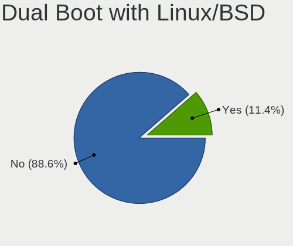

| Dual boot | Notebooks | Percent |
|-----------|-----------|---------|
| No        | 234       | 88.97%  |
| Yes       | 29        | 11.03%  |

Dual Boot (Win)
---------------

Hosting Linux and Windows

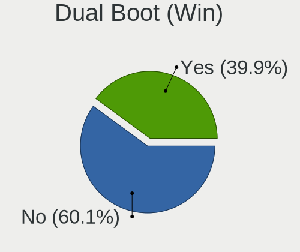

| Dual boot | Notebooks | Percent |
|-----------|-----------|---------|
| No        | 162       | 62.07%  |
| Yes       | 99        | 37.93%  |

Board
-----

Vendor
------

Motherboard manufacturer

| Name                   | Notebooks | Percent |
|------------------------|-----------|---------|
| Lenovo                 | 66        | 25.78%  |
| Dell                   | 51        | 19.92%  |
| ASUSTek Computer       | 41        | 16.02%  |
| Acer                   | 30        | 11.72%  |
| Hewlett-Packard        | 13        | 5.08%   |
| Apple                  | 11        | 4.3%    |
| MSI                    | 6         | 2.34%   |
| Sony                   | 5         | 1.95%   |
| Timi                   | 3         | 1.17%   |
| MECHREVO               | 3         | 1.17%   |
| HUAWEI                 | 3         | 1.17%   |
| Valve                  | 2         | 0.78%   |
| Toshiba                | 2         | 0.78%   |
| Samsung Electronics    | 2         | 0.78%   |
| Fujitsu                | 2         | 0.78%   |
| Foxconn                | 2         | 0.78%   |
| Aftershock             | 2         | 0.78%   |
| Unknown                | 2         | 0.78%   |
| TUXEDO                 | 1         | 0.39%   |
| System76               | 1         | 0.39%   |
| Razer                  | 1         | 0.39%   |
| Notebook               | 1         | 0.39%   |
| Google                 | 1         | 0.39%   |
| EUROCOM                | 1         | 0.39%   |
| COPELION INTERNATIONAL | 1         | 0.39%   |
| Beelink                | 1         | 0.39%   |
| AZW                    | 1         | 0.39%   |
| AMI                    | 1         | 0.39%   |

Model
-----

Motherboard model

| Name                                                  | Notebooks | Percent |
|-------------------------------------------------------|-----------|---------|
| Dell Inspiron 15 5510                                 | 3         | 1.17%   |
| Valve Jupiter                                         | 2         | 0.78%   |
| Lenovo ThinkPad X220 42911H8                          | 2         | 0.78%   |
| Lenovo Legion 5 Pro 16ACH6H 82JQ                      | 2         | 0.78%   |
| Lenovo IdeaPad S340-14API 81NB                        | 2         | 0.78%   |
| HP Compaq 6510b                                       | 2         | 0.78%   |
| Foxconn Kangaroo Mobile Desktop                       | 2         | 0.78%   |
| Dell XPS 13 9310                                      | 2         | 0.78%   |
| Dell XPS 13 7390                                      | 2         | 0.78%   |
| Dell Latitude E7250                                   | 2         | 0.78%   |
| Dell Latitude 3320                                    | 2         | 0.78%   |
| Dell Latitude 3120                                    | 2         | 0.78%   |
| ASUS VivoBook_ASUSLaptop M3500QC_M3500QC              | 2         | 0.78%   |
| ASUS T300LA                                           | 2         | 0.78%   |
| ASUS K45VM                                            | 2         | 0.78%   |
| Apple MacBookPro8,1                                   | 2         | 0.78%   |
| Apple MacBookPro11,5                                  | 2         | 0.78%   |
| Acer Swift SF314-57G                                  | 2         | 0.78%   |
| Acer ConceptD CN715-71                                | 2         | 0.78%   |
| Unknown                                               | 2         | 0.78%   |
| TUXEDO Stellaris Intel Gen5                           | 1         | 0.39%   |
| Toshiba PORTEGE Z10t-A                                | 1         | 0.39%   |
| Toshiba PORTEGE R930                                  | 1         | 0.39%   |
| Timi TM1701                                           | 1         | 0.39%   |
| Timi RedmiBook 15                                     | 1         | 0.39%   |
| Timi Redmi Book Pro 14 2022                           | 1         | 0.39%   |
| System76 Oryx Pro                                     | 1         | 0.39%   |
| Sony VPCSB36FG                                        | 1         | 0.39%   |
| Sony VPCCA15FG                                        | 1         | 0.39%   |
| Sony VGN-CR32G_W                                      | 1         | 0.39%   |
| Sony SVF1531V8CW                                      | 1         | 0.39%   |
| Sony SVE11116FGW                                      | 1         | 0.39%   |
| Samsung RF510/RF410/RF710                             | 1         | 0.39%   |
| Samsung 305U1A                                        | 1         | 0.39%   |
| Razer Blade 15 Advanced Model (Early 2020) - RZ09-033 | 1         | 0.39%   |
| Notebook P65_P67SE                                    | 1         | 0.39%   |
| MSI Pulse GL66 11UGK                                  | 1         | 0.39%   |
| MSI Prestige 15 A10SC                                 | 1         | 0.39%   |
| MSI Modern 14 B5M                                     | 1         | 0.39%   |
| MSI GP66 Leopard 10UE                                 | 1         | 0.39%   |

Model Family
------------

Motherboard model prefix

| Name               | Notebooks | Percent |
|--------------------|-----------|---------|
| Lenovo ThinkPad    | 35        | 13.67%  |
| Dell Inspiron      | 18        | 7.03%   |
| Dell Latitude      | 15        | 5.86%   |
| Acer Aspire        | 15        | 5.86%   |
| Lenovo IdeaPad     | 12        | 4.69%   |
| ASUS VivoBook      | 12        | 4.69%   |
| Dell XPS           | 11        | 4.3%    |
| Lenovo Legion      | 9         | 3.52%   |
| Acer Swift         | 9         | 3.52%   |
| Lenovo Yoga        | 5         | 1.95%   |
| Dell Precision     | 5         | 1.95%   |
| ASUS ZenBook       | 5         | 1.95%   |
| Apple MacBookPro11 | 5         | 1.95%   |
| HP Pavilion        | 4         | 1.56%   |
| HP ZBook           | 3         | 1.17%   |
| HP EliteBook       | 3         | 1.17%   |
| Valve Jupiter      | 2         | 0.78%   |
| Toshiba PORTEGE    | 2         | 0.78%   |
| HP Compaq          | 2         | 0.78%   |
| Fujitsu LIFEBOOK   | 2         | 0.78%   |
| Foxconn Kangaroo   | 2         | 0.78%   |
| ASUS TUF           | 2         | 0.78%   |
| ASUS T300LA        | 2         | 0.78%   |
| ASUS ROG           | 2         | 0.78%   |
| ASUS K45VM         | 2         | 0.78%   |
| ASUS ASUS          | 2         | 0.78%   |
| Apple MacBookPro8  | 2         | 0.78%   |
| Acer Predator      | 2         | 0.78%   |
| Acer ConceptD      | 2         | 0.78%   |
| Unknown            | 2         | 0.78%   |
| TUXEDO Stellaris   | 1         | 0.39%   |
| Timi TM1701        | 1         | 0.39%   |
| Timi RedmiBook     | 1         | 0.39%   |
| Timi Redmi         | 1         | 0.39%   |
| System76 Oryx      | 1         | 0.39%   |
| Sony VPCSB36FG     | 1         | 0.39%   |
| Sony VPCCA15FG     | 1         | 0.39%   |
| Sony VGN-CR32G     | 1         | 0.39%   |
| Sony SVF1531V8CW   | 1         | 0.39%   |
| Sony SVE11116FGW   | 1         | 0.39%   |

MFG Year
--------

Motherboard manufacture year

| Year | Notebooks | Percent |
|------|-----------|---------|
| 2021 | 35        | 13.67%  |
| 2019 | 34        | 13.28%  |
| 2020 | 25        | 9.77%   |
| 2018 | 23        | 8.98%   |
| 2022 | 19        | 7.42%   |
| 2011 | 17        | 6.64%   |
| 2017 | 14        | 5.47%   |
| 2015 | 13        | 5.08%   |
| 2014 | 13        | 5.08%   |
| 2016 | 12        | 4.69%   |
| 2012 | 12        | 4.69%   |
| 2023 | 10        | 3.91%   |
| 2013 | 9         | 3.52%   |
| 2008 | 7         | 2.73%   |
| 2010 | 5         | 1.95%   |
| 2007 | 5         | 1.95%   |
| 2009 | 3         | 1.17%   |

Form Factor
-----------

Physical design of the computer

| Name     | Notebooks | Percent |
|----------|-----------|---------|
| Notebook | 256       | 100%    |

Secure Boot
-----------

Enabled or disabled

| State    | Notebooks | Percent |
|----------|-----------|---------|
| Disabled | 216       | 83.72%  |
| Enabled  | 42        | 16.28%  |

Coreboot
--------

Have coreboot on board

| Used | Notebooks | Percent |
|------|-----------|---------|
| No   | 254       | 99.22%  |
| Yes  | 2         | 0.78%   |

RAM Size
--------

Total RAM memory

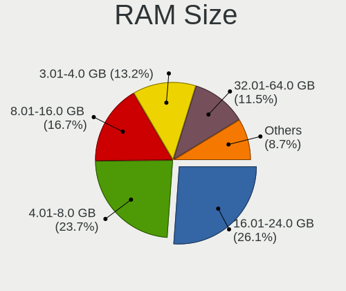

| Size in GB  | Notebooks | Percent |
|-------------|-----------|---------|
| 16.01-24.0  | 68        | 26.05%  |
| 4.01-8.0    | 66        | 25.29%  |
| 8.01-16.0   | 44        | 16.86%  |
| 3.01-4.0    | 34        | 13.03%  |
| 32.01-64.0  | 29        | 11.11%  |
| 1.01-2.0    | 8         | 3.07%   |
| 24.01-32.0  | 5         | 1.92%   |
| 64.01-256.0 | 5         | 1.92%   |
| 2.01-3.0    | 2         | 0.77%   |

RAM Used
--------

Used RAM memory

| Used GB    | Notebooks | Percent |
|------------|-----------|---------|
| 1.01-2.0   | 76        | 25.5%   |
| 2.01-3.0   | 71        | 23.83%  |
| 4.01-8.0   | 65        | 21.81%  |
| 3.01-4.0   | 50        | 16.78%  |
| 8.01-16.0  | 20        | 6.71%   |
| 0.51-1.0   | 10        | 3.36%   |
| 24.01-32.0 | 2         | 0.67%   |
| 16.01-24.0 | 2         | 0.67%   |
| 0.01-0.5   | 2         | 0.67%   |

Total Drives
------------

Number of drives on board

| Drives | Notebooks | Percent |
|--------|-----------|---------|
| 1      | 181       | 68.56%  |
| 2      | 67        | 25.38%  |
| 3      | 13        | 4.92%   |
| 0      | 2         | 0.76%   |
| 4      | 1         | 0.38%   |

Has CD-ROM
----------

Has CD-ROM on board

| Presented | Notebooks | Percent |
|-----------|-----------|---------|
| No        | 214       | 83.27%  |
| Yes       | 43        | 16.73%  |

Has Ethernet
------------

Has Ethernet on board

| Presented | Notebooks | Percent |
|-----------|-----------|---------|
| Yes       | 164       | 63.81%  |
| No        | 93        | 36.19%  |

Has WiFi
--------

Has WiFi module

| Presented | Notebooks | Percent |
|-----------|-----------|---------|
| Yes       | 251       | 98.05%  |
| No        | 5         | 1.95%   |

Has Bluetooth
-------------

Has Bluetooth module

| Presented | Notebooks | Percent |
|-----------|-----------|---------|
| Yes       | 220       | 84.94%  |
| No        | 39        | 15.06%  |

Location
--------

Country
-------

Geographic location (country)

| Country   | Notebooks | Percent |
|-----------|-----------|---------|
| Singapore | 256       | 100%    |

City
----

Geographic location (city)

| City                 | Notebooks | Percent |
|----------------------|-----------|---------|
| Singapore            | 248       | 96.5%   |
| Jurong West          | 4         | 1.56%   |
| Yio Chu Kang         | 1         | 0.39%   |
| Sembawang Estate     | 1         | 0.39%   |
| Queenstown Estate    | 1         | 0.39%   |
| Kampong Ulu Jurong   | 1         | 0.39%   |
| Bukit Batok New Town | 1         | 0.39%   |

Drives
------

Drive Vendor
------------

Hard drive vendors

| Vendor                      | Notebooks | Drives | Percent |
|-----------------------------|-----------|--------|---------|
| Samsung Electronics         | 57        | 93     | 16.86%  |
| SanDisk                     | 31        | 42     | 9.17%   |
| WDC                         | 28        | 50     | 8.28%   |
| SK hynix                    | 24        | 26     | 7.1%    |
| Seagate                     | 23        | 30     | 6.8%    |
| Toshiba                     | 20        | 29     | 5.92%   |
| Unknown                     | 19        | 27     | 5.62%   |
| Micron Technology           | 15        | 17     | 4.44%   |
| Intel                       | 14        | 16     | 4.14%   |
| HGST                        | 10        | 15     | 2.96%   |
| KIOXIA                      | 8         | 8      | 2.37%   |
| Hitachi                     | 8         | 8      | 2.37%   |
| Kingston                    | 6         | 7      | 1.78%   |
| Crucial                     | 6         | 6      | 1.78%   |
| Apple                       | 6         | 6      | 1.78%   |
| Phison                      | 4         | 6      | 1.18%   |
| External                    | 4         | 4      | 1.18%   |
| China                       | 4         | 4      | 1.18%   |
| Phison Electronics          | 3         | 4      | 0.89%   |
| JMicron Technology          | 3         | 6      | 0.89%   |
| YMTC                        | 2         | 3      | 0.59%   |
| Yangtze Memory Technologies | 2         | 2      | 0.59%   |
| UMIS                        | 2         | 3      | 0.59%   |
| Transcend                   | 2         | 3      | 0.59%   |
| SPCC                        | 2         | 2      | 0.59%   |
| Silicon Motion              | 2         | 3      | 0.59%   |
| Patriot                     | 2         | 2      | 0.59%   |
| LITEON                      | 2         | 3      | 0.59%   |
| Lexar                       | 2         | 2      | 0.59%   |
| Lenovo                      | 2         | 2      | 0.59%   |
| Hewlett-Packard             | 2         | 3      | 0.59%   |
| FORESEE                     | 2         | 2      | 0.59%   |
| ACASIS                      | 2         | 2      | 0.59%   |
| A-DATA Technology           | 2         | 2      | 0.59%   |
| TO Exter                    | 1         | 1      | 0.3%    |
| Team                        | 1         | 1      | 0.3%    |
| SAGE                        | 1         | 1      | 0.3%    |
| ORICO                       | 1         | 1      | 0.3%    |
| OCZ                         | 1         | 1      | 0.3%    |
| Micron/Crucial Technology   | 1         | 1      | 0.3%    |

Drive Model
-----------

Hard drive models

| Model                                                 | Notebooks | Percent |
|-------------------------------------------------------|-----------|---------|
| Seagate ST1000LM035-1RK172 1TB                        | 7         | 1.99%   |
| Unknown MMC Card  64GB                                | 5         | 1.42%   |
| Toshiba MQ04ABF100 1TB                                | 5         | 1.42%   |
| Samsung NVMe SSD Drive 1024GB                         | 4         | 1.14%   |
| HGST HTS721010A9E630 1TB                              | 4         | 1.14%   |
| External USB3.0 752GB                                 | 4         | 1.14%   |
| Toshiba MQ01ABD100 1TB                                | 3         | 0.85%   |
| SK hynix SKHynix_HFS001TDE9X084N 1024GB               | 3         | 0.85%   |
| SanDisk NVMe SSD Drive 512GB                          | 3         | 0.85%   |
| Samsung NVMe SSD Controller PM9A1/PM9A3/980PRO 2TB    | 3         | 0.85%   |
| JMicron Generic 8GB                                   | 3         | 0.85%   |
| WDC WDS500G2X0C-00L350 500GB                          | 2         | 0.57%   |
| WDC WDS100T2X0C-00L350 1TB                            | 2         | 0.57%   |
| WDC WD7500BPVT-80HXZT3 752GB                          | 2         | 0.57%   |
| WDC WD5000LPVX-22V0TT0 500GB                          | 2         | 0.57%   |
| WDC WD10SPZX-21Z10T0 1TB                              | 2         | 0.57%   |
| WDC PC SN730 SDBPNTY-1T00-1101 1TB                    | 2         | 0.57%   |
| WDC PC SN720 SED SDAQNTW-1T00 1TB                     | 2         | 0.57%   |
| Unknown NVMe SSD Drive 1024GB                         | 2         | 0.57%   |
| Unknown MMC Card  32GB                                | 2         | 0.57%   |
| Unknown MMC Card  256GB                               | 2         | 0.57%   |
| Toshiba MQ01ABF050 500GB                              | 2         | 0.57%   |
| Toshiba MK5055GSX 500GB                               | 2         | 0.57%   |
| SK hynix SKHynix_HFS512GDE9X084N 512GB                | 2         | 0.57%   |
| SK hynix SKHynix_HFS001TEJ9X115N 1TB                  | 2         | 0.57%   |
| SK hynix HFM512GDJTNG-8310A 512GB                     | 2         | 0.57%   |
| SK hynix HFM001TD3JX013N 1024GB                       | 2         | 0.57%   |
| Silicon Motion SM2263EN/SM2263XT SSD Controller 128GB | 2         | 0.57%   |
| Seagate ST1000LM049-2GH172 1TB                        | 2         | 0.57%   |
| Seagate Expansion 1TB                                 | 2         | 0.57%   |
| Sandisk WD_BLACK SN850X 1000GB                        | 2         | 0.57%   |
| Sandisk WD Blue SN550 NVMe SSD 512GB                  | 2         | 0.57%   |
| Sandisk WD Black SN750 / PC SN730 NVMe SSD 512GB      | 2         | 0.57%   |
| SanDisk SSD PLUS 480GB                                | 2         | 0.57%   |
| SanDisk SSD PLUS 240GB                                | 2         | 0.57%   |
| SanDisk SD6SN1M128G1002 128GB SSD                     | 2         | 0.57%   |
| Samsung SSD 970 EVO Plus 500GB                        | 2         | 0.57%   |
| Samsung SSD 860 EVO 500GB                             | 2         | 0.57%   |
| Samsung SSD 860 EVO 250GB                             | 2         | 0.57%   |
| Samsung SSD 850 EVO 500GB                             | 2         | 0.57%   |

HDD Vendor
----------

Hard disk drive vendors

| Vendor              | Notebooks | Drives | Percent |
|---------------------|-----------|--------|---------|
| Seagate             | 21        | 27     | 25.93%  |
| Toshiba             | 16        | 24     | 19.75%  |
| WDC                 | 13        | 17     | 16.05%  |
| HGST                | 10        | 15     | 12.35%  |
| Hitachi             | 8         | 8      | 9.88%   |
| External            | 4         | 4      | 4.94%   |
| JMicron Technology  | 3         | 6      | 3.7%    |
| Unknown             | 1         | 2      | 1.23%   |
| TO Exter            | 1         | 1      | 1.23%   |
| Samsung Electronics | 1         | 3      | 1.23%   |
| SAGE                | 1         | 1      | 1.23%   |
| Fujitsu             | 1         | 1      | 1.23%   |
| Apple               | 1         | 1      | 1.23%   |

SSD Vendor
----------

Solid state drive vendors

| Vendor              | Notebooks | Drives | Percent |
|---------------------|-----------|--------|---------|
| Samsung Electronics | 27        | 53     | 30.68%  |
| SanDisk             | 15        | 24     | 17.05%  |
| Micron Technology   | 5         | 6      | 5.68%   |
| Apple               | 5         | 5      | 5.68%   |
| Crucial             | 4         | 4      | 4.55%   |
| China               | 4         | 4      | 4.55%   |
| SK hynix            | 3         | 3      | 3.41%   |
| WDC                 | 2         | 3      | 2.27%   |
| Transcend           | 2         | 3      | 2.27%   |
| SPCC                | 2         | 2      | 2.27%   |
| Patriot             | 2         | 2      | 2.27%   |
| LITEON              | 2         | 3      | 2.27%   |
| Kingston            | 2         | 3      | 2.27%   |
| FORESEE             | 2         | 2      | 2.27%   |
| Toshiba             | 1         | 1      | 1.14%   |
| ORICO               | 1         | 1      | 1.14%   |
| OCZ                 | 1         | 1      | 1.14%   |
| LT                  | 1         | 1      | 1.14%   |
| Lexar               | 1         | 1      | 1.14%   |
| LALAK               | 1         | 1      | 1.14%   |
| Hewlett-Packard     | 1         | 2      | 1.14%   |
| Haizhide            | 1         | 1      | 1.14%   |
| GALAX               | 1         | 1      | 1.14%   |
| CT1000MX            | 1         | 2      | 1.14%   |
| Unknown             | 1         | 1      | 1.14%   |

Drive Kind
----------

HDD or SSD

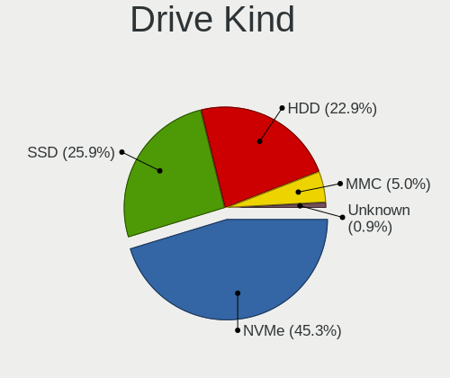

| Kind    | Notebooks | Drives | Percent |
|---------|-----------|--------|---------|
| NVMe    | 136       | 194    | 43.87%  |
| SSD     | 81        | 130    | 26.13%  |
| HDD     | 75        | 110    | 24.19%  |
| MMC     | 15        | 21     | 4.84%   |
| Unknown | 3         | 3      | 0.97%   |

Drive Connector
---------------

SATA, SAS, NVMe, etc.

| Type | Notebooks | Drives | Percent |
|------|-----------|--------|---------|
| NVMe | 136       | 192    | 45.79%  |
| SATA | 129       | 220    | 43.43%  |
| SAS  | 17        | 25     | 5.72%   |
| MMC  | 15        | 21     | 5.05%   |

Drive Size
----------

Size of hard drive

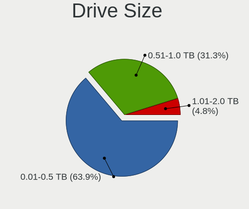

| Size in TB | Notebooks | Drives | Percent |
|------------|-----------|--------|---------|
| 0.01-0.5   | 99        | 159    | 64.29%  |
| 0.51-1.0   | 50        | 74     | 32.47%  |
| 1.01-2.0   | 5         | 7      | 3.25%   |

Space Total
-----------

Amount of disk space available on the file system

| Size in GB     | Notebooks | Percent |
|----------------|-----------|---------|
| 101-250        | 74        | 27.11%  |
| 251-500        | 65        | 23.81%  |
| 501-1000       | 48        | 17.58%  |
| 1001-2000      | 21        | 7.69%   |
| 51-100         | 20        | 7.33%   |
| 1-20           | 16        | 5.86%   |
| More than 3000 | 9         | 3.3%    |
| 21-50          | 8         | 2.93%   |
| Unknown        | 7         | 2.56%   |
| 2001-3000      | 5         | 1.83%   |

Space Used
----------

Amount of used disk space

| Used GB        | Notebooks | Percent |
|----------------|-----------|---------|
| 1-20           | 98        | 34.88%  |
| 21-50          | 53        | 18.86%  |
| 101-250        | 43        | 15.3%   |
| 51-100         | 29        | 10.32%  |
| 251-500        | 26        | 9.25%   |
| 501-1000       | 15        | 5.34%   |
| Unknown        | 7         | 2.49%   |
| 1001-2000      | 5         | 1.78%   |
| More than 3000 | 2         | 0.71%   |
| 2001-3000      | 2         | 0.71%   |
| 0              | 1         | 0.36%   |

Malfunc. Drives
---------------

Drive models with a malfunction

| Model                              | Notebooks | Drives | Percent |
|------------------------------------|-----------|--------|---------|
| WDC WD5000LPVX-22V0TT0 500GB       | 1         | 1      | 11.11%  |
| WDC WD5000BPVT-16HXZT1 500GB       | 1         | 1      | 11.11%  |
| WDC WD10SPZX-21Z10T0 1TB           | 1         | 2      | 11.11%  |
| Seagate ST2000LM003 HN-M201RAD 2TB | 1         | 1      | 11.11%  |
| Seagate ST1000LM024 HN-M 1TB       | 1         | 1      | 11.11%  |
| SanDisk SSD U100 24GB              | 1         | 1      | 11.11%  |
| Hitachi HTS545032B9A300 320GB      | 1         | 1      | 11.11%  |
| Hitachi HTS541010A9E680 1TB        | 1         | 1      | 11.11%  |
| China SSD 128GB                    | 1         | 1      | 11.11%  |

Malfunc. Drive Vendor
---------------------

Vendors of faulty drives

| Vendor  | Notebooks | Drives | Percent |
|---------|-----------|--------|---------|
| WDC     | 3         | 4      | 33.33%  |
| Seagate | 2         | 2      | 22.22%  |
| Hitachi | 2         | 2      | 22.22%  |
| SanDisk | 1         | 1      | 11.11%  |
| China   | 1         | 1      | 11.11%  |

Malfunc. HDD Vendor
-------------------

Vendors of faulty HDD drives

| Vendor  | Notebooks | Drives | Percent |
|---------|-----------|--------|---------|
| WDC     | 3         | 4      | 42.86%  |
| Seagate | 2         | 2      | 28.57%  |
| Hitachi | 2         | 2      | 28.57%  |

Malfunc. Drive Kind
-------------------

Kinds of faulty drives

| Kind | Notebooks | Drives | Percent |
|------|-----------|--------|---------|
| HDD  | 7         | 8      | 77.78%  |
| SSD  | 2         | 2      | 22.22%  |

Failed Drives
-------------

Failed drive models

Zero info for selected period =(

Failed Drive Vendor
-------------------

Failed drive vendors

Zero info for selected period =(

Drive Status
------------

Number of failed and malfunc. drives

| Status   | Notebooks | Drives | Percent |
|----------|-----------|--------|---------|
| Detected | 145       | 239    | 52.92%  |
| Works    | 120       | 209    | 43.8%   |
| Malfunc  | 9         | 10     | 3.28%   |

Storage controller
------------------

Storage Vendor
--------------

Storage controller vendors

| Vendor                                  | Notebooks | Percent |
|-----------------------------------------|-----------|---------|
| Intel                                   | 152       | 47.35%  |
| Samsung Electronics                     | 33        | 10.28%  |
| SanDisk                                 | 28        | 8.72%   |
| AMD                                     | 26        | 8.1%    |
| SK hynix                                | 21        | 6.54%   |
| Micron Technology                       | 10        | 3.12%   |
| Phison Electronics                      | 7         | 2.18%   |
| KIOXIA                                  | 7         | 2.18%   |
| Toshiba America Info Systems            | 5         | 1.56%   |
| Kingston Technology Company             | 4         | 1.25%   |
| ADATA Technology                        | 4         | 1.25%   |
| Yangtze Memory Technologies             | 3         | 0.93%   |
| Silicon Motion                          | 3         | 0.93%   |
| Nvidia                                  | 3         | 0.93%   |
| Micron/Crucial Technology               | 3         | 0.93%   |
| Shenzhen Longsys Electronics            | 2         | 0.62%   |
| Seagate Technology                      | 2         | 0.62%   |
| Lenovo                                  | 2         | 0.62%   |
| Union Memory (Shenzhen)                 | 1         | 0.31%   |
| Shenzhen Unionmemory Information System | 1         | 0.31%   |
| MAXIO Technology (Hangzhou)             | 1         | 0.31%   |
| Marvell Technology Group                | 1         | 0.31%   |
| INNOGRIT                                | 1         | 0.31%   |
| ASMedia Technology                      | 1         | 0.31%   |

Storage Model
-------------

Storage controller models

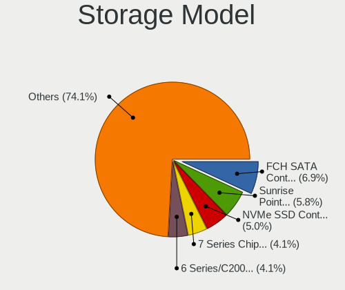

| Model                                                                          | Notebooks | Percent |
|--------------------------------------------------------------------------------|-----------|---------|
| AMD FCH SATA Controller [AHCI mode]                                            | 25        | 7.44%   |
| Intel Sunrise Point-LP SATA Controller [AHCI mode]                             | 21        | 6.25%   |
| Samsung NVMe SSD Controller SM981/PM981/PM983                                  | 17        | 5.06%   |
| Intel 6 Series/C200 Series Chipset Family 6 port Mobile SATA AHCI Controller   | 15        | 4.46%   |
| Intel 7 Series Chipset Family 6-port SATA Controller [AHCI mode]               | 14        | 4.17%   |
| Intel Volume Management Device NVMe RAID Controller                            | 13        | 3.87%   |
| Intel 82801 Mobile SATA Controller [RAID mode]                                 | 11        | 3.27%   |
| SK hynix Gold P31/BC711/PC711 NVMe Solid State Drive                           | 10        | 2.98%   |
| Intel Cannon Lake Mobile PCH SATA AHCI Controller                              | 10        | 2.98%   |
| SanDisk Extreme Pro / WD Black SN750 / PC SN730 / Red SN700 NVMe SSD           | 8         | 2.38%   |
| Intel SSD 660P Series                                                          | 7         | 2.08%   |
| Intel 8 Series SATA Controller 1 [AHCI mode]                                   | 7         | 2.08%   |
| SanDisk Extreme Pro / WD Black 2018/SN750/PC SN720 NVMe SSD                    | 6         | 1.79%   |
| Samsung NVMe SSD Controller 980 (DRAM-less)                                    | 6         | 1.79%   |
| Intel HM170/QM170 Chipset SATA Controller [AHCI Mode]                          | 6         | 1.79%   |
| SanDisk Ultra 3D / WD Blue SN550 NVMe SSD                                      | 5         | 1.49%   |
| KIOXIA NVMe SSD Controller BG4 (DRAM-less)                                     | 5         | 1.49%   |
| Intel Tiger Lake-LP SATA Controller                                            | 5         | 1.49%   |
| Intel Celeron/Pentium Silver Processor SATA Controller                         | 5         | 1.49%   |
| Samsung NVMe SSD Controller PM9A1/PM9A3/980PRO                                 | 4         | 1.19%   |
| Intel Wildcat Point-LP SATA Controller [AHCI Mode]                             | 4         | 1.19%   |
| Intel 82801IBM/IEM (ICH9M/ICH9M-E) 4 port SATA Controller [AHCI mode]          | 4         | 1.19%   |
| Intel 82801HM/HEM (ICH8M/ICH8M-E) SATA Controller [AHCI mode]                  | 4         | 1.19%   |
| Intel 82801HM/HEM (ICH8M/ICH8M-E) IDE Controller                               | 4         | 1.19%   |
| Intel 8 Series/C220 Series Chipset Family 6-port SATA Controller 1 [AHCI mode] | 4         | 1.19%   |
| Toshiba America Info Systems XG5 NVMe SSD Controller                           | 3         | 0.89%   |
| SK hynix Platinum P41/PC801 NVMe Solid State Drive                             | 3         | 0.89%   |
| SK hynix BC501 NVMe Solid State Drive                                          | 3         | 0.89%   |
| Silicon Motion SM2263EN/SM2263XT (DRAM-less) NVMe SSD Controllers              | 3         | 0.89%   |
| Sandisk WD Black SN850X NVMe SSD                                               | 3         | 0.89%   |
| Phison E12 NVMe Controller                                                     | 3         | 0.89%   |
| Micron/Crucial P2 [Nick P2] / P3 / P3 Plus NVMe PCIe SSD (DRAM-less)           | 3         | 0.89%   |
| Micron 3400 NVMe SSD [Hendrix]                                                 | 3         | 0.89%   |
| Micron 2210 NVMe SSD [Cobain]                                                  | 3         | 0.89%   |
| Kingston Company OM8PCP Design-In PCIe 3 NVMe SSD (DRAM-less)                  | 3         | 0.89%   |
| Intel SSD DC P4101/Pro 7600p/760p/E 6100p Series                               | 3         | 0.89%   |
| Intel SSD 670p Series [Keystone Harbor]                                        | 3         | 0.89%   |
| Intel Cannon Point-LP SATA Controller [AHCI Mode]                              | 3         | 0.89%   |
| Intel Atom Processor E3800 Series SATA AHCI Controller                         | 3         | 0.89%   |
| Yangtze Memory PC300 NVMe SSD (DRAM-less)                                      | 2         | 0.6%    |

Storage Kind
------------

Kind of storage controller (IDE, SATA, NVMe, SAS, ...)

| Kind | Notebooks | Percent |
|------|-----------|---------|
| SATA | 148       | 46.25%  |
| NVMe | 137       | 42.81%  |
| RAID | 26        | 8.13%   |
| IDE  | 9         | 2.81%   |

Processor
---------

CPU Vendor
----------

Processor vendors

| Vendor | Notebooks | Percent |
|--------|-----------|---------|
| Intel  | 206       | 80.47%  |
| AMD    | 50        | 19.53%  |

CPU Model
---------

Processor models

| Model                                         | Notebooks | Percent |
|-----------------------------------------------|-----------|---------|
| Intel Core i7-8550U CPU @ 1.80GHz             | 10        | 3.91%   |
| AMD Ryzen 7 5800H with Radeon Graphics        | 10        | 3.91%   |
| Intel Core i7-10510U CPU @ 1.80GHz            | 8         | 3.13%   |
| Intel 11th Gen Core i5-1135G7 @ 2.40GHz       | 8         | 3.13%   |
| Intel Core i7-9750H CPU @ 2.60GHz             | 5         | 1.95%   |
| Intel Core i7-8750H CPU @ 2.20GHz             | 5         | 1.95%   |
| Intel Core i7-8565U CPU @ 1.80GHz             | 5         | 1.95%   |
| Intel Core i7-6700HQ CPU @ 2.60GHz            | 5         | 1.95%   |
| Intel Core i5-8250U CPU @ 1.60GHz             | 5         | 1.95%   |
| Intel Core i5-4200U CPU @ 1.60GHz             | 5         | 1.95%   |
| Intel Core i5-2520M CPU @ 2.50GHz             | 4         | 1.56%   |
| Intel Core i7-7500U CPU @ 2.70GHz             | 3         | 1.17%   |
| Intel Core i7-6500U CPU @ 2.50GHz             | 3         | 1.17%   |
| Intel Core i7-1065G7 CPU @ 1.30GHz            | 3         | 1.17%   |
| Intel Core i5-8265U CPU @ 1.60GHz             | 3         | 1.17%   |
| Intel Core i5-7200U CPU @ 2.50GHz             | 3         | 1.17%   |
| Intel Core i5-2410M CPU @ 2.30GHz             | 3         | 1.17%   |
| Intel 11th Gen Core i7-1165G7 @ 2.80GHz       | 3         | 1.17%   |
| Intel 11th Gen Core i7-11390H @ 3.40GHz       | 3         | 1.17%   |
| AMD Ryzen 7 4800H with Radeon Graphics        | 3         | 1.17%   |
| AMD Ryzen 5 3500U with Radeon Vega Mobile Gfx | 3         | 1.17%   |
| Intel Xeon E-2176M CPU @ 2.70GHz              | 2         | 0.78%   |
| Intel Pentium Silver N6000 @ 1.10GHz          | 2         | 0.78%   |
| Intel Core i7-7700HQ CPU @ 2.80GHz            | 2         | 0.78%   |
| Intel Core i7-5600U CPU @ 2.60GHz             | 2         | 0.78%   |
| Intel Core i7-5500U CPU @ 2.40GHz             | 2         | 0.78%   |
| Intel Core i7-4870HQ CPU @ 2.50GHz            | 2         | 0.78%   |
| Intel Core i7-4700MQ CPU @ 2.40GHz            | 2         | 0.78%   |
| Intel Core i7-3537U CPU @ 2.00GHz             | 2         | 0.78%   |
| Intel Core i5-8365U CPU @ 1.60GHz             | 2         | 0.78%   |
| Intel Core i5-8350U CPU @ 1.70GHz             | 2         | 0.78%   |
| Intel Core i5-6300U CPU @ 2.40GHz             | 2         | 0.78%   |
| Intel Core i5-3317U CPU @ 1.70GHz             | 2         | 0.78%   |
| Intel Core i5-2430M CPU @ 2.40GHz             | 2         | 0.78%   |
| Intel Core i5 CPU M 560 @ 2.67GHz             | 2         | 0.78%   |
| Intel Core i3-3217U CPU @ 1.80GHz             | 2         | 0.78%   |
| Intel Core 2 Duo CPU T7100 @ 1.80GHz          | 2         | 0.78%   |
| Intel Core 2 Duo CPU P8600 @ 2.40GHz          | 2         | 0.78%   |
| Intel Celeron CPU N3350 @ 1.10GHz             | 2         | 0.78%   |
| Intel Atom x5-Z8500 CPU @ 1.44GHz             | 2         | 0.78%   |

CPU Model Family
----------------

Processor model prefix

| Model                   | Notebooks | Percent |
|-------------------------|-----------|---------|
| Intel Core i7           | 74        | 28.91%  |
| Intel Core i5           | 51        | 19.92%  |
| Other                   | 39        | 15.23%  |
| AMD Ryzen 7             | 21        | 8.2%    |
| AMD Ryzen 5             | 12        | 4.69%   |
| Intel Celeron           | 11        | 4.3%    |
| Intel Core 2 Duo        | 10        | 3.91%   |
| Intel Core i3           | 6         | 2.34%   |
| Intel Xeon              | 4         | 1.56%   |
| Intel Pentium Silver    | 4         | 1.56%   |
| Intel Atom              | 4         | 1.56%   |
| AMD Ryzen 7 PRO         | 3         | 1.17%   |
| Intel Core m3           | 2         | 0.78%   |
| Intel Core i9           | 2         | 0.78%   |
| AMD Ryzen 9             | 2         | 0.78%   |
| AMD Ryzen 3             | 2         | 0.78%   |
| Intel Pentium Dual      | 1         | 0.39%   |
| Intel Core 2            | 1         | 0.39%   |
| AMD Turion 64 X2 Mobile | 1         | 0.39%   |
| AMD Ryzen 5 PRO         | 1         | 0.39%   |
| AMD PRO A10             | 1         | 0.39%   |
| AMD E2                  | 1         | 0.39%   |
| AMD E1                  | 1         | 0.39%   |
| AMD E                   | 1         | 0.39%   |
| AMD A6                  | 1         | 0.39%   |

CPU Cores
---------

Number of processor cores

| Number | Notebooks | Percent |
|--------|-----------|---------|
| 4      | 96        | 37.5%   |
| 2      | 90        | 35.16%  |
| 8      | 34        | 13.28%  |
| 6      | 21        | 8.2%    |
| 14     | 6         | 2.34%   |
| 10     | 5         | 1.95%   |
| 24     | 2         | 0.78%   |
| 1      | 2         | 0.78%   |

CPU Sockets
-----------

Number of sockets

| Number | Notebooks | Percent |
|--------|-----------|---------|
| 1      | 256       | 100%    |

CPU Threads
-----------

Threads per core (Hyper-Threading)

| Number | Notebooks | Percent |
|--------|-----------|---------|
| 2      | 214       | 82.63%  |
| 1      | 45        | 17.37%  |

CPU Op-Modes
------------

CPU Operation Modes (32-bit, 64-bit)

| Op mode        | Notebooks | Percent |
|----------------|-----------|---------|
| 32-bit, 64-bit | 253       | 98.83%  |
| 32-bit         | 2         | 0.78%   |
| Unknown        | 1         | 0.39%   |

CPU Microcode
-------------

Microcode number

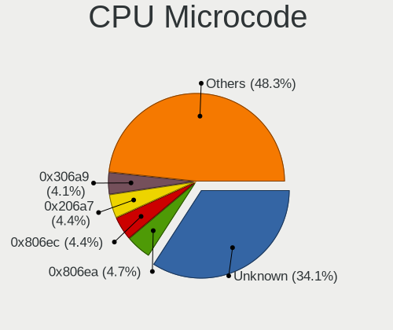

| Number     | Notebooks | Percent |
|------------|-----------|---------|
| Unknown    | 76        | 28.36%  |
| 0x806ea    | 14        | 5.22%   |
| 0x806ec    | 13        | 4.85%   |
| 0x206a7    | 13        | 4.85%   |
| 0x306a9    | 12        | 4.48%   |
| 0x0a50000c | 11        | 4.1%    |
| 0x906ea    | 10        | 3.73%   |
| 0x806c1    | 9         | 3.36%   |
| 0x40651    | 7         | 2.61%   |
| 0x806e9    | 6         | 2.24%   |
| 0x306d4    | 6         | 2.24%   |
| 0x806eb    | 5         | 1.87%   |
| 0x6fd      | 5         | 1.87%   |
| 0x806d1    | 4         | 1.49%   |
| 0x506e3    | 4         | 1.49%   |
| 0x406e3    | 4         | 1.49%   |
| 0x1067a    | 4         | 1.49%   |
| 0x08108109 | 4         | 1.49%   |
| 0xa0652    | 3         | 1.12%   |
| 0x806c2    | 3         | 1.12%   |
| 0x706a1    | 3         | 1.12%   |
| 0x40661    | 3         | 1.12%   |
| 0x306c3    | 3         | 1.12%   |
| 0x20655    | 3         | 1.12%   |
| 0x0a404102 | 3         | 1.12%   |
| 0x08600106 | 3         | 1.12%   |
| 0x906e9    | 2         | 0.75%   |
| 0x906c0    | 2         | 0.75%   |
| 0x906a3    | 2         | 0.75%   |
| 0x706e5    | 2         | 0.75%   |
| 0x706a8    | 2         | 0.75%   |
| 0x406c3    | 2         | 0.75%   |
| 0x30678    | 2         | 0.75%   |
| 0x106c2    | 2         | 0.75%   |
| 0x0a404101 | 2         | 0.75%   |
| 0x08600103 | 2         | 0.75%   |
| 0x08108102 | 2         | 0.75%   |
| 0x06006705 | 2         | 0.75%   |
| 0xb06a2    | 1         | 0.37%   |
| 0xb0671    | 1         | 0.37%   |

CPU Microarch
-------------

Microarchitecture

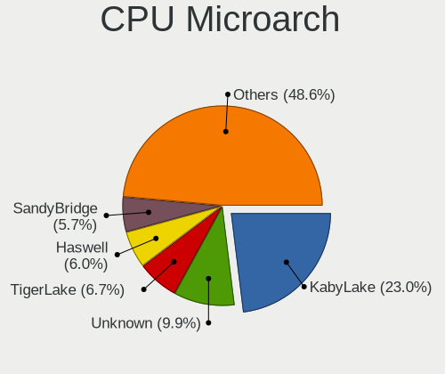

| Name             | Notebooks | Percent |
|------------------|-----------|---------|
| KabyLake         | 63        | 24.51%  |
| Unknown          | 19        | 7.39%   |
| TigerLake        | 18        | 7%      |
| SandyBridge      | 16        | 6.23%   |
| Haswell          | 16        | 6.23%   |
| Zen 3            | 15        | 5.84%   |
| IvyBridge        | 14        | 5.45%   |
| Skylake          | 12        | 4.67%   |
| Zen+             | 9         | 3.5%    |
| IceLake          | 8         | 3.11%   |
| Broadwell        | 8         | 3.11%   |
| Alderlake Hybrid | 8         | 3.11%   |
| Zen 2            | 7         | 2.72%   |
| Penryn           | 6         | 2.33%   |
| Core             | 6         | 2.33%   |
| CometLake        | 6         | 2.33%   |
| Silvermont       | 5         | 1.95%   |
| Goldmont plus    | 5         | 1.95%   |
| Westmere         | 3         | 1.17%   |
| Excavator        | 3         | 1.17%   |
| Tremont          | 2         | 0.78%   |
| Goldmont         | 2         | 0.78%   |
| Bonnell          | 2         | 0.78%   |
| Bobcat           | 2         | 0.78%   |
| K8 Hammer        | 1         | 0.39%   |
| Jaguar           | 1         | 0.39%   |

Graphics
--------

GPU Vendor
----------

Vendors of graphics cards

| Vendor | Notebooks | Percent |
|--------|-----------|---------|
| Intel  | 194       | 55.43%  |
| Nvidia | 101       | 28.86%  |
| AMD    | 55        | 15.71%  |

GPU Model
---------

Graphics card models

| Model                                                                     | Notebooks | Percent |
|---------------------------------------------------------------------------|-----------|---------|
| Intel UHD Graphics 620                                                    | 18        | 4.99%   |
| Intel TigerLake-LP GT2 [Iris Xe Graphics]                                 | 16        | 4.43%   |
| Intel 2nd Generation Core Processor Family Integrated Graphics Controller | 15        | 4.16%   |
| Intel 3rd Gen Core processor Graphics Controller                          | 14        | 3.88%   |
| Intel CoffeeLake-H GT2 [UHD Graphics 630]                                 | 12        | 3.32%   |
| Intel WhiskeyLake-U GT2 [UHD Graphics 620]                                | 10        | 2.77%   |
| AMD Cezanne [Radeon Vega Series / Radeon Vega Mobile Series]              | 10        | 2.77%   |
| Intel CometLake-U GT2 [UHD Graphics]                                      | 9         | 2.49%   |
| AMD Picasso/Raven 2 [Radeon Vega Series / Radeon Vega Mobile Series]      | 9         | 2.49%   |
| Intel HD Graphics 620                                                     | 8         | 2.22%   |
| Intel Haswell-ULT Integrated Graphics Controller                          | 8         | 2.22%   |
| AMD Renoir [Radeon RX Vega 6 (Ryzen 4000/5000 Mobile Series)]             | 7         | 1.94%   |
| AMD Rembrandt [Radeon 680M]                                               | 7         | 1.94%   |
| Nvidia TU117M [GeForce GTX 1650 Mobile / Max-Q]                           | 6         | 1.66%   |
| Intel Skylake GT2 [HD Graphics 520]                                       | 6         | 1.66%   |
| Intel HD Graphics 5500                                                    | 6         | 1.66%   |
| Nvidia GP108M [GeForce MX150]                                             | 5         | 1.39%   |
| Nvidia GP108BM [GeForce MX250]                                            | 5         | 1.39%   |
| Nvidia GA106M [GeForce RTX 3060 Mobile / Max-Q]                           | 5         | 1.39%   |
| Nvidia GA104M [GeForce RTX 3070 Mobile / Max-Q]                           | 5         | 1.39%   |
| Intel Mobile GM965/GL960 Integrated Graphics Controller (secondary)       | 5         | 1.39%   |
| Intel Mobile GM965/GL960 Integrated Graphics Controller (primary)         | 5         | 1.39%   |
| Intel CometLake-H GT2 [UHD Graphics]                                      | 5         | 1.39%   |
| Intel HD Graphics 530                                                     | 4         | 1.11%   |
| Nvidia GP107M [GeForce GTX 1050 Mobile]                                   | 3         | 0.83%   |
| Nvidia GP106M [GeForce GTX 1060 Mobile]                                   | 3         | 0.83%   |
| Nvidia GM108M [GeForce 940M]                                              | 3         | 0.83%   |
| Nvidia GM107M [GeForce GTX 960M]                                          | 3         | 0.83%   |
| Nvidia GA107M [GeForce RTX 3050 Ti Mobile]                                | 3         | 0.83%   |
| Nvidia GA107M [GeForce RTX 3050 Mobile]                                   | 3         | 0.83%   |
| Intel TigerLake-H GT1 [UHD Graphics]                                      | 3         | 0.83%   |
| Intel Raptor Lake-P [Iris Xe Graphics]                                    | 3         | 0.83%   |
| Intel Mobile 4 Series Chipset Integrated Graphics Controller              | 3         | 0.83%   |
| Intel Iris Plus Graphics G7                                               | 3         | 0.83%   |
| Intel GeminiLake [UHD Graphics 600]                                       | 3         | 0.83%   |
| Intel Atom Processor Z36xxx/Z37xxx Series Graphics & Display              | 3         | 0.83%   |
| Intel Alder Lake-P GT1 [UHD Graphics]                                     | 3         | 0.83%   |
| Intel 4th Gen Core Processor Integrated Graphics Controller               | 3         | 0.83%   |
| Nvidia TU117M [GeForce GTX 1650 Ti Mobile]                                | 2         | 0.55%   |
| Nvidia TU116M [GeForce GTX 1660 Ti Mobile]                                | 2         | 0.55%   |

GPU Combo
---------

Combinations of graphics cards

| Name           | Notebooks | Percent |
|----------------|-----------|---------|
| 1 x Intel      | 111       | 43.19%  |
| Intel + Nvidia | 75        | 29.18%  |
| 1 x AMD        | 32        | 12.45%  |
| 1 x Nvidia     | 16        | 6.23%   |
| AMD + Nvidia   | 11        | 4.28%   |
| Intel + AMD    | 8         | 3.11%   |
| 2 x AMD        | 4         | 1.56%   |

GPU Driver
----------

Free vs proprietary

| Driver      | Notebooks | Percent |
|-------------|-----------|---------|
| Free        | 195       | 74.71%  |
| Proprietary | 60        | 22.99%  |
| Unknown     | 6         | 2.3%    |

GPU Memory
----------

Total video memory

| Size in GB | Notebooks | Percent |
|------------|-----------|---------|
| Unknown    | 183       | 68.28%  |
| 1.01-2.0   | 31        | 11.57%  |
| 0.01-0.5   | 21        | 7.84%   |
| 3.01-4.0   | 16        | 5.97%   |
| 7.01-8.0   | 5         | 1.87%   |
| 0.51-1.0   | 5         | 1.87%   |
| 5.01-6.0   | 4         | 1.49%   |
| 8.01-16.0  | 2         | 0.75%   |
| 2.01-3.0   | 1         | 0.37%   |

Monitor
-------

Monitor Vendor
--------------

Monitor vendors

| Vendor                  | Notebooks | Percent |
|-------------------------|-----------|---------|
| AU Optronics            | 71        | 23.91%  |
| BOE                     | 40        | 13.47%  |
| LG Display              | 32        | 10.77%  |
| Samsung Electronics     | 29        | 9.76%   |
| Chimei Innolux          | 26        | 8.75%   |
| Dell                    | 17        | 5.72%   |
| Sharp                   | 12        | 4.04%   |
| Apple                   | 11        | 3.7%    |
| Philips                 | 7         | 2.36%   |
| Acer                    | 7         | 2.36%   |
| CSO                     | 6         | 2.02%   |
| InfoVision              | 4         | 1.35%   |
| Goldstar                | 4         | 1.35%   |
| Lenovo                  | 3         | 1.01%   |
| Hewlett-Packard         | 3         | 1.01%   |
| Valve                   | 2         | 0.67%   |
| TMX                     | 2         | 0.67%   |
| PANDA                   | 2         | 0.67%   |
| Mi                      | 2         | 0.67%   |
| LG Philips              | 2         | 0.67%   |
| ASUSTek Computer        | 2         | 0.67%   |
| Toshiba                 | 1         | 0.34%   |
| Tianma XM               | 1         | 0.34%   |
| Sony                    | 1         | 0.34%   |
| JDI                     | 1         | 0.34%   |
| EXP                     | 1         | 0.34%   |
| DMS                     | 1         | 0.34%   |
| DENON                   | 1         | 0.34%   |
| CVT                     | 1         | 0.34%   |
| CPT                     | 1         | 0.34%   |
| Chi Mei Optoelectronics | 1         | 0.34%   |
| BenQ                    | 1         | 0.34%   |
| AOC                     | 1         | 0.34%   |
| Ancor Communications    | 1         | 0.34%   |

Monitor Model
-------------

Monitor models

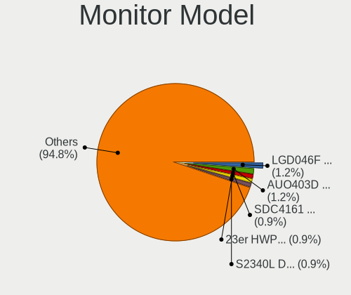

| Model                                                                 | Notebooks | Percent |
|-----------------------------------------------------------------------|-----------|---------|
| LG Display LCD Monitor LGD046F 1920x1080 345x194mm 15.6-inch          | 4         | 1.33%   |
| AU Optronics LCD Monitor AUO403D 1920x1080 309x174mm 14.0-inch        | 4         | 1.33%   |
| Hewlett-Packard 23es HWP331E 1920x1080 509x286mm 23.0-inch            | 3         | 1%      |
| Dell S2340L DELD058 1920x1080 509x286mm 23.0-inch                     | 3         | 1%      |
| Dell P2421D DELD0FF 2560x1440 527x296mm 23.8-inch                     | 3         | 1%      |
| AU Optronics LCD Monitor AUO408D 1920x1080 309x174mm 14.0-inch        | 3         | 1%      |
| Valve ANX7530 U VLV3001 800x1280 100x150mm 7.1-inch                   | 2         | 0.67%   |
| Samsung Electronics LCD Monitor SEC3047 1366x768 277x156mm 12.5-inch  | 2         | 0.67%   |
| Samsung Electronics LCD Monitor SDC4161 1920x1080 344x194mm 15.5-inch | 2         | 0.67%   |
| Samsung Electronics C24F390 SAM0D2C 1920x1080 521x293mm 23.5-inch     | 2         | 0.67%   |
| Philips 227E4QH PHLC0AA 1920x1080 477x268mm 21.5-inch                 | 2         | 0.67%   |
| LG Philips LCD Monitor LPL8D00 1280x800 304x190mm 14.1-inch           | 2         | 0.67%   |
| LG Display LCD Monitor LGD05F6 1920x1080 309x174mm 14.0-inch          | 2         | 0.67%   |
| Chimei Innolux LCD Monitor CMN14E5 1920x1080 309x173mm 13.9-inch      | 2         | 0.67%   |
| Chimei Innolux LCD Monitor CMN14C3 1366x768 309x173mm 13.9-inch       | 2         | 0.67%   |
| Chimei Innolux LCD Monitor CMN1470 1366x768 309x174mm 14.0-inch       | 2         | 0.67%   |
| Chimei Innolux LCD Monitor CMN1354 1920x1080 293x165mm 13.2-inch      | 2         | 0.67%   |
| BOE LCD Monitor BOE09C3 1366x768 256x144mm 11.6-inch                  | 2         | 0.67%   |
| BOE LCD Monitor BOE06A7 1920x1080 294x165mm 13.3-inch                 | 2         | 0.67%   |
| AU Optronics LCD Monitor AUO3892 1920x1080 344x194mm 15.5-inch        | 2         | 0.67%   |
| AU Optronics LCD Monitor AUO31EB 3840x2160 344x193mm 15.5-inch        | 2         | 0.67%   |
| AU Optronics LCD Monitor AUO313D 1920x1080 309x174mm 14.0-inch        | 2         | 0.67%   |
| AU Optronics LCD Monitor AUO303C 1366x768 309x173mm 13.9-inch         | 2         | 0.67%   |
| AU Optronics LCD Monitor AUO2B99 1920x1080 293x165mm 13.2-inch        | 2         | 0.67%   |
| AU Optronics LCD Monitor AUO205C 1366x768 256x144mm 11.6-inch         | 2         | 0.67%   |
| Apple Color LCD APPA02F 2880x1800 331x207mm 15.4-inch                 | 2         | 0.67%   |
| Apple Color LCD APP9CC7 1280x800 286x179mm 13.3-inch                  | 2         | 0.67%   |
| Toshiba LCD TV LCD0030 1920x1080 708x398mm 32.0-inch                  | 1         | 0.33%   |
| TMX TL156VDXP0101 TMX1561 1920x1080 344x194mm 15.5-inch               | 1         | 0.33%   |
| TMX TL140ADXP24-0 TMX2004 2880x1800 300x190mm 14.0-inch               | 1         | 0.33%   |
| Tianma XM LCD Monitor TLX1388 3000x2000 293x196mm 13.9-inch           | 1         | 0.33%   |
| Sony BW8 MS_9001 2560x1600                                            | 1         | 0.33%   |
| Sharp LQ156M1JW09 SHP14D3 1920x1080 344x194mm 15.5-inch               | 1         | 0.33%   |
| Sharp LCD Monitor SHP14FA 3840x2400 288x180mm 13.4-inch               | 1         | 0.33%   |
| Sharp LCD Monitor SHP14F9 1920x1200 288x180mm 13.4-inch               | 1         | 0.33%   |
| Sharp LCD Monitor SHP14D0 3840x2400 336x210mm 15.6-inch               | 1         | 0.33%   |
| Sharp LCD Monitor SHP14CC 3840x2400 288x180mm 13.4-inch               | 1         | 0.33%   |
| Sharp LCD Monitor SHP14AD 3840x2160 294x165mm 13.3-inch               | 1         | 0.33%   |
| Sharp LCD Monitor SHP14A1 3840x2160 344x194mm 15.5-inch               | 1         | 0.33%   |
| Sharp LCD Monitor SHP149A 1920x1080 344x194mm 15.5-inch               | 1         | 0.33%   |

Monitor Resolution
------------------

Monitor screen resolution

| Resolution         | Notebooks | Percent |
|--------------------|-----------|---------|
| 1920x1080 (FHD)    | 135       | 49.27%  |
| 1366x768 (WXGA)    | 50        | 18.25%  |
| 3840x2160 (4K)     | 13        | 4.74%   |
| 2560x1440 (QHD)    | 13        | 4.74%   |
| 2560x1600          | 11        | 4.01%   |
| 1280x800 (WXGA)    | 10        | 3.65%   |
| 2880x1800          | 7         | 2.55%   |
| 1920x1200 (WUXGA)  | 7         | 2.55%   |
| 3840x2400          | 4         | 1.46%   |
| 3440x1440          | 4         | 1.46%   |
| 800x1280           | 2         | 0.73%   |
| 3200x1800 (QHD+)   | 2         | 0.73%   |
| 3072x1920          | 2         | 0.73%   |
| 3000x2000          | 2         | 0.73%   |
| 2240x1400          | 2         | 0.73%   |
| 1600x900 (HD+)     | 2         | 0.73%   |
| 1440x900 (WXGA+)   | 2         | 0.73%   |
| 1360x768           | 2         | 0.73%   |
| 2520x1680          | 1         | 0.36%   |
| 1680x1050 (WSXGA+) | 1         | 0.36%   |
| 1280x1024 (SXGA)   | 1         | 0.36%   |
| 1024x600           | 1         | 0.36%   |

Monitor Diagonal
----------------

Diagonal size in inches

| Inches  | Notebooks | Percent |
|---------|-----------|---------|
| 15      | 80        | 27.03%  |
| 13      | 64        | 21.62%  |
| 14      | 53        | 17.91%  |
| 12      | 13        | 4.39%   |
| 27      | 12        | 4.05%   |
| 24      | 12        | 4.05%   |
| 23      | 12        | 4.05%   |
| 16      | 11        | 3.72%   |
| 21      | 8         | 2.7%    |
| 11      | 8         | 2.7%    |
| 34      | 3         | 1.01%   |
| 19      | 3         | 1.01%   |
| 32      | 2         | 0.68%   |
| 18      | 2         | 0.68%   |
| 17      | 2         | 0.68%   |
| 7       | 2         | 0.68%   |
| 65      | 1         | 0.34%   |
| 54      | 1         | 0.34%   |
| 52      | 1         | 0.34%   |
| 40      | 1         | 0.34%   |
| 35      | 1         | 0.34%   |
| 31      | 1         | 0.34%   |
| 10      | 1         | 0.34%   |
| 8       | 1         | 0.34%   |
| Unknown | 1         | 0.34%   |

Monitor Width
-------------

Physical width

| Width in mm | Notebooks | Percent |
|-------------|-----------|---------|
| 301-350     | 167       | 57%     |
| 201-300     | 58        | 19.8%   |
| 501-600     | 34        | 11.6%   |
| 401-500     | 12        | 4.1%    |
| 351-400     | 7         | 2.39%   |
| 701-800     | 5         | 1.71%   |
| 1001-1500   | 3         | 1.02%   |
| 801-900     | 2         | 0.68%   |
| 1-100       | 2         | 0.68%   |
| 601-700     | 1         | 0.34%   |
| 101-200     | 1         | 0.34%   |
| Unknown     | 1         | 0.34%   |

Aspect Ratio
------------

Proportional relationship between the width and the height

| Ratio | Notebooks | Percent |
|-------|-----------|---------|
| 16/9  | 199       | 77.43%  |
| 16/10 | 45        | 17.51%  |
| 3/2   | 5         | 1.95%   |
| 21/9  | 4         | 1.56%   |
| 0.67  | 2         | 0.78%   |
| 5/4   | 1         | 0.39%   |
| 0.62  | 1         | 0.39%   |

Monitor Area
------------

Area in inch

| Area in inch | Notebooks | Percent |
|----------------|-----------|---------|
| 81-90          | 86        | 29.45%  |
| 101-110        | 79        | 27.05%  |
| 71-80          | 28        | 9.59%   |
| 201-250        | 25        | 8.56%   |
| 61-70          | 13        | 4.45%   |
| 301-350        | 12        | 4.11%   |
| 111-120        | 11        | 3.77%   |
| 51-60          | 8         | 2.74%   |
| 351-500        | 7         | 2.4%    |
| 151-200        | 5         | 1.71%   |
| More than 1000 | 3         | 1.03%   |
| 1-40           | 3         | 1.03%   |
| 91-100         | 3         | 1.03%   |
| 251-300        | 2         | 0.68%   |
| 141-150        | 2         | 0.68%   |
| 121-130        | 2         | 0.68%   |
| 41-50          | 1         | 0.34%   |
| 501-1000       | 1         | 0.34%   |
| Unknown        | 1         | 0.34%   |

Pixel Density
-------------

Pixels per inch

| Density       | Notebooks | Percent |
|---------------|-----------|---------|
| 121-160       | 121       | 42.31%  |
| 161-240       | 51        | 17.83%  |
| 101-120       | 50        | 17.48%  |
| 51-100        | 39        | 13.64%  |
| More than 240 | 20        | 6.99%   |
| 1-50          | 4         | 1.4%    |
| Unknown       | 1         | 0.35%   |

Multiple Monitors
-----------------

Total monitors connected

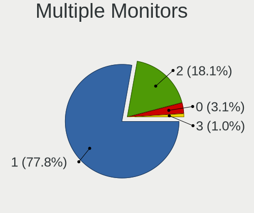

| Total | Notebooks | Percent |
|-------|-----------|---------|
| 1     | 207       | 77.53%  |
| 2     | 49        | 18.35%  |
| 0     | 8         | 3%      |
| 3     | 3         | 1.12%   |

Network
-------

Net Controller Vendor
---------------------

Controller vendors

| Vendor                   | Notebooks | Percent |
|--------------------------|-----------|---------|
| Intel                    | 154       | 42.08%  |
| Realtek Semiconductor    | 99        | 27.05%  |
| Qualcomm Atheros         | 48        | 13.11%  |
| Broadcom                 | 22        | 6.01%   |
| MediaTek                 | 12        | 3.28%   |
| ASIX Electronics         | 7         | 1.91%   |
| Broadcom Limited         | 4         | 1.09%   |
| Marvell Technology Group | 3         | 0.82%   |
| Sierra Wireless          | 2         | 0.55%   |
| Qualcomm                 | 2         | 0.55%   |
| TP-Link                  | 1         | 0.27%   |
| Samsung Electronics      | 1         | 0.27%   |
| Ralink Technology        | 1         | 0.27%   |
| Ralink                   | 1         | 0.27%   |
| Nvidia                   | 1         | 0.27%   |
| MosChip Semiconductor    | 1         | 0.27%   |
| Linksys                  | 1         | 0.27%   |
| Lenovo                   | 1         | 0.27%   |
| Hewlett-Packard          | 1         | 0.27%   |
| Google                   | 1         | 0.27%   |
| Dell                     | 1         | 0.27%   |
| D-Link                   | 1         | 0.27%   |
| Apple                    | 1         | 0.27%   |

Net Controller Model
--------------------

Controller models

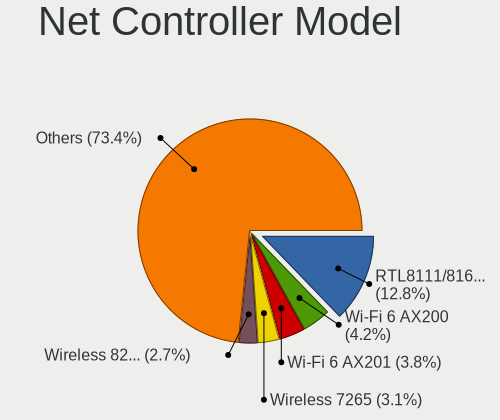

| Model                                                                  | Notebooks | Percent |
|------------------------------------------------------------------------|-----------|---------|
| Realtek RTL8111/8168/8211/8411 PCI Express Gigabit Ethernet Controller | 59        | 13.59%  |
| Intel Wi-Fi 6 AX201                                                    | 17        | 3.92%   |
| Intel Wi-Fi 6 AX200                                                    | 17        | 3.92%   |
| Intel Wireless 7265                                                    | 15        | 3.46%   |
| Intel Wireless 8265 / 8275                                             | 13        | 3%      |
| Qualcomm Atheros QCA9377 802.11ac Wireless Network Adapter             | 12        | 2.76%   |
| Realtek RTL810xE PCI Express Fast Ethernet controller                  | 10        | 2.3%    |
| Qualcomm Atheros QCA6174 802.11ac Wireless Network Adapter             | 10        | 2.3%    |
| Realtek RTL8153 Gigabit Ethernet Adapter                               | 8         | 1.84%   |
| Intel Wireless 7260                                                    | 8         | 1.84%   |
| Intel Comet Lake PCH-LP CNVi WiFi                                      | 8         | 1.84%   |
| Intel Cannon Point-LP CNVi [Wireless-AC]                               | 8         | 1.84%   |
| Intel Cannon Lake PCH CNVi WiFi                                        | 8         | 1.84%   |
| Qualcomm Atheros AR9485 Wireless Network Adapter                       | 7         | 1.61%   |
| Intel Alder Lake-P PCH CNVi WiFi                                       | 7         | 1.61%   |
| Intel 82579LM Gigabit Network Connection (Lewisville)                  | 7         | 1.61%   |
| ASIX AX88179 Gigabit Ethernet                                          | 7         | 1.61%   |
| MediaTek MT7921 802.11ax PCI Express Wireless Network Adapter          | 6         | 1.38%   |
| Intel Wireless 3165                                                    | 6         | 1.38%   |
| Intel Ethernet Connection (4) I219-LM                                  | 6         | 1.38%   |
| Intel Centrino Advanced-N 6205 [Taylor Peak]                           | 6         | 1.38%   |
| Realtek RTL8822CE 802.11ac PCIe Wireless Network Adapter               | 5         | 1.15%   |
| Realtek RTL8821CE 802.11ac PCIe Wireless Network Adapter               | 4         | 0.92%   |
| Qualcomm Atheros QCA9565 / AR9565 Wireless Network Adapter             | 4         | 0.92%   |
| Qualcomm Atheros AR9285 Wireless Network Adapter (PCI-Express)         | 4         | 0.92%   |
| Intel Wireless 8260                                                    | 4         | 0.92%   |
| Intel Raptor Lake PCH CNVi WiFi                                        | 4         | 0.92%   |
| Intel Ice Lake-LP PCH CNVi WiFi                                        | 4         | 0.92%   |
| Intel Ethernet Connection (3) I218-LM                                  | 4         | 0.92%   |
| Intel Comet Lake PCH CNVi WiFi                                         | 4         | 0.92%   |
| Broadcom BCM43602 802.11ac Wireless LAN SoC                            | 4         | 0.92%   |
| Realtek RTL8852BE PCIe 802.11ax Wireless Network Controller            | 3         | 0.69%   |
| Realtek RTL8852AE 802.11ax PCIe Wireless Network Adapter               | 3         | 0.69%   |
| Realtek RTL8125 2.5GbE Controller                                      | 3         | 0.69%   |
| Realtek 802.11ac NIC                                                   | 3         | 0.69%   |
| MediaTek MT7922 802.11ax PCI Express Wireless Network Adapter          | 3         | 0.69%   |
| MediaTek MT7921K (RZ608) Wi-Fi 6E 80MHz                                | 3         | 0.69%   |
| Intel Wi-Fi 5(802.11ac) Wireless-AC 9x6x [Thunder Peak]                | 3         | 0.69%   |
| Intel Tiger Lake PCH CNVi WiFi                                         | 3         | 0.69%   |
| Intel Ethernet Connection I218-LM                                      | 3         | 0.69%   |

Wireless Vendor
---------------

Wireless vendors

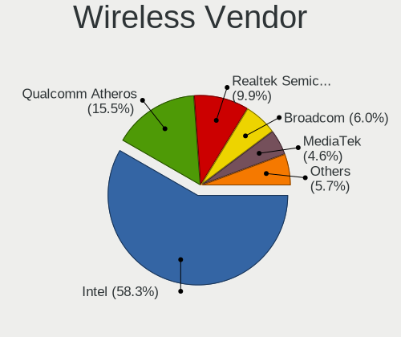

| Vendor                | Notebooks | Percent |
|-----------------------|-----------|---------|
| Intel                 | 152       | 58.46%  |
| Qualcomm Atheros      | 43        | 16.54%  |
| Realtek Semiconductor | 25        | 9.62%   |
| Broadcom              | 15        | 5.77%   |
| MediaTek              | 12        | 4.62%   |
| Broadcom Limited      | 3         | 1.15%   |
| Sierra Wireless       | 2         | 0.77%   |
| Qualcomm              | 2         | 0.77%   |
| TP-Link               | 1         | 0.38%   |
| Ralink Technology     | 1         | 0.38%   |
| Ralink                | 1         | 0.38%   |
| Hewlett-Packard       | 1         | 0.38%   |
| Dell                  | 1         | 0.38%   |
| D-Link                | 1         | 0.38%   |

Wireless Model
--------------

Wireless models

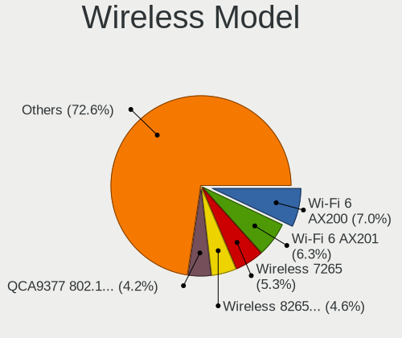

| Model                                                                   | Notebooks | Percent |
|-------------------------------------------------------------------------|-----------|---------|
| Intel Wi-Fi 6 AX201                                                     | 17        | 6.49%   |
| Intel Wi-Fi 6 AX200                                                     | 17        | 6.49%   |
| Intel Wireless 7265                                                     | 15        | 5.73%   |
| Intel Wireless 8265 / 8275                                              | 13        | 4.96%   |
| Qualcomm Atheros QCA9377 802.11ac Wireless Network Adapter              | 12        | 4.58%   |
| Qualcomm Atheros QCA6174 802.11ac Wireless Network Adapter              | 10        | 3.82%   |
| Intel Wireless 7260                                                     | 8         | 3.05%   |
| Intel Comet Lake PCH-LP CNVi WiFi                                       | 8         | 3.05%   |
| Intel Cannon Point-LP CNVi [Wireless-AC]                                | 8         | 3.05%   |
| Intel Cannon Lake PCH CNVi WiFi                                         | 8         | 3.05%   |
| Qualcomm Atheros AR9485 Wireless Network Adapter                        | 7         | 2.67%   |
| Intel Alder Lake-P PCH CNVi WiFi                                        | 7         | 2.67%   |
| MediaTek MT7921 802.11ax PCI Express Wireless Network Adapter           | 6         | 2.29%   |
| Intel Wireless 3165                                                     | 6         | 2.29%   |
| Intel Centrino Advanced-N 6205 [Taylor Peak]                            | 6         | 2.29%   |
| Realtek RTL8822CE 802.11ac PCIe Wireless Network Adapter                | 5         | 1.91%   |
| Realtek RTL8821CE 802.11ac PCIe Wireless Network Adapter                | 4         | 1.53%   |
| Qualcomm Atheros QCA9565 / AR9565 Wireless Network Adapter              | 4         | 1.53%   |
| Qualcomm Atheros AR9285 Wireless Network Adapter (PCI-Express)          | 4         | 1.53%   |
| Intel Wireless 8260                                                     | 4         | 1.53%   |
| Intel Raptor Lake PCH CNVi WiFi                                         | 4         | 1.53%   |
| Intel Ice Lake-LP PCH CNVi WiFi                                         | 4         | 1.53%   |
| Intel Comet Lake PCH CNVi WiFi                                          | 4         | 1.53%   |
| Broadcom BCM43602 802.11ac Wireless LAN SoC                             | 4         | 1.53%   |
| Realtek RTL8852BE PCIe 802.11ax Wireless Network Controller             | 3         | 1.15%   |
| Realtek RTL8852AE 802.11ax PCIe Wireless Network Adapter                | 3         | 1.15%   |
| Realtek 802.11ac NIC                                                    | 3         | 1.15%   |
| MediaTek MT7922 802.11ax PCI Express Wireless Network Adapter           | 3         | 1.15%   |
| MediaTek MT7921K (RZ608) Wi-Fi 6E 80MHz                                 | 3         | 1.15%   |
| Intel Wi-Fi 5(802.11ac) Wireless-AC 9x6x [Thunder Peak]                 | 3         | 1.15%   |
| Intel Tiger Lake PCH CNVi WiFi                                          | 3         | 1.15%   |
| Broadcom BCM4331 802.11a/b/g/n                                          | 3         | 1.15%   |
| Sierra Wireless EM7455                                                  | 2         | 0.76%   |
| Realtek RTL8822BE 802.11a/b/g/n/ac WiFi adapter                         | 2         | 0.76%   |
| Realtek RTL8188CUS 802.11n WLAN Adapter                                 | 2         | 0.76%   |
| Qualcomm Atheros AR9462 Wireless Network Adapter                        | 2         | 0.76%   |
| Qualcomm Atheros AR9287 Wireless Network Adapter (PCI-Express)          | 2         | 0.76%   |
| Qualcomm Atheros AR242x / AR542x Wireless Network Adapter (PCI-Express) | 2         | 0.76%   |
| Intel Wi-Fi 6 AX201 160MHz                                              | 2         | 0.76%   |
| Intel Raptor Lake-S PCH CNVi WiFi                                       | 2         | 0.76%   |

Ethernet Vendor
---------------

Ethernet vendors

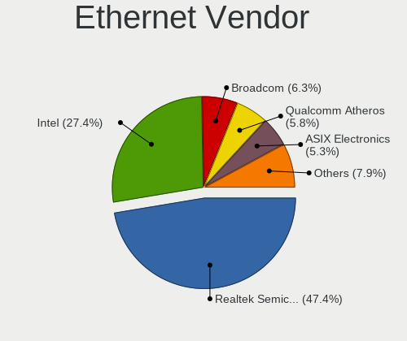

| Vendor                   | Notebooks | Percent |
|--------------------------|-----------|---------|
| Realtek Semiconductor    | 83        | 48.82%  |
| Intel                    | 47        | 27.65%  |
| Qualcomm Atheros         | 11        | 6.47%   |
| Broadcom                 | 11        | 6.47%   |
| ASIX Electronics         | 7         | 4.12%   |
| Marvell Technology Group | 3         | 1.76%   |
| Samsung Electronics      | 1         | 0.59%   |
| Nvidia                   | 1         | 0.59%   |
| MosChip Semiconductor    | 1         | 0.59%   |
| Linksys                  | 1         | 0.59%   |
| Lenovo                   | 1         | 0.59%   |
| Google                   | 1         | 0.59%   |
| Broadcom Limited         | 1         | 0.59%   |
| Apple                    | 1         | 0.59%   |

Ethernet Model
--------------

Ethernet models

| Model                                                                          | Notebooks | Percent |
|--------------------------------------------------------------------------------|-----------|---------|
| Realtek RTL8111/8168/8211/8411 PCI Express Gigabit Ethernet Controller         | 59        | 34.3%   |
| Realtek RTL810xE PCI Express Fast Ethernet controller                          | 10        | 5.81%   |
| Realtek RTL8153 Gigabit Ethernet Adapter                                       | 8         | 4.65%   |
| Intel 82579LM Gigabit Network Connection (Lewisville)                          | 7         | 4.07%   |
| ASIX AX88179 Gigabit Ethernet                                                  | 7         | 4.07%   |
| Intel Ethernet Connection (4) I219-LM                                          | 6         | 3.49%   |
| Intel Ethernet Connection (3) I218-LM                                          | 4         | 2.33%   |
| Realtek RTL8125 2.5GbE Controller                                              | 3         | 1.74%   |
| Intel Ethernet Connection I218-LM                                              | 3         | 1.74%   |
| Intel Ethernet Connection (4) I219-V                                           | 3         | 1.74%   |
| Broadcom NetXtreme BCM57765 Gigabit Ethernet PCIe                              | 3         | 1.74%   |
| Broadcom NetLink BCM57785 Gigabit Ethernet PCIe                                | 3         | 1.74%   |
| Realtek Killer E3000 2.5GbE Controller                                         | 2         | 1.16%   |
| Qualcomm Atheros Killer E2500 Gigabit Ethernet Controller                      | 2         | 1.16%   |
| Qualcomm Atheros Killer E2400 Gigabit Ethernet Controller                      | 2         | 1.16%   |
| Intel Ethernet Connection I217-LM                                              | 2         | 1.16%   |
| Intel Ethernet Connection (7) I219-V                                           | 2         | 1.16%   |
| Intel Ethernet Connection (7) I219-LM                                          | 2         | 1.16%   |
| Intel Ethernet Connection (6) I219-V                                           | 2         | 1.16%   |
| Intel Ethernet Connection (14) I219-LM                                         | 2         | 1.16%   |
| Intel Ethernet Connection (10) I219-V                                          | 2         | 1.16%   |
| Intel 82579V Gigabit Network Connection                                        | 2         | 1.16%   |
| Intel 82567LM Gigabit Network Connection                                       | 2         | 1.16%   |
| Broadcom NetLink BCM5906M Fast Ethernet PCI Express                            | 2         | 1.16%   |
| Samsung Galaxy series, misc. (tethering mode)                                  | 1         | 0.58%   |
| Realtek RTL8152 Fast Ethernet Adapter                                          | 1         | 0.58%   |
| Realtek PCIe GbE Family Controller                                             | 1         | 0.58%   |
| Realtek Killer E2600 GbE Controller                                            | 1         | 0.58%   |
| Qualcomm Atheros QCA8171 Gigabit Ethernet                                      | 1         | 0.58%   |
| Qualcomm Atheros AR8162 Fast Ethernet                                          | 1         | 0.58%   |
| Qualcomm Atheros AR8161 Gigabit Ethernet                                       | 1         | 0.58%   |
| Qualcomm Atheros AR8151 v2.0 Gigabit Ethernet                                  | 1         | 0.58%   |
| Qualcomm Atheros AR8132 Fast Ethernet                                          | 1         | 0.58%   |
| Qualcomm Atheros AR8131 Gigabit Ethernet                                       | 1         | 0.58%   |
| Qualcomm Atheros AR8121/AR8113/AR8114 Gigabit or Fast Ethernet                 | 1         | 0.58%   |
| Nvidia MCP51 Ethernet Controller                                               | 1         | 0.58%   |
| MosChip MCS7830 10/100 Mbps Ethernet adapter                                   | 1         | 0.58%   |
| Marvell Group Yukon Optima 88E8059 [PCIe Gigabit Ethernet Controller with AVB] | 1         | 0.58%   |
| Marvell Group 88E8040 PCI-E Fast Ethernet Controller                           | 1         | 0.58%   |
| Marvell Group 88E8038 PCI-E Fast Ethernet Controller                           | 1         | 0.58%   |

Net Controller Kind
-------------------

Ethernet, WiFi or modem

| Kind     | Notebooks | Percent |
|----------|-----------|---------|
| WiFi     | 251       | 60.48%  |
| Ethernet | 164       | 39.52%  |

Used Controller
---------------

Currently used network controller

| Kind     | Notebooks | Percent |
|----------|-----------|---------|
| WiFi     | 225       | 82.12%  |
| Ethernet | 49        | 17.88%  |

NICs
----

Total network controllers on board

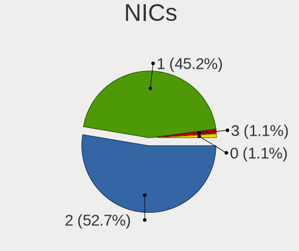

| Total | Notebooks | Percent |
|-------|-----------|---------|
| 2     | 140       | 54.47%  |
| 1     | 114       | 44.36%  |
| 3     | 2         | 0.78%   |
| 0     | 1         | 0.39%   |

IPv6
----

IPv6 vs IPv4

| Used | Notebooks | Percent |
|------|-----------|---------|
| No   | 236       | 92.19%  |
| Yes  | 20        | 7.81%   |

Bluetooth
---------

Bluetooth Vendor
----------------

Controller vendors

| Vendor                          | Notebooks | Percent |
|---------------------------------|-----------|---------|
| Intel                           | 128       | 57.66%  |
| IMC Networks                    | 16        | 7.21%   |
| Qualcomm Atheros Communications | 14        | 6.31%   |
| Foxconn / Hon Hai               | 13        | 5.86%   |
| Lite-On Technology              | 11        | 4.95%   |
| Apple                           | 10        | 4.5%    |
| Broadcom                        | 9         | 4.05%   |
| Realtek Semiconductor           | 7         | 3.15%   |
| MediaTek                        | 3         | 1.35%   |
| Cambridge Silicon Radio         | 2         | 0.9%    |
| USI                             | 1         | 0.45%   |
| Toshiba                         | 1         | 0.45%   |
| Realtek                         | 1         | 0.45%   |
| Ralink Technology               | 1         | 0.45%   |
| Foxconn International           | 1         | 0.45%   |
| Dell                            | 1         | 0.45%   |
| Chicony Electronics             | 1         | 0.45%   |
| Askey Computer                  | 1         | 0.45%   |
| Alps Electric                   | 1         | 0.45%   |

Bluetooth Model
---------------

Controller models

| Model                                               | Notebooks | Percent |
|-----------------------------------------------------|-----------|---------|
| Intel Bluetooth wireless interface                  | 42        | 18.92%  |
| Intel AX201 Bluetooth                               | 35        | 15.77%  |
| Intel Bluetooth 9460/9560 Jefferson Peak (JfP)      | 23        | 10.36%  |
| Intel AX200 Bluetooth                               | 15        | 6.76%   |
| Intel Bluetooth Device                              | 8         | 3.6%    |
| Apple Bluetooth Host Controller                     | 8         | 3.6%    |
| IMC Networks Bluetooth Radio                        | 7         | 3.15%   |
| Realtek Bluetooth Radio                             | 6         | 2.7%    |
| Qualcomm Atheros  Bluetooth Device                  | 6         | 2.7%    |
| Qualcomm Atheros QCA61x4 Bluetooth 4.0              | 5         | 2.25%   |
| IMC Networks Bluetooth Device                       | 5         | 2.25%   |
| Foxconn / Hon Hai Wireless_Device                   | 5         | 2.25%   |
| Foxconn / Hon Hai Bluetooth Device                  | 4         | 1.8%    |
| Broadcom BCM2045B (BDC-2.1)                         | 4         | 1.8%    |
| MediaTek Wireless_Device                            | 3         | 1.35%   |
| Lite-On Atheros Bluetooth                           | 3         | 1.35%   |
| IMC Networks Wireless_Device                        | 3         | 1.35%   |
| Foxconn / Hon Hai BCM20702A0                        | 3         | 1.35%   |
| Lite-On Qualcomm Atheros QCA9377 Bluetooth          | 2         | 0.9%    |
| Lite-On Bluetooth Radio                             | 2         | 0.9%    |
| Lite-On Bluetooth Device                            | 2         | 0.9%    |
| Intel Wireless-AC 9260 Bluetooth Adapter            | 2         | 0.9%    |
| Intel Centrino Bluetooth Wireless Transceiver       | 2         | 0.9%    |
| Cambridge Silicon Radio Bluetooth Dongle (HCI mode) | 2         | 0.9%    |
| Broadcom BCM20702 Bluetooth 4.0 [ThinkPad]          | 2         | 0.9%    |
| Broadcom BCM2045 Bluetooth                          | 2         | 0.9%    |
| Apple Bluetooth USB Host Controller                 | 2         | 0.9%    |
| USI Bluetooth Device                                | 1         | 0.45%   |
| Toshiba Bluetooth USB Host Controller               | 1         | 0.45%   |
| Realtek RTL8822BE Bluetooth 4.2 Adapter             | 1         | 0.45%   |
| Realtek Bluetooth Radio                             | 1         | 0.45%   |
| Ralink Motorola BC4 Bluetooth 3.0+HS Adapter        | 1         | 0.45%   |
| Qualcomm Atheros AR9462 Bluetooth                   | 1         | 0.45%   |
| Qualcomm Atheros AR3012 Bluetooth 4.0               | 1         | 0.45%   |
| Qualcomm Atheros AR3011 Bluetooth                   | 1         | 0.45%   |
| Lite-On Wireless_Device                             | 1         | 0.45%   |
| Lite-On Atheros AR3012 Bluetooth                    | 1         | 0.45%   |
| Intel AX210 Bluetooth                               | 1         | 0.45%   |
| IMC Networks Bluetooth module                       | 1         | 0.45%   |
| Foxconn International BCM43142A0 Bluetooth module   | 1         | 0.45%   |

Sound
-----

Sound Vendor
------------

Sound card vendors

| Vendor                | Notebooks | Percent |
|-----------------------|-----------|---------|
| Intel                 | 201       | 62.42%  |
| AMD                   | 51        | 15.84%  |
| Nvidia                | 50        | 15.53%  |
| Plantronics           | 2         | 0.62%   |
| Lenovo                | 2         | 0.62%   |
| Kingston Technology   | 2         | 0.62%   |
| Apple                 | 2         | 0.62%   |
| Tenx Technology       | 1         | 0.31%   |
| Sony                  | 1         | 0.31%   |
| Sennheiser electronic | 1         | 0.31%   |
| SAVITECH              | 1         | 0.31%   |
| Razer USA             | 1         | 0.31%   |
| Logitech              | 1         | 0.31%   |
| JBL                   | 1         | 0.31%   |
| GN Netcom             | 1         | 0.31%   |
| Cooler Master         | 1         | 0.31%   |
| Conexant Systems      | 1         | 0.31%   |
| BR23                  | 1         | 0.31%   |
| ASUSTek Computer      | 1         | 0.31%   |

Sound Model
-----------

Sound card models

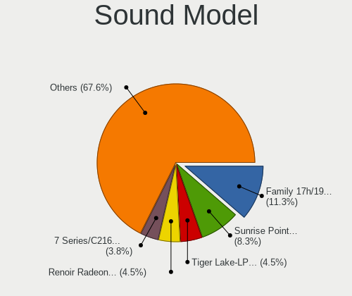

| Model                                                                      | Notebooks | Percent |
|----------------------------------------------------------------------------|-----------|---------|
| AMD Family 17h/19h HD Audio Controller                                     | 40        | 10.36%  |
| Intel Sunrise Point-LP HD Audio                                            | 34        | 8.81%   |
| Intel Tiger Lake-LP Smart Sound Technology Audio Controller                | 18        | 4.66%   |
| AMD Renoir Radeon High Definition Audio Controller                         | 17        | 4.4%    |
| Intel 7 Series/C216 Chipset Family High Definition Audio Controller        | 15        | 3.89%   |
| Intel 6 Series/C200 Series Chipset Family High Definition Audio Controller | 15        | 3.89%   |
| Intel Cannon Lake PCH cAVS                                                 | 14        | 3.63%   |
| Intel Comet Lake PCH-LP cAVS                                               | 10        | 2.59%   |
| AMD Rembrandt Radeon High Definition Audio Controller                      | 10        | 2.59%   |
| Nvidia Audio device                                                        | 9         | 2.33%   |
| Intel Cannon Point-LP High Definition Audio Controller                     | 9         | 2.33%   |
| AMD Raven/Raven2/Fenghuang HDMI/DP Audio Controller                        | 9         | 2.33%   |
| Intel Wildcat Point-LP High Definition Audio Controller                    | 8         | 2.07%   |
| Intel Haswell-ULT HD Audio Controller                                      | 8         | 2.07%   |
| Intel Broadwell-U Audio Controller                                         | 8         | 2.07%   |
| Intel 8 Series/C220 Series Chipset High Definition Audio Controller        | 8         | 2.07%   |
| Intel 8 Series HD Audio Controller                                         | 8         | 2.07%   |
| Intel Alder Lake PCH-P High Definition Audio Controller                    | 7         | 1.81%   |
| Nvidia GA104 High Definition Audio Controller                              | 6         | 1.55%   |
| Nvidia GF108 High Definition Audio Controller                              | 5         | 1.3%    |
| Nvidia GA106 High Definition Audio Controller                              | 5         | 1.3%    |
| Intel Comet Lake PCH cAVS                                                  | 5         | 1.3%    |
| Intel Celeron/Pentium Silver Processor High Definition Audio               | 5         | 1.3%    |
| Intel 82801H (ICH8 Family) HD Audio Controller                             | 5         | 1.3%    |
| Intel 100 Series/C230 Series Chipset Family HD Audio Controller            | 5         | 1.3%    |
| Nvidia TU107 GeForce GTX 1650 High Definition Audio Controller             | 4         | 1.04%   |
| Nvidia TU104 HD Audio Controller                                           | 4         | 1.04%   |
| Intel Tiger Lake-H HD Audio Controller                                     | 4         | 1.04%   |
| Intel Ice Lake-LP Smart Sound Technology Audio Controller                  | 4         | 1.04%   |
| Intel 82801I (ICH9 Family) HD Audio Controller                             | 4         | 1.04%   |
| Nvidia GP107GL High Definition Audio Controller                            | 3         | 0.78%   |
| Intel Xeon E3-1200 v3/4th Gen Core Processor HD Audio Controller           | 3         | 0.78%   |
| Intel Raptor Lake-P/U/H cAVS                                               | 3         | 0.78%   |
| Intel CM238 HD Audio Controller                                            | 3         | 0.78%   |
| Intel Atom Processor Z36xxx/Z37xxx Series High Definition Audio Controller | 3         | 0.78%   |
| Intel 5 Series/3400 Series Chipset High Definition Audio                   | 3         | 0.78%   |
| AMD Family 15h (Models 60h-6fh) Audio Controller                           | 3         | 0.78%   |
| Plantronics Blackwire 3225 Series                                          | 2         | 0.52%   |
| Nvidia TU116 High Definition Audio Controller                              | 2         | 0.52%   |
| Nvidia MCP89 High Definition Audio                                         | 2         | 0.52%   |

Memory
------

Memory Vendor
-------------

Memory module vendors

| Vendor              | Notebooks | Percent |
|---------------------|-----------|---------|
| SK hynix            | 53        | 28.8%   |
| Samsung Electronics | 43        | 23.37%  |
| Micron Technology   | 28        | 15.22%  |
| Kingston            | 14        | 7.61%   |
| Unknown             | 11        | 5.98%   |
| Crucial             | 11        | 5.98%   |
| Ramaxel Technology  | 4         | 2.17%   |
| Transcend           | 3         | 1.63%   |
| A-DATA Technology   | 3         | 1.63%   |
| Unknown (ABCD)      | 2         | 1.09%   |
| Nanya Technology    | 2         | 1.09%   |
| Elpida              | 2         | 1.09%   |
| V-GeN               | 1         | 0.54%   |
| Team                | 1         | 0.54%   |
| Patriot             | 1         | 0.54%   |
| Lexar               | 1         | 0.54%   |
| Corsair             | 1         | 0.54%   |
| Carry               | 1         | 0.54%   |
| ASint Technology    | 1         | 0.54%   |
| Unknown             | 1         | 0.54%   |

Memory Model
------------

Memory module models

| Model                                                               | Notebooks | Percent |
|---------------------------------------------------------------------|-----------|---------|
| SK hynix RAM HMA81GS6JJR8N-VK 8GB SODIMM DDR4 2667MT/s              | 4         | 2.07%   |
| Samsung RAM M471A1G44AB0-CWE 8GB SODIMM DDR4 3200MT/s               | 4         | 2.07%   |
| Unknown RAM Module 4GB Row Of Chips LPDDR4 4267MT/s                 | 3         | 1.55%   |
| SK hynix RAM HMT41GS6BFR8A-PB 8GB SODIMM DDR3 1600MT/s              | 3         | 1.55%   |
| SK hynix RAM HMT351S6CFR8C-PB 4GB SODIMM DDR3 1600MT/s              | 3         | 1.55%   |
| SK hynix RAM HMA851S6CJR6N-VK 4GB SODIMM DDR4 2667MT/s              | 3         | 1.55%   |
| SK hynix RAM HMA82GS6AFR8N-UH 16GB SODIMM DDR4 2667MT/s             | 3         | 1.55%   |
| SK hynix RAM H9CCNNNCLGALAR-NVD 8192MB Row Of Chips LPDDR3 2133MT/s | 3         | 1.55%   |
| Samsung RAM M471B5273DH0-CH9 4GB SODIMM DDR3 1334MT/s               | 3         | 1.55%   |
| Samsung RAM M471B1G73DB0-YK0 8GB SODIMM DDR3 1600MT/s               | 3         | 1.55%   |
| Unknown RAM Module 4GB SODIMM DDR3                                  | 2         | 1.04%   |
| Unknown (ABCD) RAM 123456789012345678 2048MB SODIMM LPDDR4 2400MT/s | 2         | 1.04%   |
| SK hynix RAM Module 8192MB SODIMM DDR3 1600MT/s                     | 2         | 1.04%   |
| SK hynix RAM HMT41GS6MFR8C-PB 8GB SODIMM DDR3 1600MT/s              | 2         | 1.04%   |
| SK hynix RAM HMAA1GS6CJR6N-XN 8GB SODIMM DDR4 3200MT/s              | 2         | 1.04%   |
| SK hynix RAM HMA851S6DJR6N-XN 4GB SODIMM DDR4 3200MT/s              | 2         | 1.04%   |
| SK hynix RAM HMA82GS6CJR8N-VK 16GB SODIMM DDR4 2667MT/s             | 2         | 1.04%   |
| SK hynix RAM HMA81GS6CJR8N-VK 8GB SODIMM DDR4 2667MT/s              | 2         | 1.04%   |
| SK hynix RAM HMA81GS6AFR8N-UH 8GB SODIMM DDR4 2667MT/s              | 2         | 1.04%   |
| SK hynix RAM HCNNNBKMMLXR-NEE 4GB Row Of Chips LPDDR4 4267MT/s      | 2         | 1.04%   |
| Samsung RAM UBE3D4AA-MGCR 2GB Row Of Chips LPDDR4 4267MT/s          | 2         | 1.04%   |
| Samsung RAM M471A5244CB0-CTD 4096MB SODIMM DDR4 3266MT/s            | 2         | 1.04%   |
| Samsung RAM M471A5244BB0-CRC 4GB SODIMM DDR4 2667MT/s               | 2         | 1.04%   |
| Samsung RAM M471A2K43CB1-CTD 16GB SODIMM DDR4 8400MT/s              | 2         | 1.04%   |
| Micron RAM 8ATF1G64HZ-2G3E1 8GB SODIMM DDR4 2400MT/s                | 2         | 1.04%   |
| Micron RAM 4ATF51264HZ-2G6E1 4GB SODIMM DDR4 2667MT/s               | 2         | 1.04%   |
| Micron RAM 4ATF1G64HZ-3G2E1 8GB SODIMM DDR4 3200MT/s                | 2         | 1.04%   |
| Micron RAM 16ATF2G64HZ-2G6E1 16GB SODIMM DDR4 2667MT/s              | 2         | 1.04%   |
| Crucial RAM CT32G4SFD832A.C16FE 32GB SODIMM DDR4 3200MT/s           | 2         | 1.04%   |
| V-GeN RAM D3R4GS16B8R 4GB SODIMM DDR3 1600MT/s                      | 1         | 0.52%   |
| Unknown RAM Module 8GB SODIMM DDR3 800MT/s                          | 1         | 0.52%   |
| Unknown RAM Module 8GB Row Of Chips LPDDR4 4267MT/s                 | 1         | 0.52%   |
| Unknown RAM Module 4096MB SODIMM LPDDR3 1600MT/s                    | 1         | 0.52%   |
| Unknown RAM Module 2GB SODIMM DDR3 1600MT/s                         | 1         | 0.52%   |
| Unknown RAM Module 2GB Row Of Chips LPDDR4 4267MT/s                 | 1         | 0.52%   |
| Unknown RAM Module 2048MB SODIMM DDR3 1600MT/s                      | 1         | 0.52%   |
| Unknown RAM Module 1GB SODIMM DDR3 1600MT/s                         | 1         | 0.52%   |
| Unknown RAM Module 16GB Row Of Chips LPDDR4 4267MT/s                | 1         | 0.52%   |
| Transcend RAM TS1GSK64V3H 8192MB SODIMM DDR3 1333MT/s               | 1         | 0.52%   |
| Transcend RAM JM3200HSB-16G 16GB SODIMM DDR4 3200MT/s               | 1         | 0.52%   |

Memory Kind
-----------

Memory module kinds

| Kind   | Notebooks | Percent |
|--------|-----------|---------|
| DDR4   | 74        | 49.01%  |
| DDR3   | 39        | 25.83%  |
| LPDDR4 | 13        | 8.61%   |
| LPDDR3 | 12        | 7.95%   |
| DDR5   | 7         | 4.64%   |
| LPDDR5 | 5         | 3.31%   |
| SDRAM  | 1         | 0.66%   |

Memory Form Factor
------------------

Physical design of the memory module

| Name         | Notebooks | Percent |
|--------------|-----------|---------|
| SODIMM       | 120       | 78.95%  |
| Row Of Chips | 29        | 19.08%  |
| Chip         | 2         | 1.32%   |
| Unknown      | 1         | 0.66%   |

Memory Size
-----------

Memory module size

| Size  | Notebooks | Percent |
|-------|-----------|---------|
| 8192  | 72        | 42.6%   |
| 4096  | 43        | 25.44%  |
| 16384 | 33        | 19.53%  |
| 32768 | 10        | 5.92%   |
| 2048  | 9         | 5.33%   |
| 1024  | 2         | 1.18%   |

Memory Speed
------------

Memory module speed

| Speed   | Notebooks | Percent |
|---------|-----------|---------|
| 3200    | 37        | 22.16%  |
| 2667    | 31        | 18.56%  |
| 1600    | 31        | 18.56%  |
| 4267    | 10        | 5.99%   |
| 2133    | 10        | 5.99%   |
| 2400    | 9         | 5.39%   |
| 1334    | 6         | 3.59%   |
| 1333    | 6         | 3.59%   |
| 6400    | 5         | 2.99%   |
| 4800    | 5         | 2.99%   |
| 5600    | 3         | 1.8%    |
| 1867    | 3         | 1.8%    |
| 8400    | 2         | 1.2%    |
| 3266    | 2         | 1.2%    |
| 1067    | 2         | 1.2%    |
| Unknown | 2         | 1.2%    |
| 4199    | 1         | 0.6%    |
| 1200    | 1         | 0.6%    |
| 800     | 1         | 0.6%    |

Printers & scanners
-------------------

Printer Vendor
--------------

Printer device vendors

| Vendor             | Notebooks | Percent |
|--------------------|-----------|---------|
| Brother Industries | 1         | 100%    |

Printer Model
-------------

Printer device models

| Model                      | Notebooks | Percent |
|----------------------------|-----------|---------|
| Brother DCP-L2535DW series | 1         | 100%    |

Scanner Vendor
--------------

Scanner device vendors

Zero info for selected period =(

Scanner Model
-------------

Scanner device models

Zero info for selected period =(

Camera
------

Camera Vendor
-------------

Camera device vendors

| Vendor                                 | Notebooks | Percent |
|----------------------------------------|-----------|---------|
| Chicony Electronics                    | 58        | 25.89%  |
| IMC Networks                           | 34        | 15.18%  |
| Microdia                               | 31        | 13.84%  |
| Realtek Semiconductor                  | 18        | 8.04%   |
| Sunplus Innovation Technology          | 14        | 6.25%   |
| Bison Electronics                      | 9         | 4.02%   |
| Suyin                                  | 7         | 3.13%   |
| Acer                                   | 7         | 3.13%   |
| Syntek                                 | 5         | 2.23%   |
| Samsung Electronics                    | 5         | 2.23%   |
| Lite-On Technology                     | 5         | 2.23%   |
| Apple                                  | 4         | 1.79%   |
| Quanta                                 | 3         | 1.34%   |
| Logitech                               | 3         | 1.34%   |
| Silicon Motion                         | 2         | 0.89%   |
| Ricoh                                  | 2         | 0.89%   |
| OmniVision Technologies                | 2         | 0.89%   |
| Luxvisions Innotech Limited            | 2         | 0.89%   |
| Cheng Uei Precision Industry (Foxlink) | 2         | 0.89%   |
| Alcor Micro                            | 2         | 0.89%   |
| SunplusIT                              | 1         | 0.45%   |
| Sony Ericsson Mobile Communications AB | 1         | 0.45%   |
| Sonix Technology                       | 1         | 0.45%   |
| ShineTech                              | 1         | 0.45%   |
| OnePlus Technology (Shenzhen)          | 1         | 0.45%   |
| Magic Control Technology               | 1         | 0.45%   |
| Lenovo                                 | 1         | 0.45%   |
| kingcome                               | 1         | 0.45%   |
| Intel                                  | 1         | 0.45%   |

Camera Model
------------

Camera device models

| Model                                            | Notebooks | Percent |
|--------------------------------------------------|-----------|---------|
| Microdia Integrated_Webcam_HD                    | 20        | 8.89%   |
| Chicony Integrated Camera                        | 13        | 5.78%   |
| Chicony HD WebCam                                | 10        | 4.44%   |
| IMC Networks USB2.0 HD UVC WebCam                | 9         | 4%      |
| IMC Networks Integrated Camera                   | 9         | 4%      |
| Realtek Integrated_Webcam_HD                     | 8         | 3.56%   |
| Sunplus Integrated_Webcam_HD                     | 7         | 3.11%   |
| IMC Networks USB2.0 VGA UVC WebCam               | 6         | 2.67%   |
| Samsung Galaxy series, misc. (MTP mode)          | 5         | 2.22%   |
| Bison Integrated Camera                          | 5         | 2.22%   |
| Syntek Integrated Camera                         | 4         | 1.78%   |
| Lite-On Integrated Camera                        | 4         | 1.78%   |
| IMC Networks USB2.0 HD IR UVC WebCam             | 4         | 1.78%   |
| Chicony HP HD Camera                             | 4         | 1.78%   |
| Chicony Lenovo Integrated Camera (0.3MP)         | 3         | 1.33%   |
| Chicony HP Wide Vision HD Camera                 | 3         | 1.33%   |
| Apple FaceTime HD Camera                         | 3         | 1.33%   |
| Acer Integrated Camera                           | 3         | 1.33%   |
| Realtek USB Camera                               | 2         | 0.89%   |
| Realtek Integrated Webcam_HD                     | 2         | 0.89%   |
| Realtek Asus 2.0 USB Webcam                      | 2         | 0.89%   |
| OmniVision OV2640 Webcam                         | 2         | 0.89%   |
| Microdia USB 2.0 Camera                          | 2         | 0.89%   |
| Microdia Sonix USB 2.0 Camera                    | 2         | 0.89%   |
| Microdia Integrated_Webcam_FHD                   | 2         | 0.89%   |
| Microdia Integrated Camera                       | 2         | 0.89%   |
| Luxvisions Innotech Limited Integrated Camera    | 2         | 0.89%   |
| IMC Networks Lenovo EasyCamera                   | 2         | 0.89%   |
| Chicony VGA Webcam                               | 2         | 0.89%   |
| Chicony USB2.0 VGA UVC WebCam                    | 2         | 0.89%   |
| Chicony USB2.0 HD UVC WebCam                     | 2         | 0.89%   |
| Chicony USB2.0 Camera                            | 2         | 0.89%   |
| Chicony Integrated Camera [ThinkPad]             | 2         | 0.89%   |
| Chicony HD User Facing                           | 2         | 0.89%   |
| Chicony Chicony USB2.0 Camera                    | 2         | 0.89%   |
| Cheng Uei Precision Industry (Foxlink) HD Camera | 2         | 0.89%   |
| Bison BisonCam, NB Pro                           | 2         | 0.89%   |
| Alcor Micro Acer Integrated Webcam               | 2         | 0.89%   |
| Acer HD Webcam                                   | 2         | 0.89%   |
| Syntek Lenovo EasyCamera                         | 1         | 0.44%   |

Security
--------

Fingerprint Vendor
------------------

Fingerprint sensor vendors

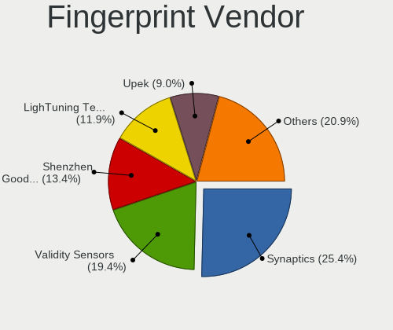

| Vendor                             | Notebooks | Percent |
|------------------------------------|-----------|---------|
| Synaptics                          | 16        | 24.62%  |
| Validity Sensors                   | 13        | 20%     |
| Shenzhen Goodix Technology         | 9         | 13.85%  |
| LighTuning Technology              | 7         | 10.77%  |
| Upek                               | 6         | 9.23%   |
| Elan Microelectronics              | 6         | 9.23%   |
| AuthenTec                          | 6         | 9.23%   |
| Realtek USB2.0 Finger Print Bridge | 1         | 1.54%   |
| Focal-systems.Corp                 | 1         | 1.54%   |

Fingerprint Model
-----------------

Fingerprint sensor models

| Model                                                                      | Notebooks | Percent |
|----------------------------------------------------------------------------|-----------|---------|
| Synaptics Prometheus MIS Touch Fingerprint Reader                          | 8         | 12.31%  |
| LighTuning EgisTec Touch Fingerprint Sensor                                | 7         | 10.77%  |
| Upek Biometric Touchchip/Touchstrip Fingerprint Sensor                     | 6         | 9.23%   |
| Validity Sensors Synaptics WBDI                                            | 4         | 6.15%   |
| Synaptics Metallica MIS Touch Fingerprint Reader                           | 4         | 6.15%   |
| Shenzhen Goodix FingerPrint                                                | 4         | 6.15%   |
| Elan ELAN:Fingerprint                                                      | 4         | 6.15%   |
| Validity Sensors VFS495 Fingerprint Reader                                 | 3         | 4.62%   |
| Shenzhen Goodix  Fingerprint Device                                        | 3         | 4.62%   |
| Validity Sensors VFS 5011 fingerprint sensor                               | 2         | 3.08%   |
| Shenzhen Goodix Fingerprint Reader                                         | 2         | 3.08%   |
| Elan ELAN:ARM-M4                                                           | 2         | 3.08%   |
| AuthenTec AES2810                                                          | 2         | 3.08%   |
| AuthenTec AES2501 Fingerprint Sensor                                       | 2         | 3.08%   |
| Validity Sensors VFS7552 Touch Fingerprint Sensor                          | 1         | 1.54%   |
| Validity Sensors VFS7500 Touch Fingerprint Sensor                          | 1         | 1.54%   |
| Validity Sensors VFS101 Fingerprint Reader                                 | 1         | 1.54%   |
| Validity Sensors Synaptics VFS7552 Touch Fingerprint Sensor with PurePrint | 1         | 1.54%   |
| Synaptics WBDI Fingerprint Reader USB 086                                  | 1         | 1.54%   |
| Synaptics UWP WBDI Device                                                  | 1         | 1.54%   |
| Synaptics  FS7604 Touch Fingerprint Sensor with PurePrint                  | 1         | 1.54%   |
| Realtek USB2.0 Finger Print Bridge FocalTech Fingerprint Device            | 1         | 1.54%   |
| Focal-systems.Corp FT9201Fingerprint.                                  | 1         | 1.54%   |
| AuthenTec Fingerprint Sensor                                               | 1         | 1.54%   |
| AuthenTec AES1660 Fingerprint Sensor                                       | 1         | 1.54%   |
| Unknown                                                                    | 1         | 1.54%   |

Chipcard Vendor
---------------

Chipcard module vendors

| Vendor      | Notebooks | Percent |
|-------------|-----------|---------|
| Broadcom    | 7         | 77.78%  |
| Alcor Micro | 2         | 22.22%  |

Chipcard Model
--------------

Chipcard module models

| Model                                          | Notebooks | Percent |
|------------------------------------------------|-----------|---------|
| Broadcom 58200                                 | 4         | 44.44%  |
| Broadcom BCM5880 Secure Applications Processor | 2         | 22.22%  |
| Alcor Micro AU9540 Smartcard Reader            | 2         | 22.22%  |
| Broadcom 5880                                  | 1         | 11.11%  |

Unsupported
-----------

Unsupported Devices
-------------------

Total unsupported devices on board

| Total | Notebooks | Percent |
|-------|-----------|---------|
| 0     | 152       | 56.09%  |
| 1     | 85        | 31.37%  |
| 2     | 29        | 10.7%   |
| 3     | 3         | 1.11%   |
| 5     | 1         | 0.37%   |
| 4     | 1         | 0.37%   |

Unsupported Device Types
------------------------

Types of unsupported devices

| Type                     | Notebooks | Percent |
|--------------------------|-----------|---------|
| Fingerprint reader       | 60        | 38.96%  |
| Graphics card            | 41        | 26.62%  |
| Net/wireless             | 14        | 9.09%   |
| Multimedia controller    | 11        | 7.14%   |
| Chipcard                 | 8         | 5.19%   |
| Camera                   | 8         | 5.19%   |
| Communication controller | 4         | 2.6%    |
| Net/ethernet             | 2         | 1.3%    |
| Bluetooth                | 2         | 1.3%    |
| Wireless                 | 1         | 0.65%   |
| Storage/raid             | 1         | 0.65%   |
| Sound                    | 1         | 0.65%   |
| Firewire controller      | 1         | 0.65%   |

