Linux in Singapore - Tested Hardware & Statistics
-------------------------------------------------

A project to collect tested hardware configurations for Linux in Singapore.

Anyone can contribute to this report by the [hw-probe](https://github.com/linuxhw/hw-probe) tool:

    sudo -E hw-probe -all -upload

Please contribute! Especially if your hardware is rare.

This is a report for all computer types. See also reports for [desktops](/Location/Singapore/Desktop/README.md) and [notebooks](/Location/Singapore/Notebook/README.md).

Contents
--------

* [ Test Cases ](#test-cases)

* [ System ](#system)
  - [ OS                       ](#os)
  - [ OS Family                ](#os-family)
  - [ Kernel                   ](#kernel)
  - [ Kernel Family            ](#kernel-family)
  - [ Kernel Major Ver.        ](#kernel-major-ver)
  - [ Arch                     ](#arch)
  - [ DE                       ](#de)
  - [ Display Server           ](#display-server)
  - [ Display Manager          ](#display-manager)
  - [ OS Lang                  ](#os-lang)
  - [ Boot Mode                ](#boot-mode)
  - [ Filesystem               ](#filesystem)
  - [ Part. scheme             ](#part-scheme)
  - [ Dual Boot with Linux/BSD ](#dual-boot-with-linuxbsd)
  - [ Dual Boot (Win)          ](#dual-boot-win)

* [ Board ](#board)
  - [ Vendor                   ](#vendor)
  - [ Model                    ](#model)
  - [ Model Family             ](#model-family)
  - [ MFG Year                 ](#mfg-year)
  - [ Form Factor              ](#form-factor)
  - [ Secure Boot              ](#secure-boot)
  - [ Coreboot                 ](#coreboot)
  - [ RAM Size                 ](#ram-size)
  - [ RAM Used                 ](#ram-used)
  - [ Total Drives             ](#total-drives)
  - [ Has CD-ROM               ](#has-cd-rom)
  - [ Has Ethernet             ](#has-ethernet)
  - [ Has WiFi                 ](#has-wifi)
  - [ Has Bluetooth            ](#has-bluetooth)

* [ Location ](#location)
  - [ Country                  ](#country)
  - [ City                     ](#city)

* [ Drives ](#drives)
  - [ Drive Vendor             ](#drive-vendor)
  - [ Drive Model              ](#drive-model)
  - [ HDD Vendor               ](#hdd-vendor)
  - [ SSD Vendor               ](#ssd-vendor)
  - [ Drive Kind               ](#drive-kind)
  - [ Drive Connector          ](#drive-connector)
  - [ Drive Size               ](#drive-size)
  - [ Space Total              ](#space-total)
  - [ Space Used               ](#space-used)
  - [ Malfunc. Drives          ](#malfunc-drives)
  - [ Malfunc. Drive Vendor    ](#malfunc-drive-vendor)
  - [ Malfunc. HDD Vendor      ](#malfunc-hdd-vendor)
  - [ Malfunc. Drive Kind      ](#malfunc-drive-kind)
  - [ Failed Drives            ](#failed-drives)
  - [ Failed Drive Vendor      ](#failed-drive-vendor)
  - [ Drive Status             ](#drive-status)

* [ Storage controller ](#storage-controller)
  - [ Storage Vendor           ](#storage-vendor)
  - [ Storage Model            ](#storage-model)
  - [ Storage Kind             ](#storage-kind)

* [ Processor ](#processor)
  - [ CPU Vendor               ](#cpu-vendor)
  - [ CPU Model                ](#cpu-model)
  - [ CPU Model Family         ](#cpu-model-family)
  - [ CPU Cores                ](#cpu-cores)
  - [ CPU Sockets              ](#cpu-sockets)
  - [ CPU Threads              ](#cpu-threads)
  - [ CPU Op-Modes             ](#cpu-op-modes)
  - [ CPU Microcode            ](#cpu-microcode)
  - [ CPU Microarch            ](#cpu-microarch)

* [ Graphics ](#graphics)
  - [ GPU Vendor               ](#gpu-vendor)
  - [ GPU Model                ](#gpu-model)
  - [ GPU Combo                ](#gpu-combo)
  - [ GPU Driver               ](#gpu-driver)
  - [ GPU Memory               ](#gpu-memory)

* [ Monitor ](#monitor)
  - [ Monitor Vendor           ](#monitor-vendor)
  - [ Monitor Model            ](#monitor-model)
  - [ Monitor Resolution       ](#monitor-resolution)
  - [ Monitor Diagonal         ](#monitor-diagonal)
  - [ Monitor Width            ](#monitor-width)
  - [ Aspect Ratio             ](#aspect-ratio)
  - [ Monitor Area             ](#monitor-area)
  - [ Pixel Density            ](#pixel-density)
  - [ Multiple Monitors        ](#multiple-monitors)

* [ Network ](#network)
  - [ Net Controller Vendor    ](#net-controller-vendor)
  - [ Net Controller Model     ](#net-controller-model)
  - [ Wireless Vendor          ](#wireless-vendor)
  - [ Wireless Model           ](#wireless-model)
  - [ Ethernet Vendor          ](#ethernet-vendor)
  - [ Ethernet Model           ](#ethernet-model)
  - [ Net Controller Kind      ](#net-controller-kind)
  - [ Used Controller          ](#used-controller)
  - [ NICs                     ](#nics)
  - [ IPv6                     ](#ipv6)

* [ Bluetooth ](#bluetooth)
  - [ Bluetooth Vendor         ](#bluetooth-vendor)
  - [ Bluetooth Model          ](#bluetooth-model)

* [ Sound ](#sound)
  - [ Sound Vendor             ](#sound-vendor)
  - [ Sound Model              ](#sound-model)

* [ Memory ](#memory)
  - [ Memory Vendor            ](#memory-vendor)
  - [ Memory Model             ](#memory-model)
  - [ Memory Kind              ](#memory-kind)
  - [ Memory Form Factor       ](#memory-form-factor)
  - [ Memory Size              ](#memory-size)
  - [ Memory Speed             ](#memory-speed)

* [ Printers & scanners ](#printers--scanners)
  - [ Printer Vendor           ](#printer-vendor)
  - [ Printer Model            ](#printer-model)
  - [ Scanner Vendor           ](#scanner-vendor)
  - [ Scanner Model            ](#scanner-model)

* [ Camera ](#camera)
  - [ Camera Vendor            ](#camera-vendor)
  - [ Camera Model             ](#camera-model)

* [ Security ](#security)
  - [ Fingerprint Vendor       ](#fingerprint-vendor)
  - [ Fingerprint Model        ](#fingerprint-model)
  - [ Chipcard Vendor          ](#chipcard-vendor)
  - [ Chipcard Model           ](#chipcard-model)

* [ Unsupported ](#unsupported)
  - [ Unsupported Devices      ](#unsupported-devices)
  - [ Unsupported Device Types ](#unsupported-device-types)

Test Cases
----------

Total: 967

| Vendor        | Model                       | Form-Factor | Probe                                                      | Date         |
|---------------|-----------------------------|-------------|------------------------------------------------------------|--------------|
| Gigabyte      | B650 GAMING X AX            | Desktop     | [a43d09ccc1](https://linux-hardware.org/?probe=a43d09ccc1) | Jan 02, 2026 |
| Lenovo        | ThinkPad T14s Gen 1 20T1... | Notebook    | [82d2fd0c20](https://linux-hardware.org/?probe=82d2fd0c20) | Jan 01, 2026 |
| ASUSTek       | ROG STRIX B850-G GAMING ... | Desktop     | [93396a546d](https://linux-hardware.org/?probe=93396a546d) | Dec 21, 2025 |
| MSI           | Katana A15 AI B8VG          | Notebook    | [53c3c4ab7d](https://linux-hardware.org/?probe=53c3c4ab7d) | Dec 14, 2025 |
| Acer          | Aspire Lite AL15-41         | Notebook    | [f4321d657c](https://linux-hardware.org/?probe=f4321d657c) | Dec 06, 2025 |
| HUAWEI        | CREFG-XX                    | Notebook    | [95a826dd0c](https://linux-hardware.org/?probe=95a826dd0c) | Dec 02, 2025 |
| ASUSTek       | PRIME B660M-A WIFI D4       | Desktop     | [d064c5d57c](https://linux-hardware.org/?probe=d064c5d57c) | Nov 28, 2025 |
| Lenovo        | Legion Pro 5 16IAX10 83F... | Notebook    | [270f276458](https://linux-hardware.org/?probe=270f276458) | Nov 28, 2025 |
| Unknown       | Unknown                     | Desktop     | [13e1fe170d](https://linux-hardware.org/?probe=13e1fe170d) | Nov 24, 2025 |
| Valve         | Jupiter                     | Notebook    | [354d0a239b](https://linux-hardware.org/?probe=354d0a239b) | Nov 23, 2025 |
| MECHREVO      | Kuangshi16Pro Series GM6... | Notebook    | [f565e1c8a5](https://linux-hardware.org/?probe=f565e1c8a5) | Nov 22, 2025 |
| MECHREVO      | Kuangshi16Pro Series GM6... | Notebook    | [43ad04787d](https://linux-hardware.org/?probe=43ad04787d) | Nov 22, 2025 |
| Dell          | Latitude 7400               | Notebook    | [b93d333b65](https://linux-hardware.org/?probe=b93d333b65) | Nov 15, 2025 |
| Dell          | 06D7TR A00                  | Desktop     | [3d97437b73](https://linux-hardware.org/?probe=3d97437b73) | Nov 15, 2025 |
| Lenovo        | ThinkPad X220 42911H8       | Notebook    | [59b15b58af](https://linux-hardware.org/?probe=59b15b58af) | Nov 15, 2025 |
| MSI           | PRO A620M-E                 | Desktop     | [70d26dc564](https://linux-hardware.org/?probe=70d26dc564) | Nov 14, 2025 |
| Lenovo        | ThinkBook 14 G6+ IMH 21L... | Notebook    | [91bd2a79f9](https://linux-hardware.org/?probe=91bd2a79f9) | Nov 03, 2025 |
| Gigabyte      | B850M FORCE WIFI6E          | Desktop     | [5aaa0d6f63](https://linux-hardware.org/?probe=5aaa0d6f63) | Nov 01, 2025 |
| ASRock        | A520M-ITX/ac                | Desktop     | [722d690bbe](https://linux-hardware.org/?probe=722d690bbe) | Oct 30, 2025 |
| Acer          | Aspire A315-44P             | Notebook    | [a9668be042](https://linux-hardware.org/?probe=a9668be042) | Oct 29, 2025 |
| Gigabyte      | B850I AORUS PRO             | Desktop     | [559574682f](https://linux-hardware.org/?probe=559574682f) | Oct 26, 2025 |
| Gigabyte      | B850I AORUS PRO             | Desktop     | [9d79ea84ec](https://linux-hardware.org/?probe=9d79ea84ec) | Oct 26, 2025 |
| MSI           | PRO A620M-E                 | Desktop     | [aec15978f3](https://linux-hardware.org/?probe=aec15978f3) | Oct 20, 2025 |
| Lenovo        | ThinkPad X220 42911H8       | Notebook    | [631287d616](https://linux-hardware.org/?probe=631287d616) | Oct 20, 2025 |
| ASUSTek       | ROG Flow Z13 GZ302EA_GZ3... | Tablet      | [cb354fd5ea](https://linux-hardware.org/?probe=cb354fd5ea) | Oct 20, 2025 |
| ASUSTek       | ProArt X570-CREATOR WIFI    | Desktop     | [65465c0fcd](https://linux-hardware.org/?probe=65465c0fcd) | Oct 15, 2025 |
| Acer          | Nitro AN515-45              | Notebook    | [e4d5bda0b7](https://linux-hardware.org/?probe=e4d5bda0b7) | Oct 11, 2025 |
| ASUSTek       | VivoBook_ASUSLaptop E210... | Notebook    | [2a8acd5a5d](https://linux-hardware.org/?probe=2a8acd5a5d) | Oct 11, 2025 |
| ASRock        | Z370M-ITX/ac                | Desktop     | [7f636defb3](https://linux-hardware.org/?probe=7f636defb3) | Oct 10, 2025 |
| ASUSTek       | N550JV                      | Notebook    | [bfcee0d61e](https://linux-hardware.org/?probe=bfcee0d61e) | Sep 25, 2025 |
| ASUSTek       | ASUS Vivobook 16 Flip TP... | Notebook    | [5a83a66546](https://linux-hardware.org/?probe=5a83a66546) | Sep 25, 2025 |
| ASUSTek       | ASUS Zenbook A14 UX3407Q... | Notebook    | [a55979576d](https://linux-hardware.org/?probe=a55979576d) | Sep 24, 2025 |
| HONOR         | BRN-HXXB                    | Notebook    | [6048741e72](https://linux-hardware.org/?probe=6048741e72) | Sep 20, 2025 |
| HP            | OMEN Laptop 15-en1xxx       | Notebook    | [f54a9e39f6](https://linux-hardware.org/?probe=f54a9e39f6) | Sep 20, 2025 |
| AZW           | SER                         | Mini pc     | [ba838a32bf](https://linux-hardware.org/?probe=ba838a32bf) | Sep 19, 2025 |
| ASRock        | A520M-ITX/ac                | Desktop     | [7df87d6736](https://linux-hardware.org/?probe=7df87d6736) | Sep 15, 2025 |
| ASUSTek       | B760M-AYW WIFI              | Desktop     | [51872d2bd2](https://linux-hardware.org/?probe=51872d2bd2) | Sep 11, 2025 |
| ASRock        | H71M-DGS                    | Desktop     | [4189223e78](https://linux-hardware.org/?probe=4189223e78) | Sep 08, 2025 |
| THUNDEROBO... | R15                         | Notebook    | [a91ea93a17](https://linux-hardware.org/?probe=a91ea93a17) | Sep 08, 2025 |
| ASUSTek       | E3M-ET V5 SERIES            | Desktop     | [27f5d0880b](https://linux-hardware.org/?probe=27f5d0880b) | Sep 08, 2025 |
| HP            | Laptop 14s-dk0xxx           | Notebook    | [00954b7622](https://linux-hardware.org/?probe=00954b7622) | Sep 07, 2025 |
| ASUSTek       | ASUS Vivobook 16 Flip TP... | Notebook    | [7c3dc7a3b4](https://linux-hardware.org/?probe=7c3dc7a3b4) | Sep 06, 2025 |
| Unknown       | G41 Series                  | Desktop     | [90199a413b](https://linux-hardware.org/?probe=90199a413b) | Sep 06, 2025 |
| Lenovo        | ThinkPad X220 42911H8       | Notebook    | [c3ced04be1](https://linux-hardware.org/?probe=c3ced04be1) | Sep 03, 2025 |
| Lenovo        | Legion Y9000P IAH7H 82RF    | Notebook    | [5bd8945ba5](https://linux-hardware.org/?probe=5bd8945ba5) | Sep 01, 2025 |
| JGINYUE       | B650I Night Devil Ver:      | Desktop     | [8708dbb004](https://linux-hardware.org/?probe=8708dbb004) | Sep 01, 2025 |
| ASRock        | B760 Pro RS/D4              | Desktop     | [3ef2062809](https://linux-hardware.org/?probe=3ef2062809) | Aug 27, 2025 |
| ASUSTek       | ROG Zephyrus G14 GA401QC... | Notebook    | [4769d68eb5](https://linux-hardware.org/?probe=4769d68eb5) | Aug 27, 2025 |
| Lenovo        | Yoga 7 2-in-1 14AHP9 83D... | Convertible | [5aa04dbd90](https://linux-hardware.org/?probe=5aa04dbd90) | Aug 27, 2025 |
| Lenovo        | ThinkPad X220 42911H8       | Notebook    | [62f453fdb6](https://linux-hardware.org/?probe=62f453fdb6) | Aug 27, 2025 |
| WOOKING       | X16                         | Notebook    | [edbe7497ae](https://linux-hardware.org/?probe=edbe7497ae) | Aug 24, 2025 |
| Lenovo        | ThinkPad X220 42911H8       | Notebook    | [97891b5acf](https://linux-hardware.org/?probe=97891b5acf) | Aug 22, 2025 |
| Dell          | Latitude 7400               | Notebook    | [562f46fb8a](https://linux-hardware.org/?probe=562f46fb8a) | Aug 16, 2025 |
| Lenovo        | Legion 5 Pro 16ACH6H 82J... | Notebook    | [0fe7888038](https://linux-hardware.org/?probe=0fe7888038) | Aug 15, 2025 |
| MECHREVO      | WUJIE16 Pro                 | Notebook    | [6401631b8a](https://linux-hardware.org/?probe=6401631b8a) | Aug 14, 2025 |
| MSI           | PRO A620M-E                 | Desktop     | [e66e474b87](https://linux-hardware.org/?probe=e66e474b87) | Aug 12, 2025 |
| ASUSTek       | ASUS TUF Gaming A15 FA50... | Notebook    | [c783366591](https://linux-hardware.org/?probe=c783366591) | Aug 11, 2025 |
| ASUSTek       | ROG Strix G733QS_G743QS     | Notebook    | [5d2ee9ae49](https://linux-hardware.org/?probe=5d2ee9ae49) | Aug 09, 2025 |
| Gigabyte      | P75-D3P                     | Desktop     | [ad99467d1d](https://linux-hardware.org/?probe=ad99467d1d) | Aug 08, 2025 |
| Fujitsu       | LIFEBOOK LH531              | Notebook    | [198ae80d52](https://linux-hardware.org/?probe=198ae80d52) | Aug 07, 2025 |
| Lenovo        | Legion Y7000P IRH8 82YA     | Notebook    | [2ef145f349](https://linux-hardware.org/?probe=2ef145f349) | Aug 01, 2025 |
| ASUSTek       | ROG Zephyrus G14 GA403UM... | Notebook    | [47a368e3fb](https://linux-hardware.org/?probe=47a368e3fb) | Jul 26, 2025 |
| Fujitsu       | LIFEBOOK LH531              | Notebook    | [52b147e2c8](https://linux-hardware.org/?probe=52b147e2c8) | Jul 22, 2025 |
| Acer          | Swift SF314-55G             | Notebook    | [50f41d2328](https://linux-hardware.org/?probe=50f41d2328) | Jul 15, 2025 |
| Lenovo        | Legion 7 16IRX9 83FD        | Notebook    | [9b129b43ab](https://linux-hardware.org/?probe=9b129b43ab) | Jul 12, 2025 |
| HP            | EliteBook 845 G8 Noteboo... | Notebook    | [d7c9a1a7e5](https://linux-hardware.org/?probe=d7c9a1a7e5) | Jul 10, 2025 |
| Lenovo        | IdeaPad Y470 20090          | Notebook    | [f01761db84](https://linux-hardware.org/?probe=f01761db84) | Jul 09, 2025 |
| ASUSTek       | G750JS                      | Notebook    | [c9f6e8cc2b](https://linux-hardware.org/?probe=c9f6e8cc2b) | Jul 06, 2025 |
| HUAWEI        | W515 PGUV-WBY0              | Soc         | [3b38d67db2](https://linux-hardware.org/?probe=3b38d67db2) | Jul 03, 2025 |
| Razer         | Blade Stealth 13 Late 20... | Notebook    | [7e3d59a1f8](https://linux-hardware.org/?probe=7e3d59a1f8) | Jul 03, 2025 |
| Apple         | MacBookPro9,2               | Notebook    | [8838ee75f4](https://linux-hardware.org/?probe=8838ee75f4) | Jun 25, 2025 |
| TUXEDO        | InfinityBook Pro Gen7 (M... | Notebook    | [d121557ba3](https://linux-hardware.org/?probe=d121557ba3) | Jun 21, 2025 |
| Google        | Boten                       | Notebook    | [00f3c03db4](https://linux-hardware.org/?probe=00f3c03db4) | Jun 18, 2025 |
| Dell          | 0NW6H5 A00                  | Desktop     | [1cbca60644](https://linux-hardware.org/?probe=1cbca60644) | Jun 18, 2025 |
| Lenovo        | IdeaPad Slim 3 15IAH8 83... | Notebook    | [7a23ccc76f](https://linux-hardware.org/?probe=7a23ccc76f) | Jun 11, 2025 |
| LG Electro... | 14Z90T-G.AA75A3             | Notebook    | [4ee698412e](https://linux-hardware.org/?probe=4ee698412e) | Jun 08, 2025 |
| LG Electro... | 14Z90T-G.AA75A3             | Notebook    | [374a79ff66](https://linux-hardware.org/?probe=374a79ff66) | Jun 08, 2025 |
| Fujitsu       | LIFEBOOK UH572              | Notebook    | [85dd4a730e](https://linux-hardware.org/?probe=85dd4a730e) | Jun 07, 2025 |
| Intel         | X99-DD31 V1.1               | Desktop     | [5dcd00cb57](https://linux-hardware.org/?probe=5dcd00cb57) | Jun 06, 2025 |
| ASRock        | Z270 Gaming K6              | Desktop     | [8e36114c05](https://linux-hardware.org/?probe=8e36114c05) | Jun 06, 2025 |
| Lenovo        | ThinkPad T15p Gen 1 20TN... | Notebook    | [5467fa9574](https://linux-hardware.org/?probe=5467fa9574) | Jun 03, 2025 |
| Apple         | MacBookAir7,2               | Notebook    | [5dfae8be32](https://linux-hardware.org/?probe=5dfae8be32) | Jun 02, 2025 |
| BESSTAR Te... | GB7                         | Mini pc     | [29e0e39262](https://linux-hardware.org/?probe=29e0e39262) | Jun 02, 2025 |
| Apple         | MacBookAir7,2               | Notebook    | [7d8cedc1c0](https://linux-hardware.org/?probe=7d8cedc1c0) | Jun 01, 2025 |
| Win Elemen... | M8                          | Mini pc     | [df47ab8320](https://linux-hardware.org/?probe=df47ab8320) | May 31, 2025 |
| Lenovo        | Yoga 7 14ARP8 82YM          | Convertible | [e1499e7688](https://linux-hardware.org/?probe=e1499e7688) | May 30, 2025 |
| ASUSTek       | E3M-ET V5 SERIES            | Desktop     | [d26e749216](https://linux-hardware.org/?probe=d26e749216) | May 30, 2025 |
| Dell          | Latitude 7400               | Notebook    | [14c09b60ca](https://linux-hardware.org/?probe=14c09b60ca) | May 30, 2025 |
| Lenovo        | ThinkPad X220 42911H8       | Notebook    | [545128fab2](https://linux-hardware.org/?probe=545128fab2) | May 29, 2025 |
| MSI           | PRO A620M-E                 | Desktop     | [714b654239](https://linux-hardware.org/?probe=714b654239) | May 29, 2025 |
| Acer          | Aspire Z3620                | All in one  | [f6d85613a7](https://linux-hardware.org/?probe=f6d85613a7) | May 29, 2025 |
| Lenovo        | IdeaPad 1 14ADA05 82GW      | Notebook    | [0ae8ab1f35](https://linux-hardware.org/?probe=0ae8ab1f35) | May 17, 2025 |
| Lenovo        | ThinkPad Z13 Gen 1 21D2C... | Notebook    | [1402af7b9a](https://linux-hardware.org/?probe=1402af7b9a) | May 14, 2025 |
| Lenovo        | ThinkPad Z13 Gen 1 21D2C... | Notebook    | [264e5c94a8](https://linux-hardware.org/?probe=264e5c94a8) | May 14, 2025 |
| AZW           | SER V1.0                    | Mini pc     | [70648ce26d](https://linux-hardware.org/?probe=70648ce26d) | May 03, 2025 |
| Gigabyte      | Z690 UD AX                  | Desktop     | [876e026a35](https://linux-hardware.org/?probe=876e026a35) | May 02, 2025 |
| MECHREVO      | WUJIE15XA                   | Notebook    | [567d285f72](https://linux-hardware.org/?probe=567d285f72) | Apr 26, 2025 |
| AZW           | SER V1.0                    | Mini pc     | [026e0b6369](https://linux-hardware.org/?probe=026e0b6369) | Apr 26, 2025 |
| ASUSTek       | Pro WS W790E-SAGE SE        | Desktop     | [870390b0c5](https://linux-hardware.org/?probe=870390b0c5) | Apr 17, 2025 |
| Lenovo        | ThinkPad P53 20QQS3S203     | Notebook    | [620177f55f](https://linux-hardware.org/?probe=620177f55f) | Apr 16, 2025 |
| HP            | Notebook                    | Notebook    | [06ec3d5100](https://linux-hardware.org/?probe=06ec3d5100) | Apr 15, 2025 |
| HP            | Notebook                    | Notebook    | [e0fce6b4b1](https://linux-hardware.org/?probe=e0fce6b4b1) | Apr 15, 2025 |
| Lenovo        | ThinkPad P53 20QQS3S203     | Notebook    | [34f4fb7a1a](https://linux-hardware.org/?probe=34f4fb7a1a) | Apr 09, 2025 |
| Valve         | Jupiter                     | Notebook    | [25c21d31f3](https://linux-hardware.org/?probe=25c21d31f3) | Apr 08, 2025 |
| ASUSTek       | ASUS TUF Gaming A15 FA50... | Notebook    | [a95a884bb3](https://linux-hardware.org/?probe=a95a884bb3) | Apr 08, 2025 |
| Apple         | MacBookPro9,2               | Notebook    | [80a36f67d0](https://linux-hardware.org/?probe=80a36f67d0) | Apr 08, 2025 |
| ASUSTek       | ASUS TUF Gaming A15 FA50... | Notebook    | [85c7a57800](https://linux-hardware.org/?probe=85c7a57800) | Apr 06, 2025 |
| Apple         | MacBookPro9,2               | Notebook    | [dcc7a8a7e3](https://linux-hardware.org/?probe=dcc7a8a7e3) | Apr 03, 2025 |
| ASRock        | A320M-DGS                   | Desktop     | [ef0d53bd85](https://linux-hardware.org/?probe=ef0d53bd85) | Mar 29, 2025 |
| ASUSTek       | VivoBook_ASUSLaptop M350... | Notebook    | [1d8b7de3da](https://linux-hardware.org/?probe=1d8b7de3da) | Mar 29, 2025 |
| MSI           | X470 GAMING PRO             | Desktop     | [ac8b6efa68](https://linux-hardware.org/?probe=ac8b6efa68) | Mar 25, 2025 |
| Supermicro    | X13SRA-TF                   | Other       | [8bb93bed27](https://linux-hardware.org/?probe=8bb93bed27) | Mar 25, 2025 |
| ASRock        | B450M Steel Legend          | Desktop     | [beda3a889e](https://linux-hardware.org/?probe=beda3a889e) | Mar 23, 2025 |
| Dell          | Latitude 7400               | Notebook    | [dd5d8cb466](https://linux-hardware.org/?probe=dd5d8cb466) | Mar 23, 2025 |
| ASUSTek       | VivoBook_ASUSLaptop N740... | Notebook    | [7b729b2486](https://linux-hardware.org/?probe=7b729b2486) | Mar 17, 2025 |
| ASUSTek       | VivoBook_ASUSLaptop N740... | Notebook    | [b8fcd27f01](https://linux-hardware.org/?probe=b8fcd27f01) | Mar 15, 2025 |
| Apple         | MacBookPro9,2               | Notebook    | [154ba9b6a0](https://linux-hardware.org/?probe=154ba9b6a0) | Mar 15, 2025 |
| Acer          | Aspire A515-45              | Notebook    | [85d75ee082](https://linux-hardware.org/?probe=85d75ee082) | Mar 15, 2025 |
| ASUSTek       | TUF Gaming B550M-PLUS WI... | Desktop     | [e34fc06754](https://linux-hardware.org/?probe=e34fc06754) | Mar 14, 2025 |
| HP            | OMEN by Gaming Laptop 16... | Notebook    | [3da405d1c9](https://linux-hardware.org/?probe=3da405d1c9) | Mar 12, 2025 |
| ASUSTek       | E3M-ET V5 SERIES            | Desktop     | [4919ae8bc9](https://linux-hardware.org/?probe=4919ae8bc9) | Mar 09, 2025 |
| ASUSTek       | VivoBook_ASUSLaptop N740... | Notebook    | [6f8ddbc848](https://linux-hardware.org/?probe=6f8ddbc848) | Mar 05, 2025 |
| Lenovo        | ThinkPad X220 42911H8       | Notebook    | [e2c17e27fe](https://linux-hardware.org/?probe=e2c17e27fe) | Mar 04, 2025 |
| Lenovo        | ThinkPad X220 42911H8       | Notebook    | [cdd809f5d6](https://linux-hardware.org/?probe=cdd809f5d6) | Mar 04, 2025 |
| ASUSTek       | ROG Zephyrus G15 GA503QM... | Notebook    | [fdbeafd077](https://linux-hardware.org/?probe=fdbeafd077) | Mar 02, 2025 |
| Azulle        | Access4                     | Stick pc    | [12cd44693c](https://linux-hardware.org/?probe=12cd44693c) | Mar 02, 2025 |
| Unknown       | Unknown                     | Desktop     | [cdb0d678f8](https://linux-hardware.org/?probe=cdb0d678f8) | Feb 25, 2025 |
| UGREEN        | DXP4800 Plus                | Desktop     | [b4d3ebcb90](https://linux-hardware.org/?probe=b4d3ebcb90) | Feb 25, 2025 |
| AZW           | SER V2.0                    | Mini pc     | [c8404586ed](https://linux-hardware.org/?probe=c8404586ed) | Feb 25, 2025 |
| ASUSTek       | TUF Gaming B550M-PLUS WI... | Desktop     | [b6fda2a1f1](https://linux-hardware.org/?probe=b6fda2a1f1) | Feb 25, 2025 |
| Lenovo        | ThinkPad P16 Gen 1 21D60... | Notebook    | [f641098bdf](https://linux-hardware.org/?probe=f641098bdf) | Feb 25, 2025 |
| Lenovo        | ThinkPad X220 42911H8       | Notebook    | [90452a90ad](https://linux-hardware.org/?probe=90452a90ad) | Feb 25, 2025 |
| ASUSTek       | ASUS Zenbook S 14 UX5406... | Notebook    | [1ee11db1ac](https://linux-hardware.org/?probe=1ee11db1ac) | Feb 24, 2025 |
| Apple         | MacBookAir6,1               | Notebook    | [18b8daa00d](https://linux-hardware.org/?probe=18b8daa00d) | Feb 20, 2025 |
| Valve         | Jupiter                     | Notebook    | [1182c1cc7a](https://linux-hardware.org/?probe=1182c1cc7a) | Feb 17, 2025 |
| ASUSTek       | P8H61-M LX                  | Desktop     | [cb6de7afa0](https://linux-hardware.org/?probe=cb6de7afa0) | Feb 16, 2025 |
| HP            | 0B4Ch D                     | Desktop     | [81e16dc691](https://linux-hardware.org/?probe=81e16dc691) | Feb 15, 2025 |
| Apple         | MacBookPro9,2               | Notebook    | [ee85cb0515](https://linux-hardware.org/?probe=ee85cb0515) | Feb 14, 2025 |
| HP            | 0B4Ch D                     | Desktop     | [83b7108a86](https://linux-hardware.org/?probe=83b7108a86) | Feb 13, 2025 |
| ASUSTek       | ROG Strix G16 G634JZR_G6... | Notebook    | [601b7ffd39](https://linux-hardware.org/?probe=601b7ffd39) | Feb 13, 2025 |
| ASUSTek       | X450LD                      | Notebook    | [5936a3e6c7](https://linux-hardware.org/?probe=5936a3e6c7) | Feb 12, 2025 |
| Lenovo        | Yoga C930-13IKB 81C4        | Convertible | [c342fa6baf](https://linux-hardware.org/?probe=c342fa6baf) | Feb 09, 2025 |
| Lenovo        | Legion 5 15ARH05 82B5       | Notebook    | [24dd6dfb6f](https://linux-hardware.org/?probe=24dd6dfb6f) | Feb 08, 2025 |
| ASUSTek       | VivoBook_ASUSLaptop X409... | Notebook    | [9f1f9f96db](https://linux-hardware.org/?probe=9f1f9f96db) | Feb 08, 2025 |
| ASUSTek       | VivoBook_ASUSLaptop X409... | Notebook    | [3e869fe7fc](https://linux-hardware.org/?probe=3e869fe7fc) | Feb 07, 2025 |
| ASUSTek       | E3M-ET V5 SERIES            | Desktop     | [874627fde8](https://linux-hardware.org/?probe=874627fde8) | Feb 06, 2025 |
| Apple         | MacBookPro9,2               | Notebook    | [6234399034](https://linux-hardware.org/?probe=6234399034) | Jan 28, 2025 |
| Lenovo        | Yoga C930-13IKB 81C4        | Convertible | [51bbaa033e](https://linux-hardware.org/?probe=51bbaa033e) | Jan 24, 2025 |
| MSI           | MAG H670 TOMAHAWK WIFI D... | Desktop     | [9e8b80b31c](https://linux-hardware.org/?probe=9e8b80b31c) | Jan 24, 2025 |
| HUAWEI        | VGHH-XX                     | Notebook    | [2e8fd355ef](https://linux-hardware.org/?probe=2e8fd355ef) | Jan 20, 2025 |
| Lenovo        | ThinkBook 16 G5+ APO 21J... | Notebook    | [f6ec2ac2ee](https://linux-hardware.org/?probe=f6ec2ac2ee) | Jan 18, 2025 |
| Gigabyte      | Z270-HD3P-CF                | Desktop     | [599fac64a3](https://linux-hardware.org/?probe=599fac64a3) | Jan 14, 2025 |
| Apple         | MacBookPro9,2               | Notebook    | [20133702e9](https://linux-hardware.org/?probe=20133702e9) | Jan 11, 2025 |
| Acer          | Swift SFG14-73              | Notebook    | [b3191e5474](https://linux-hardware.org/?probe=b3191e5474) | Jan 10, 2025 |
| ASRock        | B660 Steel Legend           | Desktop     | [535f1a93c4](https://linux-hardware.org/?probe=535f1a93c4) | Jan 09, 2025 |
| Lenovo        | Yoga 510-14IKB 80VB         | Convertible | [31a9814dbf](https://linux-hardware.org/?probe=31a9814dbf) | Jan 09, 2025 |
| AZW           | SER V1.0                    | Mini pc     | [059338e5b8](https://linux-hardware.org/?probe=059338e5b8) | Jan 09, 2025 |
| Microsoft     | Surface Pro 7               | Tablet      | [1226114f62](https://linux-hardware.org/?probe=1226114f62) | Jan 04, 2025 |
| Lenovo        | MAHOBAY NOK                 | Desktop     | [ed9753dfcf](https://linux-hardware.org/?probe=ed9753dfcf) | Jan 03, 2025 |
| Apple         | MacBookPro9,2               | Notebook    | [319272bf03](https://linux-hardware.org/?probe=319272bf03) | Jan 01, 2025 |
| ASRock        | A320M-HDV R4.0              | Desktop     | [b8d923b1af](https://linux-hardware.org/?probe=b8d923b1af) | Dec 30, 2024 |
| Apple         | MacBookPro9,2               | Notebook    | [c7b700cc18](https://linux-hardware.org/?probe=c7b700cc18) | Dec 26, 2024 |
| Unknown       | Unknown                     | Desktop     | [9dc841041f](https://linux-hardware.org/?probe=9dc841041f) | Dec 25, 2024 |
| MSI           | B450M PRO-VDH MAX           | Desktop     | [b095903374](https://linux-hardware.org/?probe=b095903374) | Dec 25, 2024 |
| Dell          | Inspiron 1525               | Notebook    | [cd4f5695b9](https://linux-hardware.org/?probe=cd4f5695b9) | Dec 22, 2024 |
| ASUSTek       | ASUS Zenbook S 14 UX5406... | Notebook    | [78598d0f36](https://linux-hardware.org/?probe=78598d0f36) | Dec 21, 2024 |
| Acer          | TravelMate Spin P414RN-5... | Convertible | [db63d13ddb](https://linux-hardware.org/?probe=db63d13ddb) | Dec 20, 2024 |
| Dell          | Latitude E6500              | Notebook    | [f173d0af82](https://linux-hardware.org/?probe=f173d0af82) | Dec 19, 2024 |
| HP            | 18E5                        | Desktop     | [252acd69a3](https://linux-hardware.org/?probe=252acd69a3) | Dec 16, 2024 |
| Gigabyte      | H310M S2P                   | Desktop     | [fb927e57a4](https://linux-hardware.org/?probe=fb927e57a4) | Dec 15, 2024 |
| Apple         | MacBookPro9,2               | Notebook    | [ac5dad0554](https://linux-hardware.org/?probe=ac5dad0554) | Dec 15, 2024 |
| Lenovo        | 312D SDK0J40697 WIN 3305... | Mini pc     | [36f4ccf453](https://linux-hardware.org/?probe=36f4ccf453) | Dec 14, 2024 |
| MECHREVO      | WUJIE14XA                   | Notebook    | [cb76a6f8c5](https://linux-hardware.org/?probe=cb76a6f8c5) | Dec 13, 2024 |
| Unknown       | Unknown                     | Desktop     | [ed65661387](https://linux-hardware.org/?probe=ed65661387) | Dec 12, 2024 |
| Acer          | TravelMate Spin P414RN-5... | Convertible | [61b38849c9](https://linux-hardware.org/?probe=61b38849c9) | Dec 11, 2024 |
| Apple         | Mac-031AEE4D24BFF0B1 Mac... | Mini pc     | [ec4372b2aa](https://linux-hardware.org/?probe=ec4372b2aa) | Dec 07, 2024 |
| Dell          | 042P49 A00                  | Desktop     | [3aaa1e8304](https://linux-hardware.org/?probe=3aaa1e8304) | Dec 07, 2024 |
| HP            | Pavilion Laptop 15-cc1xx    | Notebook    | [8f790073ab](https://linux-hardware.org/?probe=8f790073ab) | Dec 07, 2024 |
| Apple         | Mac-031AEE4D24BFF0B1 Mac... | Mini pc     | [fb90ea5c33](https://linux-hardware.org/?probe=fb90ea5c33) | Dec 06, 2024 |
| Dell          | Latitude E6440              | Notebook    | [595f6a32d7](https://linux-hardware.org/?probe=595f6a32d7) | Dec 04, 2024 |
| Lenovo        | IdeaPad 100-14IBY 80MH      | Notebook    | [ded958606e](https://linux-hardware.org/?probe=ded958606e) | Dec 02, 2024 |
| MSI           | A520M-A PRO                 | Desktop     | [955e1ca8e6](https://linux-hardware.org/?probe=955e1ca8e6) | Nov 26, 2024 |
| ASUSTek       | ProArt Z790-CREATOR WIFI    | Desktop     | [6e3fdabcec](https://linux-hardware.org/?probe=6e3fdabcec) | Nov 21, 2024 |
| ASRock        | X570 Steel Legend           | Desktop     | [10d4c53800](https://linux-hardware.org/?probe=10d4c53800) | Nov 17, 2024 |
| Fisusen Te... | FSX-ALU4L2S Ver:1.2         | Desktop     | [1ad6062abc](https://linux-hardware.org/?probe=1ad6062abc) | Nov 12, 2024 |
| Fisusen Te... | FSX-ALU4L2S Ver:1.2         | Desktop     | [eaa81d85da](https://linux-hardware.org/?probe=eaa81d85da) | Nov 12, 2024 |
| Samsung       | 730QDA                      | Convertible | [b06c33e6c6](https://linux-hardware.org/?probe=b06c33e6c6) | Nov 12, 2024 |
| Apple         | MacBookPro14,1              | Notebook    | [c725b25dfc](https://linux-hardware.org/?probe=c725b25dfc) | Nov 11, 2024 |
| Gigabyte      | Z490 UD AC                  | Desktop     | [bb999ebf42](https://linux-hardware.org/?probe=bb999ebf42) | Nov 07, 2024 |
| ASUSTek       | Pro WS W790E-SAGE SE        | Desktop     | [68f88e3b88](https://linux-hardware.org/?probe=68f88e3b88) | Nov 05, 2024 |
| ASUSTek       | Pro WS W790E-SAGE SE        | Desktop     | [5bbfb8e380](https://linux-hardware.org/?probe=5bbfb8e380) | Nov 03, 2024 |
| ASUSTek       | PRIME B350-PLUS             | Desktop     | [fbbd1252dc](https://linux-hardware.org/?probe=fbbd1252dc) | Nov 01, 2024 |
| Shenzhen M... | HPBSD                       | Mini pc     | [69a246b9e6](https://linux-hardware.org/?probe=69a246b9e6) | Oct 31, 2024 |
| Lenovo        | ThinkPad X220 42911H8       | Notebook    | [89f9b8697e](https://linux-hardware.org/?probe=89f9b8697e) | Oct 29, 2024 |
| ASUSTek       | ROG CROSSHAIR VIII FORMU... | Desktop     | [86b687eb49](https://linux-hardware.org/?probe=86b687eb49) | Oct 28, 2024 |
| HP            | EliteBook x360 1030 G3      | Convertible | [185363085a](https://linux-hardware.org/?probe=185363085a) | Oct 27, 2024 |
| Acer          | TravelMate Spin P414RN-5... | Convertible | [07044a9c2f](https://linux-hardware.org/?probe=07044a9c2f) | Oct 26, 2024 |
| ASUSTek       | ROG STRIX Z690-A GAMING ... | Desktop     | [ad78b8bf6e](https://linux-hardware.org/?probe=ad78b8bf6e) | Oct 24, 2024 |
| ASUSTek       | ROG STRIX Z690-A GAMING ... | Desktop     | [77ef455f9e](https://linux-hardware.org/?probe=77ef455f9e) | Oct 23, 2024 |
| ASUSTek       | ASUS Zenbook S 16 UM5606... | Notebook    | [50608db984](https://linux-hardware.org/?probe=50608db984) | Oct 23, 2024 |
| Gigabyte      | X570S AERO G                | Desktop     | [b7c7919aeb](https://linux-hardware.org/?probe=b7c7919aeb) | Oct 17, 2024 |
| Dell          | Latitude E6440              | Notebook    | [8755de9d32](https://linux-hardware.org/?probe=8755de9d32) | Oct 17, 2024 |
| Dell EMC      | VEP1485-ADVA-CPU A01        | Desktop     | [b5d215ce6f](https://linux-hardware.org/?probe=b5d215ce6f) | Oct 16, 2024 |
| Dell          | Latitude E6440              | Notebook    | [a632b6e574](https://linux-hardware.org/?probe=a632b6e574) | Oct 14, 2024 |
| Gigabyte      | B85M-D3H                    | Desktop     | [a4cd5134d0](https://linux-hardware.org/?probe=a4cd5134d0) | Oct 11, 2024 |
| Acer          | TravelMate Spin P414RN-5... | Convertible | [73c9fbba82](https://linux-hardware.org/?probe=73c9fbba82) | Oct 09, 2024 |
| Lenovo        | ThinkPad X220 42911H8       | Notebook    | [32eb262404](https://linux-hardware.org/?probe=32eb262404) | Oct 08, 2024 |
| ASUSTek       | E3M-ET V5 SERIES            | Desktop     | [829f56d82a](https://linux-hardware.org/?probe=829f56d82a) | Oct 07, 2024 |
| ASUSTek       | VivoBook_ASUSLaptop E210... | Notebook    | [57602cd2d9](https://linux-hardware.org/?probe=57602cd2d9) | Oct 04, 2024 |
| Acer          | TravelMate Spin P414RN-5... | Convertible | [aef838689a](https://linux-hardware.org/?probe=aef838689a) | Oct 04, 2024 |
| Lenovo        | ThinkPad P14s Gen 1 20Y1... | Notebook    | [010be6e7fb](https://linux-hardware.org/?probe=010be6e7fb) | Sep 30, 2024 |
| HP            | ENVY x360 Convertible 15... | Convertible | [9777436965](https://linux-hardware.org/?probe=9777436965) | Sep 28, 2024 |
| Alienware     | m18 R2                      | Notebook    | [51332eaf8a](https://linux-hardware.org/?probe=51332eaf8a) | Sep 27, 2024 |
| MicroByte     | ezbook                      | Notebook    | [5b878e7b72](https://linux-hardware.org/?probe=5b878e7b72) | Sep 24, 2024 |
| MicroByte     | ezbook                      | Notebook    | [79104622de](https://linux-hardware.org/?probe=79104622de) | Sep 24, 2024 |
| ASRock        | X670E Steel Legend          | Desktop     | [255badd442](https://linux-hardware.org/?probe=255badd442) | Sep 21, 2024 |
| Acer          | Swift SF314-57G             | Notebook    | [4becd67ee7](https://linux-hardware.org/?probe=4becd67ee7) | Sep 21, 2024 |
| ASUSTek       | PN64                        | Mini pc     | [d5f8a58f3c](https://linux-hardware.org/?probe=d5f8a58f3c) | Sep 20, 2024 |
| Lenovo        | G40-45 80E1                 | Notebook    | [5e7135c91f](https://linux-hardware.org/?probe=5e7135c91f) | Sep 16, 2024 |
| Lenovo        | ThinkPad X220 42911H8       | Notebook    | [5b6c362951](https://linux-hardware.org/?probe=5b6c362951) | Sep 09, 2024 |
| ASUSTek       | PRIME X570-P                | Desktop     | [3d8a7a6b48](https://linux-hardware.org/?probe=3d8a7a6b48) | Sep 04, 2024 |
| Lenovo        | ThinkPad X220 42911H8       | Notebook    | [a13cb84209](https://linux-hardware.org/?probe=a13cb84209) | Sep 04, 2024 |
| Lenovo        | Legion S7 16IAH7 82TF       | Notebook    | [615190ebfe](https://linux-hardware.org/?probe=615190ebfe) | Sep 03, 2024 |
| Lenovo        | Legion S7 16IAH7 82TF       | Notebook    | [f846cf875c](https://linux-hardware.org/?probe=f846cf875c) | Sep 02, 2024 |
| Red Hat       | RHEL RHEL-9.4.0 PC          | Desktop     | [c90a458af8](https://linux-hardware.org/?probe=c90a458af8) | Aug 16, 2024 |
| HUAWEI        | MACHD-WXX9                  | Notebook    | [87961c091a](https://linux-hardware.org/?probe=87961c091a) | Aug 15, 2024 |
| Lenovo        | ThinkPad X220 42911H8       | Notebook    | [e3308aee33](https://linux-hardware.org/?probe=e3308aee33) | Aug 11, 2024 |
| Dell          | Latitude 7400               | Notebook    | [5a1203ee67](https://linux-hardware.org/?probe=5a1203ee67) | Aug 11, 2024 |
| MSI           | TRX40 PRO 10G               | Desktop     | [1c5ad9900e](https://linux-hardware.org/?probe=1c5ad9900e) | Aug 10, 2024 |
| ASUSTek       | E3M-ET V5 SERIES            | Desktop     | [221d2f10b1](https://linux-hardware.org/?probe=221d2f10b1) | Aug 10, 2024 |
| Lenovo        | ThinkPad X220 42911H8       | Notebook    | [5fd9dd8b45](https://linux-hardware.org/?probe=5fd9dd8b45) | Aug 10, 2024 |
| Lenovo        | ThinkPad X220 42911H8       | Notebook    | [48b67b8342](https://linux-hardware.org/?probe=48b67b8342) | Aug 10, 2024 |
| ASUSTek       | ROG Flow X13 GV302XU_GV3... | Convertible | [3d75c97eb7](https://linux-hardware.org/?probe=3d75c97eb7) | Aug 04, 2024 |
| Unknown       | Alder Lake N                | Notebook    | [c1fc9502d2](https://linux-hardware.org/?probe=c1fc9502d2) | Aug 03, 2024 |
| Unknown       | Alder Lake N                | Notebook    | [827d3a9aad](https://linux-hardware.org/?probe=827d3a9aad) | Aug 03, 2024 |
| Apple         | MacBookPro11,5              | Notebook    | [9167682d99](https://linux-hardware.org/?probe=9167682d99) | Aug 01, 2024 |
| Gigabyte      | X570S AORUS ELITE AX        | Desktop     | [b03694ae0c](https://linux-hardware.org/?probe=b03694ae0c) | Aug 01, 2024 |
| HP            | 0B40h                       | Desktop     | [809fc3ea36](https://linux-hardware.org/?probe=809fc3ea36) | Jul 06, 2024 |
| Dell          | Latitude 3320               | Notebook    | [7eb3fdd1da](https://linux-hardware.org/?probe=7eb3fdd1da) | Jun 24, 2024 |
| Dell          | Latitude 3320               | Notebook    | [c5072f72e6](https://linux-hardware.org/?probe=c5072f72e6) | Jun 20, 2024 |
| Lenovo        | IdeaPad Slim 5 16AHP9 83... | Notebook    | [dbb3d92cc6](https://linux-hardware.org/?probe=dbb3d92cc6) | Jun 17, 2024 |
| ASUSTek       | Vivobook Go E1504FA_E150... | Notebook    | [d3a402bdca](https://linux-hardware.org/?probe=d3a402bdca) | Jun 12, 2024 |
| Lenovo        | ThinkBook 16 G4+ IAP 21C... | Notebook    | [30840e7e74](https://linux-hardware.org/?probe=30840e7e74) | Jun 11, 2024 |
| ASUSTek       | ZenBook UX481FLY_UX481FL    | Notebook    | [7d0530d329](https://linux-hardware.org/?probe=7d0530d329) | Jun 07, 2024 |
| Gigabyte      | X570S AERO G                | Desktop     | [52d3dc388b](https://linux-hardware.org/?probe=52d3dc388b) | Jun 03, 2024 |
| Lenovo        | 1030 SDK0J40697 WIN 3305... | Desktop     | [ae32a8e661](https://linux-hardware.org/?probe=ae32a8e661) | Jun 02, 2024 |
| Chuwi         | MiniBook X                  | Notebook    | [2bc0868e88](https://linux-hardware.org/?probe=2bc0868e88) | May 26, 2024 |
| Dell          | Latitude 7400               | Notebook    | [ede288f63c](https://linux-hardware.org/?probe=ede288f63c) | May 26, 2024 |
| HUAWEI        | MACHD-WXX9                  | Notebook    | [53c26896f2](https://linux-hardware.org/?probe=53c26896f2) | May 25, 2024 |
| Supermicro    | H8DGTA                      | Server      | [7fc9b22855](https://linux-hardware.org/?probe=7fc9b22855) | May 24, 2024 |
| MECHREVO      | WUJIE14 PRO                 | Notebook    | [5eef345507](https://linux-hardware.org/?probe=5eef345507) | May 24, 2024 |
| HP            | ENVY x360 Convertible 13... | Convertible | [881e495cf8](https://linux-hardware.org/?probe=881e495cf8) | May 22, 2024 |
| ASUSTek       | ROG Flow X13 GV302XU_GV3... | Convertible | [356cb5a3e4](https://linux-hardware.org/?probe=356cb5a3e4) | May 21, 2024 |
| Lenovo        | ThinkPad X220 42911H8       | Notebook    | [b957b23e2d](https://linux-hardware.org/?probe=b957b23e2d) | May 21, 2024 |
| Lenovo        | ThinkPad X220 42911H8       | Notebook    | [bd0c6454d1](https://linux-hardware.org/?probe=bd0c6454d1) | May 21, 2024 |
| Gigabyte      | B550M DS3H AC               | Desktop     | [15375b5d97](https://linux-hardware.org/?probe=15375b5d97) | May 04, 2024 |
| Gigabyte      | B85M-D2V                    | Desktop     | [40ae77d112](https://linux-hardware.org/?probe=40ae77d112) | May 01, 2024 |
| AZW           | MINI S 10                   | Desktop     | [45003dee9b](https://linux-hardware.org/?probe=45003dee9b) | Apr 25, 2024 |
| ASUSTek       | TUF Gaming B650M-E WIFI     | Desktop     | [f48c5f02d8](https://linux-hardware.org/?probe=f48c5f02d8) | Apr 20, 2024 |
| Gigabyte      | X299 AORUS Gaming 9         | Desktop     | [49551d2a33](https://linux-hardware.org/?probe=49551d2a33) | Apr 18, 2024 |
| Lenovo        | ThinkPad Z13 Gen 1 21D2C... | Notebook    | [6a7d29fe24](https://linux-hardware.org/?probe=6a7d29fe24) | Apr 15, 2024 |
| Unknown       | Unknown                     | Desktop     | [a9ac4edde2](https://linux-hardware.org/?probe=a9ac4edde2) | Apr 11, 2024 |
| Unknown       | Unknown                     | Desktop     | [a6ee0c5ce6](https://linux-hardware.org/?probe=a6ee0c5ce6) | Apr 11, 2024 |
| Valve         | Jupiter                     | Notebook    | [1cd9cc4807](https://linux-hardware.org/?probe=1cd9cc4807) | Apr 07, 2024 |
| HP            | 8446                        | All in one  | [16d954acab](https://linux-hardware.org/?probe=16d954acab) | Apr 06, 2024 |
| Gigabyte      | B85M-D3H                    | Desktop     | [69a0e2f77d](https://linux-hardware.org/?probe=69a0e2f77d) | Apr 06, 2024 |
| ASUSTek       | ROG STRIX B650E-I GAMING... | Desktop     | [66aa317734](https://linux-hardware.org/?probe=66aa317734) | Apr 03, 2024 |
| Lenovo        | ThinkPad X220 42911H8       | Notebook    | [927e58d8ee](https://linux-hardware.org/?probe=927e58d8ee) | Mar 31, 2024 |
| Dell          | Latitude 7400               | Notebook    | [19bc09a2fb](https://linux-hardware.org/?probe=19bc09a2fb) | Mar 31, 2024 |
| AZW           | SER V1.0                    | Mini pc     | [8f85bd11a7](https://linux-hardware.org/?probe=8f85bd11a7) | Mar 26, 2024 |
| Apple         | Mac-4B682C642B45593E iMa... | All in one  | [fcdbeda82c](https://linux-hardware.org/?probe=fcdbeda82c) | Mar 24, 2024 |
| Lenovo        | Yoga Pro 7 14IRH8 82Y7      | Notebook    | [3cf788c2ee](https://linux-hardware.org/?probe=3cf788c2ee) | Mar 24, 2024 |
| Dell          | 0XFWHV A00                  | Desktop     | [366d65567e](https://linux-hardware.org/?probe=366d65567e) | Mar 19, 2024 |
| ASUSTek       | TUF Gaming B650M-E WIFI     | Desktop     | [fc7564f14d](https://linux-hardware.org/?probe=fc7564f14d) | Mar 08, 2024 |
| Unknown       | Unknown                     | Desktop     | [f582976129](https://linux-hardware.org/?probe=f582976129) | Mar 07, 2024 |
| Dell          | Latitude 7400               | Notebook    | [6cc8d0a55c](https://linux-hardware.org/?probe=6cc8d0a55c) | Mar 01, 2024 |
| Lenovo        | ThinkPad X220 42911H8       | Notebook    | [d9a64479f5](https://linux-hardware.org/?probe=d9a64479f5) | Mar 01, 2024 |
| Lenovo        | ThinkPad X220 42911H8       | Notebook    | [c91afbe38c](https://linux-hardware.org/?probe=c91afbe38c) | Mar 01, 2024 |
| Valve         | Jupiter                     | Notebook    | [fc900c86f1](https://linux-hardware.org/?probe=fc900c86f1) | Feb 18, 2024 |
| ASRock        | B550M-ITX/ac                | Desktop     | [fdcb7825f9](https://linux-hardware.org/?probe=fdcb7825f9) | Feb 18, 2024 |
| Acer          | Aspire 4750                 | Notebook    | [bc24c666de](https://linux-hardware.org/?probe=bc24c666de) | Feb 16, 2024 |
| AZW           | SER V1.0                    | Mini pc     | [106c5b5cdb](https://linux-hardware.org/?probe=106c5b5cdb) | Feb 15, 2024 |
| ASUSTek       | ASUS TUF Gaming A15 FA50... | Notebook    | [5eb2b65d31](https://linux-hardware.org/?probe=5eb2b65d31) | Feb 13, 2024 |
| AZW           | SER V1.0                    | Mini pc     | [0b68327f4f](https://linux-hardware.org/?probe=0b68327f4f) | Feb 13, 2024 |
| Lenovo        | ThinkPad X230 23256N6       | Notebook    | [6f6d39cf77](https://linux-hardware.org/?probe=6f6d39cf77) | Feb 12, 2024 |
| Lenovo        | IdeaPadFlex 5 14ALC05 82... | Convertible | [b7fa0b1386](https://linux-hardware.org/?probe=b7fa0b1386) | Feb 08, 2024 |
| Lenovo        | IdeaPadFlex 5 14ALC05 82... | Convertible | [a764613745](https://linux-hardware.org/?probe=a764613745) | Feb 08, 2024 |
| Dell          | Latitude E7250              | Notebook    | [24ea631399](https://linux-hardware.org/?probe=24ea631399) | Jan 31, 2024 |
| MSI           | PRO Z790-P WIFI             | Desktop     | [e6f28cbfba](https://linux-hardware.org/?probe=e6f28cbfba) | Jan 29, 2024 |
| Intel         | AIder Lake PCH B660 M-AT... | Desktop     | [c577cab7c8](https://linux-hardware.org/?probe=c577cab7c8) | Jan 22, 2024 |
| Lenovo        | ThinkPad X220 42911H8       | Notebook    | [2ab9e19a09](https://linux-hardware.org/?probe=2ab9e19a09) | Jan 22, 2024 |
| Gigabyte      | X570S AERO G                | Desktop     | [15b13f2e8c](https://linux-hardware.org/?probe=15b13f2e8c) | Jan 18, 2024 |
| MECHREVO      | WUJIE 14                    | Notebook    | [70a728ef39](https://linux-hardware.org/?probe=70a728ef39) | Jan 17, 2024 |
| System76      | Oryx Pro                    | Notebook    | [db771e1a08](https://linux-hardware.org/?probe=db771e1a08) | Jan 16, 2024 |
| Unknown       | GB01                        | Desktop     | [33016aa27b](https://linux-hardware.org/?probe=33016aa27b) | Jan 11, 2024 |
| Unknown       | GB01                        | Desktop     | [551b27fa9b](https://linux-hardware.org/?probe=551b27fa9b) | Jan 11, 2024 |
| ASUSTek       | ROG STRIX Z790-I GAMING ... | Desktop     | [7e1e7616dc](https://linux-hardware.org/?probe=7e1e7616dc) | Jan 10, 2024 |
| ASUSTek       | ROG STRIX Z790-I GAMING ... | Desktop     | [41ef8c725a](https://linux-hardware.org/?probe=41ef8c725a) | Jan 10, 2024 |
| Lenovo        | ThinkPad X220 42911H8       | Notebook    | [65ec7304a9](https://linux-hardware.org/?probe=65ec7304a9) | Jan 09, 2024 |
| HUAWEI        | CREM-WXX9                   | Notebook    | [29104c358b](https://linux-hardware.org/?probe=29104c358b) | Jan 07, 2024 |
| MECHREVO      | JiguangE Series GM5AR0E     | Notebook    | [dcaf044fe4](https://linux-hardware.org/?probe=dcaf044fe4) | Jan 05, 2024 |
| Gigabyte      | B650M AORUS ELITE AX        | Desktop     | [03e7ada99a](https://linux-hardware.org/?probe=03e7ada99a) | Jan 04, 2024 |
| ASUSTek       | ROG STRIX B650E-I GAMING... | Desktop     | [769bd9153a](https://linux-hardware.org/?probe=769bd9153a) | Jan 01, 2024 |
| KunPengDia... | Unknown                     | Desktop     | [574df96e17](https://linux-hardware.org/?probe=574df96e17) | Jan 01, 2024 |
| ASUSTek       | ROG STRIX B650E-I GAMING... | Desktop     | [ca4a3eaa00](https://linux-hardware.org/?probe=ca4a3eaa00) | Dec 31, 2023 |
| Apple         | MacBookPro11,5              | Notebook    | [4987fb1cb9](https://linux-hardware.org/?probe=4987fb1cb9) | Dec 30, 2023 |
| Lenovo        | 30BD NOK                    | Desktop     | [033b3c8abd](https://linux-hardware.org/?probe=033b3c8abd) | Dec 30, 2023 |
| HP            | 0B40h                       | Desktop     | [de46075b7e](https://linux-hardware.org/?probe=de46075b7e) | Dec 29, 2023 |
| JHZD          | BQM6                        | Desktop     | [fa041569a6](https://linux-hardware.org/?probe=fa041569a6) | Dec 28, 2023 |
| HP            | 0B40h                       | Desktop     | [e3ad55af3f](https://linux-hardware.org/?probe=e3ad55af3f) | Dec 24, 2023 |
| ASUSTek       | PRIME Z490-P                | Desktop     | [61724f27e7](https://linux-hardware.org/?probe=61724f27e7) | Dec 23, 2023 |
| Lenovo        | Legion Y7000 81FW           | Notebook    | [f67367aa62](https://linux-hardware.org/?probe=f67367aa62) | Dec 23, 2023 |
| MSI           | PRO H410M-B                 | Desktop     | [28d6a6092b](https://linux-hardware.org/?probe=28d6a6092b) | Dec 23, 2023 |
| Dell          | Latitude 5440               | Notebook    | [bd5e743ebb](https://linux-hardware.org/?probe=bd5e743ebb) | Dec 21, 2023 |
| Valve         | Jupiter                     | Notebook    | [b746c80979](https://linux-hardware.org/?probe=b746c80979) | Dec 13, 2023 |
| ASUSTek       | X202E                       | Notebook    | [3d45a17e7f](https://linux-hardware.org/?probe=3d45a17e7f) | Dec 11, 2023 |
| MSI           | Prestige 15 A10SC           | Notebook    | [b1c3e47458](https://linux-hardware.org/?probe=b1c3e47458) | Dec 07, 2023 |
| Acer          | Veriton M4630G V:1.0        | Desktop     | [6e74b5d77f](https://linux-hardware.org/?probe=6e74b5d77f) | Dec 05, 2023 |
| Acer          | Swift SFE16-42              | Notebook    | [f61134a2d0](https://linux-hardware.org/?probe=f61134a2d0) | Dec 04, 2023 |
| ASRock        | X300TM-ITX                  | Desktop     | [6c74495d5f](https://linux-hardware.org/?probe=6c74495d5f) | Dec 03, 2023 |
| JINGSHA       | X99-D8I                     | Desktop     | [a142726fb0](https://linux-hardware.org/?probe=a142726fb0) | Dec 02, 2023 |
| JINGSHA       | X99-D8I                     | Desktop     | [52a45bbcdb](https://linux-hardware.org/?probe=52a45bbcdb) | Dec 02, 2023 |
| Unknown       | Intel BayTrail Series R1... | Desktop     | [6ab4075642](https://linux-hardware.org/?probe=6ab4075642) | Nov 29, 2023 |
| Dell          | XPS 13 9300                 | Notebook    | [68ba1c0162](https://linux-hardware.org/?probe=68ba1c0162) | Nov 26, 2023 |
| Dell          | XPS 15 9570                 | Notebook    | [8e243668e7](https://linux-hardware.org/?probe=8e243668e7) | Nov 26, 2023 |
| Acer          | Swift SFE16-42              | Notebook    | [6b2a075d5a](https://linux-hardware.org/?probe=6b2a075d5a) | Nov 25, 2023 |
| ASUSTek       | TUF Gaming FX505DT_FX95D... | Notebook    | [0a24a8ef6d](https://linux-hardware.org/?probe=0a24a8ef6d) | Nov 24, 2023 |
| Apple         | MacBookPro11,1              | Notebook    | [2018ab1ad9](https://linux-hardware.org/?probe=2018ab1ad9) | Nov 19, 2023 |
| Dell          | XPS 13 9365                 | Convertible | [69bd149ac0](https://linux-hardware.org/?probe=69bd149ac0) | Nov 15, 2023 |
| Valve         | Jupiter                     | Notebook    | [31a965ca9d](https://linux-hardware.org/?probe=31a965ca9d) | Nov 14, 2023 |
| Timi          | RedmiBook 15                | Notebook    | [5f0d169445](https://linux-hardware.org/?probe=5f0d169445) | Nov 12, 2023 |
| Unknown       | Unknown                     | Desktop     | [ada9cf1c70](https://linux-hardware.org/?probe=ada9cf1c70) | Nov 07, 2023 |
| ASUSTek       | K401UB                      | Notebook    | [3bc894aa34](https://linux-hardware.org/?probe=3bc894aa34) | Nov 05, 2023 |
| Unknown       | Unknown                     | Desktop     | [50949c6e51](https://linux-hardware.org/?probe=50949c6e51) | Nov 04, 2023 |
| Gigabyte      | TRX40 AORUS XTREME          | Desktop     | [d16f2b19b0](https://linux-hardware.org/?probe=d16f2b19b0) | Oct 30, 2023 |
| Lenovo        | IdeaPad 5 Pro 16ARH7 82S... | Notebook    | [d690fa8f27](https://linux-hardware.org/?probe=d690fa8f27) | Oct 29, 2023 |
| MACHINIST     | B75 PRO V1.0                | Desktop     | [8927fc6f11](https://linux-hardware.org/?probe=8927fc6f11) | Oct 27, 2023 |
| ASUSTek       | PRIME X570-P                | Desktop     | [4506612f98](https://linux-hardware.org/?probe=4506612f98) | Oct 19, 2023 |
| ASUSTek       | UX310UQK                    | Notebook    | [9c8029cd07](https://linux-hardware.org/?probe=9c8029cd07) | Oct 17, 2023 |
| MSI           | B85M-E45                    | Desktop     | [acc8588daa](https://linux-hardware.org/?probe=acc8588daa) | Oct 16, 2023 |
| SZMZ          | X99M-G2                     | Desktop     | [1b0f7ae9a7](https://linux-hardware.org/?probe=1b0f7ae9a7) | Oct 15, 2023 |
| HP            | 82F2                        | Desktop     | [6a5c62ec30](https://linux-hardware.org/?probe=6a5c62ec30) | Oct 12, 2023 |
| HP            | 82F2                        | Desktop     | [ebf3c3339a](https://linux-hardware.org/?probe=ebf3c3339a) | Oct 12, 2023 |
| Shenzhen M... | HX90G                       | Desktop     | [a6e9f6c7fc](https://linux-hardware.org/?probe=a6e9f6c7fc) | Oct 01, 2023 |
| ASUSTek       | VivoBook S14 X411UF         | Notebook    | [fb1c2503cf](https://linux-hardware.org/?probe=fb1c2503cf) | Sep 29, 2023 |
| MSI           | B550M PRO-VDH WIFI          | Desktop     | [ce357bee14](https://linux-hardware.org/?probe=ce357bee14) | Sep 28, 2023 |
| Acer          | Aspire 5750                 | Notebook    | [89dc9a349f](https://linux-hardware.org/?probe=89dc9a349f) | Sep 26, 2023 |
| Gigabyte      | B85M-D3H                    | Desktop     | [cfcdb2a961](https://linux-hardware.org/?probe=cfcdb2a961) | Sep 23, 2023 |
| HP            | EliteBook 725 G4            | Notebook    | [1ef194c5fd](https://linux-hardware.org/?probe=1ef194c5fd) | Sep 22, 2023 |
| EUROCOM       | RAPTOR X17                  | Notebook    | [bbd769440e](https://linux-hardware.org/?probe=bbd769440e) | Sep 21, 2023 |
| ASUSTek       | ROG STRIX B650E-I GAMING... | Desktop     | [816502caea](https://linux-hardware.org/?probe=816502caea) | Sep 21, 2023 |
| TUXEDO        | Stellaris Intel Gen5        | Notebook    | [fb5af8d0d8](https://linux-hardware.org/?probe=fb5af8d0d8) | Sep 19, 2023 |
| TUXEDO        | Stellaris Intel Gen5        | Notebook    | [c75315410e](https://linux-hardware.org/?probe=c75315410e) | Sep 19, 2023 |
| EUROCOM       | RAPTOR X17                  | Notebook    | [15e2ca1220](https://linux-hardware.org/?probe=15e2ca1220) | Sep 19, 2023 |
| Lenovo        | ThinkPad X230 23256N6       | Notebook    | [a32457e14d](https://linux-hardware.org/?probe=a32457e14d) | Sep 15, 2023 |
| Dell          | Latitude 7280               | Notebook    | [ecca4887d5](https://linux-hardware.org/?probe=ecca4887d5) | Sep 15, 2023 |
| Lenovo        | ThinkPad X220 42911H8       | Notebook    | [032cd70e81](https://linux-hardware.org/?probe=032cd70e81) | Sep 15, 2023 |
| Lenovo        | Yoga C740-14IML 81TC        | Convertible | [6fdfbcc425](https://linux-hardware.org/?probe=6fdfbcc425) | Sep 10, 2023 |
| Lenovo        | ThinkPad X230 23256N6       | Notebook    | [938cec3228](https://linux-hardware.org/?probe=938cec3228) | Sep 09, 2023 |
| Lenovo        | ThinkPad X230 23256N6       | Notebook    | [7ce5ebe4bc](https://linux-hardware.org/?probe=7ce5ebe4bc) | Sep 07, 2023 |
| Lenovo        | Legion Y7000P IRH8 82YA     | Notebook    | [235e80247e](https://linux-hardware.org/?probe=235e80247e) | Sep 05, 2023 |
| ASUSTek       | E3M-ET V5 SERIES            | Desktop     | [62d1008e3a](https://linux-hardware.org/?probe=62d1008e3a) | Sep 01, 2023 |
| Huanan        | X99-4MT V1.0                | Desktop     | [b1ebbd0661](https://linux-hardware.org/?probe=b1ebbd0661) | Aug 29, 2023 |
| ASUSTek       | K401UB                      | Notebook    | [14a7bf0f59](https://linux-hardware.org/?probe=14a7bf0f59) | Aug 28, 2023 |
| Lenovo        | ThinkPad X230 23256N6       | Notebook    | [efa1e38911](https://linux-hardware.org/?probe=efa1e38911) | Aug 26, 2023 |
| MSI           | GP66 Leopard 10UE           | Notebook    | [54eaec1cae](https://linux-hardware.org/?probe=54eaec1cae) | Aug 26, 2023 |
| HP            | 0B4Ch D                     | Desktop     | [958521d2be](https://linux-hardware.org/?probe=958521d2be) | Aug 25, 2023 |
| Lenovo        | IdeaPad C340-14IML 81TK     | Convertible | [5f24139652](https://linux-hardware.org/?probe=5f24139652) | Aug 24, 2023 |
| HP            | 0B4Ch D                     | Desktop     | [5abce3a991](https://linux-hardware.org/?probe=5abce3a991) | Aug 23, 2023 |
| Lenovo        | ThinkPad X230 23256N6       | Notebook    | [4d631eed0e](https://linux-hardware.org/?probe=4d631eed0e) | Aug 21, 2023 |
| Dell          | 04Y8V0 A02                  | Desktop     | [645bd9ed6b](https://linux-hardware.org/?probe=645bd9ed6b) | Aug 20, 2023 |
| Lenovo        | Legion Y7000P IRH8 82YA     | Notebook    | [70062471e2](https://linux-hardware.org/?probe=70062471e2) | Aug 19, 2023 |
| Acer          | Aspire A514-55              | Notebook    | [98ebe4bf9a](https://linux-hardware.org/?probe=98ebe4bf9a) | Aug 19, 2023 |
| Acer          | Aspire A514-55              | Notebook    | [cace7d6efb](https://linux-hardware.org/?probe=cace7d6efb) | Aug 18, 2023 |
| MSI           | GP66 Leopard 10UE           | Notebook    | [9f6cf770d1](https://linux-hardware.org/?probe=9f6cf770d1) | Aug 18, 2023 |
| Beelink       | Gemini X                    | Notebook    | [d5c4e54794](https://linux-hardware.org/?probe=d5c4e54794) | Aug 14, 2023 |
| Beelink       | Gemini X                    | Notebook    | [1610652627](https://linux-hardware.org/?probe=1610652627) | Aug 14, 2023 |
| ASRock        | H71M-DGS                    | Desktop     | [c200c4f848](https://linux-hardware.org/?probe=c200c4f848) | Aug 14, 2023 |
| HP            | Elite Dragonfly             | Convertible | [b9d3efd655](https://linux-hardware.org/?probe=b9d3efd655) | Aug 13, 2023 |
| Lenovo        | Yoga Pro 9 14IRP8 83BU      | Notebook    | [f46a14b981](https://linux-hardware.org/?probe=f46a14b981) | Aug 12, 2023 |
| Foxconn       | 2A8Ch                       | Desktop     | [a936584caa](https://linux-hardware.org/?probe=a936584caa) | Aug 09, 2023 |
| Lenovo        | IdeaPad 3 14ITL6 82H7       | Notebook    | [dfc4d46266](https://linux-hardware.org/?probe=dfc4d46266) | Aug 05, 2023 |
| HUAWEI        | MACHD-WXX9                  | Notebook    | [8511f4c245](https://linux-hardware.org/?probe=8511f4c245) | Aug 05, 2023 |
| Dell          | Inspiron 14-3462            | Notebook    | [9300232981](https://linux-hardware.org/?probe=9300232981) | Aug 05, 2023 |
| Shenzhen M... | HX90G                       | Desktop     | [04a083671d](https://linux-hardware.org/?probe=04a083671d) | Aug 05, 2023 |
| Dell          | 09M8Y8 A02                  | Desktop     | [4b57bbf30e](https://linux-hardware.org/?probe=4b57bbf30e) | Aug 04, 2023 |
| Lenovo        | ThinkPad X250 20CL0007SG    | Notebook    | [f30d61c851](https://linux-hardware.org/?probe=f30d61c851) | Aug 01, 2023 |
| Intel         | JSL MRD                     | Desktop     | [feb19ee725](https://linux-hardware.org/?probe=feb19ee725) | Jul 29, 2023 |
| Intel         | JSL MRD                     | Desktop     | [ca5990cfa3](https://linux-hardware.org/?probe=ca5990cfa3) | Jul 29, 2023 |
| ASUSTek       | PRIME X570-P                | Desktop     | [fa1452d305](https://linux-hardware.org/?probe=fa1452d305) | Jul 28, 2023 |
| Apple         | MacBookPro12,1              | Notebook    | [5bc4bf8334](https://linux-hardware.org/?probe=5bc4bf8334) | Jul 28, 2023 |
| Dell          | 00V62H A01                  | Desktop     | [1a6962dc65](https://linux-hardware.org/?probe=1a6962dc65) | Jul 27, 2023 |
| Apple         | MacBookPro11,5              | Notebook    | [57e295e5cf](https://linux-hardware.org/?probe=57e295e5cf) | Jul 27, 2023 |
| MECHREVO      | F7BFD V1.0                  | Desktop     | [f9be0fc5a7](https://linux-hardware.org/?probe=f9be0fc5a7) | Jul 26, 2023 |
| Lenovo        | ThinkPad T470 W10DG 20JN... | Notebook    | [78560cbf59](https://linux-hardware.org/?probe=78560cbf59) | Jul 24, 2023 |
| Gigabyte      | B450M DS3H-CF               | Desktop     | [556e4cd2c9](https://linux-hardware.org/?probe=556e4cd2c9) | Jul 21, 2023 |
| Apple         | Mac-F42386C8 PVT            | All in one  | [3a257c75fc](https://linux-hardware.org/?probe=3a257c75fc) | Jul 19, 2023 |
| AZW           | Gemini J45                  | Desktop     | [0ed36a4286](https://linux-hardware.org/?probe=0ed36a4286) | Jul 18, 2023 |
| ASUSTek       | K46CB                       | Notebook    | [144d523bf1](https://linux-hardware.org/?probe=144d523bf1) | Jul 18, 2023 |
| Shenzhen M... | HX90G                       | Desktop     | [f42afac191](https://linux-hardware.org/?probe=f42afac191) | Jul 15, 2023 |
| Lenovo        | IdeaPad S145-14AST 81ST     | Notebook    | [dfe9381867](https://linux-hardware.org/?probe=dfe9381867) | Jul 14, 2023 |
| Lenovo        | ThinkPad P52 20M9CTO1WW     | Notebook    | [b50c5ad983](https://linux-hardware.org/?probe=b50c5ad983) | Jul 06, 2023 |
| ASUSTek       | ROG Strix G533ZM_G533ZM     | Notebook    | [e141746297](https://linux-hardware.org/?probe=e141746297) | Jul 05, 2023 |
| Gigabyte      | Z690 AERO D                 | Desktop     | [f42140d294](https://linux-hardware.org/?probe=f42140d294) | Jul 03, 2023 |
| Lenovo        | ThinkPad T14 Gen 2i 20W0... | Notebook    | [d94ad2e231](https://linux-hardware.org/?probe=d94ad2e231) | Jun 28, 2023 |
| Shenzhen M... | HX90G                       | Desktop     | [d1d0bb38d0](https://linux-hardware.org/?probe=d1d0bb38d0) | Jun 20, 2023 |
| ASUSTek       | PRIME H510M-E               | Desktop     | [7b370bd18c](https://linux-hardware.org/?probe=7b370bd18c) | Jun 19, 2023 |
| Lenovo        | Legion R7000P2021 82JW      | Notebook    | [df59b5e8b7](https://linux-hardware.org/?probe=df59b5e8b7) | Jun 19, 2023 |
| Gigabyte      | B365M D2V                   | Desktop     | [e16cbf315f](https://linux-hardware.org/?probe=e16cbf315f) | Jun 19, 2023 |
| Dell          | Precision 5520              | Notebook    | [8d5ec720c1](https://linux-hardware.org/?probe=8d5ec720c1) | Jun 19, 2023 |
| Lenovo        | Legion Y7000 2019 PG0 81... | Notebook    | [46ffcb9672](https://linux-hardware.org/?probe=46ffcb9672) | Jun 18, 2023 |
| MSI           | PRO Z790-P WIFI DDR4        | Desktop     | [f0f0a1b2ac](https://linux-hardware.org/?probe=f0f0a1b2ac) | Jun 13, 2023 |
| Sony          | SVE11116FGW                 | Notebook    | [4c34707bef](https://linux-hardware.org/?probe=4c34707bef) | Jun 13, 2023 |
| Sony          | SVE11116FGW                 | Notebook    | [a048cbcdeb](https://linux-hardware.org/?probe=a048cbcdeb) | Jun 13, 2023 |
| MSI           | B450M MORTAR                | Desktop     | [6d2c05fd11](https://linux-hardware.org/?probe=6d2c05fd11) | Jun 05, 2023 |
| Intel         | NUC11PHBi7 M26151-404       | Mini pc     | [386f19f4f1](https://linux-hardware.org/?probe=386f19f4f1) | Jun 03, 2023 |
| Gigabyte      | B450M AORUS ELITE           | Desktop     | [f17ae033ef](https://linux-hardware.org/?probe=f17ae033ef) | Jun 03, 2023 |
| SZMZ          | X99M-G2                     | Desktop     | [e9b164885c](https://linux-hardware.org/?probe=e9b164885c) | Jun 03, 2023 |
| Lenovo        | ThinkPad X220 42911H8       | Notebook    | [e28e041a5c](https://linux-hardware.org/?probe=e28e041a5c) | Jun 02, 2023 |
| Dell          | 04Y8V0 A02                  | Desktop     | [ce749a8df5](https://linux-hardware.org/?probe=ce749a8df5) | Jun 02, 2023 |
| Lenovo        | ThinkPad X220 42911H8       | Notebook    | [dcba8dc683](https://linux-hardware.org/?probe=dcba8dc683) | Jun 02, 2023 |
| Dell          | Latitude 7400               | Notebook    | [ef9ef10e4e](https://linux-hardware.org/?probe=ef9ef10e4e) | Jun 02, 2023 |
| Lenovo        | Yoga Slim 7 proX 14ARH7 ... | Notebook    | [684751d3db](https://linux-hardware.org/?probe=684751d3db) | May 26, 2023 |
| Acer          | Aspire 4750                 | Notebook    | [704221c10c](https://linux-hardware.org/?probe=704221c10c) | May 21, 2023 |
| ASUSTek       | PN53                        | Mini pc     | [3a92115c6c](https://linux-hardware.org/?probe=3a92115c6c) | May 12, 2023 |
| AZW           | MINI S 10                   | Desktop     | [c64432906e](https://linux-hardware.org/?probe=c64432906e) | May 10, 2023 |
| Lenovo        | ThinkPad X220 42911H8       | Notebook    | [d6933984d7](https://linux-hardware.org/?probe=d6933984d7) | May 10, 2023 |
| ASUSTek       | E3M-ET V5 SERIES            | Desktop     | [64f08f10f3](https://linux-hardware.org/?probe=64f08f10f3) | May 10, 2023 |
| Lenovo        | ThinkPad X220 42911H8       | Notebook    | [6beb57f72d](https://linux-hardware.org/?probe=6beb57f72d) | May 10, 2023 |
| Dell          | 04Y8V0 A02                  | Desktop     | [d21ef87b63](https://linux-hardware.org/?probe=d21ef87b63) | May 10, 2023 |
| Unknown       | AG958                       | Notebook    | [70aa4b6cf2](https://linux-hardware.org/?probe=70aa4b6cf2) | May 08, 2023 |
| Lenovo        | IdeaPad Gaming 3 15ARH7 ... | Notebook    | [9355511511](https://linux-hardware.org/?probe=9355511511) | May 07, 2023 |
| American M... | IPPBT-RO                    | All in one  | [ea620e0681](https://linux-hardware.org/?probe=ea620e0681) | May 04, 2023 |
| American M... | IPPBT-RO                    | All in one  | [a2921975cd](https://linux-hardware.org/?probe=a2921975cd) | May 02, 2023 |
| Acer          | Swift SF314-57G             | Notebook    | [6fd79b811f](https://linux-hardware.org/?probe=6fd79b811f) | Apr 28, 2023 |
| Dell          | XPS 13 7390                 | Notebook    | [318ea8ad1e](https://linux-hardware.org/?probe=318ea8ad1e) | Apr 27, 2023 |
| Unknown       | Unknown                     | Desktop     | [c4941a5c16](https://linux-hardware.org/?probe=c4941a5c16) | Apr 27, 2023 |
| Dell          | Inspiron 15 5510            | Notebook    | [c8f22361f6](https://linux-hardware.org/?probe=c8f22361f6) | Apr 24, 2023 |
| Gigabyte      | H61M-S2PH                   | Desktop     | [ec36f4ada2](https://linux-hardware.org/?probe=ec36f4ada2) | Apr 23, 2023 |
| Gigabyte      | X670 AORUS ELITE AX         | Desktop     | [170b38e40f](https://linux-hardware.org/?probe=170b38e40f) | Apr 20, 2023 |
| AZW           | GT-R                        | Notebook    | [c37dabb7a7](https://linux-hardware.org/?probe=c37dabb7a7) | Apr 15, 2023 |
| Dell          | Latitude 7400               | Notebook    | [0f917420a1](https://linux-hardware.org/?probe=0f917420a1) | Apr 14, 2023 |
| Dell          | Inspiron 1525               | Notebook    | [c518902ba7](https://linux-hardware.org/?probe=c518902ba7) | Apr 13, 2023 |
| Lenovo        | ThinkPad X220 42911H8       | Notebook    | [7eee4a859e](https://linux-hardware.org/?probe=7eee4a859e) | Apr 12, 2023 |
| Lenovo        | ThinkPad X220 42911H8       | Notebook    | [874513db8d](https://linux-hardware.org/?probe=874513db8d) | Apr 12, 2023 |
| ASUSTek       | E3M-ET V5 SERIES            | Desktop     | [7e0735056c](https://linux-hardware.org/?probe=7e0735056c) | Apr 12, 2023 |
| Lenovo        | ThinkPad X230 23256N6       | Notebook    | [0779903086](https://linux-hardware.org/?probe=0779903086) | Apr 05, 2023 |
| ASRock        | B450 Pro4                   | Desktop     | [ac4522914d](https://linux-hardware.org/?probe=ac4522914d) | Apr 02, 2023 |
| Pegatron      | 2ADC                        | Desktop     | [1326ad508e](https://linux-hardware.org/?probe=1326ad508e) | Mar 30, 2023 |
| ASUSTek       | VivoBook_ASUSLaptop M740... | Notebook    | [c1f1d2bcc8](https://linux-hardware.org/?probe=c1f1d2bcc8) | Mar 28, 2023 |
| ASUSTek       | X45A                        | Notebook    | [a0401520d5](https://linux-hardware.org/?probe=a0401520d5) | Mar 27, 2023 |
| ASUSTek       | X45A                        | Notebook    | [dbe8e77436](https://linux-hardware.org/?probe=dbe8e77436) | Mar 27, 2023 |
| ASUSTek       | X45A                        | Notebook    | [675de376da](https://linux-hardware.org/?probe=675de376da) | Mar 27, 2023 |
| Lenovo        | ThinkPad X230 23256N6       | Notebook    | [c7ec617422](https://linux-hardware.org/?probe=c7ec617422) | Mar 24, 2023 |
| Unknown       | GB01                        | Desktop     | [ad0e76307c](https://linux-hardware.org/?probe=ad0e76307c) | Mar 24, 2023 |
| ASUSTek       | ROG STRIX H370-F GAMING     | Desktop     | [c02aa4b9e1](https://linux-hardware.org/?probe=c02aa4b9e1) | Mar 23, 2023 |
| Apple         | MacBookPro11,2              | Notebook    | [92208949d5](https://linux-hardware.org/?probe=92208949d5) | Mar 22, 2023 |
| Apple         | MacBookPro11,2              | Notebook    | [aa71c25dba](https://linux-hardware.org/?probe=aa71c25dba) | Mar 22, 2023 |
| Acer          | Spin SP513-52N              | Convertible | [7542f3fe88](https://linux-hardware.org/?probe=7542f3fe88) | Mar 16, 2023 |
| Gigabyte      | X570 AORUS PRO WIFI         | Desktop     | [d507b4619f](https://linux-hardware.org/?probe=d507b4619f) | Mar 13, 2023 |
| Lenovo        | ThinkPad X270 20HMS1KL0C    | Notebook    | [f27bb76a32](https://linux-hardware.org/?probe=f27bb76a32) | Mar 12, 2023 |
| ASUSTek       | ZenBook 13 UX331UAL         | Notebook    | [9b38c9668e](https://linux-hardware.org/?probe=9b38c9668e) | Mar 10, 2023 |
| Dell          | XPS 13 9310                 | Notebook    | [037f2e4a2d](https://linux-hardware.org/?probe=037f2e4a2d) | Mar 10, 2023 |
| HP            | 1589                        | Desktop     | [2fc61ae7b4](https://linux-hardware.org/?probe=2fc61ae7b4) | Mar 09, 2023 |
| Gigabyte      | X670 AORUS ELITE AX         | Desktop     | [63f1f6f5dd](https://linux-hardware.org/?probe=63f1f6f5dd) | Mar 08, 2023 |
| SZMZ          | X99M-G2                     | Desktop     | [e2244668d1](https://linux-hardware.org/?probe=e2244668d1) | Mar 02, 2023 |
| SZMZ          | X99M-G2                     | Desktop     | [4e45d95aa1](https://linux-hardware.org/?probe=4e45d95aa1) | Mar 01, 2023 |
| Dell          | Inspiron 3468               | Notebook    | [e5977ee094](https://linux-hardware.org/?probe=e5977ee094) | Feb 21, 2023 |
| HUAWEI        | MACHC-WAX9                  | Notebook    | [69a8710cbb](https://linux-hardware.org/?probe=69a8710cbb) | Feb 18, 2023 |
| HUAWEI        | MACHC-WAX9                  | Notebook    | [db5d2b956a](https://linux-hardware.org/?probe=db5d2b956a) | Feb 18, 2023 |
| Novatte       | M20                         | Desktop     | [f3b00d12f2](https://linux-hardware.org/?probe=f3b00d12f2) | Feb 14, 2023 |
| MSI           | GE62VR 6RF                  | Notebook    | [89c148a5f9](https://linux-hardware.org/?probe=89c148a5f9) | Feb 12, 2023 |
| ASUSTek       | ROG STRIX X570-E GAMING     | Desktop     | [de144d5025](https://linux-hardware.org/?probe=de144d5025) | Feb 12, 2023 |
| MSI           | PRO Z690-A WIFI DDR4        | Desktop     | [95337ab460](https://linux-hardware.org/?probe=95337ab460) | Feb 11, 2023 |
| ASUSTek       | TUF Gaming B550M-PLUS       | Desktop     | [65e66dbf71](https://linux-hardware.org/?probe=65e66dbf71) | Feb 10, 2023 |
| Foxconn       | 2A8Ch                       | Desktop     | [e7cc1c6b15](https://linux-hardware.org/?probe=e7cc1c6b15) | Feb 07, 2023 |
| Lenovo        | ThinkPad X230 23256N6       | Notebook    | [c454139724](https://linux-hardware.org/?probe=c454139724) | Feb 06, 2023 |
| HPE           | ProLiant MicroServer Gen... | Desktop     | [9a9b3eed69](https://linux-hardware.org/?probe=9a9b3eed69) | Feb 05, 2023 |
| Foxconn       | 17A0                        | Desktop     | [1a98ed31ed](https://linux-hardware.org/?probe=1a98ed31ed) | Feb 05, 2023 |
| Apple         | Mac-F42386C8 PVT            | All in one  | [c172555349](https://linux-hardware.org/?probe=c172555349) | Jan 25, 2023 |
| Lenovo        | NOK                         | Desktop     | [507b602676](https://linux-hardware.org/?probe=507b602676) | Jan 25, 2023 |
| Acer          | Aspire V5-132               | Notebook    | [7f74397112](https://linux-hardware.org/?probe=7f74397112) | Jan 24, 2023 |
| ASUSTek       | K45VM                       | Notebook    | [7fef453cdb](https://linux-hardware.org/?probe=7fef453cdb) | Jan 23, 2023 |
| Acer          | Aspire ES1-432              | Notebook    | [4a81caf8b2](https://linux-hardware.org/?probe=4a81caf8b2) | Jan 18, 2023 |
| Acer          | Aspire 5750G                | Notebook    | [d696233b84](https://linux-hardware.org/?probe=d696233b84) | Jan 18, 2023 |
| HP            | ENVY x360 Convertible 15... | Convertible | [a73de9a5b9](https://linux-hardware.org/?probe=a73de9a5b9) | Jan 14, 2023 |
| Dell          | Latitude 7390               | Notebook    | [cc5d8632f5](https://linux-hardware.org/?probe=cc5d8632f5) | Jan 13, 2023 |
| Dell          | Latitude 7390               | Notebook    | [a8ee39edc5](https://linux-hardware.org/?probe=a8ee39edc5) | Jan 13, 2023 |
| Unknown       | Unknown                     | Notebook    | [ae506ac561](https://linux-hardware.org/?probe=ae506ac561) | Jan 12, 2023 |
| HUAWEI        | MACHD-WXX9                  | Notebook    | [3e870855db](https://linux-hardware.org/?probe=3e870855db) | Jan 08, 2023 |
| Lenovo        | ThinkPad T14 Gen 3 21CF0... | Notebook    | [14273d90fd](https://linux-hardware.org/?probe=14273d90fd) | Jan 08, 2023 |
| MSI           | MAG B550 TOMAHAWK           | Desktop     | [2e6f75ca07](https://linux-hardware.org/?probe=2e6f75ca07) | Jan 06, 2023 |
| ASUSTek       | X555LAB                     | Notebook    | [3af1bc02b8](https://linux-hardware.org/?probe=3af1bc02b8) | Jan 05, 2023 |
| ASUSTek       | X555LAB                     | Notebook    | [0a1360a7dc](https://linux-hardware.org/?probe=0a1360a7dc) | Jan 05, 2023 |
| ASUSTek       | TUF Gaming B550M-PLUS       | Desktop     | [c96c7d74fe](https://linux-hardware.org/?probe=c96c7d74fe) | Jan 02, 2023 |
| Lenovo        | ThinkPad X230 23256N6       | Notebook    | [09d6510700](https://linux-hardware.org/?probe=09d6510700) | Jan 01, 2023 |
| Dell          | Inspiron 1420               | Notebook    | [fe6a8714da](https://linux-hardware.org/?probe=fe6a8714da) | Dec 31, 2022 |
| Gigabyte      | B660M AORUS PRO AX DDR4     | Desktop     | [c6325d4647](https://linux-hardware.org/?probe=c6325d4647) | Dec 29, 2022 |
| ASUSTek       | Z87M-PLUS                   | Desktop     | [6dac0c0943](https://linux-hardware.org/?probe=6dac0c0943) | Dec 29, 2022 |
| Gigabyte      | B365M D2V                   | Desktop     | [93f7c010a2](https://linux-hardware.org/?probe=93f7c010a2) | Dec 28, 2022 |
| ASRock        | Z370M-ITX/ac                | Desktop     | [f87fbed6a1](https://linux-hardware.org/?probe=f87fbed6a1) | Dec 28, 2022 |
| ASUSTek       | A88XM-A                     | Desktop     | [8633f00865](https://linux-hardware.org/?probe=8633f00865) | Dec 26, 2022 |
| ASUSTek       | A88XM-A                     | Desktop     | [802e7982de](https://linux-hardware.org/?probe=802e7982de) | Dec 26, 2022 |
| HP            | 8061                        | Desktop     | [4427032526](https://linux-hardware.org/?probe=4427032526) | Dec 24, 2022 |
| ASRock        | B75 Pro3-M                  | Desktop     | [e24692f75f](https://linux-hardware.org/?probe=e24692f75f) | Dec 24, 2022 |
| Lenovo        | ThinkPad X230 23256N6       | Notebook    | [6b09c2afcf](https://linux-hardware.org/?probe=6b09c2afcf) | Dec 23, 2022 |
| Lenovo        | ThinkPad X230 23256N6       | Notebook    | [efc1b154fb](https://linux-hardware.org/?probe=efc1b154fb) | Dec 23, 2022 |
| ASRock        | B450 Pro4                   | Desktop     | [61f064d35f](https://linux-hardware.org/?probe=61f064d35f) | Dec 22, 2022 |
| ASRock        | B450 Pro4                   | Desktop     | [d387b553bd](https://linux-hardware.org/?probe=d387b553bd) | Dec 22, 2022 |
| ASUSTek       | K45VM                       | Notebook    | [ee344993aa](https://linux-hardware.org/?probe=ee344993aa) | Dec 22, 2022 |
| ASUSTek       | K45VM                       | Notebook    | [cc9fb3fd05](https://linux-hardware.org/?probe=cc9fb3fd05) | Dec 22, 2022 |
| Lenovo        | Legion 5 15ARH7H 82RD       | Notebook    | [51f520d152](https://linux-hardware.org/?probe=51f520d152) | Dec 21, 2022 |
| Foxconn       | 17A0                        | Desktop     | [58a3486afd](https://linux-hardware.org/?probe=58a3486afd) | Dec 20, 2022 |
| Lenovo        | Legion 5 15ARH7H 82RD       | Notebook    | [d5171f9491](https://linux-hardware.org/?probe=d5171f9491) | Dec 19, 2022 |
| Foxconn       | 17A0                        | Desktop     | [be57227f43](https://linux-hardware.org/?probe=be57227f43) | Dec 17, 2022 |
| Foxconn       | 17A0                        | Desktop     | [b2185eeab5](https://linux-hardware.org/?probe=b2185eeab5) | Dec 16, 2022 |
| ASUSTek       | ASUS TUF Gaming A15 FA50... | Notebook    | [615d3e1599](https://linux-hardware.org/?probe=615d3e1599) | Dec 14, 2022 |
| Foxconn       | 17A0                        | Desktop     | [4518247b07](https://linux-hardware.org/?probe=4518247b07) | Dec 14, 2022 |
| Lenovo        | ThinkPad X390 20Q0CTO1WW    | Notebook    | [52546b1dd0](https://linux-hardware.org/?probe=52546b1dd0) | Dec 10, 2022 |
| Foxconn       | 17A0                        | Desktop     | [2f3b2f9fbb](https://linux-hardware.org/?probe=2f3b2f9fbb) | Dec 07, 2022 |
| HP            | 8061                        | Desktop     | [6e4cb7cde8](https://linux-hardware.org/?probe=6e4cb7cde8) | Dec 07, 2022 |
| HP            | 8061                        | Desktop     | [9d30b0126f](https://linux-hardware.org/?probe=9d30b0126f) | Dec 05, 2022 |
| ASUSTek       | PN51-S1                     | Mini pc     | [5b17c3205f](https://linux-hardware.org/?probe=5b17c3205f) | Dec 03, 2022 |
| HP            | ZBook 15                    | Notebook    | [2ff5969ae6](https://linux-hardware.org/?probe=2ff5969ae6) | Nov 26, 2022 |
| HP            | ZBook 15                    | Notebook    | [55e4fb5ba0](https://linux-hardware.org/?probe=55e4fb5ba0) | Nov 26, 2022 |
| Lenovo        | ThinkPad X230 23256N6       | Notebook    | [a462983d82](https://linux-hardware.org/?probe=a462983d82) | Nov 25, 2022 |
| ASUSTek       | VivoBook_ASUSLaptop N740... | Notebook    | [37145c9282](https://linux-hardware.org/?probe=37145c9282) | Nov 19, 2022 |
| Lenovo        | ThinkPad T480s 20L8S1R50... | Notebook    | [61f6e057e6](https://linux-hardware.org/?probe=61f6e057e6) | Nov 17, 2022 |
| Lenovo        | ThinkPad X230 23256N6       | Notebook    | [facd5aa317](https://linux-hardware.org/?probe=facd5aa317) | Nov 16, 2022 |
| Dell          | Precision 3571              | Notebook    | [039ece6391](https://linux-hardware.org/?probe=039ece6391) | Nov 10, 2022 |
| Google        | Atlas                       | Notebook    | [77922a522d](https://linux-hardware.org/?probe=77922a522d) | Nov 09, 2022 |
| Google        | Atlas                       | Notebook    | [829fcb8f6a](https://linux-hardware.org/?probe=829fcb8f6a) | Nov 09, 2022 |
| Dell          | Precision 3571              | Notebook    | [d305848533](https://linux-hardware.org/?probe=d305848533) | Nov 08, 2022 |
| Dell          | Precision 3571              | Notebook    | [681a655e1c](https://linux-hardware.org/?probe=681a655e1c) | Nov 08, 2022 |
| Dell          | Precision 3571              | Notebook    | [6f845855a5](https://linux-hardware.org/?probe=6f845855a5) | Nov 08, 2022 |
| Dell          | Precision 3571              | Notebook    | [9da55445b0](https://linux-hardware.org/?probe=9da55445b0) | Nov 08, 2022 |
| Lenovo        | ThinkPad X1 Carbon 4th 2... | Notebook    | [cd0e637d88](https://linux-hardware.org/?probe=cd0e637d88) | Nov 01, 2022 |
| MSI           | MAG B660M MORTAR DDR4       | Desktop     | [14e8385f99](https://linux-hardware.org/?probe=14e8385f99) | Oct 31, 2022 |
| Lenovo        | ThinkPad X230 23256N6       | Notebook    | [a2d71fd3ca](https://linux-hardware.org/?probe=a2d71fd3ca) | Oct 28, 2022 |
| ASUSTek       | VivoBook_ASUSLaptop M140... | Notebook    | [0a0922ed82](https://linux-hardware.org/?probe=0a0922ed82) | Oct 27, 2022 |
| Lenovo        | IdeaPad 5 14ARE05 81YM      | Notebook    | [52701ec9f4](https://linux-hardware.org/?probe=52701ec9f4) | Oct 24, 2022 |
| Acer          | RS880M05                    | Desktop     | [7adee2fd97](https://linux-hardware.org/?probe=7adee2fd97) | Oct 21, 2022 |
| Lenovo        | IdeaPad 5 15ITL05 82FG      | Notebook    | [1dc7719a4d](https://linux-hardware.org/?probe=1dc7719a4d) | Oct 21, 2022 |
| ASUSTek       | VivoBook_ASUSLaptop M350... | Notebook    | [ef7b367052](https://linux-hardware.org/?probe=ef7b367052) | Oct 21, 2022 |
| ASUSTek       | VivoBook_ASUSLaptop X415... | Notebook    | [18893915f3](https://linux-hardware.org/?probe=18893915f3) | Oct 17, 2022 |
| ASUSTek       | Maximus IV Extreme          | Desktop     | [d84677af13](https://linux-hardware.org/?probe=d84677af13) | Oct 17, 2022 |
| Gigabyte      | B550M DS3H AC               | Desktop     | [9ec02e49a3](https://linux-hardware.org/?probe=9ec02e49a3) | Oct 13, 2022 |
| Lenovo        | ThinkPad X230 23256N6       | Notebook    | [e59c8f50b4](https://linux-hardware.org/?probe=e59c8f50b4) | Oct 07, 2022 |
| HP            | Pavilion Aero Laptop 13-... | Notebook    | [d67006c592](https://linux-hardware.org/?probe=d67006c592) | Oct 07, 2022 |
| Fujitsu       | LIFEBOOK LH531              | Notebook    | [5ace2d0c1f](https://linux-hardware.org/?probe=5ace2d0c1f) | Oct 06, 2022 |
| Fujitsu       | LIFEBOOK LH531              | Notebook    | [3338607f1a](https://linux-hardware.org/?probe=3338607f1a) | Oct 05, 2022 |
| Lenovo        | ThinkPad X230 23256N6       | Notebook    | [082814c248](https://linux-hardware.org/?probe=082814c248) | Oct 04, 2022 |
| Lenovo        | ThinkPad X230 23256N6       | Notebook    | [ec44263cbd](https://linux-hardware.org/?probe=ec44263cbd) | Oct 01, 2022 |
| MSI           | Modern 14 B5M               | Notebook    | [1914cf579b](https://linux-hardware.org/?probe=1914cf579b) | Sep 29, 2022 |
| Lenovo        | ThinkPad X230 23256N6       | Notebook    | [f061f902ff](https://linux-hardware.org/?probe=f061f902ff) | Sep 25, 2022 |
| Acer          | Aspire E1-422               | Notebook    | [855ad327a4](https://linux-hardware.org/?probe=855ad327a4) | Sep 25, 2022 |
| Acer          | Aspire E1-422               | Notebook    | [829ec8aac1](https://linux-hardware.org/?probe=829ec8aac1) | Sep 25, 2022 |
| Acer          | Swift SF314-511             | Notebook    | [93680a7429](https://linux-hardware.org/?probe=93680a7429) | Sep 25, 2022 |
| Acer          | Swift SF314-511             | Notebook    | [ae5fd894b6](https://linux-hardware.org/?probe=ae5fd894b6) | Sep 25, 2022 |
| Dell          | Latitude 7275               | Tablet      | [49ee35636b](https://linux-hardware.org/?probe=49ee35636b) | Sep 24, 2022 |
| Lenovo        | Legion R9000K2021H 82N6     | Notebook    | [d739547049](https://linux-hardware.org/?probe=d739547049) | Sep 23, 2022 |
| Lenovo        | 10051                       | All in one  | [195ec7cb8c](https://linux-hardware.org/?probe=195ec7cb8c) | Sep 23, 2022 |
| Gigabyte      | X99-Ultra Gaming-CF         | Desktop     | [568bffc355](https://linux-hardware.org/?probe=568bffc355) | Sep 22, 2022 |
| MSI           | MAG X570 TOMAHAWK WIFI      | Desktop     | [73fd6c23e1](https://linux-hardware.org/?probe=73fd6c23e1) | Sep 21, 2022 |
| Dell          | Inspiron 15 5510            | Notebook    | [0f698c857c](https://linux-hardware.org/?probe=0f698c857c) | Sep 16, 2022 |
| Dell          | Precision 3561              | Notebook    | [b61765a085](https://linux-hardware.org/?probe=b61765a085) | Sep 15, 2022 |
| Dell          | Inspiron 5567               | Notebook    | [3af5d11f3f](https://linux-hardware.org/?probe=3af5d11f3f) | Sep 14, 2022 |
| Lenovo        | Yoga C640-13IML 81UE        | Convertible | [356956ad10](https://linux-hardware.org/?probe=356956ad10) | Sep 14, 2022 |
| Dell          | Inspiron 5567               | Notebook    | [22e62266a2](https://linux-hardware.org/?probe=22e62266a2) | Sep 13, 2022 |
| Lenovo        | Yoga C640-13IML 81UE        | Convertible | [b50a1bc29b](https://linux-hardware.org/?probe=b50a1bc29b) | Sep 09, 2022 |
| Dell          | Latitude 3320               | Notebook    | [1ab9888966](https://linux-hardware.org/?probe=1ab9888966) | Sep 09, 2022 |
| ASUSTek       | X99-E WS                    | Desktop     | [c76dceef8e](https://linux-hardware.org/?probe=c76dceef8e) | Sep 08, 2022 |
| ASUSTek       | ROG STRIX H370-F GAMING     | Desktop     | [a61798e4d3](https://linux-hardware.org/?probe=a61798e4d3) | Sep 05, 2022 |
| ASUSTek       | ROG STRIX H370-F GAMING     | Desktop     | [0ba66b6e07](https://linux-hardware.org/?probe=0ba66b6e07) | Sep 05, 2022 |
| ASUSTek       | ROG STRIX H370-F GAMING     | Desktop     | [169df470a6](https://linux-hardware.org/?probe=169df470a6) | Sep 05, 2022 |
| MSI           | Pulse GL66 11UGK            | Notebook    | [db7f9099f2](https://linux-hardware.org/?probe=db7f9099f2) | Sep 05, 2022 |
| HP            | EliteBook 830 G8 Noteboo... | Notebook    | [814c094769](https://linux-hardware.org/?probe=814c094769) | Sep 01, 2022 |
| Timi          | Redmi Book Pro 14 2022      | Notebook    | [3f61df6540](https://linux-hardware.org/?probe=3f61df6540) | Aug 26, 2022 |
| Apple         | MacBookPro8,1               | Notebook    | [c94e06f68f](https://linux-hardware.org/?probe=c94e06f68f) | Aug 26, 2022 |
| Apple         | MacBookPro8,1               | Notebook    | [7be66c9d4c](https://linux-hardware.org/?probe=7be66c9d4c) | Aug 25, 2022 |
| Apple         | Mac-AA95B1DDAB278B95 iMa... | All in one  | [5e20db2905](https://linux-hardware.org/?probe=5e20db2905) | Aug 24, 2022 |
| Apple         | Mac-AA95B1DDAB278B95 iMa... | All in one  | [f0c2f3a689](https://linux-hardware.org/?probe=f0c2f3a689) | Aug 24, 2022 |
| ASUSTek       | Pro WS WRX80E-SAGE SE WI... | Desktop     | [a332f284ab](https://linux-hardware.org/?probe=a332f284ab) | Aug 22, 2022 |
| Acer          | Aspire V5-471PG             | Notebook    | [c91dcf26c8](https://linux-hardware.org/?probe=c91dcf26c8) | Aug 14, 2022 |
| Dell          | Latitude 3320               | Notebook    | [b8e1190875](https://linux-hardware.org/?probe=b8e1190875) | Aug 14, 2022 |
| Dell          | Latitude 3320               | Notebook    | [f489cd4f21](https://linux-hardware.org/?probe=f489cd4f21) | Aug 14, 2022 |
| Timi          | TM1701                      | Notebook    | [dc4d12ca83](https://linux-hardware.org/?probe=dc4d12ca83) | Aug 14, 2022 |
| Acer          | Aspire V5-471PG             | Notebook    | [5c2d9bf35f](https://linux-hardware.org/?probe=5c2d9bf35f) | Aug 13, 2022 |
| Dell          | G15 5520                    | Notebook    | [07feaad5d2](https://linux-hardware.org/?probe=07feaad5d2) | Aug 11, 2022 |
| Lenovo        | ThinkPad E14 Gen 2 20TAS... | Notebook    | [5931b46fe1](https://linux-hardware.org/?probe=5931b46fe1) | Aug 10, 2022 |
| HP            | 843B                        | Desktop     | [6033dabb9d](https://linux-hardware.org/?probe=6033dabb9d) | Aug 09, 2022 |
| Dell          | Latitude 3320               | Notebook    | [b99f237d17](https://linux-hardware.org/?probe=b99f237d17) | Aug 09, 2022 |
| Lenovo        | Yoga C640-13IML 81UE        | Convertible | [681326262a](https://linux-hardware.org/?probe=681326262a) | Aug 08, 2022 |
| Acer          | Aspire A315-41              | Notebook    | [6a9c811ea3](https://linux-hardware.org/?probe=6a9c811ea3) | Aug 07, 2022 |
| Lenovo        | Yoga C640-13IML 81UE        | Convertible | [9893d12c54](https://linux-hardware.org/?probe=9893d12c54) | Aug 06, 2022 |
| Gigabyte      | H61M-S2PH                   | Desktop     | [31bd0a48c9](https://linux-hardware.org/?probe=31bd0a48c9) | Aug 02, 2022 |
| HP            | ZBook 15v G5                | Notebook    | [b08d670a98](https://linux-hardware.org/?probe=b08d670a98) | Jul 28, 2022 |
| Acer          | Spin SP513-52N              | Convertible | [975a56edb1](https://linux-hardware.org/?probe=975a56edb1) | Jul 28, 2022 |
| Lenovo        | ThinkBook 14p Gen 2 20YN    | Notebook    | [b41ce610a4](https://linux-hardware.org/?probe=b41ce610a4) | Jul 22, 2022 |
| ASUSTek       | ROG STRIX B550-I GAMING     | Desktop     | [1a28383fee](https://linux-hardware.org/?probe=1a28383fee) | Jul 19, 2022 |
| Lenovo        | Yoga C640-13IML 81UE        | Convertible | [f6670624ed](https://linux-hardware.org/?probe=f6670624ed) | Jul 16, 2022 |
| Acer          | Aspire A315-41              | Notebook    | [366f3c9611](https://linux-hardware.org/?probe=366f3c9611) | Jul 14, 2022 |
| Acer          | Aspire A315-41              | Notebook    | [27f2c99f99](https://linux-hardware.org/?probe=27f2c99f99) | Jul 14, 2022 |
| Sony          | SVF1531V8CW                 | Notebook    | [bebf2fb162](https://linux-hardware.org/?probe=bebf2fb162) | Jul 13, 2022 |
| MSI           | PRO B660M-A WIFI DDR4       | Desktop     | [b33dcf5312](https://linux-hardware.org/?probe=b33dcf5312) | Jul 12, 2022 |
| Dell          | Latitude 3120               | Notebook    | [361c9c4fa3](https://linux-hardware.org/?probe=361c9c4fa3) | Jul 06, 2022 |
| HP            | Pavilion Aero Laptop 13-... | Notebook    | [3af286a188](https://linux-hardware.org/?probe=3af286a188) | Jun 30, 2022 |
| Lenovo        | ThinkBook 14p Gen 2 20YN    | Notebook    | [e91c32dba7](https://linux-hardware.org/?probe=e91c32dba7) | Jun 25, 2022 |
| congatec      | conga-MA5 B.2               | Mini pc     | [a49c763e59](https://linux-hardware.org/?probe=a49c763e59) | Jun 23, 2022 |
| Lenovo        | Legion 7 16ACHg6 82N6       | Notebook    | [c434fdda77](https://linux-hardware.org/?probe=c434fdda77) | Jun 20, 2022 |
| ASUSTek       | VivoBook_ASUS Laptop E51... | Notebook    | [6941a8232a](https://linux-hardware.org/?probe=6941a8232a) | Jun 17, 2022 |
| Gigabyte      | H87N-WIFI                   | Desktop     | [613bb8fe40](https://linux-hardware.org/?probe=613bb8fe40) | Jun 16, 2022 |
| congatec      | conga-MA5 B.2               | Mini pc     | [b30a078392](https://linux-hardware.org/?probe=b30a078392) | Jun 15, 2022 |
| congatec      | conga-MA5 B.2               | Mini pc     | [0415226162](https://linux-hardware.org/?probe=0415226162) | Jun 11, 2022 |
| congatec      | conga-MA5 B.2               | Mini pc     | [df2d1b5c12](https://linux-hardware.org/?probe=df2d1b5c12) | Jun 11, 2022 |
| ASUSTek       | GL552VW                     | Notebook    | [8ed24a5d98](https://linux-hardware.org/?probe=8ed24a5d98) | Jun 11, 2022 |
| MSI           | Z87-G45 GAMING              | Desktop     | [53877eebd1](https://linux-hardware.org/?probe=53877eebd1) | Jun 10, 2022 |
| Sony          | VPCCA15FG                   | Notebook    | [d155f5ee52](https://linux-hardware.org/?probe=d155f5ee52) | Jun 08, 2022 |
| Dell          | Inspiron 13 5310            | Notebook    | [70eccb19d4](https://linux-hardware.org/?probe=70eccb19d4) | Jun 01, 2022 |
| Unknown       | ZynqMP SMK-K26 Rev1/B/A     | Soc         | [1acb6dc064](https://linux-hardware.org/?probe=1acb6dc064) | May 31, 2022 |
| Lenovo        | 14w 81MQS02H00              | Notebook    | [e31087bfa9](https://linux-hardware.org/?probe=e31087bfa9) | May 27, 2022 |
| ASUSTek       | VivoBook_ASUSLaptop M350... | Notebook    | [f1f75187e1](https://linux-hardware.org/?probe=f1f75187e1) | May 21, 2022 |
| ASUSTek       | ZenBook UX333FN_UX333FN     | Notebook    | [bdc04b3c5d](https://linux-hardware.org/?probe=bdc04b3c5d) | May 19, 2022 |
| Lenovo        | ThinkPad X220 4286C11       | Notebook    | [8fd4bc6a6d](https://linux-hardware.org/?probe=8fd4bc6a6d) | May 15, 2022 |
| Lenovo        | ThinkPad X220 4286C11       | Notebook    | [0906d694b9](https://linux-hardware.org/?probe=0906d694b9) | May 15, 2022 |
| ASUSTek       | B85M-E                      | Desktop     | [bd4201a786](https://linux-hardware.org/?probe=bd4201a786) | May 09, 2022 |
| Dell          | XPS 13 7390                 | Notebook    | [8deb85f8e2](https://linux-hardware.org/?probe=8deb85f8e2) | May 03, 2022 |
| ASUSTek       | B85M-E                      | Desktop     | [78752966d0](https://linux-hardware.org/?probe=78752966d0) | May 02, 2022 |
| ASUSTek       | B85M-E                      | Desktop     | [200ed04d31](https://linux-hardware.org/?probe=200ed04d31) | May 02, 2022 |
| HP            | Pavilion Laptop 14-ec0xx... | Notebook    | [3a7cd290f6](https://linux-hardware.org/?probe=3a7cd290f6) | Apr 30, 2022 |
| Dell          | 06CV2N A00                  | Desktop     | [f9e949ad9b](https://linux-hardware.org/?probe=f9e949ad9b) | Apr 24, 2022 |
| Dell          | Latitude 3120               | Notebook    | [c6b9dfe36e](https://linux-hardware.org/?probe=c6b9dfe36e) | Apr 18, 2022 |
| ASUSTek       | ROG STRIX B550-I GAMING     | Desktop     | [69b4016133](https://linux-hardware.org/?probe=69b4016133) | Apr 15, 2022 |
| Lenovo        | Legion 5 Pro 16ACH6H 82J... | Notebook    | [7fe8e51699](https://linux-hardware.org/?probe=7fe8e51699) | Apr 13, 2022 |
| Intel         | NUC11PABi7 K90104-302       | Mini pc     | [b8c46a667d](https://linux-hardware.org/?probe=b8c46a667d) | Apr 12, 2022 |
| Foxconn       | Kangaroo Mobile Desktop     | Notebook    | [8e602bc358](https://linux-hardware.org/?probe=8e602bc358) | Apr 07, 2022 |
| Foxconn       | Kangaroo Mobile Desktop     | Notebook    | [7309102f77](https://linux-hardware.org/?probe=7309102f77) | Apr 07, 2022 |
| Lenovo        | IdeaPad 5 14ITL05 82FE      | Notebook    | [ceee79344c](https://linux-hardware.org/?probe=ceee79344c) | Mar 31, 2022 |
| Acer          | Swift SF314-54G             | Notebook    | [615009b8ee](https://linux-hardware.org/?probe=615009b8ee) | Mar 23, 2022 |
| Acer          | Aspire VN7-592G             | Notebook    | [f4d3207c6d](https://linux-hardware.org/?probe=f4d3207c6d) | Mar 22, 2022 |
| AMI           | Intel                       | Notebook    | [6d581b03a6](https://linux-hardware.org/?probe=6d581b03a6) | Mar 19, 2022 |
| Dell          | 0NK70N A03                  | Desktop     | [7d4e906833](https://linux-hardware.org/?probe=7d4e906833) | Mar 11, 2022 |
| Apple         | Mac-942B59F58194171B iMa... | All in one  | [17b7d9dd0c](https://linux-hardware.org/?probe=17b7d9dd0c) | Mar 10, 2022 |
| HP            | 8054                        | Desktop     | [dfbd7e95d0](https://linux-hardware.org/?probe=dfbd7e95d0) | Mar 06, 2022 |
| ASUSTek       | VivoBook_ASUSLaptop M350... | Notebook    | [d7f14afdd4](https://linux-hardware.org/?probe=d7f14afdd4) | Feb 26, 2022 |
| Lenovo        | ThinkPad X1 Tablet Gen 3... | Tablet      | [f92ae76fed](https://linux-hardware.org/?probe=f92ae76fed) | Feb 24, 2022 |
| Dell          | Inspiron 3501               | Notebook    | [a8c8bdd208](https://linux-hardware.org/?probe=a8c8bdd208) | Feb 23, 2022 |
| Dell          | 09M8Y8 A02                  | Desktop     | [862667e874](https://linux-hardware.org/?probe=862667e874) | Feb 22, 2022 |
| Intel         | NUC11PABi7 K90104-302       | Mini pc     | [9eb75ab42f](https://linux-hardware.org/?probe=9eb75ab42f) | Feb 21, 2022 |
| ASUSTek       | VivoBook_ASUSLaptop M350... | Notebook    | [fbb2caeacf](https://linux-hardware.org/?probe=fbb2caeacf) | Feb 20, 2022 |
| ASUSTek       | VivoBook_ASUSLaptop M350... | Notebook    | [c5acc050e4](https://linux-hardware.org/?probe=c5acc050e4) | Feb 19, 2022 |
| Dell          | Precision 7560              | Notebook    | [811983afdd](https://linux-hardware.org/?probe=811983afdd) | Feb 17, 2022 |
| Lenovo        | IdeaPad S340-14API 81NB     | Notebook    | [25da470504](https://linux-hardware.org/?probe=25da470504) | Feb 14, 2022 |
| ASUSTek       | N501JW                      | Notebook    | [55550ca825](https://linux-hardware.org/?probe=55550ca825) | Feb 13, 2022 |
| COPELION I... | ZX Series                   | Notebook    | [764c80257b](https://linux-hardware.org/?probe=764c80257b) | Feb 12, 2022 |
| COPELION I... | ZX Series                   | Notebook    | [958dcebefa](https://linux-hardware.org/?probe=958dcebefa) | Feb 12, 2022 |
| Dell          | Latitude E5450              | Notebook    | [b426feb1d9](https://linux-hardware.org/?probe=b426feb1d9) | Feb 11, 2022 |
| Acer          | Predator G9-792             | Notebook    | [a01c295f77](https://linux-hardware.org/?probe=a01c295f77) | Feb 09, 2022 |
| Acer          | Predator G9-792             | Notebook    | [c030ff8b96](https://linux-hardware.org/?probe=c030ff8b96) | Feb 09, 2022 |
| Dell          | Latitude E7250              | Notebook    | [a7ba3830f7](https://linux-hardware.org/?probe=a7ba3830f7) | Feb 07, 2022 |
| Dell          | Inspiron 15 5510            | Notebook    | [3dbd4103ce](https://linux-hardware.org/?probe=3dbd4103ce) | Feb 06, 2022 |
| Dell          | 06CV2N A00                  | Desktop     | [b3be05cbce](https://linux-hardware.org/?probe=b3be05cbce) | Feb 06, 2022 |
| Gigabyte      | Z77-D3H                     | Desktop     | [190a99dd63](https://linux-hardware.org/?probe=190a99dd63) | Jan 31, 2022 |
| ASUSTek       | K45VM                       | Notebook    | [5cb4dcfe48](https://linux-hardware.org/?probe=5cb4dcfe48) | Jan 29, 2022 |
| ASUSTek       | K45VM                       | Notebook    | [39cac76612](https://linux-hardware.org/?probe=39cac76612) | Jan 28, 2022 |
| Lenovo        | ThinkBook 14p Gen 2 20YN    | Notebook    | [a172ae51cf](https://linux-hardware.org/?probe=a172ae51cf) | Jan 21, 2022 |
| Lenovo        | ThinkPad X1 Carbon 6th 2... | Notebook    | [efbe19b07b](https://linux-hardware.org/?probe=efbe19b07b) | Jan 20, 2022 |
| ASRock        | AB350 Gaming-ITX/ac         | Desktop     | [6c19d2fbd6](https://linux-hardware.org/?probe=6c19d2fbd6) | Jan 11, 2022 |
| ASUSTek       | N501JW                      | Notebook    | [af9aaff7ee](https://linux-hardware.org/?probe=af9aaff7ee) | Jan 05, 2022 |
| Gigabyte      | B550I AORUS PRO AX          | Desktop     | [9309138e99](https://linux-hardware.org/?probe=9309138e99) | Dec 31, 2021 |
| Apple         | MacBookPro7,1               | Notebook    | [9f745065df](https://linux-hardware.org/?probe=9f745065df) | Dec 23, 2021 |
| Lenovo        | ThinkPad X1 Carbon 2nd 2... | Notebook    | [aae3ae242f](https://linux-hardware.org/?probe=aae3ae242f) | Dec 21, 2021 |
| Apple         | MacBookAir3,1               | Notebook    | [ef12425b00](https://linux-hardware.org/?probe=ef12425b00) | Dec 19, 2021 |
| ASRock        | B560M Pro4                  | Desktop     | [bd3ec294cb](https://linux-hardware.org/?probe=bd3ec294cb) | Dec 18, 2021 |
| Dell          | 0VD5HY A04                  | Desktop     | [2aaa0df82d](https://linux-hardware.org/?probe=2aaa0df82d) | Dec 18, 2021 |
| Apple         | MacBookPro7,1               | Notebook    | [b92a9a109f](https://linux-hardware.org/?probe=b92a9a109f) | Dec 18, 2021 |
| Dell          | 0HD5W2 A01                  | Desktop     | [72329a4b56](https://linux-hardware.org/?probe=72329a4b56) | Dec 17, 2021 |
| AMI           | Cherry Trail CR             | Desktop     | [96c2c68676](https://linux-hardware.org/?probe=96c2c68676) | Dec 16, 2021 |
| Dell          | 0C96W1 A02                  | Desktop     | [31f32bf184](https://linux-hardware.org/?probe=31f32bf184) | Dec 16, 2021 |
| ASRock        | B450M Steel Legend          | Desktop     | [91b2a03d70](https://linux-hardware.org/?probe=91b2a03d70) | Dec 13, 2021 |
| Dell          | Inspiron 5580               | Notebook    | [29d56d5a5e](https://linux-hardware.org/?probe=29d56d5a5e) | Dec 06, 2021 |
| INET          | Z12B                        | Mini pc     | [a18fff612e](https://linux-hardware.org/?probe=a18fff612e) | Dec 05, 2021 |
| ASUSTek       | K501UX                      | Notebook    | [3f9b547c57](https://linux-hardware.org/?probe=3f9b547c57) | Dec 04, 2021 |
| Lenovo        | Legion 5 Pro 16ACH6H 82J... | Notebook    | [8876123555](https://linux-hardware.org/?probe=8876123555) | Nov 26, 2021 |
| MSI           | MPG Z690 CARBON WIFI        | Desktop     | [19812541db](https://linux-hardware.org/?probe=19812541db) | Nov 23, 2021 |
| MSI           | MPG Z690 CARBON WIFI        | Desktop     | [0eac4a44ef](https://linux-hardware.org/?probe=0eac4a44ef) | Nov 23, 2021 |
| Gigabyte      | B365M GAMING HD             | Desktop     | [cf60dd841c](https://linux-hardware.org/?probe=cf60dd841c) | Nov 10, 2021 |
| Lenovo        | Legion 5 Pro 16ACH6H 82J... | Notebook    | [97e66fa893](https://linux-hardware.org/?probe=97e66fa893) | Nov 09, 2021 |
| Dell          | 0XCR8D A03                  | Desktop     | [97e2f36d1f](https://linux-hardware.org/?probe=97e2f36d1f) | Nov 07, 2021 |
| ASUSTek       | Z170-A                      | Desktop     | [5d9f112e39](https://linux-hardware.org/?probe=5d9f112e39) | Nov 07, 2021 |
| Dell          | XPS 15 9570                 | Notebook    | [8e3c5b2ef0](https://linux-hardware.org/?probe=8e3c5b2ef0) | Nov 03, 2021 |
| ASUSTek       | ROG Zephyrus G15 GA503QR... | Notebook    | [4b9f5aed33](https://linux-hardware.org/?probe=4b9f5aed33) | Nov 01, 2021 |
| Dell          | XPS 15 9510                 | Notebook    | [9ad082f18e](https://linux-hardware.org/?probe=9ad082f18e) | Nov 01, 2021 |
| Lenovo        | IdeaPad S340-14API 81NB     | Notebook    | [7ad1f07edb](https://linux-hardware.org/?probe=7ad1f07edb) | Oct 21, 2021 |
| congatec      | conga-MA5 B.2               | Mini pc     | [a393bc32f9](https://linux-hardware.org/?probe=a393bc32f9) | Oct 18, 2021 |
| congatec      | conga-MA5 B.2               | Mini pc     | [10851c579f](https://linux-hardware.org/?probe=10851c579f) | Oct 16, 2021 |
| Lenovo        | ThinkPad X220 Tablet 429... | Notebook    | [6edbff3019](https://linux-hardware.org/?probe=6edbff3019) | Oct 14, 2021 |
| ASUSTek       | VivoBook_ASUSLaptop X412... | Notebook    | [5ac27f4e29](https://linux-hardware.org/?probe=5ac27f4e29) | Oct 01, 2021 |
| ASUSTek       | VivoBook_ASUSLaptop X412... | Notebook    | [6e2173f8b4](https://linux-hardware.org/?probe=6e2173f8b4) | Sep 30, 2021 |
| ASUSTek       | UX32LA                      | Notebook    | [9763fb0928](https://linux-hardware.org/?probe=9763fb0928) | Sep 25, 2021 |
| ASUSTek       | UX32LA                      | Notebook    | [e97b7fce6b](https://linux-hardware.org/?probe=e97b7fce6b) | Sep 25, 2021 |
| ASUSTek       | ZenBook UX333FN_UX333FN     | Notebook    | [3d0115d011](https://linux-hardware.org/?probe=3d0115d011) | Sep 15, 2021 |
| Intel         | NUC11PABi5 K90634-302       | Mini pc     | [e1c9dadb12](https://linux-hardware.org/?probe=e1c9dadb12) | Sep 12, 2021 |
| Acer          | Aspire 6935                 | Notebook    | [fc440eee50](https://linux-hardware.org/?probe=fc440eee50) | Sep 12, 2021 |
| Acer          | Aspire 6935                 | Notebook    | [24cfb86539](https://linux-hardware.org/?probe=24cfb86539) | Sep 12, 2021 |
| MSI           | B450 TOMAHAWK               | Desktop     | [02983fa577](https://linux-hardware.org/?probe=02983fa577) | Sep 08, 2021 |
| MSI           | A320M-A PRO MAX             | Desktop     | [6daf2c7553](https://linux-hardware.org/?probe=6daf2c7553) | Sep 04, 2021 |
| MSI           | A320M-A PRO MAX             | Desktop     | [bea89f1164](https://linux-hardware.org/?probe=bea89f1164) | Sep 04, 2021 |
| ASRock        | Z77 Extreme3                | Desktop     | [0e95fc1e3d](https://linux-hardware.org/?probe=0e95fc1e3d) | Sep 03, 2021 |
| ASUSTek       | TUF Gaming FX505DY_FX505... | Notebook    | [b7ff195931](https://linux-hardware.org/?probe=b7ff195931) | Sep 02, 2021 |
| Dell          | Precision 7560              | Notebook    | [75c607555e](https://linux-hardware.org/?probe=75c607555e) | Aug 27, 2021 |
| Lenovo        | 1046 SDK0T08861 WIN 3305... | Desktop     | [adf156f9db](https://linux-hardware.org/?probe=adf156f9db) | Aug 26, 2021 |
| ASUSTek       | ROG STRIX B550-I GAMING     | Desktop     | [d97a42e31e](https://linux-hardware.org/?probe=d97a42e31e) | Aug 26, 2021 |
| Lenovo        | NOK                         | Desktop     | [274005087d](https://linux-hardware.org/?probe=274005087d) | Aug 23, 2021 |
| HP            | Pavilion x360 Convertibl... | Convertible | [606b3cf160](https://linux-hardware.org/?probe=606b3cf160) | Aug 23, 2021 |
| Raspberry ... | Raspberry Pi 4 Model B R... | Soc         | [f4ec2b8446](https://linux-hardware.org/?probe=f4ec2b8446) | Aug 20, 2021 |
| ASUSTek       | VivoBook_ASUSLaptop X415... | Notebook    | [a613776a9c](https://linux-hardware.org/?probe=a613776a9c) | Aug 18, 2021 |
| Acer          | Nitro AN515-43              | Notebook    | [d0952296d7](https://linux-hardware.org/?probe=d0952296d7) | Aug 17, 2021 |
| Dell          | Inspiron 7370               | Notebook    | [b702f17a07](https://linux-hardware.org/?probe=b702f17a07) | Aug 17, 2021 |
| Acer          | Swift SF314-57G             | Notebook    | [a5f10ae10b](https://linux-hardware.org/?probe=a5f10ae10b) | Aug 17, 2021 |
| Biostar       | TB250-BTC+                  | Desktop     | [f45d61ab64](https://linux-hardware.org/?probe=f45d61ab64) | Jul 31, 2021 |
| Dell          | 0NKW6Y A00                  | Desktop     | [85f066488a](https://linux-hardware.org/?probe=85f066488a) | Jul 29, 2021 |
| Dell          | 0NKW6Y A00                  | Desktop     | [fd1285b7f2](https://linux-hardware.org/?probe=fd1285b7f2) | Jul 29, 2021 |
| Lenovo        | IdeaPad S530 13IML 81WU     | Notebook    | [978dbea880](https://linux-hardware.org/?probe=978dbea880) | Jul 27, 2021 |
| Lenovo        | IdeaPad S530 13IML 81WU     | Notebook    | [e3c0726e19](https://linux-hardware.org/?probe=e3c0726e19) | Jul 27, 2021 |
| Lenovo        | IdeaPad 100-14IBY 80MH      | Notebook    | [e74f010570](https://linux-hardware.org/?probe=e74f010570) | Jul 26, 2021 |
| Apple         | Mac-AA95B1DDAB278B95 iMa... | All in one  | [f938836ae3](https://linux-hardware.org/?probe=f938836ae3) | Jul 24, 2021 |
| Toshiba       | PORTEGE R930                | Notebook    | [6141314610](https://linux-hardware.org/?probe=6141314610) | Jul 22, 2021 |
| ASUSTek       | M5A78L-M LX V2              | Desktop     | [502fe1bf66](https://linux-hardware.org/?probe=502fe1bf66) | Jul 19, 2021 |
| MSI           | A68HM-E33 V2                | Desktop     | [983bc90bc7](https://linux-hardware.org/?probe=983bc90bc7) | Jul 14, 2021 |
| ASUSTek       | K45VM                       | Notebook    | [6d08e71c4e](https://linux-hardware.org/?probe=6d08e71c4e) | Jul 07, 2021 |
| Lenovo        | Yoga Slim 7 Pro 14ACH5 8... | Notebook    | [f4778083d9](https://linux-hardware.org/?probe=f4778083d9) | Jul 02, 2021 |
| Acer          | Swift SF314-41G             | Notebook    | [fe5e126da1](https://linux-hardware.org/?probe=fe5e126da1) | Jul 01, 2021 |
| Acer          | Aspire one                  | Notebook    | [adae8c183d](https://linux-hardware.org/?probe=adae8c183d) | Jun 22, 2021 |
| LattePanda    | Alpha                       | Desktop     | [1d9daab9aa](https://linux-hardware.org/?probe=1d9daab9aa) | Jun 20, 2021 |
| LattePanda    | Alpha                       | Desktop     | [e9ef19ed6e](https://linux-hardware.org/?probe=e9ef19ed6e) | Jun 20, 2021 |
| Sony          | VPCSB36FG                   | Notebook    | [c834499816](https://linux-hardware.org/?probe=c834499816) | Jun 10, 2021 |
| Lenovo        | IdeaPad Gaming 3 15ARH05... | Notebook    | [650e1b9bf5](https://linux-hardware.org/?probe=650e1b9bf5) | Jun 05, 2021 |
| Dell          | Latitude 7490               | Notebook    | [879fc7a838](https://linux-hardware.org/?probe=879fc7a838) | May 27, 2021 |
| HP            | ENVY x360 Convertible 15... | Convertible | [8bf489a0cb](https://linux-hardware.org/?probe=8bf489a0cb) | May 26, 2021 |
| HP            | ENVY x360 Convertible 15... | Convertible | [e16504b6f4](https://linux-hardware.org/?probe=e16504b6f4) | May 25, 2021 |
| HP            | 198E                        | Desktop     | [a44ce74aaa](https://linux-hardware.org/?probe=a44ce74aaa) | May 22, 2021 |
| Lenovo        | ThinkPad X1 Carbon 5th 2... | Notebook    | [920ef637b1](https://linux-hardware.org/?probe=920ef637b1) | May 21, 2021 |
| Razer         | Blade 15 Advanced Model ... | Notebook    | [c9c9d02ede](https://linux-hardware.org/?probe=c9c9d02ede) | May 20, 2021 |
| Sony          | VPCSB36FG                   | Notebook    | [828a8ac75d](https://linux-hardware.org/?probe=828a8ac75d) | May 18, 2021 |
| Dell          | XPS 15 9500                 | Notebook    | [ffa207ed1e](https://linux-hardware.org/?probe=ffa207ed1e) | May 14, 2021 |
| HP            | Pavilion x360 Convertibl... | Convertible | [d2d2eb910a](https://linux-hardware.org/?probe=d2d2eb910a) | May 12, 2021 |
| Gigabyte      | H81M-DS2                    | Desktop     | [589d53b7ce](https://linux-hardware.org/?probe=589d53b7ce) | May 11, 2021 |
| Lenovo        | ThinkPad X1 Carbon 5th 2... | Notebook    | [c17ba8c1a6](https://linux-hardware.org/?probe=c17ba8c1a6) | May 04, 2021 |
| ASUSTek       | M5A78L-M LX V2              | Desktop     | [e20da66200](https://linux-hardware.org/?probe=e20da66200) | Apr 17, 2021 |
| ASRock        | HM55-MXM                    | Desktop     | [e56d216ab7](https://linux-hardware.org/?probe=e56d216ab7) | Apr 14, 2021 |
| Lenovo        | ThinkPad P1 Gen 3 20TJS2... | Notebook    | [46bb05613f](https://linux-hardware.org/?probe=46bb05613f) | Apr 13, 2021 |
| Lenovo        | ThinkPad P1 Gen 3 20TJS2... | Notebook    | [ecc3dfa09a](https://linux-hardware.org/?probe=ecc3dfa09a) | Apr 13, 2021 |
| Lenovo        | ThinkCentre M90p 5864BM3    | Desktop     | [666e4f970e](https://linux-hardware.org/?probe=666e4f970e) | Apr 10, 2021 |
| Dell          | 0D6H9T A00                  | Desktop     | [94d321f020](https://linux-hardware.org/?probe=94d321f020) | Apr 02, 2021 |
| Foxconn       | Kangaroo Mobile Desktop     | Notebook    | [e26f3c0f44](https://linux-hardware.org/?probe=e26f3c0f44) | Mar 29, 2021 |
| Foxconn       | Kangaroo Mobile Desktop     | Notebook    | [e4c813c694](https://linux-hardware.org/?probe=e4c813c694) | Mar 29, 2021 |
| Lenovo        | ThinkPad P14s Gen 1 20S4... | Notebook    | [ce138f71dd](https://linux-hardware.org/?probe=ce138f71dd) | Mar 15, 2021 |
| Toshiba       | PORTEGE R930                | Notebook    | [6e5981a1c8](https://linux-hardware.org/?probe=6e5981a1c8) | Mar 14, 2021 |
| Lenovo        | ThinkPad X1 Carbon Gen 8... | Notebook    | [81b4d6916d](https://linux-hardware.org/?probe=81b4d6916d) | Mar 11, 2021 |
| Acer          | Swift SF314-56G             | Notebook    | [46ff93e8b8](https://linux-hardware.org/?probe=46ff93e8b8) | Mar 09, 2021 |
| Acer          | Swift SF314-56G             | Notebook    | [98a5817785](https://linux-hardware.org/?probe=98a5817785) | Mar 09, 2021 |
| Acer          | Aspire A515-51G             | Notebook    | [820e208bca](https://linux-hardware.org/?probe=820e208bca) | Mar 05, 2021 |
| Dell          | XPS 13 9310                 | Notebook    | [d8b4e607e1](https://linux-hardware.org/?probe=d8b4e607e1) | Mar 02, 2021 |
| Dell          | XPS 13 9310                 | Notebook    | [eca0e7f55f](https://linux-hardware.org/?probe=eca0e7f55f) | Mar 02, 2021 |
| Gigabyte      | B550I AORUS PRO AX          | Desktop     | [9eff035231](https://linux-hardware.org/?probe=9eff035231) | Mar 01, 2021 |
| Gigabyte      | X570 AORUS PRO WIFI         | Desktop     | [e6cb859b40](https://linux-hardware.org/?probe=e6cb859b40) | Feb 21, 2021 |
| Lenovo        | ThinkPad X395 20NL000TCD    | Notebook    | [eb33727eff](https://linux-hardware.org/?probe=eb33727eff) | Feb 18, 2021 |
| ASUSTek       | ZenBook UX533FD_UX533FD     | Notebook    | [b2795c1a02](https://linux-hardware.org/?probe=b2795c1a02) | Feb 13, 2021 |
| Acer          | Swift SF314-56G             | Notebook    | [e67e7f24e8](https://linux-hardware.org/?probe=e67e7f24e8) | Feb 11, 2021 |
| Lenovo        | ThinkPad X220 4286C11       | Notebook    | [cbb8e959b4](https://linux-hardware.org/?probe=cbb8e959b4) | Feb 05, 2021 |
| Lenovo        | ThinkPad X220 4286C11       | Notebook    | [a8f5211aee](https://linux-hardware.org/?probe=a8f5211aee) | Feb 04, 2021 |
| ASUSTek       | VivoBook_ASUSLaptop X580... | Notebook    | [f4505630e3](https://linux-hardware.org/?probe=f4505630e3) | Feb 03, 2021 |
| Lenovo        | SHARKBAY NOK                | Desktop     | [563ceb4238](https://linux-hardware.org/?probe=563ceb4238) | Jan 28, 2021 |
| Foxconn       | Kangaroo Mobile Desktop     | Notebook    | [0e5eeb215d](https://linux-hardware.org/?probe=0e5eeb215d) | Jan 28, 2021 |
| ASUSTek       | UX360UAK                    | Convertible | [93b1606116](https://linux-hardware.org/?probe=93b1606116) | Jan 27, 2021 |
| Lenovo        | RESCUER R720-15IKBN 80WW    | Notebook    | [15d05a517c](https://linux-hardware.org/?probe=15d05a517c) | Jan 23, 2021 |
| Notebook      | P65_P67SE                   | Notebook    | [1b4cd968fd](https://linux-hardware.org/?probe=1b4cd968fd) | Jan 22, 2021 |
| Lenovo        | ThinkPad X395 20NL000TCD    | Notebook    | [08990229db](https://linux-hardware.org/?probe=08990229db) | Jan 17, 2021 |
| Lenovo        | ThinkPad X395 20NL000TCD    | Notebook    | [dc6edb4a25](https://linux-hardware.org/?probe=dc6edb4a25) | Jan 14, 2021 |
| Dell          | G3 3500                     | Notebook    | [27386ee67b](https://linux-hardware.org/?probe=27386ee67b) | Jan 12, 2021 |
| Dell          | 00V62H A01                  | Desktop     | [e08b05c812](https://linux-hardware.org/?probe=e08b05c812) | Jan 09, 2021 |
| Lenovo        | ThinkPad E14 20RA0058VA     | Notebook    | [3c08ce49f5](https://linux-hardware.org/?probe=3c08ce49f5) | Jan 08, 2021 |
| Intel         | NUC10i7FNB K61360-305       | Mini pc     | [10b66f86e5](https://linux-hardware.org/?probe=10b66f86e5) | Jan 04, 2021 |
| MSI           | MAG X570 TOMAHAWK WIFI      | Desktop     | [e5b808ee57](https://linux-hardware.org/?probe=e5b808ee57) | Jan 02, 2021 |
| ASUSTek       | TUF Gaming FA506IU_FA506... | Notebook    | [4b19f38fcd](https://linux-hardware.org/?probe=4b19f38fcd) | Jan 02, 2021 |
| Samsung       | RF510/RF410/RF710           | Notebook    | [3f041f4b71](https://linux-hardware.org/?probe=3f041f4b71) | Jan 01, 2021 |
| ASUSTek       | TUF Gaming FA506IU_FA506... | Notebook    | [c30d1c7374](https://linux-hardware.org/?probe=c30d1c7374) | Dec 31, 2020 |
| Lenovo        | ThinkPad T14s Gen 1 20UH... | Notebook    | [ccd41dd67e](https://linux-hardware.org/?probe=ccd41dd67e) | Dec 28, 2020 |
| HP            | EliteBook 845 G7 Noteboo... | Notebook    | [2fd914ada2](https://linux-hardware.org/?probe=2fd914ada2) | Dec 25, 2020 |
| Microsoft     | Surface Pro                 | Tablet      | [38d64b5845](https://linux-hardware.org/?probe=38d64b5845) | Dec 22, 2020 |
| Acer          | Aspire one                  | Notebook    | [556332908d](https://linux-hardware.org/?probe=556332908d) | Dec 14, 2020 |
| ASUSTek       | P9D-X Series                | Server      | [519b6669d2](https://linux-hardware.org/?probe=519b6669d2) | Dec 11, 2020 |
| Lenovo        | ThinkPad T400 2768CJ6       | Notebook    | [1d878eeb02](https://linux-hardware.org/?probe=1d878eeb02) | Dec 10, 2020 |
| HP            | ProBook 440 G4              | Notebook    | [e28bcb99e5](https://linux-hardware.org/?probe=e28bcb99e5) | Dec 07, 2020 |
| MSI           | MAG X570 TOMAHAWK WIFI      | Desktop     | [ca915222e5](https://linux-hardware.org/?probe=ca915222e5) | Dec 07, 2020 |
| Dell          | 0D02VH A01                  | Desktop     | [1d822ef5a3](https://linux-hardware.org/?probe=1d822ef5a3) | Dec 07, 2020 |
| ASUSTek       | K45VM                       | Notebook    | [9dedb35f93](https://linux-hardware.org/?probe=9dedb35f93) | Dec 04, 2020 |
| MSI           | MAG X570 TOMAHAWK WIFI      | Desktop     | [b9461ebddd](https://linux-hardware.org/?probe=b9461ebddd) | Nov 29, 2020 |
| Aftershock    | N15_N17RF1                  | Notebook    | [09b42b449a](https://linux-hardware.org/?probe=09b42b449a) | Nov 27, 2020 |
| Dell          | Precision 7530              | Notebook    | [6ea3afdb4a](https://linux-hardware.org/?probe=6ea3afdb4a) | Nov 26, 2020 |
| Samsung       | RF510/RF410/RF710           | Notebook    | [1250c7dfbe](https://linux-hardware.org/?probe=1250c7dfbe) | Nov 25, 2020 |
| Lenovo        | ThinkPad X220 42911H8       | Notebook    | [cc79643d27](https://linux-hardware.org/?probe=cc79643d27) | Nov 22, 2020 |
| Dell          | Latitude 7400               | Notebook    | [3154149e40](https://linux-hardware.org/?probe=3154149e40) | Nov 21, 2020 |
| Lenovo        | ThinkPad P14s Gen 1 20S4... | Notebook    | [93678477d7](https://linux-hardware.org/?probe=93678477d7) | Nov 20, 2020 |
| Lenovo        | ThinkPad X220 42911H8       | Notebook    | [c0ab31022d](https://linux-hardware.org/?probe=c0ab31022d) | Nov 20, 2020 |
| Dell          | 0D441T A03                  | Desktop     | [b57394e325](https://linux-hardware.org/?probe=b57394e325) | Nov 20, 2020 |
| ASUSTek       | E3M-ET V5 SERIES            | Desktop     | [f1faffa793](https://linux-hardware.org/?probe=f1faffa793) | Nov 20, 2020 |
| ASUSTek       | E3M-ET V5 SERIES            | Desktop     | [e727ca80a6](https://linux-hardware.org/?probe=e727ca80a6) | Nov 20, 2020 |
| HP            | 81C6 MVB 0C                 | Server      | [298cea57e1](https://linux-hardware.org/?probe=298cea57e1) | Nov 19, 2020 |
| Dell          | Inspiron 5379               | Notebook    | [63815d0103](https://linux-hardware.org/?probe=63815d0103) | Nov 15, 2020 |
| ASUSTek       | M4A78-EM-1394               | Desktop     | [3736bdc191](https://linux-hardware.org/?probe=3736bdc191) | Nov 12, 2020 |
| ASRock        | H110M-HDS R3.0              | Desktop     | [7dea4e7c04](https://linux-hardware.org/?probe=7dea4e7c04) | Nov 10, 2020 |
| Fujitsu       | LIFEBOOK SH561              | Notebook    | [759718c54b](https://linux-hardware.org/?probe=759718c54b) | Nov 10, 2020 |
| Lenovo        | ThinkPad X240 20AMS00100    | Notebook    | [f3f5326846](https://linux-hardware.org/?probe=f3f5326846) | Nov 08, 2020 |
| Dell          | Inspiron 3421               | Notebook    | [e08c38affc](https://linux-hardware.org/?probe=e08c38affc) | Nov 04, 2020 |
| HP            | 81C6 MVB 0C                 | Server      | [eaa10c5051](https://linux-hardware.org/?probe=eaa10c5051) | Oct 29, 2020 |
| ASUSTek       | VivoBook_ASUSLaptop X580... | Notebook    | [14cf318590](https://linux-hardware.org/?probe=14cf318590) | Oct 29, 2020 |
| Acer          | Swift SF314-54              | Notebook    | [35aa366265](https://linux-hardware.org/?probe=35aa366265) | Oct 18, 2020 |
| Acer          | ConceptD CN715-71           | Notebook    | [8396c1d9e6](https://linux-hardware.org/?probe=8396c1d9e6) | Oct 13, 2020 |
| Lenovo        | ThinkPad P14s Gen 1 20S4... | Notebook    | [b47f8da412](https://linux-hardware.org/?probe=b47f8da412) | Oct 09, 2020 |
| ASRock        | 990FX Killer                | Desktop     | [4faf15fe7f](https://linux-hardware.org/?probe=4faf15fe7f) | Oct 08, 2020 |
| HP            | Compaq 6510b                | Notebook    | [cf190a85ea](https://linux-hardware.org/?probe=cf190a85ea) | Oct 08, 2020 |
| Raspberry ... | Raspberry Pi 4 Model B R... | Soc         | [2dada3cfbe](https://linux-hardware.org/?probe=2dada3cfbe) | Sep 30, 2020 |
| Raspberry ... | Raspberry Pi 4 Model B R... | Soc         | [c0f7498f1b](https://linux-hardware.org/?probe=c0f7498f1b) | Sep 30, 2020 |
| MSI           | X370 GAMING PRO CARBON      | Desktop     | [f542320df7](https://linux-hardware.org/?probe=f542320df7) | Sep 28, 2020 |
| Lenovo        | Legion 5 15ARH05 82B5       | Notebook    | [05ef194f79](https://linux-hardware.org/?probe=05ef194f79) | Sep 28, 2020 |
| Lenovo        | ThinkPad X240 20AMS00100    | Notebook    | [78566669f0](https://linux-hardware.org/?probe=78566669f0) | Sep 27, 2020 |
| ASUSTek       | T300LA                      | Notebook    | [9ca4cba592](https://linux-hardware.org/?probe=9ca4cba592) | Sep 27, 2020 |
| Dell          | Inspiron 3476               | Notebook    | [021351472c](https://linux-hardware.org/?probe=021351472c) | Sep 26, 2020 |
| ASUSTek       | M3A78-EM                    | Desktop     | [65ed8bba9c](https://linux-hardware.org/?probe=65ed8bba9c) | Sep 23, 2020 |
| HP            | Compaq 6510b                | Notebook    | [9b9a4b4614](https://linux-hardware.org/?probe=9b9a4b4614) | Sep 22, 2020 |
| HP            | Compaq 6510b                | Notebook    | [3487aab3a6](https://linux-hardware.org/?probe=3487aab3a6) | Sep 20, 2020 |
| HP            | Compaq 6510b                | Notebook    | [b7382d2141](https://linux-hardware.org/?probe=b7382d2141) | Sep 19, 2020 |
| ASUSTek       | ZenBook UX433FN_UX433FN     | Notebook    | [4a4a01267c](https://linux-hardware.org/?probe=4a4a01267c) | Sep 18, 2020 |
| ASUSTek       | UX305CA                     | Notebook    | [dc9532c57b](https://linux-hardware.org/?probe=dc9532c57b) | Sep 12, 2020 |
| Samsung       | 305U1A                      | Notebook    | [9949d76953](https://linux-hardware.org/?probe=9949d76953) | Sep 09, 2020 |
| Samsung       | 305U1A                      | Notebook    | [9dbf37ad63](https://linux-hardware.org/?probe=9dbf37ad63) | Sep 09, 2020 |
| Dell          | Inspiron 15 7000 Gaming     | Notebook    | [cab06cdbd7](https://linux-hardware.org/?probe=cab06cdbd7) | Sep 07, 2020 |
| Acer          | Aspire A515-51G             | Notebook    | [c9d6ce6954](https://linux-hardware.org/?probe=c9d6ce6954) | Sep 05, 2020 |
| ASUSTek       | Z97M-PLUS                   | Desktop     | [db8a9ea1ef](https://linux-hardware.org/?probe=db8a9ea1ef) | Sep 04, 2020 |
| Aftershock    | N8xxEP6                     | Notebook    | [d8e9d4edfd](https://linux-hardware.org/?probe=d8e9d4edfd) | Sep 04, 2020 |
| Gigabyte      | 945GZM-S2                   | Desktop     | [56d2f5c077](https://linux-hardware.org/?probe=56d2f5c077) | Sep 03, 2020 |
| Dell          | Precision 7530              | Notebook    | [91306b715e](https://linux-hardware.org/?probe=91306b715e) | Sep 03, 2020 |
| Aftershock    | N15_N17RF1                  | Notebook    | [e3e85f51cc](https://linux-hardware.org/?probe=e3e85f51cc) | Sep 03, 2020 |
| Dell          | Latitude 5400               | Notebook    | [498b1be7bd](https://linux-hardware.org/?probe=498b1be7bd) | Sep 02, 2020 |
| Gigabyte      | 945GZM-S2                   | Desktop     | [3a8e991dee](https://linux-hardware.org/?probe=3a8e991dee) | Sep 01, 2020 |
| Toshiba       | PORTEGE R930                | Notebook    | [64ba8fde9d](https://linux-hardware.org/?probe=64ba8fde9d) | Aug 31, 2020 |
| Toshiba       | PORTEGE R930                | Notebook    | [b37b0d860d](https://linux-hardware.org/?probe=b37b0d860d) | Aug 31, 2020 |
| Raspberry ... | Raspberry Pi 4 Model B R... | Soc         | [d6a3031f11](https://linux-hardware.org/?probe=d6a3031f11) | Aug 30, 2020 |
| Lenovo        | Yoga 3 14 80JH              | Notebook    | [3623866056](https://linux-hardware.org/?probe=3623866056) | Aug 28, 2020 |
| HP            | Compaq 6510b                | Notebook    | [7db74443d5](https://linux-hardware.org/?probe=7db74443d5) | Aug 25, 2020 |
| HP            | Compaq 6510b                | Notebook    | [20f281e6e5](https://linux-hardware.org/?probe=20f281e6e5) | Aug 25, 2020 |
| HP            | Compaq 6510b                | Notebook    | [2791e33d53](https://linux-hardware.org/?probe=2791e33d53) | Aug 24, 2020 |
| ASUSTek       | V200IB                      | All in one  | [16748c4ba8](https://linux-hardware.org/?probe=16748c4ba8) | Aug 23, 2020 |
| ASUSTek       | ZenBook UX434FLC_UX433FL... | Notebook    | [8bc9e504d7](https://linux-hardware.org/?probe=8bc9e504d7) | Aug 13, 2020 |
| Toshiba       | PORTEGE R930                | Notebook    | [9f944b581d](https://linux-hardware.org/?probe=9f944b581d) | Aug 09, 2020 |
| Sony          | VGN-CR32G_W                 | Notebook    | [faf8f6a6fa](https://linux-hardware.org/?probe=faf8f6a6fa) | Aug 08, 2020 |
| Sony          | VGN-CR32G_W                 | Notebook    | [421ed7dcba](https://linux-hardware.org/?probe=421ed7dcba) | Aug 08, 2020 |
| MECHREVO      | Code 01 Series PF5NU1G      | Notebook    | [4dffd28998](https://linux-hardware.org/?probe=4dffd28998) | Aug 07, 2020 |
| Lenovo        | ThinkPad X230 23257VA       | Notebook    | [4319315cd0](https://linux-hardware.org/?probe=4319315cd0) | Jul 25, 2020 |
| ASUSTek       | P8H77-V LE                  | Desktop     | [efb532b71e](https://linux-hardware.org/?probe=efb532b71e) | Jul 24, 2020 |
| Lenovo        | ThinkPad X1 Extreme 2nd ... | Notebook    | [b6111e69ca](https://linux-hardware.org/?probe=b6111e69ca) | Jul 19, 2020 |
| ASRock        | HM55-MXM                    | Desktop     | [7f12e5a53c](https://linux-hardware.org/?probe=7f12e5a53c) | Jul 19, 2020 |
| HP            | Pavilion Sleekbook 14 PC    | Notebook    | [b554a2c8ec](https://linux-hardware.org/?probe=b554a2c8ec) | Jul 14, 2020 |
| Gigabyte      | G1.Sniper A88X-CF           | Desktop     | [6d5b75622f](https://linux-hardware.org/?probe=6d5b75622f) | Jul 10, 2020 |
| HP            | Pavilion dv6000 (GF659EA... | Notebook    | [84a4ec9209](https://linux-hardware.org/?probe=84a4ec9209) | Jul 09, 2020 |
| HP            | EliteBook 725 G4            | Notebook    | [941e94f528](https://linux-hardware.org/?probe=941e94f528) | Jul 09, 2020 |
| Lenovo        | ThinkPad T490 20N3S5DU27    | Notebook    | [d4bb886295](https://linux-hardware.org/?probe=d4bb886295) | Jul 08, 2020 |
| Apple         | Mac-F2238BAE iMac11,3       | All in one  | [16b4aed55f](https://linux-hardware.org/?probe=16b4aed55f) | Jul 07, 2020 |
| Dell          | XPS 13 9370                 | Notebook    | [e794850de2](https://linux-hardware.org/?probe=e794850de2) | Jul 05, 2020 |
| HP            | EliteBook 725 G4            | Notebook    | [b3e1336d2f](https://linux-hardware.org/?probe=b3e1336d2f) | Jul 04, 2020 |
| Acer          | Swift SF514-54GT            | Notebook    | [a5b63702a2](https://linux-hardware.org/?probe=a5b63702a2) | Jul 03, 2020 |
| Apple         | Mac-F2238BAE iMac11,3       | All in one  | [3769ee6e50](https://linux-hardware.org/?probe=3769ee6e50) | Jul 01, 2020 |
| Apple         | Mac-F2238BAE iMac11,3       | All in one  | [121efa47d4](https://linux-hardware.org/?probe=121efa47d4) | Jul 01, 2020 |
| Lenovo        | ThinkPad T420s 417429U      | Notebook    | [8d9ec3fd6e](https://linux-hardware.org/?probe=8d9ec3fd6e) | Jun 27, 2020 |
| ASUSTek       | UX305CA                     | Notebook    | [7b35a1c840](https://linux-hardware.org/?probe=7b35a1c840) | Jun 26, 2020 |
| Toshiba       | PORTEGE Z10t-A              | Notebook    | [dd0834c2dd](https://linux-hardware.org/?probe=dd0834c2dd) | Jun 23, 2020 |
| ECS           | H61H2-MV                    | Desktop     | [a4ebb57c65](https://linux-hardware.org/?probe=a4ebb57c65) | Jun 19, 2020 |
| Lenovo        | IdeaPad U460 20056          | Notebook    | [31c7edc616](https://linux-hardware.org/?probe=31c7edc616) | Jun 17, 2020 |
| ASUSTek       | P8H77-V LE                  | Desktop     | [5d31ba79a1](https://linux-hardware.org/?probe=5d31ba79a1) | Jun 17, 2020 |
| HP            | ENVY x360 Convertible 13... | Convertible | [2c22387cdf](https://linux-hardware.org/?probe=2c22387cdf) | Jun 17, 2020 |
| ASUSTek       | ZenBook UX434FLC_UX433FL... | Notebook    | [4add01698f](https://linux-hardware.org/?probe=4add01698f) | Jun 14, 2020 |
| ASUSTek       | H87I-PLUS                   | Desktop     | [9e8603cab8](https://linux-hardware.org/?probe=9e8603cab8) | Jun 05, 2020 |
| Dell          | Latitude E7440              | Notebook    | [1664235765](https://linux-hardware.org/?probe=1664235765) | Jun 03, 2020 |
| Dell          | Latitude E7440              | Notebook    | [d71cf3dba2](https://linux-hardware.org/?probe=d71cf3dba2) | Jun 03, 2020 |
| ASRock        | A320M-HDV R4.0              | Desktop     | [3da3ba498c](https://linux-hardware.org/?probe=3da3ba498c) | Jun 03, 2020 |
| ASRock        | H110M-HDS R3.0              | Desktop     | [8610132ae8](https://linux-hardware.org/?probe=8610132ae8) | Jun 03, 2020 |
| Lenovo        | G550 2958                   | Notebook    | [a8c4b1a8cf](https://linux-hardware.org/?probe=a8c4b1a8cf) | Jun 01, 2020 |
| ASUSTek       | H87I-PLUS                   | Desktop     | [74e66b2a4a](https://linux-hardware.org/?probe=74e66b2a4a) | May 30, 2020 |
| Lenovo        | ThinkPad L460 20FUCTO1WW    | Notebook    | [da2a23020c](https://linux-hardware.org/?probe=da2a23020c) | May 21, 2020 |
| Dell          | XPS 15 7590                 | Notebook    | [c91cd5679c](https://linux-hardware.org/?probe=c91cd5679c) | May 19, 2020 |
| Dell          | XPS 13 9360                 | Notebook    | [10e8823c6b](https://linux-hardware.org/?probe=10e8823c6b) | May 17, 2020 |
| ASUSTek       | Berkeley                    | Desktop     | [ebb35e1770](https://linux-hardware.org/?probe=ebb35e1770) | May 14, 2020 |
| ASUSTek       | Berkeley                    | Desktop     | [038ada5ee3](https://linux-hardware.org/?probe=038ada5ee3) | May 14, 2020 |
| ASRock        | A320M-HDV R4.0              | Desktop     | [b56e1d0e1a](https://linux-hardware.org/?probe=b56e1d0e1a) | May 13, 2020 |
| ASUSTek       | Berkeley                    | Desktop     | [ea544afa99](https://linux-hardware.org/?probe=ea544afa99) | May 12, 2020 |
| ASUSTek       | Berkeley                    | Desktop     | [058ecc2781](https://linux-hardware.org/?probe=058ecc2781) | May 12, 2020 |
| Lenovo        | G550 2958                   | Notebook    | [4e4bcc14f1](https://linux-hardware.org/?probe=4e4bcc14f1) | May 11, 2020 |
| Lenovo        | G550 2958                   | Notebook    | [ea8d2d9296](https://linux-hardware.org/?probe=ea8d2d9296) | May 11, 2020 |
| Lenovo        | G550 2958                   | Notebook    | [cfd6e82a6f](https://linux-hardware.org/?probe=cfd6e82a6f) | May 11, 2020 |
| ASUSTek       | PRIME H310M-A               | Desktop     | [aaed21ffd0](https://linux-hardware.org/?probe=aaed21ffd0) | May 08, 2020 |
| Acer          | Predator PH315-52           | Notebook    | [7adb1a873c](https://linux-hardware.org/?probe=7adb1a873c) | May 04, 2020 |
| Lenovo        | ThinkPad X230 23257VA       | Notebook    | [09817eac19](https://linux-hardware.org/?probe=09817eac19) | May 01, 2020 |
| Lenovo        | ThinkPad T400 2768AA6       | Notebook    | [665d6e56af](https://linux-hardware.org/?probe=665d6e56af) | May 01, 2020 |
| Dell          | 06D7TR A00                  | Desktop     | [60b49366ed](https://linux-hardware.org/?probe=60b49366ed) | Apr 30, 2020 |
| ASUSTek       | T300LA                      | Notebook    | [c173e838c3](https://linux-hardware.org/?probe=c173e838c3) | Apr 26, 2020 |
| ASUSTek       | T300LA                      | Notebook    | [6311e7f4b5](https://linux-hardware.org/?probe=6311e7f4b5) | Apr 26, 2020 |
| Apple         | MacBookPro8,1               | Notebook    | [42636a47b1](https://linux-hardware.org/?probe=42636a47b1) | Apr 26, 2020 |
| ASUSTek       | ASUS Gaming FX570UD         | Notebook    | [a9cd8ef28f](https://linux-hardware.org/?probe=a9cd8ef28f) | Apr 22, 2020 |
| Acer          | Prespa1                     | Notebook    | [791259386e](https://linux-hardware.org/?probe=791259386e) | Apr 16, 2020 |
| Lenovo        | ThinkPad X1 Yoga 4th 20S... | Convertible | [d5124038f4](https://linux-hardware.org/?probe=d5124038f4) | Apr 15, 2020 |
| Lenovo        | ThinkPad X1 Yoga 4th 20S... | Convertible | [7e6120b5c7](https://linux-hardware.org/?probe=7e6120b5c7) | Apr 10, 2020 |
| Lenovo        | B50-30 20382                | Notebook    | [57b8f867a1](https://linux-hardware.org/?probe=57b8f867a1) | Apr 09, 2020 |
| Acer          | Aspire E5-473G              | Notebook    | [17f3a0e473](https://linux-hardware.org/?probe=17f3a0e473) | Apr 08, 2020 |
| Apple         | MacBookPro8,1               | Notebook    | [429fde3ebd](https://linux-hardware.org/?probe=429fde3ebd) | Apr 02, 2020 |
| Dell          | Latitude E6410              | Notebook    | [920a80dc90](https://linux-hardware.org/?probe=920a80dc90) | Mar 31, 2020 |
| Apple         | MacBookPro11,4              | Notebook    | [3c9bd63848](https://linux-hardware.org/?probe=3c9bd63848) | Mar 30, 2020 |
| Acer          | ConceptD CN715-71           | Notebook    | [2a99d0f76b](https://linux-hardware.org/?probe=2a99d0f76b) | Mar 28, 2020 |
| ASUSTek       | ROG CROSSHAIR VII HERO      | Desktop     | [26486f2fff](https://linux-hardware.org/?probe=26486f2fff) | Mar 24, 2020 |
| Acer          | ConceptD CN715-71           | Notebook    | [93d970f678](https://linux-hardware.org/?probe=93d970f678) | Mar 24, 2020 |
| Samsung       | RF510/RF410/RF710           | Notebook    | [daa4d098dc](https://linux-hardware.org/?probe=daa4d098dc) | Mar 13, 2020 |
| Dell          | 0X8DXD A01                  | Desktop     | [37012211e0](https://linux-hardware.org/?probe=37012211e0) | Mar 05, 2020 |
| Dell          | 00V62H A01                  | Desktop     | [001695659e](https://linux-hardware.org/?probe=001695659e) | Mar 04, 2020 |
| Dell          | 00V62H A01                  | Desktop     | [199fc82812](https://linux-hardware.org/?probe=199fc82812) | Mar 04, 2020 |
| Lenovo        | ThinkPad X1 Carbon 6th E... | Notebook    | [b913bc5cc5](https://linux-hardware.org/?probe=b913bc5cc5) | Feb 18, 2020 |
| Lenovo        | Yoga 3 Pro-1370 80HE        | Notebook    | [819116ee69](https://linux-hardware.org/?probe=819116ee69) | Feb 16, 2020 |
| Acer          | ConceptD CN715-71           | Notebook    | [93c40180a2](https://linux-hardware.org/?probe=93c40180a2) | Feb 11, 2020 |
| Acer          | ConceptD CN715-71           | Notebook    | [f6c3a576c2](https://linux-hardware.org/?probe=f6c3a576c2) | Feb 11, 2020 |
| Lenovo        | ThinkPad W540 20BG001KUK    | Notebook    | [627909b9e5](https://linux-hardware.org/?probe=627909b9e5) | Feb 04, 2020 |
| Dell          | Inspiron 7591               | Notebook    | [b33d5cddc5](https://linux-hardware.org/?probe=b33d5cddc5) | Jan 25, 2020 |
| Microsoft     | Surface Laptop 3            | Tablet      | [7910582d7c](https://linux-hardware.org/?probe=7910582d7c) | Jan 06, 2020 |
| Microsoft     | Surface Laptop 3            | Tablet      | [eb592eeb36](https://linux-hardware.org/?probe=eb592eeb36) | Jan 05, 2020 |
| Gigabyte      | Z270X-UD5-CF                | Desktop     | [a38c129cd9](https://linux-hardware.org/?probe=a38c129cd9) | Jan 04, 2020 |
| Acer          | Aspire X3950                | Desktop     | [fd467d33f5](https://linux-hardware.org/?probe=fd467d33f5) | Jan 03, 2020 |
| ASUSTek       | U24E                        | Notebook    | [563b794d8a](https://linux-hardware.org/?probe=563b794d8a) | Dec 23, 2019 |
| Lenovo        | ThinkPad T400 2768CJ6       | Notebook    | [011ab343ef](https://linux-hardware.org/?probe=011ab343ef) | Dec 22, 2019 |
| Lenovo        | ThinkPad T400 2768CJ6       | Notebook    | [bb9da61133](https://linux-hardware.org/?probe=bb9da61133) | Dec 21, 2019 |
| Acer          | ConceptD CN715-71           | Notebook    | [54109739eb](https://linux-hardware.org/?probe=54109739eb) | Dec 20, 2019 |
| Acer          | ConceptD CN715-71           | Notebook    | [5d75e45350](https://linux-hardware.org/?probe=5d75e45350) | Dec 20, 2019 |
| Acer          | ConceptD CN715-71           | Notebook    | [fb27c8cabb](https://linux-hardware.org/?probe=fb27c8cabb) | Dec 20, 2019 |
| Lenovo        | ThinkPad X395 20NL000TCD    | Notebook    | [adec400398](https://linux-hardware.org/?probe=adec400398) | Dec 19, 2019 |
| ASRock        | Z370 Pro4                   | Desktop     | [f681da046d](https://linux-hardware.org/?probe=f681da046d) | Dec 09, 2019 |
| Lenovo        | 30C0 SDK0J40697 WIN 3305... | Desktop     | [f35675231e](https://linux-hardware.org/?probe=f35675231e) | Dec 02, 2019 |
| ASUSTek       | VivoBook 15_ASUS Laptop ... | Notebook    | [86221df903](https://linux-hardware.org/?probe=86221df903) | Nov 30, 2019 |
| Gigabyte      | X570 AORUS PRO WIFI         | Desktop     | [6bee5d9a22](https://linux-hardware.org/?probe=6bee5d9a22) | Nov 16, 2019 |
| Gigabyte      | X570 AORUS PRO WIFI         | Desktop     | [1b0467dde0](https://linux-hardware.org/?probe=1b0467dde0) | Nov 16, 2019 |
| Dell          | 0F3KHR A00                  | Desktop     | [636fbfdcb6](https://linux-hardware.org/?probe=636fbfdcb6) | Sep 22, 2019 |
| HP            | ZBook Studio G5             | Notebook    | [87503b1263](https://linux-hardware.org/?probe=87503b1263) | Aug 22, 2019 |
| ASUSTek       | X406UAR                     | Notebook    | [5e3ebad239](https://linux-hardware.org/?probe=5e3ebad239) | Jul 05, 2019 |
| Apple         | MacBookPro9,2               | Notebook    | [1d4494ee1f](https://linux-hardware.org/?probe=1d4494ee1f) | Jul 03, 2019 |
| Lenovo        | S20-30 20421                | Notebook    | [5c27867f6e](https://linux-hardware.org/?probe=5c27867f6e) | Jun 26, 2019 |
| Dell          | Inspiron 13-5378            | Notebook    | [f938ce631a](https://linux-hardware.org/?probe=f938ce631a) | Jun 17, 2019 |
| Dell          | Inspiron 13-5378            | Notebook    | [5e33156c57](https://linux-hardware.org/?probe=5e33156c57) | Jun 17, 2019 |
| ASUSTek       | P8H67-M PRO                 | Desktop     | [c6888a9735](https://linux-hardware.org/?probe=c6888a9735) | May 31, 2019 |
| Lenovo        | ThinkPad X1 Carbon 5th 2... | Notebook    | [0ab22425ea](https://linux-hardware.org/?probe=0ab22425ea) | May 28, 2019 |
| Apple         | MacBookPro11,5              | Notebook    | [ab95788992](https://linux-hardware.org/?probe=ab95788992) | May 18, 2019 |
| ASUSTek       | S500CA                      | Notebook    | [c0218275f7](https://linux-hardware.org/?probe=c0218275f7) | Apr 28, 2019 |
| Microsoft     | Surface Pro 4               | Tablet      | [6a82c09344](https://linux-hardware.org/?probe=6a82c09344) | Apr 16, 2019 |
| Microsoft     | Surface Pro 4               | Tablet      | [037f7f95c0](https://linux-hardware.org/?probe=037f7f95c0) | Apr 15, 2019 |
| ASUSTek       | ET2020I                     | Desktop     | [a695a9c422](https://linux-hardware.org/?probe=a695a9c422) | Apr 07, 2019 |
| Acer          | AO751h                      | Notebook    | [0ee57513c5](https://linux-hardware.org/?probe=0ee57513c5) | Apr 07, 2019 |
| MSI           | X299 RAIDER                 | Desktop     | [3f982f3e86](https://linux-hardware.org/?probe=3f982f3e86) | Dec 04, 2018 |
| MSI           | X299 RAIDER                 | Desktop     | [1207b80721](https://linux-hardware.org/?probe=1207b80721) | Dec 04, 2018 |
| MSI           | Boston                      | Desktop     | [104569cafb](https://linux-hardware.org/?probe=104569cafb) | Oct 24, 2018 |
| MSI           | GE63VR 7RE                  | Notebook    | [635226b290](https://linux-hardware.org/?probe=635226b290) | May 31, 2018 |
| Lenovo        | ThinkPad W540 20BG001KUK    | Notebook    | [ecd2f8138f](https://linux-hardware.org/?probe=ecd2f8138f) | Dec 27, 2016 |

...

See full list of test cases in the file [Test_Cases.md](</Location/Singapore/All/Test_Cases.md>).

System
------

OS
--

Installed operating systems

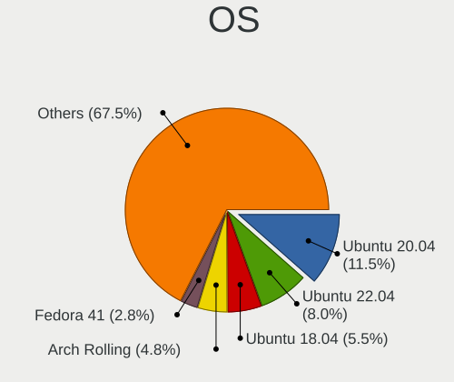

| Name                         | Computers | Percent |
|------------------------------|-----------|---------|
| Ubuntu 20.04                 | 82        | 11.48%  |
| Ubuntu 22.04                 | 57        | 7.98%   |
| Ubuntu 18.04                 | 39        | 5.46%   |
| Arch Rolling                 | 34        | 4.76%   |
| Fedora 41                    | 20        | 2.8%    |
| Ubuntu 24.04                 | 18        | 2.52%   |
| Pop!_OS 22.04                | 18        | 2.52%   |
| Debian 12                    | 13        | 1.82%   |
| Fedora 42                    | 12        | 1.68%   |
| Fedora 33                    | 12        | 1.68%   |
| Fedora 38                    | 11        | 1.54%   |
| Zorin 17                     | 10        | 1.4%    |
| OpenMandriva 24.12           | 10        | 1.4%    |
| Linux Mint 21                | 9         | 1.26%   |
| Fedora 40                    | 9         | 1.26%   |
| Debian 11                    | 9         | 1.26%   |
| ArcoLinux Rolling            | 9         | 1.26%   |
| Pop!_OS 20.04                | 8         | 1.12%   |
| Arch                         | 8         | 1.12%   |
| openSUSE Tumbleweed-XXXXXXXX | 7         | 0.98%   |
| Manjaro                      | 7         | 0.98%   |
| Linux Mint 21.2              | 7         | 0.98%   |
| Kubuntu 22.04                | 7         | 0.98%   |
| Fedora 37                    | 7         | 0.98%   |
| EndeavourOS Rolling          | 7         | 0.98%   |
| OpenMandriva 23.01           | 6         | 0.84%   |
| KDE neon 20.04               | 6         | 0.84%   |
| Debian                       | 6         | 0.84%   |
| Zorin 16                     | 5         | 0.7%    |
| Ubuntu 21.10                 | 5         | 0.7%    |
| Ubuntu 21.04                 | 5         | 0.7%    |
| OpenMandriva 23.03           | 5         | 0.7%    |
| Linux Mint 22.1              | 5         | 0.7%    |
| Linux Mint 20                | 5         | 0.7%    |
| Kubuntu 24.04                | 5         | 0.7%    |
| Fedora 43                    | 5         | 0.7%    |
| Xubuntu 20.04                | 4         | 0.56%   |
| Ubuntu 24.10                 | 4         | 0.56%   |
| Pop!_OS 21.04                | 4         | 0.56%   |
| OpenMandriva 5.0             | 4         | 0.56%   |

OS Family
---------

OS without a version

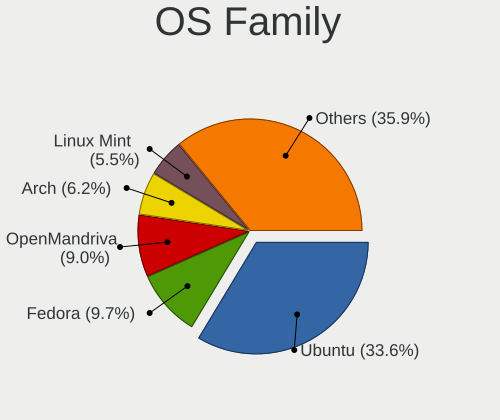

| Name          | Computers | Percent |
|---------------|-----------|---------|
| Ubuntu        | 221       | 33.64%  |
| Fedora        | 64        | 9.74%   |
| OpenMandriva  | 59        | 8.98%   |
| Arch          | 41        | 6.24%   |
| Linux Mint    | 36        | 5.48%   |
| Pop!_OS       | 35        | 5.33%   |
| Debian        | 35        | 5.33%   |
| Zorin         | 17        | 2.59%   |
| Kubuntu       | 16        | 2.44%   |
| Manjaro       | 13        | 1.98%   |
| KDE neon      | 10        | 1.52%   |
| ArcoLinux     | 10        | 1.52%   |
| Xubuntu       | 7         | 1.07%   |
| openSUSE      | 7         | 1.07%   |
| EndeavourOS   | 7         | 1.07%   |
| Nobara        | 6         | 0.91%   |
| NixOS         | 6         | 0.91%   |
| Gentoo        | 6         | 0.91%   |
| SteamOS       | 5         | 0.76%   |
| MX            | 5         | 0.76%   |
| Lubuntu       | 5         | 0.76%   |
| Ubuntu Unity  | 4         | 0.61%   |
| Rocky Linux   | 4         | 0.61%   |
| Ubuntu Budgie | 3         | 0.46%   |
| Garuda Linux  | 3         | 0.46%   |
| Elementary    | 3         | 0.46%   |
| ROSA          | 2         | 0.3%    |
| RHEL          | 2         | 0.3%    |
| Raspbian      | 2         | 0.3%    |
| Kali          | 2         | 0.3%    |
| Endless       | 2         | 0.3%    |
| Deepin        | 2         | 0.3%    |
| Clear Linux   | 2         | 0.3%    |
| Bazzite       | 2         | 0.3%    |
| Vanilla       | 1         | 0.15%   |
| Ubuntu MATE   | 1         | 0.15%   |
| Ubuntu Kylin  | 1         | 0.15%   |
| TUXEDO OS     | 1         | 0.15%   |
| Solus         | 1         | 0.15%   |
| Q4OS          | 1         | 0.15%   |

Kernel
------

Version of the Linux kernel

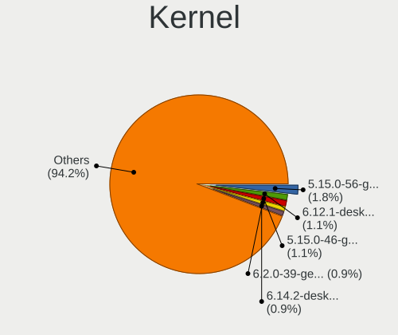

| Version                    | Computers | Percent |
|----------------------------|-----------|---------|
| 5.15.0-56-generic          | 14        | 1.76%   |
| 6.12.1-desktop-1omv2490    | 9         | 1.13%   |
| 5.15.0-46-generic          | 9         | 1.13%   |
| 6.2.0-39-generic           | 7         | 0.88%   |
| 6.14.2-desktop-3omv2590    | 7         | 0.88%   |
| 6.2.0-26-generic           | 6         | 0.75%   |
| 5.9.8-200.fc33.x86_64      | 6         | 0.75%   |
| 5.4.0-48-generic           | 6         | 0.75%   |
| 5.4.0-42-generic           | 6         | 0.75%   |
| 5.4.0-40-generic           | 6         | 0.75%   |
| 5.4.0-37-generic           | 6         | 0.75%   |
| 5.4.0-29-generic           | 6         | 0.75%   |
| 6.9.3-76060903-generic     | 5         | 0.63%   |
| 6.8.0-60-generic           | 5         | 0.63%   |
| 6.6.2-desktop-1omv2390     | 5         | 0.63%   |
| 6.2.6-desktop-1omv2390     | 5         | 0.63%   |
| 6.14.8-300.fc42.x86_64     | 5         | 0.63%   |
| 6.1.1-desktop-1omv2290     | 5         | 0.63%   |
| 5.4.0-52-generic           | 5         | 0.63%   |
| 5.15.0-58-generic          | 5         | 0.63%   |
| 5.11.0-43-generic          | 5         | 0.63%   |
| 6.8.0-79-generic           | 4         | 0.5%    |
| 6.8.0-49-generic           | 4         | 0.5%    |
| 6.4.6-76060406-generic     | 4         | 0.5%    |
| 6.13.5-200.fc41.x86_64     | 4         | 0.5%    |
| 6.10.0-desktop-1omv2490    | 4         | 0.5%    |
| 5.4.0-65-generic           | 4         | 0.5%    |
| 5.3.0-62-generic           | 4         | 0.5%    |
| 5.16.7-desktop-1omv4003    | 4         | 0.5%    |
| 5.15.0-43-generic          | 4         | 0.5%    |
| 5.15.0-41-generic          | 4         | 0.5%    |
| 6.8.0-52-generic           | 3         | 0.38%   |
| 6.8.0-45-generic           | 3         | 0.38%   |
| 6.8.0-40-generic           | 3         | 0.38%   |
| 6.8.0-0.rc6.49.fc40.x86_64 | 3         | 0.38%   |
| 6.3.8-200.fc38.x86_64      | 3         | 0.38%   |
| 6.3.5-desktop-3omv2390     | 3         | 0.38%   |
| 6.2.15-300.fc38.x86_64     | 3         | 0.38%   |
| 6.2.14-300.fc38.x86_64     | 3         | 0.38%   |
| 6.2.0-34-generic           | 3         | 0.38%   |

Kernel Family
-------------

Linux kernel without a distro release

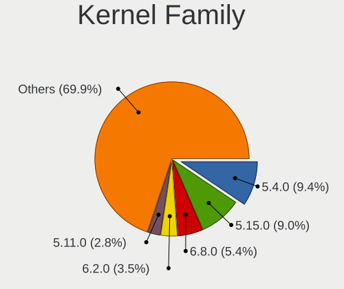

| Version | Computers | Percent |
|---------|-----------|---------|
| 5.4.0   | 72        | 9.44%   |
| 5.15.0  | 69        | 9.04%   |
| 6.8.0   | 41        | 5.37%   |
| 6.2.0   | 27        | 3.54%   |
| 5.11.0  | 21        | 2.75%   |
| 5.13.0  | 18        | 2.36%   |
| 5.8.0   | 16        | 2.1%    |
| 6.5.0   | 15        | 1.97%   |
| 6.14.0  | 13        | 1.7%    |
| 5.19.0  | 13        | 1.7%    |
| 4.18.0  | 13        | 1.7%    |
| 5.3.0   | 12        | 1.57%   |
| 5.10.0  | 12        | 1.57%   |
| 6.1.0   | 11        | 1.44%   |
| 5.0.0   | 11        | 1.44%   |
| 4.15.0  | 11        | 1.44%   |
| 6.12.1  | 9         | 1.18%   |
| 6.11.0  | 9         | 1.18%   |
| 6.9.3   | 7         | 0.92%   |
| 6.14.2  | 7         | 0.92%   |
| 6.8.9   | 6         | 0.79%   |
| 6.3.8   | 6         | 0.79%   |
| 6.1.1   | 6         | 0.79%   |
| 5.9.8   | 6         | 0.79%   |
| 5.18.0  | 6         | 0.79%   |
| 6.6.2   | 5         | 0.66%   |
| 6.3.5   | 5         | 0.66%   |
| 6.2.6   | 5         | 0.66%   |
| 6.14.8  | 5         | 0.66%   |
| 6.4.6   | 4         | 0.52%   |
| 6.13.5  | 4         | 0.52%   |
| 6.10.0  | 4         | 0.52%   |
| 5.16.7  | 4         | 0.52%   |
| 6.8.12  | 3         | 0.39%   |
| 6.8.10  | 3         | 0.39%   |
| 6.6.7   | 3         | 0.39%   |
| 6.6.1   | 3         | 0.39%   |
| 6.5.9   | 3         | 0.39%   |
| 6.4.8   | 3         | 0.39%   |
| 6.2.15  | 3         | 0.39%   |

Kernel Major Ver.
-----------------

Linux kernel major version

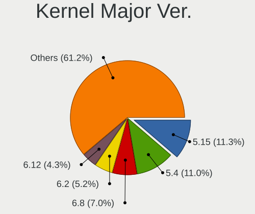

| Version | Computers | Percent |
|---------|-----------|---------|
| 5.15    | 84        | 11.29%  |
| 5.4     | 82        | 11.02%  |
| 6.8     | 52        | 6.99%   |
| 6.2     | 39        | 5.24%   |
| 6.12    | 32        | 4.3%    |
| 6.14    | 28        | 3.76%   |
| 6.1     | 28        | 3.76%   |
| 5.13    | 26        | 3.49%   |
| 5.8     | 24        | 3.23%   |
| 5.11    | 23        | 3.09%   |
| 6.5     | 22        | 2.96%   |
| 6.11    | 22        | 2.96%   |
| 6.6     | 21        | 2.82%   |
| 5.10    | 21        | 2.82%   |
| 6.4     | 17        | 2.28%   |
| 6.3     | 17        | 2.28%   |
| 5.19    | 17        | 2.28%   |
| 4.18    | 13        | 1.75%   |
| 6.13    | 12        | 1.61%   |
| 6.10    | 12        | 1.61%   |
| 6.0     | 12        | 1.61%   |
| 5.3     | 12        | 1.61%   |
| 5.0     | 12        | 1.61%   |
| 6.17    | 11        | 1.48%   |
| 5.18    | 11        | 1.48%   |
| 4.15    | 11        | 1.48%   |
| 5.9     | 10        | 1.34%   |
| 5.16    | 10        | 1.34%   |
| 6.9     | 9         | 1.21%   |
| 6.15    | 9         | 1.21%   |
| 6.16    | 7         | 0.94%   |
| 5.12    | 7         | 0.94%   |
| 5.17    | 5         | 0.67%   |
| 5.6     | 4         | 0.54%   |
| 5.14    | 4         | 0.54%   |
| 4.19    | 4         | 0.54%   |
| 6.7     | 2         | 0.27%   |
| 6.18    | 2         | 0.27%   |
| 5.5     | 2         | 0.27%   |
| 4.16    | 2         | 0.27%   |

Arch
----

OS architecture (x86_64, i586, etc.)

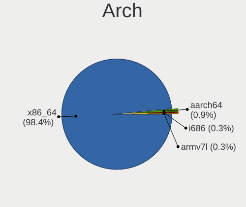

| Name    | Computers | Percent |
|---------|-----------|---------|
| x86_64  | 627       | 98.43%  |
| aarch64 | 6         | 0.94%   |
| i686    | 2         | 0.31%   |
| armv7l  | 2         | 0.31%   |

DE
--

Desktop Environment

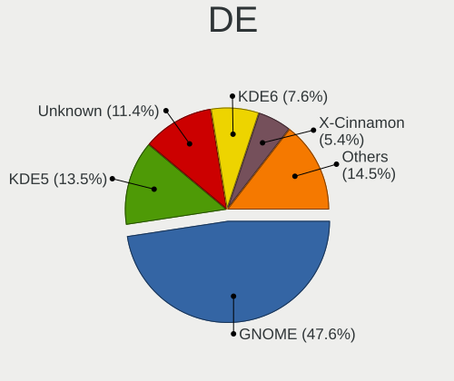

| Name            | Computers | Percent |
|-----------------|-----------|---------|
| GNOME           | 318       | 47.6%   |
| KDE5            | 90        | 13.47%  |
| Unknown         | 76        | 11.38%  |
| KDE6            | 51        | 7.63%   |
| X-Cinnamon      | 36        | 5.39%   |
| XFCE            | 30        | 4.49%   |
| LXQt            | 15        | 2.25%   |
| KDE             | 10        | 1.5%    |
| Cinnamon        | 7         | 1.05%   |
| i3              | 5         | 0.75%   |
| Hyprland        | 5         | 0.75%   |
| Budgie          | 5         | 0.75%   |
| Unity           | 4         | 0.6%    |
| Pantheon        | 3         | 0.45%   |
| KDE4            | 3         | 0.45%   |
| MATE            | 2         | 0.3%    |
| GNOME Flashback | 2         | 0.3%    |
| GNOME Classic   | 2         | 0.3%    |
| UKUI            | 1         | 0.15%   |
| niri            | 1         | 0.15%   |
| Deepin          | 1         | 0.15%   |
| COSMIC          | 1         | 0.15%   |

Display Server
--------------

X11 or Wayland

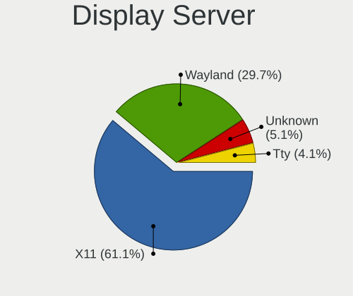

| Name    | Computers | Percent |
|---------|-----------|---------|
| X11     | 406       | 61.14%  |
| Wayland | 197       | 29.67%  |
| Unknown | 34        | 5.12%   |
| Tty     | 27        | 4.07%   |

Display Manager
---------------

SDDM, LightDM, etc.

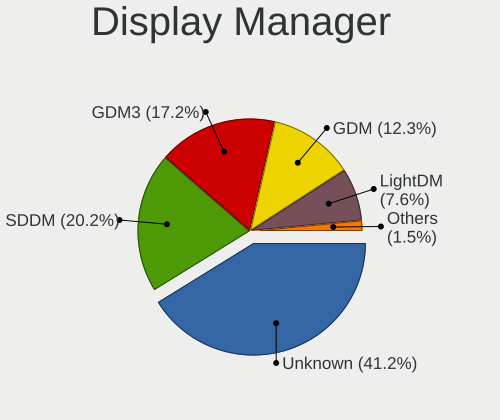

| Name    | Computers | Percent |
|---------|-----------|---------|
| Unknown | 271       | 41.19%  |
| SDDM    | 133       | 20.21%  |
| GDM3    | 113       | 17.17%  |
| GDM     | 81        | 12.31%  |
| LightDM | 50        | 7.6%    |
| TDM     | 5         | 0.76%   |
| GREETD  | 4         | 0.61%   |
| KDM     | 1         | 0.15%   |

OS Lang
-------

Language

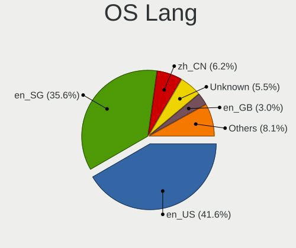

| Lang       | Computers | Percent |
|------------|-----------|---------|
| en_US      | 274       | 41.64%  |
| en_SG      | 234       | 35.56%  |
| zh_CN      | 41        | 6.23%   |
| Unknown    | 36        | 5.47%   |
| en_GB      | 20        | 3.04%   |
| C          | 18        | 2.74%   |
| de_DE      | 9         | 1.37%   |
| en_IN      | 7         | 1.06%   |
| en_AU      | 6         | 0.91%   |
| en_PH      | 4         | 0.61%   |
| id_ID      | 2         | 0.3%    |
| en_HK      | 2         | 0.3%    |
| zh_SG      | 1         | 0.15%   |
| zh_CN.UTF8 | 1         | 0.15%   |
| ru_UA      | 1         | 0.15%   |
| fr_FR      | 1         | 0.15%   |
| en_IE      | 1         | 0.15%   |

Boot Mode
---------

EFI or BIOS

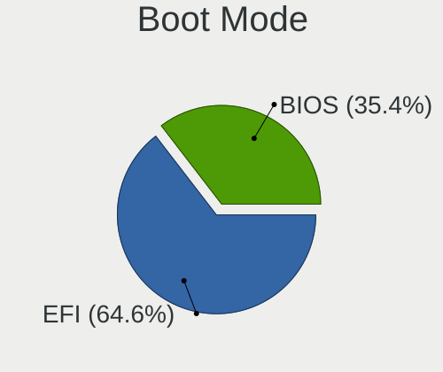

| Mode | Computers | Percent |
|------|-----------|---------|
| EFI  | 419       | 64.56%  |
| BIOS | 230       | 35.44%  |

Filesystem
----------

Type of filesystem

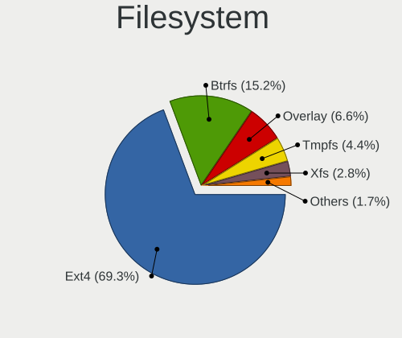

| Type    | Computers | Percent |
|---------|-----------|---------|
| Ext4    | 452       | 69.33%  |
| Btrfs   | 99        | 15.18%  |
| Overlay | 43        | 6.6%    |
| Tmpfs   | 29        | 4.45%   |
| Xfs     | 18        | 2.76%   |
| Unknown | 9         | 1.38%   |
| Zfs     | 2         | 0.31%   |

Part. scheme
------------

Scheme of partitioning

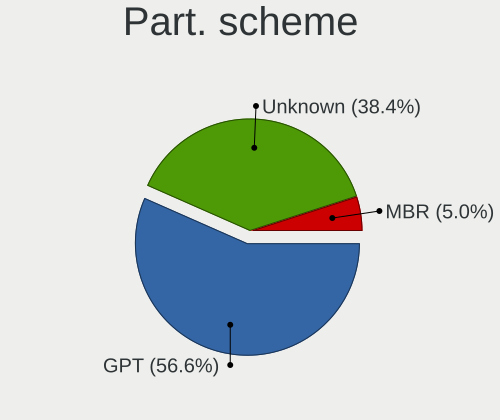

| Type    | Computers | Percent |
|---------|-----------|---------|
| GPT     | 364       | 56.61%  |
| Unknown | 247       | 38.41%  |
| MBR     | 32        | 4.98%   |

Dual Boot with Linux/BSD
------------------------

Hosting more than one Linux/BSD

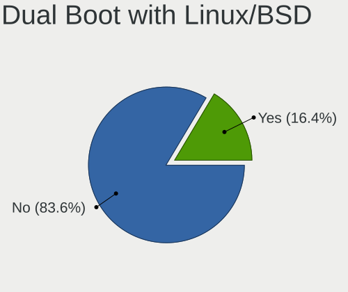

| Dual boot | Computers | Percent |
|-----------|-----------|---------|
| No        | 544       | 83.56%  |
| Yes       | 107       | 16.44%  |

Dual Boot (Win)
---------------

Hosting Linux and Windows

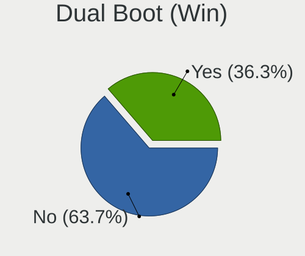

| Dual boot | Computers | Percent |
|-----------|-----------|---------|
| No        | 414       | 63.69%  |
| Yes       | 236       | 36.31%  |

Board
-----

Vendor
------

Motherboard manufacturer

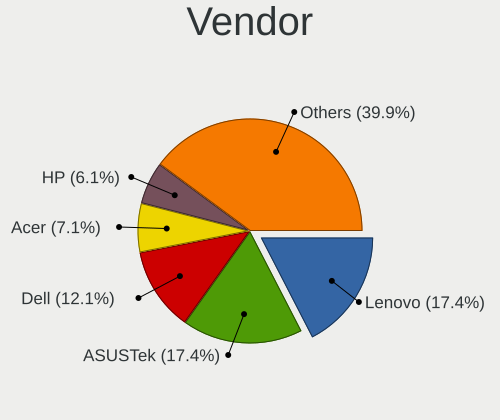

| Name                                 | Computers | Percent |
|--------------------------------------|-----------|---------|
| Lenovo                               | 111       | 17.43%  |
| ASUSTek Computer                     | 111       | 17.43%  |
| Dell                                 | 77        | 12.09%  |
| Acer                                 | 45        | 7.06%   |
| Hewlett-Packard                      | 39        | 6.12%   |
| Gigabyte Technology                  | 38        | 5.97%   |
| MSI                                  | 34        | 5.34%   |
| ASRock                               | 25        | 3.92%   |
| Apple                                | 24        | 3.77%   |
| Unknown                              | 16        | 2.51%   |
| MECHREVO                             | 9         | 1.41%   |
| Intel                                | 8         | 1.26%   |
| HUAWEI                               | 7         | 1.1%    |
| AZW                                  | 7         | 1.1%    |
| Foxconn                              | 6         | 0.94%   |
| Sony                                 | 5         | 0.78%   |
| Valve                                | 4         | 0.63%   |
| Raspberry Pi Foundation              | 4         | 0.63%   |
| Microsoft                            | 4         | 0.63%   |
| Fujitsu                              | 4         | 0.63%   |
| Timi                                 | 3         | 0.47%   |
| Samsung Electronics                  | 3         | 0.47%   |
| congatec                             | 3         | 0.47%   |
| TUXEDO                               | 2         | 0.31%   |
| Toshiba                              | 2         | 0.31%   |
| Supermicro                           | 2         | 0.31%   |
| Shenzhen Meigao Electronic Equipment | 2         | 0.31%   |
| Razer                                | 2         | 0.31%   |
| Google                               | 2         | 0.31%   |
| AMI                                  | 2         | 0.31%   |
| Aftershock                           | 2         | 0.31%   |
| WOOKING                              | 1         | 0.16%   |
| Win Element                          | 1         | 0.16%   |
| UGREEN                               | 1         | 0.16%   |
| THUNDEROBOT                          | 1         | 0.16%   |
| SZMZ                                 | 1         | 0.16%   |
| System76                             | 1         | 0.16%   |
| Red Hat                              | 1         | 0.16%   |
| Pegatron                             | 1         | 0.16%   |
| Novatte                              | 1         | 0.16%   |

Model
-----

Motherboard model

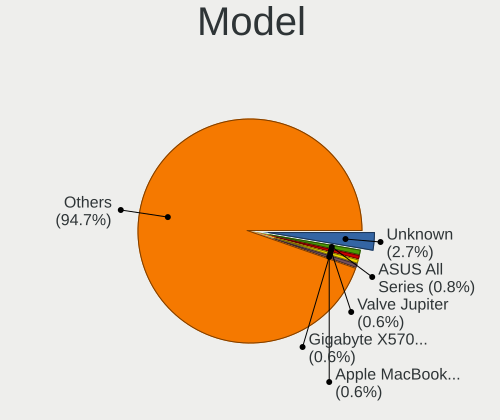

| Name                               | Computers | Percent |
|------------------------------------|-----------|---------|
| Unknown                            | 17        | 2.67%   |
| ASUS All Series                    | 5         | 0.78%   |
| Valve Jupiter                      | 4         | 0.63%   |
| Gigabyte X570 AORUS PRO WIFI       | 4         | 0.63%   |
| AZW SER                            | 4         | 0.63%   |
| Apple MacBookPro9,2                | 4         | 0.63%   |
| MSI MS-7C84                        | 3         | 0.47%   |
| Lenovo Legion 5 Pro 16ACH6H 82JQ   | 3         | 0.47%   |
| Foxconn Pro 3330 MT                | 3         | 0.47%   |
| Dell OptiPlex 990                  | 3         | 0.47%   |
| Dell OptiPlex 9020                 | 3         | 0.47%   |
| Dell Inspiron 15 5510              | 3         | 0.47%   |
| congatec conga-MA5 B.2             | 3         | 0.47%   |
| ASUS ROG STRIX B650E-I GAMING WIFI | 3         | 0.47%   |
| Acer Swift SF314-57G               | 3         | 0.47%   |
| RPi Raspberry Pi 4 Model B Rev 1.4 | 2         | 0.31%   |
| RPi Raspberry Pi 4 Model B Rev 1.2 | 2         | 0.31%   |
| MSI MS-7E06                        | 2         | 0.31%   |
| MSI MS-7D25                        | 2         | 0.31%   |
| Lenovo Yoga C930-13IKB 81C4        | 2         | 0.31%   |
| Lenovo ThinkPad X220 42911H8       | 2         | 0.31%   |
| Lenovo Legion Y7000P IRH8 82YA     | 2         | 0.31%   |
| Lenovo Legion 5 15ARH05 82B5       | 2         | 0.31%   |
| Lenovo IdeaPad S340-14API 81NB     | 2         | 0.31%   |
| Lenovo IdeaPad 100-14IBY 80MH      | 2         | 0.31%   |
| Intel NUC11PAHi7                   | 2         | 0.31%   |
| HUAWEI MACHD-WXX9                  | 2         | 0.31%   |
| HP Z400 Workstation                | 2         | 0.31%   |
| HP Z200 Workstation                | 2         | 0.31%   |
| HP Compaq 6510b                    | 2         | 0.31%   |
| Gigabyte B85M-D3H                  | 2         | 0.31%   |
| Gigabyte B550M DS3H AC             | 2         | 0.31%   |
| Gigabyte B550I AORUS PRO AX        | 2         | 0.31%   |
| Fujitsu LIFEBOOK LH531             | 2         | 0.31%   |
| Foxconn Kangaroo Mobile Desktop    | 2         | 0.31%   |
| Dell XPS 13 9310                   | 2         | 0.31%   |
| Dell XPS 13 7390                   | 2         | 0.31%   |
| Dell Latitude E7250                | 2         | 0.31%   |
| Dell Latitude 3320                 | 2         | 0.31%   |
| Dell Latitude 3120                 | 2         | 0.31%   |

Model Family
------------

Motherboard model prefix

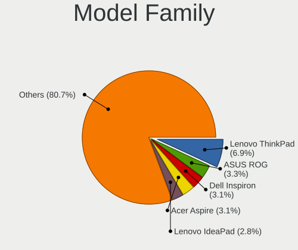

| Name                | Computers | Percent |
|---------------------|-----------|---------|
| Lenovo ThinkPad     | 44        | 6.91%   |
| ASUS ROG            | 21        | 3.3%    |
| Dell Inspiron       | 20        | 3.14%   |
| Acer Aspire         | 20        | 3.14%   |
| Lenovo IdeaPad      | 18        | 2.83%   |
| Dell Latitude       | 18        | 2.83%   |
| Unknown             | 17        | 2.67%   |
| Lenovo Legion       | 16        | 2.51%   |
| ASUS VivoBook       | 16        | 2.51%   |
| Dell OptiPlex       | 14        | 2.2%    |
| Lenovo Yoga         | 13        | 2.04%   |
| Dell XPS            | 12        | 1.88%   |
| Acer Swift          | 12        | 1.88%   |
| ASUS ASUS           | 9         | 1.41%   |
| Dell Precision      | 8         | 1.26%   |
| HP Pavilion         | 7         | 1.1%    |
| ASUS ZenBook        | 6         | 0.94%   |
| ASUS PRIME          | 6         | 0.94%   |
| Lenovo ThinkCentre  | 5         | 0.78%   |
| HP EliteBook        | 5         | 0.78%   |
| ASUS TUF            | 5         | 0.78%   |
| ASUS All            | 5         | 0.78%   |
| Apple MacBookPro11  | 5         | 0.78%   |
| Valve Jupiter       | 4         | 0.63%   |
| RPi Raspberry       | 4         | 0.63%   |
| Microsoft Surface   | 4         | 0.63%   |
| Lenovo ThinkBook    | 4         | 0.63%   |
| HP ENVY             | 4         | 0.63%   |
| Gigabyte X570       | 4         | 0.63%   |
| Fujitsu LIFEBOOK    | 4         | 0.63%   |
| AZW SER             | 4         | 0.63%   |
| Apple MacBookPro9   | 4         | 0.63%   |
| MSI MS-7C84         | 3         | 0.47%   |
| Lenovo ThinkStation | 3         | 0.47%   |
| HP ZBook            | 3         | 0.47%   |
| Foxconn Pro         | 3         | 0.47%   |
| congatec conga-MA5  | 3         | 0.47%   |
| ASUS MINIPC         | 3         | 0.47%   |
| Toshiba PORTEGE     | 2         | 0.31%   |
| Razer Blade         | 2         | 0.31%   |

MFG Year
--------

Motherboard manufacture year

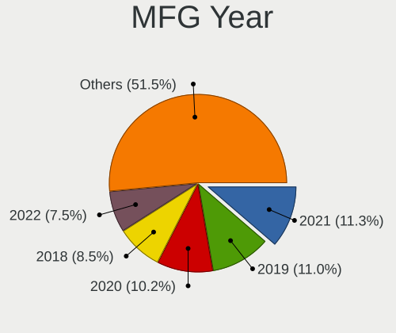

| Year    | Computers | Percent |
|---------|-----------|---------|
| 2021    | 72        | 11.3%   |
| 2019    | 70        | 10.99%  |
| 2020    | 65        | 10.2%   |
| 2018    | 54        | 8.48%   |
| 2022    | 48        | 7.54%   |
| 2023    | 45        | 7.06%   |
| 2013    | 33        | 5.18%   |
| 2012    | 32        | 5.02%   |
| 2011    | 31        | 4.87%   |
| 2024    | 30        | 4.71%   |
| 2017    | 30        | 4.71%   |
| 2014    | 26        | 4.08%   |
| 2016    | 22        | 3.45%   |
| 2015    | 22        | 3.45%   |
| 2010    | 17        | 2.67%   |
| 2008    | 13        | 2.04%   |
| 2025    | 11        | 1.73%   |
| 2007    | 7         | 1.1%    |
| 2009    | 4         | 0.63%   |
| Unknown | 4         | 0.63%   |
| 2006    | 1         | 0.16%   |

Form Factor
-----------

Physical design of the computer

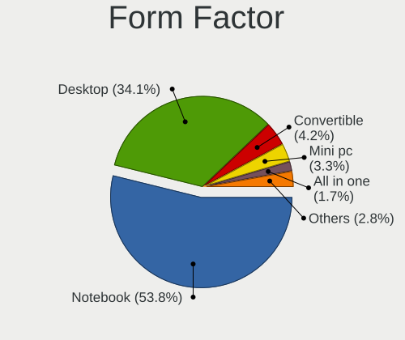

| Name           | Computers | Percent |
|----------------|-----------|---------|
| Notebook       | 343       | 53.85%  |
| Desktop        | 217       | 34.07%  |
| Convertible    | 27        | 4.24%   |
| Mini pc        | 21        | 3.3%    |
| All in one     | 11        | 1.73%   |
| Tablet         | 7         | 1.1%    |
| System on chip | 6         | 0.94%   |
| Server         | 3         | 0.47%   |
| Other          | 1         | 0.16%   |
| Stick pc       | 1         | 0.16%   |

Secure Boot
-----------

Enabled or disabled

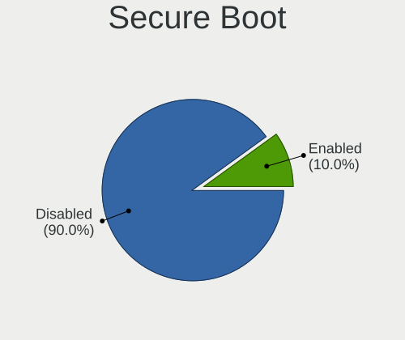

| State    | Computers | Percent |
|----------|-----------|---------|
| Disabled | 578       | 90.03%  |
| Enabled  | 64        | 9.97%   |

Coreboot
--------

Have coreboot on board

| Used | Computers | Percent |
|------|-----------|---------|
| No   | 634       | 99.53%  |
| Yes  | 3         | 0.47%   |

RAM Size
--------

Total RAM memory

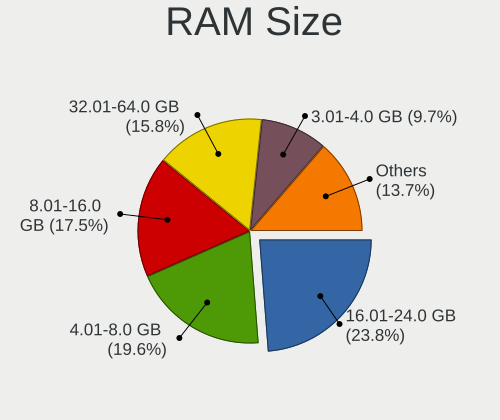

| Size in GB      | Computers | Percent |
|-----------------|-----------|---------|
| 16.01-24.0      | 155       | 23.77%  |
| 4.01-8.0        | 128       | 19.63%  |
| 8.01-16.0       | 114       | 17.48%  |
| 32.01-64.0      | 103       | 15.8%   |
| 3.01-4.0        | 63        | 9.66%   |
| 64.01-256.0     | 40        | 6.13%   |
| 24.01-32.0      | 31        | 4.75%   |
| 1.01-2.0        | 10        | 1.53%   |
| More than 256.0 | 4         | 0.61%   |
| 2.01-3.0        | 3         | 0.46%   |
| 0.51-1.0        | 1         | 0.15%   |

RAM Used
--------

Used RAM memory

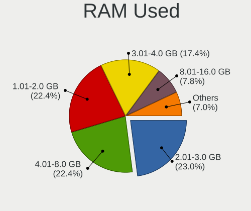

| Used GB    | Computers | Percent |
|------------|-----------|---------|
| 2.01-3.0   | 164       | 22.97%  |
| 4.01-8.0   | 160       | 22.41%  |
| 1.01-2.0   | 160       | 22.41%  |
| 3.01-4.0   | 124       | 17.37%  |
| 8.01-16.0  | 56        | 7.84%   |
| 0.51-1.0   | 25        | 3.5%    |
| 16.01-24.0 | 11        | 1.54%   |
| 0.01-0.5   | 8         | 1.12%   |
| 24.01-32.0 | 4         | 0.56%   |
| 32.01-64.0 | 2         | 0.28%   |

Total Drives
------------

Number of drives on board

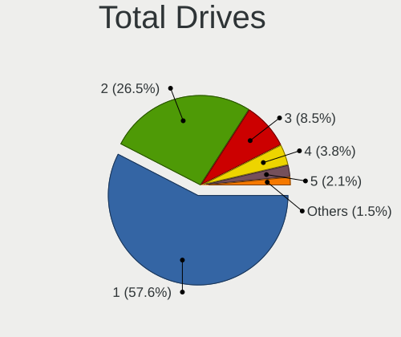

| Drives | Computers | Percent |
|--------|-----------|---------|
| 1      | 380       | 57.58%  |
| 2      | 175       | 26.52%  |
| 3      | 56        | 8.48%   |
| 4      | 25        | 3.79%   |
| 5      | 14        | 2.12%   |
| 0      | 6         | 0.91%   |
| 6      | 2         | 0.3%    |
| 8      | 1         | 0.15%   |
| 7      | 1         | 0.15%   |

Has CD-ROM
----------

Has CD-ROM on board

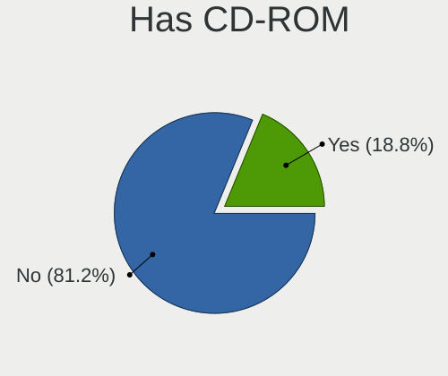

| Presented | Computers | Percent |
|-----------|-----------|---------|
| No        | 519       | 81.22%  |
| Yes       | 120       | 18.78%  |

Has Ethernet
------------

Has Ethernet on board

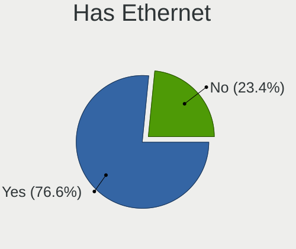

| Presented | Computers | Percent |
|-----------|-----------|---------|
| Yes       | 490       | 76.56%  |
| No        | 150       | 23.44%  |

Has WiFi
--------

Has WiFi module

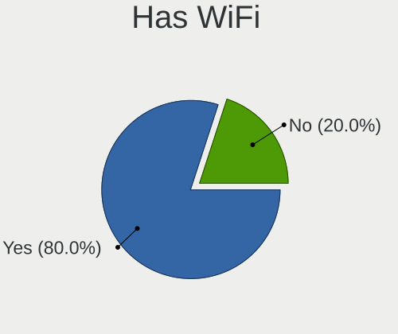

| Presented | Computers | Percent |
|-----------|-----------|---------|
| Yes       | 516       | 80%     |
| No        | 129       | 20%     |

Has Bluetooth
-------------

Has Bluetooth module

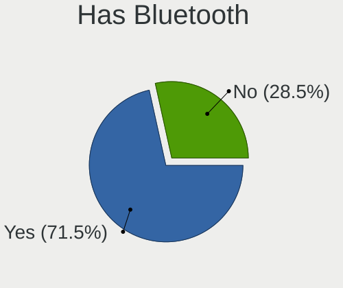

| Presented | Computers | Percent |
|-----------|-----------|---------|
| Yes       | 460       | 71.54%  |
| No        | 183       | 28.46%  |

Location
--------

Country
-------

Geographic location (country)

| Country   | Computers | Percent |
|-----------|-----------|---------|
| Singapore | 637       | 100%    |

City
----

Geographic location (city)

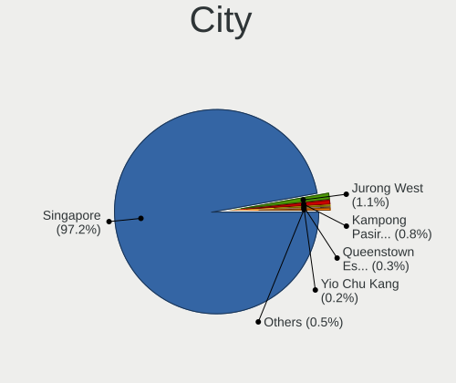

| City                 | Computers | Percent |
|----------------------|-----------|---------|
| Singapore            | 621       | 97.18%  |
| Jurong West          | 7         | 1.1%    |
| Kampong Pasir Ris    | 5         | 0.78%   |
| Queenstown Estate    | 2         | 0.31%   |
| Yio Chu Kang         | 1         | 0.16%   |
| Sembawang Estate     | 1         | 0.16%   |
| Kampong Ulu Jurong   | 1         | 0.16%   |
| Bukit Batok New Town | 1         | 0.16%   |

Drives
------

Drive Vendor
------------

Hard drive vendors

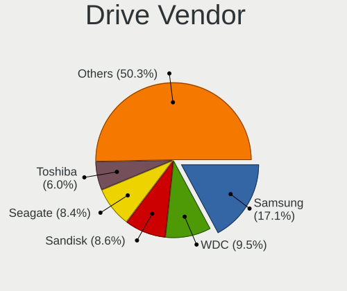

| Vendor                       | Computers | Drives | Percent |
|------------------------------|-----------|--------|---------|
| Samsung Electronics          | 167       | 289    | 17.15%  |
| WDC                          | 93        | 167    | 9.55%   |
| Sandisk                      | 84        | 112    | 8.62%   |
| Seagate                      | 82        | 102    | 8.42%   |
| Toshiba                      | 58        | 86     | 5.95%   |
| Unknown                      | 46        | 65     | 4.72%   |
| SK hynix                     | 42        | 48     | 4.31%   |
| Micron Technology            | 34        | 40     | 3.49%   |
| Crucial                      | 24        | 40     | 2.46%   |
| Intel                        | 23        | 27     | 2.36%   |
| Kingston                     | 18        | 23     | 1.85%   |
| HGST                         | 18        | 28     | 1.85%   |
| Hitachi                      | 17        | 18     | 1.75%   |
| Micron/Crucial Technology    | 14        | 18     | 1.44%   |
| Silicon Motion               | 12        | 16     | 1.23%   |
| KIOXIA                       | 12        | 13     | 1.23%   |
| Phison Electronics           | 11        | 17     | 1.13%   |
| Kingston Technology Company  | 11        | 11     | 1.13%   |
| China                        | 11        | 12     | 1.13%   |
| Apple                        | 10        | 12     | 1.03%   |
| JMicron Technology           | 9         | 13     | 0.92%   |
| Transcend                    | 8         | 11     | 0.82%   |
| Phison                       | 8         | 10     | 0.82%   |
| Lexar                        | 8         | 9      | 0.82%   |
| A-DATA Technology            | 8         | 9      | 0.82%   |
| Yangtze Memory Technologies  | 7         | 7      | 0.72%   |
| MAXIO Technology (Hangzhou)  | 7         | 7      | 0.72%   |
| Shenzhen Longsys Electronics | 5         | 7      | 0.51%   |
| Hewlett-Packard              | 5         | 6      | 0.51%   |
| Unknown                      | 5         | 5      | 0.51%   |
| Lenovo                       | 4         | 4      | 0.41%   |
| External                     | 4         | 4      | 0.41%   |
| YMTC                         | 3         | 4      | 0.31%   |
| UMIS                         | 3         | 4      | 0.31%   |
| Team                         | 3         | 6      | 0.31%   |
| SAGE                         | 3         | 3      | 0.31%   |
| Plextor                      | 3         | 3      | 0.31%   |
| KIOXIA-EXCERIA               | 3         | 3      | 0.31%   |
| KingSpec                     | 3         | 4      | 0.31%   |
| ADATA Technology             | 3         | 5      | 0.31%   |

Drive Model
-----------

Hard drive models

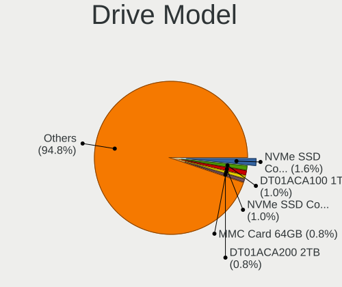

| Model                                                 | Computers | Percent |
|-------------------------------------------------------|-----------|---------|
| Samsung NVMe SSD Controller SM981/PM981/PM983 1TB     | 17        | 1.6%    |
| Toshiba DT01ACA100 1TB                                | 11        | 1.04%   |
| Samsung NVMe SSD Controller PM9A1/PM9A3/980PRO 1TB    | 11        | 1.04%   |
| Unknown MMC Card  64GB                                | 8         | 0.75%   |
| Toshiba DT01ACA200 2TB                                | 8         | 0.75%   |
| Silicon Motion SM2263EN/SM2263XT SSD Controller 512GB | 8         | 0.75%   |
| Seagate ST1000LM035-1RK172 1TB                        | 8         | 0.75%   |
| SanDisk NVMe SSD Drive 1TB                            | 8         | 0.75%   |
| Samsung SSD 860 EVO 500GB                             | 8         | 0.75%   |
| Samsung SSD 850 EVO 250GB                             | 8         | 0.75%   |
| JMicron Generic 320GB                                 | 7         | 0.66%   |
| Seagate ST1000DM010-2EP102 1TB                        | 6         | 0.56%   |
| Sandisk WD Blue SN550 NVMe SSD 1024GB                 | 6         | 0.56%   |
| Samsung SSD 980 PRO 1TB                               | 6         | 0.56%   |
| Samsung SSD 860 EVO 1TB                               | 6         | 0.56%   |
| Samsung NVMe SSD Drive 1024GB                         | 6         | 0.56%   |
| Phison PS5013 E13 NVMe Controller 500GB               | 6         | 0.56%   |
| MAXIO (Hangzhou) NVMe SSD Controller MAP1202 2TB      | 6         | 0.56%   |
| HGST HTS721010A9E630 1TB                              | 6         | 0.56%   |
| WDC WD6400AAKS-22A7B2 640GB                           | 5         | 0.47%   |
| WDC WD10EZEX-08WN4A0 1TB                              | 5         | 0.47%   |
| Unknown MMC Card  32GB                                | 5         | 0.47%   |
| Toshiba MQ04ABF100 1TB                                | 5         | 0.47%   |
| SanDisk SSD PLUS 480GB                                | 5         | 0.47%   |
| Samsung SSD 980 500GB                                 | 5         | 0.47%   |
| Samsung SSD 970 EVO Plus 500GB                        | 5         | 0.47%   |
| Kingston Company SNV2S1000G 1TB                       | 5         | 0.47%   |
| Crucial CT500MX500SSD1 500GB                          | 5         | 0.47%   |
| Crucial CT1000MX500SSD1 1TB                           | 5         | 0.47%   |
| Unknown                                               | 5         | 0.47%   |
| Unknown NVMe SSD Drive 512GB                          | 4         | 0.38%   |
| Toshiba MQ01ABD100 1TB                                | 4         | 0.38%   |
| SK hynix SKHynix_HFS001TDE9X084N 1024GB               | 4         | 0.38%   |
| SK hynix HFM001TD3JX013N 1024GB                       | 4         | 0.38%   |
| Seagate ST500DM002-1BD142 500GB                       | 4         | 0.38%   |
| Seagate ST2000DM008-2FR102 2TB                        | 4         | 0.38%   |
| Sandisk WD_BLACK SN850X 1000GB                        | 4         | 0.38%   |
| Sandisk WD Black SN750 / PC SN730 NVMe SSD 500GB      | 4         | 0.38%   |
| SanDisk NVMe SSD Drive 500GB                          | 4         | 0.38%   |
| Samsung SSD 860 EVO 250GB                             | 4         | 0.38%   |

HDD Vendor
----------

Hard disk drive vendors

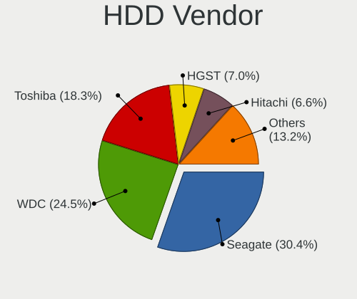

| Vendor              | Computers | Drives | Percent |
|---------------------|-----------|--------|---------|
| Seagate             | 78        | 96     | 30.35%  |
| WDC                 | 63        | 116    | 24.51%  |
| Toshiba             | 47        | 71     | 18.29%  |
| HGST                | 18        | 28     | 7%      |
| Hitachi             | 17        | 18     | 6.61%   |
| JMicron Technology  | 7         | 11     | 2.72%   |
| Samsung Electronics | 6         | 9      | 2.33%   |
| External            | 4         | 4      | 1.56%   |
| Unknown             | 3         | 4      | 1.17%   |
| SAGE                | 3         | 3      | 1.17%   |
| TO Exter            | 2         | 3      | 0.78%   |
| Maxtor              | 2         | 2      | 0.78%   |
| Apple               | 2         | 2      | 0.78%   |
| SSK                 | 1         | 1      | 0.39%   |
| MARVELL             | 1         | 1      | 0.39%   |
| KESU                | 1         | 1      | 0.39%   |
| Fujitsu             | 1         | 1      | 0.39%   |
| ExcelStor           | 1         | 1      | 0.39%   |

SSD Vendor
----------

Solid state drive vendors

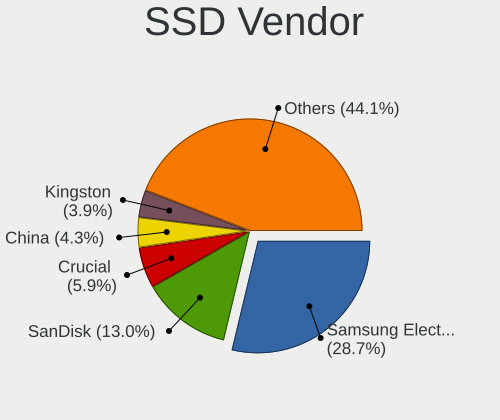

| Vendor              | Computers | Drives | Percent |
|---------------------|-----------|--------|---------|
| Samsung Electronics | 73        | 140    | 28.74%  |
| SanDisk             | 33        | 45     | 12.99%  |
| Crucial             | 15        | 27     | 5.91%   |
| China               | 11        | 12     | 4.33%   |
| Kingston            | 10        | 13     | 3.94%   |
| WDC                 | 9         | 10     | 3.54%   |
| Micron Technology   | 9         | 11     | 3.54%   |
| SK hynix            | 8         | 11     | 3.15%   |
| Transcend           | 7         | 10     | 2.76%   |
| Apple               | 7         | 7      | 2.76%   |
| Hewlett-Packard     | 4         | 5      | 1.57%   |
| A-DATA Technology   | 4         | 5      | 1.57%   |
| Plextor             | 3         | 3      | 1.18%   |
| Lexar               | 3         | 3      | 1.18%   |
| Intel               | 3         | 3      | 1.18%   |
| WALRAM              | 2         | 2      | 0.79%   |
| Team                | 2         | 5      | 0.79%   |
| SPCC                | 2         | 2      | 0.79%   |
| Patriot             | 2         | 2      | 0.79%   |
| OCZ                 | 2         | 2      | 0.79%   |
| LT                  | 2         | 4      | 0.79%   |
| LITEON              | 2         | 3      | 0.79%   |
| KingSpec            | 2         | 3      | 0.79%   |
| GALAX               | 2         | 2      | 0.79%   |
| FORESEE             | 2         | 2      | 0.79%   |
| Unknown             | 2         | 2      | 0.79%   |
| Vaseky              | 1         | 1      | 0.39%   |
| V-GEN12S            | 1         | 1      | 0.39%   |
| USB30               | 1         | 1      | 0.39%   |
| Unknown             | 1         | 1      | 0.39%   |
| TREK 256            | 1         | 1      | 0.39%   |
| Toshiba             | 1         | 1      | 0.39%   |
| tigo                | 1         | 1      | 0.39%   |
| Teclast             | 1         | 1      | 0.39%   |
| TAMMUZ              | 1         | 1      | 0.39%   |
| SABRENT             | 1         | 2      | 0.39%   |
| Ramos Technology    | 1         | 2      | 0.39%   |
| Pioneer             | 1         | 1      | 0.39%   |
| ORICO               | 1         | 1      | 0.39%   |
| Netac               | 1         | 1      | 0.39%   |

Drive Kind
----------

HDD or SSD

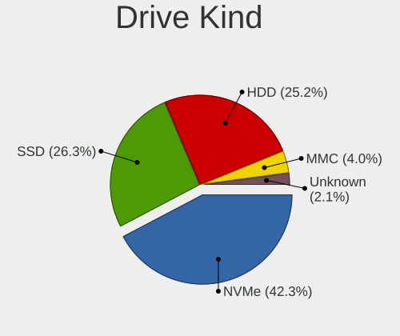

| Kind    | Computers | Drives | Percent |
|---------|-----------|--------|---------|
| NVMe    | 357       | 562    | 42.3%   |
| SSD     | 222       | 370    | 26.3%   |
| HDD     | 213       | 372    | 25.24%  |
| MMC     | 34        | 46     | 4.03%   |
| Unknown | 18        | 21     | 2.13%   |

Drive Connector
---------------

SATA, SAS, NVMe, etc.

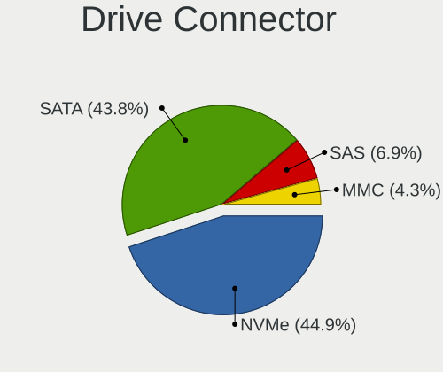

| Type | Computers | Drives | Percent |
|------|-----------|--------|---------|
| NVMe | 356       | 546    | 44.95%  |
| SATA | 347       | 696    | 43.81%  |
| SAS  | 55        | 83     | 6.94%   |
| MMC  | 34        | 46     | 4.29%   |

Drive Size
----------

Size of hard drive

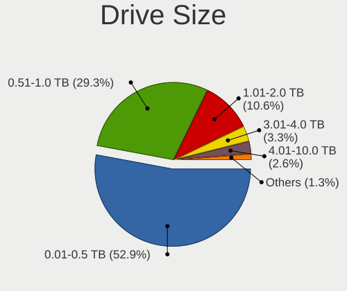

| Size in TB | Computers | Drives | Percent |
|------------|-----------|--------|---------|
| 0.01-0.5   | 244       | 399    | 52.93%  |
| 0.51-1.0   | 135       | 202    | 29.28%  |
| 1.01-2.0   | 49        | 73     | 10.63%  |
| 3.01-4.0   | 15        | 24     | 3.25%   |
| 4.01-10.0  | 12        | 36     | 2.6%    |
| 2.01-3.0   | 5         | 5      | 1.08%   |
| 10.01-20.0 | 1         | 3      | 0.22%   |

Space Total
-----------

Amount of disk space available on the file system

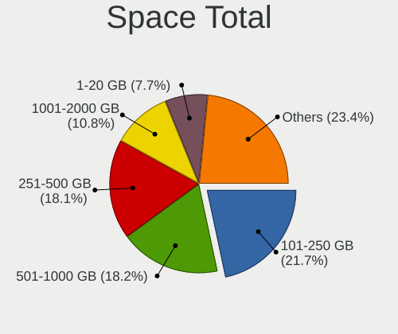

| Size in GB     | Computers | Percent |
|----------------|-----------|---------|
| 101-250        | 146       | 21.66%  |
| 501-1000       | 123       | 18.25%  |
| 251-500        | 122       | 18.1%   |
| 1001-2000      | 73        | 10.83%  |
| 1-20           | 52        | 7.72%   |
| More than 3000 | 50        | 7.42%   |
| 51-100         | 38        | 5.64%   |
| Unknown        | 28        | 4.15%   |
| 2001-3000      | 25        | 3.71%   |
| 21-50          | 17        | 2.52%   |

Space Used
----------

Amount of used disk space

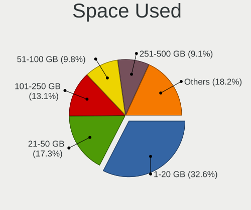

| Used GB        | Computers | Percent |
|----------------|-----------|---------|
| 1-20           | 226       | 32.56%  |
| 21-50          | 120       | 17.29%  |
| 101-250        | 91        | 13.11%  |
| 51-100         | 68        | 9.8%    |
| 251-500        | 63        | 9.08%   |
| 501-1000       | 48        | 6.92%   |
| 1001-2000      | 28        | 4.03%   |
| Unknown        | 28        | 4.03%   |
| More than 3000 | 13        | 1.87%   |
| 2001-3000      | 7         | 1.01%   |
| 0              | 2         | 0.29%   |

Malfunc. Drives
---------------

Drive models with a malfunction

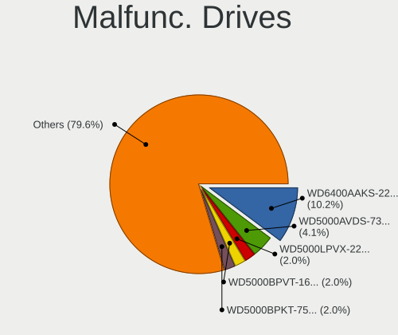

| Model                                                       | Computers | Drives | Percent |
|-------------------------------------------------------------|-----------|--------|---------|
| WDC WD6400AAKS-22A7B2 640GB                                 | 5         | 9      | 10.2%   |
| WDC WD5000AVDS-73U7B1 500GB                                 | 2         | 2      | 4.08%   |
| WDC WD5000LPVX-22V0TT0 500GB                                | 1         | 1      | 2.04%   |
| WDC WD5000BPVT-16HXZT1 500GB                                | 1         | 1      | 2.04%   |
| WDC WD5000BPKT-75PK4T0 500GB                                | 1         | 1      | 2.04%   |
| WDC WD5000AAKS-22V1A0 500GB                                 | 1         | 1      | 2.04%   |
| WDC WD50 EZRX-00MVLB1 5TB                                   | 1         | 1      | 2.04%   |
| WDC WD3200AAJS-65M0A0 320GB                                 | 1         | 1      | 2.04%   |
| WDC WD1600AAJS-65WAA0 160GB                                 | 1         | 1      | 2.04%   |
| WDC WD10SPZX-21Z10T0 1TB                                    | 1         | 2      | 2.04%   |
| WDC WD10EZEX-60M2NA0 1TB                                    | 1         | 1      | 2.04%   |
| WDC WD1002FAEX-00Z3A0 1TB                                   | 1         | 1      | 2.04%   |
| WDC WD1002FAEX-00Y9A0 1TB                                   | 1         | 1      | 2.04%   |
| Toshiba DT01ACA100 1TB                                      | 1         | 1      | 2.04%   |
| Toshiba DT01ACA050 500GB                                    | 1         | 1      | 2.04%   |
| Teclast 480GB A800 SSD                                      | 1         | 1      | 2.04%   |
| SK hynix SC210 2.5 7MM 128GB SSD                            | 1         | 1      | 2.04%   |
| SK hynix PC711 HFS512GDE9X073N 512GB                        | 1         | 1      | 2.04%   |
| Seagate ST9320325AS 320GB                                   | 1         | 1      | 2.04%   |
| Seagate ST9160821AS 160GB                                   | 1         | 1      | 2.04%   |
| Seagate ST8000NM0055-1RM112 8TB                             | 1         | 1      | 2.04%   |
| Seagate ST500DM002-1BD142 500GB                             | 1         | 1      | 2.04%   |
| Seagate ST3160811AS 160GB                                   | 1         | 1      | 2.04%   |
| Seagate ST31500341AS 1TB                                    | 1         | 1      | 2.04%   |
| Seagate ST2000LM007-1R8174 2TB                              | 1         | 1      | 2.04%   |
| Seagate ST2000LM003 HN-M201RAD 2TB                          | 1         | 1      | 2.04%   |
| Seagate ST1000LM024 HN-M 1TB                                | 1         | 1      | 2.04%   |
| SanDisk SSD U100 24GB                                       | 1         | 1      | 2.04%   |
| Samsung Electronics SSD 980 PRO 1TB                         | 1         | 1      | 2.04%   |
| Samsung Electronics SSD 980 1TB                             | 1         | 1      | 2.04%   |
| Samsung Electronics SSD 970 PRO 1TB                         | 1         | 1      | 2.04%   |
| Samsung Electronics HD103UJ 1TB                             | 1         | 1      | 2.04%   |
| Micron Technology 1100_MTFDDAV512TBN 512GB SSD              | 1         | 1      | 2.04%   |
| MAXIO Technology (Hangzhou) NVMe SSD Controller MAP1202 2TB | 1         | 1      | 2.04%   |
| JMicron Technology Generic 320GB                            | 1         | 1      | 2.04%   |
| Hitachi HTS545032B9A300 320GB                               | 1         | 1      | 2.04%   |
| Hitachi HTS541010A9E680 1TB                                 | 1         | 1      | 2.04%   |
| Hitachi HDS721010CLA632 1TB                                 | 1         | 1      | 2.04%   |
| HGST HTS725050A7E630 500GB                                  | 1         | 2      | 2.04%   |
| HGST HTS545050A7E380 500GB                                  | 1         | 1      | 2.04%   |

Malfunc. Drive Vendor
---------------------

Vendors of faulty drives

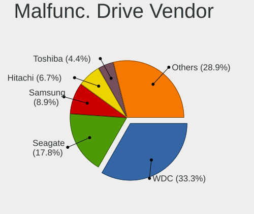

| Vendor                      | Computers | Drives | Percent |
|-----------------------------|-----------|--------|---------|
| WDC                         | 15        | 23     | 33.33%  |
| Seagate                     | 8         | 9      | 17.78%  |
| Samsung Electronics         | 4         | 4      | 8.89%   |
| Hitachi                     | 3         | 3      | 6.67%   |
| Toshiba                     | 2         | 2      | 4.44%   |
| SK hynix                    | 2         | 2      | 4.44%   |
| HGST                        | 2         | 3      | 4.44%   |
| Crucial                     | 2         | 11     | 4.44%   |
| Teclast                     | 1         | 1      | 2.22%   |
| SanDisk                     | 1         | 1      | 2.22%   |
| Micron Technology           | 1         | 1      | 2.22%   |
| MAXIO Technology (Hangzhou) | 1         | 1      | 2.22%   |
| JMicron Technology          | 1         | 1      | 2.22%   |
| ExcelStor                   | 1         | 1      | 2.22%   |
| China                       | 1         | 1      | 2.22%   |

Malfunc. HDD Vendor
-------------------

Vendors of faulty HDD drives

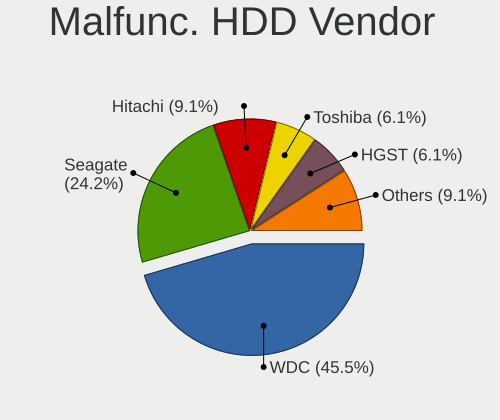

| Vendor              | Computers | Drives | Percent |
|---------------------|-----------|--------|---------|
| WDC                 | 15        | 23     | 45.45%  |
| Seagate             | 8         | 9      | 24.24%  |
| Hitachi             | 3         | 3      | 9.09%   |
| Toshiba             | 2         | 2      | 6.06%   |
| HGST                | 2         | 3      | 6.06%   |
| Samsung Electronics | 1         | 1      | 3.03%   |
| JMicron Technology  | 1         | 1      | 3.03%   |
| ExcelStor           | 1         | 1      | 3.03%   |

Malfunc. Drive Kind
-------------------

Kinds of faulty drives

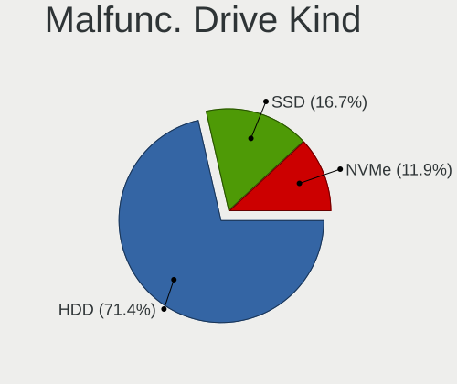

| Kind | Computers | Drives | Percent |
|------|-----------|--------|---------|
| HDD  | 30        | 43     | 71.43%  |
| SSD  | 7         | 16     | 16.67%  |
| NVMe | 5         | 5      | 11.9%   |

Failed Drives
-------------

Failed drive models

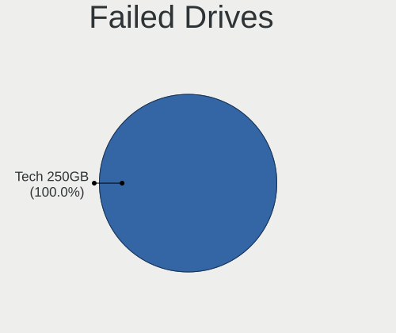

| Model                         | Computers | Drives | Percent |
|-------------------------------|-----------|--------|---------|
| WDC WD1002FAEX-00Z3A0 1TB     | 1         | 1      | 50%     |
| JMicron Technology Tech 250GB | 1         | 1      | 50%     |

Failed Drive Vendor
-------------------

Failed drive vendors

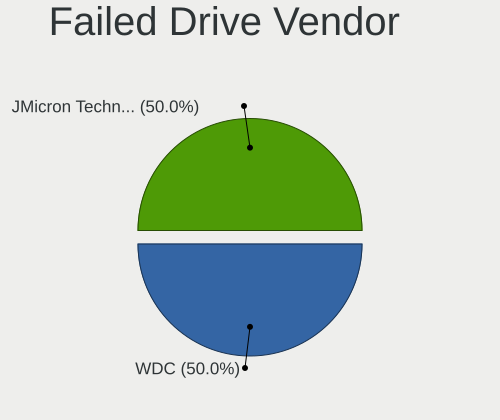

| Vendor             | Computers | Drives | Percent |
|--------------------|-----------|--------|---------|
| WDC                | 1         | 1      | 50%     |
| JMicron Technology | 1         | 1      | 50%     |

Drive Status
------------

Number of failed and malfunc. drives

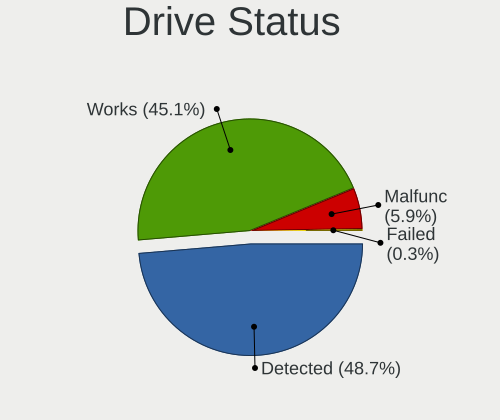

| Status   | Computers | Drives | Percent |
|----------|-----------|--------|---------|
| Detected | 344       | 648    | 48.66%  |
| Works    | 319       | 657    | 45.12%  |
| Malfunc  | 42        | 64     | 5.94%   |
| Failed   | 2         | 2      | 0.28%   |

Storage controller
------------------

Storage Vendor
--------------

Storage controller vendors

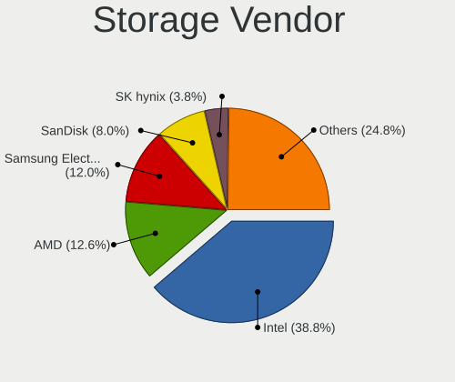

| Vendor                                  | Computers | Percent |
|-----------------------------------------|-----------|---------|
| Intel                                   | 348       | 38.75%  |
| AMD                                     | 113       | 12.58%  |
| Samsung Electronics                     | 108       | 12.03%  |
| SanDisk                                 | 72        | 8.02%   |
| SK hynix                                | 34        | 3.79%   |
| Micron Technology                       | 26        | 2.9%    |
| Micron/Crucial Technology               | 21        | 2.34%   |
| Phison Electronics                      | 19        | 2.12%   |
| Kingston Technology Company             | 18        | 2%      |
| ASMedia Technology                      | 16        | 1.78%   |
| Silicon Motion                          | 15        | 1.67%   |
| Toshiba America Info Systems            | 14        | 1.56%   |
| KIOXIA                                  | 13        | 1.45%   |
| Shenzhen Longsys Electronics            | 12        | 1.34%   |
| MAXIO Technology (Hangzhou)             | 11        | 1.22%   |
| Yangtze Memory Technologies             | 9         | 1%      |
| ADATA Technology                        | 6         | 0.67%   |
| Realtek Semiconductor                   | 5         | 0.56%   |
| Shenzhen Unionmemory Information System | 4         | 0.45%   |
| Marvell Technology Group                | 4         | 0.45%   |
| Seagate Technology                      | 3         | 0.33%   |
| Nvidia                                  | 3         | 0.33%   |
| Lenovo                                  | 3         | 0.33%   |
| Union Memory (Shenzhen)                 | 2         | 0.22%   |
| Transcend                               | 2         | 0.22%   |
| JMicron Technology                      | 2         | 0.22%   |
| INNOGRIT                                | 2         | 0.22%   |
| Hosin Global Electronics                | 2         | 0.22%   |
| Broadcom / LSI                          | 2         | 0.22%   |
| Biwin Storage Technology                | 2         | 0.22%   |
| Adaptec                                 | 2         | 0.22%   |
| VIA Technologies                        | 1         | 0.11%   |
| Solid State Storage Technology          | 1         | 0.11%   |
| Red Hat                                 | 1         | 0.11%   |
| Apple                                   | 1         | 0.11%   |
| Unknown                                 | 1         | 0.11%   |

Storage Model
-------------

Storage controller models

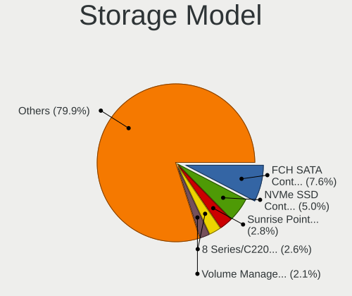

| Model                                                                          | Computers | Percent |
|--------------------------------------------------------------------------------|-----------|---------|
| AMD FCH SATA Controller [AHCI mode]                                            | 74        | 7.62%   |
| Samsung NVMe SSD Controller SM981/PM981/PM983                                  | 49        | 5.05%   |
| Intel Sunrise Point-LP SATA Controller [AHCI mode]                             | 27        | 2.78%   |
| Intel 8 Series/C220 Series Chipset Family 6-port SATA Controller 1 [AHCI mode] | 25        | 2.57%   |
| Intel Volume Management Device NVMe RAID Controller                            | 20        | 2.06%   |
| Samsung NVMe SSD Controller PM9A1/PM9A3/980PRO                                 | 19        | 1.96%   |
| Intel 7 Series Chipset Family 6-port SATA Controller [AHCI mode]               | 19        | 1.96%   |
| Samsung NVMe SSD Controller 980 (DRAM-less)                                    | 17        | 1.75%   |
| Intel 6 Series/C200 Series Chipset Family 6 port Mobile SATA AHCI Controller   | 17        | 1.75%   |
| SK hynix Gold P31/BC711/PC711 NVMe Solid State Drive                           | 15        | 1.54%   |
| Intel SATA Controller [RAID mode]                                              | 14        | 1.44%   |
| Intel 82801 Mobile SATA Controller [RAID mode]                                 | 14        | 1.44%   |
| Silicon Motion SM2263EN/SM2263XT (DRAM-less) NVMe SSD Controllers              | 13        | 1.34%   |
| ASMedia ASM1061/ASM1062 Serial ATA Controller                                  | 13        | 1.34%   |
| AMD 600 Series Chipset SATA Controller                                         | 13        | 1.34%   |
| SanDisk Extreme Pro / WD Black SN750 / PC SN730 / Red SN700 NVMe SSD           | 12        | 1.24%   |
| Micron/Crucial P2 [Nick P2] / P3 / P3 Plus NVMe PCIe SSD (DRAM-less)           | 12        | 1.24%   |
| Intel 6 Series/C200 Series Chipset Family 6 port Desktop SATA AHCI Controller  | 12        | 1.24%   |
| AMD 500 Series Chipset SATA Controller                                         | 12        | 1.24%   |
| Intel Cannon Lake PCH SATA AHCI Controller                                     | 11        | 1.13%   |
| Intel Alder Lake-S PCH SATA Controller [AHCI Mode]                             | 11        | 1.13%   |
| Intel 200 Series PCH SATA controller [AHCI mode]                               | 11        | 1.13%   |
| AMD 400 Series Chipset SATA Controller                                         | 11        | 1.13%   |
| SanDisk Ultra 3D / WD PC SN530, IX SN530, Blue SN550 NVMe SSD (DRAM-less)      | 10        | 1.03%   |
| Intel Tiger Lake-LP SATA Controller                                            | 10        | 1.03%   |
| Intel Celeron/Pentium Silver Processor SATA Controller                         | 10        | 1.03%   |
| Intel Cannon Lake Mobile PCH SATA AHCI Controller                              | 10        | 1.03%   |
| Samsung NVMe SSD Controller SM961/PM961/SM963                                  | 9         | 0.93%   |
| Sandisk WD Black SN850X NVMe SSD                                               | 8         | 0.82%   |
| SanDisk Extreme Pro / WD Black 2018/SN750/PC SN720 NVMe SSD                    | 8         | 0.82%   |
| Intel SSD 660P Series                                                          | 8         | 0.82%   |
| Intel Q170/Q150/B150/H170/H110/Z170/CM236 Chipset SATA Controller [AHCI Mode]  | 8         | 0.82%   |
| Intel Atom Processor E3800 Series SATA AHCI Controller                         | 8         | 0.82%   |
| Intel 8 Series SATA Controller 1 [AHCI mode]                                   | 8         | 0.82%   |
| SanDisk WD SN560/SN740/SN770/SN5000 NVMe SSD                                   | 7         | 0.72%   |
| Samsung NVMe SSD Controller S4LV008[Pascal]                                    | 7         | 0.72%   |
| Phison PS5013-E13 PCIe3 NVMe Controller (DRAM-less)                            | 7         | 0.72%   |
| Micron 2550 NVMe SSD (DRAM-less)                                               | 7         | 0.72%   |
| MAXIO (Hangzhou) NVMe SSD Controller MAP1202 (DRAM-less)                       | 7         | 0.72%   |
| KIOXIA NVMe SSD Controller BG4 (DRAM-less)                                     | 7         | 0.72%   |

Storage Kind
------------

Kind of storage controller (IDE, SATA, NVMe, SAS, ...)

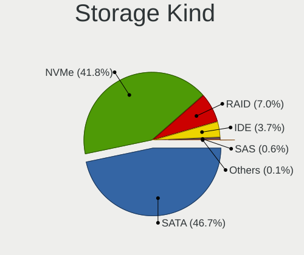

| Kind | Computers | Percent |
|------|-----------|---------|
| SATA | 399       | 46.72%  |
| NVMe | 357       | 41.8%   |
| RAID | 60        | 7.03%   |
| IDE  | 32        | 3.75%   |
| SAS  | 5         | 0.59%   |
| SCSI | 1         | 0.12%   |

Processor
---------

CPU Vendor
----------

Processor vendors

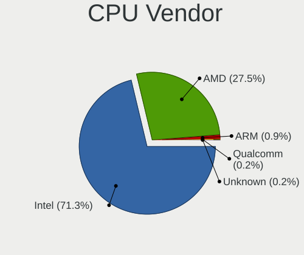

| Vendor   | Computers | Percent |
|----------|-----------|---------|
| Intel    | 454       | 71.27%  |
| AMD      | 175       | 27.47%  |
| ARM      | 6         | 0.94%   |
| Qualcomm | 1         | 0.16%   |
| Unknown  | 1         | 0.16%   |

CPU Model
---------

Processor models

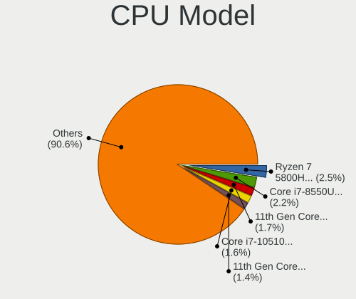

| Model                                         | Computers | Percent |
|-----------------------------------------------|-----------|---------|
| AMD Ryzen 7 5800H with Radeon Graphics        | 16        | 2.51%   |
| Intel Core i7-8550U CPU @ 1.80GHz             | 14        | 2.19%   |
| Intel 11th Gen Core i5-1135G7 @ 2.40GHz       | 11        | 1.72%   |
| Intel Core i7-10510U CPU @ 1.80GHz            | 10        | 1.57%   |
| Intel 11th Gen Core i7-1165G7 @ 2.80GHz       | 9         | 1.41%   |
| Intel 12th Gen Core i7-12700H                 | 8         | 1.25%   |
| Intel Core i7-8565U CPU @ 1.80GHz             | 7         | 1.1%    |
| Intel Core i5-8250U CPU @ 1.60GHz             | 7         | 1.1%    |
| AMD Ryzen 5 5600X 6-Core Processor            | 7         | 1.1%    |
| Intel Core i7-9750H CPU @ 2.60GHz             | 6         | 0.94%   |
| Intel Core i5-4200U CPU @ 1.60GHz             | 6         | 0.94%   |
| AMD Ryzen 7 8845HS w/ Radeon 780M Graphics    | 6         | 0.94%   |
| Intel Core i7-8750H CPU @ 2.20GHz             | 5         | 0.78%   |
| Intel Core i7-7500U CPU @ 2.70GHz             | 5         | 0.78%   |
| Intel Core i7-6700HQ CPU @ 2.60GHz            | 5         | 0.78%   |
| Intel Core i7-1065G7 CPU @ 1.30GHz            | 5         | 0.78%   |
| Intel Core i5-8400 CPU @ 2.80GHz              | 5         | 0.78%   |
| Intel Core i5-8265U CPU @ 1.60GHz             | 5         | 0.78%   |
| AMD Ryzen 7 5700U with Radeon Graphics        | 5         | 0.78%   |
| AMD Ryzen 5 5600G with Radeon Graphics        | 5         | 0.78%   |
| Intel Core i5-6500 CPU @ 3.20GHz              | 4         | 0.63%   |
| Intel Core i5-3470 CPU @ 3.20GHz              | 4         | 0.63%   |
| Intel Core i5-3210M CPU @ 2.50GHz             | 4         | 0.63%   |
| Intel Core i5-2520M CPU @ 2.50GHz             | 4         | 0.63%   |
| Intel Celeron CPU N3350 @ 1.10GHz             | 4         | 0.63%   |
| ARM Processor                                 | 4         | 0.63%   |
| AMD Ryzen 9 5900X 12-Core Processor           | 4         | 0.63%   |
| AMD Ryzen 7 3700X 8-Core Processor            | 4         | 0.63%   |
| AMD Ryzen 5 3500U with Radeon Vega Mobile Gfx | 4         | 0.63%   |
| AMD Custom APU 0405                           | 4         | 0.63%   |
| Intel Core i9-14900K                          | 3         | 0.47%   |
| Intel Core i9-14900HX                         | 3         | 0.47%   |
| Intel Core i7-6500U CPU @ 2.50GHz             | 3         | 0.47%   |
| Intel Core i7-3770 CPU @ 3.40GHz              | 3         | 0.47%   |
| Intel Core i7-2600 CPU @ 3.40GHz              | 3         | 0.47%   |
| Intel Core i7-10710U CPU @ 1.10GHz            | 3         | 0.47%   |
| Intel Core i5-8350U CPU @ 1.70GHz             | 3         | 0.47%   |
| Intel Core i5-7200U CPU @ 2.50GHz             | 3         | 0.47%   |
| Intel Core i5-6300U CPU @ 2.40GHz             | 3         | 0.47%   |
| Intel Core i5-4570 CPU @ 3.20GHz              | 3         | 0.47%   |

CPU Model Family
----------------

Processor model prefix

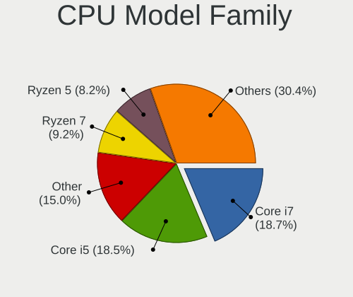

| Model                   | Computers | Percent |
|-------------------------|-----------|---------|
| Intel Core i7           | 119       | 18.65%  |
| Intel Core i5           | 118       | 18.5%   |
| Other                   | 96        | 15.05%  |
| AMD Ryzen 7             | 59        | 9.25%   |
| AMD Ryzen 5             | 52        | 8.15%   |
| Intel Celeron           | 27        | 4.23%   |
| Intel Xeon              | 26        | 4.08%   |
| AMD Ryzen 9             | 19        | 2.98%   |
| Intel Core i3           | 17        | 2.66%   |
| Intel Core i9           | 12        | 1.88%   |
| Intel Core 2 Duo        | 12        | 1.88%   |
| Intel Core              | 9         | 1.41%   |
| Intel Atom              | 7         | 1.1%    |
| AMD Ryzen 7 PRO         | 7         | 1.1%    |
| Intel Pentium Silver    | 5         | 0.78%   |
| Intel Pentium           | 5         | 0.78%   |
| AMD Ryzen Threadripper  | 4         | 0.63%   |
| AMD Ryzen 3             | 4         | 0.63%   |
| Intel Pentium Dual      | 3         | 0.47%   |
| Intel Core m3           | 3         | 0.47%   |
| Intel Core 2 Quad       | 3         | 0.47%   |
| AMD Athlon              | 3         | 0.47%   |
| Intel Pentium Gold      | 2         | 0.31%   |
| ARM BCM                 | 2         | 0.31%   |
| AMD Ryzen 5 PRO         | 2         | 0.31%   |
| AMD PRO A10             | 2         | 0.31%   |
| AMD Opteron             | 2         | 0.31%   |
| AMD FX                  | 2         | 0.31%   |
| AMD E2                  | 2         | 0.31%   |
| AMD A10                 | 2         | 0.31%   |
| Intel Xeon Silver       | 1         | 0.16%   |
| Intel Pentium Dual-Core | 1         | 0.16%   |
| Intel Pentium 4         | 1         | 0.16%   |
| Intel Core m7           | 1         | 0.16%   |
| Intel Core 2            | 1         | 0.16%   |
| AMD Turion 64 X2 Mobile | 1         | 0.16%   |
| AMD Phenom II X6        | 1         | 0.16%   |
| AMD Phenom II X4        | 1         | 0.16%   |
| AMD E1                  | 1         | 0.16%   |
| AMD E                   | 1         | 0.16%   |

CPU Cores
---------

Number of processor cores

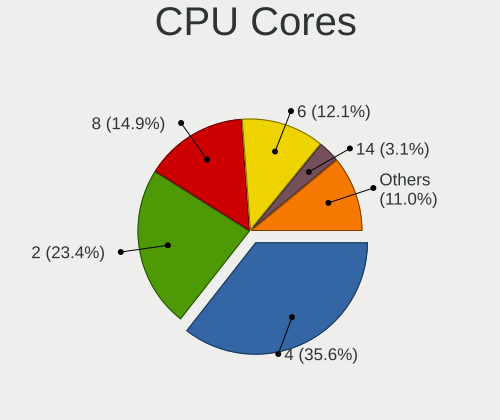

| Number | Computers | Percent |
|--------|-----------|---------|
| 4      | 227       | 35.58%  |
| 2      | 149       | 23.35%  |
| 8      | 95        | 14.89%  |
| 6      | 77        | 12.07%  |
| 14     | 20        | 3.13%   |
| 12     | 18        | 2.82%   |
| 16     | 15        | 2.35%   |
| 10     | 13        | 2.04%   |
| 24     | 11        | 1.72%   |
| 1      | 4         | 0.63%   |
| 32     | 3         | 0.47%   |
| 56     | 1         | 0.16%   |
| 44     | 1         | 0.16%   |
| 22     | 1         | 0.16%   |
| 20     | 1         | 0.16%   |
| 5      | 1         | 0.16%   |
| 3      | 1         | 0.16%   |

CPU Sockets
-----------

Number of sockets

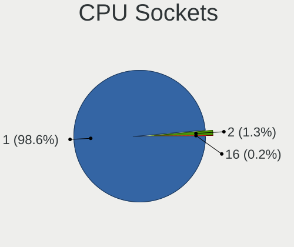

| Number | Computers | Percent |
|--------|-----------|---------|
| 1      | 628       | 98.59%  |
| 2      | 8         | 1.26%   |
| 16     | 1         | 0.16%   |

CPU Threads
-----------

Threads per core (Hyper-Threading)

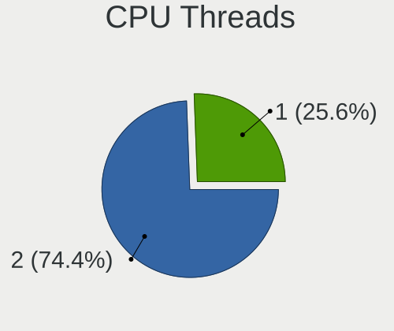

| Number | Computers | Percent |
|--------|-----------|---------|
| 2      | 477       | 74.41%  |
| 1      | 164       | 25.59%  |

CPU Op-Modes
------------

CPU Operation Modes (32-bit, 64-bit)

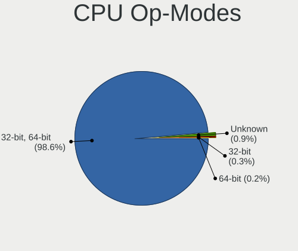

| Op mode        | Computers | Percent |
|----------------|-----------|---------|
| 32-bit, 64-bit | 628       | 98.59%  |
| Unknown        | 6         | 0.94%   |
| 32-bit         | 2         | 0.31%   |
| 64-bit         | 1         | 0.16%   |

CPU Microcode
-------------

Microcode number

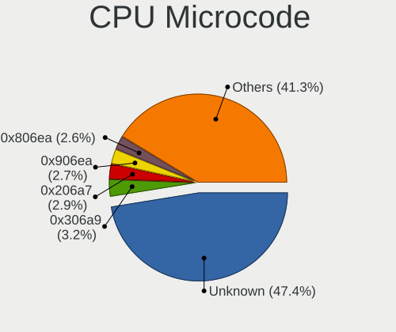

| Number     | Computers | Percent |
|------------|-----------|---------|
| Unknown    | 316       | 47.45%  |
| 0x306a9    | 21        | 3.15%   |
| 0x206a7    | 19        | 2.85%   |
| 0x906ea    | 18        | 2.7%    |
| 0x806ea    | 17        | 2.55%   |
| 0x306c3    | 16        | 2.4%    |
| 0x806ec    | 14        | 2.1%    |
| 0x806c1    | 13        | 1.95%   |
| 0x0a50000c | 12        | 1.8%    |
| 0x506e3    | 11        | 1.65%   |
| 0x806e9    | 8         | 1.2%    |
| 0x20655    | 8         | 1.2%    |
| 0x806eb    | 7         | 1.05%   |
| 0x40651    | 7         | 1.05%   |
| 0x6fd      | 6         | 0.9%    |
| 0x406e3    | 6         | 0.9%    |
| 0x306d4    | 6         | 0.9%    |
| 0x1067a    | 6         | 0.9%    |
| 0x08701021 | 6         | 0.9%    |
| 0x0a404102 | 5         | 0.75%   |
| 0x08108109 | 5         | 0.75%   |
| 0x906e9    | 4         | 0.6%    |
| 0x906c0    | 4         | 0.6%    |
| 0x90672    | 4         | 0.6%    |
| 0x806d1    | 4         | 0.6%    |
| 0x706a1    | 4         | 0.6%    |
| 0x50654    | 4         | 0.6%    |
| 0x306e4    | 4         | 0.6%    |
| 0x08600106 | 4         | 0.6%    |
| 0xa0652    | 3         | 0.45%   |
| 0x906ed    | 3         | 0.45%   |
| 0x806c2    | 3         | 0.45%   |
| 0x706e5    | 3         | 0.45%   |
| 0x506ca    | 3         | 0.45%   |
| 0x406c3    | 3         | 0.45%   |
| 0x40661    | 3         | 0.45%   |
| 0x0a601203 | 3         | 0.45%   |
| 0x0a50000d | 3         | 0.45%   |
| 0x0a20120a | 3         | 0.45%   |
| 0x0a201016 | 3         | 0.45%   |

CPU Microarch
-------------

Microarchitecture

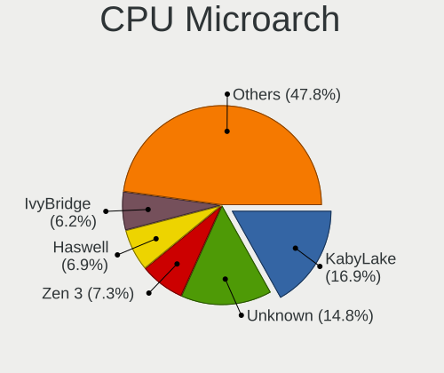

| Name              | Computers | Percent |
|-------------------|-----------|---------|
| KabyLake          | 108       | 16.88%  |
| Unknown           | 95        | 14.84%  |
| Zen 3             | 47        | 7.34%   |
| Haswell           | 44        | 6.88%   |
| IvyBridge         | 40        | 6.25%   |
| Alderlake Hybrid  | 33        | 5.16%   |
| Zen 2             | 29        | 4.53%   |
| SandyBridge       | 29        | 4.53%   |
| TigerLake         | 27        | 4.22%   |
| Skylake           | 26        | 4.06%   |
| Zen+              | 17        | 2.66%   |
| CometLake         | 14        | 2.19%   |
| Broadwell         | 13        | 2.03%   |
| Silvermont        | 12        | 1.88%   |
| Icelake           | 12        | 1.88%   |
| Westmere          | 11        | 1.72%   |
| Penryn            | 10        | 1.56%   |
| Goldmont plus     | 10        | 1.56%   |
| Core              | 10        | 1.56%   |
| Zen               | 7         | 1.09%   |
| Goldmont          | 7         | 1.09%   |
| Tremont           | 5         | 0.78%   |
| Excavator         | 5         | 0.78%   |
| Meteorlake Hybrid | 4         | 0.63%   |
| Gracemont         | 4         | 0.63%   |
| Steamroller       | 3         | 0.47%   |
| K10               | 3         | 0.47%   |
| Puma              | 2         | 0.31%   |
| Piledriver        | 2         | 0.31%   |
| Nehalem           | 2         | 0.31%   |
| Bonnell           | 2         | 0.31%   |
| Bobcat            | 2         | 0.31%   |
| Sapphire Rapids   | 1         | 0.16%   |
| NetBurst          | 1         | 0.16%   |
| K8 Hammer         | 1         | 0.16%   |
| Jaguar            | 1         | 0.16%   |
| Bulldozer         | 1         | 0.16%   |

Graphics
--------

GPU Vendor
----------

Vendors of graphics cards

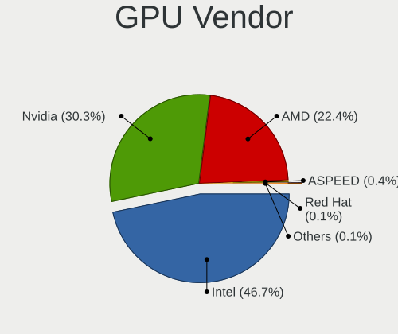

| Vendor                     | Computers | Percent |
|----------------------------|-----------|---------|
| Intel                      | 378       | 46.72%  |
| Nvidia                     | 245       | 30.28%  |
| AMD                        | 181       | 22.37%  |
| ASPEED Technology          | 3         | 0.37%   |
| Red Hat                    | 1         | 0.12%   |
| Matrox Electronics Systems | 1         | 0.12%   |

GPU Model
---------

Graphics card models

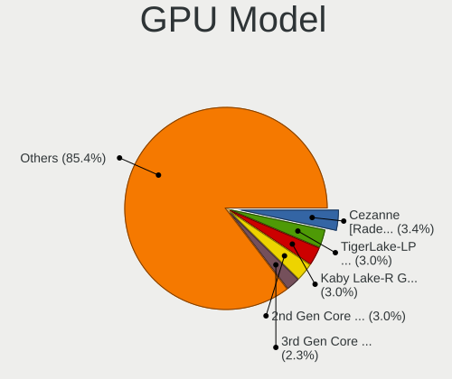

| Model                                                                       | Computers | Percent |
|-----------------------------------------------------------------------------|-----------|---------|
| AMD Cezanne [Radeon Vega Series / Radeon Vega Mobile Series]                | 28        | 3.36%   |
| Intel TigerLake-LP GT2 [Iris Xe Graphics]                                   | 25        | 3%      |
| Intel Kaby Lake-R GT2 [UHD Graphics 620]                                    | 25        | 3%      |
| Intel 2nd Generation Core Processor Family Integrated Graphics Controller   | 25        | 3%      |
| Intel 3rd Gen Core processor Graphics Controller                            | 19        | 2.28%   |
| AMD Picasso/Raven 2 [Radeon Vega Series / Radeon Vega Mobile Series]        | 15        | 1.8%    |
| Intel WhiskeyLake-U GT2 [UHD Graphics 620]                                  | 14        | 1.68%   |
| Intel CometLake-U GT2 [UHD Graphics]                                        | 14        | 1.68%   |
| Intel CoffeeLake-H GT2 [UHD Graphics 630]                                   | 13        | 1.56%   |
| AMD Rembrandt [Radeon 680M]                                                 | 13        | 1.56%   |
| Nvidia GA106M [GeForce RTX 3060 Mobile / Max-Q]                             | 12        | 1.44%   |
| Intel Kaby Lake-U GT2 [HD Graphics 620]                                     | 11        | 1.32%   |
| AMD Renoir [Radeon Vega Series / Radeon Vega Mobile Series]                 | 11        | 1.32%   |
| Intel Xeon E3-1200 v3/4th Gen Core Processor Integrated Graphics Controller | 10        | 1.2%    |
| Intel Haswell-ULT Integrated Graphics Controller                            | 10        | 1.2%    |
| AMD Raphael                                                                 | 9         | 1.08%   |
| Intel GeminiLake [UHD Graphics 600]                                         | 8         | 0.96%   |
| Intel Atom Processor Z36xxx/Z37xxx Series Graphics & Display                | 8         | 0.96%   |
| Intel Alder Lake-P GT2 [Iris Xe Graphics]                                   | 8         | 0.96%   |
| AMD HawkPoint1                                                              | 8         | 0.96%   |
| Nvidia TU117M [GeForce GTX 1650 Mobile / Max-Q]                             | 7         | 0.84%   |
| Nvidia GP108M [GeForce MX150]                                               | 7         | 0.84%   |
| Nvidia GP108BM [GeForce MX250]                                              | 7         | 0.84%   |
| Intel Xeon E3-1200 v2/3rd Gen Core processor Graphics Controller            | 7         | 0.84%   |
| Intel Skylake-U GT2 [HD Graphics 520]                                       | 7         | 0.84%   |
| Intel Raptor Lake-S UHD Graphics                                            | 7         | 0.84%   |
| Intel JasperLake [UHD Graphics]                                             | 7         | 0.84%   |
| Intel CoffeeLake-S GT2 [UHD Graphics 630]                                   | 7         | 0.84%   |
| Intel Skylake-S GT2 [HD Graphics 530]                                       | 6         | 0.72%   |
| Intel Raptor Lake-P [Iris Xe Graphics]                                      | 6         | 0.72%   |
| Intel Mobile GM965/GL960 Integrated Graphics Controller (secondary)         | 6         | 0.72%   |
| Intel Mobile GM965/GL960 Integrated Graphics Controller (primary)           | 6         | 0.72%   |
| Intel CometLake-H GT2 [UHD Graphics]                                        | 6         | 0.72%   |
| Intel Broadwell-U GT2 [HD Graphics 5500]                                    | 6         | 0.72%   |
| Intel 4th Gen Core Processor Integrated Graphics Controller                 | 6         | 0.72%   |
| AMD Phoenix1                                                                | 6         | 0.72%   |
| AMD Navi 23 [Radeon RX 6600/6600 XT/6600M]                                  | 6         | 0.72%   |
| AMD Lucienne                                                                | 6         | 0.72%   |
| AMD Ellesmere [Radeon RX 470/480/570/570X/580/580X/590]                     | 6         | 0.72%   |
| Nvidia GP107 [GeForce GTX 1050 Ti]                                          | 5         | 0.6%    |

GPU Combo
---------

Combinations of graphics cards

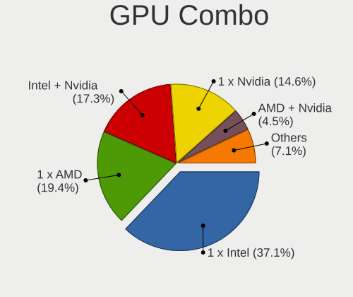

| Name                 | Computers | Percent |
|----------------------|-----------|---------|
| 1 x Intel            | 241       | 37.13%  |
| 1 x AMD              | 126       | 19.41%  |
| Intel + Nvidia       | 112       | 17.26%  |
| 1 x Nvidia           | 95        | 14.64%  |
| AMD + Nvidia         | 29        | 4.47%   |
| Intel + AMD          | 14        | 2.16%   |
| 2 x AMD              | 10        | 1.54%   |
| Other                | 9         | 1.39%   |
| 2 x Nvidia           | 5         | 0.77%   |
| Nvidia + ASPEED      | 3         | 0.46%   |
| 2 x Intel            | 1         | 0.15%   |
| 2 x AMD + 1 x Nvidia | 1         | 0.15%   |
| 1 x Red Hat          | 1         | 0.15%   |
| 1 x Matrox           | 1         | 0.15%   |
| Intel + 2 x Nvidia   | 1         | 0.15%   |

GPU Driver
----------

Free vs proprietary

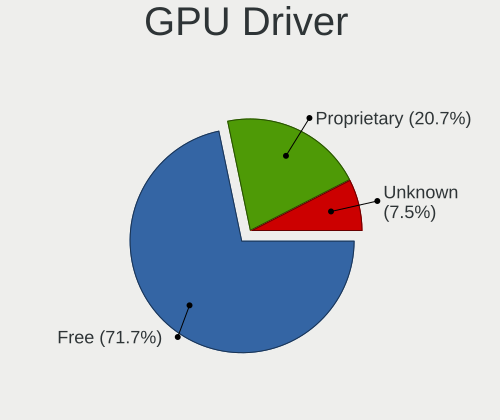

| Driver      | Computers | Percent |
|-------------|-----------|---------|
| Free        | 467       | 71.74%  |
| Proprietary | 135       | 20.74%  |
| Unknown     | 49        | 7.53%   |

GPU Memory
----------

Total video memory

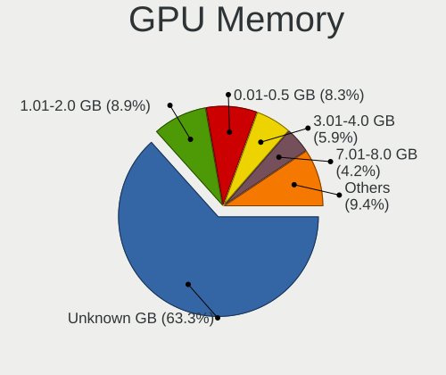

| Size in GB | Computers | Percent |
|------------|-----------|---------|
| Unknown    | 420       | 63.35%  |
| 1.01-2.0   | 59        | 8.9%    |
| 0.01-0.5   | 55        | 8.3%    |
| 3.01-4.0   | 39        | 5.88%   |
| 7.01-8.0   | 28        | 4.22%   |
| 8.01-16.0  | 23        | 3.47%   |
| 0.51-1.0   | 21        | 3.17%   |
| 5.01-6.0   | 12        | 1.81%   |
| 2.01-3.0   | 3         | 0.45%   |
| 16.01-24.0 | 3         | 0.45%   |

Monitor
-------

Monitor Vendor
--------------

Monitor vendors

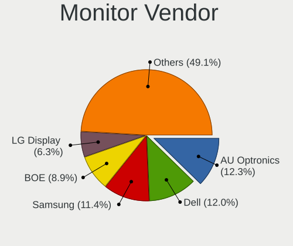

| Vendor               | Computers | Percent |
|----------------------|-----------|---------|
| AU Optronics         | 86        | 12.3%   |
| Dell                 | 84        | 12.02%  |
| Samsung Electronics  | 80        | 11.44%  |
| BOE                  | 62        | 8.87%   |
| LG Display           | 44        | 6.29%   |
| Chimei Innolux       | 43        | 6.15%   |
| Acer                 | 27        | 3.86%   |
| Philips              | 22        | 3.15%   |
| Apple                | 22        | 3.15%   |
| Sharp                | 21        | 3%      |
| Goldstar             | 19        | 2.72%   |
| Hewlett-Packard      | 17        | 2.43%   |
| Lenovo               | 14        | 2%      |
| AOC                  | 11        | 1.57%   |
| Denver               | 9         | 1.29%   |
| Mi                   | 8         | 1.14%   |
| InfoVision           | 8         | 1.14%   |
| CSO                  | 8         | 1.14%   |
| ViewSonic            | 7         | 1%      |
| PANDA                | 6         | 0.86%   |
| Pixio                | 5         | 0.72%   |
| BenQ                 | 5         | 0.72%   |
| Ancor Communications | 5         | 0.72%   |
| Valve                | 4         | 0.57%   |
| Toshiba              | 4         | 0.57%   |
| TMA                  | 4         | 0.57%   |
| PRISM+               | 4         | 0.57%   |
| CSOT                 | 4         | 0.57%   |
| ASUSTek Computer     | 4         | 0.57%   |
| YMK                  | 3         | 0.43%   |
| Sony                 | 3         | 0.43%   |
| MSI                  | 3         | 0.43%   |
| LG Electronics       | 3         | 0.43%   |
| Unknown              | 3         | 0.43%   |
| Unknown (XXX)        | 2         | 0.29%   |
| TMX                  | 2         | 0.29%   |
| RTK                  | 2         | 0.29%   |
| LG Philips           | 2         | 0.29%   |
| Lenovo Group Limited | 2         | 0.29%   |
| IPS                  | 2         | 0.29%   |

Monitor Model
-------------

Monitor models

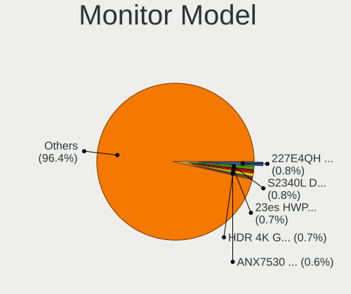

| Model                                                                  | Computers | Percent |
|------------------------------------------------------------------------|-----------|---------|
| Philips 227E4QH PHLC0AA 1920x1080 477x268mm 21.5-inch                  | 6         | 0.83%   |
| Dell S2340L DELD058 1920x1080 509x286mm 23.0-inch                      | 6         | 0.83%   |
| Hewlett-Packard 23es HWP331E 1920x1080 509x286mm 23.0-inch             | 5         | 0.7%    |
| Goldstar HDR 4K GSM7706 3840x2160 600x340mm 27.2-inch                  | 5         | 0.7%    |
| Valve ANX7530 U VLV3001 800x1280 100x150mm 7.1-inch                    | 4         | 0.56%   |
| Pixio SFP2702G FHD WAM2700 1920x1080 597x336mm 27.0-inch               | 4         | 0.56%   |
| LG Display LCD Monitor LGD046F 1920x1080 344x194mm 15.5-inch           | 4         | 0.56%   |
| Dell E2011H DEL406B 1600x900 443x249mm 20.0-inch                       | 4         | 0.56%   |
| AU Optronics LCD Monitor AUO403D 1920x1080 309x174mm 14.0-inch         | 4         | 0.56%   |
| Acer EB321HQU C ACR0507 2560x1440 699x393mm 31.6-inch                  | 4         | 0.56%   |
| YMK EM160 TOUCH YMK4A68 2880x1800 342x220mm 16.0-inch                  | 3         | 0.42%   |
| Samsung Electronics S24R35xFZ SAM71A8 1920x1080 521x293mm 23.5-inch    | 3         | 0.42%   |
| Samsung Electronics LCD Monitor SDC4161 1920x1080 344x194mm 15.5-inch  | 3         | 0.42%   |
| Samsung Electronics C24F390 SAM0D2C 1920x1080 521x293mm 23.5-inch      | 3         | 0.42%   |
| Mi Monitor XMI23CB 1920x1080 527x296mm 23.8-inch                       | 3         | 0.42%   |
| Denver MO-HHS-32C LHCFFFF 1920x1080 699x393mm 31.6-inch                | 3         | 0.42%   |
| Dell SE2417HG DELD08E 1920x1080 521x293mm 23.5-inch                    | 3         | 0.42%   |
| Dell P2421D DELD0FF 2560x1440 527x296mm 23.8-inch                      | 3         | 0.42%   |
| Dell D2015H DELF063 1920x1080 435x239mm 19.5-inch                      | 3         | 0.42%   |
| AU Optronics LCD Monitor AUO633D 1920x1080 310x170mm 13.9-inch         | 3         | 0.42%   |
| AU Optronics LCD Monitor AUO408D 1920x1080 309x174mm 14.0-inch         | 3         | 0.42%   |
| AU Optronics LCD Monitor AUO303C 1366x768 309x173mm 13.9-inch          | 3         | 0.42%   |
| Apple Color LCD APP9CC7 1280x800 286x179mm 13.3-inch                   | 3         | 0.42%   |
| Unknown                                                                | 3         | 0.42%   |
| Toshiba T749-fHD720 TSB8801 1920x1080 708x398mm 32.0-inch              | 2         | 0.28%   |
| TMA TL140ADXP24-0 TMA2004 2880x1800 300x190mm 14.0-inch                | 2         | 0.28%   |
| Samsung Electronics S27F350 SAM0D22 1920x1080 598x336mm 27.0-inch      | 2         | 0.28%   |
| Samsung Electronics S24D300 SAM0B45 1920x1080 521x293mm 23.5-inch      | 2         | 0.28%   |
| Samsung Electronics LCD Monitor SEC3358 1280x800 331x207mm 15.4-inch   | 2         | 0.28%   |
| Samsung Electronics LCD Monitor SEC3047 1366x768 277x156mm 12.5-inch   | 2         | 0.28%   |
| Samsung Electronics LCD Monitor SDC416D 2880x1800 312x195mm 14.5-inch  | 2         | 0.28%   |
| Samsung Electronics LCD Monitor SAM0F18 3840x2160 950x540mm 43.0-inch  | 2         | 0.28%   |
| Samsung Electronics LCD Monitor SAM0902 1920x1080 890x500mm 40.2-inch  | 2         | 0.28%   |
| Samsung Electronics C27F390 SAM0D32 1920x1080 598x336mm 27.0-inch      | 2         | 0.28%   |
| Samsung Electronics ATNA60CL10-0 SDC41AF 2880x1800 344x215mm 16.0-inch | 2         | 0.28%   |
| PRISM+ K3A8F HDMI INN3200 1920x1080 698x393mm 31.5-inch                | 2         | 0.28%   |
| PANDA LM133LF1L02 NCP0019 1920x1080 294x165mm 13.3-inch                | 2         | 0.28%   |
| PANDA LCD Monitor NCP004D 1920x1080 344x194mm 15.5-inch                | 2         | 0.28%   |
| Mi Monitor XMI23C3 1920x1080 527x293mm 23.7-inch                       | 2         | 0.28%   |
| LG Philips LCD Monitor LPL8D00 1280x800 304x190mm 14.1-inch            | 2         | 0.28%   |

Monitor Resolution
------------------

Monitor screen resolution

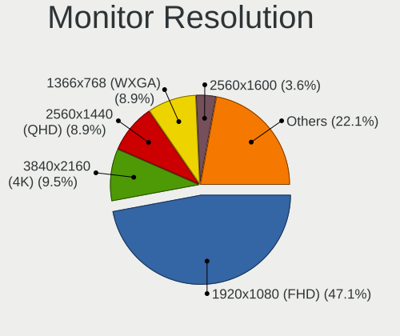

| Resolution         | Computers | Percent |
|--------------------|-----------|---------|
| 1920x1080 (FHD)    | 313       | 47.07%  |
| 3840x2160 (4K)     | 63        | 9.47%   |
| 2560x1440 (QHD)    | 59        | 8.87%   |
| 1366x768 (WXGA)    | 59        | 8.87%   |
| 2560x1600          | 24        | 3.61%   |
| 2880x1800          | 22        | 3.31%   |
| 1920x1200 (WUXGA)  | 20        | 3.01%   |
| 1600x900 (HD+)     | 19        | 2.86%   |
| 1280x800 (WXGA)    | 14        | 2.11%   |
| 3440x1440          | 8         | 1.2%    |
| 1360x768           | 6         | 0.9%    |
| 3840x2400          | 5         | 0.75%   |
| 1440x900 (WXGA+)   | 5         | 0.75%   |
| Unknown            | 5         | 0.75%   |
| 800x1280           | 4         | 0.6%    |
| 3200x1800 (QHD+)   | 4         | 0.6%    |
| 3072x1920          | 4         | 0.6%    |
| 3000x2000          | 4         | 0.6%    |
| 1680x1050 (WSXGA+) | 4         | 0.6%    |
| 1280x1024 (SXGA)   | 3         | 0.45%   |
| 3840x1080          | 2         | 0.3%    |
| 2560x1080          | 2         | 0.3%    |
| 2520x1680          | 2         | 0.3%    |
| 2240x1400          | 2         | 0.3%    |
| 7680x2160          | 1         | 0.15%   |
| 3840x1600          | 1         | 0.15%   |
| 3286x1080          | 1         | 0.15%   |
| 3200x2000          | 1         | 0.15%   |
| 2880x1920          | 1         | 0.15%   |
| 2736x1824          | 1         | 0.15%   |
| 2560x1397          | 1         | 0.15%   |
| 2496x1664          | 1         | 0.15%   |
| 2160x1440          | 1         | 0.15%   |
| 2048x1280          | 1         | 0.15%   |
| 1920x515           | 1         | 0.15%   |
| 1024x600           | 1         | 0.15%   |

Monitor Diagonal
----------------

Diagonal size in inches

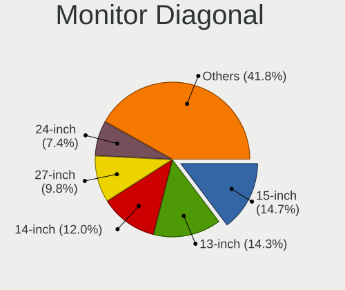

| Inches  | Computers | Percent |
|---------|-----------|---------|
| 15      | 102       | 14.72%  |
| 13      | 99        | 14.29%  |
| 14      | 83        | 11.98%  |
| 27      | 68        | 9.81%   |
| 24      | 51        | 7.36%   |
| 23      | 49        | 7.07%   |
| 21      | 33        | 4.76%   |
| 16      | 33        | 4.76%   |
| Unknown | 28        | 4.04%   |
| 31      | 19        | 2.74%   |
| 12      | 15        | 2.16%   |
| 20      | 12        | 1.73%   |
| 11      | 12        | 1.73%   |
| 19      | 11        | 1.59%   |
| 32      | 7         | 1.01%   |
| 18      | 7         | 1.01%   |
| 17      | 7         | 1.01%   |
| 54      | 6         | 0.87%   |
| 34      | 6         | 0.87%   |
| 40      | 5         | 0.72%   |
| 49      | 4         | 0.58%   |
| 28      | 4         | 0.58%   |
| 7       | 4         | 0.58%   |
| 84      | 3         | 0.43%   |
| 65      | 2         | 0.29%   |
| 63      | 2         | 0.29%   |
| 26      | 2         | 0.29%   |
| 25      | 2         | 0.29%   |
| 22      | 2         | 0.29%   |
| 72      | 1         | 0.14%   |
| 57      | 1         | 0.14%   |
| 55      | 1         | 0.14%   |
| 52      | 1         | 0.14%   |
| 50      | 1         | 0.14%   |
| 43      | 1         | 0.14%   |
| 42      | 1         | 0.14%   |
| 39      | 1         | 0.14%   |
| 37      | 1         | 0.14%   |
| 36      | 1         | 0.14%   |
| 35      | 1         | 0.14%   |

Monitor Width
-------------

Physical width

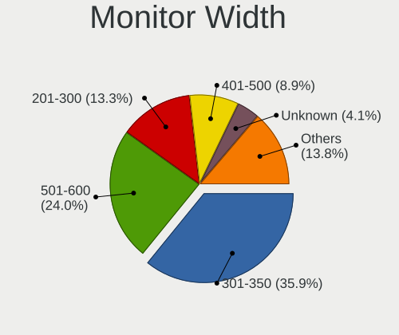

| Width in mm | Computers | Percent |
|-------------|-----------|---------|
| 301-350     | 245       | 35.87%  |
| 501-600     | 164       | 24.01%  |
| 201-300     | 91        | 13.32%  |
| 401-500     | 61        | 8.93%   |
| Unknown     | 28        | 4.1%    |
| 601-700     | 26        | 3.81%   |
| 1001-1500   | 18        | 2.64%   |
| 351-400     | 16        | 2.34%   |
| 701-800     | 15        | 2.2%    |
| 801-900     | 8         | 1.17%   |
| 1501-2000   | 4         | 0.59%   |
| 1-100       | 4         | 0.59%   |
| 901-1000    | 2         | 0.29%   |
| 101-200     | 1         | 0.15%   |

Aspect Ratio
------------

Proportional relationship between the width and the height

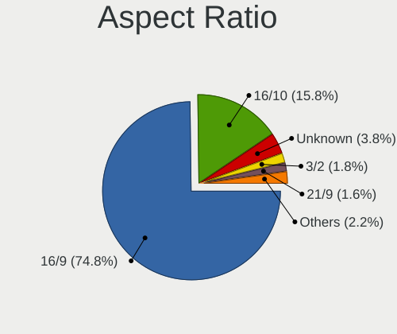

| Ratio   | Computers | Percent |
|---------|-----------|---------|
| 16/9    | 469       | 74.8%   |
| 16/10   | 99        | 15.79%  |
| Unknown | 24        | 3.83%   |
| 3/2     | 11        | 1.75%   |
| 21/9    | 10        | 1.59%   |
| 32/9    | 4         | 0.64%   |
| 0.67    | 4         | 0.64%   |
| 5/4     | 3         | 0.48%   |
| 6/5     | 1         | 0.16%   |
| 3.73    | 1         | 0.16%   |
| 0.62    | 1         | 0.16%   |

Monitor Area
------------

Area in inch²

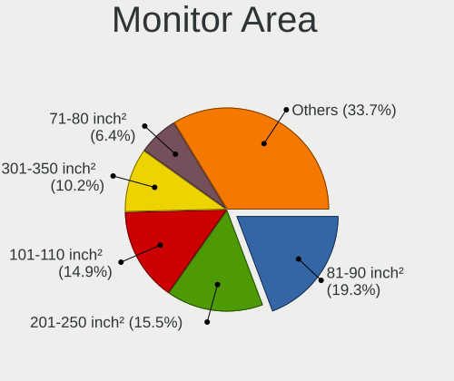

| Area in inch² | Computers | Percent |
|----------------|-----------|---------|
| 81-90          | 132       | 19.27%  |
| 201-250        | 106       | 15.47%  |
| 101-110        | 102       | 14.89%  |
| 301-350        | 70        | 10.22%  |
| 71-80          | 44        | 6.42%   |
| 351-500        | 38        | 5.55%   |
| 151-200        | 33        | 4.82%   |
| 111-120        | 32        | 4.67%   |
| Unknown        | 28        | 4.09%   |
| More than 1000 | 18        | 2.63%   |
| 251-300        | 16        | 2.34%   |
| 61-70          | 15        | 2.19%   |
| 501-1000       | 14        | 2.04%   |
| 51-60          | 12        | 1.75%   |
| 141-150        | 7         | 1.02%   |
| 91-100         | 6         | 0.88%   |
| 1-40           | 5         | 0.73%   |
| 121-130        | 5         | 0.73%   |
| 41-50          | 1         | 0.15%   |
| 131-140        | 1         | 0.15%   |

Pixel Density
-------------

Pixels per inch

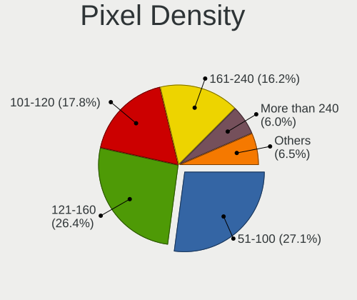

| Density       | Computers | Percent |
|---------------|-----------|---------|
| 51-100        | 184       | 27.1%   |
| 121-160       | 179       | 26.36%  |
| 101-120       | 121       | 17.82%  |
| 161-240       | 110       | 16.2%   |
| More than 240 | 41        | 6.04%   |
| Unknown       | 28        | 4.12%   |
| 1-50          | 16        | 2.36%   |

Multiple Monitors
-----------------

Total monitors connected

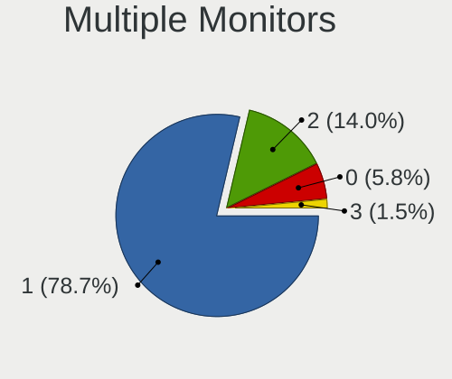

| Total | Computers | Percent |
|-------|-----------|---------|
| 1     | 516       | 78.66%  |
| 2     | 92        | 14.02%  |
| 0     | 38        | 5.79%   |
| 3     | 10        | 1.52%   |

Network
-------

Net Controller Vendor
---------------------

Controller vendors

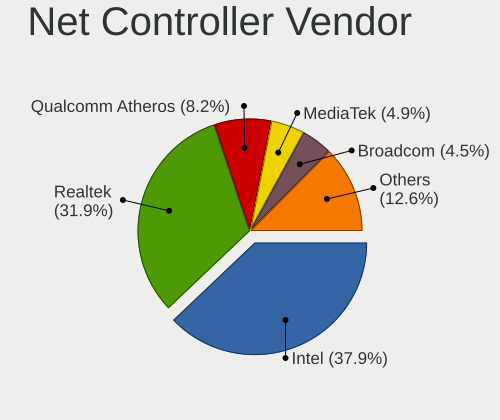

| Vendor                                 | Computers | Percent |
|----------------------------------------|-----------|---------|
| Intel                                  | 356       | 37.91%  |
| Realtek Semiconductor                  | 300       | 31.95%  |
| Qualcomm Atheros                       | 77        | 8.2%    |
| MediaTek                               | 46        | 4.9%    |
| Broadcom                               | 42        | 4.47%   |
| ASIX Electronics                       | 16        | 1.7%    |
| TP-Link                                | 10        | 1.06%   |
| Aquantia                               | 10        | 1.06%   |
| Ralink Technology                      | 9         | 0.96%   |
| Qualcomm                               | 7         | 0.75%   |
| Marvell Technology Group               | 7         | 0.75%   |
| Broadcom Limited                       | 7         | 0.75%   |
| Shenzhen Goodix Technology             | 5         | 0.53%   |
| Samsung Electronics                    | 4         | 0.43%   |
| Sierra Wireless                        | 3         | 0.32%   |
| ASUSTek Computer                       | 3         | 0.32%   |
| Suzhou Motorcomm Electronic Technology | 2         | 0.21%   |
| Ralink                                 | 2         | 0.21%   |
| Microsoft                              | 2         | 0.21%   |
| Mellanox Technologies                  | 2         | 0.21%   |
| Linksys                                | 2         | 0.21%   |
| Lenovo                                 | 2         | 0.21%   |
| Hewlett-Packard                        | 2         | 0.21%   |
| Google                                 | 2         | 0.21%   |
| Edimax Technology                      | 2         | 0.21%   |
| Xilinx                                 | 1         | 0.11%   |
| Xiaomi                                 | 1         | 0.11%   |
| STMicroelectronics                     | 1         | 0.11%   |
| Solarflare Communications              | 1         | 0.11%   |
| Realtek                                | 1         | 0.11%   |
| Qualcomm Technologies                  | 1         | 0.11%   |
| Nvidia                                 | 1         | 0.11%   |
| NewAE Technology                       | 1         | 0.11%   |
| MosChip Semiconductor                  | 1         | 0.11%   |
| Microchip Technology                   | 1         | 0.11%   |
| Linux Foundation                       | 1         | 0.11%   |
| Insyde Software                        | 1         | 0.11%   |
| Fargo                                  | 1         | 0.11%   |
| Exar                                   | 1         | 0.11%   |
| Espressif                              | 1         | 0.11%   |

Net Controller Model
--------------------

Controller models

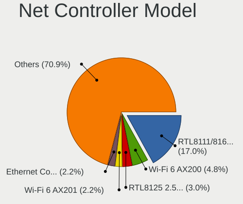

| Model                                                                  | Computers | Percent |
|------------------------------------------------------------------------|-----------|---------|
| Realtek RTL8111/8168/8211/8411 PCI Express Gigabit Ethernet Controller | 189       | 16.97%  |
| Intel Wi-Fi 6 AX200                                                    | 54        | 4.85%   |
| Realtek RTL8125 2.5GbE Controller                                      | 33        | 2.96%   |
| Intel Wi-Fi 6 AX201                                                    | 24        | 2.15%   |
| Intel Ethernet Controller I225-V                                       | 24        | 2.15%   |
| Realtek RTL8153 Gigabit Ethernet Adapter                               | 21        | 1.89%   |
| Intel Wireless 8265 / 8275                                             | 18        | 1.62%   |
| Intel Wireless 7265                                                    | 18        | 1.62%   |
| Intel I211 Gigabit Network Connection                                  | 17        | 1.53%   |
| Realtek RTL810xE PCI Express Fast Ethernet controller                  | 16        | 1.44%   |
| Qualcomm Atheros QCA6174 802.11ac Wireless Network Adapter             | 16        | 1.44%   |
| Intel Wi-Fi 6E(802.11ax) AX210/AX1675* 2x2 [Typhoon Peak]              | 16        | 1.44%   |
| MediaTek MT7922 802.11ax PCI Express Wireless Network Adapter          | 15        | 1.35%   |
| Intel Comet Lake PCH-LP CNVi WiFi                                      | 15        | 1.35%   |
| Intel 82579LM Gigabit Network Connection (Lewisville)                  | 15        | 1.35%   |
| ASIX AX88179 Gigabit Ethernet                                          | 15        | 1.35%   |
| Qualcomm Atheros QCA9377 802.11ac Wireless Network Adapter             | 14        | 1.26%   |
| Intel Alder Lake-P PCH CNVi WiFi                                       | 14        | 1.26%   |
| Realtek RTL8821CE 802.11ac PCIe Wireless Network Adapter               | 13        | 1.17%   |
| MediaTek MT7921 802.11ax PCIe Wireless Network Adapter [Filogic 330]   | 13        | 1.17%   |
| Intel Wireless 7260                                                    | 12        | 1.08%   |
| Qualcomm Atheros AR9485 Wireless Network Adapter                       | 9         | 0.81%   |
| Intel Wireless 3165                                                    | 9         | 0.81%   |
| Intel Cannon Point-LP CNVi [Wireless-AC]                               | 9         | 0.81%   |
| Intel Cannon Lake PCH CNVi WiFi                                        | 9         | 0.81%   |
| Intel Alder Lake-S PCH CNVi WiFi                                       | 9         | 0.81%   |
| Realtek RTL8852BE PCIe 802.11ax Wireless Network Controller            | 8         | 0.72%   |
| Realtek RTL8822CE 802.11ac PCIe Wireless Network Adapter               | 8         | 0.72%   |
| MediaTek MT7921K (RZ608) Wi-Fi 6E 80MHz                                | 8         | 0.72%   |
| Intel Wireless 8260                                                    | 8         | 0.72%   |
| Intel Ethernet Controller I226-V                                       | 8         | 0.72%   |
| Intel Ethernet Connection I217-LM                                      | 8         | 0.72%   |
| Intel Ethernet Connection (2) I219-V                                   | 8         | 0.72%   |
| Intel Raptor Lake PCH CNVi WiFi                                        | 7         | 0.63%   |
| Intel Ice Lake-LP PCH CNVi WiFi                                        | 7         | 0.63%   |
| Intel 700 Series Chipset CNVi WiFi                                     | 7         | 0.63%   |
| Broadcom NetXtreme BCM57765 Gigabit Ethernet PCIe                      | 7         | 0.63%   |
| Broadcom BCM4331 802.11a/b/g/n                                         | 7         | 0.63%   |
| Realtek 802.11ac NIC                                                   | 6         | 0.54%   |
| Qualcomm Atheros QCA9565 / AR9565 Wireless Network Adapter             | 6         | 0.54%   |

Wireless Vendor
---------------

Wireless vendors

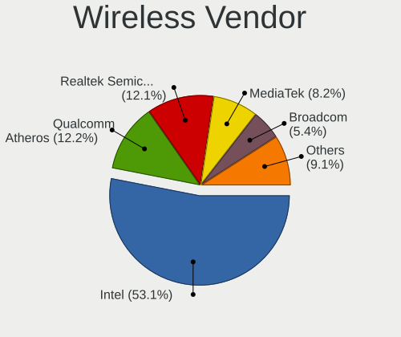

| Vendor                   | Computers | Percent |
|--------------------------|-----------|---------|
| Intel                    | 286       | 53.06%  |
| Qualcomm Atheros         | 66        | 12.24%  |
| Realtek Semiconductor    | 65        | 12.06%  |
| MediaTek                 | 44        | 8.16%   |
| Broadcom                 | 29        | 5.38%   |
| TP-Link                  | 10        | 1.86%   |
| Ralink Technology        | 9         | 1.67%   |
| Qualcomm                 | 6         | 1.11%   |
| Broadcom Limited         | 5         | 0.93%   |
| Sierra Wireless          | 3         | 0.56%   |
| ASUSTek Computer         | 3         | 0.56%   |
| Ralink                   | 2         | 0.37%   |
| Marvell Technology Group | 2         | 0.37%   |
| Edimax Technology        | 2         | 0.37%   |
| Realtek                  | 1         | 0.19%   |
| Qualcomm Technologies    | 1         | 0.19%   |
| Microsoft                | 1         | 0.19%   |
| Linksys                  | 1         | 0.19%   |
| Hewlett-Packard          | 1         | 0.19%   |
| Dell                     | 1         | 0.19%   |
| D-Link                   | 1         | 0.19%   |

Wireless Model
--------------

Wireless models

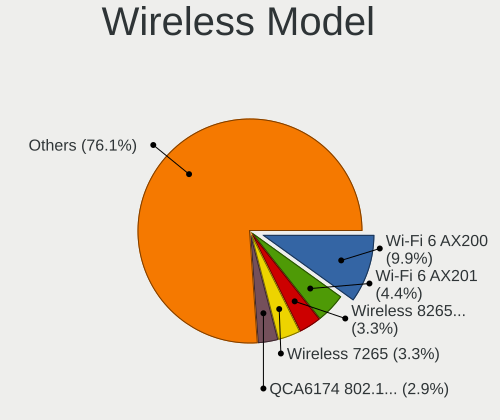

| Model                                                                           | Computers | Percent |
|---------------------------------------------------------------------------------|-----------|---------|
| Intel Wi-Fi 6 AX200                                                             | 54        | 9.93%   |
| Intel Wi-Fi 6 AX201                                                             | 24        | 4.41%   |
| Intel Wireless 8265 / 8275                                                      | 18        | 3.31%   |
| Intel Wireless 7265                                                             | 18        | 3.31%   |
| Qualcomm Atheros QCA6174 802.11ac Wireless Network Adapter                      | 16        | 2.94%   |
| Intel Wi-Fi 6E(802.11ax) AX210/AX1675* 2x2 [Typhoon Peak]                       | 16        | 2.94%   |
| Intel Comet Lake PCH-LP CNVi WiFi                                               | 15        | 2.76%   |
| Qualcomm Atheros QCA9377 802.11ac Wireless Network Adapter                      | 14        | 2.57%   |
| Realtek RTL8821CE 802.11ac PCIe Wireless Network Adapter                        | 13        | 2.39%   |
| MediaTek MT7922 802.11ax PCI Express Wireless Network Adapter                   | 13        | 2.39%   |
| MediaTek MT7921 802.11ax PCIe Wireless Network Adapter [Filogic 330]            | 13        | 2.39%   |
| Intel Wireless 7260                                                             | 12        | 2.21%   |
| Intel Alder Lake-P PCH CNVi WiFi                                                | 10        | 1.84%   |
| Qualcomm Atheros AR9485 Wireless Network Adapter                                | 9         | 1.65%   |
| Intel Wireless 3165                                                             | 9         | 1.65%   |
| Intel Cannon Point-LP CNVi [Wireless-AC]                                        | 9         | 1.65%   |
| Intel Cannon Lake PCH CNVi WiFi                                                 | 9         | 1.65%   |
| Realtek RTL8822CE 802.11ac PCIe Wireless Network Adapter                        | 8         | 1.47%   |
| MediaTek MT7921K (RZ608) Wi-Fi 6E 80MHz                                         | 8         | 1.47%   |
| Intel Wireless 8260                                                             | 8         | 1.47%   |
| Intel Alder Lake-S PCH CNVi WiFi                                                | 8         | 1.47%   |
| Intel Raptor Lake PCH CNVi WiFi                                                 | 7         | 1.29%   |
| Intel Ice Lake-LP PCH CNVi WiFi                                                 | 7         | 1.29%   |
| Intel 700 Series Chipset CNVi WiFi                                              | 7         | 1.29%   |
| Broadcom BCM4331 802.11a/b/g/n                                                  | 7         | 1.29%   |
| Realtek RTL8852BE PCIe 802.11ax Wireless Network Controller                     | 6         | 1.1%    |
| Realtek 802.11ac NIC                                                            | 6         | 1.1%    |
| Qualcomm Atheros QCA9565 / AR9565 Wireless Network Adapter                      | 6         | 1.1%    |
| Qualcomm Atheros AR9462 Wireless Network Adapter                                | 6         | 1.1%    |
| Qualcomm Atheros AR9285 Wireless Network Adapter (PCI-Express)                  | 6         | 1.1%    |
| Intel Wi-Fi 5(802.11ac) Wireless-AC 9x6x [Thunder Peak]                         | 6         | 1.1%    |
| Intel Comet Lake PCH CNVi WiFi                                                  | 6         | 1.1%    |
| Intel Centrino Advanced-N 6205 [Taylor Peak]                                    | 6         | 1.1%    |
| Realtek RTL8822BE 802.11a/b/g/n/ac WiFi adapter                                 | 5         | 0.92%   |
| Ralink MT7601U Wireless Adapter                                                 | 5         | 0.92%   |
| Qualcomm QCNFA765 Wireless Network Adapter                                      | 5         | 0.92%   |
| MediaTek MT7925 802.11be 160MHz 2x2 PCIe Wireless Network Adapter [Filogic 360] | 5         | 0.92%   |
| Intel Dual Band Wireless-AC 3168NGW [Stone Peak]                                | 5         | 0.92%   |
| Broadcom BCM43602 802.11ac Wireless LAN SoC                                     | 5         | 0.92%   |
| Realtek RTL88x2bu [AC1200 Techkey]                                              | 4         | 0.74%   |

Ethernet Vendor
---------------

Ethernet vendors

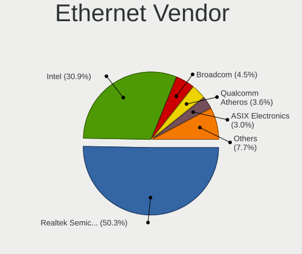

| Vendor                                 | Computers | Percent |
|----------------------------------------|-----------|---------|
| Realtek Semiconductor                  | 267       | 50.28%  |
| Intel                                  | 164       | 30.89%  |
| Broadcom                               | 24        | 4.52%   |
| Qualcomm Atheros                       | 19        | 3.58%   |
| ASIX Electronics                       | 16        | 3.01%   |
| Aquantia                               | 10        | 1.88%   |
| Marvell Technology Group               | 5         | 0.94%   |
| Samsung Electronics                    | 4         | 0.75%   |
| Suzhou Motorcomm Electronic Technology | 2         | 0.38%   |
| MediaTek                               | 2         | 0.38%   |
| Lenovo                                 | 2         | 0.38%   |
| Google                                 | 2         | 0.38%   |
| Broadcom Limited                       | 2         | 0.38%   |
| Xilinx                                 | 1         | 0.19%   |
| Xiaomi                                 | 1         | 0.19%   |
| Solarflare Communications              | 1         | 0.19%   |
| Qualcomm                               | 1         | 0.19%   |
| Nvidia                                 | 1         | 0.19%   |
| MosChip Semiconductor                  | 1         | 0.19%   |
| Microsoft                              | 1         | 0.19%   |
| Mellanox Technologies                  | 1         | 0.19%   |
| Linksys                                | 1         | 0.19%   |
| Insyde Software                        | 1         | 0.19%   |
| Hewlett-Packard                        | 1         | 0.19%   |
| Apple                                  | 1         | 0.19%   |

Ethernet Model
--------------

Ethernet models

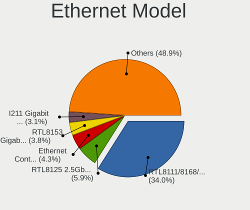

| Model                                                                          | Computers | Percent |
|--------------------------------------------------------------------------------|-----------|---------|
| Realtek RTL8111/8168/8211/8411 PCI Express Gigabit Ethernet Controller         | 189       | 33.99%  |
| Realtek RTL8125 2.5GbE Controller                                              | 33        | 5.94%   |
| Intel Ethernet Controller I225-V                                               | 24        | 4.32%   |
| Realtek RTL8153 Gigabit Ethernet Adapter                                       | 21        | 3.78%   |
| Intel I211 Gigabit Network Connection                                          | 17        | 3.06%   |
| Realtek RTL810xE PCI Express Fast Ethernet controller                          | 16        | 2.88%   |
| Intel 82579LM Gigabit Network Connection (Lewisville)                          | 15        | 2.7%    |
| ASIX AX88179 Gigabit Ethernet                                                  | 15        | 2.7%    |
| Intel Ethernet Controller I226-V                                               | 8         | 1.44%   |
| Intel Ethernet Connection I217-LM                                              | 8         | 1.44%   |
| Intel Ethernet Connection (2) I219-V                                           | 8         | 1.44%   |
| Broadcom NetXtreme BCM57765 Gigabit Ethernet PCIe                              | 7         | 1.26%   |
| Intel Ethernet Connection (4) I219-LM                                          | 6         | 1.08%   |
| Intel Ethernet Connection (7) I219-V                                           | 5         | 0.9%    |
| Samsung Galaxy series, misc. (tethering mode)                                  | 4         | 0.72%   |
| Realtek RTL8152 Fast Ethernet Adapter                                          | 4         | 0.72%   |
| Intel I210 Gigabit Network Connection                                          | 4         | 0.72%   |
| Intel Ethernet Connection (3) I218-LM                                          | 4         | 0.72%   |
| Intel Ethernet Connection (2) I219-LM                                          | 4         | 0.72%   |
| Intel Ethernet Connection (10) I219-V                                          | 4         | 0.72%   |
| Intel Alder Lake-P PCH CNVi WiFi                                               | 4         | 0.72%   |
| Broadcom NetXtreme BCM57766 Gigabit Ethernet PCIe                              | 4         | 0.72%   |
| Broadcom NetXtreme BCM5764M Gigabit Ethernet PCIe                              | 4         | 0.72%   |
| Aquantia AQtion AQC107 NBase-T/IEEE 802.3an Ethernet Controller [Atlantic 10G] | 4         | 0.72%   |
| Qualcomm Atheros QCA8171 Gigabit Ethernet                                      | 3         | 0.54%   |
| Qualcomm Atheros Killer E2500 Gigabit Ethernet Controller                      | 3         | 0.54%   |
| Qualcomm Atheros Killer E2400 Gigabit Ethernet Controller                      | 3         | 0.54%   |
| Intel Ethernet Connection I218-LM                                              | 3         | 0.54%   |
| Intel Ethernet Connection I217-V                                               | 3         | 0.54%   |
| Intel Ethernet Connection (7) I219-LM                                          | 3         | 0.54%   |
| Intel Ethernet Connection (4) I219-V                                           | 3         | 0.54%   |
| Intel 82579V Gigabit Network Connection                                        | 3         | 0.54%   |
| Intel 82578DM Gigabit Network Connection                                       | 3         | 0.54%   |
| Intel 82567LM Gigabit Network Connection                                       | 3         | 0.54%   |
| Broadcom NetLink BCM57785 Gigabit Ethernet PCIe                                | 3         | 0.54%   |
| Suzhou Motorcomm Electronic YT6801 Gigabit Ethernet Controller                 | 2         | 0.36%   |
| Realtek RTL8852CE PCIe 802.11ax Wireless Network Controller                    | 2         | 0.36%   |
| Realtek RTL8852BE PCIe 802.11ax Wireless Network Controller                    | 2         | 0.36%   |
| Realtek PCIe GbE Family Controller                                             | 2         | 0.36%   |
| Realtek Killer E3000 2.5GbE Controller                                         | 2         | 0.36%   |

Net Controller Kind
-------------------

Ethernet, WiFi or modem

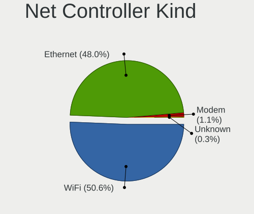

| Kind     | Computers | Percent |
|----------|-----------|---------|
| WiFi     | 516       | 50.64%  |
| Ethernet | 489       | 47.99%  |
| Modem    | 11        | 1.08%   |
| Unknown  | 3         | 0.29%   |

Used Controller
---------------

Currently used network controller

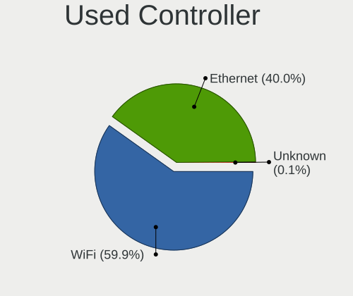

| Kind     | Computers | Percent |
|----------|-----------|---------|
| WiFi     | 400       | 59.88%  |
| Ethernet | 267       | 39.97%  |
| Unknown  | 1         | 0.15%   |

NICs
----

Total network controllers on board

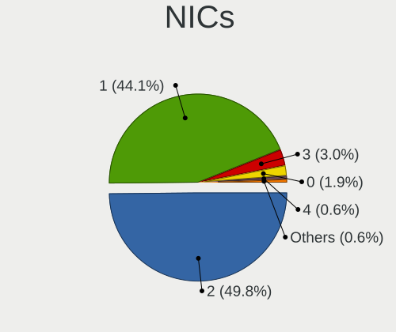

| Total | Computers | Percent |
|-------|-----------|---------|
| 2     | 320       | 49.84%  |
| 1     | 283       | 44.08%  |
| 3     | 19        | 2.96%   |
| 0     | 12        | 1.87%   |
| 4     | 4         | 0.62%   |
| 9     | 1         | 0.16%   |
| 8     | 1         | 0.16%   |
| 6     | 1         | 0.16%   |
| 5     | 1         | 0.16%   |

IPv6
----

IPv6 vs IPv4

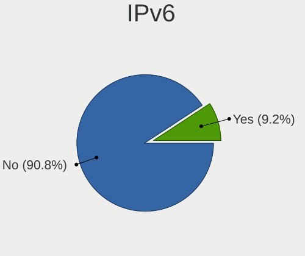

| Used | Computers | Percent |
|------|-----------|---------|
| No   | 580       | 90.77%  |
| Yes  | 59        | 9.23%   |

Bluetooth
---------

Bluetooth Vendor
----------------

Controller vendors

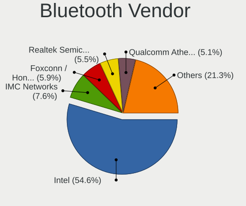

| Vendor                          | Computers | Percent |
|---------------------------------|-----------|---------|
| Intel                           | 259       | 54.64%  |
| IMC Networks                    | 36        | 7.59%   |
| Foxconn / Hon Hai               | 28        | 5.91%   |
| Realtek Semiconductor           | 26        | 5.49%   |
| Qualcomm Atheros Communications | 24        | 5.06%   |
| Apple                           | 20        | 4.22%   |
| Cambridge Silicon Radio         | 17        | 3.59%   |
| Lite-On Technology              | 16        | 3.38%   |
| MediaTek                        | 12        | 2.53%   |
| Broadcom                        | 11        | 2.32%   |
| TP-Link                         | 5         | 1.05%   |
| USI                             | 3         | 0.63%   |
| Unknown                         | 3         | 0.63%   |
| Realtek                         | 2         | 0.42%   |
| Marvell Semiconductor           | 2         | 0.42%   |
| Chicony Electronics             | 2         | 0.42%   |
| Toshiba                         | 1         | 0.21%   |
| SINO WEALTH                     | 1         | 0.21%   |
| Ralink Technology               | 1         | 0.21%   |
| Foxconn International           | 1         | 0.21%   |
| Dell                            | 1         | 0.21%   |
| ASUSTek Computer                | 1         | 0.21%   |
| Askey Computer                  | 1         | 0.21%   |
| Alps Electric                   | 1         | 0.21%   |

Bluetooth Model
---------------

Controller models

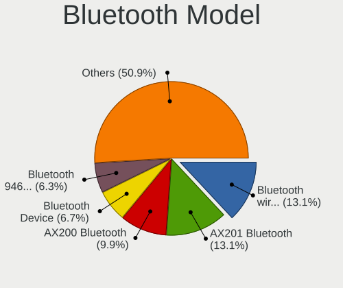

| Model                                               | Computers | Percent |
|-----------------------------------------------------|-----------|---------|
| Intel Bluetooth wireless interface                  | 62        | 13.05%  |
| Intel AX201 Bluetooth                               | 62        | 13.05%  |
| Intel AX200 Bluetooth                               | 47        | 9.89%   |
| Intel Bluetooth Device                              | 32        | 6.74%   |
| Intel Bluetooth 9460/9560 Jefferson Peak (JfP)      | 30        | 6.32%   |
| Realtek Bluetooth Radio                             | 18        | 3.79%   |
| Cambridge Silicon Radio Bluetooth Dongle (HCI mode) | 17        | 3.58%   |
| Intel AX210 Bluetooth                               | 15        | 3.16%   |
| IMC Networks Bluetooth Radio                        | 15        | 3.16%   |
| MediaTek Wireless_Device                            | 12        | 2.53%   |
| IMC Networks Wireless_Device                        | 12        | 2.53%   |
| Foxconn / Hon Hai Wireless_Device                   | 12        | 2.53%   |
| Qualcomm Atheros  Bluetooth Device                  | 11        | 2.32%   |
| Apple Bluetooth USB Host Controller                 | 9         | 1.89%   |
| Apple Bluetooth Host Controller                     | 8         | 1.68%   |
| Realtek  Bluetooth 4.2 Adapter                      | 7         | 1.47%   |
| Qualcomm Atheros QCA61x4 Bluetooth 4.0              | 7         | 1.47%   |
| Intel Wireless-AC 9260 Bluetooth Adapter            | 6         | 1.26%   |
| IMC Networks Bluetooth Device                       | 6         | 1.26%   |
| Foxconn / Hon Hai Bluetooth Device                  | 6         | 1.26%   |
| TP-Link TP-T@- UB500 Adapter                        | 5         | 1.05%   |
| Lite-On Bluetooth Device                            | 5         | 1.05%   |
| Foxconn / Hon Hai MediaTek Bluetooth Adapter        | 5         | 1.05%   |
| Broadcom BCM2045B (BDC-2.1)                         | 4         | 0.84%   |
| USI Bluetooth Device                                | 3         | 0.63%   |
| Qualcomm Atheros AR3011 Bluetooth                   | 3         | 0.63%   |
| Lite-On Wireless_Device                             | 3         | 0.63%   |
| Lite-On Atheros Bluetooth                           | 3         | 0.63%   |
| Intel Wireless-AC 3168 Bluetooth                    | 3         | 0.63%   |
| Intel Centrino Bluetooth Wireless Transceiver       | 3         | 0.63%   |
| Unknown                                             | 3         | 0.63%   |
| Realtek Bluetooth Radio                             | 2         | 0.42%   |
| Qualcomm Atheros AR3012 Bluetooth 4.0               | 2         | 0.42%   |
| Marvell Bluetooth and Wireless LAN Composite        | 2         | 0.42%   |
| Lite-On Qualcomm Atheros QCA9377 Bluetooth          | 2         | 0.42%   |
| Lite-On Bluetooth Radio                             | 2         | 0.42%   |
| Foxconn / Hon Hai Broadcom BCM20702A1 Bluetooth     | 2         | 0.42%   |
| Chicony Bluetooth (RTL8723BE)                       | 2         | 0.42%   |
| Broadcom BCM20702A0 Bluetooth 4.0                   | 2         | 0.42%   |
| Broadcom BCM20702 Bluetooth 4.0 [ThinkPad]          | 2         | 0.42%   |

Sound
-----

Sound Vendor
------------

Sound card vendors

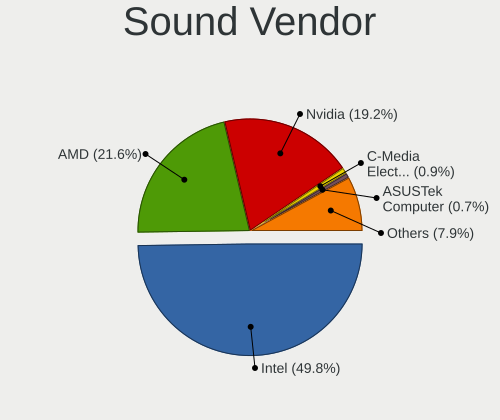

| Vendor                                       | Computers | Percent |
|----------------------------------------------|-----------|---------|
| Intel                                        | 441       | 49.77%  |
| AMD                                          | 191       | 21.56%  |
| Nvidia                                       | 170       | 19.19%  |
| C-Media Electronics                          | 8         | 0.9%    |
| ASUSTek Computer                             | 6         | 0.68%   |
| Zoran Co. Personal Media Division (Nogatech) | 4         | 0.45%   |
| Tenx Technology                              | 4         | 0.45%   |
| Logitech                                     | 4         | 0.45%   |
| Hewlett-Packard                              | 3         | 0.34%   |
| Giga-Byte Technology                         | 3         | 0.34%   |
| Creative Labs                                | 3         | 0.34%   |
| TTGK Technology                              | 2         | 0.23%   |
| SteelSeries ApS                              | 2         | 0.23%   |
| Sony                                         | 2         | 0.23%   |
| SAVITECH                                     | 2         | 0.23%   |
| Plantronics                                  | 2         | 0.23%   |
| Micro Star International                     | 2         | 0.23%   |
| Lenovo                                       | 2         | 0.23%   |
| Kingston Technology                          | 2         | 0.23%   |
| Jieli Technology                             | 2         | 0.23%   |
| Creative Technology                          | 2         | 0.23%   |
| Apple                                        | 2         | 0.23%   |
| XMOS                                         | 1         | 0.11%   |
| Xiaomi                                       | 1         | 0.11%   |
| Thesycon Systemsoftware & Consulting         | 1         | 0.11%   |
| Texas Instruments                            | 1         | 0.11%   |
| Setek Elektronik                             | 1         | 0.11%   |
| Sennheiser electronic                        | 1         | 0.11%   |
| Samsung Electronics                          | 1         | 0.11%   |
| Samson Technologies                          | 1         | 0.11%   |
| RODE Microphones                             | 1         | 0.11%   |
| Realtek Semiconductor                        | 1         | 0.11%   |
| Razer USA                                    | 1         | 0.11%   |
| Quanta                                       | 1         | 0.11%   |
| NXP Semiconductors                           | 1         | 0.11%   |
| MV                                           | 1         | 0.11%   |
| liyuany                                      | 1         | 0.11%   |
| JMTek                                        | 1         | 0.11%   |
| JBL                                          | 1         | 0.11%   |
| Huawei Technologies                          | 1         | 0.11%   |

Sound Model
-----------

Sound card models

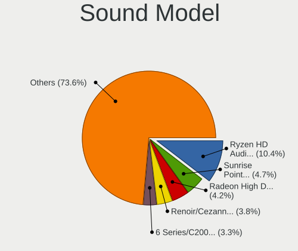

| Model                                                                      | Computers | Percent |
|----------------------------------------------------------------------------|-----------|---------|
| AMD Ryzen HD Audio Controller                                              | 111       | 10.39%  |
| Intel Sunrise Point-LP HD Audio                                            | 50        | 4.68%   |
| AMD Radeon High Definition Audio Controller                                | 45        | 4.21%   |
| AMD Renoir/Cezanne HDMI/DP Audio Controller                                | 41        | 3.84%   |
| Intel 6 Series/C200 Series Chipset Family High Definition Audio Controller | 35        | 3.28%   |
| Intel 8 Series/C220 Series Chipset High Definition Audio Controller        | 31        | 2.9%    |
| AMD Starship/Matisse HD Audio Controller                                   | 30        | 2.81%   |
| Intel 7 Series/C216 Chipset Family High Definition Audio Controller        | 28        | 2.62%   |
| Intel Tiger Lake-LP Smart Sound Technology Audio Controller                | 26        | 2.43%   |
| Intel Cannon Lake PCH cAVS                                                 | 26        | 2.43%   |
| Nvidia GA104 High Definition Audio Controller                              | 18        | 1.69%   |
| Intel Xeon E3-1200 v3/4th Gen Core Processor HD Audio Controller           | 18        | 1.69%   |
| AMD Raven/Raven2/Fenghuang HDMI/DP Audio Controller                        | 18        | 1.69%   |
| Intel Comet Lake PCH-LP cAVS                                               | 17        | 1.59%   |
| Intel Alder Lake PCH-P High Definition Audio Controller                    | 17        | 1.59%   |
| Intel Alder Lake-S HD Audio Controller                                     | 15        | 1.4%    |
| Nvidia GA106 High Definition Audio Controller                              | 13        | 1.22%   |
| Intel Raptor Lake High Definition Audio Controller                         | 13        | 1.22%   |
| Intel Cannon Point-LP High Definition Audio Controller                     | 13        | 1.22%   |
| Intel 100 Series/C230 Series Chipset Family HD Audio Controller            | 13        | 1.22%   |
| Intel 200 Series PCH HD Audio                                              | 12        | 1.12%   |
| AMD Navi 21/23 HDMI/DP Audio Controller                                    | 12        | 1.12%   |
| Nvidia AD107 High Definition Audio Controller                              | 10        | 0.94%   |
| Intel Haswell-ULT HD Audio Controller                                      | 10        | 0.94%   |
| Intel Celeron/Pentium Silver Processor High Definition Audio               | 10        | 0.94%   |
| Intel 8 Series HD Audio Controller                                         | 10        | 0.94%   |
| Intel 5 Series/3400 Series Chipset High Definition Audio                   | 10        | 0.94%   |
| Nvidia GP107GL High Definition Audio Controller                            | 9         | 0.84%   |
| Nvidia GF108 High Definition Audio Controller                              | 9         | 0.84%   |
| Intel Wildcat Point-LP High Definition Audio Controller                    | 9         | 0.84%   |
| Intel Broadwell-U Audio Controller                                         | 9         | 0.84%   |
| AMD Ellesmere HDMI Audio [Radeon RX 470/480 / 570/580/590]                 | 9         | 0.84%   |
| Nvidia TU107 GeForce GTX 1650 High Definition Audio Controller             | 8         | 0.75%   |
| Intel Raptor Lake-P/U/H cAVS                                               | 8         | 0.75%   |
| Intel Comet Lake PCH cAVS                                                  | 8         | 0.75%   |
| Intel Atom Processor Z36xxx/Z37xxx Series High Definition Audio Controller | 8         | 0.75%   |
| AMD Oland/Hainan/Cape Verde/Pitcairn HDMI Audio [Radeon HD 7000 Series]    | 8         | 0.75%   |
| Nvidia TU106 High Definition Audio Controller                              | 7         | 0.66%   |
| Nvidia TU104 HD Audio Controller                                           | 7         | 0.66%   |
| Nvidia GK107 HDMI Audio Controller                                         | 7         | 0.66%   |

Memory
------

Memory Vendor
-------------

Memory module vendors

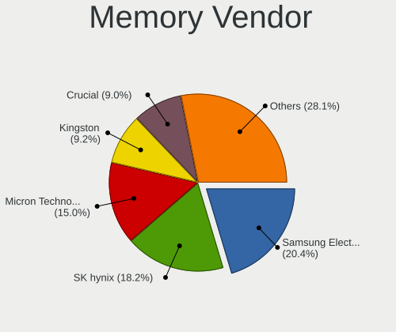

| Vendor                         | Computers | Percent |
|--------------------------------|-----------|---------|
| Samsung Electronics            | 95        | 20.39%  |
| SK hynix                       | 85        | 18.24%  |
| Micron Technology              | 70        | 15.02%  |
| Kingston                       | 43        | 9.23%   |
| Crucial                        | 42        | 9.01%   |
| Corsair                        | 20        | 4.29%   |
| Unknown                        | 17        | 3.65%   |
| G.Skill                        | 16        | 3.43%   |
| A-DATA Technology              | 8         | 1.72%   |
| Unknown                        | 7         | 1.5%    |
| Unknown (ABCD)                 | 6         | 1.29%   |
| Transcend                      | 6         | 1.29%   |
| Ramaxel Technology             | 6         | 1.29%   |
| KLEVV                          | 6         | 1.29%   |
| Elpida                         | 5         | 1.07%   |
| Patriot                        | 4         | 0.86%   |
| Undefi                         | 3         | 0.64%   |
| Nanya Technology               | 3         | 0.64%   |
| Lexar                          | 2         | 0.43%   |
| Kingmax                        | 2         | 0.43%   |
| ASint Technology               | 2         | 0.43%   |
| V-GeN                          | 1         | 0.21%   |
| Unknown (0x0E9D)               | 1         | 0.21%   |
| Unknown (0x0E25)               | 1         | 0.21%   |
| Unknown (0x0B92)               | 1         | 0.21%   |
| Unknown (0x02BA)               | 1         | 0.21%   |
| Unknown (00000000802C)         | 1         | 0.21%   |
| Team                           | 1         | 0.21%   |
| Super Talent                   | 1         | 0.21%   |
| Red Hat                        | 1         | 0.21%   |
| Ramos Technology               | 1         | 0.21%   |
| Qimonda                        | 1         | 0.21%   |
| Patriot Memory                 | 1         | 0.21%   |
| MKF_SMBIOS_TYPE17_MANUFACTURER | 1         | 0.21%   |
| Kingmax Semiconductor          | 1         | 0.21%   |
| Essencore Limited              | 1         | 0.21%   |
| Carry                          | 1         | 0.21%   |
| Apotop                         | 1         | 0.21%   |
| Apacer                         | 1         | 0.21%   |

Memory Model
------------

Memory module models

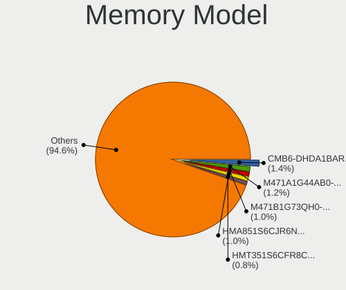

| Model                                                             | Computers | Percent |
|-------------------------------------------------------------------|-----------|---------|
| Unknown                                                           | 7         | 1.39%   |
| Samsung RAM M471A1G44AB0-CWE 8GiB SODIMM DDR4 3200MT/s            | 6         | 1.19%   |
| SK hynix RAM HMA851S6CJR6N-VK 4GB SODIMM DDR4 2667MT/s            | 5         | 0.99%   |
| Samsung RAM M471B1G73QH0-YK0 8GB SODIMM DDR3 1600MT/s             | 5         | 0.99%   |
| SK hynix RAM HMT351S6CFR8C-PB 4GB SODIMM DDR3 1600MT/s            | 4         | 0.79%   |
| SK hynix RAM HMA81GS6JJR8N-VK 8GB SODIMM DDR4 2667MT/s            | 4         | 0.79%   |
| Unknown RAM Module 4GB Row Of Chips LPDDR4 4267MT/s               | 3         | 0.6%    |
| Unknown (ABCD) RAM 123456789012345678 2GB SODIMM LPDDR4 2400MT/s  | 3         | 0.6%    |
| Unknown (ABCD) RAM 123456789012345678 2GB DIMM LPDDR4 2133MT/s    | 3         | 0.6%    |
| SK hynix RAM HMAA1GS6CJR6N-XN 8GB SODIMM DDR4 3200MT/s            | 3         | 0.6%    |
| SK hynix RAM HMA82GS6AFR8N-UH 16GB SODIMM DDR4 2667MT/s           | 3         | 0.6%    |
| SK hynix RAM HMA81GS6AFR8N-UH 8GB SODIMM DDR4 2667MT/s            | 3         | 0.6%    |
| SK hynix RAM H9CCNNNCLGALAR-NVD 8GB Row Of Chips LPDDR3 2133MT/s  | 3         | 0.6%    |
| Samsung RAM UBE3D4AA-MGCR 2GB Row Of Chips LPDDR4 4267MT/s        | 3         | 0.6%    |
| Samsung RAM M471B5273DH0-CH9 4GB SODIMM DDR3 1600MT/s             | 3         | 0.6%    |
| Samsung RAM M471B1G73DB0-YK0 8GB SODIMM DDR3 1600MT/s             | 3         | 0.6%    |
| Samsung RAM M471A5244CB0-CTD 4GB SODIMM DDR4 3266MT/s             | 3         | 0.6%    |
| Samsung RAM M378B5673EH1-CH9 2GB DIMM DDR3 1333MT/s               | 3         | 0.6%    |
| Micron RAM 4ATF1G64HZ-3G2E1 8GB SODIMM DDR4 3200MT/s              | 3         | 0.6%    |
| Micron RAM 16ATF2G64HZ-2G6E1 16GB SODIMM DDR4 2667MT/s            | 3         | 0.6%    |
| Kingston RAM KY7N41-MIE 8GB DIMM DDR4 2666MT/s                    | 3         | 0.6%    |
| Crucial RAM CT32G4SFD832A.C16FE 32GB SODIMM DDR4 3200MT/s         | 3         | 0.6%    |
| Crucial RAM CT16G48C40S5.M8A1 16GB SODIMM DDR5 4800MT/s           | 3         | 0.6%    |
| Unknown RAM Module 4GB SODIMM DDR3                                | 2         | 0.4%    |
| Undefi RAM Module 2GB SODIMM DDR3 1866MT/s                        | 2         | 0.4%    |
| SK hynix RAM Module 8192MB SODIMM DDR3 1600MT/s                   | 2         | 0.4%    |
| SK hynix RAM Module 4GB SODIMM DDR3 1600MT/s                      | 2         | 0.4%    |
| SK hynix RAM HMT41GS6MFR8C-PB 8GB SODIMM DDR3 1600MT/s            | 2         | 0.4%    |
| SK hynix RAM HMT41GS6BFR8A-PB 8GB SODIMM DDR3 2667MT/s            | 2         | 0.4%    |
| SK hynix RAM HMAA2GS6CJR8N-XN 16GB SODIMM DDR4 3200MT/s           | 2         | 0.4%    |
| SK hynix RAM HMA851S6DJR6N-XN 4GB SODIMM DDR4 3200MT/s            | 2         | 0.4%    |
| SK hynix RAM HMA82GS6CJR8N-VK 16GB SODIMM DDR4 2667MT/s           | 2         | 0.4%    |
| SK hynix RAM HMA81GS6CJR8N-VK 8GB SODIMM DDR4 2667MT/s            | 2         | 0.4%    |
| SK hynix RAM HCNNNBKMMLXR-NEE 1GB Row Of Chips LPDDR4 4267MT/s    | 2         | 0.4%    |
| SK hynix RAM H9JCNNNFA5MLYR-N6E 8GB SODIMM LPDDR5 6400MT/s        | 2         | 0.4%    |
| SK hynix RAM H9HCNNNCPMALHR-NEE 8GiB Row Of Chips LPDDR4 4800MT/s | 2         | 0.4%    |
| Samsung RAM Module 2GB SODIMM DDR3 1333MT/s                       | 2         | 0.4%    |
| Samsung RAM Module 16GB SODIMM DDR4 3200MT/s                      | 2         | 0.4%    |
| Samsung RAM M471A5244CB0-CWE 4GB SODIMM DDR4 3200MT/s             | 2         | 0.4%    |
| Samsung RAM M471A5244BB0-CRC 4GB SODIMM DDR4 2667MT/s             | 2         | 0.4%    |

Memory Kind
-----------

Memory module kinds

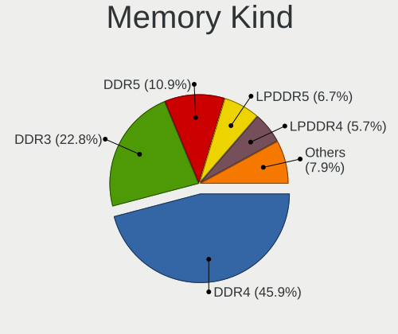

| Kind    | Computers | Percent |
|---------|-----------|---------|
| DDR4    | 185       | 45.91%  |
| DDR3    | 92        | 22.83%  |
| DDR5    | 44        | 10.92%  |
| LPDDR5  | 27        | 6.7%    |
| LPDDR4  | 23        | 5.71%   |
| LPDDR3  | 18        | 4.47%   |
| SDRAM   | 8         | 1.99%   |
| DDR2    | 4         | 0.99%   |
| RAM     | 1         | 0.25%   |
| Unknown | 1         | 0.25%   |

Memory Form Factor
------------------

Physical design of the memory module

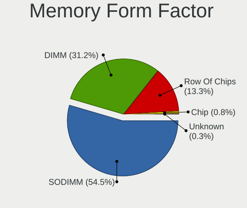

| Name         | Computers | Percent |
|--------------|-----------|---------|
| SODIMM       | 217       | 54.52%  |
| DIMM         | 124       | 31.16%  |
| Row Of Chips | 53        | 13.32%  |
| Chip         | 3         | 0.75%   |
| Unknown      | 1         | 0.25%   |

Memory Size
-----------

Memory module size

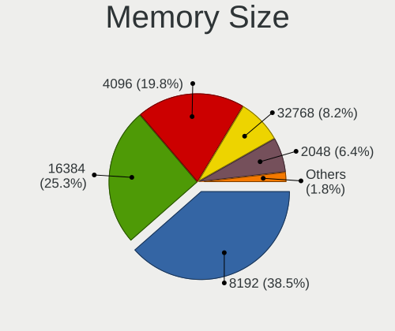

| Size  | Computers | Percent |
|-------|-----------|---------|
| 8192  | 169       | 38.5%   |
| 16384 | 111       | 25.28%  |
| 4096  | 87        | 19.82%  |
| 32768 | 36        | 8.2%    |
| 2048  | 28        | 6.38%   |
| 1024  | 4         | 0.91%   |
| 65536 | 1         | 0.23%   |
| 49152 | 1         | 0.23%   |
| 12288 | 1         | 0.23%   |
| 3072  | 1         | 0.23%   |

Memory Speed
------------

Memory module speed

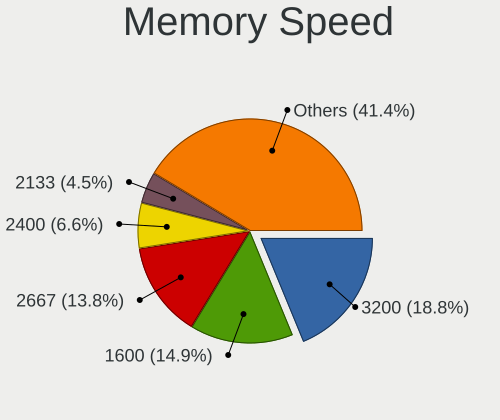

| Speed   | Computers | Percent |
|---------|-----------|---------|
| 3200    | 83        | 18.78%  |
| 1600    | 66        | 14.93%  |
| 2667    | 61        | 13.8%   |
| 2400    | 29        | 6.56%   |
| 2133    | 20        | 4.52%   |
| 6400    | 18        | 4.07%   |
| 5600    | 18        | 4.07%   |
| 1333    | 17        | 3.85%   |
| 3600    | 15        | 3.39%   |
| 4800    | 14        | 3.17%   |
| 4267    | 12        | 2.71%   |
| 7500    | 9         | 2.04%   |
| 6000    | 7         | 1.58%   |
| 2666    | 7         | 1.58%   |
| 1867    | 7         | 1.58%   |
| 1866    | 5         | 1.13%   |
| 3733    | 4         | 0.9%    |
| 3266    | 4         | 0.9%    |
| 1334    | 4         | 0.9%    |
| Unknown | 4         | 0.9%    |
| 8533    | 3         | 0.68%   |
| 4000    | 3         | 0.68%   |
| 1067    | 3         | 0.68%   |
| 8400    | 2         | 0.45%   |
| 7467    | 2         | 0.45%   |
| 3400    | 2         | 0.45%   |
| 2933    | 2         | 0.45%   |
| 2048    | 2         | 0.45%   |
| 1800    | 2         | 0.45%   |
| 800     | 2         | 0.45%   |
| 667     | 2         | 0.45%   |
| 12800   | 1         | 0.23%   |
| 8000    | 1         | 0.23%   |
| 7400    | 1         | 0.23%   |
| 7000    | 1         | 0.23%   |
| 4333    | 1         | 0.23%   |
| 4199    | 1         | 0.23%   |
| 3866    | 1         | 0.23%   |
| 3800    | 1         | 0.23%   |
| 3666    | 1         | 0.23%   |

Printers & scanners
-------------------

Printer Vendor
--------------

Printer device vendors

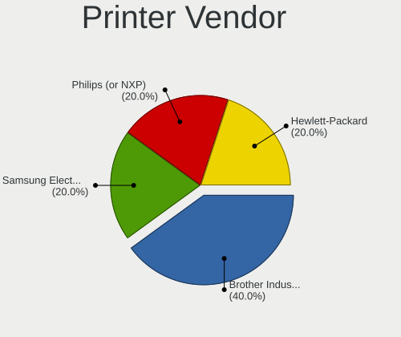

| Vendor              | Computers | Percent |
|---------------------|-----------|---------|
| Brother Industries  | 2         | 40%     |
| Samsung Electronics | 1         | 20%     |
| Philips (or NXP)    | 1         | 20%     |
| Hewlett-Packard     | 1         | 20%     |

Printer Model
-------------

Printer device models

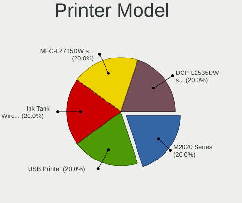

| Model                           | Computers | Percent |
|---------------------------------|-----------|---------|
| Samsung M2020 Series            | 1         | 20%     |
| Philips (or NXP) USB Printer    | 1         | 20%     |
| HP Ink Tank Wireless 410 series | 1         | 20%     |
| Brother MFC-L2715DW series      | 1         | 20%     |
| Brother DCP-L2535DW series      | 1         | 20%     |

Scanner Vendor
--------------

Scanner device vendors

Zero info for selected period =(

Scanner Model
-------------

Scanner device models

Zero info for selected period =(

Camera
------

Camera Vendor
-------------

Camera device vendors

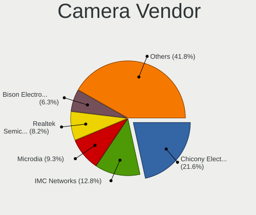

| Vendor                                 | Computers | Percent |
|----------------------------------------|-----------|---------|
| Chicony Electronics                    | 79        | 21.58%  |
| IMC Networks                           | 47        | 12.84%  |
| Microdia                               | 34        | 9.29%   |
| Realtek Semiconductor                  | 30        | 8.2%    |
| Bison Electronics                      | 23        | 6.28%   |
| Sunplus Innovation Technology          | 16        | 4.37%   |
| Apple                                  | 16        | 4.37%   |
| Logitech                               | 14        | 3.83%   |
| Syntek                                 | 12        | 3.28%   |
| Luxvisions Innotech Limited            | 10        | 2.73%   |
| Sonix Technology                       | 9         | 2.46%   |
| Quanta                                 | 9         | 2.46%   |
| Lite-On Technology                     | 8         | 2.19%   |
| Suyin                                  | 7         | 1.91%   |
| Samsung Electronics                    | 6         | 1.64%   |
| Cheng Uei Precision Industry (Foxlink) | 5         | 1.37%   |
| SunplusIT                              | 4         | 1.09%   |
| ShineTech                              | 4         | 1.09%   |
| OmniVision Technologies                | 3         | 0.82%   |
| Alcor Micro                            | 3         | 0.82%   |
| Silicon Motion                         | 2         | 0.55%   |
| Ricoh                                  | 2         | 0.55%   |
| Z-Star Microelectronics                | 1         | 0.27%   |
| XF                                     | 1         | 0.27%   |
| USB CAMERA                             | 1         | 0.27%   |
| Sony Ericsson Mobile Communications AB | 1         | 0.27%   |
| SN0002                                 | 1         | 0.27%   |
| ShineOptics                            | 1         | 0.27%   |
| Shine-optics                           | 1         | 0.27%   |
| Shenzhen Kingcome Optoelectronic       | 1         | 0.27%   |
| Razer USA                              | 1         | 0.27%   |
| OnePlus Technology (Shenzhen)          | 1         | 0.27%   |
| Microsoft                              | 1         | 0.27%   |
| Magic Control Technology               | 1         | 0.27%   |
| Lenovo                                 | 1         | 0.27%   |
| kingcome                               | 1         | 0.27%   |
| Jieli Technology                       | 1         | 0.27%   |
| Intel                                  | 1         | 0.27%   |
| Importek                               | 1         | 0.27%   |
| HYGD-220831-A                          | 1         | 0.27%   |

Camera Model
------------

Camera device models

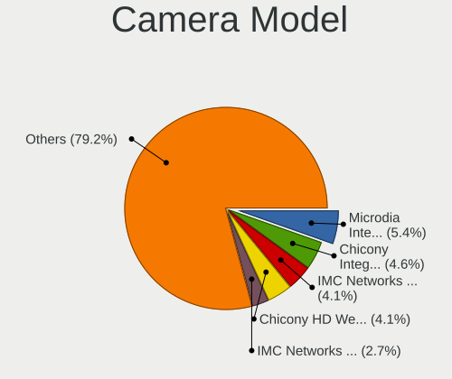

| Model                                            | Computers | Percent |
|--------------------------------------------------|-----------|---------|
| Microdia Integrated_Webcam_HD                    | 20        | 5.41%   |
| Chicony Integrated Camera                        | 17        | 4.59%   |
| IMC Networks Integrated Camera                   | 15        | 4.05%   |
| Chicony HD Webcam                                | 15        | 4.05%   |
| IMC Networks USB2.0 HD UVC WebCam                | 10        | 2.7%    |
| Bison Integrated Camera                          | 10        | 2.7%    |
| Syntek Integrated Camera                         | 8         | 2.16%   |
| Sunplus Integrated_Webcam_HD                     | 7         | 1.89%   |
| Realtek Integrated_Webcam_HD                     | 7         | 1.89%   |
| IMC Networks USB2.0 VGA UVC WebCam               | 7         | 1.89%   |
| Samsung Galaxy series, misc. (MTP mode)          | 6         | 1.62%   |
| Luxvisions Innotech Limited Integrated Camera    | 6         | 1.62%   |
| Sonix USB2.0 FHD UVC WebCam                      | 5         | 1.35%   |
| IMC Networks USB2.0 HD IR UVC WebCam             | 5         | 1.35%   |
| Chicony HP HD Camera                             | 5         | 1.35%   |
| Apple FaceTime HD Camera (Built-in)              | 5         | 1.35%   |
| Apple FaceTime HD Camera                         | 5         | 1.35%   |
| Logitech HD Webcam C615                          | 4         | 1.08%   |
| Lite-On Integrated Camera                        | 4         | 1.08%   |
| Apple iPhone 5/5C/5S/6/SE/7/8/X                  | 4         | 1.08%   |
| Sonix USB2.0 HD UVC WebCam                       | 3         | 0.81%   |
| OmniVision OV2640 Webcam                         | 3         | 0.81%   |
| Microdia USB 2.0 Camera                          | 3         | 0.81%   |
| Logitech HD Pro Webcam C920                      | 3         | 0.81%   |
| Chicony USB2.0 HD UVC WebCam                     | 3         | 0.81%   |
| Chicony Lenovo Integrated Camera (0.3MP)         | 3         | 0.81%   |
| Chicony HP Wide Vision HD Camera                 | 3         | 0.81%   |
| Chicony HD User Facing                           | 3         | 0.81%   |
| Chicony Chicony USB2.0 Camera                    | 3         | 0.81%   |
| Cheng Uei Precision Industry (Foxlink) HD Camera | 3         | 0.81%   |
| Bison Integrated RGB Camera                      | 3         | 0.81%   |
| Bison HD Webcam                                  | 3         | 0.81%   |
| Syntek Lenovo EasyCamera                         | 2         | 0.54%   |
| SunplusIT HD Webcam                              | 2         | 0.54%   |
| Shinetech ASUS FHD webcam                        | 2         | 0.54%   |
| Realtek USB2.0 HD UVC WebCam                     | 2         | 0.54%   |
| Realtek Integrated Webcam_HD                     | 2         | 0.54%   |
| Realtek Integrated Webcam HD                     | 2         | 0.54%   |
| Realtek HP Wide Vision FHD Camera                | 2         | 0.54%   |
| Realtek Bluetooth Radio                          | 2         | 0.54%   |

Security
--------

Fingerprint Vendor
------------------

Fingerprint sensor vendors

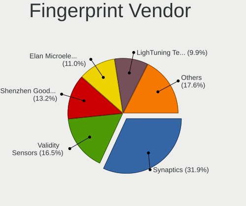

| Vendor                             | Computers | Percent |
|------------------------------------|-----------|---------|
| Synaptics                          | 29        | 31.87%  |
| Validity Sensors                   | 15        | 16.48%  |
| Shenzhen Goodix Technology         | 12        | 13.19%  |
| Elan Microelectronics              | 10        | 10.99%  |
| LighTuning Technology              | 9         | 9.89%   |
| Upek                               | 6         | 6.59%   |
| AuthenTec                          | 6         | 6.59%   |
| Realtek USB2.0 Finger Print Bridge | 2         | 2.2%    |
| Samsung Electronics                | 1         | 1.1%    |
| Focal-systems.Corp                 | 1         | 1.1%    |

Fingerprint Model
-----------------

Fingerprint sensor models

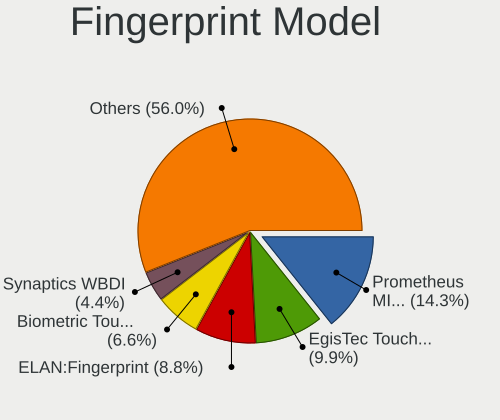

| Model                                                                      | Computers | Percent |
|----------------------------------------------------------------------------|-----------|---------|
| Synaptics Prometheus MIS Touch Fingerprint Reader                          | 13        | 14.29%  |
| LighTuning EgisTec Touch Fingerprint Sensor                                | 9         | 9.89%   |
| Elan ELAN:Fingerprint                                                      | 8         | 8.79%   |
| Upek Biometric Touchchip/Touchstrip Fingerprint Sensor                     | 6         | 6.59%   |
| Validity Sensors Synaptics WBDI                                            | 4         | 4.4%    |
| Synaptics Metallica MIS Touch Fingerprint Reader                           | 4         | 4.4%    |
| Shenzhen Goodix  Fingerprint Device                                        | 4         | 4.4%    |
| Shenzhen Goodix Fingerprint Reader                                         | 4         | 4.4%    |
| Shenzhen Goodix FingerPrint                                                | 4         | 4.4%    |
| Validity Sensors VFS495 Fingerprint Reader                                 | 3         | 3.3%    |
| Validity Sensors VFS7552 Touch Fingerprint Sensor                          | 2         | 2.2%    |
| Validity Sensors VFS 5011 fingerprint sensor                               | 2         | 2.2%    |
| Validity Sensors Synaptics VFS7552 Touch Fingerprint Sensor with PurePrint | 2         | 2.2%    |
| Synaptics WBDI                                                             | 2         | 2.2%    |
| Synaptics  WBDI                                                            | 2         | 2.2%    |
| Realtek USB2.0 Finger Print Bridge FocalTech Fingerprint Device            | 2         | 2.2%    |
| Elan ELAN:ARM-M4                                                           | 2         | 2.2%    |
| AuthenTec AES2810                                                          | 2         | 2.2%    |
| AuthenTec AES2501 Fingerprint Sensor                                       | 2         | 2.2%    |
| Validity Sensors VFS7500 Touch Fingerprint Sensor                          | 1         | 1.1%    |
| Validity Sensors VFS101 Fingerprint Reader                                 | 1         | 1.1%    |
| Synaptics WBDI Fingerprint Reader USB 086                                  | 1         | 1.1%    |
| Synaptics UWP WBDI Device                                                  | 1         | 1.1%    |
| Synaptics UWP WBDI                                                         | 1         | 1.1%    |
| Synaptics  WBDI Fingerprint Reader - USB 052                               | 1         | 1.1%    |
| Synaptics  FS7604 Touch Fingerprint Sensor with PurePrint                  | 1         | 1.1%    |
| Synaptics FS7604 Touch Fingerprint Sensor with PurePrint                   | 1         | 1.1%    |
| Synaptics Fingerprint scanner                                              | 1         | 1.1%    |
| Samsung Fingerprint Sensor Device - 730B                                   | 1         | 1.1%    |
| Focal-systems.Corp FT9201Fingerprint.                                      | 1         | 1.1%    |
| AuthenTec Fingerprint Sensor                                               | 1         | 1.1%    |
| AuthenTec AES1660 Fingerprint Sensor                                       | 1         | 1.1%    |
| Unknown                                                                    | 1         | 1.1%    |

Chipcard Vendor
---------------

Chipcard module vendors

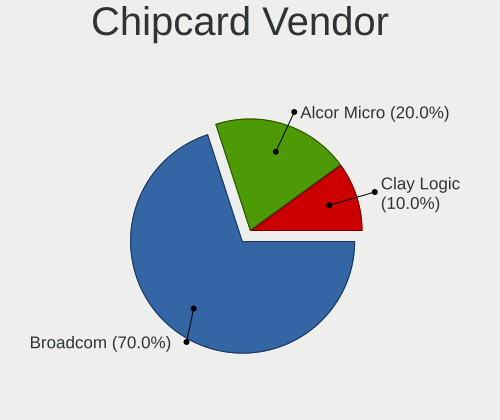

| Vendor      | Computers | Percent |
|-------------|-----------|---------|
| Broadcom    | 8         | 72.73%  |
| Alcor Micro | 2         | 18.18%  |
| Clay Logic  | 1         | 9.09%   |

Chipcard Model
--------------

Chipcard module models

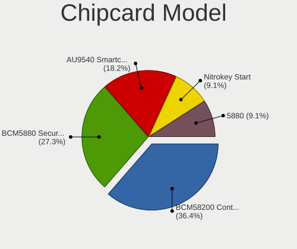

| Model                                                                       | Computers | Percent |
|-----------------------------------------------------------------------------|-----------|---------|
| Broadcom BCM58200 ControlVault 3 (FingerPrint sensor + Contacted SmartCard) | 4         | 36.36%  |
| Broadcom BCM5880 Secure Applications Processor                              | 3         | 27.27%  |
| Alcor Micro AU9540 Smartcard Reader                                         | 2         | 18.18%  |
| Clay Logic Nitrokey Start                                                   | 1         | 9.09%   |
| Broadcom 5880                                                               | 1         | 9.09%   |

Unsupported
-----------

Unsupported Devices
-------------------

Total unsupported devices on board

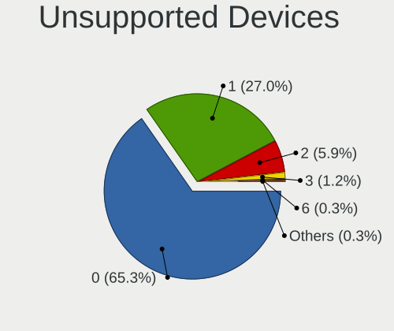

| Total | Computers | Percent |
|-------|-----------|---------|
| 0     | 431       | 65.3%   |
| 1     | 178       | 26.97%  |
| 2     | 39        | 5.91%   |
| 3     | 8         | 1.21%   |
| 6     | 2         | 0.3%    |
| 5     | 1         | 0.15%   |
| 4     | 1         | 0.15%   |

Unsupported Device Types
------------------------

Types of unsupported devices

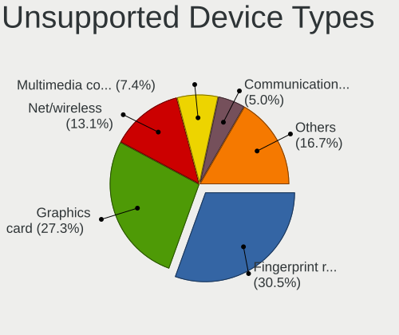

| Type                     | Computers | Percent |
|--------------------------|-----------|---------|
| Fingerprint reader       | 86        | 30.5%   |
| Graphics card            | 77        | 27.3%   |
| Net/wireless             | 37        | 13.12%  |
| Multimedia controller    | 21        | 7.45%   |
| Communication controller | 14        | 4.96%   |
| Camera                   | 11        | 3.9%    |
| Chipcard                 | 10        | 3.55%   |
| Net/ethernet             | 7         | 2.48%   |
| Unassigned class         | 6         | 2.13%   |
| Bluetooth                | 4         | 1.42%   |
| Storage/raid             | 2         | 0.71%   |
| Network                  | 2         | 0.71%   |
| Wireless                 | 1         | 0.35%   |
| Storage                  | 1         | 0.35%   |
| Sound                    | 1         | 0.35%   |
| Firewire controller      | 1         | 0.35%   |
| Dvb card                 | 1         | 0.35%   |

