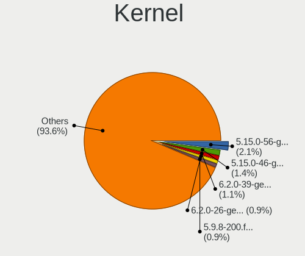
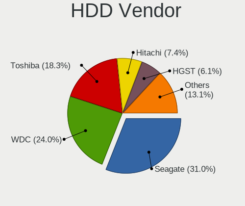
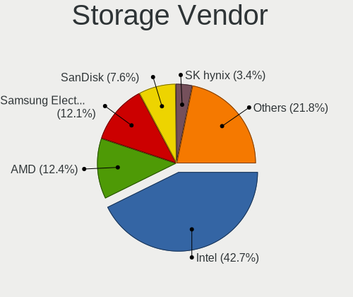
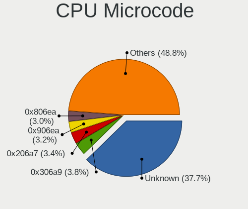
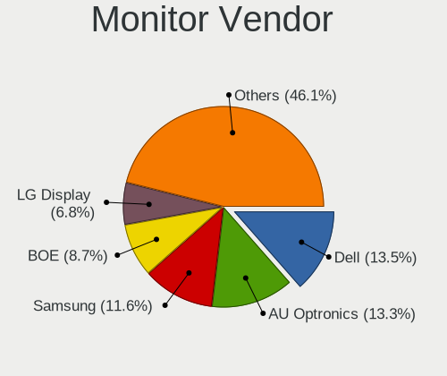
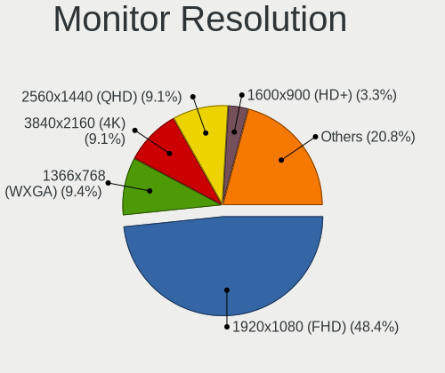
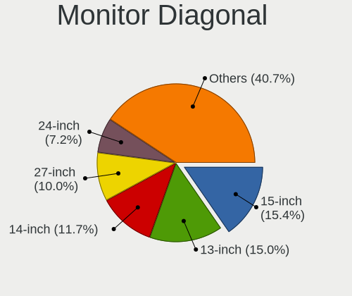
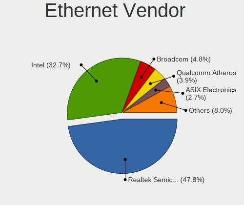
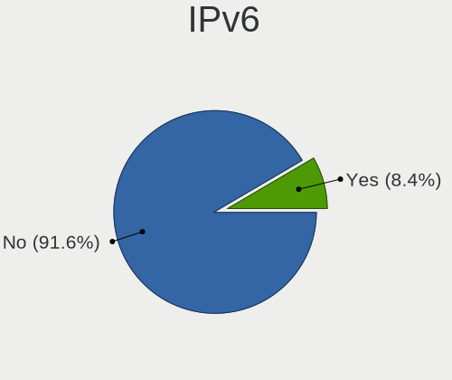

Linux in Singapore - Tested Hardware & Statistics
-------------------------------------------------

A project to collect tested hardware configurations for Linux in Singapore.

Anyone can contribute to this report by the [hw-probe](https://github.com/linuxhw/hw-probe) tool:

    sudo -E hw-probe -all -upload

Please contribute! Especially if your hardware is rare.

This is a report for all computer types. See also reports for [desktops](/Location/Singapore/Desktop/README.md) and [notebooks](/Location/Singapore/Notebook/README.md).

Contents
--------

* [ Test Cases ](#test-cases)

* [ System ](#system)
  - [ OS                       ](#os)
  - [ OS Family                ](#os-family)
  - [ Kernel                   ](#kernel)
  - [ Kernel Family            ](#kernel-family)
  - [ Kernel Major Ver.        ](#kernel-major-ver)
  - [ Arch                     ](#arch)
  - [ DE                       ](#de)
  - [ Display Server           ](#display-server)
  - [ Display Manager          ](#display-manager)
  - [ OS Lang                  ](#os-lang)
  - [ Boot Mode                ](#boot-mode)
  - [ Filesystem               ](#filesystem)
  - [ Part. scheme             ](#part-scheme)
  - [ Dual Boot with Linux/BSD ](#dual-boot-with-linuxbsd)
  - [ Dual Boot (Win)          ](#dual-boot-win)

* [ Board ](#board)
  - [ Vendor                   ](#vendor)
  - [ Model                    ](#model)
  - [ Model Family             ](#model-family)
  - [ MFG Year                 ](#mfg-year)
  - [ Form Factor              ](#form-factor)
  - [ Secure Boot              ](#secure-boot)
  - [ Coreboot                 ](#coreboot)
  - [ RAM Size                 ](#ram-size)
  - [ RAM Used                 ](#ram-used)
  - [ Total Drives             ](#total-drives)
  - [ Has CD-ROM               ](#has-cd-rom)
  - [ Has Ethernet             ](#has-ethernet)
  - [ Has WiFi                 ](#has-wifi)
  - [ Has Bluetooth            ](#has-bluetooth)

* [ Location ](#location)
  - [ Country                  ](#country)
  - [ City                     ](#city)

* [ Drives ](#drives)
  - [ Drive Vendor             ](#drive-vendor)
  - [ Drive Model              ](#drive-model)
  - [ HDD Vendor               ](#hdd-vendor)
  - [ SSD Vendor               ](#ssd-vendor)
  - [ Drive Kind               ](#drive-kind)
  - [ Drive Connector          ](#drive-connector)
  - [ Drive Size               ](#drive-size)
  - [ Space Total              ](#space-total)
  - [ Space Used               ](#space-used)
  - [ Malfunc. Drives          ](#malfunc-drives)
  - [ Malfunc. Drive Vendor    ](#malfunc-drive-vendor)
  - [ Malfunc. HDD Vendor      ](#malfunc-hdd-vendor)
  - [ Malfunc. Drive Kind      ](#malfunc-drive-kind)
  - [ Failed Drives            ](#failed-drives)
  - [ Failed Drive Vendor      ](#failed-drive-vendor)
  - [ Drive Status             ](#drive-status)

* [ Storage controller ](#storage-controller)
  - [ Storage Vendor           ](#storage-vendor)
  - [ Storage Model            ](#storage-model)
  - [ Storage Kind             ](#storage-kind)

* [ Processor ](#processor)
  - [ CPU Vendor               ](#cpu-vendor)
  - [ CPU Model                ](#cpu-model)
  - [ CPU Model Family         ](#cpu-model-family)
  - [ CPU Cores                ](#cpu-cores)
  - [ CPU Sockets              ](#cpu-sockets)
  - [ CPU Threads              ](#cpu-threads)
  - [ CPU Op-Modes             ](#cpu-op-modes)
  - [ CPU Microcode            ](#cpu-microcode)
  - [ CPU Microarch            ](#cpu-microarch)

* [ Graphics ](#graphics)
  - [ GPU Vendor               ](#gpu-vendor)
  - [ GPU Model                ](#gpu-model)
  - [ GPU Combo                ](#gpu-combo)
  - [ GPU Driver               ](#gpu-driver)
  - [ GPU Memory               ](#gpu-memory)

* [ Monitor ](#monitor)
  - [ Monitor Vendor           ](#monitor-vendor)
  - [ Monitor Model            ](#monitor-model)
  - [ Monitor Resolution       ](#monitor-resolution)
  - [ Monitor Diagonal         ](#monitor-diagonal)
  - [ Monitor Width            ](#monitor-width)
  - [ Aspect Ratio             ](#aspect-ratio)
  - [ Monitor Area             ](#monitor-area)
  - [ Pixel Density            ](#pixel-density)
  - [ Multiple Monitors        ](#multiple-monitors)

* [ Network ](#network)
  - [ Net Controller Vendor    ](#net-controller-vendor)
  - [ Net Controller Model     ](#net-controller-model)
  - [ Wireless Vendor          ](#wireless-vendor)
  - [ Wireless Model           ](#wireless-model)
  - [ Ethernet Vendor          ](#ethernet-vendor)
  - [ Ethernet Model           ](#ethernet-model)
  - [ Net Controller Kind      ](#net-controller-kind)
  - [ Used Controller          ](#used-controller)
  - [ NICs                     ](#nics)
  - [ IPv6                     ](#ipv6)

* [ Bluetooth ](#bluetooth)
  - [ Bluetooth Vendor         ](#bluetooth-vendor)
  - [ Bluetooth Model          ](#bluetooth-model)

* [ Sound ](#sound)
  - [ Sound Vendor             ](#sound-vendor)
  - [ Sound Model              ](#sound-model)

* [ Memory ](#memory)
  - [ Memory Vendor            ](#memory-vendor)
  - [ Memory Model             ](#memory-model)
  - [ Memory Kind              ](#memory-kind)
  - [ Memory Form Factor       ](#memory-form-factor)
  - [ Memory Size              ](#memory-size)
  - [ Memory Speed             ](#memory-speed)

* [ Printers & scanners ](#printers--scanners)
  - [ Printer Vendor           ](#printer-vendor)
  - [ Printer Model            ](#printer-model)
  - [ Scanner Vendor           ](#scanner-vendor)
  - [ Scanner Model            ](#scanner-model)

* [ Camera ](#camera)
  - [ Camera Vendor            ](#camera-vendor)
  - [ Camera Model             ](#camera-model)

* [ Security ](#security)
  - [ Fingerprint Vendor       ](#fingerprint-vendor)
  - [ Fingerprint Model        ](#fingerprint-model)
  - [ Chipcard Vendor          ](#chipcard-vendor)
  - [ Chipcard Model           ](#chipcard-model)

* [ Unsupported ](#unsupported)
  - [ Unsupported Devices      ](#unsupported-devices)
  - [ Unsupported Device Types ](#unsupported-device-types)

Test Cases
----------

Total: 553

| Vendor        | Model                       | Form-Factor | Probe                                                      | Date         |
|---------------|-----------------------------|-------------|------------------------------------------------------------|--------------|
| MSI           | B450M MORTAR                | Desktop     | [6d2c05fd11](https://linux-hardware.org/?probe=6d2c05fd11) | Jun 05, 2023 |
| Intel         | NUC11PHBi7 M26151-404       | Mini pc     | [386f19f4f1](https://linux-hardware.org/?probe=386f19f4f1) | Jun 03, 2023 |
| Gigabyte      | B450M AORUS ELITE           | Desktop     | [f17ae033ef](https://linux-hardware.org/?probe=f17ae033ef) | Jun 03, 2023 |
| SZMZ          | X99M-G2                     | Desktop     | [e9b164885c](https://linux-hardware.org/?probe=e9b164885c) | Jun 03, 2023 |
| Lenovo        | ThinkPad X220 42911H8       | Notebook    | [e28e041a5c](https://linux-hardware.org/?probe=e28e041a5c) | Jun 02, 2023 |
| Dell          | 04Y8V0 A02                  | Desktop     | [ce749a8df5](https://linux-hardware.org/?probe=ce749a8df5) | Jun 02, 2023 |
| Lenovo        | ThinkPad X220 42911H8       | Notebook    | [dcba8dc683](https://linux-hardware.org/?probe=dcba8dc683) | Jun 02, 2023 |
| Dell          | Latitude 7400               | Notebook    | [ef9ef10e4e](https://linux-hardware.org/?probe=ef9ef10e4e) | Jun 02, 2023 |
| Lenovo        | Yoga Slim 7 proX 14ARH7 ... | Notebook    | [684751d3db](https://linux-hardware.org/?probe=684751d3db) | May 26, 2023 |
| Acer          | Aspire 4750                 | Notebook    | [704221c10c](https://linux-hardware.org/?probe=704221c10c) | May 21, 2023 |
| ASUSTek       | PN53                        | Mini pc     | [3a92115c6c](https://linux-hardware.org/?probe=3a92115c6c) | May 12, 2023 |
| AZW           | MINI S 10                   | Desktop     | [c64432906e](https://linux-hardware.org/?probe=c64432906e) | May 10, 2023 |
| Lenovo        | ThinkPad X220 42911H8       | Notebook    | [d6933984d7](https://linux-hardware.org/?probe=d6933984d7) | May 10, 2023 |
| ASUSTek       | E3M-ET V5 SERIES            | Desktop     | [64f08f10f3](https://linux-hardware.org/?probe=64f08f10f3) | May 10, 2023 |
| Lenovo        | ThinkPad X220 42911H8       | Notebook    | [6beb57f72d](https://linux-hardware.org/?probe=6beb57f72d) | May 10, 2023 |
| Dell          | 04Y8V0 A02                  | Desktop     | [d21ef87b63](https://linux-hardware.org/?probe=d21ef87b63) | May 10, 2023 |
| Unknown       | AG958                       | Notebook    | [70aa4b6cf2](https://linux-hardware.org/?probe=70aa4b6cf2) | May 08, 2023 |
| Lenovo        | IdeaPad Gaming 3 15ARH7 ... | Notebook    | [9355511511](https://linux-hardware.org/?probe=9355511511) | May 07, 2023 |
| American M... | IPPBT-RO                    | All in one  | [ea620e0681](https://linux-hardware.org/?probe=ea620e0681) | May 04, 2023 |
| American M... | IPPBT-RO                    | All in one  | [a2921975cd](https://linux-hardware.org/?probe=a2921975cd) | May 02, 2023 |
| Acer          | Swift SF314-57G             | Notebook    | [6fd79b811f](https://linux-hardware.org/?probe=6fd79b811f) | Apr 28, 2023 |
| Dell          | XPS 13 7390                 | Notebook    | [318ea8ad1e](https://linux-hardware.org/?probe=318ea8ad1e) | Apr 27, 2023 |
| Unknown       | Unknown                     | Desktop     | [c4941a5c16](https://linux-hardware.org/?probe=c4941a5c16) | Apr 27, 2023 |
| Dell          | Inspiron 15 5510            | Notebook    | [c8f22361f6](https://linux-hardware.org/?probe=c8f22361f6) | Apr 24, 2023 |
| Gigabyte      | H61M-S2PH                   | Desktop     | [ec36f4ada2](https://linux-hardware.org/?probe=ec36f4ada2) | Apr 23, 2023 |
| Gigabyte      | X670 AORUS ELITE AX         | Desktop     | [170b38e40f](https://linux-hardware.org/?probe=170b38e40f) | Apr 20, 2023 |
| AZW           | GT-R                        | Notebook    | [c37dabb7a7](https://linux-hardware.org/?probe=c37dabb7a7) | Apr 15, 2023 |
| Dell          | Latitude 7400               | Notebook    | [0f917420a1](https://linux-hardware.org/?probe=0f917420a1) | Apr 14, 2023 |
| Dell          | Inspiron 1525               | Notebook    | [c518902ba7](https://linux-hardware.org/?probe=c518902ba7) | Apr 13, 2023 |
| Lenovo        | ThinkPad X220 42911H8       | Notebook    | [7eee4a859e](https://linux-hardware.org/?probe=7eee4a859e) | Apr 12, 2023 |
| Lenovo        | ThinkPad X220 42911H8       | Notebook    | [874513db8d](https://linux-hardware.org/?probe=874513db8d) | Apr 12, 2023 |
| ASUSTek       | E3M-ET V5 SERIES            | Desktop     | [7e0735056c](https://linux-hardware.org/?probe=7e0735056c) | Apr 12, 2023 |
| Lenovo        | ThinkPad X230 23256N6       | Notebook    | [0779903086](https://linux-hardware.org/?probe=0779903086) | Apr 05, 2023 |
| ASRock        | B450 Pro4                   | Desktop     | [ac4522914d](https://linux-hardware.org/?probe=ac4522914d) | Apr 02, 2023 |
| Pegatron      | 2ADC                        | Desktop     | [1326ad508e](https://linux-hardware.org/?probe=1326ad508e) | Mar 30, 2023 |
| ASUSTek       | VivoBook_ASUSLaptop M740... | Notebook    | [c1f1d2bcc8](https://linux-hardware.org/?probe=c1f1d2bcc8) | Mar 28, 2023 |
| ASUSTek       | X45A                        | Notebook    | [a0401520d5](https://linux-hardware.org/?probe=a0401520d5) | Mar 27, 2023 |
| ASUSTek       | X45A                        | Notebook    | [dbe8e77436](https://linux-hardware.org/?probe=dbe8e77436) | Mar 27, 2023 |
| ASUSTek       | X45A                        | Notebook    | [675de376da](https://linux-hardware.org/?probe=675de376da) | Mar 27, 2023 |
| Lenovo        | ThinkPad X230 23256N6       | Notebook    | [c7ec617422](https://linux-hardware.org/?probe=c7ec617422) | Mar 24, 2023 |
| Unknown       | GB01                        | Desktop     | [ad0e76307c](https://linux-hardware.org/?probe=ad0e76307c) | Mar 24, 2023 |
| ASUSTek       | ROG STRIX H370-F GAMING     | Desktop     | [c02aa4b9e1](https://linux-hardware.org/?probe=c02aa4b9e1) | Mar 23, 2023 |
| Apple         | MacBookPro11,2              | Notebook    | [92208949d5](https://linux-hardware.org/?probe=92208949d5) | Mar 22, 2023 |
| Apple         | MacBookPro11,2              | Notebook    | [aa71c25dba](https://linux-hardware.org/?probe=aa71c25dba) | Mar 22, 2023 |
| Acer          | Spin SP513-52N              | Convertible | [7542f3fe88](https://linux-hardware.org/?probe=7542f3fe88) | Mar 16, 2023 |
| Gigabyte      | X570 AORUS PRO WIFI         | Desktop     | [d507b4619f](https://linux-hardware.org/?probe=d507b4619f) | Mar 13, 2023 |
| Lenovo        | ThinkPad X270 20HMS1KL0C    | Notebook    | [f27bb76a32](https://linux-hardware.org/?probe=f27bb76a32) | Mar 12, 2023 |
| ASUSTek       | ZenBook 13 UX331UAL         | Notebook    | [9b38c9668e](https://linux-hardware.org/?probe=9b38c9668e) | Mar 10, 2023 |
| Dell          | XPS 13 9310                 | Notebook    | [037f2e4a2d](https://linux-hardware.org/?probe=037f2e4a2d) | Mar 10, 2023 |
| HP            | 1589                        | Desktop     | [2fc61ae7b4](https://linux-hardware.org/?probe=2fc61ae7b4) | Mar 09, 2023 |
| Gigabyte      | X670 AORUS ELITE AX         | Desktop     | [63f1f6f5dd](https://linux-hardware.org/?probe=63f1f6f5dd) | Mar 08, 2023 |
| SZMZ          | X99M-G2                     | Desktop     | [e2244668d1](https://linux-hardware.org/?probe=e2244668d1) | Mar 02, 2023 |
| SZMZ          | X99M-G2                     | Desktop     | [4e45d95aa1](https://linux-hardware.org/?probe=4e45d95aa1) | Mar 01, 2023 |
| Dell          | Inspiron 3468               | Notebook    | [e5977ee094](https://linux-hardware.org/?probe=e5977ee094) | Feb 21, 2023 |
| HUAWEI        | MACHC-WAX9                  | Notebook    | [69a8710cbb](https://linux-hardware.org/?probe=69a8710cbb) | Feb 18, 2023 |
| HUAWEI        | MACHC-WAX9                  | Notebook    | [db5d2b956a](https://linux-hardware.org/?probe=db5d2b956a) | Feb 18, 2023 |
| Novatte       | M20                         | Desktop     | [f3b00d12f2](https://linux-hardware.org/?probe=f3b00d12f2) | Feb 14, 2023 |
| MSI           | GE62VR 6RF                  | Notebook    | [89c148a5f9](https://linux-hardware.org/?probe=89c148a5f9) | Feb 12, 2023 |
| ASUSTek       | ROG STRIX X570-E GAMING     | Desktop     | [de144d5025](https://linux-hardware.org/?probe=de144d5025) | Feb 12, 2023 |
| MSI           | PRO Z690-A WIFI DDR4        | Desktop     | [95337ab460](https://linux-hardware.org/?probe=95337ab460) | Feb 11, 2023 |
| ASUSTek       | TUF Gaming B550M-PLUS       | Desktop     | [65e66dbf71](https://linux-hardware.org/?probe=65e66dbf71) | Feb 10, 2023 |
| Foxconn       | ETON                        | Desktop     | [e7cc1c6b15](https://linux-hardware.org/?probe=e7cc1c6b15) | Feb 07, 2023 |
| Lenovo        | ThinkPad X230 23256N6       | Notebook    | [c454139724](https://linux-hardware.org/?probe=c454139724) | Feb 06, 2023 |
| HPE           | ProLiant MicroServer Gen... | Desktop     | [9a9b3eed69](https://linux-hardware.org/?probe=9a9b3eed69) | Feb 05, 2023 |
| Foxconn       | 17A0                        | Desktop     | [1a98ed31ed](https://linux-hardware.org/?probe=1a98ed31ed) | Feb 05, 2023 |
| Apple         | Mac-F42386C8 PVT            | All in one  | [c172555349](https://linux-hardware.org/?probe=c172555349) | Jan 25, 2023 |
| Lenovo        | NOK                         | Desktop     | [507b602676](https://linux-hardware.org/?probe=507b602676) | Jan 25, 2023 |
| Acer          | Aspire V5-132               | Notebook    | [7f74397112](https://linux-hardware.org/?probe=7f74397112) | Jan 24, 2023 |
| ASUSTek       | K45VM                       | Notebook    | [7fef453cdb](https://linux-hardware.org/?probe=7fef453cdb) | Jan 23, 2023 |
| Acer          | Aspire ES1-432              | Notebook    | [4a81caf8b2](https://linux-hardware.org/?probe=4a81caf8b2) | Jan 18, 2023 |
| Acer          | Aspire 5750G                | Notebook    | [d696233b84](https://linux-hardware.org/?probe=d696233b84) | Jan 18, 2023 |
| HP            | ENVY x360 Convertible 15... | Convertible | [a73de9a5b9](https://linux-hardware.org/?probe=a73de9a5b9) | Jan 14, 2023 |
| Dell          | Latitude 7390               | Notebook    | [cc5d8632f5](https://linux-hardware.org/?probe=cc5d8632f5) | Jan 13, 2023 |
| Dell          | Latitude 7390               | Notebook    | [a8ee39edc5](https://linux-hardware.org/?probe=a8ee39edc5) | Jan 13, 2023 |
| Unknown       | Unknown                     | Notebook    | [ae506ac561](https://linux-hardware.org/?probe=ae506ac561) | Jan 12, 2023 |
| HUAWEI        | MACHD-WXX9                  | Notebook    | [3e870855db](https://linux-hardware.org/?probe=3e870855db) | Jan 08, 2023 |
| Lenovo        | ThinkPad T14 Gen 3 21CF0... | Notebook    | [14273d90fd](https://linux-hardware.org/?probe=14273d90fd) | Jan 08, 2023 |
| MSI           | MAG B550 TOMAHAWK           | Desktop     | [2e6f75ca07](https://linux-hardware.org/?probe=2e6f75ca07) | Jan 06, 2023 |
| ASUSTek       | X555LAB                     | Notebook    | [3af1bc02b8](https://linux-hardware.org/?probe=3af1bc02b8) | Jan 05, 2023 |
| ASUSTek       | X555LAB                     | Notebook    | [0a1360a7dc](https://linux-hardware.org/?probe=0a1360a7dc) | Jan 05, 2023 |
| ASUSTek       | TUF Gaming B550M-PLUS       | Desktop     | [c96c7d74fe](https://linux-hardware.org/?probe=c96c7d74fe) | Jan 02, 2023 |
| Lenovo        | ThinkPad X230 23256N6       | Notebook    | [09d6510700](https://linux-hardware.org/?probe=09d6510700) | Jan 01, 2023 |
| Dell          | Inspiron 1420               | Notebook    | [fe6a8714da](https://linux-hardware.org/?probe=fe6a8714da) | Dec 31, 2022 |
| Gigabyte      | B660M AORUS PRO AX DDR4     | Desktop     | [c6325d4647](https://linux-hardware.org/?probe=c6325d4647) | Dec 29, 2022 |
| ASUSTek       | Z87M-PLUS                   | Desktop     | [6dac0c0943](https://linux-hardware.org/?probe=6dac0c0943) | Dec 29, 2022 |
| Gigabyte      | B365M D2V                   | Desktop     | [93f7c010a2](https://linux-hardware.org/?probe=93f7c010a2) | Dec 28, 2022 |
| ASRock        | Z370M-ITX/ac                | Desktop     | [f87fbed6a1](https://linux-hardware.org/?probe=f87fbed6a1) | Dec 28, 2022 |
| ASUSTek       | A88XM-A                     | Desktop     | [8633f00865](https://linux-hardware.org/?probe=8633f00865) | Dec 26, 2022 |
| ASUSTek       | A88XM-A                     | Desktop     | [802e7982de](https://linux-hardware.org/?probe=802e7982de) | Dec 26, 2022 |
| HP            | 8061                        | Desktop     | [4427032526](https://linux-hardware.org/?probe=4427032526) | Dec 24, 2022 |
| ASRock        | B75 Pro3-M                  | Desktop     | [e24692f75f](https://linux-hardware.org/?probe=e24692f75f) | Dec 24, 2022 |
| Lenovo        | ThinkPad X230 23256N6       | Notebook    | [6b09c2afcf](https://linux-hardware.org/?probe=6b09c2afcf) | Dec 23, 2022 |
| Lenovo        | ThinkPad X230 23256N6       | Notebook    | [efc1b154fb](https://linux-hardware.org/?probe=efc1b154fb) | Dec 23, 2022 |
| ASRock        | B450 Pro4                   | Desktop     | [61f064d35f](https://linux-hardware.org/?probe=61f064d35f) | Dec 22, 2022 |
| ASRock        | B450 Pro4                   | Desktop     | [d387b553bd](https://linux-hardware.org/?probe=d387b553bd) | Dec 22, 2022 |
| ASUSTek       | K45VM                       | Notebook    | [ee344993aa](https://linux-hardware.org/?probe=ee344993aa) | Dec 22, 2022 |
| ASUSTek       | K45VM                       | Notebook    | [cc9fb3fd05](https://linux-hardware.org/?probe=cc9fb3fd05) | Dec 22, 2022 |
| Lenovo        | Legion 5 15ARH7H 82RD       | Notebook    | [51f520d152](https://linux-hardware.org/?probe=51f520d152) | Dec 21, 2022 |
| Foxconn       | 17A0                        | Desktop     | [58a3486afd](https://linux-hardware.org/?probe=58a3486afd) | Dec 20, 2022 |
| Lenovo        | Legion 5 15ARH7H 82RD       | Notebook    | [d5171f9491](https://linux-hardware.org/?probe=d5171f9491) | Dec 19, 2022 |
| Foxconn       | 17A0                        | Desktop     | [be57227f43](https://linux-hardware.org/?probe=be57227f43) | Dec 17, 2022 |
| Foxconn       | 17A0                        | Desktop     | [b2185eeab5](https://linux-hardware.org/?probe=b2185eeab5) | Dec 16, 2022 |
| ASUSTek       | ASUS TUF Gaming A15 FA50... | Notebook    | [615d3e1599](https://linux-hardware.org/?probe=615d3e1599) | Dec 14, 2022 |
| Foxconn       | 17A0                        | Desktop     | [4518247b07](https://linux-hardware.org/?probe=4518247b07) | Dec 14, 2022 |
| Lenovo        | ThinkPad X390 20Q0CTO1WW    | Notebook    | [52546b1dd0](https://linux-hardware.org/?probe=52546b1dd0) | Dec 10, 2022 |
| Foxconn       | 17A0                        | Desktop     | [2f3b2f9fbb](https://linux-hardware.org/?probe=2f3b2f9fbb) | Dec 07, 2022 |
| HP            | 8061                        | Desktop     | [6e4cb7cde8](https://linux-hardware.org/?probe=6e4cb7cde8) | Dec 07, 2022 |
| HP            | 8061                        | Desktop     | [9d30b0126f](https://linux-hardware.org/?probe=9d30b0126f) | Dec 05, 2022 |
| ASUSTek       | PN51-S1                     | Mini pc     | [5b17c3205f](https://linux-hardware.org/?probe=5b17c3205f) | Dec 03, 2022 |
| HP            | ZBook 15                    | Notebook    | [2ff5969ae6](https://linux-hardware.org/?probe=2ff5969ae6) | Nov 26, 2022 |
| HP            | ZBook 15                    | Notebook    | [55e4fb5ba0](https://linux-hardware.org/?probe=55e4fb5ba0) | Nov 26, 2022 |
| Lenovo        | ThinkPad X230 23256N6       | Notebook    | [a462983d82](https://linux-hardware.org/?probe=a462983d82) | Nov 25, 2022 |
| ASUSTek       | VivoBook_ASUSLaptop N740... | Notebook    | [37145c9282](https://linux-hardware.org/?probe=37145c9282) | Nov 19, 2022 |
| Lenovo        | ThinkPad T480s 20L8S1R50... | Notebook    | [61f6e057e6](https://linux-hardware.org/?probe=61f6e057e6) | Nov 17, 2022 |
| Lenovo        | ThinkPad X230 23256N6       | Notebook    | [facd5aa317](https://linux-hardware.org/?probe=facd5aa317) | Nov 16, 2022 |
| Dell          | Precision 3571              | Notebook    | [039ece6391](https://linux-hardware.org/?probe=039ece6391) | Nov 10, 2022 |
| Google        | Atlas                       | Notebook    | [77922a522d](https://linux-hardware.org/?probe=77922a522d) | Nov 09, 2022 |
| Google        | Atlas                       | Notebook    | [829fcb8f6a](https://linux-hardware.org/?probe=829fcb8f6a) | Nov 09, 2022 |
| Dell          | Precision 3571              | Notebook    | [d305848533](https://linux-hardware.org/?probe=d305848533) | Nov 08, 2022 |
| Dell          | Precision 3571              | Notebook    | [681a655e1c](https://linux-hardware.org/?probe=681a655e1c) | Nov 08, 2022 |
| Dell          | Precision 3571              | Notebook    | [6f845855a5](https://linux-hardware.org/?probe=6f845855a5) | Nov 08, 2022 |
| Dell          | Precision 3571              | Notebook    | [9da55445b0](https://linux-hardware.org/?probe=9da55445b0) | Nov 08, 2022 |
| Lenovo        | ThinkPad X1 Carbon 4th 2... | Notebook    | [cd0e637d88](https://linux-hardware.org/?probe=cd0e637d88) | Nov 01, 2022 |
| MSI           | MAG B660M MORTAR DDR4       | Desktop     | [14e8385f99](https://linux-hardware.org/?probe=14e8385f99) | Oct 31, 2022 |
| Lenovo        | ThinkPad X230 23256N6       | Notebook    | [a2d71fd3ca](https://linux-hardware.org/?probe=a2d71fd3ca) | Oct 28, 2022 |
| ASUSTek       | VivoBook_ASUSLaptop M140... | Notebook    | [0a0922ed82](https://linux-hardware.org/?probe=0a0922ed82) | Oct 27, 2022 |
| Lenovo        | IdeaPad 5 14ARE05 81YM      | Notebook    | [52701ec9f4](https://linux-hardware.org/?probe=52701ec9f4) | Oct 24, 2022 |
| Acer          | RS880M05                    | Desktop     | [7adee2fd97](https://linux-hardware.org/?probe=7adee2fd97) | Oct 21, 2022 |
| Lenovo        | IdeaPad 5 15ITL05 82FG      | Notebook    | [1dc7719a4d](https://linux-hardware.org/?probe=1dc7719a4d) | Oct 21, 2022 |
| ASUSTek       | VivoBook_ASUSLaptop M350... | Notebook    | [ef7b367052](https://linux-hardware.org/?probe=ef7b367052) | Oct 21, 2022 |
| ASUSTek       | VivoBook_ASUSLaptop X415... | Notebook    | [18893915f3](https://linux-hardware.org/?probe=18893915f3) | Oct 17, 2022 |
| ASUSTek       | Maximus IV Extreme          | Desktop     | [d84677af13](https://linux-hardware.org/?probe=d84677af13) | Oct 17, 2022 |
| Gigabyte      | B550M DS3H AC               | Desktop     | [9ec02e49a3](https://linux-hardware.org/?probe=9ec02e49a3) | Oct 13, 2022 |
| Lenovo        | ThinkPad X230 23256N6       | Notebook    | [e59c8f50b4](https://linux-hardware.org/?probe=e59c8f50b4) | Oct 07, 2022 |
| HP            | Pavilion Aero Laptop 13-... | Notebook    | [d67006c592](https://linux-hardware.org/?probe=d67006c592) | Oct 07, 2022 |
| Fujitsu       | LIFEBOOK LH531              | Notebook    | [5ace2d0c1f](https://linux-hardware.org/?probe=5ace2d0c1f) | Oct 06, 2022 |
| Fujitsu       | LIFEBOOK LH531              | Notebook    | [3338607f1a](https://linux-hardware.org/?probe=3338607f1a) | Oct 05, 2022 |
| Lenovo        | ThinkPad X230 23256N6       | Notebook    | [082814c248](https://linux-hardware.org/?probe=082814c248) | Oct 04, 2022 |
| Lenovo        | ThinkPad X230 23256N6       | Notebook    | [ec44263cbd](https://linux-hardware.org/?probe=ec44263cbd) | Oct 01, 2022 |
| MSI           | Modern 14 B5M               | Notebook    | [1914cf579b](https://linux-hardware.org/?probe=1914cf579b) | Sep 29, 2022 |
| Lenovo        | ThinkPad X230 23256N6       | Notebook    | [f061f902ff](https://linux-hardware.org/?probe=f061f902ff) | Sep 25, 2022 |
| Acer          | Aspire E1-422               | Notebook    | [855ad327a4](https://linux-hardware.org/?probe=855ad327a4) | Sep 25, 2022 |
| Acer          | Aspire E1-422               | Notebook    | [829ec8aac1](https://linux-hardware.org/?probe=829ec8aac1) | Sep 25, 2022 |
| Acer          | Swift SF314-511             | Notebook    | [93680a7429](https://linux-hardware.org/?probe=93680a7429) | Sep 25, 2022 |
| Acer          | Swift SF314-511             | Notebook    | [ae5fd894b6](https://linux-hardware.org/?probe=ae5fd894b6) | Sep 25, 2022 |
| Dell          | Latitude 7275               | Tablet      | [49ee35636b](https://linux-hardware.org/?probe=49ee35636b) | Sep 24, 2022 |
| Lenovo        | Legion R9000K2021H 82N6     | Notebook    | [d739547049](https://linux-hardware.org/?probe=d739547049) | Sep 23, 2022 |
| Lenovo        | 10051                       | All in one  | [195ec7cb8c](https://linux-hardware.org/?probe=195ec7cb8c) | Sep 23, 2022 |
| Gigabyte      | X99-Ultra Gaming-CF         | Desktop     | [568bffc355](https://linux-hardware.org/?probe=568bffc355) | Sep 22, 2022 |
| MSI           | MAG X570 TOMAHAWK WIFI      | Desktop     | [73fd6c23e1](https://linux-hardware.org/?probe=73fd6c23e1) | Sep 21, 2022 |
| Dell          | Inspiron 15 5510            | Notebook    | [0f698c857c](https://linux-hardware.org/?probe=0f698c857c) | Sep 16, 2022 |
| Dell          | Precision 3561              | Notebook    | [b61765a085](https://linux-hardware.org/?probe=b61765a085) | Sep 15, 2022 |
| Dell          | Inspiron 5567               | Notebook    | [3af5d11f3f](https://linux-hardware.org/?probe=3af5d11f3f) | Sep 14, 2022 |
| Lenovo        | Yoga C640-13IML 81UE        | Convertible | [356956ad10](https://linux-hardware.org/?probe=356956ad10) | Sep 14, 2022 |
| Dell          | Inspiron 5567               | Notebook    | [22e62266a2](https://linux-hardware.org/?probe=22e62266a2) | Sep 13, 2022 |
| Lenovo        | Yoga C640-13IML 81UE        | Convertible | [b50a1bc29b](https://linux-hardware.org/?probe=b50a1bc29b) | Sep 09, 2022 |
| Dell          | Latitude 3320               | Notebook    | [1ab9888966](https://linux-hardware.org/?probe=1ab9888966) | Sep 09, 2022 |
| ASUSTek       | X99-E WS                    | Desktop     | [c76dceef8e](https://linux-hardware.org/?probe=c76dceef8e) | Sep 08, 2022 |
| ASUSTek       | ROG STRIX H370-F GAMING     | Desktop     | [a61798e4d3](https://linux-hardware.org/?probe=a61798e4d3) | Sep 05, 2022 |
| ASUSTek       | ROG STRIX H370-F GAMING     | Desktop     | [0ba66b6e07](https://linux-hardware.org/?probe=0ba66b6e07) | Sep 05, 2022 |
| ASUSTek       | ROG STRIX H370-F GAMING     | Desktop     | [169df470a6](https://linux-hardware.org/?probe=169df470a6) | Sep 05, 2022 |
| MSI           | Pulse GL66 11UGK            | Notebook    | [db7f9099f2](https://linux-hardware.org/?probe=db7f9099f2) | Sep 05, 2022 |
| HP            | EliteBook 830 G8 Noteboo... | Notebook    | [814c094769](https://linux-hardware.org/?probe=814c094769) | Sep 01, 2022 |
| Timi          | Redmi Book Pro 14 2022      | Notebook    | [3f61df6540](https://linux-hardware.org/?probe=3f61df6540) | Aug 26, 2022 |
| Apple         | MacBookPro8,1               | Notebook    | [c94e06f68f](https://linux-hardware.org/?probe=c94e06f68f) | Aug 26, 2022 |
| Apple         | MacBookPro8,1               | Notebook    | [7be66c9d4c](https://linux-hardware.org/?probe=7be66c9d4c) | Aug 25, 2022 |
| Apple         | Mac-AA95B1DDAB278B95 iMa... | All in one  | [5e20db2905](https://linux-hardware.org/?probe=5e20db2905) | Aug 24, 2022 |
| Apple         | Mac-AA95B1DDAB278B95 iMa... | All in one  | [f0c2f3a689](https://linux-hardware.org/?probe=f0c2f3a689) | Aug 24, 2022 |
| ASUSTek       | Pro WS WRX80E-SAGE SE WI... | Desktop     | [a332f284ab](https://linux-hardware.org/?probe=a332f284ab) | Aug 22, 2022 |
| Acer          | Aspire V5-471PG             | Notebook    | [c91dcf26c8](https://linux-hardware.org/?probe=c91dcf26c8) | Aug 14, 2022 |
| Dell          | Latitude 3320               | Notebook    | [b8e1190875](https://linux-hardware.org/?probe=b8e1190875) | Aug 14, 2022 |
| Dell          | Latitude 3320               | Notebook    | [f489cd4f21](https://linux-hardware.org/?probe=f489cd4f21) | Aug 14, 2022 |
| Timi          | TM1701                      | Notebook    | [dc4d12ca83](https://linux-hardware.org/?probe=dc4d12ca83) | Aug 14, 2022 |
| Acer          | Aspire V5-471PG             | Notebook    | [5c2d9bf35f](https://linux-hardware.org/?probe=5c2d9bf35f) | Aug 13, 2022 |
| Dell          | G15 5520                    | Notebook    | [07feaad5d2](https://linux-hardware.org/?probe=07feaad5d2) | Aug 11, 2022 |
| Lenovo        | ThinkPad E14 Gen 2 20TAS... | Notebook    | [5931b46fe1](https://linux-hardware.org/?probe=5931b46fe1) | Aug 10, 2022 |
| HP            | 843B                        | Desktop     | [6033dabb9d](https://linux-hardware.org/?probe=6033dabb9d) | Aug 09, 2022 |
| Dell          | Latitude 3320               | Notebook    | [b99f237d17](https://linux-hardware.org/?probe=b99f237d17) | Aug 09, 2022 |
| Lenovo        | Yoga C640-13IML 81UE        | Convertible | [681326262a](https://linux-hardware.org/?probe=681326262a) | Aug 08, 2022 |
| Acer          | Aspire A315-41              | Notebook    | [6a9c811ea3](https://linux-hardware.org/?probe=6a9c811ea3) | Aug 07, 2022 |
| Lenovo        | Yoga C640-13IML 81UE        | Convertible | [9893d12c54](https://linux-hardware.org/?probe=9893d12c54) | Aug 06, 2022 |
| Gigabyte      | H61M-S2PH                   | Desktop     | [31bd0a48c9](https://linux-hardware.org/?probe=31bd0a48c9) | Aug 02, 2022 |
| HP            | ZBook 15v G5                | Notebook    | [b08d670a98](https://linux-hardware.org/?probe=b08d670a98) | Jul 28, 2022 |
| Acer          | Spin SP513-52N              | Convertible | [975a56edb1](https://linux-hardware.org/?probe=975a56edb1) | Jul 28, 2022 |
| Lenovo        | ThinkBook 14p Gen 2 20YN    | Notebook    | [b41ce610a4](https://linux-hardware.org/?probe=b41ce610a4) | Jul 22, 2022 |
| ASUSTek       | ROG STRIX B550-I GAMING     | Desktop     | [1a28383fee](https://linux-hardware.org/?probe=1a28383fee) | Jul 19, 2022 |
| Lenovo        | Yoga C640-13IML 81UE        | Convertible | [f6670624ed](https://linux-hardware.org/?probe=f6670624ed) | Jul 16, 2022 |
| Acer          | Aspire A315-41              | Notebook    | [366f3c9611](https://linux-hardware.org/?probe=366f3c9611) | Jul 14, 2022 |
| Acer          | Aspire A315-41              | Notebook    | [27f2c99f99](https://linux-hardware.org/?probe=27f2c99f99) | Jul 14, 2022 |
| Sony          | SVF1531V8CW                 | Notebook    | [bebf2fb162](https://linux-hardware.org/?probe=bebf2fb162) | Jul 13, 2022 |
| MSI           | PRO B660M-A WIFI DDR4       | Desktop     | [b33dcf5312](https://linux-hardware.org/?probe=b33dcf5312) | Jul 12, 2022 |
| Dell          | Latitude 3120               | Notebook    | [361c9c4fa3](https://linux-hardware.org/?probe=361c9c4fa3) | Jul 06, 2022 |
| HP            | Pavilion Aero Laptop 13-... | Notebook    | [3af286a188](https://linux-hardware.org/?probe=3af286a188) | Jun 30, 2022 |
| Lenovo        | ThinkBook 14p Gen 2 20YN    | Notebook    | [e91c32dba7](https://linux-hardware.org/?probe=e91c32dba7) | Jun 25, 2022 |
| congatec      | conga-MA5 B.2               | Mini pc     | [a49c763e59](https://linux-hardware.org/?probe=a49c763e59) | Jun 23, 2022 |
| Lenovo        | Legion 7 16ACHg6 82N6       | Notebook    | [c434fdda77](https://linux-hardware.org/?probe=c434fdda77) | Jun 20, 2022 |
| ASUSTek       | VivoBook_ASUS Laptop E51... | Notebook    | [6941a8232a](https://linux-hardware.org/?probe=6941a8232a) | Jun 17, 2022 |
| Gigabyte      | H87N-WIFI                   | Desktop     | [613bb8fe40](https://linux-hardware.org/?probe=613bb8fe40) | Jun 16, 2022 |
| congatec      | conga-MA5 B.2               | Mini pc     | [b30a078392](https://linux-hardware.org/?probe=b30a078392) | Jun 15, 2022 |
| congatec      | conga-MA5 B.2               | Mini pc     | [0415226162](https://linux-hardware.org/?probe=0415226162) | Jun 11, 2022 |
| congatec      | conga-MA5 B.2               | Mini pc     | [df2d1b5c12](https://linux-hardware.org/?probe=df2d1b5c12) | Jun 11, 2022 |
| ASUSTek       | GL552VW                     | Notebook    | [8ed24a5d98](https://linux-hardware.org/?probe=8ed24a5d98) | Jun 11, 2022 |
| MSI           | Z87-G45 GAMING              | Desktop     | [53877eebd1](https://linux-hardware.org/?probe=53877eebd1) | Jun 10, 2022 |
| Sony          | VPCCA15FG                   | Notebook    | [d155f5ee52](https://linux-hardware.org/?probe=d155f5ee52) | Jun 08, 2022 |
| Dell          | Inspiron 13 5310            | Notebook    | [70eccb19d4](https://linux-hardware.org/?probe=70eccb19d4) | Jun 01, 2022 |
| Unknown       | ZynqMP SMK-K26 Rev1/B/A     | Soc         | [1acb6dc064](https://linux-hardware.org/?probe=1acb6dc064) | May 31, 2022 |
| Lenovo        | 14w 81MQS02H00              | Notebook    | [e31087bfa9](https://linux-hardware.org/?probe=e31087bfa9) | May 27, 2022 |
| ASUSTek       | VivoBook_ASUSLaptop M350... | Notebook    | [f1f75187e1](https://linux-hardware.org/?probe=f1f75187e1) | May 21, 2022 |
| ASUSTek       | ZenBook UX333FN_UX333FN     | Notebook    | [bdc04b3c5d](https://linux-hardware.org/?probe=bdc04b3c5d) | May 19, 2022 |
| Lenovo        | ThinkPad X220 4286C11       | Notebook    | [8fd4bc6a6d](https://linux-hardware.org/?probe=8fd4bc6a6d) | May 15, 2022 |
| Lenovo        | ThinkPad X220 4286C11       | Notebook    | [0906d694b9](https://linux-hardware.org/?probe=0906d694b9) | May 15, 2022 |
| ASUSTek       | B85M-E                      | Desktop     | [bd4201a786](https://linux-hardware.org/?probe=bd4201a786) | May 09, 2022 |
| Dell          | XPS 13 7390                 | Notebook    | [8deb85f8e2](https://linux-hardware.org/?probe=8deb85f8e2) | May 03, 2022 |
| ASUSTek       | B85M-E                      | Desktop     | [78752966d0](https://linux-hardware.org/?probe=78752966d0) | May 02, 2022 |
| ASUSTek       | B85M-E                      | Desktop     | [200ed04d31](https://linux-hardware.org/?probe=200ed04d31) | May 02, 2022 |
| HP            | Pavilion Laptop 14-ec0xx... | Notebook    | [3a7cd290f6](https://linux-hardware.org/?probe=3a7cd290f6) | Apr 30, 2022 |
| Dell          | 06CV2N A00                  | Desktop     | [f9e949ad9b](https://linux-hardware.org/?probe=f9e949ad9b) | Apr 24, 2022 |
| Dell          | Latitude 3120               | Notebook    | [c6b9dfe36e](https://linux-hardware.org/?probe=c6b9dfe36e) | Apr 18, 2022 |
| ASUSTek       | ROG STRIX B550-I GAMING     | Desktop     | [69b4016133](https://linux-hardware.org/?probe=69b4016133) | Apr 15, 2022 |
| Lenovo        | Legion 5 Pro 16ACH6H 82J... | Notebook    | [7fe8e51699](https://linux-hardware.org/?probe=7fe8e51699) | Apr 13, 2022 |
| Intel         | NUC11PABi7 K90104-302       | Mini pc     | [b8c46a667d](https://linux-hardware.org/?probe=b8c46a667d) | Apr 12, 2022 |
| Foxconn       | Kangaroo Mobile Desktop     | Notebook    | [8e602bc358](https://linux-hardware.org/?probe=8e602bc358) | Apr 07, 2022 |
| Foxconn       | Kangaroo Mobile Desktop     | Notebook    | [7309102f77](https://linux-hardware.org/?probe=7309102f77) | Apr 07, 2022 |
| Lenovo        | IdeaPad 5 14ITL05 82FE      | Notebook    | [ceee79344c](https://linux-hardware.org/?probe=ceee79344c) | Mar 31, 2022 |
| Acer          | Swift SF314-54G             | Notebook    | [615009b8ee](https://linux-hardware.org/?probe=615009b8ee) | Mar 23, 2022 |
| Acer          | Aspire VN7-592G             | Notebook    | [f4d3207c6d](https://linux-hardware.org/?probe=f4d3207c6d) | Mar 22, 2022 |
| AMI           | Intel                       | Notebook    | [6d581b03a6](https://linux-hardware.org/?probe=6d581b03a6) | Mar 19, 2022 |
| Dell          | 0NK70N A03                  | Desktop     | [7d4e906833](https://linux-hardware.org/?probe=7d4e906833) | Mar 11, 2022 |
| Apple         | Mac-942B59F58194171B iMa... | All in one  | [17b7d9dd0c](https://linux-hardware.org/?probe=17b7d9dd0c) | Mar 10, 2022 |
| HP            | 8054                        | Desktop     | [dfbd7e95d0](https://linux-hardware.org/?probe=dfbd7e95d0) | Mar 06, 2022 |
| ASUSTek       | VivoBook_ASUSLaptop M350... | Notebook    | [d7f14afdd4](https://linux-hardware.org/?probe=d7f14afdd4) | Feb 26, 2022 |
| Lenovo        | ThinkPad X1 Tablet Gen 3... | Tablet      | [f92ae76fed](https://linux-hardware.org/?probe=f92ae76fed) | Feb 24, 2022 |
| Dell          | Inspiron 3501               | Notebook    | [a8c8bdd208](https://linux-hardware.org/?probe=a8c8bdd208) | Feb 23, 2022 |
| Dell          | 09M8Y8 A02                  | Desktop     | [862667e874](https://linux-hardware.org/?probe=862667e874) | Feb 22, 2022 |
| Intel         | NUC11PABi7 K90104-302       | Mini pc     | [9eb75ab42f](https://linux-hardware.org/?probe=9eb75ab42f) | Feb 21, 2022 |
| ASUSTek       | VivoBook_ASUSLaptop M350... | Notebook    | [fbb2caeacf](https://linux-hardware.org/?probe=fbb2caeacf) | Feb 20, 2022 |
| ASUSTek       | VivoBook_ASUSLaptop M350... | Notebook    | [c5acc050e4](https://linux-hardware.org/?probe=c5acc050e4) | Feb 19, 2022 |
| Dell          | Precision 7560              | Notebook    | [811983afdd](https://linux-hardware.org/?probe=811983afdd) | Feb 17, 2022 |
| Lenovo        | IdeaPad S340-14API 81NB     | Notebook    | [25da470504](https://linux-hardware.org/?probe=25da470504) | Feb 14, 2022 |
| ASUSTek       | N501JW                      | Notebook    | [55550ca825](https://linux-hardware.org/?probe=55550ca825) | Feb 13, 2022 |
| COPELION I... | ZX Series                   | Notebook    | [764c80257b](https://linux-hardware.org/?probe=764c80257b) | Feb 12, 2022 |
| COPELION I... | ZX Series                   | Notebook    | [958dcebefa](https://linux-hardware.org/?probe=958dcebefa) | Feb 12, 2022 |
| Dell          | Latitude E5450              | Notebook    | [b426feb1d9](https://linux-hardware.org/?probe=b426feb1d9) | Feb 11, 2022 |
| Acer          | Predator G9-792             | Notebook    | [a01c295f77](https://linux-hardware.org/?probe=a01c295f77) | Feb 09, 2022 |
| Acer          | Predator G9-792             | Notebook    | [c030ff8b96](https://linux-hardware.org/?probe=c030ff8b96) | Feb 09, 2022 |
| Dell          | Latitude E7250              | Notebook    | [a7ba3830f7](https://linux-hardware.org/?probe=a7ba3830f7) | Feb 07, 2022 |
| Dell          | Inspiron 15 5510            | Notebook    | [3dbd4103ce](https://linux-hardware.org/?probe=3dbd4103ce) | Feb 06, 2022 |
| Dell          | 06CV2N A00                  | Desktop     | [b3be05cbce](https://linux-hardware.org/?probe=b3be05cbce) | Feb 06, 2022 |
| Gigabyte      | Z77-D3H                     | Desktop     | [190a99dd63](https://linux-hardware.org/?probe=190a99dd63) | Jan 31, 2022 |
| ASUSTek       | K45VM                       | Notebook    | [5cb4dcfe48](https://linux-hardware.org/?probe=5cb4dcfe48) | Jan 29, 2022 |
| ASUSTek       | K45VM                       | Notebook    | [39cac76612](https://linux-hardware.org/?probe=39cac76612) | Jan 28, 2022 |
| Lenovo        | ThinkBook 14p Gen 2 20YN    | Notebook    | [a172ae51cf](https://linux-hardware.org/?probe=a172ae51cf) | Jan 21, 2022 |
| Lenovo        | ThinkPad X1 Carbon 6th 2... | Notebook    | [efbe19b07b](https://linux-hardware.org/?probe=efbe19b07b) | Jan 20, 2022 |
| ASRock        | AB350 Gaming-ITX/ac         | Desktop     | [6c19d2fbd6](https://linux-hardware.org/?probe=6c19d2fbd6) | Jan 11, 2022 |
| ASUSTek       | N501JW                      | Notebook    | [af9aaff7ee](https://linux-hardware.org/?probe=af9aaff7ee) | Jan 05, 2022 |
| Gigabyte      | B550I AORUS PRO AX          | Desktop     | [9309138e99](https://linux-hardware.org/?probe=9309138e99) | Dec 31, 2021 |
| Apple         | MacBookPro7,1               | Notebook    | [9f745065df](https://linux-hardware.org/?probe=9f745065df) | Dec 23, 2021 |
| Lenovo        | ThinkPad X1 Carbon 2nd 2... | Notebook    | [aae3ae242f](https://linux-hardware.org/?probe=aae3ae242f) | Dec 21, 2021 |
| Apple         | MacBookAir3,1               | Notebook    | [ef12425b00](https://linux-hardware.org/?probe=ef12425b00) | Dec 19, 2021 |
| ASRock        | B560M Pro4                  | Desktop     | [bd3ec294cb](https://linux-hardware.org/?probe=bd3ec294cb) | Dec 18, 2021 |
| Dell          | 0VD5HY A04                  | Desktop     | [2aaa0df82d](https://linux-hardware.org/?probe=2aaa0df82d) | Dec 18, 2021 |
| Apple         | MacBookPro7,1               | Notebook    | [b92a9a109f](https://linux-hardware.org/?probe=b92a9a109f) | Dec 18, 2021 |
| Dell          | 0HD5W2 A01                  | Desktop     | [72329a4b56](https://linux-hardware.org/?probe=72329a4b56) | Dec 17, 2021 |
| AMI           | Cherry Trail CR             | Desktop     | [96c2c68676](https://linux-hardware.org/?probe=96c2c68676) | Dec 16, 2021 |
| Dell          | 0C96W1 A02                  | Desktop     | [31f32bf184](https://linux-hardware.org/?probe=31f32bf184) | Dec 16, 2021 |
| ASRock        | B450M Steel Legend          | Desktop     | [91b2a03d70](https://linux-hardware.org/?probe=91b2a03d70) | Dec 13, 2021 |
| Dell          | Inspiron 5580               | Notebook    | [29d56d5a5e](https://linux-hardware.org/?probe=29d56d5a5e) | Dec 06, 2021 |
| INET          | Z12B                        | Mini pc     | [a18fff612e](https://linux-hardware.org/?probe=a18fff612e) | Dec 05, 2021 |
| ASUSTek       | K501UX                      | Notebook    | [3f9b547c57](https://linux-hardware.org/?probe=3f9b547c57) | Dec 04, 2021 |
| Lenovo        | Legion 5 Pro 16ACH6H 82J... | Notebook    | [8876123555](https://linux-hardware.org/?probe=8876123555) | Nov 26, 2021 |
| MSI           | MPG Z690 CARBON WIFI        | Desktop     | [19812541db](https://linux-hardware.org/?probe=19812541db) | Nov 23, 2021 |
| MSI           | MPG Z690 CARBON WIFI        | Desktop     | [0eac4a44ef](https://linux-hardware.org/?probe=0eac4a44ef) | Nov 23, 2021 |
| Gigabyte      | B365M GAMING HD             | Desktop     | [cf60dd841c](https://linux-hardware.org/?probe=cf60dd841c) | Nov 10, 2021 |
| Lenovo        | Legion 5 Pro 16ACH6H 82J... | Notebook    | [97e66fa893](https://linux-hardware.org/?probe=97e66fa893) | Nov 09, 2021 |
| Dell          | 0XCR8D A03                  | Desktop     | [97e2f36d1f](https://linux-hardware.org/?probe=97e2f36d1f) | Nov 07, 2021 |
| ASUSTek       | Z170-A                      | Desktop     | [5d9f112e39](https://linux-hardware.org/?probe=5d9f112e39) | Nov 07, 2021 |
| Dell          | XPS 15 9570                 | Notebook    | [8e3c5b2ef0](https://linux-hardware.org/?probe=8e3c5b2ef0) | Nov 03, 2021 |
| ASUSTek       | ROG Zephyrus G15 GA503QR... | Notebook    | [4b9f5aed33](https://linux-hardware.org/?probe=4b9f5aed33) | Nov 01, 2021 |
| Dell          | XPS 15 9510                 | Notebook    | [9ad082f18e](https://linux-hardware.org/?probe=9ad082f18e) | Nov 01, 2021 |
| Lenovo        | IdeaPad S340-14API 81NB     | Notebook    | [7ad1f07edb](https://linux-hardware.org/?probe=7ad1f07edb) | Oct 21, 2021 |
| congatec      | conga-MA5 B.2               | Mini pc     | [a393bc32f9](https://linux-hardware.org/?probe=a393bc32f9) | Oct 18, 2021 |
| congatec      | conga-MA5 B.2               | Mini pc     | [10851c579f](https://linux-hardware.org/?probe=10851c579f) | Oct 16, 2021 |
| Lenovo        | ThinkPad X220 Tablet 429... | Notebook    | [6edbff3019](https://linux-hardware.org/?probe=6edbff3019) | Oct 14, 2021 |
| ASUSTek       | VivoBook_ASUSLaptop X412... | Notebook    | [5ac27f4e29](https://linux-hardware.org/?probe=5ac27f4e29) | Oct 01, 2021 |
| ASUSTek       | VivoBook_ASUSLaptop X412... | Notebook    | [6e2173f8b4](https://linux-hardware.org/?probe=6e2173f8b4) | Sep 30, 2021 |
| ASUSTek       | UX32LA                      | Notebook    | [9763fb0928](https://linux-hardware.org/?probe=9763fb0928) | Sep 25, 2021 |
| ASUSTek       | UX32LA                      | Notebook    | [e97b7fce6b](https://linux-hardware.org/?probe=e97b7fce6b) | Sep 25, 2021 |
| ASUSTek       | ZenBook UX333FN_UX333FN     | Notebook    | [3d0115d011](https://linux-hardware.org/?probe=3d0115d011) | Sep 15, 2021 |
| Intel         | NUC11PABi5 K90634-302       | Mini pc     | [e1c9dadb12](https://linux-hardware.org/?probe=e1c9dadb12) | Sep 12, 2021 |
| Acer          | Aspire 6935                 | Notebook    | [fc440eee50](https://linux-hardware.org/?probe=fc440eee50) | Sep 12, 2021 |
| Acer          | Aspire 6935                 | Notebook    | [24cfb86539](https://linux-hardware.org/?probe=24cfb86539) | Sep 12, 2021 |
| MSI           | B450 TOMAHAWK               | Desktop     | [02983fa577](https://linux-hardware.org/?probe=02983fa577) | Sep 08, 2021 |
| MSI           | A320M-A PRO MAX             | Desktop     | [6daf2c7553](https://linux-hardware.org/?probe=6daf2c7553) | Sep 04, 2021 |
| MSI           | A320M-A PRO MAX             | Desktop     | [bea89f1164](https://linux-hardware.org/?probe=bea89f1164) | Sep 04, 2021 |
| ASRock        | Z77 Extreme3                | Desktop     | [0e95fc1e3d](https://linux-hardware.org/?probe=0e95fc1e3d) | Sep 03, 2021 |
| ASUSTek       | TUF Gaming FX505DY_FX505... | Notebook    | [b7ff195931](https://linux-hardware.org/?probe=b7ff195931) | Sep 02, 2021 |
| Dell          | Precision 7560              | Notebook    | [75c607555e](https://linux-hardware.org/?probe=75c607555e) | Aug 27, 2021 |
| Lenovo        | 1046 SDK0T08861 WIN 3305... | Desktop     | [adf156f9db](https://linux-hardware.org/?probe=adf156f9db) | Aug 26, 2021 |
| ASUSTek       | ROG STRIX B550-I GAMING     | Desktop     | [d97a42e31e](https://linux-hardware.org/?probe=d97a42e31e) | Aug 26, 2021 |
| Lenovo        | NOK                         | Desktop     | [274005087d](https://linux-hardware.org/?probe=274005087d) | Aug 23, 2021 |
| HP            | Pavilion x360 Convertibl... | Convertible | [606b3cf160](https://linux-hardware.org/?probe=606b3cf160) | Aug 23, 2021 |
| Raspberry ... | Raspberry Pi 4 Model B R... | Soc         | [f4ec2b8446](https://linux-hardware.org/?probe=f4ec2b8446) | Aug 20, 2021 |
| ASUSTek       | VivoBook_ASUSLaptop X409... | Notebook    | [a613776a9c](https://linux-hardware.org/?probe=a613776a9c) | Aug 18, 2021 |
| Acer          | Nitro AN515-43              | Notebook    | [d0952296d7](https://linux-hardware.org/?probe=d0952296d7) | Aug 17, 2021 |
| Dell          | Inspiron 7370               | Notebook    | [b702f17a07](https://linux-hardware.org/?probe=b702f17a07) | Aug 17, 2021 |
| Acer          | Swift SF314-57G             | Notebook    | [a5f10ae10b](https://linux-hardware.org/?probe=a5f10ae10b) | Aug 17, 2021 |
| Biostar       | TB250-BTC+                  | Desktop     | [f45d61ab64](https://linux-hardware.org/?probe=f45d61ab64) | Jul 31, 2021 |
| Dell          | 0NKW6Y A00                  | Desktop     | [85f066488a](https://linux-hardware.org/?probe=85f066488a) | Jul 29, 2021 |
| Dell          | 0NKW6Y A00                  | Desktop     | [fd1285b7f2](https://linux-hardware.org/?probe=fd1285b7f2) | Jul 29, 2021 |
| Lenovo        | IdeaPad S530 13IML 81WU     | Notebook    | [978dbea880](https://linux-hardware.org/?probe=978dbea880) | Jul 27, 2021 |
| Lenovo        | IdeaPad S530 13IML 81WU     | Notebook    | [e3c0726e19](https://linux-hardware.org/?probe=e3c0726e19) | Jul 27, 2021 |
| Lenovo        | IdeaPad 100-14IBY 80MH      | Notebook    | [e74f010570](https://linux-hardware.org/?probe=e74f010570) | Jul 26, 2021 |
| Apple         | Mac-AA95B1DDAB278B95 iMa... | All in one  | [f938836ae3](https://linux-hardware.org/?probe=f938836ae3) | Jul 24, 2021 |
| Toshiba       | PORTEGE R930                | Notebook    | [6141314610](https://linux-hardware.org/?probe=6141314610) | Jul 22, 2021 |
| ASUSTek       | M5A78L-M LX V2              | Desktop     | [502fe1bf66](https://linux-hardware.org/?probe=502fe1bf66) | Jul 19, 2021 |
| MSI           | A68HM-E33 V2                | Desktop     | [983bc90bc7](https://linux-hardware.org/?probe=983bc90bc7) | Jul 14, 2021 |
| ASUSTek       | K45VM                       | Notebook    | [6d08e71c4e](https://linux-hardware.org/?probe=6d08e71c4e) | Jul 07, 2021 |
| Lenovo        | Yoga Slim 7 Pro 14ACH5 8... | Notebook    | [f4778083d9](https://linux-hardware.org/?probe=f4778083d9) | Jul 02, 2021 |
| Acer          | Swift SF314-41G             | Notebook    | [fe5e126da1](https://linux-hardware.org/?probe=fe5e126da1) | Jul 01, 2021 |
| Acer          | Aspire one                  | Notebook    | [adae8c183d](https://linux-hardware.org/?probe=adae8c183d) | Jun 22, 2021 |
| LattePanda    | Alpha                       | Desktop     | [1d9daab9aa](https://linux-hardware.org/?probe=1d9daab9aa) | Jun 20, 2021 |
| LattePanda    | Alpha                       | Desktop     | [e9ef19ed6e](https://linux-hardware.org/?probe=e9ef19ed6e) | Jun 20, 2021 |
| Sony          | VPCSB36FG                   | Notebook    | [c834499816](https://linux-hardware.org/?probe=c834499816) | Jun 10, 2021 |
| Lenovo        | IdeaPad Gaming 3 15ARH05... | Notebook    | [650e1b9bf5](https://linux-hardware.org/?probe=650e1b9bf5) | Jun 05, 2021 |
| Dell          | Latitude 7490               | Notebook    | [879fc7a838](https://linux-hardware.org/?probe=879fc7a838) | May 27, 2021 |
| HP            | ENVY x360 Convertible 15... | Convertible | [8bf489a0cb](https://linux-hardware.org/?probe=8bf489a0cb) | May 26, 2021 |
| HP            | ENVY x360 Convertible 15... | Convertible | [e16504b6f4](https://linux-hardware.org/?probe=e16504b6f4) | May 25, 2021 |
| HP            | 198E                        | Desktop     | [a44ce74aaa](https://linux-hardware.org/?probe=a44ce74aaa) | May 22, 2021 |
| Lenovo        | ThinkPad X1 Carbon 5th 2... | Notebook    | [920ef637b1](https://linux-hardware.org/?probe=920ef637b1) | May 21, 2021 |
| Razer         | Blade 15 Advanced Model ... | Notebook    | [c9c9d02ede](https://linux-hardware.org/?probe=c9c9d02ede) | May 20, 2021 |
| Sony          | VPCSB36FG                   | Notebook    | [828a8ac75d](https://linux-hardware.org/?probe=828a8ac75d) | May 18, 2021 |
| Dell          | XPS 15 9500                 | Notebook    | [ffa207ed1e](https://linux-hardware.org/?probe=ffa207ed1e) | May 14, 2021 |
| HP            | Pavilion x360 Convertibl... | Convertible | [d2d2eb910a](https://linux-hardware.org/?probe=d2d2eb910a) | May 12, 2021 |
| Gigabyte      | H81M-DS2                    | Desktop     | [589d53b7ce](https://linux-hardware.org/?probe=589d53b7ce) | May 11, 2021 |
| Lenovo        | ThinkPad X1 Carbon 5th 2... | Notebook    | [c17ba8c1a6](https://linux-hardware.org/?probe=c17ba8c1a6) | May 04, 2021 |
| ASUSTek       | M5A78L-M LX V2              | Desktop     | [e20da66200](https://linux-hardware.org/?probe=e20da66200) | Apr 17, 2021 |
| ASRock        | HM55-MXM                    | Desktop     | [e56d216ab7](https://linux-hardware.org/?probe=e56d216ab7) | Apr 14, 2021 |
| Lenovo        | ThinkPad P1 Gen 3 20TJS2... | Notebook    | [46bb05613f](https://linux-hardware.org/?probe=46bb05613f) | Apr 13, 2021 |
| Lenovo        | ThinkPad P1 Gen 3 20TJS2... | Notebook    | [ecc3dfa09a](https://linux-hardware.org/?probe=ecc3dfa09a) | Apr 13, 2021 |
| Lenovo        | ThinkCentre M90p 5864BM3    | Desktop     | [666e4f970e](https://linux-hardware.org/?probe=666e4f970e) | Apr 10, 2021 |
| Dell          | 0D6H9T A00                  | Desktop     | [94d321f020](https://linux-hardware.org/?probe=94d321f020) | Apr 02, 2021 |
| Foxconn       | Kangaroo Mobile Desktop     | Notebook    | [e26f3c0f44](https://linux-hardware.org/?probe=e26f3c0f44) | Mar 29, 2021 |
| Foxconn       | Kangaroo Mobile Desktop     | Notebook    | [e4c813c694](https://linux-hardware.org/?probe=e4c813c694) | Mar 29, 2021 |
| Lenovo        | ThinkPad P14s Gen 1 20S4... | Notebook    | [ce138f71dd](https://linux-hardware.org/?probe=ce138f71dd) | Mar 15, 2021 |
| Toshiba       | PORTEGE R930                | Notebook    | [6e5981a1c8](https://linux-hardware.org/?probe=6e5981a1c8) | Mar 14, 2021 |
| Lenovo        | ThinkPad X1 Carbon Gen 8... | Notebook    | [81b4d6916d](https://linux-hardware.org/?probe=81b4d6916d) | Mar 11, 2021 |
| Acer          | Swift SF314-56G             | Notebook    | [46ff93e8b8](https://linux-hardware.org/?probe=46ff93e8b8) | Mar 09, 2021 |
| Acer          | Swift SF314-56G             | Notebook    | [98a5817785](https://linux-hardware.org/?probe=98a5817785) | Mar 09, 2021 |
| Acer          | Aspire A515-51G             | Notebook    | [820e208bca](https://linux-hardware.org/?probe=820e208bca) | Mar 05, 2021 |
| Dell          | XPS 13 9310                 | Notebook    | [d8b4e607e1](https://linux-hardware.org/?probe=d8b4e607e1) | Mar 02, 2021 |
| Dell          | XPS 13 9310                 | Notebook    | [eca0e7f55f](https://linux-hardware.org/?probe=eca0e7f55f) | Mar 02, 2021 |
| Gigabyte      | B550I AORUS PRO AX          | Desktop     | [9eff035231](https://linux-hardware.org/?probe=9eff035231) | Mar 01, 2021 |
| Gigabyte      | X570 AORUS PRO WIFI         | Desktop     | [e6cb859b40](https://linux-hardware.org/?probe=e6cb859b40) | Feb 21, 2021 |
| Lenovo        | ThinkPad X395 20NL000TCD    | Notebook    | [eb33727eff](https://linux-hardware.org/?probe=eb33727eff) | Feb 18, 2021 |
| ASUSTek       | ZenBook UX533FD_UX533FD     | Notebook    | [b2795c1a02](https://linux-hardware.org/?probe=b2795c1a02) | Feb 13, 2021 |
| Acer          | Swift SF314-56G             | Notebook    | [e67e7f24e8](https://linux-hardware.org/?probe=e67e7f24e8) | Feb 11, 2021 |
| Lenovo        | ThinkPad X220 4286C11       | Notebook    | [cbb8e959b4](https://linux-hardware.org/?probe=cbb8e959b4) | Feb 05, 2021 |
| Lenovo        | ThinkPad X220 4286C11       | Notebook    | [a8f5211aee](https://linux-hardware.org/?probe=a8f5211aee) | Feb 04, 2021 |
| ASUSTek       | VivoBook_ASUSLaptop X580... | Notebook    | [f4505630e3](https://linux-hardware.org/?probe=f4505630e3) | Feb 03, 2021 |
| Lenovo        | SHARKBAY NOK                | Desktop     | [563ceb4238](https://linux-hardware.org/?probe=563ceb4238) | Jan 28, 2021 |
| Foxconn       | Kangaroo Mobile Desktop     | Notebook    | [0e5eeb215d](https://linux-hardware.org/?probe=0e5eeb215d) | Jan 28, 2021 |
| ASUSTek       | UX360UAK                    | Convertible | [93b1606116](https://linux-hardware.org/?probe=93b1606116) | Jan 27, 2021 |
| Lenovo        | RESCUER R720-15IKBN 80WW    | Notebook    | [15d05a517c](https://linux-hardware.org/?probe=15d05a517c) | Jan 23, 2021 |
| Notebook      | P65_P67SE                   | Notebook    | [1b4cd968fd](https://linux-hardware.org/?probe=1b4cd968fd) | Jan 22, 2021 |
| Lenovo        | ThinkPad X395 20NL000TCD    | Notebook    | [08990229db](https://linux-hardware.org/?probe=08990229db) | Jan 17, 2021 |
| Lenovo        | ThinkPad X395 20NL000TCD    | Notebook    | [dc6edb4a25](https://linux-hardware.org/?probe=dc6edb4a25) | Jan 14, 2021 |
| Dell          | G3 3500                     | Notebook    | [27386ee67b](https://linux-hardware.org/?probe=27386ee67b) | Jan 12, 2021 |
| Dell          | 00V62H A01                  | Desktop     | [e08b05c812](https://linux-hardware.org/?probe=e08b05c812) | Jan 09, 2021 |
| Lenovo        | ThinkPad E14 20RA0058VA     | Notebook    | [3c08ce49f5](https://linux-hardware.org/?probe=3c08ce49f5) | Jan 08, 2021 |
| Intel         | NUC10i7FNB K61360-305       | Mini pc     | [10b66f86e5](https://linux-hardware.org/?probe=10b66f86e5) | Jan 04, 2021 |
| MSI           | MAG X570 TOMAHAWK WIFI      | Desktop     | [e5b808ee57](https://linux-hardware.org/?probe=e5b808ee57) | Jan 02, 2021 |
| ASUSTek       | TUF Gaming FA506IU_FA506... | Notebook    | [4b19f38fcd](https://linux-hardware.org/?probe=4b19f38fcd) | Jan 02, 2021 |
| Samsung       | RF510/RF410/RF710           | Notebook    | [3f041f4b71](https://linux-hardware.org/?probe=3f041f4b71) | Jan 01, 2021 |
| ASUSTek       | TUF Gaming FA506IU_FA506... | Notebook    | [c30d1c7374](https://linux-hardware.org/?probe=c30d1c7374) | Dec 31, 2020 |
| Lenovo        | ThinkPad T14s Gen 1 20UH... | Notebook    | [ccd41dd67e](https://linux-hardware.org/?probe=ccd41dd67e) | Dec 28, 2020 |
| HP            | EliteBook 845 G7 Noteboo... | Notebook    | [2fd914ada2](https://linux-hardware.org/?probe=2fd914ada2) | Dec 25, 2020 |
| Microsoft     | Surface Pro                 | Tablet      | [38d64b5845](https://linux-hardware.org/?probe=38d64b5845) | Dec 22, 2020 |
| Acer          | Aspire one                  | Notebook    | [556332908d](https://linux-hardware.org/?probe=556332908d) | Dec 14, 2020 |
| ASUSTek       | P9D-X Series                | Server      | [519b6669d2](https://linux-hardware.org/?probe=519b6669d2) | Dec 11, 2020 |
| Lenovo        | ThinkPad T400 2768CJ6       | Notebook    | [1d878eeb02](https://linux-hardware.org/?probe=1d878eeb02) | Dec 10, 2020 |
| HP            | ProBook 440 G4              | Notebook    | [e28bcb99e5](https://linux-hardware.org/?probe=e28bcb99e5) | Dec 07, 2020 |
| MSI           | MAG X570 TOMAHAWK WIFI      | Desktop     | [ca915222e5](https://linux-hardware.org/?probe=ca915222e5) | Dec 07, 2020 |
| Dell          | 0D02VH A01                  | Desktop     | [1d822ef5a3](https://linux-hardware.org/?probe=1d822ef5a3) | Dec 07, 2020 |
| ASUSTek       | K45VM                       | Notebook    | [9dedb35f93](https://linux-hardware.org/?probe=9dedb35f93) | Dec 04, 2020 |
| MSI           | MAG X570 TOMAHAWK WIFI      | Desktop     | [b9461ebddd](https://linux-hardware.org/?probe=b9461ebddd) | Nov 29, 2020 |
| Aftershock    | N15_N17RF1                  | Notebook    | [09b42b449a](https://linux-hardware.org/?probe=09b42b449a) | Nov 27, 2020 |
| Dell          | Precision 7530              | Notebook    | [6ea3afdb4a](https://linux-hardware.org/?probe=6ea3afdb4a) | Nov 26, 2020 |
| Samsung       | RF510/RF410/RF710           | Notebook    | [1250c7dfbe](https://linux-hardware.org/?probe=1250c7dfbe) | Nov 25, 2020 |
| Lenovo        | ThinkPad X220 42911H8       | Notebook    | [cc79643d27](https://linux-hardware.org/?probe=cc79643d27) | Nov 22, 2020 |
| Dell          | Latitude 7400               | Notebook    | [3154149e40](https://linux-hardware.org/?probe=3154149e40) | Nov 21, 2020 |
| Lenovo        | ThinkPad P14s Gen 1 20S4... | Notebook    | [93678477d7](https://linux-hardware.org/?probe=93678477d7) | Nov 20, 2020 |
| Lenovo        | ThinkPad X220 42911H8       | Notebook    | [c0ab31022d](https://linux-hardware.org/?probe=c0ab31022d) | Nov 20, 2020 |
| Dell          | 0D441T A03                  | Desktop     | [b57394e325](https://linux-hardware.org/?probe=b57394e325) | Nov 20, 2020 |
| ASUSTek       | E3M-ET V5 SERIES            | Desktop     | [f1faffa793](https://linux-hardware.org/?probe=f1faffa793) | Nov 20, 2020 |
| ASUSTek       | E3M-ET V5 SERIES            | Desktop     | [e727ca80a6](https://linux-hardware.org/?probe=e727ca80a6) | Nov 20, 2020 |
| HP            | 81C6 MVB 0C                 | Server      | [298cea57e1](https://linux-hardware.org/?probe=298cea57e1) | Nov 19, 2020 |
| Dell          | Inspiron 5379               | Notebook    | [63815d0103](https://linux-hardware.org/?probe=63815d0103) | Nov 15, 2020 |
| ASUSTek       | M4A78-EM-1394               | Desktop     | [3736bdc191](https://linux-hardware.org/?probe=3736bdc191) | Nov 12, 2020 |
| ASRock        | H110M-HDS R3.0              | Desktop     | [7dea4e7c04](https://linux-hardware.org/?probe=7dea4e7c04) | Nov 10, 2020 |
| Fujitsu       | LIFEBOOK SH561              | Notebook    | [759718c54b](https://linux-hardware.org/?probe=759718c54b) | Nov 10, 2020 |
| Lenovo        | ThinkPad X240 20AMS00100    | Notebook    | [f3f5326846](https://linux-hardware.org/?probe=f3f5326846) | Nov 08, 2020 |
| Dell          | Inspiron 3421               | Notebook    | [e08c38affc](https://linux-hardware.org/?probe=e08c38affc) | Nov 04, 2020 |
| HP            | 81C6 MVB 0C                 | Server      | [eaa10c5051](https://linux-hardware.org/?probe=eaa10c5051) | Oct 29, 2020 |
| ASUSTek       | VivoBook_ASUSLaptop X580... | Notebook    | [14cf318590](https://linux-hardware.org/?probe=14cf318590) | Oct 29, 2020 |
| Acer          | Swift SF314-54              | Notebook    | [35aa366265](https://linux-hardware.org/?probe=35aa366265) | Oct 18, 2020 |
| Acer          | ConceptD CN715-71           | Notebook    | [8396c1d9e6](https://linux-hardware.org/?probe=8396c1d9e6) | Oct 13, 2020 |
| Lenovo        | ThinkPad P14s Gen 1 20S4... | Notebook    | [b47f8da412](https://linux-hardware.org/?probe=b47f8da412) | Oct 09, 2020 |
| ASRock        | 990FX Killer                | Desktop     | [4faf15fe7f](https://linux-hardware.org/?probe=4faf15fe7f) | Oct 08, 2020 |
| HP            | Compaq 6510b                | Notebook    | [cf190a85ea](https://linux-hardware.org/?probe=cf190a85ea) | Oct 08, 2020 |
| Raspberry ... | Raspberry Pi 4 Model B R... | Soc         | [2dada3cfbe](https://linux-hardware.org/?probe=2dada3cfbe) | Sep 30, 2020 |
| Raspberry ... | Raspberry Pi 4 Model B R... | Soc         | [c0f7498f1b](https://linux-hardware.org/?probe=c0f7498f1b) | Sep 30, 2020 |
| MSI           | X370 GAMING PRO CARBON      | Desktop     | [f542320df7](https://linux-hardware.org/?probe=f542320df7) | Sep 28, 2020 |
| Lenovo        | Legion 5 15ARH05 82B5       | Notebook    | [05ef194f79](https://linux-hardware.org/?probe=05ef194f79) | Sep 28, 2020 |
| Lenovo        | ThinkPad X240 20AMS00100    | Notebook    | [78566669f0](https://linux-hardware.org/?probe=78566669f0) | Sep 27, 2020 |
| ASUSTek       | T300LA                      | Notebook    | [9ca4cba592](https://linux-hardware.org/?probe=9ca4cba592) | Sep 27, 2020 |
| Dell          | Inspiron 3476               | Notebook    | [021351472c](https://linux-hardware.org/?probe=021351472c) | Sep 26, 2020 |
| ASUSTek       | M3A78-EM                    | Desktop     | [65ed8bba9c](https://linux-hardware.org/?probe=65ed8bba9c) | Sep 23, 2020 |
| HP            | Compaq 6510b                | Notebook    | [9b9a4b4614](https://linux-hardware.org/?probe=9b9a4b4614) | Sep 22, 2020 |
| HP            | Compaq 6510b                | Notebook    | [3487aab3a6](https://linux-hardware.org/?probe=3487aab3a6) | Sep 20, 2020 |
| HP            | Compaq 6510b                | Notebook    | [b7382d2141](https://linux-hardware.org/?probe=b7382d2141) | Sep 19, 2020 |
| ASUSTek       | ZenBook UX433FN_UX433FN     | Notebook    | [4a4a01267c](https://linux-hardware.org/?probe=4a4a01267c) | Sep 18, 2020 |
| ASUSTek       | UX305CA                     | Notebook    | [dc9532c57b](https://linux-hardware.org/?probe=dc9532c57b) | Sep 12, 2020 |
| Samsung       | 305U1A                      | Notebook    | [9949d76953](https://linux-hardware.org/?probe=9949d76953) | Sep 09, 2020 |
| Samsung       | 305U1A                      | Notebook    | [9dbf37ad63](https://linux-hardware.org/?probe=9dbf37ad63) | Sep 09, 2020 |
| Dell          | Inspiron 15 7000 Gaming     | Notebook    | [cab06cdbd7](https://linux-hardware.org/?probe=cab06cdbd7) | Sep 07, 2020 |
| Acer          | Aspire A515-51G             | Notebook    | [c9d6ce6954](https://linux-hardware.org/?probe=c9d6ce6954) | Sep 05, 2020 |
| ASUSTek       | Z97M-PLUS                   | Desktop     | [db8a9ea1ef](https://linux-hardware.org/?probe=db8a9ea1ef) | Sep 04, 2020 |
| Aftershock    | N8xxEP6                     | Notebook    | [d8e9d4edfd](https://linux-hardware.org/?probe=d8e9d4edfd) | Sep 04, 2020 |
| Gigabyte      | 945GZM-S2                   | Desktop     | [56d2f5c077](https://linux-hardware.org/?probe=56d2f5c077) | Sep 03, 2020 |
| Dell          | Precision 7530              | Notebook    | [91306b715e](https://linux-hardware.org/?probe=91306b715e) | Sep 03, 2020 |
| Aftershock    | N15_N17RF1                  | Notebook    | [e3e85f51cc](https://linux-hardware.org/?probe=e3e85f51cc) | Sep 03, 2020 |
| Dell          | Latitude 5400               | Notebook    | [498b1be7bd](https://linux-hardware.org/?probe=498b1be7bd) | Sep 02, 2020 |
| Gigabyte      | 945GZM-S2                   | Desktop     | [3a8e991dee](https://linux-hardware.org/?probe=3a8e991dee) | Sep 01, 2020 |
| Toshiba       | PORTEGE R930                | Notebook    | [64ba8fde9d](https://linux-hardware.org/?probe=64ba8fde9d) | Aug 31, 2020 |
| Toshiba       | PORTEGE R930                | Notebook    | [b37b0d860d](https://linux-hardware.org/?probe=b37b0d860d) | Aug 31, 2020 |
| Raspberry ... | Raspberry Pi 4 Model B R... | Soc         | [d6a3031f11](https://linux-hardware.org/?probe=d6a3031f11) | Aug 30, 2020 |
| Lenovo        | Yoga 3 14 80JH              | Notebook    | [3623866056](https://linux-hardware.org/?probe=3623866056) | Aug 28, 2020 |
| HP            | Compaq 6510b                | Notebook    | [7db74443d5](https://linux-hardware.org/?probe=7db74443d5) | Aug 25, 2020 |
| HP            | Compaq 6510b                | Notebook    | [20f281e6e5](https://linux-hardware.org/?probe=20f281e6e5) | Aug 25, 2020 |
| HP            | Compaq 6510b                | Notebook    | [2791e33d53](https://linux-hardware.org/?probe=2791e33d53) | Aug 24, 2020 |
| ASUSTek       | V200IB                      | All in one  | [16748c4ba8](https://linux-hardware.org/?probe=16748c4ba8) | Aug 23, 2020 |
| ASUSTek       | ZenBook UX434FLC_UX433FL... | Notebook    | [8bc9e504d7](https://linux-hardware.org/?probe=8bc9e504d7) | Aug 13, 2020 |
| Toshiba       | PORTEGE R930                | Notebook    | [9f944b581d](https://linux-hardware.org/?probe=9f944b581d) | Aug 09, 2020 |
| Sony          | VGN-CR32G_W                 | Notebook    | [faf8f6a6fa](https://linux-hardware.org/?probe=faf8f6a6fa) | Aug 08, 2020 |
| Sony          | VGN-CR32G_W                 | Notebook    | [421ed7dcba](https://linux-hardware.org/?probe=421ed7dcba) | Aug 08, 2020 |
| MECHREVO      | Code 01 Series PF5NU1G      | Notebook    | [4dffd28998](https://linux-hardware.org/?probe=4dffd28998) | Aug 07, 2020 |
| Lenovo        | ThinkPad X230 23257VA       | Notebook    | [4319315cd0](https://linux-hardware.org/?probe=4319315cd0) | Jul 25, 2020 |
| ASUSTek       | P8H77-V LE                  | Desktop     | [efb532b71e](https://linux-hardware.org/?probe=efb532b71e) | Jul 24, 2020 |
| Lenovo        | ThinkPad X1 Extreme 2nd ... | Notebook    | [b6111e69ca](https://linux-hardware.org/?probe=b6111e69ca) | Jul 19, 2020 |
| ASRock        | HM55-MXM                    | Desktop     | [7f12e5a53c](https://linux-hardware.org/?probe=7f12e5a53c) | Jul 19, 2020 |
| HP            | Pavilion Sleekbook 14 PC    | Notebook    | [b554a2c8ec](https://linux-hardware.org/?probe=b554a2c8ec) | Jul 14, 2020 |
| Gigabyte      | G1.Sniper A88X-CF           | Desktop     | [6d5b75622f](https://linux-hardware.org/?probe=6d5b75622f) | Jul 10, 2020 |
| HP            | Pavilion dv6000 (GF659EA... | Notebook    | [84a4ec9209](https://linux-hardware.org/?probe=84a4ec9209) | Jul 09, 2020 |
| HP            | EliteBook 725 G4            | Notebook    | [941e94f528](https://linux-hardware.org/?probe=941e94f528) | Jul 09, 2020 |
| Lenovo        | ThinkPad T490 20N3S5DU27    | Notebook    | [d4bb886295](https://linux-hardware.org/?probe=d4bb886295) | Jul 08, 2020 |
| Apple         | Mac-F2238BAE iMac11,3       | All in one  | [16b4aed55f](https://linux-hardware.org/?probe=16b4aed55f) | Jul 07, 2020 |
| Dell          | XPS 13 9370                 | Notebook    | [e794850de2](https://linux-hardware.org/?probe=e794850de2) | Jul 05, 2020 |
| HP            | EliteBook 725 G4            | Notebook    | [b3e1336d2f](https://linux-hardware.org/?probe=b3e1336d2f) | Jul 04, 2020 |
| Acer          | Swift SF514-54GT            | Notebook    | [a5b63702a2](https://linux-hardware.org/?probe=a5b63702a2) | Jul 03, 2020 |
| Apple         | Mac-F2238BAE iMac11,3       | All in one  | [3769ee6e50](https://linux-hardware.org/?probe=3769ee6e50) | Jul 01, 2020 |
| Apple         | Mac-F2238BAE iMac11,3       | All in one  | [121efa47d4](https://linux-hardware.org/?probe=121efa47d4) | Jul 01, 2020 |
| Lenovo        | ThinkPad T420s 417429U      | Notebook    | [8d9ec3fd6e](https://linux-hardware.org/?probe=8d9ec3fd6e) | Jun 27, 2020 |
| ASUSTek       | UX305CA                     | Notebook    | [7b35a1c840](https://linux-hardware.org/?probe=7b35a1c840) | Jun 26, 2020 |
| Toshiba       | PORTEGE Z10t-A              | Notebook    | [dd0834c2dd](https://linux-hardware.org/?probe=dd0834c2dd) | Jun 23, 2020 |
| ECS           | H61H2-MV                    | Desktop     | [a4ebb57c65](https://linux-hardware.org/?probe=a4ebb57c65) | Jun 19, 2020 |
| Lenovo        | IdeaPad U460 20056          | Notebook    | [31c7edc616](https://linux-hardware.org/?probe=31c7edc616) | Jun 17, 2020 |
| ASUSTek       | P8H77-V LE                  | Desktop     | [5d31ba79a1](https://linux-hardware.org/?probe=5d31ba79a1) | Jun 17, 2020 |
| HP            | ENVY x360 Convertible 13... | Convertible | [2c22387cdf](https://linux-hardware.org/?probe=2c22387cdf) | Jun 17, 2020 |
| ASUSTek       | ZenBook UX434FLC_UX433FL... | Notebook    | [4add01698f](https://linux-hardware.org/?probe=4add01698f) | Jun 14, 2020 |
| ASUSTek       | H87I-PLUS                   | Desktop     | [9e8603cab8](https://linux-hardware.org/?probe=9e8603cab8) | Jun 05, 2020 |
| Dell          | Latitude E7440              | Notebook    | [1664235765](https://linux-hardware.org/?probe=1664235765) | Jun 03, 2020 |
| Dell          | Latitude E7440              | Notebook    | [d71cf3dba2](https://linux-hardware.org/?probe=d71cf3dba2) | Jun 03, 2020 |
| ASRock        | A320M-HDV R4.0              | Desktop     | [3da3ba498c](https://linux-hardware.org/?probe=3da3ba498c) | Jun 03, 2020 |
| ASRock        | H110M-HDS R3.0              | Desktop     | [8610132ae8](https://linux-hardware.org/?probe=8610132ae8) | Jun 03, 2020 |
| Lenovo        | G550 2958                   | Notebook    | [a8c4b1a8cf](https://linux-hardware.org/?probe=a8c4b1a8cf) | Jun 01, 2020 |
| ASUSTek       | H87I-PLUS                   | Desktop     | [74e66b2a4a](https://linux-hardware.org/?probe=74e66b2a4a) | May 30, 2020 |
| Lenovo        | ThinkPad L460 20FUCTO1WW    | Notebook    | [da2a23020c](https://linux-hardware.org/?probe=da2a23020c) | May 21, 2020 |
| Dell          | XPS 15 7590                 | Notebook    | [c91cd5679c](https://linux-hardware.org/?probe=c91cd5679c) | May 19, 2020 |
| Dell          | XPS 13 9360                 | Notebook    | [10e8823c6b](https://linux-hardware.org/?probe=10e8823c6b) | May 17, 2020 |
| ASUSTek       | Berkeley                    | Desktop     | [ebb35e1770](https://linux-hardware.org/?probe=ebb35e1770) | May 14, 2020 |
| ASUSTek       | Berkeley                    | Desktop     | [038ada5ee3](https://linux-hardware.org/?probe=038ada5ee3) | May 14, 2020 |
| ASRock        | A320M-HDV R4.0              | Desktop     | [b56e1d0e1a](https://linux-hardware.org/?probe=b56e1d0e1a) | May 13, 2020 |
| ASUSTek       | Berkeley                    | Desktop     | [ea544afa99](https://linux-hardware.org/?probe=ea544afa99) | May 12, 2020 |
| ASUSTek       | Berkeley                    | Desktop     | [058ecc2781](https://linux-hardware.org/?probe=058ecc2781) | May 12, 2020 |
| Lenovo        | G550 2958                   | Notebook    | [4e4bcc14f1](https://linux-hardware.org/?probe=4e4bcc14f1) | May 11, 2020 |
| Lenovo        | G550 2958                   | Notebook    | [ea8d2d9296](https://linux-hardware.org/?probe=ea8d2d9296) | May 11, 2020 |
| Lenovo        | G550 2958                   | Notebook    | [cfd6e82a6f](https://linux-hardware.org/?probe=cfd6e82a6f) | May 11, 2020 |
| ASUSTek       | PRIME H310M-A               | Desktop     | [aaed21ffd0](https://linux-hardware.org/?probe=aaed21ffd0) | May 08, 2020 |
| Acer          | Predator PH315-52           | Notebook    | [7adb1a873c](https://linux-hardware.org/?probe=7adb1a873c) | May 04, 2020 |
| Lenovo        | ThinkPad X230 23257VA       | Notebook    | [09817eac19](https://linux-hardware.org/?probe=09817eac19) | May 01, 2020 |
| Lenovo        | ThinkPad T400 2768AA6       | Notebook    | [665d6e56af](https://linux-hardware.org/?probe=665d6e56af) | May 01, 2020 |
| Dell          | 06D7TR A00                  | Desktop     | [60b49366ed](https://linux-hardware.org/?probe=60b49366ed) | Apr 30, 2020 |
| ASUSTek       | T300LA                      | Notebook    | [c173e838c3](https://linux-hardware.org/?probe=c173e838c3) | Apr 26, 2020 |
| ASUSTek       | T300LA                      | Notebook    | [6311e7f4b5](https://linux-hardware.org/?probe=6311e7f4b5) | Apr 26, 2020 |
| Apple         | MacBookPro8,1               | Notebook    | [42636a47b1](https://linux-hardware.org/?probe=42636a47b1) | Apr 26, 2020 |
| ASUSTek       | ASUS Gaming FX570UD         | Notebook    | [a9cd8ef28f](https://linux-hardware.org/?probe=a9cd8ef28f) | Apr 22, 2020 |
| Acer          | Prespa1                     | Notebook    | [791259386e](https://linux-hardware.org/?probe=791259386e) | Apr 16, 2020 |
| Lenovo        | ThinkPad X1 Yoga 4th 20S... | Convertible | [d5124038f4](https://linux-hardware.org/?probe=d5124038f4) | Apr 15, 2020 |
| Lenovo        | ThinkPad X1 Yoga 4th 20S... | Convertible | [7e6120b5c7](https://linux-hardware.org/?probe=7e6120b5c7) | Apr 10, 2020 |
| Lenovo        | B50-30 20382                | Notebook    | [57b8f867a1](https://linux-hardware.org/?probe=57b8f867a1) | Apr 09, 2020 |
| Acer          | Aspire E5-473G              | Notebook    | [17f3a0e473](https://linux-hardware.org/?probe=17f3a0e473) | Apr 08, 2020 |
| Apple         | MacBookPro8,1               | Notebook    | [429fde3ebd](https://linux-hardware.org/?probe=429fde3ebd) | Apr 02, 2020 |
| Dell          | Latitude E6410              | Notebook    | [920a80dc90](https://linux-hardware.org/?probe=920a80dc90) | Mar 31, 2020 |
| Apple         | MacBookPro11,4              | Notebook    | [3c9bd63848](https://linux-hardware.org/?probe=3c9bd63848) | Mar 30, 2020 |
| Acer          | ConceptD CN715-71           | Notebook    | [2a99d0f76b](https://linux-hardware.org/?probe=2a99d0f76b) | Mar 28, 2020 |
| ASUSTek       | ROG CROSSHAIR VII HERO      | Desktop     | [26486f2fff](https://linux-hardware.org/?probe=26486f2fff) | Mar 24, 2020 |
| Acer          | ConceptD CN715-71           | Notebook    | [93d970f678](https://linux-hardware.org/?probe=93d970f678) | Mar 24, 2020 |
| Samsung       | RF510/RF410/RF710           | Notebook    | [daa4d098dc](https://linux-hardware.org/?probe=daa4d098dc) | Mar 13, 2020 |
| Dell          | 0X8DXD A01                  | Desktop     | [37012211e0](https://linux-hardware.org/?probe=37012211e0) | Mar 05, 2020 |
| Dell          | 00V62H A01                  | Desktop     | [001695659e](https://linux-hardware.org/?probe=001695659e) | Mar 04, 2020 |
| Dell          | 00V62H A01                  | Desktop     | [199fc82812](https://linux-hardware.org/?probe=199fc82812) | Mar 04, 2020 |
| Lenovo        | ThinkPad X1 Carbon 6th E... | Notebook    | [b913bc5cc5](https://linux-hardware.org/?probe=b913bc5cc5) | Feb 18, 2020 |
| Lenovo        | Yoga 3 Pro-1370 80HE        | Notebook    | [819116ee69](https://linux-hardware.org/?probe=819116ee69) | Feb 16, 2020 |
| Acer          | ConceptD CN715-71           | Notebook    | [93c40180a2](https://linux-hardware.org/?probe=93c40180a2) | Feb 11, 2020 |
| Acer          | ConceptD CN715-71           | Notebook    | [f6c3a576c2](https://linux-hardware.org/?probe=f6c3a576c2) | Feb 11, 2020 |
| Lenovo        | ThinkPad W540 20BG001KUK    | Notebook    | [627909b9e5](https://linux-hardware.org/?probe=627909b9e5) | Feb 04, 2020 |
| Dell          | Inspiron 7591               | Notebook    | [b33d5cddc5](https://linux-hardware.org/?probe=b33d5cddc5) | Jan 25, 2020 |
| Microsoft     | Surface Laptop 3            | Tablet      | [7910582d7c](https://linux-hardware.org/?probe=7910582d7c) | Jan 06, 2020 |
| Microsoft     | Surface Laptop 3            | Tablet      | [eb592eeb36](https://linux-hardware.org/?probe=eb592eeb36) | Jan 05, 2020 |
| Gigabyte      | Z270X-UD5-CF                | Desktop     | [a38c129cd9](https://linux-hardware.org/?probe=a38c129cd9) | Jan 04, 2020 |
| Acer          | Aspire X3950                | Desktop     | [fd467d33f5](https://linux-hardware.org/?probe=fd467d33f5) | Jan 03, 2020 |
| ASUSTek       | U24E                        | Notebook    | [563b794d8a](https://linux-hardware.org/?probe=563b794d8a) | Dec 23, 2019 |
| Lenovo        | ThinkPad T400 2768CJ6       | Notebook    | [011ab343ef](https://linux-hardware.org/?probe=011ab343ef) | Dec 22, 2019 |
| Lenovo        | ThinkPad T400 2768CJ6       | Notebook    | [bb9da61133](https://linux-hardware.org/?probe=bb9da61133) | Dec 21, 2019 |
| Acer          | ConceptD CN715-71           | Notebook    | [54109739eb](https://linux-hardware.org/?probe=54109739eb) | Dec 20, 2019 |
| Acer          | ConceptD CN715-71           | Notebook    | [5d75e45350](https://linux-hardware.org/?probe=5d75e45350) | Dec 20, 2019 |
| Acer          | ConceptD CN715-71           | Notebook    | [fb27c8cabb](https://linux-hardware.org/?probe=fb27c8cabb) | Dec 20, 2019 |
| Lenovo        | ThinkPad X395 20NL000TCD    | Notebook    | [adec400398](https://linux-hardware.org/?probe=adec400398) | Dec 19, 2019 |
| ASRock        | Z370 Pro4                   | Desktop     | [f681da046d](https://linux-hardware.org/?probe=f681da046d) | Dec 09, 2019 |
| Lenovo        | 30C0 SDK0J40697 WIN 3305... | Desktop     | [f35675231e](https://linux-hardware.org/?probe=f35675231e) | Dec 02, 2019 |
| ASUSTek       | VivoBook 15_ASUS Laptop ... | Notebook    | [86221df903](https://linux-hardware.org/?probe=86221df903) | Nov 30, 2019 |
| Gigabyte      | X570 AORUS PRO WIFI         | Desktop     | [6bee5d9a22](https://linux-hardware.org/?probe=6bee5d9a22) | Nov 16, 2019 |
| Gigabyte      | X570 AORUS PRO WIFI         | Desktop     | [1b0467dde0](https://linux-hardware.org/?probe=1b0467dde0) | Nov 16, 2019 |
| Dell          | 0F3KHR A00                  | Desktop     | [636fbfdcb6](https://linux-hardware.org/?probe=636fbfdcb6) | Sep 22, 2019 |
| HP            | ZBook Studio G5             | Notebook    | [87503b1263](https://linux-hardware.org/?probe=87503b1263) | Aug 22, 2019 |
| ASUSTek       | X406UAR                     | Notebook    | [5e3ebad239](https://linux-hardware.org/?probe=5e3ebad239) | Jul 05, 2019 |
| Apple         | MacBookPro9,2               | Notebook    | [1d4494ee1f](https://linux-hardware.org/?probe=1d4494ee1f) | Jul 03, 2019 |
| Lenovo        | S20-30 20421                | Notebook    | [5c27867f6e](https://linux-hardware.org/?probe=5c27867f6e) | Jun 26, 2019 |
| Dell          | Inspiron 13-5378            | Notebook    | [f938ce631a](https://linux-hardware.org/?probe=f938ce631a) | Jun 17, 2019 |
| Dell          | Inspiron 13-5378            | Notebook    | [5e33156c57](https://linux-hardware.org/?probe=5e33156c57) | Jun 17, 2019 |
| ASUSTek       | P8H67-M PRO                 | Desktop     | [c6888a9735](https://linux-hardware.org/?probe=c6888a9735) | May 31, 2019 |
| Lenovo        | ThinkPad X1 Carbon 5th 2... | Notebook    | [0ab22425ea](https://linux-hardware.org/?probe=0ab22425ea) | May 28, 2019 |
| Apple         | MacBookPro11,5              | Notebook    | [ab95788992](https://linux-hardware.org/?probe=ab95788992) | May 18, 2019 |
| ASUSTek       | S500CA                      | Notebook    | [c0218275f7](https://linux-hardware.org/?probe=c0218275f7) | Apr 28, 2019 |
| Microsoft     | Surface Pro 4               | Tablet      | [6a82c09344](https://linux-hardware.org/?probe=6a82c09344) | Apr 16, 2019 |
| Microsoft     | Surface Pro 4               | Tablet      | [037f7f95c0](https://linux-hardware.org/?probe=037f7f95c0) | Apr 15, 2019 |
| ASUSTek       | ET2020I                     | Desktop     | [a695a9c422](https://linux-hardware.org/?probe=a695a9c422) | Apr 07, 2019 |
| Acer          | AO751h                      | Notebook    | [0ee57513c5](https://linux-hardware.org/?probe=0ee57513c5) | Apr 07, 2019 |
| MSI           | X299 RAIDER                 | Desktop     | [3f982f3e86](https://linux-hardware.org/?probe=3f982f3e86) | Dec 04, 2018 |
| MSI           | X299 RAIDER                 | Desktop     | [1207b80721](https://linux-hardware.org/?probe=1207b80721) | Dec 04, 2018 |
| MSI           | Boston                      | Desktop     | [104569cafb](https://linux-hardware.org/?probe=104569cafb) | Oct 24, 2018 |
| MSI           | GE63VR 7RE                  | Notebook    | [635226b290](https://linux-hardware.org/?probe=635226b290) | May 31, 2018 |
| Lenovo        | ThinkPad W540 20BG001KUK    | Notebook    | [ecd2f8138f](https://linux-hardware.org/?probe=ecd2f8138f) | Dec 27, 2016 |

...

See full list of test cases in the file [Test_Cases.md](</Location/Singapore/All/Test_Cases.md>).

System
------

OS
--

Installed operating systems

| Name                         | Computers | Percent |
|------------------------------|-----------|---------|
| Ubuntu 20.04                 | 78        | 19.6%   |
| Ubuntu 18.04                 | 38        | 9.55%   |
| Ubuntu 22.04                 | 26        | 6.53%   |
| Arch Rolling                 | 14        | 3.52%   |
| Fedora 33                    | 12        | 3.02%   |
| Linux Mint 21                | 9         | 2.26%   |
| Debian 11                    | 9         | 2.26%   |
| Pop!_OS 20.04                | 8         | 2.01%   |
| Arch                         | 8         | 2.01%   |
| Pop!_OS 22.04                | 6         | 1.51%   |
| OpenMandriva 23.01           | 6         | 1.51%   |
| KDE neon 20.04               | 6         | 1.51%   |
| Zorin 16                     | 5         | 1.26%   |
| Ubuntu 21.10                 | 5         | 1.26%   |
| Ubuntu 21.04                 | 5         | 1.26%   |
| Manjaro                      | 5         | 1.26%   |
| Linux Mint 20                | 5         | 1.26%   |
| Kubuntu 22.04                | 5         | 1.26%   |
| Fedora 38                    | 5         | 1.26%   |
| Fedora 37                    | 5         | 1.26%   |
| Xubuntu 20.04                | 4         | 1.01%   |
| Pop!_OS 21.04                | 4         | 1.01%   |
| openSUSE Tumbleweed-XXXXXXXX | 4         | 1.01%   |
| OpenMandriva 4.3             | 4         | 1.01%   |
| Linux Mint 20.3              | 4         | 1.01%   |
| Fedora 36                    | 4         | 1.01%   |
| EndeavourOS Rolling          | 4         | 1.01%   |
| Debian Testing               | 4         | 1.01%   |
| ArcoLinux Rolling            | 4         | 1.01%   |
| Ubuntu 22.10                 | 3         | 0.75%   |
| Linux Mint 21.1              | 3         | 0.75%   |
| Fedora 34                    | 3         | 0.75%   |
| Fedora 32                    | 3         | 0.75%   |
| Elementary 6.1               | 3         | 0.75%   |
| Debian                       | 3         | 0.75%   |
| Zorin 15                     | 2         | 0.5%    |
| Ubuntu Unity 16.04           | 2         | 0.5%    |
| Ubuntu 23.04                 | 2         | 0.5%    |
| Ubuntu 19.10                 | 2         | 0.5%    |
| Ubuntu 19.04                 | 2         | 0.5%    |

OS Family
---------

OS without a version

| Name          | Computers | Percent |
|---------------|-----------|---------|
| Ubuntu        | 160       | 41.99%  |
| Fedora        | 29        | 7.61%   |
| Pop!_OS       | 22        | 5.77%   |
| Arch          | 21        | 5.51%   |
| Linux Mint    | 20        | 5.25%   |
| Debian        | 20        | 5.25%   |
| OpenMandriva  | 18        | 4.72%   |
| Manjaro       | 10        | 2.62%   |
| Kubuntu       | 8         | 2.1%    |
| Zorin         | 7         | 1.84%   |
| KDE neon      | 7         | 1.84%   |
| Xubuntu       | 5         | 1.31%   |
| Ubuntu Unity  | 4         | 1.05%   |
| openSUSE      | 4         | 1.05%   |
| EndeavourOS   | 4         | 1.05%   |
| ArcoLinux     | 4         | 1.05%   |
| Rocky Linux   | 3         | 0.79%   |
| Lubuntu       | 3         | 0.79%   |
| Gentoo        | 3         | 0.79%   |
| Elementary    | 3         | 0.79%   |
| ROSA          | 2         | 0.52%   |
| RHEL          | 2         | 0.52%   |
| Raspbian      | 2         | 0.52%   |
| Nobara        | 2         | 0.52%   |
| Kali          | 2         | 0.52%   |
| Garuda Linux  | 2         | 0.52%   |
| Endless       | 2         | 0.52%   |
| Clear Linux   | 2         | 0.52%   |
| Ubuntu MATE   | 1         | 0.26%   |
| Ubuntu Budgie | 1         | 0.26%   |
| Q4OS          | 1         | 0.26%   |
| MX            | 1         | 0.26%   |
| LMDE          | 1         | 0.26%   |
| Linux Lite    | 1         | 0.26%   |
| Devuan        | 1         | 0.26%   |
| Deepin        | 1         | 0.26%   |
| CentOS        | 1         | 0.26%   |
| Atz           | 1         | 0.26%   |

Kernel
------

Version of the Linux kernel

| Version                 | Computers | Percent |
|-------------------------|-----------|---------|
| 5.15.0-56-generic       | 14        | 3.18%   |
| 5.15.0-46-generic       | 9         | 2.05%   |
| 5.9.8-200.fc33.x86_64   | 6         | 1.36%   |
| 5.4.0-48-generic        | 6         | 1.36%   |
| 5.4.0-42-generic        | 6         | 1.36%   |
| 5.4.0-40-generic        | 6         | 1.36%   |
| 5.4.0-37-generic        | 6         | 1.36%   |
| 5.4.0-29-generic        | 6         | 1.36%   |
| 6.1.1-desktop-1omv2290  | 5         | 1.14%   |
| 5.4.0-52-generic        | 5         | 1.14%   |
| 5.11.0-43-generic       | 5         | 1.14%   |
| 5.4.0-65-generic        | 4         | 0.91%   |
| 5.3.0-62-generic        | 4         | 0.91%   |
| 5.16.7-desktop-1omv4003 | 4         | 0.91%   |
| 5.15.0-58-generic       | 4         | 0.91%   |
| 5.15.0-43-generic       | 4         | 0.91%   |
| 5.15.0-41-generic       | 4         | 0.91%   |
| 6.2.15-300.fc38.x86_64  | 3         | 0.68%   |
| 6.2.14-300.fc38.x86_64  | 3         | 0.68%   |
| 6.2.0-20-generic        | 3         | 0.68%   |
| 5.4.0-7634-generic      | 3         | 0.68%   |
| 5.4.0-47-generic        | 3         | 0.68%   |
| 5.4.0-26-generic        | 3         | 0.68%   |
| 5.3.0-51-generic        | 3         | 0.68%   |
| 5.15.0-71-generic       | 3         | 0.68%   |
| 5.15.0-52-generic       | 3         | 0.68%   |
| 5.15.0-48-generic       | 3         | 0.68%   |
| 5.15.0-47-generic       | 3         | 0.68%   |
| 5.13.0-40-generic       | 3         | 0.68%   |
| 5.13.0-28-generic       | 3         | 0.68%   |
| 5.11.0-38-generic       | 3         | 0.68%   |
| 5.11.0-37-generic       | 3         | 0.68%   |
| 5.11.0-25-generic       | 3         | 0.68%   |
| 5.10.0-11-amd64         | 3         | 0.68%   |
| 5.0.0-23-generic        | 3         | 0.68%   |
| 6.2.9-300.fc38.x86_64   | 2         | 0.45%   |
| 6.2.6-desktop-1omv2390  | 2         | 0.45%   |
| 6.2.10-300.fc38.x86_64  | 2         | 0.45%   |
| 6.1.14-200.fc37.x86_64  | 2         | 0.45%   |
| 6.1.0-3-amd64           | 2         | 0.45%   |

Kernel Family
-------------

Linux kernel without a distro release

| Version | Computers | Percent |
|---------|-----------|---------|
| 5.4.0   | 72        | 17.27%  |
| 5.15.0  | 56        | 13.43%  |
| 5.11.0  | 21        | 5.04%   |
| 5.13.0  | 17        | 4.08%   |
| 5.8.0   | 16        | 3.84%   |
| 4.18.0  | 13        | 3.12%   |
| 5.3.0   | 12        | 2.88%   |
| 5.10.0  | 11        | 2.64%   |
| 5.0.0   | 11        | 2.64%   |
| 4.15.0  | 11        | 2.64%   |
| 5.19.0  | 10        | 2.4%    |
| 6.1.1   | 6         | 1.44%   |
| 5.9.8   | 6         | 1.44%   |
| 5.18.0  | 6         | 1.44%   |
| 5.16.7  | 4         | 0.96%   |
| 6.2.15  | 3         | 0.72%   |
| 6.2.14  | 3         | 0.72%   |
| 6.2.0   | 3         | 0.72%   |
| 6.1.0   | 3         | 0.72%   |
| 6.0.0   | 3         | 0.72%   |
| 5.17.5  | 3         | 0.72%   |
| 5.13.13 | 3         | 0.72%   |
| 6.2.9   | 2         | 0.48%   |
| 6.2.6   | 2         | 0.48%   |
| 6.2.10  | 2         | 0.48%   |
| 6.1.14  | 2         | 0.48%   |
| 6.0.7   | 2         | 0.48%   |
| 6.0.6   | 2         | 0.48%   |
| 6.0.2   | 2         | 0.48%   |
| 6.0.15  | 2         | 0.48%   |
| 5.4.51  | 2         | 0.48%   |
| 5.4.5   | 2         | 0.48%   |
| 5.19.13 | 2         | 0.48%   |
| 5.15.5  | 2         | 0.48%   |
| 5.15.10 | 2         | 0.48%   |
| 5.13.12 | 2         | 0.48%   |
| 5.12.7  | 2         | 0.48%   |
| 5.10.14 | 2         | 0.48%   |
| 4.19.0  | 2         | 0.48%   |
| 3.10.0  | 2         | 0.48%   |

Kernel Major Ver.
-----------------

Linux kernel major version

| Version | Computers | Percent |
|---------|-----------|---------|
| 5.4     | 82        | 20.2%   |
| 5.15    | 70        | 17.24%  |
| 5.13    | 25        | 6.16%   |
| 5.8     | 24        | 5.91%   |
| 5.11    | 23        | 5.67%   |
| 5.10    | 20        | 4.93%   |
| 6.1     | 14        | 3.45%   |
| 5.19    | 14        | 3.45%   |
| 4.18    | 13        | 3.2%    |
| 5.3     | 12        | 2.96%   |
| 5.0     | 12        | 2.96%   |
| 6.2     | 11        | 2.71%   |
| 6.0     | 11        | 2.71%   |
| 5.18    | 11        | 2.71%   |
| 4.15    | 11        | 2.71%   |
| 5.9     | 10        | 2.46%   |
| 5.16    | 10        | 2.46%   |
| 5.12    | 6         | 1.48%   |
| 5.17    | 5         | 1.23%   |
| 5.6     | 4         | 0.99%   |
| 6.3     | 3         | 0.74%   |
| 5.14    | 3         | 0.74%   |
| 4.19    | 3         | 0.74%   |
| 5.5     | 2         | 0.49%   |
| 4.16    | 2         | 0.49%   |
| 3.10    | 2         | 0.49%   |
| 6.3.0   | 1         | 0.25%   |
| 5.7     | 1         | 0.25%   |
| 4.4     | 1         | 0.25%   |

Arch
----

OS architecture (x86_64, i586, etc.)

| Name    | Computers | Percent |
|---------|-----------|---------|
| x86_64  | 363       | 98.11%  |
| aarch64 | 3         | 0.81%   |
| i686    | 2         | 0.54%   |
| armv7l  | 2         | 0.54%   |

DE
--

Desktop Environment

| Name            | Computers | Percent |
|-----------------|-----------|---------|
| GNOME           | 205       | 53.52%  |
| KDE5            | 56        | 14.62%  |
| Unknown         | 49        | 12.79%  |
| X-Cinnamon      | 22        | 5.74%   |
| XFCE            | 15        | 3.92%   |
| KDE             | 6         | 1.57%   |
| Cinnamon        | 6         | 1.57%   |
| LXQt            | 5         | 1.31%   |
| Unity           | 4         | 1.04%   |
| Pantheon        | 3         | 0.78%   |
| i3              | 3         | 0.78%   |
| MATE            | 2         | 0.52%   |
| GNOME Classic   | 2         | 0.52%   |
| Budgie          | 2         | 0.52%   |
| KDE4            | 1         | 0.26%   |
| Hyprland        | 1         | 0.26%   |
| GNOME Flashback | 1         | 0.26%   |

Display Server
--------------

X11 or Wayland

| Name    | Computers | Percent |
|---------|-----------|---------|
| X11     | 286       | 74.29%  |
| Wayland | 57        | 14.81%  |
| Unknown | 25        | 6.49%   |
| Tty     | 17        | 4.42%   |

Display Manager
---------------

SDDM, LightDM, etc.

| Name    | Computers | Percent |
|---------|-----------|---------|
| Unknown | 182       | 47.77%  |
| GDM     | 70        | 18.37%  |
| GDM3    | 50        | 13.12%  |
| SDDM    | 48        | 12.6%   |
| LightDM | 24        | 6.3%    |
| TDM     | 5         | 1.31%   |
| KDM     | 1         | 0.26%   |
| GREETD  | 1         | 0.26%   |

OS Lang
-------

Language

| Lang    | Computers | Percent |
|---------|-----------|---------|
| en_SG   | 155       | 41.01%  |
| en_US   | 141       | 37.3%   |
| Unknown | 27        | 7.14%   |
| C       | 14        | 3.7%    |
| zh_CN   | 10        | 2.65%   |
| en_IN   | 7         | 1.85%   |
| en_GB   | 7         | 1.85%   |
| de_DE   | 6         | 1.59%   |
| en_AU   | 5         | 1.32%   |
| en_PH   | 3         | 0.79%   |
| ru_UA   | 1         | 0.26%   |
| fr_FR   | 1         | 0.26%   |
| en_IE   | 1         | 0.26%   |

Boot Mode
---------

EFI or BIOS

| Mode | Computers | Percent |
|------|-----------|---------|
| EFI  | 249       | 66.94%  |
| BIOS | 123       | 33.06%  |

Filesystem
----------

Type of filesystem

| Type    | Computers | Percent |
|---------|-----------|---------|
| Ext4    | 297       | 78.99%  |
| Btrfs   | 35        | 9.31%   |
| Overlay | 18        | 4.79%   |
| Xfs     | 11        | 2.93%   |
| Unknown | 10        | 2.66%   |
| Tmpfs   | 3         | 0.8%    |
| Zfs     | 2         | 0.53%   |

Part. scheme
------------

Scheme of partitioning

| Type    | Computers | Percent |
|---------|-----------|---------|
| Unknown | 178       | 47.72%  |
| GPT     | 175       | 46.92%  |
| MBR     | 20        | 5.36%   |

Dual Boot with Linux/BSD
------------------------

Hosting more than one Linux/BSD

| Dual boot | Computers | Percent |
|-----------|-----------|---------|
| No        | 327       | 86.28%  |
| Yes       | 52        | 13.72%  |

Dual Boot (Win)
---------------

Hosting Linux and Windows

| Dual boot | Computers | Percent |
|-----------|-----------|---------|
| No        | 238       | 63.81%  |
| Yes       | 135       | 36.19%  |

Board
-----

Vendor
------

Motherboard manufacturer

| Name                    | Computers | Percent |
|-------------------------|-----------|---------|
| Lenovo                  | 64        | 17.3%   |
| ASUSTek Computer        | 63        | 17.03%  |
| Dell                    | 62        | 16.76%  |
| Acer                    | 31        | 8.38%   |
| Hewlett-Packard         | 24        | 6.49%   |
| MSI                     | 20        | 5.41%   |
| Gigabyte Technology     | 20        | 5.41%   |
| ASRock                  | 13        | 3.51%   |
| Apple                   | 13        | 3.51%   |
| Foxconn                 | 6         | 1.62%   |
| Intel                   | 5         | 1.35%   |
| Unknown                 | 5         | 1.35%   |
| Sony                    | 4         | 1.08%   |
| Raspberry Pi Foundation | 4         | 1.08%   |
| Microsoft               | 3         | 0.81%   |
| congatec                | 3         | 0.81%   |
| Toshiba                 | 2         | 0.54%   |
| Timi                    | 2         | 0.54%   |
| Samsung Electronics     | 2         | 0.54%   |
| HUAWEI                  | 2         | 0.54%   |
| Fujitsu                 | 2         | 0.54%   |
| AZW                     | 2         | 0.54%   |
| AMI                     | 2         | 0.54%   |
| Aftershock              | 2         | 0.54%   |
| SZMZ                    | 1         | 0.27%   |
| Razer                   | 1         | 0.27%   |
| Pegatron                | 1         | 0.27%   |
| Novatte                 | 1         | 0.27%   |
| Notebook                | 1         | 0.27%   |
| MECHREVO                | 1         | 0.27%   |
| LattePanda              | 1         | 0.27%   |
| INET                    | 1         | 0.27%   |
| HPE                     | 1         | 0.27%   |
| Google                  | 1         | 0.27%   |
| ECS                     | 1         | 0.27%   |
| COPELION INTERNATIONAL  | 1         | 0.27%   |
| Biostar                 | 1         | 0.27%   |
| American Megatrends     | 1         | 0.27%   |

Model
-----

Motherboard model

| Name                                     | Computers | Percent |
|------------------------------------------|-----------|---------|
| ASUS All Series                          | 5         | 1.35%   |
| Unknown                                  | 5         | 1.35%   |
| Gigabyte X570 AORUS PRO WIFI             | 4         | 1.08%   |
| MSI MS-7C84                              | 3         | 0.81%   |
| Foxconn Pro 3330 MT                      | 3         | 0.81%   |
| Dell Inspiron 15 5510                    | 3         | 0.81%   |
| congatec conga-MA5 B.2                   | 3         | 0.81%   |
| RPi Raspberry Pi 4 Model B Rev 1.4       | 2         | 0.54%   |
| RPi Raspberry Pi 4 Model B Rev 1.2       | 2         | 0.54%   |
| Lenovo ThinkPad X220 42911H8             | 2         | 0.54%   |
| Lenovo Legion 5 Pro 16ACH6H 82JQ         | 2         | 0.54%   |
| Lenovo IdeaPad S340-14API 81NB           | 2         | 0.54%   |
| Intel NUC11PAHi7                         | 2         | 0.54%   |
| HP Compaq 6510b                          | 2         | 0.54%   |
| Gigabyte B550I AORUS PRO AX              | 2         | 0.54%   |
| Foxconn Kangaroo Mobile Desktop          | 2         | 0.54%   |
| Dell XPS 13 9310                         | 2         | 0.54%   |
| Dell XPS 13 7390                         | 2         | 0.54%   |
| Dell OptiPlex 990                        | 2         | 0.54%   |
| Dell OptiPlex 9020                       | 2         | 0.54%   |
| Dell Latitude 3320                       | 2         | 0.54%   |
| Dell Latitude 3120                       | 2         | 0.54%   |
| ASUS VivoBook_ASUSLaptop M3500QC_M3500QC | 2         | 0.54%   |
| ASUS T300LA                              | 2         | 0.54%   |
| ASUS ROG STRIX B550-I GAMING             | 2         | 0.54%   |
| ASUS K45VM                               | 2         | 0.54%   |
| ASRock B450 Pro4                         | 2         | 0.54%   |
| Apple MacBookPro8,1                      | 2         | 0.54%   |
| Apple iMac19,1                           | 2         | 0.54%   |
| Acer Swift SF314-57G                     | 2         | 0.54%   |
| Acer Spin SP513-52N                      | 2         | 0.54%   |
| Acer ConceptD CN715-71                   | 2         | 0.54%   |
| Toshiba PORTEGE Z10t-A                   | 1         | 0.27%   |
| Toshiba PORTEGE R930                     | 1         | 0.27%   |
| Timi TM1701                              | 1         | 0.27%   |
| Timi Redmi Book Pro 14 2022              | 1         | 0.27%   |
| SZMZ X99M-H2                             | 1         | 0.27%   |
| Sony VPCSB36FG                           | 1         | 0.27%   |
| Sony VPCCA15FG                           | 1         | 0.27%   |
| Sony VGN-CR32G_W                         | 1         | 0.27%   |

Model Family
------------

Motherboard model prefix

| Name                | Computers | Percent |
|---------------------|-----------|---------|
| Lenovo ThinkPad     | 33        | 8.92%   |
| Dell Inspiron       | 18        | 4.86%   |
| Acer Aspire         | 14        | 3.78%   |
| Dell Latitude       | 13        | 3.51%   |
| ASUS VivoBook       | 11        | 2.97%   |
| Dell XPS            | 10        | 2.7%    |
| Dell OptiPlex       | 10        | 2.7%    |
| Lenovo IdeaPad      | 9         | 2.43%   |
| Acer Swift          | 8         | 2.16%   |
| HP Pavilion         | 7         | 1.89%   |
| Dell Precision      | 7         | 1.89%   |
| Lenovo Legion       | 6         | 1.62%   |
| ASUS ROG            | 6         | 1.62%   |
| Lenovo Yoga         | 5         | 1.35%   |
| ASUS ZenBook        | 5         | 1.35%   |
| ASUS All            | 5         | 1.35%   |
| Unknown             | 5         | 1.35%   |
| RPi Raspberry       | 4         | 1.08%   |
| Gigabyte X570       | 4         | 1.08%   |
| MSI MS-7C84         | 3         | 0.81%   |
| Microsoft Surface   | 3         | 0.81%   |
| Lenovo ThinkCentre  | 3         | 0.81%   |
| HP ZBook            | 3         | 0.81%   |
| HP ENVY             | 3         | 0.81%   |
| HP EliteBook        | 3         | 0.81%   |
| Foxconn Pro         | 3         | 0.81%   |
| congatec conga-MA5  | 3         | 0.81%   |
| ASUS TUF            | 3         | 0.81%   |
| Apple MacBookPro11  | 3         | 0.81%   |
| Toshiba PORTEGE     | 2         | 0.54%   |
| Lenovo ThinkStation | 2         | 0.54%   |
| Intel NUC11PAHi7    | 2         | 0.54%   |
| HP ProDesk          | 2         | 0.54%   |
| HP Compaq           | 2         | 0.54%   |
| Gigabyte B550I      | 2         | 0.54%   |
| Gigabyte B365M      | 2         | 0.54%   |
| Fujitsu LIFEBOOK    | 2         | 0.54%   |
| Foxconn Kangaroo    | 2         | 0.54%   |
| ASUS T300LA         | 2         | 0.54%   |
| ASUS MINIPC         | 2         | 0.54%   |

MFG Year
--------

Motherboard manufacture year

| Year    | Computers | Percent |
|---------|-----------|---------|
| 2019    | 49        | 13.24%  |
| 2020    | 45        | 12.16%  |
| 2018    | 44        | 11.89%  |
| 2021    | 40        | 10.81%  |
| 2013    | 23        | 6.22%   |
| 2011    | 23        | 6.22%   |
| 2012    | 22        | 5.95%   |
| 2016    | 19        | 5.14%   |
| 2022    | 18        | 4.86%   |
| 2014    | 18        | 4.86%   |
| 2017    | 17        | 4.59%   |
| 2015    | 16        | 4.32%   |
| 2010    | 12        | 3.24%   |
| 2008    | 8         | 2.16%   |
| 2007    | 7         | 1.89%   |
| 2009    | 4         | 1.08%   |
| Unknown | 4         | 1.08%   |
| 2023    | 1         | 0.27%   |

Form Factor
-----------

Physical design of the computer

| Name           | Computers | Percent |
|----------------|-----------|---------|
| Notebook       | 213       | 57.57%  |
| Desktop        | 116       | 31.35%  |
| Mini pc        | 11        | 2.97%   |
| Convertible    | 10        | 2.7%    |
| All in one     | 8         | 2.16%   |
| System on chip | 5         | 1.35%   |
| Tablet         | 5         | 1.35%   |
| Server         | 2         | 0.54%   |

Secure Boot
-----------

Enabled or disabled

| State    | Computers | Percent |
|----------|-----------|---------|
| Disabled | 327       | 87.9%   |
| Enabled  | 45        | 12.1%   |

Coreboot
--------

Have coreboot on board

| Used | Computers | Percent |
|------|-----------|---------|
| No   | 369       | 99.73%  |
| Yes  | 1         | 0.27%   |

RAM Size
--------

Total RAM memory

| Size in GB      | Computers | Percent |
|-----------------|-----------|---------|
| 16.01-24.0      | 99        | 26.26%  |
| 4.01-8.0        | 80        | 21.22%  |
| 8.01-16.0       | 65        | 17.24%  |
| 32.01-64.0      | 52        | 13.79%  |
| 3.01-4.0        | 47        | 12.47%  |
| 64.01-256.0     | 14        | 3.71%   |
| 1.01-2.0        | 9         | 2.39%   |
| 24.01-32.0      | 8         | 2.12%   |
| 2.01-3.0        | 2         | 0.53%   |
| More than 256.0 | 1         | 0.27%   |

RAM Used
--------

Used RAM memory

| Used GB    | Computers | Percent |
|------------|-----------|---------|
| 1.01-2.0   | 111       | 26.88%  |
| 2.01-3.0   | 95        | 23%     |
| 4.01-8.0   | 79        | 19.13%  |
| 3.01-4.0   | 74        | 17.92%  |
| 8.01-16.0  | 27        | 6.54%   |
| 0.51-1.0   | 18        | 4.36%   |
| 0.01-0.5   | 6         | 1.45%   |
| 16.01-24.0 | 3         | 0.73%   |

Total Drives
------------

Number of drives on board

| Drives | Computers | Percent |
|--------|-----------|---------|
| 1      | 229       | 60.1%   |
| 2      | 94        | 24.67%  |
| 3      | 31        | 8.14%   |
| 4      | 16        | 4.2%    |
| 5      | 7         | 1.84%   |
| 0      | 4         | 1.05%   |

Has CD-ROM
----------

Has CD-ROM on board

| Presented | Computers | Percent |
|-----------|-----------|---------|
| No        | 286       | 77.09%  |
| Yes       | 85        | 22.91%  |

Has Ethernet
------------

Has Ethernet on board

| Presented | Computers | Percent |
|-----------|-----------|---------|
| Yes       | 280       | 75.27%  |
| No        | 92        | 24.73%  |

Has WiFi
--------

Has WiFi module

| Presented | Computers | Percent |
|-----------|-----------|---------|
| Yes       | 303       | 81.45%  |
| No        | 69        | 18.55%  |

Has Bluetooth
-------------

Has Bluetooth module

| Presented | Computers | Percent |
|-----------|-----------|---------|
| Yes       | 255       | 68.36%  |
| No        | 118       | 31.64%  |

Location
--------

Country
-------

Geographic location (country)

| Country   | Computers | Percent |
|-----------|-----------|---------|
| Singapore | 370       | 100%    |

City
----

Geographic location (city)

| City                 | Computers | Percent |
|----------------------|-----------|---------|
| Singapore            | 353       | 95.15%  |
| Jurong West          | 7         | 1.89%   |
| Kampong Pasir Ris    | 5         | 1.35%   |
| Queenstown Estate    | 2         | 0.54%   |
| Yio Chu Kang         | 1         | 0.27%   |
| Sembawang Estate     | 1         | 0.27%   |
| Kampong Ulu Jurong   | 1         | 0.27%   |
| Bukit Batok New Town | 1         | 0.27%   |

Drives
------

Drive Vendor
------------

Hard drive vendors

| Vendor                      | Computers | Drives | Percent |
|-----------------------------|-----------|--------|---------|
| Samsung Electronics         | 103       | 157    | 18.9%   |
| Seagate                     | 62        | 76     | 11.38%  |
| WDC                         | 60        | 106    | 11.01%  |
| Toshiba                     | 41        | 57     | 7.52%   |
| SanDisk                     | 37        | 48     | 6.79%   |
| Unknown                     | 24        | 29     | 4.4%    |
| SK hynix                    | 22        | 24     | 4.04%   |
| Intel                       | 16        | 18     | 2.94%   |
| Hitachi                     | 15        | 16     | 2.75%   |
| Kingston                    | 14        | 17     | 2.57%   |
| Crucial                     | 14        | 18     | 2.57%   |
| HGST                        | 13        | 20     | 2.39%   |
| Micron Technology           | 12        | 14     | 2.2%    |
| KIOXIA                      | 8         | 8      | 1.47%   |
| Phison                      | 6         | 8      | 1.1%    |
| JMicron Technology          | 6         | 10     | 1.1%    |
| Apple                       | 6         | 7      | 1.1%    |
| Hewlett-Packard             | 5         | 6      | 0.92%   |
| A-DATA Technology           | 5         | 5      | 0.92%   |
| Phison Electronics          | 4         | 4      | 0.73%   |
| Lexar                       | 4         | 4      | 0.73%   |
| China                       | 4         | 4      | 0.73%   |
| Unknown                     | 4         | 4      | 0.73%   |
| Transcend                   | 3         | 4      | 0.55%   |
| Silicon Motion              | 3         | 4      | 0.55%   |
| Micron/Crucial Technology   | 3         | 4      | 0.55%   |
| Lenovo                      | 3         | 3      | 0.55%   |
| Plextor                     | 2         | 2      | 0.37%   |
| Patriot                     | 2         | 2      | 0.37%   |
| OCZ                         | 2         | 2      | 0.37%   |
| Maxtor                      | 2         | 2      | 0.37%   |
| LITEON                      | 2         | 3      | 0.37%   |
| KLEVV                       | 2         | 2      | 0.37%   |
| External                    | 2         | 2      | 0.37%   |
| Yangtze Memory Technologies | 1         | 1      | 0.18%   |
| Vaseky                      | 1         | 1      | 0.18%   |
| USB30                       | 1         | 1      | 0.18%   |
| UMIS                        | 1         | 1      | 0.18%   |
| TO Exter                    | 1         | 1      | 0.18%   |
| Teclast                     | 1         | 1      | 0.18%   |

Drive Model
-----------

Hard drive models

| Model                                               | Computers | Percent |
|-----------------------------------------------------|-----------|---------|
| Toshiba DT01ACA100 1TB                              | 7         | 1.18%   |
| Seagate ST1000LM035-1RK172 1TB                      | 7         | 1.18%   |
| Samsung SSD 860 EVO 500GB                           | 6         | 1.01%   |
| Samsung SSD 850 EVO 250GB                           | 6         | 1.01%   |
| Samsung NVMe SSD Drive 1024GB                       | 6         | 1.01%   |
| Unknown MMC Card  64GB                              | 5         | 0.84%   |
| Unknown MMC Card  32GB                              | 5         | 0.84%   |
| Toshiba DT01ACA200 2TB                              | 5         | 0.84%   |
| Samsung SSD 970 EVO Plus 500GB                      | 5         | 0.84%   |
| Samsung NVMe SSD Controller SM981/PM981/PM983 256GB | 5         | 0.84%   |
| JMicron Generic 320GB                               | 5         | 0.84%   |
| Toshiba MQ04ABF100 1TB                              | 4         | 0.67%   |
| Toshiba MQ01ABD100 1TB                              | 4         | 0.67%   |
| Seagate ST1000DM010-2EP102 1TB                      | 4         | 0.67%   |
| SanDisk NVMe SSD Drive 500GB                        | 4         | 0.67%   |
| HGST HTS721010A9E630 1TB                            | 4         | 0.67%   |
| Crucial CT500MX500SSD1 500GB                        | 4         | 0.67%   |
| Unknown                                             | 4         | 0.67%   |
| WDC WD6400AAKS-22A7B2 640GB                         | 3         | 0.51%   |
| WDC WD10EZEX-00BN5A0 1TB                            | 3         | 0.51%   |
| SK hynix SKHynix_HFS001TDE9X084N 1024GB             | 3         | 0.51%   |
| Seagate ST2000DM008-2FR102 2TB                      | 3         | 0.51%   |
| Seagate Expansion 1TB                               | 3         | 0.51%   |
| SanDisk NVMe SSD Drive 512GB                        | 3         | 0.51%   |
| Samsung SSD 980 500GB                               | 3         | 0.51%   |
| Samsung SSD 860 EVO 1TB                             | 3         | 0.51%   |
| Samsung SSD 850 EVO 500GB                           | 3         | 0.51%   |
| Samsung SSD 840 EVO 250GB                           | 3         | 0.51%   |
| Samsung NVMe SSD Drive 500GB                        | 3         | 0.51%   |
| Samsung NVMe SSD Drive 256GB                        | 3         | 0.51%   |
| Phison PS5013 E13 NVMe Controller 512GB             | 3         | 0.51%   |
| Hitachi HTS545050A7E380 500GB                       | 3         | 0.51%   |
| HGST HTS545050A7E380 500GB                          | 3         | 0.51%   |
| Crucial CT1000MX500SSD1 1TB                         | 3         | 0.51%   |
| WDC WDS500G2X0C-00L350 500GB                        | 2         | 0.34%   |
| WDC WDS120G2G0A-00JH30 120GB SSD                    | 2         | 0.34%   |
| WDC WDS100T2X0C-00L350 1TB                          | 2         | 0.34%   |
| WDC WD7500BPVT-80HXZT3 752GB                        | 2         | 0.34%   |
| WDC WD5000LPVX-22V0TT0 500GB                        | 2         | 0.34%   |
| WDC WD10SPZX-21Z10T0 1TB                            | 2         | 0.34%   |

HDD Vendor
----------

Hard disk drive vendors

| Vendor              | Computers | Drives | Percent |
|---------------------|-----------|--------|---------|
| Seagate             | 59        | 72     | 34.1%   |
| WDC                 | 41        | 67     | 23.7%   |
| Toshiba             | 31        | 45     | 17.92%  |
| Hitachi             | 15        | 16     | 8.67%   |
| HGST                | 13        | 20     | 7.51%   |
| Samsung Electronics | 3         | 5      | 1.73%   |
| Maxtor              | 2         | 2      | 1.16%   |
| External            | 2         | 2      | 1.16%   |
| Apple               | 2         | 2      | 1.16%   |
| SSK                 | 1         | 1      | 0.58%   |
| SAGE                | 1         | 1      | 0.58%   |
| MARVELL             | 1         | 1      | 0.58%   |
| KESU                | 1         | 1      | 0.58%   |
| Fujitsu             | 1         | 1      | 0.58%   |

SSD Vendor
----------

Solid state drive vendors

| Vendor              | Computers | Drives | Percent |
|---------------------|-----------|--------|---------|
| Samsung Electronics | 55        | 86     | 33.74%  |
| SanDisk             | 21        | 28     | 12.88%  |
| Kingston            | 9         | 12     | 5.52%   |
| Crucial             | 9         | 12     | 5.52%   |
| Micron Technology   | 5         | 7      | 3.07%   |
| JMicron Technology  | 5         | 9      | 3.07%   |
| WDC                 | 4         | 5      | 2.45%   |
| SK hynix            | 4         | 4      | 2.45%   |
| Hewlett-Packard     | 4         | 5      | 2.45%   |
| China               | 4         | 4      | 2.45%   |
| Apple               | 4         | 4      | 2.45%   |
| Transcend           | 3         | 4      | 1.84%   |
| A-DATA Technology   | 3         | 3      | 1.84%   |
| Plextor             | 2         | 2      | 1.23%   |
| Patriot             | 2         | 2      | 1.23%   |
| OCZ                 | 2         | 2      | 1.23%   |
| LITEON              | 2         | 3      | 1.23%   |
| Lexar               | 2         | 2      | 1.23%   |
| Intel               | 2         | 2      | 1.23%   |
| Vaseky              | 1         | 1      | 0.61%   |
| USB30               | 1         | 1      | 0.61%   |
| Unknown             | 1         | 1      | 0.61%   |
| Toshiba             | 1         | 1      | 0.61%   |
| TO Exter            | 1         | 1      | 0.61%   |
| Teclast             | 1         | 1      | 0.61%   |
| SPCC                | 1         | 1      | 0.61%   |
| Pioneer             | 1         | 1      | 0.61%   |
| Netac               | 1         | 1      | 0.61%   |
| MidasForce          | 1         | 1      | 0.61%   |
| LITEONIT            | 1         | 1      | 0.61%   |
| KLEVV               | 1         | 1      | 0.61%   |
| Kingmax             | 1         | 1      | 0.61%   |
| KINGBANK            | 1         | 1      | 0.61%   |
| HS-SSD-E100         | 1         | 1      | 0.61%   |
| Haizhide            | 1         | 1      | 0.61%   |
| GAMER               | 1         | 1      | 0.61%   |
| GALAX               | 1         | 1      | 0.61%   |
| CT1000MX            | 1         | 2      | 0.61%   |
| Apacer              | 1         | 1      | 0.61%   |
| Unknown             | 1         | 1      | 0.61%   |

Drive Kind
----------

HDD or SSD

| Kind    | Computers | Drives | Percent |
|---------|-----------|--------|---------|
| NVMe    | 173       | 244    | 35.31%  |
| HDD     | 150       | 236    | 30.61%  |
| SSD     | 141       | 218    | 28.78%  |
| MMC     | 21        | 26     | 4.29%   |
| Unknown | 5         | 5      | 1.02%   |

Drive Connector
---------------

SATA, SAS, NVMe, etc.

| Type | Computers | Drives | Percent |
|------|-----------|--------|---------|
| SATA | 228       | 425    | 50.67%  |
| NVMe | 173       | 240    | 38.44%  |
| SAS  | 28        | 38     | 6.22%   |
| MMC  | 21        | 26     | 4.67%   |

Drive Size
----------

Size of hard drive

| Size in TB | Computers | Drives | Percent |
|------------|-----------|--------|---------|
| 0.01-0.5   | 159       | 246    | 52.3%   |
| 0.51-1.0   | 95        | 138    | 31.25%  |
| 1.01-2.0   | 24        | 32     | 7.89%   |
| 4.01-10.0  | 12        | 19     | 3.95%   |
| 3.01-4.0   | 8         | 12     | 2.63%   |
| 2.01-3.0   | 5         | 5      | 1.64%   |
| 10.01-20.0 | 1         | 2      | 0.33%   |

Space Total
-----------

Amount of disk space available on the file system

| Size in GB     | Computers | Percent |
|----------------|-----------|---------|
| 101-250        | 99        | 25.26%  |
| 251-500        | 75        | 19.13%  |
| 501-1000       | 70        | 17.86%  |
| 1001-2000      | 31        | 7.91%   |
| More than 3000 | 28        | 7.14%   |
| 1-20           | 26        | 6.63%   |
| 51-100         | 21        | 5.36%   |
| 21-50          | 16        | 4.08%   |
| Unknown        | 14        | 3.57%   |
| 2001-3000      | 12        | 3.06%   |

Space Used
----------

Amount of used disk space

| Used GB        | Computers | Percent |
|----------------|-----------|---------|
| 1-20           | 145       | 36.43%  |
| 21-50          | 65        | 16.33%  |
| 101-250        | 57        | 14.32%  |
| 251-500        | 40        | 10.05%  |
| 51-100         | 34        | 8.54%   |
| 501-1000       | 20        | 5.03%   |
| Unknown        | 14        | 3.52%   |
| 1001-2000      | 13        | 3.27%   |
| More than 3000 | 6         | 1.51%   |
| 2001-3000      | 4         | 1.01%   |

Malfunc. Drives
---------------

Drive models with a malfunction

| Model                                          | Computers | Drives | Percent |
|------------------------------------------------|-----------|--------|---------|
| WDC WD6400AAKS-22A7B2 640GB                    | 3         | 4      | 11.54%  |
| WDC WD5000LPVX-22V0TT0 500GB                   | 1         | 1      | 3.85%   |
| WDC WD5000BPVT-16HXZT1 500GB                   | 1         | 1      | 3.85%   |
| WDC WD5000AVDS-73U7B1 500GB                    | 1         | 1      | 3.85%   |
| WDC WD5000AAKS-22V1A0 500GB                    | 1         | 1      | 3.85%   |
| WDC WD50 EZRX-00MVLB1 5TB                      | 1         | 1      | 3.85%   |
| WDC WD10SPZX-21Z10T0 1TB                       | 1         | 2      | 3.85%   |
| WDC WD10EZEX-60M2NA0 1TB                       | 1         | 1      | 3.85%   |
| WDC WD1002FAEX-00Z3A0 1TB                      | 1         | 1      | 3.85%   |
| WDC WD1002FAEX-00Y9A0 1TB                      | 1         | 1      | 3.85%   |
| Toshiba DT01ACA100 1TB                         | 1         | 1      | 3.85%   |
| Toshiba DT01ACA050 500GB                       | 1         | 1      | 3.85%   |
| Teclast 480GB A800 SSD                         | 1         | 1      | 3.85%   |
| Seagate ST8000NM0055-1RM112 8TB                | 1         | 1      | 3.85%   |
| Seagate ST31500341AS 1TB                       | 1         | 1      | 3.85%   |
| Seagate ST2000LM003 HN-M201RAD 2TB             | 1         | 1      | 3.85%   |
| Seagate ST1000LM024 HN-M 1TB                   | 1         | 1      | 3.85%   |
| Micron Technology 1100_MTFDDAV512TBN 512GB SSD | 1         | 1      | 3.85%   |
| Hitachi HTS545032B9A300 320GB                  | 1         | 1      | 3.85%   |
| Hitachi HTS541010A9E680 1TB                    | 1         | 1      | 3.85%   |
| Hitachi HDS721010CLA632 1TB                    | 1         | 1      | 3.85%   |
| HGST HTS545050A7E380 500GB                     | 1         | 1      | 3.85%   |
| Crucial CT120M500SSD1 120GB                    | 1         | 3      | 3.85%   |
| China SSD 128GB                                | 1         | 1      | 3.85%   |

Malfunc. Drive Vendor
---------------------

Vendors of faulty drives

| Vendor            | Computers | Drives | Percent |
|-------------------|-----------|--------|---------|
| WDC               | 11        | 14     | 45.83%  |
| Seagate           | 3         | 4      | 12.5%   |
| Hitachi           | 3         | 3      | 12.5%   |
| Toshiba           | 2         | 2      | 8.33%   |
| Teclast           | 1         | 1      | 4.17%   |
| Micron Technology | 1         | 1      | 4.17%   |
| HGST              | 1         | 1      | 4.17%   |
| Crucial           | 1         | 3      | 4.17%   |
| China             | 1         | 1      | 4.17%   |

Malfunc. HDD Vendor
-------------------

Vendors of faulty HDD drives

| Vendor  | Computers | Drives | Percent |
|---------|-----------|--------|---------|
| WDC     | 11        | 14     | 55%     |
| Seagate | 3         | 4      | 15%     |
| Hitachi | 3         | 3      | 15%     |
| Toshiba | 2         | 2      | 10%     |
| HGST    | 1         | 1      | 5%      |

Malfunc. Drive Kind
-------------------

Kinds of faulty drives

| Kind | Computers | Drives | Percent |
|------|-----------|--------|---------|
| HDD  | 20        | 24     | 83.33%  |
| SSD  | 4         | 6      | 16.67%  |

Failed Drives
-------------

Failed drive models

| Model                         | Computers | Drives | Percent |
|-------------------------------|-----------|--------|---------|
| JMicron Technology Tech 250GB | 1         | 1      | 100%    |

Failed Drive Vendor
-------------------

Failed drive vendors

| Vendor             | Computers | Drives | Percent |
|--------------------|-----------|--------|---------|
| JMicron Technology | 1         | 1      | 100%    |

Drive Status
------------

Number of failed and malfunc. drives

| Status   | Computers | Drives | Percent |
|----------|-----------|--------|---------|
| Detected | 219       | 374    | 53.55%  |
| Works    | 165       | 324    | 40.34%  |
| Malfunc  | 24        | 30     | 5.87%   |
| Failed   | 1         | 1      | 0.24%   |

Storage controller
------------------

Storage Vendor
--------------

Storage controller vendors

| Vendor                       | Computers | Percent |
|------------------------------|-----------|---------|
| Intel                        | 233       | 46.98%  |
| AMD                          | 61        | 12.3%   |
| Samsung Electronics          | 60        | 12.1%   |
| SanDisk                      | 32        | 6.45%   |
| SK hynix                     | 18        | 3.63%   |
| Toshiba America Info Systems | 10        | 2.02%   |
| Phison Electronics           | 10        | 2.02%   |
| KIOXIA                       | 9         | 1.81%   |
| ASMedia Technology           | 9         | 1.81%   |
| Micron/Crucial Technology    | 8         | 1.61%   |
| Micron Technology            | 7         | 1.41%   |
| Silicon Motion               | 6         | 1.21%   |
| Kingston Technology Company  | 6         | 1.21%   |
| Shenzhen Longsys Electronics | 3         | 0.6%    |
| Nvidia                       | 3         | 0.6%    |
| Marvell Technology Group     | 3         | 0.6%    |
| Lenovo                       | 3         | 0.6%    |
| ADATA Technology             | 3         | 0.6%    |
| Seagate Technology           | 2         | 0.4%    |
| Adaptec                      | 2         | 0.4%    |
| Yangtze Memory Technologies  | 1         | 0.2%    |
| VIA Technologies             | 1         | 0.2%    |
| Union Memory (Shenzhen)      | 1         | 0.2%    |
| Realtek Semiconductor        | 1         | 0.2%    |
| MAXIO Technology (Hangzhou)  | 1         | 0.2%    |
| JMicron Technology           | 1         | 0.2%    |
| INNOGRIT                     | 1         | 0.2%    |
| Broadcom / LSI               | 1         | 0.2%    |

Storage Model
-------------

Storage controller models

| Model                                                                          | Computers | Percent |
|--------------------------------------------------------------------------------|-----------|---------|
| AMD FCH SATA Controller [AHCI mode]                                            | 46        | 8.53%   |
| Samsung NVMe SSD Controller SM981/PM981/PM983                                  | 34        | 6.31%   |
| Intel Sunrise Point-LP SATA Controller [AHCI mode]                             | 20        | 3.71%   |
| Intel 8 Series/C220 Series Chipset Family 6-port SATA Controller 1 [AHCI mode] | 15        | 2.78%   |
| Intel 6 Series/C200 Series Chipset Family 6 port Mobile SATA AHCI Controller   | 14        | 2.6%    |
| Intel Volume Management Device NVMe RAID Controller                            | 13        | 2.41%   |
| Intel 82801 Mobile SATA Controller [RAID mode]                                 | 12        | 2.23%   |
| Intel 7 Series Chipset Family 6-port SATA Controller [AHCI mode]               | 12        | 2.23%   |
| Samsung NVMe SSD Controller 980                                                | 9         | 1.67%   |
| ASMedia ASM1062 Serial ATA Controller                                          | 9         | 1.67%   |
| SK hynix Gold P31/PC711 NVMe Solid State Drive                                 | 8         | 1.48%   |
| SanDisk WD Black SN750 / PC SN730 NVMe SSD                                     | 8         | 1.48%   |
| SanDisk WD Black 2018/SN750 / PC SN720 NVMe SSD                                | 8         | 1.48%   |
| Intel Cannon Lake PCH SATA AHCI Controller                                     | 8         | 1.48%   |
| Intel Cannon Lake Mobile PCH SATA AHCI Controller                              | 8         | 1.48%   |
| Intel 6 Series/C200 Series Chipset Family 6 port Desktop SATA AHCI Controller  | 8         | 1.48%   |
| Samsung NVMe SSD Controller SM961/PM961/SM963                                  | 7         | 1.3%    |
| Micron/Crucial P2 NVMe PCIe SSD                                                | 7         | 1.3%    |
| Micron NVMe Storage Controller                                                 | 7         | 1.3%    |
| KIOXIA NVMe SSD Controller BG4                                                 | 7         | 1.3%    |
| Intel Tiger Lake-LP SATA Controller                                            | 7         | 1.3%    |
| Intel SSD 660P Series                                                          | 7         | 1.3%    |
| Intel SATA Controller [RAID mode]                                              | 7         | 1.3%    |
| Intel 8 Series SATA Controller 1 [AHCI mode]                                   | 7         | 1.3%    |
| Intel 200 Series PCH SATA controller [AHCI mode]                               | 7         | 1.3%    |
| AMD 500 Series Chipset SATA Controller                                         | 7         | 1.3%    |
| AMD 400 Series Chipset SATA Controller                                         | 7         | 1.3%    |
| Intel Q170/Q150/B150/H170/H110/Z170/CM236 Chipset SATA Controller [AHCI Mode]  | 6         | 1.11%   |
| Intel HM170/QM170 Chipset SATA Controller [AHCI Mode]                          | 6         | 1.11%   |
| Silicon Motion SM2263EN/SM2263XT SSD Controller                                | 5         | 0.93%   |
| SanDisk WD Blue SN550 NVMe SSD                                                 | 5         | 0.93%   |
| Intel Celeron/Pentium Silver Processor SATA Controller                         | 5         | 0.93%   |
| Intel 82801HM/HEM (ICH8M/ICH8M-E) SATA Controller [AHCI mode]                  | 5         | 0.93%   |
| Intel 82801HM/HEM (ICH8M/ICH8M-E) IDE Controller                               | 5         | 0.93%   |
| Toshiba America Info Systems BG3 NVMe SSD Controller                           | 4         | 0.74%   |
| SK hynix BC501 NVMe Solid State Drive                                          | 4         | 0.74%   |
| SanDisk Non-Volatile memory controller                                         | 4         | 0.74%   |
| Samsung NVMe SSD Controller PM9A1/PM9A3/980PRO                                 | 4         | 0.74%   |
| Phison PS5013 E13 NVMe Controller                                              | 4         | 0.74%   |
| Phison E12 NVMe Controller                                                     | 4         | 0.74%   |

Storage Kind
------------

Kind of storage controller (IDE, SATA, NVMe, SAS, ...)

| Kind | Computers | Percent |
|------|-----------|---------|
| SATA | 247       | 50.82%  |
| NVMe | 174       | 35.8%   |
| RAID | 35        | 7.2%    |
| IDE  | 26        | 5.35%   |
| SAS  | 4         | 0.82%   |

Processor
---------

CPU Vendor
----------

Processor vendors

| Vendor | Computers | Percent |
|--------|-----------|---------|
| Intel  | 283       | 76.49%  |
| AMD    | 82        | 22.16%  |
| ARM    | 5         | 1.35%   |

CPU Model
---------

Processor models

| Model                                         | Computers | Percent |
|-----------------------------------------------|-----------|---------|
| Intel Core i7-8550U CPU @ 1.80GHz             | 11        | 2.97%   |
| Intel Core i7-10510U CPU @ 1.80GHz            | 9         | 2.43%   |
| AMD Ryzen 7 5800H with Radeon Graphics        | 8         | 2.16%   |
| Intel Core i5-8250U CPU @ 1.60GHz             | 7         | 1.89%   |
| Intel 11th Gen Core i7-1165G7 @ 2.80GHz       | 7         | 1.89%   |
| Intel 11th Gen Core i5-1135G7 @ 2.40GHz       | 7         | 1.89%   |
| Intel Core i7-9750H CPU @ 2.60GHz             | 5         | 1.35%   |
| Intel Core i7-8565U CPU @ 1.80GHz             | 5         | 1.35%   |
| Intel Core i7-6700HQ CPU @ 2.60GHz            | 5         | 1.35%   |
| Intel Core i5-8265U CPU @ 1.60GHz             | 5         | 1.35%   |
| Intel Core i5-4200U CPU @ 1.60GHz             | 5         | 1.35%   |
| AMD Ryzen 5 5600X 6-Core Processor            | 5         | 1.35%   |
| Intel Core i7-8750H CPU @ 2.20GHz             | 4         | 1.08%   |
| Intel Core i5-8400 CPU @ 2.80GHz              | 4         | 1.08%   |
| Intel Core i5-6500 CPU @ 3.20GHz              | 4         | 1.08%   |
| Intel Core i5-2520M CPU @ 2.50GHz             | 4         | 1.08%   |
| Intel Core i7-7500U CPU @ 2.70GHz             | 3         | 0.81%   |
| Intel Core i7-3770 CPU @ 3.40GHz              | 3         | 0.81%   |
| Intel Core i7-2600 CPU @ 3.40GHz              | 3         | 0.81%   |
| Intel Core i5-7200U CPU @ 2.50GHz             | 3         | 0.81%   |
| Intel Celeron CPU N3350 @ 1.10GHz             | 3         | 0.81%   |
| Intel 11th Gen Core i7-11390H @ 3.40GHz       | 3         | 0.81%   |
| ARM Processor                                 | 3         | 0.81%   |
| AMD Ryzen 7 4800H with Radeon Graphics        | 3         | 0.81%   |
| AMD Ryzen 5 3500U with Radeon Vega Mobile Gfx | 3         | 0.81%   |
| Intel Xeon E-2176M CPU @ 2.70GHz              | 2         | 0.54%   |
| Intel Pentium Silver N6000 @ 1.10GHz          | 2         | 0.54%   |
| Intel Core m3-8100Y CPU @ 1.10GHz             | 2         | 0.54%   |
| Intel Core i7-8700 CPU @ 3.20GHz              | 2         | 0.54%   |
| Intel Core i7-7700HQ CPU @ 2.80GHz            | 2         | 0.54%   |
| Intel Core i7-6500U CPU @ 2.50GHz             | 2         | 0.54%   |
| Intel Core i7-5500U CPU @ 2.40GHz             | 2         | 0.54%   |
| Intel Core i7-4700MQ CPU @ 2.40GHz            | 2         | 0.54%   |
| Intel Core i7-10710U CPU @ 1.10GHz            | 2         | 0.54%   |
| Intel Core i7-1065G7 CPU @ 1.30GHz            | 2         | 0.54%   |
| Intel Core i5-8365U CPU @ 1.60GHz             | 2         | 0.54%   |
| Intel Core i5-8350U CPU @ 1.70GHz             | 2         | 0.54%   |
| Intel Core i5-7300U CPU @ 2.60GHz             | 2         | 0.54%   |
| Intel Core i5-6300U CPU @ 2.40GHz             | 2         | 0.54%   |
| Intel Core i5-4690 CPU @ 3.50GHz              | 2         | 0.54%   |

CPU Model Family
----------------

Processor model prefix

| Model                   | Computers | Percent |
|-------------------------|-----------|---------|
| Intel Core i7           | 85        | 22.97%  |
| Intel Core i5           | 83        | 22.43%  |
| Other                   | 39        | 10.54%  |
| AMD Ryzen 5             | 26        | 7.03%   |
| AMD Ryzen 7             | 24        | 6.49%   |
| Intel Xeon              | 14        | 3.78%   |
| Intel Celeron           | 14        | 3.78%   |
| Intel Core 2 Duo        | 11        | 2.97%   |
| Intel Core i3           | 10        | 2.7%    |
| AMD Ryzen 9             | 7         | 1.89%   |
| Intel Atom              | 6         | 1.62%   |
| Intel Pentium Silver    | 4         | 1.08%   |
| Intel Core i9           | 4         | 1.08%   |
| Intel Pentium           | 3         | 0.81%   |
| Intel Core m3           | 3         | 0.81%   |
| AMD Ryzen 7 PRO         | 3         | 0.81%   |
| AMD Ryzen 3             | 3         | 0.81%   |
| Intel Pentium Dual      | 2         | 0.54%   |
| Intel Core 2 Quad       | 2         | 0.54%   |
| ARM BCM                 | 2         | 0.54%   |
| AMD Ryzen Threadripper  | 2         | 0.54%   |
| AMD Ryzen 5 PRO         | 2         | 0.54%   |
| AMD PRO A10             | 2         | 0.54%   |
| AMD FX                  | 2         | 0.54%   |
| AMD Athlon              | 2         | 0.54%   |
| AMD A10                 | 2         | 0.54%   |
| Intel Xeon Silver       | 1         | 0.27%   |
| Intel Pentium Gold      | 1         | 0.27%   |
| Intel Pentium Dual-Core | 1         | 0.27%   |
| Intel Pentium 4         | 1         | 0.27%   |
| Intel Core m7           | 1         | 0.27%   |
| Intel Core 2            | 1         | 0.27%   |
| AMD Turion 64 X2 Mobile | 1         | 0.27%   |
| AMD Phenom II X6        | 1         | 0.27%   |
| AMD Phenom II X4        | 1         | 0.27%   |
| AMD Opteron             | 1         | 0.27%   |
| AMD E1                  | 1         | 0.27%   |
| AMD E                   | 1         | 0.27%   |
| AMD A6                  | 1         | 0.27%   |

CPU Cores
---------

Number of processor cores

| Number | Computers | Percent |
|--------|-----------|---------|
| 4      | 156       | 42.16%  |
| 2      | 102       | 27.57%  |
| 6      | 46        | 12.43%  |
| 8      | 41        | 11.08%  |
| 12     | 7         | 1.89%   |
| 16     | 5         | 1.35%   |
| 10     | 5         | 1.35%   |
| 14     | 3         | 0.81%   |
| 1      | 3         | 0.81%   |
| 24     | 1         | 0.27%   |
| 3      | 1         | 0.27%   |

CPU Sockets
-----------

Number of sockets

| Number | Computers | Percent |
|--------|-----------|---------|
| 1      | 368       | 99.46%  |
| 2      | 2         | 0.54%   |

CPU Threads
-----------

Threads per core (Hyper-Threading)

| Number | Computers | Percent |
|--------|-----------|---------|
| 2      | 272       | 73.12%  |
| 1      | 100       | 26.88%  |

CPU Op-Modes
------------

CPU Operation Modes (32-bit, 64-bit)

| Op mode        | Computers | Percent |
|----------------|-----------|---------|
| 32-bit, 64-bit | 363       | 98.11%  |
| Unknown        | 5         | 1.35%   |
| 32-bit         | 2         | 0.54%   |

CPU Microcode
-------------

Microcode number

| Number     | Computers | Percent |
|------------|-----------|---------|
| Unknown    | 73        | 19.11%  |
| 0x306a9    | 21        | 5.5%    |
| 0x906ea    | 18        | 4.71%   |
| 0x806ea    | 17        | 4.45%   |
| 0x206a7    | 17        | 4.45%   |
| 0x806ec    | 14        | 3.66%   |
| 0x306c3    | 14        | 3.66%   |
| 0x806c1    | 12        | 3.14%   |
| 0x506e3    | 11        | 2.88%   |
| 0x0a50000c | 9         | 2.36%   |
| 0x20655    | 8         | 2.09%   |
| 0x806eb    | 7         | 1.83%   |
| 0x806e9    | 7         | 1.83%   |
| 0x40651    | 7         | 1.83%   |
| 0x6fd      | 6         | 1.57%   |
| 0x406e3    | 6         | 1.57%   |
| 0x1067a    | 6         | 1.57%   |
| 0x08701021 | 6         | 1.57%   |
| 0x306d4    | 5         | 1.31%   |
| 0x08108109 | 5         | 1.31%   |
| 0x906e9    | 4         | 1.05%   |
| 0x90672    | 4         | 1.05%   |
| 0x806d1    | 4         | 1.05%   |
| 0x306e4    | 4         | 1.05%   |
| 0x08600106 | 4         | 1.05%   |
| 0xa0652    | 3         | 0.79%   |
| 0x906ed    | 3         | 0.79%   |
| 0x906c0    | 3         | 0.79%   |
| 0x806c2    | 3         | 0.79%   |
| 0x706a1    | 3         | 0.79%   |
| 0x506ca    | 3         | 0.79%   |
| 0x50654    | 3         | 0.79%   |
| 0x406c3    | 3         | 0.79%   |
| 0x40661    | 3         | 0.79%   |
| 0x0a404102 | 3         | 0.79%   |
| 0x0a201016 | 3         | 0.79%   |
| 0x08701013 | 3         | 0.79%   |
| 0x08108102 | 3         | 0.79%   |
| 0x06003106 | 3         | 0.79%   |
| 0xa0660    | 2         | 0.52%   |

CPU Microarch
-------------

Microarchitecture

| Name             | Computers | Percent |
|------------------|-----------|---------|
| KabyLake         | 82        | 22.16%  |
| IvyBridge        | 28        | 7.57%   |
| Haswell          | 28        | 7.57%   |
| SandyBridge      | 22        | 5.95%   |
| Unknown          | 22        | 5.95%   |
| Zen 2            | 21        | 5.68%   |
| Skylake          | 21        | 5.68%   |
| TigerLake        | 20        | 5.41%   |
| Zen 3            | 19        | 5.14%   |
| Zen+             | 14        | 3.78%   |
| Core             | 9         | 2.43%   |
| Westmere         | 8         | 2.16%   |
| Silvermont       | 8         | 2.16%   |
| Penryn           | 8         | 2.16%   |
| Icelake          | 8         | 2.16%   |
| CometLake        | 7         | 1.89%   |
| Broadwell        | 7         | 1.89%   |
| Goldmont plus    | 5         | 1.35%   |
| Alderlake Hybrid | 5         | 1.35%   |
| Zen              | 4         | 1.08%   |
| Goldmont         | 4         | 1.08%   |
| Tremont          | 3         | 0.81%   |
| Steamroller      | 3         | 0.81%   |
| K10              | 3         | 0.81%   |
| Excavator        | 3         | 0.81%   |
| Piledriver       | 2         | 0.54%   |
| Bonnell          | 2         | 0.54%   |
| NetBurst         | 1         | 0.27%   |
| K8 Hammer        | 1         | 0.27%   |
| Jaguar           | 1         | 0.27%   |
| Bobcat           | 1         | 0.27%   |

Graphics
--------

GPU Vendor
----------

Vendors of graphics cards

| Vendor            | Computers | Percent |
|-------------------|-----------|---------|
| Intel             | 234       | 50.11%  |
| Nvidia            | 142       | 30.41%  |
| AMD               | 89        | 19.06%  |
| ASPEED Technology | 2         | 0.43%   |

GPU Model
---------

Graphics card models

| Model                                                                                    | Computers | Percent |
|------------------------------------------------------------------------------------------|-----------|---------|
| Intel UHD Graphics 620                                                                   | 21        | 4.37%   |
| Intel 2nd Generation Core Processor Family Integrated Graphics Controller                | 20        | 4.16%   |
| Intel TigerLake-LP GT2 [Iris Xe Graphics]                                                | 19        | 3.95%   |
| Intel WhiskeyLake-U GT2 [UHD Graphics 620]                                               | 12        | 2.49%   |
| Intel 3rd Gen Core processor Graphics Controller                                         | 12        | 2.49%   |
| AMD Picasso/Raven 2 [Radeon Vega Series / Radeon Vega Mobile Series]                     | 12        | 2.49%   |
| Intel CometLake-U GT2 [UHD Graphics]                                                     | 10        | 2.08%   |
| Intel CoffeeLake-H GT2 [UHD Graphics 630]                                                | 10        | 2.08%   |
| Intel HD Graphics 620                                                                    | 9         | 1.87%   |
| Intel HD Graphics 530                                                                    | 9         | 1.87%   |
| AMD Renoir                                                                               | 8         | 1.66%   |
| AMD Cezanne [Radeon Vega Series / Radeon Vega Mobile Series]                             | 8         | 1.66%   |
| Intel Haswell-ULT Integrated Graphics Controller                                         | 7         | 1.46%   |
| Nvidia GP108M [GeForce MX150]                                                            | 6         | 1.25%   |
| AMD Rembrandt [Radeon 680M]                                                              | 6         | 1.25%   |
| Nvidia GP108BM [GeForce MX250]                                                           | 5         | 1.04%   |
| Nvidia GP107 [GeForce GTX 1050 Ti]                                                       | 5         | 1.04%   |
| Nvidia GA104M [GeForce RTX 3070 Mobile / Max-Q]                                          | 5         | 1.04%   |
| Intel Xeon E3-1200 v3/4th Gen Core Processor Integrated Graphics Controller              | 5         | 1.04%   |
| Intel Mobile GM965/GL960 Integrated Graphics Controller (secondary)                      | 5         | 1.04%   |
| Intel Mobile GM965/GL960 Integrated Graphics Controller (primary)                        | 5         | 1.04%   |
| Intel CoffeeLake-S GT2 [UHD Graphics 630]                                                | 5         | 1.04%   |
| Nvidia GP102 [GeForce GTX 1080 Ti]                                                       | 4         | 0.83%   |
| Nvidia GK208B [GeForce GT 710]                                                           | 4         | 0.83%   |
| Intel Xeon E3-1200 v2/3rd Gen Core processor Graphics Controller                         | 4         | 0.83%   |
| Intel Skylake GT2 [HD Graphics 520]                                                      | 4         | 0.83%   |
| Intel JasperLake [UHD Graphics]                                                          | 4         | 0.83%   |
| Intel HD Graphics 5500                                                                   | 4         | 0.83%   |
| Intel CometLake-H GT2 [UHD Graphics]                                                     | 4         | 0.83%   |
| Intel Atom/Celeron/Pentium Processor x5-E8000/J3xxx/N3xxx Integrated Graphics Controller | 4         | 0.83%   |
| Intel Atom Processor Z36xxx/Z37xxx Series Graphics & Display                             | 4         | 0.83%   |
| Intel AlderLake-S GT1                                                                    | 4         | 0.83%   |
| AMD Ellesmere [Radeon RX 470/480/570/570X/580/580X/590]                                  | 4         | 0.83%   |
| Nvidia TU117M [GeForce GTX 1650 Mobile / Max-Q]                                          | 3         | 0.62%   |
| Nvidia GP107M [GeForce GTX 1050 Mobile]                                                  | 3         | 0.62%   |
| Nvidia GP106M [GeForce GTX 1060 Mobile]                                                  | 3         | 0.62%   |
| Nvidia GP106 [GeForce GTX 1060 6GB]                                                      | 3         | 0.62%   |
| Nvidia GM108M [GeForce MX130]                                                            | 3         | 0.62%   |
| Nvidia GM107M [GeForce GTX 960M]                                                         | 3         | 0.62%   |
| Nvidia GK107 [GeForce GT 640]                                                            | 3         | 0.62%   |

GPU Combo
---------

Combinations of graphics cards

| Name            | Computers | Percent |
|-----------------|-----------|---------|
| 1 x Intel       | 150       | 40%     |
| Intel + Nvidia  | 67        | 17.87%  |
| 1 x AMD         | 62        | 16.53%  |
| 1 x Nvidia      | 59        | 15.73%  |
| Intel + AMD     | 11        | 2.93%   |
| AMD + Nvidia    | 11        | 2.93%   |
| Other           | 5         | 1.33%   |
| 2 x Nvidia      | 4         | 1.07%   |
| 2 x AMD         | 4         | 1.07%   |
| Nvidia + ASPEED | 2         | 0.53%   |

GPU Driver
----------

Free vs proprietary

| Driver      | Computers | Percent |
|-------------|-----------|---------|
| Free        | 272       | 72.15%  |
| Proprietary | 88        | 23.34%  |
| Unknown     | 17        | 4.51%   |

GPU Memory
----------

Total video memory

| Size in GB | Computers | Percent |
|------------|-----------|---------|
| Unknown    | 222       | 57.81%  |
| 1.01-2.0   | 50        | 13.02%  |
| 3.01-4.0   | 29        | 7.55%   |
| 0.01-0.5   | 27        | 7.03%   |
| 7.01-8.0   | 19        | 4.95%   |
| 0.51-1.0   | 17        | 4.43%   |
| 8.01-16.0  | 11        | 2.86%   |
| 5.01-6.0   | 8         | 2.08%   |
| 2.01-3.0   | 1         | 0.26%   |

Monitor
-------

Monitor Vendor
--------------

Monitor vendors

| Vendor               | Computers | Percent |
|----------------------|-----------|---------|
| AU Optronics         | 69        | 17.34%  |
| Dell                 | 58        | 14.57%  |
| Samsung Electronics  | 43        | 10.8%   |
| BOE                  | 33        | 8.29%   |
| LG Display           | 31        | 7.79%   |
| Chimei Innolux       | 20        | 5.03%   |
| Acer                 | 15        | 3.77%   |
| Sharp                | 12        | 3.02%   |
| Hewlett-Packard      | 12        | 3.02%   |
| Goldstar             | 12        | 3.02%   |
| Apple                | 12        | 3.02%   |
| Philips              | 11        | 2.76%   |
| Lenovo               | 5         | 1.26%   |
| InfoVision           | 5         | 1.26%   |
| AOC                  | 5         | 1.26%   |
| PANDA                | 4         | 1.01%   |
| CSO                  | 4         | 1.01%   |
| PRISM+               | 3         | 0.75%   |
| Denver               | 3         | 0.75%   |
| ASUSTek Computer     | 3         | 0.75%   |
| Ancor Communications | 3         | 0.75%   |
| ViewSonic            | 2         | 0.5%    |
| Toshiba              | 2         | 0.5%    |
| Sony                 | 2         | 0.5%    |
| Mi                   | 2         | 0.5%    |
| LG Philips           | 2         | 0.5%    |
| Lenovo Group Limited | 2         | 0.5%    |
| CVT                  | 2         | 0.5%    |
| Unknown              | 2         | 0.5%    |
| Xiaomi               | 1         | 0.25%   |
| Wacom                | 1         | 0.25%   |
| Unknown              | 1         | 0.25%   |
| Tianma XM            | 1         | 0.25%   |
| SGT                  | 1         | 0.25%   |
| SAC                  | 1         | 0.25%   |
| RTK                  | 1         | 0.25%   |
| Pixio                | 1         | 0.25%   |
| Panasonic            | 1         | 0.25%   |
| MSI                  | 1         | 0.25%   |
| JDI                  | 1         | 0.25%   |

Monitor Model
-------------

Monitor models

| Model                                                                 | Computers | Percent |
|-----------------------------------------------------------------------|-----------|---------|
| LG Display LCD Monitor LGD046F 1920x1080 345x194mm 15.6-inch          | 4         | 0.99%   |
| Goldstar HDR 4K GSM7706 3840x2160 600x340mm 27.2-inch                 | 4         | 0.99%   |
| Dell S2340L DELD058 1920x1080 509x286mm 23.0-inch                     | 4         | 0.99%   |
| AU Optronics LCD Monitor AUO403D 1920x1080 309x173mm 13.9-inch        | 4         | 0.99%   |
| Samsung Electronics C24F390 SAM0D2C 1920x1080 521x293mm 23.5-inch     | 3         | 0.74%   |
| Philips 227E4QH PHLC0AA 1920x1080 477x268mm 21.5-inch                 | 3         | 0.74%   |
| Hewlett-Packard 23es HWP331E 1920x1080 509x286mm 23.0-inch            | 3         | 0.74%   |
| Dell P2421D DELD0FF 2560x1440 527x296mm 23.8-inch                     | 3         | 0.74%   |
| Samsung Electronics S27F350 SAM0D22 1920x1080 598x336mm 27.0-inch     | 2         | 0.49%   |
| Samsung Electronics LCD Monitor SEC3047 1366x768 277x156mm 12.5-inch  | 2         | 0.49%   |
| Samsung Electronics LCD Monitor SDC4161 1920x1080 344x194mm 15.5-inch | 2         | 0.49%   |
| Samsung Electronics C27F390 SAM0D32 1920x1080 598x336mm 27.0-inch     | 2         | 0.49%   |
| PRISM+ K3A8F HDMI INN3200 1920x1080 698x393mm 31.5-inch               | 2         | 0.49%   |
| PANDA LM133LF1L02 NCP0019 1920x1080 294x165mm 13.3-inch               | 2         | 0.49%   |
| LG Philips LCD Monitor LPL8D00 1280x800 304x190mm 14.1-inch           | 2         | 0.49%   |
| LG Display LCD Monitor LGD05F6 1920x1080 309x174mm 14.0-inch          | 2         | 0.49%   |
| Goldstar W1943 GSM4BAD 1360x768 406x229mm 18.4-inch                   | 2         | 0.49%   |
| Goldstar IPS224 GSM58D5 1920x1080 477x268mm 21.5-inch                 | 2         | 0.49%   |
| Goldstar FULL HD GSM5B55 1920x1080 480x270mm 21.7-inch                | 2         | 0.49%   |
| Denver GB-2461CF LHC0236 1920x1080 530x280mm 23.6-inch                | 2         | 0.49%   |
| Dell U2720Q DEL41B3 3840x2160 597x336mm 27.0-inch                     | 2         | 0.49%   |
| Dell SE2417HG DELD08D 1920x1080 521x293mm 23.5-inch                   | 2         | 0.49%   |
| Dell SE2417HG DELD08C 1920x1080 521x293mm 23.5-inch                   | 2         | 0.49%   |
| Dell P2422H DELA1C4 1920x1080 527x296mm 23.8-inch                     | 2         | 0.49%   |
| Dell LCD Monitor P2217H 1920x1080                                     | 2         | 0.49%   |
| Dell E2219HN DEL2008 1920x1080 476x268mm 21.5-inch                    | 2         | 0.49%   |
| Dell E2213H DELA08F 1920x1080 477x268mm 21.5-inch                     | 2         | 0.49%   |
| Dell E2011H DEL406C 1600x900 443x249mm 20.0-inch                      | 2         | 0.49%   |
| Dell E2011H DEL406B 1600x900 443x249mm 20.0-inch                      | 2         | 0.49%   |
| Chimei Innolux LCD Monitor CMN14E5 1920x1080 309x173mm 13.9-inch      | 2         | 0.49%   |
| Chimei Innolux LCD Monitor CMN1470 1366x768 309x174mm 14.0-inch       | 2         | 0.49%   |
| Chimei Innolux LCD Monitor CMN1354 1920x1080 293x165mm 13.2-inch      | 2         | 0.49%   |
| BOE LCD Monitor BOE09C3 1366x768 256x144mm 11.6-inch                  | 2         | 0.49%   |
| BOE LCD Monitor BOE06A7 1920x1080 294x165mm 13.3-inch                 | 2         | 0.49%   |
| AU Optronics LCD Monitor AUO80ED 1920x1080 344x194mm 15.5-inch        | 2         | 0.49%   |
| AU Optronics LCD Monitor AUO408D 1920x1080 309x174mm 14.0-inch        | 2         | 0.49%   |
| AU Optronics LCD Monitor AUO3892 1920x1080 344x194mm 15.5-inch        | 2         | 0.49%   |
| AU Optronics LCD Monitor AUO31EB 3840x2160 344x193mm 15.5-inch        | 2         | 0.49%   |
| AU Optronics LCD Monitor AUO313D 1920x1080 309x174mm 14.0-inch        | 2         | 0.49%   |
| AU Optronics LCD Monitor AUO303C 1366x768 309x173mm 13.9-inch         | 2         | 0.49%   |

Monitor Resolution
------------------

Monitor screen resolution

| Resolution         | Computers | Percent |
|--------------------|-----------|---------|
| 1920x1080 (FHD)    | 190       | 50.53%  |
| 1366x768 (WXGA)    | 44        | 11.7%   |
| 3840x2160 (4K)     | 34        | 9.04%   |
| 2560x1440 (QHD)    | 28        | 7.45%   |
| 1600x900 (HD+)     | 14        | 3.72%   |
| 1280x800 (WXGA)    | 10        | 2.66%   |
| 1920x1200 (WUXGA)  | 8         | 2.13%   |
| 2560x1600          | 7         | 1.86%   |
| 2880x1800          | 5         | 1.33%   |
| 1360x768           | 5         | 1.33%   |
| 3440x1440          | 4         | 1.06%   |
| 3000x2000          | 3         | 0.8%    |
| 1440x900 (WXGA+)   | 3         | 0.8%    |
| 1280x1024 (SXGA)   | 3         | 0.8%    |
| 3840x2400          | 2         | 0.53%   |
| 3200x1800 (QHD+)   | 2         | 0.53%   |
| 2736x1824          | 2         | 0.53%   |
| 2560x1080          | 2         | 0.53%   |
| 2240x1400          | 2         | 0.53%   |
| 1680x1050 (WSXGA+) | 2         | 0.53%   |
| 3840x1600          | 1         | 0.27%   |
| 3286x1080          | 1         | 0.27%   |
| 3072x1920          | 1         | 0.27%   |
| 2496x1664          | 1         | 0.27%   |
| 1024x600           | 1         | 0.27%   |
| Unknown            | 1         | 0.27%   |

Monitor Diagonal
----------------

Diagonal size in inches

| Inches  | Computers | Percent |
|---------|-----------|---------|
| 15      | 72        | 18.32%  |
| 13      | 64        | 16.28%  |
| 14      | 47        | 11.96%  |
| 27      | 36        | 9.16%   |
| 23      | 27        | 6.87%   |
| 24      | 22        | 5.6%    |
| Unknown | 20        | 5.09%   |
| 21      | 18        | 4.58%   |
| 12      | 13        | 3.31%   |
| 20      | 10        | 2.54%   |
| 31      | 7         | 1.78%   |
| 19      | 7         | 1.78%   |
| 11      | 7         | 1.78%   |
| 18      | 6         | 1.53%   |
| 16      | 5         | 1.27%   |
| 40      | 4         | 1.02%   |
| 34      | 3         | 0.76%   |
| 32      | 3         | 0.76%   |
| 28      | 3         | 0.76%   |
| 84      | 2         | 0.51%   |
| 65      | 2         | 0.51%   |
| 25      | 2         | 0.51%   |
| 17      | 2         | 0.51%   |
| 55      | 1         | 0.25%   |
| 54      | 1         | 0.25%   |
| 52      | 1         | 0.25%   |
| 50      | 1         | 0.25%   |
| 39      | 1         | 0.25%   |
| 37      | 1         | 0.25%   |
| 35      | 1         | 0.25%   |
| 26      | 1         | 0.25%   |
| 22      | 1         | 0.25%   |
| 10      | 1         | 0.25%   |
| 8       | 1         | 0.25%   |

Monitor Width
-------------

Physical width

| Width in mm | Computers | Percent |
|-------------|-----------|---------|
| 301-350     | 147       | 37.69%  |
| 501-600     | 85        | 21.79%  |
| 201-300     | 59        | 15.13%  |
| 401-500     | 39        | 10%     |
| Unknown     | 20        | 5.13%   |
| 601-700     | 10        | 2.56%   |
| 351-400     | 8         | 2.05%   |
| 801-900     | 7         | 1.79%   |
| 701-800     | 6         | 1.54%   |
| 1001-1500   | 6         | 1.54%   |
| 1501-2000   | 2         | 0.51%   |
| 101-200     | 1         | 0.26%   |

Aspect Ratio
------------

Proportional relationship between the width and the height

| Ratio   | Computers | Percent |
|---------|-----------|---------|
| 16/9    | 280       | 78.87%  |
| 16/10   | 40        | 11.27%  |
| Unknown | 17        | 4.79%   |
| 3/2     | 7         | 1.97%   |
| 21/9    | 6         | 1.69%   |
| 5/4     | 3         | 0.85%   |
| 6/5     | 1         | 0.28%   |
| 0.62    | 1         | 0.28%   |

Monitor Area
------------

Area in inch

| Area in inch | Computers | Percent |
|----------------|-----------|---------|
| 81-90          | 77        | 19.69%  |
| 101-110        | 72        | 18.41%  |
| 201-250        | 56        | 14.32%  |
| 301-350        | 37        | 9.46%   |
| 71-80          | 33        | 8.44%   |
| 151-200        | 23        | 5.88%   |
| Unknown        | 20        | 5.12%   |
| 351-500        | 16        | 4.09%   |
| 61-70          | 12        | 3.07%   |
| More than 1000 | 8         | 2.05%   |
| 251-300        | 8         | 2.05%   |
| 51-60          | 7         | 1.79%   |
| 141-150        | 6         | 1.53%   |
| 501-1000       | 6         | 1.53%   |
| 111-120        | 5         | 1.28%   |
| 91-100         | 2         | 0.51%   |
| 41-50          | 1         | 0.26%   |
| 1-40           | 1         | 0.26%   |
| 121-130        | 1         | 0.26%   |

Pixel Density
-------------

Pixels per inch

| Density       | Computers | Percent |
|---------------|-----------|---------|
| 121-160       | 113       | 29.43%  |
| 51-100        | 102       | 26.56%  |
| 101-120       | 67        | 17.45%  |
| 161-240       | 55        | 14.32%  |
| Unknown       | 20        | 5.21%   |
| More than 240 | 19        | 4.95%   |
| 1-50          | 8         | 2.08%   |

Multiple Monitors
-----------------

Total monitors connected

| Total | Computers | Percent |
|-------|-----------|---------|
| 1     | 307       | 79.53%  |
| 2     | 58        | 15.03%  |
| 0     | 19        | 4.92%   |
| 3     | 2         | 0.52%   |

Network
-------

Net Controller Vendor
---------------------

Controller vendors

| Vendor                   | Computers | Percent |
|--------------------------|-----------|---------|
| Intel                    | 209       | 39.51%  |
| Realtek Semiconductor    | 164       | 31%     |
| Qualcomm Atheros         | 60        | 11.34%  |
| Broadcom                 | 29        | 5.48%   |
| MediaTek                 | 12        | 2.27%   |
| ASIX Electronics         | 8         | 1.51%   |
| TP-Link                  | 7         | 1.32%   |
| Marvell Technology Group | 6         | 1.13%   |
| Samsung Electronics      | 3         | 0.57%   |
| Ralink Technology        | 3         | 0.57%   |
| Broadcom Limited         | 3         | 0.57%   |
| ASUSTek Computer         | 3         | 0.57%   |
| Sierra Wireless          | 2         | 0.38%   |
| Qualcomm                 | 2         | 0.38%   |
| Lenovo                   | 2         | 0.38%   |
| Hewlett-Packard          | 2         | 0.38%   |
| STMicroelectronics       | 1         | 0.19%   |
| Ralink                   | 1         | 0.19%   |
| Nvidia                   | 1         | 0.19%   |
| MosChip Semiconductor    | 1         | 0.19%   |
| Microsoft                | 1         | 0.19%   |
| Linksys                  | 1         | 0.19%   |
| Google                   | 1         | 0.19%   |
| Fargo                    | 1         | 0.19%   |
| Exar                     | 1         | 0.19%   |
| Edimax Technology        | 1         | 0.19%   |
| Dell                     | 1         | 0.19%   |
| D-Link                   | 1         | 0.19%   |
| Aquantia                 | 1         | 0.19%   |
| Apple                    | 1         | 0.19%   |

Net Controller Model
--------------------

Controller models

| Model                                                             | Computers | Percent |
|-------------------------------------------------------------------|-----------|---------|
| Realtek RTL8111/8168/8411 PCI Express Gigabit Ethernet Controller | 101       | 16.16%  |
| Intel Wi-Fi 6 AX200                                               | 34        | 5.44%   |
| Intel Wi-Fi 6 AX201                                               | 19        | 3.04%   |
| Realtek RTL8125 2.5GbE Controller                                 | 14        | 2.24%   |
| Qualcomm Atheros QCA6174 802.11ac Wireless Network Adapter        | 14        | 2.24%   |
| Intel Wireless 7265                                               | 14        | 2.24%   |
| Intel 82579LM Gigabit Network Connection (Lewisville)             | 14        | 2.24%   |
| Realtek RTL810xE PCI Express Fast Ethernet controller             | 13        | 2.08%   |
| Intel Wireless 8265 / 8275                                        | 13        | 2.08%   |
| Intel I211 Gigabit Network Connection                             | 13        | 2.08%   |
| Intel Ethernet Controller I225-V                                  | 10        | 1.6%    |
| Intel Comet Lake PCH-LP CNVi WiFi                                 | 10        | 1.6%    |
| Realtek RTL8153 Gigabit Ethernet Adapter                          | 9         | 1.44%   |
| Qualcomm Atheros QCA9377 802.11ac Wireless Network Adapter        | 9         | 1.44%   |
| Intel Wireless 7260                                               | 9         | 1.44%   |
| Intel Cannon Point-LP CNVi [Wireless-AC]                          | 8         | 1.28%   |
| ASIX AX88179 Gigabit Ethernet                                     | 8         | 1.28%   |
| MediaTek MT7921 802.11ax PCI Express Wireless Network Adapter     | 7         | 1.12%   |
| Intel Wireless 3165                                               | 7         | 1.12%   |
| Intel Cannon Lake PCH CNVi WiFi                                   | 7         | 1.12%   |
| Realtek RTL8821CE 802.11ac PCIe Wireless Network Adapter          | 6         | 0.96%   |
| Qualcomm Atheros AR9485 Wireless Network Adapter                  | 6         | 0.96%   |
| Intel Centrino Advanced-N 6205 [Taylor Peak]                      | 6         | 0.96%   |
| Realtek RTL8822BE 802.11a/b/g/n/ac WiFi adapter                   | 5         | 0.8%    |
| Qualcomm Atheros QCA9565 / AR9565 Wireless Network Adapter        | 5         | 0.8%    |
| Qualcomm Atheros AR9285 Wireless Network Adapter (PCI-Express)    | 5         | 0.8%    |
| Intel Ethernet Connection I217-LM                                 | 5         | 0.8%    |
| Intel Ethernet Connection (4) I219-LM                             | 5         | 0.8%    |
| Intel Ethernet Connection (2) I219-V                              | 5         | 0.8%    |
| Intel Alder Lake-P PCH CNVi WiFi                                  | 5         | 0.8%    |
| Qualcomm Atheros AR9462 Wireless Network Adapter                  | 4         | 0.64%   |
| Intel Wireless-AC 9260                                            | 4         | 0.64%   |
| Intel Wireless 8260                                               | 4         | 0.64%   |
| Intel Ethernet Connection (10) I219-V                             | 4         | 0.64%   |
| Broadcom NetXtreme BCM57765 Gigabit Ethernet PCIe                 | 4         | 0.64%   |
| Broadcom BCM4360 802.11ac Wireless Network Adapter                | 4         | 0.64%   |
| Samsung Galaxy series, misc. (tethering mode)                     | 3         | 0.48%   |
| Realtek 802.11ac NIC                                              | 3         | 0.48%   |
| Qualcomm Atheros Killer E2400 Gigabit Ethernet Controller         | 3         | 0.48%   |
| Qualcomm Atheros AR9287 Wireless Network Adapter (PCI-Express)    | 3         | 0.48%   |

Wireless Vendor
---------------

Wireless vendors

| Vendor                   | Computers | Percent |
|--------------------------|-----------|---------|
| Intel                    | 173       | 54.92%  |
| Qualcomm Atheros         | 50        | 15.87%  |
| Realtek Semiconductor    | 33        | 10.48%  |
| Broadcom                 | 20        | 6.35%   |
| MediaTek                 | 12        | 3.81%   |
| TP-Link                  | 7         | 2.22%   |
| Ralink Technology        | 3         | 0.95%   |
| ASUSTek Computer         | 3         | 0.95%   |
| Sierra Wireless          | 2         | 0.63%   |
| Qualcomm                 | 2         | 0.63%   |
| Marvell Technology Group | 2         | 0.63%   |
| Broadcom Limited         | 2         | 0.63%   |
| Ralink                   | 1         | 0.32%   |
| Linksys                  | 1         | 0.32%   |
| Hewlett-Packard          | 1         | 0.32%   |
| Edimax Technology        | 1         | 0.32%   |
| Dell                     | 1         | 0.32%   |
| D-Link                   | 1         | 0.32%   |

Wireless Model
--------------

Wireless models

| Model                                                           | Computers | Percent |
|-----------------------------------------------------------------|-----------|---------|
| Intel Wi-Fi 6 AX200                                             | 34        | 10.73%  |
| Intel Wi-Fi 6 AX201                                             | 19        | 5.99%   |
| Qualcomm Atheros QCA6174 802.11ac Wireless Network Adapter      | 14        | 4.42%   |
| Intel Wireless 7265                                             | 14        | 4.42%   |
| Intel Wireless 8265 / 8275                                      | 13        | 4.1%    |
| Intel Comet Lake PCH-LP CNVi WiFi                               | 10        | 3.15%   |
| Qualcomm Atheros QCA9377 802.11ac Wireless Network Adapter      | 9         | 2.84%   |
| Intel Wireless 7260                                             | 9         | 2.84%   |
| Intel Cannon Point-LP CNVi [Wireless-AC]                        | 8         | 2.52%   |
| MediaTek MT7921 802.11ax PCI Express Wireless Network Adapter   | 7         | 2.21%   |
| Intel Wireless 3165                                             | 7         | 2.21%   |
| Intel Cannon Lake PCH CNVi WiFi                                 | 7         | 2.21%   |
| Realtek RTL8821CE 802.11ac PCIe Wireless Network Adapter        | 6         | 1.89%   |
| Qualcomm Atheros AR9485 Wireless Network Adapter                | 6         | 1.89%   |
| Intel Centrino Advanced-N 6205 [Taylor Peak]                    | 6         | 1.89%   |
| Realtek RTL8822BE 802.11a/b/g/n/ac WiFi adapter                 | 5         | 1.58%   |
| Qualcomm Atheros QCA9565 / AR9565 Wireless Network Adapter      | 5         | 1.58%   |
| Qualcomm Atheros AR9285 Wireless Network Adapter (PCI-Express)  | 5         | 1.58%   |
| Intel Alder Lake-P PCH CNVi WiFi                                | 5         | 1.58%   |
| Qualcomm Atheros AR9462 Wireless Network Adapter                | 4         | 1.26%   |
| Intel Wireless-AC 9260                                          | 4         | 1.26%   |
| Intel Wireless 8260                                             | 4         | 1.26%   |
| Broadcom BCM4360 802.11ac Wireless Network Adapter              | 4         | 1.26%   |
| Realtek 802.11ac NIC                                            | 3         | 0.95%   |
| Qualcomm Atheros AR9287 Wireless Network Adapter (PCI-Express)  | 3         | 0.95%   |
| MediaTek MT7922 802.11ax PCI Express Wireless Network Adapter   | 3         | 0.95%   |
| Intel Wi-Fi 6 AX210/AX211/AX411 160MHz                          | 3         | 0.95%   |
| Intel Wi-Fi 6 AX201 160MHz                                      | 3         | 0.95%   |
| Intel Tiger Lake PCH CNVi WiFi                                  | 3         | 0.95%   |
| Intel Ice Lake-LP PCH CNVi WiFi                                 | 3         | 0.95%   |
| Intel Comet Lake PCH CNVi WiFi                                  | 3         | 0.95%   |
| Intel Alder Lake-S PCH CNVi WiFi                                | 3         | 0.95%   |
| Broadcom BCM4331 802.11a/b/g/n                                  | 3         | 0.95%   |
| ASUS USB-N14 802.11b/g/n (2x2) Wireless Adapter [Ralink RT5372] | 3         | 0.95%   |
| TP-Link Archer T9UH v1 [Realtek RTL8814AU]                      | 2         | 0.63%   |
| TP-Link AC600 wireless Realtek RTL8811AU [Archer T2U Nano]      | 2         | 0.63%   |
| Sierra Wireless EM7455                                          | 2         | 0.63%   |
| Realtek RTL88x2bu [AC1200 Techkey]                              | 2         | 0.63%   |
| Realtek RTL8852BE PCIe 802.11ax Wireless Network Controller     | 2         | 0.63%   |
| Realtek RTL8852AE 802.11ax PCIe Wireless Network Adapter        | 2         | 0.63%   |

Ethernet Vendor
---------------

Ethernet vendors

| Vendor                   | Computers | Percent |
|--------------------------|-----------|---------|
| Realtek Semiconductor    | 142       | 47.97%  |
| Intel                    | 99        | 33.45%  |
| Qualcomm Atheros         | 15        | 5.07%   |
| Broadcom                 | 15        | 5.07%   |
| ASIX Electronics         | 8         | 2.7%    |
| Marvell Technology Group | 4         | 1.35%   |
| Samsung Electronics      | 3         | 1.01%   |
| Lenovo                   | 2         | 0.68%   |
| Nvidia                   | 1         | 0.34%   |
| MosChip Semiconductor    | 1         | 0.34%   |
| Microsoft                | 1         | 0.34%   |
| Hewlett-Packard          | 1         | 0.34%   |
| Google                   | 1         | 0.34%   |
| Broadcom Limited         | 1         | 0.34%   |
| Aquantia                 | 1         | 0.34%   |
| Apple                    | 1         | 0.34%   |

Ethernet Model
--------------

Ethernet models

| Model                                                             | Computers | Percent |
|-------------------------------------------------------------------|-----------|---------|
| Realtek RTL8111/8168/8411 PCI Express Gigabit Ethernet Controller | 101       | 33.11%  |
| Realtek RTL8125 2.5GbE Controller                                 | 14        | 4.59%   |
| Intel 82579LM Gigabit Network Connection (Lewisville)             | 14        | 4.59%   |
| Realtek RTL810xE PCI Express Fast Ethernet controller             | 13        | 4.26%   |
| Intel I211 Gigabit Network Connection                             | 13        | 4.26%   |
| Intel Ethernet Controller I225-V                                  | 10        | 3.28%   |
| Realtek RTL8153 Gigabit Ethernet Adapter                          | 9         | 2.95%   |
| ASIX AX88179 Gigabit Ethernet                                     | 8         | 2.62%   |
| Intel Ethernet Connection I217-LM                                 | 5         | 1.64%   |
| Intel Ethernet Connection (4) I219-LM                             | 5         | 1.64%   |
| Intel Ethernet Connection (2) I219-V                              | 5         | 1.64%   |
| Intel Ethernet Connection (10) I219-V                             | 4         | 1.31%   |
| Broadcom NetXtreme BCM57765 Gigabit Ethernet PCIe                 | 4         | 1.31%   |
| Samsung Galaxy series, misc. (tethering mode)                     | 3         | 0.98%   |
| Qualcomm Atheros Killer E2400 Gigabit Ethernet Controller         | 3         | 0.98%   |
| Intel Ethernet Connection I218-LM                                 | 3         | 0.98%   |
| Intel Ethernet Connection I217-V                                  | 3         | 0.98%   |
| Intel Ethernet Connection (7) I219-LM                             | 3         | 0.98%   |
| Intel Ethernet Connection (4) I219-V                              | 3         | 0.98%   |
| Intel Ethernet Connection (2) I219-LM                             | 3         | 0.98%   |
| Intel 82579V Gigabit Network Connection                           | 3         | 0.98%   |
| Realtek RTL8152 Fast Ethernet Adapter                             | 2         | 0.66%   |
| Realtek Killer E3000 2.5GbE Controller                            | 2         | 0.66%   |
| Qualcomm Atheros Killer E2500 Gigabit Ethernet Controller         | 2         | 0.66%   |
| Qualcomm Atheros Killer E220x Gigabit Ethernet Controller         | 2         | 0.66%   |
| Qualcomm Atheros AR8161 Gigabit Ethernet                          | 2         | 0.66%   |
| Qualcomm Atheros AR8151 v2.0 Gigabit Ethernet                     | 2         | 0.66%   |
| Intel I210 Gigabit Network Connection                             | 2         | 0.66%   |
| Intel Ethernet Connection (7) I219-V                              | 2         | 0.66%   |
| Intel Ethernet Connection (6) I219-V                              | 2         | 0.66%   |
| Intel Ethernet Connection (3) I218-LM                             | 2         | 0.66%   |
| Intel Ethernet Connection (2) I218-V                              | 2         | 0.66%   |
| Intel Ethernet Connection (14) I219-LM                            | 2         | 0.66%   |
| Intel 82578DM Gigabit Network Connection                          | 2         | 0.66%   |
| Intel 82567LM Gigabit Network Connection                          | 2         | 0.66%   |
| Broadcom NetXtreme BCM57766 Gigabit Ethernet PCIe                 | 2         | 0.66%   |
| Broadcom NetXtreme BCM5764M Gigabit Ethernet PCIe                 | 2         | 0.66%   |
| Broadcom NetLink BCM5906M Fast Ethernet PCI Express               | 2         | 0.66%   |
| Broadcom NetLink BCM57785 Gigabit Ethernet PCIe                   | 2         | 0.66%   |
| Realtek RTL8169 PCI Gigabit Ethernet Controller                   | 1         | 0.33%   |

Net Controller Kind
-------------------

Ethernet, WiFi or modem

| Kind     | Computers | Percent |
|----------|-----------|---------|
| WiFi     | 303       | 51.71%  |
| Ethernet | 280       | 47.78%  |
| Modem    | 2         | 0.34%   |
| Unknown  | 1         | 0.17%   |

Used Controller
---------------

Currently used network controller

| Kind     | Computers | Percent |
|----------|-----------|---------|
| WiFi     | 243       | 62.15%  |
| Ethernet | 147       | 37.6%   |
| Unknown  | 1         | 0.26%   |

NICs
----

Total network controllers on board

| Total | Computers | Percent |
|-------|-----------|---------|
| 2     | 187       | 50.4%   |
| 1     | 170       | 45.82%  |
| 0     | 7         | 1.89%   |
| 3     | 6         | 1.62%   |
| 4     | 1         | 0.27%   |

IPv6
----

IPv6 vs IPv4

| Used | Computers | Percent |
|------|-----------|---------|
| No   | 343       | 92.7%   |
| Yes  | 27        | 7.3%    |

Bluetooth
---------

Bluetooth Vendor
----------------

Controller vendors

| Vendor                          | Computers | Percent |
|---------------------------------|-----------|---------|
| Intel                           | 145       | 55.77%  |
| Qualcomm Atheros Communications | 16        | 6.15%   |
| IMC Networks                    | 14        | 5.38%   |
| Foxconn / Hon Hai               | 13        | 5%      |
| Cambridge Silicon Radio         | 12        | 4.62%   |
| Lite-On Technology              | 11        | 4.23%   |
| Realtek Semiconductor           | 10        | 3.85%   |
| Broadcom                        | 10        | 3.85%   |
| Apple                           | 10        | 3.85%   |
| TP-Link                         | 4         | 1.54%   |
| MediaTek                        | 3         | 1.15%   |
| Marvell Semiconductor           | 2         | 0.77%   |
| USI                             | 1         | 0.38%   |
| Toshiba                         | 1         | 0.38%   |
| SINO WEALTH                     | 1         | 0.38%   |
| Realtek                         | 1         | 0.38%   |
| Ralink Technology               | 1         | 0.38%   |
| Foxconn International           | 1         | 0.38%   |
| Dell                            | 1         | 0.38%   |
| Chicony Electronics             | 1         | 0.38%   |
| Askey Computer                  | 1         | 0.38%   |
| Alps Electric                   | 1         | 0.38%   |

Bluetooth Model
---------------

Controller models

| Model                                               | Computers | Percent |
|-----------------------------------------------------|-----------|---------|
| Intel Bluetooth wireless interface                  | 44        | 16.86%  |
| Intel AX201 Bluetooth                               | 39        | 14.94%  |
| Intel AX200 Bluetooth                               | 29        | 11.11%  |
| Intel Bluetooth 9460/9560 Jefferson Peak (JfP)      | 23        | 8.81%   |
| Cambridge Silicon Radio Bluetooth Dongle (HCI mode) | 12        | 4.6%    |
| Qualcomm Atheros  Bluetooth Device                  | 8         | 3.07%   |
| Realtek Bluetooth Radio                             | 5         | 1.92%   |
| Qualcomm Atheros QCA61x4 Bluetooth 4.0              | 5         | 1.92%   |
| Lite-On Bluetooth Device                            | 5         | 1.92%   |
| IMC Networks Bluetooth Radio                        | 5         | 1.92%   |
| Apple Bluetooth Host Controller                     | 5         | 1.92%   |
| TP-Link UB500 Adapter                               | 4         | 1.53%   |
| Realtek  Bluetooth 4.2 Adapter                      | 4         | 1.53%   |
| Intel Wireless-AC 9260 Bluetooth Adapter            | 4         | 1.53%   |
| IMC Networks Wireless_Device                        | 4         | 1.53%   |
| IMC Networks Bluetooth Device                       | 4         | 1.53%   |
| Foxconn / Hon Hai Bluetooth Device                  | 4         | 1.53%   |
| Broadcom BCM2045B (BDC-2.1)                         | 4         | 1.53%   |
| MediaTek Wireless_Device                            | 3         | 1.15%   |
| Foxconn / Hon Hai MediaTek Bluetooth Adapter        | 3         | 1.15%   |
| Marvell Bluetooth and Wireless LAN Composite        | 2         | 0.77%   |
| Lite-On Qualcomm Atheros QCA9377 Bluetooth          | 2         | 0.77%   |
| Lite-On Bluetooth Radio                             | 2         | 0.77%   |
| Intel Centrino Bluetooth Wireless Transceiver       | 2         | 0.77%   |
| Intel Bluetooth Device                              | 2         | 0.77%   |
| Intel AX210 Bluetooth                               | 2         | 0.77%   |
| Foxconn / Hon Hai Wireless_Device                   | 2         | 0.77%   |
| Foxconn / Hon Hai Broadcom BCM20702A1 Bluetooth     | 2         | 0.77%   |
| Broadcom BCM20702 Bluetooth 4.0 [ThinkPad]          | 2         | 0.77%   |
| Broadcom BCM2045 Bluetooth                          | 2         | 0.77%   |
| Apple Built-in Bluetooth 2.0+EDR HCI                | 2         | 0.77%   |
| Apple Bluetooth USB Host Controller                 | 2         | 0.77%   |
| USI Bluetooth Device                                | 1         | 0.38%   |
| Toshiba Bluetooth USB Host Controller               | 1         | 0.38%   |
| SINO WEALTH RK Bluetooth Keyboar                    | 1         | 0.38%   |
| Realtek RTL8822BE Bluetooth 4.2 Adapter             | 1         | 0.38%   |
| Realtek Bluetooth Radio                             | 1         | 0.38%   |
| Ralink Motorola BC4 Bluetooth 3.0+HS Adapter        | 1         | 0.38%   |
| Qualcomm Atheros AR9462 Bluetooth                   | 1         | 0.38%   |
| Qualcomm Atheros AR3012 Bluetooth 4.0               | 1         | 0.38%   |

Sound
-----

Sound Vendor
------------

Sound card vendors

| Vendor                                       | Computers | Percent |
|----------------------------------------------|-----------|---------|
| Intel                                        | 273       | 54.93%  |
| Nvidia                                       | 93        | 18.71%  |
| AMD                                          | 91        | 18.31%  |
| Logitech                                     | 3         | 0.6%    |
| SteelSeries ApS                              | 2         | 0.4%    |
| Plantronics                                  | 2         | 0.4%    |
| Lenovo                                       | 2         | 0.4%    |
| Kingston Technology                          | 2         | 0.4%    |
| Creative Labs                                | 2         | 0.4%    |
| C-Media Electronics                          | 2         | 0.4%    |
| ASUSTek Computer                             | 2         | 0.4%    |
| Apple                                        | 2         | 0.4%    |
| Zoran Co. Personal Media Division (Nogatech) | 1         | 0.2%    |
| XMOS                                         | 1         | 0.2%    |
| Thesycon Systemsoftware & Consulting         | 1         | 0.2%    |
| Tenx Technology                              | 1         | 0.2%    |
| Sony                                         | 1         | 0.2%    |
| Setek Elektronik                             | 1         | 0.2%    |
| SAVITECH                                     | 1         | 0.2%    |
| Samson Technologies                          | 1         | 0.2%    |
| Realtek Semiconductor                        | 1         | 0.2%    |
| Razer USA                                    | 1         | 0.2%    |
| NXP Semiconductors                           | 1         | 0.2%    |
| MV                                           | 1         | 0.2%    |
| Micro Star International                     | 1         | 0.2%    |
| JMTek                                        | 1         | 0.2%    |
| JBL                                          | 1         | 0.2%    |
| Huawei Technologies                          | 1         | 0.2%    |
| GN Netcom                                    | 1         | 0.2%    |
| FiiO Electronics Technology                  | 1         | 0.2%    |
| DSEA A/S                                     | 1         | 0.2%    |
| Cooler Master                                | 1         | 0.2%    |
| Conexant Systems                             | 1         | 0.2%    |

Sound Model
-----------

Sound card models

| Model                                                                      | Computers | Percent |
|----------------------------------------------------------------------------|-----------|---------|
| AMD Family 17h/19h HD Audio Controller                                     | 44        | 7.53%   |
| Intel Sunrise Point-LP HD Audio                                            | 38        | 6.51%   |
| Intel 6 Series/C200 Series Chipset Family High Definition Audio Controller | 26        | 4.45%   |
| Intel Tiger Lake-LP Smart Sound Technology Audio Controller                | 20        | 3.42%   |
| Intel Cannon Lake PCH cAVS                                                 | 20        | 3.42%   |
| Intel 8 Series/C220 Series Chipset High Definition Audio Controller        | 19        | 3.25%   |
| Intel 7 Series/C216 Chipset Family High Definition Audio Controller        | 19        | 3.25%   |
| AMD Starship/Matisse HD Audio Controller                                   | 19        | 3.25%   |
| AMD Renoir Radeon High Definition Audio Controller                         | 18        | 3.08%   |
| AMD Raven/Raven2/Fenghuang HDMI/DP Audio Controller                        | 14        | 2.4%    |
| Intel Comet Lake PCH-LP cAVS                                               | 12        | 2.05%   |
| Intel 100 Series/C230 Series Chipset Family HD Audio Controller            | 12        | 2.05%   |
| Intel Cannon Point-LP High Definition Audio Controller                     | 11        | 1.88%   |
| Nvidia GF108 High Definition Audio Controller                              | 9         | 1.54%   |
| Nvidia GA104 High Definition Audio Controller                              | 9         | 1.54%   |
| Intel Xeon E3-1200 v3/4th Gen Core Processor HD Audio Controller           | 9         | 1.54%   |
| Nvidia GP107GL High Definition Audio Controller                            | 8         | 1.37%   |
| Intel 5 Series/3400 Series Chipset High Definition Audio                   | 8         | 1.37%   |
| Intel 200 Series PCH HD Audio                                              | 8         | 1.37%   |
| Intel Haswell-ULT HD Audio Controller                                      | 7         | 1.2%    |
| Intel 8 Series HD Audio Controller                                         | 7         | 1.2%    |
| AMD Rembrandt Radeon High Definition Audio Controller                      | 7         | 1.2%    |
| Nvidia GK107 HDMI Audio Controller                                         | 6         | 1.03%   |
| Intel NM10/ICH7 Family High Definition Audio Controller                    | 6         | 1.03%   |
| Intel 82801H (ICH8 Family) HD Audio Controller                             | 6         | 1.03%   |
| AMD SBx00 Azalia (Intel HDA)                                               | 6         | 1.03%   |
| AMD Navi 21/23 HDMI/DP Audio Controller                                    | 6         | 1.03%   |
| AMD Ellesmere HDMI Audio [Radeon RX 470/480 / 570/580/590]                 | 6         | 1.03%   |
| Nvidia TU106 High Definition Audio Controller                              | 5         | 0.86%   |
| Nvidia TU104 HD Audio Controller                                           | 5         | 0.86%   |
| Intel Wildcat Point-LP High Definition Audio Controller                    | 5         | 0.86%   |
| Intel Tiger Lake-H HD Audio Controller                                     | 5         | 0.86%   |
| Intel Celeron/Pentium Silver Processor High Definition Audio               | 5         | 0.86%   |
| Intel Broadwell-U Audio Controller                                         | 5         | 0.86%   |
| Intel Alder Lake-S HD Audio Controller                                     | 5         | 0.86%   |
| Intel 82801I (ICH9 Family) HD Audio Controller                             | 5         | 0.86%   |
| Nvidia TU107 GeForce GTX 1650 High Definition Audio Controller             | 4         | 0.68%   |
| Nvidia GP106 High Definition Audio Controller                              | 4         | 0.68%   |
| Nvidia GP102 HDMI Audio Controller                                         | 4         | 0.68%   |
| Nvidia GK208 HDMI/DP Audio Controller                                      | 4         | 0.68%   |

Memory
------

Memory Vendor
-------------

Memory module vendors

| Vendor                         | Computers | Percent |
|--------------------------------|-----------|---------|
| Samsung Electronics            | 52        | 20.16%  |
| SK hynix                       | 51        | 19.77%  |
| Micron Technology              | 33        | 12.79%  |
| Kingston                       | 29        | 11.24%  |
| Crucial                        | 23        | 8.91%   |
| Unknown                        | 11        | 4.26%   |
| Corsair                        | 10        | 3.88%   |
| G.Skill                        | 7         | 2.71%   |
| Transcend                      | 5         | 1.94%   |
| Elpida                         | 4         | 1.55%   |
| A-DATA Technology              | 4         | 1.55%   |
| Undefi                         | 3         | 1.16%   |
| Ramaxel Technology             | 3         | 1.16%   |
| Nanya Technology               | 3         | 1.16%   |
| KLEVV                          | 3         | 1.16%   |
| Unknown (ABCD)                 | 2         | 0.78%   |
| Patriot                        | 2         | 0.78%   |
| Lexar                          | 2         | 0.78%   |
| Kingmax                        | 2         | 0.78%   |
| ASint Technology               | 2         | 0.78%   |
| V-GeN                          | 1         | 0.39%   |
| Unknown (0x02BA)               | 1         | 0.39%   |
| Team                           | 1         | 0.39%   |
| Qimonda                        | 1         | 0.39%   |
| MKF_SMBIOS_TYPE17_MANUFACTURER | 1         | 0.39%   |
| Essencore Limited              | 1         | 0.39%   |
| Unknown                        | 1         | 0.39%   |

Memory Model
------------

Memory module models

| Model                                                             | Computers | Percent |
|-------------------------------------------------------------------|-----------|---------|
| SK hynix RAM HMT351S6CFR8C-PB 4GB SODIMM DDR3 1600MT/s            | 3         | 1.09%   |
| SK hynix RAM HMA851S6CJR6N-VK 4GB SODIMM DDR4 2667MT/s            | 3         | 1.09%   |
| SK hynix RAM H9CCNNNCLGALAR-NVD 8GB Row Of Chips LPDDR3 2133MT/s  | 3         | 1.09%   |
| Samsung RAM M471B5273DH0-CH9 4GB SODIMM DDR3 1334MT/s             | 3         | 1.09%   |
| Samsung RAM M471A1G44AB0-CWE 8GB SODIMM DDR4 3200MT/s             | 3         | 1.09%   |
| Crucial RAM CT32G4SFD832A.C16FE 32GB SODIMM DDR4 3200MT/s         | 3         | 1.09%   |
| Unknown RAM Module 4GB Row Of Chips LPDDR4 4267MT/s               | 2         | 0.73%   |
| Undefi RAM Module 2GB SODIMM DDR3 1866MT/s                        | 2         | 0.73%   |
| SK hynix RAM Module 8192MB SODIMM DDR3 1600MT/s                   | 2         | 0.73%   |
| SK hynix RAM HMT41GS6MFR8C-PB 8GB SODIMM DDR3 1600MT/s            | 2         | 0.73%   |
| SK hynix RAM HMT41GS6BFR8A-PB 8GB SODIMM DDR3 1600MT/s            | 2         | 0.73%   |
| SK hynix RAM HMA82GS6CJR8N-VK 16GB SODIMM DDR4 2667MT/s           | 2         | 0.73%   |
| SK hynix RAM HMA82GS6AFR8N-UH 16GB SODIMM DDR4 2667MT/s           | 2         | 0.73%   |
| SK hynix RAM HMA81GS6JJR8N-VK 8GB SODIMM DDR4 2667MT/s            | 2         | 0.73%   |
| SK hynix RAM HCNNNBKMMLXR-NEE 4GB Row Of Chips LPDDR4 4267MT/s    | 2         | 0.73%   |
| Samsung RAM UBE3D4AA-MGCR 2GB Row Of Chips LPDDR4 4267MT/s        | 2         | 0.73%   |
| Samsung RAM Module 2GB SODIMM DDR3 1333MT/s                       | 2         | 0.73%   |
| Samsung RAM M471B1G73DB0-YK0 8GB SODIMM DDR3 1600MT/s             | 2         | 0.73%   |
| Samsung RAM M471A5244CB0-CTD 4GB SODIMM DDR4 3266MT/s             | 2         | 0.73%   |
| Samsung RAM M471A1K43DB1-CWE 8GB SODIMM DDR4 3200MT/s             | 2         | 0.73%   |
| Samsung RAM M471A1G44AB0-CTD 8GB SODIMM DDR4 2667MT/s             | 2         | 0.73%   |
| Micron RAM MT52L512M32D2PF-10 4096MB Row Of Chips LPDDR3 1867MT/s | 2         | 0.73%   |
| Micron RAM 8ATF1G64HZ-2G3E1 8GB SODIMM DDR4 2400MT/s              | 2         | 0.73%   |
| Micron RAM 4ATF51264HZ-2G6E1 4GB SODIMM DDR4 2667MT/s             | 2         | 0.73%   |
| Micron RAM 4ATF51264HZ-2G3B1 4GB SODIMM DDR4 2400MT/s             | 2         | 0.73%   |
| Kingston RAM KY7N41-MIE 8GB DIMM DDR4 2666MT/s                    | 2         | 0.73%   |
| Kingston RAM KHX1600C9D3/4GX 4GB DIMM DDR3 1600MT/s               | 2         | 0.73%   |
| Kingston RAM 9905471-011.A00LF 4GB DIMM DDR3 1600MT/s             | 2         | 0.73%   |
| Kingmax RAM GLLG42F-DA--------- 8GB DIMM DDR4 2400MT/s            | 2         | 0.73%   |
| G.Skill RAM F4-3200C16-8GTZN 8GB DIMM DDR4 3200MT/s               | 2         | 0.73%   |
| Elpida RAM Module 2GB SODIMM DDR3 1333MT/s                        | 2         | 0.73%   |
| V-GeN RAM D3R4GS16B8R 4GB SODIMM DDR3 1600MT/s                    | 1         | 0.36%   |
| Unknown RAM Module 8GB SODIMM DDR3 800MT/s                        | 1         | 0.36%   |
| Unknown RAM Module 8GB Row Of Chips LPDDR4 4267MT/s               | 1         | 0.36%   |
| Unknown RAM Module 8GB DIMM 1600MT/s                              | 1         | 0.36%   |
| Unknown RAM Module 4GB SODIMM DDR3                                | 1         | 0.36%   |
| Unknown RAM Module 4GB DIMM 1600MT/s                              | 1         | 0.36%   |
| Unknown RAM Module 4096MB SODIMM LPDDR3 1600MT/s                  | 1         | 0.36%   |
| Unknown RAM Module 2GB SODIMM DDR3 1600MT/s                       | 1         | 0.36%   |
| Unknown RAM Module 2GB Row Of Chips LPDDR4 4267MT/s               | 1         | 0.36%   |

Memory Kind
-----------

Memory module kinds

| Kind    | Computers | Percent |
|---------|-----------|---------|
| DDR4    | 114       | 52.53%  |
| DDR3    | 61        | 28.11%  |
| LPDDR3  | 14        | 6.45%   |
| LPDDR4  | 13        | 5.99%   |
| SDRAM   | 4         | 1.84%   |
| DDR5    | 4         | 1.84%   |
| DDR2    | 3         | 1.38%   |
| LPDDR5  | 2         | 0.92%   |
| Unknown | 2         | 0.92%   |

Memory Form Factor
------------------

Physical design of the memory module

| Name         | Computers | Percent |
|--------------|-----------|---------|
| SODIMM       | 119       | 55.61%  |
| DIMM         | 65        | 30.37%  |
| Row Of Chips | 27        | 12.62%  |
| Chip         | 2         | 0.93%   |
| Unknown      | 1         | 0.47%   |

Memory Size
-----------

Memory module size

| Size  | Computers | Percent |
|-------|-----------|---------|
| 8192  | 90        | 37.19%  |
| 4096  | 63        | 26.03%  |
| 16384 | 54        | 22.31%  |
| 2048  | 19        | 7.85%   |
| 32768 | 13        | 5.37%   |
| 1024  | 3         | 1.24%   |

Memory Speed
------------

Memory module speed

| Speed   | Computers | Percent |
|---------|-----------|---------|
| 3200    | 47        | 19.5%   |
| 1600    | 42        | 17.43%  |
| 2667    | 33        | 13.69%  |
| 2400    | 23        | 9.54%   |
| 2133    | 13        | 5.39%   |
| 1333    | 11        | 4.56%   |
| 4267    | 9         | 3.73%   |
| 3600    | 8         | 3.32%   |
| 1867    | 6         | 2.49%   |
| 1334    | 6         | 2.49%   |
| 1866    | 5         | 2.07%   |
| 4800    | 4         | 1.66%   |
| 3266    | 4         | 1.66%   |
| 2666    | 3         | 1.24%   |
| 1067    | 3         | 1.24%   |
| 6400    | 2         | 0.83%   |
| 3733    | 2         | 0.83%   |
| 3400    | 2         | 0.83%   |
| 2048    | 2         | 0.83%   |
| 1800    | 2         | 0.83%   |
| 800     | 2         | 0.83%   |
| 8400    | 1         | 0.41%   |
| 5808    | 1         | 0.41%   |
| 5600    | 1         | 0.41%   |
| 4333    | 1         | 0.41%   |
| 4199    | 1         | 0.41%   |
| 4000    | 1         | 0.41%   |
| 3666    | 1         | 0.41%   |
| 2200    | 1         | 0.41%   |
| 2134    | 1         | 0.41%   |
| 1200    | 1         | 0.41%   |
| 667     | 1         | 0.41%   |
| Unknown | 1         | 0.41%   |

Printers & scanners
-------------------

Printer Vendor
--------------

Printer device vendors

| Vendor              | Computers | Percent |
|---------------------|-----------|---------|
| Samsung Electronics | 1         | 100%    |

Printer Model
-------------

Printer device models

| Model                | Computers | Percent |
|----------------------|-----------|---------|
| Samsung M2020 Series | 1         | 100%    |

Scanner Vendor
--------------

Scanner device vendors

Zero info for selected period =(

Scanner Model
-------------

Scanner device models

Zero info for selected period =(

Camera
------

Camera Vendor
-------------

Camera device vendors

| Vendor                                 | Computers | Percent |
|----------------------------------------|-----------|---------|
| Chicony Electronics                    | 53        | 23.56%  |
| IMC Networks                           | 32        | 14.22%  |
| Microdia                               | 28        | 12.44%  |
| Realtek Semiconductor                  | 20        | 8.89%   |
| Sunplus Innovation Technology          | 13        | 5.78%   |
| Apple                                  | 12        | 5.33%   |
| Logitech                               | 11        | 4.89%   |
| Suyin                                  | 7         | 3.11%   |
| Bison Electronics                      | 6         | 2.67%   |
| Acer                                   | 6         | 2.67%   |
| Syntek                                 | 5         | 2.22%   |
| Samsung Electronics                    | 5         | 2.22%   |
| Lite-On Technology                     | 5         | 2.22%   |
| Cheng Uei Precision Industry (Foxlink) | 3         | 1.33%   |
| Silicon Motion                         | 2         | 0.89%   |
| Ricoh                                  | 2         | 0.89%   |
| OmniVision Technologies                | 2         | 0.89%   |
| Alcor Micro                            | 2         | 0.89%   |
| Z-Star Microelectronics                | 1         | 0.44%   |
| SunplusIT                              | 1         | 0.44%   |
| Sony Ericsson Mobile Communications AB | 1         | 0.44%   |
| Sonix Technology                       | 1         | 0.44%   |
| Quanta                                 | 1         | 0.44%   |
| OnePlus Technology (Shenzhen)          | 1         | 0.44%   |
| Microsoft                              | 1         | 0.44%   |
| Magic Control Technology               | 1         | 0.44%   |
| Luxvisions Innotech Limited            | 1         | 0.44%   |
| Lenovo                                 | 1         | 0.44%   |
| Intel                                  | 1         | 0.44%   |

Camera Model
------------

Camera device models

| Model                                            | Computers | Percent |
|--------------------------------------------------|-----------|---------|
| Microdia Integrated_Webcam_HD                    | 17        | 7.49%   |
| Chicony HD WebCam                                | 12        | 5.29%   |
| Chicony Integrated Camera                        | 11        | 4.85%   |
| IMC Networks USB2.0 HD UVC WebCam                | 9         | 3.96%   |
| IMC Networks Integrated Camera                   | 9         | 3.96%   |
| Realtek Integrated_Webcam_HD                     | 7         | 3.08%   |
| Sunplus Integrated_Webcam_HD                     | 6         | 2.64%   |
| IMC Networks USB2.0 VGA UVC WebCam               | 6         | 2.64%   |
| Samsung Galaxy series, misc. (MTP mode)          | 5         | 2.2%    |
| IMC Networks USB2.0 HD IR UVC WebCam             | 4         | 1.76%   |
| Chicony HP HD Camera                             | 4         | 1.76%   |
| Apple FaceTime HD Camera (Built-in)              | 4         | 1.76%   |
| Acer Integrated Camera                           | 4         | 1.76%   |
| Syntek Integrated Camera                         | 3         | 1.32%   |
| Logitech HD Webcam C615                          | 3         | 1.32%   |
| Logitech HD Pro Webcam C920                      | 3         | 1.32%   |
| Chicony Lenovo Integrated Camera (0.3MP)         | 3         | 1.32%   |
| Chicony HP Wide Vision HD Camera                 | 3         | 1.32%   |
| Apple iPhone 5/5C/5S/6/SE/7/8/X                  | 3         | 1.32%   |
| Apple FaceTime HD Camera                         | 3         | 1.32%   |
| Realtek Integrated Webcam_HD                     | 2         | 0.88%   |
| Realtek Asus 2.0 USB Webcam                      | 2         | 0.88%   |
| OmniVision OV2640 Webcam                         | 2         | 0.88%   |
| Microdia Sonix USB 2.0 Camera                    | 2         | 0.88%   |
| Microdia Front Camera                            | 2         | 0.88%   |
| Microdia CameraA                                 | 2         | 0.88%   |
| Logitech C922 Pro Stream Webcam                  | 2         | 0.88%   |
| Lite-On Integrated Camera                        | 2         | 0.88%   |
| Lite-On HP Wide Vision HD Camera                 | 2         | 0.88%   |
| IMC Networks Lenovo EasyCamera                   | 2         | 0.88%   |
| Chicony VGA Webcam                               | 2         | 0.88%   |
| Chicony USB2.0 HD UVC WebCam                     | 2         | 0.88%   |
| Chicony USB2.0 Camera                            | 2         | 0.88%   |
| Chicony Integrated Camera [ThinkPad]             | 2         | 0.88%   |
| Chicony HD User Facing                           | 2         | 0.88%   |
| Cheng Uei Precision Industry (Foxlink) HD Camera | 2         | 0.88%   |
| Bison Integrated Camera                          | 2         | 0.88%   |
| Bison BisonCam, NB Pro                           | 2         | 0.88%   |
| Apple Built-in iSight                            | 2         | 0.88%   |
| Z-Star Lenovo IdeaCentre Web Camera              | 1         | 0.44%   |

Security
--------

Fingerprint Vendor
------------------

Fingerprint sensor vendors

| Vendor                             | Computers | Percent |
|------------------------------------|-----------|---------|
| Synaptics                          | 15        | 23.81%  |
| Validity Sensors                   | 11        | 17.46%  |
| Elan Microelectronics              | 9         | 14.29%  |
| Shenzhen Goodix Technology         | 8         | 12.7%   |
| LighTuning Technology              | 7         | 11.11%  |
| Upek                               | 6         | 9.52%   |
| AuthenTec                          | 6         | 9.52%   |
| Realtek USB2.0 Finger Print Bridge | 1         | 1.59%   |

Fingerprint Model
-----------------

Fingerprint sensor models

| Model                                                                      | Computers | Percent |
|----------------------------------------------------------------------------|-----------|---------|
| Synaptics Prometheus MIS Touch Fingerprint Reader                          | 8         | 12.7%   |
| LighTuning EgisTec Touch Fingerprint Sensor                                | 7         | 11.11%  |
| Elan ELAN:Fingerprint                                                      | 7         | 11.11%  |
| Upek Biometric Touchchip/Touchstrip Fingerprint Sensor                     | 6         | 9.52%   |
| Validity Sensors VFS495 Fingerprint Reader                                 | 3         | 4.76%   |
| Validity Sensors Synaptics WBDI                                            | 3         | 4.76%   |
| Synaptics Metallica MIS Touch Fingerprint Reader                           | 3         | 4.76%   |
| Shenzhen Goodix  Fingerprint Device                                        | 3         | 4.76%   |
| Shenzhen Goodix FingerPrint                                                | 3         | 4.76%   |
| Shenzhen Goodix Fingerprint Reader                                         | 2         | 3.17%   |
| Elan ELAN:ARM-M4                                                           | 2         | 3.17%   |
| AuthenTec AES2810                                                          | 2         | 3.17%   |
| AuthenTec AES2501 Fingerprint Sensor                                       | 2         | 3.17%   |
| Validity Sensors VFS7552 Touch Fingerprint Sensor                          | 1         | 1.59%   |
| Validity Sensors VFS7500 Touch Fingerprint Sensor                          | 1         | 1.59%   |
| Validity Sensors VFS101 Fingerprint Reader                                 | 1         | 1.59%   |
| Validity Sensors VFS 5011 fingerprint sensor                               | 1         | 1.59%   |
| Validity Sensors Synaptics VFS7552 Touch Fingerprint Sensor with PurePrint | 1         | 1.59%   |
| Synaptics WBDI                                                             | 1         | 1.59%   |
| Synaptics UWP WBDI Device                                                  | 1         | 1.59%   |
| Synaptics  FS7604 Touch Fingerprint Sensor with PurePrint                  | 1         | 1.59%   |
| Realtek USB2.0 Finger Print Bridge FocalTech Fingerprint Device            | 1         | 1.59%   |
| AuthenTec Fingerprint Sensor                                               | 1         | 1.59%   |
| AuthenTec AES1660 Fingerprint Sensor                                       | 1         | 1.59%   |
| Unknown                                                                    | 1         | 1.59%   |

Chipcard Vendor
---------------

Chipcard module vendors

| Vendor     | Computers | Percent |
|------------|-----------|---------|
| Broadcom   | 7         | 87.5%   |
| Clay Logic | 1         | 12.5%   |

Chipcard Model
--------------

Chipcard module models

| Model                                          | Computers | Percent |
|------------------------------------------------|-----------|---------|
| Broadcom 58200                                 | 4         | 50%     |
| Broadcom BCM5880 Secure Applications Processor | 2         | 25%     |
| Clay Logic Nitrokey Start                      | 1         | 12.5%   |
| Broadcom 5880                                  | 1         | 12.5%   |

Unsupported
-----------

Unsupported Devices
-------------------

Total unsupported devices on board

| Total | Computers | Percent |
|-------|-----------|---------|
| 0     | 249       | 65.01%  |
| 1     | 103       | 26.89%  |
| 2     | 26        | 6.79%   |
| 3     | 3         | 0.78%   |
| 5     | 1         | 0.26%   |
| 4     | 1         | 0.26%   |

Unsupported Device Types
------------------------

Types of unsupported devices

| Type                     | Computers | Percent |
|--------------------------|-----------|---------|
| Fingerprint reader       | 59        | 35.33%  |
| Graphics card            | 43        | 25.75%  |
| Net/wireless             | 20        | 11.98%  |
| Multimedia controller    | 10        | 5.99%   |
| Communication controller | 7         | 4.19%   |
| Chipcard                 | 7         | 4.19%   |
| Camera                   | 5         | 2.99%   |
| Net/ethernet             | 4         | 2.4%    |
| Unassigned class         | 3         | 1.8%    |
| Network                  | 2         | 1.2%    |
| Bluetooth                | 2         | 1.2%    |
| Wireless                 | 1         | 0.6%    |
| Storage/raid             | 1         | 0.6%    |
| Sound                    | 1         | 0.6%    |
| Firewire controller      | 1         | 0.6%    |
| Dvb card                 | 1         | 0.6%    |

