Linux in Slovakia - Tested Hardware & Statistics
------------------------------------------------

A project to collect tested hardware configurations for Linux in Slovakia.

Anyone can contribute to this report by the [hw-probe](https://github.com/linuxhw/hw-probe) tool:

    sudo -E hw-probe -all -upload

Please contribute! Especially if your hardware is rare.

This is a report for all computer types. See also reports for [desktops](/Location/Slovakia/Desktop/README.md) and [notebooks](/Location/Slovakia/Notebook/README.md).

Contents
--------

* [ Test Cases ](#test-cases)

* [ System ](#system)
  - [ OS                       ](#os)
  - [ OS Family                ](#os-family)
  - [ Kernel                   ](#kernel)
  - [ Kernel Family            ](#kernel-family)
  - [ Kernel Major Ver.        ](#kernel-major-ver)
  - [ Arch                     ](#arch)
  - [ DE                       ](#de)
  - [ Display Server           ](#display-server)
  - [ Display Manager          ](#display-manager)
  - [ OS Lang                  ](#os-lang)
  - [ Boot Mode                ](#boot-mode)
  - [ Filesystem               ](#filesystem)
  - [ Part. scheme             ](#part-scheme)
  - [ Dual Boot with Linux/BSD ](#dual-boot-with-linuxbsd)
  - [ Dual Boot (Win)          ](#dual-boot-win)

* [ Board ](#board)
  - [ Vendor                   ](#vendor)
  - [ Model                    ](#model)
  - [ Model Family             ](#model-family)
  - [ MFG Year                 ](#mfg-year)
  - [ Form Factor              ](#form-factor)
  - [ Secure Boot              ](#secure-boot)
  - [ Coreboot                 ](#coreboot)
  - [ RAM Size                 ](#ram-size)
  - [ RAM Used                 ](#ram-used)
  - [ Total Drives             ](#total-drives)
  - [ Has CD-ROM               ](#has-cd-rom)
  - [ Has Ethernet             ](#has-ethernet)
  - [ Has WiFi                 ](#has-wifi)
  - [ Has Bluetooth            ](#has-bluetooth)

* [ Location ](#location)
  - [ Country                  ](#country)
  - [ City                     ](#city)

* [ Drives ](#drives)
  - [ Drive Vendor             ](#drive-vendor)
  - [ Drive Model              ](#drive-model)
  - [ HDD Vendor               ](#hdd-vendor)
  - [ SSD Vendor               ](#ssd-vendor)
  - [ Drive Kind               ](#drive-kind)
  - [ Drive Connector          ](#drive-connector)
  - [ Drive Size               ](#drive-size)
  - [ Space Total              ](#space-total)
  - [ Space Used               ](#space-used)
  - [ Malfunc. Drives          ](#malfunc-drives)
  - [ Malfunc. Drive Vendor    ](#malfunc-drive-vendor)
  - [ Malfunc. HDD Vendor      ](#malfunc-hdd-vendor)
  - [ Malfunc. Drive Kind      ](#malfunc-drive-kind)
  - [ Failed Drives            ](#failed-drives)
  - [ Failed Drive Vendor      ](#failed-drive-vendor)
  - [ Drive Status             ](#drive-status)

* [ Storage controller ](#storage-controller)
  - [ Storage Vendor           ](#storage-vendor)
  - [ Storage Model            ](#storage-model)
  - [ Storage Kind             ](#storage-kind)

* [ Processor ](#processor)
  - [ CPU Vendor               ](#cpu-vendor)
  - [ CPU Model                ](#cpu-model)
  - [ CPU Model Family         ](#cpu-model-family)
  - [ CPU Cores                ](#cpu-cores)
  - [ CPU Sockets              ](#cpu-sockets)
  - [ CPU Threads              ](#cpu-threads)
  - [ CPU Op-Modes             ](#cpu-op-modes)
  - [ CPU Microcode            ](#cpu-microcode)
  - [ CPU Microarch            ](#cpu-microarch)

* [ Graphics ](#graphics)
  - [ GPU Vendor               ](#gpu-vendor)
  - [ GPU Model                ](#gpu-model)
  - [ GPU Combo                ](#gpu-combo)
  - [ GPU Driver               ](#gpu-driver)
  - [ GPU Memory               ](#gpu-memory)

* [ Monitor ](#monitor)
  - [ Monitor Vendor           ](#monitor-vendor)
  - [ Monitor Model            ](#monitor-model)
  - [ Monitor Resolution       ](#monitor-resolution)
  - [ Monitor Diagonal         ](#monitor-diagonal)
  - [ Monitor Width            ](#monitor-width)
  - [ Aspect Ratio             ](#aspect-ratio)
  - [ Monitor Area             ](#monitor-area)
  - [ Pixel Density            ](#pixel-density)
  - [ Multiple Monitors        ](#multiple-monitors)

* [ Network ](#network)
  - [ Net Controller Vendor    ](#net-controller-vendor)
  - [ Net Controller Model     ](#net-controller-model)
  - [ Wireless Vendor          ](#wireless-vendor)
  - [ Wireless Model           ](#wireless-model)
  - [ Ethernet Vendor          ](#ethernet-vendor)
  - [ Ethernet Model           ](#ethernet-model)
  - [ Net Controller Kind      ](#net-controller-kind)
  - [ Used Controller          ](#used-controller)
  - [ NICs                     ](#nics)
  - [ IPv6                     ](#ipv6)

* [ Bluetooth ](#bluetooth)
  - [ Bluetooth Vendor         ](#bluetooth-vendor)
  - [ Bluetooth Model          ](#bluetooth-model)

* [ Sound ](#sound)
  - [ Sound Vendor             ](#sound-vendor)
  - [ Sound Model              ](#sound-model)

* [ Memory ](#memory)
  - [ Memory Vendor            ](#memory-vendor)
  - [ Memory Model             ](#memory-model)
  - [ Memory Kind              ](#memory-kind)
  - [ Memory Form Factor       ](#memory-form-factor)
  - [ Memory Size              ](#memory-size)
  - [ Memory Speed             ](#memory-speed)

* [ Printers & scanners ](#printers--scanners)
  - [ Printer Vendor           ](#printer-vendor)
  - [ Printer Model            ](#printer-model)
  - [ Scanner Vendor           ](#scanner-vendor)
  - [ Scanner Model            ](#scanner-model)

* [ Camera ](#camera)
  - [ Camera Vendor            ](#camera-vendor)
  - [ Camera Model             ](#camera-model)

* [ Security ](#security)
  - [ Fingerprint Vendor       ](#fingerprint-vendor)
  - [ Fingerprint Model        ](#fingerprint-model)
  - [ Chipcard Vendor          ](#chipcard-vendor)
  - [ Chipcard Model           ](#chipcard-model)

* [ Unsupported ](#unsupported)
  - [ Unsupported Devices      ](#unsupported-devices)
  - [ Unsupported Device Types ](#unsupported-device-types)

Test Cases
----------

Total: 1451

| Vendor        | Model                       | Form-Factor | Probe                                                      | Date         |
|---------------|-----------------------------|-------------|------------------------------------------------------------|--------------|
| ASUSTek       | K53BR                       | Notebook    | [bd5284a0e8](https://linux-hardware.org/?probe=bd5284a0e8) | Feb 02, 2024 |
| Lenovo        | Yoga Slim 7 ProX 14ARH7 ... | Notebook    | [58f11b08b0](https://linux-hardware.org/?probe=58f11b08b0) | Feb 01, 2024 |
| Lenovo        | Yoga Slim 7 ProX 14ARH7 ... | Notebook    | [5f2635ae3a](https://linux-hardware.org/?probe=5f2635ae3a) | Feb 01, 2024 |
| Qualcomm T... | BENGAL IDP                  | Soc         | [0fa5d4252e](https://linux-hardware.org/?probe=0fa5d4252e) | Jan 30, 2024 |
| Qualcomm T... | BENGAL IDP                  | Soc         | [0b276689cb](https://linux-hardware.org/?probe=0b276689cb) | Jan 30, 2024 |
| MSI           | GT60 2OC/2OD                | Notebook    | [182643a957](https://linux-hardware.org/?probe=182643a957) | Jan 29, 2024 |
| Gigabyte      | H61M-S1                     | Desktop     | [9a7978bd86](https://linux-hardware.org/?probe=9a7978bd86) | Jan 29, 2024 |
| HP            | Pavilion dv6                | Notebook    | [68d4e31014](https://linux-hardware.org/?probe=68d4e31014) | Jan 28, 2024 |
| Qualcomm T... | BENGAL IDP                  | Soc         | [6896cc7cae](https://linux-hardware.org/?probe=6896cc7cae) | Jan 26, 2024 |
| Gigabyte      | GA-MA790FXT-UD5P            | Desktop     | [961ba7a8a2](https://linux-hardware.org/?probe=961ba7a8a2) | Jan 24, 2024 |
| HP            | Laptop 17-cp0xxx            | Notebook    | [88cd6c7ca6](https://linux-hardware.org/?probe=88cd6c7ca6) | Jan 23, 2024 |
| Lenovo        | MAHOBAY NO DPK              | Desktop     | [1eeda8c8f1](https://linux-hardware.org/?probe=1eeda8c8f1) | Jan 23, 2024 |
| MSI           | GT60 2OC/2OD                | Notebook    | [2a30b19d47](https://linux-hardware.org/?probe=2a30b19d47) | Jan 23, 2024 |
| Gigabyte      | GA-MA790FXT-UD5P            | Desktop     | [9f48506578](https://linux-hardware.org/?probe=9f48506578) | Jan 23, 2024 |
| Gigabyte      | H61M-S1                     | Desktop     | [f0a97be10f](https://linux-hardware.org/?probe=f0a97be10f) | Jan 22, 2024 |
| ASUSTek       | N61Jv                       | Notebook    | [ede176e0ca](https://linux-hardware.org/?probe=ede176e0ca) | Jan 21, 2024 |
| ASUSTek       | ROG Zephyrus G14 GA402NU... | Notebook    | [9c805e9195](https://linux-hardware.org/?probe=9c805e9195) | Jan 17, 2024 |
| Packard Be... | EasyNote TS11HR             | Notebook    | [41076ef28d](https://linux-hardware.org/?probe=41076ef28d) | Jan 14, 2024 |
| HP            | ProBook 4330s               | Notebook    | [44ddddb2d1](https://linux-hardware.org/?probe=44ddddb2d1) | Jan 13, 2024 |
| ASUSTek       | ASUS TUF Gaming A15 FA50... | Notebook    | [0823cf66ec](https://linux-hardware.org/?probe=0823cf66ec) | Jan 13, 2024 |
| HP            | ProBook 4330s               | Notebook    | [35ef27eb5a](https://linux-hardware.org/?probe=35ef27eb5a) | Jan 12, 2024 |
| Valve         | Jupiter                     | Notebook    | [bc2f7eea4c](https://linux-hardware.org/?probe=bc2f7eea4c) | Jan 10, 2024 |
| Valve         | Jupiter                     | Notebook    | [4ee3e89964](https://linux-hardware.org/?probe=4ee3e89964) | Jan 07, 2024 |
| Acer          | Aspire VN7-791              | Notebook    | [f013dfcc3b](https://linux-hardware.org/?probe=f013dfcc3b) | Jan 05, 2024 |
| HP            | Pavilion dv6                | Notebook    | [d0a6270f74](https://linux-hardware.org/?probe=d0a6270f74) | Jan 04, 2024 |
| HP            | EliteBook 840 G6            | Notebook    | [7fc5a1c4d0](https://linux-hardware.org/?probe=7fc5a1c4d0) | Jan 04, 2024 |
| Gigabyte      | GA-MA790FXT-UD5P            | Desktop     | [bd15a62f1a](https://linux-hardware.org/?probe=bd15a62f1a) | Jan 02, 2024 |
| Gigabyte      | H61M-S1                     | Desktop     | [1e34cd1559](https://linux-hardware.org/?probe=1e34cd1559) | Jan 01, 2024 |
| Acer          | EX5235                      | Notebook    | [c92709aa57](https://linux-hardware.org/?probe=c92709aa57) | Dec 31, 2023 |
| Acer          | EX5235                      | Notebook    | [4a0cb756ff](https://linux-hardware.org/?probe=4a0cb756ff) | Dec 31, 2023 |
| Lenovo        | ThinkPad E16 Gen 1 21JT0... | Notebook    | [815e8736a2](https://linux-hardware.org/?probe=815e8736a2) | Dec 31, 2023 |
| Lenovo        | ThinkPad E16 Gen 1 21JT0... | Notebook    | [4dd47839a4](https://linux-hardware.org/?probe=4dd47839a4) | Dec 31, 2023 |
| ASUSTek       | VivoBook 15_ASUS Laptop ... | Notebook    | [895594b67d](https://linux-hardware.org/?probe=895594b67d) | Dec 30, 2023 |
| ASUSTek       | TUF Gaming B550M-PLUS       | Desktop     | [aa1befaf25](https://linux-hardware.org/?probe=aa1befaf25) | Dec 29, 2023 |
| Gigabyte      | GA-MA790FXT-UD5P            | Desktop     | [e29421585d](https://linux-hardware.org/?probe=e29421585d) | Dec 28, 2023 |
| MSI           | GT60 2OC/2OD                | Notebook    | [d0a3fb037a](https://linux-hardware.org/?probe=d0a3fb037a) | Dec 28, 2023 |
| Dell          | Latitude E6430              | Notebook    | [a5ce676225](https://linux-hardware.org/?probe=a5ce676225) | Dec 27, 2023 |
| Gigabyte      | H61M-S1                     | Desktop     | [e741a22dc6](https://linux-hardware.org/?probe=e741a22dc6) | Dec 27, 2023 |
| Gigabyte      | H61M-S1                     | Desktop     | [ab14001c30](https://linux-hardware.org/?probe=ab14001c30) | Dec 27, 2023 |
| Chuwi         | GemiBook Pro                | Notebook    | [52f704d54a](https://linux-hardware.org/?probe=52f704d54a) | Dec 26, 2023 |
| Acer          | Aspire A515-57              | Notebook    | [9eccf6133e](https://linux-hardware.org/?probe=9eccf6133e) | Dec 25, 2023 |
| Lenovo        | 3115 SDK0J40697 WIN 3305... | All in one  | [69406da1d4](https://linux-hardware.org/?probe=69406da1d4) | Dec 23, 2023 |
| HP            | ProBook 4330s               | Notebook    | [fce67d52c0](https://linux-hardware.org/?probe=fce67d52c0) | Dec 22, 2023 |
| HP            | ProBook 450 G1              | Notebook    | [980f7dfed7](https://linux-hardware.org/?probe=980f7dfed7) | Dec 22, 2023 |
| ASUSTek       | TUF Gaming B550M-PLUS       | Desktop     | [6311def15e](https://linux-hardware.org/?probe=6311def15e) | Dec 21, 2023 |
| Gigabyte      | GA-MA790FXT-UD5P            | Desktop     | [5fa215a8cd](https://linux-hardware.org/?probe=5fa215a8cd) | Dec 21, 2023 |
| Lenovo        | V15 G3 IAP 82TT             | Notebook    | [d33b5845ef](https://linux-hardware.org/?probe=d33b5845ef) | Dec 20, 2023 |
| Valve         | Jupiter                     | Notebook    | [6235a63aa5](https://linux-hardware.org/?probe=6235a63aa5) | Dec 17, 2023 |
| ASRock        | H61M-VG4                    | Desktop     | [a845742a42](https://linux-hardware.org/?probe=a845742a42) | Dec 17, 2023 |
| Dell          | Latitude E7450              | Notebook    | [f429af38c1](https://linux-hardware.org/?probe=f429af38c1) | Dec 17, 2023 |
| ASUSTek       | F2A85-V PRO                 | Desktop     | [1909f0bbc0](https://linux-hardware.org/?probe=1909f0bbc0) | Dec 16, 2023 |
| ASUSTek       | P5E WS Pro                  | Desktop     | [9c68d265b1](https://linux-hardware.org/?probe=9c68d265b1) | Dec 12, 2023 |
| Apple         | MacBookAir7,2               | Notebook    | [5b6d840c0a](https://linux-hardware.org/?probe=5b6d840c0a) | Dec 12, 2023 |
| Dell          | Latitude 5400               | Notebook    | [b4317f7856](https://linux-hardware.org/?probe=b4317f7856) | Dec 11, 2023 |
| Acer          | Extensa 5630                | Notebook    | [4709657363](https://linux-hardware.org/?probe=4709657363) | Dec 11, 2023 |
| Lenovo        | IdeaPad 5 14ALC05 82LM      | Notebook    | [2a22b3adb4](https://linux-hardware.org/?probe=2a22b3adb4) | Dec 10, 2023 |
| Lenovo        | IdeaPad 5 14ALC05 82LM      | Notebook    | [8395e5f595](https://linux-hardware.org/?probe=8395e5f595) | Dec 08, 2023 |
| HP            | 8184 X4                     | Desktop     | [bad08bc9a0](https://linux-hardware.org/?probe=bad08bc9a0) | Dec 07, 2023 |
| ASUSTek       | K54C                        | Notebook    | [8f1abfdd9a](https://linux-hardware.org/?probe=8f1abfdd9a) | Dec 03, 2023 |
| ASUSTek       | K54C                        | Notebook    | [6702d5257d](https://linux-hardware.org/?probe=6702d5257d) | Dec 03, 2023 |
| ASUSTek       | PRIME Z790-P WIFI           | Desktop     | [8b11ad9f77](https://linux-hardware.org/?probe=8b11ad9f77) | Dec 02, 2023 |
| HP            | Laptop 15s-eq2xxx           | Notebook    | [0869816e7a](https://linux-hardware.org/?probe=0869816e7a) | Dec 02, 2023 |
| HP            | Pavilion dv6                | Notebook    | [6c2a58400d](https://linux-hardware.org/?probe=6c2a58400d) | Dec 01, 2023 |
| HP            | Pavilion dv6                | Notebook    | [6ee138ba11](https://linux-hardware.org/?probe=6ee138ba11) | Dec 01, 2023 |
| ASUSTek       | VivoBook_ASUSLaptop X415... | Notebook    | [9d88b4ad0b](https://linux-hardware.org/?probe=9d88b4ad0b) | Nov 28, 2023 |
| Lenovo        | IdeaPad 520-15IKB 80YL      | Notebook    | [f813230b08](https://linux-hardware.org/?probe=f813230b08) | Nov 27, 2023 |
| Gigabyte      | 970A-UD3P                   | Desktop     | [206d92bed2](https://linux-hardware.org/?probe=206d92bed2) | Nov 27, 2023 |
| Gigabyte      | 970A-UD3P                   | Desktop     | [bd533274c5](https://linux-hardware.org/?probe=bd533274c5) | Nov 27, 2023 |
| Lenovo        | IdeaPad 520-15IKB 80YL      | Notebook    | [23d18fc15e](https://linux-hardware.org/?probe=23d18fc15e) | Nov 27, 2023 |
| Lenovo        | ThinkPad L480 20LS0015UK    | Notebook    | [5f786955fc](https://linux-hardware.org/?probe=5f786955fc) | Nov 26, 2023 |
| Gigabyte      | H61M-S1                     | Desktop     | [bb4bd3eceb](https://linux-hardware.org/?probe=bb4bd3eceb) | Nov 26, 2023 |
| MSI           | GT60 2OC/2OD                | Notebook    | [11086675c9](https://linux-hardware.org/?probe=11086675c9) | Nov 26, 2023 |
| ASUSTek       | TUF Gaming B550M-PLUS       | Desktop     | [3545a1a483](https://linux-hardware.org/?probe=3545a1a483) | Nov 26, 2023 |
| HP            | Pavilion dv6                | Notebook    | [2f757867e7](https://linux-hardware.org/?probe=2f757867e7) | Nov 26, 2023 |
| Lenovo        | IdeaPad Gaming 3 15ARH05... | Notebook    | [41443f69e3](https://linux-hardware.org/?probe=41443f69e3) | Nov 26, 2023 |
| ASUSTek       | TUF Gaming FX505DT_FX505... | Notebook    | [5a01c502bd](https://linux-hardware.org/?probe=5a01c502bd) | Nov 24, 2023 |
| Gigabyte      | H61M-S1                     | Desktop     | [38e1d661bf](https://linux-hardware.org/?probe=38e1d661bf) | Nov 23, 2023 |
| Lenovo        | Yoga S740-15IRH 81NX        | Notebook    | [8806cbd1e7](https://linux-hardware.org/?probe=8806cbd1e7) | Nov 23, 2023 |
| ASUSTek       | X555LN                      | Notebook    | [e2f9466842](https://linux-hardware.org/?probe=e2f9466842) | Nov 19, 2023 |
| UMAX          | 13Wa_Flex                   | Notebook    | [621a71f736](https://linux-hardware.org/?probe=621a71f736) | Nov 19, 2023 |
| ASUSTek       | Z97I-PLUS                   | Desktop     | [71d854d842](https://linux-hardware.org/?probe=71d854d842) | Nov 19, 2023 |
| Lenovo        | 3000 V100 076346G           | Notebook    | [039632f3f3](https://linux-hardware.org/?probe=039632f3f3) | Nov 18, 2023 |
| ASUSTek       | Z170-K                      | Desktop     | [8d6d23926d](https://linux-hardware.org/?probe=8d6d23926d) | Nov 17, 2023 |
| Raspberry ... | Raspberry Pi 5 Model B R... | Soc         | [8031c90846](https://linux-hardware.org/?probe=8031c90846) | Nov 17, 2023 |
| MSI           | GT60 2OC/2OD                | Notebook    | [a29bea944f](https://linux-hardware.org/?probe=a29bea944f) | Nov 16, 2023 |
| MSI           | GT60 2OC/2OD                | Notebook    | [3648bc5b55](https://linux-hardware.org/?probe=3648bc5b55) | Nov 16, 2023 |
| ASUSTek       | Pro H610T D4                | Desktop     | [efbbe2e3e0](https://linux-hardware.org/?probe=efbbe2e3e0) | Nov 15, 2023 |
| ASUSTek       | TUF X470-PLUS GAMING        | Desktop     | [1b5d69b7ed](https://linux-hardware.org/?probe=1b5d69b7ed) | Nov 14, 2023 |
| Gigabyte      | B250M-D3H-CF                | Desktop     | [9ffde477ac](https://linux-hardware.org/?probe=9ffde477ac) | Nov 12, 2023 |
| ASUSTek       | TUF Gaming Z790-PLUS WIF... | Desktop     | [c0932e879f](https://linux-hardware.org/?probe=c0932e879f) | Nov 11, 2023 |
| ASUSTek       | Pro H610T D4                | Desktop     | [3e803b61d3](https://linux-hardware.org/?probe=3e803b61d3) | Nov 11, 2023 |
| ASUSTek       | VivoBook_ASUSLaptop K350... | Notebook    | [2a8696e0f5](https://linux-hardware.org/?probe=2a8696e0f5) | Nov 10, 2023 |
| Intel         | NUC11PHBi7 M26151-405       | Mini pc     | [0ec19aab02](https://linux-hardware.org/?probe=0ec19aab02) | Nov 10, 2023 |
| ASUSTek       | Z170-K                      | Desktop     | [8bdabebc5b](https://linux-hardware.org/?probe=8bdabebc5b) | Nov 09, 2023 |
| Unknown       | Unknown                     | Desktop     | [ca05ff684b](https://linux-hardware.org/?probe=ca05ff684b) | Nov 09, 2023 |
| HP            | 255 15.6 inch G10 Notebo... | Notebook    | [df5983435c](https://linux-hardware.org/?probe=df5983435c) | Nov 08, 2023 |
| Dell          | Latitude E7270              | Notebook    | [0410c1ba06](https://linux-hardware.org/?probe=0410c1ba06) | Nov 08, 2023 |
| Gigabyte      | H61M-S1                     | Desktop     | [ef707f88ea](https://linux-hardware.org/?probe=ef707f88ea) | Nov 08, 2023 |
| Gigabyte      | H61M-S1                     | Desktop     | [68f36bd8cc](https://linux-hardware.org/?probe=68f36bd8cc) | Nov 08, 2023 |
| ASUSTek       | Maximus VIII HERO           | Desktop     | [0d65b73ae2](https://linux-hardware.org/?probe=0d65b73ae2) | Nov 07, 2023 |
| ASUSTek       | Z10PA-D8 Series             | Desktop     | [b865e2f52d](https://linux-hardware.org/?probe=b865e2f52d) | Nov 07, 2023 |
| Lenovo        | ThinkPad P16v Gen 1 21FE... | Notebook    | [d0d84fed9a](https://linux-hardware.org/?probe=d0d84fed9a) | Nov 04, 2023 |
| Lenovo        | Y520-15IKBN 80WK            | Notebook    | [c07d28d9bc](https://linux-hardware.org/?probe=c07d28d9bc) | Nov 04, 2023 |
| Lenovo        | Y520-15IKBN 80WK            | Notebook    | [00cab2c4d1](https://linux-hardware.org/?probe=00cab2c4d1) | Nov 04, 2023 |
| HP            | Pavilion dv6                | Notebook    | [bf6361ff84](https://linux-hardware.org/?probe=bf6361ff84) | Nov 03, 2023 |
| Lenovo        | ThinkPad E14 Gen 2 20TA0... | Notebook    | [0b00fd801c](https://linux-hardware.org/?probe=0b00fd801c) | Nov 03, 2023 |
| ASUSTek       | VivoBook_ASUSLaptop X509... | Notebook    | [7c297acb1f](https://linux-hardware.org/?probe=7c297acb1f) | Nov 01, 2023 |
| Dell          | 0RN474                      | Desktop     | [0ae8ddb9b3](https://linux-hardware.org/?probe=0ae8ddb9b3) | Nov 01, 2023 |
| HP            | ProLiant ML310e Gen8 v2     | Desktop     | [27d8415c88](https://linux-hardware.org/?probe=27d8415c88) | Nov 01, 2023 |
| Lenovo        | ThinkPad T490 20N3000FRT    | Notebook    | [14710d3709](https://linux-hardware.org/?probe=14710d3709) | Oct 31, 2023 |
| Lenovo        | IdeaPad 5 15ABA7 82SG       | Notebook    | [b553bb2a36](https://linux-hardware.org/?probe=b553bb2a36) | Oct 31, 2023 |
| ASUSTek       | H81T                        | Desktop     | [7986b7269f](https://linux-hardware.org/?probe=7986b7269f) | Oct 31, 2023 |
| Dell          | Latitude E7250              | Notebook    | [a83b95ce44](https://linux-hardware.org/?probe=a83b95ce44) | Oct 30, 2023 |
| Lenovo        | B575 Brazos                 | Notebook    | [189361193e](https://linux-hardware.org/?probe=189361193e) | Oct 29, 2023 |
| HP            | ProLiant ML310e Gen8        | Desktop     | [fa410ee23c](https://linux-hardware.org/?probe=fa410ee23c) | Oct 29, 2023 |
| HP            | ProLiant ML310e Gen8        | Desktop     | [16417bdac2](https://linux-hardware.org/?probe=16417bdac2) | Oct 29, 2023 |
| Raspberry ... | Raspberry Pi 4 Model B R... | Soc         | [b094266385](https://linux-hardware.org/?probe=b094266385) | Oct 28, 2023 |
| Raspberry ... | Raspberry Pi 4 Model B R... | Soc         | [d0cea8f6bb](https://linux-hardware.org/?probe=d0cea8f6bb) | Oct 28, 2023 |
| HP            | 250 15.6 inch G10 Notebo... | Notebook    | [f5f8e6f37d](https://linux-hardware.org/?probe=f5f8e6f37d) | Oct 21, 2023 |
| HP            | ProBook 4535s               | Notebook    | [e52e92c95b](https://linux-hardware.org/?probe=e52e92c95b) | Oct 14, 2023 |
| Gigabyte      | HA65M-UD3H-B3               | Desktop     | [8e445c2bc4](https://linux-hardware.org/?probe=8e445c2bc4) | Oct 11, 2023 |
| MSI           | GT60 2OC/2OD                | Notebook    | [1d1d1e17eb](https://linux-hardware.org/?probe=1d1d1e17eb) | Oct 11, 2023 |
| MSI           | GT60 2OC/2OD                | Notebook    | [12d88836d5](https://linux-hardware.org/?probe=12d88836d5) | Oct 11, 2023 |
| ASUSTek       | H170-PRO                    | Desktop     | [fd43a8ef45](https://linux-hardware.org/?probe=fd43a8ef45) | Oct 04, 2023 |
| Sony          | VPCEJ1L1E                   | Notebook    | [a51252de41](https://linux-hardware.org/?probe=a51252de41) | Oct 03, 2023 |
| MSI           | MS-1651 Ver                 | Notebook    | [7450925b18](https://linux-hardware.org/?probe=7450925b18) | Oct 02, 2023 |
| Acer          | Aspire A315-24P             | Notebook    | [f8033479b2](https://linux-hardware.org/?probe=f8033479b2) | Oct 02, 2023 |
| ASUSTek       | B85M-G                      | Desktop     | [0166816d1b](https://linux-hardware.org/?probe=0166816d1b) | Oct 01, 2023 |
| Dell          | Latitude E7270              | Notebook    | [bf1def4fc3](https://linux-hardware.org/?probe=bf1def4fc3) | Oct 01, 2023 |
| Packard Be... | DOT S                       | Notebook    | [ccf952e34c](https://linux-hardware.org/?probe=ccf952e34c) | Sep 28, 2023 |
| HP            | Notebook                    | Notebook    | [b13debd2fa](https://linux-hardware.org/?probe=b13debd2fa) | Sep 27, 2023 |
| Gigabyte      | B550 GAMING X V2            | Desktop     | [d656cacdd8](https://linux-hardware.org/?probe=d656cacdd8) | Sep 26, 2023 |
| Acer          | Aspire A315-510P            | Notebook    | [794f8f35c8](https://linux-hardware.org/?probe=794f8f35c8) | Sep 25, 2023 |
| Acer          | Aspire A315-510P            | Notebook    | [89ba5bd7dd](https://linux-hardware.org/?probe=89ba5bd7dd) | Sep 25, 2023 |
| MSI           | MS-1651 Ver                 | Notebook    | [93cfb04861](https://linux-hardware.org/?probe=93cfb04861) | Sep 23, 2023 |
| MSI           | MS-1651 Ver                 | Notebook    | [e71155ca01](https://linux-hardware.org/?probe=e71155ca01) | Sep 23, 2023 |
| Acer          | Aspire 5732Z                | Notebook    | [c86094eac8](https://linux-hardware.org/?probe=c86094eac8) | Sep 23, 2023 |
| Gigabyte      | H61M-S1                     | Desktop     | [caa45f79f6](https://linux-hardware.org/?probe=caa45f79f6) | Sep 22, 2023 |
| MSI           | GT60 2OC/2OD                | Notebook    | [0b5a8a95dc](https://linux-hardware.org/?probe=0b5a8a95dc) | Sep 22, 2023 |
| ASUSTek       | Z170-K                      | Desktop     | [4f3d36e0bd](https://linux-hardware.org/?probe=4f3d36e0bd) | Sep 22, 2023 |
| ASUSTek       | Z170-K                      | Desktop     | [be3d2f3d77](https://linux-hardware.org/?probe=be3d2f3d77) | Sep 22, 2023 |
| Lenovo        | IdeaPad Gaming 3 15ACH6 ... | Notebook    | [ed4753b8e2](https://linux-hardware.org/?probe=ed4753b8e2) | Sep 21, 2023 |
| Acer          | Aspire E1-531               | Notebook    | [f0173f0458](https://linux-hardware.org/?probe=f0173f0458) | Sep 20, 2023 |
| Lenovo        | ThinkPad P50 20EQS0VV2S     | Notebook    | [b7d1f6f3cf](https://linux-hardware.org/?probe=b7d1f6f3cf) | Sep 20, 2023 |
| Dell          | 09WH54 A00                  | Desktop     | [128763445e](https://linux-hardware.org/?probe=128763445e) | Sep 14, 2023 |
| HP            | 86FB MVB A                  | Desktop     | [cdb3ae1787](https://linux-hardware.org/?probe=cdb3ae1787) | Sep 14, 2023 |
| Acer          | Aspire 5750ZG               | Notebook    | [c9ce4cde54](https://linux-hardware.org/?probe=c9ce4cde54) | Sep 13, 2023 |
| Acer          | Aspire 5750ZG               | Notebook    | [9029730ffb](https://linux-hardware.org/?probe=9029730ffb) | Sep 12, 2023 |
| HP            | ProBook 4740s               | Notebook    | [7166a2d286](https://linux-hardware.org/?probe=7166a2d286) | Sep 12, 2023 |
| Pegatron      | 2AB6                        | Desktop     | [752a87de3b](https://linux-hardware.org/?probe=752a87de3b) | Sep 11, 2023 |
| ASUSTek       | VivoBook_ASUSLaptop X509... | Notebook    | [dbad37486d](https://linux-hardware.org/?probe=dbad37486d) | Sep 11, 2023 |
| HP            | 304Ah                       | Desktop     | [fe71b825fd](https://linux-hardware.org/?probe=fe71b825fd) | Sep 11, 2023 |
| HUAWEI        | MACHC-WAX9                  | Notebook    | [5dde8dd026](https://linux-hardware.org/?probe=5dde8dd026) | Sep 08, 2023 |
| MSI           | MAG B550 TOMAHAWK           | Desktop     | [b5ea617856](https://linux-hardware.org/?probe=b5ea617856) | Sep 08, 2023 |
| ASUSTek       | PRIME B650M-A II            | Desktop     | [307ca05754](https://linux-hardware.org/?probe=307ca05754) | Sep 06, 2023 |
| HP            | ProBook 455 G7              | Notebook    | [7ae653c6c1](https://linux-hardware.org/?probe=7ae653c6c1) | Sep 05, 2023 |
| HP            | ZBook 15 G3                 | Notebook    | [faac131992](https://linux-hardware.org/?probe=faac131992) | Sep 05, 2023 |
| ASUSTek       | P5P43TD/USB3                | Desktop     | [619032e1d0](https://linux-hardware.org/?probe=619032e1d0) | Sep 04, 2023 |
| MSI           | PRO Z690-A DDR4             | Desktop     | [09e7a8c91b](https://linux-hardware.org/?probe=09e7a8c91b) | Sep 04, 2023 |
| HP            | Pavilion dv6                | Notebook    | [cf6a67d073](https://linux-hardware.org/?probe=cf6a67d073) | Sep 03, 2023 |
| ASUSTek       | PRIME X470-PRO              | Desktop     | [35e2cffa7f](https://linux-hardware.org/?probe=35e2cffa7f) | Sep 03, 2023 |
| Apple         | MacBookPro16,2              | Notebook    | [9ab1a9731d](https://linux-hardware.org/?probe=9ab1a9731d) | Sep 03, 2023 |
| Apple         | MacBookPro16,2              | Notebook    | [78d7ccad98](https://linux-hardware.org/?probe=78d7ccad98) | Sep 02, 2023 |
| ASUSTek       | Zenbook UX3402ZA_UX3402Z... | Notebook    | [db2e607ae6](https://linux-hardware.org/?probe=db2e607ae6) | Sep 02, 2023 |
| Lenovo        | IdeaPad 1 14ADA7 82R0       | Notebook    | [d70ba1aaf4](https://linux-hardware.org/?probe=d70ba1aaf4) | Sep 01, 2023 |
| Gigabyte      | H61M-S1                     | Desktop     | [f341ee514c](https://linux-hardware.org/?probe=f341ee514c) | Aug 30, 2023 |
| Lenovo        | IdeaPad 320-15IAP 80XR      | Notebook    | [6f5bafed6c](https://linux-hardware.org/?probe=6f5bafed6c) | Aug 30, 2023 |
| Pegatron      | 2AB6                        | Desktop     | [ed71da8f69](https://linux-hardware.org/?probe=ed71da8f69) | Aug 29, 2023 |
| ASUSTek       | VivoBook_ASUSLaptop X509... | Notebook    | [48450e1a26](https://linux-hardware.org/?probe=48450e1a26) | Aug 29, 2023 |
| MSI           | GT60 2OC/2OD                | Notebook    | [998ee50b04](https://linux-hardware.org/?probe=998ee50b04) | Aug 27, 2023 |
| Toshiba       | Satellite P770              | Notebook    | [8618c83c93](https://linux-hardware.org/?probe=8618c83c93) | Aug 26, 2023 |
| Unknown       | Unknown                     | Desktop     | [7e6d5fa7bc](https://linux-hardware.org/?probe=7e6d5fa7bc) | Aug 25, 2023 |
| MSI           | Z97S SLI Krait Edition      | Desktop     | [037e041959](https://linux-hardware.org/?probe=037e041959) | Aug 25, 2023 |
| Unknown       | Unknown                     | Desktop     | [0e86c5864d](https://linux-hardware.org/?probe=0e86c5864d) | Aug 24, 2023 |
| Lenovo        | IdeaPad 5 15ABA7 82SG       | Notebook    | [475563b8b4](https://linux-hardware.org/?probe=475563b8b4) | Aug 24, 2023 |
| HC Technol... | HCAR357-NR                  | Desktop     | [3cd017db11](https://linux-hardware.org/?probe=3cd017db11) | Aug 24, 2023 |
| Lenovo        | ThinkBook 15 G3 ACL 21A4    | Notebook    | [7975d95ea8](https://linux-hardware.org/?probe=7975d95ea8) | Aug 21, 2023 |
| MSI           | GT60 2OC/2OD                | Notebook    | [e610051fdc](https://linux-hardware.org/?probe=e610051fdc) | Aug 20, 2023 |
| HP            | Pavilion dv6                | Notebook    | [a6d62bc041](https://linux-hardware.org/?probe=a6d62bc041) | Aug 18, 2023 |
| ASRock        | Z170 Gaming K4              | Desktop     | [867105e269](https://linux-hardware.org/?probe=867105e269) | Aug 18, 2023 |
| Lenovo        | ThinkPad X200 7459Y8Y       | Notebook    | [3a707993c2](https://linux-hardware.org/?probe=3a707993c2) | Aug 16, 2023 |
| Lenovo        | ThinkPad X200 7459Y8Y       | Notebook    | [2f98dd0ac1](https://linux-hardware.org/?probe=2f98dd0ac1) | Aug 16, 2023 |
| ASRock        | Z270 Killer SLI             | Desktop     | [10d0229ef0](https://linux-hardware.org/?probe=10d0229ef0) | Aug 16, 2023 |
| ASUSTek       | PRIME B250M-K               | Desktop     | [e54e05ccb1](https://linux-hardware.org/?probe=e54e05ccb1) | Aug 15, 2023 |
| Gigabyte      | H61M-S1                     | Desktop     | [e63deac9b1](https://linux-hardware.org/?probe=e63deac9b1) | Aug 13, 2023 |
| HP            | Pavilion g7                 | Notebook    | [43351d6476](https://linux-hardware.org/?probe=43351d6476) | Aug 12, 2023 |
| Acer          | Extensa 5220                | Notebook    | [92605dd73d](https://linux-hardware.org/?probe=92605dd73d) | Aug 12, 2023 |
| Gigabyte      | H61M-S1                     | Desktop     | [b92a6f8a9e](https://linux-hardware.org/?probe=b92a6f8a9e) | Aug 12, 2023 |
| Gigabyte      | H61M-S1                     | Desktop     | [031ed1d4e7](https://linux-hardware.org/?probe=031ed1d4e7) | Aug 12, 2023 |
| Lenovo        | IdeaPad Slim 1-11AST-05 ... | Notebook    | [30c7051967](https://linux-hardware.org/?probe=30c7051967) | Aug 11, 2023 |
| HP            | ProBook 4330s               | Notebook    | [5c854bed9f](https://linux-hardware.org/?probe=5c854bed9f) | Aug 09, 2023 |
| HP            | ProBook 4330s               | Notebook    | [d23ce497d2](https://linux-hardware.org/?probe=d23ce497d2) | Aug 09, 2023 |
| ASUSTek       | F3L                         | Notebook    | [b97c082eff](https://linux-hardware.org/?probe=b97c082eff) | Aug 09, 2023 |
| Dell          | 0RN474                      | Desktop     | [61153fe575](https://linux-hardware.org/?probe=61153fe575) | Aug 09, 2023 |
| ASUSTek       | G750JW                      | Notebook    | [fe527d6231](https://linux-hardware.org/?probe=fe527d6231) | Aug 08, 2023 |
| Gigabyte      | H61M-S1                     | Desktop     | [c160e44518](https://linux-hardware.org/?probe=c160e44518) | Aug 08, 2023 |
| ASUSTek       | 1001P                       | Notebook    | [b4326c3c45](https://linux-hardware.org/?probe=b4326c3c45) | Aug 08, 2023 |
| Unknown       | Unknown                     | Desktop     | [14114ca4aa](https://linux-hardware.org/?probe=14114ca4aa) | Aug 07, 2023 |
| Unknown       | Unknown                     | Desktop     | [946d81eb9d](https://linux-hardware.org/?probe=946d81eb9d) | Aug 07, 2023 |
| Gigabyte      | H61M-S1                     | Desktop     | [64803a4cd7](https://linux-hardware.org/?probe=64803a4cd7) | Aug 04, 2023 |
| HP            | Laptop 15s-eq2xxx           | Notebook    | [4a4ac95dcc](https://linux-hardware.org/?probe=4a4ac95dcc) | Aug 01, 2023 |
| Dell          | Latitude 3510               | Notebook    | [8bfe0fe5fb](https://linux-hardware.org/?probe=8bfe0fe5fb) | Jul 30, 2023 |
| Dell          | Latitude E5570              | Notebook    | [1f9be76313](https://linux-hardware.org/?probe=1f9be76313) | Jul 30, 2023 |
| ASUSTek       | M4N68T-M LE                 | Desktop     | [90dce7a9cf](https://linux-hardware.org/?probe=90dce7a9cf) | Jul 30, 2023 |
| Lenovo        | Legion Y530-15ICH-1060 8... | Notebook    | [451cbfaee5](https://linux-hardware.org/?probe=451cbfaee5) | Jul 29, 2023 |
| Gigabyte      | H61M-S1                     | Desktop     | [ec84069efb](https://linux-hardware.org/?probe=ec84069efb) | Jul 28, 2023 |
| Gigabyte      | H61M-S1                     | Desktop     | [89557d5880](https://linux-hardware.org/?probe=89557d5880) | Jul 28, 2023 |
| Dell          | Latitude 5290 2-in-1        | Notebook    | [26f325a346](https://linux-hardware.org/?probe=26f325a346) | Jul 23, 2023 |
| ASUSTek       | TUF Gaming B550M-PLUS       | Desktop     | [aad0018c0e](https://linux-hardware.org/?probe=aad0018c0e) | Jul 20, 2023 |
| ASUSTek       | PN51-E1                     | Mini pc     | [37a65534a3](https://linux-hardware.org/?probe=37a65534a3) | Jul 18, 2023 |
| ASUSTek       | X505BA                      | Notebook    | [fcd96492f0](https://linux-hardware.org/?probe=fcd96492f0) | Jul 17, 2023 |
| Toshiba       | Satellite C650              | Notebook    | [252f8adf16](https://linux-hardware.org/?probe=252f8adf16) | Jul 15, 2023 |
| Lenovo        | ThinkPad T460s 20FAS42W0... | Notebook    | [add1dac3cb](https://linux-hardware.org/?probe=add1dac3cb) | Jul 11, 2023 |
| ASUSTek       | N61Vn                       | Notebook    | [6bbb5b2105](https://linux-hardware.org/?probe=6bbb5b2105) | Jul 10, 2023 |
| ASUSTek       | N61Vn                       | Notebook    | [dd1a0f1acf](https://linux-hardware.org/?probe=dd1a0f1acf) | Jul 10, 2023 |
| MSI           | PRO Z690-A DDR4             | Desktop     | [d36574de10](https://linux-hardware.org/?probe=d36574de10) | Jul 03, 2023 |
| Lenovo        | IdeaPad 5 15ABA7 82SG       | Notebook    | [68daff498d](https://linux-hardware.org/?probe=68daff498d) | Jul 02, 2023 |
| Lenovo        | IdeaPad 5 15ABA7 82SG       | Notebook    | [f587b9a46c](https://linux-hardware.org/?probe=f587b9a46c) | Jul 02, 2023 |
| Lenovo        | ThinkPad Yoga 370 20JJS0... | Convertible | [f60ead06fd](https://linux-hardware.org/?probe=f60ead06fd) | Jun 28, 2023 |
| HP            | Pavilion g6                 | Notebook    | [ec6a70b7d4](https://linux-hardware.org/?probe=ec6a70b7d4) | Jun 27, 2023 |
| ASRock        | H61M-VG4                    | Desktop     | [7fbf9c4e53](https://linux-hardware.org/?probe=7fbf9c4e53) | Jun 25, 2023 |
| Foxconn       | 945 7MC Series              | Desktop     | [dc2911bfae](https://linux-hardware.org/?probe=dc2911bfae) | Jun 25, 2023 |
| Foxconn       | 945 7MC Series              | Desktop     | [273bec93a4](https://linux-hardware.org/?probe=273bec93a4) | Jun 25, 2023 |
| ASUSTek       | P5K                         | Desktop     | [c33ff02489](https://linux-hardware.org/?probe=c33ff02489) | Jun 24, 2023 |
| ASUSTek       | P5K                         | Desktop     | [c87e87b883](https://linux-hardware.org/?probe=c87e87b883) | Jun 24, 2023 |
| HUAWEI        | NBD-WXX9                    | Notebook    | [4e7d62b30a](https://linux-hardware.org/?probe=4e7d62b30a) | Jun 21, 2023 |
| Acer          | Aspire VN7-792G             | Notebook    | [ab55f9b492](https://linux-hardware.org/?probe=ab55f9b492) | Jun 20, 2023 |
| ASUSTek       | VivoBook_ASUSLaptop X509... | Notebook    | [5141d5dd1a](https://linux-hardware.org/?probe=5141d5dd1a) | Jun 15, 2023 |
| ASUSTek       | M5A99X EVO                  | Desktop     | [5732495ae1](https://linux-hardware.org/?probe=5732495ae1) | Jun 14, 2023 |
| Dell          | XPS 15 9510                 | Notebook    | [9a8a71741e](https://linux-hardware.org/?probe=9a8a71741e) | Jun 14, 2023 |
| Lenovo        | V15 G2 ALC 82KD             | Notebook    | [5349772ea1](https://linux-hardware.org/?probe=5349772ea1) | Jun 14, 2023 |
| Gigabyte      | H61M-S1                     | Desktop     | [edbcec7f32](https://linux-hardware.org/?probe=edbcec7f32) | Jun 12, 2023 |
| Lenovo        | IdeaPad Gaming 3 15ACH6 ... | Notebook    | [c0d6d68272](https://linux-hardware.org/?probe=c0d6d68272) | Jun 12, 2023 |
| MSI           | GT60 2OC/2OD                | Notebook    | [f5a1226b72](https://linux-hardware.org/?probe=f5a1226b72) | Jun 12, 2023 |
| ASUSTek       | P8H61-M LX                  | Desktop     | [9d9872a84a](https://linux-hardware.org/?probe=9d9872a84a) | Jun 10, 2023 |
| Lenovo        | Yoga 6 13ALC7 82UD          | Convertible | [012e8255f3](https://linux-hardware.org/?probe=012e8255f3) | Jun 09, 2023 |
| ASUSTek       | P8H61-M LX                  | Desktop     | [bd22edfae7](https://linux-hardware.org/?probe=bd22edfae7) | Jun 09, 2023 |
| Toshiba       | Satellite C660D             | Notebook    | [a6c222681d](https://linux-hardware.org/?probe=a6c222681d) | Jun 09, 2023 |
| Gigabyte      | H61M-S1                     | Desktop     | [3063c26aca](https://linux-hardware.org/?probe=3063c26aca) | Jun 08, 2023 |
| Fujitsu       | LIFEBOOK E5512A             | Notebook    | [7381bd00f3](https://linux-hardware.org/?probe=7381bd00f3) | Jun 07, 2023 |
| MSI           | MS-7513                     | Desktop     | [ed69341f3c](https://linux-hardware.org/?probe=ed69341f3c) | Jun 07, 2023 |
| MSI           | GT60 2OC/2OD                | Notebook    | [ed3b6abc56](https://linux-hardware.org/?probe=ed3b6abc56) | Jun 05, 2023 |
| Dell          | Latitude E4300              | Notebook    | [cfd95b7e5e](https://linux-hardware.org/?probe=cfd95b7e5e) | Jun 05, 2023 |
| Gigabyte      | B250M-D3H-CF                | Desktop     | [d8f9165fec](https://linux-hardware.org/?probe=d8f9165fec) | Jun 04, 2023 |
| ASUSTek       | TUF Gaming B550M-PLUS       | Desktop     | [7b513e678c](https://linux-hardware.org/?probe=7b513e678c) | Jun 03, 2023 |
| ASRock        | ALiveDual-eSATA2            | Desktop     | [0f490d3b39](https://linux-hardware.org/?probe=0f490d3b39) | Jun 01, 2023 |
| Lenovo        | ThinkPad X61 76738AG        | Notebook    | [7f52d18c2f](https://linux-hardware.org/?probe=7f52d18c2f) | May 30, 2023 |
| Gigabyte      | H61M-S1                     | Desktop     | [5d33af1d5a](https://linux-hardware.org/?probe=5d33af1d5a) | May 30, 2023 |
| Gigabyte      | H61M-S1                     | Desktop     | [6872b07bb6](https://linux-hardware.org/?probe=6872b07bb6) | May 30, 2023 |
| MSI           | PRO Z690-A DDR4             | Desktop     | [b0be576b32](https://linux-hardware.org/?probe=b0be576b32) | May 28, 2023 |
| ASUSTek       | F2A85-V PRO                 | Desktop     | [f2181d0270](https://linux-hardware.org/?probe=f2181d0270) | May 27, 2023 |
| ASUSTek       | M2V-MX SE                   | Desktop     | [be58596103](https://linux-hardware.org/?probe=be58596103) | May 27, 2023 |
| ASUSTek       | M2V-MX SE                   | Desktop     | [0eedc4211a](https://linux-hardware.org/?probe=0eedc4211a) | May 27, 2023 |
| Gigabyte      | GA-MA785GM-US2H             | Desktop     | [7284c23b76](https://linux-hardware.org/?probe=7284c23b76) | May 27, 2023 |
| Dell          | Latitude E5430 non-vPro     | Notebook    | [278fefa10a](https://linux-hardware.org/?probe=278fefa10a) | May 24, 2023 |
| Dell          | Latitude E5430 non-vPro     | Notebook    | [6ab7e9c82d](https://linux-hardware.org/?probe=6ab7e9c82d) | May 23, 2023 |
| Lenovo        | ThinkPad T410s 2904FAG      | Notebook    | [742f2c09c5](https://linux-hardware.org/?probe=742f2c09c5) | May 21, 2023 |
| HP            | EliteBook 2570p             | Notebook    | [60ec2d6e04](https://linux-hardware.org/?probe=60ec2d6e04) | May 21, 2023 |
| Dell          | Latitude E5430 non-vPro     | Notebook    | [51827f5ae5](https://linux-hardware.org/?probe=51827f5ae5) | May 19, 2023 |
| Apple         | Mac-942B59F58194171B iMa... | All in one  | [ada9095c92](https://linux-hardware.org/?probe=ada9095c92) | May 19, 2023 |
| UMAX          | VisionBook 13Wg Flex        | Convertible | [170db25383](https://linux-hardware.org/?probe=170db25383) | May 17, 2023 |
| MSI           | GF63 Thin 11SC              | Notebook    | [89e05e4477](https://linux-hardware.org/?probe=89e05e4477) | May 17, 2023 |
| Dell          | Latitude E5430 non-vPro     | Notebook    | [a1fb71ff2f](https://linux-hardware.org/?probe=a1fb71ff2f) | May 17, 2023 |
| ASUSTek       | P5E WS Pro                  | Desktop     | [97a221407d](https://linux-hardware.org/?probe=97a221407d) | May 17, 2023 |
| Hampoo        | Cherry Trail CR V200        | Notebook    | [1167f27914](https://linux-hardware.org/?probe=1167f27914) | May 15, 2023 |
| Samsung       | R530/R730/P530              | Notebook    | [9f619133b7](https://linux-hardware.org/?probe=9f619133b7) | May 15, 2023 |
| Apple         | Mac-942B59F58194171B iMa... | All in one  | [032080c4ef](https://linux-hardware.org/?probe=032080c4ef) | May 13, 2023 |
| Apple         | Mac-942B59F58194171B iMa... | All in one  | [a11f5f3f98](https://linux-hardware.org/?probe=a11f5f3f98) | May 13, 2023 |
| HP            | 1589                        | Desktop     | [c905464231](https://linux-hardware.org/?probe=c905464231) | May 11, 2023 |
| MSI           | MS-7513                     | Desktop     | [1e14e5d3e6](https://linux-hardware.org/?probe=1e14e5d3e6) | May 10, 2023 |
| MSI           | MAG B550 TOMAHAWK           | Desktop     | [68afb54270](https://linux-hardware.org/?probe=68afb54270) | May 10, 2023 |
| HP            | Pavilion dv6                | Notebook    | [733703c761](https://linux-hardware.org/?probe=733703c761) | May 09, 2023 |
| ASUSTek       | X553MA                      | Notebook    | [4ab42c06ea](https://linux-hardware.org/?probe=4ab42c06ea) | May 09, 2023 |
| ASUSTek       | X553MA                      | Notebook    | [0952e2922b](https://linux-hardware.org/?probe=0952e2922b) | May 09, 2023 |
| Apple         | MacBook3,1                  | Notebook    | [fca1201c9f](https://linux-hardware.org/?probe=fca1201c9f) | May 07, 2023 |
| HP            | Pavilion g6                 | Notebook    | [d6e340501e](https://linux-hardware.org/?probe=d6e340501e) | May 07, 2023 |
| Gigabyte      | B550M DS3H                  | Desktop     | [ae040331e6](https://linux-hardware.org/?probe=ae040331e6) | May 06, 2023 |
| Rockchip      | Orange Pi 5                 | Soc         | [eb774628af](https://linux-hardware.org/?probe=eb774628af) | May 06, 2023 |
| Unknown       | Unknown                     | Soc         | [2fedff1d10](https://linux-hardware.org/?probe=2fedff1d10) | May 06, 2023 |
| HP            | ProBook 445 G7              | Notebook    | [c78f20f332](https://linux-hardware.org/?probe=c78f20f332) | May 06, 2023 |
| HP            | Pavilion g6                 | Notebook    | [6c8f0f4521](https://linux-hardware.org/?probe=6c8f0f4521) | May 06, 2023 |
| MSI           | A75A-G55                    | Desktop     | [6ecb91213c](https://linux-hardware.org/?probe=6ecb91213c) | May 05, 2023 |
| MSI           | GT60 2OC/2OD                | Notebook    | [8754e79840](https://linux-hardware.org/?probe=8754e79840) | May 04, 2023 |
| HP            | ProLiant ML310e Gen8 v2     | Desktop     | [501d26e477](https://linux-hardware.org/?probe=501d26e477) | Apr 30, 2023 |
| Lenovo        | Z50-75 80EC                 | Notebook    | [af5d37f4f7](https://linux-hardware.org/?probe=af5d37f4f7) | Apr 30, 2023 |
| ASUSTek       | TUF Gaming B550M-PLUS       | Desktop     | [a2b832afa2](https://linux-hardware.org/?probe=a2b832afa2) | Apr 30, 2023 |
| Lenovo        | G50-30 80G0                 | Notebook    | [c8d8595af5](https://linux-hardware.org/?probe=c8d8595af5) | Apr 29, 2023 |
| Dell          | Vostro 3500                 | Notebook    | [7719e2a6c9](https://linux-hardware.org/?probe=7719e2a6c9) | Apr 28, 2023 |
| HP            | 802F                        | Desktop     | [b314d41043](https://linux-hardware.org/?probe=b314d41043) | Apr 28, 2023 |
| ASRock        | H61M-VG4                    | Desktop     | [a8e7de2e0b](https://linux-hardware.org/?probe=a8e7de2e0b) | Apr 26, 2023 |
| ASUSTek       | VivoBook_ASUSLaptop X509... | Notebook    | [e0f4a4d0f4](https://linux-hardware.org/?probe=e0f4a4d0f4) | Apr 26, 2023 |
| Dell          | 0RCGCR A04                  | Server      | [8ef63cb2de](https://linux-hardware.org/?probe=8ef63cb2de) | Apr 26, 2023 |
| Dell          | Latitude E5570              | Notebook    | [1a6b35e077](https://linux-hardware.org/?probe=1a6b35e077) | Apr 22, 2023 |
| ASUSTek       | TUF Gaming B550M-PLUS       | Desktop     | [bb520ff82e](https://linux-hardware.org/?probe=bb520ff82e) | Apr 21, 2023 |
| Timi          | Redmi Book Pro 15 2022      | Notebook    | [040d876c1e](https://linux-hardware.org/?probe=040d876c1e) | Apr 16, 2023 |
| MSI           | GT60 2OC/2OD                | Notebook    | [2a389c9c58](https://linux-hardware.org/?probe=2a389c9c58) | Apr 16, 2023 |
| MSI           | GT60 2OC/2OD                | Notebook    | [af0678336d](https://linux-hardware.org/?probe=af0678336d) | Apr 16, 2023 |
| ASUSTek       | TUF Gaming B550M-PLUS       | Desktop     | [76db4c685b](https://linux-hardware.org/?probe=76db4c685b) | Apr 15, 2023 |
| Apple         | Mac-942B5BF58194151B        | All in one  | [845e7bfdd1](https://linux-hardware.org/?probe=845e7bfdd1) | Apr 15, 2023 |
| Acer          | Aspire C24-1650             | All in one  | [9f1a2edf3b](https://linux-hardware.org/?probe=9f1a2edf3b) | Apr 15, 2023 |
| ASUSTek       | M2N68-AM SE2                | Desktop     | [e9b6076df4](https://linux-hardware.org/?probe=e9b6076df4) | Apr 13, 2023 |
| HP            | Laptop 15s-eq2xxx           | Notebook    | [abedf2741f](https://linux-hardware.org/?probe=abedf2741f) | Apr 12, 2023 |
| ASUSTek       | PRIME B450M-A II            | Desktop     | [1a470a3b5a](https://linux-hardware.org/?probe=1a470a3b5a) | Apr 10, 2023 |
| Techvision    | TVI7309X B0                 | Desktop     | [d24ce5fa44](https://linux-hardware.org/?probe=d24ce5fa44) | Apr 09, 2023 |
| ASRock        | FM2A55M-VG3+                | Desktop     | [f7435e4d65](https://linux-hardware.org/?probe=f7435e4d65) | Apr 09, 2023 |
| ASRock        | FM2A55M-VG3+                | Desktop     | [53ed0bc068](https://linux-hardware.org/?probe=53ed0bc068) | Apr 09, 2023 |
| Lenovo        | 318E SDK0J40697 WIN 3305... | Desktop     | [436d55c73e](https://linux-hardware.org/?probe=436d55c73e) | Apr 09, 2023 |
| ASRock        | 960GC-GS FX                 | Desktop     | [90cb74d9f0](https://linux-hardware.org/?probe=90cb74d9f0) | Apr 08, 2023 |
| Acer          | Swift SF314-43              | Notebook    | [95cf4404c3](https://linux-hardware.org/?probe=95cf4404c3) | Apr 08, 2023 |
| Dell          | Latitude E5570              | Notebook    | [7d6ff0e0d8](https://linux-hardware.org/?probe=7d6ff0e0d8) | Apr 07, 2023 |
| Dell          | 03GP4T A01                  | Server      | [621a5675e8](https://linux-hardware.org/?probe=621a5675e8) | Apr 06, 2023 |
| Acer          | Aspire E1-532               | Notebook    | [ba90a2c123](https://linux-hardware.org/?probe=ba90a2c123) | Apr 05, 2023 |
| Techvision    | TVI7309X B0                 | Desktop     | [dbbe4bbbc5](https://linux-hardware.org/?probe=dbbe4bbbc5) | Apr 03, 2023 |
| ASUSTek       | TUF Gaming B550M-PLUS       | Desktop     | [7c95c976a9](https://linux-hardware.org/?probe=7c95c976a9) | Apr 03, 2023 |
| Timi          | Redmi Book Pro 15 2022      | Notebook    | [c529f9d1cc](https://linux-hardware.org/?probe=c529f9d1cc) | Apr 03, 2023 |
| Timi          | Redmi Book Pro 15 2022      | Notebook    | [b9a98e8656](https://linux-hardware.org/?probe=b9a98e8656) | Apr 03, 2023 |
| HP            | Laptop 15s-eq2xxx           | Notebook    | [3034a3d11a](https://linux-hardware.org/?probe=3034a3d11a) | Apr 03, 2023 |
| HP            | Laptop 15s-eq2xxx           | Notebook    | [2f2326e574](https://linux-hardware.org/?probe=2f2326e574) | Apr 02, 2023 |
| ASUSTek       | TUF Gaming B550M-PLUS       | Desktop     | [e45ad193f8](https://linux-hardware.org/?probe=e45ad193f8) | Apr 01, 2023 |
| Gigabyte      | GA-MA785GM-US2H             | Desktop     | [e9fe5cb307](https://linux-hardware.org/?probe=e9fe5cb307) | Apr 01, 2023 |
| ASUSTek       | PRIME A320M-K               | Desktop     | [59c335754f](https://linux-hardware.org/?probe=59c335754f) | Apr 01, 2023 |
| ASUSTek       | P5E WS Pro                  | Desktop     | [6c70ac23df](https://linux-hardware.org/?probe=6c70ac23df) | Mar 30, 2023 |
| HP            | 250 G7 Notebook PC          | Notebook    | [fcb8359930](https://linux-hardware.org/?probe=fcb8359930) | Mar 28, 2023 |
| HP            | 250 G7 Notebook PC          | Notebook    | [2558605a4b](https://linux-hardware.org/?probe=2558605a4b) | Mar 28, 2023 |
| HP            | 0AACh                       | Desktop     | [43dbfddd1b](https://linux-hardware.org/?probe=43dbfddd1b) | Mar 28, 2023 |
| Pegatron      | 2AD5                        | Desktop     | [502ff745d4](https://linux-hardware.org/?probe=502ff745d4) | Mar 27, 2023 |
| Toshiba       | Satellite C855-1TT          | Notebook    | [ac8e41d993](https://linux-hardware.org/?probe=ac8e41d993) | Mar 27, 2023 |
| Valve         | Jupiter                     | Notebook    | [3ad7937aaf](https://linux-hardware.org/?probe=3ad7937aaf) | Mar 26, 2023 |
| Dell          | 0RN474                      | Desktop     | [1fb7cf06d1](https://linux-hardware.org/?probe=1fb7cf06d1) | Mar 25, 2023 |
| Dell          | 0RN474                      | Desktop     | [88b56f0530](https://linux-hardware.org/?probe=88b56f0530) | Mar 24, 2023 |
| HP            | 0AACh                       | Desktop     | [2a1f96ca8d](https://linux-hardware.org/?probe=2a1f96ca8d) | Mar 24, 2023 |
| HP            | Laptop 15s-eq2xxx           | Notebook    | [c17f20a679](https://linux-hardware.org/?probe=c17f20a679) | Mar 23, 2023 |
| ASUSTek       | M5A97 R2.0                  | Desktop     | [789ca3dc74](https://linux-hardware.org/?probe=789ca3dc74) | Mar 22, 2023 |
| Techvision    | TVI7309X B0                 | Desktop     | [468588ab96](https://linux-hardware.org/?probe=468588ab96) | Mar 21, 2023 |
| Gigabyte      | P43-ES3G                    | Desktop     | [60a7dc4c2e](https://linux-hardware.org/?probe=60a7dc4c2e) | Mar 20, 2023 |
| HP            | ProBook 6470b               | Notebook    | [dd23ab1a2e](https://linux-hardware.org/?probe=dd23ab1a2e) | Mar 19, 2023 |
| HP            | Laptop 15s-eq2xxx           | Notebook    | [1ca9befb7a](https://linux-hardware.org/?probe=1ca9befb7a) | Mar 18, 2023 |
| Techvision    | TVI7309X B0                 | Desktop     | [d1a16fdb17](https://linux-hardware.org/?probe=d1a16fdb17) | Mar 18, 2023 |
| Techvision    | TVI7309X B0                 | Desktop     | [08572d5e7c](https://linux-hardware.org/?probe=08572d5e7c) | Mar 18, 2023 |
| Techvision    | TVI7309X B0                 | Desktop     | [82914cf856](https://linux-hardware.org/?probe=82914cf856) | Mar 18, 2023 |
| HP            | Pavilion dv6                | Notebook    | [9c24401930](https://linux-hardware.org/?probe=9c24401930) | Mar 18, 2023 |
| Lenovo        | ThinkPad T590 20N4000DXS    | Notebook    | [c145898fae](https://linux-hardware.org/?probe=c145898fae) | Mar 17, 2023 |
| Lenovo        | ThinkPad T590 20N4000DXS    | Notebook    | [293fe8b4ab](https://linux-hardware.org/?probe=293fe8b4ab) | Mar 17, 2023 |
| HP            | EliteBook 2570p             | Notebook    | [374bab39d7](https://linux-hardware.org/?probe=374bab39d7) | Mar 17, 2023 |
| Dell          | 0HN7XN A01                  | Desktop     | [4ce2092fe2](https://linux-hardware.org/?probe=4ce2092fe2) | Mar 17, 2023 |
| MSI           | CR500                       | Notebook    | [28eeb3bd71](https://linux-hardware.org/?probe=28eeb3bd71) | Mar 16, 2023 |
| Dell          | Latitude 5580               | Notebook    | [819b5d8dc2](https://linux-hardware.org/?probe=819b5d8dc2) | Mar 14, 2023 |
| Fujitsu       | LIFEBOOK E5512A             | Notebook    | [ae9f2da5a4](https://linux-hardware.org/?probe=ae9f2da5a4) | Mar 14, 2023 |
| Acer          | Aspire VN7-791              | Notebook    | [ca10594901](https://linux-hardware.org/?probe=ca10594901) | Mar 12, 2023 |
| Intel         | DH77EB AAG39073-304         | Desktop     | [0b55f12ab3](https://linux-hardware.org/?probe=0b55f12ab3) | Mar 11, 2023 |
| ASRock        | A320M-DVS R4.0              | Desktop     | [8e02302d63](https://linux-hardware.org/?probe=8e02302d63) | Mar 09, 2023 |
| ASUSTek       | X541SA                      | Notebook    | [4adcb5ab0f](https://linux-hardware.org/?probe=4adcb5ab0f) | Mar 08, 2023 |
| Acer          | Aspire VN7-792G             | Notebook    | [3b4a3b74a1](https://linux-hardware.org/?probe=3b4a3b74a1) | Mar 07, 2023 |
| Lenovo        | G505s 20255                 | Notebook    | [b338e704d9](https://linux-hardware.org/?probe=b338e704d9) | Mar 05, 2023 |
| Lenovo        | ThinkPad P1 Gen 3 20TJS2... | Notebook    | [925e02d1dc](https://linux-hardware.org/?probe=925e02d1dc) | Mar 04, 2023 |
| Lenovo        | ThinkPad P1 Gen 3 20TJS2... | Notebook    | [7d9acf8639](https://linux-hardware.org/?probe=7d9acf8639) | Mar 04, 2023 |
| HP            | 255 G8 Notebook PC          | Notebook    | [0c76255503](https://linux-hardware.org/?probe=0c76255503) | Mar 04, 2023 |
| HP            | Pavilion 11 x360 PC         | Notebook    | [a7860ee046](https://linux-hardware.org/?probe=a7860ee046) | Mar 04, 2023 |
| Gigabyte      | 970A-DS3P                   | Desktop     | [fc28c47011](https://linux-hardware.org/?probe=fc28c47011) | Mar 03, 2023 |
| HP            | Pavilion 11 x360 PC         | Notebook    | [82847b3b1f](https://linux-hardware.org/?probe=82847b3b1f) | Mar 02, 2023 |
| ASUSTek       | F2A85-V PRO                 | Desktop     | [aa7d308d7e](https://linux-hardware.org/?probe=aa7d308d7e) | Mar 01, 2023 |
| ASUSTek       | PRIME X570-P                | Desktop     | [dda5eec4b9](https://linux-hardware.org/?probe=dda5eec4b9) | Feb 28, 2023 |
| Gigabyte      | X58A-UD5                    | Desktop     | [4cff35f888](https://linux-hardware.org/?probe=4cff35f888) | Feb 27, 2023 |
| Google        | Voxel                       | Notebook    | [ce917fe8ec](https://linux-hardware.org/?probe=ce917fe8ec) | Feb 25, 2023 |
| Google        | Voxel                       | Notebook    | [93ea143f69](https://linux-hardware.org/?probe=93ea143f69) | Feb 25, 2023 |
| Lenovo        | ThinkPad T15g Gen 2i 20Y... | Notebook    | [faeee1c46c](https://linux-hardware.org/?probe=faeee1c46c) | Feb 24, 2023 |
| HP            | 3397                        | Desktop     | [e714a7b19d](https://linux-hardware.org/?probe=e714a7b19d) | Feb 23, 2023 |
| ASRock        | B550 Extreme4               | Desktop     | [db2686086b](https://linux-hardware.org/?probe=db2686086b) | Feb 21, 2023 |
| HP            | 829A                        | Mini pc     | [8791cd83c7](https://linux-hardware.org/?probe=8791cd83c7) | Feb 19, 2023 |
| HP            | ProBook 4540s               | Notebook    | [cc3e78f73f](https://linux-hardware.org/?probe=cc3e78f73f) | Feb 18, 2023 |
| ASRock        | B450M Pro4-F R2.0           | Desktop     | [f1082dcffa](https://linux-hardware.org/?probe=f1082dcffa) | Feb 17, 2023 |
| Medion        | P651x series                | Notebook    | [23b3fb7ce5](https://linux-hardware.org/?probe=23b3fb7ce5) | Feb 16, 2023 |
| Gigabyte      | P43-ES3G                    | Desktop     | [528ffce1c7](https://linux-hardware.org/?probe=528ffce1c7) | Feb 15, 2023 |
| HP            | Pavilion 11 x360 PC         | Notebook    | [b2a1267353](https://linux-hardware.org/?probe=b2a1267353) | Feb 15, 2023 |
| Gigabyte      | B250M-D3H-CF                | Desktop     | [8689383fea](https://linux-hardware.org/?probe=8689383fea) | Feb 15, 2023 |
| HP            | ProBook 4340s               | Notebook    | [caed0e9f2d](https://linux-hardware.org/?probe=caed0e9f2d) | Feb 13, 2023 |
| Gigabyte      | H81M-S2V                    | Desktop     | [09dff429cd](https://linux-hardware.org/?probe=09dff429cd) | Feb 12, 2023 |
| Gigabyte      | H61M-S1                     | Desktop     | [aef266643c](https://linux-hardware.org/?probe=aef266643c) | Feb 11, 2023 |
| Gigabyte      | H61M-S1                     | Desktop     | [a4791d2bc4](https://linux-hardware.org/?probe=a4791d2bc4) | Feb 11, 2023 |
| Gigabyte      | H61M-S1                     | Desktop     | [e6c7ea049a](https://linux-hardware.org/?probe=e6c7ea049a) | Feb 10, 2023 |
| Gigabyte      | H61M-S1                     | Desktop     | [9cbe5cf2b6](https://linux-hardware.org/?probe=9cbe5cf2b6) | Feb 10, 2023 |
| ASRock        | A520M-ITX/ac                | Desktop     | [a6e401a1d3](https://linux-hardware.org/?probe=a6e401a1d3) | Feb 09, 2023 |
| TYAN Compu... | S4985                       | Server      | [40ea5a6601](https://linux-hardware.org/?probe=40ea5a6601) | Feb 08, 2023 |
| ASRock        | B550M Steel Legend          | Desktop     | [83b847229c](https://linux-hardware.org/?probe=83b847229c) | Feb 08, 2023 |
| Lenovo        | IdeaPad Y580                | Notebook    | [f396fdb21f](https://linux-hardware.org/?probe=f396fdb21f) | Feb 05, 2023 |
| Lenovo        | IdeaPad S130-14IGM 81J2     | Notebook    | [bac184b151](https://linux-hardware.org/?probe=bac184b151) | Feb 04, 2023 |
| Lenovo        | ThinkPad T480 20L6S29E1S    | Notebook    | [3f3e5b3a1e](https://linux-hardware.org/?probe=3f3e5b3a1e) | Feb 03, 2023 |
| Dell          | Vostro 5481                 | Notebook    | [40bc04540d](https://linux-hardware.org/?probe=40bc04540d) | Feb 02, 2023 |
| ASUSTek       | VivoBook_ASUSLaptop X421... | Notebook    | [1cfa73407d](https://linux-hardware.org/?probe=1cfa73407d) | Jan 31, 2023 |
| Acer          | Aspire C24-1650             | All in one  | [221c45eb1b](https://linux-hardware.org/?probe=221c45eb1b) | Jan 29, 2023 |
| MSI           | MS-7513                     | Desktop     | [3953f1b447](https://linux-hardware.org/?probe=3953f1b447) | Jan 28, 2023 |
| HP            | 255 G8 Notebook PC          | Notebook    | [d8e161e2b0](https://linux-hardware.org/?probe=d8e161e2b0) | Jan 25, 2023 |
| Gigabyte      | Z490M                       | Desktop     | [a53147a5e7](https://linux-hardware.org/?probe=a53147a5e7) | Jan 25, 2023 |
| Lenovo        | IdeaPad Z500 20202          | Notebook    | [e589b4bd78](https://linux-hardware.org/?probe=e589b4bd78) | Jan 25, 2023 |
| ASUSTek       | TUF Gaming FX505DY_TUF50... | Notebook    | [92a3e34781](https://linux-hardware.org/?probe=92a3e34781) | Jan 24, 2023 |
| Gigabyte      | H61M-S1                     | Desktop     | [7a3b58d6a7](https://linux-hardware.org/?probe=7a3b58d6a7) | Jan 24, 2023 |
| Acer          | Aspire C24-1650             | All in one  | [3731b0f907](https://linux-hardware.org/?probe=3731b0f907) | Jan 22, 2023 |
| Acer          | Aspire E3-111               | Notebook    | [fde7baf9e8](https://linux-hardware.org/?probe=fde7baf9e8) | Jan 19, 2023 |
| Dell          | Inspiron 5770               | Notebook    | [64976ae263](https://linux-hardware.org/?probe=64976ae263) | Jan 19, 2023 |
| HP            | 3397                        | Desktop     | [03c53827b5](https://linux-hardware.org/?probe=03c53827b5) | Jan 17, 2023 |
| PC Special... | Recoil II RTX               | Notebook    | [33850c8810](https://linux-hardware.org/?probe=33850c8810) | Jan 16, 2023 |
| Dell          | Precision 7520              | Notebook    | [c57fdfbe1e](https://linux-hardware.org/?probe=c57fdfbe1e) | Jan 15, 2023 |
| Gigabyte      | Z97MX-Gaming 5              | Desktop     | [8d5796c907](https://linux-hardware.org/?probe=8d5796c907) | Jan 15, 2023 |
| MSI           | MAG X570S TOMAHAWK MAX W... | Desktop     | [b10c786457](https://linux-hardware.org/?probe=b10c786457) | Jan 14, 2023 |
| HUAWEI        | KLVL-WXX9                   | Notebook    | [2687f89612](https://linux-hardware.org/?probe=2687f89612) | Jan 14, 2023 |
| Dell          | Latitude E6410              | Notebook    | [a11818f59a](https://linux-hardware.org/?probe=a11818f59a) | Jan 13, 2023 |
| Gigabyte      | B75M-D3H                    | Desktop     | [cfa8ec5fcb](https://linux-hardware.org/?probe=cfa8ec5fcb) | Jan 13, 2023 |
| Lenovo        | ThinkPad P16 Gen 1 21D60... | Notebook    | [22d0c82134](https://linux-hardware.org/?probe=22d0c82134) | Jan 12, 2023 |
| ASUSTek       | G53SX                       | Notebook    | [ef2d9747e2](https://linux-hardware.org/?probe=ef2d9747e2) | Jan 12, 2023 |
| HP            | ProBook 6450b               | Notebook    | [0ae783d261](https://linux-hardware.org/?probe=0ae783d261) | Jan 11, 2023 |
| Gigabyte      | EP45-DS3                    | Desktop     | [5bf59df74c](https://linux-hardware.org/?probe=5bf59df74c) | Jan 10, 2023 |
| ASUSTek       | M5A97 EVO R2.0              | Desktop     | [b39213e4d0](https://linux-hardware.org/?probe=b39213e4d0) | Jan 09, 2023 |
| Dell          | 0654JC A01                  | Desktop     | [c3016e1823](https://linux-hardware.org/?probe=c3016e1823) | Jan 09, 2023 |
| Acer          | H57M01                      | Desktop     | [41ee28ae4b](https://linux-hardware.org/?probe=41ee28ae4b) | Jan 09, 2023 |
| MSI           | MS-7513                     | Desktop     | [6e63c2139f](https://linux-hardware.org/?probe=6e63c2139f) | Jan 08, 2023 |
| Dell          | XPS 15 9570                 | Notebook    | [8032d8e1be](https://linux-hardware.org/?probe=8032d8e1be) | Jan 07, 2023 |
| MSI           | PRO Z690-A DDR4             | Desktop     | [0b9a54a591](https://linux-hardware.org/?probe=0b9a54a591) | Jan 06, 2023 |
| MSI           | Prestige 14 A10RAS          | Notebook    | [fc119df9bc](https://linux-hardware.org/?probe=fc119df9bc) | Jan 02, 2023 |
| Dell          | Latitude E5500              | Notebook    | [f04cd8f466](https://linux-hardware.org/?probe=f04cd8f466) | Dec 31, 2022 |
| Dell          | Latitude E5500              | Notebook    | [24a0ca1b65](https://linux-hardware.org/?probe=24a0ca1b65) | Dec 31, 2022 |
| Google        | Voxel                       | Notebook    | [430244f188](https://linux-hardware.org/?probe=430244f188) | Dec 28, 2022 |
| ASUSTek       | K52Je                       | Notebook    | [28cac9b262](https://linux-hardware.org/?probe=28cac9b262) | Dec 27, 2022 |
| Acer          | Swift SF314-43              | Notebook    | [3d9a51ce6e](https://linux-hardware.org/?probe=3d9a51ce6e) | Dec 27, 2022 |
| Dell          | Latitude 3510               | Notebook    | [ac931934de](https://linux-hardware.org/?probe=ac931934de) | Dec 27, 2022 |
| Dell          | Latitude 3510               | Notebook    | [5db1cf6cb6](https://linux-hardware.org/?probe=5db1cf6cb6) | Dec 27, 2022 |
| Samsung       | 270E5G/270E5U               | Notebook    | [705baed85a](https://linux-hardware.org/?probe=705baed85a) | Dec 26, 2022 |
| ASUSTek       | K52Je                       | Notebook    | [dc13c122ed](https://linux-hardware.org/?probe=dc13c122ed) | Dec 26, 2022 |
| Dell          | 00V62H A00                  | Desktop     | [dde339b7c9](https://linux-hardware.org/?probe=dde339b7c9) | Dec 26, 2022 |
| HP            | Pavilion g6                 | Notebook    | [71d7947da6](https://linux-hardware.org/?probe=71d7947da6) | Dec 24, 2022 |
| Lenovo        | IdeaPad 5 14ALC05 82LM      | Notebook    | [30c3f8d777](https://linux-hardware.org/?probe=30c3f8d777) | Dec 21, 2022 |
| MSI           | G41M4                       | Desktop     | [b651925b13](https://linux-hardware.org/?probe=b651925b13) | Dec 21, 2022 |
| Lenovo        | Y520-15IKBN 80WK            | Notebook    | [0d273375d6](https://linux-hardware.org/?probe=0d273375d6) | Dec 18, 2022 |
| MSI           | 790GX-G65                   | Desktop     | [7ad3c8f807](https://linux-hardware.org/?probe=7ad3c8f807) | Dec 18, 2022 |
| ASRock        | N3150-NUC                   | Desktop     | [5e77ec1117](https://linux-hardware.org/?probe=5e77ec1117) | Dec 18, 2022 |
| ASRock        | N3150-NUC                   | Desktop     | [e497bf2ce3](https://linux-hardware.org/?probe=e497bf2ce3) | Dec 17, 2022 |
| HP            | 1905                        | Desktop     | [21f639657c](https://linux-hardware.org/?probe=21f639657c) | Dec 13, 2022 |
| HP            | Pavilion g6                 | Notebook    | [b5662e5fec](https://linux-hardware.org/?probe=b5662e5fec) | Dec 11, 2022 |
| ASUSTek       | VivoBook_ASUSLaptop X515... | Notebook    | [c715acf0ea](https://linux-hardware.org/?probe=c715acf0ea) | Dec 10, 2022 |
| ASUSTek       | VivoBook_ASUSLaptop X509... | Notebook    | [18b2579f75](https://linux-hardware.org/?probe=18b2579f75) | Dec 09, 2022 |
| ASUSTek       | PRIME B460M-K               | Desktop     | [ceff27eeef](https://linux-hardware.org/?probe=ceff27eeef) | Dec 07, 2022 |
| Gigabyte      | Z790 AERO G                 | Desktop     | [b779cd6c2f](https://linux-hardware.org/?probe=b779cd6c2f) | Dec 06, 2022 |
| HP            | Pavilion g6                 | Notebook    | [d2b43c2803](https://linux-hardware.org/?probe=d2b43c2803) | Dec 05, 2022 |
| ASUSTek       | Zenbook UX5400EA_UX5400E... | Notebook    | [fa46f1d34a](https://linux-hardware.org/?probe=fa46f1d34a) | Dec 04, 2022 |
| ASUSTek       | P8H61-M LX                  | Desktop     | [cd75a3e13f](https://linux-hardware.org/?probe=cd75a3e13f) | Dec 03, 2022 |
| ASUSTek       | VivoBook_ASUSLaptop X509... | Notebook    | [c0f7c4b788](https://linux-hardware.org/?probe=c0f7c4b788) | Dec 03, 2022 |
| Google        | Voxel                       | Notebook    | [b64ebf7db7](https://linux-hardware.org/?probe=b64ebf7db7) | Dec 03, 2022 |
| HP            | 620                         | Notebook    | [6be09298b6](https://linux-hardware.org/?probe=6be09298b6) | Dec 01, 2022 |
| ASUSTek       | PRIME B460M-K               | Desktop     | [c8dd66d6de](https://linux-hardware.org/?probe=c8dd66d6de) | Dec 01, 2022 |
| HUAWEI        | KLVL-WXX9                   | Notebook    | [af7d162434](https://linux-hardware.org/?probe=af7d162434) | Nov 28, 2022 |
| ASUSTek       | PRIME B460M-K               | Desktop     | [7df334aaa0](https://linux-hardware.org/?probe=7df334aaa0) | Nov 26, 2022 |
| Dell          | XPS 15 7590                 | Notebook    | [2355853fda](https://linux-hardware.org/?probe=2355853fda) | Nov 23, 2022 |
| Lenovo        | ThinkPad T440s 20AQ007SM... | Notebook    | [326b5bad4c](https://linux-hardware.org/?probe=326b5bad4c) | Nov 21, 2022 |
| Shuttle       | FS61                        | Desktop     | [7a940c8fa3](https://linux-hardware.org/?probe=7a940c8fa3) | Nov 19, 2022 |
| ASUSTek       | PRIME B460M-K               | Desktop     | [19663894ff](https://linux-hardware.org/?probe=19663894ff) | Nov 18, 2022 |
| ASUSTek       | PRIME B460M-K               | Desktop     | [99a32a02ce](https://linux-hardware.org/?probe=99a32a02ce) | Nov 18, 2022 |
| ASUSTek       | VivoBook_ASUSLaptop X509... | Notebook    | [d7992855ba](https://linux-hardware.org/?probe=d7992855ba) | Nov 18, 2022 |
| ASUSTek       | VivoBook_ASUSLaptop X509... | Notebook    | [8e17476123](https://linux-hardware.org/?probe=8e17476123) | Nov 17, 2022 |
| ASUSTek       | VivoBook_ASUSLaptop X509... | Notebook    | [f48e29fef2](https://linux-hardware.org/?probe=f48e29fef2) | Nov 16, 2022 |
| Acer          | Aspire VN7-791              | Notebook    | [736c2f5664](https://linux-hardware.org/?probe=736c2f5664) | Nov 14, 2022 |
| Lenovo        | V14-IIL 82C4                | Notebook    | [ca336329c8](https://linux-hardware.org/?probe=ca336329c8) | Nov 12, 2022 |
| Samsung       | 700Z3A/700Z4A/700Z5A/700... | Notebook    | [4f40815737](https://linux-hardware.org/?probe=4f40815737) | Nov 12, 2022 |
| GPD           | G1619-04                    | Notebook    | [cf4cb47a12](https://linux-hardware.org/?probe=cf4cb47a12) | Nov 09, 2022 |
| MSI           | A78-G41 PC Mate             | Desktop     | [8487f5d19c](https://linux-hardware.org/?probe=8487f5d19c) | Nov 08, 2022 |
| MSI           | GF615M-P33                  | Desktop     | [8aec7634ab](https://linux-hardware.org/?probe=8aec7634ab) | Nov 05, 2022 |
| Acer          | Aspire C24-1650             | All in one  | [3dac8315d4](https://linux-hardware.org/?probe=3dac8315d4) | Nov 04, 2022 |
| Acer          | Aspire C24-1650             | All in one  | [adab8dea39](https://linux-hardware.org/?probe=adab8dea39) | Nov 03, 2022 |
| MSI           | Z77A-GD65                   | Desktop     | [a7bc380726](https://linux-hardware.org/?probe=a7bc380726) | Oct 30, 2022 |
| Gigabyte      | 970A-DS3P                   | Desktop     | [995f7abb0c](https://linux-hardware.org/?probe=995f7abb0c) | Oct 25, 2022 |
| Acer          | Aspire C24-1650             | All in one  | [82e35bc925](https://linux-hardware.org/?probe=82e35bc925) | Oct 24, 2022 |
| Acer          | Aspire C24-1650             | All in one  | [b110eca1a8](https://linux-hardware.org/?probe=b110eca1a8) | Oct 23, 2022 |
| MSI           | H310M PRO-VD                | Desktop     | [9ce99513bc](https://linux-hardware.org/?probe=9ce99513bc) | Oct 21, 2022 |
| Samsung       | DT1234567890 SEC_SW_REVI... | Desktop     | [19d09fb082](https://linux-hardware.org/?probe=19d09fb082) | Oct 17, 2022 |
| Samsung       | DT1234567890 SEC_SW_REVI... | Desktop     | [9f3307c5d0](https://linux-hardware.org/?probe=9f3307c5d0) | Oct 17, 2022 |
| ASRock        | X570 Taichi                 | Desktop     | [6b78ca11b4](https://linux-hardware.org/?probe=6b78ca11b4) | Oct 14, 2022 |
| Lenovo        | IdeaPad L340-15IRH Gamin... | Notebook    | [87cfe8ed2e](https://linux-hardware.org/?probe=87cfe8ed2e) | Oct 11, 2022 |
| HP            | ENVY Laptop 13-ad0xx        | Notebook    | [52658eb393](https://linux-hardware.org/?probe=52658eb393) | Oct 09, 2022 |
| ASUSTek       | VivoBook_ASUSLaptop X509... | Notebook    | [19c7d98b00](https://linux-hardware.org/?probe=19c7d98b00) | Oct 06, 2022 |
| Techvision    | TVI7309X B0                 | Desktop     | [a12d335502](https://linux-hardware.org/?probe=a12d335502) | Oct 06, 2022 |
| Techvision    | TVI7309X B0                 | Desktop     | [fd49fda31a](https://linux-hardware.org/?probe=fd49fda31a) | Oct 06, 2022 |
| ASUSTek       | ROG Zephyrus G14 GA401QM... | Notebook    | [72163c289e](https://linux-hardware.org/?probe=72163c289e) | Oct 05, 2022 |
| ASUSTek       | P5E WS Pro                  | Desktop     | [241e42fa0a](https://linux-hardware.org/?probe=241e42fa0a) | Oct 03, 2022 |
| ASUSTek       | TUF Gaming B550M-PLUS       | Desktop     | [b0cc9bee74](https://linux-hardware.org/?probe=b0cc9bee74) | Oct 02, 2022 |
| ASUSTek       | TUF Gaming B550M-PLUS       | Desktop     | [45d676584c](https://linux-hardware.org/?probe=45d676584c) | Oct 02, 2022 |
| Lenovo        | ThinkPad T550 20CJS1VD01    | Notebook    | [97d1b5e6c5](https://linux-hardware.org/?probe=97d1b5e6c5) | Sep 30, 2022 |
| ASUSTek       | Z170-P                      | Desktop     | [996d72bd1e](https://linux-hardware.org/?probe=996d72bd1e) | Sep 30, 2022 |
| ASUSTek       | Z170-P                      | Desktop     | [8394fca38a](https://linux-hardware.org/?probe=8394fca38a) | Sep 30, 2022 |
| ASUSTek       | M5A97 LE R2.0               | Desktop     | [e35b86c3b7](https://linux-hardware.org/?probe=e35b86c3b7) | Sep 29, 2022 |
| Gigabyte      | AB350-Gaming 3-CF           | Desktop     | [365d74f8e4](https://linux-hardware.org/?probe=365d74f8e4) | Sep 28, 2022 |
| ASUSTek       | M5A97 LE R2.0               | Desktop     | [f9e71e7e05](https://linux-hardware.org/?probe=f9e71e7e05) | Sep 28, 2022 |
| Dell          | Vostro 5391                 | Notebook    | [61a25cdb83](https://linux-hardware.org/?probe=61a25cdb83) | Sep 28, 2022 |
| MSI           | X570-A PRO                  | Desktop     | [345959e0ed](https://linux-hardware.org/?probe=345959e0ed) | Sep 28, 2022 |
| Gigabyte      | AB350-Gaming 3-CF           | Desktop     | [cfd24b9e0a](https://linux-hardware.org/?probe=cfd24b9e0a) | Sep 27, 2022 |
| ASUSTek       | Z87-A                       | Desktop     | [3cdcc8b18d](https://linux-hardware.org/?probe=3cdcc8b18d) | Sep 26, 2022 |
| ASUSTek       | M5A78L-M/USB3               | Desktop     | [d166d32749](https://linux-hardware.org/?probe=d166d32749) | Sep 26, 2022 |
| ASUSTek       | K55VJ                       | Notebook    | [8e87d041c3](https://linux-hardware.org/?probe=8e87d041c3) | Sep 26, 2022 |
| ASUSTek       | M5A78L-M/USB3               | Desktop     | [bce9addcca](https://linux-hardware.org/?probe=bce9addcca) | Sep 26, 2022 |
| Gigabyte      | F2A68HM-DS2                 | Desktop     | [98e8df2d3d](https://linux-hardware.org/?probe=98e8df2d3d) | Sep 21, 2022 |
| ASUSTek       | VivoBook_ASUSLaptop X509... | Notebook    | [afd66066bc](https://linux-hardware.org/?probe=afd66066bc) | Sep 21, 2022 |
| ASUSTek       | P5G41T-M LX                 | Desktop     | [50647a7656](https://linux-hardware.org/?probe=50647a7656) | Sep 17, 2022 |
| Lenovo        | G780                        | Notebook    | [04f924450d](https://linux-hardware.org/?probe=04f924450d) | Sep 17, 2022 |
| ASUSTek       | Z97-A                       | Desktop     | [9de0254ab0](https://linux-hardware.org/?probe=9de0254ab0) | Sep 13, 2022 |
| ASRock        | Z170 Gaming K6+             | Desktop     | [39027cdb44](https://linux-hardware.org/?probe=39027cdb44) | Sep 13, 2022 |
| ASUSTek       | Z170-P                      | Desktop     | [bec58f880f](https://linux-hardware.org/?probe=bec58f880f) | Sep 13, 2022 |
| ASUSTek       | Z170-P                      | Desktop     | [182bb36928](https://linux-hardware.org/?probe=182bb36928) | Sep 13, 2022 |
| Valve         | Jupiter                     | Notebook    | [1dc4620833](https://linux-hardware.org/?probe=1dc4620833) | Sep 10, 2022 |
| HP            | EliteBook 840 G8 Noteboo... | Notebook    | [ecaa040ba1](https://linux-hardware.org/?probe=ecaa040ba1) | Sep 04, 2022 |
| Dell          | Latitude 3510               | Notebook    | [9477575b26](https://linux-hardware.org/?probe=9477575b26) | Sep 03, 2022 |
| UMAX          | VisionBook 14Wr Plus        | Notebook    | [6a2cb26049](https://linux-hardware.org/?probe=6a2cb26049) | Sep 02, 2022 |
| ASUSTek       | Benicia                     | Desktop     | [13454a57f9](https://linux-hardware.org/?probe=13454a57f9) | Aug 31, 2022 |
| Toshiba       | TECRA S5                    | Notebook    | [121c8e110b](https://linux-hardware.org/?probe=121c8e110b) | Aug 31, 2022 |
| Toshiba       | TECRA S5                    | Notebook    | [6ec2bd9539](https://linux-hardware.org/?probe=6ec2bd9539) | Aug 31, 2022 |
| Lenovo        | IdeaPad Gaming 3 15ACH6 ... | Notebook    | [c407e3a17c](https://linux-hardware.org/?probe=c407e3a17c) | Aug 29, 2022 |
| ASUSTek       | ROG Zephyrus G14 GA401QE... | Notebook    | [4b56f15871](https://linux-hardware.org/?probe=4b56f15871) | Aug 29, 2022 |
| ASUSTek       | VivoBook_ASUSLaptop X509... | Notebook    | [dd415db306](https://linux-hardware.org/?probe=dd415db306) | Aug 28, 2022 |
| Xunlong       | Orange Pi PC                | Soc         | [dff587f11e](https://linux-hardware.org/?probe=dff587f11e) | Aug 28, 2022 |
| Gigabyte      | F2A68HM-DS2                 | Desktop     | [a6d3642195](https://linux-hardware.org/?probe=a6d3642195) | Aug 24, 2022 |
| Samsung       | 700Z3A/700Z4A/700Z5A/700... | Notebook    | [8756581baa](https://linux-hardware.org/?probe=8756581baa) | Aug 21, 2022 |
| ASUSTek       | PRIME B460M-K               | Desktop     | [f5f3761418](https://linux-hardware.org/?probe=f5f3761418) | Aug 19, 2022 |
| Gigabyte      | P43-ES3G                    | Desktop     | [de6e02672c](https://linux-hardware.org/?probe=de6e02672c) | Aug 18, 2022 |
| Lenovo        | 3098 0B98401 WIN            | Desktop     | [769802c689](https://linux-hardware.org/?probe=769802c689) | Aug 15, 2022 |
| Samsung       | NC210/NC110                 | Notebook    | [3dcdc1dc6a](https://linux-hardware.org/?probe=3dcdc1dc6a) | Aug 15, 2022 |
| Gigabyte      | P43-ES3G                    | Desktop     | [2b0691bddd](https://linux-hardware.org/?probe=2b0691bddd) | Aug 15, 2022 |
| Lenovo        | ThinkPad T550 20CJS1VD01    | Notebook    | [1bcc13e6b4](https://linux-hardware.org/?probe=1bcc13e6b4) | Aug 15, 2022 |
| Lenovo        | IdeaPad C340-14IWL 81N4     | Convertible | [af03bf80b5](https://linux-hardware.org/?probe=af03bf80b5) | Aug 10, 2022 |
| Packard Be... | P5N-E SLI                   | Desktop     | [6f2bf70c0b](https://linux-hardware.org/?probe=6f2bf70c0b) | Aug 09, 2022 |
| ASUSTek       | VivoBook 15_ASUS Laptop ... | Notebook    | [9a06c0c10c](https://linux-hardware.org/?probe=9a06c0c10c) | Aug 09, 2022 |
| Gigabyte      | F2A68HM-DS2                 | Desktop     | [93bd067b5d](https://linux-hardware.org/?probe=93bd067b5d) | Aug 09, 2022 |
| Packard Be... | P5N-E SLI                   | Desktop     | [cdc88569bc](https://linux-hardware.org/?probe=cdc88569bc) | Aug 07, 2022 |
| ASUSTek       | ROG Zephyrus G15 GA503RW... | Notebook    | [7e5a0c0004](https://linux-hardware.org/?probe=7e5a0c0004) | Aug 06, 2022 |
| Hardkernel    | ODROID-M1                   | Soc         | [98ff02ebde](https://linux-hardware.org/?probe=98ff02ebde) | Aug 05, 2022 |
| ASRock        | B550M Steel Legend          | Desktop     | [0ac4f27d0f](https://linux-hardware.org/?probe=0ac4f27d0f) | Jul 31, 2022 |
| Acer          | Aspire VN7-791G             | Notebook    | [3e72040097](https://linux-hardware.org/?probe=3e72040097) | Jul 31, 2022 |
| ASRock        | FM2A55M-VG3+                | Desktop     | [5d4a26735e](https://linux-hardware.org/?probe=5d4a26735e) | Jul 28, 2022 |
| Dell          | XPS 15 9570                 | Notebook    | [e7f56631b1](https://linux-hardware.org/?probe=e7f56631b1) | Jul 27, 2022 |
| Lenovo        | ThinkBook 15 G3 ACL 21A4    | Notebook    | [b4a9542143](https://linux-hardware.org/?probe=b4a9542143) | Jul 27, 2022 |
| Dell          | XPS 15 9570                 | Notebook    | [f3972b3a7d](https://linux-hardware.org/?probe=f3972b3a7d) | Jul 26, 2022 |
| Dell          | XPS 13 7390 2-in-1          | Convertible | [4a3b630b27](https://linux-hardware.org/?probe=4a3b630b27) | Jul 26, 2022 |
| Dell          | XPS 13 7390 2-in-1          | Convertible | [793c5e80d4](https://linux-hardware.org/?probe=793c5e80d4) | Jul 26, 2022 |
| Hardkernel    | ODROID-M1                   | Soc         | [ac78b76a30](https://linux-hardware.org/?probe=ac78b76a30) | Jul 25, 2022 |
| Gigabyte      | 970A-DS3P                   | Desktop     | [210b75c48e](https://linux-hardware.org/?probe=210b75c48e) | Jul 21, 2022 |
| Gigabyte      | 970A-DS3P                   | Desktop     | [17befc2dd5](https://linux-hardware.org/?probe=17befc2dd5) | Jul 20, 2022 |
| HP            | ProBook 440 G3              | Notebook    | [04b2ed9273](https://linux-hardware.org/?probe=04b2ed9273) | Jul 19, 2022 |
| UMAX          | VisionBook-N12R             | Notebook    | [9ccb1f57ab](https://linux-hardware.org/?probe=9ccb1f57ab) | Jul 16, 2022 |
| HP            | ProBook 440 G3              | Notebook    | [c546e3b537](https://linux-hardware.org/?probe=c546e3b537) | Jul 13, 2022 |
| Raspberry ... | Raspberry Pi 4 Model B R... | Soc         | [11ddd8feab](https://linux-hardware.org/?probe=11ddd8feab) | Jul 11, 2022 |
| Acer          | Aspire C22-865              | All in one  | [2e0a195007](https://linux-hardware.org/?probe=2e0a195007) | Jul 09, 2022 |
| HP            | 8455                        | Desktop     | [9954a77308](https://linux-hardware.org/?probe=9954a77308) | Jul 07, 2022 |
| Gigabyte      | F2A68HM-DS2                 | Desktop     | [779bc20f77](https://linux-hardware.org/?probe=779bc20f77) | Jul 05, 2022 |
| ASUSTek       | N550JK                      | Notebook    | [bc0c9431e1](https://linux-hardware.org/?probe=bc0c9431e1) | Jul 04, 2022 |
| ASUSTek       | N550JK                      | Notebook    | [539ce50149](https://linux-hardware.org/?probe=539ce50149) | Jul 04, 2022 |
| MSI           | A88XM-E35                   | Desktop     | [8767210da3](https://linux-hardware.org/?probe=8767210da3) | Jul 04, 2022 |
| MSI           | EX705                       | Notebook    | [d85dfacff5](https://linux-hardware.org/?probe=d85dfacff5) | Jun 30, 2022 |
| MSI           | EX705                       | Notebook    | [3de108279f](https://linux-hardware.org/?probe=3de108279f) | Jun 30, 2022 |
| Lenovo        | ThinkPad E15 Gen 2 20T80... | Notebook    | [5ebcb2f152](https://linux-hardware.org/?probe=5ebcb2f152) | Jun 29, 2022 |
| HP            | ZBook 15 G6                 | Notebook    | [2e4663e8c3](https://linux-hardware.org/?probe=2e4663e8c3) | Jun 22, 2022 |
| HP            | Pavilion dv6                | Notebook    | [1ba5e6c491](https://linux-hardware.org/?probe=1ba5e6c491) | Jun 18, 2022 |
| Dell          | Latitude 3510               | Notebook    | [4b6e3aeb9e](https://linux-hardware.org/?probe=4b6e3aeb9e) | Jun 16, 2022 |
| Dell          | Latitude E5570              | Notebook    | [ce4d3bb373](https://linux-hardware.org/?probe=ce4d3bb373) | Jun 09, 2022 |
| Shuttle       | FH61V                       | Desktop     | [465dc41fdb](https://linux-hardware.org/?probe=465dc41fdb) | Jun 08, 2022 |
| ASUSTek       | ROG Strix G513QM_G513QM     | Notebook    | [fdda1deb12](https://linux-hardware.org/?probe=fdda1deb12) | Jun 07, 2022 |
| Valve         | Jupiter                     | Notebook    | [cc0a20bb93](https://linux-hardware.org/?probe=cc0a20bb93) | Jun 06, 2022 |
| Dell          | Latitude E6440              | Notebook    | [dd05b883a6](https://linux-hardware.org/?probe=dd05b883a6) | Jun 04, 2022 |
| Dell          | Vostro 5515                 | Notebook    | [ae8649e10b](https://linux-hardware.org/?probe=ae8649e10b) | May 28, 2022 |
| MSI           | GT60 2OC/2OD                | Notebook    | [c3b5eb704d](https://linux-hardware.org/?probe=c3b5eb704d) | May 22, 2022 |
| MSI           | GT60 2OC/2OD                | Notebook    | [96f6fda5d5](https://linux-hardware.org/?probe=96f6fda5d5) | May 22, 2022 |
| MSI           | Z390-A PRO                  | Desktop     | [8baf319c52](https://linux-hardware.org/?probe=8baf319c52) | May 21, 2022 |
| Intel         | DG41KR AAE62839-304         | Desktop     | [d6fa39e82f](https://linux-hardware.org/?probe=d6fa39e82f) | May 16, 2022 |
| Foxconn       | 2ADA                        | Desktop     | [215ded6566](https://linux-hardware.org/?probe=215ded6566) | May 16, 2022 |
| Acer          | H57M01                      | Desktop     | [9116ecebcb](https://linux-hardware.org/?probe=9116ecebcb) | May 15, 2022 |
| Lenovo        | IdeaPad 110-15IBR 80T7      | Notebook    | [0793a5608a](https://linux-hardware.org/?probe=0793a5608a) | May 15, 2022 |
| ASUSTek       | ROG STRIX X570-F GAMING     | Desktop     | [52c0b4a6e0](https://linux-hardware.org/?probe=52c0b4a6e0) | May 14, 2022 |
| Acer          | H57M01                      | Desktop     | [42100344af](https://linux-hardware.org/?probe=42100344af) | May 14, 2022 |
| Gigabyte      | H55M-S2H                    | Desktop     | [0b3c6ab0f7](https://linux-hardware.org/?probe=0b3c6ab0f7) | May 14, 2022 |
| Lenovo        | IdeaPad 110-15IBR 80T7      | Notebook    | [d8361f7895](https://linux-hardware.org/?probe=d8361f7895) | May 14, 2022 |
| Lenovo        | ThinkPad X1 Carbon 7th 2... | Notebook    | [3ba9de57d1](https://linux-hardware.org/?probe=3ba9de57d1) | May 12, 2022 |
| Lenovo        | ThinkPad X1 Carbon 7th 2... | Notebook    | [96be9cb5e7](https://linux-hardware.org/?probe=96be9cb5e7) | May 12, 2022 |
| Acer          | Aspire E5-575G              | Notebook    | [71e7f1c760](https://linux-hardware.org/?probe=71e7f1c760) | May 09, 2022 |
| MSI           | GT60 2OC/2OD                | Notebook    | [21f08dbab6](https://linux-hardware.org/?probe=21f08dbab6) | May 06, 2022 |
| Dell          | Inspiron 3576               | Notebook    | [85901f28cb](https://linux-hardware.org/?probe=85901f28cb) | May 05, 2022 |
| ASRock        | H61M-VG4                    | Desktop     | [92f92ef4ee](https://linux-hardware.org/?probe=92f92ef4ee) | Apr 28, 2022 |
| Acer          | Extensa 5635G               | Notebook    | [6e69a86d63](https://linux-hardware.org/?probe=6e69a86d63) | Apr 28, 2022 |
| ASRock        | H61M-VG4                    | Desktop     | [fff58f97e8](https://linux-hardware.org/?probe=fff58f97e8) | Apr 27, 2022 |
| ASUSTek       | ROG STRIX B450-I GAMING     | Desktop     | [4b9faf4848](https://linux-hardware.org/?probe=4b9faf4848) | Apr 26, 2022 |
| HP            | ProBook 4540s               | Notebook    | [17272efb83](https://linux-hardware.org/?probe=17272efb83) | Apr 22, 2022 |
| Unknown       | RS780-SB700                 | Desktop     | [eb3aa5fa60](https://linux-hardware.org/?probe=eb3aa5fa60) | Apr 20, 2022 |
| Dell          | G3 3579                     | Notebook    | [a85e01d9d0](https://linux-hardware.org/?probe=a85e01d9d0) | Apr 20, 2022 |
| Dell          | Latitude E6520              | Notebook    | [33502900d8](https://linux-hardware.org/?probe=33502900d8) | Apr 19, 2022 |
| Gigabyte      | Z490M                       | Desktop     | [2138ce9310](https://linux-hardware.org/?probe=2138ce9310) | Apr 18, 2022 |
| Hardkernel    | ODROID-M1                   | Soc         | [64a66e1b61](https://linux-hardware.org/?probe=64a66e1b61) | Apr 12, 2022 |
| Fujitsu       | LIFEBOOK E751               | Notebook    | [54de39efb5](https://linux-hardware.org/?probe=54de39efb5) | Apr 12, 2022 |
| Gigabyte      | F2A68HM-DS2                 | Desktop     | [e6aa0c6166](https://linux-hardware.org/?probe=e6aa0c6166) | Apr 09, 2022 |
| Acer          | Revo RL80                   | Desktop     | [414f1870b3](https://linux-hardware.org/?probe=414f1870b3) | Apr 04, 2022 |
| Gigabyte      | H61M-S1                     | Desktop     | [a10a00d2f1](https://linux-hardware.org/?probe=a10a00d2f1) | Apr 03, 2022 |
| HP            | 15                          | Notebook    | [443dd5b9e8](https://linux-hardware.org/?probe=443dd5b9e8) | Apr 02, 2022 |
| Lenovo        | MAHOBAY NOK                 | Desktop     | [ba7b7abd34](https://linux-hardware.org/?probe=ba7b7abd34) | Apr 02, 2022 |
| Dell          | XPS 13 9333                 | Notebook    | [f4fb42182f](https://linux-hardware.org/?probe=f4fb42182f) | Apr 01, 2022 |
| ASUSTek       | X555LF                      | Notebook    | [35cceb0f0a](https://linux-hardware.org/?probe=35cceb0f0a) | Mar 31, 2022 |
| Fujitsu Si... | AMILO Pi 3525               | Notebook    | [b77907b9b6](https://linux-hardware.org/?probe=b77907b9b6) | Mar 31, 2022 |
| AMI           | Intel                       | Convertible | [b349c1e550](https://linux-hardware.org/?probe=b349c1e550) | Mar 29, 2022 |
| HP            | 18E5                        | Desktop     | [39cb47db55](https://linux-hardware.org/?probe=39cb47db55) | Mar 28, 2022 |
| HP            | ProBook 4340s               | Notebook    | [787443949a](https://linux-hardware.org/?probe=787443949a) | Mar 27, 2022 |
| HP            | 18E5                        | Desktop     | [061d716ce1](https://linux-hardware.org/?probe=061d716ce1) | Mar 27, 2022 |
| Intel         | S3210SH FRU Ver             | Server      | [d608f51576](https://linux-hardware.org/?probe=d608f51576) | Mar 23, 2022 |
| Shuttle       | FH61V                       | Desktop     | [9b18d7b2ed](https://linux-hardware.org/?probe=9b18d7b2ed) | Mar 23, 2022 |
| Lenovo        | ThinkPad T420 42364F2       | Notebook    | [d82acaba71](https://linux-hardware.org/?probe=d82acaba71) | Mar 23, 2022 |
| HP            | EliteBook 8740w             | Notebook    | [3ae23e0d6b](https://linux-hardware.org/?probe=3ae23e0d6b) | Mar 22, 2022 |
| ASUSTek       | K50IN                       | Notebook    | [02326ae250](https://linux-hardware.org/?probe=02326ae250) | Mar 22, 2022 |
| ASUSTek       | X555LNB                     | Notebook    | [ae49172b0f](https://linux-hardware.org/?probe=ae49172b0f) | Mar 21, 2022 |
| ASUSTek       | X555LNB                     | Notebook    | [33e081f100](https://linux-hardware.org/?probe=33e081f100) | Mar 21, 2022 |
| VIA Techno... | KM266-8235                  | Desktop     | [ad3f9e9e12](https://linux-hardware.org/?probe=ad3f9e9e12) | Mar 20, 2022 |
| Dell          | Latitude 3510               | Notebook    | [f24ba2791e](https://linux-hardware.org/?probe=f24ba2791e) | Mar 19, 2022 |
| ASUSTek       | N53SN                       | Notebook    | [f335baa4a4](https://linux-hardware.org/?probe=f335baa4a4) | Mar 18, 2022 |
| Lenovo        | B580 20144                  | Notebook    | [9918c132f0](https://linux-hardware.org/?probe=9918c132f0) | Mar 13, 2022 |
| Lenovo        | B580 20144                  | Notebook    | [fd9ec44205](https://linux-hardware.org/?probe=fd9ec44205) | Mar 13, 2022 |
| HP            | ProBook 4340s               | Notebook    | [01af2dee98](https://linux-hardware.org/?probe=01af2dee98) | Mar 13, 2022 |
| HP            | EliteBook 8470p             | Notebook    | [76e54baafe](https://linux-hardware.org/?probe=76e54baafe) | Mar 09, 2022 |
| Lenovo        | ThinkPad T14s Gen 2a 20X... | Notebook    | [f78b6db0bd](https://linux-hardware.org/?probe=f78b6db0bd) | Mar 08, 2022 |
| Lenovo        | ThinkPad T14s Gen 2a 20X... | Notebook    | [351e05ccc8](https://linux-hardware.org/?probe=351e05ccc8) | Mar 08, 2022 |
| Lenovo        | ThinkPad T14s Gen 2a 20X... | Notebook    | [dc09f11788](https://linux-hardware.org/?probe=dc09f11788) | Mar 08, 2022 |
| ASUSTek       | ROG STRIX B550-I GAMING     | Desktop     | [e508dbbb0f](https://linux-hardware.org/?probe=e508dbbb0f) | Mar 05, 2022 |
| Gigabyte      | F2A68HM-DS2                 | Desktop     | [455f94f1d3](https://linux-hardware.org/?probe=455f94f1d3) | Mar 04, 2022 |
| HP            | 339A                        | Desktop     | [820ebf5859](https://linux-hardware.org/?probe=820ebf5859) | Feb 26, 2022 |
| HP            | 339A                        | Desktop     | [118fee2993](https://linux-hardware.org/?probe=118fee2993) | Feb 26, 2022 |
| Dell          | 0773VG A00                  | Desktop     | [d24a3aebe9](https://linux-hardware.org/?probe=d24a3aebe9) | Feb 23, 2022 |
| Dell          | Vostro 5515                 | Notebook    | [7707d7dc14](https://linux-hardware.org/?probe=7707d7dc14) | Feb 23, 2022 |
| Sony          | VPCEH3S6E                   | Notebook    | [334451b6e7](https://linux-hardware.org/?probe=334451b6e7) | Feb 23, 2022 |
| Gigabyte      | H61M-S1                     | Desktop     | [e667cfc4cf](https://linux-hardware.org/?probe=e667cfc4cf) | Feb 20, 2022 |
| UMAX          | VisionBook 14Wr Plus        | Notebook    | [2e2c2de75c](https://linux-hardware.org/?probe=2e2c2de75c) | Feb 20, 2022 |
| Gigabyte      | H55M-S2H                    | Desktop     | [3031d8a880](https://linux-hardware.org/?probe=3031d8a880) | Feb 20, 2022 |
| Fujitsu Si... | D1784 S26361-D1784          | Desktop     | [2734c5a939](https://linux-hardware.org/?probe=2734c5a939) | Feb 19, 2022 |
| ASUSTek       | K56CM                       | Notebook    | [c6e3cad977](https://linux-hardware.org/?probe=c6e3cad977) | Feb 19, 2022 |
| Fujitsu Si... | D1784 S26361-D1784          | Desktop     | [7baecb9fce](https://linux-hardware.org/?probe=7baecb9fce) | Feb 19, 2022 |
| Lenovo        | Legion Y530-15ICH-1060 8... | Notebook    | [9df089b1ef](https://linux-hardware.org/?probe=9df089b1ef) | Feb 19, 2022 |
| Raspberry ... | Raspberry Pi 4 Model B R... | Soc         | [6cbb067e83](https://linux-hardware.org/?probe=6cbb067e83) | Feb 19, 2022 |
| Apple         | Mac-942B5BF58194151B        | All in one  | [781ef18260](https://linux-hardware.org/?probe=781ef18260) | Feb 18, 2022 |
| HP            | 339A                        | Desktop     | [d35aeac271](https://linux-hardware.org/?probe=d35aeac271) | Feb 16, 2022 |
| HP            | 339A                        | Desktop     | [aac8acdafe](https://linux-hardware.org/?probe=aac8acdafe) | Feb 16, 2022 |
| HP            | ZBook Firefly 14 G7 Mobi... | Notebook    | [c9b5c461da](https://linux-hardware.org/?probe=c9b5c461da) | Feb 15, 2022 |
| Gigabyte      | Z77-HD3                     | Desktop     | [c72849033f](https://linux-hardware.org/?probe=c72849033f) | Feb 15, 2022 |
| Lenovo        | Yoga 7 15ITL5 82BJ          | Convertible | [5306cc74cf](https://linux-hardware.org/?probe=5306cc74cf) | Feb 15, 2022 |
| ASUSTek       | VivoBook_ASUS Laptop E40... | Notebook    | [b4d07e8ab1](https://linux-hardware.org/?probe=b4d07e8ab1) | Feb 15, 2022 |
| Dell          | 02YYK5 A01                  | Desktop     | [bfeed2f132](https://linux-hardware.org/?probe=bfeed2f132) | Feb 14, 2022 |
| Lenovo        | 36ED SDK0J40700 WIN 3258... | All in one  | [b5d4b3357a](https://linux-hardware.org/?probe=b5d4b3357a) | Feb 13, 2022 |
| ASUSTek       | P8H77-M                     | Desktop     | [b6851e2e2d](https://linux-hardware.org/?probe=b6851e2e2d) | Feb 13, 2022 |
| ASUSTek       | P6T                         | Desktop     | [5084dfc411](https://linux-hardware.org/?probe=5084dfc411) | Feb 12, 2022 |
| MSI           | B450 TOMAHAWK MAX II        | Desktop     | [4a136af33b](https://linux-hardware.org/?probe=4a136af33b) | Feb 12, 2022 |
| Dell          | Latitude E6500              | Notebook    | [4b35cc763b](https://linux-hardware.org/?probe=4b35cc763b) | Feb 11, 2022 |
| Dell          | Latitude E6500              | Notebook    | [097664c430](https://linux-hardware.org/?probe=097664c430) | Feb 11, 2022 |
| ASUSTek       | P6T                         | Desktop     | [10a6e04458](https://linux-hardware.org/?probe=10a6e04458) | Feb 10, 2022 |
| HP            | EliteBook 840 G3            | Notebook    | [383572d5be](https://linux-hardware.org/?probe=383572d5be) | Feb 08, 2022 |
| Toshiba       | Satellite C855-1TT          | Notebook    | [87eacffdb8](https://linux-hardware.org/?probe=87eacffdb8) | Feb 07, 2022 |
| Fujitsu Si... | D1784 S26361-D1784          | Desktop     | [843210cfb0](https://linux-hardware.org/?probe=843210cfb0) | Feb 06, 2022 |
| Dell          | 0WR7PY A02                  | Desktop     | [2b3c148135](https://linux-hardware.org/?probe=2b3c148135) | Feb 06, 2022 |
| Gigabyte      | 970A-DS3P                   | Desktop     | [ed2a250420](https://linux-hardware.org/?probe=ed2a250420) | Feb 04, 2022 |
| Raspberry ... | Raspberry Pi 4 Model B      | Soc         | [ff4d3f33c9](https://linux-hardware.org/?probe=ff4d3f33c9) | Feb 04, 2022 |
| Gigabyte      | 970A-DS3P                   | Desktop     | [d598fc04e1](https://linux-hardware.org/?probe=d598fc04e1) | Feb 04, 2022 |
| Lenovo        | 3176 NOK                    | Desktop     | [d3a3d5276b](https://linux-hardware.org/?probe=d3a3d5276b) | Feb 02, 2022 |
| MSI           | VR201                       | Notebook    | [5d514ac721](https://linux-hardware.org/?probe=5d514ac721) | Feb 01, 2022 |
| Gigabyte      | B250M-D3H-CF                | Desktop     | [5b4a8e5bc4](https://linux-hardware.org/?probe=5b4a8e5bc4) | Jan 29, 2022 |
| HP            | ProBook 450 G5              | Notebook    | [39511f4010](https://linux-hardware.org/?probe=39511f4010) | Jan 29, 2022 |
| ASUSTek       | K50C                        | Notebook    | [a285a1e873](https://linux-hardware.org/?probe=a285a1e873) | Jan 27, 2022 |
| Dell          | Latitude E5570              | Notebook    | [7b6a4470d6](https://linux-hardware.org/?probe=7b6a4470d6) | Jan 27, 2022 |
| Acer          | Swift SF314-43              | Notebook    | [11f5908f13](https://linux-hardware.org/?probe=11f5908f13) | Jan 26, 2022 |
| Lenovo        | ThinkPad 20TDZMS            | Notebook    | [143bc3f79b](https://linux-hardware.org/?probe=143bc3f79b) | Jan 23, 2022 |
| MSI           | MS-163B Ver                 | Notebook    | [2e2d0c47bd](https://linux-hardware.org/?probe=2e2d0c47bd) | Jan 23, 2022 |
| Shuttle       | FH61V                       | Desktop     | [6d6980d0bb](https://linux-hardware.org/?probe=6d6980d0bb) | Jan 18, 2022 |
| Dell          | Latitude 3510               | Notebook    | [47793faf9f](https://linux-hardware.org/?probe=47793faf9f) | Jan 18, 2022 |
| ASUSTek       | H81M-K                      | Desktop     | [637ad5d9e4](https://linux-hardware.org/?probe=637ad5d9e4) | Jan 18, 2022 |
| MSI           | EX705                       | Notebook    | [bf23179311](https://linux-hardware.org/?probe=bf23179311) | Jan 17, 2022 |
| ASRock        | AM1H-ITX                    | Desktop     | [0a01195a57](https://linux-hardware.org/?probe=0a01195a57) | Jan 16, 2022 |
| ASUSTek       | X553MA                      | Notebook    | [a1f88f8fc7](https://linux-hardware.org/?probe=a1f88f8fc7) | Jan 15, 2022 |
| HP            | Pavilion Gaming Laptop-c... | Notebook    | [bc679e8ef6](https://linux-hardware.org/?probe=bc679e8ef6) | Jan 14, 2022 |
| ASUSTek       | X553MA                      | Notebook    | [3260495670](https://linux-hardware.org/?probe=3260495670) | Jan 13, 2022 |
| Gigabyte      | AB350-Gaming 3-CF           | Desktop     | [9fab263b02](https://linux-hardware.org/?probe=9fab263b02) | Jan 11, 2022 |
| ASUSTek       | P5GC-MX                     | Desktop     | [2126180fa9](https://linux-hardware.org/?probe=2126180fa9) | Jan 06, 2022 |
| Lenovo        | Yoga 530-14IKB 81EK         | Convertible | [ecaadc9cb3](https://linux-hardware.org/?probe=ecaadc9cb3) | Jan 04, 2022 |
| Lenovo        | Yoga 530-14IKB 81EK         | Convertible | [bd181b10da](https://linux-hardware.org/?probe=bd181b10da) | Jan 04, 2022 |
| HP            | ZBook 15 G3                 | Notebook    | [e91280cb30](https://linux-hardware.org/?probe=e91280cb30) | Dec 31, 2021 |
| Lenovo        | Yoga Slim 9 14ITL5 82D1     | Notebook    | [b5709d8fd1](https://linux-hardware.org/?probe=b5709d8fd1) | Dec 31, 2021 |
| Lenovo        | Yoga Slim 9 14ITL5 82D1     | Notebook    | [b79036063e](https://linux-hardware.org/?probe=b79036063e) | Dec 31, 2021 |
| Lenovo        | IdeaPadFlex 5 15IIL05 81... | Convertible | [56a6e6c9eb](https://linux-hardware.org/?probe=56a6e6c9eb) | Dec 29, 2021 |
| ASUSTek       | G751JY                      | Notebook    | [e7a5fad002](https://linux-hardware.org/?probe=e7a5fad002) | Dec 29, 2021 |
| Intel         | NUC8BEB J72693-308          | Mini pc     | [3edd9950f9](https://linux-hardware.org/?probe=3edd9950f9) | Dec 28, 2021 |
| ASUSTek       | TUF Gaming B550M-PLUS       | Desktop     | [3867022c38](https://linux-hardware.org/?probe=3867022c38) | Dec 25, 2021 |
| Lenovo        | SKYBAY SDK0J40709 WIN 32... | All in one  | [a4a8130a06](https://linux-hardware.org/?probe=a4a8130a06) | Dec 24, 2021 |
| HP            | ZBook 15 G3                 | Notebook    | [a2a0923008](https://linux-hardware.org/?probe=a2a0923008) | Dec 20, 2021 |
| HP            | ZBook 15 G3                 | Notebook    | [0cba25aac5](https://linux-hardware.org/?probe=0cba25aac5) | Dec 20, 2021 |
| Lenovo        | G505 20240                  | Notebook    | [e29df1e2a0](https://linux-hardware.org/?probe=e29df1e2a0) | Dec 19, 2021 |
| ASUSTek       | X555BP                      | Notebook    | [770e3752e6](https://linux-hardware.org/?probe=770e3752e6) | Dec 18, 2021 |
| Gigabyte      | Z77-HD3                     | Desktop     | [a9eceeac28](https://linux-hardware.org/?probe=a9eceeac28) | Dec 14, 2021 |
| Shuttle       | FH61V                       | Desktop     | [b4c8a91d0f](https://linux-hardware.org/?probe=b4c8a91d0f) | Dec 13, 2021 |
| Dell          | 0HN7XN A01                  | Desktop     | [f17f39439e](https://linux-hardware.org/?probe=f17f39439e) | Dec 13, 2021 |
| Lenovo        | IdeaPadFlex 5 15IIL05 81... | Convertible | [182ef61d4c](https://linux-hardware.org/?probe=182ef61d4c) | Dec 13, 2021 |
| Dell          | Latitude E6430              | Notebook    | [5d4005ae4c](https://linux-hardware.org/?probe=5d4005ae4c) | Dec 13, 2021 |
| Gigabyte      | Z77-HD3                     | Desktop     | [75755e4033](https://linux-hardware.org/?probe=75755e4033) | Dec 12, 2021 |
| Gigabyte      | Z77-HD3                     | Desktop     | [7d3626d44d](https://linux-hardware.org/?probe=7d3626d44d) | Dec 12, 2021 |
| Dell          | Inspiron 5406 2n1           | Convertible | [be9daabc79](https://linux-hardware.org/?probe=be9daabc79) | Dec 10, 2021 |
| ASUSTek       | Z170-K                      | Desktop     | [eb723f5cb0](https://linux-hardware.org/?probe=eb723f5cb0) | Dec 09, 2021 |
| Dell          | Latitude 3510               | Notebook    | [e2834c5ef6](https://linux-hardware.org/?probe=e2834c5ef6) | Dec 08, 2021 |
| Lenovo        | IdeaPadFlex 5 15IIL05 81... | Convertible | [67393b8c68](https://linux-hardware.org/?probe=67393b8c68) | Dec 03, 2021 |
| Dell          | Latitude 5401               | Notebook    | [796c461b16](https://linux-hardware.org/?probe=796c461b16) | Dec 01, 2021 |
| Gigabyte      | H410M S2H                   | Desktop     | [8b917483ef](https://linux-hardware.org/?probe=8b917483ef) | Nov 30, 2021 |
| ASUSTek       | P5QL PRO                    | Desktop     | [ad0c0d07cf](https://linux-hardware.org/?probe=ad0c0d07cf) | Nov 28, 2021 |
| Dell          | Latitude D630               | Notebook    | [6044bc3e07](https://linux-hardware.org/?probe=6044bc3e07) | Nov 28, 2021 |
| ASUSTek       | TUF Gaming X570-PLUS        | Desktop     | [77a39f82ff](https://linux-hardware.org/?probe=77a39f82ff) | Nov 28, 2021 |
| Apple         | MacBookPro14,1              | Notebook    | [795a9ffd0f](https://linux-hardware.org/?probe=795a9ffd0f) | Nov 27, 2021 |
| ASUSTek       | M4A77T/USB3                 | Desktop     | [e23dea02cf](https://linux-hardware.org/?probe=e23dea02cf) | Nov 26, 2021 |
| Lenovo        | ThinkPad T14 Gen 2i 20W0... | Notebook    | [e1827cbbc6](https://linux-hardware.org/?probe=e1827cbbc6) | Nov 24, 2021 |
| Gigabyte      | 970A-DS3P                   | Desktop     | [b718c829fa](https://linux-hardware.org/?probe=b718c829fa) | Nov 24, 2021 |
| Lenovo        | Legion 5 15ARH05H 82B1      | Notebook    | [6fb3466f59](https://linux-hardware.org/?probe=6fb3466f59) | Nov 23, 2021 |
| Dell          | Latitude 5590               | Notebook    | [d8b69c36bd](https://linux-hardware.org/?probe=d8b69c36bd) | Nov 23, 2021 |
| Lenovo        | ThinkPad E14 Gen 3 20Y70... | Notebook    | [6189028e3d](https://linux-hardware.org/?probe=6189028e3d) | Nov 23, 2021 |
| Dell          | Latitude 7389               | Convertible | [4364726d94](https://linux-hardware.org/?probe=4364726d94) | Nov 21, 2021 |
| Toshiba       | Satellite Pro C850-1D5      | Notebook    | [22ed560714](https://linux-hardware.org/?probe=22ed560714) | Nov 21, 2021 |
| Lenovo        | IdeaPadFlex 5 15IIL05 81... | Convertible | [cc38af1147](https://linux-hardware.org/?probe=cc38af1147) | Nov 20, 2021 |
| Lenovo        | Legion 5 15ACH6H 82JU       | Notebook    | [55384cc552](https://linux-hardware.org/?probe=55384cc552) | Nov 18, 2021 |
| Intel         | DH77EB AAG39073-304         | Desktop     | [bf7d34f5c1](https://linux-hardware.org/?probe=bf7d34f5c1) | Nov 15, 2021 |
| Intel         | DH77EB AAG39073-304         | Desktop     | [d1e04ead11](https://linux-hardware.org/?probe=d1e04ead11) | Nov 15, 2021 |
| Lenovo        | Z50-70 20354                | Notebook    | [4c1c718d65](https://linux-hardware.org/?probe=4c1c718d65) | Nov 14, 2021 |
| Acer          | EM61SM/EM61PM               | Desktop     | [6a42469739](https://linux-hardware.org/?probe=6a42469739) | Nov 13, 2021 |
| Apple         | Mac-F226BEC8 PVT            | All in one  | [1386180677](https://linux-hardware.org/?probe=1386180677) | Nov 12, 2021 |
| Apple         | Mac-F226BEC8 PVT            | All in one  | [92517a0772](https://linux-hardware.org/?probe=92517a0772) | Nov 12, 2021 |
| Raspberry ... | Raspberry Pi 4 Model B R... | Soc         | [eb16aedbc3](https://linux-hardware.org/?probe=eb16aedbc3) | Nov 11, 2021 |
| Toshiba       | Satellite L500              | Notebook    | [82d6b16382](https://linux-hardware.org/?probe=82d6b16382) | Nov 08, 2021 |
| Toshiba       | Satellite L500              | Notebook    | [70e2057cff](https://linux-hardware.org/?probe=70e2057cff) | Nov 07, 2021 |
| ASRock        | B550M Steel Legend          | Desktop     | [fada2e4c02](https://linux-hardware.org/?probe=fada2e4c02) | Nov 06, 2021 |
| Gigabyte      | GA-M56S-S3                  | Desktop     | [d6285c81a2](https://linux-hardware.org/?probe=d6285c81a2) | Nov 05, 2021 |
| Toshiba       | Satellite U400              | Notebook    | [7b2364e53a](https://linux-hardware.org/?probe=7b2364e53a) | Nov 04, 2021 |
| Lenovo        | IdeaPadFlex 5 15IIL05 81... | Convertible | [ef8b1adb4b](https://linux-hardware.org/?probe=ef8b1adb4b) | Nov 03, 2021 |
| Raspberry ... | Raspberry Pi Zero 2 Rev ... | Soc         | [992b4af8d4](https://linux-hardware.org/?probe=992b4af8d4) | Nov 03, 2021 |
| Raspberry ... | Raspberry Pi 4 Model B R... | Soc         | [d4ee4ba59f](https://linux-hardware.org/?probe=d4ee4ba59f) | Nov 01, 2021 |
| Gigabyte      | H61M-S1                     | Desktop     | [17d03d73f7](https://linux-hardware.org/?probe=17d03d73f7) | Oct 30, 2021 |
| HP            | Presario CQ57               | Notebook    | [8e3ceb5db9](https://linux-hardware.org/?probe=8e3ceb5db9) | Oct 23, 2021 |
| HP            | Presario CQ57               | Notebook    | [78828b2790](https://linux-hardware.org/?probe=78828b2790) | Oct 21, 2021 |
| ASRock        | N68C-S UCC                  | Desktop     | [c74421666a](https://linux-hardware.org/?probe=c74421666a) | Oct 20, 2021 |
| Lenovo        | IdeaPad 5 Pro 16ACH6 82L... | Notebook    | [644553839a](https://linux-hardware.org/?probe=644553839a) | Oct 18, 2021 |
| Fujitsu Si... | ESPRIMO Mobile D9500        | Notebook    | [ee6fdf4608](https://linux-hardware.org/?probe=ee6fdf4608) | Oct 18, 2021 |
| Lenovo        | SHARKBAY 31900058 STD       | Desktop     | [cdc6d847a7](https://linux-hardware.org/?probe=cdc6d847a7) | Oct 18, 2021 |
| ASUSTek       | K50C                        | Notebook    | [02e59a3759](https://linux-hardware.org/?probe=02e59a3759) | Oct 16, 2021 |
| ASUSTek       | K50C                        | Notebook    | [c47941a383](https://linux-hardware.org/?probe=c47941a383) | Oct 16, 2021 |
| Raspberry ... | Raspberry Pi 4 Model B R... | Soc         | [bdf9cbc98c](https://linux-hardware.org/?probe=bdf9cbc98c) | Oct 15, 2021 |
| HP            | Pavilion dv6                | Notebook    | [dbfa388218](https://linux-hardware.org/?probe=dbfa388218) | Oct 10, 2021 |
| HP            | 15                          | Notebook    | [6974f988e3](https://linux-hardware.org/?probe=6974f988e3) | Oct 06, 2021 |
| Gigabyte      | H310M S2H x.x               | Desktop     | [d0b704d0ff](https://linux-hardware.org/?probe=d0b704d0ff) | Oct 06, 2021 |
| Dell          | Studio XPS 1340             | Notebook    | [e54daea8f9](https://linux-hardware.org/?probe=e54daea8f9) | Oct 06, 2021 |
| Dell          | Studio XPS 1340             | Notebook    | [ed56dc2a85](https://linux-hardware.org/?probe=ed56dc2a85) | Oct 06, 2021 |
| Gigabyte      | H81M-S2V                    | Desktop     | [ef8dfe0673](https://linux-hardware.org/?probe=ef8dfe0673) | Oct 02, 2021 |
| Lenovo        | IdeaPad 5 15ARE05 81YQ      | Notebook    | [0540c800c7](https://linux-hardware.org/?probe=0540c800c7) | Oct 02, 2021 |
| Lenovo        | IdeaPad 5 15ARE05 81YQ      | Notebook    | [a508d7f60d](https://linux-hardware.org/?probe=a508d7f60d) | Oct 02, 2021 |
| ASUSTek       | Maximus VIII HERO           | Desktop     | [1fce457ac6](https://linux-hardware.org/?probe=1fce457ac6) | Oct 01, 2021 |
| Lenovo        | IdeaPad S145-14AST 81ST     | Notebook    | [1e0f7c12ef](https://linux-hardware.org/?probe=1e0f7c12ef) | Oct 01, 2021 |
| Lenovo        | IdeaPad S145-14AST 81ST     | Notebook    | [7efbe48343](https://linux-hardware.org/?probe=7efbe48343) | Oct 01, 2021 |
| Dell          | Latitude E6440              | Notebook    | [14a1218871](https://linux-hardware.org/?probe=14a1218871) | Sep 26, 2021 |
| HP            | ProBook 450 G8 Notebook ... | Notebook    | [fd875fbe8c](https://linux-hardware.org/?probe=fd875fbe8c) | Sep 24, 2021 |
| Lenovo        | IdeaPadFlex 5 15IIL05 81... | Convertible | [57894a62f6](https://linux-hardware.org/?probe=57894a62f6) | Sep 21, 2021 |
| Lenovo        | G580                        | Notebook    | [d7e35103d9](https://linux-hardware.org/?probe=d7e35103d9) | Sep 20, 2021 |
| MSI           | E3M WORKSTATION V5          | Desktop     | [6924705831](https://linux-hardware.org/?probe=6924705831) | Sep 20, 2021 |
| HP            | Pavilion Notebook           | Notebook    | [835f183d57](https://linux-hardware.org/?probe=835f183d57) | Sep 17, 2021 |
| Toshiba       | Satellite C660              | Notebook    | [b2f55e8760](https://linux-hardware.org/?probe=b2f55e8760) | Sep 16, 2021 |
| Lenovo        | ThinkPad T450 20BV003SMS    | Notebook    | [352b2b53b8](https://linux-hardware.org/?probe=352b2b53b8) | Sep 14, 2021 |
| Gigabyte      | H61M-S1                     | Desktop     | [6207dd28b2](https://linux-hardware.org/?probe=6207dd28b2) | Sep 09, 2021 |
| UMAX          | VisionBook 11Wi-64G         | Tablet      | [6dcd6a1bf7](https://linux-hardware.org/?probe=6dcd6a1bf7) | Sep 09, 2021 |
| Lenovo        | ThinkPad T14 Gen 1 20UDC... | Notebook    | [727f3718a1](https://linux-hardware.org/?probe=727f3718a1) | Sep 08, 2021 |
| Raspberry ... | Raspberry Pi 4 Model B R... | Soc         | [bef580a58c](https://linux-hardware.org/?probe=bef580a58c) | Sep 04, 2021 |
| Raspberry ... | Raspberry Pi 4 Model B R... | Soc         | [e0b66566ad](https://linux-hardware.org/?probe=e0b66566ad) | Sep 04, 2021 |
| Dell          | Latitude 3510               | Notebook    | [797c9c49c9](https://linux-hardware.org/?probe=797c9c49c9) | Sep 02, 2021 |
| HP            | Pavilion dv6700             | Notebook    | [48ef40abbf](https://linux-hardware.org/?probe=48ef40abbf) | Sep 02, 2021 |
| Lenovo        | ThinkPad T470 W10DG 20JN... | Notebook    | [05d2b6e067](https://linux-hardware.org/?probe=05d2b6e067) | Sep 01, 2021 |
| Dell          | Latitude E5570              | Notebook    | [7e6202db9d](https://linux-hardware.org/?probe=7e6202db9d) | Aug 31, 2021 |
| Dell          | Latitude E5570              | Notebook    | [95667a8c8f](https://linux-hardware.org/?probe=95667a8c8f) | Aug 31, 2021 |
| Raspberry ... | Raspberry Pi 4 Model B R... | Soc         | [268813fbf4](https://linux-hardware.org/?probe=268813fbf4) | Aug 28, 2021 |
| MSI           | E3M WORKSTATION V5          | Desktop     | [fa6adf65a6](https://linux-hardware.org/?probe=fa6adf65a6) | Aug 23, 2021 |
| HP            | EliteBook 745 G6            | Notebook    | [71e3489cd9](https://linux-hardware.org/?probe=71e3489cd9) | Aug 18, 2021 |
| Lenovo        | ThinkPad X230 2325AT6       | Notebook    | [9e66245080](https://linux-hardware.org/?probe=9e66245080) | Aug 17, 2021 |
| ASUSTek       | ROG STRIX X570-E GAMING     | Desktop     | [9bf7d4afd7](https://linux-hardware.org/?probe=9bf7d4afd7) | Aug 14, 2021 |
| ASUSTek       | X51R                        | Notebook    | [1d1aad3900](https://linux-hardware.org/?probe=1d1aad3900) | Aug 08, 2021 |
| Dell          | 08HPGT A01                  | Desktop     | [d827460e02](https://linux-hardware.org/?probe=d827460e02) | Aug 04, 2021 |
| ASUSTek       | PRIME B450M-A               | Desktop     | [dc8f396ad8](https://linux-hardware.org/?probe=dc8f396ad8) | Aug 02, 2021 |
| Teclast       | F15S                        | Notebook    | [49f33bd674](https://linux-hardware.org/?probe=49f33bd674) | Jul 28, 2021 |
| ASUSTek       | M4A88T-V EVO/USB3           | Desktop     | [30b94a4a43](https://linux-hardware.org/?probe=30b94a4a43) | Jul 27, 2021 |
| ASUSTek       | N551JM                      | Notebook    | [4334fcb285](https://linux-hardware.org/?probe=4334fcb285) | Jul 27, 2021 |
| Dell          | Latitude E5470              | Notebook    | [f26e3c7b39](https://linux-hardware.org/?probe=f26e3c7b39) | Jul 26, 2021 |
| ASUSTek       | ROG STRIX X570-E GAMING     | Desktop     | [925ddff018](https://linux-hardware.org/?probe=925ddff018) | Jul 25, 2021 |
| HP            | ProLiant MicroServer Gen... | Desktop     | [756bb76029](https://linux-hardware.org/?probe=756bb76029) | Jul 25, 2021 |
| ASUSTek       | Z87-K                       | Desktop     | [f548a06642](https://linux-hardware.org/?probe=f548a06642) | Jul 23, 2021 |
| Timi          | TM1701                      | Notebook    | [2d44d6cccb](https://linux-hardware.org/?probe=2d44d6cccb) | Jul 23, 2021 |
| MSI           | B450I GAMING PLUS AC        | Desktop     | [04bf0287f0](https://linux-hardware.org/?probe=04bf0287f0) | Jul 21, 2021 |
| ASUSTek       | PRIME A320M-K 2021-06-11    | Desktop     | [39037104b7](https://linux-hardware.org/?probe=39037104b7) | Jul 17, 2021 |
| HP            | Presario CQ57               | Notebook    | [3726c1e8c4](https://linux-hardware.org/?probe=3726c1e8c4) | Jul 15, 2021 |
| ASUSTek       | PRIME A320M-K 2021-06-11    | Desktop     | [a82245240b](https://linux-hardware.org/?probe=a82245240b) | Jul 15, 2021 |
| HP            | Pavilion dv6                | Notebook    | [4ffd108654](https://linux-hardware.org/?probe=4ffd108654) | Jul 15, 2021 |
| Lenovo        | ThinkPad L560 20F10029MC    | Notebook    | [a96e4cc1a5](https://linux-hardware.org/?probe=a96e4cc1a5) | Jul 12, 2021 |
| Intel         | S3000AHLX D40858-208        | Desktop     | [2acfd9617b](https://linux-hardware.org/?probe=2acfd9617b) | Jul 10, 2021 |
| HP            | 843C                        | Desktop     | [01dc34eeb4](https://linux-hardware.org/?probe=01dc34eeb4) | Jul 07, 2021 |
| HP            | 0A54h                       | Desktop     | [10aa52cef5](https://linux-hardware.org/?probe=10aa52cef5) | Jul 06, 2021 |
| ASUSTek       | H81M-K                      | Desktop     | [9d12a5bba7](https://linux-hardware.org/?probe=9d12a5bba7) | Jul 05, 2021 |
| ASRock        | X570M Pro4                  | Desktop     | [a00aea4331](https://linux-hardware.org/?probe=a00aea4331) | Jul 03, 2021 |
| ASUSTek       | PRIME X470-PRO              | Desktop     | [e649a4f85c](https://linux-hardware.org/?probe=e649a4f85c) | Jun 30, 2021 |
| MSI           | H110M PRO-VD                | Desktop     | [83b2318c6a](https://linux-hardware.org/?probe=83b2318c6a) | Jun 26, 2021 |
| Foxconn       | 945 7AD Series              | Desktop     | [9a763d1e1e](https://linux-hardware.org/?probe=9a763d1e1e) | Jun 25, 2021 |
| MSI           | H110M PRO-VD                | Desktop     | [856b9bc825](https://linux-hardware.org/?probe=856b9bc825) | Jun 24, 2021 |
| Intel         | X99                         | Desktop     | [436dda258b](https://linux-hardware.org/?probe=436dda258b) | Jun 21, 2021 |
| Lenovo        | ThinkPad T15 Gen 1 20S60... | Notebook    | [8ed58d00f1](https://linux-hardware.org/?probe=8ed58d00f1) | Jun 19, 2021 |
| HP            | Pavilion dv6700             | Notebook    | [8d86cdfbad](https://linux-hardware.org/?probe=8d86cdfbad) | Jun 19, 2021 |
| Lenovo        | ThinkPad L540 20AUS0DW00    | Notebook    | [a3e83938c3](https://linux-hardware.org/?probe=a3e83938c3) | Jun 19, 2021 |
| HP            | Pavilion dv6700             | Notebook    | [44b174fec2](https://linux-hardware.org/?probe=44b174fec2) | Jun 18, 2021 |
| Unknown       | Unknown                     | Notebook    | [001462994e](https://linux-hardware.org/?probe=001462994e) | Jun 18, 2021 |
| Unknown       | Unknown                     | Notebook    | [049e5221b4](https://linux-hardware.org/?probe=049e5221b4) | Jun 18, 2021 |
| HP            | Pavilion dv6700             | Notebook    | [56342fd485](https://linux-hardware.org/?probe=56342fd485) | Jun 17, 2021 |
| Gigabyte      | GA-K8NF-9-RH                | Desktop     | [0cfd20f720](https://linux-hardware.org/?probe=0cfd20f720) | Jun 16, 2021 |
| Gigabyte      | GA-K8NF-9-RH                | Desktop     | [e33a8c0c69](https://linux-hardware.org/?probe=e33a8c0c69) | Jun 16, 2021 |
| Dell          | Precision 7530              | Notebook    | [3e5d3c4292](https://linux-hardware.org/?probe=3e5d3c4292) | Jun 15, 2021 |
| ASUSTek       | B85M-G                      | Desktop     | [a390d934b1](https://linux-hardware.org/?probe=a390d934b1) | Jun 13, 2021 |
| Sony          | VPCEB3L1E                   | Notebook    | [9048edb5d2](https://linux-hardware.org/?probe=9048edb5d2) | Jun 13, 2021 |
| Sony          | VPCEB3L1E                   | Notebook    | [93557b8c32](https://linux-hardware.org/?probe=93557b8c32) | Jun 13, 2021 |
| Intel         | S3000AHLX D40858-208        | Desktop     | [ab61e363eb](https://linux-hardware.org/?probe=ab61e363eb) | Jun 12, 2021 |
| HP            | 3397                        | Desktop     | [e171bcda3f](https://linux-hardware.org/?probe=e171bcda3f) | Jun 11, 2021 |
| MSI           | B450I GAMING PLUS AC        | Desktop     | [74201da57b](https://linux-hardware.org/?probe=74201da57b) | Jun 11, 2021 |
| Sony          | VPCEB3L1E                   | Notebook    | [b90e553e8e](https://linux-hardware.org/?probe=b90e553e8e) | Jun 11, 2021 |
| HP            | ProLiant ML350 G5           | Desktop     | [297ef6b999](https://linux-hardware.org/?probe=297ef6b999) | Jun 06, 2021 |
| Sony          | VPCEB3L1E                   | Notebook    | [bc3c3b537b](https://linux-hardware.org/?probe=bc3c3b537b) | Jun 06, 2021 |
| ASRock        | B550 Phantom Gaming-ITX/... | Desktop     | [7c519c91ca](https://linux-hardware.org/?probe=7c519c91ca) | Jun 02, 2021 |
| ASUSTek       | F2A85-V PRO                 | Desktop     | [7950140465](https://linux-hardware.org/?probe=7950140465) | Jun 02, 2021 |
| ASUSTek       | K54C                        | Notebook    | [dcdfadb154](https://linux-hardware.org/?probe=dcdfadb154) | May 31, 2021 |
| ASUSTek       | K54C                        | Notebook    | [252cf3ef89](https://linux-hardware.org/?probe=252cf3ef89) | May 31, 2021 |
| ASUSTek       | PRIME A320M-K 2020-03-20    | Desktop     | [500976e7d1](https://linux-hardware.org/?probe=500976e7d1) | May 30, 2021 |
| Lenovo        | ThinkPad T430 2350B58       | Notebook    | [07b30926e1](https://linux-hardware.org/?probe=07b30926e1) | May 29, 2021 |
| Lenovo        | 0.1                         | Desktop     | [77d8358e26](https://linux-hardware.org/?probe=77d8358e26) | May 28, 2021 |
| ASUSTek       | F3M                         | Notebook    | [05d9306fcc](https://linux-hardware.org/?probe=05d9306fcc) | May 28, 2021 |
| Lenovo        | 0.1                         | Desktop     | [d0fbef90ca](https://linux-hardware.org/?probe=d0fbef90ca) | May 27, 2021 |
| Gigabyte      | X58A-UD3R                   | Desktop     | [0b27475327](https://linux-hardware.org/?probe=0b27475327) | May 26, 2021 |
| eMachines     | E725                        | Notebook    | [f573488bda](https://linux-hardware.org/?probe=f573488bda) | May 25, 2021 |
| Pegatron      | 2AD5                        | Desktop     | [794531a511](https://linux-hardware.org/?probe=794531a511) | May 25, 2021 |
| Lenovo        | Tiger Hill                  | Desktop     | [3f61f1be35](https://linux-hardware.org/?probe=3f61f1be35) | May 25, 2021 |
| Lenovo        | ThinkPad T430 2350B58       | Notebook    | [95b045c1a1](https://linux-hardware.org/?probe=95b045c1a1) | May 25, 2021 |
| ZOTAC         | ZBOXNANO-AQ02               | Mini pc     | [eb76ff1c3f](https://linux-hardware.org/?probe=eb76ff1c3f) | May 24, 2021 |
| ASUSTek       | X550CC                      | Notebook    | [26f506ff94](https://linux-hardware.org/?probe=26f506ff94) | May 23, 2021 |
| HP            | Unknown                     | Notebook    | [3584a13ae5](https://linux-hardware.org/?probe=3584a13ae5) | May 22, 2021 |
| HP            | Laptop 15-bw0xx             | Notebook    | [535d153c75](https://linux-hardware.org/?probe=535d153c75) | May 21, 2021 |
| HP            | 3047h                       | Desktop     | [4fce80ed03](https://linux-hardware.org/?probe=4fce80ed03) | May 20, 2021 |
| Lenovo        | Yoga Slim 7 Pro 14ITL5 8... | Notebook    | [01af2920f0](https://linux-hardware.org/?probe=01af2920f0) | May 19, 2021 |
| MSI           | A75A-G55                    | Desktop     | [f9773bff22](https://linux-hardware.org/?probe=f9773bff22) | May 17, 2021 |
| Acer          | Nitro AN515-54              | Notebook    | [c8ac6c4b93](https://linux-hardware.org/?probe=c8ac6c4b93) | May 16, 2021 |
| Acer          | Aspire C22-865              | All in one  | [0ef1f4f50d](https://linux-hardware.org/?probe=0ef1f4f50d) | May 16, 2021 |
| Intel         | DH87RL AAG74240-402         | Desktop     | [cdb24d5d69](https://linux-hardware.org/?probe=cdb24d5d69) | May 16, 2021 |
| Acer          | Aspire C22-865              | All in one  | [fdc38a2185](https://linux-hardware.org/?probe=fdc38a2185) | May 16, 2021 |
| Dell          | 0P4T42 A00                  | All in one  | [80ca4b15a5](https://linux-hardware.org/?probe=80ca4b15a5) | May 16, 2021 |
| Lenovo        | ThinkPad T490 20N20048GE    | Notebook    | [7c9dbf982e](https://linux-hardware.org/?probe=7c9dbf982e) | May 14, 2021 |
| ASUSTek       | ROG STRIX B450-E GAMING     | Desktop     | [e311ba55e3](https://linux-hardware.org/?probe=e311ba55e3) | May 13, 2021 |
| Toshiba       | Satellite L735              | Notebook    | [177d534fdc](https://linux-hardware.org/?probe=177d534fdc) | May 11, 2021 |
| HP            | 843C                        | Desktop     | [e69ec57276](https://linux-hardware.org/?probe=e69ec57276) | May 10, 2021 |
| HP            | Pavilion dv6                | Notebook    | [63656472a4](https://linux-hardware.org/?probe=63656472a4) | May 10, 2021 |
| Toshiba       | Satellite L735              | Notebook    | [52e1221ae0](https://linux-hardware.org/?probe=52e1221ae0) | May 09, 2021 |
| Lenovo        | ThinkPad P14s Gen 1 20Y1... | Notebook    | [bc90a54ebf](https://linux-hardware.org/?probe=bc90a54ebf) | May 06, 2021 |
| Dell          | Latitude 5401               | Notebook    | [660bb28d6a](https://linux-hardware.org/?probe=660bb28d6a) | May 04, 2021 |
| Lenovo        | Yoga Duet 7 13IML05 82AS    | Tablet      | [6f0e0fcc43](https://linux-hardware.org/?probe=6f0e0fcc43) | May 03, 2021 |
| Lenovo        | Yoga Duet 7 13IML05 82AS    | Tablet      | [6f147cab82](https://linux-hardware.org/?probe=6f147cab82) | May 03, 2021 |
| Lenovo        | ThinkPad X200T 7449FWG      | Notebook    | [2d8d1beca4](https://linux-hardware.org/?probe=2d8d1beca4) | May 03, 2021 |
| HP            | 3048h                       | Desktop     | [74f738bae1](https://linux-hardware.org/?probe=74f738bae1) | May 01, 2021 |
| Lenovo        | V110-15IAP 80TG             | Notebook    | [d4307627a7](https://linux-hardware.org/?probe=d4307627a7) | May 01, 2021 |
| ASUSTek       | ROG Maximus XIII HERO       | Desktop     | [b4ef2db7c1](https://linux-hardware.org/?probe=b4ef2db7c1) | May 01, 2021 |
| Dell          | Latitude 5520               | Notebook    | [d339546263](https://linux-hardware.org/?probe=d339546263) | Apr 30, 2021 |
| Acer          | Aspire 3690                 | Notebook    | [96bd8e49db](https://linux-hardware.org/?probe=96bd8e49db) | Apr 27, 2021 |
| MSI           | E3M WORKSTATION V5          | Desktop     | [995ec93eb1](https://linux-hardware.org/?probe=995ec93eb1) | Apr 27, 2021 |
| Lenovo        | V110-15IAP 80TG             | Notebook    | [530bf24d20](https://linux-hardware.org/?probe=530bf24d20) | Apr 25, 2021 |
| MSI           | E3M WORKSTATION V5          | Desktop     | [228ac8147b](https://linux-hardware.org/?probe=228ac8147b) | Apr 24, 2021 |
| ASUSTek       | PRIME Z370-A                | Desktop     | [19b23587fa](https://linux-hardware.org/?probe=19b23587fa) | Apr 20, 2021 |
| ASUSTek       | PRIME Z370-A                | Desktop     | [80fac11897](https://linux-hardware.org/?probe=80fac11897) | Apr 20, 2021 |
| ASUSTek       | X550CA                      | Notebook    | [103cc770c2](https://linux-hardware.org/?probe=103cc770c2) | Apr 18, 2021 |
| Foxconn       | G41MX/G41MX-K 2.0 1.0       | Desktop     | [c6ed3bc2f4](https://linux-hardware.org/?probe=c6ed3bc2f4) | Apr 18, 2021 |
| Dell          | System XPS L702X            | Notebook    | [6752a255ca](https://linux-hardware.org/?probe=6752a255ca) | Apr 18, 2021 |
| Dell          | System XPS L702X            | Notebook    | [20c39630ac](https://linux-hardware.org/?probe=20c39630ac) | Apr 18, 2021 |
| HP            | ProBook x360 435 G7         | Convertible | [8648cefc80](https://linux-hardware.org/?probe=8648cefc80) | Apr 18, 2021 |
| HP            | Pavilion 11 x360 PC         | Notebook    | [8aab148f59](https://linux-hardware.org/?probe=8aab148f59) | Apr 17, 2021 |
| Lenovo        | Yoga Slim 7 Pro 14ITL5 8... | Notebook    | [1b8f927465](https://linux-hardware.org/?probe=1b8f927465) | Apr 16, 2021 |
| Lenovo        | Yoga Slim 7 Pro 14ITL5 8... | Notebook    | [7878f15fa6](https://linux-hardware.org/?probe=7878f15fa6) | Apr 15, 2021 |
| Dell          | Latitude 5490               | Notebook    | [bb7e4cf726](https://linux-hardware.org/?probe=bb7e4cf726) | Apr 13, 2021 |
| Sony          | VGN-FW31ZJ                  | Notebook    | [b1bc398f58](https://linux-hardware.org/?probe=b1bc398f58) | Apr 10, 2021 |
| HP            | 872E                        | Mini pc     | [7791a24770](https://linux-hardware.org/?probe=7791a24770) | Apr 08, 2021 |
| HP            | EliteBook 840 G1            | Notebook    | [c6fc94dd62](https://linux-hardware.org/?probe=c6fc94dd62) | Apr 08, 2021 |
| Sony          | VGN-FW31ZJ                  | Notebook    | [9de66e685f](https://linux-hardware.org/?probe=9de66e685f) | Apr 05, 2021 |
| ASRock        | N68C-S UCC                  | Desktop     | [79c0025946](https://linux-hardware.org/?probe=79c0025946) | Apr 04, 2021 |
| Lenovo        | Yoga Duet 7 13IML05 82AS    | Tablet      | [0b11aa525b](https://linux-hardware.org/?probe=0b11aa525b) | Apr 04, 2021 |
| HP            | ProBook 650 G1              | Notebook    | [051017604f](https://linux-hardware.org/?probe=051017604f) | Apr 04, 2021 |
| MSI           | 760GM-P23                   | Desktop     | [aef62f4f18](https://linux-hardware.org/?probe=aef62f4f18) | Apr 02, 2021 |
| Lenovo        | Yoga Duet 7 13IML05 82AS    | Tablet      | [b4b60c7e29](https://linux-hardware.org/?probe=b4b60c7e29) | Apr 02, 2021 |
| Dell          | Latitude E6400              | Notebook    | [f4e375c3e4](https://linux-hardware.org/?probe=f4e375c3e4) | Apr 01, 2021 |
| Dell          | Latitude E5440              | Notebook    | [757746e097](https://linux-hardware.org/?probe=757746e097) | Apr 01, 2021 |
| ASUSTek       | PRIME A320M-K 2020-03-20    | Desktop     | [19aaa9b56e](https://linux-hardware.org/?probe=19aaa9b56e) | Mar 30, 2021 |
| Foxconn       | G41MX/G41MX-K 2.0 1.0       | Desktop     | [b72dc7a1c6](https://linux-hardware.org/?probe=b72dc7a1c6) | Mar 29, 2021 |
| ASUSTek       | A8R-MVP                     | Desktop     | [43a7b44e3f](https://linux-hardware.org/?probe=43a7b44e3f) | Mar 27, 2021 |
| ASUSTek       | A8R-MVP                     | Desktop     | [6daa2a372c](https://linux-hardware.org/?probe=6daa2a372c) | Mar 27, 2021 |
| MSI           | E3M WORKSTATION V5          | Desktop     | [0ee0070622](https://linux-hardware.org/?probe=0ee0070622) | Mar 27, 2021 |
| Lenovo        | Yoga Duet 7 13IML05 82AS    | Tablet      | [d68e01744f](https://linux-hardware.org/?probe=d68e01744f) | Mar 26, 2021 |
| ASUSTek       | P5Q SE2                     | Desktop     | [bcc4de28fb](https://linux-hardware.org/?probe=bcc4de28fb) | Mar 26, 2021 |
| ASUSTek       | X550CL                      | Notebook    | [72ec76771c](https://linux-hardware.org/?probe=72ec76771c) | Mar 24, 2021 |
| ASRock        | K8A780LM                    | Desktop     | [b8f4c7c2cb](https://linux-hardware.org/?probe=b8f4c7c2cb) | Mar 22, 2021 |
| ASUSTek       | AM1M-A                      | Desktop     | [c3909a14fe](https://linux-hardware.org/?probe=c3909a14fe) | Mar 22, 2021 |
| Toshiba       | Satellite C850-13Z          | Notebook    | [f8b44b58ee](https://linux-hardware.org/?probe=f8b44b58ee) | Mar 21, 2021 |
| ASUSTek       | X550CC                      | Notebook    | [67ef60c8b1](https://linux-hardware.org/?probe=67ef60c8b1) | Mar 20, 2021 |
| HP            | Pavilion dv5                | Notebook    | [f84bed8734](https://linux-hardware.org/?probe=f84bed8734) | Mar 19, 2021 |
| ASUSTek       | X550CC                      | Notebook    | [2f2bf700ae](https://linux-hardware.org/?probe=2f2bf700ae) | Mar 18, 2021 |
| ASUSTek       | X550CC                      | Notebook    | [0f7e04c439](https://linux-hardware.org/?probe=0f7e04c439) | Mar 17, 2021 |
| ASUSTek       | TUF Gaming FX505DY_TUF50... | Notebook    | [60ad7c7aec](https://linux-hardware.org/?probe=60ad7c7aec) | Mar 17, 2021 |
| Gigabyte      | B450M S2H                   | Desktop     | [285b5b2d08](https://linux-hardware.org/?probe=285b5b2d08) | Mar 17, 2021 |
| Dell          | Latitude 3510               | Notebook    | [24bc2a77b2](https://linux-hardware.org/?probe=24bc2a77b2) | Mar 16, 2021 |
| ASRock        | K8A780LM                    | Desktop     | [d95a56d80f](https://linux-hardware.org/?probe=d95a56d80f) | Mar 15, 2021 |
| ASUSTek       | ZenBook UX431DA_UM431DA     | Notebook    | [fbebe98252](https://linux-hardware.org/?probe=fbebe98252) | Mar 13, 2021 |
| Shuttle       | FH61V                       | Desktop     | [3e811ec55d](https://linux-hardware.org/?probe=3e811ec55d) | Mar 13, 2021 |
| ZOTAC         | ZBOX-BI320                  | Mini pc     | [dcc5bdef7d](https://linux-hardware.org/?probe=dcc5bdef7d) | Mar 12, 2021 |
| HP            | Pavilion dv6500             | Notebook    | [4aae1e6d26](https://linux-hardware.org/?probe=4aae1e6d26) | Mar 11, 2021 |
| Acer          | One S1003                   | Tablet      | [2a028c4ed4](https://linux-hardware.org/?probe=2a028c4ed4) | Mar 10, 2021 |
| ASRock        | H81M-ITX                    | Desktop     | [0f5f41e1ca](https://linux-hardware.org/?probe=0f5f41e1ca) | Mar 08, 2021 |
| ASRock        | H81M-ITX                    | Desktop     | [8599b883d6](https://linux-hardware.org/?probe=8599b883d6) | Mar 08, 2021 |
| HP            | Laptop 15-db1xxx            | Notebook    | [3d4aacd619](https://linux-hardware.org/?probe=3d4aacd619) | Mar 05, 2021 |
| ASRock        | FM2A68M-HD+                 | Desktop     | [a9a3d7da6f](https://linux-hardware.org/?probe=a9a3d7da6f) | Mar 05, 2021 |
| HP            | Pavilion dv6                | Notebook    | [c26d9748f4](https://linux-hardware.org/?probe=c26d9748f4) | Mar 05, 2021 |
| Lenovo        | IdeaPad 110-15ISK 80UD      | Notebook    | [aedc60a146](https://linux-hardware.org/?probe=aedc60a146) | Mar 04, 2021 |
| ASRock        | B550M Steel Legend          | Desktop     | [4c28c6d22c](https://linux-hardware.org/?probe=4c28c6d22c) | Mar 03, 2021 |
| Lenovo        | ThinkPad SL 2746AEG         | Notebook    | [4591f5d5af](https://linux-hardware.org/?probe=4591f5d5af) | Mar 03, 2021 |
| Shuttle       | FH61V                       | Desktop     | [70d3424aad](https://linux-hardware.org/?probe=70d3424aad) | Mar 02, 2021 |
| ASUSTek       | Rampage II GENE             | Desktop     | [02ec8d4fff](https://linux-hardware.org/?probe=02ec8d4fff) | Mar 01, 2021 |
| Lenovo        | ThinkPad T540p 20BFS14A0... | Notebook    | [5f75eafa25](https://linux-hardware.org/?probe=5f75eafa25) | Feb 28, 2021 |
| Gigabyte      | X58A-UD3R                   | Desktop     | [323b7be7ea](https://linux-hardware.org/?probe=323b7be7ea) | Feb 27, 2021 |
| Acer          | Aspire C24-860              | All in one  | [e470b33078](https://linux-hardware.org/?probe=e470b33078) | Feb 26, 2021 |
| Acer          | Aspire C24-860              | All in one  | [ee48661ced](https://linux-hardware.org/?probe=ee48661ced) | Feb 26, 2021 |
| ASUSTek       | P5KPL-AM SE                 | Desktop     | [3c402e56a5](https://linux-hardware.org/?probe=3c402e56a5) | Feb 26, 2021 |
| Google        | Gnawty                      | Notebook    | [252bc4cb46](https://linux-hardware.org/?probe=252bc4cb46) | Feb 25, 2021 |
| Dell          | Inspiron 5559               | Notebook    | [eca76d9f64](https://linux-hardware.org/?probe=eca76d9f64) | Feb 25, 2021 |
| Dell          | Latitude D430               | Notebook    | [63906404d0](https://linux-hardware.org/?probe=63906404d0) | Feb 25, 2021 |
| ASUSTek       | X101CH                      | Notebook    | [7897616bb0](https://linux-hardware.org/?probe=7897616bb0) | Feb 25, 2021 |
| Fujitsu Si... | ESPRIMO Mobile D9500        | Notebook    | [b91a419a64](https://linux-hardware.org/?probe=b91a419a64) | Feb 25, 2021 |
| ASUSTek       | X200CA                      | Notebook    | [2817beb96d](https://linux-hardware.org/?probe=2817beb96d) | Feb 25, 2021 |
| Dell          | Latitude 3510               | Notebook    | [8a6676e538](https://linux-hardware.org/?probe=8a6676e538) | Feb 25, 2021 |
| Dell          | 0F8096                      | Desktop     | [307334b9d5](https://linux-hardware.org/?probe=307334b9d5) | Feb 24, 2021 |
| Acer          | Extensa 5235                | Notebook    | [48868a0c5e](https://linux-hardware.org/?probe=48868a0c5e) | Feb 24, 2021 |
| Raspberry ... | Raspberry Pi 4 Model B R... | Soc         | [4861f2acca](https://linux-hardware.org/?probe=4861f2acca) | Feb 24, 2021 |
| ASUSTek       | K52F                        | Notebook    | [1492b277a3](https://linux-hardware.org/?probe=1492b277a3) | Feb 24, 2021 |
| Shuttle       | FH61V                       | Desktop     | [f4fe921fe3](https://linux-hardware.org/?probe=f4fe921fe3) | Feb 24, 2021 |
| ASUSTek       | K52F                        | Notebook    | [0369d16c88](https://linux-hardware.org/?probe=0369d16c88) | Feb 24, 2021 |
| Lenovo        | ThinkPad T540p 20BFS14A0... | Notebook    | [3103f52c54](https://linux-hardware.org/?probe=3103f52c54) | Feb 24, 2021 |
| Dell          | Inspiron 5559               | Notebook    | [08723d28a4](https://linux-hardware.org/?probe=08723d28a4) | Feb 24, 2021 |
| Radiant Sy... | P845                        | Mini pc     | [4a3e3cd4ee](https://linux-hardware.org/?probe=4a3e3cd4ee) | Feb 23, 2021 |
| ASRock        | H81M-ITX                    | Desktop     | [d58331ce9b](https://linux-hardware.org/?probe=d58331ce9b) | Feb 23, 2021 |
| ASUSTek       | M2N-MX SE Plus              | Desktop     | [94f0202173](https://linux-hardware.org/?probe=94f0202173) | Feb 23, 2021 |
| ASUSTek       | A8R-MVP                     | Desktop     | [ce881d4659](https://linux-hardware.org/?probe=ce881d4659) | Feb 23, 2021 |
| ASRock        | K8A780LM                    | Desktop     | [6543fc448e](https://linux-hardware.org/?probe=6543fc448e) | Feb 23, 2021 |
| ASRock        | K8A780LM                    | Desktop     | [ce0076fd09](https://linux-hardware.org/?probe=ce0076fd09) | Feb 23, 2021 |
| HP            | Pavilion g6                 | Notebook    | [f23e85a87a](https://linux-hardware.org/?probe=f23e85a87a) | Feb 23, 2021 |
| Google        | Gnawty                      | Notebook    | [7614a9a19c](https://linux-hardware.org/?probe=7614a9a19c) | Feb 23, 2021 |
| Dell          | 02P9X9 A00                  | Server      | [e014b80891](https://linux-hardware.org/?probe=e014b80891) | Feb 23, 2021 |
| ASUSTek       | PRIME B250M-A               | Desktop     | [e33b6a55d2](https://linux-hardware.org/?probe=e33b6a55d2) | Feb 20, 2021 |
| Intel         | D815EEA AAA45884-401        | Desktop     | [248565d49c](https://linux-hardware.org/?probe=248565d49c) | Feb 20, 2021 |
| Intel         | D815EEA AAA45884-401        | Desktop     | [3acc2f0b1e](https://linux-hardware.org/?probe=3acc2f0b1e) | Feb 20, 2021 |
| Gigabyte      | F2A78M-HD2                  | Desktop     | [b8e8be8f5e](https://linux-hardware.org/?probe=b8e8be8f5e) | Feb 20, 2021 |
| eMachines     | eM350                       | Notebook    | [7826551972](https://linux-hardware.org/?probe=7826551972) | Feb 20, 2021 |
| Dell          | Inspiron 5559               | Notebook    | [cc6c16c095](https://linux-hardware.org/?probe=cc6c16c095) | Feb 19, 2021 |
| ASUSTek       | M4A88T-V EVO/USB3           | Desktop     | [bfbf37268c](https://linux-hardware.org/?probe=bfbf37268c) | Feb 17, 2021 |
| Gigabyte      | X58A-UD3R                   | Desktop     | [f16fabf13a](https://linux-hardware.org/?probe=f16fabf13a) | Feb 16, 2021 |
| Dell          | Inspiron 7559               | Notebook    | [4d4377253f](https://linux-hardware.org/?probe=4d4377253f) | Feb 15, 2021 |
| Lenovo        | IdeaPad Z460 20059          | Notebook    | [b0b1eb3196](https://linux-hardware.org/?probe=b0b1eb3196) | Feb 14, 2021 |
| Lenovo        | IdeaPad Z460 20059          | Notebook    | [68fdda8114](https://linux-hardware.org/?probe=68fdda8114) | Feb 14, 2021 |
| MSI           | Z97S SLI Krait Edition      | Desktop     | [9f04601c65](https://linux-hardware.org/?probe=9f04601c65) | Feb 14, 2021 |
| Gigabyte      | B450 AORUS PRO-CF           | Desktop     | [abdd5f9208](https://linux-hardware.org/?probe=abdd5f9208) | Feb 14, 2021 |
| Gigabyte      | G31M-S2L                    | Desktop     | [b664ab9762](https://linux-hardware.org/?probe=b664ab9762) | Feb 11, 2021 |
| Gigabyte      | G31M-S2L                    | Desktop     | [aa7f6024cf](https://linux-hardware.org/?probe=aa7f6024cf) | Feb 10, 2021 |
| Dell          | Inspiron 5559               | Notebook    | [4f0639f7c9](https://linux-hardware.org/?probe=4f0639f7c9) | Feb 10, 2021 |
| Dell          | Inspiron 5559               | Notebook    | [e3d953f88d](https://linux-hardware.org/?probe=e3d953f88d) | Feb 10, 2021 |
| ASUSTek       | PRIME X470-PRO              | Desktop     | [715d706afe](https://linux-hardware.org/?probe=715d706afe) | Feb 10, 2021 |
| HP            | Spectre x360 Convertible... | Convertible | [64c5568456](https://linux-hardware.org/?probe=64c5568456) | Feb 10, 2021 |
| Dell          | XPS 13 7390                 | Notebook    | [9d9da95c79](https://linux-hardware.org/?probe=9d9da95c79) | Feb 10, 2021 |
| Dell          | XPS 13 7390                 | Notebook    | [4b6ec0748c](https://linux-hardware.org/?probe=4b6ec0748c) | Feb 10, 2021 |
| Dell          | 0PU052                      | Desktop     | [8e0d1be6bf](https://linux-hardware.org/?probe=8e0d1be6bf) | Feb 09, 2021 |
| ASUSTek       | M2N-MX SE Plus              | Desktop     | [a8985150bd](https://linux-hardware.org/?probe=a8985150bd) | Feb 08, 2021 |
| ASUSTek       | P5KPL-SE                    | Desktop     | [83be789e3c](https://linux-hardware.org/?probe=83be789e3c) | Feb 07, 2021 |
| ASUSTek       | P5KPL-SE                    | Desktop     | [ca67f71815](https://linux-hardware.org/?probe=ca67f71815) | Feb 06, 2021 |
| ASRock        | H81M-ITX                    | Desktop     | [7b2d6774c8](https://linux-hardware.org/?probe=7b2d6774c8) | Feb 05, 2021 |
| Lenovo        | G500 20236                  | Notebook    | [bef7d62361](https://linux-hardware.org/?probe=bef7d62361) | Feb 03, 2021 |
| Dell          | 0PU052                      | Desktop     | [cc4b4c54d6](https://linux-hardware.org/?probe=cc4b4c54d6) | Feb 01, 2021 |
| Dell          | Latitude D620               | Notebook    | [8f4c2819b9](https://linux-hardware.org/?probe=8f4c2819b9) | Feb 01, 2021 |
| MSI           | MS-7388                     | Desktop     | [6fc9a5690d](https://linux-hardware.org/?probe=6fc9a5690d) | Feb 01, 2021 |
| Gigabyte      | B360M H 2019-01-02          | Desktop     | [6b2b3ee651](https://linux-hardware.org/?probe=6b2b3ee651) | Jan 28, 2021 |
| HP            | ProBook 4545s               | Notebook    | [9c55ad844b](https://linux-hardware.org/?probe=9c55ad844b) | Jan 28, 2021 |
| HP            | Laptop 15-db1xxx            | Notebook    | [b38aa1a092](https://linux-hardware.org/?probe=b38aa1a092) | Jan 25, 2021 |
| HP            | Laptop 15-db1xxx            | Notebook    | [7a321f0327](https://linux-hardware.org/?probe=7a321f0327) | Jan 25, 2021 |
| HP            | Presario CQ57               | Notebook    | [7dcbdb9d0d](https://linux-hardware.org/?probe=7dcbdb9d0d) | Jan 25, 2021 |
| ASUSTek       | M5A78L-M/USB3               | Desktop     | [845de5bee0](https://linux-hardware.org/?probe=845de5bee0) | Jan 22, 2021 |
| ASUSTek       | M5A78L-M/USB3               | Desktop     | [a875950ed5](https://linux-hardware.org/?probe=a875950ed5) | Jan 22, 2021 |
| Lenovo        | IdeaPad 120S-14IAP          | Notebook    | [1469bc5f96](https://linux-hardware.org/?probe=1469bc5f96) | Jan 21, 2021 |
| ASUSTek       | PRIME X470-PRO              | Desktop     | [b28f7278cd](https://linux-hardware.org/?probe=b28f7278cd) | Jan 21, 2021 |
| Dell          | 0F8096                      | Desktop     | [27186bb8eb](https://linux-hardware.org/?probe=27186bb8eb) | Jan 18, 2021 |
| Toshiba       | Satellite L850-1HP          | Notebook    | [1e0aa7f353](https://linux-hardware.org/?probe=1e0aa7f353) | Jan 17, 2021 |
| Lenovo        | IdeaPad 120S-14IAP          | Notebook    | [ce71ff03d7](https://linux-hardware.org/?probe=ce71ff03d7) | Jan 16, 2021 |
| Intel         | DH87RL AAG74240-402         | Desktop     | [926473c2ac](https://linux-hardware.org/?probe=926473c2ac) | Jan 16, 2021 |
| Intel         | S3000AHLX D40858-208        | Desktop     | [8508696f16](https://linux-hardware.org/?probe=8508696f16) | Jan 16, 2021 |
| HP            | Pavilion g6                 | Notebook    | [c4b4831246](https://linux-hardware.org/?probe=c4b4831246) | Jan 15, 2021 |
| Fujitsu Si... | ESPRIMO Mobile D9500        | Notebook    | [989e87e18e](https://linux-hardware.org/?probe=989e87e18e) | Jan 15, 2021 |
| ASUSTek       | X101CH                      | Notebook    | [3dfb714393](https://linux-hardware.org/?probe=3dfb714393) | Jan 15, 2021 |
| Google        | Gnawty                      | Notebook    | [b110360fd0](https://linux-hardware.org/?probe=b110360fd0) | Jan 15, 2021 |
| Radiant Sy... | P845                        | Mini pc     | [e751bd8090](https://linux-hardware.org/?probe=e751bd8090) | Jan 14, 2021 |
| MSI           | CR500                       | Notebook    | [ff982a100f](https://linux-hardware.org/?probe=ff982a100f) | Jan 14, 2021 |

...

See full list of test cases in the file [Test_Cases.md](</Location/Slovakia/All/Test_Cases.md>).

System
------

OS
--

Installed operating systems

| Name               | Computers | Percent |
|--------------------|-----------|---------|
| Ubuntu 20.04       | 102       | 10.7%   |
| Ubuntu 18.04       | 59        | 6.19%   |
| BlackPanther 18.1  | 49        | 5.14%   |
| Ubuntu 22.04       | 47        | 4.93%   |
| OpenMandriva 4.3   | 31        | 3.25%   |
| OpenMandriva 4.2   | 26        | 2.73%   |
| Linux Mint 21.1    | 19        | 1.99%   |
| Debian 11          | 19        | 1.99%   |
| Linux Mint 21.2    | 16        | 1.68%   |
| Arch Rolling       | 16        | 1.68%   |
| ROSA R10           | 14        | 1.47%   |
| Linux Mint 20.2    | 14        | 1.47%   |
| Linux Mint 20.1    | 14        | 1.47%   |
| Zorin 16           | 13        | 1.36%   |
| Linux Mint 21      | 13        | 1.36%   |
| Linux Mint 20.3    | 13        | 1.36%   |
| Pop!_OS 22.04      | 12        | 1.26%   |
| MX 19              | 12        | 1.26%   |
| Linux Mint 19.3    | 12        | 1.26%   |
| Debian 12          | 12        | 1.26%   |
| OpenMandriva 23.01 | 11        | 1.15%   |
| Fedora 34          | 11        | 1.15%   |
| OpenMandriva 23.03 | 10        | 1.05%   |
| Xubuntu 18.04      | 9         | 0.94%   |
| Ubuntu 20.10       | 9         | 0.94%   |
| Ubuntu 19.04       | 8         | 0.84%   |
| OpenMandriva 23.08 | 8         | 0.84%   |
| Linux Mint 20      | 8         | 0.84%   |
| Fedora 37          | 8         | 0.84%   |
| Fedora 33          | 8         | 0.84%   |
| Fedora 31          | 8         | 0.84%   |
| Ubuntu 19.10       | 7         | 0.73%   |
| Pop!_OS 21.10      | 7         | 0.73%   |
| Pop!_OS 20.10      | 7         | 0.73%   |
| MX 18              | 7         | 0.73%   |
| Manjaro            | 7         | 0.73%   |
| Fedora 38          | 7         | 0.73%   |
| Debian 10          | 7         | 0.73%   |
| Arch               | 7         | 0.73%   |
| Zorin 15           | 6         | 0.63%   |

OS Family
---------

OS without a version

| Name          | Computers | Percent |
|---------------|-----------|---------|
| Ubuntu        | 244       | 27.48%  |
| Linux Mint    | 103       | 11.6%   |
| OpenMandriva  | 94        | 10.59%  |
| Fedora        | 58        | 6.53%   |
| BlackPanther  | 52        | 5.86%   |
| Debian        | 40        | 4.5%    |
| ROSA          | 32        | 3.6%    |
| Pop!_OS       | 32        | 3.6%    |
| Arch          | 23        | 2.59%   |
| Zorin         | 22        | 2.48%   |
| Xubuntu       | 20        | 2.25%   |
| Manjaro       | 20        | 2.25%   |
| MX            | 18        | 2.03%   |
| Kubuntu       | 18        | 2.03%   |
| KDE neon      | 10        | 1.13%   |
| Gentoo        | 9         | 1.01%   |
| Endless       | 8         | 0.9%    |
| openSUSE      | 7         | 0.79%   |
| ArcoLinux     | 7         | 0.79%   |
| Lubuntu       | 6         | 0.68%   |
| EndeavourOS   | 6         | 0.68%   |
| Ubuntu Unity  | 5         | 0.56%   |
| SteamOS       | 5         | 0.56%   |
| Devuan        | 5         | 0.56%   |
| Raspbian      | 4         | 0.45%   |
| Elementary    | 4         | 0.45%   |
| Kali          | 3         | 0.34%   |
| CentOS        | 3         | 0.34%   |
| Ubuntu MATE   | 2         | 0.23%   |
| LMDE          | 2         | 0.23%   |
| Garuda Linux  | 2         | 0.23%   |
| Artix         | 2         | 0.23%   |
| antiX         | 2         | 0.23%   |
| Alpine        | 2         | 0.23%   |
| Ubuntu Studio | 1         | 0.11%   |
| Ubuntu Budgie | 1         | 0.11%   |
| Rocky Linux   | 1         | 0.11%   |
| RHEL          | 1         | 0.11%   |
| Q4OS          | 1         | 0.11%   |
| Puppy         | 1         | 0.11%   |

Kernel
------

Version of the Linux kernel

| Version                          | Computers | Percent |
|----------------------------------|-----------|---------|
| 4.18.16-desktop-1bP              | 41        | 3.87%   |
| 5.16.7-desktop-1omv4003          | 27        | 2.55%   |
| 5.10.14-desktop-1omv4002         | 25        | 2.36%   |
| 5.6.14-desktop-2bP               | 14        | 1.32%   |
| 5.4.0-58-generic                 | 14        | 1.32%   |
| 5.15.0-56-generic                | 14        | 1.32%   |
| 6.1.1-desktop-1omv2290           | 11        | 1.04%   |
| 6.2.6-desktop-1omv2390           | 10        | 0.94%   |
| 5.4.0-42-generic                 | 10        | 0.94%   |
| 5.4.0-52-generic                 | 8         | 0.75%   |
| 5.15.0-58-generic                | 8         | 0.75%   |
| 4.19.0-13-amd64                  | 8         | 0.75%   |
| 6.2.0-26-generic                 | 7         | 0.66%   |
| 5.8.0-43-generic                 | 7         | 0.66%   |
| 5.19.0-38-generic                | 7         | 0.66%   |
| 5.15.0-43-generic                | 7         | 0.66%   |
| 5.11.0-27-generic                | 7         | 0.66%   |
| 4.9.60-nrj-desktop-1rosa-x86_64  | 7         | 0.66%   |
| 4.15.0-66-generic                | 7         | 0.66%   |
| 5.8.0-50-generic                 | 6         | 0.57%   |
| 5.4.0-90-generic                 | 6         | 0.57%   |
| 5.4.0-73-generic                 | 6         | 0.57%   |
| 5.4.0-26-generic                 | 6         | 0.57%   |
| 5.3.0-40-generic                 | 6         | 0.57%   |
| 5.15.0-91-generic                | 6         | 0.57%   |
| 4.19.0-14-amd64                  | 6         | 0.57%   |
| 6.4.11-desktop-1omv2390          | 5         | 0.47%   |
| 6.2.0-36-generic                 | 5         | 0.47%   |
| 6.2.0-33-generic                 | 5         | 0.47%   |
| 5.8.0-44-generic                 | 5         | 0.47%   |
| 5.4.0-65-generic                 | 5         | 0.47%   |
| 5.4.0-47-generic                 | 5         | 0.47%   |
| 5.3.0-26-generic                 | 5         | 0.47%   |
| 5.15.0-83-generic                | 5         | 0.47%   |
| 5.15.0-67-generic                | 5         | 0.47%   |
| 5.15.0-48-generic                | 5         | 0.47%   |
| 5.13.0-22-generic                | 5         | 0.47%   |
| 5.10.0-23-amd64                  | 5         | 0.47%   |
| 4.9.124-nrj-desktop-1rosa-x86_64 | 5         | 0.47%   |
| 4.19.0-6-amd64                   | 5         | 0.47%   |

Kernel Family
-------------

Linux kernel without a distro release

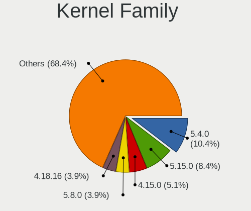

| Version | Computers | Percent |
|---------|-----------|---------|
| 5.4.0   | 123       | 12.53%  |
| 5.15.0  | 89        | 9.06%   |
| 4.15.0  | 59        | 6.01%   |
| 5.8.0   | 46        | 4.68%   |
| 4.18.16 | 42        | 4.28%   |
| 5.13.0  | 33        | 3.36%   |
| 5.3.0   | 31        | 3.16%   |
| 5.19.0  | 29        | 2.95%   |
| 5.11.0  | 29        | 2.95%   |
| 5.16.7  | 27        | 2.75%   |
| 6.2.0   | 26        | 2.65%   |
| 5.10.14 | 25        | 2.55%   |
| 5.10.0  | 22        | 2.24%   |
| 5.0.0   | 18        | 1.83%   |
| 4.18.0  | 16        | 1.63%   |
| 4.19.0  | 15        | 1.53%   |
| 5.6.14  | 14        | 1.43%   |
| 6.2.6   | 13        | 1.32%   |
| 6.1.0   | 12        | 1.22%   |
| 6.1.1   | 11        | 1.12%   |
| 6.5.0   | 10        | 1.02%   |
| 4.9.60  | 7         | 0.71%   |
| 4.9.20  | 6         | 0.61%   |
| 6.4.11  | 5         | 0.51%   |
| 5.9.16  | 5         | 0.51%   |
| 4.9.124 | 5         | 0.51%   |
| 6.0.10  | 4         | 0.41%   |
| 5.16.13 | 4         | 0.41%   |
| 4.4.0   | 4         | 0.41%   |
| 6.4.12  | 3         | 0.31%   |
| 6.4.0   | 3         | 0.31%   |
| 6.3.8   | 3         | 0.31%   |
| 5.4.83  | 3         | 0.31%   |
| 5.18.12 | 3         | 0.31%   |
| 5.17.5  | 3         | 0.31%   |
| 5.16.11 | 3         | 0.31%   |
| 5.13.4  | 3         | 0.31%   |
| 5.11.3  | 3         | 0.31%   |
| 5.11.12 | 3         | 0.31%   |
| 5.11.11 | 3         | 0.31%   |

Kernel Major Ver.
-----------------

Linux kernel major version

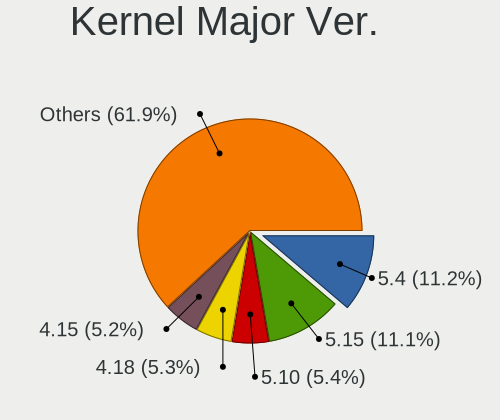

| Version | Computers | Percent |
|---------|-----------|---------|
| 5.4     | 131       | 13.53%  |
| 5.15    | 115       | 11.88%  |
| 5.10    | 63        | 6.51%   |
| 4.15    | 59        | 6.1%    |
| 4.18    | 58        | 5.99%   |
| 5.8     | 51        | 5.27%   |
| 6.2     | 44        | 4.55%   |
| 5.11    | 41        | 4.24%   |
| 6.1     | 40        | 4.13%   |
| 5.13    | 39        | 4.03%   |
| 5.16    | 38        | 3.93%   |
| 5.3     | 36        | 3.72%   |
| 5.19    | 34        | 3.51%   |
| 4.9     | 26        | 2.69%   |
| 4.19    | 22        | 2.27%   |
| 6.5     | 20        | 2.07%   |
| 5.0     | 20        | 2.07%   |
| 5.6     | 18        | 1.86%   |
| 6.4     | 15        | 1.55%   |
| 6.0     | 11        | 1.14%   |
| 6.6     | 10        | 1.03%   |
| 5.9     | 10        | 1.03%   |
| 5.12    | 9         | 0.93%   |
| 5.7     | 8         | 0.83%   |
| 6.3     | 7         | 0.72%   |
| 5.5     | 7         | 0.72%   |
| 5.18    | 7         | 0.72%   |
| 5.17    | 7         | 0.72%   |
| 5.14    | 6         | 0.62%   |
| 4.4     | 4         | 0.41%   |
| 4.1     | 3         | 0.31%   |
| 5.2     | 2         | 0.21%   |
| 6.7     | 1         | 0.1%    |
| 5.1     | 1         | 0.1%    |
| 4.7     | 1         | 0.1%    |
| 4.17    | 1         | 0.1%    |
| 4.16    | 1         | 0.1%    |
| 4.12    | 1         | 0.1%    |
| 4.11    | 1         | 0.1%    |

Arch
----

OS architecture (x86_64, i586, etc.)

| Name    | Computers | Percent |
|---------|-----------|---------|
| x86_64  | 793       | 92.1%   |
| i686    | 50        | 5.81%   |
| aarch64 | 12        | 1.39%   |
| armv7l  | 6         | 0.7%    |

DE
--

Desktop Environment

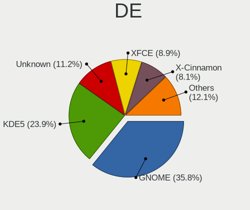

| Name            | Computers | Percent |
|-----------------|-----------|---------|
| GNOME           | 319       | 35.96%  |
| KDE5            | 220       | 24.8%   |
| Unknown         | 95        | 10.71%  |
| XFCE            | 84        | 9.47%   |
| X-Cinnamon      | 78        | 8.79%   |
| MATE            | 25        | 2.82%   |
| KDE4            | 14        | 1.58%   |
| KDE             | 11        | 1.24%   |
| LXQt            | 8         | 0.9%    |
| Cinnamon        | 8         | 0.9%    |
| LXDE            | 6         | 0.68%   |
| Unity           | 5         | 0.56%   |
| Pantheon        | 4         | 0.45%   |
| Openbox         | 2         | 0.23%   |
| Hyprland        | 2         | 0.23%   |
| Budgie          | 2         | 0.23%   |
| Trinity         | 1         | 0.11%   |
| GNOME Flashback | 1         | 0.11%   |
| bspwm           | 1         | 0.11%   |
| awesome         | 1         | 0.11%   |

Display Server
--------------

X11 or Wayland

| Name        | Computers | Percent |
|-------------|-----------|---------|
| X11         | 679       | 77.33%  |
| Wayland     | 135       | 15.38%  |
| Unknown     | 44        | 5.01%   |
| Tty         | 19        | 2.16%   |
| Unspecified | 1         | 0.11%   |

Display Manager
---------------

SDDM, LightDM, etc.

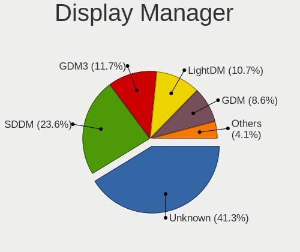

| Name    | Computers | Percent |
|---------|-----------|---------|
| Unknown | 386       | 43.62%  |
| SDDM    | 201       | 22.71%  |
| LightDM | 92        | 10.4%   |
| GDM3    | 85        | 9.6%    |
| GDM     | 77        | 8.7%    |
| TDM     | 21        | 2.37%   |
| KDM     | 14        | 1.58%   |
| SLiM    | 5         | 0.56%   |
| XDM     | 2         | 0.23%   |
| Ly      | 1         | 0.11%   |
| LXDM    | 1         | 0.11%   |

OS Lang
-------

Language

| Lang        | Computers | Percent |
|-------------|-----------|---------|
| en_US       | 347       | 38.9%   |
| sk_SK       | 276       | 30.94%  |
| Unknown     | 165       | 18.5%   |
| cs_CZ       | 30        | 3.36%   |
| C           | 25        | 2.8%    |
| en_GB       | 21        | 2.35%   |
| hu_HU       | 11        | 1.23%   |
| ru_RU       | 3         | 0.34%   |
| sr_RS@latin | 2         | 0.22%   |
| pl_PL       | 2         | 0.22%   |
| de_DE       | 2         | 0.22%   |
| uk_UA       | 1         | 0.11%   |
| ru_UA       | 1         | 0.11%   |
| POSIX       | 1         | 0.11%   |
| it_IT       | 1         | 0.11%   |
| en_US     | 1         | 0.11%   |
| en_CA       | 1         | 0.11%   |
| en_AU       | 1         | 0.11%   |
| C.UTF8      | 1         | 0.11%   |

Boot Mode
---------

EFI or BIOS

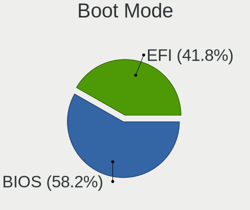

| Mode | Computers | Percent |
|------|-----------|---------|
| BIOS | 527       | 60.09%  |
| EFI  | 350       | 39.91%  |

Filesystem
----------

Type of filesystem

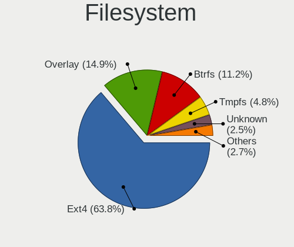

| Type    | Computers | Percent |
|---------|-----------|---------|
| Ext4    | 596       | 66.52%  |
| Overlay | 142       | 15.85%  |
| Btrfs   | 83        | 9.26%   |
| Unknown | 27        | 3.01%   |
| Tmpfs   | 24        | 2.68%   |
| Xfs     | 10        | 1.12%   |
| Zfs     | 8         | 0.89%   |
| Ext2    | 3         | 0.33%   |
| Ext3    | 2         | 0.22%   |
| F2fs    | 1         | 0.11%   |

Part. scheme
------------

Scheme of partitioning

| Type    | Computers | Percent |
|---------|-----------|---------|
| Unknown | 411       | 46.49%  |
| GPT     | 283       | 32.01%  |
| MBR     | 190       | 21.49%  |

Dual Boot with Linux/BSD
------------------------

Hosting more than one Linux/BSD

| Dual boot | Computers | Percent |
|-----------|-----------|---------|
| No        | 737       | 82.72%  |
| Yes       | 154       | 17.28%  |

Dual Boot (Win)
---------------

Hosting Linux and Windows

| Dual boot | Computers | Percent |
|-----------|-----------|---------|
| No        | 591       | 67.85%  |
| Yes       | 280       | 32.15%  |

Board
-----

Vendor
------

Motherboard manufacturer

| Name                    | Computers | Percent |
|-------------------------|-----------|---------|
| ASUSTek Computer        | 187       | 21.85%  |
| Lenovo                  | 150       | 17.52%  |
| Hewlett-Packard         | 122       | 14.25%  |
| Dell                    | 85        | 9.93%   |
| Gigabyte Technology     | 51        | 5.96%   |
| Acer                    | 47        | 5.49%   |
| MSI                     | 45        | 5.26%   |
| ASRock                  | 25        | 2.92%   |
| Toshiba                 | 18        | 2.1%    |
| Intel                   | 14        | 1.64%   |
| Sony                    | 9         | 1.05%   |
| Apple                   | 9         | 1.05%   |
| UMAX                    | 7         | 0.82%   |
| Raspberry Pi Foundation | 7         | 0.82%   |
| Unknown                 | 7         | 0.82%   |
| Valve                   | 5         | 0.58%   |
| Samsung Electronics     | 5         | 0.58%   |
| Packard Bell            | 5         | 0.58%   |
| Fujitsu Siemens         | 5         | 0.58%   |
| Foxconn                 | 5         | 0.58%   |
| HUAWEI                  | 4         | 0.47%   |
| Fujitsu                 | 4         | 0.47%   |
| ZOTAC                   | 3         | 0.35%   |
| Timi                    | 3         | 0.35%   |
| Pegatron                | 3         | 0.35%   |
| Hardkernel              | 3         | 0.35%   |
| eMachines               | 3         | 0.35%   |
| Techvision              | 2         | 0.23%   |
| Shuttle                 | 2         | 0.23%   |
| Qualcomm Technologies   | 2         | 0.23%   |
| Medion                  | 2         | 0.23%   |
| Google                  | 2         | 0.23%   |
| Xunlong                 | 1         | 0.12%   |
| VIA Technologies        | 1         | 0.12%   |
| TYAN Computer           | 1         | 0.12%   |
| Teclast                 | 1         | 0.12%   |
| sunxi                   | 1         | 0.12%   |
| Rockchip                | 1         | 0.12%   |
| Radiant Systems         | 1         | 0.12%   |
| Quanta                  | 1         | 0.12%   |

Model
-----

Motherboard model

| Name                                | Computers | Percent |
|-------------------------------------|-----------|---------|
| ASUS All Series                     | 14        | 1.64%   |
| Unknown                             | 8         | 0.93%   |
| Valve Jupiter                       | 5         | 0.58%   |
| HP Pavilion dv6                     | 5         | 0.58%   |
| ASUS TUF Gaming B550M-PLUS          | 5         | 0.58%   |
| RPi Raspberry Pi 4 Model B Rev 1.4  | 4         | 0.47%   |
| ASUS X550CC                         | 4         | 0.47%   |
| MSI MS-7D25                         | 3         | 0.35%   |
| Lenovo IdeaPadFlex 5 15IIL05 81X3   | 3         | 0.35%   |
| HP ProBook 4540s                    | 3         | 0.35%   |
| HP ProBook 4330s                    | 3         | 0.35%   |
| HP Pavilion g6                      | 3         | 0.35%   |
| Hardkernel ODROID-M1                | 3         | 0.35%   |
| Gigabyte F2A68HM-DS2                | 3         | 0.35%   |
| Acer Swift SF314-43                 | 3         | 0.35%   |
| UMAX VisionBook 14Wr Plus           | 2         | 0.23%   |
| Toshiba Satellite P300              | 2         | 0.23%   |
| Timi Redmi Book Pro 15 2022         | 2         | 0.23%   |
| Techvision TVI7309X                 | 2         | 0.23%   |
| Qualcomm BENGAL IDP                 | 2         | 0.23%   |
| MSI VR610                           | 2         | 0.23%   |
| MSI MS-7C91                         | 2         | 0.23%   |
| MSI MS-7C02                         | 2         | 0.23%   |
| MSI MS-7592                         | 2         | 0.23%   |
| Lenovo Yoga Slim 7 Pro 14ITL5 82FX  | 2         | 0.23%   |
| Lenovo Y520-15IKBN 80WK             | 2         | 0.23%   |
| Lenovo ThinkPad P50 20EQS0VV2S      | 2         | 0.23%   |
| Lenovo ThinkBook 15 G3 ACL 21A4     | 2         | 0.23%   |
| Lenovo IdeaPad Z500 20202           | 2         | 0.23%   |
| Lenovo IdeaPad U260 20067           | 2         | 0.23%   |
| Lenovo IdeaPad S145-14AST 81ST      | 2         | 0.23%   |
| Lenovo IdeaPad Gaming 3 15ACH6 82K2 | 2         | 0.23%   |
| Lenovo IdeaPad 5 15ABA7 82SG        | 2         | 0.23%   |
| Lenovo IdeaPad 320-15IAP 80XR       | 2         | 0.23%   |
| Lenovo IdeaCentre Q180 10087&3110   | 2         | 0.23%   |
| Lenovo G580                         | 2         | 0.23%   |
| HUAWEI KLVL-WXX9                    | 2         | 0.23%   |
| HP ZBook 15 G3                      | 2         | 0.23%   |
| HP ProBook 6570b                    | 2         | 0.23%   |
| HP ProBook 650 G1                   | 2         | 0.23%   |

Model Family
------------

Motherboard model prefix

| Name                  | Computers | Percent |
|-----------------------|-----------|---------|
| Lenovo ThinkPad       | 56        | 6.54%   |
| Lenovo IdeaPad        | 37        | 4.32%   |
| Dell Latitude         | 35        | 4.09%   |
| HP ProBook            | 30        | 3.5%    |
| Acer Aspire           | 28        | 3.27%   |
| HP Pavilion           | 17        | 1.99%   |
| HP Compaq             | 17        | 1.99%   |
| Toshiba Satellite     | 16        | 1.87%   |
| HP EliteBook          | 15        | 1.75%   |
| ASUS All              | 14        | 1.64%   |
| ASUS ROG              | 13        | 1.52%   |
| ASUS PRIME            | 13        | 1.52%   |
| ASUS TUF              | 11        | 1.29%   |
| Lenovo Yoga           | 10        | 1.17%   |
| Dell XPS              | 9         | 1.05%   |
| Dell Vostro           | 9         | 1.05%   |
| Dell OptiPlex         | 9         | 1.05%   |
| ASUS VivoBook         | 9         | 1.05%   |
| Dell Inspiron         | 8         | 0.93%   |
| Unknown               | 8         | 0.93%   |
| RPi Raspberry         | 7         | 0.82%   |
| Dell Precision        | 7         | 0.82%   |
| Acer Swift            | 7         | 0.82%   |
| Acer Extensa          | 6         | 0.7%    |
| Valve Jupiter         | 5         | 0.58%   |
| UMAX VisionBook       | 5         | 0.58%   |
| Lenovo ThinkCentre    | 5         | 0.58%   |
| Lenovo IdeaCentre     | 5         | 0.58%   |
| HP ProLiant           | 5         | 0.58%   |
| Lenovo IdeaPadFlex    | 4         | 0.47%   |
| HP ZBook              | 4         | 0.47%   |
| HP Laptop             | 4         | 0.47%   |
| ASUS Zenbook          | 4         | 0.47%   |
| ASUS X550CC           | 4         | 0.47%   |
| Packard Bell EasyNote | 3         | 0.35%   |
| MSI MS-7D25           | 3         | 0.35%   |
| Lenovo Legion         | 3         | 0.35%   |
| Lenovo 3000           | 3         | 0.35%   |
| HP Spectre            | 3         | 0.35%   |
| HP 250                | 3         | 0.35%   |

MFG Year
--------

Motherboard manufacture year

| Year    | Computers | Percent |
|---------|-----------|---------|
| 2012    | 83        | 9.7%    |
| 2013    | 68        | 7.94%   |
| 2019    | 62        | 7.24%   |
| 2020    | 61        | 7.13%   |
| 2011    | 60        | 7.01%   |
| 2008    | 56        | 6.54%   |
| 2009    | 54        | 6.31%   |
| 2018    | 50        | 5.84%   |
| 2021    | 42        | 4.91%   |
| 2010    | 42        | 4.91%   |
| 2014    | 41        | 4.79%   |
| 2007    | 41        | 4.79%   |
| 2017    | 39        | 4.56%   |
| 2016    | 38        | 4.44%   |
| 2022    | 34        | 3.97%   |
| 2015    | 32        | 3.74%   |
| 2006    | 22        | 2.57%   |
| Unknown | 15        | 1.75%   |
| 2023    | 10        | 1.17%   |
| 2005    | 3         | 0.35%   |
| 2002    | 1         | 0.12%   |
| 2001    | 1         | 0.12%   |
| 2000    | 1         | 0.12%   |

Form Factor
-----------

Physical design of the computer

| Name           | Computers | Percent |
|----------------|-----------|---------|
| Notebook       | 481       | 56.19%  |
| Desktop        | 304       | 35.51%  |
| Convertible    | 20        | 2.34%   |
| System on chip | 16        | 1.87%   |
| All in one     | 15        | 1.75%   |
| Mini pc        | 10        | 1.17%   |
| Server         | 6         | 0.7%    |
| Tablet         | 4         | 0.47%   |

Secure Boot
-----------

Enabled or disabled

| State    | Computers | Percent |
|----------|-----------|---------|
| Disabled | 798       | 92.58%  |
| Enabled  | 64        | 7.42%   |

Coreboot
--------

Have coreboot on board

| Used | Computers | Percent |
|------|-----------|---------|
| No   | 854       | 99.77%  |
| Yes  | 2         | 0.23%   |

RAM Size
--------

Total RAM memory

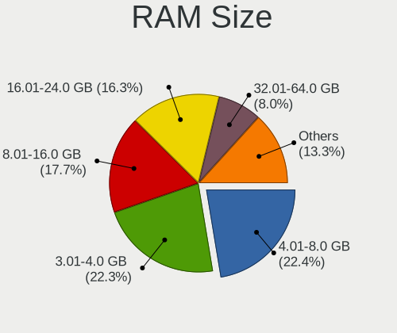

| Size in GB      | Computers | Percent |
|-----------------|-----------|---------|
| 3.01-4.0        | 209       | 23.72%  |
| 4.01-8.0        | 201       | 22.81%  |
| 8.01-16.0       | 159       | 18.05%  |
| 16.01-24.0      | 138       | 15.66%  |
| 32.01-64.0      | 55        | 6.24%   |
| 1.01-2.0        | 49        | 5.56%   |
| 2.01-3.0        | 22        | 2.5%    |
| 64.01-256.0     | 19        | 2.16%   |
| 24.01-32.0      | 12        | 1.36%   |
| 0.51-1.0        | 12        | 1.36%   |
| 0.01-0.5        | 3         | 0.34%   |
| More than 256.0 | 2         | 0.23%   |

RAM Used
--------

Used RAM memory

| Used GB    | Computers | Percent |
|------------|-----------|---------|
| 1.01-2.0   | 343       | 35.65%  |
| 2.01-3.0   | 206       | 21.41%  |
| 0.51-1.0   | 114       | 11.85%  |
| 3.01-4.0   | 111       | 11.54%  |
| 4.01-8.0   | 97        | 10.08%  |
| 0.01-0.5   | 46        | 4.78%   |
| 8.01-16.0  | 38        | 3.95%   |
| 16.01-24.0 | 3         | 0.31%   |
| 32.01-64.0 | 2         | 0.21%   |
| 24.01-32.0 | 2         | 0.21%   |

Total Drives
------------

Number of drives on board

| Drives | Computers | Percent |
|--------|-----------|---------|
| 1      | 548       | 60.42%  |
| 2      | 228       | 25.14%  |
| 3      | 66        | 7.28%   |
| 4      | 19        | 2.09%   |
| 5      | 18        | 1.98%   |
| 0      | 17        | 1.87%   |
| 6      | 6         | 0.66%   |
| 31     | 1         | 0.11%   |
| 17     | 1         | 0.11%   |
| 13     | 1         | 0.11%   |
| 8      | 1         | 0.11%   |
| 7      | 1         | 0.11%   |

Has CD-ROM
----------

Has CD-ROM on board

| Presented | Computers | Percent |
|-----------|-----------|---------|
| No        | 489       | 56.47%  |
| Yes       | 377       | 43.53%  |

Has Ethernet
------------

Has Ethernet on board

| Presented | Computers | Percent |
|-----------|-----------|---------|
| Yes       | 740       | 86.25%  |
| No        | 118       | 13.75%  |

Has WiFi
--------

Has WiFi module

| Presented | Computers | Percent |
|-----------|-----------|---------|
| Yes       | 612       | 70.83%  |
| No        | 252       | 29.17%  |

Has Bluetooth
-------------

Has Bluetooth module

| Presented | Computers | Percent |
|-----------|-----------|---------|
| Yes       | 457       | 52.71%  |
| No        | 410       | 47.29%  |

Location
--------

Country
-------

Geographic location (country)

| Country  | Computers | Percent |
|----------|-----------|---------|
| Slovakia | 856       | 100%    |

City
----

Geographic location (city)

| City                   | Computers | Percent |
|------------------------|-----------|---------|
| Bratislava             | 305       | 32.34%  |
| Koice                | 68        | 7.21%   |
| Bansk Bystrica       | 38        | 4.03%   |
| Nitra                  | 36        | 3.82%   |
| ilina                | 18        | 1.91%   |
| Trnava                 | 16        | 1.7%    |
| Preov                | 15        | 1.59%   |
| Nov Zmky           | 13        | 1.38%   |
| Poprad                 | 12        | 1.27%   |
| Martin                 | 12        | 1.27%   |
| Humenn               | 12        | 1.27%   |
| Dolny Ohaj             | 10        | 1.06%   |
| Brezno                 | 10        | 1.06%   |
| Bardejov               | 10        | 1.06%   |
| Zvolen                 | 9         | 0.95%   |
| Trenn              | 9         | 0.95%   |
| Levice                 | 8         | 0.85%   |
| Tornaa               | 7         | 0.74%   |
| Soblahov               | 6         | 0.64%   |
| Ruomberok            | 6         | 0.64%   |
| Pezinok                | 6         | 0.64%   |
| Luenec               | 6         | 0.64%   |
| Kysuck Nov Mesto   | 6         | 0.64%   |
| Galanta                | 6         | 0.64%   |
| Cechynce               | 6         | 0.64%   |
| Topoany            | 5         | 0.53%   |
| Senec                  | 5         | 0.53%   |
| Roava              | 5         | 0.53%   |
| Liptovsk Mikul   | 5         | 0.53%   |
| trovo              | 4         | 0.42%   |
| Skalica                | 4         | 0.42%   |
| aa                 | 4         | 0.42%   |
| Rozhanovce             | 4         | 0.42%   |
| Rimavsk Sobota       | 4         | 0.42%   |
| Nov Mesto nad Vhom | 4         | 0.42%   |
| Modra                  | 4         | 0.42%   |
| Dunajsk Streda       | 4         | 0.42%   |
| Velky Krtis            | 3         | 0.32%   |
| Spisk Nov Ves    | 3         | 0.32%   |
| Petralka           | 3         | 0.32%   |

Drives
------

Drive Vendor
------------

Hard drive vendors

| Vendor                      | Computers | Drives | Percent |
|-----------------------------|-----------|--------|---------|
| WDC                         | 210       | 412    | 16.99%  |
| Seagate                     | 189       | 274    | 15.29%  |
| Samsung Electronics         | 183       | 283    | 14.81%  |
| Toshiba                     | 66        | 109    | 5.34%   |
| Kingston                    | 64        | 81     | 5.18%   |
| SanDisk                     | 55        | 68     | 4.45%   |
| Unknown                     | 54        | 82     | 4.37%   |
| Hitachi                     | 47        | 59     | 3.8%    |
| A-DATA Technology           | 41        | 59     | 3.32%   |
| Intel                       | 40        | 58     | 3.24%   |
| Patriot                     | 36        | 62     | 2.91%   |
| SK hynix                    | 28        | 33     | 2.27%   |
| Micron Technology           | 23        | 31     | 1.86%   |
| Crucial                     | 23        | 28     | 1.86%   |
| HGST                        | 21        | 30     | 1.7%    |
| Apacer                      | 15        | 19     | 1.21%   |
| Verbatim                    | 8         | 10     | 0.65%   |
| Phison                      | 8         | 10     | 0.65%   |
| Maxtor                      | 7         | 12     | 0.57%   |
| Phison Electronics          | 6         | 6      | 0.49%   |
| Gigabyte Technology         | 6         | 8      | 0.49%   |
| Fujitsu                     | 6         | 7      | 0.49%   |
| China                       | 6         | 9      | 0.49%   |
| OCZ                         | 5         | 5      | 0.4%    |
| KIOXIA                      | 5         | 16     | 0.4%    |
| KingDian                    | 5         | 7      | 0.4%    |
| LITEON                      | 4         | 4      | 0.32%   |
| HS-SSD-E100                 | 4         | 4      | 0.32%   |
| Unknown                     | 4         | 4      | 0.32%   |
| Union Memory                | 3         | 3      | 0.24%   |
| Micron/Crucial Technology   | 3         | 3      | 0.24%   |
| LITEONIT                    | 3         | 3      | 0.24%   |
| Kingston Technology Company | 3         | 6      | 0.24%   |
| Intenso                     | 3         | 7      | 0.24%   |
| IBM/Hitachi                 | 3         | 3      | 0.24%   |
| Hewlett-Packard             | 3         | 5      | 0.24%   |
| GOODRAM                     | 3         | 5      | 0.24%   |
| Apple                       | 3         | 4      | 0.24%   |
| XPG                         | 2         | 5      | 0.16%   |
| Transcend                   | 2         | 2      | 0.16%   |

Drive Model
-----------

Hard drive models

| Model                                               | Computers | Percent |
|-----------------------------------------------------|-----------|---------|
| Samsung SSD 860 EVO 500GB                           | 15        | 1.09%   |
| Patriot Burst 240GB SSD                             | 14        | 1.02%   |
| Kingston SV300S37A120G 120GB SSD                    | 12        | 0.87%   |
| Samsung SSD 850 EVO 250GB                           | 11        | 0.8%    |
| Samsung SSD 870 EVO 500GB                           | 10        | 0.73%   |
| Samsung SSD 860 EVO 250GB                           | 10        | 0.73%   |
| Samsung SSD 850 EVO 500GB                           | 10        | 0.73%   |
| Unknown MMC Card  64GB                              | 9         | 0.65%   |
| Seagate ST9500325AS 500GB                           | 9         | 0.65%   |
| Patriot Burst 120GB SSD                             | 9         | 0.65%   |
| Kingston SA400S37120G 120GB SSD                     | 9         | 0.65%   |
| Samsung NVMe SSD Controller SM981/PM981/PM983 1TB   | 8         | 0.58%   |
| WDC WDS240G2G0B-00EPW0 240GB SSD                    | 7         | 0.51%   |
| Seagate ST3500418AS 500GB                           | 7         | 0.51%   |
| Seagate ST1000LM035-1RK172 1TB                      | 7         | 0.51%   |
| Patriot Burst 480GB SSD                             | 7         | 0.51%   |
| WDC WD10EZEX-08WN4A0 1TB                            | 6         | 0.44%   |
| Seagate ST9500420AS 500GB                           | 6         | 0.44%   |
| Seagate ST2000DM008-2FR102 2TB                      | 6         | 0.44%   |
| Seagate ST1000LM024 HN-M101MBB 1TB                  | 6         | 0.44%   |
| SanDisk NVMe SSD Drive 512GB                        | 6         | 0.44%   |
| SanDisk NVMe SSD Drive 1024GB                       | 6         | 0.44%   |
| Samsung NVMe SSD Controller SM961/PM961/SM963 256GB | 6         | 0.44%   |
| Kingston SA400S37240G 240GB SSD                     | 6         | 0.44%   |
| HGST HTS721010A9E630 1TB                            | 6         | 0.44%   |
| Apacer AS350 512GB SSD                              | 6         | 0.44%   |
| WDC WDS500G2B0A-00SM50 500GB SSD                    | 5         | 0.36%   |
| WDC WDS240G2G0A-00JH30 240GB SSD                    | 5         | 0.36%   |
| WDC WD20EZRZ-00Z5HB0 2TB                            | 5         | 0.36%   |
| Toshiba NVMe SSD Drive 512GB                        | 5         | 0.36%   |
| Seagate ST1000DM003-1CH162 1TB                      | 5         | 0.36%   |
| Samsung NVMe SSD Drive 500GB                        | 5         | 0.36%   |
| Hitachi HTS543232A7A384 320GB                       | 5         | 0.36%   |
| HGST HTS725050A7E630 500GB                          | 5         | 0.36%   |
| A-DATA SU650 120GB SSD                              | 5         | 0.36%   |
| A-DATA SP600 32GB SSD                               | 5         | 0.36%   |
| Unknown MMC Card  32GB                              | 4         | 0.29%   |
| Unknown MMC Card  1GB                               | 4         | 0.29%   |
| Toshiba MQ04ABF100 1TB                              | 4         | 0.29%   |
| Toshiba MQ01ABF050 500GB                            | 4         | 0.29%   |

HDD Vendor
----------

Hard disk drive vendors

| Vendor              | Computers | Drives | Percent |
|---------------------|-----------|--------|---------|
| Seagate             | 187       | 271    | 35.15%  |
| WDC                 | 181       | 365    | 34.02%  |
| Toshiba             | 48        | 89     | 9.02%   |
| Hitachi             | 47        | 59     | 8.83%   |
| Samsung Electronics | 24        | 38     | 4.51%   |
| HGST                | 21        | 30     | 3.95%   |
| Maxtor              | 7         | 12     | 1.32%   |
| Fujitsu             | 6         | 7      | 1.13%   |
| IBM/Hitachi         | 3         | 3      | 0.56%   |
| HGST HTS            | 2         | 2      | 0.38%   |
| Hewlett-Packard     | 2         | 4      | 0.38%   |
| USB3.0              | 1         | 2      | 0.19%   |
| Unknown             | 1         | 1      | 0.19%   |
| StoreJet            | 1         | 1      | 0.19%   |
| ExcelStor           | 1         | 1      | 0.19%   |

SSD Vendor
----------

Solid state drive vendors

| Vendor              | Computers | Drives | Percent |
|---------------------|-----------|--------|---------|
| Samsung Electronics | 99        | 138    | 24.5%   |
| Kingston            | 48        | 65     | 11.88%  |
| A-DATA Technology   | 35        | 53     | 8.66%   |
| Patriot             | 34        | 59     | 8.42%   |
| SanDisk             | 27        | 31     | 6.68%   |
| Intel               | 23        | 36     | 5.69%   |
| Crucial             | 23        | 28     | 5.69%   |
| WDC                 | 22        | 26     | 5.45%   |
| Apacer              | 11        | 15     | 2.72%   |
| Micron Technology   | 9         | 14     | 2.23%   |
| Verbatim            | 7         | 9      | 1.73%   |
| Toshiba             | 7         | 7      | 1.73%   |
| SK hynix            | 7         | 7      | 1.73%   |
| China               | 6         | 9      | 1.49%   |
| OCZ                 | 5         | 5      | 1.24%   |
| LITEON              | 4         | 4      | 0.99%   |
| Gigabyte Technology | 4         | 6      | 0.99%   |
| LITEONIT            | 3         | 3      | 0.74%   |
| KingDian            | 3         | 5      | 0.74%   |
| Intenso             | 3         | 7      | 0.74%   |
| GOODRAM             | 3         | 5      | 0.74%   |
| Union Memory        | 2         | 2      | 0.5%    |
| Transcend           | 2         | 2      | 0.5%    |
| FORESEE             | 2         | 3      | 0.5%    |
| WDC WDS2            | 1         | 1      | 0.25%   |
| ULTIMATE            | 1         | 2      | 0.25%   |
| PNY                 | 1         | 2      | 0.25%   |
| Netac               | 1         | 1      | 0.25%   |
| KingSpec            | 1         | 1      | 0.25%   |
| IM3D                | 1         | 1      | 0.25%   |
| HS-SSD-E100         | 1         | 1      | 0.25%   |
| HS-SSD-C100         | 1         | 3      | 0.25%   |
| Hewlett-Packard     | 1         | 1      | 0.25%   |
| Faspeed             | 1         | 1      | 0.25%   |
| Emtec               | 1         | 1      | 0.25%   |
| Corsair             | 1         | 1      | 0.25%   |
| Apple               | 1         | 1      | 0.25%   |
| AMD                 | 1         | 1      | 0.25%   |
| 2.5                 | 1         | 1      | 0.25%   |

Drive Kind
----------

HDD or SSD

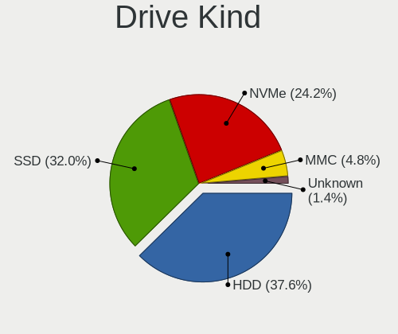

| Kind    | Computers | Drives | Percent |
|---------|-----------|--------|---------|
| HDD     | 438       | 885    | 39.78%  |
| SSD     | 361       | 558    | 32.79%  |
| NVMe    | 233       | 342    | 21.16%  |
| MMC     | 54        | 78     | 4.9%    |
| Unknown | 15        | 19     | 1.36%   |

Drive Connector
---------------

SATA, SAS, NVMe, etc.

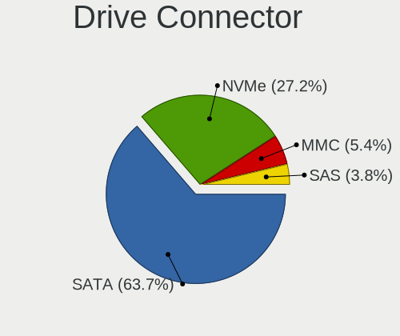

| Type | Computers | Drives | Percent |
|------|-----------|--------|---------|
| SATA | 650       | 1416   | 66.74%  |
| NVMe | 233       | 341    | 23.92%  |
| MMC  | 54        | 78     | 5.54%   |
| SAS  | 37        | 47     | 3.8%    |

Drive Size
----------

Size of hard drive

| Size in TB | Computers | Drives | Percent |
|------------|-----------|--------|---------|
| 0.01-0.5   | 534       | 931    | 65.2%   |
| 0.51-1.0   | 192       | 338    | 23.44%  |
| 1.01-2.0   | 53        | 89     | 6.47%   |
| 3.01-4.0   | 19        | 45     | 2.32%   |
| 2.01-3.0   | 13        | 26     | 1.59%   |
| 4.01-10.0  | 7         | 13     | 0.85%   |
| 10.01-20.0 | 1         | 1      | 0.12%   |

Space Total
-----------

Amount of disk space available on the file system

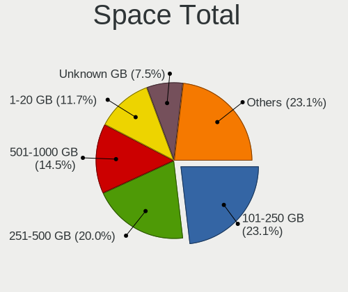

| Size in GB     | Computers | Percent |
|----------------|-----------|---------|
| 101-250        | 224       | 23.83%  |
| 251-500        | 187       | 19.89%  |
| 501-1000       | 133       | 14.15%  |
| 1-20           | 111       | 11.81%  |
| Unknown        | 70        | 7.45%   |
| 51-100         | 63        | 6.7%    |
| 1001-2000      | 56        | 5.96%   |
| 21-50          | 53        | 5.64%   |
| More than 3000 | 26        | 2.77%   |
| 2001-3000      | 17        | 1.81%   |

Space Used
----------

Amount of used disk space

| Used GB        | Computers | Percent |
|----------------|-----------|---------|
| 1-20           | 383       | 39.94%  |
| 21-50          | 151       | 15.75%  |
| 101-250        | 113       | 11.78%  |
| 51-100         | 97        | 10.11%  |
| Unknown        | 70        | 7.3%    |
| 251-500        | 60        | 6.26%   |
| 501-1000       | 48        | 5.01%   |
| 1001-2000      | 22        | 2.29%   |
| More than 3000 | 11        | 1.15%   |
| 2001-3000      | 4         | 0.42%   |

Malfunc. Drives
---------------

Drive models with a malfunction

| Model                            | Computers | Drives | Percent |
|----------------------------------|-----------|--------|---------|
| Toshiba MK7575GSX 752GB          | 3         | 5      | 2.5%    |
| Seagate ST9500325AS 500GB        | 3         | 4      | 2.5%    |
| WDC WD10EZEX-75WN4A0 1TB         | 2         | 3      | 1.67%   |
| WDC WD10EALX-009BA0 1TB          | 2         | 2      | 1.67%   |
| Seagate ST980811AS 80GB          | 2         | 2      | 1.67%   |
| Seagate ST9250315AS 250GB        | 2         | 2      | 1.67%   |
| Seagate ST500LM000-SSHD-8GB      | 2         | 3      | 1.67%   |
| Seagate ST3320413CS 320GB        | 2         | 2      | 1.67%   |
| Seagate ST320LT007-9ZV142 320GB  | 2         | 2      | 1.67%   |
| Kingston SV300S37A60G 64GB SSD   | 2         | 3      | 1.67%   |
| Hitachi HTS543232A7A384 320GB    | 2         | 2      | 1.67%   |
| HGST HTS721010A9E630 1TB         | 2         | 6      | 1.67%   |
| WDC WDS240G2G0A-00JH30 240GB SSD | 1         | 1      | 0.83%   |
| WDC WD800JD-60LSA0 80GB          | 1         | 1      | 0.83%   |
| WDC WD7500BPVT-80HXZT3 752GB     | 1         | 1      | 0.83%   |
| WDC WD7500BPVT-24HXZT3 752GB     | 1         | 1      | 0.83%   |
| WDC WD7500AAVS-00D7B1 752GB      | 1         | 1      | 0.83%   |
| WDC WD50EFRX-68MYMN1 5TB         | 1         | 1      | 0.83%   |
| WDC WD5000LPVT-24G33T1 500GB     | 1         | 1      | 0.83%   |
| WDC WD5000BPVT-00HXZT1 500GB     | 1         | 1      | 0.83%   |
| WDC WD5000BEVT-22A0RT0 500GB     | 1         | 1      | 0.83%   |
| WDC WD5000BEKT-22KA9T0 500GB     | 1         | 4      | 0.83%   |
| WDC WD5000AAVS-22G9B1 500GB      | 1         | 4      | 0.83%   |
| WDC WD5000AAKX-603CA0 500GB      | 1         | 1      | 0.83%   |
| WDC WD3200BEVT-75ZCT2 320GB      | 1         | 1      | 0.83%   |
| WDC WD3200AAKS-22L6A0 320GB      | 1         | 1      | 0.83%   |
| WDC WD3200AAJS-56B4A0 320GB      | 1         | 2      | 0.83%   |
| WDC WD2500AAKX-753CA1 250GB      | 1         | 2      | 0.83%   |
| WDC WD20EZRZ-00Z5HB0 2TB         | 1         | 1      | 0.83%   |
| WDC WD20EURS-63S48Y0 2TB         | 1         | 1      | 0.83%   |
| WDC WD1600JS-61MHB1 160GB        | 1         | 1      | 0.83%   |
| WDC WD10JPLX-00MBPT0 1TB         | 1         | 10     | 0.83%   |
| WDC WD10EZEX-08WN4A0 1TB         | 1         | 1      | 0.83%   |
| WDC WD10EZEX-00RKKA0 1TB         | 1         | 1      | 0.83%   |
| WDC WD10EZEX-00KUWA0 1TB         | 1         | 1      | 0.83%   |
| Toshiba MQ01ABF050 500GB         | 1         | 3      | 0.83%   |
| Toshiba MQ01ABD100 1TB           | 1         | 1      | 0.83%   |
| Toshiba MQ01ABD075 752GB         | 1         | 1      | 0.83%   |
| Toshiba MK5056GSY 500GB          | 1         | 1      | 0.83%   |
| Toshiba MK3252GSX 320GB          | 1         | 1      | 0.83%   |

Malfunc. Drive Vendor
---------------------

Vendors of faulty drives

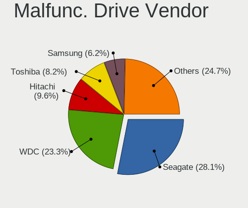

| Vendor              | Computers | Drives | Percent |
|---------------------|-----------|--------|---------|
| Seagate             | 33        | 41     | 27.97%  |
| WDC                 | 25        | 45     | 21.19%  |
| Hitachi             | 13        | 13     | 11.02%  |
| Toshiba             | 10        | 15     | 8.47%   |
| Samsung Electronics | 7         | 18     | 5.93%   |
| Kingston            | 5         | 6      | 4.24%   |
| SK hynix            | 3         | 3      | 2.54%   |
| Maxtor              | 3         | 3      | 2.54%   |
| Intel               | 3         | 3      | 2.54%   |
| HGST                | 3         | 7      | 2.54%   |
| SanDisk             | 2         | 3      | 1.69%   |
| OCZ                 | 2         | 2      | 1.69%   |
| Micron Technology   | 2         | 2      | 1.69%   |
| Lenovo              | 1         | 1      | 0.85%   |
| IM3D                | 1         | 1      | 0.85%   |
| IBM/Hitachi         | 1         | 1      | 0.85%   |
| Fujitsu             | 1         | 2      | 0.85%   |
| ExcelStor           | 1         | 1      | 0.85%   |
| Crucial             | 1         | 1      | 0.85%   |
| A-DATA Technology   | 1         | 1      | 0.85%   |

Malfunc. HDD Vendor
-------------------

Vendors of faulty HDD drives

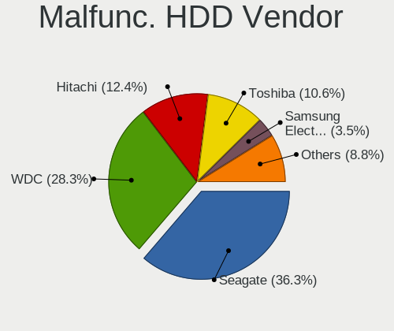

| Vendor              | Computers | Drives | Percent |
|---------------------|-----------|--------|---------|
| Seagate             | 33        | 41     | 35.48%  |
| WDC                 | 24        | 44     | 25.81%  |
| Hitachi             | 13        | 13     | 13.98%  |
| Toshiba             | 10        | 15     | 10.75%  |
| Samsung Electronics | 4         | 8      | 4.3%    |
| Maxtor              | 3         | 3      | 3.23%   |
| HGST                | 3         | 7      | 3.23%   |
| IBM/Hitachi         | 1         | 1      | 1.08%   |
| Fujitsu             | 1         | 2      | 1.08%   |
| ExcelStor           | 1         | 1      | 1.08%   |

Malfunc. Drive Kind
-------------------

Kinds of faulty drives

| Kind | Computers | Drives | Percent |
|------|-----------|--------|---------|
| HDD  | 88        | 135    | 78.57%  |
| SSD  | 20        | 30     | 17.86%  |
| NVMe | 4         | 4      | 3.57%   |

Failed Drives
-------------

Failed drive models

| Model                             | Computers | Drives | Percent |
|-----------------------------------|-----------|--------|---------|
| Toshiba MK5065GSX 500GB           | 2         | 2      | 33.33%  |
| Seagate ST9320325AS 320GB         | 1         | 1      | 16.67%  |
| Seagate ST3500418AS 500GB         | 1         | 2      | 16.67%  |
| Seagate ST2000DM001-1CH164 2TB    | 1         | 1      | 16.67%  |
| Samsung Electronics HD321HJ 320GB | 1         | 2      | 16.67%  |

Failed Drive Vendor
-------------------

Failed drive vendors

| Vendor              | Computers | Drives | Percent |
|---------------------|-----------|--------|---------|
| Seagate             | 3         | 4      | 50%     |
| Toshiba             | 2         | 2      | 33.33%  |
| Samsung Electronics | 1         | 2      | 16.67%  |

Drive Status
------------

Number of failed and malfunc. drives

| Status   | Computers | Drives | Percent |
|----------|-----------|--------|---------|
| Detected | 482       | 923    | 50.9%   |
| Works    | 351       | 782    | 37.06%  |
| Malfunc  | 108       | 169    | 11.4%   |
| Failed   | 6         | 8      | 0.63%   |

Storage controller
------------------

Storage Vendor
--------------

Storage controller vendors

| Vendor                           | Computers | Percent |
|----------------------------------|-----------|---------|
| Intel                            | 550       | 53.19%  |
| AMD                              | 165       | 15.96%  |
| Samsung Electronics              | 78        | 7.54%   |
| SanDisk                          | 41        | 3.97%   |
| Nvidia                           | 24        | 2.32%   |
| JMicron Technology               | 22        | 2.13%   |
| SK hynix                         | 21        | 2.03%   |
| Phison Electronics               | 20        | 1.93%   |
| Kingston Technology Company      | 20        | 1.93%   |
| Micron Technology                | 14        | 1.35%   |
| ASMedia Technology               | 12        | 1.16%   |
| Toshiba America Info Systems     | 11        | 1.06%   |
| ADATA Technology                 | 9         | 0.87%   |
| Marvell Technology Group         | 7         | 0.68%   |
| VIA Technologies                 | 6         | 0.58%   |
| KIOXIA                           | 5         | 0.48%   |
| LSI Logic / Symbios Logic        | 4         | 0.39%   |
| Silicon Integrated Systems [SiS] | 3         | 0.29%   |
| Micron/Crucial Technology        | 3         | 0.29%   |
| Hewlett-Packard                  | 3         | 0.29%   |
| Silicon Motion                   | 2         | 0.19%   |
| Realtek Semiconductor            | 2         | 0.19%   |
| Promise Technology               | 2         | 0.19%   |
| MAXIO Technology (Hangzhou)      | 2         | 0.19%   |
| Apple                            | 2         | 0.19%   |
| Union Memory (Shenzhen)          | 1         | 0.1%    |
| ULi Electronics                  | 1         | 0.1%    |
| Solid State Storage Technology   | 1         | 0.1%    |
| Silicon Image                    | 1         | 0.1%    |
| Lenovo                           | 1         | 0.1%    |
| INNOGRIT                         | 1         | 0.1%    |

Storage Model
-------------

Storage controller models

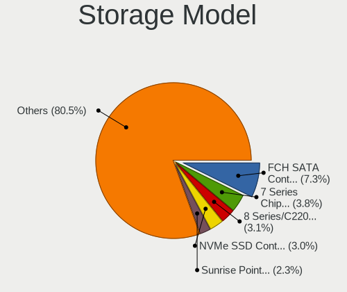

| Model                                                                          | Computers | Percent |
|--------------------------------------------------------------------------------|-----------|---------|
| AMD FCH SATA Controller [AHCI mode]                                            | 92        | 7.37%   |
| Intel 7 Series Chipset Family 6-port SATA Controller [AHCI mode]               | 54        | 4.32%   |
| Samsung NVMe SSD Controller SM981/PM981/PM983                                  | 39        | 3.12%   |
| Intel 8 Series/C220 Series Chipset Family 6-port SATA Controller 1 [AHCI mode] | 38        | 3.04%   |
| Intel 82801G (ICH7 Family) IDE Controller                                      | 30        | 2.4%    |
| Intel Sunrise Point-LP SATA Controller [AHCI mode]                             | 29        | 2.32%   |
| Intel NM10/ICH7 Family SATA Controller [IDE mode]                              | 28        | 2.24%   |
| AMD SB7x0/SB8x0/SB9x0 SATA Controller [AHCI mode]                              | 26        | 2.08%   |
| Intel 6 Series/C200 Series Chipset Family 6 port Mobile SATA AHCI Controller   | 25        | 2%      |
| AMD SB7x0/SB8x0/SB9x0 IDE Controller                                           | 24        | 1.92%   |
| Intel 82801IBM/IEM (ICH9M/ICH9M-E) 4 port SATA Controller [AHCI mode]          | 22        | 1.76%   |
| Intel 82801 Mobile SATA Controller [RAID mode]                                 | 22        | 1.76%   |
| Intel 82801HM/HEM (ICH8M/ICH8M-E) SATA Controller [AHCI mode]                  | 21        | 1.68%   |
| Intel 82801HM/HEM (ICH8M/ICH8M-E) IDE Controller                               | 21        | 1.68%   |
| Intel Q170/Q150/B150/H170/H110/Z170/CM236 Chipset SATA Controller [AHCI Mode]  | 19        | 1.52%   |
| Intel 6 Series/C200 Series Chipset Family 6 port Desktop SATA AHCI Controller  | 18        | 1.44%   |
| Samsung NVMe SSD Controller SM961/PM961/SM963                                  | 17        | 1.36%   |
| SanDisk Extreme Pro / WD Black SN750 / PC SN730 / Red SN700 NVMe SSD           | 16        | 1.28%   |
| Intel 7 Series/C210 Series Chipset Family 6-port SATA Controller [AHCI mode]   | 16        | 1.28%   |
| AMD 500 Series Chipset SATA Controller                                         | 16        | 1.28%   |
| Samsung NVMe SSD Controller 980 (DRAM-less)                                    | 14        | 1.12%   |
| JMicron JMB363 SATA/IDE Controller                                             | 14        | 1.12%   |
| Intel 5 Series/3400 Series Chipset 4 port SATA AHCI Controller                 | 14        | 1.12%   |
| AMD SB7x0/SB8x0/SB9x0 SATA Controller [IDE mode]                               | 14        | 1.12%   |
| Intel 5 Series/3400 Series Chipset 6 port SATA AHCI Controller                 | 13        | 1.04%   |
| Intel 200 Series PCH SATA controller [AHCI mode]                               | 13        | 1.04%   |
| AMD 400 Series Chipset SATA Controller                                         | 13        | 1.04%   |
| Intel Volume Management Device NVMe RAID Controller                            | 12        | 0.96%   |
| Intel Celeron/Pentium Silver Processor SATA Controller                         | 12        | 0.96%   |
| Intel 8 Series SATA Controller 1 [AHCI mode]                                   | 11        | 0.88%   |
| Samsung NVMe SSD Controller PM9A1/PM9A3/980PRO                                 | 10        | 0.8%    |
| Intel SATA Controller [RAID mode]                                              | 10        | 0.8%    |
| Intel Cannon Lake Mobile PCH SATA AHCI Controller                              | 10        | 0.8%    |
| Intel 82801I (ICH9 Family) 2 port SATA Controller [IDE mode]                   | 10        | 0.8%    |
| ASMedia ASM1061/ASM1062 Serial ATA Controller                                  | 10        | 0.8%    |
| Intel Atom Processor E3800 Series SATA AHCI Controller                         | 9         | 0.72%   |
| Intel 82801JI (ICH10 Family) 4 port SATA IDE Controller #1                     | 9         | 0.72%   |
| Intel 82801JI (ICH10 Family) 2 port SATA IDE Controller #2                     | 9         | 0.72%   |
| Intel 82801IR/IO/IH (ICH9R/DO/DH) 4 port SATA Controller [IDE mode]            | 9         | 0.72%   |
| ADATA XPG SX8200 Pro PCIe Gen3x4 M.2 2280 Solid State Drive                    | 9         | 0.72%   |

Storage Kind
------------

Kind of storage controller (IDE, SATA, NVMe, SAS, ...)

| Kind | Computers | Percent |
|------|-----------|---------|
| SATA | 581       | 54.2%   |
| NVMe | 234       | 21.83%  |
| IDE  | 196       | 18.28%  |
| RAID | 58        | 5.41%   |
| SAS  | 2         | 0.19%   |
| SCSI | 1         | 0.09%   |

Processor
---------

CPU Vendor
----------

Processor vendors

| Vendor       | Computers | Percent |
|--------------|-----------|---------|
| Intel        | 615       | 71.85%  |
| AMD          | 224       | 26.17%  |
| ARM          | 14        | 1.64%   |
| Qualcomm     | 2         | 0.23%   |
| CentaurHauls | 1         | 0.12%   |

CPU Model
---------

Processor models

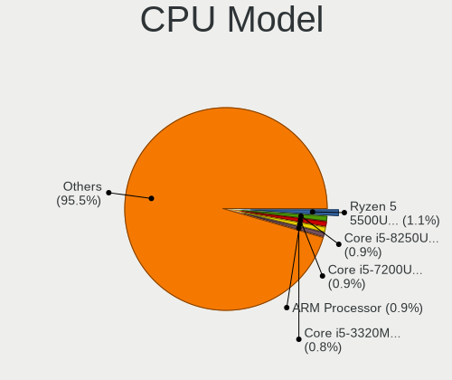

| Model                                   | Computers | Percent |
|-----------------------------------------|-----------|---------|
| Intel Core i5-8250U CPU @ 1.60GHz       | 9         | 1.04%   |
| ARM Processor                           | 9         | 1.04%   |
| AMD Ryzen 5 5500U with Radeon Graphics  | 9         | 1.04%   |
| Intel Core i5-3320M CPU @ 2.60GHz       | 8         | 0.93%   |
| Intel Core i7-8565U CPU @ 1.80GHz       | 7         | 0.81%   |
| Intel Core i5-3210M CPU @ 2.50GHz       | 7         | 0.81%   |
| Intel Core 2 Quad CPU Q6600 @ 2.40GHz   | 7         | 0.81%   |
| Intel Core i7-6820HQ CPU @ 2.70GHz      | 6         | 0.7%    |
| Intel Core i7-1065G7 CPU @ 1.30GHz      | 6         | 0.7%    |
| Intel Core i5-7200U CPU @ 2.50GHz       | 6         | 0.7%    |
| Intel Core i5-6300U CPU @ 2.40GHz       | 6         | 0.7%    |
| Intel Core i3-3110M CPU @ 2.40GHz       | 6         | 0.7%    |
| Intel Core 2 Quad CPU Q9400 @ 2.66GHz   | 6         | 0.7%    |
| Intel 11th Gen Core i7-1165G7 @ 2.80GHz | 6         | 0.7%    |
| Intel 11th Gen Core i5-1135G7 @ 2.40GHz | 6         | 0.7%    |
| Intel Core i7-10510U CPU @ 1.80GHz      | 5         | 0.58%   |
| Intel Core i3-5010U CPU @ 2.10GHz       | 5         | 0.58%   |
| Intel Core i3 CPU M 350 @ 2.27GHz       | 5         | 0.58%   |
| AMD Ryzen 5 5600X 6-Core Processor      | 5         | 0.58%   |
| AMD Custom APU 0405                     | 5         | 0.58%   |
| Intel Pentium Dual CPU T2330 @ 1.60GHz  | 4         | 0.46%   |
| Intel Pentium CPU N4200 @ 1.10GHz       | 4         | 0.46%   |
| Intel Pentium CPU B960 @ 2.20GHz        | 4         | 0.46%   |
| Intel Core i7-8750H CPU @ 2.20GHz       | 4         | 0.46%   |
| Intel Core i7-8550U CPU @ 1.80GHz       | 4         | 0.46%   |
| Intel Core i7-7700K CPU @ 4.20GHz       | 4         | 0.46%   |
| Intel Core i7-4700MQ CPU @ 2.40GHz      | 4         | 0.46%   |
| Intel Core i7-3770 CPU @ 3.40GHz        | 4         | 0.46%   |
| Intel Core i5-3230M CPU @ 2.60GHz       | 4         | 0.46%   |
| Intel Core i5-2500K CPU @ 3.30GHz       | 4         | 0.46%   |
| Intel Core i5-2450M CPU @ 2.50GHz       | 4         | 0.46%   |
| Intel Core i3-3217U CPU @ 1.80GHz       | 4         | 0.46%   |
| Intel Core 2 Duo CPU E8400 @ 3.00GHz    | 4         | 0.46%   |
| Intel Core 2 Duo CPU E6750 @ 2.66GHz    | 4         | 0.46%   |
| Intel Celeron N4000 CPU @ 1.10GHz       | 4         | 0.46%   |
| AMD Ryzen 9 3900X 12-Core Processor     | 4         | 0.46%   |
| AMD Ryzen 7 5700U with Radeon Graphics  | 4         | 0.46%   |
| AMD Ryzen 5 5600G with Radeon Graphics  | 4         | 0.46%   |
| AMD Ryzen 5 4500U with Radeon Graphics  | 4         | 0.46%   |
| AMD E-450 APU with Radeon HD Graphics   | 4         | 0.46%   |

CPU Model Family
----------------

Processor model prefix

| Model                   | Computers | Percent |
|-------------------------|-----------|---------|
| Intel Core i5           | 157       | 18.23%  |
| Intel Core i7           | 108       | 12.54%  |
| Intel Core i3           | 76        | 8.83%   |
| Other                   | 55        | 6.39%   |
| Intel Core 2 Duo        | 54        | 6.27%   |
| Intel Celeron           | 46        | 5.34%   |
| AMD Ryzen 5             | 43        | 4.99%   |
| Intel Pentium           | 38        | 4.41%   |
| AMD Ryzen 7             | 31        | 3.6%    |
| Intel Xeon              | 18        | 2.09%   |
| Intel Core 2 Quad       | 18        | 2.09%   |
| Intel Atom              | 16        | 1.86%   |
| AMD Ryzen 9             | 15        | 1.74%   |
| Intel Pentium Dual-Core | 11        | 1.28%   |
| Intel Pentium Dual      | 11        | 1.28%   |
| AMD Athlon 64 X2        | 10        | 1.16%   |
| AMD A8                  | 9         | 1.05%   |
| AMD Ryzen 3             | 8         | 0.93%   |
| AMD FX                  | 8         | 0.93%   |
| AMD Athlon II X2        | 7         | 0.81%   |
| AMD A6                  | 7         | 0.81%   |
| AMD A10                 | 7         | 0.81%   |
| Intel Core 2            | 6         | 0.7%    |
| AMD Sempron             | 6         | 0.7%    |
| AMD E                   | 6         | 0.7%    |
| Intel Genuine           | 5         | 0.58%   |
| Intel Celeron M         | 5         | 0.58%   |
| Intel Celeron Dual-Core | 5         | 0.58%   |
| AMD Ryzen 5 PRO         | 5         | 0.58%   |
| AMD Phenom II X4        | 5         | 0.58%   |
| AMD Athlon              | 5         | 0.58%   |
| AMD A4                  | 5         | 0.58%   |
| ARM BCM                 | 4         | 0.46%   |
| AMD Ryzen 7 PRO         | 4         | 0.46%   |
| AMD Phenom              | 4         | 0.46%   |
| AMD Athlon X4           | 4         | 0.46%   |
| AMD Athlon 64           | 4         | 0.46%   |
| Intel Pentium 4         | 3         | 0.35%   |
| Intel Pentium M         | 2         | 0.23%   |
| ARM Allwinner           | 2         | 0.23%   |

CPU Cores
---------

Number of processor cores

| Number  | Computers | Percent |
|---------|-----------|---------|
| 2       | 385       | 44.72%  |
| 4       | 291       | 33.8%   |
| 6       | 63        | 7.32%   |
| 8       | 47        | 5.46%   |
| 1       | 41        | 4.76%   |
| 12      | 9         | 1.05%   |
| 16      | 8         | 0.93%   |
| Unknown | 5         | 0.58%   |
| 10      | 4         | 0.46%   |
| 3       | 4         | 0.46%   |
| 20      | 2         | 0.23%   |
| 32      | 1         | 0.12%   |
| 24      | 1         | 0.12%   |

CPU Sockets
-----------

Number of sockets

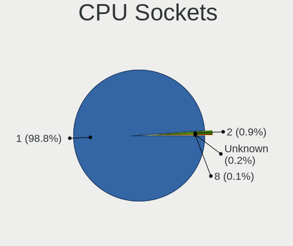

| Number  | Computers | Percent |
|---------|-----------|---------|
| 1       | 847       | 98.95%  |
| 2       | 6         | 0.7%    |
| Unknown | 2         | 0.23%   |
| 8       | 1         | 0.12%   |

CPU Threads
-----------

Threads per core (Hyper-Threading)

| Number  | Computers | Percent |
|---------|-----------|---------|
| 2       | 469       | 54.66%  |
| 1       | 382       | 44.52%  |
| Unknown | 5         | 0.58%   |
| 12      | 1         | 0.12%   |
| 4       | 1         | 0.12%   |

CPU Op-Modes
------------

CPU Operation Modes (32-bit, 64-bit)

| Op mode        | Computers | Percent |
|----------------|-----------|---------|
| 32-bit, 64-bit | 829       | 96.28%  |
| Unknown        | 17        | 1.97%   |
| 32-bit         | 13        | 1.51%   |
| 64-bit         | 2         | 0.23%   |

CPU Microcode
-------------

Microcode number

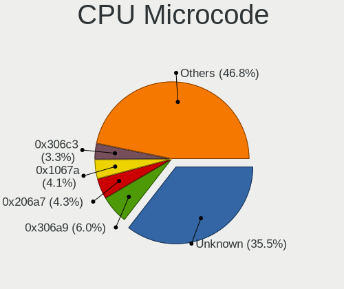

| Number     | Computers | Percent |
|------------|-----------|---------|
| Unknown    | 236       | 26.37%  |
| 0x306a9    | 64        | 7.15%   |
| 0x206a7    | 45        | 5.03%   |
| 0x1067a    | 43        | 4.8%    |
| 0x306c3    | 35        | 3.91%   |
| 0x6fb      | 19        | 2.12%   |
| 0x6fd      | 17        | 1.9%    |
| 0x506e3    | 17        | 1.9%    |
| 0x806ea    | 16        | 1.79%   |
| 0x906ea    | 14        | 1.56%   |
| 0x906e9    | 13        | 1.45%   |
| 0x20655    | 13        | 1.45%   |
| 0x806e9    | 12        | 1.34%   |
| 0x806c1    | 12        | 1.34%   |
| 0x806ec    | 11        | 1.23%   |
| 0x406e3    | 11        | 1.23%   |
| 0x10676    | 11        | 1.23%   |
| 0x06001119 | 10        | 1.12%   |
| 0x40651    | 9         | 1.01%   |
| 0x20652    | 9         | 1.01%   |
| 0x0a50000c | 9         | 1.01%   |
| 0x010000c8 | 9         | 1.01%   |
| 0x706a1    | 8         | 0.89%   |
| 0x08608103 | 8         | 0.89%   |
| 0x08108109 | 8         | 0.89%   |
| 0x706e5    | 7         | 0.78%   |
| 0x306d4    | 7         | 0.78%   |
| 0x30678    | 7         | 0.78%   |
| 0x0a50000d | 7         | 0.78%   |
| 0x6f2      | 6         | 0.67%   |
| 0x406c3    | 6         | 0.67%   |
| 0x08600106 | 6         | 0.67%   |
| 0x06006705 | 6         | 0.67%   |
| 0x08701021 | 5         | 0.56%   |
| 0x08108102 | 5         | 0.56%   |
| 0x0800820d | 5         | 0.56%   |
| 0x906ed    | 4         | 0.45%   |
| 0x906eb    | 4         | 0.45%   |
| 0x6d8      | 4         | 0.45%   |
| 0x506c9    | 4         | 0.45%   |

CPU Microarch
-------------

Microarchitecture

| Name             | Computers | Percent |
|------------------|-----------|---------|
| KabyLake         | 100       | 11.66%  |
| IvyBridge        | 78        | 9.09%   |
| Penryn           | 64        | 7.46%   |
| Haswell          | 60        | 6.99%   |
| Unknown          | 56        | 6.53%   |
| SandyBridge      | 54        | 6.29%   |
| Core             | 54        | 6.29%   |
| Skylake          | 40        | 4.66%   |
| Zen 3            | 30        | 3.5%    |
| Westmere         | 29        | 3.38%   |
| K10              | 28        | 3.26%   |
| Zen 2            | 27        | 3.15%   |
| K8 Hammer        | 25        | 2.91%   |
| Zen+             | 21        | 2.45%   |
| Silvermont       | 21        | 2.45%   |
| Piledriver       | 18        | 2.1%    |
| TigerLake        | 17        | 1.98%   |
| Goldmont plus    | 12        | 1.4%    |
| Excavator        | 12        | 1.4%    |
| Broadwell        | 12        | 1.4%    |
| P6               | 10        | 1.17%   |
| Bonnell          | 10        | 1.17%   |
| IceLake          | 9         | 1.05%   |
| Zen              | 8         | 0.93%   |
| Nehalem          | 7         | 0.82%   |
| CometLake        | 7         | 0.82%   |
| Alderlake Hybrid | 7         | 0.82%   |
| Steamroller      | 6         | 0.7%    |
| Goldmont         | 6         | 0.7%    |
| Bobcat           | 6         | 0.7%    |
| Puma             | 4         | 0.47%   |
| NetBurst         | 4         | 0.47%   |
| Tremont          | 3         | 0.35%   |
| K8 & K10 hybrid  | 3         | 0.35%   |
| K10 Llano        | 3         | 0.35%   |
| Jaguar           | 3         | 0.35%   |
| Bulldozer        | 3         | 0.35%   |
| K6               | 1         | 0.12%   |

Graphics
--------

GPU Vendor
----------

Vendors of graphics cards

| Vendor                                       | Computers | Percent |
|----------------------------------------------|-----------|---------|
| Intel                                        | 461       | 46.1%   |
| Nvidia                                       | 266       | 26.6%   |
| AMD                                          | 259       | 25.9%   |
| Matrox Electronics Systems                   | 7         | 0.7%    |
| VIA Technologies                             | 2         | 0.2%    |
| Silicon Integrated Systems [SiS]             | 2         | 0.2%    |
| XGI Technology (eXtreme Graphics Innovation) | 1         | 0.1%    |
| S3 Graphics                                  | 1         | 0.1%    |
| ASPEED Technology                            | 1         | 0.1%    |

GPU Model
---------

Graphics card models

| Model                                                                                    | Computers | Percent |
|------------------------------------------------------------------------------------------|-----------|---------|
| Intel 3rd Gen Core processor Graphics Controller                                         | 48        | 4.55%   |
| Intel 2nd Generation Core Processor Family Integrated Graphics Controller                | 46        | 4.36%   |
| Intel Core Processor Integrated Graphics Controller                                      | 22        | 2.09%   |
| Intel Mobile 4 Series Chipset Integrated Graphics Controller                             | 19        | 1.8%    |
| Intel UHD Graphics 620                                                                   | 18        | 1.71%   |
| Intel HD Graphics 530                                                                    | 17        | 1.61%   |
| Intel 4th Gen Core Processor Integrated Graphics Controller                              | 17        | 1.61%   |
| Intel CoffeeLake-H GT2 [UHD Graphics 630]                                                | 16        | 1.52%   |
| Intel Xeon E3-1200 v3/4th Gen Core Processor Integrated Graphics Controller              | 15        | 1.42%   |
| AMD Renoir [Radeon RX Vega 6 (Ryzen 4000/5000 Mobile Series)]                            | 15        | 1.42%   |
| AMD Picasso/Raven 2 [Radeon Vega Series / Radeon Vega Mobile Series]                     | 15        | 1.42%   |
| Intel TigerLake-LP GT2 [Iris Xe Graphics]                                                | 14        | 1.33%   |
| Intel Mobile GM965/GL960 Integrated Graphics Controller (secondary)                      | 14        | 1.33%   |
| Intel Mobile GM965/GL960 Integrated Graphics Controller (primary)                        | 14        | 1.33%   |
| AMD Lucienne                                                                             | 14        | 1.33%   |
| Nvidia GK208B [GeForce GT 710]                                                           | 13        | 1.23%   |
| Intel WhiskeyLake-U GT2 [UHD Graphics 620]                                               | 13        | 1.23%   |
| Intel Skylake GT2 [HD Graphics 520]                                                      | 13        | 1.23%   |
| Intel HD Graphics 620                                                                    | 13        | 1.23%   |
| AMD Cezanne [Radeon Vega Series / Radeon Vega Mobile Series]                             | 12        | 1.14%   |
| Intel GeminiLake [UHD Graphics 600]                                                      | 11        | 1.04%   |
| Intel Atom Processor Z36xxx/Z37xxx Series Graphics & Display                             | 11        | 1.04%   |
| Intel Haswell-ULT Integrated Graphics Controller                                         | 10        | 0.95%   |
| Intel Atom/Celeron/Pentium Processor x5-E8000/J3xxx/N3xxx Integrated Graphics Controller | 10        | 0.95%   |
| Intel Xeon E3-1200 v2/3rd Gen Core processor Graphics Controller                         | 9         | 0.85%   |
| Intel HD Graphics 630                                                                    | 9         | 0.85%   |
| Intel HD Graphics 5500                                                                   | 9         | 0.85%   |
| Intel CometLake-U GT2 [UHD Graphics]                                                     | 9         | 0.85%   |
| AMD Stoney [Radeon R2/R3/R4/R5 Graphics]                                                 | 9         | 0.85%   |
| Nvidia TU117M [GeForce GTX 1650 Mobile / Max-Q]                                          | 8         | 0.76%   |
| Nvidia GP108M [GeForce MX150]                                                            | 8         | 0.76%   |
| Nvidia GP106 [GeForce GTX 1060 6GB]                                                      | 8         | 0.76%   |
| Intel Mobile 945GM/GMS/GME, 943/940GML Express Integrated Graphics Controller            | 8         | 0.76%   |
| AMD Ellesmere [Radeon RX 470/480/570/570X/580/580X/590]                                  | 8         | 0.76%   |
| AMD Cedar [Radeon HD 5000/6000/7350/8350 Series]                                         | 8         | 0.76%   |
| Nvidia GF117M [GeForce 610M/710M/810M/820M / GT 620M/625M/630M/720M]                     | 7         | 0.66%   |
| Intel Mobile 945GM/GMS, 943/940GML Express Integrated Graphics Controller                | 7         | 0.66%   |
| Intel Iris Plus Graphics G7                                                              | 7         | 0.66%   |
| Intel CoffeeLake-S GT2 [UHD Graphics 630]                                                | 7         | 0.66%   |
| Nvidia GP108 [GeForce GT 1030]                                                           | 6         | 0.57%   |

GPU Combo
---------

Combinations of graphics cards

| Name            | Computers | Percent |
|-----------------|-----------|---------|
| 1 x Intel       | 332       | 38.16%  |
| 1 x AMD         | 195       | 22.41%  |
| 1 x Nvidia      | 142       | 16.32%  |
| Intel + Nvidia  | 100       | 11.49%  |
| 2 x AMD         | 23        | 2.64%   |
| Intel + AMD     | 21        | 2.41%   |
| AMD + Nvidia    | 19        | 2.18%   |
| Other           | 16        | 1.84%   |
| 1 x Matrox      | 5         | 0.57%   |
| 2 x Intel       | 4         | 0.46%   |
| 2 x Nvidia      | 2         | 0.23%   |
| 1 x VIA         | 2         | 0.23%   |
| 1 x SiS         | 2         | 0.23%   |
| AMD + Matrox    | 2         | 0.23%   |
| 3 x AMD         | 1         | 0.11%   |
| 1 x S3 Graphics | 1         | 0.11%   |
| Nvidia + XGI    | 1         | 0.11%   |
| Nvidia + Matrox | 1         | 0.11%   |
| 1 x ASPEED      | 1         | 0.11%   |

GPU Driver
----------

Free vs proprietary

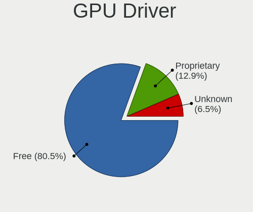

| Driver      | Computers | Percent |
|-------------|-----------|---------|
| Free        | 712       | 81.37%  |
| Proprietary | 112       | 12.8%   |
| Unknown     | 51        | 5.83%   |

GPU Memory
----------

Total video memory

| Size in GB | Computers | Percent |
|------------|-----------|---------|
| Unknown    | 446       | 49.94%  |
| 0.01-0.5   | 153       | 17.13%  |
| 1.01-2.0   | 113       | 12.65%  |
| 0.51-1.0   | 89        | 9.97%   |
| 3.01-4.0   | 44        | 4.93%   |
| 7.01-8.0   | 21        | 2.35%   |
| 5.01-6.0   | 12        | 1.34%   |
| 2.01-3.0   | 7         | 0.78%   |
| 8.01-16.0  | 6         | 0.67%   |
| 16.01-24.0 | 2         | 0.22%   |

Monitor
-------

Monitor Vendor
--------------

Monitor vendors

| Vendor                  | Computers | Percent |
|-------------------------|-----------|---------|
| Samsung Electronics     | 127       | 13.58%  |
| AU Optronics            | 100       | 10.7%   |
| LG Display              | 83        | 8.88%   |
| Chimei Innolux          | 65        | 6.95%   |
| BOE                     | 63        | 6.74%   |
| Dell                    | 53        | 5.67%   |
| Philips                 | 42        | 4.49%   |
| Goldstar                | 41        | 4.39%   |
| Hewlett-Packard         | 40        | 4.28%   |
| Chi Mei Optoelectronics | 32        | 3.42%   |
| BenQ                    | 32        | 3.42%   |
| Lenovo                  | 28        | 2.99%   |
| Acer                    | 22        | 2.35%   |
| Ancor Communications    | 20        | 2.14%   |
| AOC                     | 19        | 2.03%   |
| Sharp                   | 14        | 1.5%    |
| Apple                   | 12        | 1.28%   |
| PANDA                   | 11        | 1.18%   |
| NEC Computers           | 11        | 1.18%   |
| Iiyama                  | 10        | 1.07%   |
| Fujitsu Siemens         | 8         | 0.86%   |
| LG Philips              | 7         | 0.75%   |
| Eizo                    | 6         | 0.64%   |
| LG Electronics          | 5         | 0.53%   |
| CSO                     | 5         | 0.53%   |
| ASUSTek Computer        | 5         | 0.53%   |
| Valve                   | 4         | 0.43%   |
| Unknown                 | 4         | 0.43%   |
| TMX                     | 4         | 0.43%   |
| Sony                    | 4         | 0.43%   |
| InfoVision              | 4         | 0.43%   |
| HannStar                | 3         | 0.32%   |
| Toshiba                 | 2         | 0.21%   |
| RTD                     | 2         | 0.21%   |
| QCM                     | 2         | 0.21%   |
| Panasonic               | 2         | 0.21%   |
| MSI                     | 2         | 0.21%   |
| MiTAC                   | 2         | 0.21%   |
| JDI                     | 2         | 0.21%   |
| FUS                     | 2         | 0.21%   |

Monitor Model
-------------

Monitor models

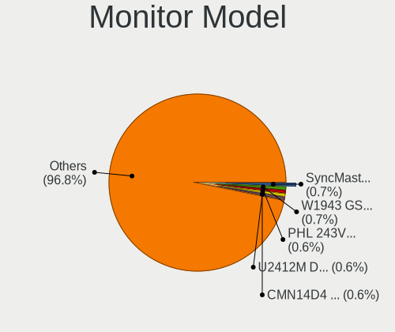

| Model                                                                    | Computers | Percent |
|--------------------------------------------------------------------------|-----------|---------|
| Samsung Electronics SyncMaster SAM0091 1600x1200 432x324mm 21.3-inch     | 8         | 0.83%   |
| Dell U2412M DELA07A 1920x1200 518x324mm 24.1-inch                        | 7         | 0.72%   |
| Chi Mei Optoelectronics LCD Monitor CMO15A7 1366x768 344x193mm 15.5-inch | 7         | 0.72%   |
| Philips PHL 243V7 PHLC155 1920x1080 527x296mm 23.8-inch                  | 6         | 0.62%   |
| Chimei Innolux LCD Monitor CMN15AB 1366x768 344x194mm 15.5-inch          | 6         | 0.62%   |
| Chimei Innolux LCD Monitor CMN14D4 1920x1080 309x173mm 13.9-inch         | 6         | 0.62%   |
| Chi Mei Optoelectronics LCD Monitor CMO1526 1280x800 331x207mm 15.4-inch | 6         | 0.62%   |
| AU Optronics LCD Monitor AUO38ED 1920x1080 344x193mm 15.5-inch           | 6         | 0.62%   |
| NEC Computers LCD19WV NEC671C 1440x900 410x256mm 19.0-inch               | 5         | 0.52%   |
| AU Optronics LCD Monitor AUO26EC 1366x768 344x193mm 15.5-inch            | 5         | 0.52%   |
| Samsung Electronics S24F350 SAM0D20 1920x1080 521x293mm 23.5-inch        | 4         | 0.41%   |
| Samsung Electronics LCD Monitor SAM07C0 1920x1080 700x390mm 31.5-inch    | 4         | 0.41%   |
| LG Display LCD Monitor LGD038E 1366x768 344x194mm 15.5-inch              | 4         | 0.41%   |
| LG Display LCD Monitor LGD02DC 1366x768 344x194mm 15.5-inch              | 4         | 0.41%   |
| Chimei Innolux LCD Monitor CMN15DB 1366x768 344x193mm 15.5-inch          | 4         | 0.41%   |
| Chi Mei Optoelectronics LCD Monitor CMO15A3 1366x768 344x193mm 15.5-inch | 4         | 0.41%   |
| AU Optronics LCD Monitor AUO106C 1366x768 276x155mm 12.5-inch            | 4         | 0.41%   |
| Valve ANX7530 U VLV3001 800x1280 100x150mm 7.1-inch                      | 3         | 0.31%   |
| Samsung Electronics S27D390 SAM0B67 1920x1080 598x336mm 27.0-inch        | 3         | 0.31%   |
| Samsung Electronics S24F350 SAM0D21 1920x1080 520x290mm 23.4-inch        | 3         | 0.31%   |
| Samsung Electronics LCD Monitor SEC3945 1280x800 331x207mm 15.4-inch     | 3         | 0.31%   |
| Samsung Electronics LCD Monitor SEC3051 1366x768 344x194mm 15.5-inch     | 3         | 0.31%   |
| Samsung Electronics LCD Monitor SEC3046 1366x768 344x193mm 15.5-inch     | 3         | 0.31%   |
| Samsung Electronics C24F390 SAM0D2C 1920x1080 521x293mm 23.5-inch        | 3         | 0.31%   |
| Philips PHL 243V5 PHLC0D1 1920x1080 521x293mm 23.5-inch                  | 3         | 0.31%   |
| Hewlett-Packard E243d HPN3511 1920x1080 527x296mm 23.8-inch              | 3         | 0.31%   |
| Goldstar W2753VC GSM5765 1920x1080 598x336mm 27.0-inch                   | 3         | 0.31%   |
| Goldstar W1943 GSM4BAD 1360x768 406x229mm 18.4-inch                      | 3         | 0.31%   |
| Chimei Innolux LCD Monitor CMN14C3 1366x768 309x173mm 13.9-inch          | 3         | 0.31%   |
| BOE LCD Monitor BOE07BB 1920x1080 309x173mm 13.9-inch                    | 3         | 0.31%   |
| BOE LCD Monitor BOE0700 1920x1080 344x194mm 15.5-inch                    | 3         | 0.31%   |
| AU Optronics LCD Monitor AUOE48D 1920x1080 344x194mm 15.5-inch           | 3         | 0.31%   |
| AU Optronics LCD Monitor AUO25ED 1920x1080 344x193mm 15.5-inch           | 3         | 0.31%   |
| AU Optronics LCD Monitor AUO23ED 1920x1080 344x194mm 15.5-inch           | 3         | 0.31%   |
| AU Optronics LCD Monitor AUO23EC 1366x768 344x193mm 15.5-inch            | 3         | 0.31%   |
| AOC 24B1W1 AOC2401 1920x1080 527x296mm 23.8-inch                         | 3         | 0.31%   |
| Ancor Communications VE247 ACI2493 1920x1080 531x299mm 24.0-inch         | 3         | 0.31%   |
| Acer LCD Monitor ACR40B0 1920x1080 527x296mm 23.8-inch                   | 3         | 0.31%   |
| Unknown 1780 07E7 1280x1024 337x270mm 17.0-inch                          | 2         | 0.21%   |
| TMX TL156MDMP01-0 TMX1560 3200x2000 336x210mm 15.6-inch                  | 2         | 0.21%   |

Monitor Resolution
------------------

Monitor screen resolution

| Resolution         | Computers | Percent |
|--------------------|-----------|---------|
| 1920x1080 (FHD)    | 356       | 40.04%  |
| 1366x768 (WXGA)    | 168       | 18.9%   |
| 2560x1440 (QHD)    | 41        | 4.61%   |
| 1280x800 (WXGA)    | 39        | 4.39%   |
| 3840x2160 (4K)     | 38        | 4.27%   |
| 1600x900 (HD+)     | 36        | 4.05%   |
| 1280x1024 (SXGA)   | 35        | 3.94%   |
| 1920x1200 (WUXGA)  | 34        | 3.82%   |
| 1680x1050 (WSXGA+) | 34        | 3.82%   |
| 1440x900 (WXGA+)   | 32        | 3.6%    |
| 1600x1200          | 9         | 1.01%   |
| 3440x1440          | 8         | 0.9%    |
| 1360x768           | 7         | 0.79%   |
| 1024x600           | 6         | 0.67%   |
| 2880x1800          | 4         | 0.45%   |
| 2560x1600          | 4         | 0.45%   |
| 1280x720 (HD)      | 4         | 0.45%   |
| 800x1280           | 3         | 0.34%   |
| 3840x2400          | 3         | 0.34%   |
| 2160x1440          | 3         | 0.34%   |
| 1920x540           | 3         | 0.34%   |
| 1024x768 (XGA)     | 3         | 0.34%   |
| 3200x2000          | 2         | 0.22%   |
| 2800x1752          | 2         | 0.22%   |
| 2560x1080          | 2         | 0.22%   |
| Unknown            | 2         | 0.22%   |
| 3200x1800 (QHD+)   | 1         | 0.11%   |
| 3200x1080          | 1         | 0.11%   |
| 3072x1920          | 1         | 0.11%   |
| 3000x2000          | 1         | 0.11%   |
| 2880x1620          | 1         | 0.11%   |
| 2256x1504          | 1         | 0.11%   |
| 2160x1350          | 1         | 0.11%   |
| 1920x1280          | 1         | 0.11%   |
| 1680x945           | 1         | 0.11%   |
| 1400x1050          | 1         | 0.11%   |
| 1280x960           | 1         | 0.11%   |

Monitor Diagonal
----------------

Diagonal size in inches

| Inches  | Computers | Percent |
|---------|-----------|---------|
| 15      | 254       | 26.88%  |
| 24      | 94        | 9.95%   |
| 13      | 75        | 7.94%   |
| 23      | 63        | 6.67%   |
| 14      | 62        | 6.56%   |
| 21      | 55        | 5.82%   |
| 27      | 51        | 5.4%    |
| 17      | 45        | 4.76%   |
| 19      | 34        | 3.6%    |
| Unknown | 34        | 3.6%    |
| 18      | 22        | 2.33%   |
| 22      | 20        | 2.12%   |
| 12      | 18        | 1.9%    |
| 20      | 16        | 1.69%   |
| 11      | 13        | 1.38%   |
| 25      | 11        | 1.16%   |
| 34      | 9         | 0.95%   |
| 31      | 9         | 0.95%   |
| 16      | 6         | 0.63%   |
| 10      | 6         | 0.63%   |
| 84      | 5         | 0.53%   |
| 32      | 5         | 0.53%   |
| 72      | 4         | 0.42%   |
| 46      | 4         | 0.42%   |
| 26      | 4         | 0.42%   |
| 54      | 3         | 0.32%   |
| 40      | 3         | 0.32%   |
| 39      | 3         | 0.32%   |
| 7       | 3         | 0.32%   |
| 67      | 2         | 0.21%   |
| 65      | 2         | 0.21%   |
| 48      | 2         | 0.21%   |
| 37      | 2         | 0.21%   |
| 86      | 1         | 0.11%   |
| 58      | 1         | 0.11%   |
| 50      | 1         | 0.11%   |
| 42      | 1         | 0.11%   |
| 35      | 1         | 0.11%   |
| 33      | 1         | 0.11%   |

Monitor Width
-------------

Physical width

| Width in mm | Computers | Percent |
|-------------|-----------|---------|
| 301-350     | 367       | 39.76%  |
| 501-600     | 195       | 21.13%  |
| 401-500     | 133       | 14.41%  |
| 201-300     | 79        | 8.56%   |
| 351-400     | 49        | 5.31%   |
| Unknown     | 34        | 3.68%   |
| 701-800     | 17        | 1.84%   |
| 1001-1500   | 14        | 1.52%   |
| 601-700     | 13        | 1.41%   |
| 801-900     | 9         | 0.98%   |
| 1501-2000   | 9         | 0.98%   |
| 1-100       | 3         | 0.33%   |
| 901-1000    | 1         | 0.11%   |

Aspect Ratio
------------

Proportional relationship between the width and the height

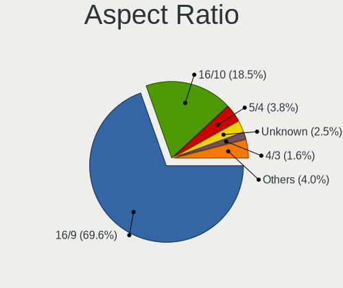

| Ratio   | Computers | Percent |
|---------|-----------|---------|
| 16/9    | 597       | 69.66%  |
| 16/10   | 155       | 18.09%  |
| 5/4     | 33        | 3.85%   |
| Unknown | 26        | 3.03%   |
| 4/3     | 15        | 1.75%   |
| 3/2     | 13        | 1.52%   |
| 21/9    | 10        | 1.17%   |
| 0.67    | 3         | 0.35%   |
| 0.45    | 2         | 0.23%   |
| 6/5     | 1         | 0.12%   |
| 32/9    | 1         | 0.12%   |
| 0.56    | 1         | 0.12%   |

Monitor Area
------------

Area in inch

| Area in inch | Computers | Percent |
|----------------|-----------|---------|
| 101-110        | 251       | 26.84%  |
| 201-250        | 182       | 19.47%  |
| 81-90          | 102       | 10.91%  |
| 151-200        | 64        | 6.84%   |
| 301-350        | 51        | 5.45%   |
| 251-300        | 44        | 4.71%   |
| 141-150        | 40        | 4.28%   |
| 71-80          | 34        | 3.64%   |
| Unknown        | 34        | 3.64%   |
| 351-500        | 25        | 2.67%   |
| More than 1000 | 20        | 2.14%   |
| 121-130        | 20        | 2.14%   |
| 61-70          | 17        | 1.82%   |
| 51-60          | 13        | 1.39%   |
| 501-1000       | 13        | 1.39%   |
| 131-140        | 7         | 0.75%   |
| 41-50          | 6         | 0.64%   |
| 111-120        | 6         | 0.64%   |
| 1-40           | 3         | 0.32%   |
| 91-100         | 3         | 0.32%   |

Pixel Density
-------------

Pixels per inch

| Density       | Computers | Percent |
|---------------|-----------|---------|
| 51-100        | 355       | 39.4%   |
| 101-120       | 219       | 24.31%  |
| 121-160       | 215       | 23.86%  |
| 161-240       | 39        | 4.33%   |
| Unknown       | 34        | 3.77%   |
| More than 240 | 20        | 2.22%   |
| 1-50          | 19        | 2.11%   |

Multiple Monitors
-----------------

Total monitors connected

| Total | Computers | Percent |
|-------|-----------|---------|
| 1     | 687       | 78.25%  |
| 2     | 134       | 15.26%  |
| 0     | 44        | 5.01%   |
| 3     | 13        | 1.48%   |

Network
-------

Net Controller Vendor
---------------------

Controller vendors

| Vendor                                 | Computers | Percent |
|----------------------------------------|-----------|---------|
| Realtek Semiconductor                  | 456       | 35.93%  |
| Intel                                  | 351       | 27.66%  |
| Qualcomm Atheros                       | 168       | 13.24%  |
| Broadcom                               | 78        | 6.15%   |
| Ralink Technology                      | 21        | 1.65%   |
| Marvell Technology Group               | 21        | 1.65%   |
| TP-Link                                | 20        | 1.58%   |
| Nvidia                                 | 19        | 1.5%    |
| Broadcom Limited                       | 18        | 1.42%   |
| Ralink                                 | 15        | 1.18%   |
| Qualcomm Atheros Communications        | 12        | 0.95%   |
| MediaTek                               | 11        | 0.87%   |
| Dell                                   | 6         | 0.47%   |
| ASIX Electronics                       | 6         | 0.47%   |
| Hewlett-Packard                        | 5         | 0.39%   |
| Xiaomi                                 | 4         | 0.32%   |
| Sierra Wireless                        | 3         | 0.24%   |
| Samsung Electronics                    | 3         | 0.24%   |
| Lenovo                                 | 3         | 0.24%   |
| JMicron Technology                     | 3         | 0.24%   |
| Huawei Technologies                    | 3         | 0.24%   |
| Fibocom                                | 3         | 0.24%   |
| Ericsson Business Mobile Networks      | 3         | 0.24%   |
| DisplayLink                            | 3         | 0.24%   |
| D-Link                                 | 3         | 0.24%   |
| ASUSTek Computer                       | 3         | 0.24%   |
| VIA Technologies                       | 2         | 0.16%   |
| Edimax Technology                      | 2         | 0.16%   |
| ZyXEL Communications                   | 1         | 0.08%   |
| ZTE WCDMA Technologies MSM             | 1         | 0.08%   |
| WiseGroup                              | 1         | 0.08%   |
| ULi Electronics                        | 1         | 0.08%   |
| Texas Instruments                      | 1         | 0.08%   |
| T & A Mobile Phones                    | 1         | 0.08%   |
| Spreadtrum Communications              | 1         | 0.08%   |
| Sony Ericsson Mobile Communications AB | 1         | 0.08%   |
| Silicon Integrated Systems [SiS]       | 1         | 0.08%   |
| Sigma Sport                            | 1         | 0.08%   |
| Raspberry Pi                           | 1         | 0.08%   |
| Qualcomm                               | 1         | 0.08%   |

Net Controller Model
--------------------

Controller models

| Model                                                                   | Computers | Percent |
|-------------------------------------------------------------------------|-----------|---------|
| Realtek RTL8111/8168/8211/8411 PCI Express Gigabit Ethernet Controller  | 304       | 20.75%  |
| Realtek RTL810xE PCI Express Fast Ethernet controller                   | 52        | 3.55%   |
| Qualcomm Atheros AR9285 Wireless Network Adapter (PCI-Express)          | 39        | 2.66%   |
| Intel 82579LM Gigabit Network Connection (Lewisville)                   | 30        | 2.05%   |
| Realtek RTL8153 Gigabit Ethernet Adapter                                | 26        | 1.77%   |
| Intel Wireless 8265 / 8275                                              | 26        | 1.77%   |
| Intel Wi-Fi 6 AX200                                                     | 23        | 1.57%   |
| Realtek RTL-8100/8101L/8139 PCI Fast Ethernet Adapter                   | 20        | 1.37%   |
| Qualcomm Atheros AR9485 Wireless Network Adapter                        | 18        | 1.23%   |
| Intel Centrino Advanced-N 6205 [Taylor Peak]                            | 18        | 1.23%   |
| Realtek RTL8125 2.5GbE Controller                                       | 17        | 1.16%   |
| Intel Wireless 8260                                                     | 17        | 1.16%   |
| Qualcomm Atheros QCA9377 802.11ac Wireless Network Adapter              | 16        | 1.09%   |
| Realtek RTL8822CE 802.11ac PCIe Wireless Network Adapter                | 14        | 0.96%   |
| Intel Wi-Fi 6 AX201                                                     | 14        | 0.96%   |
| Realtek RTL8821CE 802.11ac PCIe Wireless Network Adapter                | 13        | 0.89%   |
| Qualcomm Atheros QCA6174 802.11ac Wireless Network Adapter              | 13        | 0.89%   |
| Qualcomm Atheros AR9271 802.11n                                         | 12        | 0.82%   |
| Broadcom BCM4313 802.11bgn Wireless Network Adapter                     | 12        | 0.82%   |
| Qualcomm Atheros QCA9565 / AR9565 Wireless Network Adapter              | 11        | 0.75%   |
| Qualcomm Atheros AR242x / AR542x Wireless Network Adapter (PCI-Express) | 11        | 0.75%   |
| Intel Wireless 7260                                                     | 11        | 0.75%   |
| Intel I211 Gigabit Network Connection                                   | 11        | 0.75%   |
| Realtek RTL8169 PCI Gigabit Ethernet Controller                         | 10        | 0.68%   |
| Intel Wireless 7265                                                     | 10        | 0.68%   |
| Intel Wireless 3165                                                     | 10        | 0.68%   |
| Realtek RTL8821AE 802.11ac PCIe Wireless Network Adapter                | 9         | 0.61%   |
| Ralink RT3290 Wireless 802.11n 1T/1R PCIe                               | 9         | 0.61%   |
| Intel PRO/Wireless 3945ABG [Golan] Network Connection                   | 9         | 0.61%   |
| Intel Ethernet Connection (2) I219-V                                    | 9         | 0.61%   |
| Intel Comet Lake PCH-LP CNVi WiFi                                       | 9         | 0.61%   |
| Intel Cannon Point-LP CNVi [Wireless-AC]                                | 9         | 0.61%   |
| TP-Link TL-WN722N v2/v3 [Realtek RTL8188EUS]                            | 8         | 0.55%   |
| Realtek RTL8852BE PCIe 802.11ax Wireless Network Controller             | 8         | 0.55%   |
| Ralink RT2870/RT3070 Wireless Adapter                                   | 8         | 0.55%   |
| Qualcomm Atheros AR8151 v2.0 Gigabit Ethernet                           | 8         | 0.55%   |
| Intel WiFi Link 5100                                                    | 8         | 0.55%   |
| Intel Ethernet Connection I217-LM                                       | 8         | 0.55%   |
| Intel Dual Band Wireless-AC 3165 Plus Bluetooth                         | 8         | 0.55%   |
| Intel Centrino Wireless-N 2230                                          | 8         | 0.55%   |

Wireless Vendor
---------------

Wireless vendors

| Vendor                          | Computers | Percent |
|---------------------------------|-----------|---------|
| Intel                           | 265       | 41.41%  |
| Qualcomm Atheros                | 129       | 20.16%  |
| Realtek Semiconductor           | 88        | 13.75%  |
| Broadcom                        | 43        | 6.72%   |
| Ralink Technology               | 21        | 3.28%   |
| TP-Link                         | 20        | 3.13%   |
| Ralink                          | 15        | 2.34%   |
| Qualcomm Atheros Communications | 12        | 1.88%   |
| Broadcom Limited                | 12        | 1.88%   |
| MediaTek                        | 11        | 1.72%   |
| Dell                            | 4         | 0.63%   |
| Sierra Wireless                 | 3         | 0.47%   |
| Fibocom                         | 3         | 0.47%   |
| D-Link                          | 3         | 0.47%   |
| ASUSTek Computer                | 3         | 0.47%   |
| Edimax Technology               | 2         | 0.31%   |
| ZyXEL Communications            | 1         | 0.16%   |
| Texas Instruments               | 1         | 0.16%   |
| Qualcomm                        | 1         | 0.16%   |
| Microsoft                       | 1         | 0.16%   |
| Micro Star International        | 1         | 0.16%   |
| Accton Technology               | 1         | 0.16%   |

Wireless Model
--------------

Wireless models

| Model                                                                   | Computers | Percent |
|-------------------------------------------------------------------------|-----------|---------|
| Qualcomm Atheros AR9285 Wireless Network Adapter (PCI-Express)          | 39        | 6.05%   |
| Intel Wireless 8265 / 8275                                              | 26        | 4.03%   |
| Intel Wi-Fi 6 AX200                                                     | 23        | 3.57%   |
| Qualcomm Atheros AR9485 Wireless Network Adapter                        | 18        | 2.79%   |
| Intel Centrino Advanced-N 6205 [Taylor Peak]                            | 18        | 2.79%   |
| Intel Wireless 8260                                                     | 17        | 2.64%   |
| Qualcomm Atheros QCA9377 802.11ac Wireless Network Adapter              | 16        | 2.48%   |
| Realtek RTL8822CE 802.11ac PCIe Wireless Network Adapter                | 14        | 2.17%   |
| Intel Wi-Fi 6 AX201                                                     | 14        | 2.17%   |
| Realtek RTL8821CE 802.11ac PCIe Wireless Network Adapter                | 13        | 2.02%   |
| Qualcomm Atheros QCA6174 802.11ac Wireless Network Adapter              | 13        | 2.02%   |
| Qualcomm Atheros AR9271 802.11n                                         | 12        | 1.86%   |
| Broadcom BCM4313 802.11bgn Wireless Network Adapter                     | 12        | 1.86%   |
| Qualcomm Atheros QCA9565 / AR9565 Wireless Network Adapter              | 11        | 1.71%   |
| Qualcomm Atheros AR242x / AR542x Wireless Network Adapter (PCI-Express) | 11        | 1.71%   |
| Intel Wireless 7260                                                     | 11        | 1.71%   |
| Intel Wireless 7265                                                     | 10        | 1.55%   |
| Intel Wireless 3165                                                     | 10        | 1.55%   |
| Realtek RTL8821AE 802.11ac PCIe Wireless Network Adapter                | 9         | 1.4%    |
| Ralink RT3290 Wireless 802.11n 1T/1R PCIe                               | 9         | 1.4%    |
| Intel PRO/Wireless 3945ABG [Golan] Network Connection                   | 9         | 1.4%    |
| Intel Comet Lake PCH-LP CNVi WiFi                                       | 9         | 1.4%    |
| Intel Cannon Point-LP CNVi [Wireless-AC]                                | 9         | 1.4%    |
| TP-Link TL-WN722N v2/v3 [Realtek RTL8188EUS]                            | 8         | 1.24%   |
| Realtek RTL8852BE PCIe 802.11ax Wireless Network Controller             | 8         | 1.24%   |
| Ralink RT2870/RT3070 Wireless Adapter                                   | 8         | 1.24%   |
| Intel WiFi Link 5100                                                    | 8         | 1.24%   |
| Intel Dual Band Wireless-AC 3165 Plus Bluetooth                         | 8         | 1.24%   |
| Intel Centrino Wireless-N 2230                                          | 8         | 1.24%   |
| Ralink MT7601U Wireless Adapter                                         | 7         | 1.09%   |
| MediaTek MT7921 802.11ax PCI Express Wireless Network Adapter           | 7         | 1.09%   |
| Intel Wi-Fi 5(802.11ac) Wireless-AC 9x6x [Thunder Peak]                 | 7         | 1.09%   |
| Intel Wi-Fi 6E(802.11ax) AX210/AX1675* 2x2 [Typhoon Peak]               | 6         | 0.93%   |
| Intel Centrino Wireless-N 1000 [Condor Peak]                            | 6         | 0.93%   |
| Intel Cannon Lake PCH CNVi WiFi                                         | 6         | 0.93%   |
| Intel Alder Lake-P PCH CNVi WiFi                                        | 6         | 0.93%   |
| Broadcom BCM43228 802.11a/b/g/n                                         | 6         | 0.93%   |
| Broadcom BCM43142 802.11b/g/n                                           | 6         | 0.93%   |
| Realtek RTL8822BE 802.11a/b/g/n/ac WiFi adapter                         | 5         | 0.78%   |
| Qualcomm Atheros AR928X Wireless Network Adapter (PCI-Express)          | 5         | 0.78%   |

Ethernet Vendor
---------------

Ethernet vendors

| Vendor                                 | Computers | Percent |
|----------------------------------------|-----------|---------|
| Realtek Semiconductor                  | 421       | 53.97%  |
| Intel                                  | 184       | 23.59%  |
| Qualcomm Atheros                       | 54        | 6.92%   |
| Broadcom                               | 37        | 4.74%   |
| Marvell Technology Group               | 21        | 2.69%   |
| Nvidia                                 | 19        | 2.44%   |
| Broadcom Limited                       | 6         | 0.77%   |
| ASIX Electronics                       | 6         | 0.77%   |
| Xiaomi                                 | 4         | 0.51%   |
| Samsung Electronics                    | 3         | 0.38%   |
| Lenovo                                 | 3         | 0.38%   |
| JMicron Technology                     | 3         | 0.38%   |
| DisplayLink                            | 3         | 0.38%   |
| VIA Technologies                       | 2         | 0.26%   |
| Huawei Technologies                    | 2         | 0.26%   |
| T & A Mobile Phones                    | 1         | 0.13%   |
| Spreadtrum Communications              | 1         | 0.13%   |
| Sony Ericsson Mobile Communications AB | 1         | 0.13%   |
| Raspberry Pi                           | 1         | 0.13%   |
| QinHeng Electronics                    | 1         | 0.13%   |
| Prestigio                              | 1         | 0.13%   |
| Nokia Mobile Phones                    | 1         | 0.13%   |
| National Semiconductor                 | 1         | 0.13%   |
| Mellanox Technologies                  | 1         | 0.13%   |
| ICS Advent                             | 1         | 0.13%   |
| Google                                 | 1         | 0.13%   |
| Attansic Technology                    | 1         | 0.13%   |

Ethernet Model
--------------

Ethernet models

| Model                                                                  | Computers | Percent |
|------------------------------------------------------------------------|-----------|---------|
| Realtek RTL8111/8168/8211/8411 PCI Express Gigabit Ethernet Controller | 304       | 38%     |
| Realtek RTL810xE PCI Express Fast Ethernet controller                  | 52        | 6.5%    |
| Intel 82579LM Gigabit Network Connection (Lewisville)                  | 30        | 3.75%   |
| Realtek RTL8153 Gigabit Ethernet Adapter                               | 26        | 3.25%   |
| Realtek RTL-8100/8101L/8139 PCI Fast Ethernet Adapter                  | 20        | 2.5%    |
| Realtek RTL8125 2.5GbE Controller                                      | 17        | 2.13%   |
| Intel I211 Gigabit Network Connection                                  | 11        | 1.38%   |
| Realtek RTL8169 PCI Gigabit Ethernet Controller                        | 10        | 1.25%   |
| Intel Ethernet Connection (2) I219-V                                   | 9         | 1.13%   |
| Qualcomm Atheros AR8151 v2.0 Gigabit Ethernet                          | 8         | 1%      |
| Intel Ethernet Connection I217-LM                                      | 8         | 1%      |
| Qualcomm Atheros AR8131 Gigabit Ethernet                               | 7         | 0.88%   |
| Nvidia MCP61 Ethernet                                                  | 7         | 0.88%   |
| Intel Ethernet Controller I225-V                                       | 7         | 0.88%   |
| Intel Ethernet Connection I219-LM                                      | 7         | 0.88%   |
| Intel Ethernet Connection (4) I219-LM                                  | 7         | 0.88%   |
| Intel Ethernet Connection (2) I219-LM                                  | 7         | 0.88%   |
| Intel 82579V Gigabit Network Connection                                | 7         | 0.88%   |
| Intel 82567LM Gigabit Network Connection                               | 7         | 0.88%   |
| Intel Ethernet Connection (7) I219-LM                                  | 6         | 0.75%   |
| Intel Ethernet Connection (6) I219-V                                   | 6         | 0.75%   |
| Realtek RTL8152 Fast Ethernet Adapter                                  | 5         | 0.63%   |
| Qualcomm Atheros QCA8172 Fast Ethernet                                 | 5         | 0.63%   |
| Qualcomm Atheros AR8132 Fast Ethernet                                  | 5         | 0.63%   |
| Qualcomm Atheros AR8121/AR8113/AR8114 Gigabit or Fast Ethernet         | 5         | 0.63%   |
| Marvell Group 88E8055 PCI-E Gigabit Ethernet Controller                | 5         | 0.63%   |
| Intel 82566DM-2 Gigabit Network Connection                             | 5         | 0.63%   |
| Qualcomm Atheros Killer E220x Gigabit Ethernet Controller              | 4         | 0.5%    |
| Marvell Group 88E8040T PCI-E Fast Ethernet Controller                  | 4         | 0.5%    |
| Intel Ethernet Connection I218-LM                                      | 4         | 0.5%    |
| Intel Ethernet Connection I217-V                                       | 4         | 0.5%    |
| Intel Ethernet Connection (7) I219-V                                   | 4         | 0.5%    |
| Intel Ethernet Connection (4) I219-V                                   | 4         | 0.5%    |
| Intel Ethernet Connection (3) I218-LM                                  | 4         | 0.5%    |
| Intel 82567LM-3 Gigabit Network Connection                             | 4         | 0.5%    |
| Broadcom NetXtreme BCM5761 Gigabit Ethernet PCIe                       | 4         | 0.5%    |
| Broadcom NetLink BCM57785 Gigabit Ethernet PCIe                        | 4         | 0.5%    |
| Broadcom NetLink BCM57780 Gigabit Ethernet PCIe                        | 4         | 0.5%    |
| Xiaomi Mi/Redmi series (RNDIS)                                         | 3         | 0.38%   |
| Samsung Galaxy series, misc. (tethering mode)                          | 3         | 0.38%   |

Net Controller Kind
-------------------

Ethernet, WiFi or modem

| Kind     | Computers | Percent |
|----------|-----------|---------|
| Ethernet | 740       | 53.94%  |
| WiFi     | 612       | 44.61%  |
| Modem    | 19        | 1.38%   |
| Unknown  | 1         | 0.07%   |

Used Controller
---------------

Currently used network controller

| Kind     | Computers | Percent |
|----------|-----------|---------|
| WiFi     | 471       | 54.14%  |
| Ethernet | 399       | 45.86%  |

NICs
----

Total network controllers on board

| Total | Computers | Percent |
|-------|-----------|---------|
| 2     | 458       | 53.13%  |
| 1     | 353       | 40.95%  |
| 0     | 32        | 3.71%   |
| 3     | 11        | 1.28%   |
| 4     | 7         | 0.81%   |
| 5     | 1         | 0.12%   |

IPv6
----

IPv6 vs IPv4

| Used | Computers | Percent |
|------|-----------|---------|
| No   | 807       | 93.84%  |
| Yes  | 53        | 6.16%   |

Bluetooth
---------

Bluetooth Vendor
----------------

Controller vendors

| Vendor                          | Computers | Percent |
|---------------------------------|-----------|---------|
| Intel                           | 186       | 40.17%  |
| Realtek Semiconductor           | 45        | 9.72%   |
| Qualcomm Atheros Communications | 37        | 7.99%   |
| IMC Networks                    | 33        | 7.13%   |
| Broadcom                        | 28        | 6.05%   |
| Lite-On Technology              | 22        | 4.75%   |
| Cambridge Silicon Radio         | 20        | 4.32%   |
| Foxconn / Hon Hai               | 16        | 3.46%   |
| ASUSTek Computer                | 15        | 3.24%   |
| Ralink                          | 9         | 1.94%   |
| Hewlett-Packard                 | 9         | 1.94%   |
| Dell                            | 9         | 1.94%   |
| Apple                           | 9         | 1.94%   |
| Toshiba                         | 6         | 1.3%    |
| Micro Star International        | 4         | 0.86%   |
| Foxconn International           | 3         | 0.65%   |
| Taiyo Yuden                     | 2         | 0.43%   |
| Realtek                         | 2         | 0.43%   |
| HTC (High Tech Computer)        | 2         | 0.43%   |
| USI                             | 1         | 0.22%   |
| TP-Link                         | 1         | 0.22%   |
| Integrated System Solution      | 1         | 0.22%   |
| Fujitsu                         | 1         | 0.22%   |
| Belkin Components               | 1         | 0.22%   |
| Alps Electric                   | 1         | 0.22%   |

Bluetooth Model
---------------

Controller models

| Model                                               | Computers | Percent |
|-----------------------------------------------------|-----------|---------|
| Intel Bluetooth wireless interface                  | 74        | 15.98%  |
| Realtek Bluetooth Radio                             | 35        | 7.56%   |
| Intel AX201 Bluetooth                               | 34        | 7.34%   |
| Intel AX200 Bluetooth                               | 23        | 4.97%   |
| Intel Bluetooth 9460/9560 Jefferson Peak (JfP)      | 22        | 4.75%   |
| Cambridge Silicon Radio Bluetooth Dongle (HCI mode) | 20        | 4.32%   |
| Qualcomm Atheros AR3011 Bluetooth                   | 18        | 3.89%   |
| IMC Networks Bluetooth Radio                        | 13        | 2.81%   |
| Intel Centrino Bluetooth Wireless Transceiver       | 11        | 2.38%   |
| Ralink RT3290 Bluetooth                             | 9         | 1.94%   |
| Qualcomm Atheros  Bluetooth Device                  | 9         | 1.94%   |
| IMC Networks Bluetooth Device                       | 9         | 1.94%   |
| Lite-On Bluetooth Device                            | 7         | 1.51%   |
| Intel AX210 Bluetooth                               | 7         | 1.51%   |
| IMC Networks Atheros AR3012 Bluetooth 4.0 Adapter   | 7         | 1.51%   |
| Intel Wireless-AC 9260 Bluetooth Adapter            | 6         | 1.3%    |
| Broadcom HP Portable SoftSailing                    | 6         | 1.3%    |
| ASUS BT-183 Bluetooth 2.0+EDR adapter               | 6         | 1.3%    |
| Realtek  Bluetooth 4.2 Adapter                      | 5         | 1.08%   |
| Intel Bluetooth Device                              | 5         | 1.08%   |
| HP Bluetooth 2.0 Interface [Broadcom BCM2045]       | 5         | 1.08%   |
| Qualcomm Atheros AR3012 Bluetooth 4.0               | 4         | 0.86%   |
| Lite-On Wireless_Device                             | 4         | 0.86%   |
| Lite-On Qualcomm Atheros QCA9377 Bluetooth          | 4         | 0.86%   |
| Intel Wireless-AC 3168 Bluetooth                    | 4         | 0.86%   |
| Broadcom BCM20702 Bluetooth 4.0 [ThinkPad]          | 4         | 0.86%   |
| Qualcomm Atheros QCA61x4 Bluetooth 4.0              | 3         | 0.65%   |
| Lite-On Broadcom BCM43142A0 Bluetooth Device        | 3         | 0.65%   |
| IMC Networks Wireless_Device                        | 3         | 0.65%   |
| Foxconn International BCM43142A0 Bluetooth module   | 3         | 0.65%   |
| Foxconn / Hon Hai Wireless_Device                   | 3         | 0.65%   |
| Foxconn / Hon Hai Bluetooth Device                  | 3         | 0.65%   |
| Foxconn / Hon Hai Acer Bluetooth module             | 3         | 0.65%   |
| Dell Wireless 370 Bluetooth Mini-card               | 3         | 0.65%   |
| Dell BCM20702A0 Bluetooth Module                    | 3         | 0.65%   |
| Broadcom HP Portable Bumble Bee                     | 3         | 0.65%   |
| Broadcom BCM2045B (BDC-2.1)                         | 3         | 0.65%   |
| Broadcom BCM2045 Bluetooth                          | 3         | 0.65%   |
| Apple Built-in Bluetooth 2.0+EDR HCI                | 3         | 0.65%   |
| Apple Bluetooth HCI                                 | 3         | 0.65%   |

Sound
-----

Sound Vendor
------------

Sound card vendors

| Vendor                                       | Computers | Percent |
|----------------------------------------------|-----------|---------|
| Intel                                        | 585       | 51.91%  |
| AMD                                          | 261       | 23.16%  |
| Nvidia                                       | 179       | 15.88%  |
| C-Media Electronics                          | 22        | 1.95%   |
| Creative Labs                                | 9         | 0.8%    |
| Creative Technology                          | 7         | 0.62%   |
| VIA Technologies                             | 6         | 0.53%   |
| Lenovo                                       | 6         | 0.53%   |
| GN Netcom                                    | 6         | 0.53%   |
| Realtek Semiconductor                        | 4         | 0.35%   |
| JMTek                                        | 4         | 0.35%   |
| Silicon Integrated Systems [SiS]             | 3         | 0.27%   |
| ASUSTek Computer                             | 3         | 0.27%   |
| Zoran Co. Personal Media Division (Nogatech) | 2         | 0.18%   |
| Yamaha                                       | 2         | 0.18%   |
| Texas Instruments                            | 2         | 0.18%   |
| Samson Technologies                          | 2         | 0.18%   |
| Logitech                                     | 2         | 0.18%   |
| Focusrite-Novation                           | 2         | 0.18%   |
| Blue Microphones                             | 2         | 0.18%   |
| AKAI Professional M.I.                       | 2         | 0.18%   |
| Valve Software                               | 1         | 0.09%   |
| ULi Electronics                              | 1         | 0.09%   |
| Trust                                        | 1         | 0.09%   |
| Textech International                        | 1         | 0.09%   |
| SteelSeries ApS                              | 1         | 0.09%   |
| Plantronics                                  | 1         | 0.09%   |
| Nordic Semiconductor ASA                     | 1         | 0.09%   |
| Micro Star International                     | 1         | 0.09%   |
| KTMicro                                      | 1         | 0.09%   |
| Kingston Technology                          | 1         | 0.09%   |
| Hewlett-Packard                              | 1         | 0.09%   |
| Fortemedia                                   | 1         | 0.09%   |
| Behringer.......                             | 1         | 0.09%   |
| Barco Display Systems                        | 1         | 0.09%   |
| Apple                                        | 1         | 0.09%   |
| A4Tech                                       | 1         | 0.09%   |

Sound Model
-----------

Sound card models

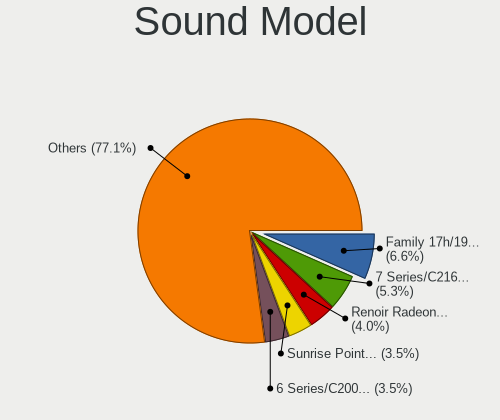

| Model                                                                      | Computers | Percent |
|----------------------------------------------------------------------------|-----------|---------|
| Intel 7 Series/C216 Chipset Family High Definition Audio Controller        | 77        | 5.77%   |
| AMD Family 17h/19h HD Audio Controller                                     | 72        | 5.4%    |
| Intel Sunrise Point-LP HD Audio                                            | 49        | 3.67%   |
| Intel 6 Series/C200 Series Chipset Family High Definition Audio Controller | 47        | 3.52%   |
| AMD Renoir Radeon High Definition Audio Controller                         | 47        | 3.52%   |
| AMD SBx00 Azalia (Intel HDA)                                               | 44        | 3.3%    |
| Intel 82801I (ICH9 Family) HD Audio Controller                             | 42        | 3.15%   |
| Intel 8 Series/C220 Series Chipset High Definition Audio Controller        | 42        | 3.15%   |
| Intel NM10/ICH7 Family High Definition Audio Controller                    | 39        | 2.92%   |
| Intel Xeon E3-1200 v3/4th Gen Core Processor HD Audio Controller           | 31        | 2.32%   |
| Intel 5 Series/3400 Series Chipset High Definition Audio                   | 31        | 2.32%   |
| AMD FCH Azalia Controller                                                  | 30        | 2.25%   |
| Intel Cannon Lake PCH cAVS                                                 | 24        | 1.8%    |
| Intel 82801H (ICH8 Family) HD Audio Controller                             | 24        | 1.8%    |
| Intel 100 Series/C230 Series Chipset Family HD Audio Controller            | 24        | 1.8%    |
| Nvidia GK208 HDMI/DP Audio Controller                                      | 20        | 1.5%    |
| AMD Starship/Matisse HD Audio Controller                                   | 20        | 1.5%    |
| Intel Tiger Lake-LP Smart Sound Technology Audio Controller                | 17        | 1.27%   |
| AMD Raven/Raven2/Fenghuang HDMI/DP Audio Controller                        | 17        | 1.27%   |
| Nvidia GF108 High Definition Audio Controller                              | 16        | 1.2%    |
| Intel Cannon Point-LP High Definition Audio Controller                     | 14        | 1.05%   |
| Intel 82801JI (ICH10 Family) HD Audio Controller                           | 14        | 1.05%   |
| Intel 200 Series PCH HD Audio                                              | 14        | 1.05%   |
| AMD Rembrandt Radeon High Definition Audio Controller                      | 13        | 0.97%   |
| Nvidia High Definition Audio Controller                                    | 12        | 0.9%    |
| Intel Celeron/Pentium Silver Processor High Definition Audio               | 12        | 0.9%    |
| Intel Haswell-ULT HD Audio Controller                                      | 11        | 0.82%   |
| Intel Broadwell-U Audio Controller                                         | 11        | 0.82%   |
| Intel 8 Series HD Audio Controller                                         | 11        | 0.82%   |
| AMD Family 15h (Models 60h-6fh) Audio Controller                           | 11        | 0.82%   |
| Intel Wildcat Point-LP High Definition Audio Controller                    | 10        | 0.75%   |
| Intel Comet Lake PCH-LP cAVS                                               | 10        | 0.75%   |
| Intel Atom Processor Z36xxx/Z37xxx Series High Definition Audio Controller | 10        | 0.75%   |
| AMD Family 17h (Models 00h-0fh) HD Audio Controller                        | 10        | 0.75%   |
| AMD Cedar HDMI Audio [Radeon HD 5400/6300/7300 Series]                     | 10        | 0.75%   |
| Nvidia GP106 High Definition Audio Controller                              | 9         | 0.67%   |
| Nvidia GM107 High Definition Audio Controller [GeForce 940MX]              | 9         | 0.67%   |
| AMD Oland/Hainan/Cape Verde/Pitcairn HDMI Audio [Radeon HD 7000 Series]    | 9         | 0.67%   |
| AMD Kabini HDMI/DP Audio                                                   | 9         | 0.67%   |
| AMD High Definition Audio Controller                                       | 9         | 0.67%   |

Memory
------

Memory Vendor
-------------

Memory module vendors

| Vendor              | Computers | Percent |
|---------------------|-----------|---------|
| Kingston            | 106       | 18.93%  |
| SK hynix            | 97        | 17.32%  |
| Samsung Electronics | 97        | 17.32%  |
| Unknown             | 88        | 15.71%  |
| Micron Technology   | 47        | 8.39%   |
| Crucial             | 27        | 4.82%   |
| Corsair             | 15        | 2.68%   |
| Elpida              | 14        | 2.5%    |
| Patriot             | 11        | 1.96%   |
| Ramaxel Technology  | 10        | 1.79%   |
| G.Skill             | 7         | 1.25%   |
| A-DATA Technology   | 7         | 1.25%   |
| Unknown             | 7         | 1.25%   |
| Unknown (ABCD)      | 6         | 1.07%   |
| Nanya Technology    | 5         | 0.89%   |
| Apacer              | 3         | 0.54%   |
| Transcend           | 2         | 0.36%   |
| Hewlett-Packard     | 2         | 0.36%   |
| ASint Technology    | 2         | 0.36%   |
| Unknown (8AC8)      | 1         | 0.18%   |
| Unknown (130B)      | 1         | 0.18%   |
| Unigen              | 1         | 0.18%   |
| SHARETRONIC         | 1         | 0.18%   |
| Patriot Memory      | 1         | 0.18%   |
| Atermiter           | 1         | 0.18%   |
| 48spaces            | 1         | 0.18%   |

Memory Model
------------

Memory module models

| Model                                                               | Computers | Percent |
|---------------------------------------------------------------------|-----------|---------|
| Samsung RAM M471B5273CH0-CH9 4GB SODIMM DDR3 1334MT/s               | 7         | 1.12%   |
| Unknown                                                             | 7         | 1.12%   |
| Unknown RAM Module 2048MB SODIMM DDR2 667MT/s                       | 6         | 0.96%   |
| Unknown (ABCD) RAM 123456789012345678 2048MB SODIMM LPDDR4 2400MT/s | 6         | 0.96%   |
| SK hynix RAM HMT351S6CFR8C-PB 4GB SODIMM DDR3 1600MT/s              | 6         | 0.96%   |
| SK hynix RAM HMAA1GS6CJR6N-XN 8GB SODIMM DDR4 3200MT/s              | 6         | 0.96%   |
| Unknown RAM Module 2GB DIMM 800MT/s                                 | 5         | 0.8%    |
| SK hynix RAM HMT351S6EFR8A-PB 4096MB SODIMM DDR3 1600MT/s           | 5         | 0.8%    |
| Micron RAM 16KTF51264HZ-1G6M1 4GB SODIMM DDR3 1600MT/s              | 5         | 0.8%    |
| Kingston RAM KHX3200C16D4/8GX 8GB DIMM DDR4 3733MT/s                | 5         | 0.8%    |
| Kingston RAM KF3200C16D4/8GX 8GB DIMM DDR4 3600MT/s                 | 5         | 0.8%    |
| Unknown RAM Module 2048MB DIMM DDR2 800MT/s                         | 4         | 0.64%   |
| Unknown RAM Module 1024MB SODIMM DDR2 667MT/s                       | 4         | 0.64%   |
| SK hynix RAM HMA81GS6AFR8N-UH 8GB SODIMM DDR4 2667MT/s              | 4         | 0.64%   |
| Samsung RAM M471A1K43DB1-CTD 8GB SODIMM DDR4 2667MT/s               | 4         | 0.64%   |
| Micron RAM MT8KTF51264HZ-1G6 4GB SODIMM DDR3 1600MT/s               | 4         | 0.64%   |
| Kingston RAM KHX1866C10D3/4G 4GB DIMM DDR3 1923MT/s                 | 4         | 0.64%   |
| Kingston RAM KF2666C15S4/8G 8GB SODIMM DDR4 2667MT/s                | 4         | 0.64%   |
| Unknown RAM Module 2GB SODIMM DDR2 667MT/s                          | 3         | 0.48%   |
| Unknown RAM Module 2GB SODIMM DDR2                                  | 3         | 0.48%   |
| Unknown RAM Module 2GB SODIMM 800MT/s                               | 3         | 0.48%   |
| Unknown RAM Module 2048MB DIMM 800MT/s                              | 3         | 0.48%   |
| SK hynix RAM HMT351S6BFR8C-H9 4GB SODIMM DDR3 1333MT/s              | 3         | 0.48%   |
| SK hynix RAM HMA81GS6CJR8N-VK 8GB SODIMM DDR4 2667MT/s              | 3         | 0.48%   |
| Samsung RAM M471B5773CHS-CH9 2048MB SODIMM DDR3 4199MT/s            | 3         | 0.48%   |
| Samsung RAM M471B1G73DB0-YK0 8GB SODIMM DDR3 1600MT/s               | 3         | 0.48%   |
| Samsung RAM M471A5244CB0-CTD 4096MB SODIMM DDR4 3266MT/s            | 3         | 0.48%   |
| Samsung RAM M378B5773DH0-CH9 2GB DIMM DDR3 1333MT/s                 | 3         | 0.48%   |
| Patriot RAM PSD34G16002S 4GB SODIMM DDR3 1600MT/s                   | 3         | 0.48%   |
| Micron RAM 16JSF25664HZ-1G1F1 2GB SODIMM 1067MT/s                   | 3         | 0.48%   |
| Kingston RAM KHX2666C16/8G 8GB DIMM DDR4 3466MT/s                   | 3         | 0.48%   |
| Kingston RAM KHX1866C11S3L/8G 8GB SODIMM DDR3 1867MT/s              | 3         | 0.48%   |
| Kingston RAM KHX1600C9D3/4GX 4GB DIMM DDR3 1600MT/s                 | 3         | 0.48%   |
| Kingston RAM 9905624-033.A00G 8GB SODIMM DDR4 2400MT/s              | 3         | 0.48%   |
| Elpida RAM EBJ21UE8BDS0-DJ-F 2GB SODIMM DDR3 1334MT/s               | 3         | 0.48%   |
| Unknown RAM Module 4096MB SODIMM DDR3 1333MT/s                      | 2         | 0.32%   |
| Unknown RAM Module 4096MB SODIMM DDR3                               | 2         | 0.32%   |
| Unknown RAM Module 4096MB DIMM DDR3 1600MT/s                        | 2         | 0.32%   |
| Unknown RAM Module 2048MB SODIMM 800MT/s                            | 2         | 0.32%   |
| Unknown RAM Module 2048MB DIMM DDR2 333MT/s                         | 2         | 0.32%   |

Memory Kind
-----------

Memory module kinds

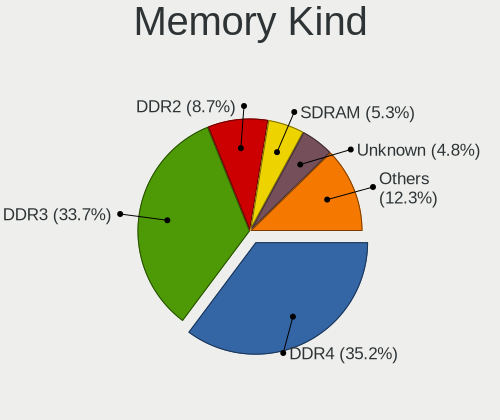

| Kind    | Computers | Percent |
|---------|-----------|---------|
| DDR4    | 168       | 35.59%  |
| DDR3    | 161       | 34.11%  |
| DDR2    | 49        | 10.38%  |
| SDRAM   | 26        | 5.51%   |
| Unknown | 25        | 5.3%    |
| LPDDR4  | 18        | 3.81%   |
| DDR     | 8         | 1.69%   |
| LPDDR3  | 6         | 1.27%   |
| DDR5    | 5         | 1.06%   |
| LPDDR5  | 4         | 0.85%   |
| DRAM    | 2         | 0.42%   |

Memory Form Factor
------------------

Physical design of the memory module

| Name         | Computers | Percent |
|--------------|-----------|---------|
| SODIMM       | 274       | 58.42%  |
| DIMM         | 162       | 34.54%  |
| Row Of Chips | 27        | 5.76%   |
| Chip         | 4         | 0.85%   |
| FB-DIMM      | 1         | 0.21%   |
| Unknown      | 1         | 0.21%   |

Memory Size
-----------

Memory module size

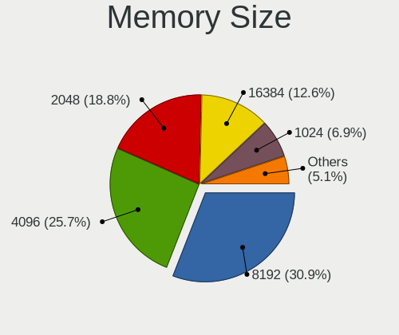

| Size  | Computers | Percent |
|-------|-----------|---------|
| 8192  | 165       | 30.44%  |
| 4096  | 142       | 26.2%   |
| 2048  | 108       | 19.93%  |
| 16384 | 59        | 10.89%  |
| 1024  | 42        | 7.75%   |
| 32768 | 13        | 2.4%    |
| 512   | 9         | 1.66%   |
| 256   | 2         | 0.37%   |
| 128   | 1         | 0.18%   |
| 64    | 1         | 0.18%   |

Memory Speed
------------

Memory module speed

| Speed   | Computers | Percent |
|---------|-----------|---------|
| 1600    | 107       | 20.11%  |
| 3200    | 64        | 12.03%  |
| 2667    | 51        | 9.59%   |
| 667     | 33        | 6.2%    |
| 1333    | 31        | 5.83%   |
| 2400    | 29        | 5.45%   |
| 800     | 26        | 4.89%   |
| 2133    | 23        | 4.32%   |
| 1334    | 22        | 4.14%   |
| 3600    | 13        | 2.44%   |
| Unknown | 13        | 2.44%   |
| 1867    | 9         | 1.69%   |
| 1067    | 9         | 1.69%   |
| 4199    | 8         | 1.5%    |
| 3733    | 8         | 1.5%    |
| 533     | 7         | 1.32%   |
| 1866    | 6         | 1.13%   |
| 333     | 6         | 1.13%   |
| 6400    | 5         | 0.94%   |
| 4266    | 5         | 0.94%   |
| 2048    | 5         | 0.94%   |
| 4267    | 4         | 0.75%   |
| 3266    | 4         | 0.75%   |
| 400     | 4         | 0.75%   |
| 4800    | 3         | 0.56%   |
| 3800    | 3         | 0.56%   |
| 3466    | 3         | 0.56%   |
| 1800    | 3         | 0.56%   |
| 1066    | 3         | 0.56%   |
| 8400    | 2         | 0.38%   |
| 3933    | 2         | 0.38%   |
| 3000    | 2         | 0.38%   |
| 1639    | 2         | 0.38%   |
| 975     | 2         | 0.38%   |
| 57535   | 1         | 0.19%   |
| 6000    | 1         | 0.19%   |
| 5500    | 1         | 0.19%   |
| 4400    | 1         | 0.19%   |
| 4000    | 1         | 0.19%   |
| 3666    | 1         | 0.19%   |

Printers & scanners
-------------------

Printer Vendor
--------------

Printer device vendors

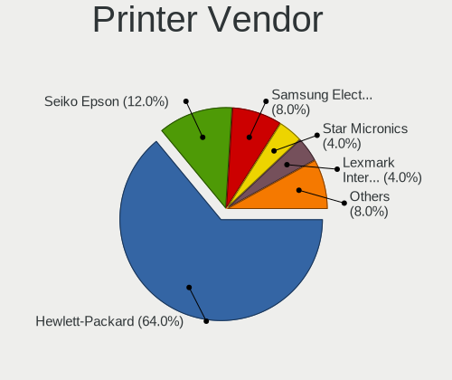

| Vendor                | Computers | Percent |
|-----------------------|-----------|---------|
| Hewlett-Packard       | 14        | 70%     |
| Samsung Electronics   | 2         | 10%     |
| Star Micronics        | 1         | 5%      |
| Seiko Epson           | 1         | 5%      |
| Lexmark International | 1         | 5%      |
| Canon                 | 1         | 5%      |

Printer Model
-------------

Printer device models

| Model                                           | Computers | Percent |
|-------------------------------------------------|-----------|---------|
| HP LaserJet 1020                                | 4         | 20%     |
| HP Deskjet 1050 J410                            | 2         | 10%     |
| Star Micronics IP1000 Printer USB001            | 1         | 5%      |
| Seiko Epson L382 Series                         | 1         | 5%      |
| Samsung M262x/M282x Xpress Series Laser Printer | 1         | 5%      |
| Samsung M2070 Series                            | 1         | 5%      |
| Lexmark International 2600 Series               | 1         | 5%      |
| HP OfficeJet 6950                               | 1         | 5%      |
| HP LaserJet P1006                               | 1         | 5%      |
| HP LaserJet M101-M106                           | 1         | 5%      |
| HP LaserJet CP 1025nw                           | 1         | 5%      |
| HP LaserJet 1150                                | 1         | 5%      |
| HP HP LaserJet M14-M17                          | 1         | 5%      |
| HP DeskJet 2700 series                          | 1         | 5%      |
| HP Deskjet 1510                                 | 1         | 5%      |
| Canon PIXMA MP230                               | 1         | 5%      |

Scanner Vendor
--------------

Scanner device vendors

| Vendor          | Computers | Percent |
|-----------------|-----------|---------|
| Canon           | 3         | 60%     |
| Minolta         | 1         | 20%     |
| Hewlett-Packard | 1         | 20%     |

Scanner Model
-------------

Scanner device models

| Model                                       | Computers | Percent |
|---------------------------------------------|-----------|---------|
| Minolta Dimage Scan Dual III AF-2840 (2889) | 1         | 20%     |
| HP ScanJet 3800c                            | 1         | 20%     |
| Canon CanoScan LiDE 90                      | 1         | 20%     |
| Canon CanoScan LIDE 25                      | 1         | 20%     |
| Canon CanoScan LiDE 110                     | 1         | 20%     |

Camera
------

Camera Vendor
-------------

Camera device vendors

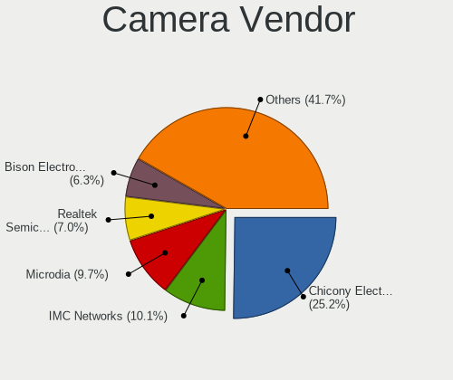

| Vendor                                 | Computers | Percent |
|----------------------------------------|-----------|---------|
| Chicony Electronics                    | 133       | 27.31%  |
| IMC Networks                           | 47        | 9.65%   |
| Microdia                               | 41        | 8.42%   |
| Realtek Semiconductor                  | 33        | 6.78%   |
| Bison Electronics                      | 29        | 5.95%   |
| Syntek                                 | 25        | 5.13%   |
| Sunplus Innovation Technology          | 23        | 4.72%   |
| Suyin                                  | 20        | 4.11%   |
| Cheng Uei Precision Industry (Foxlink) | 17        | 3.49%   |
| Quanta                                 | 15        | 3.08%   |
| Logitech                               | 14        | 2.87%   |
| Lite-On Technology                     | 9         | 1.85%   |
| Acer                                   | 9         | 1.85%   |
| Microsoft                              | 7         | 1.44%   |
| Apple                                  | 7         | 1.44%   |
| Alcor Micro                            | 6         | 1.23%   |
| Z-Star Microelectronics                | 4         | 0.82%   |
| GEMBIRD                                | 4         | 0.82%   |
| SunplusIT                              | 3         | 0.62%   |
| Sonix Technology                       | 3         | 0.62%   |
| Silicon Motion                         | 3         | 0.62%   |
| Samsung Electronics                    | 3         | 0.62%   |
| Ricoh                                  | 3         | 0.62%   |
| Creative Technology                    | 3         | 0.62%   |
| MacroSilicon                           | 2         | 0.41%   |
| Luxvisions Innotech Limited            | 2         | 0.41%   |
| LG Electronics                         | 2         | 0.41%   |
| Lenovo                                 | 2         | 0.41%   |
| Importek                               | 2         | 0.41%   |
| Valve Software                         | 1         | 0.21%   |
| USB Camera                             | 1         | 0.21%   |
| Unknown                                | 1         | 0.21%   |
| Tripath Technology                     | 1         | 0.21%   |
| Primax Electronics                     | 1         | 0.21%   |
| OnePlus Technology (Shenzhen)          | 1         | 0.21%   |
| OmniVision Technologies                | 1         | 0.21%   |
| KYE Systems (Mouse Systems)            | 1         | 0.21%   |
| GenesysLogic Technology                | 1         | 0.21%   |
| Generalplus Technology                 | 1         | 0.21%   |
| Elecom                                 | 1         | 0.21%   |

Camera Model
------------

Camera device models

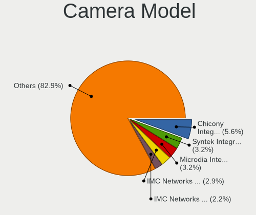

| Model                                             | Computers | Percent |
|---------------------------------------------------|-----------|---------|
| Chicony Integrated Camera                         | 28        | 5.7%    |
| Syntek Integrated Camera                          | 16        | 3.26%   |
| Microdia Integrated_Webcam_HD                     | 14        | 2.85%   |
| IMC Networks Integrated Camera                    | 13        | 2.65%   |
| Realtek Integrated_Webcam_HD                      | 10        | 2.04%   |
| Chicony HP HD Webcam [Fixed]                      | 10        | 2.04%   |
| IMC Networks USB2.0 HD UVC WebCam                 | 9         | 1.83%   |
| Chicony HD WebCam                                 | 9         | 1.83%   |
| IMC Networks USB2.0 VGA UVC WebCam                | 8         | 1.63%   |
| Realtek USB2.0 HD UVC WebCam                      | 7         | 1.43%   |
| Quanta HP HD Camera                               | 7         | 1.43%   |
| Bison Integrated Camera                           | 7         | 1.43%   |
| Sunplus Integrated_Webcam_HD                      | 6         | 1.22%   |
| Microdia Webcam Vitade AF                         | 6         | 1.22%   |
| Bison EasyCamera                                  | 6         | 1.22%   |
| Suyin Acer/HP Integrated Webcam [CN0314]          | 5         | 1.02%   |
| Chicony USB2.0 VGA UVC WebCam                     | 5         | 1.02%   |
| Syntek Lenovo EasyCamera                          | 4         | 0.81%   |
| Suyin HP Webcam                                   | 4         | 0.81%   |
| Sunplus HP HD Webcam [Fixed]                      | 4         | 0.81%   |
| Microdia Integrated Webcam                        | 4         | 0.81%   |
| Lite-On HP HD Camera                              | 4         | 0.81%   |
| IMC Networks Integrated Webcam                    | 4         | 0.81%   |
| GEMBIRD Generic UVC 1.00 camera [AppoTech AX2311] | 4         | 0.81%   |
| Chicony USB 2.0 Camera                            | 4         | 0.81%   |
| Chicony Lenovo EasyCamera                         | 4         | 0.81%   |
| Chicony HP HD Camera                              | 4         | 0.81%   |
| Chicony HD User Facing                            | 4         | 0.81%   |
| Bison Lenovo Integrated Webcam                    | 4         | 0.81%   |
| Sunplus HD WebCam                                 | 3         | 0.61%   |
| Samsung Galaxy series, misc. (MTP mode)           | 3         | 0.61%   |
| Realtek USB Camera                                | 3         | 0.61%   |
| Microdia Sonix USB 2.0 Camera                     | 3         | 0.61%   |
| Lite-On Integrated Camera                         | 3         | 0.61%   |
| IMC Networks 2M Integrated Webcam                 | 3         | 0.61%   |
| Chicony WebCam                                    | 3         | 0.61%   |
| Chicony USB2.0 HD UVC WebCam                      | 3         | 0.61%   |
| Chicony USB2.0 0.3M UVC WebCam                    | 3         | 0.61%   |
| Chicony TOSHIBA Web Camera - HD                   | 3         | 0.61%   |
| Chicony Thinkpad T430 camera                      | 3         | 0.61%   |

Security
--------

Fingerprint Vendor
------------------

Fingerprint sensor vendors

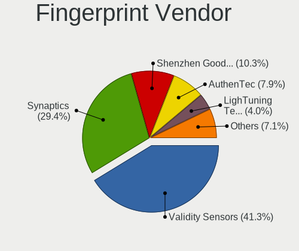

| Vendor                             | Computers | Percent |
|------------------------------------|-----------|---------|
| Validity Sensors                   | 44        | 40%     |
| Synaptics                          | 34        | 30.91%  |
| Shenzhen Goodix Technology         | 9         | 8.18%   |
| AuthenTec                          | 9         | 8.18%   |
| LighTuning Technology              | 5         | 4.55%   |
| Upek                               | 3         | 2.73%   |
| STMicroelectronics                 | 3         | 2.73%   |
| Elan Microelectronics              | 2         | 1.82%   |
| Realtek USB2.0 Finger Print Bridge | 1         | 0.91%   |

Fingerprint Model
-----------------

Fingerprint sensor models

| Model                                                                      | Computers | Percent |
|----------------------------------------------------------------------------|-----------|---------|
| Validity Sensors VFS495 Fingerprint Reader                                 | 11        | 10%     |
| Synaptics Prometheus MIS Touch Fingerprint Reader                          | 9         | 8.18%   |
| Synaptics WBDI                                                             | 7         | 6.36%   |
| Validity Sensors VFS491                                                    | 6         | 5.45%   |
| Shenzhen Goodix  FingerPrint Device                                        | 6         | 5.45%   |
| Synaptics Fingerprint reader [HP G6]                                       | 5         | 4.55%   |
| Validity Sensors VFS 5011 fingerprint sensor                               | 4         | 3.64%   |
| LighTuning EgisTec Touch Fingerprint Sensor                                | 4         | 3.64%   |
| AuthenTec AES2501 Fingerprint Sensor                                       | 4         | 3.64%   |
| Validity Sensors VFS7500 Touch Fingerprint Sensor                          | 3         | 2.73%   |
| Validity Sensors VFS5011 Fingerprint Reader                                | 3         | 2.73%   |
| Validity Sensors VFS471 Fingerprint Reader                                 | 3         | 2.73%   |
| Validity Sensors VFS301 Fingerprint Reader                                 | 3         | 2.73%   |
| Validity Sensors Synaptics WBDI                                            | 3         | 2.73%   |
| Synaptics  WBDI                                                            | 3         | 2.73%   |
| Synaptics  FS7604 Touch Fingerprint Sensor with PurePrint                  | 3         | 2.73%   |
| STMicroelectronics Fingerprint Reader                                      | 3         | 2.73%   |
| Shenzhen Goodix Fingerprint Reader                                         | 3         | 2.73%   |
| AuthenTec AES2810                                                          | 3         | 2.73%   |
| Validity Sensors VFS451 Fingerprint Reader                                 | 2         | 1.82%   |
| Validity Sensors VFS101 Fingerprint Reader                                 | 2         | 1.82%   |
| Upek Biometric Touchchip/Touchstrip Fingerprint Sensor                     | 2         | 1.82%   |
| Synaptics WBDI Fingerprint Reader USB 086                                  | 2         | 1.82%   |
| Synaptics Metallica MIS Touch Fingerprint Reader                           | 2         | 1.82%   |
| Elan ELAN:Fingerprint                                                      | 2         | 1.82%   |
| AuthenTec AES1600                                                          | 2         | 1.82%   |
| Validity Sensors VFS300 Fingerprint Reader                                 | 1         | 0.91%   |
| Validity Sensors VFS Fingerprint sensor                                    | 1         | 0.91%   |
| Validity Sensors Synaptics VFS7552 Touch Fingerprint Sensor with PurePrint | 1         | 0.91%   |
| Validity Sensors Swipe Fingerprint Sensor                                  | 1         | 0.91%   |
| Upek TCS5B Fingerprint sensor                                              | 1         | 0.91%   |
| Synaptics WBDI Fingerprint Reader USB 102                                  | 1         | 0.91%   |
| Synaptics UWP WBDI                                                         | 1         | 0.91%   |
| Synaptics FS7604 Touch Fingerprint Sensor with PurePrint                   | 1         | 0.91%   |
| Realtek USB2.0 Finger Print Bridge FocalTech Fingerprint Device            | 1         | 0.91%   |
| LighTuning ES603 Swipe Fingerprint Sensor                                  | 1         | 0.91%   |

Chipcard Vendor
---------------

Chipcard module vendors

| Vendor                | Computers | Percent |
|-----------------------|-----------|---------|
| Broadcom              | 19        | 38.78%  |
| Alcor Micro           | 17        | 34.69%  |
| O2 Micro              | 5         | 10.2%   |
| Bit4id                | 3         | 6.12%   |
| Lenovo                | 2         | 4.08%   |
| Gemalto (was Gemplus) | 2         | 4.08%   |
| OmniKey               | 1         | 2.04%   |

Chipcard Model
--------------

Chipcard module models

| Model                                                                        | Computers | Percent |
|------------------------------------------------------------------------------|-----------|---------|
| Alcor Micro AU9540 Smartcard Reader                                          | 17        | 34.69%  |
| Broadcom 5880                                                                | 7         | 14.29%  |
| Broadcom BCM5880 Secure Applications Processor                               | 6         | 12.24%  |
| Broadcom 58200                                                               | 4         | 8.16%   |
| O2 Micro OZ776 CCID Smartcard Reader                                         | 3         | 6.12%   |
| Bit4id miniLector EVO                                                        | 3         | 6.12%   |
| O2 Micro Oz776 SmartCard Reader                                              | 2         | 4.08%   |
| Lenovo Integrated Smart Card Reader                                          | 2         | 4.08%   |
| Gemalto (was Gemplus) GemPC Twin SmartCard Reader                            | 2         | 4.08%   |
| Broadcom BCM5880 Secure Applications Processor with fingerprint swipe sensor | 2         | 4.08%   |
| OmniKey CardMan 3121 (HID Technologies)                                      | 1         | 2.04%   |

Unsupported
-----------

Unsupported Devices
-------------------

Total unsupported devices on board

| Total | Computers | Percent |
|-------|-----------|---------|
| 0     | 588       | 66.82%  |
| 1     | 238       | 27.05%  |
| 2     | 41        | 4.66%   |
| 3     | 11        | 1.25%   |
| 4     | 2         | 0.23%   |

Unsupported Device Types
------------------------

Types of unsupported devices

| Type                     | Computers | Percent |
|--------------------------|-----------|---------|
| Fingerprint reader       | 110       | 31.7%   |
| Graphics card            | 83        | 23.92%  |
| Chipcard                 | 40        | 11.53%  |
| Net/wireless             | 31        | 8.93%   |
| Multimedia controller    | 15        | 4.32%   |
| Bluetooth                | 14        | 4.03%   |
| Communication controller | 11        | 3.17%   |
| Storage                  | 8         | 2.31%   |
| Card reader              | 7         | 2.02%   |
| Sound                    | 6         | 1.73%   |
| Modem                    | 6         | 1.73%   |
| Camera                   | 5         | 1.44%   |
| Unassigned class         | 3         | 0.86%   |
| Network                  | 3         | 0.86%   |
| Net/ethernet             | 2         | 0.58%   |
| Flash memory             | 2         | 0.58%   |
| Storage/ide              | 1         | 0.29%   |

