Linux in Slovakia - Tested Hardware & Statistics (Desktops)
-----------------------------------------------------------

A project to collect tested hardware configurations for Linux in Slovakia.

Anyone can contribute to this report by the [hw-probe](https://github.com/linuxhw/hw-probe) tool:

    sudo -E hw-probe -all -upload

Please contribute! Especially if your hardware is rare.

Contents
--------

* [ Test Cases ](#test-cases)

* [ System ](#system)
  - [ OS                       ](#os)
  - [ OS Family                ](#os-family)
  - [ Kernel                   ](#kernel)
  - [ Kernel Family            ](#kernel-family)
  - [ Kernel Major Ver.        ](#kernel-major-ver)
  - [ Arch                     ](#arch)
  - [ DE                       ](#de)
  - [ Display Server           ](#display-server)
  - [ Display Manager          ](#display-manager)
  - [ OS Lang                  ](#os-lang)
  - [ Boot Mode                ](#boot-mode)
  - [ Filesystem               ](#filesystem)
  - [ Part. scheme             ](#part-scheme)
  - [ Dual Boot with Linux/BSD ](#dual-boot-with-linuxbsd)
  - [ Dual Boot (Win)          ](#dual-boot-win)

* [ Board ](#board)
  - [ Vendor                   ](#vendor)
  - [ Model                    ](#model)
  - [ Model Family             ](#model-family)
  - [ MFG Year                 ](#mfg-year)
  - [ Form Factor              ](#form-factor)
  - [ Secure Boot              ](#secure-boot)
  - [ Coreboot                 ](#coreboot)
  - [ RAM Size                 ](#ram-size)
  - [ RAM Used                 ](#ram-used)
  - [ Total Drives             ](#total-drives)
  - [ Has CD-ROM               ](#has-cd-rom)
  - [ Has Ethernet             ](#has-ethernet)
  - [ Has WiFi                 ](#has-wifi)
  - [ Has Bluetooth            ](#has-bluetooth)

* [ Location ](#location)
  - [ Country                  ](#country)
  - [ City                     ](#city)

* [ Drives ](#drives)
  - [ Drive Vendor             ](#drive-vendor)
  - [ Drive Model              ](#drive-model)
  - [ HDD Vendor               ](#hdd-vendor)
  - [ SSD Vendor               ](#ssd-vendor)
  - [ Drive Kind               ](#drive-kind)
  - [ Drive Connector          ](#drive-connector)
  - [ Drive Size               ](#drive-size)
  - [ Space Total              ](#space-total)
  - [ Space Used               ](#space-used)
  - [ Malfunc. Drives          ](#malfunc-drives)
  - [ Malfunc. Drive Vendor    ](#malfunc-drive-vendor)
  - [ Malfunc. HDD Vendor      ](#malfunc-hdd-vendor)
  - [ Malfunc. Drive Kind      ](#malfunc-drive-kind)
  - [ Failed Drives            ](#failed-drives)
  - [ Failed Drive Vendor      ](#failed-drive-vendor)
  - [ Drive Status             ](#drive-status)

* [ Storage controller ](#storage-controller)
  - [ Storage Vendor           ](#storage-vendor)
  - [ Storage Model            ](#storage-model)
  - [ Storage Kind             ](#storage-kind)

* [ Processor ](#processor)
  - [ CPU Vendor               ](#cpu-vendor)
  - [ CPU Model                ](#cpu-model)
  - [ CPU Model Family         ](#cpu-model-family)
  - [ CPU Cores                ](#cpu-cores)
  - [ CPU Sockets              ](#cpu-sockets)
  - [ CPU Threads              ](#cpu-threads)
  - [ CPU Op-Modes             ](#cpu-op-modes)
  - [ CPU Microcode            ](#cpu-microcode)
  - [ CPU Microarch            ](#cpu-microarch)

* [ Graphics ](#graphics)
  - [ GPU Vendor               ](#gpu-vendor)
  - [ GPU Model                ](#gpu-model)
  - [ GPU Combo                ](#gpu-combo)
  - [ GPU Driver               ](#gpu-driver)
  - [ GPU Memory               ](#gpu-memory)

* [ Monitor ](#monitor)
  - [ Monitor Vendor           ](#monitor-vendor)
  - [ Monitor Model            ](#monitor-model)
  - [ Monitor Resolution       ](#monitor-resolution)
  - [ Monitor Diagonal         ](#monitor-diagonal)
  - [ Monitor Width            ](#monitor-width)
  - [ Aspect Ratio             ](#aspect-ratio)
  - [ Monitor Area             ](#monitor-area)
  - [ Pixel Density            ](#pixel-density)
  - [ Multiple Monitors        ](#multiple-monitors)

* [ Network ](#network)
  - [ Net Controller Vendor    ](#net-controller-vendor)
  - [ Net Controller Model     ](#net-controller-model)
  - [ Wireless Vendor          ](#wireless-vendor)
  - [ Wireless Model           ](#wireless-model)
  - [ Ethernet Vendor          ](#ethernet-vendor)
  - [ Ethernet Model           ](#ethernet-model)
  - [ Net Controller Kind      ](#net-controller-kind)
  - [ Used Controller          ](#used-controller)
  - [ NICs                     ](#nics)
  - [ IPv6                     ](#ipv6)

* [ Bluetooth ](#bluetooth)
  - [ Bluetooth Vendor         ](#bluetooth-vendor)
  - [ Bluetooth Model          ](#bluetooth-model)

* [ Sound ](#sound)
  - [ Sound Vendor             ](#sound-vendor)
  - [ Sound Model              ](#sound-model)

* [ Memory ](#memory)
  - [ Memory Vendor            ](#memory-vendor)
  - [ Memory Model             ](#memory-model)
  - [ Memory Kind              ](#memory-kind)
  - [ Memory Form Factor       ](#memory-form-factor)
  - [ Memory Size              ](#memory-size)
  - [ Memory Speed             ](#memory-speed)

* [ Printers & scanners ](#printers--scanners)
  - [ Printer Vendor           ](#printer-vendor)
  - [ Printer Model            ](#printer-model)
  - [ Scanner Vendor           ](#scanner-vendor)
  - [ Scanner Model            ](#scanner-model)

* [ Camera ](#camera)
  - [ Camera Vendor            ](#camera-vendor)
  - [ Camera Model             ](#camera-model)

* [ Security ](#security)
  - [ Fingerprint Vendor       ](#fingerprint-vendor)
  - [ Fingerprint Model        ](#fingerprint-model)
  - [ Chipcard Vendor          ](#chipcard-vendor)
  - [ Chipcard Model           ](#chipcard-model)

* [ Unsupported ](#unsupported)
  - [ Unsupported Devices      ](#unsupported-devices)
  - [ Unsupported Device Types ](#unsupported-device-types)

Test Cases
----------

Total: 783

| Vendor        | Model                       | Probe                                                      | Date         |
|---------------|-----------------------------|------------------------------------------------------------|--------------|
| ASUSTek       | B150M-A/M.2                 | [32f1a88547](https://linux-hardware.org/?probe=32f1a88547) | Jan 03, 2026 |
| ASUSTek       | Maximus Formula             | [f30d975e99](https://linux-hardware.org/?probe=f30d975e99) | Dec 31, 2025 |
| Biostar       | TB360-BTC PRO               | [5e8cf2d30f](https://linux-hardware.org/?probe=5e8cf2d30f) | Dec 31, 2025 |
| ASUSTek       | M5A78L-M/USB3               | [fc5fecbe2d](https://linux-hardware.org/?probe=fc5fecbe2d) | Dec 28, 2025 |
| Gigabyte      | H61M-S1                     | [c686a3f39c](https://linux-hardware.org/?probe=c686a3f39c) | Dec 25, 2025 |
| Dell          | 0XC7MM A00                  | [8d5a6de6c1](https://linux-hardware.org/?probe=8d5a6de6c1) | Dec 23, 2025 |
| Foxconn       | 2ABF                        | [cfc4468bc8](https://linux-hardware.org/?probe=cfc4468bc8) | Dec 20, 2025 |
| ASUSTek       | PRIME B350M-A               | [0ca103872b](https://linux-hardware.org/?probe=0ca103872b) | Dec 14, 2025 |
| ASUSTek       | EX-B250-V7                  | [8cc7d81f1c](https://linux-hardware.org/?probe=8cc7d81f1c) | Dec 14, 2025 |
| MSI           | B350 PC MATE                | [18f3f65bb2](https://linux-hardware.org/?probe=18f3f65bb2) | Dec 13, 2025 |
| ASUSTek       | ProArt X570-CREATOR WIFI    | [0b32f3ed18](https://linux-hardware.org/?probe=0b32f3ed18) | Dec 06, 2025 |
| Lenovo        | 0B98401 PRO                 | [ed10de8401](https://linux-hardware.org/?probe=ed10de8401) | Nov 30, 2025 |
| ASUSTek       | ROG STRIX B650E-F GAMING... | [fb6963f7e6](https://linux-hardware.org/?probe=fb6963f7e6) | Nov 27, 2025 |
| ASUSTek       | ROG STRIX B650E-F GAMING... | [b171297583](https://linux-hardware.org/?probe=b171297583) | Nov 26, 2025 |
| Dell          | 0WMJ54 A01                  | [9265b6709d](https://linux-hardware.org/?probe=9265b6709d) | Nov 25, 2025 |
| ASUSTek       | ROG STRIX B450-F GAMING     | [15e2a2af10](https://linux-hardware.org/?probe=15e2a2af10) | Nov 17, 2025 |
| MSI           | Z97 PC Mate                 | [d3991faad3](https://linux-hardware.org/?probe=d3991faad3) | Nov 09, 2025 |
| MSI           | MAG Z890 TOMAHAWK WIFI      | [d0a0c23509](https://linux-hardware.org/?probe=d0a0c23509) | Nov 09, 2025 |
| ASUSTek       | PRIME B760-PLUS             | [3de9444e35](https://linux-hardware.org/?probe=3de9444e35) | Nov 08, 2025 |
| Gigabyte      | H110-D3A-CF                 | [0e1bbaf256](https://linux-hardware.org/?probe=0e1bbaf256) | Nov 05, 2025 |
| Gigabyte      | H110-D3A-CF                 | [a7547e1e12](https://linux-hardware.org/?probe=a7547e1e12) | Nov 05, 2025 |
| Gigabyte      | B760M H DDR4                | [22b16b3be6](https://linux-hardware.org/?probe=22b16b3be6) | Nov 05, 2025 |
| Seeed Stud... | ODYSSEY-X86J41X5 SD-BS-C... | [9a9bea311c](https://linux-hardware.org/?probe=9a9bea311c) | Nov 02, 2025 |
| MSI           | PRO H610M-E DDR4            | [8b9f40a412](https://linux-hardware.org/?probe=8b9f40a412) | Nov 02, 2025 |
| Gigabyte      | G1.Sniper Z87               | [eecbff7949](https://linux-hardware.org/?probe=eecbff7949) | Nov 01, 2025 |
| ASUSTek       | H81M-PLUS                   | [56087d7a20](https://linux-hardware.org/?probe=56087d7a20) | Oct 23, 2025 |
| ASUSTek       | P8Z77-V LX                  | [81ab1902f3](https://linux-hardware.org/?probe=81ab1902f3) | Oct 17, 2025 |
| HP            | 8169                        | [d7b426adde](https://linux-hardware.org/?probe=d7b426adde) | Oct 15, 2025 |
| ASUSTek       | ROG STRIX B550-I GAMING     | [43689bd509](https://linux-hardware.org/?probe=43689bd509) | Oct 15, 2025 |
| ASUSTek       | ROG STRIX B550-I GAMING     | [4dfab75ef5](https://linux-hardware.org/?probe=4dfab75ef5) | Oct 14, 2025 |
| Gigabyte      | B360M AORUS Gaming 3-CF     | [c04d1d6ffe](https://linux-hardware.org/?probe=c04d1d6ffe) | Oct 13, 2025 |
| Gigabyte      | B650M D3HP                  | [fedac57ff0](https://linux-hardware.org/?probe=fedac57ff0) | Oct 10, 2025 |
| HP            | 8054                        | [4548a8ae41](https://linux-hardware.org/?probe=4548a8ae41) | Sep 28, 2025 |
| HP            | 8054                        | [d0659c965a](https://linux-hardware.org/?probe=d0659c965a) | Sep 27, 2025 |
| MSI           | B450 GAMING PRO CARBON A... | [be8df43d21](https://linux-hardware.org/?probe=be8df43d21) | Sep 17, 2025 |
| ASUSTek       | PRIME B550M-A               | [2ecfd07a85](https://linux-hardware.org/?probe=2ecfd07a85) | Sep 14, 2025 |
| ASUSTek       | PRIME B550M-A               | [8cc674783a](https://linux-hardware.org/?probe=8cc674783a) | Sep 13, 2025 |
| ASUSTek       | P8H77-V                     | [4a0ba1607f](https://linux-hardware.org/?probe=4a0ba1607f) | Sep 12, 2025 |
| ASUSTek       | P8Z77-V PRO                 | [aa9ec85367](https://linux-hardware.org/?probe=aa9ec85367) | Sep 02, 2025 |
| ASUSTek       | P8Z77-V PRO                 | [403cb5a922](https://linux-hardware.org/?probe=403cb5a922) | Sep 01, 2025 |
| Dell          | 02N3WF A01                  | [3ce906fa8e](https://linux-hardware.org/?probe=3ce906fa8e) | Sep 01, 2025 |
| ASUSTek       | ROG CROSSHAIR VIII HERO     | [f27b8a85a7](https://linux-hardware.org/?probe=f27b8a85a7) | Aug 28, 2025 |
| Gigabyte      | B450M S2H                   | [9404e611c7](https://linux-hardware.org/?probe=9404e611c7) | Aug 25, 2025 |
| Gigabyte      | B450M DS3H-CF               | [d226fa4b76](https://linux-hardware.org/?probe=d226fa4b76) | Aug 14, 2025 |
| ASUSTek       | M3N-HT DELUXE               | [59ebc69351](https://linux-hardware.org/?probe=59ebc69351) | Aug 12, 2025 |
| ASUSTek       | TUF Gaming B550M-PLUS       | [4f091e71ea](https://linux-hardware.org/?probe=4f091e71ea) | Aug 09, 2025 |
| Gigabyte      | B760M H DDR4                | [4b2500aee9](https://linux-hardware.org/?probe=4b2500aee9) | Aug 05, 2025 |
| Gigabyte      | B760M H DDR4                | [6dac3b1c94](https://linux-hardware.org/?probe=6dac3b1c94) | Aug 05, 2025 |
| ASUSTek       | Maximus V GENE              | [79e8c12e62](https://linux-hardware.org/?probe=79e8c12e62) | Aug 04, 2025 |
| Gigabyte      | B450M S2H                   | [085b2f8dd5](https://linux-hardware.org/?probe=085b2f8dd5) | Jul 31, 2025 |
| Gigabyte      | H61M-S1                     | [cf73b06a70](https://linux-hardware.org/?probe=cf73b06a70) | Jul 30, 2025 |
| Gigabyte      | A520M H                     | [1c35145263](https://linux-hardware.org/?probe=1c35145263) | Jul 27, 2025 |
| Gigabyte      | Q87M-D2H                    | [832a82a783](https://linux-hardware.org/?probe=832a82a783) | Jul 23, 2025 |
| ASUSTek       | EB1501G                     | [3ffe6e802f](https://linux-hardware.org/?probe=3ffe6e802f) | Jul 12, 2025 |
| ASUSTek       | PRIME A320M-K               | [6f999ba3d8](https://linux-hardware.org/?probe=6f999ba3d8) | Jul 11, 2025 |
| HP            | 2187 A01                    | [9a14dcadb0](https://linux-hardware.org/?probe=9a14dcadb0) | Jul 10, 2025 |
| ASUSTek       | TUF Gaming B550M-PLUS WI... | [a3533a3cf8](https://linux-hardware.org/?probe=a3533a3cf8) | Jul 03, 2025 |
| HP            | 8464                        | [08e5db93b5](https://linux-hardware.org/?probe=08e5db93b5) | Jun 30, 2025 |
| Gigabyte      | H61M-S1                     | [011250243d](https://linux-hardware.org/?probe=011250243d) | Jun 22, 2025 |
| MSI           | G41M-P33 Combo              | [81cc7aadc5](https://linux-hardware.org/?probe=81cc7aadc5) | Jun 18, 2025 |
| Gigabyte      | B450M S2H                   | [7a567a390a](https://linux-hardware.org/?probe=7a567a390a) | Jun 16, 2025 |
| ASUSTek       | PRIME A520M-K               | [f9acd7ffc3](https://linux-hardware.org/?probe=f9acd7ffc3) | Jun 13, 2025 |
| Gigabyte      | B450M S2H                   | [475088d246](https://linux-hardware.org/?probe=475088d246) | Jun 06, 2025 |
| ASUSTek       | Z10PA-U8 Series             | [146e88a59c](https://linux-hardware.org/?probe=146e88a59c) | Jun 05, 2025 |
| Gigabyte      | B450 GAMING X               | [5b88da4349](https://linux-hardware.org/?probe=5b88da4349) | Jun 01, 2025 |
| ASUSTek       | M4A785TD-M EVO              | [f7fb00f946](https://linux-hardware.org/?probe=f7fb00f946) | May 29, 2025 |
| MSI           | MPG X870E EDGE TI WIFI      | [a641cf05c8](https://linux-hardware.org/?probe=a641cf05c8) | May 27, 2025 |
| MSI           | G41M-P33 Combo              | [d3864fa5fb](https://linux-hardware.org/?probe=d3864fa5fb) | May 26, 2025 |
| ASRock        | H370M-HDV                   | [fd61ae16a6](https://linux-hardware.org/?probe=fd61ae16a6) | May 13, 2025 |
| Fujitsu       | D3501-A1 S26361-D3501-A1    | [d2b2130501](https://linux-hardware.org/?probe=d2b2130501) | May 13, 2025 |
| ASUSTek       | PRIME Z790-P WIFI           | [3d348431e3](https://linux-hardware.org/?probe=3d348431e3) | May 12, 2025 |
| MSI           | Z270 SLI                    | [a34f21ed9c](https://linux-hardware.org/?probe=a34f21ed9c) | May 10, 2025 |
| ASRock        | AB350 Pro4                  | [4abba8c09a](https://linux-hardware.org/?probe=4abba8c09a) | May 04, 2025 |
| Lenovo        | MAHOBAY                     | [71b0109176](https://linux-hardware.org/?probe=71b0109176) | May 03, 2025 |
| Gigabyte      | H61M-S1                     | [dc73e5f521](https://linux-hardware.org/?probe=dc73e5f521) | May 01, 2025 |
| Dell          | 0YXT71 A03                  | [8509d0d436](https://linux-hardware.org/?probe=8509d0d436) | Apr 24, 2025 |
| Dell          | 04YP6J A02                  | [dc171a8d29](https://linux-hardware.org/?probe=dc171a8d29) | Apr 18, 2025 |
| ASUSTek       | P7H55                       | [827ccac686](https://linux-hardware.org/?probe=827ccac686) | Apr 16, 2025 |
| HP            | 82F2                        | [941b1d8236](https://linux-hardware.org/?probe=941b1d8236) | Apr 14, 2025 |
| ASUSTek       | Z170-K                      | [b3c23611cc](https://linux-hardware.org/?probe=b3c23611cc) | Apr 07, 2025 |
| Gigabyte      | H61M-S1                     | [bea07bf2dc](https://linux-hardware.org/?probe=bea07bf2dc) | Apr 07, 2025 |
| TianBei       | WTR PRO                     | [710e5ed648](https://linux-hardware.org/?probe=710e5ed648) | Apr 06, 2025 |
| Gigabyte      | B850M D3HP                  | [553fe888e1](https://linux-hardware.org/?probe=553fe888e1) | Apr 02, 2025 |
| ASUSTek       | ROG STRIX B450-E GAMING     | [c2e6a17052](https://linux-hardware.org/?probe=c2e6a17052) | Mar 30, 2025 |
| ASUSTek       | PRIME A320M-K               | [6f322a8025](https://linux-hardware.org/?probe=6f322a8025) | Mar 30, 2025 |
| Gigabyte      | H61M-S1                     | [a2d0fa3f5e](https://linux-hardware.org/?probe=a2d0fa3f5e) | Mar 27, 2025 |
| ASUSTek       | ROG STRIX B650E-I GAMING... | [03e20cee97](https://linux-hardware.org/?probe=03e20cee97) | Mar 22, 2025 |
| Lenovo        | 3717 SDK0J40700 WIN 3258... | [25b051ef1c](https://linux-hardware.org/?probe=25b051ef1c) | Mar 21, 2025 |
| Gigabyte      | 970A-DS3P                   | [9fe96e34b4](https://linux-hardware.org/?probe=9fe96e34b4) | Mar 15, 2025 |
| Gigabyte      | B250M-D3H-CF                | [c2f8b20b79](https://linux-hardware.org/?probe=c2f8b20b79) | Mar 11, 2025 |
| JHZD          | BQM5                        | [78767e66cf](https://linux-hardware.org/?probe=78767e66cf) | Mar 09, 2025 |
| ASUSTek       | PRIME B560M-A               | [56108fc9ff](https://linux-hardware.org/?probe=56108fc9ff) | Mar 02, 2025 |
| Dell          | 07KY25 A01                  | [f004daa934](https://linux-hardware.org/?probe=f004daa934) | Feb 20, 2025 |
| Dell          | 0HN7XN A01                  | [b6d3cf46bc](https://linux-hardware.org/?probe=b6d3cf46bc) | Feb 19, 2025 |
| Dell          | 0HD5W2 A01                  | [3aa7a01bce](https://linux-hardware.org/?probe=3aa7a01bce) | Feb 17, 2025 |
| Gigabyte      | EP35-DS3                    | [fe4efa666f](https://linux-hardware.org/?probe=fe4efa666f) | Feb 13, 2025 |
| ASUSTek       | ROG STRIX B350-F GAMING     | [2ddcde9d20](https://linux-hardware.org/?probe=2ddcde9d20) | Feb 11, 2025 |
| ASUSTek       | TUF Gaming B550M-PLUS       | [9f1c4d9d82](https://linux-hardware.org/?probe=9f1c4d9d82) | Feb 09, 2025 |
| ASUSTek       | TUF Gaming B550-PLUS WIF... | [a20db7c9c5](https://linux-hardware.org/?probe=a20db7c9c5) | Feb 05, 2025 |
| HP            | 1998                        | [5c3c0b8991](https://linux-hardware.org/?probe=5c3c0b8991) | Feb 02, 2025 |
| ASUSTek       | PRIME A320M-K               | [9fb0e09d40](https://linux-hardware.org/?probe=9fb0e09d40) | Feb 01, 2025 |
| ASRock        | B450M Pro4-F                | [22b68f9601](https://linux-hardware.org/?probe=22b68f9601) | Jan 27, 2025 |
| ASUSTek       | P5Q3                        | [fb60fc8b28](https://linux-hardware.org/?probe=fb60fc8b28) | Jan 24, 2025 |
| ASUSTek       | TUF Gaming B550-PLUS WIF... | [79de5dbb21](https://linux-hardware.org/?probe=79de5dbb21) | Jan 18, 2025 |
| MSI           | PRO Z790-A WIFI DDR4        | [fe566a2f9b](https://linux-hardware.org/?probe=fe566a2f9b) | Jan 17, 2025 |
| Lenovo        | 3717 SDK0J40700 WIN 3258... | [bc8aa268ef](https://linux-hardware.org/?probe=bc8aa268ef) | Jan 01, 2025 |
| Acer          | Extensa X2610G              | [b056768ca1](https://linux-hardware.org/?probe=b056768ca1) | Dec 23, 2024 |
| ASUSTek       | TUF Gaming X570-PRO         | [f7f28f51ad](https://linux-hardware.org/?probe=f7f28f51ad) | Dec 22, 2024 |
| ASUSTek       | P8Z68-V PRO GEN3            | [adf5dc1d46](https://linux-hardware.org/?probe=adf5dc1d46) | Dec 21, 2024 |
| Gigabyte      | B75M-D3H                    | [24a9a318be](https://linux-hardware.org/?probe=24a9a318be) | Dec 19, 2024 |
| ASUSTek       | Z170-K                      | [a37f17c9d8](https://linux-hardware.org/?probe=a37f17c9d8) | Dec 16, 2024 |
| Gigabyte      | H61M-S1                     | [0291930ebb](https://linux-hardware.org/?probe=0291930ebb) | Dec 16, 2024 |
| ASUSTek       | TUF Gaming B550M-PLUS       | [7fe45e1a05](https://linux-hardware.org/?probe=7fe45e1a05) | Dec 14, 2024 |
| ASUSTek       | PRIME A320M-K               | [467278b658](https://linux-hardware.org/?probe=467278b658) | Dec 12, 2024 |
| Foxconn       | 2ABF                        | [0f46252ef0](https://linux-hardware.org/?probe=0f46252ef0) | Dec 11, 2024 |
| ASUSTek       | PRIME A320M-K               | [232e1f7313](https://linux-hardware.org/?probe=232e1f7313) | Dec 03, 2024 |
| Gigabyte      | H61M-S1                     | [d4ffafd2f5](https://linux-hardware.org/?probe=d4ffafd2f5) | Nov 29, 2024 |
| Foxconn       | 2ABF                        | [56fc037b00](https://linux-hardware.org/?probe=56fc037b00) | Nov 25, 2024 |
| OEM           | X79-Turbo                   | [8e35c4675c](https://linux-hardware.org/?probe=8e35c4675c) | Nov 23, 2024 |
| Lenovo        | 1066 3556104260981          | [bc8c24fb9c](https://linux-hardware.org/?probe=bc8c24fb9c) | Nov 15, 2024 |
| Gigabyte      | H61M-S1                     | [ed13d9f493](https://linux-hardware.org/?probe=ed13d9f493) | Nov 12, 2024 |
| Intel         | X99H                        | [5e31d210ca](https://linux-hardware.org/?probe=5e31d210ca) | Nov 09, 2024 |
| ASUSTek       | P7P55D-E                    | [ef5c1d5086](https://linux-hardware.org/?probe=ef5c1d5086) | Nov 06, 2024 |
| Foxconn       | 2ABF                        | [93af336b75](https://linux-hardware.org/?probe=93af336b75) | Nov 06, 2024 |
| Fujitsu       | D3161-A1 S26361-D3161-A1    | [5a62c5d679](https://linux-hardware.org/?probe=5a62c5d679) | Nov 02, 2024 |
| Gigabyte      | H61M-S1                     | [0d7062b12c](https://linux-hardware.org/?probe=0d7062b12c) | Oct 26, 2024 |
| LattePanda    | 3 Delta LP-BS-7-S70JR120... | [5a284653dc](https://linux-hardware.org/?probe=5a284653dc) | Oct 18, 2024 |
| LattePanda    | 3 Delta LP-BS-7-S70JR120... | [b0a68cd06f](https://linux-hardware.org/?probe=b0a68cd06f) | Oct 16, 2024 |
| ASRock        | FM2A55M-VG3+                | [d05df8983d](https://linux-hardware.org/?probe=d05df8983d) | Oct 15, 2024 |
| ASRock        | FM2A55M-VG3+                | [90d932a9d7](https://linux-hardware.org/?probe=90d932a9d7) | Oct 15, 2024 |
| TianBei       | WTR PRO                     | [ac12fbc7d0](https://linux-hardware.org/?probe=ac12fbc7d0) | Oct 12, 2024 |
| Gigabyte      | H61M-S1                     | [1e54eccb05](https://linux-hardware.org/?probe=1e54eccb05) | Oct 10, 2024 |
| ASUSTek       | ROG STRIX Z690-G GAMING ... | [b91adce425](https://linux-hardware.org/?probe=b91adce425) | Oct 08, 2024 |
| ASUSTek       | Z97-K                       | [9067fbe342](https://linux-hardware.org/?probe=9067fbe342) | Oct 07, 2024 |
| HC Technol... | HCAR357-NR                  | [9d76df3f47](https://linux-hardware.org/?probe=9d76df3f47) | Oct 04, 2024 |
| Unknown       | Unknown                     | [f33cf6d783](https://linux-hardware.org/?probe=f33cf6d783) | Sep 29, 2024 |
| Acer          | IPXBD-RB                    | [5b0559d8f9](https://linux-hardware.org/?probe=5b0559d8f9) | Sep 28, 2024 |
| Dell          | 02YYK5 A01                  | [43a9a5f206](https://linux-hardware.org/?probe=43a9a5f206) | Sep 24, 2024 |
| MSI           | A78-G41 PC Mate             | [941b873461](https://linux-hardware.org/?probe=941b873461) | Sep 16, 2024 |
| MSI           | A78-G41 PC Mate             | [5cb76e009d](https://linux-hardware.org/?probe=5cb76e009d) | Sep 16, 2024 |
| Gigabyte      | H61M-S1                     | [0b2a56e1e2](https://linux-hardware.org/?probe=0b2a56e1e2) | Sep 12, 2024 |
| ASUSTek       | TUF Gaming B650M-E WIFI     | [3ab1814ac9](https://linux-hardware.org/?probe=3ab1814ac9) | Sep 06, 2024 |
| Intel         | X99                         | [ae686462f8](https://linux-hardware.org/?probe=ae686462f8) | Aug 31, 2024 |
| Gigabyte      | A520 AORUS ELITE            | [29be3e0f99](https://linux-hardware.org/?probe=29be3e0f99) | Aug 28, 2024 |
| Gigabyte      | A520 AORUS ELITE            | [2a8e1f338b](https://linux-hardware.org/?probe=2a8e1f338b) | Aug 28, 2024 |
| Dell          | 0WR7PY A02                  | [950d0e1cfd](https://linux-hardware.org/?probe=950d0e1cfd) | Aug 26, 2024 |
| Lenovo        | 1048 SDK0T08861 WIN 3305... | [7bbf6e7d54](https://linux-hardware.org/?probe=7bbf6e7d54) | Aug 19, 2024 |
| MSI           | Z87-G41 PC Mate             | [8f5394ac30](https://linux-hardware.org/?probe=8f5394ac30) | Aug 11, 2024 |
| Acer          | EM61SM/EM61PM               | [8e0471ff01](https://linux-hardware.org/?probe=8e0471ff01) | Aug 07, 2024 |
| Lenovo        | SHARKBAY NOK                | [6956b94b89](https://linux-hardware.org/?probe=6956b94b89) | Aug 05, 2024 |
| Dell          | 0W0CHX A00                  | [bf56242abb](https://linux-hardware.org/?probe=bf56242abb) | Aug 05, 2024 |
| ASRock        | B450M Pro4                  | [2afd550750](https://linux-hardware.org/?probe=2afd550750) | Aug 02, 2024 |
| Dell          | 0W0CHX A00                  | [b92ca89f55](https://linux-hardware.org/?probe=b92ca89f55) | Aug 01, 2024 |
| ASRock        | Z68M-ITX/HT                 | [ec4ca88b8b](https://linux-hardware.org/?probe=ec4ca88b8b) | Aug 01, 2024 |
| ASUSTek       | P5G41T-M LX                 | [0f18c465ca](https://linux-hardware.org/?probe=0f18c465ca) | Jul 28, 2024 |
| ASRock        | FM2A55M-VG3+                | [fb251e81e1](https://linux-hardware.org/?probe=fb251e81e1) | Jul 22, 2024 |
| ASUSTek       | P5Q3                        | [859fe3fec0](https://linux-hardware.org/?probe=859fe3fec0) | Jul 08, 2024 |
| PC Engines    | APU2                        | [8ecde949d6](https://linux-hardware.org/?probe=8ecde949d6) | Jul 05, 2024 |
| PC Engines    | APU2                        | [9602564885](https://linux-hardware.org/?probe=9602564885) | Jul 05, 2024 |
| Gigabyte      | H61M-S1                     | [6c5dbc9da0](https://linux-hardware.org/?probe=6c5dbc9da0) | Jun 29, 2024 |
| ASUSTek       | PRIME A320M-K               | [5f9980bb04](https://linux-hardware.org/?probe=5f9980bb04) | Jun 25, 2024 |
| ASUSTek       | P5GC-MX                     | [23b3a67905](https://linux-hardware.org/?probe=23b3a67905) | Jun 25, 2024 |
| MSI           | H61M-P31                    | [dbd17cd0f8](https://linux-hardware.org/?probe=dbd17cd0f8) | Jun 22, 2024 |
| Gigabyte      | 945GCM-S2L                  | [87f752d0a6](https://linux-hardware.org/?probe=87f752d0a6) | Jun 18, 2024 |
| Gigabyte      | X570 AORUS MASTER           | [31ded147a8](https://linux-hardware.org/?probe=31ded147a8) | Jun 18, 2024 |
| MSI           | MAG Z390 TOMAHAWK           | [30b000d0e2](https://linux-hardware.org/?probe=30b000d0e2) | Jun 17, 2024 |
| MSI           | 790GX-G65                   | [a19feb6eb3](https://linux-hardware.org/?probe=a19feb6eb3) | Jun 15, 2024 |
| Gigabyte      | 945GCM-S2L                  | [682d4840e6](https://linux-hardware.org/?probe=682d4840e6) | Jun 13, 2024 |
| ASUSTek       | P5QL-E                      | [6a6f4a7f73](https://linux-hardware.org/?probe=6a6f4a7f73) | Jun 12, 2024 |
| ASUSTek       | P5QL-E                      | [65be90ddff](https://linux-hardware.org/?probe=65be90ddff) | Jun 12, 2024 |
| ASRock        | Wolfdale1333-D667           | [aded923eb2](https://linux-hardware.org/?probe=aded923eb2) | May 31, 2024 |
| ASUSTek       | Z170-K                      | [0e20fc9d99](https://linux-hardware.org/?probe=0e20fc9d99) | May 29, 2024 |
| ASUSTek       | P5E WS Pro                  | [d68bac0997](https://linux-hardware.org/?probe=d68bac0997) | May 27, 2024 |
| Dell          | 09WH54 A00                  | [5013446244](https://linux-hardware.org/?probe=5013446244) | May 21, 2024 |
| ASUSTek       | PRIME A520M-A II            | [27b6102774](https://linux-hardware.org/?probe=27b6102774) | May 19, 2024 |
| ASUSTek       | PRIME A520M-A II            | [b97936cf33](https://linux-hardware.org/?probe=b97936cf33) | May 19, 2024 |
| ASUSTek       | ROG STRIX B650E-I GAMING... | [dcac69eb0a](https://linux-hardware.org/?probe=dcac69eb0a) | May 16, 2024 |
| Gigabyte      | B450M S2H                   | [5714f5e487](https://linux-hardware.org/?probe=5714f5e487) | May 13, 2024 |
| Gigabyte      | H61M-S1                     | [93a1cc6269](https://linux-hardware.org/?probe=93a1cc6269) | May 11, 2024 |
| Acer          | Aspire M3985                | [62810055f9](https://linux-hardware.org/?probe=62810055f9) | May 11, 2024 |
| Dell          | 04YP6J A02                  | [03d7257f19](https://linux-hardware.org/?probe=03d7257f19) | May 10, 2024 |
| ASUSTek       | PRIME B450M-K II            | [1118b63d68](https://linux-hardware.org/?probe=1118b63d68) | May 09, 2024 |
| ASRock        | E350M1/USB3                 | [d82d76d3e5](https://linux-hardware.org/?probe=d82d76d3e5) | May 05, 2024 |
| OEM           | X79-Turbo                   | [9c9327fa63](https://linux-hardware.org/?probe=9c9327fa63) | May 03, 2024 |
| ASUSTek       | P8H61-M LE                  | [15d91ebe7c](https://linux-hardware.org/?probe=15d91ebe7c) | Apr 28, 2024 |
| ASUSTek       | PRIME B450M-K II            | [31838248fa](https://linux-hardware.org/?probe=31838248fa) | Apr 24, 2024 |
| Dell          | 0MN1TX A02                  | [2aa151f159](https://linux-hardware.org/?probe=2aa151f159) | Apr 20, 2024 |
| Dell          | 0MN1TX A02                  | [cfac7f54ed](https://linux-hardware.org/?probe=cfac7f54ed) | Apr 20, 2024 |
| ASUSTek       | PRIME B450M-K II            | [e25b6a6321](https://linux-hardware.org/?probe=e25b6a6321) | Apr 18, 2024 |
| Gigabyte      | H61M-S1                     | [1a9697f39d](https://linux-hardware.org/?probe=1a9697f39d) | Apr 12, 2024 |
| Unknown       | Unknown                     | [94f12b2951](https://linux-hardware.org/?probe=94f12b2951) | Apr 11, 2024 |
| ASUSTek       | P5P43TD/USB3                | [e8ebc10509](https://linux-hardware.org/?probe=e8ebc10509) | Apr 06, 2024 |
| Lenovo        | 318E SDK0J40697 WIN 3305... | [280e11e5cc](https://linux-hardware.org/?probe=280e11e5cc) | Mar 24, 2024 |
| Dell          | 0RN474                      | [665f831546](https://linux-hardware.org/?probe=665f831546) | Mar 24, 2024 |
| MSI           | MS-7369                     | [0a36f4715f](https://linux-hardware.org/?probe=0a36f4715f) | Mar 21, 2024 |
| OEM           | X79-Turbo                   | [b19889facd](https://linux-hardware.org/?probe=b19889facd) | Mar 12, 2024 |
| Gigabyte      | GA-MA790FXT-UD5P            | [c50d470e19](https://linux-hardware.org/?probe=c50d470e19) | Mar 11, 2024 |
| Acer          | EM61SM/EM61PM               | [1823ab7a07](https://linux-hardware.org/?probe=1823ab7a07) | Mar 04, 2024 |
| ASUSTek       | TUF Gaming B550M-PLUS       | [8e8844631e](https://linux-hardware.org/?probe=8e8844631e) | Feb 27, 2024 |
| Gigabyte      | GA-MA790FXT-UD5P            | [5239851f48](https://linux-hardware.org/?probe=5239851f48) | Feb 26, 2024 |
| Dell          | 0RN474                      | [c2ca6576b9](https://linux-hardware.org/?probe=c2ca6576b9) | Feb 25, 2024 |
| MSI           | MS-7369                     | [d771ce7ed3](https://linux-hardware.org/?probe=d771ce7ed3) | Feb 25, 2024 |
| Gigabyte      | GA-MA790FXT-UD5P            | [f521933e0c](https://linux-hardware.org/?probe=f521933e0c) | Feb 18, 2024 |
| Gigabyte      | GA-MA78LMT-US2H             | [7712fbd948](https://linux-hardware.org/?probe=7712fbd948) | Feb 15, 2024 |
| Gigabyte      | GA-MA78LMT-US2H             | [9dc94d073a](https://linux-hardware.org/?probe=9dc94d073a) | Feb 15, 2024 |
| ASRock        | AB350 Pro4                  | [5b8e7f1992](https://linux-hardware.org/?probe=5b8e7f1992) | Feb 14, 2024 |
| Gigabyte      | H61M-S1                     | [5ba6bba9d7](https://linux-hardware.org/?probe=5ba6bba9d7) | Feb 11, 2024 |
| ASUSTek       | TUF Gaming B550M-PLUS       | [e4d2896a38](https://linux-hardware.org/?probe=e4d2896a38) | Feb 06, 2024 |
| Gigabyte      | H61M-S1                     | [89b53566aa](https://linux-hardware.org/?probe=89b53566aa) | Feb 06, 2024 |
| ASUSTek       | TUF Gaming B550M-PLUS       | [ecd774856d](https://linux-hardware.org/?probe=ecd774856d) | Feb 06, 2024 |
| Gigabyte      | H61M-S1                     | [9a7978bd86](https://linux-hardware.org/?probe=9a7978bd86) | Jan 29, 2024 |
| Gigabyte      | GA-MA790FXT-UD5P            | [961ba7a8a2](https://linux-hardware.org/?probe=961ba7a8a2) | Jan 24, 2024 |
| Lenovo        | MAHOBAY NO DPK              | [1eeda8c8f1](https://linux-hardware.org/?probe=1eeda8c8f1) | Jan 23, 2024 |
| Gigabyte      | GA-MA790FXT-UD5P            | [9f48506578](https://linux-hardware.org/?probe=9f48506578) | Jan 23, 2024 |
| Gigabyte      | H61M-S1                     | [f0a97be10f](https://linux-hardware.org/?probe=f0a97be10f) | Jan 22, 2024 |
| Gigabyte      | GA-MA790FXT-UD5P            | [bd15a62f1a](https://linux-hardware.org/?probe=bd15a62f1a) | Jan 02, 2024 |
| Gigabyte      | H61M-S1                     | [1e34cd1559](https://linux-hardware.org/?probe=1e34cd1559) | Jan 01, 2024 |
| ASUSTek       | TUF Gaming B550M-PLUS       | [aa1befaf25](https://linux-hardware.org/?probe=aa1befaf25) | Dec 29, 2023 |
| Gigabyte      | GA-MA790FXT-UD5P            | [e29421585d](https://linux-hardware.org/?probe=e29421585d) | Dec 28, 2023 |
| Gigabyte      | H61M-S1                     | [e741a22dc6](https://linux-hardware.org/?probe=e741a22dc6) | Dec 27, 2023 |
| Gigabyte      | H61M-S1                     | [ab14001c30](https://linux-hardware.org/?probe=ab14001c30) | Dec 27, 2023 |
| ASUSTek       | TUF Gaming B550M-PLUS       | [6311def15e](https://linux-hardware.org/?probe=6311def15e) | Dec 21, 2023 |
| Gigabyte      | GA-MA790FXT-UD5P            | [5fa215a8cd](https://linux-hardware.org/?probe=5fa215a8cd) | Dec 21, 2023 |
| ASRock        | H61M-VG4                    | [a845742a42](https://linux-hardware.org/?probe=a845742a42) | Dec 17, 2023 |
| ASUSTek       | F2A85-V PRO                 | [1909f0bbc0](https://linux-hardware.org/?probe=1909f0bbc0) | Dec 16, 2023 |
| ASUSTek       | P5E WS Pro                  | [9c68d265b1](https://linux-hardware.org/?probe=9c68d265b1) | Dec 12, 2023 |
| HP            | 8184 X4                     | [bad08bc9a0](https://linux-hardware.org/?probe=bad08bc9a0) | Dec 07, 2023 |
| ASUSTek       | PRIME Z790-P WIFI           | [8b11ad9f77](https://linux-hardware.org/?probe=8b11ad9f77) | Dec 02, 2023 |
| Gigabyte      | 970A-UD3P                   | [206d92bed2](https://linux-hardware.org/?probe=206d92bed2) | Nov 27, 2023 |
| Gigabyte      | 970A-UD3P                   | [bd533274c5](https://linux-hardware.org/?probe=bd533274c5) | Nov 27, 2023 |
| Gigabyte      | H61M-S1                     | [bb4bd3eceb](https://linux-hardware.org/?probe=bb4bd3eceb) | Nov 26, 2023 |
| ASUSTek       | TUF Gaming B550M-PLUS       | [3545a1a483](https://linux-hardware.org/?probe=3545a1a483) | Nov 26, 2023 |
| Gigabyte      | H61M-S1                     | [38e1d661bf](https://linux-hardware.org/?probe=38e1d661bf) | Nov 23, 2023 |
| ASUSTek       | Z97I-PLUS                   | [71d854d842](https://linux-hardware.org/?probe=71d854d842) | Nov 19, 2023 |
| ASUSTek       | Z170-K                      | [8d6d23926d](https://linux-hardware.org/?probe=8d6d23926d) | Nov 17, 2023 |
| ASUSTek       | Pro H610T D4                | [efbbe2e3e0](https://linux-hardware.org/?probe=efbbe2e3e0) | Nov 15, 2023 |
| ASUSTek       | TUF X470-PLUS GAMING        | [1b5d69b7ed](https://linux-hardware.org/?probe=1b5d69b7ed) | Nov 14, 2023 |
| Gigabyte      | B250M-D3H-CF                | [9ffde477ac](https://linux-hardware.org/?probe=9ffde477ac) | Nov 12, 2023 |
| ASUSTek       | TUF Gaming Z790-PLUS WIF... | [c0932e879f](https://linux-hardware.org/?probe=c0932e879f) | Nov 11, 2023 |
| ASUSTek       | Pro H610T D4                | [3e803b61d3](https://linux-hardware.org/?probe=3e803b61d3) | Nov 11, 2023 |
| ASUSTek       | Z170-K                      | [8bdabebc5b](https://linux-hardware.org/?probe=8bdabebc5b) | Nov 09, 2023 |
| Unknown       | Unknown                     | [ca05ff684b](https://linux-hardware.org/?probe=ca05ff684b) | Nov 09, 2023 |
| Gigabyte      | H61M-S1                     | [ef707f88ea](https://linux-hardware.org/?probe=ef707f88ea) | Nov 08, 2023 |
| Gigabyte      | H61M-S1                     | [68f36bd8cc](https://linux-hardware.org/?probe=68f36bd8cc) | Nov 08, 2023 |
| ASUSTek       | Maximus VIII HERO           | [0d65b73ae2](https://linux-hardware.org/?probe=0d65b73ae2) | Nov 07, 2023 |
| ASUSTek       | Z10PA-D8 Series             | [b865e2f52d](https://linux-hardware.org/?probe=b865e2f52d) | Nov 07, 2023 |
| Dell          | 0RN474                      | [0ae8ddb9b3](https://linux-hardware.org/?probe=0ae8ddb9b3) | Nov 01, 2023 |
| HP            | ProLiant ML310e Gen8 v2     | [27d8415c88](https://linux-hardware.org/?probe=27d8415c88) | Nov 01, 2023 |
| ASUSTek       | H81T                        | [7986b7269f](https://linux-hardware.org/?probe=7986b7269f) | Oct 31, 2023 |
| HP            | ProLiant ML310e Gen8        | [fa410ee23c](https://linux-hardware.org/?probe=fa410ee23c) | Oct 29, 2023 |
| HP            | ProLiant ML310e Gen8        | [16417bdac2](https://linux-hardware.org/?probe=16417bdac2) | Oct 29, 2023 |
| Gigabyte      | HA65M-UD3H-B3               | [8e445c2bc4](https://linux-hardware.org/?probe=8e445c2bc4) | Oct 11, 2023 |
| ASUSTek       | H170-PRO                    | [fd43a8ef45](https://linux-hardware.org/?probe=fd43a8ef45) | Oct 04, 2023 |
| ASUSTek       | B85M-G                      | [0166816d1b](https://linux-hardware.org/?probe=0166816d1b) | Oct 01, 2023 |
| Gigabyte      | B550 GAMING X V2            | [d656cacdd8](https://linux-hardware.org/?probe=d656cacdd8) | Sep 26, 2023 |
| Gigabyte      | H61M-S1                     | [caa45f79f6](https://linux-hardware.org/?probe=caa45f79f6) | Sep 22, 2023 |
| ASUSTek       | Z170-K                      | [4f3d36e0bd](https://linux-hardware.org/?probe=4f3d36e0bd) | Sep 22, 2023 |
| ASUSTek       | Z170-K                      | [be3d2f3d77](https://linux-hardware.org/?probe=be3d2f3d77) | Sep 22, 2023 |
| Dell          | 09WH54 A00                  | [128763445e](https://linux-hardware.org/?probe=128763445e) | Sep 14, 2023 |
| HP            | 86FB MVB A                  | [cdb3ae1787](https://linux-hardware.org/?probe=cdb3ae1787) | Sep 14, 2023 |
| Pegatron      | 2AB6                        | [752a87de3b](https://linux-hardware.org/?probe=752a87de3b) | Sep 11, 2023 |
| HP            | 304Ah                       | [fe71b825fd](https://linux-hardware.org/?probe=fe71b825fd) | Sep 11, 2023 |
| MSI           | MAG B550 TOMAHAWK           | [b5ea617856](https://linux-hardware.org/?probe=b5ea617856) | Sep 08, 2023 |
| ASUSTek       | PRIME B650M-A II            | [307ca05754](https://linux-hardware.org/?probe=307ca05754) | Sep 06, 2023 |
| ASUSTek       | P5P43TD/USB3                | [619032e1d0](https://linux-hardware.org/?probe=619032e1d0) | Sep 04, 2023 |
| MSI           | PRO Z690-A DDR4             | [09e7a8c91b](https://linux-hardware.org/?probe=09e7a8c91b) | Sep 04, 2023 |
| ASUSTek       | PRIME X470-PRO              | [35e2cffa7f](https://linux-hardware.org/?probe=35e2cffa7f) | Sep 03, 2023 |
| Gigabyte      | H61M-S1                     | [f341ee514c](https://linux-hardware.org/?probe=f341ee514c) | Aug 30, 2023 |
| Pegatron      | 2AB6                        | [ed71da8f69](https://linux-hardware.org/?probe=ed71da8f69) | Aug 29, 2023 |
| Unknown       | Unknown                     | [7e6d5fa7bc](https://linux-hardware.org/?probe=7e6d5fa7bc) | Aug 25, 2023 |
| MSI           | Z97S SLI Krait Edition      | [037e041959](https://linux-hardware.org/?probe=037e041959) | Aug 25, 2023 |
| Unknown       | Unknown                     | [0e86c5864d](https://linux-hardware.org/?probe=0e86c5864d) | Aug 24, 2023 |
| HC Technol... | HCAR357-NR                  | [3cd017db11](https://linux-hardware.org/?probe=3cd017db11) | Aug 24, 2023 |
| ASRock        | Z170 Gaming K4              | [867105e269](https://linux-hardware.org/?probe=867105e269) | Aug 18, 2023 |
| ASRock        | Z270 Killer SLI             | [10d0229ef0](https://linux-hardware.org/?probe=10d0229ef0) | Aug 16, 2023 |
| ASUSTek       | PRIME B250M-K               | [e54e05ccb1](https://linux-hardware.org/?probe=e54e05ccb1) | Aug 15, 2023 |
| Gigabyte      | H61M-S1                     | [e63deac9b1](https://linux-hardware.org/?probe=e63deac9b1) | Aug 13, 2023 |
| Gigabyte      | H61M-S1                     | [b92a6f8a9e](https://linux-hardware.org/?probe=b92a6f8a9e) | Aug 12, 2023 |
| Gigabyte      | H61M-S1                     | [031ed1d4e7](https://linux-hardware.org/?probe=031ed1d4e7) | Aug 12, 2023 |
| Dell          | 0RN474                      | [61153fe575](https://linux-hardware.org/?probe=61153fe575) | Aug 09, 2023 |
| Gigabyte      | H61M-S1                     | [c160e44518](https://linux-hardware.org/?probe=c160e44518) | Aug 08, 2023 |
| Unknown       | Unknown                     | [14114ca4aa](https://linux-hardware.org/?probe=14114ca4aa) | Aug 07, 2023 |
| Unknown       | Unknown                     | [946d81eb9d](https://linux-hardware.org/?probe=946d81eb9d) | Aug 07, 2023 |
| Gigabyte      | H61M-S1                     | [64803a4cd7](https://linux-hardware.org/?probe=64803a4cd7) | Aug 04, 2023 |
| ASUSTek       | M4N68T-M LE                 | [90dce7a9cf](https://linux-hardware.org/?probe=90dce7a9cf) | Jul 30, 2023 |
| Gigabyte      | H61M-S1                     | [ec84069efb](https://linux-hardware.org/?probe=ec84069efb) | Jul 28, 2023 |
| Gigabyte      | H61M-S1                     | [89557d5880](https://linux-hardware.org/?probe=89557d5880) | Jul 28, 2023 |
| ASUSTek       | TUF Gaming B550M-PLUS       | [aad0018c0e](https://linux-hardware.org/?probe=aad0018c0e) | Jul 20, 2023 |
| MSI           | PRO Z690-A DDR4             | [d36574de10](https://linux-hardware.org/?probe=d36574de10) | Jul 03, 2023 |
| ASRock        | H61M-VG4                    | [7fbf9c4e53](https://linux-hardware.org/?probe=7fbf9c4e53) | Jun 25, 2023 |
| Foxconn       | 945 7MC Series              | [dc2911bfae](https://linux-hardware.org/?probe=dc2911bfae) | Jun 25, 2023 |
| Foxconn       | 945 7MC Series              | [273bec93a4](https://linux-hardware.org/?probe=273bec93a4) | Jun 25, 2023 |
| ASUSTek       | P5K                         | [c33ff02489](https://linux-hardware.org/?probe=c33ff02489) | Jun 24, 2023 |
| ASUSTek       | P5K                         | [c87e87b883](https://linux-hardware.org/?probe=c87e87b883) | Jun 24, 2023 |
| ASUSTek       | M5A99X EVO                  | [5732495ae1](https://linux-hardware.org/?probe=5732495ae1) | Jun 14, 2023 |
| Gigabyte      | H61M-S1                     | [edbcec7f32](https://linux-hardware.org/?probe=edbcec7f32) | Jun 12, 2023 |
| ASUSTek       | P8H61-M LX                  | [9d9872a84a](https://linux-hardware.org/?probe=9d9872a84a) | Jun 10, 2023 |
| ASUSTek       | P8H61-M LX                  | [bd22edfae7](https://linux-hardware.org/?probe=bd22edfae7) | Jun 09, 2023 |
| Gigabyte      | H61M-S1                     | [3063c26aca](https://linux-hardware.org/?probe=3063c26aca) | Jun 08, 2023 |
| MSI           | MS-7513                     | [ed69341f3c](https://linux-hardware.org/?probe=ed69341f3c) | Jun 07, 2023 |
| Gigabyte      | B250M-D3H-CF                | [d8f9165fec](https://linux-hardware.org/?probe=d8f9165fec) | Jun 04, 2023 |
| ASUSTek       | TUF Gaming B550M-PLUS       | [7b513e678c](https://linux-hardware.org/?probe=7b513e678c) | Jun 03, 2023 |
| ASRock        | ALiveDual-eSATA2            | [0f490d3b39](https://linux-hardware.org/?probe=0f490d3b39) | Jun 01, 2023 |
| Gigabyte      | H61M-S1                     | [5d33af1d5a](https://linux-hardware.org/?probe=5d33af1d5a) | May 30, 2023 |
| Gigabyte      | H61M-S1                     | [6872b07bb6](https://linux-hardware.org/?probe=6872b07bb6) | May 30, 2023 |
| MSI           | PRO Z690-A DDR4             | [b0be576b32](https://linux-hardware.org/?probe=b0be576b32) | May 28, 2023 |
| ASUSTek       | F2A85-V PRO                 | [f2181d0270](https://linux-hardware.org/?probe=f2181d0270) | May 27, 2023 |
| ASUSTek       | M2V-MX SE                   | [be58596103](https://linux-hardware.org/?probe=be58596103) | May 27, 2023 |
| ASUSTek       | M2V-MX SE                   | [0eedc4211a](https://linux-hardware.org/?probe=0eedc4211a) | May 27, 2023 |
| Gigabyte      | GA-MA785GM-US2H             | [7284c23b76](https://linux-hardware.org/?probe=7284c23b76) | May 27, 2023 |
| ASUSTek       | P5E WS Pro                  | [97a221407d](https://linux-hardware.org/?probe=97a221407d) | May 17, 2023 |
| HP            | 1589                        | [c905464231](https://linux-hardware.org/?probe=c905464231) | May 11, 2023 |
| MSI           | MS-7513                     | [1e14e5d3e6](https://linux-hardware.org/?probe=1e14e5d3e6) | May 10, 2023 |
| MSI           | MAG B550 TOMAHAWK           | [68afb54270](https://linux-hardware.org/?probe=68afb54270) | May 10, 2023 |
| Gigabyte      | B550M DS3H                  | [ae040331e6](https://linux-hardware.org/?probe=ae040331e6) | May 06, 2023 |
| MSI           | A75A-G55                    | [6ecb91213c](https://linux-hardware.org/?probe=6ecb91213c) | May 05, 2023 |
| HP            | ProLiant ML310e Gen8 v2     | [501d26e477](https://linux-hardware.org/?probe=501d26e477) | Apr 30, 2023 |
| ASUSTek       | TUF Gaming B550M-PLUS       | [a2b832afa2](https://linux-hardware.org/?probe=a2b832afa2) | Apr 30, 2023 |
| HP            | 802F                        | [b314d41043](https://linux-hardware.org/?probe=b314d41043) | Apr 28, 2023 |
| ASRock        | H61M-VG4                    | [a8e7de2e0b](https://linux-hardware.org/?probe=a8e7de2e0b) | Apr 26, 2023 |
| ASUSTek       | TUF Gaming B550M-PLUS       | [bb520ff82e](https://linux-hardware.org/?probe=bb520ff82e) | Apr 21, 2023 |
| ASUSTek       | TUF Gaming B550M-PLUS       | [76db4c685b](https://linux-hardware.org/?probe=76db4c685b) | Apr 15, 2023 |
| ASUSTek       | M2N68-AM SE2                | [e9b6076df4](https://linux-hardware.org/?probe=e9b6076df4) | Apr 13, 2023 |
| ASUSTek       | PRIME B450M-A II            | [1a470a3b5a](https://linux-hardware.org/?probe=1a470a3b5a) | Apr 10, 2023 |
| Techvision    | TVI7309X B0                 | [d24ce5fa44](https://linux-hardware.org/?probe=d24ce5fa44) | Apr 09, 2023 |
| ASRock        | FM2A55M-VG3+                | [f7435e4d65](https://linux-hardware.org/?probe=f7435e4d65) | Apr 09, 2023 |
| ASRock        | FM2A55M-VG3+                | [53ed0bc068](https://linux-hardware.org/?probe=53ed0bc068) | Apr 09, 2023 |
| Lenovo        | 318E SDK0J40697 WIN 3305... | [436d55c73e](https://linux-hardware.org/?probe=436d55c73e) | Apr 09, 2023 |
| ASRock        | 960GC-GS FX                 | [90cb74d9f0](https://linux-hardware.org/?probe=90cb74d9f0) | Apr 08, 2023 |
| Techvision    | TVI7309X B0                 | [dbbe4bbbc5](https://linux-hardware.org/?probe=dbbe4bbbc5) | Apr 03, 2023 |
| ASUSTek       | TUF Gaming B550M-PLUS       | [7c95c976a9](https://linux-hardware.org/?probe=7c95c976a9) | Apr 03, 2023 |
| ASUSTek       | TUF Gaming B550M-PLUS       | [e45ad193f8](https://linux-hardware.org/?probe=e45ad193f8) | Apr 01, 2023 |
| Gigabyte      | GA-MA785GM-US2H             | [e9fe5cb307](https://linux-hardware.org/?probe=e9fe5cb307) | Apr 01, 2023 |
| ASUSTek       | PRIME A320M-K               | [59c335754f](https://linux-hardware.org/?probe=59c335754f) | Apr 01, 2023 |
| ASUSTek       | P5E WS Pro                  | [6c70ac23df](https://linux-hardware.org/?probe=6c70ac23df) | Mar 30, 2023 |
| HP            | 0AACh                       | [43dbfddd1b](https://linux-hardware.org/?probe=43dbfddd1b) | Mar 28, 2023 |
| Pegatron      | 2AD5                        | [502ff745d4](https://linux-hardware.org/?probe=502ff745d4) | Mar 27, 2023 |
| Dell          | 0RN474                      | [1fb7cf06d1](https://linux-hardware.org/?probe=1fb7cf06d1) | Mar 25, 2023 |
| Dell          | 0RN474                      | [88b56f0530](https://linux-hardware.org/?probe=88b56f0530) | Mar 24, 2023 |
| HP            | 0AACh                       | [2a1f96ca8d](https://linux-hardware.org/?probe=2a1f96ca8d) | Mar 24, 2023 |
| ASUSTek       | M5A97 R2.0                  | [789ca3dc74](https://linux-hardware.org/?probe=789ca3dc74) | Mar 22, 2023 |
| Techvision    | TVI7309X B0                 | [468588ab96](https://linux-hardware.org/?probe=468588ab96) | Mar 21, 2023 |
| Gigabyte      | P43-ES3G                    | [60a7dc4c2e](https://linux-hardware.org/?probe=60a7dc4c2e) | Mar 20, 2023 |
| Techvision    | TVI7309X B0                 | [d1a16fdb17](https://linux-hardware.org/?probe=d1a16fdb17) | Mar 18, 2023 |
| Techvision    | TVI7309X B0                 | [08572d5e7c](https://linux-hardware.org/?probe=08572d5e7c) | Mar 18, 2023 |
| Techvision    | TVI7309X B0                 | [82914cf856](https://linux-hardware.org/?probe=82914cf856) | Mar 18, 2023 |
| Dell          | 0HN7XN A01                  | [4ce2092fe2](https://linux-hardware.org/?probe=4ce2092fe2) | Mar 17, 2023 |
| Intel         | DH77EB AAG39073-304         | [0b55f12ab3](https://linux-hardware.org/?probe=0b55f12ab3) | Mar 11, 2023 |
| ASRock        | A320M-DVS R4.0              | [8e02302d63](https://linux-hardware.org/?probe=8e02302d63) | Mar 09, 2023 |
| Gigabyte      | 970A-DS3P                   | [fc28c47011](https://linux-hardware.org/?probe=fc28c47011) | Mar 03, 2023 |
| ASUSTek       | F2A85-V PRO                 | [aa7d308d7e](https://linux-hardware.org/?probe=aa7d308d7e) | Mar 01, 2023 |
| ASUSTek       | PRIME X570-P                | [dda5eec4b9](https://linux-hardware.org/?probe=dda5eec4b9) | Feb 28, 2023 |
| Gigabyte      | X58A-UD5                    | [4cff35f888](https://linux-hardware.org/?probe=4cff35f888) | Feb 27, 2023 |
| HP            | 3397                        | [e714a7b19d](https://linux-hardware.org/?probe=e714a7b19d) | Feb 23, 2023 |
| ASRock        | B550 Extreme4               | [db2686086b](https://linux-hardware.org/?probe=db2686086b) | Feb 21, 2023 |
| ASRock        | B450M Pro4-F R2.0           | [f1082dcffa](https://linux-hardware.org/?probe=f1082dcffa) | Feb 17, 2023 |
| Gigabyte      | P43-ES3G                    | [528ffce1c7](https://linux-hardware.org/?probe=528ffce1c7) | Feb 15, 2023 |
| Gigabyte      | B250M-D3H-CF                | [8689383fea](https://linux-hardware.org/?probe=8689383fea) | Feb 15, 2023 |
| Gigabyte      | H81M-S2V                    | [09dff429cd](https://linux-hardware.org/?probe=09dff429cd) | Feb 12, 2023 |
| Gigabyte      | H61M-S1                     | [aef266643c](https://linux-hardware.org/?probe=aef266643c) | Feb 11, 2023 |
| Gigabyte      | H61M-S1                     | [a4791d2bc4](https://linux-hardware.org/?probe=a4791d2bc4) | Feb 11, 2023 |
| Gigabyte      | H61M-S1                     | [e6c7ea049a](https://linux-hardware.org/?probe=e6c7ea049a) | Feb 10, 2023 |
| Gigabyte      | H61M-S1                     | [9cbe5cf2b6](https://linux-hardware.org/?probe=9cbe5cf2b6) | Feb 10, 2023 |
| ASRock        | A520M-ITX/ac                | [a6e401a1d3](https://linux-hardware.org/?probe=a6e401a1d3) | Feb 09, 2023 |
| ASRock        | B550M Steel Legend          | [83b847229c](https://linux-hardware.org/?probe=83b847229c) | Feb 08, 2023 |
| MSI           | MS-7513                     | [3953f1b447](https://linux-hardware.org/?probe=3953f1b447) | Jan 28, 2023 |
| Gigabyte      | Z490M                       | [a53147a5e7](https://linux-hardware.org/?probe=a53147a5e7) | Jan 25, 2023 |
| Gigabyte      | H61M-S1                     | [7a3b58d6a7](https://linux-hardware.org/?probe=7a3b58d6a7) | Jan 24, 2023 |
| HP            | 3397                        | [03c53827b5](https://linux-hardware.org/?probe=03c53827b5) | Jan 17, 2023 |
| Gigabyte      | Z97MX-Gaming 5              | [8d5796c907](https://linux-hardware.org/?probe=8d5796c907) | Jan 15, 2023 |
| MSI           | MAG X570S TOMAHAWK MAX W... | [b10c786457](https://linux-hardware.org/?probe=b10c786457) | Jan 14, 2023 |
| Gigabyte      | B75M-D3H                    | [cfa8ec5fcb](https://linux-hardware.org/?probe=cfa8ec5fcb) | Jan 13, 2023 |
| Gigabyte      | EP45-DS3                    | [5bf59df74c](https://linux-hardware.org/?probe=5bf59df74c) | Jan 10, 2023 |
| ASUSTek       | M5A97 EVO R2.0              | [b39213e4d0](https://linux-hardware.org/?probe=b39213e4d0) | Jan 09, 2023 |
| Dell          | 0654JC A01                  | [c3016e1823](https://linux-hardware.org/?probe=c3016e1823) | Jan 09, 2023 |
| Acer          | H57M01                      | [41ee28ae4b](https://linux-hardware.org/?probe=41ee28ae4b) | Jan 09, 2023 |
| MSI           | MS-7513                     | [6e63c2139f](https://linux-hardware.org/?probe=6e63c2139f) | Jan 08, 2023 |
| MSI           | PRO Z690-A DDR4             | [0b9a54a591](https://linux-hardware.org/?probe=0b9a54a591) | Jan 06, 2023 |
| Dell          | 00V62H A00                  | [dde339b7c9](https://linux-hardware.org/?probe=dde339b7c9) | Dec 26, 2022 |
| MSI           | G41M4                       | [b651925b13](https://linux-hardware.org/?probe=b651925b13) | Dec 21, 2022 |
| MSI           | 790GX-G65                   | [7ad3c8f807](https://linux-hardware.org/?probe=7ad3c8f807) | Dec 18, 2022 |
| ASRock        | N3150-NUC                   | [5e77ec1117](https://linux-hardware.org/?probe=5e77ec1117) | Dec 18, 2022 |
| ASRock        | N3150-NUC                   | [e497bf2ce3](https://linux-hardware.org/?probe=e497bf2ce3) | Dec 17, 2022 |
| HP            | 1905                        | [21f639657c](https://linux-hardware.org/?probe=21f639657c) | Dec 13, 2022 |
| ASUSTek       | PRIME B460M-K               | [ceff27eeef](https://linux-hardware.org/?probe=ceff27eeef) | Dec 07, 2022 |
| Gigabyte      | Z790 AERO G                 | [b779cd6c2f](https://linux-hardware.org/?probe=b779cd6c2f) | Dec 06, 2022 |
| ASUSTek       | P8H61-M LX                  | [cd75a3e13f](https://linux-hardware.org/?probe=cd75a3e13f) | Dec 03, 2022 |
| ASUSTek       | PRIME B460M-K               | [c8dd66d6de](https://linux-hardware.org/?probe=c8dd66d6de) | Dec 01, 2022 |
| ASUSTek       | PRIME B460M-K               | [7df334aaa0](https://linux-hardware.org/?probe=7df334aaa0) | Nov 26, 2022 |
| Shuttle       | FS61                        | [7a940c8fa3](https://linux-hardware.org/?probe=7a940c8fa3) | Nov 19, 2022 |
| ASUSTek       | PRIME B460M-K               | [19663894ff](https://linux-hardware.org/?probe=19663894ff) | Nov 18, 2022 |
| ASUSTek       | PRIME B460M-K               | [99a32a02ce](https://linux-hardware.org/?probe=99a32a02ce) | Nov 18, 2022 |
| MSI           | A78-G41 PC Mate             | [8487f5d19c](https://linux-hardware.org/?probe=8487f5d19c) | Nov 08, 2022 |
| MSI           | GF615M-P33                  | [8aec7634ab](https://linux-hardware.org/?probe=8aec7634ab) | Nov 05, 2022 |
| MSI           | Z77A-GD65                   | [a7bc380726](https://linux-hardware.org/?probe=a7bc380726) | Oct 30, 2022 |
| Gigabyte      | 970A-DS3P                   | [995f7abb0c](https://linux-hardware.org/?probe=995f7abb0c) | Oct 25, 2022 |
| MSI           | H310M PRO-VD                | [9ce99513bc](https://linux-hardware.org/?probe=9ce99513bc) | Oct 21, 2022 |
| Samsung       | DT1234567890 SEC_SW_REVI... | [19d09fb082](https://linux-hardware.org/?probe=19d09fb082) | Oct 17, 2022 |
| Samsung       | DT1234567890 SEC_SW_REVI... | [9f3307c5d0](https://linux-hardware.org/?probe=9f3307c5d0) | Oct 17, 2022 |
| ASRock        | X570 Taichi                 | [6b78ca11b4](https://linux-hardware.org/?probe=6b78ca11b4) | Oct 14, 2022 |
| Techvision    | TVI7309X B0                 | [a12d335502](https://linux-hardware.org/?probe=a12d335502) | Oct 06, 2022 |
| Techvision    | TVI7309X B0                 | [fd49fda31a](https://linux-hardware.org/?probe=fd49fda31a) | Oct 06, 2022 |
| ASUSTek       | P5E WS Pro                  | [241e42fa0a](https://linux-hardware.org/?probe=241e42fa0a) | Oct 03, 2022 |
| ASUSTek       | TUF Gaming B550M-PLUS       | [b0cc9bee74](https://linux-hardware.org/?probe=b0cc9bee74) | Oct 02, 2022 |
| ASUSTek       | TUF Gaming B550M-PLUS       | [45d676584c](https://linux-hardware.org/?probe=45d676584c) | Oct 02, 2022 |
| ASUSTek       | Z170-P                      | [996d72bd1e](https://linux-hardware.org/?probe=996d72bd1e) | Sep 30, 2022 |
| ASUSTek       | Z170-P                      | [8394fca38a](https://linux-hardware.org/?probe=8394fca38a) | Sep 30, 2022 |
| ASUSTek       | M5A97 LE R2.0               | [e35b86c3b7](https://linux-hardware.org/?probe=e35b86c3b7) | Sep 29, 2022 |
| Gigabyte      | AB350-Gaming 3-CF           | [365d74f8e4](https://linux-hardware.org/?probe=365d74f8e4) | Sep 28, 2022 |
| ASUSTek       | M5A97 LE R2.0               | [f9e71e7e05](https://linux-hardware.org/?probe=f9e71e7e05) | Sep 28, 2022 |
| MSI           | X570-A PRO                  | [345959e0ed](https://linux-hardware.org/?probe=345959e0ed) | Sep 28, 2022 |
| Gigabyte      | AB350-Gaming 3-CF           | [cfd24b9e0a](https://linux-hardware.org/?probe=cfd24b9e0a) | Sep 27, 2022 |
| ASUSTek       | Z87-A                       | [3cdcc8b18d](https://linux-hardware.org/?probe=3cdcc8b18d) | Sep 26, 2022 |
| ASUSTek       | M5A78L-M/USB3               | [d166d32749](https://linux-hardware.org/?probe=d166d32749) | Sep 26, 2022 |
| ASUSTek       | M5A78L-M/USB3               | [bce9addcca](https://linux-hardware.org/?probe=bce9addcca) | Sep 26, 2022 |
| Gigabyte      | F2A68HM-DS2                 | [98e8df2d3d](https://linux-hardware.org/?probe=98e8df2d3d) | Sep 21, 2022 |
| ASUSTek       | P5G41T-M LX                 | [50647a7656](https://linux-hardware.org/?probe=50647a7656) | Sep 17, 2022 |
| ASUSTek       | Z97-A                       | [9de0254ab0](https://linux-hardware.org/?probe=9de0254ab0) | Sep 13, 2022 |
| ASRock        | Z170 Gaming K6+             | [39027cdb44](https://linux-hardware.org/?probe=39027cdb44) | Sep 13, 2022 |
| ASUSTek       | Z170-P                      | [bec58f880f](https://linux-hardware.org/?probe=bec58f880f) | Sep 13, 2022 |
| ASUSTek       | Z170-P                      | [182bb36928](https://linux-hardware.org/?probe=182bb36928) | Sep 13, 2022 |
| ASUSTek       | Benicia                     | [13454a57f9](https://linux-hardware.org/?probe=13454a57f9) | Aug 31, 2022 |
| Gigabyte      | F2A68HM-DS2                 | [a6d3642195](https://linux-hardware.org/?probe=a6d3642195) | Aug 24, 2022 |
| ASUSTek       | PRIME B460M-K               | [f5f3761418](https://linux-hardware.org/?probe=f5f3761418) | Aug 19, 2022 |
| Gigabyte      | P43-ES3G                    | [de6e02672c](https://linux-hardware.org/?probe=de6e02672c) | Aug 18, 2022 |
| Lenovo        | 3098 0B98401 WIN            | [769802c689](https://linux-hardware.org/?probe=769802c689) | Aug 15, 2022 |
| Gigabyte      | P43-ES3G                    | [2b0691bddd](https://linux-hardware.org/?probe=2b0691bddd) | Aug 15, 2022 |
| Packard Be... | P5N-E SLI                   | [6f2bf70c0b](https://linux-hardware.org/?probe=6f2bf70c0b) | Aug 09, 2022 |
| Gigabyte      | F2A68HM-DS2                 | [93bd067b5d](https://linux-hardware.org/?probe=93bd067b5d) | Aug 09, 2022 |
| Packard Be... | P5N-E SLI                   | [cdc88569bc](https://linux-hardware.org/?probe=cdc88569bc) | Aug 07, 2022 |
| ASRock        | B550M Steel Legend          | [0ac4f27d0f](https://linux-hardware.org/?probe=0ac4f27d0f) | Jul 31, 2022 |
| ASRock        | FM2A55M-VG3+                | [5d4a26735e](https://linux-hardware.org/?probe=5d4a26735e) | Jul 28, 2022 |
| Gigabyte      | 970A-DS3P                   | [210b75c48e](https://linux-hardware.org/?probe=210b75c48e) | Jul 21, 2022 |
| Gigabyte      | 970A-DS3P                   | [17befc2dd5](https://linux-hardware.org/?probe=17befc2dd5) | Jul 20, 2022 |
| HP            | 8455                        | [9954a77308](https://linux-hardware.org/?probe=9954a77308) | Jul 07, 2022 |
| Gigabyte      | F2A68HM-DS2                 | [779bc20f77](https://linux-hardware.org/?probe=779bc20f77) | Jul 05, 2022 |
| MSI           | A88XM-E35                   | [8767210da3](https://linux-hardware.org/?probe=8767210da3) | Jul 04, 2022 |
| Shuttle       | FH61V                       | [465dc41fdb](https://linux-hardware.org/?probe=465dc41fdb) | Jun 08, 2022 |
| MSI           | Z390-A PRO                  | [8baf319c52](https://linux-hardware.org/?probe=8baf319c52) | May 21, 2022 |
| Intel         | DG41KR AAE62839-304         | [d6fa39e82f](https://linux-hardware.org/?probe=d6fa39e82f) | May 16, 2022 |
| Foxconn       | 2ADA                        | [215ded6566](https://linux-hardware.org/?probe=215ded6566) | May 16, 2022 |
| Acer          | H57M01                      | [9116ecebcb](https://linux-hardware.org/?probe=9116ecebcb) | May 15, 2022 |
| ASUSTek       | ROG STRIX X570-F GAMING     | [52c0b4a6e0](https://linux-hardware.org/?probe=52c0b4a6e0) | May 14, 2022 |
| Acer          | H57M01                      | [42100344af](https://linux-hardware.org/?probe=42100344af) | May 14, 2022 |
| Gigabyte      | H55M-S2H                    | [0b3c6ab0f7](https://linux-hardware.org/?probe=0b3c6ab0f7) | May 14, 2022 |
| ASRock        | H61M-VG4                    | [92f92ef4ee](https://linux-hardware.org/?probe=92f92ef4ee) | Apr 28, 2022 |
| ASRock        | H61M-VG4                    | [fff58f97e8](https://linux-hardware.org/?probe=fff58f97e8) | Apr 27, 2022 |
| ASUSTek       | ROG STRIX B450-I GAMING     | [4b9faf4848](https://linux-hardware.org/?probe=4b9faf4848) | Apr 26, 2022 |
| Unknown       | RS780-SB700                 | [eb3aa5fa60](https://linux-hardware.org/?probe=eb3aa5fa60) | Apr 20, 2022 |
| Gigabyte      | Z490M                       | [2138ce9310](https://linux-hardware.org/?probe=2138ce9310) | Apr 18, 2022 |
| Gigabyte      | F2A68HM-DS2                 | [e6aa0c6166](https://linux-hardware.org/?probe=e6aa0c6166) | Apr 09, 2022 |
| Acer          | Revo RL80                   | [414f1870b3](https://linux-hardware.org/?probe=414f1870b3) | Apr 04, 2022 |
| Gigabyte      | H61M-S1                     | [a10a00d2f1](https://linux-hardware.org/?probe=a10a00d2f1) | Apr 03, 2022 |
| Lenovo        | MAHOBAY NOK                 | [ba7b7abd34](https://linux-hardware.org/?probe=ba7b7abd34) | Apr 02, 2022 |
| HP            | 18E5                        | [39cb47db55](https://linux-hardware.org/?probe=39cb47db55) | Mar 28, 2022 |
| HP            | 18E5                        | [061d716ce1](https://linux-hardware.org/?probe=061d716ce1) | Mar 27, 2022 |
| Shuttle       | FH61V                       | [9b18d7b2ed](https://linux-hardware.org/?probe=9b18d7b2ed) | Mar 23, 2022 |
| VIA Techno... | KM266-8235                  | [ad3f9e9e12](https://linux-hardware.org/?probe=ad3f9e9e12) | Mar 20, 2022 |
| ASUSTek       | ROG STRIX B550-I GAMING     | [e508dbbb0f](https://linux-hardware.org/?probe=e508dbbb0f) | Mar 05, 2022 |
| Gigabyte      | F2A68HM-DS2                 | [455f94f1d3](https://linux-hardware.org/?probe=455f94f1d3) | Mar 04, 2022 |
| HP            | 339A                        | [820ebf5859](https://linux-hardware.org/?probe=820ebf5859) | Feb 26, 2022 |
| HP            | 339A                        | [118fee2993](https://linux-hardware.org/?probe=118fee2993) | Feb 26, 2022 |
| Dell          | 0773VG A00                  | [d24a3aebe9](https://linux-hardware.org/?probe=d24a3aebe9) | Feb 23, 2022 |
| Gigabyte      | H61M-S1                     | [e667cfc4cf](https://linux-hardware.org/?probe=e667cfc4cf) | Feb 20, 2022 |
| Gigabyte      | H55M-S2H                    | [3031d8a880](https://linux-hardware.org/?probe=3031d8a880) | Feb 20, 2022 |
| Fujitsu Si... | D1784 S26361-D1784          | [2734c5a939](https://linux-hardware.org/?probe=2734c5a939) | Feb 19, 2022 |
| Fujitsu Si... | D1784 S26361-D1784          | [7baecb9fce](https://linux-hardware.org/?probe=7baecb9fce) | Feb 19, 2022 |
| HP            | 339A                        | [d35aeac271](https://linux-hardware.org/?probe=d35aeac271) | Feb 16, 2022 |
| HP            | 339A                        | [aac8acdafe](https://linux-hardware.org/?probe=aac8acdafe) | Feb 16, 2022 |
| Gigabyte      | Z77-HD3                     | [c72849033f](https://linux-hardware.org/?probe=c72849033f) | Feb 15, 2022 |
| Dell          | 02YYK5 A01                  | [bfeed2f132](https://linux-hardware.org/?probe=bfeed2f132) | Feb 14, 2022 |
| ASUSTek       | P8H77-M                     | [b6851e2e2d](https://linux-hardware.org/?probe=b6851e2e2d) | Feb 13, 2022 |
| ASUSTek       | P6T                         | [5084dfc411](https://linux-hardware.org/?probe=5084dfc411) | Feb 12, 2022 |
| MSI           | B450 TOMAHAWK MAX II        | [4a136af33b](https://linux-hardware.org/?probe=4a136af33b) | Feb 12, 2022 |
| ASUSTek       | P6T                         | [10a6e04458](https://linux-hardware.org/?probe=10a6e04458) | Feb 10, 2022 |
| Fujitsu Si... | D1784 S26361-D1784          | [843210cfb0](https://linux-hardware.org/?probe=843210cfb0) | Feb 06, 2022 |
| Dell          | 0WR7PY A02                  | [2b3c148135](https://linux-hardware.org/?probe=2b3c148135) | Feb 06, 2022 |
| Gigabyte      | 970A-DS3P                   | [ed2a250420](https://linux-hardware.org/?probe=ed2a250420) | Feb 04, 2022 |
| Gigabyte      | 970A-DS3P                   | [d598fc04e1](https://linux-hardware.org/?probe=d598fc04e1) | Feb 04, 2022 |
| Lenovo        | 3176 NOK                    | [d3a3d5276b](https://linux-hardware.org/?probe=d3a3d5276b) | Feb 02, 2022 |
| Gigabyte      | B250M-D3H-CF                | [5b4a8e5bc4](https://linux-hardware.org/?probe=5b4a8e5bc4) | Jan 29, 2022 |
| Shuttle       | FH61V                       | [6d6980d0bb](https://linux-hardware.org/?probe=6d6980d0bb) | Jan 18, 2022 |
| ASUSTek       | H81M-K                      | [637ad5d9e4](https://linux-hardware.org/?probe=637ad5d9e4) | Jan 18, 2022 |
| ASRock        | AM1H-ITX                    | [0a01195a57](https://linux-hardware.org/?probe=0a01195a57) | Jan 16, 2022 |
| Gigabyte      | AB350-Gaming 3-CF           | [9fab263b02](https://linux-hardware.org/?probe=9fab263b02) | Jan 11, 2022 |
| ASUSTek       | P5GC-MX                     | [2126180fa9](https://linux-hardware.org/?probe=2126180fa9) | Jan 06, 2022 |
| ASUSTek       | TUF Gaming B550M-PLUS       | [3867022c38](https://linux-hardware.org/?probe=3867022c38) | Dec 25, 2021 |
| Gigabyte      | Z77-HD3                     | [a9eceeac28](https://linux-hardware.org/?probe=a9eceeac28) | Dec 14, 2021 |
| Shuttle       | FH61V                       | [b4c8a91d0f](https://linux-hardware.org/?probe=b4c8a91d0f) | Dec 13, 2021 |
| Dell          | 0HN7XN A01                  | [f17f39439e](https://linux-hardware.org/?probe=f17f39439e) | Dec 13, 2021 |
| Gigabyte      | Z77-HD3                     | [75755e4033](https://linux-hardware.org/?probe=75755e4033) | Dec 12, 2021 |
| Gigabyte      | Z77-HD3                     | [7d3626d44d](https://linux-hardware.org/?probe=7d3626d44d) | Dec 12, 2021 |
| ASUSTek       | Z170-K                      | [eb723f5cb0](https://linux-hardware.org/?probe=eb723f5cb0) | Dec 09, 2021 |
| Gigabyte      | H410M S2H                   | [8b917483ef](https://linux-hardware.org/?probe=8b917483ef) | Nov 30, 2021 |
| ASUSTek       | P5QL PRO                    | [ad0c0d07cf](https://linux-hardware.org/?probe=ad0c0d07cf) | Nov 28, 2021 |
| ASUSTek       | TUF Gaming X570-PLUS        | [77a39f82ff](https://linux-hardware.org/?probe=77a39f82ff) | Nov 28, 2021 |
| ASUSTek       | M4A77T/USB3                 | [e23dea02cf](https://linux-hardware.org/?probe=e23dea02cf) | Nov 26, 2021 |
| Gigabyte      | 970A-DS3P                   | [b718c829fa](https://linux-hardware.org/?probe=b718c829fa) | Nov 24, 2021 |
| Intel         | DH77EB AAG39073-304         | [bf7d34f5c1](https://linux-hardware.org/?probe=bf7d34f5c1) | Nov 15, 2021 |
| Intel         | DH77EB AAG39073-304         | [d1e04ead11](https://linux-hardware.org/?probe=d1e04ead11) | Nov 15, 2021 |
| Acer          | EM61SM/EM61PM               | [6a42469739](https://linux-hardware.org/?probe=6a42469739) | Nov 13, 2021 |
| ASRock        | B550M Steel Legend          | [fada2e4c02](https://linux-hardware.org/?probe=fada2e4c02) | Nov 06, 2021 |
| Gigabyte      | GA-M56S-S3                  | [d6285c81a2](https://linux-hardware.org/?probe=d6285c81a2) | Nov 05, 2021 |
| Gigabyte      | H61M-S1                     | [17d03d73f7](https://linux-hardware.org/?probe=17d03d73f7) | Oct 30, 2021 |
| ASRock        | N68C-S UCC                  | [c74421666a](https://linux-hardware.org/?probe=c74421666a) | Oct 20, 2021 |
| Lenovo        | SHARKBAY 31900058 STD       | [cdc6d847a7](https://linux-hardware.org/?probe=cdc6d847a7) | Oct 18, 2021 |
| Gigabyte      | H310M S2H x.x               | [d0b704d0ff](https://linux-hardware.org/?probe=d0b704d0ff) | Oct 06, 2021 |
| Gigabyte      | H81M-S2V                    | [ef8dfe0673](https://linux-hardware.org/?probe=ef8dfe0673) | Oct 02, 2021 |
| ASUSTek       | Maximus VIII HERO           | [1fce457ac6](https://linux-hardware.org/?probe=1fce457ac6) | Oct 01, 2021 |
| MSI           | E3M WORKSTATION V5          | [6924705831](https://linux-hardware.org/?probe=6924705831) | Sep 20, 2021 |
| Gigabyte      | H61M-S1                     | [6207dd28b2](https://linux-hardware.org/?probe=6207dd28b2) | Sep 09, 2021 |
| MSI           | E3M WORKSTATION V5          | [fa6adf65a6](https://linux-hardware.org/?probe=fa6adf65a6) | Aug 23, 2021 |
| ASUSTek       | ROG STRIX X570-E GAMING     | [9bf7d4afd7](https://linux-hardware.org/?probe=9bf7d4afd7) | Aug 14, 2021 |
| Dell          | 08HPGT A01                  | [d827460e02](https://linux-hardware.org/?probe=d827460e02) | Aug 04, 2021 |
| ASUSTek       | PRIME B450M-A               | [dc8f396ad8](https://linux-hardware.org/?probe=dc8f396ad8) | Aug 02, 2021 |
| ASUSTek       | M4A88T-V EVO/USB3           | [30b94a4a43](https://linux-hardware.org/?probe=30b94a4a43) | Jul 27, 2021 |
| ASUSTek       | ROG STRIX X570-E GAMING     | [925ddff018](https://linux-hardware.org/?probe=925ddff018) | Jul 25, 2021 |
| HP            | ProLiant MicroServer Gen... | [756bb76029](https://linux-hardware.org/?probe=756bb76029) | Jul 25, 2021 |
| ASUSTek       | Z87-K                       | [f548a06642](https://linux-hardware.org/?probe=f548a06642) | Jul 23, 2021 |
| MSI           | B450I GAMING PLUS AC        | [04bf0287f0](https://linux-hardware.org/?probe=04bf0287f0) | Jul 21, 2021 |
| ASUSTek       | PRIME A320M-K 2021-06-11    | [39037104b7](https://linux-hardware.org/?probe=39037104b7) | Jul 17, 2021 |
| ASUSTek       | PRIME A320M-K 2021-06-11    | [a82245240b](https://linux-hardware.org/?probe=a82245240b) | Jul 15, 2021 |
| Intel         | S3000AHLX D40858-208        | [2acfd9617b](https://linux-hardware.org/?probe=2acfd9617b) | Jul 10, 2021 |
| HP            | 843C                        | [01dc34eeb4](https://linux-hardware.org/?probe=01dc34eeb4) | Jul 07, 2021 |
| HP            | 0A54h                       | [10aa52cef5](https://linux-hardware.org/?probe=10aa52cef5) | Jul 06, 2021 |
| ASUSTek       | H81M-K                      | [9d12a5bba7](https://linux-hardware.org/?probe=9d12a5bba7) | Jul 05, 2021 |
| ASRock        | X570M Pro4                  | [a00aea4331](https://linux-hardware.org/?probe=a00aea4331) | Jul 03, 2021 |
| ASUSTek       | PRIME X470-PRO              | [e649a4f85c](https://linux-hardware.org/?probe=e649a4f85c) | Jun 30, 2021 |
| MSI           | H110M PRO-VD                | [83b2318c6a](https://linux-hardware.org/?probe=83b2318c6a) | Jun 26, 2021 |
| Foxconn       | 945 7AD Series              | [9a763d1e1e](https://linux-hardware.org/?probe=9a763d1e1e) | Jun 25, 2021 |
| MSI           | H110M PRO-VD                | [856b9bc825](https://linux-hardware.org/?probe=856b9bc825) | Jun 24, 2021 |
| Intel         | X99                         | [436dda258b](https://linux-hardware.org/?probe=436dda258b) | Jun 21, 2021 |
| Gigabyte      | GA-K8NF-9-RH                | [0cfd20f720](https://linux-hardware.org/?probe=0cfd20f720) | Jun 16, 2021 |
| Gigabyte      | GA-K8NF-9-RH                | [e33a8c0c69](https://linux-hardware.org/?probe=e33a8c0c69) | Jun 16, 2021 |
| ASUSTek       | B85M-G                      | [a390d934b1](https://linux-hardware.org/?probe=a390d934b1) | Jun 13, 2021 |
| Intel         | S3000AHLX D40858-208        | [ab61e363eb](https://linux-hardware.org/?probe=ab61e363eb) | Jun 12, 2021 |
| HP            | 3397                        | [e171bcda3f](https://linux-hardware.org/?probe=e171bcda3f) | Jun 11, 2021 |
| MSI           | B450I GAMING PLUS AC        | [74201da57b](https://linux-hardware.org/?probe=74201da57b) | Jun 11, 2021 |
| HP            | ProLiant ML350 G5           | [297ef6b999](https://linux-hardware.org/?probe=297ef6b999) | Jun 06, 2021 |
| ASRock        | B550 Phantom Gaming-ITX/... | [7c519c91ca](https://linux-hardware.org/?probe=7c519c91ca) | Jun 02, 2021 |
| ASUSTek       | F2A85-V PRO                 | [7950140465](https://linux-hardware.org/?probe=7950140465) | Jun 02, 2021 |
| ASUSTek       | PRIME A320M-K 2020-03-20    | [500976e7d1](https://linux-hardware.org/?probe=500976e7d1) | May 30, 2021 |
| Lenovo        | 0.1                         | [77d8358e26](https://linux-hardware.org/?probe=77d8358e26) | May 28, 2021 |
| Lenovo        | 0.1                         | [d0fbef90ca](https://linux-hardware.org/?probe=d0fbef90ca) | May 27, 2021 |
| Gigabyte      | X58A-UD3R                   | [0b27475327](https://linux-hardware.org/?probe=0b27475327) | May 26, 2021 |
| Pegatron      | 2AD5                        | [794531a511](https://linux-hardware.org/?probe=794531a511) | May 25, 2021 |
| Lenovo        | Tiger Hill                  | [3f61f1be35](https://linux-hardware.org/?probe=3f61f1be35) | May 25, 2021 |
| HP            | 3047h                       | [4fce80ed03](https://linux-hardware.org/?probe=4fce80ed03) | May 20, 2021 |
| MSI           | A75A-G55                    | [f9773bff22](https://linux-hardware.org/?probe=f9773bff22) | May 17, 2021 |
| Intel         | DH87RL AAG74240-402         | [cdb24d5d69](https://linux-hardware.org/?probe=cdb24d5d69) | May 16, 2021 |
| ASUSTek       | ROG STRIX B450-E GAMING     | [e311ba55e3](https://linux-hardware.org/?probe=e311ba55e3) | May 13, 2021 |
| HP            | 843C                        | [e69ec57276](https://linux-hardware.org/?probe=e69ec57276) | May 10, 2021 |
| HP            | 3048h                       | [74f738bae1](https://linux-hardware.org/?probe=74f738bae1) | May 01, 2021 |
| ASUSTek       | ROG Maximus XIII HERO       | [b4ef2db7c1](https://linux-hardware.org/?probe=b4ef2db7c1) | May 01, 2021 |
| MSI           | E3M WORKSTATION V5          | [995ec93eb1](https://linux-hardware.org/?probe=995ec93eb1) | Apr 27, 2021 |
| MSI           | E3M WORKSTATION V5          | [228ac8147b](https://linux-hardware.org/?probe=228ac8147b) | Apr 24, 2021 |
| ASUSTek       | PRIME Z370-A                | [19b23587fa](https://linux-hardware.org/?probe=19b23587fa) | Apr 20, 2021 |
| ASUSTek       | PRIME Z370-A                | [80fac11897](https://linux-hardware.org/?probe=80fac11897) | Apr 20, 2021 |
| Foxconn       | G41MX/G41MX-K 2.0 1.0       | [c6ed3bc2f4](https://linux-hardware.org/?probe=c6ed3bc2f4) | Apr 18, 2021 |
| ASRock        | N68C-S UCC                  | [79c0025946](https://linux-hardware.org/?probe=79c0025946) | Apr 04, 2021 |
| MSI           | 760GM-P23                   | [aef62f4f18](https://linux-hardware.org/?probe=aef62f4f18) | Apr 02, 2021 |
| ASUSTek       | PRIME A320M-K 2020-03-20    | [19aaa9b56e](https://linux-hardware.org/?probe=19aaa9b56e) | Mar 30, 2021 |
| Foxconn       | G41MX/G41MX-K 2.0 1.0       | [b72dc7a1c6](https://linux-hardware.org/?probe=b72dc7a1c6) | Mar 29, 2021 |
| ASUSTek       | A8R-MVP                     | [43a7b44e3f](https://linux-hardware.org/?probe=43a7b44e3f) | Mar 27, 2021 |
| ASUSTek       | A8R-MVP                     | [6daa2a372c](https://linux-hardware.org/?probe=6daa2a372c) | Mar 27, 2021 |
| MSI           | E3M WORKSTATION V5          | [0ee0070622](https://linux-hardware.org/?probe=0ee0070622) | Mar 27, 2021 |
| ASUSTek       | P5Q SE2                     | [bcc4de28fb](https://linux-hardware.org/?probe=bcc4de28fb) | Mar 26, 2021 |
| ASRock        | K8A780LM                    | [b8f4c7c2cb](https://linux-hardware.org/?probe=b8f4c7c2cb) | Mar 22, 2021 |
| ASUSTek       | AM1M-A                      | [c3909a14fe](https://linux-hardware.org/?probe=c3909a14fe) | Mar 22, 2021 |
| Gigabyte      | B450M S2H                   | [285b5b2d08](https://linux-hardware.org/?probe=285b5b2d08) | Mar 17, 2021 |
| ASRock        | K8A780LM                    | [d95a56d80f](https://linux-hardware.org/?probe=d95a56d80f) | Mar 15, 2021 |
| Shuttle       | FH61V                       | [3e811ec55d](https://linux-hardware.org/?probe=3e811ec55d) | Mar 13, 2021 |
| ASRock        | H81M-ITX                    | [0f5f41e1ca](https://linux-hardware.org/?probe=0f5f41e1ca) | Mar 08, 2021 |
| ASRock        | H81M-ITX                    | [8599b883d6](https://linux-hardware.org/?probe=8599b883d6) | Mar 08, 2021 |
| ASRock        | FM2A68M-HD+                 | [a9a3d7da6f](https://linux-hardware.org/?probe=a9a3d7da6f) | Mar 05, 2021 |
| ASRock        | B550M Steel Legend          | [4c28c6d22c](https://linux-hardware.org/?probe=4c28c6d22c) | Mar 03, 2021 |
| Shuttle       | FH61V                       | [70d3424aad](https://linux-hardware.org/?probe=70d3424aad) | Mar 02, 2021 |
| ASUSTek       | Rampage II GENE             | [02ec8d4fff](https://linux-hardware.org/?probe=02ec8d4fff) | Mar 01, 2021 |
| Gigabyte      | X58A-UD3R                   | [323b7be7ea](https://linux-hardware.org/?probe=323b7be7ea) | Feb 27, 2021 |
| ASUSTek       | P5KPL-AM SE                 | [3c402e56a5](https://linux-hardware.org/?probe=3c402e56a5) | Feb 26, 2021 |
| Dell          | 0F8096                      | [307334b9d5](https://linux-hardware.org/?probe=307334b9d5) | Feb 24, 2021 |
| Shuttle       | FH61V                       | [f4fe921fe3](https://linux-hardware.org/?probe=f4fe921fe3) | Feb 24, 2021 |
| ASRock        | H81M-ITX                    | [d58331ce9b](https://linux-hardware.org/?probe=d58331ce9b) | Feb 23, 2021 |
| ASUSTek       | M2N-MX SE Plus              | [94f0202173](https://linux-hardware.org/?probe=94f0202173) | Feb 23, 2021 |
| ASUSTek       | A8R-MVP                     | [ce881d4659](https://linux-hardware.org/?probe=ce881d4659) | Feb 23, 2021 |
| ASRock        | K8A780LM                    | [6543fc448e](https://linux-hardware.org/?probe=6543fc448e) | Feb 23, 2021 |
| ASRock        | K8A780LM                    | [ce0076fd09](https://linux-hardware.org/?probe=ce0076fd09) | Feb 23, 2021 |
| ASUSTek       | PRIME B250M-A               | [e33b6a55d2](https://linux-hardware.org/?probe=e33b6a55d2) | Feb 20, 2021 |
| Intel         | D815EEA AAA45884-401        | [248565d49c](https://linux-hardware.org/?probe=248565d49c) | Feb 20, 2021 |
| Intel         | D815EEA AAA45884-401        | [3acc2f0b1e](https://linux-hardware.org/?probe=3acc2f0b1e) | Feb 20, 2021 |
| Gigabyte      | F2A78M-HD2                  | [b8e8be8f5e](https://linux-hardware.org/?probe=b8e8be8f5e) | Feb 20, 2021 |
| ASUSTek       | M4A88T-V EVO/USB3           | [bfbf37268c](https://linux-hardware.org/?probe=bfbf37268c) | Feb 17, 2021 |
| Gigabyte      | X58A-UD3R                   | [f16fabf13a](https://linux-hardware.org/?probe=f16fabf13a) | Feb 16, 2021 |
| MSI           | Z97S SLI Krait Edition      | [9f04601c65](https://linux-hardware.org/?probe=9f04601c65) | Feb 14, 2021 |
| Gigabyte      | B450 AORUS PRO-CF           | [abdd5f9208](https://linux-hardware.org/?probe=abdd5f9208) | Feb 14, 2021 |
| Gigabyte      | G31M-S2L                    | [b664ab9762](https://linux-hardware.org/?probe=b664ab9762) | Feb 11, 2021 |
| Gigabyte      | G31M-S2L                    | [aa7f6024cf](https://linux-hardware.org/?probe=aa7f6024cf) | Feb 10, 2021 |
| ASUSTek       | PRIME X470-PRO              | [715d706afe](https://linux-hardware.org/?probe=715d706afe) | Feb 10, 2021 |
| Dell          | 0PU052                      | [8e0d1be6bf](https://linux-hardware.org/?probe=8e0d1be6bf) | Feb 09, 2021 |
| ASUSTek       | M2N-MX SE Plus              | [a8985150bd](https://linux-hardware.org/?probe=a8985150bd) | Feb 08, 2021 |
| ASUSTek       | P5KPL-SE                    | [83be789e3c](https://linux-hardware.org/?probe=83be789e3c) | Feb 07, 2021 |
| ASUSTek       | P5KPL-SE                    | [ca67f71815](https://linux-hardware.org/?probe=ca67f71815) | Feb 06, 2021 |
| ASRock        | H81M-ITX                    | [7b2d6774c8](https://linux-hardware.org/?probe=7b2d6774c8) | Feb 05, 2021 |
| Dell          | 0PU052                      | [cc4b4c54d6](https://linux-hardware.org/?probe=cc4b4c54d6) | Feb 01, 2021 |
| MSI           | MS-7388                     | [6fc9a5690d](https://linux-hardware.org/?probe=6fc9a5690d) | Feb 01, 2021 |
| Gigabyte      | B360M H 2019-01-02          | [6b2b3ee651](https://linux-hardware.org/?probe=6b2b3ee651) | Jan 28, 2021 |
| ASUSTek       | M5A78L-M/USB3               | [845de5bee0](https://linux-hardware.org/?probe=845de5bee0) | Jan 22, 2021 |
| ASUSTek       | M5A78L-M/USB3               | [a875950ed5](https://linux-hardware.org/?probe=a875950ed5) | Jan 22, 2021 |
| ASUSTek       | PRIME X470-PRO              | [b28f7278cd](https://linux-hardware.org/?probe=b28f7278cd) | Jan 21, 2021 |
| Dell          | 0F8096                      | [27186bb8eb](https://linux-hardware.org/?probe=27186bb8eb) | Jan 18, 2021 |
| Intel         | DH87RL AAG74240-402         | [926473c2ac](https://linux-hardware.org/?probe=926473c2ac) | Jan 16, 2021 |
| Intel         | S3000AHLX D40858-208        | [8508696f16](https://linux-hardware.org/?probe=8508696f16) | Jan 16, 2021 |
| ASRock        | K8A780LM                    | [2e54aedb9e](https://linux-hardware.org/?probe=2e54aedb9e) | Jan 14, 2021 |
| ASRock        | H81M-ITX                    | [50e5d36672](https://linux-hardware.org/?probe=50e5d36672) | Jan 14, 2021 |
| ASUSTek       | A8R-MVP                     | [62ab746796](https://linux-hardware.org/?probe=62ab746796) | Jan 14, 2021 |
| ASUSTek       | M2N-MX SE Plus              | [f6a8e9eaf5](https://linux-hardware.org/?probe=f6a8e9eaf5) | Jan 14, 2021 |
| ASUSTek       | A8R-MVP                     | [00e4deffa2](https://linux-hardware.org/?probe=00e4deffa2) | Jan 14, 2021 |
| Intel         | DH87RL AAG74240-402         | [dcbc8e3b20](https://linux-hardware.org/?probe=dcbc8e3b20) | Jan 14, 2021 |
| Intel         | DH87RL AAG74240-402         | [4877506709](https://linux-hardware.org/?probe=4877506709) | Jan 14, 2021 |
| MSI           | E3M WORKSTATION V5          | [67805433c0](https://linux-hardware.org/?probe=67805433c0) | Jan 13, 2021 |
| Intel         | DH87RL AAG74240-402         | [5e67f36f68](https://linux-hardware.org/?probe=5e67f36f68) | Jan 12, 2021 |
| HP            | 1495                        | [ffb9d2f433](https://linux-hardware.org/?probe=ffb9d2f433) | Jan 08, 2021 |
| ASRock        | B550M Steel Legend          | [a6b6bbef69](https://linux-hardware.org/?probe=a6b6bbef69) | Jan 07, 2021 |
| ASUSTek       | B85M-G                      | [5e66fb7f43](https://linux-hardware.org/?probe=5e66fb7f43) | Jan 07, 2021 |
| ASUSTek       | B85M-G                      | [e7c1c02ce7](https://linux-hardware.org/?probe=e7c1c02ce7) | Jan 07, 2021 |
| Gigabyte      | 970A-DS3P                   | [fa54fc6400](https://linux-hardware.org/?probe=fa54fc6400) | Jan 05, 2021 |
| HP            | 843C                        | [e6c805f9dd](https://linux-hardware.org/?probe=e6c805f9dd) | Jan 04, 2021 |
| Gigabyte      | M4HM87P-00                  | [3523a7845f](https://linux-hardware.org/?probe=3523a7845f) | Jan 04, 2021 |
| Gigabyte      | P35-DS3R                    | [af4f72e797](https://linux-hardware.org/?probe=af4f72e797) | Jan 04, 2021 |
| ASUSTek       | Z170-K                      | [1cdae8bcc1](https://linux-hardware.org/?probe=1cdae8bcc1) | Jan 01, 2021 |
| Gigabyte      | B250M-D3H-CF                | [192fd63a7c](https://linux-hardware.org/?probe=192fd63a7c) | Dec 27, 2020 |
| ASUSTek       | ROG STRIX B450-E GAMING     | [e9db8f5ca6](https://linux-hardware.org/?probe=e9db8f5ca6) | Dec 23, 2020 |
| ASRock        | B550M Steel Legend          | [a733d01196](https://linux-hardware.org/?probe=a733d01196) | Dec 22, 2020 |
| ASRock        | B550M Steel Legend          | [bd927d4e12](https://linux-hardware.org/?probe=bd927d4e12) | Dec 22, 2020 |
| ASRock        | B550M Steel Legend          | [a41b1e7e12](https://linux-hardware.org/?probe=a41b1e7e12) | Dec 22, 2020 |
| ASUSTek       | M4A88T-V EVO/USB3           | [7a5a80d939](https://linux-hardware.org/?probe=7a5a80d939) | Dec 20, 2020 |
| MSI           | B85-G43 GAMING              | [915d83d090](https://linux-hardware.org/?probe=915d83d090) | Dec 19, 2020 |
| Gigabyte      | F2A68HM-DS2                 | [7746ff0cda](https://linux-hardware.org/?probe=7746ff0cda) | Dec 15, 2020 |
| Gigabyte      | GA-MA78GM-US2H              | [0719c37bbd](https://linux-hardware.org/?probe=0719c37bbd) | Dec 13, 2020 |
| ASUSTek       | P5QL-E                      | [b74c06cc19](https://linux-hardware.org/?probe=b74c06cc19) | Dec 03, 2020 |
| ASUSTek       | P5QL-E                      | [c3770ada06](https://linux-hardware.org/?probe=c3770ada06) | Dec 03, 2020 |
| ASUSTek       | Rampage II GENE             | [53d482a443](https://linux-hardware.org/?probe=53d482a443) | Nov 17, 2020 |
| ASUSTek       | Rampage II GENE             | [1ab17cdc86](https://linux-hardware.org/?probe=1ab17cdc86) | Nov 15, 2020 |
| HP            | 3646h                       | [747ede17e0](https://linux-hardware.org/?probe=747ede17e0) | Nov 12, 2020 |
| MSI           | B450 TOMAHAWK MAX           | [8a6ca29d49](https://linux-hardware.org/?probe=8a6ca29d49) | Nov 08, 2020 |
| ASUSTek       | P5LD2-X/1333                | [fec864df41](https://linux-hardware.org/?probe=fec864df41) | Nov 01, 2020 |
| HP            | 3396                        | [73bbba4a08](https://linux-hardware.org/?probe=73bbba4a08) | Oct 29, 2020 |
| HP            | 0AA8h                       | [49ed8250dd](https://linux-hardware.org/?probe=49ed8250dd) | Oct 27, 2020 |
| Gigabyte      | P67X-UD3-B3                 | [67dbb5a0d2](https://linux-hardware.org/?probe=67dbb5a0d2) | Oct 18, 2020 |
| Gigabyte      | P67X-UD3-B3                 | [9f49d2fb4f](https://linux-hardware.org/?probe=9f49d2fb4f) | Oct 18, 2020 |
| Dell          | 0RN474                      | [766ce09345](https://linux-hardware.org/?probe=766ce09345) | Oct 17, 2020 |
| ASUSTek       | F2A55-M LK2 PLUS            | [1457975a9b](https://linux-hardware.org/?probe=1457975a9b) | Oct 12, 2020 |
| Gigabyte      | Z270X-Gaming 5              | [152291e032](https://linux-hardware.org/?probe=152291e032) | Oct 07, 2020 |
| MSI           | B360 GAMING PLUS            | [a75b777bc2](https://linux-hardware.org/?probe=a75b777bc2) | Oct 04, 2020 |
| Insyde        | SugarBay                    | [ec1ec65380](https://linux-hardware.org/?probe=ec1ec65380) | Oct 01, 2020 |
| ASRock        | B450 Gaming-ITX/ac          | [e77ec16bac](https://linux-hardware.org/?probe=e77ec16bac) | Sep 29, 2020 |
| Dell          | 0T10XW A00                  | [78018fdd06](https://linux-hardware.org/?probe=78018fdd06) | Sep 20, 2020 |
| HP            | 86FB MVB A                  | [71e7c31b65](https://linux-hardware.org/?probe=71e7c31b65) | Sep 15, 2020 |
| ASUSTek       | SABERTOOTH 990FX R2.0       | [cad15a6d4c](https://linux-hardware.org/?probe=cad15a6d4c) | Sep 04, 2020 |
| ASUSTek       | PRIME A320M-K               | [d968666b2d](https://linux-hardware.org/?probe=d968666b2d) | Sep 03, 2020 |
| Gigabyte      | H61M-S1                     | [afc3f83ad0](https://linux-hardware.org/?probe=afc3f83ad0) | Sep 02, 2020 |
| Gigabyte      | G31M-S2L                    | [b2fd45876a](https://linux-hardware.org/?probe=b2fd45876a) | Aug 30, 2020 |
| ASUSTek       | P5GC-MX/1333                | [566417bef1](https://linux-hardware.org/?probe=566417bef1) | Aug 30, 2020 |
| ASUSTek       | M5A78L-M LX                 | [2fbe460b8a](https://linux-hardware.org/?probe=2fbe460b8a) | Aug 16, 2020 |
| ASUSTek       | P8Z68-V PRO                 | [5ffffc7647](https://linux-hardware.org/?probe=5ffffc7647) | Aug 06, 2020 |
| Intel         | D945GCCR AAD78647-300       | [c0beab131f](https://linux-hardware.org/?probe=c0beab131f) | Jul 25, 2020 |
| Intel         | D945GCCR AAD78647-300       | [153c0aab66](https://linux-hardware.org/?probe=153c0aab66) | Jul 25, 2020 |
| Gigabyte      | GC330UD                     | [bdfbe25730](https://linux-hardware.org/?probe=bdfbe25730) | Jul 25, 2020 |
| ASUSTek       | H110M-A/M.2                 | [c570792811](https://linux-hardware.org/?probe=c570792811) | Jul 24, 2020 |
| ASUSTek       | H110M-A/M.2                 | [a3dc30f185](https://linux-hardware.org/?probe=a3dc30f185) | Jul 21, 2020 |
| ASUSTek       | H110M-A/M.2                 | [ef6922214a](https://linux-hardware.org/?probe=ef6922214a) | Jul 20, 2020 |
| ASUSTek       | M5A78L-M LX                 | [332ddc42d4](https://linux-hardware.org/?probe=332ddc42d4) | Jul 16, 2020 |
| ASUSTek       | PRIME Z270-A                | [dc205c9f7e](https://linux-hardware.org/?probe=dc205c9f7e) | Jul 13, 2020 |
| ASUSTek       | PRIME Z270-A                | [b02e3bb9e8](https://linux-hardware.org/?probe=b02e3bb9e8) | Jul 13, 2020 |
| ASRock        | H61M-VG4                    | [2f9520527b](https://linux-hardware.org/?probe=2f9520527b) | Jul 11, 2020 |
| ASRock        | H61M-VG4                    | [b36bc5f47e](https://linux-hardware.org/?probe=b36bc5f47e) | Jul 11, 2020 |
| ASUSTek       | F2A55-M LK2 PLUS            | [08f2adba8a](https://linux-hardware.org/?probe=08f2adba8a) | Jul 11, 2020 |
| ASUSTek       | F2A55-M LK2 PLUS            | [c6ed1cd30d](https://linux-hardware.org/?probe=c6ed1cd30d) | Jul 11, 2020 |
| ASUSTek       | P5KPL-AM EPU                | [6ab55c2cfa](https://linux-hardware.org/?probe=6ab55c2cfa) | Jul 03, 2020 |
| ASUSTek       | P5KPL-AM EPU                | [a4b6a8dfb6](https://linux-hardware.org/?probe=a4b6a8dfb6) | Jul 02, 2020 |
| ASUSTek       | M4N78-AM V2                 | [ce2c44ec00](https://linux-hardware.org/?probe=ce2c44ec00) | Jun 16, 2020 |
| ASUSTek       | P7P55D                      | [eeef655b1c](https://linux-hardware.org/?probe=eeef655b1c) | Jun 07, 2020 |
| ASUSTek       | P5P43TD PRO                 | [bdafad0c82](https://linux-hardware.org/?probe=bdafad0c82) | Jun 06, 2020 |
| MSI           | B150M MORTAR                | [7cdf6f047d](https://linux-hardware.org/?probe=7cdf6f047d) | Jun 01, 2020 |
| ASUSTek       | P5P43TD PRO                 | [38acad164f](https://linux-hardware.org/?probe=38acad164f) | May 25, 2020 |
| Pegatron      | 2A73h                       | [0161ecea31](https://linux-hardware.org/?probe=0161ecea31) | May 19, 2020 |
| Pegatron      | 2A73h                       | [42d74e715d](https://linux-hardware.org/?probe=42d74e715d) | May 15, 2020 |
| ASUSTek       | Maximus IX APEX             | [0725349aa7](https://linux-hardware.org/?probe=0725349aa7) | May 11, 2020 |
| Gigabyte      | H61M-S1                     | [b14767e270](https://linux-hardware.org/?probe=b14767e270) | May 07, 2020 |
| ASUSTek       | P5QL-E                      | [d1b8d74839](https://linux-hardware.org/?probe=d1b8d74839) | May 05, 2020 |
| ASUSTek       | M2N-CM DVI                  | [723d371342](https://linux-hardware.org/?probe=723d371342) | Apr 27, 2020 |
| ASUSTek       | ROG STRIX B450-E GAMING     | [ebd71cc64d](https://linux-hardware.org/?probe=ebd71cc64d) | Apr 18, 2020 |
| ASUSTek       | ROG STRIX B450-E GAMING     | [bbd20923db](https://linux-hardware.org/?probe=bbd20923db) | Apr 18, 2020 |
| Gigabyte      | EP35-DS3                    | [686cd298e3](https://linux-hardware.org/?probe=686cd298e3) | Apr 13, 2020 |
| HP            | 3646h                       | [96421cb602](https://linux-hardware.org/?probe=96421cb602) | Apr 06, 2020 |
| ASUSTek       | ROG STRIX B450-E GAMING     | [e6c9f406df](https://linux-hardware.org/?probe=e6c9f406df) | Apr 04, 2020 |
| HP            | 86FB MVB A                  | [91e5642800](https://linux-hardware.org/?probe=91e5642800) | Apr 02, 2020 |
| HP            | 86FB MVB A                  | [95ece68ba4](https://linux-hardware.org/?probe=95ece68ba4) | Apr 02, 2020 |
| ASRock        | 960GC-GS FX                 | [a450257a10](https://linux-hardware.org/?probe=a450257a10) | Mar 31, 2020 |
| Lenovo        | SHARKBAY 31900058 STD       | [92917041c1](https://linux-hardware.org/?probe=92917041c1) | Mar 31, 2020 |
| MSI           | B150M MORTAR                | [99a354df1f](https://linux-hardware.org/?probe=99a354df1f) | Mar 31, 2020 |
| ASUSTek       | VM42                        | [29c87fb102](https://linux-hardware.org/?probe=29c87fb102) | Mar 25, 2020 |
| Intel         | DH87RL AAG74240-402         | [fce111bb71](https://linux-hardware.org/?probe=fce111bb71) | Mar 19, 2020 |
| ASUSTek       | P5LD2-X/1333                | [d278f46944](https://linux-hardware.org/?probe=d278f46944) | Mar 19, 2020 |
| ASUSTek       | ROG STRIX X570-E GAMING     | [4af2951135](https://linux-hardware.org/?probe=4af2951135) | Mar 02, 2020 |
| Gigabyte      | X58A-UD3R                   | [58c69a16ec](https://linux-hardware.org/?probe=58c69a16ec) | Feb 29, 2020 |
| Gigabyte      | H61M-S1                     | [b5ef9a6442](https://linux-hardware.org/?probe=b5ef9a6442) | Feb 28, 2020 |
| Gigabyte      | X58A-UD3R                   | [4e592e37d9](https://linux-hardware.org/?probe=4e592e37d9) | Feb 28, 2020 |
| Gigabyte      | AB350-Gaming 3-CF           | [b0a4a95414](https://linux-hardware.org/?probe=b0a4a95414) | Feb 22, 2020 |
| ASUSTek       | M2N-CM DVI                  | [e808fea491](https://linux-hardware.org/?probe=e808fea491) | Feb 14, 2020 |
| MSI           | MS-6702                     | [86b96afa86](https://linux-hardware.org/?probe=86b96afa86) | Feb 07, 2020 |
| Lenovo        | ThinkCentre M58p 7484WHT    | [69debaef8a](https://linux-hardware.org/?probe=69debaef8a) | Feb 06, 2020 |
| MSI           | MS-6702                     | [16256584cd](https://linux-hardware.org/?probe=16256584cd) | Jan 29, 2020 |
| Gigabyte      | AB350-Gaming 3-CF           | [b839b04f7b](https://linux-hardware.org/?probe=b839b04f7b) | Jan 24, 2020 |
| Intel         | Bearlake Fab D              | [6c46de300b](https://linux-hardware.org/?probe=6c46de300b) | Jan 20, 2020 |
| ASRock        | K8A780LM                    | [e0d3030787](https://linux-hardware.org/?probe=e0d3030787) | Jan 18, 2020 |
| ASRock        | K8A780LM                    | [83dca94e72](https://linux-hardware.org/?probe=83dca94e72) | Jan 17, 2020 |
| ASRock        | K8A780LM                    | [a5e0479887](https://linux-hardware.org/?probe=a5e0479887) | Jan 16, 2020 |
| MSI           | MS-6702                     | [e78238313a](https://linux-hardware.org/?probe=e78238313a) | Jan 13, 2020 |
| Gigabyte      | P31-ES3G                    | [57ed00d8a8](https://linux-hardware.org/?probe=57ed00d8a8) | Jan 08, 2020 |
| ASUSTek       | P5QL-E                      | [6949452f0e](https://linux-hardware.org/?probe=6949452f0e) | Dec 25, 2019 |
| ASUSTek       | P5LD2-X/1333                | [e643b8ed58](https://linux-hardware.org/?probe=e643b8ed58) | Dec 25, 2019 |
| Unknown       | Unknown                     | [4050b2d0d1](https://linux-hardware.org/?probe=4050b2d0d1) | Dec 25, 2019 |
| Unknown       | Unknown                     | [ca23ab1ec8](https://linux-hardware.org/?probe=ca23ab1ec8) | Dec 25, 2019 |
| ASRock        | H81M-ITX                    | [c51735ee45](https://linux-hardware.org/?probe=c51735ee45) | Dec 21, 2019 |
| MSI           | MS-7199                     | [8fe7e9e6a6](https://linux-hardware.org/?probe=8fe7e9e6a6) | Dec 21, 2019 |
| ASUSTek       | VM42                        | [66ad05d5ab](https://linux-hardware.org/?probe=66ad05d5ab) | Dec 12, 2019 |
| Intel         | DZ77GA-70K AAG39009-401     | [44917a35a9](https://linux-hardware.org/?probe=44917a35a9) | Dec 12, 2019 |
| MSI           | MS-6702                     | [792cf869f8](https://linux-hardware.org/?probe=792cf869f8) | Nov 26, 2019 |
| MSI           | 09AC                        | [9188878c2a](https://linux-hardware.org/?probe=9188878c2a) | Nov 19, 2019 |
| ASUSTek       | M2N-E                       | [bb3948f168](https://linux-hardware.org/?probe=bb3948f168) | Nov 15, 2019 |
| ASUSTek       | M2N-E                       | [dc0d15703c](https://linux-hardware.org/?probe=dc0d15703c) | Nov 15, 2019 |
| ASUSTek       | M2N-E                       | [8a49a38575](https://linux-hardware.org/?probe=8a49a38575) | Nov 14, 2019 |
| ASUSTek       | M2N-E                       | [6522851ca9](https://linux-hardware.org/?probe=6522851ca9) | Nov 14, 2019 |
| MSI           | MS-6702                     | [05aa9bf00f](https://linux-hardware.org/?probe=05aa9bf00f) | Nov 13, 2019 |
| Gigabyte      | B360M D3H-CF                | [1c1d5c438a](https://linux-hardware.org/?probe=1c1d5c438a) | Nov 11, 2019 |
| Acer          | Aspire TC-705               | [b732ce4528](https://linux-hardware.org/?probe=b732ce4528) | Nov 04, 2019 |
| ASUSTek       | A8N-E                       | [16b128fafe](https://linux-hardware.org/?probe=16b128fafe) | Nov 04, 2019 |
| ASRock        | H81M-ITX                    | [431ea0cbed](https://linux-hardware.org/?probe=431ea0cbed) | Oct 25, 2019 |
| Dell          | 0F8096                      | [d1f6910c12](https://linux-hardware.org/?probe=d1f6910c12) | Oct 20, 2019 |
| ASUSTek       | M2N-MX SE Plus              | [f4fcd6e28c](https://linux-hardware.org/?probe=f4fcd6e28c) | Oct 20, 2019 |
| ASRock        | H81M-ITX                    | [c5f47f2f27](https://linux-hardware.org/?probe=c5f47f2f27) | Oct 20, 2019 |
| ASUSTek       | M2N-E                       | [96f3d49886](https://linux-hardware.org/?probe=96f3d49886) | Oct 11, 2019 |
| ASUSTek       | M2N-E                       | [5d2552d841](https://linux-hardware.org/?probe=5d2552d841) | Oct 11, 2019 |
| ASUSTek       | M2N-E                       | [c7128161ce](https://linux-hardware.org/?probe=c7128161ce) | Sep 22, 2019 |
| MSI           | MS-6702                     | [72a17e9871](https://linux-hardware.org/?probe=72a17e9871) | Sep 17, 2019 |
| ASUSTek       | H97-PLUS                    | [fc8496dd5a](https://linux-hardware.org/?probe=fc8496dd5a) | Sep 07, 2019 |
| MSI           | MS-6702                     | [3049044a80](https://linux-hardware.org/?probe=3049044a80) | Aug 26, 2019 |
| MSI           | MS-6702                     | [ab947df2c3](https://linux-hardware.org/?probe=ab947df2c3) | Aug 18, 2019 |
| MSI           | MS-6702                     | [3f6b808c8b](https://linux-hardware.org/?probe=3f6b808c8b) | Aug 14, 2019 |
| Dell          | 0DN075                      | [07c3b02228](https://linux-hardware.org/?probe=07c3b02228) | Aug 09, 2019 |
| ASUSTek       | H110M-C                     | [75e32af34d](https://linux-hardware.org/?probe=75e32af34d) | Jul 13, 2019 |
| ASUSTek       | P5L-MX                      | [0c62c4c191](https://linux-hardware.org/?probe=0c62c4c191) | Jun 23, 2019 |
| ASUSTek       | H81M-PLUS                   | [068460eef5](https://linux-hardware.org/?probe=068460eef5) | Jun 15, 2019 |
| MSI           | MS-7407 100                 | [245e00b979](https://linux-hardware.org/?probe=245e00b979) | May 31, 2019 |
| MSI           | MS-6702                     | [1ed53a3a07](https://linux-hardware.org/?probe=1ed53a3a07) | May 05, 2019 |
| ASUSTek       | H110M-C                     | [49d390f38b](https://linux-hardware.org/?probe=49d390f38b) | Apr 14, 2019 |
| ASUSTek       | H110M-C                     | [f48d00866d](https://linux-hardware.org/?probe=f48d00866d) | Apr 10, 2019 |
| Intel         | D925XECV2 AAC83685-205      | [8987ff9068](https://linux-hardware.org/?probe=8987ff9068) | Apr 06, 2019 |
| ASUSTek       | P8Z77-V LX2                 | [6266e950d1](https://linux-hardware.org/?probe=6266e950d1) | Apr 05, 2019 |
| ASUSTek       | M2N-E                       | [59375f9231](https://linux-hardware.org/?probe=59375f9231) | Apr 03, 2019 |
| MSI           | MS-6702                     | [dc92061311](https://linux-hardware.org/?probe=dc92061311) | Apr 02, 2019 |
| MSI           | MS-6702                     | [d62caac198](https://linux-hardware.org/?probe=d62caac198) | Apr 01, 2019 |
| Lenovo        | Tiger Hill                  | [edb984c4e6](https://linux-hardware.org/?probe=edb984c4e6) | Mar 05, 2019 |
| Gigabyte      | F2A68HM-DS2                 | [0ca153c41c](https://linux-hardware.org/?probe=0ca153c41c) | Feb 02, 2019 |
| Dell          | Precision WorkStation 39... | [6040d653c3](https://linux-hardware.org/?probe=6040d653c3) | Jan 09, 2019 |
| Gigabyte      | GA-MA78GM-US2H              | [505cff22f1](https://linux-hardware.org/?probe=505cff22f1) | Nov 11, 2018 |
| Gigabyte      | Z77X-D3H                    | [d9fcab9ba7](https://linux-hardware.org/?probe=d9fcab9ba7) | Nov 03, 2018 |
| HP            | 3047h                       | [bd13661f57](https://linux-hardware.org/?probe=bd13661f57) | Oct 26, 2018 |
| HP            | 3047h                       | [64f2865562](https://linux-hardware.org/?probe=64f2865562) | Oct 26, 2018 |
| Dell          | 0DN075                      | [2951e393ca](https://linux-hardware.org/?probe=2951e393ca) | Jun 02, 2018 |
| MSI           | G41TM-P33                   | [1622e88ef5](https://linux-hardware.org/?probe=1622e88ef5) | Apr 25, 2018 |
| MSI           | G41TM-P33                   | [e05768e40a](https://linux-hardware.org/?probe=e05768e40a) | Apr 12, 2018 |
| MSI           | A88X-G45 GAMING             | [985c8f6bb3](https://linux-hardware.org/?probe=985c8f6bb3) | Jan 25, 2018 |
| MSI           | G41TM-P33                   | [3175c5de11](https://linux-hardware.org/?probe=3175c5de11) | Nov 13, 2017 |
| Gigabyte      | P41-ES3G                    | [f6a2b721dc](https://linux-hardware.org/?probe=f6a2b721dc) | Oct 12, 2017 |
| ASUSTek       | N3700T                      | [175b0f5a5d](https://linux-hardware.org/?probe=175b0f5a5d) | Oct 01, 2017 |
| ASUSTek       | TUF Z270 MARK 1             | [2308897059](https://linux-hardware.org/?probe=2308897059) | Jul 03, 2017 |
| MSI           | G41TM-P33                   | [54f6608d0d](https://linux-hardware.org/?probe=54f6608d0d) | Mar 29, 2017 |
| Gigabyte      | P41-ES3G                    | [f2e7fc2411](https://linux-hardware.org/?probe=f2e7fc2411) | Mar 13, 2017 |
| MSI           | G41TM-P33                   | [f585f0a037](https://linux-hardware.org/?probe=f585f0a037) | Feb 22, 2017 |
| MSI           | G41TM-P33                   | [a14f2598e7](https://linux-hardware.org/?probe=a14f2598e7) | Feb 22, 2017 |
| Gigabyte      | M61PME-S2P                  | [f27dd0a73e](https://linux-hardware.org/?probe=f27dd0a73e) | Feb 15, 2017 |

...

See full list of test cases in the file [Test_Cases.md](</Location/Slovakia/Desktop/Test_Cases.md>).

System
------

OS
--

Installed operating systems

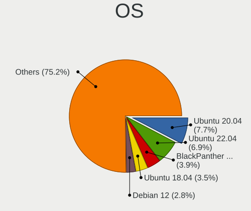

| Name               | Desktops | Percent |
|--------------------|----------|---------|
| Ubuntu 20.04       | 39       | 7.68%   |
| Ubuntu 22.04       | 35       | 6.89%   |
| BlackPanther 18.1  | 20       | 3.94%   |
| Ubuntu 18.04       | 18       | 3.54%   |
| Debian 12          | 14       | 2.76%   |
| Ubuntu 24.04       | 13       | 2.56%   |
| OpenMandriva 4.2   | 13       | 2.56%   |
| OpenMandriva 4.3   | 11       | 2.17%   |
| Pop!_OS 22.04      | 9        | 1.77%   |
| Zorin 16           | 8        | 1.57%   |
| OpenMandriva 25.90 | 8        | 1.57%   |
| OpenMandriva 23.08 | 8        | 1.57%   |
| Linux Mint 21.1    | 7        | 1.38%   |
| BlackPanther 22.1  | 7        | 1.38%   |
| Arch Rolling       | 7        | 1.38%   |
| ROSA R10           | 6        | 1.18%   |
| Linux Mint 20.3    | 6        | 1.18%   |
| Linux Mint 20.1    | 6        | 1.18%   |
| Debian 11          | 6        | 1.18%   |
| Zorin 17           | 5        | 0.98%   |
| Ubuntu 19.10       | 5        | 0.98%   |
| ROSA R9            | 5        | 0.98%   |
| OpenMandriva 23.03 | 5        | 0.98%   |
| OpenMandriva 23.01 | 5        | 0.98%   |
| Linux Mint 22.1    | 5        | 0.98%   |
| Linux Mint 20.2    | 5        | 0.98%   |
| Xubuntu 18.04      | 4        | 0.79%   |
| OpenMandriva 4.50  | 4        | 0.79%   |
| OpenMandriva 24.12 | 4        | 0.79%   |
| MX 19              | 4        | 0.79%   |
| Linux Mint 21.2    | 4        | 0.79%   |
| Linux Mint 21      | 4        | 0.79%   |
| Linux Mint 20      | 4        | 0.79%   |
| Kubuntu 24.04      | 4        | 0.79%   |
| Fedora 42          | 4        | 0.79%   |
| Debian 13          | 4        | 0.79%   |
| Ubuntu 24.10       | 3        | 0.59%   |
| Ubuntu 23.10       | 3        | 0.59%   |
| Ubuntu 18.10       | 3        | 0.59%   |
| ROSA R11           | 3        | 0.59%   |

OS Family
---------

OS without a version

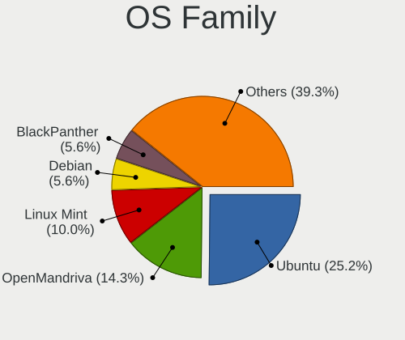

| Name         | Desktops | Percent |
|--------------|----------|---------|
| Ubuntu       | 116      | 25.16%  |
| OpenMandriva | 66       | 14.32%  |
| Linux Mint   | 46       | 9.98%   |
| Debian       | 26       | 5.64%   |
| BlackPanther | 26       | 5.64%   |
| Fedora       | 23       | 4.99%   |
| ROSA         | 20       | 4.34%   |
| Pop!_OS      | 19       | 4.12%   |
| Zorin        | 17       | 3.69%   |
| Manjaro      | 12       | 2.6%    |
| Xubuntu      | 10       | 2.17%   |
| MX           | 10       | 2.17%   |
| Arch         | 9        | 1.95%   |
| Kubuntu      | 7        | 1.52%   |
| Bazzite      | 6        | 1.3%    |
| Ubuntu Unity | 4        | 0.87%   |
| openSUSE     | 4        | 0.87%   |
| Lubuntu      | 4        | 0.87%   |
| LMDE         | 4        | 0.87%   |
| KDE neon     | 4        | 0.87%   |
| Gentoo       | 4        | 0.87%   |
| Garuda Linux | 3        | 0.65%   |
| Devuan       | 3        | 0.65%   |
| ArcoLinux    | 3        | 0.65%   |
| EndeavourOS  | 2        | 0.43%   |
| SteamOS      | 1        | 0.22%   |
| Q4OS         | 1        | 0.22%   |
| Oracle Linux | 1        | 0.22%   |
| Nobara       | 1        | 0.22%   |
| NixOS        | 1        | 0.22%   |
| Mageia       | 1        | 0.22%   |
| Endless      | 1        | 0.22%   |
| Dts-distro   | 1        | 0.22%   |
| CentOS       | 1        | 0.22%   |
| BunsenLabs   | 1        | 0.22%   |
| Archcraft    | 1        | 0.22%   |
| antiX        | 1        | 0.22%   |
| Alpine       | 1        | 0.22%   |

Kernel
------

Version of the Linux kernel

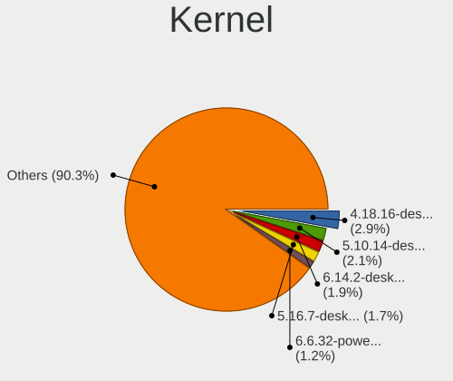

| Version                             | Desktops | Percent |
|-------------------------------------|----------|---------|
| 4.18.16-desktop-1bP                 | 17       | 2.91%   |
| 5.10.14-desktop-1omv4002            | 12       | 2.05%   |
| 6.14.2-desktop-3omv2590             | 11       | 1.88%   |
| 5.16.7-desktop-1omv4003             | 10       | 1.71%   |
| 6.6.32-power-1bP                    | 7        | 1.2%    |
| 6.4.11-desktop-1omv2390             | 6        | 1.03%   |
| 5.4.0-58-generic                    | 6        | 1.03%   |
| 5.15.0-43-generic                   | 6        | 1.03%   |
| 6.2.6-desktop-1omv2390              | 5        | 0.85%   |
| 6.1.1-desktop-1omv2290              | 5        | 0.85%   |
| 4.19.0-14-amd64                     | 5        | 0.85%   |
| 4.19.0-13-amd64                     | 5        | 0.85%   |
| 6.6.2-desktop-1omv2390              | 4        | 0.68%   |
| 6.12.1-desktop-1omv2490             | 4        | 0.68%   |
| 6.11.0-9-generic                    | 4        | 0.68%   |
| 5.8.0-44-generic                    | 4        | 0.68%   |
| 5.19.0-38-generic                   | 4        | 0.68%   |
| 5.19.0-32-generic                   | 4        | 0.68%   |
| 5.15.85-desktop-1bP                 | 4        | 0.68%   |
| 5.15.0-56-generic                   | 4        | 0.68%   |
| 6.8.0-57-generic                    | 3        | 0.51%   |
| 6.8.0-51-generic                    | 3        | 0.51%   |
| 6.2.0-36-generic                    | 3        | 0.51%   |
| 6.12.12+bpo-amd64                   | 3        | 0.51%   |
| 5.6.14-desktop-2bP                  | 3        | 0.51%   |
| 5.4.0-90-generic                    | 3        | 0.51%   |
| 5.4.0-77-generic                    | 3        | 0.51%   |
| 5.4.0-65-generic                    | 3        | 0.51%   |
| 5.4.0-52-generic                    | 3        | 0.51%   |
| 5.4.0-26-generic                    | 3        | 0.51%   |
| 5.3.0-40-generic                    | 3        | 0.51%   |
| 5.15.0-60-generic                   | 3        | 0.51%   |
| 5.15.0-48-generic                   | 3        | 0.51%   |
| 5.15.0-46-generic                   | 3        | 0.51%   |
| 5.13.0-30-generic                   | 3        | 0.51%   |
| 5.11.12-desktop-1omv4002            | 3        | 0.51%   |
| 4.9.60-nrj-desktop-1rosa-x86_64     | 3        | 0.51%   |
| 4.18.0-17-generic                   | 3        | 0.51%   |
| 4.15.0-66-generic                   | 3        | 0.51%   |
| 6.8.0-76060800daily20240311-generic | 2        | 0.34%   |

Kernel Family
-------------

Linux kernel without a distro release

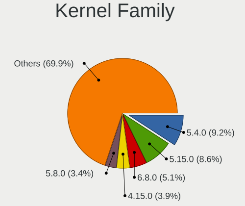

| Version | Desktops | Percent |
|---------|----------|---------|
| 5.4.0   | 49       | 9.18%   |
| 5.15.0  | 46       | 8.61%   |
| 6.8.0   | 27       | 5.06%   |
| 4.15.0  | 21       | 3.93%   |
| 5.8.0   | 18       | 3.37%   |
| 4.18.16 | 18       | 3.37%   |
| 6.5.0   | 15       | 2.81%   |
| 5.3.0   | 13       | 2.43%   |
| 5.19.0  | 13       | 2.43%   |
| 5.10.14 | 12       | 2.25%   |
| 6.14.2  | 11       | 2.06%   |
| 6.1.0   | 11       | 2.06%   |
| 5.16.7  | 10       | 1.87%   |
| 5.13.0  | 10       | 1.87%   |
| 5.11.0  | 9        | 1.69%   |
| 6.2.0   | 8        | 1.5%    |
| 4.18.0  | 8        | 1.5%    |
| 6.6.32  | 7        | 1.31%   |
| 6.14.0  | 7        | 1.31%   |
| 4.19.0  | 7        | 1.31%   |
| 6.4.11  | 6        | 1.12%   |
| 6.11.0  | 6        | 1.12%   |
| 5.10.0  | 6        | 1.12%   |
| 6.2.6   | 5        | 0.94%   |
| 6.12.1  | 5        | 0.94%   |
| 6.1.1   | 5        | 0.94%   |
| 6.6.2   | 4        | 0.75%   |
| 5.15.85 | 4        | 0.75%   |
| 6.12.12 | 3        | 0.56%   |
| 5.6.14  | 3        | 0.56%   |
| 5.11.12 | 3        | 0.56%   |
| 4.9.60  | 3        | 0.56%   |
| 4.9.20  | 3        | 0.56%   |
| 6.9.3   | 2        | 0.37%   |
| 6.6.27  | 2        | 0.37%   |
| 6.4.0   | 2        | 0.37%   |
| 6.3.8   | 2        | 0.37%   |
| 6.17.9  | 2        | 0.37%   |
| 6.17.7  | 2        | 0.37%   |
| 6.16.7  | 2        | 0.37%   |

Kernel Major Ver.
-----------------

Linux kernel major version

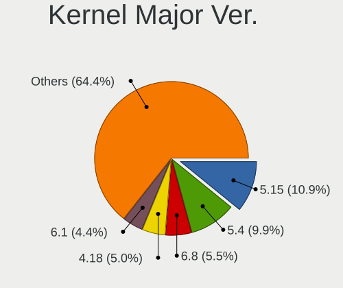

| Version | Desktops | Percent |
|---------|----------|---------|
| 5.15    | 57       | 10.86%  |
| 5.4     | 52       | 9.9%    |
| 6.8     | 29       | 5.52%   |
| 4.18    | 26       | 4.95%   |
| 6.1     | 23       | 4.38%   |
| 6.14    | 22       | 4.19%   |
| 5.10    | 22       | 4.19%   |
| 6.12    | 21       | 4%      |
| 5.8     | 21       | 4%      |
| 4.15    | 21       | 4%      |
| 6.6     | 17       | 3.24%   |
| 6.5     | 16       | 3.05%   |
| 5.3     | 16       | 3.05%   |
| 5.16    | 16       | 3.05%   |
| 5.19    | 15       | 2.86%   |
| 6.2     | 13       | 2.48%   |
| 5.13    | 13       | 2.48%   |
| 5.11    | 13       | 2.48%   |
| 4.9     | 13       | 2.48%   |
| 6.4     | 11       | 2.1%    |
| 4.19    | 8        | 1.52%   |
| 6.17    | 6        | 1.14%   |
| 6.11    | 6        | 1.14%   |
| 6.10    | 6        | 1.14%   |
| 6.0     | 6        | 1.14%   |
| 5.7     | 6        | 1.14%   |
| 6.16    | 5        | 0.95%   |
| 5.18    | 5        | 0.95%   |
| 5.12    | 5        | 0.95%   |
| 6.9     | 4        | 0.76%   |
| 6.13    | 4        | 0.76%   |
| 5.14    | 4        | 0.76%   |
| 6.3     | 3        | 0.57%   |
| 5.9     | 3        | 0.57%   |
| 5.6     | 3        | 0.57%   |
| 6.15    | 2        | 0.38%   |
| 5.5     | 2        | 0.38%   |
| 5.0     | 2        | 0.38%   |
| 4.1     | 2        | 0.38%   |
| 6.7     | 1        | 0.19%   |

Arch
----

OS architecture (x86_64, i586, etc.)

| Name   | Desktops | Percent |
|--------|----------|---------|
| x86_64 | 422      | 95.91%  |
| i686   | 18       | 4.09%   |

DE
--

Desktop Environment

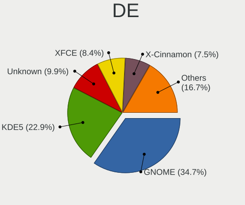

| Name       | Desktops | Percent |
|------------|----------|---------|
| GNOME      | 162      | 34.69%  |
| KDE5       | 107      | 22.91%  |
| Unknown    | 46       | 9.85%   |
| XFCE       | 39       | 8.35%   |
| X-Cinnamon | 35       | 7.49%   |
| KDE6       | 30       | 6.42%   |
| MATE       | 12       | 2.57%   |
| LXQt       | 7        | 1.5%    |
| KDE4       | 6        | 1.28%   |
| KDE        | 5        | 1.07%   |
| Unity      | 4        | 0.86%   |
| Cinnamon   | 4        | 0.86%   |
| LXDE       | 3        | 0.64%   |
| Hyprland   | 2        | 0.43%   |
| COSMIC     | 2        | 0.43%   |
| Trinity    | 1        | 0.21%   |
| i3         | 1        | 0.21%   |
| bspwm      | 1        | 0.21%   |

Display Server
--------------

X11 or Wayland

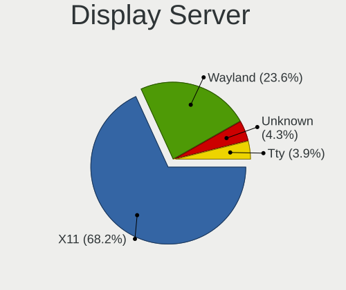

| Name    | Desktops | Percent |
|---------|----------|---------|
| X11     | 315      | 68.18%  |
| Wayland | 109      | 23.59%  |
| Unknown | 20       | 4.33%   |
| Tty     | 18       | 3.9%    |

Display Manager
---------------

SDDM, LightDM, etc.

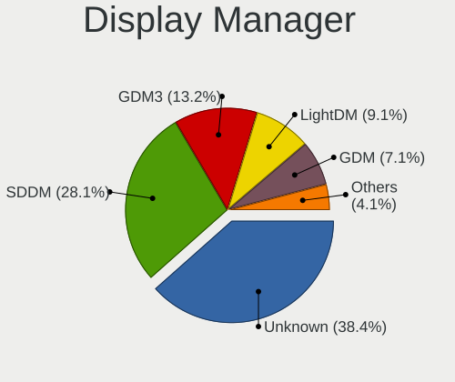

| Name    | Desktops | Percent |
|---------|----------|---------|
| Unknown | 178      | 38.44%  |
| SDDM    | 130      | 28.08%  |
| GDM3    | 61       | 13.17%  |
| LightDM | 42       | 9.07%   |
| GDM     | 33       | 7.13%   |
| TDM     | 9        | 1.94%   |
| KDM     | 6        | 1.3%    |
| SLiM    | 3        | 0.65%   |
| NODM    | 1        | 0.22%   |

OS Lang
-------

Language

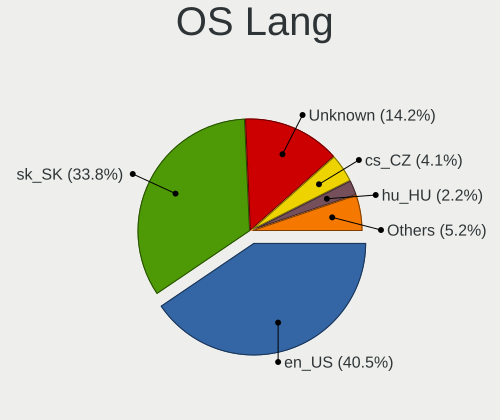

| Lang        | Desktops | Percent |
|-------------|----------|---------|
| en_US       | 186      | 40.52%  |
| sk_SK       | 155      | 33.77%  |
| Unknown     | 65       | 14.16%  |
| cs_CZ       | 19       | 4.14%   |
| hu_HU       | 10       | 2.18%   |
| en_GB       | 9        | 1.96%   |
| C           | 9        | 1.96%   |
| sr_RS@latin | 2        | 0.44%   |
| ru_RU       | 1        | 0.22%   |
| POSIX       | 1        | 0.22%   |
| en_AU       | 1        | 0.22%   |
| de_DE       | 1        | 0.22%   |

Boot Mode
---------

EFI or BIOS

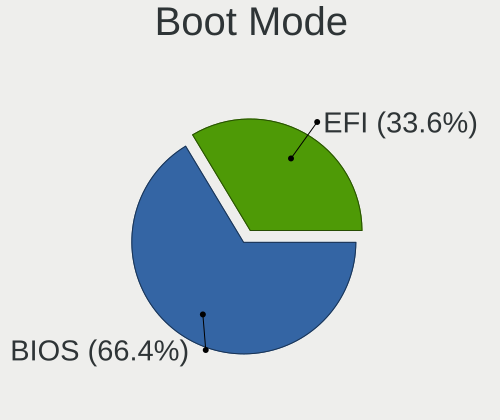

| Mode | Desktops | Percent |
|------|----------|---------|
| BIOS | 298      | 66.37%  |
| EFI  | 151      | 33.63%  |

Filesystem
----------

Type of filesystem

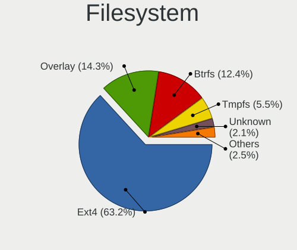

| Type    | Desktops | Percent |
|---------|----------|---------|
| Ext4    | 300      | 63.16%  |
| Overlay | 68       | 14.32%  |
| Btrfs   | 59       | 12.42%  |
| Tmpfs   | 26       | 5.47%   |
| Unknown | 10       | 2.11%   |
| Zfs     | 5        | 1.05%   |
| Xfs     | 5        | 1.05%   |
| Ext2    | 2        | 0.42%   |

Part. scheme
------------

Scheme of partitioning

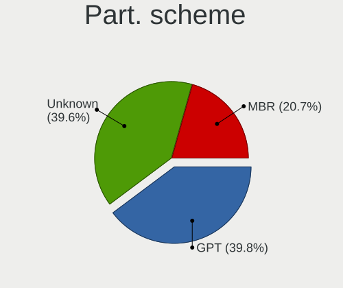

| Type    | Desktops | Percent |
|---------|----------|---------|
| GPT     | 183      | 39.78%  |
| Unknown | 182      | 39.57%  |
| MBR     | 95       | 20.65%  |

Dual Boot with Linux/BSD
------------------------

Hosting more than one Linux/BSD

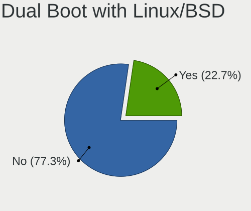

| Dual boot | Desktops | Percent |
|-----------|----------|---------|
| No        | 361      | 77.3%   |
| Yes       | 106      | 22.7%   |

Dual Boot (Win)
---------------

Hosting Linux and Windows

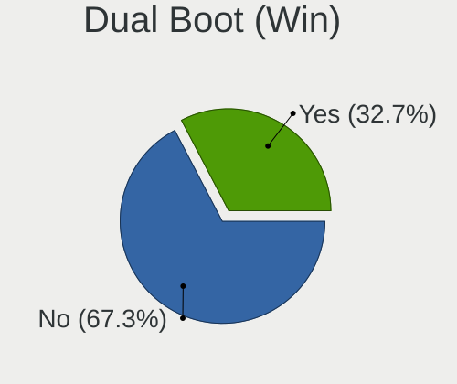

| Dual boot | Desktops | Percent |
|-----------|----------|---------|
| No        | 303      | 67.33%  |
| Yes       | 147      | 32.67%  |

Board
-----

Vendor
------

Motherboard manufacturer

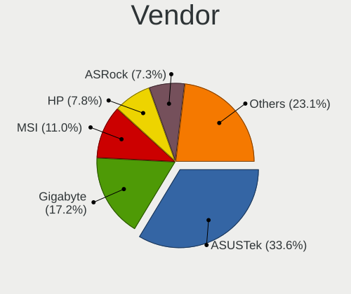

| Name                | Desktops | Percent |
|---------------------|----------|---------|
| ASUSTek Computer    | 147      | 33.64%  |
| Gigabyte Technology | 75       | 17.16%  |
| MSI                 | 48       | 10.98%  |
| Hewlett-Packard     | 34       | 7.78%   |
| ASRock              | 32       | 7.32%   |
| Dell                | 28       | 6.41%   |
| Lenovo              | 16       | 3.66%   |
| Intel               | 11       | 2.52%   |
| Acer                | 9        | 2.06%   |
| Foxconn             | 7        | 1.6%    |
| Unknown             | 6        | 1.37%   |
| Pegatron            | 3        | 0.69%   |
| Techvision          | 2        | 0.46%   |
| Shuttle             | 2        | 0.46%   |
| OEM                 | 2        | 0.46%   |
| HC Technology.      | 2        | 0.46%   |
| Fujitsu             | 2        | 0.46%   |
| VIA Technologies    | 1        | 0.23%   |
| TianBei             | 1        | 0.23%   |
| Seeed Studio        | 1        | 0.23%   |
| Samsung Electronics | 1        | 0.23%   |
| PC Engines          | 1        | 0.23%   |
| Packard Bell        | 1        | 0.23%   |
| LattePanda          | 1        | 0.23%   |
| JHZD                | 1        | 0.23%   |
| Insyde              | 1        | 0.23%   |
| Fujitsu Siemens     | 1        | 0.23%   |
| Biostar             | 1        | 0.23%   |

Model
-----

Motherboard model

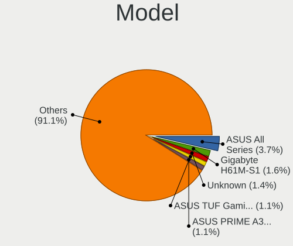

| Name                                    | Desktops | Percent |
|-----------------------------------------|----------|---------|
| ASUS All Series                         | 16       | 3.66%   |
| Gigabyte H61M-S1                        | 7        | 1.6%    |
| Unknown                                 | 6        | 1.37%   |
| ASUS TUF Gaming B550M-PLUS              | 5        | 1.14%   |
| ASUS PRIME A320M-K                      | 5        | 1.14%   |
| Dell OptiPlex 7010                      | 4        | 0.92%   |
| MSI MS-7D25                             | 3        | 0.69%   |
| MSI MS-7592                             | 3        | 0.69%   |
| Gigabyte F2A68HM-DS2                    | 3        | 0.69%   |
| Gigabyte B450M S2H                      | 3        | 0.69%   |
| Gigabyte 970A-DS3P                      | 3        | 0.69%   |
| Dell OptiPlex 3020                      | 3        | 0.69%   |
| ASUS M5A78L-M/USB3                      | 3        | 0.69%   |
| Techvision TVI7309X                     | 2        | 0.46%   |
| OEM X79-Turbo                           | 2        | 0.46%   |
| MSI MS-7C91                             | 2        | 0.46%   |
| MSI MS-7C02                             | 2        | 0.46%   |
| MSI MS-7850                             | 2        | 0.46%   |
| MSI MS-7793                             | 2        | 0.46%   |
| Lenovo IdeaCentre Q180 10087&3110       | 2        | 0.46%   |
| Intel X99                               | 2        | 0.46%   |
| HP EliteDesk 800 G2 SFF                 | 2        | 0.46%   |
| HP Compaq Elite 8300 SFF                | 2        | 0.46%   |
| HP Compaq dc7800p Convertible Minitower | 2        | 0.46%   |
| HP Compaq 8000 Elite SFF PC             | 2        | 0.46%   |
| HP Compaq 6005 Pro SFF PC               | 2        | 0.46%   |
| HC Technology. HCAR357-NR               | 2        | 0.46%   |
| Gigabyte P43-ES3G                       | 2        | 0.46%   |
| Gigabyte H81M-S2V                       | 2        | 0.46%   |
| Gigabyte GA-MA78GM-US2H                 | 2        | 0.46%   |
| Gigabyte EP35-DS3                       | 2        | 0.46%   |
| Gigabyte B250M-D3H                      | 2        | 0.46%   |
| Gigabyte AB350-Gaming 3                 | 2        | 0.46%   |
| Foxconn G41MX/G41MX-K 2.0 1.0           | 2        | 0.46%   |
| Dell Vostro 400                         | 2        | 0.46%   |
| Dell Precision WorkStation 390          | 2        | 0.46%   |
| Dell Precision Tower 3620               | 2        | 0.46%   |
| Dell OptiPlex 7020                      | 2        | 0.46%   |
| Dell OptiPlex 380                       | 2        | 0.46%   |
| ASUS ROG STRIX X570-E GAMING            | 2        | 0.46%   |

Model Family
------------

Motherboard model prefix

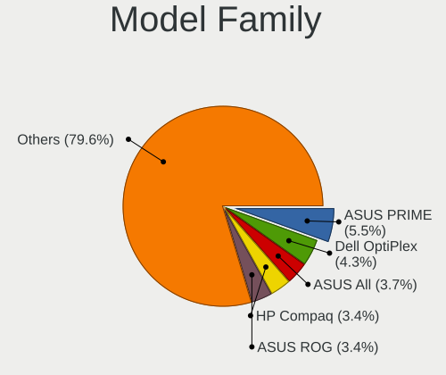

| Name                      | Desktops | Percent |
|---------------------------|----------|---------|
| ASUS PRIME                | 24       | 5.49%   |
| Dell OptiPlex             | 19       | 4.35%   |
| ASUS All                  | 16       | 3.66%   |
| HP Compaq                 | 15       | 3.43%   |
| ASUS ROG                  | 15       | 3.43%   |
| ASUS TUF                  | 12       | 2.75%   |
| Lenovo ThinkCentre        | 8        | 1.83%   |
| Gigabyte H61M-S1          | 7        | 1.6%    |
| Dell Precision            | 6        | 1.37%   |
| Acer Aspire               | 6        | 1.37%   |
| Unknown                   | 6        | 1.37%   |
| HP EliteDesk              | 5        | 1.14%   |
| ASUS Maximus              | 5        | 1.14%   |
| HP ProLiant               | 4        | 0.92%   |
| Gigabyte B450M            | 4        | 0.92%   |
| ASUS M5A78L-M             | 4        | 0.92%   |
| MSI MS-7D25               | 3        | 0.69%   |
| MSI MS-7592               | 3        | 0.69%   |
| Gigabyte F2A68HM-DS2      | 3        | 0.69%   |
| Gigabyte 970A-DS3P        | 3        | 0.69%   |
| ASUS P8Z77-V              | 3        | 0.69%   |
| ASUS M5A97                | 3        | 0.69%   |
| ASRock B450M              | 3        | 0.69%   |
| Techvision TVI7309X       | 2        | 0.46%   |
| OEM X79-Turbo             | 2        | 0.46%   |
| MSI MS-7C91               | 2        | 0.46%   |
| MSI MS-7C02               | 2        | 0.46%   |
| MSI MS-7850               | 2        | 0.46%   |
| MSI MS-7793               | 2        | 0.46%   |
| Lenovo ThinkStation       | 2        | 0.46%   |
| Lenovo IdeaCentre         | 2        | 0.46%   |
| Intel X99                 | 2        | 0.46%   |
| HC Technology. HCAR357-NR | 2        | 0.46%   |
| Gigabyte P43-ES3G         | 2        | 0.46%   |
| Gigabyte H81M-S2V         | 2        | 0.46%   |
| Gigabyte GA-MA78GM-US2H   | 2        | 0.46%   |
| Gigabyte EP35-DS3         | 2        | 0.46%   |
| Gigabyte B450             | 2        | 0.46%   |
| Gigabyte B250M-D3H        | 2        | 0.46%   |
| Gigabyte AB350-Gaming     | 2        | 0.46%   |

MFG Year
--------

Motherboard manufacture year

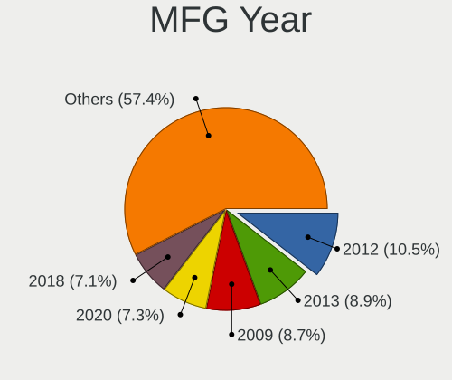

| Year | Desktops | Percent |
|------|----------|---------|
| 2012 | 46       | 10.53%  |
| 2013 | 39       | 8.92%   |
| 2009 | 38       | 8.7%    |
| 2020 | 32       | 7.32%   |
| 2018 | 31       | 7.09%   |
| 2014 | 26       | 5.95%   |
| 2008 | 24       | 5.49%   |
| 2011 | 23       | 5.26%   |
| 2007 | 21       | 4.81%   |
| 2022 | 19       | 4.35%   |
| 2019 | 19       | 4.35%   |
| 2017 | 18       | 4.12%   |
| 2016 | 18       | 4.12%   |
| 2015 | 17       | 3.89%   |
| 2006 | 15       | 3.43%   |
| 2021 | 14       | 3.2%    |
| 2010 | 14       | 3.2%    |
| 2023 | 12       | 2.75%   |
| 2025 | 4        | 0.92%   |
| 2024 | 2        | 0.46%   |
| 2005 | 2        | 0.46%   |
| 2002 | 1        | 0.23%   |
| 2001 | 1        | 0.23%   |
| 2000 | 1        | 0.23%   |

Form Factor
-----------

Physical design of the computer

| Name    | Desktops | Percent |
|---------|----------|---------|
| Desktop | 437      | 100%    |

Secure Boot
-----------

Enabled or disabled

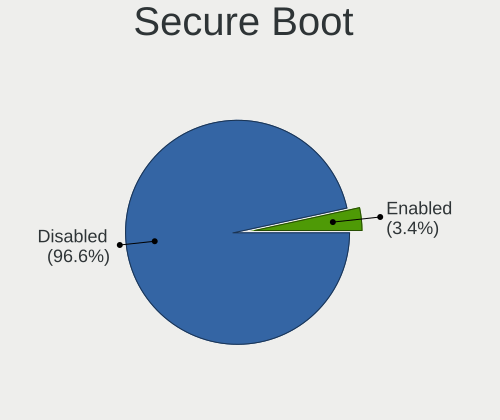

| State    | Desktops | Percent |
|----------|----------|---------|
| Disabled | 425      | 96.59%  |
| Enabled  | 15       | 3.41%   |

Coreboot
--------

Have coreboot on board

| Used | Desktops | Percent |
|------|----------|---------|
| No   | 436      | 99.77%  |
| Yes  | 1        | 0.23%   |

RAM Size
--------

Total RAM memory

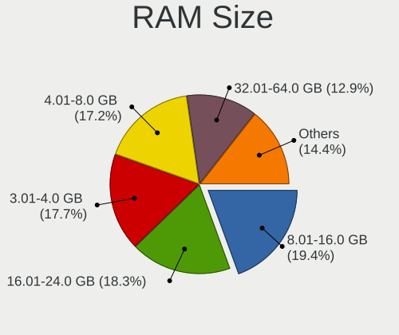

| Size in GB      | Desktops | Percent |
|-----------------|----------|---------|
| 8.01-16.0       | 89       | 19.43%  |
| 16.01-24.0      | 84       | 18.34%  |
| 3.01-4.0        | 81       | 17.69%  |
| 4.01-8.0        | 79       | 17.25%  |
| 32.01-64.0      | 59       | 12.88%  |
| 64.01-256.0     | 22       | 4.8%    |
| 24.01-32.0      | 16       | 3.49%   |
| 1.01-2.0        | 14       | 3.06%   |
| 2.01-3.0        | 8        | 1.75%   |
| 0.51-1.0        | 4        | 0.87%   |
| More than 256.0 | 1        | 0.22%   |
| 0.01-0.5        | 1        | 0.22%   |

RAM Used
--------

Used RAM memory

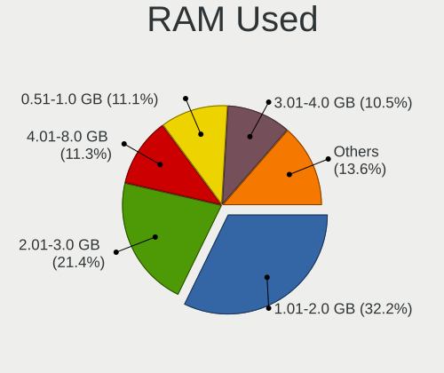

| Used GB    | Desktops | Percent |
|------------|----------|---------|
| 1.01-2.0   | 166      | 32.23%  |
| 2.01-3.0   | 110      | 21.36%  |
| 4.01-8.0   | 58       | 11.26%  |
| 0.51-1.0   | 57       | 11.07%  |
| 3.01-4.0   | 54       | 10.49%  |
| 8.01-16.0  | 35       | 6.8%    |
| 0.01-0.5   | 29       | 5.63%   |
| 32.01-64.0 | 2        | 0.39%   |
| 24.01-32.0 | 2        | 0.39%   |
| 16.01-24.0 | 2        | 0.39%   |

Total Drives
------------

Number of drives on board

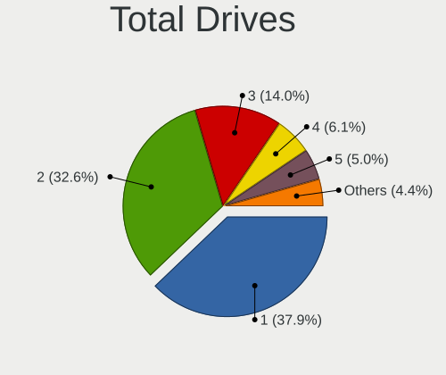

| Drives | Desktops | Percent |
|--------|----------|---------|
| 1      | 181      | 37.87%  |
| 2      | 156      | 32.64%  |
| 3      | 67       | 14.02%  |
| 4      | 29       | 6.07%   |
| 5      | 24       | 5.02%   |
| 6      | 7        | 1.46%   |
| 0      | 6        | 1.26%   |
| 8      | 3        | 0.63%   |
| 7      | 2        | 0.42%   |
| 31     | 1        | 0.21%   |
| 17     | 1        | 0.21%   |
| 13     | 1        | 0.21%   |

Has CD-ROM
----------

Has CD-ROM on board

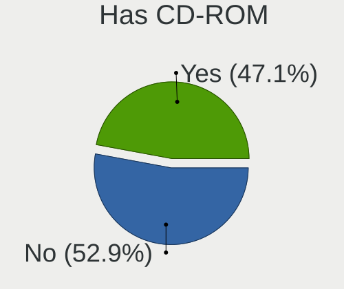

| Presented | Desktops | Percent |
|-----------|----------|---------|
| No        | 237      | 52.9%   |
| Yes       | 211      | 47.1%   |

Has Ethernet
------------

Has Ethernet on board

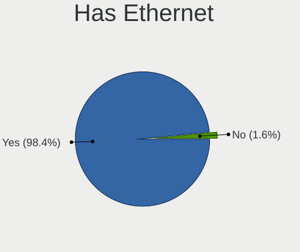

| Presented | Desktops | Percent |
|-----------|----------|---------|
| Yes       | 431      | 98.4%   |
| No        | 7        | 1.6%    |

Has WiFi
--------

Has WiFi module

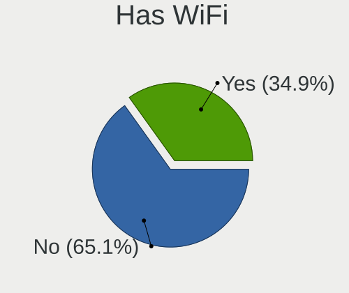

| Presented | Desktops | Percent |
|-----------|----------|---------|
| No        | 291      | 65.1%   |
| Yes       | 156      | 34.9%   |

Has Bluetooth
-------------

Has Bluetooth module

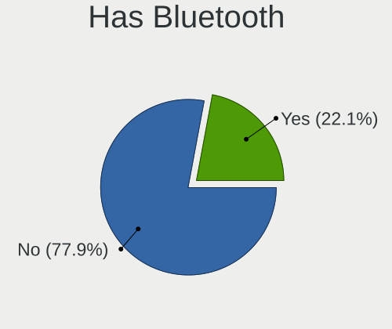

| Presented | Desktops | Percent |
|-----------|----------|---------|
| No        | 346      | 77.93%  |
| Yes       | 98       | 22.07%  |

Location
--------

Country
-------

Geographic location (country)

| Country  | Desktops | Percent |
|----------|----------|---------|
| Slovakia | 437      | 100%    |

City
----

Geographic location (city)

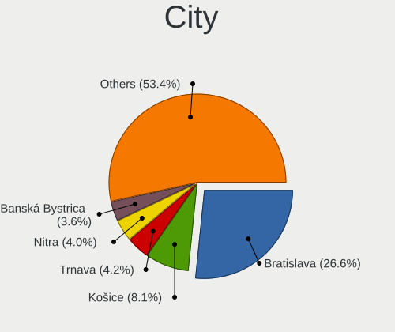

| City                   | Desktops | Percent |
|------------------------|----------|---------|
| Bratislava             | 132      | 26.61%  |
| Košice                | 40       | 8.06%   |
| Trnava                 | 21       | 4.23%   |
| Nitra                  | 20       | 4.03%   |
| Banská Bystrica       | 18       | 3.63%   |
| Žilina                | 9        | 1.81%   |
| Prešov                | 8        | 1.61%   |
| Dolny Ohaj             | 8        | 1.61%   |
| Rozhanovce             | 7        | 1.41%   |
| Poprad                 | 7        | 1.41%   |
| Zvolen                 | 6        | 1.21%   |
| Tornaľa               | 6        | 1.21%   |
| Nové Zámky           | 6        | 1.21%   |
| Liptovský Mikuláš   | 6        | 1.21%   |
| Levice                 | 6        | 1.21%   |
| Trenčín              | 5        | 1.01%   |
| Lučenec               | 5        | 1.01%   |
| Stará Ľubovňa       | 4        | 0.81%   |
| Ružomberok            | 4        | 0.81%   |
| Šahy                  | 3        | 0.6%    |
| Rožňava              | 3        | 0.6%    |
| Rimavská Sobota       | 3        | 0.6%    |
| Partizánske           | 3        | 0.6%    |
| Nova Bana              | 3        | 0.6%    |
| Nitrianske Hrnciarovce | 3        | 0.6%    |
| Martin                 | 3        | 0.6%    |
| Kežmarok              | 3        | 0.6%    |
| Brezno                 | 3        | 0.6%    |
| Bardejov               | 3        | 0.6%    |
| Zlate Moravce          | 2        | 0.4%    |
| Ziar nad Hronom        | 2        | 0.4%    |
| Topoľčany            | 2        | 0.4%    |
| Soblahov               | 2        | 0.4%    |
| Smizany                | 2        | 0.4%    |
| Skalica                | 2        | 0.4%    |
| Senica                 | 2        | 0.4%    |
| Šaľa                 | 2        | 0.4%    |
| Sabinov                | 2        | 0.4%    |
| Radosina               | 2        | 0.4%    |
| Pezinok                | 2        | 0.4%    |

Drives
------

Drive Vendor
------------

Hard drive vendors

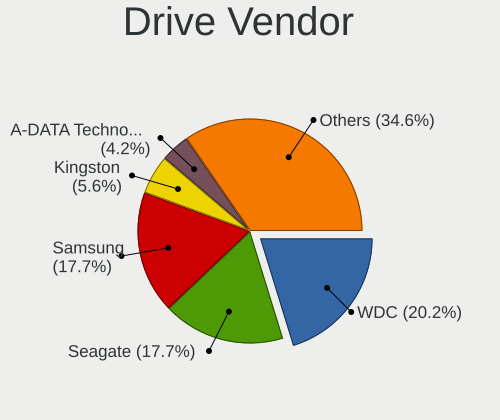

| Vendor                      | Desktops | Drives | Percent |
|-----------------------------|----------|--------|---------|
| WDC                         | 165      | 364    | 20.25%  |
| Seagate                     | 144      | 237    | 17.67%  |
| Samsung Electronics         | 144      | 255    | 17.67%  |
| Kingston                    | 46       | 57     | 5.64%   |
| A-DATA Technology           | 34       | 47     | 4.17%   |
| Toshiba                     | 33       | 60     | 4.05%   |
| Hitachi                     | 30       | 44     | 3.68%   |
| SanDisk                     | 24       | 30     | 2.94%   |
| Patriot                     | 23       | 45     | 2.82%   |
| Intel                       | 15       | 26     | 1.84%   |
| GOODRAM                     | 10       | 18     | 1.23%   |
| Crucial                     | 10       | 11     | 1.23%   |
| Apacer                      | 9        | 12     | 1.1%    |
| Maxtor                      | 8        | 14     | 0.98%   |
| Unknown                     | 7        | 12     | 0.86%   |
| SK hynix                    | 7        | 8      | 0.86%   |
| HGST                        | 7        | 13     | 0.86%   |
| Phison Electronics          | 6        | 9      | 0.74%   |
| Gigabyte Technology         | 6        | 8      | 0.74%   |
| China                       | 6        | 8      | 0.74%   |
| Verbatim                    | 5        | 6      | 0.61%   |
| XPG                         | 4        | 7      | 0.49%   |
| Kingston Technology Company | 4        | 4      | 0.49%   |
| KingDian                    | 4        | 4      | 0.49%   |
| HS-SSD-E100                 | 4        | 4      | 0.49%   |
| Silicon Motion              | 3        | 4      | 0.37%   |
| Realtek Semiconductor       | 3        | 3      | 0.37%   |
| Phison                      | 3        | 3      | 0.37%   |
| OCZ                         | 3        | 3      | 0.37%   |
| Micron/Crucial Technology   | 3        | 3      | 0.37%   |
| Micron Technology           | 3        | 6      | 0.37%   |
| MAXIO Technology (Hangzhou) | 3        | 3      | 0.37%   |
| Hewlett-Packard             | 3        | 5      | 0.37%   |
| ADATA Technology            | 3        | 4      | 0.37%   |
| Realtek                     | 2        | 2      | 0.25%   |
| Intenso                     | 2        | 6      | 0.25%   |
| IBM/Hitachi                 | 2        | 2      | 0.25%   |
| HEORIADY                    | 2        | 2      | 0.25%   |
| ExcelStor                   | 2        | 2      | 0.25%   |
| Emtec                       | 2        | 3      | 0.25%   |

Drive Model
-----------

Hard drive models

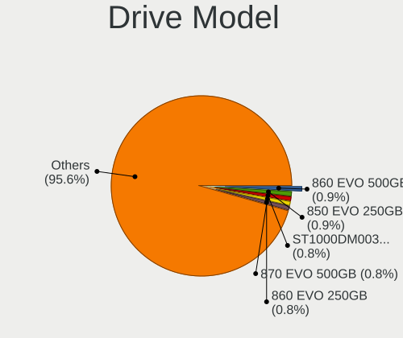

| Model                                              | Desktops | Percent |
|----------------------------------------------------|----------|---------|
| Samsung SSD 860 EVO 500GB                          | 9        | 0.94%   |
| Samsung SSD 850 EVO 250GB                          | 9        | 0.94%   |
| Seagate ST1000DM003-1CH162 1TB                     | 8        | 0.84%   |
| Samsung SSD 870 EVO 500GB                          | 8        | 0.84%   |
| Samsung SSD 860 EVO 250GB                          | 8        | 0.84%   |
| Patriot Burst 120GB SSD                            | 8        | 0.84%   |
| WDC WD10EZEX-08WN4A0 1TB                           | 7        | 0.73%   |
| Seagate ST3500418AS 500GB                          | 7        | 0.73%   |
| Seagate ST2000DM008-2FR102 2TB                     | 7        | 0.73%   |
| Kingston SV300S37A120G 120GB SSD                   | 7        | 0.73%   |
| Seagate ST3320311CS 320GB                          | 6        | 0.63%   |
| Samsung SSD 850 EVO 500GB                          | 6        | 0.63%   |
| Samsung NVMe SSD Controller SM981/PM981/PM983 1TB  | 6        | 0.63%   |
| Samsung NVMe SSD Controller PM9A1/PM9A3/980PRO 1TB | 6        | 0.63%   |
| WDC WDS500G2B0A-00SM50 500GB                       | 5        | 0.52%   |
| WDC WD20EZRZ-00Z5HB0 2TB                           | 5        | 0.52%   |
| Toshiba HDWD110 1TB                                | 5        | 0.52%   |
| Seagate ST500DM002-1BD142 500GB                    | 5        | 0.52%   |
| Seagate ST2000DM001-1CH164 2TB                     | 5        | 0.52%   |
| Samsung HD322HJ 320GB                              | 5        | 0.52%   |
| GOODRAM SSDPR-CX400-256-G2 256GB                   | 5        | 0.52%   |
| WDC WD5000AAKX-75U6AA0 500GB                       | 4        | 0.42%   |
| WDC WD10EZEX-00KUWA0 1TB                           | 4        | 0.42%   |
| WDC WD1003FZEX-00MK2A0 1TB                         | 4        | 0.42%   |
| Verbatim Vi550 S3 1024GB                           | 4        | 0.42%   |
| Toshiba DT01ACA100 1TB                             | 4        | 0.42%   |
| Seagate ST4000DM004-2CV104 4TB                     | 4        | 0.42%   |
| Seagate ST1000DM010-2EP102 1TB                     | 4        | 0.42%   |
| Samsung SSD 980 PRO 1TB                            | 4        | 0.42%   |
| Samsung SSD 980 500GB                              | 4        | 0.42%   |
| Samsung SSD 860 EVO 1TB                            | 4        | 0.42%   |
| Kingston SV300S37A60G 64GB SSD                     | 4        | 0.42%   |
| Kingston SUV400S37120G 120GB SSD                   | 4        | 0.42%   |
| Kingston SA400S37480G 480GB SSD                    | 4        | 0.42%   |
| Kingston SA400S37120G 120GB SSD                    | 4        | 0.42%   |
| WDC WD5000AADS-00S9B0 500GB                        | 3        | 0.31%   |
| WDC WD20EZRX-00D8PB0 2TB                           | 3        | 0.31%   |
| WDC WD20EZBX-00AYRA0 2TB                           | 3        | 0.31%   |
| WDC WD1600AAJB-00J3A0 160GB                        | 3        | 0.31%   |
| WDC WD10EZEX-60WN4A0 1TB                           | 3        | 0.31%   |

HDD Vendor
----------

Hard disk drive vendors

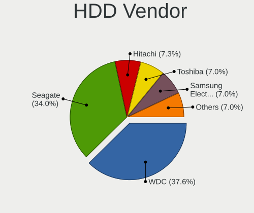

| Vendor              | Desktops | Drives | Percent |
|---------------------|----------|--------|---------|
| WDC                 | 155      | 330    | 37.62%  |
| Seagate             | 140      | 232    | 33.98%  |
| Hitachi             | 30       | 44     | 7.28%   |
| Toshiba             | 29       | 54     | 7.04%   |
| Samsung Electronics | 29       | 46     | 7.04%   |
| Maxtor              | 8        | 14     | 1.94%   |
| HGST                | 7        | 13     | 1.7%    |
| Hewlett-Packard     | 3        | 5      | 0.73%   |
| Unknown             | 2        | 2      | 0.49%   |
| IBM/Hitachi         | 2        | 2      | 0.49%   |
| ExcelStor           | 2        | 2      | 0.49%   |
| USB3.0              | 1        | 2      | 0.24%   |
| Synology            | 1        | 1      | 0.24%   |
| IET                 | 1        | 2      | 0.24%   |
| HGST HTS            | 1        | 1      | 0.24%   |
| Fujitsu             | 1        | 2      | 0.24%   |

SSD Vendor
----------

Solid state drive vendors

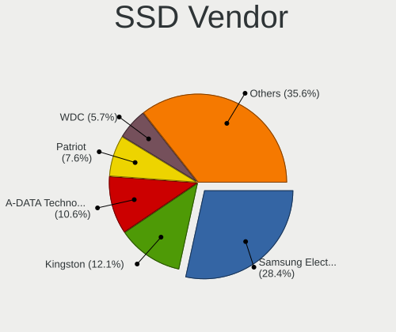

| Vendor              | Desktops | Drives | Percent |
|---------------------|----------|--------|---------|
| Samsung Electronics | 75       | 118    | 28.41%  |
| Kingston            | 32       | 38     | 12.12%  |
| A-DATA Technology   | 28       | 39     | 10.61%  |
| Patriot             | 20       | 41     | 7.58%   |
| WDC                 | 15       | 21     | 5.68%   |
| Intel               | 13       | 24     | 4.92%   |
| GOODRAM             | 10       | 18     | 3.79%   |
| Crucial             | 10       | 11     | 3.79%   |
| SanDisk             | 8        | 9      | 3.03%   |
| Apacer              | 7        | 10     | 2.65%   |
| China               | 6        | 8      | 2.27%   |
| Verbatim            | 5        | 6      | 1.89%   |
| SK hynix            | 3        | 3      | 1.14%   |
| OCZ                 | 3        | 3      | 1.14%   |
| Micron Technology   | 3        | 6      | 1.14%   |
| Gigabyte Technology | 3        | 5      | 1.14%   |
| Toshiba             | 2        | 2      | 0.76%   |
| KingDian            | 2        | 2      | 0.76%   |
| Intenso             | 2        | 6      | 0.76%   |
| HEORIADY            | 2        | 2      | 0.76%   |
| Emtec               | 2        | 3      | 0.76%   |
| Vi550               | 1        | 1      | 0.38%   |
| ULTIMATE            | 1        | 2      | 0.38%   |
| Seagate             | 1        | 1      | 0.38%   |
| PNY                 | 1        | 2      | 0.38%   |
| LITEONIT            | 1        | 1      | 0.38%   |
| Lexar               | 1        | 1      | 0.38%   |
| Leven               | 1        | 1      | 0.38%   |
| KingFast            | 1        | 1      | 0.38%   |
| Kingchuxing         | 1        | 1      | 0.38%   |
| HS-SSD-C100         | 1        | 3      | 0.38%   |
| FORESEE             | 1        | 2      | 0.38%   |
| Corsair             | 1        | 1      | 0.38%   |
| AMD                 | 1        | 1      | 0.38%   |

Drive Kind
----------

HDD or SSD

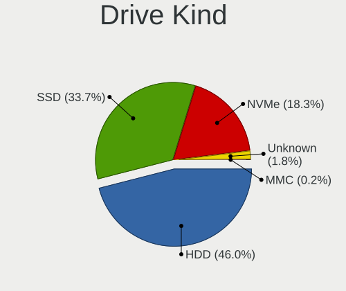

| Kind    | Desktops | Drives | Percent |
|---------|----------|--------|---------|
| HDD     | 306      | 752    | 46.02%  |
| SSD     | 224      | 393    | 33.68%  |
| NVMe    | 122      | 222    | 18.35%  |
| Unknown | 12       | 16     | 1.8%    |
| MMC     | 1        | 2      | 0.15%   |

Drive Connector
---------------

SATA, SAS, NVMe, etc.

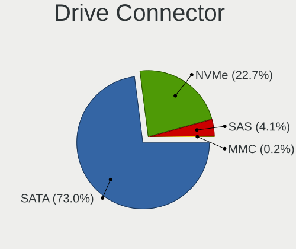

| Type | Desktops | Drives | Percent |
|------|----------|--------|---------|
| SATA | 389      | 1134   | 72.98%  |
| NVMe | 121      | 219    | 22.7%   |
| SAS  | 22       | 30     | 4.13%   |
| MMC  | 1        | 2      | 0.19%   |

Drive Size
----------

Size of hard drive

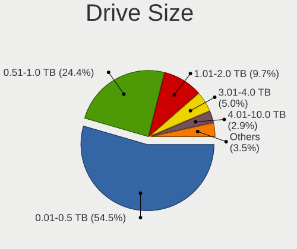

| Size in TB | Desktops | Drives | Percent |
|------------|----------|--------|---------|
| 0.01-0.5   | 315      | 655    | 54.5%   |
| 0.51-1.0   | 141      | 267    | 24.39%  |
| 1.01-2.0   | 56       | 93     | 9.69%   |
| 3.01-4.0   | 29       | 58     | 5.02%   |
| 4.01-10.0  | 17       | 26     | 2.94%   |
| 2.01-3.0   | 14       | 33     | 2.42%   |
| 10.01-20.0 | 5        | 10     | 0.87%   |
| 20.01-50.0 | 1        | 3      | 0.17%   |

Space Total
-----------

Amount of disk space available on the file system

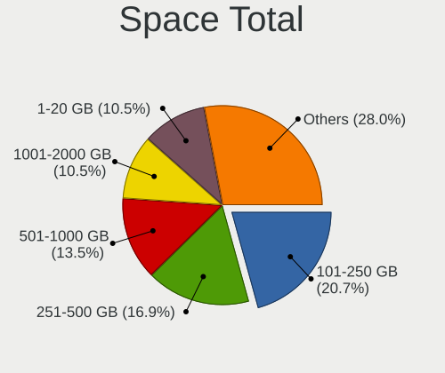

| Size in GB     | Desktops | Percent |
|----------------|----------|---------|
| 101-250        | 103      | 20.72%  |
| 251-500        | 84       | 16.9%   |
| 501-1000       | 67       | 13.48%  |
| 1001-2000      | 52       | 10.46%  |
| 1-20           | 52       | 10.46%  |
| Unknown        | 40       | 8.05%   |
| More than 3000 | 34       | 6.84%   |
| 51-100         | 26       | 5.23%   |
| 2001-3000      | 20       | 4.02%   |
| 21-50          | 19       | 3.82%   |

Space Used
----------

Amount of used disk space

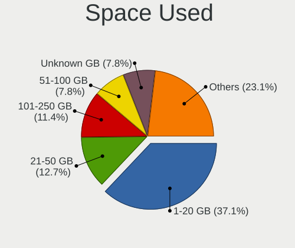

| Used GB        | Desktops | Percent |
|----------------|----------|---------|
| 1-20           | 189      | 37.06%  |
| 21-50          | 65       | 12.75%  |
| 101-250        | 58       | 11.37%  |
| 51-100         | 40       | 7.84%   |
| Unknown        | 40       | 7.84%   |
| 501-1000       | 39       | 7.65%   |
| 251-500        | 36       | 7.06%   |
| 1001-2000      | 19       | 3.73%   |
| More than 3000 | 17       | 3.33%   |
| 2001-3000      | 7        | 1.37%   |

Malfunc. Drives
---------------

Drive models with a malfunction

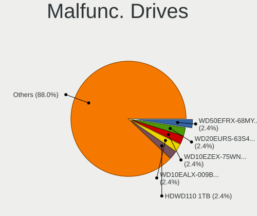

| Model                                 | Desktops | Drives | Percent |
|---------------------------------------|----------|--------|---------|
| WDC WD50EFRX-68MYMN1 5TB              | 2        | 2      | 2.41%   |
| WDC WD20EURS-63S48Y0 2TB              | 2        | 2      | 2.41%   |
| WDC WD10EZEX-75WN4A0 1TB              | 2        | 3      | 2.41%   |
| WDC WD10EALX-009BA0 1TB               | 2        | 2      | 2.41%   |
| Toshiba HDWD110 1TB                   | 2        | 2      | 2.41%   |
| Seagate ST9500325AS 500GB             | 2        | 3      | 2.41%   |
| Seagate ST9250827AS 250GB             | 2        | 5      | 2.41%   |
| Seagate ST3320413CS 320GB             | 2        | 2      | 2.41%   |
| Seagate ST3320311CS 320GB             | 2        | 2      | 2.41%   |
| Samsung Electronics SSD 970 EVO 500GB | 2        | 3      | 2.41%   |
| Kingston SV300S37A60G 64GB SSD        | 2        | 3      | 2.41%   |
| HGST HTS721010A9E630 1TB              | 2        | 6      | 2.41%   |
| WDC WD800JD-60LSA0 80GB               | 1        | 1      | 1.2%    |
| WDC WD7500BPVT-24HXZT3 752GB          | 1        | 1      | 1.2%    |
| WDC WD7500AAVS-00D7B1 752GB           | 1        | 1      | 1.2%    |
| WDC WD5000LPLX-75ZNTT1 500GB          | 1        | 1      | 1.2%    |
| WDC WD5000BEVT-22ZAT0 500GB           | 1        | 1      | 1.2%    |
| WDC WD5000AAVS-22G9B1 500GB           | 1        | 4      | 1.2%    |
| WDC WD40EFRX-68WT0N0 4TB              | 1        | 1      | 1.2%    |
| WDC WD3200BPVT-80JJ5T0 320GB          | 1        | 1      | 1.2%    |
| WDC WD3200BEVT-60A23T0 320GB          | 1        | 1      | 1.2%    |
| WDC WD3200AAKS-22L6A0 320GB           | 1        | 1      | 1.2%    |
| WDC WD3200AAJS-56B4A0 320GB           | 1        | 2      | 1.2%    |
| WDC WD2500AAKX-753CA1 250GB           | 1        | 2      | 1.2%    |
| WDC WD20EZRZ-00Z5HB0 2TB              | 1        | 1      | 1.2%    |
| WDC WD1600JS-61MHB1 160GB             | 1        | 1      | 1.2%    |
| WDC WD10EZEX-08WN4A0 1TB              | 1        | 1      | 1.2%    |
| WDC WD10EZEX-00RKKA0 1TB              | 1        | 1      | 1.2%    |
| WDC WD10EZEX-00KUWA0 1TB              | 1        | 1      | 1.2%    |
| Toshiba MK7575GSX 752GB               | 1        | 2      | 1.2%    |
| Toshiba MG08ACA14TE 14TB              | 1        | 1      | 1.2%    |
| SK hynix SC210 2.5 7MM 256GB SSD      | 1        | 1      | 1.2%    |
| Seagate ST980811AS 80GB               | 1        | 1      | 1.2%    |
| Seagate ST9250315AS 250GB             | 1        | 1      | 1.2%    |
| Seagate ST9120822AS 120GB             | 1        | 1      | 1.2%    |
| Seagate ST8000VX0022-2EJ112 8TB       | 1        | 2      | 1.2%    |
| Seagate ST8000NM017B-2TJ103 8TB       | 1        | 1      | 1.2%    |
| Seagate ST500DM002-1BD142 500GB       | 1        | 1      | 1.2%    |
| Seagate ST3500412AS 500GB             | 1        | 1      | 1.2%    |
| Seagate ST3500312CS 500GB             | 1        | 1      | 1.2%    |

Malfunc. Drive Vendor
---------------------

Vendors of faulty drives

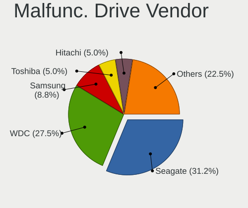

| Vendor              | Desktops | Drives | Percent |
|---------------------|----------|--------|---------|
| Seagate             | 25       | 31     | 31.25%  |
| WDC                 | 22       | 31     | 27.5%   |
| Samsung Electronics | 7        | 19     | 8.75%   |
| Toshiba             | 4        | 5      | 5%      |
| Hitachi             | 4        | 4      | 5%      |
| Maxtor              | 3        | 3      | 3.75%   |
| Kingston            | 3        | 4      | 3.75%   |
| OCZ                 | 2        | 2      | 2.5%    |
| HGST                | 2        | 6      | 2.5%    |
| ExcelStor           | 2        | 2      | 2.5%    |
| SK hynix            | 1        | 1      | 1.25%   |
| SanDisk             | 1        | 1      | 1.25%   |
| IBM/Hitachi         | 1        | 1      | 1.25%   |
| Fujitsu             | 1        | 2      | 1.25%   |
| Crucial             | 1        | 1      | 1.25%   |
| A-DATA Technology   | 1        | 1      | 1.25%   |

Malfunc. HDD Vendor
-------------------

Vendors of faulty HDD drives

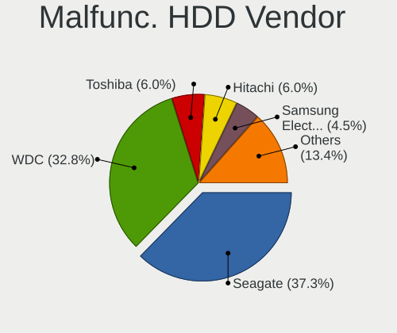

| Vendor              | Desktops | Drives | Percent |
|---------------------|----------|--------|---------|
| Seagate             | 25       | 31     | 37.31%  |
| WDC                 | 22       | 31     | 32.84%  |
| Toshiba             | 4        | 5      | 5.97%   |
| Hitachi             | 4        | 4      | 5.97%   |
| Samsung Electronics | 3        | 7      | 4.48%   |
| Maxtor              | 3        | 3      | 4.48%   |
| HGST                | 2        | 6      | 2.99%   |
| ExcelStor           | 2        | 2      | 2.99%   |
| IBM/Hitachi         | 1        | 1      | 1.49%   |
| Fujitsu             | 1        | 2      | 1.49%   |

Malfunc. Drive Kind
-------------------

Kinds of faulty drives

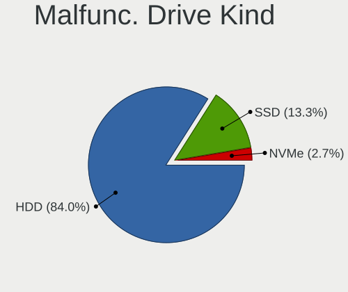

| Kind | Desktops | Drives | Percent |
|------|----------|--------|---------|
| HDD  | 63       | 92     | 84%     |
| SSD  | 10       | 19     | 13.33%  |
| NVMe | 2        | 3      | 2.67%   |

Failed Drives
-------------

Failed drive models

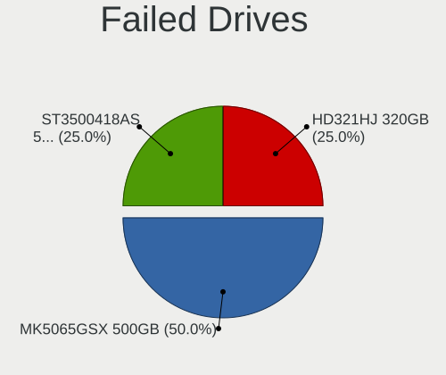

| Model                             | Desktops | Drives | Percent |
|-----------------------------------|----------|--------|---------|
| Toshiba MK5065GSX 500GB           | 2        | 2      | 40%     |
| Seagate ST3500418AS 500GB         | 1        | 2      | 20%     |
| Seagate ST2000DM001-1CH164 2TB    | 1        | 1      | 20%     |
| Samsung Electronics HD321HJ 320GB | 1        | 2      | 20%     |

Failed Drive Vendor
-------------------

Failed drive vendors

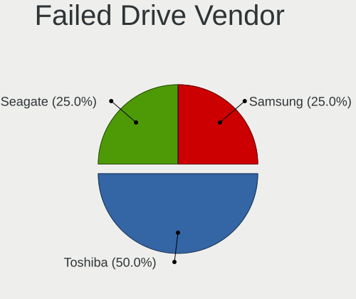

| Vendor              | Desktops | Drives | Percent |
|---------------------|----------|--------|---------|
| Toshiba             | 2        | 2      | 40%     |
| Seagate             | 2        | 3      | 40%     |
| Samsung Electronics | 1        | 2      | 20%     |

Drive Status
------------

Number of failed and malfunc. drives

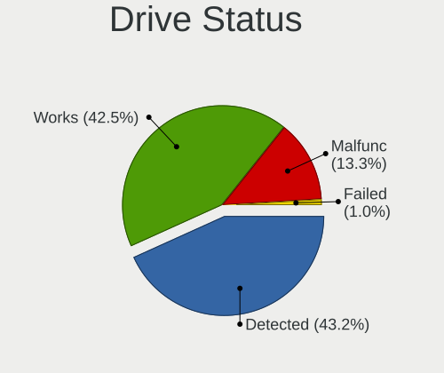

| Status   | Desktops | Drives | Percent |
|----------|----------|--------|---------|
| Detected | 224      | 601    | 43.24%  |
| Works    | 220      | 663    | 42.47%  |
| Malfunc  | 69       | 114    | 13.32%  |
| Failed   | 5        | 7      | 0.97%   |

Storage controller
------------------

Storage Vendor
--------------

Storage controller vendors

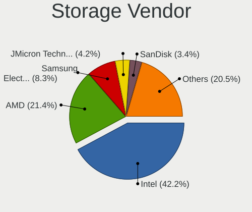

| Vendor                       | Desktops | Percent |
|------------------------------|----------|---------|
| Intel                        | 270      | 42.19%  |
| AMD                          | 137      | 21.41%  |
| Samsung Electronics          | 53       | 8.28%   |
| JMicron Technology           | 27       | 4.22%   |
| SanDisk                      | 22       | 3.44%   |
| Nvidia                       | 20       | 3.13%   |
| Kingston Technology Company  | 18       | 2.81%   |
| ASMedia Technology           | 16       | 2.5%    |
| Phison Electronics           | 15       | 2.34%   |
| ADATA Technology             | 11       | 1.72%   |
| Marvell Technology Group     | 9        | 1.41%   |
| VIA Technologies             | 8        | 1.25%   |
| SK hynix                     | 4        | 0.63%   |
| Silicon Motion               | 4        | 0.63%   |
| Realtek Semiconductor        | 4        | 0.63%   |
| Micron/Crucial Technology    | 3        | 0.47%   |
| MAXIO Technology (Hangzhou)  | 3        | 0.47%   |
| LSI Logic / Symbios Logic    | 3        | 0.47%   |
| Hosin Global Electronics     | 3        | 0.47%   |
| Toshiba America Info Systems | 2        | 0.31%   |
| Silicon Image                | 2        | 0.31%   |
| Promise Technology           | 2        | 0.31%   |
| Hewlett-Packard              | 2        | 0.31%   |
| ULi Electronics              | 1        | 0.16%   |
| INNOGRIT                     | 1        | 0.16%   |

Storage Model
-------------

Storage controller models

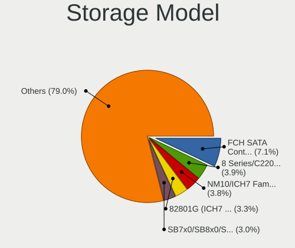

| Model                                                                                   | Desktops | Percent |
|-----------------------------------------------------------------------------------------|----------|---------|
| AMD FCH SATA Controller [AHCI mode]                                                     | 58       | 7.06%   |
| Intel 8 Series/C220 Series Chipset Family 6-port SATA Controller 1 [AHCI mode]          | 32       | 3.89%   |
| Intel NM10/ICH7 Family SATA Controller [IDE mode]                                       | 31       | 3.77%   |
| Intel 82801G (ICH7 Family) IDE Controller                                               | 27       | 3.28%   |
| AMD SB7x0/SB8x0/SB9x0 IDE Controller                                                    | 25       | 3.04%   |
| Intel 7 Series/C210 Series Chipset Family 6-port SATA Controller [AHCI mode]            | 24       | 2.92%   |
| AMD 500 Series Chipset SATA Controller                                                  | 23       | 2.8%    |
| AMD 400 Series Chipset SATA Controller                                                  | 23       | 2.8%    |
| Intel Q170/Q150/B150/H170/H110/Z170/CM236 Chipset SATA Controller [AHCI Mode]           | 21       | 2.55%   |
| Samsung NVMe SSD Controller SM981/PM981/PM983                                           | 20       | 2.43%   |
| Intel 6 Series/C200 Series Chipset Family 6 port Desktop SATA AHCI Controller           | 20       | 2.43%   |
| AMD SB7x0/SB8x0/SB9x0 SATA Controller [AHCI mode]                                       | 19       | 2.31%   |
| JMicron JMB363 SATA/IDE Controller                                                      | 17       | 2.07%   |
| Intel 200 Series PCH SATA controller [AHCI mode]                                        | 17       | 2.07%   |
| AMD SB7x0/SB8x0/SB9x0 SATA Controller [IDE mode]                                        | 15       | 1.82%   |
| ASMedia ASM1061/ASM1062 Serial ATA Controller                                           | 14       | 1.7%    |
| Samsung NVMe SSD Controller PM9A1/PM9A3/980PRO                                          | 12       | 1.46%   |
| Samsung NVMe SSD Controller SM961/PM961/SM963                                           | 10       | 1.22%   |
| Intel SATA Controller [RAID mode]                                                       | 10       | 1.22%   |
| Intel Cannon Lake PCH SATA AHCI Controller                                              | 10       | 1.22%   |
| Intel 82801JI (ICH10 Family) 4 port SATA IDE Controller #1                              | 10       | 1.22%   |
| Intel 82801JI (ICH10 Family) 2 port SATA IDE Controller #2                              | 10       | 1.22%   |
| Intel 6 Series/C200 Series Chipset Family Desktop SATA Controller (IDE mode, ports 4-5) | 10       | 1.22%   |
| Intel 6 Series/C200 Series Chipset Family Desktop SATA Controller (IDE mode, ports 0-3) | 10       | 1.22%   |
| Nvidia MCP61 SATA Controller                                                            | 9        | 1.09%   |
| Nvidia MCP61 IDE                                                                        | 9        | 1.09%   |
| Intel 82801I (ICH9 Family) 2 port SATA Controller [IDE mode]                            | 9        | 1.09%   |
| SanDisk Extreme Pro / WD Black SN750 / PC SN730 / Red SN700 NVMe SSD                    | 8        | 0.97%   |
| Samsung NVMe SSD Controller 980 (DRAM-less)                                             | 8        | 0.97%   |
| Intel 82801IR/IO/IH (ICH9R/DO/DH) 4 port SATA Controller [IDE mode]                     | 8        | 0.97%   |
| AMD A320 Chipset SATA Controller [AHCI mode]                                            | 8        | 0.97%   |
| AMD 600 Series Chipset SATA Controller                                                  | 8        | 0.97%   |
| Kingston Company A2000 NVMe SSD [SM2263EN]                                              | 7        | 0.85%   |
| Intel Alder Lake-S PCH SATA Controller [AHCI Mode]                                      | 7        | 0.85%   |
| AMD 300 Series Chipset SATA Controller                                                  | 7        | 0.85%   |
| Samsung NVMe SSD Controller S4LV008[Pascal]                                             | 6        | 0.73%   |
| Phison E12 NVMe Controller                                                              | 6        | 0.73%   |
| Kingston Company KC3000/FURY Renegade NVMe SSD [E18]                                    | 6        | 0.73%   |
| JMicron JMB368 IDE controller                                                           | 6        | 0.73%   |
| Intel Raptor Lake SATA AHCI Controller                                                  | 6        | 0.73%   |

Storage Kind
------------

Kind of storage controller (IDE, SATA, NVMe, SAS, ...)

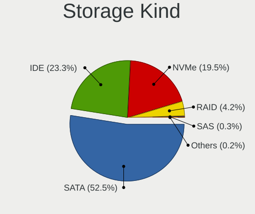

| Kind | Desktops | Percent |
|------|----------|---------|
| SATA | 326      | 52.5%   |
| IDE  | 145      | 23.35%  |
| NVMe | 121      | 19.48%  |
| RAID | 26       | 4.19%   |
| SAS  | 2        | 0.32%   |
| SCSI | 1        | 0.16%   |

Processor
---------

CPU Vendor
----------

Processor vendors

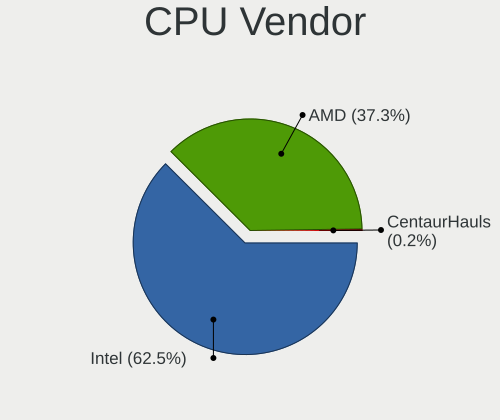

| Vendor       | Desktops | Percent |
|--------------|----------|---------|
| Intel        | 273      | 62.47%  |
| AMD          | 163      | 37.3%   |
| CentaurHauls | 1        | 0.23%   |

CPU Model
---------

Processor models

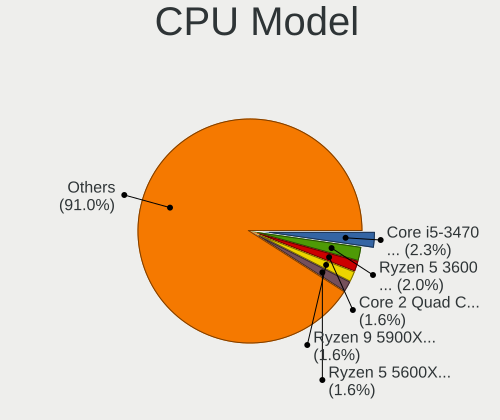

| Model                                  | Desktops | Percent |
|----------------------------------------|----------|---------|
| Intel Core i5-3470 CPU @ 3.20GHz       | 10       | 2.26%   |
| AMD Ryzen 5 3600 6-Core Processor      | 9        | 2.04%   |
| Intel Core 2 Quad CPU Q6600 @ 2.40GHz  | 7        | 1.58%   |
| AMD Ryzen 9 5900X 12-Core Processor    | 7        | 1.58%   |
| AMD Ryzen 5 5600X 6-Core Processor     | 7        | 1.58%   |
| AMD Ryzen 5 5600G with Radeon Graphics | 7        | 1.58%   |
| Intel Core 2 Quad CPU Q9400 @ 2.66GHz  | 6        | 1.36%   |
| Intel Core i5-3570 CPU @ 3.40GHz       | 5        | 1.13%   |
| Intel Core i5-2500K CPU @ 3.30GHz      | 5        | 1.13%   |
| AMD Ryzen 5 1600 Six-Core Processor    | 5        | 1.13%   |
| Intel Core i7-7700K CPU @ 4.20GHz      | 4        | 0.9%    |
| Intel Core i7-3770 CPU @ 3.40GHz       | 4        | 0.9%    |
| Intel Core i5-7500 CPU @ 3.40GHz       | 4        | 0.9%    |
| Intel Core i5-4670K CPU @ 3.40GHz      | 4        | 0.9%    |
| Intel Core i5-4590 CPU @ 3.30GHz       | 4        | 0.9%    |
| Intel Core 2 Duo CPU E8400 @ 3.00GHz   | 4        | 0.9%    |
| Intel Core 2 Duo CPU E6750 @ 2.66GHz   | 4        | 0.9%    |
| Intel Celeron N5105 @ 2.00GHz          | 4        | 0.9%    |
| AMD Ryzen 9 3900X 12-Core Processor    | 4        | 0.9%    |
| Intel Core i7-9700K CPU @ 3.60GHz      | 3        | 0.68%   |
| Intel Core i7-6700K CPU @ 4.00GHz      | 3        | 0.68%   |
| Intel Core i7-4790 CPU @ 3.60GHz       | 3        | 0.68%   |
| Intel Core i5-7400 CPU @ 3.00GHz       | 3        | 0.68%   |
| Intel Core i5-6500 CPU @ 3.20GHz       | 3        | 0.68%   |
| Intel Core i5-4460 CPU @ 3.20GHz       | 3        | 0.68%   |
| Intel Core i3-9100 CPU @ 3.60GHz       | 3        | 0.68%   |
| Intel Core i3-8100 CPU @ 3.60GHz       | 3        | 0.68%   |
| Intel Core i3-4170 CPU @ 3.70GHz       | 3        | 0.68%   |
| Intel Core i3-3220 CPU @ 3.30GHz       | 3        | 0.68%   |
| Intel Core i3-2120 CPU @ 3.30GHz       | 3        | 0.68%   |
| Intel Core i3-10100 CPU @ 3.60GHz      | 3        | 0.68%   |
| Intel Core 2 Duo CPU E7500 @ 2.93GHz   | 3        | 0.68%   |
| Intel Core 2 Duo CPU E7400 @ 2.80GHz   | 3        | 0.68%   |
| Intel 12th Gen Core i5-12600K          | 3        | 0.68%   |
| AMD Ryzen 9 5950X 16-Core Processor    | 3        | 0.68%   |
| AMD Ryzen 7 3700X 8-Core Processor     | 3        | 0.68%   |
| AMD Ryzen 7 2700 Eight-Core Processor  | 3        | 0.68%   |
| AMD Ryzen 3 1300X Quad-Core Processor  | 3        | 0.68%   |
| AMD FX-8350 Eight-Core Processor       | 3        | 0.68%   |
| Intel Xeon CPU X5450 @ 3.00GHz         | 2        | 0.45%   |

CPU Model Family
----------------

Processor model prefix

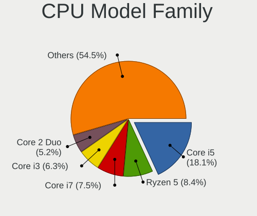

| Model                   | Desktops | Percent |
|-------------------------|----------|---------|
| Intel Core i5           | 80       | 18.1%   |
| AMD Ryzen 5             | 37       | 8.37%   |
| Intel Core i7           | 33       | 7.47%   |
| Intel Core i3           | 28       | 6.33%   |
| Intel Core 2 Duo        | 23       | 5.2%    |
| AMD Ryzen 7             | 22       | 4.98%   |
| Intel Xeon              | 21       | 4.75%   |
| Intel Celeron           | 21       | 4.75%   |
| Other                   | 18       | 4.07%   |
| Intel Core 2 Quad       | 18       | 4.07%   |
| AMD Ryzen 9             | 17       | 3.85%   |
| Intel Pentium           | 11       | 2.49%   |
| AMD FX                  | 10       | 2.26%   |
| AMD Athlon 64 X2        | 8        | 1.81%   |
| AMD Athlon II X2        | 7        | 1.58%   |
| AMD Sempron             | 6        | 1.36%   |
| AMD Ryzen 3             | 6        | 1.36%   |
| AMD Phenom II X4        | 6        | 1.36%   |
| Intel Pentium Dual-Core | 5        | 1.13%   |
| AMD Athlon              | 5        | 1.13%   |
| Intel Atom              | 4        | 0.9%    |
| AMD Phenom              | 4        | 0.9%    |
| AMD Athlon X4           | 4        | 0.9%    |
| AMD Athlon 64           | 4        | 0.9%    |
| AMD A8                  | 4        | 0.9%    |
| Intel Pentium 4         | 3        | 0.68%   |
| Intel Core i9           | 3        | 0.68%   |
| Intel Core 2            | 3        | 0.68%   |
| AMD A10                 | 3        | 0.68%   |
| Intel Pentium Dual      | 2        | 0.45%   |
| Intel Genuine           | 2        | 0.45%   |
| AMD Ryzen 5 PRO         | 2        | 0.45%   |
| AMD Phenom II X6        | 2        | 0.45%   |
| AMD Phenom II X2        | 2        | 0.45%   |
| AMD GX                  | 2        | 0.45%   |
| AMD Athlon II X4        | 2        | 0.45%   |
| AMD Athlon Dual Core    | 2        | 0.45%   |
| AMD A6                  | 2        | 0.45%   |
| AMD A4                  | 2        | 0.45%   |
| Intel Pentium D         | 1        | 0.23%   |

CPU Cores
---------

Number of processor cores

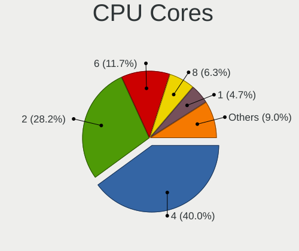

| Number  | Desktops | Percent |
|---------|----------|---------|
| 4       | 177      | 39.95%  |
| 2       | 125      | 28.22%  |
| 6       | 52       | 11.74%  |
| 8       | 28       | 6.32%   |
| 1       | 21       | 4.74%   |
| 12      | 13       | 2.93%   |
| 16      | 10       | 2.26%   |
| 10      | 5        | 1.13%   |
| 3       | 5        | 1.13%   |
| 20      | 2        | 0.45%   |
| 14      | 2        | 0.45%   |
| Unknown | 2        | 0.45%   |
| 24      | 1        | 0.23%   |

CPU Sockets
-----------

Number of sockets

| Number | Desktops | Percent |
|--------|----------|---------|
| 1      | 435      | 99.54%  |
| 2      | 2        | 0.46%   |

CPU Threads
-----------

Threads per core (Hyper-Threading)

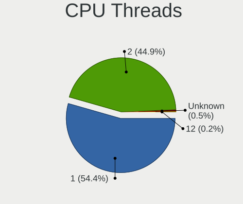

| Number  | Desktops | Percent |
|---------|----------|---------|
| 1       | 240      | 54.42%  |
| 2       | 198      | 44.9%   |
| Unknown | 2        | 0.45%   |
| 12      | 1        | 0.23%   |

CPU Op-Modes
------------

CPU Operation Modes (32-bit, 64-bit)

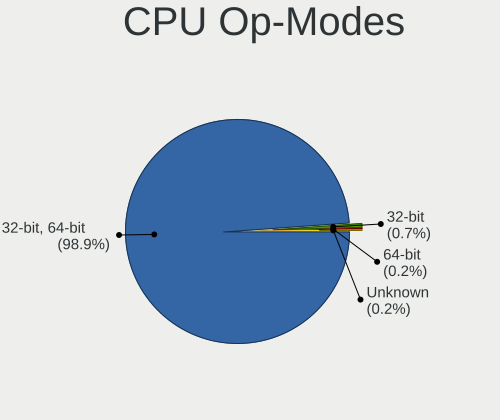

| Op mode        | Desktops | Percent |
|----------------|----------|---------|
| 32-bit, 64-bit | 432      | 98.86%  |
| 32-bit         | 3        | 0.69%   |
| 64-bit         | 1        | 0.23%   |
| Unknown        | 1        | 0.23%   |

CPU Microcode
-------------

Microcode number

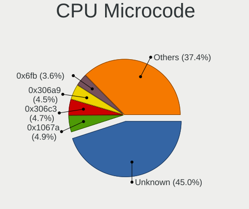

| Number     | Desktops | Percent |
|------------|----------|---------|
| Unknown    | 212      | 45.01%  |
| 0x1067a    | 23       | 4.88%   |
| 0x306c3    | 22       | 4.67%   |
| 0x306a9    | 21       | 4.46%   |
| 0x6fb      | 17       | 3.61%   |
| 0x906e9    | 10       | 2.12%   |
| 0x206a7    | 10       | 2.12%   |
| 0x506e3    | 8        | 1.7%    |
| 0x06001119 | 8        | 1.7%    |
| 0x010000c8 | 8        | 1.7%    |
| 0x6fd      | 6        | 1.27%   |
| 0x08701021 | 6        | 1.27%   |
| 0x0800820d | 6        | 1.27%   |
| 0x0a50000d | 5        | 1.06%   |
| 0x906eb    | 4        | 0.85%   |
| 0x6f2      | 4        | 0.85%   |
| 0x08108109 | 4        | 0.85%   |
| 0xa0653    | 3        | 0.64%   |
| 0x906ea    | 3        | 0.64%   |
| 0x906c0    | 3        | 0.64%   |
| 0x106a5    | 3        | 0.64%   |
| 0x0a201025 | 3        | 0.64%   |
| 0x0a201016 | 3        | 0.64%   |
| 0x08001138 | 3        | 0.64%   |
| 0x06000852 | 3        | 0.64%   |
| 0x010000c7 | 3        | 0.64%   |
| 0x01000083 | 3        | 0.64%   |
| 0xf43      | 2        | 0.42%   |
| 0x406c3    | 2        | 0.42%   |
| 0x30661    | 2        | 0.42%   |
| 0x20652    | 2        | 0.42%   |
| 0x10676    | 2        | 0.42%   |
| 0x0a50000c | 2        | 0.42%   |
| 0x0a20120e | 2        | 0.42%   |
| 0x0a201009 | 2        | 0.42%   |
| 0x08701013 | 2        | 0.42%   |
| 0x08001137 | 2        | 0.42%   |
| 0x0700010f | 2        | 0.42%   |
| 0x06003106 | 2        | 0.42%   |
| 0x06003104 | 2        | 0.42%   |

CPU Microarch
-------------

Microarchitecture

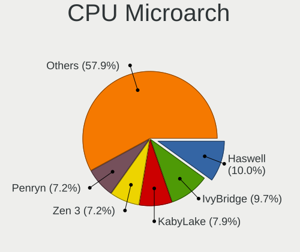

| Name             | Desktops | Percent |
|------------------|----------|---------|
| Haswell          | 44       | 9.95%   |
| IvyBridge        | 43       | 9.73%   |
| KabyLake         | 35       | 7.92%   |
| Zen 3            | 32       | 7.24%   |
| Penryn           | 32       | 7.24%   |
| Core             | 29       | 6.56%   |
| K10              | 27       | 6.11%   |
| Zen 2            | 21       | 4.75%   |
| Skylake          | 19       | 4.3%    |
| K8 Hammer        | 19       | 4.3%    |
| Unknown          | 18       | 4.07%   |
| Zen+             | 17       | 3.85%   |
| SandyBridge      | 17       | 3.85%   |
| Piledriver       | 16       | 3.62%   |
| Zen              | 9        | 2.04%   |
| Alderlake Hybrid | 9        | 2.04%   |
| Nehalem          | 8        | 1.81%   |
| Steamroller      | 5        | 1.13%   |
| CometLake        | 5        | 1.13%   |
| Westmere         | 4        | 0.9%    |
| Tremont          | 4        | 0.9%    |
| NetBurst         | 4        | 0.9%    |
| Bonnell          | 4        | 0.9%    |
| Silvermont       | 3        | 0.68%   |
| Jaguar           | 3        | 0.68%   |
| Broadwell        | 3        | 0.68%   |
| Excavator        | 2        | 0.45%   |
| Bulldozer        | 2        | 0.45%   |
| Puma             | 1        | 0.23%   |
| P6               | 1        | 0.23%   |
| Lunarlake Hybrid | 1        | 0.23%   |
| K6               | 1        | 0.23%   |
| K10 Llano        | 1        | 0.23%   |
| Gracemont        | 1        | 0.23%   |
| Goldmont plus    | 1        | 0.23%   |
| Bobcat           | 1        | 0.23%   |

Graphics
--------

GPU Vendor
----------

Vendors of graphics cards

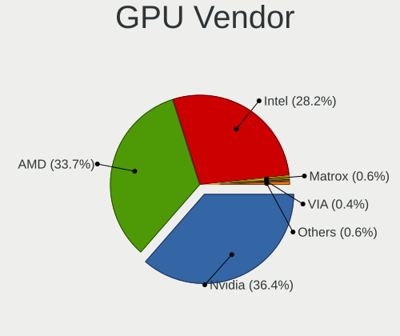

| Vendor                     | Desktops | Percent |
|----------------------------|----------|---------|
| Nvidia                     | 173      | 36.42%  |
| AMD                        | 160      | 33.68%  |
| Intel                      | 134      | 28.21%  |
| Matrox Electronics Systems | 3        | 0.63%   |
| VIA Technologies           | 2        | 0.42%   |
| ASPEED Technology          | 2        | 0.42%   |
| S3 Graphics                | 1        | 0.21%   |

GPU Model
---------

Graphics card models

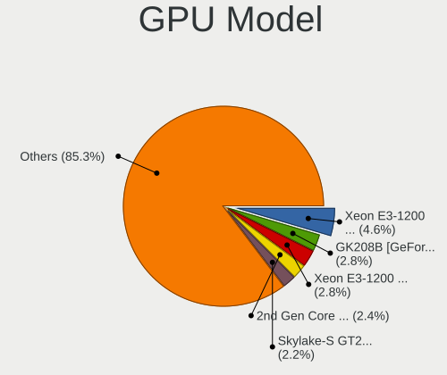

| Model                                                                       | Desktops | Percent |
|-----------------------------------------------------------------------------|----------|---------|
| Intel Xeon E3-1200 v3/4th Gen Core Processor Integrated Graphics Controller | 23       | 4.56%   |
| Nvidia GK208B [GeForce GT 710]                                              | 14       | 2.78%   |
| Intel Xeon E3-1200 v2/3rd Gen Core processor Graphics Controller            | 14       | 2.78%   |
| Intel 2nd Generation Core Processor Family Integrated Graphics Controller   | 12       | 2.38%   |
| Intel Skylake-S GT2 [HD Graphics 530]                                       | 11       | 2.18%   |
| Nvidia GP106 [GeForce GTX 1060 6GB]                                         | 10       | 1.98%   |
| AMD Ellesmere [Radeon RX 470/480/570/570X/580/580X/590]                     | 10       | 1.98%   |
| Nvidia GF108 [GeForce GT 630]                                               | 9        | 1.79%   |
| Nvidia GP107 [GeForce GTX 1050 Ti]                                          | 8        | 1.59%   |
| Intel CoffeeLake-S GT2 [UHD Graphics 630]                                   | 8        | 1.59%   |
| Nvidia GT218 [GeForce 210]                                                  | 7        | 1.39%   |
| Nvidia GP108 [GeForce GT 1030]                                              | 7        | 1.39%   |
| Nvidia GK208B [GeForce GT 730]                                              | 7        | 1.39%   |
| Intel 82945G/GZ Integrated Graphics Controller                              | 7        | 1.39%   |
| AMD RS780L [Radeon 3000]                                                    | 7        | 1.39%   |
| AMD Navi 10 [Radeon RX 5600 OEM/5600 XT / 5700/5700 XT]                     | 7        | 1.39%   |
| AMD Cedar [Radeon HD 5000/6000/7350/8350 Series]                            | 7        | 1.39%   |
| Intel Kaby Lake-S GT2 [HD Graphics 630]                                     | 6        | 1.19%   |
| AMD Picasso/Raven 2 [Radeon Vega Series / Radeon Vega Mobile Series]        | 6        | 1.19%   |
| AMD Navi 22 [Radeon RX 6700/6700 XT/6750 XT / 6800M/6850M XT]               | 6        | 1.19%   |
| AMD Cezanne [Radeon Vega Series / Radeon Vega Mobile Series]                | 6        | 1.19%   |
| AMD Juniper XT [Radeon HD 5770]                                             | 5        | 0.99%   |
| Nvidia GP104 [GeForce GTX 1080]                                             | 4        | 0.79%   |
| Nvidia GP102 [GeForce GTX 1080 Ti]                                          | 4        | 0.79%   |
| Nvidia GM206 [GeForce GTX 960]                                              | 4        | 0.79%   |
| Nvidia G92 [GeForce 9800 GT]                                                | 4        | 0.79%   |
| Intel JasperLake [UHD Graphics]                                             | 4        | 0.79%   |
| Intel IvyBridge GT2 [HD Graphics 4000]                                      | 4        | 0.79%   |
| Intel 4 Series Chipset Integrated Graphics Controller                       | 4        | 0.79%   |
| AMD Navi 48 [Radeon RX 9070/9070 XT/9070 GRE]                               | 4        | 0.79%   |
| AMD Navi 14 [Radeon RX 5500/5500M / Pro 5500M]                              | 4        | 0.79%   |
| AMD Caicos [Radeon HD 6450/7450/8450 / R5 230 OEM]                          | 4        | 0.79%   |
| AMD Baffin [Radeon RX 460/560D / Pro 450/455/460/555/555X/560/560X]         | 4        | 0.79%   |
| Nvidia TU116 [GeForce GTX 1660]                                             | 3        | 0.6%    |
| Nvidia TU104 [GeForce RTX 2080 SUPER]                                       | 3        | 0.6%    |
| Nvidia GT216 [GeForce GT 220]                                               | 3        | 0.6%    |
| Nvidia GP104 [GeForce GTX 1070]                                             | 3        | 0.6%    |
| Nvidia GM204 [GeForce GTX 970]                                              | 3        | 0.6%    |
| Nvidia GA104 [GeForce RTX 3060 Ti Lite Hash Rate]                           | 3        | 0.6%    |
| Nvidia GA102 [GeForce RTX 3090]                                             | 3        | 0.6%    |

GPU Combo
---------

Combinations of graphics cards

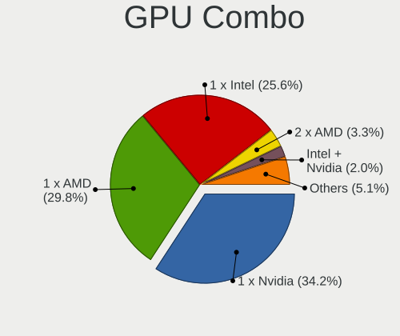

| Name            | Desktops | Percent |
|-----------------|----------|---------|
| 1 x Nvidia      | 154      | 34.22%  |
| 1 x AMD         | 134      | 29.78%  |
| 1 x Intel       | 115      | 25.56%  |
| 2 x AMD         | 15       | 3.33%   |
| Intel + Nvidia  | 9        | 2%      |
| AMD + Nvidia    | 7        | 1.56%   |
| Intel + AMD     | 3        | 0.67%   |
| 2 x Nvidia      | 2        | 0.44%   |
| 1 x VIA         | 2        | 0.44%   |
| 1 x Matrox      | 2        | 0.44%   |
| Other           | 1        | 0.22%   |
| 3 x AMD         | 1        | 0.22%   |
| 1 x S3 Graphics | 1        | 0.22%   |
| Nvidia + Matrox | 1        | 0.22%   |
| Nvidia + ASPEED | 1        | 0.22%   |
| 1 x ASPEED      | 1        | 0.22%   |
| AMD + Matrox    | 1        | 0.22%   |

GPU Driver
----------

Free vs proprietary

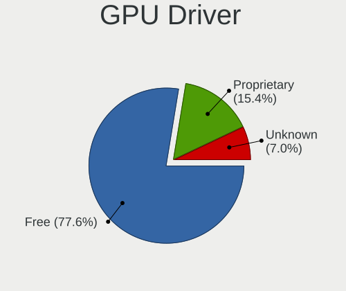

| Driver      | Desktops | Percent |
|-------------|----------|---------|
| Free        | 353      | 77.58%  |
| Proprietary | 70       | 15.38%  |
| Unknown     | 32       | 7.03%   |

GPU Memory
----------

Total video memory

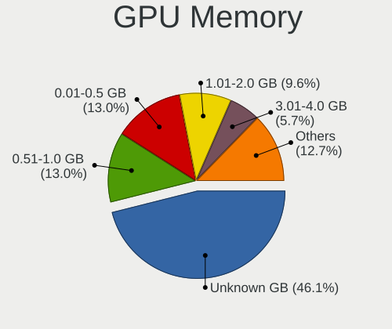

| Size in GB | Desktops | Percent |
|------------|----------|---------|
| Unknown    | 217      | 46.07%  |
| 0.51-1.0   | 61       | 12.95%  |
| 0.01-0.5   | 61       | 12.95%  |
| 1.01-2.0   | 45       | 9.55%   |
| 3.01-4.0   | 27       | 5.73%   |
| 7.01-8.0   | 26       | 5.52%   |
| 5.01-6.0   | 16       | 3.4%    |
| 8.01-16.0  | 12       | 2.55%   |
| 2.01-3.0   | 4        | 0.85%   |
| 16.01-24.0 | 2        | 0.42%   |

Monitor
-------

Monitor Vendor
--------------

Monitor vendors

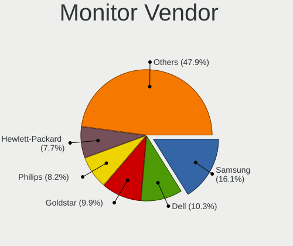

| Vendor               | Desktops | Percent |
|----------------------|----------|---------|
| Samsung Electronics  | 75       | 16.09%  |
| Dell                 | 48       | 10.3%   |
| Goldstar             | 46       | 9.87%   |
| Philips              | 38       | 8.15%   |
| Hewlett-Packard      | 36       | 7.73%   |
| BenQ                 | 35       | 7.51%   |
| Ancor Communications | 24       | 5.15%   |
| AOC                  | 21       | 4.51%   |
| Iiyama               | 14       | 3%      |
| Acer                 | 14       | 3%      |
| NEC Computers        | 11       | 2.36%   |
| Eizo                 | 9        | 1.93%   |
| Unknown              | 8        | 1.72%   |
| Lenovo               | 8        | 1.72%   |
| Fujitsu Siemens      | 8        | 1.72%   |
| ASUSTek Computer     | 8        | 1.72%   |
| MSI                  | 6        | 1.29%   |
| LG Electronics       | 6        | 1.29%   |
| CVT                  | 5        | 1.07%   |
| Unknown (XXX)        | 3        | 0.64%   |
| ViewSonic            | 2        | 0.43%   |
| Vestel Elektronik    | 2        | 0.43%   |
| Sony                 | 2        | 0.43%   |
| RTD                  | 2        | 0.43%   |
| MiTAC                | 2        | 0.43%   |
| Mi                   | 2        | 0.43%   |
| FUS                  | 2        | 0.43%   |
| DENON                | 2        | 0.43%   |
| XKX                  | 1        | 0.21%   |
| Valve                | 1        | 0.21%   |
| TCT                  | 1        | 0.21%   |
| TCL                  | 1        | 0.21%   |
| S2-Tek               | 1        | 0.21%   |
| RTK                  | 1        | 0.21%   |
| PTC                  | 1        | 0.21%   |
| Pioneer              | 1        | 0.21%   |
| Panasonic            | 1        | 0.21%   |
| Onkyo                | 1        | 0.21%   |
| Microstep            | 1        | 0.21%   |
| Lite-On              | 1        | 0.21%   |

Monitor Model
-------------

Monitor models

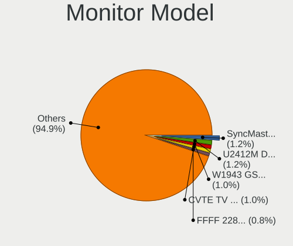

| Model                                                                  | Desktops | Percent |
|------------------------------------------------------------------------|----------|---------|
| Samsung Electronics SyncMaster SAM0091 1600x1200 432x324mm 21.3-inch   | 6        | 1.18%   |
| Dell U2412M DELA07A 1920x1200 518x324mm 24.1-inch                      | 6        | 1.18%   |
| Goldstar W1943 GSM4BAD 1360x768 406x229mm 18.4-inch                    | 5        | 0.99%   |
| CVT CVTE TV CVT0003 1920x1080 575x323mm 26.0-inch                      | 5        | 0.99%   |
| Unknown LCD Monitor FFFF 2288x1287 2550x2550mm 142.0-inch              | 4        | 0.79%   |
| Samsung Electronics SyncMaster SAM0420 1680x1050 474x296mm 22.0-inch   | 4        | 0.79%   |
| Samsung Electronics S24F350 SAM0D20 1920x1080 521x293mm 23.5-inch      | 4        | 0.79%   |
| Philips PHL 243V7 PHLC155 1920x1080 527x296mm 23.8-inch                | 4        | 0.79%   |
| Philips PHL 243V5 PHLC0D1 1920x1080 521x293mm 23.5-inch                | 4        | 0.79%   |
| Philips 247ELH PHLC085 1920x1080 521x293mm 23.5-inch                   | 4        | 0.79%   |
| NEC Computers LCD19WV NEC671C 1440x900 410x256mm 19.0-inch             | 4        | 0.79%   |
| Samsung Electronics U28E590 SAM0C4C 3840x2160 608x345mm 27.5-inch      | 3        | 0.59%   |
| Samsung Electronics S24F350 SAM0D21 1920x1080 521x293mm 23.5-inch      | 3        | 0.59%   |
| Samsung Electronics LCD Monitor SAM07C0 1920x1080 890x500mm 40.2-inch  | 3        | 0.59%   |
| Philips 221TE PHLC062 1920x1080 476x268mm 21.5-inch                    | 3        | 0.59%   |
| Lenovo T27hv-20 LEN62A9 2560x1440 597x336mm 27.0-inch                  | 3        | 0.59%   |
| Lenovo LEN L24e-20 LEN65DF 1920x1080 530x300mm 24.0-inch               | 3        | 0.59%   |
| Iiyama PL2492H IVM612F 1920x1080 527x296mm 23.8-inch                   | 3        | 0.59%   |
| Hewlett-Packard E243d HPN3511 1920x1080 527x296mm 23.8-inch            | 3        | 0.59%   |
| Goldstar W2753VC GSM5765 1920x1080 598x336mm 27.0-inch                 | 3        | 0.59%   |
| BenQ GW2470 BNQ78E4 1920x1080 527x296mm 23.8-inch                      | 3        | 0.59%   |
| AOC 24G2W1G3 AOC2402 1920x1080 527x296mm 23.8-inch                     | 3        | 0.59%   |
| AOC 24B1W1 AOC2401 1920x1080 527x296mm 23.8-inch                       | 3        | 0.59%   |
| AOC 2270W AOC2270 1920x1080 477x268mm 21.5-inch                        | 3        | 0.59%   |
| Ancor Communications VE247 ACI2493 1920x1080 530x300mm 24.0-inch       | 3        | 0.59%   |
| Ancor Communications ASUS VW193D ACI19D5 1440x900 408x255mm 18.9-inch  | 3        | 0.59%   |
| Vestel Elektronik 40UHD_LCD_TV VES3700 3840x2160 880x500mm 39.8-inch   | 2        | 0.39%   |
| Unknown 1780 07E7 1280x1024 337x270mm 17.0-inch                        | 2        | 0.39%   |
| Unknown (XXX) Beyond TV XXX2851 3840x2160 1209x680mm 54.6-inch         | 2        | 0.39%   |
| Samsung Electronics U28E590 SAM0C4D 3840x2160 607x345mm 27.5-inch      | 2        | 0.39%   |
| Samsung Electronics SyncMaster SAM05CC 1920x1080 530x300mm 24.0-inch   | 2        | 0.39%   |
| Samsung Electronics SyncMaster SAM0587 1920x1200 518x324mm 24.1-inch   | 2        | 0.39%   |
| Samsung Electronics SyncMaster SAM02B6 1920x1200 518x324mm 24.1-inch   | 2        | 0.39%   |
| Samsung Electronics SMS24A850 SAM082F 1920x1200 518x324mm 24.1-inch    | 2        | 0.39%   |
| Samsung Electronics S27D390 SAM0B67 1920x1080 598x336mm 27.0-inch      | 2        | 0.39%   |
| Samsung Electronics S22C450 SAM09C6 1680x1050 473x291mm 21.9-inch      | 2        | 0.39%   |
| Samsung Electronics LF24T35 SAM707D 1920x1080 528x297mm 23.9-inch      | 2        | 0.39%   |
| Samsung Electronics LCD Monitor SAM0A7A 1920x1080 1060x626mm 48.5-inch | 2        | 0.39%   |
| Samsung Electronics LCD Monitor SAM0659 1920x1080                      | 2        | 0.39%   |
| Samsung Electronics C27F390 SAM0D32 1920x1080 598x336mm 27.0-inch      | 2        | 0.39%   |

Monitor Resolution
------------------

Monitor screen resolution

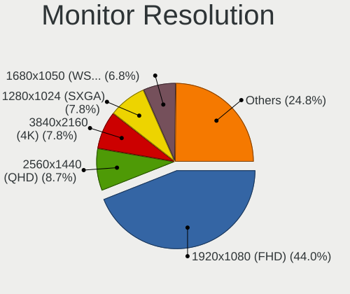

| Resolution         | Desktops | Percent |
|--------------------|----------|---------|
| 1920x1080 (FHD)    | 202      | 44.01%  |
| 2560x1440 (QHD)    | 40       | 8.71%   |
| 3840x2160 (4K)     | 36       | 7.84%   |
| 1280x1024 (SXGA)   | 36       | 7.84%   |
| 1680x1050 (WSXGA+) | 31       | 6.75%   |
| 1920x1200 (WUXGA)  | 27       | 5.88%   |
| 1440x900 (WXGA+)   | 19       | 4.14%   |
| 3440x1440          | 11       | 2.4%    |
| 1366x768 (WXGA)    | 10       | 2.18%   |
| 1360x768           | 10       | 2.18%   |
| 1600x900 (HD+)     | 7        | 1.53%   |
| 1600x1200          | 7        | 1.53%   |
| 2288x1287          | 4        | 0.87%   |
| 1920x540           | 4        | 0.87%   |
| 2560x1080          | 3        | 0.65%   |
| 1024x768 (XGA)     | 3        | 0.65%   |
| Unknown            | 3        | 0.65%   |
| 1280x960           | 2        | 0.44%   |
| 4480x1440          | 1        | 0.22%   |
| 3200x1080          | 1        | 0.22%   |
| 1400x1050          | 1        | 0.22%   |
| 1280x720 (HD)      | 1        | 0.22%   |

Monitor Diagonal
----------------

Diagonal size in inches

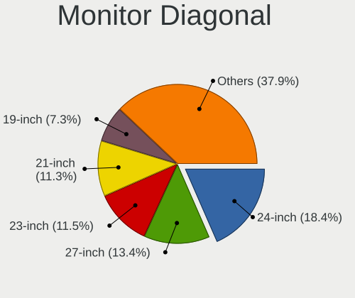

| Inches  | Desktops | Percent |
|---------|----------|---------|
| 24      | 88       | 18.45%  |
| 27      | 64       | 13.42%  |
| 23      | 55       | 11.53%  |
| 21      | 54       | 11.32%  |
| 19      | 35       | 7.34%   |
| Unknown | 30       | 6.29%   |
| 17      | 20       | 4.19%   |
| 22      | 19       | 3.98%   |
| 18      | 16       | 3.35%   |
| 20      | 13       | 2.73%   |
| 34      | 11       | 2.31%   |
| 25      | 9        | 1.89%   |
| 84      | 8        | 1.68%   |
| 31      | 7        | 1.47%   |
| 26      | 7        | 1.47%   |
| 40      | 6        | 1.26%   |
| 32      | 6        | 1.26%   |
| 142     | 4        | 0.84%   |
| 65      | 3        | 0.63%   |
| 54      | 3        | 0.63%   |
| 46      | 3        | 0.63%   |
| 15      | 3        | 0.63%   |
| 72      | 2        | 0.42%   |
| 63      | 2        | 0.42%   |
| 48      | 2        | 0.42%   |
| 44      | 1        | 0.21%   |
| 42      | 1        | 0.21%   |
| 35      | 1        | 0.21%   |
| 33      | 1        | 0.21%   |
| 28      | 1        | 0.21%   |
| 14      | 1        | 0.21%   |
| 11      | 1        | 0.21%   |

Monitor Width
-------------

Physical width

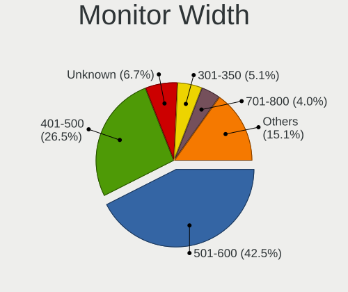

| Width in mm    | Desktops | Percent |
|----------------|----------|---------|
| 501-600        | 191      | 42.54%  |
| 401-500        | 119      | 26.5%   |
| Unknown        | 30       | 6.68%   |
| 301-350        | 23       | 5.12%   |
| 701-800        | 18       | 4.01%   |
| 351-400        | 17       | 3.79%   |
| 1001-1500      | 14       | 3.12%   |
| 601-700        | 13       | 2.9%    |
| 1501-2000      | 10       | 2.23%   |
| 801-900        | 7        | 1.56%   |
| More than 2000 | 4        | 0.89%   |
| 201-300        | 2        | 0.45%   |
| 901-1000       | 1        | 0.22%   |

Aspect Ratio
------------

Proportional relationship between the width and the height

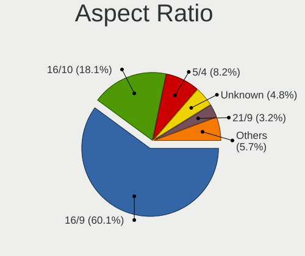

| Ratio   | Desktops | Percent |
|---------|----------|---------|
| 16/9    | 265      | 60.09%  |
| 16/10   | 80       | 18.14%  |
| 5/4     | 36       | 8.16%   |
| Unknown | 21       | 4.76%   |
| 21/9    | 14       | 3.17%   |
| 4/3     | 13       | 2.95%   |
| 3/2     | 5        | 1.13%   |
| 1.00    | 4        | 0.91%   |
| 32/9    | 2        | 0.45%   |
| 6/5     | 1        | 0.23%   |

Monitor Area
------------

Area in inch²

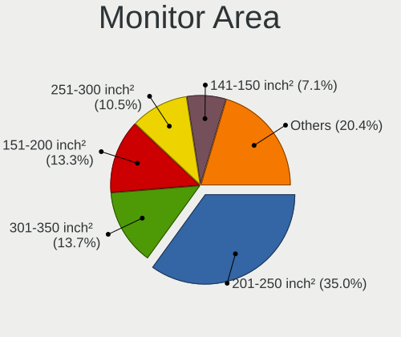

| Area in inch² | Desktops | Percent |
|----------------|----------|---------|
| 201-250        | 163      | 34.98%  |
| 301-350        | 64       | 13.73%  |
| 151-200        | 62       | 13.3%   |
| 251-300        | 49       | 10.52%  |
| 141-150        | 33       | 7.08%   |
| Unknown        | 30       | 6.44%   |
| 351-500        | 26       | 5.58%   |
| More than 1000 | 23       | 4.94%   |
| 501-1000       | 11       | 2.36%   |
| 101-110        | 3        | 0.64%   |
| 51-60          | 1        | 0.21%   |
| 111-120        | 1        | 0.21%   |

Pixel Density
-------------

Pixels per inch

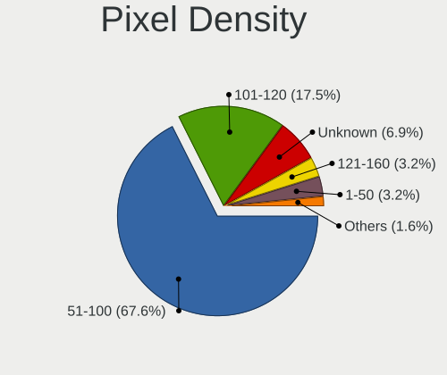

| Density | Desktops | Percent |
|---------|----------|---------|
| 51-100  | 294      | 67.59%  |
| 101-120 | 76       | 17.47%  |
| Unknown | 30       | 6.9%    |
| 1-50    | 14       | 3.22%   |
| 121-160 | 14       | 3.22%   |
| 161-240 | 7        | 1.61%   |

Multiple Monitors
-----------------

Total monitors connected

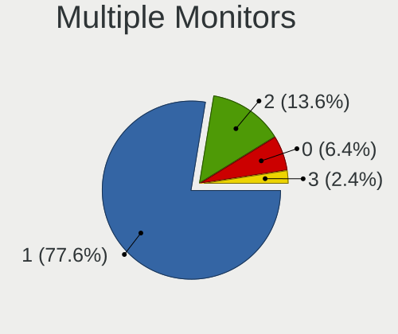

| Total | Desktops | Percent |
|-------|----------|---------|
| 1     | 353      | 77.58%  |
| 2     | 62       | 13.63%  |
| 0     | 29       | 6.37%   |
| 3     | 11       | 2.42%   |

Network
-------

Net Controller Vendor
---------------------

Controller vendors

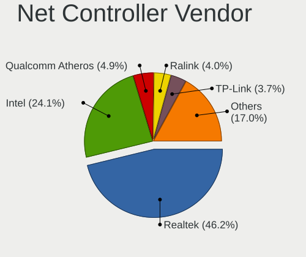

| Vendor                                 | Desktops | Percent |
|----------------------------------------|----------|---------|
| Realtek Semiconductor                  | 274      | 46.21%  |
| Intel                                  | 143      | 24.11%  |
| Qualcomm Atheros                       | 29       | 4.89%   |
| Ralink Technology                      | 24       | 4.05%   |
| TP-Link                                | 22       | 3.71%   |
| Broadcom                               | 15       | 2.53%   |
| Nvidia                                 | 14       | 2.36%   |
| Qualcomm Atheros Communications        | 10       | 1.69%   |
| MediaTek                               | 10       | 1.69%   |
| Marvell Technology Group               | 7        | 1.18%   |
| ASIX Electronics                       | 5        | 0.84%   |
| Xiaomi                                 | 4        | 0.67%   |
| Broadcom Limited                       | 4        | 0.67%   |
| ASUSTek Computer                       | 3        | 0.51%   |
| ZyXEL Communications                   | 2        | 0.34%   |
| VIA Technologies                       | 2        | 0.34%   |
| Edimax Technology                      | 2        | 0.34%   |
| ZTE WCDMA Technologies MSM             | 1        | 0.17%   |
| WiseGroup                              | 1        | 0.17%   |
| ULi Electronics                        | 1        | 0.17%   |
| Texas Instruments                      | 1        | 0.17%   |
| Sony Ericsson Mobile Communications AB | 1        | 0.17%   |
| Seeed Technology                       | 1        | 0.17%   |
| Samsung Electronics                    | 1        | 0.17%   |
| Qualcomm Technologies                  | 1        | 0.17%   |
| QinHeng Electronics                    | 1        | 0.17%   |
| Pulse-Eight                            | 1        | 0.17%   |
| Prestigio                              | 1        | 0.17%   |
| National Semiconductor                 | 1        | 0.17%   |
| Motorola PCS                           | 1        | 0.17%   |
| Microsoft                              | 1        | 0.17%   |
| Micro Star International               | 1        | 0.17%   |
| Mercucys                               | 1        | 0.17%   |
| Mellanox Technologies                  | 1        | 0.17%   |
| Huawei Technologies                    | 1        | 0.17%   |
| Dresden Elektronik                     | 1        | 0.17%   |
| D-Link                                 | 1        | 0.17%   |
| Aquantia                               | 1        | 0.17%   |
| Accton Technology                      | 1        | 0.17%   |
| Unknown                                | 1        | 0.17%   |

Net Controller Model
--------------------

Controller models

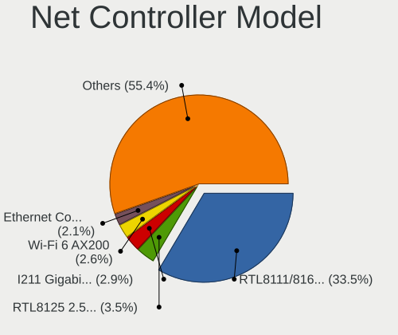

| Model                                                                  | Desktops | Percent |
|------------------------------------------------------------------------|----------|---------|
| Realtek RTL8111/8168/8211/8411 PCI Express Gigabit Ethernet Controller | 221      | 33.54%  |
| Realtek RTL8125 2.5GbE Controller                                      | 23       | 3.49%   |
| Intel I211 Gigabit Network Connection                                  | 19       | 2.88%   |
| Intel Wi-Fi 6 AX200                                                    | 17       | 2.58%   |
| Intel Ethernet Controller I225-V                                       | 14       | 2.12%   |
| Intel 82579LM Gigabit Network Connection (Lewisville)                  | 14       | 2.12%   |
| Intel Ethernet Connection (2) I219-V                                   | 13       | 1.97%   |
| Realtek RTL-8100/8101L/8139 PCI Fast Ethernet Adapter                  | 12       | 1.82%   |
| Ralink MT7601U Wireless Adapter                                        | 11       | 1.67%   |
| Qualcomm Atheros AR9271 802.11n                                        | 10       | 1.52%   |
| Intel 82579V Gigabit Network Connection                                | 10       | 1.52%   |
| Realtek RTL8169 PCI Gigabit Ethernet Controller                        | 9        | 1.37%   |
| TP-Link TL-WN722N v2/v3 [Realtek RTL8188EUS]                           | 7        | 1.06%   |
| Ralink RT2870/RT3070 Wireless Adapter                                  | 7        | 1.06%   |
| Nvidia MCP61 Ethernet                                                  | 7        | 1.06%   |
| Intel Ethernet Connection I217-LM                                      | 7        | 1.06%   |
| Intel Ethernet Connection (2) I219-LM                                  | 7        | 1.06%   |
| Realtek RTL810xE PCI Express Fast Ethernet controller                  | 6        | 0.91%   |
| Intel Ethernet Connection (7) I219-V                                   | 6        | 0.91%   |
| TP-Link Archer T2U PLUS [RTL8821AU]                                    | 5        | 0.76%   |
| Marvell Group 88E8056 PCI-E Gigabit Ethernet Controller                | 5        | 0.76%   |
| Intel Ethernet Controller I226-V                                       | 5        | 0.76%   |
| Intel Dual Band Wireless-AC 3168NGW [Stone Peak]                       | 5        | 0.76%   |
| TP-Link TL-WN822N Version 4 RTL8192EU                                  | 4        | 0.61%   |
| Realtek RTL8153 Gigabit Ethernet Adapter                               | 4        | 0.61%   |
| Qualcomm Atheros Killer E220x Gigabit Ethernet Controller              | 4        | 0.61%   |
| Intel Wi-Fi 6E(802.11ax) AX210/AX1675* 2x2 [Typhoon Peak]              | 4        | 0.61%   |
| Intel I210 Gigabit Network Connection                                  | 4        | 0.61%   |
| Intel 82567LM-3 Gigabit Network Connection                             | 4        | 0.61%   |
| Intel 82566DM-2 Gigabit Network Connection                             | 4        | 0.61%   |
| Intel 700 Series Chipset CNVi WiFi                                     | 4        | 0.61%   |
| Realtek RTL8821AE 802.11ac PCIe Wireless Network Adapter               | 3        | 0.46%   |
| Ralink RT5370 Wireless Adapter                                         | 3        | 0.46%   |
| Qualcomm Atheros AR8121/AR8113/AR8114 Gigabit or Fast Ethernet         | 3        | 0.46%   |
| MediaTek MT7922 802.11ax PCI Express Wireless Network Adapter          | 3        | 0.46%   |
| MediaTek MT7921 802.11ax PCIe Wireless Network Adapter [Filogic 330]   | 3        | 0.46%   |
| Intel Wireless 8260                                                    | 3        | 0.46%   |
| Intel Wi-Fi 7(802.11be) AX1775*/AX1790*/BE20*/BE401/BE1750* 2x2        | 3        | 0.46%   |
| Broadcom NetLink BCM57780 Gigabit Ethernet PCIe                        | 3        | 0.46%   |
| ZyXEL NWD-270N Wireless N-lite USB Adapter                             | 2        | 0.3%    |

Wireless Vendor
---------------

Wireless vendors

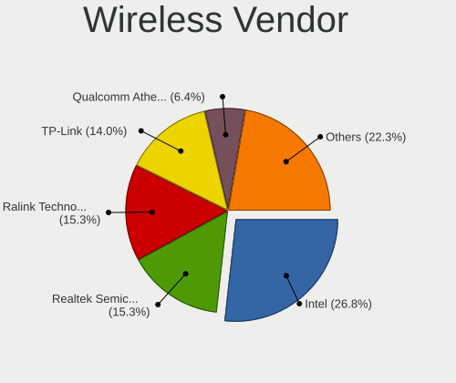

| Vendor                          | Desktops | Percent |
|---------------------------------|----------|---------|
| Intel                           | 42       | 26.75%  |
| Realtek Semiconductor           | 24       | 15.29%  |
| Ralink Technology               | 24       | 15.29%  |
| TP-Link                         | 22       | 14.01%  |
| Qualcomm Atheros Communications | 10       | 6.37%   |
| Qualcomm Atheros                | 9        | 5.73%   |
| MediaTek                        | 8        | 5.1%    |
| Broadcom                        | 5        | 3.18%   |
| ASUSTek Computer                | 3        | 1.91%   |
| ZyXEL Communications            | 2        | 1.27%   |
| Edimax Technology               | 2        | 1.27%   |
| Texas Instruments               | 1        | 0.64%   |
| Microsoft                       | 1        | 0.64%   |
| Micro Star International        | 1        | 0.64%   |
| Mercucys                        | 1        | 0.64%   |
| D-Link                          | 1        | 0.64%   |
| Accton Technology               | 1        | 0.64%   |

Wireless Model
--------------

Wireless models

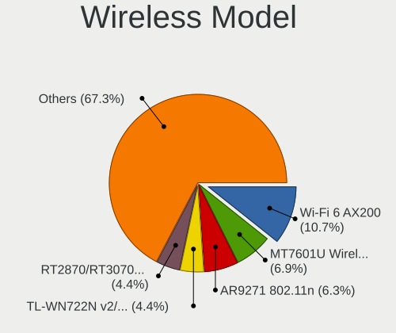

| Model                                                                         | Desktops | Percent |
|-------------------------------------------------------------------------------|----------|---------|
| Intel Wi-Fi 6 AX200                                                           | 17       | 10.69%  |
| Ralink MT7601U Wireless Adapter                                               | 11       | 6.92%   |
| Qualcomm Atheros AR9271 802.11n                                               | 10       | 6.29%   |
| TP-Link TL-WN722N v2/v3 [Realtek RTL8188EUS]                                  | 7        | 4.4%    |
| Ralink RT2870/RT3070 Wireless Adapter                                         | 7        | 4.4%    |
| TP-Link Archer T2U PLUS [RTL8821AU]                                           | 5        | 3.14%   |
| Intel Dual Band Wireless-AC 3168NGW [Stone Peak]                              | 5        | 3.14%   |
| TP-Link TL-WN822N Version 4 RTL8192EU                                         | 4        | 2.52%   |
| Intel Wi-Fi 6E(802.11ax) AX210/AX1675* 2x2 [Typhoon Peak]                     | 4        | 2.52%   |
| Intel 700 Series Chipset CNVi WiFi                                            | 4        | 2.52%   |
| Realtek RTL8821AE 802.11ac PCIe Wireless Network Adapter                      | 3        | 1.89%   |
| Ralink RT5370 Wireless Adapter                                                | 3        | 1.89%   |
| MediaTek MT7922 802.11ax PCI Express Wireless Network Adapter                 | 3        | 1.89%   |
| MediaTek MT7921 802.11ax PCIe Wireless Network Adapter [Filogic 330]          | 3        | 1.89%   |
| Intel Wireless 8260                                                           | 3        | 1.89%   |
| ZyXEL NWD-270N Wireless N-lite USB Adapter                                    | 2        | 1.26%   |
| TP-Link TL-WN823N v2/v3 [Realtek RTL8192EU]                                   | 2        | 1.26%   |
| Realtek RTL8188GU 802.11n WLAN Adapter (After Modeswitch)                     | 2        | 1.26%   |
| Realtek RTL8188EUS 802.11n Wireless Network Adapter                           | 2        | 1.26%   |
| Realtek RTL8188CUS 802.11n WLAN Adapter                                       | 2        | 1.26%   |
| Realtek RTL8188CE 802.11b/g/n WiFi Adapter                                    | 2        | 1.26%   |
| Qualcomm Atheros AR9227 Wireless Network Adapter                              | 2        | 1.26%   |
| Qualcomm Atheros AR2413/AR2414 Wireless Network Adapter [AR5005G(S) 802.11bg] | 2        | 1.26%   |
| Intel Wi-Fi 7(802.11be) AX1775*/AX1790*/BE20*/BE401/BE1750* 2x2               | 2        | 1.26%   |
| Intel Wi-Fi 5(802.11ac) Wireless-AC 9x6x [Thunder Peak]                       | 2        | 1.26%   |
| Broadcom BCM4360 802.11ac Dual Band Wireless Network Adapter                  | 2        | 1.26%   |
| ASUS USB-N14 802.11b/g/n (2x2) Wireless Adapter [Ralink RT5372]               | 2        | 1.26%   |
| TP-Link TL-WN821N v5/v6 [RTL8192EU]                                           | 1        | 0.63%   |
| TP-Link Archer T4U v2 [Realtek RTL8812AU]                                     | 1        | 0.63%   |
| TP-Link Archer T3U [Realtek RTL8812BU]                                        | 1        | 0.63%   |
| TP-Link AC600 wireless Realtek RTL8811AU [Archer T2U Nano]                    | 1        | 0.63%   |
| TP-Link 802.11ac NIC                                                          | 1        | 0.63%   |
| Texas Instruments ACX 111 54Mbps Wireless Interface                           | 1        | 0.63%   |
| Realtek RTL88x2bu [AC1200 Techkey]                                            | 1        | 0.63%   |
| Realtek RTL8822CE 802.11ac PCIe Wireless Network Adapter                      | 1        | 0.63%   |
| Realtek RTL8822BE 802.11a/b/g/n/ac WiFi adapter                               | 1        | 0.63%   |
| Realtek RTL8811AU 802.11a/b/g/n/ac WLAN Adapter                               | 1        | 0.63%   |
| Realtek RTL8723BE PCIe Wireless Network Adapter                               | 1        | 0.63%   |
| Realtek RTL8192EU 802.11b/g/n WLAN Adapter                                    | 1        | 0.63%   |
| Realtek RTL8192EE PCIe Wireless Network Adapter                               | 1        | 0.63%   |

Ethernet Vendor
---------------

Ethernet vendors

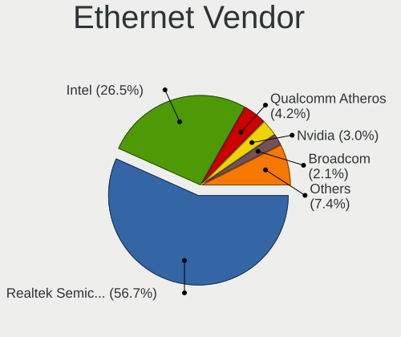

| Vendor                                 | Desktops | Percent |
|----------------------------------------|----------|---------|
| Realtek Semiconductor                  | 267      | 56.69%  |
| Intel                                  | 125      | 26.54%  |
| Qualcomm Atheros                       | 20       | 4.25%   |
| Nvidia                                 | 14       | 2.97%   |
| Broadcom                               | 10       | 2.12%   |
| Marvell Technology Group               | 7        | 1.49%   |
| ASIX Electronics                       | 5        | 1.06%   |
| Xiaomi                                 | 4        | 0.85%   |
| Broadcom Limited                       | 4        | 0.85%   |
| VIA Technologies                       | 2        | 0.42%   |
| MediaTek                               | 2        | 0.42%   |
| ZTE WCDMA Technologies MSM             | 1        | 0.21%   |
| Sony Ericsson Mobile Communications AB | 1        | 0.21%   |
| Samsung Electronics                    | 1        | 0.21%   |
| Qualcomm Technologies                  | 1        | 0.21%   |
| QinHeng Electronics                    | 1        | 0.21%   |
| Prestigio                              | 1        | 0.21%   |
| National Semiconductor                 | 1        | 0.21%   |
| Motorola PCS                           | 1        | 0.21%   |
| Mellanox Technologies                  | 1        | 0.21%   |
| Huawei Technologies                    | 1        | 0.21%   |
| Aquantia                               | 1        | 0.21%   |

Ethernet Model
--------------

Ethernet models

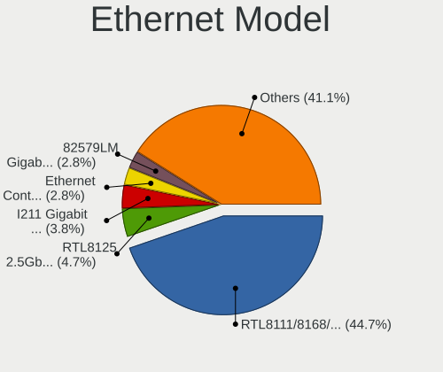

| Model                                                                  | Desktops | Percent |
|------------------------------------------------------------------------|----------|---------|
| Realtek RTL8111/8168/8211/8411 PCI Express Gigabit Ethernet Controller | 221      | 44.74%  |
| Realtek RTL8125 2.5GbE Controller                                      | 23       | 4.66%   |
| Intel I211 Gigabit Network Connection                                  | 19       | 3.85%   |
| Intel Ethernet Controller I225-V                                       | 14       | 2.83%   |
| Intel 82579LM Gigabit Network Connection (Lewisville)                  | 14       | 2.83%   |
| Intel Ethernet Connection (2) I219-V                                   | 13       | 2.63%   |
| Realtek RTL-8100/8101L/8139 PCI Fast Ethernet Adapter                  | 12       | 2.43%   |
| Intel 82579V Gigabit Network Connection                                | 10       | 2.02%   |
| Realtek RTL8169 PCI Gigabit Ethernet Controller                        | 9        | 1.82%   |
| Nvidia MCP61 Ethernet                                                  | 7        | 1.42%   |
| Intel Ethernet Connection I217-LM                                      | 7        | 1.42%   |
| Intel Ethernet Connection (2) I219-LM                                  | 7        | 1.42%   |
| Realtek RTL810xE PCI Express Fast Ethernet controller                  | 6        | 1.21%   |
| Intel Ethernet Connection (7) I219-V                                   | 6        | 1.21%   |
| Marvell Group 88E8056 PCI-E Gigabit Ethernet Controller                | 5        | 1.01%   |
| Intel Ethernet Controller I226-V                                       | 5        | 1.01%   |
| Realtek RTL8153 Gigabit Ethernet Adapter                               | 4        | 0.81%   |
| Qualcomm Atheros Killer E220x Gigabit Ethernet Controller              | 4        | 0.81%   |
| Intel I210 Gigabit Network Connection                                  | 4        | 0.81%   |
| Intel 82567LM-3 Gigabit Network Connection                             | 4        | 0.81%   |
| Intel 82566DM-2 Gigabit Network Connection                             | 4        | 0.81%   |
| Qualcomm Atheros AR8121/AR8113/AR8114 Gigabit or Fast Ethernet         | 3        | 0.61%   |
| Broadcom NetLink BCM57780 Gigabit Ethernet PCIe                        | 3        | 0.61%   |
| Xiaomi Mi/Redmi series (RNDIS)                                         | 2        | 0.4%    |
| Xiaomi Mi/Redmi series (RNDIS + ADB)                                   | 2        | 0.4%    |
| VIA VT6102/VT6103 [Rhine-II]                                           | 2        | 0.4%    |
| Realtek RTL8852BE PCIe 802.11ax Wireless Network Controller            | 2        | 0.4%    |
| Realtek RTL-8110SC/8169SC Gigabit Ethernet                             | 2        | 0.4%    |
| Qualcomm Atheros Killer E2400 Gigabit Ethernet Controller              | 2        | 0.4%    |
| Qualcomm Atheros Attansic L2 Fast Ethernet                             | 2        | 0.4%    |
| Qualcomm Atheros Attansic L1 Gigabit Ethernet                          | 2        | 0.4%    |
| Qualcomm Atheros AR8161 Gigabit Ethernet                               | 2        | 0.4%    |
| Qualcomm Atheros AR8151 v2.0 Gigabit Ethernet                          | 2        | 0.4%    |
| Nvidia MCP77 Ethernet                                                  | 2        | 0.4%    |
| MediaTek Infinix HOT 50i                                               | 2        | 0.4%    |
| Intel Ethernet Connection (2) I218-V                                   | 2        | 0.4%    |
| Intel 82578DC Gigabit Network Connection                               | 2        | 0.4%    |
| Intel 82574L Gigabit Network Connection                                | 2        | 0.4%    |
| Intel 82562V-2 10/100 Network Connection                               | 2        | 0.4%    |
| Broadcom NetXtreme BCM5761 Gigabit Ethernet PCIe                       | 2        | 0.4%    |

Net Controller Kind
-------------------

Ethernet, WiFi or modem

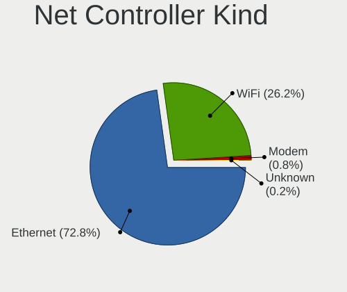

| Kind     | Desktops | Percent |
|----------|----------|---------|
| Ethernet | 431      | 72.8%   |
| WiFi     | 155      | 26.18%  |
| Modem    | 5        | 0.84%   |
| Unknown  | 1        | 0.17%   |

Used Controller
---------------

Currently used network controller

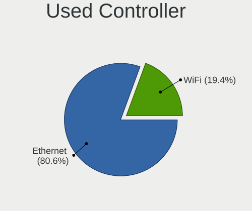

| Kind     | Desktops | Percent |
|----------|----------|---------|
| Ethernet | 357      | 80.59%  |
| WiFi     | 86       | 19.41%  |

NICs
----

Total network controllers on board

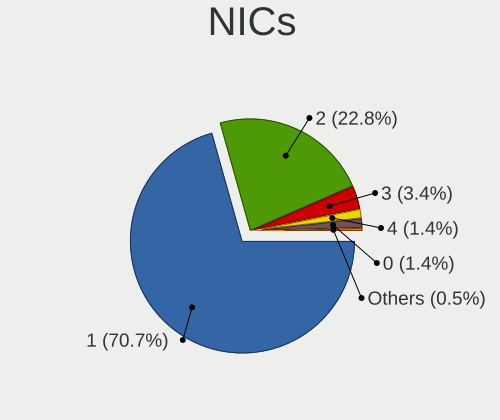

| Total | Desktops | Percent |
|-------|----------|---------|
| 1     | 313      | 70.65%  |
| 2     | 101      | 22.8%   |
| 3     | 15       | 3.39%   |
| 4     | 6        | 1.35%   |
| 0     | 6        | 1.35%   |
| 6     | 1        | 0.23%   |
| 5     | 1        | 0.23%   |

IPv6
----

IPv6 vs IPv4

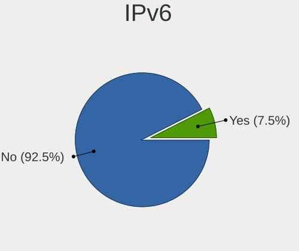

| Used | Desktops | Percent |
|------|----------|---------|
| No   | 409      | 92.53%  |
| Yes  | 33       | 7.47%   |

Bluetooth
---------

Bluetooth Vendor
----------------

Controller vendors

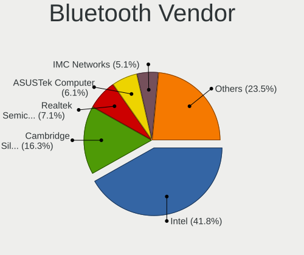

| Vendor                          | Desktops | Percent |
|---------------------------------|----------|---------|
| Intel                           | 41       | 41.84%  |
| Cambridge Silicon Radio         | 16       | 16.33%  |
| Realtek Semiconductor           | 7        | 7.14%   |
| ASUSTek Computer                | 6        | 6.12%   |
| IMC Networks                    | 5        | 5.1%    |
| Foxconn / Hon Hai               | 4        | 4.08%   |
| Broadcom                        | 4        | 4.08%   |
| TP-Link                         | 3        | 3.06%   |
| Qualcomm Atheros Communications | 2        | 2.04%   |
| Micro Star International        | 2        | 2.04%   |
| HTC (High Tech Computer)        | 2        | 2.04%   |
| Mercucys                        | 1        | 1.02%   |
| Integrated System Solution      | 1        | 1.02%   |
| Edimax Technology               | 1        | 1.02%   |
| Belkin Components               | 1        | 1.02%   |
| Apple                           | 1        | 1.02%   |
| Actions                         | 1        | 1.02%   |

Bluetooth Model
---------------

Controller models

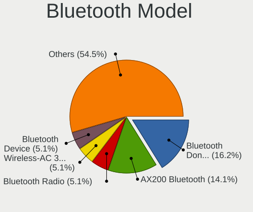

| Model                                                                | Desktops | Percent |
|----------------------------------------------------------------------|----------|---------|
| Cambridge Silicon Radio Bluetooth Dongle (HCI mode)                  | 16       | 16.16%  |
| Intel AX200 Bluetooth                                                | 14       | 14.14%  |
| Realtek Bluetooth Radio                                              | 5        | 5.05%   |
| Intel Wireless-AC 3168 Bluetooth                                     | 5        | 5.05%   |
| Intel Bluetooth Device                                               | 5        | 5.05%   |
| Intel AX210 Bluetooth                                                | 5        | 5.05%   |
| Intel AX201 Bluetooth                                                | 5        | 5.05%   |
| IMC Networks Wireless_Device                                         | 4        | 4.04%   |
| TP-Link TP-T@- UB500 Adapter                                         | 3        | 3.03%   |
| Intel Bluetooth wireless interface                                   | 3        | 3.03%   |
| Foxconn / Hon Hai Wireless_Device                                    | 3        | 3.03%   |
| Broadcom BCM2045 Bluetooth                                           | 3        | 3.03%   |
| Micro Star International Bluetooth Device                            | 2        | 2.02%   |
| Intel Wireless-AC 9260 Bluetooth Adapter                             | 2        | 2.02%   |
| Intel Centrino Bluetooth Wireless Transceiver                        | 2        | 2.02%   |
| HTC (High Tech Computer) Vive Hub Bluetooth 4.1 (Broadcom BCM920703) | 2        | 2.02%   |
| ASUS Bluetooth Radio                                                 | 2        | 2.02%   |
| Realtek RTL8821A Bluetooth                                           | 1        | 1.01%   |
| Realtek RTL8723B Bluetooth                                           | 1        | 1.01%   |
| Qualcomm Atheros  Bluetooth Device                                   | 1        | 1.01%   |
| Qualcomm Atheros AR3011 Bluetooth                                    | 1        | 1.01%   |
| Mercucys Mercusys MA530 Adapter                                      | 1        | 1.01%   |
| Intel Bluetooth 9460/9560 Jefferson Peak (JfP)                       | 1        | 1.01%   |
| Integrated System Solution Bluetooth Device                          | 1        | 1.01%   |
| IMC Networks Bluetooth Radio                                         | 1        | 1.01%   |
| Foxconn / Hon Hai Bluetooth Device                                   | 1        | 1.01%   |
| Edimax Wi-Fi AC600 Bluetooth4.0 USB Adapter                          | 1        | 1.01%   |
| Broadcom HP Portable Bumble Bee                                      | 1        | 1.01%   |
| Belkin Components Bluetooth Mini Dongle                              | 1        | 1.01%   |
| ASUS Broadcom BCM20702A0 Bluetooth                                   | 1        | 1.01%   |
| ASUS Bluetooth Adapter                                               | 1        | 1.01%   |
| ASUS BCM20702A0                                                      | 1        | 1.01%   |
| ASUS ASUS USB-BT500                                                  | 1        | 1.01%   |
| Apple Bluetooth Host Controller                                      | 1        | 1.01%   |
| Actions general adapter                                              | 1        | 1.01%   |

Sound
-----

Sound Vendor
------------

Sound card vendors

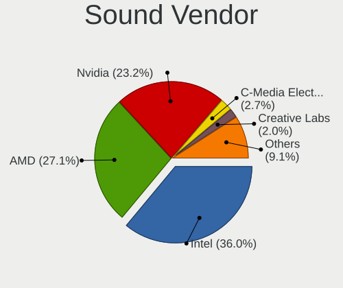

| Vendor                                       | Desktops | Percent |
|----------------------------------------------|----------|---------|
| Intel                                        | 258      | 36.03%  |
| AMD                                          | 194      | 27.09%  |
| Nvidia                                       | 166      | 23.18%  |
| C-Media Electronics                          | 19       | 2.65%   |
| Creative Labs                                | 14       | 1.96%   |
| Creative Technology                          | 7        | 0.98%   |
| ASUSTek Computer                             | 7        | 0.98%   |
| VIA Technologies                             | 5        | 0.7%    |
| Logitech                                     | 4        | 0.56%   |
| JMTek                                        | 4        | 0.56%   |
| Zoran Co. Personal Media Division (Nogatech) | 3        | 0.42%   |
| Micro Star International                     | 3        | 0.42%   |
| Texas Instruments                            | 2        | 0.28%   |
| SteelSeries ApS                              | 2        | 0.28%   |
| Lenovo                                       | 2        | 0.28%   |
| Hewlett-Packard                              | 2        | 0.28%   |
| GN Netcom                                    | 2        | 0.28%   |
| Focusrite-Novation                           | 2        | 0.28%   |
| Blue Microphones                             | 2        | 0.28%   |
| Yamaha                                       | 1        | 0.14%   |
| XMOS                                         | 1        | 0.14%   |
| Valve Software                               | 1        | 0.14%   |
| ULi Electronics                              | 1        | 0.14%   |
| Trust                                        | 1        | 0.14%   |
| Nordic Semiconductor ASA                     | 1        | 0.14%   |
| M-Audio                                      | 1        | 0.14%   |
| Kingston Technology                          | 1        | 0.14%   |
| Jieli Technology                             | 1        | 0.14%   |
| Huawei Technologies                          | 1        | 0.14%   |
| Fortemedia                                   | 1        | 0.14%   |
| Conexant Systems                             | 1        | 0.14%   |
| Comtrue                                      | 1        | 0.14%   |
| Barco Display Systems                        | 1        | 0.14%   |
| AOKEO                                        | 1        | 0.14%   |
| AKAI Professional M.I.                       | 1        | 0.14%   |
| A4Tech                                       | 1        | 0.14%   |
| Unknown                                      | 1        | 0.14%   |

Sound Model
-----------

Sound card models

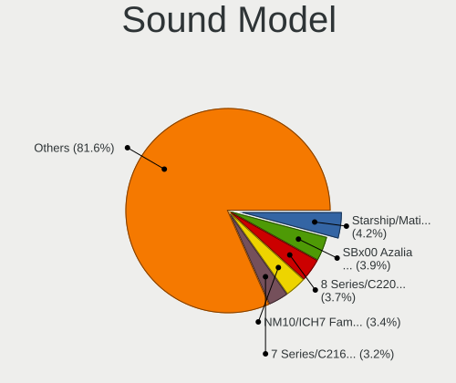

| Model                                                                             | Desktops | Percent |
|-----------------------------------------------------------------------------------|----------|---------|
| AMD Starship/Matisse HD Audio Controller                                          | 35       | 4.15%   |
| AMD SBx00 Azalia (Intel HDA)                                                      | 33       | 3.91%   |
| Intel 8 Series/C220 Series Chipset High Definition Audio Controller               | 31       | 3.68%   |
| Intel NM10/ICH7 Family High Definition Audio Controller                           | 29       | 3.44%   |
| Intel 7 Series/C216 Chipset Family High Definition Audio Controller               | 27       | 3.2%    |
| Intel 6 Series/C200 Series Chipset Family High Definition Audio Controller        | 27       | 3.2%    |
| Intel Xeon E3-1200 v3/4th Gen Core Processor HD Audio Controller                  | 24       | 2.85%   |
| AMD Ryzen HD Audio Controller                                                     | 24       | 2.85%   |
| Nvidia GK208 HDMI/DP Audio Controller                                             | 23       | 2.73%   |
| Intel 100 Series/C230 Series Chipset Family HD Audio Controller                   | 22       | 2.61%   |
| AMD FCH Azalia Controller                                                         | 18       | 2.14%   |
| Intel 200 Series PCH HD Audio                                                     | 17       | 2.02%   |
| Intel 82801JI (ICH10 Family) HD Audio Controller                                  | 15       | 1.78%   |
| AMD Family 17h (Models 00h-0fh) HD Audio Controller                               | 15       | 1.78%   |
| AMD Renoir/Cezanne HDMI/DP Audio Controller                                       | 14       | 1.66%   |
| Intel 82801I (ICH9 Family) HD Audio Controller                                    | 13       | 1.54%   |
| Nvidia GF108 High Definition Audio Controller                                     | 12       | 1.42%   |
| Intel Cannon Lake PCH cAVS                                                        | 12       | 1.42%   |
| AMD Navi 21/23 HDMI/DP Audio Controller                                           | 12       | 1.42%   |
| Nvidia GP106 High Definition Audio Controller                                     | 11       | 1.3%    |
| AMD Oland/Hainan/Cape Verde/Pitcairn HDMI Audio [Radeon HD 7000 Series]           | 11       | 1.3%    |
| AMD Navi 10 HDMI Audio                                                            | 11       | 1.3%    |
| AMD Ellesmere HDMI Audio [Radeon RX 470/480 / 570/580/590]                        | 11       | 1.3%    |
| Nvidia High Definition Audio Controller                                           | 10       | 1.19%   |
| Nvidia MCP61 High Definition Audio                                                | 9        | 1.07%   |
| Nvidia GP107GL High Definition Audio Controller                                   | 9        | 1.07%   |
| Intel 5 Series/3400 Series Chipset High Definition Audio                          | 8        | 0.95%   |
| AMD Raven/Raven2/Fenghuang HDMI/DP Audio Controller                               | 8        | 0.95%   |
| AMD Baffin HDMI/DP Audio [Radeon RX 550 640SP / RX 560/560X]                      | 8        | 0.95%   |
| Nvidia TU116 High Definition Audio Controller                                     | 7        | 0.83%   |
| Nvidia GP108 High Definition Audio Controller                                     | 7        | 0.83%   |
| Nvidia GP104 High Definition Audio Controller                                     | 7        | 0.83%   |
| Nvidia GK107 HDMI Audio Controller                                                | 7        | 0.83%   |
| Nvidia GA104 High Definition Audio Controller                                     | 7        | 0.83%   |
| Intel Alder Lake-S HD Audio Controller                                            | 7        | 0.83%   |
| Intel 9 Series Chipset Family HD Audio Controller                                 | 7        | 0.83%   |
| AMD Juniper HDMI Audio [Radeon HD 5700 Series]                                    | 7        | 0.83%   |
| AMD Cedar HDMI Audio [Radeon HD 5400/6300/7300 Series]                            | 7        | 0.83%   |
| AMD Caicos HDMI Audio [Radeon HD 6450 / 7450/8450/8490 OEM / R5 230/235/235X OEM] | 7        | 0.83%   |
| Nvidia GM107 High Definition Audio Controller [GeForce 940MX]                     | 6        | 0.71%   |

Memory
------

Memory Vendor
-------------

Memory module vendors

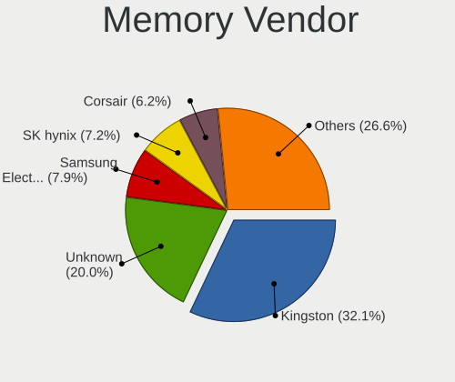

| Vendor                       | Desktops | Percent |
|------------------------------|----------|---------|
| Kingston                     | 93       | 32.07%  |
| Unknown                      | 58       | 20%     |
| Samsung Electronics          | 23       | 7.93%   |
| SK hynix                     | 21       | 7.24%   |
| Corsair                      | 18       | 6.21%   |
| Crucial                      | 17       | 5.86%   |
| Patriot                      | 11       | 3.79%   |
| Unknown                      | 11       | 3.79%   |
| Micron Technology            | 10       | 3.45%   |
| G.Skill                      | 9        | 3.1%    |
| Elpida                       | 5        | 1.72%   |
| A-DATA Technology            | 3        | 1.03%   |
| Patriot Memory (PDP Systems) | 2        | 0.69%   |
| Hewlett-Packard              | 2        | 0.69%   |
| Uroad                        | 1        | 0.34%   |
| Unknown (ABCD)               | 1        | 0.34%   |
| Unknown (8AC8)               | 1        | 0.34%   |
| Transcend                    | 1        | 0.34%   |
| Ramaxel Technology           | 1        | 0.34%   |
| Patriot Memory               | 1        | 0.34%   |
| Nanya Technology             | 1        | 0.34%   |

Memory Model
------------

Memory module models

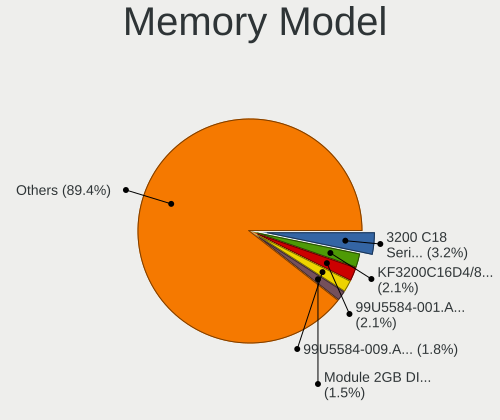

| Model                                                 | Desktops | Percent |
|-------------------------------------------------------|----------|---------|
| Unknown                                               | 11       | 3.23%   |
| Kingston RAM KF3200C16D4/8GX 8GiB DIMM DDR4 3600MT/s  | 7        | 2.05%   |
| Kingston RAM 99U5584-001.A00LF 4GB DIMM DDR3 1600MT/s | 7        | 2.05%   |
| Kingston RAM 99U5584-009.A00LF 4GB DIMM DDR3 1600MT/s | 6        | 1.76%   |
| Unknown RAM Module 2GB DIMM 800MT/s                   | 5        | 1.47%   |
| Kingston RAM KHX3200C16D4/8GX 8GB DIMM DDR4 3733MT/s  | 5        | 1.47%   |
| Kingston RAM KHX1600C9D3/4GX 4GB DIMM DDR3 1867MT/s   | 5        | 1.47%   |
| Unknown RAM Module 2048MB DIMM DDR2 800MT/s           | 4        | 1.17%   |
| Unknown RAM Module 2048MB DIMM DDR2 333MT/s           | 3        | 0.88%   |
| Unknown RAM Module 2048MB DIMM 800MT/s                | 3        | 0.88%   |
| SK hynix RAM HMT351U6EFR8C-PB 4GB DIMM DDR3 1600MT/s  | 3        | 0.88%   |
| Samsung RAM M378B5773DH0-CH9 2GB DIMM DDR3 1333MT/s   | 3        | 0.88%   |
| Kingston RAM KHX2666C16/8G 8GiB DIMM DDR4 3466MT/s    | 3        | 0.88%   |
| Kingston RAM KHX1866C10D3/4G 4GB DIMM DDR3 1867MT/s   | 3        | 0.88%   |
| Kingston RAM KF3200C16D4/32GX 32GB DIMM DDR4 3933MT/s | 3        | 0.88%   |
| Kingston RAM KF3200C16D4/16GX 16GB DIMM DDR4 3733MT/s | 3        | 0.88%   |
| Unknown RAM Module 4096MB DIMM DDR3 1600MT/s          | 2        | 0.59%   |
| Unknown RAM Module 2GB DIMM DDR2 800MT/s              | 2        | 0.59%   |
| Unknown RAM Module 2GB DIMM DDR 1066MT/s              | 2        | 0.59%   |
| Unknown RAM Module 2048MB DIMM 667MT/s                | 2        | 0.59%   |
| Unknown RAM Module 2048MB DIMM 1333MT/s               | 2        | 0.59%   |
| Unknown RAM Module 1GB DIMM DDR2 800MT/s              | 2        | 0.59%   |
| Unknown RAM Module 1024MB DIMM DDR 333MT/s            | 2        | 0.59%   |
| Unknown RAM Module 1024MB DIMM 533MT/s                | 2        | 0.59%   |
| SK hynix RAM HYMP164U64CP6-Y5 512MB DIMM DDR2 667MT/s | 2        | 0.59%   |
| SK hynix RAM HMT451U6AFR8C-PB 4GB DIMM DDR3 1600MT/s  | 2        | 0.59%   |
| SK hynix RAM HMT351U6CFR8C-PB 4GB DIMM DDR3 1800MT/s  | 2        | 0.59%   |
| Samsung RAM M378B5773CH0-CH9 2GB DIMM DDR3 1867MT/s   | 2        | 0.59%   |
| Samsung RAM M378B2873EH1-CH9 1GB DIMM DDR3 1334MT/s   | 2        | 0.59%   |
| Kingston RAM KHX1866C9D3/8GX 8GB DIMM DDR3 1866MT/s   | 2        | 0.59%   |
| Kingston RAM KHX1600C9D3/2GX 2GB DIMM DDR3 1600MT/s   | 2        | 0.59%   |
| Kingston RAM KHX1600C10D3/8GX 8GB DIMM DDR3 1600MT/s  | 2        | 0.59%   |
| Kingston RAM KHX1600C10D3/8G 8GB DIMM DDR3 2133MT/s   | 2        | 0.59%   |
| Kingston RAM KF560C40-16 16GB DIMM 6000MT/s           | 2        | 0.59%   |
| Kingston RAM KF556C36-16 16GB DIMM DDR5 12800MT/s     | 2        | 0.59%   |
| Kingston RAM KF2666C15S4/8G 8GB SODIMM DDR4 2667MT/s  | 2        | 0.59%   |
| Kingston RAM 99U5474-016.A00LF 4GB DIMM DDR3 1333MT/s | 2        | 0.59%   |
| Kingston RAM 2G-UDIMM 2GB DIMM DDR2 1639MT/s          | 2        | 0.59%   |
| G.Skill RAM F4-3200C14-8GFX 8GB DIMM DDR4 3800MT/s    | 2        | 0.59%   |
| Elpida RAM EBE10UE8ACWA-6E-E 1024MB DIMM DDR2 667MT/s | 2        | 0.59%   |

Memory Kind
-----------

Memory module kinds

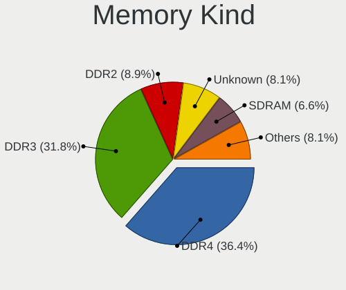

| Kind    | Desktops | Percent |
|---------|----------|---------|
| DDR4    | 94       | 36.43%  |
| DDR3    | 82       | 31.78%  |
| DDR2    | 23       | 8.91%   |
| Unknown | 21       | 8.14%   |
| SDRAM   | 17       | 6.59%   |
| DDR5    | 9        | 3.49%   |
| DDR     | 7        | 2.71%   |
| LPDDR4  | 2        | 0.78%   |
| DRAM    | 2        | 0.78%   |
| LPDDR5  | 1        | 0.39%   |

Memory Form Factor
------------------

Physical design of the memory module

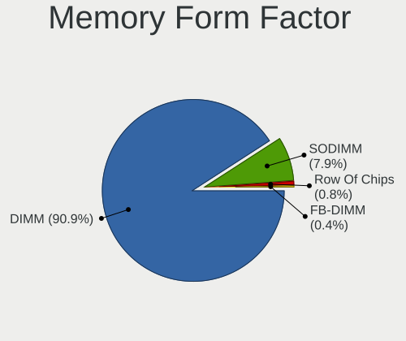

| Name         | Desktops | Percent |
|--------------|----------|---------|
| DIMM         | 229      | 90.87%  |
| SODIMM       | 20       | 7.94%   |
| Row Of Chips | 2        | 0.79%   |
| FB-DIMM      | 1        | 0.4%    |

Memory Size
-----------

Memory module size

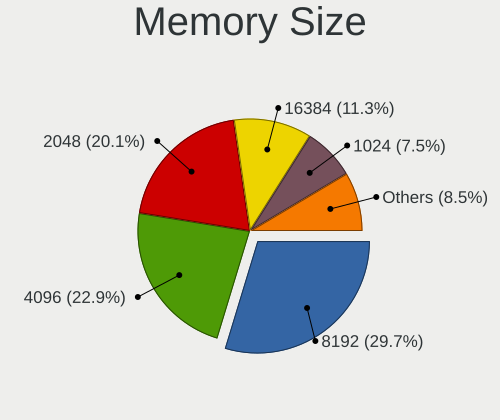

| Size  | Desktops | Percent |
|-------|----------|---------|
| 8192  | 87       | 29.69%  |
| 4096  | 67       | 22.87%  |
| 2048  | 59       | 20.14%  |
| 16384 | 33       | 11.26%  |
| 1024  | 22       | 7.51%   |
| 32768 | 12       | 4.1%    |
| 512   | 6        | 2.05%   |
| 256   | 2        | 0.68%   |
| 65536 | 1        | 0.34%   |
| 49152 | 1        | 0.34%   |
| 3072  | 1        | 0.34%   |
| 128   | 1        | 0.34%   |
| 64    | 1        | 0.34%   |

Memory Speed
------------

Memory module speed

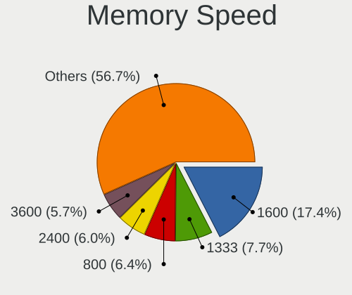

| Speed   | Desktops | Percent |
|---------|----------|---------|
| 1600    | 52       | 17.45%  |
| 1333    | 23       | 7.72%   |
| 800     | 19       | 6.38%   |
| 2400    | 18       | 6.04%   |
| 3600    | 17       | 5.7%    |
| 3200    | 17       | 5.7%    |
| 2133    | 16       | 5.37%   |
| 2667    | 15       | 5.03%   |
| 667     | 14       | 4.7%    |
| 3733    | 9        | 3.02%   |
| 1866    | 6        | 2.01%   |
| 1334    | 6        | 2.01%   |
| 333     | 6        | 2.01%   |
| 3800    | 5        | 1.68%   |
| 1800    | 5        | 1.68%   |
| Unknown | 5        | 1.68%   |
| 3933    | 4        | 1.34%   |
| 3466    | 4        | 1.34%   |
| 3000    | 4        | 1.34%   |
| 1867    | 4        | 1.34%   |
| 1066    | 4        | 1.34%   |
| 400     | 4        | 1.34%   |
| 6000    | 3        | 1.01%   |
| 1639    | 3        | 1.01%   |
| 533     | 3        | 1.01%   |
| 12800   | 2        | 0.67%   |
| 4800    | 2        | 0.67%   |
| 3400    | 2        | 0.67%   |
| 3333    | 2        | 0.67%   |
| 2933    | 2        | 0.67%   |
| 2666    | 2        | 0.67%   |
| 57535   | 1        | 0.34%   |
| 6800    | 1        | 0.34%   |
| 6400    | 1        | 0.34%   |
| 6200    | 1        | 0.34%   |
| 5600    | 1        | 0.34%   |
| 4400    | 1        | 0.34%   |
| 4333    | 1        | 0.34%   |
| 4266    | 1        | 0.34%   |
| 4000    | 1        | 0.34%   |

Printers & scanners
-------------------

Printer Vendor
--------------

Printer device vendors

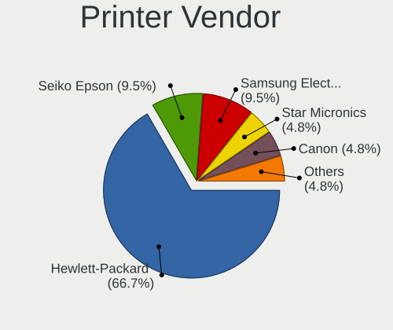

| Vendor              | Desktops | Percent |
|---------------------|----------|---------|
| Hewlett-Packard     | 14       | 66.67%  |
| Seiko Epson         | 2        | 9.52%   |
| Samsung Electronics | 2        | 9.52%   |
| Star Micronics      | 1        | 4.76%   |
| Canon               | 1        | 4.76%   |
| Brother Industries  | 1        | 4.76%   |

Printer Model
-------------

Printer device models

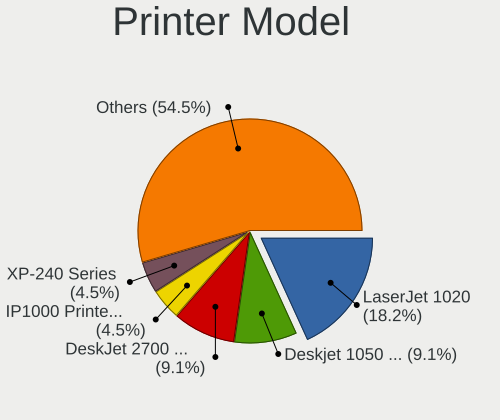

| Model                                           | Desktops | Percent |
|-------------------------------------------------|----------|---------|
| HP LaserJet 1020                                | 4        | 18.18%  |
| HP DeskJet 2700 series                          | 2        | 9.09%   |
| HP Deskjet 1050 J410                            | 2        | 9.09%   |
| Star Micronics IP1000 Printer USB001            | 1        | 4.55%   |
| Seiko Epson XP-240 Series                       | 1        | 4.55%   |
| Seiko Epson L3050 Series                        | 1        | 4.55%   |
| Samsung M262x/M282x Xpress Series Laser Printer | 1        | 4.55%   |
| Samsung M2020 Series                            | 1        | 4.55%   |
| HP OfficeJet 6950                               | 1        | 4.55%   |
| HP LaserJet M14-M17                             | 1        | 4.55%   |
| HP LaserJet 1150                                | 1        | 4.55%   |
| HP LaserJet 1010                                | 1        | 4.55%   |
| HP HP LaserJet M101-M106                        | 1        | 4.55%   |
| HP DeskJet 3700 series                          | 1        | 4.55%   |
| HP Deskjet 1510                                 | 1        | 4.55%   |
| Canon PIXMA MP230                               | 1        | 4.55%   |
| Brother HL-L2350DW series                       | 1        | 4.55%   |

Scanner Vendor
--------------

Scanner device vendors

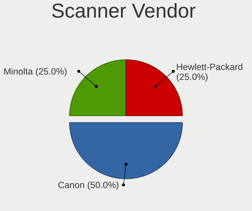

| Vendor          | Desktops | Percent |
|-----------------|----------|---------|
| Canon           | 2        | 50%     |
| Minolta         | 1        | 25%     |
| Hewlett-Packard | 1        | 25%     |

Scanner Model
-------------

Scanner device models

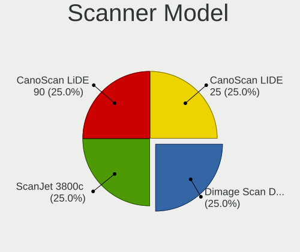

| Model                                       | Desktops | Percent |
|---------------------------------------------|----------|---------|
| Minolta Dimage Scan Dual III AF-2840 (2889) | 1        | 25%     |
| HP ScanJet 3800c                            | 1        | 25%     |
| Canon CanoScan LiDE 90                      | 1        | 25%     |
| Canon CanoScan LIDE 25                      | 1        | 25%     |

Camera
------

Camera Vendor
-------------

Camera device vendors

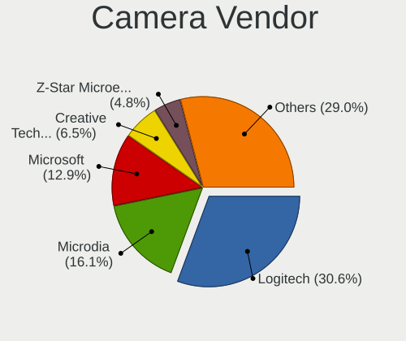

| Vendor                      | Desktops | Percent |
|-----------------------------|----------|---------|
| Logitech                    | 19       | 30.65%  |
| Microdia                    | 10       | 16.13%  |
| Microsoft                   | 8        | 12.9%   |
| Creative Technology         | 4        | 6.45%   |
| Z-Star Microelectronics     | 3        | 4.84%   |
| Alcor Micro                 | 3        | 4.84%   |
| Syntek                      | 2        | 3.23%   |
| KYE Systems (Mouse Systems) | 2        | 3.23%   |
| GEMBIRD                     | 2        | 3.23%   |
| Valve Software              | 1        | 1.61%   |
| Unknown                     | 1        | 1.61%   |
| Realtek Semiconductor       | 1        | 1.61%   |
| MacroSilicon                | 1        | 1.61%   |
| GenesysLogic Technology     | 1        | 1.61%   |
| Generalplus Technology      | 1        | 1.61%   |
| Cubeternet                  | 1        | 1.61%   |
| ARC International           | 1        | 1.61%   |
| Apple                       | 1        | 1.61%   |

Camera Model
------------

Camera device models

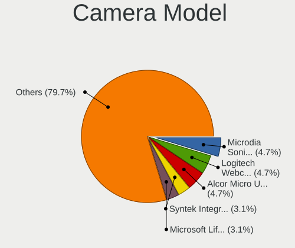

| Model                                             | Desktops | Percent |
|---------------------------------------------------|----------|---------|
| Microdia Sonix USB 2.0 Camera                     | 3        | 4.69%   |
| Logitech Webcam C270                              | 3        | 4.69%   |
| Alcor Micro USB 2.0 PC Camera                     | 3        | 4.69%   |
| Syntek Integrated RGB Camera                      | 2        | 3.13%   |
| Microsoft LifeCam VX-800                          | 2        | 3.13%   |
| Microsoft LifeCam Cinema                          | 2        | 3.13%   |
| Microdia USB 2.0 Camera                           | 2        | 3.13%   |
| Logitech Webcam C930e                             | 2        | 3.13%   |
| Logitech QuickCam Pro 9000                        | 2        | 3.13%   |
| Logitech HD Pro Webcam C920                       | 2        | 3.13%   |
| Logitech C922 Pro Stream Webcam                   | 2        | 3.13%   |
| GEMBIRD Generic UVC 1.00 camera [AppoTech AX2311] | 2        | 3.13%   |
| Creative Live! Cam Sync HD [VF0770]               | 2        | 3.13%   |
| Creative Live! Cam Chat HD [VF0700/VF0790]        | 2        | 3.13%   |
| Z-Star Venus USB2.0 Camera                        | 1        | 1.56%   |
| Z-Star Vega USB 2.0 Camera                        | 1        | 1.56%   |
| Z-Star Full HD 1080P PC Camera                    | 1        | 1.56%   |
| Valve Software 3D Camera                          | 1        | 1.56%   |
| Unknown HD camera                                 | 1        | 1.56%   |
| Realtek USB Camera                                | 1        | 1.56%   |
| Microsoft Microsoft LifeCam VX-5500               | 1        | 1.56%   |
| Microsoft LifeCam VX-700                          | 1        | 1.56%   |
| Microsoft LifeCam VX-500 [1357]                   | 1        | 1.56%   |
| Microsoft LifeCam HD-3000                         | 1        | 1.56%   |
| Microdia Webcam Vitade AF                         | 1        | 1.56%   |
| Microdia Integrated Camera                        | 1        | 1.56%   |
| Microdia CyberTrack H7                            | 1        | 1.56%   |
| Microdia Camera                                   | 1        | 1.56%   |
| Microdia ACR010 USB Webcam                        | 1        | 1.56%   |
| MacroSilicon USB Video                            | 1        | 1.56%   |
| Logitech Webcam Pro 9000                          | 1        | 1.56%   |
| Logitech Webcam C200                              | 1        | 1.56%   |
| Logitech Webcam C110                              | 1        | 1.56%   |
| Logitech StreamCam                                | 1        | 1.56%   |
| Logitech Logitech Webcam C925e                    | 1        | 1.56%   |
| Logitech Logi Webcam C920e                        | 1        | 1.56%   |
| Logitech HD Webcam C525                           | 1        | 1.56%   |
| Logitech C920 PRO HD Webcam                       | 1        | 1.56%   |
| Logitech C505e HD Webcam                          | 1        | 1.56%   |
| Logitech BRIO 4K Stream Edition                   | 1        | 1.56%   |

Security
--------

Fingerprint Vendor
------------------

Fingerprint sensor vendors

Zero info for selected period =(

Fingerprint Model
-----------------

Fingerprint sensor models

Zero info for selected period =(

Chipcard Vendor
---------------

Chipcard module vendors

| Vendor                | Desktops | Percent |
|-----------------------|----------|---------|
| Gemalto (was Gemplus) | 4        | 40%     |
| Microchip Technology  | 2        | 20%     |
| OmniKey               | 1        | 10%     |
| Chicony Electronics   | 1        | 10%     |
| Cherry                | 1        | 10%     |
| Alcor Micro           | 1        | 10%     |

Chipcard Model
--------------

Chipcard module models

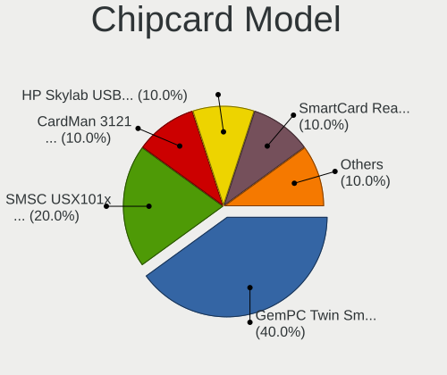

| Model                                                | Desktops | Percent |
|------------------------------------------------------|----------|---------|
| Gemalto (was Gemplus) GemPC Twin SmartCard Reader    | 4        | 40%     |
| Microchip Technology SMSC USX101x Reader             | 2        | 20%     |
| OmniKey CardMan 3121 (HID Technologies)              | 1        | 10%     |
| Chicony Electronics HP Skylab USB Smartcard Keyboard | 1        | 10%     |
| Cherry SmartCard Reader Keyboard KC 1000 SC          | 1        | 10%     |
| Alcor Micro AU9540 Smartcard Reader                  | 1        | 10%     |

Unsupported
-----------

Unsupported Devices
-------------------

Total unsupported devices on board

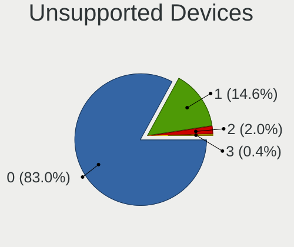

| Total | Desktops | Percent |
|-------|----------|---------|
| 0     | 375      | 82.96%  |
| 1     | 66       | 14.6%   |
| 2     | 9        | 1.99%   |
| 3     | 2        | 0.44%   |

Unsupported Device Types
------------------------

Types of unsupported devices

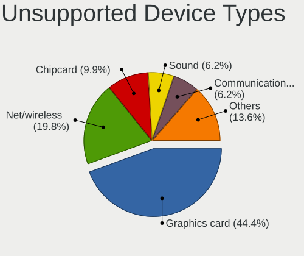

| Type                     | Desktops | Percent |
|--------------------------|----------|---------|
| Graphics card            | 36       | 44.44%  |
| Net/wireless             | 16       | 19.75%  |
| Chipcard                 | 8        | 9.88%   |
| Sound                    | 5        | 6.17%   |
| Communication controller | 5        | 6.17%   |
| Unassigned class         | 3        | 3.7%    |
| Net/ethernet             | 2        | 2.47%   |
| Multimedia controller    | 2        | 2.47%   |
| Bluetooth                | 2        | 2.47%   |
| Network                  | 1        | 1.23%   |
| Card reader              | 1        | 1.23%   |

