Linux in Slovakia - Tested Hardware & Statistics (Desktops)
-----------------------------------------------------------

A project to collect tested hardware configurations for Linux in Slovakia.

Anyone can contribute to this report by the [hw-probe](https://github.com/linuxhw/hw-probe) tool:

    sudo -E hw-probe -all -upload

Please contribute! Especially if your hardware is rare.

Contents
--------

* [ Test Cases ](#test-cases)

* [ System ](#system)
  - [ OS                       ](#os)
  - [ OS Family                ](#os-family)
  - [ Kernel                   ](#kernel)
  - [ Kernel Family            ](#kernel-family)
  - [ Kernel Major Ver.        ](#kernel-major-ver)
  - [ Arch                     ](#arch)
  - [ DE                       ](#de)
  - [ Display Server           ](#display-server)
  - [ Display Manager          ](#display-manager)
  - [ OS Lang                  ](#os-lang)
  - [ Boot Mode                ](#boot-mode)
  - [ Filesystem               ](#filesystem)
  - [ Part. scheme             ](#part-scheme)
  - [ Dual Boot with Linux/BSD ](#dual-boot-with-linuxbsd)
  - [ Dual Boot (Win)          ](#dual-boot-win)

* [ Board ](#board)
  - [ Vendor                   ](#vendor)
  - [ Model                    ](#model)
  - [ Model Family             ](#model-family)
  - [ MFG Year                 ](#mfg-year)
  - [ Form Factor              ](#form-factor)
  - [ Secure Boot              ](#secure-boot)
  - [ Coreboot                 ](#coreboot)
  - [ RAM Size                 ](#ram-size)
  - [ RAM Used                 ](#ram-used)
  - [ Total Drives             ](#total-drives)
  - [ Has CD-ROM               ](#has-cd-rom)
  - [ Has Ethernet             ](#has-ethernet)
  - [ Has WiFi                 ](#has-wifi)
  - [ Has Bluetooth            ](#has-bluetooth)

* [ Location ](#location)
  - [ Country                  ](#country)
  - [ City                     ](#city)

* [ Drives ](#drives)
  - [ Drive Vendor             ](#drive-vendor)
  - [ Drive Model              ](#drive-model)
  - [ HDD Vendor               ](#hdd-vendor)
  - [ SSD Vendor               ](#ssd-vendor)
  - [ Drive Kind               ](#drive-kind)
  - [ Drive Connector          ](#drive-connector)
  - [ Drive Size               ](#drive-size)
  - [ Space Total              ](#space-total)
  - [ Space Used               ](#space-used)
  - [ Malfunc. Drives          ](#malfunc-drives)
  - [ Malfunc. Drive Vendor    ](#malfunc-drive-vendor)
  - [ Malfunc. HDD Vendor      ](#malfunc-hdd-vendor)
  - [ Malfunc. Drive Kind      ](#malfunc-drive-kind)
  - [ Failed Drives            ](#failed-drives)
  - [ Failed Drive Vendor      ](#failed-drive-vendor)
  - [ Drive Status             ](#drive-status)

* [ Storage controller ](#storage-controller)
  - [ Storage Vendor           ](#storage-vendor)
  - [ Storage Model            ](#storage-model)
  - [ Storage Kind             ](#storage-kind)

* [ Processor ](#processor)
  - [ CPU Vendor               ](#cpu-vendor)
  - [ CPU Model                ](#cpu-model)
  - [ CPU Model Family         ](#cpu-model-family)
  - [ CPU Cores                ](#cpu-cores)
  - [ CPU Sockets              ](#cpu-sockets)
  - [ CPU Threads              ](#cpu-threads)
  - [ CPU Op-Modes             ](#cpu-op-modes)
  - [ CPU Microcode            ](#cpu-microcode)
  - [ CPU Microarch            ](#cpu-microarch)

* [ Graphics ](#graphics)
  - [ GPU Vendor               ](#gpu-vendor)
  - [ GPU Model                ](#gpu-model)
  - [ GPU Combo                ](#gpu-combo)
  - [ GPU Driver               ](#gpu-driver)
  - [ GPU Memory               ](#gpu-memory)

* [ Monitor ](#monitor)
  - [ Monitor Vendor           ](#monitor-vendor)
  - [ Monitor Model            ](#monitor-model)
  - [ Monitor Resolution       ](#monitor-resolution)
  - [ Monitor Diagonal         ](#monitor-diagonal)
  - [ Monitor Width            ](#monitor-width)
  - [ Aspect Ratio             ](#aspect-ratio)
  - [ Monitor Area             ](#monitor-area)
  - [ Pixel Density            ](#pixel-density)
  - [ Multiple Monitors        ](#multiple-monitors)

* [ Network ](#network)
  - [ Net Controller Vendor    ](#net-controller-vendor)
  - [ Net Controller Model     ](#net-controller-model)
  - [ Wireless Vendor          ](#wireless-vendor)
  - [ Wireless Model           ](#wireless-model)
  - [ Ethernet Vendor          ](#ethernet-vendor)
  - [ Ethernet Model           ](#ethernet-model)
  - [ Net Controller Kind      ](#net-controller-kind)
  - [ Used Controller          ](#used-controller)
  - [ NICs                     ](#nics)
  - [ IPv6                     ](#ipv6)

* [ Bluetooth ](#bluetooth)
  - [ Bluetooth Vendor         ](#bluetooth-vendor)
  - [ Bluetooth Model          ](#bluetooth-model)

* [ Sound ](#sound)
  - [ Sound Vendor             ](#sound-vendor)
  - [ Sound Model              ](#sound-model)

* [ Memory ](#memory)
  - [ Memory Vendor            ](#memory-vendor)
  - [ Memory Model             ](#memory-model)
  - [ Memory Kind              ](#memory-kind)
  - [ Memory Form Factor       ](#memory-form-factor)
  - [ Memory Size              ](#memory-size)
  - [ Memory Speed             ](#memory-speed)

* [ Printers & scanners ](#printers--scanners)
  - [ Printer Vendor           ](#printer-vendor)
  - [ Printer Model            ](#printer-model)
  - [ Scanner Vendor           ](#scanner-vendor)
  - [ Scanner Model            ](#scanner-model)

* [ Camera ](#camera)
  - [ Camera Vendor            ](#camera-vendor)
  - [ Camera Model             ](#camera-model)

* [ Security ](#security)
  - [ Fingerprint Vendor       ](#fingerprint-vendor)
  - [ Fingerprint Model        ](#fingerprint-model)
  - [ Chipcard Vendor          ](#chipcard-vendor)
  - [ Chipcard Model           ](#chipcard-model)

* [ Unsupported ](#unsupported)
  - [ Unsupported Devices      ](#unsupported-devices)
  - [ Unsupported Device Types ](#unsupported-device-types)

Test Cases
----------

Total: 506

| Vendor        | Model                       | Probe                                                      | Date         |
|---------------|-----------------------------|------------------------------------------------------------|--------------|
| Gigabyte      | H61M-S1                     | [b92a6f8a9e](https://linux-hardware.org/?probe=b92a6f8a9e) | Aug 12, 2023 |
| Gigabyte      | H61M-S1                     | [031ed1d4e7](https://linux-hardware.org/?probe=031ed1d4e7) | Aug 12, 2023 |
| Dell          | 0RN474                      | [61153fe575](https://linux-hardware.org/?probe=61153fe575) | Aug 09, 2023 |
| Gigabyte      | H61M-S1                     | [c160e44518](https://linux-hardware.org/?probe=c160e44518) | Aug 08, 2023 |
| Unknown       | Unknown                     | [14114ca4aa](https://linux-hardware.org/?probe=14114ca4aa) | Aug 07, 2023 |
| Unknown       | Unknown                     | [946d81eb9d](https://linux-hardware.org/?probe=946d81eb9d) | Aug 07, 2023 |
| Gigabyte      | H61M-S1                     | [64803a4cd7](https://linux-hardware.org/?probe=64803a4cd7) | Aug 04, 2023 |
| ASUSTek       | M4N68T-M LE                 | [90dce7a9cf](https://linux-hardware.org/?probe=90dce7a9cf) | Jul 30, 2023 |
| Gigabyte      | H61M-S1                     | [ec84069efb](https://linux-hardware.org/?probe=ec84069efb) | Jul 28, 2023 |
| Gigabyte      | H61M-S1                     | [89557d5880](https://linux-hardware.org/?probe=89557d5880) | Jul 28, 2023 |
| ASUSTek       | TUF Gaming B550M-PLUS       | [aad0018c0e](https://linux-hardware.org/?probe=aad0018c0e) | Jul 20, 2023 |
| MSI           | PRO Z690-A DDR4             | [d36574de10](https://linux-hardware.org/?probe=d36574de10) | Jul 03, 2023 |
| ASRock        | H61M-VG4                    | [7fbf9c4e53](https://linux-hardware.org/?probe=7fbf9c4e53) | Jun 25, 2023 |
| Foxconn       | 945 7MC Series              | [dc2911bfae](https://linux-hardware.org/?probe=dc2911bfae) | Jun 25, 2023 |
| Foxconn       | 945 7MC Series              | [273bec93a4](https://linux-hardware.org/?probe=273bec93a4) | Jun 25, 2023 |
| ASUSTek       | P5K                         | [c33ff02489](https://linux-hardware.org/?probe=c33ff02489) | Jun 24, 2023 |
| ASUSTek       | P5K                         | [c87e87b883](https://linux-hardware.org/?probe=c87e87b883) | Jun 24, 2023 |
| ASUSTek       | M5A99X EVO                  | [5732495ae1](https://linux-hardware.org/?probe=5732495ae1) | Jun 14, 2023 |
| Gigabyte      | H61M-S1                     | [edbcec7f32](https://linux-hardware.org/?probe=edbcec7f32) | Jun 12, 2023 |
| ASUSTek       | P8H61-M LX                  | [9d9872a84a](https://linux-hardware.org/?probe=9d9872a84a) | Jun 10, 2023 |
| ASUSTek       | P8H61-M LX                  | [bd22edfae7](https://linux-hardware.org/?probe=bd22edfae7) | Jun 09, 2023 |
| Gigabyte      | H61M-S1                     | [3063c26aca](https://linux-hardware.org/?probe=3063c26aca) | Jun 08, 2023 |
| MSI           | MS-7513                     | [ed69341f3c](https://linux-hardware.org/?probe=ed69341f3c) | Jun 07, 2023 |
| Gigabyte      | B250M-D3H-CF                | [d8f9165fec](https://linux-hardware.org/?probe=d8f9165fec) | Jun 04, 2023 |
| ASUSTek       | TUF Gaming B550M-PLUS       | [7b513e678c](https://linux-hardware.org/?probe=7b513e678c) | Jun 03, 2023 |
| ASRock        | ALiveDual-eSATA2            | [0f490d3b39](https://linux-hardware.org/?probe=0f490d3b39) | Jun 01, 2023 |
| Gigabyte      | H61M-S1                     | [5d33af1d5a](https://linux-hardware.org/?probe=5d33af1d5a) | May 30, 2023 |
| Gigabyte      | H61M-S1                     | [6872b07bb6](https://linux-hardware.org/?probe=6872b07bb6) | May 30, 2023 |
| MSI           | PRO Z690-A DDR4             | [b0be576b32](https://linux-hardware.org/?probe=b0be576b32) | May 28, 2023 |
| ASUSTek       | F2A85-V PRO                 | [f2181d0270](https://linux-hardware.org/?probe=f2181d0270) | May 27, 2023 |
| ASUSTek       | M2V-MX SE                   | [be58596103](https://linux-hardware.org/?probe=be58596103) | May 27, 2023 |
| ASUSTek       | M2V-MX SE                   | [0eedc4211a](https://linux-hardware.org/?probe=0eedc4211a) | May 27, 2023 |
| Gigabyte      | GA-MA785GM-US2H             | [7284c23b76](https://linux-hardware.org/?probe=7284c23b76) | May 27, 2023 |
| ASUSTek       | P5E WS Pro                  | [97a221407d](https://linux-hardware.org/?probe=97a221407d) | May 17, 2023 |
| HP            | 1589                        | [c905464231](https://linux-hardware.org/?probe=c905464231) | May 11, 2023 |
| MSI           | MS-7513                     | [1e14e5d3e6](https://linux-hardware.org/?probe=1e14e5d3e6) | May 10, 2023 |
| MSI           | MAG B550 TOMAHAWK           | [68afb54270](https://linux-hardware.org/?probe=68afb54270) | May 10, 2023 |
| Gigabyte      | B550M DS3H                  | [ae040331e6](https://linux-hardware.org/?probe=ae040331e6) | May 06, 2023 |
| MSI           | A75A-G55                    | [6ecb91213c](https://linux-hardware.org/?probe=6ecb91213c) | May 05, 2023 |
| HP            | ProLiant ML310e Gen8 v2     | [501d26e477](https://linux-hardware.org/?probe=501d26e477) | Apr 30, 2023 |
| ASUSTek       | TUF Gaming B550M-PLUS       | [a2b832afa2](https://linux-hardware.org/?probe=a2b832afa2) | Apr 30, 2023 |
| HP            | 802F                        | [b314d41043](https://linux-hardware.org/?probe=b314d41043) | Apr 28, 2023 |
| ASRock        | H61M-VG4                    | [a8e7de2e0b](https://linux-hardware.org/?probe=a8e7de2e0b) | Apr 26, 2023 |
| ASUSTek       | TUF Gaming B550M-PLUS       | [bb520ff82e](https://linux-hardware.org/?probe=bb520ff82e) | Apr 21, 2023 |
| ASUSTek       | TUF Gaming B550M-PLUS       | [76db4c685b](https://linux-hardware.org/?probe=76db4c685b) | Apr 15, 2023 |
| ASUSTek       | M2N68-AM SE2                | [e9b6076df4](https://linux-hardware.org/?probe=e9b6076df4) | Apr 13, 2023 |
| ASUSTek       | PRIME B450M-A II            | [1a470a3b5a](https://linux-hardware.org/?probe=1a470a3b5a) | Apr 10, 2023 |
| Techvision    | TVI7309X B0                 | [d24ce5fa44](https://linux-hardware.org/?probe=d24ce5fa44) | Apr 09, 2023 |
| ASRock        | FM2A55M-VG3+                | [f7435e4d65](https://linux-hardware.org/?probe=f7435e4d65) | Apr 09, 2023 |
| ASRock        | FM2A55M-VG3+                | [53ed0bc068](https://linux-hardware.org/?probe=53ed0bc068) | Apr 09, 2023 |
| Lenovo        | 318E SDK0J40697 WIN 3305... | [436d55c73e](https://linux-hardware.org/?probe=436d55c73e) | Apr 09, 2023 |
| ASRock        | 960GC-GS FX                 | [90cb74d9f0](https://linux-hardware.org/?probe=90cb74d9f0) | Apr 08, 2023 |
| Techvision    | TVI7309X B0                 | [dbbe4bbbc5](https://linux-hardware.org/?probe=dbbe4bbbc5) | Apr 03, 2023 |
| ASUSTek       | TUF Gaming B550M-PLUS       | [7c95c976a9](https://linux-hardware.org/?probe=7c95c976a9) | Apr 03, 2023 |
| ASUSTek       | TUF Gaming B550M-PLUS       | [e45ad193f8](https://linux-hardware.org/?probe=e45ad193f8) | Apr 01, 2023 |
| Gigabyte      | GA-MA785GM-US2H             | [e9fe5cb307](https://linux-hardware.org/?probe=e9fe5cb307) | Apr 01, 2023 |
| ASUSTek       | PRIME A320M-K               | [59c335754f](https://linux-hardware.org/?probe=59c335754f) | Apr 01, 2023 |
| ASUSTek       | P5E WS Pro                  | [6c70ac23df](https://linux-hardware.org/?probe=6c70ac23df) | Mar 30, 2023 |
| HP            | 0AACh                       | [43dbfddd1b](https://linux-hardware.org/?probe=43dbfddd1b) | Mar 28, 2023 |
| Pegatron      | 2AD5                        | [502ff745d4](https://linux-hardware.org/?probe=502ff745d4) | Mar 27, 2023 |
| Dell          | 0RN474                      | [1fb7cf06d1](https://linux-hardware.org/?probe=1fb7cf06d1) | Mar 25, 2023 |
| Dell          | 0RN474                      | [88b56f0530](https://linux-hardware.org/?probe=88b56f0530) | Mar 24, 2023 |
| HP            | 0AACh                       | [2a1f96ca8d](https://linux-hardware.org/?probe=2a1f96ca8d) | Mar 24, 2023 |
| ASUSTek       | M5A97 R2.0                  | [789ca3dc74](https://linux-hardware.org/?probe=789ca3dc74) | Mar 22, 2023 |
| Techvision    | TVI7309X B0                 | [468588ab96](https://linux-hardware.org/?probe=468588ab96) | Mar 21, 2023 |
| Gigabyte      | P43-ES3G                    | [60a7dc4c2e](https://linux-hardware.org/?probe=60a7dc4c2e) | Mar 20, 2023 |
| Techvision    | TVI7309X B0                 | [d1a16fdb17](https://linux-hardware.org/?probe=d1a16fdb17) | Mar 18, 2023 |
| Techvision    | TVI7309X B0                 | [08572d5e7c](https://linux-hardware.org/?probe=08572d5e7c) | Mar 18, 2023 |
| Techvision    | TVI7309X B0                 | [82914cf856](https://linux-hardware.org/?probe=82914cf856) | Mar 18, 2023 |
| Dell          | 0HN7XN A01                  | [4ce2092fe2](https://linux-hardware.org/?probe=4ce2092fe2) | Mar 17, 2023 |
| Intel         | DH77EB AAG39073-304         | [0b55f12ab3](https://linux-hardware.org/?probe=0b55f12ab3) | Mar 11, 2023 |
| ASRock        | A320M-DVS R4.0              | [8e02302d63](https://linux-hardware.org/?probe=8e02302d63) | Mar 09, 2023 |
| Gigabyte      | 970A-DS3P                   | [fc28c47011](https://linux-hardware.org/?probe=fc28c47011) | Mar 03, 2023 |
| ASUSTek       | F2A85-V PRO                 | [aa7d308d7e](https://linux-hardware.org/?probe=aa7d308d7e) | Mar 01, 2023 |
| ASUSTek       | PRIME X570-P                | [dda5eec4b9](https://linux-hardware.org/?probe=dda5eec4b9) | Feb 28, 2023 |
| Gigabyte      | X58A-UD5                    | [4cff35f888](https://linux-hardware.org/?probe=4cff35f888) | Feb 27, 2023 |
| HP            | 3397                        | [e714a7b19d](https://linux-hardware.org/?probe=e714a7b19d) | Feb 23, 2023 |
| ASRock        | B550 Extreme4               | [db2686086b](https://linux-hardware.org/?probe=db2686086b) | Feb 21, 2023 |
| ASRock        | B450M Pro4-F R2.0           | [f1082dcffa](https://linux-hardware.org/?probe=f1082dcffa) | Feb 17, 2023 |
| Gigabyte      | P43-ES3G                    | [528ffce1c7](https://linux-hardware.org/?probe=528ffce1c7) | Feb 15, 2023 |
| Gigabyte      | B250M-D3H-CF                | [8689383fea](https://linux-hardware.org/?probe=8689383fea) | Feb 15, 2023 |
| Gigabyte      | H81M-S2V                    | [09dff429cd](https://linux-hardware.org/?probe=09dff429cd) | Feb 12, 2023 |
| Gigabyte      | H61M-S1                     | [aef266643c](https://linux-hardware.org/?probe=aef266643c) | Feb 11, 2023 |
| Gigabyte      | H61M-S1                     | [a4791d2bc4](https://linux-hardware.org/?probe=a4791d2bc4) | Feb 11, 2023 |
| Gigabyte      | H61M-S1                     | [e6c7ea049a](https://linux-hardware.org/?probe=e6c7ea049a) | Feb 10, 2023 |
| Gigabyte      | H61M-S1                     | [9cbe5cf2b6](https://linux-hardware.org/?probe=9cbe5cf2b6) | Feb 10, 2023 |
| ASRock        | A520M-ITX/ac                | [a6e401a1d3](https://linux-hardware.org/?probe=a6e401a1d3) | Feb 09, 2023 |
| ASRock        | B550M Steel Legend          | [83b847229c](https://linux-hardware.org/?probe=83b847229c) | Feb 08, 2023 |
| MSI           | MS-7513                     | [3953f1b447](https://linux-hardware.org/?probe=3953f1b447) | Jan 28, 2023 |
| Gigabyte      | Z490M                       | [a53147a5e7](https://linux-hardware.org/?probe=a53147a5e7) | Jan 25, 2023 |
| Gigabyte      | H61M-S1                     | [7a3b58d6a7](https://linux-hardware.org/?probe=7a3b58d6a7) | Jan 24, 2023 |
| HP            | 3397                        | [03c53827b5](https://linux-hardware.org/?probe=03c53827b5) | Jan 17, 2023 |
| Gigabyte      | Z97MX-Gaming 5              | [8d5796c907](https://linux-hardware.org/?probe=8d5796c907) | Jan 15, 2023 |
| MSI           | MAG X570S TOMAHAWK MAX W... | [b10c786457](https://linux-hardware.org/?probe=b10c786457) | Jan 14, 2023 |
| Gigabyte      | B75M-D3H                    | [cfa8ec5fcb](https://linux-hardware.org/?probe=cfa8ec5fcb) | Jan 13, 2023 |
| Gigabyte      | EP45-DS3                    | [5bf59df74c](https://linux-hardware.org/?probe=5bf59df74c) | Jan 10, 2023 |
| ASUSTek       | M5A97 EVO R2.0              | [b39213e4d0](https://linux-hardware.org/?probe=b39213e4d0) | Jan 09, 2023 |
| Dell          | 0654JC A01                  | [c3016e1823](https://linux-hardware.org/?probe=c3016e1823) | Jan 09, 2023 |
| Acer          | H57M01                      | [41ee28ae4b](https://linux-hardware.org/?probe=41ee28ae4b) | Jan 09, 2023 |
| MSI           | MS-7513                     | [6e63c2139f](https://linux-hardware.org/?probe=6e63c2139f) | Jan 08, 2023 |
| MSI           | PRO Z690-A DDR4             | [0b9a54a591](https://linux-hardware.org/?probe=0b9a54a591) | Jan 06, 2023 |
| Dell          | 00V62H A00                  | [dde339b7c9](https://linux-hardware.org/?probe=dde339b7c9) | Dec 26, 2022 |
| MSI           | G41M4                       | [b651925b13](https://linux-hardware.org/?probe=b651925b13) | Dec 21, 2022 |
| MSI           | 790GX-G65                   | [7ad3c8f807](https://linux-hardware.org/?probe=7ad3c8f807) | Dec 18, 2022 |
| ASRock        | N3150-NUC                   | [5e77ec1117](https://linux-hardware.org/?probe=5e77ec1117) | Dec 18, 2022 |
| ASRock        | N3150-NUC                   | [e497bf2ce3](https://linux-hardware.org/?probe=e497bf2ce3) | Dec 17, 2022 |
| HP            | 1905                        | [21f639657c](https://linux-hardware.org/?probe=21f639657c) | Dec 13, 2022 |
| ASUSTek       | PRIME B460M-K               | [ceff27eeef](https://linux-hardware.org/?probe=ceff27eeef) | Dec 07, 2022 |
| Gigabyte      | Z790 AERO G                 | [b779cd6c2f](https://linux-hardware.org/?probe=b779cd6c2f) | Dec 06, 2022 |
| ASUSTek       | P8H61-M LX                  | [cd75a3e13f](https://linux-hardware.org/?probe=cd75a3e13f) | Dec 03, 2022 |
| ASUSTek       | PRIME B460M-K               | [c8dd66d6de](https://linux-hardware.org/?probe=c8dd66d6de) | Dec 01, 2022 |
| ASUSTek       | PRIME B460M-K               | [7df334aaa0](https://linux-hardware.org/?probe=7df334aaa0) | Nov 26, 2022 |
| Shuttle       | FS61                        | [7a940c8fa3](https://linux-hardware.org/?probe=7a940c8fa3) | Nov 19, 2022 |
| ASUSTek       | PRIME B460M-K               | [19663894ff](https://linux-hardware.org/?probe=19663894ff) | Nov 18, 2022 |
| ASUSTek       | PRIME B460M-K               | [99a32a02ce](https://linux-hardware.org/?probe=99a32a02ce) | Nov 18, 2022 |
| MSI           | A78-G41 PC Mate             | [8487f5d19c](https://linux-hardware.org/?probe=8487f5d19c) | Nov 08, 2022 |
| MSI           | GF615M-P33                  | [8aec7634ab](https://linux-hardware.org/?probe=8aec7634ab) | Nov 05, 2022 |
| MSI           | Z77A-GD65                   | [a7bc380726](https://linux-hardware.org/?probe=a7bc380726) | Oct 30, 2022 |
| Gigabyte      | 970A-DS3P                   | [995f7abb0c](https://linux-hardware.org/?probe=995f7abb0c) | Oct 25, 2022 |
| MSI           | H310M PRO-VD                | [9ce99513bc](https://linux-hardware.org/?probe=9ce99513bc) | Oct 21, 2022 |
| Samsung       | DT1234567890 SEC_SW_REVI... | [19d09fb082](https://linux-hardware.org/?probe=19d09fb082) | Oct 17, 2022 |
| Samsung       | DT1234567890 SEC_SW_REVI... | [9f3307c5d0](https://linux-hardware.org/?probe=9f3307c5d0) | Oct 17, 2022 |
| ASRock        | X570 Taichi                 | [6b78ca11b4](https://linux-hardware.org/?probe=6b78ca11b4) | Oct 14, 2022 |
| Techvision    | TVI7309X B0                 | [a12d335502](https://linux-hardware.org/?probe=a12d335502) | Oct 06, 2022 |
| Techvision    | TVI7309X B0                 | [fd49fda31a](https://linux-hardware.org/?probe=fd49fda31a) | Oct 06, 2022 |
| ASUSTek       | P5E WS Pro                  | [241e42fa0a](https://linux-hardware.org/?probe=241e42fa0a) | Oct 03, 2022 |
| ASUSTek       | TUF Gaming B550M-PLUS       | [b0cc9bee74](https://linux-hardware.org/?probe=b0cc9bee74) | Oct 02, 2022 |
| ASUSTek       | TUF Gaming B550M-PLUS       | [45d676584c](https://linux-hardware.org/?probe=45d676584c) | Oct 02, 2022 |
| ASUSTek       | Z170-P                      | [996d72bd1e](https://linux-hardware.org/?probe=996d72bd1e) | Sep 30, 2022 |
| ASUSTek       | Z170-P                      | [8394fca38a](https://linux-hardware.org/?probe=8394fca38a) | Sep 30, 2022 |
| ASUSTek       | M5A97 LE R2.0               | [e35b86c3b7](https://linux-hardware.org/?probe=e35b86c3b7) | Sep 29, 2022 |
| Gigabyte      | AB350-Gaming 3-CF           | [365d74f8e4](https://linux-hardware.org/?probe=365d74f8e4) | Sep 28, 2022 |
| ASUSTek       | M5A97 LE R2.0               | [f9e71e7e05](https://linux-hardware.org/?probe=f9e71e7e05) | Sep 28, 2022 |
| MSI           | X570-A PRO                  | [345959e0ed](https://linux-hardware.org/?probe=345959e0ed) | Sep 28, 2022 |
| Gigabyte      | AB350-Gaming 3-CF           | [cfd24b9e0a](https://linux-hardware.org/?probe=cfd24b9e0a) | Sep 27, 2022 |
| ASUSTek       | Z87-A                       | [3cdcc8b18d](https://linux-hardware.org/?probe=3cdcc8b18d) | Sep 26, 2022 |
| ASUSTek       | M5A78L-M/USB3               | [d166d32749](https://linux-hardware.org/?probe=d166d32749) | Sep 26, 2022 |
| ASUSTek       | M5A78L-M/USB3               | [bce9addcca](https://linux-hardware.org/?probe=bce9addcca) | Sep 26, 2022 |
| Gigabyte      | F2A68HM-DS2                 | [98e8df2d3d](https://linux-hardware.org/?probe=98e8df2d3d) | Sep 21, 2022 |
| ASUSTek       | P5G41T-M LX                 | [50647a7656](https://linux-hardware.org/?probe=50647a7656) | Sep 17, 2022 |
| ASUSTek       | Z97-A                       | [9de0254ab0](https://linux-hardware.org/?probe=9de0254ab0) | Sep 13, 2022 |
| ASRock        | Z170 Gaming K6+             | [39027cdb44](https://linux-hardware.org/?probe=39027cdb44) | Sep 13, 2022 |
| ASUSTek       | Z170-P                      | [bec58f880f](https://linux-hardware.org/?probe=bec58f880f) | Sep 13, 2022 |
| ASUSTek       | Z170-P                      | [182bb36928](https://linux-hardware.org/?probe=182bb36928) | Sep 13, 2022 |
| ASUSTek       | Benicia                     | [13454a57f9](https://linux-hardware.org/?probe=13454a57f9) | Aug 31, 2022 |
| Gigabyte      | F2A68HM-DS2                 | [a6d3642195](https://linux-hardware.org/?probe=a6d3642195) | Aug 24, 2022 |
| ASUSTek       | PRIME B460M-K               | [f5f3761418](https://linux-hardware.org/?probe=f5f3761418) | Aug 19, 2022 |
| Gigabyte      | P43-ES3G                    | [de6e02672c](https://linux-hardware.org/?probe=de6e02672c) | Aug 18, 2022 |
| Lenovo        | 3098 0B98401 WIN            | [769802c689](https://linux-hardware.org/?probe=769802c689) | Aug 15, 2022 |
| Gigabyte      | P43-ES3G                    | [2b0691bddd](https://linux-hardware.org/?probe=2b0691bddd) | Aug 15, 2022 |
| Packard Be... | P5N-E SLI                   | [6f2bf70c0b](https://linux-hardware.org/?probe=6f2bf70c0b) | Aug 09, 2022 |
| Gigabyte      | F2A68HM-DS2                 | [93bd067b5d](https://linux-hardware.org/?probe=93bd067b5d) | Aug 09, 2022 |
| Packard Be... | P5N-E SLI                   | [cdc88569bc](https://linux-hardware.org/?probe=cdc88569bc) | Aug 07, 2022 |
| ASRock        | B550M Steel Legend          | [0ac4f27d0f](https://linux-hardware.org/?probe=0ac4f27d0f) | Jul 31, 2022 |
| ASRock        | FM2A55M-VG3+                | [5d4a26735e](https://linux-hardware.org/?probe=5d4a26735e) | Jul 28, 2022 |
| Gigabyte      | 970A-DS3P                   | [210b75c48e](https://linux-hardware.org/?probe=210b75c48e) | Jul 21, 2022 |
| Gigabyte      | 970A-DS3P                   | [17befc2dd5](https://linux-hardware.org/?probe=17befc2dd5) | Jul 20, 2022 |
| HP            | 8455                        | [9954a77308](https://linux-hardware.org/?probe=9954a77308) | Jul 07, 2022 |
| Gigabyte      | F2A68HM-DS2                 | [779bc20f77](https://linux-hardware.org/?probe=779bc20f77) | Jul 05, 2022 |
| MSI           | A88XM-E35                   | [8767210da3](https://linux-hardware.org/?probe=8767210da3) | Jul 04, 2022 |
| Shuttle       | FH61V                       | [465dc41fdb](https://linux-hardware.org/?probe=465dc41fdb) | Jun 08, 2022 |
| MSI           | Z390-A PRO                  | [8baf319c52](https://linux-hardware.org/?probe=8baf319c52) | May 21, 2022 |
| Intel         | DG41KR AAE62839-304         | [d6fa39e82f](https://linux-hardware.org/?probe=d6fa39e82f) | May 16, 2022 |
| Foxconn       | 2ADA                        | [215ded6566](https://linux-hardware.org/?probe=215ded6566) | May 16, 2022 |
| Acer          | H57M01                      | [9116ecebcb](https://linux-hardware.org/?probe=9116ecebcb) | May 15, 2022 |
| ASUSTek       | ROG STRIX X570-F GAMING     | [52c0b4a6e0](https://linux-hardware.org/?probe=52c0b4a6e0) | May 14, 2022 |
| Acer          | H57M01                      | [42100344af](https://linux-hardware.org/?probe=42100344af) | May 14, 2022 |
| Gigabyte      | H55M-S2H                    | [0b3c6ab0f7](https://linux-hardware.org/?probe=0b3c6ab0f7) | May 14, 2022 |
| ASRock        | H61M-VG4                    | [92f92ef4ee](https://linux-hardware.org/?probe=92f92ef4ee) | Apr 28, 2022 |
| ASRock        | H61M-VG4                    | [fff58f97e8](https://linux-hardware.org/?probe=fff58f97e8) | Apr 27, 2022 |
| ASUSTek       | ROG STRIX B450-I GAMING     | [4b9faf4848](https://linux-hardware.org/?probe=4b9faf4848) | Apr 26, 2022 |
| Unknown       | RS780-SB700                 | [eb3aa5fa60](https://linux-hardware.org/?probe=eb3aa5fa60) | Apr 20, 2022 |
| Gigabyte      | Z490M                       | [2138ce9310](https://linux-hardware.org/?probe=2138ce9310) | Apr 18, 2022 |
| Gigabyte      | F2A68HM-DS2                 | [e6aa0c6166](https://linux-hardware.org/?probe=e6aa0c6166) | Apr 09, 2022 |
| Acer          | Revo RL80                   | [414f1870b3](https://linux-hardware.org/?probe=414f1870b3) | Apr 04, 2022 |
| Gigabyte      | H61M-S1                     | [a10a00d2f1](https://linux-hardware.org/?probe=a10a00d2f1) | Apr 03, 2022 |
| Lenovo        | MAHOBAY NOK                 | [ba7b7abd34](https://linux-hardware.org/?probe=ba7b7abd34) | Apr 02, 2022 |
| HP            | 18E5                        | [39cb47db55](https://linux-hardware.org/?probe=39cb47db55) | Mar 28, 2022 |
| HP            | 18E5                        | [061d716ce1](https://linux-hardware.org/?probe=061d716ce1) | Mar 27, 2022 |
| Shuttle       | FH61V                       | [9b18d7b2ed](https://linux-hardware.org/?probe=9b18d7b2ed) | Mar 23, 2022 |
| VIA Techno... | KM266-8235                  | [ad3f9e9e12](https://linux-hardware.org/?probe=ad3f9e9e12) | Mar 20, 2022 |
| ASUSTek       | ROG STRIX B550-I GAMING     | [e508dbbb0f](https://linux-hardware.org/?probe=e508dbbb0f) | Mar 05, 2022 |
| Gigabyte      | F2A68HM-DS2                 | [455f94f1d3](https://linux-hardware.org/?probe=455f94f1d3) | Mar 04, 2022 |
| HP            | 339A                        | [820ebf5859](https://linux-hardware.org/?probe=820ebf5859) | Feb 26, 2022 |
| HP            | 339A                        | [118fee2993](https://linux-hardware.org/?probe=118fee2993) | Feb 26, 2022 |
| Dell          | 0773VG A00                  | [d24a3aebe9](https://linux-hardware.org/?probe=d24a3aebe9) | Feb 23, 2022 |
| Gigabyte      | H61M-S1                     | [e667cfc4cf](https://linux-hardware.org/?probe=e667cfc4cf) | Feb 20, 2022 |
| Gigabyte      | H55M-S2H                    | [3031d8a880](https://linux-hardware.org/?probe=3031d8a880) | Feb 20, 2022 |
| Fujitsu Si... | D1784 S26361-D1784          | [2734c5a939](https://linux-hardware.org/?probe=2734c5a939) | Feb 19, 2022 |
| Fujitsu Si... | D1784 S26361-D1784          | [7baecb9fce](https://linux-hardware.org/?probe=7baecb9fce) | Feb 19, 2022 |
| HP            | 339A                        | [d35aeac271](https://linux-hardware.org/?probe=d35aeac271) | Feb 16, 2022 |
| HP            | 339A                        | [aac8acdafe](https://linux-hardware.org/?probe=aac8acdafe) | Feb 16, 2022 |
| Gigabyte      | Z77-HD3                     | [c72849033f](https://linux-hardware.org/?probe=c72849033f) | Feb 15, 2022 |
| Dell          | 02YYK5 A01                  | [bfeed2f132](https://linux-hardware.org/?probe=bfeed2f132) | Feb 14, 2022 |
| ASUSTek       | P8H77-M                     | [b6851e2e2d](https://linux-hardware.org/?probe=b6851e2e2d) | Feb 13, 2022 |
| ASUSTek       | P6T                         | [5084dfc411](https://linux-hardware.org/?probe=5084dfc411) | Feb 12, 2022 |
| MSI           | B450 TOMAHAWK MAX II        | [4a136af33b](https://linux-hardware.org/?probe=4a136af33b) | Feb 12, 2022 |
| ASUSTek       | P6T                         | [10a6e04458](https://linux-hardware.org/?probe=10a6e04458) | Feb 10, 2022 |
| Fujitsu Si... | D1784 S26361-D1784          | [843210cfb0](https://linux-hardware.org/?probe=843210cfb0) | Feb 06, 2022 |
| Dell          | 0WR7PY A02                  | [2b3c148135](https://linux-hardware.org/?probe=2b3c148135) | Feb 06, 2022 |
| Gigabyte      | 970A-DS3P                   | [ed2a250420](https://linux-hardware.org/?probe=ed2a250420) | Feb 04, 2022 |
| Gigabyte      | 970A-DS3P                   | [d598fc04e1](https://linux-hardware.org/?probe=d598fc04e1) | Feb 04, 2022 |
| Lenovo        | 3176 NOK                    | [d3a3d5276b](https://linux-hardware.org/?probe=d3a3d5276b) | Feb 02, 2022 |
| Gigabyte      | B250M-D3H-CF                | [5b4a8e5bc4](https://linux-hardware.org/?probe=5b4a8e5bc4) | Jan 29, 2022 |
| Shuttle       | FH61V                       | [6d6980d0bb](https://linux-hardware.org/?probe=6d6980d0bb) | Jan 18, 2022 |
| ASUSTek       | H81M-K                      | [637ad5d9e4](https://linux-hardware.org/?probe=637ad5d9e4) | Jan 18, 2022 |
| ASRock        | AM1H-ITX                    | [0a01195a57](https://linux-hardware.org/?probe=0a01195a57) | Jan 16, 2022 |
| Gigabyte      | AB350-Gaming 3-CF           | [9fab263b02](https://linux-hardware.org/?probe=9fab263b02) | Jan 11, 2022 |
| ASUSTek       | P5GC-MX                     | [2126180fa9](https://linux-hardware.org/?probe=2126180fa9) | Jan 06, 2022 |
| ASUSTek       | TUF Gaming B550M-PLUS       | [3867022c38](https://linux-hardware.org/?probe=3867022c38) | Dec 25, 2021 |
| Gigabyte      | Z77-HD3                     | [a9eceeac28](https://linux-hardware.org/?probe=a9eceeac28) | Dec 14, 2021 |
| Shuttle       | FH61V                       | [b4c8a91d0f](https://linux-hardware.org/?probe=b4c8a91d0f) | Dec 13, 2021 |
| Dell          | 0HN7XN A01                  | [f17f39439e](https://linux-hardware.org/?probe=f17f39439e) | Dec 13, 2021 |
| Gigabyte      | Z77-HD3                     | [75755e4033](https://linux-hardware.org/?probe=75755e4033) | Dec 12, 2021 |
| Gigabyte      | Z77-HD3                     | [7d3626d44d](https://linux-hardware.org/?probe=7d3626d44d) | Dec 12, 2021 |
| ASUSTek       | Z170-K                      | [eb723f5cb0](https://linux-hardware.org/?probe=eb723f5cb0) | Dec 09, 2021 |
| Gigabyte      | H410M S2H                   | [8b917483ef](https://linux-hardware.org/?probe=8b917483ef) | Nov 30, 2021 |
| ASUSTek       | P5QL PRO                    | [ad0c0d07cf](https://linux-hardware.org/?probe=ad0c0d07cf) | Nov 28, 2021 |
| ASUSTek       | TUF Gaming X570-PLUS        | [77a39f82ff](https://linux-hardware.org/?probe=77a39f82ff) | Nov 28, 2021 |
| ASUSTek       | M4A77T/USB3                 | [e23dea02cf](https://linux-hardware.org/?probe=e23dea02cf) | Nov 26, 2021 |
| Gigabyte      | 970A-DS3P                   | [b718c829fa](https://linux-hardware.org/?probe=b718c829fa) | Nov 24, 2021 |
| Intel         | DH77EB AAG39073-304         | [bf7d34f5c1](https://linux-hardware.org/?probe=bf7d34f5c1) | Nov 15, 2021 |
| Intel         | DH77EB AAG39073-304         | [d1e04ead11](https://linux-hardware.org/?probe=d1e04ead11) | Nov 15, 2021 |
| Acer          | EM61SM/EM61PM               | [6a42469739](https://linux-hardware.org/?probe=6a42469739) | Nov 13, 2021 |
| ASRock        | B550M Steel Legend          | [fada2e4c02](https://linux-hardware.org/?probe=fada2e4c02) | Nov 06, 2021 |
| Gigabyte      | GA-M56S-S3                  | [d6285c81a2](https://linux-hardware.org/?probe=d6285c81a2) | Nov 05, 2021 |
| Gigabyte      | H61M-S1                     | [17d03d73f7](https://linux-hardware.org/?probe=17d03d73f7) | Oct 30, 2021 |
| ASRock        | N68C-S UCC                  | [c74421666a](https://linux-hardware.org/?probe=c74421666a) | Oct 20, 2021 |
| Lenovo        | SHARKBAY 31900058 STD       | [cdc6d847a7](https://linux-hardware.org/?probe=cdc6d847a7) | Oct 18, 2021 |
| Gigabyte      | H310M S2H x.x               | [d0b704d0ff](https://linux-hardware.org/?probe=d0b704d0ff) | Oct 06, 2021 |
| Gigabyte      | H81M-S2V                    | [ef8dfe0673](https://linux-hardware.org/?probe=ef8dfe0673) | Oct 02, 2021 |
| ASUSTek       | Maximus VIII HERO           | [1fce457ac6](https://linux-hardware.org/?probe=1fce457ac6) | Oct 01, 2021 |
| MSI           | E3M WORKSTATION V5          | [6924705831](https://linux-hardware.org/?probe=6924705831) | Sep 20, 2021 |
| Gigabyte      | H61M-S1                     | [6207dd28b2](https://linux-hardware.org/?probe=6207dd28b2) | Sep 09, 2021 |
| MSI           | E3M WORKSTATION V5          | [fa6adf65a6](https://linux-hardware.org/?probe=fa6adf65a6) | Aug 23, 2021 |
| ASUSTek       | ROG STRIX X570-E GAMING     | [9bf7d4afd7](https://linux-hardware.org/?probe=9bf7d4afd7) | Aug 14, 2021 |
| Dell          | 08HPGT A01                  | [d827460e02](https://linux-hardware.org/?probe=d827460e02) | Aug 04, 2021 |
| ASUSTek       | PRIME B450M-A               | [dc8f396ad8](https://linux-hardware.org/?probe=dc8f396ad8) | Aug 02, 2021 |
| ASUSTek       | M4A88T-V EVO/USB3           | [30b94a4a43](https://linux-hardware.org/?probe=30b94a4a43) | Jul 27, 2021 |
| ASUSTek       | ROG STRIX X570-E GAMING     | [925ddff018](https://linux-hardware.org/?probe=925ddff018) | Jul 25, 2021 |
| HP            | ProLiant MicroServer Gen... | [756bb76029](https://linux-hardware.org/?probe=756bb76029) | Jul 25, 2021 |
| ASUSTek       | Z87-K                       | [f548a06642](https://linux-hardware.org/?probe=f548a06642) | Jul 23, 2021 |
| MSI           | B450I GAMING PLUS AC        | [04bf0287f0](https://linux-hardware.org/?probe=04bf0287f0) | Jul 21, 2021 |
| ASUSTek       | PRIME A320M-K 2021-06-11    | [39037104b7](https://linux-hardware.org/?probe=39037104b7) | Jul 17, 2021 |
| ASUSTek       | PRIME A320M-K 2021-06-11    | [a82245240b](https://linux-hardware.org/?probe=a82245240b) | Jul 15, 2021 |
| Intel         | S3000AHLX D40858-208        | [2acfd9617b](https://linux-hardware.org/?probe=2acfd9617b) | Jul 10, 2021 |
| HP            | 843C                        | [01dc34eeb4](https://linux-hardware.org/?probe=01dc34eeb4) | Jul 07, 2021 |
| HP            | 0A54h                       | [10aa52cef5](https://linux-hardware.org/?probe=10aa52cef5) | Jul 06, 2021 |
| ASUSTek       | H81M-K                      | [9d12a5bba7](https://linux-hardware.org/?probe=9d12a5bba7) | Jul 05, 2021 |
| ASRock        | X570M Pro4                  | [a00aea4331](https://linux-hardware.org/?probe=a00aea4331) | Jul 03, 2021 |
| ASUSTek       | PRIME X470-PRO              | [e649a4f85c](https://linux-hardware.org/?probe=e649a4f85c) | Jun 30, 2021 |
| MSI           | H110M PRO-VD                | [83b2318c6a](https://linux-hardware.org/?probe=83b2318c6a) | Jun 26, 2021 |
| Foxconn       | 945 7AD Series              | [9a763d1e1e](https://linux-hardware.org/?probe=9a763d1e1e) | Jun 25, 2021 |
| MSI           | H110M PRO-VD                | [856b9bc825](https://linux-hardware.org/?probe=856b9bc825) | Jun 24, 2021 |
| Intel         | X99                         | [436dda258b](https://linux-hardware.org/?probe=436dda258b) | Jun 21, 2021 |
| Gigabyte      | GA-K8NF-9-RH                | [0cfd20f720](https://linux-hardware.org/?probe=0cfd20f720) | Jun 16, 2021 |
| Gigabyte      | GA-K8NF-9-RH                | [e33a8c0c69](https://linux-hardware.org/?probe=e33a8c0c69) | Jun 16, 2021 |
| ASUSTek       | B85M-G                      | [a390d934b1](https://linux-hardware.org/?probe=a390d934b1) | Jun 13, 2021 |
| Intel         | S3000AHLX D40858-208        | [ab61e363eb](https://linux-hardware.org/?probe=ab61e363eb) | Jun 12, 2021 |
| HP            | 3397                        | [e171bcda3f](https://linux-hardware.org/?probe=e171bcda3f) | Jun 11, 2021 |
| MSI           | B450I GAMING PLUS AC        | [74201da57b](https://linux-hardware.org/?probe=74201da57b) | Jun 11, 2021 |
| HP            | ProLiant ML350 G5           | [297ef6b999](https://linux-hardware.org/?probe=297ef6b999) | Jun 06, 2021 |
| ASRock        | B550 Phantom Gaming-ITX/... | [7c519c91ca](https://linux-hardware.org/?probe=7c519c91ca) | Jun 02, 2021 |
| ASUSTek       | F2A85-V PRO                 | [7950140465](https://linux-hardware.org/?probe=7950140465) | Jun 02, 2021 |
| ASUSTek       | PRIME A320M-K 2020-03-20    | [500976e7d1](https://linux-hardware.org/?probe=500976e7d1) | May 30, 2021 |
| Lenovo        | 0.1                         | [77d8358e26](https://linux-hardware.org/?probe=77d8358e26) | May 28, 2021 |
| Lenovo        | 0.1                         | [d0fbef90ca](https://linux-hardware.org/?probe=d0fbef90ca) | May 27, 2021 |
| Gigabyte      | X58A-UD3R                   | [0b27475327](https://linux-hardware.org/?probe=0b27475327) | May 26, 2021 |
| Pegatron      | 2AD5                        | [794531a511](https://linux-hardware.org/?probe=794531a511) | May 25, 2021 |
| Lenovo        | Tiger Hill                  | [3f61f1be35](https://linux-hardware.org/?probe=3f61f1be35) | May 25, 2021 |
| HP            | 3047h                       | [4fce80ed03](https://linux-hardware.org/?probe=4fce80ed03) | May 20, 2021 |
| MSI           | A75A-G55                    | [f9773bff22](https://linux-hardware.org/?probe=f9773bff22) | May 17, 2021 |
| Intel         | DH87RL AAG74240-402         | [cdb24d5d69](https://linux-hardware.org/?probe=cdb24d5d69) | May 16, 2021 |
| ASUSTek       | ROG STRIX B450-E GAMING     | [e311ba55e3](https://linux-hardware.org/?probe=e311ba55e3) | May 13, 2021 |
| HP            | 843C                        | [e69ec57276](https://linux-hardware.org/?probe=e69ec57276) | May 10, 2021 |
| HP            | 3048h                       | [74f738bae1](https://linux-hardware.org/?probe=74f738bae1) | May 01, 2021 |
| ASUSTek       | ROG Maximus XIII HERO       | [b4ef2db7c1](https://linux-hardware.org/?probe=b4ef2db7c1) | May 01, 2021 |
| MSI           | E3M WORKSTATION V5          | [995ec93eb1](https://linux-hardware.org/?probe=995ec93eb1) | Apr 27, 2021 |
| MSI           | E3M WORKSTATION V5          | [228ac8147b](https://linux-hardware.org/?probe=228ac8147b) | Apr 24, 2021 |
| ASUSTek       | PRIME Z370-A                | [19b23587fa](https://linux-hardware.org/?probe=19b23587fa) | Apr 20, 2021 |
| ASUSTek       | PRIME Z370-A                | [80fac11897](https://linux-hardware.org/?probe=80fac11897) | Apr 20, 2021 |
| Foxconn       | G41MX/G41MX-K 2.0 1.0       | [c6ed3bc2f4](https://linux-hardware.org/?probe=c6ed3bc2f4) | Apr 18, 2021 |
| ASRock        | N68C-S UCC                  | [79c0025946](https://linux-hardware.org/?probe=79c0025946) | Apr 04, 2021 |
| MSI           | 760GM-P23                   | [aef62f4f18](https://linux-hardware.org/?probe=aef62f4f18) | Apr 02, 2021 |
| ASUSTek       | PRIME A320M-K 2020-03-20    | [19aaa9b56e](https://linux-hardware.org/?probe=19aaa9b56e) | Mar 30, 2021 |
| Foxconn       | G41MX/G41MX-K 2.0 1.0       | [b72dc7a1c6](https://linux-hardware.org/?probe=b72dc7a1c6) | Mar 29, 2021 |
| ASUSTek       | A8R-MVP                     | [43a7b44e3f](https://linux-hardware.org/?probe=43a7b44e3f) | Mar 27, 2021 |
| ASUSTek       | A8R-MVP                     | [6daa2a372c](https://linux-hardware.org/?probe=6daa2a372c) | Mar 27, 2021 |
| MSI           | E3M WORKSTATION V5          | [0ee0070622](https://linux-hardware.org/?probe=0ee0070622) | Mar 27, 2021 |
| ASUSTek       | P5Q SE2                     | [bcc4de28fb](https://linux-hardware.org/?probe=bcc4de28fb) | Mar 26, 2021 |
| ASRock        | K8A780LM                    | [b8f4c7c2cb](https://linux-hardware.org/?probe=b8f4c7c2cb) | Mar 22, 2021 |
| ASUSTek       | AM1M-A                      | [c3909a14fe](https://linux-hardware.org/?probe=c3909a14fe) | Mar 22, 2021 |
| Gigabyte      | B450M S2H                   | [285b5b2d08](https://linux-hardware.org/?probe=285b5b2d08) | Mar 17, 2021 |
| ASRock        | K8A780LM                    | [d95a56d80f](https://linux-hardware.org/?probe=d95a56d80f) | Mar 15, 2021 |
| Shuttle       | FH61V                       | [3e811ec55d](https://linux-hardware.org/?probe=3e811ec55d) | Mar 13, 2021 |
| ASRock        | H81M-ITX                    | [0f5f41e1ca](https://linux-hardware.org/?probe=0f5f41e1ca) | Mar 08, 2021 |
| ASRock        | H81M-ITX                    | [8599b883d6](https://linux-hardware.org/?probe=8599b883d6) | Mar 08, 2021 |
| ASRock        | FM2A68M-HD+                 | [a9a3d7da6f](https://linux-hardware.org/?probe=a9a3d7da6f) | Mar 05, 2021 |
| ASRock        | B550M Steel Legend          | [4c28c6d22c](https://linux-hardware.org/?probe=4c28c6d22c) | Mar 03, 2021 |
| Shuttle       | FH61V                       | [70d3424aad](https://linux-hardware.org/?probe=70d3424aad) | Mar 02, 2021 |
| ASUSTek       | Rampage II GENE             | [02ec8d4fff](https://linux-hardware.org/?probe=02ec8d4fff) | Mar 01, 2021 |
| Gigabyte      | X58A-UD3R                   | [323b7be7ea](https://linux-hardware.org/?probe=323b7be7ea) | Feb 27, 2021 |
| ASUSTek       | P5KPL-AM SE                 | [3c402e56a5](https://linux-hardware.org/?probe=3c402e56a5) | Feb 26, 2021 |
| Dell          | 0F8096                      | [307334b9d5](https://linux-hardware.org/?probe=307334b9d5) | Feb 24, 2021 |
| Shuttle       | FH61V                       | [f4fe921fe3](https://linux-hardware.org/?probe=f4fe921fe3) | Feb 24, 2021 |
| ASRock        | H81M-ITX                    | [d58331ce9b](https://linux-hardware.org/?probe=d58331ce9b) | Feb 23, 2021 |
| ASUSTek       | M2N-MX SE Plus              | [94f0202173](https://linux-hardware.org/?probe=94f0202173) | Feb 23, 2021 |
| ASUSTek       | A8R-MVP                     | [ce881d4659](https://linux-hardware.org/?probe=ce881d4659) | Feb 23, 2021 |
| ASRock        | K8A780LM                    | [6543fc448e](https://linux-hardware.org/?probe=6543fc448e) | Feb 23, 2021 |
| ASRock        | K8A780LM                    | [ce0076fd09](https://linux-hardware.org/?probe=ce0076fd09) | Feb 23, 2021 |
| ASUSTek       | PRIME B250M-A               | [e33b6a55d2](https://linux-hardware.org/?probe=e33b6a55d2) | Feb 20, 2021 |
| Intel         | D815EEA AAA45884-401        | [248565d49c](https://linux-hardware.org/?probe=248565d49c) | Feb 20, 2021 |
| Intel         | D815EEA AAA45884-401        | [3acc2f0b1e](https://linux-hardware.org/?probe=3acc2f0b1e) | Feb 20, 2021 |
| Gigabyte      | F2A78M-HD2                  | [b8e8be8f5e](https://linux-hardware.org/?probe=b8e8be8f5e) | Feb 20, 2021 |
| ASUSTek       | M4A88T-V EVO/USB3           | [bfbf37268c](https://linux-hardware.org/?probe=bfbf37268c) | Feb 17, 2021 |
| Gigabyte      | X58A-UD3R                   | [f16fabf13a](https://linux-hardware.org/?probe=f16fabf13a) | Feb 16, 2021 |
| MSI           | Z97S SLI Krait Edition      | [9f04601c65](https://linux-hardware.org/?probe=9f04601c65) | Feb 14, 2021 |
| Gigabyte      | B450 AORUS PRO-CF           | [abdd5f9208](https://linux-hardware.org/?probe=abdd5f9208) | Feb 14, 2021 |
| Gigabyte      | G31M-S2L                    | [b664ab9762](https://linux-hardware.org/?probe=b664ab9762) | Feb 11, 2021 |
| Gigabyte      | G31M-S2L                    | [aa7f6024cf](https://linux-hardware.org/?probe=aa7f6024cf) | Feb 10, 2021 |
| ASUSTek       | PRIME X470-PRO              | [715d706afe](https://linux-hardware.org/?probe=715d706afe) | Feb 10, 2021 |
| Dell          | 0PU052                      | [8e0d1be6bf](https://linux-hardware.org/?probe=8e0d1be6bf) | Feb 09, 2021 |
| ASUSTek       | M2N-MX SE Plus              | [a8985150bd](https://linux-hardware.org/?probe=a8985150bd) | Feb 08, 2021 |
| ASUSTek       | P5KPL-SE                    | [83be789e3c](https://linux-hardware.org/?probe=83be789e3c) | Feb 07, 2021 |
| ASUSTek       | P5KPL-SE                    | [ca67f71815](https://linux-hardware.org/?probe=ca67f71815) | Feb 06, 2021 |
| ASRock        | H81M-ITX                    | [7b2d6774c8](https://linux-hardware.org/?probe=7b2d6774c8) | Feb 05, 2021 |
| Dell          | 0PU052                      | [cc4b4c54d6](https://linux-hardware.org/?probe=cc4b4c54d6) | Feb 01, 2021 |
| MSI           | MS-7388                     | [6fc9a5690d](https://linux-hardware.org/?probe=6fc9a5690d) | Feb 01, 2021 |
| Gigabyte      | B360M H 2019-01-02          | [6b2b3ee651](https://linux-hardware.org/?probe=6b2b3ee651) | Jan 28, 2021 |
| ASUSTek       | M5A78L-M/USB3               | [845de5bee0](https://linux-hardware.org/?probe=845de5bee0) | Jan 22, 2021 |
| ASUSTek       | M5A78L-M/USB3               | [a875950ed5](https://linux-hardware.org/?probe=a875950ed5) | Jan 22, 2021 |
| ASUSTek       | PRIME X470-PRO              | [b28f7278cd](https://linux-hardware.org/?probe=b28f7278cd) | Jan 21, 2021 |
| Dell          | 0F8096                      | [27186bb8eb](https://linux-hardware.org/?probe=27186bb8eb) | Jan 18, 2021 |
| Intel         | DH87RL AAG74240-402         | [926473c2ac](https://linux-hardware.org/?probe=926473c2ac) | Jan 16, 2021 |
| Intel         | S3000AHLX D40858-208        | [8508696f16](https://linux-hardware.org/?probe=8508696f16) | Jan 16, 2021 |
| ASRock        | K8A780LM                    | [2e54aedb9e](https://linux-hardware.org/?probe=2e54aedb9e) | Jan 14, 2021 |
| ASRock        | H81M-ITX                    | [50e5d36672](https://linux-hardware.org/?probe=50e5d36672) | Jan 14, 2021 |
| ASUSTek       | A8R-MVP                     | [62ab746796](https://linux-hardware.org/?probe=62ab746796) | Jan 14, 2021 |
| ASUSTek       | M2N-MX SE Plus              | [f6a8e9eaf5](https://linux-hardware.org/?probe=f6a8e9eaf5) | Jan 14, 2021 |
| ASUSTek       | A8R-MVP                     | [00e4deffa2](https://linux-hardware.org/?probe=00e4deffa2) | Jan 14, 2021 |
| Intel         | DH87RL AAG74240-402         | [dcbc8e3b20](https://linux-hardware.org/?probe=dcbc8e3b20) | Jan 14, 2021 |
| Intel         | DH87RL AAG74240-402         | [4877506709](https://linux-hardware.org/?probe=4877506709) | Jan 14, 2021 |
| MSI           | E3M WORKSTATION V5          | [67805433c0](https://linux-hardware.org/?probe=67805433c0) | Jan 13, 2021 |
| Intel         | DH87RL AAG74240-402         | [5e67f36f68](https://linux-hardware.org/?probe=5e67f36f68) | Jan 12, 2021 |
| HP            | 1495                        | [ffb9d2f433](https://linux-hardware.org/?probe=ffb9d2f433) | Jan 08, 2021 |
| ASRock        | B550M Steel Legend          | [a6b6bbef69](https://linux-hardware.org/?probe=a6b6bbef69) | Jan 07, 2021 |
| ASUSTek       | B85M-G                      | [5e66fb7f43](https://linux-hardware.org/?probe=5e66fb7f43) | Jan 07, 2021 |
| ASUSTek       | B85M-G                      | [e7c1c02ce7](https://linux-hardware.org/?probe=e7c1c02ce7) | Jan 07, 2021 |
| Gigabyte      | 970A-DS3P                   | [fa54fc6400](https://linux-hardware.org/?probe=fa54fc6400) | Jan 05, 2021 |
| HP            | 843C                        | [e6c805f9dd](https://linux-hardware.org/?probe=e6c805f9dd) | Jan 04, 2021 |
| Gigabyte      | M4HM87P-00                  | [3523a7845f](https://linux-hardware.org/?probe=3523a7845f) | Jan 04, 2021 |
| Gigabyte      | P35-DS3R                    | [af4f72e797](https://linux-hardware.org/?probe=af4f72e797) | Jan 04, 2021 |
| ASUSTek       | Z170-K                      | [1cdae8bcc1](https://linux-hardware.org/?probe=1cdae8bcc1) | Jan 01, 2021 |
| Gigabyte      | B250M-D3H-CF                | [192fd63a7c](https://linux-hardware.org/?probe=192fd63a7c) | Dec 27, 2020 |
| ASUSTek       | ROG STRIX B450-E GAMING     | [e9db8f5ca6](https://linux-hardware.org/?probe=e9db8f5ca6) | Dec 23, 2020 |
| ASRock        | B550M Steel Legend          | [a733d01196](https://linux-hardware.org/?probe=a733d01196) | Dec 22, 2020 |
| ASRock        | B550M Steel Legend          | [bd927d4e12](https://linux-hardware.org/?probe=bd927d4e12) | Dec 22, 2020 |
| ASRock        | B550M Steel Legend          | [a41b1e7e12](https://linux-hardware.org/?probe=a41b1e7e12) | Dec 22, 2020 |
| ASUSTek       | M4A88T-V EVO/USB3           | [7a5a80d939](https://linux-hardware.org/?probe=7a5a80d939) | Dec 20, 2020 |
| MSI           | B85-G43 GAMING              | [915d83d090](https://linux-hardware.org/?probe=915d83d090) | Dec 19, 2020 |
| Gigabyte      | F2A68HM-DS2                 | [7746ff0cda](https://linux-hardware.org/?probe=7746ff0cda) | Dec 15, 2020 |
| Gigabyte      | GA-MA78GM-US2H              | [0719c37bbd](https://linux-hardware.org/?probe=0719c37bbd) | Dec 13, 2020 |
| ASUSTek       | P5QL-E                      | [b74c06cc19](https://linux-hardware.org/?probe=b74c06cc19) | Dec 03, 2020 |
| ASUSTek       | P5QL-E                      | [c3770ada06](https://linux-hardware.org/?probe=c3770ada06) | Dec 03, 2020 |
| ASUSTek       | Rampage II GENE             | [53d482a443](https://linux-hardware.org/?probe=53d482a443) | Nov 17, 2020 |
| ASUSTek       | Rampage II GENE             | [1ab17cdc86](https://linux-hardware.org/?probe=1ab17cdc86) | Nov 15, 2020 |
| HP            | 3646h                       | [747ede17e0](https://linux-hardware.org/?probe=747ede17e0) | Nov 12, 2020 |
| MSI           | B450 TOMAHAWK MAX           | [8a6ca29d49](https://linux-hardware.org/?probe=8a6ca29d49) | Nov 08, 2020 |
| ASUSTek       | P5LD2-X/1333                | [fec864df41](https://linux-hardware.org/?probe=fec864df41) | Nov 01, 2020 |
| HP            | 3396                        | [73bbba4a08](https://linux-hardware.org/?probe=73bbba4a08) | Oct 29, 2020 |
| HP            | 0AA8h                       | [49ed8250dd](https://linux-hardware.org/?probe=49ed8250dd) | Oct 27, 2020 |
| Gigabyte      | P67X-UD3-B3                 | [67dbb5a0d2](https://linux-hardware.org/?probe=67dbb5a0d2) | Oct 18, 2020 |
| Gigabyte      | P67X-UD3-B3                 | [9f49d2fb4f](https://linux-hardware.org/?probe=9f49d2fb4f) | Oct 18, 2020 |
| Dell          | 0RN474                      | [766ce09345](https://linux-hardware.org/?probe=766ce09345) | Oct 17, 2020 |
| ASUSTek       | F2A55-M LK2 PLUS            | [1457975a9b](https://linux-hardware.org/?probe=1457975a9b) | Oct 12, 2020 |
| Gigabyte      | Z270X-Gaming 5              | [152291e032](https://linux-hardware.org/?probe=152291e032) | Oct 07, 2020 |
| MSI           | B360 GAMING PLUS            | [a75b777bc2](https://linux-hardware.org/?probe=a75b777bc2) | Oct 04, 2020 |
| Insyde        | SugarBay                    | [ec1ec65380](https://linux-hardware.org/?probe=ec1ec65380) | Oct 01, 2020 |
| ASRock        | B450 Gaming-ITX/ac          | [e77ec16bac](https://linux-hardware.org/?probe=e77ec16bac) | Sep 29, 2020 |
| Dell          | 0T10XW A00                  | [78018fdd06](https://linux-hardware.org/?probe=78018fdd06) | Sep 20, 2020 |
| HP            | 86FB MVB A                  | [71e7c31b65](https://linux-hardware.org/?probe=71e7c31b65) | Sep 15, 2020 |
| ASUSTek       | SABERTOOTH 990FX R2.0       | [cad15a6d4c](https://linux-hardware.org/?probe=cad15a6d4c) | Sep 04, 2020 |
| ASUSTek       | PRIME A320M-K               | [d968666b2d](https://linux-hardware.org/?probe=d968666b2d) | Sep 03, 2020 |
| Gigabyte      | H61M-S1                     | [afc3f83ad0](https://linux-hardware.org/?probe=afc3f83ad0) | Sep 02, 2020 |
| Gigabyte      | G31M-S2L                    | [b2fd45876a](https://linux-hardware.org/?probe=b2fd45876a) | Aug 30, 2020 |
| ASUSTek       | P5GC-MX/1333                | [566417bef1](https://linux-hardware.org/?probe=566417bef1) | Aug 30, 2020 |
| ASUSTek       | M5A78L-M LX                 | [2fbe460b8a](https://linux-hardware.org/?probe=2fbe460b8a) | Aug 16, 2020 |
| ASUSTek       | P8Z68-V PRO                 | [5ffffc7647](https://linux-hardware.org/?probe=5ffffc7647) | Aug 06, 2020 |
| Intel         | D945GCCR AAD78647-300       | [c0beab131f](https://linux-hardware.org/?probe=c0beab131f) | Jul 25, 2020 |
| Intel         | D945GCCR AAD78647-300       | [153c0aab66](https://linux-hardware.org/?probe=153c0aab66) | Jul 25, 2020 |
| Gigabyte      | GC330UD                     | [bdfbe25730](https://linux-hardware.org/?probe=bdfbe25730) | Jul 25, 2020 |
| ASUSTek       | H110M-A/M.2                 | [c570792811](https://linux-hardware.org/?probe=c570792811) | Jul 24, 2020 |
| ASUSTek       | H110M-A/M.2                 | [a3dc30f185](https://linux-hardware.org/?probe=a3dc30f185) | Jul 21, 2020 |
| ASUSTek       | H110M-A/M.2                 | [ef6922214a](https://linux-hardware.org/?probe=ef6922214a) | Jul 20, 2020 |
| ASUSTek       | M5A78L-M LX                 | [332ddc42d4](https://linux-hardware.org/?probe=332ddc42d4) | Jul 16, 2020 |
| ASUSTek       | PRIME Z270-A                | [dc205c9f7e](https://linux-hardware.org/?probe=dc205c9f7e) | Jul 13, 2020 |
| ASUSTek       | PRIME Z270-A                | [b02e3bb9e8](https://linux-hardware.org/?probe=b02e3bb9e8) | Jul 13, 2020 |
| ASRock        | H61M-VG4                    | [2f9520527b](https://linux-hardware.org/?probe=2f9520527b) | Jul 11, 2020 |
| ASRock        | H61M-VG4                    | [b36bc5f47e](https://linux-hardware.org/?probe=b36bc5f47e) | Jul 11, 2020 |
| ASUSTek       | F2A55-M LK2 PLUS            | [08f2adba8a](https://linux-hardware.org/?probe=08f2adba8a) | Jul 11, 2020 |
| ASUSTek       | F2A55-M LK2 PLUS            | [c6ed1cd30d](https://linux-hardware.org/?probe=c6ed1cd30d) | Jul 11, 2020 |
| ASUSTek       | P5KPL-AM EPU                | [6ab55c2cfa](https://linux-hardware.org/?probe=6ab55c2cfa) | Jul 03, 2020 |
| ASUSTek       | P5KPL-AM EPU                | [a4b6a8dfb6](https://linux-hardware.org/?probe=a4b6a8dfb6) | Jul 02, 2020 |
| ASUSTek       | M4N78-AM V2                 | [ce2c44ec00](https://linux-hardware.org/?probe=ce2c44ec00) | Jun 16, 2020 |
| ASUSTek       | P7P55D                      | [eeef655b1c](https://linux-hardware.org/?probe=eeef655b1c) | Jun 07, 2020 |
| ASUSTek       | P5P43TD PRO                 | [bdafad0c82](https://linux-hardware.org/?probe=bdafad0c82) | Jun 06, 2020 |
| MSI           | B150M MORTAR                | [7cdf6f047d](https://linux-hardware.org/?probe=7cdf6f047d) | Jun 01, 2020 |
| ASUSTek       | P5P43TD PRO                 | [38acad164f](https://linux-hardware.org/?probe=38acad164f) | May 25, 2020 |
| Pegatron      | 2A73h                       | [0161ecea31](https://linux-hardware.org/?probe=0161ecea31) | May 19, 2020 |
| Pegatron      | 2A73h                       | [42d74e715d](https://linux-hardware.org/?probe=42d74e715d) | May 15, 2020 |
| ASUSTek       | Maximus IX APEX             | [0725349aa7](https://linux-hardware.org/?probe=0725349aa7) | May 11, 2020 |
| Gigabyte      | H61M-S1                     | [b14767e270](https://linux-hardware.org/?probe=b14767e270) | May 07, 2020 |
| ASUSTek       | P5QL-E                      | [d1b8d74839](https://linux-hardware.org/?probe=d1b8d74839) | May 05, 2020 |
| ASUSTek       | M2N-CM DVI                  | [723d371342](https://linux-hardware.org/?probe=723d371342) | Apr 27, 2020 |
| ASUSTek       | ROG STRIX B450-E GAMING     | [ebd71cc64d](https://linux-hardware.org/?probe=ebd71cc64d) | Apr 18, 2020 |
| ASUSTek       | ROG STRIX B450-E GAMING     | [bbd20923db](https://linux-hardware.org/?probe=bbd20923db) | Apr 18, 2020 |
| Gigabyte      | EP35-DS3                    | [686cd298e3](https://linux-hardware.org/?probe=686cd298e3) | Apr 13, 2020 |
| HP            | 3646h                       | [96421cb602](https://linux-hardware.org/?probe=96421cb602) | Apr 06, 2020 |
| ASUSTek       | ROG STRIX B450-E GAMING     | [e6c9f406df](https://linux-hardware.org/?probe=e6c9f406df) | Apr 04, 2020 |
| HP            | 86FB MVB A                  | [91e5642800](https://linux-hardware.org/?probe=91e5642800) | Apr 02, 2020 |
| HP            | 86FB MVB A                  | [95ece68ba4](https://linux-hardware.org/?probe=95ece68ba4) | Apr 02, 2020 |
| ASRock        | 960GC-GS FX                 | [a450257a10](https://linux-hardware.org/?probe=a450257a10) | Mar 31, 2020 |
| Lenovo        | SHARKBAY 31900058 STD       | [92917041c1](https://linux-hardware.org/?probe=92917041c1) | Mar 31, 2020 |
| MSI           | B150M MORTAR                | [99a354df1f](https://linux-hardware.org/?probe=99a354df1f) | Mar 31, 2020 |
| ASUSTek       | VM42                        | [29c87fb102](https://linux-hardware.org/?probe=29c87fb102) | Mar 25, 2020 |
| Intel         | DH87RL AAG74240-402         | [fce111bb71](https://linux-hardware.org/?probe=fce111bb71) | Mar 19, 2020 |
| ASUSTek       | P5LD2-X/1333                | [d278f46944](https://linux-hardware.org/?probe=d278f46944) | Mar 19, 2020 |
| ASUSTek       | ROG STRIX X570-E GAMING     | [4af2951135](https://linux-hardware.org/?probe=4af2951135) | Mar 02, 2020 |
| Gigabyte      | X58A-UD3R                   | [58c69a16ec](https://linux-hardware.org/?probe=58c69a16ec) | Feb 29, 2020 |
| Gigabyte      | H61M-S1                     | [b5ef9a6442](https://linux-hardware.org/?probe=b5ef9a6442) | Feb 28, 2020 |
| Gigabyte      | X58A-UD3R                   | [4e592e37d9](https://linux-hardware.org/?probe=4e592e37d9) | Feb 28, 2020 |
| Gigabyte      | AB350-Gaming 3-CF           | [b0a4a95414](https://linux-hardware.org/?probe=b0a4a95414) | Feb 22, 2020 |
| ASUSTek       | M2N-CM DVI                  | [e808fea491](https://linux-hardware.org/?probe=e808fea491) | Feb 14, 2020 |
| MSI           | MS-6702                     | [86b96afa86](https://linux-hardware.org/?probe=86b96afa86) | Feb 07, 2020 |
| Lenovo        | ThinkCentre M58p 7484WHT    | [69debaef8a](https://linux-hardware.org/?probe=69debaef8a) | Feb 06, 2020 |
| MSI           | MS-6702                     | [16256584cd](https://linux-hardware.org/?probe=16256584cd) | Jan 29, 2020 |
| Gigabyte      | AB350-Gaming 3-CF           | [b839b04f7b](https://linux-hardware.org/?probe=b839b04f7b) | Jan 24, 2020 |
| Intel         | Bearlake Fab D              | [6c46de300b](https://linux-hardware.org/?probe=6c46de300b) | Jan 20, 2020 |
| ASRock        | K8A780LM                    | [e0d3030787](https://linux-hardware.org/?probe=e0d3030787) | Jan 18, 2020 |
| ASRock        | K8A780LM                    | [83dca94e72](https://linux-hardware.org/?probe=83dca94e72) | Jan 17, 2020 |
| ASRock        | K8A780LM                    | [a5e0479887](https://linux-hardware.org/?probe=a5e0479887) | Jan 16, 2020 |
| MSI           | MS-6702                     | [e78238313a](https://linux-hardware.org/?probe=e78238313a) | Jan 13, 2020 |
| Gigabyte      | P31-ES3G                    | [57ed00d8a8](https://linux-hardware.org/?probe=57ed00d8a8) | Jan 08, 2020 |
| ASUSTek       | P5QL-E                      | [6949452f0e](https://linux-hardware.org/?probe=6949452f0e) | Dec 25, 2019 |
| ASUSTek       | P5LD2-X/1333                | [e643b8ed58](https://linux-hardware.org/?probe=e643b8ed58) | Dec 25, 2019 |
| Unknown       | Unknown                     | [4050b2d0d1](https://linux-hardware.org/?probe=4050b2d0d1) | Dec 25, 2019 |
| Unknown       | Unknown                     | [ca23ab1ec8](https://linux-hardware.org/?probe=ca23ab1ec8) | Dec 25, 2019 |
| ASRock        | H81M-ITX                    | [c51735ee45](https://linux-hardware.org/?probe=c51735ee45) | Dec 21, 2019 |
| MSI           | MS-7199                     | [8fe7e9e6a6](https://linux-hardware.org/?probe=8fe7e9e6a6) | Dec 21, 2019 |
| ASUSTek       | VM42                        | [66ad05d5ab](https://linux-hardware.org/?probe=66ad05d5ab) | Dec 12, 2019 |
| Intel         | DZ77GA-70K AAG39009-401     | [44917a35a9](https://linux-hardware.org/?probe=44917a35a9) | Dec 12, 2019 |
| MSI           | MS-6702                     | [792cf869f8](https://linux-hardware.org/?probe=792cf869f8) | Nov 26, 2019 |
| MSI           | 09AC                        | [9188878c2a](https://linux-hardware.org/?probe=9188878c2a) | Nov 19, 2019 |
| ASUSTek       | M2N-E                       | [bb3948f168](https://linux-hardware.org/?probe=bb3948f168) | Nov 15, 2019 |
| ASUSTek       | M2N-E                       | [dc0d15703c](https://linux-hardware.org/?probe=dc0d15703c) | Nov 15, 2019 |
| ASUSTek       | M2N-E                       | [8a49a38575](https://linux-hardware.org/?probe=8a49a38575) | Nov 14, 2019 |
| ASUSTek       | M2N-E                       | [6522851ca9](https://linux-hardware.org/?probe=6522851ca9) | Nov 14, 2019 |
| MSI           | MS-6702                     | [05aa9bf00f](https://linux-hardware.org/?probe=05aa9bf00f) | Nov 13, 2019 |
| Gigabyte      | B360M D3H-CF                | [1c1d5c438a](https://linux-hardware.org/?probe=1c1d5c438a) | Nov 11, 2019 |
| Acer          | Aspire TC-705               | [b732ce4528](https://linux-hardware.org/?probe=b732ce4528) | Nov 04, 2019 |
| ASUSTek       | A8N-E                       | [16b128fafe](https://linux-hardware.org/?probe=16b128fafe) | Nov 04, 2019 |
| ASRock        | H81M-ITX                    | [431ea0cbed](https://linux-hardware.org/?probe=431ea0cbed) | Oct 25, 2019 |
| Dell          | 0F8096                      | [d1f6910c12](https://linux-hardware.org/?probe=d1f6910c12) | Oct 20, 2019 |
| ASUSTek       | M2N-MX SE Plus              | [f4fcd6e28c](https://linux-hardware.org/?probe=f4fcd6e28c) | Oct 20, 2019 |
| ASRock        | H81M-ITX                    | [c5f47f2f27](https://linux-hardware.org/?probe=c5f47f2f27) | Oct 20, 2019 |
| ASUSTek       | M2N-E                       | [96f3d49886](https://linux-hardware.org/?probe=96f3d49886) | Oct 11, 2019 |
| ASUSTek       | M2N-E                       | [5d2552d841](https://linux-hardware.org/?probe=5d2552d841) | Oct 11, 2019 |
| ASUSTek       | M2N-E                       | [c7128161ce](https://linux-hardware.org/?probe=c7128161ce) | Sep 22, 2019 |
| MSI           | MS-6702                     | [72a17e9871](https://linux-hardware.org/?probe=72a17e9871) | Sep 17, 2019 |
| ASUSTek       | H97-PLUS                    | [fc8496dd5a](https://linux-hardware.org/?probe=fc8496dd5a) | Sep 07, 2019 |
| MSI           | MS-6702                     | [3049044a80](https://linux-hardware.org/?probe=3049044a80) | Aug 26, 2019 |
| MSI           | MS-6702                     | [ab947df2c3](https://linux-hardware.org/?probe=ab947df2c3) | Aug 18, 2019 |
| MSI           | MS-6702                     | [3f6b808c8b](https://linux-hardware.org/?probe=3f6b808c8b) | Aug 14, 2019 |
| Dell          | 0DN075                      | [07c3b02228](https://linux-hardware.org/?probe=07c3b02228) | Aug 09, 2019 |
| ASUSTek       | H110M-C                     | [75e32af34d](https://linux-hardware.org/?probe=75e32af34d) | Jul 13, 2019 |
| ASUSTek       | P5L-MX                      | [0c62c4c191](https://linux-hardware.org/?probe=0c62c4c191) | Jun 23, 2019 |
| ASUSTek       | H81M-PLUS                   | [068460eef5](https://linux-hardware.org/?probe=068460eef5) | Jun 15, 2019 |
| MSI           | MS-7407 100                 | [245e00b979](https://linux-hardware.org/?probe=245e00b979) | May 31, 2019 |
| MSI           | MS-6702                     | [1ed53a3a07](https://linux-hardware.org/?probe=1ed53a3a07) | May 05, 2019 |
| ASUSTek       | H110M-C                     | [49d390f38b](https://linux-hardware.org/?probe=49d390f38b) | Apr 14, 2019 |
| ASUSTek       | H110M-C                     | [f48d00866d](https://linux-hardware.org/?probe=f48d00866d) | Apr 10, 2019 |
| Intel         | D925XECV2 AAC83685-205      | [8987ff9068](https://linux-hardware.org/?probe=8987ff9068) | Apr 06, 2019 |
| ASUSTek       | P8Z77-V LX2                 | [6266e950d1](https://linux-hardware.org/?probe=6266e950d1) | Apr 05, 2019 |
| ASUSTek       | M2N-E                       | [59375f9231](https://linux-hardware.org/?probe=59375f9231) | Apr 03, 2019 |
| MSI           | MS-6702                     | [dc92061311](https://linux-hardware.org/?probe=dc92061311) | Apr 02, 2019 |
| MSI           | MS-6702                     | [d62caac198](https://linux-hardware.org/?probe=d62caac198) | Apr 01, 2019 |
| Lenovo        | Tiger Hill                  | [edb984c4e6](https://linux-hardware.org/?probe=edb984c4e6) | Mar 05, 2019 |
| Gigabyte      | F2A68HM-DS2                 | [0ca153c41c](https://linux-hardware.org/?probe=0ca153c41c) | Feb 02, 2019 |
| Dell          | Precision WorkStation 39... | [6040d653c3](https://linux-hardware.org/?probe=6040d653c3) | Jan 09, 2019 |
| Gigabyte      | GA-MA78GM-US2H              | [505cff22f1](https://linux-hardware.org/?probe=505cff22f1) | Nov 11, 2018 |
| Gigabyte      | Z77X-D3H                    | [d9fcab9ba7](https://linux-hardware.org/?probe=d9fcab9ba7) | Nov 03, 2018 |
| HP            | 3047h                       | [bd13661f57](https://linux-hardware.org/?probe=bd13661f57) | Oct 26, 2018 |
| HP            | 3047h                       | [64f2865562](https://linux-hardware.org/?probe=64f2865562) | Oct 26, 2018 |
| Dell          | 0DN075                      | [2951e393ca](https://linux-hardware.org/?probe=2951e393ca) | Jun 02, 2018 |
| MSI           | G41TM-P33                   | [1622e88ef5](https://linux-hardware.org/?probe=1622e88ef5) | Apr 25, 2018 |
| MSI           | G41TM-P33                   | [e05768e40a](https://linux-hardware.org/?probe=e05768e40a) | Apr 12, 2018 |
| MSI           | A88X-G45 GAMING             | [985c8f6bb3](https://linux-hardware.org/?probe=985c8f6bb3) | Jan 25, 2018 |
| MSI           | G41TM-P33                   | [3175c5de11](https://linux-hardware.org/?probe=3175c5de11) | Nov 13, 2017 |
| Gigabyte      | P41-ES3G                    | [f6a2b721dc](https://linux-hardware.org/?probe=f6a2b721dc) | Oct 12, 2017 |
| ASUSTek       | N3700T                      | [175b0f5a5d](https://linux-hardware.org/?probe=175b0f5a5d) | Oct 01, 2017 |
| ASUSTek       | TUF Z270 MARK 1             | [2308897059](https://linux-hardware.org/?probe=2308897059) | Jul 03, 2017 |
| MSI           | G41TM-P33                   | [54f6608d0d](https://linux-hardware.org/?probe=54f6608d0d) | Mar 29, 2017 |
| Gigabyte      | P41-ES3G                    | [f2e7fc2411](https://linux-hardware.org/?probe=f2e7fc2411) | Mar 13, 2017 |
| MSI           | G41TM-P33                   | [f585f0a037](https://linux-hardware.org/?probe=f585f0a037) | Feb 22, 2017 |
| MSI           | G41TM-P33                   | [a14f2598e7](https://linux-hardware.org/?probe=a14f2598e7) | Feb 22, 2017 |
| Gigabyte      | M61PME-S2P                  | [f27dd0a73e](https://linux-hardware.org/?probe=f27dd0a73e) | Feb 15, 2017 |

...

See full list of test cases in the file [Test_Cases.md](</Location/Slovakia/Desktop/Test_Cases.md>).

System
------

OS
--

Installed operating systems

| Name               | Desktops | Percent |
|--------------------|----------|---------|
| Ubuntu 20.04       | 38       | 12.18%  |
| Ubuntu 22.04       | 18       | 5.77%   |
| Ubuntu 18.04       | 18       | 5.77%   |
| BlackPanther 18.1  | 14       | 4.49%   |
| OpenMandriva 4.2   | 13       | 4.17%   |
| OpenMandriva 4.3   | 11       | 3.53%   |
| Zorin 16           | 6        | 1.92%   |
| ROSA R10           | 6        | 1.92%   |
| Linux Mint 21.1    | 6        | 1.92%   |
| Linux Mint 20.1    | 6        | 1.92%   |
| Ubuntu 19.10       | 5        | 1.6%    |
| ROSA R9            | 5        | 1.6%    |
| Linux Mint 20.3    | 5        | 1.6%    |
| Linux Mint 20.2    | 5        | 1.6%    |
| Debian 11          | 5        | 1.6%    |
| Pop!_OS 22.04      | 4        | 1.28%   |
| OpenMandriva 4.50  | 4        | 1.28%   |
| OpenMandriva 23.03 | 4        | 1.28%   |
| OpenMandriva 23.01 | 4        | 1.28%   |
| MX 19              | 4        | 1.28%   |
| Linux Mint 21      | 4        | 1.28%   |
| Linux Mint 20      | 4        | 1.28%   |
| Xubuntu 18.04      | 3        | 0.96%   |
| Ubuntu 18.10       | 3        | 0.96%   |
| ROSA R11           | 3        | 0.96%   |
| Pop!_OS 21.10      | 3        | 0.96%   |
| Pop!_OS 20.04      | 3        | 0.96%   |
| MX 18              | 3        | 0.96%   |
| Manjaro 20.1       | 3        | 0.96%   |
| Linux Mint 19.3    | 3        | 0.96%   |
| Fedora 34          | 3        | 0.96%   |
| Fedora 33          | 3        | 0.96%   |
| Debian 10          | 3        | 0.96%   |
| Arch Rolling       | 3        | 0.96%   |
| Zorin 15           | 2        | 0.64%   |
| Ubuntu 20.10       | 2        | 0.64%   |
| ROSA R8            | 2        | 0.64%   |
| Pop!_OS 20.10      | 2        | 0.64%   |
| openSUSE Leap-15.3 | 2        | 0.64%   |
| OpenMandriva 4.90  | 2        | 0.64%   |

OS Family
---------

OS without a version

| Name         | Desktops | Percent |
|--------------|----------|---------|
| Ubuntu       | 83       | 28.82%  |
| OpenMandriva | 39       | 13.54%  |
| Linux Mint   | 33       | 11.46%  |
| ROSA         | 16       | 5.56%   |
| BlackPanther | 15       | 5.21%   |
| Pop!_OS      | 12       | 4.17%   |
| Fedora       | 12       | 4.17%   |
| Debian       | 11       | 3.82%   |
| Zorin        | 8        | 2.78%   |
| MX           | 7        | 2.43%   |
| Manjaro      | 7        | 2.43%   |
| Xubuntu      | 6        | 2.08%   |
| Arch         | 5        | 1.74%   |
| openSUSE     | 3        | 1.04%   |
| Kubuntu      | 3        | 1.04%   |
| Gentoo       | 3        | 1.04%   |
| Devuan       | 3        | 1.04%   |
| ArcoLinux    | 3        | 1.04%   |
| Ubuntu Unity | 2        | 0.69%   |
| Lubuntu      | 2        | 0.69%   |
| LMDE         | 2        | 0.69%   |
| KDE neon     | 2        | 0.69%   |
| Garuda Linux | 2        | 0.69%   |
| Q4OS         | 1        | 0.35%   |
| Oracle Linux | 1        | 0.35%   |
| Nobara       | 1        | 0.35%   |
| Mageia       | 1        | 0.35%   |
| Endless      | 1        | 0.35%   |
| CentOS       | 1        | 0.35%   |
| BunsenLabs   | 1        | 0.35%   |
| Archcraft    | 1        | 0.35%   |
| antiX        | 1        | 0.35%   |

Kernel
------

Version of the Linux kernel

| Version                         | Desktops | Percent |
|---------------------------------|----------|---------|
| 4.18.16-desktop-1bP             | 14       | 3.77%   |
| 5.10.14-desktop-1omv4002        | 12       | 3.23%   |
| 5.16.7-desktop-1omv4003         | 10       | 2.7%    |
| 5.4.0-58-generic                | 6        | 1.62%   |
| 5.15.0-43-generic               | 6        | 1.62%   |
| 4.19.0-14-amd64                 | 5        | 1.35%   |
| 4.19.0-13-amd64                 | 5        | 1.35%   |
| 6.2.6-desktop-1omv2390          | 4        | 1.08%   |
| 6.1.1-desktop-1omv2290          | 4        | 1.08%   |
| 5.8.0-44-generic                | 4        | 1.08%   |
| 5.19.0-38-generic               | 4        | 1.08%   |
| 5.19.0-32-generic               | 4        | 1.08%   |
| 5.15.0-56-generic               | 4        | 1.08%   |
| 5.4.0-90-generic                | 3        | 0.81%   |
| 5.4.0-77-generic                | 3        | 0.81%   |
| 5.4.0-65-generic                | 3        | 0.81%   |
| 5.4.0-52-generic                | 3        | 0.81%   |
| 5.4.0-26-generic                | 3        | 0.81%   |
| 5.3.0-40-generic                | 3        | 0.81%   |
| 5.15.0-60-generic               | 3        | 0.81%   |
| 5.15.0-48-generic               | 3        | 0.81%   |
| 5.15.0-46-generic               | 3        | 0.81%   |
| 5.13.0-30-generic               | 3        | 0.81%   |
| 5.11.12-desktop-1omv4002        | 3        | 0.81%   |
| 4.9.60-nrj-desktop-1rosa-x86_64 | 3        | 0.81%   |
| 4.18.0-17-generic               | 3        | 0.81%   |
| 4.15.0-66-generic               | 3        | 0.81%   |
| 6.1.0-6-amd64                   | 2        | 0.54%   |
| 6.0.12-76060006-generic         | 2        | 0.54%   |
| 6.0.10-desktop-2omv22090        | 2        | 0.54%   |
| 5.8.0-43-generic                | 2        | 0.54%   |
| 5.8.0-41-generic                | 2        | 0.54%   |
| 5.4.0-7634-generic              | 2        | 0.54%   |
| 5.4.0-74-generic                | 2        | 0.54%   |
| 5.4.0-73-generic                | 2        | 0.54%   |
| 5.4.0-66-generic                | 2        | 0.54%   |
| 5.4.0-42-generic                | 2        | 0.54%   |
| 5.4.0-33-generic                | 2        | 0.54%   |
| 5.4.0-149-generic               | 2        | 0.54%   |
| 5.4.0-144-generic               | 2        | 0.54%   |

Kernel Family
-------------

Linux kernel without a distro release

| Version | Desktops | Percent |
|---------|----------|---------|
| 5.4.0   | 48       | 14.46%  |
| 5.15.0  | 33       | 9.94%   |
| 4.15.0  | 20       | 6.02%   |
| 5.8.0   | 17       | 5.12%   |
| 4.18.16 | 15       | 4.52%   |
| 5.3.0   | 13       | 3.92%   |
| 5.10.14 | 12       | 3.61%   |
| 5.19.0  | 11       | 3.31%   |
| 5.16.7  | 10       | 3.01%   |
| 5.13.0  | 10       | 3.01%   |
| 5.11.0  | 9        | 2.71%   |
| 4.18.0  | 8        | 2.41%   |
| 4.19.0  | 7        | 2.11%   |
| 5.10.0  | 5        | 1.51%   |
| 6.2.6   | 4        | 1.2%    |
| 6.1.1   | 4        | 1.2%    |
| 6.1.0   | 3        | 0.9%    |
| 5.11.12 | 3        | 0.9%    |
| 4.9.60  | 3        | 0.9%    |
| 6.1.10  | 2        | 0.6%    |
| 6.0.12  | 2        | 0.6%    |
| 6.0.10  | 2        | 0.6%    |
| 5.9.16  | 2        | 0.6%    |
| 5.8.18  | 2        | 0.6%    |
| 5.3.18  | 2        | 0.6%    |
| 5.18.12 | 2        | 0.6%    |
| 5.16.11 | 2        | 0.6%    |
| 5.13.4  | 2        | 0.6%    |
| 5.12.4  | 2        | 0.6%    |
| 5.0.0   | 2        | 0.6%    |
| 4.9.9   | 2        | 0.6%    |
| 4.9.20  | 2        | 0.6%    |
| 4.9.124 | 2        | 0.6%    |
| 4.9.0   | 2        | 0.6%    |
| 6.4.0   | 1        | 0.3%    |
| 6.3.8   | 1        | 0.3%    |
| 6.1.23  | 1        | 0.3%    |
| 6.1.20  | 1        | 0.3%    |
| 6.1.12  | 1        | 0.3%    |
| 6.1.11  | 1        | 0.3%    |

Kernel Major Ver.
-----------------

Linux kernel major version

| Version | Desktops | Percent |
|---------|----------|---------|
| 5.4     | 51       | 15.74%  |
| 5.15    | 39       | 12.04%  |
| 4.18    | 23       | 7.1%    |
| 5.10    | 21       | 6.48%   |
| 5.8     | 20       | 6.17%   |
| 4.15    | 20       | 6.17%   |
| 5.3     | 16       | 4.94%   |
| 5.16    | 16       | 4.94%   |
| 6.1     | 13       | 4.01%   |
| 5.19    | 13       | 4.01%   |
| 5.13    | 13       | 4.01%   |
| 5.11    | 13       | 4.01%   |
| 4.9     | 12       | 3.7%    |
| 4.19    | 8        | 2.47%   |
| 6.0     | 6        | 1.85%   |
| 5.7     | 6        | 1.85%   |
| 5.18    | 5        | 1.54%   |
| 5.12    | 5        | 1.54%   |
| 6.2     | 4        | 1.23%   |
| 5.9     | 3        | 0.93%   |
| 5.14    | 3        | 0.93%   |
| 5.5     | 2        | 0.62%   |
| 5.0     | 2        | 0.62%   |
| 4.1     | 2        | 0.62%   |
| 6.4     | 1        | 0.31%   |
| 6.3     | 1        | 0.31%   |
| 5.6     | 1        | 0.31%   |
| 5.2     | 1        | 0.31%   |
| 5.1     | 1        | 0.31%   |
| 4.7     | 1        | 0.31%   |
| 4.4     | 1        | 0.31%   |
| 4.11    | 1        | 0.31%   |

Arch
----

OS architecture (x86_64, i586, etc.)

| Name   | Desktops | Percent |
|--------|----------|---------|
| x86_64 | 257      | 93.45%  |
| i686   | 18       | 6.55%   |

DE
--

Desktop Environment

| Name       | Desktops | Percent |
|------------|----------|---------|
| GNOME      | 102      | 35.66%  |
| KDE5       | 74       | 25.87%  |
| XFCE       | 29       | 10.14%  |
| Unknown    | 26       | 9.09%   |
| X-Cinnamon | 22       | 7.69%   |
| MATE       | 10       | 3.5%    |
| KDE4       | 6        | 2.1%    |
| KDE        | 4        | 1.4%    |
| Cinnamon   | 4        | 1.4%    |
| LXQt       | 3        | 1.05%   |
| Unity      | 2        | 0.7%    |
| LXDE       | 2        | 0.7%    |
| Trinity    | 1        | 0.35%   |
| bspwm      | 1        | 0.35%   |

Display Server
--------------

X11 or Wayland

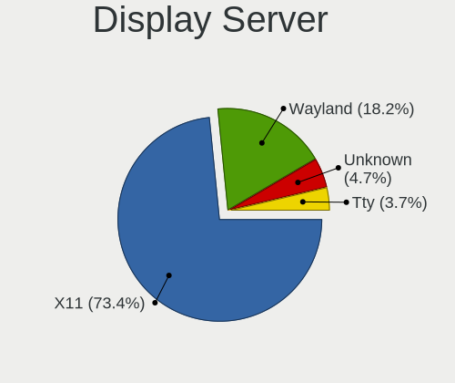

| Name    | Desktops | Percent |
|---------|----------|---------|
| X11     | 236      | 82.52%  |
| Wayland | 29       | 10.14%  |
| Unknown | 15       | 5.24%   |
| Tty     | 6        | 2.1%    |

Display Manager
---------------

SDDM, LightDM, etc.

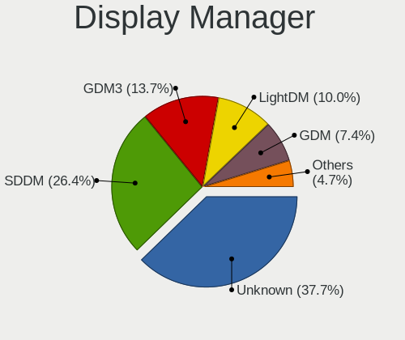

| Name    | Desktops | Percent |
|---------|----------|---------|
| Unknown | 118      | 40.97%  |
| SDDM    | 76       | 26.39%  |
| GDM3    | 30       | 10.42%  |
| LightDM | 26       | 9.03%   |
| GDM     | 20       | 6.94%   |
| TDM     | 9        | 3.13%   |
| KDM     | 6        | 2.08%   |
| SLiM    | 3        | 1.04%   |

OS Lang
-------

Language

| Lang        | Desktops | Percent |
|-------------|----------|---------|
| sk_SK       | 105      | 36.84%  |
| en_US       | 96       | 33.68%  |
| Unknown     | 57       | 20%     |
| cs_CZ       | 11       | 3.86%   |
| en_GB       | 5        | 1.75%   |
| C           | 5        | 1.75%   |
| sr_RS@latin | 2        | 0.7%    |
| hu_HU       | 2        | 0.7%    |
| POSIX       | 1        | 0.35%   |
| en_AU       | 1        | 0.35%   |

Boot Mode
---------

EFI or BIOS

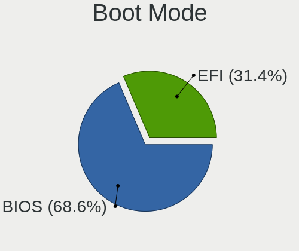

| Mode | Desktops | Percent |
|------|----------|---------|
| BIOS | 203      | 73.55%  |
| EFI  | 73       | 26.45%  |

Filesystem
----------

Type of filesystem

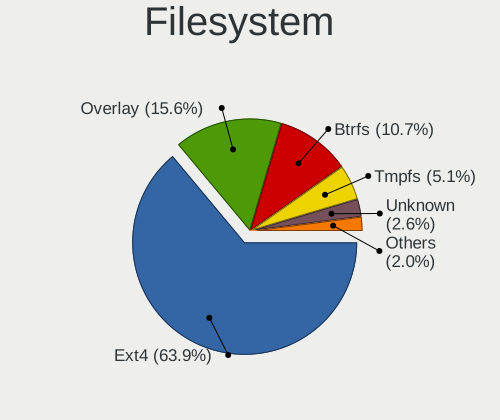

| Type    | Desktops | Percent |
|---------|----------|---------|
| Ext4    | 195      | 67.47%  |
| Overlay | 50       | 17.3%   |
| Btrfs   | 26       | 9%      |
| Unknown | 10       | 3.46%   |
| Xfs     | 4        | 1.38%   |
| Zfs     | 2        | 0.69%   |
| Tmpfs   | 1        | 0.35%   |
| Ext2    | 1        | 0.35%   |

Part. scheme
------------

Scheme of partitioning

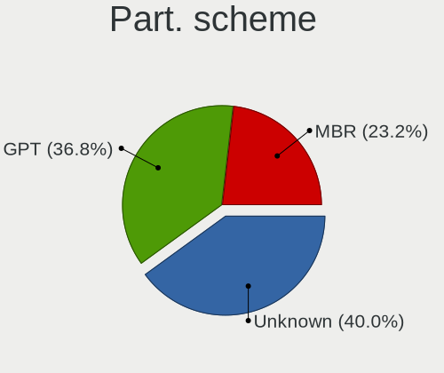

| Type    | Desktops | Percent |
|---------|----------|---------|
| Unknown | 134      | 46.85%  |
| MBR     | 79       | 27.62%  |
| GPT     | 73       | 25.52%  |

Dual Boot with Linux/BSD
------------------------

Hosting more than one Linux/BSD

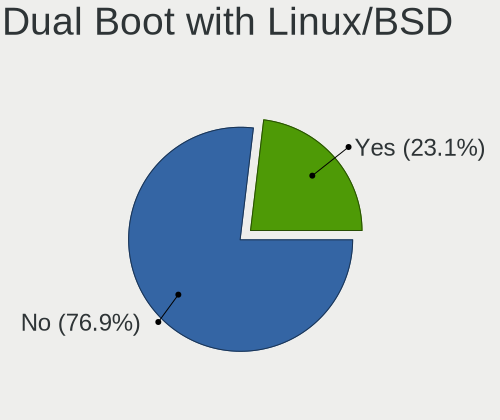

| Dual boot | Desktops | Percent |
|-----------|----------|---------|
| No        | 226      | 77.13%  |
| Yes       | 67       | 22.87%  |

Dual Boot (Win)
---------------

Hosting Linux and Windows

| Dual boot | Desktops | Percent |
|-----------|----------|---------|
| No        | 183      | 64.89%  |
| Yes       | 99       | 35.11%  |

Board
-----

Vendor
------

Motherboard manufacturer

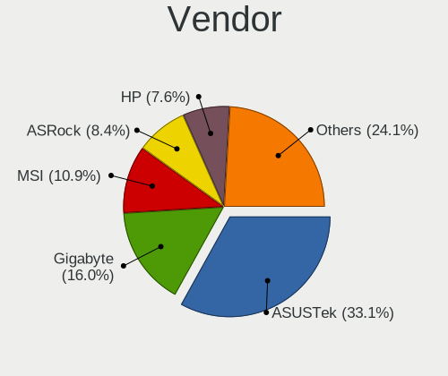

| Name                | Desktops | Percent |
|---------------------|----------|---------|
| ASUSTek Computer    | 90       | 32.97%  |
| Gigabyte Technology | 47       | 17.22%  |
| MSI                 | 32       | 11.72%  |
| Hewlett-Packard     | 24       | 8.79%   |
| ASRock              | 23       | 8.42%   |
| Dell                | 14       | 5.13%   |
| Intel               | 10       | 3.66%   |
| Lenovo              | 9        | 3.3%    |
| Foxconn             | 5        | 1.83%   |
| Acer                | 5        | 1.83%   |
| Unknown             | 3        | 1.1%    |
| Techvision          | 2        | 0.73%   |
| Shuttle             | 2        | 0.73%   |
| Pegatron            | 2        | 0.73%   |
| VIA Technologies    | 1        | 0.37%   |
| Samsung Electronics | 1        | 0.37%   |
| Packard Bell        | 1        | 0.37%   |
| Insyde              | 1        | 0.37%   |
| Fujitsu Siemens     | 1        | 0.37%   |

Model
-----

Motherboard model

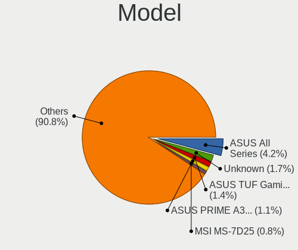

| Name                                    | Desktops | Percent |
|-----------------------------------------|----------|---------|
| ASUS All Series                         | 11       | 4.03%   |
| ASUS TUF Gaming B550M-PLUS              | 4        | 1.47%   |
| Gigabyte F2A68HM-DS2                    | 3        | 1.1%    |
| Unknown                                 | 3        | 1.1%    |
| Techvision TVI7309X                     | 2        | 0.73%   |
| MSI MS-7D25                             | 2        | 0.73%   |
| MSI MS-7C02                             | 2        | 0.73%   |
| MSI MS-7592                             | 2        | 0.73%   |
| Lenovo IdeaCentre Q180 10087&3110       | 2        | 0.73%   |
| HP Compaq Elite 8300 SFF                | 2        | 0.73%   |
| HP Compaq dc7800p Convertible Minitower | 2        | 0.73%   |
| HP Compaq 8000 Elite SFF PC             | 2        | 0.73%   |
| HP Compaq 6005 Pro SFF PC               | 2        | 0.73%   |
| Gigabyte P43-ES3G                       | 2        | 0.73%   |
| Gigabyte H81M-S2V                       | 2        | 0.73%   |
| Gigabyte H61M-S1                        | 2        | 0.73%   |
| Gigabyte GA-MA78GM-US2H                 | 2        | 0.73%   |
| Gigabyte AB350-Gaming 3                 | 2        | 0.73%   |
| Gigabyte 970A-DS3P                      | 2        | 0.73%   |
| Foxconn G41MX/G41MX-K 2.0 1.0           | 2        | 0.73%   |
| Dell Vostro 400                         | 2        | 0.73%   |
| Dell Precision WorkStation 390          | 2        | 0.73%   |
| Dell OptiPlex 7010                      | 2        | 0.73%   |
| ASUS ROG STRIX X570-E GAMING            | 2        | 0.73%   |
| ASUS PRIME A320M-K                      | 2        | 0.73%   |
| ASUS P5QL-E                             | 2        | 0.73%   |
| ASUS M5A78L-M/USB3                      | 2        | 0.73%   |
| ASUS M4A88T-V EVO/USB3                  | 2        | 0.73%   |
| ASUS F2A85-V PRO                        | 2        | 0.73%   |
| ASUS F2A55-M LK2 PLUS                   | 2        | 0.73%   |
| ASRock N68C-S UCC                       | 2        | 0.73%   |
| ASRock K8A780LM                         | 2        | 0.73%   |
| ASRock 960GC-GS FX                      | 2        | 0.73%   |
| Acer Aspire M5811                       | 2        | 0.73%   |
| VIA KM266-8235                          | 1        | 0.37%   |
| Shuttle XH61V                           | 1        | 0.37%   |
| Shuttle TERRA_PC                        | 1        | 0.37%   |
| Samsung DeskTop System                  | 1        | 0.37%   |
| Pegatron Elite 7500 Series MT           | 1        | 0.37%   |
| Pegatron Compaq dx2400 Microtower PC    | 1        | 0.37%   |

Model Family
------------

Motherboard model prefix

| Name                    | Desktops | Percent |
|-------------------------|----------|---------|
| HP Compaq               | 14       | 5.13%   |
| ASUS All                | 11       | 4.03%   |
| ASUS PRIME              | 10       | 3.66%   |
| Dell OptiPlex           | 9        | 3.3%    |
| ASUS ROG                | 7        | 2.56%   |
| ASUS TUF                | 6        | 2.2%    |
| Lenovo ThinkCentre      | 4        | 1.47%   |
| Acer Aspire             | 4        | 1.47%   |
| HP ProLiant             | 3        | 1.1%    |
| Gigabyte F2A68HM-DS2    | 3        | 1.1%    |
| Dell Precision          | 3        | 1.1%    |
| ASUS M5A97              | 3        | 1.1%    |
| ASUS M5A78L-M           | 3        | 1.1%    |
| Unknown                 | 3        | 1.1%    |
| Techvision TVI7309X     | 2        | 0.73%   |
| MSI MS-7D25             | 2        | 0.73%   |
| MSI MS-7C02             | 2        | 0.73%   |
| MSI MS-7592             | 2        | 0.73%   |
| Lenovo IdeaCentre       | 2        | 0.73%   |
| Gigabyte P43-ES3G       | 2        | 0.73%   |
| Gigabyte H81M-S2V       | 2        | 0.73%   |
| Gigabyte H61M-S1        | 2        | 0.73%   |
| Gigabyte GA-MA78GM-US2H | 2        | 0.73%   |
| Gigabyte AB350-Gaming   | 2        | 0.73%   |
| Gigabyte 970A-DS3P      | 2        | 0.73%   |
| Foxconn G41MX           | 2        | 0.73%   |
| Foxconn 945             | 2        | 0.73%   |
| Dell Vostro             | 2        | 0.73%   |
| ASUS P5QL-E             | 2        | 0.73%   |
| ASUS P5KPL-AM           | 2        | 0.73%   |
| ASUS P5GC-MX            | 2        | 0.73%   |
| ASUS Maximus            | 2        | 0.73%   |
| ASUS M4A88T-V           | 2        | 0.73%   |
| ASUS F2A85-V            | 2        | 0.73%   |
| ASUS F2A55-M            | 2        | 0.73%   |
| ASRock N68C-S           | 2        | 0.73%   |
| ASRock K8A780LM         | 2        | 0.73%   |
| ASRock B550             | 2        | 0.73%   |
| ASRock 960GC-GS         | 2        | 0.73%   |
| VIA KM266-8235          | 1        | 0.37%   |

MFG Year
--------

Motherboard manufacture year

| Year | Desktops | Percent |
|------|----------|---------|
| 2012 | 34       | 12.45%  |
| 2009 | 29       | 10.62%  |
| 2013 | 24       | 8.79%   |
| 2008 | 21       | 7.69%   |
| 2020 | 18       | 6.59%   |
| 2014 | 18       | 6.59%   |
| 2007 | 18       | 6.59%   |
| 2019 | 16       | 5.86%   |
| 2018 | 15       | 5.49%   |
| 2006 | 14       | 5.13%   |
| 2011 | 13       | 4.76%   |
| 2010 | 12       | 4.4%    |
| 2016 | 9        | 3.3%    |
| 2015 | 9        | 3.3%    |
| 2017 | 6        | 2.2%    |
| 2022 | 5        | 1.83%   |
| 2021 | 5        | 1.83%   |
| 2023 | 2        | 0.73%   |
| 2005 | 2        | 0.73%   |
| 2002 | 1        | 0.37%   |
| 2001 | 1        | 0.37%   |
| 2000 | 1        | 0.37%   |

Form Factor
-----------

Physical design of the computer

| Name    | Desktops | Percent |
|---------|----------|---------|
| Desktop | 273      | 100%    |

Secure Boot
-----------

Enabled or disabled

| State    | Desktops | Percent |
|----------|----------|---------|
| Disabled | 267      | 97.45%  |
| Enabled  | 7        | 2.55%   |

Coreboot
--------

Have coreboot on board

| Used | Desktops | Percent |
|------|----------|---------|
| No   | 273      | 100%    |

RAM Size
--------

Total RAM memory

| Size in GB  | Desktops | Percent |
|-------------|----------|---------|
| 3.01-4.0    | 64       | 22.46%  |
| 8.01-16.0   | 59       | 20.7%   |
| 4.01-8.0    | 52       | 18.25%  |
| 16.01-24.0  | 45       | 15.79%  |
| 32.01-64.0  | 27       | 9.47%   |
| 1.01-2.0    | 12       | 4.21%   |
| 64.01-256.0 | 10       | 3.51%   |
| 2.01-3.0    | 7        | 2.46%   |
| 24.01-32.0  | 4        | 1.4%    |
| 0.51-1.0    | 4        | 1.4%    |
| 0.01-0.5    | 1        | 0.35%   |

RAM Used
--------

Used RAM memory

| Used GB    | Desktops | Percent |
|------------|----------|---------|
| 1.01-2.0   | 120      | 36.92%  |
| 2.01-3.0   | 68       | 20.92%  |
| 0.51-1.0   | 39       | 12%     |
| 3.01-4.0   | 33       | 10.15%  |
| 4.01-8.0   | 24       | 7.38%   |
| 0.01-0.5   | 23       | 7.08%   |
| 8.01-16.0  | 16       | 4.92%   |
| 24.01-32.0 | 1        | 0.31%   |
| 16.01-24.0 | 1        | 0.31%   |

Total Drives
------------

Number of drives on board

| Drives | Desktops | Percent |
|--------|----------|---------|
| 1      | 123      | 40.73%  |
| 2      | 96       | 31.79%  |
| 3      | 38       | 12.58%  |
| 4      | 18       | 5.96%   |
| 5      | 15       | 4.97%   |
| 0      | 6        | 1.99%   |
| 6      | 4        | 1.32%   |
| 17     | 1        | 0.33%   |
| 7      | 1        | 0.33%   |

Has CD-ROM
----------

Has CD-ROM on board

| Presented | Desktops | Percent |
|-----------|----------|---------|
| Yes       | 153      | 54.45%  |
| No        | 128      | 45.55%  |

Has Ethernet
------------

Has Ethernet on board

| Presented | Desktops | Percent |
|-----------|----------|---------|
| Yes       | 267      | 97.45%  |
| No        | 7        | 2.55%   |

Has WiFi
--------

Has WiFi module

| Presented | Desktops | Percent |
|-----------|----------|---------|
| No        | 197      | 70.61%  |
| Yes       | 82       | 29.39%  |

Has Bluetooth
-------------

Has Bluetooth module

| Presented | Desktops | Percent |
|-----------|----------|---------|
| No        | 231      | 83.09%  |
| Yes       | 47       | 16.91%  |

Location
--------

Country
-------

Geographic location (country)

| Country  | Desktops | Percent |
|----------|----------|---------|
| Slovakia | 273      | 100%    |

City
----

Geographic location (city)

| City                   | Desktops | Percent |
|------------------------|----------|---------|
| Bratislava             | 90       | 29.03%  |
| Koice                | 32       | 10.32%  |
| Nitra                  | 13       | 4.19%   |
| Bansk Bystrica       | 10       | 3.23%   |
| Poprad                 | 6        | 1.94%   |
| Nov Zmky           | 6        | 1.94%   |
| Dolny Ohaj             | 6        | 1.94%   |
| ilina                | 5        | 1.61%   |
| Zvolen                 | 4        | 1.29%   |
| Trnava                 | 3        | 0.97%   |
| Trenn              | 3        | 0.97%   |
| Tornaa               | 3        | 0.97%   |
| Ruomberok            | 3        | 0.97%   |
| Rimavsk Sobota       | 3        | 0.97%   |
| Preov                | 3        | 0.97%   |
| Nitrianske Hrnciarovce | 3        | 0.97%   |
| Liptovsk Mikul   | 3        | 0.97%   |
| Levice                 | 3        | 0.97%   |
| Soblahov               | 2        | 0.65%   |
| Smizany                | 2        | 0.65%   |
| Skalica                | 2        | 0.65%   |
| Senica                 | 2        | 0.65%   |
| aa                 | 2        | 0.65%   |
| Roava              | 2        | 0.65%   |
| Rozhanovce             | 2        | 0.65%   |
| Petralka           | 2        | 0.65%   |
| Modra                  | 2        | 0.65%   |
| Miloslavov             | 2        | 0.65%   |
| Martin                 | 2        | 0.65%   |
| Malacky                | 2        | 0.65%   |
| Luenec               | 2        | 0.65%   |
| Kostolne Kracany       | 2        | 0.65%   |
| Kmetovce               | 2        | 0.65%   |
| Kalna                  | 2        | 0.65%   |
| Humenn               | 2        | 0.65%   |
| Galanta                | 2        | 0.65%   |
| Cechynce               | 2        | 0.65%   |
| Brezno                 | 2        | 0.65%   |
| Bardejov               | 2        | 0.65%   |
| Zlate Moravce          | 1        | 0.32%   |

Drives
------

Drive Vendor
------------

Hard drive vendors

| Vendor                    | Desktops | Drives | Percent |
|---------------------------|----------|--------|---------|
| WDC                       | 116      | 242    | 24.22%  |
| Seagate                   | 97       | 162    | 20.25%  |
| Samsung Electronics       | 77       | 138    | 16.08%  |
| Hitachi                   | 23       | 34     | 4.8%    |
| Kingston                  | 21       | 23     | 4.38%   |
| A-DATA Technology         | 20       | 31     | 4.18%   |
| Toshiba                   | 16       | 25     | 3.34%   |
| Patriot                   | 14       | 27     | 2.92%   |
| Intel                     | 12       | 20     | 2.51%   |
| SanDisk                   | 7        | 10     | 1.46%   |
| Maxtor                    | 7        | 12     | 1.46%   |
| Crucial                   | 6        | 7      | 1.25%   |
| HGST                      | 5        | 8      | 1.04%   |
| KingDian                  | 4        | 4      | 0.84%   |
| Gigabyte Technology       | 4        | 6      | 0.84%   |
| Unknown                   | 3        | 4      | 0.63%   |
| Phison                    | 3        | 3      | 0.63%   |
| OCZ                       | 3        | 3      | 0.63%   |
| HS-SSD-E100               | 3        | 3      | 0.63%   |
| Apacer                    | 3        | 5      | 0.63%   |
| XPG                       | 2        | 5      | 0.42%   |
| SK hynix                  | 2        | 2      | 0.42%   |
| Silicon Motion            | 2        | 3      | 0.42%   |
| Realtek Semiconductor     | 2        | 2      | 0.42%   |
| Micron Technology         | 2        | 4      | 0.42%   |
| IBM/Hitachi               | 2        | 2      | 0.42%   |
| GOODRAM                   | 2        | 4      | 0.42%   |
| Corsair                   | 2        | 3      | 0.42%   |
| China                     | 2        | 4      | 0.42%   |
| Verbatim                  | 1        | 1      | 0.21%   |
| USB3.0                    | 1        | 2      | 0.21%   |
| ULTIMATE                  | 1        | 2      | 0.21%   |
| Realtek                   | 1        | 1      | 0.21%   |
| PNY                       | 1        | 2      | 0.21%   |
| Phison Electronics        | 1        | 1      | 0.21%   |
| Micron/Crucial Technology | 1        | 1      | 0.21%   |
| LITEONIT                  | 1        | 1      | 0.21%   |
| Intenso                   | 1        | 4      | 0.21%   |
| HS-SSD-C100               | 1        | 3      | 0.21%   |
| HGST HTS                  | 1        | 1      | 0.21%   |

Drive Model
-----------

Hard drive models

| Model                            | Desktops | Percent |
|----------------------------------|----------|---------|
| WDC WD10EZEX-08WN4A0 1TB         | 6        | 1.05%   |
| Seagate ST3500418AS 500GB        | 6        | 1.05%   |
| Seagate ST2000DM008-2FR102 2TB   | 6        | 1.05%   |
| Samsung SSD 860 EVO 250GB        | 6        | 1.05%   |
| Samsung SSD 850 EVO 250GB        | 6        | 1.05%   |
| Patriot Burst 120GB SSD          | 6        | 1.05%   |
| Kingston SV300S37A120G 120GB SSD | 6        | 1.05%   |
| WDC WD20EZRZ-00Z5HB0 2TB         | 4        | 0.7%    |
| Toshiba DT01ACA100 1TB           | 4        | 0.7%    |
| Seagate ST500DM002-1BD142 500GB  | 4        | 0.7%    |
| Seagate ST3320311CS 320GB        | 4        | 0.7%    |
| Seagate ST2000DM001-1CH164 2TB   | 4        | 0.7%    |
| Seagate ST1000DM003-1CH162 1TB   | 4        | 0.7%    |
| Samsung SSD 860 EVO 500GB        | 4        | 0.7%    |
| Samsung SSD 850 EVO 500GB        | 4        | 0.7%    |
| WDC WDS500G2B0A-00SM50 500GB SSD | 3        | 0.53%   |
| WDC WD5000AAKX-75U6AA0 500GB     | 3        | 0.53%   |
| WDC WD10EZEX-00KUWA0 1TB         | 3        | 0.53%   |
| Seagate ST380815AS 80GB          | 3        | 0.53%   |
| Seagate ST3808110AS 80GB         | 3        | 0.53%   |
| Seagate ST1000DM003-1SB102 1TB   | 3        | 0.53%   |
| Samsung SSD 980 PRO 1TB          | 3        | 0.53%   |
| Samsung SSD 970 PRO 512GB        | 3        | 0.53%   |
| Samsung SSD 870 EVO 500GB        | 3        | 0.53%   |
| Samsung SSD 860 EVO 1TB          | 3        | 0.53%   |
| Patriot Burst 240GB SSD          | 3        | 0.53%   |
| Kingston SV300S37A60G 64GB SSD   | 3        | 0.53%   |
| Hitachi HTS543232A7A384 320GB    | 3        | 0.53%   |
| Hitachi HDS722020ALA330 2TB      | 3        | 0.53%   |
| Hitachi HDP725050GLA360 500GB    | 3        | 0.53%   |
| A-DATA SU700 120GB SSD           | 3        | 0.53%   |
| A-DATA SU650 120GB SSD           | 3        | 0.53%   |
| A-DATA SP600 32GB SSD            | 3        | 0.53%   |
| XPG GAMMIX S11 Pro 1TB           | 2        | 0.35%   |
| WDC WD6400AAKS-22A7B0 640GB      | 2        | 0.35%   |
| WDC WD5000AZRX-00L4HB0 500GB     | 2        | 0.35%   |
| WDC WD5000AAKX-22ERMA0 500GB     | 2        | 0.35%   |
| WDC WD5000AADS-00S9B0 500GB      | 2        | 0.35%   |
| WDC WD40EZRZ-00GXCB0 4TB         | 2        | 0.35%   |
| WDC WD400JB-00JJC0 40GB          | 2        | 0.35%   |

HDD Vendor
----------

Hard disk drive vendors

| Vendor              | Desktops | Drives | Percent |
|---------------------|----------|--------|---------|
| WDC                 | 114      | 230    | 39.72%  |
| Seagate             | 95       | 159    | 33.1%   |
| Hitachi             | 23       | 34     | 8.01%   |
| Samsung Electronics | 21       | 33     | 7.32%   |
| Toshiba             | 14       | 21     | 4.88%   |
| Maxtor              | 7        | 12     | 2.44%   |
| HGST                | 5        | 8      | 1.74%   |
| IBM/Hitachi         | 2        | 2      | 0.7%    |
| USB3.0              | 1        | 2      | 0.35%   |
| Unknown             | 1        | 1      | 0.35%   |
| HGST HTS            | 1        | 1      | 0.35%   |
| Hewlett-Packard     | 1        | 3      | 0.35%   |
| Fujitsu             | 1        | 2      | 0.35%   |
| ExcelStor           | 1        | 1      | 0.35%   |

SSD Vendor
----------

Solid state drive vendors

| Vendor              | Desktops | Drives | Percent |
|---------------------|----------|--------|---------|
| Samsung Electronics | 40       | 60     | 28.78%  |
| A-DATA Technology   | 18       | 29     | 12.95%  |
| Kingston            | 15       | 17     | 10.79%  |
| Patriot             | 13       | 26     | 9.35%   |
| Intel               | 10       | 18     | 7.19%   |
| Crucial             | 6        | 7      | 4.32%   |
| WDC                 | 5        | 6      | 3.6%    |
| SanDisk             | 4        | 5      | 2.88%   |
| OCZ                 | 3        | 3      | 2.16%   |
| Gigabyte Technology | 3        | 5      | 2.16%   |
| SK hynix            | 2        | 2      | 1.44%   |
| Micron Technology   | 2        | 4      | 1.44%   |
| KingDian            | 2        | 2      | 1.44%   |
| GOODRAM             | 2        | 4      | 1.44%   |
| China               | 2        | 4      | 1.44%   |
| Apacer              | 2        | 4      | 1.44%   |
| Verbatim            | 1        | 1      | 0.72%   |
| ULTIMATE            | 1        | 2      | 0.72%   |
| Toshiba             | 1        | 1      | 0.72%   |
| PNY                 | 1        | 2      | 0.72%   |
| LITEONIT            | 1        | 1      | 0.72%   |
| Intenso             | 1        | 4      | 0.72%   |
| HS-SSD-C100         | 1        | 3      | 0.72%   |
| FORESEE             | 1        | 2      | 0.72%   |
| Corsair             | 1        | 1      | 0.72%   |
| AMD                 | 1        | 1      | 0.72%   |

Drive Kind
----------

HDD or SSD

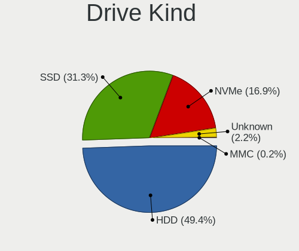

| Kind    | Desktops | Drives | Percent |
|---------|----------|--------|---------|
| HDD     | 210      | 509    | 53.85%  |
| SSD     | 122      | 214    | 31.28%  |
| NVMe    | 50       | 93     | 12.82%  |
| Unknown | 8        | 9      | 2.05%   |

Drive Connector
---------------

SATA, SAS, NVMe, etc.

| Type | Desktops | Drives | Percent |
|------|----------|--------|---------|
| SATA | 251      | 719    | 80.97%  |
| NVMe | 50       | 92     | 16.13%  |
| SAS  | 9        | 14     | 2.9%    |

Drive Size
----------

Size of hard drive

| Size in TB | Desktops | Drives | Percent |
|------------|----------|--------|---------|
| 0.01-0.5   | 213      | 447    | 58.52%  |
| 0.51-1.0   | 82       | 158    | 22.53%  |
| 1.01-2.0   | 39       | 60     | 10.71%  |
| 3.01-4.0   | 13       | 24     | 3.57%   |
| 2.01-3.0   | 11       | 22     | 3.02%   |
| 4.01-10.0  | 5        | 11     | 1.37%   |
| 10.01-20.0 | 1        | 1      | 0.27%   |

Space Total
-----------

Amount of disk space available on the file system

| Size in GB     | Desktops | Percent |
|----------------|----------|---------|
| 101-250        | 70       | 22.08%  |
| 251-500        | 59       | 18.61%  |
| 1-20           | 44       | 13.88%  |
| 501-1000       | 42       | 13.25%  |
| Unknown        | 24       | 7.57%   |
| 1001-2000      | 23       | 7.26%   |
| 51-100         | 20       | 6.31%   |
| More than 3000 | 13       | 4.1%    |
| 21-50          | 13       | 4.1%    |
| 2001-3000      | 9        | 2.84%   |

Space Used
----------

Amount of used disk space

| Used GB        | Desktops | Percent |
|----------------|----------|---------|
| 1-20           | 129      | 40.31%  |
| 21-50          | 46       | 14.38%  |
| 101-250        | 35       | 10.94%  |
| 51-100         | 26       | 8.13%   |
| Unknown        | 24       | 7.5%    |
| 501-1000       | 23       | 7.19%   |
| 251-500        | 20       | 6.25%   |
| 1001-2000      | 9        | 2.81%   |
| More than 3000 | 5        | 1.56%   |
| 2001-3000      | 3        | 0.94%   |

Malfunc. Drives
---------------

Drive models with a malfunction

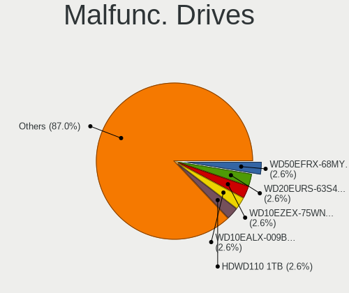

| Model                                 | Desktops | Drives | Percent |
|---------------------------------------|----------|--------|---------|
| WDC WD10EZEX-75WN4A0 1TB              | 2        | 3      | 3.64%   |
| Seagate ST9500325AS 500GB             | 2        | 3      | 3.64%   |
| Seagate ST3320413CS 320GB             | 2        | 2      | 3.64%   |
| Kingston SV300S37A60G 64GB SSD        | 2        | 3      | 3.64%   |
| WDC WD800JD-60LSA0 80GB               | 1        | 1      | 1.82%   |
| WDC WD7500BPVT-24HXZT3 752GB          | 1        | 1      | 1.82%   |
| WDC WD7500AAVS-00D7B1 752GB           | 1        | 1      | 1.82%   |
| WDC WD5000AAVS-22G9B1 500GB           | 1        | 2      | 1.82%   |
| WDC WD3200AAKS-22L6A0 320GB           | 1        | 1      | 1.82%   |
| WDC WD3200AAJS-56B4A0 320GB           | 1        | 2      | 1.82%   |
| WDC WD2500AAKX-753CA1 250GB           | 1        | 2      | 1.82%   |
| WDC WD20EZRZ-00Z5HB0 2TB              | 1        | 1      | 1.82%   |
| WDC WD20EURS-63S48Y0 2TB              | 1        | 1      | 1.82%   |
| WDC WD1600JS-61MHB1 160GB             | 1        | 1      | 1.82%   |
| WDC WD10EZEX-08WN4A0 1TB              | 1        | 1      | 1.82%   |
| WDC WD10EZEX-00RKKA0 1TB              | 1        | 1      | 1.82%   |
| WDC WD10EZEX-00KUWA0 1TB              | 1        | 1      | 1.82%   |
| WDC WD10EALX-009BA0 1TB               | 1        | 1      | 1.82%   |
| Toshiba MK7575GSX 752GB               | 1        | 2      | 1.82%   |
| SK hynix SC210 2.5 7MM 256GB SSD      | 1        | 1      | 1.82%   |
| Seagate ST980811AS 80GB               | 1        | 1      | 1.82%   |
| Seagate ST9250315AS 250GB             | 1        | 1      | 1.82%   |
| Seagate ST8000VX0022-2EJ112 8TB       | 1        | 2      | 1.82%   |
| Seagate ST500DM002-1BD142 500GB       | 1        | 1      | 1.82%   |
| Seagate ST3500412AS 500GB             | 1        | 1      | 1.82%   |
| Seagate ST3500312CS 500GB             | 1        | 1      | 1.82%   |
| Seagate ST3402111A 40GB               | 1        | 1      | 1.82%   |
| Seagate ST320LT007-9ZV142 320GB       | 1        | 1      | 1.82%   |
| Seagate ST31000322CS 1TB              | 1        | 2      | 1.82%   |
| Seagate ST250DM000-1BD141 250GB       | 1        | 1      | 1.82%   |
| Seagate ST2000VX000-1CU164 2TB        | 1        | 1      | 1.82%   |
| Seagate ST1000LM035-1RK172 1TB        | 1        | 1      | 1.82%   |
| Samsung Electronics SSD 970 EVO 500GB | 1        | 1      | 1.82%   |
| Samsung Electronics HD753LJ 752GB     | 1        | 4      | 1.82%   |
| Samsung Electronics HD320KJ 320GB     | 1        | 1      | 1.82%   |
| Samsung Electronics HD154UI 1TB       | 1        | 1      | 1.82%   |
| OCZ VERTEX4 256GB SSD                 | 1        | 1      | 1.82%   |
| OCZ AGILITY3 240GB SSD                | 1        | 1      | 1.82%   |
| Maxtor 6L200M0 208GB                  | 1        | 1      | 1.82%   |
| Maxtor 6L080P0 81GB                   | 1        | 1      | 1.82%   |

Malfunc. Drive Vendor
---------------------

Vendors of faulty drives

| Vendor              | Desktops | Drives | Percent |
|---------------------|----------|--------|---------|
| Seagate             | 16       | 19     | 29.63%  |
| WDC                 | 15       | 20     | 27.78%  |
| Samsung Electronics | 4        | 7      | 7.41%   |
| Maxtor              | 3        | 3      | 5.56%   |
| Kingston            | 3        | 4      | 5.56%   |
| Hitachi             | 3        | 3      | 5.56%   |
| OCZ                 | 2        | 2      | 3.7%    |
| Toshiba             | 1        | 2      | 1.85%   |
| SK hynix            | 1        | 1      | 1.85%   |
| IBM/Hitachi         | 1        | 1      | 1.85%   |
| HGST                | 1        | 3      | 1.85%   |
| Fujitsu             | 1        | 2      | 1.85%   |
| ExcelStor           | 1        | 1      | 1.85%   |
| Crucial             | 1        | 1      | 1.85%   |
| A-DATA Technology   | 1        | 1      | 1.85%   |

Malfunc. HDD Vendor
-------------------

Vendors of faulty HDD drives

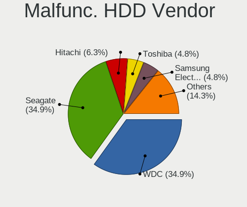

| Vendor              | Desktops | Drives | Percent |
|---------------------|----------|--------|---------|
| Seagate             | 16       | 19     | 35.56%  |
| WDC                 | 15       | 20     | 33.33%  |
| Samsung Electronics | 3        | 6      | 6.67%   |
| Maxtor              | 3        | 3      | 6.67%   |
| Hitachi             | 3        | 3      | 6.67%   |
| Toshiba             | 1        | 2      | 2.22%   |
| IBM/Hitachi         | 1        | 1      | 2.22%   |
| HGST                | 1        | 3      | 2.22%   |
| Fujitsu             | 1        | 2      | 2.22%   |
| ExcelStor           | 1        | 1      | 2.22%   |

Malfunc. Drive Kind
-------------------

Kinds of faulty drives

| Kind | Desktops | Drives | Percent |
|------|----------|--------|---------|
| HDD  | 42       | 60     | 82.35%  |
| SSD  | 8        | 9      | 15.69%  |
| NVMe | 1        | 1      | 1.96%   |

Failed Drives
-------------

Failed drive models

| Model                             | Desktops | Drives | Percent |
|-----------------------------------|----------|--------|---------|
| Toshiba MK5065GSX 500GB           | 2        | 2      | 40%     |
| Seagate ST3500418AS 500GB         | 1        | 2      | 20%     |
| Seagate ST2000DM001-1CH164 2TB    | 1        | 1      | 20%     |
| Samsung Electronics HD321HJ 320GB | 1        | 2      | 20%     |

Failed Drive Vendor
-------------------

Failed drive vendors

| Vendor              | Desktops | Drives | Percent |
|---------------------|----------|--------|---------|
| Toshiba             | 2        | 2      | 40%     |
| Seagate             | 2        | 3      | 40%     |
| Samsung Electronics | 1        | 2      | 20%     |

Drive Status
------------

Number of failed and malfunc. drives

| Status   | Desktops | Drives | Percent |
|----------|----------|--------|---------|
| Detected | 143      | 385    | 44.55%  |
| Works    | 125      | 363    | 38.94%  |
| Malfunc  | 48       | 70     | 14.95%  |
| Failed   | 5        | 7      | 1.56%   |

Storage controller
------------------

Storage Vendor
--------------

Storage controller vendors

| Vendor                       | Desktops | Percent |
|------------------------------|----------|---------|
| Intel                        | 166      | 44.99%  |
| AMD                          | 83       | 22.49%  |
| Samsung Electronics          | 24       | 6.5%    |
| JMicron Technology           | 20       | 5.42%   |
| Nvidia                       | 16       | 4.34%   |
| ASMedia Technology           | 11       | 2.98%   |
| SanDisk                      | 7        | 1.9%    |
| Phison Electronics           | 7        | 1.9%    |
| Kingston Technology Company  | 7        | 1.9%    |
| VIA Technologies             | 6        | 1.63%   |
| Marvell Technology Group     | 6        | 1.63%   |
| ADATA Technology             | 4        | 1.08%   |
| Silicon Motion               | 2        | 0.54%   |
| Realtek Semiconductor        | 2        | 0.54%   |
| Promise Technology           | 2        | 0.54%   |
| Hewlett-Packard              | 2        | 0.54%   |
| ULi Electronics              | 1        | 0.27%   |
| Toshiba America Info Systems | 1        | 0.27%   |
| Micron/Crucial Technology    | 1        | 0.27%   |
| LSI Logic / Symbios Logic    | 1        | 0.27%   |

Storage Model
-------------

Storage controller models

| Model                                                                          | Desktops | Percent |
|--------------------------------------------------------------------------------|----------|---------|
| AMD FCH SATA Controller [AHCI mode]                                            | 38       | 7.57%   |
| Intel NM10/ICH7 Family SATA Controller [IDE mode]                              | 27       | 5.38%   |
| Intel 82801G (ICH7 Family) IDE Controller                                      | 24       | 4.78%   |
| Intel 8 Series/C220 Series Chipset Family 6-port SATA Controller 1 [AHCI mode] | 18       | 3.59%   |
| AMD SB7x0/SB8x0/SB9x0 IDE Controller                                           | 18       | 3.59%   |
| Intel 7 Series/C210 Series Chipset Family 6-port SATA Controller [AHCI mode]   | 15       | 2.99%   |
| AMD SB7x0/SB8x0/SB9x0 SATA Controller [AHCI mode]                              | 15       | 2.99%   |
| Samsung NVMe SSD Controller SM981/PM981/PM983                                  | 13       | 2.59%   |
| JMicron JMB363 SATA/IDE Controller                                             | 13       | 2.59%   |
| AMD SB7x0/SB8x0/SB9x0 SATA Controller [IDE mode]                               | 12       | 2.39%   |
| AMD 500 Series Chipset SATA Controller                                         | 12       | 2.39%   |
| AMD 400 Series Chipset SATA Controller                                         | 12       | 2.39%   |
| Intel 6 Series/C200 Series Chipset Family 6 port Desktop SATA AHCI Controller  | 11       | 2.19%   |
| Intel 200 Series PCH SATA controller [AHCI mode]                               | 10       | 1.99%   |
| Intel Q170/Q150/B150/H170/H110/Z170/CM236 Chipset SATA Controller [AHCI Mode]  | 9        | 1.79%   |
| Intel 82801I (ICH9 Family) 2 port SATA Controller [IDE mode]                   | 9        | 1.79%   |
| ASMedia ASM1062 Serial ATA Controller                                          | 9        | 1.79%   |
| Nvidia MCP61 SATA Controller                                                   | 8        | 1.59%   |
| Nvidia MCP61 IDE                                                               | 8        | 1.59%   |
| Intel 82801JI (ICH10 Family) 4 port SATA IDE Controller #1                     | 8        | 1.59%   |
| Intel 82801JI (ICH10 Family) 2 port SATA IDE Controller #2                     | 8        | 1.59%   |
| Intel 82801IR/IO/IH (ICH9R/DO/DH) 4 port SATA Controller [IDE mode]            | 8        | 1.59%   |
| Samsung NVMe SSD Controller SM961/PM961/SM963                                  | 7        | 1.39%   |
| Intel SATA Controller [RAID mode]                                              | 7        | 1.39%   |
| Samsung NVMe SSD Controller PM9A1/PM9A3/980PRO                                 | 5        | 1%      |
| Intel Cannon Lake PCH SATA AHCI Controller                                     | 5        | 1%      |
| Intel 82801JI (ICH10 Family) SATA AHCI Controller                              | 5        | 1%      |
| AMD FCH SATA Controller D                                                      | 5        | 1%      |
| VIA VT82C586A/B/VT82C686/A/B/VT823x/A/C PIPC Bus Master IDE                    | 4        | 0.8%    |
| SanDisk WD Black SN750 / PC SN730 NVMe SSD                                     | 4        | 0.8%    |
| Phison E12 NVMe Controller                                                     | 4        | 0.8%    |
| Kingston Company A2000 NVMe SSD                                                | 4        | 0.8%    |
| JMicron JMB368 IDE controller                                                  | 4        | 0.8%    |
| Intel 9 Series Chipset Family SATA Controller [AHCI Mode]                      | 4        | 0.8%    |
| Intel 82Q35 Express PT IDER Controller                                         | 4        | 0.8%    |
| Intel 82801JD/DO (ICH10 Family) SATA AHCI Controller                           | 4        | 0.8%    |
| AMD FCH IDE Controller                                                         | 4        | 0.8%    |
| ADATA XPG SX8200 Pro PCIe Gen3x4 M.2 2280 Solid State Drive                    | 4        | 0.8%    |
| Phison E16 PCIe4 NVMe Controller                                               | 3        | 0.6%    |
| Marvell Group 88SE9172 SATA 6Gb/s Controller                                   | 3        | 0.6%    |

Storage Kind
------------

Kind of storage controller (IDE, SATA, NVMe, SAS, ...)

| Kind | Desktops | Percent |
|------|----------|---------|
| SATA | 182      | 49.86%  |
| IDE  | 116      | 31.78%  |
| NVMe | 50       | 13.7%   |
| RAID | 15       | 4.11%   |
| SAS  | 1        | 0.27%   |
| SCSI | 1        | 0.27%   |

Processor
---------

CPU Vendor
----------

Processor vendors

| Vendor       | Desktops | Percent |
|--------------|----------|---------|
| Intel        | 168      | 61.54%  |
| AMD          | 104      | 38.1%   |
| CentaurHauls | 1        | 0.37%   |

CPU Model
---------

Processor models

| Model                                  | Desktops | Percent |
|----------------------------------------|----------|---------|
| Intel Core 2 Quad CPU Q6600 @ 2.40GHz  | 7        | 2.53%   |
| Intel Core 2 Quad CPU Q9400 @ 2.66GHz  | 6        | 2.17%   |
| Intel Core i7-3770 CPU @ 3.40GHz       | 4        | 1.44%   |
| Intel Core i5-2500K CPU @ 3.30GHz      | 4        | 1.44%   |
| Intel Core 2 Duo CPU E8400 @ 3.00GHz   | 4        | 1.44%   |
| Intel Core 2 Duo CPU E6750 @ 2.66GHz   | 4        | 1.44%   |
| AMD Ryzen 9 3900X 12-Core Processor    | 4        | 1.44%   |
| AMD Ryzen 5 5600X 6-Core Processor     | 4        | 1.44%   |
| Intel Core i7-7700K CPU @ 4.20GHz      | 3        | 1.08%   |
| Intel Core i5-4590 CPU @ 3.30GHz       | 3        | 1.08%   |
| Intel Core i3-9100 CPU @ 3.60GHz       | 3        | 1.08%   |
| Intel Core i3-8100 CPU @ 3.60GHz       | 3        | 1.08%   |
| Intel Core i3-4170 CPU @ 3.70GHz       | 3        | 1.08%   |
| Intel Core i3-3220 CPU @ 3.30GHz       | 3        | 1.08%   |
| Intel Core i3-10100 CPU @ 3.60GHz      | 3        | 1.08%   |
| Intel Core 2 Duo CPU E7500 @ 2.93GHz   | 3        | 1.08%   |
| AMD Ryzen 7 3700X 8-Core Processor     | 3        | 1.08%   |
| AMD Ryzen 5 5600G with Radeon Graphics | 3        | 1.08%   |
| Intel Xeon CPU X5450 @ 3.00GHz         | 2        | 0.72%   |
| Intel Pentium 4 CPU 3.00GHz            | 2        | 0.72%   |
| Intel Core i7-9700K CPU @ 3.60GHz      | 2        | 0.72%   |
| Intel Core i7-6700K CPU @ 4.00GHz      | 2        | 0.72%   |
| Intel Core i7-4790 CPU @ 3.60GHz       | 2        | 0.72%   |
| Intel Core i7 CPU 920 @ 2.67GHz        | 2        | 0.72%   |
| Intel Core i5-6600 CPU @ 3.30GHz       | 2        | 0.72%   |
| Intel Core i5-6400 CPU @ 2.70GHz       | 2        | 0.72%   |
| Intel Core i5-4670K CPU @ 3.40GHz      | 2        | 0.72%   |
| Intel Core i5-3570 CPU @ 3.40GHz       | 2        | 0.72%   |
| Intel Core i5-3470 CPU @ 3.20GHz       | 2        | 0.72%   |
| Intel Core i5 CPU 750 @ 2.67GHz        | 2        | 0.72%   |
| Intel Core i3-3225 CPU @ 3.30GHz       | 2        | 0.72%   |
| Intel Core 2 Duo CPU E7400 @ 2.80GHz   | 2        | 0.72%   |
| Intel Core 2 Duo CPU E6850 @ 3.00GHz   | 2        | 0.72%   |
| Intel Core 2 Duo CPU E4500 @ 2.20GHz   | 2        | 0.72%   |
| Intel Celeron N5105 @ 2.00GHz          | 2        | 0.72%   |
| Intel Celeron CPU G1610 @ 2.60GHz      | 2        | 0.72%   |
| AMD Sempron Processor 3800+            | 2        | 0.72%   |
| AMD Ryzen 9 5950X 16-Core Processor    | 2        | 0.72%   |
| AMD Ryzen 9 5900X 12-Core Processor    | 2        | 0.72%   |
| AMD Ryzen 7 2700 Eight-Core Processor  | 2        | 0.72%   |

CPU Model Family
----------------

Processor model prefix

| Model                   | Desktops | Percent |
|-------------------------|----------|---------|
| Intel Core i5           | 38       | 13.72%  |
| Intel Core i3           | 23       | 8.3%    |
| Intel Core 2 Duo        | 21       | 7.58%   |
| Intel Core i7           | 20       | 7.22%   |
| Intel Core 2 Quad       | 16       | 5.78%   |
| AMD Ryzen 5             | 16       | 5.78%   |
| Intel Xeon              | 12       | 4.33%   |
| Intel Celeron           | 12       | 4.33%   |
| AMD Ryzen 7             | 10       | 3.61%   |
| AMD Ryzen 9             | 9        | 3.25%   |
| Intel Pentium           | 7        | 2.53%   |
| AMD FX                  | 7        | 2.53%   |
| AMD Athlon II X2        | 7        | 2.53%   |
| AMD Athlon 64 X2        | 7        | 2.53%   |
| AMD Sempron             | 6        | 2.17%   |
| Other                   | 4        | 1.44%   |
| AMD Ryzen 3             | 4        | 1.44%   |
| AMD Phenom II X4        | 4        | 1.44%   |
| AMD Phenom              | 4        | 1.44%   |
| AMD Athlon X4           | 4        | 1.44%   |
| AMD Athlon 64           | 4        | 1.44%   |
| Intel Pentium Dual-Core | 3        | 1.08%   |
| Intel Pentium 4         | 3        | 1.08%   |
| Intel Core 2            | 3        | 1.08%   |
| Intel Atom              | 3        | 1.08%   |
| AMD A8                  | 3        | 1.08%   |
| AMD A10                 | 3        | 1.08%   |
| Intel Pentium Dual      | 2        | 0.72%   |
| Intel Genuine           | 2        | 0.72%   |
| AMD Ryzen 5 PRO         | 2        | 0.72%   |
| AMD Phenom II X6        | 2        | 0.72%   |
| AMD Phenom II X2        | 2        | 0.72%   |
| AMD Athlon Dual Core    | 2        | 0.72%   |
| AMD Athlon              | 2        | 0.72%   |
| AMD A6                  | 2        | 0.72%   |
| AMD A4                  | 2        | 0.72%   |
| Intel Pentium D         | 1        | 0.36%   |
| Intel Core i9           | 1        | 0.36%   |
| CentaurHauls VIA Esther | 1        | 0.36%   |
| AMD Athlon XP           | 1        | 0.36%   |

CPU Cores
---------

Number of processor cores

| Number  | Desktops | Percent |
|---------|----------|---------|
| 4       | 109      | 39.21%  |
| 2       | 94       | 33.81%  |
| 6       | 23       | 8.27%   |
| 1       | 19       | 6.83%   |
| 8       | 14       | 5.04%   |
| 12      | 6        | 2.16%   |
| 3       | 4        | 1.44%   |
| 16      | 3        | 1.08%   |
| 10      | 2        | 0.72%   |
| Unknown | 2        | 0.72%   |
| 24      | 1        | 0.36%   |
| 20      | 1        | 0.36%   |

CPU Sockets
-----------

Number of sockets

| Number | Desktops | Percent |
|--------|----------|---------|
| 1      | 272      | 99.63%  |
| 2      | 1        | 0.37%   |

CPU Threads
-----------

Threads per core (Hyper-Threading)

| Number  | Desktops | Percent |
|---------|----------|---------|
| 1       | 162      | 58.91%  |
| 2       | 111      | 40.36%  |
| Unknown | 2        | 0.73%   |

CPU Op-Modes
------------

CPU Operation Modes (32-bit, 64-bit)

| Op mode        | Desktops | Percent |
|----------------|----------|---------|
| 32-bit, 64-bit | 269      | 98.53%  |
| 32-bit         | 3        | 1.1%    |
| 64-bit         | 1        | 0.37%   |

CPU Microcode
-------------

Microcode number

| Number     | Desktops | Percent |
|------------|----------|---------|
| Unknown    | 66       | 22.92%  |
| 0x1067a    | 21       | 7.29%   |
| 0x306c3    | 20       | 6.94%   |
| 0x306a9    | 20       | 6.94%   |
| 0x6fb      | 17       | 5.9%    |
| 0x906e9    | 7        | 2.43%   |
| 0x506e3    | 7        | 2.43%   |
| 0x206a7    | 7        | 2.43%   |
| 0x06001119 | 7        | 2.43%   |
| 0x010000c8 | 7        | 2.43%   |
| 0x6fd      | 5        | 1.74%   |
| 0x08701021 | 5        | 1.74%   |
| 0x906eb    | 4        | 1.39%   |
| 0x6f2      | 4        | 1.39%   |
| 0x0800820d | 4        | 1.39%   |
| 0xa0653    | 3        | 1.04%   |
| 0x906ea    | 3        | 1.04%   |
| 0x106a5    | 3        | 1.04%   |
| 0x0a201016 | 3        | 1.04%   |
| 0x08108109 | 3        | 1.04%   |
| 0x010000c7 | 3        | 1.04%   |
| 0x01000083 | 3        | 1.04%   |
| 0xf43      | 2        | 0.69%   |
| 0x906c0    | 2        | 0.69%   |
| 0x406c3    | 2        | 0.69%   |
| 0x30661    | 2        | 0.69%   |
| 0x20652    | 2        | 0.69%   |
| 0x0a50000d | 2        | 0.69%   |
| 0x0a50000c | 2        | 0.69%   |
| 0x0a201025 | 2        | 0.69%   |
| 0x0a201009 | 2        | 0.69%   |
| 0x08701013 | 2        | 0.69%   |
| 0x08001138 | 2        | 0.69%   |
| 0x0700010f | 2        | 0.69%   |
| 0x06003106 | 2        | 0.69%   |
| 0x06000852 | 2        | 0.69%   |
| 0x01000095 | 2        | 0.69%   |
| 0x01000086 | 2        | 0.69%   |
| 0xf64      | 1        | 0.35%   |
| 0xf4a      | 1        | 0.35%   |

CPU Microarch
-------------

Microarchitecture

| Name             | Desktops | Percent |
|------------------|----------|---------|
| Core             | 28       | 10.18%  |
| Haswell          | 26       | 9.45%   |
| Penryn           | 25       | 9.09%   |
| IvyBridge        | 24       | 8.73%   |
| K10              | 23       | 8.36%   |
| KabyLake         | 20       | 7.27%   |
| K8 Hammer        | 17       | 6.18%   |
| Zen 3            | 14       | 5.09%   |
| Zen 2            | 13       | 4.73%   |
| Piledriver       | 12       | 4.36%   |
| SandyBridge      | 10       | 3.64%   |
| Zen+             | 9        | 3.27%   |
| Skylake          | 8        | 2.91%   |
| Zen              | 5        | 1.82%   |
| Steamroller      | 5        | 1.82%   |
| Nehalem          | 5        | 1.82%   |
| NetBurst         | 4        | 1.45%   |
| Westmere         | 3        | 1.09%   |
| CometLake        | 3        | 1.09%   |
| Bonnell          | 3        | 1.09%   |
| Unknown          | 3        | 1.09%   |
| Tremont          | 2        | 0.73%   |
| Silvermont       | 2        | 0.73%   |
| Jaguar           | 2        | 0.73%   |
| Bulldozer        | 2        | 0.73%   |
| Alderlake Hybrid | 2        | 0.73%   |
| P6               | 1        | 0.36%   |
| K6               | 1        | 0.36%   |
| K10 Llano        | 1        | 0.36%   |
| Excavator        | 1        | 0.36%   |
| Broadwell        | 1        | 0.36%   |

Graphics
--------

GPU Vendor
----------

Vendors of graphics cards

| Vendor                     | Desktops | Percent |
|----------------------------|----------|---------|
| Nvidia                     | 110      | 37.04%  |
| AMD                        | 104      | 35.02%  |
| Intel                      | 78       | 26.26%  |
| VIA Technologies           | 2        | 0.67%   |
| Matrox Electronics Systems | 2        | 0.67%   |
| S3 Graphics                | 1        | 0.34%   |

GPU Model
---------

Graphics card models

| Model                                                                       | Desktops | Percent |
|-----------------------------------------------------------------------------|----------|---------|
| Intel Xeon E3-1200 v3/4th Gen Core Processor Integrated Graphics Controller | 12       | 3.8%    |
| Nvidia GK208B [GeForce GT 710]                                              | 11       | 3.48%   |
| Nvidia GP106 [GeForce GTX 1060 6GB]                                         | 8        | 2.53%   |
| Intel Xeon E3-1200 v2/3rd Gen Core processor Graphics Controller            | 8        | 2.53%   |
| Intel CoffeeLake-S GT2 [UHD Graphics 630]                                   | 7        | 2.22%   |
| Intel 2nd Generation Core Processor Family Integrated Graphics Controller   | 7        | 2.22%   |
| Nvidia GP108 [GeForce GT 1030]                                              | 6        | 1.9%    |
| Intel HD Graphics 530                                                       | 6        | 1.9%    |
| AMD RS780L [Radeon 3000]                                                    | 6        | 1.9%    |
| AMD Ellesmere [Radeon RX 470/480/570/570X/580/580X/590]                     | 6        | 1.9%    |
| Nvidia GT218 [GeForce 210]                                                  | 5        | 1.58%   |
| Intel 82945G/GZ Integrated Graphics Controller                              | 5        | 1.58%   |
| AMD Cedar [Radeon HD 5000/6000/7350/8350 Series]                            | 5        | 1.58%   |
| Nvidia GP107 [GeForce GTX 1050 Ti]                                          | 4        | 1.27%   |
| Nvidia GF108 [GeForce GT 630]                                               | 4        | 1.27%   |
| Intel IvyBridge GT2 [HD Graphics 4000]                                      | 4        | 1.27%   |
| AMD Cezanne [Radeon Vega Series / Radeon Vega Mobile Series]                | 4        | 1.27%   |
| AMD Baffin [Radeon RX 460/560D / Pro 450/455/460/555/555X/560/560X]         | 4        | 1.27%   |
| Nvidia TU104 [GeForce RTX 2080 SUPER]                                       | 3        | 0.95%   |
| Nvidia GT216 [GeForce GT 220]                                               | 3        | 0.95%   |
| Nvidia GP102 [GeForce GTX 1080 Ti]                                          | 3        | 0.95%   |
| Nvidia GM206 [GeForce GTX 960]                                              | 3        | 0.95%   |
| Nvidia GK208B [GeForce GT 730]                                              | 3        | 0.95%   |
| Nvidia G96C [GeForce 9500 GT]                                               | 3        | 0.95%   |
| Nvidia G92 [GeForce 9800 GT]                                                | 3        | 0.95%   |
| Intel HD Graphics 630                                                       | 3        | 0.95%   |
| Intel 82Q35 Express Integrated Graphics Controller                          | 3        | 0.95%   |
| Intel 82G33/G31 Express Integrated Graphics Controller                      | 3        | 0.95%   |
| Intel 4 Series Chipset Integrated Graphics Controller                       | 3        | 0.95%   |
| AMD Redwood XT [Radeon HD 5670/5690/5730]                                   | 3        | 0.95%   |
| AMD Picasso/Raven 2 [Radeon Vega Series / Radeon Vega Mobile Series]        | 3        | 0.95%   |
| AMD Navi 14 [Radeon RX 5500/5500M / Pro 5500M]                              | 3        | 0.95%   |
| AMD Kaveri [Radeon R7 Graphics]                                             | 3        | 0.95%   |
| AMD Juniper XT [Radeon HD 5770]                                             | 3        | 0.95%   |
| Nvidia TU102 [GeForce RTX 2080 Ti]                                          | 2        | 0.63%   |
| Nvidia GM204 [GeForce GTX 970]                                              | 2        | 0.63%   |
| Nvidia GK208 [GeForce GT 630 Rev. 2]                                        | 2        | 0.63%   |
| Nvidia GK107GL [Quadro K2000]                                               | 2        | 0.63%   |
| Nvidia GF119 [GeForce GT 610]                                               | 2        | 0.63%   |
| Nvidia GF104 [GeForce GTX 460]                                              | 2        | 0.63%   |

GPU Combo
---------

Combinations of graphics cards

| Name            | Desktops | Percent |
|-----------------|----------|---------|
| 1 x Nvidia      | 97       | 34.4%   |
| 1 x AMD         | 88       | 31.21%  |
| 1 x Intel       | 68       | 24.11%  |
| 2 x AMD         | 10       | 3.55%   |
| AMD + Nvidia    | 6        | 2.13%   |
| Intel + Nvidia  | 4        | 1.42%   |
| 2 x Nvidia      | 2        | 0.71%   |
| 1 x VIA         | 2        | 0.71%   |
| 1 x Matrox      | 2        | 0.71%   |
| 3 x AMD         | 1        | 0.35%   |
| 1 x S3 Graphics | 1        | 0.35%   |
| Intel + AMD     | 1        | 0.35%   |

GPU Driver
----------

Free vs proprietary

| Driver      | Desktops | Percent |
|-------------|----------|---------|
| Free        | 221      | 77.54%  |
| Proprietary | 47       | 16.49%  |
| Unknown     | 17       | 5.96%   |

GPU Memory
----------

Total video memory

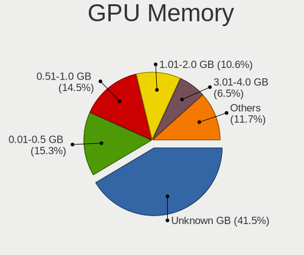

| Size in GB | Desktops | Percent |
|------------|----------|---------|
| Unknown    | 109      | 37.2%   |
| 0.01-0.5   | 54       | 18.43%  |
| 0.51-1.0   | 48       | 16.38%  |
| 1.01-2.0   | 32       | 10.92%  |
| 3.01-4.0   | 20       | 6.83%   |
| 7.01-8.0   | 13       | 4.44%   |
| 5.01-6.0   | 9        | 3.07%   |
| 2.01-3.0   | 3        | 1.02%   |
| 8.01-16.0  | 3        | 1.02%   |
| 16.01-24.0 | 2        | 0.68%   |

Monitor
-------

Monitor Vendor
--------------

Monitor vendors

| Vendor               | Desktops | Percent |
|----------------------|----------|---------|
| Samsung Electronics  | 42       | 14.89%  |
| Goldstar             | 28       | 9.93%   |
| BenQ                 | 28       | 9.93%   |
| Dell                 | 26       | 9.22%   |
| Philips              | 25       | 8.87%   |
| Hewlett-Packard      | 23       | 8.16%   |
| Ancor Communications | 16       | 5.67%   |
| AOC                  | 11       | 3.9%    |
| NEC Computers        | 10       | 3.55%   |
| Acer                 | 10       | 3.55%   |
| Iiyama               | 6        | 2.13%   |
| Fujitsu Siemens      | 6        | 2.13%   |
| Eizo                 | 6        | 2.13%   |
| LG Electronics       | 5        | 1.77%   |
| Unknown              | 4        | 1.42%   |
| Lenovo               | 3        | 1.06%   |
| ASUSTek Computer     | 3        | 1.06%   |
| Sony                 | 2        | 0.71%   |
| RTD                  | 2        | 0.71%   |
| MiTAC                | 2        | 0.71%   |
| FUS                  | 2        | 0.71%   |
| CVT                  | 2        | 0.71%   |
| Vestel Elektronik    | 1        | 0.35%   |
| Valve                | 1        | 0.35%   |
| S2-Tek               | 1        | 0.35%   |
| PTC                  | 1        | 0.35%   |
| Pioneer              | 1        | 0.35%   |
| Panasonic            | 1        | 0.35%   |
| Onkyo                | 1        | 0.35%   |
| MSI                  | 1        | 0.35%   |
| Lite-On              | 1        | 0.35%   |
| Jean                 | 1        | 0.35%   |
| InfoVision           | 1        | 0.35%   |
| Idek Iiyama          | 1        | 0.35%   |
| IBM                  | 1        | 0.35%   |
| GameMax              | 1        | 0.35%   |
| FZC                  | 1        | 0.35%   |
| Elo Touch            | 1        | 0.35%   |
| DENON                | 1        | 0.35%   |
| D&T                  | 1        | 0.35%   |

Monitor Model
-------------

Monitor models

| Model                                                                  | Desktops | Percent |
|------------------------------------------------------------------------|----------|---------|
| Samsung Electronics SyncMaster SAM0091 1600x1200 432x324mm 21.3-inch   | 6        | 1.97%   |
| Dell U2412M DELA07A 1920x1200 518x324mm 24.1-inch                      | 6        | 1.97%   |
| Philips PHL 243V7 PHLC155 1920x1080 530x300mm 24.0-inch                | 4        | 1.32%   |
| NEC Computers LCD19WV NEC671C 1440x900 410x256mm 19.0-inch             | 4        | 1.32%   |
| Samsung Electronics S24F350 SAM0D21 1920x1080 521x293mm 23.5-inch      | 3        | 0.99%   |
| Samsung Electronics S24F350 SAM0D20 1920x1080 521x293mm 23.5-inch      | 3        | 0.99%   |
| Philips PHL 243V5 PHLC0D1 1920x1080 521x293mm 23.5-inch                | 3        | 0.99%   |
| Ancor Communications VE247 ACI2493 1920x1080 531x299mm 24.0-inch       | 3        | 0.99%   |
| Unknown 1780 07E7 1280x1024 337x270mm 17.0-inch                        | 2        | 0.66%   |
| Samsung Electronics SyncMaster SAM05CC 1920x1080 530x300mm 24.0-inch   | 2        | 0.66%   |
| Samsung Electronics SyncMaster SAM0420 1680x1050 474x296mm 22.0-inch   | 2        | 0.66%   |
| Samsung Electronics S27D390 SAM0B67 1920x1080 598x336mm 27.0-inch      | 2        | 0.66%   |
| Samsung Electronics LCD Monitor SAM0A7A 1920x1080 1060x626mm 48.5-inch | 2        | 0.66%   |
| Samsung Electronics LCD Monitor SAM07C0 1920x1080 480x270mm 21.7-inch  | 2        | 0.66%   |
| Samsung Electronics C24F390 SAM0D2C 1920x1080 521x293mm 23.5-inch      | 2        | 0.66%   |
| RTD LR762 RTD2023 1280x1024 307x230mm 15.1-inch                        | 2        | 0.66%   |
| Philips 241BLPY PHL08B3 1920x1080 531x299mm 24.0-inch                  | 2        | 0.66%   |
| Philips 196VL PHLC07F 1366x768 409x230mm 18.5-inch                     | 2        | 0.66%   |
| MiTAC MTC26T42 SZM0308 1280x720 708x398mm 32.0-inch                    | 2        | 0.66%   |
| Lenovo T24v-10 LEN61BC 1920x1080 527x296mm 23.8-inch                   | 2        | 0.66%   |
| Hewlett-Packard LA1951 HWP285A 1280x1024 380x300mm 19.1-inch           | 2        | 0.66%   |
| Goldstar W1943 GSM4BAD 1360x768 406x229mm 18.4-inch                    | 2        | 0.66%   |
| Eizo EV2460 ENC3132 1920x1080 528x297mm 23.9-inch                      | 2        | 0.66%   |
| Dell U2515H DELD06F 2560x1440 553x311mm 25.0-inch                      | 2        | 0.66%   |
| Dell 2209WA DELF011 1680x1050 474x296mm 22.0-inch                      | 2        | 0.66%   |
| CVT CVTE TV CVT0003 1360x768 575x323mm 26.0-inch                       | 2        | 0.66%   |
| BenQ GW2470 BNQ78E4 1920x1080 530x300mm 24.0-inch                      | 2        | 0.66%   |
| BenQ GW2270 BNQ78DB 1920x1080 476x268mm 21.5-inch                      | 2        | 0.66%   |
| AOC 24P1W1 AOC2401 1920x1080 527x296mm 23.8-inch                       | 2        | 0.66%   |
| AOC 2270W AOC2270 1920x1080 477x268mm 21.5-inch                        | 2        | 0.66%   |
| Ancor Communications VE228 ACI22FA 1920x1080 477x268mm 21.5-inch       | 2        | 0.66%   |
| Ancor Communications ASUS VW193D ACI19D5 1440x900 410x260mm 19.1-inch  | 2        | 0.66%   |
| Ancor Communications ASUS MK241 ACI24A1 1920x1200 518x324mm 24.1-inch  | 2        | 0.66%   |
| Vestel Elektronik 42 FHD_LCD-TV VES3700 1920x540                       | 1        | 0.33%   |
| Valve Index HMD VLV91A8                                                | 1        | 0.33%   |
| Unknown LCD Monitor XXX Beyond TV 3840x2160                            | 1        | 0.33%   |
| Unknown LCD Monitor BenQG2222HDL 1920x1080                             | 1        | 0.33%   |
| Sony TV *00 SNY8404 3840x2160 1218x685mm 55.0-inch                     | 1        | 0.33%   |
| Sony TV *00 SNY4904 3840x2160                                          | 1        | 0.33%   |
| Samsung Electronics T24C300 SAM0A9B 1920x1080 531x299mm 24.0-inch      | 1        | 0.33%   |

Monitor Resolution
------------------

Monitor screen resolution

| Resolution         | Desktops | Percent |
|--------------------|----------|---------|
| 1920x1080 (FHD)    | 115      | 41.67%  |
| 1280x1024 (SXGA)   | 31       | 11.23%  |
| 1680x1050 (WSXGA+) | 20       | 7.25%   |
| 3840x2160 (4K)     | 19       | 6.88%   |
| 1920x1200 (WUXGA)  | 19       | 6.88%   |
| 2560x1440 (QHD)    | 17       | 6.16%   |
| 1440x900 (WXGA+)   | 15       | 5.43%   |
| 1366x768 (WXGA)    | 9        | 3.26%   |
| 1600x1200          | 7        | 2.54%   |
| 1600x900 (HD+)     | 6        | 2.17%   |
| 1360x768           | 5        | 1.81%   |
| 3440x1440          | 3        | 1.09%   |
| 1920x540           | 3        | 1.09%   |
| 1024x768 (XGA)     | 2        | 0.72%   |
| Unknown            | 2        | 0.72%   |
| 3200x1080          | 1        | 0.36%   |
| 1280x960           | 1        | 0.36%   |
| 1280x720 (HD)      | 1        | 0.36%   |

Monitor Diagonal
----------------

Diagonal size in inches

| Inches  | Desktops | Percent |
|---------|----------|---------|
| 24      | 49       | 16.96%  |
| 23      | 37       | 12.8%   |
| 21      | 30       | 10.38%  |
| 19      | 27       | 9.34%   |
| 27      | 26       | 9%      |
| Unknown | 24       | 8.3%    |
| 17      | 17       | 5.88%   |
| 22      | 11       | 3.81%   |
| 18      | 11       | 3.81%   |
| 20      | 10       | 3.46%   |
| 25      | 9        | 3.11%   |
| 31      | 5        | 1.73%   |
| 84      | 4        | 1.38%   |
| 26      | 4        | 1.38%   |
| 72      | 3        | 1.04%   |
| 32      | 3        | 1.04%   |
| 65      | 2        | 0.69%   |
| 54      | 2        | 0.69%   |
| 48      | 2        | 0.69%   |
| 46      | 2        | 0.69%   |
| 39      | 2        | 0.69%   |
| 34      | 2        | 0.69%   |
| 15      | 2        | 0.69%   |
| 42      | 1        | 0.35%   |
| 40      | 1        | 0.35%   |
| 35      | 1        | 0.35%   |
| 14      | 1        | 0.35%   |
| 11      | 1        | 0.35%   |

Monitor Width
-------------

Physical width

| Width in mm | Desktops | Percent |
|-------------|----------|---------|
| 501-600     | 107      | 38.77%  |
| 401-500     | 80       | 28.99%  |
| Unknown     | 24       | 8.7%    |
| 301-350     | 19       | 6.88%   |
| 351-400     | 13       | 4.71%   |
| 1001-1500   | 8        | 2.9%    |
| 1501-2000   | 7        | 2.54%   |
| 601-700     | 6        | 2.17%   |
| 701-800     | 5        | 1.81%   |
| 801-900     | 4        | 1.45%   |
| 201-300     | 2        | 0.72%   |
| 901-1000    | 1        | 0.36%   |

Aspect Ratio
------------

Proportional relationship between the width and the height

| Ratio   | Desktops | Percent |
|---------|----------|---------|
| 16/9    | 147      | 54.44%  |
| 16/10   | 54       | 20%     |
| 5/4     | 29       | 10.74%  |
| Unknown | 19       | 7.04%   |
| 4/3     | 12       | 4.44%   |
| 3/2     | 4        | 1.48%   |
| 21/9    | 3        | 1.11%   |
| 6/5     | 1        | 0.37%   |
| 32/9    | 1        | 0.37%   |

Monitor Area
------------

Area in inch

| Area in inch | Desktops | Percent |
|----------------|----------|---------|
| 201-250        | 98       | 34.51%  |
| 151-200        | 47       | 16.55%  |
| 251-300        | 30       | 10.56%  |
| 301-350        | 26       | 9.15%   |
| 141-150        | 26       | 9.15%   |
| Unknown        | 24       | 8.45%   |
| More than 1000 | 12       | 4.23%   |
| 351-500        | 11       | 3.87%   |
| 501-1000       | 6        | 2.11%   |
| 101-110        | 2        | 0.7%    |
| 51-60          | 1        | 0.35%   |
| 111-120        | 1        | 0.35%   |

Pixel Density
-------------

Pixels per inch

| Density | Desktops | Percent |
|---------|----------|---------|
| 51-100  | 187      | 69.78%  |
| 101-120 | 38       | 14.18%  |
| Unknown | 24       | 8.96%   |
| 1-50    | 9        | 3.36%   |
| 161-240 | 5        | 1.87%   |
| 121-160 | 5        | 1.87%   |

Multiple Monitors
-----------------

Total monitors connected

| Total | Desktops | Percent |
|-------|----------|---------|
| 1     | 227      | 79.65%  |
| 2     | 38       | 13.33%  |
| 0     | 16       | 5.61%   |
| 3     | 4        | 1.4%    |

Network
-------

Net Controller Vendor
---------------------

Controller vendors

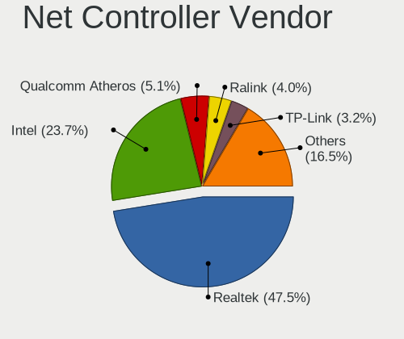

| Vendor                                 | Desktops | Percent |
|----------------------------------------|----------|---------|
| Realtek Semiconductor                  | 162      | 46.29%  |
| Intel                                  | 79       | 22.57%  |
| Qualcomm Atheros                       | 20       | 5.71%   |
| Ralink Technology                      | 16       | 4.57%   |
| Nvidia                                 | 13       | 3.71%   |
| TP-Link                                | 11       | 3.14%   |
| Qualcomm Atheros Communications        | 9        | 2.57%   |
| Broadcom                               | 9        | 2.57%   |
| Marvell Technology Group               | 5        | 1.43%   |
| Broadcom Limited                       | 4        | 1.14%   |
| VIA Technologies                       | 2        | 0.57%   |
| Edimax Technology                      | 2        | 0.57%   |
| ASUSTek Computer                       | 2        | 0.57%   |
| WiseGroup                              | 1        | 0.29%   |
| ULi Electronics                        | 1        | 0.29%   |
| Texas Instruments                      | 1        | 0.29%   |
| Sony Ericsson Mobile Communications AB | 1        | 0.29%   |
| Samsung Electronics                    | 1        | 0.29%   |
| Pulse-Eight                            | 1        | 0.29%   |
| Prestigio                              | 1        | 0.29%   |
| National Semiconductor                 | 1        | 0.29%   |
| Microsoft                              | 1        | 0.29%   |
| Micro Star International               | 1        | 0.29%   |
| Mellanox Technologies                  | 1        | 0.29%   |
| MediaTek                               | 1        | 0.29%   |
| Huawei Technologies                    | 1        | 0.29%   |
| D-Link                                 | 1        | 0.29%   |
| ASIX Electronics                       | 1        | 0.29%   |
| Accton Technology                      | 1        | 0.29%   |

Net Controller Model
--------------------

Controller models

| Model                                                             | Desktops | Percent |
|-------------------------------------------------------------------|----------|---------|
| Realtek RTL8111/8168/8411 PCI Express Gigabit Ethernet Controller | 132      | 34.38%  |
| Realtek RTL-8100/8101L/8139 PCI Fast Ethernet Adapter             | 12       | 3.13%   |
| Intel I211 Gigabit Network Connection                             | 11       | 2.86%   |
| Realtek RTL8125 2.5GbE Controller                                 | 10       | 2.6%    |
| Intel 82579LM Gigabit Network Connection (Lewisville)             | 10       | 2.6%    |
| Realtek RTL8169 PCI Gigabit Ethernet Controller                   | 9        | 2.34%   |
| Qualcomm Atheros AR9271 802.11n                                   | 9        | 2.34%   |
| Nvidia MCP61 Ethernet                                             | 7        | 1.82%   |
| Intel Wi-Fi 6 AX200                                               | 7        | 1.82%   |
| Intel Ethernet Connection (2) I219-V                              | 7        | 1.82%   |
| Ralink RT2870/RT3070 Wireless Adapter                             | 6        | 1.56%   |
| Ralink MT7601U Wireless Adapter                                   | 6        | 1.56%   |
| Intel Ethernet Controller I225-V                                  | 6        | 1.56%   |
| Intel 82579V Gigabit Network Connection                           | 5        | 1.3%    |
| TP-Link TL-WN722N v2/v3 [Realtek RTL8188EUS]                      | 4        | 1.04%   |
| Realtek RTL810xE PCI Express Fast Ethernet controller             | 4        | 1.04%   |
| Intel Ethernet Connection (7) I219-V                              | 4        | 1.04%   |
| Intel 82567LM-3 Gigabit Network Connection                        | 4        | 1.04%   |
| Intel 82566DM-2 Gigabit Network Connection                        | 4        | 1.04%   |
| Realtek RTL8821AE 802.11ac PCIe Wireless Network Adapter          | 3        | 0.78%   |
| Ralink RT5370 Wireless Adapter                                    | 3        | 0.78%   |
| Qualcomm Atheros Killer E220x Gigabit Ethernet Controller         | 3        | 0.78%   |
| Qualcomm Atheros AR8121/AR8113/AR8114 Gigabit or Fast Ethernet    | 3        | 0.78%   |
| Marvell Group 88E8056 PCI-E Gigabit Ethernet Controller           | 3        | 0.78%   |
| Intel Wireless 8260                                               | 3        | 0.78%   |
| Intel Ethernet Connection I217-LM                                 | 3        | 0.78%   |
| Intel Dual Band Wireless-AC 3168NGW [Stone Peak]                  | 3        | 0.78%   |
| VIA VT6102/VT6103 [Rhine-II]                                      | 2        | 0.52%   |
| TP-Link TL-WN822N Version 4 RTL8192EU                             | 2        | 0.52%   |
| Realtek RTL8188CUS 802.11n WLAN Adapter                           | 2        | 0.52%   |
| Realtek RTL8188CE 802.11b/g/n WiFi Adapter                        | 2        | 0.52%   |
| Realtek RTL-8110SC/8169SC Gigabit Ethernet                        | 2        | 0.52%   |
| Qualcomm Atheros Attansic L2 Fast Ethernet                        | 2        | 0.52%   |
| Qualcomm Atheros Attansic L1 Gigabit Ethernet                     | 2        | 0.52%   |
| Qualcomm Atheros AR9227 Wireless Network Adapter                  | 2        | 0.52%   |
| Qualcomm Atheros AR8151 v2.0 Gigabit Ethernet                     | 2        | 0.52%   |
| Intel Wi-Fi 6 AX210/AX211/AX411 160MHz                            | 2        | 0.52%   |
| Intel 82578DC Gigabit Network Connection                          | 2        | 0.52%   |
| Intel 82574L Gigabit Network Connection                           | 2        | 0.52%   |
| Intel 82562V-2 10/100 Network Connection                          | 2        | 0.52%   |

Wireless Vendor
---------------

Wireless vendors

| Vendor                          | Desktops | Percent |
|---------------------------------|----------|---------|
| Intel                           | 19       | 22.62%  |
| Ralink Technology               | 16       | 19.05%  |
| Realtek Semiconductor           | 14       | 16.67%  |
| TP-Link                         | 11       | 13.1%   |
| Qualcomm Atheros Communications | 9        | 10.71%  |
| Qualcomm Atheros                | 3        | 3.57%   |
| Edimax Technology               | 2        | 2.38%   |
| Broadcom                        | 2        | 2.38%   |
| ASUSTek Computer                | 2        | 2.38%   |
| Texas Instruments               | 1        | 1.19%   |
| Microsoft                       | 1        | 1.19%   |
| Micro Star International        | 1        | 1.19%   |
| MediaTek                        | 1        | 1.19%   |
| D-Link                          | 1        | 1.19%   |
| Accton Technology               | 1        | 1.19%   |

Wireless Model
--------------

Wireless models

| Model                                                                         | Desktops | Percent |
|-------------------------------------------------------------------------------|----------|---------|
| Qualcomm Atheros AR9271 802.11n                                               | 9        | 10.71%  |
| Intel Wi-Fi 6 AX200                                                           | 7        | 8.33%   |
| Ralink RT2870/RT3070 Wireless Adapter                                         | 6        | 7.14%   |
| Ralink MT7601U Wireless Adapter                                               | 6        | 7.14%   |
| TP-Link TL-WN722N v2/v3 [Realtek RTL8188EUS]                                  | 4        | 4.76%   |
| Realtek RTL8821AE 802.11ac PCIe Wireless Network Adapter                      | 3        | 3.57%   |
| Ralink RT5370 Wireless Adapter                                                | 3        | 3.57%   |
| Intel Wireless 8260                                                           | 3        | 3.57%   |
| Intel Dual Band Wireless-AC 3168NGW [Stone Peak]                              | 3        | 3.57%   |
| TP-Link TL-WN822N Version 4 RTL8192EU                                         | 2        | 2.38%   |
| Realtek RTL8188CUS 802.11n WLAN Adapter                                       | 2        | 2.38%   |
| Realtek RTL8188CE 802.11b/g/n WiFi Adapter                                    | 2        | 2.38%   |
| Qualcomm Atheros AR9227 Wireless Network Adapter                              | 2        | 2.38%   |
| Intel Wi-Fi 6 AX210/AX211/AX411 160MHz                                        | 2        | 2.38%   |
| ASUS USB-N14 802.11b/g/n (2x2) Wireless Adapter [Ralink RT5372]               | 2        | 2.38%   |
| TP-Link TL-WN823N v2/v3 [Realtek RTL8192EU]                                   | 1        | 1.19%   |
| TP-Link Archer T4U v2 [Realtek RTL8812AU]                                     | 1        | 1.19%   |
| TP-Link Archer T3U [Realtek RTL8812BU]                                        | 1        | 1.19%   |
| TP-Link AC600 wireless Realtek RTL8811AU [Archer T2U Nano]                    | 1        | 1.19%   |
| TP-Link 802.11ac NIC                                                          | 1        | 1.19%   |
| Texas Instruments ACX 111 54Mbps Wireless Interface                           | 1        | 1.19%   |
| Realtek RTL8852BE PCIe 802.11ax Wireless Network Controller                   | 1        | 1.19%   |
| Realtek RTL8822BE 802.11a/b/g/n/ac WiFi adapter                               | 1        | 1.19%   |
| Realtek RTL8723BE PCIe Wireless Network Adapter                               | 1        | 1.19%   |
| Realtek RTL8192CU 802.11n WLAN Adapter                                        | 1        | 1.19%   |
| Realtek RTL8192CE PCIe Wireless Network Adapter                               | 1        | 1.19%   |
| Realtek RTL8188SU 802.11n WLAN Adapter                                        | 1        | 1.19%   |
| Realtek RTL8187B Wireless 802.11g 54Mbps Network Adapter                      | 1        | 1.19%   |
| Ralink MT7610U ("Archer T2U" 2.4G+5G WLAN Adapter                             | 1        | 1.19%   |
| Qualcomm Atheros AR2413/AR2414 Wireless Network Adapter [AR5005G(S) 802.11bg] | 1        | 1.19%   |
| Microsoft Xbox 360 Wireless Adapter                                           | 1        | 1.19%   |
| Micro Star International 802.11 n WLAN                                        | 1        | 1.19%   |
| MediaTek WiFi                                                                 | 1        | 1.19%   |
| Intel Wireless-AC 9260                                                        | 1        | 1.19%   |
| Intel Centrino Wireless-N 2230                                                | 1        | 1.19%   |
| Intel Centrino Advanced-N 6235                                                | 1        | 1.19%   |
| Intel 700 Series Chipset Family Wi-Fi                                         | 1        | 1.19%   |
| Edimax EW-7711UTn nLite Wireless Adapter [Ralink RT3070]                      | 1        | 1.19%   |
| Edimax AC600 USB                                                              | 1        | 1.19%   |
| D-Link DWA-125 Wireless N 150 Adapter(rev.A3) [Ralink RT5370]                 | 1        | 1.19%   |

Ethernet Vendor
---------------

Ethernet vendors

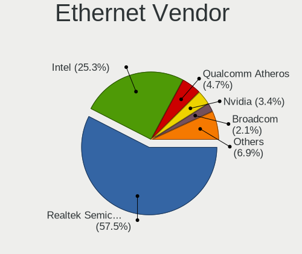

| Vendor                                 | Desktops | Percent |
|----------------------------------------|----------|---------|
| Realtek Semiconductor                  | 160      | 56.34%  |
| Intel                                  | 69       | 24.3%   |
| Qualcomm Atheros                       | 17       | 5.99%   |
| Nvidia                                 | 13       | 4.58%   |
| Broadcom                               | 7        | 2.46%   |
| Marvell Technology Group               | 5        | 1.76%   |
| Broadcom Limited                       | 4        | 1.41%   |
| VIA Technologies                       | 2        | 0.7%    |
| Sony Ericsson Mobile Communications AB | 1        | 0.35%   |
| Samsung Electronics                    | 1        | 0.35%   |
| Prestigio                              | 1        | 0.35%   |
| National Semiconductor                 | 1        | 0.35%   |
| Mellanox Technologies                  | 1        | 0.35%   |
| Huawei Technologies                    | 1        | 0.35%   |
| ASIX Electronics                       | 1        | 0.35%   |

Ethernet Model
--------------

Ethernet models

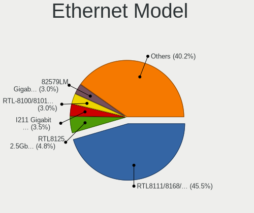

| Model                                                             | Desktops | Percent |
|-------------------------------------------------------------------|----------|---------|
| Realtek RTL8111/8168/8411 PCI Express Gigabit Ethernet Controller | 132      | 44.44%  |
| Realtek RTL-8100/8101L/8139 PCI Fast Ethernet Adapter             | 12       | 4.04%   |
| Intel I211 Gigabit Network Connection                             | 11       | 3.7%    |
| Realtek RTL8125 2.5GbE Controller                                 | 10       | 3.37%   |
| Intel 82579LM Gigabit Network Connection (Lewisville)             | 10       | 3.37%   |
| Realtek RTL8169 PCI Gigabit Ethernet Controller                   | 9        | 3.03%   |
| Nvidia MCP61 Ethernet                                             | 7        | 2.36%   |
| Intel Ethernet Connection (2) I219-V                              | 7        | 2.36%   |
| Intel Ethernet Controller I225-V                                  | 6        | 2.02%   |
| Intel 82579V Gigabit Network Connection                           | 5        | 1.68%   |
| Realtek RTL810xE PCI Express Fast Ethernet controller             | 4        | 1.35%   |
| Intel Ethernet Connection (7) I219-V                              | 4        | 1.35%   |
| Intel 82567LM-3 Gigabit Network Connection                        | 4        | 1.35%   |
| Intel 82566DM-2 Gigabit Network Connection                        | 4        | 1.35%   |
| Qualcomm Atheros Killer E220x Gigabit Ethernet Controller         | 3        | 1.01%   |
| Qualcomm Atheros AR8121/AR8113/AR8114 Gigabit or Fast Ethernet    | 3        | 1.01%   |
| Marvell Group 88E8056 PCI-E Gigabit Ethernet Controller           | 3        | 1.01%   |
| Intel Ethernet Connection I217-LM                                 | 3        | 1.01%   |
| VIA VT6102/VT6103 [Rhine-II]                                      | 2        | 0.67%   |
| Realtek RTL-8110SC/8169SC Gigabit Ethernet                        | 2        | 0.67%   |
| Qualcomm Atheros Attansic L2 Fast Ethernet                        | 2        | 0.67%   |
| Qualcomm Atheros Attansic L1 Gigabit Ethernet                     | 2        | 0.67%   |
| Qualcomm Atheros AR8151 v2.0 Gigabit Ethernet                     | 2        | 0.67%   |
| Intel 82578DC Gigabit Network Connection                          | 2        | 0.67%   |
| Intel 82574L Gigabit Network Connection                           | 2        | 0.67%   |
| Intel 82562V-2 10/100 Network Connection                          | 2        | 0.67%   |
| Broadcom NetXtreme BCM5761 Gigabit Ethernet PCIe                  | 2        | 0.67%   |
| Broadcom NetXtreme BCM5751 Gigabit Ethernet PCI Express           | 2        | 0.67%   |
| Broadcom NetXtreme BCM5720 Gigabit Ethernet PCIe                  | 2        | 0.67%   |
| Broadcom Limited NetXtreme BCM5754 Gigabit Ethernet PCI Express   | 2        | 0.67%   |
| Sony Ericsson Mobile AB E5823                                     | 1        | 0.34%   |
| Samsung Galaxy series, misc. (tethering mode)                     | 1        | 0.34%   |
| Realtek RTL8153 Gigabit Ethernet Adapter                          | 1        | 0.34%   |
| Qualcomm Atheros QCA8171 Gigabit Ethernet                         | 1        | 0.34%   |
| Qualcomm Atheros Killer E2500 Gigabit Ethernet Controller         | 1        | 0.34%   |
| Qualcomm Atheros Killer E2400 Gigabit Ethernet Controller         | 1        | 0.34%   |
| Qualcomm Atheros AR8161 Gigabit Ethernet                          | 1        | 0.34%   |
| Qualcomm Atheros AR8131 Gigabit Ethernet                          | 1        | 0.34%   |
| Prestigio PSP5453DUO                                              | 1        | 0.34%   |
| Nvidia MCP77 Ethernet                                             | 1        | 0.34%   |

Net Controller Kind
-------------------

Ethernet, WiFi or modem

| Kind     | Desktops | Percent |
|----------|----------|---------|
| Ethernet | 267      | 75.85%  |
| WiFi     | 82       | 23.3%   |
| Modem    | 2        | 0.57%   |
| Unknown  | 1        | 0.28%   |

Used Controller
---------------

Currently used network controller

| Kind     | Desktops | Percent |
|----------|----------|---------|
| Ethernet | 229      | 82.97%  |
| WiFi     | 47       | 17.03%  |

NICs
----

Total network controllers on board

| Total | Desktops | Percent |
|-------|----------|---------|
| 1     | 206      | 74.37%  |
| 2     | 53       | 19.13%  |
| 3     | 8        | 2.89%   |
| 0     | 6        | 2.17%   |
| 4     | 3        | 1.08%   |
| 5     | 1        | 0.36%   |

IPv6
----

IPv6 vs IPv4

| Used | Desktops | Percent |
|------|----------|---------|
| No   | 263      | 95.64%  |
| Yes  | 12       | 4.36%   |

Bluetooth
---------

Bluetooth Vendor
----------------

Controller vendors

| Vendor                          | Desktops | Percent |
|---------------------------------|----------|---------|
| Intel                           | 20       | 42.55%  |
| Cambridge Silicon Radio         | 8        | 17.02%  |
| Realtek Semiconductor           | 5        | 10.64%  |
| ASUSTek Computer                | 4        | 8.51%   |
| Micro Star International        | 2        | 4.26%   |
| HTC (High Tech Computer)        | 2        | 4.26%   |
| TP-Link                         | 1        | 2.13%   |
| Qualcomm Atheros Communications | 1        | 2.13%   |
| Integrated System Solution      | 1        | 2.13%   |
| IMC Networks                    | 1        | 2.13%   |
| Broadcom                        | 1        | 2.13%   |
| Belkin Components               | 1        | 2.13%   |

Bluetooth Model
---------------

Controller models

| Model                                                                | Desktops | Percent |
|----------------------------------------------------------------------|----------|---------|
| Cambridge Silicon Radio Bluetooth Dongle (HCI mode)                  | 8        | 17.02%  |
| Intel AX200 Bluetooth                                                | 7        | 14.89%  |
| Realtek Bluetooth Radio                                              | 3        | 6.38%   |
| Intel Wireless-AC 3168 Bluetooth                                     | 3        | 6.38%   |
| Intel Bluetooth wireless interface                                   | 3        | 6.38%   |
| Intel AX210 Bluetooth                                                | 3        | 6.38%   |
| Micro Star International Bluetooth Device                            | 2        | 4.26%   |
| Intel Centrino Bluetooth Wireless Transceiver                        | 2        | 4.26%   |
| HTC (High Tech Computer) Vive Hub Bluetooth 4.1 (Broadcom BCM920703) | 2        | 4.26%   |
| ASUS Bluetooth Radio                                                 | 2        | 4.26%   |
| TP-Link UB500 Adapter                                                | 1        | 2.13%   |
| Realtek RTL8821A Bluetooth                                           | 1        | 2.13%   |
| Realtek RTL8723B Bluetooth                                           | 1        | 2.13%   |
| Qualcomm Atheros AR3011 Bluetooth                                    | 1        | 2.13%   |
| Intel Wireless-AC 9260 Bluetooth Adapter                             | 1        | 2.13%   |
| Intel Bluetooth Device                                               | 1        | 2.13%   |
| Integrated System Solution Bluetooth Device                          | 1        | 2.13%   |
| IMC Networks Bluetooth Radio                                         | 1        | 2.13%   |
| Broadcom BCM2045 Bluetooth                                           | 1        | 2.13%   |
| Belkin Components Bluetooth Mini Dongle                              | 1        | 2.13%   |
| ASUS Broadcom BCM20702A0 Bluetooth                                   | 1        | 2.13%   |
| ASUS ASUS USB-BT500                                                  | 1        | 2.13%   |

Sound
-----

Sound Vendor
------------

Sound card vendors

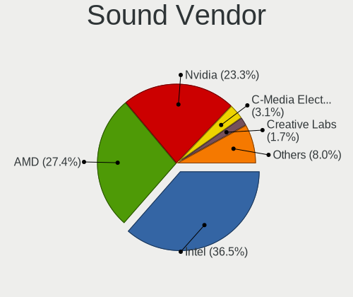

| Vendor                                       | Desktops | Percent |
|----------------------------------------------|----------|---------|
| Intel                                        | 159      | 36.81%  |
| AMD                                          | 120      | 27.78%  |
| Nvidia                                       | 105      | 24.31%  |
| C-Media Electronics                          | 12       | 2.78%   |
| Creative Labs                                | 8        | 1.85%   |
| VIA Technologies                             | 5        | 1.16%   |
| Creative Technology                          | 4        | 0.93%   |
| Lenovo                                       | 2        | 0.46%   |
| Blue Microphones                             | 2        | 0.46%   |
| ASUSTek Computer                             | 2        | 0.46%   |
| Zoran Co. Personal Media Division (Nogatech) | 1        | 0.23%   |
| Yamaha                                       | 1        | 0.23%   |
| Valve Software                               | 1        | 0.23%   |
| ULi Electronics                              | 1        | 0.23%   |
| SteelSeries ApS                              | 1        | 0.23%   |
| Nordic Semiconductor ASA                     | 1        | 0.23%   |
| Micro Star International                     | 1        | 0.23%   |
| Logitech                                     | 1        | 0.23%   |
| GN Netcom                                    | 1        | 0.23%   |
| Fortemedia                                   | 1        | 0.23%   |
| Barco Display Systems                        | 1        | 0.23%   |
| AKAI Professional M.I.                       | 1        | 0.23%   |
| A4Tech                                       | 1        | 0.23%   |

Sound Model
-----------

Sound card models

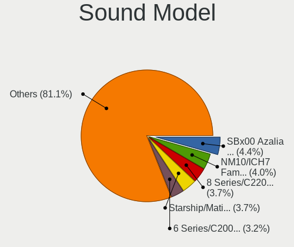

| Model                                                                                           | Desktops | Percent |
|-------------------------------------------------------------------------------------------------|----------|---------|
| AMD SBx00 Azalia (Intel HDA)                                                                    | 26       | 5.15%   |
| Intel NM10/ICH7 Family High Definition Audio Controller                                         | 25       | 4.95%   |
| Intel 8 Series/C220 Series Chipset High Definition Audio Controller                             | 19       | 3.76%   |
| AMD Starship/Matisse HD Audio Controller                                                        | 19       | 3.76%   |
| Intel 7 Series/C216 Chipset Family High Definition Audio Controller                             | 17       | 3.37%   |
| Nvidia GK208 HDMI/DP Audio Controller                                                           | 16       | 3.17%   |
| AMD FCH Azalia Controller                                                                       | 16       | 3.17%   |
| Intel 82801JI (ICH10 Family) HD Audio Controller                                                | 13       | 2.57%   |
| Intel Xeon E3-1200 v3/4th Gen Core Processor HD Audio Controller                                | 12       | 2.38%   |
| Intel 82801I (ICH9 Family) HD Audio Controller                                                  | 12       | 2.38%   |
| Intel 6 Series/C200 Series Chipset Family High Definition Audio Controller                      | 12       | 2.38%   |
| Intel 100 Series/C230 Series Chipset Family HD Audio Controller                                 | 10       | 1.98%   |
| AMD Family 17h/19h HD Audio Controller                                                          | 10       | 1.98%   |
| Intel 200 Series PCH HD Audio                                                                   | 9        | 1.78%   |
| AMD Family 17h (Models 00h-0fh) HD Audio Controller                                             | 9        | 1.78%   |
| Nvidia MCP61 High Definition Audio                                                              | 8        | 1.58%   |
| Nvidia High Definition Audio Controller                                                         | 8        | 1.58%   |
| Nvidia GP106 High Definition Audio Controller                                                   | 8        | 1.58%   |
| Intel Cannon Lake PCH cAVS                                                                      | 8        | 1.58%   |
| AMD Oland/Hainan/Cape Verde/Pitcairn HDMI Audio [Radeon HD 7000 Series]                         | 8        | 1.58%   |
| AMD Renoir Radeon High Definition Audio Controller                                              | 7        | 1.39%   |
| Nvidia GP108 High Definition Audio Controller                                                   | 6        | 1.19%   |
| Nvidia GF108 High Definition Audio Controller                                                   | 6        | 1.19%   |
| AMD Ellesmere HDMI Audio [Radeon RX 470/480 / 570/580/590]                                      | 6        | 1.19%   |
| AMD Baffin HDMI/DP Audio [Radeon RX 550 640SP / RX 560/560X]                                    | 6        | 1.19%   |
| Nvidia GK107 HDMI Audio Controller                                                              | 5        | 0.99%   |
| C-Media Electronics CMI8738/CMI8768 PCI Audio                                                   | 5        | 0.99%   |
| AMD Redwood HDMI Audio [Radeon HD 5000 Series]                                                  | 5        | 0.99%   |
| AMD Navi 10 HDMI Audio                                                                          | 5        | 0.99%   |
| AMD Juniper HDMI Audio [Radeon HD 5700 Series]                                                  | 5        | 0.99%   |
| AMD Cedar HDMI Audio [Radeon HD 5400/6300/7300 Series]                                          | 5        | 0.99%   |
| Nvidia GP107GL High Definition Audio Controller                                                 | 4        | 0.79%   |
| Nvidia GM206 High Definition Audio Controller                                                   | 4        | 0.79%   |
| Nvidia GM107 High Definition Audio Controller [GeForce 940MX]                                   | 4        | 0.79%   |
| Intel 9 Series Chipset Family HD Audio Controller                                               | 4        | 0.79%   |
| Intel 82801JD/DO (ICH10 Family) HD Audio Controller                                             | 4        | 0.79%   |
| Intel 5 Series/3400 Series Chipset High Definition Audio                                        | 4        | 0.79%   |
| Creative Labs CA0132 Sound Core3D [Sound Blaster Recon3D / Z-Series / Sound BlasterX AE-5 Plus] | 4        | 0.79%   |
| AMD Raven/Raven2/Fenghuang HDMI/DP Audio Controller                                             | 4        | 0.79%   |
| AMD Caicos HDMI Audio [Radeon HD 6450 / 7450/8450/8490 OEM / R5 230/235/235X OEM]               | 4        | 0.79%   |

Memory
------

Memory Vendor
-------------

Memory module vendors

| Vendor              | Desktops | Percent |
|---------------------|----------|---------|
| Kingston            | 51       | 30.36%  |
| Unknown             | 44       | 26.19%  |
| Crucial             | 12       | 7.14%   |
| Samsung Electronics | 11       | 6.55%   |
| SK hynix            | 10       | 5.95%   |
| Corsair             | 9        | 5.36%   |
| Patriot             | 6        | 3.57%   |
| G.Skill             | 6        | 3.57%   |
| Elpida              | 5        | 2.98%   |
| Unknown             | 5        | 2.98%   |
| Micron Technology   | 4        | 2.38%   |
| Hewlett-Packard     | 2        | 1.19%   |
| Unknown (8AC8)      | 1        | 0.6%    |
| Transcend           | 1        | 0.6%    |
| A-DATA Technology   | 1        | 0.6%    |

Memory Model
------------

Memory module models

| Model                                                    | Desktops | Percent |
|----------------------------------------------------------|----------|---------|
| Unknown                                                  | 5        | 2.5%    |
| Unknown RAM Module 2GB DIMM 800MT/s                      | 4        | 2%      |
| Unknown RAM Module 2048MB DIMM DDR2 800MT/s              | 4        | 2%      |
| Kingston RAM KF3200C16D4/8GX 8GB DIMM DDR4 3600MT/s      | 4        | 2%      |
| Unknown RAM Module 2048MB DIMM 800MT/s                   | 3        | 1.5%    |
| Kingston RAM KHX3200C16D4/8GX 8GB DIMM DDR4 3600MT/s     | 3        | 1.5%    |
| Kingston RAM KHX2666C16/8G 8GB DIMM DDR4 3466MT/s        | 3        | 1.5%    |
| Kingston RAM KHX1866C10D3/4G 4GB DIMM DDR3 1867MT/s      | 3        | 1.5%    |
| Kingston RAM KHX1600C9D3/4GX 4GB DIMM DDR3 1600MT/s      | 3        | 1.5%    |
| Unknown RAM Module 4096MB DIMM DDR3 1600MT/s             | 2        | 1%      |
| Unknown RAM Module 2048MB DIMM DDR2 333MT/s              | 2        | 1%      |
| Unknown RAM Module 2048MB DIMM 1333MT/s                  | 2        | 1%      |
| Unknown RAM Module 1024MB DIMM DDR 333MT/s               | 2        | 1%      |
| Unknown RAM Module 1024MB DIMM 533MT/s                   | 2        | 1%      |
| SK hynix RAM HYMP164U64CP6-Y5 512MB DIMM DDR2 667MT/s    | 2        | 1%      |
| SK hynix RAM HMT351U6CFR8C-PB 4GB DIMM DDR3 1800MT/s     | 2        | 1%      |
| Samsung RAM M378B5773DH0-CH9 2GB DIMM DDR3 1333MT/s      | 2        | 1%      |
| Samsung RAM M378B5773CH0-CH9 2GB DIMM DDR3 1867MT/s      | 2        | 1%      |
| Samsung RAM M378B2873EH1-CH9 1GB DIMM DDR3 1334MT/s      | 2        | 1%      |
| Kingston RAM KHX1600C9D3/2GX 2GB DIMM DDR3 1600MT/s      | 2        | 1%      |
| Kingston RAM KHX1600C10D3/8GX 8GB DIMM DDR3 1600MT/s     | 2        | 1%      |
| Kingston RAM KF3200C16D4/16GX 16GB DIMM DDR4 3200MT/s    | 2        | 1%      |
| Kingston RAM KF2666C15S4/8G 8GB SODIMM DDR4 2667MT/s     | 2        | 1%      |
| Kingston RAM 99U5584-001.A00LF 4096MB DIMM DDR3 1600MT/s | 2        | 1%      |
| Kingston RAM 2G-UDIMM 2GB DIMM DDR2 800MT/s              | 2        | 1%      |
| Elpida RAM EBE10UE8ACWA-6E-E 1024MB DIMM DDR2 667MT/s    | 2        | 1%      |
| Corsair RAM CML8GX3M2A1600C9 4GB DIMM DDR3 1867MT/s      | 2        | 1%      |
| Unknown RAM Module 64MB DIMM DRAM 100MT/s                | 1        | 0.5%    |
| Unknown RAM Module 512MB DIMM DDR 400MT/s                | 1        | 0.5%    |
| Unknown RAM Module 512MB DIMM DDR 333MT/s                | 1        | 0.5%    |
| Unknown RAM Module 512MB DIMM DDR 200MT/s                | 1        | 0.5%    |
| Unknown RAM Module 512MB DIMM 533MT/s                    | 1        | 0.5%    |
| Unknown RAM Module 4GB FB-DIMM DDR2 667MT/s              | 1        | 0.5%    |
| Unknown RAM Module 4GB DIMM 400MT/s                      | 1        | 0.5%    |
| Unknown RAM Module 4096MB DIMM DDR3 1333MT/s             | 1        | 0.5%    |
| Unknown RAM Module 4096MB DIMM 400MT/s                   | 1        | 0.5%    |
| Unknown RAM Module 4096MB DIMM 1333MT/s                  | 1        | 0.5%    |
| Unknown RAM Module 4096MB DIMM 1066MT/s                  | 1        | 0.5%    |
| Unknown RAM Module 2GB FB-DIMM DDR2 667MT/s              | 1        | 0.5%    |
| Unknown RAM Module 2GB DIMM SDRAM 800MT/s                | 1        | 0.5%    |

Memory Kind
-----------

Memory module kinds

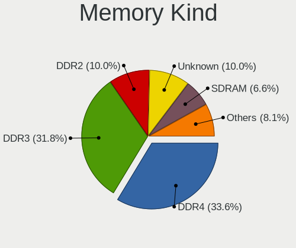

| Kind    | Desktops | Percent |
|---------|----------|---------|
| DDR4    | 50       | 32.89%  |
| DDR3    | 46       | 30.26%  |
| DDR2    | 20       | 13.16%  |
| Unknown | 17       | 11.18%  |
| SDRAM   | 12       | 7.89%   |
| DDR     | 5        | 3.29%   |
| DRAM    | 1        | 0.66%   |
| DDR5    | 1        | 0.66%   |

Memory Form Factor
------------------

Physical design of the memory module

| Name    | Desktops | Percent |
|---------|----------|---------|
| DIMM    | 140      | 95.24%  |
| SODIMM  | 6        | 4.08%   |
| FB-DIMM | 1        | 0.68%   |

Memory Size
-----------

Memory module size

| Size  | Desktops | Percent |
|-------|----------|---------|
| 8192  | 47       | 26.86%  |
| 4096  | 41       | 23.43%  |
| 2048  | 41       | 23.43%  |
| 1024  | 17       | 9.71%   |
| 16384 | 14       | 8%      |
| 512   | 6        | 3.43%   |
| 32768 | 5        | 2.86%   |
| 256   | 2        | 1.14%   |
| 128   | 1        | 0.57%   |
| 64    | 1        | 0.57%   |

Memory Speed
------------

Memory module speed

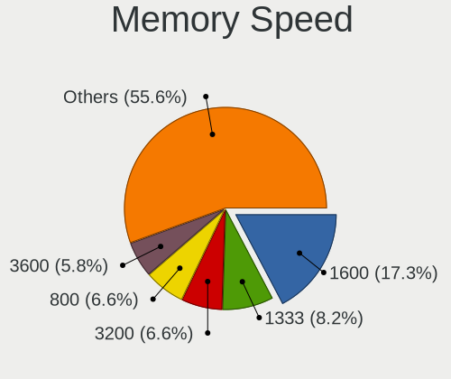

| Speed   | Desktops | Percent |
|---------|----------|---------|
| 1600    | 30       | 17.14%  |
| 800     | 17       | 9.71%   |
| 1333    | 15       | 8.57%   |
| 3600    | 12       | 6.86%   |
| 667     | 12       | 6.86%   |
| 3200    | 10       | 5.71%   |
| 2667    | 9        | 5.14%   |
| 2400    | 6        | 3.43%   |
| 2133    | 6        | 3.43%   |
| 1867    | 5        | 2.86%   |
| 333     | 5        | 2.86%   |
| 400     | 4        | 2.29%   |
| 3466    | 3        | 1.71%   |
| 1866    | 3        | 1.71%   |
| 1800    | 3        | 1.71%   |
| 1334    | 3        | 1.71%   |
| 533     | 3        | 1.71%   |
| Unknown | 3        | 1.71%   |
| 3800    | 2        | 1.14%   |
| 3733    | 2        | 1.14%   |
| 3266    | 2        | 1.14%   |
| 3000    | 2        | 1.14%   |
| 1066    | 2        | 1.14%   |
| 57535   | 1        | 0.57%   |
| 6400    | 1        | 0.57%   |
| 4400    | 1        | 0.57%   |
| 4266    | 1        | 0.57%   |
| 4000    | 1        | 0.57%   |
| 3933    | 1        | 0.57%   |
| 3666    | 1        | 0.57%   |
| 3533    | 1        | 0.57%   |
| 3400    | 1        | 0.57%   |
| 3333    | 1        | 0.57%   |
| 2666    | 1        | 0.57%   |
| 1639    | 1        | 0.57%   |
| 1067    | 1        | 0.57%   |
| 266     | 1        | 0.57%   |
| 200     | 1        | 0.57%   |
| 100     | 1        | 0.57%   |

Printers & scanners
-------------------

Printer Vendor
--------------

Printer device vendors

| Vendor              | Desktops | Percent |
|---------------------|----------|---------|
| Hewlett-Packard     | 12       | 80%     |
| Star Micronics      | 1        | 6.67%   |
| Samsung Electronics | 1        | 6.67%   |
| Canon               | 1        | 6.67%   |

Printer Model
-------------

Printer device models

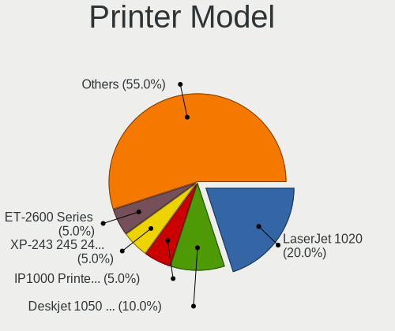

| Model                                           | Desktops | Percent |
|-------------------------------------------------|----------|---------|
| HP LaserJet 1020                                | 4        | 26.67%  |
| HP Deskjet 1050 J410                            | 2        | 13.33%  |
| Star Micronics IP1000 Printer USB001            | 1        | 6.67%   |
| Samsung M262x/M282x Xpress Series Laser Printer | 1        | 6.67%   |
| HP OfficeJet 6950                               | 1        | 6.67%   |
| HP LaserJet M14-M17                             | 1        | 6.67%   |
| HP LaserJet M101-M106                           | 1        | 6.67%   |
| HP LaserJet 1150                                | 1        | 6.67%   |
| HP DeskJet 2700 series                          | 1        | 6.67%   |
| HP Deskjet 1510                                 | 1        | 6.67%   |
| Canon PIXMA MP230                               | 1        | 6.67%   |

Scanner Vendor
--------------

Scanner device vendors

| Vendor          | Desktops | Percent |
|-----------------|----------|---------|
| Canon           | 2        | 50%     |
| Minolta         | 1        | 25%     |
| Hewlett-Packard | 1        | 25%     |

Scanner Model
-------------

Scanner device models

| Model                                       | Desktops | Percent |
|---------------------------------------------|----------|---------|
| Minolta Dimage Scan Dual III AF-2840 (2889) | 1        | 25%     |
| HP ScanJet 3800c                            | 1        | 25%     |
| Canon CanoScan LiDE 90                      | 1        | 25%     |
| Canon CanoScan LIDE 25                      | 1        | 25%     |

Camera
------

Camera Vendor
-------------

Camera device vendors

| Vendor                      | Desktops | Percent |
|-----------------------------|----------|---------|
| Logitech                    | 8        | 21.62%  |
| Microsoft                   | 7        | 18.92%  |
| Microdia                    | 5        | 13.51%  |
| Creative Technology         | 3        | 8.11%   |
| Z-Star Microelectronics     | 2        | 5.41%   |
| Syntek                      | 2        | 5.41%   |
| Alcor Micro                 | 2        | 5.41%   |
| Valve Software              | 1        | 2.7%    |
| Unknown                     | 1        | 2.7%    |
| MacroSilicon                | 1        | 2.7%    |
| KYE Systems (Mouse Systems) | 1        | 2.7%    |
| GenesysLogic Technology     | 1        | 2.7%    |
| Generalplus Technology      | 1        | 2.7%    |
| Cubeternet                  | 1        | 2.7%    |
| Apple                       | 1        | 2.7%    |

Camera Model
------------

Camera device models

| Model                                      | Desktops | Percent |
|--------------------------------------------|----------|---------|
| Microdia Sonix USB 2.0 Camera              | 3        | 7.69%   |
| Syntek Integrated RGB Camera               | 2        | 5.13%   |
| Microsoft LifeCam Cinema                   | 2        | 5.13%   |
| Creative Live! Cam Sync HD [VF0770]        | 2        | 5.13%   |
| Alcor Micro USB 2.0 PC Camera              | 2        | 5.13%   |
| Z-Star Vega USB 2.0 Camera                 | 1        | 2.56%   |
| Z-Star A4 TECH HD PC Camera                | 1        | 2.56%   |
| Valve Software 3D Camera                   | 1        | 2.56%   |
| Unknown HD camera                          | 1        | 2.56%   |
| Microsoft Microsoft LifeCam VX-5500      | 1        | 2.56%   |
| Microsoft LifeCam VX-800                   | 1        | 2.56%   |
| Microsoft LifeCam VX-700                   | 1        | 2.56%   |
| Microsoft LifeCam VX-500 [1357]            | 1        | 2.56%   |
| Microsoft LifeCam HD-3000                  | 1        | 2.56%   |
| Microdia USB 2.0 Camera                    | 1        | 2.56%   |
| Microdia Camera                            | 1        | 2.56%   |
| MacroSilicon USB Video                     | 1        | 2.56%   |
| Logitech Webcam C930e                      | 1        | 2.56%   |
| Logitech Webcam C925e                      | 1        | 2.56%   |
| Logitech Webcam C270                       | 1        | 2.56%   |
| Logitech Webcam C200                       | 1        | 2.56%   |
| Logitech Webcam C110                       | 1        | 2.56%   |
| Logitech QuickCam Pro 9000                 | 1        | 2.56%   |
| Logitech HD Webcam C525                    | 1        | 2.56%   |
| Logitech HD Pro Webcam C920                | 1        | 2.56%   |
| Logitech C920 PRO HD Webcam                | 1        | 2.56%   |
| Logitech C505e HD Webcam                   | 1        | 2.56%   |
| KYE Systems (Mouse Systems) FaceCam 1000X  | 1        | 2.56%   |
| GenesysLogic USB2.0 UVC PC Camera          | 1        | 2.56%   |
| Generalplus 808 Camera #9 (web-cam mode)   | 1        | 2.56%   |
| Cubeternet HDMI to U3 capture              | 1        | 2.56%   |
| Creative Live! Cam Chat HD [VF0700/VF0790] | 1        | 2.56%   |
| Apple iPhone 5/5C/5S/6/SE/7/8/X            | 1        | 2.56%   |

Security
--------

Fingerprint Vendor
------------------

Fingerprint sensor vendors

Zero info for selected period =(

Fingerprint Model
-----------------

Fingerprint sensor models

Zero info for selected period =(

Chipcard Vendor
---------------

Chipcard module vendors

| Vendor                | Desktops | Percent |
|-----------------------|----------|---------|
| Gemalto (was Gemplus) | 2        | 50%     |
| OmniKey               | 1        | 25%     |
| Alcor Micro           | 1        | 25%     |

Chipcard Model
--------------

Chipcard module models

| Model                                             | Desktops | Percent |
|---------------------------------------------------|----------|---------|
| Gemalto (was Gemplus) GemPC Twin SmartCard Reader | 2        | 50%     |
| OmniKey CardMan 3121 (HID Technologies)           | 1        | 25%     |
| Alcor Micro AU9540 Smartcard Reader               | 1        | 25%     |

Unsupported
-----------

Unsupported Devices
-------------------

Total unsupported devices on board

| Total | Desktops | Percent |
|-------|----------|---------|
| 0     | 238      | 83.8%   |
| 1     | 41       | 14.44%  |
| 2     | 4        | 1.41%   |
| 3     | 1        | 0.35%   |

Unsupported Device Types
------------------------

Types of unsupported devices

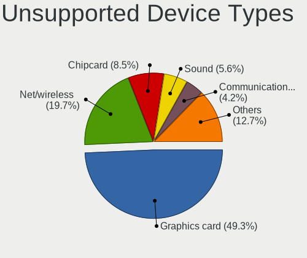

| Type                     | Desktops | Percent |
|--------------------------|----------|---------|
| Graphics card            | 25       | 51.02%  |
| Net/wireless             | 8        | 16.33%  |
| Chipcard                 | 4        | 8.16%   |
| Sound                    | 3        | 6.12%   |
| Communication controller | 2        | 4.08%   |
| Bluetooth                | 2        | 4.08%   |
| Unassigned class         | 1        | 2.04%   |
| Network                  | 1        | 2.04%   |
| Net/ethernet             | 1        | 2.04%   |
| Multimedia controller    | 1        | 2.04%   |
| Card reader              | 1        | 2.04%   |

