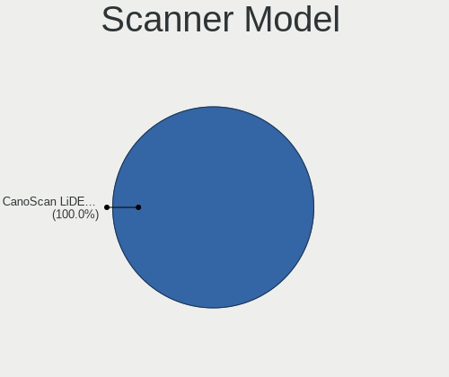

Linux in Slovakia - Tested Hardware & Statistics (Notebooks)
------------------------------------------------------------

A project to collect tested hardware configurations for Linux in Slovakia.

Anyone can contribute to this report by the [hw-probe](https://github.com/linuxhw/hw-probe) tool:

    sudo -E hw-probe -all -upload

Please contribute! Especially if your hardware is rare.

Contents
--------

* [ Test Cases ](#test-cases)

* [ System ](#system)
  - [ OS                       ](#os)
  - [ OS Family                ](#os-family)
  - [ Kernel                   ](#kernel)
  - [ Kernel Family            ](#kernel-family)
  - [ Kernel Major Ver.        ](#kernel-major-ver)
  - [ Arch                     ](#arch)
  - [ DE                       ](#de)
  - [ Display Server           ](#display-server)
  - [ Display Manager          ](#display-manager)
  - [ OS Lang                  ](#os-lang)
  - [ Boot Mode                ](#boot-mode)
  - [ Filesystem               ](#filesystem)
  - [ Part. scheme             ](#part-scheme)
  - [ Dual Boot with Linux/BSD ](#dual-boot-with-linuxbsd)
  - [ Dual Boot (Win)          ](#dual-boot-win)

* [ Board ](#board)
  - [ Vendor                   ](#vendor)
  - [ Model                    ](#model)
  - [ Model Family             ](#model-family)
  - [ MFG Year                 ](#mfg-year)
  - [ Form Factor              ](#form-factor)
  - [ Secure Boot              ](#secure-boot)
  - [ Coreboot                 ](#coreboot)
  - [ RAM Size                 ](#ram-size)
  - [ RAM Used                 ](#ram-used)
  - [ Total Drives             ](#total-drives)
  - [ Has CD-ROM               ](#has-cd-rom)
  - [ Has Ethernet             ](#has-ethernet)
  - [ Has WiFi                 ](#has-wifi)
  - [ Has Bluetooth            ](#has-bluetooth)

* [ Location ](#location)
  - [ Country                  ](#country)
  - [ City                     ](#city)

* [ Drives ](#drives)
  - [ Drive Vendor             ](#drive-vendor)
  - [ Drive Model              ](#drive-model)
  - [ HDD Vendor               ](#hdd-vendor)
  - [ SSD Vendor               ](#ssd-vendor)
  - [ Drive Kind               ](#drive-kind)
  - [ Drive Connector          ](#drive-connector)
  - [ Drive Size               ](#drive-size)
  - [ Space Total              ](#space-total)
  - [ Space Used               ](#space-used)
  - [ Malfunc. Drives          ](#malfunc-drives)
  - [ Malfunc. Drive Vendor    ](#malfunc-drive-vendor)
  - [ Malfunc. HDD Vendor      ](#malfunc-hdd-vendor)
  - [ Malfunc. Drive Kind      ](#malfunc-drive-kind)
  - [ Failed Drives            ](#failed-drives)
  - [ Failed Drive Vendor      ](#failed-drive-vendor)
  - [ Drive Status             ](#drive-status)

* [ Storage controller ](#storage-controller)
  - [ Storage Vendor           ](#storage-vendor)
  - [ Storage Model            ](#storage-model)
  - [ Storage Kind             ](#storage-kind)

* [ Processor ](#processor)
  - [ CPU Vendor               ](#cpu-vendor)
  - [ CPU Model                ](#cpu-model)
  - [ CPU Model Family         ](#cpu-model-family)
  - [ CPU Cores                ](#cpu-cores)
  - [ CPU Sockets              ](#cpu-sockets)
  - [ CPU Threads              ](#cpu-threads)
  - [ CPU Op-Modes             ](#cpu-op-modes)
  - [ CPU Microcode            ](#cpu-microcode)
  - [ CPU Microarch            ](#cpu-microarch)

* [ Graphics ](#graphics)
  - [ GPU Vendor               ](#gpu-vendor)
  - [ GPU Model                ](#gpu-model)
  - [ GPU Combo                ](#gpu-combo)
  - [ GPU Driver               ](#gpu-driver)
  - [ GPU Memory               ](#gpu-memory)

* [ Monitor ](#monitor)
  - [ Monitor Vendor           ](#monitor-vendor)
  - [ Monitor Model            ](#monitor-model)
  - [ Monitor Resolution       ](#monitor-resolution)
  - [ Monitor Diagonal         ](#monitor-diagonal)
  - [ Monitor Width            ](#monitor-width)
  - [ Aspect Ratio             ](#aspect-ratio)
  - [ Monitor Area             ](#monitor-area)
  - [ Pixel Density            ](#pixel-density)
  - [ Multiple Monitors        ](#multiple-monitors)

* [ Network ](#network)
  - [ Net Controller Vendor    ](#net-controller-vendor)
  - [ Net Controller Model     ](#net-controller-model)
  - [ Wireless Vendor          ](#wireless-vendor)
  - [ Wireless Model           ](#wireless-model)
  - [ Ethernet Vendor          ](#ethernet-vendor)
  - [ Ethernet Model           ](#ethernet-model)
  - [ Net Controller Kind      ](#net-controller-kind)
  - [ Used Controller          ](#used-controller)
  - [ NICs                     ](#nics)
  - [ IPv6                     ](#ipv6)

* [ Bluetooth ](#bluetooth)
  - [ Bluetooth Vendor         ](#bluetooth-vendor)
  - [ Bluetooth Model          ](#bluetooth-model)

* [ Sound ](#sound)
  - [ Sound Vendor             ](#sound-vendor)
  - [ Sound Model              ](#sound-model)

* [ Memory ](#memory)
  - [ Memory Vendor            ](#memory-vendor)
  - [ Memory Model             ](#memory-model)
  - [ Memory Kind              ](#memory-kind)
  - [ Memory Form Factor       ](#memory-form-factor)
  - [ Memory Size              ](#memory-size)
  - [ Memory Speed             ](#memory-speed)

* [ Printers & scanners ](#printers--scanners)
  - [ Printer Vendor           ](#printer-vendor)
  - [ Printer Model            ](#printer-model)
  - [ Scanner Vendor           ](#scanner-vendor)
  - [ Scanner Model            ](#scanner-model)

* [ Camera ](#camera)
  - [ Camera Vendor            ](#camera-vendor)
  - [ Camera Model             ](#camera-model)

* [ Security ](#security)
  - [ Fingerprint Vendor       ](#fingerprint-vendor)
  - [ Fingerprint Model        ](#fingerprint-model)
  - [ Chipcard Vendor          ](#chipcard-vendor)
  - [ Chipcard Model           ](#chipcard-model)

* [ Unsupported ](#unsupported)
  - [ Unsupported Devices      ](#unsupported-devices)
  - [ Unsupported Device Types ](#unsupported-device-types)

Test Cases
----------

Total: 939

| Vendor        | Model                       | Probe                                                      | Date         |
|---------------|-----------------------------|------------------------------------------------------------|--------------|
| HP            | ProBook 4510s               | [d74e06d912](https://linux-hardware.org/?probe=d74e06d912) | Jan 06, 2025 |
| HP            | ProBook 4510s               | [cf51ebf11d](https://linux-hardware.org/?probe=cf51ebf11d) | Jan 06, 2025 |
| HP            | 250 G7 Notebook PC          | [0562d753f2](https://linux-hardware.org/?probe=0562d753f2) | Jan 05, 2025 |
| HP            | 250 G7 Notebook PC          | [0cf6343ea2](https://linux-hardware.org/?probe=0cf6343ea2) | Jan 05, 2025 |
| Lenovo        | IdeaPad Gaming 3 15ACH6 ... | [271c85b332](https://linux-hardware.org/?probe=271c85b332) | Jan 05, 2025 |
| Lenovo        | ThinkPad L470 20J4000LMD    | [e2fa70f2b4](https://linux-hardware.org/?probe=e2fa70f2b4) | Jan 02, 2025 |
| HP            | ProBook 4535s               | [e0f48651c0](https://linux-hardware.org/?probe=e0f48651c0) | Dec 30, 2024 |
| ASUSTek       | ASUS TUF Gaming A15 FA50... | [71d10a1993](https://linux-hardware.org/?probe=71d10a1993) | Dec 26, 2024 |
| Lenovo        | IdeaPad Pro 5 16AHP9 83D... | [28dcf6960e](https://linux-hardware.org/?probe=28dcf6960e) | Dec 26, 2024 |
| Lenovo        | Legion 9 16IRX9 83G0        | [128debb210](https://linux-hardware.org/?probe=128debb210) | Dec 25, 2024 |
| ASUSTek       | ASUS TUF Gaming A15 FA50... | [4505762848](https://linux-hardware.org/?probe=4505762848) | Dec 25, 2024 |
| Lenovo        | IdeaPad Gaming 3 15ACH6 ... | [e7ad20e4e1](https://linux-hardware.org/?probe=e7ad20e4e1) | Dec 24, 2024 |
| HP            | Pavilion dv6                | [89ec19d64a](https://linux-hardware.org/?probe=89ec19d64a) | Dec 17, 2024 |
| ASUSTek       | ASUS TUF Dash F15 FX517Z... | [532c74b6c3](https://linux-hardware.org/?probe=532c74b6c3) | Dec 16, 2024 |
| Dell          | Latitude E5530 non-vPro     | [9feabc8ce6](https://linux-hardware.org/?probe=9feabc8ce6) | Dec 14, 2024 |
| Lenovo        | ThinkPad L15 Gen 1 20U70... | [331f53945b](https://linux-hardware.org/?probe=331f53945b) | Dec 13, 2024 |
| Dell          | Inspiron 13-5368            | [bd47986d73](https://linux-hardware.org/?probe=bd47986d73) | Dec 13, 2024 |
| ASUSTek       | ASUS TUF Gaming A15 FA50... | [dc2afedb8a](https://linux-hardware.org/?probe=dc2afedb8a) | Dec 08, 2024 |
| HP            | 250 15.6 inch G10 Notebo... | [f92ea0cda1](https://linux-hardware.org/?probe=f92ea0cda1) | Dec 04, 2024 |
| Dell          | Inspiron 13-5368            | [5f256e8e33](https://linux-hardware.org/?probe=5f256e8e33) | Dec 01, 2024 |
| Acer          | Swift SF314-43              | [82fcdbb537](https://linux-hardware.org/?probe=82fcdbb537) | Nov 28, 2024 |
| ASUSTek       | ASUS EXPERTBOOK L1500CDA... | [e65f68056f](https://linux-hardware.org/?probe=e65f68056f) | Nov 24, 2024 |
| Dell          | Vostro 3500                 | [723a673611](https://linux-hardware.org/?probe=723a673611) | Nov 24, 2024 |
| Lenovo        | IdeaPad Pro 5 14IMH9 83D... | [e7b45b99c1](https://linux-hardware.org/?probe=e7b45b99c1) | Nov 23, 2024 |
| ASUSTek       | ASUS TUF Dash F15 FX517Z... | [87836c3a98](https://linux-hardware.org/?probe=87836c3a98) | Nov 22, 2024 |
| Lenovo        | IdeaPad 5 15ABA7 82SG       | [5a37374d2d](https://linux-hardware.org/?probe=5a37374d2d) | Nov 21, 2024 |
| Timi          | TM1701                      | [4a2509bd5a](https://linux-hardware.org/?probe=4a2509bd5a) | Nov 18, 2024 |
| HP            | Victus by Gaming Laptop ... | [f68a7fb475](https://linux-hardware.org/?probe=f68a7fb475) | Nov 17, 2024 |
| XIAOMI        | Redmi Book Pro 15 2023      | [c3dd3deab0](https://linux-hardware.org/?probe=c3dd3deab0) | Nov 16, 2024 |
| XIAOMI        | Redmi Book Pro 15 2023      | [038c91db6e](https://linux-hardware.org/?probe=038c91db6e) | Nov 15, 2024 |
| ASUSTek       | ROG Zephyrus G16 GU603ZV... | [d31a355a2d](https://linux-hardware.org/?probe=d31a355a2d) | Nov 14, 2024 |
| MSI           | GT60 2OC/2OD                | [d4624f582f](https://linux-hardware.org/?probe=d4624f582f) | Nov 11, 2024 |
| ASUSTek       | X550VB                      | [c995cf0e55](https://linux-hardware.org/?probe=c995cf0e55) | Nov 09, 2024 |
| Fujitsu Si... | AMILO A7645                 | [82b3b117c2](https://linux-hardware.org/?probe=82b3b117c2) | Nov 08, 2024 |
| Lenovo        | IdeaPad 1 14IGL05 81VU      | [f851654ac1](https://linux-hardware.org/?probe=f851654ac1) | Nov 03, 2024 |
| Toshiba       | TECRA A10                   | [f7cfa0f796](https://linux-hardware.org/?probe=f7cfa0f796) | Nov 02, 2024 |
| HP            | 250 G8 Notebook PC          | [c6d19560ba](https://linux-hardware.org/?probe=c6d19560ba) | Oct 26, 2024 |
| ASUSTek       | ASUS TUF Gaming A15 FA50... | [8caf6adea5](https://linux-hardware.org/?probe=8caf6adea5) | Oct 20, 2024 |
| ASUSTek       | ASUS TUF Gaming A15 FA50... | [c5e97b1a91](https://linux-hardware.org/?probe=c5e97b1a91) | Oct 20, 2024 |
| Dell          | Latitude E6400              | [45684f9885](https://linux-hardware.org/?probe=45684f9885) | Oct 20, 2024 |
| TUXEDO        | Pulse 15 Gen2               | [08951a5d7d](https://linux-hardware.org/?probe=08951a5d7d) | Oct 20, 2024 |
| TUXEDO        | Sirius 16 Gen1              | [30d8c17c67](https://linux-hardware.org/?probe=30d8c17c67) | Oct 19, 2024 |
| ASUSTek       | G55VW                       | [a1b8fade8a](https://linux-hardware.org/?probe=a1b8fade8a) | Oct 19, 2024 |
| Lenovo        | ThinkPad X1 Carbon 3460C... | [553cb8fd6e](https://linux-hardware.org/?probe=553cb8fd6e) | Oct 16, 2024 |
| HP            | 250 G4                      | [0bc4a73563](https://linux-hardware.org/?probe=0bc4a73563) | Oct 13, 2024 |
| ASUSTek       | G55VW                       | [101bba7262](https://linux-hardware.org/?probe=101bba7262) | Oct 12, 2024 |
| Lenovo        | IdeaPad Gaming 3 15IHU6 ... | [f314e87727](https://linux-hardware.org/?probe=f314e87727) | Oct 04, 2024 |
| Lenovo        | IdeaPad Gaming 3 15IHU6 ... | [884d99dd9f](https://linux-hardware.org/?probe=884d99dd9f) | Oct 04, 2024 |
| HP            | Laptop 15s-eq2xxx           | [a79dcec2fd](https://linux-hardware.org/?probe=a79dcec2fd) | Sep 29, 2024 |
| HP            | 250 G4 Notebook PC          | [69917b9ff3](https://linux-hardware.org/?probe=69917b9ff3) | Sep 27, 2024 |
| Dell          | Latitude E7250              | [bae9276346](https://linux-hardware.org/?probe=bae9276346) | Sep 25, 2024 |
| Lenovo        | ThinkPad P14s Gen 5 AMD ... | [07e66697a0](https://linux-hardware.org/?probe=07e66697a0) | Sep 23, 2024 |
| Lenovo        | ThinkPad P14s Gen 5 AMD ... | [c8b757063d](https://linux-hardware.org/?probe=c8b757063d) | Sep 22, 2024 |
| Dell          | Latitude 5590               | [5a284e9384](https://linux-hardware.org/?probe=5a284e9384) | Sep 16, 2024 |
| HP            | Pavilion dv6                | [f4e2729ed2](https://linux-hardware.org/?probe=f4e2729ed2) | Sep 14, 2024 |
| HP            | Pavilion dv6                | [0ffe1545df](https://linux-hardware.org/?probe=0ffe1545df) | Sep 14, 2024 |
| ASUSTek       | VivoBook_ASUSLaptop X509... | [58d0cd3141](https://linux-hardware.org/?probe=58d0cd3141) | Sep 13, 2024 |
| ASUSTek       | ASUS Vivobook S 16 M5606... | [fac034c3d1](https://linux-hardware.org/?probe=fac034c3d1) | Sep 12, 2024 |
| Lenovo        | IdeaPad Slim 1-14AST-05 ... | [10d6c62594](https://linux-hardware.org/?probe=10d6c62594) | Sep 12, 2024 |
| HP            | Laptop 15s-eq2xxx           | [dc90d7b0f6](https://linux-hardware.org/?probe=dc90d7b0f6) | Sep 09, 2024 |
| Dell          | Inspiron 7577               | [fd08888941](https://linux-hardware.org/?probe=fd08888941) | Sep 08, 2024 |
| Dell          | Inspiron 1120               | [08463f81cc](https://linux-hardware.org/?probe=08463f81cc) | Sep 03, 2024 |
| Lenovo        | IdeaPad 1 14AMN7 82VF       | [8b4a507262](https://linux-hardware.org/?probe=8b4a507262) | Sep 03, 2024 |
| Lenovo        | IdeaPad 1 14AMN7 82VF       | [6d4b600de7](https://linux-hardware.org/?probe=6d4b600de7) | Sep 02, 2024 |
| Lenovo        | Legion 5 17IMH05 82B3       | [84cfff520c](https://linux-hardware.org/?probe=84cfff520c) | Aug 31, 2024 |
| MSI           | GT60 2OC/2OD                | [4266a67086](https://linux-hardware.org/?probe=4266a67086) | Aug 30, 2024 |
| HP            | 250 G3                      | [4b1cd9dccd](https://linux-hardware.org/?probe=4b1cd9dccd) | Aug 25, 2024 |
| Samsung       | 700Z3A/700Z4A/700Z5A/700... | [ebc8f6a03b](https://linux-hardware.org/?probe=ebc8f6a03b) | Aug 23, 2024 |
| Dell          | Latitude 5590               | [7117d9db5d](https://linux-hardware.org/?probe=7117d9db5d) | Aug 19, 2024 |
| Dell          | Latitude 5580               | [4e33bc99e9](https://linux-hardware.org/?probe=4e33bc99e9) | Aug 19, 2024 |
| Dell          | Latitude 3510               | [87f51c188d](https://linux-hardware.org/?probe=87f51c188d) | Aug 19, 2024 |
| ASUSTek       | ASUS EXPERTBOOK L2402CYA... | [a8bd6d5797](https://linux-hardware.org/?probe=a8bd6d5797) | Aug 18, 2024 |
| Lenovo        | Legion 5 17IMH05 82B3       | [3a017ae9fc](https://linux-hardware.org/?probe=3a017ae9fc) | Aug 16, 2024 |
| Acer          | Nitro AN515-52              | [4105f16710](https://linux-hardware.org/?probe=4105f16710) | Aug 14, 2024 |
| Acer          | Nitro AN515-52              | [f7706f241c](https://linux-hardware.org/?probe=f7706f241c) | Aug 14, 2024 |
| ASUSTek       | ROG Zephyrus G14 GA402RJ... | [5cbd1cc972](https://linux-hardware.org/?probe=5cbd1cc972) | Aug 11, 2024 |
| Dell          | Precision 5550              | [8781ec6a32](https://linux-hardware.org/?probe=8781ec6a32) | Aug 07, 2024 |
| Dell          | Precision 5550              | [d181c91bbe](https://linux-hardware.org/?probe=d181c91bbe) | Aug 07, 2024 |
| MSI           | GT60 2OC/2OD                | [a7e9801aa5](https://linux-hardware.org/?probe=a7e9801aa5) | Aug 05, 2024 |
| ASUSTek       | ASUS Vivobook S 14 M5406... | [ec4802e83f](https://linux-hardware.org/?probe=ec4802e83f) | Aug 03, 2024 |
| HP            | ProBook 650 G5              | [01a53a7211](https://linux-hardware.org/?probe=01a53a7211) | Aug 01, 2024 |
| Dell          | Precision M6800             | [4a4a9d649a](https://linux-hardware.org/?probe=4a4a9d649a) | Aug 01, 2024 |
| ASUSTek       | VivoBook_ASUSLaptop X509... | [72badb1215](https://linux-hardware.org/?probe=72badb1215) | Jul 31, 2024 |
| Lenovo        | Legion 5 17IMH05 82B3       | [ddab685cb8](https://linux-hardware.org/?probe=ddab685cb8) | Jul 24, 2024 |
| Dell          | XPS 15 9500                 | [fc6a4ed60b](https://linux-hardware.org/?probe=fc6a4ed60b) | Jul 18, 2024 |
| Dell          | Latitude E5450              | [16fb580b5c](https://linux-hardware.org/?probe=16fb580b5c) | Jul 10, 2024 |
| Lenovo        | B50-30 20382                | [4a4df5cc6a](https://linux-hardware.org/?probe=4a4df5cc6a) | Jul 08, 2024 |
| ASUSTek       | VivoBook 15_ASUS Laptop ... | [1fb3302507](https://linux-hardware.org/?probe=1fb3302507) | Jul 08, 2024 |
| MSI           | GT60 2OC/2OD                | [a05ce4ae88](https://linux-hardware.org/?probe=a05ce4ae88) | Jul 07, 2024 |
| HP            | ZBook 17 G2                 | [10a9a60fa9](https://linux-hardware.org/?probe=10a9a60fa9) | Jul 05, 2024 |
| Samsung       | RV420/RV520/RV720/E3530/... | [e62a05f921](https://linux-hardware.org/?probe=e62a05f921) | Jul 04, 2024 |
| Lenovo        | IdeaPad Pro 5 14AHP9 83D... | [78d572c8c9](https://linux-hardware.org/?probe=78d572c8c9) | Jul 04, 2024 |
| Lenovo        | Legion 5 17IMH05 82B3       | [c5562c765c](https://linux-hardware.org/?probe=c5562c765c) | Jul 01, 2024 |
| HP            | Pavilion dv6                | [9223a7cb0e](https://linux-hardware.org/?probe=9223a7cb0e) | Jun 28, 2024 |
| HP            | Pavilion dv7                | [7f174e80a0](https://linux-hardware.org/?probe=7f174e80a0) | Jun 27, 2024 |
| Lenovo        | Legion 5P 15IMH05H 82AW     | [f172d83ec7](https://linux-hardware.org/?probe=f172d83ec7) | Jun 24, 2024 |
| MSI           | GT60 2OC/2OD                | [60f48f36ca](https://linux-hardware.org/?probe=60f48f36ca) | Jun 23, 2024 |
| ASUSTek       | ROG Zephyrus G14 GA401IH... | [d72c7b70ee](https://linux-hardware.org/?probe=d72c7b70ee) | Jun 13, 2024 |
| Lenovo        | Legion 5P 15IMH05H 82AW     | [bf1706da47](https://linux-hardware.org/?probe=bf1706da47) | Jun 11, 2024 |
| Dell          | Latitude E6400              | [0f678e72a7](https://linux-hardware.org/?probe=0f678e72a7) | Jun 10, 2024 |
| Lenovo        | B590 20206                  | [b1b26a1bd2](https://linux-hardware.org/?probe=b1b26a1bd2) | Jun 10, 2024 |
| Lenovo        | B590 20206                  | [f01af7f707](https://linux-hardware.org/?probe=f01af7f707) | Jun 10, 2024 |
| Apple         | MacBookAir6,2               | [d5968d09b8](https://linux-hardware.org/?probe=d5968d09b8) | Jun 06, 2024 |
| Lenovo        | IdeaPad Pro 5 14IMH9 83D... | [0e6ffaf99b](https://linux-hardware.org/?probe=0e6ffaf99b) | Jun 02, 2024 |
| Acer          | Aspire A315-51              | [584437cbf8](https://linux-hardware.org/?probe=584437cbf8) | May 23, 2024 |
| ASUSTek       | VivoBook_ASUSLaptop X509... | [40b2158d92](https://linux-hardware.org/?probe=40b2158d92) | May 17, 2024 |
| Valve         | Galileo                     | [3b501f9708](https://linux-hardware.org/?probe=3b501f9708) | May 13, 2024 |
| Lenovo        | ThinkPad T14s Gen 2a 20X... | [7ec91a9d57](https://linux-hardware.org/?probe=7ec91a9d57) | May 12, 2024 |
| ASUSTek       | VivoBook_ASUSLaptop X571... | [89f7812c21](https://linux-hardware.org/?probe=89f7812c21) | May 11, 2024 |
| HP            | Pavilion dv6                | [1abf1a3f44](https://linux-hardware.org/?probe=1abf1a3f44) | May 10, 2024 |
| MSI           | GT60 2OC/2OD                | [aa9d5951b9](https://linux-hardware.org/?probe=aa9d5951b9) | May 08, 2024 |
| MSI           | GT60 2OC/2OD                | [d71303b21c](https://linux-hardware.org/?probe=d71303b21c) | May 06, 2024 |
| MSI           | GT60 2OC/2OD                | [3330ada128](https://linux-hardware.org/?probe=3330ada128) | May 06, 2024 |
| Dell          | Latitude E6540              | [1e6dfd1900](https://linux-hardware.org/?probe=1e6dfd1900) | May 04, 2024 |
| Dell          | XPS 15 9500                 | [efce8fa0ba](https://linux-hardware.org/?probe=efce8fa0ba) | May 02, 2024 |
| HP            | Laptop 15s-eq2xxx           | [90d5348bf5](https://linux-hardware.org/?probe=90d5348bf5) | Apr 28, 2024 |
| Dell          | Latitude 5420               | [1fa9f586bb](https://linux-hardware.org/?probe=1fa9f586bb) | Apr 27, 2024 |
| Dell          | Latitude 5420               | [5c878504f5](https://linux-hardware.org/?probe=5c878504f5) | Apr 27, 2024 |
| Toshiba       | PORTEGE Z30-A               | [e6fa07d931](https://linux-hardware.org/?probe=e6fa07d931) | Apr 25, 2024 |
| ASUSTek       | ROG Strix G513QC_G513QC     | [85b36d2613](https://linux-hardware.org/?probe=85b36d2613) | Apr 24, 2024 |
| HP            | Pavilion g7                 | [b700499e3c](https://linux-hardware.org/?probe=b700499e3c) | Apr 21, 2024 |
| HP            | Unknown                     | [9e1527f7a4](https://linux-hardware.org/?probe=9e1527f7a4) | Apr 17, 2024 |
| HP            | Unknown                     | [3a23f043ac](https://linux-hardware.org/?probe=3a23f043ac) | Apr 17, 2024 |
| Intel         | CHERRYVIEW D1 PLATFORM      | [86ab252a30](https://linux-hardware.org/?probe=86ab252a30) | Apr 16, 2024 |
| Valve         | Jupiter                     | [c5c95abb79](https://linux-hardware.org/?probe=c5c95abb79) | Apr 12, 2024 |
| HP            | Pavilion g7                 | [6d84e70e34](https://linux-hardware.org/?probe=6d84e70e34) | Apr 10, 2024 |
| Lenovo        | ThinkPad T550 20CKCTO1WW    | [616e9e6be4](https://linux-hardware.org/?probe=616e9e6be4) | Apr 07, 2024 |
| Acer          | Aspire E5-573G              | [da60008a10](https://linux-hardware.org/?probe=da60008a10) | Apr 06, 2024 |
| Dell          | Latitude E4300              | [43c75dde9f](https://linux-hardware.org/?probe=43c75dde9f) | Apr 05, 2024 |
| Lenovo        | LOQ 15IRH8 82XV             | [86ccf9c2ca](https://linux-hardware.org/?probe=86ccf9c2ca) | Apr 05, 2024 |
| Dell          | Latitude E6430              | [c871f1007a](https://linux-hardware.org/?probe=c871f1007a) | Mar 31, 2024 |
| ASUSTek       | ZenBook UX325EA_UX325EA     | [c498cd96d4](https://linux-hardware.org/?probe=c498cd96d4) | Mar 31, 2024 |
| HP            | EliteBook 840 G4            | [79814f384f](https://linux-hardware.org/?probe=79814f384f) | Mar 28, 2024 |
| HP            | EliteBook 840 G4            | [eea8a3164d](https://linux-hardware.org/?probe=eea8a3164d) | Mar 27, 2024 |
| Acer          | Swift SF14-71T              | [0dcdd95ff5](https://linux-hardware.org/?probe=0dcdd95ff5) | Mar 25, 2024 |
| HP            | Pavilion dv6                | [9070fdfab3](https://linux-hardware.org/?probe=9070fdfab3) | Mar 23, 2024 |
| Dell          | Latitude 3510               | [2324bf3720](https://linux-hardware.org/?probe=2324bf3720) | Mar 23, 2024 |
| Dell          | Latitude 5590               | [bae9210ad3](https://linux-hardware.org/?probe=bae9210ad3) | Mar 21, 2024 |
| MSI           | GT60 2OC/2OD                | [11156842cb](https://linux-hardware.org/?probe=11156842cb) | Mar 21, 2024 |
| XIAOMI        | Redmi Book Pro 15 2023      | [d2662aa4ae](https://linux-hardware.org/?probe=d2662aa4ae) | Mar 17, 2024 |
| Lenovo        | Legion S7 16ARHA7 82UG      | [a83e990b4e](https://linux-hardware.org/?probe=a83e990b4e) | Mar 13, 2024 |
| ASUSTek       | VivoBook_ASUSLaptop X509... | [00ab8a1013](https://linux-hardware.org/?probe=00ab8a1013) | Mar 10, 2024 |
| Lenovo        | IdeaPad Slim 3 15AMN8 82... | [9433e012df](https://linux-hardware.org/?probe=9433e012df) | Mar 03, 2024 |
| Lenovo        | V15 G1 IML 82NB             | [b51e9d56f2](https://linux-hardware.org/?probe=b51e9d56f2) | Feb 27, 2024 |
| ASUSTek       | ROG Strix G513IM_G513IM     | [44cc34fb38](https://linux-hardware.org/?probe=44cc34fb38) | Feb 27, 2024 |
| Acer          | EX5235                      | [98b84f5c24](https://linux-hardware.org/?probe=98b84f5c24) | Feb 27, 2024 |
| Samsung       | R530/R730/P530              | [a178c4f940](https://linux-hardware.org/?probe=a178c4f940) | Feb 26, 2024 |
| ASUSTek       | ROG Strix G513IM_G513IM     | [d3f9302555](https://linux-hardware.org/?probe=d3f9302555) | Feb 25, 2024 |
| Samsung       | R530/R730/P530              | [4a557d45bc](https://linux-hardware.org/?probe=4a557d45bc) | Feb 25, 2024 |
| Lenovo        | ThinkPad X1 Nano Gen 1 2... | [6d570ec5af](https://linux-hardware.org/?probe=6d570ec5af) | Feb 24, 2024 |
| Acer          | EX5235                      | [898256f492](https://linux-hardware.org/?probe=898256f492) | Feb 24, 2024 |
| HP            | Pavilion 11 x360 PC         | [f317a83d41](https://linux-hardware.org/?probe=f317a83d41) | Feb 22, 2024 |
| Dell          | Latitude 5590               | [97d36b66b8](https://linux-hardware.org/?probe=97d36b66b8) | Feb 20, 2024 |
| 10ZiG Tech... | 5900q                       | [99b0385f93](https://linux-hardware.org/?probe=99b0385f93) | Feb 19, 2024 |
| Dell          | Vostro 5625                 | [04e53619c6](https://linux-hardware.org/?probe=04e53619c6) | Feb 19, 2024 |
| HP            | Pavilion dv6                | [30a1d043d5](https://linux-hardware.org/?probe=30a1d043d5) | Feb 18, 2024 |
| Dell          | Latitude 5580               | [7525d4aa92](https://linux-hardware.org/?probe=7525d4aa92) | Feb 18, 2024 |
| Dell          | Latitude E5570              | [d1040245b4](https://linux-hardware.org/?probe=d1040245b4) | Feb 18, 2024 |
| Dell          | Inspiron 7566               | [9d3c279e4c](https://linux-hardware.org/?probe=9d3c279e4c) | Feb 16, 2024 |
| Dell          | Studio XPS 1640             | [79baf0c0bf](https://linux-hardware.org/?probe=79baf0c0bf) | Feb 15, 2024 |
| HUAWEI        | BOM-WXX9                    | [71764575ba](https://linux-hardware.org/?probe=71764575ba) | Feb 15, 2024 |
| HUAWEI        | BOM-WXX9                    | [2579f92bcd](https://linux-hardware.org/?probe=2579f92bcd) | Feb 15, 2024 |
| ASUSTek       | VivoBook 15_ASUS Laptop ... | [fe21d31fbd](https://linux-hardware.org/?probe=fe21d31fbd) | Feb 14, 2024 |
| TUXEDO        | Sirius 16 Gen1              | [44b101b616](https://linux-hardware.org/?probe=44b101b616) | Feb 14, 2024 |
| Dell          | Latitude 5580               | [37765cd0c7](https://linux-hardware.org/?probe=37765cd0c7) | Feb 12, 2024 |
| Lenovo        | ThinkPad E15 20RD001XMC     | [5fe617e8a5](https://linux-hardware.org/?probe=5fe617e8a5) | Feb 08, 2024 |
| Lenovo        | G770 20089                  | [d09f6449fa](https://linux-hardware.org/?probe=d09f6449fa) | Feb 08, 2024 |
| Lenovo        | G770 20089                  | [a11d054bb4](https://linux-hardware.org/?probe=a11d054bb4) | Feb 08, 2024 |
| HP            | ProBook 4545s               | [cc45a314f7](https://linux-hardware.org/?probe=cc45a314f7) | Feb 07, 2024 |
| MSI           | GT60 2OC/2OD                | [77186f987a](https://linux-hardware.org/?probe=77186f987a) | Feb 05, 2024 |
| ASUSTek       | K53BR                       | [bd5284a0e8](https://linux-hardware.org/?probe=bd5284a0e8) | Feb 02, 2024 |
| Lenovo        | Yoga Slim 7 ProX 14ARH7 ... | [58f11b08b0](https://linux-hardware.org/?probe=58f11b08b0) | Feb 01, 2024 |
| Lenovo        | Yoga Slim 7 ProX 14ARH7 ... | [5f2635ae3a](https://linux-hardware.org/?probe=5f2635ae3a) | Feb 01, 2024 |
| MSI           | GT60 2OC/2OD                | [182643a957](https://linux-hardware.org/?probe=182643a957) | Jan 29, 2024 |
| HP            | Pavilion dv6                | [68d4e31014](https://linux-hardware.org/?probe=68d4e31014) | Jan 28, 2024 |
| HP            | Laptop 17-cp0xxx            | [88cd6c7ca6](https://linux-hardware.org/?probe=88cd6c7ca6) | Jan 23, 2024 |
| MSI           | GT60 2OC/2OD                | [2a30b19d47](https://linux-hardware.org/?probe=2a30b19d47) | Jan 23, 2024 |
| ASUSTek       | N61Jv                       | [ede176e0ca](https://linux-hardware.org/?probe=ede176e0ca) | Jan 21, 2024 |
| ASUSTek       | ROG Zephyrus G14 GA402NU... | [9c805e9195](https://linux-hardware.org/?probe=9c805e9195) | Jan 17, 2024 |
| Packard Be... | EasyNote TS11HR             | [41076ef28d](https://linux-hardware.org/?probe=41076ef28d) | Jan 14, 2024 |
| HP            | ProBook 4330s               | [44ddddb2d1](https://linux-hardware.org/?probe=44ddddb2d1) | Jan 13, 2024 |
| ASUSTek       | ASUS TUF Gaming A15 FA50... | [0823cf66ec](https://linux-hardware.org/?probe=0823cf66ec) | Jan 13, 2024 |
| HP            | ProBook 4330s               | [35ef27eb5a](https://linux-hardware.org/?probe=35ef27eb5a) | Jan 12, 2024 |
| Valve         | Jupiter                     | [bc2f7eea4c](https://linux-hardware.org/?probe=bc2f7eea4c) | Jan 10, 2024 |
| Valve         | Jupiter                     | [4ee3e89964](https://linux-hardware.org/?probe=4ee3e89964) | Jan 07, 2024 |
| Acer          | Aspire VN7-791              | [f013dfcc3b](https://linux-hardware.org/?probe=f013dfcc3b) | Jan 05, 2024 |
| HP            | Pavilion dv6                | [d0a6270f74](https://linux-hardware.org/?probe=d0a6270f74) | Jan 04, 2024 |
| HP            | EliteBook 840 G6            | [7fc5a1c4d0](https://linux-hardware.org/?probe=7fc5a1c4d0) | Jan 04, 2024 |
| Acer          | EX5235                      | [c92709aa57](https://linux-hardware.org/?probe=c92709aa57) | Dec 31, 2023 |
| Acer          | EX5235                      | [4a0cb756ff](https://linux-hardware.org/?probe=4a0cb756ff) | Dec 31, 2023 |
| Lenovo        | ThinkPad E16 Gen 1 21JT0... | [815e8736a2](https://linux-hardware.org/?probe=815e8736a2) | Dec 31, 2023 |
| Lenovo        | ThinkPad E16 Gen 1 21JT0... | [4dd47839a4](https://linux-hardware.org/?probe=4dd47839a4) | Dec 31, 2023 |
| ASUSTek       | VivoBook 15_ASUS Laptop ... | [895594b67d](https://linux-hardware.org/?probe=895594b67d) | Dec 30, 2023 |
| MSI           | GT60 2OC/2OD                | [d0a3fb037a](https://linux-hardware.org/?probe=d0a3fb037a) | Dec 28, 2023 |
| Dell          | Latitude E6430              | [a5ce676225](https://linux-hardware.org/?probe=a5ce676225) | Dec 27, 2023 |
| Chuwi         | GemiBook Pro                | [52f704d54a](https://linux-hardware.org/?probe=52f704d54a) | Dec 26, 2023 |
| Acer          | Aspire A515-57              | [9eccf6133e](https://linux-hardware.org/?probe=9eccf6133e) | Dec 25, 2023 |
| HP            | ProBook 4330s               | [fce67d52c0](https://linux-hardware.org/?probe=fce67d52c0) | Dec 22, 2023 |
| HP            | ProBook 450 G1              | [980f7dfed7](https://linux-hardware.org/?probe=980f7dfed7) | Dec 22, 2023 |
| Lenovo        | V15 G3 IAP 82TT             | [d33b5845ef](https://linux-hardware.org/?probe=d33b5845ef) | Dec 20, 2023 |
| Valve         | Jupiter                     | [6235a63aa5](https://linux-hardware.org/?probe=6235a63aa5) | Dec 17, 2023 |
| Dell          | Latitude E7450              | [f429af38c1](https://linux-hardware.org/?probe=f429af38c1) | Dec 17, 2023 |
| Apple         | MacBookAir7,2               | [5b6d840c0a](https://linux-hardware.org/?probe=5b6d840c0a) | Dec 12, 2023 |
| Dell          | Latitude 5400               | [b4317f7856](https://linux-hardware.org/?probe=b4317f7856) | Dec 11, 2023 |
| Acer          | Extensa 5630                | [4709657363](https://linux-hardware.org/?probe=4709657363) | Dec 11, 2023 |
| Lenovo        | IdeaPad 5 14ALC05 82LM      | [2a22b3adb4](https://linux-hardware.org/?probe=2a22b3adb4) | Dec 10, 2023 |
| Lenovo        | IdeaPad 5 14ALC05 82LM      | [8395e5f595](https://linux-hardware.org/?probe=8395e5f595) | Dec 08, 2023 |
| ASUSTek       | K54C                        | [8f1abfdd9a](https://linux-hardware.org/?probe=8f1abfdd9a) | Dec 03, 2023 |
| ASUSTek       | K54C                        | [6702d5257d](https://linux-hardware.org/?probe=6702d5257d) | Dec 03, 2023 |
| HP            | Laptop 15s-eq2xxx           | [0869816e7a](https://linux-hardware.org/?probe=0869816e7a) | Dec 02, 2023 |
| HP            | Pavilion dv6                | [6c2a58400d](https://linux-hardware.org/?probe=6c2a58400d) | Dec 01, 2023 |
| HP            | Pavilion dv6                | [6ee138ba11](https://linux-hardware.org/?probe=6ee138ba11) | Dec 01, 2023 |
| ASUSTek       | VivoBook_ASUSLaptop X415... | [9d88b4ad0b](https://linux-hardware.org/?probe=9d88b4ad0b) | Nov 28, 2023 |
| Lenovo        | IdeaPad 520-15IKB 80YL      | [f813230b08](https://linux-hardware.org/?probe=f813230b08) | Nov 27, 2023 |
| Lenovo        | IdeaPad 520-15IKB 80YL      | [23d18fc15e](https://linux-hardware.org/?probe=23d18fc15e) | Nov 27, 2023 |
| Lenovo        | ThinkPad L480 20LS0015UK    | [5f786955fc](https://linux-hardware.org/?probe=5f786955fc) | Nov 26, 2023 |
| MSI           | GT60 2OC/2OD                | [11086675c9](https://linux-hardware.org/?probe=11086675c9) | Nov 26, 2023 |
| HP            | Pavilion dv6                | [2f757867e7](https://linux-hardware.org/?probe=2f757867e7) | Nov 26, 2023 |
| Lenovo        | IdeaPad Gaming 3 15ARH05... | [41443f69e3](https://linux-hardware.org/?probe=41443f69e3) | Nov 26, 2023 |
| ASUSTek       | TUF Gaming FX505DT_FX505... | [5a01c502bd](https://linux-hardware.org/?probe=5a01c502bd) | Nov 24, 2023 |
| Lenovo        | Yoga S740-15IRH 81NX        | [8806cbd1e7](https://linux-hardware.org/?probe=8806cbd1e7) | Nov 23, 2023 |
| ASUSTek       | X555LN                      | [e2f9466842](https://linux-hardware.org/?probe=e2f9466842) | Nov 19, 2023 |
| UMAX          | 13Wa_Flex                   | [621a71f736](https://linux-hardware.org/?probe=621a71f736) | Nov 19, 2023 |
| Lenovo        | 3000 V100 076346G           | [039632f3f3](https://linux-hardware.org/?probe=039632f3f3) | Nov 18, 2023 |
| MSI           | GT60 2OC/2OD                | [a29bea944f](https://linux-hardware.org/?probe=a29bea944f) | Nov 16, 2023 |
| MSI           | GT60 2OC/2OD                | [3648bc5b55](https://linux-hardware.org/?probe=3648bc5b55) | Nov 16, 2023 |
| ASUSTek       | VivoBook_ASUSLaptop K350... | [2a8696e0f5](https://linux-hardware.org/?probe=2a8696e0f5) | Nov 10, 2023 |
| HP            | 255 15.6 inch G10 Notebo... | [df5983435c](https://linux-hardware.org/?probe=df5983435c) | Nov 08, 2023 |
| Dell          | Latitude E7270              | [0410c1ba06](https://linux-hardware.org/?probe=0410c1ba06) | Nov 08, 2023 |
| Lenovo        | ThinkPad P16v Gen 1 21FE... | [d0d84fed9a](https://linux-hardware.org/?probe=d0d84fed9a) | Nov 04, 2023 |
| Lenovo        | Y520-15IKBN 80WK            | [c07d28d9bc](https://linux-hardware.org/?probe=c07d28d9bc) | Nov 04, 2023 |
| Lenovo        | Y520-15IKBN 80WK            | [00cab2c4d1](https://linux-hardware.org/?probe=00cab2c4d1) | Nov 04, 2023 |
| HP            | Pavilion dv6                | [bf6361ff84](https://linux-hardware.org/?probe=bf6361ff84) | Nov 03, 2023 |
| Lenovo        | ThinkPad E14 Gen 2 20TA0... | [0b00fd801c](https://linux-hardware.org/?probe=0b00fd801c) | Nov 03, 2023 |
| ASUSTek       | VivoBook_ASUSLaptop X509... | [7c297acb1f](https://linux-hardware.org/?probe=7c297acb1f) | Nov 01, 2023 |
| Lenovo        | ThinkPad T490 20N3000FRT    | [14710d3709](https://linux-hardware.org/?probe=14710d3709) | Oct 31, 2023 |
| Lenovo        | IdeaPad 5 15ABA7 82SG       | [b553bb2a36](https://linux-hardware.org/?probe=b553bb2a36) | Oct 31, 2023 |
| Dell          | Latitude E7250              | [a83b95ce44](https://linux-hardware.org/?probe=a83b95ce44) | Oct 30, 2023 |
| Lenovo        | B575 Brazos                 | [189361193e](https://linux-hardware.org/?probe=189361193e) | Oct 29, 2023 |
| HP            | 250 15.6 inch G10 Notebo... | [f5f8e6f37d](https://linux-hardware.org/?probe=f5f8e6f37d) | Oct 21, 2023 |
| HP            | ProBook 4535s               | [e52e92c95b](https://linux-hardware.org/?probe=e52e92c95b) | Oct 14, 2023 |
| MSI           | GT60 2OC/2OD                | [1d1d1e17eb](https://linux-hardware.org/?probe=1d1d1e17eb) | Oct 11, 2023 |
| MSI           | GT60 2OC/2OD                | [12d88836d5](https://linux-hardware.org/?probe=12d88836d5) | Oct 11, 2023 |
| Sony          | VPCEJ1L1E                   | [a51252de41](https://linux-hardware.org/?probe=a51252de41) | Oct 03, 2023 |
| MSI           | MS-1651 Ver                 | [7450925b18](https://linux-hardware.org/?probe=7450925b18) | Oct 02, 2023 |
| Acer          | Aspire A315-24P             | [f8033479b2](https://linux-hardware.org/?probe=f8033479b2) | Oct 02, 2023 |
| Dell          | Latitude E7270              | [bf1def4fc3](https://linux-hardware.org/?probe=bf1def4fc3) | Oct 01, 2023 |
| Packard Be... | DOT S                       | [ccf952e34c](https://linux-hardware.org/?probe=ccf952e34c) | Sep 28, 2023 |
| HP            | Notebook                    | [b13debd2fa](https://linux-hardware.org/?probe=b13debd2fa) | Sep 27, 2023 |
| Acer          | Aspire A315-510P            | [794f8f35c8](https://linux-hardware.org/?probe=794f8f35c8) | Sep 25, 2023 |
| Acer          | Aspire A315-510P            | [89ba5bd7dd](https://linux-hardware.org/?probe=89ba5bd7dd) | Sep 25, 2023 |
| MSI           | MS-1651 Ver                 | [93cfb04861](https://linux-hardware.org/?probe=93cfb04861) | Sep 23, 2023 |
| MSI           | MS-1651 Ver                 | [e71155ca01](https://linux-hardware.org/?probe=e71155ca01) | Sep 23, 2023 |
| Acer          | Aspire 5732Z                | [c86094eac8](https://linux-hardware.org/?probe=c86094eac8) | Sep 23, 2023 |
| MSI           | GT60 2OC/2OD                | [0b5a8a95dc](https://linux-hardware.org/?probe=0b5a8a95dc) | Sep 22, 2023 |
| Lenovo        | IdeaPad Gaming 3 15ACH6 ... | [ed4753b8e2](https://linux-hardware.org/?probe=ed4753b8e2) | Sep 21, 2023 |
| Acer          | Aspire E1-531               | [f0173f0458](https://linux-hardware.org/?probe=f0173f0458) | Sep 20, 2023 |
| Lenovo        | ThinkPad P50 20EQS0VV2S     | [b7d1f6f3cf](https://linux-hardware.org/?probe=b7d1f6f3cf) | Sep 20, 2023 |
| Acer          | Aspire 5750ZG               | [c9ce4cde54](https://linux-hardware.org/?probe=c9ce4cde54) | Sep 13, 2023 |
| Acer          | Aspire 5750ZG               | [9029730ffb](https://linux-hardware.org/?probe=9029730ffb) | Sep 12, 2023 |
| HP            | ProBook 4740s               | [7166a2d286](https://linux-hardware.org/?probe=7166a2d286) | Sep 12, 2023 |
| ASUSTek       | VivoBook_ASUSLaptop X509... | [dbad37486d](https://linux-hardware.org/?probe=dbad37486d) | Sep 11, 2023 |
| HUAWEI        | MACHC-WAX9                  | [5dde8dd026](https://linux-hardware.org/?probe=5dde8dd026) | Sep 08, 2023 |
| HP            | ProBook 455 G7              | [7ae653c6c1](https://linux-hardware.org/?probe=7ae653c6c1) | Sep 05, 2023 |
| HP            | ZBook 15 G3                 | [faac131992](https://linux-hardware.org/?probe=faac131992) | Sep 05, 2023 |
| HP            | Pavilion dv6                | [cf6a67d073](https://linux-hardware.org/?probe=cf6a67d073) | Sep 03, 2023 |
| Apple         | MacBookPro16,2              | [9ab1a9731d](https://linux-hardware.org/?probe=9ab1a9731d) | Sep 03, 2023 |
| Apple         | MacBookPro16,2              | [78d7ccad98](https://linux-hardware.org/?probe=78d7ccad98) | Sep 02, 2023 |
| ASUSTek       | Zenbook UX3402ZA_UX3402Z... | [db2e607ae6](https://linux-hardware.org/?probe=db2e607ae6) | Sep 02, 2023 |
| Lenovo        | IdeaPad 1 14ADA7 82R0       | [d70ba1aaf4](https://linux-hardware.org/?probe=d70ba1aaf4) | Sep 01, 2023 |
| Lenovo        | IdeaPad 320-15IAP 80XR      | [6f5bafed6c](https://linux-hardware.org/?probe=6f5bafed6c) | Aug 30, 2023 |
| ASUSTek       | VivoBook_ASUSLaptop X509... | [48450e1a26](https://linux-hardware.org/?probe=48450e1a26) | Aug 29, 2023 |
| MSI           | GT60 2OC/2OD                | [998ee50b04](https://linux-hardware.org/?probe=998ee50b04) | Aug 27, 2023 |
| Toshiba       | Satellite P770              | [8618c83c93](https://linux-hardware.org/?probe=8618c83c93) | Aug 26, 2023 |
| Lenovo        | IdeaPad 5 15ABA7 82SG       | [475563b8b4](https://linux-hardware.org/?probe=475563b8b4) | Aug 24, 2023 |
| Lenovo        | ThinkBook 15 G3 ACL 21A4    | [7975d95ea8](https://linux-hardware.org/?probe=7975d95ea8) | Aug 21, 2023 |
| MSI           | GT60 2OC/2OD                | [e610051fdc](https://linux-hardware.org/?probe=e610051fdc) | Aug 20, 2023 |
| HP            | Pavilion dv6                | [a6d62bc041](https://linux-hardware.org/?probe=a6d62bc041) | Aug 18, 2023 |
| Lenovo        | ThinkPad X200 7459Y8Y       | [3a707993c2](https://linux-hardware.org/?probe=3a707993c2) | Aug 16, 2023 |
| Lenovo        | ThinkPad X200 7459Y8Y       | [2f98dd0ac1](https://linux-hardware.org/?probe=2f98dd0ac1) | Aug 16, 2023 |
| HP            | Pavilion g7                 | [43351d6476](https://linux-hardware.org/?probe=43351d6476) | Aug 12, 2023 |
| Acer          | Extensa 5220                | [92605dd73d](https://linux-hardware.org/?probe=92605dd73d) | Aug 12, 2023 |
| Lenovo        | IdeaPad Slim 1-11AST-05 ... | [30c7051967](https://linux-hardware.org/?probe=30c7051967) | Aug 11, 2023 |
| HP            | ProBook 4330s               | [5c854bed9f](https://linux-hardware.org/?probe=5c854bed9f) | Aug 09, 2023 |
| HP            | ProBook 4330s               | [d23ce497d2](https://linux-hardware.org/?probe=d23ce497d2) | Aug 09, 2023 |
| ASUSTek       | F3L                         | [b97c082eff](https://linux-hardware.org/?probe=b97c082eff) | Aug 09, 2023 |
| ASUSTek       | G750JW                      | [fe527d6231](https://linux-hardware.org/?probe=fe527d6231) | Aug 08, 2023 |
| ASUSTek       | 1001P                       | [b4326c3c45](https://linux-hardware.org/?probe=b4326c3c45) | Aug 08, 2023 |
| HP            | Laptop 15s-eq2xxx           | [4a4ac95dcc](https://linux-hardware.org/?probe=4a4ac95dcc) | Aug 01, 2023 |
| Dell          | Latitude 3510               | [8bfe0fe5fb](https://linux-hardware.org/?probe=8bfe0fe5fb) | Jul 30, 2023 |
| Dell          | Latitude E5570              | [1f9be76313](https://linux-hardware.org/?probe=1f9be76313) | Jul 30, 2023 |
| Lenovo        | Legion Y530-15ICH-1060 8... | [451cbfaee5](https://linux-hardware.org/?probe=451cbfaee5) | Jul 29, 2023 |
| Dell          | Latitude 5290 2-in-1        | [26f325a346](https://linux-hardware.org/?probe=26f325a346) | Jul 23, 2023 |
| ASUSTek       | X505BA                      | [fcd96492f0](https://linux-hardware.org/?probe=fcd96492f0) | Jul 17, 2023 |
| Toshiba       | Satellite C650              | [252f8adf16](https://linux-hardware.org/?probe=252f8adf16) | Jul 15, 2023 |
| Lenovo        | ThinkPad T460s 20FAS42W0... | [add1dac3cb](https://linux-hardware.org/?probe=add1dac3cb) | Jul 11, 2023 |
| ASUSTek       | N61Vn                       | [6bbb5b2105](https://linux-hardware.org/?probe=6bbb5b2105) | Jul 10, 2023 |
| ASUSTek       | N61Vn                       | [dd1a0f1acf](https://linux-hardware.org/?probe=dd1a0f1acf) | Jul 10, 2023 |
| Lenovo        | IdeaPad 5 15ABA7 82SG       | [68daff498d](https://linux-hardware.org/?probe=68daff498d) | Jul 02, 2023 |
| Lenovo        | IdeaPad 5 15ABA7 82SG       | [f587b9a46c](https://linux-hardware.org/?probe=f587b9a46c) | Jul 02, 2023 |
| HP            | Pavilion g6                 | [ec6a70b7d4](https://linux-hardware.org/?probe=ec6a70b7d4) | Jun 27, 2023 |
| HUAWEI        | NBD-WXX9                    | [4e7d62b30a](https://linux-hardware.org/?probe=4e7d62b30a) | Jun 21, 2023 |
| Acer          | Aspire VN7-792G             | [ab55f9b492](https://linux-hardware.org/?probe=ab55f9b492) | Jun 20, 2023 |
| ASUSTek       | VivoBook_ASUSLaptop X509... | [5141d5dd1a](https://linux-hardware.org/?probe=5141d5dd1a) | Jun 15, 2023 |
| Dell          | XPS 15 9510                 | [9a8a71741e](https://linux-hardware.org/?probe=9a8a71741e) | Jun 14, 2023 |
| Lenovo        | V15 G2 ALC 82KD             | [5349772ea1](https://linux-hardware.org/?probe=5349772ea1) | Jun 14, 2023 |
| Lenovo        | IdeaPad Gaming 3 15ACH6 ... | [c0d6d68272](https://linux-hardware.org/?probe=c0d6d68272) | Jun 12, 2023 |
| MSI           | GT60 2OC/2OD                | [f5a1226b72](https://linux-hardware.org/?probe=f5a1226b72) | Jun 12, 2023 |
| Toshiba       | Satellite C660D             | [a6c222681d](https://linux-hardware.org/?probe=a6c222681d) | Jun 09, 2023 |
| Fujitsu       | LIFEBOOK E5512A             | [7381bd00f3](https://linux-hardware.org/?probe=7381bd00f3) | Jun 07, 2023 |
| MSI           | GT60 2OC/2OD                | [ed3b6abc56](https://linux-hardware.org/?probe=ed3b6abc56) | Jun 05, 2023 |
| Dell          | Latitude E4300              | [cfd95b7e5e](https://linux-hardware.org/?probe=cfd95b7e5e) | Jun 05, 2023 |
| Lenovo        | ThinkPad X61 76738AG        | [7f52d18c2f](https://linux-hardware.org/?probe=7f52d18c2f) | May 30, 2023 |
| Dell          | Latitude E5430 non-vPro     | [278fefa10a](https://linux-hardware.org/?probe=278fefa10a) | May 24, 2023 |
| Dell          | Latitude E5430 non-vPro     | [6ab7e9c82d](https://linux-hardware.org/?probe=6ab7e9c82d) | May 23, 2023 |
| Lenovo        | ThinkPad T410s 2904FAG      | [742f2c09c5](https://linux-hardware.org/?probe=742f2c09c5) | May 21, 2023 |
| HP            | EliteBook 2570p             | [60ec2d6e04](https://linux-hardware.org/?probe=60ec2d6e04) | May 21, 2023 |
| Dell          | Latitude E5430 non-vPro     | [51827f5ae5](https://linux-hardware.org/?probe=51827f5ae5) | May 19, 2023 |
| MSI           | GF63 Thin 11SC              | [89e05e4477](https://linux-hardware.org/?probe=89e05e4477) | May 17, 2023 |
| Dell          | Latitude E5430 non-vPro     | [a1fb71ff2f](https://linux-hardware.org/?probe=a1fb71ff2f) | May 17, 2023 |
| Hampoo        | Cherry Trail CR V200        | [1167f27914](https://linux-hardware.org/?probe=1167f27914) | May 15, 2023 |
| Samsung       | R530/R730/P530              | [9f619133b7](https://linux-hardware.org/?probe=9f619133b7) | May 15, 2023 |
| HP            | Pavilion dv6                | [733703c761](https://linux-hardware.org/?probe=733703c761) | May 09, 2023 |
| ASUSTek       | X553MA                      | [4ab42c06ea](https://linux-hardware.org/?probe=4ab42c06ea) | May 09, 2023 |
| ASUSTek       | X553MA                      | [0952e2922b](https://linux-hardware.org/?probe=0952e2922b) | May 09, 2023 |
| Apple         | MacBook3,1                  | [fca1201c9f](https://linux-hardware.org/?probe=fca1201c9f) | May 07, 2023 |
| HP            | Pavilion g6                 | [d6e340501e](https://linux-hardware.org/?probe=d6e340501e) | May 07, 2023 |
| HP            | ProBook 445 G7              | [c78f20f332](https://linux-hardware.org/?probe=c78f20f332) | May 06, 2023 |
| HP            | Pavilion g6                 | [6c8f0f4521](https://linux-hardware.org/?probe=6c8f0f4521) | May 06, 2023 |
| MSI           | GT60 2OC/2OD                | [8754e79840](https://linux-hardware.org/?probe=8754e79840) | May 04, 2023 |
| Lenovo        | Z50-75 80EC                 | [af5d37f4f7](https://linux-hardware.org/?probe=af5d37f4f7) | Apr 30, 2023 |
| Lenovo        | G50-30 80G0                 | [c8d8595af5](https://linux-hardware.org/?probe=c8d8595af5) | Apr 29, 2023 |
| Dell          | Vostro 3500                 | [7719e2a6c9](https://linux-hardware.org/?probe=7719e2a6c9) | Apr 28, 2023 |
| ASUSTek       | VivoBook_ASUSLaptop X509... | [e0f4a4d0f4](https://linux-hardware.org/?probe=e0f4a4d0f4) | Apr 26, 2023 |
| Dell          | Latitude E5570              | [1a6b35e077](https://linux-hardware.org/?probe=1a6b35e077) | Apr 22, 2023 |
| Timi          | Redmi Book Pro 15 2022      | [040d876c1e](https://linux-hardware.org/?probe=040d876c1e) | Apr 16, 2023 |
| MSI           | GT60 2OC/2OD                | [2a389c9c58](https://linux-hardware.org/?probe=2a389c9c58) | Apr 16, 2023 |
| MSI           | GT60 2OC/2OD                | [af0678336d](https://linux-hardware.org/?probe=af0678336d) | Apr 16, 2023 |
| HP            | Laptop 15s-eq2xxx           | [abedf2741f](https://linux-hardware.org/?probe=abedf2741f) | Apr 12, 2023 |
| Acer          | Swift SF314-43              | [95cf4404c3](https://linux-hardware.org/?probe=95cf4404c3) | Apr 08, 2023 |
| Dell          | Latitude E5570              | [7d6ff0e0d8](https://linux-hardware.org/?probe=7d6ff0e0d8) | Apr 07, 2023 |
| Acer          | Aspire E1-532               | [ba90a2c123](https://linux-hardware.org/?probe=ba90a2c123) | Apr 05, 2023 |
| Timi          | Redmi Book Pro 15 2022      | [c529f9d1cc](https://linux-hardware.org/?probe=c529f9d1cc) | Apr 03, 2023 |
| Timi          | Redmi Book Pro 15 2022      | [b9a98e8656](https://linux-hardware.org/?probe=b9a98e8656) | Apr 03, 2023 |
| HP            | Laptop 15s-eq2xxx           | [3034a3d11a](https://linux-hardware.org/?probe=3034a3d11a) | Apr 03, 2023 |
| HP            | Laptop 15s-eq2xxx           | [2f2326e574](https://linux-hardware.org/?probe=2f2326e574) | Apr 02, 2023 |
| HP            | 250 G7 Notebook PC          | [fcb8359930](https://linux-hardware.org/?probe=fcb8359930) | Mar 28, 2023 |
| HP            | 250 G7 Notebook PC          | [2558605a4b](https://linux-hardware.org/?probe=2558605a4b) | Mar 28, 2023 |
| Toshiba       | Satellite C855-1TT          | [ac8e41d993](https://linux-hardware.org/?probe=ac8e41d993) | Mar 27, 2023 |
| Valve         | Jupiter                     | [3ad7937aaf](https://linux-hardware.org/?probe=3ad7937aaf) | Mar 26, 2023 |
| HP            | Laptop 15s-eq2xxx           | [c17f20a679](https://linux-hardware.org/?probe=c17f20a679) | Mar 23, 2023 |
| HP            | ProBook 6470b               | [dd23ab1a2e](https://linux-hardware.org/?probe=dd23ab1a2e) | Mar 19, 2023 |
| HP            | Laptop 15s-eq2xxx           | [1ca9befb7a](https://linux-hardware.org/?probe=1ca9befb7a) | Mar 18, 2023 |
| HP            | Pavilion dv6                | [9c24401930](https://linux-hardware.org/?probe=9c24401930) | Mar 18, 2023 |
| Lenovo        | ThinkPad T590 20N4000DXS    | [c145898fae](https://linux-hardware.org/?probe=c145898fae) | Mar 17, 2023 |
| Lenovo        | ThinkPad T590 20N4000DXS    | [293fe8b4ab](https://linux-hardware.org/?probe=293fe8b4ab) | Mar 17, 2023 |
| HP            | EliteBook 2570p             | [374bab39d7](https://linux-hardware.org/?probe=374bab39d7) | Mar 17, 2023 |
| MSI           | CR500                       | [28eeb3bd71](https://linux-hardware.org/?probe=28eeb3bd71) | Mar 16, 2023 |
| Dell          | Latitude 5580               | [819b5d8dc2](https://linux-hardware.org/?probe=819b5d8dc2) | Mar 14, 2023 |
| Fujitsu       | LIFEBOOK E5512A             | [ae9f2da5a4](https://linux-hardware.org/?probe=ae9f2da5a4) | Mar 14, 2023 |
| Acer          | Aspire VN7-791              | [ca10594901](https://linux-hardware.org/?probe=ca10594901) | Mar 12, 2023 |
| ASUSTek       | X541SA                      | [4adcb5ab0f](https://linux-hardware.org/?probe=4adcb5ab0f) | Mar 08, 2023 |
| Acer          | Aspire VN7-792G             | [3b4a3b74a1](https://linux-hardware.org/?probe=3b4a3b74a1) | Mar 07, 2023 |
| Lenovo        | G505s 20255                 | [b338e704d9](https://linux-hardware.org/?probe=b338e704d9) | Mar 05, 2023 |
| Lenovo        | ThinkPad P1 Gen 3 20TJS2... | [925e02d1dc](https://linux-hardware.org/?probe=925e02d1dc) | Mar 04, 2023 |
| Lenovo        | ThinkPad P1 Gen 3 20TJS2... | [7d9acf8639](https://linux-hardware.org/?probe=7d9acf8639) | Mar 04, 2023 |
| HP            | 255 G8 Notebook PC          | [0c76255503](https://linux-hardware.org/?probe=0c76255503) | Mar 04, 2023 |
| HP            | Pavilion 11 x360 PC         | [a7860ee046](https://linux-hardware.org/?probe=a7860ee046) | Mar 04, 2023 |
| HP            | Pavilion 11 x360 PC         | [82847b3b1f](https://linux-hardware.org/?probe=82847b3b1f) | Mar 02, 2023 |
| Google        | Voxel                       | [ce917fe8ec](https://linux-hardware.org/?probe=ce917fe8ec) | Feb 25, 2023 |
| Google        | Voxel                       | [93ea143f69](https://linux-hardware.org/?probe=93ea143f69) | Feb 25, 2023 |
| Lenovo        | ThinkPad T15g Gen 2i 20Y... | [faeee1c46c](https://linux-hardware.org/?probe=faeee1c46c) | Feb 24, 2023 |
| HP            | ProBook 4540s               | [cc3e78f73f](https://linux-hardware.org/?probe=cc3e78f73f) | Feb 18, 2023 |
| Medion        | P651x series                | [23b3fb7ce5](https://linux-hardware.org/?probe=23b3fb7ce5) | Feb 16, 2023 |
| HP            | Pavilion 11 x360 PC         | [b2a1267353](https://linux-hardware.org/?probe=b2a1267353) | Feb 15, 2023 |
| HP            | ProBook 4340s               | [caed0e9f2d](https://linux-hardware.org/?probe=caed0e9f2d) | Feb 13, 2023 |
| Lenovo        | IdeaPad Y580                | [f396fdb21f](https://linux-hardware.org/?probe=f396fdb21f) | Feb 05, 2023 |
| Lenovo        | IdeaPad S130-14IGM 81J2     | [bac184b151](https://linux-hardware.org/?probe=bac184b151) | Feb 04, 2023 |
| Lenovo        | ThinkPad T480 20L6S29E1S    | [3f3e5b3a1e](https://linux-hardware.org/?probe=3f3e5b3a1e) | Feb 03, 2023 |
| Dell          | Vostro 5481                 | [40bc04540d](https://linux-hardware.org/?probe=40bc04540d) | Feb 02, 2023 |
| ASUSTek       | VivoBook_ASUSLaptop X421... | [1cfa73407d](https://linux-hardware.org/?probe=1cfa73407d) | Jan 31, 2023 |
| HP            | 255 G8 Notebook PC          | [d8e161e2b0](https://linux-hardware.org/?probe=d8e161e2b0) | Jan 25, 2023 |
| Lenovo        | IdeaPad Z500 20202          | [e589b4bd78](https://linux-hardware.org/?probe=e589b4bd78) | Jan 25, 2023 |
| ASUSTek       | TUF Gaming FX505DY_TUF50... | [92a3e34781](https://linux-hardware.org/?probe=92a3e34781) | Jan 24, 2023 |
| Acer          | Aspire E3-111               | [fde7baf9e8](https://linux-hardware.org/?probe=fde7baf9e8) | Jan 19, 2023 |
| Dell          | Inspiron 5770               | [64976ae263](https://linux-hardware.org/?probe=64976ae263) | Jan 19, 2023 |
| PC Special... | Recoil II RTX               | [33850c8810](https://linux-hardware.org/?probe=33850c8810) | Jan 16, 2023 |
| Dell          | Precision 7520              | [c57fdfbe1e](https://linux-hardware.org/?probe=c57fdfbe1e) | Jan 15, 2023 |
| HUAWEI        | KLVL-WXX9                   | [2687f89612](https://linux-hardware.org/?probe=2687f89612) | Jan 14, 2023 |
| Dell          | Latitude E6410              | [a11818f59a](https://linux-hardware.org/?probe=a11818f59a) | Jan 13, 2023 |
| Lenovo        | ThinkPad P16 Gen 1 21D60... | [22d0c82134](https://linux-hardware.org/?probe=22d0c82134) | Jan 12, 2023 |
| ASUSTek       | G53SX                       | [ef2d9747e2](https://linux-hardware.org/?probe=ef2d9747e2) | Jan 12, 2023 |
| HP            | ProBook 6450b               | [0ae783d261](https://linux-hardware.org/?probe=0ae783d261) | Jan 11, 2023 |
| Dell          | XPS 15 9570                 | [8032d8e1be](https://linux-hardware.org/?probe=8032d8e1be) | Jan 07, 2023 |
| MSI           | Prestige 14 A10RAS          | [fc119df9bc](https://linux-hardware.org/?probe=fc119df9bc) | Jan 02, 2023 |
| Dell          | Latitude E5500              | [f04cd8f466](https://linux-hardware.org/?probe=f04cd8f466) | Dec 31, 2022 |
| Dell          | Latitude E5500              | [24a0ca1b65](https://linux-hardware.org/?probe=24a0ca1b65) | Dec 31, 2022 |
| Google        | Voxel                       | [430244f188](https://linux-hardware.org/?probe=430244f188) | Dec 28, 2022 |
| ASUSTek       | K52Je                       | [28cac9b262](https://linux-hardware.org/?probe=28cac9b262) | Dec 27, 2022 |
| Acer          | Swift SF314-43              | [3d9a51ce6e](https://linux-hardware.org/?probe=3d9a51ce6e) | Dec 27, 2022 |
| Dell          | Latitude 3510               | [ac931934de](https://linux-hardware.org/?probe=ac931934de) | Dec 27, 2022 |
| Dell          | Latitude 3510               | [5db1cf6cb6](https://linux-hardware.org/?probe=5db1cf6cb6) | Dec 27, 2022 |
| Samsung       | 270E5G/270E5U               | [705baed85a](https://linux-hardware.org/?probe=705baed85a) | Dec 26, 2022 |
| ASUSTek       | K52Je                       | [dc13c122ed](https://linux-hardware.org/?probe=dc13c122ed) | Dec 26, 2022 |
| HP            | Pavilion g6                 | [71d7947da6](https://linux-hardware.org/?probe=71d7947da6) | Dec 24, 2022 |
| Lenovo        | IdeaPad 5 14ALC05 82LM      | [30c3f8d777](https://linux-hardware.org/?probe=30c3f8d777) | Dec 21, 2022 |
| Lenovo        | Y520-15IKBN 80WK            | [0d273375d6](https://linux-hardware.org/?probe=0d273375d6) | Dec 18, 2022 |
| HP            | Pavilion g6                 | [b5662e5fec](https://linux-hardware.org/?probe=b5662e5fec) | Dec 11, 2022 |
| ASUSTek       | VivoBook_ASUSLaptop X515... | [c715acf0ea](https://linux-hardware.org/?probe=c715acf0ea) | Dec 10, 2022 |
| ASUSTek       | VivoBook_ASUSLaptop X509... | [18b2579f75](https://linux-hardware.org/?probe=18b2579f75) | Dec 09, 2022 |
| HP            | Pavilion g6                 | [d2b43c2803](https://linux-hardware.org/?probe=d2b43c2803) | Dec 05, 2022 |
| ASUSTek       | Zenbook UX5400EA_UX5400E... | [fa46f1d34a](https://linux-hardware.org/?probe=fa46f1d34a) | Dec 04, 2022 |
| ASUSTek       | VivoBook_ASUSLaptop X509... | [c0f7c4b788](https://linux-hardware.org/?probe=c0f7c4b788) | Dec 03, 2022 |
| Google        | Voxel                       | [b64ebf7db7](https://linux-hardware.org/?probe=b64ebf7db7) | Dec 03, 2022 |
| HP            | 620                         | [6be09298b6](https://linux-hardware.org/?probe=6be09298b6) | Dec 01, 2022 |
| HUAWEI        | KLVL-WXX9                   | [af7d162434](https://linux-hardware.org/?probe=af7d162434) | Nov 28, 2022 |
| Dell          | XPS 15 7590                 | [2355853fda](https://linux-hardware.org/?probe=2355853fda) | Nov 23, 2022 |
| Lenovo        | ThinkPad T440s 20AQ007SM... | [326b5bad4c](https://linux-hardware.org/?probe=326b5bad4c) | Nov 21, 2022 |
| ASUSTek       | VivoBook_ASUSLaptop X509... | [d7992855ba](https://linux-hardware.org/?probe=d7992855ba) | Nov 18, 2022 |
| ASUSTek       | VivoBook_ASUSLaptop X509... | [8e17476123](https://linux-hardware.org/?probe=8e17476123) | Nov 17, 2022 |
| ASUSTek       | VivoBook_ASUSLaptop X509... | [f48e29fef2](https://linux-hardware.org/?probe=f48e29fef2) | Nov 16, 2022 |
| Acer          | Aspire VN7-791              | [736c2f5664](https://linux-hardware.org/?probe=736c2f5664) | Nov 14, 2022 |
| Lenovo        | V14-IIL 82C4                | [ca336329c8](https://linux-hardware.org/?probe=ca336329c8) | Nov 12, 2022 |
| Samsung       | 700Z3A/700Z4A/700Z5A/700... | [4f40815737](https://linux-hardware.org/?probe=4f40815737) | Nov 12, 2022 |
| GPD           | G1619-04                    | [cf4cb47a12](https://linux-hardware.org/?probe=cf4cb47a12) | Nov 09, 2022 |
| Lenovo        | IdeaPad L340-15IRH Gamin... | [87cfe8ed2e](https://linux-hardware.org/?probe=87cfe8ed2e) | Oct 11, 2022 |
| HP            | ENVY Laptop 13-ad0xx        | [52658eb393](https://linux-hardware.org/?probe=52658eb393) | Oct 09, 2022 |
| ASUSTek       | VivoBook_ASUSLaptop X509... | [19c7d98b00](https://linux-hardware.org/?probe=19c7d98b00) | Oct 06, 2022 |
| ASUSTek       | ROG Zephyrus G14 GA401QM... | [72163c289e](https://linux-hardware.org/?probe=72163c289e) | Oct 05, 2022 |
| Lenovo        | ThinkPad T550 20CJS1VD01    | [97d1b5e6c5](https://linux-hardware.org/?probe=97d1b5e6c5) | Sep 30, 2022 |
| Dell          | Vostro 5391                 | [61a25cdb83](https://linux-hardware.org/?probe=61a25cdb83) | Sep 28, 2022 |
| ASUSTek       | K55VJ                       | [8e87d041c3](https://linux-hardware.org/?probe=8e87d041c3) | Sep 26, 2022 |
| ASUSTek       | VivoBook_ASUSLaptop X509... | [afd66066bc](https://linux-hardware.org/?probe=afd66066bc) | Sep 21, 2022 |
| Lenovo        | G780                        | [04f924450d](https://linux-hardware.org/?probe=04f924450d) | Sep 17, 2022 |
| Valve         | Jupiter                     | [1dc4620833](https://linux-hardware.org/?probe=1dc4620833) | Sep 10, 2022 |
| HP            | EliteBook 840 G8 Noteboo... | [ecaa040ba1](https://linux-hardware.org/?probe=ecaa040ba1) | Sep 04, 2022 |
| Dell          | Latitude 3510               | [9477575b26](https://linux-hardware.org/?probe=9477575b26) | Sep 03, 2022 |
| UMAX          | VisionBook 14Wr Plus        | [6a2cb26049](https://linux-hardware.org/?probe=6a2cb26049) | Sep 02, 2022 |
| Toshiba       | TECRA S5                    | [121c8e110b](https://linux-hardware.org/?probe=121c8e110b) | Aug 31, 2022 |
| Toshiba       | TECRA S5                    | [6ec2bd9539](https://linux-hardware.org/?probe=6ec2bd9539) | Aug 31, 2022 |
| Lenovo        | IdeaPad Gaming 3 15ACH6 ... | [c407e3a17c](https://linux-hardware.org/?probe=c407e3a17c) | Aug 29, 2022 |
| ASUSTek       | ROG Zephyrus G14 GA401QE... | [4b56f15871](https://linux-hardware.org/?probe=4b56f15871) | Aug 29, 2022 |
| ASUSTek       | VivoBook_ASUSLaptop X509... | [dd415db306](https://linux-hardware.org/?probe=dd415db306) | Aug 28, 2022 |
| Samsung       | 700Z3A/700Z4A/700Z5A/700... | [8756581baa](https://linux-hardware.org/?probe=8756581baa) | Aug 21, 2022 |
| Samsung       | NC210/NC110                 | [3dcdc1dc6a](https://linux-hardware.org/?probe=3dcdc1dc6a) | Aug 15, 2022 |
| Lenovo        | ThinkPad T550 20CJS1VD01    | [1bcc13e6b4](https://linux-hardware.org/?probe=1bcc13e6b4) | Aug 15, 2022 |
| ASUSTek       | VivoBook 15_ASUS Laptop ... | [9a06c0c10c](https://linux-hardware.org/?probe=9a06c0c10c) | Aug 09, 2022 |
| ASUSTek       | ROG Zephyrus G15 GA503RW... | [7e5a0c0004](https://linux-hardware.org/?probe=7e5a0c0004) | Aug 06, 2022 |
| Acer          | Aspire VN7-791G             | [3e72040097](https://linux-hardware.org/?probe=3e72040097) | Jul 31, 2022 |
| Dell          | XPS 15 9570                 | [e7f56631b1](https://linux-hardware.org/?probe=e7f56631b1) | Jul 27, 2022 |
| Lenovo        | ThinkBook 15 G3 ACL 21A4    | [b4a9542143](https://linux-hardware.org/?probe=b4a9542143) | Jul 27, 2022 |
| Dell          | XPS 15 9570                 | [f3972b3a7d](https://linux-hardware.org/?probe=f3972b3a7d) | Jul 26, 2022 |
| HP            | ProBook 440 G3              | [04b2ed9273](https://linux-hardware.org/?probe=04b2ed9273) | Jul 19, 2022 |
| UMAX          | VisionBook-N12R             | [9ccb1f57ab](https://linux-hardware.org/?probe=9ccb1f57ab) | Jul 16, 2022 |
| HP            | ProBook 440 G3              | [c546e3b537](https://linux-hardware.org/?probe=c546e3b537) | Jul 13, 2022 |
| ASUSTek       | N550JK                      | [bc0c9431e1](https://linux-hardware.org/?probe=bc0c9431e1) | Jul 04, 2022 |
| ASUSTek       | N550JK                      | [539ce50149](https://linux-hardware.org/?probe=539ce50149) | Jul 04, 2022 |
| MSI           | EX705                       | [d85dfacff5](https://linux-hardware.org/?probe=d85dfacff5) | Jun 30, 2022 |
| MSI           | EX705                       | [3de108279f](https://linux-hardware.org/?probe=3de108279f) | Jun 30, 2022 |
| Lenovo        | ThinkPad E15 Gen 2 20T80... | [5ebcb2f152](https://linux-hardware.org/?probe=5ebcb2f152) | Jun 29, 2022 |
| HP            | ZBook 15 G6                 | [2e4663e8c3](https://linux-hardware.org/?probe=2e4663e8c3) | Jun 22, 2022 |
| HP            | Pavilion dv6                | [1ba5e6c491](https://linux-hardware.org/?probe=1ba5e6c491) | Jun 18, 2022 |
| Dell          | Latitude 3510               | [4b6e3aeb9e](https://linux-hardware.org/?probe=4b6e3aeb9e) | Jun 16, 2022 |
| Dell          | Latitude E5570              | [ce4d3bb373](https://linux-hardware.org/?probe=ce4d3bb373) | Jun 09, 2022 |
| ASUSTek       | ROG Strix G513QM_G513QM     | [fdda1deb12](https://linux-hardware.org/?probe=fdda1deb12) | Jun 07, 2022 |
| Valve         | Jupiter                     | [cc0a20bb93](https://linux-hardware.org/?probe=cc0a20bb93) | Jun 06, 2022 |
| Dell          | Latitude E6440              | [dd05b883a6](https://linux-hardware.org/?probe=dd05b883a6) | Jun 04, 2022 |
| Dell          | Vostro 5515                 | [ae8649e10b](https://linux-hardware.org/?probe=ae8649e10b) | May 28, 2022 |
| MSI           | GT60 2OC/2OD                | [c3b5eb704d](https://linux-hardware.org/?probe=c3b5eb704d) | May 22, 2022 |
| MSI           | GT60 2OC/2OD                | [96f6fda5d5](https://linux-hardware.org/?probe=96f6fda5d5) | May 22, 2022 |
| Lenovo        | IdeaPad 110-15IBR 80T7      | [0793a5608a](https://linux-hardware.org/?probe=0793a5608a) | May 15, 2022 |
| Lenovo        | IdeaPad 110-15IBR 80T7      | [d8361f7895](https://linux-hardware.org/?probe=d8361f7895) | May 14, 2022 |
| Lenovo        | ThinkPad X1 Carbon 7th 2... | [3ba9de57d1](https://linux-hardware.org/?probe=3ba9de57d1) | May 12, 2022 |
| Lenovo        | ThinkPad X1 Carbon 7th 2... | [96be9cb5e7](https://linux-hardware.org/?probe=96be9cb5e7) | May 12, 2022 |
| Acer          | Aspire E5-575G              | [71e7f1c760](https://linux-hardware.org/?probe=71e7f1c760) | May 09, 2022 |
| MSI           | GT60 2OC/2OD                | [21f08dbab6](https://linux-hardware.org/?probe=21f08dbab6) | May 06, 2022 |
| Dell          | Inspiron 3576               | [85901f28cb](https://linux-hardware.org/?probe=85901f28cb) | May 05, 2022 |
| Acer          | Extensa 5635G               | [6e69a86d63](https://linux-hardware.org/?probe=6e69a86d63) | Apr 28, 2022 |
| HP            | ProBook 4540s               | [17272efb83](https://linux-hardware.org/?probe=17272efb83) | Apr 22, 2022 |
| Dell          | G3 3579                     | [a85e01d9d0](https://linux-hardware.org/?probe=a85e01d9d0) | Apr 20, 2022 |
| Dell          | Latitude E6520              | [33502900d8](https://linux-hardware.org/?probe=33502900d8) | Apr 19, 2022 |
| Fujitsu       | LIFEBOOK E751               | [54de39efb5](https://linux-hardware.org/?probe=54de39efb5) | Apr 12, 2022 |
| HP            | 15                          | [443dd5b9e8](https://linux-hardware.org/?probe=443dd5b9e8) | Apr 02, 2022 |
| Dell          | XPS 13 9333                 | [f4fb42182f](https://linux-hardware.org/?probe=f4fb42182f) | Apr 01, 2022 |
| ASUSTek       | X555LF                      | [35cceb0f0a](https://linux-hardware.org/?probe=35cceb0f0a) | Mar 31, 2022 |
| Fujitsu Si... | AMILO Pi 3525               | [b77907b9b6](https://linux-hardware.org/?probe=b77907b9b6) | Mar 31, 2022 |
| HP            | ProBook 4340s               | [787443949a](https://linux-hardware.org/?probe=787443949a) | Mar 27, 2022 |
| Lenovo        | ThinkPad T420 42364F2       | [d82acaba71](https://linux-hardware.org/?probe=d82acaba71) | Mar 23, 2022 |
| HP            | EliteBook 8740w             | [3ae23e0d6b](https://linux-hardware.org/?probe=3ae23e0d6b) | Mar 22, 2022 |
| ASUSTek       | K50IN                       | [02326ae250](https://linux-hardware.org/?probe=02326ae250) | Mar 22, 2022 |
| ASUSTek       | X555LNB                     | [ae49172b0f](https://linux-hardware.org/?probe=ae49172b0f) | Mar 21, 2022 |
| ASUSTek       | X555LNB                     | [33e081f100](https://linux-hardware.org/?probe=33e081f100) | Mar 21, 2022 |
| Dell          | Latitude 3510               | [f24ba2791e](https://linux-hardware.org/?probe=f24ba2791e) | Mar 19, 2022 |
| ASUSTek       | N53SN                       | [f335baa4a4](https://linux-hardware.org/?probe=f335baa4a4) | Mar 18, 2022 |
| Lenovo        | B580 20144                  | [9918c132f0](https://linux-hardware.org/?probe=9918c132f0) | Mar 13, 2022 |
| Lenovo        | B580 20144                  | [fd9ec44205](https://linux-hardware.org/?probe=fd9ec44205) | Mar 13, 2022 |
| HP            | ProBook 4340s               | [01af2dee98](https://linux-hardware.org/?probe=01af2dee98) | Mar 13, 2022 |
| HP            | EliteBook 8470p             | [76e54baafe](https://linux-hardware.org/?probe=76e54baafe) | Mar 09, 2022 |
| Lenovo        | ThinkPad T14s Gen 2a 20X... | [f78b6db0bd](https://linux-hardware.org/?probe=f78b6db0bd) | Mar 08, 2022 |
| Lenovo        | ThinkPad T14s Gen 2a 20X... | [351e05ccc8](https://linux-hardware.org/?probe=351e05ccc8) | Mar 08, 2022 |
| Lenovo        | ThinkPad T14s Gen 2a 20X... | [dc09f11788](https://linux-hardware.org/?probe=dc09f11788) | Mar 08, 2022 |
| Dell          | Vostro 5515                 | [7707d7dc14](https://linux-hardware.org/?probe=7707d7dc14) | Feb 23, 2022 |
| Sony          | VPCEH3S6E                   | [334451b6e7](https://linux-hardware.org/?probe=334451b6e7) | Feb 23, 2022 |
| UMAX          | VisionBook 14Wr Plus        | [2e2c2de75c](https://linux-hardware.org/?probe=2e2c2de75c) | Feb 20, 2022 |
| ASUSTek       | K56CM                       | [c6e3cad977](https://linux-hardware.org/?probe=c6e3cad977) | Feb 19, 2022 |
| Lenovo        | Legion Y530-15ICH-1060 8... | [9df089b1ef](https://linux-hardware.org/?probe=9df089b1ef) | Feb 19, 2022 |
| HP            | ZBook Firefly 14 G7 Mobi... | [c9b5c461da](https://linux-hardware.org/?probe=c9b5c461da) | Feb 15, 2022 |
| ASUSTek       | VivoBook_ASUS Laptop E40... | [b4d07e8ab1](https://linux-hardware.org/?probe=b4d07e8ab1) | Feb 15, 2022 |
| Dell          | Latitude E6500              | [4b35cc763b](https://linux-hardware.org/?probe=4b35cc763b) | Feb 11, 2022 |
| Dell          | Latitude E6500              | [097664c430](https://linux-hardware.org/?probe=097664c430) | Feb 11, 2022 |
| HP            | EliteBook 840 G3            | [383572d5be](https://linux-hardware.org/?probe=383572d5be) | Feb 08, 2022 |
| Toshiba       | Satellite C855-1TT          | [87eacffdb8](https://linux-hardware.org/?probe=87eacffdb8) | Feb 07, 2022 |
| MSI           | VR201                       | [5d514ac721](https://linux-hardware.org/?probe=5d514ac721) | Feb 01, 2022 |
| HP            | ProBook 450 G5              | [39511f4010](https://linux-hardware.org/?probe=39511f4010) | Jan 29, 2022 |
| ASUSTek       | K50C                        | [a285a1e873](https://linux-hardware.org/?probe=a285a1e873) | Jan 27, 2022 |
| Dell          | Latitude E5570              | [7b6a4470d6](https://linux-hardware.org/?probe=7b6a4470d6) | Jan 27, 2022 |
| Acer          | Swift SF314-43              | [11f5908f13](https://linux-hardware.org/?probe=11f5908f13) | Jan 26, 2022 |
| Lenovo        | ThinkPad 20TDZMS            | [143bc3f79b](https://linux-hardware.org/?probe=143bc3f79b) | Jan 23, 2022 |
| MSI           | MS-163B Ver                 | [2e2d0c47bd](https://linux-hardware.org/?probe=2e2d0c47bd) | Jan 23, 2022 |
| Dell          | Latitude 3510               | [47793faf9f](https://linux-hardware.org/?probe=47793faf9f) | Jan 18, 2022 |
| MSI           | EX705                       | [bf23179311](https://linux-hardware.org/?probe=bf23179311) | Jan 17, 2022 |
| ASUSTek       | X553MA                      | [a1f88f8fc7](https://linux-hardware.org/?probe=a1f88f8fc7) | Jan 15, 2022 |
| HP            | Pavilion Gaming Laptop-c... | [bc679e8ef6](https://linux-hardware.org/?probe=bc679e8ef6) | Jan 14, 2022 |
| ASUSTek       | X553MA                      | [3260495670](https://linux-hardware.org/?probe=3260495670) | Jan 13, 2022 |
| HP            | ZBook 15 G3                 | [e91280cb30](https://linux-hardware.org/?probe=e91280cb30) | Dec 31, 2021 |
| Lenovo        | Yoga Slim 9 14ITL5 82D1     | [b5709d8fd1](https://linux-hardware.org/?probe=b5709d8fd1) | Dec 31, 2021 |
| Lenovo        | Yoga Slim 9 14ITL5 82D1     | [b79036063e](https://linux-hardware.org/?probe=b79036063e) | Dec 31, 2021 |
| ASUSTek       | G751JY                      | [e7a5fad002](https://linux-hardware.org/?probe=e7a5fad002) | Dec 29, 2021 |
| HP            | ZBook 15 G3                 | [a2a0923008](https://linux-hardware.org/?probe=a2a0923008) | Dec 20, 2021 |
| HP            | ZBook 15 G3                 | [0cba25aac5](https://linux-hardware.org/?probe=0cba25aac5) | Dec 20, 2021 |
| Lenovo        | G505 20240                  | [e29df1e2a0](https://linux-hardware.org/?probe=e29df1e2a0) | Dec 19, 2021 |
| ASUSTek       | X555BP                      | [770e3752e6](https://linux-hardware.org/?probe=770e3752e6) | Dec 18, 2021 |
| Dell          | Latitude E6430              | [5d4005ae4c](https://linux-hardware.org/?probe=5d4005ae4c) | Dec 13, 2021 |
| Dell          | Latitude 3510               | [e2834c5ef6](https://linux-hardware.org/?probe=e2834c5ef6) | Dec 08, 2021 |
| Dell          | Latitude 5401               | [796c461b16](https://linux-hardware.org/?probe=796c461b16) | Dec 01, 2021 |
| Dell          | Latitude D630               | [6044bc3e07](https://linux-hardware.org/?probe=6044bc3e07) | Nov 28, 2021 |
| Apple         | MacBookPro14,1              | [795a9ffd0f](https://linux-hardware.org/?probe=795a9ffd0f) | Nov 27, 2021 |
| Lenovo        | ThinkPad T14 Gen 2i 20W0... | [e1827cbbc6](https://linux-hardware.org/?probe=e1827cbbc6) | Nov 24, 2021 |
| Lenovo        | Legion 5 15ARH05H 82B1      | [6fb3466f59](https://linux-hardware.org/?probe=6fb3466f59) | Nov 23, 2021 |
| Dell          | Latitude 5590               | [d8b69c36bd](https://linux-hardware.org/?probe=d8b69c36bd) | Nov 23, 2021 |
| Lenovo        | ThinkPad E14 Gen 3 20Y70... | [6189028e3d](https://linux-hardware.org/?probe=6189028e3d) | Nov 23, 2021 |
| Toshiba       | Satellite Pro C850-1D5      | [22ed560714](https://linux-hardware.org/?probe=22ed560714) | Nov 21, 2021 |
| Lenovo        | Legion 5 15ACH6H 82JU       | [55384cc552](https://linux-hardware.org/?probe=55384cc552) | Nov 18, 2021 |
| Lenovo        | Z50-70 20354                | [4c1c718d65](https://linux-hardware.org/?probe=4c1c718d65) | Nov 14, 2021 |
| Toshiba       | Satellite L500              | [82d6b16382](https://linux-hardware.org/?probe=82d6b16382) | Nov 08, 2021 |
| Toshiba       | Satellite L500              | [70e2057cff](https://linux-hardware.org/?probe=70e2057cff) | Nov 07, 2021 |
| Toshiba       | Satellite U400              | [7b2364e53a](https://linux-hardware.org/?probe=7b2364e53a) | Nov 04, 2021 |
| HP            | Presario CQ57               | [8e3ceb5db9](https://linux-hardware.org/?probe=8e3ceb5db9) | Oct 23, 2021 |
| HP            | Presario CQ57               | [78828b2790](https://linux-hardware.org/?probe=78828b2790) | Oct 21, 2021 |
| Lenovo        | IdeaPad 5 Pro 16ACH6 82L... | [644553839a](https://linux-hardware.org/?probe=644553839a) | Oct 18, 2021 |
| Fujitsu Si... | ESPRIMO Mobile D9500        | [ee6fdf4608](https://linux-hardware.org/?probe=ee6fdf4608) | Oct 18, 2021 |
| ASUSTek       | K50C                        | [02e59a3759](https://linux-hardware.org/?probe=02e59a3759) | Oct 16, 2021 |
| ASUSTek       | K50C                        | [c47941a383](https://linux-hardware.org/?probe=c47941a383) | Oct 16, 2021 |
| HP            | Pavilion dv6                | [dbfa388218](https://linux-hardware.org/?probe=dbfa388218) | Oct 10, 2021 |
| HP            | 15                          | [6974f988e3](https://linux-hardware.org/?probe=6974f988e3) | Oct 06, 2021 |
| Dell          | Studio XPS 1340             | [e54daea8f9](https://linux-hardware.org/?probe=e54daea8f9) | Oct 06, 2021 |
| Dell          | Studio XPS 1340             | [ed56dc2a85](https://linux-hardware.org/?probe=ed56dc2a85) | Oct 06, 2021 |
| Lenovo        | IdeaPad 5 15ARE05 81YQ      | [0540c800c7](https://linux-hardware.org/?probe=0540c800c7) | Oct 02, 2021 |
| Lenovo        | IdeaPad 5 15ARE05 81YQ      | [a508d7f60d](https://linux-hardware.org/?probe=a508d7f60d) | Oct 02, 2021 |
| Lenovo        | IdeaPad S145-14AST 81ST     | [1e0f7c12ef](https://linux-hardware.org/?probe=1e0f7c12ef) | Oct 01, 2021 |
| Lenovo        | IdeaPad S145-14AST 81ST     | [7efbe48343](https://linux-hardware.org/?probe=7efbe48343) | Oct 01, 2021 |
| Dell          | Latitude E6440              | [14a1218871](https://linux-hardware.org/?probe=14a1218871) | Sep 26, 2021 |
| HP            | ProBook 450 G8 Notebook ... | [fd875fbe8c](https://linux-hardware.org/?probe=fd875fbe8c) | Sep 24, 2021 |
| Lenovo        | G580                        | [d7e35103d9](https://linux-hardware.org/?probe=d7e35103d9) | Sep 20, 2021 |
| HP            | Pavilion Notebook           | [835f183d57](https://linux-hardware.org/?probe=835f183d57) | Sep 17, 2021 |
| Toshiba       | Satellite C660              | [b2f55e8760](https://linux-hardware.org/?probe=b2f55e8760) | Sep 16, 2021 |
| Lenovo        | ThinkPad T450 20BV003SMS    | [352b2b53b8](https://linux-hardware.org/?probe=352b2b53b8) | Sep 14, 2021 |
| Lenovo        | ThinkPad T14 Gen 1 20UDC... | [727f3718a1](https://linux-hardware.org/?probe=727f3718a1) | Sep 08, 2021 |
| Dell          | Latitude 3510               | [797c9c49c9](https://linux-hardware.org/?probe=797c9c49c9) | Sep 02, 2021 |
| HP            | Pavilion dv6700             | [48ef40abbf](https://linux-hardware.org/?probe=48ef40abbf) | Sep 02, 2021 |
| Lenovo        | ThinkPad T470 W10DG 20JN... | [05d2b6e067](https://linux-hardware.org/?probe=05d2b6e067) | Sep 01, 2021 |
| Dell          | Latitude E5570              | [7e6202db9d](https://linux-hardware.org/?probe=7e6202db9d) | Aug 31, 2021 |
| Dell          | Latitude E5570              | [95667a8c8f](https://linux-hardware.org/?probe=95667a8c8f) | Aug 31, 2021 |
| HP            | EliteBook 745 G6            | [71e3489cd9](https://linux-hardware.org/?probe=71e3489cd9) | Aug 18, 2021 |
| Lenovo        | ThinkPad X230 2325AT6       | [9e66245080](https://linux-hardware.org/?probe=9e66245080) | Aug 17, 2021 |
| ASUSTek       | X51R                        | [1d1aad3900](https://linux-hardware.org/?probe=1d1aad3900) | Aug 08, 2021 |
| Teclast       | F15S                        | [49f33bd674](https://linux-hardware.org/?probe=49f33bd674) | Jul 28, 2021 |
| ASUSTek       | N551JM                      | [4334fcb285](https://linux-hardware.org/?probe=4334fcb285) | Jul 27, 2021 |
| Dell          | Latitude E5470              | [f26e3c7b39](https://linux-hardware.org/?probe=f26e3c7b39) | Jul 26, 2021 |
| Timi          | TM1701                      | [2d44d6cccb](https://linux-hardware.org/?probe=2d44d6cccb) | Jul 23, 2021 |
| HP            | Presario CQ57               | [3726c1e8c4](https://linux-hardware.org/?probe=3726c1e8c4) | Jul 15, 2021 |
| HP            | Pavilion dv6                | [4ffd108654](https://linux-hardware.org/?probe=4ffd108654) | Jul 15, 2021 |
| Lenovo        | ThinkPad L560 20F10029MC    | [a96e4cc1a5](https://linux-hardware.org/?probe=a96e4cc1a5) | Jul 12, 2021 |
| Lenovo        | ThinkPad T15 Gen 1 20S60... | [8ed58d00f1](https://linux-hardware.org/?probe=8ed58d00f1) | Jun 19, 2021 |
| HP            | Pavilion dv6700             | [8d86cdfbad](https://linux-hardware.org/?probe=8d86cdfbad) | Jun 19, 2021 |
| Lenovo        | ThinkPad L540 20AUS0DW00    | [a3e83938c3](https://linux-hardware.org/?probe=a3e83938c3) | Jun 19, 2021 |
| HP            | Pavilion dv6700             | [44b174fec2](https://linux-hardware.org/?probe=44b174fec2) | Jun 18, 2021 |
| Unknown       | Unknown                     | [001462994e](https://linux-hardware.org/?probe=001462994e) | Jun 18, 2021 |
| Unknown       | Unknown                     | [049e5221b4](https://linux-hardware.org/?probe=049e5221b4) | Jun 18, 2021 |
| HP            | Pavilion dv6700             | [56342fd485](https://linux-hardware.org/?probe=56342fd485) | Jun 17, 2021 |
| Dell          | Precision 7530              | [3e5d3c4292](https://linux-hardware.org/?probe=3e5d3c4292) | Jun 15, 2021 |
| Sony          | VPCEB3L1E                   | [9048edb5d2](https://linux-hardware.org/?probe=9048edb5d2) | Jun 13, 2021 |
| Sony          | VPCEB3L1E                   | [93557b8c32](https://linux-hardware.org/?probe=93557b8c32) | Jun 13, 2021 |
| Sony          | VPCEB3L1E                   | [b90e553e8e](https://linux-hardware.org/?probe=b90e553e8e) | Jun 11, 2021 |
| Sony          | VPCEB3L1E                   | [bc3c3b537b](https://linux-hardware.org/?probe=bc3c3b537b) | Jun 06, 2021 |
| ASUSTek       | K54C                        | [dcdfadb154](https://linux-hardware.org/?probe=dcdfadb154) | May 31, 2021 |
| ASUSTek       | K54C                        | [252cf3ef89](https://linux-hardware.org/?probe=252cf3ef89) | May 31, 2021 |
| Lenovo        | ThinkPad T430 2350B58       | [07b30926e1](https://linux-hardware.org/?probe=07b30926e1) | May 29, 2021 |
| ASUSTek       | F3M                         | [05d9306fcc](https://linux-hardware.org/?probe=05d9306fcc) | May 28, 2021 |
| eMachines     | E725                        | [f573488bda](https://linux-hardware.org/?probe=f573488bda) | May 25, 2021 |
| Lenovo        | ThinkPad T430 2350B58       | [95b045c1a1](https://linux-hardware.org/?probe=95b045c1a1) | May 25, 2021 |
| ASUSTek       | X550CC                      | [26f506ff94](https://linux-hardware.org/?probe=26f506ff94) | May 23, 2021 |
| HP            | Unknown                     | [3584a13ae5](https://linux-hardware.org/?probe=3584a13ae5) | May 22, 2021 |
| HP            | Laptop 15-bw0xx             | [535d153c75](https://linux-hardware.org/?probe=535d153c75) | May 21, 2021 |
| Lenovo        | Yoga Slim 7 Pro 14ITL5 8... | [01af2920f0](https://linux-hardware.org/?probe=01af2920f0) | May 19, 2021 |
| Acer          | Nitro AN515-54              | [c8ac6c4b93](https://linux-hardware.org/?probe=c8ac6c4b93) | May 16, 2021 |
| Lenovo        | ThinkPad T490 20N20048GE    | [7c9dbf982e](https://linux-hardware.org/?probe=7c9dbf982e) | May 14, 2021 |
| Toshiba       | Satellite L735              | [177d534fdc](https://linux-hardware.org/?probe=177d534fdc) | May 11, 2021 |
| HP            | Pavilion dv6                | [63656472a4](https://linux-hardware.org/?probe=63656472a4) | May 10, 2021 |
| Toshiba       | Satellite L735              | [52e1221ae0](https://linux-hardware.org/?probe=52e1221ae0) | May 09, 2021 |
| Lenovo        | ThinkPad P14s Gen 1 20Y1... | [bc90a54ebf](https://linux-hardware.org/?probe=bc90a54ebf) | May 06, 2021 |
| Dell          | Latitude 5401               | [660bb28d6a](https://linux-hardware.org/?probe=660bb28d6a) | May 04, 2021 |
| Lenovo        | ThinkPad X200T 7449FWG      | [2d8d1beca4](https://linux-hardware.org/?probe=2d8d1beca4) | May 03, 2021 |
| Lenovo        | V110-15IAP 80TG             | [d4307627a7](https://linux-hardware.org/?probe=d4307627a7) | May 01, 2021 |
| Dell          | Latitude 5520               | [d339546263](https://linux-hardware.org/?probe=d339546263) | Apr 30, 2021 |
| Acer          | Aspire 3690                 | [96bd8e49db](https://linux-hardware.org/?probe=96bd8e49db) | Apr 27, 2021 |
| Lenovo        | V110-15IAP 80TG             | [530bf24d20](https://linux-hardware.org/?probe=530bf24d20) | Apr 25, 2021 |
| ASUSTek       | X550CA                      | [103cc770c2](https://linux-hardware.org/?probe=103cc770c2) | Apr 18, 2021 |
| Dell          | System XPS L702X            | [6752a255ca](https://linux-hardware.org/?probe=6752a255ca) | Apr 18, 2021 |
| Dell          | System XPS L702X            | [20c39630ac](https://linux-hardware.org/?probe=20c39630ac) | Apr 18, 2021 |
| HP            | Pavilion 11 x360 PC         | [8aab148f59](https://linux-hardware.org/?probe=8aab148f59) | Apr 17, 2021 |
| Lenovo        | Yoga Slim 7 Pro 14ITL5 8... | [1b8f927465](https://linux-hardware.org/?probe=1b8f927465) | Apr 16, 2021 |
| Lenovo        | Yoga Slim 7 Pro 14ITL5 8... | [7878f15fa6](https://linux-hardware.org/?probe=7878f15fa6) | Apr 15, 2021 |
| Dell          | Latitude 5490               | [bb7e4cf726](https://linux-hardware.org/?probe=bb7e4cf726) | Apr 13, 2021 |
| Sony          | VGN-FW31ZJ                  | [b1bc398f58](https://linux-hardware.org/?probe=b1bc398f58) | Apr 10, 2021 |
| HP            | EliteBook 840 G1            | [c6fc94dd62](https://linux-hardware.org/?probe=c6fc94dd62) | Apr 08, 2021 |
| Sony          | VGN-FW31ZJ                  | [9de66e685f](https://linux-hardware.org/?probe=9de66e685f) | Apr 05, 2021 |
| HP            | ProBook 650 G1              | [051017604f](https://linux-hardware.org/?probe=051017604f) | Apr 04, 2021 |
| Dell          | Latitude E6400              | [f4e375c3e4](https://linux-hardware.org/?probe=f4e375c3e4) | Apr 01, 2021 |
| Dell          | Latitude E5440              | [757746e097](https://linux-hardware.org/?probe=757746e097) | Apr 01, 2021 |
| ASUSTek       | X550CL                      | [72ec76771c](https://linux-hardware.org/?probe=72ec76771c) | Mar 24, 2021 |
| Toshiba       | Satellite C850-13Z          | [f8b44b58ee](https://linux-hardware.org/?probe=f8b44b58ee) | Mar 21, 2021 |
| ASUSTek       | X550CC                      | [67ef60c8b1](https://linux-hardware.org/?probe=67ef60c8b1) | Mar 20, 2021 |
| HP            | Pavilion dv5                | [f84bed8734](https://linux-hardware.org/?probe=f84bed8734) | Mar 19, 2021 |
| ASUSTek       | X550CC                      | [2f2bf700ae](https://linux-hardware.org/?probe=2f2bf700ae) | Mar 18, 2021 |
| ASUSTek       | X550CC                      | [0f7e04c439](https://linux-hardware.org/?probe=0f7e04c439) | Mar 17, 2021 |
| ASUSTek       | TUF Gaming FX505DY_TUF50... | [60ad7c7aec](https://linux-hardware.org/?probe=60ad7c7aec) | Mar 17, 2021 |
| Dell          | Latitude 3510               | [24bc2a77b2](https://linux-hardware.org/?probe=24bc2a77b2) | Mar 16, 2021 |
| ASUSTek       | ZenBook UX431DA_UM431DA     | [fbebe98252](https://linux-hardware.org/?probe=fbebe98252) | Mar 13, 2021 |
| HP            | Pavilion dv6500             | [4aae1e6d26](https://linux-hardware.org/?probe=4aae1e6d26) | Mar 11, 2021 |
| HP            | Laptop 15-db1xxx            | [3d4aacd619](https://linux-hardware.org/?probe=3d4aacd619) | Mar 05, 2021 |
| HP            | Pavilion dv6                | [c26d9748f4](https://linux-hardware.org/?probe=c26d9748f4) | Mar 05, 2021 |
| Lenovo        | IdeaPad 110-15ISK 80UD      | [aedc60a146](https://linux-hardware.org/?probe=aedc60a146) | Mar 04, 2021 |
| Lenovo        | ThinkPad SL 2746AEG         | [4591f5d5af](https://linux-hardware.org/?probe=4591f5d5af) | Mar 03, 2021 |
| Lenovo        | ThinkPad T540p 20BFS14A0... | [5f75eafa25](https://linux-hardware.org/?probe=5f75eafa25) | Feb 28, 2021 |
| Google        | Gnawty                      | [252bc4cb46](https://linux-hardware.org/?probe=252bc4cb46) | Feb 25, 2021 |
| Dell          | Inspiron 5559               | [eca76d9f64](https://linux-hardware.org/?probe=eca76d9f64) | Feb 25, 2021 |
| Dell          | Latitude D430               | [63906404d0](https://linux-hardware.org/?probe=63906404d0) | Feb 25, 2021 |
| ASUSTek       | X101CH                      | [7897616bb0](https://linux-hardware.org/?probe=7897616bb0) | Feb 25, 2021 |
| Fujitsu Si... | ESPRIMO Mobile D9500        | [b91a419a64](https://linux-hardware.org/?probe=b91a419a64) | Feb 25, 2021 |
| ASUSTek       | X200CA                      | [2817beb96d](https://linux-hardware.org/?probe=2817beb96d) | Feb 25, 2021 |
| Dell          | Latitude 3510               | [8a6676e538](https://linux-hardware.org/?probe=8a6676e538) | Feb 25, 2021 |
| Acer          | Extensa 5235                | [48868a0c5e](https://linux-hardware.org/?probe=48868a0c5e) | Feb 24, 2021 |
| ASUSTek       | K52F                        | [1492b277a3](https://linux-hardware.org/?probe=1492b277a3) | Feb 24, 2021 |
| ASUSTek       | K52F                        | [0369d16c88](https://linux-hardware.org/?probe=0369d16c88) | Feb 24, 2021 |
| Lenovo        | ThinkPad T540p 20BFS14A0... | [3103f52c54](https://linux-hardware.org/?probe=3103f52c54) | Feb 24, 2021 |
| Dell          | Inspiron 5559               | [08723d28a4](https://linux-hardware.org/?probe=08723d28a4) | Feb 24, 2021 |
| HP            | Pavilion g6                 | [f23e85a87a](https://linux-hardware.org/?probe=f23e85a87a) | Feb 23, 2021 |
| Google        | Gnawty                      | [7614a9a19c](https://linux-hardware.org/?probe=7614a9a19c) | Feb 23, 2021 |
| eMachines     | eM350                       | [7826551972](https://linux-hardware.org/?probe=7826551972) | Feb 20, 2021 |
| Dell          | Inspiron 5559               | [cc6c16c095](https://linux-hardware.org/?probe=cc6c16c095) | Feb 19, 2021 |
| Dell          | Inspiron 7559               | [4d4377253f](https://linux-hardware.org/?probe=4d4377253f) | Feb 15, 2021 |
| Lenovo        | IdeaPad Z460 20059          | [b0b1eb3196](https://linux-hardware.org/?probe=b0b1eb3196) | Feb 14, 2021 |
| Lenovo        | IdeaPad Z460 20059          | [68fdda8114](https://linux-hardware.org/?probe=68fdda8114) | Feb 14, 2021 |
| Dell          | Inspiron 5559               | [4f0639f7c9](https://linux-hardware.org/?probe=4f0639f7c9) | Feb 10, 2021 |
| Dell          | Inspiron 5559               | [e3d953f88d](https://linux-hardware.org/?probe=e3d953f88d) | Feb 10, 2021 |
| Dell          | XPS 13 7390                 | [9d9da95c79](https://linux-hardware.org/?probe=9d9da95c79) | Feb 10, 2021 |
| Dell          | XPS 13 7390                 | [4b6ec0748c](https://linux-hardware.org/?probe=4b6ec0748c) | Feb 10, 2021 |
| Lenovo        | G500 20236                  | [bef7d62361](https://linux-hardware.org/?probe=bef7d62361) | Feb 03, 2021 |
| Dell          | Latitude D620               | [8f4c2819b9](https://linux-hardware.org/?probe=8f4c2819b9) | Feb 01, 2021 |
| HP            | ProBook 4545s               | [9c55ad844b](https://linux-hardware.org/?probe=9c55ad844b) | Jan 28, 2021 |
| HP            | Laptop 15-db1xxx            | [b38aa1a092](https://linux-hardware.org/?probe=b38aa1a092) | Jan 25, 2021 |
| HP            | Laptop 15-db1xxx            | [7a321f0327](https://linux-hardware.org/?probe=7a321f0327) | Jan 25, 2021 |
| HP            | Presario CQ57               | [7dcbdb9d0d](https://linux-hardware.org/?probe=7dcbdb9d0d) | Jan 25, 2021 |
| Lenovo        | IdeaPad 120S-14IAP          | [1469bc5f96](https://linux-hardware.org/?probe=1469bc5f96) | Jan 21, 2021 |
| Toshiba       | Satellite L850-1HP          | [1e0aa7f353](https://linux-hardware.org/?probe=1e0aa7f353) | Jan 17, 2021 |
| Lenovo        | IdeaPad 120S-14IAP          | [ce71ff03d7](https://linux-hardware.org/?probe=ce71ff03d7) | Jan 16, 2021 |
| HP            | Pavilion g6                 | [c4b4831246](https://linux-hardware.org/?probe=c4b4831246) | Jan 15, 2021 |
| Fujitsu Si... | ESPRIMO Mobile D9500        | [989e87e18e](https://linux-hardware.org/?probe=989e87e18e) | Jan 15, 2021 |
| ASUSTek       | X101CH                      | [3dfb714393](https://linux-hardware.org/?probe=3dfb714393) | Jan 15, 2021 |
| Google        | Gnawty                      | [b110360fd0](https://linux-hardware.org/?probe=b110360fd0) | Jan 15, 2021 |
| MSI           | CR500                       | [ff982a100f](https://linux-hardware.org/?probe=ff982a100f) | Jan 14, 2021 |
| MSI           | CR500                       | [509fd7cfd1](https://linux-hardware.org/?probe=509fd7cfd1) | Jan 14, 2021 |
| Dell          | Latitude D430               | [874d8f3925](https://linux-hardware.org/?probe=874d8f3925) | Jan 14, 2021 |
| ASUSTek       | X556UQK                     | [f70c845b60](https://linux-hardware.org/?probe=f70c845b60) | Jan 13, 2021 |
| HP            | ProBook 455 G6              | [da3110fdce](https://linux-hardware.org/?probe=da3110fdce) | Jan 11, 2021 |
| ASUSTek       | X550CC                      | [95a034c1f0](https://linux-hardware.org/?probe=95a034c1f0) | Jan 10, 2021 |
| Lenovo        | Legion Y530-15ICH-1060 8... | [77af1025e7](https://linux-hardware.org/?probe=77af1025e7) | Jan 08, 2021 |
| Lenovo        | Legion Y530-15ICH-1060 8... | [f3d55068a4](https://linux-hardware.org/?probe=f3d55068a4) | Jan 06, 2021 |
| HP            | EliteBook 8730w (VQ683EA... | [9650848634](https://linux-hardware.org/?probe=9650848634) | Jan 05, 2021 |
| Lenovo        | ThinkPad X230 2325AT6       | [70b6c077a6](https://linux-hardware.org/?probe=70b6c077a6) | Jan 05, 2021 |
| Acer          | Swift sf514-54t             | [f56b772338](https://linux-hardware.org/?probe=f56b772338) | Jan 05, 2021 |
| HP            | ProBook 4540s               | [03c94ff635](https://linux-hardware.org/?probe=03c94ff635) | Jan 04, 2021 |
| HP            | ProBook 4540s               | [eb99a077b0](https://linux-hardware.org/?probe=eb99a077b0) | Jan 04, 2021 |
| Lenovo        | IdeaPad 330-15IKB 81DE      | [caa3d1d91f](https://linux-hardware.org/?probe=caa3d1d91f) | Jan 03, 2021 |
| MSI           | MS-163B Ver                 | [2406d3e9a2](https://linux-hardware.org/?probe=2406d3e9a2) | Jan 02, 2021 |
| Acer          | Aspire A515-51G             | [0440c76ce6](https://linux-hardware.org/?probe=0440c76ce6) | Jan 01, 2021 |
| MSI           | MS-163B Ver                 | [d3f6e8b5b6](https://linux-hardware.org/?probe=d3f6e8b5b6) | Dec 30, 2020 |
| Acer          | Extensa 5635G               | [a089e8fb2a](https://linux-hardware.org/?probe=a089e8fb2a) | Dec 27, 2020 |
| HP            | ProBook 450 G5              | [183d05951e](https://linux-hardware.org/?probe=183d05951e) | Dec 22, 2020 |
| Lenovo        | Y520-15IKBN 80WK            | [bab0eb442f](https://linux-hardware.org/?probe=bab0eb442f) | Dec 22, 2020 |
| Lenovo        | Y520-15IKBN 80WK            | [e59a36ff39](https://linux-hardware.org/?probe=e59a36ff39) | Dec 22, 2020 |
| ASUSTek       | ZenBook UX433FN_UX433FN     | [d239275c54](https://linux-hardware.org/?probe=d239275c54) | Dec 21, 2020 |
| Lenovo        | IdeaPad U260 20067          | [f8b68b1481](https://linux-hardware.org/?probe=f8b68b1481) | Dec 19, 2020 |
| ASUSTek       | X200MA                      | [662934e08a](https://linux-hardware.org/?probe=662934e08a) | Dec 18, 2020 |
| Lenovo        | IdeaPad Y510P 20217         | [a30ab2cb96](https://linux-hardware.org/?probe=a30ab2cb96) | Dec 16, 2020 |
| Fujitsu       | CELSIUS H760                | [bf6b408b8a](https://linux-hardware.org/?probe=bf6b408b8a) | Dec 15, 2020 |
| Toshiba       | Satellite P300              | [207e6367f2](https://linux-hardware.org/?probe=207e6367f2) | Dec 13, 2020 |
| Toshiba       | Satellite P300              | [3c0a54f9df](https://linux-hardware.org/?probe=3c0a54f9df) | Dec 11, 2020 |
| HP            | ProBook 4330s               | [22a64b85be](https://linux-hardware.org/?probe=22a64b85be) | Dec 06, 2020 |
| Dell          | Precision 7530              | [0d9da6571f](https://linux-hardware.org/?probe=0d9da6571f) | Dec 04, 2020 |
| HP            | ProBook 4330s               | [d7d25ffae4](https://linux-hardware.org/?probe=d7d25ffae4) | Dec 03, 2020 |
| Dell          | Precision 7530              | [2ea7f280b2](https://linux-hardware.org/?probe=2ea7f280b2) | Dec 02, 2020 |
| Acer          | Aspire 5742G                | [c17b4a5c87](https://linux-hardware.org/?probe=c17b4a5c87) | Nov 29, 2020 |
| ASUSTek       | ROG Zephyrus S17 GX701LW... | [f0b41bab99](https://linux-hardware.org/?probe=f0b41bab99) | Nov 28, 2020 |
| Lenovo        | ThinkPad P50 20EQS0VV2S     | [e89b91cab1](https://linux-hardware.org/?probe=e89b91cab1) | Nov 25, 2020 |
| Dell          | Vostro 5370                 | [653a970a7e](https://linux-hardware.org/?probe=653a970a7e) | Nov 22, 2020 |
| ASUSTek       | X550CC                      | [0d8cea2372](https://linux-hardware.org/?probe=0d8cea2372) | Nov 21, 2020 |
| HP            | Presario CQ57               | [43ffcec233](https://linux-hardware.org/?probe=43ffcec233) | Nov 18, 2020 |
| HP            | Presario CQ57               | [ff87b0c6d6](https://linux-hardware.org/?probe=ff87b0c6d6) | Nov 16, 2020 |
| HP            | ProBook 4330s               | [c9597f3a0d](https://linux-hardware.org/?probe=c9597f3a0d) | Nov 15, 2020 |
| Acer          | Swift SF315-41              | [43d05784be](https://linux-hardware.org/?probe=43d05784be) | Nov 12, 2020 |
| Dell          | Latitude E6540              | [33d4c9409a](https://linux-hardware.org/?probe=33d4c9409a) | Nov 11, 2020 |
| Lenovo        | G780                        | [145d3ccb54](https://linux-hardware.org/?probe=145d3ccb54) | Nov 08, 2020 |
| Lenovo        | G780                        | [56faed1607](https://linux-hardware.org/?probe=56faed1607) | Nov 06, 2020 |
| Dell          | Latitude 5411               | [e880b200a0](https://linux-hardware.org/?probe=e880b200a0) | Nov 06, 2020 |
| ASUSTek       | K75VJ                       | [aa4d1aabd8](https://linux-hardware.org/?probe=aa4d1aabd8) | Nov 03, 2020 |
| MSI           | EX705                       | [4307aff155](https://linux-hardware.org/?probe=4307aff155) | Nov 02, 2020 |
| MSI           | EX705                       | [c93a29a4ec](https://linux-hardware.org/?probe=c93a29a4ec) | Nov 02, 2020 |
| HP            | 15                          | [8d582da744](https://linux-hardware.org/?probe=8d582da744) | Nov 01, 2020 |
| HP            | 15                          | [0f0be86a64](https://linux-hardware.org/?probe=0f0be86a64) | Nov 01, 2020 |
| ASUSTek       | F5GL                        | [03675a2262](https://linux-hardware.org/?probe=03675a2262) | Oct 31, 2020 |
| Packard Be... | EasyNote TK85               | [544a018464](https://linux-hardware.org/?probe=544a018464) | Oct 30, 2020 |
| Dell          | G7 7790                     | [7dd8ac2676](https://linux-hardware.org/?probe=7dd8ac2676) | Oct 30, 2020 |
| ASUSTek       | UX32VD                      | [6c9095c4b8](https://linux-hardware.org/?probe=6c9095c4b8) | Oct 30, 2020 |
| Packard Be... | EasyNote TK85               | [0d1db60c39](https://linux-hardware.org/?probe=0d1db60c39) | Oct 24, 2020 |
| Lenovo        | ThinkPad T480 20L50006XS    | [782fe456b2](https://linux-hardware.org/?probe=782fe456b2) | Oct 16, 2020 |
| Lenovo        | ThinkPad T480 20L50006XS    | [51a31505c0](https://linux-hardware.org/?probe=51a31505c0) | Oct 16, 2020 |
| HP            | Presario CQ57               | [d2883f7a48](https://linux-hardware.org/?probe=d2883f7a48) | Oct 14, 2020 |
| HP            | Presario CQ57               | [3646e51370](https://linux-hardware.org/?probe=3646e51370) | Oct 13, 2020 |
| HP            | ProBook 4540s               | [095196f795](https://linux-hardware.org/?probe=095196f795) | Oct 09, 2020 |
| HP            | ProBook 4540s               | [0272418c87](https://linux-hardware.org/?probe=0272418c87) | Oct 09, 2020 |
| Lenovo        | IdeaPad 330-15IKB 81DE      | [dd1a01df40](https://linux-hardware.org/?probe=dd1a01df40) | Oct 09, 2020 |
| HP            | EliteBook 8470p             | [51aeeb5a22](https://linux-hardware.org/?probe=51aeeb5a22) | Oct 07, 2020 |
| HP            | EliteBook 8470p             | [6bd0eacb71](https://linux-hardware.org/?probe=6bd0eacb71) | Oct 07, 2020 |
| Toshiba       | Satellite P770              | [9a6b14ab65](https://linux-hardware.org/?probe=9a6b14ab65) | Oct 07, 2020 |
| Fujitsu Si... | LIFEBOOK S6420              | [cea718db3d](https://linux-hardware.org/?probe=cea718db3d) | Sep 30, 2020 |
| Dell          | XPS 13 9380                 | [1bcd88fae1](https://linux-hardware.org/?probe=1bcd88fae1) | Sep 30, 2020 |
| HP            | ProBook 6570b               | [c36d7a3815](https://linux-hardware.org/?probe=c36d7a3815) | Sep 27, 2020 |
| Lenovo        | ThinkPad T460s 20F9003SG... | [5ee1f4ba42](https://linux-hardware.org/?probe=5ee1f4ba42) | Sep 21, 2020 |
| Lenovo        | IdeaPad 530S-15IKB 81EV     | [25a18b6913](https://linux-hardware.org/?probe=25a18b6913) | Sep 20, 2020 |
| Lenovo        | IdeaPad U260 20067          | [c7ee126272](https://linux-hardware.org/?probe=c7ee126272) | Sep 18, 2020 |
| Lenovo        | G710 20252                  | [bda90e6285](https://linux-hardware.org/?probe=bda90e6285) | Sep 16, 2020 |
| MSI           | Prestige 15 A10SC           | [f9c109d38a](https://linux-hardware.org/?probe=f9c109d38a) | Sep 14, 2020 |
| Lenovo        | B590 20206                  | [241a96fabe](https://linux-hardware.org/?probe=241a96fabe) | Sep 13, 2020 |
| Lenovo        | B590 20206                  | [68c8013cac](https://linux-hardware.org/?probe=68c8013cac) | Sep 13, 2020 |
| ASUSTek       | X550CC                      | [c28899f07f](https://linux-hardware.org/?probe=c28899f07f) | Sep 10, 2020 |
| ASUSTek       | X550CC                      | [3a6d68dfe1](https://linux-hardware.org/?probe=3a6d68dfe1) | Sep 10, 2020 |
| ASUSTek       | X550CC                      | [654281ba17](https://linux-hardware.org/?probe=654281ba17) | Sep 02, 2020 |
| Dell          | Inspiron 7577               | [9243047fd5](https://linux-hardware.org/?probe=9243047fd5) | Aug 30, 2020 |
| ASUSTek       | X550CC                      | [92266759e0](https://linux-hardware.org/?probe=92266759e0) | Aug 29, 2020 |
| ASUSTek       | X550CC                      | [93baa51bda](https://linux-hardware.org/?probe=93baa51bda) | Aug 29, 2020 |
| Acer          | Swift SF314-58              | [3aa1021468](https://linux-hardware.org/?probe=3aa1021468) | Aug 28, 2020 |
| Toshiba       | Satellite C855-1TT          | [7a5dc01f13](https://linux-hardware.org/?probe=7a5dc01f13) | Aug 22, 2020 |
| Toshiba       | Satellite C855-1TT          | [98b59c7ddf](https://linux-hardware.org/?probe=98b59c7ddf) | Aug 21, 2020 |
| Lenovo        | G580                        | [e6435f1530](https://linux-hardware.org/?probe=e6435f1530) | Aug 13, 2020 |
| Sony          | VPCEH1S1E                   | [10c3c1d9d0](https://linux-hardware.org/?probe=10c3c1d9d0) | Aug 13, 2020 |
| MSI           | CR500                       | [6b04b72ba8](https://linux-hardware.org/?probe=6b04b72ba8) | Aug 06, 2020 |
| Lenovo        | ThinkPad T61 7659AB7        | [371a42eb7e](https://linux-hardware.org/?probe=371a42eb7e) | Jul 26, 2020 |
| Acer          | Aspire ES1-523              | [030cf77080](https://linux-hardware.org/?probe=030cf77080) | Jul 20, 2020 |
| Acer          | Aspire ES1-523              | [4d9339959a](https://linux-hardware.org/?probe=4d9339959a) | Jul 20, 2020 |
| HP            | Presario CQ57               | [680685ed32](https://linux-hardware.org/?probe=680685ed32) | Jul 19, 2020 |
| Dell          | Vostro 5370                 | [f8487e0c66](https://linux-hardware.org/?probe=f8487e0c66) | Jul 13, 2020 |
| Lenovo        | IdeaPad 320-15IAP 80XR      | [51d0966405](https://linux-hardware.org/?probe=51d0966405) | Jul 07, 2020 |
| UMAX          | VisionBook 14Wg Pro         | [5d2b6ed775](https://linux-hardware.org/?probe=5d2b6ed775) | Jul 06, 2020 |
| Fujitsu       | LIFEBOOK U904               | [57ca2c447b](https://linux-hardware.org/?probe=57ca2c447b) | Jul 06, 2020 |
| Lenovo        | IdeaPad Z500 20202          | [dc66cb5caf](https://linux-hardware.org/?probe=dc66cb5caf) | Jun 25, 2020 |
| UMAX          | VisionBook 14Wg Pro         | [a50a75e674](https://linux-hardware.org/?probe=a50a75e674) | Jun 21, 2020 |
| HP            | ProBook 6570b               | [f2370339d5](https://linux-hardware.org/?probe=f2370339d5) | Jun 21, 2020 |
| HP            | ProBook 6570b               | [c477dc5d5b](https://linux-hardware.org/?probe=c477dc5d5b) | Jun 18, 2020 |
| HP            | ProBook 6570b               | [d1f562df2f](https://linux-hardware.org/?probe=d1f562df2f) | Jun 18, 2020 |
| Sony          | VPCEH1L8E                   | [3b8814bf8e](https://linux-hardware.org/?probe=3b8814bf8e) | Jun 15, 2020 |
| Acer          | Aspire 5100                 | [481320cdb6](https://linux-hardware.org/?probe=481320cdb6) | Jun 09, 2020 |
| Acer          | Aspire 5100                 | [0e89938085](https://linux-hardware.org/?probe=0e89938085) | Jun 09, 2020 |
| ASUSTek       | X550CC                      | [d832045294](https://linux-hardware.org/?probe=d832045294) | Jun 06, 2020 |
| Lenovo        | ThinkPad Edge E220s 5038... | [e37f8c0d24](https://linux-hardware.org/?probe=e37f8c0d24) | Jun 05, 2020 |
| Lenovo        | IdeaPad 300-17ISK 80QH      | [a570720ce6](https://linux-hardware.org/?probe=a570720ce6) | May 26, 2020 |
| ASUSTek       | X550CC                      | [82c8b62b02](https://linux-hardware.org/?probe=82c8b62b02) | May 24, 2020 |
| ASUSTek       | X550CC                      | [8ebd135c78](https://linux-hardware.org/?probe=8ebd135c78) | May 23, 2020 |
| HP            | EliteBook 745 G3            | [1d082fe95a](https://linux-hardware.org/?probe=1d082fe95a) | May 14, 2020 |
| Lenovo        | IdeaPad 720S-15IKB 81AC     | [b8dfa98b13](https://linux-hardware.org/?probe=b8dfa98b13) | May 10, 2020 |
| Lenovo        | ThinkPad P50 20EQS0VV2S     | [31d9941f79](https://linux-hardware.org/?probe=31d9941f79) | May 05, 2020 |
| Lenovo        | ThinkPad P50 20EQS0VV2S     | [ddfe727f57](https://linux-hardware.org/?probe=ddfe727f57) | May 04, 2020 |
| HP            | EliteBook 850 G5            | [3e455caa1a](https://linux-hardware.org/?probe=3e455caa1a) | Apr 25, 2020 |
| HP            | Presario CQ57               | [0ba9cb0077](https://linux-hardware.org/?probe=0ba9cb0077) | Apr 25, 2020 |
| Acer          | Swift SF314-41              | [00dcbaa8f0](https://linux-hardware.org/?probe=00dcbaa8f0) | Apr 24, 2020 |
| Lenovo        | Z710 20250                  | [cf3d4e04cc](https://linux-hardware.org/?probe=cf3d4e04cc) | Apr 19, 2020 |
| ASUSTek       | T100TA                      | [ba03f5b5dd](https://linux-hardware.org/?probe=ba03f5b5dd) | Apr 19, 2020 |
| Dell          | Latitude E6540              | [0a2c664d30](https://linux-hardware.org/?probe=0a2c664d30) | Apr 19, 2020 |
| Lenovo        | B51-80 80LM                 | [b54cb44723](https://linux-hardware.org/?probe=b54cb44723) | Apr 17, 2020 |
| HP            | EliteBook 2760p             | [6631b4c0f1](https://linux-hardware.org/?probe=6631b4c0f1) | Apr 17, 2020 |
| HP            | Presario CQ57               | [9e1ad378a1](https://linux-hardware.org/?probe=9e1ad378a1) | Apr 13, 2020 |
| Lenovo        | B51-80 80LM                 | [054456ab1e](https://linux-hardware.org/?probe=054456ab1e) | Apr 12, 2020 |
| Dell          | Latitude E6540              | [1daf9c5f1a](https://linux-hardware.org/?probe=1daf9c5f1a) | Apr 10, 2020 |
| HP            | ProBook 450 G4              | [9c62a9edc6](https://linux-hardware.org/?probe=9c62a9edc6) | Apr 09, 2020 |
| Lenovo        | ThinkPad Edge E531 6885B... | [9dd9a20b65](https://linux-hardware.org/?probe=9dd9a20b65) | Apr 05, 2020 |
| Toshiba       | Satellite L450              | [b18b01a081](https://linux-hardware.org/?probe=b18b01a081) | Apr 04, 2020 |
| Lenovo        | Z710 20250                  | [0f9b8a8fc0](https://linux-hardware.org/?probe=0f9b8a8fc0) | Mar 31, 2020 |
| HP            | EliteBook 850 G6            | [f638a70ec4](https://linux-hardware.org/?probe=f638a70ec4) | Mar 30, 2020 |
| HP            | 530 Notebook PC(KD080AA#... | [aec394a418](https://linux-hardware.org/?probe=aec394a418) | Mar 27, 2020 |
| Packard Be... | EasyNote TE11BZ             | [5aaa403dee](https://linux-hardware.org/?probe=5aaa403dee) | Mar 26, 2020 |
| ASUSTek       | A6Km                        | [2c47a900f8](https://linux-hardware.org/?probe=2c47a900f8) | Mar 25, 2020 |
| Lenovo        | IdeaPad S145-14AST 81ST     | [3f0773955d](https://linux-hardware.org/?probe=3f0773955d) | Mar 25, 2020 |
| ASUSTek       | A6Km                        | [3183eb860e](https://linux-hardware.org/?probe=3183eb860e) | Mar 24, 2020 |
| Lenovo        | IdeaPad 520-15IKB 80YL      | [56566f3fbb](https://linux-hardware.org/?probe=56566f3fbb) | Mar 23, 2020 |
| Toshiba       | Satellite P300              | [e51afe4271](https://linux-hardware.org/?probe=e51afe4271) | Mar 23, 2020 |
| Lenovo        | IdeaPad 520-15IKB 80YL      | [d5242f2534](https://linux-hardware.org/?probe=d5242f2534) | Mar 15, 2020 |
| ASUSTek       | X51L                        | [3ce2f3c47e](https://linux-hardware.org/?probe=3ce2f3c47e) | Mar 11, 2020 |
| Lenovo        | 3000 V100 07635CG           | [8c9c933a22](https://linux-hardware.org/?probe=8c9c933a22) | Mar 07, 2020 |
| Dell          | Latitude 5490               | [ab3da12d55](https://linux-hardware.org/?probe=ab3da12d55) | Feb 22, 2020 |
| Dell          | Latitude 5490               | [6b43e4ae7f](https://linux-hardware.org/?probe=6b43e4ae7f) | Feb 22, 2020 |
| ASUSTek       | F3Ke                        | [f1eaad7ea4](https://linux-hardware.org/?probe=f1eaad7ea4) | Feb 22, 2020 |
| Toshiba       | Satellite P300              | [f4642d40d8](https://linux-hardware.org/?probe=f4642d40d8) | Feb 11, 2020 |
| Google        | Gnawty                      | [4a2e211ce1](https://linux-hardware.org/?probe=4a2e211ce1) | Feb 08, 2020 |
| Toshiba       | EQUIUM A300D                | [f77888b435](https://linux-hardware.org/?probe=f77888b435) | Feb 07, 2020 |
| HP            | 635                         | [e1ed2f20e6](https://linux-hardware.org/?probe=e1ed2f20e6) | Feb 07, 2020 |
| HP            | 635                         | [0dbde497ec](https://linux-hardware.org/?probe=0dbde497ec) | Feb 06, 2020 |
| HP            | 635                         | [17396458ac](https://linux-hardware.org/?probe=17396458ac) | Feb 06, 2020 |
| HP            | 635                         | [2b47dfbcac](https://linux-hardware.org/?probe=2b47dfbcac) | Feb 06, 2020 |
| HP            | 635                         | [d980853d87](https://linux-hardware.org/?probe=d980853d87) | Feb 06, 2020 |
| HP            | 250 G3                      | [bdaa75d7d9](https://linux-hardware.org/?probe=bdaa75d7d9) | Feb 04, 2020 |
| HP            | 250 G3                      | [1a62acba2c](https://linux-hardware.org/?probe=1a62acba2c) | Feb 04, 2020 |
| HP            | ProBook 650 G1              | [897b50b880](https://linux-hardware.org/?probe=897b50b880) | Feb 03, 2020 |
| Lenovo        | ThinkPad T490 20N2S2UH00    | [693c5998b1](https://linux-hardware.org/?probe=693c5998b1) | Jan 31, 2020 |
| Timi          | TM1701                      | [921a36a46c](https://linux-hardware.org/?probe=921a36a46c) | Jan 31, 2020 |
| HP            | Pavilion Notebook           | [b677c3926c](https://linux-hardware.org/?probe=b677c3926c) | Jan 29, 2020 |
| Lenovo        | IdeaPad 700-15ISK 80RU      | [e5af1f2975](https://linux-hardware.org/?probe=e5af1f2975) | Jan 27, 2020 |
| Toshiba       | Satellite C50-A             | [fb518d95db](https://linux-hardware.org/?probe=fb518d95db) | Jan 27, 2020 |
| Toshiba       | Satellite C50-A             | [a4a37c8c40](https://linux-hardware.org/?probe=a4a37c8c40) | Jan 27, 2020 |
| Dell          | Latitude E5470              | [6fb212c97d](https://linux-hardware.org/?probe=6fb212c97d) | Jan 24, 2020 |
| Dell          | Vostro 3700                 | [bb0ea1ffd5](https://linux-hardware.org/?probe=bb0ea1ffd5) | Jan 19, 2020 |
| Acer          | Aspire 3610                 | [93dae491f3](https://linux-hardware.org/?probe=93dae491f3) | Jan 18, 2020 |
| Acer          | Aspire 3610                 | [33bbdb19d0](https://linux-hardware.org/?probe=33bbdb19d0) | Jan 18, 2020 |
| ASUSTek       | N73SV                       | [bafe93eacb](https://linux-hardware.org/?probe=bafe93eacb) | Jan 15, 2020 |
| Dell          | XPS M1530                   | [8ab2f0c35b](https://linux-hardware.org/?probe=8ab2f0c35b) | Jan 05, 2020 |
| ASUSTek       | K50IJ                       | [78b35a3d1d](https://linux-hardware.org/?probe=78b35a3d1d) | Jan 05, 2020 |
| Dell          | Vostro V130                 | [aae8826349](https://linux-hardware.org/?probe=aae8826349) | Jan 03, 2020 |
| Lenovo        | G575 20081                  | [bfd443284d](https://linux-hardware.org/?probe=bfd443284d) | Jan 01, 2020 |
| Lenovo        | G575 20081                  | [ec00d77a1a](https://linux-hardware.org/?probe=ec00d77a1a) | Jan 01, 2020 |
| Dell          | Studio 1535                 | [67d4b75167](https://linux-hardware.org/?probe=67d4b75167) | Dec 29, 2019 |
| Lenovo        | Z710 20250                  | [9ddb10548b](https://linux-hardware.org/?probe=9ddb10548b) | Dec 27, 2019 |
| Acer          | Extensa 5620                | [ba9eff4f3b](https://linux-hardware.org/?probe=ba9eff4f3b) | Dec 26, 2019 |
| Toshiba       | Satellite Pro C660          | [a36fc6a447](https://linux-hardware.org/?probe=a36fc6a447) | Dec 26, 2019 |
| Toshiba       | Satellite P300              | [6108b0c47e](https://linux-hardware.org/?probe=6108b0c47e) | Dec 25, 2019 |
| Google        | Gnawty                      | [2332ed0dd8](https://linux-hardware.org/?probe=2332ed0dd8) | Dec 23, 2019 |
| HP            | Pavilion g6                 | [9c722b6763](https://linux-hardware.org/?probe=9c722b6763) | Dec 21, 2019 |
| Acer          | Aspire 3610                 | [77353d6c03](https://linux-hardware.org/?probe=77353d6c03) | Dec 14, 2019 |
| Sony          | VPCEE2M1E                   | [9afef9e3e5](https://linux-hardware.org/?probe=9afef9e3e5) | Nov 24, 2019 |
| Sony          | SVE1713F1EW                 | [a1de0ea6f8](https://linux-hardware.org/?probe=a1de0ea6f8) | Nov 24, 2019 |
| Acer          | Crane II                    | [50122b9e8e](https://linux-hardware.org/?probe=50122b9e8e) | Nov 22, 2019 |
| Lenovo        | IdeaPad U260 20067          | [f592337622](https://linux-hardware.org/?probe=f592337622) | Nov 17, 2019 |
| eMachines     | E627                        | [874a5386c1](https://linux-hardware.org/?probe=874a5386c1) | Nov 16, 2019 |
| Medion        | E6435 MD60939               | [012a12549f](https://linux-hardware.org/?probe=012a12549f) | Nov 13, 2019 |
| eMachines     | E627                        | [55ba59c740](https://linux-hardware.org/?probe=55ba59c740) | Nov 13, 2019 |
| eMachines     | E627                        | [f984c92be5](https://linux-hardware.org/?probe=f984c92be5) | Nov 09, 2019 |
| Acer          | Crane II                    | [eba60f8297](https://linux-hardware.org/?probe=eba60f8297) | Nov 08, 2019 |
| Acer          | Crane II                    | [6c2e93de66](https://linux-hardware.org/?probe=6c2e93de66) | Nov 08, 2019 |
| eMachines     | E627                        | [0b1acfd5a2](https://linux-hardware.org/?probe=0b1acfd5a2) | Nov 06, 2019 |
| Dell          | Vostro 3700                 | [dc6f95878c](https://linux-hardware.org/?probe=dc6f95878c) | Nov 05, 2019 |
| Lenovo        | ThinkPad X230 2324HZ9       | [faddcc4f2b](https://linux-hardware.org/?probe=faddcc4f2b) | Nov 04, 2019 |
| HP            | Pavilion dv7                | [ff9ced6ef0](https://linux-hardware.org/?probe=ff9ced6ef0) | Nov 04, 2019 |
| ASUSTek       | X101CH                      | [b17de4dbad](https://linux-hardware.org/?probe=b17de4dbad) | Nov 04, 2019 |
| HP            | Notebook                    | [df94931018](https://linux-hardware.org/?probe=df94931018) | Nov 03, 2019 |
| HP            | Notebook                    | [cd5f971a86](https://linux-hardware.org/?probe=cd5f971a86) | Nov 03, 2019 |
| Lenovo        | IdeaPad Y560                | [6ca3597271](https://linux-hardware.org/?probe=6ca3597271) | Nov 03, 2019 |
| HP            | Pavilion g6                 | [2cb09606ed](https://linux-hardware.org/?probe=2cb09606ed) | Nov 01, 2019 |
| Fujitsu Si... | ESPRIMO Mobile D9500        | [cb80682975](https://linux-hardware.org/?probe=cb80682975) | Oct 20, 2019 |
| HP            | Pavilion g6                 | [6bde777445](https://linux-hardware.org/?probe=6bde777445) | Oct 20, 2019 |
| Google        | Gnawty                      | [c0b7f226f9](https://linux-hardware.org/?probe=c0b7f226f9) | Oct 20, 2019 |
| Dell          | Vostro 5370                 | [f2c990d6ba](https://linux-hardware.org/?probe=f2c990d6ba) | Oct 12, 2019 |
| Lenovo        | ThinkPad X220 42914BG       | [edfe201446](https://linux-hardware.org/?probe=edfe201446) | Oct 08, 2019 |
| Acer          | Aspire V5-531G              | [396cfb8284](https://linux-hardware.org/?probe=396cfb8284) | Oct 06, 2019 |
| ASUSTek       | X505BA                      | [85cb3c5515](https://linux-hardware.org/?probe=85cb3c5515) | Oct 05, 2019 |
| Lenovo        | ThinkPad X200 Tablet 745... | [fb6e962768](https://linux-hardware.org/?probe=fb6e962768) | Sep 27, 2019 |
| Lenovo        | ThinkPad T430 2349U2B       | [b6b8e23a2d](https://linux-hardware.org/?probe=b6b8e23a2d) | Sep 15, 2019 |
| Lenovo        | ThinkPad T430 2349U2B       | [72825d26f3](https://linux-hardware.org/?probe=72825d26f3) | Sep 15, 2019 |
| ASUSTek       | 1000H                       | [7d83011877](https://linux-hardware.org/?probe=7d83011877) | Aug 31, 2019 |
| ASUSTek       | B400VC                      | [3f5a088240](https://linux-hardware.org/?probe=3f5a088240) | Aug 29, 2019 |
| Sony          | SVE1713F1EW                 | [d5c33713cb](https://linux-hardware.org/?probe=d5c33713cb) | Aug 22, 2019 |
| Sony          | SVE1713F1EW                 | [2aa9a3f6a0](https://linux-hardware.org/?probe=2aa9a3f6a0) | Aug 20, 2019 |
| ASUSTek       | K52Jc                       | [4570331fe2](https://linux-hardware.org/?probe=4570331fe2) | Aug 15, 2019 |
| Apple         | MacBook1,1                  | [c13279cf0f](https://linux-hardware.org/?probe=c13279cf0f) | Aug 14, 2019 |
| Lenovo        | ThinkPad T570 20H90017MC    | [e51b525663](https://linux-hardware.org/?probe=e51b525663) | Aug 10, 2019 |
| Lenovo        | ThinkPad X250 20CLS23500    | [8a4778de5b](https://linux-hardware.org/?probe=8a4778de5b) | Aug 01, 2019 |
| Lenovo        | ThinkPad L470 20J4003TXS    | [6c4dc05e0c](https://linux-hardware.org/?probe=6c4dc05e0c) | Jul 09, 2019 |
| Acer          | Aspire E1-531               | [a396fdf6c6](https://linux-hardware.org/?probe=a396fdf6c6) | Jun 29, 2019 |
| Acer          | Aspire E1-531               | [dbb78eb76e](https://linux-hardware.org/?probe=dbb78eb76e) | Jun 24, 2019 |
| HP            | ProBook 4730s               | [cb342b6572](https://linux-hardware.org/?probe=cb342b6572) | Jun 05, 2019 |
| HP            | Pavilion Notebook           | [5048eb8853](https://linux-hardware.org/?probe=5048eb8853) | May 17, 2019 |
| Acer          | AOD257                      | [d95215116b](https://linux-hardware.org/?probe=d95215116b) | May 06, 2019 |
| Acer          | AOD257                      | [589983c598](https://linux-hardware.org/?probe=589983c598) | May 05, 2019 |
| Sony          | SVE1713F1EW                 | [67b367b96f](https://linux-hardware.org/?probe=67b367b96f) | Apr 23, 2019 |
| ASUSTek       | E200HA                      | [c4e22bb515](https://linux-hardware.org/?probe=c4e22bb515) | Apr 11, 2019 |
| HP            | 510 Notebook PC (RU963AA... | [87f8ef65ae](https://linux-hardware.org/?probe=87f8ef65ae) | Apr 08, 2019 |
| MSI           | GX630/GX633                 | [12132d4ebd](https://linux-hardware.org/?probe=12132d4ebd) | Mar 26, 2019 |
| Lenovo        | ThinkPad T440p 20AW0047M... | [243988734d](https://linux-hardware.org/?probe=243988734d) | Mar 25, 2019 |
| Dell          | Vostro 3700                 | [459c56742e](https://linux-hardware.org/?probe=459c56742e) | Mar 10, 2019 |
| Lenovo        | ThinkPad Edge E545 20B2S... | [d5472dae8e](https://linux-hardware.org/?probe=d5472dae8e) | Feb 21, 2019 |
| Lenovo        | IdeaPad Yoga 11S 20246      | [f422d122fa](https://linux-hardware.org/?probe=f422d122fa) | Feb 16, 2019 |
| HP            | Compaq Presario CQ50        | [7a5481cc61](https://linux-hardware.org/?probe=7a5481cc61) | Feb 11, 2019 |
| ASUSTek       | X51R                        | [67c7bfe084](https://linux-hardware.org/?probe=67c7bfe084) | Jan 30, 2019 |
| ASUSTek       | X51R                        | [c746805402](https://linux-hardware.org/?probe=c746805402) | Jan 30, 2019 |
| HP            | ProBook 4540s               | [e7d5fe03ba](https://linux-hardware.org/?probe=e7d5fe03ba) | Jan 26, 2019 |
| MSI           | GX630/GX633                 | [42e7957235](https://linux-hardware.org/?probe=42e7957235) | Jan 22, 2019 |
| HP            | ProBook 4540s               | [2f0dc95a92](https://linux-hardware.org/?probe=2f0dc95a92) | Dec 27, 2018 |
| Lenovo        | ThinkPad L430 24655K5       | [27aaa085bb](https://linux-hardware.org/?probe=27aaa085bb) | Dec 25, 2018 |
| HP            | Compaq 6720s                | [d7475ab15e](https://linux-hardware.org/?probe=d7475ab15e) | Dec 20, 2018 |
| HP            | Compaq 6720s                | [e5cdafcee2](https://linux-hardware.org/?probe=e5cdafcee2) | Dec 20, 2018 |
| HP            | Compaq 6720s                | [83a7e31dd4](https://linux-hardware.org/?probe=83a7e31dd4) | Dec 20, 2018 |
| Lenovo        | ThinkPad T430 2349Y12       | [27f3486119](https://linux-hardware.org/?probe=27f3486119) | Dec 14, 2018 |
| Lenovo        | ThinkPad T430 2349Y12       | [94d298a37a](https://linux-hardware.org/?probe=94d298a37a) | Dec 14, 2018 |
| ASUSTek       | N55SF                       | [8b49ac8515](https://linux-hardware.org/?probe=8b49ac8515) | Nov 30, 2018 |
| Acer          | Aspire V5-572P              | [46820db730](https://linux-hardware.org/?probe=46820db730) | Nov 08, 2018 |
| Sony          | VGN-NR21J_S                 | [4cce581173](https://linux-hardware.org/?probe=4cce581173) | Oct 31, 2018 |
| Lenovo        | ThinkPad E520 1143ENG       | [107f78f681](https://linux-hardware.org/?probe=107f78f681) | Oct 30, 2018 |
| Lenovo        | ThinkPad E520 1143ENG       | [bfb0367c84](https://linux-hardware.org/?probe=bfb0367c84) | Oct 30, 2018 |
| HP            | ProBook 4330s               | [4ce0dfe7c0](https://linux-hardware.org/?probe=4ce0dfe7c0) | Oct 28, 2018 |
| Lenovo        | IdeaPad 320-15AST 80XV      | [d5c9be9ec4](https://linux-hardware.org/?probe=d5c9be9ec4) | Oct 27, 2018 |
| Lenovo        | IdeaPad 320-15AST 80XV      | [49aacee5b4](https://linux-hardware.org/?probe=49aacee5b4) | Oct 27, 2018 |
| ASUSTek       | X550VB                      | [931d58d353](https://linux-hardware.org/?probe=931d58d353) | Oct 21, 2018 |
| Dell          | Inspiron 7566               | [6682a76496](https://linux-hardware.org/?probe=6682a76496) | Aug 27, 2018 |
| HP            | ProBook 4545s               | [4598e67cd6](https://linux-hardware.org/?probe=4598e67cd6) | Jul 19, 2018 |
| HP            | ProBook 430 G2              | [d62a1df5c6](https://linux-hardware.org/?probe=d62a1df5c6) | May 29, 2018 |
| HP            | ProBook 430 G2              | [80ba1f23b5](https://linux-hardware.org/?probe=80ba1f23b5) | May 19, 2018 |
| Fujitsu Si... | LIFEBOOK S7220              | [d834a892f8](https://linux-hardware.org/?probe=d834a892f8) | Apr 17, 2018 |
| Toshiba       | Satellite P300              | [977054f744](https://linux-hardware.org/?probe=977054f744) | Dec 07, 2017 |
| Lenovo        | IdeaPad 305-15ABM 80NL      | [51938564c0](https://linux-hardware.org/?probe=51938564c0) | Nov 22, 2017 |
| ASUSTek       | X51L                        | [cd24ea4640](https://linux-hardware.org/?probe=cd24ea4640) | May 31, 2017 |
| Lenovo        | IdeaPad 305-15ABM 80NL      | [2524f15422](https://linux-hardware.org/?probe=2524f15422) | Mar 18, 2017 |

...

See full list of test cases in the file [Test_Cases.md](</Location/Slovakia/Notebook/Test_Cases.md>).

System
------

OS
--

Installed operating systems

| Name                | Notebooks | Percent |
|---------------------|-----------|---------|
| Ubuntu 20.04        | 53        | 8.27%   |
| Ubuntu 18.04        | 39        | 6.08%   |
| BlackPanther 18.1   | 36        | 5.62%   |
| Ubuntu 22.04        | 26        | 4.06%   |
| OpenMandriva 4.3    | 16        | 2.5%    |
| Arch Rolling        | 16        | 2.5%    |
| OpenMandriva 4.2    | 12        | 1.87%   |
| Linux Mint 21.2     | 11        | 1.72%   |
| Linux Mint 21.1     | 11        | 1.72%   |
| Pop!_OS 22.04       | 10        | 1.56%   |
| Linux Mint 21       | 9         | 1.4%    |
| Linux Mint 19.3     | 9         | 1.4%    |
| Debian 12           | 9         | 1.4%    |
| Debian 11           | 9         | 1.4%    |
| ROSA R10            | 8         | 1.25%   |
| Linux Mint 20.3     | 8         | 1.25%   |
| Linux Mint 20.1     | 8         | 1.25%   |
| Fedora 40           | 8         | 1.25%   |
| Fedora 39           | 8         | 1.25%   |
| Ubuntu 24.04        | 7         | 1.09%   |
| OpenMandriva 23.01  | 7         | 1.09%   |
| Fedora 37           | 7         | 1.09%   |
| Fedora 34           | 7         | 1.09%   |
| EndeavourOS Rolling | 7         | 1.09%   |
| Zorin 16            | 6         | 0.94%   |
| Xubuntu 18.04       | 6         | 0.94%   |
| Ubuntu 19.04        | 6         | 0.94%   |
| OpenMandriva 23.08  | 6         | 0.94%   |
| MX 19               | 6         | 0.94%   |
| Fedora 41           | 6         | 0.94%   |
| Fedora 38           | 6         | 0.94%   |
| Ubuntu 23.10        | 5         | 0.78%   |
| Ubuntu 20.10        | 5         | 0.78%   |
| ROSA R11.1          | 5         | 0.78%   |
| Pop!_OS 20.10       | 5         | 0.78%   |
| OpenMandriva 23.03  | 5         | 0.78%   |
| Linux Mint 22       | 5         | 0.78%   |
| Linux Mint 21.3     | 5         | 0.78%   |
| Linux Mint 20.2     | 5         | 0.78%   |
| KDE neon 22.04      | 5         | 0.78%   |

OS Family
---------

OS without a version

| Name          | Notebooks | Percent |
|---------------|-----------|---------|
| Ubuntu        | 150       | 25.08%  |
| Linux Mint    | 64        | 10.7%   |
| OpenMandriva  | 57        | 9.53%   |
| Fedora        | 57        | 9.53%   |
| BlackPanther  | 39        | 6.52%   |
| Debian        | 24        | 4.01%   |
| Pop!_OS       | 20        | 3.34%   |
| Arch          | 20        | 3.34%   |
| ROSA          | 18        | 3.01%   |
| Kubuntu       | 16        | 2.68%   |
| Zorin         | 14        | 2.34%   |
| Xubuntu       | 12        | 2.01%   |
| Manjaro       | 11        | 1.84%   |
| SteamOS       | 8         | 1.34%   |
| MX            | 8         | 1.34%   |
| KDE neon      | 8         | 1.34%   |
| EndeavourOS   | 8         | 1.34%   |
| Lubuntu       | 5         | 0.84%   |
| Gentoo        | 5         | 0.84%   |
| Elementary    | 5         | 0.84%   |
| openSUSE      | 4         | 0.67%   |
| Endless       | 4         | 0.67%   |
| Ubuntu Unity  | 3         | 0.5%    |
| Ubuntu MATE   | 3         | 0.5%    |
| NixOS         | 3         | 0.5%    |
| CachyOS       | 3         | 0.5%    |
| ArcoLinux     | 3         | 0.5%    |
| Alpine        | 3         | 0.5%    |
| Ubuntu Budgie | 2         | 0.33%   |
| TUXEDO OS     | 2         | 0.33%   |
| Parrot        | 2         | 0.33%   |
| Kali          | 2         | 0.33%   |
| Bluefin       | 2         | 0.33%   |
| Artix         | 2         | 0.33%   |
| Rocky Linux   | 1         | 0.17%   |
| RHEL          | 1         | 0.17%   |
| Puppy         | 1         | 0.17%   |
| Nobara        | 1         | 0.17%   |
| Linux Lite    | 1         | 0.17%   |
| Kaisen        | 1         | 0.17%   |

Kernel
------

Version of the Linux kernel

| Version                         | Notebooks | Percent |
|---------------------------------|-----------|---------|
| 4.18.16-desktop-1bP             | 28        | 4.08%   |
| 5.16.7-desktop-1omv4003         | 14        | 2.04%   |
| 5.10.14-desktop-1omv4002        | 12        | 1.75%   |
| 5.6.14-desktop-2bP              | 11        | 1.6%    |
| 5.15.0-56-generic               | 10        | 1.46%   |
| 5.4.0-58-generic                | 8         | 1.16%   |
| 6.2.0-26-generic                | 7         | 1.02%   |
| 6.1.1-desktop-1omv2290          | 7         | 1.02%   |
| 5.4.0-42-generic                | 7         | 1.02%   |
| 6.8.0-40-generic                | 5         | 0.73%   |
| 6.6.2-desktop-1omv2390          | 5         | 0.73%   |
| 6.2.6-desktop-1omv2390          | 5         | 0.73%   |
| 5.4.0-52-generic                | 5         | 0.73%   |
| 5.15.0-58-generic               | 5         | 0.73%   |
| 5.11.0-27-generic               | 5         | 0.73%   |
| 6.8.0-45-generic                | 4         | 0.58%   |
| 6.5.0-18-generic                | 4         | 0.58%   |
| 6.2.0-33-generic                | 4         | 0.58%   |
| 5.8.0-43-generic                | 4         | 0.58%   |
| 5.4.0-73-generic                | 4         | 0.58%   |
| 5.4.0-47-generic                | 4         | 0.58%   |
| 5.19.0-35-generic               | 4         | 0.58%   |
| 5.15.0-91-generic               | 4         | 0.58%   |
| 5.15.0-83-generic               | 4         | 0.58%   |
| 5.15.0-67-generic               | 4         | 0.58%   |
| 4.9.60-nrj-desktop-1rosa-x86_64 | 4         | 0.58%   |
| 4.15.0-66-generic               | 4         | 0.58%   |
| 6.5.0-27-generic                | 3         | 0.44%   |
| 6.5.0-26-generic                | 3         | 0.44%   |
| 6.4.8-desktop-2omv2390          | 3         | 0.44%   |
| 6.4.11-desktop-1omv2390         | 3         | 0.44%   |
| 5.8.0-50-generic                | 3         | 0.44%   |
| 5.8.0-29-generic                | 3         | 0.44%   |
| 5.4.0-91-generic                | 3         | 0.44%   |
| 5.4.0-88-generic                | 3         | 0.44%   |
| 5.4.0-26-generic                | 3         | 0.44%   |
| 5.3.0-40-generic                | 3         | 0.44%   |
| 5.3.0-26-generic                | 3         | 0.44%   |
| 5.15.0-47-generic               | 3         | 0.44%   |
| 5.13.0-40-generic               | 3         | 0.44%   |

Kernel Family
-------------

Linux kernel without a distro release

| Version | Notebooks | Percent |
|---------|-----------|---------|
| 5.4.0   | 69        | 10.6%   |
| 5.15.0  | 49        | 7.53%   |
| 4.15.0  | 36        | 5.53%   |
| 4.18.16 | 28        | 4.3%    |
| 6.5.0   | 24        | 3.69%   |
| 5.8.0   | 23        | 3.53%   |
| 6.8.0   | 22        | 3.38%   |
| 6.2.0   | 19        | 2.92%   |
| 5.13.0  | 18        | 2.76%   |
| 5.3.0   | 17        | 2.61%   |
| 5.11.0  | 16        | 2.46%   |
| 5.0.0   | 15        | 2.3%    |
| 5.19.0  | 14        | 2.15%   |
| 5.16.7  | 14        | 2.15%   |
| 5.10.14 | 12        | 1.84%   |
| 5.10.0  | 12        | 1.84%   |
| 6.1.0   | 11        | 1.69%   |
| 5.6.14  | 11        | 1.69%   |
| 6.2.6   | 7         | 1.08%   |
| 6.1.1   | 7         | 1.08%   |
| 4.19.0  | 7         | 1.08%   |
| 4.18.0  | 7         | 1.08%   |
| 6.6.2   | 6         | 0.92%   |
| 6.11.0  | 4         | 0.61%   |
| 6.1.52  | 4         | 0.61%   |
| 4.9.60  | 4         | 0.61%   |
| 6.6.8   | 3         | 0.46%   |
| 6.6.32  | 3         | 0.46%   |
| 6.4.8   | 3         | 0.46%   |
| 6.4.11  | 3         | 0.46%   |
| 6.12.6  | 3         | 0.46%   |
| 6.12.1  | 3         | 0.46%   |
| 6.11.7  | 3         | 0.46%   |
| 6.10.0  | 3         | 0.46%   |
| 5.9.16  | 3         | 0.46%   |
| 5.17.5  | 3         | 0.46%   |
| 5.11.11 | 3         | 0.46%   |
| 4.9.20  | 3         | 0.46%   |
| 4.9.124 | 3         | 0.46%   |
| 6.9.7   | 2         | 0.31%   |

Kernel Major Ver.
-----------------

Linux kernel major version

| Version | Notebooks | Percent |
|---------|-----------|---------|
| 5.4     | 73        | 11.25%  |
| 5.15    | 64        | 9.86%   |
| 4.15    | 36        | 5.55%   |
| 4.18    | 35        | 5.39%   |
| 6.5     | 33        | 5.08%   |
| 5.10    | 32        | 4.93%   |
| 6.2     | 31        | 4.78%   |
| 6.1     | 31        | 4.78%   |
| 6.8     | 27        | 4.16%   |
| 5.8     | 24        | 3.7%    |
| 6.6     | 22        | 3.39%   |
| 5.11    | 22        | 3.39%   |
| 5.13    | 21        | 3.24%   |
| 5.3     | 19        | 2.93%   |
| 5.16    | 19        | 2.93%   |
| 5.19    | 17        | 2.62%   |
| 5.0     | 17        | 2.62%   |
| 5.6     | 14        | 2.16%   |
| 6.11    | 13        | 2%      |
| 4.9     | 12        | 1.85%   |
| 6.4     | 11        | 1.69%   |
| 6.12    | 8         | 1.23%   |
| 6.10    | 8         | 1.23%   |
| 4.19    | 8         | 1.23%   |
| 5.17    | 7         | 1.08%   |
| 6.9     | 6         | 0.92%   |
| 6.3     | 6         | 0.92%   |
| 5.5     | 5         | 0.77%   |
| 6.7     | 4         | 0.62%   |
| 6.0     | 4         | 0.62%   |
| 5.9     | 4         | 0.62%   |
| 5.12    | 3         | 0.46%   |
| 5.7     | 2         | 0.31%   |
| 5.18    | 2         | 0.31%   |
| 5.14    | 2         | 0.31%   |
| 4.4     | 2         | 0.31%   |
| 5.2     | 1         | 0.15%   |
| 4.17    | 1         | 0.15%   |
| 4.16    | 1         | 0.15%   |
| 4.12    | 1         | 0.15%   |

Arch
----

OS architecture (x86_64, i586, etc.)

| Name   | Notebooks | Percent |
|--------|-----------|---------|
| x86_64 | 549       | 94.66%  |
| i686   | 31        | 5.34%   |

DE
--

Desktop Environment

| Name            | Notebooks | Percent |
|-----------------|-----------|---------|
| GNOME           | 211       | 35.23%  |
| KDE5            | 141       | 23.54%  |
| Unknown         | 67        | 11.19%  |
| X-Cinnamon      | 52        | 8.68%   |
| XFCE            | 51        | 8.51%   |
| KDE6            | 15        | 2.5%    |
| MATE            | 13        | 2.17%   |
| KDE4            | 9         | 1.5%    |
| KDE             | 8         | 1.34%   |
| LXQt            | 6         | 1%      |
| Pantheon        | 5         | 0.83%   |
| LXDE            | 5         | 0.83%   |
| Cinnamon        | 5         | 0.83%   |
| Unity           | 3         | 0.5%    |
| Budgie          | 3         | 0.5%    |
| Hyprland        | 2         | 0.33%   |
| qtile           | 1         | 0.17%   |
| GNOME Flashback | 1         | 0.17%   |
| awesome         | 1         | 0.17%   |

Display Server
--------------

X11 or Wayland

| Name        | Notebooks | Percent |
|-------------|-----------|---------|
| X11         | 428       | 72.05%  |
| Wayland     | 132       | 22.22%  |
| Unknown     | 27        | 4.55%   |
| Tty         | 6         | 1.01%   |
| Unspecified | 1         | 0.17%   |

Display Manager
---------------

SDDM, LightDM, etc.

| Name    | Notebooks | Percent |
|---------|-----------|---------|
| Unknown | 261       | 43.65%  |
| SDDM    | 137       | 22.91%  |
| GDM3    | 67        | 11.2%   |
| LightDM | 62        | 10.37%  |
| GDM     | 49        | 8.19%   |
| TDM     | 11        | 1.84%   |
| KDM     | 8         | 1.34%   |
| XDM     | 1         | 0.17%   |
| Ly      | 1         | 0.17%   |
| LXDM    | 1         | 0.17%   |

OS Lang
-------

Language

| Lang    | Notebooks | Percent |
|---------|-----------|---------|
| en_US   | 263       | 43.69%  |
| sk_SK   | 159       | 26.41%  |
| Unknown | 104       | 17.28%  |
| cs_CZ   | 19        | 3.16%   |
| C       | 16        | 2.66%   |
| en_GB   | 14        | 2.33%   |
| hu_HU   | 12        | 1.99%   |
| ru_RU   | 6         | 1%      |
| pl_PL   | 2         | 0.33%   |
| uk_UA   | 1         | 0.17%   |
| ru_UA   | 1         | 0.17%   |
| it_IT   | 1         | 0.17%   |
| en_US  | 1         | 0.17%   |
| en_CA   | 1         | 0.17%   |
| de_DE   | 1         | 0.17%   |
| C.UTF8  | 1         | 0.17%   |

Boot Mode
---------

EFI or BIOS

| Mode | Notebooks | Percent |
|------|-----------|---------|
| BIOS | 317       | 53.37%  |
| EFI  | 277       | 46.63%  |

Filesystem
----------

Type of filesystem

| Type     | Notebooks | Percent |
|----------|-----------|---------|
| Ext4     | 374       | 62.44%  |
| Overlay  | 91        | 15.19%  |
| Btrfs    | 69        | 11.52%  |
| Tmpfs    | 29        | 4.84%   |
| Unknown  | 16        | 2.67%   |
| Zfs      | 7         | 1.17%   |
| Xfs      | 6         | 1%      |
| Ext3     | 3         | 0.5%    |
| Ext2     | 2         | 0.33%   |
| F2fs     | 1         | 0.17%   |
| Bcachefs | 1         | 0.17%   |

Part. scheme
------------

Scheme of partitioning

| Type    | Notebooks | Percent |
|---------|-----------|---------|
| Unknown | 267       | 45.03%  |
| GPT     | 226       | 38.11%  |
| MBR     | 100       | 16.86%  |

Dual Boot with Linux/BSD
------------------------

Hosting more than one Linux/BSD

| Dual boot | Notebooks | Percent |
|-----------|-----------|---------|
| No        | 506       | 85.04%  |
| Yes       | 89        | 14.96%  |

Dual Boot (Win)
---------------

Hosting Linux and Windows

| Dual boot | Notebooks | Percent |
|-----------|-----------|---------|
| No        | 412       | 70.43%  |
| Yes       | 173       | 29.57%  |

Board
-----

Vendor
------

Motherboard manufacturer

| Name                | Notebooks | Percent |
|---------------------|-----------|---------|
| Lenovo              | 153       | 26.42%  |
| Hewlett-Packard     | 101       | 17.44%  |
| ASUSTek Computer    | 99        | 17.1%   |
| Dell                | 79        | 13.64%  |
| Acer                | 43        | 7.43%   |
| Toshiba             | 20        | 3.45%   |
| MSI                 | 12        | 2.07%   |
| Sony                | 9         | 1.55%   |
| Valve               | 7         | 1.21%   |
| Samsung Electronics | 6         | 1.04%   |
| Apple               | 6         | 1.04%   |
| UMAX                | 5         | 0.86%   |
| HUAWEI              | 5         | 0.86%   |
| Fujitsu Siemens     | 5         | 0.86%   |
| Packard Bell        | 4         | 0.69%   |
| Fujitsu             | 4         | 0.69%   |
| Timi                | 3         | 0.52%   |
| eMachines           | 3         | 0.52%   |
| TUXEDO              | 2         | 0.35%   |
| Medion              | 2         | 0.35%   |
| Google              | 2         | 0.35%   |
| XIAOMI              | 1         | 0.17%   |
| Teclast             | 1         | 0.17%   |
| PC Specialist       | 1         | 0.17%   |
| Intel               | 1         | 0.17%   |
| Hampoo              | 1         | 0.17%   |
| GPD                 | 1         | 0.17%   |
| Chuwi               | 1         | 0.17%   |
| 10ZiG Technology    | 1         | 0.17%   |
| Unknown             | 1         | 0.17%   |

Model
-----

Motherboard model

| Name                                   | Notebooks | Percent |
|----------------------------------------|-----------|---------|
| Valve Jupiter                          | 6         | 1.04%   |
| HP Pavilion dv6                        | 6         | 1.04%   |
| Lenovo IdeaPad Gaming 3 15ACH6 82K2    | 4         | 0.69%   |
| ASUS X550CC                            | 4         | 0.69%   |
| Acer Swift SF314-43                    | 4         | 0.69%   |
| HP ProBook 4540s                       | 3         | 0.52%   |
| HP ProBook 4330s                       | 3         | 0.52%   |
| HP Pavilion g6                         | 3         | 0.52%   |
| Dell Latitude E6540                    | 3         | 0.52%   |
| ASUS VivoBook_ASUSLaptop X509DJ_D509DJ | 3         | 0.52%   |
| Unknown                                | 3         | 0.52%   |
| UMAX VisionBook 14Wr Plus              | 2         | 0.35%   |
| Toshiba Satellite P300                 | 2         | 0.35%   |
| Timi Redmi Book Pro 15 2022            | 2         | 0.35%   |
| Samsung R530/R730/P530                 | 2         | 0.35%   |
| MSI VR610                              | 2         | 0.35%   |
| MSI GT60 2OC/2OD                       | 2         | 0.35%   |
| Lenovo Yoga Slim 7 Pro 14ITL5 82FX     | 2         | 0.35%   |
| Lenovo Y520-15IKBN 80WK                | 2         | 0.35%   |
| Lenovo ThinkPad P50 20EQS0VV2S         | 2         | 0.35%   |
| Lenovo ThinkBook 15 G3 ACL 21A4        | 2         | 0.35%   |
| Lenovo IdeaPad Z500 20202              | 2         | 0.35%   |
| Lenovo IdeaPad U260 20067              | 2         | 0.35%   |
| Lenovo IdeaPad S145-14AST 81ST         | 2         | 0.35%   |
| Lenovo IdeaPad Pro 5 14IMH9 83D2       | 2         | 0.35%   |
| Lenovo IdeaPad 5 15ABA7 82SG           | 2         | 0.35%   |
| Lenovo IdeaPad 320-15IAP 80XR          | 2         | 0.35%   |
| Lenovo G580                            | 2         | 0.35%   |
| Lenovo B590 20206                      | 2         | 0.35%   |
| HUAWEI KLVL-WXX9                       | 2         | 0.35%   |
| HP ZBook 15 G3                         | 2         | 0.35%   |
| HP ProBook 6570b                       | 2         | 0.35%   |
| HP ProBook 650 G1                      | 2         | 0.35%   |
| HP ProBook 4545s                       | 2         | 0.35%   |
| HP ProBook 4535s                       | 2         | 0.35%   |
| HP ProBook 450 G5                      | 2         | 0.35%   |
| HP ProBook 4340s                       | 2         | 0.35%   |
| HP Pavilion dv7                        | 2         | 0.35%   |
| HP Pavilion 11 x360 PC                 | 2         | 0.35%   |
| HP Notebook                            | 2         | 0.35%   |

Model Family
------------

Motherboard model prefix

| Name                  | Notebooks | Percent |
|-----------------------|-----------|---------|
| Lenovo ThinkPad       | 63        | 10.88%  |
| Lenovo IdeaPad        | 47        | 8.12%   |
| Dell Latitude         | 40        | 6.91%   |
| HP ProBook            | 32        | 5.53%   |
| Acer Aspire           | 23        | 3.97%   |
| HP Pavilion           | 19        | 3.28%   |
| Toshiba Satellite     | 16        | 2.76%   |
| HP EliteBook          | 16        | 2.76%   |
| ASUS VivoBook         | 12        | 2.07%   |
| ASUS ROG              | 11        | 1.9%    |
| Dell XPS              | 10        | 1.73%   |
| Dell Inspiron         | 10        | 1.73%   |
| HP 250                | 9         | 1.55%   |
| ASUS ASUS             | 9         | 1.55%   |
| Acer Swift            | 9         | 1.55%   |
| Dell Vostro           | 8         | 1.38%   |
| Lenovo Legion         | 7         | 1.21%   |
| Valve Jupiter         | 6         | 1.04%   |
| Acer Extensa          | 6         | 1.04%   |
| Lenovo Yoga           | 5         | 0.86%   |
| HP ZBook              | 5         | 0.86%   |
| Dell Precision        | 5         | 0.86%   |
| ASUS ZenBook          | 5         | 0.86%   |
| HP Laptop             | 4         | 0.69%   |
| ASUS X550CC           | 4         | 0.69%   |
| UMAX VisionBook       | 3         | 0.52%   |
| Packard Bell EasyNote | 3         | 0.52%   |
| Lenovo V15            | 3         | 0.52%   |
| Fujitsu LIFEBOOK      | 3         | 0.52%   |
| Dell Studio           | 3         | 0.52%   |
| Unknown               | 3         | 0.52%   |
| Toshiba TECRA         | 2         | 0.35%   |
| Timi Redmi            | 2         | 0.35%   |
| Samsung R530          | 2         | 0.35%   |
| MSI VR610             | 2         | 0.35%   |
| MSI Prestige          | 2         | 0.35%   |
| MSI GT60              | 2         | 0.35%   |
| Lenovo Y520-15IKBN    | 2         | 0.35%   |
| Lenovo ThinkBook      | 2         | 0.35%   |
| Lenovo G580           | 2         | 0.35%   |

MFG Year
--------

Motherboard manufacture year

| Year | Notebooks | Percent |
|------|-----------|---------|
| 2012 | 52        | 8.98%   |
| 2013 | 47        | 8.12%   |
| 2021 | 44        | 7.6%    |
| 2011 | 44        | 7.6%    |
| 2019 | 43        | 7.43%   |
| 2020 | 40        | 6.91%   |
| 2008 | 38        | 6.56%   |
| 2017 | 32        | 5.53%   |
| 2010 | 31        | 5.35%   |
| 2022 | 30        | 5.18%   |
| 2018 | 30        | 5.18%   |
| 2014 | 25        | 4.32%   |
| 2016 | 23        | 3.97%   |
| 2015 | 22        | 3.8%    |
| 2009 | 22        | 3.8%    |
| 2007 | 22        | 3.8%    |
| 2023 | 16        | 2.76%   |
| 2024 | 8         | 1.38%   |
| 2006 | 8         | 1.38%   |
| 2005 | 2         | 0.35%   |

Form Factor
-----------

Physical design of the computer

| Name     | Notebooks | Percent |
|----------|-----------|---------|
| Notebook | 579       | 100%    |

Secure Boot
-----------

Enabled or disabled

| State    | Notebooks | Percent |
|----------|-----------|---------|
| Disabled | 526       | 89.91%  |
| Enabled  | 59        | 10.09%  |

Coreboot
--------

Have coreboot on board

| Used | Notebooks | Percent |
|------|-----------|---------|
| No   | 577       | 99.65%  |
| Yes  | 2         | 0.35%   |

RAM Size
--------

Total RAM memory

| Size in GB  | Notebooks | Percent |
|-------------|-----------|---------|
| 4.01-8.0    | 155       | 26.41%  |
| 3.01-4.0    | 140       | 23.85%  |
| 16.01-24.0  | 96        | 16.35%  |
| 8.01-16.0   | 94        | 16.01%  |
| 1.01-2.0    | 32        | 5.45%   |
| 32.01-64.0  | 30        | 5.11%   |
| 2.01-3.0    | 16        | 2.73%   |
| 24.01-32.0  | 10        | 1.7%    |
| 64.01-256.0 | 7         | 1.19%   |
| 0.51-1.0    | 7         | 1.19%   |

RAM Used
--------

Used RAM memory

| Used GB    | Notebooks | Percent |
|------------|-----------|---------|
| 1.01-2.0   | 220       | 34.87%  |
| 2.01-3.0   | 136       | 21.55%  |
| 4.01-8.0   | 83        | 13.15%  |
| 0.51-1.0   | 75        | 11.89%  |
| 3.01-4.0   | 71        | 11.25%  |
| 8.01-16.0  | 27        | 4.28%   |
| 0.01-0.5   | 15        | 2.38%   |
| 16.01-24.0 | 3         | 0.48%   |
| 32.01-64.0 | 1         | 0.16%   |

Total Drives
------------

Number of drives on board

| Drives | Notebooks | Percent |
|--------|-----------|---------|
| 1      | 432       | 72.24%  |
| 2      | 136       | 22.74%  |
| 3      | 22        | 3.68%   |
| 0      | 8         | 1.34%   |

Has CD-ROM
----------

Has CD-ROM on board

| Presented | Notebooks | Percent |
|-----------|-----------|---------|
| No        | 352       | 60.69%  |
| Yes       | 228       | 39.31%  |

Has Ethernet
------------

Has Ethernet on board

| Presented | Notebooks | Percent |
|-----------|-----------|---------|
| Yes       | 482       | 82.96%  |
| No        | 99        | 17.04%  |

Has WiFi
--------

Has WiFi module

| Presented | Notebooks | Percent |
|-----------|-----------|---------|
| Yes       | 562       | 96.9%   |
| No        | 18        | 3.1%    |

Has Bluetooth
-------------

Has Bluetooth module

| Presented | Notebooks | Percent |
|-----------|-----------|---------|
| Yes       | 447       | 76.67%  |
| No        | 136       | 23.33%  |

Location
--------

Country
-------

Geographic location (country)

| Country  | Notebooks | Percent |
|----------|-----------|---------|
| Slovakia | 579       | 100%    |

City
----

Geographic location (city)

| City                   | Notebooks | Percent |
|------------------------|-----------|---------|
| Bratislava             | 212       | 33.44%  |
| Košice                | 38        | 5.99%   |
| Banská Bystrica       | 27        | 4.26%   |
| Nitra                  | 23        | 3.63%   |
| Trnava                 | 16        | 2.52%   |
| Žilina                | 13        | 2.05%   |
| Martin                 | 13        | 2.05%   |
| Prešov                | 12        | 1.89%   |
| Humenné               | 9         | 1.42%   |
| Brezno                 | 7         | 1.1%    |
| Bardejov               | 7         | 1.1%    |
| Trenčín              | 6         | 0.95%   |
| Zvolen                 | 5         | 0.79%   |
| Tornaľa               | 5         | 0.79%   |
| Poprad                 | 5         | 0.79%   |
| Nové Zámky           | 5         | 0.79%   |
| Lučenec               | 5         | 0.79%   |
| Levice                 | 5         | 0.79%   |
| Galanta                | 5         | 0.79%   |
| Velky Krtis            | 4         | 0.63%   |
| Topoľčany            | 4         | 0.63%   |
| Soblahov               | 4         | 0.63%   |
| Senec                  | 4         | 0.63%   |
| Dunajská Streda       | 4         | 0.63%   |
| Ziar nad Hronom        | 3         | 0.47%   |
| Velky Meder            | 3         | 0.47%   |
| Štúrovo              | 3         | 0.47%   |
| Šaľa                 | 3         | 0.47%   |
| Sabinov                | 3         | 0.47%   |
| Ružomberok            | 3         | 0.47%   |
| Rožňava              | 3         | 0.47%   |
| Pezinok                | 3         | 0.47%   |
| Partizánske           | 3         | 0.47%   |
| Nové Mesto nad Váhom | 3         | 0.47%   |
| Námestovo             | 3         | 0.47%   |
| Michalovce             | 3         | 0.47%   |
| Kysucké Nové Mesto   | 3         | 0.47%   |
| Voderady               | 2         | 0.32%   |
| Vlkova                 | 2         | 0.32%   |
| Svit                   | 2         | 0.32%   |

Drives
------

Drive Vendor
------------

Hard drive vendors

| Vendor                      | Notebooks | Drives | Percent |
|-----------------------------|-----------|--------|---------|
| Samsung Electronics         | 107       | 127    | 14.46%  |
| Seagate                     | 87        | 106    | 11.76%  |
| WDC                         | 85        | 142    | 11.49%  |
| Sandisk                     | 51        | 64     | 6.89%   |
| Toshiba                     | 47        | 67     | 6.35%   |
| Kingston                    | 44        | 64     | 5.95%   |
| Unknown                     | 41        | 63     | 5.54%   |
| SK hynix                    | 33        | 40     | 4.46%   |
| Micron Technology           | 30        | 36     | 4.05%   |
| Intel                       | 29        | 40     | 3.92%   |
| Hitachi                     | 25        | 27     | 3.38%   |
| Patriot                     | 23        | 32     | 3.11%   |
| Crucial                     | 19        | 24     | 2.57%   |
| A-DATA Technology           | 17        | 24     | 2.3%    |
| HGST                        | 15        | 19     | 2.03%   |
| Apacer                      | 7         | 11     | 0.95%   |
| Phison Electronics          | 6         | 6      | 0.81%   |
| Verbatim                    | 5         | 7      | 0.68%   |
| KIOXIA                      | 5         | 18     | 0.68%   |
| Fujitsu                     | 5         | 5      | 0.68%   |
| LITEON                      | 4         | 4      | 0.54%   |
| Apple                       | 4         | 5      | 0.54%   |
| Unknown                     | 4         | 4      | 0.54%   |
| Union Memory                | 3         | 3      | 0.41%   |
| China                       | 3         | 4      | 0.41%   |
| Transcend                   | 2         | 2      | 0.27%   |
| Phison                      | 2         | 2      | 0.27%   |
| OCZ                         | 2         | 2      | 0.27%   |
| Micron/Crucial Technology   | 2         | 2      | 0.27%   |
| MAXIO Technology (Hangzhou) | 2         | 3      | 0.27%   |
| LITEONIT                    | 2         | 2      | 0.27%   |
| Kingston Technology Company | 2         | 2      | 0.27%   |
| ZTE                         | 1         | 1      | 0.14%   |
| XPG                         | 1         | 1      | 0.14%   |
| WDC WDS2                    | 1         | 1      | 0.14%   |
| StoreJet                    | 1         | 1      | 0.14%   |
| Solid State Storage         | 1         | 1      | 0.14%   |
| O2 Micro                    | 1         | 1      | 0.14%   |
| Netac                       | 1         | 1      | 0.14%   |
| Lexar                       | 1         | 1      | 0.14%   |

Drive Model
-----------

Hard drive models

| Model                                               | Notebooks | Percent |
|-----------------------------------------------------|-----------|---------|
| Samsung SSD 860 EVO 500GB                           | 11        | 1.42%   |
| Patriot Burst 240GB SSD                             | 11        | 1.42%   |
| Unknown MMC Card  64GB                              | 9         | 1.16%   |
| Seagate ST1000LM035-1RK172 1TB                      | 9         | 1.16%   |
| Samsung NVMe SSD Controller SM981/PM981/PM983 512GB | 9         | 1.16%   |
| Seagate ST9500325AS 500GB                           | 7         | 0.9%    |
| Seagate ST1000LM024 HN-M101MBB 1TB                  | 7         | 0.9%    |
| Patriot Burst 480GB SSD                             | 7         | 0.9%    |
| Kingston SA400S37120G 120GB SSD                     | 7         | 0.9%    |
| SanDisk NVMe SSD Drive 512GB                        | 6         | 0.78%   |
| Kingston SV300S37A120G 120GB SSD                    | 6         | 0.78%   |
| Kingston SA400S37240G 240GB SSD                     | 6         | 0.78%   |
| WDC WDS240G2G0B-00EPW0 240GB SSD                    | 5         | 0.65%   |
| WDC WDS240G2G0A-00JH30 240GB SSD                    | 5         | 0.65%   |
| Toshiba MQ01ABF050 500GB                            | 5         | 0.65%   |
| Seagate ST9500420AS 500GB                           | 5         | 0.65%   |
| Seagate ST500LT012-9WS142 500GB                     | 5         | 0.65%   |
| SanDisk NVMe SSD Drive 1024GB                       | 5         | 0.65%   |
| Samsung SSD 850 EVO 500GB                           | 5         | 0.65%   |
| Samsung SSD 850 EVO 250GB                           | 5         | 0.65%   |
| Samsung MZALQ512HBLU-00BL2 512GB                    | 5         | 0.65%   |
| Hitachi HTS545050B9A300 500GB                       | 5         | 0.65%   |
| HGST HTS725050A7E630 500GB                          | 5         | 0.65%   |
| Unknown MMC Card  1GB                               | 4         | 0.52%   |
| Unknown MMC Card  16GB                              | 4         | 0.52%   |
| Samsung SSD 980 1TB                                 | 4         | 0.52%   |
| Samsung SSD 870 EVO 500GB                           | 4         | 0.52%   |
| Samsung SSD 860 EVO 250GB                           | 4         | 0.52%   |
| Intel SSDPEKNU512GZH 512GB                          | 4         | 0.52%   |
| Crucial CT120BX500SSD1 120GB                        | 4         | 0.52%   |
| Unknown                                             | 4         | 0.52%   |
| WDC WD10SPZX-80Z10T2 1TB                            | 3         | 0.39%   |
| WDC WD10JPLX-00MBPT0 1TB                            | 3         | 0.39%   |
| Unknown MMC Card  32GB                              | 3         | 0.39%   |
| Toshiba NVMe SSD Drive 512GB                        | 3         | 0.39%   |
| Toshiba MQ04ABF100 1TB                              | 3         | 0.39%   |
| Toshiba MQ01ABD100 1TB                              | 3         | 0.39%   |
| Toshiba MQ01ABD050 500GB                            | 3         | 0.39%   |
| SK hynix NVMe SSD Drive 512GB                       | 3         | 0.39%   |
| Seagate ST9750420AS 752GB                           | 3         | 0.39%   |

HDD Vendor
----------

Hard disk drive vendors

| Vendor              | Notebooks | Drives | Percent |
|---------------------|-----------|--------|---------|
| Seagate             | 87        | 106    | 38.33%  |
| WDC                 | 58        | 109    | 25.55%  |
| Toshiba             | 33        | 53     | 14.54%  |
| Hitachi             | 25        | 27     | 11.01%  |
| HGST                | 15        | 19     | 6.61%   |
| Fujitsu             | 5         | 5      | 2.2%    |
| StoreJet            | 1         | 1      | 0.44%   |
| Samsung Electronics | 1         | 2      | 0.44%   |
| IBM/Hitachi         | 1         | 1      | 0.44%   |
| HGST HTS            | 1         | 1      | 0.44%   |

SSD Vendor
----------

Solid state drive vendors

| Vendor              | Notebooks | Drives | Percent |
|---------------------|-----------|--------|---------|
| Samsung Electronics | 52        | 56     | 20.23%  |
| Kingston            | 36        | 56     | 14.01%  |
| SanDisk             | 22        | 26     | 8.56%   |
| Patriot             | 22        | 30     | 8.56%   |
| Crucial             | 19        | 24     | 7.39%   |
| WDC                 | 16        | 20     | 6.23%   |
| A-DATA Technology   | 15        | 22     | 5.84%   |
| Intel               | 13        | 17     | 5.06%   |
| Micron Technology   | 9         | 11     | 3.5%    |
| Toshiba             | 7         | 7      | 2.72%   |
| Apacer              | 6         | 10     | 2.33%   |
| Verbatim            | 5         | 7      | 1.95%   |
| SK hynix            | 5         | 6      | 1.95%   |
| LITEON              | 4         | 4      | 1.56%   |
| China               | 3         | 4      | 1.17%   |
| Union Memory        | 2         | 2      | 0.78%   |
| Transcend           | 2         | 2      | 0.78%   |
| OCZ                 | 2         | 2      | 0.78%   |
| LITEONIT            | 2         | 2      | 0.78%   |
| Apple               | 2         | 2      | 0.78%   |
| WDC WDS2            | 1         | 1      | 0.39%   |
| Netac               | 1         | 1      | 0.39%   |
| KingSpec            | 1         | 1      | 0.39%   |
| KingDian            | 1         | 3      | 0.39%   |
| Intenso             | 1         | 1      | 0.39%   |
| IM3D                | 1         | 1      | 0.39%   |
| HS-SSD-E100         | 1         | 1      | 0.39%   |
| Hewlett-Packard     | 1         | 1      | 0.39%   |
| GOODRAM             | 1         | 1      | 0.39%   |
| Gigabyte Technology | 1         | 1      | 0.39%   |
| Faspeed             | 1         | 1      | 0.39%   |
| Dahua               | 1         | 1      | 0.39%   |
| 2.5                 | 1         | 1      | 0.39%   |

Drive Kind
----------

HDD or SSD

| Kind    | Notebooks | Drives | Percent |
|---------|-----------|--------|---------|
| SSD     | 233       | 325    | 33.77%  |
| HDD     | 214       | 324    | 31.01%  |
| NVMe    | 194       | 266    | 28.12%  |
| MMC     | 44        | 66     | 6.38%   |
| Unknown | 5         | 5      | 0.72%   |

Drive Connector
---------------

SATA, SAS, NVMe, etc.

| Type | Notebooks | Drives | Percent |
|------|-----------|--------|---------|
| SATA | 389       | 630    | 59.85%  |
| NVMe | 194       | 265    | 29.85%  |
| MMC  | 44        | 66     | 6.77%   |
| SAS  | 23        | 25     | 3.54%   |

Drive Size
----------

Size of hard drive

| Size in TB | Notebooks | Drives | Percent |
|------------|-----------|--------|---------|
| 0.01-0.5   | 319       | 482    | 74.36%  |
| 0.51-1.0   | 94        | 148    | 21.91%  |
| 1.01-2.0   | 15        | 18     | 3.5%    |
| 3.01-4.0   | 1         | 1      | 0.23%   |

Space Total
-----------

Amount of disk space available on the file system

| Size in GB     | Notebooks | Percent |
|----------------|-----------|---------|
| 101-250        | 161       | 26.05%  |
| 251-500        | 134       | 21.68%  |
| 501-1000       | 83        | 13.43%  |
| 1-20           | 69        | 11.17%  |
| 51-100         | 49        | 7.93%   |
| Unknown        | 46        | 7.44%   |
| 21-50          | 30        | 4.85%   |
| 1001-2000      | 28        | 4.53%   |
| 2001-3000      | 11        | 1.78%   |
| More than 3000 | 7         | 1.13%   |

Space Used
----------

Amount of used disk space

| Used GB        | Notebooks | Percent |
|----------------|-----------|---------|
| 1-20           | 255       | 40.28%  |
| 21-50          | 108       | 17.06%  |
| 101-250        | 74        | 11.69%  |
| 51-100         | 73        | 11.53%  |
| Unknown        | 46        | 7.27%   |
| 251-500        | 45        | 7.11%   |
| 501-1000       | 19        | 3%      |
| 1001-2000      | 10        | 1.58%   |
| More than 3000 | 2         | 0.32%   |
| 2001-3000      | 1         | 0.16%   |

Malfunc. Drives
---------------

Drive models with a malfunction

| Model                                   | Notebooks | Drives | Percent |
|-----------------------------------------|-----------|--------|---------|
| WDC WD5000BEKT-22KA9T0 500GB            | 2         | 12     | 2.86%   |
| WDC WD10JPLX-00MBPT0 1TB                | 2         | 18     | 2.86%   |
| Toshiba MK7575GSX 752GB                 | 2         | 3      | 2.86%   |
| Seagate ST980811AS 80GB                 | 2         | 2      | 2.86%   |
| Seagate ST500LT012-1DG142 500GB         | 2         | 2      | 2.86%   |
| Seagate ST500LM000-SSHD-8GB             | 2         | 6      | 2.86%   |
| Kingston SA400S37120G 120GB SSD         | 2         | 2      | 2.86%   |
| WDC WDS240G2G0A-00JH30 240GB SSD        | 1         | 1      | 1.43%   |
| WDC WD7500BPVT-80HXZT3 752GB            | 1         | 1      | 1.43%   |
| WDC WD5000LPVT-24G33T1 500GB            | 1         | 1      | 1.43%   |
| WDC WD5000BPVT-00HXZT1 500GB            | 1         | 1      | 1.43%   |
| WDC WD5000BEVT-22A0RT0 500GB            | 1         | 2      | 1.43%   |
| WDC WD3200BEVT-75ZCT2 320GB             | 1         | 1      | 1.43%   |
| WDC WD1600BEVT-60ZCT1 160GB             | 1         | 1      | 1.43%   |
| WDC WD Green 2.5 240GB SSD              | 1         | 1      | 1.43%   |
| Toshiba MQ01ABF050 500GB                | 1         | 3      | 1.43%   |
| Toshiba MQ01ABD100 1TB                  | 1         | 1      | 1.43%   |
| Toshiba MQ01ABD075 752GB                | 1         | 1      | 1.43%   |
| Toshiba MK5056GSY 500GB                 | 1         | 1      | 1.43%   |
| Toshiba MK3252GSX 320GB                 | 1         | 1      | 1.43%   |
| Toshiba MK1646GSX 160GB                 | 1         | 2      | 1.43%   |
| Toshiba MK1637GSX 160GB                 | 1         | 1      | 1.43%   |
| SK hynix SH920 mSATA 128GB SSD          | 1         | 1      | 1.43%   |
| SK hynix SC300 mSATA 512GB SSD          | 1         | 2      | 1.43%   |
| SK hynix BC501 HFM256GDJTNG-8310A 256GB | 1         | 1      | 1.43%   |
| Seagate ST96812AS 64GB                  | 1         | 1      | 1.43%   |
| Seagate ST9500423AS 500GB               | 1         | 1      | 1.43%   |
| Seagate ST9500420AS 500GB               | 1         | 1      | 1.43%   |
| Seagate ST9500325AS 500GB               | 1         | 1      | 1.43%   |
| Seagate ST940210AS 40GB                 | 1         | 1      | 1.43%   |
| Seagate ST9250315AS 250GB               | 1         | 1      | 1.43%   |
| Seagate ST9120823ASG 120GB              | 1         | 1      | 1.43%   |
| Seagate ST500LT012-9WS142 500GB         | 1         | 1      | 1.43%   |
| Seagate ST500LM000-1EJ162 500GB         | 1         | 2      | 1.43%   |
| Seagate ST320LT020-9YG142 320GB         | 1         | 4      | 1.43%   |
| Seagate ST320LT007-9ZV142 320GB         | 1         | 1      | 1.43%   |
| Seagate ST2000LX001-1RG174 2TB          | 1         | 1      | 1.43%   |
| Seagate ST1000LM024 HN-M101MBB 1TB      | 1         | 1      | 1.43%   |
| SanDisk SD8SN8U-256G-1006 256GB SSD     | 1         | 1      | 1.43%   |
| SanDisk iSSD P4 8GB                     | 1         | 3      | 1.43%   |

Malfunc. Drive Vendor
---------------------

Vendors of faulty drives

| Vendor              | Notebooks | Drives | Percent |
|---------------------|-----------|--------|---------|
| Seagate             | 18        | 27     | 26.87%  |
| WDC                 | 10        | 39     | 14.93%  |
| Hitachi             | 10        | 11     | 14.93%  |
| Toshiba             | 9         | 13     | 13.43%  |
| Samsung Electronics | 4         | 5      | 5.97%   |
| SK hynix            | 3         | 4      | 4.48%   |
| Micron Technology   | 3         | 3      | 4.48%   |
| Kingston            | 3         | 3      | 4.48%   |
| SanDisk             | 2         | 4      | 2.99%   |
| Intel               | 2         | 2      | 2.99%   |
| Lenovo              | 1         | 1      | 1.49%   |
| IM3D                | 1         | 1      | 1.49%   |
| HGST                | 1         | 1      | 1.49%   |

Malfunc. HDD Vendor
-------------------

Vendors of faulty HDD drives

| Vendor              | Notebooks | Drives | Percent |
|---------------------|-----------|--------|---------|
| Seagate             | 18        | 27     | 38.3%   |
| Hitachi             | 10        | 11     | 21.28%  |
| Toshiba             | 9         | 13     | 19.15%  |
| WDC                 | 8         | 37     | 17.02%  |
| Samsung Electronics | 1         | 2      | 2.13%   |
| HGST                | 1         | 1      | 2.13%   |

Malfunc. Drive Kind
-------------------

Kinds of faulty drives

| Kind | Notebooks | Drives | Percent |
|------|-----------|--------|---------|
| HDD  | 44        | 91     | 68.75%  |
| SSD  | 15        | 18     | 23.44%  |
| NVMe | 5         | 5      | 7.81%   |

Failed Drives
-------------

Failed drive models

| Model                     | Notebooks | Drives | Percent |
|---------------------------|-----------|--------|---------|
| Seagate ST9320325AS 320GB | 1         | 1      | 100%    |

Failed Drive Vendor
-------------------

Failed drive vendors

| Vendor  | Notebooks | Drives | Percent |
|---------|-----------|--------|---------|
| Seagate | 1         | 1      | 100%    |

Drive Status
------------

Number of failed and malfunc. drives

| Status   | Notebooks | Drives | Percent |
|----------|-----------|--------|---------|
| Detected | 328       | 501    | 52.82%  |
| Works    | 228       | 370    | 36.71%  |
| Malfunc  | 64        | 114    | 10.31%  |
| Failed   | 1         | 1      | 0.16%   |

Storage controller
------------------

Storage Vendor
--------------

Storage controller vendors

| Vendor                           | Notebooks | Percent |
|----------------------------------|-----------|---------|
| Intel                            | 380       | 57.14%  |
| AMD                              | 77        | 11.58%  |
| Samsung Electronics              | 61        | 9.17%   |
| SanDisk                          | 40        | 6.02%   |
| SK hynix                         | 28        | 4.21%   |
| Micron Technology                | 21        | 3.16%   |
| Kingston Technology Company      | 10        | 1.5%    |
| Phison Electronics               | 8         | 1.2%    |
| Toshiba America Info Systems     | 7         | 1.05%   |
| Nvidia                           | 7         | 1.05%   |
| KIOXIA                           | 5         | 0.75%   |
| Silicon Integrated Systems [SiS] | 4         | 0.6%    |
| MAXIO Technology (Hangzhou)      | 4         | 0.6%    |
| ADATA Technology                 | 4         | 0.6%    |
| Micron/Crucial Technology        | 2         | 0.3%    |
| Apple                            | 2         | 0.3%    |
| Union Memory (Shenzhen)          | 1         | 0.15%   |
| Solid State Storage Technology   | 1         | 0.15%   |
| Silicon Image                    | 1         | 0.15%   |
| O2 Micro                         | 1         | 0.15%   |
| Lenovo                           | 1         | 0.15%   |

Storage Model
-------------

Storage controller models

| Model                                                                          | Notebooks | Percent |
|--------------------------------------------------------------------------------|-----------|---------|
| AMD FCH SATA Controller [AHCI mode]                                            | 56        | 7.58%   |
| Intel 7 Series Chipset Family 6-port SATA Controller [AHCI mode]               | 55        | 7.44%   |
| Intel Sunrise Point-LP SATA Controller [AHCI mode]                             | 31        | 4.19%   |
| Intel 82801 Mobile SATA Controller [RAID mode]                                 | 28        | 3.79%   |
| Intel 6 Series/C200 Series Chipset Family 6 port Mobile SATA AHCI Controller   | 27        | 3.65%   |
| Intel 82801IBM/IEM (ICH9M/ICH9M-E) 4 port SATA Controller [AHCI mode]          | 26        | 3.52%   |
| Samsung NVMe SSD Controller SM981/PM981/PM983                                  | 24        | 3.25%   |
| Intel 82801HM/HEM (ICH8M/ICH8M-E) SATA Controller [AHCI mode]                  | 21        | 2.84%   |
| Intel 82801HM/HEM (ICH8M/ICH8M-E) IDE Controller                               | 21        | 2.84%   |
| Samsung NVMe SSD Controller 980 (DRAM-less)                                    | 20        | 2.71%   |
| Intel 8 Series/C220 Series Chipset Family 6-port SATA Controller 1 [AHCI mode] | 19        | 2.57%   |
| Intel 5 Series/3400 Series Chipset 4 port SATA AHCI Controller                 | 15        | 2.03%   |
| Intel Volume Management Device NVMe RAID Controller                            | 14        | 1.89%   |
| SanDisk Extreme Pro / WD Black SN750 / PC SN730 / Red SN700 NVMe SSD           | 13        | 1.76%   |
| Intel Cannon Lake Mobile PCH SATA AHCI Controller                              | 12        | 1.62%   |
| Intel 8 Series SATA Controller 1 [AHCI mode]                                   | 12        | 1.62%   |
| SK hynix Gold P31/BC711/PC711 NVMe Solid State Drive                           | 10        | 1.35%   |
| Intel Atom Processor E3800 Series SATA AHCI Controller                         | 10        | 1.35%   |
| Intel 5 Series/3400 Series Chipset 6 port SATA AHCI Controller                 | 10        | 1.35%   |
| AMD SB7x0/SB8x0/SB9x0 SATA Controller [AHCI mode]                              | 10        | 1.35%   |
| Intel Wildcat Point-LP SATA Controller [AHCI Mode]                             | 9         | 1.22%   |
| Intel Celeron/Pentium Silver Processor SATA Controller                         | 9         | 1.22%   |
| Intel HM170/QM170 Chipset SATA Controller [AHCI Mode]                          | 8         | 1.08%   |
| Intel 82801IBM/IEM (ICH9M/ICH9M-E) 2 port SATA Controller [IDE mode]           | 7         | 0.95%   |
| SanDisk WD Black SN770 / PC SN740 256GB / PC SN560 (DRAM-less) NVMe SSD        | 6         | 0.81%   |
| Samsung NVMe SSD Controller SM961/PM961/SM963                                  | 6         | 0.81%   |
| Samsung NVMe SSD Controller PM9A1/PM9A3/980PRO                                 | 6         | 0.81%   |
| Micron 2200S NVMe SSD [Cassandra]                                              | 6         | 0.81%   |
| Intel SSD 670p Series [Keystone Harbor]                                        | 6         | 0.81%   |
| Intel Celeron N3350/Pentium N4200/Atom E3900 Series SATA AHCI Controller       | 6         | 0.81%   |
| Intel 82801G (ICH7 Family) IDE Controller                                      | 6         | 0.81%   |
| Intel 7 Series Chipset Family 4-port SATA Controller [IDE mode]                | 6         | 0.81%   |
| Intel 7 Series Chipset Family 2-port SATA Controller [IDE mode]                | 6         | 0.81%   |
| AMD SB600 Non-Raid-5 SATA                                                      | 6         | 0.81%   |
| AMD SB600 IDE                                                                  | 6         | 0.81%   |
| SK hynix BC501 NVMe Solid State Drive                                          | 5         | 0.68%   |
| SanDisk WD Blue SN500 / PC SN520 x2 M.2 2280 NVMe SSD                          | 5         | 0.68%   |
| SanDisk PC SN530 NVMe SSD (DRAM-less)                                          | 5         | 0.68%   |
| Micron 2400 NVMe SSD (DRAM-less)                                               | 5         | 0.68%   |
| KIOXIA NVMe SSD Controller BG4 (DRAM-less)                                     | 5         | 0.68%   |

Storage Kind
------------

Kind of storage controller (IDE, SATA, NVMe, SAS, ...)

| Kind | Notebooks | Percent |
|------|-----------|---------|
| SATA | 389       | 55.41%  |
| NVMe | 195       | 27.78%  |
| IDE  | 74        | 10.54%  |
| RAID | 44        | 6.27%   |

Processor
---------

CPU Vendor
----------

Processor vendors

| Vendor | Notebooks | Percent |
|--------|-----------|---------|
| Intel  | 442       | 76.34%  |
| AMD    | 137       | 23.66%  |

CPU Model
---------

Processor models

| Model                                         | Notebooks | Percent |
|-----------------------------------------------|-----------|---------|
| AMD Ryzen 5 5500U with Radeon Graphics        | 10        | 1.73%   |
| Intel Core i5-8250U CPU @ 1.60GHz             | 9         | 1.55%   |
| Intel Core i5-3320M CPU @ 2.60GHz             | 8         | 1.38%   |
| Intel Core i5-7200U CPU @ 2.50GHz             | 7         | 1.21%   |
| Intel Core i5-3210M CPU @ 2.50GHz             | 7         | 1.21%   |
| Intel Core i7-8565U CPU @ 1.80GHz             | 6         | 1.04%   |
| Intel Core i7-6820HQ CPU @ 2.70GHz            | 6         | 1.04%   |
| Intel Core i5-6300U CPU @ 2.40GHz             | 6         | 1.04%   |
| Intel Core i3-3110M CPU @ 2.40GHz             | 6         | 1.04%   |
| Intel 11th Gen Core i5-1135G7 @ 2.40GHz       | 6         | 1.04%   |
| AMD Ryzen 5 5600H with Radeon Graphics        | 6         | 1.04%   |
| AMD Custom APU 0405                           | 6         | 1.04%   |
| Intel Core i5-3230M CPU @ 2.60GHz             | 5         | 0.86%   |
| Intel Core i5-2450M CPU @ 2.50GHz             | 5         | 0.86%   |
| Intel Core i3 CPU M 350 @ 2.27GHz             | 5         | 0.86%   |
| Intel 11th Gen Core i7-1165G7 @ 2.80GHz       | 5         | 0.86%   |
| AMD Ryzen 7 4800H with Radeon Graphics        | 5         | 0.86%   |
| Intel Pentium Dual CPU T2330 @ 1.60GHz        | 4         | 0.69%   |
| Intel Pentium CPU N4200 @ 1.10GHz             | 4         | 0.69%   |
| Intel Pentium CPU N3540 @ 2.16GHz             | 4         | 0.69%   |
| Intel Pentium CPU B960 @ 2.20GHz              | 4         | 0.69%   |
| Intel Core i7-8750H CPU @ 2.20GHz             | 4         | 0.69%   |
| Intel Core i7-4700MQ CPU @ 2.40GHz            | 4         | 0.69%   |
| Intel Core i7-10750H CPU @ 2.60GHz            | 4         | 0.69%   |
| Intel Core i7-10510U CPU @ 1.80GHz            | 4         | 0.69%   |
| Intel Core i5-8300H CPU @ 2.30GHz             | 4         | 0.69%   |
| Intel Core i5-6200U CPU @ 2.30GHz             | 4         | 0.69%   |
| Intel Core i5-5300U CPU @ 2.30GHz             | 4         | 0.69%   |
| Intel Core i5-4300U CPU @ 1.90GHz             | 4         | 0.69%   |
| Intel Core i5-10210U CPU @ 1.60GHz            | 4         | 0.69%   |
| Intel Core i3-5010U CPU @ 2.10GHz             | 4         | 0.69%   |
| Intel Core i3-3217U CPU @ 1.80GHz             | 4         | 0.69%   |
| Intel Core i3-2310M CPU @ 2.10GHz             | 4         | 0.69%   |
| Intel Core 2 Duo CPU P8600 @ 2.40GHz          | 4         | 0.69%   |
| Intel Celeron N4000 CPU @ 1.10GHz             | 4         | 0.69%   |
| AMD Ryzen 7 8845HS w/ Radeon 780M Graphics    | 4         | 0.69%   |
| AMD Ryzen 7 5700U with Radeon Graphics        | 4         | 0.69%   |
| AMD Ryzen 5 4500U with Radeon Graphics        | 4         | 0.69%   |
| AMD Ryzen 5 3500U with Radeon Vega Mobile Gfx | 4         | 0.69%   |
| AMD E-450 APU with Radeon HD Graphics         | 4         | 0.69%   |

CPU Model Family
----------------

Processor model prefix

| Model                                | Notebooks | Percent |
|--------------------------------------|-----------|---------|
| Intel Core i5                        | 120       | 20.73%  |
| Intel Core i7                        | 85        | 14.68%  |
| Intel Core i3                        | 52        | 8.98%   |
| Other                                | 44        | 7.6%    |
| Intel Core 2 Duo                     | 37        | 6.39%   |
| AMD Ryzen 5                          | 34        | 5.87%   |
| Intel Pentium                        | 33        | 5.7%    |
| Intel Celeron                        | 30        | 5.18%   |
| AMD Ryzen 7                          | 27        | 4.66%   |
| Intel Atom                           | 11        | 1.9%    |
| Intel Pentium Dual                   | 9         | 1.55%   |
| Intel Pentium Dual-Core              | 8         | 1.38%   |
| AMD Ryzen 3                          | 7         | 1.21%   |
| AMD Ryzen 9                          | 6         | 1.04%   |
| AMD E                                | 6         | 1.04%   |
| AMD A6                               | 6         | 1.04%   |
| Intel Celeron Dual-Core              | 5         | 0.86%   |
| AMD Ryzen 7 PRO                      | 5         | 0.86%   |
| AMD A8                               | 5         | 0.86%   |
| Intel Celeron M                      | 4         | 0.69%   |
| AMD A4                               | 4         | 0.69%   |
| AMD A10                              | 4         | 0.69%   |
| Intel Genuine                        | 3         | 0.52%   |
| Intel Core 2                         | 3         | 0.52%   |
| AMD Turion 64 Mobile                 | 3         | 0.52%   |
| AMD Ryzen 5 PRO                      | 3         | 0.52%   |
| AMD Athlon 64 X2                     | 3         | 0.52%   |
| Intel Pentium M                      | 2         | 0.35%   |
| Intel Core 2 Quad                    | 2         | 0.35%   |
| Intel Core                           | 2         | 0.35%   |
| AMD E1                               | 2         | 0.35%   |
| AMD Athlon II                        | 2         | 0.35%   |
| AMD Athlon                           | 2         | 0.35%   |
| Intel Pentium Silver                 | 1         | 0.17%   |
| Intel Core i9                        | 1         | 0.17%   |
| AMD V140                             | 1         | 0.17%   |
| AMD Turion X2 Ultra Dual-Core Mobile | 1         | 0.17%   |
| AMD Turion X2 Dual-Core Mobile       | 1         | 0.17%   |
| AMD Turion 64 X2 Mobile              | 1         | 0.17%   |
| AMD PRO A10                          | 1         | 0.17%   |

CPU Cores
---------

Number of processor cores

| Number  | Notebooks | Percent |
|---------|-----------|---------|
| 2       | 300       | 51.81%  |
| 4       | 155       | 26.77%  |
| 6       | 49        | 8.46%   |
| 8       | 41        | 7.08%   |
| 1       | 21        | 3.63%   |
| 16      | 3         | 0.52%   |
| 14      | 3         | 0.52%   |
| 10      | 3         | 0.52%   |
| 12      | 2         | 0.35%   |
| 24      | 1         | 0.17%   |
| Unknown | 1         | 0.17%   |

CPU Sockets
-----------

Number of sockets

| Number | Notebooks | Percent |
|--------|-----------|---------|
| 1      | 579       | 100%    |

CPU Threads
-----------

Threads per core (Hyper-Threading)

| Number  | Notebooks | Percent |
|---------|-----------|---------|
| 2       | 380       | 65.63%  |
| 1       | 197       | 34.02%  |
| 4       | 1         | 0.17%   |
| Unknown | 1         | 0.17%   |

CPU Op-Modes
------------

CPU Operation Modes (32-bit, 64-bit)

| Op mode        | Notebooks | Percent |
|----------------|-----------|---------|
| 32-bit, 64-bit | 564       | 96.74%  |
| Unknown        | 10        | 1.72%   |
| 32-bit         | 9         | 1.54%   |

CPU Microcode
-------------

Microcode number

| Number     | Notebooks | Percent |
|------------|-----------|---------|
| Unknown    | 210       | 34.83%  |
| 0x306a9    | 43        | 7.13%   |
| 0x206a7    | 33        | 5.47%   |
| 0x1067a    | 21        | 3.48%   |
| 0x806ea    | 14        | 2.32%   |
| 0x20655    | 14        | 2.32%   |
| 0x306c3    | 13        | 2.16%   |
| 0x6fd      | 12        | 1.99%   |
| 0x906ea    | 11        | 1.82%   |
| 0x10676    | 11        | 1.82%   |
| 0x806e9    | 10        | 1.66%   |
| 0x406e3    | 10        | 1.66%   |
| 0x806ec    | 9         | 1.49%   |
| 0x806c1    | 9         | 1.49%   |
| 0x0a50000c | 9         | 1.49%   |
| 0x506e3    | 8         | 1.33%   |
| 0x08608103 | 8         | 1.33%   |
| 0x40651    | 7         | 1.16%   |
| 0x30678    | 7         | 1.16%   |
| 0x20652    | 7         | 1.16%   |
| 0x306d4    | 6         | 1%      |
| 0x06006705 | 6         | 1%      |
| 0x706a1    | 5         | 0.83%   |
| 0x08108109 | 5         | 0.83%   |
| 0x506c9    | 4         | 0.66%   |
| 0x406c3    | 4         | 0.66%   |
| 0x106ca    | 4         | 0.66%   |
| 0x0a404102 | 4         | 0.66%   |
| 0x08600106 | 4         | 0.66%   |
| 0x08108102 | 4         | 0.66%   |
| 0x07030105 | 4         | 0.66%   |
| 0x05000119 | 4         | 0.66%   |
| 0xa0652    | 3         | 0.5%    |
| 0x906ed    | 3         | 0.5%    |
| 0x906e9    | 3         | 0.5%    |
| 0x706a8    | 3         | 0.5%    |
| 0x6e8      | 3         | 0.5%    |
| 0x6d8      | 3         | 0.5%    |
| 0x10661    | 3         | 0.5%    |
| 0x08608104 | 3         | 0.5%    |

CPU Microarch
-------------

Microarchitecture

| Name              | Notebooks | Percent |
|-------------------|-----------|---------|
| KabyLake          | 77        | 13.3%   |
| IvyBridge         | 53        | 9.15%   |
| Unknown           | 52        | 8.98%   |
| SandyBridge       | 41        | 7.08%   |
| Penryn            | 41        | 7.08%   |
| Haswell           | 36        | 6.22%   |
| Core              | 28        | 4.84%   |
| Westmere          | 26        | 4.49%   |
| Skylake           | 26        | 4.49%   |
| Silvermont        | 21        | 3.63%   |
| Zen 3             | 19        | 3.28%   |
| TigerLake         | 18        | 3.11%   |
| Zen 2             | 15        | 2.59%   |
| Excavator         | 12        | 2.07%   |
| Zen+              | 11        | 1.9%    |
| Broadwell         | 11        | 1.9%    |
| Goldmont plus     | 10        | 1.73%   |
| K8 Hammer         | 9         | 1.55%   |
| CometLake         | 9         | 1.55%   |
| P6                | 8         | 1.38%   |
| Bonnell           | 7         | 1.21%   |
| Alderlake Hybrid  | 7         | 1.21%   |
| Goldmont          | 6         | 1.04%   |
| Bobcat            | 6         | 1.04%   |
| Puma              | 4         | 0.69%   |
| Piledriver        | 4         | 0.69%   |
| K10               | 4         | 0.69%   |
| IceLake           | 4         | 0.69%   |
| Zen               | 3         | 0.52%   |
| K8 & K10 hybrid   | 3         | 0.52%   |
| K10 Llano         | 3         | 0.52%   |
| Meteorlake Hybrid | 2         | 0.35%   |
| Steamroller       | 1         | 0.17%   |
| Nehalem           | 1         | 0.17%   |
| Jaguar            | 1         | 0.17%   |

Graphics
--------

GPU Vendor
----------

Vendors of graphics cards

| Vendor                           | Notebooks | Percent |
|----------------------------------|-----------|---------|
| Intel                            | 388       | 53.3%   |
| Nvidia                           | 170       | 23.35%  |
| AMD                              | 167       | 22.94%  |
| Silicon Integrated Systems [SiS] | 3         | 0.41%   |

GPU Model
---------

Graphics card models

| Model                                                                                    | Notebooks | Percent |
|------------------------------------------------------------------------------------------|-----------|---------|
| Intel 3rd Gen Core processor Graphics Controller                                         | 50        | 6.51%   |
| Intel 2nd Generation Core Processor Family Integrated Graphics Controller                | 35        | 4.56%   |
| Intel Mobile 4 Series Chipset Integrated Graphics Controller                             | 22        | 2.86%   |
| Intel 4th Gen Core Processor Integrated Graphics Controller                              | 20        | 2.6%    |
| Intel Core Processor Integrated Graphics Controller                                      | 19        | 2.47%   |
| Intel CoffeeLake-H GT2 [UHD Graphics 630]                                                | 18        | 2.34%   |
| Intel UHD Graphics 620                                                                   | 17        | 2.21%   |
| Intel TigerLake-LP GT2 [Iris Xe Graphics]                                                | 15        | 1.95%   |
| AMD Lucienne                                                                             | 15        | 1.95%   |
| Intel Mobile GM965/GL960 Integrated Graphics Controller (secondary)                      | 14        | 1.82%   |
| Intel Mobile GM965/GL960 Integrated Graphics Controller (primary)                        | 14        | 1.82%   |
| AMD Renoir [Radeon Vega Series / Radeon Vega Mobile Series]                              | 14        | 1.82%   |
| Intel Skylake GT2 [HD Graphics 520]                                                      | 13        | 1.69%   |
| Intel HD Graphics 620                                                                    | 13        | 1.69%   |
| Intel Atom Processor Z36xxx/Z37xxx Series Graphics & Display                             | 13        | 1.69%   |
| Intel WhiskeyLake-U GT2 [UHD Graphics 620]                                               | 12        | 1.56%   |
| Intel Haswell-ULT Integrated Graphics Controller                                         | 12        | 1.56%   |
| AMD Picasso/Raven 2 [Radeon Vega Series / Radeon Vega Mobile Series]                     | 12        | 1.56%   |
| AMD Cezanne [Radeon Vega Series / Radeon Vega Mobile Series]                             | 12        | 1.56%   |
| Nvidia TU117M [GeForce GTX 1650 Mobile / Max-Q]                                          | 11        | 1.43%   |
| Intel HD Graphics 5500                                                                   | 10        | 1.3%    |
| Intel CometLake-U GT2 [UHD Graphics]                                                     | 10        | 1.3%    |
| AMD Stoney [Radeon R2/R3/R4/R5 Graphics]                                                 | 10        | 1.3%    |
| Intel HD Graphics 530                                                                    | 9         | 1.17%   |
| Intel GeminiLake [UHD Graphics 600]                                                      | 9         | 1.17%   |
| Intel Mobile 945GM/GMS/GME, 943/940GML Express Integrated Graphics Controller            | 8         | 1.04%   |
| Intel CometLake-H GT2 [UHD Graphics]                                                     | 8         | 1.04%   |
| Intel Atom/Celeron/Pentium Processor x5-E8000/J3xxx/N3xxx Integrated Graphics Controller | 8         | 1.04%   |
| Nvidia GP108M [GeForce MX150]                                                            | 7         | 0.91%   |
| Nvidia GF117M [GeForce 610M/710M/810M/820M / GT 620M/625M/630M/720M]                     | 7         | 0.91%   |
| Intel Mobile 945GM/GMS, 943/940GML Express Integrated Graphics Controller                | 7         | 0.91%   |
| AMD Rembrandt [Radeon 680M]                                                              | 7         | 0.91%   |
| AMD VanGogh [AMD Custom GPU 0405]                                                        | 6         | 0.78%   |
| AMD Topaz XT [Radeon R7 M260/M265 / M340/M360 / M440/M445 / 530/535 / 620/625 Mobile]    | 6         | 0.78%   |
| AMD Seymour [Radeon HD 6400M/7400M Series]                                               | 6         | 0.78%   |
| AMD Barcelo                                                                              | 6         | 0.78%   |
| Nvidia TU106M [GeForce RTX 2060 Mobile]                                                  | 5         | 0.65%   |
| Nvidia GA107M [GeForce RTX 3050 Mobile]                                                  | 5         | 0.65%   |
| Intel HD Graphics 630                                                                    | 5         | 0.65%   |
| AMD Phoenix3                                                                             | 5         | 0.65%   |

GPU Combo
---------

Combinations of graphics cards

| Name           | Notebooks | Percent |
|----------------|-----------|---------|
| 1 x Intel      | 262       | 44.79%  |
| 1 x AMD        | 106       | 18.12%  |
| Intel + Nvidia | 104       | 17.78%  |
| 1 x Nvidia     | 43        | 7.35%   |
| AMD + Nvidia   | 23        | 3.93%   |
| Intel + AMD    | 21        | 3.59%   |
| 2 x AMD        | 17        | 2.91%   |
| 2 x Intel      | 6         | 1.03%   |
| 1 x SiS        | 3         | 0.51%   |

GPU Driver
----------

Free vs proprietary

| Driver      | Notebooks | Percent |
|-------------|-----------|---------|
| Free        | 497       | 85.25%  |
| Proprietary | 67        | 11.49%  |
| Unknown     | 19        | 3.26%   |

GPU Memory
----------

Total video memory

| Size in GB | Notebooks | Percent |
|------------|-----------|---------|
| Unknown    | 335       | 56.49%  |
| 0.01-0.5   | 109       | 18.38%  |
| 1.01-2.0   | 73        | 12.31%  |
| 0.51-1.0   | 36        | 6.07%   |
| 3.01-4.0   | 29        | 4.89%   |
| 2.01-3.0   | 4         | 0.67%   |
| 7.01-8.0   | 3         | 0.51%   |
| 5.01-6.0   | 3         | 0.51%   |
| 8.01-16.0  | 1         | 0.17%   |

Monitor
-------

Monitor Vendor
--------------

Monitor vendors

| Vendor                  | Notebooks | Percent |
|-------------------------|-----------|---------|
| AU Optronics            | 106       | 16.06%  |
| LG Display              | 96        | 14.55%  |
| Samsung Electronics     | 82        | 12.42%  |
| BOE                     | 81        | 12.27%  |
| Chimei Innolux          | 74        | 11.21%  |
| Chi Mei Optoelectronics | 35        | 5.3%    |
| Dell                    | 21        | 3.18%   |
| Philips                 | 17        | 2.58%   |
| Lenovo                  | 17        | 2.58%   |
| PANDA                   | 15        | 2.27%   |
| Sharp                   | 13        | 1.97%   |
| Hewlett-Packard         | 11        | 1.67%   |
| Apple                   | 9         | 1.36%   |
| LG Philips              | 8         | 1.21%   |
| AOC                     | 7         | 1.06%   |
| Goldstar                | 6         | 0.91%   |
| CSO                     | 6         | 0.91%   |
| Acer                    | 6         | 0.91%   |
| Valve                   | 5         | 0.76%   |
| TMX                     | 5         | 0.76%   |
| Sony                    | 3         | 0.45%   |
| InfoVision              | 3         | 0.45%   |
| HannStar                | 3         | 0.45%   |
| Toshiba                 | 2         | 0.3%    |
| Panasonic               | 2         | 0.3%    |
| JDI                     | 2         | 0.3%    |
| Iiyama                  | 2         | 0.3%    |
| Fujitsu Siemens         | 2         | 0.3%    |
| CPT                     | 2         | 0.3%    |
| BenQ                    | 2         | 0.3%    |
| ASUSTek Computer        | 2         | 0.3%    |
| Ancor Communications    | 2         | 0.3%    |
| ViewSonic               | 1         | 0.15%   |
| Seiko/Epson             | 1         | 0.15%   |
| Quanta Display          | 1         | 0.15%   |
| Plain Tree Systems      | 1         | 0.15%   |
| MSI                     | 1         | 0.15%   |
| LGD                     | 1         | 0.15%   |
| InnoLux Display         | 1         | 0.15%   |
| HKC                     | 1         | 0.15%   |

Monitor Model
-------------

Monitor models

| Model                                                                    | Notebooks | Percent |
|--------------------------------------------------------------------------|-----------|---------|
| Chi Mei Optoelectronics LCD Monitor CMO15A7 1366x768 344x193mm 15.5-inch | 7         | 1.05%   |
| AU Optronics LCD Monitor AUO38ED 1920x1080 344x193mm 15.5-inch           | 7         | 1.05%   |
| Chimei Innolux LCD Monitor CMN15AB 1366x768 344x193mm 15.5-inch          | 6         | 0.9%    |
| Chi Mei Optoelectronics LCD Monitor CMO1526 1280x800 331x207mm 15.4-inch | 6         | 0.9%    |
| Chimei Innolux LCD Monitor CMN14D4 1920x1080 309x173mm 13.9-inch         | 5         | 0.75%   |
| AU Optronics LCD Monitor AUO26EC 1366x768 344x193mm 15.5-inch            | 5         | 0.75%   |
| Valve ANX7530 U VLV3001 800x1280 100x150mm 7.1-inch                      | 4         | 0.6%    |
| Samsung Electronics LCD Monitor SEC5441 1280x800 286x179mm 13.3-inch     | 4         | 0.6%    |
| LG Display LCD Monitor LGD038E 1366x768 344x194mm 15.5-inch              | 4         | 0.6%    |
| LG Display LCD Monitor LGD02DC 1366x768 344x194mm 15.5-inch              | 4         | 0.6%    |
| Chi Mei Optoelectronics LCD Monitor CMO15A3 1366x768 344x193mm 15.5-inch | 4         | 0.6%    |
| AU Optronics LCD Monitor AUO403D 1920x1080 309x174mm 14.0-inch           | 4         | 0.6%    |
| AU Optronics LCD Monitor AUO106C 1366x768 277x156mm 12.5-inch            | 4         | 0.6%    |
| Samsung Electronics LCD Monitor SEC3945 1280x800 331x207mm 15.4-inch     | 3         | 0.45%   |
| Samsung Electronics LCD Monitor SEC314C 1920x1080 344x194mm 15.5-inch    | 3         | 0.45%   |
| Samsung Electronics LCD Monitor SEC3051 1366x768 344x194mm 15.5-inch     | 3         | 0.45%   |
| Samsung Electronics LCD Monitor SEC3046 1366x768 344x193mm 15.5-inch     | 3         | 0.45%   |
| LG Display LCD Monitor LGD053F 1920x1080 344x194mm 15.5-inch             | 3         | 0.45%   |
| Chimei Innolux LCD Monitor CMN15DB 1366x768 344x193mm 15.5-inch          | 3         | 0.45%   |
| Chimei Innolux LCD Monitor CMN15C4 1920x1080 344x193mm 15.5-inch         | 3         | 0.45%   |
| Chimei Innolux LCD Monitor CMN1521 1920x1080 344x193mm 15.5-inch         | 3         | 0.45%   |
| Chimei Innolux LCD Monitor CMN14C3 1366x768 309x173mm 13.9-inch          | 3         | 0.45%   |
| Chi Mei Optoelectronics LCD Monitor CMO15A1 1366x768 344x193mm 15.5-inch | 3         | 0.45%   |
| BOE LCD Monitor BOE08D5 1920x1080 344x194mm 15.5-inch                    | 3         | 0.45%   |
| BOE LCD Monitor BOE07F1 1920x1080 344x193mm 15.5-inch                    | 3         | 0.45%   |
| BOE LCD Monitor BOE07BB 1920x1080 309x173mm 13.9-inch                    | 3         | 0.45%   |
| BOE LCD Monitor BOE0700 1920x1080 344x194mm 15.5-inch                    | 3         | 0.45%   |
| BOE LCD Monitor BOE06CB 1920x1080 344x194mm 15.5-inch                    | 3         | 0.45%   |
| BOE LCD Monitor BOE0687 1920x1080 344x193mm 15.5-inch                    | 3         | 0.45%   |
| AU Optronics LCD Monitor AUOE48D 1920x1080 344x194mm 15.5-inch           | 3         | 0.45%   |
| AU Optronics LCD Monitor AUO46EC 1366x768 344x193mm 15.5-inch            | 3         | 0.45%   |
| AU Optronics LCD Monitor AUO305C 1366x768 256x144mm 11.6-inch            | 3         | 0.45%   |
| AU Optronics LCD Monitor AUO23ED 1920x1080 344x194mm 15.5-inch           | 3         | 0.45%   |
| AU Optronics LCD Monitor AUO23EC 1366x768 344x193mm 15.5-inch            | 3         | 0.45%   |
| TMX TL156VDXP01 TMX1560 1920x1080 344x194mm 15.5-inch                    | 2         | 0.3%    |
| Sharp LCD Monitor SHP14D1 1920x1200 336x210mm 15.6-inch                  | 2         | 0.3%    |
| Sharp LCD Monitor SHP149A 1920x1080 344x194mm 15.5-inch                  | 2         | 0.3%    |
| Samsung Electronics LCD Monitor SEC5541 1366x768 344x193mm 15.5-inch     | 2         | 0.3%    |
| Samsung Electronics LCD Monitor SEC524D 1366x768 353x198mm 15.9-inch     | 2         | 0.3%    |
| Samsung Electronics LCD Monitor SEC4149 1366x768 292x174mm 13.4-inch     | 2         | 0.3%    |

Monitor Resolution
------------------

Monitor screen resolution

| Resolution         | Notebooks | Percent |
|--------------------|-----------|---------|
| 1920x1080 (FHD)    | 237       | 38.35%  |
| 1366x768 (WXGA)    | 170       | 27.51%  |
| 1280x800 (WXGA)    | 41        | 6.63%   |
| 1600x900 (HD+)     | 31        | 5.02%   |
| 2560x1440 (QHD)    | 24        | 3.88%   |
| 1920x1200 (WUXGA)  | 19        | 3.07%   |
| 3840x2160 (4K)     | 18        | 2.91%   |
| 1440x900 (WXGA+)   | 16        | 2.59%   |
| 1680x1050 (WSXGA+) | 10        | 1.62%   |
| 2560x1600          | 7         | 1.13%   |
| 1024x600           | 6         | 0.97%   |
| 800x1280           | 5         | 0.81%   |
| 3200x2000          | 5         | 0.81%   |
| 2880x1800          | 5         | 0.81%   |
| 3440x1440          | 4         | 0.65%   |
| 3840x2400          | 3         | 0.49%   |
| 2160x1440          | 3         | 0.49%   |
| 1280x1024 (SXGA)   | 2         | 0.32%   |
| 1024x768 (XGA)     | 2         | 0.32%   |
| 3200x1800 (QHD+)   | 1         | 0.16%   |
| 3072x1920          | 1         | 0.16%   |
| 3000x2000          | 1         | 0.16%   |
| 2880x1620          | 1         | 0.16%   |
| 2560x1080          | 1         | 0.16%   |
| 2256x1504          | 1         | 0.16%   |
| 2160x1350          | 1         | 0.16%   |
| 1920x1280          | 1         | 0.16%   |
| 1680x945           | 1         | 0.16%   |
| 1280x720 (HD)      | 1         | 0.16%   |

Monitor Diagonal
----------------

Diagonal size in inches

| Inches  | Notebooks | Percent |
|---------|-----------|---------|
| 15      | 294       | 44.61%  |
| 14      | 73        | 11.08%  |
| 13      | 73        | 11.08%  |
| 24      | 33        | 5.01%   |
| 17      | 33        | 5.01%   |
| 27      | 18        | 2.73%   |
| 12      | 17        | 2.58%   |
| 23      | 16        | 2.43%   |
| 16      | 14        | 2.12%   |
| 11      | 12        | 1.82%   |
| 21      | 11        | 1.67%   |
| 18      | 9         | 1.37%   |
| 22      | 8         | 1.21%   |
| 31      | 6         | 0.91%   |
| 10      | 6         | 0.91%   |
| Unknown | 6         | 0.91%   |
| 34      | 5         | 0.76%   |
| 7       | 5         | 0.76%   |
| 19      | 4         | 0.61%   |
| 84      | 2         | 0.3%    |
| 25      | 2         | 0.3%    |
| 20      | 2         | 0.3%    |
| 86      | 1         | 0.15%   |
| 75      | 1         | 0.15%   |
| 72      | 1         | 0.15%   |
| 58      | 1         | 0.15%   |
| 54      | 1         | 0.15%   |
| 50      | 1         | 0.15%   |
| 46      | 1         | 0.15%   |
| 40      | 1         | 0.15%   |
| 33      | 1         | 0.15%   |
| 32      | 1         | 0.15%   |

Monitor Width
-------------

Physical width

| Width in mm | Notebooks | Percent |
|-------------|-----------|---------|
| 301-350     | 405       | 62.12%  |
| 201-300     | 73        | 11.2%   |
| 501-600     | 62        | 9.51%   |
| 351-400     | 45        | 6.9%    |
| 401-500     | 31        | 4.75%   |
| 601-700     | 8         | 1.23%   |
| 701-800     | 7         | 1.07%   |
| Unknown     | 6         | 0.92%   |
| 1001-1500   | 5         | 0.77%   |
| 1-100       | 5         | 0.77%   |
| 1501-2000   | 4         | 0.61%   |
| 801-900     | 1         | 0.15%   |

Aspect Ratio
------------

Proportional relationship between the width and the height

| Ratio   | Notebooks | Percent |
|---------|-----------|---------|
| 16/9    | 453       | 77.04%  |
| 16/10   | 107       | 18.2%   |
| 3/2     | 8         | 1.36%   |
| 21/9    | 5         | 0.85%   |
| Unknown | 5         | 0.85%   |
| 0.67    | 4         | 0.68%   |
| 5/4     | 2         | 0.34%   |
| 4/3     | 2         | 0.34%   |
| 0.62    | 1         | 0.17%   |
| 0.56    | 1         | 0.17%   |

Monitor Area
------------

Area in inch²

| Area in inch² | Notebooks | Percent |
|----------------|-----------|---------|
| 101-110        | 290       | 44.27%  |
| 81-90          | 116       | 17.71%  |
| 201-250        | 53        | 8.09%   |
| 71-80          | 29        | 4.43%   |
| 121-130        | 25        | 3.82%   |
| 301-350        | 18        | 2.75%   |
| 61-70          | 17        | 2.6%    |
| 351-500        | 13        | 1.98%   |
| 111-120        | 13        | 1.98%   |
| 51-60          | 12        | 1.83%   |
| 251-300        | 11        | 1.68%   |
| 141-150        | 11        | 1.68%   |
| 131-140        | 9         | 1.37%   |
| More than 1000 | 8         | 1.22%   |
| 151-200        | 8         | 1.22%   |
| 41-50          | 6         | 0.92%   |
| Unknown        | 6         | 0.92%   |
| 1-40           | 5         | 0.76%   |
| 91-100         | 3         | 0.46%   |
| 501-1000       | 2         | 0.31%   |

Pixel Density
-------------

Pixels per inch

| Density       | Notebooks | Percent |
|---------------|-----------|---------|
| 121-160       | 247       | 38.24%  |
| 101-120       | 180       | 27.86%  |
| 51-100        | 144       | 22.29%  |
| 161-240       | 42        | 6.5%    |
| More than 240 | 20        | 3.1%    |
| 1-50          | 7         | 1.08%   |
| Unknown       | 6         | 0.93%   |

Multiple Monitors
-----------------

Total monitors connected

| Total | Notebooks | Percent |
|-------|-----------|---------|
| 1     | 456       | 77.42%  |
| 2     | 104       | 17.66%  |
| 0     | 20        | 3.4%    |
| 3     | 9         | 1.53%   |

Network
-------

Net Controller Vendor
---------------------

Controller vendors

| Vendor                            | Notebooks | Percent |
|-----------------------------------|-----------|---------|
| Realtek Semiconductor             | 295       | 31.15%  |
| Intel                             | 279       | 29.46%  |
| Qualcomm Atheros                  | 150       | 15.84%  |
| Broadcom                          | 67        | 7.07%   |
| MediaTek                          | 22        | 2.32%   |
| Broadcom Limited                  | 18        | 1.9%    |
| Marvell Technology Group          | 17        | 1.8%    |
| Ralink                            | 16        | 1.69%   |
| TP-Link                           | 6         | 0.63%   |
| Nvidia                            | 6         | 0.63%   |
| Dell                              | 6         | 0.63%   |
| Xiaomi                            | 5         | 0.53%   |
| Hewlett-Packard                   | 5         | 0.53%   |
| Sierra Wireless                   | 4         | 0.42%   |
| Ericsson Business Mobile Networks | 4         | 0.42%   |
| ASIX Electronics                  | 4         | 0.42%   |
| Ralink Technology                 | 3         | 0.32%   |
| Qualcomm Atheros Communications   | 3         | 0.32%   |
| Qualcomm                          | 3         | 0.32%   |
| Lenovo                            | 3         | 0.32%   |
| JMicron Technology                | 3         | 0.32%   |
| Fibocom                           | 3         | 0.32%   |
| DisplayLink                       | 3         | 0.32%   |
| D-Link                            | 3         | 0.32%   |
| Silicon Integrated Systems [SiS]  | 2         | 0.21%   |
| Samsung Electronics               | 2         | 0.21%   |
| Huawei Technologies               | 2         | 0.21%   |
| ASUSTek Computer                  | 2         | 0.21%   |
| ZTE WCDMA Technologies MSM        | 1         | 0.11%   |
| T & A Mobile Phones               | 1         | 0.11%   |
| Spreadtrum Communications         | 1         | 0.11%   |
| Sigma Sport                       | 1         | 0.11%   |
| OPPO Electronics                  | 1         | 0.11%   |
| Nokia Mobile Phones               | 1         | 0.11%   |
| Microsoft                         | 1         | 0.11%   |
| ICS Advent                        | 1         | 0.11%   |
| Google                            | 1         | 0.11%   |
| Attansic Technology               | 1         | 0.11%   |
| Unknown                           | 1         | 0.11%   |

Net Controller Model
--------------------

Controller models

| Model                                                                   | Notebooks | Percent |
|-------------------------------------------------------------------------|-----------|---------|
| Realtek RTL8111/8168/8211/8411 PCI Express Gigabit Ethernet Controller  | 180       | 16.01%  |
| Realtek RTL810xE PCI Express Fast Ethernet controller                   | 50        | 4.45%   |
| Qualcomm Atheros AR9285 Wireless Network Adapter (PCI-Express)          | 41        | 3.65%   |
| Intel Wireless 8265 / 8275                                              | 27        | 2.4%    |
| Realtek RTL8153 Gigabit Ethernet Adapter                                | 25        | 2.22%   |
| Qualcomm Atheros AR9485 Wireless Network Adapter                        | 21        | 1.87%   |
| Intel Wi-Fi 6 AX200                                                     | 19        | 1.69%   |
| Intel Centrino Advanced-N 6205 [Taylor Peak]                            | 19        | 1.69%   |
| Intel 82579LM Gigabit Network Connection (Lewisville)                   | 19        | 1.69%   |
| Realtek RTL8822CE 802.11ac PCIe Wireless Network Adapter                | 17        | 1.51%   |
| Realtek RTL8821CE 802.11ac PCIe Wireless Network Adapter                | 15        | 1.33%   |
| Qualcomm Atheros QCA9377 802.11ac Wireless Network Adapter              | 15        | 1.33%   |
| MediaTek MT7921 802.11ax PCI Express Wireless Network Adapter           | 14        | 1.25%   |
| Intel Wireless 8260                                                     | 14        | 1.25%   |
| Intel Wi-Fi 6 AX201                                                     | 14        | 1.25%   |
| Broadcom BCM4313 802.11bgn Wireless Network Adapter                     | 14        | 1.25%   |
| Intel Wireless 7260                                                     | 13        | 1.16%   |
| Qualcomm Atheros QCA6174 802.11ac Wireless Network Adapter              | 12        | 1.07%   |
| Intel Wireless 3165                                                     | 12        | 1.07%   |
| Qualcomm Atheros AR242x / AR542x Wireless Network Adapter (PCI-Express) | 11        | 0.98%   |
| Ralink RT3290 Wireless 802.11n 1T/1R PCIe                               | 10        | 0.89%   |
| Qualcomm Atheros QCA9565 / AR9565 Wireless Network Adapter              | 10        | 0.89%   |
| Intel Wireless 7265                                                     | 10        | 0.89%   |
| Intel Comet Lake PCH-LP CNVi WiFi                                       | 10        | 0.89%   |
| Realtek RTL8852BE PCIe 802.11ax Wireless Network Controller             | 9         | 0.8%    |
| Intel PRO/Wireless 3945ABG [Golan] Network Connection                   | 9         | 0.8%    |
| Realtek RTL-8100/8101L/8139 PCI Fast Ethernet Adapter                   | 8         | 0.71%   |
| MediaTek MT7922 802.11ax PCI Express Wireless Network Adapter           | 8         | 0.71%   |
| Intel WiFi Link 5100                                                    | 8         | 0.71%   |
| Intel Ethernet Connection I217-LM                                       | 8         | 0.71%   |
| Intel Comet Lake PCH CNVi WiFi                                          | 8         | 0.71%   |
| Intel Cannon Point-LP CNVi [Wireless-AC]                                | 8         | 0.71%   |
| Intel Cannon Lake PCH CNVi WiFi                                         | 8         | 0.71%   |
| Intel 82567LM Gigabit Network Connection                                | 8         | 0.71%   |
| Broadcom BCM43142 802.11b/g/n                                           | 8         | 0.71%   |
| Qualcomm Atheros AR8151 v2.0 Gigabit Ethernet                           | 7         | 0.62%   |
| Intel PRO/Wireless 5100 AGN [Shiloh] Network Connection                 | 7         | 0.62%   |
| Intel Ethernet Connection I219-LM                                       | 7         | 0.62%   |
| Intel Ethernet Connection (4) I219-LM                                   | 7         | 0.62%   |
| Intel Centrino Wireless-N 2230                                          | 7         | 0.62%   |

Wireless Vendor
---------------

Wireless vendors

| Vendor                          | Notebooks | Percent |
|---------------------------------|-----------|---------|
| Intel                           | 261       | 44.16%  |
| Qualcomm Atheros                | 127       | 21.49%  |
| Realtek Semiconductor           | 75        | 12.69%  |
| Broadcom                        | 46        | 7.78%   |
| MediaTek                        | 18        | 3.05%   |
| Ralink                          | 16        | 2.71%   |
| Broadcom Limited                | 16        | 2.71%   |
| TP-Link                         | 6         | 1.02%   |
| Sierra Wireless                 | 4         | 0.68%   |
| Dell                            | 4         | 0.68%   |
| Ralink Technology               | 3         | 0.51%   |
| Qualcomm Atheros Communications | 3         | 0.51%   |
| Qualcomm                        | 3         | 0.51%   |
| Fibocom                         | 3         | 0.51%   |
| D-Link                          | 3         | 0.51%   |
| ASUSTek Computer                | 2         | 0.34%   |
| Microsoft                       | 1         | 0.17%   |

Wireless Model
--------------

Wireless models

| Model                                                                   | Notebooks | Percent |
|-------------------------------------------------------------------------|-----------|---------|
| Qualcomm Atheros AR9285 Wireless Network Adapter (PCI-Express)          | 41        | 6.89%   |
| Intel Wireless 8265 / 8275                                              | 27        | 4.54%   |
| Qualcomm Atheros AR9485 Wireless Network Adapter                        | 21        | 3.53%   |
| Intel Wi-Fi 6 AX200                                                     | 19        | 3.19%   |
| Intel Centrino Advanced-N 6205 [Taylor Peak]                            | 19        | 3.19%   |
| Realtek RTL8822CE 802.11ac PCIe Wireless Network Adapter                | 17        | 2.86%   |
| Realtek RTL8821CE 802.11ac PCIe Wireless Network Adapter                | 15        | 2.52%   |
| Qualcomm Atheros QCA9377 802.11ac Wireless Network Adapter              | 15        | 2.52%   |
| MediaTek MT7921 802.11ax PCI Express Wireless Network Adapter           | 14        | 2.35%   |
| Intel Wireless 8260                                                     | 14        | 2.35%   |
| Intel Wi-Fi 6 AX201                                                     | 14        | 2.35%   |
| Broadcom BCM4313 802.11bgn Wireless Network Adapter                     | 14        | 2.35%   |
| Intel Wireless 7260                                                     | 13        | 2.18%   |
| Qualcomm Atheros QCA6174 802.11ac Wireless Network Adapter              | 12        | 2.02%   |
| Intel Wireless 3165                                                     | 12        | 2.02%   |
| Qualcomm Atheros AR242x / AR542x Wireless Network Adapter (PCI-Express) | 11        | 1.85%   |
| Ralink RT3290 Wireless 802.11n 1T/1R PCIe                               | 10        | 1.68%   |
| Qualcomm Atheros QCA9565 / AR9565 Wireless Network Adapter              | 10        | 1.68%   |
| Intel Wireless 7265                                                     | 10        | 1.68%   |
| Intel Comet Lake PCH-LP CNVi WiFi                                       | 10        | 1.68%   |
| Intel PRO/Wireless 3945ABG [Golan] Network Connection                   | 9         | 1.51%   |
| Intel WiFi Link 5100                                                    | 8         | 1.34%   |
| Intel Comet Lake PCH CNVi WiFi                                          | 8         | 1.34%   |
| Intel Cannon Point-LP CNVi [Wireless-AC]                                | 8         | 1.34%   |
| Intel Cannon Lake PCH CNVi WiFi                                         | 8         | 1.34%   |
| Broadcom BCM43142 802.11b/g/n                                           | 8         | 1.34%   |
| Realtek RTL8852BE PCIe 802.11ax Wireless Network Controller             | 7         | 1.18%   |
| Intel PRO/Wireless 5100 AGN [Shiloh] Network Connection                 | 7         | 1.18%   |
| Intel Centrino Wireless-N 2230                                          | 7         | 1.18%   |
| Intel Alder Lake-P PCH CNVi WiFi                                        | 7         | 1.18%   |
| Realtek RTL8821AE 802.11ac PCIe Wireless Network Adapter                | 6         | 1.01%   |
| Qualcomm Atheros AR928X Wireless Network Adapter (PCI-Express)          | 6         | 1.01%   |
| Intel Wi-Fi 6E(802.11ax) AX210/AX1675* 2x2 [Typhoon Peak]               | 6         | 1.01%   |
| Intel Wi-Fi 5(802.11ac) Wireless-AC 9x6x [Thunder Peak]                 | 6         | 1.01%   |
| Intel PRO/Wireless 4965 AG or AGN [Kedron] Network Connection           | 6         | 1.01%   |
| Intel Centrino Wireless-N 1000 [Condor Peak]                            | 6         | 1.01%   |
| Realtek RTL8852AE 802.11ax PCIe Wireless Network Adapter                | 5         | 0.84%   |
| Realtek RTL8723BE PCIe Wireless Network Adapter                         | 5         | 0.84%   |
| Intel Dual Band Wireless-AC 3165 Plus Bluetooth                         | 5         | 0.84%   |
| Intel Centrino Ultimate-N 6300                                          | 5         | 0.84%   |

Ethernet Vendor
---------------

Ethernet vendors

| Vendor                           | Notebooks | Percent |
|----------------------------------|-----------|---------|
| Realtek Semiconductor            | 266       | 52.99%  |
| Intel                            | 113       | 22.51%  |
| Qualcomm Atheros                 | 40        | 7.97%   |
| Broadcom                         | 24        | 4.78%   |
| Marvell Technology Group         | 17        | 3.39%   |
| Nvidia                           | 6         | 1.2%    |
| Xiaomi                           | 5         | 1%      |
| MediaTek                         | 4         | 0.8%    |
| ASIX Electronics                 | 4         | 0.8%    |
| Lenovo                           | 3         | 0.6%    |
| JMicron Technology               | 3         | 0.6%    |
| DisplayLink                      | 3         | 0.6%    |
| Samsung Electronics              | 2         | 0.4%    |
| Broadcom Limited                 | 2         | 0.4%    |
| T & A Mobile Phones              | 1         | 0.2%    |
| Spreadtrum Communications        | 1         | 0.2%    |
| Silicon Integrated Systems [SiS] | 1         | 0.2%    |
| OPPO Electronics                 | 1         | 0.2%    |
| Nokia Mobile Phones              | 1         | 0.2%    |
| ICS Advent                       | 1         | 0.2%    |
| Huawei Technologies              | 1         | 0.2%    |
| Google                           | 1         | 0.2%    |
| Attansic Technology              | 1         | 0.2%    |
| Unknown                          | 1         | 0.2%    |

Ethernet Model
--------------

Ethernet models

| Model                                                                          | Notebooks | Percent |
|--------------------------------------------------------------------------------|-----------|---------|
| Realtek RTL8111/8168/8211/8411 PCI Express Gigabit Ethernet Controller         | 180       | 35.29%  |
| Realtek RTL810xE PCI Express Fast Ethernet controller                          | 50        | 9.8%    |
| Realtek RTL8153 Gigabit Ethernet Adapter                                       | 25        | 4.9%    |
| Intel 82579LM Gigabit Network Connection (Lewisville)                          | 19        | 3.73%   |
| Realtek RTL-8100/8101L/8139 PCI Fast Ethernet Adapter                          | 8         | 1.57%   |
| Intel Ethernet Connection I217-LM                                              | 8         | 1.57%   |
| Intel 82567LM Gigabit Network Connection                                       | 8         | 1.57%   |
| Qualcomm Atheros AR8151 v2.0 Gigabit Ethernet                                  | 7         | 1.37%   |
| Intel Ethernet Connection I219-LM                                              | 7         | 1.37%   |
| Intel Ethernet Connection (4) I219-LM                                          | 7         | 1.37%   |
| Qualcomm Atheros AR8132 Fast Ethernet                                          | 6         | 1.18%   |
| Qualcomm Atheros AR8131 Gigabit Ethernet                                       | 6         | 1.18%   |
| Intel Ethernet Connection (4) I219-V                                           | 6         | 1.18%   |
| Qualcomm Atheros QCA8172 Fast Ethernet                                         | 5         | 0.98%   |
| Marvell Group 88E8055 PCI-E Gigabit Ethernet Controller                        | 5         | 0.98%   |
| Intel Ethernet Connection I218-LM                                              | 5         | 0.98%   |
| Intel Ethernet Connection (7) I219-LM                                          | 5         | 0.98%   |
| Intel Ethernet Connection (6) I219-V                                           | 5         | 0.98%   |
| Intel Ethernet Connection (3) I218-LM                                          | 5         | 0.98%   |
| Intel Ethernet Connection (2) I219-LM                                          | 5         | 0.98%   |
| MediaTek MT7922 802.11ax PCI Express Wireless Network Adapter                  | 4         | 0.78%   |
| Marvell Group 88E8040T PCI-E Fast Ethernet Controller                          | 4         | 0.78%   |
| Broadcom NetLink BCM57785 Gigabit Ethernet PCIe                                | 4         | 0.78%   |
| Xiaomi Mi/Redmi series (RNDIS)                                                 | 3         | 0.59%   |
| Qualcomm Atheros AR8162 Fast Ethernet                                          | 3         | 0.59%   |
| Nvidia MCP79 Ethernet                                                          | 3         | 0.59%   |
| Marvell Group Yukon Optima 88E8059 [PCIe Gigabit Ethernet Controller with AVB] | 3         | 0.59%   |
| JMicron JMC250 PCI Express Gigabit Ethernet Controller                         | 3         | 0.59%   |
| Intel Ethernet Connection I217-V                                               | 3         | 0.59%   |
| Intel Ethernet Connection (6) I219-LM                                          | 3         | 0.59%   |
| Intel 82577LM Gigabit Network Connection                                       | 3         | 0.59%   |
| Intel 82566MM Gigabit Network Connection                                       | 3         | 0.59%   |
| Broadcom NetXtreme BCM5761 Gigabit Ethernet PCIe                               | 3         | 0.59%   |
| Broadcom NetLink BCM57780 Gigabit Ethernet PCIe                                | 3         | 0.59%   |
| ASIX AX88179 Gigabit Ethernet                                                  | 3         | 0.59%   |
| Xiaomi Mi/Redmi series (RNDIS + ADB)                                           | 2         | 0.39%   |
| Samsung Galaxy series, misc. (tethering mode)                                  | 2         | 0.39%   |
| Realtek RTL8852BE PCIe 802.11ax Wireless Network Controller [1T1R]             | 2         | 0.39%   |
| Realtek RTL8852BE PCIe 802.11ax Wireless Network Controller                    | 2         | 0.39%   |
| Realtek RTL8152 Fast Ethernet Adapter                                          | 2         | 0.39%   |

Net Controller Kind
-------------------

Ethernet, WiFi or modem

| Kind     | Notebooks | Percent |
|----------|-----------|---------|
| WiFi     | 562       | 52.87%  |
| Ethernet | 482       | 45.34%  |
| Modem    | 19        | 1.79%   |

Used Controller
---------------

Currently used network controller

| Kind     | Notebooks | Percent |
|----------|-----------|---------|
| WiFi     | 460       | 75.66%  |
| Ethernet | 148       | 24.34%  |

NICs
----

Total network controllers on board

| Total | Notebooks | Percent |
|-------|-----------|---------|
| 2     | 434       | 74.83%  |
| 1     | 135       | 23.28%  |
| 0     | 7         | 1.21%   |
| 3     | 4         | 0.69%   |

IPv6
----

IPv6 vs IPv4

| Used | Notebooks | Percent |
|------|-----------|---------|
| No   | 537       | 92.27%  |
| Yes  | 45        | 7.73%   |

Bluetooth
---------

Bluetooth Vendor
----------------

Controller vendors

| Vendor                          | Notebooks | Percent |
|---------------------------------|-----------|---------|
| Intel                           | 179       | 39.51%  |
| Realtek Semiconductor           | 41        | 9.05%   |
| IMC Networks                    | 41        | 9.05%   |
| Qualcomm Atheros Communications | 36        | 7.95%   |
| Broadcom                        | 30        | 6.62%   |
| Lite-On Technology              | 24        | 5.3%    |
| Foxconn / Hon Hai               | 24        | 5.3%    |
| Dell                            | 11        | 2.43%   |
| Ralink                          | 10        | 2.21%   |
| Hewlett-Packard                 | 10        | 2.21%   |
| ASUSTek Computer                | 9         | 1.99%   |
| Cambridge Silicon Radio         | 8         | 1.77%   |
| Toshiba                         | 7         | 1.55%   |
| Apple                           | 6         | 1.32%   |
| Foxconn International           | 4         | 0.88%   |
| Realtek                         | 3         | 0.66%   |
| USI                             | 2         | 0.44%   |
| Taiyo Yuden                     | 2         | 0.44%   |
| Micro Star International        | 2         | 0.44%   |
| Ralink Technology               | 1         | 0.22%   |
| MediaTek                        | 1         | 0.22%   |
| Fujitsu                         | 1         | 0.22%   |
| Alps Electric                   | 1         | 0.22%   |

Bluetooth Model
---------------

Controller models

| Model                                               | Notebooks | Percent |
|-----------------------------------------------------|-----------|---------|
| Intel Bluetooth wireless interface                  | 74        | 16.34%  |
| Intel AX201 Bluetooth                               | 34        | 7.51%   |
| Realtek Bluetooth Radio                             | 24        | 5.3%    |
| Intel Bluetooth 9460/9560 Jefferson Peak (JfP)      | 23        | 5.08%   |
| Qualcomm Atheros AR3011 Bluetooth                   | 18        | 3.97%   |
| Intel AX200 Bluetooth                               | 18        | 3.97%   |
| IMC Networks Bluetooth Radio                        | 17        | 3.75%   |
| Ralink RT3290 Bluetooth                             | 10        | 2.21%   |
| Intel Centrino Bluetooth Wireless Transceiver       | 9         | 1.99%   |
| Intel AX211 Bluetooth                               | 9         | 1.99%   |
| IMC Networks Atheros AR3012 Bluetooth 4.0 Adapter   | 9         | 1.99%   |
| Qualcomm Atheros  Bluetooth Device                  | 8         | 1.77%   |
| Cambridge Silicon Radio Bluetooth Dongle (HCI mode) | 8         | 1.77%   |
| Lite-On Bluetooth Device                            | 7         | 1.55%   |
| IMC Networks Wireless_Device                        | 7         | 1.55%   |
| IMC Networks Bluetooth Device                       | 7         | 1.55%   |
| Foxconn / Hon Hai Wireless_Device                   | 7         | 1.55%   |
| Intel AX210 Bluetooth                               | 6         | 1.32%   |
| HP Bluetooth 2.0 Interface [Broadcom BCM2045]       | 6         | 1.32%   |
| Broadcom HP Portable SoftSailing                    | 6         | 1.32%   |
| ASUS BT-183 Bluetooth 2.0+EDR adapter               | 6         | 1.32%   |
| Realtek RTL8821A Bluetooth                          | 5         | 1.1%    |
| Realtek  Bluetooth 4.2 Adapter                      | 5         | 1.1%    |
| Realtek 802.11ac WLAN Adapter                       | 5         | 1.1%    |
| Qualcomm Atheros AR3012 Bluetooth 4.0               | 5         | 1.1%    |
| Lite-On Wireless_Device                             | 5         | 1.1%    |
| Lite-On Qualcomm Atheros QCA9377 Bluetooth          | 5         | 1.1%    |
| Intel Wireless-AC 9260 Bluetooth Adapter            | 5         | 1.1%    |
| Broadcom BCM20702 Bluetooth 4.0 [ThinkPad]          | 5         | 1.1%    |
| Foxconn International BCM43142A0 Bluetooth module   | 4         | 0.88%   |
| Dell BCM20702A0 Bluetooth Module                    | 4         | 0.88%   |
| Toshiba Integrated Bluetooth HCI                    | 3         | 0.66%   |
| Realtek Bluetooth Radio                             | 3         | 0.66%   |
| Qualcomm Atheros QCA61x4 Bluetooth 4.0              | 3         | 0.66%   |
| Lite-On Broadcom BCM43142A0 Bluetooth Device        | 3         | 0.66%   |
| Foxconn / Hon Hai Broadcom Bluetooth 2.1 Device     | 3         | 0.66%   |
| Foxconn / Hon Hai Bluetooth Device                  | 3         | 0.66%   |
| Foxconn / Hon Hai Acer Bluetooth module             | 3         | 0.66%   |
| Dell Wireless 370 Bluetooth Mini-card               | 3         | 0.66%   |
| Broadcom BCM2070 Bluetooth Device                   | 3         | 0.66%   |

Sound
-----

Sound Vendor
------------

Sound card vendors

| Vendor                           | Notebooks | Percent |
|----------------------------------|-----------|---------|
| Intel                            | 429       | 60.59%  |
| AMD                              | 152       | 21.47%  |
| Nvidia                           | 83        | 11.72%  |
| GN Netcom                        | 7         | 0.99%   |
| C-Media Electronics              | 5         | 0.71%   |
| Silicon Integrated Systems [SiS] | 4         | 0.56%   |
| Lenovo                           | 4         | 0.56%   |
| Realtek Semiconductor            | 3         | 0.42%   |
| Samson Technologies              | 2         | 0.28%   |
| Logitech                         | 2         | 0.28%   |
| JMTek                            | 2         | 0.28%   |
| Hewlett-Packard                  | 2         | 0.28%   |
| Focusrite-Novation               | 2         | 0.28%   |
| Yamaha                           | 1         | 0.14%   |
| Trust                            | 1         | 0.14%   |
| Textech International            | 1         | 0.14%   |
| Texas Instruments                | 1         | 0.14%   |
| Plantronics                      | 1         | 0.14%   |
| KTMicro                          | 1         | 0.14%   |
| FiiO Electronics Technology      | 1         | 0.14%   |
| Behringer.......                 | 1         | 0.14%   |
| ASUSTek Computer                 | 1         | 0.14%   |
| Apple                            | 1         | 0.14%   |
| AKAI Professional M.I.           | 1         | 0.14%   |

Sound Model
-----------

Sound card models

| Model                                                                      | Notebooks | Percent |
|----------------------------------------------------------------------------|-----------|---------|
| AMD Family 17h/19h/1ah HD Audio Controller                                 | 80        | 9.29%   |
| Intel 7 Series/C216 Chipset Family High Definition Audio Controller        | 63        | 7.32%   |
| Intel Sunrise Point-LP HD Audio                                            | 47        | 5.46%   |
| AMD Renoir Radeon High Definition Audio Controller                         | 46        | 5.34%   |
| Intel 82801I (ICH9 Family) HD Audio Controller                             | 36        | 4.18%   |
| Intel 6 Series/C200 Series Chipset Family High Definition Audio Controller | 31        | 3.6%    |
| Intel 5 Series/3400 Series Chipset High Definition Audio                   | 27        | 3.14%   |
| AMD Rembrandt Radeon High Definition Audio Controller                      | 25        | 2.9%    |
| Intel 82801H (ICH8 Family) HD Audio Controller                             | 23        | 2.67%   |
| Intel 8 Series/C220 Series Chipset High Definition Audio Controller        | 23        | 2.67%   |
| Intel Tiger Lake-LP Smart Sound Technology Audio Controller                | 18        | 2.09%   |
| Intel Cannon Lake PCH cAVS                                                 | 18        | 2.09%   |
| Intel Xeon E3-1200 v3/4th Gen Core Processor HD Audio Controller           | 17        | 1.97%   |
| AMD SBx00 Azalia (Intel HDA)                                               | 17        | 1.97%   |
| Intel NM10/ICH7 Family High Definition Audio Controller                    | 14        | 1.63%   |
| AMD FCH Azalia Controller                                                  | 14        | 1.63%   |
| Intel Haswell-ULT HD Audio Controller                                      | 13        | 1.51%   |
| Intel 8 Series HD Audio Controller                                         | 13        | 1.51%   |
| AMD Raven/Raven2/Fenghuang HDMI/DP Audio Controller                        | 13        | 1.51%   |
| Intel Cannon Point-LP High Definition Audio Controller                     | 12        | 1.39%   |
| Intel Atom Processor Z36xxx/Z37xxx Series High Definition Audio Controller | 12        | 1.39%   |
| AMD Family 15h (Models 60h-6fh) Audio Controller                           | 12        | 1.39%   |
| Intel Wildcat Point-LP High Definition Audio Controller                    | 11        | 1.28%   |
| Intel Comet Lake PCH-LP cAVS                                               | 11        | 1.28%   |
| Intel Broadwell-U Audio Controller                                         | 11        | 1.28%   |
| Nvidia GF108 High Definition Audio Controller                              | 10        | 1.16%   |
| Intel Celeron/Pentium Silver Processor High Definition Audio               | 10        | 1.16%   |
| Intel 100 Series/C230 Series Chipset Family HD Audio Controller            | 10        | 1.16%   |
| AMD High Definition Audio Controller                                       | 10        | 1.16%   |
| Intel Comet Lake PCH cAVS                                                  | 8         | 0.93%   |
| Intel Alder Lake PCH-P High Definition Audio Controller                    | 8         | 0.93%   |
| AMD Kabini HDMI/DP Audio                                                   | 7         | 0.81%   |
| Nvidia TU107 GeForce GTX 1650 High Definition Audio Controller             | 6         | 0.7%    |
| Nvidia GA107 High Definition Audio Controller                              | 6         | 0.7%    |
| Intel CM238 HD Audio Controller                                            | 6         | 0.7%    |
| Intel Celeron N3350/Pentium N4200/Atom E3900 Series Audio Cluster          | 6         | 0.7%    |
| Nvidia TU106 High Definition Audio Controller                              | 5         | 0.58%   |
| Nvidia High Definition Audio Controller                                    | 5         | 0.58%   |
| Nvidia GM107 High Definition Audio Controller [GeForce 940MX]              | 5         | 0.58%   |
| Nvidia MCP79 High Definition Audio                                         | 4         | 0.46%   |

Memory
------

Memory Vendor
-------------

Memory module vendors

| Vendor                       | Notebooks | Percent |
|------------------------------|-----------|---------|
| Samsung Electronics          | 98        | 24.14%  |
| SK hynix                     | 95        | 23.4%   |
| Micron Technology            | 51        | 12.56%  |
| Kingston                     | 46        | 11.33%  |
| Unknown                      | 41        | 10.1%   |
| Crucial                      | 19        | 4.68%   |
| Ramaxel Technology           | 12        | 2.96%   |
| Elpida                       | 10        | 2.46%   |
| Unknown (ABCD)               | 5         | 1.23%   |
| Nanya Technology             | 5         | 1.23%   |
| A-DATA Technology            | 5         | 1.23%   |
| Patriot                      | 4         | 0.99%   |
| Corsair                      | 4         | 0.99%   |
| ASint Technology             | 2         | 0.49%   |
| Apacer                       | 2         | 0.49%   |
| Unigen                       | 1         | 0.25%   |
| Transcend                    | 1         | 0.25%   |
| SHARETRONIC                  | 1         | 0.25%   |
| Patriot Memory (PDP Systems) | 1         | 0.25%   |
| G.Skill                      | 1         | 0.25%   |
| Atermiter                    | 1         | 0.25%   |
| 48spaces                     | 1         | 0.25%   |

Memory Model
------------

Memory module models

| Model                                                            | Notebooks | Percent |
|------------------------------------------------------------------|-----------|---------|
| SK hynix RAM HMT351S6CFR8C-PB 4GB SODIMM DDR3 1600MT/s           | 7         | 1.6%    |
| Samsung RAM M471B5273CH0-CH9 4GB SODIMM DDR3 1334MT/s            | 7         | 1.6%    |
| Unknown RAM Module 2048MB SODIMM DDR2 667MT/s                    | 6         | 1.37%   |
| SK hynix RAM HMT351S6EFR8A-PB 4GB SODIMM DDR3 1600MT/s           | 6         | 1.37%   |
| SK hynix RAM HMAA1GS6CJR6N-XN 8GB SODIMM DDR4 3200MT/s           | 6         | 1.37%   |
| Unknown (ABCD) RAM 123456789012345678 2GB SODIMM LPDDR3 2400MT/s | 5         | 1.14%   |
| SK hynix RAM HMA81GS6AFR8N-UH 8GB SODIMM DDR4 2667MT/s           | 5         | 1.14%   |
| Samsung RAM M471A1K43DB1-CTD 8GB SODIMM DDR4 2667MT/s            | 5         | 1.14%   |
| Unknown RAM Module 1024MB SODIMM DDR2 667MT/s                    | 4         | 0.92%   |
| Samsung RAM M471B5773CHS-CH9 2GB SODIMM DDR3 4199MT/s            | 4         | 0.92%   |
| Samsung RAM M471B1G73DB0-YK0 8GB SODIMM DDR3 1600MT/s            | 4         | 0.92%   |
| Samsung RAM M4 70T5663QZ3-CF7 2GB SODIMM DDR2 2048MT/s           | 4         | 0.92%   |
| Micron RAM MT8KTF51264HZ-1G6 4GB SODIMM DDR3 1600MT/s            | 4         | 0.92%   |
| Micron RAM 16KTF51264HZ-1G6M1 4GB SODIMM DDR3 1600MT/s           | 4         | 0.92%   |
| Unknown RAM Module 2GB SODIMM DDR2 667MT/s                       | 3         | 0.69%   |
| Unknown RAM Module 2GB SODIMM DDR2                               | 3         | 0.69%   |
| Unknown RAM Module 2GB SODIMM 800MT/s                            | 3         | 0.69%   |
| SK hynix RAM HMT41GS6AFR8A-PB 8GB SODIMM DDR3 2667MT/s           | 3         | 0.69%   |
| SK hynix RAM HMT351S6BFR8C-H9 4GB SODIMM DDR3 1333MT/s           | 3         | 0.69%   |
| SK hynix RAM HMA81GS6CJR8N-VK 8GB SODIMM DDR4 2667MT/s           | 3         | 0.69%   |
| SK hynix RAM H9HCNNNBKMMLXR-NEE 4GB SODIMM LPDDR4 4266MT/s       | 3         | 0.69%   |
| Samsung RAM M471B5173QH0-YK0 4GB SODIMM DDR3 1600MT/s            | 3         | 0.69%   |
| Samsung RAM M471B5173EB0-YK0 4GB SODIMM DDR3 1600MT/s            | 3         | 0.69%   |
| Samsung RAM M471A2K43DB1-CWE 16GB SODIMM DDR4 3200MT/s           | 3         | 0.69%   |
| Samsung RAM M471A1K43DB1-CWE 8GB SODIMM DDR4 3200MT/s            | 3         | 0.69%   |
| Patriot RAM PSD34G16002S 4GB SODIMM DDR3 1600MT/s                | 3         | 0.69%   |
| Micron RAM 8ATF1G64HZ-3G2J1 8GB SODIMM DDR4 3200MT/s             | 3         | 0.69%   |
| Micron RAM 16JSF25664HZ-1G1F1 2GB SODIMM DDR3 1067MT/s           | 3         | 0.69%   |
| Kingston RAM KHX1866C11S3L/8G 8GB SODIMM DDR3 1867MT/s           | 3         | 0.69%   |
| Elpida RAM EBJ21UE8BDS0-DJ-F 2GB SODIMM DDR3 1334MT/s            | 3         | 0.69%   |
| Unknown RAM Module 4096MB SODIMM DDR3 1333MT/s                   | 2         | 0.46%   |
| Unknown RAM Module 4096MB SODIMM DDR3                            | 2         | 0.46%   |
| Unknown RAM Module 2048MB SODIMM 800MT/s                         | 2         | 0.46%   |
| Unknown RAM Module 1GB SODIMM LPDDR4 2400MT/s                    | 2         | 0.46%   |
| Unknown RAM Module 1GB SODIMM DDR2 667MT/s                       | 2         | 0.46%   |
| Unknown RAM Module 1GB SODIMM DDR2                               | 2         | 0.46%   |
| SK hynix RAM HYMP112S64CP6-Y5 1GB SODIMM DDR2 667MT/s            | 2         | 0.46%   |
| SK hynix RAM HMT451S6BFR8A-PB 4GB SODIMM DDR3 1600MT/s           | 2         | 0.46%   |
| SK hynix RAM HMT451S6AFR8A-PB 4GB SODIMM DDR3 1600MT/s           | 2         | 0.46%   |
| SK hynix RAM HMT425S6AFR6A-PB 2GB SODIMM DDR3 3200MT/s           | 2         | 0.46%   |

Memory Kind
-----------

Memory module kinds

| Kind    | Notebooks | Percent |
|---------|-----------|---------|
| DDR4    | 117       | 35.14%  |
| DDR3    | 115       | 34.53%  |
| DDR2    | 28        | 8.41%   |
| LPDDR4  | 20        | 6.01%   |
| SDRAM   | 17        | 5.11%   |
| LPDDR5  | 13        | 3.9%    |
| DDR5    | 8         | 2.4%    |
| Unknown | 7         | 2.1%    |
| LPDDR3  | 5         | 1.5%    |
| DDR     | 2         | 0.6%    |
| DRAM    | 1         | 0.3%    |

Memory Form Factor
------------------

Physical design of the memory module

| Name         | Notebooks | Percent |
|--------------|-----------|---------|
| SODIMM       | 298       | 89.22%  |
| Row Of Chips | 30        | 8.98%   |
| Chip         | 4         | 1.2%    |
| DIMM         | 1         | 0.3%    |
| Unknown      | 1         | 0.3%    |

Memory Size
-----------

Memory module size

| Size  | Notebooks | Percent |
|-------|-----------|---------|
| 8192  | 125       | 33.24%  |
| 4096  | 103       | 27.39%  |
| 2048  | 67        | 17.82%  |
| 16384 | 46        | 12.23%  |
| 1024  | 24        | 6.38%   |
| 32768 | 9         | 2.39%   |
| 512   | 2         | 0.53%   |

Memory Speed
------------

Memory module speed

| Speed   | Notebooks | Percent |
|---------|-----------|---------|
| 1600    | 81        | 22.01%  |
| 3200    | 60        | 16.3%   |
| 2667    | 48        | 13.04%  |
| 2400    | 20        | 5.43%   |
| 667     | 20        | 5.43%   |
| 1334    | 19        | 5.16%   |
| 2133    | 15        | 4.08%   |
| 1333    | 12        | 3.26%   |
| 4199    | 10        | 2.72%   |
| Unknown | 9         | 2.45%   |
| 1067    | 8         | 2.17%   |
| 800     | 8         | 2.17%   |
| 2048    | 7         | 1.9%    |
| 6400    | 6         | 1.63%   |
| 4266    | 6         | 1.63%   |
| 5600    | 5         | 1.36%   |
| 7500    | 4         | 1.09%   |
| 4800    | 4         | 1.09%   |
| 4267    | 4         | 1.09%   |
| 1867    | 4         | 1.09%   |
| 533     | 4         | 1.09%   |
| 8400    | 2         | 0.54%   |
| 7467    | 2         | 0.54%   |
| 3266    | 2         | 0.54%   |
| 975     | 2         | 0.54%   |
| 5500    | 1         | 0.27%   |
| 2933    | 1         | 0.27%   |
| 1866    | 1         | 0.27%   |
| 1639    | 1         | 0.27%   |
| 1066    | 1         | 0.27%   |
| 333     | 1         | 0.27%   |

Printers & scanners
-------------------

Printer Vendor
--------------

Printer device vendors

| Vendor                | Notebooks | Percent |
|-----------------------|-----------|---------|
| Hewlett-Packard       | 2         | 40%     |
| Seiko Epson           | 1         | 20%     |
| Samsung Electronics   | 1         | 20%     |
| Lexmark International | 1         | 20%     |

Printer Model
-------------

Printer device models

| Model                             | Notebooks | Percent |
|-----------------------------------|-----------|---------|
| Seiko Epson L382 Series           | 1         | 20%     |
| Samsung M2070 Series              | 1         | 20%     |
| Lexmark International 2600 Series | 1         | 20%     |
| HP LaserJet P1006                 | 1         | 20%     |
| HP LaserJet CP 1025               | 1         | 20%     |

Scanner Vendor
--------------

Scanner device vendors

| Vendor | Notebooks | Percent |
|--------|-----------|---------|
| Canon  | 1         | 100%    |

Scanner Model
-------------

Scanner device models

| Model                   | Notebooks | Percent |
|-------------------------|-----------|---------|
| Canon CanoScan LiDE 110 | 1         | 100%    |

Camera
------

Camera Vendor
-------------

Camera device vendors

| Vendor                                 | Notebooks | Percent |
|----------------------------------------|-----------|---------|
| Chicony Electronics                    | 141       | 28.83%  |
| IMC Networks                           | 56        | 11.45%  |
| Microdia                               | 45        | 9.2%    |
| Realtek Semiconductor                  | 37        | 7.57%   |
| Bison Electronics                      | 36        | 7.36%   |
| Sunplus Innovation Technology          | 25        | 5.11%   |
| Suyin                                  | 20        | 4.09%   |
| Quanta                                 | 20        | 4.09%   |
| Syntek                                 | 17        | 3.48%   |
| Cheng Uei Precision Industry (Foxlink) | 15        | 3.07%   |
| Lite-On Technology                     | 8         | 1.64%   |
| Sonix Technology                       | 7         | 1.43%   |
| Luxvisions Innotech Limited            | 7         | 1.43%   |
| Acer                                   | 7         | 1.43%   |
| Silicon Motion                         | 5         | 1.02%   |
| SunplusIT                              | 4         | 0.82%   |
| Alcor Micro                            | 4         | 0.82%   |
| Samsung Electronics                    | 3         | 0.61%   |
| Ricoh                                  | 3         | 0.61%   |
| Logitech                               | 3         | 0.61%   |
| GEMBIRD                                | 3         | 0.61%   |
| Shinetech                              | 2         | 0.41%   |
| Primax Electronics                     | 2         | 0.41%   |
| Lenovo                                 | 2         | 0.41%   |
| Importek                               | 2         | 0.41%   |
| DigiTech                               | 2         | 0.41%   |
| Apple                                  | 2         | 0.41%   |
| Z-Star Microelectronics                | 1         | 0.2%    |
| Tripath Technology                     | 1         | 0.2%    |
| SN0002                                 | 1         | 0.2%    |
| Shine-optics                           | 1         | 0.2%    |
| OmniVision Technologies                | 1         | 0.2%    |
| Microsoft                              | 1         | 0.2%    |
| MacroSilicon                           | 1         | 0.2%    |
| LG Electronics                         | 1         | 0.2%    |
| icSpring                               | 1         | 0.2%    |
| Elecom                                 | 1         | 0.2%    |
| ALi                                    | 1         | 0.2%    |

Camera Model
------------

Camera device models

| Model                                    | Notebooks | Percent |
|------------------------------------------|-----------|---------|
| Chicony Integrated Camera                | 31        | 6.31%   |
| Microdia Integrated_Webcam_HD            | 18        | 3.67%   |
| IMC Networks Integrated Camera           | 15        | 3.05%   |
| IMC Networks USB2.0 HD UVC WebCam        | 12        | 2.44%   |
| Bison Integrated Camera                  | 11        | 2.24%   |
| Syntek Integrated Camera                 | 10        | 2.04%   |
| Realtek Integrated_Webcam_HD             | 10        | 2.04%   |
| IMC Networks USB2.0 VGA UVC WebCam       | 10        | 2.04%   |
| Chicony HP HD Webcam [Fixed]             | 10        | 2.04%   |
| Quanta HP HD Camera                      | 8         | 1.63%   |
| Chicony HD WebCam                        | 8         | 1.63%   |
| Sunplus Integrated_Webcam_HD             | 7         | 1.43%   |
| Realtek USB2.0 HD UVC WebCam             | 7         | 1.43%   |
| Bison EasyCamera                         | 6         | 1.22%   |
| Suyin Acer/HP Integrated Webcam [CN0314] | 5         | 1.02%   |
| Sonix USB2.0 HD UVC WebCam               | 5         | 1.02%   |
| Microdia Integrated Webcam               | 5         | 1.02%   |
| Chicony USB2.0 VGA UVC WebCam            | 5         | 1.02%   |
| Chicony HP HD Camera                     | 5         | 1.02%   |
| Syntek Lenovo EasyCamera                 | 4         | 0.81%   |
| Suyin HP Webcam                          | 4         | 0.81%   |
| Sunplus HP HD Webcam [Fixed]             | 4         | 0.81%   |
| Sunplus HD WebCam                        | 4         | 0.81%   |
| Lite-On HP HD Camera                     | 4         | 0.81%   |
| IMC Networks Integrated Webcam           | 4         | 0.81%   |
| Chicony USB2.0 HD UVC WebCam             | 4         | 0.81%   |
| Chicony USB 2.0 Camera                   | 4         | 0.81%   |
| Chicony Lenovo EasyCamera                | 4         | 0.81%   |
| Chicony Integrated Camera (1280x720@30)  | 4         | 0.81%   |
| Chicony HP HD Webcam                     | 4         | 0.81%   |
| Bison Lenovo Integrated Webcam           | 4         | 0.81%   |
| Bison Lenovo EasyCamera                  | 4         | 0.81%   |
| SunplusIT XiaoMi USB 2.0 Webcam          | 3         | 0.61%   |
| Sunplus ASUS Webcam                      | 3         | 0.61%   |
| Samsung Galaxy series, misc. (MTP mode)  | 3         | 0.61%   |
| Realtek Integrated Webcam HD             | 3         | 0.61%   |
| Realtek EasyCamera                       | 3         | 0.61%   |
| Quanta HD User Facing                    | 3         | 0.61%   |
| Microdia Webcam Vitade AF                | 3         | 0.61%   |
| Microdia Laptop_Integrated_Webcam_2M     | 3         | 0.61%   |

Security
--------

Fingerprint Vendor
------------------

Fingerprint sensor vendors

| Vendor                             | Notebooks | Percent |
|------------------------------------|-----------|---------|
| Validity Sensors                   | 50        | 44.64%  |
| Synaptics                          | 27        | 24.11%  |
| Shenzhen Goodix Technology         | 12        | 10.71%  |
| AuthenTec                          | 10        | 8.93%   |
| LighTuning Technology              | 5         | 4.46%   |
| STMicroelectronics                 | 3         | 2.68%   |
| Upek                               | 2         | 1.79%   |
| Elan Microelectronics              | 2         | 1.79%   |
| Realtek USB2.0 Finger Print Bridge | 1         | 0.89%   |

Fingerprint Model
-----------------

Fingerprint sensor models

| Model                                                                      | Notebooks | Percent |
|----------------------------------------------------------------------------|-----------|---------|
| Validity Sensors VFS495 Fingerprint Reader                                 | 13        | 11.61%  |
| Synaptics Prometheus MIS Touch Fingerprint Reader                          | 10        | 8.93%   |
| Shenzhen Goodix  FingerPrint Device                                        | 7         | 6.25%   |
| Validity Sensors VFS491                                                    | 6         | 5.36%   |
| Validity Sensors VFS5011 Fingerprint Reader                                | 5         | 4.46%   |
| Validity Sensors VFS 5011 fingerprint sensor                               | 5         | 4.46%   |
| Synaptics Fingerprint reader [HP G6]                                       | 5         | 4.46%   |
| LighTuning EgisTec Touch Fingerprint Sensor                                | 4         | 3.57%   |
| AuthenTec AES2501 Fingerprint Sensor                                       | 4         | 3.57%   |
| Validity Sensors VFS7500 Touch Fingerprint Sensor                          | 3         | 2.68%   |
| Validity Sensors VFS471 Fingerprint Reader                                 | 3         | 2.68%   |
| Validity Sensors VFS301 Fingerprint Reader                                 | 3         | 2.68%   |
| Validity Sensors VFS101 Fingerprint Reader                                 | 3         | 2.68%   |
| STMicroelectronics Fingerprint Reader                                      | 3         | 2.68%   |
| Shenzhen Goodix FingerPrint                                                | 3         | 2.68%   |
| AuthenTec AES2810                                                          | 3         | 2.68%   |
| AuthenTec AES1600                                                          | 3         | 2.68%   |
| Validity Sensors VFS451 Fingerprint Reader                                 | 2         | 1.79%   |
| Validity Sensors VFS Fingerprint sensor                                    | 2         | 1.79%   |
| Validity Sensors Synaptics WBDI                                            | 2         | 1.79%   |
| Upek Biometric Touchchip/Touchstrip Fingerprint Sensor                     | 2         | 1.79%   |
| Synaptics WBDI Fingerprint Reader USB 086                                  | 2         | 1.79%   |
| Synaptics WBDI                                                             | 2         | 1.79%   |
| Synaptics  WBDI                                                            | 2         | 1.79%   |
| Synaptics  FS7604 Touch Fingerprint Sensor with PurePrint                  | 2         | 1.79%   |
| Synaptics Metallica MIS Touch Fingerprint Reader                           | 2         | 1.79%   |
| Shenzhen Goodix Fingerprint Reader                                         | 2         | 1.79%   |
| Elan ELAN:Fingerprint                                                      | 2         | 1.79%   |
| Validity Sensors VFS300 Fingerprint Reader                                 | 1         | 0.89%   |
| Validity Sensors Synaptics VFS7552 Touch Fingerprint Sensor with PurePrint | 1         | 0.89%   |
| Validity Sensors Swipe Fingerprint Sensor                                  | 1         | 0.89%   |
| Synaptics UWP WBDI Device                                                  | 1         | 0.89%   |
| Synaptics FS7604 Touch Fingerprint Sensor with PurePrint                   | 1         | 0.89%   |
| Realtek USB2.0 Finger Print Bridge FocalTech Fingerprint Device            | 1         | 0.89%   |
| LighTuning ES603 Swipe Fingerprint Sensor                                  | 1         | 0.89%   |

Chipcard Vendor
---------------

Chipcard module vendors

| Vendor      | Notebooks | Percent |
|-------------|-----------|---------|
| Broadcom    | 23        | 41.82%  |
| Alcor Micro | 20        | 36.36%  |
| O2 Micro    | 7         | 12.73%  |
| Lenovo      | 2         | 3.64%   |
| Bit4id      | 2         | 3.64%   |
| Upek        | 1         | 1.82%   |

Chipcard Model
--------------

Chipcard module models

| Model                                                                        | Notebooks | Percent |
|------------------------------------------------------------------------------|-----------|---------|
| Alcor Micro AU9540 Smartcard Reader                                          | 20        | 36.36%  |
| Broadcom BCM5880 Secure Applications Processor                               | 8         | 14.55%  |
| Broadcom 5880                                                                | 7         | 12.73%  |
| O2 Micro OZ776 CCID Smartcard Reader                                         | 5         | 9.09%   |
| Broadcom 58200                                                               | 5         | 9.09%   |
| Broadcom BCM5880 Secure Applications Processor with fingerprint swipe sensor | 3         | 5.45%   |
| O2 Micro Oz776 SmartCard Reader                                              | 2         | 3.64%   |
| Lenovo Integrated Smart Card Reader                                          | 2         | 3.64%   |
| Bit4id miniLector EVO                                                        | 2         | 3.64%   |
| Upek TouchChip Fingerprint Coprocessor (WBF advanced mode)                   | 1         | 1.82%   |

Unsupported
-----------

Unsupported Devices
-------------------

Total unsupported devices on board

| Total | Notebooks | Percent |
|-------|-----------|---------|
| 0     | 336       | 56.57%  |
| 1     | 198       | 33.33%  |
| 2     | 50        | 8.42%   |
| 3     | 9         | 1.52%   |
| 4     | 1         | 0.17%   |

Unsupported Device Types
------------------------

Types of unsupported devices

| Type                     | Notebooks | Percent |
|--------------------------|-----------|---------|
| Fingerprint reader       | 112       | 34.89%  |
| Graphics card            | 72        | 22.43%  |
| Chipcard                 | 46        | 14.33%  |
| Net/wireless             | 19        | 5.92%   |
| Multimedia controller    | 17        | 5.3%    |
| Bluetooth                | 12        | 3.74%   |
| Storage                  | 8         | 2.49%   |
| Card reader              | 8         | 2.49%   |
| Modem                    | 7         | 2.18%   |
| Communication controller | 7         | 2.18%   |
| Camera                   | 5         | 1.56%   |
| Sound                    | 2         | 0.62%   |
| Network                  | 2         | 0.62%   |
| Flash memory             | 2         | 0.62%   |
| Storage/ide              | 1         | 0.31%   |
| Net/ethernet             | 1         | 0.31%   |

