Linux in Slovakia - Tested Hardware & Statistics (Notebooks)
------------------------------------------------------------

A project to collect tested hardware configurations for Linux in Slovakia.

Anyone can contribute to this report by the [hw-probe](https://github.com/linuxhw/hw-probe) tool:

    sudo -E hw-probe -all -upload

Please contribute! Especially if your hardware is rare.

Contents
--------

* [ Test Cases ](#test-cases)

* [ System ](#system)
  - [ OS                       ](#os)
  - [ OS Family                ](#os-family)
  - [ Kernel                   ](#kernel)
  - [ Kernel Family            ](#kernel-family)
  - [ Kernel Major Ver.        ](#kernel-major-ver)
  - [ Arch                     ](#arch)
  - [ DE                       ](#de)
  - [ Display Server           ](#display-server)
  - [ Display Manager          ](#display-manager)
  - [ OS Lang                  ](#os-lang)
  - [ Boot Mode                ](#boot-mode)
  - [ Filesystem               ](#filesystem)
  - [ Part. scheme             ](#part-scheme)
  - [ Dual Boot with Linux/BSD ](#dual-boot-with-linuxbsd)
  - [ Dual Boot (Win)          ](#dual-boot-win)

* [ Board ](#board)
  - [ Vendor                   ](#vendor)
  - [ Model                    ](#model)
  - [ Model Family             ](#model-family)
  - [ MFG Year                 ](#mfg-year)
  - [ Form Factor              ](#form-factor)
  - [ Secure Boot              ](#secure-boot)
  - [ Coreboot                 ](#coreboot)
  - [ RAM Size                 ](#ram-size)
  - [ RAM Used                 ](#ram-used)
  - [ Total Drives             ](#total-drives)
  - [ Has CD-ROM               ](#has-cd-rom)
  - [ Has Ethernet             ](#has-ethernet)
  - [ Has WiFi                 ](#has-wifi)
  - [ Has Bluetooth            ](#has-bluetooth)

* [ Location ](#location)
  - [ Country                  ](#country)
  - [ City                     ](#city)

* [ Drives ](#drives)
  - [ Drive Vendor             ](#drive-vendor)
  - [ Drive Model              ](#drive-model)
  - [ HDD Vendor               ](#hdd-vendor)
  - [ SSD Vendor               ](#ssd-vendor)
  - [ Drive Kind               ](#drive-kind)
  - [ Drive Connector          ](#drive-connector)
  - [ Drive Size               ](#drive-size)
  - [ Space Total              ](#space-total)
  - [ Space Used               ](#space-used)
  - [ Malfunc. Drives          ](#malfunc-drives)
  - [ Malfunc. Drive Vendor    ](#malfunc-drive-vendor)
  - [ Malfunc. HDD Vendor      ](#malfunc-hdd-vendor)
  - [ Malfunc. Drive Kind      ](#malfunc-drive-kind)
  - [ Failed Drives            ](#failed-drives)
  - [ Failed Drive Vendor      ](#failed-drive-vendor)
  - [ Drive Status             ](#drive-status)

* [ Storage controller ](#storage-controller)
  - [ Storage Vendor           ](#storage-vendor)
  - [ Storage Model            ](#storage-model)
  - [ Storage Kind             ](#storage-kind)

* [ Processor ](#processor)
  - [ CPU Vendor               ](#cpu-vendor)
  - [ CPU Model                ](#cpu-model)
  - [ CPU Model Family         ](#cpu-model-family)
  - [ CPU Cores                ](#cpu-cores)
  - [ CPU Sockets              ](#cpu-sockets)
  - [ CPU Threads              ](#cpu-threads)
  - [ CPU Op-Modes             ](#cpu-op-modes)
  - [ CPU Microcode            ](#cpu-microcode)
  - [ CPU Microarch            ](#cpu-microarch)

* [ Graphics ](#graphics)
  - [ GPU Vendor               ](#gpu-vendor)
  - [ GPU Model                ](#gpu-model)
  - [ GPU Combo                ](#gpu-combo)
  - [ GPU Driver               ](#gpu-driver)
  - [ GPU Memory               ](#gpu-memory)

* [ Monitor ](#monitor)
  - [ Monitor Vendor           ](#monitor-vendor)
  - [ Monitor Model            ](#monitor-model)
  - [ Monitor Resolution       ](#monitor-resolution)
  - [ Monitor Diagonal         ](#monitor-diagonal)
  - [ Monitor Width            ](#monitor-width)
  - [ Aspect Ratio             ](#aspect-ratio)
  - [ Monitor Area             ](#monitor-area)
  - [ Pixel Density            ](#pixel-density)
  - [ Multiple Monitors        ](#multiple-monitors)

* [ Network ](#network)
  - [ Net Controller Vendor    ](#net-controller-vendor)
  - [ Net Controller Model     ](#net-controller-model)
  - [ Wireless Vendor          ](#wireless-vendor)
  - [ Wireless Model           ](#wireless-model)
  - [ Ethernet Vendor          ](#ethernet-vendor)
  - [ Ethernet Model           ](#ethernet-model)
  - [ Net Controller Kind      ](#net-controller-kind)
  - [ Used Controller          ](#used-controller)
  - [ NICs                     ](#nics)
  - [ IPv6                     ](#ipv6)

* [ Bluetooth ](#bluetooth)
  - [ Bluetooth Vendor         ](#bluetooth-vendor)
  - [ Bluetooth Model          ](#bluetooth-model)

* [ Sound ](#sound)
  - [ Sound Vendor             ](#sound-vendor)
  - [ Sound Model              ](#sound-model)

* [ Memory ](#memory)
  - [ Memory Vendor            ](#memory-vendor)
  - [ Memory Model             ](#memory-model)
  - [ Memory Kind              ](#memory-kind)
  - [ Memory Form Factor       ](#memory-form-factor)
  - [ Memory Size              ](#memory-size)
  - [ Memory Speed             ](#memory-speed)

* [ Printers & scanners ](#printers--scanners)
  - [ Printer Vendor           ](#printer-vendor)
  - [ Printer Model            ](#printer-model)
  - [ Scanner Vendor           ](#scanner-vendor)
  - [ Scanner Model            ](#scanner-model)

* [ Camera ](#camera)
  - [ Camera Vendor            ](#camera-vendor)
  - [ Camera Model             ](#camera-model)

* [ Security ](#security)
  - [ Fingerprint Vendor       ](#fingerprint-vendor)
  - [ Fingerprint Model        ](#fingerprint-model)
  - [ Chipcard Vendor          ](#chipcard-vendor)
  - [ Chipcard Model           ](#chipcard-model)

* [ Unsupported ](#unsupported)
  - [ Unsupported Devices      ](#unsupported-devices)
  - [ Unsupported Device Types ](#unsupported-device-types)

Test Cases
----------

Total: 483

| Vendor        | Model                       | Probe                                                      | Date         |
|---------------|-----------------------------|------------------------------------------------------------|--------------|
| MSI           | EX705                       | [d85dfacff5](https://linux-hardware.org/?probe=d85dfacff5) | Jun 30, 2022 |
| MSI           | EX705                       | [3de108279f](https://linux-hardware.org/?probe=3de108279f) | Jun 30, 2022 |
| Lenovo        | ThinkPad E15 Gen 2 20T80... | [5ebcb2f152](https://linux-hardware.org/?probe=5ebcb2f152) | Jun 29, 2022 |
| HP            | ZBook 15 G6                 | [2e4663e8c3](https://linux-hardware.org/?probe=2e4663e8c3) | Jun 22, 2022 |
| HP            | Pavilion dv6                | [1ba5e6c491](https://linux-hardware.org/?probe=1ba5e6c491) | Jun 18, 2022 |
| Dell          | Latitude 3510               | [4b6e3aeb9e](https://linux-hardware.org/?probe=4b6e3aeb9e) | Jun 16, 2022 |
| Dell          | Latitude E5570              | [ce4d3bb373](https://linux-hardware.org/?probe=ce4d3bb373) | Jun 09, 2022 |
| ASUSTek       | ROG Strix G513QM_G513QM     | [fdda1deb12](https://linux-hardware.org/?probe=fdda1deb12) | Jun 07, 2022 |
| Valve         | Jupiter                     | [cc0a20bb93](https://linux-hardware.org/?probe=cc0a20bb93) | Jun 06, 2022 |
| Dell          | Latitude E6440              | [dd05b883a6](https://linux-hardware.org/?probe=dd05b883a6) | Jun 04, 2022 |
| Dell          | Vostro 5515                 | [ae8649e10b](https://linux-hardware.org/?probe=ae8649e10b) | May 28, 2022 |
| MSI           | GT60 2OC/2OD                | [c3b5eb704d](https://linux-hardware.org/?probe=c3b5eb704d) | May 22, 2022 |
| MSI           | GT60 2OC/2OD                | [96f6fda5d5](https://linux-hardware.org/?probe=96f6fda5d5) | May 22, 2022 |
| Lenovo        | IdeaPad 110-15IBR 80T7      | [0793a5608a](https://linux-hardware.org/?probe=0793a5608a) | May 15, 2022 |
| Lenovo        | IdeaPad 110-15IBR 80T7      | [d8361f7895](https://linux-hardware.org/?probe=d8361f7895) | May 14, 2022 |
| Lenovo        | ThinkPad X1 Carbon 7th 2... | [3ba9de57d1](https://linux-hardware.org/?probe=3ba9de57d1) | May 12, 2022 |
| Lenovo        | ThinkPad X1 Carbon 7th 2... | [96be9cb5e7](https://linux-hardware.org/?probe=96be9cb5e7) | May 12, 2022 |
| Acer          | Aspire E5-575G              | [71e7f1c760](https://linux-hardware.org/?probe=71e7f1c760) | May 09, 2022 |
| MSI           | GT60 2OC/2OD                | [954fdc5841](https://linux-hardware.org/?probe=954fdc5841) | May 06, 2022 |
| MSI           | GT60 2OC/2OD                | [21f08dbab6](https://linux-hardware.org/?probe=21f08dbab6) | May 06, 2022 |
| Dell          | Inspiron 3576               | [85901f28cb](https://linux-hardware.org/?probe=85901f28cb) | May 05, 2022 |
| Acer          | Extensa 5635G               | [6e69a86d63](https://linux-hardware.org/?probe=6e69a86d63) | Apr 28, 2022 |
| HP            | ProBook 4540s               | [17272efb83](https://linux-hardware.org/?probe=17272efb83) | Apr 22, 2022 |
| Dell          | G3 3579                     | [a85e01d9d0](https://linux-hardware.org/?probe=a85e01d9d0) | Apr 20, 2022 |
| Dell          | Latitude E6520              | [33502900d8](https://linux-hardware.org/?probe=33502900d8) | Apr 19, 2022 |
| Fujitsu       | LIFEBOOK E751               | [54de39efb5](https://linux-hardware.org/?probe=54de39efb5) | Apr 12, 2022 |
| HP            | 15                          | [443dd5b9e8](https://linux-hardware.org/?probe=443dd5b9e8) | Apr 02, 2022 |
| Dell          | XPS 13 9333                 | [f4fb42182f](https://linux-hardware.org/?probe=f4fb42182f) | Apr 01, 2022 |
| ASUSTek       | X555LF                      | [35cceb0f0a](https://linux-hardware.org/?probe=35cceb0f0a) | Mar 31, 2022 |
| Fujitsu Si... | AMILO Pi 3525               | [b77907b9b6](https://linux-hardware.org/?probe=b77907b9b6) | Mar 31, 2022 |
| HP            | ProBook 4340s               | [787443949a](https://linux-hardware.org/?probe=787443949a) | Mar 27, 2022 |
| Lenovo        | ThinkPad T420 42364F2       | [d82acaba71](https://linux-hardware.org/?probe=d82acaba71) | Mar 23, 2022 |
| HP            | EliteBook 8740w             | [3ae23e0d6b](https://linux-hardware.org/?probe=3ae23e0d6b) | Mar 22, 2022 |
| ASUSTek       | K50IN                       | [02326ae250](https://linux-hardware.org/?probe=02326ae250) | Mar 22, 2022 |
| ASUSTek       | X555LNB                     | [ae49172b0f](https://linux-hardware.org/?probe=ae49172b0f) | Mar 21, 2022 |
| ASUSTek       | X555LNB                     | [33e081f100](https://linux-hardware.org/?probe=33e081f100) | Mar 21, 2022 |
| Dell          | Latitude 3510               | [f24ba2791e](https://linux-hardware.org/?probe=f24ba2791e) | Mar 19, 2022 |
| ASUSTek       | N53SN                       | [f335baa4a4](https://linux-hardware.org/?probe=f335baa4a4) | Mar 18, 2022 |
| Lenovo        | B580 20144                  | [9918c132f0](https://linux-hardware.org/?probe=9918c132f0) | Mar 13, 2022 |
| Lenovo        | B580 20144                  | [fd9ec44205](https://linux-hardware.org/?probe=fd9ec44205) | Mar 13, 2022 |
| HP            | ProBook 4340s               | [01af2dee98](https://linux-hardware.org/?probe=01af2dee98) | Mar 13, 2022 |
| HP            | EliteBook 8470p             | [76e54baafe](https://linux-hardware.org/?probe=76e54baafe) | Mar 09, 2022 |
| Lenovo        | ThinkPad T14s Gen 2a 20X... | [f78b6db0bd](https://linux-hardware.org/?probe=f78b6db0bd) | Mar 08, 2022 |
| Lenovo        | ThinkPad T14s Gen 2a 20X... | [351e05ccc8](https://linux-hardware.org/?probe=351e05ccc8) | Mar 08, 2022 |
| Lenovo        | ThinkPad T14s Gen 2a 20X... | [dc09f11788](https://linux-hardware.org/?probe=dc09f11788) | Mar 08, 2022 |
| Dell          | Vostro 5515                 | [7707d7dc14](https://linux-hardware.org/?probe=7707d7dc14) | Feb 23, 2022 |
| Sony          | VPCEH3S6E                   | [334451b6e7](https://linux-hardware.org/?probe=334451b6e7) | Feb 23, 2022 |
| UMAX          | VisionBook 14Wr Plus        | [2e2c2de75c](https://linux-hardware.org/?probe=2e2c2de75c) | Feb 20, 2022 |
| ASUSTek       | K56CM                       | [c6e3cad977](https://linux-hardware.org/?probe=c6e3cad977) | Feb 19, 2022 |
| Lenovo        | Legion Y530-15ICH-1060 8... | [9df089b1ef](https://linux-hardware.org/?probe=9df089b1ef) | Feb 19, 2022 |
| HP            | ZBook Firefly 14 G7 Mobi... | [c9b5c461da](https://linux-hardware.org/?probe=c9b5c461da) | Feb 15, 2022 |
| ASUSTek       | VivoBook_ASUS Laptop E40... | [b4d07e8ab1](https://linux-hardware.org/?probe=b4d07e8ab1) | Feb 15, 2022 |
| Dell          | Latitude E6500              | [4b35cc763b](https://linux-hardware.org/?probe=4b35cc763b) | Feb 11, 2022 |
| Dell          | Latitude E6500              | [097664c430](https://linux-hardware.org/?probe=097664c430) | Feb 11, 2022 |
| HP            | EliteBook 840 G3            | [383572d5be](https://linux-hardware.org/?probe=383572d5be) | Feb 08, 2022 |
| Toshiba       | Satellite C855-1TT          | [87eacffdb8](https://linux-hardware.org/?probe=87eacffdb8) | Feb 07, 2022 |
| MSI           | VR201                       | [5d514ac721](https://linux-hardware.org/?probe=5d514ac721) | Feb 01, 2022 |
| HP            | ProBook 450 G5              | [39511f4010](https://linux-hardware.org/?probe=39511f4010) | Jan 29, 2022 |
| ASUSTek       | K50C                        | [a285a1e873](https://linux-hardware.org/?probe=a285a1e873) | Jan 27, 2022 |
| Dell          | Latitude E5570              | [7b6a4470d6](https://linux-hardware.org/?probe=7b6a4470d6) | Jan 27, 2022 |
| Acer          | Swift SF314-43              | [11f5908f13](https://linux-hardware.org/?probe=11f5908f13) | Jan 26, 2022 |
| Lenovo        | ThinkPad 20TDZMS            | [143bc3f79b](https://linux-hardware.org/?probe=143bc3f79b) | Jan 23, 2022 |
| MSI           | MS-163B Ver                 | [2e2d0c47bd](https://linux-hardware.org/?probe=2e2d0c47bd) | Jan 23, 2022 |
| Dell          | Latitude 3510               | [47793faf9f](https://linux-hardware.org/?probe=47793faf9f) | Jan 18, 2022 |
| MSI           | EX705                       | [bf23179311](https://linux-hardware.org/?probe=bf23179311) | Jan 17, 2022 |
| ASUSTek       | X553MA                      | [a1f88f8fc7](https://linux-hardware.org/?probe=a1f88f8fc7) | Jan 15, 2022 |
| HP            | Pavilion Gaming Laptop-c... | [bc679e8ef6](https://linux-hardware.org/?probe=bc679e8ef6) | Jan 14, 2022 |
| ASUSTek       | X553MA                      | [3260495670](https://linux-hardware.org/?probe=3260495670) | Jan 13, 2022 |
| HP            | ZBook 15 G3                 | [e91280cb30](https://linux-hardware.org/?probe=e91280cb30) | Dec 31, 2021 |
| Lenovo        | Yoga Slim 9 14ITL5 82D1     | [b5709d8fd1](https://linux-hardware.org/?probe=b5709d8fd1) | Dec 31, 2021 |
| Lenovo        | Yoga Slim 9 14ITL5 82D1     | [b79036063e](https://linux-hardware.org/?probe=b79036063e) | Dec 31, 2021 |
| ASUSTek       | G751JY                      | [e7a5fad002](https://linux-hardware.org/?probe=e7a5fad002) | Dec 29, 2021 |
| HP            | ZBook 15 G3                 | [a2a0923008](https://linux-hardware.org/?probe=a2a0923008) | Dec 20, 2021 |
| HP            | ZBook 15 G3                 | [0cba25aac5](https://linux-hardware.org/?probe=0cba25aac5) | Dec 20, 2021 |
| Lenovo        | G505 20240                  | [e29df1e2a0](https://linux-hardware.org/?probe=e29df1e2a0) | Dec 19, 2021 |
| ASUSTek       | X555BP                      | [770e3752e6](https://linux-hardware.org/?probe=770e3752e6) | Dec 18, 2021 |
| Dell          | Latitude E6430              | [5d4005ae4c](https://linux-hardware.org/?probe=5d4005ae4c) | Dec 13, 2021 |
| Dell          | Latitude 3510               | [e2834c5ef6](https://linux-hardware.org/?probe=e2834c5ef6) | Dec 08, 2021 |
| Dell          | Latitude 5401               | [796c461b16](https://linux-hardware.org/?probe=796c461b16) | Dec 01, 2021 |
| Dell          | Latitude D630               | [6044bc3e07](https://linux-hardware.org/?probe=6044bc3e07) | Nov 28, 2021 |
| Apple         | MacBookPro14,1              | [795a9ffd0f](https://linux-hardware.org/?probe=795a9ffd0f) | Nov 27, 2021 |
| Lenovo        | ThinkPad T14 Gen 2i 20W0... | [e1827cbbc6](https://linux-hardware.org/?probe=e1827cbbc6) | Nov 24, 2021 |
| Lenovo        | Legion 5 15ARH05H 82B1      | [6fb3466f59](https://linux-hardware.org/?probe=6fb3466f59) | Nov 23, 2021 |
| Dell          | Latitude 5590               | [d8b69c36bd](https://linux-hardware.org/?probe=d8b69c36bd) | Nov 23, 2021 |
| Lenovo        | ThinkPad E14 Gen 3 20Y70... | [6189028e3d](https://linux-hardware.org/?probe=6189028e3d) | Nov 23, 2021 |
| Toshiba       | Satellite Pro C850-1D5      | [22ed560714](https://linux-hardware.org/?probe=22ed560714) | Nov 21, 2021 |
| Lenovo        | Legion 5 15ACH6H 82JU       | [55384cc552](https://linux-hardware.org/?probe=55384cc552) | Nov 18, 2021 |
| Lenovo        | Z50-70 20354                | [4c1c718d65](https://linux-hardware.org/?probe=4c1c718d65) | Nov 14, 2021 |
| Toshiba       | Satellite L500              | [82d6b16382](https://linux-hardware.org/?probe=82d6b16382) | Nov 08, 2021 |
| Toshiba       | Satellite L500              | [70e2057cff](https://linux-hardware.org/?probe=70e2057cff) | Nov 07, 2021 |
| Toshiba       | Satellite U400              | [7b2364e53a](https://linux-hardware.org/?probe=7b2364e53a) | Nov 04, 2021 |
| HP            | Presario CQ57               | [8e3ceb5db9](https://linux-hardware.org/?probe=8e3ceb5db9) | Oct 23, 2021 |
| HP            | Presario CQ57               | [78828b2790](https://linux-hardware.org/?probe=78828b2790) | Oct 21, 2021 |
| Lenovo        | IdeaPad 5 Pro 16ACH6 82L... | [644553839a](https://linux-hardware.org/?probe=644553839a) | Oct 18, 2021 |
| Fujitsu Si... | ESPRIMO Mobile D9500        | [ee6fdf4608](https://linux-hardware.org/?probe=ee6fdf4608) | Oct 18, 2021 |
| ASUSTek       | K50C                        | [02e59a3759](https://linux-hardware.org/?probe=02e59a3759) | Oct 16, 2021 |
| ASUSTek       | K50C                        | [c47941a383](https://linux-hardware.org/?probe=c47941a383) | Oct 16, 2021 |
| HP            | Pavilion dv6                | [dbfa388218](https://linux-hardware.org/?probe=dbfa388218) | Oct 10, 2021 |
| HP            | 15                          | [6974f988e3](https://linux-hardware.org/?probe=6974f988e3) | Oct 06, 2021 |
| Dell          | Studio XPS 1340             | [e54daea8f9](https://linux-hardware.org/?probe=e54daea8f9) | Oct 06, 2021 |
| Dell          | Studio XPS 1340             | [ed56dc2a85](https://linux-hardware.org/?probe=ed56dc2a85) | Oct 06, 2021 |
| Lenovo        | IdeaPad 5 15ARE05 81YQ      | [0540c800c7](https://linux-hardware.org/?probe=0540c800c7) | Oct 02, 2021 |
| Lenovo        | IdeaPad 5 15ARE05 81YQ      | [a508d7f60d](https://linux-hardware.org/?probe=a508d7f60d) | Oct 02, 2021 |
| Lenovo        | IdeaPad S145-14AST 81ST     | [1e0f7c12ef](https://linux-hardware.org/?probe=1e0f7c12ef) | Oct 01, 2021 |
| Lenovo        | IdeaPad S145-14AST 81ST     | [7efbe48343](https://linux-hardware.org/?probe=7efbe48343) | Oct 01, 2021 |
| Dell          | Latitude E6440              | [14a1218871](https://linux-hardware.org/?probe=14a1218871) | Sep 26, 2021 |
| HP            | ProBook 450 G8 Notebook ... | [fd875fbe8c](https://linux-hardware.org/?probe=fd875fbe8c) | Sep 24, 2021 |
| Lenovo        | G580                        | [d7e35103d9](https://linux-hardware.org/?probe=d7e35103d9) | Sep 20, 2021 |
| HP            | Pavilion Notebook           | [835f183d57](https://linux-hardware.org/?probe=835f183d57) | Sep 17, 2021 |
| Toshiba       | Satellite C660              | [b2f55e8760](https://linux-hardware.org/?probe=b2f55e8760) | Sep 16, 2021 |
| Lenovo        | ThinkPad T450 20BV003SMS    | [352b2b53b8](https://linux-hardware.org/?probe=352b2b53b8) | Sep 14, 2021 |
| Lenovo        | ThinkPad T14 Gen 1 20UDC... | [727f3718a1](https://linux-hardware.org/?probe=727f3718a1) | Sep 08, 2021 |
| Dell          | Latitude 3510               | [797c9c49c9](https://linux-hardware.org/?probe=797c9c49c9) | Sep 02, 2021 |
| HP            | Pavilion dv6700             | [48ef40abbf](https://linux-hardware.org/?probe=48ef40abbf) | Sep 02, 2021 |
| Lenovo        | ThinkPad T470 W10DG 20JN... | [05d2b6e067](https://linux-hardware.org/?probe=05d2b6e067) | Sep 01, 2021 |
| Dell          | Latitude E5570              | [7e6202db9d](https://linux-hardware.org/?probe=7e6202db9d) | Aug 31, 2021 |
| Dell          | Latitude E5570              | [95667a8c8f](https://linux-hardware.org/?probe=95667a8c8f) | Aug 31, 2021 |
| HP            | EliteBook 745 G6            | [71e3489cd9](https://linux-hardware.org/?probe=71e3489cd9) | Aug 18, 2021 |
| Lenovo        | ThinkPad X230 2325AT6       | [9e66245080](https://linux-hardware.org/?probe=9e66245080) | Aug 17, 2021 |
| ASUSTek       | X51R                        | [1d1aad3900](https://linux-hardware.org/?probe=1d1aad3900) | Aug 08, 2021 |
| Teclast       | F15S                        | [49f33bd674](https://linux-hardware.org/?probe=49f33bd674) | Jul 28, 2021 |
| ASUSTek       | N551JM                      | [4334fcb285](https://linux-hardware.org/?probe=4334fcb285) | Jul 27, 2021 |
| Dell          | Latitude E5470              | [f26e3c7b39](https://linux-hardware.org/?probe=f26e3c7b39) | Jul 26, 2021 |
| Timi          | TM1701                      | [2d44d6cccb](https://linux-hardware.org/?probe=2d44d6cccb) | Jul 23, 2021 |
| HP            | Presario CQ57               | [3726c1e8c4](https://linux-hardware.org/?probe=3726c1e8c4) | Jul 15, 2021 |
| HP            | Pavilion dv6                | [4ffd108654](https://linux-hardware.org/?probe=4ffd108654) | Jul 15, 2021 |
| Lenovo        | ThinkPad L560 20F10029MC    | [a96e4cc1a5](https://linux-hardware.org/?probe=a96e4cc1a5) | Jul 12, 2021 |
| Lenovo        | ThinkPad T15 Gen 1 20S60... | [8ed58d00f1](https://linux-hardware.org/?probe=8ed58d00f1) | Jun 19, 2021 |
| HP            | Pavilion dv6700             | [8d86cdfbad](https://linux-hardware.org/?probe=8d86cdfbad) | Jun 19, 2021 |
| Lenovo        | ThinkPad L540 20AUS0DW00    | [a3e83938c3](https://linux-hardware.org/?probe=a3e83938c3) | Jun 19, 2021 |
| HP            | Pavilion dv6700             | [44b174fec2](https://linux-hardware.org/?probe=44b174fec2) | Jun 18, 2021 |
| Unknown       | Unknown                     | [001462994e](https://linux-hardware.org/?probe=001462994e) | Jun 18, 2021 |
| Unknown       | Unknown                     | [049e5221b4](https://linux-hardware.org/?probe=049e5221b4) | Jun 18, 2021 |
| HP            | Pavilion dv6700             | [56342fd485](https://linux-hardware.org/?probe=56342fd485) | Jun 17, 2021 |
| Dell          | Precision 7530              | [3e5d3c4292](https://linux-hardware.org/?probe=3e5d3c4292) | Jun 15, 2021 |
| Sony          | VPCEB3L1E                   | [9048edb5d2](https://linux-hardware.org/?probe=9048edb5d2) | Jun 13, 2021 |
| Sony          | VPCEB3L1E                   | [93557b8c32](https://linux-hardware.org/?probe=93557b8c32) | Jun 13, 2021 |
| Sony          | VPCEB3L1E                   | [b90e553e8e](https://linux-hardware.org/?probe=b90e553e8e) | Jun 11, 2021 |
| Sony          | VPCEB3L1E                   | [bc3c3b537b](https://linux-hardware.org/?probe=bc3c3b537b) | Jun 06, 2021 |
| ASUSTek       | K54C                        | [dcdfadb154](https://linux-hardware.org/?probe=dcdfadb154) | May 31, 2021 |
| ASUSTek       | K54C                        | [252cf3ef89](https://linux-hardware.org/?probe=252cf3ef89) | May 31, 2021 |
| Lenovo        | ThinkPad T430 2350B58       | [07b30926e1](https://linux-hardware.org/?probe=07b30926e1) | May 29, 2021 |
| ASUSTek       | F3M                         | [05d9306fcc](https://linux-hardware.org/?probe=05d9306fcc) | May 28, 2021 |
| eMachines     | E725                        | [f573488bda](https://linux-hardware.org/?probe=f573488bda) | May 25, 2021 |
| Lenovo        | ThinkPad T430 2350B58       | [95b045c1a1](https://linux-hardware.org/?probe=95b045c1a1) | May 25, 2021 |
| ASUSTek       | X550CC                      | [26f506ff94](https://linux-hardware.org/?probe=26f506ff94) | May 23, 2021 |
| HP            | Unknown                     | [3584a13ae5](https://linux-hardware.org/?probe=3584a13ae5) | May 22, 2021 |
| HP            | Laptop 15-bw0xx             | [535d153c75](https://linux-hardware.org/?probe=535d153c75) | May 21, 2021 |
| Lenovo        | Yoga Slim 7 Pro 14ITL5 8... | [01af2920f0](https://linux-hardware.org/?probe=01af2920f0) | May 19, 2021 |
| Acer          | Nitro AN515-54              | [c8ac6c4b93](https://linux-hardware.org/?probe=c8ac6c4b93) | May 16, 2021 |
| Lenovo        | ThinkPad T490 20N20048GE    | [7c9dbf982e](https://linux-hardware.org/?probe=7c9dbf982e) | May 14, 2021 |
| Toshiba       | Satellite L735              | [177d534fdc](https://linux-hardware.org/?probe=177d534fdc) | May 11, 2021 |
| HP            | Pavilion dv6                | [63656472a4](https://linux-hardware.org/?probe=63656472a4) | May 10, 2021 |
| Toshiba       | Satellite L735              | [52e1221ae0](https://linux-hardware.org/?probe=52e1221ae0) | May 09, 2021 |
| Lenovo        | ThinkPad P14s Gen 1 20Y1... | [bc90a54ebf](https://linux-hardware.org/?probe=bc90a54ebf) | May 06, 2021 |
| Dell          | Latitude 5401               | [660bb28d6a](https://linux-hardware.org/?probe=660bb28d6a) | May 04, 2021 |
| Lenovo        | ThinkPad X200T 7449FWG      | [2d8d1beca4](https://linux-hardware.org/?probe=2d8d1beca4) | May 03, 2021 |
| Lenovo        | V110-15IAP 80TG             | [d4307627a7](https://linux-hardware.org/?probe=d4307627a7) | May 01, 2021 |
| Dell          | Latitude 5520               | [d339546263](https://linux-hardware.org/?probe=d339546263) | Apr 30, 2021 |
| Acer          | Aspire 3690                 | [96bd8e49db](https://linux-hardware.org/?probe=96bd8e49db) | Apr 27, 2021 |
| Lenovo        | V110-15IAP 80TG             | [530bf24d20](https://linux-hardware.org/?probe=530bf24d20) | Apr 25, 2021 |
| ASUSTek       | X550CA                      | [103cc770c2](https://linux-hardware.org/?probe=103cc770c2) | Apr 18, 2021 |
| Dell          | System XPS L702X            | [6752a255ca](https://linux-hardware.org/?probe=6752a255ca) | Apr 18, 2021 |
| Dell          | System XPS L702X            | [20c39630ac](https://linux-hardware.org/?probe=20c39630ac) | Apr 18, 2021 |
| HP            | Pavilion 11 x360 PC         | [8aab148f59](https://linux-hardware.org/?probe=8aab148f59) | Apr 17, 2021 |
| Lenovo        | Yoga Slim 7 Pro 14ITL5 8... | [1b8f927465](https://linux-hardware.org/?probe=1b8f927465) | Apr 16, 2021 |
| Lenovo        | Yoga Slim 7 Pro 14ITL5 8... | [7878f15fa6](https://linux-hardware.org/?probe=7878f15fa6) | Apr 15, 2021 |
| Dell          | Latitude 5490               | [bb7e4cf726](https://linux-hardware.org/?probe=bb7e4cf726) | Apr 13, 2021 |
| Sony          | VGN-FW31ZJ                  | [b1bc398f58](https://linux-hardware.org/?probe=b1bc398f58) | Apr 10, 2021 |
| HP            | EliteBook 840 G1            | [c6fc94dd62](https://linux-hardware.org/?probe=c6fc94dd62) | Apr 08, 2021 |
| Sony          | VGN-FW31ZJ                  | [9de66e685f](https://linux-hardware.org/?probe=9de66e685f) | Apr 05, 2021 |
| HP            | ProBook 650 G1              | [051017604f](https://linux-hardware.org/?probe=051017604f) | Apr 04, 2021 |
| Dell          | Latitude E6400              | [f4e375c3e4](https://linux-hardware.org/?probe=f4e375c3e4) | Apr 01, 2021 |
| Dell          | Latitude E5440              | [757746e097](https://linux-hardware.org/?probe=757746e097) | Apr 01, 2021 |
| ASUSTek       | X550CL                      | [72ec76771c](https://linux-hardware.org/?probe=72ec76771c) | Mar 24, 2021 |
| Toshiba       | Satellite C850-13Z          | [f8b44b58ee](https://linux-hardware.org/?probe=f8b44b58ee) | Mar 21, 2021 |
| ASUSTek       | X550CC                      | [67ef60c8b1](https://linux-hardware.org/?probe=67ef60c8b1) | Mar 20, 2021 |
| HP            | Pavilion dv5                | [f84bed8734](https://linux-hardware.org/?probe=f84bed8734) | Mar 19, 2021 |
| ASUSTek       | X550CC                      | [2f2bf700ae](https://linux-hardware.org/?probe=2f2bf700ae) | Mar 18, 2021 |
| ASUSTek       | X550CC                      | [0f7e04c439](https://linux-hardware.org/?probe=0f7e04c439) | Mar 17, 2021 |
| ASUSTek       | TUF Gaming FX505DY_TUF50... | [60ad7c7aec](https://linux-hardware.org/?probe=60ad7c7aec) | Mar 17, 2021 |
| Dell          | Latitude 3510               | [24bc2a77b2](https://linux-hardware.org/?probe=24bc2a77b2) | Mar 16, 2021 |
| ASUSTek       | ZenBook UX431DA_UM431DA     | [fbebe98252](https://linux-hardware.org/?probe=fbebe98252) | Mar 13, 2021 |
| HP            | Pavilion dv6500             | [4aae1e6d26](https://linux-hardware.org/?probe=4aae1e6d26) | Mar 11, 2021 |
| HP            | Laptop 15-db1xxx            | [3d4aacd619](https://linux-hardware.org/?probe=3d4aacd619) | Mar 05, 2021 |
| HP            | Pavilion dv6                | [c26d9748f4](https://linux-hardware.org/?probe=c26d9748f4) | Mar 05, 2021 |
| Lenovo        | IdeaPad 110-15ISK 80UD      | [aedc60a146](https://linux-hardware.org/?probe=aedc60a146) | Mar 04, 2021 |
| Lenovo        | ThinkPad SL 2746AEG         | [4591f5d5af](https://linux-hardware.org/?probe=4591f5d5af) | Mar 03, 2021 |
| Lenovo        | ThinkPad T540p 20BFS14A0... | [5f75eafa25](https://linux-hardware.org/?probe=5f75eafa25) | Feb 28, 2021 |
| Google        | Gnawty                      | [252bc4cb46](https://linux-hardware.org/?probe=252bc4cb46) | Feb 25, 2021 |
| Dell          | Inspiron 5559               | [eca76d9f64](https://linux-hardware.org/?probe=eca76d9f64) | Feb 25, 2021 |
| Dell          | Latitude D430               | [63906404d0](https://linux-hardware.org/?probe=63906404d0) | Feb 25, 2021 |
| ASUSTek       | X101CH                      | [7897616bb0](https://linux-hardware.org/?probe=7897616bb0) | Feb 25, 2021 |
| Fujitsu Si... | ESPRIMO Mobile D9500        | [b91a419a64](https://linux-hardware.org/?probe=b91a419a64) | Feb 25, 2021 |
| ASUSTek       | X200CA                      | [2817beb96d](https://linux-hardware.org/?probe=2817beb96d) | Feb 25, 2021 |
| Dell          | Latitude 3510               | [8a6676e538](https://linux-hardware.org/?probe=8a6676e538) | Feb 25, 2021 |
| Acer          | Extensa 5235                | [48868a0c5e](https://linux-hardware.org/?probe=48868a0c5e) | Feb 24, 2021 |
| ASUSTek       | K52F                        | [1492b277a3](https://linux-hardware.org/?probe=1492b277a3) | Feb 24, 2021 |
| ASUSTek       | K52F                        | [0369d16c88](https://linux-hardware.org/?probe=0369d16c88) | Feb 24, 2021 |
| Lenovo        | ThinkPad T540p 20BFS14A0... | [3103f52c54](https://linux-hardware.org/?probe=3103f52c54) | Feb 24, 2021 |
| Dell          | Inspiron 5559               | [08723d28a4](https://linux-hardware.org/?probe=08723d28a4) | Feb 24, 2021 |
| HP            | Pavilion g6                 | [f23e85a87a](https://linux-hardware.org/?probe=f23e85a87a) | Feb 23, 2021 |
| Google        | Gnawty                      | [7614a9a19c](https://linux-hardware.org/?probe=7614a9a19c) | Feb 23, 2021 |
| eMachines     | eM350                       | [7826551972](https://linux-hardware.org/?probe=7826551972) | Feb 20, 2021 |
| Dell          | Inspiron 5559               | [cc6c16c095](https://linux-hardware.org/?probe=cc6c16c095) | Feb 19, 2021 |
| Dell          | Inspiron 7559               | [4d4377253f](https://linux-hardware.org/?probe=4d4377253f) | Feb 15, 2021 |
| Lenovo        | IdeaPad Z460 20059          | [b0b1eb3196](https://linux-hardware.org/?probe=b0b1eb3196) | Feb 14, 2021 |
| Lenovo        | IdeaPad Z460 20059          | [68fdda8114](https://linux-hardware.org/?probe=68fdda8114) | Feb 14, 2021 |
| Dell          | Inspiron 5559               | [4f0639f7c9](https://linux-hardware.org/?probe=4f0639f7c9) | Feb 10, 2021 |
| Dell          | Inspiron 5559               | [e3d953f88d](https://linux-hardware.org/?probe=e3d953f88d) | Feb 10, 2021 |
| Dell          | XPS 13 7390                 | [9d9da95c79](https://linux-hardware.org/?probe=9d9da95c79) | Feb 10, 2021 |
| Dell          | XPS 13 7390                 | [4b6ec0748c](https://linux-hardware.org/?probe=4b6ec0748c) | Feb 10, 2021 |
| Lenovo        | G500 20236                  | [bef7d62361](https://linux-hardware.org/?probe=bef7d62361) | Feb 03, 2021 |
| Dell          | Latitude D620               | [8f4c2819b9](https://linux-hardware.org/?probe=8f4c2819b9) | Feb 01, 2021 |
| HP            | ProBook 4545s               | [9c55ad844b](https://linux-hardware.org/?probe=9c55ad844b) | Jan 28, 2021 |
| HP            | Laptop 15-db1xxx            | [b38aa1a092](https://linux-hardware.org/?probe=b38aa1a092) | Jan 25, 2021 |
| HP            | Laptop 15-db1xxx            | [7a321f0327](https://linux-hardware.org/?probe=7a321f0327) | Jan 25, 2021 |
| HP            | Presario CQ57               | [7dcbdb9d0d](https://linux-hardware.org/?probe=7dcbdb9d0d) | Jan 25, 2021 |
| Lenovo        | IdeaPad 120S-14IAP          | [1469bc5f96](https://linux-hardware.org/?probe=1469bc5f96) | Jan 21, 2021 |
| Toshiba       | Satellite L850-1HP          | [1e0aa7f353](https://linux-hardware.org/?probe=1e0aa7f353) | Jan 17, 2021 |
| Lenovo        | IdeaPad 120S-14IAP          | [ce71ff03d7](https://linux-hardware.org/?probe=ce71ff03d7) | Jan 16, 2021 |
| HP            | Pavilion g6                 | [c4b4831246](https://linux-hardware.org/?probe=c4b4831246) | Jan 15, 2021 |
| Fujitsu Si... | ESPRIMO Mobile D9500        | [989e87e18e](https://linux-hardware.org/?probe=989e87e18e) | Jan 15, 2021 |
| ASUSTek       | X101CH                      | [3dfb714393](https://linux-hardware.org/?probe=3dfb714393) | Jan 15, 2021 |
| Google        | Gnawty                      | [b110360fd0](https://linux-hardware.org/?probe=b110360fd0) | Jan 15, 2021 |
| MSI           | CR500                       | [ff982a100f](https://linux-hardware.org/?probe=ff982a100f) | Jan 14, 2021 |
| MSI           | CR500                       | [509fd7cfd1](https://linux-hardware.org/?probe=509fd7cfd1) | Jan 14, 2021 |
| Dell          | Latitude D430               | [874d8f3925](https://linux-hardware.org/?probe=874d8f3925) | Jan 14, 2021 |
| ASUSTek       | X556UQK                     | [f70c845b60](https://linux-hardware.org/?probe=f70c845b60) | Jan 13, 2021 |
| HP            | ProBook 455 G6              | [da3110fdce](https://linux-hardware.org/?probe=da3110fdce) | Jan 11, 2021 |
| ASUSTek       | X550CC                      | [95a034c1f0](https://linux-hardware.org/?probe=95a034c1f0) | Jan 10, 2021 |
| Lenovo        | Legion Y530-15ICH-1060 8... | [77af1025e7](https://linux-hardware.org/?probe=77af1025e7) | Jan 08, 2021 |
| Lenovo        | Legion Y530-15ICH-1060 8... | [f3d55068a4](https://linux-hardware.org/?probe=f3d55068a4) | Jan 06, 2021 |
| HP            | EliteBook 8730w (VQ683EA... | [9650848634](https://linux-hardware.org/?probe=9650848634) | Jan 05, 2021 |
| Lenovo        | ThinkPad X230 2325AT6       | [70b6c077a6](https://linux-hardware.org/?probe=70b6c077a6) | Jan 05, 2021 |
| Acer          | Swift sf514-54t             | [f56b772338](https://linux-hardware.org/?probe=f56b772338) | Jan 05, 2021 |
| HP            | ProBook 4540s               | [03c94ff635](https://linux-hardware.org/?probe=03c94ff635) | Jan 04, 2021 |
| HP            | ProBook 4540s               | [eb99a077b0](https://linux-hardware.org/?probe=eb99a077b0) | Jan 04, 2021 |
| Lenovo        | IdeaPad 330-15IKB 81DE      | [caa3d1d91f](https://linux-hardware.org/?probe=caa3d1d91f) | Jan 03, 2021 |
| MSI           | MS-163B Ver                 | [2406d3e9a2](https://linux-hardware.org/?probe=2406d3e9a2) | Jan 02, 2021 |
| Acer          | Aspire A515-51G             | [0440c76ce6](https://linux-hardware.org/?probe=0440c76ce6) | Jan 01, 2021 |
| MSI           | MS-163B Ver                 | [d3f6e8b5b6](https://linux-hardware.org/?probe=d3f6e8b5b6) | Dec 30, 2020 |
| Acer          | Extensa 5635G               | [a089e8fb2a](https://linux-hardware.org/?probe=a089e8fb2a) | Dec 27, 2020 |
| HP            | ProBook 450 G5              | [183d05951e](https://linux-hardware.org/?probe=183d05951e) | Dec 22, 2020 |
| Lenovo        | Y520-15IKBN 80WK            | [bab0eb442f](https://linux-hardware.org/?probe=bab0eb442f) | Dec 22, 2020 |
| Lenovo        | Y520-15IKBN 80WK            | [e59a36ff39](https://linux-hardware.org/?probe=e59a36ff39) | Dec 22, 2020 |
| ASUSTek       | ZenBook UX433FN_UX433FN     | [d239275c54](https://linux-hardware.org/?probe=d239275c54) | Dec 21, 2020 |
| Lenovo        | IdeaPad U260 20067          | [f8b68b1481](https://linux-hardware.org/?probe=f8b68b1481) | Dec 19, 2020 |
| ASUSTek       | X200MA                      | [662934e08a](https://linux-hardware.org/?probe=662934e08a) | Dec 18, 2020 |
| Lenovo        | IdeaPad Y510P 20217         | [a30ab2cb96](https://linux-hardware.org/?probe=a30ab2cb96) | Dec 16, 2020 |
| Fujitsu       | CELSIUS H760                | [bf6b408b8a](https://linux-hardware.org/?probe=bf6b408b8a) | Dec 15, 2020 |
| Toshiba       | Satellite P300              | [207e6367f2](https://linux-hardware.org/?probe=207e6367f2) | Dec 13, 2020 |
| Toshiba       | Satellite P300              | [3c0a54f9df](https://linux-hardware.org/?probe=3c0a54f9df) | Dec 11, 2020 |
| HP            | ProBook 4330s               | [22a64b85be](https://linux-hardware.org/?probe=22a64b85be) | Dec 06, 2020 |
| Dell          | Precision 7530              | [0d9da6571f](https://linux-hardware.org/?probe=0d9da6571f) | Dec 04, 2020 |
| HP            | ProBook 4330s               | [d7d25ffae4](https://linux-hardware.org/?probe=d7d25ffae4) | Dec 03, 2020 |
| Dell          | Precision 7530              | [2ea7f280b2](https://linux-hardware.org/?probe=2ea7f280b2) | Dec 02, 2020 |
| Acer          | Aspire 5742G                | [c17b4a5c87](https://linux-hardware.org/?probe=c17b4a5c87) | Nov 29, 2020 |
| ASUSTek       | ROG Zephyrus S17 GX701LW... | [f0b41bab99](https://linux-hardware.org/?probe=f0b41bab99) | Nov 28, 2020 |
| Lenovo        | ThinkPad P50 20EQS0VV2S     | [e89b91cab1](https://linux-hardware.org/?probe=e89b91cab1) | Nov 25, 2020 |
| Dell          | Vostro 5370                 | [653a970a7e](https://linux-hardware.org/?probe=653a970a7e) | Nov 22, 2020 |
| ASUSTek       | X550CC                      | [0d8cea2372](https://linux-hardware.org/?probe=0d8cea2372) | Nov 21, 2020 |
| HP            | Presario CQ57               | [43ffcec233](https://linux-hardware.org/?probe=43ffcec233) | Nov 18, 2020 |
| HP            | Presario CQ57               | [ff87b0c6d6](https://linux-hardware.org/?probe=ff87b0c6d6) | Nov 16, 2020 |
| HP            | ProBook 4330s               | [c9597f3a0d](https://linux-hardware.org/?probe=c9597f3a0d) | Nov 15, 2020 |
| Acer          | Swift SF315-41              | [43d05784be](https://linux-hardware.org/?probe=43d05784be) | Nov 12, 2020 |
| Dell          | Latitude E6540              | [33d4c9409a](https://linux-hardware.org/?probe=33d4c9409a) | Nov 11, 2020 |
| Lenovo        | G780                        | [145d3ccb54](https://linux-hardware.org/?probe=145d3ccb54) | Nov 08, 2020 |
| Lenovo        | G780                        | [56faed1607](https://linux-hardware.org/?probe=56faed1607) | Nov 06, 2020 |
| Dell          | Latitude 5411               | [e880b200a0](https://linux-hardware.org/?probe=e880b200a0) | Nov 06, 2020 |
| ASUSTek       | K75VJ                       | [aa4d1aabd8](https://linux-hardware.org/?probe=aa4d1aabd8) | Nov 03, 2020 |
| MSI           | EX705                       | [4307aff155](https://linux-hardware.org/?probe=4307aff155) | Nov 02, 2020 |
| MSI           | EX705                       | [c93a29a4ec](https://linux-hardware.org/?probe=c93a29a4ec) | Nov 02, 2020 |
| HP            | 15                          | [8d582da744](https://linux-hardware.org/?probe=8d582da744) | Nov 01, 2020 |
| HP            | 15                          | [0f0be86a64](https://linux-hardware.org/?probe=0f0be86a64) | Nov 01, 2020 |
| ASUSTek       | F5GL                        | [03675a2262](https://linux-hardware.org/?probe=03675a2262) | Oct 31, 2020 |
| Packard Be... | EasyNote TK85               | [544a018464](https://linux-hardware.org/?probe=544a018464) | Oct 30, 2020 |
| Dell          | G7 7790                     | [7dd8ac2676](https://linux-hardware.org/?probe=7dd8ac2676) | Oct 30, 2020 |
| ASUSTek       | UX32VD                      | [6c9095c4b8](https://linux-hardware.org/?probe=6c9095c4b8) | Oct 30, 2020 |
| Packard Be... | EasyNote TK85               | [0d1db60c39](https://linux-hardware.org/?probe=0d1db60c39) | Oct 24, 2020 |
| Lenovo        | ThinkPad T480 20L50006XS    | [782fe456b2](https://linux-hardware.org/?probe=782fe456b2) | Oct 16, 2020 |
| Lenovo        | ThinkPad T480 20L50006XS    | [51a31505c0](https://linux-hardware.org/?probe=51a31505c0) | Oct 16, 2020 |
| HP            | Presario CQ57               | [d2883f7a48](https://linux-hardware.org/?probe=d2883f7a48) | Oct 14, 2020 |
| HP            | Presario CQ57               | [3646e51370](https://linux-hardware.org/?probe=3646e51370) | Oct 13, 2020 |
| HP            | ProBook 4540s               | [095196f795](https://linux-hardware.org/?probe=095196f795) | Oct 09, 2020 |
| HP            | ProBook 4540s               | [0272418c87](https://linux-hardware.org/?probe=0272418c87) | Oct 09, 2020 |
| Lenovo        | IdeaPad 330-15IKB 81DE      | [dd1a01df40](https://linux-hardware.org/?probe=dd1a01df40) | Oct 09, 2020 |
| HP            | EliteBook 8470p             | [51aeeb5a22](https://linux-hardware.org/?probe=51aeeb5a22) | Oct 07, 2020 |
| HP            | EliteBook 8470p             | [6bd0eacb71](https://linux-hardware.org/?probe=6bd0eacb71) | Oct 07, 2020 |
| Toshiba       | Satellite P770              | [9a6b14ab65](https://linux-hardware.org/?probe=9a6b14ab65) | Oct 07, 2020 |
| Fujitsu Si... | LIFEBOOK S6420              | [cea718db3d](https://linux-hardware.org/?probe=cea718db3d) | Sep 30, 2020 |
| Dell          | XPS 13 9380                 | [1bcd88fae1](https://linux-hardware.org/?probe=1bcd88fae1) | Sep 30, 2020 |
| HP            | ProBook 6570b               | [c36d7a3815](https://linux-hardware.org/?probe=c36d7a3815) | Sep 27, 2020 |
| Lenovo        | ThinkPad T460s 20F9003SG... | [5ee1f4ba42](https://linux-hardware.org/?probe=5ee1f4ba42) | Sep 21, 2020 |
| Lenovo        | IdeaPad 530S-15IKB 81EV     | [25a18b6913](https://linux-hardware.org/?probe=25a18b6913) | Sep 20, 2020 |
| Lenovo        | IdeaPad U260 20067          | [c7ee126272](https://linux-hardware.org/?probe=c7ee126272) | Sep 18, 2020 |
| Lenovo        | G710 20252                  | [bda90e6285](https://linux-hardware.org/?probe=bda90e6285) | Sep 16, 2020 |
| MSI           | Prestige 15 A10SC           | [f9c109d38a](https://linux-hardware.org/?probe=f9c109d38a) | Sep 14, 2020 |
| Lenovo        | B590 20206                  | [241a96fabe](https://linux-hardware.org/?probe=241a96fabe) | Sep 13, 2020 |
| Lenovo        | B590 20206                  | [68c8013cac](https://linux-hardware.org/?probe=68c8013cac) | Sep 13, 2020 |
| ASUSTek       | X550CC                      | [c28899f07f](https://linux-hardware.org/?probe=c28899f07f) | Sep 10, 2020 |
| ASUSTek       | X550CC                      | [3a6d68dfe1](https://linux-hardware.org/?probe=3a6d68dfe1) | Sep 10, 2020 |
| ASUSTek       | X550CC                      | [654281ba17](https://linux-hardware.org/?probe=654281ba17) | Sep 02, 2020 |
| Dell          | Inspiron 7577               | [9243047fd5](https://linux-hardware.org/?probe=9243047fd5) | Aug 30, 2020 |
| ASUSTek       | X550CC                      | [92266759e0](https://linux-hardware.org/?probe=92266759e0) | Aug 29, 2020 |
| ASUSTek       | X550CC                      | [93baa51bda](https://linux-hardware.org/?probe=93baa51bda) | Aug 29, 2020 |
| Acer          | Swift SF314-58              | [3aa1021468](https://linux-hardware.org/?probe=3aa1021468) | Aug 28, 2020 |
| Toshiba       | Satellite C855-1TT          | [7a5dc01f13](https://linux-hardware.org/?probe=7a5dc01f13) | Aug 22, 2020 |
| Toshiba       | Satellite C855-1TT          | [98b59c7ddf](https://linux-hardware.org/?probe=98b59c7ddf) | Aug 21, 2020 |
| Lenovo        | G580                        | [e6435f1530](https://linux-hardware.org/?probe=e6435f1530) | Aug 13, 2020 |
| Sony          | VPCEH1S1E                   | [10c3c1d9d0](https://linux-hardware.org/?probe=10c3c1d9d0) | Aug 13, 2020 |
| MSI           | CR500                       | [6b04b72ba8](https://linux-hardware.org/?probe=6b04b72ba8) | Aug 06, 2020 |
| Lenovo        | ThinkPad T61 7659AB7        | [371a42eb7e](https://linux-hardware.org/?probe=371a42eb7e) | Jul 26, 2020 |
| Acer          | Aspire ES1-523              | [030cf77080](https://linux-hardware.org/?probe=030cf77080) | Jul 20, 2020 |
| Acer          | Aspire ES1-523              | [4d9339959a](https://linux-hardware.org/?probe=4d9339959a) | Jul 20, 2020 |
| HP            | Presario CQ57               | [680685ed32](https://linux-hardware.org/?probe=680685ed32) | Jul 19, 2020 |
| Dell          | Vostro 5370                 | [f8487e0c66](https://linux-hardware.org/?probe=f8487e0c66) | Jul 13, 2020 |
| Lenovo        | IdeaPad 320-15IAP 80XR      | [51d0966405](https://linux-hardware.org/?probe=51d0966405) | Jul 07, 2020 |
| UMAX          | VisionBook 14Wg Pro         | [5d2b6ed775](https://linux-hardware.org/?probe=5d2b6ed775) | Jul 06, 2020 |
| Fujitsu       | LIFEBOOK U904               | [57ca2c447b](https://linux-hardware.org/?probe=57ca2c447b) | Jul 06, 2020 |
| Lenovo        | IdeaPad Z500 20202          | [dc66cb5caf](https://linux-hardware.org/?probe=dc66cb5caf) | Jun 25, 2020 |
| UMAX          | VisionBook 14Wg Pro         | [a50a75e674](https://linux-hardware.org/?probe=a50a75e674) | Jun 21, 2020 |
| HP            | ProBook 6570b               | [f2370339d5](https://linux-hardware.org/?probe=f2370339d5) | Jun 21, 2020 |
| HP            | ProBook 6570b               | [c477dc5d5b](https://linux-hardware.org/?probe=c477dc5d5b) | Jun 18, 2020 |
| HP            | ProBook 6570b               | [d1f562df2f](https://linux-hardware.org/?probe=d1f562df2f) | Jun 18, 2020 |
| Sony          | VPCEH1L8E                   | [3b8814bf8e](https://linux-hardware.org/?probe=3b8814bf8e) | Jun 15, 2020 |
| Acer          | Aspire 5100                 | [481320cdb6](https://linux-hardware.org/?probe=481320cdb6) | Jun 09, 2020 |
| Acer          | Aspire 5100                 | [0e89938085](https://linux-hardware.org/?probe=0e89938085) | Jun 09, 2020 |
| ASUSTek       | X550CC                      | [d832045294](https://linux-hardware.org/?probe=d832045294) | Jun 06, 2020 |
| Lenovo        | ThinkPad Edge E220s 5038... | [e37f8c0d24](https://linux-hardware.org/?probe=e37f8c0d24) | Jun 05, 2020 |
| Lenovo        | IdeaPad 300-17ISK 80QH      | [a570720ce6](https://linux-hardware.org/?probe=a570720ce6) | May 26, 2020 |
| ASUSTek       | X550CC                      | [82c8b62b02](https://linux-hardware.org/?probe=82c8b62b02) | May 24, 2020 |
| ASUSTek       | X550CC                      | [8ebd135c78](https://linux-hardware.org/?probe=8ebd135c78) | May 23, 2020 |
| HP            | EliteBook 745 G3            | [1d082fe95a](https://linux-hardware.org/?probe=1d082fe95a) | May 14, 2020 |
| Lenovo        | IdeaPad 720S-15IKB 81AC     | [b8dfa98b13](https://linux-hardware.org/?probe=b8dfa98b13) | May 10, 2020 |
| Lenovo        | ThinkPad P50 20EQS0VV2S     | [31d9941f79](https://linux-hardware.org/?probe=31d9941f79) | May 05, 2020 |
| Lenovo        | ThinkPad P50 20EQS0VV2S     | [ddfe727f57](https://linux-hardware.org/?probe=ddfe727f57) | May 04, 2020 |
| HP            | EliteBook 850 G5            | [3e455caa1a](https://linux-hardware.org/?probe=3e455caa1a) | Apr 25, 2020 |
| HP            | Presario CQ57               | [0ba9cb0077](https://linux-hardware.org/?probe=0ba9cb0077) | Apr 25, 2020 |
| Acer          | Swift SF314-41              | [00dcbaa8f0](https://linux-hardware.org/?probe=00dcbaa8f0) | Apr 24, 2020 |
| Lenovo        | Z710 20250                  | [cf3d4e04cc](https://linux-hardware.org/?probe=cf3d4e04cc) | Apr 19, 2020 |
| ASUSTek       | T100TA                      | [ba03f5b5dd](https://linux-hardware.org/?probe=ba03f5b5dd) | Apr 19, 2020 |
| Dell          | Latitude E6540              | [0a2c664d30](https://linux-hardware.org/?probe=0a2c664d30) | Apr 19, 2020 |
| Lenovo        | B51-80 80LM                 | [b54cb44723](https://linux-hardware.org/?probe=b54cb44723) | Apr 17, 2020 |
| HP            | EliteBook 2760p             | [6631b4c0f1](https://linux-hardware.org/?probe=6631b4c0f1) | Apr 17, 2020 |
| HP            | Presario CQ57               | [9e1ad378a1](https://linux-hardware.org/?probe=9e1ad378a1) | Apr 13, 2020 |
| Lenovo        | B51-80 80LM                 | [054456ab1e](https://linux-hardware.org/?probe=054456ab1e) | Apr 12, 2020 |
| Dell          | Latitude E6540              | [1daf9c5f1a](https://linux-hardware.org/?probe=1daf9c5f1a) | Apr 10, 2020 |
| HP            | ProBook 450 G4              | [9c62a9edc6](https://linux-hardware.org/?probe=9c62a9edc6) | Apr 09, 2020 |
| Lenovo        | ThinkPad Edge E531 6885B... | [9dd9a20b65](https://linux-hardware.org/?probe=9dd9a20b65) | Apr 05, 2020 |
| Toshiba       | Satellite L450              | [b18b01a081](https://linux-hardware.org/?probe=b18b01a081) | Apr 04, 2020 |
| Lenovo        | Z710 20250                  | [0f9b8a8fc0](https://linux-hardware.org/?probe=0f9b8a8fc0) | Mar 31, 2020 |
| HP            | EliteBook 850 G6            | [f638a70ec4](https://linux-hardware.org/?probe=f638a70ec4) | Mar 30, 2020 |
| HP            | 530 Notebook PC(KD080AA#... | [aec394a418](https://linux-hardware.org/?probe=aec394a418) | Mar 27, 2020 |
| Packard Be... | EasyNote TE11BZ             | [5aaa403dee](https://linux-hardware.org/?probe=5aaa403dee) | Mar 26, 2020 |
| ASUSTek       | A6Km                        | [2c47a900f8](https://linux-hardware.org/?probe=2c47a900f8) | Mar 25, 2020 |
| Lenovo        | IdeaPad S145-14AST 81ST     | [3f0773955d](https://linux-hardware.org/?probe=3f0773955d) | Mar 25, 2020 |
| ASUSTek       | A6Km                        | [3183eb860e](https://linux-hardware.org/?probe=3183eb860e) | Mar 24, 2020 |
| Lenovo        | IdeaPad 520-15IKB 80YL      | [56566f3fbb](https://linux-hardware.org/?probe=56566f3fbb) | Mar 23, 2020 |
| Toshiba       | Satellite P300              | [e51afe4271](https://linux-hardware.org/?probe=e51afe4271) | Mar 23, 2020 |
| Lenovo        | IdeaPad 520-15IKB 80YL      | [d5242f2534](https://linux-hardware.org/?probe=d5242f2534) | Mar 15, 2020 |
| ASUSTek       | X51L                        | [3ce2f3c47e](https://linux-hardware.org/?probe=3ce2f3c47e) | Mar 11, 2020 |
| Lenovo        | 3000 V100 07635CG           | [8c9c933a22](https://linux-hardware.org/?probe=8c9c933a22) | Mar 07, 2020 |
| Dell          | Latitude 5490               | [ab3da12d55](https://linux-hardware.org/?probe=ab3da12d55) | Feb 22, 2020 |
| Dell          | Latitude 5490               | [6b43e4ae7f](https://linux-hardware.org/?probe=6b43e4ae7f) | Feb 22, 2020 |
| ASUSTek       | F3Ke                        | [f1eaad7ea4](https://linux-hardware.org/?probe=f1eaad7ea4) | Feb 22, 2020 |
| Toshiba       | Satellite P300              | [f4642d40d8](https://linux-hardware.org/?probe=f4642d40d8) | Feb 11, 2020 |
| Google        | Gnawty                      | [4a2e211ce1](https://linux-hardware.org/?probe=4a2e211ce1) | Feb 08, 2020 |
| Toshiba       | EQUIUM A300D                | [f77888b435](https://linux-hardware.org/?probe=f77888b435) | Feb 07, 2020 |
| HP            | 635                         | [e1ed2f20e6](https://linux-hardware.org/?probe=e1ed2f20e6) | Feb 07, 2020 |
| HP            | 635                         | [0dbde497ec](https://linux-hardware.org/?probe=0dbde497ec) | Feb 06, 2020 |
| HP            | 635                         | [17396458ac](https://linux-hardware.org/?probe=17396458ac) | Feb 06, 2020 |
| HP            | 635                         | [2b47dfbcac](https://linux-hardware.org/?probe=2b47dfbcac) | Feb 06, 2020 |
| HP            | 635                         | [d980853d87](https://linux-hardware.org/?probe=d980853d87) | Feb 06, 2020 |
| HP            | 250 G3                      | [bdaa75d7d9](https://linux-hardware.org/?probe=bdaa75d7d9) | Feb 04, 2020 |
| HP            | 250 G3                      | [1a62acba2c](https://linux-hardware.org/?probe=1a62acba2c) | Feb 04, 2020 |
| HP            | ProBook 650 G1              | [897b50b880](https://linux-hardware.org/?probe=897b50b880) | Feb 03, 2020 |
| Lenovo        | ThinkPad T490 20N2S2UH00    | [693c5998b1](https://linux-hardware.org/?probe=693c5998b1) | Jan 31, 2020 |
| Timi          | TM1701                      | [921a36a46c](https://linux-hardware.org/?probe=921a36a46c) | Jan 31, 2020 |
| HP            | Pavilion Notebook           | [b677c3926c](https://linux-hardware.org/?probe=b677c3926c) | Jan 29, 2020 |
| Lenovo        | IdeaPad 700-15ISK 80RU      | [e5af1f2975](https://linux-hardware.org/?probe=e5af1f2975) | Jan 27, 2020 |
| Toshiba       | Satellite C50-A             | [fb518d95db](https://linux-hardware.org/?probe=fb518d95db) | Jan 27, 2020 |
| Toshiba       | Satellite C50-A             | [a4a37c8c40](https://linux-hardware.org/?probe=a4a37c8c40) | Jan 27, 2020 |
| Dell          | Latitude E5470              | [6fb212c97d](https://linux-hardware.org/?probe=6fb212c97d) | Jan 24, 2020 |
| Dell          | Vostro 3700                 | [bb0ea1ffd5](https://linux-hardware.org/?probe=bb0ea1ffd5) | Jan 19, 2020 |
| Acer          | Aspire 3610                 | [93dae491f3](https://linux-hardware.org/?probe=93dae491f3) | Jan 18, 2020 |
| Acer          | Aspire 3610                 | [33bbdb19d0](https://linux-hardware.org/?probe=33bbdb19d0) | Jan 18, 2020 |
| ASUSTek       | N73SV                       | [bafe93eacb](https://linux-hardware.org/?probe=bafe93eacb) | Jan 15, 2020 |
| Dell          | XPS M1530                   | [8ab2f0c35b](https://linux-hardware.org/?probe=8ab2f0c35b) | Jan 05, 2020 |
| ASUSTek       | K50IJ                       | [78b35a3d1d](https://linux-hardware.org/?probe=78b35a3d1d) | Jan 05, 2020 |
| Dell          | Vostro V130                 | [aae8826349](https://linux-hardware.org/?probe=aae8826349) | Jan 03, 2020 |
| Lenovo        | G575 20081                  | [bfd443284d](https://linux-hardware.org/?probe=bfd443284d) | Jan 01, 2020 |
| Lenovo        | G575 20081                  | [ec00d77a1a](https://linux-hardware.org/?probe=ec00d77a1a) | Jan 01, 2020 |
| Dell          | Studio 1535                 | [67d4b75167](https://linux-hardware.org/?probe=67d4b75167) | Dec 29, 2019 |
| Lenovo        | Z710 20250                  | [9ddb10548b](https://linux-hardware.org/?probe=9ddb10548b) | Dec 27, 2019 |
| Acer          | Extensa 5620                | [ba9eff4f3b](https://linux-hardware.org/?probe=ba9eff4f3b) | Dec 26, 2019 |
| Toshiba       | Satellite Pro C660          | [a36fc6a447](https://linux-hardware.org/?probe=a36fc6a447) | Dec 26, 2019 |
| Toshiba       | Satellite P300              | [6108b0c47e](https://linux-hardware.org/?probe=6108b0c47e) | Dec 25, 2019 |
| Google        | Gnawty                      | [2332ed0dd8](https://linux-hardware.org/?probe=2332ed0dd8) | Dec 23, 2019 |
| HP            | Pavilion g6                 | [9c722b6763](https://linux-hardware.org/?probe=9c722b6763) | Dec 21, 2019 |
| Acer          | Aspire 3610                 | [77353d6c03](https://linux-hardware.org/?probe=77353d6c03) | Dec 14, 2019 |
| Sony          | VPCEE2M1E                   | [9afef9e3e5](https://linux-hardware.org/?probe=9afef9e3e5) | Nov 24, 2019 |
| Sony          | SVE1713F1EW                 | [a1de0ea6f8](https://linux-hardware.org/?probe=a1de0ea6f8) | Nov 24, 2019 |
| Acer          | Crane II                    | [50122b9e8e](https://linux-hardware.org/?probe=50122b9e8e) | Nov 22, 2019 |
| Lenovo        | IdeaPad U260 20067          | [f592337622](https://linux-hardware.org/?probe=f592337622) | Nov 17, 2019 |
| eMachines     | E627                        | [874a5386c1](https://linux-hardware.org/?probe=874a5386c1) | Nov 16, 2019 |
| Medion        | E6435 MD60939               | [012a12549f](https://linux-hardware.org/?probe=012a12549f) | Nov 13, 2019 |
| eMachines     | E627                        | [55ba59c740](https://linux-hardware.org/?probe=55ba59c740) | Nov 13, 2019 |
| eMachines     | E627                        | [f984c92be5](https://linux-hardware.org/?probe=f984c92be5) | Nov 09, 2019 |
| Acer          | Crane II                    | [eba60f8297](https://linux-hardware.org/?probe=eba60f8297) | Nov 08, 2019 |
| Acer          | Crane II                    | [6c2e93de66](https://linux-hardware.org/?probe=6c2e93de66) | Nov 08, 2019 |
| eMachines     | E627                        | [0b1acfd5a2](https://linux-hardware.org/?probe=0b1acfd5a2) | Nov 06, 2019 |
| Dell          | Vostro 3700                 | [dc6f95878c](https://linux-hardware.org/?probe=dc6f95878c) | Nov 05, 2019 |
| Lenovo        | ThinkPad X230 2324HZ9       | [faddcc4f2b](https://linux-hardware.org/?probe=faddcc4f2b) | Nov 04, 2019 |
| HP            | Pavilion dv7                | [ff9ced6ef0](https://linux-hardware.org/?probe=ff9ced6ef0) | Nov 04, 2019 |
| ASUSTek       | X101CH                      | [b17de4dbad](https://linux-hardware.org/?probe=b17de4dbad) | Nov 04, 2019 |
| HP            | Notebook                    | [df94931018](https://linux-hardware.org/?probe=df94931018) | Nov 03, 2019 |
| HP            | Notebook                    | [cd5f971a86](https://linux-hardware.org/?probe=cd5f971a86) | Nov 03, 2019 |
| Lenovo        | IdeaPad Y560                | [6ca3597271](https://linux-hardware.org/?probe=6ca3597271) | Nov 03, 2019 |
| HP            | Pavilion g6                 | [2cb09606ed](https://linux-hardware.org/?probe=2cb09606ed) | Nov 01, 2019 |
| Fujitsu Si... | ESPRIMO Mobile D9500        | [cb80682975](https://linux-hardware.org/?probe=cb80682975) | Oct 20, 2019 |
| HP            | Pavilion g6                 | [6bde777445](https://linux-hardware.org/?probe=6bde777445) | Oct 20, 2019 |
| Google        | Gnawty                      | [c0b7f226f9](https://linux-hardware.org/?probe=c0b7f226f9) | Oct 20, 2019 |
| Dell          | Vostro 5370                 | [f2c990d6ba](https://linux-hardware.org/?probe=f2c990d6ba) | Oct 12, 2019 |
| Lenovo        | ThinkPad X220 42914BG       | [edfe201446](https://linux-hardware.org/?probe=edfe201446) | Oct 08, 2019 |
| Acer          | Aspire V5-531G              | [396cfb8284](https://linux-hardware.org/?probe=396cfb8284) | Oct 06, 2019 |
| ASUSTek       | X505BA                      | [85cb3c5515](https://linux-hardware.org/?probe=85cb3c5515) | Oct 05, 2019 |
| Lenovo        | ThinkPad X200 Tablet 745... | [fb6e962768](https://linux-hardware.org/?probe=fb6e962768) | Sep 27, 2019 |
| Lenovo        | ThinkPad T430 2349U2B       | [b6b8e23a2d](https://linux-hardware.org/?probe=b6b8e23a2d) | Sep 15, 2019 |
| Lenovo        | ThinkPad T430 2349U2B       | [72825d26f3](https://linux-hardware.org/?probe=72825d26f3) | Sep 15, 2019 |
| ASUSTek       | 1000H                       | [7d83011877](https://linux-hardware.org/?probe=7d83011877) | Aug 31, 2019 |
| ASUSTek       | B400VC                      | [3f5a088240](https://linux-hardware.org/?probe=3f5a088240) | Aug 29, 2019 |
| Sony          | SVE1713F1EW                 | [d5c33713cb](https://linux-hardware.org/?probe=d5c33713cb) | Aug 22, 2019 |
| Sony          | SVE1713F1EW                 | [2aa9a3f6a0](https://linux-hardware.org/?probe=2aa9a3f6a0) | Aug 20, 2019 |
| ASUSTek       | K52Jc                       | [4570331fe2](https://linux-hardware.org/?probe=4570331fe2) | Aug 15, 2019 |
| Apple         | MacBook1,1                  | [c13279cf0f](https://linux-hardware.org/?probe=c13279cf0f) | Aug 14, 2019 |
| Lenovo        | ThinkPad T570 20H90017MC    | [e51b525663](https://linux-hardware.org/?probe=e51b525663) | Aug 10, 2019 |
| Lenovo        | ThinkPad X250 20CLS23500    | [8a4778de5b](https://linux-hardware.org/?probe=8a4778de5b) | Aug 01, 2019 |
| Lenovo        | ThinkPad L470 20J4003TXS    | [6c4dc05e0c](https://linux-hardware.org/?probe=6c4dc05e0c) | Jul 09, 2019 |
| Acer          | Aspire E1-531               | [a396fdf6c6](https://linux-hardware.org/?probe=a396fdf6c6) | Jun 29, 2019 |
| Acer          | Aspire E1-531               | [dbb78eb76e](https://linux-hardware.org/?probe=dbb78eb76e) | Jun 24, 2019 |
| HP            | ProBook 4730s               | [cb342b6572](https://linux-hardware.org/?probe=cb342b6572) | Jun 05, 2019 |
| HP            | Pavilion Notebook           | [5048eb8853](https://linux-hardware.org/?probe=5048eb8853) | May 17, 2019 |
| Acer          | AOD257                      | [d95215116b](https://linux-hardware.org/?probe=d95215116b) | May 06, 2019 |
| Acer          | AOD257                      | [589983c598](https://linux-hardware.org/?probe=589983c598) | May 05, 2019 |
| Sony          | SVE1713F1EW                 | [67b367b96f](https://linux-hardware.org/?probe=67b367b96f) | Apr 23, 2019 |
| ASUSTek       | E200HA                      | [c4e22bb515](https://linux-hardware.org/?probe=c4e22bb515) | Apr 11, 2019 |
| HP            | 510 Notebook PC (RU963AA... | [87f8ef65ae](https://linux-hardware.org/?probe=87f8ef65ae) | Apr 08, 2019 |
| MSI           | GX630/GX633                 | [12132d4ebd](https://linux-hardware.org/?probe=12132d4ebd) | Mar 26, 2019 |
| Lenovo        | ThinkPad T440p 20AW0047M... | [243988734d](https://linux-hardware.org/?probe=243988734d) | Mar 25, 2019 |
| Dell          | Vostro 3700                 | [459c56742e](https://linux-hardware.org/?probe=459c56742e) | Mar 10, 2019 |
| Lenovo        | ThinkPad Edge E545 20B2S... | [d5472dae8e](https://linux-hardware.org/?probe=d5472dae8e) | Feb 21, 2019 |
| Lenovo        | IdeaPad Yoga 11S 20246      | [f422d122fa](https://linux-hardware.org/?probe=f422d122fa) | Feb 16, 2019 |
| HP            | Compaq Presario CQ50        | [7a5481cc61](https://linux-hardware.org/?probe=7a5481cc61) | Feb 11, 2019 |
| ASUSTek       | X51R                        | [67c7bfe084](https://linux-hardware.org/?probe=67c7bfe084) | Jan 30, 2019 |
| ASUSTek       | X51R                        | [c746805402](https://linux-hardware.org/?probe=c746805402) | Jan 30, 2019 |
| HP            | ProBook 4540s               | [e7d5fe03ba](https://linux-hardware.org/?probe=e7d5fe03ba) | Jan 26, 2019 |
| MSI           | GX630/GX633                 | [42e7957235](https://linux-hardware.org/?probe=42e7957235) | Jan 22, 2019 |
| HP            | ProBook 4540s               | [2f0dc95a92](https://linux-hardware.org/?probe=2f0dc95a92) | Dec 27, 2018 |
| Lenovo        | ThinkPad L430 24655K5       | [27aaa085bb](https://linux-hardware.org/?probe=27aaa085bb) | Dec 25, 2018 |
| HP            | Compaq 6720s                | [d7475ab15e](https://linux-hardware.org/?probe=d7475ab15e) | Dec 20, 2018 |
| HP            | Compaq 6720s                | [e5cdafcee2](https://linux-hardware.org/?probe=e5cdafcee2) | Dec 20, 2018 |
| HP            | Compaq 6720s                | [83a7e31dd4](https://linux-hardware.org/?probe=83a7e31dd4) | Dec 20, 2018 |
| Lenovo        | ThinkPad T430 2349Y12       | [27f3486119](https://linux-hardware.org/?probe=27f3486119) | Dec 14, 2018 |
| Lenovo        | ThinkPad T430 2349Y12       | [94d298a37a](https://linux-hardware.org/?probe=94d298a37a) | Dec 14, 2018 |
| ASUSTek       | N55SF                       | [8b49ac8515](https://linux-hardware.org/?probe=8b49ac8515) | Nov 30, 2018 |
| Acer          | Aspire V5-572P              | [46820db730](https://linux-hardware.org/?probe=46820db730) | Nov 08, 2018 |
| Sony          | VGN-NR21J_S                 | [4cce581173](https://linux-hardware.org/?probe=4cce581173) | Oct 31, 2018 |
| Lenovo        | ThinkPad E520 1143ENG       | [107f78f681](https://linux-hardware.org/?probe=107f78f681) | Oct 30, 2018 |
| Lenovo        | ThinkPad E520 1143ENG       | [bfb0367c84](https://linux-hardware.org/?probe=bfb0367c84) | Oct 30, 2018 |
| HP            | ProBook 4330s               | [4ce0dfe7c0](https://linux-hardware.org/?probe=4ce0dfe7c0) | Oct 28, 2018 |
| Lenovo        | IdeaPad 320-15AST 80XV      | [d5c9be9ec4](https://linux-hardware.org/?probe=d5c9be9ec4) | Oct 27, 2018 |
| Lenovo        | IdeaPad 320-15AST 80XV      | [49aacee5b4](https://linux-hardware.org/?probe=49aacee5b4) | Oct 27, 2018 |
| ASUSTek       | X550VB                      | [931d58d353](https://linux-hardware.org/?probe=931d58d353) | Oct 21, 2018 |
| Dell          | Inspiron 7566               | [6682a76496](https://linux-hardware.org/?probe=6682a76496) | Aug 27, 2018 |
| HP            | ProBook 4545s               | [4598e67cd6](https://linux-hardware.org/?probe=4598e67cd6) | Jul 19, 2018 |
| HP            | ProBook 430 G2              | [d62a1df5c6](https://linux-hardware.org/?probe=d62a1df5c6) | May 29, 2018 |
| HP            | ProBook 430 G2              | [80ba1f23b5](https://linux-hardware.org/?probe=80ba1f23b5) | May 19, 2018 |
| Fujitsu Si... | LIFEBOOK S7220              | [d834a892f8](https://linux-hardware.org/?probe=d834a892f8) | Apr 17, 2018 |
| Toshiba       | Satellite P300              | [977054f744](https://linux-hardware.org/?probe=977054f744) | Dec 07, 2017 |
| Lenovo        | IdeaPad 305-15ABM 80NL      | [51938564c0](https://linux-hardware.org/?probe=51938564c0) | Nov 22, 2017 |
| ASUSTek       | X51L                        | [cd24ea4640](https://linux-hardware.org/?probe=cd24ea4640) | May 31, 2017 |
| Lenovo        | IdeaPad 305-15ABM 80NL      | [2524f15422](https://linux-hardware.org/?probe=2524f15422) | Mar 18, 2017 |

System
------

OS
--

Installed operating systems

| Name               | Notebooks | Percent |
|--------------------|-----------|---------|
| Ubuntu 20.04       | 49        | 14.98%  |
| Ubuntu 18.04       | 38        | 11.62%  |
| BlackPanther 18.1  | 27        | 8.26%   |
| OpenMandriva 4.2   | 12        | 3.67%   |
| ROSA R10           | 8         | 2.45%   |
| OpenMandriva 4.3   | 8         | 2.45%   |
| Linux Mint 20.3    | 8         | 2.45%   |
| Linux Mint 19.3    | 8         | 2.45%   |
| Linux Mint 20.1    | 7         | 2.14%   |
| Fedora 34          | 7         | 2.14%   |
| Arch Rolling       | 7         | 2.14%   |
| Xubuntu 18.04      | 6         | 1.83%   |
| Ubuntu 19.04       | 6         | 1.83%   |
| MX 19              | 6         | 1.83%   |
| Ubuntu 20.10       | 5         | 1.53%   |
| Pop!_OS 20.10      | 5         | 1.53%   |
| Linux Mint 20.2    | 5         | 1.53%   |
| Zorin 15           | 4         | 1.22%   |
| ROSA R11.1         | 4         | 1.22%   |
| Pop!_OS 21.10      | 4         | 1.22%   |
| Linux Mint 19.1    | 4         | 1.22%   |
| Fedora 32          | 4         | 1.22%   |
| Fedora 31          | 4         | 1.22%   |
| Debian 10          | 4         | 1.22%   |
| Xubuntu 20.04      | 3         | 0.92%   |
| Manjaro            | 3         | 0.92%   |
| Linux Mint 19.2    | 3         | 0.92%   |
| KDE neon 20.04     | 3         | 0.92%   |
| Fedora 33          | 3         | 0.92%   |
| Debian 11          | 3         | 0.92%   |
| Arch               | 3         | 0.92%   |
| Zorin 12           | 2         | 0.61%   |
| Xubuntu 18.10      | 2         | 0.61%   |
| Ubuntu 21.04       | 2         | 0.61%   |
| Ubuntu 19.10       | 2         | 0.61%   |
| Ubuntu 18.10       | 2         | 0.61%   |
| Ubuntu 16.04       | 2         | 0.61%   |
| MX 18              | 2         | 0.61%   |
| Linux Mint 20      | 2         | 0.61%   |
| Fedora 36          | 2         | 0.61%   |
| Fedora 35          | 2         | 0.61%   |
| ArcoLinux Rolling  | 2         | 0.61%   |
| Zorin 16           | 1         | 0.31%   |
| Ubuntu MATE 20.04  | 1         | 0.31%   |
| Ubuntu MATE 18.04  | 1         | 0.31%   |
| Ubuntu 22.04       | 1         | 0.31%   |
| Ubuntu 21.10       | 1         | 0.31%   |
| Ubuntu             | 1         | 0.31%   |
| SteamOS 3.2        | 1         | 0.31%   |
| ROSA R9            | 1         | 0.31%   |
| ROSA R8.1          | 1         | 0.31%   |
| ROSA R11           | 1         | 0.31%   |
| Rocky Linux 8.5    | 1         | 0.31%   |
| Pop!_OS 20.04      | 1         | 0.31%   |
| openSUSE Leap-15.1 | 1         | 0.31%   |
| MX 21              | 1         | 0.31%   |
| Manjaro 21.2.5     | 1         | 0.31%   |
| Manjaro 21.1.4     | 1         | 0.31%   |
| Manjaro 20.2.1     | 1         | 0.31%   |
| Manjaro 20.2       | 1         | 0.31%   |

OS Family
---------

OS without a version

| Name         | Notebooks | Percent |
|--------------|-----------|---------|
| Ubuntu       | 105       | 33.65%  |
| Linux Mint   | 32        | 10.26%  |
| BlackPanther | 28        | 8.97%   |
| Fedora       | 23        | 7.37%   |
| OpenMandriva | 20        | 6.41%   |
| ROSA         | 14        | 4.49%   |
| Xubuntu      | 11        | 3.53%   |
| Pop!_OS      | 10        | 3.21%   |
| Arch         | 10        | 3.21%   |
| Manjaro      | 8         | 2.56%   |
| Debian       | 8         | 2.56%   |
| Zorin        | 7         | 2.24%   |
| MX           | 6         | 1.92%   |
| Kubuntu      | 6         | 1.92%   |
| KDE neon     | 3         | 0.96%   |
| Endless      | 3         | 0.96%   |
| Ubuntu MATE  | 2         | 0.64%   |
| ArcoLinux    | 2         | 0.64%   |
| SteamOS      | 1         | 0.32%   |
| Rocky Linux  | 1         | 0.32%   |
| openSUSE     | 1         | 0.32%   |
| Lubuntu      | 1         | 0.32%   |
| Linux Lite   | 1         | 0.32%   |
| Kaisen       | 1         | 0.32%   |
| GNOME OS     | 1         | 0.32%   |
| Gentoo       | 1         | 0.32%   |
| GalliumOS    | 1         | 0.32%   |
| EndeavourOS  | 1         | 0.32%   |
| Elementary   | 1         | 0.32%   |
| Clear Linux  | 1         | 0.32%   |
| CentOS       | 1         | 0.32%   |
| Alpine       | 1         | 0.32%   |

Kernel
------

Version of the Linux kernel

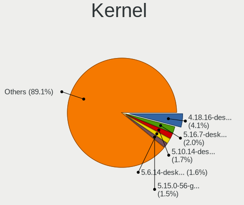

| Version                          | Notebooks | Percent |
|----------------------------------|-----------|---------|
| 4.18.16-desktop-1bP              | 20        | 5.81%   |
| 5.10.14-desktop-1omv4002         | 12        | 3.49%   |
| 5.6.14-desktop-2bP               | 10        | 2.91%   |
| 5.4.0-58-generic                 | 8         | 2.33%   |
| 5.16.7-desktop-1omv4003          | 8         | 2.33%   |
| 5.4.0-42-generic                 | 7         | 2.03%   |
| 5.4.0-52-generic                 | 5         | 1.45%   |
| 5.11.0-27-generic                | 5         | 1.45%   |
| 5.8.0-43-generic                 | 4         | 1.16%   |
| 5.4.0-73-generic                 | 4         | 1.16%   |
| 5.4.0-47-generic                 | 4         | 1.16%   |
| 4.9.60-nrj-desktop-1rosa-x86_64  | 4         | 1.16%   |
| 4.15.0-66-generic                | 4         | 1.16%   |
| 5.8.0-50-generic                 | 3         | 0.87%   |
| 5.8.0-29-generic                 | 3         | 0.87%   |
| 5.4.0-91-generic                 | 3         | 0.87%   |
| 5.4.0-88-generic                 | 3         | 0.87%   |
| 5.3.0-40-generic                 | 3         | 0.87%   |
| 5.3.0-26-generic                 | 3         | 0.87%   |
| 5.13.0-35-generic                | 3         | 0.87%   |
| 5.0.0-25-generic                 | 3         | 0.87%   |
| 4.9.124-nrj-desktop-1rosa-x86_64 | 3         | 0.87%   |
| 4.19.0-13-amd64                  | 3         | 0.87%   |
| 4.15.0-55-generic                | 3         | 0.87%   |
| 5.9.16-200.fc33.x86_64           | 2         | 0.58%   |
| 5.8.0-7630-generic               | 2         | 0.58%   |
| 5.8.0-7625-generic               | 2         | 0.58%   |
| 5.4.83-generic-2rosa-x86_64      | 2         | 0.58%   |
| 5.4.0-96-generic                 | 2         | 0.58%   |
| 5.4.0-65-generic                 | 2         | 0.58%   |
| 5.4.0-48-generic                 | 2         | 0.58%   |
| 5.4.0-29-generic                 | 2         | 0.58%   |
| 5.4.0-26-generic                 | 2         | 0.58%   |
| 5.3.0-46-generic                 | 2         | 0.58%   |
| 5.3.0-42-generic                 | 2         | 0.58%   |
| 5.3.0-28-generic                 | 2         | 0.58%   |
| 5.3.0-24-generic                 | 2         | 0.58%   |
| 5.15.0-33-generic                | 2         | 0.58%   |
| 5.13.0-27-generic                | 2         | 0.58%   |
| 5.11.3-300.fc34.x86_64           | 2         | 0.58%   |
| 5.11.0-43-generic                | 2         | 0.58%   |
| 5.11.0-40-generic                | 2         | 0.58%   |
| 5.11.0-16-generic                | 2         | 0.58%   |
| 5.10.0-8-amd64                   | 2         | 0.58%   |
| 5.10.0-11-amd64                  | 2         | 0.58%   |
| 5.0.0-37-generic                 | 2         | 0.58%   |
| 5.0.0-36-generic                 | 2         | 0.58%   |
| 5.0.0-31-generic                 | 2         | 0.58%   |
| 5.0.0-29-generic                 | 2         | 0.58%   |
| 5.0.0-23-generic                 | 2         | 0.58%   |
| 4.19.0-6-amd64                   | 2         | 0.58%   |
| 4.19.0-5-amd64                   | 2         | 0.58%   |
| 4.18.0-15-generic                | 2         | 0.58%   |
| 4.15.0-74-generic                | 2         | 0.58%   |
| 4.15.0-58-generic                | 2         | 0.58%   |
| 4.15.0-45-generic                | 2         | 0.58%   |
| 4.15.0-42-generic                | 2         | 0.58%   |
| 4.15.0-38-generic                | 2         | 0.58%   |
| 4.15.0-29-generic                | 2         | 0.58%   |
| 4.15.0-112-generic               | 2         | 0.58%   |

Kernel Family
-------------

Linux kernel without a distro release

| Version | Notebooks | Percent |
|---------|-----------|---------|
| 5.4.0   | 64        | 19.39%  |
| 4.15.0  | 35        | 10.61%  |
| 5.8.0   | 22        | 6.67%   |
| 4.18.16 | 20        | 6.06%   |
| 5.3.0   | 17        | 5.15%   |
| 5.11.0  | 15        | 4.55%   |
| 5.0.0   | 15        | 4.55%   |
| 5.13.0  | 13        | 3.94%   |
| 5.10.14 | 12        | 3.64%   |
| 5.6.14  | 10        | 3.03%   |
| 5.16.7  | 8         | 2.42%   |
| 4.19.0  | 7         | 2.12%   |
| 4.18.0  | 7         | 2.12%   |
| 5.10.0  | 6         | 1.82%   |
| 4.9.60  | 4         | 1.21%   |
| 5.9.16  | 3         | 0.91%   |
| 5.15.0  | 3         | 0.91%   |
| 5.11.11 | 3         | 0.91%   |
| 4.9.124 | 3         | 0.91%   |
| 5.4.83  | 2         | 0.61%   |
| 5.17.5  | 2         | 0.61%   |
| 5.17.1  | 2         | 0.61%   |
| 5.11.3  | 2         | 0.61%   |
| 4.9.20  | 2         | 0.61%   |
| 4.4.0   | 2         | 0.61%   |
| 5.9.4   | 1         | 0.3%    |
| 5.8.9   | 1         | 0.3%    |
| 5.7.19  | 1         | 0.3%    |
| 5.7.12  | 1         | 0.3%    |
| 5.6.13  | 1         | 0.3%    |
| 5.6.11  | 1         | 0.3%    |
| 5.6.0   | 1         | 0.3%    |
| 5.5.8   | 1         | 0.3%    |
| 5.5.5   | 1         | 0.3%    |
| 5.5.17  | 1         | 0.3%    |
| 5.5.11  | 1         | 0.3%    |
| 5.5.0   | 1         | 0.3%    |
| 5.4.40  | 1         | 0.3%    |
| 5.4.32  | 1         | 0.3%    |
| 5.3.6   | 1         | 0.3%    |
| 5.3.13  | 1         | 0.3%    |
| 5.2.21  | 1         | 0.3%    |
| 5.17.8  | 1         | 0.3%    |
| 5.17.0  | 1         | 0.3%    |
| 5.16.9  | 1         | 0.3%    |
| 5.16.11 | 1         | 0.3%    |
| 5.15.8  | 1         | 0.3%    |
| 5.15.50 | 1         | 0.3%    |
| 5.15.41 | 1         | 0.3%    |
| 5.15.4  | 1         | 0.3%    |
| 5.15.3  | 1         | 0.3%    |
| 5.15.28 | 1         | 0.3%    |
| 5.15.23 | 1         | 0.3%    |
| 5.15.13 | 1         | 0.3%    |
| 5.13.9  | 1         | 0.3%    |
| 5.13.4  | 1         | 0.3%    |
| 5.13.19 | 1         | 0.3%    |
| 5.12.9  | 1         | 0.3%    |
| 5.12.14 | 1         | 0.3%    |
| 5.12.11 | 1         | 0.3%    |

Kernel Major Ver.
-----------------

Linux kernel major version

| Version | Notebooks | Percent |
|---------|-----------|---------|
| 5.4     | 68        | 20.67%  |
| 4.15    | 35        | 10.64%  |
| 4.18    | 27        | 8.21%   |
| 5.8     | 23        | 6.99%   |
| 5.10    | 23        | 6.99%   |
| 5.11    | 21        | 6.38%   |
| 5.3     | 19        | 5.78%   |
| 5.0     | 17        | 5.17%   |
| 5.13    | 16        | 4.86%   |
| 5.6     | 13        | 3.95%   |
| 5.15    | 11        | 3.34%   |
| 4.9     | 11        | 3.34%   |
| 5.16    | 10        | 3.04%   |
| 4.19    | 8         | 2.43%   |
| 5.17    | 6         | 1.82%   |
| 5.5     | 5         | 1.52%   |
| 5.9     | 4         | 1.22%   |
| 5.12    | 3         | 0.91%   |
| 5.7     | 2         | 0.61%   |
| 4.4     | 2         | 0.61%   |
| 5.2     | 1         | 0.3%    |
| 4.17    | 1         | 0.3%    |
| 4.16    | 1         | 0.3%    |
| 4.12    | 1         | 0.3%    |
| 4.1     | 1         | 0.3%    |

Arch
----

OS architecture (x86_64, i586, etc.)

| Name   | Notebooks | Percent |
|--------|-----------|---------|
| x86_64 | 276       | 90.79%  |
| i686   | 28        | 9.21%   |

DE
--

Desktop Environment

| Name            | Notebooks | Percent |
|-----------------|-----------|---------|
| GNOME           | 107       | 34.41%  |
| KDE5            | 70        | 22.51%  |
| Unknown         | 46        | 14.79%  |
| XFCE            | 32        | 10.29%  |
| X-Cinnamon      | 24        | 7.72%   |
| KDE4            | 8         | 2.57%   |
| KDE             | 7         | 2.25%   |
| MATE            | 6         | 1.93%   |
| Unity           | 3         | 0.96%   |
| Cinnamon        | 3         | 0.96%   |
| LXDE            | 2         | 0.64%   |
| Pantheon        | 1         | 0.32%   |
| GNOME Flashback | 1         | 0.32%   |
| awesome         | 1         | 0.32%   |

Display Server
--------------

X11 or Wayland

| Name    | Notebooks | Percent |
|---------|-----------|---------|
| X11     | 259       | 84.36%  |
| Wayland | 26        | 8.47%   |
| Unknown | 19        | 6.19%   |
| Tty     | 3         | 0.98%   |

Display Manager
---------------

SDDM, LightDM, etc.

| Name    | Notebooks | Percent |
|---------|-----------|---------|
| Unknown | 165       | 53.23%  |
| SDDM    | 64        | 20.65%  |
| GDM     | 27        | 8.71%   |
| LightDM | 20        | 6.45%   |
| GDM3    | 14        | 4.52%   |
| TDM     | 11        | 3.55%   |
| KDM     | 8         | 2.58%   |
| XDM     | 1         | 0.32%   |

OS Lang
-------

Language

| Lang    | Notebooks | Percent |
|---------|-----------|---------|
| en_US   | 110       | 35.03%  |
| sk_SK   | 94        | 29.94%  |
| Unknown | 86        | 27.39%  |
| cs_CZ   | 8         | 2.55%   |
| hu_HU   | 5         | 1.59%   |
| C       | 4         | 1.27%   |
| en_GB   | 3         | 0.96%   |
| ru_UA   | 1         | 0.32%   |
| ru_RU   | 1         | 0.32%   |
| it_IT   | 1         | 0.32%   |
| en_US | 1         | 0.32%   |

Boot Mode
---------

EFI or BIOS

| Mode | Notebooks | Percent |
|------|-----------|---------|
| BIOS | 181       | 58.58%  |
| EFI  | 128       | 41.42%  |

Filesystem
----------

Type of filesystem

| Type    | Notebooks | Percent |
|---------|-----------|---------|
| Ext4    | 217       | 69.55%  |
| Overlay | 50        | 16.03%  |
| Btrfs   | 17        | 5.45%   |
| Unknown | 16        | 5.13%   |
| Zfs     | 4         | 1.28%   |
| Xfs     | 4         | 1.28%   |
| Ext3    | 2         | 0.64%   |
| Ext2    | 2         | 0.64%   |

Part. scheme
------------

Scheme of partitioning

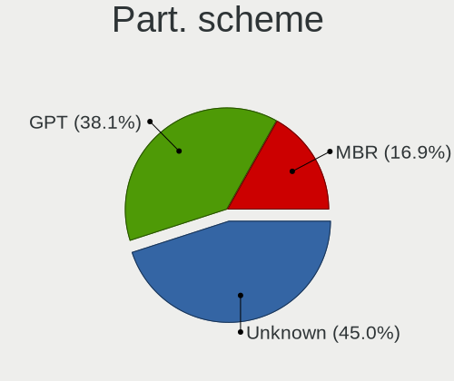

| Type    | Notebooks | Percent |
|---------|-----------|---------|
| Unknown | 177       | 56.91%  |
| GPT     | 71        | 22.83%  |
| MBR     | 63        | 20.26%  |

Dual Boot with Linux/BSD
------------------------

Hosting more than one Linux/BSD

| Dual boot | Notebooks | Percent |
|-----------|-----------|---------|
| No        | 262       | 83.97%  |
| Yes       | 50        | 16.03%  |

Dual Boot (Win)
---------------

Hosting Linux and Windows

| Dual boot | Notebooks | Percent |
|-----------|-----------|---------|
| No        | 204       | 66.67%  |
| Yes       | 102       | 33.33%  |

Board
-----

Vendor
------

Motherboard manufacturer

| Name             | Notebooks | Percent |
|------------------|-----------|---------|
| Lenovo           | 82        | 27.06%  |
| Hewlett-Packard  | 56        | 18.48%  |
| ASUSTek Computer | 49        | 16.17%  |
| Dell             | 41        | 13.53%  |
| Acer             | 22        | 7.26%   |
| Toshiba          | 15        | 4.95%   |
| Sony             | 8         | 2.64%   |
| MSI              | 8         | 2.64%   |
| Fujitsu Siemens  | 4         | 1.32%   |
| Fujitsu          | 3         | 0.99%   |
| eMachines        | 3         | 0.99%   |
| UMAX             | 2         | 0.66%   |
| Packard Bell     | 2         | 0.66%   |
| Apple            | 2         | 0.66%   |
| Valve            | 1         | 0.33%   |
| Timi             | 1         | 0.33%   |
| Teclast          | 1         | 0.33%   |
| Medion           | 1         | 0.33%   |
| Google           | 1         | 0.33%   |
| Unknown          | 1         | 0.33%   |

Model
-----

Motherboard model

| Name                               | Notebooks | Percent |
|------------------------------------|-----------|---------|
| ASUS X550CC                        | 4         | 1.32%   |
| HP ProBook 4540s                   | 3         | 0.99%   |
| HP Pavilion dv6                    | 3         | 0.99%   |
| Toshiba Satellite P300             | 2         | 0.66%   |
| MSI VR610                          | 2         | 0.66%   |
| Lenovo Yoga Slim 7 Pro 14ITL5 82FX | 2         | 0.66%   |
| Lenovo IdeaPad U260 20067          | 2         | 0.66%   |
| Lenovo IdeaPad S145-14AST 81ST     | 2         | 0.66%   |
| Lenovo G580                        | 2         | 0.66%   |
| HP ProBook 6570b                   | 2         | 0.66%   |
| HP ProBook 650 G1                  | 2         | 0.66%   |
| HP ProBook 4545s                   | 2         | 0.66%   |
| HP ProBook 450 G5                  | 2         | 0.66%   |
| HP ProBook 4330s                   | 2         | 0.66%   |
| HP EliteBook 8470p                 | 2         | 0.66%   |
| Dell Precision 7530                | 2         | 0.66%   |
| Dell Latitude E6540                | 2         | 0.66%   |
| Dell Latitude 5490                 | 2         | 0.66%   |
| Dell Latitude 5401                 | 2         | 0.66%   |
| ASUS X51R                          | 2         | 0.66%   |
| ASUS X51L                          | 2         | 0.66%   |
| ASUS K50C                          | 2         | 0.66%   |
| Acer Extensa 5635G                 | 2         | 0.66%   |
| Unknown                            | 2         | 0.66%   |
| Valve Jupiter                      | 1         | 0.33%   |
| UMAX VisionBook 14Wr Plus          | 1         | 0.33%   |
| UMAX VisionBook 14Wg Pro           | 1         | 0.33%   |
| Toshiba Satellite U400             | 1         | 0.33%   |
| Toshiba Satellite Pro C850-1D5     | 1         | 0.33%   |
| Toshiba Satellite Pro C660         | 1         | 0.33%   |
| Toshiba Satellite P770             | 1         | 0.33%   |
| Toshiba Satellite L850-1HP         | 1         | 0.33%   |
| Toshiba Satellite L735             | 1         | 0.33%   |
| Toshiba Satellite L500             | 1         | 0.33%   |
| Toshiba Satellite L450             | 1         | 0.33%   |
| Toshiba Satellite C855-1TT         | 1         | 0.33%   |
| Toshiba Satellite C850-13Z         | 1         | 0.33%   |
| Toshiba Satellite C660             | 1         | 0.33%   |
| Toshiba Satellite C50-A            | 1         | 0.33%   |
| Toshiba EQUIUM A300D               | 1         | 0.33%   |
| Timi TM1701                        | 1         | 0.33%   |
| Teclast F15S                       | 1         | 0.33%   |
| Sony VPCEH3S6E                     | 1         | 0.33%   |
| Sony VPCEH1S1E                     | 1         | 0.33%   |
| Sony VPCEH1L8E                     | 1         | 0.33%   |
| Sony VPCEE2M1E                     | 1         | 0.33%   |
| Sony VPCEB3L1E                     | 1         | 0.33%   |
| Sony VGN-NR21J_S                   | 1         | 0.33%   |
| Sony VGN-FW31ZJ                    | 1         | 0.33%   |
| Sony SVE1713F1EW                   | 1         | 0.33%   |
| Packard Bell EasyNote TK85         | 1         | 0.33%   |
| Packard Bell EasyNote TE11BZ       | 1         | 0.33%   |
| MSI VR201                          | 1         | 0.33%   |
| MSI Prestige 15 A10SC              | 1         | 0.33%   |
| MSI GX630/GX633                    | 1         | 0.33%   |
| MSI GT60 2OC/2OD                   | 1         | 0.33%   |
| MSI EX705                          | 1         | 0.33%   |
| MSI CR500                          | 1         | 0.33%   |
| Medion E6435 MD60939               | 1         | 0.33%   |
| Lenovo Z710 20250                  | 1         | 0.33%   |

Model Family
------------

Motherboard model prefix

| Name                     | Notebooks | Percent |
|--------------------------|-----------|---------|
| Lenovo ThinkPad          | 38        | 12.54%  |
| Lenovo IdeaPad           | 23        | 7.59%   |
| Dell Latitude            | 21        | 6.93%   |
| HP ProBook               | 19        | 6.27%   |
| Toshiba Satellite        | 14        | 4.62%   |
| HP Pavilion              | 11        | 3.63%   |
| HP EliteBook             | 11        | 3.63%   |
| Acer Aspire              | 10        | 3.3%    |
| Dell Inspiron            | 5         | 1.65%   |
| Acer Swift               | 5         | 1.65%   |
| Dell XPS                 | 4         | 1.32%   |
| Dell Vostro              | 4         | 1.32%   |
| ASUS X550CC              | 4         | 1.32%   |
| Acer Extensa             | 4         | 1.32%   |
| Lenovo Yoga              | 3         | 0.99%   |
| Lenovo Legion            | 3         | 0.99%   |
| HP ZBook                 | 3         | 0.99%   |
| UMAX VisionBook          | 2         | 0.66%   |
| Packard Bell EasyNote    | 2         | 0.66%   |
| MSI VR610                | 2         | 0.66%   |
| Lenovo G580              | 2         | 0.66%   |
| HP Laptop                | 2         | 0.66%   |
| HP Compaq                | 2         | 0.66%   |
| Fujitsu Siemens LIFEBOOK | 2         | 0.66%   |
| Fujitsu LIFEBOOK         | 2         | 0.66%   |
| Dell Studio              | 2         | 0.66%   |
| Dell Precision           | 2         | 0.66%   |
| ASUS ZenBook             | 2         | 0.66%   |
| ASUS X51R                | 2         | 0.66%   |
| ASUS X51L                | 2         | 0.66%   |
| ASUS ROG                 | 2         | 0.66%   |
| ASUS K50C                | 2         | 0.66%   |
| Unknown                  | 2         | 0.66%   |
| Valve Jupiter            | 1         | 0.33%   |
| Toshiba EQUIUM           | 1         | 0.33%   |
| Timi TM1701              | 1         | 0.33%   |
| Teclast F15S             | 1         | 0.33%   |
| Sony VPCEH3S6E           | 1         | 0.33%   |
| Sony VPCEH1S1E           | 1         | 0.33%   |
| Sony VPCEH1L8E           | 1         | 0.33%   |
| Sony VPCEE2M1E           | 1         | 0.33%   |
| Sony VPCEB3L1E           | 1         | 0.33%   |
| Sony VGN-NR21J           | 1         | 0.33%   |
| Sony VGN-FW31ZJ          | 1         | 0.33%   |
| Sony SVE1713F1EW         | 1         | 0.33%   |
| MSI VR201                | 1         | 0.33%   |
| MSI Prestige             | 1         | 0.33%   |
| MSI GX630                | 1         | 0.33%   |
| MSI GT60                 | 1         | 0.33%   |
| MSI EX705                | 1         | 0.33%   |
| MSI CR500                | 1         | 0.33%   |
| Medion E6435             | 1         | 0.33%   |
| Lenovo Z710              | 1         | 0.33%   |
| Lenovo Z50-70            | 1         | 0.33%   |
| Lenovo Y520-15IKBN       | 1         | 0.33%   |
| Lenovo V110-15IAP        | 1         | 0.33%   |
| Lenovo G780              | 1         | 0.33%   |
| Lenovo G710              | 1         | 0.33%   |
| Lenovo G575              | 1         | 0.33%   |
| Lenovo G505              | 1         | 0.33%   |

MFG Year
--------

Motherboard manufacture year

| Year | Notebooks | Percent |
|------|-----------|---------|
| 2013 | 34        | 11.22%  |
| 2012 | 33        | 10.89%  |
| 2011 | 26        | 8.58%   |
| 2019 | 25        | 8.25%   |
| 2008 | 23        | 7.59%   |
| 2017 | 19        | 6.27%   |
| 2016 | 18        | 5.94%   |
| 2009 | 18        | 5.94%   |
| 2020 | 17        | 5.61%   |
| 2010 | 17        | 5.61%   |
| 2007 | 17        | 5.61%   |
| 2018 | 16        | 5.28%   |
| 2015 | 11        | 3.63%   |
| 2014 | 11        | 3.63%   |
| 2021 | 9         | 2.97%   |
| 2006 | 7         | 2.31%   |
| 2022 | 1         | 0.33%   |
| 2005 | 1         | 0.33%   |

Form Factor
-----------

Physical design of the computer

| Name     | Notebooks | Percent |
|----------|-----------|---------|
| Notebook | 303       | 100%    |

Secure Boot
-----------

Enabled or disabled

| State    | Notebooks | Percent |
|----------|-----------|---------|
| Disabled | 275       | 90.16%  |
| Enabled  | 30        | 9.84%   |

Coreboot
--------

Have coreboot on board

| Used | Notebooks | Percent |
|------|-----------|---------|
| No   | 302       | 99.67%  |
| Yes  | 1         | 0.33%   |

RAM Size
--------

Total RAM memory

| Size in GB  | Notebooks | Percent |
|-------------|-----------|---------|
| 3.01-4.0    | 89        | 29.08%  |
| 4.01-8.0    | 72        | 23.53%  |
| 16.01-24.0  | 46        | 15.03%  |
| 8.01-16.0   | 46        | 15.03%  |
| 1.01-2.0    | 25        | 8.17%   |
| 32.01-64.0  | 11        | 3.59%   |
| 2.01-3.0    | 11        | 3.59%   |
| 0.51-1.0    | 5         | 1.63%   |
| 64.01-256.0 | 1         | 0.33%   |

RAM Used
--------

Used RAM memory

| Used GB   | Notebooks | Percent |
|-----------|-----------|---------|
| 1.01-2.0  | 132       | 40.37%  |
| 2.01-3.0  | 60        | 18.35%  |
| 0.51-1.0  | 56        | 17.13%  |
| 3.01-4.0  | 31        | 9.48%   |
| 4.01-8.0  | 29        | 8.87%   |
| 8.01-16.0 | 12        | 3.67%   |
| 0.01-0.5  | 7         | 2.14%   |

Total Drives
------------

Number of drives on board

| Drives | Notebooks | Percent |
|--------|-----------|---------|
| 1      | 219       | 69.52%  |
| 2      | 78        | 24.76%  |
| 3      | 12        | 3.81%   |
| 0      | 6         | 1.9%    |

Has CD-ROM
----------

Has CD-ROM on board

| Presented | Notebooks | Percent |
|-----------|-----------|---------|
| No        | 159       | 52.13%  |
| Yes       | 146       | 47.87%  |

Has Ethernet
------------

Has Ethernet on board

| Presented | Notebooks | Percent |
|-----------|-----------|---------|
| Yes       | 272       | 89.77%  |
| No        | 31        | 10.23%  |

Has WiFi
--------

Has WiFi module

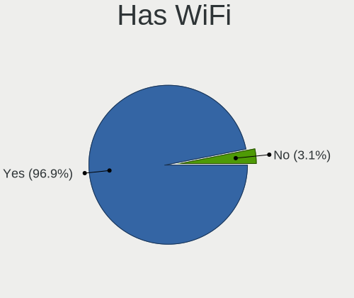

| Presented | Notebooks | Percent |
|-----------|-----------|---------|
| Yes       | 299       | 98.68%  |
| No        | 4         | 1.32%   |

Has Bluetooth
-------------

Has Bluetooth module

| Presented | Notebooks | Percent |
|-----------|-----------|---------|
| Yes       | 218       | 71.71%  |
| No        | 86        | 28.29%  |

Location
--------

Country
-------

Geographic location (country)

| Country  | Notebooks | Percent |
|----------|-----------|---------|
| Slovakia | 303       | 100%    |

City
----

Geographic location (city)

| City                 | Notebooks | Percent |
|----------------------|-----------|---------|
| Bratislava           | 123       | 37.27%  |
| Bansk Bystrica     | 17        | 5.15%   |
| Nitra                | 13        | 3.94%   |
| Koice              | 12        | 3.64%   |
| Trnava               | 5         | 1.52%   |
| Preov              | 5         | 1.52%   |
| Trenn            | 4         | 1.21%   |
| Soblahov             | 4         | 1.21%   |
| Nov Zmky         | 4         | 1.21%   |
| Humenn             | 4         | 1.21%   |
| Bardejov             | 4         | 1.21%   |
| Zvolen               | 3         | 0.91%   |
| ilina              | 3         | 0.91%   |
| Topoany          | 3         | 0.91%   |
| Senec                | 3         | 0.91%   |
| Martin               | 3         | 0.91%   |
| Luenec             | 3         | 0.91%   |
| Levice               | 3         | 0.91%   |
| Kysuck Nov Mesto | 3         | 0.91%   |
| Dunajsk Streda     | 3         | 0.91%   |
| Voderady             | 2         | 0.61%   |
| Vlkova               | 2         | 0.61%   |
| Tornaa             | 2         | 0.61%   |
| trovo            | 2         | 0.61%   |
| Stara Tura           | 2         | 0.61%   |
| Ruomberok          | 2         | 0.61%   |
| Roava            | 2         | 0.61%   |
| Rohoznik             | 2         | 0.61%   |
| Poprad               | 2         | 0.61%   |
| Podhradie            | 2         | 0.61%   |
| Nmestovo           | 2         | 0.61%   |
| Most pri Bratislave  | 2         | 0.61%   |
| Liptovsk Mikul | 2         | 0.61%   |
| Galanta              | 2         | 0.61%   |
| Chorvatsky Grob      | 2         | 0.61%   |
| Cerveny Kamen        | 2         | 0.61%   |
| Cechynce             | 2         | 0.61%   |
| Biely Kostol         | 2         | 0.61%   |
| Banovce nad Bebravou | 2         | 0.61%   |
| Abovce               | 2         | 0.61%   |
| Ziar nad Hronom      | 1         | 0.3%    |
| Vlckovce             | 1         | 0.3%    |
| Velky Saris          | 1         | 0.3%    |
| Velky Meder          | 1         | 0.3%    |
| Velky Krtis          | 1         | 0.3%    |
| Velka Maca           | 1         | 0.3%    |
| Vahovce              | 1         | 0.3%    |
| Trstice              | 1         | 0.3%    |
| Trebiov            | 1         | 0.3%    |
| Topolcianky          | 1         | 0.3%    |
| Tekovska Breznica    | 1         | 0.3%    |
| Svit                 | 1         | 0.3%    |
| Svidnk             | 1         | 0.3%    |
| urany              | 1         | 0.3%    |
| Stropkov             | 1         | 0.3%    |
| Strecno              | 1         | 0.3%    |
| Star ubova     | 1         | 0.3%    |
| Spisk Nov Ves  | 1         | 0.3%    |
| Soporna              | 1         | 0.3%    |
| Skalica              | 1         | 0.3%    |

Drives
------

Drive Vendor
------------

Hard drive vendors

| Vendor              | Notebooks | Drives | Percent |
|---------------------|-----------|--------|---------|
| Seagate             | 59        | 68     | 15.17%  |
| WDC                 | 56        | 63     | 14.4%   |
| Samsung Electronics | 48        | 57     | 12.34%  |
| Toshiba             | 28        | 39     | 7.2%    |
| Kingston            | 25        | 33     | 6.43%   |
| SanDisk             | 21        | 23     | 5.4%    |
| Unknown             | 20        | 32     | 5.14%   |
| Hitachi             | 16        | 16     | 4.11%   |
| Intel               | 15        | 18     | 3.86%   |
| Patriot             | 14        | 22     | 3.6%    |
| A-DATA Technology   | 12        | 19     | 3.08%   |
| HGST                | 11        | 15     | 2.83%   |
| SK hynix            | 9         | 11     | 2.31%   |
| Micron Technology   | 9         | 11     | 2.31%   |
| Crucial             | 9         | 12     | 2.31%   |
| Fujitsu             | 4         | 4      | 1.03%   |
| Union Memory        | 2         | 2      | 0.51%   |
| Transcend           | 2         | 2      | 0.51%   |
| OCZ                 | 2         | 2      | 0.51%   |
| LITEONIT            | 2         | 2      | 0.51%   |
| LITEON              | 2         | 2      | 0.51%   |
| KIOXIA              | 2         | 9      | 0.51%   |
| Apacer              | 2         | 2      | 0.51%   |
| ZTE                 | 1         | 1      | 0.26%   |
| Verbatim            | 1         | 1      | 0.26%   |
| Solid State Storage | 1         | 1      | 0.26%   |
| Phison              | 1         | 1      | 0.26%   |
| KingSpec            | 1         | 1      | 0.26%   |
| KingDian            | 1         | 3      | 0.26%   |
| JMicron Technology  | 1         | 1      | 0.26%   |
| Intenso             | 1         | 1      | 0.26%   |
| IM3D                | 1         | 1      | 0.26%   |
| IBM/Hitachi         | 1         | 1      | 0.26%   |
| HUAWEI              | 1         | 1      | 0.26%   |
| HS-SSD-E100         | 1         | 1      | 0.26%   |
| Hewlett-Packard     | 1         | 1      | 0.26%   |
| Faspeed             | 1         | 1      | 0.26%   |
| China               | 1         | 2      | 0.26%   |
| ASMT                | 1         | 1      | 0.26%   |
| Apple               | 1         | 2      | 0.26%   |
| 2.5                 | 1         | 1      | 0.26%   |
| Unknown             | 1         | 1      | 0.26%   |

Drive Model
-----------

Hard drive models

| Model                               | Notebooks | Percent |
|-------------------------------------|-----------|---------|
| Samsung SSD 860 EVO 500GB           | 9         | 2.22%   |
| Patriot Burst 240GB SSD             | 8         | 1.97%   |
| Patriot Burst 480GB SSD             | 7         | 1.72%   |
| Unknown MMC Card  64GB              | 5         | 1.23%   |
| Seagate ST9500420AS 500GB           | 5         | 1.23%   |
| Seagate ST9500325AS 500GB           | 5         | 1.23%   |
| Samsung SSD 850 EVO 500GB           | 5         | 1.23%   |
| Kingston SV300S37A120G 120GB SSD    | 5         | 1.23%   |
| Kingston SA400S37240G 240GB SSD     | 5         | 1.23%   |
| Kingston SA400S37120G 120GB SSD     | 5         | 1.23%   |
| WDC WDS240G2G0B-00EPW0 240GB SSD    | 4         | 0.99%   |
| WDC WDS240G2G0A-00JH30 240GB SSD    | 4         | 0.99%   |
| Seagate ST1000LM035-1RK172 1TB      | 4         | 0.99%   |
| Seagate ST1000LM024 HN-M101MBB 1TB  | 4         | 0.99%   |
| SanDisk NVMe SSD Drive 512GB        | 4         | 0.99%   |
| SanDisk NVMe SSD Drive 1024GB       | 4         | 0.99%   |
| HGST HTS725050A7E630 500GB          | 4         | 0.99%   |
| Toshiba NVMe SSD Drive 512GB        | 3         | 0.74%   |
| Toshiba MQ01ABF050 500GB            | 3         | 0.74%   |
| Toshiba MQ01ABD100 1TB              | 3         | 0.74%   |
| SK hynix NVMe SSD Drive 512GB       | 3         | 0.74%   |
| Seagate ST9250827AS 250GB           | 3         | 0.74%   |
| Seagate ST500LT012-9WS142 500GB     | 3         | 0.74%   |
| Seagate ST500LM000-1EJ162 500GB     | 3         | 0.74%   |
| Samsung SSD 860 EVO 250GB           | 3         | 0.74%   |
| Samsung SSD 850 EVO 250GB           | 3         | 0.74%   |
| Samsung NVMe SSD Drive 256GB        | 3         | 0.74%   |
| HGST HTS545050A7E380 500GB          | 3         | 0.74%   |
| Crucial CT120BX500SSD1 120GB        | 3         | 0.74%   |
| WDC WD3200BPVT-22ZEST0 320GB        | 2         | 0.49%   |
| WDC WD3200BEVT-22ZCT0 320GB         | 2         | 0.49%   |
| WDC WD10JPCX-24UE4T0 1TB            | 2         | 0.49%   |
| WDC PC SN730 SDBPNTY-1T00-1101 1TB  | 2         | 0.49%   |
| WDC PC SN730 NVMe 512GB             | 2         | 0.49%   |
| Unknown MMC Card  32GB              | 2         | 0.49%   |
| Unknown MMC Card  128GB             | 2         | 0.49%   |
| Union Memory RTOTJ128VGD2EYX 128GB  | 2         | 0.49%   |
| Toshiba MK7575GSX 752GB             | 2         | 0.49%   |
| Toshiba MK2546GSX 250GB             | 2         | 0.49%   |
| SK hynix NVMe SSD Drive 256GB       | 2         | 0.49%   |
| Seagate ST9750420AS 752GB           | 2         | 0.49%   |
| Seagate ST9250315AS 250GB           | 2         | 0.49%   |
| Seagate ST750LM022 HN-M750MBB 752GB | 2         | 0.49%   |
| Seagate ST320LT020-9YG142 320GB     | 2         | 0.49%   |
| Seagate ST320LT007-9ZV142 320GB     | 2         | 0.49%   |
| Seagate ST2000LM007-1R8174 2TB      | 2         | 0.49%   |
| SanDisk Z400s M.2 2280 128GB SSD    | 2         | 0.49%   |
| Samsung NVMe SSD Drive 512GB        | 2         | 0.49%   |
| Samsung MZVLB512HBJQ-000L7 512GB    | 2         | 0.49%   |
| Patriot P210 256GB SSD              | 2         | 0.49%   |
| Micron NVMe SSD Drive 512GB         | 2         | 0.49%   |
| Kingston SA400S37480G 480GB SSD     | 2         | 0.49%   |
| Intel SSDSC2CW060A3 64GB            | 2         | 0.49%   |
| Intel SSDSA2BW120G3H 120GB          | 2         | 0.49%   |
| Hitachi HTS543232A7A384 320GB       | 2         | 0.49%   |
| Hitachi HTS541612J9SA00 120GB       | 2         | 0.49%   |
| HGST HTS721010A9E630 1TB            | 2         | 0.49%   |
| Crucial CT1000MX500SSD1 1TB         | 2         | 0.49%   |
| A-DATA SU650 120GB SSD              | 2         | 0.49%   |
| A-DATA SSD S599 55GB                | 2         | 0.49%   |

HDD Vendor
----------

Hard disk drive vendors

| Vendor              | Notebooks | Drives | Percent |
|---------------------|-----------|--------|---------|
| Seagate             | 59        | 68     | 39.07%  |
| WDC                 | 38        | 42     | 25.17%  |
| Toshiba             | 21        | 32     | 13.91%  |
| Hitachi             | 16        | 16     | 10.6%   |
| HGST                | 11        | 15     | 7.28%   |
| Fujitsu             | 4         | 4      | 2.65%   |
| Samsung Electronics | 1         | 2      | 0.66%   |
| IBM/Hitachi         | 1         | 1      | 0.66%   |

SSD Vendor
----------

Solid state drive vendors

| Vendor              | Notebooks | Drives | Percent |
|---------------------|-----------|--------|---------|
| Samsung Electronics | 30        | 34     | 19.87%  |
| Kingston            | 22        | 30     | 14.57%  |
| Patriot             | 14        | 22     | 9.27%   |
| WDC                 | 11        | 13     | 7.28%   |
| SanDisk             | 11        | 13     | 7.28%   |
| Intel               | 11        | 14     | 7.28%   |
| A-DATA Technology   | 11        | 18     | 7.28%   |
| Crucial             | 9         | 12     | 5.96%   |
| Micron Technology   | 5         | 7      | 3.31%   |
| Toshiba             | 3         | 3      | 1.99%   |
| Union Memory        | 2         | 2      | 1.32%   |
| Transcend           | 2         | 2      | 1.32%   |
| SK hynix            | 2         | 2      | 1.32%   |
| OCZ                 | 2         | 2      | 1.32%   |
| LITEONIT            | 2         | 2      | 1.32%   |
| LITEON              | 2         | 2      | 1.32%   |
| Apacer              | 2         | 2      | 1.32%   |
| Verbatim            | 1         | 1      | 0.66%   |
| KingSpec            | 1         | 1      | 0.66%   |
| KingDian            | 1         | 3      | 0.66%   |
| Intenso             | 1         | 1      | 0.66%   |
| IM3D                | 1         | 1      | 0.66%   |
| HS-SSD-E100         | 1         | 1      | 0.66%   |
| Hewlett-Packard     | 1         | 1      | 0.66%   |
| Faspeed             | 1         | 1      | 0.66%   |
| China               | 1         | 2      | 0.66%   |
| 2.5                 | 1         | 1      | 0.66%   |

Drive Kind
----------

HDD or SSD

| Kind    | Notebooks | Drives | Percent |
|---------|-----------|--------|---------|
| HDD     | 144       | 180    | 39.78%  |
| SSD     | 134       | 193    | 37.02%  |
| NVMe    | 59        | 77     | 16.3%   |
| MMC     | 21        | 33     | 5.8%    |
| Unknown | 4         | 4      | 1.1%    |

Drive Connector
---------------

SATA, SAS, NVMe, etc.

| Type | Notebooks | Drives | Percent |
|------|-----------|--------|---------|
| SATA | 243       | 363    | 72.32%  |
| NVMe | 59        | 77     | 17.56%  |
| MMC  | 21        | 33     | 6.25%   |
| SAS  | 13        | 14     | 3.87%   |

Drive Size
----------

Size of hard drive

| Size in TB | Notebooks | Drives | Percent |
|------------|-----------|--------|---------|
| 0.01-0.5   | 206       | 299    | 78.33%  |
| 0.51-1.0   | 51        | 66     | 19.39%  |
| 1.01-2.0   | 6         | 8      | 2.28%   |

Space Total
-----------

Amount of disk space available on the file system

| Size in GB     | Notebooks | Percent |
|----------------|-----------|---------|
| 101-250        | 87        | 27.02%  |
| 251-500        | 68        | 21.12%  |
| 501-1000       | 35        | 10.87%  |
| 1-20           | 34        | 10.56%  |
| 51-100         | 30        | 9.32%   |
| Unknown        | 27        | 8.39%   |
| 21-50          | 23        | 7.14%   |
| 1001-2000      | 13        | 4.04%   |
| More than 3000 | 4         | 1.24%   |
| 2001-3000      | 1         | 0.31%   |

Space Used
----------

Amount of used disk space

| Used GB        | Notebooks | Percent |
|----------------|-----------|---------|
| 1-20           | 145       | 44.34%  |
| 21-50          | 50        | 15.29%  |
| 51-100         | 36        | 11.01%  |
| 101-250        | 33        | 10.09%  |
| Unknown        | 27        | 8.26%   |
| 251-500        | 21        | 6.42%   |
| 501-1000       | 10        | 3.06%   |
| 1001-2000      | 3         | 0.92%   |
| More than 3000 | 2         | 0.61%   |

Malfunc. Drives
---------------

Drive models with a malfunction

| Model                                          | Notebooks | Drives | Percent |
|------------------------------------------------|-----------|--------|---------|
| Toshiba MK7575GSX 752GB                        | 2         | 3      | 5.13%   |
| WDC WDS240G2G0A-00JH30 240GB SSD               | 1         | 1      | 2.56%   |
| WDC WD7500BPVT-80HXZT3 752GB                   | 1         | 1      | 2.56%   |
| WDC WD5000LPVT-24G33T1 500GB                   | 1         | 1      | 2.56%   |
| WDC WD5000BPVT-00HXZT1 500GB                   | 1         | 1      | 2.56%   |
| WDC WD3200BEVT-75ZCT2 320GB                    | 1         | 1      | 2.56%   |
| WDC WD10JPLX-00MBPT0 1TB                       | 1         | 1      | 2.56%   |
| Toshiba MQ01ABD100 1TB                         | 1         | 1      | 2.56%   |
| Toshiba MQ01ABD075 752GB                       | 1         | 1      | 2.56%   |
| Toshiba MK5056GSY 500GB                        | 1         | 1      | 2.56%   |
| Toshiba MK1646GSX 160GB                        | 1         | 2      | 2.56%   |
| Toshiba MK1637GSX 160GB                        | 1         | 1      | 2.56%   |
| SK hynix BC501 HFM256GDJTNG-8310A 256GB        | 1         | 1      | 2.56%   |
| Seagate ST980811AS 80GB                        | 1         | 1      | 2.56%   |
| Seagate ST9500420AS 500GB                      | 1         | 1      | 2.56%   |
| Seagate ST9500325AS 500GB                      | 1         | 1      | 2.56%   |
| Seagate ST9250315AS 250GB                      | 1         | 1      | 2.56%   |
| Seagate ST9120823ASG 120GB                     | 1         | 1      | 2.56%   |
| Seagate ST500LM000-SSHD-8GB                    | 1         | 1      | 2.56%   |
| Seagate ST500LM000-1EJ162 500GB                | 1         | 1      | 2.56%   |
| Seagate ST320LT020-9YG142 320GB                | 1         | 2      | 2.56%   |
| Seagate ST320LT007-9ZV142 320GB                | 1         | 1      | 2.56%   |
| Seagate ST1000LM024 HN-M101MBB 1TB             | 1         | 1      | 2.56%   |
| SanDisk SD8SN8U-256G-1006 256GB SSD            | 1         | 1      | 2.56%   |
| Samsung Electronics SSD 960 EVO 500GB          | 1         | 1      | 2.56%   |
| Samsung Electronics HS122JC 120GB              | 1         | 2      | 2.56%   |
| Micron Technology MTFDDAK256MAM-1K12 256GB SSD | 1         | 1      | 2.56%   |
| Micron Technology 1100 SATA 256GB SSD          | 1         | 1      | 2.56%   |
| Intel SSDSC2CW060A3 64GB                       | 1         | 1      | 2.56%   |
| Intel SSDSC2BF240A5L 240GB                     | 1         | 1      | 2.56%   |
| IM3D L06B B0KB 120GB SSD                       | 1         | 1      | 2.56%   |
| Hitachi HTS723216L9A360 160GB                  | 1         | 1      | 2.56%   |
| Hitachi HTS547575A9E384 752GB                  | 1         | 1      | 2.56%   |
| Hitachi HTS545050A7E380 500GB                  | 1         | 1      | 2.56%   |
| Hitachi HTS543232A7A384 320GB                  | 1         | 1      | 2.56%   |
| Hitachi HTS543225L9SA00 250GB                  | 1         | 1      | 2.56%   |
| Hitachi HTS543216L9SA02 160GB                  | 1         | 1      | 2.56%   |
| HGST HTS725050A7E630 500GB                     | 1         | 1      | 2.56%   |

Malfunc. Drive Vendor
---------------------

Vendors of faulty drives

| Vendor              | Notebooks | Drives | Percent |
|---------------------|-----------|--------|---------|
| Seagate             | 10        | 11     | 25.64%  |
| Toshiba             | 7         | 9      | 17.95%  |
| WDC                 | 6         | 6      | 15.38%  |
| Hitachi             | 6         | 6      | 15.38%  |
| Samsung Electronics | 2         | 3      | 5.13%   |
| Micron Technology   | 2         | 2      | 5.13%   |
| Intel               | 2         | 2      | 5.13%   |
| SK hynix            | 1         | 1      | 2.56%   |
| SanDisk             | 1         | 1      | 2.56%   |
| IM3D                | 1         | 1      | 2.56%   |
| HGST                | 1         | 1      | 2.56%   |

Malfunc. HDD Vendor
-------------------

Vendors of faulty HDD drives

| Vendor              | Notebooks | Drives | Percent |
|---------------------|-----------|--------|---------|
| Seagate             | 10        | 11     | 33.33%  |
| Toshiba             | 7         | 9      | 23.33%  |
| Hitachi             | 6         | 6      | 20%     |
| WDC                 | 5         | 5      | 16.67%  |
| Samsung Electronics | 1         | 2      | 3.33%   |
| HGST                | 1         | 1      | 3.33%   |

Malfunc. Drive Kind
-------------------

Kinds of faulty drives

| Kind | Notebooks | Drives | Percent |
|------|-----------|--------|---------|
| HDD  | 29        | 34     | 76.32%  |
| SSD  | 7         | 7      | 18.42%  |
| NVMe | 2         | 2      | 5.26%   |

Failed Drives
-------------

Failed drive models

| Model                     | Notebooks | Drives | Percent |
|---------------------------|-----------|--------|---------|
| Seagate ST9320325AS 320GB | 1         | 1      | 100%    |

Failed Drive Vendor
-------------------

Failed drive vendors

| Vendor  | Notebooks | Drives | Percent |
|---------|-----------|--------|---------|
| Seagate | 1         | 1      | 100%    |

Drive Status
------------

Number of failed and malfunc. drives

| Status   | Notebooks | Drives | Percent |
|----------|-----------|--------|---------|
| Detected | 186       | 264    | 56.71%  |
| Works    | 103       | 179    | 31.4%   |
| Malfunc  | 38        | 43     | 11.59%  |
| Failed   | 1         | 1      | 0.3%    |

Storage controller
------------------

Storage Vendor
--------------

Storage controller vendors

| Vendor                           | Notebooks | Percent |
|----------------------------------|-----------|---------|
| Intel                            | 218       | 66.46%  |
| AMD                              | 39        | 11.89%  |
| Samsung Electronics              | 19        | 5.79%   |
| SanDisk                          | 17        | 5.18%   |
| SK hynix                         | 7         | 2.13%   |
| Nvidia                           | 7         | 2.13%   |
| Toshiba America Info Systems     | 4         | 1.22%   |
| Micron Technology                | 4         | 1.22%   |
| Silicon Integrated Systems [SiS] | 3         | 0.91%   |
| Kingston Technology Company      | 3         | 0.91%   |
| KIOXIA                           | 2         | 0.61%   |
| Solid State Storage Technology   | 1         | 0.3%    |
| Silicon Image                    | 1         | 0.3%    |
| Phison Electronics               | 1         | 0.3%    |
| Apple                            | 1         | 0.3%    |
| ADATA Technology                 | 1         | 0.3%    |

Storage Model
-------------

Storage controller models

| Model                                                                                  | Notebooks | Percent |
|----------------------------------------------------------------------------------------|-----------|---------|
| Intel 7 Series Chipset Family 6-port SATA Controller [AHCI mode]                       | 39        | 10.37%  |
| AMD FCH SATA Controller [AHCI mode]                                                    | 24        | 6.38%   |
| Intel Sunrise Point-LP SATA Controller [AHCI mode]                                     | 20        | 5.32%   |
| Intel 6 Series/C200 Series Chipset Family 6 port Mobile SATA AHCI Controller           | 18        | 4.79%   |
| Intel 82801HM/HEM (ICH8M/ICH8M-E) SATA Controller [AHCI mode]                          | 15        | 3.99%   |
| Intel 82801HM/HEM (ICH8M/ICH8M-E) IDE Controller                                       | 15        | 3.99%   |
| Intel 82801IBM/IEM (ICH9M/ICH9M-E) 4 port SATA Controller [AHCI mode]                  | 14        | 3.72%   |
| Intel 82801 Mobile SATA Controller [RAID mode]                                         | 14        | 3.72%   |
| Samsung NVMe SSD Controller SM981/PM981/PM983                                          | 13        | 3.46%   |
| Intel 8 Series/C220 Series Chipset Family 6-port SATA Controller 1 [AHCI mode]         | 11        | 2.93%   |
| SanDisk WD Black SN750 / PC SN730 NVMe SSD                                             | 9         | 2.39%   |
| Intel 5 Series/3400 Series Chipset 4 port SATA AHCI Controller                         | 9         | 2.39%   |
| Intel Cannon Lake Mobile PCH SATA AHCI Controller                                      | 6         | 1.6%    |
| Intel 8 Series SATA Controller 1 [AHCI mode]                                           | 6         | 1.6%    |
| Intel 7 Series Chipset Family 4-port SATA Controller [IDE mode]                        | 6         | 1.6%    |
| Intel 7 Series Chipset Family 2-port SATA Controller [IDE mode]                        | 6         | 1.6%    |
| Intel 5 Series/3400 Series Chipset 6 port SATA AHCI Controller                         | 6         | 1.6%    |
| AMD SB7x0/SB8x0/SB9x0 SATA Controller [AHCI mode]                                      | 6         | 1.6%    |
| AMD SB600 Non-Raid-5 SATA                                                              | 6         | 1.6%    |
| AMD SB600 IDE                                                                          | 6         | 1.6%    |
| Intel Wildcat Point-LP SATA Controller [AHCI Mode]                                     | 5         | 1.33%   |
| Intel Atom Processor E3800 Series SATA AHCI Controller                                 | 5         | 1.33%   |
| Intel 82801G (ICH7 Family) IDE Controller                                              | 5         | 1.33%   |
| SanDisk WD Blue SN500 / PC SN520 NVMe SSD                                              | 4         | 1.06%   |
| Samsung NVMe SSD Controller SM961/PM961/SM963                                          | 4         | 1.06%   |
| Nvidia MCP79 AHCI Controller                                                           | 4         | 1.06%   |
| Micron Non-Volatile memory controller                                                  | 4         | 1.06%   |
| Intel HM170/QM170 Chipset SATA Controller [AHCI Mode]                                  | 4         | 1.06%   |
| Intel Celeron N3350/Pentium N4200/Atom E3900 Series SATA AHCI Controller               | 4         | 1.06%   |
| SK hynix Gold P31 SSD                                                                  | 3         | 0.8%    |
| Silicon Integrated Systems [SiS] 5513 IDE Controller                                   | 3         | 0.8%    |
| Intel NM10/ICH7 Family SATA Controller [AHCI mode]                                     | 3         | 0.8%    |
| Intel Celeron/Pentium Silver Processor SATA Controller                                 | 3         | 0.8%    |
| Intel 82801IBM/IEM (ICH9M/ICH9M-E) 2 port SATA Controller [IDE mode]                   | 3         | 0.8%    |
| Intel 82801GBM/GHM (ICH7-M Family) SATA Controller [IDE mode]                          | 3         | 0.8%    |
| Intel 82801FB/FBM/FR/FW/FRW (ICH6 Family) IDE Controller                               | 3         | 0.8%    |
| Intel 6 Series/C200 Series Chipset Family Mobile SATA Controller (IDE mode, ports 4-5) | 3         | 0.8%    |
| Intel 6 Series/C200 Series Chipset Family Mobile SATA Controller (IDE mode, ports 0-3) | 3         | 0.8%    |
| Toshiba America Info Systems BG3 NVMe SSD Controller                                   | 2         | 0.53%   |
| SK hynix BC501 NVMe Solid State Drive                                                  | 2         | 0.53%   |
| Silicon Integrated Systems [SiS] SATA Controller / IDE mode                            | 2         | 0.53%   |
| SanDisk Non-Volatile memory controller                                                 | 2         | 0.53%   |
| Samsung NVMe SSD Controller 980                                                        | 2         | 0.53%   |
| Nvidia MCP78S [GeForce 8200] IDE                                                       | 2         | 0.53%   |
| KIOXIA Non-Volatile memory controller                                                  | 2         | 0.53%   |
| Kingston Company OM3PDP3 NVMe SSD                                                      | 2         | 0.53%   |
| Intel SSD Pro 7600p/760p/E 6100p Series                                                | 2         | 0.53%   |
| Intel Q170/Q150/B150/H170/H110/Z170/CM236 Chipset SATA Controller [AHCI Mode]          | 2         | 0.53%   |
| Intel Comet Lake SATA AHCI Controller                                                  | 2         | 0.53%   |
| Intel Atom/Celeron/Pentium Processor x5-E8000/J3xxx/N3xxx Series SATA Controller       | 2         | 0.53%   |
| Intel 82801HM/HEM (ICH8M/ICH8M-E) SATA Controller [IDE mode]                           | 2         | 0.53%   |
| Intel 82801GBM/GHM (ICH7-M Family) SATA Controller [AHCI mode]                         | 2         | 0.53%   |
| Intel 5 Series/3400 Series Chipset 4 port SATA IDE Controller                          | 2         | 0.53%   |
| Intel 5 Series/3400 Series Chipset 2 port SATA IDE Controller                          | 2         | 0.53%   |
| AMD SB7x0/SB8x0/SB9x0 IDE Controller                                                   | 2         | 0.53%   |
| AMD FCH SATA Controller [IDE mode]                                                     | 2         | 0.53%   |
| Toshiba America Info Systems XG6 NVMe SSD Controller                                   | 1         | 0.27%   |
| Toshiba America Info Systems Toshiba America Info Non-Volatile memory controller       | 1         | 0.27%   |
| Solid State Storage Non-Volatile memory controller                                     | 1         | 0.27%   |
| SK hynix PC401 NVMe Solid State Drive 256GB                                            | 1         | 0.27%   |

Storage Kind
------------

Kind of storage controller (IDE, SATA, NVMe, SAS, ...)

| Kind | Notebooks | Percent |
|------|-----------|---------|
| SATA | 221       | 62.61%  |
| NVMe | 60        | 17%     |
| IDE  | 57        | 16.15%  |
| RAID | 15        | 4.25%   |

Processor
---------

CPU Vendor
----------

Processor vendors

| Vendor | Notebooks | Percent |
|--------|-----------|---------|
| Intel  | 251       | 82.84%  |
| AMD    | 52        | 17.16%  |

CPU Model
---------

Processor models

| Model                                         | Notebooks | Percent |
|-----------------------------------------------|-----------|---------|
| Intel Core i5-8250U CPU @ 1.60GHz             | 8         | 2.64%   |
| Intel Core i5-3320M CPU @ 2.60GHz             | 7         | 2.31%   |
| Intel Core i7-8565U CPU @ 1.80GHz             | 4         | 1.32%   |
| Intel Core i5-7200U CPU @ 2.50GHz             | 4         | 1.32%   |
| Intel Core i5-3210M CPU @ 2.50GHz             | 4         | 1.32%   |
| Intel Core i3-5010U CPU @ 2.10GHz             | 4         | 1.32%   |
| Intel Core i3-3217U CPU @ 1.80GHz             | 4         | 1.32%   |
| Intel Core i3-3110M CPU @ 2.40GHz             | 4         | 1.32%   |
| Intel 11th Gen Core i7-1165G7 @ 2.80GHz       | 4         | 1.32%   |
| Intel Pentium Dual CPU T3200 @ 2.00GHz        | 3         | 0.99%   |
| Intel Pentium Dual CPU T2330 @ 1.60GHz        | 3         | 0.99%   |
| Intel Pentium CPU P6100 @ 2.00GHz             | 3         | 0.99%   |
| Intel Pentium CPU N4200 @ 1.10GHz             | 3         | 0.99%   |
| Intel Pentium CPU B960 @ 2.20GHz              | 3         | 0.99%   |
| Intel Pentium CPU 2117U @ 1.80GHz             | 3         | 0.99%   |
| Intel Core i7-9850H CPU @ 2.60GHz             | 3         | 0.99%   |
| Intel Core i7-8550U CPU @ 1.80GHz             | 3         | 0.99%   |
| Intel Core i7-6820HQ CPU @ 2.70GHz            | 3         | 0.99%   |
| Intel Core i7-4700MQ CPU @ 2.40GHz            | 3         | 0.99%   |
| Intel Core i5-6300U CPU @ 2.40GHz             | 3         | 0.99%   |
| Intel Core i5-6200U CPU @ 2.30GHz             | 3         | 0.99%   |
| Intel Core i5-4300U CPU @ 1.90GHz             | 3         | 0.99%   |
| Intel Core i5-4300M CPU @ 2.60GHz             | 3         | 0.99%   |
| Intel Core i5-2410M CPU @ 2.30GHz             | 3         | 0.99%   |
| Intel Core i3 CPU U 380 @ 1.33GHz             | 3         | 0.99%   |
| Intel Core 2 Duo CPU T8100 @ 2.10GHz          | 3         | 0.99%   |
| Intel Core 2 Duo CPU T5250 @ 1.50GHz          | 3         | 0.99%   |
| AMD Ryzen 7 5800H with Radeon Graphics        | 3         | 0.99%   |
| AMD E-450 APU with Radeon HD Graphics         | 3         | 0.99%   |
| AMD Athlon 64 X2 Dual-Core Processor TK-55    | 3         | 0.99%   |
| Intel Pentium M processor 2.13GHz             | 2         | 0.66%   |
| Intel Pentium CPU N3540 @ 2.16GHz             | 2         | 0.66%   |
| Intel Pentium CPU B970 @ 2.30GHz              | 2         | 0.66%   |
| Intel Pentium CPU 4405U @ 2.10GHz             | 2         | 0.66%   |
| Intel Core i7-8750H CPU @ 2.20GHz             | 2         | 0.66%   |
| Intel Core i7-6700HQ CPU @ 2.60GHz            | 2         | 0.66%   |
| Intel Core i7-4702MQ CPU @ 2.20GHz            | 2         | 0.66%   |
| Intel Core i7-2670QM CPU @ 2.20GHz            | 2         | 0.66%   |
| Intel Core i7-2630QM CPU @ 2.00GHz            | 2         | 0.66%   |
| Intel Core i7-10510U CPU @ 1.80GHz            | 2         | 0.66%   |
| Intel Core i5-9300H CPU @ 2.40GHz             | 2         | 0.66%   |
| Intel Core i5-7300HQ CPU @ 2.50GHz            | 2         | 0.66%   |
| Intel Core i5-3317U CPU @ 1.70GHz             | 2         | 0.66%   |
| Intel Core i5-3230M CPU @ 2.60GHz             | 2         | 0.66%   |
| Intel Core i5-2520M CPU @ 2.50GHz             | 2         | 0.66%   |
| Intel Core i5-2450M CPU @ 2.50GHz             | 2         | 0.66%   |
| Intel Core i5-10210U CPU @ 1.60GHz            | 2         | 0.66%   |
| Intel Core i5 CPU M 430 @ 2.27GHz             | 2         | 0.66%   |
| Intel Core i3-2310M CPU @ 2.10GHz             | 2         | 0.66%   |
| Intel Core 2 Duo CPU P8600 @ 2.40GHz          | 2         | 0.66%   |
| Intel Core 2 Duo CPU P8400 @ 2.26GHz          | 2         | 0.66%   |
| Intel Core 2 Duo CPU L9400 @ 1.86GHz          | 2         | 0.66%   |
| Intel Core 2 CPU T5600 @ 1.83GHz              | 2         | 0.66%   |
| Intel Celeron Dual-Core CPU T3100 @ 1.90GHz   | 2         | 0.66%   |
| Intel Celeron CPU N2840 @ 2.16GHz             | 2         | 0.66%   |
| Intel Celeron CPU B820 @ 1.70GHz              | 2         | 0.66%   |
| Intel Celeron CPU 220 @ 1.20GHz               | 2         | 0.66%   |
| AMD Ryzen 7 PRO 4750U with Radeon Graphics    | 2         | 0.66%   |
| AMD Ryzen 5 5500U with Radeon Graphics        | 2         | 0.66%   |
| AMD Ryzen 3 3200U with Radeon Vega Mobile Gfx | 2         | 0.66%   |

CPU Model Family
----------------

Processor model prefix

| Model                                | Notebooks | Percent |
|--------------------------------------|-----------|---------|
| Intel Core i5                        | 69        | 22.77%  |
| Intel Core i7                        | 53        | 17.49%  |
| Intel Core i3                        | 28        | 9.24%   |
| Intel Core 2 Duo                     | 24        | 7.92%   |
| Intel Pentium                        | 23        | 7.59%   |
| Intel Celeron                        | 15        | 4.95%   |
| Other                                | 9         | 2.97%   |
| Intel Pentium Dual                   | 8         | 2.64%   |
| Intel Atom                           | 6         | 1.98%   |
| AMD Ryzen 7                          | 6         | 1.98%   |
| AMD Ryzen 5                          | 6         | 1.98%   |
| Intel Celeron M                      | 4         | 1.32%   |
| AMD E                                | 4         | 1.32%   |
| AMD A8                               | 4         | 1.32%   |
| Intel Pentium Dual-Core              | 3         | 0.99%   |
| Intel Core 2                         | 3         | 0.99%   |
| Intel Celeron Dual-Core              | 3         | 0.99%   |
| AMD Ryzen 7 PRO                      | 3         | 0.99%   |
| AMD Athlon 64 X2                     | 3         | 0.99%   |
| AMD A6                               | 3         | 0.99%   |
| Intel Pentium M                      | 2         | 0.66%   |
| Intel Genuine                        | 2         | 0.66%   |
| AMD Turion 64 Mobile                 | 2         | 0.66%   |
| AMD Ryzen 5 PRO                      | 2         | 0.66%   |
| AMD Ryzen 3                          | 2         | 0.66%   |
| AMD E1                               | 2         | 0.66%   |
| AMD Athlon                           | 2         | 0.66%   |
| AMD A4                               | 2         | 0.66%   |
| Intel Pentium Silver                 | 1         | 0.33%   |
| Intel Core 2 Quad                    | 1         | 0.33%   |
| AMD Turion X2 Ultra Dual-Core Mobile | 1         | 0.33%   |
| AMD Turion X2 Dual-Core Mobile       | 1         | 0.33%   |
| AMD Turion 64 X2 Mobile              | 1         | 0.33%   |
| AMD PRO A10                          | 1         | 0.33%   |
| AMD Mobile Sempron                   | 1         | 0.33%   |
| AMD E2                               | 1         | 0.33%   |
| AMD Athlon II                        | 1         | 0.33%   |
| AMD A10                              | 1         | 0.33%   |

CPU Cores
---------

Number of processor cores

| Number  | Notebooks | Percent |
|---------|-----------|---------|
| 2       | 186       | 61.39%  |
| 4       | 78        | 25.74%  |
| 1       | 16        | 5.28%   |
| 6       | 14        | 4.62%   |
| 8       | 8         | 2.64%   |
| Unknown | 1         | 0.33%   |

CPU Sockets
-----------

Number of sockets

| Number | Notebooks | Percent |
|--------|-----------|---------|
| 1      | 303       | 100%    |

CPU Threads
-----------

Threads per core (Hyper-Threading)

| Number  | Notebooks | Percent |
|---------|-----------|---------|
| 2       | 180       | 59.41%  |
| 1       | 122       | 40.26%  |
| Unknown | 1         | 0.33%   |

CPU Op-Modes
------------

CPU Operation Modes (32-bit, 64-bit)

| Op mode        | Notebooks | Percent |
|----------------|-----------|---------|
| 32-bit, 64-bit | 290       | 94.46%  |
| Unknown        | 9         | 2.93%   |
| 32-bit         | 8         | 2.61%   |

CPU Microcode
-------------

Microcode number

| Number     | Notebooks | Percent |
|------------|-----------|---------|
| Unknown    | 39        | 12.7%   |
| 0x306a9    | 32        | 10.42%  |
| 0x206a7    | 26        | 8.47%   |
| 0x1067a    | 17        | 5.54%   |
| 0x806ea    | 13        | 4.23%   |
| 0x6fd      | 11        | 3.58%   |
| 0x306c3    | 10        | 3.26%   |
| 0x406e3    | 9         | 2.93%   |
| 0x20655    | 9         | 2.93%   |
| 0x10676    | 9         | 2.93%   |
| 0x906ea    | 7         | 2.28%   |
| 0x806ec    | 7         | 2.28%   |
| 0x806e9    | 7         | 2.28%   |
| 0x806c1    | 6         | 1.95%   |
| 0x506e3    | 5         | 1.63%   |
| 0x40651    | 5         | 1.63%   |
| 0x30678    | 5         | 1.63%   |
| 0x20652    | 5         | 1.63%   |
| 0x506c9    | 4         | 1.3%    |
| 0x306d4    | 4         | 1.3%    |
| 0x08108102 | 4         | 1.3%    |
| 0x07030105 | 4         | 1.3%    |
| 0x06006705 | 4         | 1.3%    |
| 0x906ed    | 3         | 0.98%   |
| 0x906e9    | 3         | 0.98%   |
| 0x6d8      | 3         | 0.98%   |
| 0x08600106 | 3         | 0.98%   |
| 0x05000119 | 3         | 0.98%   |
| 0xa0652    | 2         | 0.65%   |
| 0x706a1    | 2         | 0.65%   |
| 0x6f6      | 2         | 0.65%   |
| 0x6f2      | 2         | 0.65%   |
| 0x6ec      | 2         | 0.65%   |
| 0x6e8      | 2         | 0.65%   |
| 0x406c3    | 2         | 0.65%   |
| 0x30673    | 2         | 0.65%   |
| 0x106ca    | 2         | 0.65%   |
| 0x10661    | 2         | 0.65%   |
| 0x0a50000c | 2         | 0.65%   |
| 0x08608103 | 2         | 0.65%   |
| 0x06006704 | 2         | 0.65%   |
| 0x06001119 | 2         | 0.65%   |
| 0x02000032 | 2         | 0.65%   |
| 0xa0660    | 1         | 0.33%   |
| 0x806eb    | 1         | 0.33%   |
| 0x706e5    | 1         | 0.33%   |
| 0x706a8    | 1         | 0.33%   |
| 0x6fb      | 1         | 0.33%   |
| 0x40661    | 1         | 0.33%   |
| 0x30661    | 1         | 0.33%   |
| 0x106e5    | 1         | 0.33%   |
| 0x106c2    | 1         | 0.33%   |
| 0x08608102 | 1         | 0.33%   |
| 0x08600104 | 1         | 0.33%   |
| 0x08600103 | 1         | 0.33%   |
| 0x08108109 | 1         | 0.33%   |
| 0x0810100b | 1         | 0.33%   |
| 0x0700010f | 1         | 0.33%   |
| 0x0600611a | 1         | 0.33%   |
| 0x0600111f | 1         | 0.33%   |

CPU Microarch
-------------

Microarchitecture

| Name            | Notebooks | Percent |
|-----------------|-----------|---------|
| KabyLake        | 44        | 14.52%  |
| IvyBridge       | 36        | 11.88%  |
| SandyBridge     | 29        | 9.57%   |
| Penryn          | 26        | 8.58%   |
| Haswell         | 20        | 6.6%    |
| Core            | 20        | 6.6%    |
| Westmere        | 16        | 5.28%   |
| Skylake         | 16        | 5.28%   |
| Silvermont      | 10        | 3.3%    |
| K8 Hammer       | 8         | 2.64%   |
| P6              | 7         | 2.31%   |
| Excavator       | 7         | 2.31%   |
| TigerLake       | 6         | 1.98%   |
| Zen+            | 5         | 1.65%   |
| Zen 2           | 5         | 1.65%   |
| Broadwell       | 5         | 1.65%   |
| Zen 3           | 4         | 1.32%   |
| Puma            | 4         | 1.32%   |
| Goldmont        | 4         | 1.32%   |
| Bonnell         | 4         | 1.32%   |
| Bobcat          | 4         | 1.32%   |
| Unknown         | 4         | 1.32%   |
| Piledriver      | 3         | 0.99%   |
| K8 & K10 hybrid | 3         | 0.99%   |
| Goldmont plus   | 3         | 0.99%   |
| CometLake       | 3         | 0.99%   |
| Zen             | 2         | 0.66%   |
| Nehalem         | 1         | 0.33%   |
| K10 Llano       | 1         | 0.33%   |
| K10             | 1         | 0.33%   |
| Jaguar          | 1         | 0.33%   |
| IceLake         | 1         | 0.33%   |

Graphics
--------

GPU Vendor
----------

Vendors of graphics cards

| Vendor                           | Notebooks | Percent |
|----------------------------------|-----------|---------|
| Intel                            | 212       | 56.84%  |
| Nvidia                           | 88        | 23.59%  |
| AMD                              | 71        | 19.03%  |
| Silicon Integrated Systems [SiS] | 2         | 0.54%   |

GPU Model
---------

Graphics card models

| Model                                                                                    | Notebooks | Percent |
|------------------------------------------------------------------------------------------|-----------|---------|
| Intel 3rd Gen Core processor Graphics Controller                                         | 33        | 8.29%   |
| Intel 2nd Generation Core Processor Family Integrated Graphics Controller                | 25        | 6.28%   |
| Intel UHD Graphics 620                                                                   | 13        | 3.27%   |
| Intel Core Processor Integrated Graphics Controller                                      | 12        | 3.02%   |
| Intel 4th Gen Core Processor Integrated Graphics Controller                              | 12        | 3.02%   |
| Intel Mobile 4 Series Chipset Integrated Graphics Controller                             | 11        | 2.76%   |
| Intel Mobile GM965/GL960 Integrated Graphics Controller (secondary)                      | 10        | 2.51%   |
| Intel Mobile GM965/GL960 Integrated Graphics Controller (primary)                        | 10        | 2.51%   |
| Intel CoffeeLake-H GT2 [UHD Graphics 630]                                                | 10        | 2.51%   |
| Intel Skylake GT2 [HD Graphics 520]                                                      | 8         | 2.01%   |
| Intel Mobile 945GM/GMS/GME, 943/940GML Express Integrated Graphics Controller            | 7         | 1.76%   |
| Intel Atom Processor Z36xxx/Z37xxx Series Graphics & Display                             | 7         | 1.76%   |
| Nvidia GP108M [GeForce MX150]                                                            | 6         | 1.51%   |
| Nvidia GF117M [GeForce 610M/710M/810M/820M / GT 620M/625M/630M/720M]                     | 6         | 1.51%   |
| Intel Mobile 945GM/GMS, 943/940GML Express Integrated Graphics Controller                | 6         | 1.51%   |
| Intel HD Graphics 620                                                                    | 6         | 1.51%   |
| AMD Stoney [Radeon R2/R3/R4/R5 Graphics]                                                 | 6         | 1.51%   |
| Intel WhiskeyLake-U GT2 [UHD Graphics 620]                                               | 5         | 1.26%   |
| Intel TigerLake-LP GT2 [Iris Xe Graphics]                                                | 5         | 1.26%   |
| Intel HD Graphics 5500                                                                   | 5         | 1.26%   |
| Intel Haswell-ULT Integrated Graphics Controller                                         | 5         | 1.26%   |
| Intel CometLake-U GT2 [UHD Graphics]                                                     | 5         | 1.26%   |
| AMD Picasso/Raven 2 [Radeon Vega Series / Radeon Vega Mobile Series]                     | 5         | 1.26%   |
| Nvidia GK208M [GeForce GT 720M]                                                          | 4         | 1.01%   |
| Intel HD Graphics 530                                                                    | 4         | 1.01%   |
| AMD Topaz XT [Radeon R7 M260/M265 / M340/M360 / M440/M445 / 530/535 / 620/625 Mobile]    | 4         | 1.01%   |
| AMD Renoir                                                                               | 4         | 1.01%   |
| Intel HD Graphics 630                                                                    | 3         | 0.75%   |
| Intel Celeron N3350/Pentium N4200/Atom E3900 Series Integrated Graphics Controller       | 3         | 0.75%   |
| Intel Atom/Celeron/Pentium Processor x5-E8000/J3xxx/N3xxx Integrated Graphics Controller | 3         | 0.75%   |
| AMD Wrestler [Radeon HD 6320]                                                            | 3         | 0.75%   |
| AMD Thames [Radeon HD 7550M/7570M/7650M]                                                 | 3         | 0.75%   |
| AMD Sun XT [Radeon HD 8670A/8670M/8690M / R5 M330 / M430 / Radeon 520 Mobile]            | 3         | 0.75%   |
| AMD RS690M [Radeon Xpress 1200/1250/1270]                                                | 3         | 0.75%   |
| AMD Mullins [Radeon R4/R5 Graphics]                                                      | 3         | 0.75%   |
| AMD Lucienne                                                                             | 3         | 0.75%   |
| AMD Cezanne                                                                              | 3         | 0.75%   |
| Silicon Integrated Systems [SiS] 771/671 PCIE VGA Display Adapter                        | 2         | 0.5%    |
| Nvidia TU117M [GeForce GTX 1650 Mobile / Max-Q]                                          | 2         | 0.5%    |
| Nvidia TU106M [GeForce RTX 2060 Mobile]                                                  | 2         | 0.5%    |
| Nvidia MCP79 [GeForce 8200M G]                                                           | 2         | 0.5%    |
| Nvidia GT218M [GeForce 315M]                                                             | 2         | 0.5%    |
| Nvidia GP107M [GeForce GTX 1050 Ti Mobile]                                               | 2         | 0.5%    |
| Nvidia GP107M [GeForce GTX 1050 Mobile]                                                  | 2         | 0.5%    |
| Nvidia GM108M [GeForce 840M]                                                             | 2         | 0.5%    |
| Nvidia GM107M [GeForce GTX 960M]                                                         | 2         | 0.5%    |
| Nvidia GM107GLM [Quadro M2000M]                                                          | 2         | 0.5%    |
| Nvidia GF119M [GeForce 410M]                                                             | 2         | 0.5%    |
| Nvidia GF116M [GeForce GT 555M/635M]                                                     | 2         | 0.5%    |
| Nvidia GF108M [GeForce GT 635M]                                                          | 2         | 0.5%    |
| Nvidia GF108M [GeForce GT 540M]                                                          | 2         | 0.5%    |
| Nvidia GA106M [GeForce RTX 3060 Mobile / Max-Q]                                          | 2         | 0.5%    |
| Nvidia G98M [Quadro NVS 160M]                                                            | 2         | 0.5%    |
| Nvidia G98M [GeForce G 105M]                                                             | 2         | 0.5%    |
| Nvidia G86M [GeForce 8400M GS]                                                           | 2         | 0.5%    |
| Intel Mobile 915GM/GMS/910GML Express Graphics Controller                                | 2         | 0.5%    |
| Intel HD Graphics 510                                                                    | 2         | 0.5%    |
| Intel GeminiLake [UHD Graphics 600]                                                      | 2         | 0.5%    |
| Intel CometLake-H GT2 [UHD Graphics]                                                     | 2         | 0.5%    |
| Intel Atom Processor D4xx/D5xx/N4xx/N5xx Integrated Graphics Controller                  | 2         | 0.5%    |

GPU Combo
---------

Combinations of graphics cards

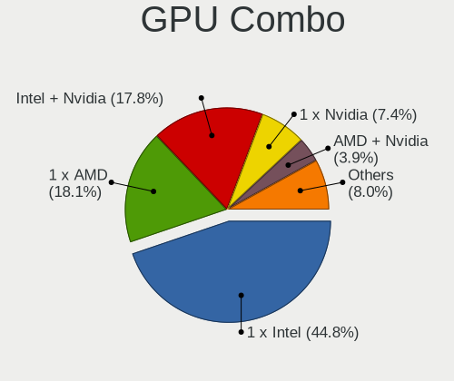

| Name           | Notebooks | Percent |
|----------------|-----------|---------|
| 1 x Intel      | 144       | 47.37%  |
| Intel + Nvidia | 56        | 18.42%  |
| 1 x AMD        | 49        | 16.12%  |
| 1 x Nvidia     | 31        | 10.2%   |
| Intel + AMD    | 13        | 4.28%   |
| 2 x AMD        | 8         | 2.63%   |
| 1 x SiS        | 2         | 0.66%   |
| AMD + Nvidia   | 1         | 0.33%   |

GPU Driver
----------

Free vs proprietary

| Driver      | Notebooks | Percent |
|-------------|-----------|---------|
| Free        | 266       | 87.21%  |
| Proprietary | 29        | 9.51%   |
| Unknown     | 10        | 3.28%   |

GPU Memory
----------

Total video memory

| Size in GB | Notebooks | Percent |
|------------|-----------|---------|
| Unknown    | 145       | 47.23%  |
| 0.01-0.5   | 65        | 21.17%  |
| 1.01-2.0   | 48        | 15.64%  |
| 0.51-1.0   | 25        | 8.14%   |
| 3.01-4.0   | 18        | 5.86%   |
| 5.01-6.0   | 3         | 0.98%   |
| 2.01-3.0   | 2         | 0.65%   |
| 7.01-8.0   | 1         | 0.33%   |

Monitor
-------

Monitor Vendor
--------------

Monitor vendors

| Vendor                  | Notebooks | Percent |
|-------------------------|-----------|---------|
| AU Optronics            | 68        | 20.18%  |
| LG Display              | 54        | 16.02%  |
| Samsung Electronics     | 41        | 12.17%  |
| Chimei Innolux          | 41        | 12.17%  |
| BOE                     | 27        | 8.01%   |
| Chi Mei Optoelectronics | 22        | 6.53%   |
| Lenovo                  | 12        | 3.56%   |
| Dell                    | 11        | 3.26%   |
| Philips                 | 7         | 2.08%   |
| LG Philips              | 7         | 2.08%   |
| PANDA                   | 6         | 1.78%   |
| Apple                   | 5         | 1.48%   |
| Sharp                   | 4         | 1.19%   |
| Hewlett-Packard         | 4         | 1.19%   |
| Acer                    | 3         | 0.89%   |
| HannStar                | 2         | 0.59%   |
| Goldstar                | 2         | 0.59%   |
| CSO                     | 2         | 0.59%   |
| CPT                     | 2         | 0.59%   |
| AOC                     | 2         | 0.59%   |
| Ancor Communications    | 2         | 0.59%   |
| ViewSonic               | 1         | 0.3%    |
| Sony                    | 1         | 0.3%    |
| Seiko/Epson             | 1         | 0.3%    |
| Quanta Display          | 1         | 0.3%    |
| Plain Tree Systems      | 1         | 0.3%    |
| Panasonic               | 1         | 0.3%    |
| LGD                     | 1         | 0.3%    |
| InnoLux Display         | 1         | 0.3%    |
| InfoVision              | 1         | 0.3%    |
| Iiyama                  | 1         | 0.3%    |
| BenQ                    | 1         | 0.3%    |
| ASUSTek Computer        | 1         | 0.3%    |
| ANX                     | 1         | 0.3%    |

Monitor Model
-------------

Monitor models

| Model                                                                     | Notebooks | Percent |
|---------------------------------------------------------------------------|-----------|---------|
| Chimei Innolux LCD Monitor CMN15AB 1366x768 344x194mm 15.5-inch           | 6         | 1.76%   |
| Chi Mei Optoelectronics LCD Monitor CMO15A7 1366x768 344x193mm 15.5-inch  | 5         | 1.47%   |
| LG Display LCD Monitor LGD038E 1366x768 344x194mm 15.5-inch               | 4         | 1.17%   |
| Chi Mei Optoelectronics LCD Monitor CMO1526 1280x800 331x207mm 15.4-inch  | 4         | 1.17%   |
| AU Optronics LCD Monitor AUO38ED 1920x1080 344x193mm 15.5-inch            | 4         | 1.17%   |
| Samsung Electronics LCD Monitor SEC3046 1366x768 340x190mm 15.3-inch      | 3         | 0.88%   |
| Chimei Innolux LCD Monitor CMN15DB 1366x768 344x193mm 15.5-inch           | 3         | 0.88%   |
| Chi Mei Optoelectronics LCD Monitor CMO15A3 1366x768 344x193mm 15.5-inch  | 3         | 0.88%   |
| AU Optronics LCD Monitor AUO26EC 1366x768 344x193mm 15.5-inch             | 3         | 0.88%   |
| AU Optronics LCD Monitor AUO23ED 1920x1080 344x193mm 15.5-inch            | 3         | 0.88%   |
| AU Optronics LCD Monitor AUO106C 1366x768 277x156mm 12.5-inch             | 3         | 0.88%   |
| Samsung Electronics LCD Monitor SEC5541 1366x768 344x193mm 15.5-inch      | 2         | 0.59%   |
| Samsung Electronics LCD Monitor SEC5441 1366x768 344x194mm 15.5-inch      | 2         | 0.59%   |
| Samsung Electronics LCD Monitor SEC3945 1280x800 331x207mm 15.4-inch      | 2         | 0.59%   |
| Samsung Electronics LCD Monitor SEC3859 1366x768 293x165mm 13.2-inch      | 2         | 0.59%   |
| Samsung Electronics LCD Monitor SEC3051 1600x900 398x232mm 18.1-inch      | 2         | 0.59%   |
| PANDA LM156LF1L03 NCP001C 1920x1080 344x194mm 15.5-inch                   | 2         | 0.59%   |
| LG Philips LCD Monitor LPLE300 1280x800 331x207mm 15.4-inch               | 2         | 0.59%   |
| LG Philips LCD Monitor LPLA101 1440x900 367x230mm 17.1-inch               | 2         | 0.59%   |
| LG Display LCD Monitor LGDD801 1366x768 344x194mm 15.5-inch               | 2         | 0.59%   |
| LG Display LCD Monitor LGD053F 1920x1080 344x194mm 15.5-inch              | 2         | 0.59%   |
| LG Display LCD Monitor LGD0395 1366x768 344x194mm 15.5-inch               | 2         | 0.59%   |
| LG Display LCD Monitor LGD033A 1366x768 344x194mm 15.5-inch               | 2         | 0.59%   |
| LG Display LCD Monitor LGD0258 1600x900 345x194mm 15.6-inch               | 2         | 0.59%   |
| LG Display LCD Monitor LGD01E8 1366x768 344x194mm 15.5-inch               | 2         | 0.59%   |
| Lenovo LEN P27h-10 LEN61AF 2560x1440 597x336mm 27.0-inch                  | 2         | 0.59%   |
| Lenovo LCD Monitor LEN40E0 1366x768 277x156mm 12.5-inch                   | 2         | 0.59%   |
| Lenovo LCD Monitor LEN4011 1280x800 261x163mm 12.1-inch                   | 2         | 0.59%   |
| CSO LCD Monitor CSO1402 2880x1800 302x188mm 14.0-inch                     | 2         | 0.59%   |
| Chimei Innolux LCD Monitor CMN1728 1600x900 382x215mm 17.3-inch           | 2         | 0.59%   |
| Chimei Innolux LCD Monitor CMN15E8 1920x1080 340x190mm 15.3-inch          | 2         | 0.59%   |
| Chimei Innolux LCD Monitor CMN15C4 1920x1080 344x193mm 15.5-inch          | 2         | 0.59%   |
| Chimei Innolux LCD Monitor CMN14C3 1366x768 309x173mm 13.9-inch           | 2         | 0.59%   |
| Chi Mei Optoelectronics LCD Monitor CMO1726 1920x1080 381x214mm 17.2-inch | 2         | 0.59%   |
| Chi Mei Optoelectronics LCD Monitor CMO15A1 1366x768 344x193mm 15.5-inch  | 2         | 0.59%   |
| Chi Mei Optoelectronics LCD Monitor CMO1554 1280x800 331x207mm 15.4-inch  | 2         | 0.59%   |
| BOE LCD Monitor BOE07BB 1920x1080 309x173mm 13.9-inch                     | 2         | 0.59%   |
| BOE LCD Monitor BOE0700 1920x1080 344x194mm 15.5-inch                     | 2         | 0.59%   |
| BOE LCD Monitor BOE06B3 1366x768 309x173mm 13.9-inch                      | 2         | 0.59%   |
| AU Optronics LCD Monitor AUO36ED 1920x1080 344x193mm 15.5-inch            | 2         | 0.59%   |
| AU Optronics LCD Monitor AUO34ED 1920x1080 344x193mm 15.5-inch            | 2         | 0.59%   |
| AU Optronics LCD Monitor AUO31EC 1366x768 344x193mm 15.5-inch             | 2         | 0.59%   |
| AU Optronics LCD Monitor AUO305C 1366x768 256x144mm 11.6-inch             | 2         | 0.59%   |
| AU Optronics LCD Monitor AUO23EC 1366x768 344x193mm 15.5-inch             | 2         | 0.59%   |
| AU Optronics LCD Monitor AUO2174 1280x800 331x207mm 15.4-inch             | 2         | 0.59%   |
| AU Optronics LCD Monitor AUO213E 1600x900 309x174mm 14.0-inch             | 2         | 0.59%   |
| AU Optronics LCD Monitor AUO139E 1600x900 382x214mm 17.2-inch             | 2         | 0.59%   |
| ViewSonic VA2719-2K VSC6B34 2560x1440 597x336mm 27.0-inch                 | 1         | 0.29%   |
| Sony LCD Monitor SNY05FA 1366x768 310x170mm 13.9-inch                     | 1         | 0.29%   |
| Sharp LQ173M1JW03 SHP14DC 1920x1080 382x215mm 17.3-inch                   | 1         | 0.29%   |
| Sharp LQ140Z1JW01 SHP1401 3200x1800 310x174mm 14.0-inch                   | 1         | 0.29%   |
| Sharp LCD Monitor SHP14AE 1920x1080 294x165mm 13.3-inch                   | 1         | 0.29%   |
| Sharp LCD Monitor SHP1447 1920x1080 294x165mm 13.3-inch                   | 1         | 0.29%   |
| Seiko/Epson LCD Monitor 1280x800                                          | 1         | 0.29%   |
| Samsung Electronics T24E390 SAM0C1F 1920x1080 521x293mm 23.5-inch         | 1         | 0.29%   |
| Samsung Electronics SyncMaster SAM05CB 1920x1080 530x300mm 24.0-inch      | 1         | 0.29%   |
| Samsung Electronics SyncMaster SAM03F2 1680x1050                          | 1         | 0.29%   |
| Samsung Electronics SyncMaster SAM030F 1680x1050 474x296mm 22.0-inch      | 1         | 0.29%   |
| Samsung Electronics SyncMaster SAM0225 1440x900 410x257mm 19.1-inch       | 1         | 0.29%   |
| Samsung Electronics S27D390 SAM0B67 1920x1080 600x340mm 27.2-inch         | 1         | 0.29%   |

Monitor Resolution
------------------

Monitor screen resolution

| Resolution         | Notebooks | Percent |
|--------------------|-----------|---------|
| 1366x768 (WXGA)    | 112       | 34.78%  |
| 1920x1080 (FHD)    | 105       | 32.61%  |
| 1280x800 (WXGA)    | 31        | 9.63%   |
| 1600x900 (HD+)     | 20        | 6.21%   |
| 1440x900 (WXGA+)   | 11        | 3.42%   |
| 2560x1440 (QHD)    | 9         | 2.8%    |
| 3840x2160 (4K)     | 7         | 2.17%   |
| 1680x1050 (WSXGA+) | 6         | 1.86%   |
| 1920x1200 (WUXGA)  | 5         | 1.55%   |
| 1024x600           | 4         | 1.24%   |
| 2880x1800          | 3         | 0.93%   |
| 3440x1440          | 2         | 0.62%   |
| 800x1280           | 1         | 0.31%   |
| 3200x1800 (QHD+)   | 1         | 0.31%   |
| 2560x1600          | 1         | 0.31%   |
| 2560x1080          | 1         | 0.31%   |
| 1280x720 (HD)      | 1         | 0.31%   |
| 1280x1024 (SXGA)   | 1         | 0.31%   |
| 1024x768 (XGA)     | 1         | 0.31%   |

Monitor Diagonal
----------------

Diagonal size in inches

| Inches  | Notebooks | Percent |
|---------|-----------|---------|
| 15      | 167       | 49.41%  |
| 13      | 35        | 10.36%  |
| 14      | 34        | 10.06%  |
| 17      | 17        | 5.03%   |
| 24      | 12        | 3.55%   |
| 12      | 12        | 3.55%   |
| 23      | 9         | 2.66%   |
| 27      | 8         | 2.37%   |
| 18      | 7         | 2.07%   |
| 11      | 7         | 2.07%   |
| Unknown | 5         | 1.48%   |
| 22      | 4         | 1.18%   |
| 10      | 4         | 1.18%   |
| 34      | 3         | 0.89%   |
| 31      | 3         | 0.89%   |
| 21      | 2         | 0.59%   |
| 19      | 2         | 0.59%   |
| 84      | 1         | 0.3%    |
| 54      | 1         | 0.3%    |
| 50      | 1         | 0.3%    |
| 33      | 1         | 0.3%    |
| 25      | 1         | 0.3%    |
| 20      | 1         | 0.3%    |
| 16      | 1         | 0.3%    |

Monitor Width
-------------

Physical width

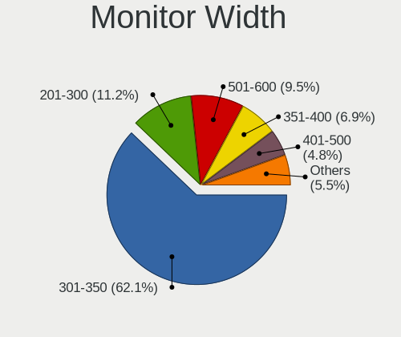

| Width in mm | Notebooks | Percent |
|-------------|-----------|---------|
| 301-350     | 217       | 64.78%  |
| 201-300     | 39        | 11.64%  |
| 501-600     | 26        | 7.76%   |
| 351-400     | 22        | 6.57%   |
| 401-500     | 15        | 4.48%   |
| Unknown     | 5         | 1.49%   |
| 701-800     | 4         | 1.19%   |
| 601-700     | 4         | 1.19%   |
| 1001-1500   | 2         | 0.6%    |
| 1501-2000   | 1         | 0.3%    |

Aspect Ratio
------------

Proportional relationship between the width and the height

| Ratio   | Notebooks | Percent |
|---------|-----------|---------|
| 16/9    | 239       | 78.1%   |
| 16/10   | 56        | 18.3%   |
| 21/9    | 3         | 0.98%   |
| Unknown | 3         | 0.98%   |
| 3/2     | 2         | 0.65%   |
| 5/4     | 1         | 0.33%   |
| 4/3     | 1         | 0.33%   |
| 0.62    | 1         | 0.33%   |

Monitor Area
------------

Area in inch

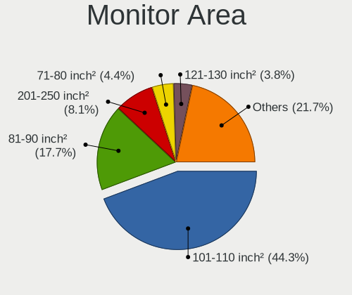

| Area in inch | Notebooks | Percent |
|----------------|-----------|---------|
| 101-110        | 165       | 48.96%  |
| 81-90          | 55        | 16.32%  |
| 201-250        | 23        | 6.82%   |
| 71-80          | 14        | 4.15%   |
| 61-70          | 12        | 3.56%   |
| 121-130        | 11        | 3.26%   |
| 301-350        | 8         | 2.37%   |
| 51-60          | 7         | 2.08%   |
| 351-500        | 7         | 2.08%   |
| 141-150        | 6         | 1.78%   |
| 151-200        | 5         | 1.48%   |
| 131-140        | 5         | 1.48%   |
| Unknown        | 5         | 1.48%   |
| 41-50          | 4         | 1.19%   |
| 251-300        | 4         | 1.19%   |
| More than 1000 | 3         | 0.89%   |
| 91-100         | 2         | 0.59%   |
| 111-120        | 1         | 0.3%    |

Pixel Density
-------------

Pixels per inch

| Density       | Notebooks | Percent |
|---------------|-----------|---------|
| 121-160       | 118       | 35.76%  |
| 101-120       | 105       | 31.82%  |
| 51-100        | 84        | 25.45%  |
| More than 240 | 8         | 2.42%   |
| 161-240       | 7         | 2.12%   |
| Unknown       | 5         | 1.52%   |
| 1-50          | 3         | 0.91%   |

Multiple Monitors
-----------------

Total monitors connected

| Total | Notebooks | Percent |
|-------|-----------|---------|
| 1     | 241       | 78.76%  |
| 2     | 53        | 17.32%  |
| 0     | 10        | 3.27%   |
| 3     | 2         | 0.65%   |

Network
-------

Net Controller Vendor
---------------------

Controller vendors

| Vendor                            | Notebooks | Percent |
|-----------------------------------|-----------|---------|
| Intel                             | 159       | 30.87%  |
| Realtek Semiconductor             | 153       | 29.71%  |
| Qualcomm Atheros                  | 96        | 18.64%  |
| Broadcom                          | 35        | 6.8%    |
| Marvell Technology Group          | 13        | 2.52%   |
| Ralink                            | 10        | 1.94%   |
| Broadcom Limited                  | 8         | 1.55%   |
| Nvidia                            | 6         | 1.17%   |
| Ralink Technology                 | 3         | 0.58%   |
| Qualcomm Atheros Communications   | 3         | 0.58%   |
| Hewlett-Packard                   | 3         | 0.58%   |
| Ericsson Business Mobile Networks | 3         | 0.58%   |
| DisplayLink                       | 3         | 0.58%   |
| Sierra Wireless                   | 2         | 0.39%   |
| MediaTek                          | 2         | 0.39%   |
| Lenovo                            | 2         | 0.39%   |
| JMicron Technology                | 2         | 0.39%   |
| Huawei Technologies               | 2         | 0.39%   |
| Fibocom                           | 2         | 0.39%   |
| ZTE WCDMA Technologies MSM        | 1         | 0.19%   |
| Xiaomi                            | 1         | 0.19%   |
| TP-Link                           | 1         | 0.19%   |
| T & A Mobile Phones               | 1         | 0.19%   |
| Silicon Integrated Systems [SiS]  | 1         | 0.19%   |
| Nokia Mobile Phones               | 1         | 0.19%   |
| Attansic Technology               | 1         | 0.19%   |
| ASIX Electronics                  | 1         | 0.19%   |

Net Controller Model
--------------------

Controller models

| Model                                                                   | Notebooks | Percent |
|-------------------------------------------------------------------------|-----------|---------|
| Realtek RTL8111/8168/8411 PCI Express Gigabit Ethernet Controller       | 96        | 15.82%  |
| Realtek RTL810xE PCI Express Fast Ethernet controller                   | 32        | 5.27%   |
| Qualcomm Atheros AR9285 Wireless Network Adapter (PCI-Express)          | 27        | 4.45%   |
| Intel Wireless 8265 / 8275                                              | 17        | 2.8%    |
| Intel 82579LM Gigabit Network Connection (Lewisville)                   | 15        | 2.47%   |
| Qualcomm Atheros AR9485 Wireless Network Adapter                        | 14        | 2.31%   |
| Intel Centrino Advanced-N 6205 [Taylor Peak]                            | 14        | 2.31%   |
| Qualcomm Atheros AR242x / AR542x Wireless Network Adapter (PCI-Express) | 10        | 1.65%   |
| Intel Wireless 7260                                                     | 10        | 1.65%   |
| Qualcomm Atheros QCA9377 802.11ac Wireless Network Adapter              | 9         | 1.48%   |
| Intel Wi-Fi 6 AX200                                                     | 9         | 1.48%   |
| Realtek RTL8153 Gigabit Ethernet Adapter                                | 8         | 1.32%   |
| Intel Wireless 8260                                                     | 8         | 1.32%   |
| Intel PRO/Wireless 3945ABG [Golan] Network Connection                   | 8         | 1.32%   |
| Realtek RTL-8100/8101L/8139 PCI Fast Ethernet Adapter                   | 7         | 1.15%   |
| Ralink RT3290 Wireless 802.11n 1T/1R PCIe                               | 7         | 1.15%   |
| Broadcom BCM4313 802.11bgn Wireless Network Adapter                     | 7         | 1.15%   |
| Intel Wireless 3165                                                     | 6         | 0.99%   |
| Intel WiFi Link 5100                                                    | 6         | 0.99%   |
| Broadcom BCM43142 802.11b/g/n                                           | 6         | 0.99%   |
| Realtek RTL8821AE 802.11ac PCIe Wireless Network Adapter                | 5         | 0.82%   |
| Qualcomm Atheros QCA6174 802.11ac Wireless Network Adapter              | 5         | 0.82%   |
| Qualcomm Atheros AR8151 v2.0 Gigabit Ethernet                           | 5         | 0.82%   |
| Marvell Group 88E8055 PCI-E Gigabit Ethernet Controller                 | 5         | 0.82%   |
| Intel Wireless-AC 9260                                                  | 5         | 0.82%   |
| Intel Wireless 7265                                                     | 5         | 0.82%   |
| Intel Wi-Fi 6 AX201                                                     | 5         | 0.82%   |
| Intel Ethernet Connection I217-LM                                       | 5         | 0.82%   |
| Intel Ethernet Connection (7) I219-LM                                   | 5         | 0.82%   |
| Intel Comet Lake PCH-LP CNVi WiFi                                       | 5         | 0.82%   |
| Intel Centrino Wireless-N 2230                                          | 5         | 0.82%   |
| Intel Centrino Ultimate-N 6300                                          | 5         | 0.82%   |
| Intel Cannon Lake PCH CNVi WiFi                                         | 5         | 0.82%   |
| Intel 82567LM Gigabit Network Connection                                | 5         | 0.82%   |
| Qualcomm Atheros QCA9565 / AR9565 Wireless Network Adapter              | 4         | 0.66%   |
| Qualcomm Atheros QCA8172 Fast Ethernet                                  | 4         | 0.66%   |
| Qualcomm Atheros AR928X Wireless Network Adapter (PCI-Express)          | 4         | 0.66%   |
| Marvell Group 88E8040T PCI-E Fast Ethernet Controller                   | 4         | 0.66%   |
| Intel PRO/Wireless 5100 AGN [Shiloh] Network Connection                 | 4         | 0.66%   |
| Intel Ethernet Connection I219-LM                                       | 4         | 0.66%   |
| Intel Ethernet Connection (4) I219-LM                                   | 4         | 0.66%   |
| Intel Dual Band Wireless-AC 3165 Plus Bluetooth                         | 4         | 0.66%   |
| Intel Centrino Wireless-N 1000 [Condor Peak]                            | 4         | 0.66%   |
| Broadcom BCM43228 802.11a/b/g/n                                         | 4         | 0.66%   |
| Realtek RTL8723AE PCIe Wireless Network Adapter                         | 3         | 0.49%   |
| Qualcomm Atheros AR9271 802.11n                                         | 3         | 0.49%   |
| Qualcomm Atheros AR8162 Fast Ethernet                                   | 3         | 0.49%   |
| Qualcomm Atheros AR8132 Fast Ethernet                                   | 3         | 0.49%   |
| Qualcomm Atheros AR8131 Gigabit Ethernet                                | 3         | 0.49%   |
| Nvidia MCP79 Ethernet                                                   | 3         | 0.49%   |
| Intel Ultimate N WiFi Link 5300                                         | 3         | 0.49%   |
| Intel PRO/Wireless 4965 AG or AGN [Kedron] Network Connection           | 3         | 0.49%   |
| Intel Ethernet Connection I218-LM                                       | 3         | 0.49%   |
| Intel Ethernet Connection I217-V                                        | 3         | 0.49%   |
| Intel Ethernet Connection (4) I219-V                                    | 3         | 0.49%   |
| Intel Ethernet Connection (2) I219-LM                                   | 3         | 0.49%   |
| Intel Centrino Advanced-N 6235                                          | 3         | 0.49%   |
| Intel Cannon Point-LP CNVi [Wireless-AC]                                | 3         | 0.49%   |
| Intel 82801FB/FBM/FR/FW/FRW (ICH6 Family) AC'97 Modem Controller        | 3         | 0.49%   |
| HP hs2350 HSPA+ MobileBroadband                                         | 3         | 0.49%   |

Wireless Vendor
---------------

Wireless vendors

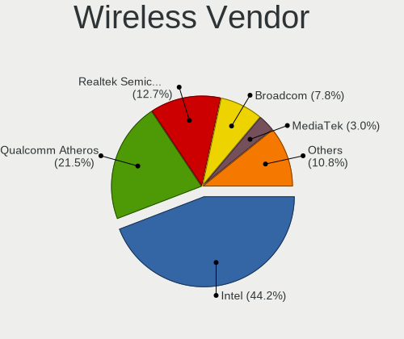

| Vendor                          | Notebooks | Percent |
|---------------------------------|-----------|---------|
| Intel                           | 148       | 47.9%   |
| Qualcomm Atheros                | 79        | 25.57%  |
| Realtek Semiconductor           | 28        | 9.06%   |
| Broadcom                        | 26        | 8.41%   |
| Ralink                          | 10        | 3.24%   |
| Broadcom Limited                | 6         | 1.94%   |
| Ralink Technology               | 3         | 0.97%   |
| Qualcomm Atheros Communications | 3         | 0.97%   |
| Sierra Wireless                 | 2         | 0.65%   |
| MediaTek                        | 2         | 0.65%   |
| TP-Link                         | 1         | 0.32%   |
| Fibocom                         | 1         | 0.32%   |

Wireless Model
--------------

Wireless models

| Model                                                                         | Notebooks | Percent |
|-------------------------------------------------------------------------------|-----------|---------|
| Qualcomm Atheros AR9285 Wireless Network Adapter (PCI-Express)                | 27        | 8.71%   |
| Intel Wireless 8265 / 8275                                                    | 17        | 5.48%   |
| Qualcomm Atheros AR9485 Wireless Network Adapter                              | 14        | 4.52%   |
| Intel Centrino Advanced-N 6205 [Taylor Peak]                                  | 14        | 4.52%   |
| Qualcomm Atheros AR242x / AR542x Wireless Network Adapter (PCI-Express)       | 10        | 3.23%   |
| Intel Wireless 7260                                                           | 10        | 3.23%   |
| Qualcomm Atheros QCA9377 802.11ac Wireless Network Adapter                    | 9         | 2.9%    |
| Intel Wi-Fi 6 AX200                                                           | 9         | 2.9%    |
| Intel Wireless 8260                                                           | 8         | 2.58%   |
| Intel PRO/Wireless 3945ABG [Golan] Network Connection                         | 8         | 2.58%   |
| Ralink RT3290 Wireless 802.11n 1T/1R PCIe                                     | 7         | 2.26%   |
| Broadcom BCM4313 802.11bgn Wireless Network Adapter                           | 7         | 2.26%   |
| Intel Wireless 3165                                                           | 6         | 1.94%   |
| Intel WiFi Link 5100                                                          | 6         | 1.94%   |
| Broadcom BCM43142 802.11b/g/n                                                 | 6         | 1.94%   |
| Realtek RTL8821AE 802.11ac PCIe Wireless Network Adapter                      | 5         | 1.61%   |
| Qualcomm Atheros QCA6174 802.11ac Wireless Network Adapter                    | 5         | 1.61%   |
| Intel Wireless-AC 9260                                                        | 5         | 1.61%   |
| Intel Wireless 7265                                                           | 5         | 1.61%   |
| Intel Wi-Fi 6 AX201                                                           | 5         | 1.61%   |
| Intel Comet Lake PCH-LP CNVi WiFi                                             | 5         | 1.61%   |
| Intel Centrino Wireless-N 2230                                                | 5         | 1.61%   |
| Intel Centrino Ultimate-N 6300                                                | 5         | 1.61%   |
| Intel Cannon Lake PCH CNVi WiFi                                               | 5         | 1.61%   |
| Qualcomm Atheros QCA9565 / AR9565 Wireless Network Adapter                    | 4         | 1.29%   |
| Qualcomm Atheros AR928X Wireless Network Adapter (PCI-Express)                | 4         | 1.29%   |
| Intel PRO/Wireless 5100 AGN [Shiloh] Network Connection                       | 4         | 1.29%   |
| Intel Dual Band Wireless-AC 3165 Plus Bluetooth                               | 4         | 1.29%   |
| Intel Centrino Wireless-N 1000 [Condor Peak]                                  | 4         | 1.29%   |
| Broadcom BCM43228 802.11a/b/g/n                                               | 4         | 1.29%   |
| Realtek RTL8723AE PCIe Wireless Network Adapter                               | 3         | 0.97%   |
| Qualcomm Atheros AR9271 802.11n                                               | 3         | 0.97%   |
| Intel Ultimate N WiFi Link 5300                                               | 3         | 0.97%   |
| Intel PRO/Wireless 4965 AG or AGN [Kedron] Network Connection                 | 3         | 0.97%   |
| Intel Centrino Advanced-N 6235                                                | 3         | 0.97%   |
| Intel Cannon Point-LP CNVi [Wireless-AC]                                      | 3         | 0.97%   |
| Realtek RTL8852AE 802.11ax PCIe Wireless Network Adapter                      | 2         | 0.65%   |
| Realtek RTL8822CE 802.11ac PCIe Wireless Network Adapter                      | 2         | 0.65%   |
| Realtek RTL8822BE 802.11a/b/g/n/ac WiFi adapter                               | 2         | 0.65%   |
| Realtek RTL8821CE 802.11ac PCIe Wireless Network Adapter                      | 2         | 0.65%   |
| Realtek RTL8723BU 802.11b/g/n WLAN Adapter                                    | 2         | 0.65%   |
| Realtek RTL8723BE PCIe Wireless Network Adapter                               | 2         | 0.65%   |
| Realtek RTL8191SEvB Wireless LAN Controller                                   | 2         | 0.65%   |
| Qualcomm Atheros AR9462 Wireless Network Adapter                              | 2         | 0.65%   |
| Qualcomm Atheros AR2413/AR2414 Wireless Network Adapter [AR5005G(S) 802.11bg] | 2         | 0.65%   |
| MediaTek MT7921 802.11ax PCI Express Wireless Network Adapter                 | 2         | 0.65%   |
| Intel Wireless 3160                                                           | 2         | 0.65%   |
| Intel PRO/Wireless 2200BG [Calexico2] Network Connection                      | 2         | 0.65%   |
| Intel Comet Lake PCH CNVi WiFi                                                | 2         | 0.65%   |
| Broadcom Limited BCM4318 [AirForce One 54g] 802.11g Wireless LAN Controller   | 2         | 0.65%   |
| Broadcom Limited BCM4312 802.11b/g LP-PHY                                     | 2         | 0.65%   |
| Broadcom BCM43224 802.11a/b/g/n                                               | 2         | 0.65%   |
| Broadcom BCM4312 802.11b/g LP-PHY                                             | 2         | 0.65%   |
| TP-Link TL-WN821N v5/v6 [RTL8192EU]                                           | 1         | 0.32%   |
| Sierra Wireless EM7345 4G LTE                                                 | 1         | 0.32%   |
| Sierra Wireless EM7305 Modem                                                  | 1         | 0.32%   |
| Realtek RTL8723DE Wireless Network Adapter                                    | 1         | 0.32%   |
| Realtek RTL8723AU 802.11n WLAN Adapter                                        | 1         | 0.32%   |
| Realtek RTL8192SE Wireless LAN Controller                                     | 1         | 0.32%   |
| Realtek RTL8188SU 802.11n WLAN Adapter                                        | 1         | 0.32%   |

Ethernet Vendor
---------------

Ethernet vendors

| Vendor                   | Notebooks | Percent |
|--------------------------|-----------|---------|
| Realtek Semiconductor    | 143       | 50.53%  |
| Intel                    | 68        | 24.03%  |
| Qualcomm Atheros         | 26        | 9.19%   |
| Marvell Technology Group | 13        | 4.59%   |
| Broadcom                 | 11        | 3.89%   |
| Nvidia                   | 6         | 2.12%   |
| DisplayLink              | 3         | 1.06%   |
| Lenovo                   | 2         | 0.71%   |
| JMicron Technology       | 2         | 0.71%   |
| Broadcom Limited         | 2         | 0.71%   |
| Xiaomi                   | 1         | 0.35%   |
| T & A Mobile Phones      | 1         | 0.35%   |
| Nokia Mobile Phones      | 1         | 0.35%   |
| Huawei Technologies      | 1         | 0.35%   |
| Fibocom                  | 1         | 0.35%   |
| Attansic Technology      | 1         | 0.35%   |
| ASIX Electronics         | 1         | 0.35%   |

Ethernet Model
--------------

Ethernet models

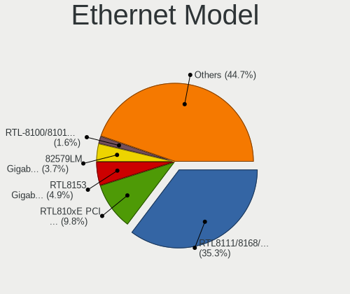

| Model                                                                          | Notebooks | Percent |
|--------------------------------------------------------------------------------|-----------|---------|
| Realtek RTL8111/8168/8411 PCI Express Gigabit Ethernet Controller              | 96        | 33.68%  |
| Realtek RTL810xE PCI Express Fast Ethernet controller                          | 32        | 11.23%  |
| Intel 82579LM Gigabit Network Connection (Lewisville)                          | 15        | 5.26%   |
| Realtek RTL8153 Gigabit Ethernet Adapter                                       | 8         | 2.81%   |
| Realtek RTL-8100/8101L/8139 PCI Fast Ethernet Adapter                          | 7         | 2.46%   |
| Qualcomm Atheros AR8151 v2.0 Gigabit Ethernet                                  | 5         | 1.75%   |
| Marvell Group 88E8055 PCI-E Gigabit Ethernet Controller                        | 5         | 1.75%   |
| Intel Ethernet Connection I217-LM                                              | 5         | 1.75%   |
| Intel Ethernet Connection (7) I219-LM                                          | 5         | 1.75%   |
| Intel 82567LM Gigabit Network Connection                                       | 5         | 1.75%   |
| Qualcomm Atheros QCA8172 Fast Ethernet                                         | 4         | 1.4%    |
| Marvell Group 88E8040T PCI-E Fast Ethernet Controller                          | 4         | 1.4%    |
| Intel Ethernet Connection I219-LM                                              | 4         | 1.4%    |
| Intel Ethernet Connection (4) I219-LM                                          | 4         | 1.4%    |
| Qualcomm Atheros AR8162 Fast Ethernet                                          | 3         | 1.05%   |
| Qualcomm Atheros AR8132 Fast Ethernet                                          | 3         | 1.05%   |
| Qualcomm Atheros AR8131 Gigabit Ethernet                                       | 3         | 1.05%   |
| Nvidia MCP79 Ethernet                                                          | 3         | 1.05%   |
| Intel Ethernet Connection I218-LM                                              | 3         | 1.05%   |
| Intel Ethernet Connection I217-V                                               | 3         | 1.05%   |
| Intel Ethernet Connection (4) I219-V                                           | 3         | 1.05%   |
| Intel Ethernet Connection (2) I219-LM                                          | 3         | 1.05%   |
| Qualcomm Atheros QCA8171 Gigabit Ethernet                                      | 2         | 0.7%    |
| Qualcomm Atheros AR8151 v1.0 Gigabit Ethernet                                  | 2         | 0.7%    |
| Qualcomm Atheros AR8121/AR8113/AR8114 Gigabit or Fast Ethernet                 | 2         | 0.7%    |
| Nvidia MCP77 Ethernet                                                          | 2         | 0.7%    |
| Lenovo USB-C Dock Ethernet                                                     | 2         | 0.7%    |
| JMicron JMC250 PCI Express Gigabit Ethernet Controller                         | 2         | 0.7%    |
| Intel Ethernet Connection I219-V                                               | 2         | 0.7%    |
| Intel Ethernet Connection (6) I219-V                                           | 2         | 0.7%    |
| Intel 82579V Gigabit Network Connection                                        | 2         | 0.7%    |
| DisplayLink USB-C Dual-4K Dock                                                 | 2         | 0.7%    |
| Broadcom NetXtreme BCM5752 Gigabit Ethernet PCI Express                        | 2         | 0.7%    |
| Broadcom Limited NetLink BCM57780 Gigabit Ethernet PCIe                        | 2         | 0.7%    |
| Xiaomi Mi/Redmi series (RNDIS)                                                 | 1         | 0.35%   |
| T & A Mobile Phones A507DL                                                     | 1         | 0.35%   |
| Realtek RTL8169 PCI Gigabit Ethernet Controller                                | 1         | 0.35%   |
| Realtek Killer E2500 Gigabit Ethernet Controller                               | 1         | 0.35%   |
| Qualcomm Atheros Killer E220x Gigabit Ethernet Controller                      | 1         | 0.35%   |
| Qualcomm Atheros AR8152 v2.0 Fast Ethernet                                     | 1         | 0.35%   |
| Nvidia MCP51 Ethernet Controller                                               | 1         | 0.35%   |
| Nokia Mobile Phones N900 (PC-Suite Mode)                                       | 1         | 0.35%   |
| Marvell Group Yukon Optima 88E8059 [PCIe Gigabit Ethernet Controller with AVB] | 1         | 0.35%   |
| Marvell Group 88E8053 PCI-E Gigabit Ethernet Controller                        | 1         | 0.35%   |
| Marvell Group 88E8040 PCI-E Fast Ethernet Controller                           | 1         | 0.35%   |
| Marvell Group 88E8039 PCI-E Fast Ethernet Controller                           | 1         | 0.35%   |
| Intel PRO/100 VE Network Connection                                            | 1         | 0.35%   |
| Intel Ethernet Connection (6) I219-LM                                          | 1         | 0.35%   |
| Intel Ethernet Connection (3) I218-V                                           | 1         | 0.35%   |
| Intel Ethernet Connection (3) I218-LM                                          | 1         | 0.35%   |
| Intel Ethernet Connection (13) I219-V                                          | 1         | 0.35%   |
| Intel Ethernet Connection (13) I219-LM                                         | 1         | 0.35%   |
| Intel Ethernet Connection (11) I219-LM                                         | 1         | 0.35%   |
| Intel Ethernet Connection (10) I219-V                                          | 1         | 0.35%   |
| Intel 82577LM Gigabit Network Connection                                       | 1         | 0.35%   |
| Intel 82566MM Gigabit Network Connection                                       | 1         | 0.35%   |
| Intel 82562GT 10/100 Network Connection                                        | 1         | 0.35%   |
| Intel 82562ET/EZ/GT/GZ - PRO/100 VE (LOM) Ethernet Controller Mobile           | 1         | 0.35%   |
| Huawei COL-L29                                                                 | 1         | 0.35%   |
| Fibocom L831-EAU-00                                                            | 1         | 0.35%   |

Net Controller Kind
-------------------

Ethernet, WiFi or modem

| Kind     | Notebooks | Percent |
|----------|-----------|---------|
| WiFi     | 299       | 51.29%  |
| Ethernet | 272       | 46.66%  |
| Modem    | 12        | 2.06%   |

Used Controller
---------------

Currently used network controller

| Kind     | Notebooks | Percent |
|----------|-----------|---------|
| WiFi     | 247       | 77.19%  |
| Ethernet | 73        | 22.81%  |

NICs
----

Total network controllers on board

| Total | Notebooks | Percent |
|-------|-----------|---------|
| 2     | 258       | 85.15%  |
| 1     | 39        | 12.87%  |
| 0     | 4         | 1.32%   |
| 3     | 2         | 0.66%   |

IPv6
----

IPv6 vs IPv4

| Used | Notebooks | Percent |
|------|-----------|---------|
| No   | 287       | 94.41%  |
| Yes  | 17        | 5.59%   |

Bluetooth
---------

Bluetooth Vendor
----------------

Controller vendors

| Vendor                          | Notebooks | Percent |
|---------------------------------|-----------|---------|
| Intel                           | 88        | 40%     |
| Qualcomm Atheros Communications | 20        | 9.09%   |
| Broadcom                        | 18        | 8.18%   |
| Realtek Semiconductor           | 14        | 6.36%   |
| IMC Networks                    | 14        | 6.36%   |
| Lite-On Technology              | 10        | 4.55%   |
| Foxconn / Hon Hai               | 9         | 4.09%   |
| Ralink                          | 7         | 3.18%   |
| Hewlett-Packard                 | 7         | 3.18%   |
| Dell                            | 7         | 3.18%   |
| ASUSTek Computer                | 7         | 3.18%   |
| Toshiba                         | 5         | 2.27%   |
| Cambridge Silicon Radio         | 5         | 2.27%   |
| Foxconn International           | 3         | 1.36%   |
| Taiyo Yuden                     | 2         | 0.91%   |
| Apple                           | 2         | 0.91%   |
| Micro Star International        | 1         | 0.45%   |
| Alps Electric                   | 1         | 0.45%   |

Bluetooth Model
---------------

Controller models

| Model                                                                               | Notebooks | Percent |
|-------------------------------------------------------------------------------------|-----------|---------|
| Intel Bluetooth wireless interface                                                  | 46        | 20.91%  |
| Qualcomm Atheros AR3011 Bluetooth                                                   | 13        | 5.91%   |
| Intel Bluetooth Device                                                              | 13        | 5.91%   |
| Intel AX200 Bluetooth                                                               | 9         | 4.09%   |
| Intel Bluetooth 9460/9560 Jefferson Peak (JfP)                                      | 8         | 3.64%   |
| Ralink RT3290 Bluetooth                                                             | 7         | 3.18%   |
| Intel Centrino Bluetooth Wireless Transceiver                                       | 7         | 3.18%   |
| IMC Networks Atheros AR3012 Bluetooth 4.0 Adapter                                   | 7         | 3.18%   |
| Realtek Bluetooth Radio                                                             | 6         | 2.73%   |
| Qualcomm Atheros  Bluetooth Device                                                  | 5         | 2.27%   |
| IMC Networks Bluetooth Device                                                       | 5         | 2.27%   |
| HP Bluetooth 2.0 Interface [Broadcom BCM2045]                                       | 5         | 2.27%   |
| Cambridge Silicon Radio Bluetooth Dongle (HCI mode)                                 | 5         | 2.27%   |
| ASUS BT-183 Bluetooth 2.0+EDR adapter                                               | 5         | 2.27%   |
| Realtek RTL8821A Bluetooth                                                          | 4         | 1.82%   |
| Intel Wireless-AC 9260 Bluetooth Adapter                                            | 4         | 1.82%   |
| Broadcom HP Portable SoftSailing                                                    | 4         | 1.82%   |
| Broadcom BCM20702 Bluetooth 4.0 [ThinkPad]                                          | 4         | 1.82%   |
| Realtek  Bluetooth 4.2 Adapter                                                      | 3         | 1.36%   |
| Lite-On Qualcomm Atheros QCA9377 Bluetooth                                          | 3         | 1.36%   |
| Lite-On Bluetooth Device                                                            | 3         | 1.36%   |
| Foxconn International BCM43142A0 Bluetooth module                                   | 3         | 1.36%   |
| Dell Wireless 370 Bluetooth Mini-card                                               | 3         | 1.36%   |
| Toshiba Integrated Bluetooth HCI                                                    | 2         | 0.91%   |
| Taiyo Yuden Bluetooth Device (V2.1+EDR)                                             | 2         | 0.91%   |
| IMC Networks Bluetooth Radio                                                        | 2         | 0.91%   |
| Foxconn / Hon Hai Bluetooth Device                                                  | 2         | 0.91%   |
| Foxconn / Hon Hai Acer Bluetooth module                                             | 2         | 0.91%   |
| Broadcom HP Portable Bumble Bee                                                     | 2         | 0.91%   |
| Broadcom BCM2045B (BDC-2.1) [Bluetooth Controller]                                  | 2         | 0.91%   |
| Broadcom BCM2045B (BDC-2.1)                                                         | 2         | 0.91%   |
| Toshiba RT Bluetooth Radio                                                          | 1         | 0.45%   |
| Toshiba Bluetooth Device                                                            | 1         | 0.45%   |
| Toshiba Askey Bluetooth Module                                                      | 1         | 0.45%   |
| Realtek RTL8723B Bluetooth                                                          | 1         | 0.45%   |
| Qualcomm Atheros Bluetooth                                                          | 1         | 0.45%   |
| Qualcomm Atheros AR3012 Bluetooth 4.0                                               | 1         | 0.45%   |
| Micro Star International Bluetooth EDR Device                                       | 1         | 0.45%   |
| Lite-On Wireless_Device                                                             | 1         | 0.45%   |
| Lite-On Broadcom BCM43142A0 Bluetooth Device                                        | 1         | 0.45%   |
| Lite-On Bluetooth 4.0 [Broadcom BCM20702A0]                                         | 1         | 0.45%   |
| Lite-On Atheros Bluetooth                                                           | 1         | 0.45%   |
| Intel AX210 Bluetooth                                                               | 1         | 0.45%   |
| HP Broadcom 2070 Bluetooth Combo                                                    | 1         | 0.45%   |
| HP Atheros AR9285 Malbec Bluetooth Adapter                                          | 1         | 0.45%   |
| Foxconn / Hon Hai Wireless_Device                                                   | 1         | 0.45%   |
| Foxconn / Hon Hai Foxconn T77H114 BCM2070 [Single-Chip Bluetooth 2.1 + EDR Adapter] | 1         | 0.45%   |
| Foxconn / Hon Hai Broadcom Bluetooth 2.1 Device                                     | 1         | 0.45%   |
| Foxconn / Hon Hai Bluetooth USB Host Controller                                     | 1         | 0.45%   |
| Foxconn / Hon Hai BCM20702A0                                                        | 1         | 0.45%   |
| Dell Wireless 365 Bluetooth                                                         | 1         | 0.45%   |
| Dell Wireless 360 Bluetooth                                                         | 1         | 0.45%   |
| Dell Wireless 355 Bluetooth                                                         | 1         | 0.45%   |
| Dell BCM20702A0 Bluetooth Module                                                    | 1         | 0.45%   |
| Broadcom HP Portable Valentine                                                      | 1         | 0.45%   |
| Broadcom BCM43142A0 Bluetooth 4.0                                                   | 1         | 0.45%   |
| Broadcom BCM2045B (BDC-2) [Bluetooth Controller]                                    | 1         | 0.45%   |
| Broadcom BCM2045 Bluetooth                                                          | 1         | 0.45%   |
| ASUS BT-253 Bluetooth Adapter                                                       | 1         | 0.45%   |
| ASUS Broadcom Bluetooth 2.1                                                         | 1         | 0.45%   |

Sound
-----

Sound Vendor
------------

Sound card vendors

| Vendor                           | Notebooks | Percent |
|----------------------------------|-----------|---------|
| Intel                            | 241       | 65.85%  |
| AMD                              | 62        | 16.94%  |
| Nvidia                           | 41        | 11.2%   |
| Silicon Integrated Systems [SiS] | 3         | 0.82%   |
| C-Media Electronics              | 3         | 0.82%   |
| Samson Technologies              | 2         | 0.55%   |
| Lenovo                           | 2         | 0.55%   |
| GN Netcom                        | 2         | 0.55%   |
| Textech International            | 1         | 0.27%   |
| Texas Instruments                | 1         | 0.27%   |
| Realtek Semiconductor            | 1         | 0.27%   |
| Plantronics                      | 1         | 0.27%   |
| Logitech                         | 1         | 0.27%   |
| JMTek                            | 1         | 0.27%   |
| Hewlett-Packard                  | 1         | 0.27%   |
| Focusrite-Novation               | 1         | 0.27%   |
| Behringer.......                 | 1         | 0.27%   |
| AKAI Professional M.I.           | 1         | 0.27%   |

Sound Model
-----------

Sound card models

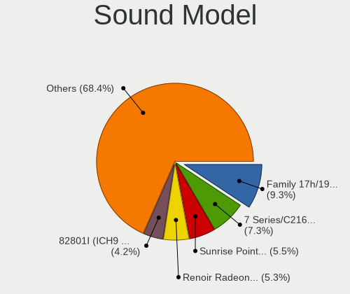

| Model                                                                                             | Notebooks | Percent |
|---------------------------------------------------------------------------------------------------|-----------|---------|
| Intel 7 Series/C216 Chipset Family High Definition Audio Controller                               | 44        | 10.3%   |
| Intel Sunrise Point-LP HD Audio                                                                   | 31        | 7.26%   |
| Intel 6 Series/C200 Series Chipset Family High Definition Audio Controller                        | 21        | 4.92%   |
| Intel 82801I (ICH9 Family) HD Audio Controller                                                    | 19        | 4.45%   |
| AMD Family 17h/19h HD Audio Controller                                                            | 19        | 4.45%   |
| Intel 82801H (ICH8 Family) HD Audio Controller                                                    | 17        | 3.98%   |
| Intel 5 Series/3400 Series Chipset High Definition Audio                                          | 17        | 3.98%   |
| Intel 8 Series/C220 Series Chipset High Definition Audio Controller                               | 14        | 3.28%   |
| AMD SBx00 Azalia (Intel HDA)                                                                      | 12        | 2.81%   |
| Intel Xeon E3-1200 v3/4th Gen Core Processor HD Audio Controller                                  | 11        | 2.58%   |
| Intel NM10/ICH7 Family High Definition Audio Controller                                           | 10        | 2.34%   |
| Intel Cannon Lake PCH cAVS                                                                        | 10        | 2.34%   |
| AMD Renoir Radeon High Definition Audio Controller                                                | 10        | 2.34%   |
| AMD FCH Azalia Controller                                                                         | 10        | 2.34%   |
| AMD Raven/Raven2/Fenghuang HDMI/DP Audio Controller                                               | 7         | 1.64%   |
| AMD Family 15h (Models 60h-6fh) Audio Controller                                                  | 7         | 1.64%   |
| Nvidia GF108 High Definition Audio Controller                                                     | 6         | 1.41%   |
| Intel Tiger Lake-LP Smart Sound Technology Audio Controller                                       | 6         | 1.41%   |
| Intel Haswell-ULT HD Audio Controller                                                             | 6         | 1.41%   |
| Intel Comet Lake PCH-LP cAVS                                                                      | 6         | 1.41%   |
| Intel Atom Processor Z36xxx/Z37xxx Series High Definition Audio Controller                        | 6         | 1.41%   |
| Intel 8 Series HD Audio Controller                                                                | 6         | 1.41%   |
| Intel 100 Series/C230 Series Chipset Family HD Audio Controller                                   | 6         | 1.41%   |
| AMD Kabini HDMI/DP Audio                                                                          | 6         | 1.41%   |
| AMD High Definition Audio Controller                                                              | 6         | 1.41%   |
| Intel Wildcat Point-LP High Definition Audio Controller                                           | 5         | 1.17%   |
| Intel Cannon Point-LP High Definition Audio Controller                                            | 5         | 1.17%   |
| Intel Broadwell-U Audio Controller                                                                | 5         | 1.17%   |
| Nvidia MCP79 High Definition Audio                                                                | 4         | 0.94%   |
| Nvidia GM107 High Definition Audio Controller [GeForce 940MX]                                     | 4         | 0.94%   |
| Intel Celeron N3350/Pentium N4200/Atom E3900 Series Audio Cluster                                 | 4         | 0.94%   |
| Nvidia High Definition Audio Controller                                                           | 3         | 0.7%    |
| Intel CM238 HD Audio Controller                                                                   | 3         | 0.7%    |
| Intel Celeron/Pentium Silver Processor High Definition Audio                                      | 3         | 0.7%    |
| Intel 82801FB/FBM/FR/FW/FRW (ICH6 Family) AC'97 Audio Controller                                  | 3         | 0.7%    |
| AMD Turks HDMI Audio [Radeon HD 6500/6600 / 6700M Series]                                         | 3         | 0.7%    |
| AMD Trinity HDMI Audio Controller                                                                 | 3         | 0.7%    |
| Silicon Integrated Systems [SiS] Azalia Audio Controller                                          | 2         | 0.47%   |
| Samson Technologies Meteor condenser microphone                                                   | 2         | 0.47%   |
| Nvidia TU107 GeForce GTX 1650 High Definition Audio Controller                                    | 2         | 0.47%   |
| Nvidia TU106 High Definition Audio Controller                                                     | 2         | 0.47%   |
| Nvidia MCP72XE/MCP72P/MCP78U/MCP78S High Definition Audio                                         | 2         | 0.47%   |
| Nvidia GT216 HDMI Audio Controller                                                                | 2         | 0.47%   |
| Nvidia GP107GL High Definition Audio Controller                                                   | 2         | 0.47%   |
| Nvidia GK208 HDMI/DP Audio Controller                                                             | 2         | 0.47%   |
| Nvidia GF119 HDMI Audio Controller                                                                | 2         | 0.47%   |
| Nvidia Audio device                                                                               | 2         | 0.47%   |
| Lenovo ThinkPad USB-C Dock Gen2 USB Audio                                                         | 2         | 0.47%   |
| Intel Comet Lake PCH cAVS                                                                         | 2         | 0.47%   |
| Intel Atom/Celeron/Pentium Processor x5-E8000/J3xxx/N3xxx Series High Definition Audio Controller | 2         | 0.47%   |
| C-Media Electronics USB Advanced Audio Device                                                     | 2         | 0.47%   |
| AMD Wrestler HDMI Audio                                                                           | 2         | 0.47%   |
| AMD RV710/730 HDMI Audio [Radeon HD 4000 series]                                                  | 2         | 0.47%   |
| AMD RV635 HDMI Audio [Radeon HD 3650/3730/3750]                                                   | 2         | 0.47%   |
| AMD RV620 HDMI Audio [Radeon HD 3450/3470/3550/3570]                                              | 2         | 0.47%   |
| AMD Redwood HDMI Audio [Radeon HD 5000 Series]                                                    | 2         | 0.47%   |
| Textech International MIDI Interface cable                                                        | 1         | 0.23%   |
| Texas Instruments PCM2902 Audio Codec                                                             | 1         | 0.23%   |
| Silicon Integrated Systems [SiS] SiS7012 AC'97 Sound Controller                                   | 1         | 0.23%   |
| Realtek Semiconductor USB Audio                                                                   | 1         | 0.23%   |

Memory
------

Memory Vendor
-------------

Memory module vendors

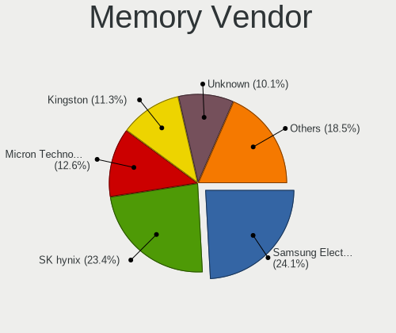

| Vendor              | Notebooks | Percent |
|---------------------|-----------|---------|
| Samsung Electronics | 48        | 23.41%  |
| SK hynix            | 46        | 22.44%  |
| Unknown             | 26        | 12.68%  |
| Kingston            | 26        | 12.68%  |
| Micron Technology   | 24        | 11.71%  |
| Ramaxel Technology  | 6         | 2.93%   |
| Crucial             | 6         | 2.93%   |
| Elpida              | 5         | 2.44%   |
| Patriot             | 3         | 1.46%   |
| Corsair             | 3         | 1.46%   |
| A-DATA Technology   | 3         | 1.46%   |
| Unknown (ABCD)      | 2         | 0.98%   |
| Nanya Technology    | 2         | 0.98%   |
| Unigen              | 1         | 0.49%   |
| SHARETRONIC         | 1         | 0.49%   |
| Atermiter           | 1         | 0.49%   |
| ASint Technology    | 1         | 0.49%   |
| Apacer              | 1         | 0.49%   |

Memory Model
------------

Memory module models

| Model                                                               | Notebooks | Percent |
|---------------------------------------------------------------------|-----------|---------|
| Unknown RAM Module 2048MB SODIMM DDR2 667MT/s                       | 6         | 2.7%    |
| Unknown RAM Module 1024MB SODIMM DDR2 667MT/s                       | 4         | 1.8%    |
| Micron RAM MT8KTF51264HZ-1G6 4096MB SODIMM DDR3 1600MT/s            | 4         | 1.8%    |
| SK hynix RAM HMT351S6EFR8A-PB 4096MB SODIMM DDR3 1600MT/s           | 3         | 1.35%   |
| SK hynix RAM HMT351S6CFR8C-PB 4GB SODIMM DDR3 1600MT/s              | 3         | 1.35%   |
| Samsung RAM M471B5273CH0-CH9 4GB SODIMM DDR3 1334MT/s               | 3         | 1.35%   |
| Patriot RAM PSD34G16002S 4GB SODIMM DDR3 1600MT/s                   | 3         | 1.35%   |
| Micron RAM 16KTF51264HZ-1G6M1 4GB SODIMM DDR3 1600MT/s              | 3         | 1.35%   |
| Kingston RAM KHX1866C11S3L/8G 8GB SODIMM DDR3 1867MT/s              | 3         | 1.35%   |
| Unknown RAM Module 4096MB SODIMM DDR3                               | 2         | 0.9%    |
| Unknown RAM Module 2GB SODIMM DDR2                                  | 2         | 0.9%    |
| Unknown RAM Module 2GB SODIMM 800MT/s                               | 2         | 0.9%    |
| Unknown (ABCD) RAM 123456789012345678 2048MB SODIMM LPDDR4 2400MT/s | 2         | 0.9%    |
| SK hynix RAM HMT451S6BFR8A-PB 4GB SODIMM DDR3 1600MT/s              | 2         | 0.9%    |
| SK hynix RAM HMT425S6AFR6A-PB 2GB SODIMM DDR3 1600MT/s              | 2         | 0.9%    |
| SK hynix RAM HMT351S6BFR8C-H9 4GB SODIMM DDR3 1333MT/s              | 2         | 0.9%    |
| SK hynix RAM HMAB2GS6AMR6N-XN 16GB SODIMM DDR4 3200MT/s             | 2         | 0.9%    |
| SK hynix RAM HMA81GS6CJR8N-VK 8GB SODIMM DDR4 2667MT/s              | 2         | 0.9%    |
| SK hynix RAM HMA81GS6AFR8N-UH 8GB SODIMM DDR4 2667MT/s              | 2         | 0.9%    |
| Samsung RAM M471B5673EH1-CF8 2GB SODIMM DDR3 4199MT/s               | 2         | 0.9%    |
| Samsung RAM M471B5173QH0-YK0 4GB SODIMM DDR3 1600MT/s               | 2         | 0.9%    |
| Samsung RAM M471A5244CB0-CTD 4GB SODIMM DDR4 3266MT/s               | 2         | 0.9%    |
| Samsung RAM M471A2K43DB1-CWE 16GB SODIMM DDR4 3200MT/s              | 2         | 0.9%    |
| Samsung RAM M471A2K43CB1-CTD 16GB SODIMM DDR4 2667MT/s              | 2         | 0.9%    |
| Samsung RAM M471A1K43DB1-CTD 8GB SODIMM DDR4 2667MT/s               | 2         | 0.9%    |
| Samsung RAM M4 70T5663QZ3-CF7 2GB SODIMM DDR2 2048MT/s              | 2         | 0.9%    |
| Ramaxel RAM RMT3170EB68F9W1600 4GB SODIMM DDR3 1600MT/s             | 2         | 0.9%    |
| Micron RAM 16JSF25664HZ-1G1F1 2GB SODIMM DDR3 1067MT/s              | 2         | 0.9%    |
| Micron RAM 16ATF1G64HZ-2G1B1 8192MB SODIMM DDR4 2133MT/s            | 2         | 0.9%    |
| Kingston RAM KHX1600C9S3L/8G 8GB SODIMM DDR3 1600MT/s               | 2         | 0.9%    |
| Unknown RAM Module 512MB SODIMM DDR2                                | 1         | 0.45%   |
| Unknown RAM Module 4GB SODIMM 800MT/s                               | 1         | 0.45%   |
| Unknown RAM Module 4096MB SODIMM DDR3 1333MT/s                      | 1         | 0.45%   |
| Unknown RAM Module 4096MB Chip DDR4 2133MT/s                        | 1         | 0.45%   |
| Unknown RAM Module 2GB SODIMM DDR3                                  | 1         | 0.45%   |
| Unknown RAM Module 2GB SODIMM DDR2 667MT/s                          | 1         | 0.45%   |
| Unknown RAM Module 2048MB SODIMM DDR3                               | 1         | 0.45%   |
| Unknown RAM Module 2048MB SODIMM DDR2 333MT/s                       | 1         | 0.45%   |
| Unknown RAM Module 2048MB SODIMM DDR2                               | 1         | 0.45%   |
| Unknown RAM Module 2048MB SODIMM 800MT/s                            | 1         | 0.45%   |
| Unknown RAM Module 2048MB SODIMM 667MT/s                            | 1         | 0.45%   |
| Unknown RAM Module 2048MB SODIMM 533MT/s                            | 1         | 0.45%   |
| Unknown RAM Module 1GB SODIMM DDR2 667MT/s                          | 1         | 0.45%   |
| Unknown RAM Module 1GB SODIMM DDR2                                  | 1         | 0.45%   |
| Unknown RAM Module 1024MB SODIMM DRAM 667MT/s                       | 1         | 0.45%   |
| Unknown RAM Module 1024MB SODIMM DDR3 1066MT/s                      | 1         | 0.45%   |
| Unknown RAM Module 1024MB SODIMM DDR2 333MT/s                       | 1         | 0.45%   |
| Unknown RAM Module 1024MB SODIMM DDR2                               | 1         | 0.45%   |
| Unknown RAM Module 1024MB SODIMM 667MT/s                            | 1         | 0.45%   |
| Unknown RAM Module 1024MB Chip DDR 533MT/s                          | 1         | 0.45%   |
| Unigen RAM UG25T640xM8SU-8C 2048MB SODIMM DDR 667MT/s               | 1         | 0.45%   |
| SK hynix RAM Module 8GB SODIMM DDR4 2667MT/s                        | 1         | 0.45%   |
| SK hynix RAM Module 8GB SODIMM DDR3 1600MT/s                        | 1         | 0.45%   |
| SK hynix RAM Module 8192MB SODIMM DDR4 2667MT/s                     | 1         | 0.45%   |
| SK hynix RAM Module 8192MB SODIMM DDR4 2133MT/s                     | 1         | 0.45%   |
| SK hynix RAM Module 4096MB SODIMM DDR4 2133MT/s                     | 1         | 0.45%   |
| SK hynix RAM Module 4096MB SODIMM DDR3 1600MT/s                     | 1         | 0.45%   |
| SK hynix RAM Module 16384MB SODIMM DDR4 2667MT/s                    | 1         | 0.45%   |
| SK hynix RAM HYMP564S64CP6-Y5 512MB SODIMM DDR 667MT/s              | 1         | 0.45%   |
| SK hynix RAM HYMP325S64AMP8-Y5 2048MB SODIMM DDR2 667MT/s           | 1         | 0.45%   |

Memory Kind
-----------

Memory module kinds

| Kind    | Notebooks | Percent |
|---------|-----------|---------|
| DDR3    | 65        | 40.37%  |
| DDR4    | 51        | 31.68%  |
| DDR2    | 18        | 11.18%  |
| SDRAM   | 8         | 4.97%   |
| LPDDR4  | 8         | 4.97%   |
| Unknown | 5         | 3.11%   |
| LPDDR3  | 3         | 1.86%   |
| DDR     | 2         | 1.24%   |
| DRAM    | 1         | 0.62%   |

Memory Form Factor
------------------

Physical design of the memory module

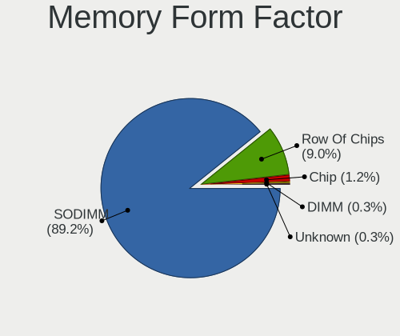

| Name         | Notebooks | Percent |
|--------------|-----------|---------|
| SODIMM       | 152       | 95%     |
| Row Of Chips | 6         | 3.75%   |
| Chip         | 2         | 1.25%   |

Memory Size
-----------

Memory module size

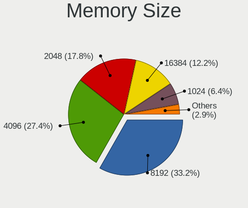

| Size  | Notebooks | Percent |
|-------|-----------|---------|
| 4096  | 61        | 32.62%  |
| 8192  | 48        | 25.67%  |
| 2048  | 41        | 21.93%  |
| 16384 | 19        | 10.16%  |
| 1024  | 15        | 8.02%   |
| 512   | 2         | 1.07%   |
| 32768 | 1         | 0.53%   |

Memory Speed
------------

Memory module speed

| Speed   | Notebooks | Percent |
|---------|-----------|---------|
| 1600    | 47        | 26.11%  |
| 2667    | 27        | 15%     |
| 3200    | 13        | 7.22%   |
| 667     | 13        | 7.22%   |
| 2400    | 11        | 6.11%   |
| 2133    | 11        | 6.11%   |
| 1333    | 9         | 5%      |
| 1334    | 8         | 4.44%   |
| Unknown | 8         | 4.44%   |
| 2048    | 5         | 2.78%   |
| 800     | 5         | 2.78%   |
| 1067    | 4         | 2.22%   |
| 4199    | 3         | 1.67%   |
| 1867    | 3         | 1.67%   |
| 4267    | 2         | 1.11%   |
| 4266    | 2         | 1.11%   |
| 3266    | 2         | 1.11%   |
| 533     | 2         | 1.11%   |
| 4800    | 1         | 0.56%   |
| 1639    | 1         | 0.56%   |
| 1066    | 1         | 0.56%   |
| 975     | 1         | 0.56%   |
| 333     | 1         | 0.56%   |

Printers & scanners
-------------------

Printer Vendor
--------------

Printer device vendors

| Vendor                | Notebooks | Percent |
|-----------------------|-----------|---------|
| Samsung Electronics   | 1         | 33.33%  |
| Lexmark International | 1         | 33.33%  |
| Hewlett-Packard       | 1         | 33.33%  |

Printer Model
-------------

Printer device models

| Model                             | Notebooks | Percent |
|-----------------------------------|-----------|---------|
| Samsung M2070 Series              | 1         | 33.33%  |
| Lexmark International 2600 Series | 1         | 33.33%  |
| HP LaserJet CP 1025               | 1         | 33.33%  |

Scanner Vendor
--------------

Scanner device vendors

Zero info for selected period =(

Scanner Model
-------------

Scanner device models

Zero info for selected period =(

Camera
------

Camera Vendor
-------------

Camera device vendors

| Vendor                                 | Notebooks | Percent |
|----------------------------------------|-----------|---------|
| Chicony Electronics                    | 89        | 34.77%  |
| Realtek Semiconductor                  | 23        | 8.98%   |
| Acer                                   | 23        | 8.98%   |
| IMC Networks                           | 20        | 7.81%   |
| Microdia                               | 19        | 7.42%   |
| Sunplus Innovation Technology          | 15        | 5.86%   |
| Suyin                                  | 13        | 5.08%   |
| Syntek                                 | 10        | 3.91%   |
| Cheng Uei Precision Industry (Foxlink) | 9         | 3.52%   |
| Quanta                                 | 6         | 2.34%   |
| Lite-On Technology                     | 5         | 1.95%   |
| Ricoh                                  | 3         | 1.17%   |
| Logitech                               | 3         | 1.17%   |
| Alcor Micro                            | 3         | 1.17%   |
| Samsung Electronics                    | 2         | 0.78%   |
| Luxvisions Innotech Limited            | 2         | 0.78%   |
| Apple                                  | 2         | 0.78%   |
| Z-Star Microelectronics                | 1         | 0.39%   |
| Primax Electronics                     | 1         | 0.39%   |
| OmniVision Technologies                | 1         | 0.39%   |
| LG Electronics                         | 1         | 0.39%   |
| Lenovo                                 | 1         | 0.39%   |
| Importek                               | 1         | 0.39%   |
| GEMBIRD                                | 1         | 0.39%   |
| Elecom                                 | 1         | 0.39%   |
| ALi                                    | 1         | 0.39%   |

Camera Model
------------

Camera device models

| Model                                                       | Notebooks | Percent |
|-------------------------------------------------------------|-----------|---------|
| Chicony Integrated Camera                                   | 20        | 7.78%   |
| Microdia Integrated_Webcam_HD                               | 9         | 3.5%    |
| Realtek USB2.0 HD UVC WebCam                                | 7         | 2.72%   |
| Sunplus Integrated_Webcam_HD                                | 6         | 2.33%   |
| Chicony HP HD Webcam [Fixed]                                | 6         | 2.33%   |
| Acer Lenovo EasyCamera                                      | 6         | 2.33%   |
| IMC Networks Integrated Camera                              | 5         | 1.95%   |
| Chicony HD WebCam                                           | 5         | 1.95%   |
| Acer EasyCamera                                             | 5         | 1.95%   |
| Syntek Integrated Camera                                    | 4         | 1.56%   |
| Realtek Integrated_Webcam_HD                                | 4         | 1.56%   |
| Quanta HP HD Camera                                         | 4         | 1.56%   |
| Microdia Integrated Webcam                                  | 4         | 1.56%   |
| Lite-On HP HD Camera                                        | 4         | 1.56%   |
| Chicony USB2.0 VGA UVC WebCam                               | 4         | 1.56%   |
| Chicony USB 2.0 Camera                                      | 4         | 1.56%   |
| Syntek Lenovo EasyCamera                                    | 3         | 1.17%   |
| Suyin HP Webcam                                             | 3         | 1.17%   |
| Suyin Acer/HP Integrated Webcam [CN0314]                    | 3         | 1.17%   |
| Sunplus HP HD Webcam [Fixed]                                | 3         | 1.17%   |
| IMC Networks Integrated Webcam                              | 3         | 1.17%   |
| Chicony USB2.0 HD UVC WebCam                                | 3         | 1.17%   |
| Chicony USB2.0 0.3M UVC WebCam                              | 3         | 1.17%   |
| Chicony TOSHIBA Web Camera - HD                             | 3         | 1.17%   |
| Chicony Thinkpad T430 camera                                | 3         | 1.17%   |
| Chicony Lenovo EasyCamera                                   | 3         | 1.17%   |
| Chicony CNF9055 Toshiba Webcam                              | 3         | 1.17%   |
| Chicony 2.0M UVC Webcam / CNF7129                           | 3         | 1.17%   |
| Acer Lenovo Integrated Webcam                               | 3         | 1.17%   |
| Acer Integrated Camera                                      | 3         | 1.17%   |
| Syntek EasyCamera                                           | 2         | 0.78%   |
| Suyin Sony Visual Communication Camera                      | 2         | 0.78%   |
| Sunplus HD WebCam                                           | 2         | 0.78%   |
| Samsung Galaxy series, misc. (MTP mode)                     | 2         | 0.78%   |
| Ricoh Integrated Webcam                                     | 2         | 0.78%   |
| Realtek Lenovo EasyCamera                                   | 2         | 0.78%   |
| Realtek HD WebCam                                           | 2         | 0.78%   |
| Microdia Webcam Vitade AF                                   | 2         | 0.78%   |
| Logitech Fujitsu Webcam                                     | 2         | 0.78%   |
| IMC Networks USB2.0 VGA UVC WebCam                          | 2         | 0.78%   |
| IMC Networks USB2.0 HD UVC WebCam                           | 2         | 0.78%   |
| IMC Networks 2M Integrated Webcam                           | 2         | 0.78%   |
| Chicony WebCam                                              | 2         | 0.78%   |
| Chicony Integrated Camera (1280x720@30)                     | 2         | 0.78%   |
| Chicony HP HD Webcam                                        | 2         | 0.78%   |
| Chicony HP HD Camera                                        | 2         | 0.78%   |
| Chicony HD User Facing                                      | 2         | 0.78%   |
| Cheng Uei Precision Industry (Foxlink) HP Webcam-101        | 2         | 0.78%   |
| Cheng Uei Precision Industry (Foxlink) HP HD Webcam         | 2         | 0.78%   |
| Cheng Uei Precision Industry (Foxlink) HP HD Camera         | 2         | 0.78%   |
| Acer HP Webcam                                              | 2         | 0.78%   |
| Z-Star Venus USB2.0 Camera                                  | 1         | 0.39%   |
| Syntek Sonix 1.3MPixel USB 2.0 Camera                       | 1         | 0.39%   |
| Suyin HP Truevision HD                                      | 1         | 0.39%   |
| Suyin HP Integrated Webcam                                  | 1         | 0.39%   |
| Suyin Acer CrystalEye Webcam                                | 1         | 0.39%   |
| Suyin 1.3M WebCam (notebook emachines E730, Acer sub-brand) | 1         | 0.39%   |
| Suyin 1.3M HD WebCam                                        | 1         | 0.39%   |
| Sunplus Laptop_Integrated_Webcam_HD                         | 1         | 0.39%   |
| Sunplus HP Universal Camera                                 | 1         | 0.39%   |

Security
--------

Fingerprint Vendor
------------------

Fingerprint sensor vendors

| Vendor                     | Notebooks | Percent |
|----------------------------|-----------|---------|
| Validity Sensors           | 35        | 53.03%  |
| Synaptics                  | 14        | 21.21%  |
| AuthenTec                  | 7         | 10.61%  |
| LighTuning Technology      | 4         | 6.06%   |
| Shenzhen Goodix Technology | 2         | 3.03%   |
| Elan Microelectronics      | 2         | 3.03%   |
| Upek                       | 1         | 1.52%   |
| STMicroelectronics         | 1         | 1.52%   |

Fingerprint Model
-----------------

Fingerprint sensor models

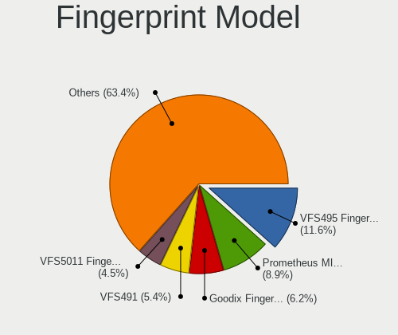

| Model                                                                      | Notebooks | Percent |
|----------------------------------------------------------------------------|-----------|---------|
| Validity Sensors VFS495 Fingerprint Reader                                 | 10        | 15.15%  |
| Synaptics Prometheus MIS Touch Fingerprint Reader                          | 5         | 7.58%   |
| Validity Sensors VFS491                                                    | 4         | 6.06%   |
| Synaptics  VFS7552 Touch Fingerprint Sensor with PurePrint                 | 4         | 6.06%   |
| LighTuning EgisTec Touch Fingerprint Sensor                                | 4         | 6.06%   |
| AuthenTec AES2501 Fingerprint Sensor                                       | 4         | 6.06%   |
| Validity Sensors VFS5011 Fingerprint Reader                                | 3         | 4.55%   |
| Validity Sensors VFS471 Fingerprint Reader                                 | 3         | 4.55%   |
| Validity Sensors VFS 5011 fingerprint sensor                               | 3         | 4.55%   |
| Validity Sensors VFS7500 Touch Fingerprint Sensor                          | 2         | 3.03%   |
| Validity Sensors VFS301 Fingerprint Reader                                 | 2         | 3.03%   |
| Validity Sensors Synaptics WBDI                                            | 2         | 3.03%   |
| Synaptics  WBDI                                                            | 2         | 3.03%   |
| Elan ELAN:Fingerprint                                                      | 2         | 3.03%   |
| AuthenTec AES2810                                                          | 2         | 3.03%   |
| Validity Sensors VFS451 Fingerprint Reader                                 | 1         | 1.52%   |
| Validity Sensors VFS300 Fingerprint Reader                                 | 1         | 1.52%   |
| Validity Sensors VFS101 Fingerprint Reader                                 | 1         | 1.52%   |
| Validity Sensors VFS Fingerprint sensor                                    | 1         | 1.52%   |
| Validity Sensors Synaptics VFS7552 Touch Fingerprint Sensor with PurePrint | 1         | 1.52%   |
| Validity Sensors Swipe Fingerprint Sensor                                  | 1         | 1.52%   |
| Upek Biometric Touchchip/Touchstrip Fingerprint Sensor                     | 1         | 1.52%   |
| Synaptics  FS7604 Touch Fingerprint Sensor with PurePrint                  | 1         | 1.52%   |
| Synaptics Metallica MIS Touch Fingerprint Reader                           | 1         | 1.52%   |
| STMicroelectronics Fingerprint Reader                                      | 1         | 1.52%   |
| Shenzhen Goodix  FingerPrint Device                                        | 1         | 1.52%   |
| Shenzhen Goodix Fingerprint Reader                                         | 1         | 1.52%   |
| AuthenTec AES1600                                                          | 1         | 1.52%   |
| Unknown                                                                    | 1         | 1.52%   |

Chipcard Vendor
---------------

Chipcard module vendors

| Vendor      | Notebooks | Percent |
|-------------|-----------|---------|
| Broadcom    | 14        | 43.75%  |
| Alcor Micro | 9         | 28.13%  |
| O2 Micro    | 5         | 15.63%  |
| Lenovo      | 2         | 6.25%   |
| BIT4ID      | 2         | 6.25%   |

Chipcard Model
--------------

Chipcard module models

| Model                                                                        | Notebooks | Percent |
|------------------------------------------------------------------------------|-----------|---------|
| Alcor Micro AU9540 Smartcard Reader                                          | 9         | 28.13%  |
| Broadcom 5880                                                                | 5         | 15.63%  |
| Broadcom BCM5880 Secure Applications Processor                               | 4         | 12.5%   |
| Broadcom 58200                                                               | 4         | 12.5%   |
| O2 Micro OZ776 CCID Smartcard Reader                                         | 3         | 9.38%   |
| O2 Micro Oz776 SmartCard Reader                                              | 2         | 6.25%   |
| Lenovo Integrated Smart Card Reader                                          | 2         | 6.25%   |
| BIT4ID miniLector EVO                                                        | 2         | 6.25%   |
| Broadcom BCM5880 Secure Applications Processor with fingerprint swipe sensor | 1         | 3.13%   |

Unsupported
-----------

Unsupported Devices
-------------------

Total unsupported devices on board

| Total | Notebooks | Percent |
|-------|-----------|---------|
| 0     | 173       | 56.17%  |
| 1     | 107       | 34.74%  |
| 2     | 23        | 7.47%   |
| 3     | 5         | 1.62%   |

Unsupported Device Types
------------------------

Types of unsupported devices

| Type                     | Notebooks | Percent |
|--------------------------|-----------|---------|
| Fingerprint reader       | 66        | 40.74%  |
| Chipcard                 | 26        | 16.05%  |
| Graphics card            | 22        | 13.58%  |
| Storage                  | 8         | 4.94%   |
| Bluetooth                | 8         | 4.94%   |
| Multimedia controller    | 7         | 4.32%   |
| Net/wireless             | 6         | 3.7%    |
| Modem                    | 4         | 2.47%   |
| Communication controller | 3         | 1.85%   |
| Card reader              | 3         | 1.85%   |
| Camera                   | 3         | 1.85%   |
| Network                  | 2         | 1.23%   |
| Flash memory             | 2         | 1.23%   |
| Storage/ide              | 1         | 0.62%   |
| Sound                    | 1         | 0.62%   |

