Linux in Slovakia - Tested Hardware & Statistics
------------------------------------------------

A project to collect tested hardware configurations for Linux in Slovakia.

Anyone can contribute to this report by the [hw-probe](https://github.com/linuxhw/hw-probe) tool:

    sudo -E hw-probe -all -upload

Please contribute! Especially if your hardware is rare.

This is a report for all computer types. See also reports for [desktops](/Location/Slovakia/Desktop/README.md) and [notebooks](/Location/Slovakia/Notebook/README.md).

Contents
--------

* [ Test Cases ](#test-cases)

* [ System ](#system)
  - [ OS                       ](#os)
  - [ OS Family                ](#os-family)
  - [ Kernel                   ](#kernel)
  - [ Kernel Family            ](#kernel-family)
  - [ Kernel Major Ver.        ](#kernel-major-ver)
  - [ Arch                     ](#arch)
  - [ DE                       ](#de)
  - [ Display Server           ](#display-server)
  - [ Display Manager          ](#display-manager)
  - [ OS Lang                  ](#os-lang)
  - [ Boot Mode                ](#boot-mode)
  - [ Filesystem               ](#filesystem)
  - [ Part. scheme             ](#part-scheme)
  - [ Dual Boot with Linux/BSD ](#dual-boot-with-linuxbsd)
  - [ Dual Boot (Win)          ](#dual-boot-win)

* [ Board ](#board)
  - [ Vendor                   ](#vendor)
  - [ Model                    ](#model)
  - [ Model Family             ](#model-family)
  - [ MFG Year                 ](#mfg-year)
  - [ Form Factor              ](#form-factor)
  - [ Secure Boot              ](#secure-boot)
  - [ Coreboot                 ](#coreboot)
  - [ RAM Size                 ](#ram-size)
  - [ RAM Used                 ](#ram-used)
  - [ Total Drives             ](#total-drives)
  - [ Has CD-ROM               ](#has-cd-rom)
  - [ Has Ethernet             ](#has-ethernet)
  - [ Has WiFi                 ](#has-wifi)
  - [ Has Bluetooth            ](#has-bluetooth)

* [ Location ](#location)
  - [ Country                  ](#country)
  - [ City                     ](#city)

* [ Drives ](#drives)
  - [ Drive Vendor             ](#drive-vendor)
  - [ Drive Model              ](#drive-model)
  - [ HDD Vendor               ](#hdd-vendor)
  - [ SSD Vendor               ](#ssd-vendor)
  - [ Drive Kind               ](#drive-kind)
  - [ Drive Connector          ](#drive-connector)
  - [ Drive Size               ](#drive-size)
  - [ Space Total              ](#space-total)
  - [ Space Used               ](#space-used)
  - [ Malfunc. Drives          ](#malfunc-drives)
  - [ Malfunc. Drive Vendor    ](#malfunc-drive-vendor)
  - [ Malfunc. HDD Vendor      ](#malfunc-hdd-vendor)
  - [ Malfunc. Drive Kind      ](#malfunc-drive-kind)
  - [ Failed Drives            ](#failed-drives)
  - [ Failed Drive Vendor      ](#failed-drive-vendor)
  - [ Drive Status             ](#drive-status)

* [ Storage controller ](#storage-controller)
  - [ Storage Vendor           ](#storage-vendor)
  - [ Storage Model            ](#storage-model)
  - [ Storage Kind             ](#storage-kind)

* [ Processor ](#processor)
  - [ CPU Vendor               ](#cpu-vendor)
  - [ CPU Model                ](#cpu-model)
  - [ CPU Model Family         ](#cpu-model-family)
  - [ CPU Cores                ](#cpu-cores)
  - [ CPU Sockets              ](#cpu-sockets)
  - [ CPU Threads              ](#cpu-threads)
  - [ CPU Op-Modes             ](#cpu-op-modes)
  - [ CPU Microcode            ](#cpu-microcode)
  - [ CPU Microarch            ](#cpu-microarch)

* [ Graphics ](#graphics)
  - [ GPU Vendor               ](#gpu-vendor)
  - [ GPU Model                ](#gpu-model)
  - [ GPU Combo                ](#gpu-combo)
  - [ GPU Driver               ](#gpu-driver)
  - [ GPU Memory               ](#gpu-memory)

* [ Monitor ](#monitor)
  - [ Monitor Vendor           ](#monitor-vendor)
  - [ Monitor Model            ](#monitor-model)
  - [ Monitor Resolution       ](#monitor-resolution)
  - [ Monitor Diagonal         ](#monitor-diagonal)
  - [ Monitor Width            ](#monitor-width)
  - [ Aspect Ratio             ](#aspect-ratio)
  - [ Monitor Area             ](#monitor-area)
  - [ Pixel Density            ](#pixel-density)
  - [ Multiple Monitors        ](#multiple-monitors)

* [ Network ](#network)
  - [ Net Controller Vendor    ](#net-controller-vendor)
  - [ Net Controller Model     ](#net-controller-model)
  - [ Wireless Vendor          ](#wireless-vendor)
  - [ Wireless Model           ](#wireless-model)
  - [ Ethernet Vendor          ](#ethernet-vendor)
  - [ Ethernet Model           ](#ethernet-model)
  - [ Net Controller Kind      ](#net-controller-kind)
  - [ Used Controller          ](#used-controller)
  - [ NICs                     ](#nics)
  - [ IPv6                     ](#ipv6)

* [ Bluetooth ](#bluetooth)
  - [ Bluetooth Vendor         ](#bluetooth-vendor)
  - [ Bluetooth Model          ](#bluetooth-model)

* [ Sound ](#sound)
  - [ Sound Vendor             ](#sound-vendor)
  - [ Sound Model              ](#sound-model)

* [ Memory ](#memory)
  - [ Memory Vendor            ](#memory-vendor)
  - [ Memory Model             ](#memory-model)
  - [ Memory Kind              ](#memory-kind)
  - [ Memory Form Factor       ](#memory-form-factor)
  - [ Memory Size              ](#memory-size)
  - [ Memory Speed             ](#memory-speed)

* [ Printers & scanners ](#printers--scanners)
  - [ Printer Vendor           ](#printer-vendor)
  - [ Printer Model            ](#printer-model)
  - [ Scanner Vendor           ](#scanner-vendor)
  - [ Scanner Model            ](#scanner-model)

* [ Camera ](#camera)
  - [ Camera Vendor            ](#camera-vendor)
  - [ Camera Model             ](#camera-model)

* [ Security ](#security)
  - [ Fingerprint Vendor       ](#fingerprint-vendor)
  - [ Fingerprint Model        ](#fingerprint-model)
  - [ Chipcard Vendor          ](#chipcard-vendor)
  - [ Chipcard Model           ](#chipcard-model)

* [ Unsupported ](#unsupported)
  - [ Unsupported Devices      ](#unsupported-devices)
  - [ Unsupported Device Types ](#unsupported-device-types)

Test Cases
----------

Total: 2051

| Vendor        | Model                       | Form-Factor | Probe                                                      | Date         |
|---------------|-----------------------------|-------------|------------------------------------------------------------|--------------|
| ASUSTek       | B150M-A/M.2                 | Desktop     | [32f1a88547](https://linux-hardware.org/?probe=32f1a88547) | Jan 03, 2026 |
| ASUSTek       | Maximus Formula             | Desktop     | [f30d975e99](https://linux-hardware.org/?probe=f30d975e99) | Dec 31, 2025 |
| Biostar       | TB360-BTC PRO               | Desktop     | [5e8cf2d30f](https://linux-hardware.org/?probe=5e8cf2d30f) | Dec 31, 2025 |
| HP            | Pavilion dv6                | Notebook    | [3d1becb26c](https://linux-hardware.org/?probe=3d1becb26c) | Dec 31, 2025 |
| HP            | Pavilion dv6                | Notebook    | [28336e5980](https://linux-hardware.org/?probe=28336e5980) | Dec 31, 2025 |
| Apple         | Mac-F2218FC8                | All in one  | [fe8980429f](https://linux-hardware.org/?probe=fe8980429f) | Dec 30, 2025 |
| ASUSTek       | M5A78L-M/USB3               | Desktop     | [fc5fecbe2d](https://linux-hardware.org/?probe=fc5fecbe2d) | Dec 28, 2025 |
| Lenovo        | ThinkPad X13 Gen 4 21J3C... | Notebook    | [50ca8779bd](https://linux-hardware.org/?probe=50ca8779bd) | Dec 26, 2025 |
| ASUSTek       | Vivobook Go E1504GA_E150... | Notebook    | [6ea2602e42](https://linux-hardware.org/?probe=6ea2602e42) | Dec 26, 2025 |
| Lenovo        | ThinkPad T495 20NKS1ER02    | Notebook    | [ca8b4720f4](https://linux-hardware.org/?probe=ca8b4720f4) | Dec 25, 2025 |
| Gigabyte      | H61M-S1                     | Desktop     | [c686a3f39c](https://linux-hardware.org/?probe=c686a3f39c) | Dec 25, 2025 |
| MSI           | Katana GF66 11UE            | Notebook    | [cdf9653561](https://linux-hardware.org/?probe=cdf9653561) | Dec 24, 2025 |
| Dell          | 0XC7MM A00                  | Desktop     | [8d5a6de6c1](https://linux-hardware.org/?probe=8d5a6de6c1) | Dec 23, 2025 |
| ASUSTek       | Vivobook Go E1504FA_E150... | Notebook    | [3428f63516](https://linux-hardware.org/?probe=3428f63516) | Dec 22, 2025 |
| ASUSTek       | Vivobook Go E1504GA_E150... | Notebook    | [47c43543c1](https://linux-hardware.org/?probe=47c43543c1) | Dec 21, 2025 |
| Foxconn       | 2ABF                        | Desktop     | [cfc4468bc8](https://linux-hardware.org/?probe=cfc4468bc8) | Dec 20, 2025 |
| MSI           | GT70 2PC                    | Notebook    | [ffd88a8766](https://linux-hardware.org/?probe=ffd88a8766) | Dec 20, 2025 |
| MSI           | GT70 2PC                    | Notebook    | [46b50d223b](https://linux-hardware.org/?probe=46b50d223b) | Dec 16, 2025 |
| ASUSTek       | PRIME B350M-A               | Desktop     | [0ca103872b](https://linux-hardware.org/?probe=0ca103872b) | Dec 14, 2025 |
| ASUSTek       | EX-B250-V7                  | Desktop     | [8cc7d81f1c](https://linux-hardware.org/?probe=8cc7d81f1c) | Dec 14, 2025 |
| MSI           | B350 PC MATE                | Desktop     | [18f3f65bb2](https://linux-hardware.org/?probe=18f3f65bb2) | Dec 13, 2025 |
| Dell          | Latitude 3590               | Notebook    | [4a78a84e96](https://linux-hardware.org/?probe=4a78a84e96) | Dec 10, 2025 |
| Dell          | Latitude 3590               | Notebook    | [19f6cb8294](https://linux-hardware.org/?probe=19f6cb8294) | Dec 10, 2025 |
| Lenovo        | ThinkPad P14s Gen 6 AMD ... | Notebook    | [49b3373121](https://linux-hardware.org/?probe=49b3373121) | Dec 10, 2025 |
| Apple         | MacBookPro11,5              | Notebook    | [824ede1d91](https://linux-hardware.org/?probe=824ede1d91) | Dec 09, 2025 |
| ASUSTek       | ProArt X570-CREATOR WIFI    | Desktop     | [0b32f3ed18](https://linux-hardware.org/?probe=0b32f3ed18) | Dec 06, 2025 |
| Acer          | Predator PH315-55           | Notebook    | [4cd4aed2f1](https://linux-hardware.org/?probe=4cd4aed2f1) | Dec 06, 2025 |
| ASUSTek       | ASUS EXPERTBOOK P5405CSA    | Notebook    | [fe1fa1e6b2](https://linux-hardware.org/?probe=fe1fa1e6b2) | Dec 01, 2025 |
| Lenovo        | 0B98401 PRO                 | Desktop     | [ed10de8401](https://linux-hardware.org/?probe=ed10de8401) | Nov 30, 2025 |
| Lenovo        | ThinkPad X13 Gen 4 21J3C... | Notebook    | [538788c9f9](https://linux-hardware.org/?probe=538788c9f9) | Nov 27, 2025 |
| ASUSTek       | ROG STRIX B650E-F GAMING... | Desktop     | [fb6963f7e6](https://linux-hardware.org/?probe=fb6963f7e6) | Nov 27, 2025 |
| ASUSTek       | ROG STRIX B650E-F GAMING... | Desktop     | [b171297583](https://linux-hardware.org/?probe=b171297583) | Nov 26, 2025 |
| Dell          | 0WMJ54 A01                  | Desktop     | [9265b6709d](https://linux-hardware.org/?probe=9265b6709d) | Nov 25, 2025 |
| GPD           | G1628-04                    | Notebook    | [5a80bbc96b](https://linux-hardware.org/?probe=5a80bbc96b) | Nov 23, 2025 |
| SIEMENS       | SIMATIC Field PG M2         | Notebook    | [eca5a420e8](https://linux-hardware.org/?probe=eca5a420e8) | Nov 21, 2025 |
| ASUSTek       | ROG STRIX B450-F GAMING     | Desktop     | [15e2a2af10](https://linux-hardware.org/?probe=15e2a2af10) | Nov 17, 2025 |
| HP            | Pavilion dv6                | Notebook    | [733a0d47da](https://linux-hardware.org/?probe=733a0d47da) | Nov 14, 2025 |
| ASUSTek       | VivoBook_ASUSLaptop X509... | Notebook    | [b400280b08](https://linux-hardware.org/?probe=b400280b08) | Nov 10, 2025 |
| Acer          | Aspire V5-551G              | Notebook    | [58868d504d](https://linux-hardware.org/?probe=58868d504d) | Nov 10, 2025 |
| Acer          | Aspire V5-551G              | Notebook    | [b0f55686e1](https://linux-hardware.org/?probe=b0f55686e1) | Nov 10, 2025 |
| MSI           | Z97 PC Mate                 | Desktop     | [d3991faad3](https://linux-hardware.org/?probe=d3991faad3) | Nov 09, 2025 |
| MSI           | MAG Z890 TOMAHAWK WIFI      | Desktop     | [d0a0c23509](https://linux-hardware.org/?probe=d0a0c23509) | Nov 09, 2025 |
| Lenovo        | Legion Slim 5 16ARP9 83E... | Notebook    | [3777ff31c3](https://linux-hardware.org/?probe=3777ff31c3) | Nov 08, 2025 |
| ASUSTek       | PRIME B760-PLUS             | Desktop     | [3de9444e35](https://linux-hardware.org/?probe=3de9444e35) | Nov 08, 2025 |
| Toshiba       | Satellite Pro C50-A-1EP     | Notebook    | [28fd7ffbe5](https://linux-hardware.org/?probe=28fd7ffbe5) | Nov 07, 2025 |
| Gigabyte      | H110-D3A-CF                 | Desktop     | [0e1bbaf256](https://linux-hardware.org/?probe=0e1bbaf256) | Nov 05, 2025 |
| Gigabyte      | H110-D3A-CF                 | Desktop     | [a7547e1e12](https://linux-hardware.org/?probe=a7547e1e12) | Nov 05, 2025 |
| Gigabyte      | B760M H DDR4                | Desktop     | [22b16b3be6](https://linux-hardware.org/?probe=22b16b3be6) | Nov 05, 2025 |
| Seeed Stud... | ODYSSEY-X86J41X5 SD-BS-C... | Desktop     | [9a9bea311c](https://linux-hardware.org/?probe=9a9bea311c) | Nov 02, 2025 |
| MSI           | PRO H610M-E DDR4            | Desktop     | [8b9f40a412](https://linux-hardware.org/?probe=8b9f40a412) | Nov 02, 2025 |
| Gigabyte      | G1.Sniper Z87               | Desktop     | [eecbff7949](https://linux-hardware.org/?probe=eecbff7949) | Nov 01, 2025 |
| Dell          | Vostro 15 3515              | Notebook    | [ffd6ef88da](https://linux-hardware.org/?probe=ffd6ef88da) | Nov 01, 2025 |
| MSI           | Thin A15 B7VE               | Notebook    | [13ecdcb65b](https://linux-hardware.org/?probe=13ecdcb65b) | Oct 30, 2025 |
| Dell          | Latitude 5450               | Notebook    | [64c4a45bd4](https://linux-hardware.org/?probe=64c4a45bd4) | Oct 28, 2025 |
| Lenovo        | ThinkPad P14s Gen 6 AMD ... | Notebook    | [d435b3c0f8](https://linux-hardware.org/?probe=d435b3c0f8) | Oct 28, 2025 |
| ASUSTek       | H81M-PLUS                   | Desktop     | [56087d7a20](https://linux-hardware.org/?probe=56087d7a20) | Oct 23, 2025 |
| ASUSTek       | Vivobook_S_Flip TN3604YA... | Convertible | [e4b27a7b17](https://linux-hardware.org/?probe=e4b27a7b17) | Oct 22, 2025 |
| Lenovo        | IdeaPad 310-15ISK 80SM      | Notebook    | [00efe581c1](https://linux-hardware.org/?probe=00efe581c1) | Oct 22, 2025 |
| Lenovo        | IdeaPad 310-15ISK 80SM      | Notebook    | [a94fdc541c](https://linux-hardware.org/?probe=a94fdc541c) | Oct 22, 2025 |
| ASUSTek       | P8Z77-V LX                  | Desktop     | [81ab1902f3](https://linux-hardware.org/?probe=81ab1902f3) | Oct 17, 2025 |
| HP            | 8169                        | Desktop     | [d7b426adde](https://linux-hardware.org/?probe=d7b426adde) | Oct 15, 2025 |
| ASUSTek       | ROG STRIX B550-I GAMING     | Desktop     | [43689bd509](https://linux-hardware.org/?probe=43689bd509) | Oct 15, 2025 |
| ASUSTek       | ROG STRIX B550-I GAMING     | Desktop     | [4dfab75ef5](https://linux-hardware.org/?probe=4dfab75ef5) | Oct 14, 2025 |
| Fujitsu Si... | AMILO A7645                 | Notebook    | [bfb4443389](https://linux-hardware.org/?probe=bfb4443389) | Oct 14, 2025 |
| Fujitsu       | LIFEBOOK E5512A             | Notebook    | [066101c67a](https://linux-hardware.org/?probe=066101c67a) | Oct 14, 2025 |
| Dell          | Latitude E7250              | Notebook    | [ce8f12b0c0](https://linux-hardware.org/?probe=ce8f12b0c0) | Oct 13, 2025 |
| Dell          | Latitude 5591               | Notebook    | [b0ef0ca78b](https://linux-hardware.org/?probe=b0ef0ca78b) | Oct 13, 2025 |
| Dell          | Latitude 5591               | Notebook    | [d727b8f8ec](https://linux-hardware.org/?probe=d727b8f8ec) | Oct 13, 2025 |
| Acer          | Aspire V3-771               | Notebook    | [5cad34f243](https://linux-hardware.org/?probe=5cad34f243) | Oct 13, 2025 |
| Acer          | Aspire V3-771               | Notebook    | [8233fc3cbb](https://linux-hardware.org/?probe=8233fc3cbb) | Oct 13, 2025 |
| Gigabyte      | B360M AORUS Gaming 3-CF     | Desktop     | [c04d1d6ffe](https://linux-hardware.org/?probe=c04d1d6ffe) | Oct 13, 2025 |
| HP            | Compaq 610                  | Notebook    | [a9e1169b4a](https://linux-hardware.org/?probe=a9e1169b4a) | Oct 11, 2025 |
| Gigabyte      | B650M D3HP                  | Desktop     | [fedac57ff0](https://linux-hardware.org/?probe=fedac57ff0) | Oct 10, 2025 |
| HP            | Pavilion dv6                | Notebook    | [b7d1434bb9](https://linux-hardware.org/?probe=b7d1434bb9) | Oct 08, 2025 |
| HP            | Pavilion dv6                | Notebook    | [aec082d61a](https://linux-hardware.org/?probe=aec082d61a) | Oct 08, 2025 |
| HP            | 250 G5 Notebook PC          | Notebook    | [f9763be764](https://linux-hardware.org/?probe=f9763be764) | Oct 05, 2025 |
| Dell          | Latitude 5290 2-in-1        | Notebook    | [4ce59f6623](https://linux-hardware.org/?probe=4ce59f6623) | Oct 05, 2025 |
| Lenovo        | IdeaPad Pro 5 14IAH10 83... | Notebook    | [7ed6b7b04a](https://linux-hardware.org/?probe=7ed6b7b04a) | Oct 03, 2025 |
| Lenovo        | IdeaPad Pro 5 14IAH10 83... | Notebook    | [c73493b54c](https://linux-hardware.org/?probe=c73493b54c) | Oct 03, 2025 |
| Lenovo        | IdeaPad Gaming 3 15ARH05... | Notebook    | [08ff5c44d7](https://linux-hardware.org/?probe=08ff5c44d7) | Oct 02, 2025 |
| ASUSTek       | G751JY                      | Notebook    | [339328a6f3](https://linux-hardware.org/?probe=339328a6f3) | Oct 02, 2025 |
| HP            | EliteBook 8440p             | Notebook    | [49d7df7ffe](https://linux-hardware.org/?probe=49d7df7ffe) | Sep 28, 2025 |
| HP            | 8054                        | Desktop     | [4548a8ae41](https://linux-hardware.org/?probe=4548a8ae41) | Sep 28, 2025 |
| HP            | 8054                        | Desktop     | [d0659c965a](https://linux-hardware.org/?probe=d0659c965a) | Sep 27, 2025 |
| HP            | EliteBook 845 G8 Noteboo... | Notebook    | [e17d4bfcbf](https://linux-hardware.org/?probe=e17d4bfcbf) | Sep 26, 2025 |
| Intel         | CHERRYVIEW D1 PLATFORM      | Notebook    | [6584fd39bf](https://linux-hardware.org/?probe=6584fd39bf) | Sep 26, 2025 |
| Dell          | Latitude 5450               | Notebook    | [4a1dacb0e5](https://linux-hardware.org/?probe=4a1dacb0e5) | Sep 23, 2025 |
| Lenovo        | ThinkPad Edge E530 3259C... | Notebook    | [c8b48cbec5](https://linux-hardware.org/?probe=c8b48cbec5) | Sep 22, 2025 |
| Dell          | Latitude E5470              | Notebook    | [15fa5d7f44](https://linux-hardware.org/?probe=15fa5d7f44) | Sep 21, 2025 |
| Dell          | Latitude 3510               | Notebook    | [dd16b51671](https://linux-hardware.org/?probe=dd16b51671) | Sep 21, 2025 |
| Dell          | Latitude 5580               | Notebook    | [091733527d](https://linux-hardware.org/?probe=091733527d) | Sep 21, 2025 |
| Dell          | Latitude 5590               | Notebook    | [8d850d6e9c](https://linux-hardware.org/?probe=8d850d6e9c) | Sep 21, 2025 |
| Lenovo        | Legion 7 16IAX10 83KY       | Notebook    | [8baa5ebaba](https://linux-hardware.org/?probe=8baa5ebaba) | Sep 18, 2025 |
| MSI           | B450 GAMING PRO CARBON A... | Desktop     | [be8df43d21](https://linux-hardware.org/?probe=be8df43d21) | Sep 17, 2025 |
| ASUSTek       | PRIME B550M-A               | Desktop     | [2ecfd07a85](https://linux-hardware.org/?probe=2ecfd07a85) | Sep 14, 2025 |
| ASUSTek       | PRIME B550M-A               | Desktop     | [8cc674783a](https://linux-hardware.org/?probe=8cc674783a) | Sep 13, 2025 |
| ASUSTek       | P8H77-V                     | Desktop     | [4a0ba1607f](https://linux-hardware.org/?probe=4a0ba1607f) | Sep 12, 2025 |
| MSI           | GX701                       | Notebook    | [72ec6bf202](https://linux-hardware.org/?probe=72ec6bf202) | Sep 09, 2025 |
| HP            | ProBook 430 G1              | Notebook    | [7ee751f6e7](https://linux-hardware.org/?probe=7ee751f6e7) | Sep 04, 2025 |
| Acer          | Aspire 5250                 | Notebook    | [a3a73df4fa](https://linux-hardware.org/?probe=a3a73df4fa) | Sep 03, 2025 |
| ASUSTek       | VivoBook_ASUSLaptop X509... | Notebook    | [3e972409be](https://linux-hardware.org/?probe=3e972409be) | Sep 02, 2025 |
| ASUSTek       | P8Z77-V PRO                 | Desktop     | [aa9ec85367](https://linux-hardware.org/?probe=aa9ec85367) | Sep 02, 2025 |
| Chuwi         | GemiBook                    | Notebook    | [0031b00ba6](https://linux-hardware.org/?probe=0031b00ba6) | Sep 02, 2025 |
| ASUSTek       | P8Z77-V PRO                 | Desktop     | [403cb5a922](https://linux-hardware.org/?probe=403cb5a922) | Sep 01, 2025 |
| Dell          | 02N3WF A01                  | Desktop     | [3ce906fa8e](https://linux-hardware.org/?probe=3ce906fa8e) | Sep 01, 2025 |
| HP            | Stream Laptop 14-ds0xxx     | Notebook    | [266bad0d8c](https://linux-hardware.org/?probe=266bad0d8c) | Aug 30, 2025 |
| HP            | Stream Laptop 14-ds0xxx     | Notebook    | [e7e079a82e](https://linux-hardware.org/?probe=e7e079a82e) | Aug 29, 2025 |
| ASUSTek       | ROG CROSSHAIR VIII HERO     | Desktop     | [f27b8a85a7](https://linux-hardware.org/?probe=f27b8a85a7) | Aug 28, 2025 |
| Gigabyte      | B450M S2H                   | Desktop     | [9404e611c7](https://linux-hardware.org/?probe=9404e611c7) | Aug 25, 2025 |
| HP            | ProBook 650 G4              | Notebook    | [242d396e2d](https://linux-hardware.org/?probe=242d396e2d) | Aug 24, 2025 |
| Dell          | XPS 14 9440                 | Notebook    | [697ac285c1](https://linux-hardware.org/?probe=697ac285c1) | Aug 19, 2025 |
| Lenovo        | ThinkPad X1 Carbon 5th 2... | Notebook    | [b038d9743e](https://linux-hardware.org/?probe=b038d9743e) | Aug 18, 2025 |
| HP            | ENVY Laptop 13-ad1xx        | Notebook    | [f296c2d8c3](https://linux-hardware.org/?probe=f296c2d8c3) | Aug 16, 2025 |
| Lenovo        | ThinkPad P14s Gen 2i 20V... | Notebook    | [60fc6d703e](https://linux-hardware.org/?probe=60fc6d703e) | Aug 16, 2025 |
| Gigabyte      | B450M DS3H-CF               | Desktop     | [d226fa4b76](https://linux-hardware.org/?probe=d226fa4b76) | Aug 14, 2025 |
| ASUSTek       | M3N-HT DELUXE               | Desktop     | [59ebc69351](https://linux-hardware.org/?probe=59ebc69351) | Aug 12, 2025 |
| HP            | ENVY x360 2-in-1 Laptop ... | Convertible | [f2cbde6129](https://linux-hardware.org/?probe=f2cbde6129) | Aug 12, 2025 |
| ASUSTek       | TUF Gaming B550M-PLUS       | Desktop     | [4f091e71ea](https://linux-hardware.org/?probe=4f091e71ea) | Aug 09, 2025 |
| Acer          | Aspire E3-112               | Notebook    | [a308b64758](https://linux-hardware.org/?probe=a308b64758) | Aug 08, 2025 |
| ASUSTek       | ROG Strix SCAR 16 G635LW... | Notebook    | [f2e24d0d51](https://linux-hardware.org/?probe=f2e24d0d51) | Aug 07, 2025 |
| HP            | Pavilion dv6                | Notebook    | [6e0d4c6a16](https://linux-hardware.org/?probe=6e0d4c6a16) | Aug 07, 2025 |
| HP            | Pavilion dv6                | Notebook    | [d01e450a30](https://linux-hardware.org/?probe=d01e450a30) | Aug 06, 2025 |
| Packard Be... | EasyNote TK85               | Notebook    | [839b4dc13b](https://linux-hardware.org/?probe=839b4dc13b) | Aug 06, 2025 |
| Gigabyte      | B760M H DDR4                | Desktop     | [4b2500aee9](https://linux-hardware.org/?probe=4b2500aee9) | Aug 05, 2025 |
| Gigabyte      | B760M H DDR4                | Desktop     | [6dac3b1c94](https://linux-hardware.org/?probe=6dac3b1c94) | Aug 05, 2025 |
| ASUSTek       | Maximus V GENE              | Desktop     | [79e8c12e62](https://linux-hardware.org/?probe=79e8c12e62) | Aug 04, 2025 |
| Shenzhen M... | F8BSC                       | Mini pc     | [02d17e507b](https://linux-hardware.org/?probe=02d17e507b) | Aug 02, 2025 |
| Lenovo        | ThinkPad L470 20J4000LMD    | Notebook    | [e47442b5de](https://linux-hardware.org/?probe=e47442b5de) | Aug 01, 2025 |
| Dell          | 060J9C A00                  | Mini pc     | [f84dae31cf](https://linux-hardware.org/?probe=f84dae31cf) | Jul 31, 2025 |
| Gigabyte      | B450M S2H                   | Desktop     | [085b2f8dd5](https://linux-hardware.org/?probe=085b2f8dd5) | Jul 31, 2025 |
| Gigabyte      | H61M-S1                     | Desktop     | [cf73b06a70](https://linux-hardware.org/?probe=cf73b06a70) | Jul 30, 2025 |
| Dell          | Latitude E5450              | Notebook    | [7c855fccc1](https://linux-hardware.org/?probe=7c855fccc1) | Jul 29, 2025 |
| HP            | ZBook 15 G3                 | Notebook    | [a338f5638d](https://linux-hardware.org/?probe=a338f5638d) | Jul 28, 2025 |
| Gigabyte      | A520M H                     | Desktop     | [1c35145263](https://linux-hardware.org/?probe=1c35145263) | Jul 27, 2025 |
| Lenovo        | ThinkPad T560 20FJS40100    | Notebook    | [5504716d07](https://linux-hardware.org/?probe=5504716d07) | Jul 25, 2025 |
| Gigabyte      | Q87M-D2H                    | Desktop     | [832a82a783](https://linux-hardware.org/?probe=832a82a783) | Jul 23, 2025 |
| Lenovo        | ThinkPad 11e Yoga Gen 6 ... | Convertible | [5e10b4f41f](https://linux-hardware.org/?probe=5e10b4f41f) | Jul 20, 2025 |
| Dell          | Latitude E7250              | Notebook    | [ef7a871962](https://linux-hardware.org/?probe=ef7a871962) | Jul 20, 2025 |
| Dell          | Latitude 5590               | Notebook    | [f895eac556](https://linux-hardware.org/?probe=f895eac556) | Jul 19, 2025 |
| Dell          | Latitude 5300               | Notebook    | [23d0a35db9](https://linux-hardware.org/?probe=23d0a35db9) | Jul 17, 2025 |
| Dell          | Latitude 5300               | Notebook    | [37b9ddc0af](https://linux-hardware.org/?probe=37b9ddc0af) | Jul 17, 2025 |
| HP            | 250 G7 Notebook PC          | Notebook    | [ac1b487166](https://linux-hardware.org/?probe=ac1b487166) | Jul 16, 2025 |
| MSI           | Summit E13FlipEvo A12MT     | Notebook    | [a56034e62e](https://linux-hardware.org/?probe=a56034e62e) | Jul 14, 2025 |
| ASUSTek       | N750JV                      | Notebook    | [3ac14a7b34](https://linux-hardware.org/?probe=3ac14a7b34) | Jul 12, 2025 |
| ASUSTek       | EB1501G                     | Desktop     | [3ffe6e802f](https://linux-hardware.org/?probe=3ffe6e802f) | Jul 12, 2025 |
| ASUSTek       | N71Ja                       | Notebook    | [0f337bb6c2](https://linux-hardware.org/?probe=0f337bb6c2) | Jul 11, 2025 |
| ASUSTek       | N71Ja                       | Notebook    | [2d2cf28cd5](https://linux-hardware.org/?probe=2d2cf28cd5) | Jul 11, 2025 |
| ASUSTek       | PRIME A320M-K               | Desktop     | [6f999ba3d8](https://linux-hardware.org/?probe=6f999ba3d8) | Jul 11, 2025 |
| ASUSTek       | F5VL                        | Notebook    | [92ca2d7600](https://linux-hardware.org/?probe=92ca2d7600) | Jul 11, 2025 |
| HP            | 2187 A01                    | Desktop     | [9a14dcadb0](https://linux-hardware.org/?probe=9a14dcadb0) | Jul 10, 2025 |
| ASUSTek       | Zenbook UX3402VA_UX3402V... | Notebook    | [51908164d1](https://linux-hardware.org/?probe=51908164d1) | Jul 09, 2025 |
| ASUSTek       | N750JV                      | Notebook    | [7fd9c3383f](https://linux-hardware.org/?probe=7fd9c3383f) | Jul 09, 2025 |
| HP            | 250 G7 Notebook PC          | Notebook    | [456d5a2fcc](https://linux-hardware.org/?probe=456d5a2fcc) | Jul 06, 2025 |
| Dell          | Latitude E7250              | Notebook    | [db37a38dc6](https://linux-hardware.org/?probe=db37a38dc6) | Jul 04, 2025 |
| ASUSTek       | TUF Gaming B550M-PLUS WI... | Desktop     | [a3533a3cf8](https://linux-hardware.org/?probe=a3533a3cf8) | Jul 03, 2025 |
| ASUSTek       | ASUS TUF Dash F15 FX517Z... | Notebook    | [2aafb5929c](https://linux-hardware.org/?probe=2aafb5929c) | Jul 01, 2025 |
| Lenovo        | IdeaPad 1 14ALC7 82R3       | Notebook    | [998aaa0ad7](https://linux-hardware.org/?probe=998aaa0ad7) | Jul 01, 2025 |
| HP            | 8464                        | Desktop     | [08e5db93b5](https://linux-hardware.org/?probe=08e5db93b5) | Jun 30, 2025 |
| Dell          | Latitude 7490               | Notebook    | [ade19baefc](https://linux-hardware.org/?probe=ade19baefc) | Jun 29, 2025 |
| HP            | EliteBook 8560p             | Notebook    | [3cdff34f13](https://linux-hardware.org/?probe=3cdff34f13) | Jun 29, 2025 |
| Gigabyte      | H61M-S1                     | Desktop     | [011250243d](https://linux-hardware.org/?probe=011250243d) | Jun 22, 2025 |
| MSI           | G41M-P33 Combo              | Desktop     | [81cc7aadc5](https://linux-hardware.org/?probe=81cc7aadc5) | Jun 18, 2025 |
| Gigabyte      | B450M S2H                   | Desktop     | [7a567a390a](https://linux-hardware.org/?probe=7a567a390a) | Jun 16, 2025 |
| HP            | 250 G7 Notebook PC          | Notebook    | [c641bb1b40](https://linux-hardware.org/?probe=c641bb1b40) | Jun 15, 2025 |
| ASUSTek       | PRIME A520M-K               | Desktop     | [f9acd7ffc3](https://linux-hardware.org/?probe=f9acd7ffc3) | Jun 13, 2025 |
| Lenovo        | ThinkPad L540 20AUS0KN00    | Notebook    | [d177fe32f3](https://linux-hardware.org/?probe=d177fe32f3) | Jun 09, 2025 |
| Gigabyte      | B450M S2H                   | Desktop     | [475088d246](https://linux-hardware.org/?probe=475088d246) | Jun 06, 2025 |
| ASUSTek       | Z10PA-U8 Series             | Desktop     | [146e88a59c](https://linux-hardware.org/?probe=146e88a59c) | Jun 05, 2025 |
| ASUSTek       | VivoBook_ASUSLaptop X509... | Notebook    | [dc7f3bc6ec](https://linux-hardware.org/?probe=dc7f3bc6ec) | Jun 04, 2025 |
| ASUSTek       | VivoBook_ASUSLaptop X509... | Notebook    | [ad9d0c98aa](https://linux-hardware.org/?probe=ad9d0c98aa) | Jun 04, 2025 |
| ASUSTek       | ROG Flow X13 GV301RC_GV3... | Convertible | [4866641306](https://linux-hardware.org/?probe=4866641306) | Jun 02, 2025 |
| ASUSTek       | ROG Flow X13 GV301RC_GV3... | Convertible | [bfc947c7f1](https://linux-hardware.org/?probe=bfc947c7f1) | Jun 02, 2025 |
| Gigabyte      | B450 GAMING X               | Desktop     | [5b88da4349](https://linux-hardware.org/?probe=5b88da4349) | Jun 01, 2025 |
| Lenovo        | Legion Pro 7 16IAX10H 83... | Notebook    | [89f26e8c66](https://linux-hardware.org/?probe=89f26e8c66) | May 30, 2025 |
| ASUSTek       | M4A785TD-M EVO              | Desktop     | [f7fb00f946](https://linux-hardware.org/?probe=f7fb00f946) | May 29, 2025 |
| Supermicro    | X9SRH-7F/7TF                | Server      | [c648536474](https://linux-hardware.org/?probe=c648536474) | May 28, 2025 |
| MSI           | MPG X870E EDGE TI WIFI      | Desktop     | [a641cf05c8](https://linux-hardware.org/?probe=a641cf05c8) | May 27, 2025 |
| MSI           | G41M-P33 Combo              | Desktop     | [d3864fa5fb](https://linux-hardware.org/?probe=d3864fa5fb) | May 26, 2025 |
| ASUSTek       | ROG Flow X13 GV301RC_GV3... | Convertible | [7a11c5a650](https://linux-hardware.org/?probe=7a11c5a650) | May 22, 2025 |
| ASUSTek       | ROG Flow X13 GV301RC_GV3... | Convertible | [c256d827a9](https://linux-hardware.org/?probe=c256d827a9) | May 22, 2025 |
| HP            | Laptop 15s-fq3xxx           | Notebook    | [dd3b0fd7b1](https://linux-hardware.org/?probe=dd3b0fd7b1) | May 20, 2025 |
| Lenovo        | 310B SDK0J40697 WIN 3305... | Mini pc     | [8db00fdb17](https://linux-hardware.org/?probe=8db00fdb17) | May 18, 2025 |
| Lenovo        | 310B SDK0J40697 WIN 3305... | Mini pc     | [43872fe289](https://linux-hardware.org/?probe=43872fe289) | May 18, 2025 |
| ASUSTek       | ROG Zephyrus G16 GU603VI... | Notebook    | [baa0d334ab](https://linux-hardware.org/?probe=baa0d334ab) | May 15, 2025 |
| HP            | 250 G7 Notebook PC          | Notebook    | [b9f1632b1c](https://linux-hardware.org/?probe=b9f1632b1c) | May 14, 2025 |
| ASRock        | H370M-HDV                   | Desktop     | [fd61ae16a6](https://linux-hardware.org/?probe=fd61ae16a6) | May 13, 2025 |
| Fujitsu       | D3501-A1 S26361-D3501-A1    | Desktop     | [d2b2130501](https://linux-hardware.org/?probe=d2b2130501) | May 13, 2025 |
| Acer          | Aspire VN7-792G             | Notebook    | [d51b370004](https://linux-hardware.org/?probe=d51b370004) | May 12, 2025 |
| HP            | Laptop 15-bs1xx             | Notebook    | [b21d182b39](https://linux-hardware.org/?probe=b21d182b39) | May 12, 2025 |
| HP            | Laptop 15-bs1xx             | Notebook    | [04b5d1100b](https://linux-hardware.org/?probe=04b5d1100b) | May 12, 2025 |
| ASUSTek       | PRIME Z790-P WIFI           | Desktop     | [3d348431e3](https://linux-hardware.org/?probe=3d348431e3) | May 12, 2025 |
| MSI           | GT60 2OC/2OD                | Notebook    | [0a9d7a2b34](https://linux-hardware.org/?probe=0a9d7a2b34) | May 12, 2025 |
| MSI           | Z270 SLI                    | Desktop     | [a34f21ed9c](https://linux-hardware.org/?probe=a34f21ed9c) | May 10, 2025 |
| ASRock        | AB350 Pro4                  | Desktop     | [4abba8c09a](https://linux-hardware.org/?probe=4abba8c09a) | May 04, 2025 |
| Lenovo        | MAHOBAY                     | Desktop     | [71b0109176](https://linux-hardware.org/?probe=71b0109176) | May 03, 2025 |
| Gigabyte      | H61M-S1                     | Desktop     | [dc73e5f521](https://linux-hardware.org/?probe=dc73e5f521) | May 01, 2025 |
| Supermicro    | X9SRH-7F/7TF                | Server      | [e0ee8d0ada](https://linux-hardware.org/?probe=e0ee8d0ada) | Apr 29, 2025 |
| Lenovo        | Legion 5 17ARH05H 82GN      | Notebook    | [f2933cfa87](https://linux-hardware.org/?probe=f2933cfa87) | Apr 29, 2025 |
| Dell          | Vostro 15 3515              | Notebook    | [907cf313cd](https://linux-hardware.org/?probe=907cf313cd) | Apr 28, 2025 |
| Dell          | 0YXT71 A03                  | Desktop     | [8509d0d436](https://linux-hardware.org/?probe=8509d0d436) | Apr 24, 2025 |
| Dell          | Latitude 5480               | Notebook    | [9b2b522849](https://linux-hardware.org/?probe=9b2b522849) | Apr 23, 2025 |
| HP            | ProBook 450 G8 Notebook ... | Notebook    | [264a594839](https://linux-hardware.org/?probe=264a594839) | Apr 22, 2025 |
| Lenovo        | Legion 5 15ACH6H 82JU       | Notebook    | [6490815b8a](https://linux-hardware.org/?probe=6490815b8a) | Apr 22, 2025 |
| TUXEDO        | Sirius 16 Gen1              | Notebook    | [cd10f8d239](https://linux-hardware.org/?probe=cd10f8d239) | Apr 21, 2025 |
| Lenovo        | ThinkPad T14 Gen 1 20S1S... | Notebook    | [664f90ac17](https://linux-hardware.org/?probe=664f90ac17) | Apr 21, 2025 |
| ZOTAC         | ZBOX-BI324                  | Mini pc     | [86838cc34b](https://linux-hardware.org/?probe=86838cc34b) | Apr 20, 2025 |
| Intel         | NUC10i5FNB M38063-307       | Mini pc     | [0fb34fd396](https://linux-hardware.org/?probe=0fb34fd396) | Apr 18, 2025 |
| Dell          | 04YP6J A02                  | Desktop     | [dc171a8d29](https://linux-hardware.org/?probe=dc171a8d29) | Apr 18, 2025 |
| Acer          | Aspire A515-47              | Notebook    | [a2adba1de3](https://linux-hardware.org/?probe=a2adba1de3) | Apr 17, 2025 |
| Acer          | Aspire A515-47              | Notebook    | [aee7738522](https://linux-hardware.org/?probe=aee7738522) | Apr 17, 2025 |
| ASUSTek       | VivoBook_ASUSLaptop X509... | Notebook    | [eef3cf635c](https://linux-hardware.org/?probe=eef3cf635c) | Apr 16, 2025 |
| ASUSTek       | P7H55                       | Desktop     | [827ccac686](https://linux-hardware.org/?probe=827ccac686) | Apr 16, 2025 |
| HP            | 82F2                        | Desktop     | [941b1d8236](https://linux-hardware.org/?probe=941b1d8236) | Apr 14, 2025 |
| Panasonic     | CF-H2AS14GF3                | Tablet      | [c8d647ed4b](https://linux-hardware.org/?probe=c8d647ed4b) | Apr 13, 2025 |
| HP            | Pavilion dv6                | Notebook    | [bd7ca8a0e7](https://linux-hardware.org/?probe=bd7ca8a0e7) | Apr 12, 2025 |
| HP            | Pavilion dv6                | Notebook    | [a544c67e79](https://linux-hardware.org/?probe=a544c67e79) | Apr 10, 2025 |
| Acer          | Aspire 6920                 | Notebook    | [968a6ffce2](https://linux-hardware.org/?probe=968a6ffce2) | Apr 09, 2025 |
| HP            | ProBook 4530s               | Notebook    | [c5a459946a](https://linux-hardware.org/?probe=c5a459946a) | Apr 09, 2025 |
| ASUSTek       | Z170-K                      | Desktop     | [b3c23611cc](https://linux-hardware.org/?probe=b3c23611cc) | Apr 07, 2025 |
| Gigabyte      | H61M-S1                     | Desktop     | [bea07bf2dc](https://linux-hardware.org/?probe=bea07bf2dc) | Apr 07, 2025 |
| TianBei       | WTR PRO                     | Desktop     | [710e5ed648](https://linux-hardware.org/?probe=710e5ed648) | Apr 06, 2025 |
| Lenovo        | ThinkPad Edge E431 62774... | Notebook    | [9938e4a2b9](https://linux-hardware.org/?probe=9938e4a2b9) | Apr 05, 2025 |
| ASUSTek       | VivoBook 15_ASUS Laptop ... | Notebook    | [3678d0d2be](https://linux-hardware.org/?probe=3678d0d2be) | Apr 05, 2025 |
| Gigabyte      | B850M D3HP                  | Desktop     | [553fe888e1](https://linux-hardware.org/?probe=553fe888e1) | Apr 02, 2025 |
| MSI           | GT60 2OC/2OD                | Notebook    | [f9d02b9f80](https://linux-hardware.org/?probe=f9d02b9f80) | Mar 31, 2025 |
| ASUSTek       | ROG STRIX B450-E GAMING     | Desktop     | [c2e6a17052](https://linux-hardware.org/?probe=c2e6a17052) | Mar 30, 2025 |
| ASUSTek       | PRIME A320M-K               | Desktop     | [6f322a8025](https://linux-hardware.org/?probe=6f322a8025) | Mar 30, 2025 |
| Lenovo        | Flex 2 Pro-15 80K8          | Notebook    | [9e0f280202](https://linux-hardware.org/?probe=9e0f280202) | Mar 29, 2025 |
| ASUSTek       | ROG Zephyrus G16 GU605MY... | Notebook    | [4d1596992f](https://linux-hardware.org/?probe=4d1596992f) | Mar 29, 2025 |
| ASUSTek       | ROG Strix G713PV_G713PV     | Notebook    | [a8c42905a7](https://linux-hardware.org/?probe=a8c42905a7) | Mar 28, 2025 |
| Lenovo        | ThinkPad X200 7458CU2       | Notebook    | [cffed3fa6d](https://linux-hardware.org/?probe=cffed3fa6d) | Mar 28, 2025 |
| HP            | ProBook 4510s               | Notebook    | [ed83f78ccb](https://linux-hardware.org/?probe=ed83f78ccb) | Mar 27, 2025 |
| Gigabyte      | H61M-S1                     | Desktop     | [a2d0fa3f5e](https://linux-hardware.org/?probe=a2d0fa3f5e) | Mar 27, 2025 |
| Lenovo        | IdeaPad S130-14IGM 81J2     | Notebook    | [ba516a497e](https://linux-hardware.org/?probe=ba516a497e) | Mar 23, 2025 |
| ASUSTek       | ROG STRIX B650E-I GAMING... | Desktop     | [03e20cee97](https://linux-hardware.org/?probe=03e20cee97) | Mar 22, 2025 |
| METAPHYUNI    | MetawillBook03              | Notebook    | [291dc33b5f](https://linux-hardware.org/?probe=291dc33b5f) | Mar 22, 2025 |
| Lenovo        | 3717 SDK0J40700 WIN 3258... | Desktop     | [25b051ef1c](https://linux-hardware.org/?probe=25b051ef1c) | Mar 21, 2025 |
| Gigabyte      | 970A-DS3P                   | Desktop     | [9fe96e34b4](https://linux-hardware.org/?probe=9fe96e34b4) | Mar 15, 2025 |
| Lenovo        | G500 20236                  | Notebook    | [b47f403d4d](https://linux-hardware.org/?probe=b47f403d4d) | Mar 15, 2025 |
| HP            | 250 15.6 inch G10 Notebo... | Notebook    | [128df29c0f](https://linux-hardware.org/?probe=128df29c0f) | Mar 11, 2025 |
| Gigabyte      | B250M-D3H-CF                | Desktop     | [c2f8b20b79](https://linux-hardware.org/?probe=c2f8b20b79) | Mar 11, 2025 |
| JHZD          | BQM5                        | Desktop     | [78767e66cf](https://linux-hardware.org/?probe=78767e66cf) | Mar 09, 2025 |
| Lenovo        | ThinkPad T430 2347AH7       | Notebook    | [6a24f8c5db](https://linux-hardware.org/?probe=6a24f8c5db) | Mar 06, 2025 |
| Lenovo        | ThinkPad Z13 Gen 2 21JVC... | Notebook    | [5d9e8d5abf](https://linux-hardware.org/?probe=5d9e8d5abf) | Mar 05, 2025 |
| Lenovo        | IdeaPad 320-15IAP 80XR      | Notebook    | [7157515442](https://linux-hardware.org/?probe=7157515442) | Mar 04, 2025 |
| ASUSTek       | PRIME B560M-A               | Desktop     | [56108fc9ff](https://linux-hardware.org/?probe=56108fc9ff) | Mar 02, 2025 |
| Acer          | Aspire A515-47              | Notebook    | [511e6a036d](https://linux-hardware.org/?probe=511e6a036d) | Mar 02, 2025 |
| Acer          | Aspire V3-731               | Notebook    | [1e7bbb9752](https://linux-hardware.org/?probe=1e7bbb9752) | Feb 27, 2025 |
| Acer          | Aspire V3-731               | Notebook    | [bacb48484e](https://linux-hardware.org/?probe=bacb48484e) | Feb 25, 2025 |
| Lenovo        | G500 20236                  | Notebook    | [2bed3a3053](https://linux-hardware.org/?probe=2bed3a3053) | Feb 24, 2025 |
| Acer          | Aspire A515-47              | Notebook    | [e33305f6d0](https://linux-hardware.org/?probe=e33305f6d0) | Feb 23, 2025 |
| HP            | OMEN by Laptop 15-dc0xxx    | Notebook    | [033339457c](https://linux-hardware.org/?probe=033339457c) | Feb 22, 2025 |
| Lenovo        | G550 20023                  | Notebook    | [833aae39d5](https://linux-hardware.org/?probe=833aae39d5) | Feb 22, 2025 |
| ASUSTek       | M70Vr                       | Notebook    | [6a5de626a3](https://linux-hardware.org/?probe=6a5de626a3) | Feb 21, 2025 |
| Lenovo        | ThinkPad X270 20HMS7TJ01    | Notebook    | [d77efcb350](https://linux-hardware.org/?probe=d77efcb350) | Feb 20, 2025 |
| Dell          | 07KY25 A01                  | Desktop     | [f004daa934](https://linux-hardware.org/?probe=f004daa934) | Feb 20, 2025 |
| HP            | ProBook 450 G6              | Notebook    | [fdcaa89b37](https://linux-hardware.org/?probe=fdcaa89b37) | Feb 20, 2025 |
| Lenovo        | G550 20023                  | Notebook    | [f9f8de8a01](https://linux-hardware.org/?probe=f9f8de8a01) | Feb 19, 2025 |
| Dell          | 0HN7XN A01                  | Desktop     | [b6d3cf46bc](https://linux-hardware.org/?probe=b6d3cf46bc) | Feb 19, 2025 |
| Dell          | 0HD5W2 A01                  | Desktop     | [3aa7a01bce](https://linux-hardware.org/?probe=3aa7a01bce) | Feb 17, 2025 |
| Lenovo        | ThinkPad L480 20LS0016MC    | Notebook    | [e6c4d3ee92](https://linux-hardware.org/?probe=e6c4d3ee92) | Feb 16, 2025 |
| Dell          | Latitude E5430 non-vPro     | Notebook    | [5072f6ae3b](https://linux-hardware.org/?probe=5072f6ae3b) | Feb 15, 2025 |
| Lenovo        | ThinkPad L480 20LS0016MC    | Notebook    | [44528952ab](https://linux-hardware.org/?probe=44528952ab) | Feb 15, 2025 |
| Dell          | Latitude E5430 non-vPro     | Notebook    | [cfe97ceb23](https://linux-hardware.org/?probe=cfe97ceb23) | Feb 13, 2025 |
| ASUSTek       | G551JM                      | Notebook    | [93e6855ae7](https://linux-hardware.org/?probe=93e6855ae7) | Feb 13, 2025 |
| Gigabyte      | EP35-DS3                    | Desktop     | [fe4efa666f](https://linux-hardware.org/?probe=fe4efa666f) | Feb 13, 2025 |
| Lenovo        | ThinkPad T480 20L6SB7M00    | Notebook    | [e3390322c0](https://linux-hardware.org/?probe=e3390322c0) | Feb 12, 2025 |
| ASUSTek       | ROG STRIX B350-F GAMING     | Desktop     | [2ddcde9d20](https://linux-hardware.org/?probe=2ddcde9d20) | Feb 11, 2025 |
| Lenovo        | ThinkPad T14 Gen 1 20S1S... | Notebook    | [865bc88f6b](https://linux-hardware.org/?probe=865bc88f6b) | Feb 09, 2025 |
| Dell          | Latitude E7250              | Notebook    | [3473bcef36](https://linux-hardware.org/?probe=3473bcef36) | Feb 09, 2025 |
| ASUSTek       | TUF Gaming B550M-PLUS       | Desktop     | [9f1c4d9d82](https://linux-hardware.org/?probe=9f1c4d9d82) | Feb 09, 2025 |
| Acer          | Swift SF114-34              | Notebook    | [031300eaaf](https://linux-hardware.org/?probe=031300eaaf) | Feb 08, 2025 |
| HP            | ENVY x360 Convertible 15... | Convertible | [1dfc8ce4c1](https://linux-hardware.org/?probe=1dfc8ce4c1) | Feb 08, 2025 |
| ASUSTek       | TUF Gaming B550-PLUS WIF... | Desktop     | [a20db7c9c5](https://linux-hardware.org/?probe=a20db7c9c5) | Feb 05, 2025 |
| Lenovo        | G50-30 80G0                 | Notebook    | [75b3eee2d5](https://linux-hardware.org/?probe=75b3eee2d5) | Feb 04, 2025 |
| Lenovo        | ThinkPad T480 20L6SB7M00    | Notebook    | [fd0a430644](https://linux-hardware.org/?probe=fd0a430644) | Feb 03, 2025 |
| HP            | 1998                        | Desktop     | [5c3c0b8991](https://linux-hardware.org/?probe=5c3c0b8991) | Feb 02, 2025 |
| HP            | Pavilion dv6                | Notebook    | [fe23780b39](https://linux-hardware.org/?probe=fe23780b39) | Feb 01, 2025 |
| HP            | Pavilion dv6                | Notebook    | [3a7c3b9648](https://linux-hardware.org/?probe=3a7c3b9648) | Feb 01, 2025 |
| Apple         | MacBookPro8,3               | Notebook    | [cb543048e9](https://linux-hardware.org/?probe=cb543048e9) | Feb 01, 2025 |
| ASUSTek       | PRIME A320M-K               | Desktop     | [9fb0e09d40](https://linux-hardware.org/?probe=9fb0e09d40) | Feb 01, 2025 |
| ASUSTek       | ASUS TUF Dash F15 FX517Z... | Notebook    | [8e03ef4728](https://linux-hardware.org/?probe=8e03ef4728) | Jan 31, 2025 |
| Dell          | Latitude 5590               | Notebook    | [dc4ba405fb](https://linux-hardware.org/?probe=dc4ba405fb) | Jan 31, 2025 |
| Dell          | Latitude 7490               | Notebook    | [653768d449](https://linux-hardware.org/?probe=653768d449) | Jan 31, 2025 |
| Lenovo        | ThinkPad X270 20HMS7TJ01    | Notebook    | [d5522bd684](https://linux-hardware.org/?probe=d5522bd684) | Jan 30, 2025 |
| Dell          | Latitude 3510               | Notebook    | [a54e325519](https://linux-hardware.org/?probe=a54e325519) | Jan 30, 2025 |
| Dell          | Latitude 5580               | Notebook    | [e9dc7c3e68](https://linux-hardware.org/?probe=e9dc7c3e68) | Jan 29, 2025 |
| Intel         | Jasper Lake Client Platf... | Notebook    | [87a112adb8](https://linux-hardware.org/?probe=87a112adb8) | Jan 29, 2025 |
| Intel         | Jasper Lake Client Platf... | Notebook    | [8d0ef6f42b](https://linux-hardware.org/?probe=8d0ef6f42b) | Jan 28, 2025 |
| Acer          | Nitro AN16-42               | Notebook    | [c431688386](https://linux-hardware.org/?probe=c431688386) | Jan 27, 2025 |
| ASRock        | B450M Pro4-F                | Desktop     | [22b68f9601](https://linux-hardware.org/?probe=22b68f9601) | Jan 27, 2025 |
| ASUSTek       | P5Q3                        | Desktop     | [fb60fc8b28](https://linux-hardware.org/?probe=fb60fc8b28) | Jan 24, 2025 |
| ASUSTek       | ASUS EXPERTBOOK B5404CMA... | Notebook    | [b0f60fc604](https://linux-hardware.org/?probe=b0f60fc604) | Jan 23, 2025 |
| Acer          | Spin SP111-31               | Convertible | [4d1698df3c](https://linux-hardware.org/?probe=4d1698df3c) | Jan 22, 2025 |
| Lenovo        | IdeaPad 3 14ALC6 82KT       | Notebook    | [b833ba2c07](https://linux-hardware.org/?probe=b833ba2c07) | Jan 21, 2025 |
| ASUSTek       | VivoBook 15_ASUS Laptop ... | Notebook    | [dad69e65f4](https://linux-hardware.org/?probe=dad69e65f4) | Jan 20, 2025 |
| Dell          | G5 5587                     | Notebook    | [ac5a10727b](https://linux-hardware.org/?probe=ac5a10727b) | Jan 19, 2025 |
| Lenovo        | IdeaPad 5 2-in-1 14AHP9 ... | Convertible | [7cd06c43ce](https://linux-hardware.org/?probe=7cd06c43ce) | Jan 18, 2025 |
| ASUSTek       | TUF Gaming B550-PLUS WIF... | Desktop     | [79de5dbb21](https://linux-hardware.org/?probe=79de5dbb21) | Jan 18, 2025 |
| HP            | ENVY x360 2-in-1 Laptop ... | Convertible | [9962379e81](https://linux-hardware.org/?probe=9962379e81) | Jan 18, 2025 |
| Dell          | Latitude 5500               | Notebook    | [decfec2fc9](https://linux-hardware.org/?probe=decfec2fc9) | Jan 17, 2025 |
| Lenovo        | IdeaPad 5 2-in-1 14AHP9 ... | Convertible | [55376bc052](https://linux-hardware.org/?probe=55376bc052) | Jan 17, 2025 |
| Lenovo        | B70-80 80MR                 | Notebook    | [46a2dfb5a3](https://linux-hardware.org/?probe=46a2dfb5a3) | Jan 17, 2025 |
| MSI           | PRO Z790-A WIFI DDR4        | Desktop     | [fe566a2f9b](https://linux-hardware.org/?probe=fe566a2f9b) | Jan 17, 2025 |
| Acer          | Aspire V3-571G              | Notebook    | [cc238493c1](https://linux-hardware.org/?probe=cc238493c1) | Jan 12, 2025 |
| Lenovo        | G580                        | Notebook    | [27bcf4c155](https://linux-hardware.org/?probe=27bcf4c155) | Jan 10, 2025 |
| HP            | ProBook 4510s               | Notebook    | [d74e06d912](https://linux-hardware.org/?probe=d74e06d912) | Jan 06, 2025 |
| HP            | ProBook 4510s               | Notebook    | [cf51ebf11d](https://linux-hardware.org/?probe=cf51ebf11d) | Jan 06, 2025 |
| HP            | 250 G7 Notebook PC          | Notebook    | [0562d753f2](https://linux-hardware.org/?probe=0562d753f2) | Jan 05, 2025 |
| HP            | 250 G7 Notebook PC          | Notebook    | [0cf6343ea2](https://linux-hardware.org/?probe=0cf6343ea2) | Jan 05, 2025 |
| Lenovo        | IdeaPad Gaming 3 15ACH6 ... | Notebook    | [271c85b332](https://linux-hardware.org/?probe=271c85b332) | Jan 05, 2025 |
| Lenovo        | ThinkPad L470 20J4000LMD    | Notebook    | [e2fa70f2b4](https://linux-hardware.org/?probe=e2fa70f2b4) | Jan 02, 2025 |
| Lenovo        | 3717 SDK0J40700 WIN 3258... | Desktop     | [bc8aa268ef](https://linux-hardware.org/?probe=bc8aa268ef) | Jan 01, 2025 |
| HP            | ProBook 4535s               | Notebook    | [e0f48651c0](https://linux-hardware.org/?probe=e0f48651c0) | Dec 30, 2024 |
| ASUSTek       | ASUS TUF Gaming A15 FA50... | Notebook    | [71d10a1993](https://linux-hardware.org/?probe=71d10a1993) | Dec 26, 2024 |
| Lenovo        | IdeaPad Pro 5 16AHP9 83D... | Notebook    | [28dcf6960e](https://linux-hardware.org/?probe=28dcf6960e) | Dec 26, 2024 |
| Lenovo        | Legion 9 16IRX9 83G0        | Notebook    | [128debb210](https://linux-hardware.org/?probe=128debb210) | Dec 25, 2024 |
| ASUSTek       | ASUS TUF Gaming A15 FA50... | Notebook    | [4505762848](https://linux-hardware.org/?probe=4505762848) | Dec 25, 2024 |
| Lenovo        | IdeaPad Gaming 3 15ACH6 ... | Notebook    | [e7ad20e4e1](https://linux-hardware.org/?probe=e7ad20e4e1) | Dec 24, 2024 |
| Acer          | Extensa X2610G              | Desktop     | [b056768ca1](https://linux-hardware.org/?probe=b056768ca1) | Dec 23, 2024 |
| ASUSTek       | TUF Gaming X570-PRO         | Desktop     | [f7f28f51ad](https://linux-hardware.org/?probe=f7f28f51ad) | Dec 22, 2024 |
| ASUSTek       | P8Z68-V PRO GEN3            | Desktop     | [adf5dc1d46](https://linux-hardware.org/?probe=adf5dc1d46) | Dec 21, 2024 |
| Gigabyte      | B75M-D3H                    | Desktop     | [24a9a318be](https://linux-hardware.org/?probe=24a9a318be) | Dec 19, 2024 |
| HP            | Pavilion dv6                | Notebook    | [89ec19d64a](https://linux-hardware.org/?probe=89ec19d64a) | Dec 17, 2024 |
| ASUSTek       | Z170-K                      | Desktop     | [a37f17c9d8](https://linux-hardware.org/?probe=a37f17c9d8) | Dec 16, 2024 |
| Gigabyte      | H61M-S1                     | Desktop     | [0291930ebb](https://linux-hardware.org/?probe=0291930ebb) | Dec 16, 2024 |
| ASUSTek       | ASUS TUF Dash F15 FX517Z... | Notebook    | [532c74b6c3](https://linux-hardware.org/?probe=532c74b6c3) | Dec 16, 2024 |
| Dell          | Latitude E5530 non-vPro     | Notebook    | [9feabc8ce6](https://linux-hardware.org/?probe=9feabc8ce6) | Dec 14, 2024 |
| ASUSTek       | TUF Gaming B550M-PLUS       | Desktop     | [7fe45e1a05](https://linux-hardware.org/?probe=7fe45e1a05) | Dec 14, 2024 |
| Lenovo        | ThinkPad L15 Gen 1 20U70... | Notebook    | [331f53945b](https://linux-hardware.org/?probe=331f53945b) | Dec 13, 2024 |
| Dell          | Inspiron 13-5368            | Notebook    | [bd47986d73](https://linux-hardware.org/?probe=bd47986d73) | Dec 13, 2024 |
| ASUSTek       | PRIME A320M-K               | Desktop     | [467278b658](https://linux-hardware.org/?probe=467278b658) | Dec 12, 2024 |
| Foxconn       | 2ABF                        | Desktop     | [0f46252ef0](https://linux-hardware.org/?probe=0f46252ef0) | Dec 11, 2024 |
| Lenovo        | Yoga 510-14IKB 80VB         | Convertible | [ad930c5c8f](https://linux-hardware.org/?probe=ad930c5c8f) | Dec 09, 2024 |
| ASUSTek       | ASUS TUF Gaming A15 FA50... | Notebook    | [dc2afedb8a](https://linux-hardware.org/?probe=dc2afedb8a) | Dec 08, 2024 |
| HP            | 250 15.6 inch G10 Notebo... | Notebook    | [f92ea0cda1](https://linux-hardware.org/?probe=f92ea0cda1) | Dec 04, 2024 |
| ASUSTek       | PRIME A320M-K               | Desktop     | [232e1f7313](https://linux-hardware.org/?probe=232e1f7313) | Dec 03, 2024 |
| Lenovo        | Yoga 510-14IKB 80VB         | Convertible | [1e515c3231](https://linux-hardware.org/?probe=1e515c3231) | Dec 02, 2024 |
| Dell          | Inspiron 13-5368            | Notebook    | [5f256e8e33](https://linux-hardware.org/?probe=5f256e8e33) | Dec 01, 2024 |
| Intel         | NUC8BEB J72693-306          | Mini pc     | [7b063d3dd7](https://linux-hardware.org/?probe=7b063d3dd7) | Nov 30, 2024 |
| Intel         | NUC8BEB J72693-306          | Mini pc     | [b69d5786a5](https://linux-hardware.org/?probe=b69d5786a5) | Nov 30, 2024 |
| Gigabyte      | H61M-S1                     | Desktop     | [d4ffafd2f5](https://linux-hardware.org/?probe=d4ffafd2f5) | Nov 29, 2024 |
| Acer          | Swift SF314-43              | Notebook    | [82fcdbb537](https://linux-hardware.org/?probe=82fcdbb537) | Nov 28, 2024 |
| Foxconn       | 2ABF                        | Desktop     | [56fc037b00](https://linux-hardware.org/?probe=56fc037b00) | Nov 25, 2024 |
| ASUSTek       | ASUS EXPERTBOOK L1500CDA... | Notebook    | [e65f68056f](https://linux-hardware.org/?probe=e65f68056f) | Nov 24, 2024 |
| Dell          | Vostro 3500                 | Notebook    | [723a673611](https://linux-hardware.org/?probe=723a673611) | Nov 24, 2024 |
| Lenovo        | IdeaPad Pro 5 14IMH9 83D... | Notebook    | [e7b45b99c1](https://linux-hardware.org/?probe=e7b45b99c1) | Nov 23, 2024 |
| OEM           | X79-Turbo                   | Desktop     | [8e35c4675c](https://linux-hardware.org/?probe=8e35c4675c) | Nov 23, 2024 |
| ASUSTek       | ASUS TUF Dash F15 FX517Z... | Notebook    | [87836c3a98](https://linux-hardware.org/?probe=87836c3a98) | Nov 22, 2024 |
| Lenovo        | IdeaPad 5 15ABA7 82SG       | Notebook    | [5a37374d2d](https://linux-hardware.org/?probe=5a37374d2d) | Nov 21, 2024 |
| Timi          | TM1701                      | Notebook    | [4a2509bd5a](https://linux-hardware.org/?probe=4a2509bd5a) | Nov 18, 2024 |
| HP            | Victus by Gaming Laptop ... | Notebook    | [f68a7fb475](https://linux-hardware.org/?probe=f68a7fb475) | Nov 17, 2024 |
| XIAOMI        | Redmi Book Pro 15 2023      | Notebook    | [c3dd3deab0](https://linux-hardware.org/?probe=c3dd3deab0) | Nov 16, 2024 |
| Lenovo        | 1066 3556104260981          | Desktop     | [bc8c24fb9c](https://linux-hardware.org/?probe=bc8c24fb9c) | Nov 15, 2024 |
| XIAOMI        | Redmi Book Pro 15 2023      | Notebook    | [038c91db6e](https://linux-hardware.org/?probe=038c91db6e) | Nov 15, 2024 |
| ASUSTek       | ROG Zephyrus G16 GU603ZV... | Notebook    | [d31a355a2d](https://linux-hardware.org/?probe=d31a355a2d) | Nov 14, 2024 |
| Gigabyte      | H61M-S1                     | Desktop     | [ed13d9f493](https://linux-hardware.org/?probe=ed13d9f493) | Nov 12, 2024 |
| MSI           | GT60 2OC/2OD                | Notebook    | [d4624f582f](https://linux-hardware.org/?probe=d4624f582f) | Nov 11, 2024 |
| Intel         | X99H                        | Desktop     | [5e31d210ca](https://linux-hardware.org/?probe=5e31d210ca) | Nov 09, 2024 |
| ASUSTek       | X550VB                      | Notebook    | [c995cf0e55](https://linux-hardware.org/?probe=c995cf0e55) | Nov 09, 2024 |
| Fujitsu Si... | AMILO A7645                 | Notebook    | [82b3b117c2](https://linux-hardware.org/?probe=82b3b117c2) | Nov 08, 2024 |
| ASUSTek       | P7P55D-E                    | Desktop     | [ef5c1d5086](https://linux-hardware.org/?probe=ef5c1d5086) | Nov 06, 2024 |
| Foxconn       | 2ABF                        | Desktop     | [93af336b75](https://linux-hardware.org/?probe=93af336b75) | Nov 06, 2024 |
| Lenovo        | IdeaPad 1 14IGL05 81VU      | Notebook    | [f851654ac1](https://linux-hardware.org/?probe=f851654ac1) | Nov 03, 2024 |
| Fujitsu       | D3161-A1 S26361-D3161-A1    | Desktop     | [5a62c5d679](https://linux-hardware.org/?probe=5a62c5d679) | Nov 02, 2024 |
| Toshiba       | TECRA A10                   | Notebook    | [f7cfa0f796](https://linux-hardware.org/?probe=f7cfa0f796) | Nov 02, 2024 |
| Gigabyte      | H61M-S1                     | Desktop     | [0d7062b12c](https://linux-hardware.org/?probe=0d7062b12c) | Oct 26, 2024 |
| HP            | 250 G8 Notebook PC          | Notebook    | [c6d19560ba](https://linux-hardware.org/?probe=c6d19560ba) | Oct 26, 2024 |
| IBM           | 00D3889                     | Server      | [128986423a](https://linux-hardware.org/?probe=128986423a) | Oct 22, 2024 |
| ASUSTek       | ASUS TUF Gaming A15 FA50... | Notebook    | [8caf6adea5](https://linux-hardware.org/?probe=8caf6adea5) | Oct 20, 2024 |
| ASUSTek       | ASUS TUF Gaming A15 FA50... | Notebook    | [c5e97b1a91](https://linux-hardware.org/?probe=c5e97b1a91) | Oct 20, 2024 |
| Dell          | Latitude E6400              | Notebook    | [45684f9885](https://linux-hardware.org/?probe=45684f9885) | Oct 20, 2024 |
| TUXEDO        | Pulse 15 Gen2               | Notebook    | [08951a5d7d](https://linux-hardware.org/?probe=08951a5d7d) | Oct 20, 2024 |
| TUXEDO        | Sirius 16 Gen1              | Notebook    | [30d8c17c67](https://linux-hardware.org/?probe=30d8c17c67) | Oct 19, 2024 |
| ASUSTek       | G55VW                       | Notebook    | [a1b8fade8a](https://linux-hardware.org/?probe=a1b8fade8a) | Oct 19, 2024 |
| LattePanda    | 3 Delta LP-BS-7-S70JR120... | Desktop     | [5a284653dc](https://linux-hardware.org/?probe=5a284653dc) | Oct 18, 2024 |
| Lenovo        | ThinkPad X1 Carbon 3460C... | Notebook    | [553cb8fd6e](https://linux-hardware.org/?probe=553cb8fd6e) | Oct 16, 2024 |
| LattePanda    | 3 Delta LP-BS-7-S70JR120... | Desktop     | [b0a68cd06f](https://linux-hardware.org/?probe=b0a68cd06f) | Oct 16, 2024 |
| ASRock        | FM2A55M-VG3+                | Desktop     | [d05df8983d](https://linux-hardware.org/?probe=d05df8983d) | Oct 15, 2024 |
| ASRock        | FM2A55M-VG3+                | Desktop     | [90d932a9d7](https://linux-hardware.org/?probe=90d932a9d7) | Oct 15, 2024 |
| HP            | 250 G4                      | Notebook    | [0bc4a73563](https://linux-hardware.org/?probe=0bc4a73563) | Oct 13, 2024 |
| ASUSTek       | G55VW                       | Notebook    | [101bba7262](https://linux-hardware.org/?probe=101bba7262) | Oct 12, 2024 |
| TianBei       | WTR PRO                     | Desktop     | [ac12fbc7d0](https://linux-hardware.org/?probe=ac12fbc7d0) | Oct 12, 2024 |
| Gigabyte      | H61M-S1                     | Desktop     | [1e54eccb05](https://linux-hardware.org/?probe=1e54eccb05) | Oct 10, 2024 |
| ASUSTek       | ROG STRIX Z690-G GAMING ... | Desktop     | [b91adce425](https://linux-hardware.org/?probe=b91adce425) | Oct 08, 2024 |
| ASUSTek       | Z97-K                       | Desktop     | [9067fbe342](https://linux-hardware.org/?probe=9067fbe342) | Oct 07, 2024 |
| Lenovo        | IdeaPad Gaming 3 15IHU6 ... | Notebook    | [f314e87727](https://linux-hardware.org/?probe=f314e87727) | Oct 04, 2024 |
| Lenovo        | IdeaPad Gaming 3 15IHU6 ... | Notebook    | [884d99dd9f](https://linux-hardware.org/?probe=884d99dd9f) | Oct 04, 2024 |
| HC Technol... | HCAR357-NR                  | Desktop     | [9d76df3f47](https://linux-hardware.org/?probe=9d76df3f47) | Oct 04, 2024 |
| Unknown       | Unknown                     | Desktop     | [f33cf6d783](https://linux-hardware.org/?probe=f33cf6d783) | Sep 29, 2024 |
| HP            | Laptop 15s-eq2xxx           | Notebook    | [a79dcec2fd](https://linux-hardware.org/?probe=a79dcec2fd) | Sep 29, 2024 |
| Acer          | IPXBD-RB                    | Desktop     | [5b0559d8f9](https://linux-hardware.org/?probe=5b0559d8f9) | Sep 28, 2024 |
| HP            | 250 G4 Notebook PC          | Notebook    | [69917b9ff3](https://linux-hardware.org/?probe=69917b9ff3) | Sep 27, 2024 |
| Dell          | Latitude E7250              | Notebook    | [bae9276346](https://linux-hardware.org/?probe=bae9276346) | Sep 25, 2024 |
| Dell          | 02YYK5 A01                  | Desktop     | [43a9a5f206](https://linux-hardware.org/?probe=43a9a5f206) | Sep 24, 2024 |
| Lenovo        | ThinkPad P14s Gen 5 AMD ... | Notebook    | [07e66697a0](https://linux-hardware.org/?probe=07e66697a0) | Sep 23, 2024 |
| Lenovo        | ThinkPad P14s Gen 5 AMD ... | Notebook    | [c8b757063d](https://linux-hardware.org/?probe=c8b757063d) | Sep 22, 2024 |
| Dell          | Latitude 5590               | Notebook    | [5a284e9384](https://linux-hardware.org/?probe=5a284e9384) | Sep 16, 2024 |
| MSI           | A78-G41 PC Mate             | Desktop     | [941b873461](https://linux-hardware.org/?probe=941b873461) | Sep 16, 2024 |
| MSI           | A78-G41 PC Mate             | Desktop     | [5cb76e009d](https://linux-hardware.org/?probe=5cb76e009d) | Sep 16, 2024 |
| HP            | Pavilion dv6                | Notebook    | [f4e2729ed2](https://linux-hardware.org/?probe=f4e2729ed2) | Sep 14, 2024 |
| HP            | Pavilion dv6                | Notebook    | [0ffe1545df](https://linux-hardware.org/?probe=0ffe1545df) | Sep 14, 2024 |
| ASUSTek       | VivoBook_ASUSLaptop X509... | Notebook    | [58d0cd3141](https://linux-hardware.org/?probe=58d0cd3141) | Sep 13, 2024 |
| Gigabyte      | H61M-S1                     | Desktop     | [0b2a56e1e2](https://linux-hardware.org/?probe=0b2a56e1e2) | Sep 12, 2024 |
| ASUSTek       | ASUS Vivobook S 16 M5606... | Notebook    | [fac034c3d1](https://linux-hardware.org/?probe=fac034c3d1) | Sep 12, 2024 |
| Lenovo        | IdeaPad Slim 1-14AST-05 ... | Notebook    | [10d6c62594](https://linux-hardware.org/?probe=10d6c62594) | Sep 12, 2024 |
| AZW           | SER V10                     | Mini pc     | [c0fc4bf6eb](https://linux-hardware.org/?probe=c0fc4bf6eb) | Sep 12, 2024 |
| HP            | Laptop 15s-eq2xxx           | Notebook    | [dc90d7b0f6](https://linux-hardware.org/?probe=dc90d7b0f6) | Sep 09, 2024 |
| Dell          | Inspiron 7577               | Notebook    | [fd08888941](https://linux-hardware.org/?probe=fd08888941) | Sep 08, 2024 |
| ASUSTek       | TUF Gaming B650M-E WIFI     | Desktop     | [3ab1814ac9](https://linux-hardware.org/?probe=3ab1814ac9) | Sep 06, 2024 |
| Dell          | Inspiron 1120               | Notebook    | [08463f81cc](https://linux-hardware.org/?probe=08463f81cc) | Sep 03, 2024 |
| Lenovo        | IdeaPad 1 14AMN7 82VF       | Notebook    | [8b4a507262](https://linux-hardware.org/?probe=8b4a507262) | Sep 03, 2024 |
| Lenovo        | IdeaPad 1 14AMN7 82VF       | Notebook    | [6d4b600de7](https://linux-hardware.org/?probe=6d4b600de7) | Sep 02, 2024 |
| Intel         | X99                         | Desktop     | [ae686462f8](https://linux-hardware.org/?probe=ae686462f8) | Aug 31, 2024 |
| Lenovo        | Legion 5 17IMH05 82B3       | Notebook    | [84cfff520c](https://linux-hardware.org/?probe=84cfff520c) | Aug 31, 2024 |
| MSI           | GT60 2OC/2OD                | Notebook    | [4266a67086](https://linux-hardware.org/?probe=4266a67086) | Aug 30, 2024 |
| Gigabyte      | A520 AORUS ELITE            | Desktop     | [29be3e0f99](https://linux-hardware.org/?probe=29be3e0f99) | Aug 28, 2024 |
| Gigabyte      | A520 AORUS ELITE            | Desktop     | [2a8e1f338b](https://linux-hardware.org/?probe=2a8e1f338b) | Aug 28, 2024 |
| Dell          | 0WR7PY A02                  | Desktop     | [950d0e1cfd](https://linux-hardware.org/?probe=950d0e1cfd) | Aug 26, 2024 |
| HP            | 250 G3                      | Notebook    | [4b1cd9dccd](https://linux-hardware.org/?probe=4b1cd9dccd) | Aug 25, 2024 |
| Samsung       | 700Z3A/700Z4A/700Z5A/700... | Notebook    | [ebc8f6a03b](https://linux-hardware.org/?probe=ebc8f6a03b) | Aug 23, 2024 |
| Lenovo        | 1048 SDK0T08861 WIN 3305... | Desktop     | [7bbf6e7d54](https://linux-hardware.org/?probe=7bbf6e7d54) | Aug 19, 2024 |
| Dell          | Latitude 5590               | Notebook    | [7117d9db5d](https://linux-hardware.org/?probe=7117d9db5d) | Aug 19, 2024 |
| Dell          | Latitude 5580               | Notebook    | [4e33bc99e9](https://linux-hardware.org/?probe=4e33bc99e9) | Aug 19, 2024 |
| Dell          | Latitude 3510               | Notebook    | [87f51c188d](https://linux-hardware.org/?probe=87f51c188d) | Aug 19, 2024 |
| ASUSTek       | ASUS EXPERTBOOK L2402CYA... | Notebook    | [a8bd6d5797](https://linux-hardware.org/?probe=a8bd6d5797) | Aug 18, 2024 |
| HP            | ProLiant DL60 Gen9          | Server      | [ac48708bdd](https://linux-hardware.org/?probe=ac48708bdd) | Aug 18, 2024 |
| Lenovo        | Legion 5 17IMH05 82B3       | Notebook    | [3a017ae9fc](https://linux-hardware.org/?probe=3a017ae9fc) | Aug 16, 2024 |
| Acer          | Nitro AN515-52              | Notebook    | [4105f16710](https://linux-hardware.org/?probe=4105f16710) | Aug 14, 2024 |
| Acer          | Nitro AN515-52              | Notebook    | [f7706f241c](https://linux-hardware.org/?probe=f7706f241c) | Aug 14, 2024 |
| MSI           | Z87-G41 PC Mate             | Desktop     | [8f5394ac30](https://linux-hardware.org/?probe=8f5394ac30) | Aug 11, 2024 |
| ASUSTek       | ROG Zephyrus G14 GA402RJ... | Notebook    | [5cbd1cc972](https://linux-hardware.org/?probe=5cbd1cc972) | Aug 11, 2024 |
| Dell          | Precision 5550              | Notebook    | [8781ec6a32](https://linux-hardware.org/?probe=8781ec6a32) | Aug 07, 2024 |
| Acer          | EM61SM/EM61PM               | Desktop     | [8e0471ff01](https://linux-hardware.org/?probe=8e0471ff01) | Aug 07, 2024 |
| Dell          | Precision 5550              | Notebook    | [d181c91bbe](https://linux-hardware.org/?probe=d181c91bbe) | Aug 07, 2024 |
| Lenovo        | SHARKBAY NOK                | Desktop     | [6956b94b89](https://linux-hardware.org/?probe=6956b94b89) | Aug 05, 2024 |
| Dell          | 0W0CHX A00                  | Desktop     | [bf56242abb](https://linux-hardware.org/?probe=bf56242abb) | Aug 05, 2024 |
| MSI           | GT60 2OC/2OD                | Notebook    | [a7e9801aa5](https://linux-hardware.org/?probe=a7e9801aa5) | Aug 05, 2024 |
| ASUSTek       | ASUS Vivobook S 14 M5406... | Notebook    | [ec4802e83f](https://linux-hardware.org/?probe=ec4802e83f) | Aug 03, 2024 |
| ASRock        | B450M Pro4                  | Desktop     | [2afd550750](https://linux-hardware.org/?probe=2afd550750) | Aug 02, 2024 |
| sunxi         | Unknown                     | Soc         | [2981176591](https://linux-hardware.org/?probe=2981176591) | Aug 01, 2024 |
| HP            | ProBook 650 G5              | Notebook    | [01a53a7211](https://linux-hardware.org/?probe=01a53a7211) | Aug 01, 2024 |
| Dell          | Precision M6800             | Notebook    | [4a4a9d649a](https://linux-hardware.org/?probe=4a4a9d649a) | Aug 01, 2024 |
| Dell          | 0W0CHX A00                  | Desktop     | [b92ca89f55](https://linux-hardware.org/?probe=b92ca89f55) | Aug 01, 2024 |
| ASRock        | Z68M-ITX/HT                 | Desktop     | [ec4ca88b8b](https://linux-hardware.org/?probe=ec4ca88b8b) | Aug 01, 2024 |
| sunxi         | Unknown                     | Soc         | [551d876ad6](https://linux-hardware.org/?probe=551d876ad6) | Jul 31, 2024 |
| ASUSTek       | VivoBook_ASUSLaptop X509... | Notebook    | [72badb1215](https://linux-hardware.org/?probe=72badb1215) | Jul 31, 2024 |
| ASUSTek       | P5G41T-M LX                 | Desktop     | [0f18c465ca](https://linux-hardware.org/?probe=0f18c465ca) | Jul 28, 2024 |
| Lenovo        | 36ED SDK0J40700 WIN 3258... | All in one  | [c6b2db5f7b](https://linux-hardware.org/?probe=c6b2db5f7b) | Jul 25, 2024 |
| Lenovo        | Legion 5 17IMH05 82B3       | Notebook    | [ddab685cb8](https://linux-hardware.org/?probe=ddab685cb8) | Jul 24, 2024 |
| ASRock        | FM2A55M-VG3+                | Desktop     | [fb251e81e1](https://linux-hardware.org/?probe=fb251e81e1) | Jul 22, 2024 |
| Dell          | XPS 15 9500                 | Notebook    | [fc6a4ed60b](https://linux-hardware.org/?probe=fc6a4ed60b) | Jul 18, 2024 |
| Dell          | Latitude E5450              | Notebook    | [16fb580b5c](https://linux-hardware.org/?probe=16fb580b5c) | Jul 10, 2024 |
| Lenovo        | B50-30 20382                | Notebook    | [4a4df5cc6a](https://linux-hardware.org/?probe=4a4df5cc6a) | Jul 08, 2024 |
| ASUSTek       | VivoBook 15_ASUS Laptop ... | Notebook    | [1fb3302507](https://linux-hardware.org/?probe=1fb3302507) | Jul 08, 2024 |
| ASUSTek       | P5Q3                        | Desktop     | [859fe3fec0](https://linux-hardware.org/?probe=859fe3fec0) | Jul 08, 2024 |
| MSI           | GT60 2OC/2OD                | Notebook    | [a05ce4ae88](https://linux-hardware.org/?probe=a05ce4ae88) | Jul 07, 2024 |
| PC Engines    | APU2                        | Desktop     | [8ecde949d6](https://linux-hardware.org/?probe=8ecde949d6) | Jul 05, 2024 |
| PC Engines    | APU2                        | Desktop     | [9602564885](https://linux-hardware.org/?probe=9602564885) | Jul 05, 2024 |
| HP            | ZBook 17 G2                 | Notebook    | [10a9a60fa9](https://linux-hardware.org/?probe=10a9a60fa9) | Jul 05, 2024 |
| Samsung       | RV420/RV520/RV720/E3530/... | Notebook    | [e62a05f921](https://linux-hardware.org/?probe=e62a05f921) | Jul 04, 2024 |
| Lenovo        | IdeaPad Pro 5 14AHP9 83D... | Notebook    | [78d572c8c9](https://linux-hardware.org/?probe=78d572c8c9) | Jul 04, 2024 |
| Lenovo        | Legion 5 17IMH05 82B3       | Notebook    | [c5562c765c](https://linux-hardware.org/?probe=c5562c765c) | Jul 01, 2024 |
| Gigabyte      | H61M-S1                     | Desktop     | [6c5dbc9da0](https://linux-hardware.org/?probe=6c5dbc9da0) | Jun 29, 2024 |
| HP            | Pavilion dv6                | Notebook    | [9223a7cb0e](https://linux-hardware.org/?probe=9223a7cb0e) | Jun 28, 2024 |
| Dell          | PowerEdge R610              | Server      | [2fa27e555b](https://linux-hardware.org/?probe=2fa27e555b) | Jun 28, 2024 |
| HP            | Pavilion dv7                | Notebook    | [7f174e80a0](https://linux-hardware.org/?probe=7f174e80a0) | Jun 27, 2024 |
| Lenovo        | 371F SDK0J40709 WIN 3259... | All in one  | [d812c4e8b3](https://linux-hardware.org/?probe=d812c4e8b3) | Jun 26, 2024 |
| ASUSTek       | PRIME A320M-K               | Desktop     | [5f9980bb04](https://linux-hardware.org/?probe=5f9980bb04) | Jun 25, 2024 |
| ASUSTek       | P5GC-MX                     | Desktop     | [23b3a67905](https://linux-hardware.org/?probe=23b3a67905) | Jun 25, 2024 |
| Lenovo        | Legion 5P 15IMH05H 82AW     | Notebook    | [f172d83ec7](https://linux-hardware.org/?probe=f172d83ec7) | Jun 24, 2024 |
| MSI           | GT60 2OC/2OD                | Notebook    | [60f48f36ca](https://linux-hardware.org/?probe=60f48f36ca) | Jun 23, 2024 |
| MSI           | H61M-P31                    | Desktop     | [dbd17cd0f8](https://linux-hardware.org/?probe=dbd17cd0f8) | Jun 22, 2024 |
| Dell          | 0F0XJ6 A11                  | Server      | [66405a9436](https://linux-hardware.org/?probe=66405a9436) | Jun 21, 2024 |
| Gigabyte      | 945GCM-S2L                  | Desktop     | [87f752d0a6](https://linux-hardware.org/?probe=87f752d0a6) | Jun 18, 2024 |
| Gigabyte      | X570 AORUS MASTER           | Desktop     | [31ded147a8](https://linux-hardware.org/?probe=31ded147a8) | Jun 18, 2024 |
| MSI           | MAG Z390 TOMAHAWK           | Desktop     | [30b000d0e2](https://linux-hardware.org/?probe=30b000d0e2) | Jun 17, 2024 |
| MSI           | 790GX-G65                   | Desktop     | [a19feb6eb3](https://linux-hardware.org/?probe=a19feb6eb3) | Jun 15, 2024 |
| ASUSTek       | ROG Zephyrus G14 GA401IH... | Notebook    | [d72c7b70ee](https://linux-hardware.org/?probe=d72c7b70ee) | Jun 13, 2024 |
| Gigabyte      | 945GCM-S2L                  | Desktop     | [682d4840e6](https://linux-hardware.org/?probe=682d4840e6) | Jun 13, 2024 |
| ASUSTek       | P5QL-E                      | Desktop     | [6a6f4a7f73](https://linux-hardware.org/?probe=6a6f4a7f73) | Jun 12, 2024 |
| ASUSTek       | P5QL-E                      | Desktop     | [65be90ddff](https://linux-hardware.org/?probe=65be90ddff) | Jun 12, 2024 |
| Lenovo        | Legion 5P 15IMH05H 82AW     | Notebook    | [bf1706da47](https://linux-hardware.org/?probe=bf1706da47) | Jun 11, 2024 |
| Dell          | Latitude E6400              | Notebook    | [0f678e72a7](https://linux-hardware.org/?probe=0f678e72a7) | Jun 10, 2024 |
| Lenovo        | B590 20206                  | Notebook    | [b1b26a1bd2](https://linux-hardware.org/?probe=b1b26a1bd2) | Jun 10, 2024 |
| Lenovo        | B590 20206                  | Notebook    | [f01af7f707](https://linux-hardware.org/?probe=f01af7f707) | Jun 10, 2024 |
| Apple         | MacBookAir6,2               | Notebook    | [d5968d09b8](https://linux-hardware.org/?probe=d5968d09b8) | Jun 06, 2024 |
| HP            | ENVY x360 Convertible 15... | Convertible | [bd2d0a59ee](https://linux-hardware.org/?probe=bd2d0a59ee) | Jun 05, 2024 |
| Dell          | 0H19HD A05                  | Server      | [9613d7043b](https://linux-hardware.org/?probe=9613d7043b) | Jun 04, 2024 |
| Lenovo        | 371F SDK0J40709 WIN 3259... | All in one  | [762a184955](https://linux-hardware.org/?probe=762a184955) | Jun 03, 2024 |
| Lenovo        | IdeaPad Pro 5 14IMH9 83D... | Notebook    | [0e6ffaf99b](https://linux-hardware.org/?probe=0e6ffaf99b) | Jun 02, 2024 |
| ASRock        | Wolfdale1333-D667           | Desktop     | [aded923eb2](https://linux-hardware.org/?probe=aded923eb2) | May 31, 2024 |
| ASUSTek       | Z170-K                      | Desktop     | [0e20fc9d99](https://linux-hardware.org/?probe=0e20fc9d99) | May 29, 2024 |
| ASUSTek       | P5E WS Pro                  | Desktop     | [d68bac0997](https://linux-hardware.org/?probe=d68bac0997) | May 27, 2024 |
| Acer          | Aspire A315-51              | Notebook    | [584437cbf8](https://linux-hardware.org/?probe=584437cbf8) | May 23, 2024 |
| Dell          | 09WH54 A00                  | Desktop     | [5013446244](https://linux-hardware.org/?probe=5013446244) | May 21, 2024 |
| ASUSTek       | PRIME A520M-A II            | Desktop     | [27b6102774](https://linux-hardware.org/?probe=27b6102774) | May 19, 2024 |
| ASUSTek       | PRIME A520M-A II            | Desktop     | [b97936cf33](https://linux-hardware.org/?probe=b97936cf33) | May 19, 2024 |
| HP            | Spectre x360 2-in-1 Lapt... | Convertible | [572f73c6bf](https://linux-hardware.org/?probe=572f73c6bf) | May 18, 2024 |
| ASUSTek       | VivoBook_ASUSLaptop X509... | Notebook    | [40b2158d92](https://linux-hardware.org/?probe=40b2158d92) | May 17, 2024 |
| ASUSTek       | ROG STRIX B650E-I GAMING... | Desktop     | [dcac69eb0a](https://linux-hardware.org/?probe=dcac69eb0a) | May 16, 2024 |
| Gigabyte      | B450M S2H                   | Desktop     | [5714f5e487](https://linux-hardware.org/?probe=5714f5e487) | May 13, 2024 |
| Valve         | Galileo                     | Notebook    | [3b501f9708](https://linux-hardware.org/?probe=3b501f9708) | May 13, 2024 |
| Lenovo        | ThinkPad T14s Gen 2a 20X... | Notebook    | [7ec91a9d57](https://linux-hardware.org/?probe=7ec91a9d57) | May 12, 2024 |
| Gigabyte      | H61M-S1                     | Desktop     | [93a1cc6269](https://linux-hardware.org/?probe=93a1cc6269) | May 11, 2024 |
| Acer          | Aspire M3985                | Desktop     | [62810055f9](https://linux-hardware.org/?probe=62810055f9) | May 11, 2024 |
| ASUSTek       | VivoBook_ASUSLaptop X571... | Notebook    | [89f7812c21](https://linux-hardware.org/?probe=89f7812c21) | May 11, 2024 |
| Dell          | 04YP6J A02                  | Desktop     | [03d7257f19](https://linux-hardware.org/?probe=03d7257f19) | May 10, 2024 |
| HP            | Pavilion dv6                | Notebook    | [1abf1a3f44](https://linux-hardware.org/?probe=1abf1a3f44) | May 10, 2024 |
| ASUSTek       | PRIME B450M-K II            | Desktop     | [1118b63d68](https://linux-hardware.org/?probe=1118b63d68) | May 09, 2024 |
| MSI           | GT60 2OC/2OD                | Notebook    | [aa9d5951b9](https://linux-hardware.org/?probe=aa9d5951b9) | May 08, 2024 |
| MSI           | GT60 2OC/2OD                | Notebook    | [d71303b21c](https://linux-hardware.org/?probe=d71303b21c) | May 06, 2024 |
| MSI           | GT60 2OC/2OD                | Notebook    | [3330ada128](https://linux-hardware.org/?probe=3330ada128) | May 06, 2024 |
| ASRock        | E350M1/USB3                 | Desktop     | [d82d76d3e5](https://linux-hardware.org/?probe=d82d76d3e5) | May 05, 2024 |
| Dell          | Latitude E6540              | Notebook    | [1e6dfd1900](https://linux-hardware.org/?probe=1e6dfd1900) | May 04, 2024 |
| OEM           | X79-Turbo                   | Desktop     | [9c9327fa63](https://linux-hardware.org/?probe=9c9327fa63) | May 03, 2024 |
| Dell          | XPS 15 9500                 | Notebook    | [efce8fa0ba](https://linux-hardware.org/?probe=efce8fa0ba) | May 02, 2024 |
| HP            | Laptop 15s-eq2xxx           | Notebook    | [90d5348bf5](https://linux-hardware.org/?probe=90d5348bf5) | Apr 28, 2024 |
| ASUSTek       | P8H61-M LE                  | Desktop     | [15d91ebe7c](https://linux-hardware.org/?probe=15d91ebe7c) | Apr 28, 2024 |
| Dell          | Latitude 5420               | Notebook    | [1fa9f586bb](https://linux-hardware.org/?probe=1fa9f586bb) | Apr 27, 2024 |
| Dell          | Latitude 5420               | Notebook    | [5c878504f5](https://linux-hardware.org/?probe=5c878504f5) | Apr 27, 2024 |
| Toshiba       | PORTEGE Z30-A               | Notebook    | [e6fa07d931](https://linux-hardware.org/?probe=e6fa07d931) | Apr 25, 2024 |
| Dell          | Latitude 3120               | Convertible | [3b8679ada5](https://linux-hardware.org/?probe=3b8679ada5) | Apr 25, 2024 |
| ASUSTek       | PRIME B450M-K II            | Desktop     | [31838248fa](https://linux-hardware.org/?probe=31838248fa) | Apr 24, 2024 |
| ASUSTek       | ROG Strix G513QC_G513QC     | Notebook    | [85b36d2613](https://linux-hardware.org/?probe=85b36d2613) | Apr 24, 2024 |
| HP            | Pavilion g7                 | Notebook    | [b700499e3c](https://linux-hardware.org/?probe=b700499e3c) | Apr 21, 2024 |
| Dell          | 0MN1TX A02                  | Desktop     | [2aa151f159](https://linux-hardware.org/?probe=2aa151f159) | Apr 20, 2024 |
| Dell          | 0MN1TX A02                  | Desktop     | [cfac7f54ed](https://linux-hardware.org/?probe=cfac7f54ed) | Apr 20, 2024 |
| ASUSTek       | PRIME B450M-K II            | Desktop     | [e25b6a6321](https://linux-hardware.org/?probe=e25b6a6321) | Apr 18, 2024 |
| HP            | Unknown                     | Notebook    | [9e1527f7a4](https://linux-hardware.org/?probe=9e1527f7a4) | Apr 17, 2024 |
| HP            | Unknown                     | Notebook    | [3a23f043ac](https://linux-hardware.org/?probe=3a23f043ac) | Apr 17, 2024 |
| Intel         | CHERRYVIEW D1 PLATFORM      | Notebook    | [86ab252a30](https://linux-hardware.org/?probe=86ab252a30) | Apr 16, 2024 |
| Valve         | Jupiter                     | Notebook    | [c5c95abb79](https://linux-hardware.org/?probe=c5c95abb79) | Apr 12, 2024 |
| Gigabyte      | H61M-S1                     | Desktop     | [1a9697f39d](https://linux-hardware.org/?probe=1a9697f39d) | Apr 12, 2024 |
| Unknown       | Unknown                     | Desktop     | [94f12b2951](https://linux-hardware.org/?probe=94f12b2951) | Apr 11, 2024 |
| HP            | Pavilion g7                 | Notebook    | [6d84e70e34](https://linux-hardware.org/?probe=6d84e70e34) | Apr 10, 2024 |
| Lenovo        | ThinkPad T550 20CKCTO1WW    | Notebook    | [616e9e6be4](https://linux-hardware.org/?probe=616e9e6be4) | Apr 07, 2024 |
| ASUSTek       | P5P43TD/USB3                | Desktop     | [e8ebc10509](https://linux-hardware.org/?probe=e8ebc10509) | Apr 06, 2024 |
| Acer          | Aspire E5-573G              | Notebook    | [da60008a10](https://linux-hardware.org/?probe=da60008a10) | Apr 06, 2024 |
| Dell          | Latitude E4300              | Notebook    | [43c75dde9f](https://linux-hardware.org/?probe=43c75dde9f) | Apr 05, 2024 |
| Lenovo        | LOQ 15IRH8 82XV             | Notebook    | [86ccf9c2ca](https://linux-hardware.org/?probe=86ccf9c2ca) | Apr 05, 2024 |
| Dell          | Latitude E6430              | Notebook    | [c871f1007a](https://linux-hardware.org/?probe=c871f1007a) | Mar 31, 2024 |
| ASUSTek       | ZenBook UX325EA_UX325EA     | Notebook    | [c498cd96d4](https://linux-hardware.org/?probe=c498cd96d4) | Mar 31, 2024 |
| HP            | EliteBook 840 G4            | Notebook    | [79814f384f](https://linux-hardware.org/?probe=79814f384f) | Mar 28, 2024 |
| HP            | EliteBook 840 G4            | Notebook    | [eea8a3164d](https://linux-hardware.org/?probe=eea8a3164d) | Mar 27, 2024 |
| Acer          | Swift SF14-71T              | Notebook    | [0dcdd95ff5](https://linux-hardware.org/?probe=0dcdd95ff5) | Mar 25, 2024 |
| Lenovo        | 318E SDK0J40697 WIN 3305... | Desktop     | [280e11e5cc](https://linux-hardware.org/?probe=280e11e5cc) | Mar 24, 2024 |
| Dell          | 0RN474                      | Desktop     | [665f831546](https://linux-hardware.org/?probe=665f831546) | Mar 24, 2024 |
| HP            | Pavilion dv6                | Notebook    | [9070fdfab3](https://linux-hardware.org/?probe=9070fdfab3) | Mar 23, 2024 |
| Dell          | Latitude 3510               | Notebook    | [2324bf3720](https://linux-hardware.org/?probe=2324bf3720) | Mar 23, 2024 |
| Dell          | Latitude 5590               | Notebook    | [bae9210ad3](https://linux-hardware.org/?probe=bae9210ad3) | Mar 21, 2024 |
| MSI           | GT60 2OC/2OD                | Notebook    | [11156842cb](https://linux-hardware.org/?probe=11156842cb) | Mar 21, 2024 |
| MSI           | MS-7369                     | Desktop     | [0a36f4715f](https://linux-hardware.org/?probe=0a36f4715f) | Mar 21, 2024 |
| XIAOMI        | Redmi Book Pro 15 2023      | Notebook    | [d2662aa4ae](https://linux-hardware.org/?probe=d2662aa4ae) | Mar 17, 2024 |
| Lenovo        | Legion S7 16ARHA7 82UG      | Notebook    | [a83e990b4e](https://linux-hardware.org/?probe=a83e990b4e) | Mar 13, 2024 |
| OEM           | X79-Turbo                   | Desktop     | [b19889facd](https://linux-hardware.org/?probe=b19889facd) | Mar 12, 2024 |
| Gigabyte      | GA-MA790FXT-UD5P            | Desktop     | [c50d470e19](https://linux-hardware.org/?probe=c50d470e19) | Mar 11, 2024 |
| ASUSTek       | VivoBook_ASUSLaptop X509... | Notebook    | [00ab8a1013](https://linux-hardware.org/?probe=00ab8a1013) | Mar 10, 2024 |
| Acer          | EM61SM/EM61PM               | Desktop     | [1823ab7a07](https://linux-hardware.org/?probe=1823ab7a07) | Mar 04, 2024 |
| Lenovo        | IdeaPad Slim 3 15AMN8 82... | Notebook    | [9433e012df](https://linux-hardware.org/?probe=9433e012df) | Mar 03, 2024 |
| ASUSTek       | TUF Gaming B550M-PLUS       | Desktop     | [8e8844631e](https://linux-hardware.org/?probe=8e8844631e) | Feb 27, 2024 |
| Lenovo        | V15 G1 IML 82NB             | Notebook    | [b51e9d56f2](https://linux-hardware.org/?probe=b51e9d56f2) | Feb 27, 2024 |
| ASUSTek       | ROG Strix G513IM_G513IM     | Notebook    | [44cc34fb38](https://linux-hardware.org/?probe=44cc34fb38) | Feb 27, 2024 |
| Acer          | EX5235                      | Notebook    | [98b84f5c24](https://linux-hardware.org/?probe=98b84f5c24) | Feb 27, 2024 |
| Gigabyte      | GA-MA790FXT-UD5P            | Desktop     | [5239851f48](https://linux-hardware.org/?probe=5239851f48) | Feb 26, 2024 |
| Samsung       | R530/R730/P530              | Notebook    | [a178c4f940](https://linux-hardware.org/?probe=a178c4f940) | Feb 26, 2024 |
| ASUSTek       | ROG Strix G513IM_G513IM     | Notebook    | [d3f9302555](https://linux-hardware.org/?probe=d3f9302555) | Feb 25, 2024 |
| Samsung       | R530/R730/P530              | Notebook    | [4a557d45bc](https://linux-hardware.org/?probe=4a557d45bc) | Feb 25, 2024 |
| Dell          | 0RN474                      | Desktop     | [c2ca6576b9](https://linux-hardware.org/?probe=c2ca6576b9) | Feb 25, 2024 |
| MSI           | MS-7369                     | Desktop     | [d771ce7ed3](https://linux-hardware.org/?probe=d771ce7ed3) | Feb 25, 2024 |
| Lenovo        | ThinkPad X1 Nano Gen 1 2... | Notebook    | [6d570ec5af](https://linux-hardware.org/?probe=6d570ec5af) | Feb 24, 2024 |
| Acer          | EX5235                      | Notebook    | [898256f492](https://linux-hardware.org/?probe=898256f492) | Feb 24, 2024 |
| HP            | Pavilion 11 x360 PC         | Notebook    | [f317a83d41](https://linux-hardware.org/?probe=f317a83d41) | Feb 22, 2024 |
| Dell          | Latitude 5590               | Notebook    | [97d36b66b8](https://linux-hardware.org/?probe=97d36b66b8) | Feb 20, 2024 |
| 10ZiG Tech... | 5900q                       | Notebook    | [99b0385f93](https://linux-hardware.org/?probe=99b0385f93) | Feb 19, 2024 |
| Dell          | Vostro 5625                 | Notebook    | [04e53619c6](https://linux-hardware.org/?probe=04e53619c6) | Feb 19, 2024 |
| HP            | Pavilion dv6                | Notebook    | [30a1d043d5](https://linux-hardware.org/?probe=30a1d043d5) | Feb 18, 2024 |
| Dell          | Latitude 5580               | Notebook    | [7525d4aa92](https://linux-hardware.org/?probe=7525d4aa92) | Feb 18, 2024 |
| Gigabyte      | GA-MA790FXT-UD5P            | Desktop     | [f521933e0c](https://linux-hardware.org/?probe=f521933e0c) | Feb 18, 2024 |
| Dell          | Latitude E5570              | Notebook    | [d1040245b4](https://linux-hardware.org/?probe=d1040245b4) | Feb 18, 2024 |
| Dell          | Latitude 5290 2-in-1        | Tablet      | [5214d7970e](https://linux-hardware.org/?probe=5214d7970e) | Feb 17, 2024 |
| Dell          | Inspiron 7566               | Notebook    | [9d3c279e4c](https://linux-hardware.org/?probe=9d3c279e4c) | Feb 16, 2024 |
| Dell          | Studio XPS 1640             | Notebook    | [79baf0c0bf](https://linux-hardware.org/?probe=79baf0c0bf) | Feb 15, 2024 |
| HUAWEI        | BOM-WXX9                    | Notebook    | [71764575ba](https://linux-hardware.org/?probe=71764575ba) | Feb 15, 2024 |
| Gigabyte      | GA-MA78LMT-US2H             | Desktop     | [7712fbd948](https://linux-hardware.org/?probe=7712fbd948) | Feb 15, 2024 |
| Gigabyte      | GA-MA78LMT-US2H             | Desktop     | [9dc94d073a](https://linux-hardware.org/?probe=9dc94d073a) | Feb 15, 2024 |
| HUAWEI        | BOM-WXX9                    | Notebook    | [2579f92bcd](https://linux-hardware.org/?probe=2579f92bcd) | Feb 15, 2024 |
| ASRock        | AB350 Pro4                  | Desktop     | [5b8e7f1992](https://linux-hardware.org/?probe=5b8e7f1992) | Feb 14, 2024 |
| ASUSTek       | VivoBook 15_ASUS Laptop ... | Notebook    | [fe21d31fbd](https://linux-hardware.org/?probe=fe21d31fbd) | Feb 14, 2024 |
| TUXEDO        | Sirius 16 Gen1              | Notebook    | [44b101b616](https://linux-hardware.org/?probe=44b101b616) | Feb 14, 2024 |
| Dell          | Latitude 5580               | Notebook    | [37765cd0c7](https://linux-hardware.org/?probe=37765cd0c7) | Feb 12, 2024 |
| Gigabyte      | H61M-S1                     | Desktop     | [5ba6bba9d7](https://linux-hardware.org/?probe=5ba6bba9d7) | Feb 11, 2024 |
| Lenovo        | ThinkPad E15 20RD001XMC     | Notebook    | [5fe617e8a5](https://linux-hardware.org/?probe=5fe617e8a5) | Feb 08, 2024 |
| Lenovo        | G770 20089                  | Notebook    | [d09f6449fa](https://linux-hardware.org/?probe=d09f6449fa) | Feb 08, 2024 |
| Lenovo        | G770 20089                  | Notebook    | [a11d054bb4](https://linux-hardware.org/?probe=a11d054bb4) | Feb 08, 2024 |
| HP            | ProBook 4545s               | Notebook    | [cc45a314f7](https://linux-hardware.org/?probe=cc45a314f7) | Feb 07, 2024 |
| ASUSTek       | TUF Gaming B550M-PLUS       | Desktop     | [e4d2896a38](https://linux-hardware.org/?probe=e4d2896a38) | Feb 06, 2024 |
| Gigabyte      | H61M-S1                     | Desktop     | [89b53566aa](https://linux-hardware.org/?probe=89b53566aa) | Feb 06, 2024 |
| ASUSTek       | TUF Gaming B550M-PLUS       | Desktop     | [ecd774856d](https://linux-hardware.org/?probe=ecd774856d) | Feb 06, 2024 |
| MSI           | GT60 2OC/2OD                | Notebook    | [77186f987a](https://linux-hardware.org/?probe=77186f987a) | Feb 05, 2024 |
| ASUSTek       | K53BR                       | Notebook    | [bd5284a0e8](https://linux-hardware.org/?probe=bd5284a0e8) | Feb 02, 2024 |
| Lenovo        | Yoga Slim 7 ProX 14ARH7 ... | Notebook    | [58f11b08b0](https://linux-hardware.org/?probe=58f11b08b0) | Feb 01, 2024 |
| Lenovo        | Yoga Slim 7 ProX 14ARH7 ... | Notebook    | [5f2635ae3a](https://linux-hardware.org/?probe=5f2635ae3a) | Feb 01, 2024 |
| Qualcomm T... | BENGAL IDP                  | Soc         | [0fa5d4252e](https://linux-hardware.org/?probe=0fa5d4252e) | Jan 30, 2024 |
| Qualcomm T... | BENGAL IDP                  | Soc         | [0b276689cb](https://linux-hardware.org/?probe=0b276689cb) | Jan 30, 2024 |
| MSI           | GT60 2OC/2OD                | Notebook    | [182643a957](https://linux-hardware.org/?probe=182643a957) | Jan 29, 2024 |
| Gigabyte      | H61M-S1                     | Desktop     | [9a7978bd86](https://linux-hardware.org/?probe=9a7978bd86) | Jan 29, 2024 |
| HP            | Pavilion dv6                | Notebook    | [68d4e31014](https://linux-hardware.org/?probe=68d4e31014) | Jan 28, 2024 |
| Qualcomm T... | BENGAL IDP                  | Soc         | [6896cc7cae](https://linux-hardware.org/?probe=6896cc7cae) | Jan 26, 2024 |
| Gigabyte      | GA-MA790FXT-UD5P            | Desktop     | [961ba7a8a2](https://linux-hardware.org/?probe=961ba7a8a2) | Jan 24, 2024 |
| HP            | Laptop 17-cp0xxx            | Notebook    | [88cd6c7ca6](https://linux-hardware.org/?probe=88cd6c7ca6) | Jan 23, 2024 |
| Lenovo        | MAHOBAY NO DPK              | Desktop     | [1eeda8c8f1](https://linux-hardware.org/?probe=1eeda8c8f1) | Jan 23, 2024 |
| MSI           | GT60 2OC/2OD                | Notebook    | [2a30b19d47](https://linux-hardware.org/?probe=2a30b19d47) | Jan 23, 2024 |
| Gigabyte      | GA-MA790FXT-UD5P            | Desktop     | [9f48506578](https://linux-hardware.org/?probe=9f48506578) | Jan 23, 2024 |
| Gigabyte      | H61M-S1                     | Desktop     | [f0a97be10f](https://linux-hardware.org/?probe=f0a97be10f) | Jan 22, 2024 |
| ASUSTek       | N61Jv                       | Notebook    | [ede176e0ca](https://linux-hardware.org/?probe=ede176e0ca) | Jan 21, 2024 |
| ASUSTek       | ROG Zephyrus G14 GA402NU... | Notebook    | [9c805e9195](https://linux-hardware.org/?probe=9c805e9195) | Jan 17, 2024 |
| Packard Be... | EasyNote TS11HR             | Notebook    | [41076ef28d](https://linux-hardware.org/?probe=41076ef28d) | Jan 14, 2024 |
| HP            | ProBook 4330s               | Notebook    | [44ddddb2d1](https://linux-hardware.org/?probe=44ddddb2d1) | Jan 13, 2024 |
| ASUSTek       | ASUS TUF Gaming A15 FA50... | Notebook    | [0823cf66ec](https://linux-hardware.org/?probe=0823cf66ec) | Jan 13, 2024 |
| HP            | ProBook 4330s               | Notebook    | [35ef27eb5a](https://linux-hardware.org/?probe=35ef27eb5a) | Jan 12, 2024 |
| Valve         | Jupiter                     | Notebook    | [bc2f7eea4c](https://linux-hardware.org/?probe=bc2f7eea4c) | Jan 10, 2024 |
| Valve         | Jupiter                     | Notebook    | [4ee3e89964](https://linux-hardware.org/?probe=4ee3e89964) | Jan 07, 2024 |
| Acer          | Aspire VN7-791              | Notebook    | [f013dfcc3b](https://linux-hardware.org/?probe=f013dfcc3b) | Jan 05, 2024 |
| HP            | Pavilion dv6                | Notebook    | [d0a6270f74](https://linux-hardware.org/?probe=d0a6270f74) | Jan 04, 2024 |
| HP            | EliteBook 840 G6            | Notebook    | [7fc5a1c4d0](https://linux-hardware.org/?probe=7fc5a1c4d0) | Jan 04, 2024 |
| Gigabyte      | GA-MA790FXT-UD5P            | Desktop     | [bd15a62f1a](https://linux-hardware.org/?probe=bd15a62f1a) | Jan 02, 2024 |
| Gigabyte      | H61M-S1                     | Desktop     | [1e34cd1559](https://linux-hardware.org/?probe=1e34cd1559) | Jan 01, 2024 |
| Acer          | EX5235                      | Notebook    | [c92709aa57](https://linux-hardware.org/?probe=c92709aa57) | Dec 31, 2023 |
| Acer          | EX5235                      | Notebook    | [4a0cb756ff](https://linux-hardware.org/?probe=4a0cb756ff) | Dec 31, 2023 |
| Lenovo        | ThinkPad E16 Gen 1 21JT0... | Notebook    | [815e8736a2](https://linux-hardware.org/?probe=815e8736a2) | Dec 31, 2023 |
| Lenovo        | ThinkPad E16 Gen 1 21JT0... | Notebook    | [4dd47839a4](https://linux-hardware.org/?probe=4dd47839a4) | Dec 31, 2023 |
| ASUSTek       | VivoBook 15_ASUS Laptop ... | Notebook    | [895594b67d](https://linux-hardware.org/?probe=895594b67d) | Dec 30, 2023 |
| ASUSTek       | TUF Gaming B550M-PLUS       | Desktop     | [aa1befaf25](https://linux-hardware.org/?probe=aa1befaf25) | Dec 29, 2023 |
| Gigabyte      | GA-MA790FXT-UD5P            | Desktop     | [e29421585d](https://linux-hardware.org/?probe=e29421585d) | Dec 28, 2023 |
| MSI           | GT60 2OC/2OD                | Notebook    | [d0a3fb037a](https://linux-hardware.org/?probe=d0a3fb037a) | Dec 28, 2023 |
| Dell          | Latitude E6430              | Notebook    | [a5ce676225](https://linux-hardware.org/?probe=a5ce676225) | Dec 27, 2023 |
| Gigabyte      | H61M-S1                     | Desktop     | [e741a22dc6](https://linux-hardware.org/?probe=e741a22dc6) | Dec 27, 2023 |
| Gigabyte      | H61M-S1                     | Desktop     | [ab14001c30](https://linux-hardware.org/?probe=ab14001c30) | Dec 27, 2023 |
| Chuwi         | GemiBook Pro                | Notebook    | [52f704d54a](https://linux-hardware.org/?probe=52f704d54a) | Dec 26, 2023 |
| Acer          | Aspire A515-57              | Notebook    | [9eccf6133e](https://linux-hardware.org/?probe=9eccf6133e) | Dec 25, 2023 |
| Lenovo        | 3115 SDK0J40697 WIN 3305... | All in one  | [69406da1d4](https://linux-hardware.org/?probe=69406da1d4) | Dec 23, 2023 |
| HP            | ProBook 4330s               | Notebook    | [fce67d52c0](https://linux-hardware.org/?probe=fce67d52c0) | Dec 22, 2023 |
| HP            | ProBook 450 G1              | Notebook    | [980f7dfed7](https://linux-hardware.org/?probe=980f7dfed7) | Dec 22, 2023 |
| ASUSTek       | TUF Gaming B550M-PLUS       | Desktop     | [6311def15e](https://linux-hardware.org/?probe=6311def15e) | Dec 21, 2023 |
| Gigabyte      | GA-MA790FXT-UD5P            | Desktop     | [5fa215a8cd](https://linux-hardware.org/?probe=5fa215a8cd) | Dec 21, 2023 |
| Lenovo        | V15 G3 IAP 82TT             | Notebook    | [d33b5845ef](https://linux-hardware.org/?probe=d33b5845ef) | Dec 20, 2023 |
| Valve         | Jupiter                     | Notebook    | [6235a63aa5](https://linux-hardware.org/?probe=6235a63aa5) | Dec 17, 2023 |
| ASRock        | H61M-VG4                    | Desktop     | [a845742a42](https://linux-hardware.org/?probe=a845742a42) | Dec 17, 2023 |
| Dell          | Latitude E7450              | Notebook    | [f429af38c1](https://linux-hardware.org/?probe=f429af38c1) | Dec 17, 2023 |
| ASUSTek       | F2A85-V PRO                 | Desktop     | [1909f0bbc0](https://linux-hardware.org/?probe=1909f0bbc0) | Dec 16, 2023 |
| ASUSTek       | P5E WS Pro                  | Desktop     | [9c68d265b1](https://linux-hardware.org/?probe=9c68d265b1) | Dec 12, 2023 |
| Apple         | MacBookAir7,2               | Notebook    | [5b6d840c0a](https://linux-hardware.org/?probe=5b6d840c0a) | Dec 12, 2023 |
| Dell          | Latitude 5400               | Notebook    | [b4317f7856](https://linux-hardware.org/?probe=b4317f7856) | Dec 11, 2023 |
| Acer          | Extensa 5630                | Notebook    | [4709657363](https://linux-hardware.org/?probe=4709657363) | Dec 11, 2023 |
| Lenovo        | IdeaPad 5 14ALC05 82LM      | Notebook    | [2a22b3adb4](https://linux-hardware.org/?probe=2a22b3adb4) | Dec 10, 2023 |
| Lenovo        | IdeaPad 5 14ALC05 82LM      | Notebook    | [8395e5f595](https://linux-hardware.org/?probe=8395e5f595) | Dec 08, 2023 |
| HP            | 8184 X4                     | Desktop     | [bad08bc9a0](https://linux-hardware.org/?probe=bad08bc9a0) | Dec 07, 2023 |
| ASUSTek       | K54C                        | Notebook    | [8f1abfdd9a](https://linux-hardware.org/?probe=8f1abfdd9a) | Dec 03, 2023 |
| ASUSTek       | K54C                        | Notebook    | [6702d5257d](https://linux-hardware.org/?probe=6702d5257d) | Dec 03, 2023 |
| ASUSTek       | PRIME Z790-P WIFI           | Desktop     | [8b11ad9f77](https://linux-hardware.org/?probe=8b11ad9f77) | Dec 02, 2023 |
| HP            | Laptop 15s-eq2xxx           | Notebook    | [0869816e7a](https://linux-hardware.org/?probe=0869816e7a) | Dec 02, 2023 |
| HP            | Pavilion dv6                | Notebook    | [6c2a58400d](https://linux-hardware.org/?probe=6c2a58400d) | Dec 01, 2023 |
| HP            | Pavilion dv6                | Notebook    | [6ee138ba11](https://linux-hardware.org/?probe=6ee138ba11) | Dec 01, 2023 |
| ASUSTek       | VivoBook_ASUSLaptop X415... | Notebook    | [9d88b4ad0b](https://linux-hardware.org/?probe=9d88b4ad0b) | Nov 28, 2023 |
| Lenovo        | IdeaPad 520-15IKB 80YL      | Notebook    | [f813230b08](https://linux-hardware.org/?probe=f813230b08) | Nov 27, 2023 |
| Gigabyte      | 970A-UD3P                   | Desktop     | [206d92bed2](https://linux-hardware.org/?probe=206d92bed2) | Nov 27, 2023 |
| Gigabyte      | 970A-UD3P                   | Desktop     | [bd533274c5](https://linux-hardware.org/?probe=bd533274c5) | Nov 27, 2023 |
| Lenovo        | IdeaPad 520-15IKB 80YL      | Notebook    | [23d18fc15e](https://linux-hardware.org/?probe=23d18fc15e) | Nov 27, 2023 |
| Lenovo        | ThinkPad L480 20LS0015UK    | Notebook    | [5f786955fc](https://linux-hardware.org/?probe=5f786955fc) | Nov 26, 2023 |
| Gigabyte      | H61M-S1                     | Desktop     | [bb4bd3eceb](https://linux-hardware.org/?probe=bb4bd3eceb) | Nov 26, 2023 |
| MSI           | GT60 2OC/2OD                | Notebook    | [11086675c9](https://linux-hardware.org/?probe=11086675c9) | Nov 26, 2023 |
| ASUSTek       | TUF Gaming B550M-PLUS       | Desktop     | [3545a1a483](https://linux-hardware.org/?probe=3545a1a483) | Nov 26, 2023 |
| HP            | Pavilion dv6                | Notebook    | [2f757867e7](https://linux-hardware.org/?probe=2f757867e7) | Nov 26, 2023 |
| Lenovo        | IdeaPad Gaming 3 15ARH05... | Notebook    | [41443f69e3](https://linux-hardware.org/?probe=41443f69e3) | Nov 26, 2023 |
| ASUSTek       | TUF Gaming FX505DT_FX505... | Notebook    | [5a01c502bd](https://linux-hardware.org/?probe=5a01c502bd) | Nov 24, 2023 |
| Gigabyte      | H61M-S1                     | Desktop     | [38e1d661bf](https://linux-hardware.org/?probe=38e1d661bf) | Nov 23, 2023 |
| Lenovo        | Yoga S740-15IRH 81NX        | Notebook    | [8806cbd1e7](https://linux-hardware.org/?probe=8806cbd1e7) | Nov 23, 2023 |
| ASUSTek       | X555LN                      | Notebook    | [e2f9466842](https://linux-hardware.org/?probe=e2f9466842) | Nov 19, 2023 |
| UMAX          | 13Wa_Flex                   | Notebook    | [621a71f736](https://linux-hardware.org/?probe=621a71f736) | Nov 19, 2023 |
| ASUSTek       | Z97I-PLUS                   | Desktop     | [71d854d842](https://linux-hardware.org/?probe=71d854d842) | Nov 19, 2023 |
| Lenovo        | 3000 V100 076346G           | Notebook    | [039632f3f3](https://linux-hardware.org/?probe=039632f3f3) | Nov 18, 2023 |
| ASUSTek       | Z170-K                      | Desktop     | [8d6d23926d](https://linux-hardware.org/?probe=8d6d23926d) | Nov 17, 2023 |
| Raspberry ... | Raspberry Pi 5 Model B R... | Soc         | [8031c90846](https://linux-hardware.org/?probe=8031c90846) | Nov 17, 2023 |
| MSI           | GT60 2OC/2OD                | Notebook    | [a29bea944f](https://linux-hardware.org/?probe=a29bea944f) | Nov 16, 2023 |
| MSI           | GT60 2OC/2OD                | Notebook    | [3648bc5b55](https://linux-hardware.org/?probe=3648bc5b55) | Nov 16, 2023 |
| ASUSTek       | Pro H610T D4                | Desktop     | [efbbe2e3e0](https://linux-hardware.org/?probe=efbbe2e3e0) | Nov 15, 2023 |
| ASUSTek       | TUF X470-PLUS GAMING        | Desktop     | [1b5d69b7ed](https://linux-hardware.org/?probe=1b5d69b7ed) | Nov 14, 2023 |
| Gigabyte      | B250M-D3H-CF                | Desktop     | [9ffde477ac](https://linux-hardware.org/?probe=9ffde477ac) | Nov 12, 2023 |
| ASUSTek       | TUF Gaming Z790-PLUS WIF... | Desktop     | [c0932e879f](https://linux-hardware.org/?probe=c0932e879f) | Nov 11, 2023 |
| ASUSTek       | Pro H610T D4                | Desktop     | [3e803b61d3](https://linux-hardware.org/?probe=3e803b61d3) | Nov 11, 2023 |
| ASUSTek       | VivoBook_ASUSLaptop K350... | Notebook    | [2a8696e0f5](https://linux-hardware.org/?probe=2a8696e0f5) | Nov 10, 2023 |
| Intel         | NUC11PHBi7 M26151-405       | Mini pc     | [0ec19aab02](https://linux-hardware.org/?probe=0ec19aab02) | Nov 10, 2023 |
| ASUSTek       | Z170-K                      | Desktop     | [8bdabebc5b](https://linux-hardware.org/?probe=8bdabebc5b) | Nov 09, 2023 |
| Unknown       | Unknown                     | Desktop     | [ca05ff684b](https://linux-hardware.org/?probe=ca05ff684b) | Nov 09, 2023 |
| HP            | 255 15.6 inch G10 Notebo... | Notebook    | [df5983435c](https://linux-hardware.org/?probe=df5983435c) | Nov 08, 2023 |
| Dell          | Latitude E7270              | Notebook    | [0410c1ba06](https://linux-hardware.org/?probe=0410c1ba06) | Nov 08, 2023 |
| Gigabyte      | H61M-S1                     | Desktop     | [ef707f88ea](https://linux-hardware.org/?probe=ef707f88ea) | Nov 08, 2023 |
| Gigabyte      | H61M-S1                     | Desktop     | [68f36bd8cc](https://linux-hardware.org/?probe=68f36bd8cc) | Nov 08, 2023 |
| ASUSTek       | Maximus VIII HERO           | Desktop     | [0d65b73ae2](https://linux-hardware.org/?probe=0d65b73ae2) | Nov 07, 2023 |
| ASUSTek       | Z10PA-D8 Series             | Desktop     | [b865e2f52d](https://linux-hardware.org/?probe=b865e2f52d) | Nov 07, 2023 |
| Lenovo        | ThinkPad P16v Gen 1 21FE... | Notebook    | [d0d84fed9a](https://linux-hardware.org/?probe=d0d84fed9a) | Nov 04, 2023 |
| Lenovo        | Y520-15IKBN 80WK            | Notebook    | [c07d28d9bc](https://linux-hardware.org/?probe=c07d28d9bc) | Nov 04, 2023 |
| Lenovo        | Y520-15IKBN 80WK            | Notebook    | [00cab2c4d1](https://linux-hardware.org/?probe=00cab2c4d1) | Nov 04, 2023 |
| HP            | Pavilion dv6                | Notebook    | [bf6361ff84](https://linux-hardware.org/?probe=bf6361ff84) | Nov 03, 2023 |
| Lenovo        | ThinkPad E14 Gen 2 20TA0... | Notebook    | [0b00fd801c](https://linux-hardware.org/?probe=0b00fd801c) | Nov 03, 2023 |
| ASUSTek       | VivoBook_ASUSLaptop X509... | Notebook    | [7c297acb1f](https://linux-hardware.org/?probe=7c297acb1f) | Nov 01, 2023 |
| Dell          | 0RN474                      | Desktop     | [0ae8ddb9b3](https://linux-hardware.org/?probe=0ae8ddb9b3) | Nov 01, 2023 |
| HP            | ProLiant ML310e Gen8 v2     | Desktop     | [27d8415c88](https://linux-hardware.org/?probe=27d8415c88) | Nov 01, 2023 |
| Lenovo        | ThinkPad T490 20N3000FRT    | Notebook    | [14710d3709](https://linux-hardware.org/?probe=14710d3709) | Oct 31, 2023 |
| Lenovo        | IdeaPad 5 15ABA7 82SG       | Notebook    | [b553bb2a36](https://linux-hardware.org/?probe=b553bb2a36) | Oct 31, 2023 |
| ASUSTek       | H81T                        | Desktop     | [7986b7269f](https://linux-hardware.org/?probe=7986b7269f) | Oct 31, 2023 |
| Dell          | Latitude E7250              | Notebook    | [a83b95ce44](https://linux-hardware.org/?probe=a83b95ce44) | Oct 30, 2023 |
| Lenovo        | B575 Brazos                 | Notebook    | [189361193e](https://linux-hardware.org/?probe=189361193e) | Oct 29, 2023 |
| HP            | ProLiant ML310e Gen8        | Desktop     | [fa410ee23c](https://linux-hardware.org/?probe=fa410ee23c) | Oct 29, 2023 |
| HP            | ProLiant ML310e Gen8        | Desktop     | [16417bdac2](https://linux-hardware.org/?probe=16417bdac2) | Oct 29, 2023 |
| Raspberry ... | Raspberry Pi 4 Model B R... | Soc         | [b094266385](https://linux-hardware.org/?probe=b094266385) | Oct 28, 2023 |
| Raspberry ... | Raspberry Pi 4 Model B R... | Soc         | [d0cea8f6bb](https://linux-hardware.org/?probe=d0cea8f6bb) | Oct 28, 2023 |
| HP            | 250 15.6 inch G10 Notebo... | Notebook    | [f5f8e6f37d](https://linux-hardware.org/?probe=f5f8e6f37d) | Oct 21, 2023 |
| HP            | ProBook 4535s               | Notebook    | [e52e92c95b](https://linux-hardware.org/?probe=e52e92c95b) | Oct 14, 2023 |
| Gigabyte      | HA65M-UD3H-B3               | Desktop     | [8e445c2bc4](https://linux-hardware.org/?probe=8e445c2bc4) | Oct 11, 2023 |
| MSI           | GT60 2OC/2OD                | Notebook    | [1d1d1e17eb](https://linux-hardware.org/?probe=1d1d1e17eb) | Oct 11, 2023 |
| MSI           | GT60 2OC/2OD                | Notebook    | [12d88836d5](https://linux-hardware.org/?probe=12d88836d5) | Oct 11, 2023 |
| ASUSTek       | H170-PRO                    | Desktop     | [fd43a8ef45](https://linux-hardware.org/?probe=fd43a8ef45) | Oct 04, 2023 |
| Sony          | VPCEJ1L1E                   | Notebook    | [a51252de41](https://linux-hardware.org/?probe=a51252de41) | Oct 03, 2023 |
| MSI           | MS-1651 Ver                 | Notebook    | [7450925b18](https://linux-hardware.org/?probe=7450925b18) | Oct 02, 2023 |
| Acer          | Aspire A315-24P             | Notebook    | [f8033479b2](https://linux-hardware.org/?probe=f8033479b2) | Oct 02, 2023 |
| ASUSTek       | B85M-G                      | Desktop     | [0166816d1b](https://linux-hardware.org/?probe=0166816d1b) | Oct 01, 2023 |
| Dell          | Latitude E7270              | Notebook    | [bf1def4fc3](https://linux-hardware.org/?probe=bf1def4fc3) | Oct 01, 2023 |
| Packard Be... | DOT S                       | Notebook    | [ccf952e34c](https://linux-hardware.org/?probe=ccf952e34c) | Sep 28, 2023 |
| HP            | Notebook                    | Notebook    | [b13debd2fa](https://linux-hardware.org/?probe=b13debd2fa) | Sep 27, 2023 |
| Gigabyte      | B550 GAMING X V2            | Desktop     | [d656cacdd8](https://linux-hardware.org/?probe=d656cacdd8) | Sep 26, 2023 |
| Acer          | Aspire A315-510P            | Notebook    | [794f8f35c8](https://linux-hardware.org/?probe=794f8f35c8) | Sep 25, 2023 |
| Acer          | Aspire A315-510P            | Notebook    | [89ba5bd7dd](https://linux-hardware.org/?probe=89ba5bd7dd) | Sep 25, 2023 |
| MSI           | MS-1651 Ver                 | Notebook    | [93cfb04861](https://linux-hardware.org/?probe=93cfb04861) | Sep 23, 2023 |
| MSI           | MS-1651 Ver                 | Notebook    | [e71155ca01](https://linux-hardware.org/?probe=e71155ca01) | Sep 23, 2023 |
| Acer          | Aspire 5732Z                | Notebook    | [c86094eac8](https://linux-hardware.org/?probe=c86094eac8) | Sep 23, 2023 |
| Gigabyte      | H61M-S1                     | Desktop     | [caa45f79f6](https://linux-hardware.org/?probe=caa45f79f6) | Sep 22, 2023 |
| MSI           | GT60 2OC/2OD                | Notebook    | [0b5a8a95dc](https://linux-hardware.org/?probe=0b5a8a95dc) | Sep 22, 2023 |
| ASUSTek       | Z170-K                      | Desktop     | [4f3d36e0bd](https://linux-hardware.org/?probe=4f3d36e0bd) | Sep 22, 2023 |
| ASUSTek       | Z170-K                      | Desktop     | [be3d2f3d77](https://linux-hardware.org/?probe=be3d2f3d77) | Sep 22, 2023 |
| Lenovo        | IdeaPad Gaming 3 15ACH6 ... | Notebook    | [ed4753b8e2](https://linux-hardware.org/?probe=ed4753b8e2) | Sep 21, 2023 |
| Acer          | Aspire E1-531               | Notebook    | [f0173f0458](https://linux-hardware.org/?probe=f0173f0458) | Sep 20, 2023 |
| Lenovo        | ThinkPad P50 20EQS0VV2S     | Notebook    | [b7d1f6f3cf](https://linux-hardware.org/?probe=b7d1f6f3cf) | Sep 20, 2023 |
| Dell          | 09WH54 A00                  | Desktop     | [128763445e](https://linux-hardware.org/?probe=128763445e) | Sep 14, 2023 |
| HP            | 86FB MVB A                  | Desktop     | [cdb3ae1787](https://linux-hardware.org/?probe=cdb3ae1787) | Sep 14, 2023 |
| Acer          | Aspire 5750ZG               | Notebook    | [c9ce4cde54](https://linux-hardware.org/?probe=c9ce4cde54) | Sep 13, 2023 |
| Acer          | Aspire 5750ZG               | Notebook    | [9029730ffb](https://linux-hardware.org/?probe=9029730ffb) | Sep 12, 2023 |
| HP            | ProBook 4740s               | Notebook    | [7166a2d286](https://linux-hardware.org/?probe=7166a2d286) | Sep 12, 2023 |
| Pegatron      | 2AB6                        | Desktop     | [752a87de3b](https://linux-hardware.org/?probe=752a87de3b) | Sep 11, 2023 |
| ASUSTek       | VivoBook_ASUSLaptop X509... | Notebook    | [dbad37486d](https://linux-hardware.org/?probe=dbad37486d) | Sep 11, 2023 |
| HP            | 304Ah                       | Desktop     | [fe71b825fd](https://linux-hardware.org/?probe=fe71b825fd) | Sep 11, 2023 |
| HUAWEI        | MACHC-WAX9                  | Notebook    | [5dde8dd026](https://linux-hardware.org/?probe=5dde8dd026) | Sep 08, 2023 |
| MSI           | MAG B550 TOMAHAWK           | Desktop     | [b5ea617856](https://linux-hardware.org/?probe=b5ea617856) | Sep 08, 2023 |
| ASUSTek       | PRIME B650M-A II            | Desktop     | [307ca05754](https://linux-hardware.org/?probe=307ca05754) | Sep 06, 2023 |
| HP            | ProBook 455 G7              | Notebook    | [7ae653c6c1](https://linux-hardware.org/?probe=7ae653c6c1) | Sep 05, 2023 |
| HP            | ZBook 15 G3                 | Notebook    | [faac131992](https://linux-hardware.org/?probe=faac131992) | Sep 05, 2023 |
| ASUSTek       | P5P43TD/USB3                | Desktop     | [619032e1d0](https://linux-hardware.org/?probe=619032e1d0) | Sep 04, 2023 |
| MSI           | PRO Z690-A DDR4             | Desktop     | [09e7a8c91b](https://linux-hardware.org/?probe=09e7a8c91b) | Sep 04, 2023 |
| HP            | Pavilion dv6                | Notebook    | [cf6a67d073](https://linux-hardware.org/?probe=cf6a67d073) | Sep 03, 2023 |
| ASUSTek       | PRIME X470-PRO              | Desktop     | [35e2cffa7f](https://linux-hardware.org/?probe=35e2cffa7f) | Sep 03, 2023 |
| Apple         | MacBookPro16,2              | Notebook    | [9ab1a9731d](https://linux-hardware.org/?probe=9ab1a9731d) | Sep 03, 2023 |
| Apple         | MacBookPro16,2              | Notebook    | [78d7ccad98](https://linux-hardware.org/?probe=78d7ccad98) | Sep 02, 2023 |
| ASUSTek       | Zenbook UX3402ZA_UX3402Z... | Notebook    | [db2e607ae6](https://linux-hardware.org/?probe=db2e607ae6) | Sep 02, 2023 |
| Lenovo        | IdeaPad 1 14ADA7 82R0       | Notebook    | [d70ba1aaf4](https://linux-hardware.org/?probe=d70ba1aaf4) | Sep 01, 2023 |
| Gigabyte      | H61M-S1                     | Desktop     | [f341ee514c](https://linux-hardware.org/?probe=f341ee514c) | Aug 30, 2023 |
| Lenovo        | IdeaPad 320-15IAP 80XR      | Notebook    | [6f5bafed6c](https://linux-hardware.org/?probe=6f5bafed6c) | Aug 30, 2023 |
| Pegatron      | 2AB6                        | Desktop     | [ed71da8f69](https://linux-hardware.org/?probe=ed71da8f69) | Aug 29, 2023 |
| ASUSTek       | VivoBook_ASUSLaptop X509... | Notebook    | [48450e1a26](https://linux-hardware.org/?probe=48450e1a26) | Aug 29, 2023 |
| MSI           | GT60 2OC/2OD                | Notebook    | [998ee50b04](https://linux-hardware.org/?probe=998ee50b04) | Aug 27, 2023 |
| Toshiba       | Satellite P770              | Notebook    | [8618c83c93](https://linux-hardware.org/?probe=8618c83c93) | Aug 26, 2023 |
| Unknown       | Unknown                     | Desktop     | [7e6d5fa7bc](https://linux-hardware.org/?probe=7e6d5fa7bc) | Aug 25, 2023 |
| MSI           | Z97S SLI Krait Edition      | Desktop     | [037e041959](https://linux-hardware.org/?probe=037e041959) | Aug 25, 2023 |
| Unknown       | Unknown                     | Desktop     | [0e86c5864d](https://linux-hardware.org/?probe=0e86c5864d) | Aug 24, 2023 |
| Lenovo        | IdeaPad 5 15ABA7 82SG       | Notebook    | [475563b8b4](https://linux-hardware.org/?probe=475563b8b4) | Aug 24, 2023 |
| HC Technol... | HCAR357-NR                  | Desktop     | [3cd017db11](https://linux-hardware.org/?probe=3cd017db11) | Aug 24, 2023 |
| Lenovo        | ThinkBook 15 G3 ACL 21A4    | Notebook    | [7975d95ea8](https://linux-hardware.org/?probe=7975d95ea8) | Aug 21, 2023 |
| MSI           | GT60 2OC/2OD                | Notebook    | [e610051fdc](https://linux-hardware.org/?probe=e610051fdc) | Aug 20, 2023 |
| HP            | Pavilion dv6                | Notebook    | [a6d62bc041](https://linux-hardware.org/?probe=a6d62bc041) | Aug 18, 2023 |
| ASRock        | Z170 Gaming K4              | Desktop     | [867105e269](https://linux-hardware.org/?probe=867105e269) | Aug 18, 2023 |
| Lenovo        | ThinkPad X200 7459Y8Y       | Notebook    | [3a707993c2](https://linux-hardware.org/?probe=3a707993c2) | Aug 16, 2023 |
| Lenovo        | ThinkPad X200 7459Y8Y       | Notebook    | [2f98dd0ac1](https://linux-hardware.org/?probe=2f98dd0ac1) | Aug 16, 2023 |
| ASRock        | Z270 Killer SLI             | Desktop     | [10d0229ef0](https://linux-hardware.org/?probe=10d0229ef0) | Aug 16, 2023 |
| ASUSTek       | PRIME B250M-K               | Desktop     | [e54e05ccb1](https://linux-hardware.org/?probe=e54e05ccb1) | Aug 15, 2023 |
| Gigabyte      | H61M-S1                     | Desktop     | [e63deac9b1](https://linux-hardware.org/?probe=e63deac9b1) | Aug 13, 2023 |
| HP            | Pavilion g7                 | Notebook    | [43351d6476](https://linux-hardware.org/?probe=43351d6476) | Aug 12, 2023 |
| Acer          | Extensa 5220                | Notebook    | [92605dd73d](https://linux-hardware.org/?probe=92605dd73d) | Aug 12, 2023 |
| Gigabyte      | H61M-S1                     | Desktop     | [b92a6f8a9e](https://linux-hardware.org/?probe=b92a6f8a9e) | Aug 12, 2023 |
| Gigabyte      | H61M-S1                     | Desktop     | [031ed1d4e7](https://linux-hardware.org/?probe=031ed1d4e7) | Aug 12, 2023 |
| Lenovo        | IdeaPad Slim 1-11AST-05 ... | Notebook    | [30c7051967](https://linux-hardware.org/?probe=30c7051967) | Aug 11, 2023 |
| HP            | ProBook 4330s               | Notebook    | [5c854bed9f](https://linux-hardware.org/?probe=5c854bed9f) | Aug 09, 2023 |
| HP            | ProBook 4330s               | Notebook    | [d23ce497d2](https://linux-hardware.org/?probe=d23ce497d2) | Aug 09, 2023 |
| ASUSTek       | F3L                         | Notebook    | [b97c082eff](https://linux-hardware.org/?probe=b97c082eff) | Aug 09, 2023 |
| Dell          | 0RN474                      | Desktop     | [61153fe575](https://linux-hardware.org/?probe=61153fe575) | Aug 09, 2023 |
| ASUSTek       | G750JW                      | Notebook    | [fe527d6231](https://linux-hardware.org/?probe=fe527d6231) | Aug 08, 2023 |
| Gigabyte      | H61M-S1                     | Desktop     | [c160e44518](https://linux-hardware.org/?probe=c160e44518) | Aug 08, 2023 |
| ASUSTek       | 1001P                       | Notebook    | [b4326c3c45](https://linux-hardware.org/?probe=b4326c3c45) | Aug 08, 2023 |
| Unknown       | Unknown                     | Desktop     | [14114ca4aa](https://linux-hardware.org/?probe=14114ca4aa) | Aug 07, 2023 |
| Unknown       | Unknown                     | Desktop     | [946d81eb9d](https://linux-hardware.org/?probe=946d81eb9d) | Aug 07, 2023 |
| Gigabyte      | H61M-S1                     | Desktop     | [64803a4cd7](https://linux-hardware.org/?probe=64803a4cd7) | Aug 04, 2023 |
| HP            | Laptop 15s-eq2xxx           | Notebook    | [4a4ac95dcc](https://linux-hardware.org/?probe=4a4ac95dcc) | Aug 01, 2023 |
| Dell          | Latitude 3510               | Notebook    | [8bfe0fe5fb](https://linux-hardware.org/?probe=8bfe0fe5fb) | Jul 30, 2023 |
| Dell          | Latitude E5570              | Notebook    | [1f9be76313](https://linux-hardware.org/?probe=1f9be76313) | Jul 30, 2023 |
| ASUSTek       | M4N68T-M LE                 | Desktop     | [90dce7a9cf](https://linux-hardware.org/?probe=90dce7a9cf) | Jul 30, 2023 |
| Lenovo        | Legion Y530-15ICH-1060 8... | Notebook    | [451cbfaee5](https://linux-hardware.org/?probe=451cbfaee5) | Jul 29, 2023 |
| Gigabyte      | H61M-S1                     | Desktop     | [ec84069efb](https://linux-hardware.org/?probe=ec84069efb) | Jul 28, 2023 |
| Gigabyte      | H61M-S1                     | Desktop     | [89557d5880](https://linux-hardware.org/?probe=89557d5880) | Jul 28, 2023 |
| Dell          | Latitude 5290 2-in-1        | Notebook    | [26f325a346](https://linux-hardware.org/?probe=26f325a346) | Jul 23, 2023 |
| ASUSTek       | TUF Gaming B550M-PLUS       | Desktop     | [aad0018c0e](https://linux-hardware.org/?probe=aad0018c0e) | Jul 20, 2023 |
| ASUSTek       | PN51-E1                     | Mini pc     | [37a65534a3](https://linux-hardware.org/?probe=37a65534a3) | Jul 18, 2023 |
| ASUSTek       | X505BA                      | Notebook    | [fcd96492f0](https://linux-hardware.org/?probe=fcd96492f0) | Jul 17, 2023 |
| Toshiba       | Satellite C650              | Notebook    | [252f8adf16](https://linux-hardware.org/?probe=252f8adf16) | Jul 15, 2023 |
| Lenovo        | ThinkPad T460s 20FAS42W0... | Notebook    | [add1dac3cb](https://linux-hardware.org/?probe=add1dac3cb) | Jul 11, 2023 |
| ASUSTek       | N61Vn                       | Notebook    | [6bbb5b2105](https://linux-hardware.org/?probe=6bbb5b2105) | Jul 10, 2023 |
| ASUSTek       | N61Vn                       | Notebook    | [dd1a0f1acf](https://linux-hardware.org/?probe=dd1a0f1acf) | Jul 10, 2023 |
| MSI           | PRO Z690-A DDR4             | Desktop     | [d36574de10](https://linux-hardware.org/?probe=d36574de10) | Jul 03, 2023 |
| Lenovo        | IdeaPad 5 15ABA7 82SG       | Notebook    | [68daff498d](https://linux-hardware.org/?probe=68daff498d) | Jul 02, 2023 |
| Lenovo        | IdeaPad 5 15ABA7 82SG       | Notebook    | [f587b9a46c](https://linux-hardware.org/?probe=f587b9a46c) | Jul 02, 2023 |
| Lenovo        | ThinkPad Yoga 370 20JJS0... | Convertible | [f60ead06fd](https://linux-hardware.org/?probe=f60ead06fd) | Jun 28, 2023 |
| HP            | Pavilion g6                 | Notebook    | [ec6a70b7d4](https://linux-hardware.org/?probe=ec6a70b7d4) | Jun 27, 2023 |
| ASRock        | H61M-VG4                    | Desktop     | [7fbf9c4e53](https://linux-hardware.org/?probe=7fbf9c4e53) | Jun 25, 2023 |
| Foxconn       | 945 7MC Series              | Desktop     | [dc2911bfae](https://linux-hardware.org/?probe=dc2911bfae) | Jun 25, 2023 |
| Foxconn       | 945 7MC Series              | Desktop     | [273bec93a4](https://linux-hardware.org/?probe=273bec93a4) | Jun 25, 2023 |
| ASUSTek       | P5K                         | Desktop     | [c33ff02489](https://linux-hardware.org/?probe=c33ff02489) | Jun 24, 2023 |
| ASUSTek       | P5K                         | Desktop     | [c87e87b883](https://linux-hardware.org/?probe=c87e87b883) | Jun 24, 2023 |
| HUAWEI        | NBD-WXX9                    | Notebook    | [4e7d62b30a](https://linux-hardware.org/?probe=4e7d62b30a) | Jun 21, 2023 |
| Acer          | Aspire VN7-792G             | Notebook    | [ab55f9b492](https://linux-hardware.org/?probe=ab55f9b492) | Jun 20, 2023 |
| ASUSTek       | VivoBook_ASUSLaptop X509... | Notebook    | [5141d5dd1a](https://linux-hardware.org/?probe=5141d5dd1a) | Jun 15, 2023 |
| ASUSTek       | M5A99X EVO                  | Desktop     | [5732495ae1](https://linux-hardware.org/?probe=5732495ae1) | Jun 14, 2023 |
| Dell          | XPS 15 9510                 | Notebook    | [9a8a71741e](https://linux-hardware.org/?probe=9a8a71741e) | Jun 14, 2023 |
| Lenovo        | V15 G2 ALC 82KD             | Notebook    | [5349772ea1](https://linux-hardware.org/?probe=5349772ea1) | Jun 14, 2023 |
| Gigabyte      | H61M-S1                     | Desktop     | [edbcec7f32](https://linux-hardware.org/?probe=edbcec7f32) | Jun 12, 2023 |
| Lenovo        | IdeaPad Gaming 3 15ACH6 ... | Notebook    | [c0d6d68272](https://linux-hardware.org/?probe=c0d6d68272) | Jun 12, 2023 |
| MSI           | GT60 2OC/2OD                | Notebook    | [f5a1226b72](https://linux-hardware.org/?probe=f5a1226b72) | Jun 12, 2023 |
| ASUSTek       | P8H61-M LX                  | Desktop     | [9d9872a84a](https://linux-hardware.org/?probe=9d9872a84a) | Jun 10, 2023 |
| Lenovo        | Yoga 6 13ALC7 82UD          | Convertible | [012e8255f3](https://linux-hardware.org/?probe=012e8255f3) | Jun 09, 2023 |
| ASUSTek       | P8H61-M LX                  | Desktop     | [bd22edfae7](https://linux-hardware.org/?probe=bd22edfae7) | Jun 09, 2023 |
| Toshiba       | Satellite C660D             | Notebook    | [a6c222681d](https://linux-hardware.org/?probe=a6c222681d) | Jun 09, 2023 |
| Gigabyte      | H61M-S1                     | Desktop     | [3063c26aca](https://linux-hardware.org/?probe=3063c26aca) | Jun 08, 2023 |
| Fujitsu       | LIFEBOOK E5512A             | Notebook    | [7381bd00f3](https://linux-hardware.org/?probe=7381bd00f3) | Jun 07, 2023 |
| MSI           | MS-7513                     | Desktop     | [ed69341f3c](https://linux-hardware.org/?probe=ed69341f3c) | Jun 07, 2023 |
| MSI           | GT60 2OC/2OD                | Notebook    | [ed3b6abc56](https://linux-hardware.org/?probe=ed3b6abc56) | Jun 05, 2023 |
| Dell          | Latitude E4300              | Notebook    | [cfd95b7e5e](https://linux-hardware.org/?probe=cfd95b7e5e) | Jun 05, 2023 |
| Gigabyte      | B250M-D3H-CF                | Desktop     | [d8f9165fec](https://linux-hardware.org/?probe=d8f9165fec) | Jun 04, 2023 |
| ASUSTek       | TUF Gaming B550M-PLUS       | Desktop     | [7b513e678c](https://linux-hardware.org/?probe=7b513e678c) | Jun 03, 2023 |
| ASRock        | ALiveDual-eSATA2            | Desktop     | [0f490d3b39](https://linux-hardware.org/?probe=0f490d3b39) | Jun 01, 2023 |
| Lenovo        | ThinkPad X61 76738AG        | Notebook    | [7f52d18c2f](https://linux-hardware.org/?probe=7f52d18c2f) | May 30, 2023 |
| Gigabyte      | H61M-S1                     | Desktop     | [5d33af1d5a](https://linux-hardware.org/?probe=5d33af1d5a) | May 30, 2023 |
| Gigabyte      | H61M-S1                     | Desktop     | [6872b07bb6](https://linux-hardware.org/?probe=6872b07bb6) | May 30, 2023 |
| MSI           | PRO Z690-A DDR4             | Desktop     | [b0be576b32](https://linux-hardware.org/?probe=b0be576b32) | May 28, 2023 |
| ASUSTek       | F2A85-V PRO                 | Desktop     | [f2181d0270](https://linux-hardware.org/?probe=f2181d0270) | May 27, 2023 |
| ASUSTek       | M2V-MX SE                   | Desktop     | [be58596103](https://linux-hardware.org/?probe=be58596103) | May 27, 2023 |
| ASUSTek       | M2V-MX SE                   | Desktop     | [0eedc4211a](https://linux-hardware.org/?probe=0eedc4211a) | May 27, 2023 |
| Gigabyte      | GA-MA785GM-US2H             | Desktop     | [7284c23b76](https://linux-hardware.org/?probe=7284c23b76) | May 27, 2023 |
| Dell          | Latitude E5430 non-vPro     | Notebook    | [278fefa10a](https://linux-hardware.org/?probe=278fefa10a) | May 24, 2023 |
| Dell          | Latitude E5430 non-vPro     | Notebook    | [6ab7e9c82d](https://linux-hardware.org/?probe=6ab7e9c82d) | May 23, 2023 |
| Lenovo        | ThinkPad T410s 2904FAG      | Notebook    | [742f2c09c5](https://linux-hardware.org/?probe=742f2c09c5) | May 21, 2023 |
| HP            | EliteBook 2570p             | Notebook    | [60ec2d6e04](https://linux-hardware.org/?probe=60ec2d6e04) | May 21, 2023 |
| Dell          | Latitude E5430 non-vPro     | Notebook    | [51827f5ae5](https://linux-hardware.org/?probe=51827f5ae5) | May 19, 2023 |
| Apple         | Mac-942B59F58194171B iMa... | All in one  | [ada9095c92](https://linux-hardware.org/?probe=ada9095c92) | May 19, 2023 |
| UMAX          | VisionBook 13Wg Flex        | Convertible | [170db25383](https://linux-hardware.org/?probe=170db25383) | May 17, 2023 |
| MSI           | GF63 Thin 11SC              | Notebook    | [89e05e4477](https://linux-hardware.org/?probe=89e05e4477) | May 17, 2023 |
| Dell          | Latitude E5430 non-vPro     | Notebook    | [a1fb71ff2f](https://linux-hardware.org/?probe=a1fb71ff2f) | May 17, 2023 |
| ASUSTek       | P5E WS Pro                  | Desktop     | [97a221407d](https://linux-hardware.org/?probe=97a221407d) | May 17, 2023 |
| Hampoo        | Cherry Trail CR V200        | Notebook    | [1167f27914](https://linux-hardware.org/?probe=1167f27914) | May 15, 2023 |
| Samsung       | R530/R730/P530              | Notebook    | [9f619133b7](https://linux-hardware.org/?probe=9f619133b7) | May 15, 2023 |
| Apple         | Mac-942B59F58194171B iMa... | All in one  | [032080c4ef](https://linux-hardware.org/?probe=032080c4ef) | May 13, 2023 |
| Apple         | Mac-942B59F58194171B iMa... | All in one  | [a11f5f3f98](https://linux-hardware.org/?probe=a11f5f3f98) | May 13, 2023 |
| HP            | 1589                        | Desktop     | [c905464231](https://linux-hardware.org/?probe=c905464231) | May 11, 2023 |
| MSI           | MS-7513                     | Desktop     | [1e14e5d3e6](https://linux-hardware.org/?probe=1e14e5d3e6) | May 10, 2023 |
| MSI           | MAG B550 TOMAHAWK           | Desktop     | [68afb54270](https://linux-hardware.org/?probe=68afb54270) | May 10, 2023 |
| HP            | Pavilion dv6                | Notebook    | [733703c761](https://linux-hardware.org/?probe=733703c761) | May 09, 2023 |
| ASUSTek       | X553MA                      | Notebook    | [4ab42c06ea](https://linux-hardware.org/?probe=4ab42c06ea) | May 09, 2023 |
| ASUSTek       | X553MA                      | Notebook    | [0952e2922b](https://linux-hardware.org/?probe=0952e2922b) | May 09, 2023 |
| Apple         | MacBook3,1                  | Notebook    | [fca1201c9f](https://linux-hardware.org/?probe=fca1201c9f) | May 07, 2023 |
| HP            | Pavilion g6                 | Notebook    | [d6e340501e](https://linux-hardware.org/?probe=d6e340501e) | May 07, 2023 |
| Gigabyte      | B550M DS3H                  | Desktop     | [ae040331e6](https://linux-hardware.org/?probe=ae040331e6) | May 06, 2023 |
| Rockchip      | Orange Pi 5                 | Soc         | [eb774628af](https://linux-hardware.org/?probe=eb774628af) | May 06, 2023 |
| Unknown       | Unknown                     | Soc         | [2fedff1d10](https://linux-hardware.org/?probe=2fedff1d10) | May 06, 2023 |
| HP            | ProBook 445 G7              | Notebook    | [c78f20f332](https://linux-hardware.org/?probe=c78f20f332) | May 06, 2023 |
| HP            | Pavilion g6                 | Notebook    | [6c8f0f4521](https://linux-hardware.org/?probe=6c8f0f4521) | May 06, 2023 |
| MSI           | A75A-G55                    | Desktop     | [6ecb91213c](https://linux-hardware.org/?probe=6ecb91213c) | May 05, 2023 |
| MSI           | GT60 2OC/2OD                | Notebook    | [8754e79840](https://linux-hardware.org/?probe=8754e79840) | May 04, 2023 |
| HP            | ProLiant ML310e Gen8 v2     | Desktop     | [501d26e477](https://linux-hardware.org/?probe=501d26e477) | Apr 30, 2023 |
| Lenovo        | Z50-75 80EC                 | Notebook    | [af5d37f4f7](https://linux-hardware.org/?probe=af5d37f4f7) | Apr 30, 2023 |
| ASUSTek       | TUF Gaming B550M-PLUS       | Desktop     | [a2b832afa2](https://linux-hardware.org/?probe=a2b832afa2) | Apr 30, 2023 |
| Lenovo        | G50-30 80G0                 | Notebook    | [c8d8595af5](https://linux-hardware.org/?probe=c8d8595af5) | Apr 29, 2023 |
| Dell          | Vostro 3500                 | Notebook    | [7719e2a6c9](https://linux-hardware.org/?probe=7719e2a6c9) | Apr 28, 2023 |
| HP            | 802F                        | Desktop     | [b314d41043](https://linux-hardware.org/?probe=b314d41043) | Apr 28, 2023 |
| ASRock        | H61M-VG4                    | Desktop     | [a8e7de2e0b](https://linux-hardware.org/?probe=a8e7de2e0b) | Apr 26, 2023 |
| ASUSTek       | VivoBook_ASUSLaptop X509... | Notebook    | [e0f4a4d0f4](https://linux-hardware.org/?probe=e0f4a4d0f4) | Apr 26, 2023 |
| Dell          | 0RCGCR A04                  | Server      | [8ef63cb2de](https://linux-hardware.org/?probe=8ef63cb2de) | Apr 26, 2023 |
| Dell          | Latitude E5570              | Notebook    | [1a6b35e077](https://linux-hardware.org/?probe=1a6b35e077) | Apr 22, 2023 |
| ASUSTek       | TUF Gaming B550M-PLUS       | Desktop     | [bb520ff82e](https://linux-hardware.org/?probe=bb520ff82e) | Apr 21, 2023 |
| Timi          | Redmi Book Pro 15 2022      | Notebook    | [040d876c1e](https://linux-hardware.org/?probe=040d876c1e) | Apr 16, 2023 |
| MSI           | GT60 2OC/2OD                | Notebook    | [2a389c9c58](https://linux-hardware.org/?probe=2a389c9c58) | Apr 16, 2023 |
| MSI           | GT60 2OC/2OD                | Notebook    | [af0678336d](https://linux-hardware.org/?probe=af0678336d) | Apr 16, 2023 |
| ASUSTek       | TUF Gaming B550M-PLUS       | Desktop     | [76db4c685b](https://linux-hardware.org/?probe=76db4c685b) | Apr 15, 2023 |
| Apple         | Mac-942B5BF58194151B        | All in one  | [845e7bfdd1](https://linux-hardware.org/?probe=845e7bfdd1) | Apr 15, 2023 |
| Acer          | Aspire C24-1650             | All in one  | [9f1a2edf3b](https://linux-hardware.org/?probe=9f1a2edf3b) | Apr 15, 2023 |
| ASUSTek       | M2N68-AM SE2                | Desktop     | [e9b6076df4](https://linux-hardware.org/?probe=e9b6076df4) | Apr 13, 2023 |
| HP            | Laptop 15s-eq2xxx           | Notebook    | [abedf2741f](https://linux-hardware.org/?probe=abedf2741f) | Apr 12, 2023 |
| ASUSTek       | PRIME B450M-A II            | Desktop     | [1a470a3b5a](https://linux-hardware.org/?probe=1a470a3b5a) | Apr 10, 2023 |
| Techvision    | TVI7309X B0                 | Desktop     | [d24ce5fa44](https://linux-hardware.org/?probe=d24ce5fa44) | Apr 09, 2023 |
| ASRock        | FM2A55M-VG3+                | Desktop     | [f7435e4d65](https://linux-hardware.org/?probe=f7435e4d65) | Apr 09, 2023 |
| ASRock        | FM2A55M-VG3+                | Desktop     | [53ed0bc068](https://linux-hardware.org/?probe=53ed0bc068) | Apr 09, 2023 |
| Lenovo        | 318E SDK0J40697 WIN 3305... | Desktop     | [436d55c73e](https://linux-hardware.org/?probe=436d55c73e) | Apr 09, 2023 |
| ASRock        | 960GC-GS FX                 | Desktop     | [90cb74d9f0](https://linux-hardware.org/?probe=90cb74d9f0) | Apr 08, 2023 |
| Acer          | Swift SF314-43              | Notebook    | [95cf4404c3](https://linux-hardware.org/?probe=95cf4404c3) | Apr 08, 2023 |
| Dell          | Latitude E5570              | Notebook    | [7d6ff0e0d8](https://linux-hardware.org/?probe=7d6ff0e0d8) | Apr 07, 2023 |
| Dell          | 03GP4T A01                  | Server      | [621a5675e8](https://linux-hardware.org/?probe=621a5675e8) | Apr 06, 2023 |
| Acer          | Aspire E1-532               | Notebook    | [ba90a2c123](https://linux-hardware.org/?probe=ba90a2c123) | Apr 05, 2023 |
| Techvision    | TVI7309X B0                 | Desktop     | [dbbe4bbbc5](https://linux-hardware.org/?probe=dbbe4bbbc5) | Apr 03, 2023 |
| ASUSTek       | TUF Gaming B550M-PLUS       | Desktop     | [7c95c976a9](https://linux-hardware.org/?probe=7c95c976a9) | Apr 03, 2023 |
| Timi          | Redmi Book Pro 15 2022      | Notebook    | [c529f9d1cc](https://linux-hardware.org/?probe=c529f9d1cc) | Apr 03, 2023 |
| Timi          | Redmi Book Pro 15 2022      | Notebook    | [b9a98e8656](https://linux-hardware.org/?probe=b9a98e8656) | Apr 03, 2023 |
| HP            | Laptop 15s-eq2xxx           | Notebook    | [3034a3d11a](https://linux-hardware.org/?probe=3034a3d11a) | Apr 03, 2023 |
| HP            | Laptop 15s-eq2xxx           | Notebook    | [2f2326e574](https://linux-hardware.org/?probe=2f2326e574) | Apr 02, 2023 |
| ASUSTek       | TUF Gaming B550M-PLUS       | Desktop     | [e45ad193f8](https://linux-hardware.org/?probe=e45ad193f8) | Apr 01, 2023 |
| Gigabyte      | GA-MA785GM-US2H             | Desktop     | [e9fe5cb307](https://linux-hardware.org/?probe=e9fe5cb307) | Apr 01, 2023 |
| ASUSTek       | PRIME A320M-K               | Desktop     | [59c335754f](https://linux-hardware.org/?probe=59c335754f) | Apr 01, 2023 |
| ASUSTek       | P5E WS Pro                  | Desktop     | [6c70ac23df](https://linux-hardware.org/?probe=6c70ac23df) | Mar 30, 2023 |
| HP            | 250 G7 Notebook PC          | Notebook    | [fcb8359930](https://linux-hardware.org/?probe=fcb8359930) | Mar 28, 2023 |
| HP            | 250 G7 Notebook PC          | Notebook    | [2558605a4b](https://linux-hardware.org/?probe=2558605a4b) | Mar 28, 2023 |
| HP            | 0AACh                       | Desktop     | [43dbfddd1b](https://linux-hardware.org/?probe=43dbfddd1b) | Mar 28, 2023 |
| Pegatron      | 2AD5                        | Desktop     | [502ff745d4](https://linux-hardware.org/?probe=502ff745d4) | Mar 27, 2023 |
| Toshiba       | Satellite C855-1TT          | Notebook    | [ac8e41d993](https://linux-hardware.org/?probe=ac8e41d993) | Mar 27, 2023 |
| Valve         | Jupiter                     | Notebook    | [3ad7937aaf](https://linux-hardware.org/?probe=3ad7937aaf) | Mar 26, 2023 |
| Dell          | 0RN474                      | Desktop     | [1fb7cf06d1](https://linux-hardware.org/?probe=1fb7cf06d1) | Mar 25, 2023 |
| Dell          | 0RN474                      | Desktop     | [88b56f0530](https://linux-hardware.org/?probe=88b56f0530) | Mar 24, 2023 |
| HP            | 0AACh                       | Desktop     | [2a1f96ca8d](https://linux-hardware.org/?probe=2a1f96ca8d) | Mar 24, 2023 |
| HP            | Laptop 15s-eq2xxx           | Notebook    | [c17f20a679](https://linux-hardware.org/?probe=c17f20a679) | Mar 23, 2023 |
| ASUSTek       | M5A97 R2.0                  | Desktop     | [789ca3dc74](https://linux-hardware.org/?probe=789ca3dc74) | Mar 22, 2023 |
| Techvision    | TVI7309X B0                 | Desktop     | [468588ab96](https://linux-hardware.org/?probe=468588ab96) | Mar 21, 2023 |
| Gigabyte      | P43-ES3G                    | Desktop     | [60a7dc4c2e](https://linux-hardware.org/?probe=60a7dc4c2e) | Mar 20, 2023 |
| HP            | ProBook 6470b               | Notebook    | [dd23ab1a2e](https://linux-hardware.org/?probe=dd23ab1a2e) | Mar 19, 2023 |
| HP            | Laptop 15s-eq2xxx           | Notebook    | [1ca9befb7a](https://linux-hardware.org/?probe=1ca9befb7a) | Mar 18, 2023 |
| Techvision    | TVI7309X B0                 | Desktop     | [d1a16fdb17](https://linux-hardware.org/?probe=d1a16fdb17) | Mar 18, 2023 |
| Techvision    | TVI7309X B0                 | Desktop     | [08572d5e7c](https://linux-hardware.org/?probe=08572d5e7c) | Mar 18, 2023 |
| Techvision    | TVI7309X B0                 | Desktop     | [82914cf856](https://linux-hardware.org/?probe=82914cf856) | Mar 18, 2023 |
| HP            | Pavilion dv6                | Notebook    | [9c24401930](https://linux-hardware.org/?probe=9c24401930) | Mar 18, 2023 |
| Lenovo        | ThinkPad T590 20N4000DXS    | Notebook    | [c145898fae](https://linux-hardware.org/?probe=c145898fae) | Mar 17, 2023 |
| Lenovo        | ThinkPad T590 20N4000DXS    | Notebook    | [293fe8b4ab](https://linux-hardware.org/?probe=293fe8b4ab) | Mar 17, 2023 |
| HP            | EliteBook 2570p             | Notebook    | [374bab39d7](https://linux-hardware.org/?probe=374bab39d7) | Mar 17, 2023 |
| Dell          | 0HN7XN A01                  | Desktop     | [4ce2092fe2](https://linux-hardware.org/?probe=4ce2092fe2) | Mar 17, 2023 |
| MSI           | CR500                       | Notebook    | [28eeb3bd71](https://linux-hardware.org/?probe=28eeb3bd71) | Mar 16, 2023 |
| Dell          | Latitude 5580               | Notebook    | [819b5d8dc2](https://linux-hardware.org/?probe=819b5d8dc2) | Mar 14, 2023 |
| Fujitsu       | LIFEBOOK E5512A             | Notebook    | [ae9f2da5a4](https://linux-hardware.org/?probe=ae9f2da5a4) | Mar 14, 2023 |
| Acer          | Aspire VN7-791              | Notebook    | [ca10594901](https://linux-hardware.org/?probe=ca10594901) | Mar 12, 2023 |
| Intel         | DH77EB AAG39073-304         | Desktop     | [0b55f12ab3](https://linux-hardware.org/?probe=0b55f12ab3) | Mar 11, 2023 |
| ASRock        | A320M-DVS R4.0              | Desktop     | [8e02302d63](https://linux-hardware.org/?probe=8e02302d63) | Mar 09, 2023 |
| ASUSTek       | X541SA                      | Notebook    | [4adcb5ab0f](https://linux-hardware.org/?probe=4adcb5ab0f) | Mar 08, 2023 |
| Acer          | Aspire VN7-792G             | Notebook    | [3b4a3b74a1](https://linux-hardware.org/?probe=3b4a3b74a1) | Mar 07, 2023 |
| Lenovo        | G505s 20255                 | Notebook    | [b338e704d9](https://linux-hardware.org/?probe=b338e704d9) | Mar 05, 2023 |
| Lenovo        | ThinkPad P1 Gen 3 20TJS2... | Notebook    | [925e02d1dc](https://linux-hardware.org/?probe=925e02d1dc) | Mar 04, 2023 |
| Lenovo        | ThinkPad P1 Gen 3 20TJS2... | Notebook    | [7d9acf8639](https://linux-hardware.org/?probe=7d9acf8639) | Mar 04, 2023 |
| HP            | 255 G8 Notebook PC          | Notebook    | [0c76255503](https://linux-hardware.org/?probe=0c76255503) | Mar 04, 2023 |
| HP            | Pavilion 11 x360 PC         | Notebook    | [a7860ee046](https://linux-hardware.org/?probe=a7860ee046) | Mar 04, 2023 |
| Gigabyte      | 970A-DS3P                   | Desktop     | [fc28c47011](https://linux-hardware.org/?probe=fc28c47011) | Mar 03, 2023 |
| HP            | Pavilion 11 x360 PC         | Notebook    | [82847b3b1f](https://linux-hardware.org/?probe=82847b3b1f) | Mar 02, 2023 |
| ASUSTek       | F2A85-V PRO                 | Desktop     | [aa7d308d7e](https://linux-hardware.org/?probe=aa7d308d7e) | Mar 01, 2023 |
| ASUSTek       | PRIME X570-P                | Desktop     | [dda5eec4b9](https://linux-hardware.org/?probe=dda5eec4b9) | Feb 28, 2023 |
| Gigabyte      | X58A-UD5                    | Desktop     | [4cff35f888](https://linux-hardware.org/?probe=4cff35f888) | Feb 27, 2023 |
| Google        | Voxel                       | Notebook    | [ce917fe8ec](https://linux-hardware.org/?probe=ce917fe8ec) | Feb 25, 2023 |
| Google        | Voxel                       | Notebook    | [93ea143f69](https://linux-hardware.org/?probe=93ea143f69) | Feb 25, 2023 |
| Lenovo        | ThinkPad T15g Gen 2i 20Y... | Notebook    | [faeee1c46c](https://linux-hardware.org/?probe=faeee1c46c) | Feb 24, 2023 |
| HP            | 3397                        | Desktop     | [e714a7b19d](https://linux-hardware.org/?probe=e714a7b19d) | Feb 23, 2023 |
| ASRock        | B550 Extreme4               | Desktop     | [db2686086b](https://linux-hardware.org/?probe=db2686086b) | Feb 21, 2023 |
| HP            | 829A                        | Mini pc     | [8791cd83c7](https://linux-hardware.org/?probe=8791cd83c7) | Feb 19, 2023 |
| HP            | ProBook 4540s               | Notebook    | [cc3e78f73f](https://linux-hardware.org/?probe=cc3e78f73f) | Feb 18, 2023 |
| ASRock        | B450M Pro4-F R2.0           | Desktop     | [f1082dcffa](https://linux-hardware.org/?probe=f1082dcffa) | Feb 17, 2023 |
| Medion        | P651x series                | Notebook    | [23b3fb7ce5](https://linux-hardware.org/?probe=23b3fb7ce5) | Feb 16, 2023 |
| Gigabyte      | P43-ES3G                    | Desktop     | [528ffce1c7](https://linux-hardware.org/?probe=528ffce1c7) | Feb 15, 2023 |
| HP            | Pavilion 11 x360 PC         | Notebook    | [b2a1267353](https://linux-hardware.org/?probe=b2a1267353) | Feb 15, 2023 |
| Gigabyte      | B250M-D3H-CF                | Desktop     | [8689383fea](https://linux-hardware.org/?probe=8689383fea) | Feb 15, 2023 |
| HP            | ProBook 4340s               | Notebook    | [caed0e9f2d](https://linux-hardware.org/?probe=caed0e9f2d) | Feb 13, 2023 |
| Gigabyte      | H81M-S2V                    | Desktop     | [09dff429cd](https://linux-hardware.org/?probe=09dff429cd) | Feb 12, 2023 |
| Gigabyte      | H61M-S1                     | Desktop     | [aef266643c](https://linux-hardware.org/?probe=aef266643c) | Feb 11, 2023 |
| Gigabyte      | H61M-S1                     | Desktop     | [a4791d2bc4](https://linux-hardware.org/?probe=a4791d2bc4) | Feb 11, 2023 |
| Gigabyte      | H61M-S1                     | Desktop     | [e6c7ea049a](https://linux-hardware.org/?probe=e6c7ea049a) | Feb 10, 2023 |
| Gigabyte      | H61M-S1                     | Desktop     | [9cbe5cf2b6](https://linux-hardware.org/?probe=9cbe5cf2b6) | Feb 10, 2023 |
| ASRock        | A520M-ITX/ac                | Desktop     | [a6e401a1d3](https://linux-hardware.org/?probe=a6e401a1d3) | Feb 09, 2023 |
| TYAN Compu... | S4985                       | Server      | [40ea5a6601](https://linux-hardware.org/?probe=40ea5a6601) | Feb 08, 2023 |
| ASRock        | B550M Steel Legend          | Desktop     | [83b847229c](https://linux-hardware.org/?probe=83b847229c) | Feb 08, 2023 |
| Lenovo        | IdeaPad Y580                | Notebook    | [f396fdb21f](https://linux-hardware.org/?probe=f396fdb21f) | Feb 05, 2023 |
| Lenovo        | IdeaPad S130-14IGM 81J2     | Notebook    | [bac184b151](https://linux-hardware.org/?probe=bac184b151) | Feb 04, 2023 |
| Lenovo        | ThinkPad T480 20L6S29E1S    | Notebook    | [3f3e5b3a1e](https://linux-hardware.org/?probe=3f3e5b3a1e) | Feb 03, 2023 |
| Dell          | Vostro 5481                 | Notebook    | [40bc04540d](https://linux-hardware.org/?probe=40bc04540d) | Feb 02, 2023 |
| ASUSTek       | VivoBook_ASUSLaptop X421... | Notebook    | [1cfa73407d](https://linux-hardware.org/?probe=1cfa73407d) | Jan 31, 2023 |
| Acer          | Aspire C24-1650             | All in one  | [221c45eb1b](https://linux-hardware.org/?probe=221c45eb1b) | Jan 29, 2023 |
| MSI           | MS-7513                     | Desktop     | [3953f1b447](https://linux-hardware.org/?probe=3953f1b447) | Jan 28, 2023 |
| HP            | 255 G8 Notebook PC          | Notebook    | [d8e161e2b0](https://linux-hardware.org/?probe=d8e161e2b0) | Jan 25, 2023 |
| Gigabyte      | Z490M                       | Desktop     | [a53147a5e7](https://linux-hardware.org/?probe=a53147a5e7) | Jan 25, 2023 |
| Lenovo        | IdeaPad Z500 20202          | Notebook    | [e589b4bd78](https://linux-hardware.org/?probe=e589b4bd78) | Jan 25, 2023 |
| ASUSTek       | TUF Gaming FX505DY_TUF50... | Notebook    | [92a3e34781](https://linux-hardware.org/?probe=92a3e34781) | Jan 24, 2023 |
| Gigabyte      | H61M-S1                     | Desktop     | [7a3b58d6a7](https://linux-hardware.org/?probe=7a3b58d6a7) | Jan 24, 2023 |
| Acer          | Aspire C24-1650             | All in one  | [3731b0f907](https://linux-hardware.org/?probe=3731b0f907) | Jan 22, 2023 |
| Acer          | Aspire E3-111               | Notebook    | [fde7baf9e8](https://linux-hardware.org/?probe=fde7baf9e8) | Jan 19, 2023 |
| Dell          | Inspiron 5770               | Notebook    | [64976ae263](https://linux-hardware.org/?probe=64976ae263) | Jan 19, 2023 |
| HP            | 3397                        | Desktop     | [03c53827b5](https://linux-hardware.org/?probe=03c53827b5) | Jan 17, 2023 |
| PC Special... | Recoil II RTX               | Notebook    | [33850c8810](https://linux-hardware.org/?probe=33850c8810) | Jan 16, 2023 |

...

See full list of test cases in the file [Test_Cases.md](</Location/Slovakia/All/Test_Cases.md>).

System
------

OS
--

Installed operating systems

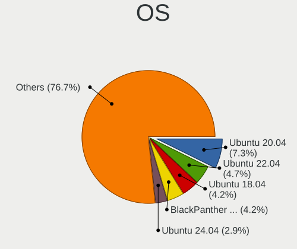

| Name                | Computers | Percent |
|---------------------|-----------|---------|
| Ubuntu 20.04        | 102       | 7.33%   |
| Ubuntu 22.04        | 65        | 4.67%   |
| Ubuntu 18.04        | 59        | 4.24%   |
| BlackPanther 18.1   | 58        | 4.17%   |
| Ubuntu 24.04        | 41        | 2.95%   |
| OpenMandriva 4.3    | 33        | 2.37%   |
| Arch Rolling        | 32        | 2.3%    |
| Pop!_OS 22.04       | 27        | 1.94%   |
| OpenMandriva 4.2    | 27        | 1.94%   |
| Debian 12           | 27        | 1.94%   |
| Debian 11           | 21        | 1.51%   |
| Linux Mint 22.1     | 20        | 1.44%   |
| Linux Mint 21.1     | 20        | 1.44%   |
| OpenMandriva 25.90  | 17        | 1.22%   |
| Linux Mint 21.2     | 16        | 1.15%   |
| Zorin 16            | 15        | 1.08%   |
| ROSA R10            | 14        | 1.01%   |
| OpenMandriva 23.08  | 14        | 1.01%   |
| Linux Mint 21       | 14        | 1.01%   |
| Linux Mint 20.3     | 14        | 1.01%   |
| Linux Mint 20.2     | 14        | 1.01%   |
| Linux Mint 20.1     | 14        | 1.01%   |
| OpenMandriva 23.03  | 13        | 0.93%   |
| OpenMandriva 23.01  | 12        | 0.86%   |
| MX 19               | 12        | 0.86%   |
| Linux Mint 19.3     | 12        | 0.86%   |
| Fedora 42           | 12        | 0.86%   |
| Xubuntu 18.04       | 11        | 0.79%   |
| OpenMandriva 24.12  | 11        | 0.79%   |
| Linux Mint 22.2     | 11        | 0.79%   |
| Fedora 41           | 11        | 0.79%   |
| Fedora 34           | 11        | 0.79%   |
| EndeavourOS Rolling | 11        | 0.79%   |
| BlackPanther 22.1   | 11        | 0.79%   |
| Zorin 17            | 10        | 0.72%   |
| Fedora 40           | 10        | 0.72%   |
| Ubuntu 20.10        | 9         | 0.65%   |
| ROSA 12.5.1         | 9         | 0.65%   |
| Fedora 39           | 9         | 0.65%   |
| Ubuntu 23.10        | 8         | 0.57%   |

OS Family
---------

OS without a version

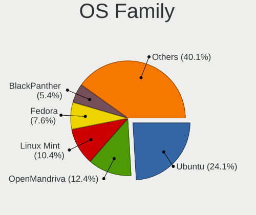

| Name          | Computers | Percent |
|---------------|-----------|---------|
| Ubuntu        | 309       | 24.07%  |
| OpenMandriva  | 159       | 12.38%  |
| Linux Mint    | 134       | 10.44%  |
| Fedora        | 98        | 7.63%   |
| BlackPanther  | 69        | 5.37%   |
| Debian        | 65        | 5.06%   |
| Pop!_OS       | 49        | 3.82%   |
| ROSA          | 43        | 3.35%   |
| Arch          | 39        | 3.04%   |
| Zorin         | 38        | 2.96%   |
| Kubuntu       | 28        | 2.18%   |
| Xubuntu       | 25        | 1.95%   |
| Manjaro       | 25        | 1.95%   |
| MX            | 22        | 1.71%   |
| KDE neon      | 13        | 1.01%   |
| EndeavourOS   | 12        | 0.93%   |
| openSUSE      | 11        | 0.86%   |
| SteamOS       | 9         | 0.7%    |
| Lubuntu       | 9         | 0.7%    |
| Gentoo        | 9         | 0.7%    |
| Elementary    | 9         | 0.7%    |
| Endless       | 8         | 0.62%   |
| Ubuntu Unity  | 7         | 0.55%   |
| Nobara        | 7         | 0.55%   |
| Bazzite       | 7         | 0.55%   |
| ArcoLinux     | 7         | 0.55%   |
| Devuan        | 6         | 0.47%   |
| LMDE          | 5         | 0.39%   |
| Kali          | 5         | 0.39%   |
| Raspbian      | 4         | 0.31%   |
| NixOS         | 4         | 0.31%   |
| CentOS        | 4         | 0.31%   |
| CachyOS       | 4         | 0.31%   |
| Alpine        | 4         | 0.31%   |
| Ubuntu MATE   | 3         | 0.23%   |
| Ubuntu Budgie | 3         | 0.23%   |
| Garuda Linux  | 3         | 0.23%   |
| TUXEDO OS     | 2         | 0.16%   |
| Parrot        | 2         | 0.16%   |
| Oracle Linux  | 2         | 0.16%   |

Kernel
------

Version of the Linux kernel

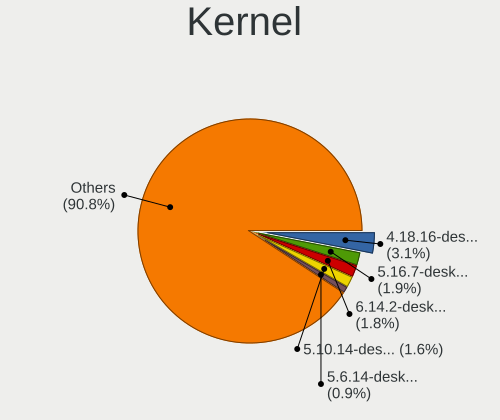

| Version                           | Computers | Percent |
|-----------------------------------|-----------|---------|
| 4.18.16-desktop-1bP               | 47        | 3.06%   |
| 5.16.7-desktop-1omv4003           | 29        | 1.89%   |
| 6.14.2-desktop-3omv2590           | 27        | 1.76%   |
| 5.10.14-desktop-1omv4002          | 25        | 1.63%   |
| 5.6.14-desktop-2bP                | 14        | 0.91%   |
| 5.4.0-58-generic                  | 14        | 0.91%   |
| 5.15.0-56-generic                 | 14        | 0.91%   |
| 6.2.6-desktop-1omv2390            | 13        | 0.85%   |
| 6.1.1-desktop-1omv2290            | 12        | 0.78%   |
| 6.8.0-52-generic                  | 11        | 0.72%   |
| 6.8.0-51-generic                  | 11        | 0.72%   |
| 6.6.32-power-1bP                  | 11        | 0.72%   |
| 5.4.0-42-generic                  | 10        | 0.65%   |
| 6.6.2-desktop-1omv2390            | 9         | 0.59%   |
| 6.4.11-desktop-1omv2390           | 9         | 0.59%   |
| 6.14.0-29-generic                 | 9         | 0.59%   |
| 6.12.1-desktop-1omv2490           | 9         | 0.59%   |
| 6.2.0-26-generic                  | 8         | 0.52%   |
| 5.4.0-52-generic                  | 8         | 0.52%   |
| 5.15.0-58-generic                 | 8         | 0.52%   |
| 4.19.0-13-amd64                   | 8         | 0.52%   |
| 5.8.0-43-generic                  | 7         | 0.46%   |
| 5.19.0-38-generic                 | 7         | 0.46%   |
| 5.15.85-desktop-1bP               | 7         | 0.46%   |
| 5.15.0-43-generic                 | 7         | 0.46%   |
| 5.11.0-27-generic                 | 7         | 0.46%   |
| 4.9.60-nrj-desktop-1rosa-x86_64   | 7         | 0.46%   |
| 4.15.0-66-generic                 | 7         | 0.46%   |
| 6.9.3-76060903-generic            | 6         | 0.39%   |
| 6.8.0-45-generic                  | 6         | 0.39%   |
| 6.6.27-generic-3rosa2021.1-x86_64 | 6         | 0.39%   |
| 6.5.0-18-generic                  | 6         | 0.39%   |
| 6.14.0-33-generic                 | 6         | 0.39%   |
| 5.8.0-50-generic                  | 6         | 0.39%   |
| 5.4.0-90-generic                  | 6         | 0.39%   |
| 5.4.0-73-generic                  | 6         | 0.39%   |
| 5.4.0-26-generic                  | 6         | 0.39%   |
| 5.3.0-40-generic                  | 6         | 0.39%   |
| 5.15.0-91-generic                 | 6         | 0.39%   |
| 4.19.0-14-amd64                   | 6         | 0.39%   |

Kernel Family
-------------

Linux kernel without a distro release

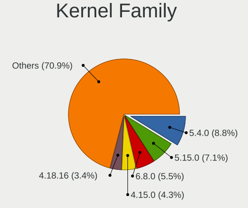

| Version | Computers | Percent |
|---------|-----------|---------|
| 5.4.0   | 126       | 8.8%    |
| 5.15.0  | 102       | 7.12%   |
| 6.8.0   | 79        | 5.52%   |
| 4.15.0  | 61        | 4.26%   |
| 4.18.16 | 48        | 3.35%   |
| 5.8.0   | 46        | 3.21%   |
| 6.5.0   | 41        | 2.86%   |
| 5.13.0  | 33        | 2.3%    |
| 5.3.0   | 31        | 2.16%   |
| 6.14.0  | 30        | 2.09%   |
| 6.14.2  | 29        | 2.03%   |
| 5.19.0  | 29        | 2.03%   |
| 5.16.7  | 29        | 2.03%   |
| 5.11.0  | 29        | 2.03%   |
| 6.2.0   | 27        | 1.89%   |
| 6.1.0   | 26        | 1.82%   |
| 5.10.14 | 25        | 1.75%   |
| 5.10.0  | 23        | 1.61%   |
| 6.11.0  | 18        | 1.26%   |
| 5.0.0   | 18        | 1.26%   |
| 6.2.6   | 16        | 1.12%   |
| 4.18.0  | 16        | 1.12%   |
| 4.19.0  | 15        | 1.05%   |
| 5.6.14  | 14        | 0.98%   |
| 6.6.32  | 12        | 0.84%   |
| 6.1.1   | 12        | 0.84%   |
| 6.12.1  | 11        | 0.77%   |
| 6.6.2   | 10        | 0.7%    |
| 6.4.11  | 9         | 0.63%   |
| 6.9.3   | 8         | 0.56%   |
| 5.15.85 | 7         | 0.49%   |
| 4.9.60  | 7         | 0.49%   |
| 6.6.27  | 6         | 0.42%   |
| 6.12.10 | 6         | 0.42%   |
| 6.10.0  | 6         | 0.42%   |
| 4.9.20  | 6         | 0.42%   |
| 6.4.0   | 5         | 0.35%   |
| 6.17.9  | 5         | 0.35%   |
| 5.9.16  | 5         | 0.35%   |
| 4.9.124 | 5         | 0.35%   |

Kernel Major Ver.
-----------------

Linux kernel major version

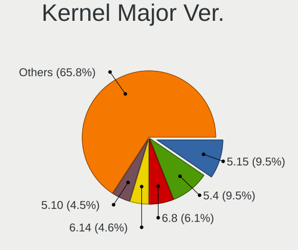

| Version | Computers | Percent |
|---------|-----------|---------|
| 5.15    | 135       | 9.53%   |
| 5.4     | 134       | 9.46%   |
| 6.8     | 86        | 6.07%   |
| 6.14    | 65        | 4.59%   |
| 5.10    | 64        | 4.52%   |
| 4.18    | 64        | 4.52%   |
| 4.15    | 61        | 4.31%   |
| 6.1     | 58        | 4.1%    |
| 6.5     | 51        | 3.6%    |
| 5.8     | 51        | 3.6%    |
| 6.12    | 50        | 3.53%   |
| 6.6     | 48        | 3.39%   |
| 6.2     | 48        | 3.39%   |
| 5.11    | 42        | 2.97%   |
| 5.16    | 41        | 2.9%    |
| 5.13    | 39        | 2.75%   |
| 5.3     | 37        | 2.61%   |
| 5.19    | 34        | 2.4%    |
| 6.11    | 28        | 1.98%   |
| 4.9     | 26        | 1.84%   |
| 6.4     | 23        | 1.62%   |
| 4.19    | 22        | 1.55%   |
| 5.0     | 20        | 1.41%   |
| 5.6     | 18        | 1.27%   |
| 6.10    | 16        | 1.13%   |
| 6.9     | 15        | 1.06%   |
| 6.17    | 15        | 1.06%   |
| 6.13    | 12        | 0.85%   |
| 6.0     | 11        | 0.78%   |
| 5.9     | 10        | 0.71%   |
| 6.3     | 9         | 0.64%   |
| 6.16    | 9         | 0.64%   |
| 5.12    | 9         | 0.64%   |
| 6.15    | 8         | 0.56%   |
| 5.7     | 8         | 0.56%   |
| 5.5     | 7         | 0.49%   |
| 5.18    | 7         | 0.49%   |
| 5.17    | 7         | 0.49%   |
| 5.14    | 6         | 0.42%   |
| 6.7     | 5         | 0.35%   |

Arch
----

OS architecture (x86_64, i586, etc.)

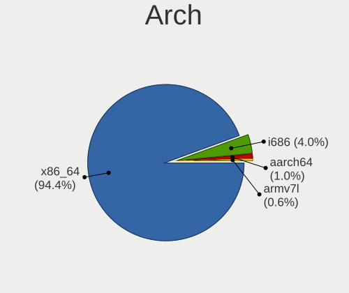

| Name    | Computers | Percent |
|---------|-----------|---------|
| x86_64  | 1167      | 94.42%  |
| i686    | 50        | 4.05%   |
| aarch64 | 12        | 0.97%   |
| armv7l  | 7         | 0.57%   |

DE
--

Desktop Environment

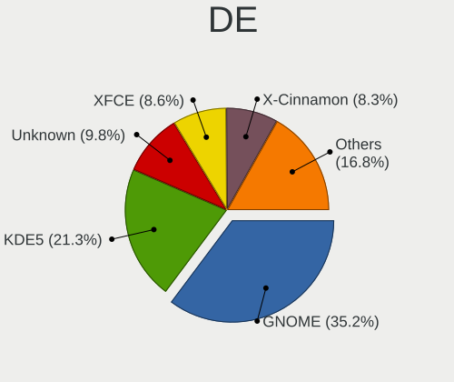

| Name            | Computers | Percent |
|-----------------|-----------|---------|
| GNOME           | 456       | 35.24%  |
| KDE5            | 275       | 21.25%  |
| Unknown         | 127       | 9.81%   |
| XFCE            | 111       | 8.58%   |
| X-Cinnamon      | 107       | 8.27%   |
| KDE6            | 86        | 6.65%   |
| MATE            | 30        | 2.32%   |
| LXQt            | 15        | 1.16%   |
| KDE4            | 15        | 1.16%   |
| KDE             | 15        | 1.16%   |
| Pantheon        | 9         | 0.7%    |
| Cinnamon        | 9         | 0.7%    |
| LXDE            | 8         | 0.62%   |
| Unity           | 7         | 0.54%   |
| Hyprland        | 7         | 0.54%   |
| Budgie          | 4         | 0.31%   |
| COSMIC          | 3         | 0.23%   |
| Openbox         | 2         | 0.15%   |
| Trinity         | 1         | 0.08%   |
| qtile           | 1         | 0.08%   |
| NsCDE           | 1         | 0.08%   |
| i3              | 1         | 0.08%   |
| GNOME Flashback | 1         | 0.08%   |
| GNOME Classic   | 1         | 0.08%   |
| bspwm           | 1         | 0.08%   |
| awesome         | 1         | 0.08%   |

Display Server
--------------

X11 or Wayland

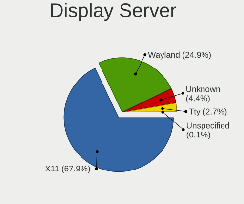

| Name        | Computers | Percent |
|-------------|-----------|---------|
| X11         | 867       | 67.95%  |
| Wayland     | 318       | 24.92%  |
| Unknown     | 56        | 4.39%   |
| Tty         | 34        | 2.66%   |
| Unspecified | 1         | 0.08%   |

Display Manager
---------------

SDDM, LightDM, etc.

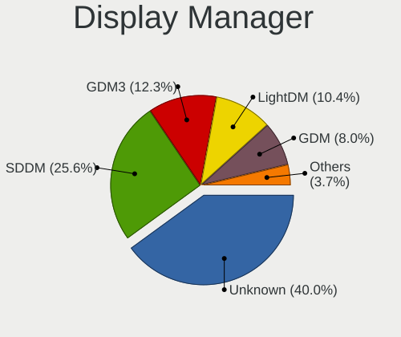

| Name    | Computers | Percent |
|---------|-----------|---------|
| Unknown | 513       | 39.98%  |
| SDDM    | 328       | 25.57%  |
| GDM3    | 158       | 12.31%  |
| LightDM | 134       | 10.44%  |
| GDM     | 102       | 7.95%   |
| TDM     | 21        | 1.64%   |
| KDM     | 14        | 1.09%   |
| SLiM    | 6         | 0.47%   |
| XDM     | 2         | 0.16%   |
| NODM    | 1         | 0.08%   |
| LY-DM   | 1         | 0.08%   |
| Ly      | 1         | 0.08%   |
| LXDM    | 1         | 0.08%   |
| GREETD  | 1         | 0.08%   |

OS Lang
-------

Language

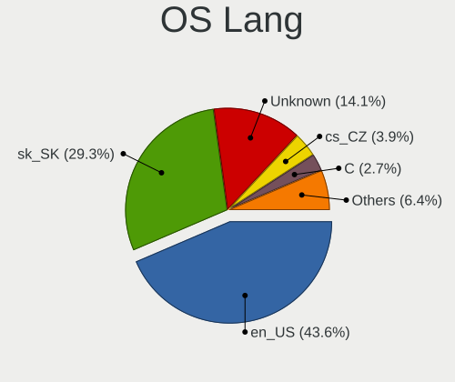

| Lang        | Computers | Percent |
|-------------|-----------|---------|
| en_US       | 558       | 43.56%  |
| sk_SK       | 375       | 29.27%  |
| Unknown     | 181       | 14.13%  |
| cs_CZ       | 50        | 3.9%    |
| C           | 35        | 2.73%   |
| en_GB       | 34        | 2.65%   |
| hu_HU       | 23        | 1.8%    |
| ru_RU       | 9         | 0.7%    |
| sr_RS@latin | 2         | 0.16%   |
| POSIX       | 2         | 0.16%   |
| pl_PL       | 2         | 0.16%   |
| en_CA       | 2         | 0.16%   |
| de_DE       | 2         | 0.16%   |
| uk_UA       | 1         | 0.08%   |
| ru_UA       | 1         | 0.08%   |
| it_IT       | 1         | 0.08%   |
| en_US      | 1         | 0.08%   |
| en_AU       | 1         | 0.08%   |
| C.UTF8      | 1         | 0.08%   |

Boot Mode
---------

EFI or BIOS

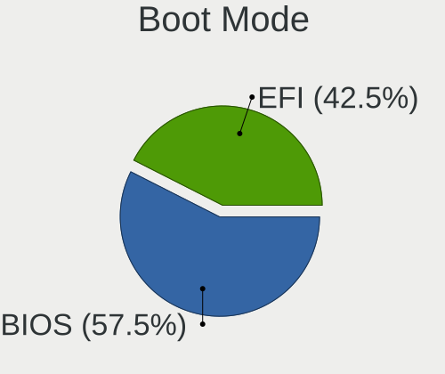

| Mode | Computers | Percent |
|------|-----------|---------|
| BIOS | 727       | 57.47%  |
| EFI  | 538       | 42.53%  |

Filesystem
----------

Type of filesystem

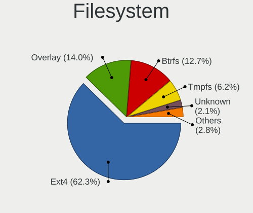

| Type     | Computers | Percent |
|----------|-----------|---------|
| Ext4     | 807       | 62.32%  |
| Overlay  | 181       | 13.98%  |
| Btrfs    | 164       | 12.66%  |
| Tmpfs    | 80        | 6.18%   |
| Unknown  | 27        | 2.08%   |
| Zfs      | 13        | 1%      |
| Xfs      | 13        | 1%      |
| Ext3     | 4         | 0.31%   |
| Ext2     | 4         | 0.31%   |
| F2fs     | 1         | 0.08%   |
| Bcachefs | 1         | 0.08%   |

Part. scheme
------------

Scheme of partitioning

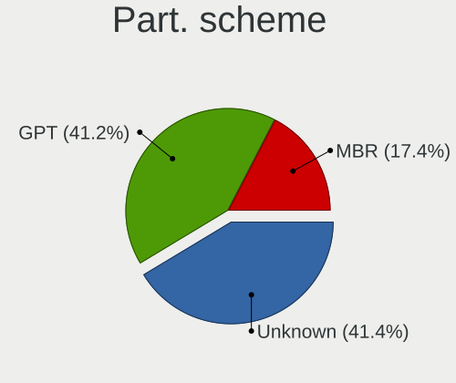

| Type    | Computers | Percent |
|---------|-----------|---------|
| Unknown | 525       | 41.37%  |
| GPT     | 523       | 41.21%  |
| MBR     | 221       | 17.42%  |

Dual Boot with Linux/BSD
------------------------

Hosting more than one Linux/BSD

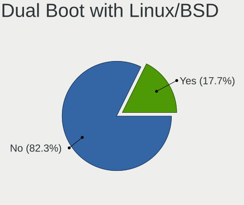

| Dual boot | Computers | Percent |
|-----------|-----------|---------|
| No        | 1053      | 82.33%  |
| Yes       | 226       | 17.67%  |

Dual Boot (Win)
---------------

Hosting Linux and Windows

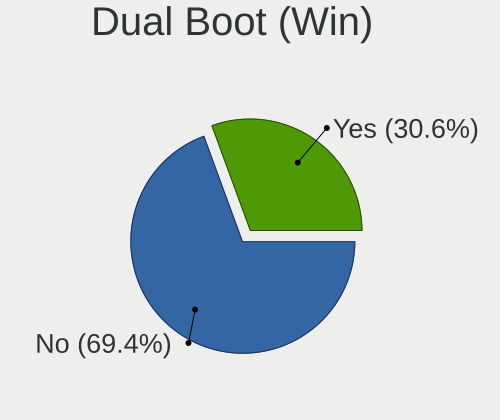

| Dual boot | Computers | Percent |
|-----------|-----------|---------|
| No        | 869       | 69.41%  |
| Yes       | 383       | 30.59%  |

Board
-----

Vendor
------

Motherboard manufacturer

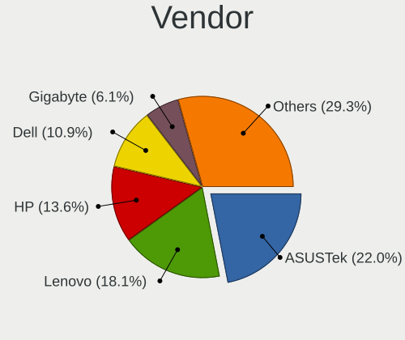

| Name                    | Computers | Percent |
|-------------------------|-----------|---------|
| ASUSTek Computer        | 270       | 21.95%  |
| Lenovo                  | 223       | 18.13%  |
| Hewlett-Packard         | 167       | 13.58%  |
| Dell                    | 134       | 10.89%  |
| Gigabyte Technology     | 75        | 6.1%    |
| Acer                    | 69        | 5.61%   |
| MSI                     | 67        | 5.45%   |
| ASRock                  | 32        | 2.6%    |
| Toshiba                 | 21        | 1.71%   |
| Intel                   | 20        | 1.63%   |
| Apple                   | 13        | 1.06%   |
| Sony                    | 9         | 0.73%   |
| Unknown                 | 8         | 0.65%   |
| Valve                   | 7         | 0.57%   |
| UMAX                    | 7         | 0.57%   |
| Samsung Electronics     | 7         | 0.57%   |
| Raspberry Pi Foundation | 7         | 0.57%   |
| Foxconn                 | 7         | 0.57%   |
| Packard Bell            | 6         | 0.49%   |
| Fujitsu Siemens         | 6         | 0.49%   |
| Fujitsu                 | 6         | 0.49%   |
| HUAWEI                  | 5         | 0.41%   |
| ZOTAC                   | 4         | 0.33%   |
| Timi                    | 3         | 0.24%   |
| Pegatron                | 3         | 0.24%   |
| Hardkernel              | 3         | 0.24%   |
| eMachines               | 3         | 0.24%   |
| TUXEDO                  | 2         | 0.16%   |
| Techvision              | 2         | 0.16%   |
| sunxi                   | 2         | 0.16%   |
| Shuttle                 | 2         | 0.16%   |
| Qualcomm Technologies   | 2         | 0.16%   |
| OEM                     | 2         | 0.16%   |
| Medion                  | 2         | 0.16%   |
| HC Technology.          | 2         | 0.16%   |
| GPD                     | 2         | 0.16%   |
| Google                  | 2         | 0.16%   |
| Chuwi                   | 2         | 0.16%   |
| Xunlong                 | 1         | 0.08%   |
| XIAOMI                  | 1         | 0.08%   |

Model
-----

Motherboard model

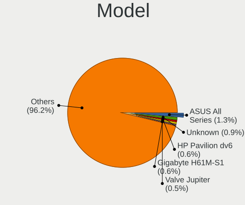

| Name                                   | Computers | Percent |
|----------------------------------------|-----------|---------|
| ASUS All Series                        | 16        | 1.3%    |
| Unknown                                | 11        | 0.89%   |
| HP Pavilion dv6                        | 7         | 0.57%   |
| Gigabyte H61M-S1                       | 7         | 0.57%   |
| Valve Jupiter                          | 6         | 0.49%   |
| ASUS TUF Gaming B550M-PLUS             | 5         | 0.41%   |
| ASUS PRIME A320M-K                     | 5         | 0.41%   |
| RPi Raspberry Pi 4 Model B Rev 1.4     | 4         | 0.33%   |
| MSI GT60 2OC/2OD                       | 4         | 0.33%   |
| Lenovo IdeaPad Gaming 3 15ACH6 82K2    | 4         | 0.33%   |
| Dell OptiPlex 7010                     | 4         | 0.33%   |
| ASUS X550CC                            | 4         | 0.33%   |
| ASUS ROG Flow X13 GV301RC_GV301RC      | 4         | 0.33%   |
| Acer Swift SF314-43                    | 4         | 0.33%   |
| MSI MS-7D25                            | 3         | 0.24%   |
| MSI MS-7592                            | 3         | 0.24%   |
| Lenovo IdeaPadFlex 5 15IIL05 81X3      | 3         | 0.24%   |
| Lenovo IdeaPad 320-15IAP 80XR          | 3         | 0.24%   |
| Lenovo G580                            | 3         | 0.24%   |
| HP ZBook 15 G3                         | 3         | 0.24%   |
| HP ProBook 4540s                       | 3         | 0.24%   |
| HP ProBook 4330s                       | 3         | 0.24%   |
| HP Pavilion g6                         | 3         | 0.24%   |
| Hardkernel ODROID-M1                   | 3         | 0.24%   |
| Gigabyte F2A68HM-DS2                   | 3         | 0.24%   |
| Gigabyte B450M S2H                     | 3         | 0.24%   |
| Gigabyte 970A-DS3P                     | 3         | 0.24%   |
| Dell OptiPlex 3020                     | 3         | 0.24%   |
| Dell Latitude E6540                    | 3         | 0.24%   |
| Dell Latitude 5290 2-in-1              | 3         | 0.24%   |
| ASUS VivoBook_ASUSLaptop X509DJ_D509DJ | 3         | 0.24%   |
| ASUS M5A78L-M/USB3                     | 3         | 0.24%   |
| UMAX VisionBook 14Wr Plus              | 2         | 0.16%   |
| Toshiba Satellite P300                 | 2         | 0.16%   |
| Timi Redmi Book Pro 15 2022            | 2         | 0.16%   |
| Techvision TVI7309X                    | 2         | 0.16%   |
| Samsung R530/R730/P530                 | 2         | 0.16%   |
| Qualcomm BENGAL IDP                    | 2         | 0.16%   |
| Packard Bell EasyNote TK85             | 2         | 0.16%   |
| OEM X79-Turbo                          | 2         | 0.16%   |

Model Family
------------

Motherboard model prefix

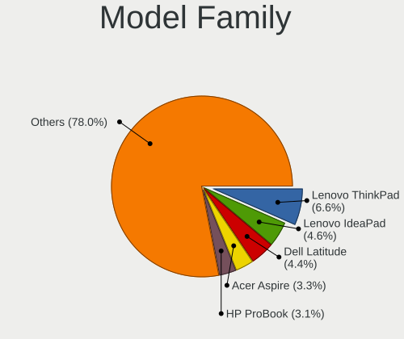

| Name               | Computers | Percent |
|--------------------|-----------|---------|
| Lenovo ThinkPad    | 81        | 6.59%   |
| Lenovo IdeaPad     | 56        | 4.55%   |
| Dell Latitude      | 54        | 4.39%   |
| Acer Aspire        | 41        | 3.33%   |
| HP ProBook         | 38        | 3.09%   |
| ASUS ROG           | 34        | 2.76%   |
| ASUS PRIME         | 24        | 1.95%   |
| HP Pavilion        | 21        | 1.71%   |
| HP EliteBook       | 19        | 1.54%   |
| Dell OptiPlex      | 19        | 1.54%   |
| HP Compaq          | 18        | 1.46%   |
| Toshiba Satellite  | 17        | 1.38%   |
| ASUS VivoBook      | 16        | 1.3%    |
| ASUS All           | 16        | 1.3%    |
| ASUS TUF           | 14        | 1.14%   |
| Lenovo Legion      | 13        | 1.06%   |
| Dell Inspiron      | 13        | 1.06%   |
| Dell XPS           | 12        | 0.98%   |
| Lenovo Yoga        | 11        | 0.89%   |
| Dell Vostro        | 11        | 0.89%   |
| Dell Precision     | 11        | 0.89%   |
| ASUS ASUS          | 11        | 0.89%   |
| Unknown            | 11        | 0.89%   |
| HP 250             | 10        | 0.81%   |
| Acer Swift         | 10        | 0.81%   |
| Lenovo ThinkCentre | 9         | 0.73%   |
| RPi Raspberry      | 7         | 0.57%   |
| HP ENVY            | 7         | 0.57%   |
| Gigabyte H61M-S1   | 7         | 0.57%   |
| Acer Extensa       | 7         | 0.57%   |
| Valve Jupiter      | 6         | 0.49%   |
| Lenovo IdeaCentre  | 6         | 0.49%   |
| HP ZBook           | 6         | 0.49%   |
| HP ProLiant        | 6         | 0.49%   |
| HP Laptop          | 6         | 0.49%   |
| HP EliteDesk       | 6         | 0.49%   |
| Dell PowerEdge     | 6         | 0.49%   |
| ASUS ZenBook       | 6         | 0.49%   |
| UMAX VisionBook    | 5         | 0.41%   |
| ASUS Maximus       | 5         | 0.41%   |

MFG Year
--------

Motherboard manufacture year

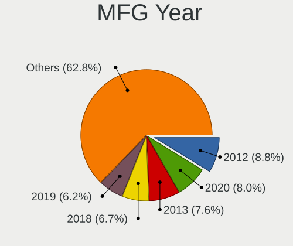

| Year    | Computers | Percent |
|---------|-----------|---------|
| 2012    | 108       | 8.78%   |
| 2020    | 98        | 7.97%   |
| 2013    | 94        | 7.64%   |
| 2018    | 82        | 6.67%   |
| 2019    | 76        | 6.18%   |
| 2011    | 76        | 6.18%   |
| 2021    | 71        | 5.77%   |
| 2009    | 69        | 5.61%   |
| 2008    | 68        | 5.53%   |
| 2017    | 67        | 5.45%   |
| 2022    | 62        | 5.04%   |
| 2014    | 61        | 4.96%   |
| 2016    | 49        | 3.98%   |
| 2010    | 49        | 3.98%   |
| 2015    | 44        | 3.58%   |
| 2007    | 44        | 3.58%   |
| 2023    | 37        | 3.01%   |
| 2006    | 24        | 1.95%   |
| 2024    | 21        | 1.71%   |
| Unknown | 12        | 0.98%   |
| 2025    | 11        | 0.89%   |
| 2005    | 4         | 0.33%   |
| 2002    | 1         | 0.08%   |
| 2001    | 1         | 0.08%   |
| 2000    | 1         | 0.08%   |

Form Factor
-----------

Physical design of the computer

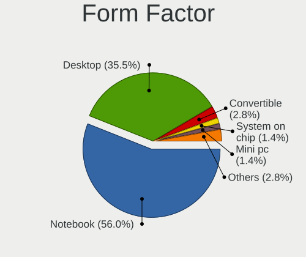

| Name           | Computers | Percent |
|----------------|-----------|---------|
| Notebook       | 689       | 56.02%  |
| Desktop        | 437       | 35.53%  |
| Convertible    | 35        | 2.85%   |
| System on chip | 17        | 1.38%   |
| Mini pc        | 17        | 1.38%   |
| All in one     | 17        | 1.38%   |
| Server         | 12        | 0.98%   |
| Tablet         | 6         | 0.49%   |

Secure Boot
-----------

Enabled or disabled

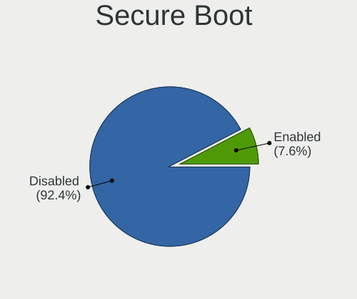

| State    | Computers | Percent |
|----------|-----------|---------|
| Disabled | 1147      | 92.35%  |
| Enabled  | 95        | 7.65%   |

Coreboot
--------

Have coreboot on board

| Used | Computers | Percent |
|------|-----------|---------|
| No   | 1227      | 99.76%  |
| Yes  | 3         | 0.24%   |

RAM Size
--------

Total RAM memory

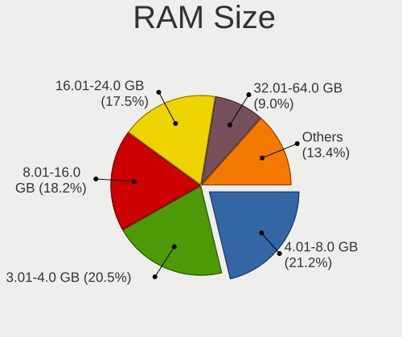

| Size in GB      | Computers | Percent |
|-----------------|-----------|---------|
| 4.01-8.0        | 269       | 21.25%  |
| 3.01-4.0        | 260       | 20.54%  |
| 8.01-16.0       | 231       | 18.25%  |
| 16.01-24.0      | 222       | 17.54%  |
| 32.01-64.0      | 114       | 9%      |
| 1.01-2.0        | 53        | 4.19%   |
| 64.01-256.0     | 36        | 2.84%   |
| 24.01-32.0      | 33        | 2.61%   |
| 2.01-3.0        | 28        | 2.21%   |
| 0.51-1.0        | 13        | 1.03%   |
| 0.01-0.5        | 4         | 0.32%   |
| More than 256.0 | 3         | 0.24%   |

RAM Used
--------

Used RAM memory

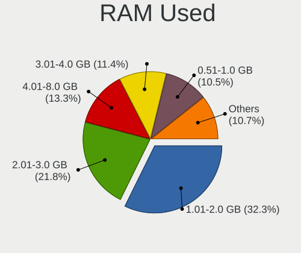

| Used GB    | Computers | Percent |
|------------|-----------|---------|
| 1.01-2.0   | 448       | 32.3%   |
| 2.01-3.0   | 302       | 21.77%  |
| 4.01-8.0   | 185       | 13.34%  |
| 3.01-4.0   | 158       | 11.39%  |
| 0.51-1.0   | 146       | 10.53%  |
| 8.01-16.0  | 76        | 5.48%   |
| 0.01-0.5   | 56        | 4.04%   |
| 16.01-24.0 | 8         | 0.58%   |
| 24.01-32.0 | 4         | 0.29%   |
| 32.01-64.0 | 3         | 0.22%   |
| Unknown    | 1         | 0.07%   |

Total Drives
------------

Number of drives on board

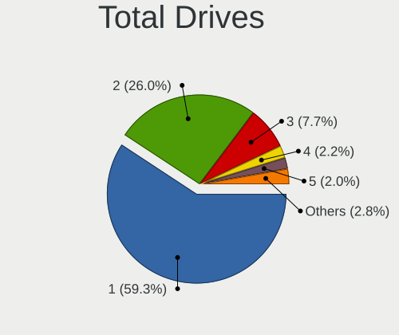

| Drives | Computers | Percent |
|--------|-----------|---------|
| 1      | 765       | 59.26%  |
| 2      | 336       | 26.03%  |
| 3      | 99        | 7.67%   |
| 4      | 29        | 2.25%   |
| 5      | 26        | 2.01%   |
| 0      | 18        | 1.39%   |
| 6      | 9         | 0.7%    |
| 8      | 4         | 0.31%   |
| 7      | 2         | 0.15%   |
| 31     | 1         | 0.08%   |
| 17     | 1         | 0.08%   |
| 13     | 1         | 0.08%   |

Has CD-ROM
----------

Has CD-ROM on board

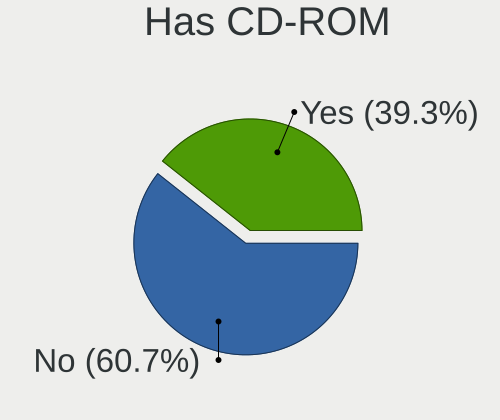

| Presented | Computers | Percent |
|-----------|-----------|---------|
| No        | 754       | 60.66%  |
| Yes       | 489       | 39.34%  |

Has Ethernet
------------

Has Ethernet on board

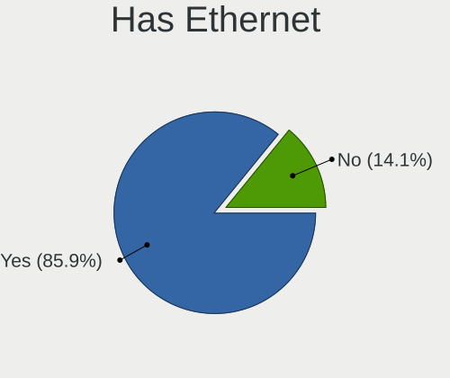

| Presented | Computers | Percent |
|-----------|-----------|---------|
| Yes       | 1059      | 85.89%  |
| No        | 174       | 14.11%  |

Has WiFi
--------

Has WiFi module

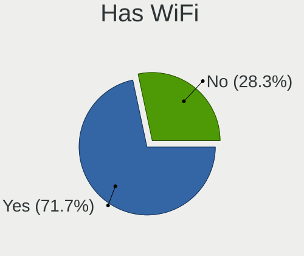

| Presented | Computers | Percent |
|-----------|-----------|---------|
| Yes       | 890       | 71.66%  |
| No        | 352       | 28.34%  |

Has Bluetooth
-------------

Has Bluetooth module

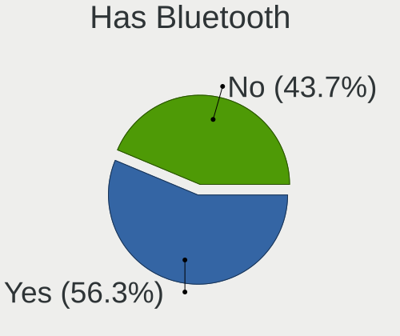

| Presented | Computers | Percent |
|-----------|-----------|---------|
| Yes       | 701       | 56.31%  |
| No        | 544       | 43.69%  |

Location
--------

Country
-------

Geographic location (country)

| Country  | Computers | Percent |
|----------|-----------|---------|
| Slovakia | 1230      | 100%    |

City
----

Geographic location (city)

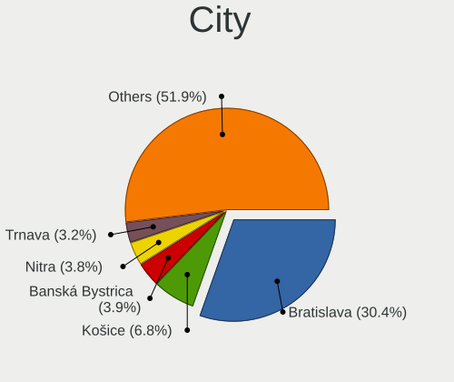

| City                 | Computers | Percent |
|----------------------|-----------|---------|
| Bratislava           | 413       | 30.41%  |
| Košice              | 92        | 6.77%   |
| Banská Bystrica     | 53        | 3.9%    |
| Nitra                | 51        | 3.76%   |
| Trnava               | 44        | 3.24%   |
| Žilina              | 29        | 2.14%   |
| Prešov              | 24        | 1.77%   |
| Martin               | 17        | 1.25%   |
| Dolny Ohaj           | 17        | 1.25%   |
| Poprad               | 16        | 1.18%   |
| Nové Zámky         | 14        | 1.03%   |
| Humenné             | 14        | 1.03%   |
| Tornaľa             | 13        | 0.96%   |
| Brezno               | 13        | 0.96%   |
| Bardejov             | 13        | 0.96%   |
| Zvolen               | 12        | 0.88%   |
| Liptovský Mikuláš | 12        | 0.88%   |
| Trenčín            | 11        | 0.81%   |
| Levice               | 11        | 0.81%   |
| Galanta              | 11        | 0.81%   |
| Lučenec             | 10        | 0.74%   |
| Stará Ľubovňa     | 8         | 0.59%   |
| Ružomberok          | 8         | 0.59%   |
| Rožňava            | 8         | 0.59%   |
| Topoľčany          | 7         | 0.52%   |
| Senec                | 7         | 0.52%   |
| Rozhanovce           | 7         | 0.52%   |
| Soblahov             | 6         | 0.44%   |
| Sabinov              | 6         | 0.44%   |
| Pezinok              | 6         | 0.44%   |
| Partizánske         | 6         | 0.44%   |
| Michalovce           | 6         | 0.44%   |
| Kysucké Nové Mesto | 6         | 0.44%   |
| Cechynce             | 6         | 0.44%   |
| Žiar nad Hronom     | 5         | 0.37%   |
| Štúrovo            | 5         | 0.37%   |
| Šaľa               | 5         | 0.37%   |
| Šahy                | 5         | 0.37%   |
| Rimavská Sobota     | 5         | 0.37%   |
| Piešťany           | 5         | 0.37%   |

Drives
------

Drive Vendor
------------

Hard drive vendors

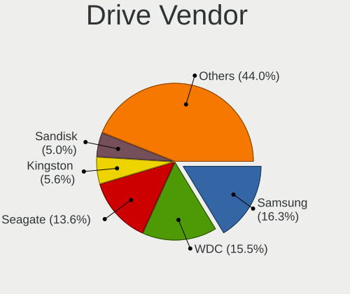

| Vendor                      | Computers | Drives | Percent |
|-----------------------------|-----------|--------|---------|
| Samsung Electronics         | 297       | 437    | 16.3%   |
| WDC                         | 282       | 561    | 15.48%  |
| Seagate                     | 248       | 374    | 13.61%  |
| Kingston                    | 102       | 137    | 5.6%    |
| Sandisk                     | 92        | 114    | 5.05%   |
| Toshiba                     | 91        | 143    | 4.99%   |
| Unknown                     | 76        | 112    | 4.17%   |
| SK hynix                    | 60        | 76     | 3.29%   |
| Hitachi                     | 58        | 74     | 3.18%   |
| A-DATA Technology           | 58        | 79     | 3.18%   |
| Intel                       | 53        | 79     | 2.91%   |
| Patriot                     | 52        | 83     | 2.85%   |
| Micron Technology           | 42        | 52     | 2.31%   |
| Crucial                     | 34        | 41     | 1.87%   |
| HGST                        | 26        | 36     | 1.43%   |
| Apacer                      | 21        | 31     | 1.15%   |
| Verbatim                    | 14        | 17     | 0.77%   |
| Phison Electronics          | 12        | 15     | 0.66%   |
| KIOXIA                      | 11        | 27     | 0.6%    |
| GOODRAM                     | 11        | 19     | 0.6%    |
| China                       | 9         | 12     | 0.49%   |
| Phison                      | 8         | 10     | 0.44%   |
| Maxtor                      | 8         | 14     | 0.44%   |
| MAXIO Technology (Hangzhou) | 8         | 11     | 0.44%   |
| Kingston Technology Company | 7         | 10     | 0.38%   |
| Gigabyte Technology         | 7         | 9      | 0.38%   |
| OCZ                         | 6         | 6      | 0.33%   |
| Hewlett-Packard             | 6         | 9      | 0.33%   |
| Fujitsu                     | 6         | 7      | 0.33%   |
| XPG                         | 5         | 8      | 0.27%   |
| Union Memory                | 5         | 5      | 0.27%   |
| Micron/Crucial Technology   | 5         | 5      | 0.27%   |
| KingDian                    | 5         | 7      | 0.27%   |
| HS-SSD-E100                 | 5         | 5      | 0.27%   |
| Apple                       | 5         | 6      | 0.27%   |
| Silicon Motion              | 4         | 5      | 0.22%   |
| Realtek Semiconductor       | 4         | 4      | 0.22%   |
| LITEON                      | 4         | 4      | 0.22%   |
| Intenso                     | 4         | 8      | 0.22%   |
| ADATA Technology            | 4         | 5      | 0.22%   |

Drive Model
-----------

Hard drive models

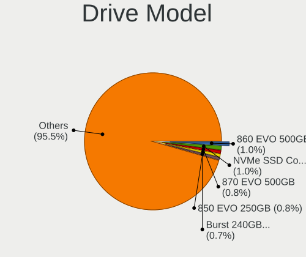

| Model                                                | Computers | Percent |
|------------------------------------------------------|-----------|---------|
| Samsung SSD 860 EVO 500GB                            | 21        | 1.04%   |
| Samsung NVMe SSD Controller SM981/PM981/PM983 1TB    | 21        | 1.04%   |
| Samsung SSD 870 EVO 500GB                            | 17        | 0.84%   |
| Samsung SSD 850 EVO 250GB                            | 16        | 0.79%   |
| Patriot Burst 240GB SSD                              | 15        | 0.74%   |
| Kingston SV300S37A120G 120GB SSD                     | 15        | 0.74%   |
| Unknown MMC Card  64GB                               | 14        | 0.69%   |
| Samsung SSD 860 EVO 250GB                            | 13        | 0.64%   |
| Samsung SSD 850 EVO 500GB                            | 12        | 0.59%   |
| Patriot Burst 120GB SSD                              | 12        | 0.59%   |
| Kingston SA400S37120G 120GB SSD                      | 12        | 0.59%   |
| Seagate ST9500325AS 500GB                            | 11        | 0.54%   |
| Seagate ST1000LM024 HN-M101MBB 1TB                   | 11        | 0.54%   |
| Samsung NVMe SSD Controller PM9A1/PM9A3/980PRO 1TB   | 11        | 0.54%   |
| Seagate ST1000LM035-1RK172 1TB                       | 10        | 0.49%   |
| WDC WDS500G2B0A-00SM50 500GB                         | 9         | 0.45%   |
| Kingston SA400S37240G 240GB SSD                      | 9         | 0.45%   |
| Seagate ST1000DM003-1CH162 1TB                       | 8         | 0.4%    |
| Samsung SSD 980 1TB                                  | 8         | 0.4%    |
| Samsung NVMe SSD Controller SM961/PM961/SM963 1024GB | 8         | 0.4%    |
| Patriot Burst 480GB SSD                              | 8         | 0.4%    |
| Apacer AS350 512GB SSD                               | 8         | 0.4%    |
| WDC WDS240G2G0B-00EPW0 240GB SSD                     | 7         | 0.35%   |
| WDC WD10EZEX-08WN4A0 1TB                             | 7         | 0.35%   |
| Verbatim Vi550 S3 1024GB                             | 7         | 0.35%   |
| Toshiba MQ01ABF050 500GB                             | 7         | 0.35%   |
| Seagate ST3500418AS 500GB                            | 7         | 0.35%   |
| Seagate ST2000DM008-2FR102 2TB                       | 7         | 0.35%   |
| SanDisk NVMe SSD Drive 1TB                           | 7         | 0.35%   |
| Kingston SV300S37A60G 64GB SSD                       | 7         | 0.35%   |
| Kingston SA400S37480G 480GB SSD                      | 7         | 0.35%   |
| HGST HTS725050A7E630 500GB                           | 7         | 0.35%   |
| HGST HTS721010A9E630 1TB                             | 7         | 0.35%   |
| WDC WDS240G2G0A-00JH30 240GB SSD                     | 6         | 0.3%    |
| WDC WD10JPLX-00MBPT0 1TB                             | 6         | 0.3%    |
| Unknown MMC Card  32GB                               | 6         | 0.3%    |
| Seagate ST9500420AS 500GB                            | 6         | 0.3%    |
| Seagate ST500LT012-9WS142 500GB                      | 6         | 0.3%    |
| Seagate ST3320311CS 320GB                            | 6         | 0.3%    |
| Sandisk WD Black SN750 / PC SN730 NVMe SSD 500GB     | 6         | 0.3%    |

HDD Vendor
----------

Hard disk drive vendors

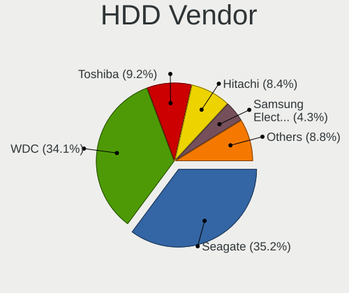

| Vendor              | Computers | Drives | Percent |
|---------------------|-----------|--------|---------|
| Seagate             | 244       | 369    | 35.16%  |
| WDC                 | 237       | 486    | 34.15%  |
| Toshiba             | 64        | 113    | 9.22%   |
| Hitachi             | 58        | 74     | 8.36%   |
| Samsung Electronics | 30        | 48     | 4.32%   |
| HGST                | 26        | 36     | 3.75%   |
| Maxtor              | 8         | 14     | 1.15%   |
| Fujitsu             | 6         | 7      | 0.86%   |
| Hewlett-Packard     | 5         | 8      | 0.72%   |
| Unknown             | 4         | 4      | 0.58%   |
| IBM/Hitachi         | 3         | 3      | 0.43%   |
| HGST HTS            | 2         | 2      | 0.29%   |
| ExcelStor           | 2         | 2      | 0.29%   |
| USB3.0              | 1         | 2      | 0.14%   |
| Synology            | 1         | 1      | 0.14%   |
| StoreJet            | 1         | 1      | 0.14%   |
| IET                 | 1         | 2      | 0.14%   |
| IBM-ESXS            | 1         | 2      | 0.14%   |

SSD Vendor
----------

Solid state drive vendors

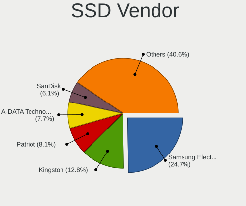

| Vendor              | Computers | Drives | Percent |
|---------------------|-----------|--------|---------|
| Samsung Electronics | 147       | 195    | 24.75%  |
| Kingston            | 76        | 106    | 12.79%  |
| Patriot             | 48        | 77     | 8.08%   |
| A-DATA Technology   | 46        | 65     | 7.74%   |
| SanDisk             | 36        | 42     | 6.06%   |
| WDC                 | 35        | 45     | 5.89%   |
| Crucial             | 33        | 40     | 5.56%   |
| Intel               | 29        | 45     | 4.88%   |
| Apacer              | 17        | 27     | 2.86%   |
| Verbatim            | 13        | 16     | 2.19%   |
| Micron Technology   | 12        | 17     | 2.02%   |
| SK hynix            | 11        | 14     | 1.85%   |
| GOODRAM             | 11        | 19     | 1.85%   |
| Toshiba             | 10        | 10     | 1.68%   |
| China               | 9         | 12     | 1.52%   |
| OCZ                 | 6         | 6      | 1.01%   |
| LITEON              | 4         | 4      | 0.67%   |
| Intenso             | 4         | 8      | 0.67%   |
| Gigabyte Technology | 4         | 6      | 0.67%   |
| Transcend           | 3         | 3      | 0.51%   |
| LITEONIT            | 3         | 3      | 0.51%   |
| KingDian            | 3         | 5      | 0.51%   |
| Emtec               | 3         | 4      | 0.51%   |
| Apple               | 3         | 3      | 0.51%   |
| Union Memory        | 2         | 2      | 0.34%   |
| HEORIADY            | 2         | 2      | 0.34%   |
| FORESEE             | 2         | 3      | 0.34%   |
| WDC WDS2            | 1         | 1      | 0.17%   |
| Vi550               | 1         | 1      | 0.17%   |
| ULTIMATE            | 1         | 2      | 0.17%   |
| Seagate             | 1         | 1      | 0.17%   |
| PNY                 | 1         | 2      | 0.17%   |
| Plextor             | 1         | 1      | 0.17%   |
| Netac               | 1         | 1      | 0.17%   |
| Lexar               | 1         | 1      | 0.17%   |
| Leven               | 1         | 1      | 0.17%   |
| KingSpec            | 1         | 1      | 0.17%   |
| KingFast            | 1         | 1      | 0.17%   |
| Kingchuxing         | 1         | 1      | 0.17%   |
| IM3D                | 1         | 1      | 0.17%   |

Drive Kind
----------

HDD or SSD

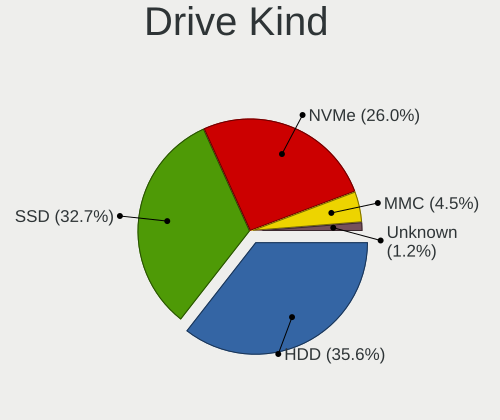

| Kind    | Computers | Drives | Percent |
|---------|-----------|--------|---------|
| HDD     | 572       | 1174   | 35.55%  |
| SSD     | 526       | 805    | 32.69%  |
| NVMe    | 419       | 630    | 26.04%  |
| MMC     | 72        | 104    | 4.47%   |
| Unknown | 20        | 24     | 1.24%   |

Drive Connector
---------------

SATA, SAS, NVMe, etc.

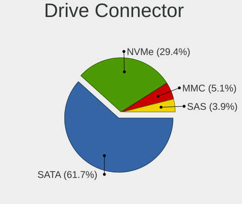

| Type | Computers | Drives | Percent |
|------|-----------|--------|---------|
| SATA | 878       | 1943   | 61.66%  |
| NVMe | 418       | 623    | 29.35%  |
| MMC  | 72        | 104    | 5.06%   |
| SAS  | 56        | 67     | 3.93%   |

Drive Size
----------

Size of hard drive

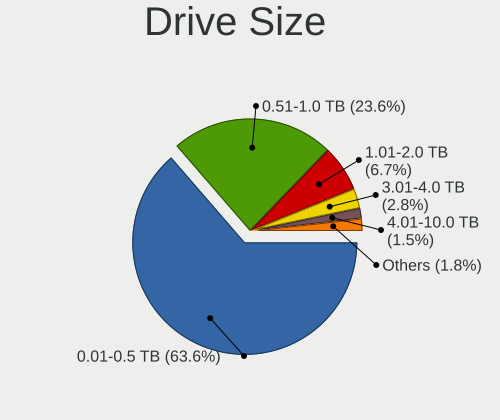

| Size in TB | Computers | Drives | Percent |
|------------|-----------|--------|---------|
| 0.01-0.5   | 716       | 1262   | 63.64%  |
| 0.51-1.0   | 265       | 464    | 23.56%  |
| 1.01-2.0   | 75        | 119    | 6.67%   |
| 3.01-4.0   | 32        | 62     | 2.84%   |
| 4.01-10.0  | 17        | 26     | 1.51%   |
| 2.01-3.0   | 14        | 33     | 1.24%   |
| 10.01-20.0 | 5         | 10     | 0.44%   |
| 20.01-50.0 | 1         | 3      | 0.09%   |

Space Total
-----------

Amount of disk space available on the file system

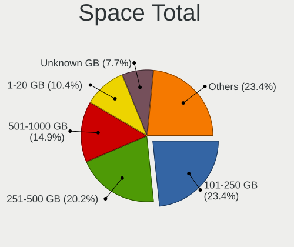

| Size in GB     | Computers | Percent |
|----------------|-----------|---------|
| 101-250        | 312       | 23.35%  |
| 251-500        | 270       | 20.21%  |
| 501-1000       | 199       | 14.9%   |
| 1-20           | 139       | 10.4%   |
| Unknown        | 103       | 7.71%   |
| 51-100         | 89        | 6.66%   |
| 1001-2000      | 83        | 6.21%   |
| 21-50          | 60        | 4.49%   |
| More than 3000 | 46        | 3.44%   |
| 2001-3000      | 35        | 2.62%   |

Space Used
----------

Amount of used disk space

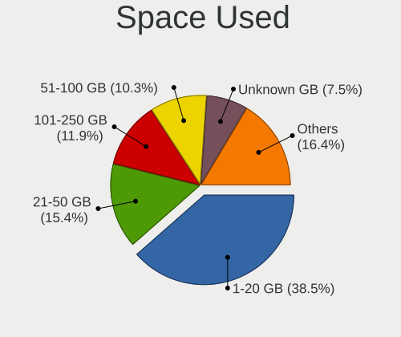

| Used GB        | Computers | Percent |
|----------------|-----------|---------|
| 1-20           | 532       | 38.52%  |
| 21-50          | 212       | 15.35%  |
| 101-250        | 165       | 11.95%  |
| 51-100         | 142       | 10.28%  |
| Unknown        | 103       | 7.46%   |
| 251-500        | 99        | 7.17%   |
| 501-1000       | 66        | 4.78%   |
| 1001-2000      | 34        | 2.46%   |
| More than 3000 | 19        | 1.38%   |
| 2001-3000      | 9         | 0.65%   |

Malfunc. Drives
---------------

Drive models with a malfunction

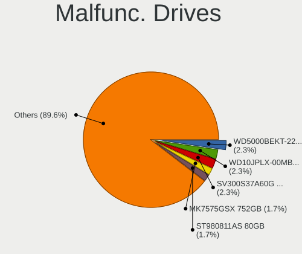

| Model                                 | Computers | Drives | Percent |
|---------------------------------------|-----------|--------|---------|
| WDC WD5000BEKT-22KA9T0 500GB          | 4         | 14     | 2.31%   |
| WDC WD10JPLX-00MBPT0 1TB              | 4         | 20     | 2.31%   |
| Kingston SV300S37A60G 64GB SSD        | 4         | 5      | 2.31%   |
| Toshiba MK7575GSX 752GB               | 3         | 5      | 1.73%   |
| Seagate ST980811AS 80GB               | 3         | 3      | 1.73%   |
| Seagate ST9500325AS 500GB             | 3         | 4      | 1.73%   |
| WDC WD50EFRX-68MYMN1 5TB              | 2         | 2      | 1.16%   |
| WDC WD5000BPVT-00HXZT1 500GB          | 2         | 2      | 1.16%   |
| WDC WD5000BEVT-60A0RT0 500GB          | 2         | 2      | 1.16%   |
| WDC WD20EURS-63S48Y0 2TB              | 2         | 2      | 1.16%   |
| WDC WD10EZEX-75WN4A0 1TB              | 2         | 3      | 1.16%   |
| WDC WD10EALX-009BA0 1TB               | 2         | 2      | 1.16%   |
| Toshiba MK5056GSY 500GB               | 2         | 2      | 1.16%   |
| Toshiba HDWD110 1TB                   | 2         | 2      | 1.16%   |
| Seagate ST9250827AS 250GB             | 2         | 5      | 1.16%   |
| Seagate ST9250315AS 250GB             | 2         | 2      | 1.16%   |
| Seagate ST500LT012-9WS142 500GB       | 2         | 2      | 1.16%   |
| Seagate ST500LT012-1DG142 500GB       | 2         | 2      | 1.16%   |
| Seagate ST500LM000-SSHD-8GB           | 2         | 7      | 1.16%   |
| Seagate ST3320413CS 320GB             | 2         | 2      | 1.16%   |
| Seagate ST3320311CS 320GB             | 2         | 2      | 1.16%   |
| Seagate ST320LT007-9ZV142 320GB       | 2         | 2      | 1.16%   |
| Samsung Electronics SSD 970 EVO 500GB | 2         | 3      | 1.16%   |
| Kingston SHPM2280P2H 240G SSD         | 2         | 2      | 1.16%   |
| Kingston SA400S37120G 120GB SSD       | 2         | 2      | 1.16%   |
| Hitachi HTS545050A7E380 500GB         | 2         | 2      | 1.16%   |
| Hitachi HTS543232A7A384 320GB         | 2         | 2      | 1.16%   |
| HGST HTS721010A9E630 1TB              | 2         | 6      | 1.16%   |
| WDC WDS240G2G0A-00JH30 240GB SSD      | 1         | 1      | 0.58%   |
| WDC WD800JD-60LSA0 80GB               | 1         | 1      | 0.58%   |
| WDC WD7500BPVT-80HXZT3 752GB          | 1         | 1      | 0.58%   |
| WDC WD7500BPVT-24HXZT3 752GB          | 1         | 1      | 0.58%   |
| WDC WD7500AAVS-00D7B1 752GB           | 1         | 1      | 0.58%   |
| WDC WD5000LPVT-24G33T1 500GB          | 1         | 1      | 0.58%   |
| WDC WD5000LPLX-75ZNTT1 500GB          | 1         | 1      | 0.58%   |
| WDC WD5000LPCX-60VHAT0 500GB          | 1         | 1      | 0.58%   |
| WDC WD5000BUCT-63PUZY0 500GB          | 1         | 2      | 0.58%   |
| WDC WD5000BEVT-22ZAT0 500GB           | 1         | 1      | 0.58%   |
| WDC WD5000BEVT-22A0RT0 500GB          | 1         | 2      | 0.58%   |
| WDC WD5000AAVS-22G9B1 500GB           | 1         | 4      | 0.58%   |

Malfunc. Drive Vendor
---------------------

Vendors of faulty drives

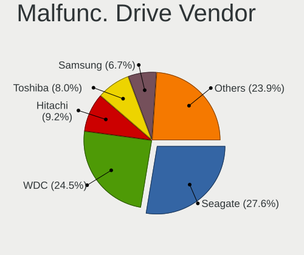

| Vendor              | Computers | Drives | Percent |
|---------------------|-----------|--------|---------|
| Seagate             | 45        | 61     | 27.61%  |
| WDC                 | 40        | 82     | 24.54%  |
| Hitachi             | 15        | 16     | 9.2%    |
| Toshiba             | 13        | 19     | 7.98%   |
| Samsung Electronics | 11        | 24     | 6.75%   |
| Kingston            | 9         | 10     | 5.52%   |
| SK hynix            | 4         | 7      | 2.45%   |
| SanDisk             | 3         | 5      | 1.84%   |
| Micron Technology   | 3         | 3      | 1.84%   |
| Maxtor              | 3         | 3      | 1.84%   |
| Intel               | 3         | 3      | 1.84%   |
| HGST                | 3         | 7      | 1.84%   |
| OCZ                 | 2         | 2      | 1.23%   |
| ExcelStor           | 2         | 2      | 1.23%   |
| A-DATA Technology   | 2         | 3      | 1.23%   |
| Lenovo              | 1         | 1      | 0.61%   |
| IM3D                | 1         | 1      | 0.61%   |
| IBM/Hitachi         | 1         | 1      | 0.61%   |
| Fujitsu             | 1         | 2      | 0.61%   |
| Crucial             | 1         | 1      | 0.61%   |

Malfunc. HDD Vendor
-------------------

Vendors of faulty HDD drives

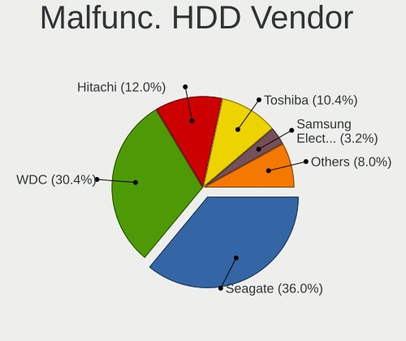

| Vendor              | Computers | Drives | Percent |
|---------------------|-----------|--------|---------|
| Seagate             | 45        | 61     | 36%     |
| WDC                 | 38        | 80     | 30.4%   |
| Hitachi             | 15        | 16     | 12%     |
| Toshiba             | 13        | 19     | 10.4%   |
| Samsung Electronics | 4         | 9      | 3.2%    |
| Maxtor              | 3         | 3      | 2.4%    |
| HGST                | 3         | 7      | 2.4%    |
| ExcelStor           | 2         | 2      | 1.6%    |
| IBM/Hitachi         | 1         | 1      | 0.8%    |
| Fujitsu             | 1         | 2      | 0.8%    |

Malfunc. Drive Kind
-------------------

Kinds of faulty drives

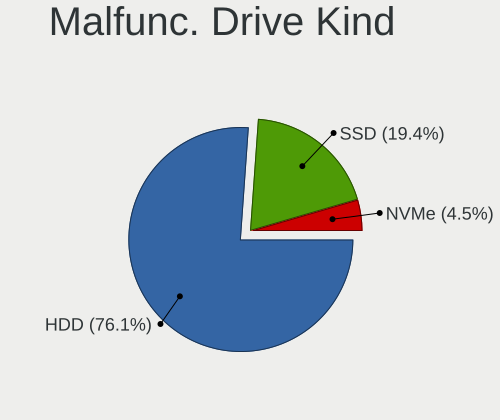

| Kind | Computers | Drives | Percent |
|------|-----------|--------|---------|
| HDD  | 118       | 200    | 76.13%  |
| SSD  | 30        | 45     | 19.35%  |
| NVMe | 7         | 8      | 4.52%   |

Failed Drives
-------------

Failed drive models

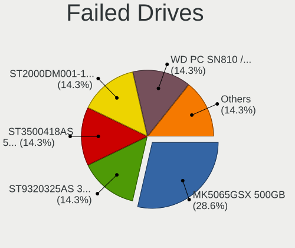

| Model                                            | Computers | Drives | Percent |
|--------------------------------------------------|-----------|--------|---------|
| Toshiba MK5065GSX 500GB                          | 2         | 2      | 28.57%  |
| Seagate ST9320325AS 320GB                        | 1         | 1      | 14.29%  |
| Seagate ST3500418AS 500GB                        | 1         | 2      | 14.29%  |
| Seagate ST2000DM001-1CH164 2TB                   | 1         | 1      | 14.29%  |
| Sandisk WD PC SN810 / Black SN850 NVMe SSD 500GB | 1         | 1      | 14.29%  |
| Samsung Electronics HD321HJ 320GB                | 1         | 2      | 14.29%  |

Failed Drive Vendor
-------------------

Failed drive vendors

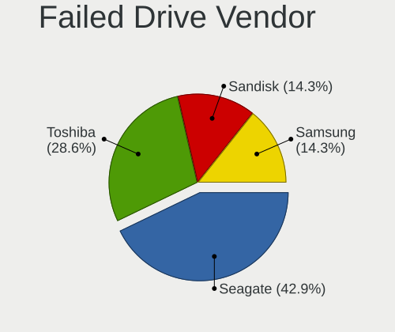

| Vendor              | Computers | Drives | Percent |
|---------------------|-----------|--------|---------|
| Seagate             | 3         | 4      | 42.86%  |
| Toshiba             | 2         | 2      | 28.57%  |
| Sandisk             | 1         | 1      | 14.29%  |
| Samsung Electronics | 1         | 2      | 14.29%  |

Drive Status
------------

Number of failed and malfunc. drives

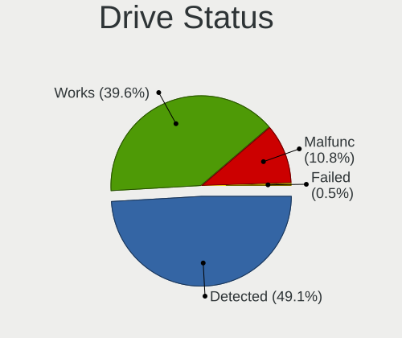

| Status   | Computers | Drives | Percent |
|----------|-----------|--------|---------|
| Detected | 675       | 1293   | 49.09%  |
| Works    | 545       | 1182   | 39.64%  |
| Malfunc  | 148       | 253    | 10.76%  |
| Failed   | 7         | 9      | 0.51%   |

Storage controller
------------------

Storage Vendor
--------------

Storage controller vendors

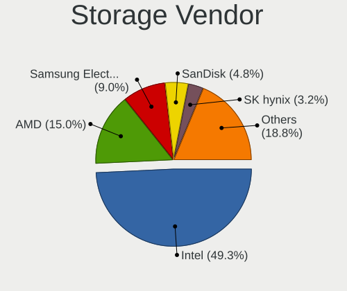

| Vendor                           | Computers | Percent |
|----------------------------------|-----------|---------|
| Intel                            | 764       | 49.26%  |
| AMD                              | 233       | 15.02%  |
| Samsung Electronics              | 139       | 8.96%   |
| SanDisk                          | 75        | 4.84%   |
| SK hynix                         | 49        | 3.16%   |
| Kingston Technology Company      | 34        | 2.19%   |
| Micron Technology                | 31        | 2%      |
| Nvidia                           | 29        | 1.87%   |
| Phison Electronics               | 27        | 1.74%   |
| JMicron Technology               | 27        | 1.74%   |
| Toshiba America Info Systems     | 18        | 1.16%   |
| ADATA Technology                 | 18        | 1.16%   |
| ASMedia Technology               | 17        | 1.1%    |
| MAXIO Technology (Hangzhou)      | 11        | 0.71%   |
| KIOXIA                           | 10        | 0.64%   |
| Marvell Technology Group         | 9         | 0.58%   |
| VIA Technologies                 | 8         | 0.52%   |
| LSI Logic / Symbios Logic        | 7         | 0.45%   |
| Realtek Semiconductor            | 6         | 0.39%   |
| Silicon Motion                   | 5         | 0.32%   |
| Silicon Integrated Systems [SiS] | 5         | 0.32%   |
| Micron/Crucial Technology        | 5         | 0.32%   |
| Union Memory (Shenzhen)          | 3         | 0.19%   |
| Silicon Image                    | 3         | 0.19%   |
| Hosin Global Electronics         | 3         | 0.19%   |
| Hewlett-Packard                  | 3         | 0.19%   |
| Promise Technology               | 2         | 0.13%   |
| Broadcom / LSI                   | 2         | 0.13%   |
| Apple                            | 2         | 0.13%   |
| Yangtze Memory Technologies      | 1         | 0.06%   |
| ULi Electronics                  | 1         | 0.06%   |
| Solid State Storage Technology   | 1         | 0.06%   |
| O2 Micro                         | 1         | 0.06%   |
| Lenovo                           | 1         | 0.06%   |
| INNOGRIT                         | 1         | 0.06%   |

Storage Model
-------------

Storage controller models

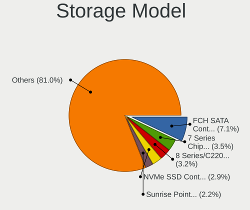

| Model                                                                          | Computers | Percent |
|--------------------------------------------------------------------------------|-----------|---------|
| AMD FCH SATA Controller [AHCI mode]                                            | 129       | 7.07%   |
| Intel 7 Series Chipset Family 6-port SATA Controller [AHCI mode]               | 64        | 3.51%   |
| Intel 8 Series/C220 Series Chipset Family 6-port SATA Controller 1 [AHCI mode] | 59        | 3.23%   |
| Samsung NVMe SSD Controller SM981/PM981/PM983                                  | 53        | 2.91%   |
| Intel Sunrise Point-LP SATA Controller [AHCI mode]                             | 41        | 2.25%   |
| Samsung NVMe SSD Controller 980 (DRAM-less)                                    | 34        | 1.86%   |
| Intel 82801G (ICH7 Family) IDE Controller                                      | 33        | 1.81%   |
| Intel NM10/ICH7 Family SATA Controller [IDE mode]                              | 32        | 1.75%   |
| Intel 82801 Mobile SATA Controller [RAID mode]                                 | 32        | 1.75%   |
| Intel 6 Series/C200 Series Chipset Family 6 port Mobile SATA AHCI Controller   | 31        | 1.7%    |
| AMD SB7x0/SB8x0/SB9x0 SATA Controller [AHCI mode]                              | 31        | 1.7%    |
| Intel 82801IBM/IEM (ICH9M/ICH9M-E) 4 port SATA Controller [AHCI mode]          | 30        | 1.64%   |
| AMD SB7x0/SB8x0/SB9x0 IDE Controller                                           | 30        | 1.64%   |
| Intel Q170/Q150/B150/H170/H110/Z170/CM236 Chipset SATA Controller [AHCI Mode]  | 27        | 1.48%   |
| Intel 82801HM/HEM (ICH8M/ICH8M-E) SATA Controller [AHCI mode]                  | 24        | 1.32%   |
| Intel 82801HM/HEM (ICH8M/ICH8M-E) IDE Controller                               | 24        | 1.32%   |
| Intel 7 Series/C210 Series Chipset Family 6-port SATA Controller [AHCI mode]   | 24        | 1.32%   |
| Intel 6 Series/C200 Series Chipset Family 6 port Desktop SATA AHCI Controller  | 24        | 1.32%   |
| AMD 500 Series Chipset SATA Controller                                         | 24        | 1.32%   |
| SanDisk Extreme Pro / WD Black SN750 / PC SN730 / Red SN700 NVMe SSD           | 23        | 1.26%   |
| AMD 400 Series Chipset SATA Controller                                         | 23        | 1.26%   |
| Samsung NVMe SSD Controller SM961/PM961/SM963                                  | 21        | 1.15%   |
| Samsung NVMe SSD Controller PM9A1/PM9A3/980PRO                                 | 21        | 1.15%   |
| Intel Volume Management Device NVMe RAID Controller                            | 21        | 1.15%   |
| Intel 200 Series PCH SATA controller [AHCI mode]                               | 20        | 1.1%    |
| Intel 5 Series/3400 Series Chipset 4 port SATA AHCI Controller                 | 18        | 0.99%   |
| JMicron JMB363 SATA/IDE Controller                                             | 17        | 0.93%   |
| Intel Celeron/Pentium Silver Processor SATA Controller                         | 17        | 0.93%   |
| AMD SB7x0/SB8x0/SB9x0 SATA Controller [IDE mode]                               | 17        | 0.93%   |
| SK hynix Gold P31/BC711/PC711 NVMe Solid State Drive                           | 16        | 0.88%   |
| Intel Wildcat Point-LP SATA Controller [AHCI Mode]                             | 16        | 0.88%   |
| Intel 5 Series/3400 Series Chipset 6 port SATA AHCI Controller                 | 16        | 0.88%   |
| Intel 8 Series SATA Controller 1 [AHCI mode]                                   | 15        | 0.82%   |
| Intel Cannon Lake Mobile PCH SATA AHCI Controller                              | 14        | 0.77%   |
| ASMedia ASM1061/ASM1062 Serial ATA Controller                                  | 14        | 0.77%   |
| SanDisk WD SN560/SN740/SN770/SN5000 NVMe SSD                                   | 12        | 0.66%   |
| Intel SATA Controller [RAID mode]                                              | 12        | 0.66%   |
| ADATA XPG SX8200 Pro PCIe Gen3x4 M.2 2280 Solid State Drive                    | 12        | 0.66%   |
| Samsung NVMe SSD Controller S4LV008[Pascal]                                    | 11        | 0.6%    |
| Phison E12 NVMe Controller                                                     | 11        | 0.6%    |

Storage Kind
------------

Kind of storage controller (IDE, SATA, NVMe, SAS, ...)

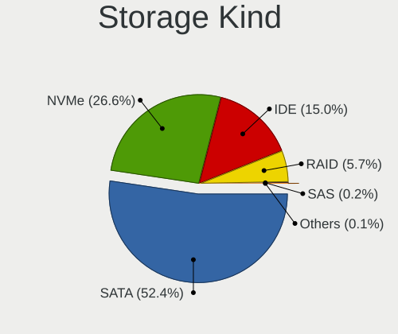

| Kind | Computers | Percent |
|------|-----------|---------|
| SATA | 824       | 52.35%  |
| NVMe | 419       | 26.62%  |
| IDE  | 236       | 14.99%  |
| RAID | 90        | 5.72%   |
| SAS  | 3         | 0.19%   |
| SCSI | 2         | 0.13%   |

Processor
---------

CPU Vendor
----------

Processor vendors

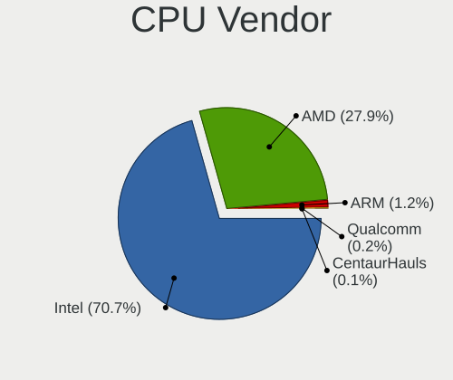

| Vendor       | Computers | Percent |
|--------------|-----------|---------|
| Intel        | 869       | 70.65%  |
| AMD          | 343       | 27.89%  |
| ARM          | 15        | 1.22%   |
| Qualcomm     | 2         | 0.16%   |
| CentaurHauls | 1         | 0.08%   |

CPU Model
---------

Processor models

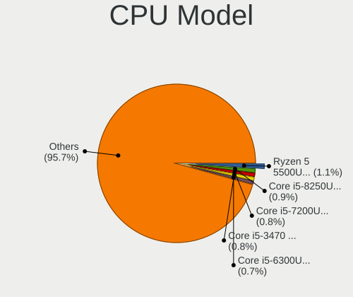

| Model                                      | Computers | Percent |
|--------------------------------------------|-----------|---------|
| AMD Ryzen 5 5500U with Radeon Graphics     | 13        | 1.05%   |
| Intel Core i5-8250U CPU @ 1.60GHz          | 11        | 0.89%   |
| Intel Core i5-7200U CPU @ 2.50GHz          | 10        | 0.81%   |
| Intel Core i5-3470 CPU @ 3.20GHz           | 10        | 0.81%   |
| Intel Core i5-6300U CPU @ 2.40GHz          | 9         | 0.73%   |
| Intel Core i5-3320M CPU @ 2.60GHz          | 9         | 0.73%   |
| Intel Core i5-3210M CPU @ 2.50GHz          | 9         | 0.73%   |
| ARM Processor                              | 9         | 0.73%   |
| AMD Ryzen 5 3600 6-Core Processor          | 9         | 0.73%   |
| Intel 11th Gen Core i7-1165G7 @ 2.80GHz    | 8         | 0.65%   |
| Intel 11th Gen Core i5-1135G7 @ 2.40GHz    | 8         | 0.65%   |
| Intel Core i7-8565U CPU @ 1.80GHz          | 7         | 0.57%   |
| Intel Core i7-6820HQ CPU @ 2.70GHz         | 7         | 0.57%   |
| Intel Core i7-4700MQ CPU @ 2.40GHz         | 7         | 0.57%   |
| Intel Core i5-3230M CPU @ 2.60GHz          | 7         | 0.57%   |
| Intel Core i3-3110M CPU @ 2.40GHz          | 7         | 0.57%   |
| Intel Core 2 Quad CPU Q6600 @ 2.40GHz      | 7         | 0.57%   |
| AMD Ryzen 9 5900X 12-Core Processor        | 7         | 0.57%   |
| AMD Ryzen 7 5700U with Radeon Graphics     | 7         | 0.57%   |
| AMD Ryzen 5 5600X 6-Core Processor         | 7         | 0.57%   |
| AMD Ryzen 5 5600H with Radeon Graphics     | 7         | 0.57%   |
| AMD Ryzen 5 5600G with Radeon Graphics     | 7         | 0.57%   |
| Intel Core i7-1065G7 CPU @ 1.30GHz         | 6         | 0.48%   |
| Intel Core i5-8350U CPU @ 1.70GHz          | 6         | 0.48%   |
| Intel Core i5-8300H CPU @ 2.30GHz          | 6         | 0.48%   |
| Intel Core 2 Quad CPU Q9400 @ 2.66GHz      | 6         | 0.48%   |
| Intel Celeron N4000 CPU @ 1.10GHz          | 6         | 0.48%   |
| AMD Ryzen 7 8845HS w/ Radeon 780M Graphics | 6         | 0.48%   |
| AMD Ryzen 7 4800H with Radeon Graphics     | 6         | 0.48%   |
| AMD Custom APU 0405                        | 6         | 0.48%   |
| Intel Pentium CPU N4200 @ 1.10GHz          | 5         | 0.4%    |
| Intel Core i7-8550U CPU @ 1.80GHz          | 5         | 0.4%    |
| Intel Core i7-10510U CPU @ 1.80GHz         | 5         | 0.4%    |
| Intel Core i5-8265U CPU @ 1.60GHz          | 5         | 0.4%    |
| Intel Core i5-3570 CPU @ 3.40GHz           | 5         | 0.4%    |
| Intel Core i5-2500K CPU @ 3.30GHz          | 5         | 0.4%    |
| Intel Core i5-2450M CPU @ 2.50GHz          | 5         | 0.4%    |
| Intel Core i5-10210U CPU @ 1.60GHz         | 5         | 0.4%    |
| Intel Core i3-5010U CPU @ 2.10GHz          | 5         | 0.4%    |
| Intel Core i3 CPU M 350 @ 2.27GHz          | 5         | 0.4%    |

CPU Model Family
----------------

Processor model prefix

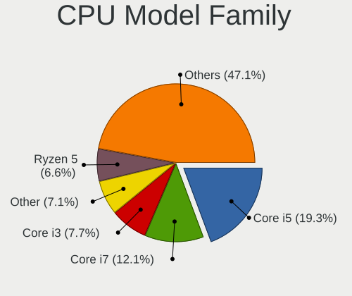

| Model                   | Computers | Percent |
|-------------------------|-----------|---------|
| Intel Core i5           | 239       | 19.32%  |
| Intel Core i7           | 150       | 12.13%  |
| Intel Core i3           | 95        | 7.68%   |
| Other                   | 88        | 7.11%   |
| AMD Ryzen 5             | 82        | 6.63%   |
| Intel Core 2 Duo        | 71        | 5.74%   |
| Intel Celeron           | 66        | 5.34%   |
| AMD Ryzen 7             | 62        | 5.01%   |
| Intel Pentium           | 47        | 3.8%    |
| Intel Xeon              | 30        | 2.43%   |
| AMD Ryzen 9             | 27        | 2.18%   |
| Intel Core 2 Quad       | 20        | 1.62%   |
| Intel Atom              | 19        | 1.54%   |
| Intel Pentium Dual-Core | 14        | 1.13%   |
| AMD Ryzen 3             | 14        | 1.13%   |
| Intel Core              | 13        | 1.05%   |
| Intel Pentium Dual      | 11        | 0.89%   |
| AMD Athlon 64 X2        | 11        | 0.89%   |
| AMD A8                  | 11        | 0.89%   |
| AMD FX                  | 10        | 0.81%   |
| AMD Ryzen 5 PRO         | 8         | 0.65%   |
| AMD E                   | 8         | 0.65%   |
| AMD A6                  | 8         | 0.65%   |
| AMD Ryzen 7 PRO         | 7         | 0.57%   |
| AMD Athlon II X2        | 7         | 0.57%   |
| AMD Athlon              | 7         | 0.57%   |
| AMD A4                  | 7         | 0.57%   |
| AMD A10                 | 7         | 0.57%   |
| Intel Core 2            | 6         | 0.49%   |
| AMD Sempron             | 6         | 0.49%   |
| AMD Phenom II X4        | 6         | 0.49%   |
| Intel Genuine           | 5         | 0.4%    |
| Intel Celeron M         | 5         | 0.4%    |
| Intel Celeron Dual-Core | 5         | 0.4%    |
| Intel Core i9           | 4         | 0.32%   |
| ARM BCM                 | 4         | 0.32%   |
| AMD Phenom              | 4         | 0.32%   |
| AMD Athlon X4           | 4         | 0.32%   |
| AMD Athlon 64           | 4         | 0.32%   |
| Intel Pentium 4         | 3         | 0.24%   |

CPU Cores
---------

Number of processor cores

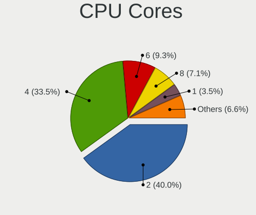

| Number  | Computers | Percent |
|---------|-----------|---------|
| 2       | 495       | 40.05%  |
| 4       | 414       | 33.5%   |
| 6       | 115       | 9.3%    |
| 8       | 88        | 7.12%   |
| 1       | 43        | 3.48%   |
| 12      | 25        | 2.02%   |
| 16      | 17        | 1.38%   |
| 14      | 10        | 0.81%   |
| 10      | 10        | 0.81%   |
| 3       | 5         | 0.4%    |
| Unknown | 5         | 0.4%    |
| 24      | 4         | 0.32%   |
| 20      | 4         | 0.32%   |
| 32      | 1         | 0.08%   |

CPU Sockets
-----------

Number of sockets

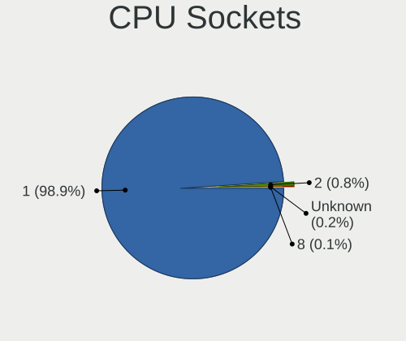

| Number  | Computers | Percent |
|---------|-----------|---------|
| 1       | 1217      | 98.94%  |
| 2       | 10        | 0.81%   |
| Unknown | 2         | 0.16%   |
| 8       | 1         | 0.08%   |

CPU Threads
-----------

Threads per core (Hyper-Threading)

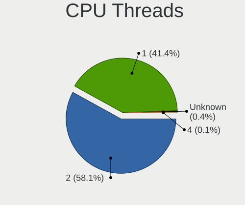

| Number  | Computers | Percent |
|---------|-----------|---------|
| 2       | 717       | 58.06%  |
| 1       | 511       | 41.38%  |
| Unknown | 5         | 0.4%    |
| 12      | 1         | 0.08%   |
| 4       | 1         | 0.08%   |

CPU Op-Modes
------------

CPU Operation Modes (32-bit, 64-bit)

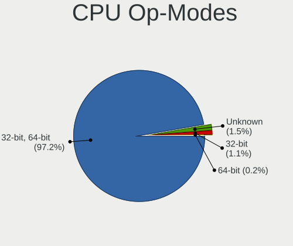

| Op mode        | Computers | Percent |
|----------------|-----------|---------|
| 32-bit, 64-bit | 1201      | 97.25%  |
| Unknown        | 19        | 1.54%   |
| 32-bit         | 13        | 1.05%   |
| 64-bit         | 2         | 0.16%   |

CPU Microcode
-------------

Microcode number

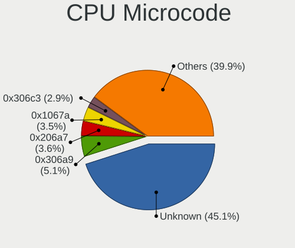

| Number     | Computers | Percent |
|------------|-----------|---------|
| Unknown    | 583       | 45.05%  |
| 0x306a9    | 66        | 5.1%    |
| 0x206a7    | 47        | 3.63%   |
| 0x1067a    | 45        | 3.48%   |
| 0x306c3    | 37        | 2.86%   |
| 0x6fd      | 20        | 1.55%   |
| 0x6fb      | 19        | 1.47%   |
| 0x506e3    | 18        | 1.39%   |
| 0x806ea    | 16        | 1.24%   |
| 0x906e9    | 15        | 1.16%   |
| 0x906ea    | 14        | 1.08%   |
| 0x20655    | 14        | 1.08%   |
| 0x10676    | 14        | 1.08%   |
| 0x806e9    | 13        | 1%      |
| 0x806c1    | 13        | 1%      |
| 0x806ec    | 11        | 0.85%   |
| 0x406e3    | 11        | 0.85%   |
| 0x0a50000c | 11        | 0.85%   |
| 0x06001119 | 11        | 0.85%   |
| 0x010000c8 | 11        | 0.85%   |
| 0x40651    | 9         | 0.7%    |
| 0x20652    | 9         | 0.7%    |
| 0x08608103 | 9         | 0.7%    |
| 0x08108109 | 9         | 0.7%    |
| 0x706a1    | 8         | 0.62%   |
| 0x306d4    | 8         | 0.62%   |
| 0x706e5    | 7         | 0.54%   |
| 0x30678    | 7         | 0.54%   |
| 0x0a50000d | 7         | 0.54%   |
| 0x6f2      | 6         | 0.46%   |
| 0x406c3    | 6         | 0.46%   |
| 0x08701021 | 6         | 0.46%   |
| 0x08600106 | 6         | 0.46%   |
| 0x0800820d | 6         | 0.46%   |
| 0x06006705 | 6         | 0.46%   |
| 0x08108102 | 5         | 0.39%   |
| 0x07030105 | 5         | 0.39%   |
| 0x906ed    | 4         | 0.31%   |
| 0x906eb    | 4         | 0.31%   |
| 0x6d8      | 4         | 0.31%   |

CPU Microarch
-------------

Microarchitecture

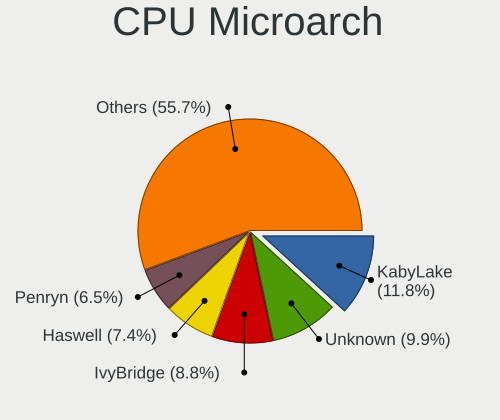

| Name              | Computers | Percent |
|-------------------|-----------|---------|
| KabyLake          | 146       | 11.81%  |
| Unknown           | 122       | 9.87%   |
| IvyBridge         | 109       | 8.82%   |
| Haswell           | 91        | 7.36%   |
| Penryn            | 80        | 6.47%   |
| SandyBridge       | 68        | 5.5%    |
| Core              | 62        | 5.02%   |
| Zen 3             | 55        | 4.45%   |
| Skylake           | 54        | 4.37%   |
| Zen 2             | 41        | 3.32%   |
| Westmere          | 37        | 2.99%   |
| Zen+              | 32        | 2.59%   |
| K10               | 32        | 2.59%   |
| Silvermont        | 30        | 2.43%   |
| K8 Hammer         | 28        | 2.27%   |
| TigerLake         | 24        | 1.94%   |
| Piledriver        | 22        | 1.78%   |
| Broadwell         | 22        | 1.78%   |
| Alderlake Hybrid  | 21        | 1.7%    |
| Goldmont plus     | 18        | 1.46%   |
| Excavator         | 15        | 1.21%   |
| CometLake         | 15        | 1.21%   |
| Zen               | 12        | 0.97%   |
| Bonnell           | 11        | 0.89%   |
| P6                | 10        | 0.81%   |
| Nehalem           | 10        | 0.81%   |
| IceLake           | 9         | 0.73%   |
| Goldmont          | 8         | 0.65%   |
| Bobcat            | 8         | 0.65%   |
| Tremont           | 6         | 0.49%   |
| Steamroller       | 6         | 0.49%   |
| Puma              | 5         | 0.4%    |
| NetBurst          | 4         | 0.32%   |
| Lunarlake Hybrid  | 4         | 0.32%   |
| K8 & K10 hybrid   | 4         | 0.32%   |
| K10 Llano         | 4         | 0.32%   |
| Jaguar            | 4         | 0.32%   |
| Bulldozer         | 3         | 0.24%   |
| Meteorlake Hybrid | 2         | 0.16%   |
| K6                | 1         | 0.08%   |

Graphics
--------

GPU Vendor
----------

Vendors of graphics cards

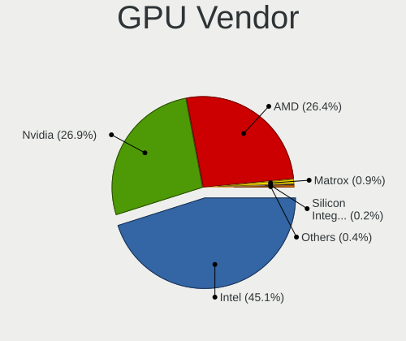

| Vendor                                       | Computers | Percent |
|----------------------------------------------|-----------|---------|
| Intel                                        | 655       | 45.11%  |
| Nvidia                                       | 391       | 26.93%  |
| AMD                                          | 384       | 26.45%  |
| Matrox Electronics Systems                   | 13        | 0.9%    |
| Silicon Integrated Systems [SiS]             | 3         | 0.21%   |
| VIA Technologies                             | 2         | 0.14%   |
| ASPEED Technology                            | 2         | 0.14%   |
| XGI Technology (eXtreme Graphics Innovation) | 1         | 0.07%   |
| S3 Graphics                                  | 1         | 0.07%   |

GPU Model
---------

Graphics card models

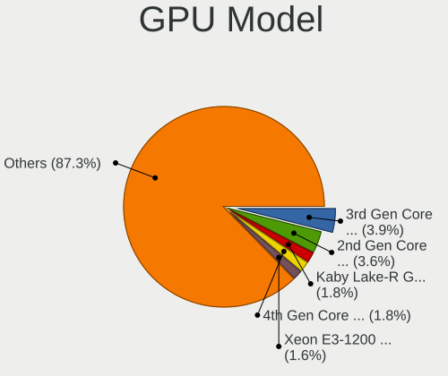

| Model                                                                                    | Computers | Percent |
|------------------------------------------------------------------------------------------|-----------|---------|
| Intel 3rd Gen Core processor Graphics Controller                                         | 60        | 3.94%   |
| Intel 2nd Generation Core Processor Family Integrated Graphics Controller                | 55        | 3.61%   |
| Intel Kaby Lake-R GT2 [UHD Graphics 620]                                                 | 27        | 1.77%   |
| Intel 4th Gen Core Processor Integrated Graphics Controller                              | 27        | 1.77%   |
| Intel Xeon E3-1200 v3/4th Gen Core Processor Integrated Graphics Controller              | 24        | 1.58%   |
| Intel Mobile 4 Series Chipset Integrated Graphics Controller                             | 24        | 1.58%   |
| Intel Core Processor Integrated Graphics Controller                                      | 23        | 1.51%   |
| AMD Picasso/Raven 2 [Radeon Vega Series / Radeon Vega Mobile Series]                     | 22        | 1.44%   |
| Intel CoffeeLake-H GT2 [UHD Graphics 630]                                                | 21        | 1.38%   |
| AMD Lucienne                                                                             | 21        | 1.38%   |
| Intel TigerLake-LP GT2 [Iris Xe Graphics]                                                | 20        | 1.31%   |
| AMD Renoir [Radeon Vega Series / Radeon Vega Mobile Series]                              | 20        | 1.31%   |
| AMD Cezanne [Radeon Vega Series / Radeon Vega Mobile Series]                             | 20        | 1.31%   |
| Intel Skylake-U GT2 [HD Graphics 520]                                                    | 18        | 1.18%   |
| Intel Kaby Lake-U GT2 [HD Graphics 620]                                                  | 18        | 1.18%   |
| Intel WhiskeyLake-U GT2 [UHD Graphics 620]                                               | 17        | 1.12%   |
| Intel GeminiLake [UHD Graphics 600]                                                      | 17        | 1.12%   |
| Intel Broadwell-U GT2 [HD Graphics 5500]                                                 | 17        | 1.12%   |
| Intel Atom/Celeron/Pentium Processor x5-E8000/J3xxx/N3xxx Integrated Graphics Controller | 16        | 1.05%   |
| Intel Haswell-ULT Integrated Graphics Controller                                         | 15        | 0.98%   |
| Nvidia GK208B [GeForce GT 710]                                                           | 14        | 0.92%   |
| Intel Xeon E3-1200 v2/3rd Gen Core processor Graphics Controller                         | 14        | 0.92%   |
| Intel Mobile GM965/GL960 Integrated Graphics Controller (secondary)                      | 14        | 0.92%   |
| Intel Mobile GM965/GL960 Integrated Graphics Controller (primary)                        | 14        | 0.92%   |
| Intel Atom Processor Z36xxx/Z37xxx Series Graphics & Display                             | 14        | 0.92%   |
| Intel Skylake-S GT2 [HD Graphics 530]                                                    | 13        | 0.85%   |
| Intel CometLake-U GT2 [UHD Graphics]                                                     | 13        | 0.85%   |
| AMD Rembrandt [Radeon 680M]                                                              | 13        | 0.85%   |
| Nvidia TU117M [GeForce GTX 1650 Mobile / Max-Q]                                          | 11        | 0.72%   |
| Intel Skylake-H GT2 [HD Graphics 530]                                                    | 11        | 0.72%   |
| AMD Stoney [Radeon R2/R3/R4/R5 Graphics]                                                 | 11        | 0.72%   |
| AMD Barcelo                                                                              | 11        | 0.72%   |
| Nvidia GP106 [GeForce GTX 1060 6GB]                                                      | 10        | 0.66%   |
| AMD Ellesmere [Radeon RX 470/480/570/570X/580/580X/590]                                  | 10        | 0.66%   |
| Nvidia GF108 [GeForce GT 630]                                                            | 9         | 0.59%   |
| Nvidia GA107M [GeForce RTX 3050 Mobile]                                                  | 9         | 0.59%   |
| Intel Kaby Lake-S GT2 [HD Graphics 630]                                                  | 9         | 0.59%   |
| AMD HawkPoint1                                                                           | 9         | 0.59%   |
| AMD Cedar [Radeon HD 5000/6000/7350/8350 Series]                                         | 9         | 0.59%   |
| Nvidia GP108M [GeForce MX150]                                                            | 8         | 0.53%   |

GPU Combo
---------

Combinations of graphics cards

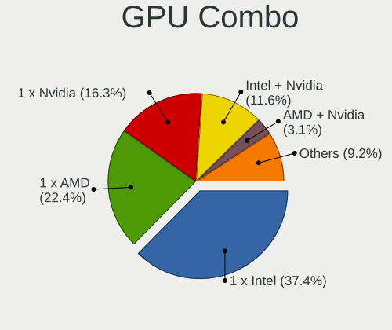

| Name            | Computers | Percent |
|-----------------|-----------|---------|
| 1 x Intel       | 468       | 37.41%  |
| 1 x AMD         | 280       | 22.38%  |
| 1 x Nvidia      | 204       | 16.31%  |
| Intel + Nvidia  | 145       | 11.59%  |
| AMD + Nvidia    | 39        | 3.12%   |
| 2 x AMD         | 33        | 2.64%   |
| Intel + AMD     | 30        | 2.4%    |
| Other           | 18        | 1.44%   |
| 1 x Matrox      | 10        | 0.8%    |
| 2 x Intel       | 8         | 0.64%   |
| 1 x SiS         | 3         | 0.24%   |
| AMD + Matrox    | 3         | 0.24%   |
| 2 x Nvidia      | 2         | 0.16%   |
| 1 x VIA         | 2         | 0.16%   |
| 3 x AMD         | 1         | 0.08%   |
| 1 x S3 Graphics | 1         | 0.08%   |
| Nvidia + XGI    | 1         | 0.08%   |
| Nvidia + Matrox | 1         | 0.08%   |
| Nvidia + ASPEED | 1         | 0.08%   |
| 1 x ASPEED      | 1         | 0.08%   |

GPU Driver
----------

Free vs proprietary

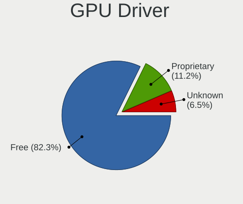

| Driver      | Computers | Percent |
|-------------|-----------|---------|
| Free        | 1033      | 82.31%  |
| Proprietary | 141       | 11.24%  |
| Unknown     | 81        | 6.45%   |

GPU Memory
----------

Total video memory

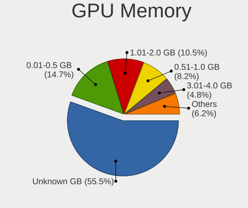

| Size in GB | Computers | Percent |
|------------|-----------|---------|
| Unknown    | 713       | 55.53%  |
| 0.01-0.5   | 189       | 14.72%  |
| 1.01-2.0   | 135       | 10.51%  |
| 0.51-1.0   | 105       | 8.18%   |
| 3.01-4.0   | 62        | 4.83%   |
| 7.01-8.0   | 33        | 2.57%   |
| 5.01-6.0   | 20        | 1.56%   |
| 8.01-16.0  | 15        | 1.17%   |
| 2.01-3.0   | 10        | 0.78%   |
| 16.01-24.0 | 2         | 0.16%   |

Monitor
-------

Monitor Vendor
--------------

Monitor vendors

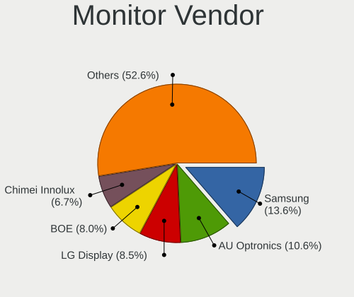

| Vendor                  | Computers | Percent |
|-------------------------|-----------|---------|
| Samsung Electronics     | 185       | 13.64%  |
| AU Optronics            | 144       | 10.62%  |
| LG Display              | 115       | 8.48%   |
| BOE                     | 108       | 7.96%   |
| Chimei Innolux          | 91        | 6.71%   |
| Dell                    | 76        | 5.6%    |
| Goldstar                | 61        | 4.5%    |
| Philips                 | 58        | 4.28%   |
| Hewlett-Packard         | 52        | 3.83%   |
| Chi Mei Optoelectronics | 39        | 2.88%   |
| BenQ                    | 37        | 2.73%   |
| Lenovo                  | 36        | 2.65%   |
| AOC                     | 32        | 2.36%   |
| Ancor Communications    | 29        | 2.14%   |
| Acer                    | 27        | 1.99%   |
| Sharp                   | 25        | 1.84%   |
| Iiyama                  | 18        | 1.33%   |
| PANDA                   | 17        | 1.25%   |
| Apple                   | 16        | 1.18%   |
| NEC Computers           | 14        | 1.03%   |
| MSI                     | 14        | 1.03%   |
| ASUSTek Computer        | 12        | 0.88%   |
| Fujitsu Siemens         | 10        | 0.74%   |
| Eizo                    | 10        | 0.74%   |
| Unknown                 | 8         | 0.59%   |
| LG Philips              | 8         | 0.59%   |
| Valve                   | 6         | 0.44%   |
| Sony                    | 6         | 0.44%   |
| LG Electronics          | 6         | 0.44%   |
| CSO                     | 6         | 0.44%   |
| TMX                     | 5         | 0.37%   |
| CVT                     | 5         | 0.37%   |
| InfoVision              | 4         | 0.29%   |
| ViewSonic               | 3         | 0.22%   |
| Unknown (XXX)           | 3         | 0.22%   |
| Panasonic               | 3         | 0.22%   |
| HannStar                | 3         | 0.22%   |
| CPT                     | 3         | 0.22%   |
| Vestel Elektronik       | 2         | 0.15%   |
| Toshiba                 | 2         | 0.15%   |

Monitor Model
-------------

Monitor models

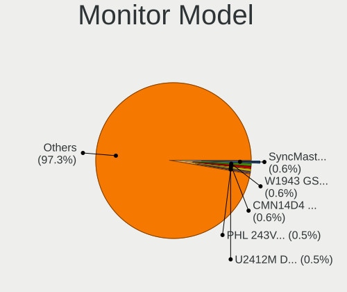

| Model                                                                    | Computers | Percent |
|--------------------------------------------------------------------------|-----------|---------|
| Samsung Electronics SyncMaster SAM0091 1600x1200 432x324mm 21.3-inch     | 8         | 0.57%   |
| Goldstar W1943 GSM4BAD 1360x768 406x229mm 18.4-inch                      | 8         | 0.57%   |
| Chimei Innolux LCD Monitor CMN14D4 1920x1080 309x173mm 13.9-inch         | 8         | 0.57%   |
| Philips PHL 243V7 PHLC155 1920x1080 527x296mm 23.8-inch                  | 7         | 0.5%    |
| Dell U2412M DELA07A 1920x1200 518x324mm 24.1-inch                        | 7         | 0.5%    |
| Chi Mei Optoelectronics LCD Monitor CMO15A7 1366x768 344x193mm 15.5-inch | 7         | 0.5%    |
| AU Optronics LCD Monitor AUO38ED 1920x1080 344x193mm 15.5-inch           | 7         | 0.5%    |
| Philips 247ELH PHLC085 1920x1080 521x293mm 23.5-inch                     | 6         | 0.43%   |
| Chimei Innolux LCD Monitor CMN15AB 1366x768 344x193mm 15.5-inch          | 6         | 0.43%   |
| Chi Mei Optoelectronics LCD Monitor CMO1526 1280x800 331x207mm 15.4-inch | 6         | 0.43%   |
| AU Optronics LCD Monitor AUO26EC 1366x768 344x193mm 15.5-inch            | 6         | 0.43%   |
| NEC Computers LCD19WV NEC671C 1440x900 410x256mm 19.0-inch               | 5         | 0.36%   |
| LG Display LCD Monitor LGD038E 1366x768 344x194mm 15.5-inch              | 5         | 0.36%   |
| LG Display LCD Monitor LGD02DC 1366x768 344x194mm 15.5-inch              | 5         | 0.36%   |
| CVT CVTE TV CVT0003 1920x1080 575x323mm 26.0-inch                        | 5         | 0.36%   |
| BOE LCD Monitor BOE0687 1920x1080 344x193mm 15.5-inch                    | 5         | 0.36%   |
| AU Optronics LCD Monitor AUO23ED 1920x1080 344x193mm 15.5-inch           | 5         | 0.36%   |
| AU Optronics LCD Monitor AUO106C 1366x768 276x155mm 12.5-inch            | 5         | 0.36%   |
| AOC 24G2W1G3 AOC2402 1920x1080 527x296mm 23.8-inch                       | 5         | 0.36%   |
| AOC 24B1W1 AOC2401 1920x1080 527x296mm 23.8-inch                         | 5         | 0.36%   |
| Valve ANX7530 U VLV3001 800x1280 100x150mm 7.1-inch                      | 4         | 0.28%   |
| Unknown LCD Monitor FFFF 2288x1287 2550x2550mm 142.0-inch                | 4         | 0.28%   |
| Sharp LQ134N1JW55 SHP1558 1920x1200 288x180mm 13.4-inch                  | 4         | 0.28%   |
| Samsung Electronics U28E590 SAM0C4C 3840x2160 608x345mm 27.5-inch        | 4         | 0.28%   |
| Samsung Electronics SyncMaster SAM0420 1680x1050 474x296mm 22.0-inch     | 4         | 0.28%   |
| Samsung Electronics S24F350 SAM0D20 1920x1080 521x293mm 23.5-inch        | 4         | 0.28%   |
| Samsung Electronics LCD Monitor SEC5441 1280x800 331x207mm 15.4-inch     | 4         | 0.28%   |
| Samsung Electronics LCD Monitor SAM07C0 1920x1080 890x500mm 40.2-inch    | 4         | 0.28%   |
| Philips PHL 243V5 PHLC0D1 1920x1080 521x293mm 23.5-inch                  | 4         | 0.28%   |
| LG Display LCD Monitor LGD053F 1920x1080 344x194mm 15.5-inch             | 4         | 0.28%   |
| LG Display LCD Monitor LGD0259 1920x1080 345x194mm 15.6-inch             | 4         | 0.28%   |
| Lenovo LEN L24e-20 LEN65DF 1920x1080 530x300mm 24.0-inch                 | 4         | 0.28%   |
| Iiyama PL2492H IVM612F 1920x1080 527x296mm 23.8-inch                     | 4         | 0.28%   |
| Goldstar W2753VC GSM5765 1920x1080 598x336mm 27.0-inch                   | 4         | 0.28%   |
| Chimei Innolux LCD Monitor CMN15DB 1366x768 344x193mm 15.5-inch          | 4         | 0.28%   |
| Chimei Innolux LCD Monitor CMN15C4 1920x1080 344x193mm 15.5-inch         | 4         | 0.28%   |
| Chimei Innolux LCD Monitor CMN1521 1920x1080 344x193mm 15.5-inch         | 4         | 0.28%   |
| Chimei Innolux LCD Monitor CMN14C3 1366x768 309x173mm 13.9-inch          | 4         | 0.28%   |
| Chi Mei Optoelectronics LCD Monitor CMO15A3 1366x768 344x193mm 15.5-inch | 4         | 0.28%   |
| BOE LCD Monitor BOE07F1 1920x1080 344x193mm 15.5-inch                    | 4         | 0.28%   |

Monitor Resolution
------------------

Monitor screen resolution

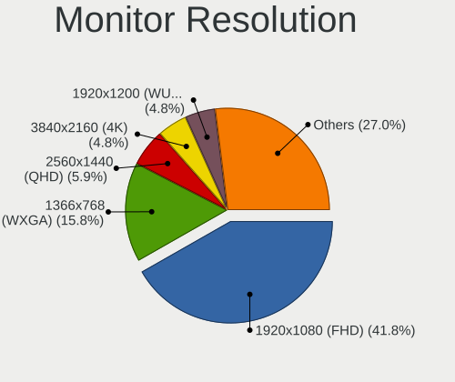

| Resolution         | Computers | Percent |
|--------------------|-----------|---------|
| 1920x1080 (FHD)    | 542       | 41.76%  |
| 1366x768 (WXGA)    | 205       | 15.79%  |
| 2560x1440 (QHD)    | 77        | 5.93%   |
| 3840x2160 (4K)     | 62        | 4.78%   |
| 1920x1200 (WUXGA)  | 62        | 4.78%   |
| 1600x900 (HD+)     | 47        | 3.62%   |
| 1680x1050 (WSXGA+) | 42        | 3.24%   |
| 1280x1024 (SXGA)   | 42        | 3.24%   |
| 1280x800 (WXGA)    | 41        | 3.16%   |
| 1440x900 (WXGA+)   | 40        | 3.08%   |
| 3440x1440          | 17        | 1.31%   |
| 2560x1600          | 13        | 1%      |
| 1360x768           | 13        | 1%      |
| 2880x1800          | 11        | 0.85%   |
| 1600x1200          | 10        | 0.77%   |
| Unknown            | 8         | 0.62%   |
| 1024x600           | 6         | 0.46%   |
| 800x1280           | 5         | 0.39%   |
| 3840x2400          | 5         | 0.39%   |
| 3200x2000          | 5         | 0.39%   |
| 1024x768 (XGA)     | 5         | 0.39%   |
| 2560x1080          | 4         | 0.31%   |
| 2288x1287          | 4         | 0.31%   |
| 2160x1440          | 4         | 0.31%   |
| 1920x540           | 4         | 0.31%   |
| 1280x720 (HD)      | 4         | 0.31%   |
| 1920x1280          | 3         | 0.23%   |
| 3000x2120          | 2         | 0.15%   |
| 2160x1350          | 2         | 0.15%   |
| 1400x1050          | 2         | 0.15%   |
| 1280x960           | 2         | 0.15%   |
| 4480x1440          | 1         | 0.08%   |
| 3200x1800 (QHD+)   | 1         | 0.08%   |
| 3200x1080          | 1         | 0.08%   |
| 3072x1920          | 1         | 0.08%   |
| 3000x2000          | 1         | 0.08%   |
| 2880x1620          | 1         | 0.08%   |
| 2256x1504          | 1         | 0.08%   |
| 1680x945           | 1         | 0.08%   |
| 1600x2560          | 1         | 0.08%   |

Monitor Diagonal
----------------

Diagonal size in inches

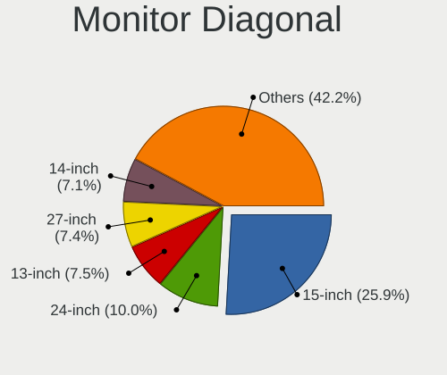

| Inches  | Computers | Percent |
|---------|-----------|---------|
| 15      | 354       | 25.88%  |
| 24      | 137       | 10.01%  |
| 13      | 102       | 7.46%   |
| 27      | 101       | 7.38%   |
| 14      | 97        | 7.09%   |
| 23      | 82        | 5.99%   |
| 21      | 76        | 5.56%   |
| 17      | 67        | 4.9%    |
| Unknown | 45        | 3.29%   |
| 19      | 43        | 3.14%   |
| 18      | 29        | 2.12%   |
| 22      | 27        | 1.97%   |
| 12      | 22        | 1.61%   |
| 16      | 21        | 1.54%   |
| 34      | 18        | 1.32%   |
| 20      | 18        | 1.32%   |
| 11      | 18        | 1.32%   |
| 31      | 14        | 1.02%   |
| 25      | 13        | 0.95%   |
| 84      | 10        | 0.73%   |
| 26      | 10        | 0.73%   |
| 40      | 7         | 0.51%   |
| 32      | 7         | 0.51%   |
| 10      | 6         | 0.44%   |
| 7       | 5         | 0.37%   |
| 142     | 4         | 0.29%   |
| 54      | 4         | 0.29%   |
| 46      | 4         | 0.29%   |
| 72      | 3         | 0.22%   |
| 65      | 3         | 0.22%   |
| 67      | 2         | 0.15%   |
| 63      | 2         | 0.15%   |
| 48      | 2         | 0.15%   |
| 37      | 2         | 0.15%   |
| 33      | 2         | 0.15%   |
| 100     | 1         | 0.07%   |
| 86      | 1         | 0.07%   |
| 75      | 1         | 0.07%   |
| 58      | 1         | 0.07%   |
| 50      | 1         | 0.07%   |

Monitor Width
-------------

Physical width

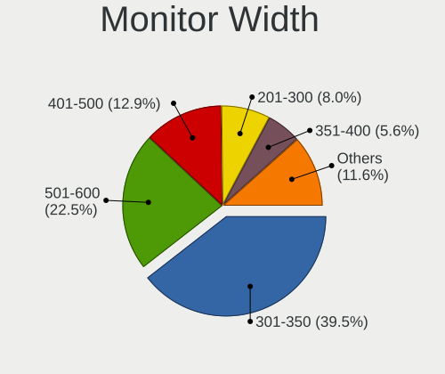

| Width in mm    | Computers | Percent |
|----------------|-----------|---------|
| 301-350        | 525       | 39.47%  |
| 501-600        | 299       | 22.48%  |
| 401-500        | 171       | 12.86%  |
| 201-300        | 106       | 7.97%   |
| 351-400        | 75        | 5.64%   |
| Unknown        | 45        | 3.38%   |
| 701-800        | 29        | 2.18%   |
| 601-700        | 24        | 1.8%    |
| 1001-1500      | 19        | 1.43%   |
| 1501-2000      | 14        | 1.05%   |
| 801-900        | 11        | 0.83%   |
| More than 2000 | 5         | 0.38%   |
| 1-100          | 5         | 0.38%   |
| 101-200        | 1         | 0.08%   |
| 901-1000       | 1         | 0.08%   |

Aspect Ratio
------------

Proportional relationship between the width and the height

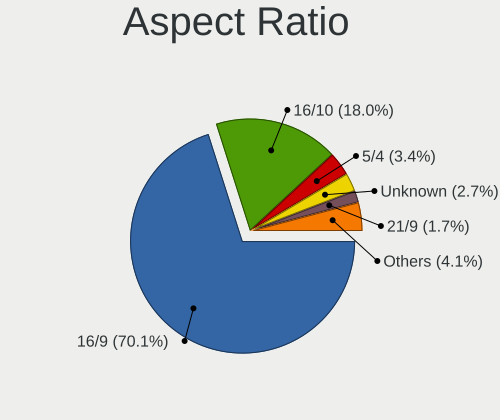

| Ratio   | Computers | Percent |
|---------|-----------|---------|
| 16/9    | 865       | 70.1%   |
| 16/10   | 222       | 17.99%  |
| 5/4     | 42        | 3.4%    |
| Unknown | 33        | 2.67%   |
| 21/9    | 21        | 1.7%    |
| 4/3     | 19        | 1.54%   |
| 3/2     | 16        | 1.3%    |
| 1.00    | 4         | 0.32%   |
| 0.67    | 4         | 0.32%   |
| 32/9    | 2         | 0.16%   |
| 0.45    | 2         | 0.16%   |
| 6/5     | 1         | 0.08%   |
| 0.63    | 1         | 0.08%   |
| 0.62    | 1         | 0.08%   |
| 0.56    | 1         | 0.08%   |

Monitor Area
------------

Area in inch²

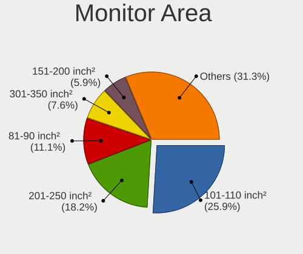

| Area in inch² | Computers | Percent |
|----------------|-----------|---------|
| 101-110        | 350       | 25.95%  |
| 201-250        | 245       | 18.16%  |
| 81-90          | 150       | 11.12%  |
| 301-350        | 103       | 7.64%   |
| 151-200        | 79        | 5.86%   |
| 251-300        | 66        | 4.89%   |
| 141-150        | 51        | 3.78%   |
| 71-80          | 48        | 3.56%   |
| Unknown        | 45        | 3.34%   |
| 351-500        | 42        | 3.11%   |
| More than 1000 | 34        | 2.52%   |
| 121-130        | 33        | 2.45%   |
| 61-70          | 21        | 1.56%   |
| 111-120        | 21        | 1.56%   |
| 51-60          | 18        | 1.33%   |
| 501-1000       | 16        | 1.19%   |
| 131-140        | 12        | 0.89%   |
| 41-50          | 6         | 0.44%   |
| 1-40           | 6         | 0.44%   |
| 91-100         | 3         | 0.22%   |

Pixel Density
-------------

Pixels per inch

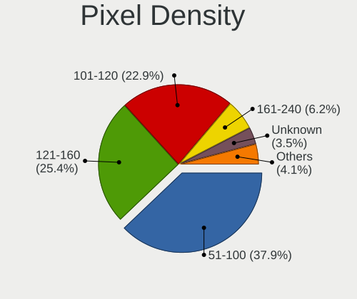

| Density       | Computers | Percent |
|---------------|-----------|---------|
| 51-100        | 493       | 37.86%  |
| 121-160       | 331       | 25.42%  |
| 101-120       | 298       | 22.89%  |
| 161-240       | 81        | 6.22%   |
| Unknown       | 45        | 3.46%   |
| More than 240 | 30        | 2.3%    |
| 1-50          | 24        | 1.84%   |

Multiple Monitors
-----------------

Total monitors connected

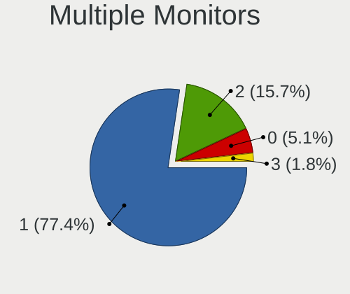

| Total | Computers | Percent |
|-------|-----------|---------|
| 1     | 977       | 77.36%  |
| 2     | 198       | 15.68%  |
| 0     | 65        | 5.15%   |
| 3     | 23        | 1.82%   |

Network
-------

Net Controller Vendor
---------------------

Controller vendors

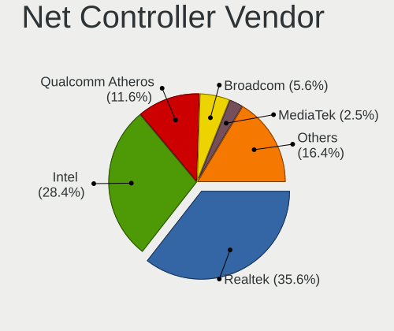

| Vendor                            | Computers | Percent |
|-----------------------------------|-----------|---------|
| Realtek Semiconductor             | 657       | 35.55%  |
| Intel                             | 524       | 28.35%  |
| Qualcomm Atheros                  | 214       | 11.58%  |
| Broadcom                          | 103       | 5.57%   |
| MediaTek                          | 47        | 2.54%   |
| TP-Link                           | 32        | 1.73%   |
| Ralink Technology                 | 28        | 1.52%   |
| Marvell Technology Group          | 26        | 1.41%   |
| Broadcom Limited                  | 25        | 1.35%   |
| Nvidia                            | 21        | 1.14%   |
| Ralink                            | 17        | 0.92%   |
| Qualcomm Atheros Communications   | 14        | 0.76%   |
| ASIX Electronics                  | 13        | 0.7%    |
| Xiaomi                            | 12        | 0.65%   |
| Dell                              | 9         | 0.49%   |
| Shenzhen Goodix Technology        | 8         | 0.43%   |
| Samsung Electronics               | 7         | 0.38%   |
| Sierra Wireless                   | 6         | 0.32%   |
| Fibocom                           | 6         | 0.32%   |
| Hewlett-Packard                   | 5         | 0.27%   |
| Ericsson Business Mobile Networks | 5         | 0.27%   |
| D-Link                            | 5         | 0.27%   |
| ASUSTek Computer                  | 5         | 0.27%   |
| Qualcomm                          | 4         | 0.22%   |
| Lenovo                            | 3         | 0.16%   |
| JMicron Technology                | 3         | 0.16%   |
| Huawei Technologies               | 3         | 0.16%   |
| DisplayLink                       | 3         | 0.16%   |
| ZyXEL Communications              | 2         | 0.11%   |
| ZTE WCDMA Technologies MSM        | 2         | 0.11%   |
| VIA Technologies                  | 2         | 0.11%   |
| Silicon Integrated Systems [SiS]  | 2         | 0.11%   |
| Microsoft                         | 2         | 0.11%   |
| Mellanox Technologies             | 2         | 0.11%   |
| Edimax Technology                 | 2         | 0.11%   |
| Unknown                           | 2         | 0.11%   |
| WiseGroup                         | 1         | 0.05%   |
| ULi Electronics                   | 1         | 0.05%   |
| Texas Instruments                 | 1         | 0.05%   |
| T & A Mobile Phones               | 1         | 0.05%   |

Net Controller Model
--------------------

Controller models

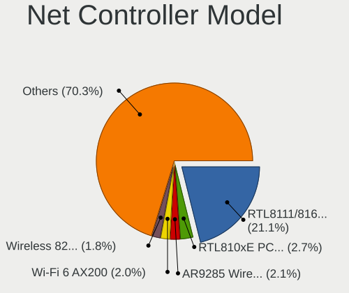

| Model                                                                   | Computers | Percent |
|-------------------------------------------------------------------------|-----------|---------|
| Realtek RTL8111/8168/8211/8411 PCI Express Gigabit Ethernet Controller  | 453       | 21.13%  |
| Realtek RTL810xE PCI Express Fast Ethernet controller                   | 58        | 2.71%   |
| Qualcomm Atheros AR9285 Wireless Network Adapter (PCI-Express)          | 45        | 2.1%    |
| Intel Wi-Fi 6 AX200                                                     | 42        | 1.96%   |
| Intel Wireless 8265 / 8275                                              | 39        | 1.82%   |
| Realtek RTL8153 Gigabit Ethernet Adapter                                | 38        | 1.77%   |
| Intel 82579LM Gigabit Network Connection (Lewisville)                   | 36        | 1.68%   |
| Realtek RTL8125 2.5GbE Controller                                       | 29        | 1.35%   |
| Qualcomm Atheros AR9485 Wireless Network Adapter                        | 24        | 1.12%   |
| Realtek RTL8822CE 802.11ac PCIe Wireless Network Adapter                | 22        | 1.03%   |
| Qualcomm Atheros QCA9377 802.11ac Wireless Network Adapter              | 22        | 1.03%   |
| MediaTek MT7922 802.11ax PCI Express Wireless Network Adapter           | 22        | 1.03%   |
| Realtek RTL8821CE 802.11ac PCIe Wireless Network Adapter                | 21        | 0.98%   |
| Realtek RTL-8100/8101L/8139 PCI Fast Ethernet Adapter                   | 21        | 0.98%   |
| Intel Centrino Advanced-N 6205 [Taylor Peak]                            | 21        | 0.98%   |
| Intel Wireless 8260                                                     | 20        | 0.93%   |
| Intel Wi-Fi 6 AX201                                                     | 19        | 0.89%   |
| Intel I211 Gigabit Network Connection                                   | 19        | 0.89%   |
| MediaTek MT7921 802.11ax PCIe Wireless Network Adapter [Filogic 330]    | 17        | 0.79%   |
| Qualcomm Atheros QCA6174 802.11ac Wireless Network Adapter              | 16        | 0.75%   |
| Intel Wireless 7260                                                     | 16        | 0.75%   |
| Qualcomm Atheros QCA9565 / AR9565 Wireless Network Adapter              | 15        | 0.7%    |
| Intel Ethernet Connection I217-LM                                       | 15        | 0.7%    |
| Qualcomm Atheros AR9271 802.11n                                         | 14        | 0.65%   |
| Intel Wireless 7265                                                     | 14        | 0.65%   |
| Intel Wi-Fi 6E(802.11ax) AX210/AX1675* 2x2 [Typhoon Peak]               | 14        | 0.65%   |
| Intel Ethernet Controller I225-V                                        | 14        | 0.65%   |
| Intel Ethernet Connection (2) I219-LM                                   | 14        | 0.65%   |
| Broadcom BCM4313 802.11bgn Wireless Network Adapter                     | 14        | 0.65%   |
| Realtek RTL8852BE PCIe 802.11ax Wireless Network Controller             | 13        | 0.61%   |
| Intel Wireless 3165                                                     | 13        | 0.61%   |
| Intel Ethernet Connection (4) I219-LM                                   | 13        | 0.61%   |
| Intel Ethernet Connection (2) I219-V                                    | 13        | 0.61%   |
| Intel Comet Lake PCH-LP CNVi WiFi                                       | 13        | 0.61%   |
| Intel Cannon Point-LP CNVi [Wireless-AC]                                | 13        | 0.61%   |
| Ralink MT7601U Wireless Adapter                                         | 12        | 0.56%   |
| Qualcomm Atheros AR8151 v2.0 Gigabit Ethernet                           | 12        | 0.56%   |
| Qualcomm Atheros AR242x / AR542x Wireless Network Adapter (PCI-Express) | 12        | 0.56%   |
| Intel Alder Lake-P PCH CNVi WiFi                                        | 12        | 0.56%   |
| Intel 82579V Gigabit Network Connection                                 | 12        | 0.56%   |

Wireless Vendor
---------------

Wireless vendors

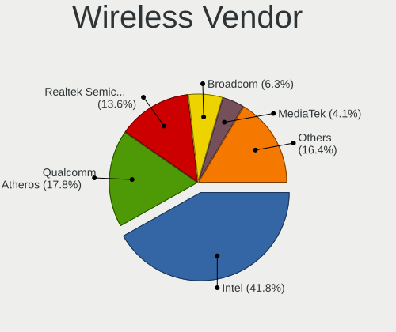

| Vendor                            | Computers | Percent |
|-----------------------------------|-----------|---------|
| Intel                             | 392       | 41.84%  |
| Qualcomm Atheros                  | 167       | 17.82%  |
| Realtek Semiconductor             | 127       | 13.55%  |
| Broadcom                          | 59        | 6.3%    |
| MediaTek                          | 38        | 4.06%   |
| TP-Link                           | 32        | 3.42%   |
| Ralink Technology                 | 28        | 2.99%   |
| Broadcom Limited                  | 18        | 1.92%   |
| Ralink                            | 17        | 1.81%   |
| Qualcomm Atheros Communications   | 14        | 1.49%   |
| Dell                              | 7         | 0.75%   |
| Sierra Wireless                   | 6         | 0.64%   |
| Fibocom                           | 6         | 0.64%   |
| D-Link                            | 5         | 0.53%   |
| ASUSTek Computer                  | 5         | 0.53%   |
| Qualcomm                          | 4         | 0.43%   |
| ZyXEL Communications              | 2         | 0.21%   |
| Microsoft                         | 2         | 0.21%   |
| Edimax Technology                 | 2         | 0.21%   |
| Texas Instruments                 | 1         | 0.11%   |
| Micro Star International          | 1         | 0.11%   |
| Mercucys                          | 1         | 0.11%   |
| Ericsson Business Mobile Networks | 1         | 0.11%   |
| Accton Technology                 | 1         | 0.11%   |
| Unknown                           | 1         | 0.11%   |

Wireless Model
--------------

Wireless models

| Model                                                                   | Computers | Percent |
|-------------------------------------------------------------------------|-----------|---------|
| Qualcomm Atheros AR9285 Wireless Network Adapter (PCI-Express)          | 45        | 4.77%   |
| Intel Wi-Fi 6 AX200                                                     | 42        | 4.45%   |
| Intel Wireless 8265 / 8275                                              | 39        | 4.13%   |
| Qualcomm Atheros AR9485 Wireless Network Adapter                        | 24        | 2.54%   |
| Realtek RTL8822CE 802.11ac PCIe Wireless Network Adapter                | 22        | 2.33%   |
| Qualcomm Atheros QCA9377 802.11ac Wireless Network Adapter              | 22        | 2.33%   |
| Realtek RTL8821CE 802.11ac PCIe Wireless Network Adapter                | 21        | 2.22%   |
| Intel Centrino Advanced-N 6205 [Taylor Peak]                            | 21        | 2.22%   |
| Intel Wireless 8260                                                     | 20        | 2.12%   |
| Intel Wi-Fi 6 AX201                                                     | 19        | 2.01%   |
| MediaTek MT7922 802.11ax PCI Express Wireless Network Adapter           | 17        | 1.8%    |
| MediaTek MT7921 802.11ax PCIe Wireless Network Adapter [Filogic 330]    | 17        | 1.8%    |
| Qualcomm Atheros QCA6174 802.11ac Wireless Network Adapter              | 16        | 1.69%   |
| Intel Wireless 7260                                                     | 16        | 1.69%   |
| Qualcomm Atheros QCA9565 / AR9565 Wireless Network Adapter              | 15        | 1.59%   |
| Qualcomm Atheros AR9271 802.11n                                         | 14        | 1.48%   |
| Intel Wireless 7265                                                     | 14        | 1.48%   |
| Intel Wi-Fi 6E(802.11ax) AX210/AX1675* 2x2 [Typhoon Peak]               | 14        | 1.48%   |
| Broadcom BCM4313 802.11bgn Wireless Network Adapter                     | 14        | 1.48%   |
| Intel Wireless 3165                                                     | 13        | 1.38%   |
| Intel Comet Lake PCH-LP CNVi WiFi                                       | 13        | 1.38%   |
| Intel Cannon Point-LP CNVi [Wireless-AC]                                | 13        | 1.38%   |
| Ralink MT7601U Wireless Adapter                                         | 12        | 1.27%   |
| Qualcomm Atheros AR242x / AR542x Wireless Network Adapter (PCI-Express) | 12        | 1.27%   |
| Realtek RTL8852BE PCIe 802.11ax Wireless Network Controller             | 11        | 1.17%   |
| Intel Cannon Lake PCH CNVi WiFi                                         | 11        | 1.17%   |
| TP-Link TL-WN722N v2/v3 [Realtek RTL8188EUS]                            | 10        | 1.06%   |
| Realtek RTL8821AE 802.11ac PCIe Wireless Network Adapter                | 10        | 1.06%   |
| Ralink RT3290 Wireless 802.11n 1T/1R PCIe                               | 10        | 1.06%   |
| Qualcomm Atheros AR9462 Wireless Network Adapter                        | 10        | 1.06%   |
| Intel Wi-Fi 5(802.11ac) Wireless-AC 9x6x [Thunder Peak]                 | 10        | 1.06%   |
| Intel Alder Lake-P PCH CNVi WiFi                                        | 10        | 1.06%   |
| Intel WiFi Link 5100                                                    | 9         | 0.95%   |
| Intel PRO/Wireless 5100 AGN [Shiloh] Network Connection                 | 9         | 0.95%   |
| Intel PRO/Wireless 4965 AG or AGN [Kedron] Network Connection           | 9         | 0.95%   |
| Intel PRO/Wireless 3945ABG [Golan] Network Connection                   | 9         | 0.95%   |
| Broadcom BCM43142 802.11b/g/n                                           | 9         | 0.95%   |
| Ralink RT2870/RT3070 Wireless Adapter                                   | 8         | 0.85%   |
| Intel Dual Band Wireless-AC 3165 Plus Bluetooth                         | 8         | 0.85%   |
| Intel Comet Lake PCH CNVi WiFi                                          | 8         | 0.85%   |

Ethernet Vendor
---------------

Ethernet vendors

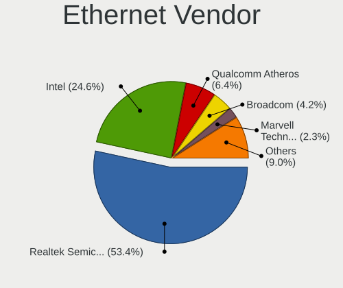

| Vendor                                 | Computers | Percent |
|----------------------------------------|-----------|---------|
| Realtek Semiconductor                  | 605       | 53.4%   |
| Intel                                  | 279       | 24.62%  |
| Qualcomm Atheros                       | 73        | 6.44%   |
| Broadcom                               | 48        | 4.24%   |
| Marvell Technology Group               | 26        | 2.29%   |
| Nvidia                                 | 21        | 1.85%   |
| ASIX Electronics                       | 13        | 1.15%   |
| Xiaomi                                 | 12        | 1.06%   |
| MediaTek                               | 9         | 0.79%   |
| Samsung Electronics                    | 7         | 0.62%   |
| Broadcom Limited                       | 7         | 0.62%   |
| Lenovo                                 | 3         | 0.26%   |
| JMicron Technology                     | 3         | 0.26%   |
| DisplayLink                            | 3         | 0.26%   |
| VIA Technologies                       | 2         | 0.18%   |
| Mellanox Technologies                  | 2         | 0.18%   |
| Huawei Technologies                    | 2         | 0.18%   |
| ZTE WCDMA Technologies MSM             | 1         | 0.09%   |
| T & A Mobile Phones                    | 1         | 0.09%   |
| Spreadtrum Communications              | 1         | 0.09%   |
| Sony Ericsson Mobile Communications AB | 1         | 0.09%   |
| Silicon Integrated Systems [SiS]       | 1         | 0.09%   |
| Raspberry Pi                           | 1         | 0.09%   |
| Qualcomm Technologies                  | 1         | 0.09%   |
| QinHeng Electronics                    | 1         | 0.09%   |
| Prestigio                              | 1         | 0.09%   |
| OPPO Electronics                       | 1         | 0.09%   |
| Nokia Mobile Phones                    | 1         | 0.09%   |
| National Semiconductor                 | 1         | 0.09%   |
| Motorola PCS                           | 1         | 0.09%   |
| ICS Advent                             | 1         | 0.09%   |
| IBM                                    | 1         | 0.09%   |
| Google                                 | 1         | 0.09%   |
| Attansic Technology                    | 1         | 0.09%   |
| Aquantia                               | 1         | 0.09%   |

Ethernet Model
--------------

Ethernet models

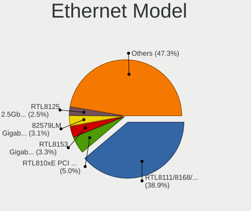

| Model                                                                  | Computers | Percent |
|------------------------------------------------------------------------|-----------|---------|
| Realtek RTL8111/8168/8211/8411 PCI Express Gigabit Ethernet Controller | 453       | 38.85%  |
| Realtek RTL810xE PCI Express Fast Ethernet controller                  | 58        | 4.97%   |
| Realtek RTL8153 Gigabit Ethernet Adapter                               | 38        | 3.26%   |
| Intel 82579LM Gigabit Network Connection (Lewisville)                  | 36        | 3.09%   |
| Realtek RTL8125 2.5GbE Controller                                      | 29        | 2.49%   |
| Realtek RTL-8100/8101L/8139 PCI Fast Ethernet Adapter                  | 21        | 1.8%    |
| Intel I211 Gigabit Network Connection                                  | 19        | 1.63%   |
| Intel Ethernet Connection I217-LM                                      | 15        | 1.29%   |
| Intel Ethernet Controller I225-V                                       | 14        | 1.2%    |
| Intel Ethernet Connection (2) I219-LM                                  | 14        | 1.2%    |
| Intel Ethernet Connection (4) I219-LM                                  | 13        | 1.11%   |
| Intel Ethernet Connection (2) I219-V                                   | 13        | 1.11%   |
| Qualcomm Atheros AR8151 v2.0 Gigabit Ethernet                          | 12        | 1.03%   |
| Intel 82579V Gigabit Network Connection                                | 12        | 1.03%   |
| Realtek RTL8169 PCI Gigabit Ethernet Controller                        | 10        | 0.86%   |
| Qualcomm Atheros Killer E220x Gigabit Ethernet Controller              | 9         | 0.77%   |
| Intel Ethernet Connection I219-LM                                      | 9         | 0.77%   |
| Intel 82567LM Gigabit Network Connection                               | 9         | 0.77%   |
| ASIX AX88179 Gigabit Ethernet                                          | 9         | 0.77%   |
| Qualcomm Atheros AR8131 Gigabit Ethernet                               | 8         | 0.69%   |
| Intel Ethernet Connection (4) I219-V                                   | 8         | 0.69%   |
| Xiaomi Mi/Redmi series (RNDIS)                                         | 7         | 0.6%    |
| Samsung Galaxy series, misc. (tethering mode)                          | 7         | 0.6%    |
| Nvidia MCP61 Ethernet                                                  | 7         | 0.6%    |
| Intel Ethernet Connection (7) I219-LM                                  | 7         | 0.6%    |
| Intel Ethernet Connection (6) I219-V                                   | 7         | 0.6%    |
| Intel Ethernet Connection (3) I218-LM                                  | 7         | 0.6%    |
| Qualcomm Atheros QCA8172 Fast Ethernet                                 | 6         | 0.51%   |
| Qualcomm Atheros AR8132 Fast Ethernet                                  | 6         | 0.51%   |
| Qualcomm Atheros AR8121/AR8113/AR8114 Gigabit or Fast Ethernet         | 6         | 0.51%   |
| Intel Ethernet Controller I226-V                                       | 6         | 0.51%   |
| Intel Ethernet Connection (7) I219-V                                   | 6         | 0.51%   |
| Broadcom NetLink BCM57780 Gigabit Ethernet PCIe                        | 6         | 0.51%   |
| Xiaomi Mi/Redmi series (RNDIS + ADB)                                   | 5         | 0.43%   |
| Realtek RTL8152 Fast Ethernet Adapter                                  | 5         | 0.43%   |
| MediaTek MT7922 802.11ax PCI Express Wireless Network Adapter          | 5         | 0.43%   |
| Marvell Group 88E8056 PCI-E Gigabit Ethernet Controller                | 5         | 0.43%   |
| Marvell Group 88E8055 PCI-E Gigabit Ethernet Controller                | 5         | 0.43%   |
| Intel I210 Gigabit Network Connection                                  | 5         | 0.43%   |
| Intel Ethernet Connection I218-LM                                      | 5         | 0.43%   |

Net Controller Kind
-------------------

Ethernet, WiFi or modem

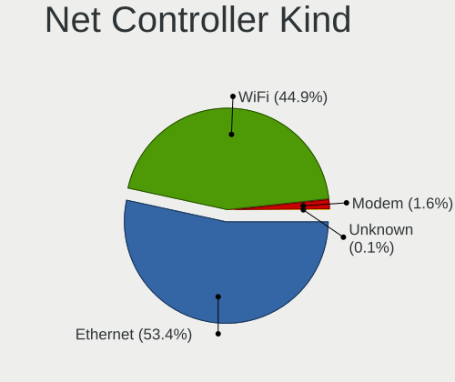

| Kind     | Computers | Percent |
|----------|-----------|---------|
| Ethernet | 1058      | 53.41%  |
| WiFi     | 889       | 44.88%  |
| Modem    | 32        | 1.62%   |
| Unknown  | 2         | 0.1%    |

Used Controller
---------------

Currently used network controller

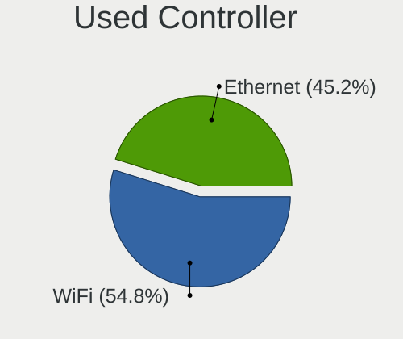

| Kind     | Computers | Percent |
|----------|-----------|---------|
| WiFi     | 683       | 54.82%  |
| Ethernet | 563       | 45.18%  |

NICs
----

Total network controllers on board

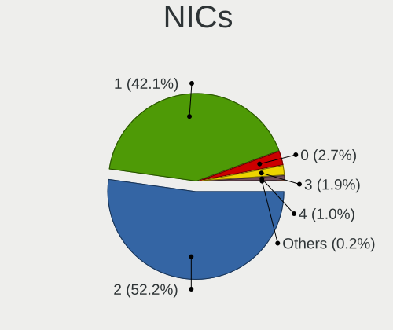

| Total | Computers | Percent |
|-------|-----------|---------|
| 2     | 647       | 52.22%  |
| 1     | 522       | 42.13%  |
| 0     | 33        | 2.66%   |
| 3     | 23        | 1.86%   |
| 4     | 12        | 0.97%   |
| 6     | 1         | 0.08%   |
| 5     | 1         | 0.08%   |

IPv6
----

IPv6 vs IPv4

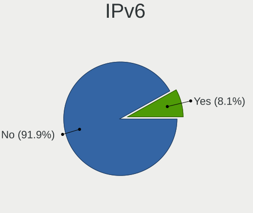

| Used | Computers | Percent |
|------|-----------|---------|
| No   | 1140      | 91.94%  |
| Yes  | 100       | 8.06%   |

Bluetooth
---------

Bluetooth Vendor
----------------

Controller vendors

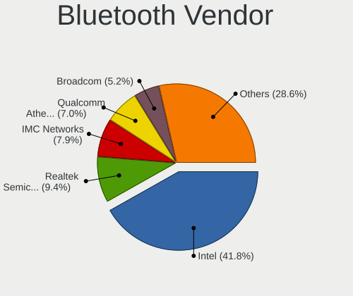

| Vendor                          | Computers | Percent |
|---------------------------------|-----------|---------|
| Intel                           | 297       | 41.83%  |
| Realtek Semiconductor           | 67        | 9.44%   |
| IMC Networks                    | 56        | 7.89%   |
| Qualcomm Atheros Communications | 50        | 7.04%   |
| Broadcom                        | 37        | 5.21%   |
| Foxconn / Hon Hai               | 34        | 4.79%   |
| Lite-On Technology              | 30        | 4.23%   |
| Cambridge Silicon Radio         | 27        | 3.8%    |
| ASUSTek Computer                | 20        | 2.82%   |
| Hewlett-Packard                 | 14        | 1.97%   |
| Apple                           | 14        | 1.97%   |
| Dell                            | 11        | 1.55%   |
| Ralink                          | 10        | 1.41%   |
| Toshiba                         | 7         | 0.99%   |
| Micro Star International        | 5         | 0.7%    |
| MediaTek                        | 4         | 0.56%   |
| Foxconn International           | 4         | 0.56%   |
| USI                             | 3         | 0.42%   |
| TP-Link                         | 3         | 0.42%   |
| Realtek                         | 3         | 0.42%   |
| Taiyo Yuden                     | 2         | 0.28%   |
| HTC (High Tech Computer)        | 2         | 0.28%   |
| Alps Electric                   | 2         | 0.28%   |
| Ralink Technology               | 1         | 0.14%   |
| Quectel Wireless Solutions      | 1         | 0.14%   |
| Mercucys                        | 1         | 0.14%   |
| Integrated System Solution      | 1         | 0.14%   |
| Fujitsu                         | 1         | 0.14%   |
| Edimax Technology               | 1         | 0.14%   |
| Belkin Components               | 1         | 0.14%   |
| Actions                         | 1         | 0.14%   |

Bluetooth Model
---------------

Controller models

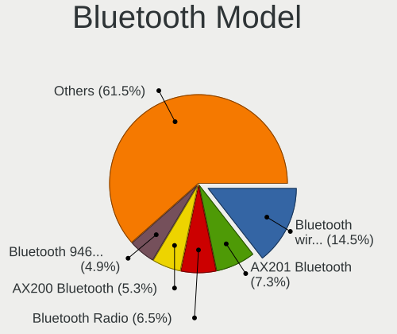

| Model                                               | Computers | Percent |
|-----------------------------------------------------|-----------|---------|
| Intel Bluetooth wireless interface                  | 103       | 14.47%  |
| Intel AX201 Bluetooth                               | 52        | 7.3%    |
| Realtek Bluetooth Radio                             | 46        | 6.46%   |
| Intel AX200 Bluetooth                               | 38        | 5.34%   |
| Intel Bluetooth 9460/9560 Jefferson Peak (JfP)      | 35        | 4.92%   |
| Intel Bluetooth Device                              | 30        | 4.21%   |
| Cambridge Silicon Radio Bluetooth Dongle (HCI mode) | 27        | 3.79%   |
| Qualcomm Atheros AR3011 Bluetooth                   | 20        | 2.81%   |
| IMC Networks Bluetooth Radio                        | 20        | 2.81%   |
| IMC Networks Wireless_Device                        | 17        | 2.39%   |
| Qualcomm Atheros  Bluetooth Device                  | 15        | 2.11%   |
| Intel AX210 Bluetooth                               | 15        | 2.11%   |
| Foxconn / Hon Hai Wireless_Device                   | 15        | 2.11%   |
| Intel Centrino Bluetooth Wireless Transceiver       | 11        | 1.54%   |
| Ralink RT3290 Bluetooth                             | 10        | 1.4%    |
| Lite-On Bluetooth Device                            | 9         | 1.26%   |
| Intel Wireless-AC 9260 Bluetooth Adapter            | 9         | 1.26%   |
| IMC Networks Bluetooth Device                       | 9         | 1.26%   |
| IMC Networks Atheros AR3012 Bluetooth 4.0 Adapter   | 9         | 1.26%   |
| Realtek  Bluetooth 4.2 Adapter                      | 8         | 1.12%   |
| Qualcomm Atheros AR3012 Bluetooth 4.0               | 8         | 1.12%   |
| Realtek RTL8821A Bluetooth                          | 7         | 0.98%   |
| Lite-On Qualcomm Atheros QCA9377 Bluetooth          | 7         | 0.98%   |
| HP Bluetooth 2.0 Interface [Broadcom BCM2045]       | 7         | 0.98%   |
| Intel Wireless-AC 3168 Bluetooth                    | 6         | 0.84%   |
| Broadcom HP Portable SoftSailing                    | 6         | 0.84%   |
| Broadcom BCM20702 Bluetooth 4.0 [ThinkPad]          | 6         | 0.84%   |
| Broadcom BCM2045 Bluetooth                          | 6         | 0.84%   |
| ASUS BT-183 Bluetooth 2.0+EDR adapter               | 6         | 0.84%   |
| Lite-On Wireless_Device                             | 5         | 0.7%    |
| HP Broadcom 2070 Bluetooth Combo                    | 5         | 0.7%    |
| Foxconn / Hon Hai Bluetooth Device                  | 5         | 0.7%    |
| Apple Bluetooth Host Controller                     | 5         | 0.7%    |
| MediaTek Wireless_Device                            | 4         | 0.56%   |
| Lite-On Broadcom BCM43142A0 Bluetooth Device        | 4         | 0.56%   |
| Foxconn International BCM43142A0 Bluetooth module   | 4         | 0.56%   |
| Dell BCM20702A0 Bluetooth Module                    | 4         | 0.56%   |
| Broadcom HP Portable Bumble Bee                     | 4         | 0.56%   |
| Apple Built-in Bluetooth 2.0+EDR HCI                | 4         | 0.56%   |
| USI Bluetooth Device                                | 3         | 0.42%   |

Sound
-----

Sound Vendor
------------

Sound card vendors

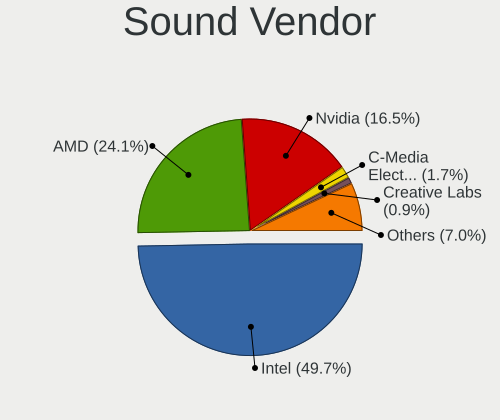

| Vendor                                       | Computers | Percent |
|----------------------------------------------|-----------|---------|
| Intel                                        | 824       | 49.7%   |
| AMD                                          | 400       | 24.13%  |
| Nvidia                                       | 274       | 16.53%  |
| C-Media Electronics                          | 29        | 1.75%   |
| Creative Labs                                | 15        | 0.9%    |
| GN Netcom                                    | 11        | 0.66%   |
| Creative Technology                          | 9         | 0.54%   |
| ASUSTek Computer                             | 8         | 0.48%   |
| Logitech                                     | 7         | 0.42%   |
| VIA Technologies                             | 6         | 0.36%   |
| Lenovo                                       | 6         | 0.36%   |
| JMTek                                        | 6         | 0.36%   |
| Silicon Integrated Systems [SiS]             | 5         | 0.3%    |
| Realtek Semiconductor                        | 5         | 0.3%    |
| Hewlett-Packard                              | 4         | 0.24%   |
| Focusrite-Novation                           | 4         | 0.24%   |
| Zoran Co. Personal Media Division (Nogatech) | 3         | 0.18%   |
| Trust                                        | 3         | 0.18%   |
| Texas Instruments                            | 3         | 0.18%   |
| SteelSeries ApS                              | 3         | 0.18%   |
| Micro Star International                     | 3         | 0.18%   |
| Yamaha                                       | 2         | 0.12%   |
| Samson Technologies                          | 2         | 0.12%   |
| Blue Microphones                             | 2         | 0.12%   |
| AKAI Professional M.I.                       | 2         | 0.12%   |
| XMOS                                         | 1         | 0.06%   |
| Valve Software                               | 1         | 0.06%   |
| ULi Electronics                              | 1         | 0.06%   |
| Textech International                        | 1         | 0.06%   |
| Sony                                         | 1         | 0.06%   |
| Plantronics                                  | 1         | 0.06%   |
| Nordic Semiconductor ASA                     | 1         | 0.06%   |
| M-Audio                                      | 1         | 0.06%   |
| KTMicro                                      | 1         | 0.06%   |
| Kingston Technology                          | 1         | 0.06%   |
| Jieli Technology                             | 1         | 0.06%   |
| Huawei Technologies                          | 1         | 0.06%   |
| Fortemedia                                   | 1         | 0.06%   |
| FiiO Electronics Technology                  | 1         | 0.06%   |
| Conexant Systems                             | 1         | 0.06%   |

Sound Model
-----------

Sound card models

| Model                                                                      | Computers | Percent |
|----------------------------------------------------------------------------|-----------|---------|
| AMD Ryzen HD Audio Controller                                              | 140       | 7.04%   |
| Intel 7 Series/C216 Chipset Family High Definition Audio Controller        | 100       | 5.03%   |
| AMD Renoir/Cezanne HDMI/DP Audio Controller                                | 72        | 3.62%   |
| Intel Sunrise Point-LP HD Audio                                            | 71        | 3.57%   |
| Intel 6 Series/C200 Series Chipset Family High Definition Audio Controller | 66        | 3.32%   |
| Intel 8 Series/C220 Series Chipset High Definition Audio Controller        | 63        | 3.17%   |
| Intel 82801I (ICH9 Family) HD Audio Controller                             | 53        | 2.67%   |
| AMD SBx00 Azalia (Intel HDA)                                               | 52        | 2.62%   |
| AMD Radeon High Definition Audio Controller                                | 46        | 2.31%   |
| Intel Xeon E3-1200 v3/4th Gen Core Processor HD Audio Controller           | 45        | 2.26%   |
| Intel NM10/ICH7 Family High Definition Audio Controller                    | 43        | 2.16%   |
| Intel 5 Series/3400 Series Chipset High Definition Audio                   | 39        | 1.96%   |
| Intel 100 Series/C230 Series Chipset Family HD Audio Controller            | 35        | 1.76%   |
| AMD Starship/Matisse HD Audio Controller                                   | 35        | 1.76%   |
| AMD FCH Azalia Controller                                                  | 34        | 1.71%   |
| Intel Cannon Lake PCH cAVS                                                 | 33        | 1.66%   |
| Intel 82801H (ICH8 Family) HD Audio Controller                             | 29        | 1.46%   |
| Nvidia GK208 HDMI/DP Audio Controller                                      | 26        | 1.31%   |
| AMD Raven/Raven2/Fenghuang HDMI/DP Audio Controller                        | 25        | 1.26%   |
| Intel Tiger Lake-LP Smart Sound Technology Audio Controller                | 24        | 1.21%   |
| Nvidia GF108 High Definition Audio Controller                              | 23        | 1.16%   |
| Intel 200 Series PCH HD Audio                                              | 21        | 1.06%   |
| Intel Broadwell-U Audio Controller                                         | 20        | 1.01%   |
| Intel Wildcat Point-LP High Definition Audio Controller                    | 19        | 0.96%   |
| Intel Cannon Point-LP High Definition Audio Controller                     | 19        | 0.96%   |
| Intel Celeron/Pentium Silver Processor High Definition Audio               | 18        | 0.91%   |
| Nvidia High Definition Audio Controller                                    | 17        | 0.86%   |
| Intel Haswell-ULT HD Audio Controller                                      | 16        | 0.8%    |
| Intel 8 Series HD Audio Controller                                         | 16        | 0.8%    |
| Nvidia GP106 High Definition Audio Controller                              | 15        | 0.75%   |
| Intel 82801JI (ICH10 Family) HD Audio Controller                           | 15        | 0.75%   |
| AMD Family 17h (Models 00h-0fh) HD Audio Controller                        | 15        | 0.75%   |
| Intel Comet Lake PCH-LP cAVS                                               | 14        | 0.7%    |
| AMD Navi 21/23 HDMI/DP Audio Controller                                    | 14        | 0.7%    |
| AMD Family 15h (Models 60h-6fh) Audio Controller                           | 14        | 0.7%    |
| Nvidia GP107GL High Definition Audio Controller                            | 13        | 0.65%   |
| Intel Atom Processor Z36xxx/Z37xxx Series High Definition Audio Controller | 13        | 0.65%   |
| AMD Oland/Hainan/Cape Verde/Pitcairn HDMI Audio [Radeon HD 7000 Series]    | 13        | 0.65%   |
| Nvidia GM107 High Definition Audio Controller [GeForce 940MX]              | 12        | 0.6%    |
| Intel Alder Lake PCH-P High Definition Audio Controller                    | 12        | 0.6%    |

Memory
------

Memory Vendor
-------------

Memory module vendors

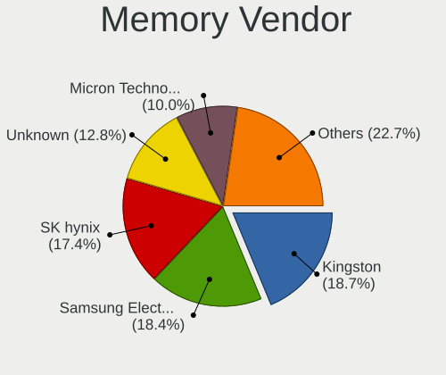

| Vendor                       | Computers | Percent |
|------------------------------|-----------|---------|
| Kingston                     | 156       | 18.73%  |
| Samsung Electronics          | 153       | 18.37%  |
| SK hynix                     | 145       | 17.41%  |
| Unknown                      | 107       | 12.85%  |
| Micron Technology            | 83        | 9.96%   |
| Crucial                      | 44        | 5.28%   |
| Corsair                      | 23        | 2.76%   |
| Patriot                      | 18        | 2.16%   |
| Ramaxel Technology           | 17        | 2.04%   |
| Elpida                       | 16        | 1.92%   |
| Unknown                      | 12        | 1.44%   |
| A-DATA Technology            | 11        | 1.32%   |
| G.Skill                      | 10        | 1.2%    |
| Unknown (ABCD)               | 7         | 0.84%   |
| Nanya Technology             | 6         | 0.72%   |
| Transcend                    | 3         | 0.36%   |
| Patriot Memory (PDP Systems) | 3         | 0.36%   |
| Apacer                       | 3         | 0.36%   |
| Hewlett-Packard              | 2         | 0.24%   |
| ASint Technology             | 2         | 0.24%   |
| Uroad                        | 1         | 0.12%   |
| Unknown (8AC8)               | 1         | 0.12%   |
| Unknown (130B)               | 1         | 0.12%   |
| Unigen                       | 1         | 0.12%   |
| Toshiba                      | 1         | 0.12%   |
| SHARETRONIC                  | 1         | 0.12%   |
| Patriot Memory               | 1         | 0.12%   |
| Hikvision                    | 1         | 0.12%   |
| Atermiter                    | 1         | 0.12%   |
| AMD                          | 1         | 0.12%   |
| 48spaces                     | 1         | 0.12%   |
| 031600B380AD                 | 1         | 0.12%   |

Memory Model
------------

Memory module models

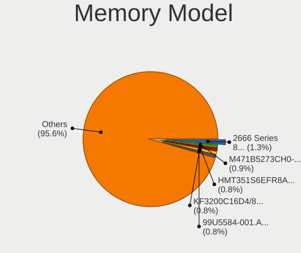

| Model                                                            | Computers | Percent |
|------------------------------------------------------------------|-----------|---------|
| Unknown                                                          | 12        | 1.3%    |
| Samsung RAM M471B5273CH0-CH9 4GB SODIMM DDR3 1334MT/s            | 8         | 0.86%   |
| SK hynix RAM HMT351S6EFR8A-PB 4GB SODIMM DDR3 1600MT/s           | 7         | 0.76%   |
| Kingston RAM KF3200C16D4/8GX 8GiB DIMM DDR4 3600MT/s             | 7         | 0.76%   |
| Kingston RAM 99U5584-001.A00LF 4GB DIMM DDR3 1600MT/s            | 7         | 0.76%   |
| Unknown RAM Module 2048MB SODIMM DDR2 667MT/s                    | 6         | 0.65%   |
| Unknown (ABCD) RAM 123456789012345678 2GB SODIMM LPDDR4 2400MT/s | 6         | 0.65%   |
| SK hynix RAM HMT351S6CFR8C-PB 4GB SODIMM DDR3 1600MT/s           | 6         | 0.65%   |
| SK hynix RAM HMAA1GS6CJR6N-XN 8GB SODIMM DDR4 3200MT/s           | 6         | 0.65%   |
| Samsung RAM M471A1K43DB1-CWE 8GB SODIMM DDR4 3200MT/s            | 6         | 0.65%   |
| Kingston RAM 99U5584-009.A00LF 4GB DIMM DDR3 1600MT/s            | 6         | 0.65%   |
| Unknown RAM Module 2GB DIMM 800MT/s                              | 5         | 0.54%   |
| SK hynix RAM HMT451S6AFR8A-PB 4GB SODIMM DDR3 1600MT/s           | 5         | 0.54%   |
| SK hynix RAM HMA81GS6AFR8N-UH 8GB SODIMM DDR4 2667MT/s           | 5         | 0.54%   |
| Samsung RAM M471B5773CHS-CH9 2GB SODIMM DDR3 4199MT/s            | 5         | 0.54%   |
| Samsung RAM M471B5173EB0-YK0 4GB SODIMM DDR3 1600MT/s            | 5         | 0.54%   |
| Samsung RAM M471A1K43DB1-CTD 8GB SODIMM DDR4 2667MT/s            | 5         | 0.54%   |
| Samsung RAM M4 70T5663QZ3-CF7 2GB SODIMM DDR2 2048MT/s           | 5         | 0.54%   |
| Micron RAM 16KTF51264HZ-1G6M1 4GB SODIMM DDR3 1600MT/s           | 5         | 0.54%   |
| Kingston RAM KHX3200C16D4/8GX 8GB DIMM DDR4 3733MT/s             | 5         | 0.54%   |
| Kingston RAM KHX1600C9D3/4GX 4GB DIMM DDR3 1867MT/s              | 5         | 0.54%   |
| Unknown RAM Module 2GB SODIMM DDR2 667MT/s                       | 4         | 0.43%   |
| Unknown RAM Module 2048MB DIMM DDR2 800MT/s                      | 4         | 0.43%   |
| Unknown RAM Module 1024MB SODIMM DDR2 667MT/s                    | 4         | 0.43%   |
| SK hynix RAM HMT451S6BFR8A-PB 4GB SODIMM DDR3 1600MT/s           | 4         | 0.43%   |
| SK hynix RAM HMT41GS6BFR8A-PB 8GB SODIMM DDR3 2667MT/s           | 4         | 0.43%   |
| SK hynix RAM HMAB2GS6AMR6N-XN 16GB SODIMM DDR4 3200MT/s          | 4         | 0.43%   |
| Samsung RAM M471B5173QH0-YK0 4GB SODIMM DDR3 1600MT/s            | 4         | 0.43%   |
| Samsung RAM M471B1G73DB0-YK0 8GB SODIMM DDR3 1600MT/s            | 4         | 0.43%   |
| Micron RAM MT8KTF51264HZ-1G6 4GB SODIMM DDR3 1600MT/s            | 4         | 0.43%   |
| Kingston RAM KHX1866C10D3/4G 4GB DIMM DDR3 1867MT/s              | 4         | 0.43%   |
| Kingston RAM KF2666C15S4/8G 8GB SODIMM DDR4 2667MT/s             | 4         | 0.43%   |
| Unknown RAM Module 2GB SODIMM DDR2                               | 3         | 0.32%   |
| Unknown RAM Module 2GB SODIMM 800MT/s                            | 3         | 0.32%   |
| Unknown RAM Module 2048MB DIMM DDR2 333MT/s                      | 3         | 0.32%   |
| Unknown RAM Module 2048MB DIMM 800MT/s                           | 3         | 0.32%   |
| SK hynix RAM HMT41GS6AFR8A-PB 8GiB SODIMM DDR3 2667MT/s          | 3         | 0.32%   |
| SK hynix RAM HMT351U6EFR8C-PB 4GB DIMM DDR3 1600MT/s             | 3         | 0.32%   |
| SK hynix RAM HMT351S6CFR8C-PB 4096MB SODIMM DDR3 1600MT/s        | 3         | 0.32%   |
| SK hynix RAM HMT351S6BFR8C-H9 4GB SODIMM DDR3 1333MT/s           | 3         | 0.32%   |

Memory Kind
-----------

Memory module kinds

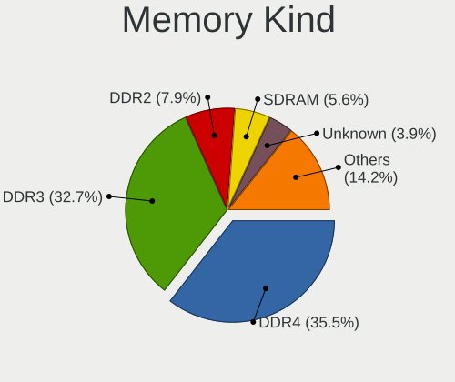

| Kind    | Computers | Percent |
|---------|-----------|---------|
| DDR4    | 252       | 35.54%  |
| DDR3    | 232       | 32.72%  |
| DDR2    | 56        | 7.9%    |
| SDRAM   | 40        | 5.64%   |
| Unknown | 28        | 3.95%   |
| LPDDR4  | 27        | 3.81%   |
| DDR5    | 27        | 3.81%   |
| LPDDR5  | 26        | 3.67%   |
| DDR     | 10        | 1.41%   |
| LPDDR3  | 8         | 1.13%   |
| DRAM    | 3         | 0.42%   |

Memory Form Factor
------------------

Physical design of the memory module

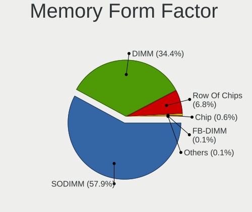

| Name         | Computers | Percent |
|--------------|-----------|---------|
| SODIMM       | 407       | 57.89%  |
| DIMM         | 242       | 34.42%  |
| Row Of Chips | 48        | 6.83%   |
| Chip         | 4         | 0.57%   |
| FB-DIMM      | 1         | 0.14%   |
| Unknown      | 1         | 0.14%   |

Memory Size
-----------

Memory module size

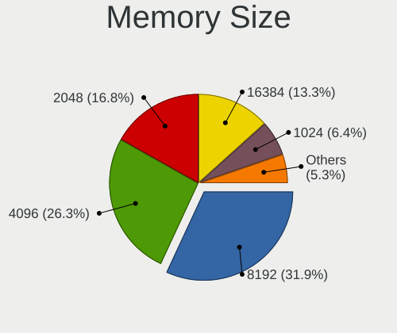

| Size  | Computers | Percent |
|-------|-----------|---------|
| 8192  | 254       | 31.91%  |
| 4096  | 209       | 26.26%  |
| 2048  | 134       | 16.83%  |
| 16384 | 106       | 13.32%  |
| 1024  | 51        | 6.41%   |
| 32768 | 26        | 3.27%   |
| 512   | 9         | 1.13%   |
| 256   | 2         | 0.25%   |
| 65536 | 1         | 0.13%   |
| 49152 | 1         | 0.13%   |
| 3072  | 1         | 0.13%   |
| 128   | 1         | 0.13%   |
| 64    | 1         | 0.13%   |

Memory Speed
------------

Memory module speed

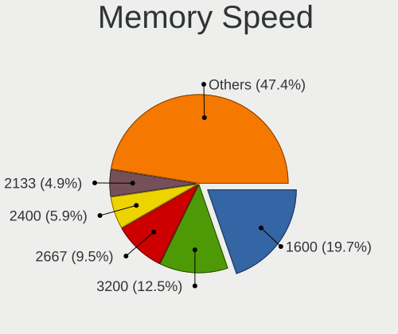

| Speed   | Computers | Percent |
|---------|-----------|---------|
| 1600    | 156       | 19.72%  |
| 3200    | 99        | 12.52%  |
| 2667    | 75        | 9.48%   |
| 2400    | 47        | 5.94%   |
| 2133    | 39        | 4.93%   |
| 1333    | 39        | 4.93%   |
| 667     | 37        | 4.68%   |
| 800     | 29        | 3.67%   |
| 1334    | 24        | 3.03%   |
| 3600    | 17        | 2.15%   |
| Unknown | 16        | 2.02%   |
| 6400    | 15        | 1.9%    |
| 4199    | 14        | 1.77%   |
| 5600    | 12        | 1.52%   |
| 1067    | 12        | 1.52%   |
| 3733    | 10        | 1.26%   |
| 4800    | 9         | 1.14%   |
| 1867    | 9         | 1.14%   |
| 7500    | 8         | 1.01%   |
| 2048    | 8         | 1.01%   |
| 1866    | 8         | 1.01%   |
| 4267    | 7         | 0.88%   |
| 4266    | 7         | 0.88%   |
| 1066    | 7         | 0.88%   |
| 533     | 7         | 0.88%   |
| 333     | 7         | 0.88%   |
| 3800    | 5         | 0.63%   |
| 1800    | 5         | 0.63%   |
| 8400    | 4         | 0.51%   |
| 3933    | 4         | 0.51%   |
| 3466    | 4         | 0.51%   |
| 3266    | 4         | 0.51%   |
| 3000    | 4         | 0.51%   |
| 1639    | 4         | 0.51%   |
| 400     | 4         | 0.51%   |
| 6000    | 3         | 0.38%   |
| 2933    | 3         | 0.38%   |
| 12800   | 2         | 0.25%   |
| 8533    | 2         | 0.25%   |
| 3400    | 2         | 0.25%   |

Printers & scanners
-------------------

Printer Vendor
--------------

Printer device vendors

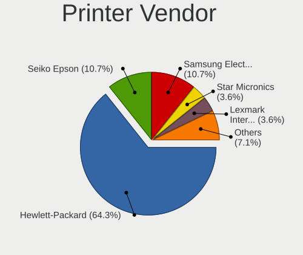

| Vendor                | Computers | Percent |
|-----------------------|-----------|---------|
| Hewlett-Packard       | 18        | 64.29%  |
| Seiko Epson           | 3         | 10.71%  |
| Samsung Electronics   | 3         | 10.71%  |
| Star Micronics        | 1         | 3.57%   |
| Lexmark International | 1         | 3.57%   |
| Canon                 | 1         | 3.57%   |
| Brother Industries    | 1         | 3.57%   |

Printer Model
-------------

Printer device models

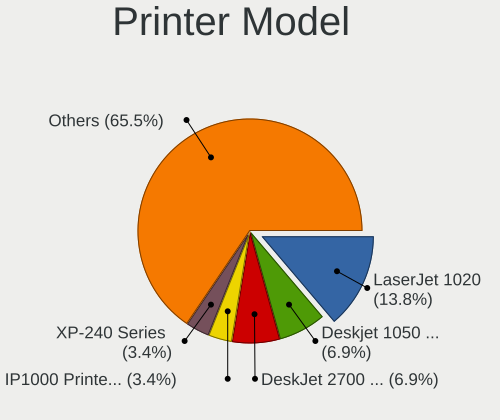

| Model                                           | Computers | Percent |
|-------------------------------------------------|-----------|---------|
| HP LaserJet 1020                                | 4         | 13.79%  |
| HP DeskJet 2700 series                          | 2         | 6.9%    |
| HP Deskjet 1050 J410                            | 2         | 6.9%    |
| Star Micronics IP1000 Printer USB001            | 1         | 3.45%   |
| Seiko Epson XP-240 Series                       | 1         | 3.45%   |
| Seiko Epson L380 Series                         | 1         | 3.45%   |
| Seiko Epson L3050 Series                        | 1         | 3.45%   |
| Samsung M262x/M282x Xpress Series Laser Printer | 1         | 3.45%   |
| Samsung M2070 Series                            | 1         | 3.45%   |
| Samsung M2020 Series                            | 1         | 3.45%   |
| Lexmark International 2600 Series               | 1         | 3.45%   |
| HP OfficeJet 6950                               | 1         | 3.45%   |
| HP LaserJet P3005                               | 1         | 3.45%   |
| HP LaserJet P1006                               | 1         | 3.45%   |
| HP LaserJet M14-M17                             | 1         | 3.45%   |
| HP LaserJet CP 1025                             | 1         | 3.45%   |
| HP LaserJet 1150                                | 1         | 3.45%   |
| HP LaserJet 1018                                | 1         | 3.45%   |
| HP LaserJet 1010                                | 1         | 3.45%   |
| HP HP LaserJet M101-M106                        | 1         | 3.45%   |
| HP DeskJet 3700 series                          | 1         | 3.45%   |
| HP Deskjet 1510                                 | 1         | 3.45%   |
| Canon PIXMA MP230                               | 1         | 3.45%   |
| Brother HL-L2350DW series                       | 1         | 3.45%   |

Scanner Vendor
--------------

Scanner device vendors

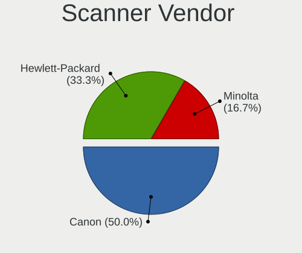

| Vendor          | Computers | Percent |
|-----------------|-----------|---------|
| Canon           | 3         | 50%     |
| Hewlett-Packard | 2         | 33.33%  |
| Minolta         | 1         | 16.67%  |

Scanner Model
-------------

Scanner device models

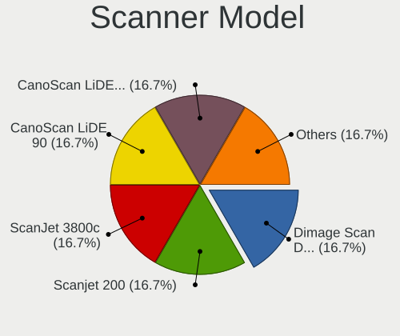

| Model                                       | Computers | Percent |
|---------------------------------------------|-----------|---------|
| Minolta Dimage Scan Dual III AF-2840 (2889) | 1         | 16.67%  |
| HP ScanJet 3800c                            | 1         | 16.67%  |
| HP Scanjet 200                              | 1         | 16.67%  |
| Canon CanoScan LiDE 90                      | 1         | 16.67%  |
| Canon CanoScan LIDE 25                      | 1         | 16.67%  |
| Canon CanoScan LiDE 110                     | 1         | 16.67%  |

Camera
------

Camera Vendor
-------------

Camera device vendors

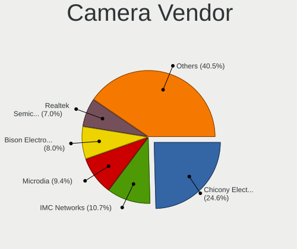

| Vendor                                 | Computers | Percent |
|----------------------------------------|-----------|---------|
| Chicony Electronics                    | 173       | 24.57%  |
| IMC Networks                           | 75        | 10.65%  |
| Microdia                               | 66        | 9.38%   |
| Bison Electronics                      | 56        | 7.95%   |
| Realtek Semiconductor                  | 49        | 6.96%   |
| Sunplus Innovation Technology          | 35        | 4.97%   |
| Syntek                                 | 31        | 4.4%    |
| Quanta                                 | 26        | 3.69%   |
| Suyin                                  | 23        | 3.27%   |
| Logitech                               | 23        | 3.27%   |
| Cheng Uei Precision Industry (Foxlink) | 20        | 2.84%   |
| Lite-On Technology                     | 11        | 1.56%   |
| Apple                                  | 10        | 1.42%   |
| Sonix Technology                       | 9         | 1.28%   |
| Microsoft                              | 9         | 1.28%   |
| Luxvisions Innotech Limited            | 9         | 1.28%   |
| GEMBIRD                                | 7         | 0.99%   |
| Alcor Micro                            | 7         | 0.99%   |
| Silicon Motion                         | 6         | 0.85%   |
| Z-Star Microelectronics                | 5         | 0.71%   |
| Creative Technology                    | 5         | 0.71%   |
| SunplusIT                              | 4         | 0.57%   |
| Shinetech                              | 4         | 0.57%   |
| Ricoh                                  | 4         | 0.57%   |
| Samsung Electronics                    | 3         | 0.43%   |
| Primax Electronics                     | 3         | 0.43%   |
| MacroSilicon                           | 2         | 0.28%   |
| LG Electronics                         | 2         | 0.28%   |
| Lenovo                                 | 2         | 0.28%   |
| KYE Systems (Mouse Systems)            | 2         | 0.28%   |
| Importek                               | 2         | 0.28%   |
| DigiTech                               | 2         | 0.28%   |
| BillionPixels                          | 2         | 0.28%   |
| Valve Software                         | 1         | 0.14%   |
| Unknown                                | 1         | 0.14%   |
| Tripath Technology                     | 1         | 0.14%   |
| SN0002                                 | 1         | 0.14%   |
| Shine-optics                           | 1         | 0.14%   |
| OnePlus Technology (Shenzhen)          | 1         | 0.14%   |
| OmniVision Technologies                | 1         | 0.14%   |

Camera Model
------------

Camera device models

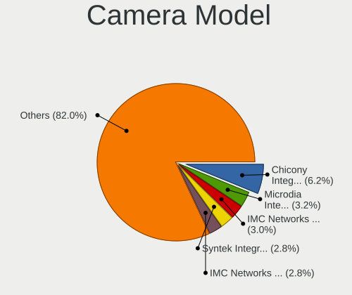

| Model                                             | Computers | Percent |
|---------------------------------------------------|-----------|---------|
| Chicony Integrated Camera                         | 44        | 6.19%   |
| Microdia Integrated_Webcam_HD                     | 23        | 3.23%   |
| IMC Networks Integrated Camera                    | 21        | 2.95%   |
| Syntek Integrated Camera                          | 20        | 2.81%   |
| IMC Networks USB2.0 HD UVC WebCam                 | 20        | 2.81%   |
| Bison Integrated Camera                           | 17        | 2.39%   |
| Realtek Integrated_Webcam_HD                      | 13        | 1.83%   |
| Chicony HD WebCam                                 | 12        | 1.69%   |
| IMC Networks USB2.0 VGA UVC WebCam                | 11        | 1.55%   |
| Chicony HP HD Webcam [Fixed]                      | 10        | 1.41%   |
| Sunplus Integrated_Webcam_HD                      | 9         | 1.27%   |
| Bison Lenovo EasyCamera                           | 9         | 1.27%   |
| Quanta HP HD Camera                               | 8         | 1.13%   |
| Sunplus HD WebCam                                 | 7         | 0.98%   |
| Realtek USB2.0 HD UVC WebCam                      | 7         | 0.98%   |
| Microdia Webcam Vitade AF                         | 7         | 0.98%   |
| GEMBIRD Generic UVC 1.00 camera [AppoTech AX2311] | 7         | 0.98%   |
| Chicony HP HD Camera                              | 7         | 0.98%   |
| Bison Lenovo Integrated Webcam                    | 7         | 0.98%   |
| Bison EasyCamera                                  | 7         | 0.98%   |
| Suyin Acer/HP Integrated Webcam [CN0314]          | 6         | 0.84%   |
| Sunplus HP HD Webcam [Fixed]                      | 5         | 0.7%    |
| Sonix USB2.0 HD UVC WebCam                        | 5         | 0.7%    |
| Microdia Integrated Webcam                        | 5         | 0.7%    |
| Lite-On HP HD Camera                              | 5         | 0.7%    |
| IMC Networks 2M Integrated Webcam                 | 5         | 0.7%    |
| Chicony USB2.0 VGA UVC WebCam                     | 5         | 0.7%    |
| Chicony Integrated Camera (1280x720@30)           | 5         | 0.7%    |
| Chicony HP HD Webcam                              | 5         | 0.7%    |
| Syntek Lenovo EasyCamera                          | 4         | 0.56%   |
| Suyin HP Webcam                                   | 4         | 0.56%   |
| Sonix USB2.0 FHD UVC WebCam                       | 4         | 0.56%   |
| Quanta HD User Facing                             | 4         | 0.56%   |
| Logitech Webcam C270                              | 4         | 0.56%   |
| IMC Networks Integrated Webcam                    | 4         | 0.56%   |
| Chicony USB2.0 HD UVC WebCam                      | 4         | 0.56%   |
| Chicony USB 2.0 Camera                            | 4         | 0.56%   |
| Chicony TOSHIBA Web Camera - HD                   | 4         | 0.56%   |
| Chicony Lenovo EasyCamera                         | 4         | 0.56%   |
| Chicony Integrated IR Camera                      | 4         | 0.56%   |

Security
--------

Fingerprint Vendor
------------------

Fingerprint sensor vendors

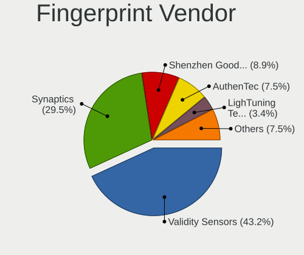

| Vendor                             | Computers | Percent |
|------------------------------------|-----------|---------|
| Validity Sensors                   | 63        | 43.15%  |
| Synaptics                          | 43        | 29.45%  |
| Shenzhen Goodix Technology         | 13        | 8.9%    |
| AuthenTec                          | 11        | 7.53%   |
| LighTuning Technology              | 5         | 3.42%   |
| Upek                               | 4         | 2.74%   |
| STMicroelectronics                 | 3         | 2.05%   |
| Elan Microelectronics              | 2         | 1.37%   |
| Realtek USB2.0 Finger Print Bridge | 1         | 0.68%   |
| HOLTEK                             | 1         | 0.68%   |

Fingerprint Model
-----------------

Fingerprint sensor models

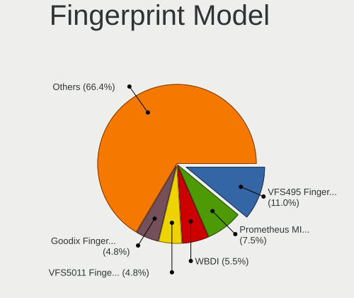

| Model                                                                      | Computers | Percent |
|----------------------------------------------------------------------------|-----------|---------|
| Validity Sensors VFS495 Fingerprint Reader                                 | 16        | 10.96%  |
| Synaptics Prometheus MIS Touch Fingerprint Reader                          | 11        | 7.53%   |
| Synaptics WBDI                                                             | 8         | 5.48%   |
| Validity Sensors VFS5011 Fingerprint Reader                                | 7         | 4.79%   |
| Shenzhen Goodix  FingerPrint Device                                        | 7         | 4.79%   |
| Validity Sensors VFS491                                                    | 6         | 4.11%   |
| Validity Sensors VFS 5011 fingerprint sensor                               | 6         | 4.11%   |
| Validity Sensors Synaptics WBDI                                            | 6         | 4.11%   |
| Synaptics Fingerprint reader [HP G6]                                       | 6         | 4.11%   |
| Validity Sensors VFS101 Fingerprint Reader                                 | 5         | 3.42%   |
| Synaptics Metallica MIS Touch Fingerprint Reader                           | 4         | 2.74%   |
| LighTuning EgisTec Touch Fingerprint Sensor                                | 4         | 2.74%   |
| AuthenTec AES2501 Fingerprint Sensor                                       | 4         | 2.74%   |
| AuthenTec AES1600                                                          | 4         | 2.74%   |
| Validity Sensors VFS7500 Touch Fingerprint Sensor                          | 3         | 2.05%   |
| Validity Sensors VFS471 Fingerprint Reader                                 | 3         | 2.05%   |
| Validity Sensors VFS451 Fingerprint Reader                                 | 3         | 2.05%   |
| Validity Sensors VFS301 Fingerprint Reader                                 | 3         | 2.05%   |
| Upek Biometric Touchchip/Touchstrip Fingerprint Sensor                     | 3         | 2.05%   |
| Synaptics  WBDI                                                            | 3         | 2.05%   |
| Synaptics  FS7604 Touch Fingerprint Sensor with PurePrint                  | 3         | 2.05%   |
| STMicroelectronics Fingerprint Reader                                      | 3         | 2.05%   |
| Shenzhen Goodix Fingerprint Reader                                         | 3         | 2.05%   |
| Shenzhen Goodix FingerPrint                                                | 3         | 2.05%   |
| AuthenTec AES2810                                                          | 3         | 2.05%   |
| Validity Sensors VFS Fingerprint sensor                                    | 2         | 1.37%   |
| Synaptics WBDI Fingerprint Reader USB 086                                  | 2         | 1.37%   |
| Synaptics UWP WBDI Device                                                  | 2         | 1.37%   |
| Synaptics FS7604 Touch Fingerprint Sensor with PurePrint                   | 2         | 1.37%   |
| Elan ELAN:Fingerprint                                                      | 2         | 1.37%   |
| Validity Sensors VFS300 Fingerprint Reader                                 | 1         | 0.68%   |
| Validity Sensors Synaptics VFS7552 Touch Fingerprint Sensor with PurePrint | 1         | 0.68%   |
| Validity Sensors Swipe Fingerprint Sensor                                  | 1         | 0.68%   |
| Upek TCS5B Fingerprint sensor                                              | 1         | 0.68%   |
| Synaptics WBDI Fingerprint Reader USB 102                                  | 1         | 0.68%   |
| Synaptics UWP WBDI                                                         | 1         | 0.68%   |
| Realtek USB2.0 Finger Print Bridge FocalTech Fingerprint Device            | 1         | 0.68%   |
| LighTuning ES603 Swipe Fingerprint Sensor                                  | 1         | 0.68%   |
| HOLTEK FocalTech Fingerprint Device                                        | 1         | 0.68%   |

Chipcard Vendor
---------------

Chipcard module vendors

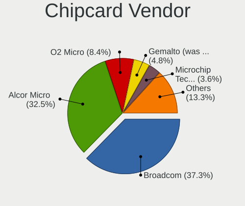

| Vendor                | Computers | Percent |
|-----------------------|-----------|---------|
| Broadcom              | 31        | 37.35%  |
| Alcor Micro           | 27        | 32.53%  |
| O2 Micro              | 7         | 8.43%   |
| Gemalto (was Gemplus) | 4         | 4.82%   |
| Microchip Technology  | 3         | 3.61%   |
| Lenovo                | 3         | 3.61%   |
| Bit4id                | 3         | 3.61%   |
| Upek                  | 2         | 2.41%   |
| OmniKey               | 1         | 1.2%    |
| Chicony Electronics   | 1         | 1.2%    |
| Cherry                | 1         | 1.2%    |

Chipcard Model
--------------

Chipcard module models

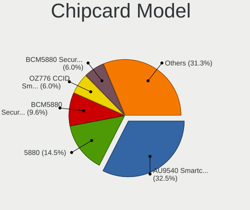

| Model                                                                        | Computers | Percent |
|------------------------------------------------------------------------------|-----------|---------|
| Alcor Micro AU9540 Smartcard Reader                                          | 27        | 32.53%  |
| Broadcom 5880                                                                | 12        | 14.46%  |
| Broadcom BCM5880 Secure Applications Processor                               | 8         | 9.64%   |
| O2 Micro OZ776 CCID Smartcard Reader                                         | 5         | 6.02%   |
| Broadcom BCM5880 Secure Applications Processor with fingerprint swipe sensor | 5         | 6.02%   |
| Gemalto (was Gemplus) GemPC Twin SmartCard Reader                            | 4         | 4.82%   |
| Microchip Technology SMSC USX101x Reader                                     | 3         | 3.61%   |
| Lenovo Integrated Smart Card Reader                                          | 3         | 3.61%   |
| Broadcom BCM58200 ControlVault 3 (FingerPrint sensor + Contacted SmartCard)  | 3         | 3.61%   |
| Broadcom 58200                                                               | 3         | 3.61%   |
| Bit4id miniLector EVO                                                        | 3         | 3.61%   |
| Upek TouchChip Fingerprint Coprocessor (WBF advanced mode)                   | 2         | 2.41%   |
| O2 Micro Oz776 SmartCard Reader                                              | 2         | 2.41%   |
| OmniKey CardMan 3121 (HID Technologies)                                      | 1         | 1.2%    |
| Chicony Electronics HP Skylab USB Smartcard Keyboard                         | 1         | 1.2%    |
| Cherry SmartCard Reader Keyboard KC 1000 SC                                  | 1         | 1.2%    |

Unsupported
-----------

Unsupported Devices
-------------------

Total unsupported devices on board

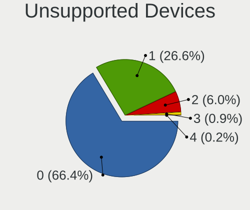

| Total | Computers | Percent |
|-------|-----------|---------|
| 0     | 842       | 66.4%   |
| 1     | 337       | 26.58%  |
| 2     | 76        | 5.99%   |
| 3     | 11        | 0.87%   |
| 4     | 2         | 0.16%   |

Unsupported Device Types
------------------------

Types of unsupported devices

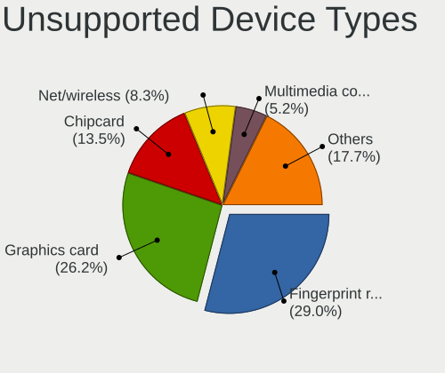

| Type                     | Computers | Percent |
|--------------------------|-----------|---------|
| Fingerprint reader       | 146       | 29.03%  |
| Graphics card            | 132       | 26.24%  |
| Chipcard                 | 68        | 13.52%  |
| Net/wireless             | 42        | 8.35%   |
| Multimedia controller    | 26        | 5.17%   |
| Communication controller | 16        | 3.18%   |
| Bluetooth                | 15        | 2.98%   |
| Card reader              | 12        | 2.39%   |
| Storage                  | 9         | 1.79%   |
| Sound                    | 7         | 1.39%   |
| Modem                    | 7         | 1.39%   |
| Camera                   | 7         | 1.39%   |
| Unassigned class         | 5         | 0.99%   |
| Network                  | 5         | 0.99%   |
| Net/ethernet             | 3         | 0.6%    |
| Flash memory             | 2         | 0.4%    |
| Storage/ide              | 1         | 0.2%    |

