Linux in Slovakia - Tested Hardware & Statistics
------------------------------------------------

A project to collect tested hardware configurations for Linux in Slovakia.

Anyone can contribute to this report by the [hw-probe](https://github.com/linuxhw/hw-probe) tool:

    sudo -E hw-probe -all -upload

Please contribute! Especially if your hardware is rare.

This is a report for all computer types. See also reports for [desktops](/Location/Slovakia/Desktop/README.md) and [notebooks](/Location/Slovakia/Notebook/README.md).

Contents
--------

* [ Test Cases ](#test-cases)

* [ System ](#system)
  - [ OS                       ](#os)
  - [ OS Family                ](#os-family)
  - [ Kernel                   ](#kernel)
  - [ Kernel Family            ](#kernel-family)
  - [ Kernel Major Ver.        ](#kernel-major-ver)
  - [ Arch                     ](#arch)
  - [ DE                       ](#de)
  - [ Display Server           ](#display-server)
  - [ Display Manager          ](#display-manager)
  - [ OS Lang                  ](#os-lang)
  - [ Boot Mode                ](#boot-mode)
  - [ Filesystem               ](#filesystem)
  - [ Part. scheme             ](#part-scheme)
  - [ Dual Boot with Linux/BSD ](#dual-boot-with-linuxbsd)
  - [ Dual Boot (Win)          ](#dual-boot-win)

* [ Board ](#board)
  - [ Vendor                   ](#vendor)
  - [ Model                    ](#model)
  - [ Model Family             ](#model-family)
  - [ MFG Year                 ](#mfg-year)
  - [ Form Factor              ](#form-factor)
  - [ Secure Boot              ](#secure-boot)
  - [ Coreboot                 ](#coreboot)
  - [ RAM Size                 ](#ram-size)
  - [ RAM Used                 ](#ram-used)
  - [ Total Drives             ](#total-drives)
  - [ Has CD-ROM               ](#has-cd-rom)
  - [ Has Ethernet             ](#has-ethernet)
  - [ Has WiFi                 ](#has-wifi)
  - [ Has Bluetooth            ](#has-bluetooth)

* [ Location ](#location)
  - [ Country                  ](#country)
  - [ City                     ](#city)

* [ Drives ](#drives)
  - [ Drive Vendor             ](#drive-vendor)
  - [ Drive Model              ](#drive-model)
  - [ HDD Vendor               ](#hdd-vendor)
  - [ SSD Vendor               ](#ssd-vendor)
  - [ Drive Kind               ](#drive-kind)
  - [ Drive Connector          ](#drive-connector)
  - [ Drive Size               ](#drive-size)
  - [ Space Total              ](#space-total)
  - [ Space Used               ](#space-used)
  - [ Malfunc. Drives          ](#malfunc-drives)
  - [ Malfunc. Drive Vendor    ](#malfunc-drive-vendor)
  - [ Malfunc. HDD Vendor      ](#malfunc-hdd-vendor)
  - [ Malfunc. Drive Kind      ](#malfunc-drive-kind)
  - [ Failed Drives            ](#failed-drives)
  - [ Failed Drive Vendor      ](#failed-drive-vendor)
  - [ Drive Status             ](#drive-status)

* [ Storage controller ](#storage-controller)
  - [ Storage Vendor           ](#storage-vendor)
  - [ Storage Model            ](#storage-model)
  - [ Storage Kind             ](#storage-kind)

* [ Processor ](#processor)
  - [ CPU Vendor               ](#cpu-vendor)
  - [ CPU Model                ](#cpu-model)
  - [ CPU Model Family         ](#cpu-model-family)
  - [ CPU Cores                ](#cpu-cores)
  - [ CPU Sockets              ](#cpu-sockets)
  - [ CPU Threads              ](#cpu-threads)
  - [ CPU Op-Modes             ](#cpu-op-modes)
  - [ CPU Microcode            ](#cpu-microcode)
  - [ CPU Microarch            ](#cpu-microarch)

* [ Graphics ](#graphics)
  - [ GPU Vendor               ](#gpu-vendor)
  - [ GPU Model                ](#gpu-model)
  - [ GPU Combo                ](#gpu-combo)
  - [ GPU Driver               ](#gpu-driver)
  - [ GPU Memory               ](#gpu-memory)

* [ Monitor ](#monitor)
  - [ Monitor Vendor           ](#monitor-vendor)
  - [ Monitor Model            ](#monitor-model)
  - [ Monitor Resolution       ](#monitor-resolution)
  - [ Monitor Diagonal         ](#monitor-diagonal)
  - [ Monitor Width            ](#monitor-width)
  - [ Aspect Ratio             ](#aspect-ratio)
  - [ Monitor Area             ](#monitor-area)
  - [ Pixel Density            ](#pixel-density)
  - [ Multiple Monitors        ](#multiple-monitors)

* [ Network ](#network)
  - [ Net Controller Vendor    ](#net-controller-vendor)
  - [ Net Controller Model     ](#net-controller-model)
  - [ Wireless Vendor          ](#wireless-vendor)
  - [ Wireless Model           ](#wireless-model)
  - [ Ethernet Vendor          ](#ethernet-vendor)
  - [ Ethernet Model           ](#ethernet-model)
  - [ Net Controller Kind      ](#net-controller-kind)
  - [ Used Controller          ](#used-controller)
  - [ NICs                     ](#nics)
  - [ IPv6                     ](#ipv6)

* [ Bluetooth ](#bluetooth)
  - [ Bluetooth Vendor         ](#bluetooth-vendor)
  - [ Bluetooth Model          ](#bluetooth-model)

* [ Sound ](#sound)
  - [ Sound Vendor             ](#sound-vendor)
  - [ Sound Model              ](#sound-model)

* [ Memory ](#memory)
  - [ Memory Vendor            ](#memory-vendor)
  - [ Memory Model             ](#memory-model)
  - [ Memory Kind              ](#memory-kind)
  - [ Memory Form Factor       ](#memory-form-factor)
  - [ Memory Size              ](#memory-size)
  - [ Memory Speed             ](#memory-speed)

* [ Printers & scanners ](#printers--scanners)
  - [ Printer Vendor           ](#printer-vendor)
  - [ Printer Model            ](#printer-model)
  - [ Scanner Vendor           ](#scanner-vendor)
  - [ Scanner Model            ](#scanner-model)

* [ Camera ](#camera)
  - [ Camera Vendor            ](#camera-vendor)
  - [ Camera Model             ](#camera-model)

* [ Security ](#security)
  - [ Fingerprint Vendor       ](#fingerprint-vendor)
  - [ Fingerprint Model        ](#fingerprint-model)
  - [ Chipcard Vendor          ](#chipcard-vendor)
  - [ Chipcard Model           ](#chipcard-model)

* [ Unsupported ](#unsupported)
  - [ Unsupported Devices      ](#unsupported-devices)
  - [ Unsupported Device Types ](#unsupported-device-types)

Test Cases
----------

Total: 1033

| Vendor        | Model                       | Form-Factor | Probe                                                      | Date         |
|---------------|-----------------------------|-------------|------------------------------------------------------------|--------------|
| Dell          | Latitude E5500              | Notebook    | [f04cd8f466](https://linux-hardware.org/?probe=f04cd8f466) | Dec 31, 2022 |
| Dell          | Latitude E5500              | Notebook    | [24a0ca1b65](https://linux-hardware.org/?probe=24a0ca1b65) | Dec 31, 2022 |
| Google        | Voxel rev3                  | Notebook    | [430244f188](https://linux-hardware.org/?probe=430244f188) | Dec 28, 2022 |
| ASUSTek       | K52Je                       | Notebook    | [28cac9b262](https://linux-hardware.org/?probe=28cac9b262) | Dec 27, 2022 |
| Acer          | Swift SF314-43              | Notebook    | [3d9a51ce6e](https://linux-hardware.org/?probe=3d9a51ce6e) | Dec 27, 2022 |
| Dell          | Latitude 3510               | Notebook    | [ac931934de](https://linux-hardware.org/?probe=ac931934de) | Dec 27, 2022 |
| Dell          | Latitude 3510               | Notebook    | [5db1cf6cb6](https://linux-hardware.org/?probe=5db1cf6cb6) | Dec 27, 2022 |
| Samsung       | 270E5G/270E5U               | Notebook    | [705baed85a](https://linux-hardware.org/?probe=705baed85a) | Dec 26, 2022 |
| ASUSTek       | K52Je                       | Notebook    | [dc13c122ed](https://linux-hardware.org/?probe=dc13c122ed) | Dec 26, 2022 |
| Dell          | 00V62H A00                  | Desktop     | [dde339b7c9](https://linux-hardware.org/?probe=dde339b7c9) | Dec 26, 2022 |
| HP            | Pavilion g6                 | Notebook    | [71d7947da6](https://linux-hardware.org/?probe=71d7947da6) | Dec 24, 2022 |
| Lenovo        | IdeaPad 5 14ALC05 82LM      | Notebook    | [30c3f8d777](https://linux-hardware.org/?probe=30c3f8d777) | Dec 21, 2022 |
| MSI           | G41M4                       | Desktop     | [b651925b13](https://linux-hardware.org/?probe=b651925b13) | Dec 21, 2022 |
| Lenovo        | Y520-15IKBN 80WK            | Notebook    | [0d273375d6](https://linux-hardware.org/?probe=0d273375d6) | Dec 18, 2022 |
| MSI           | 790GX-G65                   | Desktop     | [7ad3c8f807](https://linux-hardware.org/?probe=7ad3c8f807) | Dec 18, 2022 |
| ASRock        | N3150-NUC                   | Desktop     | [5e77ec1117](https://linux-hardware.org/?probe=5e77ec1117) | Dec 18, 2022 |
| ASRock        | N3150-NUC                   | Desktop     | [e497bf2ce3](https://linux-hardware.org/?probe=e497bf2ce3) | Dec 17, 2022 |
| HP            | 1905                        | Desktop     | [21f639657c](https://linux-hardware.org/?probe=21f639657c) | Dec 13, 2022 |
| HP            | Pavilion g6                 | Notebook    | [b5662e5fec](https://linux-hardware.org/?probe=b5662e5fec) | Dec 11, 2022 |
| ASUSTek       | VivoBook_ASUSLaptop X515... | Notebook    | [c715acf0ea](https://linux-hardware.org/?probe=c715acf0ea) | Dec 10, 2022 |
| ASUSTek       | VivoBook_ASUSLaptop X509... | Notebook    | [18b2579f75](https://linux-hardware.org/?probe=18b2579f75) | Dec 09, 2022 |
| ASUSTek       | PRIME B460M-K               | Desktop     | [ceff27eeef](https://linux-hardware.org/?probe=ceff27eeef) | Dec 07, 2022 |
| Gigabyte      | Z790 AERO G                 | Desktop     | [b779cd6c2f](https://linux-hardware.org/?probe=b779cd6c2f) | Dec 06, 2022 |
| HP            | Pavilion g6                 | Notebook    | [d2b43c2803](https://linux-hardware.org/?probe=d2b43c2803) | Dec 05, 2022 |
| ASUSTek       | Zenbook UX5400EA_UX5400E... | Notebook    | [fa46f1d34a](https://linux-hardware.org/?probe=fa46f1d34a) | Dec 04, 2022 |
| ASUSTek       | P8H61-M LX                  | Desktop     | [cd75a3e13f](https://linux-hardware.org/?probe=cd75a3e13f) | Dec 03, 2022 |
| ASUSTek       | VivoBook_ASUSLaptop X509... | Notebook    | [c0f7c4b788](https://linux-hardware.org/?probe=c0f7c4b788) | Dec 03, 2022 |
| Google        | Voxel rev3                  | Notebook    | [b64ebf7db7](https://linux-hardware.org/?probe=b64ebf7db7) | Dec 03, 2022 |
| HP            | 620                         | Notebook    | [6be09298b6](https://linux-hardware.org/?probe=6be09298b6) | Dec 01, 2022 |
| ASUSTek       | PRIME B460M-K               | Desktop     | [c8dd66d6de](https://linux-hardware.org/?probe=c8dd66d6de) | Dec 01, 2022 |
| HUAWEI        | KLVL-WXX9                   | Notebook    | [af7d162434](https://linux-hardware.org/?probe=af7d162434) | Nov 28, 2022 |
| ASUSTek       | PRIME B460M-K               | Desktop     | [7df334aaa0](https://linux-hardware.org/?probe=7df334aaa0) | Nov 26, 2022 |
| Dell          | XPS 15 7590                 | Notebook    | [2355853fda](https://linux-hardware.org/?probe=2355853fda) | Nov 23, 2022 |
| Lenovo        | ThinkPad T440s 20AQ007SM... | Notebook    | [326b5bad4c](https://linux-hardware.org/?probe=326b5bad4c) | Nov 21, 2022 |
| Shuttle       | FS61                        | Desktop     | [7a940c8fa3](https://linux-hardware.org/?probe=7a940c8fa3) | Nov 19, 2022 |
| ASUSTek       | PRIME B460M-K               | Desktop     | [19663894ff](https://linux-hardware.org/?probe=19663894ff) | Nov 18, 2022 |
| ASUSTek       | PRIME B460M-K               | Desktop     | [99a32a02ce](https://linux-hardware.org/?probe=99a32a02ce) | Nov 18, 2022 |
| ASUSTek       | VivoBook_ASUSLaptop X509... | Notebook    | [d7992855ba](https://linux-hardware.org/?probe=d7992855ba) | Nov 18, 2022 |
| ASUSTek       | VivoBook_ASUSLaptop X509... | Notebook    | [8e17476123](https://linux-hardware.org/?probe=8e17476123) | Nov 17, 2022 |
| ASUSTek       | VivoBook_ASUSLaptop X509... | Notebook    | [f48e29fef2](https://linux-hardware.org/?probe=f48e29fef2) | Nov 16, 2022 |
| Acer          | Aspire VN7-791              | Notebook    | [736c2f5664](https://linux-hardware.org/?probe=736c2f5664) | Nov 14, 2022 |
| Lenovo        | V14-IIL 82C4                | Notebook    | [ca336329c8](https://linux-hardware.org/?probe=ca336329c8) | Nov 12, 2022 |
| Samsung       | 700Z3A/700Z4A/700Z5A/700... | Notebook    | [4f40815737](https://linux-hardware.org/?probe=4f40815737) | Nov 12, 2022 |
| GPD           | G1619-04                    | Notebook    | [cf4cb47a12](https://linux-hardware.org/?probe=cf4cb47a12) | Nov 09, 2022 |
| MSI           | A78-G41 PC Mate             | Desktop     | [8487f5d19c](https://linux-hardware.org/?probe=8487f5d19c) | Nov 08, 2022 |
| MSI           | GF615M-P33                  | Desktop     | [8aec7634ab](https://linux-hardware.org/?probe=8aec7634ab) | Nov 05, 2022 |
| Acer          | Aspire C24-1650             | All in one  | [3dac8315d4](https://linux-hardware.org/?probe=3dac8315d4) | Nov 04, 2022 |
| Acer          | Aspire C24-1650             | All in one  | [adab8dea39](https://linux-hardware.org/?probe=adab8dea39) | Nov 03, 2022 |
| MSI           | Z77A-GD65                   | Desktop     | [a7bc380726](https://linux-hardware.org/?probe=a7bc380726) | Oct 30, 2022 |
| Gigabyte      | 970A-DS3P                   | Desktop     | [995f7abb0c](https://linux-hardware.org/?probe=995f7abb0c) | Oct 25, 2022 |
| Acer          | Aspire C24-1650             | All in one  | [82e35bc925](https://linux-hardware.org/?probe=82e35bc925) | Oct 24, 2022 |
| Acer          | Aspire C24-1650             | All in one  | [b110eca1a8](https://linux-hardware.org/?probe=b110eca1a8) | Oct 23, 2022 |
| MSI           | H310M PRO-VD                | Desktop     | [9ce99513bc](https://linux-hardware.org/?probe=9ce99513bc) | Oct 21, 2022 |
| Samsung       | DT1234567890 SEC_SW_REVI... | Desktop     | [19d09fb082](https://linux-hardware.org/?probe=19d09fb082) | Oct 17, 2022 |
| Samsung       | DT1234567890 SEC_SW_REVI... | Desktop     | [9f3307c5d0](https://linux-hardware.org/?probe=9f3307c5d0) | Oct 17, 2022 |
| ASRock        | X570 Taichi                 | Desktop     | [6b78ca11b4](https://linux-hardware.org/?probe=6b78ca11b4) | Oct 14, 2022 |
| Lenovo        | IdeaPad L340-15IRH Gamin... | Notebook    | [87cfe8ed2e](https://linux-hardware.org/?probe=87cfe8ed2e) | Oct 11, 2022 |
| HP            | ENVY Laptop 13-ad0xx        | Notebook    | [52658eb393](https://linux-hardware.org/?probe=52658eb393) | Oct 09, 2022 |
| ASUSTek       | VivoBook_ASUSLaptop X509... | Notebook    | [19c7d98b00](https://linux-hardware.org/?probe=19c7d98b00) | Oct 06, 2022 |
| Techvision    | TVI7309X B0                 | Desktop     | [a12d335502](https://linux-hardware.org/?probe=a12d335502) | Oct 06, 2022 |
| Techvision    | TVI7309X B0                 | Desktop     | [fd49fda31a](https://linux-hardware.org/?probe=fd49fda31a) | Oct 06, 2022 |
| ASUSTek       | ROG Zephyrus G14 GA401QM... | Notebook    | [72163c289e](https://linux-hardware.org/?probe=72163c289e) | Oct 05, 2022 |
| ASUSTek       | P5E WS Pro                  | Desktop     | [241e42fa0a](https://linux-hardware.org/?probe=241e42fa0a) | Oct 03, 2022 |
| ASUSTek       | TUF Gaming B550M-PLUS       | Desktop     | [b0cc9bee74](https://linux-hardware.org/?probe=b0cc9bee74) | Oct 02, 2022 |
| ASUSTek       | TUF Gaming B550M-PLUS       | Desktop     | [45d676584c](https://linux-hardware.org/?probe=45d676584c) | Oct 02, 2022 |
| Lenovo        | ThinkPad T550 20CJS1VD01    | Notebook    | [97d1b5e6c5](https://linux-hardware.org/?probe=97d1b5e6c5) | Sep 30, 2022 |
| ASUSTek       | Z170-P                      | Desktop     | [996d72bd1e](https://linux-hardware.org/?probe=996d72bd1e) | Sep 30, 2022 |
| ASUSTek       | Z170-P                      | Desktop     | [8394fca38a](https://linux-hardware.org/?probe=8394fca38a) | Sep 30, 2022 |
| ASUSTek       | M5A97 LE R2.0               | Desktop     | [e35b86c3b7](https://linux-hardware.org/?probe=e35b86c3b7) | Sep 29, 2022 |
| Gigabyte      | AB350-Gaming 3-CF           | Desktop     | [365d74f8e4](https://linux-hardware.org/?probe=365d74f8e4) | Sep 28, 2022 |
| ASUSTek       | M5A97 LE R2.0               | Desktop     | [f9e71e7e05](https://linux-hardware.org/?probe=f9e71e7e05) | Sep 28, 2022 |
| Dell          | Vostro 5391                 | Notebook    | [61a25cdb83](https://linux-hardware.org/?probe=61a25cdb83) | Sep 28, 2022 |
| MSI           | X570-A PRO                  | Desktop     | [345959e0ed](https://linux-hardware.org/?probe=345959e0ed) | Sep 28, 2022 |
| Gigabyte      | AB350-Gaming 3-CF           | Desktop     | [cfd24b9e0a](https://linux-hardware.org/?probe=cfd24b9e0a) | Sep 27, 2022 |
| ASUSTek       | Z87-A                       | Desktop     | [3cdcc8b18d](https://linux-hardware.org/?probe=3cdcc8b18d) | Sep 26, 2022 |
| ASUSTek       | M5A78L-M/USB3               | Desktop     | [d166d32749](https://linux-hardware.org/?probe=d166d32749) | Sep 26, 2022 |
| ASUSTek       | K55VJ                       | Notebook    | [8e87d041c3](https://linux-hardware.org/?probe=8e87d041c3) | Sep 26, 2022 |
| ASUSTek       | M5A78L-M/USB3               | Desktop     | [bce9addcca](https://linux-hardware.org/?probe=bce9addcca) | Sep 26, 2022 |
| Gigabyte      | F2A68HM-DS2                 | Desktop     | [98e8df2d3d](https://linux-hardware.org/?probe=98e8df2d3d) | Sep 21, 2022 |
| ASUSTek       | VivoBook_ASUSLaptop X509... | Notebook    | [afd66066bc](https://linux-hardware.org/?probe=afd66066bc) | Sep 21, 2022 |
| ASUSTek       | P5G41T-M LX                 | Desktop     | [50647a7656](https://linux-hardware.org/?probe=50647a7656) | Sep 17, 2022 |
| Lenovo        | G780                        | Notebook    | [04f924450d](https://linux-hardware.org/?probe=04f924450d) | Sep 17, 2022 |
| ASUSTek       | Z97-A                       | Desktop     | [9de0254ab0](https://linux-hardware.org/?probe=9de0254ab0) | Sep 13, 2022 |
| ASRock        | Z170 Gaming K6+             | Desktop     | [39027cdb44](https://linux-hardware.org/?probe=39027cdb44) | Sep 13, 2022 |
| ASUSTek       | Z170-P                      | Desktop     | [bec58f880f](https://linux-hardware.org/?probe=bec58f880f) | Sep 13, 2022 |
| ASUSTek       | Z170-P                      | Desktop     | [182bb36928](https://linux-hardware.org/?probe=182bb36928) | Sep 13, 2022 |
| Valve         | Jupiter                     | Notebook    | [1dc4620833](https://linux-hardware.org/?probe=1dc4620833) | Sep 10, 2022 |
| HP            | EliteBook 840 G8 Noteboo... | Notebook    | [ecaa040ba1](https://linux-hardware.org/?probe=ecaa040ba1) | Sep 04, 2022 |
| Dell          | Latitude 3510               | Notebook    | [9477575b26](https://linux-hardware.org/?probe=9477575b26) | Sep 03, 2022 |
| UMAX          | VisionBook 14Wr Plus        | Notebook    | [6a2cb26049](https://linux-hardware.org/?probe=6a2cb26049) | Sep 02, 2022 |
| ASUSTek       | Benicia                     | Desktop     | [13454a57f9](https://linux-hardware.org/?probe=13454a57f9) | Aug 31, 2022 |
| Toshiba       | TECRA S5                    | Notebook    | [121c8e110b](https://linux-hardware.org/?probe=121c8e110b) | Aug 31, 2022 |
| Toshiba       | TECRA S5                    | Notebook    | [6ec2bd9539](https://linux-hardware.org/?probe=6ec2bd9539) | Aug 31, 2022 |
| Lenovo        | IdeaPad Gaming 3 15ACH6 ... | Notebook    | [c407e3a17c](https://linux-hardware.org/?probe=c407e3a17c) | Aug 29, 2022 |
| ASUSTek       | ROG Zephyrus G14 GA401QE... | Notebook    | [4b56f15871](https://linux-hardware.org/?probe=4b56f15871) | Aug 29, 2022 |
| ASUSTek       | VivoBook_ASUSLaptop X509... | Notebook    | [dd415db306](https://linux-hardware.org/?probe=dd415db306) | Aug 28, 2022 |
| Xunlong       | Orange Pi PC                | Soc         | [dff587f11e](https://linux-hardware.org/?probe=dff587f11e) | Aug 28, 2022 |
| Gigabyte      | F2A68HM-DS2                 | Desktop     | [a6d3642195](https://linux-hardware.org/?probe=a6d3642195) | Aug 24, 2022 |
| Samsung       | 700Z3A/700Z4A/700Z5A/700... | Notebook    | [8756581baa](https://linux-hardware.org/?probe=8756581baa) | Aug 21, 2022 |
| ASUSTek       | PRIME B460M-K               | Desktop     | [f5f3761418](https://linux-hardware.org/?probe=f5f3761418) | Aug 19, 2022 |
| Gigabyte      | P43-ES3G                    | Desktop     | [de6e02672c](https://linux-hardware.org/?probe=de6e02672c) | Aug 18, 2022 |
| Lenovo        | 3098 0B98401 WIN            | Desktop     | [769802c689](https://linux-hardware.org/?probe=769802c689) | Aug 15, 2022 |
| Samsung       | NC210/NC110                 | Notebook    | [3dcdc1dc6a](https://linux-hardware.org/?probe=3dcdc1dc6a) | Aug 15, 2022 |
| Gigabyte      | P43-ES3G                    | Desktop     | [2b0691bddd](https://linux-hardware.org/?probe=2b0691bddd) | Aug 15, 2022 |
| Lenovo        | ThinkPad T550 20CJS1VD01    | Notebook    | [1bcc13e6b4](https://linux-hardware.org/?probe=1bcc13e6b4) | Aug 15, 2022 |
| Lenovo        | IdeaPad C340-14IWL 81N4     | Convertible | [af03bf80b5](https://linux-hardware.org/?probe=af03bf80b5) | Aug 10, 2022 |
| Packard Be... | P5N-E SLI                   | Desktop     | [6f2bf70c0b](https://linux-hardware.org/?probe=6f2bf70c0b) | Aug 09, 2022 |
| ASUSTek       | VivoBook 15_ASUS Laptop ... | Notebook    | [9a06c0c10c](https://linux-hardware.org/?probe=9a06c0c10c) | Aug 09, 2022 |
| Gigabyte      | F2A68HM-DS2                 | Desktop     | [93bd067b5d](https://linux-hardware.org/?probe=93bd067b5d) | Aug 09, 2022 |
| Packard Be... | P5N-E SLI                   | Desktop     | [cdc88569bc](https://linux-hardware.org/?probe=cdc88569bc) | Aug 07, 2022 |
| ASUSTek       | ROG Zephyrus G15 GA503RW... | Notebook    | [7e5a0c0004](https://linux-hardware.org/?probe=7e5a0c0004) | Aug 06, 2022 |
| Hardkernel    | ODROID-M1                   | Soc         | [98ff02ebde](https://linux-hardware.org/?probe=98ff02ebde) | Aug 05, 2022 |
| ASRock        | B550M Steel Legend          | Desktop     | [0ac4f27d0f](https://linux-hardware.org/?probe=0ac4f27d0f) | Jul 31, 2022 |
| Acer          | Aspire VN7-791G             | Notebook    | [3e72040097](https://linux-hardware.org/?probe=3e72040097) | Jul 31, 2022 |
| ASRock        | FM2A55M-VG3+                | Desktop     | [5d4a26735e](https://linux-hardware.org/?probe=5d4a26735e) | Jul 28, 2022 |
| Dell          | XPS 15 9570                 | Notebook    | [e7f56631b1](https://linux-hardware.org/?probe=e7f56631b1) | Jul 27, 2022 |
| Lenovo        | ThinkBook 15 G3 ACL 21A4    | Notebook    | [b4a9542143](https://linux-hardware.org/?probe=b4a9542143) | Jul 27, 2022 |
| Dell          | XPS 15 9570                 | Notebook    | [f3972b3a7d](https://linux-hardware.org/?probe=f3972b3a7d) | Jul 26, 2022 |
| Dell          | XPS 13 7390 2-in-1          | Convertible | [4a3b630b27](https://linux-hardware.org/?probe=4a3b630b27) | Jul 26, 2022 |
| Dell          | XPS 13 7390 2-in-1          | Convertible | [793c5e80d4](https://linux-hardware.org/?probe=793c5e80d4) | Jul 26, 2022 |
| Hardkernel    | ODROID-M1                   | Soc         | [ac78b76a30](https://linux-hardware.org/?probe=ac78b76a30) | Jul 25, 2022 |
| Gigabyte      | 970A-DS3P                   | Desktop     | [210b75c48e](https://linux-hardware.org/?probe=210b75c48e) | Jul 21, 2022 |
| Gigabyte      | 970A-DS3P                   | Desktop     | [17befc2dd5](https://linux-hardware.org/?probe=17befc2dd5) | Jul 20, 2022 |
| HP            | ProBook 440 G3              | Notebook    | [04b2ed9273](https://linux-hardware.org/?probe=04b2ed9273) | Jul 19, 2022 |
| UMAX          | VisionBook-N12R             | Notebook    | [9ccb1f57ab](https://linux-hardware.org/?probe=9ccb1f57ab) | Jul 16, 2022 |
| HP            | ProBook 440 G3              | Notebook    | [c546e3b537](https://linux-hardware.org/?probe=c546e3b537) | Jul 13, 2022 |
| Raspberry ... | Raspberry Pi 4 Model B R... | Soc         | [11ddd8feab](https://linux-hardware.org/?probe=11ddd8feab) | Jul 11, 2022 |
| Acer          | Aspire C22-865              | All in one  | [2e0a195007](https://linux-hardware.org/?probe=2e0a195007) | Jul 09, 2022 |
| HP            | 8455                        | Desktop     | [9954a77308](https://linux-hardware.org/?probe=9954a77308) | Jul 07, 2022 |
| Gigabyte      | F2A68HM-DS2                 | Desktop     | [779bc20f77](https://linux-hardware.org/?probe=779bc20f77) | Jul 05, 2022 |
| ASUSTek       | N550JK                      | Notebook    | [bc0c9431e1](https://linux-hardware.org/?probe=bc0c9431e1) | Jul 04, 2022 |
| ASUSTek       | N550JK                      | Notebook    | [539ce50149](https://linux-hardware.org/?probe=539ce50149) | Jul 04, 2022 |
| MSI           | A88XM-E35                   | Desktop     | [8767210da3](https://linux-hardware.org/?probe=8767210da3) | Jul 04, 2022 |
| MSI           | EX705                       | Notebook    | [d85dfacff5](https://linux-hardware.org/?probe=d85dfacff5) | Jun 30, 2022 |
| MSI           | EX705                       | Notebook    | [3de108279f](https://linux-hardware.org/?probe=3de108279f) | Jun 30, 2022 |
| Lenovo        | ThinkPad E15 Gen 2 20T80... | Notebook    | [5ebcb2f152](https://linux-hardware.org/?probe=5ebcb2f152) | Jun 29, 2022 |
| HP            | ZBook 15 G6                 | Notebook    | [2e4663e8c3](https://linux-hardware.org/?probe=2e4663e8c3) | Jun 22, 2022 |
| HP            | Pavilion dv6                | Notebook    | [1ba5e6c491](https://linux-hardware.org/?probe=1ba5e6c491) | Jun 18, 2022 |
| Dell          | Latitude 3510               | Notebook    | [4b6e3aeb9e](https://linux-hardware.org/?probe=4b6e3aeb9e) | Jun 16, 2022 |
| Dell          | Latitude E5570              | Notebook    | [ce4d3bb373](https://linux-hardware.org/?probe=ce4d3bb373) | Jun 09, 2022 |
| Shuttle       | FH61V                       | Desktop     | [465dc41fdb](https://linux-hardware.org/?probe=465dc41fdb) | Jun 08, 2022 |
| ASUSTek       | ROG Strix G513QM_G513QM     | Notebook    | [fdda1deb12](https://linux-hardware.org/?probe=fdda1deb12) | Jun 07, 2022 |
| Valve         | Jupiter                     | Notebook    | [cc0a20bb93](https://linux-hardware.org/?probe=cc0a20bb93) | Jun 06, 2022 |
| Dell          | Latitude E6440              | Notebook    | [dd05b883a6](https://linux-hardware.org/?probe=dd05b883a6) | Jun 04, 2022 |
| Dell          | Vostro 5515                 | Notebook    | [ae8649e10b](https://linux-hardware.org/?probe=ae8649e10b) | May 28, 2022 |
| MSI           | GT60 2OC/2OD                | Notebook    | [c3b5eb704d](https://linux-hardware.org/?probe=c3b5eb704d) | May 22, 2022 |
| MSI           | GT60 2OC/2OD                | Notebook    | [96f6fda5d5](https://linux-hardware.org/?probe=96f6fda5d5) | May 22, 2022 |
| MSI           | Z390-A PRO                  | Desktop     | [8baf319c52](https://linux-hardware.org/?probe=8baf319c52) | May 21, 2022 |
| Intel         | DG41KR AAE62839-304         | Desktop     | [d6fa39e82f](https://linux-hardware.org/?probe=d6fa39e82f) | May 16, 2022 |
| Foxconn       | 2ADA                        | Desktop     | [215ded6566](https://linux-hardware.org/?probe=215ded6566) | May 16, 2022 |
| Acer          | H57M01                      | Desktop     | [9116ecebcb](https://linux-hardware.org/?probe=9116ecebcb) | May 15, 2022 |
| Lenovo        | IdeaPad 110-15IBR 80T7      | Notebook    | [0793a5608a](https://linux-hardware.org/?probe=0793a5608a) | May 15, 2022 |
| ASUSTek       | ROG STRIX X570-F GAMING     | Desktop     | [52c0b4a6e0](https://linux-hardware.org/?probe=52c0b4a6e0) | May 14, 2022 |
| Acer          | H57M01                      | Desktop     | [42100344af](https://linux-hardware.org/?probe=42100344af) | May 14, 2022 |
| Gigabyte      | H55M-S2H                    | Desktop     | [0b3c6ab0f7](https://linux-hardware.org/?probe=0b3c6ab0f7) | May 14, 2022 |
| Lenovo        | IdeaPad 110-15IBR 80T7      | Notebook    | [d8361f7895](https://linux-hardware.org/?probe=d8361f7895) | May 14, 2022 |
| Lenovo        | ThinkPad X1 Carbon 7th 2... | Notebook    | [3ba9de57d1](https://linux-hardware.org/?probe=3ba9de57d1) | May 12, 2022 |
| Lenovo        | ThinkPad X1 Carbon 7th 2... | Notebook    | [96be9cb5e7](https://linux-hardware.org/?probe=96be9cb5e7) | May 12, 2022 |
| Acer          | Aspire E5-575G              | Notebook    | [71e7f1c760](https://linux-hardware.org/?probe=71e7f1c760) | May 09, 2022 |
| MSI           | GT60 2OC/2OD                | Notebook    | [21f08dbab6](https://linux-hardware.org/?probe=21f08dbab6) | May 06, 2022 |
| Dell          | Inspiron 3576               | Notebook    | [85901f28cb](https://linux-hardware.org/?probe=85901f28cb) | May 05, 2022 |
| ASRock        | H61M-VG4                    | Desktop     | [92f92ef4ee](https://linux-hardware.org/?probe=92f92ef4ee) | Apr 28, 2022 |
| Acer          | Extensa 5635G               | Notebook    | [6e69a86d63](https://linux-hardware.org/?probe=6e69a86d63) | Apr 28, 2022 |
| ASRock        | H61M-VG4                    | Desktop     | [fff58f97e8](https://linux-hardware.org/?probe=fff58f97e8) | Apr 27, 2022 |
| ASUSTek       | ROG STRIX B450-I GAMING     | Desktop     | [4b9faf4848](https://linux-hardware.org/?probe=4b9faf4848) | Apr 26, 2022 |
| HP            | ProBook 4540s               | Notebook    | [17272efb83](https://linux-hardware.org/?probe=17272efb83) | Apr 22, 2022 |
| Unknown       | RS780-SB700                 | Desktop     | [eb3aa5fa60](https://linux-hardware.org/?probe=eb3aa5fa60) | Apr 20, 2022 |
| Dell          | G3 3579                     | Notebook    | [a85e01d9d0](https://linux-hardware.org/?probe=a85e01d9d0) | Apr 20, 2022 |
| Dell          | Latitude E6520              | Notebook    | [33502900d8](https://linux-hardware.org/?probe=33502900d8) | Apr 19, 2022 |
| Gigabyte      | Z490M                       | Desktop     | [2138ce9310](https://linux-hardware.org/?probe=2138ce9310) | Apr 18, 2022 |
| Hardkernel    | ODROID-M1                   | Soc         | [64a66e1b61](https://linux-hardware.org/?probe=64a66e1b61) | Apr 12, 2022 |
| Fujitsu       | LIFEBOOK E751               | Notebook    | [54de39efb5](https://linux-hardware.org/?probe=54de39efb5) | Apr 12, 2022 |
| Gigabyte      | F2A68HM-DS2                 | Desktop     | [e6aa0c6166](https://linux-hardware.org/?probe=e6aa0c6166) | Apr 09, 2022 |
| Acer          | Revo RL80                   | Desktop     | [414f1870b3](https://linux-hardware.org/?probe=414f1870b3) | Apr 04, 2022 |
| Gigabyte      | H61M-S1                     | Desktop     | [a10a00d2f1](https://linux-hardware.org/?probe=a10a00d2f1) | Apr 03, 2022 |
| HP            | 15                          | Notebook    | [443dd5b9e8](https://linux-hardware.org/?probe=443dd5b9e8) | Apr 02, 2022 |
| Lenovo        | MAHOBAY NOK                 | Desktop     | [ba7b7abd34](https://linux-hardware.org/?probe=ba7b7abd34) | Apr 02, 2022 |
| Dell          | XPS 13 9333                 | Notebook    | [f4fb42182f](https://linux-hardware.org/?probe=f4fb42182f) | Apr 01, 2022 |
| ASUSTek       | X555LF                      | Notebook    | [35cceb0f0a](https://linux-hardware.org/?probe=35cceb0f0a) | Mar 31, 2022 |
| Fujitsu Si... | AMILO Pi 3525               | Notebook    | [b77907b9b6](https://linux-hardware.org/?probe=b77907b9b6) | Mar 31, 2022 |
| AMI           | Intel                       | Convertible | [b349c1e550](https://linux-hardware.org/?probe=b349c1e550) | Mar 29, 2022 |
| HP            | 18E5                        | Desktop     | [39cb47db55](https://linux-hardware.org/?probe=39cb47db55) | Mar 28, 2022 |
| HP            | ProBook 4340s               | Notebook    | [787443949a](https://linux-hardware.org/?probe=787443949a) | Mar 27, 2022 |
| HP            | 18E5                        | Desktop     | [061d716ce1](https://linux-hardware.org/?probe=061d716ce1) | Mar 27, 2022 |
| Intel         | S3210SH FRU Ver             | Server      | [d608f51576](https://linux-hardware.org/?probe=d608f51576) | Mar 23, 2022 |
| Shuttle       | FH61V                       | Desktop     | [9b18d7b2ed](https://linux-hardware.org/?probe=9b18d7b2ed) | Mar 23, 2022 |
| Lenovo        | ThinkPad T420 42364F2       | Notebook    | [d82acaba71](https://linux-hardware.org/?probe=d82acaba71) | Mar 23, 2022 |
| HP            | EliteBook 8740w             | Notebook    | [3ae23e0d6b](https://linux-hardware.org/?probe=3ae23e0d6b) | Mar 22, 2022 |
| ASUSTek       | K50IN                       | Notebook    | [02326ae250](https://linux-hardware.org/?probe=02326ae250) | Mar 22, 2022 |
| ASUSTek       | X555LNB                     | Notebook    | [ae49172b0f](https://linux-hardware.org/?probe=ae49172b0f) | Mar 21, 2022 |
| ASUSTek       | X555LNB                     | Notebook    | [33e081f100](https://linux-hardware.org/?probe=33e081f100) | Mar 21, 2022 |
| VIA Techno... | KM266-8235                  | Desktop     | [ad3f9e9e12](https://linux-hardware.org/?probe=ad3f9e9e12) | Mar 20, 2022 |
| Dell          | Latitude 3510               | Notebook    | [f24ba2791e](https://linux-hardware.org/?probe=f24ba2791e) | Mar 19, 2022 |
| ASUSTek       | N53SN                       | Notebook    | [f335baa4a4](https://linux-hardware.org/?probe=f335baa4a4) | Mar 18, 2022 |
| Lenovo        | B580 20144                  | Notebook    | [9918c132f0](https://linux-hardware.org/?probe=9918c132f0) | Mar 13, 2022 |
| Lenovo        | B580 20144                  | Notebook    | [fd9ec44205](https://linux-hardware.org/?probe=fd9ec44205) | Mar 13, 2022 |
| HP            | ProBook 4340s               | Notebook    | [01af2dee98](https://linux-hardware.org/?probe=01af2dee98) | Mar 13, 2022 |
| HP            | EliteBook 8470p             | Notebook    | [76e54baafe](https://linux-hardware.org/?probe=76e54baafe) | Mar 09, 2022 |
| Lenovo        | ThinkPad T14s Gen 2a 20X... | Notebook    | [f78b6db0bd](https://linux-hardware.org/?probe=f78b6db0bd) | Mar 08, 2022 |
| Lenovo        | ThinkPad T14s Gen 2a 20X... | Notebook    | [351e05ccc8](https://linux-hardware.org/?probe=351e05ccc8) | Mar 08, 2022 |
| Lenovo        | ThinkPad T14s Gen 2a 20X... | Notebook    | [dc09f11788](https://linux-hardware.org/?probe=dc09f11788) | Mar 08, 2022 |
| ASUSTek       | ROG STRIX B550-I GAMING     | Desktop     | [e508dbbb0f](https://linux-hardware.org/?probe=e508dbbb0f) | Mar 05, 2022 |
| Gigabyte      | F2A68HM-DS2                 | Desktop     | [455f94f1d3](https://linux-hardware.org/?probe=455f94f1d3) | Mar 04, 2022 |
| HP            | 339A                        | Desktop     | [820ebf5859](https://linux-hardware.org/?probe=820ebf5859) | Feb 26, 2022 |
| HP            | 339A                        | Desktop     | [118fee2993](https://linux-hardware.org/?probe=118fee2993) | Feb 26, 2022 |
| Dell          | 0773VG A00                  | Desktop     | [d24a3aebe9](https://linux-hardware.org/?probe=d24a3aebe9) | Feb 23, 2022 |
| Dell          | Vostro 5515                 | Notebook    | [7707d7dc14](https://linux-hardware.org/?probe=7707d7dc14) | Feb 23, 2022 |
| Sony          | VPCEH3S6E                   | Notebook    | [334451b6e7](https://linux-hardware.org/?probe=334451b6e7) | Feb 23, 2022 |
| Gigabyte      | H61M-S1                     | Desktop     | [e667cfc4cf](https://linux-hardware.org/?probe=e667cfc4cf) | Feb 20, 2022 |
| UMAX          | VisionBook 14Wr Plus        | Notebook    | [2e2c2de75c](https://linux-hardware.org/?probe=2e2c2de75c) | Feb 20, 2022 |
| Gigabyte      | H55M-S2H                    | Desktop     | [3031d8a880](https://linux-hardware.org/?probe=3031d8a880) | Feb 20, 2022 |
| Fujitsu Si... | D1784 S26361-D1784          | Desktop     | [2734c5a939](https://linux-hardware.org/?probe=2734c5a939) | Feb 19, 2022 |
| ASUSTek       | K56CM                       | Notebook    | [c6e3cad977](https://linux-hardware.org/?probe=c6e3cad977) | Feb 19, 2022 |
| Fujitsu Si... | D1784 S26361-D1784          | Desktop     | [7baecb9fce](https://linux-hardware.org/?probe=7baecb9fce) | Feb 19, 2022 |
| Lenovo        | Legion Y530-15ICH-1060 8... | Notebook    | [9df089b1ef](https://linux-hardware.org/?probe=9df089b1ef) | Feb 19, 2022 |
| Raspberry ... | Raspberry Pi 4 Model B R... | Soc         | [6cbb067e83](https://linux-hardware.org/?probe=6cbb067e83) | Feb 19, 2022 |
| Apple         | Mac-942B5BF58194151B        | All in one  | [781ef18260](https://linux-hardware.org/?probe=781ef18260) | Feb 18, 2022 |
| HP            | 339A                        | Desktop     | [d35aeac271](https://linux-hardware.org/?probe=d35aeac271) | Feb 16, 2022 |
| HP            | 339A                        | Desktop     | [aac8acdafe](https://linux-hardware.org/?probe=aac8acdafe) | Feb 16, 2022 |
| HP            | ZBook Firefly 14 G7 Mobi... | Notebook    | [c9b5c461da](https://linux-hardware.org/?probe=c9b5c461da) | Feb 15, 2022 |
| Gigabyte      | Z77-HD3                     | Desktop     | [c72849033f](https://linux-hardware.org/?probe=c72849033f) | Feb 15, 2022 |
| Lenovo        | Yoga 7 15ITL5 82BJ          | Convertible | [5306cc74cf](https://linux-hardware.org/?probe=5306cc74cf) | Feb 15, 2022 |
| ASUSTek       | VivoBook_ASUS Laptop E40... | Notebook    | [b4d07e8ab1](https://linux-hardware.org/?probe=b4d07e8ab1) | Feb 15, 2022 |
| Dell          | 02YYK5 A01                  | Desktop     | [bfeed2f132](https://linux-hardware.org/?probe=bfeed2f132) | Feb 14, 2022 |
| Lenovo        | 36ED SDK0J40700 WIN 3258... | All in one  | [b5d4b3357a](https://linux-hardware.org/?probe=b5d4b3357a) | Feb 13, 2022 |
| ASUSTek       | P8H77-M                     | Desktop     | [b6851e2e2d](https://linux-hardware.org/?probe=b6851e2e2d) | Feb 13, 2022 |
| ASUSTek       | P6T                         | Desktop     | [5084dfc411](https://linux-hardware.org/?probe=5084dfc411) | Feb 12, 2022 |
| MSI           | B450 TOMAHAWK MAX II        | Desktop     | [4a136af33b](https://linux-hardware.org/?probe=4a136af33b) | Feb 12, 2022 |
| Dell          | Latitude E6500              | Notebook    | [4b35cc763b](https://linux-hardware.org/?probe=4b35cc763b) | Feb 11, 2022 |
| Dell          | Latitude E6500              | Notebook    | [097664c430](https://linux-hardware.org/?probe=097664c430) | Feb 11, 2022 |
| ASUSTek       | P6T                         | Desktop     | [10a6e04458](https://linux-hardware.org/?probe=10a6e04458) | Feb 10, 2022 |
| HP            | EliteBook 840 G3            | Notebook    | [383572d5be](https://linux-hardware.org/?probe=383572d5be) | Feb 08, 2022 |
| Toshiba       | Satellite C855-1TT          | Notebook    | [87eacffdb8](https://linux-hardware.org/?probe=87eacffdb8) | Feb 07, 2022 |
| Fujitsu Si... | D1784 S26361-D1784          | Desktop     | [843210cfb0](https://linux-hardware.org/?probe=843210cfb0) | Feb 06, 2022 |
| Dell          | 0WR7PY A02                  | Desktop     | [2b3c148135](https://linux-hardware.org/?probe=2b3c148135) | Feb 06, 2022 |
| Gigabyte      | 970A-DS3P                   | Desktop     | [ed2a250420](https://linux-hardware.org/?probe=ed2a250420) | Feb 04, 2022 |
| Raspberry ... | Raspberry Pi 4 Model B      | Soc         | [ff4d3f33c9](https://linux-hardware.org/?probe=ff4d3f33c9) | Feb 04, 2022 |
| Gigabyte      | 970A-DS3P                   | Desktop     | [d598fc04e1](https://linux-hardware.org/?probe=d598fc04e1) | Feb 04, 2022 |
| Lenovo        | 3176 NOK                    | Desktop     | [d3a3d5276b](https://linux-hardware.org/?probe=d3a3d5276b) | Feb 02, 2022 |
| MSI           | VR201                       | Notebook    | [5d514ac721](https://linux-hardware.org/?probe=5d514ac721) | Feb 01, 2022 |
| Gigabyte      | B250M-D3H-CF                | Desktop     | [5b4a8e5bc4](https://linux-hardware.org/?probe=5b4a8e5bc4) | Jan 29, 2022 |
| HP            | ProBook 450 G5              | Notebook    | [39511f4010](https://linux-hardware.org/?probe=39511f4010) | Jan 29, 2022 |
| ASUSTek       | K50C                        | Notebook    | [a285a1e873](https://linux-hardware.org/?probe=a285a1e873) | Jan 27, 2022 |
| Dell          | Latitude E5570              | Notebook    | [7b6a4470d6](https://linux-hardware.org/?probe=7b6a4470d6) | Jan 27, 2022 |
| Acer          | Swift SF314-43              | Notebook    | [11f5908f13](https://linux-hardware.org/?probe=11f5908f13) | Jan 26, 2022 |
| Lenovo        | ThinkPad 20TDZMS            | Notebook    | [143bc3f79b](https://linux-hardware.org/?probe=143bc3f79b) | Jan 23, 2022 |
| MSI           | MS-163B Ver                 | Notebook    | [2e2d0c47bd](https://linux-hardware.org/?probe=2e2d0c47bd) | Jan 23, 2022 |
| Shuttle       | FH61V                       | Desktop     | [6d6980d0bb](https://linux-hardware.org/?probe=6d6980d0bb) | Jan 18, 2022 |
| Dell          | Latitude 3510               | Notebook    | [47793faf9f](https://linux-hardware.org/?probe=47793faf9f) | Jan 18, 2022 |
| ASUSTek       | H81M-K                      | Desktop     | [637ad5d9e4](https://linux-hardware.org/?probe=637ad5d9e4) | Jan 18, 2022 |
| MSI           | EX705                       | Notebook    | [bf23179311](https://linux-hardware.org/?probe=bf23179311) | Jan 17, 2022 |
| ASRock        | AM1H-ITX                    | Desktop     | [0a01195a57](https://linux-hardware.org/?probe=0a01195a57) | Jan 16, 2022 |
| ASUSTek       | X553MA                      | Notebook    | [a1f88f8fc7](https://linux-hardware.org/?probe=a1f88f8fc7) | Jan 15, 2022 |
| HP            | Pavilion Gaming Laptop-c... | Notebook    | [bc679e8ef6](https://linux-hardware.org/?probe=bc679e8ef6) | Jan 14, 2022 |
| ASUSTek       | X553MA                      | Notebook    | [3260495670](https://linux-hardware.org/?probe=3260495670) | Jan 13, 2022 |
| Gigabyte      | AB350-Gaming 3-CF           | Desktop     | [9fab263b02](https://linux-hardware.org/?probe=9fab263b02) | Jan 11, 2022 |
| ASUSTek       | P5GC-MX                     | Desktop     | [2126180fa9](https://linux-hardware.org/?probe=2126180fa9) | Jan 06, 2022 |
| Lenovo        | Yoga 530-14IKB 81EK         | Convertible | [ecaadc9cb3](https://linux-hardware.org/?probe=ecaadc9cb3) | Jan 04, 2022 |
| Lenovo        | Yoga 530-14IKB 81EK         | Convertible | [bd181b10da](https://linux-hardware.org/?probe=bd181b10da) | Jan 04, 2022 |
| HP            | ZBook 15 G3                 | Notebook    | [e91280cb30](https://linux-hardware.org/?probe=e91280cb30) | Dec 31, 2021 |
| Lenovo        | Yoga Slim 9 14ITL5 82D1     | Notebook    | [b5709d8fd1](https://linux-hardware.org/?probe=b5709d8fd1) | Dec 31, 2021 |
| Lenovo        | Yoga Slim 9 14ITL5 82D1     | Notebook    | [b79036063e](https://linux-hardware.org/?probe=b79036063e) | Dec 31, 2021 |
| Lenovo        | IdeaPadFlex 5 15IIL05 81... | Convertible | [56a6e6c9eb](https://linux-hardware.org/?probe=56a6e6c9eb) | Dec 29, 2021 |
| ASUSTek       | G751JY                      | Notebook    | [e7a5fad002](https://linux-hardware.org/?probe=e7a5fad002) | Dec 29, 2021 |
| Intel         | NUC8BEB J72693-308          | Mini pc     | [3edd9950f9](https://linux-hardware.org/?probe=3edd9950f9) | Dec 28, 2021 |
| ASUSTek       | TUF Gaming B550M-PLUS       | Desktop     | [3867022c38](https://linux-hardware.org/?probe=3867022c38) | Dec 25, 2021 |
| Lenovo        | SKYBAY SDK0J40709 WIN 32... | All in one  | [a4a8130a06](https://linux-hardware.org/?probe=a4a8130a06) | Dec 24, 2021 |
| HP            | ZBook 15 G3                 | Notebook    | [a2a0923008](https://linux-hardware.org/?probe=a2a0923008) | Dec 20, 2021 |
| HP            | ZBook 15 G3                 | Notebook    | [0cba25aac5](https://linux-hardware.org/?probe=0cba25aac5) | Dec 20, 2021 |
| Lenovo        | G505 20240                  | Notebook    | [e29df1e2a0](https://linux-hardware.org/?probe=e29df1e2a0) | Dec 19, 2021 |
| ASUSTek       | X555BP                      | Notebook    | [770e3752e6](https://linux-hardware.org/?probe=770e3752e6) | Dec 18, 2021 |
| Gigabyte      | Z77-HD3                     | Desktop     | [a9eceeac28](https://linux-hardware.org/?probe=a9eceeac28) | Dec 14, 2021 |
| Shuttle       | FH61V                       | Desktop     | [b4c8a91d0f](https://linux-hardware.org/?probe=b4c8a91d0f) | Dec 13, 2021 |
| Dell          | 0HN7XN A01                  | Desktop     | [f17f39439e](https://linux-hardware.org/?probe=f17f39439e) | Dec 13, 2021 |
| Lenovo        | IdeaPadFlex 5 15IIL05 81... | Convertible | [182ef61d4c](https://linux-hardware.org/?probe=182ef61d4c) | Dec 13, 2021 |
| Dell          | Latitude E6430              | Notebook    | [5d4005ae4c](https://linux-hardware.org/?probe=5d4005ae4c) | Dec 13, 2021 |
| Gigabyte      | Z77-HD3                     | Desktop     | [75755e4033](https://linux-hardware.org/?probe=75755e4033) | Dec 12, 2021 |
| Gigabyte      | Z77-HD3                     | Desktop     | [7d3626d44d](https://linux-hardware.org/?probe=7d3626d44d) | Dec 12, 2021 |
| Dell          | Inspiron 5406 2n1           | Convertible | [be9daabc79](https://linux-hardware.org/?probe=be9daabc79) | Dec 10, 2021 |
| ASUSTek       | Z170-K                      | Desktop     | [eb723f5cb0](https://linux-hardware.org/?probe=eb723f5cb0) | Dec 09, 2021 |
| Dell          | Latitude 3510               | Notebook    | [e2834c5ef6](https://linux-hardware.org/?probe=e2834c5ef6) | Dec 08, 2021 |
| Lenovo        | IdeaPadFlex 5 15IIL05 81... | Convertible | [67393b8c68](https://linux-hardware.org/?probe=67393b8c68) | Dec 03, 2021 |
| Dell          | Latitude 5401               | Notebook    | [796c461b16](https://linux-hardware.org/?probe=796c461b16) | Dec 01, 2021 |
| Gigabyte      | H410M S2H                   | Desktop     | [8b917483ef](https://linux-hardware.org/?probe=8b917483ef) | Nov 30, 2021 |
| ASUSTek       | P5QL PRO                    | Desktop     | [ad0c0d07cf](https://linux-hardware.org/?probe=ad0c0d07cf) | Nov 28, 2021 |
| Dell          | Latitude D630               | Notebook    | [6044bc3e07](https://linux-hardware.org/?probe=6044bc3e07) | Nov 28, 2021 |
| ASUSTek       | TUF Gaming X570-PLUS        | Desktop     | [77a39f82ff](https://linux-hardware.org/?probe=77a39f82ff) | Nov 28, 2021 |
| Apple         | MacBookPro14,1              | Notebook    | [795a9ffd0f](https://linux-hardware.org/?probe=795a9ffd0f) | Nov 27, 2021 |
| ASUSTek       | M4A77T/USB3                 | Desktop     | [e23dea02cf](https://linux-hardware.org/?probe=e23dea02cf) | Nov 26, 2021 |
| Lenovo        | ThinkPad T14 Gen 2i 20W0... | Notebook    | [e1827cbbc6](https://linux-hardware.org/?probe=e1827cbbc6) | Nov 24, 2021 |
| Gigabyte      | 970A-DS3P                   | Desktop     | [b718c829fa](https://linux-hardware.org/?probe=b718c829fa) | Nov 24, 2021 |
| Lenovo        | Legion 5 15ARH05H 82B1      | Notebook    | [6fb3466f59](https://linux-hardware.org/?probe=6fb3466f59) | Nov 23, 2021 |
| Dell          | Latitude 5590               | Notebook    | [d8b69c36bd](https://linux-hardware.org/?probe=d8b69c36bd) | Nov 23, 2021 |
| Lenovo        | ThinkPad E14 Gen 3 20Y70... | Notebook    | [6189028e3d](https://linux-hardware.org/?probe=6189028e3d) | Nov 23, 2021 |
| Dell          | Latitude 7389               | Convertible | [4364726d94](https://linux-hardware.org/?probe=4364726d94) | Nov 21, 2021 |
| Toshiba       | Satellite Pro C850-1D5      | Notebook    | [22ed560714](https://linux-hardware.org/?probe=22ed560714) | Nov 21, 2021 |
| Lenovo        | IdeaPadFlex 5 15IIL05 81... | Convertible | [cc38af1147](https://linux-hardware.org/?probe=cc38af1147) | Nov 20, 2021 |
| Lenovo        | Legion 5 15ACH6H 82JU       | Notebook    | [55384cc552](https://linux-hardware.org/?probe=55384cc552) | Nov 18, 2021 |
| Intel         | DH77EB AAG39073-304         | Desktop     | [bf7d34f5c1](https://linux-hardware.org/?probe=bf7d34f5c1) | Nov 15, 2021 |
| Intel         | DH77EB AAG39073-304         | Desktop     | [d1e04ead11](https://linux-hardware.org/?probe=d1e04ead11) | Nov 15, 2021 |
| Lenovo        | Z50-70 20354                | Notebook    | [4c1c718d65](https://linux-hardware.org/?probe=4c1c718d65) | Nov 14, 2021 |
| Acer          | EM61SM/EM61PM               | Desktop     | [6a42469739](https://linux-hardware.org/?probe=6a42469739) | Nov 13, 2021 |
| Apple         | Mac-F226BEC8 PVT            | All in one  | [1386180677](https://linux-hardware.org/?probe=1386180677) | Nov 12, 2021 |
| Apple         | Mac-F226BEC8 PVT            | All in one  | [92517a0772](https://linux-hardware.org/?probe=92517a0772) | Nov 12, 2021 |
| Raspberry ... | Raspberry Pi 4 Model B R... | Soc         | [eb16aedbc3](https://linux-hardware.org/?probe=eb16aedbc3) | Nov 11, 2021 |
| Toshiba       | Satellite L500              | Notebook    | [82d6b16382](https://linux-hardware.org/?probe=82d6b16382) | Nov 08, 2021 |
| Toshiba       | Satellite L500              | Notebook    | [70e2057cff](https://linux-hardware.org/?probe=70e2057cff) | Nov 07, 2021 |
| ASRock        | B550M Steel Legend          | Desktop     | [fada2e4c02](https://linux-hardware.org/?probe=fada2e4c02) | Nov 06, 2021 |
| Gigabyte      | GA-M56S-S3                  | Desktop     | [d6285c81a2](https://linux-hardware.org/?probe=d6285c81a2) | Nov 05, 2021 |
| Toshiba       | Satellite U400              | Notebook    | [7b2364e53a](https://linux-hardware.org/?probe=7b2364e53a) | Nov 04, 2021 |
| Lenovo        | IdeaPadFlex 5 15IIL05 81... | Convertible | [ef8b1adb4b](https://linux-hardware.org/?probe=ef8b1adb4b) | Nov 03, 2021 |
| Raspberry ... | Raspberry Pi Zero 2 Rev ... | Soc         | [992b4af8d4](https://linux-hardware.org/?probe=992b4af8d4) | Nov 03, 2021 |
| Raspberry ... | Raspberry Pi 4 Model B R... | Soc         | [d4ee4ba59f](https://linux-hardware.org/?probe=d4ee4ba59f) | Nov 01, 2021 |
| Gigabyte      | H61M-S1                     | Desktop     | [17d03d73f7](https://linux-hardware.org/?probe=17d03d73f7) | Oct 30, 2021 |
| HP            | Presario CQ57               | Notebook    | [8e3ceb5db9](https://linux-hardware.org/?probe=8e3ceb5db9) | Oct 23, 2021 |
| HP            | Presario CQ57               | Notebook    | [78828b2790](https://linux-hardware.org/?probe=78828b2790) | Oct 21, 2021 |
| ASRock        | N68C-S UCC                  | Desktop     | [c74421666a](https://linux-hardware.org/?probe=c74421666a) | Oct 20, 2021 |
| Lenovo        | IdeaPad 5 Pro 16ACH6 82L... | Notebook    | [644553839a](https://linux-hardware.org/?probe=644553839a) | Oct 18, 2021 |
| Fujitsu Si... | ESPRIMO Mobile D9500        | Notebook    | [ee6fdf4608](https://linux-hardware.org/?probe=ee6fdf4608) | Oct 18, 2021 |
| Lenovo        | SHARKBAY 31900058 STD       | Desktop     | [cdc6d847a7](https://linux-hardware.org/?probe=cdc6d847a7) | Oct 18, 2021 |
| ASUSTek       | K50C                        | Notebook    | [02e59a3759](https://linux-hardware.org/?probe=02e59a3759) | Oct 16, 2021 |
| ASUSTek       | K50C                        | Notebook    | [c47941a383](https://linux-hardware.org/?probe=c47941a383) | Oct 16, 2021 |
| Raspberry ... | Raspberry Pi 4 Model B R... | Soc         | [bdf9cbc98c](https://linux-hardware.org/?probe=bdf9cbc98c) | Oct 15, 2021 |
| HP            | Pavilion dv6                | Notebook    | [dbfa388218](https://linux-hardware.org/?probe=dbfa388218) | Oct 10, 2021 |
| HP            | 15                          | Notebook    | [6974f988e3](https://linux-hardware.org/?probe=6974f988e3) | Oct 06, 2021 |
| Gigabyte      | H310M S2H x.x               | Desktop     | [d0b704d0ff](https://linux-hardware.org/?probe=d0b704d0ff) | Oct 06, 2021 |
| Dell          | Studio XPS 1340             | Notebook    | [e54daea8f9](https://linux-hardware.org/?probe=e54daea8f9) | Oct 06, 2021 |
| Dell          | Studio XPS 1340             | Notebook    | [ed56dc2a85](https://linux-hardware.org/?probe=ed56dc2a85) | Oct 06, 2021 |
| Gigabyte      | H81M-S2V                    | Desktop     | [ef8dfe0673](https://linux-hardware.org/?probe=ef8dfe0673) | Oct 02, 2021 |
| Lenovo        | IdeaPad 5 15ARE05 81YQ      | Notebook    | [0540c800c7](https://linux-hardware.org/?probe=0540c800c7) | Oct 02, 2021 |
| Lenovo        | IdeaPad 5 15ARE05 81YQ      | Notebook    | [a508d7f60d](https://linux-hardware.org/?probe=a508d7f60d) | Oct 02, 2021 |
| ASUSTek       | Maximus VIII HERO           | Desktop     | [1fce457ac6](https://linux-hardware.org/?probe=1fce457ac6) | Oct 01, 2021 |
| Lenovo        | IdeaPad S145-14AST 81ST     | Notebook    | [1e0f7c12ef](https://linux-hardware.org/?probe=1e0f7c12ef) | Oct 01, 2021 |
| Lenovo        | IdeaPad S145-14AST 81ST     | Notebook    | [7efbe48343](https://linux-hardware.org/?probe=7efbe48343) | Oct 01, 2021 |
| Dell          | Latitude E6440              | Notebook    | [14a1218871](https://linux-hardware.org/?probe=14a1218871) | Sep 26, 2021 |
| HP            | ProBook 450 G8 Notebook ... | Notebook    | [fd875fbe8c](https://linux-hardware.org/?probe=fd875fbe8c) | Sep 24, 2021 |
| Lenovo        | IdeaPadFlex 5 15IIL05 81... | Convertible | [57894a62f6](https://linux-hardware.org/?probe=57894a62f6) | Sep 21, 2021 |
| Lenovo        | G580                        | Notebook    | [d7e35103d9](https://linux-hardware.org/?probe=d7e35103d9) | Sep 20, 2021 |
| MSI           | E3M WORKSTATION V5          | Desktop     | [6924705831](https://linux-hardware.org/?probe=6924705831) | Sep 20, 2021 |
| HP            | Pavilion Notebook           | Notebook    | [835f183d57](https://linux-hardware.org/?probe=835f183d57) | Sep 17, 2021 |
| Toshiba       | Satellite C660              | Notebook    | [b2f55e8760](https://linux-hardware.org/?probe=b2f55e8760) | Sep 16, 2021 |
| Lenovo        | ThinkPad T450 20BV003SMS    | Notebook    | [352b2b53b8](https://linux-hardware.org/?probe=352b2b53b8) | Sep 14, 2021 |
| Gigabyte      | H61M-S1                     | Desktop     | [6207dd28b2](https://linux-hardware.org/?probe=6207dd28b2) | Sep 09, 2021 |
| UMAX          | VisionBook 11Wi-64G         | Tablet      | [6dcd6a1bf7](https://linux-hardware.org/?probe=6dcd6a1bf7) | Sep 09, 2021 |
| Lenovo        | ThinkPad T14 Gen 1 20UDC... | Notebook    | [727f3718a1](https://linux-hardware.org/?probe=727f3718a1) | Sep 08, 2021 |
| Raspberry ... | Raspberry Pi 4 Model B R... | Soc         | [bef580a58c](https://linux-hardware.org/?probe=bef580a58c) | Sep 04, 2021 |
| Raspberry ... | Raspberry Pi 4 Model B R... | Soc         | [e0b66566ad](https://linux-hardware.org/?probe=e0b66566ad) | Sep 04, 2021 |
| Dell          | Latitude 3510               | Notebook    | [797c9c49c9](https://linux-hardware.org/?probe=797c9c49c9) | Sep 02, 2021 |
| HP            | Pavilion dv6700             | Notebook    | [48ef40abbf](https://linux-hardware.org/?probe=48ef40abbf) | Sep 02, 2021 |
| Lenovo        | ThinkPad T470 W10DG 20JN... | Notebook    | [05d2b6e067](https://linux-hardware.org/?probe=05d2b6e067) | Sep 01, 2021 |
| Dell          | Latitude E5570              | Notebook    | [7e6202db9d](https://linux-hardware.org/?probe=7e6202db9d) | Aug 31, 2021 |
| Dell          | Latitude E5570              | Notebook    | [95667a8c8f](https://linux-hardware.org/?probe=95667a8c8f) | Aug 31, 2021 |
| Raspberry ... | Raspberry Pi 4 Model B R... | Soc         | [268813fbf4](https://linux-hardware.org/?probe=268813fbf4) | Aug 28, 2021 |
| MSI           | E3M WORKSTATION V5          | Desktop     | [fa6adf65a6](https://linux-hardware.org/?probe=fa6adf65a6) | Aug 23, 2021 |
| HP            | EliteBook 745 G6            | Notebook    | [71e3489cd9](https://linux-hardware.org/?probe=71e3489cd9) | Aug 18, 2021 |
| Lenovo        | ThinkPad X230 2325AT6       | Notebook    | [9e66245080](https://linux-hardware.org/?probe=9e66245080) | Aug 17, 2021 |
| ASUSTek       | ROG STRIX X570-E GAMING     | Desktop     | [9bf7d4afd7](https://linux-hardware.org/?probe=9bf7d4afd7) | Aug 14, 2021 |
| ASUSTek       | X51R                        | Notebook    | [1d1aad3900](https://linux-hardware.org/?probe=1d1aad3900) | Aug 08, 2021 |
| Dell          | 08HPGT A01                  | Desktop     | [d827460e02](https://linux-hardware.org/?probe=d827460e02) | Aug 04, 2021 |
| ASUSTek       | PRIME B450M-A               | Desktop     | [dc8f396ad8](https://linux-hardware.org/?probe=dc8f396ad8) | Aug 02, 2021 |
| Teclast       | F15S                        | Notebook    | [49f33bd674](https://linux-hardware.org/?probe=49f33bd674) | Jul 28, 2021 |
| ASUSTek       | M4A88T-V EVO/USB3           | Desktop     | [30b94a4a43](https://linux-hardware.org/?probe=30b94a4a43) | Jul 27, 2021 |
| ASUSTek       | N551JM                      | Notebook    | [4334fcb285](https://linux-hardware.org/?probe=4334fcb285) | Jul 27, 2021 |
| Dell          | Latitude E5470              | Notebook    | [f26e3c7b39](https://linux-hardware.org/?probe=f26e3c7b39) | Jul 26, 2021 |
| ASUSTek       | ROG STRIX X570-E GAMING     | Desktop     | [925ddff018](https://linux-hardware.org/?probe=925ddff018) | Jul 25, 2021 |
| HP            | ProLiant MicroServer Gen... | Desktop     | [756bb76029](https://linux-hardware.org/?probe=756bb76029) | Jul 25, 2021 |
| ASUSTek       | Z87-K                       | Desktop     | [f548a06642](https://linux-hardware.org/?probe=f548a06642) | Jul 23, 2021 |
| Timi          | TM1701                      | Notebook    | [2d44d6cccb](https://linux-hardware.org/?probe=2d44d6cccb) | Jul 23, 2021 |
| MSI           | B450I GAMING PLUS AC        | Desktop     | [04bf0287f0](https://linux-hardware.org/?probe=04bf0287f0) | Jul 21, 2021 |
| ASUSTek       | PRIME A320M-K 2021-06-11    | Desktop     | [39037104b7](https://linux-hardware.org/?probe=39037104b7) | Jul 17, 2021 |
| HP            | Presario CQ57               | Notebook    | [3726c1e8c4](https://linux-hardware.org/?probe=3726c1e8c4) | Jul 15, 2021 |
| ASUSTek       | PRIME A320M-K 2021-06-11    | Desktop     | [a82245240b](https://linux-hardware.org/?probe=a82245240b) | Jul 15, 2021 |
| HP            | Pavilion dv6                | Notebook    | [4ffd108654](https://linux-hardware.org/?probe=4ffd108654) | Jul 15, 2021 |
| Lenovo        | ThinkPad L560 20F10029MC    | Notebook    | [a96e4cc1a5](https://linux-hardware.org/?probe=a96e4cc1a5) | Jul 12, 2021 |
| Intel         | S3000AHLX D40858-208        | Desktop     | [2acfd9617b](https://linux-hardware.org/?probe=2acfd9617b) | Jul 10, 2021 |
| HP            | 843C                        | Desktop     | [01dc34eeb4](https://linux-hardware.org/?probe=01dc34eeb4) | Jul 07, 2021 |
| HP            | 0A54h                       | Desktop     | [10aa52cef5](https://linux-hardware.org/?probe=10aa52cef5) | Jul 06, 2021 |
| ASUSTek       | H81M-K                      | Desktop     | [9d12a5bba7](https://linux-hardware.org/?probe=9d12a5bba7) | Jul 05, 2021 |
| ASRock        | X570M Pro4                  | Desktop     | [a00aea4331](https://linux-hardware.org/?probe=a00aea4331) | Jul 03, 2021 |
| ASUSTek       | PRIME X470-PRO              | Desktop     | [e649a4f85c](https://linux-hardware.org/?probe=e649a4f85c) | Jun 30, 2021 |
| MSI           | H110M PRO-VD                | Desktop     | [83b2318c6a](https://linux-hardware.org/?probe=83b2318c6a) | Jun 26, 2021 |
| Foxconn       | 945 7AD Series              | Desktop     | [9a763d1e1e](https://linux-hardware.org/?probe=9a763d1e1e) | Jun 25, 2021 |
| MSI           | H110M PRO-VD                | Desktop     | [856b9bc825](https://linux-hardware.org/?probe=856b9bc825) | Jun 24, 2021 |
| Intel         | X99                         | Desktop     | [436dda258b](https://linux-hardware.org/?probe=436dda258b) | Jun 21, 2021 |
| Lenovo        | ThinkPad T15 Gen 1 20S60... | Notebook    | [8ed58d00f1](https://linux-hardware.org/?probe=8ed58d00f1) | Jun 19, 2021 |
| HP            | Pavilion dv6700             | Notebook    | [8d86cdfbad](https://linux-hardware.org/?probe=8d86cdfbad) | Jun 19, 2021 |
| Lenovo        | ThinkPad L540 20AUS0DW00    | Notebook    | [a3e83938c3](https://linux-hardware.org/?probe=a3e83938c3) | Jun 19, 2021 |
| HP            | Pavilion dv6700             | Notebook    | [44b174fec2](https://linux-hardware.org/?probe=44b174fec2) | Jun 18, 2021 |
| Unknown       | Unknown                     | Notebook    | [001462994e](https://linux-hardware.org/?probe=001462994e) | Jun 18, 2021 |
| Unknown       | Unknown                     | Notebook    | [049e5221b4](https://linux-hardware.org/?probe=049e5221b4) | Jun 18, 2021 |
| HP            | Pavilion dv6700             | Notebook    | [56342fd485](https://linux-hardware.org/?probe=56342fd485) | Jun 17, 2021 |
| Gigabyte      | GA-K8NF-9-RH                | Desktop     | [0cfd20f720](https://linux-hardware.org/?probe=0cfd20f720) | Jun 16, 2021 |
| Gigabyte      | GA-K8NF-9-RH                | Desktop     | [e33a8c0c69](https://linux-hardware.org/?probe=e33a8c0c69) | Jun 16, 2021 |
| Dell          | Precision 7530              | Notebook    | [3e5d3c4292](https://linux-hardware.org/?probe=3e5d3c4292) | Jun 15, 2021 |
| ASUSTek       | B85M-G                      | Desktop     | [a390d934b1](https://linux-hardware.org/?probe=a390d934b1) | Jun 13, 2021 |
| Sony          | VPCEB3L1E                   | Notebook    | [9048edb5d2](https://linux-hardware.org/?probe=9048edb5d2) | Jun 13, 2021 |
| Sony          | VPCEB3L1E                   | Notebook    | [93557b8c32](https://linux-hardware.org/?probe=93557b8c32) | Jun 13, 2021 |
| Intel         | S3000AHLX D40858-208        | Desktop     | [ab61e363eb](https://linux-hardware.org/?probe=ab61e363eb) | Jun 12, 2021 |
| HP            | 3397                        | Desktop     | [e171bcda3f](https://linux-hardware.org/?probe=e171bcda3f) | Jun 11, 2021 |
| MSI           | B450I GAMING PLUS AC        | Desktop     | [74201da57b](https://linux-hardware.org/?probe=74201da57b) | Jun 11, 2021 |
| Sony          | VPCEB3L1E                   | Notebook    | [b90e553e8e](https://linux-hardware.org/?probe=b90e553e8e) | Jun 11, 2021 |
| HP            | ProLiant ML350 G5           | Desktop     | [297ef6b999](https://linux-hardware.org/?probe=297ef6b999) | Jun 06, 2021 |
| Sony          | VPCEB3L1E                   | Notebook    | [bc3c3b537b](https://linux-hardware.org/?probe=bc3c3b537b) | Jun 06, 2021 |
| ASRock        | B550 Phantom Gaming-ITX/... | Desktop     | [7c519c91ca](https://linux-hardware.org/?probe=7c519c91ca) | Jun 02, 2021 |
| ASUSTek       | F2A85-V PRO                 | Desktop     | [7950140465](https://linux-hardware.org/?probe=7950140465) | Jun 02, 2021 |
| ASUSTek       | K54C                        | Notebook    | [dcdfadb154](https://linux-hardware.org/?probe=dcdfadb154) | May 31, 2021 |
| ASUSTek       | K54C                        | Notebook    | [252cf3ef89](https://linux-hardware.org/?probe=252cf3ef89) | May 31, 2021 |
| ASUSTek       | PRIME A320M-K 2020-03-20    | Desktop     | [500976e7d1](https://linux-hardware.org/?probe=500976e7d1) | May 30, 2021 |
| Lenovo        | ThinkPad T430 2350B58       | Notebook    | [07b30926e1](https://linux-hardware.org/?probe=07b30926e1) | May 29, 2021 |
| Lenovo        | 0.1                         | Desktop     | [77d8358e26](https://linux-hardware.org/?probe=77d8358e26) | May 28, 2021 |
| ASUSTek       | F3M                         | Notebook    | [05d9306fcc](https://linux-hardware.org/?probe=05d9306fcc) | May 28, 2021 |
| Lenovo        | 0.1                         | Desktop     | [d0fbef90ca](https://linux-hardware.org/?probe=d0fbef90ca) | May 27, 2021 |
| Gigabyte      | X58A-UD3R                   | Desktop     | [0b27475327](https://linux-hardware.org/?probe=0b27475327) | May 26, 2021 |
| eMachines     | E725                        | Notebook    | [f573488bda](https://linux-hardware.org/?probe=f573488bda) | May 25, 2021 |
| Pegatron      | 2AD5                        | Desktop     | [794531a511](https://linux-hardware.org/?probe=794531a511) | May 25, 2021 |
| Lenovo        | Tiger Hill                  | Desktop     | [3f61f1be35](https://linux-hardware.org/?probe=3f61f1be35) | May 25, 2021 |
| Lenovo        | ThinkPad T430 2350B58       | Notebook    | [95b045c1a1](https://linux-hardware.org/?probe=95b045c1a1) | May 25, 2021 |
| ZOTAC         | ZBOXNANO-AQ02               | Mini pc     | [eb76ff1c3f](https://linux-hardware.org/?probe=eb76ff1c3f) | May 24, 2021 |
| ASUSTek       | X550CC                      | Notebook    | [26f506ff94](https://linux-hardware.org/?probe=26f506ff94) | May 23, 2021 |
| HP            | Unknown                     | Notebook    | [3584a13ae5](https://linux-hardware.org/?probe=3584a13ae5) | May 22, 2021 |
| HP            | Laptop 15-bw0xx             | Notebook    | [535d153c75](https://linux-hardware.org/?probe=535d153c75) | May 21, 2021 |
| HP            | 3047h                       | Desktop     | [4fce80ed03](https://linux-hardware.org/?probe=4fce80ed03) | May 20, 2021 |
| Lenovo        | Yoga Slim 7 Pro 14ITL5 8... | Notebook    | [01af2920f0](https://linux-hardware.org/?probe=01af2920f0) | May 19, 2021 |
| MSI           | A75A-G55                    | Desktop     | [f9773bff22](https://linux-hardware.org/?probe=f9773bff22) | May 17, 2021 |
| Acer          | Nitro AN515-54              | Notebook    | [c8ac6c4b93](https://linux-hardware.org/?probe=c8ac6c4b93) | May 16, 2021 |
| Acer          | Aspire C22-865              | All in one  | [0ef1f4f50d](https://linux-hardware.org/?probe=0ef1f4f50d) | May 16, 2021 |
| Intel         | DH87RL AAG74240-402         | Desktop     | [cdb24d5d69](https://linux-hardware.org/?probe=cdb24d5d69) | May 16, 2021 |
| Acer          | Aspire C22-865              | All in one  | [fdc38a2185](https://linux-hardware.org/?probe=fdc38a2185) | May 16, 2021 |
| Dell          | 0P4T42 A00                  | All in one  | [80ca4b15a5](https://linux-hardware.org/?probe=80ca4b15a5) | May 16, 2021 |
| Lenovo        | ThinkPad T490 20N20048GE    | Notebook    | [7c9dbf982e](https://linux-hardware.org/?probe=7c9dbf982e) | May 14, 2021 |
| ASUSTek       | ROG STRIX B450-E GAMING     | Desktop     | [e311ba55e3](https://linux-hardware.org/?probe=e311ba55e3) | May 13, 2021 |
| Toshiba       | Satellite L735              | Notebook    | [177d534fdc](https://linux-hardware.org/?probe=177d534fdc) | May 11, 2021 |
| HP            | 843C                        | Desktop     | [e69ec57276](https://linux-hardware.org/?probe=e69ec57276) | May 10, 2021 |
| HP            | Pavilion dv6                | Notebook    | [63656472a4](https://linux-hardware.org/?probe=63656472a4) | May 10, 2021 |
| Toshiba       | Satellite L735              | Notebook    | [52e1221ae0](https://linux-hardware.org/?probe=52e1221ae0) | May 09, 2021 |
| Lenovo        | ThinkPad P14s Gen 1 20Y1... | Notebook    | [bc90a54ebf](https://linux-hardware.org/?probe=bc90a54ebf) | May 06, 2021 |
| Dell          | Latitude 5401               | Notebook    | [660bb28d6a](https://linux-hardware.org/?probe=660bb28d6a) | May 04, 2021 |
| Lenovo        | Yoga Duet 7 13IML05 82AS    | Tablet      | [6f0e0fcc43](https://linux-hardware.org/?probe=6f0e0fcc43) | May 03, 2021 |
| Lenovo        | Yoga Duet 7 13IML05 82AS    | Tablet      | [6f147cab82](https://linux-hardware.org/?probe=6f147cab82) | May 03, 2021 |
| Lenovo        | ThinkPad X200T 7449FWG      | Notebook    | [2d8d1beca4](https://linux-hardware.org/?probe=2d8d1beca4) | May 03, 2021 |
| HP            | 3048h                       | Desktop     | [74f738bae1](https://linux-hardware.org/?probe=74f738bae1) | May 01, 2021 |
| Lenovo        | V110-15IAP 80TG             | Notebook    | [d4307627a7](https://linux-hardware.org/?probe=d4307627a7) | May 01, 2021 |
| ASUSTek       | ROG Maximus XIII HERO       | Desktop     | [b4ef2db7c1](https://linux-hardware.org/?probe=b4ef2db7c1) | May 01, 2021 |
| Dell          | Latitude 5520               | Notebook    | [d339546263](https://linux-hardware.org/?probe=d339546263) | Apr 30, 2021 |
| Acer          | Aspire 3690                 | Notebook    | [96bd8e49db](https://linux-hardware.org/?probe=96bd8e49db) | Apr 27, 2021 |
| MSI           | E3M WORKSTATION V5          | Desktop     | [995ec93eb1](https://linux-hardware.org/?probe=995ec93eb1) | Apr 27, 2021 |
| Lenovo        | V110-15IAP 80TG             | Notebook    | [530bf24d20](https://linux-hardware.org/?probe=530bf24d20) | Apr 25, 2021 |
| MSI           | E3M WORKSTATION V5          | Desktop     | [228ac8147b](https://linux-hardware.org/?probe=228ac8147b) | Apr 24, 2021 |
| ASUSTek       | PRIME Z370-A                | Desktop     | [19b23587fa](https://linux-hardware.org/?probe=19b23587fa) | Apr 20, 2021 |
| ASUSTek       | PRIME Z370-A                | Desktop     | [80fac11897](https://linux-hardware.org/?probe=80fac11897) | Apr 20, 2021 |
| ASUSTek       | X550CA                      | Notebook    | [103cc770c2](https://linux-hardware.org/?probe=103cc770c2) | Apr 18, 2021 |
| Foxconn       | G41MX/G41MX-K 2.0 1.0       | Desktop     | [c6ed3bc2f4](https://linux-hardware.org/?probe=c6ed3bc2f4) | Apr 18, 2021 |
| Dell          | System XPS L702X            | Notebook    | [6752a255ca](https://linux-hardware.org/?probe=6752a255ca) | Apr 18, 2021 |
| Dell          | System XPS L702X            | Notebook    | [20c39630ac](https://linux-hardware.org/?probe=20c39630ac) | Apr 18, 2021 |
| HP            | ProBook x360 435 G7         | Convertible | [8648cefc80](https://linux-hardware.org/?probe=8648cefc80) | Apr 18, 2021 |
| HP            | Pavilion 11 x360 PC         | Notebook    | [8aab148f59](https://linux-hardware.org/?probe=8aab148f59) | Apr 17, 2021 |
| Lenovo        | Yoga Slim 7 Pro 14ITL5 8... | Notebook    | [1b8f927465](https://linux-hardware.org/?probe=1b8f927465) | Apr 16, 2021 |
| Lenovo        | Yoga Slim 7 Pro 14ITL5 8... | Notebook    | [7878f15fa6](https://linux-hardware.org/?probe=7878f15fa6) | Apr 15, 2021 |
| Dell          | Latitude 5490               | Notebook    | [bb7e4cf726](https://linux-hardware.org/?probe=bb7e4cf726) | Apr 13, 2021 |
| Sony          | VGN-FW31ZJ                  | Notebook    | [b1bc398f58](https://linux-hardware.org/?probe=b1bc398f58) | Apr 10, 2021 |
| HP            | 872E                        | Mini pc     | [7791a24770](https://linux-hardware.org/?probe=7791a24770) | Apr 08, 2021 |
| HP            | EliteBook 840 G1            | Notebook    | [c6fc94dd62](https://linux-hardware.org/?probe=c6fc94dd62) | Apr 08, 2021 |
| Sony          | VGN-FW31ZJ                  | Notebook    | [9de66e685f](https://linux-hardware.org/?probe=9de66e685f) | Apr 05, 2021 |
| ASRock        | N68C-S UCC                  | Desktop     | [79c0025946](https://linux-hardware.org/?probe=79c0025946) | Apr 04, 2021 |
| Lenovo        | Yoga Duet 7 13IML05 82AS    | Tablet      | [0b11aa525b](https://linux-hardware.org/?probe=0b11aa525b) | Apr 04, 2021 |
| HP            | ProBook 650 G1              | Notebook    | [051017604f](https://linux-hardware.org/?probe=051017604f) | Apr 04, 2021 |
| MSI           | 760GM-P23                   | Desktop     | [aef62f4f18](https://linux-hardware.org/?probe=aef62f4f18) | Apr 02, 2021 |
| Lenovo        | Yoga Duet 7 13IML05 82AS    | Tablet      | [b4b60c7e29](https://linux-hardware.org/?probe=b4b60c7e29) | Apr 02, 2021 |
| Dell          | Latitude E6400              | Notebook    | [f4e375c3e4](https://linux-hardware.org/?probe=f4e375c3e4) | Apr 01, 2021 |
| Dell          | Latitude E5440              | Notebook    | [757746e097](https://linux-hardware.org/?probe=757746e097) | Apr 01, 2021 |
| ASUSTek       | PRIME A320M-K 2020-03-20    | Desktop     | [19aaa9b56e](https://linux-hardware.org/?probe=19aaa9b56e) | Mar 30, 2021 |
| Foxconn       | G41MX/G41MX-K 2.0 1.0       | Desktop     | [b72dc7a1c6](https://linux-hardware.org/?probe=b72dc7a1c6) | Mar 29, 2021 |
| ASUSTek       | A8R-MVP                     | Desktop     | [43a7b44e3f](https://linux-hardware.org/?probe=43a7b44e3f) | Mar 27, 2021 |
| ASUSTek       | A8R-MVP                     | Desktop     | [6daa2a372c](https://linux-hardware.org/?probe=6daa2a372c) | Mar 27, 2021 |
| MSI           | E3M WORKSTATION V5          | Desktop     | [0ee0070622](https://linux-hardware.org/?probe=0ee0070622) | Mar 27, 2021 |
| Lenovo        | Yoga Duet 7 13IML05 82AS    | Tablet      | [d68e01744f](https://linux-hardware.org/?probe=d68e01744f) | Mar 26, 2021 |
| ASUSTek       | P5Q SE2                     | Desktop     | [bcc4de28fb](https://linux-hardware.org/?probe=bcc4de28fb) | Mar 26, 2021 |
| ASUSTek       | X550CL                      | Notebook    | [72ec76771c](https://linux-hardware.org/?probe=72ec76771c) | Mar 24, 2021 |
| ASRock        | K8A780LM                    | Desktop     | [b8f4c7c2cb](https://linux-hardware.org/?probe=b8f4c7c2cb) | Mar 22, 2021 |
| ASUSTek       | AM1M-A                      | Desktop     | [c3909a14fe](https://linux-hardware.org/?probe=c3909a14fe) | Mar 22, 2021 |
| Toshiba       | Satellite C850-13Z          | Notebook    | [f8b44b58ee](https://linux-hardware.org/?probe=f8b44b58ee) | Mar 21, 2021 |
| ASUSTek       | X550CC                      | Notebook    | [67ef60c8b1](https://linux-hardware.org/?probe=67ef60c8b1) | Mar 20, 2021 |
| HP            | Pavilion dv5                | Notebook    | [f84bed8734](https://linux-hardware.org/?probe=f84bed8734) | Mar 19, 2021 |
| ASUSTek       | X550CC                      | Notebook    | [2f2bf700ae](https://linux-hardware.org/?probe=2f2bf700ae) | Mar 18, 2021 |
| ASUSTek       | X550CC                      | Notebook    | [0f7e04c439](https://linux-hardware.org/?probe=0f7e04c439) | Mar 17, 2021 |
| ASUSTek       | TUF Gaming FX505DY_TUF50... | Notebook    | [60ad7c7aec](https://linux-hardware.org/?probe=60ad7c7aec) | Mar 17, 2021 |
| Gigabyte      | B450M S2H                   | Desktop     | [285b5b2d08](https://linux-hardware.org/?probe=285b5b2d08) | Mar 17, 2021 |
| Dell          | Latitude 3510               | Notebook    | [24bc2a77b2](https://linux-hardware.org/?probe=24bc2a77b2) | Mar 16, 2021 |
| ASRock        | K8A780LM                    | Desktop     | [d95a56d80f](https://linux-hardware.org/?probe=d95a56d80f) | Mar 15, 2021 |
| ASUSTek       | ZenBook UX431DA_UM431DA     | Notebook    | [fbebe98252](https://linux-hardware.org/?probe=fbebe98252) | Mar 13, 2021 |
| Shuttle       | FH61V                       | Desktop     | [3e811ec55d](https://linux-hardware.org/?probe=3e811ec55d) | Mar 13, 2021 |
| ZOTAC         | ZBOX-BI320                  | Mini pc     | [dcc5bdef7d](https://linux-hardware.org/?probe=dcc5bdef7d) | Mar 12, 2021 |
| HP            | Pavilion dv6500             | Notebook    | [4aae1e6d26](https://linux-hardware.org/?probe=4aae1e6d26) | Mar 11, 2021 |
| Acer          | One S1003                   | Tablet      | [2a028c4ed4](https://linux-hardware.org/?probe=2a028c4ed4) | Mar 10, 2021 |
| ASRock        | H81M-ITX                    | Desktop     | [0f5f41e1ca](https://linux-hardware.org/?probe=0f5f41e1ca) | Mar 08, 2021 |
| ASRock        | H81M-ITX                    | Desktop     | [8599b883d6](https://linux-hardware.org/?probe=8599b883d6) | Mar 08, 2021 |
| HP            | Laptop 15-db1xxx            | Notebook    | [3d4aacd619](https://linux-hardware.org/?probe=3d4aacd619) | Mar 05, 2021 |
| ASRock        | FM2A68M-HD+                 | Desktop     | [a9a3d7da6f](https://linux-hardware.org/?probe=a9a3d7da6f) | Mar 05, 2021 |
| HP            | Pavilion dv6                | Notebook    | [c26d9748f4](https://linux-hardware.org/?probe=c26d9748f4) | Mar 05, 2021 |
| Lenovo        | IdeaPad 110-15ISK 80UD      | Notebook    | [aedc60a146](https://linux-hardware.org/?probe=aedc60a146) | Mar 04, 2021 |
| ASRock        | B550M Steel Legend          | Desktop     | [4c28c6d22c](https://linux-hardware.org/?probe=4c28c6d22c) | Mar 03, 2021 |
| Lenovo        | ThinkPad SL 2746AEG         | Notebook    | [4591f5d5af](https://linux-hardware.org/?probe=4591f5d5af) | Mar 03, 2021 |
| Shuttle       | FH61V                       | Desktop     | [70d3424aad](https://linux-hardware.org/?probe=70d3424aad) | Mar 02, 2021 |
| ASUSTek       | Rampage II GENE             | Desktop     | [02ec8d4fff](https://linux-hardware.org/?probe=02ec8d4fff) | Mar 01, 2021 |
| Lenovo        | ThinkPad T540p 20BFS14A0... | Notebook    | [5f75eafa25](https://linux-hardware.org/?probe=5f75eafa25) | Feb 28, 2021 |
| Gigabyte      | X58A-UD3R                   | Desktop     | [323b7be7ea](https://linux-hardware.org/?probe=323b7be7ea) | Feb 27, 2021 |
| Acer          | Aspire C24-860              | All in one  | [e470b33078](https://linux-hardware.org/?probe=e470b33078) | Feb 26, 2021 |
| Acer          | Aspire C24-860              | All in one  | [ee48661ced](https://linux-hardware.org/?probe=ee48661ced) | Feb 26, 2021 |
| ASUSTek       | P5KPL-AM SE                 | Desktop     | [3c402e56a5](https://linux-hardware.org/?probe=3c402e56a5) | Feb 26, 2021 |
| Google        | Gnawty                      | Notebook    | [252bc4cb46](https://linux-hardware.org/?probe=252bc4cb46) | Feb 25, 2021 |
| Dell          | Inspiron 5559               | Notebook    | [eca76d9f64](https://linux-hardware.org/?probe=eca76d9f64) | Feb 25, 2021 |
| Dell          | Latitude D430               | Notebook    | [63906404d0](https://linux-hardware.org/?probe=63906404d0) | Feb 25, 2021 |
| ASUSTek       | X101CH                      | Notebook    | [7897616bb0](https://linux-hardware.org/?probe=7897616bb0) | Feb 25, 2021 |
| Fujitsu Si... | ESPRIMO Mobile D9500        | Notebook    | [b91a419a64](https://linux-hardware.org/?probe=b91a419a64) | Feb 25, 2021 |
| ASUSTek       | X200CA                      | Notebook    | [2817beb96d](https://linux-hardware.org/?probe=2817beb96d) | Feb 25, 2021 |
| Dell          | Latitude 3510               | Notebook    | [8a6676e538](https://linux-hardware.org/?probe=8a6676e538) | Feb 25, 2021 |
| Dell          | 0F8096                      | Desktop     | [307334b9d5](https://linux-hardware.org/?probe=307334b9d5) | Feb 24, 2021 |
| Acer          | Extensa 5235                | Notebook    | [48868a0c5e](https://linux-hardware.org/?probe=48868a0c5e) | Feb 24, 2021 |
| Raspberry ... | Raspberry Pi 4 Model B R... | Soc         | [4861f2acca](https://linux-hardware.org/?probe=4861f2acca) | Feb 24, 2021 |
| ASUSTek       | K52F                        | Notebook    | [1492b277a3](https://linux-hardware.org/?probe=1492b277a3) | Feb 24, 2021 |
| Shuttle       | FH61V                       | Desktop     | [f4fe921fe3](https://linux-hardware.org/?probe=f4fe921fe3) | Feb 24, 2021 |
| ASUSTek       | K52F                        | Notebook    | [0369d16c88](https://linux-hardware.org/?probe=0369d16c88) | Feb 24, 2021 |
| Lenovo        | ThinkPad T540p 20BFS14A0... | Notebook    | [3103f52c54](https://linux-hardware.org/?probe=3103f52c54) | Feb 24, 2021 |
| Dell          | Inspiron 5559               | Notebook    | [08723d28a4](https://linux-hardware.org/?probe=08723d28a4) | Feb 24, 2021 |
| Radiant Sy... | P845                        | Mini pc     | [4a3e3cd4ee](https://linux-hardware.org/?probe=4a3e3cd4ee) | Feb 23, 2021 |
| ASRock        | H81M-ITX                    | Desktop     | [d58331ce9b](https://linux-hardware.org/?probe=d58331ce9b) | Feb 23, 2021 |
| ASUSTek       | M2N-MX SE Plus              | Desktop     | [94f0202173](https://linux-hardware.org/?probe=94f0202173) | Feb 23, 2021 |
| ASUSTek       | A8R-MVP                     | Desktop     | [ce881d4659](https://linux-hardware.org/?probe=ce881d4659) | Feb 23, 2021 |
| ASRock        | K8A780LM                    | Desktop     | [6543fc448e](https://linux-hardware.org/?probe=6543fc448e) | Feb 23, 2021 |
| ASRock        | K8A780LM                    | Desktop     | [ce0076fd09](https://linux-hardware.org/?probe=ce0076fd09) | Feb 23, 2021 |
| HP            | Pavilion g6                 | Notebook    | [f23e85a87a](https://linux-hardware.org/?probe=f23e85a87a) | Feb 23, 2021 |
| Google        | Gnawty                      | Notebook    | [7614a9a19c](https://linux-hardware.org/?probe=7614a9a19c) | Feb 23, 2021 |
| Dell          | 02P9X9 A00                  | Server      | [e014b80891](https://linux-hardware.org/?probe=e014b80891) | Feb 23, 2021 |
| ASUSTek       | PRIME B250M-A               | Desktop     | [e33b6a55d2](https://linux-hardware.org/?probe=e33b6a55d2) | Feb 20, 2021 |
| Intel         | D815EEA AAA45884-401        | Desktop     | [248565d49c](https://linux-hardware.org/?probe=248565d49c) | Feb 20, 2021 |
| Intel         | D815EEA AAA45884-401        | Desktop     | [3acc2f0b1e](https://linux-hardware.org/?probe=3acc2f0b1e) | Feb 20, 2021 |
| Gigabyte      | F2A78M-HD2                  | Desktop     | [b8e8be8f5e](https://linux-hardware.org/?probe=b8e8be8f5e) | Feb 20, 2021 |
| eMachines     | eM350                       | Notebook    | [7826551972](https://linux-hardware.org/?probe=7826551972) | Feb 20, 2021 |
| Dell          | Inspiron 5559               | Notebook    | [cc6c16c095](https://linux-hardware.org/?probe=cc6c16c095) | Feb 19, 2021 |
| ASUSTek       | M4A88T-V EVO/USB3           | Desktop     | [bfbf37268c](https://linux-hardware.org/?probe=bfbf37268c) | Feb 17, 2021 |
| Gigabyte      | X58A-UD3R                   | Desktop     | [f16fabf13a](https://linux-hardware.org/?probe=f16fabf13a) | Feb 16, 2021 |
| Dell          | Inspiron 7559               | Notebook    | [4d4377253f](https://linux-hardware.org/?probe=4d4377253f) | Feb 15, 2021 |
| Lenovo        | IdeaPad Z460 20059          | Notebook    | [b0b1eb3196](https://linux-hardware.org/?probe=b0b1eb3196) | Feb 14, 2021 |
| Lenovo        | IdeaPad Z460 20059          | Notebook    | [68fdda8114](https://linux-hardware.org/?probe=68fdda8114) | Feb 14, 2021 |
| MSI           | Z97S SLI Krait Edition      | Desktop     | [9f04601c65](https://linux-hardware.org/?probe=9f04601c65) | Feb 14, 2021 |
| Gigabyte      | B450 AORUS PRO-CF           | Desktop     | [abdd5f9208](https://linux-hardware.org/?probe=abdd5f9208) | Feb 14, 2021 |
| Gigabyte      | G31M-S2L                    | Desktop     | [b664ab9762](https://linux-hardware.org/?probe=b664ab9762) | Feb 11, 2021 |
| Gigabyte      | G31M-S2L                    | Desktop     | [aa7f6024cf](https://linux-hardware.org/?probe=aa7f6024cf) | Feb 10, 2021 |
| Dell          | Inspiron 5559               | Notebook    | [4f0639f7c9](https://linux-hardware.org/?probe=4f0639f7c9) | Feb 10, 2021 |
| Dell          | Inspiron 5559               | Notebook    | [e3d953f88d](https://linux-hardware.org/?probe=e3d953f88d) | Feb 10, 2021 |
| ASUSTek       | PRIME X470-PRO              | Desktop     | [715d706afe](https://linux-hardware.org/?probe=715d706afe) | Feb 10, 2021 |
| HP            | Spectre x360 Convertible... | Convertible | [64c5568456](https://linux-hardware.org/?probe=64c5568456) | Feb 10, 2021 |
| Dell          | XPS 13 7390                 | Notebook    | [9d9da95c79](https://linux-hardware.org/?probe=9d9da95c79) | Feb 10, 2021 |
| Dell          | XPS 13 7390                 | Notebook    | [4b6ec0748c](https://linux-hardware.org/?probe=4b6ec0748c) | Feb 10, 2021 |
| Dell          | 0PU052                      | Desktop     | [8e0d1be6bf](https://linux-hardware.org/?probe=8e0d1be6bf) | Feb 09, 2021 |
| ASUSTek       | M2N-MX SE Plus              | Desktop     | [a8985150bd](https://linux-hardware.org/?probe=a8985150bd) | Feb 08, 2021 |
| ASUSTek       | P5KPL-SE                    | Desktop     | [83be789e3c](https://linux-hardware.org/?probe=83be789e3c) | Feb 07, 2021 |
| ASUSTek       | P5KPL-SE                    | Desktop     | [ca67f71815](https://linux-hardware.org/?probe=ca67f71815) | Feb 06, 2021 |
| ASRock        | H81M-ITX                    | Desktop     | [7b2d6774c8](https://linux-hardware.org/?probe=7b2d6774c8) | Feb 05, 2021 |
| Lenovo        | G500 20236                  | Notebook    | [bef7d62361](https://linux-hardware.org/?probe=bef7d62361) | Feb 03, 2021 |
| Dell          | 0PU052                      | Desktop     | [cc4b4c54d6](https://linux-hardware.org/?probe=cc4b4c54d6) | Feb 01, 2021 |
| Dell          | Latitude D620               | Notebook    | [8f4c2819b9](https://linux-hardware.org/?probe=8f4c2819b9) | Feb 01, 2021 |
| MSI           | MS-7388                     | Desktop     | [6fc9a5690d](https://linux-hardware.org/?probe=6fc9a5690d) | Feb 01, 2021 |
| Gigabyte      | B360M H 2019-01-02          | Desktop     | [6b2b3ee651](https://linux-hardware.org/?probe=6b2b3ee651) | Jan 28, 2021 |
| HP            | ProBook 4545s               | Notebook    | [9c55ad844b](https://linux-hardware.org/?probe=9c55ad844b) | Jan 28, 2021 |
| HP            | Laptop 15-db1xxx            | Notebook    | [b38aa1a092](https://linux-hardware.org/?probe=b38aa1a092) | Jan 25, 2021 |
| HP            | Laptop 15-db1xxx            | Notebook    | [7a321f0327](https://linux-hardware.org/?probe=7a321f0327) | Jan 25, 2021 |
| HP            | Presario CQ57               | Notebook    | [7dcbdb9d0d](https://linux-hardware.org/?probe=7dcbdb9d0d) | Jan 25, 2021 |
| ASUSTek       | M5A78L-M/USB3               | Desktop     | [845de5bee0](https://linux-hardware.org/?probe=845de5bee0) | Jan 22, 2021 |
| ASUSTek       | M5A78L-M/USB3               | Desktop     | [a875950ed5](https://linux-hardware.org/?probe=a875950ed5) | Jan 22, 2021 |
| Lenovo        | IdeaPad 120S-14IAP          | Notebook    | [1469bc5f96](https://linux-hardware.org/?probe=1469bc5f96) | Jan 21, 2021 |
| ASUSTek       | PRIME X470-PRO              | Desktop     | [b28f7278cd](https://linux-hardware.org/?probe=b28f7278cd) | Jan 21, 2021 |
| Dell          | 0F8096                      | Desktop     | [27186bb8eb](https://linux-hardware.org/?probe=27186bb8eb) | Jan 18, 2021 |
| Toshiba       | Satellite L850-1HP          | Notebook    | [1e0aa7f353](https://linux-hardware.org/?probe=1e0aa7f353) | Jan 17, 2021 |
| Lenovo        | IdeaPad 120S-14IAP          | Notebook    | [ce71ff03d7](https://linux-hardware.org/?probe=ce71ff03d7) | Jan 16, 2021 |
| Intel         | DH87RL AAG74240-402         | Desktop     | [926473c2ac](https://linux-hardware.org/?probe=926473c2ac) | Jan 16, 2021 |
| Intel         | S3000AHLX D40858-208        | Desktop     | [8508696f16](https://linux-hardware.org/?probe=8508696f16) | Jan 16, 2021 |
| HP            | Pavilion g6                 | Notebook    | [c4b4831246](https://linux-hardware.org/?probe=c4b4831246) | Jan 15, 2021 |
| Fujitsu Si... | ESPRIMO Mobile D9500        | Notebook    | [989e87e18e](https://linux-hardware.org/?probe=989e87e18e) | Jan 15, 2021 |
| ASUSTek       | X101CH                      | Notebook    | [3dfb714393](https://linux-hardware.org/?probe=3dfb714393) | Jan 15, 2021 |
| Google        | Gnawty                      | Notebook    | [b110360fd0](https://linux-hardware.org/?probe=b110360fd0) | Jan 15, 2021 |
| Radiant Sy... | P845                        | Mini pc     | [e751bd8090](https://linux-hardware.org/?probe=e751bd8090) | Jan 14, 2021 |
| MSI           | CR500                       | Notebook    | [ff982a100f](https://linux-hardware.org/?probe=ff982a100f) | Jan 14, 2021 |
| MSI           | CR500                       | Notebook    | [509fd7cfd1](https://linux-hardware.org/?probe=509fd7cfd1) | Jan 14, 2021 |
| ASRock        | K8A780LM                    | Desktop     | [2e54aedb9e](https://linux-hardware.org/?probe=2e54aedb9e) | Jan 14, 2021 |
| Dell          | Latitude D430               | Notebook    | [874d8f3925](https://linux-hardware.org/?probe=874d8f3925) | Jan 14, 2021 |
| ASRock        | H81M-ITX                    | Desktop     | [50e5d36672](https://linux-hardware.org/?probe=50e5d36672) | Jan 14, 2021 |
| ASUSTek       | A8R-MVP                     | Desktop     | [62ab746796](https://linux-hardware.org/?probe=62ab746796) | Jan 14, 2021 |
| ASUSTek       | M2N-MX SE Plus              | Desktop     | [f6a8e9eaf5](https://linux-hardware.org/?probe=f6a8e9eaf5) | Jan 14, 2021 |
| ASUSTek       | A8R-MVP                     | Desktop     | [00e4deffa2](https://linux-hardware.org/?probe=00e4deffa2) | Jan 14, 2021 |
| Radiant Sy... | P845                        | Mini pc     | [cac53c0d21](https://linux-hardware.org/?probe=cac53c0d21) | Jan 14, 2021 |
| Intel         | DH87RL AAG74240-402         | Desktop     | [dcbc8e3b20](https://linux-hardware.org/?probe=dcbc8e3b20) | Jan 14, 2021 |
| Intel         | DH87RL AAG74240-402         | Desktop     | [4877506709](https://linux-hardware.org/?probe=4877506709) | Jan 14, 2021 |
| ASUSTek       | X556UQK                     | Notebook    | [f70c845b60](https://linux-hardware.org/?probe=f70c845b60) | Jan 13, 2021 |
| MSI           | E3M WORKSTATION V5          | Desktop     | [67805433c0](https://linux-hardware.org/?probe=67805433c0) | Jan 13, 2021 |
| Intel         | DH87RL AAG74240-402         | Desktop     | [5e67f36f68](https://linux-hardware.org/?probe=5e67f36f68) | Jan 12, 2021 |
| HP            | ProBook 455 G6              | Notebook    | [da3110fdce](https://linux-hardware.org/?probe=da3110fdce) | Jan 11, 2021 |
| ASUSTek       | X550CC                      | Notebook    | [95a034c1f0](https://linux-hardware.org/?probe=95a034c1f0) | Jan 10, 2021 |
| HP            | 1495                        | Desktop     | [ffb9d2f433](https://linux-hardware.org/?probe=ffb9d2f433) | Jan 08, 2021 |
| Lenovo        | Legion Y530-15ICH-1060 8... | Notebook    | [77af1025e7](https://linux-hardware.org/?probe=77af1025e7) | Jan 08, 2021 |
| ASRock        | B550M Steel Legend          | Desktop     | [a6b6bbef69](https://linux-hardware.org/?probe=a6b6bbef69) | Jan 07, 2021 |
| ASUSTek       | B85M-G                      | Desktop     | [5e66fb7f43](https://linux-hardware.org/?probe=5e66fb7f43) | Jan 07, 2021 |
| ASUSTek       | B85M-G                      | Desktop     | [e7c1c02ce7](https://linux-hardware.org/?probe=e7c1c02ce7) | Jan 07, 2021 |
| Lenovo        | Legion Y530-15ICH-1060 8... | Notebook    | [f3d55068a4](https://linux-hardware.org/?probe=f3d55068a4) | Jan 06, 2021 |
| HP            | EliteBook 8730w (VQ683EA... | Notebook    | [9650848634](https://linux-hardware.org/?probe=9650848634) | Jan 05, 2021 |
| Lenovo        | ThinkPad X230 2325AT6       | Notebook    | [70b6c077a6](https://linux-hardware.org/?probe=70b6c077a6) | Jan 05, 2021 |
| Acer          | Swift sf514-54t             | Notebook    | [f56b772338](https://linux-hardware.org/?probe=f56b772338) | Jan 05, 2021 |
| Gigabyte      | 970A-DS3P                   | Desktop     | [fa54fc6400](https://linux-hardware.org/?probe=fa54fc6400) | Jan 05, 2021 |
| HP            | 843C                        | Desktop     | [e6c805f9dd](https://linux-hardware.org/?probe=e6c805f9dd) | Jan 04, 2021 |
| HP            | ProBook 4540s               | Notebook    | [03c94ff635](https://linux-hardware.org/?probe=03c94ff635) | Jan 04, 2021 |
| HP            | ProBook 4540s               | Notebook    | [eb99a077b0](https://linux-hardware.org/?probe=eb99a077b0) | Jan 04, 2021 |
| Gigabyte      | M4HM87P-00                  | Desktop     | [3523a7845f](https://linux-hardware.org/?probe=3523a7845f) | Jan 04, 2021 |
| Gigabyte      | P35-DS3R                    | Desktop     | [af4f72e797](https://linux-hardware.org/?probe=af4f72e797) | Jan 04, 2021 |
| Lenovo        | IdeaPad 330-15IKB 81DE      | Notebook    | [caa3d1d91f](https://linux-hardware.org/?probe=caa3d1d91f) | Jan 03, 2021 |
| MSI           | MS-163B Ver                 | Notebook    | [2406d3e9a2](https://linux-hardware.org/?probe=2406d3e9a2) | Jan 02, 2021 |
| Acer          | Aspire A515-51G             | Notebook    | [0440c76ce6](https://linux-hardware.org/?probe=0440c76ce6) | Jan 01, 2021 |
| ASUSTek       | Z170-K                      | Desktop     | [1cdae8bcc1](https://linux-hardware.org/?probe=1cdae8bcc1) | Jan 01, 2021 |
| MSI           | MS-163B Ver                 | Notebook    | [d3f6e8b5b6](https://linux-hardware.org/?probe=d3f6e8b5b6) | Dec 30, 2020 |
| Acer          | Extensa 5635G               | Notebook    | [a089e8fb2a](https://linux-hardware.org/?probe=a089e8fb2a) | Dec 27, 2020 |
| Gigabyte      | B250M-D3H-CF                | Desktop     | [192fd63a7c](https://linux-hardware.org/?probe=192fd63a7c) | Dec 27, 2020 |
| Intel         | NUC5i3RYB H41000-507        | Mini pc     | [b0baf4b3ee](https://linux-hardware.org/?probe=b0baf4b3ee) | Dec 23, 2020 |
| ASUSTek       | ROG STRIX B450-E GAMING     | Desktop     | [e9db8f5ca6](https://linux-hardware.org/?probe=e9db8f5ca6) | Dec 23, 2020 |
| HP            | ProBook 450 G5              | Notebook    | [183d05951e](https://linux-hardware.org/?probe=183d05951e) | Dec 22, 2020 |
| ASRock        | B550M Steel Legend          | Desktop     | [a733d01196](https://linux-hardware.org/?probe=a733d01196) | Dec 22, 2020 |
| ASRock        | B550M Steel Legend          | Desktop     | [bd927d4e12](https://linux-hardware.org/?probe=bd927d4e12) | Dec 22, 2020 |
| ASRock        | B550M Steel Legend          | Desktop     | [a41b1e7e12](https://linux-hardware.org/?probe=a41b1e7e12) | Dec 22, 2020 |
| Lenovo        | Y520-15IKBN 80WK            | Notebook    | [bab0eb442f](https://linux-hardware.org/?probe=bab0eb442f) | Dec 22, 2020 |
| Lenovo        | Y520-15IKBN 80WK            | Notebook    | [e59a36ff39](https://linux-hardware.org/?probe=e59a36ff39) | Dec 22, 2020 |
| ASUSTek       | ZenBook UX433FN_UX433FN     | Notebook    | [d239275c54](https://linux-hardware.org/?probe=d239275c54) | Dec 21, 2020 |
| Intel         | NUC5i3RYB H41000-507        | Mini pc     | [403bd739c6](https://linux-hardware.org/?probe=403bd739c6) | Dec 21, 2020 |
| ASUSTek       | M4A88T-V EVO/USB3           | Desktop     | [7a5a80d939](https://linux-hardware.org/?probe=7a5a80d939) | Dec 20, 2020 |
| MSI           | B85-G43 GAMING              | Desktop     | [915d83d090](https://linux-hardware.org/?probe=915d83d090) | Dec 19, 2020 |
| Lenovo        | IdeaPad U260 20067          | Notebook    | [f8b68b1481](https://linux-hardware.org/?probe=f8b68b1481) | Dec 19, 2020 |
| ASUSTek       | X200MA                      | Notebook    | [662934e08a](https://linux-hardware.org/?probe=662934e08a) | Dec 18, 2020 |
| HP            | Spectre x360 Convertible... | Convertible | [5147c1b78e](https://linux-hardware.org/?probe=5147c1b78e) | Dec 17, 2020 |
| Lenovo        | IdeaPad Y510P 20217         | Notebook    | [a30ab2cb96](https://linux-hardware.org/?probe=a30ab2cb96) | Dec 16, 2020 |
| Fujitsu       | CELSIUS H760                | Notebook    | [bf6b408b8a](https://linux-hardware.org/?probe=bf6b408b8a) | Dec 15, 2020 |
| Gigabyte      | F2A68HM-DS2                 | Desktop     | [7746ff0cda](https://linux-hardware.org/?probe=7746ff0cda) | Dec 15, 2020 |
| Gigabyte      | GA-MA78GM-US2H              | Desktop     | [0719c37bbd](https://linux-hardware.org/?probe=0719c37bbd) | Dec 13, 2020 |
| Toshiba       | Satellite P300              | Notebook    | [207e6367f2](https://linux-hardware.org/?probe=207e6367f2) | Dec 13, 2020 |
| Toshiba       | Satellite P300              | Notebook    | [3c0a54f9df](https://linux-hardware.org/?probe=3c0a54f9df) | Dec 11, 2020 |
| HP            | ProBook 4330s               | Notebook    | [22a64b85be](https://linux-hardware.org/?probe=22a64b85be) | Dec 06, 2020 |
| Dell          | Precision 7530              | Notebook    | [0d9da6571f](https://linux-hardware.org/?probe=0d9da6571f) | Dec 04, 2020 |
| ASUSTek       | P5QL-E                      | Desktop     | [b74c06cc19](https://linux-hardware.org/?probe=b74c06cc19) | Dec 03, 2020 |
| ASUSTek       | P5QL-E                      | Desktop     | [c3770ada06](https://linux-hardware.org/?probe=c3770ada06) | Dec 03, 2020 |
| HP            | ProBook 4330s               | Notebook    | [d7d25ffae4](https://linux-hardware.org/?probe=d7d25ffae4) | Dec 03, 2020 |
| Dell          | Precision 7530              | Notebook    | [2ea7f280b2](https://linux-hardware.org/?probe=2ea7f280b2) | Dec 02, 2020 |
| Acer          | Aspire 5742G                | Notebook    | [c17b4a5c87](https://linux-hardware.org/?probe=c17b4a5c87) | Nov 29, 2020 |
| ASUSTek       | ROG Zephyrus S17 GX701LW... | Notebook    | [f0b41bab99](https://linux-hardware.org/?probe=f0b41bab99) | Nov 28, 2020 |
| Lenovo        | ThinkPad P50 20EQS0VV2S     | Notebook    | [e89b91cab1](https://linux-hardware.org/?probe=e89b91cab1) | Nov 25, 2020 |
| Dell          | Vostro 5370                 | Notebook    | [653a970a7e](https://linux-hardware.org/?probe=653a970a7e) | Nov 22, 2020 |
| ASUSTek       | X550CC                      | Notebook    | [0d8cea2372](https://linux-hardware.org/?probe=0d8cea2372) | Nov 21, 2020 |
| HP            | Presario CQ57               | Notebook    | [43ffcec233](https://linux-hardware.org/?probe=43ffcec233) | Nov 18, 2020 |
| ASUSTek       | Rampage II GENE             | Desktop     | [53d482a443](https://linux-hardware.org/?probe=53d482a443) | Nov 17, 2020 |
| HP            | Presario CQ57               | Notebook    | [ff87b0c6d6](https://linux-hardware.org/?probe=ff87b0c6d6) | Nov 16, 2020 |
| ASUSTek       | Rampage II GENE             | Desktop     | [1ab17cdc86](https://linux-hardware.org/?probe=1ab17cdc86) | Nov 15, 2020 |
| HP            | ProBook 4330s               | Notebook    | [c9597f3a0d](https://linux-hardware.org/?probe=c9597f3a0d) | Nov 15, 2020 |
| HP            | 3646h                       | Desktop     | [747ede17e0](https://linux-hardware.org/?probe=747ede17e0) | Nov 12, 2020 |
| Acer          | Swift SF315-41              | Notebook    | [43d05784be](https://linux-hardware.org/?probe=43d05784be) | Nov 12, 2020 |
| Dell          | Latitude E6540              | Notebook    | [33d4c9409a](https://linux-hardware.org/?probe=33d4c9409a) | Nov 11, 2020 |
| MSI           | B450 TOMAHAWK MAX           | Desktop     | [8a6ca29d49](https://linux-hardware.org/?probe=8a6ca29d49) | Nov 08, 2020 |
| Lenovo        | G780                        | Notebook    | [145d3ccb54](https://linux-hardware.org/?probe=145d3ccb54) | Nov 08, 2020 |
| Lenovo        | G780                        | Notebook    | [56faed1607](https://linux-hardware.org/?probe=56faed1607) | Nov 06, 2020 |
| Dell          | Latitude 5411               | Notebook    | [e880b200a0](https://linux-hardware.org/?probe=e880b200a0) | Nov 06, 2020 |
| ASUSTek       | K75VJ                       | Notebook    | [aa4d1aabd8](https://linux-hardware.org/?probe=aa4d1aabd8) | Nov 03, 2020 |
| MSI           | EX705                       | Notebook    | [4307aff155](https://linux-hardware.org/?probe=4307aff155) | Nov 02, 2020 |
| MSI           | EX705                       | Notebook    | [c93a29a4ec](https://linux-hardware.org/?probe=c93a29a4ec) | Nov 02, 2020 |
| ASUSTek       | P5LD2-X/1333                | Desktop     | [fec864df41](https://linux-hardware.org/?probe=fec864df41) | Nov 01, 2020 |
| HP            | 15                          | Notebook    | [8d582da744](https://linux-hardware.org/?probe=8d582da744) | Nov 01, 2020 |
| HP            | 15                          | Notebook    | [0f0be86a64](https://linux-hardware.org/?probe=0f0be86a64) | Nov 01, 2020 |
| ASUSTek       | F5GL                        | Notebook    | [03675a2262](https://linux-hardware.org/?probe=03675a2262) | Oct 31, 2020 |
| Packard Be... | EasyNote TK85               | Notebook    | [544a018464](https://linux-hardware.org/?probe=544a018464) | Oct 30, 2020 |
| Dell          | G7 7790                     | Notebook    | [7dd8ac2676](https://linux-hardware.org/?probe=7dd8ac2676) | Oct 30, 2020 |
| ASUSTek       | UX32VD                      | Notebook    | [6c9095c4b8](https://linux-hardware.org/?probe=6c9095c4b8) | Oct 30, 2020 |
| HP            | 3396                        | Desktop     | [73bbba4a08](https://linux-hardware.org/?probe=73bbba4a08) | Oct 29, 2020 |
| Lenovo        | IdeaPadFlex 5 14ARE05 81... | Convertible | [b4ce37aee1](https://linux-hardware.org/?probe=b4ce37aee1) | Oct 29, 2020 |
| HP            | 0AA8h                       | Desktop     | [49ed8250dd](https://linux-hardware.org/?probe=49ed8250dd) | Oct 27, 2020 |
| Packard Be... | EasyNote TK85               | Notebook    | [0d1db60c39](https://linux-hardware.org/?probe=0d1db60c39) | Oct 24, 2020 |
| Gigabyte      | P67X-UD3-B3                 | Desktop     | [67dbb5a0d2](https://linux-hardware.org/?probe=67dbb5a0d2) | Oct 18, 2020 |
| Gigabyte      | P67X-UD3-B3                 | Desktop     | [9f49d2fb4f](https://linux-hardware.org/?probe=9f49d2fb4f) | Oct 18, 2020 |
| Dell          | 0RN474                      | Desktop     | [766ce09345](https://linux-hardware.org/?probe=766ce09345) | Oct 17, 2020 |
| Lenovo        | ThinkPad T480 20L50006XS    | Notebook    | [782fe456b2](https://linux-hardware.org/?probe=782fe456b2) | Oct 16, 2020 |
| Lenovo        | ThinkPad T480 20L50006XS    | Notebook    | [51a31505c0](https://linux-hardware.org/?probe=51a31505c0) | Oct 16, 2020 |
| HP            | Presario CQ57               | Notebook    | [d2883f7a48](https://linux-hardware.org/?probe=d2883f7a48) | Oct 14, 2020 |
| HP            | Presario CQ57               | Notebook    | [3646e51370](https://linux-hardware.org/?probe=3646e51370) | Oct 13, 2020 |
| ASUSTek       | F2A55-M LK2 PLUS            | Desktop     | [1457975a9b](https://linux-hardware.org/?probe=1457975a9b) | Oct 12, 2020 |
| HP            | ProBook 4540s               | Notebook    | [095196f795](https://linux-hardware.org/?probe=095196f795) | Oct 09, 2020 |
| HP            | ProBook 4540s               | Notebook    | [0272418c87](https://linux-hardware.org/?probe=0272418c87) | Oct 09, 2020 |
| Lenovo        | IdeaPad 330-15IKB 81DE      | Notebook    | [dd1a01df40](https://linux-hardware.org/?probe=dd1a01df40) | Oct 09, 2020 |
| Gigabyte      | Z270X-Gaming 5              | Desktop     | [152291e032](https://linux-hardware.org/?probe=152291e032) | Oct 07, 2020 |
| HP            | EliteBook 8470p             | Notebook    | [51aeeb5a22](https://linux-hardware.org/?probe=51aeeb5a22) | Oct 07, 2020 |
| HP            | EliteBook 8470p             | Notebook    | [6bd0eacb71](https://linux-hardware.org/?probe=6bd0eacb71) | Oct 07, 2020 |
| Toshiba       | Satellite P770              | Notebook    | [9a6b14ab65](https://linux-hardware.org/?probe=9a6b14ab65) | Oct 07, 2020 |
| MSI           | B360 GAMING PLUS            | Desktop     | [a75b777bc2](https://linux-hardware.org/?probe=a75b777bc2) | Oct 04, 2020 |
| Insyde        | SugarBay                    | Desktop     | [ec1ec65380](https://linux-hardware.org/?probe=ec1ec65380) | Oct 01, 2020 |
| Fujitsu Si... | LIFEBOOK S6420              | Notebook    | [cea718db3d](https://linux-hardware.org/?probe=cea718db3d) | Sep 30, 2020 |
| Dell          | XPS 13 9380                 | Notebook    | [1bcd88fae1](https://linux-hardware.org/?probe=1bcd88fae1) | Sep 30, 2020 |
| ASRock        | B450 Gaming-ITX/ac          | Desktop     | [e77ec16bac](https://linux-hardware.org/?probe=e77ec16bac) | Sep 29, 2020 |
| HP            | ProBook 6570b               | Notebook    | [c36d7a3815](https://linux-hardware.org/?probe=c36d7a3815) | Sep 27, 2020 |
| HP            | ProLiant DL380p Gen8        | Server      | [f3f7d7fa86](https://linux-hardware.org/?probe=f3f7d7fa86) | Sep 24, 2020 |
| Lenovo        | ThinkPad T460s 20F9003SG... | Notebook    | [5ee1f4ba42](https://linux-hardware.org/?probe=5ee1f4ba42) | Sep 21, 2020 |
| Dell          | 0T10XW A00                  | Desktop     | [78018fdd06](https://linux-hardware.org/?probe=78018fdd06) | Sep 20, 2020 |
| Lenovo        | IdeaPad 530S-15IKB 81EV     | Notebook    | [25a18b6913](https://linux-hardware.org/?probe=25a18b6913) | Sep 20, 2020 |
| Lenovo        | IdeaPad U260 20067          | Notebook    | [c7ee126272](https://linux-hardware.org/?probe=c7ee126272) | Sep 18, 2020 |
| Lenovo        | G710 20252                  | Notebook    | [bda90e6285](https://linux-hardware.org/?probe=bda90e6285) | Sep 16, 2020 |
| HP            | 86FB MVB A                  | Desktop     | [71e7c31b65](https://linux-hardware.org/?probe=71e7c31b65) | Sep 15, 2020 |
| MSI           | Prestige 15 A10SC           | Notebook    | [f9c109d38a](https://linux-hardware.org/?probe=f9c109d38a) | Sep 14, 2020 |
| Lenovo        | B590 20206                  | Notebook    | [241a96fabe](https://linux-hardware.org/?probe=241a96fabe) | Sep 13, 2020 |
| Lenovo        | B590 20206                  | Notebook    | [68c8013cac](https://linux-hardware.org/?probe=68c8013cac) | Sep 13, 2020 |
| ASUSTek       | X550CC                      | Notebook    | [c28899f07f](https://linux-hardware.org/?probe=c28899f07f) | Sep 10, 2020 |
| ASUSTek       | X550CC                      | Notebook    | [3a6d68dfe1](https://linux-hardware.org/?probe=3a6d68dfe1) | Sep 10, 2020 |
| Lenovo        | Yoga C940-14IIL 81Q9        | Convertible | [439a065b35](https://linux-hardware.org/?probe=439a065b35) | Sep 07, 2020 |
| ASUSTek       | SABERTOOTH 990FX R2.0       | Desktop     | [cad15a6d4c](https://linux-hardware.org/?probe=cad15a6d4c) | Sep 04, 2020 |
| ASUSTek       | PRIME A320M-K               | Desktop     | [d968666b2d](https://linux-hardware.org/?probe=d968666b2d) | Sep 03, 2020 |
| ASUSTek       | X550CC                      | Notebook    | [654281ba17](https://linux-hardware.org/?probe=654281ba17) | Sep 02, 2020 |
| Gigabyte      | H61M-S1                     | Desktop     | [afc3f83ad0](https://linux-hardware.org/?probe=afc3f83ad0) | Sep 02, 2020 |
| Lenovo        | 36DD SDK0J40700 WIN 3258... | All in one  | [7ebbf6aad0](https://linux-hardware.org/?probe=7ebbf6aad0) | Sep 01, 2020 |
| Gigabyte      | G31M-S2L                    | Desktop     | [b2fd45876a](https://linux-hardware.org/?probe=b2fd45876a) | Aug 30, 2020 |
| Dell          | Inspiron 7577               | Notebook    | [9243047fd5](https://linux-hardware.org/?probe=9243047fd5) | Aug 30, 2020 |
| ASUSTek       | P5GC-MX/1333                | Desktop     | [566417bef1](https://linux-hardware.org/?probe=566417bef1) | Aug 30, 2020 |
| ASUSTek       | X550CC                      | Notebook    | [92266759e0](https://linux-hardware.org/?probe=92266759e0) | Aug 29, 2020 |
| ASUSTek       | X550CC                      | Notebook    | [93baa51bda](https://linux-hardware.org/?probe=93baa51bda) | Aug 29, 2020 |
| Acer          | Swift SF314-58              | Notebook    | [3aa1021468](https://linux-hardware.org/?probe=3aa1021468) | Aug 28, 2020 |
| Toshiba       | Satellite C855-1TT          | Notebook    | [7a5dc01f13](https://linux-hardware.org/?probe=7a5dc01f13) | Aug 22, 2020 |
| Toshiba       | Satellite C855-1TT          | Notebook    | [98b59c7ddf](https://linux-hardware.org/?probe=98b59c7ddf) | Aug 21, 2020 |
| ASUSTek       | M5A78L-M LX                 | Desktop     | [2fbe460b8a](https://linux-hardware.org/?probe=2fbe460b8a) | Aug 16, 2020 |
| Lenovo        | G580                        | Notebook    | [e6435f1530](https://linux-hardware.org/?probe=e6435f1530) | Aug 13, 2020 |
| Sony          | VPCEH1S1E                   | Notebook    | [10c3c1d9d0](https://linux-hardware.org/?probe=10c3c1d9d0) | Aug 13, 2020 |
| MSI           | CR500                       | Notebook    | [6b04b72ba8](https://linux-hardware.org/?probe=6b04b72ba8) | Aug 06, 2020 |
| ASUSTek       | P8Z68-V PRO                 | Desktop     | [5ffffc7647](https://linux-hardware.org/?probe=5ffffc7647) | Aug 06, 2020 |
| Lenovo        | ThinkPad T61 7659AB7        | Notebook    | [371a42eb7e](https://linux-hardware.org/?probe=371a42eb7e) | Jul 26, 2020 |
| Intel         | D945GCCR AAD78647-300       | Desktop     | [c0beab131f](https://linux-hardware.org/?probe=c0beab131f) | Jul 25, 2020 |
| Intel         | D945GCCR AAD78647-300       | Desktop     | [153c0aab66](https://linux-hardware.org/?probe=153c0aab66) | Jul 25, 2020 |
| Gigabyte      | GC330UD                     | Desktop     | [bdfbe25730](https://linux-hardware.org/?probe=bdfbe25730) | Jul 25, 2020 |
| ASUSTek       | H110M-A/M.2                 | Desktop     | [c570792811](https://linux-hardware.org/?probe=c570792811) | Jul 24, 2020 |
| ASUSTek       | H110M-A/M.2                 | Desktop     | [a3dc30f185](https://linux-hardware.org/?probe=a3dc30f185) | Jul 21, 2020 |
| Acer          | Aspire ES1-523              | Notebook    | [030cf77080](https://linux-hardware.org/?probe=030cf77080) | Jul 20, 2020 |
| ASUSTek       | H110M-A/M.2                 | Desktop     | [ef6922214a](https://linux-hardware.org/?probe=ef6922214a) | Jul 20, 2020 |
| Acer          | Aspire ES1-523              | Notebook    | [4d9339959a](https://linux-hardware.org/?probe=4d9339959a) | Jul 20, 2020 |
| HP            | Presario CQ57               | Notebook    | [680685ed32](https://linux-hardware.org/?probe=680685ed32) | Jul 19, 2020 |
| ASUSTek       | M5A78L-M LX                 | Desktop     | [332ddc42d4](https://linux-hardware.org/?probe=332ddc42d4) | Jul 16, 2020 |
| ASUSTek       | PRIME Z270-A                | Desktop     | [dc205c9f7e](https://linux-hardware.org/?probe=dc205c9f7e) | Jul 13, 2020 |
| ASUSTek       | PRIME Z270-A                | Desktop     | [b02e3bb9e8](https://linux-hardware.org/?probe=b02e3bb9e8) | Jul 13, 2020 |
| Dell          | Vostro 5370                 | Notebook    | [f8487e0c66](https://linux-hardware.org/?probe=f8487e0c66) | Jul 13, 2020 |
| ASRock        | H61M-VG4                    | Desktop     | [2f9520527b](https://linux-hardware.org/?probe=2f9520527b) | Jul 11, 2020 |
| ASRock        | H61M-VG4                    | Desktop     | [b36bc5f47e](https://linux-hardware.org/?probe=b36bc5f47e) | Jul 11, 2020 |
| ASUSTek       | F2A55-M LK2 PLUS            | Desktop     | [08f2adba8a](https://linux-hardware.org/?probe=08f2adba8a) | Jul 11, 2020 |
| ASUSTek       | F2A55-M LK2 PLUS            | Desktop     | [c6ed1cd30d](https://linux-hardware.org/?probe=c6ed1cd30d) | Jul 11, 2020 |
| Lenovo        | IdeaPad 320-15IAP 80XR      | Notebook    | [51d0966405](https://linux-hardware.org/?probe=51d0966405) | Jul 07, 2020 |
| UMAX          | VisionBook 14Wg Pro         | Notebook    | [5d2b6ed775](https://linux-hardware.org/?probe=5d2b6ed775) | Jul 06, 2020 |
| Fujitsu       | LIFEBOOK U904               | Notebook    | [57ca2c447b](https://linux-hardware.org/?probe=57ca2c447b) | Jul 06, 2020 |
| ASUSTek       | P5KPL-AM EPU                | Desktop     | [6ab55c2cfa](https://linux-hardware.org/?probe=6ab55c2cfa) | Jul 03, 2020 |
| ASUSTek       | P5KPL-AM EPU                | Desktop     | [a4b6a8dfb6](https://linux-hardware.org/?probe=a4b6a8dfb6) | Jul 02, 2020 |
| Lenovo        | IdeaPad Z500 20202          | Notebook    | [dc66cb5caf](https://linux-hardware.org/?probe=dc66cb5caf) | Jun 25, 2020 |
| UMAX          | VisionBook 14Wg Pro         | Notebook    | [a50a75e674](https://linux-hardware.org/?probe=a50a75e674) | Jun 21, 2020 |
| HP            | ProBook 6570b               | Notebook    | [f2370339d5](https://linux-hardware.org/?probe=f2370339d5) | Jun 21, 2020 |
| HP            | ProBook 6570b               | Notebook    | [c477dc5d5b](https://linux-hardware.org/?probe=c477dc5d5b) | Jun 18, 2020 |
| HP            | ProBook 6570b               | Notebook    | [d1f562df2f](https://linux-hardware.org/?probe=d1f562df2f) | Jun 18, 2020 |
| ASUSTek       | M4N78-AM V2                 | Desktop     | [ce2c44ec00](https://linux-hardware.org/?probe=ce2c44ec00) | Jun 16, 2020 |
| Sony          | VPCEH1L8E                   | Notebook    | [3b8814bf8e](https://linux-hardware.org/?probe=3b8814bf8e) | Jun 15, 2020 |
| Acer          | Aspire 5100                 | Notebook    | [481320cdb6](https://linux-hardware.org/?probe=481320cdb6) | Jun 09, 2020 |
| Acer          | Aspire 5100                 | Notebook    | [0e89938085](https://linux-hardware.org/?probe=0e89938085) | Jun 09, 2020 |
| ASUSTek       | P7P55D                      | Desktop     | [eeef655b1c](https://linux-hardware.org/?probe=eeef655b1c) | Jun 07, 2020 |
| ASUSTek       | X550CC                      | Notebook    | [d832045294](https://linux-hardware.org/?probe=d832045294) | Jun 06, 2020 |
| ASUSTek       | P5P43TD PRO                 | Desktop     | [bdafad0c82](https://linux-hardware.org/?probe=bdafad0c82) | Jun 06, 2020 |
| Lenovo        | ThinkPad Edge E220s 5038... | Notebook    | [e37f8c0d24](https://linux-hardware.org/?probe=e37f8c0d24) | Jun 05, 2020 |
| MSI           | B150M MORTAR                | Desktop     | [7cdf6f047d](https://linux-hardware.org/?probe=7cdf6f047d) | Jun 01, 2020 |
| Lenovo        | IdeaPad 300-17ISK 80QH      | Notebook    | [a570720ce6](https://linux-hardware.org/?probe=a570720ce6) | May 26, 2020 |
| ASUSTek       | P5P43TD PRO                 | Desktop     | [38acad164f](https://linux-hardware.org/?probe=38acad164f) | May 25, 2020 |
| ASUSTek       | X550CC                      | Notebook    | [82c8b62b02](https://linux-hardware.org/?probe=82c8b62b02) | May 24, 2020 |
| ASUSTek       | X550CC                      | Notebook    | [8ebd135c78](https://linux-hardware.org/?probe=8ebd135c78) | May 23, 2020 |
| Pegatron      | 2A73h                       | Desktop     | [0161ecea31](https://linux-hardware.org/?probe=0161ecea31) | May 19, 2020 |
| Pegatron      | 2A73h                       | Desktop     | [42d74e715d](https://linux-hardware.org/?probe=42d74e715d) | May 15, 2020 |
| HP            | Spectre x360 Convertible    | Convertible | [1db70a9fa8](https://linux-hardware.org/?probe=1db70a9fa8) | May 14, 2020 |
| HP            | EliteBook 745 G3            | Notebook    | [1d082fe95a](https://linux-hardware.org/?probe=1d082fe95a) | May 14, 2020 |
| ASUSTek       | Maximus IX APEX             | Desktop     | [0725349aa7](https://linux-hardware.org/?probe=0725349aa7) | May 11, 2020 |
| Lenovo        | IdeaPad 720S-15IKB 81AC     | Notebook    | [b8dfa98b13](https://linux-hardware.org/?probe=b8dfa98b13) | May 10, 2020 |
| Gigabyte      | H61M-S1                     | Desktop     | [b14767e270](https://linux-hardware.org/?probe=b14767e270) | May 07, 2020 |
| Lenovo        | ThinkPad P50 20EQS0VV2S     | Notebook    | [31d9941f79](https://linux-hardware.org/?probe=31d9941f79) | May 05, 2020 |
| ASUSTek       | P5QL-E                      | Desktop     | [d1b8d74839](https://linux-hardware.org/?probe=d1b8d74839) | May 05, 2020 |
| Lenovo        | ThinkPad P50 20EQS0VV2S     | Notebook    | [ddfe727f57](https://linux-hardware.org/?probe=ddfe727f57) | May 04, 2020 |
| ASUSTek       | M2N-CM DVI                  | Desktop     | [723d371342](https://linux-hardware.org/?probe=723d371342) | Apr 27, 2020 |
| HP            | ENVY x360 Convertible 15... | Convertible | [39a7daeaff](https://linux-hardware.org/?probe=39a7daeaff) | Apr 26, 2020 |
| HP            | EliteBook 850 G5            | Notebook    | [3e455caa1a](https://linux-hardware.org/?probe=3e455caa1a) | Apr 25, 2020 |
| HP            | Presario CQ57               | Notebook    | [0ba9cb0077](https://linux-hardware.org/?probe=0ba9cb0077) | Apr 25, 2020 |
| Acer          | Swift SF314-41              | Notebook    | [00dcbaa8f0](https://linux-hardware.org/?probe=00dcbaa8f0) | Apr 24, 2020 |
| Lenovo        | Z710 20250                  | Notebook    | [cf3d4e04cc](https://linux-hardware.org/?probe=cf3d4e04cc) | Apr 19, 2020 |
| ASUSTek       | T100TA                      | Notebook    | [ba03f5b5dd](https://linux-hardware.org/?probe=ba03f5b5dd) | Apr 19, 2020 |
| Dell          | Latitude E6540              | Notebook    | [0a2c664d30](https://linux-hardware.org/?probe=0a2c664d30) | Apr 19, 2020 |
| ASUSTek       | ROG STRIX B450-E GAMING     | Desktop     | [ebd71cc64d](https://linux-hardware.org/?probe=ebd71cc64d) | Apr 18, 2020 |
| ASUSTek       | ROG STRIX B450-E GAMING     | Desktop     | [bbd20923db](https://linux-hardware.org/?probe=bbd20923db) | Apr 18, 2020 |
| Lenovo        | B51-80 80LM                 | Notebook    | [b54cb44723](https://linux-hardware.org/?probe=b54cb44723) | Apr 17, 2020 |
| HP            | EliteBook 2760p             | Notebook    | [6631b4c0f1](https://linux-hardware.org/?probe=6631b4c0f1) | Apr 17, 2020 |
| Gigabyte      | EP35-DS3                    | Desktop     | [686cd298e3](https://linux-hardware.org/?probe=686cd298e3) | Apr 13, 2020 |
| HP            | Presario CQ57               | Notebook    | [9e1ad378a1](https://linux-hardware.org/?probe=9e1ad378a1) | Apr 13, 2020 |
| Lenovo        | B51-80 80LM                 | Notebook    | [054456ab1e](https://linux-hardware.org/?probe=054456ab1e) | Apr 12, 2020 |
| Dell          | Latitude E6540              | Notebook    | [1daf9c5f1a](https://linux-hardware.org/?probe=1daf9c5f1a) | Apr 10, 2020 |
| HP            | ProBook 450 G4              | Notebook    | [9c62a9edc6](https://linux-hardware.org/?probe=9c62a9edc6) | Apr 09, 2020 |
| HP            | 3646h                       | Desktop     | [96421cb602](https://linux-hardware.org/?probe=96421cb602) | Apr 06, 2020 |
| Lenovo        | ThinkPad Edge E531 6885B... | Notebook    | [9dd9a20b65](https://linux-hardware.org/?probe=9dd9a20b65) | Apr 05, 2020 |
| Toshiba       | Satellite L450              | Notebook    | [b18b01a081](https://linux-hardware.org/?probe=b18b01a081) | Apr 04, 2020 |
| ASUSTek       | ROG STRIX B450-E GAMING     | Desktop     | [e6c9f406df](https://linux-hardware.org/?probe=e6c9f406df) | Apr 04, 2020 |
| HP            | 86FB MVB A                  | Desktop     | [91e5642800](https://linux-hardware.org/?probe=91e5642800) | Apr 02, 2020 |
| HP            | 86FB MVB A                  | Desktop     | [95ece68ba4](https://linux-hardware.org/?probe=95ece68ba4) | Apr 02, 2020 |
| ASRock        | 960GC-GS FX                 | Desktop     | [a450257a10](https://linux-hardware.org/?probe=a450257a10) | Mar 31, 2020 |
| Lenovo        | SHARKBAY 31900058 STD       | Desktop     | [92917041c1](https://linux-hardware.org/?probe=92917041c1) | Mar 31, 2020 |
| Lenovo        | Z710 20250                  | Notebook    | [0f9b8a8fc0](https://linux-hardware.org/?probe=0f9b8a8fc0) | Mar 31, 2020 |
| MSI           | B150M MORTAR                | Desktop     | [99a354df1f](https://linux-hardware.org/?probe=99a354df1f) | Mar 31, 2020 |
| HP            | EliteBook 850 G6            | Notebook    | [f638a70ec4](https://linux-hardware.org/?probe=f638a70ec4) | Mar 30, 2020 |
| HP            | 530 Notebook PC(KD080AA#... | Notebook    | [aec394a418](https://linux-hardware.org/?probe=aec394a418) | Mar 27, 2020 |
| Packard Be... | EasyNote TE11BZ             | Notebook    | [5aaa403dee](https://linux-hardware.org/?probe=5aaa403dee) | Mar 26, 2020 |
| ASUSTek       | A6Km                        | Notebook    | [2c47a900f8](https://linux-hardware.org/?probe=2c47a900f8) | Mar 25, 2020 |
| Lenovo        | IdeaPad S145-14AST 81ST     | Notebook    | [3f0773955d](https://linux-hardware.org/?probe=3f0773955d) | Mar 25, 2020 |
| ASUSTek       | VM42                        | Desktop     | [29c87fb102](https://linux-hardware.org/?probe=29c87fb102) | Mar 25, 2020 |
| ASUSTek       | A6Km                        | Notebook    | [3183eb860e](https://linux-hardware.org/?probe=3183eb860e) | Mar 24, 2020 |
| Lenovo        | IdeaPad 520-15IKB 80YL      | Notebook    | [56566f3fbb](https://linux-hardware.org/?probe=56566f3fbb) | Mar 23, 2020 |
| Toshiba       | Satellite P300              | Notebook    | [e51afe4271](https://linux-hardware.org/?probe=e51afe4271) | Mar 23, 2020 |
| Intel         | DH87RL AAG74240-402         | Desktop     | [fce111bb71](https://linux-hardware.org/?probe=fce111bb71) | Mar 19, 2020 |
| ASUSTek       | P5LD2-X/1333                | Desktop     | [d278f46944](https://linux-hardware.org/?probe=d278f46944) | Mar 19, 2020 |
| Lenovo        | IdeaPad 520-15IKB 80YL      | Notebook    | [d5242f2534](https://linux-hardware.org/?probe=d5242f2534) | Mar 15, 2020 |
| ASUSTek       | X51L                        | Notebook    | [3ce2f3c47e](https://linux-hardware.org/?probe=3ce2f3c47e) | Mar 11, 2020 |
| Lenovo        | 3000 V100 07635CG           | Notebook    | [8c9c933a22](https://linux-hardware.org/?probe=8c9c933a22) | Mar 07, 2020 |
| ASUSTek       | ROG STRIX X570-E GAMING     | Desktop     | [4af2951135](https://linux-hardware.org/?probe=4af2951135) | Mar 02, 2020 |
| Gigabyte      | X58A-UD3R                   | Desktop     | [58c69a16ec](https://linux-hardware.org/?probe=58c69a16ec) | Feb 29, 2020 |
| Gigabyte      | H61M-S1                     | Desktop     | [b5ef9a6442](https://linux-hardware.org/?probe=b5ef9a6442) | Feb 28, 2020 |
| Gigabyte      | X58A-UD3R                   | Desktop     | [4e592e37d9](https://linux-hardware.org/?probe=4e592e37d9) | Feb 28, 2020 |
| Dell          | Latitude 5490               | Notebook    | [ab3da12d55](https://linux-hardware.org/?probe=ab3da12d55) | Feb 22, 2020 |
| Dell          | Latitude 5490               | Notebook    | [6b43e4ae7f](https://linux-hardware.org/?probe=6b43e4ae7f) | Feb 22, 2020 |
| ASUSTek       | F3Ke                        | Notebook    | [f1eaad7ea4](https://linux-hardware.org/?probe=f1eaad7ea4) | Feb 22, 2020 |
| Gigabyte      | AB350-Gaming 3-CF           | Desktop     | [b0a4a95414](https://linux-hardware.org/?probe=b0a4a95414) | Feb 22, 2020 |
| ASUSTek       | M2N-CM DVI                  | Desktop     | [e808fea491](https://linux-hardware.org/?probe=e808fea491) | Feb 14, 2020 |
| Toshiba       | Satellite P300              | Notebook    | [f4642d40d8](https://linux-hardware.org/?probe=f4642d40d8) | Feb 11, 2020 |
| Google        | Gnawty                      | Notebook    | [4a2e211ce1](https://linux-hardware.org/?probe=4a2e211ce1) | Feb 08, 2020 |
| Toshiba       | EQUIUM A300D                | Notebook    | [f77888b435](https://linux-hardware.org/?probe=f77888b435) | Feb 07, 2020 |
| MSI           | MS-6702                     | Desktop     | [86b96afa86](https://linux-hardware.org/?probe=86b96afa86) | Feb 07, 2020 |
| HP            | 635                         | Notebook    | [e1ed2f20e6](https://linux-hardware.org/?probe=e1ed2f20e6) | Feb 07, 2020 |
| Lenovo        | ThinkCentre M58p 7484WHT    | Desktop     | [69debaef8a](https://linux-hardware.org/?probe=69debaef8a) | Feb 06, 2020 |
| HP            | 635                         | Notebook    | [0dbde497ec](https://linux-hardware.org/?probe=0dbde497ec) | Feb 06, 2020 |
| HP            | 635                         | Notebook    | [17396458ac](https://linux-hardware.org/?probe=17396458ac) | Feb 06, 2020 |
| HP            | 635                         | Notebook    | [2b47dfbcac](https://linux-hardware.org/?probe=2b47dfbcac) | Feb 06, 2020 |
| HP            | 635                         | Notebook    | [d980853d87](https://linux-hardware.org/?probe=d980853d87) | Feb 06, 2020 |
| HP            | 250 G3                      | Notebook    | [bdaa75d7d9](https://linux-hardware.org/?probe=bdaa75d7d9) | Feb 04, 2020 |
| HP            | 250 G3                      | Notebook    | [1a62acba2c](https://linux-hardware.org/?probe=1a62acba2c) | Feb 04, 2020 |
| HP            | ProBook 650 G1              | Notebook    | [897b50b880](https://linux-hardware.org/?probe=897b50b880) | Feb 03, 2020 |
| Lenovo        | ThinkPad T490 20N2S2UH00    | Notebook    | [693c5998b1](https://linux-hardware.org/?probe=693c5998b1) | Jan 31, 2020 |
| Timi          | TM1701                      | Notebook    | [921a36a46c](https://linux-hardware.org/?probe=921a36a46c) | Jan 31, 2020 |
| MSI           | MS-6702                     | Desktop     | [16256584cd](https://linux-hardware.org/?probe=16256584cd) | Jan 29, 2020 |
| HP            | Pavilion Notebook           | Notebook    | [b677c3926c](https://linux-hardware.org/?probe=b677c3926c) | Jan 29, 2020 |
| Lenovo        | IdeaPad 700-15ISK 80RU      | Notebook    | [e5af1f2975](https://linux-hardware.org/?probe=e5af1f2975) | Jan 27, 2020 |
| Toshiba       | Satellite C50-A             | Notebook    | [fb518d95db](https://linux-hardware.org/?probe=fb518d95db) | Jan 27, 2020 |
| Toshiba       | Satellite C50-A             | Notebook    | [a4a37c8c40](https://linux-hardware.org/?probe=a4a37c8c40) | Jan 27, 2020 |
| Gigabyte      | AB350-Gaming 3-CF           | Desktop     | [b839b04f7b](https://linux-hardware.org/?probe=b839b04f7b) | Jan 24, 2020 |
| Dell          | Latitude E5470              | Notebook    | [6fb212c97d](https://linux-hardware.org/?probe=6fb212c97d) | Jan 24, 2020 |
| Intel         | Bearlake Fab D              | Desktop     | [6c46de300b](https://linux-hardware.org/?probe=6c46de300b) | Jan 20, 2020 |
| Dell          | Vostro 3700                 | Notebook    | [bb0ea1ffd5](https://linux-hardware.org/?probe=bb0ea1ffd5) | Jan 19, 2020 |
| Acer          | Aspire 3610                 | Notebook    | [93dae491f3](https://linux-hardware.org/?probe=93dae491f3) | Jan 18, 2020 |
| ASRock        | K8A780LM                    | Desktop     | [e0d3030787](https://linux-hardware.org/?probe=e0d3030787) | Jan 18, 2020 |
| Acer          | Aspire 3610                 | Notebook    | [33bbdb19d0](https://linux-hardware.org/?probe=33bbdb19d0) | Jan 18, 2020 |
| ASRock        | K8A780LM                    | Desktop     | [83dca94e72](https://linux-hardware.org/?probe=83dca94e72) | Jan 17, 2020 |
| ASRock        | K8A780LM                    | Desktop     | [a5e0479887](https://linux-hardware.org/?probe=a5e0479887) | Jan 16, 2020 |
| ASUSTek       | N73SV                       | Notebook    | [bafe93eacb](https://linux-hardware.org/?probe=bafe93eacb) | Jan 15, 2020 |
| MSI           | MS-6702                     | Desktop     | [e78238313a](https://linux-hardware.org/?probe=e78238313a) | Jan 13, 2020 |
| Gigabyte      | P31-ES3G                    | Desktop     | [57ed00d8a8](https://linux-hardware.org/?probe=57ed00d8a8) | Jan 08, 2020 |
| Dell          | XPS M1530                   | Notebook    | [8ab2f0c35b](https://linux-hardware.org/?probe=8ab2f0c35b) | Jan 05, 2020 |
| ASUSTek       | K50IJ                       | Notebook    | [78b35a3d1d](https://linux-hardware.org/?probe=78b35a3d1d) | Jan 05, 2020 |
| Dell          | Vostro V130                 | Notebook    | [aae8826349](https://linux-hardware.org/?probe=aae8826349) | Jan 03, 2020 |
| Lenovo        | G575 20081                  | Notebook    | [bfd443284d](https://linux-hardware.org/?probe=bfd443284d) | Jan 01, 2020 |
| Lenovo        | G575 20081                  | Notebook    | [ec00d77a1a](https://linux-hardware.org/?probe=ec00d77a1a) | Jan 01, 2020 |
| Dell          | Studio 1535                 | Notebook    | [67d4b75167](https://linux-hardware.org/?probe=67d4b75167) | Dec 29, 2019 |
| Lenovo        | Z710 20250                  | Notebook    | [9ddb10548b](https://linux-hardware.org/?probe=9ddb10548b) | Dec 27, 2019 |
| Acer          | Extensa 5620                | Notebook    | [ba9eff4f3b](https://linux-hardware.org/?probe=ba9eff4f3b) | Dec 26, 2019 |
| Toshiba       | Satellite Pro C660          | Notebook    | [a36fc6a447](https://linux-hardware.org/?probe=a36fc6a447) | Dec 26, 2019 |
| ASUSTek       | P5QL-E                      | Desktop     | [6949452f0e](https://linux-hardware.org/?probe=6949452f0e) | Dec 25, 2019 |
| Toshiba       | Satellite P300              | Notebook    | [6108b0c47e](https://linux-hardware.org/?probe=6108b0c47e) | Dec 25, 2019 |
| ASUSTek       | P5LD2-X/1333                | Desktop     | [e643b8ed58](https://linux-hardware.org/?probe=e643b8ed58) | Dec 25, 2019 |
| Unknown       | Unknown                     | Desktop     | [4050b2d0d1](https://linux-hardware.org/?probe=4050b2d0d1) | Dec 25, 2019 |
| Unknown       | Unknown                     | Desktop     | [ca23ab1ec8](https://linux-hardware.org/?probe=ca23ab1ec8) | Dec 25, 2019 |
| Google        | Gnawty                      | Notebook    | [2332ed0dd8](https://linux-hardware.org/?probe=2332ed0dd8) | Dec 23, 2019 |
| ASRock        | H81M-ITX                    | Desktop     | [c51735ee45](https://linux-hardware.org/?probe=c51735ee45) | Dec 21, 2019 |
| HP            | Pavilion g6                 | Notebook    | [9c722b6763](https://linux-hardware.org/?probe=9c722b6763) | Dec 21, 2019 |
| Radiant Sy... | P845                        | Mini pc     | [2a979257ab](https://linux-hardware.org/?probe=2a979257ab) | Dec 21, 2019 |
| MSI           | MS-7199                     | Desktop     | [8fe7e9e6a6](https://linux-hardware.org/?probe=8fe7e9e6a6) | Dec 21, 2019 |
| Radiant Sy... | P845                        | Mini pc     | [b7165ade10](https://linux-hardware.org/?probe=b7165ade10) | Dec 21, 2019 |
| Acer          | Aspire 3610                 | Notebook    | [77353d6c03](https://linux-hardware.org/?probe=77353d6c03) | Dec 14, 2019 |
| ASUSTek       | VM42                        | Desktop     | [66ad05d5ab](https://linux-hardware.org/?probe=66ad05d5ab) | Dec 12, 2019 |
| Intel         | DZ77GA-70K AAG39009-401     | Desktop     | [44917a35a9](https://linux-hardware.org/?probe=44917a35a9) | Dec 12, 2019 |
| MSI           | MS-6702                     | Desktop     | [792cf869f8](https://linux-hardware.org/?probe=792cf869f8) | Nov 26, 2019 |
| Sony          | VPCEE2M1E                   | Notebook    | [9afef9e3e5](https://linux-hardware.org/?probe=9afef9e3e5) | Nov 24, 2019 |
| Sony          | SVE1713F1EW                 | Notebook    | [a1de0ea6f8](https://linux-hardware.org/?probe=a1de0ea6f8) | Nov 24, 2019 |
| Acer          | Crane II                    | Notebook    | [50122b9e8e](https://linux-hardware.org/?probe=50122b9e8e) | Nov 22, 2019 |
| MSI           | 09AC                        | Desktop     | [9188878c2a](https://linux-hardware.org/?probe=9188878c2a) | Nov 19, 2019 |
| Lenovo        | IdeaPad U260 20067          | Notebook    | [f592337622](https://linux-hardware.org/?probe=f592337622) | Nov 17, 2019 |
| eMachines     | E627                        | Notebook    | [874a5386c1](https://linux-hardware.org/?probe=874a5386c1) | Nov 16, 2019 |
| ASUSTek       | M2N-E                       | Desktop     | [bb3948f168](https://linux-hardware.org/?probe=bb3948f168) | Nov 15, 2019 |
| ASUSTek       | M2N-E                       | Desktop     | [dc0d15703c](https://linux-hardware.org/?probe=dc0d15703c) | Nov 15, 2019 |
| ASUSTek       | M2N-E                       | Desktop     | [8a49a38575](https://linux-hardware.org/?probe=8a49a38575) | Nov 14, 2019 |
| ASUSTek       | M2N-E                       | Desktop     | [6522851ca9](https://linux-hardware.org/?probe=6522851ca9) | Nov 14, 2019 |
| MSI           | MS-6702                     | Desktop     | [05aa9bf00f](https://linux-hardware.org/?probe=05aa9bf00f) | Nov 13, 2019 |
| ASUSTek       | V161GA                      | All in one  | [7f0055e131](https://linux-hardware.org/?probe=7f0055e131) | Nov 13, 2019 |
| ASUSTek       | V161GA                      | All in one  | [9eb2dc5c4b](https://linux-hardware.org/?probe=9eb2dc5c4b) | Nov 13, 2019 |
| Medion        | E6435 MD60939               | Notebook    | [012a12549f](https://linux-hardware.org/?probe=012a12549f) | Nov 13, 2019 |
| eMachines     | E627                        | Notebook    | [55ba59c740](https://linux-hardware.org/?probe=55ba59c740) | Nov 13, 2019 |
| Gigabyte      | B360M D3H-CF                | Desktop     | [1c1d5c438a](https://linux-hardware.org/?probe=1c1d5c438a) | Nov 11, 2019 |
| eMachines     | E627                        | Notebook    | [f984c92be5](https://linux-hardware.org/?probe=f984c92be5) | Nov 09, 2019 |
| Acer          | Crane II                    | Notebook    | [eba60f8297](https://linux-hardware.org/?probe=eba60f8297) | Nov 08, 2019 |
| Acer          | Crane II                    | Notebook    | [6c2e93de66](https://linux-hardware.org/?probe=6c2e93de66) | Nov 08, 2019 |
| eMachines     | E627                        | Notebook    | [0b1acfd5a2](https://linux-hardware.org/?probe=0b1acfd5a2) | Nov 06, 2019 |
| Dell          | Vostro 3700                 | Notebook    | [dc6f95878c](https://linux-hardware.org/?probe=dc6f95878c) | Nov 05, 2019 |
| Lenovo        | ThinkPad X230 2324HZ9       | Notebook    | [faddcc4f2b](https://linux-hardware.org/?probe=faddcc4f2b) | Nov 04, 2019 |
| HP            | Pavilion dv7                | Notebook    | [ff9ced6ef0](https://linux-hardware.org/?probe=ff9ced6ef0) | Nov 04, 2019 |
| Acer          | Aspire TC-705               | Desktop     | [b732ce4528](https://linux-hardware.org/?probe=b732ce4528) | Nov 04, 2019 |
| ASUSTek       | A8N-E                       | Desktop     | [16b128fafe](https://linux-hardware.org/?probe=16b128fafe) | Nov 04, 2019 |
| Radiant Sy... | P845                        | Mini pc     | [585b07ffaf](https://linux-hardware.org/?probe=585b07ffaf) | Nov 04, 2019 |
| ASUSTek       | X101CH                      | Notebook    | [b17de4dbad](https://linux-hardware.org/?probe=b17de4dbad) | Nov 04, 2019 |
| HP            | Notebook                    | Notebook    | [df94931018](https://linux-hardware.org/?probe=df94931018) | Nov 03, 2019 |
| HP            | Notebook                    | Notebook    | [cd5f971a86](https://linux-hardware.org/?probe=cd5f971a86) | Nov 03, 2019 |
| Lenovo        | IdeaPad Y560                | Notebook    | [6ca3597271](https://linux-hardware.org/?probe=6ca3597271) | Nov 03, 2019 |
| HP            | Pavilion g6                 | Notebook    | [2cb09606ed](https://linux-hardware.org/?probe=2cb09606ed) | Nov 01, 2019 |
| ASRock        | H81M-ITX                    | Desktop     | [431ea0cbed](https://linux-hardware.org/?probe=431ea0cbed) | Oct 25, 2019 |
| Dell          | 0F8096                      | Desktop     | [d1f6910c12](https://linux-hardware.org/?probe=d1f6910c12) | Oct 20, 2019 |
| ASUSTek       | M2N-MX SE Plus              | Desktop     | [f4fcd6e28c](https://linux-hardware.org/?probe=f4fcd6e28c) | Oct 20, 2019 |
| Fujitsu Si... | ESPRIMO Mobile D9500        | Notebook    | [cb80682975](https://linux-hardware.org/?probe=cb80682975) | Oct 20, 2019 |
| ZOTAC         | ZBOX-ID18                   | Mini pc     | [4c4d77145b](https://linux-hardware.org/?probe=4c4d77145b) | Oct 20, 2019 |
| ZOTAC         | ZBOX-BI320                  | Mini pc     | [71373d2071](https://linux-hardware.org/?probe=71373d2071) | Oct 20, 2019 |
| ASRock        | H81M-ITX                    | Desktop     | [c5f47f2f27](https://linux-hardware.org/?probe=c5f47f2f27) | Oct 20, 2019 |
| HP            | Pavilion g6                 | Notebook    | [6bde777445](https://linux-hardware.org/?probe=6bde777445) | Oct 20, 2019 |
| Google        | Gnawty                      | Notebook    | [c0b7f226f9](https://linux-hardware.org/?probe=c0b7f226f9) | Oct 20, 2019 |
| Dell          | Vostro 5370                 | Notebook    | [f2c990d6ba](https://linux-hardware.org/?probe=f2c990d6ba) | Oct 12, 2019 |
| ASUSTek       | M2N-E                       | Desktop     | [96f3d49886](https://linux-hardware.org/?probe=96f3d49886) | Oct 11, 2019 |
| ASUSTek       | M2N-E                       | Desktop     | [5d2552d841](https://linux-hardware.org/?probe=5d2552d841) | Oct 11, 2019 |
| Lenovo        | ThinkPad X220 42914BG       | Notebook    | [edfe201446](https://linux-hardware.org/?probe=edfe201446) | Oct 08, 2019 |
| Acer          | Aspire V5-531G              | Notebook    | [396cfb8284](https://linux-hardware.org/?probe=396cfb8284) | Oct 06, 2019 |
| ASUSTek       | X505BA                      | Notebook    | [85cb3c5515](https://linux-hardware.org/?probe=85cb3c5515) | Oct 05, 2019 |
| Lenovo        | ThinkPad X200 Tablet 745... | Notebook    | [fb6e962768](https://linux-hardware.org/?probe=fb6e962768) | Sep 27, 2019 |
| ASUSTek       | M2N-E                       | Desktop     | [c7128161ce](https://linux-hardware.org/?probe=c7128161ce) | Sep 22, 2019 |
| MSI           | MS-6702                     | Desktop     | [72a17e9871](https://linux-hardware.org/?probe=72a17e9871) | Sep 17, 2019 |
| Lenovo        | ThinkPad T430 2349U2B       | Notebook    | [b6b8e23a2d](https://linux-hardware.org/?probe=b6b8e23a2d) | Sep 15, 2019 |
| Lenovo        | ThinkPad T430 2349U2B       | Notebook    | [72825d26f3](https://linux-hardware.org/?probe=72825d26f3) | Sep 15, 2019 |
| ASUSTek       | H97-PLUS                    | Desktop     | [fc8496dd5a](https://linux-hardware.org/?probe=fc8496dd5a) | Sep 07, 2019 |
| ASUSTek       | 1000H                       | Notebook    | [7d83011877](https://linux-hardware.org/?probe=7d83011877) | Aug 31, 2019 |
| ASUSTek       | B400VC                      | Notebook    | [3f5a088240](https://linux-hardware.org/?probe=3f5a088240) | Aug 29, 2019 |
| MSI           | MS-6702                     | Desktop     | [3049044a80](https://linux-hardware.org/?probe=3049044a80) | Aug 26, 2019 |
| Sony          | SVE1713F1EW                 | Notebook    | [d5c33713cb](https://linux-hardware.org/?probe=d5c33713cb) | Aug 22, 2019 |
| Sony          | SVE1713F1EW                 | Notebook    | [2aa9a3f6a0](https://linux-hardware.org/?probe=2aa9a3f6a0) | Aug 20, 2019 |
| MSI           | MS-6702                     | Desktop     | [ab947df2c3](https://linux-hardware.org/?probe=ab947df2c3) | Aug 18, 2019 |
| ASUSTek       | K52Jc                       | Notebook    | [4570331fe2](https://linux-hardware.org/?probe=4570331fe2) | Aug 15, 2019 |
| Apple         | MacBook1,1                  | Notebook    | [c13279cf0f](https://linux-hardware.org/?probe=c13279cf0f) | Aug 14, 2019 |
| MSI           | MS-6702                     | Desktop     | [3f6b808c8b](https://linux-hardware.org/?probe=3f6b808c8b) | Aug 14, 2019 |
| Lenovo        | ThinkPad T570 20H90017MC    | Notebook    | [e51b525663](https://linux-hardware.org/?probe=e51b525663) | Aug 10, 2019 |
| Dell          | 0DN075                      | Desktop     | [07c3b02228](https://linux-hardware.org/?probe=07c3b02228) | Aug 09, 2019 |
| Lenovo        | ThinkPad X250 20CLS23500    | Notebook    | [8a4778de5b](https://linux-hardware.org/?probe=8a4778de5b) | Aug 01, 2019 |
| ASUSTek       | H110M-C                     | Desktop     | [75e32af34d](https://linux-hardware.org/?probe=75e32af34d) | Jul 13, 2019 |
| Lenovo        | ThinkPad L470 20J4003TXS    | Notebook    | [6c4dc05e0c](https://linux-hardware.org/?probe=6c4dc05e0c) | Jul 09, 2019 |
| Acer          | Aspire E1-531               | Notebook    | [a396fdf6c6](https://linux-hardware.org/?probe=a396fdf6c6) | Jun 29, 2019 |
| Acer          | Aspire E1-531               | Notebook    | [dbb78eb76e](https://linux-hardware.org/?probe=dbb78eb76e) | Jun 24, 2019 |
| ASUSTek       | P5L-MX                      | Desktop     | [0c62c4c191](https://linux-hardware.org/?probe=0c62c4c191) | Jun 23, 2019 |
| ASUSTek       | H81M-PLUS                   | Desktop     | [068460eef5](https://linux-hardware.org/?probe=068460eef5) | Jun 15, 2019 |
| HP            | ProBook 4730s               | Notebook    | [cb342b6572](https://linux-hardware.org/?probe=cb342b6572) | Jun 05, 2019 |
| MSI           | MS-7407 100                 | Desktop     | [245e00b979](https://linux-hardware.org/?probe=245e00b979) | May 31, 2019 |
| HP            | Pavilion Notebook           | Notebook    | [5048eb8853](https://linux-hardware.org/?probe=5048eb8853) | May 17, 2019 |
| ASUSTek       | T103HAF                     | Tablet      | [23e48dd182](https://linux-hardware.org/?probe=23e48dd182) | May 11, 2019 |
| Acer          | AOD257                      | Notebook    | [d95215116b](https://linux-hardware.org/?probe=d95215116b) | May 06, 2019 |
| MSI           | MS-6702                     | Desktop     | [1ed53a3a07](https://linux-hardware.org/?probe=1ed53a3a07) | May 05, 2019 |
| Acer          | AOD257                      | Notebook    | [589983c598](https://linux-hardware.org/?probe=589983c598) | May 05, 2019 |
| Quanta        | 2AC5 100                    | All in one  | [512d1c0495](https://linux-hardware.org/?probe=512d1c0495) | May 04, 2019 |
| Quanta        | 2AC5 100                    | All in one  | [292a505a56](https://linux-hardware.org/?probe=292a505a56) | May 03, 2019 |
| Sony          | SVE1713F1EW                 | Notebook    | [67b367b96f](https://linux-hardware.org/?probe=67b367b96f) | Apr 23, 2019 |
| ASUSTek       | H110M-C                     | Desktop     | [49d390f38b](https://linux-hardware.org/?probe=49d390f38b) | Apr 14, 2019 |
| ASUSTek       | E200HA                      | Notebook    | [c4e22bb515](https://linux-hardware.org/?probe=c4e22bb515) | Apr 11, 2019 |
| ASUSTek       | H110M-C                     | Desktop     | [f48d00866d](https://linux-hardware.org/?probe=f48d00866d) | Apr 10, 2019 |
| HP            | 510 Notebook PC (RU963AA... | Notebook    | [87f8ef65ae](https://linux-hardware.org/?probe=87f8ef65ae) | Apr 08, 2019 |
| Intel         | D925XECV2 AAC83685-205      | Desktop     | [8987ff9068](https://linux-hardware.org/?probe=8987ff9068) | Apr 06, 2019 |
| ASUSTek       | P8Z77-V LX2                 | Desktop     | [6266e950d1](https://linux-hardware.org/?probe=6266e950d1) | Apr 05, 2019 |
| ASUSTek       | M2N-E                       | Desktop     | [59375f9231](https://linux-hardware.org/?probe=59375f9231) | Apr 03, 2019 |
| MSI           | MS-6702                     | Desktop     | [dc92061311](https://linux-hardware.org/?probe=dc92061311) | Apr 02, 2019 |
| MSI           | MS-6702                     | Desktop     | [d62caac198](https://linux-hardware.org/?probe=d62caac198) | Apr 01, 2019 |
| MSI           | GX630/GX633                 | Notebook    | [12132d4ebd](https://linux-hardware.org/?probe=12132d4ebd) | Mar 26, 2019 |
| Lenovo        | ThinkPad T440p 20AW0047M... | Notebook    | [243988734d](https://linux-hardware.org/?probe=243988734d) | Mar 25, 2019 |
| Dell          | Vostro 3700                 | Notebook    | [459c56742e](https://linux-hardware.org/?probe=459c56742e) | Mar 10, 2019 |
| Lenovo        | Tiger Hill                  | Desktop     | [edb984c4e6](https://linux-hardware.org/?probe=edb984c4e6) | Mar 05, 2019 |
| Lenovo        | ThinkPad Edge E545 20B2S... | Notebook    | [d5472dae8e](https://linux-hardware.org/?probe=d5472dae8e) | Feb 21, 2019 |
| Lenovo        | IdeaPad Yoga 11S 20246      | Notebook    | [f422d122fa](https://linux-hardware.org/?probe=f422d122fa) | Feb 16, 2019 |
| sunxi         | Banana Pi BPI-M2-Ultra      | Soc         | [12c7dc63b0](https://linux-hardware.org/?probe=12c7dc63b0) | Feb 11, 2019 |
| HP            | Compaq Presario CQ50        | Notebook    | [7a5481cc61](https://linux-hardware.org/?probe=7a5481cc61) | Feb 11, 2019 |
| Gigabyte      | F2A68HM-DS2                 | Desktop     | [0ca153c41c](https://linux-hardware.org/?probe=0ca153c41c) | Feb 02, 2019 |
| ASUSTek       | X51R                        | Notebook    | [67c7bfe084](https://linux-hardware.org/?probe=67c7bfe084) | Jan 30, 2019 |
| ASUSTek       | X51R                        | Notebook    | [c746805402](https://linux-hardware.org/?probe=c746805402) | Jan 30, 2019 |
| HP            | ProBook 4540s               | Notebook    | [e7d5fe03ba](https://linux-hardware.org/?probe=e7d5fe03ba) | Jan 26, 2019 |
| MSI           | GX630/GX633                 | Notebook    | [42e7957235](https://linux-hardware.org/?probe=42e7957235) | Jan 22, 2019 |
| Dell          | Precision WorkStation 39... | Desktop     | [6040d653c3](https://linux-hardware.org/?probe=6040d653c3) | Jan 09, 2019 |
| HP            | ProBook 4540s               | Notebook    | [2f0dc95a92](https://linux-hardware.org/?probe=2f0dc95a92) | Dec 27, 2018 |
| Lenovo        | ThinkPad L430 24655K5       | Notebook    | [27aaa085bb](https://linux-hardware.org/?probe=27aaa085bb) | Dec 25, 2018 |
| HP            | Compaq 6720s                | Notebook    | [d7475ab15e](https://linux-hardware.org/?probe=d7475ab15e) | Dec 20, 2018 |
| HP            | Compaq 6720s                | Notebook    | [e5cdafcee2](https://linux-hardware.org/?probe=e5cdafcee2) | Dec 20, 2018 |
| HP            | Compaq 6720s                | Notebook    | [83a7e31dd4](https://linux-hardware.org/?probe=83a7e31dd4) | Dec 20, 2018 |
| Lenovo        | ThinkPad T430 2349Y12       | Notebook    | [27f3486119](https://linux-hardware.org/?probe=27f3486119) | Dec 14, 2018 |
| Lenovo        | ThinkPad T430 2349Y12       | Notebook    | [94d298a37a](https://linux-hardware.org/?probe=94d298a37a) | Dec 14, 2018 |
| ASUSTek       | N55SF                       | Notebook    | [8b49ac8515](https://linux-hardware.org/?probe=8b49ac8515) | Nov 30, 2018 |
| Gigabyte      | GA-MA78GM-US2H              | Desktop     | [505cff22f1](https://linux-hardware.org/?probe=505cff22f1) | Nov 11, 2018 |
| Acer          | Aspire V5-572P              | Notebook    | [46820db730](https://linux-hardware.org/?probe=46820db730) | Nov 08, 2018 |
| Gigabyte      | Z77X-D3H                    | Desktop     | [d9fcab9ba7](https://linux-hardware.org/?probe=d9fcab9ba7) | Nov 03, 2018 |

...

See full list of test cases in the file [Test_Cases.md](</Location/Slovakia/All/Test_Cases.md>).

System
------

OS
--

Installed operating systems

| Name              | Computers | Percent |
|-------------------|-----------|---------|
| Ubuntu 20.04      | 95        | 13.71%  |
| Ubuntu 18.04      | 58        | 8.37%   |
| BlackPanther 18.1 | 40        | 5.77%   |
| OpenMandriva 4.2  | 26        | 3.75%   |
| OpenMandriva 4.3  | 25        | 3.61%   |
| Ubuntu 22.04      | 18        | 2.6%    |
| ROSA R10          | 14        | 2.02%   |
| Linux Mint 20.2   | 14        | 2.02%   |
| Linux Mint 20.1   | 13        | 1.88%   |
| MX 19             | 12        | 1.73%   |
| Linux Mint 20.3   | 12        | 1.73%   |
| Linux Mint 21     | 11        | 1.59%   |
| Linux Mint 19.3   | 11        | 1.59%   |
| Fedora 34         | 11        | 1.59%   |
| Xubuntu 18.04     | 9         | 1.3%    |
| Ubuntu 20.10      | 9         | 1.3%    |
| Debian 11         | 9         | 1.3%    |
| Arch Rolling      | 9         | 1.3%    |
| Zorin 16          | 8         | 1.15%   |
| Ubuntu 19.04      | 8         | 1.15%   |
| Fedora 33         | 8         | 1.15%   |
| Fedora 31         | 8         | 1.15%   |
| Ubuntu 19.10      | 7         | 1.01%   |
| Pop!_OS 21.10     | 7         | 1.01%   |
| Pop!_OS 20.10     | 7         | 1.01%   |
| MX 18             | 7         | 1.01%   |
| Debian 10         | 7         | 1.01%   |
| Arch              | 7         | 1.01%   |
| ROSA R9           | 6         | 0.87%   |
| Manjaro           | 6         | 0.87%   |
| Linux Mint 20     | 6         | 0.87%   |
| Linux Mint 19.1   | 6         | 0.87%   |
| Ubuntu 18.10      | 5         | 0.72%   |
| ROSA R11.1        | 5         | 0.72%   |
| Pop!_OS 22.04     | 5         | 0.72%   |
| Pop!_OS 20.04     | 5         | 0.72%   |
| KDE neon 20.04    | 5         | 0.72%   |
| Fedora 36         | 5         | 0.72%   |
| Fedora 32         | 5         | 0.72%   |
| ArcoLinux Rolling | 5         | 0.72%   |

OS Family
---------

OS without a version

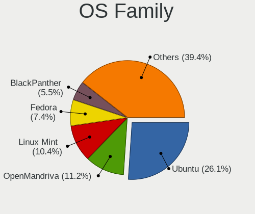

| Name          | Computers | Percent |
|---------------|-----------|---------|
| Ubuntu        | 199       | 30.47%  |
| Linux Mint    | 68        | 10.41%  |
| OpenMandriva  | 58        | 8.88%   |
| Fedora        | 44        | 6.74%   |
| BlackPanther  | 42        | 6.43%   |
| ROSA          | 30        | 4.59%   |
| Pop!_OS       | 25        | 3.83%   |
| Debian        | 19        | 2.91%   |
| Xubuntu       | 18        | 2.76%   |
| MX            | 17        | 2.6%    |
| Manjaro       | 16        | 2.45%   |
| Arch          | 16        | 2.45%   |
| Zorin         | 15        | 2.3%    |
| Kubuntu       | 12        | 1.84%   |
| Endless       | 7         | 1.07%   |
| KDE neon      | 6         | 0.92%   |
| Gentoo        | 6         | 0.92%   |
| ArcoLinux     | 6         | 0.92%   |
| Ubuntu Unity  | 5         | 0.77%   |
| openSUSE      | 5         | 0.77%   |
| Raspbian      | 4         | 0.61%   |
| Devuan        | 4         | 0.61%   |
| Lubuntu       | 3         | 0.46%   |
| CentOS        | 3         | 0.46%   |
| Ubuntu MATE   | 2         | 0.31%   |
| SteamOS       | 2         | 0.31%   |
| LMDE          | 2         | 0.31%   |
| EndeavourOS   | 2         | 0.31%   |
| antiX         | 2         | 0.31%   |
| Ubuntu Studio | 1         | 0.15%   |
| Ubuntu Budgie | 1         | 0.15%   |
| Rocky Linux   | 1         | 0.15%   |
| Q4OS          | 1         | 0.15%   |
| Nobara        | 1         | 0.15%   |
| Linux Lite    | 1         | 0.15%   |
| Kaisen        | 1         | 0.15%   |
| GNOME OS      | 1         | 0.15%   |
| Garuda Linux  | 1         | 0.15%   |
| GalliumOS     | 1         | 0.15%   |
| Elementary    | 1         | 0.15%   |

Kernel
------

Version of the Linux kernel

| Version                          | Computers | Percent |
|----------------------------------|-----------|---------|
| 4.18.16-desktop-1bP              | 33        | 4.35%   |
| 5.10.14-desktop-1omv4002         | 25        | 3.29%   |
| 5.16.7-desktop-1omv4003          | 24        | 3.16%   |
| 5.4.0-58-generic                 | 14        | 1.84%   |
| 5.6.14-desktop-2bP               | 10        | 1.32%   |
| 5.4.0-42-generic                 | 10        | 1.32%   |
| 5.15.0-56-generic                | 9         | 1.19%   |
| 5.4.0-52-generic                 | 8         | 1.05%   |
| 4.19.0-13-amd64                  | 8         | 1.05%   |
| 5.8.0-43-generic                 | 7         | 0.92%   |
| 5.15.0-43-generic                | 7         | 0.92%   |
| 5.11.0-27-generic                | 7         | 0.92%   |
| 4.9.60-nrj-desktop-1rosa-x86_64  | 7         | 0.92%   |
| 4.15.0-66-generic                | 7         | 0.92%   |
| 5.4.0-90-generic                 | 6         | 0.79%   |
| 5.4.0-73-generic                 | 6         | 0.79%   |
| 5.3.0-40-generic                 | 6         | 0.79%   |
| 4.19.0-14-amd64                  | 6         | 0.79%   |
| 5.8.0-50-generic                 | 5         | 0.66%   |
| 5.8.0-44-generic                 | 5         | 0.66%   |
| 5.4.0-65-generic                 | 5         | 0.66%   |
| 5.4.0-47-generic                 | 5         | 0.66%   |
| 5.4.0-26-generic                 | 5         | 0.66%   |
| 5.3.0-26-generic                 | 5         | 0.66%   |
| 5.15.0-48-generic                | 5         | 0.66%   |
| 5.13.0-22-generic                | 5         | 0.66%   |
| 4.9.124-nrj-desktop-1rosa-x86_64 | 5         | 0.66%   |
| 4.19.0-6-amd64                   | 5         | 0.66%   |
| 5.4.0-88-generic                 | 4         | 0.53%   |
| 5.3.0-42-generic                 | 4         | 0.53%   |
| 5.3.0-24-generic                 | 4         | 0.53%   |
| 5.15.0-47-generic                | 4         | 0.53%   |
| 5.15.0-46-generic                | 4         | 0.53%   |
| 5.13.0-40-generic                | 4         | 0.53%   |
| 5.11.0-41-generic                | 4         | 0.53%   |
| 4.18.0-17-generic                | 4         | 0.53%   |
| 5.9.16-200.fc33.x86_64           | 3         | 0.4%    |
| 5.8.0-7630-generic               | 3         | 0.4%    |
| 5.8.0-48-generic                 | 3         | 0.4%    |
| 5.8.0-29-generic                 | 3         | 0.4%    |

Kernel Family
-------------

Linux kernel without a distro release

| Version | Computers | Percent |
|---------|-----------|---------|
| 5.4.0   | 116       | 16.34%  |
| 4.15.0  | 59        | 8.31%   |
| 5.8.0   | 45        | 6.34%   |
| 5.15.0  | 40        | 5.63%   |
| 4.18.16 | 34        | 4.79%   |
| 5.3.0   | 31        | 4.37%   |
| 5.13.0  | 30        | 4.23%   |
| 5.11.0  | 28        | 3.94%   |
| 5.10.14 | 25        | 3.52%   |
| 5.16.7  | 24        | 3.38%   |
| 5.0.0   | 18        | 2.54%   |
| 4.18.0  | 16        | 2.25%   |
| 4.19.0  | 15        | 2.11%   |
| 5.10.0  | 12        | 1.69%   |
| 5.6.14  | 10        | 1.41%   |
| 4.9.60  | 7         | 0.99%   |
| 5.9.16  | 5         | 0.7%    |
| 5.19.0  | 5         | 0.7%    |
| 4.9.124 | 5         | 0.7%    |
| 4.9.20  | 4         | 0.56%   |
| 4.4.0   | 4         | 0.56%   |
| 5.4.83  | 3         | 0.42%   |
| 5.18.12 | 3         | 0.42%   |
| 5.17.5  | 3         | 0.42%   |
| 5.16.11 | 3         | 0.42%   |
| 5.13.4  | 3         | 0.42%   |
| 5.11.3  | 3         | 0.42%   |
| 5.11.11 | 3         | 0.42%   |
| 5.10.17 | 3         | 0.42%   |
| 4.9.0   | 3         | 0.42%   |
| 6.0.10  | 2         | 0.28%   |
| 5.8.18  | 2         | 0.28%   |
| 5.7.19  | 2         | 0.28%   |
| 5.5.0   | 2         | 0.28%   |
| 5.3.18  | 2         | 0.28%   |
| 5.2.21  | 2         | 0.28%   |
| 5.17.1  | 2         | 0.28%   |
| 5.15.8  | 2         | 0.28%   |
| 5.15.75 | 2         | 0.28%   |
| 5.15.28 | 2         | 0.28%   |

Kernel Major Ver.
-----------------

Linux kernel major version

| Version | Computers | Percent |
|---------|-----------|---------|
| 5.4     | 124       | 17.82%  |
| 5.15    | 59        | 8.48%   |
| 4.15    | 59        | 8.48%   |
| 5.10    | 51        | 7.33%   |
| 5.8     | 50        | 7.18%   |
| 4.18    | 50        | 7.18%   |
| 5.11    | 38        | 5.46%   |
| 5.3     | 36        | 5.17%   |
| 5.13    | 36        | 5.17%   |
| 5.16    | 32        | 4.6%    |
| 4.9     | 24        | 3.45%   |
| 5.0     | 20        | 2.87%   |
| 4.19    | 20        | 2.87%   |
| 5.6     | 14        | 2.01%   |
| 5.9     | 10        | 1.44%   |
| 5.19    | 10        | 1.44%   |
| 5.12    | 9         | 1.29%   |
| 5.7     | 8         | 1.15%   |
| 5.5     | 7         | 1.01%   |
| 5.18    | 7         | 1.01%   |
| 5.17    | 7         | 1.01%   |
| 6.0     | 6         | 0.86%   |
| 4.4     | 4         | 0.57%   |
| 5.14    | 3         | 0.43%   |
| 4.1     | 3         | 0.43%   |
| 5.2     | 2         | 0.29%   |
| 6.1     | 1         | 0.14%   |
| 5.1     | 1         | 0.14%   |
| 4.7     | 1         | 0.14%   |
| 4.17    | 1         | 0.14%   |
| 4.16    | 1         | 0.14%   |
| 4.12    | 1         | 0.14%   |
| 4.11    | 1         | 0.14%   |

Arch
----

OS architecture (x86_64, i586, etc.)

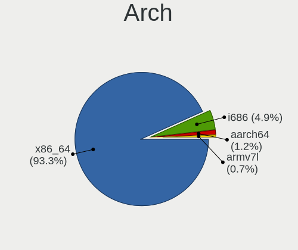

| Name    | Computers | Percent |
|---------|-----------|---------|
| x86_64  | 574       | 90.97%  |
| i686    | 45        | 7.13%   |
| armv7l  | 6         | 0.95%   |
| aarch64 | 6         | 0.95%   |

DE
--

Desktop Environment

| Name            | Computers | Percent |
|-----------------|-----------|---------|
| GNOME           | 240       | 36.98%  |
| KDE5            | 152       | 23.42%  |
| Unknown         | 80        | 12.33%  |
| XFCE            | 65        | 10.02%  |
| X-Cinnamon      | 48        | 7.4%    |
| MATE            | 16        | 2.47%   |
| KDE4            | 14        | 2.16%   |
| KDE             | 11        | 1.69%   |
| Cinnamon        | 6         | 0.92%   |
| Unity           | 5         | 0.77%   |
| LXDE            | 3         | 0.46%   |
| LXQt            | 2         | 0.31%   |
| Trinity         | 1         | 0.15%   |
| Pantheon        | 1         | 0.15%   |
| Openbox         | 1         | 0.15%   |
| GNOME Flashback | 1         | 0.15%   |
| Budgie          | 1         | 0.15%   |
| bspwm           | 1         | 0.15%   |
| awesome         | 1         | 0.15%   |

Display Server
--------------

X11 or Wayland

| Name        | Computers | Percent |
|-------------|-----------|---------|
| X11         | 519       | 81.09%  |
| Wayland     | 74        | 11.56%  |
| Unknown     | 38        | 5.94%   |
| Tty         | 8         | 1.25%   |
| Unspecified | 1         | 0.16%   |

Display Manager
---------------

SDDM, LightDM, etc.

| Name    | Computers | Percent |
|---------|-----------|---------|
| Unknown | 311       | 47.99%  |
| SDDM    | 142       | 21.91%  |
| GDM     | 56        | 8.64%   |
| LightDM | 49        | 7.56%   |
| GDM3    | 48        | 7.41%   |
| TDM     | 21        | 3.24%   |
| KDM     | 14        | 2.16%   |
| SLiM    | 5         | 0.77%   |
| XDM     | 2         | 0.31%   |

OS Lang
-------

Language

| Lang    | Computers | Percent |
|---------|-----------|---------|
| en_US   | 233       | 35.79%  |
| sk_SK   | 209       | 32.1%   |
| Unknown | 149       | 22.89%  |
| cs_CZ   | 21        | 3.23%   |
| en_GB   | 12        | 1.84%   |
| C       | 12        | 1.84%   |
| hu_HU   | 8         | 1.23%   |
| ru_UA   | 1         | 0.15%   |
| ru_RU   | 1         | 0.15%   |
| POSIX   | 1         | 0.15%   |
| it_IT   | 1         | 0.15%   |
| en_US | 1         | 0.15%   |
| en_AU   | 1         | 0.15%   |
| C.UTF8  | 1         | 0.15%   |

Boot Mode
---------

EFI or BIOS

| Mode | Computers | Percent |
|------|-----------|---------|
| BIOS | 405       | 63.38%  |
| EFI  | 234       | 36.62%  |

Filesystem
----------

Type of filesystem

| Type    | Computers | Percent |
|---------|-----------|---------|
| Ext4    | 450       | 69.55%  |
| Overlay | 105       | 16.23%  |
| Btrfs   | 44        | 6.8%    |
| Unknown | 27        | 4.17%   |
| Zfs     | 7         | 1.08%   |
| Xfs     | 7         | 1.08%   |
| Ext2    | 3         | 0.46%   |
| Tmpfs   | 2         | 0.31%   |
| Ext3    | 2         | 0.31%   |

Part. scheme
------------

Scheme of partitioning

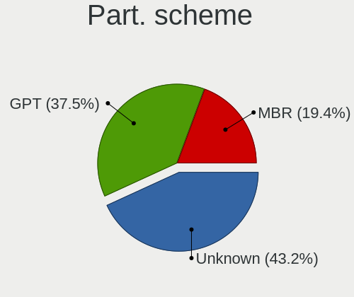

| Type    | Computers | Percent |
|---------|-----------|---------|
| Unknown | 346       | 53.81%  |
| GPT     | 149       | 23.17%  |
| MBR     | 148       | 23.02%  |

Dual Boot with Linux/BSD
------------------------

Hosting more than one Linux/BSD

| Dual boot | Computers | Percent |
|-----------|-----------|---------|
| No        | 528       | 81.11%  |
| Yes       | 123       | 18.89%  |

Dual Boot (Win)
---------------

Hosting Linux and Windows

| Dual boot | Computers | Percent |
|-----------|-----------|---------|
| No        | 430       | 67.19%  |
| Yes       | 210       | 32.81%  |

Board
-----

Vendor
------

Motherboard manufacturer

| Name                    | Computers | Percent |
|-------------------------|-----------|---------|
| ASUSTek Computer        | 139       | 22.2%   |
| Lenovo                  | 109       | 17.41%  |
| Hewlett-Packard         | 88        | 14.06%  |
| Dell                    | 62        | 9.9%    |
| Gigabyte Technology     | 40        | 6.39%   |
| MSI                     | 35        | 5.59%   |
| Acer                    | 33        | 5.27%   |
| ASRock                  | 17        | 2.72%   |
| Toshiba                 | 16        | 2.56%   |
| Intel                   | 13        | 2.08%   |
| Sony                    | 8         | 1.28%   |
| UMAX                    | 5         | 0.8%    |
| Raspberry Pi Foundation | 5         | 0.8%    |
| Fujitsu Siemens         | 5         | 0.8%    |
| Samsung Electronics     | 4         | 0.64%   |
| Foxconn                 | 4         | 0.64%   |
| Apple                   | 4         | 0.64%   |
| ZOTAC                   | 3         | 0.48%   |
| Packard Bell            | 3         | 0.48%   |
| Hardkernel              | 3         | 0.48%   |
| Fujitsu                 | 3         | 0.48%   |
| eMachines               | 3         | 0.48%   |
| Unknown                 | 3         | 0.48%   |
| Valve                   | 2         | 0.32%   |
| Shuttle                 | 2         | 0.32%   |
| Pegatron                | 2         | 0.32%   |
| Google                  | 2         | 0.32%   |
| Xunlong                 | 1         | 0.16%   |
| VIA Technologies        | 1         | 0.16%   |
| Timi                    | 1         | 0.16%   |
| Teclast                 | 1         | 0.16%   |
| Techvision              | 1         | 0.16%   |
| sunxi                   | 1         | 0.16%   |
| Radiant Systems         | 1         | 0.16%   |
| Quanta                  | 1         | 0.16%   |
| Medion                  | 1         | 0.16%   |
| Insyde                  | 1         | 0.16%   |
| HUAWEI                  | 1         | 0.16%   |
| GPD                     | 1         | 0.16%   |
| AMI                     | 1         | 0.16%   |

Model
-----

Motherboard model

| Name                               | Computers | Percent |
|------------------------------------|-----------|---------|
| ASUS All Series                    | 11        | 1.76%   |
| ASUS X550CC                        | 4         | 0.64%   |
| Unknown                            | 4         | 0.64%   |
| RPi Raspberry Pi 4 Model B Rev 1.4 | 3         | 0.48%   |
| Lenovo IdeaPadFlex 5 15IIL05 81X3  | 3         | 0.48%   |
| HP ProBook 4540s                   | 3         | 0.48%   |
| HP Pavilion g6                     | 3         | 0.48%   |
| HP Pavilion dv6                    | 3         | 0.48%   |
| Hardkernel ODROID-M1               | 3         | 0.48%   |
| Gigabyte F2A68HM-DS2               | 3         | 0.48%   |
| Valve Jupiter                      | 2         | 0.32%   |
| UMAX VisionBook 14Wr Plus          | 2         | 0.32%   |
| Toshiba Satellite P300             | 2         | 0.32%   |
| MSI VR610                          | 2         | 0.32%   |
| MSI MS-7C02                        | 2         | 0.32%   |
| MSI MS-7592                        | 2         | 0.32%   |
| Lenovo Yoga Slim 7 Pro 14ITL5 82FX | 2         | 0.32%   |
| Lenovo IdeaPad U260 20067          | 2         | 0.32%   |
| Lenovo IdeaPad S145-14AST 81ST     | 2         | 0.32%   |
| Lenovo IdeaCentre Q180 10087&3110  | 2         | 0.32%   |
| Lenovo G580                        | 2         | 0.32%   |
| HP ProBook 6570b                   | 2         | 0.32%   |
| HP ProBook 650 G1                  | 2         | 0.32%   |
| HP ProBook 4545s                   | 2         | 0.32%   |
| HP ProBook 450 G5                  | 2         | 0.32%   |
| HP ProBook 4330s                   | 2         | 0.32%   |
| HP EliteBook 8470p                 | 2         | 0.32%   |
| HP Compaq 8000 Elite SFF PC        | 2         | 0.32%   |
| HP Compaq 6005 Pro SFF PC          | 2         | 0.32%   |
| Gigabyte P43-ES3G                  | 2         | 0.32%   |
| Gigabyte H61M-S1                   | 2         | 0.32%   |
| Gigabyte GA-MA78GM-US2H            | 2         | 0.32%   |
| Gigabyte AB350-Gaming 3            | 2         | 0.32%   |
| Gigabyte 970A-DS3P                 | 2         | 0.32%   |
| Foxconn G41MX/G41MX-K 2.0 1.0      | 2         | 0.32%   |
| Dell Precision WorkStation 390     | 2         | 0.32%   |
| Dell Precision 7530                | 2         | 0.32%   |
| Dell OptiPlex 7010                 | 2         | 0.32%   |
| Dell Latitude E6540                | 2         | 0.32%   |
| Dell Latitude 5490                 | 2         | 0.32%   |

Model Family
------------

Motherboard model prefix

| Name                  | Computers | Percent |
|-----------------------|-----------|---------|
| Lenovo ThinkPad       | 40        | 6.39%   |
| Lenovo IdeaPad        | 27        | 4.31%   |
| Dell Latitude         | 23        | 3.67%   |
| HP ProBook            | 21        | 3.35%   |
| Acer Aspire           | 18        | 2.88%   |
| Toshiba Satellite     | 14        | 2.24%   |
| HP Pavilion           | 13        | 2.08%   |
| HP Compaq             | 13        | 2.08%   |
| HP EliteBook          | 12        | 1.92%   |
| ASUS ROG              | 12        | 1.92%   |
| ASUS All              | 11        | 1.76%   |
| Dell OptiPlex         | 8         | 1.28%   |
| Lenovo Yoga           | 7         | 1.12%   |
| Dell XPS              | 7         | 1.12%   |
| Dell Inspiron         | 7         | 1.12%   |
| ASUS PRIME            | 7         | 1.12%   |
| Dell Vostro           | 6         | 0.96%   |
| Acer Swift            | 6         | 0.96%   |
| RPi Raspberry         | 5         | 0.8%    |
| Lenovo IdeaCentre     | 5         | 0.8%    |
| Dell Precision        | 5         | 0.8%    |
| ASUS VivoBook         | 5         | 0.8%    |
| ASUS TUF              | 5         | 0.8%    |
| UMAX VisionBook       | 4         | 0.64%   |
| Lenovo IdeaPadFlex    | 4         | 0.64%   |
| ASUS X550CC           | 4         | 0.64%   |
| Acer Extensa          | 4         | 0.64%   |
| Unknown               | 4         | 0.64%   |
| Lenovo ThinkCentre    | 3         | 0.48%   |
| Lenovo Legion         | 3         | 0.48%   |
| HP ZBook              | 3         | 0.48%   |
| HP Spectre            | 3         | 0.48%   |
| HP ProLiant           | 3         | 0.48%   |
| Hardkernel ODROID-M1  | 3         | 0.48%   |
| Gigabyte F2A68HM-DS2  | 3         | 0.48%   |
| ASUS ZenBook          | 3         | 0.48%   |
| ASUS M5A78L-M         | 3         | 0.48%   |
| Valve Jupiter         | 2         | 0.32%   |
| Packard Bell EasyNote | 2         | 0.32%   |
| MSI VR610             | 2         | 0.32%   |

MFG Year
--------

Motherboard manufacture year

| Year    | Computers | Percent |
|---------|-----------|---------|
| 2012    | 63        | 10.06%  |
| 2013    | 59        | 9.42%   |
| 2019    | 51        | 8.15%   |
| 2008    | 46        | 7.35%   |
| 2011    | 44        | 7.03%   |
| 2009    | 42        | 6.71%   |
| 2020    | 41        | 6.55%   |
| 2018    | 39        | 6.23%   |
| 2014    | 32        | 5.11%   |
| 2010    | 31        | 4.95%   |
| 2007    | 31        | 4.95%   |
| 2017    | 29        | 4.63%   |
| 2016    | 28        | 4.47%   |
| 2021    | 24        | 3.83%   |
| 2015    | 24        | 3.83%   |
| 2006    | 20        | 3.19%   |
| Unknown | 9         | 1.44%   |
| 2022    | 7         | 1.12%   |
| 2005    | 3         | 0.48%   |
| 2002    | 1         | 0.16%   |
| 2001    | 1         | 0.16%   |
| 2000    | 1         | 0.16%   |

Form Factor
-----------

Physical design of the computer

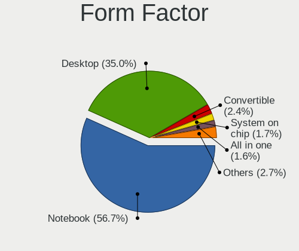

| Name           | Computers | Percent |
|----------------|-----------|---------|
| Notebook       | 344       | 54.95%  |
| Desktop        | 229       | 36.58%  |
| Convertible    | 17        | 2.72%   |
| All in one     | 12        | 1.92%   |
| System on chip | 10        | 1.6%    |
| Mini pc        | 7         | 1.12%   |
| Tablet         | 4         | 0.64%   |
| Server         | 3         | 0.48%   |

Secure Boot
-----------

Enabled or disabled

| State    | Computers | Percent |
|----------|-----------|---------|
| Disabled | 581       | 92.37%  |
| Enabled  | 48        | 7.63%   |

Coreboot
--------

Have coreboot on board

| Used | Computers | Percent |
|------|-----------|---------|
| No   | 624       | 99.68%  |
| Yes  | 2         | 0.32%   |

RAM Size
--------

Total RAM memory

| Size in GB      | Computers | Percent |
|-----------------|-----------|---------|
| 3.01-4.0        | 169       | 26.24%  |
| 4.01-8.0        | 143       | 22.2%   |
| 8.01-16.0       | 121       | 18.79%  |
| 16.01-24.0      | 93        | 14.44%  |
| 1.01-2.0        | 42        | 6.52%   |
| 32.01-64.0      | 32        | 4.97%   |
| 2.01-3.0        | 18        | 2.8%    |
| 0.51-1.0        | 11        | 1.71%   |
| 64.01-256.0     | 6         | 0.93%   |
| 24.01-32.0      | 5         | 0.78%   |
| 0.01-0.5        | 3         | 0.47%   |
| More than 256.0 | 1         | 0.16%   |

RAM Used
--------

Used RAM memory

| Used GB    | Computers | Percent |
|------------|-----------|---------|
| 1.01-2.0   | 265       | 38.07%  |
| 2.01-3.0   | 139       | 19.97%  |
| 0.51-1.0   | 97        | 13.94%  |
| 3.01-4.0   | 71        | 10.2%   |
| 4.01-8.0   | 60        | 8.62%   |
| 0.01-0.5   | 37        | 5.32%   |
| 8.01-16.0  | 25        | 3.59%   |
| 24.01-32.0 | 1         | 0.14%   |
| 16.01-24.0 | 1         | 0.14%   |

Total Drives
------------

Number of drives on board

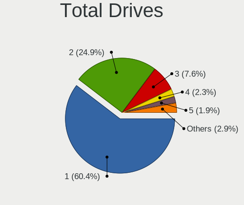

| Drives | Computers | Percent |
|--------|-----------|---------|
| 1      | 393       | 59.28%  |
| 2      | 173       | 26.09%  |
| 3      | 49        | 7.39%   |
| 4      | 16        | 2.41%   |
| 0      | 14        | 2.11%   |
| 5      | 12        | 1.81%   |
| 6      | 4         | 0.6%    |
| 17     | 1         | 0.15%   |
| 7      | 1         | 0.15%   |

Has CD-ROM
----------

Has CD-ROM on board

| Presented | Computers | Percent |
|-----------|-----------|---------|
| No        | 343       | 54.02%  |
| Yes       | 292       | 45.98%  |

Has Ethernet
------------

Has Ethernet on board

| Presented | Computers | Percent |
|-----------|-----------|---------|
| Yes       | 547       | 87.1%   |
| No        | 81        | 12.9%   |

Has WiFi
--------

Has WiFi module

| Presented | Computers | Percent |
|-----------|-----------|---------|
| Yes       | 447       | 70.95%  |
| No        | 183       | 29.05%  |

Has Bluetooth
-------------

Has Bluetooth module

| Presented | Computers | Percent |
|-----------|-----------|---------|
| Yes       | 321       | 50.79%  |
| No        | 311       | 49.21%  |

Location
--------

Country
-------

Geographic location (country)

| Country  | Computers | Percent |
|----------|-----------|---------|
| Slovakia | 626       | 100%    |

City
----

Geographic location (city)

| City                   | Computers | Percent |
|------------------------|-----------|---------|
| Bratislava             | 226       | 33.24%  |
| Koice                | 46        | 6.76%   |
| Nitra                  | 28        | 4.12%   |
| Bansk Bystrica       | 23        | 3.38%   |
| Nov Zmky           | 14        | 2.06%   |
| ilina                | 11        | 1.62%   |
| Trnava                 | 10        | 1.47%   |
| Preov                | 10        | 1.47%   |
| Zvolen                 | 9         | 1.32%   |
| Poprad                 | 9         | 1.32%   |
| Humenn               | 8         | 1.18%   |
| Martin                 | 7         | 1.03%   |
| Levice                 | 7         | 1.03%   |
| Bardejov               | 7         | 1.03%   |
| Trenn              | 6         | 0.88%   |
| Soblahov               | 6         | 0.88%   |
| Cechynce               | 6         | 0.88%   |
| Tornaa               | 5         | 0.74%   |
| Luenec               | 5         | 0.74%   |
| Liptovsk Mikul   | 5         | 0.74%   |
| Kysuck Nov Mesto   | 5         | 0.74%   |
| Topoany            | 4         | 0.59%   |
| Senec                  | 4         | 0.59%   |
| Ruomberok            | 4         | 0.59%   |
| Rimavsk Sobota       | 4         | 0.59%   |
| Modra                  | 4         | 0.59%   |
| Dunajsk Streda       | 4         | 0.59%   |
| Skalica                | 3         | 0.44%   |
| aa                 | 3         | 0.44%   |
| Roava              | 3         | 0.44%   |
| Petralka           | 3         | 0.44%   |
| Nitrianske Hrnciarovce | 3         | 0.44%   |
| Nmestovo             | 3         | 0.44%   |
| Krupina                | 3         | 0.44%   |
| Galanta                | 3         | 0.44%   |
| Doln Kubn          | 3         | 0.44%   |
| Banovce nad Bebravou   | 3         | 0.44%   |
| Abovce                 | 3         | 0.44%   |
| Ziar nad Hronom        | 2         | 0.29%   |
| Voderady               | 2         | 0.29%   |

Drives
------

Drive Vendor
------------

Hard drive vendors

| Vendor                      | Computers | Drives | Percent |
|-----------------------------|-----------|--------|---------|
| WDC                         | 167       | 271    | 18.41%  |
| Seagate                     | 147       | 210    | 16.21%  |
| Samsung Electronics         | 122       | 182    | 13.45%  |
| Toshiba                     | 49        | 70     | 5.4%    |
| Kingston                    | 46        | 56     | 5.07%   |
| Hitachi                     | 40        | 51     | 4.41%   |
| Unknown                     | 39        | 60     | 4.3%    |
| Sandisk                     | 35        | 40     | 3.86%   |
| Intel                       | 33        | 45     | 3.64%   |
| Patriot                     | 30        | 44     | 3.31%   |
| A-DATA Technology           | 30        | 46     | 3.31%   |
| SK hynix                    | 17        | 20     | 1.87%   |
| HGST                        | 17        | 22     | 1.87%   |
| Crucial                     | 15        | 19     | 1.65%   |
| Micron Technology           | 14        | 17     | 1.54%   |
| Phison                      | 8         | 10     | 0.88%   |
| Maxtor                      | 7         | 12     | 0.77%   |
| Apacer                      | 6         | 6      | 0.66%   |
| KingDian                    | 5         | 7      | 0.55%   |
| Fujitsu                     | 5         | 6      | 0.55%   |
| Verbatim                    | 4         | 4      | 0.44%   |
| OCZ                         | 4         | 4      | 0.44%   |
| Union Memory                | 3         | 3      | 0.33%   |
| LITEONIT                    | 3         | 3      | 0.33%   |
| LITEON                      | 3         | 3      | 0.33%   |
| KIOXIA                      | 3         | 12     | 0.33%   |
| Intenso                     | 3         | 4      | 0.33%   |
| IBM/Hitachi                 | 3         | 3      | 0.33%   |
| Gigabyte Technology         | 3         | 5      | 0.33%   |
| China                       | 3         | 6      | 0.33%   |
| Unknown                     | 3         | 3      | 0.33%   |
| Transcend                   | 2         | 2      | 0.22%   |
| Silicon Motion              | 2         | 3      | 0.22%   |
| Realtek Semiconductor       | 2         | 2      | 0.22%   |
| Kingston Technology Company | 2         | 3      | 0.22%   |
| HS-SSD-E100                 | 2         | 2      | 0.22%   |
| Hewlett-Packard             | 2         | 4      | 0.22%   |
| FORESEE                     | 2         | 3      | 0.22%   |
| Corsair                     | 2         | 3      | 0.22%   |
| ZTE                         | 1         | 1      | 0.11%   |

Drive Model
-----------

Hard drive models

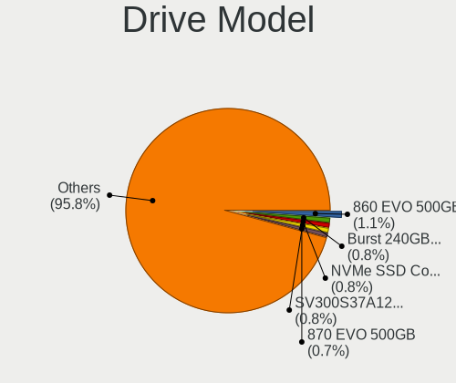

| Model                                  | Computers | Percent |
|----------------------------------------|-----------|---------|
| Samsung SSD 860 EVO 500GB              | 12        | 1.19%   |
| Patriot Burst 240GB SSD                | 12        | 1.19%   |
| Kingston SV300S37A120G 120GB SSD       | 10        | 0.99%   |
| Samsung SSD 860 EVO 250GB              | 9         | 0.89%   |
| Samsung SSD 850 EVO 500GB              | 8         | 0.79%   |
| Samsung SSD 850 EVO 250GB              | 8         | 0.79%   |
| Unknown MMC Card  64GB                 | 7         | 0.69%   |
| Seagate ST9500325AS 500GB              | 7         | 0.69%   |
| Patriot Burst 480GB SSD                | 7         | 0.69%   |
| Kingston SA400S37120G 120GB SSD        | 7         | 0.69%   |
| WDC WDS240G2G0B-00EPW0 240GB SSD       | 6         | 0.59%   |
| WDC WD10EZEX-08WN4A0 1TB               | 6         | 0.59%   |
| Seagate ST9500420AS 500GB              | 6         | 0.59%   |
| SanDisk NVMe SSD Drive 1024GB          | 6         | 0.59%   |
| Patriot Burst 120GB SSD                | 6         | 0.59%   |
| Toshiba NVMe SSD Drive 512GB           | 5         | 0.5%    |
| Seagate ST3500418AS 500GB              | 5         | 0.5%    |
| Seagate ST2000DM008-2FR102 2TB         | 5         | 0.5%    |
| Seagate ST1000LM035-1RK172 1TB         | 5         | 0.5%    |
| Samsung NVMe SSD Drive 500GB           | 5         | 0.5%    |
| Kingston SA400S37240G 240GB SSD        | 5         | 0.5%    |
| Hitachi HTS543232A7A384 320GB          | 5         | 0.5%    |
| HGST HTS725050A7E630 500GB             | 5         | 0.5%    |
| A-DATA SP600 32GB SSD                  | 5         | 0.5%    |
| WDC WDS240G2G0A-00JH30 240GB SSD       | 4         | 0.4%    |
| Unknown MMC Card  32GB                 | 4         | 0.4%    |
| Toshiba MQ01ABD100 1TB                 | 4         | 0.4%    |
| Toshiba DT01ACA100 1TB                 | 4         | 0.4%    |
| Seagate ST500DM002-1BD142 500GB        | 4         | 0.4%    |
| Seagate ST3320311CS 320GB              | 4         | 0.4%    |
| Seagate ST2000DM001-1CH164 2TB         | 4         | 0.4%    |
| Seagate ST1000LM024 HN-M101MBB 1TB     | 4         | 0.4%    |
| SanDisk NVMe SSD Drive 512GB           | 4         | 0.4%    |
| Samsung SSD 860 EVO 1TB                | 4         | 0.4%    |
| Samsung SM963 2.5" NVMe PCIe SSD 256GB | 4         | 0.4%    |
| Phison NVMe SSD Drive 1TB              | 4         | 0.4%    |
| HGST HTS545050A7E380 500GB             | 4         | 0.4%    |
| Apacer AS350 512GB SSD                 | 4         | 0.4%    |
| WDC WDS500G2B0A-00SM50 500GB SSD       | 3         | 0.3%    |
| WDC WD3200BPVT-22ZEST0 320GB           | 3         | 0.3%    |

HDD Vendor
----------

Hard disk drive vendors

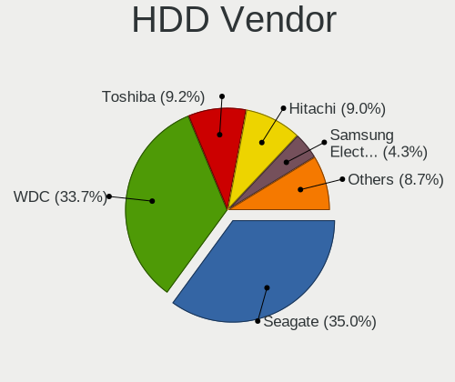

| Vendor              | Computers | Drives | Percent |
|---------------------|-----------|--------|---------|
| Seagate             | 145       | 207    | 34.2%   |
| WDC                 | 144       | 241    | 33.96%  |
| Hitachi             | 40        | 51     | 9.43%   |
| Toshiba             | 37        | 56     | 8.73%   |
| Samsung Electronics | 21        | 32     | 4.95%   |
| HGST                | 17        | 22     | 4.01%   |
| Maxtor              | 7         | 12     | 1.65%   |
| Fujitsu             | 5         | 6      | 1.18%   |
| IBM/Hitachi         | 3         | 3      | 0.71%   |
| USB3.0              | 1         | 2      | 0.24%   |
| Unknown             | 1         | 1      | 0.24%   |
| HGST HTS            | 1         | 1      | 0.24%   |
| Hewlett-Packard     | 1         | 3      | 0.24%   |
| ExcelStor           | 1         | 1      | 0.24%   |

SSD Vendor
----------

Solid state drive vendors

| Vendor              | Computers | Drives | Percent |
|---------------------|-----------|--------|---------|
| Samsung Electronics | 68        | 87     | 23.21%  |
| Kingston            | 37        | 47     | 12.63%  |
| Patriot             | 28        | 42     | 9.56%   |
| A-DATA Technology   | 26        | 42     | 8.87%   |
| Intel               | 21        | 31     | 7.17%   |
| WDC                 | 17        | 19     | 5.8%    |
| SanDisk             | 17        | 20     | 5.8%    |
| Crucial             | 15        | 19     | 5.12%   |
| Micron Technology   | 7         | 10     | 2.39%   |
| Apacer              | 6         | 6      | 2.05%   |
| Toshiba             | 4         | 4      | 1.37%   |
| OCZ                 | 4         | 4      | 1.37%   |
| Verbatim            | 3         | 3      | 1.02%   |
| SK hynix            | 3         | 3      | 1.02%   |
| LITEONIT            | 3         | 3      | 1.02%   |
| LITEON              | 3         | 3      | 1.02%   |
| KingDian            | 3         | 5      | 1.02%   |
| Intenso             | 3         | 4      | 1.02%   |
| Gigabyte Technology | 3         | 5      | 1.02%   |
| China               | 3         | 6      | 1.02%   |
| Union Memory        | 2         | 2      | 0.68%   |
| Transcend           | 2         | 2      | 0.68%   |
| FORESEE             | 2         | 3      | 0.68%   |
| WDC WDS2            | 1         | 1      | 0.34%   |
| ULTIMATE            | 1         | 2      | 0.34%   |
| PNY                 | 1         | 2      | 0.34%   |
| KingSpec            | 1         | 1      | 0.34%   |
| IM3D                | 1         | 1      | 0.34%   |
| HS-SSD-E100         | 1         | 1      | 0.34%   |
| HS-SSD-C100         | 1         | 3      | 0.34%   |
| Hewlett-Packard     | 1         | 1      | 0.34%   |
| GOODRAM             | 1         | 3      | 0.34%   |
| Faspeed             | 1         | 1      | 0.34%   |
| Corsair             | 1         | 1      | 0.34%   |
| AMD                 | 1         | 1      | 0.34%   |
| 2.5                 | 1         | 1      | 0.34%   |

Drive Kind
----------

HDD or SSD

| Kind    | Computers | Drives | Percent |
|---------|-----------|--------|---------|
| HDD     | 347       | 638    | 43.7%   |
| SSD     | 258       | 389    | 32.49%  |
| NVMe    | 138       | 201    | 17.38%  |
| MMC     | 40        | 60     | 5.04%   |
| Unknown | 11        | 12     | 1.39%   |

Drive Connector
---------------

SATA, SAS, NVMe, etc.

| Type | Computers | Drives | Percent |
|------|-----------|--------|---------|
| SATA | 495       | 1009   | 71.02%  |
| NVMe | 138       | 201    | 19.8%   |
| MMC  | 40        | 60     | 5.74%   |
| SAS  | 24        | 30     | 3.44%   |

Drive Size
----------

Size of hard drive

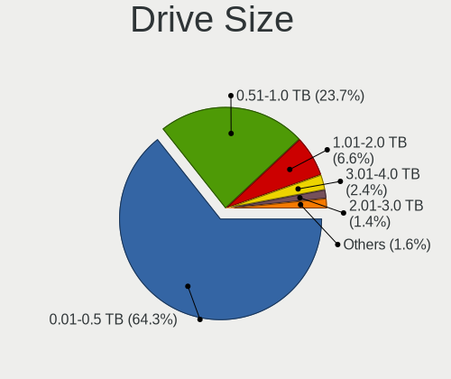

| Size in TB | Computers | Drives | Percent |
|------------|-----------|--------|---------|
| 0.01-0.5   | 416       | 712    | 67.64%  |
| 0.51-1.0   | 137       | 208    | 22.28%  |
| 1.01-2.0   | 40        | 64     | 6.5%    |
| 3.01-4.0   | 12        | 22     | 1.95%   |
| 2.01-3.0   | 7         | 13     | 1.14%   |
| 4.01-10.0  | 2         | 7      | 0.33%   |
| 10.01-20.0 | 1         | 1      | 0.16%   |

Space Total
-----------

Amount of disk space available on the file system

| Size in GB     | Computers | Percent |
|----------------|-----------|---------|
| 101-250        | 167       | 24.38%  |
| 251-500        | 136       | 19.85%  |
| 501-1000       | 92        | 13.43%  |
| 1-20           | 84        | 12.26%  |
| Unknown        | 54        | 7.88%   |
| 51-100         | 53        | 7.74%   |
| 21-50          | 39        | 5.69%   |
| 1001-2000      | 38        | 5.55%   |
| More than 3000 | 13        | 1.9%    |
| 2001-3000      | 9         | 1.31%   |

Space Used
----------

Amount of used disk space

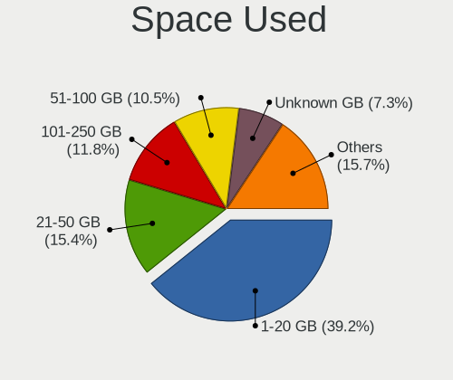

| Used GB        | Computers | Percent |
|----------------|-----------|---------|
| 1-20           | 287       | 41.41%  |
| 21-50          | 111       | 16.02%  |
| 101-250        | 76        | 10.97%  |
| 51-100         | 67        | 9.67%   |
| Unknown        | 54        | 7.79%   |
| 251-500        | 47        | 6.78%   |
| 501-1000       | 30        | 4.33%   |
| 1001-2000      | 14        | 2.02%   |
| More than 3000 | 5         | 0.72%   |
| 2001-3000      | 2         | 0.29%   |

Malfunc. Drives
---------------

Drive models with a malfunction

| Model                                   | Computers | Drives | Percent |
|-----------------------------------------|-----------|--------|---------|
| Toshiba MK7575GSX 752GB                 | 3         | 5      | 3.53%   |
| Seagate ST9500325AS 500GB               | 3         | 4      | 3.53%   |
| Seagate ST980811AS 80GB                 | 2         | 2      | 2.35%   |
| Seagate ST9250315AS 250GB               | 2         | 2      | 2.35%   |
| Seagate ST3320413CS 320GB               | 2         | 2      | 2.35%   |
| Seagate ST320LT007-9ZV142 320GB         | 2         | 2      | 2.35%   |
| Kingston SV300S37A60G 64GB SSD          | 2         | 2      | 2.35%   |
| Hitachi HTS543232A7A384 320GB           | 2         | 2      | 2.35%   |
| WDC WDS240G2G0A-00JH30 240GB SSD        | 1         | 1      | 1.18%   |
| WDC WD800JD-60LSA0 80GB                 | 1         | 1      | 1.18%   |
| WDC WD7500BPVT-80HXZT3 752GB            | 1         | 1      | 1.18%   |
| WDC WD5000LPVT-24G33T1 500GB            | 1         | 1      | 1.18%   |
| WDC WD5000BPVT-00HXZT1 500GB            | 1         | 1      | 1.18%   |
| WDC WD5000AAKX-603CA0 500GB             | 1         | 1      | 1.18%   |
| WDC WD3200BEVT-75ZCT2 320GB             | 1         | 1      | 1.18%   |
| WDC WD3200AAJS-56B4A0 320GB             | 1         | 2      | 1.18%   |
| WDC WD2500AAKX-753CA1 250GB             | 1         | 1      | 1.18%   |
| WDC WD20EZRZ-00Z5HB0 2TB                | 1         | 1      | 1.18%   |
| WDC WD20EURS-63S48Y0 2TB                | 1         | 1      | 1.18%   |
| WDC WD1600JS-61MHB1 160GB               | 1         | 1      | 1.18%   |
| WDC WD10JPLX-00MBPT0 1TB                | 1         | 1      | 1.18%   |
| WDC WD10EZEX-75WN4A0 1TB                | 1         | 2      | 1.18%   |
| WDC WD10EZEX-08WN4A0 1TB                | 1         | 1      | 1.18%   |
| WDC WD10EZEX-00RKKA0 1TB                | 1         | 1      | 1.18%   |
| WDC WD10EZEX-00KUWA0 1TB                | 1         | 1      | 1.18%   |
| WDC WD10EALX-009BA0 1TB                 | 1         | 1      | 1.18%   |
| Toshiba MQ01ABD100 1TB                  | 1         | 1      | 1.18%   |
| Toshiba MQ01ABD075 752GB                | 1         | 1      | 1.18%   |
| Toshiba MK5056GSY 500GB                 | 1         | 1      | 1.18%   |
| Toshiba MK1646GSX 160GB                 | 1         | 2      | 1.18%   |
| Toshiba MK1637GSX 160GB                 | 1         | 1      | 1.18%   |
| SK hynix BC501 HFM256GDJTNG-8310A 256GB | 1         | 1      | 1.18%   |
| Seagate ST9500420AS 500GB               | 1         | 1      | 1.18%   |
| Seagate ST9120823ASG 120GB              | 1         | 1      | 1.18%   |
| Seagate ST500LM000-SSHD-8GB             | 1         | 1      | 1.18%   |
| Seagate ST500LM000-1EJ162 500GB         | 1         | 1      | 1.18%   |
| Seagate ST500DM002-1BD142 500GB         | 1         | 1      | 1.18%   |
| Seagate ST3500312CS 500GB               | 1         | 1      | 1.18%   |
| Seagate ST3402111A 40GB                 | 1         | 1      | 1.18%   |
| Seagate ST320LT020-9YG142 320GB         | 1         | 2      | 1.18%   |

Malfunc. Drive Vendor
---------------------

Vendors of faulty drives

| Vendor              | Computers | Drives | Percent |
|---------------------|-----------|--------|---------|
| Seagate             | 25        | 28     | 29.76%  |
| WDC                 | 17        | 20     | 20.24%  |
| Hitachi             | 9         | 9      | 10.71%  |
| Toshiba             | 8         | 11     | 9.52%   |
| Samsung Electronics | 6         | 10     | 7.14%   |
| Maxtor              | 3         | 3      | 3.57%   |
| SanDisk             | 2         | 3      | 2.38%   |
| Micron Technology   | 2         | 2      | 2.38%   |
| Kingston            | 2         | 2      | 2.38%   |
| Intel               | 2         | 2      | 2.38%   |
| SK hynix            | 1         | 1      | 1.19%   |
| OCZ                 | 1         | 1      | 1.19%   |
| IM3D                | 1         | 1      | 1.19%   |
| IBM/Hitachi         | 1         | 1      | 1.19%   |
| HGST                | 1         | 1      | 1.19%   |
| Fujitsu             | 1         | 2      | 1.19%   |
| ExcelStor           | 1         | 1      | 1.19%   |
| A-DATA Technology   | 1         | 1      | 1.19%   |

Malfunc. HDD Vendor
-------------------

Vendors of faulty HDD drives

| Vendor              | Computers | Drives | Percent |
|---------------------|-----------|--------|---------|
| Seagate             | 25        | 28     | 36.23%  |
| WDC                 | 16        | 19     | 23.19%  |
| Hitachi             | 9         | 9      | 13.04%  |
| Toshiba             | 8         | 11     | 11.59%  |
| Samsung Electronics | 4         | 8      | 5.8%    |
| Maxtor              | 3         | 3      | 4.35%   |
| IBM/Hitachi         | 1         | 1      | 1.45%   |
| HGST                | 1         | 1      | 1.45%   |
| Fujitsu             | 1         | 2      | 1.45%   |
| ExcelStor           | 1         | 1      | 1.45%   |

Malfunc. Drive Kind
-------------------

Kinds of faulty drives

| Kind | Computers | Drives | Percent |
|------|-----------|--------|---------|
| HDD  | 65        | 83     | 81.25%  |
| SSD  | 12        | 13     | 15%     |
| NVMe | 3         | 3      | 3.75%   |

Failed Drives
-------------

Failed drive models

| Model                             | Computers | Drives | Percent |
|-----------------------------------|-----------|--------|---------|
| Toshiba MK5065GSX 500GB           | 2         | 2      | 33.33%  |
| Seagate ST9320325AS 320GB         | 1         | 1      | 16.67%  |
| Seagate ST3500418AS 500GB         | 1         | 2      | 16.67%  |
| Seagate ST2000DM001-1CH164 2TB    | 1         | 1      | 16.67%  |
| Samsung Electronics HD321HJ 320GB | 1         | 2      | 16.67%  |

Failed Drive Vendor
-------------------

Failed drive vendors

| Vendor              | Computers | Drives | Percent |
|---------------------|-----------|--------|---------|
| Seagate             | 3         | 4      | 50%     |
| Toshiba             | 2         | 2      | 33.33%  |
| Samsung Electronics | 1         | 2      | 16.67%  |

Drive Status
------------

Number of failed and malfunc. drives

| Status   | Computers | Drives | Percent |
|----------|-----------|--------|---------|
| Detected | 371       | 684    | 53.46%  |
| Works    | 240       | 509    | 34.58%  |
| Malfunc  | 77        | 99     | 11.1%   |
| Failed   | 6         | 8      | 0.86%   |

Storage controller
------------------

Storage Vendor
--------------

Storage controller vendors

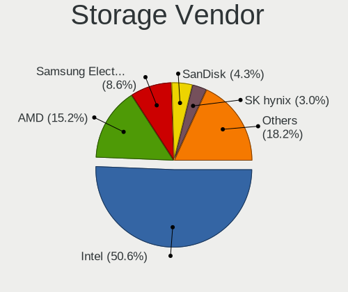

| Vendor                           | Computers | Percent |
|----------------------------------|-----------|---------|
| Intel                            | 418       | 57.1%   |
| AMD                              | 112       | 15.3%   |
| Samsung Electronics              | 43        | 5.87%   |
| SanDisk                          | 27        | 3.69%   |
| Nvidia                           | 20        | 2.73%   |
| JMicron Technology               | 15        | 2.05%   |
| SK hynix                         | 14        | 1.91%   |
| Phison Electronics               | 12        | 1.64%   |
| Kingston Technology Company      | 11        | 1.5%    |
| ASMedia Technology               | 9         | 1.23%   |
| Toshiba America Info Systems     | 8         | 1.09%   |
| Micron Technology                | 7         | 0.96%   |
| Marvell Technology Group         | 6         | 0.82%   |
| VIA Technologies                 | 5         | 0.68%   |
| ADATA Technology                 | 5         | 0.68%   |
| Silicon Integrated Systems [SiS] | 3         | 0.41%   |
| KIOXIA                           | 3         | 0.41%   |
| Silicon Motion                   | 2         | 0.27%   |
| Realtek Semiconductor            | 2         | 0.27%   |
| LSI Logic / Symbios Logic        | 2         | 0.27%   |
| Hewlett-Packard                  | 2         | 0.27%   |
| Union Memory (Shenzhen)          | 1         | 0.14%   |
| ULi Electronics                  | 1         | 0.14%   |
| Solid State Storage Technology   | 1         | 0.14%   |
| Silicon Image                    | 1         | 0.14%   |
| Micron/Crucial Technology        | 1         | 0.14%   |
| Apple                            | 1         | 0.14%   |

Storage Model
-------------

Storage controller models

| Model                                                                          | Computers | Percent |
|--------------------------------------------------------------------------------|-----------|---------|
| AMD FCH SATA Controller [AHCI mode]                                            | 64        | 7.11%   |
| Intel 7 Series Chipset Family 6-port SATA Controller [AHCI mode]               | 44        | 4.89%   |
| Intel 8 Series/C220 Series Chipset Family 6-port SATA Controller 1 [AHCI mode] | 32        | 3.56%   |
| Intel 82801G (ICH7 Family) IDE Controller                                      | 28        | 3.11%   |
| Samsung NVMe SSD Controller SM981/PM981/PM983                                  | 26        | 2.89%   |
| Intel NM10/ICH7 Family SATA Controller [IDE mode]                              | 26        | 2.89%   |
| Intel Sunrise Point-LP SATA Controller [AHCI mode]                             | 24        | 2.67%   |
| Intel 6 Series/C200 Series Chipset Family 6 port Mobile SATA AHCI Controller   | 20        | 2.22%   |
| AMD SB7x0/SB8x0/SB9x0 IDE Controller                                           | 18        | 2%      |
| Intel 82801HM/HEM (ICH8M/ICH8M-E) SATA Controller [AHCI mode]                  | 17        | 1.89%   |
| Intel 82801HM/HEM (ICH8M/ICH8M-E) IDE Controller                               | 17        | 1.89%   |
| AMD SB7x0/SB8x0/SB9x0 SATA Controller [AHCI mode]                              | 16        | 1.78%   |
| Intel 82801IBM/IEM (ICH9M/ICH9M-E) 4 port SATA Controller [AHCI mode]          | 15        | 1.67%   |
| Intel 82801 Mobile SATA Controller [RAID mode]                                 | 15        | 1.67%   |
| Intel 7 Series/C210 Series Chipset Family 6-port SATA Controller [AHCI mode]   | 13        | 1.44%   |
| SanDisk WD Black SN750 / PC SN730 NVMe SSD                                     | 12        | 1.33%   |
| Intel Q170/Q150/B150/H170/H110/Z170/CM236 Chipset SATA Controller [AHCI Mode]  | 12        | 1.33%   |
| Intel 6 Series/C200 Series Chipset Family 6 port Desktop SATA AHCI Controller  | 12        | 1.33%   |
| AMD SB7x0/SB8x0/SB9x0 SATA Controller [IDE mode]                               | 12        | 1.33%   |
| Samsung NVMe SSD Controller SM961/PM961/SM963                                  | 10        | 1.11%   |
| Intel 5 Series/3400 Series Chipset 4 port SATA AHCI Controller                 | 10        | 1.11%   |
| Intel 200 Series PCH SATA controller [AHCI mode]                               | 10        | 1.11%   |
| AMD 400 Series Chipset SATA Controller                                         | 10        | 1.11%   |
| JMicron JMB363 SATA/IDE Controller                                             | 9         | 1%      |
| Intel Cannon Lake Mobile PCH SATA AHCI Controller                              | 9         | 1%      |
| Intel 8 Series SATA Controller 1 [AHCI mode]                                   | 9         | 1%      |
| SanDisk Non-Volatile memory controller                                         | 8         | 0.89%   |
| Intel Celeron/Pentium Silver Processor SATA Controller                         | 8         | 0.89%   |
| Micron Non-Volatile memory controller                                          | 7         | 0.78%   |
| Intel Wildcat Point-LP SATA Controller [AHCI Mode]                             | 7         | 0.78%   |
| Intel 82801JI (ICH10 Family) 4 port SATA IDE Controller #1                     | 7         | 0.78%   |
| Intel 82801JI (ICH10 Family) 2 port SATA IDE Controller #2                     | 7         | 0.78%   |
| Intel 5 Series/3400 Series Chipset 6 port SATA AHCI Controller                 | 7         | 0.78%   |
| ASMedia ASM1062 Serial ATA Controller                                          | 7         | 0.78%   |
| AMD SB600 Non-Raid-5 SATA                                                      | 7         | 0.78%   |
| AMD SB600 IDE                                                                  | 7         | 0.78%   |
| Phison E12 NVMe Controller                                                     | 6         | 0.67%   |
| Nvidia MCP61 SATA Controller                                                   | 6         | 0.67%   |
| Nvidia MCP61 IDE                                                               | 6         | 0.67%   |
| Intel Volume Management Device NVMe RAID Controller                            | 6         | 0.67%   |

Storage Kind
------------

Kind of storage controller (IDE, SATA, NVMe, SAS, ...)

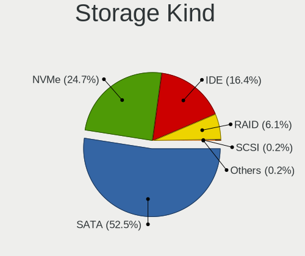

| Kind | Computers | Percent |
|------|-----------|---------|
| SATA | 421       | 55.1%   |
| IDE  | 166       | 21.73%  |
| NVMe | 139       | 18.19%  |
| RAID | 37        | 4.84%   |
| SCSI | 1         | 0.13%   |

Processor
---------

CPU Vendor
----------

Processor vendors

| Vendor       | Computers | Percent |
|--------------|-----------|---------|
| Intel        | 465       | 74.28%  |
| AMD          | 150       | 23.96%  |
| ARM          | 10        | 1.6%    |
| CentaurHauls | 1         | 0.16%   |

CPU Model
---------

Processor models

| Model                                   | Computers | Percent |
|-----------------------------------------|-----------|---------|
| Intel Core i5-8250U CPU @ 1.60GHz       | 8         | 1.27%   |
| Intel Core i5-3320M CPU @ 2.60GHz       | 7         | 1.11%   |
| Intel Core 2 Quad CPU Q6600 @ 2.40GHz   | 7         | 1.11%   |
| Intel Core i7-1065G7 CPU @ 1.30GHz      | 6         | 0.95%   |
| Intel Core i5-7200U CPU @ 2.50GHz       | 6         | 0.95%   |
| Intel Core 2 Quad CPU Q9400 @ 2.66GHz   | 6         | 0.95%   |
| Intel Core i7-8565U CPU @ 1.80GHz       | 5         | 0.79%   |
| Intel Core i5-3210M CPU @ 2.50GHz       | 5         | 0.79%   |
| Intel Core i3-5010U CPU @ 2.10GHz       | 5         | 0.79%   |
| Intel Core i3-3110M CPU @ 2.40GHz       | 5         | 0.79%   |
| Intel 11th Gen Core i7-1165G7 @ 2.80GHz | 5         | 0.79%   |
| ARM Processor                           | 5         | 0.79%   |
| Intel Core i7-8550U CPU @ 1.80GHz       | 4         | 0.63%   |
| Intel Core i7-4700MQ CPU @ 2.40GHz      | 4         | 0.63%   |
| Intel Core i5-2500K CPU @ 3.30GHz       | 4         | 0.63%   |
| Intel Core i3-3217U CPU @ 1.80GHz       | 4         | 0.63%   |
| Intel 11th Gen Core i5-1135G7 @ 2.40GHz | 4         | 0.63%   |
| AMD Ryzen 5 5500U with Radeon Graphics  | 4         | 0.63%   |
| Intel Pentium Dual CPU T3200 @ 2.00GHz  | 3         | 0.48%   |
| Intel Pentium Dual CPU T2330 @ 1.60GHz  | 3         | 0.48%   |
| Intel Pentium CPU P6100 @ 2.00GHz       | 3         | 0.48%   |
| Intel Pentium CPU N4200 @ 1.10GHz       | 3         | 0.48%   |
| Intel Pentium CPU B960 @ 2.20GHz        | 3         | 0.48%   |
| Intel Pentium CPU 2117U @ 1.80GHz       | 3         | 0.48%   |
| Intel Core i7-9850H CPU @ 2.60GHz       | 3         | 0.48%   |
| Intel Core i7-8750H CPU @ 2.20GHz       | 3         | 0.48%   |
| Intel Core i7-7700K CPU @ 4.20GHz       | 3         | 0.48%   |
| Intel Core i7-6820HQ CPU @ 2.70GHz      | 3         | 0.48%   |
| Intel Core i7-3770 CPU @ 3.40GHz        | 3         | 0.48%   |
| Intel Core i7-10510U CPU @ 1.80GHz      | 3         | 0.48%   |
| Intel Core i5-9300H CPU @ 2.40GHz       | 3         | 0.48%   |
| Intel Core i5-6400 CPU @ 2.70GHz        | 3         | 0.48%   |
| Intel Core i5-6300U CPU @ 2.40GHz       | 3         | 0.48%   |
| Intel Core i5-6200U CPU @ 2.30GHz       | 3         | 0.48%   |
| Intel Core i5-4590 CPU @ 3.30GHz        | 3         | 0.48%   |
| Intel Core i5-4300U CPU @ 1.90GHz       | 3         | 0.48%   |
| Intel Core i5-4300M CPU @ 2.60GHz       | 3         | 0.48%   |
| Intel Core i5-3230M CPU @ 2.60GHz       | 3         | 0.48%   |
| Intel Core i5-2450M CPU @ 2.50GHz       | 3         | 0.48%   |
| Intel Core i5-2410M CPU @ 2.30GHz       | 3         | 0.48%   |

CPU Model Family
----------------

Processor model prefix

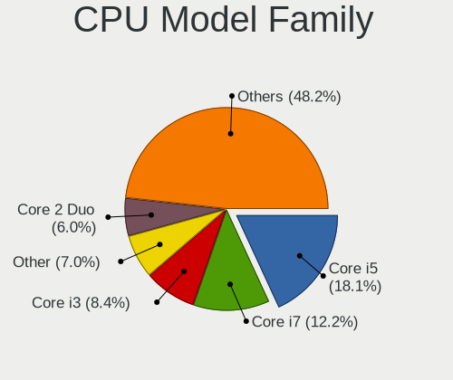

| Model                   | Computers | Percent |
|-------------------------|-----------|---------|
| Intel Core i5           | 116       | 18.44%  |
| Intel Core i7           | 87        | 13.83%  |
| Intel Core i3           | 58        | 9.22%   |
| Intel Core 2 Duo        | 44        | 7%      |
| Intel Celeron           | 33        | 5.25%   |
| Intel Pentium           | 30        | 4.77%   |
| Other                   | 24        | 3.82%   |
| AMD Ryzen 5             | 23        | 3.66%   |
| AMD Ryzen 7             | 19        | 3.02%   |
| Intel Core 2 Quad       | 16        | 2.54%   |
| Intel Atom              | 13        | 2.07%   |
| Intel Xeon              | 12        | 1.91%   |
| Intel Pentium Dual      | 10        | 1.59%   |
| AMD Athlon 64 X2        | 10        | 1.59%   |
| AMD Ryzen 9             | 9         | 1.43%   |
| AMD A8                  | 8         | 1.27%   |
| Intel Pentium Dual-Core | 7         | 1.11%   |
| Intel Core 2            | 6         | 0.95%   |
| AMD A6                  | 6         | 0.95%   |
| Intel Celeron M         | 5         | 0.79%   |
| AMD Athlon II X2        | 5         | 0.79%   |
| ARM BCM                 | 4         | 0.64%   |
| AMD Sempron             | 4         | 0.64%   |
| AMD Ryzen 5 PRO         | 4         | 0.64%   |
| AMD Phenom II X4        | 4         | 0.64%   |
| AMD E                   | 4         | 0.64%   |
| AMD Athlon 64           | 4         | 0.64%   |
| AMD Athlon              | 4         | 0.64%   |
| AMD A4                  | 4         | 0.64%   |
| AMD A10                 | 4         | 0.64%   |
| Intel Pentium 4         | 3         | 0.48%   |
| Intel Genuine           | 3         | 0.48%   |
| Intel Celeron Dual-Core | 3         | 0.48%   |
| AMD Ryzen 7 PRO         | 3         | 0.48%   |
| AMD Ryzen 3             | 3         | 0.48%   |
| AMD Phenom              | 3         | 0.48%   |
| AMD FX                  | 3         | 0.48%   |
| AMD Athlon X4           | 3         | 0.48%   |
| Intel Pentium M         | 2         | 0.32%   |
| ARM Allwinner           | 2         | 0.32%   |

CPU Cores
---------

Number of processor cores

| Number  | Computers | Percent |
|---------|-----------|---------|
| 2       | 303       | 48.17%  |
| 4       | 219       | 34.82%  |
| 6       | 35        | 5.56%   |
| 1       | 32        | 5.09%   |
| 8       | 27        | 4.29%   |
| 12      | 5         | 0.79%   |
| Unknown | 3         | 0.48%   |
| 20      | 2         | 0.32%   |
| 24      | 1         | 0.16%   |
| 16      | 1         | 0.16%   |
| 3       | 1         | 0.16%   |

CPU Sockets
-----------

Number of sockets

| Number | Computers | Percent |
|--------|-----------|---------|
| 1      | 624       | 99.68%  |
| 2      | 2         | 0.32%   |

CPU Threads
-----------

Threads per core (Hyper-Threading)

| Number  | Computers | Percent |
|---------|-----------|---------|
| 2       | 325       | 51.83%  |
| 1       | 299       | 47.69%  |
| Unknown | 3         | 0.48%   |

CPU Op-Modes
------------

CPU Operation Modes (32-bit, 64-bit)

| Op mode        | Computers | Percent |
|----------------|-----------|---------|
| 32-bit, 64-bit | 601       | 95.25%  |
| Unknown        | 16        | 2.54%   |
| 32-bit         | 12        | 1.9%    |
| 64-bit         | 2         | 0.32%   |

CPU Microcode
-------------

Microcode number

| Number     | Computers | Percent |
|------------|-----------|---------|
| Unknown    | 124       | 19.22%  |
| 0x306a9    | 54        | 8.37%   |
| 0x1067a    | 39        | 6.05%   |
| 0x206a7    | 37        | 5.74%   |
| 0x306c3    | 31        | 4.81%   |
| 0x6fd      | 17        | 2.64%   |
| 0x806ea    | 15        | 2.33%   |
| 0x6fb      | 15        | 2.33%   |
| 0x806c1    | 12        | 1.86%   |
| 0x506e3    | 12        | 1.86%   |
| 0x906ea    | 11        | 1.71%   |
| 0x906e9    | 11        | 1.71%   |
| 0x406e3    | 11        | 1.71%   |
| 0x10676    | 11        | 1.71%   |
| 0x806ec    | 10        | 1.55%   |
| 0x806e9    | 10        | 1.55%   |
| 0x20655    | 9         | 1.4%    |
| 0x06001119 | 9         | 1.4%    |
| 0x40651    | 8         | 1.24%   |
| 0x010000c8 | 7         | 1.09%   |
| 0x706e5    | 6         | 0.93%   |
| 0x6f2      | 6         | 0.93%   |
| 0x20652    | 6         | 0.93%   |
| 0x08108109 | 6         | 0.93%   |
| 0x306d4    | 5         | 0.78%   |
| 0x30678    | 5         | 0.78%   |
| 0x0a50000c | 5         | 0.78%   |
| 0x08108102 | 5         | 0.78%   |
| 0x906ed    | 4         | 0.62%   |
| 0x906eb    | 4         | 0.62%   |
| 0x706a1    | 4         | 0.62%   |
| 0x6d8      | 4         | 0.62%   |
| 0x506c9    | 4         | 0.62%   |
| 0x406c3    | 4         | 0.62%   |
| 0x08701021 | 4         | 0.62%   |
| 0x08608103 | 4         | 0.62%   |
| 0x08600106 | 4         | 0.62%   |
| 0x07030105 | 4         | 0.62%   |
| 0x06006705 | 4         | 0.62%   |
| 0xa0653    | 3         | 0.47%   |

CPU Microarch
-------------

Microarchitecture

| Name            | Computers | Percent |
|-----------------|-----------|---------|
| KabyLake        | 78        | 12.44%  |
| IvyBridge       | 61        | 9.73%   |
| Penryn          | 52        | 8.29%   |
| Haswell         | 51        | 8.13%   |
| Core            | 45        | 7.18%   |
| SandyBridge     | 43        | 6.86%   |
| Skylake         | 26        | 4.15%   |
| K8 Hammer       | 23        | 3.67%   |
| Unknown         | 23        | 3.67%   |
| K10             | 21        | 3.35%   |
| Westmere        | 19        | 3.03%   |
| Zen 2           | 18        | 2.87%   |
| Zen+            | 16        | 2.55%   |
| Silvermont      | 15        | 2.39%   |
| Zen 3           | 13        | 2.07%   |
| TigerLake       | 13        | 2.07%   |
| Piledriver      | 12        | 1.91%   |
| P6              | 9         | 1.44%   |
| Excavator       | 9         | 1.44%   |
| Goldmont plus   | 8         | 1.28%   |
| Bonnell         | 8         | 1.28%   |
| IceLake         | 7         | 1.12%   |
| Broadwell       | 7         | 1.12%   |
| Zen             | 6         | 0.96%   |
| Nehalem         | 6         | 0.96%   |
| CometLake       | 6         | 0.96%   |
| Steamroller     | 5         | 0.8%    |
| Puma            | 4         | 0.64%   |
| NetBurst        | 4         | 0.64%   |
| Goldmont        | 4         | 0.64%   |
| Bobcat          | 4         | 0.64%   |
| K8 & K10 hybrid | 3         | 0.48%   |
| Jaguar          | 3         | 0.48%   |
| K10 Llano       | 2         | 0.32%   |
| Tremont         | 1         | 0.16%   |
| K6              | 1         | 0.16%   |
| Bulldozer       | 1         | 0.16%   |

Graphics
--------

GPU Vendor
----------

Vendors of graphics cards

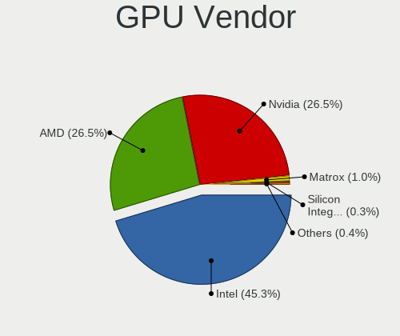

| Vendor                           | Computers | Percent |
|----------------------------------|-----------|---------|
| Intel                            | 337       | 46.29%  |
| Nvidia                           | 204       | 28.02%  |
| AMD                              | 180       | 24.73%  |
| Matrox Electronics Systems       | 3         | 0.41%   |
| Silicon Integrated Systems [SiS] | 2         | 0.27%   |
| VIA Technologies                 | 1         | 0.14%   |
| S3 Graphics                      | 1         | 0.14%   |

GPU Model
---------

Graphics card models

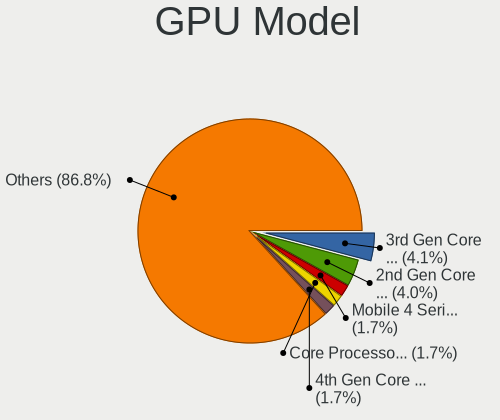

| Model                                                                                    | Computers | Percent |
|------------------------------------------------------------------------------------------|-----------|---------|
| Intel 3rd Gen Core processor Graphics Controller                                         | 38        | 4.94%   |
| Intel 2nd Generation Core Processor Family Integrated Graphics Controller                | 36        | 4.68%   |
| Intel 4th Gen Core Processor Integrated Graphics Controller                              | 16        | 2.08%   |
| Intel UHD Graphics 620                                                                   | 15        | 1.95%   |
| Intel Mobile 4 Series Chipset Integrated Graphics Controller                             | 13        | 1.69%   |
| Intel Core Processor Integrated Graphics Controller                                      | 13        | 1.69%   |
| Intel CoffeeLake-H GT2 [UHD Graphics 630]                                                | 13        | 1.69%   |
| Intel Xeon E3-1200 v3/4th Gen Core Processor Integrated Graphics Controller              | 12        | 1.56%   |
| Nvidia GK208B [GeForce GT 710]                                                           | 11        | 1.43%   |
| Intel TigerLake-LP GT2 [Iris Xe Graphics]                                                | 11        | 1.43%   |
| AMD Picasso/Raven 2 [Radeon Vega Series / Radeon Vega Mobile Series]                     | 11        | 1.43%   |
| Intel Mobile GM965/GL960 Integrated Graphics Controller (secondary)                      | 10        | 1.3%    |
| Intel Mobile GM965/GL960 Integrated Graphics Controller (primary)                        | 10        | 1.3%    |
| Intel HD Graphics 620                                                                    | 10        | 1.3%    |
| Intel HD Graphics 530                                                                    | 10        | 1.3%    |
| Intel Skylake GT2 [HD Graphics 520]                                                      | 9         | 1.17%   |
| Nvidia GP108M [GeForce MX150]                                                            | 8         | 1.04%   |
| Intel Haswell-ULT Integrated Graphics Controller                                         | 8         | 1.04%   |
| Intel Atom/Celeron/Pentium Processor x5-E8000/J3xxx/N3xxx Integrated Graphics Controller | 8         | 1.04%   |
| AMD Renoir                                                                               | 8         | 1.04%   |
| AMD Cezanne [Radeon Vega Series / Radeon Vega Mobile Series]                             | 8         | 1.04%   |
| Nvidia GP106 [GeForce GTX 1060 6GB]                                                      | 7         | 0.91%   |
| Intel WhiskeyLake-U GT2 [UHD Graphics 620]                                               | 7         | 0.91%   |
| Intel Mobile 945GM/GMS/GME, 943/940GML Express Integrated Graphics Controller            | 7         | 0.91%   |
| Intel HD Graphics 630                                                                    | 7         | 0.91%   |
| Intel HD Graphics 5500                                                                   | 7         | 0.91%   |
| Intel GeminiLake [UHD Graphics 600]                                                      | 7         | 0.91%   |
| Intel CometLake-U GT2 [UHD Graphics]                                                     | 7         | 0.91%   |
| Intel Atom Processor Z36xxx/Z37xxx Series Graphics & Display                             | 7         | 0.91%   |
| AMD Stoney [Radeon R2/R3/R4/R5 Graphics]                                                 | 7         | 0.91%   |
| Nvidia GF117M [GeForce 610M/710M/810M/820M / GT 620M/625M/630M/720M]                     | 6         | 0.78%   |
| Intel Xeon E3-1200 v2/3rd Gen Core processor Graphics Controller                         | 6         | 0.78%   |
| Intel Mobile 945GM/GMS, 943/940GML Express Integrated Graphics Controller                | 6         | 0.78%   |
| Intel Iris Plus Graphics G7                                                              | 6         | 0.78%   |
| Intel CoffeeLake-S GT2 [UHD Graphics 630]                                                | 6         | 0.78%   |
| AMD RS780L [Radeon 3000]                                                                 | 6         | 0.78%   |
| AMD Lucienne                                                                             | 6         | 0.78%   |
| Nvidia GP108 [GeForce GT 1030]                                                           | 5         | 0.65%   |
| AMD Baffin [Radeon RX 460/560D / Pro 450/455/460/555/555X/560/560X]                      | 5         | 0.65%   |
| Nvidia GT218 [GeForce 210]                                                               | 4         | 0.52%   |

GPU Combo
---------

Combinations of graphics cards

| Name            | Computers | Percent |
|-----------------|-----------|---------|
| 1 x Intel       | 244       | 38.43%  |
| 1 x AMD         | 137       | 21.57%  |
| 1 x Nvidia      | 115       | 18.11%  |
| Intel + Nvidia  | 76        | 11.97%  |
| 2 x AMD         | 18        | 2.83%   |
| Intel + AMD     | 15        | 2.36%   |
| AMD + Nvidia    | 11        | 1.73%   |
| Other           | 10        | 1.57%   |
| 1 x Matrox      | 3         | 0.47%   |
| 1 x SiS         | 2         | 0.31%   |
| 3 x AMD         | 1         | 0.16%   |
| 2 x Nvidia      | 1         | 0.16%   |
| 1 x VIA         | 1         | 0.16%   |
| 1 x S3 Graphics | 1         | 0.16%   |

GPU Driver
----------

Free vs proprietary

| Driver      | Computers | Percent |
|-------------|-----------|---------|
| Free        | 524       | 81.49%  |
| Proprietary | 83        | 12.91%  |
| Unknown     | 36        | 5.6%    |

GPU Memory
----------

Total video memory

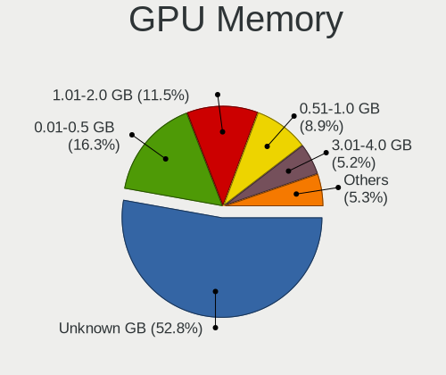

| Size in GB | Computers | Percent |
|------------|-----------|---------|
| Unknown    | 299       | 45.86%  |
| 0.01-0.5   | 123       | 18.87%  |
| 1.01-2.0   | 94        | 14.42%  |
| 0.51-1.0   | 72        | 11.04%  |
| 3.01-4.0   | 33        | 5.06%   |
| 5.01-6.0   | 11        | 1.69%   |
| 7.01-8.0   | 10        | 1.53%   |
| 2.01-3.0   | 6         | 0.92%   |
| 16.01-24.0 | 2         | 0.31%   |
| 8.01-16.0  | 2         | 0.31%   |

Monitor
-------

Monitor Vendor
--------------

Monitor vendors

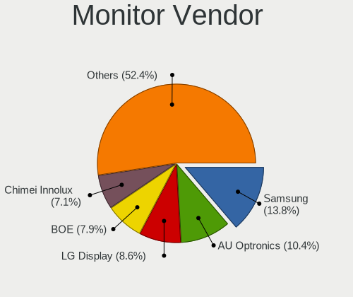

| Vendor                  | Computers | Percent |
|-------------------------|-----------|---------|
| Samsung Electronics     | 91        | 13.46%  |
| AU Optronics            | 80        | 11.83%  |
| LG Display              | 61        | 9.02%   |
| Chimei Innolux          | 51        | 7.54%   |
| BOE                     | 42        | 6.21%   |
| Dell                    | 32        | 4.73%   |
| Philips                 | 30        | 4.44%   |
| Goldstar                | 28        | 4.14%   |
| Hewlett-Packard         | 27        | 3.99%   |
| Chi Mei Optoelectronics | 24        | 3.55%   |
| BenQ                    | 24        | 3.55%   |
| Lenovo                  | 19        | 2.81%   |
| Acer                    | 19        | 2.81%   |
| Ancor Communications    | 18        | 2.66%   |
| AOC                     | 15        | 2.22%   |
| NEC Computers           | 10        | 1.48%   |
| Sharp                   | 9         | 1.33%   |
| PANDA                   | 7         | 1.04%   |
| LG Philips              | 7         | 1.04%   |
| Iiyama                  | 7         | 1.04%   |
| Apple                   | 7         | 1.04%   |
| Fujitsu Siemens         | 6         | 0.89%   |
| Unknown                 | 4         | 0.59%   |
| LG Electronics          | 4         | 0.59%   |
| Eizo                    | 4         | 0.59%   |
| Sony                    | 3         | 0.44%   |
| RTD                     | 2         | 0.3%    |
| MiTAC                   | 2         | 0.3%    |
| InfoVision              | 2         | 0.3%    |
| HannStar                | 2         | 0.3%    |
| FUS                     | 2         | 0.3%    |
| CVT                     | 2         | 0.3%    |
| CSO                     | 2         | 0.3%    |
| CPT                     | 2         | 0.3%    |
| ASUSTek Computer        | 2         | 0.3%    |
| Arnos Instruments       | 2         | 0.3%    |
| ANX                     | 2         | 0.3%    |
| ViewSonic               | 1         | 0.15%   |
| Valve                   | 1         | 0.15%   |
| Toshiba                 | 1         | 0.15%   |

Monitor Model
-------------

Monitor models

| Model                                                                    | Computers | Percent |
|--------------------------------------------------------------------------|-----------|---------|
| Samsung Electronics SyncMaster SAM0091 1600x1200 432x324mm 21.3-inch     | 8         | 1.14%   |
| Dell U2412M DELA07A 1920x1200 518x324mm 24.1-inch                        | 7         | 1%      |
| Chimei Innolux LCD Monitor CMN15AB 1366x768 344x194mm 15.5-inch          | 6         | 0.86%   |
| Chi Mei Optoelectronics LCD Monitor CMO15A7 1366x768 344x193mm 15.5-inch | 6         | 0.86%   |
| AU Optronics LCD Monitor AUO38ED 1920x1080 344x193mm 15.5-inch           | 5         | 0.72%   |
| NEC Computers LCD19WV NEC671C 1440x900 410x256mm 19.0-inch               | 4         | 0.57%   |
| LG Display LCD Monitor LGD038E 1366x768 344x194mm 15.5-inch              | 4         | 0.57%   |
| Dell U2412M DELA07B 1920x1200 518x324mm 24.1-inch                        | 4         | 0.57%   |
| Chimei Innolux LCD Monitor CMN15DB 1366x768 344x193mm 15.5-inch          | 4         | 0.57%   |
| Chimei Innolux LCD Monitor CMN14D4 1920x1080 309x173mm 13.9-inch         | 4         | 0.57%   |
| Chi Mei Optoelectronics LCD Monitor CMO15A3 1366x768 344x193mm 15.5-inch | 4         | 0.57%   |
| Chi Mei Optoelectronics LCD Monitor CMO1526 1280x800 331x207mm 15.4-inch | 4         | 0.57%   |
| Samsung Electronics S27D390 SAM0B67 1920x1080 598x336mm 27.0-inch        | 3         | 0.43%   |
| Samsung Electronics S24F350 SAM0D21 1920x1080 520x290mm 23.4-inch        | 3         | 0.43%   |
| Samsung Electronics LCD Monitor SEC3046 1366x768 344x193mm 15.5-inch     | 3         | 0.43%   |
| Samsung Electronics C24F390 SAM0D2C 1920x1080 521x293mm 23.5-inch        | 3         | 0.43%   |
| Philips PHL 243V7 PHLC155 1920x1080 527x296mm 23.8-inch                  | 3         | 0.43%   |
| Philips PHL 243V5 PHLC0D1 1920x1080 521x293mm 23.5-inch                  | 3         | 0.43%   |
| BOE LCD Monitor BOE0700 1920x1080 344x194mm 15.5-inch                    | 3         | 0.43%   |
| AU Optronics LCD Monitor AUO26EC 1366x768 344x193mm 15.5-inch            | 3         | 0.43%   |
| AU Optronics LCD Monitor AUO25ED 1920x1080 344x194mm 15.5-inch           | 3         | 0.43%   |
| AU Optronics LCD Monitor AUO23ED 1920x1080 344x194mm 15.5-inch           | 3         | 0.43%   |
| AU Optronics LCD Monitor AUO106C 1366x768 276x155mm 12.5-inch            | 3         | 0.43%   |
| Acer LCD Monitor ACR40B0 1920x1080 527x296mm 23.8-inch                   | 3         | 0.43%   |
| Unknown 1780 07E7 1280x1024 337x270mm 17.0-inch                          | 2         | 0.29%   |
| Sharp HDMI SHP1008 1280x720 820x460mm 37.0-inch                          | 2         | 0.29%   |
| Samsung Electronics SyncMaster SAM05CC 1920x1080 530x300mm 24.0-inch     | 2         | 0.29%   |
| Samsung Electronics SyncMaster SAM0420 1680x1050 474x296mm 22.0-inch     | 2         | 0.29%   |
| Samsung Electronics S24F350 SAM0D20 1920x1080 520x290mm 23.4-inch        | 2         | 0.29%   |
| Samsung Electronics LCD Monitor SEC5541 1366x768 344x193mm 15.5-inch     | 2         | 0.29%   |
| Samsung Electronics LCD Monitor SEC5441 1366x768 344x194mm 15.5-inch     | 2         | 0.29%   |
| Samsung Electronics LCD Monitor SEC3945 1280x800 331x207mm 15.4-inch     | 2         | 0.29%   |
| Samsung Electronics LCD Monitor SEC3859 1366x768 293x165mm 13.2-inch     | 2         | 0.29%   |
| Samsung Electronics LCD Monitor SEC3051 1600x900 390x230mm 17.8-inch     | 2         | 0.29%   |
| Samsung Electronics LCD Monitor SAM0A7A 1920x1080 1060x626mm 48.5-inch   | 2         | 0.29%   |
| Samsung Electronics LCD Monitor SAM0900 1366x768 700x390mm 31.5-inch     | 2         | 0.29%   |
| Samsung Electronics LCD Monitor SAM07C0 1920x1080 890x500mm 40.2-inch    | 2         | 0.29%   |
| RTD LR762 RTD2023 1280x1024 307x230mm 15.1-inch                          | 2         | 0.29%   |
| Philips PHL 240V5A PHLC10C 1920x1080 527x296mm 23.8-inch                 | 2         | 0.29%   |
| Philips 241BLPY PHL08B3 1920x1080 531x299mm 24.0-inch                    | 2         | 0.29%   |

Monitor Resolution
------------------

Monitor screen resolution

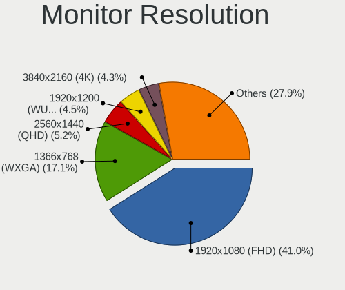

| Resolution         | Computers | Percent |
|--------------------|-----------|---------|
| 1920x1080 (FHD)    | 255       | 38.99%  |
| 1366x768 (WXGA)    | 129       | 19.72%  |
| 1280x1024 (SXGA)   | 34        | 5.2%    |
| 1280x800 (WXGA)    | 31        | 4.74%   |
| 1440x900 (WXGA+)   | 29        | 4.43%   |
| 2560x1440 (QHD)    | 27        | 4.13%   |
| 1600x900 (HD+)     | 27        | 4.13%   |
| 1920x1200 (WUXGA)  | 26        | 3.98%   |
| 1680x1050 (WSXGA+) | 25        | 3.82%   |
| 3840x2160 (4K)     | 23        | 3.52%   |
| 1600x1200          | 9         | 1.38%   |
| 3440x1440          | 6         | 0.92%   |
| 1280x720 (HD)      | 4         | 0.61%   |
| 1024x600           | 4         | 0.61%   |
| 2880x1800          | 3         | 0.46%   |
| 1360x768           | 3         | 0.46%   |
| 1024x768 (XGA)     | 3         | 0.46%   |
| 800x1280           | 2         | 0.31%   |
| 3840x2400          | 2         | 0.31%   |
| 2560x1600          | 2         | 0.31%   |
| 1920x540           | 2         | 0.31%   |
| 3200x1800 (QHD+)   | 1         | 0.15%   |
| 2560x1080          | 1         | 0.15%   |
| 2256x1504          | 1         | 0.15%   |
| 2160x1440          | 1         | 0.15%   |
| 2160x1350          | 1         | 0.15%   |
| 1680x945           | 1         | 0.15%   |
| 1280x960           | 1         | 0.15%   |
| Unknown            | 1         | 0.15%   |

Monitor Diagonal
----------------

Diagonal size in inches

| Inches  | Computers | Percent |
|---------|-----------|---------|
| 15      | 193       | 28.26%  |
| 24      | 60        | 8.78%   |
| 23      | 52        | 7.61%   |
| 13      | 50        | 7.32%   |
| 14      | 46        | 6.73%   |
| 17      | 39        | 5.71%   |
| 21      | 35        | 5.12%   |
| 27      | 32        | 4.69%   |
| 19      | 29        | 4.25%   |
| Unknown | 26        | 3.81%   |
| 18      | 17        | 2.49%   |
| 22      | 15        | 2.2%    |
| 12      | 13        | 1.9%    |
| 20      | 12        | 1.76%   |
| 11      | 10        | 1.46%   |
| 25      | 8         | 1.17%   |
| 34      | 6         | 0.88%   |
| 31      | 6         | 0.88%   |
| 26      | 5         | 0.73%   |
| 10      | 4         | 0.59%   |
| 84      | 3         | 0.44%   |
| 54      | 3         | 0.44%   |
| 39      | 3         | 0.44%   |
| 72      | 2         | 0.29%   |
| 48      | 2         | 0.29%   |
| 46      | 2         | 0.29%   |
| 37      | 2         | 0.29%   |
| 65      | 1         | 0.15%   |
| 50      | 1         | 0.15%   |
| 42      | 1         | 0.15%   |
| 40      | 1         | 0.15%   |
| 35      | 1         | 0.15%   |
| 33      | 1         | 0.15%   |
| 32      | 1         | 0.15%   |
| 16      | 1         | 0.15%   |

Monitor Width
-------------

Physical width

| Width in mm | Computers | Percent |
|-------------|-----------|---------|
| 301-350     | 278       | 41.55%  |
| 501-600     | 138       | 20.63%  |
| 401-500     | 98        | 14.65%  |
| 201-300     | 54        | 8.07%   |
| 351-400     | 37        | 5.53%   |
| Unknown     | 26        | 3.89%   |
| 1001-1500   | 9         | 1.35%   |
| 701-800     | 8         | 1.2%    |
| 601-700     | 8         | 1.2%    |
| 801-900     | 7         | 1.05%   |
| 1501-2000   | 5         | 0.75%   |
| 901-1000    | 1         | 0.15%   |

Aspect Ratio
------------

Proportional relationship between the width and the height

| Ratio   | Computers | Percent |
|---------|-----------|---------|
| 16/9    | 431       | 68.41%  |
| 16/10   | 116       | 18.41%  |
| 5/4     | 31        | 4.92%   |
| Unknown | 19        | 3.02%   |
| 4/3     | 16        | 2.54%   |
| 3/2     | 7         | 1.11%   |
| 21/9    | 7         | 1.11%   |
| 0.62    | 2         | 0.32%   |
| 6/5     | 1         | 0.16%   |

Monitor Area
------------

Area in inch

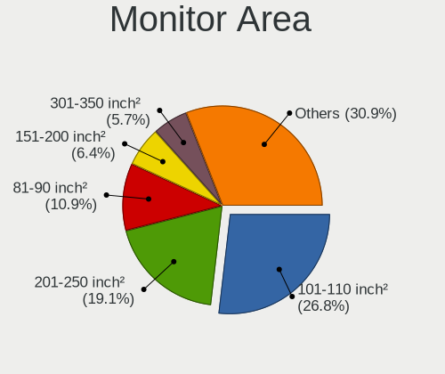

| Area in inch | Computers | Percent |
|----------------|-----------|---------|
| 101-110        | 191       | 28.21%  |
| 201-250        | 125       | 18.46%  |
| 81-90          | 73        | 10.78%  |
| 151-200        | 54        | 7.98%   |
| 251-300        | 34        | 5.02%   |
| 301-350        | 33        | 4.87%   |
| 141-150        | 33        | 4.87%   |
| Unknown        | 26        | 3.84%   |
| 71-80          | 23        | 3.4%    |
| 351-500        | 15        | 2.22%   |
| 121-130        | 13        | 1.92%   |
| More than 1000 | 12        | 1.77%   |
| 61-70          | 12        | 1.77%   |
| 51-60          | 10        | 1.48%   |
| 501-1000       | 9         | 1.33%   |
| 131-140        | 6         | 0.89%   |
| 41-50          | 4         | 0.59%   |
| 111-120        | 2         | 0.3%    |
| 91-100         | 2         | 0.3%    |

Pixel Density
-------------

Pixels per inch

| Density       | Computers | Percent |
|---------------|-----------|---------|
| 51-100        | 274       | 42.02%  |
| 101-120       | 152       | 23.31%  |
| 121-160       | 151       | 23.16%  |
| Unknown       | 26        | 3.99%   |
| 161-240       | 23        | 3.53%   |
| More than 240 | 13        | 1.99%   |
| 1-50          | 13        | 1.99%   |

Multiple Monitors
-----------------

Total monitors connected

| Total | Computers | Percent |
|-------|-----------|---------|
| 1     | 511       | 79.97%  |
| 2     | 95        | 14.87%  |
| 0     | 27        | 4.23%   |
| 3     | 6         | 0.94%   |

Network
-------

Net Controller Vendor
---------------------

Controller vendors

| Vendor                                 | Computers | Percent |
|----------------------------------------|-----------|---------|
| Realtek Semiconductor                  | 330       | 35.37%  |
| Intel                                  | 259       | 27.76%  |
| Qualcomm Atheros                       | 128       | 13.72%  |
| Broadcom                               | 53        | 5.68%   |
| Marvell Technology Group               | 19        | 2.04%   |
| Nvidia                                 | 17        | 1.82%   |
| TP-Link                                | 16        | 1.71%   |
| Ralink Technology                      | 16        | 1.71%   |
| Broadcom Limited                       | 14        | 1.5%    |
| Ralink                                 | 12        | 1.29%   |
| Qualcomm Atheros Communications        | 12        | 1.29%   |
| MediaTek                               | 6         | 0.64%   |
| Xiaomi                                 | 3         | 0.32%   |
| Sierra Wireless                        | 3         | 0.32%   |
| JMicron Technology                     | 3         | 0.32%   |
| Huawei Technologies                    | 3         | 0.32%   |
| Hewlett-Packard                        | 3         | 0.32%   |
| Ericsson Business Mobile Networks      | 3         | 0.32%   |
| DisplayLink                            | 3         | 0.32%   |
| Lenovo                                 | 2         | 0.21%   |
| Fibocom                                | 2         | 0.21%   |
| Edimax Technology                      | 2         | 0.21%   |
| D-Link                                 | 2         | 0.21%   |
| ASUSTek Computer                       | 2         | 0.21%   |
| ASIX Electronics                       | 2         | 0.21%   |
| ZTE WCDMA Technologies MSM             | 1         | 0.11%   |
| WiseGroup                              | 1         | 0.11%   |
| VIA Technologies                       | 1         | 0.11%   |
| T & A Mobile Phones                    | 1         | 0.11%   |
| Sony Ericsson Mobile Communications AB | 1         | 0.11%   |
| Silicon Integrated Systems [SiS]       | 1         | 0.11%   |
| Sigma Sport                            | 1         | 0.11%   |
| Samsung Electronics                    | 1         | 0.11%   |
| Pulse-Eight                            | 1         | 0.11%   |
| Prestigio                              | 1         | 0.11%   |
| Nokia Mobile Phones                    | 1         | 0.11%   |
| National Semiconductor                 | 1         | 0.11%   |
| Microsoft                              | 1         | 0.11%   |
| Micro Star International               | 1         | 0.11%   |
| ICS Advent                             | 1         | 0.11%   |

Net Controller Model
--------------------

Controller models

| Model                                                                   | Computers | Percent |
|-------------------------------------------------------------------------|-----------|---------|
| Realtek RTL8111/8168/8411 PCI Express Gigabit Ethernet Controller       | 227       | 21.2%   |
| Realtek RTL810xE PCI Express Fast Ethernet controller                   | 41        | 3.83%   |
| Qualcomm Atheros AR9285 Wireless Network Adapter (PCI-Express)          | 28        | 2.61%   |
| Intel 82579LM Gigabit Network Connection (Lewisville)                   | 23        | 2.15%   |
| Realtek RTL-8100/8101L/8139 PCI Fast Ethernet Adapter                   | 18        | 1.68%   |
| Intel Wireless 8265 / 8275                                              | 18        | 1.68%   |
| Intel Wi-Fi 6 AX200                                                     | 18        | 1.68%   |
| Realtek RTL8153 Gigabit Ethernet Adapter                                | 15        | 1.4%    |
| Qualcomm Atheros AR9485 Wireless Network Adapter                        | 15        | 1.4%    |
| Qualcomm Atheros QCA9377 802.11ac Wireless Network Adapter              | 14        | 1.31%   |
| Intel Centrino Advanced-N 6205 [Taylor Peak]                            | 14        | 1.31%   |
| Qualcomm Atheros AR9271 802.11n                                         | 12        | 1.12%   |
| Intel Wireless 8260                                                     | 11        | 1.03%   |
| Intel Wireless 7260                                                     | 11        | 1.03%   |
| Intel Wi-Fi 6 AX201                                                     | 11        | 1.03%   |
| Intel I211 Gigabit Network Connection                                   | 11        | 1.03%   |
| Qualcomm Atheros AR242x / AR542x Wireless Network Adapter (PCI-Express) | 10        | 0.93%   |
| Realtek RTL8169 PCI Gigabit Ethernet Controller                         | 9         | 0.84%   |
| Qualcomm Atheros QCA6174 802.11ac Wireless Network Adapter              | 9         | 0.84%   |
| Intel Wireless 7265                                                     | 9         | 0.84%   |
| Realtek RTL8821AE 802.11ac PCIe Wireless Network Adapter                | 8         | 0.75%   |
| Intel PRO/Wireless 3945ABG [Golan] Network Connection                   | 8         | 0.75%   |
| Intel Ethernet Connection I217-LM                                       | 8         | 0.75%   |
| Broadcom BCM4313 802.11bgn Wireless Network Adapter                     | 8         | 0.75%   |
| Realtek RTL8821CE 802.11ac PCIe Wireless Network Adapter                | 7         | 0.65%   |
| Ralink RT2870/RT3070 Wireless Adapter                                   | 7         | 0.65%   |
| Ralink RT3290 Wireless 802.11n 1T/1R PCIe                               | 7         | 0.65%   |
| Qualcomm Atheros AR8151 v2.0 Gigabit Ethernet                           | 7         | 0.65%   |
| Intel Wireless 3165                                                     | 7         | 0.65%   |
| Intel Ethernet Connection (2) I219-V                                    | 7         | 0.65%   |
| Intel Comet Lake PCH-LP CNVi WiFi                                       | 7         | 0.65%   |
| Intel Centrino Wireless-N 2230                                          | 7         | 0.65%   |
| Intel 82579V Gigabit Network Connection                                 | 7         | 0.65%   |
| TP-Link TL-WN722N v2/v3 [Realtek RTL8188EUS]                            | 6         | 0.56%   |
| Realtek RTL8125 2.5GbE Controller                                       | 6         | 0.56%   |
| Qualcomm Atheros QCA9565 / AR9565 Wireless Network Adapter              | 6         | 0.56%   |
| Intel Wireless-AC 9260                                                  | 6         | 0.56%   |
| Intel WiFi Link 5100                                                    | 6         | 0.56%   |
| Intel Ethernet Connection (7) I219-LM                                   | 6         | 0.56%   |
| Intel Dual Band Wireless-AC 3165 Plus Bluetooth                         | 6         | 0.56%   |

Wireless Vendor
---------------

Wireless vendors

| Vendor                          | Computers | Percent |
|---------------------------------|-----------|---------|
| Intel                           | 197       | 42.27%  |
| Qualcomm Atheros                | 96        | 20.6%   |
| Realtek Semiconductor           | 57        | 12.23%  |
| Broadcom                        | 32        | 6.87%   |
| TP-Link                         | 16        | 3.43%   |
| Ralink Technology               | 16        | 3.43%   |
| Ralink                          | 12        | 2.58%   |
| Qualcomm Atheros Communications | 12        | 2.58%   |
| Broadcom Limited                | 8         | 1.72%   |
| MediaTek                        | 6         | 1.29%   |
| Sierra Wireless                 | 3         | 0.64%   |
| Fibocom                         | 2         | 0.43%   |
| Edimax Technology               | 2         | 0.43%   |
| ASUSTek Computer                | 2         | 0.43%   |
| Microsoft                       | 1         | 0.21%   |
| Micro Star International        | 1         | 0.21%   |
| Dell                            | 1         | 0.21%   |
| D-Link                          | 1         | 0.21%   |
| Accton Technology               | 1         | 0.21%   |

Wireless Model
--------------

Wireless models

| Model                                                                   | Computers | Percent |
|-------------------------------------------------------------------------|-----------|---------|
| Qualcomm Atheros AR9285 Wireless Network Adapter (PCI-Express)          | 28        | 6%      |
| Intel Wireless 8265 / 8275                                              | 18        | 3.85%   |
| Intel Wi-Fi 6 AX200                                                     | 18        | 3.85%   |
| Qualcomm Atheros AR9485 Wireless Network Adapter                        | 15        | 3.21%   |
| Qualcomm Atheros QCA9377 802.11ac Wireless Network Adapter              | 14        | 3%      |
| Intel Centrino Advanced-N 6205 [Taylor Peak]                            | 14        | 3%      |
| Qualcomm Atheros AR9271 802.11n                                         | 12        | 2.57%   |
| Intel Wireless 8260                                                     | 11        | 2.36%   |
| Intel Wireless 7260                                                     | 11        | 2.36%   |
| Intel Wi-Fi 6 AX201                                                     | 11        | 2.36%   |
| Qualcomm Atheros AR242x / AR542x Wireless Network Adapter (PCI-Express) | 10        | 2.14%   |
| Qualcomm Atheros QCA6174 802.11ac Wireless Network Adapter              | 9         | 1.93%   |
| Intel Wireless 7265                                                     | 9         | 1.93%   |
| Realtek RTL8821AE 802.11ac PCIe Wireless Network Adapter                | 8         | 1.71%   |
| Intel PRO/Wireless 3945ABG [Golan] Network Connection                   | 8         | 1.71%   |
| Broadcom BCM4313 802.11bgn Wireless Network Adapter                     | 8         | 1.71%   |
| Realtek RTL8821CE 802.11ac PCIe Wireless Network Adapter                | 7         | 1.5%    |
| Ralink RT2870/RT3070 Wireless Adapter                                   | 7         | 1.5%    |
| Ralink RT3290 Wireless 802.11n 1T/1R PCIe                               | 7         | 1.5%    |
| Intel Wireless 3165                                                     | 7         | 1.5%    |
| Intel Comet Lake PCH-LP CNVi WiFi                                       | 7         | 1.5%    |
| Intel Centrino Wireless-N 2230                                          | 7         | 1.5%    |
| TP-Link TL-WN722N v2/v3 [Realtek RTL8188EUS]                            | 6         | 1.28%   |
| Qualcomm Atheros QCA9565 / AR9565 Wireless Network Adapter              | 6         | 1.28%   |
| Intel Wireless-AC 9260                                                  | 6         | 1.28%   |
| Intel WiFi Link 5100                                                    | 6         | 1.28%   |
| Intel Dual Band Wireless-AC 3165 Plus Bluetooth                         | 6         | 1.28%   |
| Broadcom BCM43142 802.11b/g/n                                           | 6         | 1.28%   |
| Realtek RTL8822CE 802.11ac PCIe Wireless Network Adapter                | 5         | 1.07%   |
| Realtek RTL8822BE 802.11a/b/g/n/ac WiFi adapter                         | 5         | 1.07%   |
| MediaTek MT7921 802.11ax PCI Express Wireless Network Adapter           | 5         | 1.07%   |
| Intel Ice Lake-LP PCH CNVi WiFi                                         | 5         | 1.07%   |
| Intel Centrino Ultimate-N 6300                                          | 5         | 1.07%   |
| Intel Cannon Point-LP CNVi [Wireless-AC]                                | 5         | 1.07%   |
| Intel Cannon Lake PCH CNVi WiFi                                         | 5         | 1.07%   |
| Broadcom BCM43228 802.11a/b/g/n                                         | 5         | 1.07%   |
| Realtek 802.11n WLAN Adapter                                            | 4         | 0.86%   |
| Ralink MT7601U Wireless Adapter                                         | 4         | 0.86%   |
| Qualcomm Atheros AR928X Wireless Network Adapter (PCI-Express)          | 4         | 0.86%   |
| Intel Wi-Fi 6 AX210/AX211/AX411 160MHz                                  | 4         | 0.86%   |

Ethernet Vendor
---------------

Ethernet vendors

| Vendor                                 | Computers | Percent |
|----------------------------------------|-----------|---------|
| Realtek Semiconductor                  | 310       | 54.01%  |
| Intel                                  | 133       | 23.17%  |
| Qualcomm Atheros                       | 41        | 7.14%   |
| Broadcom                               | 23        | 4.01%   |
| Marvell Technology Group               | 19        | 3.31%   |
| Nvidia                                 | 17        | 2.96%   |
| Broadcom Limited                       | 6         | 1.05%   |
| Xiaomi                                 | 3         | 0.52%   |
| JMicron Technology                     | 3         | 0.52%   |
| DisplayLink                            | 3         | 0.52%   |
| Lenovo                                 | 2         | 0.35%   |
| Huawei Technologies                    | 2         | 0.35%   |
| ASIX Electronics                       | 2         | 0.35%   |
| VIA Technologies                       | 1         | 0.17%   |
| T & A Mobile Phones                    | 1         | 0.17%   |
| Sony Ericsson Mobile Communications AB | 1         | 0.17%   |
| Samsung Electronics                    | 1         | 0.17%   |
| Prestigio                              | 1         | 0.17%   |
| Nokia Mobile Phones                    | 1         | 0.17%   |
| National Semiconductor                 | 1         | 0.17%   |
| ICS Advent                             | 1         | 0.17%   |
| D-Link                                 | 1         | 0.17%   |
| Attansic Technology                    | 1         | 0.17%   |

Ethernet Model
--------------

Ethernet models

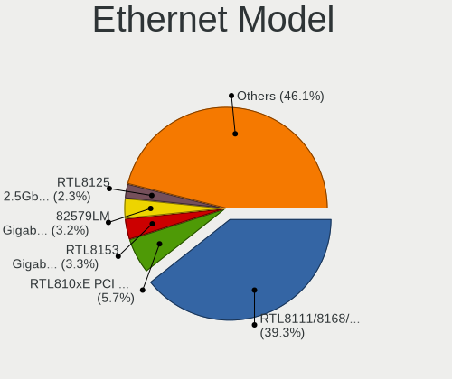

| Model                                                             | Computers | Percent |
|-------------------------------------------------------------------|-----------|---------|
| Realtek RTL8111/8168/8411 PCI Express Gigabit Ethernet Controller | 227       | 38.54%  |
| Realtek RTL810xE PCI Express Fast Ethernet controller             | 41        | 6.96%   |
| Intel 82579LM Gigabit Network Connection (Lewisville)             | 23        | 3.9%    |
| Realtek RTL-8100/8101L/8139 PCI Fast Ethernet Adapter             | 18        | 3.06%   |
| Realtek RTL8153 Gigabit Ethernet Adapter                          | 15        | 2.55%   |
| Intel I211 Gigabit Network Connection                             | 11        | 1.87%   |
| Realtek RTL8169 PCI Gigabit Ethernet Controller                   | 9         | 1.53%   |
| Intel Ethernet Connection I217-LM                                 | 8         | 1.36%   |
| Qualcomm Atheros AR8151 v2.0 Gigabit Ethernet                     | 7         | 1.19%   |
| Intel Ethernet Connection (2) I219-V                              | 7         | 1.19%   |
| Intel 82579V Gigabit Network Connection                           | 7         | 1.19%   |
| Realtek RTL8125 2.5GbE Controller                                 | 6         | 1.02%   |
| Intel Ethernet Connection (7) I219-LM                             | 6         | 1.02%   |
| Qualcomm Atheros AR8121/AR8113/AR8114 Gigabit or Fast Ethernet    | 5         | 0.85%   |
| Nvidia MCP61 Ethernet                                             | 5         | 0.85%   |
| Marvell Group 88E8055 PCI-E Gigabit Ethernet Controller           | 5         | 0.85%   |
| Intel 82567LM Gigabit Network Connection                          | 5         | 0.85%   |
| Qualcomm Atheros QCA8172 Fast Ethernet                            | 4         | 0.68%   |
| Qualcomm Atheros AR8131 Gigabit Ethernet                          | 4         | 0.68%   |
| Marvell Group 88E8040T PCI-E Fast Ethernet Controller             | 4         | 0.68%   |
| Intel Ethernet Connection I219-LM                                 | 4         | 0.68%   |
| Intel Ethernet Connection I218-LM                                 | 4         | 0.68%   |
| Intel Ethernet Connection I217-V                                  | 4         | 0.68%   |
| Intel Ethernet Connection (4) I219-LM                             | 4         | 0.68%   |
| Intel 82567LM-3 Gigabit Network Connection                        | 4         | 0.68%   |
| Broadcom NetLink BCM57780 Gigabit Ethernet PCIe                   | 4         | 0.68%   |
| Xiaomi Mi/Redmi series (RNDIS)                                    | 3         | 0.51%   |
| Realtek RTL8152 Fast Ethernet Adapter                             | 3         | 0.51%   |
| Qualcomm Atheros QCA8171 Gigabit Ethernet                         | 3         | 0.51%   |
| Qualcomm Atheros Killer E220x Gigabit Ethernet Controller         | 3         | 0.51%   |
| Qualcomm Atheros AR8162 Fast Ethernet                             | 3         | 0.51%   |
| Qualcomm Atheros AR8132 Fast Ethernet                             | 3         | 0.51%   |
| Nvidia MCP79 Ethernet                                             | 3         | 0.51%   |
| Nvidia MCP77 Ethernet                                             | 3         | 0.51%   |
| Marvell Group 88E8056 PCI-E Gigabit Ethernet Controller           | 3         | 0.51%   |
| JMicron JMC250 PCI Express Gigabit Ethernet Controller            | 3         | 0.51%   |
| Intel Ethernet Controller I225-V                                  | 3         | 0.51%   |
| Intel Ethernet Connection (7) I219-V                              | 3         | 0.51%   |
| Intel Ethernet Connection (6) I219-V                              | 3         | 0.51%   |
| Intel Ethernet Connection (4) I219-V                              | 3         | 0.51%   |

Net Controller Kind
-------------------

Ethernet, WiFi or modem

| Kind     | Computers | Percent |
|----------|-----------|---------|
| Ethernet | 547       | 54.21%  |
| WiFi     | 447       | 44.3%   |
| Modem    | 14        | 1.39%   |
| Unknown  | 1         | 0.1%    |

Used Controller
---------------

Currently used network controller

| Kind     | Computers | Percent |
|----------|-----------|---------|
| WiFi     | 344       | 53.92%  |
| Ethernet | 294       | 46.08%  |

NICs
----

Total network controllers on board

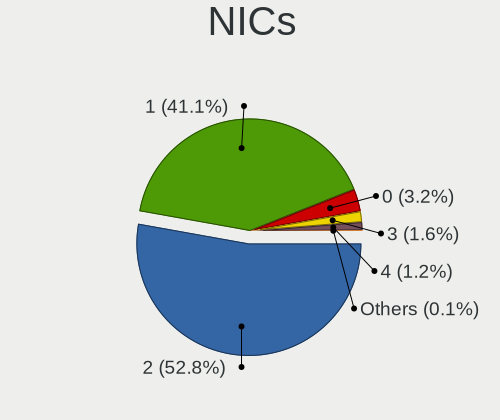

| Total | Computers | Percent |
|-------|-----------|---------|
| 2     | 334       | 53.1%   |
| 1     | 256       | 40.7%   |
| 0     | 26        | 4.13%   |
| 3     | 10        | 1.59%   |
| 4     | 3         | 0.48%   |

IPv6
----

IPv6 vs IPv4

| Used | Computers | Percent |
|------|-----------|---------|
| No   | 601       | 95.7%   |
| Yes  | 27        | 4.3%    |

Bluetooth
---------

Bluetooth Vendor
----------------

Controller vendors

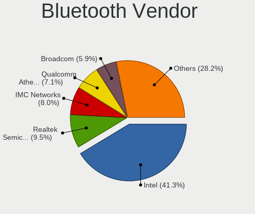

| Vendor                          | Computers | Percent |
|---------------------------------|-----------|---------|
| Intel                           | 134       | 41.23%  |
| Qualcomm Atheros Communications | 26        | 8%      |
| IMC Networks                    | 26        | 8%      |
| Realtek Semiconductor           | 25        | 7.69%   |
| Broadcom                        | 22        | 6.77%   |
| Lite-On Technology              | 14        | 4.31%   |
| Cambridge Silicon Radio         | 12        | 3.69%   |
| ASUSTek Computer                | 11        | 3.38%   |
| Foxconn / Hon Hai               | 10        | 3.08%   |
| Ralink                          | 7         | 2.15%   |
| Hewlett-Packard                 | 7         | 2.15%   |
| Dell                            | 7         | 2.15%   |
| Toshiba                         | 5         | 1.54%   |
| Apple                           | 5         | 1.54%   |
| Micro Star International        | 3         | 0.92%   |
| Foxconn International           | 3         | 0.92%   |
| Taiyo Yuden                     | 2         | 0.62%   |
| HTC (High Tech Computer)        | 2         | 0.62%   |
| Realtek                         | 1         | 0.31%   |
| Integrated System Solution      | 1         | 0.31%   |
| Belkin Components               | 1         | 0.31%   |
| Alps Electric                   | 1         | 0.31%   |

Bluetooth Model
---------------

Controller models

| Model                                                                | Computers | Percent |
|----------------------------------------------------------------------|-----------|---------|
| Intel Bluetooth wireless interface                                   | 57        | 17.54%  |
| Intel AX201 Bluetooth                                                | 23        | 7.08%   |
| Intel AX200 Bluetooth                                                | 18        | 5.54%   |
| Realtek Bluetooth Radio                                              | 14        | 4.31%   |
| Qualcomm Atheros AR3011 Bluetooth                                    | 14        | 4.31%   |
| Intel Bluetooth 9460/9560 Jefferson Peak (JfP)                       | 13        | 4%      |
| Cambridge Silicon Radio Bluetooth Dongle (HCI mode)                  | 12        | 3.69%   |
| Intel Centrino Bluetooth Wireless Transceiver                        | 10        | 3.08%   |
| IMC Networks Bluetooth Device                                        | 8         | 2.46%   |
| Ralink RT3290 Bluetooth                                              | 7         | 2.15%   |
| Qualcomm Atheros  Bluetooth Device                                   | 7         | 2.15%   |
| IMC Networks Bluetooth Radio                                         | 7         | 2.15%   |
| IMC Networks Atheros AR3012 Bluetooth 4.0 Adapter                    | 7         | 2.15%   |
| Realtek RTL8821A Bluetooth                                           | 5         | 1.54%   |
| Lite-On Bluetooth Device                                             | 5         | 1.54%   |
| Intel Wireless-AC 9260 Bluetooth Adapter                             | 5         | 1.54%   |
| HP Bluetooth 2.0 Interface [Broadcom BCM2045]                        | 5         | 1.54%   |
| ASUS BT-183 Bluetooth 2.0+EDR adapter                                | 5         | 1.54%   |
| Realtek  Bluetooth 4.2 Adapter                                       | 4         | 1.23%   |
| Lite-On Qualcomm Atheros QCA9377 Bluetooth                           | 4         | 1.23%   |
| Intel AX210 Bluetooth                                                | 4         | 1.23%   |
| Broadcom HP Portable SoftSailing                                     | 4         | 1.23%   |
| Broadcom BCM20702 Bluetooth 4.0 [ThinkPad]                           | 4         | 1.23%   |
| Intel Wireless-AC 3168 Bluetooth                                     | 3         | 0.92%   |
| IMC Networks Wireless_Device                                         | 3         | 0.92%   |
| Foxconn International BCM43142A0 Bluetooth module                    | 3         | 0.92%   |
| Dell Wireless 370 Bluetooth Mini-card                                | 3         | 0.92%   |
| Broadcom HP Portable Bumble Bee                                      | 3         | 0.92%   |
| Toshiba Integrated Bluetooth HCI                                     | 2         | 0.62%   |
| Taiyo Yuden Bluetooth Device (V2.1+EDR)                              | 2         | 0.62%   |
| Realtek RTL8723B Bluetooth                                           | 2         | 0.62%   |
| Qualcomm Atheros AR3012 Bluetooth 4.0                                | 2         | 0.62%   |
| Micro Star International Bluetooth Device                            | 2         | 0.62%   |
| Lite-On Wireless_Device                                              | 2         | 0.62%   |
| HTC (High Tech Computer) Vive Hub Bluetooth 4.1 (Broadcom BCM920703) | 2         | 0.62%   |
| Foxconn / Hon Hai Bluetooth Device                                   | 2         | 0.62%   |
| Foxconn / Hon Hai Acer Bluetooth module                              | 2         | 0.62%   |
| Broadcom BCM2045B (BDC-2.1) [Bluetooth Controller]                   | 2         | 0.62%   |
| Broadcom BCM2045B (BDC-2.1)                                          | 2         | 0.62%   |
| Broadcom BCM2045 Bluetooth                                           | 2         | 0.62%   |

Sound
-----

Sound Vendor
------------

Sound card vendors

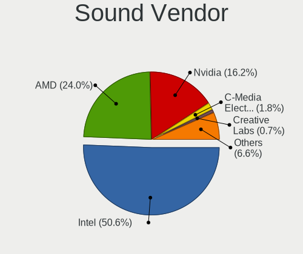

| Vendor                           | Computers | Percent |
|----------------------------------|-----------|---------|
| Intel                            | 438       | 53.61%  |
| AMD                              | 175       | 21.42%  |
| Nvidia                           | 137       | 16.77%  |
| C-Media Electronics              | 15        | 1.84%   |
| Creative Labs                    | 6         | 0.73%   |
| Creative Technology              | 5         | 0.61%   |
| VIA Technologies                 | 4         | 0.49%   |
| GN Netcom                        | 4         | 0.49%   |
| Silicon Integrated Systems [SiS] | 3         | 0.37%   |
| Lenovo                           | 3         | 0.37%   |
| Samson Technologies              | 2         | 0.24%   |
| Logitech                         | 2         | 0.24%   |
| JMTek                            | 2         | 0.24%   |
| Blue Microphones                 | 2         | 0.24%   |
| ASUSTek Computer                 | 2         | 0.24%   |
| AKAI Professional M.I.           | 2         | 0.24%   |
| Valve Software                   | 1         | 0.12%   |
| ULi Electronics                  | 1         | 0.12%   |
| Trust                            | 1         | 0.12%   |
| Textech International            | 1         | 0.12%   |
| Texas Instruments                | 1         | 0.12%   |
| SteelSeries ApS                  | 1         | 0.12%   |
| Realtek Semiconductor            | 1         | 0.12%   |
| Plantronics                      | 1         | 0.12%   |
| Nordic Semiconductor ASA         | 1         | 0.12%   |
| KTMicro                          | 1         | 0.12%   |
| Hewlett-Packard                  | 1         | 0.12%   |
| Fortemedia                       | 1         | 0.12%   |
| Focusrite-Novation               | 1         | 0.12%   |
| Behringer.......                 | 1         | 0.12%   |
| Barco Display Systems            | 1         | 0.12%   |

Sound Model
-----------

Sound card models

| Model                                                                      | Computers | Percent |
|----------------------------------------------------------------------------|-----------|---------|
| Intel 7 Series/C216 Chipset Family High Definition Audio Controller        | 63        | 6.56%   |
| Intel Sunrise Point-LP HD Audio                                            | 39        | 4.06%   |
| AMD Family 17h/19h HD Audio Controller                                     | 38        | 3.95%   |
| Intel 8 Series/C220 Series Chipset High Definition Audio Controller        | 37        | 3.85%   |
| Intel 6 Series/C200 Series Chipset Family High Definition Audio Controller | 36        | 3.75%   |
| Intel NM10/ICH7 Family High Definition Audio Controller                    | 35        | 3.64%   |
| AMD SBx00 Azalia (Intel HDA)                                               | 33        | 3.43%   |
| Intel 82801I (ICH9 Family) HD Audio Controller                             | 29        | 3.02%   |
| Intel Xeon E3-1200 v3/4th Gen Core Processor HD Audio Controller           | 26        | 2.71%   |
| AMD FCH Azalia Controller                                                  | 26        | 2.71%   |
| AMD Renoir Radeon High Definition Audio Controller                         | 22        | 2.29%   |
| Intel 5 Series/3400 Series Chipset High Definition Audio                   | 21        | 2.19%   |
| Intel Cannon Lake PCH cAVS                                                 | 20        | 2.08%   |
| Intel 82801H (ICH8 Family) HD Audio Controller                             | 20        | 2.08%   |
| Nvidia GK208 HDMI/DP Audio Controller                                      | 17        | 1.77%   |
| Intel 100 Series/C230 Series Chipset Family HD Audio Controller            | 16        | 1.66%   |
| Nvidia GF108 High Definition Audio Controller                              | 14        | 1.46%   |
| AMD Raven/Raven2/Fenghuang HDMI/DP Audio Controller                        | 14        | 1.46%   |
| Intel Tiger Lake-LP Smart Sound Technology Audio Controller                | 13        | 1.35%   |
| AMD Starship/Matisse HD Audio Controller                                   | 12        | 1.25%   |
| Nvidia High Definition Audio Controller                                    | 10        | 1.04%   |
| Intel 82801JI (ICH10 Family) HD Audio Controller                           | 10        | 1.04%   |
| Intel 200 Series PCH HD Audio                                              | 10        | 1.04%   |
| Intel Haswell-ULT HD Audio Controller                                      | 9         | 0.94%   |
| Intel 8 Series HD Audio Controller                                         | 9         | 0.94%   |
| Nvidia GP106 High Definition Audio Controller                              | 8         | 0.83%   |
| Intel Comet Lake PCH-LP cAVS                                               | 8         | 0.83%   |
| Intel Celeron/Pentium Silver Processor High Definition Audio               | 8         | 0.83%   |
| Intel Cannon Point-LP High Definition Audio Controller                     | 8         | 0.83%   |
| AMD Kabini HDMI/DP Audio                                                   | 8         | 0.83%   |
| AMD Family 15h (Models 60h-6fh) Audio Controller                           | 8         | 0.83%   |
| Intel Wildcat Point-LP High Definition Audio Controller                    | 7         | 0.73%   |
| Intel Ice Lake-LP Smart Sound Technology Audio Controller                  | 7         | 0.73%   |
| Intel Broadwell-U Audio Controller                                         | 7         | 0.73%   |
| AMD Turks HDMI Audio [Radeon HD 6500/6600 / 6700M Series]                  | 7         | 0.73%   |
| AMD Trinity HDMI Audio Controller                                          | 7         | 0.73%   |
| AMD Oland/Hainan/Cape Verde/Pitcairn HDMI Audio [Radeon HD 7000 Series]    | 7         | 0.73%   |
| AMD High Definition Audio Controller                                       | 7         | 0.73%   |
| AMD Family 17h (Models 00h-0fh) HD Audio Controller                        | 7         | 0.73%   |
| Nvidia MCP61 High Definition Audio                                         | 6         | 0.62%   |

Memory
------

Memory Vendor
-------------

Memory module vendors

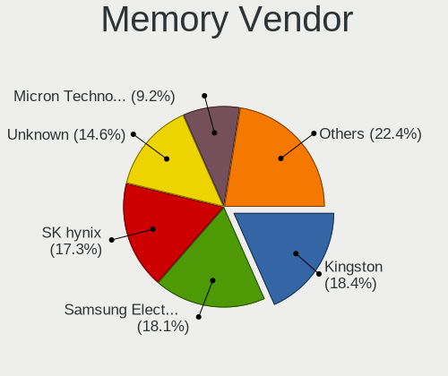

| Vendor              | Computers | Percent |
|---------------------|-----------|---------|
| Kingston            | 71        | 18.25%  |
| Samsung Electronics | 69        | 17.74%  |
| Unknown             | 67        | 17.22%  |
| SK hynix            | 63        | 16.2%   |
| Micron Technology   | 35        | 9%      |
| Crucial             | 18        | 4.63%   |
| Corsair             | 11        | 2.83%   |
| Elpida              | 10        | 2.57%   |
| Patriot             | 9         | 2.31%   |
| Ramaxel Technology  | 6         | 1.54%   |
| A-DATA Technology   | 6         | 1.54%   |
| G.Skill             | 5         | 1.29%   |
| Unknown (ABCD)      | 4         | 1.03%   |
| Unknown             | 3         | 0.77%   |
| Nanya Technology    | 2         | 0.51%   |
| Apacer              | 2         | 0.51%   |
| Unknown (8AC8)      | 1         | 0.26%   |
| Unigen              | 1         | 0.26%   |
| Transcend           | 1         | 0.26%   |
| SHARETRONIC         | 1         | 0.26%   |
| Hewlett-Packard     | 1         | 0.26%   |
| Atermiter           | 1         | 0.26%   |
| ASint Technology    | 1         | 0.26%   |
| 48spaces            | 1         | 0.26%   |

Memory Model
------------

Memory module models

| Model                                                            | Computers | Percent |
|------------------------------------------------------------------|-----------|---------|
| Unknown RAM Module 2048MB SODIMM DDR2 667MT/s                    | 6         | 1.38%   |
| Samsung RAM M471B5273CH0-CH9 4GB SODIMM DDR3 1334MT/s            | 5         | 1.15%   |
| Unknown RAM Module 2048MB DIMM DDR2 800MT/s                      | 4         | 0.92%   |
| Unknown RAM Module 1024MB SODIMM DDR2 667MT/s                    | 4         | 0.92%   |
| Unknown (ABCD) RAM 123456789012345678 2GB SODIMM LPDDR4 2400MT/s | 4         | 0.92%   |
| Micron RAM MT8KTF51264HZ-1G6 4GB SODIMM DDR3 1600MT/s            | 4         | 0.92%   |
| Micron RAM 16KTF51264HZ-1G6M1 4GB SODIMM DDR3 1600MT/s           | 4         | 0.92%   |
| Unknown RAM Module 2048MB DIMM 800MT/s                           | 3         | 0.69%   |
| SK hynix RAM HMT351S6EFR8A-PB 4096MB SODIMM DDR3 1600MT/s        | 3         | 0.69%   |
| SK hynix RAM HMT351S6CFR8C-PB 4GB SODIMM DDR3 1600MT/s           | 3         | 0.69%   |
| Samsung RAM M471A5244CB0-CTD 4GB SODIMM DDR4 3266MT/s            | 3         | 0.69%   |
| Patriot RAM PSD34G16002S 4GB SODIMM DDR3 1600MT/s                | 3         | 0.69%   |
| Kingston RAM KHX2666C16/8G 8GB DIMM DDR4 3466MT/s                | 3         | 0.69%   |
| Kingston RAM KHX1866C11S3L/8G 8GB SODIMM DDR3 1867MT/s           | 3         | 0.69%   |
| Kingston RAM KHX1866C10D3/4G 4GB DIMM DDR3 1867MT/s              | 3         | 0.69%   |
| Kingston RAM KHX1600C9D3/4GX 4GB DIMM DDR3 2400MT/s              | 3         | 0.69%   |
| Kingston RAM 9905624-033.A00G 8GB SODIMM DDR4 2400MT/s           | 3         | 0.69%   |
| Unknown                                                          | 3         | 0.69%   |
| Unknown RAM Module 4096MB SODIMM DDR3                            | 2         | 0.46%   |
| Unknown RAM Module 4096MB DIMM DDR3 1600MT/s                     | 2         | 0.46%   |
| Unknown RAM Module 2GB SODIMM DDR2                               | 2         | 0.46%   |
| Unknown RAM Module 2GB SODIMM 800MT/s                            | 2         | 0.46%   |
| Unknown RAM Module 2GB DIMM 800MT/s                              | 2         | 0.46%   |
| Unknown RAM Module 2048MB DIMM DDR2 333MT/s                      | 2         | 0.46%   |
| Unknown RAM Module 2048MB DIMM 1333MT/s                          | 2         | 0.46%   |
| Unknown RAM Module 1024MB DIMM DDR 333MT/s                       | 2         | 0.46%   |
| Unknown RAM Module 1024MB DIMM 533MT/s                           | 2         | 0.46%   |
| SK hynix RAM HMT451S6BFR8A-PB 4GB SODIMM DDR3 1600MT/s           | 2         | 0.46%   |
| SK hynix RAM HMT451S6AFR8A-PB 4GB SODIMM DDR3 1600MT/s           | 2         | 0.46%   |
| SK hynix RAM HMT425S6AFR6A-PB 2GB SODIMM DDR3 3200MT/s           | 2         | 0.46%   |
| SK hynix RAM HMT41GS6BFR8A-PB 8GB SODIMM DDR3 1600MT/s           | 2         | 0.46%   |
| SK hynix RAM HMT351S6BFR8C-H9 4GB SODIMM DDR3 1333MT/s           | 2         | 0.46%   |
| SK hynix RAM HMAB2GS6AMR6N-XN 16GB SODIMM DDR4 3200MT/s          | 2         | 0.46%   |
| SK hynix RAM HMAA1GS6CJR6N-XN 8GB SODIMM DDR4 3200MT/s           | 2         | 0.46%   |
| SK hynix RAM HMA81GS6CJR8N-VK 8GB SODIMM DDR4 2667MT/s           | 2         | 0.46%   |
| SK hynix RAM HMA81GS6AFR8N-UH 8GB SODIMM DDR4 2667MT/s           | 2         | 0.46%   |
| SK hynix RAM H9CCNNNCLGALAR-NVD 8GB Row Of Chips LPDDR3 2133MT/s | 2         | 0.46%   |
| Samsung RAM M471B5773CHS-CH9 2GB SODIMM DDR3 4199MT/s            | 2         | 0.46%   |
| Samsung RAM M471B5673EH1-CF8 2GB SODIMM DDR3 4199MT/s            | 2         | 0.46%   |
| Samsung RAM M471B5173QH0-YK0 4GB SODIMM DDR3 1600MT/s            | 2         | 0.46%   |

Memory Kind
-----------

Memory module kinds

| Kind    | Computers | Percent |
|---------|-----------|---------|
| DDR3    | 119       | 36.39%  |
| DDR4    | 104       | 31.8%   |
| DDR2    | 36        | 11.01%  |
| SDRAM   | 20        | 6.12%   |
| Unknown | 18        | 5.5%    |
| LPDDR4  | 13        | 3.98%   |
| DDR     | 8         | 2.45%   |
| LPDDR3  | 5         | 1.53%   |
| DRAM    | 2         | 0.61%   |
| LPDDR5  | 1         | 0.31%   |
| DDR5    | 1         | 0.31%   |

Memory Form Factor
------------------

Physical design of the memory module

| Name         | Computers | Percent |
|--------------|-----------|---------|
| SODIMM       | 191       | 58.77%  |
| DIMM         | 115       | 35.38%  |
| Row Of Chips | 15        | 4.62%   |
| Chip         | 3         | 0.92%   |
| FB-DIMM      | 1         | 0.31%   |

Memory Size
-----------

Memory module size

| Size  | Computers | Percent |
|-------|-----------|---------|
| 4096  | 107       | 28.61%  |
| 8192  | 103       | 27.54%  |
| 2048  | 82        | 21.93%  |
| 16384 | 36        | 9.63%   |
| 1024  | 31        | 8.29%   |
| 512   | 8         | 2.14%   |
| 32768 | 3         | 0.8%    |
| 256   | 2         | 0.53%   |
| 128   | 1         | 0.27%   |
| 64    | 1         | 0.27%   |

Memory Speed
------------

Memory module speed

| Speed   | Computers | Percent |
|---------|-----------|---------|
| 1600    | 85        | 23.16%  |
| 2667    | 35        | 9.54%   |
| 3200    | 32        | 8.72%   |
| 667     | 25        | 6.81%   |
| 2400    | 23        | 6.27%   |
| 1333    | 23        | 6.27%   |
| 800     | 20        | 5.45%   |
| 2133    | 18        | 4.9%    |
| Unknown | 12        | 3.27%   |
| 1334    | 11        | 3%      |
| 1867    | 8         | 2.18%   |
| 333     | 6         | 1.63%   |
| 3600    | 5         | 1.36%   |
| 2048    | 5         | 1.36%   |
| 1067    | 5         | 1.36%   |
| 533     | 5         | 1.36%   |
| 4199    | 4         | 1.09%   |
| 3466    | 4         | 1.09%   |
| 4267    | 3         | 0.82%   |
| 4266    | 3         | 0.82%   |
| 3733    | 3         | 0.82%   |
| 3266    | 3         | 0.82%   |
| 1066    | 3         | 0.82%   |
| 400     | 3         | 0.82%   |
| 8400    | 2         | 0.54%   |
| 3800    | 2         | 0.54%   |
| 1866    | 2         | 0.54%   |
| 1639    | 2         | 0.54%   |
| 57535   | 1         | 0.27%   |
| 6400    | 1         | 0.27%   |
| 5600    | 1         | 0.27%   |
| 4800    | 1         | 0.27%   |
| 4400    | 1         | 0.27%   |
| 4000    | 1         | 0.27%   |
| 3400    | 1         | 0.27%   |
| 3333    | 1         | 0.27%   |
| 3000    | 1         | 0.27%   |
| 2666    | 1         | 0.27%   |
| 1800    | 1         | 0.27%   |
| 975     | 1         | 0.27%   |

Printers & scanners
-------------------

Printer Vendor
--------------

Printer device vendors

| Vendor                | Computers | Percent |
|-----------------------|-----------|---------|
| Hewlett-Packard       | 13        | 72.22%  |
| Samsung Electronics   | 2         | 11.11%  |
| Star Micronics        | 1         | 5.56%   |
| Lexmark International | 1         | 5.56%   |
| Canon                 | 1         | 5.56%   |

Printer Model
-------------

Printer device models

| Model                                           | Computers | Percent |
|-------------------------------------------------|-----------|---------|
| HP LaserJet 1020                                | 4         | 22.22%  |
| HP Deskjet 1050 J410                            | 2         | 11.11%  |
| Star Micronics IP1000 Printer USB001            | 1         | 5.56%   |
| Samsung M262x/M282x Xpress Series Laser Printer | 1         | 5.56%   |
| Samsung M2070 Series                            | 1         | 5.56%   |
| Lexmark International 2600 Series               | 1         | 5.56%   |
| HP OfficeJet 6950                               | 1         | 5.56%   |
| HP LaserJet M14-M17                             | 1         | 5.56%   |
| HP LaserJet M101-M106                           | 1         | 5.56%   |
| HP LaserJet CP 1025                             | 1         | 5.56%   |
| HP LaserJet 1150                                | 1         | 5.56%   |
| HP DeskJet 2700 series                          | 1         | 5.56%   |
| HP Deskjet 1510                                 | 1         | 5.56%   |
| Canon PIXMA MP230                               | 1         | 5.56%   |

Scanner Vendor
--------------

Scanner device vendors

| Vendor  | Computers | Percent |
|---------|-----------|---------|
| Canon   | 2         | 66.67%  |
| Minolta | 1         | 33.33%  |

Scanner Model
-------------

Scanner device models

| Model                                       | Computers | Percent |
|---------------------------------------------|-----------|---------|
| Minolta Dimage Scan Dual III AF-2840 (2889) | 1         | 33.33%  |
| Canon CanoScan LiDE 90                      | 1         | 33.33%  |
| Canon CanoScan LIDE 25                      | 1         | 33.33%  |

Camera
------

Camera Vendor
-------------

Camera device vendors

| Vendor                                 | Computers | Percent |
|----------------------------------------|-----------|---------|
| Chicony Electronics                    | 103       | 28.93%  |
| IMC Networks                           | 33        | 9.27%   |
| Microdia                               | 28        | 7.87%   |
| Realtek Semiconductor                  | 27        | 7.58%   |
| Acer                                   | 24        | 6.74%   |
| Syntek                                 | 19        | 5.34%   |
| Sunplus Innovation Technology          | 18        | 5.06%   |
| Suyin                                  | 14        | 3.93%   |
| Cheng Uei Precision Industry (Foxlink) | 12        | 3.37%   |
| Logitech                               | 10        | 2.81%   |
| Quanta                                 | 8         | 2.25%   |
| Microsoft                              | 7         | 1.97%   |
| Lite-On Technology                     | 6         | 1.69%   |
| Apple                                  | 5         | 1.4%    |
| Z-Star Microelectronics                | 4         | 1.12%   |
| GEMBIRD                                | 4         | 1.12%   |
| Alcor Micro                            | 4         | 1.12%   |
| Silicon Motion                         | 3         | 0.84%   |
| Ricoh                                  | 3         | 0.84%   |
| Creative Technology                    | 3         | 0.84%   |
| Samsung Electronics                    | 2         | 0.56%   |
| Luxvisions Innotech Limited            | 2         | 0.56%   |
| Valve Software                         | 1         | 0.28%   |
| USB Camera                             | 1         | 0.28%   |
| Unknown                                | 1         | 0.28%   |
| Tripath Technology                     | 1         | 0.28%   |
| SN0002                                 | 1         | 0.28%   |
| Primax Electronics                     | 1         | 0.28%   |
| OnePlus Technology (Shenzhen)          | 1         | 0.28%   |
| OmniVision Technologies                | 1         | 0.28%   |
| MacroSilicon                           | 1         | 0.28%   |
| LG Electronics                         | 1         | 0.28%   |
| Lenovo                                 | 1         | 0.28%   |
| KYE Systems (Mouse Systems)            | 1         | 0.28%   |
| Importek                               | 1         | 0.28%   |
| Generalplus Technology                 | 1         | 0.28%   |
| Elecom                                 | 1         | 0.28%   |
| Cubeternet                             | 1         | 0.28%   |
| ALi                                    | 1         | 0.28%   |

Camera Model
------------

Camera device models

| Model                                               | Computers | Percent |
|-----------------------------------------------------|-----------|---------|
| Chicony Integrated Camera                           | 24        | 6.7%    |
| Syntek Integrated Camera                            | 12        | 3.35%   |
| Microdia Integrated_Webcam_HD                       | 11        | 3.07%   |
| IMC Networks Integrated Camera                      | 9         | 2.51%   |
| Realtek USB2.0 HD UVC WebCam                        | 7         | 1.96%   |
| Realtek Integrated_Webcam_HD                        | 7         | 1.96%   |
| Chicony HD WebCam                                   | 7         | 1.96%   |
| Sunplus Integrated_Webcam_HD                        | 6         | 1.68%   |
| IMC Networks USB2.0 VGA UVC WebCam                  | 6         | 1.68%   |
| Chicony HP HD Webcam [Fixed]                        | 6         | 1.68%   |
| Acer Lenovo EasyCamera                              | 6         | 1.68%   |
| IMC Networks USB2.0 HD UVC WebCam                   | 5         | 1.4%    |
| Acer Integrated Camera                              | 5         | 1.4%    |
| Acer EasyCamera                                     | 5         | 1.4%    |
| Quanta HP HD Camera                                 | 4         | 1.12%   |
| Microdia Integrated Webcam                          | 4         | 1.12%   |
| Lite-On HP HD Camera                                | 4         | 1.12%   |
| IMC Networks Integrated Webcam                      | 4         | 1.12%   |
| GEMBIRD Generic UVC 1.00 camera [AppoTech AX2311]   | 4         | 1.12%   |
| Chicony USB2.0 VGA UVC WebCam                       | 4         | 1.12%   |
| Chicony USB 2.0 Camera                              | 4         | 1.12%   |
| Syntek Lenovo EasyCamera                            | 3         | 0.84%   |
| Suyin HP Webcam                                     | 3         | 0.84%   |
| Suyin Acer/HP Integrated Webcam [CN0314]            | 3         | 0.84%   |
| Sunplus HP HD Webcam [Fixed]                        | 3         | 0.84%   |
| Microdia Webcam Vitade AF                           | 3         | 0.84%   |
| Microdia Sonix USB 2.0 Camera                       | 3         | 0.84%   |
| Chicony USB2.0 HD UVC WebCam                        | 3         | 0.84%   |
| Chicony USB2.0 0.3M UVC WebCam                      | 3         | 0.84%   |
| Chicony TOSHIBA Web Camera - HD                     | 3         | 0.84%   |
| Chicony Thinkpad T430 camera                        | 3         | 0.84%   |
| Chicony Lenovo EasyCamera                           | 3         | 0.84%   |
| Chicony HP HD Camera                                | 3         | 0.84%   |
| Chicony HD User Facing                              | 3         | 0.84%   |
| Chicony CNF9055 Toshiba Webcam                      | 3         | 0.84%   |
| Chicony 2.0M UVC Webcam / CNF7129                   | 3         | 0.84%   |
| Cheng Uei Precision Industry (Foxlink) HP HD Camera | 3         | 0.84%   |
| Acer Lenovo Integrated Webcam                       | 3         | 0.84%   |
| Z-Star A4 TECH HD PC Camera                         | 2         | 0.56%   |
| Syntek EasyCamera                                   | 2         | 0.56%   |

Security
--------

Fingerprint Vendor
------------------

Fingerprint sensor vendors

| Vendor                     | Computers | Percent |
|----------------------------|-----------|---------|
| Validity Sensors           | 36        | 43.9%   |
| Synaptics                  | 25        | 30.49%  |
| AuthenTec                  | 8         | 9.76%   |
| LighTuning Technology      | 4         | 4.88%   |
| Shenzhen Goodix Technology | 3         | 3.66%   |
| Upek                       | 2         | 2.44%   |
| STMicroelectronics         | 2         | 2.44%   |
| Elan Microelectronics      | 2         | 2.44%   |

Fingerprint Model
-----------------

Fingerprint sensor models

| Model                                                                      | Computers | Percent |
|----------------------------------------------------------------------------|-----------|---------|
| Validity Sensors VFS495 Fingerprint Reader                                 | 10        | 12.2%   |
| Unknown                                                                    | 10        | 12.2%   |
| Synaptics Prometheus MIS Touch Fingerprint Reader                          | 5         | 6.1%    |
| Validity Sensors VFS491                                                    | 4         | 4.88%   |
| Validity Sensors VFS 5011 fingerprint sensor                               | 4         | 4.88%   |
| Synaptics  VFS7552 Touch Fingerprint Sensor with PurePrint                 | 4         | 4.88%   |
| LighTuning EgisTec Touch Fingerprint Sensor                                | 4         | 4.88%   |
| AuthenTec AES2501 Fingerprint Sensor                                       | 4         | 4.88%   |
| Validity Sensors VFS5011 Fingerprint Reader                                | 3         | 3.66%   |
| Validity Sensors VFS471 Fingerprint Reader                                 | 3         | 3.66%   |
| Synaptics  WBDI                                                            | 3         | 3.66%   |
| AuthenTec AES2810                                                          | 3         | 3.66%   |
| Validity Sensors VFS7500 Touch Fingerprint Sensor                          | 2         | 2.44%   |
| Validity Sensors VFS301 Fingerprint Reader                                 | 2         | 2.44%   |
| Validity Sensors Synaptics WBDI                                            | 2         | 2.44%   |
| Synaptics  FS7604 Touch Fingerprint Sensor with PurePrint                  | 2         | 2.44%   |
| STMicroelectronics Fingerprint Reader                                      | 2         | 2.44%   |
| Shenzhen Goodix  Fingerprint Device                                        | 2         | 2.44%   |
| Elan ELAN:Fingerprint                                                      | 2         | 2.44%   |
| Validity Sensors VFS451 Fingerprint Reader                                 | 1         | 1.22%   |
| Validity Sensors VFS300 Fingerprint Reader                                 | 1         | 1.22%   |
| Validity Sensors VFS101 Fingerprint Reader                                 | 1         | 1.22%   |
| Validity Sensors VFS Fingerprint sensor                                    | 1         | 1.22%   |
| Validity Sensors Synaptics VFS7552 Touch Fingerprint Sensor with PurePrint | 1         | 1.22%   |
| Validity Sensors Swipe Fingerprint Sensor                                  | 1         | 1.22%   |
| Upek TCS5B Fingerprint sensor                                              | 1         | 1.22%   |
| Upek Biometric Touchchip/Touchstrip Fingerprint Sensor                     | 1         | 1.22%   |
| Synaptics Metallica MIS Touch Fingerprint Reader                           | 1         | 1.22%   |
| Shenzhen Goodix Fingerprint Reader                                         | 1         | 1.22%   |
| AuthenTec AES1600                                                          | 1         | 1.22%   |

Chipcard Vendor
---------------

Chipcard module vendors

| Vendor                | Computers | Percent |
|-----------------------|-----------|---------|
| Broadcom              | 14        | 38.89%  |
| Alcor Micro           | 11        | 30.56%  |
| O2 Micro              | 5         | 13.89%  |
| BIT4ID                | 3         | 8.33%   |
| Lenovo                | 2         | 5.56%   |
| Gemalto (was Gemplus) | 1         | 2.78%   |

Chipcard Model
--------------

Chipcard module models

| Model                                                                        | Computers | Percent |
|------------------------------------------------------------------------------|-----------|---------|
| Alcor Micro AU9540 Smartcard Reader                                          | 11        | 30.56%  |
| Broadcom 5880                                                                | 5         | 13.89%  |
| Broadcom BCM5880 Secure Applications Processor                               | 4         | 11.11%  |
| Broadcom 58200                                                               | 4         | 11.11%  |
| O2 Micro OZ776 CCID Smartcard Reader                                         | 3         | 8.33%   |
| BIT4ID miniLector EVO                                                        | 3         | 8.33%   |
| O2 Micro Oz776 SmartCard Reader                                              | 2         | 5.56%   |
| Lenovo Integrated Smart Card Reader                                          | 2         | 5.56%   |
| Gemalto (was Gemplus) GemPC Twin SmartCard Reader                            | 1         | 2.78%   |
| Broadcom BCM5880 Secure Applications Processor with fingerprint swipe sensor | 1         | 2.78%   |

Unsupported
-----------

Unsupported Devices
-------------------

Total unsupported devices on board

| Total | Computers | Percent |
|-------|-----------|---------|
| 0     | 434       | 67.29%  |
| 1     | 174       | 26.98%  |
| 2     | 30        | 4.65%   |
| 3     | 6         | 0.93%   |
| 4     | 1         | 0.16%   |

Unsupported Device Types
------------------------

Types of unsupported devices

| Type                     | Computers | Percent |
|--------------------------|-----------|---------|
| Fingerprint reader       | 82        | 33.06%  |
| Graphics card            | 55        | 22.18%  |
| Chipcard                 | 28        | 11.29%  |
| Net/wireless             | 18        | 7.26%   |
| Multimedia controller    | 11        | 4.44%   |
| Bluetooth                | 11        | 4.44%   |
| Storage                  | 8         | 3.23%   |
| Communication controller | 8         | 3.23%   |
| Modem                    | 6         | 2.42%   |
| Card reader              | 5         | 2.02%   |
| Camera                   | 4         | 1.61%   |
| Sound                    | 3         | 1.21%   |
| Network                  | 3         | 1.21%   |
| Unassigned class         | 2         | 0.81%   |
| Flash memory             | 2         | 0.81%   |
| Storage/ide              | 1         | 0.4%    |
| Net/ethernet             | 1         | 0.4%    |

