Linux in Slovakia - Tested Hardware & Statistics
------------------------------------------------

A project to collect tested hardware configurations for Linux in Slovakia.

Anyone can contribute to this report by the [hw-probe](https://github.com/linuxhw/hw-probe) tool:

    sudo -E hw-probe -all -upload

Please contribute! Especially if your hardware is rare.

This is a report for all computer types. See also reports for [desktops](/Location/Slovakia/Desktop/README.md) and [notebooks](/Location/Slovakia/Notebook/README.md).

Contents
--------

* [ Test Cases ](#test-cases)

* [ System ](#system)
  - [ OS                       ](#os)
  - [ OS Family                ](#os-family)
  - [ Kernel                   ](#kernel)
  - [ Kernel Family            ](#kernel-family)
  - [ Kernel Major Ver.        ](#kernel-major-ver)
  - [ Arch                     ](#arch)
  - [ DE                       ](#de)
  - [ Display Server           ](#display-server)
  - [ Display Manager          ](#display-manager)
  - [ OS Lang                  ](#os-lang)
  - [ Boot Mode                ](#boot-mode)
  - [ Filesystem               ](#filesystem)
  - [ Part. scheme             ](#part-scheme)
  - [ Dual Boot with Linux/BSD ](#dual-boot-with-linuxbsd)
  - [ Dual Boot (Win)          ](#dual-boot-win)

* [ Board ](#board)
  - [ Vendor                   ](#vendor)
  - [ Model                    ](#model)
  - [ Model Family             ](#model-family)
  - [ MFG Year                 ](#mfg-year)
  - [ Form Factor              ](#form-factor)
  - [ Secure Boot              ](#secure-boot)
  - [ Coreboot                 ](#coreboot)
  - [ RAM Size                 ](#ram-size)
  - [ RAM Used                 ](#ram-used)
  - [ Total Drives             ](#total-drives)
  - [ Has CD-ROM               ](#has-cd-rom)
  - [ Has Ethernet             ](#has-ethernet)
  - [ Has WiFi                 ](#has-wifi)
  - [ Has Bluetooth            ](#has-bluetooth)

* [ Location ](#location)
  - [ Country                  ](#country)
  - [ City                     ](#city)

* [ Drives ](#drives)
  - [ Drive Vendor             ](#drive-vendor)
  - [ Drive Model              ](#drive-model)
  - [ HDD Vendor               ](#hdd-vendor)
  - [ SSD Vendor               ](#ssd-vendor)
  - [ Drive Kind               ](#drive-kind)
  - [ Drive Connector          ](#drive-connector)
  - [ Drive Size               ](#drive-size)
  - [ Space Total              ](#space-total)
  - [ Space Used               ](#space-used)
  - [ Malfunc. Drives          ](#malfunc-drives)
  - [ Malfunc. Drive Vendor    ](#malfunc-drive-vendor)
  - [ Malfunc. HDD Vendor      ](#malfunc-hdd-vendor)
  - [ Malfunc. Drive Kind      ](#malfunc-drive-kind)
  - [ Failed Drives            ](#failed-drives)
  - [ Failed Drive Vendor      ](#failed-drive-vendor)
  - [ Drive Status             ](#drive-status)

* [ Storage controller ](#storage-controller)
  - [ Storage Vendor           ](#storage-vendor)
  - [ Storage Model            ](#storage-model)
  - [ Storage Kind             ](#storage-kind)

* [ Processor ](#processor)
  - [ CPU Vendor               ](#cpu-vendor)
  - [ CPU Model                ](#cpu-model)
  - [ CPU Model Family         ](#cpu-model-family)
  - [ CPU Cores                ](#cpu-cores)
  - [ CPU Sockets              ](#cpu-sockets)
  - [ CPU Threads              ](#cpu-threads)
  - [ CPU Op-Modes             ](#cpu-op-modes)
  - [ CPU Microcode            ](#cpu-microcode)
  - [ CPU Microarch            ](#cpu-microarch)

* [ Graphics ](#graphics)
  - [ GPU Vendor               ](#gpu-vendor)
  - [ GPU Model                ](#gpu-model)
  - [ GPU Combo                ](#gpu-combo)
  - [ GPU Driver               ](#gpu-driver)
  - [ GPU Memory               ](#gpu-memory)

* [ Monitor ](#monitor)
  - [ Monitor Vendor           ](#monitor-vendor)
  - [ Monitor Model            ](#monitor-model)
  - [ Monitor Resolution       ](#monitor-resolution)
  - [ Monitor Diagonal         ](#monitor-diagonal)
  - [ Monitor Width            ](#monitor-width)
  - [ Aspect Ratio             ](#aspect-ratio)
  - [ Monitor Area             ](#monitor-area)
  - [ Pixel Density            ](#pixel-density)
  - [ Multiple Monitors        ](#multiple-monitors)

* [ Network ](#network)
  - [ Net Controller Vendor    ](#net-controller-vendor)
  - [ Net Controller Model     ](#net-controller-model)
  - [ Wireless Vendor          ](#wireless-vendor)
  - [ Wireless Model           ](#wireless-model)
  - [ Ethernet Vendor          ](#ethernet-vendor)
  - [ Ethernet Model           ](#ethernet-model)
  - [ Net Controller Kind      ](#net-controller-kind)
  - [ Used Controller          ](#used-controller)
  - [ NICs                     ](#nics)
  - [ IPv6                     ](#ipv6)

* [ Bluetooth ](#bluetooth)
  - [ Bluetooth Vendor         ](#bluetooth-vendor)
  - [ Bluetooth Model          ](#bluetooth-model)

* [ Sound ](#sound)
  - [ Sound Vendor             ](#sound-vendor)
  - [ Sound Model              ](#sound-model)

* [ Memory ](#memory)
  - [ Memory Vendor            ](#memory-vendor)
  - [ Memory Model             ](#memory-model)
  - [ Memory Kind              ](#memory-kind)
  - [ Memory Form Factor       ](#memory-form-factor)
  - [ Memory Size              ](#memory-size)
  - [ Memory Speed             ](#memory-speed)

* [ Printers & scanners ](#printers--scanners)
  - [ Printer Vendor           ](#printer-vendor)
  - [ Printer Model            ](#printer-model)
  - [ Scanner Vendor           ](#scanner-vendor)
  - [ Scanner Model            ](#scanner-model)

* [ Camera ](#camera)
  - [ Camera Vendor            ](#camera-vendor)
  - [ Camera Model             ](#camera-model)

* [ Security ](#security)
  - [ Fingerprint Vendor       ](#fingerprint-vendor)
  - [ Fingerprint Model        ](#fingerprint-model)
  - [ Chipcard Vendor          ](#chipcard-vendor)
  - [ Chipcard Model           ](#chipcard-model)

* [ Unsupported ](#unsupported)
  - [ Unsupported Devices      ](#unsupported-devices)
  - [ Unsupported Device Types ](#unsupported-device-types)

Test Cases
----------

Total: 1745

| Vendor        | Model                       | Form-Factor | Probe                                                      | Date         |
|---------------|-----------------------------|-------------|------------------------------------------------------------|--------------|
| HP            | ProBook 4510s               | Notebook    | [d74e06d912](https://linux-hardware.org/?probe=d74e06d912) | Jan 06, 2025 |
| HP            | ProBook 4510s               | Notebook    | [cf51ebf11d](https://linux-hardware.org/?probe=cf51ebf11d) | Jan 06, 2025 |
| HP            | 250 G7 Notebook PC          | Notebook    | [0562d753f2](https://linux-hardware.org/?probe=0562d753f2) | Jan 05, 2025 |
| HP            | 250 G7 Notebook PC          | Notebook    | [0cf6343ea2](https://linux-hardware.org/?probe=0cf6343ea2) | Jan 05, 2025 |
| Lenovo        | IdeaPad Gaming 3 15ACH6 ... | Notebook    | [271c85b332](https://linux-hardware.org/?probe=271c85b332) | Jan 05, 2025 |
| Lenovo        | ThinkPad L470 20J4000LMD    | Notebook    | [e2fa70f2b4](https://linux-hardware.org/?probe=e2fa70f2b4) | Jan 02, 2025 |
| Lenovo        | 3717 SDK0J40700 WIN 3258... | Desktop     | [bc8aa268ef](https://linux-hardware.org/?probe=bc8aa268ef) | Jan 01, 2025 |
| HP            | ProBook 4535s               | Notebook    | [e0f48651c0](https://linux-hardware.org/?probe=e0f48651c0) | Dec 30, 2024 |
| ASUSTek       | ASUS TUF Gaming A15 FA50... | Notebook    | [71d10a1993](https://linux-hardware.org/?probe=71d10a1993) | Dec 26, 2024 |
| Lenovo        | IdeaPad Pro 5 16AHP9 83D... | Notebook    | [28dcf6960e](https://linux-hardware.org/?probe=28dcf6960e) | Dec 26, 2024 |
| Lenovo        | Legion 9 16IRX9 83G0        | Notebook    | [128debb210](https://linux-hardware.org/?probe=128debb210) | Dec 25, 2024 |
| ASUSTek       | ASUS TUF Gaming A15 FA50... | Notebook    | [4505762848](https://linux-hardware.org/?probe=4505762848) | Dec 25, 2024 |
| Lenovo        | IdeaPad Gaming 3 15ACH6 ... | Notebook    | [e7ad20e4e1](https://linux-hardware.org/?probe=e7ad20e4e1) | Dec 24, 2024 |
| Acer          | Extensa X2610G              | Desktop     | [b056768ca1](https://linux-hardware.org/?probe=b056768ca1) | Dec 23, 2024 |
| ASUSTek       | TUF Gaming X570-PRO         | Desktop     | [f7f28f51ad](https://linux-hardware.org/?probe=f7f28f51ad) | Dec 22, 2024 |
| ASUSTek       | P8Z68-V PRO GEN3            | Desktop     | [adf5dc1d46](https://linux-hardware.org/?probe=adf5dc1d46) | Dec 21, 2024 |
| Gigabyte      | B75M-D3H                    | Desktop     | [24a9a318be](https://linux-hardware.org/?probe=24a9a318be) | Dec 19, 2024 |
| HP            | Pavilion dv6                | Notebook    | [89ec19d64a](https://linux-hardware.org/?probe=89ec19d64a) | Dec 17, 2024 |
| ASUSTek       | Z170-K                      | Desktop     | [a37f17c9d8](https://linux-hardware.org/?probe=a37f17c9d8) | Dec 16, 2024 |
| Gigabyte      | H61M-S1                     | Desktop     | [0291930ebb](https://linux-hardware.org/?probe=0291930ebb) | Dec 16, 2024 |
| ASUSTek       | ASUS TUF Dash F15 FX517Z... | Notebook    | [532c74b6c3](https://linux-hardware.org/?probe=532c74b6c3) | Dec 16, 2024 |
| Dell          | Latitude E5530 non-vPro     | Notebook    | [9feabc8ce6](https://linux-hardware.org/?probe=9feabc8ce6) | Dec 14, 2024 |
| ASUSTek       | TUF Gaming B550M-PLUS       | Desktop     | [7fe45e1a05](https://linux-hardware.org/?probe=7fe45e1a05) | Dec 14, 2024 |
| Lenovo        | ThinkPad L15 Gen 1 20U70... | Notebook    | [331f53945b](https://linux-hardware.org/?probe=331f53945b) | Dec 13, 2024 |
| Dell          | Inspiron 13-5368            | Notebook    | [bd47986d73](https://linux-hardware.org/?probe=bd47986d73) | Dec 13, 2024 |
| ASUSTek       | PRIME A320M-K               | Desktop     | [467278b658](https://linux-hardware.org/?probe=467278b658) | Dec 12, 2024 |
| Foxconn       | 2ABF                        | Desktop     | [0f46252ef0](https://linux-hardware.org/?probe=0f46252ef0) | Dec 11, 2024 |
| Lenovo        | Yoga 510-14IKB 80VB         | Convertible | [ad930c5c8f](https://linux-hardware.org/?probe=ad930c5c8f) | Dec 09, 2024 |
| ASUSTek       | ASUS TUF Gaming A15 FA50... | Notebook    | [dc2afedb8a](https://linux-hardware.org/?probe=dc2afedb8a) | Dec 08, 2024 |
| HP            | 250 15.6 inch G10 Notebo... | Notebook    | [f92ea0cda1](https://linux-hardware.org/?probe=f92ea0cda1) | Dec 04, 2024 |
| ASUSTek       | PRIME A320M-K               | Desktop     | [232e1f7313](https://linux-hardware.org/?probe=232e1f7313) | Dec 03, 2024 |
| Lenovo        | Yoga 510-14IKB 80VB         | Convertible | [1e515c3231](https://linux-hardware.org/?probe=1e515c3231) | Dec 02, 2024 |
| Dell          | Inspiron 13-5368            | Notebook    | [5f256e8e33](https://linux-hardware.org/?probe=5f256e8e33) | Dec 01, 2024 |
| Intel         | NUC8BEB J72693-306          | Mini pc     | [7b063d3dd7](https://linux-hardware.org/?probe=7b063d3dd7) | Nov 30, 2024 |
| Intel         | NUC8BEB J72693-306          | Mini pc     | [b69d5786a5](https://linux-hardware.org/?probe=b69d5786a5) | Nov 30, 2024 |
| Gigabyte      | H61M-S1                     | Desktop     | [d4ffafd2f5](https://linux-hardware.org/?probe=d4ffafd2f5) | Nov 29, 2024 |
| Acer          | Swift SF314-43              | Notebook    | [82fcdbb537](https://linux-hardware.org/?probe=82fcdbb537) | Nov 28, 2024 |
| Foxconn       | 2ABF                        | Desktop     | [56fc037b00](https://linux-hardware.org/?probe=56fc037b00) | Nov 25, 2024 |
| ASUSTek       | ASUS EXPERTBOOK L1500CDA... | Notebook    | [e65f68056f](https://linux-hardware.org/?probe=e65f68056f) | Nov 24, 2024 |
| Dell          | Vostro 3500                 | Notebook    | [723a673611](https://linux-hardware.org/?probe=723a673611) | Nov 24, 2024 |
| Lenovo        | IdeaPad Pro 5 14IMH9 83D... | Notebook    | [e7b45b99c1](https://linux-hardware.org/?probe=e7b45b99c1) | Nov 23, 2024 |
| OEM           | X79-Turbo                   | Desktop     | [8e35c4675c](https://linux-hardware.org/?probe=8e35c4675c) | Nov 23, 2024 |
| ASUSTek       | ASUS TUF Dash F15 FX517Z... | Notebook    | [87836c3a98](https://linux-hardware.org/?probe=87836c3a98) | Nov 22, 2024 |
| Lenovo        | IdeaPad 5 15ABA7 82SG       | Notebook    | [5a37374d2d](https://linux-hardware.org/?probe=5a37374d2d) | Nov 21, 2024 |
| Timi          | TM1701                      | Notebook    | [4a2509bd5a](https://linux-hardware.org/?probe=4a2509bd5a) | Nov 18, 2024 |
| HP            | Victus by Gaming Laptop ... | Notebook    | [f68a7fb475](https://linux-hardware.org/?probe=f68a7fb475) | Nov 17, 2024 |
| XIAOMI        | Redmi Book Pro 15 2023      | Notebook    | [c3dd3deab0](https://linux-hardware.org/?probe=c3dd3deab0) | Nov 16, 2024 |
| Lenovo        | 1066 3556104260981          | Desktop     | [bc8c24fb9c](https://linux-hardware.org/?probe=bc8c24fb9c) | Nov 15, 2024 |
| XIAOMI        | Redmi Book Pro 15 2023      | Notebook    | [038c91db6e](https://linux-hardware.org/?probe=038c91db6e) | Nov 15, 2024 |
| ASUSTek       | ROG Zephyrus G16 GU603ZV... | Notebook    | [d31a355a2d](https://linux-hardware.org/?probe=d31a355a2d) | Nov 14, 2024 |
| Gigabyte      | H61M-S1                     | Desktop     | [ed13d9f493](https://linux-hardware.org/?probe=ed13d9f493) | Nov 12, 2024 |
| MSI           | GT60 2OC/2OD                | Notebook    | [d4624f582f](https://linux-hardware.org/?probe=d4624f582f) | Nov 11, 2024 |
| Intel         | X99H                        | Desktop     | [5e31d210ca](https://linux-hardware.org/?probe=5e31d210ca) | Nov 09, 2024 |
| ASUSTek       | X550VB                      | Notebook    | [c995cf0e55](https://linux-hardware.org/?probe=c995cf0e55) | Nov 09, 2024 |
| Fujitsu Si... | AMILO A7645                 | Notebook    | [82b3b117c2](https://linux-hardware.org/?probe=82b3b117c2) | Nov 08, 2024 |
| ASUSTek       | P7P55D-E                    | Desktop     | [ef5c1d5086](https://linux-hardware.org/?probe=ef5c1d5086) | Nov 06, 2024 |
| Foxconn       | 2ABF                        | Desktop     | [93af336b75](https://linux-hardware.org/?probe=93af336b75) | Nov 06, 2024 |
| Lenovo        | IdeaPad 1 14IGL05 81VU      | Notebook    | [f851654ac1](https://linux-hardware.org/?probe=f851654ac1) | Nov 03, 2024 |
| Fujitsu       | D3161-A1 S26361-D3161-A1    | Desktop     | [5a62c5d679](https://linux-hardware.org/?probe=5a62c5d679) | Nov 02, 2024 |
| Toshiba       | TECRA A10                   | Notebook    | [f7cfa0f796](https://linux-hardware.org/?probe=f7cfa0f796) | Nov 02, 2024 |
| Gigabyte      | H61M-S1                     | Desktop     | [0d7062b12c](https://linux-hardware.org/?probe=0d7062b12c) | Oct 26, 2024 |
| HP            | 250 G8 Notebook PC          | Notebook    | [c6d19560ba](https://linux-hardware.org/?probe=c6d19560ba) | Oct 26, 2024 |
| IBM           | 00D3889                     | Server      | [128986423a](https://linux-hardware.org/?probe=128986423a) | Oct 22, 2024 |
| ASUSTek       | ASUS TUF Gaming A15 FA50... | Notebook    | [8caf6adea5](https://linux-hardware.org/?probe=8caf6adea5) | Oct 20, 2024 |
| ASUSTek       | ASUS TUF Gaming A15 FA50... | Notebook    | [c5e97b1a91](https://linux-hardware.org/?probe=c5e97b1a91) | Oct 20, 2024 |
| Dell          | Latitude E6400              | Notebook    | [45684f9885](https://linux-hardware.org/?probe=45684f9885) | Oct 20, 2024 |
| TUXEDO        | Pulse 15 Gen2               | Notebook    | [08951a5d7d](https://linux-hardware.org/?probe=08951a5d7d) | Oct 20, 2024 |
| TUXEDO        | Sirius 16 Gen1              | Notebook    | [30d8c17c67](https://linux-hardware.org/?probe=30d8c17c67) | Oct 19, 2024 |
| ASUSTek       | G55VW                       | Notebook    | [a1b8fade8a](https://linux-hardware.org/?probe=a1b8fade8a) | Oct 19, 2024 |
| LattePanda    | 3 Delta LP-BS-7-S70JR120... | Desktop     | [5a284653dc](https://linux-hardware.org/?probe=5a284653dc) | Oct 18, 2024 |
| Lenovo        | ThinkPad X1 Carbon 3460C... | Notebook    | [553cb8fd6e](https://linux-hardware.org/?probe=553cb8fd6e) | Oct 16, 2024 |
| LattePanda    | 3 Delta LP-BS-7-S70JR120... | Desktop     | [b0a68cd06f](https://linux-hardware.org/?probe=b0a68cd06f) | Oct 16, 2024 |
| ASRock        | FM2A55M-VG3+                | Desktop     | [d05df8983d](https://linux-hardware.org/?probe=d05df8983d) | Oct 15, 2024 |
| ASRock        | FM2A55M-VG3+                | Desktop     | [90d932a9d7](https://linux-hardware.org/?probe=90d932a9d7) | Oct 15, 2024 |
| HP            | 250 G4                      | Notebook    | [0bc4a73563](https://linux-hardware.org/?probe=0bc4a73563) | Oct 13, 2024 |
| ASUSTek       | G55VW                       | Notebook    | [101bba7262](https://linux-hardware.org/?probe=101bba7262) | Oct 12, 2024 |
| TianBei       | WTR PRO                     | Desktop     | [ac12fbc7d0](https://linux-hardware.org/?probe=ac12fbc7d0) | Oct 12, 2024 |
| Gigabyte      | H61M-S1                     | Desktop     | [1e54eccb05](https://linux-hardware.org/?probe=1e54eccb05) | Oct 10, 2024 |
| ASUSTek       | ROG STRIX Z690-G GAMING ... | Desktop     | [b91adce425](https://linux-hardware.org/?probe=b91adce425) | Oct 08, 2024 |
| ASUSTek       | Z97-K                       | Desktop     | [9067fbe342](https://linux-hardware.org/?probe=9067fbe342) | Oct 07, 2024 |
| Lenovo        | IdeaPad Gaming 3 15IHU6 ... | Notebook    | [f314e87727](https://linux-hardware.org/?probe=f314e87727) | Oct 04, 2024 |
| Lenovo        | IdeaPad Gaming 3 15IHU6 ... | Notebook    | [884d99dd9f](https://linux-hardware.org/?probe=884d99dd9f) | Oct 04, 2024 |
| HC Technol... | HCAR357-NR                  | Desktop     | [9d76df3f47](https://linux-hardware.org/?probe=9d76df3f47) | Oct 04, 2024 |
| Unknown       | Unknown                     | Desktop     | [f33cf6d783](https://linux-hardware.org/?probe=f33cf6d783) | Sep 29, 2024 |
| HP            | Laptop 15s-eq2xxx           | Notebook    | [a79dcec2fd](https://linux-hardware.org/?probe=a79dcec2fd) | Sep 29, 2024 |
| Acer          | IPXBD-RB                    | Desktop     | [5b0559d8f9](https://linux-hardware.org/?probe=5b0559d8f9) | Sep 28, 2024 |
| HP            | 250 G4 Notebook PC          | Notebook    | [69917b9ff3](https://linux-hardware.org/?probe=69917b9ff3) | Sep 27, 2024 |
| Dell          | Latitude E7250              | Notebook    | [bae9276346](https://linux-hardware.org/?probe=bae9276346) | Sep 25, 2024 |
| Dell          | 02YYK5 A01                  | Desktop     | [43a9a5f206](https://linux-hardware.org/?probe=43a9a5f206) | Sep 24, 2024 |
| Lenovo        | ThinkPad P14s Gen 5 AMD ... | Notebook    | [07e66697a0](https://linux-hardware.org/?probe=07e66697a0) | Sep 23, 2024 |
| Lenovo        | ThinkPad P14s Gen 5 AMD ... | Notebook    | [c8b757063d](https://linux-hardware.org/?probe=c8b757063d) | Sep 22, 2024 |
| Dell          | Latitude 5590               | Notebook    | [5a284e9384](https://linux-hardware.org/?probe=5a284e9384) | Sep 16, 2024 |
| MSI           | A78-G41 PC Mate             | Desktop     | [941b873461](https://linux-hardware.org/?probe=941b873461) | Sep 16, 2024 |
| MSI           | A78-G41 PC Mate             | Desktop     | [5cb76e009d](https://linux-hardware.org/?probe=5cb76e009d) | Sep 16, 2024 |
| HP            | Pavilion dv6                | Notebook    | [f4e2729ed2](https://linux-hardware.org/?probe=f4e2729ed2) | Sep 14, 2024 |
| HP            | Pavilion dv6                | Notebook    | [0ffe1545df](https://linux-hardware.org/?probe=0ffe1545df) | Sep 14, 2024 |
| ASUSTek       | VivoBook_ASUSLaptop X509... | Notebook    | [58d0cd3141](https://linux-hardware.org/?probe=58d0cd3141) | Sep 13, 2024 |
| Gigabyte      | H61M-S1                     | Desktop     | [0b2a56e1e2](https://linux-hardware.org/?probe=0b2a56e1e2) | Sep 12, 2024 |
| ASUSTek       | ASUS Vivobook S 16 M5606... | Notebook    | [fac034c3d1](https://linux-hardware.org/?probe=fac034c3d1) | Sep 12, 2024 |
| Lenovo        | IdeaPad Slim 1-14AST-05 ... | Notebook    | [10d6c62594](https://linux-hardware.org/?probe=10d6c62594) | Sep 12, 2024 |
| AZW           | SER V10                     | Mini pc     | [c0fc4bf6eb](https://linux-hardware.org/?probe=c0fc4bf6eb) | Sep 12, 2024 |
| HP            | Laptop 15s-eq2xxx           | Notebook    | [dc90d7b0f6](https://linux-hardware.org/?probe=dc90d7b0f6) | Sep 09, 2024 |
| Dell          | Inspiron 7577               | Notebook    | [fd08888941](https://linux-hardware.org/?probe=fd08888941) | Sep 08, 2024 |
| ASUSTek       | TUF Gaming B650M-E WIFI     | Desktop     | [3ab1814ac9](https://linux-hardware.org/?probe=3ab1814ac9) | Sep 06, 2024 |
| Dell          | Inspiron 1120               | Notebook    | [08463f81cc](https://linux-hardware.org/?probe=08463f81cc) | Sep 03, 2024 |
| Lenovo        | IdeaPad 1 14AMN7 82VF       | Notebook    | [8b4a507262](https://linux-hardware.org/?probe=8b4a507262) | Sep 03, 2024 |
| Lenovo        | IdeaPad 1 14AMN7 82VF       | Notebook    | [6d4b600de7](https://linux-hardware.org/?probe=6d4b600de7) | Sep 02, 2024 |
| Intel         | X99                         | Desktop     | [ae686462f8](https://linux-hardware.org/?probe=ae686462f8) | Aug 31, 2024 |
| Lenovo        | Legion 5 17IMH05 82B3       | Notebook    | [84cfff520c](https://linux-hardware.org/?probe=84cfff520c) | Aug 31, 2024 |
| MSI           | GT60 2OC/2OD                | Notebook    | [4266a67086](https://linux-hardware.org/?probe=4266a67086) | Aug 30, 2024 |
| Gigabyte      | A520 AORUS ELITE            | Desktop     | [29be3e0f99](https://linux-hardware.org/?probe=29be3e0f99) | Aug 28, 2024 |
| Gigabyte      | A520 AORUS ELITE            | Desktop     | [2a8e1f338b](https://linux-hardware.org/?probe=2a8e1f338b) | Aug 28, 2024 |
| Dell          | 0WR7PY A02                  | Desktop     | [950d0e1cfd](https://linux-hardware.org/?probe=950d0e1cfd) | Aug 26, 2024 |
| HP            | 250 G3                      | Notebook    | [4b1cd9dccd](https://linux-hardware.org/?probe=4b1cd9dccd) | Aug 25, 2024 |
| Samsung       | 700Z3A/700Z4A/700Z5A/700... | Notebook    | [ebc8f6a03b](https://linux-hardware.org/?probe=ebc8f6a03b) | Aug 23, 2024 |
| Lenovo        | 1048 SDK0T08861 WIN 3305... | Desktop     | [7bbf6e7d54](https://linux-hardware.org/?probe=7bbf6e7d54) | Aug 19, 2024 |
| Dell          | Latitude 5590               | Notebook    | [7117d9db5d](https://linux-hardware.org/?probe=7117d9db5d) | Aug 19, 2024 |
| Dell          | Latitude 5580               | Notebook    | [4e33bc99e9](https://linux-hardware.org/?probe=4e33bc99e9) | Aug 19, 2024 |
| Dell          | Latitude 3510               | Notebook    | [87f51c188d](https://linux-hardware.org/?probe=87f51c188d) | Aug 19, 2024 |
| ASUSTek       | ASUS EXPERTBOOK L2402CYA... | Notebook    | [a8bd6d5797](https://linux-hardware.org/?probe=a8bd6d5797) | Aug 18, 2024 |
| HP            | ProLiant DL60 Gen9          | Server      | [ac48708bdd](https://linux-hardware.org/?probe=ac48708bdd) | Aug 18, 2024 |
| Lenovo        | Legion 5 17IMH05 82B3       | Notebook    | [3a017ae9fc](https://linux-hardware.org/?probe=3a017ae9fc) | Aug 16, 2024 |
| Acer          | Nitro AN515-52              | Notebook    | [4105f16710](https://linux-hardware.org/?probe=4105f16710) | Aug 14, 2024 |
| Acer          | Nitro AN515-52              | Notebook    | [f7706f241c](https://linux-hardware.org/?probe=f7706f241c) | Aug 14, 2024 |
| MSI           | Z87-G41 PC Mate             | Desktop     | [8f5394ac30](https://linux-hardware.org/?probe=8f5394ac30) | Aug 11, 2024 |
| ASUSTek       | ROG Zephyrus G14 GA402RJ... | Notebook    | [5cbd1cc972](https://linux-hardware.org/?probe=5cbd1cc972) | Aug 11, 2024 |
| Dell          | Precision 5550              | Notebook    | [8781ec6a32](https://linux-hardware.org/?probe=8781ec6a32) | Aug 07, 2024 |
| Acer          | EM61SM/EM61PM               | Desktop     | [8e0471ff01](https://linux-hardware.org/?probe=8e0471ff01) | Aug 07, 2024 |
| Dell          | Precision 5550              | Notebook    | [d181c91bbe](https://linux-hardware.org/?probe=d181c91bbe) | Aug 07, 2024 |
| Lenovo        | SHARKBAY NOK                | Desktop     | [6956b94b89](https://linux-hardware.org/?probe=6956b94b89) | Aug 05, 2024 |
| Dell          | 0W0CHX A00                  | Desktop     | [bf56242abb](https://linux-hardware.org/?probe=bf56242abb) | Aug 05, 2024 |
| MSI           | GT60 2OC/2OD                | Notebook    | [a7e9801aa5](https://linux-hardware.org/?probe=a7e9801aa5) | Aug 05, 2024 |
| ASUSTek       | ASUS Vivobook S 14 M5406... | Notebook    | [ec4802e83f](https://linux-hardware.org/?probe=ec4802e83f) | Aug 03, 2024 |
| ASRock        | B450M Pro4                  | Desktop     | [2afd550750](https://linux-hardware.org/?probe=2afd550750) | Aug 02, 2024 |
| sunxi         | Unknown                     | Soc         | [2981176591](https://linux-hardware.org/?probe=2981176591) | Aug 01, 2024 |
| HP            | ProBook 650 G5              | Notebook    | [01a53a7211](https://linux-hardware.org/?probe=01a53a7211) | Aug 01, 2024 |
| Dell          | Precision M6800             | Notebook    | [4a4a9d649a](https://linux-hardware.org/?probe=4a4a9d649a) | Aug 01, 2024 |
| Dell          | 0W0CHX A00                  | Desktop     | [b92ca89f55](https://linux-hardware.org/?probe=b92ca89f55) | Aug 01, 2024 |
| ASRock        | Z68M-ITX/HT                 | Desktop     | [ec4ca88b8b](https://linux-hardware.org/?probe=ec4ca88b8b) | Aug 01, 2024 |
| sunxi         | Unknown                     | Soc         | [551d876ad6](https://linux-hardware.org/?probe=551d876ad6) | Jul 31, 2024 |
| ASUSTek       | VivoBook_ASUSLaptop X509... | Notebook    | [72badb1215](https://linux-hardware.org/?probe=72badb1215) | Jul 31, 2024 |
| ASUSTek       | P5G41T-M LX                 | Desktop     | [0f18c465ca](https://linux-hardware.org/?probe=0f18c465ca) | Jul 28, 2024 |
| Lenovo        | 36ED SDK0J40700 WIN 3258... | All in one  | [c6b2db5f7b](https://linux-hardware.org/?probe=c6b2db5f7b) | Jul 25, 2024 |
| Lenovo        | Legion 5 17IMH05 82B3       | Notebook    | [ddab685cb8](https://linux-hardware.org/?probe=ddab685cb8) | Jul 24, 2024 |
| ASRock        | FM2A55M-VG3+                | Desktop     | [fb251e81e1](https://linux-hardware.org/?probe=fb251e81e1) | Jul 22, 2024 |
| Dell          | XPS 15 9500                 | Notebook    | [fc6a4ed60b](https://linux-hardware.org/?probe=fc6a4ed60b) | Jul 18, 2024 |
| Dell          | Latitude E5450              | Notebook    | [16fb580b5c](https://linux-hardware.org/?probe=16fb580b5c) | Jul 10, 2024 |
| Lenovo        | B50-30 20382                | Notebook    | [4a4df5cc6a](https://linux-hardware.org/?probe=4a4df5cc6a) | Jul 08, 2024 |
| ASUSTek       | VivoBook 15_ASUS Laptop ... | Notebook    | [1fb3302507](https://linux-hardware.org/?probe=1fb3302507) | Jul 08, 2024 |
| ASUSTek       | P5Q3                        | Desktop     | [859fe3fec0](https://linux-hardware.org/?probe=859fe3fec0) | Jul 08, 2024 |
| MSI           | GT60 2OC/2OD                | Notebook    | [a05ce4ae88](https://linux-hardware.org/?probe=a05ce4ae88) | Jul 07, 2024 |
| PC Engines    | APU2                        | Desktop     | [8ecde949d6](https://linux-hardware.org/?probe=8ecde949d6) | Jul 05, 2024 |
| PC Engines    | APU2                        | Desktop     | [9602564885](https://linux-hardware.org/?probe=9602564885) | Jul 05, 2024 |
| HP            | ZBook 17 G2                 | Notebook    | [10a9a60fa9](https://linux-hardware.org/?probe=10a9a60fa9) | Jul 05, 2024 |
| Samsung       | RV420/RV520/RV720/E3530/... | Notebook    | [e62a05f921](https://linux-hardware.org/?probe=e62a05f921) | Jul 04, 2024 |
| Lenovo        | IdeaPad Pro 5 14AHP9 83D... | Notebook    | [78d572c8c9](https://linux-hardware.org/?probe=78d572c8c9) | Jul 04, 2024 |
| Lenovo        | Legion 5 17IMH05 82B3       | Notebook    | [c5562c765c](https://linux-hardware.org/?probe=c5562c765c) | Jul 01, 2024 |
| Gigabyte      | H61M-S1                     | Desktop     | [6c5dbc9da0](https://linux-hardware.org/?probe=6c5dbc9da0) | Jun 29, 2024 |
| HP            | Pavilion dv6                | Notebook    | [9223a7cb0e](https://linux-hardware.org/?probe=9223a7cb0e) | Jun 28, 2024 |
| Dell          | PowerEdge R610              | Server      | [2fa27e555b](https://linux-hardware.org/?probe=2fa27e555b) | Jun 28, 2024 |
| HP            | Pavilion dv7                | Notebook    | [7f174e80a0](https://linux-hardware.org/?probe=7f174e80a0) | Jun 27, 2024 |
| Lenovo        | 371F SDK0J40709 WIN 3259... | All in one  | [d812c4e8b3](https://linux-hardware.org/?probe=d812c4e8b3) | Jun 26, 2024 |
| ASUSTek       | PRIME A320M-K               | Desktop     | [5f9980bb04](https://linux-hardware.org/?probe=5f9980bb04) | Jun 25, 2024 |
| ASUSTek       | P5GC-MX                     | Desktop     | [23b3a67905](https://linux-hardware.org/?probe=23b3a67905) | Jun 25, 2024 |
| Lenovo        | Legion 5P 15IMH05H 82AW     | Notebook    | [f172d83ec7](https://linux-hardware.org/?probe=f172d83ec7) | Jun 24, 2024 |
| MSI           | GT60 2OC/2OD                | Notebook    | [60f48f36ca](https://linux-hardware.org/?probe=60f48f36ca) | Jun 23, 2024 |
| MSI           | H61M-P31                    | Desktop     | [dbd17cd0f8](https://linux-hardware.org/?probe=dbd17cd0f8) | Jun 22, 2024 |
| Dell          | 0F0XJ6 A11                  | Server      | [66405a9436](https://linux-hardware.org/?probe=66405a9436) | Jun 21, 2024 |
| Gigabyte      | 945GCM-S2L                  | Desktop     | [87f752d0a6](https://linux-hardware.org/?probe=87f752d0a6) | Jun 18, 2024 |
| Gigabyte      | X570 AORUS MASTER           | Desktop     | [31ded147a8](https://linux-hardware.org/?probe=31ded147a8) | Jun 18, 2024 |
| MSI           | MAG Z390 TOMAHAWK           | Desktop     | [30b000d0e2](https://linux-hardware.org/?probe=30b000d0e2) | Jun 17, 2024 |
| MSI           | 790GX-G65                   | Desktop     | [a19feb6eb3](https://linux-hardware.org/?probe=a19feb6eb3) | Jun 15, 2024 |
| ASUSTek       | ROG Zephyrus G14 GA401IH... | Notebook    | [d72c7b70ee](https://linux-hardware.org/?probe=d72c7b70ee) | Jun 13, 2024 |
| Gigabyte      | 945GCM-S2L                  | Desktop     | [682d4840e6](https://linux-hardware.org/?probe=682d4840e6) | Jun 13, 2024 |
| ASUSTek       | P5QL-E                      | Desktop     | [6a6f4a7f73](https://linux-hardware.org/?probe=6a6f4a7f73) | Jun 12, 2024 |
| ASUSTek       | P5QL-E                      | Desktop     | [65be90ddff](https://linux-hardware.org/?probe=65be90ddff) | Jun 12, 2024 |
| Lenovo        | Legion 5P 15IMH05H 82AW     | Notebook    | [bf1706da47](https://linux-hardware.org/?probe=bf1706da47) | Jun 11, 2024 |
| Dell          | Latitude E6400              | Notebook    | [0f678e72a7](https://linux-hardware.org/?probe=0f678e72a7) | Jun 10, 2024 |
| Lenovo        | B590 20206                  | Notebook    | [b1b26a1bd2](https://linux-hardware.org/?probe=b1b26a1bd2) | Jun 10, 2024 |
| Lenovo        | B590 20206                  | Notebook    | [f01af7f707](https://linux-hardware.org/?probe=f01af7f707) | Jun 10, 2024 |
| Apple         | MacBookAir6,2               | Notebook    | [d5968d09b8](https://linux-hardware.org/?probe=d5968d09b8) | Jun 06, 2024 |
| HP            | ENVY x360 Convertible 15... | Convertible | [bd2d0a59ee](https://linux-hardware.org/?probe=bd2d0a59ee) | Jun 05, 2024 |
| Dell          | 0H19HD A05                  | Server      | [9613d7043b](https://linux-hardware.org/?probe=9613d7043b) | Jun 04, 2024 |
| Lenovo        | 371F SDK0J40709 WIN 3259... | All in one  | [762a184955](https://linux-hardware.org/?probe=762a184955) | Jun 03, 2024 |
| Lenovo        | IdeaPad Pro 5 14IMH9 83D... | Notebook    | [0e6ffaf99b](https://linux-hardware.org/?probe=0e6ffaf99b) | Jun 02, 2024 |
| ASRock        | Wolfdale1333-D667           | Desktop     | [aded923eb2](https://linux-hardware.org/?probe=aded923eb2) | May 31, 2024 |
| ASUSTek       | Z170-K                      | Desktop     | [0e20fc9d99](https://linux-hardware.org/?probe=0e20fc9d99) | May 29, 2024 |
| ASUSTek       | P5E WS Pro                  | Desktop     | [d68bac0997](https://linux-hardware.org/?probe=d68bac0997) | May 27, 2024 |
| Acer          | Aspire A315-51              | Notebook    | [584437cbf8](https://linux-hardware.org/?probe=584437cbf8) | May 23, 2024 |
| Dell          | 09WH54 A00                  | Desktop     | [5013446244](https://linux-hardware.org/?probe=5013446244) | May 21, 2024 |
| ASUSTek       | PRIME A520M-A II            | Desktop     | [27b6102774](https://linux-hardware.org/?probe=27b6102774) | May 19, 2024 |
| ASUSTek       | PRIME A520M-A II            | Desktop     | [b97936cf33](https://linux-hardware.org/?probe=b97936cf33) | May 19, 2024 |
| HP            | Spectre x360 2-in-1 Lapt... | Convertible | [572f73c6bf](https://linux-hardware.org/?probe=572f73c6bf) | May 18, 2024 |
| ASUSTek       | VivoBook_ASUSLaptop X509... | Notebook    | [40b2158d92](https://linux-hardware.org/?probe=40b2158d92) | May 17, 2024 |
| ASUSTek       | ROG STRIX B650E-I GAMING... | Desktop     | [dcac69eb0a](https://linux-hardware.org/?probe=dcac69eb0a) | May 16, 2024 |
| Gigabyte      | B450M S2H                   | Desktop     | [5714f5e487](https://linux-hardware.org/?probe=5714f5e487) | May 13, 2024 |
| Valve         | Galileo                     | Notebook    | [3b501f9708](https://linux-hardware.org/?probe=3b501f9708) | May 13, 2024 |
| Lenovo        | ThinkPad T14s Gen 2a 20X... | Notebook    | [7ec91a9d57](https://linux-hardware.org/?probe=7ec91a9d57) | May 12, 2024 |
| Gigabyte      | H61M-S1                     | Desktop     | [93a1cc6269](https://linux-hardware.org/?probe=93a1cc6269) | May 11, 2024 |
| Acer          | Aspire M3985                | Desktop     | [62810055f9](https://linux-hardware.org/?probe=62810055f9) | May 11, 2024 |
| ASUSTek       | VivoBook_ASUSLaptop X571... | Notebook    | [89f7812c21](https://linux-hardware.org/?probe=89f7812c21) | May 11, 2024 |
| Dell          | 04YP6J A02                  | Desktop     | [03d7257f19](https://linux-hardware.org/?probe=03d7257f19) | May 10, 2024 |
| HP            | Pavilion dv6                | Notebook    | [1abf1a3f44](https://linux-hardware.org/?probe=1abf1a3f44) | May 10, 2024 |
| ASUSTek       | PRIME B450M-K II            | Desktop     | [1118b63d68](https://linux-hardware.org/?probe=1118b63d68) | May 09, 2024 |
| MSI           | GT60 2OC/2OD                | Notebook    | [aa9d5951b9](https://linux-hardware.org/?probe=aa9d5951b9) | May 08, 2024 |
| MSI           | GT60 2OC/2OD                | Notebook    | [d71303b21c](https://linux-hardware.org/?probe=d71303b21c) | May 06, 2024 |
| MSI           | GT60 2OC/2OD                | Notebook    | [3330ada128](https://linux-hardware.org/?probe=3330ada128) | May 06, 2024 |
| ASRock        | E350M1/USB3                 | Desktop     | [d82d76d3e5](https://linux-hardware.org/?probe=d82d76d3e5) | May 05, 2024 |
| Dell          | Latitude E6540              | Notebook    | [1e6dfd1900](https://linux-hardware.org/?probe=1e6dfd1900) | May 04, 2024 |
| OEM           | X79-Turbo                   | Desktop     | [9c9327fa63](https://linux-hardware.org/?probe=9c9327fa63) | May 03, 2024 |
| Dell          | XPS 15 9500                 | Notebook    | [efce8fa0ba](https://linux-hardware.org/?probe=efce8fa0ba) | May 02, 2024 |
| HP            | Laptop 15s-eq2xxx           | Notebook    | [90d5348bf5](https://linux-hardware.org/?probe=90d5348bf5) | Apr 28, 2024 |
| ASUSTek       | P8H61-M LE                  | Desktop     | [15d91ebe7c](https://linux-hardware.org/?probe=15d91ebe7c) | Apr 28, 2024 |
| Dell          | Latitude 5420               | Notebook    | [1fa9f586bb](https://linux-hardware.org/?probe=1fa9f586bb) | Apr 27, 2024 |
| Dell          | Latitude 5420               | Notebook    | [5c878504f5](https://linux-hardware.org/?probe=5c878504f5) | Apr 27, 2024 |
| Toshiba       | PORTEGE Z30-A               | Notebook    | [e6fa07d931](https://linux-hardware.org/?probe=e6fa07d931) | Apr 25, 2024 |
| Dell          | Latitude 3120               | Convertible | [3b8679ada5](https://linux-hardware.org/?probe=3b8679ada5) | Apr 25, 2024 |
| ASUSTek       | PRIME B450M-K II            | Desktop     | [31838248fa](https://linux-hardware.org/?probe=31838248fa) | Apr 24, 2024 |
| ASUSTek       | ROG Strix G513QC_G513QC     | Notebook    | [85b36d2613](https://linux-hardware.org/?probe=85b36d2613) | Apr 24, 2024 |
| HP            | Pavilion g7                 | Notebook    | [b700499e3c](https://linux-hardware.org/?probe=b700499e3c) | Apr 21, 2024 |
| Dell          | 0MN1TX A02                  | Desktop     | [2aa151f159](https://linux-hardware.org/?probe=2aa151f159) | Apr 20, 2024 |
| Dell          | 0MN1TX A02                  | Desktop     | [cfac7f54ed](https://linux-hardware.org/?probe=cfac7f54ed) | Apr 20, 2024 |
| ASUSTek       | PRIME B450M-K II            | Desktop     | [e25b6a6321](https://linux-hardware.org/?probe=e25b6a6321) | Apr 18, 2024 |
| HP            | Unknown                     | Notebook    | [9e1527f7a4](https://linux-hardware.org/?probe=9e1527f7a4) | Apr 17, 2024 |
| HP            | Unknown                     | Notebook    | [3a23f043ac](https://linux-hardware.org/?probe=3a23f043ac) | Apr 17, 2024 |
| Intel         | CHERRYVIEW D1 PLATFORM      | Notebook    | [86ab252a30](https://linux-hardware.org/?probe=86ab252a30) | Apr 16, 2024 |
| Valve         | Jupiter                     | Notebook    | [c5c95abb79](https://linux-hardware.org/?probe=c5c95abb79) | Apr 12, 2024 |
| Gigabyte      | H61M-S1                     | Desktop     | [1a9697f39d](https://linux-hardware.org/?probe=1a9697f39d) | Apr 12, 2024 |
| Unknown       | Unknown                     | Desktop     | [94f12b2951](https://linux-hardware.org/?probe=94f12b2951) | Apr 11, 2024 |
| HP            | Pavilion g7                 | Notebook    | [6d84e70e34](https://linux-hardware.org/?probe=6d84e70e34) | Apr 10, 2024 |
| Lenovo        | ThinkPad T550 20CKCTO1WW    | Notebook    | [616e9e6be4](https://linux-hardware.org/?probe=616e9e6be4) | Apr 07, 2024 |
| ASUSTek       | P5P43TD/USB3                | Desktop     | [e8ebc10509](https://linux-hardware.org/?probe=e8ebc10509) | Apr 06, 2024 |
| Acer          | Aspire E5-573G              | Notebook    | [da60008a10](https://linux-hardware.org/?probe=da60008a10) | Apr 06, 2024 |
| Dell          | Latitude E4300              | Notebook    | [43c75dde9f](https://linux-hardware.org/?probe=43c75dde9f) | Apr 05, 2024 |
| Lenovo        | LOQ 15IRH8 82XV             | Notebook    | [86ccf9c2ca](https://linux-hardware.org/?probe=86ccf9c2ca) | Apr 05, 2024 |
| Dell          | Latitude E6430              | Notebook    | [c871f1007a](https://linux-hardware.org/?probe=c871f1007a) | Mar 31, 2024 |
| ASUSTek       | ZenBook UX325EA_UX325EA     | Notebook    | [c498cd96d4](https://linux-hardware.org/?probe=c498cd96d4) | Mar 31, 2024 |
| HP            | EliteBook 840 G4            | Notebook    | [79814f384f](https://linux-hardware.org/?probe=79814f384f) | Mar 28, 2024 |
| HP            | EliteBook 840 G4            | Notebook    | [eea8a3164d](https://linux-hardware.org/?probe=eea8a3164d) | Mar 27, 2024 |
| Acer          | Swift SF14-71T              | Notebook    | [0dcdd95ff5](https://linux-hardware.org/?probe=0dcdd95ff5) | Mar 25, 2024 |
| Lenovo        | 318E SDK0J40697 WIN 3305... | Desktop     | [280e11e5cc](https://linux-hardware.org/?probe=280e11e5cc) | Mar 24, 2024 |
| Dell          | 0RN474                      | Desktop     | [665f831546](https://linux-hardware.org/?probe=665f831546) | Mar 24, 2024 |
| HP            | Pavilion dv6                | Notebook    | [9070fdfab3](https://linux-hardware.org/?probe=9070fdfab3) | Mar 23, 2024 |
| Dell          | Latitude 3510               | Notebook    | [2324bf3720](https://linux-hardware.org/?probe=2324bf3720) | Mar 23, 2024 |
| Dell          | Latitude 5590               | Notebook    | [bae9210ad3](https://linux-hardware.org/?probe=bae9210ad3) | Mar 21, 2024 |
| MSI           | GT60 2OC/2OD                | Notebook    | [11156842cb](https://linux-hardware.org/?probe=11156842cb) | Mar 21, 2024 |
| MSI           | MS-7369                     | Desktop     | [0a36f4715f](https://linux-hardware.org/?probe=0a36f4715f) | Mar 21, 2024 |
| XIAOMI        | Redmi Book Pro 15 2023      | Notebook    | [d2662aa4ae](https://linux-hardware.org/?probe=d2662aa4ae) | Mar 17, 2024 |
| Lenovo        | Legion S7 16ARHA7 82UG      | Notebook    | [a83e990b4e](https://linux-hardware.org/?probe=a83e990b4e) | Mar 13, 2024 |
| OEM           | X79-Turbo                   | Desktop     | [b19889facd](https://linux-hardware.org/?probe=b19889facd) | Mar 12, 2024 |
| Gigabyte      | GA-MA790FXT-UD5P            | Desktop     | [c50d470e19](https://linux-hardware.org/?probe=c50d470e19) | Mar 11, 2024 |
| ASUSTek       | VivoBook_ASUSLaptop X509... | Notebook    | [00ab8a1013](https://linux-hardware.org/?probe=00ab8a1013) | Mar 10, 2024 |
| Acer          | EM61SM/EM61PM               | Desktop     | [1823ab7a07](https://linux-hardware.org/?probe=1823ab7a07) | Mar 04, 2024 |
| Lenovo        | IdeaPad Slim 3 15AMN8 82... | Notebook    | [9433e012df](https://linux-hardware.org/?probe=9433e012df) | Mar 03, 2024 |
| ASUSTek       | TUF Gaming B550M-PLUS       | Desktop     | [8e8844631e](https://linux-hardware.org/?probe=8e8844631e) | Feb 27, 2024 |
| Lenovo        | V15 G1 IML 82NB             | Notebook    | [b51e9d56f2](https://linux-hardware.org/?probe=b51e9d56f2) | Feb 27, 2024 |
| ASUSTek       | ROG Strix G513IM_G513IM     | Notebook    | [44cc34fb38](https://linux-hardware.org/?probe=44cc34fb38) | Feb 27, 2024 |
| Acer          | EX5235                      | Notebook    | [98b84f5c24](https://linux-hardware.org/?probe=98b84f5c24) | Feb 27, 2024 |
| Gigabyte      | GA-MA790FXT-UD5P            | Desktop     | [5239851f48](https://linux-hardware.org/?probe=5239851f48) | Feb 26, 2024 |
| Samsung       | R530/R730/P530              | Notebook    | [a178c4f940](https://linux-hardware.org/?probe=a178c4f940) | Feb 26, 2024 |
| ASUSTek       | ROG Strix G513IM_G513IM     | Notebook    | [d3f9302555](https://linux-hardware.org/?probe=d3f9302555) | Feb 25, 2024 |
| Samsung       | R530/R730/P530              | Notebook    | [4a557d45bc](https://linux-hardware.org/?probe=4a557d45bc) | Feb 25, 2024 |
| Dell          | 0RN474                      | Desktop     | [c2ca6576b9](https://linux-hardware.org/?probe=c2ca6576b9) | Feb 25, 2024 |
| MSI           | MS-7369                     | Desktop     | [d771ce7ed3](https://linux-hardware.org/?probe=d771ce7ed3) | Feb 25, 2024 |
| Lenovo        | ThinkPad X1 Nano Gen 1 2... | Notebook    | [6d570ec5af](https://linux-hardware.org/?probe=6d570ec5af) | Feb 24, 2024 |
| Acer          | EX5235                      | Notebook    | [898256f492](https://linux-hardware.org/?probe=898256f492) | Feb 24, 2024 |
| HP            | Pavilion 11 x360 PC         | Notebook    | [f317a83d41](https://linux-hardware.org/?probe=f317a83d41) | Feb 22, 2024 |
| Dell          | Latitude 5590               | Notebook    | [97d36b66b8](https://linux-hardware.org/?probe=97d36b66b8) | Feb 20, 2024 |
| 10ZiG Tech... | 5900q                       | Notebook    | [99b0385f93](https://linux-hardware.org/?probe=99b0385f93) | Feb 19, 2024 |
| Dell          | Vostro 5625                 | Notebook    | [04e53619c6](https://linux-hardware.org/?probe=04e53619c6) | Feb 19, 2024 |
| HP            | Pavilion dv6                | Notebook    | [30a1d043d5](https://linux-hardware.org/?probe=30a1d043d5) | Feb 18, 2024 |
| Dell          | Latitude 5580               | Notebook    | [7525d4aa92](https://linux-hardware.org/?probe=7525d4aa92) | Feb 18, 2024 |
| Gigabyte      | GA-MA790FXT-UD5P            | Desktop     | [f521933e0c](https://linux-hardware.org/?probe=f521933e0c) | Feb 18, 2024 |
| Dell          | Latitude E5570              | Notebook    | [d1040245b4](https://linux-hardware.org/?probe=d1040245b4) | Feb 18, 2024 |
| Dell          | Latitude 5290 2-in-1        | Tablet      | [5214d7970e](https://linux-hardware.org/?probe=5214d7970e) | Feb 17, 2024 |
| Dell          | Inspiron 7566               | Notebook    | [9d3c279e4c](https://linux-hardware.org/?probe=9d3c279e4c) | Feb 16, 2024 |
| Dell          | Studio XPS 1640             | Notebook    | [79baf0c0bf](https://linux-hardware.org/?probe=79baf0c0bf) | Feb 15, 2024 |
| HUAWEI        | BOM-WXX9                    | Notebook    | [71764575ba](https://linux-hardware.org/?probe=71764575ba) | Feb 15, 2024 |
| Gigabyte      | GA-MA78LMT-US2H             | Desktop     | [7712fbd948](https://linux-hardware.org/?probe=7712fbd948) | Feb 15, 2024 |
| Gigabyte      | GA-MA78LMT-US2H             | Desktop     | [9dc94d073a](https://linux-hardware.org/?probe=9dc94d073a) | Feb 15, 2024 |
| HUAWEI        | BOM-WXX9                    | Notebook    | [2579f92bcd](https://linux-hardware.org/?probe=2579f92bcd) | Feb 15, 2024 |
| ASRock        | AB350 Pro4                  | Desktop     | [5b8e7f1992](https://linux-hardware.org/?probe=5b8e7f1992) | Feb 14, 2024 |
| ASUSTek       | VivoBook 15_ASUS Laptop ... | Notebook    | [fe21d31fbd](https://linux-hardware.org/?probe=fe21d31fbd) | Feb 14, 2024 |
| TUXEDO        | Sirius 16 Gen1              | Notebook    | [44b101b616](https://linux-hardware.org/?probe=44b101b616) | Feb 14, 2024 |
| Dell          | Latitude 5580               | Notebook    | [37765cd0c7](https://linux-hardware.org/?probe=37765cd0c7) | Feb 12, 2024 |
| Gigabyte      | H61M-S1                     | Desktop     | [5ba6bba9d7](https://linux-hardware.org/?probe=5ba6bba9d7) | Feb 11, 2024 |
| Lenovo        | ThinkPad E15 20RD001XMC     | Notebook    | [5fe617e8a5](https://linux-hardware.org/?probe=5fe617e8a5) | Feb 08, 2024 |
| Lenovo        | G770 20089                  | Notebook    | [d09f6449fa](https://linux-hardware.org/?probe=d09f6449fa) | Feb 08, 2024 |
| Lenovo        | G770 20089                  | Notebook    | [a11d054bb4](https://linux-hardware.org/?probe=a11d054bb4) | Feb 08, 2024 |
| HP            | ProBook 4545s               | Notebook    | [cc45a314f7](https://linux-hardware.org/?probe=cc45a314f7) | Feb 07, 2024 |
| ASUSTek       | TUF Gaming B550M-PLUS       | Desktop     | [e4d2896a38](https://linux-hardware.org/?probe=e4d2896a38) | Feb 06, 2024 |
| Gigabyte      | H61M-S1                     | Desktop     | [89b53566aa](https://linux-hardware.org/?probe=89b53566aa) | Feb 06, 2024 |
| ASUSTek       | TUF Gaming B550M-PLUS       | Desktop     | [ecd774856d](https://linux-hardware.org/?probe=ecd774856d) | Feb 06, 2024 |
| MSI           | GT60 2OC/2OD                | Notebook    | [77186f987a](https://linux-hardware.org/?probe=77186f987a) | Feb 05, 2024 |
| ASUSTek       | K53BR                       | Notebook    | [bd5284a0e8](https://linux-hardware.org/?probe=bd5284a0e8) | Feb 02, 2024 |
| Lenovo        | Yoga Slim 7 ProX 14ARH7 ... | Notebook    | [58f11b08b0](https://linux-hardware.org/?probe=58f11b08b0) | Feb 01, 2024 |
| Lenovo        | Yoga Slim 7 ProX 14ARH7 ... | Notebook    | [5f2635ae3a](https://linux-hardware.org/?probe=5f2635ae3a) | Feb 01, 2024 |
| Qualcomm T... | BENGAL IDP                  | Soc         | [0fa5d4252e](https://linux-hardware.org/?probe=0fa5d4252e) | Jan 30, 2024 |
| Qualcomm T... | BENGAL IDP                  | Soc         | [0b276689cb](https://linux-hardware.org/?probe=0b276689cb) | Jan 30, 2024 |
| MSI           | GT60 2OC/2OD                | Notebook    | [182643a957](https://linux-hardware.org/?probe=182643a957) | Jan 29, 2024 |
| Gigabyte      | H61M-S1                     | Desktop     | [9a7978bd86](https://linux-hardware.org/?probe=9a7978bd86) | Jan 29, 2024 |
| HP            | Pavilion dv6                | Notebook    | [68d4e31014](https://linux-hardware.org/?probe=68d4e31014) | Jan 28, 2024 |
| Qualcomm T... | BENGAL IDP                  | Soc         | [6896cc7cae](https://linux-hardware.org/?probe=6896cc7cae) | Jan 26, 2024 |
| Gigabyte      | GA-MA790FXT-UD5P            | Desktop     | [961ba7a8a2](https://linux-hardware.org/?probe=961ba7a8a2) | Jan 24, 2024 |
| HP            | Laptop 17-cp0xxx            | Notebook    | [88cd6c7ca6](https://linux-hardware.org/?probe=88cd6c7ca6) | Jan 23, 2024 |
| Lenovo        | MAHOBAY NO DPK              | Desktop     | [1eeda8c8f1](https://linux-hardware.org/?probe=1eeda8c8f1) | Jan 23, 2024 |
| MSI           | GT60 2OC/2OD                | Notebook    | [2a30b19d47](https://linux-hardware.org/?probe=2a30b19d47) | Jan 23, 2024 |
| Gigabyte      | GA-MA790FXT-UD5P            | Desktop     | [9f48506578](https://linux-hardware.org/?probe=9f48506578) | Jan 23, 2024 |
| Gigabyte      | H61M-S1                     | Desktop     | [f0a97be10f](https://linux-hardware.org/?probe=f0a97be10f) | Jan 22, 2024 |
| ASUSTek       | N61Jv                       | Notebook    | [ede176e0ca](https://linux-hardware.org/?probe=ede176e0ca) | Jan 21, 2024 |
| ASUSTek       | ROG Zephyrus G14 GA402NU... | Notebook    | [9c805e9195](https://linux-hardware.org/?probe=9c805e9195) | Jan 17, 2024 |
| Packard Be... | EasyNote TS11HR             | Notebook    | [41076ef28d](https://linux-hardware.org/?probe=41076ef28d) | Jan 14, 2024 |
| HP            | ProBook 4330s               | Notebook    | [44ddddb2d1](https://linux-hardware.org/?probe=44ddddb2d1) | Jan 13, 2024 |
| ASUSTek       | ASUS TUF Gaming A15 FA50... | Notebook    | [0823cf66ec](https://linux-hardware.org/?probe=0823cf66ec) | Jan 13, 2024 |
| HP            | ProBook 4330s               | Notebook    | [35ef27eb5a](https://linux-hardware.org/?probe=35ef27eb5a) | Jan 12, 2024 |
| Valve         | Jupiter                     | Notebook    | [bc2f7eea4c](https://linux-hardware.org/?probe=bc2f7eea4c) | Jan 10, 2024 |
| Valve         | Jupiter                     | Notebook    | [4ee3e89964](https://linux-hardware.org/?probe=4ee3e89964) | Jan 07, 2024 |
| Acer          | Aspire VN7-791              | Notebook    | [f013dfcc3b](https://linux-hardware.org/?probe=f013dfcc3b) | Jan 05, 2024 |
| HP            | Pavilion dv6                | Notebook    | [d0a6270f74](https://linux-hardware.org/?probe=d0a6270f74) | Jan 04, 2024 |
| HP            | EliteBook 840 G6            | Notebook    | [7fc5a1c4d0](https://linux-hardware.org/?probe=7fc5a1c4d0) | Jan 04, 2024 |
| Gigabyte      | GA-MA790FXT-UD5P            | Desktop     | [bd15a62f1a](https://linux-hardware.org/?probe=bd15a62f1a) | Jan 02, 2024 |
| Gigabyte      | H61M-S1                     | Desktop     | [1e34cd1559](https://linux-hardware.org/?probe=1e34cd1559) | Jan 01, 2024 |
| Acer          | EX5235                      | Notebook    | [c92709aa57](https://linux-hardware.org/?probe=c92709aa57) | Dec 31, 2023 |
| Acer          | EX5235                      | Notebook    | [4a0cb756ff](https://linux-hardware.org/?probe=4a0cb756ff) | Dec 31, 2023 |
| Lenovo        | ThinkPad E16 Gen 1 21JT0... | Notebook    | [815e8736a2](https://linux-hardware.org/?probe=815e8736a2) | Dec 31, 2023 |
| Lenovo        | ThinkPad E16 Gen 1 21JT0... | Notebook    | [4dd47839a4](https://linux-hardware.org/?probe=4dd47839a4) | Dec 31, 2023 |
| ASUSTek       | VivoBook 15_ASUS Laptop ... | Notebook    | [895594b67d](https://linux-hardware.org/?probe=895594b67d) | Dec 30, 2023 |
| ASUSTek       | TUF Gaming B550M-PLUS       | Desktop     | [aa1befaf25](https://linux-hardware.org/?probe=aa1befaf25) | Dec 29, 2023 |
| Gigabyte      | GA-MA790FXT-UD5P            | Desktop     | [e29421585d](https://linux-hardware.org/?probe=e29421585d) | Dec 28, 2023 |
| MSI           | GT60 2OC/2OD                | Notebook    | [d0a3fb037a](https://linux-hardware.org/?probe=d0a3fb037a) | Dec 28, 2023 |
| Dell          | Latitude E6430              | Notebook    | [a5ce676225](https://linux-hardware.org/?probe=a5ce676225) | Dec 27, 2023 |
| Gigabyte      | H61M-S1                     | Desktop     | [e741a22dc6](https://linux-hardware.org/?probe=e741a22dc6) | Dec 27, 2023 |
| Gigabyte      | H61M-S1                     | Desktop     | [ab14001c30](https://linux-hardware.org/?probe=ab14001c30) | Dec 27, 2023 |
| Chuwi         | GemiBook Pro                | Notebook    | [52f704d54a](https://linux-hardware.org/?probe=52f704d54a) | Dec 26, 2023 |
| Acer          | Aspire A515-57              | Notebook    | [9eccf6133e](https://linux-hardware.org/?probe=9eccf6133e) | Dec 25, 2023 |
| Lenovo        | 3115 SDK0J40697 WIN 3305... | All in one  | [69406da1d4](https://linux-hardware.org/?probe=69406da1d4) | Dec 23, 2023 |
| HP            | ProBook 4330s               | Notebook    | [fce67d52c0](https://linux-hardware.org/?probe=fce67d52c0) | Dec 22, 2023 |
| HP            | ProBook 450 G1              | Notebook    | [980f7dfed7](https://linux-hardware.org/?probe=980f7dfed7) | Dec 22, 2023 |
| ASUSTek       | TUF Gaming B550M-PLUS       | Desktop     | [6311def15e](https://linux-hardware.org/?probe=6311def15e) | Dec 21, 2023 |
| Gigabyte      | GA-MA790FXT-UD5P            | Desktop     | [5fa215a8cd](https://linux-hardware.org/?probe=5fa215a8cd) | Dec 21, 2023 |
| Lenovo        | V15 G3 IAP 82TT             | Notebook    | [d33b5845ef](https://linux-hardware.org/?probe=d33b5845ef) | Dec 20, 2023 |
| Valve         | Jupiter                     | Notebook    | [6235a63aa5](https://linux-hardware.org/?probe=6235a63aa5) | Dec 17, 2023 |
| ASRock        | H61M-VG4                    | Desktop     | [a845742a42](https://linux-hardware.org/?probe=a845742a42) | Dec 17, 2023 |
| Dell          | Latitude E7450              | Notebook    | [f429af38c1](https://linux-hardware.org/?probe=f429af38c1) | Dec 17, 2023 |
| ASUSTek       | F2A85-V PRO                 | Desktop     | [1909f0bbc0](https://linux-hardware.org/?probe=1909f0bbc0) | Dec 16, 2023 |
| ASUSTek       | P5E WS Pro                  | Desktop     | [9c68d265b1](https://linux-hardware.org/?probe=9c68d265b1) | Dec 12, 2023 |
| Apple         | MacBookAir7,2               | Notebook    | [5b6d840c0a](https://linux-hardware.org/?probe=5b6d840c0a) | Dec 12, 2023 |
| Dell          | Latitude 5400               | Notebook    | [b4317f7856](https://linux-hardware.org/?probe=b4317f7856) | Dec 11, 2023 |
| Acer          | Extensa 5630                | Notebook    | [4709657363](https://linux-hardware.org/?probe=4709657363) | Dec 11, 2023 |
| Lenovo        | IdeaPad 5 14ALC05 82LM      | Notebook    | [2a22b3adb4](https://linux-hardware.org/?probe=2a22b3adb4) | Dec 10, 2023 |
| Lenovo        | IdeaPad 5 14ALC05 82LM      | Notebook    | [8395e5f595](https://linux-hardware.org/?probe=8395e5f595) | Dec 08, 2023 |
| HP            | 8184 X4                     | Desktop     | [bad08bc9a0](https://linux-hardware.org/?probe=bad08bc9a0) | Dec 07, 2023 |
| ASUSTek       | K54C                        | Notebook    | [8f1abfdd9a](https://linux-hardware.org/?probe=8f1abfdd9a) | Dec 03, 2023 |
| ASUSTek       | K54C                        | Notebook    | [6702d5257d](https://linux-hardware.org/?probe=6702d5257d) | Dec 03, 2023 |
| ASUSTek       | PRIME Z790-P WIFI           | Desktop     | [8b11ad9f77](https://linux-hardware.org/?probe=8b11ad9f77) | Dec 02, 2023 |
| HP            | Laptop 15s-eq2xxx           | Notebook    | [0869816e7a](https://linux-hardware.org/?probe=0869816e7a) | Dec 02, 2023 |
| HP            | Pavilion dv6                | Notebook    | [6c2a58400d](https://linux-hardware.org/?probe=6c2a58400d) | Dec 01, 2023 |
| HP            | Pavilion dv6                | Notebook    | [6ee138ba11](https://linux-hardware.org/?probe=6ee138ba11) | Dec 01, 2023 |
| ASUSTek       | VivoBook_ASUSLaptop X415... | Notebook    | [9d88b4ad0b](https://linux-hardware.org/?probe=9d88b4ad0b) | Nov 28, 2023 |
| Lenovo        | IdeaPad 520-15IKB 80YL      | Notebook    | [f813230b08](https://linux-hardware.org/?probe=f813230b08) | Nov 27, 2023 |
| Gigabyte      | 970A-UD3P                   | Desktop     | [206d92bed2](https://linux-hardware.org/?probe=206d92bed2) | Nov 27, 2023 |
| Gigabyte      | 970A-UD3P                   | Desktop     | [bd533274c5](https://linux-hardware.org/?probe=bd533274c5) | Nov 27, 2023 |
| Lenovo        | IdeaPad 520-15IKB 80YL      | Notebook    | [23d18fc15e](https://linux-hardware.org/?probe=23d18fc15e) | Nov 27, 2023 |
| Lenovo        | ThinkPad L480 20LS0015UK    | Notebook    | [5f786955fc](https://linux-hardware.org/?probe=5f786955fc) | Nov 26, 2023 |
| Gigabyte      | H61M-S1                     | Desktop     | [bb4bd3eceb](https://linux-hardware.org/?probe=bb4bd3eceb) | Nov 26, 2023 |
| MSI           | GT60 2OC/2OD                | Notebook    | [11086675c9](https://linux-hardware.org/?probe=11086675c9) | Nov 26, 2023 |
| ASUSTek       | TUF Gaming B550M-PLUS       | Desktop     | [3545a1a483](https://linux-hardware.org/?probe=3545a1a483) | Nov 26, 2023 |
| HP            | Pavilion dv6                | Notebook    | [2f757867e7](https://linux-hardware.org/?probe=2f757867e7) | Nov 26, 2023 |
| Lenovo        | IdeaPad Gaming 3 15ARH05... | Notebook    | [41443f69e3](https://linux-hardware.org/?probe=41443f69e3) | Nov 26, 2023 |
| ASUSTek       | TUF Gaming FX505DT_FX505... | Notebook    | [5a01c502bd](https://linux-hardware.org/?probe=5a01c502bd) | Nov 24, 2023 |
| Gigabyte      | H61M-S1                     | Desktop     | [38e1d661bf](https://linux-hardware.org/?probe=38e1d661bf) | Nov 23, 2023 |
| Lenovo        | Yoga S740-15IRH 81NX        | Notebook    | [8806cbd1e7](https://linux-hardware.org/?probe=8806cbd1e7) | Nov 23, 2023 |
| ASUSTek       | X555LN                      | Notebook    | [e2f9466842](https://linux-hardware.org/?probe=e2f9466842) | Nov 19, 2023 |
| UMAX          | 13Wa_Flex                   | Notebook    | [621a71f736](https://linux-hardware.org/?probe=621a71f736) | Nov 19, 2023 |
| ASUSTek       | Z97I-PLUS                   | Desktop     | [71d854d842](https://linux-hardware.org/?probe=71d854d842) | Nov 19, 2023 |
| Lenovo        | 3000 V100 076346G           | Notebook    | [039632f3f3](https://linux-hardware.org/?probe=039632f3f3) | Nov 18, 2023 |
| ASUSTek       | Z170-K                      | Desktop     | [8d6d23926d](https://linux-hardware.org/?probe=8d6d23926d) | Nov 17, 2023 |
| Raspberry ... | Raspberry Pi 5 Model B R... | Soc         | [8031c90846](https://linux-hardware.org/?probe=8031c90846) | Nov 17, 2023 |
| MSI           | GT60 2OC/2OD                | Notebook    | [a29bea944f](https://linux-hardware.org/?probe=a29bea944f) | Nov 16, 2023 |
| MSI           | GT60 2OC/2OD                | Notebook    | [3648bc5b55](https://linux-hardware.org/?probe=3648bc5b55) | Nov 16, 2023 |
| ASUSTek       | Pro H610T D4                | Desktop     | [efbbe2e3e0](https://linux-hardware.org/?probe=efbbe2e3e0) | Nov 15, 2023 |
| ASUSTek       | TUF X470-PLUS GAMING        | Desktop     | [1b5d69b7ed](https://linux-hardware.org/?probe=1b5d69b7ed) | Nov 14, 2023 |
| Gigabyte      | B250M-D3H-CF                | Desktop     | [9ffde477ac](https://linux-hardware.org/?probe=9ffde477ac) | Nov 12, 2023 |
| ASUSTek       | TUF Gaming Z790-PLUS WIF... | Desktop     | [c0932e879f](https://linux-hardware.org/?probe=c0932e879f) | Nov 11, 2023 |
| ASUSTek       | Pro H610T D4                | Desktop     | [3e803b61d3](https://linux-hardware.org/?probe=3e803b61d3) | Nov 11, 2023 |
| ASUSTek       | VivoBook_ASUSLaptop K350... | Notebook    | [2a8696e0f5](https://linux-hardware.org/?probe=2a8696e0f5) | Nov 10, 2023 |
| Intel         | NUC11PHBi7 M26151-405       | Mini pc     | [0ec19aab02](https://linux-hardware.org/?probe=0ec19aab02) | Nov 10, 2023 |
| ASUSTek       | Z170-K                      | Desktop     | [8bdabebc5b](https://linux-hardware.org/?probe=8bdabebc5b) | Nov 09, 2023 |
| Unknown       | Unknown                     | Desktop     | [ca05ff684b](https://linux-hardware.org/?probe=ca05ff684b) | Nov 09, 2023 |
| HP            | 255 15.6 inch G10 Notebo... | Notebook    | [df5983435c](https://linux-hardware.org/?probe=df5983435c) | Nov 08, 2023 |
| Dell          | Latitude E7270              | Notebook    | [0410c1ba06](https://linux-hardware.org/?probe=0410c1ba06) | Nov 08, 2023 |
| Gigabyte      | H61M-S1                     | Desktop     | [ef707f88ea](https://linux-hardware.org/?probe=ef707f88ea) | Nov 08, 2023 |
| Gigabyte      | H61M-S1                     | Desktop     | [68f36bd8cc](https://linux-hardware.org/?probe=68f36bd8cc) | Nov 08, 2023 |
| ASUSTek       | Maximus VIII HERO           | Desktop     | [0d65b73ae2](https://linux-hardware.org/?probe=0d65b73ae2) | Nov 07, 2023 |
| ASUSTek       | Z10PA-D8 Series             | Desktop     | [b865e2f52d](https://linux-hardware.org/?probe=b865e2f52d) | Nov 07, 2023 |
| Lenovo        | ThinkPad P16v Gen 1 21FE... | Notebook    | [d0d84fed9a](https://linux-hardware.org/?probe=d0d84fed9a) | Nov 04, 2023 |
| Lenovo        | Y520-15IKBN 80WK            | Notebook    | [c07d28d9bc](https://linux-hardware.org/?probe=c07d28d9bc) | Nov 04, 2023 |
| Lenovo        | Y520-15IKBN 80WK            | Notebook    | [00cab2c4d1](https://linux-hardware.org/?probe=00cab2c4d1) | Nov 04, 2023 |
| HP            | Pavilion dv6                | Notebook    | [bf6361ff84](https://linux-hardware.org/?probe=bf6361ff84) | Nov 03, 2023 |
| Lenovo        | ThinkPad E14 Gen 2 20TA0... | Notebook    | [0b00fd801c](https://linux-hardware.org/?probe=0b00fd801c) | Nov 03, 2023 |
| ASUSTek       | VivoBook_ASUSLaptop X509... | Notebook    | [7c297acb1f](https://linux-hardware.org/?probe=7c297acb1f) | Nov 01, 2023 |
| Dell          | 0RN474                      | Desktop     | [0ae8ddb9b3](https://linux-hardware.org/?probe=0ae8ddb9b3) | Nov 01, 2023 |
| HP            | ProLiant ML310e Gen8 v2     | Desktop     | [27d8415c88](https://linux-hardware.org/?probe=27d8415c88) | Nov 01, 2023 |
| Lenovo        | ThinkPad T490 20N3000FRT    | Notebook    | [14710d3709](https://linux-hardware.org/?probe=14710d3709) | Oct 31, 2023 |
| Lenovo        | IdeaPad 5 15ABA7 82SG       | Notebook    | [b553bb2a36](https://linux-hardware.org/?probe=b553bb2a36) | Oct 31, 2023 |
| ASUSTek       | H81T                        | Desktop     | [7986b7269f](https://linux-hardware.org/?probe=7986b7269f) | Oct 31, 2023 |
| Dell          | Latitude E7250              | Notebook    | [a83b95ce44](https://linux-hardware.org/?probe=a83b95ce44) | Oct 30, 2023 |
| Lenovo        | B575 Brazos                 | Notebook    | [189361193e](https://linux-hardware.org/?probe=189361193e) | Oct 29, 2023 |
| HP            | ProLiant ML310e Gen8        | Desktop     | [fa410ee23c](https://linux-hardware.org/?probe=fa410ee23c) | Oct 29, 2023 |
| HP            | ProLiant ML310e Gen8        | Desktop     | [16417bdac2](https://linux-hardware.org/?probe=16417bdac2) | Oct 29, 2023 |
| Raspberry ... | Raspberry Pi 4 Model B R... | Soc         | [b094266385](https://linux-hardware.org/?probe=b094266385) | Oct 28, 2023 |
| Raspberry ... | Raspberry Pi 4 Model B R... | Soc         | [d0cea8f6bb](https://linux-hardware.org/?probe=d0cea8f6bb) | Oct 28, 2023 |
| HP            | 250 15.6 inch G10 Notebo... | Notebook    | [f5f8e6f37d](https://linux-hardware.org/?probe=f5f8e6f37d) | Oct 21, 2023 |
| HP            | ProBook 4535s               | Notebook    | [e52e92c95b](https://linux-hardware.org/?probe=e52e92c95b) | Oct 14, 2023 |
| Gigabyte      | HA65M-UD3H-B3               | Desktop     | [8e445c2bc4](https://linux-hardware.org/?probe=8e445c2bc4) | Oct 11, 2023 |
| MSI           | GT60 2OC/2OD                | Notebook    | [1d1d1e17eb](https://linux-hardware.org/?probe=1d1d1e17eb) | Oct 11, 2023 |
| MSI           | GT60 2OC/2OD                | Notebook    | [12d88836d5](https://linux-hardware.org/?probe=12d88836d5) | Oct 11, 2023 |
| ASUSTek       | H170-PRO                    | Desktop     | [fd43a8ef45](https://linux-hardware.org/?probe=fd43a8ef45) | Oct 04, 2023 |
| Sony          | VPCEJ1L1E                   | Notebook    | [a51252de41](https://linux-hardware.org/?probe=a51252de41) | Oct 03, 2023 |
| MSI           | MS-1651 Ver                 | Notebook    | [7450925b18](https://linux-hardware.org/?probe=7450925b18) | Oct 02, 2023 |
| Acer          | Aspire A315-24P             | Notebook    | [f8033479b2](https://linux-hardware.org/?probe=f8033479b2) | Oct 02, 2023 |
| ASUSTek       | B85M-G                      | Desktop     | [0166816d1b](https://linux-hardware.org/?probe=0166816d1b) | Oct 01, 2023 |
| Dell          | Latitude E7270              | Notebook    | [bf1def4fc3](https://linux-hardware.org/?probe=bf1def4fc3) | Oct 01, 2023 |
| Packard Be... | DOT S                       | Notebook    | [ccf952e34c](https://linux-hardware.org/?probe=ccf952e34c) | Sep 28, 2023 |
| HP            | Notebook                    | Notebook    | [b13debd2fa](https://linux-hardware.org/?probe=b13debd2fa) | Sep 27, 2023 |
| Gigabyte      | B550 GAMING X V2            | Desktop     | [d656cacdd8](https://linux-hardware.org/?probe=d656cacdd8) | Sep 26, 2023 |
| Acer          | Aspire A315-510P            | Notebook    | [794f8f35c8](https://linux-hardware.org/?probe=794f8f35c8) | Sep 25, 2023 |
| Acer          | Aspire A315-510P            | Notebook    | [89ba5bd7dd](https://linux-hardware.org/?probe=89ba5bd7dd) | Sep 25, 2023 |
| MSI           | MS-1651 Ver                 | Notebook    | [93cfb04861](https://linux-hardware.org/?probe=93cfb04861) | Sep 23, 2023 |
| MSI           | MS-1651 Ver                 | Notebook    | [e71155ca01](https://linux-hardware.org/?probe=e71155ca01) | Sep 23, 2023 |
| Acer          | Aspire 5732Z                | Notebook    | [c86094eac8](https://linux-hardware.org/?probe=c86094eac8) | Sep 23, 2023 |
| Gigabyte      | H61M-S1                     | Desktop     | [caa45f79f6](https://linux-hardware.org/?probe=caa45f79f6) | Sep 22, 2023 |
| MSI           | GT60 2OC/2OD                | Notebook    | [0b5a8a95dc](https://linux-hardware.org/?probe=0b5a8a95dc) | Sep 22, 2023 |
| ASUSTek       | Z170-K                      | Desktop     | [4f3d36e0bd](https://linux-hardware.org/?probe=4f3d36e0bd) | Sep 22, 2023 |
| ASUSTek       | Z170-K                      | Desktop     | [be3d2f3d77](https://linux-hardware.org/?probe=be3d2f3d77) | Sep 22, 2023 |
| Lenovo        | IdeaPad Gaming 3 15ACH6 ... | Notebook    | [ed4753b8e2](https://linux-hardware.org/?probe=ed4753b8e2) | Sep 21, 2023 |
| Acer          | Aspire E1-531               | Notebook    | [f0173f0458](https://linux-hardware.org/?probe=f0173f0458) | Sep 20, 2023 |
| Lenovo        | ThinkPad P50 20EQS0VV2S     | Notebook    | [b7d1f6f3cf](https://linux-hardware.org/?probe=b7d1f6f3cf) | Sep 20, 2023 |
| Dell          | 09WH54 A00                  | Desktop     | [128763445e](https://linux-hardware.org/?probe=128763445e) | Sep 14, 2023 |
| HP            | 86FB MVB A                  | Desktop     | [cdb3ae1787](https://linux-hardware.org/?probe=cdb3ae1787) | Sep 14, 2023 |
| Acer          | Aspire 5750ZG               | Notebook    | [c9ce4cde54](https://linux-hardware.org/?probe=c9ce4cde54) | Sep 13, 2023 |
| Acer          | Aspire 5750ZG               | Notebook    | [9029730ffb](https://linux-hardware.org/?probe=9029730ffb) | Sep 12, 2023 |
| HP            | ProBook 4740s               | Notebook    | [7166a2d286](https://linux-hardware.org/?probe=7166a2d286) | Sep 12, 2023 |
| Pegatron      | 2AB6                        | Desktop     | [752a87de3b](https://linux-hardware.org/?probe=752a87de3b) | Sep 11, 2023 |
| ASUSTek       | VivoBook_ASUSLaptop X509... | Notebook    | [dbad37486d](https://linux-hardware.org/?probe=dbad37486d) | Sep 11, 2023 |
| HP            | 304Ah                       | Desktop     | [fe71b825fd](https://linux-hardware.org/?probe=fe71b825fd) | Sep 11, 2023 |
| HUAWEI        | MACHC-WAX9                  | Notebook    | [5dde8dd026](https://linux-hardware.org/?probe=5dde8dd026) | Sep 08, 2023 |
| MSI           | MAG B550 TOMAHAWK           | Desktop     | [b5ea617856](https://linux-hardware.org/?probe=b5ea617856) | Sep 08, 2023 |
| ASUSTek       | PRIME B650M-A II            | Desktop     | [307ca05754](https://linux-hardware.org/?probe=307ca05754) | Sep 06, 2023 |
| HP            | ProBook 455 G7              | Notebook    | [7ae653c6c1](https://linux-hardware.org/?probe=7ae653c6c1) | Sep 05, 2023 |
| HP            | ZBook 15 G3                 | Notebook    | [faac131992](https://linux-hardware.org/?probe=faac131992) | Sep 05, 2023 |
| ASUSTek       | P5P43TD/USB3                | Desktop     | [619032e1d0](https://linux-hardware.org/?probe=619032e1d0) | Sep 04, 2023 |
| MSI           | PRO Z690-A DDR4             | Desktop     | [09e7a8c91b](https://linux-hardware.org/?probe=09e7a8c91b) | Sep 04, 2023 |
| HP            | Pavilion dv6                | Notebook    | [cf6a67d073](https://linux-hardware.org/?probe=cf6a67d073) | Sep 03, 2023 |
| ASUSTek       | PRIME X470-PRO              | Desktop     | [35e2cffa7f](https://linux-hardware.org/?probe=35e2cffa7f) | Sep 03, 2023 |
| Apple         | MacBookPro16,2              | Notebook    | [9ab1a9731d](https://linux-hardware.org/?probe=9ab1a9731d) | Sep 03, 2023 |
| Apple         | MacBookPro16,2              | Notebook    | [78d7ccad98](https://linux-hardware.org/?probe=78d7ccad98) | Sep 02, 2023 |
| ASUSTek       | Zenbook UX3402ZA_UX3402Z... | Notebook    | [db2e607ae6](https://linux-hardware.org/?probe=db2e607ae6) | Sep 02, 2023 |
| Lenovo        | IdeaPad 1 14ADA7 82R0       | Notebook    | [d70ba1aaf4](https://linux-hardware.org/?probe=d70ba1aaf4) | Sep 01, 2023 |
| Gigabyte      | H61M-S1                     | Desktop     | [f341ee514c](https://linux-hardware.org/?probe=f341ee514c) | Aug 30, 2023 |
| Lenovo        | IdeaPad 320-15IAP 80XR      | Notebook    | [6f5bafed6c](https://linux-hardware.org/?probe=6f5bafed6c) | Aug 30, 2023 |
| Pegatron      | 2AB6                        | Desktop     | [ed71da8f69](https://linux-hardware.org/?probe=ed71da8f69) | Aug 29, 2023 |
| ASUSTek       | VivoBook_ASUSLaptop X509... | Notebook    | [48450e1a26](https://linux-hardware.org/?probe=48450e1a26) | Aug 29, 2023 |
| MSI           | GT60 2OC/2OD                | Notebook    | [998ee50b04](https://linux-hardware.org/?probe=998ee50b04) | Aug 27, 2023 |
| Toshiba       | Satellite P770              | Notebook    | [8618c83c93](https://linux-hardware.org/?probe=8618c83c93) | Aug 26, 2023 |
| Unknown       | Unknown                     | Desktop     | [7e6d5fa7bc](https://linux-hardware.org/?probe=7e6d5fa7bc) | Aug 25, 2023 |
| MSI           | Z97S SLI Krait Edition      | Desktop     | [037e041959](https://linux-hardware.org/?probe=037e041959) | Aug 25, 2023 |
| Unknown       | Unknown                     | Desktop     | [0e86c5864d](https://linux-hardware.org/?probe=0e86c5864d) | Aug 24, 2023 |
| Lenovo        | IdeaPad 5 15ABA7 82SG       | Notebook    | [475563b8b4](https://linux-hardware.org/?probe=475563b8b4) | Aug 24, 2023 |
| HC Technol... | HCAR357-NR                  | Desktop     | [3cd017db11](https://linux-hardware.org/?probe=3cd017db11) | Aug 24, 2023 |
| Lenovo        | ThinkBook 15 G3 ACL 21A4    | Notebook    | [7975d95ea8](https://linux-hardware.org/?probe=7975d95ea8) | Aug 21, 2023 |
| MSI           | GT60 2OC/2OD                | Notebook    | [e610051fdc](https://linux-hardware.org/?probe=e610051fdc) | Aug 20, 2023 |
| HP            | Pavilion dv6                | Notebook    | [a6d62bc041](https://linux-hardware.org/?probe=a6d62bc041) | Aug 18, 2023 |
| ASRock        | Z170 Gaming K4              | Desktop     | [867105e269](https://linux-hardware.org/?probe=867105e269) | Aug 18, 2023 |
| Lenovo        | ThinkPad X200 7459Y8Y       | Notebook    | [3a707993c2](https://linux-hardware.org/?probe=3a707993c2) | Aug 16, 2023 |
| Lenovo        | ThinkPad X200 7459Y8Y       | Notebook    | [2f98dd0ac1](https://linux-hardware.org/?probe=2f98dd0ac1) | Aug 16, 2023 |
| ASRock        | Z270 Killer SLI             | Desktop     | [10d0229ef0](https://linux-hardware.org/?probe=10d0229ef0) | Aug 16, 2023 |
| ASUSTek       | PRIME B250M-K               | Desktop     | [e54e05ccb1](https://linux-hardware.org/?probe=e54e05ccb1) | Aug 15, 2023 |
| Gigabyte      | H61M-S1                     | Desktop     | [e63deac9b1](https://linux-hardware.org/?probe=e63deac9b1) | Aug 13, 2023 |
| HP            | Pavilion g7                 | Notebook    | [43351d6476](https://linux-hardware.org/?probe=43351d6476) | Aug 12, 2023 |
| Acer          | Extensa 5220                | Notebook    | [92605dd73d](https://linux-hardware.org/?probe=92605dd73d) | Aug 12, 2023 |
| Gigabyte      | H61M-S1                     | Desktop     | [b92a6f8a9e](https://linux-hardware.org/?probe=b92a6f8a9e) | Aug 12, 2023 |
| Gigabyte      | H61M-S1                     | Desktop     | [031ed1d4e7](https://linux-hardware.org/?probe=031ed1d4e7) | Aug 12, 2023 |
| Lenovo        | IdeaPad Slim 1-11AST-05 ... | Notebook    | [30c7051967](https://linux-hardware.org/?probe=30c7051967) | Aug 11, 2023 |
| HP            | ProBook 4330s               | Notebook    | [5c854bed9f](https://linux-hardware.org/?probe=5c854bed9f) | Aug 09, 2023 |
| HP            | ProBook 4330s               | Notebook    | [d23ce497d2](https://linux-hardware.org/?probe=d23ce497d2) | Aug 09, 2023 |
| ASUSTek       | F3L                         | Notebook    | [b97c082eff](https://linux-hardware.org/?probe=b97c082eff) | Aug 09, 2023 |
| Dell          | 0RN474                      | Desktop     | [61153fe575](https://linux-hardware.org/?probe=61153fe575) | Aug 09, 2023 |
| ASUSTek       | G750JW                      | Notebook    | [fe527d6231](https://linux-hardware.org/?probe=fe527d6231) | Aug 08, 2023 |
| Gigabyte      | H61M-S1                     | Desktop     | [c160e44518](https://linux-hardware.org/?probe=c160e44518) | Aug 08, 2023 |
| ASUSTek       | 1001P                       | Notebook    | [b4326c3c45](https://linux-hardware.org/?probe=b4326c3c45) | Aug 08, 2023 |
| Unknown       | Unknown                     | Desktop     | [14114ca4aa](https://linux-hardware.org/?probe=14114ca4aa) | Aug 07, 2023 |
| Unknown       | Unknown                     | Desktop     | [946d81eb9d](https://linux-hardware.org/?probe=946d81eb9d) | Aug 07, 2023 |
| Gigabyte      | H61M-S1                     | Desktop     | [64803a4cd7](https://linux-hardware.org/?probe=64803a4cd7) | Aug 04, 2023 |
| HP            | Laptop 15s-eq2xxx           | Notebook    | [4a4ac95dcc](https://linux-hardware.org/?probe=4a4ac95dcc) | Aug 01, 2023 |
| Dell          | Latitude 3510               | Notebook    | [8bfe0fe5fb](https://linux-hardware.org/?probe=8bfe0fe5fb) | Jul 30, 2023 |
| Dell          | Latitude E5570              | Notebook    | [1f9be76313](https://linux-hardware.org/?probe=1f9be76313) | Jul 30, 2023 |
| ASUSTek       | M4N68T-M LE                 | Desktop     | [90dce7a9cf](https://linux-hardware.org/?probe=90dce7a9cf) | Jul 30, 2023 |
| Lenovo        | Legion Y530-15ICH-1060 8... | Notebook    | [451cbfaee5](https://linux-hardware.org/?probe=451cbfaee5) | Jul 29, 2023 |
| Gigabyte      | H61M-S1                     | Desktop     | [ec84069efb](https://linux-hardware.org/?probe=ec84069efb) | Jul 28, 2023 |
| Gigabyte      | H61M-S1                     | Desktop     | [89557d5880](https://linux-hardware.org/?probe=89557d5880) | Jul 28, 2023 |
| Dell          | Latitude 5290 2-in-1        | Notebook    | [26f325a346](https://linux-hardware.org/?probe=26f325a346) | Jul 23, 2023 |
| ASUSTek       | TUF Gaming B550M-PLUS       | Desktop     | [aad0018c0e](https://linux-hardware.org/?probe=aad0018c0e) | Jul 20, 2023 |
| ASUSTek       | PN51-E1                     | Mini pc     | [37a65534a3](https://linux-hardware.org/?probe=37a65534a3) | Jul 18, 2023 |
| ASUSTek       | X505BA                      | Notebook    | [fcd96492f0](https://linux-hardware.org/?probe=fcd96492f0) | Jul 17, 2023 |
| Toshiba       | Satellite C650              | Notebook    | [252f8adf16](https://linux-hardware.org/?probe=252f8adf16) | Jul 15, 2023 |
| Lenovo        | ThinkPad T460s 20FAS42W0... | Notebook    | [add1dac3cb](https://linux-hardware.org/?probe=add1dac3cb) | Jul 11, 2023 |
| ASUSTek       | N61Vn                       | Notebook    | [6bbb5b2105](https://linux-hardware.org/?probe=6bbb5b2105) | Jul 10, 2023 |
| ASUSTek       | N61Vn                       | Notebook    | [dd1a0f1acf](https://linux-hardware.org/?probe=dd1a0f1acf) | Jul 10, 2023 |
| MSI           | PRO Z690-A DDR4             | Desktop     | [d36574de10](https://linux-hardware.org/?probe=d36574de10) | Jul 03, 2023 |
| Lenovo        | IdeaPad 5 15ABA7 82SG       | Notebook    | [68daff498d](https://linux-hardware.org/?probe=68daff498d) | Jul 02, 2023 |
| Lenovo        | IdeaPad 5 15ABA7 82SG       | Notebook    | [f587b9a46c](https://linux-hardware.org/?probe=f587b9a46c) | Jul 02, 2023 |
| Lenovo        | ThinkPad Yoga 370 20JJS0... | Convertible | [f60ead06fd](https://linux-hardware.org/?probe=f60ead06fd) | Jun 28, 2023 |
| HP            | Pavilion g6                 | Notebook    | [ec6a70b7d4](https://linux-hardware.org/?probe=ec6a70b7d4) | Jun 27, 2023 |
| ASRock        | H61M-VG4                    | Desktop     | [7fbf9c4e53](https://linux-hardware.org/?probe=7fbf9c4e53) | Jun 25, 2023 |
| Foxconn       | 945 7MC Series              | Desktop     | [dc2911bfae](https://linux-hardware.org/?probe=dc2911bfae) | Jun 25, 2023 |
| Foxconn       | 945 7MC Series              | Desktop     | [273bec93a4](https://linux-hardware.org/?probe=273bec93a4) | Jun 25, 2023 |
| ASUSTek       | P5K                         | Desktop     | [c33ff02489](https://linux-hardware.org/?probe=c33ff02489) | Jun 24, 2023 |
| ASUSTek       | P5K                         | Desktop     | [c87e87b883](https://linux-hardware.org/?probe=c87e87b883) | Jun 24, 2023 |
| HUAWEI        | NBD-WXX9                    | Notebook    | [4e7d62b30a](https://linux-hardware.org/?probe=4e7d62b30a) | Jun 21, 2023 |
| Acer          | Aspire VN7-792G             | Notebook    | [ab55f9b492](https://linux-hardware.org/?probe=ab55f9b492) | Jun 20, 2023 |
| ASUSTek       | VivoBook_ASUSLaptop X509... | Notebook    | [5141d5dd1a](https://linux-hardware.org/?probe=5141d5dd1a) | Jun 15, 2023 |
| ASUSTek       | M5A99X EVO                  | Desktop     | [5732495ae1](https://linux-hardware.org/?probe=5732495ae1) | Jun 14, 2023 |
| Dell          | XPS 15 9510                 | Notebook    | [9a8a71741e](https://linux-hardware.org/?probe=9a8a71741e) | Jun 14, 2023 |
| Lenovo        | V15 G2 ALC 82KD             | Notebook    | [5349772ea1](https://linux-hardware.org/?probe=5349772ea1) | Jun 14, 2023 |
| Gigabyte      | H61M-S1                     | Desktop     | [edbcec7f32](https://linux-hardware.org/?probe=edbcec7f32) | Jun 12, 2023 |
| Lenovo        | IdeaPad Gaming 3 15ACH6 ... | Notebook    | [c0d6d68272](https://linux-hardware.org/?probe=c0d6d68272) | Jun 12, 2023 |
| MSI           | GT60 2OC/2OD                | Notebook    | [f5a1226b72](https://linux-hardware.org/?probe=f5a1226b72) | Jun 12, 2023 |
| ASUSTek       | P8H61-M LX                  | Desktop     | [9d9872a84a](https://linux-hardware.org/?probe=9d9872a84a) | Jun 10, 2023 |
| Lenovo        | Yoga 6 13ALC7 82UD          | Convertible | [012e8255f3](https://linux-hardware.org/?probe=012e8255f3) | Jun 09, 2023 |
| ASUSTek       | P8H61-M LX                  | Desktop     | [bd22edfae7](https://linux-hardware.org/?probe=bd22edfae7) | Jun 09, 2023 |
| Toshiba       | Satellite C660D             | Notebook    | [a6c222681d](https://linux-hardware.org/?probe=a6c222681d) | Jun 09, 2023 |
| Gigabyte      | H61M-S1                     | Desktop     | [3063c26aca](https://linux-hardware.org/?probe=3063c26aca) | Jun 08, 2023 |
| Fujitsu       | LIFEBOOK E5512A             | Notebook    | [7381bd00f3](https://linux-hardware.org/?probe=7381bd00f3) | Jun 07, 2023 |
| MSI           | MS-7513                     | Desktop     | [ed69341f3c](https://linux-hardware.org/?probe=ed69341f3c) | Jun 07, 2023 |
| MSI           | GT60 2OC/2OD                | Notebook    | [ed3b6abc56](https://linux-hardware.org/?probe=ed3b6abc56) | Jun 05, 2023 |
| Dell          | Latitude E4300              | Notebook    | [cfd95b7e5e](https://linux-hardware.org/?probe=cfd95b7e5e) | Jun 05, 2023 |
| Gigabyte      | B250M-D3H-CF                | Desktop     | [d8f9165fec](https://linux-hardware.org/?probe=d8f9165fec) | Jun 04, 2023 |
| ASUSTek       | TUF Gaming B550M-PLUS       | Desktop     | [7b513e678c](https://linux-hardware.org/?probe=7b513e678c) | Jun 03, 2023 |
| ASRock        | ALiveDual-eSATA2            | Desktop     | [0f490d3b39](https://linux-hardware.org/?probe=0f490d3b39) | Jun 01, 2023 |
| Lenovo        | ThinkPad X61 76738AG        | Notebook    | [7f52d18c2f](https://linux-hardware.org/?probe=7f52d18c2f) | May 30, 2023 |
| Gigabyte      | H61M-S1                     | Desktop     | [5d33af1d5a](https://linux-hardware.org/?probe=5d33af1d5a) | May 30, 2023 |
| Gigabyte      | H61M-S1                     | Desktop     | [6872b07bb6](https://linux-hardware.org/?probe=6872b07bb6) | May 30, 2023 |
| MSI           | PRO Z690-A DDR4             | Desktop     | [b0be576b32](https://linux-hardware.org/?probe=b0be576b32) | May 28, 2023 |
| ASUSTek       | F2A85-V PRO                 | Desktop     | [f2181d0270](https://linux-hardware.org/?probe=f2181d0270) | May 27, 2023 |
| ASUSTek       | M2V-MX SE                   | Desktop     | [be58596103](https://linux-hardware.org/?probe=be58596103) | May 27, 2023 |
| ASUSTek       | M2V-MX SE                   | Desktop     | [0eedc4211a](https://linux-hardware.org/?probe=0eedc4211a) | May 27, 2023 |
| Gigabyte      | GA-MA785GM-US2H             | Desktop     | [7284c23b76](https://linux-hardware.org/?probe=7284c23b76) | May 27, 2023 |
| Dell          | Latitude E5430 non-vPro     | Notebook    | [278fefa10a](https://linux-hardware.org/?probe=278fefa10a) | May 24, 2023 |
| Dell          | Latitude E5430 non-vPro     | Notebook    | [6ab7e9c82d](https://linux-hardware.org/?probe=6ab7e9c82d) | May 23, 2023 |
| Lenovo        | ThinkPad T410s 2904FAG      | Notebook    | [742f2c09c5](https://linux-hardware.org/?probe=742f2c09c5) | May 21, 2023 |
| HP            | EliteBook 2570p             | Notebook    | [60ec2d6e04](https://linux-hardware.org/?probe=60ec2d6e04) | May 21, 2023 |
| Dell          | Latitude E5430 non-vPro     | Notebook    | [51827f5ae5](https://linux-hardware.org/?probe=51827f5ae5) | May 19, 2023 |
| Apple         | Mac-942B59F58194171B iMa... | All in one  | [ada9095c92](https://linux-hardware.org/?probe=ada9095c92) | May 19, 2023 |
| UMAX          | VisionBook 13Wg Flex        | Convertible | [170db25383](https://linux-hardware.org/?probe=170db25383) | May 17, 2023 |
| MSI           | GF63 Thin 11SC              | Notebook    | [89e05e4477](https://linux-hardware.org/?probe=89e05e4477) | May 17, 2023 |
| Dell          | Latitude E5430 non-vPro     | Notebook    | [a1fb71ff2f](https://linux-hardware.org/?probe=a1fb71ff2f) | May 17, 2023 |
| ASUSTek       | P5E WS Pro                  | Desktop     | [97a221407d](https://linux-hardware.org/?probe=97a221407d) | May 17, 2023 |
| Hampoo        | Cherry Trail CR V200        | Notebook    | [1167f27914](https://linux-hardware.org/?probe=1167f27914) | May 15, 2023 |
| Samsung       | R530/R730/P530              | Notebook    | [9f619133b7](https://linux-hardware.org/?probe=9f619133b7) | May 15, 2023 |
| Apple         | Mac-942B59F58194171B iMa... | All in one  | [032080c4ef](https://linux-hardware.org/?probe=032080c4ef) | May 13, 2023 |
| Apple         | Mac-942B59F58194171B iMa... | All in one  | [a11f5f3f98](https://linux-hardware.org/?probe=a11f5f3f98) | May 13, 2023 |
| HP            | 1589                        | Desktop     | [c905464231](https://linux-hardware.org/?probe=c905464231) | May 11, 2023 |
| MSI           | MS-7513                     | Desktop     | [1e14e5d3e6](https://linux-hardware.org/?probe=1e14e5d3e6) | May 10, 2023 |
| MSI           | MAG B550 TOMAHAWK           | Desktop     | [68afb54270](https://linux-hardware.org/?probe=68afb54270) | May 10, 2023 |
| HP            | Pavilion dv6                | Notebook    | [733703c761](https://linux-hardware.org/?probe=733703c761) | May 09, 2023 |
| ASUSTek       | X553MA                      | Notebook    | [4ab42c06ea](https://linux-hardware.org/?probe=4ab42c06ea) | May 09, 2023 |
| ASUSTek       | X553MA                      | Notebook    | [0952e2922b](https://linux-hardware.org/?probe=0952e2922b) | May 09, 2023 |
| Apple         | MacBook3,1                  | Notebook    | [fca1201c9f](https://linux-hardware.org/?probe=fca1201c9f) | May 07, 2023 |
| HP            | Pavilion g6                 | Notebook    | [d6e340501e](https://linux-hardware.org/?probe=d6e340501e) | May 07, 2023 |
| Gigabyte      | B550M DS3H                  | Desktop     | [ae040331e6](https://linux-hardware.org/?probe=ae040331e6) | May 06, 2023 |
| Rockchip      | Orange Pi 5                 | Soc         | [eb774628af](https://linux-hardware.org/?probe=eb774628af) | May 06, 2023 |
| Unknown       | Unknown                     | Soc         | [2fedff1d10](https://linux-hardware.org/?probe=2fedff1d10) | May 06, 2023 |
| HP            | ProBook 445 G7              | Notebook    | [c78f20f332](https://linux-hardware.org/?probe=c78f20f332) | May 06, 2023 |
| HP            | Pavilion g6                 | Notebook    | [6c8f0f4521](https://linux-hardware.org/?probe=6c8f0f4521) | May 06, 2023 |
| MSI           | A75A-G55                    | Desktop     | [6ecb91213c](https://linux-hardware.org/?probe=6ecb91213c) | May 05, 2023 |
| MSI           | GT60 2OC/2OD                | Notebook    | [8754e79840](https://linux-hardware.org/?probe=8754e79840) | May 04, 2023 |
| HP            | ProLiant ML310e Gen8 v2     | Desktop     | [501d26e477](https://linux-hardware.org/?probe=501d26e477) | Apr 30, 2023 |
| Lenovo        | Z50-75 80EC                 | Notebook    | [af5d37f4f7](https://linux-hardware.org/?probe=af5d37f4f7) | Apr 30, 2023 |
| ASUSTek       | TUF Gaming B550M-PLUS       | Desktop     | [a2b832afa2](https://linux-hardware.org/?probe=a2b832afa2) | Apr 30, 2023 |
| Lenovo        | G50-30 80G0                 | Notebook    | [c8d8595af5](https://linux-hardware.org/?probe=c8d8595af5) | Apr 29, 2023 |
| Dell          | Vostro 3500                 | Notebook    | [7719e2a6c9](https://linux-hardware.org/?probe=7719e2a6c9) | Apr 28, 2023 |
| HP            | 802F                        | Desktop     | [b314d41043](https://linux-hardware.org/?probe=b314d41043) | Apr 28, 2023 |
| ASRock        | H61M-VG4                    | Desktop     | [a8e7de2e0b](https://linux-hardware.org/?probe=a8e7de2e0b) | Apr 26, 2023 |
| ASUSTek       | VivoBook_ASUSLaptop X509... | Notebook    | [e0f4a4d0f4](https://linux-hardware.org/?probe=e0f4a4d0f4) | Apr 26, 2023 |
| Dell          | 0RCGCR A04                  | Server      | [8ef63cb2de](https://linux-hardware.org/?probe=8ef63cb2de) | Apr 26, 2023 |
| Dell          | Latitude E5570              | Notebook    | [1a6b35e077](https://linux-hardware.org/?probe=1a6b35e077) | Apr 22, 2023 |
| ASUSTek       | TUF Gaming B550M-PLUS       | Desktop     | [bb520ff82e](https://linux-hardware.org/?probe=bb520ff82e) | Apr 21, 2023 |
| Timi          | Redmi Book Pro 15 2022      | Notebook    | [040d876c1e](https://linux-hardware.org/?probe=040d876c1e) | Apr 16, 2023 |
| MSI           | GT60 2OC/2OD                | Notebook    | [2a389c9c58](https://linux-hardware.org/?probe=2a389c9c58) | Apr 16, 2023 |
| MSI           | GT60 2OC/2OD                | Notebook    | [af0678336d](https://linux-hardware.org/?probe=af0678336d) | Apr 16, 2023 |
| ASUSTek       | TUF Gaming B550M-PLUS       | Desktop     | [76db4c685b](https://linux-hardware.org/?probe=76db4c685b) | Apr 15, 2023 |
| Apple         | Mac-942B5BF58194151B        | All in one  | [845e7bfdd1](https://linux-hardware.org/?probe=845e7bfdd1) | Apr 15, 2023 |
| Acer          | Aspire C24-1650             | All in one  | [9f1a2edf3b](https://linux-hardware.org/?probe=9f1a2edf3b) | Apr 15, 2023 |
| ASUSTek       | M2N68-AM SE2                | Desktop     | [e9b6076df4](https://linux-hardware.org/?probe=e9b6076df4) | Apr 13, 2023 |
| HP            | Laptop 15s-eq2xxx           | Notebook    | [abedf2741f](https://linux-hardware.org/?probe=abedf2741f) | Apr 12, 2023 |
| ASUSTek       | PRIME B450M-A II            | Desktop     | [1a470a3b5a](https://linux-hardware.org/?probe=1a470a3b5a) | Apr 10, 2023 |
| Techvision    | TVI7309X B0                 | Desktop     | [d24ce5fa44](https://linux-hardware.org/?probe=d24ce5fa44) | Apr 09, 2023 |
| ASRock        | FM2A55M-VG3+                | Desktop     | [f7435e4d65](https://linux-hardware.org/?probe=f7435e4d65) | Apr 09, 2023 |
| ASRock        | FM2A55M-VG3+                | Desktop     | [53ed0bc068](https://linux-hardware.org/?probe=53ed0bc068) | Apr 09, 2023 |
| Lenovo        | 318E SDK0J40697 WIN 3305... | Desktop     | [436d55c73e](https://linux-hardware.org/?probe=436d55c73e) | Apr 09, 2023 |
| ASRock        | 960GC-GS FX                 | Desktop     | [90cb74d9f0](https://linux-hardware.org/?probe=90cb74d9f0) | Apr 08, 2023 |
| Acer          | Swift SF314-43              | Notebook    | [95cf4404c3](https://linux-hardware.org/?probe=95cf4404c3) | Apr 08, 2023 |
| Dell          | Latitude E5570              | Notebook    | [7d6ff0e0d8](https://linux-hardware.org/?probe=7d6ff0e0d8) | Apr 07, 2023 |
| Dell          | 03GP4T A01                  | Server      | [621a5675e8](https://linux-hardware.org/?probe=621a5675e8) | Apr 06, 2023 |
| Acer          | Aspire E1-532               | Notebook    | [ba90a2c123](https://linux-hardware.org/?probe=ba90a2c123) | Apr 05, 2023 |
| Techvision    | TVI7309X B0                 | Desktop     | [dbbe4bbbc5](https://linux-hardware.org/?probe=dbbe4bbbc5) | Apr 03, 2023 |
| ASUSTek       | TUF Gaming B550M-PLUS       | Desktop     | [7c95c976a9](https://linux-hardware.org/?probe=7c95c976a9) | Apr 03, 2023 |
| Timi          | Redmi Book Pro 15 2022      | Notebook    | [c529f9d1cc](https://linux-hardware.org/?probe=c529f9d1cc) | Apr 03, 2023 |
| Timi          | Redmi Book Pro 15 2022      | Notebook    | [b9a98e8656](https://linux-hardware.org/?probe=b9a98e8656) | Apr 03, 2023 |
| HP            | Laptop 15s-eq2xxx           | Notebook    | [3034a3d11a](https://linux-hardware.org/?probe=3034a3d11a) | Apr 03, 2023 |
| HP            | Laptop 15s-eq2xxx           | Notebook    | [2f2326e574](https://linux-hardware.org/?probe=2f2326e574) | Apr 02, 2023 |
| ASUSTek       | TUF Gaming B550M-PLUS       | Desktop     | [e45ad193f8](https://linux-hardware.org/?probe=e45ad193f8) | Apr 01, 2023 |
| Gigabyte      | GA-MA785GM-US2H             | Desktop     | [e9fe5cb307](https://linux-hardware.org/?probe=e9fe5cb307) | Apr 01, 2023 |
| ASUSTek       | PRIME A320M-K               | Desktop     | [59c335754f](https://linux-hardware.org/?probe=59c335754f) | Apr 01, 2023 |
| ASUSTek       | P5E WS Pro                  | Desktop     | [6c70ac23df](https://linux-hardware.org/?probe=6c70ac23df) | Mar 30, 2023 |
| HP            | 250 G7 Notebook PC          | Notebook    | [fcb8359930](https://linux-hardware.org/?probe=fcb8359930) | Mar 28, 2023 |
| HP            | 250 G7 Notebook PC          | Notebook    | [2558605a4b](https://linux-hardware.org/?probe=2558605a4b) | Mar 28, 2023 |
| HP            | 0AACh                       | Desktop     | [43dbfddd1b](https://linux-hardware.org/?probe=43dbfddd1b) | Mar 28, 2023 |
| Pegatron      | 2AD5                        | Desktop     | [502ff745d4](https://linux-hardware.org/?probe=502ff745d4) | Mar 27, 2023 |
| Toshiba       | Satellite C855-1TT          | Notebook    | [ac8e41d993](https://linux-hardware.org/?probe=ac8e41d993) | Mar 27, 2023 |
| Valve         | Jupiter                     | Notebook    | [3ad7937aaf](https://linux-hardware.org/?probe=3ad7937aaf) | Mar 26, 2023 |
| Dell          | 0RN474                      | Desktop     | [1fb7cf06d1](https://linux-hardware.org/?probe=1fb7cf06d1) | Mar 25, 2023 |
| Dell          | 0RN474                      | Desktop     | [88b56f0530](https://linux-hardware.org/?probe=88b56f0530) | Mar 24, 2023 |
| HP            | 0AACh                       | Desktop     | [2a1f96ca8d](https://linux-hardware.org/?probe=2a1f96ca8d) | Mar 24, 2023 |
| HP            | Laptop 15s-eq2xxx           | Notebook    | [c17f20a679](https://linux-hardware.org/?probe=c17f20a679) | Mar 23, 2023 |
| ASUSTek       | M5A97 R2.0                  | Desktop     | [789ca3dc74](https://linux-hardware.org/?probe=789ca3dc74) | Mar 22, 2023 |
| Techvision    | TVI7309X B0                 | Desktop     | [468588ab96](https://linux-hardware.org/?probe=468588ab96) | Mar 21, 2023 |
| Gigabyte      | P43-ES3G                    | Desktop     | [60a7dc4c2e](https://linux-hardware.org/?probe=60a7dc4c2e) | Mar 20, 2023 |
| HP            | ProBook 6470b               | Notebook    | [dd23ab1a2e](https://linux-hardware.org/?probe=dd23ab1a2e) | Mar 19, 2023 |
| HP            | Laptop 15s-eq2xxx           | Notebook    | [1ca9befb7a](https://linux-hardware.org/?probe=1ca9befb7a) | Mar 18, 2023 |
| Techvision    | TVI7309X B0                 | Desktop     | [d1a16fdb17](https://linux-hardware.org/?probe=d1a16fdb17) | Mar 18, 2023 |
| Techvision    | TVI7309X B0                 | Desktop     | [08572d5e7c](https://linux-hardware.org/?probe=08572d5e7c) | Mar 18, 2023 |
| Techvision    | TVI7309X B0                 | Desktop     | [82914cf856](https://linux-hardware.org/?probe=82914cf856) | Mar 18, 2023 |
| HP            | Pavilion dv6                | Notebook    | [9c24401930](https://linux-hardware.org/?probe=9c24401930) | Mar 18, 2023 |
| Lenovo        | ThinkPad T590 20N4000DXS    | Notebook    | [c145898fae](https://linux-hardware.org/?probe=c145898fae) | Mar 17, 2023 |
| Lenovo        | ThinkPad T590 20N4000DXS    | Notebook    | [293fe8b4ab](https://linux-hardware.org/?probe=293fe8b4ab) | Mar 17, 2023 |
| HP            | EliteBook 2570p             | Notebook    | [374bab39d7](https://linux-hardware.org/?probe=374bab39d7) | Mar 17, 2023 |
| Dell          | 0HN7XN A01                  | Desktop     | [4ce2092fe2](https://linux-hardware.org/?probe=4ce2092fe2) | Mar 17, 2023 |
| MSI           | CR500                       | Notebook    | [28eeb3bd71](https://linux-hardware.org/?probe=28eeb3bd71) | Mar 16, 2023 |
| Dell          | Latitude 5580               | Notebook    | [819b5d8dc2](https://linux-hardware.org/?probe=819b5d8dc2) | Mar 14, 2023 |
| Fujitsu       | LIFEBOOK E5512A             | Notebook    | [ae9f2da5a4](https://linux-hardware.org/?probe=ae9f2da5a4) | Mar 14, 2023 |
| Acer          | Aspire VN7-791              | Notebook    | [ca10594901](https://linux-hardware.org/?probe=ca10594901) | Mar 12, 2023 |
| Intel         | DH77EB AAG39073-304         | Desktop     | [0b55f12ab3](https://linux-hardware.org/?probe=0b55f12ab3) | Mar 11, 2023 |
| ASRock        | A320M-DVS R4.0              | Desktop     | [8e02302d63](https://linux-hardware.org/?probe=8e02302d63) | Mar 09, 2023 |
| ASUSTek       | X541SA                      | Notebook    | [4adcb5ab0f](https://linux-hardware.org/?probe=4adcb5ab0f) | Mar 08, 2023 |
| Acer          | Aspire VN7-792G             | Notebook    | [3b4a3b74a1](https://linux-hardware.org/?probe=3b4a3b74a1) | Mar 07, 2023 |
| Lenovo        | G505s 20255                 | Notebook    | [b338e704d9](https://linux-hardware.org/?probe=b338e704d9) | Mar 05, 2023 |
| Lenovo        | ThinkPad P1 Gen 3 20TJS2... | Notebook    | [925e02d1dc](https://linux-hardware.org/?probe=925e02d1dc) | Mar 04, 2023 |
| Lenovo        | ThinkPad P1 Gen 3 20TJS2... | Notebook    | [7d9acf8639](https://linux-hardware.org/?probe=7d9acf8639) | Mar 04, 2023 |
| HP            | 255 G8 Notebook PC          | Notebook    | [0c76255503](https://linux-hardware.org/?probe=0c76255503) | Mar 04, 2023 |
| HP            | Pavilion 11 x360 PC         | Notebook    | [a7860ee046](https://linux-hardware.org/?probe=a7860ee046) | Mar 04, 2023 |
| Gigabyte      | 970A-DS3P                   | Desktop     | [fc28c47011](https://linux-hardware.org/?probe=fc28c47011) | Mar 03, 2023 |
| HP            | Pavilion 11 x360 PC         | Notebook    | [82847b3b1f](https://linux-hardware.org/?probe=82847b3b1f) | Mar 02, 2023 |
| ASUSTek       | F2A85-V PRO                 | Desktop     | [aa7d308d7e](https://linux-hardware.org/?probe=aa7d308d7e) | Mar 01, 2023 |
| ASUSTek       | PRIME X570-P                | Desktop     | [dda5eec4b9](https://linux-hardware.org/?probe=dda5eec4b9) | Feb 28, 2023 |
| Gigabyte      | X58A-UD5                    | Desktop     | [4cff35f888](https://linux-hardware.org/?probe=4cff35f888) | Feb 27, 2023 |
| Google        | Voxel                       | Notebook    | [ce917fe8ec](https://linux-hardware.org/?probe=ce917fe8ec) | Feb 25, 2023 |
| Google        | Voxel                       | Notebook    | [93ea143f69](https://linux-hardware.org/?probe=93ea143f69) | Feb 25, 2023 |
| Lenovo        | ThinkPad T15g Gen 2i 20Y... | Notebook    | [faeee1c46c](https://linux-hardware.org/?probe=faeee1c46c) | Feb 24, 2023 |
| HP            | 3397                        | Desktop     | [e714a7b19d](https://linux-hardware.org/?probe=e714a7b19d) | Feb 23, 2023 |
| ASRock        | B550 Extreme4               | Desktop     | [db2686086b](https://linux-hardware.org/?probe=db2686086b) | Feb 21, 2023 |
| HP            | 829A                        | Mini pc     | [8791cd83c7](https://linux-hardware.org/?probe=8791cd83c7) | Feb 19, 2023 |
| HP            | ProBook 4540s               | Notebook    | [cc3e78f73f](https://linux-hardware.org/?probe=cc3e78f73f) | Feb 18, 2023 |
| ASRock        | B450M Pro4-F R2.0           | Desktop     | [f1082dcffa](https://linux-hardware.org/?probe=f1082dcffa) | Feb 17, 2023 |
| Medion        | P651x series                | Notebook    | [23b3fb7ce5](https://linux-hardware.org/?probe=23b3fb7ce5) | Feb 16, 2023 |
| Gigabyte      | P43-ES3G                    | Desktop     | [528ffce1c7](https://linux-hardware.org/?probe=528ffce1c7) | Feb 15, 2023 |
| HP            | Pavilion 11 x360 PC         | Notebook    | [b2a1267353](https://linux-hardware.org/?probe=b2a1267353) | Feb 15, 2023 |
| Gigabyte      | B250M-D3H-CF                | Desktop     | [8689383fea](https://linux-hardware.org/?probe=8689383fea) | Feb 15, 2023 |
| HP            | ProBook 4340s               | Notebook    | [caed0e9f2d](https://linux-hardware.org/?probe=caed0e9f2d) | Feb 13, 2023 |
| Gigabyte      | H81M-S2V                    | Desktop     | [09dff429cd](https://linux-hardware.org/?probe=09dff429cd) | Feb 12, 2023 |
| Gigabyte      | H61M-S1                     | Desktop     | [aef266643c](https://linux-hardware.org/?probe=aef266643c) | Feb 11, 2023 |
| Gigabyte      | H61M-S1                     | Desktop     | [a4791d2bc4](https://linux-hardware.org/?probe=a4791d2bc4) | Feb 11, 2023 |
| Gigabyte      | H61M-S1                     | Desktop     | [e6c7ea049a](https://linux-hardware.org/?probe=e6c7ea049a) | Feb 10, 2023 |
| Gigabyte      | H61M-S1                     | Desktop     | [9cbe5cf2b6](https://linux-hardware.org/?probe=9cbe5cf2b6) | Feb 10, 2023 |
| ASRock        | A520M-ITX/ac                | Desktop     | [a6e401a1d3](https://linux-hardware.org/?probe=a6e401a1d3) | Feb 09, 2023 |
| TYAN Compu... | S4985                       | Server      | [40ea5a6601](https://linux-hardware.org/?probe=40ea5a6601) | Feb 08, 2023 |
| ASRock        | B550M Steel Legend          | Desktop     | [83b847229c](https://linux-hardware.org/?probe=83b847229c) | Feb 08, 2023 |
| Lenovo        | IdeaPad Y580                | Notebook    | [f396fdb21f](https://linux-hardware.org/?probe=f396fdb21f) | Feb 05, 2023 |
| Lenovo        | IdeaPad S130-14IGM 81J2     | Notebook    | [bac184b151](https://linux-hardware.org/?probe=bac184b151) | Feb 04, 2023 |
| Lenovo        | ThinkPad T480 20L6S29E1S    | Notebook    | [3f3e5b3a1e](https://linux-hardware.org/?probe=3f3e5b3a1e) | Feb 03, 2023 |
| Dell          | Vostro 5481                 | Notebook    | [40bc04540d](https://linux-hardware.org/?probe=40bc04540d) | Feb 02, 2023 |
| ASUSTek       | VivoBook_ASUSLaptop X421... | Notebook    | [1cfa73407d](https://linux-hardware.org/?probe=1cfa73407d) | Jan 31, 2023 |
| Acer          | Aspire C24-1650             | All in one  | [221c45eb1b](https://linux-hardware.org/?probe=221c45eb1b) | Jan 29, 2023 |
| MSI           | MS-7513                     | Desktop     | [3953f1b447](https://linux-hardware.org/?probe=3953f1b447) | Jan 28, 2023 |
| HP            | 255 G8 Notebook PC          | Notebook    | [d8e161e2b0](https://linux-hardware.org/?probe=d8e161e2b0) | Jan 25, 2023 |
| Gigabyte      | Z490M                       | Desktop     | [a53147a5e7](https://linux-hardware.org/?probe=a53147a5e7) | Jan 25, 2023 |
| Lenovo        | IdeaPad Z500 20202          | Notebook    | [e589b4bd78](https://linux-hardware.org/?probe=e589b4bd78) | Jan 25, 2023 |
| ASUSTek       | TUF Gaming FX505DY_TUF50... | Notebook    | [92a3e34781](https://linux-hardware.org/?probe=92a3e34781) | Jan 24, 2023 |
| Gigabyte      | H61M-S1                     | Desktop     | [7a3b58d6a7](https://linux-hardware.org/?probe=7a3b58d6a7) | Jan 24, 2023 |
| Acer          | Aspire C24-1650             | All in one  | [3731b0f907](https://linux-hardware.org/?probe=3731b0f907) | Jan 22, 2023 |
| Acer          | Aspire E3-111               | Notebook    | [fde7baf9e8](https://linux-hardware.org/?probe=fde7baf9e8) | Jan 19, 2023 |
| Dell          | Inspiron 5770               | Notebook    | [64976ae263](https://linux-hardware.org/?probe=64976ae263) | Jan 19, 2023 |
| HP            | 3397                        | Desktop     | [03c53827b5](https://linux-hardware.org/?probe=03c53827b5) | Jan 17, 2023 |
| PC Special... | Recoil II RTX               | Notebook    | [33850c8810](https://linux-hardware.org/?probe=33850c8810) | Jan 16, 2023 |
| Dell          | Precision 7520              | Notebook    | [c57fdfbe1e](https://linux-hardware.org/?probe=c57fdfbe1e) | Jan 15, 2023 |
| Gigabyte      | Z97MX-Gaming 5              | Desktop     | [8d5796c907](https://linux-hardware.org/?probe=8d5796c907) | Jan 15, 2023 |
| MSI           | MAG X570S TOMAHAWK MAX W... | Desktop     | [b10c786457](https://linux-hardware.org/?probe=b10c786457) | Jan 14, 2023 |
| HUAWEI        | KLVL-WXX9                   | Notebook    | [2687f89612](https://linux-hardware.org/?probe=2687f89612) | Jan 14, 2023 |
| Dell          | Latitude E6410              | Notebook    | [a11818f59a](https://linux-hardware.org/?probe=a11818f59a) | Jan 13, 2023 |
| Gigabyte      | B75M-D3H                    | Desktop     | [cfa8ec5fcb](https://linux-hardware.org/?probe=cfa8ec5fcb) | Jan 13, 2023 |
| Lenovo        | ThinkPad P16 Gen 1 21D60... | Notebook    | [22d0c82134](https://linux-hardware.org/?probe=22d0c82134) | Jan 12, 2023 |
| ASUSTek       | G53SX                       | Notebook    | [ef2d9747e2](https://linux-hardware.org/?probe=ef2d9747e2) | Jan 12, 2023 |
| HP            | ProBook 6450b               | Notebook    | [0ae783d261](https://linux-hardware.org/?probe=0ae783d261) | Jan 11, 2023 |
| Gigabyte      | EP45-DS3                    | Desktop     | [5bf59df74c](https://linux-hardware.org/?probe=5bf59df74c) | Jan 10, 2023 |
| ASUSTek       | M5A97 EVO R2.0              | Desktop     | [b39213e4d0](https://linux-hardware.org/?probe=b39213e4d0) | Jan 09, 2023 |
| Dell          | 0654JC A01                  | Desktop     | [c3016e1823](https://linux-hardware.org/?probe=c3016e1823) | Jan 09, 2023 |
| Acer          | H57M01                      | Desktop     | [41ee28ae4b](https://linux-hardware.org/?probe=41ee28ae4b) | Jan 09, 2023 |
| MSI           | MS-7513                     | Desktop     | [6e63c2139f](https://linux-hardware.org/?probe=6e63c2139f) | Jan 08, 2023 |
| Dell          | XPS 15 9570                 | Notebook    | [8032d8e1be](https://linux-hardware.org/?probe=8032d8e1be) | Jan 07, 2023 |
| MSI           | PRO Z690-A DDR4             | Desktop     | [0b9a54a591](https://linux-hardware.org/?probe=0b9a54a591) | Jan 06, 2023 |
| MSI           | Prestige 14 A10RAS          | Notebook    | [fc119df9bc](https://linux-hardware.org/?probe=fc119df9bc) | Jan 02, 2023 |
| Dell          | Latitude E5500              | Notebook    | [f04cd8f466](https://linux-hardware.org/?probe=f04cd8f466) | Dec 31, 2022 |
| Dell          | Latitude E5500              | Notebook    | [24a0ca1b65](https://linux-hardware.org/?probe=24a0ca1b65) | Dec 31, 2022 |
| Google        | Voxel                       | Notebook    | [430244f188](https://linux-hardware.org/?probe=430244f188) | Dec 28, 2022 |
| ASUSTek       | K52Je                       | Notebook    | [28cac9b262](https://linux-hardware.org/?probe=28cac9b262) | Dec 27, 2022 |
| Acer          | Swift SF314-43              | Notebook    | [3d9a51ce6e](https://linux-hardware.org/?probe=3d9a51ce6e) | Dec 27, 2022 |
| Dell          | Latitude 3510               | Notebook    | [ac931934de](https://linux-hardware.org/?probe=ac931934de) | Dec 27, 2022 |
| Dell          | Latitude 3510               | Notebook    | [5db1cf6cb6](https://linux-hardware.org/?probe=5db1cf6cb6) | Dec 27, 2022 |
| Samsung       | 270E5G/270E5U               | Notebook    | [705baed85a](https://linux-hardware.org/?probe=705baed85a) | Dec 26, 2022 |
| ASUSTek       | K52Je                       | Notebook    | [dc13c122ed](https://linux-hardware.org/?probe=dc13c122ed) | Dec 26, 2022 |
| Dell          | 00V62H A00                  | Desktop     | [dde339b7c9](https://linux-hardware.org/?probe=dde339b7c9) | Dec 26, 2022 |
| HP            | Pavilion g6                 | Notebook    | [71d7947da6](https://linux-hardware.org/?probe=71d7947da6) | Dec 24, 2022 |
| Lenovo        | IdeaPad 5 14ALC05 82LM      | Notebook    | [30c3f8d777](https://linux-hardware.org/?probe=30c3f8d777) | Dec 21, 2022 |
| MSI           | G41M4                       | Desktop     | [b651925b13](https://linux-hardware.org/?probe=b651925b13) | Dec 21, 2022 |
| Lenovo        | Y520-15IKBN 80WK            | Notebook    | [0d273375d6](https://linux-hardware.org/?probe=0d273375d6) | Dec 18, 2022 |
| MSI           | 790GX-G65                   | Desktop     | [7ad3c8f807](https://linux-hardware.org/?probe=7ad3c8f807) | Dec 18, 2022 |
| ASRock        | N3150-NUC                   | Desktop     | [5e77ec1117](https://linux-hardware.org/?probe=5e77ec1117) | Dec 18, 2022 |
| ASRock        | N3150-NUC                   | Desktop     | [e497bf2ce3](https://linux-hardware.org/?probe=e497bf2ce3) | Dec 17, 2022 |
| HP            | 1905                        | Desktop     | [21f639657c](https://linux-hardware.org/?probe=21f639657c) | Dec 13, 2022 |
| HP            | Pavilion g6                 | Notebook    | [b5662e5fec](https://linux-hardware.org/?probe=b5662e5fec) | Dec 11, 2022 |
| ASUSTek       | VivoBook_ASUSLaptop X515... | Notebook    | [c715acf0ea](https://linux-hardware.org/?probe=c715acf0ea) | Dec 10, 2022 |
| ASUSTek       | VivoBook_ASUSLaptop X509... | Notebook    | [18b2579f75](https://linux-hardware.org/?probe=18b2579f75) | Dec 09, 2022 |
| ASUSTek       | PRIME B460M-K               | Desktop     | [ceff27eeef](https://linux-hardware.org/?probe=ceff27eeef) | Dec 07, 2022 |
| Gigabyte      | Z790 AERO G                 | Desktop     | [b779cd6c2f](https://linux-hardware.org/?probe=b779cd6c2f) | Dec 06, 2022 |
| HP            | Pavilion g6                 | Notebook    | [d2b43c2803](https://linux-hardware.org/?probe=d2b43c2803) | Dec 05, 2022 |
| ASUSTek       | Zenbook UX5400EA_UX5400E... | Notebook    | [fa46f1d34a](https://linux-hardware.org/?probe=fa46f1d34a) | Dec 04, 2022 |
| ASUSTek       | P8H61-M LX                  | Desktop     | [cd75a3e13f](https://linux-hardware.org/?probe=cd75a3e13f) | Dec 03, 2022 |
| ASUSTek       | VivoBook_ASUSLaptop X509... | Notebook    | [c0f7c4b788](https://linux-hardware.org/?probe=c0f7c4b788) | Dec 03, 2022 |
| Google        | Voxel                       | Notebook    | [b64ebf7db7](https://linux-hardware.org/?probe=b64ebf7db7) | Dec 03, 2022 |
| HP            | 620                         | Notebook    | [6be09298b6](https://linux-hardware.org/?probe=6be09298b6) | Dec 01, 2022 |
| ASUSTek       | PRIME B460M-K               | Desktop     | [c8dd66d6de](https://linux-hardware.org/?probe=c8dd66d6de) | Dec 01, 2022 |
| HUAWEI        | KLVL-WXX9                   | Notebook    | [af7d162434](https://linux-hardware.org/?probe=af7d162434) | Nov 28, 2022 |
| ASUSTek       | PRIME B460M-K               | Desktop     | [7df334aaa0](https://linux-hardware.org/?probe=7df334aaa0) | Nov 26, 2022 |
| Dell          | XPS 15 7590                 | Notebook    | [2355853fda](https://linux-hardware.org/?probe=2355853fda) | Nov 23, 2022 |
| Lenovo        | ThinkPad T440s 20AQ007SM... | Notebook    | [326b5bad4c](https://linux-hardware.org/?probe=326b5bad4c) | Nov 21, 2022 |
| Shuttle       | FS61                        | Desktop     | [7a940c8fa3](https://linux-hardware.org/?probe=7a940c8fa3) | Nov 19, 2022 |
| ASUSTek       | PRIME B460M-K               | Desktop     | [19663894ff](https://linux-hardware.org/?probe=19663894ff) | Nov 18, 2022 |
| ASUSTek       | PRIME B460M-K               | Desktop     | [99a32a02ce](https://linux-hardware.org/?probe=99a32a02ce) | Nov 18, 2022 |
| ASUSTek       | VivoBook_ASUSLaptop X509... | Notebook    | [d7992855ba](https://linux-hardware.org/?probe=d7992855ba) | Nov 18, 2022 |
| ASUSTek       | VivoBook_ASUSLaptop X509... | Notebook    | [8e17476123](https://linux-hardware.org/?probe=8e17476123) | Nov 17, 2022 |
| ASUSTek       | VivoBook_ASUSLaptop X509... | Notebook    | [f48e29fef2](https://linux-hardware.org/?probe=f48e29fef2) | Nov 16, 2022 |
| Acer          | Aspire VN7-791              | Notebook    | [736c2f5664](https://linux-hardware.org/?probe=736c2f5664) | Nov 14, 2022 |
| Lenovo        | V14-IIL 82C4                | Notebook    | [ca336329c8](https://linux-hardware.org/?probe=ca336329c8) | Nov 12, 2022 |
| Samsung       | 700Z3A/700Z4A/700Z5A/700... | Notebook    | [4f40815737](https://linux-hardware.org/?probe=4f40815737) | Nov 12, 2022 |
| GPD           | G1619-04                    | Notebook    | [cf4cb47a12](https://linux-hardware.org/?probe=cf4cb47a12) | Nov 09, 2022 |
| MSI           | A78-G41 PC Mate             | Desktop     | [8487f5d19c](https://linux-hardware.org/?probe=8487f5d19c) | Nov 08, 2022 |
| MSI           | GF615M-P33                  | Desktop     | [8aec7634ab](https://linux-hardware.org/?probe=8aec7634ab) | Nov 05, 2022 |
| Acer          | Aspire C24-1650             | All in one  | [3dac8315d4](https://linux-hardware.org/?probe=3dac8315d4) | Nov 04, 2022 |
| Acer          | Aspire C24-1650             | All in one  | [adab8dea39](https://linux-hardware.org/?probe=adab8dea39) | Nov 03, 2022 |
| MSI           | Z77A-GD65                   | Desktop     | [a7bc380726](https://linux-hardware.org/?probe=a7bc380726) | Oct 30, 2022 |
| Gigabyte      | 970A-DS3P                   | Desktop     | [995f7abb0c](https://linux-hardware.org/?probe=995f7abb0c) | Oct 25, 2022 |
| Acer          | Aspire C24-1650             | All in one  | [82e35bc925](https://linux-hardware.org/?probe=82e35bc925) | Oct 24, 2022 |
| Acer          | Aspire C24-1650             | All in one  | [b110eca1a8](https://linux-hardware.org/?probe=b110eca1a8) | Oct 23, 2022 |
| MSI           | H310M PRO-VD                | Desktop     | [9ce99513bc](https://linux-hardware.org/?probe=9ce99513bc) | Oct 21, 2022 |
| Samsung       | DT1234567890 SEC_SW_REVI... | Desktop     | [19d09fb082](https://linux-hardware.org/?probe=19d09fb082) | Oct 17, 2022 |
| Samsung       | DT1234567890 SEC_SW_REVI... | Desktop     | [9f3307c5d0](https://linux-hardware.org/?probe=9f3307c5d0) | Oct 17, 2022 |
| ASRock        | X570 Taichi                 | Desktop     | [6b78ca11b4](https://linux-hardware.org/?probe=6b78ca11b4) | Oct 14, 2022 |
| Lenovo        | IdeaPad L340-15IRH Gamin... | Notebook    | [87cfe8ed2e](https://linux-hardware.org/?probe=87cfe8ed2e) | Oct 11, 2022 |
| HP            | ENVY Laptop 13-ad0xx        | Notebook    | [52658eb393](https://linux-hardware.org/?probe=52658eb393) | Oct 09, 2022 |
| ASUSTek       | VivoBook_ASUSLaptop X509... | Notebook    | [19c7d98b00](https://linux-hardware.org/?probe=19c7d98b00) | Oct 06, 2022 |
| Techvision    | TVI7309X B0                 | Desktop     | [a12d335502](https://linux-hardware.org/?probe=a12d335502) | Oct 06, 2022 |
| Techvision    | TVI7309X B0                 | Desktop     | [fd49fda31a](https://linux-hardware.org/?probe=fd49fda31a) | Oct 06, 2022 |
| ASUSTek       | ROG Zephyrus G14 GA401QM... | Notebook    | [72163c289e](https://linux-hardware.org/?probe=72163c289e) | Oct 05, 2022 |
| ASUSTek       | P5E WS Pro                  | Desktop     | [241e42fa0a](https://linux-hardware.org/?probe=241e42fa0a) | Oct 03, 2022 |
| ASUSTek       | TUF Gaming B550M-PLUS       | Desktop     | [b0cc9bee74](https://linux-hardware.org/?probe=b0cc9bee74) | Oct 02, 2022 |
| ASUSTek       | TUF Gaming B550M-PLUS       | Desktop     | [45d676584c](https://linux-hardware.org/?probe=45d676584c) | Oct 02, 2022 |
| Lenovo        | ThinkPad T550 20CJS1VD01    | Notebook    | [97d1b5e6c5](https://linux-hardware.org/?probe=97d1b5e6c5) | Sep 30, 2022 |
| ASUSTek       | Z170-P                      | Desktop     | [996d72bd1e](https://linux-hardware.org/?probe=996d72bd1e) | Sep 30, 2022 |
| ASUSTek       | Z170-P                      | Desktop     | [8394fca38a](https://linux-hardware.org/?probe=8394fca38a) | Sep 30, 2022 |
| ASUSTek       | M5A97 LE R2.0               | Desktop     | [e35b86c3b7](https://linux-hardware.org/?probe=e35b86c3b7) | Sep 29, 2022 |
| Gigabyte      | AB350-Gaming 3-CF           | Desktop     | [365d74f8e4](https://linux-hardware.org/?probe=365d74f8e4) | Sep 28, 2022 |
| ASUSTek       | M5A97 LE R2.0               | Desktop     | [f9e71e7e05](https://linux-hardware.org/?probe=f9e71e7e05) | Sep 28, 2022 |
| Dell          | Vostro 5391                 | Notebook    | [61a25cdb83](https://linux-hardware.org/?probe=61a25cdb83) | Sep 28, 2022 |
| MSI           | X570-A PRO                  | Desktop     | [345959e0ed](https://linux-hardware.org/?probe=345959e0ed) | Sep 28, 2022 |
| Gigabyte      | AB350-Gaming 3-CF           | Desktop     | [cfd24b9e0a](https://linux-hardware.org/?probe=cfd24b9e0a) | Sep 27, 2022 |
| ASUSTek       | Z87-A                       | Desktop     | [3cdcc8b18d](https://linux-hardware.org/?probe=3cdcc8b18d) | Sep 26, 2022 |
| ASUSTek       | M5A78L-M/USB3               | Desktop     | [d166d32749](https://linux-hardware.org/?probe=d166d32749) | Sep 26, 2022 |
| ASUSTek       | K55VJ                       | Notebook    | [8e87d041c3](https://linux-hardware.org/?probe=8e87d041c3) | Sep 26, 2022 |
| ASUSTek       | M5A78L-M/USB3               | Desktop     | [bce9addcca](https://linux-hardware.org/?probe=bce9addcca) | Sep 26, 2022 |
| Gigabyte      | F2A68HM-DS2                 | Desktop     | [98e8df2d3d](https://linux-hardware.org/?probe=98e8df2d3d) | Sep 21, 2022 |
| ASUSTek       | VivoBook_ASUSLaptop X509... | Notebook    | [afd66066bc](https://linux-hardware.org/?probe=afd66066bc) | Sep 21, 2022 |
| ASUSTek       | P5G41T-M LX                 | Desktop     | [50647a7656](https://linux-hardware.org/?probe=50647a7656) | Sep 17, 2022 |
| Lenovo        | G780                        | Notebook    | [04f924450d](https://linux-hardware.org/?probe=04f924450d) | Sep 17, 2022 |
| ASUSTek       | Z97-A                       | Desktop     | [9de0254ab0](https://linux-hardware.org/?probe=9de0254ab0) | Sep 13, 2022 |
| ASRock        | Z170 Gaming K6+             | Desktop     | [39027cdb44](https://linux-hardware.org/?probe=39027cdb44) | Sep 13, 2022 |
| ASUSTek       | Z170-P                      | Desktop     | [bec58f880f](https://linux-hardware.org/?probe=bec58f880f) | Sep 13, 2022 |
| ASUSTek       | Z170-P                      | Desktop     | [182bb36928](https://linux-hardware.org/?probe=182bb36928) | Sep 13, 2022 |
| Valve         | Jupiter                     | Notebook    | [1dc4620833](https://linux-hardware.org/?probe=1dc4620833) | Sep 10, 2022 |
| HP            | EliteBook 840 G8 Noteboo... | Notebook    | [ecaa040ba1](https://linux-hardware.org/?probe=ecaa040ba1) | Sep 04, 2022 |
| Dell          | Latitude 3510               | Notebook    | [9477575b26](https://linux-hardware.org/?probe=9477575b26) | Sep 03, 2022 |
| UMAX          | VisionBook 14Wr Plus        | Notebook    | [6a2cb26049](https://linux-hardware.org/?probe=6a2cb26049) | Sep 02, 2022 |
| ASUSTek       | Benicia                     | Desktop     | [13454a57f9](https://linux-hardware.org/?probe=13454a57f9) | Aug 31, 2022 |
| Toshiba       | TECRA S5                    | Notebook    | [121c8e110b](https://linux-hardware.org/?probe=121c8e110b) | Aug 31, 2022 |
| Toshiba       | TECRA S5                    | Notebook    | [6ec2bd9539](https://linux-hardware.org/?probe=6ec2bd9539) | Aug 31, 2022 |
| Lenovo        | IdeaPad Gaming 3 15ACH6 ... | Notebook    | [c407e3a17c](https://linux-hardware.org/?probe=c407e3a17c) | Aug 29, 2022 |
| ASUSTek       | ROG Zephyrus G14 GA401QE... | Notebook    | [4b56f15871](https://linux-hardware.org/?probe=4b56f15871) | Aug 29, 2022 |
| ASUSTek       | VivoBook_ASUSLaptop X509... | Notebook    | [dd415db306](https://linux-hardware.org/?probe=dd415db306) | Aug 28, 2022 |
| Xunlong       | Orange Pi PC                | Soc         | [dff587f11e](https://linux-hardware.org/?probe=dff587f11e) | Aug 28, 2022 |
| Gigabyte      | F2A68HM-DS2                 | Desktop     | [a6d3642195](https://linux-hardware.org/?probe=a6d3642195) | Aug 24, 2022 |
| Samsung       | 700Z3A/700Z4A/700Z5A/700... | Notebook    | [8756581baa](https://linux-hardware.org/?probe=8756581baa) | Aug 21, 2022 |
| ASUSTek       | PRIME B460M-K               | Desktop     | [f5f3761418](https://linux-hardware.org/?probe=f5f3761418) | Aug 19, 2022 |
| Gigabyte      | P43-ES3G                    | Desktop     | [de6e02672c](https://linux-hardware.org/?probe=de6e02672c) | Aug 18, 2022 |
| Lenovo        | 3098 0B98401 WIN            | Desktop     | [769802c689](https://linux-hardware.org/?probe=769802c689) | Aug 15, 2022 |
| Samsung       | NC210/NC110                 | Notebook    | [3dcdc1dc6a](https://linux-hardware.org/?probe=3dcdc1dc6a) | Aug 15, 2022 |
| Gigabyte      | P43-ES3G                    | Desktop     | [2b0691bddd](https://linux-hardware.org/?probe=2b0691bddd) | Aug 15, 2022 |
| Lenovo        | ThinkPad T550 20CJS1VD01    | Notebook    | [1bcc13e6b4](https://linux-hardware.org/?probe=1bcc13e6b4) | Aug 15, 2022 |
| Lenovo        | IdeaPad C340-14IWL 81N4     | Convertible | [af03bf80b5](https://linux-hardware.org/?probe=af03bf80b5) | Aug 10, 2022 |
| Packard Be... | P5N-E SLI                   | Desktop     | [6f2bf70c0b](https://linux-hardware.org/?probe=6f2bf70c0b) | Aug 09, 2022 |
| ASUSTek       | VivoBook 15_ASUS Laptop ... | Notebook    | [9a06c0c10c](https://linux-hardware.org/?probe=9a06c0c10c) | Aug 09, 2022 |
| Gigabyte      | F2A68HM-DS2                 | Desktop     | [93bd067b5d](https://linux-hardware.org/?probe=93bd067b5d) | Aug 09, 2022 |
| Packard Be... | P5N-E SLI                   | Desktop     | [cdc88569bc](https://linux-hardware.org/?probe=cdc88569bc) | Aug 07, 2022 |
| ASUSTek       | ROG Zephyrus G15 GA503RW... | Notebook    | [7e5a0c0004](https://linux-hardware.org/?probe=7e5a0c0004) | Aug 06, 2022 |
| Hardkernel    | ODROID-M1                   | Soc         | [98ff02ebde](https://linux-hardware.org/?probe=98ff02ebde) | Aug 05, 2022 |
| ASRock        | B550M Steel Legend          | Desktop     | [0ac4f27d0f](https://linux-hardware.org/?probe=0ac4f27d0f) | Jul 31, 2022 |
| Acer          | Aspire VN7-791G             | Notebook    | [3e72040097](https://linux-hardware.org/?probe=3e72040097) | Jul 31, 2022 |
| ASRock        | FM2A55M-VG3+                | Desktop     | [5d4a26735e](https://linux-hardware.org/?probe=5d4a26735e) | Jul 28, 2022 |
| Dell          | XPS 15 9570                 | Notebook    | [e7f56631b1](https://linux-hardware.org/?probe=e7f56631b1) | Jul 27, 2022 |
| Lenovo        | ThinkBook 15 G3 ACL 21A4    | Notebook    | [b4a9542143](https://linux-hardware.org/?probe=b4a9542143) | Jul 27, 2022 |
| Dell          | XPS 15 9570                 | Notebook    | [f3972b3a7d](https://linux-hardware.org/?probe=f3972b3a7d) | Jul 26, 2022 |
| Dell          | XPS 13 7390 2-in-1          | Convertible | [4a3b630b27](https://linux-hardware.org/?probe=4a3b630b27) | Jul 26, 2022 |
| Dell          | XPS 13 7390 2-in-1          | Convertible | [793c5e80d4](https://linux-hardware.org/?probe=793c5e80d4) | Jul 26, 2022 |
| Hardkernel    | ODROID-M1                   | Soc         | [ac78b76a30](https://linux-hardware.org/?probe=ac78b76a30) | Jul 25, 2022 |
| Gigabyte      | 970A-DS3P                   | Desktop     | [210b75c48e](https://linux-hardware.org/?probe=210b75c48e) | Jul 21, 2022 |
| Gigabyte      | 970A-DS3P                   | Desktop     | [17befc2dd5](https://linux-hardware.org/?probe=17befc2dd5) | Jul 20, 2022 |
| HP            | ProBook 440 G3              | Notebook    | [04b2ed9273](https://linux-hardware.org/?probe=04b2ed9273) | Jul 19, 2022 |
| UMAX          | VisionBook-N12R             | Notebook    | [9ccb1f57ab](https://linux-hardware.org/?probe=9ccb1f57ab) | Jul 16, 2022 |
| HP            | ProBook 440 G3              | Notebook    | [c546e3b537](https://linux-hardware.org/?probe=c546e3b537) | Jul 13, 2022 |
| Raspberry ... | Raspberry Pi 4 Model B R... | Soc         | [11ddd8feab](https://linux-hardware.org/?probe=11ddd8feab) | Jul 11, 2022 |
| Acer          | Aspire C22-865              | All in one  | [2e0a195007](https://linux-hardware.org/?probe=2e0a195007) | Jul 09, 2022 |
| HP            | 8455                        | Desktop     | [9954a77308](https://linux-hardware.org/?probe=9954a77308) | Jul 07, 2022 |
| Gigabyte      | F2A68HM-DS2                 | Desktop     | [779bc20f77](https://linux-hardware.org/?probe=779bc20f77) | Jul 05, 2022 |
| ASUSTek       | N550JK                      | Notebook    | [bc0c9431e1](https://linux-hardware.org/?probe=bc0c9431e1) | Jul 04, 2022 |
| ASUSTek       | N550JK                      | Notebook    | [539ce50149](https://linux-hardware.org/?probe=539ce50149) | Jul 04, 2022 |
| MSI           | A88XM-E35                   | Desktop     | [8767210da3](https://linux-hardware.org/?probe=8767210da3) | Jul 04, 2022 |
| MSI           | EX705                       | Notebook    | [d85dfacff5](https://linux-hardware.org/?probe=d85dfacff5) | Jun 30, 2022 |
| MSI           | EX705                       | Notebook    | [3de108279f](https://linux-hardware.org/?probe=3de108279f) | Jun 30, 2022 |
| Lenovo        | ThinkPad E15 Gen 2 20T80... | Notebook    | [5ebcb2f152](https://linux-hardware.org/?probe=5ebcb2f152) | Jun 29, 2022 |
| HP            | ZBook 15 G6                 | Notebook    | [2e4663e8c3](https://linux-hardware.org/?probe=2e4663e8c3) | Jun 22, 2022 |
| HP            | Pavilion dv6                | Notebook    | [1ba5e6c491](https://linux-hardware.org/?probe=1ba5e6c491) | Jun 18, 2022 |
| Dell          | Latitude 3510               | Notebook    | [4b6e3aeb9e](https://linux-hardware.org/?probe=4b6e3aeb9e) | Jun 16, 2022 |
| Dell          | Latitude E5570              | Notebook    | [ce4d3bb373](https://linux-hardware.org/?probe=ce4d3bb373) | Jun 09, 2022 |
| Shuttle       | FH61V                       | Desktop     | [465dc41fdb](https://linux-hardware.org/?probe=465dc41fdb) | Jun 08, 2022 |
| ASUSTek       | ROG Strix G513QM_G513QM     | Notebook    | [fdda1deb12](https://linux-hardware.org/?probe=fdda1deb12) | Jun 07, 2022 |
| Valve         | Jupiter                     | Notebook    | [cc0a20bb93](https://linux-hardware.org/?probe=cc0a20bb93) | Jun 06, 2022 |
| Dell          | Latitude E6440              | Notebook    | [dd05b883a6](https://linux-hardware.org/?probe=dd05b883a6) | Jun 04, 2022 |
| Dell          | Vostro 5515                 | Notebook    | [ae8649e10b](https://linux-hardware.org/?probe=ae8649e10b) | May 28, 2022 |
| MSI           | GT60 2OC/2OD                | Notebook    | [c3b5eb704d](https://linux-hardware.org/?probe=c3b5eb704d) | May 22, 2022 |
| MSI           | GT60 2OC/2OD                | Notebook    | [96f6fda5d5](https://linux-hardware.org/?probe=96f6fda5d5) | May 22, 2022 |
| MSI           | Z390-A PRO                  | Desktop     | [8baf319c52](https://linux-hardware.org/?probe=8baf319c52) | May 21, 2022 |
| Intel         | DG41KR AAE62839-304         | Desktop     | [d6fa39e82f](https://linux-hardware.org/?probe=d6fa39e82f) | May 16, 2022 |
| Foxconn       | 2ADA                        | Desktop     | [215ded6566](https://linux-hardware.org/?probe=215ded6566) | May 16, 2022 |
| Acer          | H57M01                      | Desktop     | [9116ecebcb](https://linux-hardware.org/?probe=9116ecebcb) | May 15, 2022 |
| Lenovo        | IdeaPad 110-15IBR 80T7      | Notebook    | [0793a5608a](https://linux-hardware.org/?probe=0793a5608a) | May 15, 2022 |
| ASUSTek       | ROG STRIX X570-F GAMING     | Desktop     | [52c0b4a6e0](https://linux-hardware.org/?probe=52c0b4a6e0) | May 14, 2022 |
| Acer          | H57M01                      | Desktop     | [42100344af](https://linux-hardware.org/?probe=42100344af) | May 14, 2022 |
| Gigabyte      | H55M-S2H                    | Desktop     | [0b3c6ab0f7](https://linux-hardware.org/?probe=0b3c6ab0f7) | May 14, 2022 |
| Lenovo        | IdeaPad 110-15IBR 80T7      | Notebook    | [d8361f7895](https://linux-hardware.org/?probe=d8361f7895) | May 14, 2022 |
| Lenovo        | ThinkPad X1 Carbon 7th 2... | Notebook    | [3ba9de57d1](https://linux-hardware.org/?probe=3ba9de57d1) | May 12, 2022 |
| Lenovo        | ThinkPad X1 Carbon 7th 2... | Notebook    | [96be9cb5e7](https://linux-hardware.org/?probe=96be9cb5e7) | May 12, 2022 |
| Acer          | Aspire E5-575G              | Notebook    | [71e7f1c760](https://linux-hardware.org/?probe=71e7f1c760) | May 09, 2022 |
| MSI           | GT60 2OC/2OD                | Notebook    | [21f08dbab6](https://linux-hardware.org/?probe=21f08dbab6) | May 06, 2022 |
| Dell          | Inspiron 3576               | Notebook    | [85901f28cb](https://linux-hardware.org/?probe=85901f28cb) | May 05, 2022 |
| ASRock        | H61M-VG4                    | Desktop     | [92f92ef4ee](https://linux-hardware.org/?probe=92f92ef4ee) | Apr 28, 2022 |
| Acer          | Extensa 5635G               | Notebook    | [6e69a86d63](https://linux-hardware.org/?probe=6e69a86d63) | Apr 28, 2022 |
| ASRock        | H61M-VG4                    | Desktop     | [fff58f97e8](https://linux-hardware.org/?probe=fff58f97e8) | Apr 27, 2022 |
| ASUSTek       | ROG STRIX B450-I GAMING     | Desktop     | [4b9faf4848](https://linux-hardware.org/?probe=4b9faf4848) | Apr 26, 2022 |
| HP            | ProBook 4540s               | Notebook    | [17272efb83](https://linux-hardware.org/?probe=17272efb83) | Apr 22, 2022 |
| Unknown       | RS780-SB700                 | Desktop     | [eb3aa5fa60](https://linux-hardware.org/?probe=eb3aa5fa60) | Apr 20, 2022 |
| Dell          | G3 3579                     | Notebook    | [a85e01d9d0](https://linux-hardware.org/?probe=a85e01d9d0) | Apr 20, 2022 |
| Dell          | Latitude E6520              | Notebook    | [33502900d8](https://linux-hardware.org/?probe=33502900d8) | Apr 19, 2022 |
| Gigabyte      | Z490M                       | Desktop     | [2138ce9310](https://linux-hardware.org/?probe=2138ce9310) | Apr 18, 2022 |
| Hardkernel    | ODROID-M1                   | Soc         | [64a66e1b61](https://linux-hardware.org/?probe=64a66e1b61) | Apr 12, 2022 |
| Fujitsu       | LIFEBOOK E751               | Notebook    | [54de39efb5](https://linux-hardware.org/?probe=54de39efb5) | Apr 12, 2022 |
| Gigabyte      | F2A68HM-DS2                 | Desktop     | [e6aa0c6166](https://linux-hardware.org/?probe=e6aa0c6166) | Apr 09, 2022 |
| Acer          | Revo RL80                   | Desktop     | [414f1870b3](https://linux-hardware.org/?probe=414f1870b3) | Apr 04, 2022 |
| Gigabyte      | H61M-S1                     | Desktop     | [a10a00d2f1](https://linux-hardware.org/?probe=a10a00d2f1) | Apr 03, 2022 |
| HP            | 15                          | Notebook    | [443dd5b9e8](https://linux-hardware.org/?probe=443dd5b9e8) | Apr 02, 2022 |
| Lenovo        | MAHOBAY NOK                 | Desktop     | [ba7b7abd34](https://linux-hardware.org/?probe=ba7b7abd34) | Apr 02, 2022 |
| Dell          | XPS 13 9333                 | Notebook    | [f4fb42182f](https://linux-hardware.org/?probe=f4fb42182f) | Apr 01, 2022 |
| ASUSTek       | X555LF                      | Notebook    | [35cceb0f0a](https://linux-hardware.org/?probe=35cceb0f0a) | Mar 31, 2022 |
| Fujitsu Si... | AMILO Pi 3525               | Notebook    | [b77907b9b6](https://linux-hardware.org/?probe=b77907b9b6) | Mar 31, 2022 |
| AMI           | Intel                       | Convertible | [b349c1e550](https://linux-hardware.org/?probe=b349c1e550) | Mar 29, 2022 |
| HP            | 18E5                        | Desktop     | [39cb47db55](https://linux-hardware.org/?probe=39cb47db55) | Mar 28, 2022 |
| HP            | ProBook 4340s               | Notebook    | [787443949a](https://linux-hardware.org/?probe=787443949a) | Mar 27, 2022 |
| HP            | 18E5                        | Desktop     | [061d716ce1](https://linux-hardware.org/?probe=061d716ce1) | Mar 27, 2022 |
| Intel         | S3210SH FRU Ver             | Server      | [d608f51576](https://linux-hardware.org/?probe=d608f51576) | Mar 23, 2022 |
| Shuttle       | FH61V                       | Desktop     | [9b18d7b2ed](https://linux-hardware.org/?probe=9b18d7b2ed) | Mar 23, 2022 |
| Lenovo        | ThinkPad T420 42364F2       | Notebook    | [d82acaba71](https://linux-hardware.org/?probe=d82acaba71) | Mar 23, 2022 |
| HP            | EliteBook 8740w             | Notebook    | [3ae23e0d6b](https://linux-hardware.org/?probe=3ae23e0d6b) | Mar 22, 2022 |
| ASUSTek       | K50IN                       | Notebook    | [02326ae250](https://linux-hardware.org/?probe=02326ae250) | Mar 22, 2022 |
| ASUSTek       | X555LNB                     | Notebook    | [ae49172b0f](https://linux-hardware.org/?probe=ae49172b0f) | Mar 21, 2022 |
| ASUSTek       | X555LNB                     | Notebook    | [33e081f100](https://linux-hardware.org/?probe=33e081f100) | Mar 21, 2022 |
| VIA Techno... | KM266-8235                  | Desktop     | [ad3f9e9e12](https://linux-hardware.org/?probe=ad3f9e9e12) | Mar 20, 2022 |
| Dell          | Latitude 3510               | Notebook    | [f24ba2791e](https://linux-hardware.org/?probe=f24ba2791e) | Mar 19, 2022 |
| ASUSTek       | N53SN                       | Notebook    | [f335baa4a4](https://linux-hardware.org/?probe=f335baa4a4) | Mar 18, 2022 |
| Lenovo        | B580 20144                  | Notebook    | [9918c132f0](https://linux-hardware.org/?probe=9918c132f0) | Mar 13, 2022 |
| Lenovo        | B580 20144                  | Notebook    | [fd9ec44205](https://linux-hardware.org/?probe=fd9ec44205) | Mar 13, 2022 |
| HP            | ProBook 4340s               | Notebook    | [01af2dee98](https://linux-hardware.org/?probe=01af2dee98) | Mar 13, 2022 |
| HP            | EliteBook 8470p             | Notebook    | [76e54baafe](https://linux-hardware.org/?probe=76e54baafe) | Mar 09, 2022 |
| Lenovo        | ThinkPad T14s Gen 2a 20X... | Notebook    | [f78b6db0bd](https://linux-hardware.org/?probe=f78b6db0bd) | Mar 08, 2022 |
| Lenovo        | ThinkPad T14s Gen 2a 20X... | Notebook    | [351e05ccc8](https://linux-hardware.org/?probe=351e05ccc8) | Mar 08, 2022 |
| Lenovo        | ThinkPad T14s Gen 2a 20X... | Notebook    | [dc09f11788](https://linux-hardware.org/?probe=dc09f11788) | Mar 08, 2022 |
| ASUSTek       | ROG STRIX B550-I GAMING     | Desktop     | [e508dbbb0f](https://linux-hardware.org/?probe=e508dbbb0f) | Mar 05, 2022 |
| Gigabyte      | F2A68HM-DS2                 | Desktop     | [455f94f1d3](https://linux-hardware.org/?probe=455f94f1d3) | Mar 04, 2022 |
| HP            | 339A                        | Desktop     | [820ebf5859](https://linux-hardware.org/?probe=820ebf5859) | Feb 26, 2022 |
| HP            | 339A                        | Desktop     | [118fee2993](https://linux-hardware.org/?probe=118fee2993) | Feb 26, 2022 |
| Dell          | 0773VG A00                  | Desktop     | [d24a3aebe9](https://linux-hardware.org/?probe=d24a3aebe9) | Feb 23, 2022 |
| Dell          | Vostro 5515                 | Notebook    | [7707d7dc14](https://linux-hardware.org/?probe=7707d7dc14) | Feb 23, 2022 |
| Sony          | VPCEH3S6E                   | Notebook    | [334451b6e7](https://linux-hardware.org/?probe=334451b6e7) | Feb 23, 2022 |
| Gigabyte      | H61M-S1                     | Desktop     | [e667cfc4cf](https://linux-hardware.org/?probe=e667cfc4cf) | Feb 20, 2022 |
| UMAX          | VisionBook 14Wr Plus        | Notebook    | [2e2c2de75c](https://linux-hardware.org/?probe=2e2c2de75c) | Feb 20, 2022 |
| Gigabyte      | H55M-S2H                    | Desktop     | [3031d8a880](https://linux-hardware.org/?probe=3031d8a880) | Feb 20, 2022 |
| Fujitsu Si... | D1784 S26361-D1784          | Desktop     | [2734c5a939](https://linux-hardware.org/?probe=2734c5a939) | Feb 19, 2022 |
| ASUSTek       | K56CM                       | Notebook    | [c6e3cad977](https://linux-hardware.org/?probe=c6e3cad977) | Feb 19, 2022 |
| Fujitsu Si... | D1784 S26361-D1784          | Desktop     | [7baecb9fce](https://linux-hardware.org/?probe=7baecb9fce) | Feb 19, 2022 |
| Lenovo        | Legion Y530-15ICH-1060 8... | Notebook    | [9df089b1ef](https://linux-hardware.org/?probe=9df089b1ef) | Feb 19, 2022 |
| Raspberry ... | Raspberry Pi 4 Model B R... | Soc         | [6cbb067e83](https://linux-hardware.org/?probe=6cbb067e83) | Feb 19, 2022 |
| Apple         | Mac-942B5BF58194151B        | All in one  | [781ef18260](https://linux-hardware.org/?probe=781ef18260) | Feb 18, 2022 |
| HP            | 339A                        | Desktop     | [d35aeac271](https://linux-hardware.org/?probe=d35aeac271) | Feb 16, 2022 |
| HP            | 339A                        | Desktop     | [aac8acdafe](https://linux-hardware.org/?probe=aac8acdafe) | Feb 16, 2022 |
| HP            | ZBook Firefly 14 G7 Mobi... | Notebook    | [c9b5c461da](https://linux-hardware.org/?probe=c9b5c461da) | Feb 15, 2022 |
| Gigabyte      | Z77-HD3                     | Desktop     | [c72849033f](https://linux-hardware.org/?probe=c72849033f) | Feb 15, 2022 |
| Lenovo        | Yoga 7 15ITL5 82BJ          | Convertible | [5306cc74cf](https://linux-hardware.org/?probe=5306cc74cf) | Feb 15, 2022 |
| ASUSTek       | VivoBook_ASUS Laptop E40... | Notebook    | [b4d07e8ab1](https://linux-hardware.org/?probe=b4d07e8ab1) | Feb 15, 2022 |
| Dell          | 02YYK5 A01                  | Desktop     | [bfeed2f132](https://linux-hardware.org/?probe=bfeed2f132) | Feb 14, 2022 |
| Lenovo        | 36ED SDK0J40700 WIN 3258... | All in one  | [b5d4b3357a](https://linux-hardware.org/?probe=b5d4b3357a) | Feb 13, 2022 |
| ASUSTek       | P8H77-M                     | Desktop     | [b6851e2e2d](https://linux-hardware.org/?probe=b6851e2e2d) | Feb 13, 2022 |
| ASUSTek       | P6T                         | Desktop     | [5084dfc411](https://linux-hardware.org/?probe=5084dfc411) | Feb 12, 2022 |
| MSI           | B450 TOMAHAWK MAX II        | Desktop     | [4a136af33b](https://linux-hardware.org/?probe=4a136af33b) | Feb 12, 2022 |
| Dell          | Latitude E6500              | Notebook    | [4b35cc763b](https://linux-hardware.org/?probe=4b35cc763b) | Feb 11, 2022 |
| Dell          | Latitude E6500              | Notebook    | [097664c430](https://linux-hardware.org/?probe=097664c430) | Feb 11, 2022 |
| ASUSTek       | P6T                         | Desktop     | [10a6e04458](https://linux-hardware.org/?probe=10a6e04458) | Feb 10, 2022 |
| HP            | EliteBook 840 G3            | Notebook    | [383572d5be](https://linux-hardware.org/?probe=383572d5be) | Feb 08, 2022 |
| Toshiba       | Satellite C855-1TT          | Notebook    | [87eacffdb8](https://linux-hardware.org/?probe=87eacffdb8) | Feb 07, 2022 |
| Fujitsu Si... | D1784 S26361-D1784          | Desktop     | [843210cfb0](https://linux-hardware.org/?probe=843210cfb0) | Feb 06, 2022 |
| Dell          | 0WR7PY A02                  | Desktop     | [2b3c148135](https://linux-hardware.org/?probe=2b3c148135) | Feb 06, 2022 |
| Gigabyte      | 970A-DS3P                   | Desktop     | [ed2a250420](https://linux-hardware.org/?probe=ed2a250420) | Feb 04, 2022 |
| Raspberry ... | Raspberry Pi 4 Model B      | Soc         | [ff4d3f33c9](https://linux-hardware.org/?probe=ff4d3f33c9) | Feb 04, 2022 |
| Gigabyte      | 970A-DS3P                   | Desktop     | [d598fc04e1](https://linux-hardware.org/?probe=d598fc04e1) | Feb 04, 2022 |
| Lenovo        | 3176 NOK                    | Desktop     | [d3a3d5276b](https://linux-hardware.org/?probe=d3a3d5276b) | Feb 02, 2022 |
| MSI           | VR201                       | Notebook    | [5d514ac721](https://linux-hardware.org/?probe=5d514ac721) | Feb 01, 2022 |
| Gigabyte      | B250M-D3H-CF                | Desktop     | [5b4a8e5bc4](https://linux-hardware.org/?probe=5b4a8e5bc4) | Jan 29, 2022 |
| HP            | ProBook 450 G5              | Notebook    | [39511f4010](https://linux-hardware.org/?probe=39511f4010) | Jan 29, 2022 |
| ASUSTek       | K50C                        | Notebook    | [a285a1e873](https://linux-hardware.org/?probe=a285a1e873) | Jan 27, 2022 |
| Dell          | Latitude E5570              | Notebook    | [7b6a4470d6](https://linux-hardware.org/?probe=7b6a4470d6) | Jan 27, 2022 |
| Acer          | Swift SF314-43              | Notebook    | [11f5908f13](https://linux-hardware.org/?probe=11f5908f13) | Jan 26, 2022 |
| Lenovo        | ThinkPad 20TDZMS            | Notebook    | [143bc3f79b](https://linux-hardware.org/?probe=143bc3f79b) | Jan 23, 2022 |
| MSI           | MS-163B Ver                 | Notebook    | [2e2d0c47bd](https://linux-hardware.org/?probe=2e2d0c47bd) | Jan 23, 2022 |
| Shuttle       | FH61V                       | Desktop     | [6d6980d0bb](https://linux-hardware.org/?probe=6d6980d0bb) | Jan 18, 2022 |
| Dell          | Latitude 3510               | Notebook    | [47793faf9f](https://linux-hardware.org/?probe=47793faf9f) | Jan 18, 2022 |
| ASUSTek       | H81M-K                      | Desktop     | [637ad5d9e4](https://linux-hardware.org/?probe=637ad5d9e4) | Jan 18, 2022 |
| MSI           | EX705                       | Notebook    | [bf23179311](https://linux-hardware.org/?probe=bf23179311) | Jan 17, 2022 |
| ASRock        | AM1H-ITX                    | Desktop     | [0a01195a57](https://linux-hardware.org/?probe=0a01195a57) | Jan 16, 2022 |
| ASUSTek       | X553MA                      | Notebook    | [a1f88f8fc7](https://linux-hardware.org/?probe=a1f88f8fc7) | Jan 15, 2022 |
| HP            | Pavilion Gaming Laptop-c... | Notebook    | [bc679e8ef6](https://linux-hardware.org/?probe=bc679e8ef6) | Jan 14, 2022 |
| ASUSTek       | X553MA                      | Notebook    | [3260495670](https://linux-hardware.org/?probe=3260495670) | Jan 13, 2022 |
| Gigabyte      | AB350-Gaming 3-CF           | Desktop     | [9fab263b02](https://linux-hardware.org/?probe=9fab263b02) | Jan 11, 2022 |
| ASUSTek       | P5GC-MX                     | Desktop     | [2126180fa9](https://linux-hardware.org/?probe=2126180fa9) | Jan 06, 2022 |
| Lenovo        | Yoga 530-14IKB 81EK         | Convertible | [ecaadc9cb3](https://linux-hardware.org/?probe=ecaadc9cb3) | Jan 04, 2022 |
| Lenovo        | Yoga 530-14IKB 81EK         | Convertible | [bd181b10da](https://linux-hardware.org/?probe=bd181b10da) | Jan 04, 2022 |
| HP            | ZBook 15 G3                 | Notebook    | [e91280cb30](https://linux-hardware.org/?probe=e91280cb30) | Dec 31, 2021 |
| Lenovo        | Yoga Slim 9 14ITL5 82D1     | Notebook    | [b5709d8fd1](https://linux-hardware.org/?probe=b5709d8fd1) | Dec 31, 2021 |
| Lenovo        | Yoga Slim 9 14ITL5 82D1     | Notebook    | [b79036063e](https://linux-hardware.org/?probe=b79036063e) | Dec 31, 2021 |
| Lenovo        | IdeaPadFlex 5 15IIL05 81... | Convertible | [56a6e6c9eb](https://linux-hardware.org/?probe=56a6e6c9eb) | Dec 29, 2021 |
| ASUSTek       | G751JY                      | Notebook    | [e7a5fad002](https://linux-hardware.org/?probe=e7a5fad002) | Dec 29, 2021 |
| Intel         | NUC8BEB J72693-308          | Mini pc     | [3edd9950f9](https://linux-hardware.org/?probe=3edd9950f9) | Dec 28, 2021 |
| ASUSTek       | TUF Gaming B550M-PLUS       | Desktop     | [3867022c38](https://linux-hardware.org/?probe=3867022c38) | Dec 25, 2021 |
| Lenovo        | SKYBAY SDK0J40709 WIN 32... | All in one  | [a4a8130a06](https://linux-hardware.org/?probe=a4a8130a06) | Dec 24, 2021 |
| HP            | ZBook 15 G3                 | Notebook    | [a2a0923008](https://linux-hardware.org/?probe=a2a0923008) | Dec 20, 2021 |
| HP            | ZBook 15 G3                 | Notebook    | [0cba25aac5](https://linux-hardware.org/?probe=0cba25aac5) | Dec 20, 2021 |
| Lenovo        | G505 20240                  | Notebook    | [e29df1e2a0](https://linux-hardware.org/?probe=e29df1e2a0) | Dec 19, 2021 |
| ASUSTek       | X555BP                      | Notebook    | [770e3752e6](https://linux-hardware.org/?probe=770e3752e6) | Dec 18, 2021 |
| Gigabyte      | Z77-HD3                     | Desktop     | [a9eceeac28](https://linux-hardware.org/?probe=a9eceeac28) | Dec 14, 2021 |
| Shuttle       | FH61V                       | Desktop     | [b4c8a91d0f](https://linux-hardware.org/?probe=b4c8a91d0f) | Dec 13, 2021 |
| Dell          | 0HN7XN A01                  | Desktop     | [f17f39439e](https://linux-hardware.org/?probe=f17f39439e) | Dec 13, 2021 |
| Lenovo        | IdeaPadFlex 5 15IIL05 81... | Convertible | [182ef61d4c](https://linux-hardware.org/?probe=182ef61d4c) | Dec 13, 2021 |
| Dell          | Latitude E6430              | Notebook    | [5d4005ae4c](https://linux-hardware.org/?probe=5d4005ae4c) | Dec 13, 2021 |
| Gigabyte      | Z77-HD3                     | Desktop     | [75755e4033](https://linux-hardware.org/?probe=75755e4033) | Dec 12, 2021 |
| Gigabyte      | Z77-HD3                     | Desktop     | [7d3626d44d](https://linux-hardware.org/?probe=7d3626d44d) | Dec 12, 2021 |
| Dell          | Inspiron 5406 2n1           | Convertible | [be9daabc79](https://linux-hardware.org/?probe=be9daabc79) | Dec 10, 2021 |
| ASUSTek       | Z170-K                      | Desktop     | [eb723f5cb0](https://linux-hardware.org/?probe=eb723f5cb0) | Dec 09, 2021 |
| Dell          | Latitude 3510               | Notebook    | [e2834c5ef6](https://linux-hardware.org/?probe=e2834c5ef6) | Dec 08, 2021 |
| Lenovo        | IdeaPadFlex 5 15IIL05 81... | Convertible | [67393b8c68](https://linux-hardware.org/?probe=67393b8c68) | Dec 03, 2021 |
| Dell          | Latitude 5401               | Notebook    | [796c461b16](https://linux-hardware.org/?probe=796c461b16) | Dec 01, 2021 |
| Gigabyte      | H410M S2H                   | Desktop     | [8b917483ef](https://linux-hardware.org/?probe=8b917483ef) | Nov 30, 2021 |
| ASUSTek       | P5QL PRO                    | Desktop     | [ad0c0d07cf](https://linux-hardware.org/?probe=ad0c0d07cf) | Nov 28, 2021 |
| Dell          | Latitude D630               | Notebook    | [6044bc3e07](https://linux-hardware.org/?probe=6044bc3e07) | Nov 28, 2021 |
| ASUSTek       | TUF Gaming X570-PLUS        | Desktop     | [77a39f82ff](https://linux-hardware.org/?probe=77a39f82ff) | Nov 28, 2021 |
| Apple         | MacBookPro14,1              | Notebook    | [795a9ffd0f](https://linux-hardware.org/?probe=795a9ffd0f) | Nov 27, 2021 |
| ASUSTek       | M4A77T/USB3                 | Desktop     | [e23dea02cf](https://linux-hardware.org/?probe=e23dea02cf) | Nov 26, 2021 |

...

See full list of test cases in the file [Test_Cases.md](</Location/Slovakia/All/Test_Cases.md>).

System
------

OS
--

Installed operating systems

| Name                | Computers | Percent |
|---------------------|-----------|---------|
| Ubuntu 20.04        | 102       | 8.83%   |
| Ubuntu 22.04        | 62        | 5.37%   |
| Ubuntu 18.04        | 59        | 5.11%   |
| BlackPanther 18.1   | 55        | 4.76%   |
| OpenMandriva 4.3    | 31        | 2.68%   |
| OpenMandriva 4.2    | 27        | 2.34%   |
| Arch Rolling        | 23        | 1.99%   |
| Debian 12           | 21        | 1.82%   |
| Linux Mint 21.1     | 20        | 1.73%   |
| Debian 11           | 20        | 1.73%   |
| Pop!_OS 22.04       | 18        | 1.56%   |
| Ubuntu 24.04        | 16        | 1.39%   |
| Linux Mint 21.2     | 16        | 1.39%   |
| Zorin 16            | 15        | 1.3%    |
| ROSA R10            | 14        | 1.21%   |
| OpenMandriva 23.08  | 14        | 1.21%   |
| Linux Mint 21       | 14        | 1.21%   |
| Linux Mint 20.3     | 14        | 1.21%   |
| Linux Mint 20.2     | 14        | 1.21%   |
| Linux Mint 20.1     | 14        | 1.21%   |
| OpenMandriva 23.03  | 13        | 1.13%   |
| OpenMandriva 23.01  | 12        | 1.04%   |
| MX 19               | 12        | 1.04%   |
| Linux Mint 19.3     | 12        | 1.04%   |
| Fedora 34           | 11        | 0.95%   |
| Xubuntu 18.04       | 10        | 0.87%   |
| Fedora 40           | 10        | 0.87%   |
| EndeavourOS Rolling | 10        | 0.87%   |
| Ubuntu 20.10        | 9         | 0.78%   |
| Fedora 39           | 9         | 0.78%   |
| Ubuntu 23.10        | 8         | 0.69%   |
| Ubuntu 19.04        | 8         | 0.69%   |
| Manjaro             | 8         | 0.69%   |
| Linux Mint 20       | 8         | 0.69%   |
| Fedora 41           | 8         | 0.69%   |
| Fedora 37           | 8         | 0.69%   |
| Fedora 33           | 8         | 0.69%   |
| Fedora 31           | 8         | 0.69%   |
| Ubuntu 19.10        | 7         | 0.61%   |
| Pop!_OS 21.10       | 7         | 0.61%   |

OS Family
---------

OS without a version

| Name          | Computers | Percent |
|---------------|-----------|---------|
| Ubuntu        | 277       | 26.06%  |
| OpenMandriva  | 119       | 11.19%  |
| Linux Mint    | 111       | 10.44%  |
| Fedora        | 79        | 7.43%   |
| BlackPanther  | 58        | 5.46%   |
| Debian        | 52        | 4.89%   |
| Pop!_OS       | 38        | 3.57%   |
| ROSA          | 35        | 3.29%   |
| Arch          | 30        | 2.82%   |
| Zorin         | 26        | 2.45%   |
| Kubuntu       | 24        | 2.26%   |
| Xubuntu       | 22        | 2.07%   |
| Manjaro       | 22        | 2.07%   |
| MX            | 20        | 1.88%   |
| KDE neon      | 11        | 1.03%   |
| EndeavourOS   | 11        | 1.03%   |
| SteamOS       | 9         | 0.85%   |
| Lubuntu       | 9         | 0.85%   |
| Gentoo        | 9         | 0.85%   |
| openSUSE      | 8         | 0.75%   |
| Endless       | 8         | 0.75%   |
| Elementary    | 7         | 0.66%   |
| ArcoLinux     | 7         | 0.66%   |
| Ubuntu Unity  | 6         | 0.56%   |
| Kali          | 5         | 0.47%   |
| Devuan        | 5         | 0.47%   |
| Raspbian      | 4         | 0.38%   |
| CentOS        | 4         | 0.38%   |
| Ubuntu MATE   | 3         | 0.28%   |
| Ubuntu Budgie | 3         | 0.28%   |
| NixOS         | 3         | 0.28%   |
| LMDE          | 3         | 0.28%   |
| CachyOS       | 3         | 0.28%   |
| Alpine        | 3         | 0.28%   |
| TUXEDO OS     | 2         | 0.19%   |
| Parrot        | 2         | 0.19%   |
| Nobara        | 2         | 0.19%   |
| Garuda Linux  | 2         | 0.19%   |
| Bluefin       | 2         | 0.19%   |
| Artix         | 2         | 0.19%   |

Kernel
------

Version of the Linux kernel

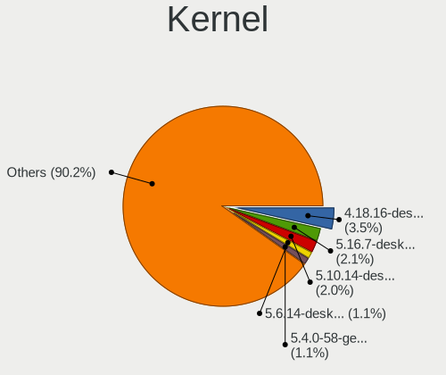

| Version                         | Computers | Percent |
|---------------------------------|-----------|---------|
| 4.18.16-desktop-1bP             | 45        | 3.52%   |
| 5.16.7-desktop-1omv4003         | 27        | 2.11%   |
| 5.10.14-desktop-1omv4002        | 25        | 1.96%   |
| 5.6.14-desktop-2bP              | 14        | 1.1%    |
| 5.4.0-58-generic                | 14        | 1.1%    |
| 5.15.0-56-generic               | 14        | 1.1%    |
| 6.2.6-desktop-1omv2390          | 13        | 1.02%   |
| 6.1.1-desktop-1omv2290          | 12        | 0.94%   |
| 5.4.0-42-generic                | 10        | 0.78%   |
| 6.6.2-desktop-1omv2390          | 9         | 0.7%    |
| 6.4.11-desktop-1omv2390         | 9         | 0.7%    |
| 6.2.0-26-generic                | 8         | 0.63%   |
| 5.4.0-52-generic                | 8         | 0.63%   |
| 5.15.0-58-generic               | 8         | 0.63%   |
| 4.19.0-13-amd64                 | 8         | 0.63%   |
| 5.8.0-43-generic                | 7         | 0.55%   |
| 5.19.0-38-generic               | 7         | 0.55%   |
| 5.15.0-43-generic               | 7         | 0.55%   |
| 5.11.0-27-generic               | 7         | 0.55%   |
| 4.9.60-nrj-desktop-1rosa-x86_64 | 7         | 0.55%   |
| 4.15.0-66-generic               | 7         | 0.55%   |
| 6.8.0-45-generic                | 6         | 0.47%   |
| 5.8.0-50-generic                | 6         | 0.47%   |
| 5.4.0-90-generic                | 6         | 0.47%   |
| 5.4.0-73-generic                | 6         | 0.47%   |
| 5.4.0-26-generic                | 6         | 0.47%   |
| 5.3.0-40-generic                | 6         | 0.47%   |
| 5.15.0-91-generic               | 6         | 0.47%   |
| 4.19.0-14-amd64                 | 6         | 0.47%   |
| 6.8.0-40-generic                | 5         | 0.39%   |
| 6.2.0-36-generic                | 5         | 0.39%   |
| 6.2.0-33-generic                | 5         | 0.39%   |
| 5.8.0-44-generic                | 5         | 0.39%   |
| 5.4.0-65-generic                | 5         | 0.39%   |
| 5.4.0-47-generic                | 5         | 0.39%   |
| 5.3.0-26-generic                | 5         | 0.39%   |
| 5.15.85-desktop-1bP             | 5         | 0.39%   |
| 5.15.0-83-generic               | 5         | 0.39%   |
| 5.15.0-67-generic               | 5         | 0.39%   |
| 5.15.0-48-generic               | 5         | 0.39%   |

Kernel Family
-------------

Linux kernel without a distro release

| Version | Computers | Percent |
|---------|-----------|---------|
| 5.4.0   | 124       | 10.4%   |
| 5.15.0  | 100       | 8.39%   |
| 4.15.0  | 61        | 5.12%   |
| 5.8.0   | 46        | 3.86%   |
| 4.18.16 | 46        | 3.86%   |
| 6.8.0   | 39        | 3.27%   |
| 6.5.0   | 39        | 3.27%   |
| 5.13.0  | 33        | 2.77%   |
| 5.3.0   | 31        | 2.6%    |
| 5.19.0  | 29        | 2.43%   |
| 5.11.0  | 29        | 2.43%   |
| 6.2.0   | 27        | 2.27%   |
| 5.16.7  | 27        | 2.27%   |
| 5.10.14 | 25        | 2.1%    |
| 6.1.0   | 22        | 1.85%   |
| 5.10.0  | 22        | 1.85%   |
| 5.0.0   | 18        | 1.51%   |
| 6.2.6   | 16        | 1.34%   |
| 4.18.0  | 16        | 1.34%   |
| 4.19.0  | 15        | 1.26%   |
| 5.6.14  | 14        | 1.17%   |
| 6.1.1   | 12        | 1.01%   |
| 6.6.2   | 10        | 0.84%   |
| 6.4.11  | 9         | 0.76%   |
| 6.11.0  | 7         | 0.59%   |
| 4.9.60  | 7         | 0.59%   |
| 6.12.1  | 6         | 0.5%    |
| 4.9.20  | 6         | 0.5%    |
| 6.10.0  | 5         | 0.42%   |
| 5.9.16  | 5         | 0.42%   |
| 5.15.85 | 5         | 0.42%   |
| 4.9.124 | 5         | 0.42%   |
| 6.9.3   | 4         | 0.34%   |
| 6.4.8   | 4         | 0.34%   |
| 6.4.0   | 4         | 0.34%   |
| 6.10.11 | 4         | 0.34%   |
| 6.1.52  | 4         | 0.34%   |
| 6.0.10  | 4         | 0.34%   |
| 5.16.13 | 4         | 0.34%   |
| 5.11.12 | 4         | 0.34%   |

Kernel Major Ver.
-----------------

Linux kernel major version

| Version | Computers | Percent |
|---------|-----------|---------|
| 5.4     | 132       | 11.22%  |
| 5.15    | 130       | 11.05%  |
| 5.10    | 63        | 5.36%   |
| 4.18    | 62        | 5.27%   |
| 4.15    | 61        | 5.19%   |
| 6.1     | 54        | 4.59%   |
| 5.8     | 51        | 4.34%   |
| 6.5     | 49        | 4.17%   |
| 6.2     | 48        | 4.08%   |
| 6.8     | 45        | 3.83%   |
| 5.11    | 42        | 3.57%   |
| 5.16    | 39        | 3.32%   |
| 5.13    | 39        | 3.32%   |
| 5.3     | 37        | 3.15%   |
| 5.19    | 34        | 2.89%   |
| 6.6     | 32        | 2.72%   |
| 4.9     | 26        | 2.21%   |
| 6.4     | 22        | 1.87%   |
| 4.19    | 22        | 1.87%   |
| 5.0     | 20        | 1.7%    |
| 5.6     | 18        | 1.53%   |
| 6.11    | 17        | 1.45%   |
| 6.10    | 15        | 1.28%   |
| 6.12    | 12        | 1.02%   |
| 6.9     | 11        | 0.94%   |
| 6.0     | 11        | 0.94%   |
| 5.9     | 10        | 0.85%   |
| 6.3     | 9         | 0.77%   |
| 5.12    | 9         | 0.77%   |
| 5.7     | 8         | 0.68%   |
| 5.5     | 7         | 0.6%    |
| 5.18    | 7         | 0.6%    |
| 5.17    | 7         | 0.6%    |
| 5.14    | 6         | 0.51%   |
| 6.7     | 5         | 0.43%   |
| 4.4     | 4         | 0.34%   |
| 4.1     | 3         | 0.26%   |
| 5.2     | 2         | 0.17%   |
| 5.1     | 1         | 0.09%   |
| 4.7     | 1         | 0.09%   |

Arch
----

OS architecture (x86_64, i586, etc.)

| Name    | Computers | Percent |
|---------|-----------|---------|
| x86_64  | 958       | 93.28%  |
| i686    | 50        | 4.87%   |
| aarch64 | 12        | 1.17%   |
| armv7l  | 7         | 0.68%   |

DE
--

Desktop Environment

| Name            | Computers | Percent |
|-----------------|-----------|---------|
| GNOME           | 382       | 35.83%  |
| KDE5            | 255       | 23.92%  |
| Unknown         | 119       | 11.16%  |
| XFCE            | 95        | 8.91%   |
| X-Cinnamon      | 86        | 8.07%   |
| MATE            | 27        | 2.53%   |
| KDE6            | 18        | 1.69%   |
| KDE4            | 15        | 1.41%   |
| LXQt            | 13        | 1.22%   |
| KDE             | 13        | 1.22%   |
| Cinnamon        | 9         | 0.84%   |
| Pantheon        | 7         | 0.66%   |
| LXDE            | 7         | 0.66%   |
| Unity           | 6         | 0.56%   |
| Budgie          | 4         | 0.38%   |
| Openbox         | 2         | 0.19%   |
| Hyprland        | 2         | 0.19%   |
| Trinity         | 1         | 0.09%   |
| qtile           | 1         | 0.09%   |
| i3              | 1         | 0.09%   |
| GNOME Flashback | 1         | 0.09%   |
| bspwm           | 1         | 0.09%   |
| awesome         | 1         | 0.09%   |

Display Server
--------------

X11 or Wayland

| Name        | Computers | Percent |
|-------------|-----------|---------|
| X11         | 762       | 71.82%  |
| Wayland     | 220       | 20.74%  |
| Unknown     | 50        | 4.71%   |
| Tty         | 28        | 2.64%   |
| Unspecified | 1         | 0.09%   |

Display Manager
---------------

SDDM, LightDM, etc.

| Name    | Computers | Percent |
|---------|-----------|---------|
| Unknown | 439       | 41.26%  |
| SDDM    | 251       | 23.59%  |
| GDM3    | 125       | 11.75%  |
| LightDM | 114       | 10.71%  |
| GDM     | 91        | 8.55%   |
| TDM     | 21        | 1.97%   |
| KDM     | 14        | 1.32%   |
| SLiM    | 5         | 0.47%   |
| XDM     | 2         | 0.19%   |
| Ly      | 1         | 0.09%   |
| LXDM    | 1         | 0.09%   |

OS Lang
-------

Language

| Lang        | Computers | Percent |
|-------------|-----------|---------|
| en_US       | 445       | 41.67%  |
| sk_SK       | 318       | 29.78%  |
| Unknown     | 174       | 16.29%  |
| cs_CZ       | 40        | 3.75%   |
| C           | 28        | 2.62%   |
| en_GB       | 26        | 2.43%   |
| hu_HU       | 15        | 1.4%    |
| ru_RU       | 7         | 0.66%   |
| sr_RS@latin | 2         | 0.19%   |
| pl_PL       | 2         | 0.19%   |
| en_CA       | 2         | 0.19%   |
| de_DE       | 2         | 0.19%   |
| uk_UA       | 1         | 0.09%   |
| ru_UA       | 1         | 0.09%   |
| POSIX       | 1         | 0.09%   |
| it_IT       | 1         | 0.09%   |
| en_US     | 1         | 0.09%   |
| en_AU       | 1         | 0.09%   |
| C.UTF8      | 1         | 0.09%   |

Boot Mode
---------

EFI or BIOS

| Mode | Computers | Percent |
|------|-----------|---------|
| BIOS | 611       | 58.25%  |
| EFI  | 438       | 41.75%  |

Filesystem
----------

Type of filesystem

| Type     | Computers | Percent |
|----------|-----------|---------|
| Ext4     | 687       | 63.79%  |
| Overlay  | 161       | 14.95%  |
| Btrfs    | 121       | 11.23%  |
| Tmpfs    | 52        | 4.83%   |
| Unknown  | 27        | 2.51%   |
| Zfs      | 11        | 1.02%   |
| Xfs      | 10        | 0.93%   |
| Ext3     | 3         | 0.28%   |
| Ext2     | 3         | 0.28%   |
| F2fs     | 1         | 0.09%   |
| Bcachefs | 1         | 0.09%   |

Part. scheme
------------

Scheme of partitioning

| Type    | Computers | Percent |
|---------|-----------|---------|
| Unknown | 457       | 43.15%  |
| GPT     | 397       | 37.49%  |
| MBR     | 205       | 19.36%  |

Dual Boot with Linux/BSD
------------------------

Hosting more than one Linux/BSD

| Dual boot | Computers | Percent |
|-----------|-----------|---------|
| No        | 879       | 82.46%  |
| Yes       | 187       | 17.54%  |

Dual Boot (Win)
---------------

Hosting Linux and Windows

| Dual boot | Computers | Percent |
|-----------|-----------|---------|
| No        | 720       | 69.16%  |
| Yes       | 321       | 30.84%  |

Board
-----

Vendor
------

Motherboard manufacturer

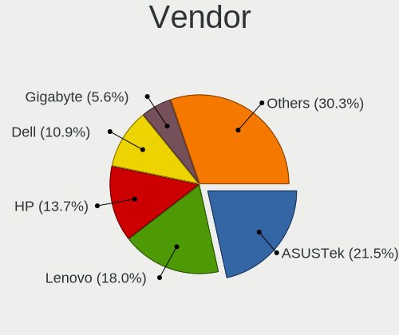

| Name                    | Computers | Percent |
|-------------------------|-----------|---------|
| ASUSTek Computer        | 220       | 21.55%  |
| Lenovo                  | 184       | 18.02%  |
| Hewlett-Packard         | 140       | 13.71%  |
| Dell                    | 111       | 10.87%  |
| Gigabyte Technology     | 57        | 5.58%   |
| Acer                    | 56        | 5.48%   |
| MSI                     | 51        | 5%      |
| ASRock                  | 30        | 2.94%   |
| Toshiba                 | 20        | 1.96%   |
| Intel                   | 17        | 1.67%   |
| Apple                   | 10        | 0.98%   |
| Sony                    | 9         | 0.88%   |
| Unknown                 | 8         | 0.78%   |
| Valve                   | 7         | 0.69%   |
| UMAX                    | 7         | 0.69%   |
| Samsung Electronics     | 7         | 0.69%   |
| Raspberry Pi Foundation | 7         | 0.69%   |
| Fujitsu Siemens         | 6         | 0.59%   |
| Foxconn                 | 6         | 0.59%   |
| Packard Bell            | 5         | 0.49%   |
| HUAWEI                  | 5         | 0.49%   |
| Fujitsu                 | 5         | 0.49%   |
| ZOTAC                   | 3         | 0.29%   |
| Timi                    | 3         | 0.29%   |
| Pegatron                | 3         | 0.29%   |
| Hardkernel              | 3         | 0.29%   |
| eMachines               | 3         | 0.29%   |
| TUXEDO                  | 2         | 0.2%    |
| Techvision              | 2         | 0.2%    |
| sunxi                   | 2         | 0.2%    |
| Shuttle                 | 2         | 0.2%    |
| Qualcomm Technologies   | 2         | 0.2%    |
| OEM                     | 2         | 0.2%    |
| Medion                  | 2         | 0.2%    |
| HC Technology.          | 2         | 0.2%    |
| Google                  | 2         | 0.2%    |
| Xunlong                 | 1         | 0.1%    |
| XIAOMI                  | 1         | 0.1%    |
| VIA Technologies        | 1         | 0.1%    |
| TYAN Computer           | 1         | 0.1%    |

Model
-----

Motherboard model

| Name                                   | Computers | Percent |
|----------------------------------------|-----------|---------|
| ASUS All Series                        | 15        | 1.47%   |
| Unknown                                | 11        | 1.08%   |
| Valve Jupiter                          | 6         | 0.59%   |
| HP Pavilion dv6                        | 6         | 0.59%   |
| ASUS TUF Gaming B550M-PLUS             | 5         | 0.49%   |
| RPi Raspberry Pi 4 Model B Rev 1.4     | 4         | 0.39%   |
| Lenovo IdeaPad Gaming 3 15ACH6 82K2    | 4         | 0.39%   |
| ASUS X550CC                            | 4         | 0.39%   |
| ASUS PRIME A320M-K                     | 4         | 0.39%   |
| Acer Swift SF314-43                    | 4         | 0.39%   |
| MSI MS-7D25                            | 3         | 0.29%   |
| Lenovo IdeaPadFlex 5 15IIL05 81X3      | 3         | 0.29%   |
| HP ProBook 4540s                       | 3         | 0.29%   |
| HP ProBook 4330s                       | 3         | 0.29%   |
| HP Pavilion g6                         | 3         | 0.29%   |
| Hardkernel ODROID-M1                   | 3         | 0.29%   |
| Gigabyte H61M-S1                       | 3         | 0.29%   |
| Gigabyte F2A68HM-DS2                   | 3         | 0.29%   |
| Dell OptiPlex 7010                     | 3         | 0.29%   |
| Dell Latitude E6540                    | 3         | 0.29%   |
| ASUS VivoBook_ASUSLaptop X509DJ_D509DJ | 3         | 0.29%   |
| UMAX VisionBook 14Wr Plus              | 2         | 0.2%    |
| Toshiba Satellite P300                 | 2         | 0.2%    |
| Timi Redmi Book Pro 15 2022            | 2         | 0.2%    |
| Techvision TVI7309X                    | 2         | 0.2%    |
| Samsung R530/R730/P530                 | 2         | 0.2%    |
| Qualcomm BENGAL IDP                    | 2         | 0.2%    |
| OEM X79-Turbo                          | 2         | 0.2%    |
| MSI VR610                              | 2         | 0.2%    |
| MSI MS-7C91                            | 2         | 0.2%    |
| MSI MS-7C02                            | 2         | 0.2%    |
| MSI MS-7793                            | 2         | 0.2%    |
| MSI MS-7592                            | 2         | 0.2%    |
| MSI GT60 2OC/2OD                       | 2         | 0.2%    |
| Lenovo Yoga Slim 7 Pro 14ITL5 82FX     | 2         | 0.2%    |
| Lenovo Y520-15IKBN 80WK                | 2         | 0.2%    |
| Lenovo ThinkPad P50 20EQS0VV2S         | 2         | 0.2%    |
| Lenovo ThinkBook 15 G3 ACL 21A4        | 2         | 0.2%    |
| Lenovo IdeaPad Z500 20202              | 2         | 0.2%    |
| Lenovo IdeaPad U260 20067              | 2         | 0.2%    |

Model Family
------------

Motherboard model prefix

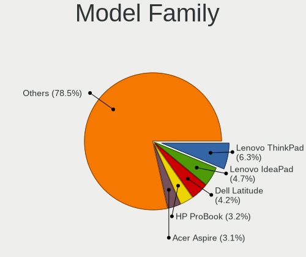

| Name                  | Computers | Percent |
|-----------------------|-----------|---------|
| Lenovo ThinkPad       | 64        | 6.27%   |
| Lenovo IdeaPad        | 48        | 4.7%    |
| Dell Latitude         | 43        | 4.21%   |
| HP ProBook            | 33        | 3.23%   |
| Acer Aspire           | 32        | 3.13%   |
| ASUS ROG              | 20        | 1.96%   |
| HP Pavilion           | 19        | 1.86%   |
| ASUS PRIME            | 18        | 1.76%   |
| HP Compaq             | 17        | 1.67%   |
| Toshiba Satellite     | 16        | 1.57%   |
| HP EliteBook          | 16        | 1.57%   |
| ASUS All              | 15        | 1.47%   |
| Dell OptiPlex         | 13        | 1.27%   |
| ASUS TUF              | 13        | 1.27%   |
| Dell Inspiron         | 12        | 1.18%   |
| ASUS VivoBook         | 12        | 1.18%   |
| Lenovo Yoga           | 11        | 1.08%   |
| Dell XPS              | 11        | 1.08%   |
| Unknown               | 11        | 1.08%   |
| Dell Vostro           | 10        | 0.98%   |
| Dell Precision        | 10        | 0.98%   |
| HP 250                | 9         | 0.88%   |
| ASUS ASUS             | 9         | 0.88%   |
| Acer Swift            | 9         | 0.88%   |
| Lenovo Legion         | 8         | 0.78%   |
| RPi Raspberry         | 7         | 0.69%   |
| Acer Extensa          | 7         | 0.69%   |
| Valve Jupiter         | 6         | 0.59%   |
| Lenovo ThinkCentre    | 6         | 0.59%   |
| Lenovo IdeaCentre     | 6         | 0.59%   |
| HP ProLiant           | 6         | 0.59%   |
| Dell PowerEdge        | 6         | 0.59%   |
| UMAX VisionBook       | 5         | 0.49%   |
| HP ZBook              | 5         | 0.49%   |
| ASUS ZenBook          | 5         | 0.49%   |
| Lenovo IdeaPadFlex    | 4         | 0.39%   |
| HP Spectre            | 4         | 0.39%   |
| HP Laptop             | 4         | 0.39%   |
| ASUS X550CC           | 4         | 0.39%   |
| Packard Bell EasyNote | 3         | 0.29%   |

MFG Year
--------

Motherboard manufacture year

| Year    | Computers | Percent |
|---------|-----------|---------|
| 2012    | 93        | 9.11%   |
| 2020    | 83        | 8.13%   |
| 2013    | 76        | 7.44%   |
| 2011    | 71        | 6.95%   |
| 2019    | 67        | 6.56%   |
| 2008    | 63        | 6.17%   |
| 2018    | 62        | 6.07%   |
| 2021    | 60        | 5.88%   |
| 2009    | 57        | 5.58%   |
| 2017    | 50        | 4.9%    |
| 2014    | 50        | 4.9%    |
| 2022    | 48        | 4.7%    |
| 2010    | 44        | 4.31%   |
| 2007    | 43        | 4.21%   |
| 2015    | 40        | 3.92%   |
| 2016    | 39        | 3.82%   |
| 2023    | 24        | 2.35%   |
| 2006    | 23        | 2.25%   |
| Unknown | 12        | 1.18%   |
| 2024    | 9         | 0.88%   |
| 2005    | 4         | 0.39%   |
| 2002    | 1         | 0.1%    |
| 2001    | 1         | 0.1%    |
| 2000    | 1         | 0.1%    |

Form Factor
-----------

Physical design of the computer

| Name           | Computers | Percent |
|----------------|-----------|---------|
| Notebook       | 579       | 56.71%  |
| Desktop        | 357       | 34.97%  |
| Convertible    | 24        | 2.35%   |
| System on chip | 17        | 1.67%   |
| All in one     | 16        | 1.57%   |
| Mini pc        | 12        | 1.18%   |
| Server         | 11        | 1.08%   |
| Tablet         | 5         | 0.49%   |

Secure Boot
-----------

Enabled or disabled

| State    | Computers | Percent |
|----------|-----------|---------|
| Disabled | 952       | 92.43%  |
| Enabled  | 78        | 7.57%   |

Coreboot
--------

Have coreboot on board

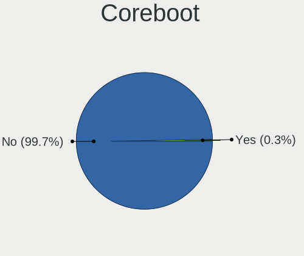

| Used | Computers | Percent |
|------|-----------|---------|
| No   | 1018      | 99.71%  |
| Yes  | 3         | 0.29%   |

RAM Size
--------

Total RAM memory

| Size in GB      | Computers | Percent |
|-----------------|-----------|---------|
| 4.01-8.0        | 236       | 22.39%  |
| 3.01-4.0        | 235       | 22.3%   |
| 8.01-16.0       | 187       | 17.74%  |
| 16.01-24.0      | 172       | 16.32%  |
| 32.01-64.0      | 84        | 7.97%   |
| 1.01-2.0        | 50        | 4.74%   |
| 64.01-256.0     | 28        | 2.66%   |
| 2.01-3.0        | 24        | 2.28%   |
| 24.01-32.0      | 19        | 1.8%    |
| 0.51-1.0        | 13        | 1.23%   |
| 0.01-0.5        | 4         | 0.38%   |
| More than 256.0 | 2         | 0.19%   |

RAM Used
--------

Used RAM memory

| Used GB    | Computers | Percent |
|------------|-----------|---------|
| 1.01-2.0   | 383       | 33.36%  |
| 2.01-3.0   | 249       | 21.69%  |
| 4.01-8.0   | 140       | 12.2%   |
| 0.51-1.0   | 131       | 11.41%  |
| 3.01-4.0   | 128       | 11.15%  |
| 0.01-0.5   | 54        | 4.7%    |
| 8.01-16.0  | 53        | 4.62%   |
| 16.01-24.0 | 5         | 0.44%   |
| 32.01-64.0 | 2         | 0.17%   |
| 24.01-32.0 | 2         | 0.17%   |
| Unknown    | 1         | 0.09%   |

Total Drives
------------

Number of drives on board

| Drives | Computers | Percent |
|--------|-----------|---------|
| 1      | 651       | 60.39%  |
| 2      | 268       | 24.86%  |
| 3      | 82        | 7.61%   |
| 4      | 25        | 2.32%   |
| 5      | 21        | 1.95%   |
| 0      | 17        | 1.58%   |
| 6      | 8         | 0.74%   |
| 8      | 2         | 0.19%   |
| 31     | 1         | 0.09%   |
| 17     | 1         | 0.09%   |
| 13     | 1         | 0.09%   |
| 7      | 1         | 0.09%   |

Has CD-ROM
----------

Has CD-ROM on board

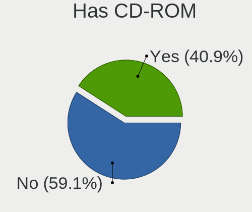

| Presented | Computers | Percent |
|-----------|-----------|---------|
| No        | 611       | 59.09%  |
| Yes       | 423       | 40.91%  |

Has Ethernet
------------

Has Ethernet on board

| Presented | Computers | Percent |
|-----------|-----------|---------|
| Yes       | 882       | 86.13%  |
| No        | 142       | 13.87%  |

Has WiFi
--------

Has WiFi module

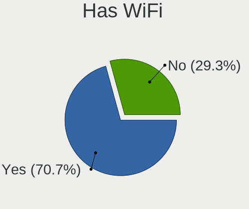

| Presented | Computers | Percent |
|-----------|-----------|---------|
| Yes       | 730       | 70.74%  |
| No        | 302       | 29.26%  |

Has Bluetooth
-------------

Has Bluetooth module

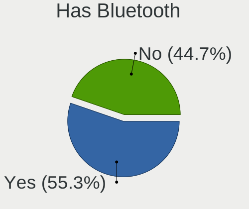

| Presented | Computers | Percent |
|-----------|-----------|---------|
| Yes       | 571       | 55.28%  |
| No        | 462       | 44.72%  |

Location
--------

Country
-------

Geographic location (country)

| Country  | Computers | Percent |
|----------|-----------|---------|
| Slovakia | 1021      | 100%    |

City
----

Geographic location (city)

| City                   | Computers | Percent |
|------------------------|-----------|---------|
| Bratislava             | 353       | 31.21%  |
| Koice                | 82        | 7.25%   |
| Nitra                  | 43        | 3.8%    |
| Bansk Bystrica       | 42        | 3.71%   |
| Trnava                 | 28        | 2.48%   |
| ilina                | 24        | 2.12%   |
| Preov                | 18        | 1.59%   |
| Martin                 | 15        | 1.33%   |
| Dolny Ohaj             | 15        | 1.33%   |
| Poprad                 | 13        | 1.15%   |
| Nov Zmky           | 13        | 1.15%   |
| Humenn               | 13        | 1.15%   |
| Zvolen                 | 12        | 1.06%   |
| Brezno                 | 12        | 1.06%   |
| Trenn              | 11        | 0.97%   |
| Bardejov               | 11        | 0.97%   |
| Tornaa               | 9         | 0.8%    |
| Luenec               | 9         | 0.8%    |
| Levice                 | 8         | 0.71%   |
| Galanta                | 8         | 0.71%   |
| Ruomberok            | 7         | 0.62%   |
| Soblahov               | 6         | 0.53%   |
| Pezinok                | 6         | 0.53%   |
| Partiznske           | 6         | 0.53%   |
| Liptovsk Mikul   | 6         | 0.53%   |
| Kysuck Nov Mesto   | 6         | 0.53%   |
| Cechynce               | 6         | 0.53%   |
| Topoany            | 5         | 0.44%   |
| Senec                  | 5         | 0.44%   |
| aa                 | 5         | 0.44%   |
| Roava              | 5         | 0.44%   |
| Dunajsk Streda       | 5         | 0.44%   |
| iar nad Hronom       | 4         | 0.35%   |
| Velky Krtis            | 4         | 0.35%   |
| trovo              | 4         | 0.35%   |
| Skalica                | 4         | 0.35%   |
| ahy                  | 4         | 0.35%   |
| Rozhanovce             | 4         | 0.35%   |
| Rimavsk Sobota       | 4         | 0.35%   |
| Nov Mesto nad Vhom | 4         | 0.35%   |

Drives
------

Drive Vendor
------------

Hard drive vendors

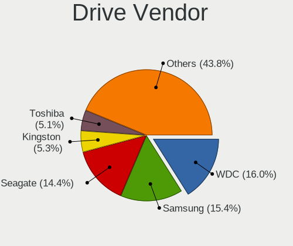

| Vendor                      | Computers | Drives | Percent |
|-----------------------------|-----------|--------|---------|
| WDC                         | 240       | 492    | 16.04%  |
| Samsung Electronics         | 230       | 347    | 15.37%  |
| Seagate                     | 216       | 316    | 14.44%  |
| Kingston                    | 79        | 104    | 5.28%   |
| Toshiba                     | 76        | 122    | 5.08%   |
| SanDisk                     | 72        | 90     | 4.81%   |
| Unknown                     | 64        | 97     | 4.28%   |
| Hitachi                     | 55        | 71     | 3.68%   |
| A-DATA Technology           | 48        | 67     | 3.21%   |
| SK hynix                    | 46        | 54     | 3.07%   |
| Intel                       | 46        | 67     | 3.07%   |
| Patriot                     | 41        | 71     | 2.74%   |
| Micron Technology           | 33        | 42     | 2.21%   |
| Crucial                     | 30        | 36     | 2.01%   |
| HGST                        | 22        | 31     | 1.47%   |
| Apacer                      | 18        | 25     | 1.2%    |
| Phison Electronics          | 9         | 10     | 0.6%    |
| Verbatim                    | 8         | 10     | 0.53%   |
| Phison                      | 8         | 10     | 0.53%   |
| Maxtor                      | 8         | 14     | 0.53%   |
| GOODRAM                     | 8         | 12     | 0.53%   |
| China                       | 8         | 11     | 0.53%   |
| KIOXIA                      | 7         | 20     | 0.47%   |
| Gigabyte Technology         | 7         | 9      | 0.47%   |
| Kingston Technology Company | 6         | 9      | 0.4%    |
| Hewlett-Packard             | 6         | 9      | 0.4%    |
| Fujitsu                     | 6         | 7      | 0.4%    |
| OCZ                         | 5         | 5      | 0.33%   |
| Micron/Crucial Technology   | 5         | 5      | 0.33%   |
| KingDian                    | 5         | 7      | 0.33%   |
| HS-SSD-E100                 | 5         | 5      | 0.33%   |
| XPG                         | 4         | 7      | 0.27%   |
| Union Memory                | 4         | 4      | 0.27%   |
| Realtek Semiconductor       | 4         | 4      | 0.27%   |
| LITEON                      | 4         | 4      | 0.27%   |
| Apple                       | 4         | 5      | 0.27%   |
| Unknown                     | 4         | 4      | 0.27%   |
| MAXIO Technology (Hangzhou) | 3         | 4      | 0.2%    |
| LITEONIT                    | 3         | 3      | 0.2%    |
| Intenso                     | 3         | 7      | 0.2%    |

Drive Model
-----------

Hard drive models

| Model                                                | Computers | Percent |
|------------------------------------------------------|-----------|---------|
| Samsung SSD 860 EVO 500GB                            | 18        | 1.08%   |
| Patriot Burst 240GB SSD                              | 14        | 0.84%   |
| Samsung NVMe SSD Controller SM981/PM981/PM983 512GB  | 13        | 0.78%   |
| Kingston SV300S37A120G 120GB SSD                     | 13        | 0.78%   |
| Samsung SSD 870 EVO 500GB                            | 12        | 0.72%   |
| Samsung SSD 860 EVO 250GB                            | 12        | 0.72%   |
| Samsung SSD 850 EVO 250GB                            | 12        | 0.72%   |
| Unknown MMC Card  64GB                               | 11        | 0.66%   |
| Kingston SA400S37120G 120GB SSD                      | 11        | 0.66%   |
| Seagate ST9500325AS 500GB                            | 10        | 0.6%    |
| Seagate ST1000LM035-1RK172 1TB                       | 10        | 0.6%    |
| Samsung SSD 850 EVO 500GB                            | 10        | 0.6%    |
| Patriot Burst 120GB SSD                              | 10        | 0.6%    |
| Seagate ST1000LM024 HN-M101MBB 1TB                   | 8         | 0.48%   |
| Seagate ST1000DM003-1CH162 1TB                       | 8         | 0.48%   |
| Apacer AS350 512GB SSD                               | 8         | 0.48%   |
| WDC WDS240G2G0B-00EPW0 240GB SSD                     | 7         | 0.42%   |
| WDC WD10EZEX-08WN4A0 1TB                             | 7         | 0.42%   |
| Seagate ST3500418AS 500GB                            | 7         | 0.42%   |
| Seagate ST2000DM008-2FR102 2TB                       | 7         | 0.42%   |
| Patriot Burst 480GB SSD                              | 7         | 0.42%   |
| Kingston SA400S37240G 240GB SSD                      | 7         | 0.42%   |
| WDC WDS500G2B0A-00SM50 500GB SSD                     | 6         | 0.36%   |
| WDC WDS240G2G0A-00JH30 240GB SSD                     | 6         | 0.36%   |
| Toshiba MQ01ABF050 500GB                             | 6         | 0.36%   |
| Seagate ST9500420AS 500GB                            | 6         | 0.36%   |
| Seagate ST500LT012-9WS142 500GB                      | 6         | 0.36%   |
| SanDisk NVMe SSD Drive 512GB                         | 6         | 0.36%   |
| SanDisk NVMe SSD Drive 1024GB                        | 6         | 0.36%   |
| Samsung SSD 980 1TB                                  | 6         | 0.36%   |
| Samsung NVMe SSD Controller SM961/PM961/SM963 256GB  | 6         | 0.36%   |
| HGST HTS725050A7E630 500GB                           | 6         | 0.36%   |
| HGST HTS721010A9E630 1TB                             | 6         | 0.36%   |
| WDC WD20EZRZ-00Z5HB0 2TB                             | 5         | 0.3%    |
| Toshiba NVMe SSD Drive 512GB                         | 5         | 0.3%    |
| Seagate ST3320311CS 320GB                            | 5         | 0.3%    |
| Sandisk WD Black SN750 / PC SN730 NVMe SSD 512GB     | 5         | 0.3%    |
| Samsung SSD 980 PRO 1TB                              | 5         | 0.3%    |
| Samsung NVMe SSD Drive 500GB                         | 5         | 0.3%    |
| Samsung NVMe SSD Controller PM9A1/PM9A3/980PRO 512GB | 5         | 0.3%    |

HDD Vendor
----------

Hard disk drive vendors

| Vendor              | Computers | Drives | Percent |
|---------------------|-----------|--------|---------|
| Seagate             | 213       | 312    | 35.03%  |
| WDC                 | 205       | 435    | 33.72%  |
| Toshiba             | 56        | 100    | 9.21%   |
| Hitachi             | 55        | 71     | 9.05%   |
| Samsung Electronics | 26        | 43     | 4.28%   |
| HGST                | 22        | 31     | 3.62%   |
| Maxtor              | 8         | 14     | 1.32%   |
| Fujitsu             | 6         | 7      | 0.99%   |
| Hewlett-Packard     | 5         | 8      | 0.82%   |
| IBM/Hitachi         | 3         | 3      | 0.49%   |
| HGST HTS            | 2         | 2      | 0.33%   |
| ExcelStor           | 2         | 2      | 0.33%   |
| USB3.0              | 1         | 2      | 0.16%   |
| Unknown             | 1         | 1      | 0.16%   |
| StoreJet            | 1         | 1      | 0.16%   |
| IET                 | 1         | 2      | 0.16%   |
| IBM-ESXS            | 1         | 2      | 0.16%   |

SSD Vendor
----------

Solid state drive vendors

| Vendor              | Computers | Drives | Percent |
|---------------------|-----------|--------|---------|
| Samsung Electronics | 113       | 156    | 23.89%  |
| Kingston            | 58        | 82     | 12.26%  |
| A-DATA Technology   | 39        | 57     | 8.25%   |
| Patriot             | 38        | 67     | 8.03%   |
| SanDisk             | 33        | 38     | 6.98%   |
| Crucial             | 29        | 35     | 6.13%   |
| WDC                 | 28        | 33     | 5.92%   |
| Intel               | 25        | 38     | 5.29%   |
| Apacer              | 14        | 21     | 2.96%   |
| Micron Technology   | 11        | 16     | 2.33%   |
| Toshiba             | 9         | 9      | 1.9%    |
| SK hynix            | 8         | 9      | 1.69%   |
| GOODRAM             | 8         | 12     | 1.69%   |
| China               | 8         | 11     | 1.69%   |
| Verbatim            | 7         | 9      | 1.48%   |
| OCZ                 | 5         | 5      | 1.06%   |
| LITEON              | 4         | 4      | 0.85%   |
| Gigabyte Technology | 4         | 6      | 0.85%   |
| LITEONIT            | 3         | 3      | 0.63%   |
| KingDian            | 3         | 5      | 0.63%   |
| Intenso             | 3         | 7      | 0.63%   |
| Union Memory        | 2         | 2      | 0.42%   |
| Transcend           | 2         | 2      | 0.42%   |
| FORESEE             | 2         | 3      | 0.42%   |
| Apple               | 2         | 2      | 0.42%   |
| WDC WDS2            | 1         | 1      | 0.21%   |
| ULTIMATE            | 1         | 2      | 0.21%   |
| PNY                 | 1         | 2      | 0.21%   |
| Netac               | 1         | 1      | 0.21%   |
| KingSpec            | 1         | 1      | 0.21%   |
| IM3D                | 1         | 1      | 0.21%   |
| HS-SSD-E100         | 1         | 1      | 0.21%   |
| HS-SSD-C100         | 1         | 3      | 0.21%   |
| Hewlett-Packard     | 1         | 1      | 0.21%   |
| Faspeed             | 1         | 1      | 0.21%   |
| Emtec               | 1         | 1      | 0.21%   |
| Dahua               | 1         | 1      | 0.21%   |
| Corsair             | 1         | 1      | 0.21%   |
| AMD                 | 1         | 1      | 0.21%   |
| 2.5                 | 1         | 1      | 0.21%   |

Drive Kind
----------

HDD or SSD

| Kind    | Computers | Drives | Percent |
|---------|-----------|--------|---------|
| HDD     | 497       | 1036   | 37.62%  |
| SSD     | 423       | 651    | 32.02%  |
| NVMe    | 320       | 475    | 24.22%  |
| MMC     | 63        | 92     | 4.77%   |
| Unknown | 18        | 22     | 1.36%   |

Drive Connector
---------------

SATA, SAS, NVMe, etc.

| Type | Computers | Drives | Percent |
|------|-----------|--------|---------|
| SATA | 747       | 1658   | 63.68%  |
| NVMe | 319       | 472    | 27.2%   |
| MMC  | 63        | 92     | 5.37%   |
| SAS  | 44        | 54     | 3.75%   |

Drive Size
----------

Size of hard drive

| Size in TB | Computers | Drives | Percent |
|------------|-----------|--------|---------|
| 0.01-0.5   | 608       | 1083   | 64.34%  |
| 0.51-1.0   | 224       | 402    | 23.7%   |
| 1.01-2.0   | 62        | 98     | 6.56%   |
| 3.01-4.0   | 23        | 50     | 2.43%   |
| 2.01-3.0   | 13        | 27     | 1.38%   |
| 4.01-10.0  | 12        | 22     | 1.27%   |
| 10.01-20.0 | 3         | 5      | 0.32%   |

Space Total
-----------

Amount of disk space available on the file system

| Size in GB     | Computers | Percent |
|----------------|-----------|---------|
| 101-250        | 259       | 23.15%  |
| 251-500        | 224       | 20.02%  |
| 501-1000       | 162       | 14.48%  |
| 1-20           | 131       | 11.71%  |
| Unknown        | 84        | 7.51%   |
| 51-100         | 76        | 6.79%   |
| 1001-2000      | 68        | 6.08%   |
| 21-50          | 55        | 4.92%   |
| More than 3000 | 33        | 2.95%   |
| 2001-3000      | 27        | 2.41%   |

Space Used
----------

Amount of used disk space

| Used GB        | Computers | Percent |
|----------------|-----------|---------|
| 1-20           | 450       | 39.23%  |
| 21-50          | 177       | 15.43%  |
| 101-250        | 135       | 11.77%  |
| 51-100         | 121       | 10.55%  |
| Unknown        | 84        | 7.32%   |
| 251-500        | 81        | 7.06%   |
| 501-1000       | 55        | 4.8%    |
| 1001-2000      | 27        | 2.35%   |
| More than 3000 | 12        | 1.05%   |
| 2001-3000      | 5         | 0.44%   |

Malfunc. Drives
---------------

Drive models with a malfunction

| Model                            | Computers | Drives | Percent |
|----------------------------------|-----------|--------|---------|
| Toshiba MK7575GSX 752GB          | 3         | 5      | 1.97%   |
| Seagate ST980811AS 80GB          | 3         | 3      | 1.97%   |
| Seagate ST9500325AS 500GB        | 3         | 4      | 1.97%   |
| WDC WD50EFRX-68MYMN1 5TB         | 2         | 2      | 1.32%   |
| WDC WD5000BEKT-22KA9T0 500GB     | 2         | 12     | 1.32%   |
| WDC WD20EURS-63S48Y0 2TB         | 2         | 2      | 1.32%   |
| WDC WD10JPLX-00MBPT0 1TB         | 2         | 18     | 1.32%   |
| WDC WD10EZEX-75WN4A0 1TB         | 2         | 3      | 1.32%   |
| WDC WD10EALX-009BA0 1TB          | 2         | 2      | 1.32%   |
| Toshiba HDWD110 1TB              | 2         | 2      | 1.32%   |
| Seagate ST9250315AS 250GB        | 2         | 2      | 1.32%   |
| Seagate ST500LT012-9WS142 500GB  | 2         | 2      | 1.32%   |
| Seagate ST500LT012-1DG142 500GB  | 2         | 2      | 1.32%   |
| Seagate ST500LM000-SSHD-8GB      | 2         | 6      | 1.32%   |
| Seagate ST3320413CS 320GB        | 2         | 2      | 1.32%   |
| Seagate ST320LT007-9ZV142 320GB  | 2         | 2      | 1.32%   |
| Kingston SV300S37A60G 64GB SSD   | 2         | 3      | 1.32%   |
| Kingston SHPM2280P2H 240G SSD    | 2         | 2      | 1.32%   |
| Kingston SA400S37120G 120GB SSD  | 2         | 2      | 1.32%   |
| Hitachi HTS545050A7E380 500GB    | 2         | 2      | 1.32%   |
| Hitachi HTS543232A7A384 320GB    | 2         | 2      | 1.32%   |
| HGST HTS721010A9E630 1TB         | 2         | 6      | 1.32%   |
| WDC WDS240G2G0A-00JH30 240GB SSD | 1         | 1      | 0.66%   |
| WDC WD800JD-60LSA0 80GB          | 1         | 1      | 0.66%   |
| WDC WD7500BPVT-80HXZT3 752GB     | 1         | 1      | 0.66%   |
| WDC WD7500BPVT-24HXZT3 752GB     | 1         | 1      | 0.66%   |
| WDC WD7500AAVS-00D7B1 752GB      | 1         | 1      | 0.66%   |
| WDC WD5000LPVT-24G33T1 500GB     | 1         | 1      | 0.66%   |
| WDC WD5000LPLX-75ZNTT1 500GB     | 1         | 1      | 0.66%   |
| WDC WD5000BPVT-00HXZT1 500GB     | 1         | 1      | 0.66%   |
| WDC WD5000BEVT-22ZAT0 500GB      | 1         | 1      | 0.66%   |
| WDC WD5000BEVT-22A0RT0 500GB     | 1         | 2      | 0.66%   |
| WDC WD5000AAVS-22G9B1 500GB      | 1         | 4      | 0.66%   |
| WDC WD5000AAKX-603CA0 500GB      | 1         | 1      | 0.66%   |
| WDC WD40EFRX-68WT0N0 4TB         | 1         | 1      | 0.66%   |
| WDC WD3200BPVT-80JJ5T0 320GB     | 1         | 1      | 0.66%   |
| WDC WD3200BEVT-75ZCT2 320GB      | 1         | 1      | 0.66%   |
| WDC WD3200BEVT-60A23T0 320GB     | 1         | 1      | 0.66%   |
| WDC WD3200AAKS-22L6A0 320GB      | 1         | 1      | 0.66%   |
| WDC WD3200AAJS-56B4A0 320GB      | 1         | 2      | 0.66%   |

Malfunc. Drive Vendor
---------------------

Vendors of faulty drives

| Vendor              | Computers | Drives | Percent |
|---------------------|-----------|--------|---------|
| Seagate             | 41        | 54     | 28.08%  |
| WDC                 | 34        | 72     | 23.29%  |
| Hitachi             | 14        | 15     | 9.59%   |
| Toshiba             | 12        | 17     | 8.22%   |
| Samsung Electronics | 9         | 21     | 6.16%   |
| Kingston            | 7         | 8      | 4.79%   |
| SK hynix            | 4         | 5      | 2.74%   |
| SanDisk             | 3         | 5      | 2.05%   |
| Micron Technology   | 3         | 3      | 2.05%   |
| Maxtor              | 3         | 3      | 2.05%   |
| Intel               | 3         | 3      | 2.05%   |
| HGST                | 3         | 7      | 2.05%   |
| OCZ                 | 2         | 2      | 1.37%   |
| ExcelStor           | 2         | 2      | 1.37%   |
| Lenovo              | 1         | 1      | 0.68%   |
| IM3D                | 1         | 1      | 0.68%   |
| IBM/Hitachi         | 1         | 1      | 0.68%   |
| Fujitsu             | 1         | 2      | 0.68%   |
| Crucial             | 1         | 1      | 0.68%   |
| A-DATA Technology   | 1         | 1      | 0.68%   |

Malfunc. HDD Vendor
-------------------

Vendors of faulty HDD drives

| Vendor              | Computers | Drives | Percent |
|---------------------|-----------|--------|---------|
| Seagate             | 41        | 54     | 36.28%  |
| WDC                 | 32        | 70     | 28.32%  |
| Hitachi             | 14        | 15     | 12.39%  |
| Toshiba             | 12        | 17     | 10.62%  |
| Samsung Electronics | 4         | 9      | 3.54%   |
| Maxtor              | 3         | 3      | 2.65%   |
| HGST                | 3         | 7      | 2.65%   |
| ExcelStor           | 2         | 2      | 1.77%   |
| IBM/Hitachi         | 1         | 1      | 0.88%   |
| Fujitsu             | 1         | 2      | 0.88%   |

Malfunc. Drive Kind
-------------------

Kinds of faulty drives

| Kind | Computers | Drives | Percent |
|------|-----------|--------|---------|
| HDD  | 106       | 180    | 76.81%  |
| SSD  | 26        | 38     | 18.84%  |
| NVMe | 6         | 6      | 4.35%   |

Failed Drives
-------------

Failed drive models

| Model                             | Computers | Drives | Percent |
|-----------------------------------|-----------|--------|---------|
| Toshiba MK5065GSX 500GB           | 2         | 2      | 33.33%  |
| Seagate ST9320325AS 320GB         | 1         | 1      | 16.67%  |
| Seagate ST3500418AS 500GB         | 1         | 2      | 16.67%  |
| Seagate ST2000DM001-1CH164 2TB    | 1         | 1      | 16.67%  |
| Samsung Electronics HD321HJ 320GB | 1         | 2      | 16.67%  |

Failed Drive Vendor
-------------------

Failed drive vendors

| Vendor              | Computers | Drives | Percent |
|---------------------|-----------|--------|---------|
| Seagate             | 3         | 4      | 50%     |
| Toshiba             | 2         | 2      | 33.33%  |
| Samsung Electronics | 1         | 2      | 16.67%  |

Drive Status
------------

Number of failed and malfunc. drives

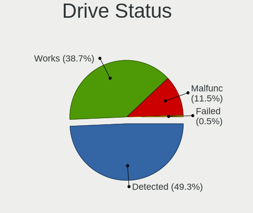

| Status   | Computers | Drives | Percent |
|----------|-----------|--------|---------|
| Detected | 563       | 1067   | 49.3%   |
| Works    | 442       | 977    | 38.7%   |
| Malfunc  | 131       | 224    | 11.47%  |
| Failed   | 6         | 8      | 0.53%   |

Storage controller
------------------

Storage Vendor
--------------

Storage controller vendors

| Vendor                           | Computers | Percent |
|----------------------------------|-----------|---------|
| Intel                            | 641       | 50.63%  |
| AMD                              | 193       | 15.24%  |
| Samsung Electronics              | 109       | 8.61%   |
| SanDisk                          | 55        | 4.34%   |
| SK hynix                         | 38        | 3%      |
| Kingston Technology Company      | 28        | 2.21%   |
| Nvidia                           | 26        | 2.05%   |
| Phison Electronics               | 24        | 1.9%    |
| JMicron Technology               | 24        | 1.9%    |
| Micron Technology                | 23        | 1.82%   |
| ASMedia Technology               | 14        | 1.11%   |
| Toshiba America Info Systems     | 12        | 0.95%   |
| ADATA Technology                 | 12        | 0.95%   |
| Marvell Technology Group         | 8         | 0.63%   |
| VIA Technologies                 | 7         | 0.55%   |
| LSI Logic / Symbios Logic        | 6         | 0.47%   |
| KIOXIA                           | 6         | 0.47%   |
| Realtek Semiconductor            | 5         | 0.39%   |
| Micron/Crucial Technology        | 5         | 0.39%   |
| MAXIO Technology (Hangzhou)      | 5         | 0.39%   |
| Silicon Integrated Systems [SiS] | 4         | 0.32%   |
| Silicon Motion                   | 3         | 0.24%   |
| Hewlett-Packard                  | 3         | 0.24%   |
| Union Memory (Shenzhen)          | 2         | 0.16%   |
| Promise Technology               | 2         | 0.16%   |
| Broadcom / LSI                   | 2         | 0.16%   |
| Apple                            | 2         | 0.16%   |
| ULi Electronics                  | 1         | 0.08%   |
| Solid State Storage Technology   | 1         | 0.08%   |
| Silicon Image                    | 1         | 0.08%   |
| O2 Micro                         | 1         | 0.08%   |
| Lenovo                           | 1         | 0.08%   |
| INNOGRIT                         | 1         | 0.08%   |
| Hosin Global Electronics         | 1         | 0.08%   |

Storage Model
-------------

Storage controller models

| Model                                                                          | Computers | Percent |
|--------------------------------------------------------------------------------|-----------|---------|
| AMD FCH SATA Controller [AHCI mode]                                            | 110       | 7.3%    |
| Intel 7 Series Chipset Family 6-port SATA Controller [AHCI mode]               | 57        | 3.78%   |
| Intel 8 Series/C220 Series Chipset Family 6-port SATA Controller 1 [AHCI mode] | 46        | 3.05%   |
| Samsung NVMe SSD Controller SM981/PM981/PM983                                  | 45        | 2.99%   |
| Intel Sunrise Point-LP SATA Controller [AHCI mode]                             | 35        | 2.32%   |
| Intel 82801G (ICH7 Family) IDE Controller                                      | 31        | 2.06%   |
| Intel NM10/ICH7 Family SATA Controller [IDE mode]                              | 30        | 1.99%   |
| Intel 82801 Mobile SATA Controller [RAID mode]                                 | 29        | 1.93%   |
| Samsung NVMe SSD Controller 980 (DRAM-less)                                    | 28        | 1.86%   |
| AMD SB7x0/SB8x0/SB9x0 SATA Controller [AHCI mode]                              | 28        | 1.86%   |
| Intel 6 Series/C200 Series Chipset Family 6 port Mobile SATA AHCI Controller   | 27        | 1.79%   |
| Intel 82801IBM/IEM (ICH9M/ICH9M-E) 4 port SATA Controller [AHCI mode]          | 26        | 1.73%   |
| AMD SB7x0/SB8x0/SB9x0 IDE Controller                                           | 26        | 1.73%   |
| Intel 6 Series/C200 Series Chipset Family 6 port Desktop SATA AHCI Controller  | 23        | 1.53%   |
| Intel 82801HM/HEM (ICH8M/ICH8M-E) SATA Controller [AHCI mode]                  | 22        | 1.46%   |
| Intel 82801HM/HEM (ICH8M/ICH8M-E) IDE Controller                               | 22        | 1.46%   |
| SanDisk Extreme Pro / WD Black SN750 / PC SN730 / Red SN700 NVMe SSD           | 20        | 1.33%   |
| Intel Q170/Q150/B150/H170/H110/Z170/CM236 Chipset SATA Controller [AHCI Mode]  | 20        | 1.33%   |
| Intel 7 Series/C210 Series Chipset Family 6-port SATA Controller [AHCI mode]   | 19        | 1.26%   |
| Samsung NVMe SSD Controller SM961/PM961/SM963                                  | 18        | 1.2%    |
| Intel Volume Management Device NVMe RAID Controller                            | 18        | 1.2%    |
| AMD 500 Series Chipset SATA Controller                                         | 18        | 1.2%    |
| AMD 400 Series Chipset SATA Controller                                         | 17        | 1.13%   |
| JMicron JMB363 SATA/IDE Controller                                             | 16        | 1.06%   |
| SK hynix Gold P31/BC711/PC711 NVMe Solid State Drive                           | 15        | 1%      |
| Intel 5 Series/3400 Series Chipset 4 port SATA AHCI Controller                 | 15        | 1%      |
| AMD SB7x0/SB8x0/SB9x0 SATA Controller [IDE mode]                               | 15        | 1%      |
| Samsung NVMe SSD Controller PM9A1/PM9A3/980PRO                                 | 14        | 0.93%   |
| Intel 8 Series SATA Controller 1 [AHCI mode]                                   | 14        | 0.93%   |
| Intel 5 Series/3400 Series Chipset 6 port SATA AHCI Controller                 | 14        | 0.93%   |
| Intel 200 Series PCH SATA controller [AHCI mode]                               | 14        | 0.93%   |
| Intel Celeron/Pentium Silver Processor SATA Controller                         | 13        | 0.86%   |
| Intel Cannon Lake Mobile PCH SATA AHCI Controller                              | 12        | 0.8%    |
| ASMedia ASM1061/ASM1062 Serial ATA Controller                                  | 12        | 0.8%    |
| Intel Wildcat Point-LP SATA Controller [AHCI Mode]                             | 11        | 0.73%   |
| Intel SATA Controller [RAID mode]                                              | 11        | 0.73%   |
| ADATA XPG SX8200 Pro PCIe Gen3x4 M.2 2280 Solid State Drive                    | 11        | 0.73%   |
| Phison E12 NVMe Controller                                                     | 10        | 0.66%   |
| Intel Atom Processor E3800 Series SATA AHCI Controller                         | 10        | 0.66%   |
| Intel 82801JI (ICH10 Family) 4 port SATA IDE Controller #1                     | 10        | 0.66%   |

Storage Kind
------------

Kind of storage controller (IDE, SATA, NVMe, SAS, ...)

| Kind | Computers | Percent |
|------|-----------|---------|
| SATA | 680       | 52.47%  |
| NVMe | 320       | 24.69%  |
| IDE  | 213       | 16.44%  |
| RAID | 79        | 6.1%    |
| SAS  | 2         | 0.15%   |
| SCSI | 2         | 0.15%   |

Processor
---------

CPU Vendor
----------

Processor vendors

| Vendor       | Computers | Percent |
|--------------|-----------|---------|
| Intel        | 721       | 70.62%  |
| AMD          | 282       | 27.62%  |
| ARM          | 15        | 1.47%   |
| Qualcomm     | 2         | 0.2%    |
| CentaurHauls | 1         | 0.1%    |

CPU Model
---------

Processor models

| Model                                   | Computers | Percent |
|-----------------------------------------|-----------|---------|
| AMD Ryzen 5 5500U with Radeon Graphics  | 11        | 1.07%   |
| Intel Core i5-8250U CPU @ 1.60GHz       | 9         | 0.88%   |
| Intel Core i5-7200U CPU @ 2.50GHz       | 9         | 0.88%   |
| ARM Processor                           | 9         | 0.88%   |
| Intel Core i5-3320M CPU @ 2.60GHz       | 8         | 0.78%   |
| Intel Core i7-8565U CPU @ 1.80GHz       | 7         | 0.68%   |
| Intel Core i5-3210M CPU @ 2.50GHz       | 7         | 0.68%   |
| Intel Core 2 Quad CPU Q6600 @ 2.40GHz   | 7         | 0.68%   |
| Intel 11th Gen Core i7-1165G7 @ 2.80GHz | 7         | 0.68%   |
| Intel 11th Gen Core i5-1135G7 @ 2.40GHz | 7         | 0.68%   |
| Intel Core i7-6820HQ CPU @ 2.70GHz      | 6         | 0.58%   |
| Intel Core i7-1065G7 CPU @ 1.30GHz      | 6         | 0.58%   |
| Intel Core i5-6300U CPU @ 2.40GHz       | 6         | 0.58%   |
| Intel Core i3-3110M CPU @ 2.40GHz       | 6         | 0.58%   |
| Intel Core 2 Quad CPU Q9400 @ 2.66GHz   | 6         | 0.58%   |
| AMD Ryzen 7 5700U with Radeon Graphics  | 6         | 0.58%   |
| AMD Ryzen 5 5600H with Radeon Graphics  | 6         | 0.58%   |
| AMD Custom APU 0405                     | 6         | 0.58%   |
| Intel Core i7-4700MQ CPU @ 2.40GHz      | 5         | 0.49%   |
| Intel Core i7-10510U CPU @ 1.80GHz      | 5         | 0.49%   |
| Intel Core i5-3230M CPU @ 2.60GHz       | 5         | 0.49%   |
| Intel Core i5-2500K CPU @ 3.30GHz       | 5         | 0.49%   |
| Intel Core i5-2450M CPU @ 2.50GHz       | 5         | 0.49%   |
| Intel Core i3-5010U CPU @ 2.10GHz       | 5         | 0.49%   |
| Intel Core i3 CPU M 350 @ 2.27GHz       | 5         | 0.49%   |
| Intel Celeron N4000 CPU @ 1.10GHz       | 5         | 0.49%   |
| AMD Ryzen 9 5900X 12-Core Processor     | 5         | 0.49%   |
| AMD Ryzen 7 4800H with Radeon Graphics  | 5         | 0.49%   |
| AMD Ryzen 5 5600X 6-Core Processor      | 5         | 0.49%   |
| AMD Ryzen 5 5600G with Radeon Graphics  | 5         | 0.49%   |
| AMD Ryzen 5 4500U with Radeon Graphics  | 5         | 0.49%   |
| AMD Ryzen 5 1600 Six-Core Processor     | 5         | 0.49%   |
| Intel Pentium Dual CPU T2330 @ 1.60GHz  | 4         | 0.39%   |
| Intel Pentium CPU N4200 @ 1.10GHz       | 4         | 0.39%   |
| Intel Pentium CPU N3540 @ 2.16GHz       | 4         | 0.39%   |
| Intel Pentium CPU B960 @ 2.20GHz        | 4         | 0.39%   |
| Intel Core i7-8750H CPU @ 2.20GHz       | 4         | 0.39%   |
| Intel Core i7-8550U CPU @ 1.80GHz       | 4         | 0.39%   |
| Intel Core i7-7700K CPU @ 4.20GHz       | 4         | 0.39%   |
| Intel Core i7-3770 CPU @ 3.40GHz        | 4         | 0.39%   |

CPU Model Family
----------------

Processor model prefix

| Model                   | Computers | Percent |
|-------------------------|-----------|---------|
| Intel Core i5           | 186       | 18.13%  |
| Intel Core i7           | 125       | 12.18%  |
| Intel Core i3           | 86        | 8.38%   |
| Other                   | 72        | 7.02%   |
| Intel Core 2 Duo        | 62        | 6.04%   |
| AMD Ryzen 5             | 62        | 6.04%   |
| Intel Celeron           | 55        | 5.36%   |
| AMD Ryzen 7             | 46        | 4.48%   |
| Intel Pentium           | 42        | 4.09%   |
| Intel Xeon              | 27        | 2.63%   |
| AMD Ryzen 9             | 20        | 1.95%   |
| Intel Core 2 Quad       | 18        | 1.75%   |
| Intel Atom              | 17        | 1.66%   |
| Intel Pentium Dual-Core | 12        | 1.17%   |
| AMD Ryzen 3             | 12        | 1.17%   |
| Intel Pentium Dual      | 11        | 1.07%   |
| AMD Athlon 64 X2        | 11        | 1.07%   |
| AMD A8                  | 10        | 0.97%   |
| AMD FX                  | 8         | 0.78%   |
| AMD A6                  | 8         | 0.78%   |
| AMD E                   | 7         | 0.68%   |
| AMD Athlon II X2        | 7         | 0.68%   |
| AMD A10                 | 7         | 0.68%   |
| Intel Core 2            | 6         | 0.58%   |
| AMD Sempron             | 6         | 0.58%   |
| AMD Ryzen 5 PRO         | 6         | 0.58%   |
| AMD Athlon              | 6         | 0.58%   |
| AMD A4                  | 6         | 0.58%   |
| Intel Genuine           | 5         | 0.49%   |
| Intel Celeron M         | 5         | 0.49%   |
| Intel Celeron Dual-Core | 5         | 0.49%   |
| AMD Ryzen 7 PRO         | 5         | 0.49%   |
| AMD Phenom II X4        | 5         | 0.49%   |
| ARM BCM                 | 4         | 0.39%   |
| AMD Phenom              | 4         | 0.39%   |
| AMD Athlon X4           | 4         | 0.39%   |
| AMD Athlon 64           | 4         | 0.39%   |
| Intel Pentium 4         | 3         | 0.29%   |
| Intel Core i9           | 3         | 0.29%   |
| ARM Allwinner           | 3         | 0.29%   |

CPU Cores
---------

Number of processor cores

| Number  | Computers | Percent |
|---------|-----------|---------|
| 2       | 433       | 42.2%   |
| 4       | 343       | 33.43%  |
| 6       | 90        | 8.77%   |
| 8       | 65        | 6.34%   |
| 1       | 43        | 4.19%   |
| 12      | 17        | 1.66%   |
| 16      | 12        | 1.17%   |
| 10      | 6         | 0.58%   |
| Unknown | 5         | 0.49%   |
| 3       | 4         | 0.39%   |
| 14      | 3         | 0.29%   |
| 24      | 2         | 0.19%   |
| 20      | 2         | 0.19%   |
| 32      | 1         | 0.1%    |

CPU Sockets
-----------

Number of sockets

| Number  | Computers | Percent |
|---------|-----------|---------|
| 1       | 1009      | 98.82%  |
| 2       | 9         | 0.88%   |
| Unknown | 2         | 0.2%    |
| 8       | 1         | 0.1%    |

CPU Threads
-----------

Threads per core (Hyper-Threading)

| Number  | Computers | Percent |
|---------|-----------|---------|
| 2       | 578       | 56.5%   |
| 1       | 438       | 42.82%  |
| Unknown | 5         | 0.49%   |
| 12      | 1         | 0.1%    |
| 4       | 1         | 0.1%    |

CPU Op-Modes
------------

CPU Operation Modes (32-bit, 64-bit)

| Op mode        | Computers | Percent |
|----------------|-----------|---------|
| 32-bit, 64-bit | 993       | 96.78%  |
| Unknown        | 18        | 1.75%   |
| 32-bit         | 13        | 1.27%   |
| 64-bit         | 2         | 0.19%   |

CPU Microcode
-------------

Microcode number

| Number     | Computers | Percent |
|------------|-----------|---------|
| Unknown    | 383       | 35.53%  |
| 0x306a9    | 65        | 6.03%   |
| 0x206a7    | 46        | 4.27%   |
| 0x1067a    | 44        | 4.08%   |
| 0x306c3    | 36        | 3.34%   |
| 0x6fb      | 19        | 1.76%   |
| 0x6fd      | 18        | 1.67%   |
| 0x506e3    | 18        | 1.67%   |
| 0x806ea    | 16        | 1.48%   |
| 0x906ea    | 14        | 1.3%    |
| 0x906e9    | 14        | 1.3%    |
| 0x20655    | 14        | 1.3%    |
| 0x10676    | 14        | 1.3%    |
| 0x806e9    | 13        | 1.21%   |
| 0x806c1    | 12        | 1.11%   |
| 0x806ec    | 11        | 1.02%   |
| 0x406e3    | 11        | 1.02%   |
| 0x0a50000c | 11        | 1.02%   |
| 0x06001119 | 11        | 1.02%   |
| 0x010000c8 | 11        | 1.02%   |
| 0x40651    | 9         | 0.83%   |
| 0x20652    | 9         | 0.83%   |
| 0x08608103 | 9         | 0.83%   |
| 0x08108109 | 9         | 0.83%   |
| 0x706a1    | 8         | 0.74%   |
| 0x706e5    | 7         | 0.65%   |
| 0x306d4    | 7         | 0.65%   |
| 0x30678    | 7         | 0.65%   |
| 0x0a50000d | 7         | 0.65%   |
| 0x6f2      | 6         | 0.56%   |
| 0x406c3    | 6         | 0.56%   |
| 0x08600106 | 6         | 0.56%   |
| 0x06006705 | 6         | 0.56%   |
| 0x08701021 | 5         | 0.46%   |
| 0x08108102 | 5         | 0.46%   |
| 0x0800820d | 5         | 0.46%   |
| 0x07030105 | 5         | 0.46%   |
| 0x906ed    | 4         | 0.37%   |
| 0x906eb    | 4         | 0.37%   |
| 0x6d8      | 4         | 0.37%   |

CPU Microarch
-------------

Microarchitecture

| Name              | Computers | Percent |
|-------------------|-----------|---------|
| KabyLake          | 116       | 11.34%  |
| IvyBridge         | 89        | 8.7%    |
| Unknown           | 83        | 8.11%   |
| Haswell           | 74        | 7.23%   |
| Penryn            | 71        | 6.94%   |
| SandyBridge       | 62        | 6.06%   |
| Core              | 57        | 5.57%   |
| Skylake           | 43        | 4.2%    |
| Zen 3             | 42        | 4.11%   |
| Zen 2             | 33        | 3.23%   |
| Westmere          | 33        | 3.23%   |
| K10               | 30        | 2.93%   |
| K8 Hammer         | 28        | 2.74%   |
| Zen+              | 27        | 2.64%   |
| Silvermont        | 27        | 2.64%   |
| TigerLake         | 22        | 2.15%   |
| Piledriver        | 19        | 1.86%   |
| Broadwell         | 16        | 1.56%   |
| CometLake         | 15        | 1.47%   |
| Goldmont plus     | 14        | 1.37%   |
| Excavator         | 13        | 1.27%   |
| Alderlake Hybrid  | 13        | 1.27%   |
| Zen               | 10        | 0.98%   |
| P6                | 10        | 0.98%   |
| Bonnell           | 10        | 0.98%   |
| IceLake           | 9         | 0.88%   |
| Nehalem           | 8         | 0.78%   |
| Bobcat            | 7         | 0.68%   |
| Steamroller       | 6         | 0.59%   |
| Goldmont          | 6         | 0.59%   |
| Puma              | 5         | 0.49%   |
| Tremont           | 4         | 0.39%   |
| NetBurst          | 4         | 0.39%   |
| K10 Llano         | 4         | 0.39%   |
| K8 & K10 hybrid   | 3         | 0.29%   |
| Jaguar            | 3         | 0.29%   |
| Bulldozer         | 3         | 0.29%   |
| Meteorlake Hybrid | 2         | 0.2%    |
| K6                | 1         | 0.1%    |
| Gracemont         | 1         | 0.1%    |

Graphics
--------

GPU Vendor
----------

Vendors of graphics cards

| Vendor                                       | Computers | Percent |
|----------------------------------------------|-----------|---------|
| Intel                                        | 543       | 45.33%  |
| AMD                                          | 318       | 26.54%  |
| Nvidia                                       | 317       | 26.46%  |
| Matrox Electronics Systems                   | 12        | 1%      |
| Silicon Integrated Systems [SiS]             | 3         | 0.25%   |
| VIA Technologies                             | 2         | 0.17%   |
| XGI Technology (eXtreme Graphics Innovation) | 1         | 0.08%   |
| S3 Graphics                                  | 1         | 0.08%   |
| ASPEED Technology                            | 1         | 0.08%   |

GPU Model
---------

Graphics card models

| Model                                                                                    | Computers | Percent |
|------------------------------------------------------------------------------------------|-----------|---------|
| Intel 3rd Gen Core processor Graphics Controller                                         | 52        | 4.12%   |
| Intel 2nd Generation Core Processor Family Integrated Graphics Controller                | 50        | 3.96%   |
| Intel Mobile 4 Series Chipset Integrated Graphics Controller                             | 22        | 1.74%   |
| Intel Core Processor Integrated Graphics Controller                                      | 22        | 1.74%   |
| Intel 4th Gen Core Processor Integrated Graphics Controller                              | 21        | 1.66%   |
| Intel UHD Graphics 620                                                                   | 20        | 1.58%   |
| Intel Xeon E3-1200 v3/4th Gen Core Processor Integrated Graphics Controller              | 19        | 1.5%    |
| AMD Renoir [Radeon Vega Series / Radeon Vega Mobile Series]                              | 19        | 1.5%    |
| Intel TigerLake-LP GT2 [Iris Xe Graphics]                                                | 18        | 1.43%   |
| Intel HD Graphics 620                                                                    | 18        | 1.43%   |
| Intel HD Graphics 530                                                                    | 18        | 1.43%   |
| Intel CoffeeLake-H GT2 [UHD Graphics 630]                                                | 18        | 1.43%   |
| AMD Picasso/Raven 2 [Radeon Vega Series / Radeon Vega Mobile Series]                     | 18        | 1.43%   |
| AMD Lucienne                                                                             | 18        | 1.43%   |
| AMD Cezanne [Radeon Vega Series / Radeon Vega Mobile Series]                             | 18        | 1.43%   |
| Intel WhiskeyLake-U GT2 [UHD Graphics 620]                                               | 14        | 1.11%   |
| Intel Skylake GT2 [HD Graphics 520]                                                      | 14        | 1.11%   |
| Intel Mobile GM965/GL960 Integrated Graphics Controller (secondary)                      | 14        | 1.11%   |
| Intel Mobile GM965/GL960 Integrated Graphics Controller (primary)                        | 14        | 1.11%   |
| Intel Haswell-ULT Integrated Graphics Controller                                         | 14        | 1.11%   |
| Intel Atom/Celeron/Pentium Processor x5-E8000/J3xxx/N3xxx Integrated Graphics Controller | 14        | 1.11%   |
| Nvidia GK208B [GeForce GT 710]                                                           | 13        | 1.03%   |
| Intel GeminiLake [UHD Graphics 600]                                                      | 13        | 1.03%   |
| Intel Atom Processor Z36xxx/Z37xxx Series Graphics & Display                             | 13        | 1.03%   |
| Nvidia TU117M [GeForce GTX 1650 Mobile / Max-Q]                                          | 11        | 0.87%   |
| Intel Xeon E3-1200 v2/3rd Gen Core processor Graphics Controller                         | 11        | 0.87%   |
| Intel HD Graphics 630                                                                    | 11        | 0.87%   |
| Intel HD Graphics 5500                                                                   | 11        | 0.87%   |
| Intel CometLake-U GT2 [UHD Graphics]                                                     | 11        | 0.87%   |
| AMD Stoney [Radeon R2/R3/R4/R5 Graphics]                                                 | 10        | 0.79%   |
| Nvidia GP106 [GeForce GTX 1060 6GB]                                                      | 9         | 0.71%   |
| AMD Ellesmere [Radeon RX 470/480/570/570X/580/580X/590]                                  | 9         | 0.71%   |
| AMD Cedar [Radeon HD 5000/6000/7350/8350 Series]                                         | 9         | 0.71%   |
| AMD Barcelo                                                                              | 9         | 0.71%   |
| Nvidia GP108M [GeForce MX150]                                                            | 8         | 0.63%   |
| Intel Mobile 945GM/GMS/GME, 943/940GML Express Integrated Graphics Controller            | 8         | 0.63%   |
| Intel CometLake-H GT2 [UHD Graphics]                                                     | 8         | 0.63%   |
| AMD Rembrandt [Radeon 680M]                                                              | 8         | 0.63%   |
| Nvidia GP108 [GeForce GT 1030]                                                           | 7         | 0.55%   |
| Nvidia GF117M [GeForce 610M/710M/810M/820M / GT 620M/625M/630M/720M]                     | 7         | 0.55%   |

GPU Combo
---------

Combinations of graphics cards

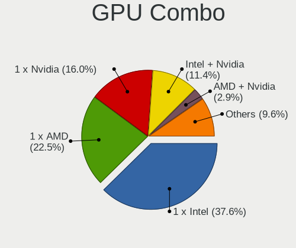

| Name            | Computers | Percent |
|-----------------|-----------|---------|
| 1 x Intel       | 391       | 37.63%  |
| 1 x AMD         | 234       | 22.52%  |
| 1 x Nvidia      | 166       | 15.98%  |
| Intel + Nvidia  | 118       | 11.36%  |
| AMD + Nvidia    | 30        | 2.89%   |
| 2 x AMD         | 28        | 2.69%   |
| Intel + AMD     | 24        | 2.31%   |
| Other           | 18        | 1.73%   |
| 1 x Matrox      | 10        | 0.96%   |
| 2 x Intel       | 6         | 0.58%   |
| 1 x SiS         | 3         | 0.29%   |
| 2 x Nvidia      | 2         | 0.19%   |
| 1 x VIA         | 2         | 0.19%   |
| AMD + Matrox    | 2         | 0.19%   |
| 3 x AMD         | 1         | 0.1%    |
| 1 x S3 Graphics | 1         | 0.1%    |
| Nvidia + XGI    | 1         | 0.1%    |
| Nvidia + Matrox | 1         | 0.1%    |
| 1 x ASPEED      | 1         | 0.1%    |

GPU Driver
----------

Free vs proprietary

| Driver      | Computers | Percent |
|-------------|-----------|---------|
| Free        | 840       | 80.54%  |
| Proprietary | 135       | 12.94%  |
| Unknown     | 68        | 6.52%   |

GPU Memory
----------

Total video memory

| Size in GB | Computers | Percent |
|------------|-----------|---------|
| Unknown    | 563       | 52.81%  |
| 0.01-0.5   | 174       | 16.32%  |
| 1.01-2.0   | 123       | 11.54%  |
| 0.51-1.0   | 95        | 8.91%   |
| 3.01-4.0   | 55        | 5.16%   |
| 7.01-8.0   | 24        | 2.25%   |
| 5.01-6.0   | 13        | 1.22%   |
| 8.01-16.0  | 10        | 0.94%   |
| 2.01-3.0   | 7         | 0.66%   |
| 16.01-24.0 | 2         | 0.19%   |

Monitor
-------

Monitor Vendor
--------------

Monitor vendors

| Vendor                  | Computers | Percent |
|-------------------------|-----------|---------|
| Samsung Electronics     | 154       | 13.75%  |
| AU Optronics            | 116       | 10.36%  |
| LG Display              | 96        | 8.57%   |
| BOE                     | 88        | 7.86%   |
| Chimei Innolux          | 79        | 7.05%   |
| Dell                    | 62        | 5.54%   |
| Goldstar                | 51        | 4.55%   |
| Philips                 | 50        | 4.46%   |
| Hewlett-Packard         | 46        | 4.11%   |
| Chi Mei Optoelectronics | 35        | 3.13%   |
| BenQ                    | 35        | 3.13%   |
| Lenovo                  | 31        | 2.77%   |
| AOC                     | 25        | 2.23%   |
| Acer                    | 24        | 2.14%   |
| Ancor Communications    | 23        | 2.05%   |
| Sharp                   | 19        | 1.7%    |
| PANDA                   | 15        | 1.34%   |
| Apple                   | 13        | 1.16%   |
| NEC Computers           | 12        | 1.07%   |
| Iiyama                  | 12        | 1.07%   |
| Fujitsu Siemens         | 10        | 0.89%   |
| LG Philips              | 8         | 0.71%   |
| ASUSTek Computer        | 8         | 0.71%   |
| Eizo                    | 7         | 0.63%   |
| Valve                   | 6         | 0.54%   |
| Unknown                 | 6         | 0.54%   |
| MSI                     | 6         | 0.54%   |
| CSO                     | 6         | 0.54%   |
| TMX                     | 5         | 0.45%   |
| Sony                    | 5         | 0.45%   |
| LG Electronics          | 5         | 0.45%   |
| InfoVision              | 4         | 0.36%   |
| Panasonic               | 3         | 0.27%   |
| HannStar                | 3         | 0.27%   |
| CVT                     | 3         | 0.27%   |
| Toshiba                 | 2         | 0.18%   |
| RTD                     | 2         | 0.18%   |
| QCM                     | 2         | 0.18%   |
| MiTAC                   | 2         | 0.18%   |
| JDI                     | 2         | 0.18%   |

Monitor Model
-------------

Monitor models

| Model                                                                    | Computers | Percent |
|--------------------------------------------------------------------------|-----------|---------|
| Samsung Electronics SyncMaster SAM0091 1600x1200 432x324mm 21.3-inch     | 8         | 0.69%   |
| Goldstar W1943 GSM4BAD 1360x768 406x229mm 18.4-inch                      | 8         | 0.69%   |
| Philips PHL 243V7 PHLC155 1920x1080 527x296mm 23.8-inch                  | 7         | 0.6%    |
| Dell U2412M DELA07A 1920x1200 518x324mm 24.1-inch                        | 7         | 0.6%    |
| Chimei Innolux LCD Monitor CMN14D4 1920x1080 309x173mm 13.9-inch         | 7         | 0.6%    |
| Chi Mei Optoelectronics LCD Monitor CMO15A7 1366x768 344x193mm 15.5-inch | 7         | 0.6%    |
| AU Optronics LCD Monitor AUO38ED 1920x1080 344x193mm 15.5-inch           | 7         | 0.6%    |
| Chimei Innolux LCD Monitor CMN15AB 1366x768 344x193mm 15.5-inch          | 6         | 0.52%   |
| Chi Mei Optoelectronics LCD Monitor CMO1526 1280x800 331x207mm 15.4-inch | 6         | 0.52%   |
| NEC Computers LCD19WV NEC671C 1440x900 410x256mm 19.0-inch               | 5         | 0.43%   |
| AU Optronics LCD Monitor AUO26EC 1366x768 344x193mm 15.5-inch            | 5         | 0.43%   |
| Valve ANX7530 U VLV3001 800x1280 100x150mm 7.1-inch                      | 4         | 0.34%   |
| Samsung Electronics SyncMaster SAM0420 1680x1050 470x300mm 22.0-inch     | 4         | 0.34%   |
| Samsung Electronics S24F350 SAM0D20 1920x1080 521x293mm 23.5-inch        | 4         | 0.34%   |
| Samsung Electronics LCD Monitor SEC5441 1280x800 286x179mm 13.3-inch     | 4         | 0.34%   |
| Samsung Electronics LCD Monitor SAM07C0 1920x1080 890x500mm 40.2-inch    | 4         | 0.34%   |
| Philips PHL 243V5 PHLC0D1 1920x1080 521x293mm 23.5-inch                  | 4         | 0.34%   |
| Philips 247ELH PHLC085 1920x1080 521x293mm 23.5-inch                     | 4         | 0.34%   |
| LG Display LCD Monitor LGD038E 1366x768 344x194mm 15.5-inch              | 4         | 0.34%   |
| LG Display LCD Monitor LGD02DC 1366x768 344x194mm 15.5-inch              | 4         | 0.34%   |
| Goldstar W2753VC GSM5765 1920x1080 598x336mm 27.0-inch                   | 4         | 0.34%   |
| Chimei Innolux LCD Monitor CMN15DB 1366x768 344x193mm 15.5-inch          | 4         | 0.34%   |
| Chi Mei Optoelectronics LCD Monitor CMO15A3 1366x768 344x193mm 15.5-inch | 4         | 0.34%   |
| AU Optronics LCD Monitor AUO403D 1920x1080 309x174mm 14.0-inch           | 4         | 0.34%   |
| AU Optronics LCD Monitor AUO106C 1366x768 277x156mm 12.5-inch            | 4         | 0.34%   |
| AOC 24G2W1G5 AOC2402 1920x1080 527x296mm 23.8-inch                       | 4         | 0.34%   |
| Samsung Electronics SyncMaster SAM0587 1920x1200 518x324mm 24.1-inch     | 3         | 0.26%   |
| Samsung Electronics S27D390 SAM0B67 1920x1080 598x336mm 27.0-inch        | 3         | 0.26%   |
| Samsung Electronics S24F350 SAM0D21 1920x1080 521x293mm 23.5-inch        | 3         | 0.26%   |
| Samsung Electronics LCD Monitor SEC3945 1280x800 331x207mm 15.4-inch     | 3         | 0.26%   |
| Samsung Electronics LCD Monitor SEC314C 1920x1080 344x194mm 15.5-inch    | 3         | 0.26%   |
| Samsung Electronics LCD Monitor SEC3051 1366x768 344x194mm 15.5-inch     | 3         | 0.26%   |
| Samsung Electronics LCD Monitor SEC3046 1366x768 344x193mm 15.5-inch     | 3         | 0.26%   |
| Samsung Electronics C24F390 SAM0D2C 1920x1080 521x293mm 23.5-inch        | 3         | 0.26%   |
| LG Display LCD Monitor LGD053F 1920x1080 344x194mm 15.5-inch             | 3         | 0.26%   |
| Lenovo LEN L24e-20 LEN65DF 1920x1080 527x296mm 23.8-inch                 | 3         | 0.26%   |
| Iiyama PL2492H IVM612F 1920x1080 527x296mm 23.8-inch                     | 3         | 0.26%   |
| Hewlett-Packard E243d HPN3511 1920x1080 527x296mm 23.8-inch              | 3         | 0.26%   |
| CVT CVTE TV CVT0003 1440x900                                             | 3         | 0.26%   |
| Chimei Innolux LCD Monitor CMN15C4 1920x1080 344x193mm 15.5-inch         | 3         | 0.26%   |

Monitor Resolution
------------------

Monitor screen resolution

| Resolution         | Computers | Percent |
|--------------------|-----------|---------|
| 1920x1080 (FHD)    | 439       | 41.03%  |
| 1366x768 (WXGA)    | 183       | 17.1%   |
| 2560x1440 (QHD)    | 56        | 5.23%   |
| 1920x1200 (WUXGA)  | 48        | 4.49%   |
| 3840x2160 (4K)     | 46        | 4.3%    |
| 1280x800 (WXGA)    | 41        | 3.83%   |
| 1280x1024 (SXGA)   | 40        | 3.74%   |
| 1600x900 (HD+)     | 39        | 3.64%   |
| 1680x1050 (WSXGA+) | 38        | 3.55%   |
| 1440x900 (WXGA+)   | 38        | 3.55%   |
| 3440x1440          | 12        | 1.12%   |
| 1360x768           | 11        | 1.03%   |
| 1600x1200          | 9         | 0.84%   |
| 2560x1600          | 7         | 0.65%   |
| 1024x600           | 6         | 0.56%   |
| 800x1280           | 5         | 0.47%   |
| 3840x2400          | 5         | 0.47%   |
| 3200x2000          | 5         | 0.47%   |
| 2880x1800          | 5         | 0.47%   |
| 1920x540           | 4         | 0.37%   |
| 1280x720 (HD)      | 4         | 0.37%   |
| 1024x768 (XGA)     | 4         | 0.37%   |
| 2160x1440          | 3         | 0.28%   |
| 2800x1752          | 2         | 0.19%   |
| 2560x1080          | 2         | 0.19%   |
| 2288x1287          | 2         | 0.19%   |
| 2160x1350          | 2         | 0.19%   |
| 1920x1280          | 2         | 0.19%   |
| 1280x960           | 2         | 0.19%   |
| Unknown            | 2         | 0.19%   |
| 3200x1800 (QHD+)   | 1         | 0.09%   |
| 3200x1080          | 1         | 0.09%   |
| 3072x1920          | 1         | 0.09%   |
| 3000x2000          | 1         | 0.09%   |
| 2880x1620          | 1         | 0.09%   |
| 2256x1504          | 1         | 0.09%   |
| 1680x945           | 1         | 0.09%   |
| 1400x1050          | 1         | 0.09%   |

Monitor Diagonal
----------------

Diagonal size in inches

| Inches  | Computers | Percent |
|---------|-----------|---------|
| 15      | 304       | 26.83%  |
| 24      | 118       | 10.41%  |
| 13      | 84        | 7.41%   |
| 14      | 77        | 6.8%    |
| 23      | 74        | 6.53%   |
| 27      | 64        | 5.65%   |
| 21      | 63        | 5.56%   |
| 17      | 55        | 4.85%   |
| 19      | 40        | 3.53%   |
| Unknown | 35        | 3.09%   |
| 18      | 27        | 2.38%   |
| 22      | 24        | 2.12%   |
| 12      | 19        | 1.68%   |
| 20      | 16        | 1.41%   |
| 16      | 15        | 1.32%   |
| 11      | 15        | 1.32%   |
| 34      | 13        | 1.15%   |
| 31      | 13        | 1.15%   |
| 25      | 11        | 0.97%   |
| 84      | 8         | 0.71%   |
| 40      | 6         | 0.53%   |
| 32      | 6         | 0.53%   |
| 26      | 6         | 0.53%   |
| 10      | 6         | 0.53%   |
| 7       | 5         | 0.44%   |
| 46      | 4         | 0.35%   |
| 72      | 3         | 0.26%   |
| 54      | 3         | 0.26%   |
| 142     | 2         | 0.18%   |
| 67      | 2         | 0.18%   |
| 65      | 2         | 0.18%   |
| 48      | 2         | 0.18%   |
| 37      | 2         | 0.18%   |
| 33      | 2         | 0.18%   |
| 86      | 1         | 0.09%   |
| 75      | 1         | 0.09%   |
| 58      | 1         | 0.09%   |
| 50      | 1         | 0.09%   |
| 42      | 1         | 0.09%   |
| 39      | 1         | 0.09%   |

Monitor Width
-------------

Physical width

| Width in mm    | Computers | Percent |
|----------------|-----------|---------|
| 301-350        | 444       | 40.29%  |
| 501-600        | 239       | 21.69%  |
| 401-500        | 151       | 13.7%   |
| 201-300        | 87        | 7.89%   |
| 351-400        | 61        | 5.54%   |
| Unknown        | 35        | 3.18%   |
| 701-800        | 23        | 2.09%   |
| 601-700        | 18        | 1.63%   |
| 1001-1500      | 14        | 1.27%   |
| 1501-2000      | 12        | 1.09%   |
| 801-900        | 10        | 0.91%   |
| 1-100          | 5         | 0.45%   |
| More than 2000 | 2         | 0.18%   |
| 901-1000       | 1         | 0.09%   |

Aspect Ratio
------------

Proportional relationship between the width and the height

| Ratio   | Computers | Percent |
|---------|-----------|---------|
| 16/9    | 714       | 69.59%  |
| 16/10   | 190       | 18.52%  |
| 5/4     | 39        | 3.8%    |
| Unknown | 26        | 2.53%   |
| 4/3     | 16        | 1.56%   |
| 3/2     | 14        | 1.36%   |
| 21/9    | 14        | 1.36%   |
| 0.67    | 4         | 0.39%   |
| 32/9    | 2         | 0.19%   |
| 1.00    | 2         | 0.19%   |
| 0.45    | 2         | 0.19%   |
| 6/5     | 1         | 0.1%    |
| 0.62    | 1         | 0.1%    |
| 0.56    | 1         | 0.1%    |

Monitor Area
------------

Area in inch

| Area in inch | Computers | Percent |
|----------------|-----------|---------|
| 101-110        | 300       | 26.83%  |
| 201-250        | 214       | 19.14%  |
| 81-90          | 122       | 10.91%  |
| 151-200        | 72        | 6.44%   |
| 301-350        | 64        | 5.72%   |
| 251-300        | 55        | 4.92%   |
| 141-150        | 48        | 4.29%   |
| 71-80          | 38        | 3.4%    |
| 351-500        | 35        | 3.13%   |
| Unknown        | 35        | 3.13%   |
| More than 1000 | 25        | 2.24%   |
| 121-130        | 25        | 2.24%   |
| 61-70          | 18        | 1.61%   |
| 51-60          | 15        | 1.34%   |
| 111-120        | 15        | 1.34%   |
| 501-1000       | 14        | 1.25%   |
| 131-140        | 9         | 0.81%   |
| 41-50          | 6         | 0.54%   |
| 1-40           | 5         | 0.45%   |
| 91-100         | 3         | 0.27%   |

Pixel Density
-------------

Pixels per inch

| Density       | Computers | Percent |
|---------------|-----------|---------|
| 51-100        | 425       | 39.46%  |
| 121-160       | 270       | 25.07%  |
| 101-120       | 247       | 22.93%  |
| 161-240       | 56        | 5.2%    |
| Unknown       | 35        | 3.25%   |
| More than 240 | 24        | 2.23%   |
| 1-50          | 20        | 1.86%   |

Multiple Monitors
-----------------

Total monitors connected

| Total | Computers | Percent |
|-------|-----------|---------|
| 1     | 809       | 77.19%  |
| 2     | 165       | 15.74%  |
| 0     | 57        | 5.44%   |
| 3     | 17        | 1.62%   |

Network
-------

Net Controller Vendor
---------------------

Controller vendors

| Vendor                                 | Computers | Percent |
|----------------------------------------|-----------|---------|
| Realtek Semiconductor                  | 550       | 36.18%  |
| Intel                                  | 426       | 28.03%  |
| Qualcomm Atheros                       | 184       | 12.11%  |
| Broadcom                               | 92        | 6.05%   |
| MediaTek                               | 27        | 1.78%   |
| TP-Link                                | 24        | 1.58%   |
| Marvell Technology Group               | 24        | 1.58%   |
| Ralink Technology                      | 22        | 1.45%   |
| Broadcom Limited                       | 22        | 1.45%   |
| Nvidia                                 | 19        | 1.25%   |
| Ralink                                 | 17        | 1.12%   |
| Qualcomm Atheros Communications        | 14        | 0.92%   |
| Dell                                   | 8         | 0.53%   |
| ASIX Electronics                       | 8         | 0.53%   |
| Xiaomi                                 | 6         | 0.39%   |
| Hewlett-Packard                        | 5         | 0.33%   |
| Sierra Wireless                        | 4         | 0.26%   |
| Samsung Electronics                    | 4         | 0.26%   |
| Ericsson Business Mobile Networks      | 4         | 0.26%   |
| D-Link                                 | 4         | 0.26%   |
| ASUSTek Computer                       | 4         | 0.26%   |
| Qualcomm                               | 3         | 0.2%    |
| Lenovo                                 | 3         | 0.2%    |
| JMicron Technology                     | 3         | 0.2%    |
| Huawei Technologies                    | 3         | 0.2%    |
| Fibocom                                | 3         | 0.2%    |
| DisplayLink                            | 3         | 0.2%    |
| VIA Technologies                       | 2         | 0.13%   |
| Silicon Integrated Systems [SiS]       | 2         | 0.13%   |
| Microsoft                              | 2         | 0.13%   |
| Edimax Technology                      | 2         | 0.13%   |
| Unknown                                | 2         | 0.13%   |
| ZyXEL Communications                   | 1         | 0.07%   |
| ZTE WCDMA Technologies MSM             | 1         | 0.07%   |
| WiseGroup                              | 1         | 0.07%   |
| ULi Electronics                        | 1         | 0.07%   |
| Texas Instruments                      | 1         | 0.07%   |
| T & A Mobile Phones                    | 1         | 0.07%   |
| Spreadtrum Communications              | 1         | 0.07%   |
| Sony Ericsson Mobile Communications AB | 1         | 0.07%   |

Net Controller Model
--------------------

Controller models

| Model                                                                   | Computers | Percent |
|-------------------------------------------------------------------------|-----------|---------|
| Realtek RTL8111/8168/8211/8411 PCI Express Gigabit Ethernet Controller  | 378       | 21.54%  |
| Realtek RTL810xE PCI Express Fast Ethernet controller                   | 55        | 3.13%   |
| Qualcomm Atheros AR9285 Wireless Network Adapter (PCI-Express)          | 41        | 2.34%   |
| Intel Wi-Fi 6 AX200                                                     | 35        | 1.99%   |
| Realtek RTL8153 Gigabit Ethernet Adapter                                | 32        | 1.82%   |
| Intel Wireless 8265 / 8275                                              | 31        | 1.77%   |
| Intel 82579LM Gigabit Network Connection (Lewisville)                   | 31        | 1.77%   |
| Realtek RTL8125 2.5GbE Controller                                       | 22        | 1.25%   |
| Qualcomm Atheros AR9485 Wireless Network Adapter                        | 21        | 1.2%    |
| Realtek RTL-8100/8101L/8139 PCI Fast Ethernet Adapter                   | 20        | 1.14%   |
| Qualcomm Atheros QCA9377 802.11ac Wireless Network Adapter              | 20        | 1.14%   |
| Intel Centrino Advanced-N 6205 [Taylor Peak]                            | 19        | 1.08%   |
| Realtek RTL8822CE 802.11ac PCIe Wireless Network Adapter                | 18        | 1.03%   |
| Intel Wi-Fi 6 AX201                                                     | 18        | 1.03%   |
| Intel Wireless 8260                                                     | 17        | 0.97%   |
| Realtek RTL8821CE 802.11ac PCIe Wireless Network Adapter                | 16        | 0.91%   |
| MediaTek MT7921 802.11ax PCI Express Wireless Network Adapter           | 15        | 0.85%   |
| Qualcomm Atheros AR9271 802.11n                                         | 14        | 0.8%    |
| Intel I211 Gigabit Network Connection                                   | 14        | 0.8%    |
| Broadcom BCM4313 802.11bgn Wireless Network Adapter                     | 14        | 0.8%    |
| Qualcomm Atheros QCA6174 802.11ac Wireless Network Adapter              | 13        | 0.74%   |
| Intel Wireless 7260                                                     | 13        | 0.74%   |
| Intel Ethernet Connection I217-LM                                       | 13        | 0.74%   |
| Realtek RTL8852BE PCIe 802.11ax Wireless Network Controller             | 12        | 0.68%   |
| Intel Wireless 7265                                                     | 12        | 0.68%   |
| Intel Wireless 3165                                                     | 12        | 0.68%   |
| Qualcomm Atheros QCA9565 / AR9565 Wireless Network Adapter              | 11        | 0.63%   |
| Qualcomm Atheros AR242x / AR542x Wireless Network Adapter (PCI-Express) | 11        | 0.63%   |
| Intel Comet Lake PCH-LP CNVi WiFi                                       | 11        | 0.63%   |
| Intel Cannon Point-LP CNVi [Wireless-AC]                                | 11        | 0.63%   |
| Realtek RTL8169 PCI Gigabit Ethernet Controller                         | 10        | 0.57%   |
| Ralink RT3290 Wireless 802.11n 1T/1R PCIe                               | 10        | 0.57%   |
| Intel Ethernet Controller I225-V                                        | 10        | 0.57%   |
| Intel 82579V Gigabit Network Connection                                 | 10        | 0.57%   |
| Realtek RTL8821AE 802.11ac PCIe Wireless Network Adapter                | 9         | 0.51%   |
| Qualcomm Atheros AR8151 v2.0 Gigabit Ethernet                           | 9         | 0.51%   |
| MediaTek MT7922 802.11ax PCI Express Wireless Network Adapter           | 9         | 0.51%   |
| Intel Wi-Fi 6E(802.11ax) AX210/AX1675* 2x2 [Typhoon Peak]               | 9         | 0.51%   |
| Intel PRO/Wireless 3945ABG [Golan] Network Connection                   | 9         | 0.51%   |
| Intel Ethernet Connection (2) I219-V                                    | 9         | 0.51%   |

Wireless Vendor
---------------

Wireless vendors

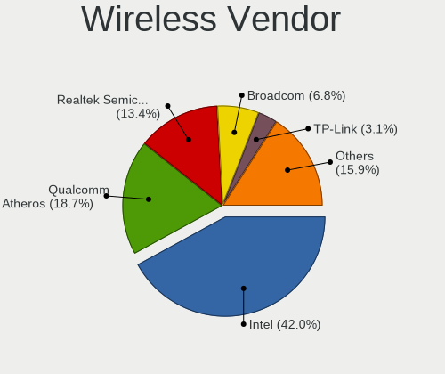

| Vendor                          | Computers | Percent |
|---------------------------------|-----------|---------|
| Intel                           | 322       | 42.04%  |
| Qualcomm Atheros                | 143       | 18.67%  |
| Realtek Semiconductor           | 103       | 13.45%  |
| Broadcom                        | 52        | 6.79%   |
| TP-Link                         | 24        | 3.13%   |
| Ralink Technology               | 22        | 2.87%   |
| MediaTek                        | 21        | 2.74%   |
| Ralink                          | 17        | 2.22%   |
| Broadcom Limited                | 16        | 2.09%   |
| Qualcomm Atheros Communications | 14        | 1.83%   |
| Dell                            | 6         | 0.78%   |
| Sierra Wireless                 | 4         | 0.52%   |
| D-Link                          | 4         | 0.52%   |
| ASUSTek Computer                | 4         | 0.52%   |
| Qualcomm                        | 3         | 0.39%   |
| Fibocom                         | 3         | 0.39%   |
| Microsoft                       | 2         | 0.26%   |
| Edimax Technology               | 2         | 0.26%   |
| ZyXEL Communications            | 1         | 0.13%   |
| Texas Instruments               | 1         | 0.13%   |
| Micro Star International        | 1         | 0.13%   |
| Accton Technology               | 1         | 0.13%   |

Wireless Model
--------------

Wireless models

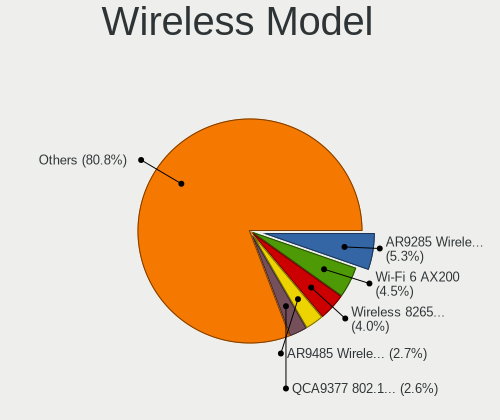

| Model                                                                   | Computers | Percent |
|-------------------------------------------------------------------------|-----------|---------|
| Qualcomm Atheros AR9285 Wireless Network Adapter (PCI-Express)          | 41        | 5.32%   |
| Intel Wi-Fi 6 AX200                                                     | 35        | 4.54%   |
| Intel Wireless 8265 / 8275                                              | 31        | 4.02%   |
| Qualcomm Atheros AR9485 Wireless Network Adapter                        | 21        | 2.72%   |
| Qualcomm Atheros QCA9377 802.11ac Wireless Network Adapter              | 20        | 2.59%   |
| Intel Centrino Advanced-N 6205 [Taylor Peak]                            | 19        | 2.46%   |
| Realtek RTL8822CE 802.11ac PCIe Wireless Network Adapter                | 18        | 2.33%   |
| Intel Wi-Fi 6 AX201                                                     | 18        | 2.33%   |
| Intel Wireless 8260                                                     | 17        | 2.2%    |
| Realtek RTL8821CE 802.11ac PCIe Wireless Network Adapter                | 16        | 2.08%   |
| MediaTek MT7921 802.11ax PCI Express Wireless Network Adapter           | 15        | 1.95%   |
| Qualcomm Atheros AR9271 802.11n                                         | 14        | 1.82%   |
| Broadcom BCM4313 802.11bgn Wireless Network Adapter                     | 14        | 1.82%   |
| Qualcomm Atheros QCA6174 802.11ac Wireless Network Adapter              | 13        | 1.69%   |
| Intel Wireless 7260                                                     | 13        | 1.69%   |
| Intel Wireless 7265                                                     | 12        | 1.56%   |
| Intel Wireless 3165                                                     | 12        | 1.56%   |
| Qualcomm Atheros QCA9565 / AR9565 Wireless Network Adapter              | 11        | 1.43%   |
| Qualcomm Atheros AR242x / AR542x Wireless Network Adapter (PCI-Express) | 11        | 1.43%   |
| Intel Comet Lake PCH-LP CNVi WiFi                                       | 11        | 1.43%   |
| Intel Cannon Point-LP CNVi [Wireless-AC]                                | 11        | 1.43%   |
| Realtek RTL8852BE PCIe 802.11ax Wireless Network Controller             | 10        | 1.3%    |
| Ralink RT3290 Wireless 802.11n 1T/1R PCIe                               | 10        | 1.3%    |
| Realtek RTL8821AE 802.11ac PCIe Wireless Network Adapter                | 9         | 1.17%   |
| Intel Wi-Fi 6E(802.11ax) AX210/AX1675* 2x2 [Typhoon Peak]               | 9         | 1.17%   |
| Intel PRO/Wireless 3945ABG [Golan] Network Connection                   | 9         | 1.17%   |
| TP-Link TL-WN722N v2/v3 [Realtek RTL8188EUS]                            | 8         | 1.04%   |
| Ralink RT2870/RT3070 Wireless Adapter                                   | 8         | 1.04%   |
| Ralink MT7601U Wireless Adapter                                         | 8         | 1.04%   |
| Intel WiFi Link 5100                                                    | 8         | 1.04%   |
| Intel Dual Band Wireless-AC 3165 Plus Bluetooth                         | 8         | 1.04%   |
| Intel Comet Lake PCH CNVi WiFi                                          | 8         | 1.04%   |
| Intel Centrino Wireless-N 2230                                          | 8         | 1.04%   |
| Intel Cannon Lake PCH CNVi WiFi                                         | 8         | 1.04%   |
| Intel Alder Lake-P PCH CNVi WiFi                                        | 8         | 1.04%   |
| Broadcom BCM43142 802.11b/g/n                                           | 8         | 1.04%   |
| Intel Wi-Fi 5(802.11ac) Wireless-AC 9x6x [Thunder Peak]                 | 7         | 0.91%   |
| Intel PRO/Wireless 5100 AGN [Shiloh] Network Connection                 | 7         | 0.91%   |
| Broadcom BCM43228 802.11a/b/g/n                                         | 7         | 0.91%   |
| Realtek RTL8852AE 802.11ax PCIe Wireless Network Adapter                | 6         | 0.78%   |

Ethernet Vendor
---------------

Ethernet vendors

| Vendor                                 | Computers | Percent |
|----------------------------------------|-----------|---------|
| Realtek Semiconductor                  | 510       | 54.66%  |
| Intel                                  | 219       | 23.47%  |
| Qualcomm Atheros                       | 58        | 6.22%   |
| Broadcom                               | 43        | 4.61%   |
| Marvell Technology Group               | 24        | 2.57%   |
| Nvidia                                 | 19        | 2.04%   |
| ASIX Electronics                       | 8         | 0.86%   |
| Xiaomi                                 | 6         | 0.64%   |
| MediaTek                               | 6         | 0.64%   |
| Broadcom Limited                       | 6         | 0.64%   |
| Samsung Electronics                    | 4         | 0.43%   |
| Lenovo                                 | 3         | 0.32%   |
| JMicron Technology                     | 3         | 0.32%   |
| DisplayLink                            | 3         | 0.32%   |
| VIA Technologies                       | 2         | 0.21%   |
| Huawei Technologies                    | 2         | 0.21%   |
| T & A Mobile Phones                    | 1         | 0.11%   |
| Spreadtrum Communications              | 1         | 0.11%   |
| Sony Ericsson Mobile Communications AB | 1         | 0.11%   |
| Silicon Integrated Systems [SiS]       | 1         | 0.11%   |
| Raspberry Pi                           | 1         | 0.11%   |
| QinHeng Electronics                    | 1         | 0.11%   |
| Prestigio                              | 1         | 0.11%   |
| OPPO Electronics                       | 1         | 0.11%   |
| Nokia Mobile Phones                    | 1         | 0.11%   |
| National Semiconductor                 | 1         | 0.11%   |
| Motorola PCS                           | 1         | 0.11%   |
| Mellanox Technologies                  | 1         | 0.11%   |
| ICS Advent                             | 1         | 0.11%   |
| IBM                                    | 1         | 0.11%   |
| Google                                 | 1         | 0.11%   |
| Attansic Technology                    | 1         | 0.11%   |
| Unknown                                | 1         | 0.11%   |

Ethernet Model
--------------

Ethernet models

| Model                                                                  | Computers | Percent |
|------------------------------------------------------------------------|-----------|---------|
| Realtek RTL8111/8168/8211/8411 PCI Express Gigabit Ethernet Controller | 378       | 39.33%  |
| Realtek RTL810xE PCI Express Fast Ethernet controller                  | 55        | 5.72%   |
| Realtek RTL8153 Gigabit Ethernet Adapter                               | 32        | 3.33%   |
| Intel 82579LM Gigabit Network Connection (Lewisville)                  | 31        | 3.23%   |
| Realtek RTL8125 2.5GbE Controller                                      | 22        | 2.29%   |
| Realtek RTL-8100/8101L/8139 PCI Fast Ethernet Adapter                  | 20        | 2.08%   |
| Intel I211 Gigabit Network Connection                                  | 14        | 1.46%   |
| Intel Ethernet Connection I217-LM                                      | 13        | 1.35%   |
| Realtek RTL8169 PCI Gigabit Ethernet Controller                        | 10        | 1.04%   |
| Intel Ethernet Controller I225-V                                       | 10        | 1.04%   |
| Intel 82579V Gigabit Network Connection                                | 10        | 1.04%   |
| Qualcomm Atheros AR8151 v2.0 Gigabit Ethernet                          | 9         | 0.94%   |
| Intel Ethernet Connection (2) I219-V                                   | 9         | 0.94%   |
| Intel Ethernet Connection (4) I219-LM                                  | 8         | 0.83%   |
| Intel Ethernet Connection (2) I219-LM                                  | 8         | 0.83%   |
| Intel 82567LM Gigabit Network Connection                               | 8         | 0.83%   |
| Qualcomm Atheros AR8131 Gigabit Ethernet                               | 7         | 0.73%   |
| Nvidia MCP61 Ethernet                                                  | 7         | 0.73%   |
| Intel Ethernet Connection I219-LM                                      | 7         | 0.73%   |
| Qualcomm Atheros AR8132 Fast Ethernet                                  | 6         | 0.62%   |
| Intel Ethernet Connection (7) I219-LM                                  | 6         | 0.62%   |
| Intel Ethernet Connection (6) I219-V                                   | 6         | 0.62%   |
| Intel Ethernet Connection (4) I219-V                                   | 6         | 0.62%   |
| Realtek RTL8152 Fast Ethernet Adapter                                  | 5         | 0.52%   |
| Qualcomm Atheros QCA8172 Fast Ethernet                                 | 5         | 0.52%   |
| Qualcomm Atheros Killer E220x Gigabit Ethernet Controller              | 5         | 0.52%   |
| Qualcomm Atheros AR8121/AR8113/AR8114 Gigabit or Fast Ethernet         | 5         | 0.52%   |
| MediaTek MT7922 802.11ax PCI Express Wireless Network Adapter          | 5         | 0.52%   |
| Marvell Group 88E8055 PCI-E Gigabit Ethernet Controller                | 5         | 0.52%   |
| Intel Ethernet Connection I218-LM                                      | 5         | 0.52%   |
| Intel Ethernet Connection (7) I219-V                                   | 5         | 0.52%   |
| Intel Ethernet Connection (3) I218-LM                                  | 5         | 0.52%   |
| Intel 82566DM-2 Gigabit Network Connection                             | 5         | 0.52%   |
| Broadcom NetXtreme BCM5761 Gigabit Ethernet PCIe                       | 5         | 0.52%   |
| ASIX AX88179 Gigabit Ethernet                                          | 5         | 0.52%   |
| Samsung Galaxy series, misc. (tethering mode)                          | 4         | 0.42%   |
| Marvell Group 88E8056 PCI-E Gigabit Ethernet Controller                | 4         | 0.42%   |
| Marvell Group 88E8040T PCI-E Fast Ethernet Controller                  | 4         | 0.42%   |
| Intel Ethernet Connection I217-V                                       | 4         | 0.42%   |
| Intel 82567LM-3 Gigabit Network Connection                             | 4         | 0.42%   |

Net Controller Kind
-------------------

Ethernet, WiFi or modem

| Kind     | Computers | Percent |
|----------|-----------|---------|
| Ethernet | 882       | 53.98%  |
| WiFi     | 729       | 44.61%  |
| Modem    | 22        | 1.35%   |
| Unknown  | 1         | 0.06%   |

Used Controller
---------------

Currently used network controller

| Kind     | Computers | Percent |
|----------|-----------|---------|
| WiFi     | 561       | 54.2%   |
| Ethernet | 474       | 45.8%   |

NICs
----

Total network controllers on board

| Total | Computers | Percent |
|-------|-----------|---------|
| 2     | 543       | 52.82%  |
| 1     | 423       | 41.15%  |
| 0     | 33        | 3.21%   |
| 3     | 16        | 1.56%   |
| 4     | 12        | 1.17%   |
| 5     | 1         | 0.1%    |

IPv6
----

IPv6 vs IPv4

| Used | Computers | Percent |
|------|-----------|---------|
| No   | 955       | 92.99%  |
| Yes  | 72        | 7.01%   |

Bluetooth
---------

Bluetooth Vendor
----------------

Controller vendors

| Vendor                          | Computers | Percent |
|---------------------------------|-----------|---------|
| Intel                           | 239       | 41.35%  |
| Realtek Semiconductor           | 55        | 9.52%   |
| IMC Networks                    | 46        | 7.96%   |
| Qualcomm Atheros Communications | 41        | 7.09%   |
| Broadcom                        | 34        | 5.88%   |
| Lite-On Technology              | 25        | 4.33%   |
| Foxconn / Hon Hai               | 25        | 4.33%   |
| Cambridge Silicon Radio         | 23        | 3.98%   |
| ASUSTek Computer                | 16        | 2.77%   |
| Dell                            | 11        | 1.9%    |
| Ralink                          | 10        | 1.73%   |
| Hewlett-Packard                 | 10        | 1.73%   |
| Apple                           | 10        | 1.73%   |
| Toshiba                         | 7         | 1.21%   |
| Micro Star International        | 4         | 0.69%   |
| Foxconn International           | 4         | 0.69%   |
| Realtek                         | 3         | 0.52%   |
| USI                             | 2         | 0.35%   |
| TP-Link                         | 2         | 0.35%   |
| Taiyo Yuden                     | 2         | 0.35%   |
| HTC (High Tech Computer)        | 2         | 0.35%   |
| Ralink Technology               | 1         | 0.17%   |
| MediaTek                        | 1         | 0.17%   |
| Integrated System Solution      | 1         | 0.17%   |
| Fujitsu                         | 1         | 0.17%   |
| Edimax Technology               | 1         | 0.17%   |
| Belkin Components               | 1         | 0.17%   |
| Alps Electric                   | 1         | 0.17%   |

Bluetooth Model
---------------

Controller models

| Model                                               | Computers | Percent |
|-----------------------------------------------------|-----------|---------|
| Intel Bluetooth wireless interface                  | 85        | 14.71%  |
| Intel AX201 Bluetooth                               | 46        | 7.96%   |
| Intel AX200 Bluetooth                               | 34        | 5.88%   |
| Realtek Bluetooth Radio                             | 31        | 5.36%   |
| Intel Bluetooth 9460/9560 Jefferson Peak (JfP)      | 29        | 5.02%   |
| Cambridge Silicon Radio Bluetooth Dongle (HCI mode) | 23        | 3.98%   |
| Qualcomm Atheros AR3011 Bluetooth                   | 19        | 3.29%   |
| IMC Networks Bluetooth Radio                        | 18        | 3.11%   |
| Intel AX211 Bluetooth                               | 12        | 2.08%   |
| Qualcomm Atheros  Bluetooth Device                  | 11        | 1.9%    |
| Intel Centrino Bluetooth Wireless Transceiver       | 11        | 1.9%    |
| Ralink RT3290 Bluetooth                             | 10        | 1.73%   |
| Intel AX210 Bluetooth                               | 10        | 1.73%   |
| IMC Networks Wireless_Device                        | 9         | 1.56%   |
| IMC Networks Bluetooth Device                       | 9         | 1.56%   |
| IMC Networks Atheros AR3012 Bluetooth 4.0 Adapter   | 9         | 1.56%   |
| Foxconn / Hon Hai Wireless_Device                   | 8         | 1.38%   |
| Lite-On Bluetooth Device                            | 7         | 1.21%   |
| Realtek RTL8821A Bluetooth                          | 6         | 1.04%   |
| Realtek  Bluetooth 4.2 Adapter                      | 6         | 1.04%   |
| Realtek 802.11ac WLAN Adapter                       | 6         | 1.04%   |
| Lite-On Qualcomm Atheros QCA9377 Bluetooth          | 6         | 1.04%   |
| Intel Wireless-AC 9260 Bluetooth Adapter            | 6         | 1.04%   |
| HP Bluetooth 2.0 Interface [Broadcom BCM2045]       | 6         | 1.04%   |
| Broadcom HP Portable SoftSailing                    | 6         | 1.04%   |
| ASUS BT-183 Bluetooth 2.0+EDR adapter               | 6         | 1.04%   |
| Qualcomm Atheros AR3012 Bluetooth 4.0               | 5         | 0.87%   |
| Lite-On Wireless_Device                             | 5         | 0.87%   |
| Intel Wireless-AC 3168 Bluetooth                    | 5         | 0.87%   |
| Broadcom BCM20702 Bluetooth 4.0 [ThinkPad]          | 5         | 0.87%   |
| Foxconn International BCM43142A0 Bluetooth module   | 4         | 0.69%   |
| Dell BCM20702A0 Bluetooth Module                    | 4         | 0.69%   |
| Broadcom HP Portable Bumble Bee                     | 4         | 0.69%   |
| Broadcom BCM2045 Bluetooth                          | 4         | 0.69%   |
| Toshiba Integrated Bluetooth HCI                    | 3         | 0.52%   |
| Realtek RTL8723B Bluetooth                          | 3         | 0.52%   |
| Realtek Bluetooth Radio                             | 3         | 0.52%   |
| Qualcomm Atheros QCA61x4 Bluetooth 4.0              | 3         | 0.52%   |
| Lite-On Broadcom BCM43142A0 Bluetooth Device        | 3         | 0.52%   |
| Foxconn / Hon Hai Broadcom Bluetooth 2.1 Device     | 3         | 0.52%   |

Sound
-----

Sound Vendor
------------

Sound card vendors

| Vendor                                       | Computers | Percent |
|----------------------------------------------|-----------|---------|
| Intel                                        | 683       | 50.63%  |
| AMD                                          | 324       | 24.02%  |
| Nvidia                                       | 219       | 16.23%  |
| C-Media Electronics                          | 24        | 1.78%   |
| Creative Labs                                | 10        | 0.74%   |
| GN Netcom                                    | 8         | 0.59%   |
| Creative Technology                          | 8         | 0.59%   |
| VIA Technologies                             | 6         | 0.44%   |
| Lenovo                                       | 6         | 0.44%   |
| ASUSTek Computer                             | 6         | 0.44%   |
| Logitech                                     | 5         | 0.37%   |
| Silicon Integrated Systems [SiS]             | 4         | 0.3%    |
| Realtek Semiconductor                        | 4         | 0.3%    |
| JMTek                                        | 4         | 0.3%    |
| Zoran Co. Personal Media Division (Nogatech) | 3         | 0.22%   |
| Texas Instruments                            | 3         | 0.22%   |
| Hewlett-Packard                              | 3         | 0.22%   |
| Yamaha                                       | 2         | 0.15%   |
| Trust                                        | 2         | 0.15%   |
| SteelSeries ApS                              | 2         | 0.15%   |
| Samson Technologies                          | 2         | 0.15%   |
| Focusrite-Novation                           | 2         | 0.15%   |
| Blue Microphones                             | 2         | 0.15%   |
| AKAI Professional M.I.                       | 2         | 0.15%   |
| Valve Software                               | 1         | 0.07%   |
| ULi Electronics                              | 1         | 0.07%   |
| Textech International                        | 1         | 0.07%   |
| Plantronics                                  | 1         | 0.07%   |
| Nordic Semiconductor ASA                     | 1         | 0.07%   |
| Micro Star International                     | 1         | 0.07%   |
| KTMicro                                      | 1         | 0.07%   |
| Kingston Technology                          | 1         | 0.07%   |
| Fortemedia                                   | 1         | 0.07%   |
| FiiO Electronics Technology                  | 1         | 0.07%   |
| Conexant Systems                             | 1         | 0.07%   |
| Behringer.......                             | 1         | 0.07%   |
| Barco Display Systems                        | 1         | 0.07%   |
| Apple                                        | 1         | 0.07%   |
| A4Tech                                       | 1         | 0.07%   |

Sound Model
-----------

Sound card models

| Model                                                                      | Computers | Percent |
|----------------------------------------------------------------------------|-----------|---------|
| AMD Family 17h/19h/1ah HD Audio Controller                                 | 107       | 6.61%   |
| Intel 7 Series/C216 Chipset Family High Definition Audio Controller        | 85        | 5.25%   |
| AMD Renoir Radeon High Definition Audio Controller                         | 64        | 3.95%   |
| Intel Sunrise Point-LP HD Audio                                            | 57        | 3.52%   |
| Intel 6 Series/C200 Series Chipset Family High Definition Audio Controller | 57        | 3.52%   |
| Intel 8 Series/C220 Series Chipset High Definition Audio Controller        | 50        | 3.09%   |
| Intel 82801I (ICH9 Family) HD Audio Controller                             | 48        | 2.96%   |
| AMD SBx00 Azalia (Intel HDA)                                               | 47        | 2.9%    |
| Intel NM10/ICH7 Family High Definition Audio Controller                    | 41        | 2.53%   |
| Intel Xeon E3-1200 v3/4th Gen Core Processor HD Audio Controller           | 37        | 2.29%   |
| Intel 5 Series/3400 Series Chipset High Definition Audio                   | 33        | 2.04%   |
| AMD FCH Azalia Controller                                                  | 32        | 1.98%   |
| AMD Rembrandt Radeon High Definition Audio Controller                      | 28        | 1.73%   |
| Intel Cannon Lake PCH cAVS                                                 | 26        | 1.61%   |
| Intel 100 Series/C230 Series Chipset Family HD Audio Controller            | 26        | 1.61%   |
| Intel 82801H (ICH8 Family) HD Audio Controller                             | 25        | 1.54%   |
| AMD Starship/Matisse HD Audio Controller                                   | 25        | 1.54%   |
| Nvidia GK208 HDMI/DP Audio Controller                                      | 22        | 1.36%   |
| Intel Tiger Lake-LP Smart Sound Technology Audio Controller                | 22        | 1.36%   |
| AMD Raven/Raven2/Fenghuang HDMI/DP Audio Controller                        | 21        | 1.3%    |
| Nvidia GF108 High Definition Audio Controller                              | 18        | 1.11%   |
| Intel Cannon Point-LP High Definition Audio Controller                     | 16        | 0.99%   |
| Intel Haswell-ULT HD Audio Controller                                      | 15        | 0.93%   |
| Intel 82801JI (ICH10 Family) HD Audio Controller                           | 15        | 0.93%   |
| Intel 8 Series HD Audio Controller                                         | 15        | 0.93%   |
| Intel 200 Series PCH HD Audio                                              | 15        | 0.93%   |
| Nvidia High Definition Audio Controller                                    | 14        | 0.86%   |
| Intel Celeron/Pentium Silver Processor High Definition Audio               | 14        | 0.86%   |
| Intel Broadwell-U Audio Controller                                         | 14        | 0.86%   |
| AMD Family 17h (Models 00h-0fh) HD Audio Controller                        | 14        | 0.86%   |
| Nvidia GP106 High Definition Audio Controller                              | 13        | 0.8%    |
| Intel Wildcat Point-LP High Definition Audio Controller                    | 13        | 0.8%    |
| Intel Comet Lake PCH-LP cAVS                                               | 12        | 0.74%   |
| Intel Atom Processor Z36xxx/Z37xxx Series High Definition Audio Controller | 12        | 0.74%   |
| AMD Family 15h (Models 60h-6fh) Audio Controller                           | 12        | 0.74%   |
| AMD Oland/Hainan/Cape Verde/Pitcairn HDMI Audio [Radeon HD 7000 Series]    | 11        | 0.68%   |
| AMD Cedar HDMI Audio [Radeon HD 5400/6300/7300 Series]                     | 11        | 0.68%   |
| Nvidia GM107 High Definition Audio Controller [GeForce 940MX]              | 10        | 0.62%   |
| Intel Comet Lake PCH cAVS                                                  | 10        | 0.62%   |
| AMD High Definition Audio Controller                                       | 10        | 0.62%   |

Memory
------

Memory Vendor
-------------

Memory module vendors

| Vendor                       | Computers | Percent |
|------------------------------|-----------|---------|
| Kingston                     | 126       | 18.37%  |
| Samsung Electronics          | 124       | 18.08%  |
| SK hynix                     | 119       | 17.35%  |
| Unknown                      | 100       | 14.58%  |
| Micron Technology            | 63        | 9.18%   |
| Crucial                      | 35        | 5.1%    |
| Corsair                      | 17        | 2.48%   |
| Elpida                       | 15        | 2.19%   |
| Ramaxel Technology           | 14        | 2.04%   |
| Patriot                      | 13        | 1.9%    |
| Unknown                      | 11        | 1.6%    |
| G.Skill                      | 9         | 1.31%   |
| A-DATA Technology            | 9         | 1.31%   |
| Unknown (ABCD)               | 6         | 0.87%   |
| Nanya Technology             | 5         | 0.73%   |
| Apacer                       | 3         | 0.44%   |
| Transcend                    | 2         | 0.29%   |
| Patriot Memory (PDP Systems) | 2         | 0.29%   |
| Hewlett-Packard              | 2         | 0.29%   |
| ASint Technology             | 2         | 0.29%   |
| Unknown (8AC8)               | 1         | 0.15%   |
| Unknown (130B)               | 1         | 0.15%   |
| Unigen                       | 1         | 0.15%   |
| SHARETRONIC                  | 1         | 0.15%   |
| Patriot Memory               | 1         | 0.15%   |
| Atermiter                    | 1         | 0.15%   |
| AMD                          | 1         | 0.15%   |
| 48spaces                     | 1         | 0.15%   |
| 031600B380AD                 | 1         | 0.15%   |

Memory Model
------------

Memory module models

| Model                                                            | Computers | Percent |
|------------------------------------------------------------------|-----------|---------|
| Unknown                                                          | 11        | 1.44%   |
| Samsung RAM M471B5273CH0-CH9 4GB SODIMM DDR3 1334MT/s            | 8         | 1.04%   |
| SK hynix RAM HMT351S6CFR8C-PB 4GB SODIMM DDR3 1600MT/s           | 7         | 0.91%   |
| Unknown RAM Module 2048MB SODIMM DDR2 667MT/s                    | 6         | 0.78%   |
| Unknown (ABCD) RAM 123456789012345678 2GB SODIMM LPDDR3 2400MT/s | 6         | 0.78%   |
| SK hynix RAM HMT351S6EFR8A-PB 4GB SODIMM DDR3 1600MT/s           | 6         | 0.78%   |
| SK hynix RAM HMAA1GS6CJR6N-XN 8GB SODIMM DDR4 3200MT/s           | 6         | 0.78%   |
| Unknown RAM Module 2GB DIMM 800MT/s                              | 5         | 0.65%   |
| SK hynix RAM HMA81GS6AFR8N-UH 8GB SODIMM DDR4 2667MT/s           | 5         | 0.65%   |
| Samsung RAM M471A1K43DB1-CTD 8GB SODIMM DDR4 2667MT/s            | 5         | 0.65%   |
| Micron RAM 16KTF51264HZ-1G6M1 4GB SODIMM DDR3 1600MT/s           | 5         | 0.65%   |
| Kingston RAM KHX3200C16D4/8GX 8GB DIMM DDR4 3733MT/s             | 5         | 0.65%   |
| Kingston RAM KF3200C16D4/8GX 8GB DIMM DDR4 3600MT/s              | 5         | 0.65%   |
| Unknown RAM Module 2048MB DIMM DDR2 800MT/s                      | 4         | 0.52%   |
| Unknown RAM Module 1024MB SODIMM DDR2 667MT/s                    | 4         | 0.52%   |
| Samsung RAM M471B5773CHS-CH9 2GB SODIMM DDR3 4199MT/s            | 4         | 0.52%   |
| Samsung RAM M471B1G73DB0-YK0 8GB SODIMM DDR3 1600MT/s            | 4         | 0.52%   |
| Samsung RAM M471A1K43DB1-CWE 8GB SODIMM DDR4 3200MT/s            | 4         | 0.52%   |
| Samsung RAM M4 70T5663QZ3-CF7 2GB SODIMM DDR2 2048MT/s           | 4         | 0.52%   |
| Micron RAM MT8KTF51264HZ-1G6 4GB SODIMM DDR3 1600MT/s            | 4         | 0.52%   |
| Kingston RAM KHX1866C10D3/4G 4GB DIMM DDR3 1923MT/s              | 4         | 0.52%   |
| Kingston RAM KHX1600C9D3/4GX 4GB DIMM DDR3 1800MT/s              | 4         | 0.52%   |
| Kingston RAM KF2666C15S4/8G 8GB SODIMM DDR4 2667MT/s             | 4         | 0.52%   |
| Unknown RAM Module 2GB SODIMM DDR2 667MT/s                       | 3         | 0.39%   |
| Unknown RAM Module 2GB SODIMM DDR2                               | 3         | 0.39%   |
| Unknown RAM Module 2GB SODIMM 800MT/s                            | 3         | 0.39%   |
| Unknown RAM Module 2048MB DIMM DDR2 333MT/s                      | 3         | 0.39%   |
| Unknown RAM Module 2048MB DIMM 800MT/s                           | 3         | 0.39%   |
| SK hynix RAM HMT451S6AFR8A-PB 4GB SODIMM DDR3 1600MT/s           | 3         | 0.39%   |
| SK hynix RAM HMT41GS6BFR8A-PB 8GB SODIMM DDR3 1600MT/s           | 3         | 0.39%   |
| SK hynix RAM HMT41GS6AFR8A-PB 8GB SODIMM DDR3 2667MT/s           | 3         | 0.39%   |
| SK hynix RAM HMT351S6BFR8C-H9 4GB SODIMM DDR3 1333MT/s           | 3         | 0.39%   |
| SK hynix RAM HMA81GS6CJR8N-VK 8GB SODIMM DDR4 2667MT/s           | 3         | 0.39%   |
| SK hynix RAM H9HCNNNBKMMLXR-NEE 4GB SODIMM LPDDR4 4266MT/s       | 3         | 0.39%   |
| Samsung RAM M471B5173QH0-YK0 4GB SODIMM DDR3 1600MT/s            | 3         | 0.39%   |
| Samsung RAM M471B5173EB0-YK0 4GB SODIMM DDR3 1600MT/s            | 3         | 0.39%   |
| Samsung RAM M471A5244CB0-CTD 4GB SODIMM DDR4 3266MT/s            | 3         | 0.39%   |
| Samsung RAM M471A2K43DB1-CWE 16GB SODIMM DDR4 3200MT/s           | 3         | 0.39%   |
| Samsung RAM M378B5773DH0-CH9 2048MB DIMM DDR3 1333MT/s           | 3         | 0.39%   |
| Patriot RAM PSD34G16002S 4GB SODIMM DDR3 1600MT/s                | 3         | 0.39%   |

Memory Kind
-----------

Memory module kinds

| Kind    | Computers | Percent |
|---------|-----------|---------|
| DDR4    | 206       | 35.21%  |
| DDR3    | 197       | 33.68%  |
| DDR2    | 51        | 8.72%   |
| SDRAM   | 31        | 5.3%    |
| Unknown | 28        | 4.79%   |
| LPDDR4  | 24        | 4.1%    |
| DDR5    | 16        | 2.74%   |
| LPDDR5  | 14        | 2.39%   |
| DDR     | 10        | 1.71%   |
| LPDDR3  | 6         | 1.03%   |
| DRAM    | 2         | 0.34%   |

Memory Form Factor
------------------

Physical design of the memory module

| Name         | Computers | Percent |
|--------------|-----------|---------|
| SODIMM       | 340       | 58.52%  |
| DIMM         | 198       | 34.08%  |
| Row Of Chips | 37        | 6.37%   |
| Chip         | 4         | 0.69%   |
| FB-DIMM      | 1         | 0.17%   |
| Unknown      | 1         | 0.17%   |

Memory Size
-----------

Memory module size

| Size  | Computers | Percent |
|-------|-----------|---------|
| 8192  | 206       | 30.93%  |
| 4096  | 171       | 25.68%  |
| 2048  | 125       | 18.77%  |
| 16384 | 84        | 12.61%  |
| 1024  | 46        | 6.91%   |
| 32768 | 20        | 3%      |
| 512   | 9         | 1.35%   |
| 256   | 2         | 0.3%    |
| 3072  | 1         | 0.15%   |
| 128   | 1         | 0.15%   |
| 64    | 1         | 0.15%   |

Memory Speed
------------

Memory module speed

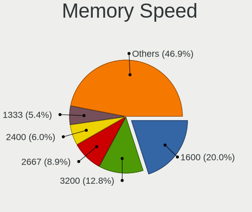

| Speed   | Computers | Percent |
|---------|-----------|---------|
| 1600    | 131       | 20.03%  |
| 3200    | 84        | 12.84%  |
| 2667    | 58        | 8.87%   |
| 2400    | 39        | 5.96%   |
| 1333    | 35        | 5.35%   |
| 667     | 35        | 5.35%   |
| 2133    | 31        | 4.74%   |
| 1334    | 25        | 3.82%   |
| 800     | 25        | 3.82%   |
| Unknown | 15        | 2.29%   |
| 3600    | 14        | 2.14%   |
| 4199    | 10        | 1.53%   |
| 1867    | 9         | 1.38%   |
| 1067    | 9         | 1.38%   |
| 6400    | 7         | 1.07%   |
| 5600    | 7         | 1.07%   |
| 4266    | 7         | 1.07%   |
| 3733    | 7         | 1.07%   |
| 2048    | 7         | 1.07%   |
| 1866    | 7         | 1.07%   |
| 1066    | 7         | 1.07%   |
| 533     | 7         | 1.07%   |
| 333     | 7         | 1.07%   |
| 4800    | 6         | 0.92%   |
| 4267    | 5         | 0.76%   |
| 3800    | 5         | 0.76%   |
| 7500    | 4         | 0.61%   |
| 3266    | 4         | 0.61%   |
| 3000    | 4         | 0.61%   |
| 1639    | 4         | 0.61%   |
| 400     | 4         | 0.61%   |
| 6000    | 3         | 0.46%   |
| 3466    | 3         | 0.46%   |
| 1800    | 3         | 0.46%   |
| 12800   | 2         | 0.31%   |
| 8400    | 2         | 0.31%   |
| 7467    | 2         | 0.31%   |
| 3933    | 2         | 0.31%   |
| 3333    | 2         | 0.31%   |
| 2933    | 2         | 0.31%   |

Printers & scanners
-------------------

Printer Vendor
--------------

Printer device vendors

| Vendor                | Computers | Percent |
|-----------------------|-----------|---------|
| Hewlett-Packard       | 16        | 64%     |
| Seiko Epson           | 3         | 12%     |
| Samsung Electronics   | 2         | 8%      |
| Star Micronics        | 1         | 4%      |
| Lexmark International | 1         | 4%      |
| Canon                 | 1         | 4%      |
| Brother Industries    | 1         | 4%      |

Printer Model
-------------

Printer device models

| Model                                           | Computers | Percent |
|-------------------------------------------------|-----------|---------|
| HP LaserJet 1020                                | 4         | 15.38%  |
| HP Deskjet 1050 J410                            | 2         | 7.69%   |
| Star Micronics IP1000 Printer USB001            | 1         | 3.85%   |
| Seiko Epson XP-243 245 247 Series               | 1         | 3.85%   |
| Seiko Epson L382 Series                         | 1         | 3.85%   |
| Seiko Epson ET-2600 Series                      | 1         | 3.85%   |
| Samsung M262x/M282x Xpress Series Laser Printer | 1         | 3.85%   |
| Samsung M2070 Series                            | 1         | 3.85%   |
| Lexmark International 2600 Series               | 1         | 3.85%   |
| HP OfficeJet 6950                               | 1         | 3.85%   |
| HP LaserJet P3005                               | 1         | 3.85%   |
| HP LaserJet P1006                               | 1         | 3.85%   |
| HP LaserJet M101-M106                           | 1         | 3.85%   |
| HP LaserJet CP 1025                             | 1         | 3.85%   |
| HP LaserJet 1150                                | 1         | 3.85%   |
| HP LaserJet 1010                                | 1         | 3.85%   |
| HP HP LaserJet M14-M17                          | 1         | 3.85%   |
| HP DeskJet 3700 series                          | 1         | 3.85%   |
| HP DeskJet 2700 series                          | 1         | 3.85%   |
| HP Deskjet 1510                                 | 1         | 3.85%   |
| Canon PIXMA MP230                               | 1         | 3.85%   |
| Brother HL-L2350DW series                       | 1         | 3.85%   |

Scanner Vendor
--------------

Scanner device vendors

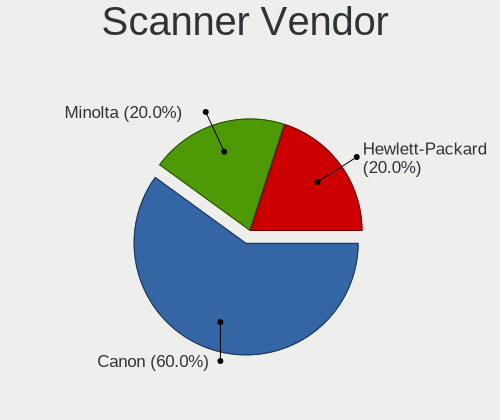

| Vendor          | Computers | Percent |
|-----------------|-----------|---------|
| Canon           | 3         | 60%     |
| Minolta         | 1         | 20%     |
| Hewlett-Packard | 1         | 20%     |

Scanner Model
-------------

Scanner device models

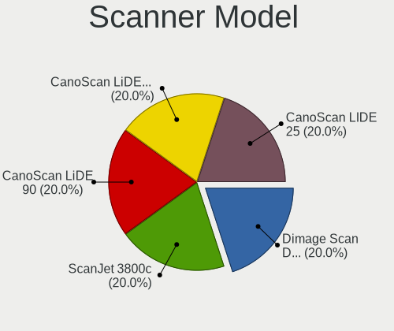

| Model                                       | Computers | Percent |
|---------------------------------------------|-----------|---------|
| Minolta Dimage Scan Dual III AF-2840 (2889) | 1         | 20%     |
| HP ScanJet 3800c                            | 1         | 20%     |
| Canon CanoScan LiDE 90                      | 1         | 20%     |
| Canon CanoScan LIDE 25                      | 1         | 20%     |
| Canon CanoScan LiDE 110                     | 1         | 20%     |

Camera
------

Camera Vendor
-------------

Camera device vendors

| Vendor                                 | Computers | Percent |
|----------------------------------------|-----------|---------|
| Chicony Electronics                    | 148       | 25.21%  |
| IMC Networks                           | 59        | 10.05%  |
| Microdia                               | 57        | 9.71%   |
| Realtek Semiconductor                  | 41        | 6.98%   |
| Bison Electronics                      | 37        | 6.3%    |
| Syntek                                 | 28        | 4.77%   |
| Sunplus Innovation Technology          | 27        | 4.6%    |
| Quanta                                 | 21        | 3.58%   |
| Suyin                                  | 20        | 3.41%   |
| Logitech                               | 18        | 3.07%   |
| Cheng Uei Precision Industry (Foxlink) | 18        | 3.07%   |
| Lite-On Technology                     | 9         | 1.53%   |
| Microsoft                              | 8         | 1.36%   |
| Acer                                   | 8         | 1.36%   |
| Sonix Technology                       | 7         | 1.19%   |
| Luxvisions Innotech Limited            | 7         | 1.19%   |
| Apple                                  | 7         | 1.19%   |
| Alcor Micro                            | 7         | 1.19%   |
| GEMBIRD                                | 6         | 1.02%   |
| Z-Star Microelectronics                | 5         | 0.85%   |
| Silicon Motion                         | 5         | 0.85%   |
| SunplusIT                              | 4         | 0.68%   |
| Creative Technology                    | 4         | 0.68%   |
| Samsung Electronics                    | 3         | 0.51%   |
| Ricoh                                  | 3         | 0.51%   |
| Shinetech                              | 2         | 0.34%   |
| Primax Electronics                     | 2         | 0.34%   |
| MacroSilicon                           | 2         | 0.34%   |
| LG Electronics                         | 2         | 0.34%   |
| Lenovo                                 | 2         | 0.34%   |
| KYE Systems (Mouse Systems)            | 2         | 0.34%   |
| Importek                               | 2         | 0.34%   |
| DigiTech                               | 2         | 0.34%   |
| Valve Software                         | 1         | 0.17%   |
| Unknown                                | 1         | 0.17%   |
| Tripath Technology                     | 1         | 0.17%   |
| SN0002                                 | 1         | 0.17%   |
| Shine-optics                           | 1         | 0.17%   |
| OnePlus Technology (Shenzhen)          | 1         | 0.17%   |
| OmniVision Technologies                | 1         | 0.17%   |

Camera Model
------------

Camera device models

| Model                                             | Computers | Percent |
|---------------------------------------------------|-----------|---------|
| Chicony Integrated Camera                         | 33        | 5.58%   |
| Syntek Integrated Camera                          | 19        | 3.21%   |
| Microdia Integrated_Webcam_HD                     | 19        | 3.21%   |
| IMC Networks Integrated Camera                    | 17        | 2.88%   |
| IMC Networks USB2.0 HD UVC WebCam                 | 13        | 2.2%    |
| Realtek Integrated_Webcam_HD                      | 11        | 1.86%   |
| Bison Integrated Camera                           | 11        | 1.86%   |
| IMC Networks USB2.0 VGA UVC WebCam                | 10        | 1.69%   |
| Chicony HP HD Webcam [Fixed]                      | 10        | 1.69%   |
| Quanta HP HD Camera                               | 8         | 1.35%   |
| Chicony HD WebCam                                 | 8         | 1.35%   |
| Sunplus Integrated_Webcam_HD                      | 7         | 1.18%   |
| Realtek USB2.0 HD UVC WebCam                      | 7         | 1.18%   |
| Bison EasyCamera                                  | 7         | 1.18%   |
| Microdia Webcam Vitade AF                         | 6         | 1.02%   |
| GEMBIRD Generic UVC 1.00 camera [AppoTech AX2311] | 6         | 1.02%   |
| Suyin Acer/HP Integrated Webcam [CN0314]          | 5         | 0.85%   |
| Sonix USB2.0 HD UVC WebCam                        | 5         | 0.85%   |
| Microdia Integrated Webcam                        | 5         | 0.85%   |
| Chicony USB2.0 VGA UVC WebCam                     | 5         | 0.85%   |
| Chicony HP HD Camera                              | 5         | 0.85%   |
| Syntek Lenovo EasyCamera                          | 4         | 0.68%   |
| Suyin HP Webcam                                   | 4         | 0.68%   |
| Sunplus HP HD Webcam [Fixed]                      | 4         | 0.68%   |
| Sunplus HD WebCam                                 | 4         | 0.68%   |
| Logitech Webcam C270                              | 4         | 0.68%   |
| Lite-On HP HD Camera                              | 4         | 0.68%   |
| IMC Networks Integrated Webcam                    | 4         | 0.68%   |
| Chicony USB2.0 HD UVC WebCam                      | 4         | 0.68%   |
| Chicony USB 2.0 Camera                            | 4         | 0.68%   |
| Chicony Lenovo EasyCamera                         | 4         | 0.68%   |
| Chicony Integrated Camera (1280x720@30)           | 4         | 0.68%   |
| Chicony HP HD Webcam                              | 4         | 0.68%   |
| Chicony HD User Facing                            | 4         | 0.68%   |
| Bison Lenovo Integrated Webcam                    | 4         | 0.68%   |
| Bison Lenovo EasyCamera                           | 4         | 0.68%   |
| SunplusIT XiaoMi USB 2.0 Webcam                   | 3         | 0.51%   |
| Sunplus ASUS Webcam                               | 3         | 0.51%   |
| Samsung Galaxy series, misc. (MTP mode)           | 3         | 0.51%   |
| Realtek Integrated Webcam HD                      | 3         | 0.51%   |

Security
--------

Fingerprint Vendor
------------------

Fingerprint sensor vendors

| Vendor                             | Computers | Percent |
|------------------------------------|-----------|---------|
| Validity Sensors                   | 52        | 41.27%  |
| Synaptics                          | 37        | 29.37%  |
| Shenzhen Goodix Technology         | 13        | 10.32%  |
| AuthenTec                          | 10        | 7.94%   |
| LighTuning Technology              | 5         | 3.97%   |
| Upek                               | 3         | 2.38%   |
| STMicroelectronics                 | 3         | 2.38%   |
| Elan Microelectronics              | 2         | 1.59%   |
| Realtek USB2.0 Finger Print Bridge | 1         | 0.79%   |

Fingerprint Model
-----------------

Fingerprint sensor models

| Model                                                                      | Computers | Percent |
|----------------------------------------------------------------------------|-----------|---------|
| Validity Sensors VFS495 Fingerprint Reader                                 | 13        | 10.32%  |
| Synaptics Prometheus MIS Touch Fingerprint Reader                          | 10        | 7.94%   |
| Synaptics WBDI                                                             | 8         | 6.35%   |
| Shenzhen Goodix  FingerPrint Device                                        | 7         | 5.56%   |
| Validity Sensors VFS491                                                    | 6         | 4.76%   |
| Validity Sensors VFS5011 Fingerprint Reader                                | 5         | 3.97%   |
| Validity Sensors VFS 5011 fingerprint sensor                               | 5         | 3.97%   |
| Synaptics Fingerprint reader [HP G6]                                       | 5         | 3.97%   |
| Validity Sensors Synaptics WBDI                                            | 4         | 3.17%   |
| LighTuning EgisTec Touch Fingerprint Sensor                                | 4         | 3.17%   |
| AuthenTec AES2501 Fingerprint Sensor                                       | 4         | 3.17%   |
| Validity Sensors VFS7500 Touch Fingerprint Sensor                          | 3         | 2.38%   |
| Validity Sensors VFS471 Fingerprint Reader                                 | 3         | 2.38%   |
| Validity Sensors VFS301 Fingerprint Reader                                 | 3         | 2.38%   |
| Validity Sensors VFS101 Fingerprint Reader                                 | 3         | 2.38%   |
| Synaptics  WBDI                                                            | 3         | 2.38%   |
| Synaptics  FS7604 Touch Fingerprint Sensor with PurePrint                  | 3         | 2.38%   |
| STMicroelectronics Fingerprint Reader                                      | 3         | 2.38%   |
| Shenzhen Goodix Fingerprint Reader                                         | 3         | 2.38%   |
| Shenzhen Goodix FingerPrint                                                | 3         | 2.38%   |
| AuthenTec AES2810                                                          | 3         | 2.38%   |
| AuthenTec AES1600                                                          | 3         | 2.38%   |
| Validity Sensors VFS451 Fingerprint Reader                                 | 2         | 1.59%   |
| Validity Sensors VFS Fingerprint sensor                                    | 2         | 1.59%   |
| Upek Biometric Touchchip/Touchstrip Fingerprint Sensor                     | 2         | 1.59%   |
| Synaptics WBDI Fingerprint Reader USB 086                                  | 2         | 1.59%   |
| Synaptics Metallica MIS Touch Fingerprint Reader                           | 2         | 1.59%   |
| Elan ELAN:Fingerprint                                                      | 2         | 1.59%   |
| Validity Sensors VFS300 Fingerprint Reader                                 | 1         | 0.79%   |
| Validity Sensors Synaptics VFS7552 Touch Fingerprint Sensor with PurePrint | 1         | 0.79%   |
| Validity Sensors Swipe Fingerprint Sensor                                  | 1         | 0.79%   |
| Upek TCS5B Fingerprint sensor                                              | 1         | 0.79%   |
| Synaptics WBDI Fingerprint Reader USB 102                                  | 1         | 0.79%   |
| Synaptics UWP WBDI Device                                                  | 1         | 0.79%   |
| Synaptics UWP WBDI                                                         | 1         | 0.79%   |
| Synaptics FS7604 Touch Fingerprint Sensor with PurePrint                   | 1         | 0.79%   |
| Realtek USB2.0 Finger Print Bridge FocalTech Fingerprint Device            | 1         | 0.79%   |
| LighTuning ES603 Swipe Fingerprint Sensor                                  | 1         | 0.79%   |

Chipcard Vendor
---------------

Chipcard module vendors

| Vendor                | Computers | Percent |
|-----------------------|-----------|---------|
| Broadcom              | 24        | 37.5%   |
| Alcor Micro           | 21        | 32.81%  |
| O2 Micro              | 7         | 10.94%  |
| Gemalto (was Gemplus) | 3         | 4.69%   |
| Bit4id                | 3         | 4.69%   |
| Lenovo                | 2         | 3.13%   |
| Upek                  | 1         | 1.56%   |
| OmniKey               | 1         | 1.56%   |
| Microchip Technology  | 1         | 1.56%   |
| CHERRY                | 1         | 1.56%   |

Chipcard Model
--------------

Chipcard module models

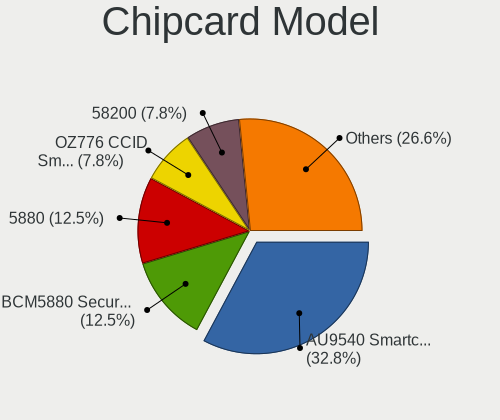

| Model                                                                        | Computers | Percent |
|------------------------------------------------------------------------------|-----------|---------|
| Alcor Micro AU9540 Smartcard Reader                                          | 21        | 32.81%  |
| Broadcom BCM5880 Secure Applications Processor                               | 8         | 12.5%   |
| Broadcom 5880                                                                | 8         | 12.5%   |
| O2 Micro OZ776 CCID Smartcard Reader                                         | 5         | 7.81%   |
| Broadcom 58200                                                               | 5         | 7.81%   |
| Gemalto (was Gemplus) GemPC Twin SmartCard Reader                            | 3         | 4.69%   |
| Broadcom BCM5880 Secure Applications Processor with fingerprint swipe sensor | 3         | 4.69%   |
| Bit4id miniLector EVO                                                        | 3         | 4.69%   |
| O2 Micro Oz776 SmartCard Reader                                              | 2         | 3.13%   |
| Lenovo Integrated Smart Card Reader                                          | 2         | 3.13%   |
| Upek TouchChip Fingerprint Coprocessor (WBF advanced mode)                   | 1         | 1.56%   |
| OmniKey CardMan 3121 (HID Technologies)                                      | 1         | 1.56%   |
| Microchip Technology SMSC USX101x Reader                                     | 1         | 1.56%   |
| CHERRY SmartCard Reader Keyboard KC 1000 SC                                  | 1         | 1.56%   |

Unsupported
-----------

Unsupported Devices
-------------------

Total unsupported devices on board

| Total | Computers | Percent |
|-------|-----------|---------|
| 0     | 695       | 66%     |
| 1     | 285       | 27.07%  |
| 2     | 60        | 5.7%    |
| 3     | 11        | 1.04%   |
| 4     | 2         | 0.19%   |

Unsupported Device Types
------------------------

Types of unsupported devices

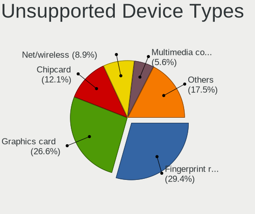

| Type                     | Computers | Percent |
|--------------------------|-----------|---------|
| Fingerprint reader       | 126       | 29.37%  |
| Graphics card            | 114       | 26.57%  |
| Chipcard                 | 52        | 12.12%  |
| Net/wireless             | 38        | 8.86%   |
| Multimedia controller    | 24        | 5.59%   |
| Bluetooth                | 15        | 3.5%    |
| Communication controller | 11        | 2.56%   |
| Card reader              | 10        | 2.33%   |
| Storage                  | 8         | 1.86%   |
| Modem                    | 7         | 1.63%   |
| Sound                    | 6         | 1.4%    |
| Camera                   | 6         | 1.4%    |
| Unassigned class         | 4         | 0.93%   |
| Network                  | 3         | 0.7%    |
| Net/ethernet             | 2         | 0.47%   |
| Flash memory             | 2         | 0.47%   |
| Storage/ide              | 1         | 0.23%   |

