Linux in Slovenia - Tested Hardware & Statistics
------------------------------------------------

A project to collect tested hardware configurations for Linux in Slovenia.

Anyone can contribute to this report by the [hw-probe](https://github.com/linuxhw/hw-probe) tool:

    sudo -E hw-probe -all -upload

Please contribute! Especially if your hardware is rare.

This is a report for all computer types. See also reports for [desktops](/Location/Slovenia/Desktop/README.md) and [notebooks](/Location/Slovenia/Notebook/README.md).

Contents
--------

* [ Test Cases ](#test-cases)

* [ System ](#system)
  - [ OS                       ](#os)
  - [ OS Family                ](#os-family)
  - [ Kernel                   ](#kernel)
  - [ Kernel Family            ](#kernel-family)
  - [ Kernel Major Ver.        ](#kernel-major-ver)
  - [ Arch                     ](#arch)
  - [ DE                       ](#de)
  - [ Display Server           ](#display-server)
  - [ Display Manager          ](#display-manager)
  - [ OS Lang                  ](#os-lang)
  - [ Boot Mode                ](#boot-mode)
  - [ Filesystem               ](#filesystem)
  - [ Part. scheme             ](#part-scheme)
  - [ Dual Boot with Linux/BSD ](#dual-boot-with-linuxbsd)
  - [ Dual Boot (Win)          ](#dual-boot-win)

* [ Board ](#board)
  - [ Vendor                   ](#vendor)
  - [ Model                    ](#model)
  - [ Model Family             ](#model-family)
  - [ MFG Year                 ](#mfg-year)
  - [ Form Factor              ](#form-factor)
  - [ Secure Boot              ](#secure-boot)
  - [ Coreboot                 ](#coreboot)
  - [ RAM Size                 ](#ram-size)
  - [ RAM Used                 ](#ram-used)
  - [ Total Drives             ](#total-drives)
  - [ Has CD-ROM               ](#has-cd-rom)
  - [ Has Ethernet             ](#has-ethernet)
  - [ Has WiFi                 ](#has-wifi)
  - [ Has Bluetooth            ](#has-bluetooth)

* [ Location ](#location)
  - [ Country                  ](#country)
  - [ City                     ](#city)

* [ Drives ](#drives)
  - [ Drive Vendor             ](#drive-vendor)
  - [ Drive Model              ](#drive-model)
  - [ HDD Vendor               ](#hdd-vendor)
  - [ SSD Vendor               ](#ssd-vendor)
  - [ Drive Kind               ](#drive-kind)
  - [ Drive Connector          ](#drive-connector)
  - [ Drive Size               ](#drive-size)
  - [ Space Total              ](#space-total)
  - [ Space Used               ](#space-used)
  - [ Malfunc. Drives          ](#malfunc-drives)
  - [ Malfunc. Drive Vendor    ](#malfunc-drive-vendor)
  - [ Malfunc. HDD Vendor      ](#malfunc-hdd-vendor)
  - [ Malfunc. Drive Kind      ](#malfunc-drive-kind)
  - [ Failed Drives            ](#failed-drives)
  - [ Failed Drive Vendor      ](#failed-drive-vendor)
  - [ Drive Status             ](#drive-status)

* [ Storage controller ](#storage-controller)
  - [ Storage Vendor           ](#storage-vendor)
  - [ Storage Model            ](#storage-model)
  - [ Storage Kind             ](#storage-kind)

* [ Processor ](#processor)
  - [ CPU Vendor               ](#cpu-vendor)
  - [ CPU Model                ](#cpu-model)
  - [ CPU Model Family         ](#cpu-model-family)
  - [ CPU Cores                ](#cpu-cores)
  - [ CPU Sockets              ](#cpu-sockets)
  - [ CPU Threads              ](#cpu-threads)
  - [ CPU Op-Modes             ](#cpu-op-modes)
  - [ CPU Microcode            ](#cpu-microcode)
  - [ CPU Microarch            ](#cpu-microarch)

* [ Graphics ](#graphics)
  - [ GPU Vendor               ](#gpu-vendor)
  - [ GPU Model                ](#gpu-model)
  - [ GPU Combo                ](#gpu-combo)
  - [ GPU Driver               ](#gpu-driver)
  - [ GPU Memory               ](#gpu-memory)

* [ Monitor ](#monitor)
  - [ Monitor Vendor           ](#monitor-vendor)
  - [ Monitor Model            ](#monitor-model)
  - [ Monitor Resolution       ](#monitor-resolution)
  - [ Monitor Diagonal         ](#monitor-diagonal)
  - [ Monitor Width            ](#monitor-width)
  - [ Aspect Ratio             ](#aspect-ratio)
  - [ Monitor Area             ](#monitor-area)
  - [ Pixel Density            ](#pixel-density)
  - [ Multiple Monitors        ](#multiple-monitors)

* [ Network ](#network)
  - [ Net Controller Vendor    ](#net-controller-vendor)
  - [ Net Controller Model     ](#net-controller-model)
  - [ Wireless Vendor          ](#wireless-vendor)
  - [ Wireless Model           ](#wireless-model)
  - [ Ethernet Vendor          ](#ethernet-vendor)
  - [ Ethernet Model           ](#ethernet-model)
  - [ Net Controller Kind      ](#net-controller-kind)
  - [ Used Controller          ](#used-controller)
  - [ NICs                     ](#nics)
  - [ IPv6                     ](#ipv6)

* [ Bluetooth ](#bluetooth)
  - [ Bluetooth Vendor         ](#bluetooth-vendor)
  - [ Bluetooth Model          ](#bluetooth-model)

* [ Sound ](#sound)
  - [ Sound Vendor             ](#sound-vendor)
  - [ Sound Model              ](#sound-model)

* [ Memory ](#memory)
  - [ Memory Vendor            ](#memory-vendor)
  - [ Memory Model             ](#memory-model)
  - [ Memory Kind              ](#memory-kind)
  - [ Memory Form Factor       ](#memory-form-factor)
  - [ Memory Size              ](#memory-size)
  - [ Memory Speed             ](#memory-speed)

* [ Printers & scanners ](#printers--scanners)
  - [ Printer Vendor           ](#printer-vendor)
  - [ Printer Model            ](#printer-model)
  - [ Scanner Vendor           ](#scanner-vendor)
  - [ Scanner Model            ](#scanner-model)

* [ Camera ](#camera)
  - [ Camera Vendor            ](#camera-vendor)
  - [ Camera Model             ](#camera-model)

* [ Security ](#security)
  - [ Fingerprint Vendor       ](#fingerprint-vendor)
  - [ Fingerprint Model        ](#fingerprint-model)
  - [ Chipcard Vendor          ](#chipcard-vendor)
  - [ Chipcard Model           ](#chipcard-model)

* [ Unsupported ](#unsupported)
  - [ Unsupported Devices      ](#unsupported-devices)
  - [ Unsupported Device Types ](#unsupported-device-types)

Test Cases
----------

Total: 430

| Vendor        | Model                       | Form-Factor | Probe                                                      | Date         |
|---------------|-----------------------------|-------------|------------------------------------------------------------|--------------|
| ASRock        | B450 Gaming-ITX/ac          | Desktop     | [194290f42c](https://linux-hardware.org/?probe=194290f42c) | Aug 31, 2022 |
| Lenovo        | ThinkPad T490s 20NYS4HL0... | Notebook    | [273e5229a4](https://linux-hardware.org/?probe=273e5229a4) | Aug 30, 2022 |
| ASRock        | H110M-DVS R2.0              | Desktop     | [adae304d62](https://linux-hardware.org/?probe=adae304d62) | Aug 24, 2022 |
| Supermicro    | X7SBi-LN4                   | Desktop     | [ec37ffcc15](https://linux-hardware.org/?probe=ec37ffcc15) | Aug 23, 2022 |
| Lenovo        | G500 20236                  | Notebook    | [81ba48faa1](https://linux-hardware.org/?probe=81ba48faa1) | Aug 20, 2022 |
| Lenovo        | G500 20236                  | Notebook    | [45df8f9be9](https://linux-hardware.org/?probe=45df8f9be9) | Aug 18, 2022 |
| Lenovo        | G500 20236                  | Notebook    | [6974cf32ce](https://linux-hardware.org/?probe=6974cf32ce) | Aug 17, 2022 |
| ASUSTek       | PRIME B450M-A               | Desktop     | [230d7247c0](https://linux-hardware.org/?probe=230d7247c0) | Aug 11, 2022 |
| Framework     | Laptop                      | Notebook    | [c52019fe10](https://linux-hardware.org/?probe=c52019fe10) | Aug 07, 2022 |
| Lenovo        | ThinkPad SL500 27464DG      | Notebook    | [b9c35e80d2](https://linux-hardware.org/?probe=b9c35e80d2) | Aug 06, 2022 |
| Lenovo        | MIIX 300-10IBY 80NR         | Tablet      | [c301219c25](https://linux-hardware.org/?probe=c301219c25) | Jul 26, 2022 |
| MSI           | B450 TOMAHAWK MAX           | Desktop     | [17954b8ac5](https://linux-hardware.org/?probe=17954b8ac5) | Jul 26, 2022 |
| Lenovo        | B50-30 20382                | Notebook    | [6ab4942a20](https://linux-hardware.org/?probe=6ab4942a20) | Jul 16, 2022 |
| ASUSTek       | PRIME X470-PRO              | Desktop     | [0e195b05bf](https://linux-hardware.org/?probe=0e195b05bf) | Jul 13, 2022 |
| Lenovo        | B50-30 20382                | Notebook    | [d9573dc3e6](https://linux-hardware.org/?probe=d9573dc3e6) | Jul 08, 2022 |
| Dell          | Inspiron 1501               | Notebook    | [f6efa72c1f](https://linux-hardware.org/?probe=f6efa72c1f) | Jul 01, 2022 |
| ASUSTek       | CROSSHAIR V FORMULA-Z       | Desktop     | [d59692d648](https://linux-hardware.org/?probe=d59692d648) | Jun 29, 2022 |
| ASRock        | H61M-ITX                    | Desktop     | [4afafc5b76](https://linux-hardware.org/?probe=4afafc5b76) | Jun 29, 2022 |
| IBM           | 00AM527                     | Server      | [8af3a08c43](https://linux-hardware.org/?probe=8af3a08c43) | Jun 26, 2022 |
| HP            | 212B                        | Desktop     | [a163af0cb5](https://linux-hardware.org/?probe=a163af0cb5) | Jun 21, 2022 |
| ASRock        | X570M Pro4                  | Desktop     | [bbb784f2df](https://linux-hardware.org/?probe=bbb784f2df) | Jun 18, 2022 |
| HP            | 255 G8 Notebook PC          | Notebook    | [cae0332804](https://linux-hardware.org/?probe=cae0332804) | Jun 17, 2022 |
| HP            | 255 G8 Notebook PC          | Notebook    | [e65ead281f](https://linux-hardware.org/?probe=e65ead281f) | Jun 17, 2022 |
| ASUSTek       | ROG STRIX X570-E GAMING     | Desktop     | [cc2e6a1605](https://linux-hardware.org/?probe=cc2e6a1605) | Jun 17, 2022 |
| ASRock        | X570M Pro4                  | Desktop     | [4f6d06171b](https://linux-hardware.org/?probe=4f6d06171b) | Jun 10, 2022 |
| HP            | ZBook Firefly 14 G7 Mobi... | Notebook    | [011acdab42](https://linux-hardware.org/?probe=011acdab42) | Jun 09, 2022 |
| HP            | ZBook Firefly 14 G7 Mobi... | Notebook    | [c751dcffff](https://linux-hardware.org/?probe=c751dcffff) | Jun 09, 2022 |
| Apple         | Mac-FFE5EF870D7BA81A iMa... | All in one  | [28c5fad176](https://linux-hardware.org/?probe=28c5fad176) | Jun 06, 2022 |
| Lenovo        | IdeaPad 5 15ARE05 81YQ      | Notebook    | [065dee2160](https://linux-hardware.org/?probe=065dee2160) | Jun 04, 2022 |
| Apple         | Mac-FFE5EF870D7BA81A iMa... | All in one  | [f4c9e8f3f2](https://linux-hardware.org/?probe=f4c9e8f3f2) | May 30, 2022 |
| Apple         | Mac-FFE5EF870D7BA81A iMa... | All in one  | [14ebca03fe](https://linux-hardware.org/?probe=14ebca03fe) | May 30, 2022 |
| Toshiba       | Satellite Pro U400          | Notebook    | [4aeeca648d](https://linux-hardware.org/?probe=4aeeca648d) | May 24, 2022 |
| Intel         | CM-iAM/SBC-FITPC2i          | Desktop     | [cbfe433386](https://linux-hardware.org/?probe=cbfe433386) | May 20, 2022 |
| Lenovo        | IdeaPad 5 15ARE05 81YQ      | Notebook    | [ecfb1c48d9](https://linux-hardware.org/?probe=ecfb1c48d9) | May 17, 2022 |
| Lenovo        | IdeaPad 100-15IBY 80MJ      | Notebook    | [ddadf86375](https://linux-hardware.org/?probe=ddadf86375) | May 15, 2022 |
| ASUSTek       | N71Vg                       | Notebook    | [33a6047c0b](https://linux-hardware.org/?probe=33a6047c0b) | May 14, 2022 |
| ASUSTek       | N71Vg                       | Notebook    | [86d9e911f1](https://linux-hardware.org/?probe=86d9e911f1) | May 13, 2022 |
| ASUSTek       | ROG STRIX Z370-F GAMING     | Desktop     | [86d60d0227](https://linux-hardware.org/?probe=86d60d0227) | May 12, 2022 |
| ASUSTek       | X550JX                      | Notebook    | [b420f9214c](https://linux-hardware.org/?probe=b420f9214c) | May 06, 2022 |
| Gigabyte      | GA-MA770T-UD3               | Desktop     | [934d403a31](https://linux-hardware.org/?probe=934d403a31) | May 04, 2022 |
| HP            | Laptop 17-ca3xxx            | Notebook    | [373f22a70f](https://linux-hardware.org/?probe=373f22a70f) | May 03, 2022 |
| HP            | Laptop 17-ca3xxx            | Notebook    | [91a367d874](https://linux-hardware.org/?probe=91a367d874) | May 03, 2022 |
| Lenovo        | Yoga 2 13 20344             | Notebook    | [ce528c379a](https://linux-hardware.org/?probe=ce528c379a) | May 01, 2022 |
| Lenovo        | IdeaPad 5 15ARE05 81YQ      | Notebook    | [95ec2ff7d2](https://linux-hardware.org/?probe=95ec2ff7d2) | Apr 30, 2022 |
| Lenovo        | ThinkPad S3 Yoga 14 20DM... | Notebook    | [5d0f1a15e1](https://linux-hardware.org/?probe=5d0f1a15e1) | Apr 30, 2022 |
| ASUSTek       | ROG STRIX Z370-F GAMING     | Desktop     | [965985d6f4](https://linux-hardware.org/?probe=965985d6f4) | Apr 29, 2022 |
| Lenovo        | IdeaPad 5 15ARE05 81YQ      | Notebook    | [57271a5f8b](https://linux-hardware.org/?probe=57271a5f8b) | Apr 28, 2022 |
| HP            | ZBook 17 G2                 | Notebook    | [81409450dc](https://linux-hardware.org/?probe=81409450dc) | Apr 28, 2022 |
| ASUSTek       | ROG STRIX X570-E GAMING     | Desktop     | [f727388ac8](https://linux-hardware.org/?probe=f727388ac8) | Apr 17, 2022 |
| ASUSTek       | ROG STRIX X570-E GAMING     | Desktop     | [c1102c77ec](https://linux-hardware.org/?probe=c1102c77ec) | Apr 17, 2022 |
| HP            | ZBook 17 G2                 | Notebook    | [d7b7a81cbb](https://linux-hardware.org/?probe=d7b7a81cbb) | Apr 16, 2022 |
| Lenovo        | IdeaPad 5 15ARE05 81YQ      | Notebook    | [7e7136d915](https://linux-hardware.org/?probe=7e7136d915) | Apr 16, 2022 |
| ASUSTek       | STRIX Z270G GAMING          | Desktop     | [76a5225b83](https://linux-hardware.org/?probe=76a5225b83) | Apr 16, 2022 |
| ASRock        | H170M Pro4                  | Desktop     | [0dd1b326c0](https://linux-hardware.org/?probe=0dd1b326c0) | Apr 15, 2022 |
| Lenovo        | ThinkPad E15 Gen 3 20YG0... | Notebook    | [8570b5ab84](https://linux-hardware.org/?probe=8570b5ab84) | Apr 12, 2022 |
| ASUSTek       | TUF Gaming B560-PLUS WIF... | Desktop     | [222189213d](https://linux-hardware.org/?probe=222189213d) | Apr 11, 2022 |
| Lenovo        | IdeaPad 5 15ARE05 81YQ      | Notebook    | [4d5998459b](https://linux-hardware.org/?probe=4d5998459b) | Apr 09, 2022 |
| Lenovo        | ThinkPad R61 8933W4F        | Notebook    | [4864fcdfa0](https://linux-hardware.org/?probe=4864fcdfa0) | Apr 07, 2022 |
| MSI           | X570-A PRO                  | Desktop     | [0813d4bc9e](https://linux-hardware.org/?probe=0813d4bc9e) | Mar 31, 2022 |
| MSI           | X570-A PRO                  | Desktop     | [defac75126](https://linux-hardware.org/?probe=defac75126) | Mar 31, 2022 |
| Lenovo        | IdeaPad 5 15ARE05 81YQ      | Notebook    | [d13496f68a](https://linux-hardware.org/?probe=d13496f68a) | Mar 31, 2022 |
| Raspberry ... | Raspberry Pi 4 Model B R... | Soc         | [da62c7238d](https://linux-hardware.org/?probe=da62c7238d) | Mar 28, 2022 |
| ASUSTek       | PRIME B250M-A               | Desktop     | [1260b540e7](https://linux-hardware.org/?probe=1260b540e7) | Mar 27, 2022 |
| HP            | Spectre x360 Convertible... | Convertible | [1eebe899b0](https://linux-hardware.org/?probe=1eebe899b0) | Mar 27, 2022 |
| HP            | ZBook 17 G2                 | Notebook    | [f0efa22aa2](https://linux-hardware.org/?probe=f0efa22aa2) | Mar 27, 2022 |
| HP            | ENVY Laptop 13-ba0xxx       | Notebook    | [0bf3028253](https://linux-hardware.org/?probe=0bf3028253) | Mar 27, 2022 |
| Dell          | Precision 5540              | Notebook    | [38d9bed727](https://linux-hardware.org/?probe=38d9bed727) | Mar 21, 2022 |
| Fujitsu       | LIFEBOOK S792               | Notebook    | [55da3ab4e0](https://linux-hardware.org/?probe=55da3ab4e0) | Mar 09, 2022 |
| Supermicro    | X11SCAA                     | Server      | [b850cd60f6](https://linux-hardware.org/?probe=b850cd60f6) | Mar 08, 2022 |
| HP            | Compaq nw8440 (RH415EA#A... | Notebook    | [55a6d982b3](https://linux-hardware.org/?probe=55a6d982b3) | Mar 07, 2022 |
| HP            | ZBook 17 G2                 | Notebook    | [d9773ef48d](https://linux-hardware.org/?probe=d9773ef48d) | Mar 06, 2022 |
| HP            | kip                         | Notebook    | [4d6e1264c7](https://linux-hardware.org/?probe=4d6e1264c7) | Mar 02, 2022 |
| HP            | kip                         | Notebook    | [a6ab5d4d8a](https://linux-hardware.org/?probe=a6ab5d4d8a) | Mar 01, 2022 |
| Lenovo        | ThinkPad Edge E540 20C60... | Notebook    | [d5c0be1b13](https://linux-hardware.org/?probe=d5c0be1b13) | Feb 27, 2022 |
| ASUSTek       | PRIME A320M-K               | Desktop     | [9d5d5c0ffb](https://linux-hardware.org/?probe=9d5d5c0ffb) | Feb 26, 2022 |
| HP            | Pavilion dv7                | Notebook    | [46280b758c](https://linux-hardware.org/?probe=46280b758c) | Feb 25, 2022 |
| ASUSTek       | ROG STRIX B450-F GAMING ... | Desktop     | [1c8a37fb2f](https://linux-hardware.org/?probe=1c8a37fb2f) | Feb 24, 2022 |
| ASUSTek       | X550JX                      | Notebook    | [ec93ded12b](https://linux-hardware.org/?probe=ec93ded12b) | Feb 23, 2022 |
| Dell          | 09M8Y8 A02                  | Desktop     | [202fc1f0b9](https://linux-hardware.org/?probe=202fc1f0b9) | Feb 22, 2022 |
| HP            | Pavilion dv7                | Notebook    | [fd1bbe1769](https://linux-hardware.org/?probe=fd1bbe1769) | Feb 21, 2022 |
| HP            | Pavilion dv7                | Notebook    | [da9449422c](https://linux-hardware.org/?probe=da9449422c) | Feb 21, 2022 |
| ASUSTek       | X550JX                      | Notebook    | [0ee9dcd568](https://linux-hardware.org/?probe=0ee9dcd568) | Feb 20, 2022 |
| HP            | ProBook 4730s               | Notebook    | [5ffa4bce13](https://linux-hardware.org/?probe=5ffa4bce13) | Feb 19, 2022 |
| ASUSTek       | X550JX                      | Notebook    | [5ee5668ab1](https://linux-hardware.org/?probe=5ee5668ab1) | Feb 19, 2022 |
| HP            | ZBook Firefly 15 inch G8... | Notebook    | [5323885713](https://linux-hardware.org/?probe=5323885713) | Feb 17, 2022 |
| ASUSTek       | PRIME H410M-A               | Desktop     | [cad9a70c49](https://linux-hardware.org/?probe=cad9a70c49) | Feb 16, 2022 |
| ASUSTek       | PRIME H410M-A               | Desktop     | [676d121bda](https://linux-hardware.org/?probe=676d121bda) | Feb 13, 2022 |
| HP            | EliteBook 8570w             | Notebook    | [df5a829402](https://linux-hardware.org/?probe=df5a829402) | Feb 09, 2022 |
| Gigabyte      | EP45-UD3LR                  | Desktop     | [239eb94a17](https://linux-hardware.org/?probe=239eb94a17) | Feb 07, 2022 |
| Acer          | Predator PH317-52           | Notebook    | [ec43c5baa2](https://linux-hardware.org/?probe=ec43c5baa2) | Feb 07, 2022 |
| ASUSTek       | X750LN                      | Notebook    | [94a70cdd5d](https://linux-hardware.org/?probe=94a70cdd5d) | Feb 02, 2022 |
| Dell          | Inspiron 5748               | Notebook    | [07c8076d3e](https://linux-hardware.org/?probe=07c8076d3e) | Feb 01, 2022 |
| Gigabyte      | Z170-HD3P-CF                | Desktop     | [901d568e70](https://linux-hardware.org/?probe=901d568e70) | Jan 31, 2022 |
| Gigabyte      | Z170-HD3P-CF                | Desktop     | [621d099786](https://linux-hardware.org/?probe=621d099786) | Jan 31, 2022 |
| HP            | 1589                        | Desktop     | [41dbcb78cb](https://linux-hardware.org/?probe=41dbcb78cb) | Jan 30, 2022 |
| Pegatron      | EVE                         | Desktop     | [06d22ac6e2](https://linux-hardware.org/?probe=06d22ac6e2) | Jan 21, 2022 |
| HP            | EliteBook 8570w             | Notebook    | [81e03a6b48](https://linux-hardware.org/?probe=81e03a6b48) | Jan 21, 2022 |
| Pegatron      | EVE                         | Desktop     | [5640f6122a](https://linux-hardware.org/?probe=5640f6122a) | Jan 21, 2022 |
| HP            | OMEN by Laptop 15-ce0xx     | Notebook    | [faba7de732](https://linux-hardware.org/?probe=faba7de732) | Jan 17, 2022 |
| HP            | OMEN by Laptop 15-ce0xx     | Notebook    | [f2bae7651d](https://linux-hardware.org/?probe=f2bae7651d) | Jan 16, 2022 |
| ASRock        | B85M-HDS                    | Desktop     | [77cb3218a8](https://linux-hardware.org/?probe=77cb3218a8) | Jan 12, 2022 |
| Dell          | Inspiron 7706 2n1           | Convertible | [b9b69a73a3](https://linux-hardware.org/?probe=b9b69a73a3) | Jan 09, 2022 |
| Lenovo        | ThinkPad X230 23202DG       | Notebook    | [22e51b8b41](https://linux-hardware.org/?probe=22e51b8b41) | Jan 06, 2022 |
| Lenovo        | ThinkPad X230 23202DG       | Notebook    | [52db8d0bbf](https://linux-hardware.org/?probe=52db8d0bbf) | Jan 06, 2022 |
| Lenovo        | ThinkPad T590 20N5S0MR00    | Notebook    | [29040ecce5](https://linux-hardware.org/?probe=29040ecce5) | Jan 01, 2022 |
| MSI           | U210                        | Notebook    | [24eb05a4d9](https://linux-hardware.org/?probe=24eb05a4d9) | Dec 29, 2021 |
| Lenovo        | Legion 7 16ACHg6 82N6       | Notebook    | [be79b3cd82](https://linux-hardware.org/?probe=be79b3cd82) | Dec 26, 2021 |
| Lenovo        | ThinkCentre M57e 9439WHV    | Desktop     | [a9b2163945](https://linux-hardware.org/?probe=a9b2163945) | Dec 25, 2021 |
| Intel         | NUC5i7RYB H73774-101        | Mini pc     | [97ec4e3d99](https://linux-hardware.org/?probe=97ec4e3d99) | Dec 25, 2021 |
| Gigabyte      | H57M-USB3                   | Desktop     | [ee70d6b4b4](https://linux-hardware.org/?probe=ee70d6b4b4) | Dec 24, 2021 |
| HP            | ProBook 450 G5              | Notebook    | [8887022aa7](https://linux-hardware.org/?probe=8887022aa7) | Dec 23, 2021 |
| HP            | Pavilion Laptop 15-eh1xx... | Notebook    | [6b40a0f2c5](https://linux-hardware.org/?probe=6b40a0f2c5) | Dec 21, 2021 |
| HP            | Pavilion Laptop 15-eh1xx... | Notebook    | [31c2b40e84](https://linux-hardware.org/?probe=31c2b40e84) | Dec 21, 2021 |
| Lenovo        | IdeaPad 3 15ALC6 82KU       | Notebook    | [6238c622ad](https://linux-hardware.org/?probe=6238c622ad) | Dec 18, 2021 |
| ASUSTek       | ROG STRIX Z370-F GAMING     | Desktop     | [6aee0ff442](https://linux-hardware.org/?probe=6aee0ff442) | Dec 15, 2021 |
| Lenovo        | Legion 7 16ACHg6 82N6       | Notebook    | [45ac665485](https://linux-hardware.org/?probe=45ac665485) | Dec 10, 2021 |
| Dell          | Inspiron 5748               | Notebook    | [77f278682e](https://linux-hardware.org/?probe=77f278682e) | Dec 06, 2021 |
| ASUSTek       | TUF B450-PLUS GAMING        | Desktop     | [6649bea1f8](https://linux-hardware.org/?probe=6649bea1f8) | Dec 04, 2021 |
| ASUSTek       | TUF B450-PLUS GAMING        | Desktop     | [723e2a158a](https://linux-hardware.org/?probe=723e2a158a) | Dec 03, 2021 |
| Lenovo        | ThinkPad X1 Extreme 20MF... | Notebook    | [6d9c31a411](https://linux-hardware.org/?probe=6d9c31a411) | Nov 28, 2021 |
| Lenovo        | ThinkPad X1 Extreme 20MF... | Notebook    | [e005ddb405](https://linux-hardware.org/?probe=e005ddb405) | Nov 28, 2021 |
| Toshiba       | Satellite L750              | Notebook    | [0a4f8ff5f1](https://linux-hardware.org/?probe=0a4f8ff5f1) | Nov 28, 2021 |
| HP            | EliteBook 8760w             | Notebook    | [febc9d2faa](https://linux-hardware.org/?probe=febc9d2faa) | Nov 28, 2021 |
| ASUSTek       | M4A78T-E                    | Desktop     | [df3010e1b8](https://linux-hardware.org/?probe=df3010e1b8) | Nov 27, 2021 |
| ASUSTek       | ROG STRIX X570-F GAMING     | Desktop     | [6016236fad](https://linux-hardware.org/?probe=6016236fad) | Nov 24, 2021 |
| Gigabyte      | H57M-USB3                   | Desktop     | [97409a8d1c](https://linux-hardware.org/?probe=97409a8d1c) | Nov 22, 2021 |
| Gigabyte      | H57M-USB3                   | Desktop     | [e0e4ee802a](https://linux-hardware.org/?probe=e0e4ee802a) | Nov 22, 2021 |
| Lenovo        | Legion 7 16ACHg6 82N6       | Notebook    | [e898d8c017](https://linux-hardware.org/?probe=e898d8c017) | Nov 20, 2021 |
| Lenovo        | Legion 7 16ACHg6 82N6       | Notebook    | [e37febb0b3](https://linux-hardware.org/?probe=e37febb0b3) | Nov 18, 2021 |
| Gigabyte      | H61M-S2PV                   | Desktop     | [163092e4b9](https://linux-hardware.org/?probe=163092e4b9) | Nov 18, 2021 |
| HP            | 250 G3                      | Notebook    | [8d370cbb27](https://linux-hardware.org/?probe=8d370cbb27) | Nov 16, 2021 |
| HP            | 250 G3                      | Notebook    | [fb9fe2f3fb](https://linux-hardware.org/?probe=fb9fe2f3fb) | Nov 16, 2021 |
| Dell          | XPS 13 7390                 | Notebook    | [c4e6de1315](https://linux-hardware.org/?probe=c4e6de1315) | Nov 15, 2021 |
| Dell          | XPS 13 9310                 | Notebook    | [0f6c2b21cf](https://linux-hardware.org/?probe=0f6c2b21cf) | Nov 14, 2021 |
| Dell          | XPS 13 9310                 | Notebook    | [01c20231f2](https://linux-hardware.org/?probe=01c20231f2) | Nov 13, 2021 |
| ASUSTek       | ROG STRIX X570-E GAMING     | Desktop     | [dfe40a023a](https://linux-hardware.org/?probe=dfe40a023a) | Nov 12, 2021 |
| ASUSTek       | ROG STRIX X570-E GAMING     | Desktop     | [1336c9e31c](https://linux-hardware.org/?probe=1336c9e31c) | Nov 12, 2021 |
| Lenovo        | ThinkPad X1 Carbon Gen 8... | Notebook    | [5a2fa34576](https://linux-hardware.org/?probe=5a2fa34576) | Nov 10, 2021 |
| Fujitsu       | D3417-B2 S26361-D3417-B2    | Desktop     | [ab14080e40](https://linux-hardware.org/?probe=ab14080e40) | Nov 09, 2021 |
| HP            | Pavilion dv7                | Notebook    | [3c3e5bc872](https://linux-hardware.org/?probe=3c3e5bc872) | Nov 08, 2021 |
| HP            | EliteBook 8760w             | Notebook    | [99fb47dc2b](https://linux-hardware.org/?probe=99fb47dc2b) | Oct 28, 2021 |
| Lenovo        | IdeaPad 5 15IIL05 81YK      | Notebook    | [4e5da9e4d3](https://linux-hardware.org/?probe=4e5da9e4d3) | Oct 24, 2021 |
| HP            | EliteBook Folio 9470m       | Notebook    | [f66ba65dc8](https://linux-hardware.org/?probe=f66ba65dc8) | Oct 22, 2021 |
| HP            | EliteBook Folio 9470m       | Notebook    | [1d50915627](https://linux-hardware.org/?probe=1d50915627) | Oct 21, 2021 |
| ASUSTek       | PRIME Z270-A                | Desktop     | [a11d4b7c50](https://linux-hardware.org/?probe=a11d4b7c50) | Oct 20, 2021 |
| Lenovo        | ThinkPad 10 20C10025SC      | Tablet      | [7d6ab19f8d](https://linux-hardware.org/?probe=7d6ab19f8d) | Oct 20, 2021 |
| Toshiba       | Satellite L750              | Notebook    | [f18e793687](https://linux-hardware.org/?probe=f18e793687) | Oct 17, 2021 |
| Toshiba       | Satellite L750              | Notebook    | [065ee91163](https://linux-hardware.org/?probe=065ee91163) | Oct 17, 2021 |
| Toshiba       | Satellite L750              | Notebook    | [2cbf85194c](https://linux-hardware.org/?probe=2cbf85194c) | Oct 14, 2021 |
| ASRock        | X300M-STX                   | Desktop     | [cd738f5036](https://linux-hardware.org/?probe=cd738f5036) | Oct 11, 2021 |
| ASRock        | X300M-STX                   | Desktop     | [bc1fd03a63](https://linux-hardware.org/?probe=bc1fd03a63) | Oct 10, 2021 |
| ASRock        | X300M-STX                   | Desktop     | [6ec6ce5c81](https://linux-hardware.org/?probe=6ec6ce5c81) | Oct 10, 2021 |
| Razer         | Blade 14 - RZ09-0370        | Notebook    | [f424437bd1](https://linux-hardware.org/?probe=f424437bd1) | Oct 01, 2021 |
| Razer         | Blade 14 - RZ09-0370        | Notebook    | [c85622ebee](https://linux-hardware.org/?probe=c85622ebee) | Sep 29, 2021 |
| MSI           | X570-A PRO                  | Desktop     | [9813ead17b](https://linux-hardware.org/?probe=9813ead17b) | Sep 23, 2021 |
| Medion        | Akoya E7226                 | Desktop     | [9367472acb](https://linux-hardware.org/?probe=9367472acb) | Sep 18, 2021 |
| HP            | ProBook 450 G1              | Notebook    | [284c0763b3](https://linux-hardware.org/?probe=284c0763b3) | Sep 09, 2021 |
| MSI           | X570-A PRO                  | Desktop     | [934d0576e0](https://linux-hardware.org/?probe=934d0576e0) | Aug 27, 2021 |
| Lenovo        | ThinkPad T460s 20FAS7XT0... | Notebook    | [b2de2ea1ab](https://linux-hardware.org/?probe=b2de2ea1ab) | Aug 22, 2021 |
| Lenovo        | ThinkPad T460s 20FAS7XT0... | Notebook    | [9da6a33d24](https://linux-hardware.org/?probe=9da6a33d24) | Aug 22, 2021 |
| ASUSTek       | ASUS EXPERTBOOK B9400CEA... | Notebook    | [8c7e729202](https://linux-hardware.org/?probe=8c7e729202) | Aug 19, 2021 |
| ASRock        | H310CM-HDV                  | Desktop     | [0fccd48745](https://linux-hardware.org/?probe=0fccd48745) | Aug 13, 2021 |
| MSI           | X570-A PRO                  | Desktop     | [8cc7d05010](https://linux-hardware.org/?probe=8cc7d05010) | Aug 12, 2021 |
| HP            | 2000                        | Notebook    | [2909375db3](https://linux-hardware.org/?probe=2909375db3) | Aug 06, 2021 |
| HP            | 2000                        | Notebook    | [df5d5e05c6](https://linux-hardware.org/?probe=df5d5e05c6) | Aug 06, 2021 |
| Dell          | Inspiron 5570               | Notebook    | [5b89a99ad8](https://linux-hardware.org/?probe=5b89a99ad8) | Jul 31, 2021 |
| HP            | 2000                        | Notebook    | [9fbfcf95d2](https://linux-hardware.org/?probe=9fbfcf95d2) | Jul 29, 2021 |
| HP            | 250 G5 Notebook PC          | Notebook    | [53d3003d94](https://linux-hardware.org/?probe=53d3003d94) | Jul 25, 2021 |
| HP            | 2000                        | Notebook    | [13aaafccdb](https://linux-hardware.org/?probe=13aaafccdb) | Jul 22, 2021 |
| HP            | 2000                        | Notebook    | [f3c7f85988](https://linux-hardware.org/?probe=f3c7f85988) | Jul 21, 2021 |
| ASUSTek       | PRIME A320M-K               | Desktop     | [e6e223209a](https://linux-hardware.org/?probe=e6e223209a) | Jul 20, 2021 |
| MSI           | H61M-P31                    | Desktop     | [ccd9d80d59](https://linux-hardware.org/?probe=ccd9d80d59) | Jul 18, 2021 |
| Pegatron      | 2A73                        | Desktop     | [2bff425af7](https://linux-hardware.org/?probe=2bff425af7) | Jul 14, 2021 |
| Pegatron      | 2A73                        | Desktop     | [44ea7169ef](https://linux-hardware.org/?probe=44ea7169ef) | Jul 14, 2021 |
| HP            | 2000                        | Notebook    | [e6019f1bd3](https://linux-hardware.org/?probe=e6019f1bd3) | Jul 12, 2021 |
| MSI           | B450 TOMAHAWK MAX II        | Desktop     | [bc18a23953](https://linux-hardware.org/?probe=bc18a23953) | Jun 28, 2021 |
| HP            | 2000                        | Notebook    | [6a169f2d87](https://linux-hardware.org/?probe=6a169f2d87) | Jun 22, 2021 |
| HP            | 2000                        | Notebook    | [b2e5075aaf](https://linux-hardware.org/?probe=b2e5075aaf) | Jun 17, 2021 |
| HP            | EliteBook 8440p             | Notebook    | [330d2214c6](https://linux-hardware.org/?probe=330d2214c6) | Jun 10, 2021 |
| HP            | 2000                        | Notebook    | [6a1c91ae8d](https://linux-hardware.org/?probe=6a1c91ae8d) | Jun 07, 2021 |
| Acer          | Nitro AN517-52              | Notebook    | [c79b400454](https://linux-hardware.org/?probe=c79b400454) | Jun 06, 2021 |
| Lenovo        | ThinkPad T61 8897CTO        | Notebook    | [6cfc0271ba](https://linux-hardware.org/?probe=6cfc0271ba) | Jun 03, 2021 |
| Acidanther... | Mac-AA95B1DDAB278B95 iMa... | All in one  | [181bd83bdd](https://linux-hardware.org/?probe=181bd83bdd) | Jun 02, 2021 |
| Gigabyte      | F2A88XM-D3HP                | Desktop     | [02bf919368](https://linux-hardware.org/?probe=02bf919368) | Jun 02, 2021 |
| Acer          | Aspire Z5610                | All in one  | [b24fdb7446](https://linux-hardware.org/?probe=b24fdb7446) | May 28, 2021 |
| HP            | 250 G7 Notebook PC          | Notebook    | [92d97521bc](https://linux-hardware.org/?probe=92d97521bc) | May 21, 2021 |
| HP            | ProLiant DL380p Gen8        | Server      | [32951a000f](https://linux-hardware.org/?probe=32951a000f) | May 21, 2021 |
| HP            | 250 G7 Notebook PC          | Notebook    | [76598a468f](https://linux-hardware.org/?probe=76598a468f) | May 20, 2021 |
| HP            | 2000                        | Notebook    | [1469c94a5f](https://linux-hardware.org/?probe=1469c94a5f) | May 17, 2021 |
| HP            | ProLiant DL380p Gen8        | Server      | [a4b9bc232a](https://linux-hardware.org/?probe=a4b9bc232a) | May 15, 2021 |
| HP            | EliteBook 830 G6            | Notebook    | [8fcf99f057](https://linux-hardware.org/?probe=8fcf99f057) | May 12, 2021 |
| Lenovo        | ThinkStation S20 4157ZSK    | Desktop     | [3e6d98fe9c](https://linux-hardware.org/?probe=3e6d98fe9c) | Apr 27, 2021 |
| Lenovo        | ThinkPad E495 20NECTO1WW    | Notebook    | [f67c550f8e](https://linux-hardware.org/?probe=f67c550f8e) | Apr 27, 2021 |
| Lenovo        | ThinkPad E495 20NECTO1WW    | Notebook    | [0876a200b7](https://linux-hardware.org/?probe=0876a200b7) | Apr 27, 2021 |
| ASRock        | B560 Pro4                   | Desktop     | [ddd384c6cb](https://linux-hardware.org/?probe=ddd384c6cb) | Apr 26, 2021 |
| Lenovo        | ThinkCentre M55e 9389WEG    | Desktop     | [66c2003859](https://linux-hardware.org/?probe=66c2003859) | Apr 20, 2021 |
| HP            | 1905                        | Desktop     | [e0fc243f47](https://linux-hardware.org/?probe=e0fc243f47) | Apr 19, 2021 |
| Panasonic     | CF-53SWWZ5MG                | Notebook    | [c59fd76192](https://linux-hardware.org/?probe=c59fd76192) | Apr 14, 2021 |
| HP            | EliteBook 8440p             | Notebook    | [d0a4124a2a](https://linux-hardware.org/?probe=d0a4124a2a) | Apr 10, 2021 |
| HP            | ProBook 4515s (VC377ES#A... | Notebook    | [2c84f60b0d](https://linux-hardware.org/?probe=2c84f60b0d) | Apr 09, 2021 |
| Acidanther... | Mac-AA95B1DDAB278B95 iMa... | All in one  | [132c1a0515](https://linux-hardware.org/?probe=132c1a0515) | Apr 08, 2021 |
| HP            | ProBook 4740s               | Notebook    | [cf941af09e](https://linux-hardware.org/?probe=cf941af09e) | Apr 08, 2021 |
| Acidanther... | Mac-AA95B1DDAB278B95 iMa... | All in one  | [10132d3ee3](https://linux-hardware.org/?probe=10132d3ee3) | Apr 05, 2021 |
| ASUSTek       | P5Q SE                      | Desktop     | [325f4ca461](https://linux-hardware.org/?probe=325f4ca461) | Apr 05, 2021 |
| ASUSTek       | P5Q SE                      | Desktop     | [1c3958d998](https://linux-hardware.org/?probe=1c3958d998) | Apr 05, 2021 |
| Acidanther... | Mac-AA95B1DDAB278B95 iMa... | All in one  | [62f6aa5c03](https://linux-hardware.org/?probe=62f6aa5c03) | Mar 27, 2021 |
| Lenovo        | ThinkStation S20 4157ZSK    | Desktop     | [1038d58fea](https://linux-hardware.org/?probe=1038d58fea) | Mar 25, 2021 |
| Dell          | Latitude 5501               | Notebook    | [474510883b](https://linux-hardware.org/?probe=474510883b) | Mar 22, 2021 |
| Lenovo        | ThinkStation S20 4157ZSK    | Desktop     | [8b28b318fd](https://linux-hardware.org/?probe=8b28b318fd) | Mar 19, 2021 |
| Gigabyte      | H61M-D2-B3                  | Desktop     | [453120855b](https://linux-hardware.org/?probe=453120855b) | Mar 18, 2021 |
| HP            | ProBook 450 G5              | Notebook    | [49b951896d](https://linux-hardware.org/?probe=49b951896d) | Mar 17, 2021 |
| ASUSTek       | K72Jr                       | Notebook    | [2d9ae8527d](https://linux-hardware.org/?probe=2d9ae8527d) | Mar 11, 2021 |
| ASUSTek       | K52JT                       | Notebook    | [e434a21940](https://linux-hardware.org/?probe=e434a21940) | Mar 04, 2021 |
| Panasonic     | CF-53SWWZ5MG                | Notebook    | [6fdf12c20c](https://linux-hardware.org/?probe=6fdf12c20c) | Feb 28, 2021 |
| Apple         | Mac-F4208DA9 PVT            | Desktop     | [4ab255096c](https://linux-hardware.org/?probe=4ab255096c) | Feb 28, 2021 |
| Dell          | XPS 13 7390                 | Notebook    | [9dc547fceb](https://linux-hardware.org/?probe=9dc547fceb) | Feb 26, 2021 |
| Dell          | 0C27VV A02                  | Desktop     | [49cd056ca4](https://linux-hardware.org/?probe=49cd056ca4) | Feb 24, 2021 |
| Apple         | Mac-63001698E7A34814 iMa... | All in one  | [8e84f252bc](https://linux-hardware.org/?probe=8e84f252bc) | Feb 20, 2021 |
| Gigabyte      | P35C-DS3R                   | Desktop     | [bd76fdbde8](https://linux-hardware.org/?probe=bd76fdbde8) | Feb 20, 2021 |
| ASUSTek       | PRIME B350-PLUS             | Desktop     | [153bb12a6a](https://linux-hardware.org/?probe=153bb12a6a) | Feb 19, 2021 |
| MSI           | H61M-P31                    | Desktop     | [a0192f9d6e](https://linux-hardware.org/?probe=a0192f9d6e) | Feb 17, 2021 |
| ASUSTek       | SABERTOOTH 990FX R2.0       | Desktop     | [106c66da60](https://linux-hardware.org/?probe=106c66da60) | Feb 14, 2021 |
| Lenovo        | ThinkCentre M90p 5498PK8    | Desktop     | [df39a8847b](https://linux-hardware.org/?probe=df39a8847b) | Feb 14, 2021 |
| Lenovo        | ThinkPad L520 785958G       | Notebook    | [45025e2399](https://linux-hardware.org/?probe=45025e2399) | Feb 13, 2021 |
| Lenovo        | ThinkPad L520 785958G       | Notebook    | [be03f382e6](https://linux-hardware.org/?probe=be03f382e6) | Feb 09, 2021 |
| ASUSTek       | P7H55-M SI                  | Desktop     | [e40fe3768d](https://linux-hardware.org/?probe=e40fe3768d) | Feb 09, 2021 |
| Panasonic     | CF-53SWWZ5MG                | Notebook    | [d1ade3e39d](https://linux-hardware.org/?probe=d1ade3e39d) | Feb 08, 2021 |
| Gigabyte      | P35C-DS3R                   | Desktop     | [a31754db23](https://linux-hardware.org/?probe=a31754db23) | Feb 08, 2021 |
| Acer          | Aspire A315-42              | Notebook    | [95958aa225](https://linux-hardware.org/?probe=95958aa225) | Feb 08, 2021 |
| Dell          | XPS 13 7390                 | Notebook    | [0e552a01e6](https://linux-hardware.org/?probe=0e552a01e6) | Feb 03, 2021 |
| Dell          | XPS 13 7390                 | Notebook    | [1f3dc6c825](https://linux-hardware.org/?probe=1f3dc6c825) | Feb 03, 2021 |
| ASUSTek       | X551CA                      | Notebook    | [1857586e3a](https://linux-hardware.org/?probe=1857586e3a) | Feb 03, 2021 |
| ASUSTek       | VivoBook 17_ASUS Laptop ... | Notebook    | [7e828e295f](https://linux-hardware.org/?probe=7e828e295f) | Jan 20, 2021 |
| Pegatron      | 2A73                        | Desktop     | [4c2042c088](https://linux-hardware.org/?probe=4c2042c088) | Jan 18, 2021 |
| Pegatron      | 2A73                        | Desktop     | [c6cf8a7efe](https://linux-hardware.org/?probe=c6cf8a7efe) | Jan 18, 2021 |
| HP            | ZBook 15u G3                | Notebook    | [812e100310](https://linux-hardware.org/?probe=812e100310) | Jan 12, 2021 |
| HP            | ZBook 15u G3                | Notebook    | [30332e1d71](https://linux-hardware.org/?probe=30332e1d71) | Jan 12, 2021 |
| MSI           | H55M-P31                    | Desktop     | [3313a8aba5](https://linux-hardware.org/?probe=3313a8aba5) | Jan 12, 2021 |
| ASUSTek       | PRIME B350-PLUS             | Desktop     | [0265add193](https://linux-hardware.org/?probe=0265add193) | Jan 10, 2021 |
| Gigabyte      | B450M DS3H-CF               | Desktop     | [8b0a9a71b3](https://linux-hardware.org/?probe=8b0a9a71b3) | Jan 10, 2021 |
| ASUSTek       | PRIME B350-PLUS             | Desktop     | [497bf4005e](https://linux-hardware.org/?probe=497bf4005e) | Jan 10, 2021 |
| HP            | Laptop 15-ra0xx             | Notebook    | [8227f44e5c](https://linux-hardware.org/?probe=8227f44e5c) | Jan 10, 2021 |
| Gigabyte      | H61M-D2-B3                  | Desktop     | [60d8b9344b](https://linux-hardware.org/?probe=60d8b9344b) | Jan 09, 2021 |
| HP            | ProBook 4730s               | Notebook    | [e7ab1bcd89](https://linux-hardware.org/?probe=e7ab1bcd89) | Jan 06, 2021 |
| ASUSTek       | TUF Z370-PLUS GAMING        | Desktop     | [58204a920b](https://linux-hardware.org/?probe=58204a920b) | Jan 05, 2021 |
| HP            | EliteBook 6930p             | Notebook    | [e9c1683321](https://linux-hardware.org/?probe=e9c1683321) | Jan 04, 2021 |
| Gigabyte      | H270-HD3-CF                 | Desktop     | [b6c93666ee](https://linux-hardware.org/?probe=b6c93666ee) | Dec 29, 2020 |
| Gigabyte      | H270-HD3-CF                 | Desktop     | [7905034ba5](https://linux-hardware.org/?probe=7905034ba5) | Dec 29, 2020 |
| ASUSTek       | UX31E                       | Notebook    | [912f3fe702](https://linux-hardware.org/?probe=912f3fe702) | Dec 25, 2020 |
| HP            | 255 G7 Notebook PC          | Notebook    | [d759211bb6](https://linux-hardware.org/?probe=d759211bb6) | Dec 24, 2020 |
| Lenovo        | ThinkPad T420 4236A78       | Notebook    | [f98c371e7f](https://linux-hardware.org/?probe=f98c371e7f) | Dec 24, 2020 |
| Gigabyte      | H270-HD3-CF                 | Desktop     | [71370e1dd8](https://linux-hardware.org/?probe=71370e1dd8) | Dec 19, 2020 |
| Lenovo        | ThinkPad T15 Gen 1 20S60... | Notebook    | [6c3965a41f](https://linux-hardware.org/?probe=6c3965a41f) | Dec 18, 2020 |
| Raspberry ... | Raspberry Pi 400 Rev 1.0    | Soc         | [87bd14894c](https://linux-hardware.org/?probe=87bd14894c) | Dec 18, 2020 |
| ASUSTek       | G771JW                      | Notebook    | [b103133d69](https://linux-hardware.org/?probe=b103133d69) | Dec 16, 2020 |
| Gigabyte      | B450M GAMING                | Desktop     | [def1b6fff4](https://linux-hardware.org/?probe=def1b6fff4) | Dec 13, 2020 |
| Raspberry ... | Raspberry Pi 400 Rev 1.0    | Soc         | [edd5100ec5](https://linux-hardware.org/?probe=edd5100ec5) | Dec 13, 2020 |
| Dell          | Inspiron 3542               | Notebook    | [4260174285](https://linux-hardware.org/?probe=4260174285) | Dec 11, 2020 |
| Lenovo        | ThinkPad T500 2055WYX       | Notebook    | [6f04a45e2e](https://linux-hardware.org/?probe=6f04a45e2e) | Dec 11, 2020 |
| Lenovo        | 3135                        | Mini pc     | [b16b2d9bd5](https://linux-hardware.org/?probe=b16b2d9bd5) | Dec 11, 2020 |
| Lenovo        | ThinkPad T410 2522A92       | Notebook    | [dd93682c3c](https://linux-hardware.org/?probe=dd93682c3c) | Dec 09, 2020 |
| Dell          | Latitude D630               | Notebook    | [92ccc6100c](https://linux-hardware.org/?probe=92ccc6100c) | Dec 05, 2020 |
| Lenovo        | ThinkPad E15 20RD0011SC     | Notebook    | [e2ffbd65b4](https://linux-hardware.org/?probe=e2ffbd65b4) | Dec 04, 2020 |
| Pegatron      | EVE                         | Desktop     | [08ced52205](https://linux-hardware.org/?probe=08ced52205) | Nov 29, 2020 |
| HP            | Spectre x360 Convertible... | Convertible | [44642a5ed8](https://linux-hardware.org/?probe=44642a5ed8) | Nov 27, 2020 |
| Apple         | Mac-F2218EA9                | All in one  | [201739da91](https://linux-hardware.org/?probe=201739da91) | Nov 25, 2020 |
| Apple         | Mac-F2218EA9                | All in one  | [abd1a36454](https://linux-hardware.org/?probe=abd1a36454) | Nov 23, 2020 |
| Acer          | Aspire A315-42              | Notebook    | [1b5583ba18](https://linux-hardware.org/?probe=1b5583ba18) | Nov 23, 2020 |
| Raspberry ... | Raspberry Pi 4 Model B R... | Soc         | [1bc0a5a430](https://linux-hardware.org/?probe=1bc0a5a430) | Nov 23, 2020 |
| HP            | 250 G7 Notebook PC          | Notebook    | [bc3c7d8910](https://linux-hardware.org/?probe=bc3c7d8910) | Nov 22, 2020 |
| HP            | 250 G7 Notebook PC          | Notebook    | [db1f0e1247](https://linux-hardware.org/?probe=db1f0e1247) | Nov 22, 2020 |
| Lenovo        | ThinkPad E15 20RD0011SC     | Notebook    | [5978ba6a13](https://linux-hardware.org/?probe=5978ba6a13) | Nov 22, 2020 |
| Intel         | NUC8BEB J72692-304          | Mini pc     | [505fb108f7](https://linux-hardware.org/?probe=505fb108f7) | Nov 21, 2020 |
| HP            | 470 G7 Notebook PC          | Notebook    | [f0d3574818](https://linux-hardware.org/?probe=f0d3574818) | Nov 17, 2020 |
| ASUSTek       | VivoBook 15_ASUS Laptop ... | Notebook    | [8783481f8a](https://linux-hardware.org/?probe=8783481f8a) | Nov 15, 2020 |
| Lenovo        | ThinkPad E15 20RD0011SC     | Notebook    | [1298138505](https://linux-hardware.org/?probe=1298138505) | Nov 13, 2020 |
| ASRock        | H110M-HDV R3.0              | Desktop     | [c3df499de1](https://linux-hardware.org/?probe=c3df499de1) | Nov 12, 2020 |
| ASRock        | H110M-HDV R3.0              | Desktop     | [e05c144d2f](https://linux-hardware.org/?probe=e05c144d2f) | Nov 12, 2020 |
| HP            | ProBook 4720s               | Notebook    | [e58dca9ad5](https://linux-hardware.org/?probe=e58dca9ad5) | Nov 11, 2020 |
| Lenovo        | ThinkCentre M55e 9389WEG    | Desktop     | [2462c80a14](https://linux-hardware.org/?probe=2462c80a14) | Nov 10, 2020 |
| ASUSTek       | Z97-K                       | Desktop     | [e8f7b6ef7e](https://linux-hardware.org/?probe=e8f7b6ef7e) | Nov 07, 2020 |
| ASUSTek       | Z97-K                       | Desktop     | [7e9d52855a](https://linux-hardware.org/?probe=7e9d52855a) | Nov 07, 2020 |
| Raspberry ... | Raspberry Pi 4 Model B R... | Soc         | [3ecd75648c](https://linux-hardware.org/?probe=3ecd75648c) | Nov 06, 2020 |
| Raspberry ... | Raspberry Pi 400 Rev 1.0    | Soc         | [b9007f3b4f](https://linux-hardware.org/?probe=b9007f3b4f) | Nov 05, 2020 |
| MSI           | B450 TOMAHAWK               | Desktop     | [1e6ba50614](https://linux-hardware.org/?probe=1e6ba50614) | Nov 04, 2020 |
| Intel         | DH87RL AAG74240-403         | Desktop     | [caa0e9c93b](https://linux-hardware.org/?probe=caa0e9c93b) | Nov 02, 2020 |
| ASUSTek       | TUF Gaming FX505DT_FX505... | Notebook    | [0b3fe9a6f2](https://linux-hardware.org/?probe=0b3fe9a6f2) | Nov 01, 2020 |
| ASUSTek       | TUF Gaming FX505DT_FX505... | Notebook    | [49bc5032be](https://linux-hardware.org/?probe=49bc5032be) | Nov 01, 2020 |
| Gigabyte      | H270-HD3-CF                 | Desktop     | [fa6d538a50](https://linux-hardware.org/?probe=fa6d538a50) | Oct 31, 2020 |
| Microsoft     | Surface Pro 4               | Tablet      | [9c9e8ac41c](https://linux-hardware.org/?probe=9c9e8ac41c) | Oct 24, 2020 |
| MSI           | B360M PRO-VDH               | Desktop     | [d336eeaa8d](https://linux-hardware.org/?probe=d336eeaa8d) | Oct 21, 2020 |
| Lenovo        | 3098 NOK                    | Desktop     | [2c592ebb94](https://linux-hardware.org/?probe=2c592ebb94) | Oct 19, 2020 |
| Lenovo        | 3098 NOK                    | Desktop     | [92a22bd753](https://linux-hardware.org/?probe=92a22bd753) | Oct 19, 2020 |
| Gigabyte      | Z68P-DS3                    | Desktop     | [2e8b092dbc](https://linux-hardware.org/?probe=2e8b092dbc) | Oct 12, 2020 |
| HP            | 255 G7 Notebook PC          | Notebook    | [3ad72de5c7](https://linux-hardware.org/?probe=3ad72de5c7) | Oct 09, 2020 |
| Gigabyte      | Z97X-Gaming 3               | Desktop     | [da4740881e](https://linux-hardware.org/?probe=da4740881e) | Oct 04, 2020 |
| HP            | 255 G7 Notebook PC          | Notebook    | [2c625d510e](https://linux-hardware.org/?probe=2c625d510e) | Oct 03, 2020 |
| Pegatron      | 2A94h                       | Desktop     | [3a1ede6188](https://linux-hardware.org/?probe=3a1ede6188) | Oct 03, 2020 |
| Unknown       | Unknown                     | Phone       | [f4bd5779b6](https://linux-hardware.org/?probe=f4bd5779b6) | Oct 02, 2020 |
| Gigabyte      | F2A88XM-D3HP                | Desktop     | [1d3401ff46](https://linux-hardware.org/?probe=1d3401ff46) | Oct 02, 2020 |
| Intel         | NUC7i3BNB J22859-302        | Mini pc     | [afa81d3409](https://linux-hardware.org/?probe=afa81d3409) | Oct 01, 2020 |
| Lenovo        | ThinkPad P53 20QN000DGE     | Notebook    | [3a0bc546cc](https://linux-hardware.org/?probe=3a0bc546cc) | Sep 28, 2020 |
| Lenovo        | Yoga S740-14IIL 81RS        | Notebook    | [f12775338c](https://linux-hardware.org/?probe=f12775338c) | Sep 27, 2020 |
| Lenovo        | ThinkPad E495 20NECTO1WW    | Notebook    | [1a20b51c58](https://linux-hardware.org/?probe=1a20b51c58) | Sep 24, 2020 |
| Lenovo        | ThinkPad E495 20NECTO1WW    | Notebook    | [ca8c660b91](https://linux-hardware.org/?probe=ca8c660b91) | Sep 24, 2020 |
| HP            | 255 G7 Notebook PC          | Notebook    | [8bba4f976e](https://linux-hardware.org/?probe=8bba4f976e) | Sep 20, 2020 |
| Intel         | DQ35JO AAD82085-801         | Desktop     | [51c42a0f25](https://linux-hardware.org/?probe=51c42a0f25) | Sep 17, 2020 |
| Dell          | Vostro 3550                 | Notebook    | [ef71fe525d](https://linux-hardware.org/?probe=ef71fe525d) | Sep 17, 2020 |
| Unknown       | Unknown                     | Phone       | [e49d4429f4](https://linux-hardware.org/?probe=e49d4429f4) | Sep 15, 2020 |
| Unknown       | Unknown                     | Phone       | [6354f593f4](https://linux-hardware.org/?probe=6354f593f4) | Sep 15, 2020 |
| Lenovo        | Yoga S740-14IIL 81RS        | Notebook    | [41b9e8cb16](https://linux-hardware.org/?probe=41b9e8cb16) | Sep 15, 2020 |
| ASUSTek       | VivoBook S14 X430UA         | Notebook    | [85ab9de98f](https://linux-hardware.org/?probe=85ab9de98f) | Sep 03, 2020 |
| HP            | Spectre x360 Convertible... | Convertible | [94e860aade](https://linux-hardware.org/?probe=94e860aade) | Sep 03, 2020 |
| PC Special... | Fusion IV                   | Notebook    | [55da1618ab](https://linux-hardware.org/?probe=55da1618ab) | Aug 30, 2020 |
| Lenovo        | IdeaPad 320-17ISK 80XJ      | Notebook    | [a87567fe16](https://linux-hardware.org/?probe=a87567fe16) | Aug 27, 2020 |
| HP            | ProBook 4540s               | Notebook    | [32346e7861](https://linux-hardware.org/?probe=32346e7861) | Aug 26, 2020 |
| Pegatron      | 2A73                        | Desktop     | [a4607af679](https://linux-hardware.org/?probe=a4607af679) | Aug 25, 2020 |
| Pegatron      | 2A73                        | Desktop     | [f2c225880d](https://linux-hardware.org/?probe=f2c225880d) | Aug 25, 2020 |
| HP            | 3048h                       | Desktop     | [0bc2b9bafc](https://linux-hardware.org/?probe=0bc2b9bafc) | Aug 17, 2020 |
| Lenovo        | ThinkPad E15 20RD0011SC     | Notebook    | [438b0df832](https://linux-hardware.org/?probe=438b0df832) | Jul 21, 2020 |
| HP            | 2000                        | Notebook    | [1facf761c9](https://linux-hardware.org/?probe=1facf761c9) | Jul 19, 2020 |
| Lenovo        | ThinkPad T420 423662G       | Notebook    | [f0e52bdb36](https://linux-hardware.org/?probe=f0e52bdb36) | Jul 10, 2020 |
| Lenovo        | ThinkPad E15 20RD0011SC     | Notebook    | [b78049616e](https://linux-hardware.org/?probe=b78049616e) | Jul 09, 2020 |
| Lenovo        | ThinkPad T480 20L6S01W00    | Notebook    | [758a8710d7](https://linux-hardware.org/?probe=758a8710d7) | Jun 29, 2020 |
| ASUSTek       | P7H55-M SI                  | Desktop     | [c323481902](https://linux-hardware.org/?probe=c323481902) | Jun 14, 2020 |
| ASUSTek       | P7H55-M SI                  | Desktop     | [6889f53e3b](https://linux-hardware.org/?probe=6889f53e3b) | Jun 13, 2020 |
| HP            | ProBook 4540s               | Notebook    | [98a9e4902b](https://linux-hardware.org/?probe=98a9e4902b) | Jun 08, 2020 |
| ASRock        | X570 Extreme4               | Desktop     | [add6daf97a](https://linux-hardware.org/?probe=add6daf97a) | Jun 07, 2020 |
| ASUSTek       | PRIME H370-PLUS             | Desktop     | [d7dee77bfc](https://linux-hardware.org/?probe=d7dee77bfc) | Jun 04, 2020 |
| HP            | ProBook 4540s               | Notebook    | [2b515ca642](https://linux-hardware.org/?probe=2b515ca642) | May 31, 2020 |
| HP            | EliteBook 8540w             | Notebook    | [a8e5567ca8](https://linux-hardware.org/?probe=a8e5567ca8) | May 30, 2020 |
| Gigabyte      | B85M-HD3                    | Desktop     | [03b36ff9c1](https://linux-hardware.org/?probe=03b36ff9c1) | May 28, 2020 |
| HP            | EliteBook 840 G6            | Notebook    | [bea6687b8b](https://linux-hardware.org/?probe=bea6687b8b) | May 27, 2020 |
| ASRock        | Z390 Pro4                   | Desktop     | [e1c0c74ca6](https://linux-hardware.org/?probe=e1c0c74ca6) | May 25, 2020 |
| Acer          | Aspire V3-771               | Notebook    | [910279b054](https://linux-hardware.org/?probe=910279b054) | May 25, 2020 |
| Lenovo        | ThinkPad X250 20CM004ESC    | Notebook    | [793c164825](https://linux-hardware.org/?probe=793c164825) | May 25, 2020 |
| MSI           | H61M-P31                    | Desktop     | [870b2534d7](https://linux-hardware.org/?probe=870b2534d7) | May 22, 2020 |
| HP            | ProBook 470 G2              | Notebook    | [d39ca7c5fa](https://linux-hardware.org/?probe=d39ca7c5fa) | May 15, 2020 |
| MSI           | H110M ECO                   | Desktop     | [fe6009a465](https://linux-hardware.org/?probe=fe6009a465) | May 15, 2020 |
| HP            | 15                          | Notebook    | [fa65501be6](https://linux-hardware.org/?probe=fa65501be6) | May 10, 2020 |
| Dell          | Inspiron 5570               | Notebook    | [91d3944426](https://linux-hardware.org/?probe=91d3944426) | May 10, 2020 |
| HP            | 250 G6 Notebook PC          | Notebook    | [ee92e64256](https://linux-hardware.org/?probe=ee92e64256) | May 07, 2020 |
| HP            | ProBook 4515s (VC377ES#A... | Notebook    | [3ec25a2e7a](https://linux-hardware.org/?probe=3ec25a2e7a) | May 01, 2020 |
| Dell          | Inspiron 15 7000 Gaming     | Notebook    | [a1de2f2fe9](https://linux-hardware.org/?probe=a1de2f2fe9) | Apr 18, 2020 |
| Lenovo        | ThinkCentre M55e 9389W11    | Desktop     | [f148017266](https://linux-hardware.org/?probe=f148017266) | Apr 12, 2020 |
| Lenovo        | ThinkPad T590 20N5S0YN00    | Notebook    | [0efab1d69f](https://linux-hardware.org/?probe=0efab1d69f) | Apr 08, 2020 |
| ASUSTek       | H170 PRO GAMING             | Desktop     | [f9c3afb706](https://linux-hardware.org/?probe=f9c3afb706) | Apr 08, 2020 |
| Gigabyte      | B360M DS3H                  | Desktop     | [17dd7e6ddb](https://linux-hardware.org/?probe=17dd7e6ddb) | Apr 05, 2020 |
| Lenovo        | ThinkCentre M57e 9356W2K    | Desktop     | [663d112138](https://linux-hardware.org/?probe=663d112138) | Apr 02, 2020 |
| ASUSTek       | X750LB                      | Notebook    | [a7c5fb20f8](https://linux-hardware.org/?probe=a7c5fb20f8) | Mar 28, 2020 |
| Lenovo        | G510 20238                  | Notebook    | [9130b68bf4](https://linux-hardware.org/?probe=9130b68bf4) | Mar 22, 2020 |
| Fujitsu Si... | ESPRIMO Mobile V5555        | Notebook    | [ff84ae40b8](https://linux-hardware.org/?probe=ff84ae40b8) | Mar 21, 2020 |
| Fujitsu Si... | ESPRIMO Mobile V5555        | Notebook    | [0877aa97e7](https://linux-hardware.org/?probe=0877aa97e7) | Mar 21, 2020 |
| Fujitsu Si... | ESPRIMO Mobile V5555        | Notebook    | [677f41b346](https://linux-hardware.org/?probe=677f41b346) | Mar 21, 2020 |
| HP            | 0A58h                       | Desktop     | [0734e4224d](https://linux-hardware.org/?probe=0734e4224d) | Mar 16, 2020 |
| Lenovo        | ThinkPad P52 20MAS5XN00     | Notebook    | [48cd703e5b](https://linux-hardware.org/?probe=48cd703e5b) | Mar 05, 2020 |
| Lenovo        | ThinkPad P52 20MAS5XN00     | Notebook    | [e6a4ad2c61](https://linux-hardware.org/?probe=e6a4ad2c61) | Mar 04, 2020 |
| HP            | EliteBook 8760w             | Notebook    | [624fd6f7fa](https://linux-hardware.org/?probe=624fd6f7fa) | Mar 01, 2020 |
| ASUSTek       | H110M-A                     | Desktop     | [9a43e8f82a](https://linux-hardware.org/?probe=9a43e8f82a) | Feb 26, 2020 |
| ASUSTek       | H110M-A                     | Desktop     | [0722f7ccf8](https://linux-hardware.org/?probe=0722f7ccf8) | Feb 22, 2020 |
| Lenovo        | ThinkPad E595 20NF0000GE    | Notebook    | [608fef5510](https://linux-hardware.org/?probe=608fef5510) | Feb 03, 2020 |
| ASUSTek       | P8Z77-M PRO                 | Desktop     | [44e0ce8fc8](https://linux-hardware.org/?probe=44e0ce8fc8) | Jan 24, 2020 |
| Medion        | MS-7707                     | Desktop     | [3feacd8f08](https://linux-hardware.org/?probe=3feacd8f08) | Jan 19, 2020 |
| Medion        | MS-7707                     | Desktop     | [5d5096c9a8](https://linux-hardware.org/?probe=5d5096c9a8) | Jan 18, 2020 |
| Biostar       | TH55B HD                    | Desktop     | [3f28da0706](https://linux-hardware.org/?probe=3f28da0706) | Jan 17, 2020 |
| HP            | 829B                        | All in one  | [d626be0762](https://linux-hardware.org/?probe=d626be0762) | Jan 09, 2020 |
| Lenovo        | ThinkPad E590 20NB002BSC    | Notebook    | [b20e37d478](https://linux-hardware.org/?probe=b20e37d478) | Jan 06, 2020 |
| Dell          | Latitude 5500               | Notebook    | [84e2b9bc59](https://linux-hardware.org/?probe=84e2b9bc59) | Jan 03, 2020 |
| HP            | EliteBook 850 G6            | Notebook    | [0d7f336b82](https://linux-hardware.org/?probe=0d7f336b82) | Jan 03, 2020 |
| Dell          | Latitude 5500               | Notebook    | [0d946e75f9](https://linux-hardware.org/?probe=0d946e75f9) | Jan 03, 2020 |
| Dell          | Latitude 5500               | Notebook    | [be70af9da7](https://linux-hardware.org/?probe=be70af9da7) | Jan 03, 2020 |
| Biostar       | TH55B HD                    | Desktop     | [980b5da590](https://linux-hardware.org/?probe=980b5da590) | Jan 02, 2020 |
| Biostar       | TH55B HD                    | Desktop     | [e13730f188](https://linux-hardware.org/?probe=e13730f188) | Dec 25, 2019 |
| ASUSTek       | VivoBook 17_ASUS Laptop ... | Notebook    | [d853ff31e4](https://linux-hardware.org/?probe=d853ff31e4) | Dec 08, 2019 |
| ASUSTek       | VivoBook 17_ASUS Laptop ... | Notebook    | [25e0799d44](https://linux-hardware.org/?probe=25e0799d44) | Dec 08, 2019 |
| HP            | 1495                        | Desktop     | [d56240bfb5](https://linux-hardware.org/?probe=d56240bfb5) | Dec 07, 2019 |
| Gigabyte      | F2A88XM-D3HP                | Desktop     | [de68096cdc](https://linux-hardware.org/?probe=de68096cdc) | Nov 27, 2019 |
| ASRock        | H61M-DGS R2.0               | Desktop     | [7ad66ff018](https://linux-hardware.org/?probe=7ad66ff018) | Nov 23, 2019 |
| ASRock        | H61M-DGS R2.0               | Desktop     | [837d7c2621](https://linux-hardware.org/?probe=837d7c2621) | Nov 23, 2019 |
| HP            | 1495                        | Desktop     | [7517e7c74d](https://linux-hardware.org/?probe=7517e7c74d) | Nov 20, 2019 |
| HP            | 1495                        | Desktop     | [b4598c0e73](https://linux-hardware.org/?probe=b4598c0e73) | Nov 19, 2019 |
| HP            | 1495                        | Desktop     | [ab3f7ddb42](https://linux-hardware.org/?probe=ab3f7ddb42) | Nov 05, 2019 |
| MSI           | GP60 2OD                    | Notebook    | [f450b0d5d4](https://linux-hardware.org/?probe=f450b0d5d4) | Oct 20, 2019 |
| HP            | 1495                        | Desktop     | [75e4e80f87](https://linux-hardware.org/?probe=75e4e80f87) | Oct 04, 2019 |
| HP            | EliteBook 6930p             | Notebook    | [b11cbf51cb](https://linux-hardware.org/?probe=b11cbf51cb) | Sep 28, 2019 |
| HP            | 1495                        | Desktop     | [470c7daaaa](https://linux-hardware.org/?probe=470c7daaaa) | Sep 20, 2019 |
| HP            | 1495                        | Desktop     | [4f34ee60db](https://linux-hardware.org/?probe=4f34ee60db) | Sep 17, 2019 |
| Lenovo        | G585 20137                  | Notebook    | [084d318c5c](https://linux-hardware.org/?probe=084d318c5c) | Sep 16, 2019 |
| Acer          | Aspire E5-573G              | Notebook    | [d2242a3cd4](https://linux-hardware.org/?probe=d2242a3cd4) | Sep 02, 2019 |
| eMachines     | G730                        | Notebook    | [af8b954f82](https://linux-hardware.org/?probe=af8b954f82) | Aug 29, 2019 |
| ASUSTek       | G751JT                      | Notebook    | [a5f96019bd](https://linux-hardware.org/?probe=a5f96019bd) | Aug 04, 2019 |
| Medion        | MS-7707                     | Desktop     | [9b50675efd](https://linux-hardware.org/?probe=9b50675efd) | Aug 03, 2019 |
| eMachines     | G730                        | Notebook    | [5073ea0163](https://linux-hardware.org/?probe=5073ea0163) | Aug 02, 2019 |
| eMachines     | G730                        | Notebook    | [4f0fa60c8d](https://linux-hardware.org/?probe=4f0fa60c8d) | Jul 31, 2019 |
| ASUSTek       | PRIME X470-PRO              | Desktop     | [4a2455eae6](https://linux-hardware.org/?probe=4a2455eae6) | Jul 28, 2019 |
| ASUSTek       | PRIME X470-PRO              | Desktop     | [8d117b8f35](https://linux-hardware.org/?probe=8d117b8f35) | Jul 28, 2019 |
| HP            | Pavilion 15                 | Notebook    | [edf229fa5e](https://linux-hardware.org/?probe=edf229fa5e) | Jul 22, 2019 |
| Toshiba       | QOSMIO X500                 | Notebook    | [34905cb301](https://linux-hardware.org/?probe=34905cb301) | Jul 15, 2019 |
| ASUSTek       | G751JT                      | Notebook    | [3a17d38bdd](https://linux-hardware.org/?probe=3a17d38bdd) | Jul 09, 2019 |
| Gigabyte      | F2A88XM-D3HP                | Desktop     | [ab7980dba3](https://linux-hardware.org/?probe=ab7980dba3) | Jul 01, 2019 |
| Lenovo        | ThinkPad T410 2522A92       | Notebook    | [68640c00d9](https://linux-hardware.org/?probe=68640c00d9) | Jun 09, 2019 |
| Medion        | MS-7707                     | Desktop     | [b843e52e30](https://linux-hardware.org/?probe=b843e52e30) | Jun 03, 2019 |
| HP            | Compaq 325                  | Notebook    | [4161a93030](https://linux-hardware.org/?probe=4161a93030) | May 16, 2019 |
| HP            | ProBook 4710s               | Notebook    | [54ed79f58d](https://linux-hardware.org/?probe=54ed79f58d) | May 15, 2019 |
| HP            | Compaq 325                  | Notebook    | [b9dadeece3](https://linux-hardware.org/?probe=b9dadeece3) | May 12, 2019 |
| HP            | Compaq 6720s                | Notebook    | [0e2550055b](https://linux-hardware.org/?probe=0e2550055b) | May 07, 2019 |
| Gigabyte      | P65                         | Notebook    | [6dfb59f508](https://linux-hardware.org/?probe=6dfb59f508) | May 07, 2019 |
| Lenovo        | ThinkCentre M57 6072VAM     | Desktop     | [c399cbb5f3](https://linux-hardware.org/?probe=c399cbb5f3) | May 04, 2019 |
| HP            | ZBook 14 G2                 | Notebook    | [e1463c9ca8](https://linux-hardware.org/?probe=e1463c9ca8) | Apr 23, 2019 |
| Lenovo        | ThinkPad W530 24479K4       | Notebook    | [7d56ca80ca](https://linux-hardware.org/?probe=7d56ca80ca) | Apr 22, 2019 |
| ASUSTek       | PRIME X370-PRO              | Desktop     | [8ad90844e8](https://linux-hardware.org/?probe=8ad90844e8) | Apr 16, 2019 |
| Medion        | MS-7707                     | Desktop     | [71684dcee4](https://linux-hardware.org/?probe=71684dcee4) | Apr 12, 2019 |
| ASUSTek       | X751NV                      | Notebook    | [a189d47b9a](https://linux-hardware.org/?probe=a189d47b9a) | Apr 09, 2019 |
| HP            | 82C0                        | Mini pc     | [1ecda8c9db](https://linux-hardware.org/?probe=1ecda8c9db) | Apr 06, 2019 |
| HP            | 82C0                        | Mini pc     | [134dd6a268](https://linux-hardware.org/?probe=134dd6a268) | Apr 06, 2019 |
| HP            | 0A68h                       | Desktop     | [fa9c3d044f](https://linux-hardware.org/?probe=fa9c3d044f) | Mar 13, 2019 |
| Intel         | DQ67SW AAG12527-310         | Desktop     | [d304d79466](https://linux-hardware.org/?probe=d304d79466) | Mar 10, 2019 |
| ASUSTek       | PRIME X470-PRO              | Desktop     | [8348d3c21e](https://linux-hardware.org/?probe=8348d3c21e) | Feb 23, 2019 |
| Dell          | Latitude E6500              | Notebook    | [abdbb02998](https://linux-hardware.org/?probe=abdbb02998) | Feb 23, 2019 |
| HP            | 82A2                        | Desktop     | [0f9aa13b55](https://linux-hardware.org/?probe=0f9aa13b55) | Feb 21, 2019 |
| ASUSTek       | PRIME X470-PRO              | Desktop     | [0407ee67e9](https://linux-hardware.org/?probe=0407ee67e9) | Feb 11, 2019 |
| Medion        | E7218                       | Notebook    | [5d97b97758](https://linux-hardware.org/?probe=5d97b97758) | Dec 16, 2018 |
| HP            | 0A68h                       | Desktop     | [7b0d921779](https://linux-hardware.org/?probe=7b0d921779) | Dec 15, 2018 |
| HP            | 0A68h                       | Desktop     | [b773c3a27d](https://linux-hardware.org/?probe=b773c3a27d) | Dec 15, 2018 |
| HP            | 0A68h                       | Desktop     | [11bcd6f218](https://linux-hardware.org/?probe=11bcd6f218) | Dec 15, 2018 |
| HP            | Unknown                     | Notebook    | [696e11ac42](https://linux-hardware.org/?probe=696e11ac42) | Nov 29, 2018 |
| HP            | Unknown                     | Notebook    | [121bf767df](https://linux-hardware.org/?probe=121bf767df) | Nov 29, 2018 |
| Lenovo        | ThinkPad Edge 326054G       | Notebook    | [6754682a3b](https://linux-hardware.org/?probe=6754682a3b) | Sep 16, 2017 |
| Gigabyte      | 970A-UD3P                   | Desktop     | [d48dca3ee3](https://linux-hardware.org/?probe=d48dca3ee3) | Feb 18, 2017 |
| Lenovo        | ThinkPad Edge 326054G       | Notebook    | [c208f4b144](https://linux-hardware.org/?probe=c208f4b144) | Nov 24, 2016 |

System
------

OS
--

Installed operating systems

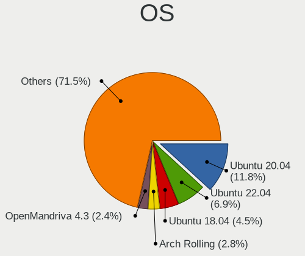

| Name                         | Computers | Percent |
|------------------------------|-----------|---------|
| Ubuntu 20.04                 | 57        | 19.39%  |
| Ubuntu 18.04                 | 25        | 8.5%    |
| KDE neon 20.04               | 10        | 3.4%    |
| Zorin 16                     | 9         | 3.06%   |
| Ubuntu 22.04                 | 8         | 2.72%   |
| Ubuntu 20.10                 | 8         | 2.72%   |
| Debian 11                    | 8         | 2.72%   |
| Xubuntu 20.04                | 7         | 2.38%   |
| Ubuntu 19.10                 | 6         | 2.04%   |
| OpenMandriva 4.3             | 5         | 1.7%    |
| Fedora 34                    | 5         | 1.7%    |
| ArcoLinux Rolling            | 5         | 1.7%    |
| Zorin 15                     | 4         | 1.36%   |
| Pop!_OS 20.04                | 4         | 1.36%   |
| Linux Mint 19.3              | 4         | 1.36%   |
| Linux Mint 19.1              | 4         | 1.36%   |
| Kubuntu 20.04                | 4         | 1.36%   |
| Fedora 33                    | 4         | 1.36%   |
| Arch                         | 4         | 1.36%   |
| Ubuntu 21.10                 | 3         | 1.02%   |
| Pop!_OS 21.10                | 3         | 1.02%   |
| OpenMandriva 4.2             | 3         | 1.02%   |
| Manjaro                      | 3         | 1.02%   |
| Kubuntu 22.04                | 3         | 1.02%   |
| Kubuntu 21.10                | 3         | 1.02%   |
| Gentoo 2.6                   | 3         | 1.02%   |
| Fedora 35                    | 3         | 1.02%   |
| Debian Testing               | 3         | 1.02%   |
| Ubuntu Budgie 22.04          | 2         | 0.68%   |
| Ubuntu 21.04                 | 2         | 0.68%   |
| Ubuntu 18.10                 | 2         | 0.68%   |
| Ubuntu 16.04                 | 2         | 0.68%   |
| ROSA R8                      | 2         | 0.68%   |
| Pop!_OS 22.04                | 2         | 0.68%   |
| Pop!_OS 21.04                | 2         | 0.68%   |
| Pop!_OS 20.10                | 2         | 0.68%   |
| OpenMandriva 4.50            | 2         | 0.68%   |
| Manjaro 20.2                 | 2         | 0.68%   |
| Lubuntu 20.04                | 2         | 0.68%   |
| Linux Mint 20.2              | 2         | 0.68%   |
| Linux Mint 20                | 2         | 0.68%   |
| Kubuntu 19.10                | 2         | 0.68%   |
| Kubuntu 18.04                | 2         | 0.68%   |
| Endless 3.7.4                | 2         | 0.68%   |
| Endless 3.6.3                | 2         | 0.68%   |
| Endless 3.5.8                | 2         | 0.68%   |
| EndeavourOS                  | 2         | 0.68%   |
| BlackPanther 18.1            | 2         | 0.68%   |
| Android                      | 2         | 0.68%   |
| Xubuntu 21.10                | 1         | 0.34%   |
| Xubuntu 18.04                | 1         | 0.34%   |
| Ubuntu MATE 18.04            | 1         | 0.34%   |
| Ubuntu Kylin 20.04           | 1         | 0.34%   |
| Ubuntu Budgie 20.04          | 1         | 0.34%   |
| Ubuntu 19.04                 | 1         | 0.34%   |
| ROSA R9                      | 1         | 0.34%   |
| Q4OS 4                       | 1         | 0.34%   |
| openSUSE Tumbleweed-XXXXXXXX | 1         | 0.34%   |
| Manjaro 21.3.0               | 1         | 0.34%   |
| Manjaro 21.2.3               | 1         | 0.34%   |

OS Family
---------

OS without a version

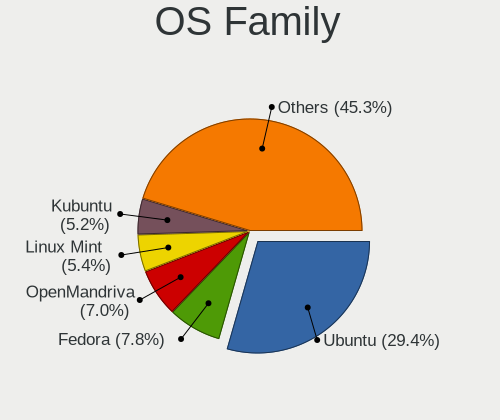

| Name          | Computers | Percent |
|---------------|-----------|---------|
| Ubuntu        | 109       | 39.21%  |
| Linux Mint    | 14        | 5.04%   |
| Kubuntu       | 14        | 5.04%   |
| Fedora        | 14        | 5.04%   |
| Pop!_OS       | 13        | 4.68%   |
| Zorin         | 12        | 4.32%   |
| Manjaro       | 12        | 4.32%   |
| Debian        | 12        | 4.32%   |
| KDE neon      | 11        | 3.96%   |
| Xubuntu       | 9         | 3.24%   |
| OpenMandriva  | 9         | 3.24%   |
| Endless       | 9         | 3.24%   |
| Gentoo        | 5         | 1.8%    |
| ArcoLinux     | 5         | 1.8%    |
| Arch          | 4         | 1.44%   |
| Ubuntu Budgie | 3         | 1.08%   |
| Lubuntu       | 3         | 1.08%   |
| EndeavourOS   | 3         | 1.08%   |
| ROSA          | 2         | 0.72%   |
| BlackPanther  | 2         | 0.72%   |
| Android       | 2         | 0.72%   |
| Ubuntu MATE   | 1         | 0.36%   |
| Ubuntu Kylin  | 1         | 0.36%   |
| Q4OS          | 1         | 0.36%   |
| openSUSE      | 1         | 0.36%   |
| Mageia        | 1         | 0.36%   |
| Garuda Linux  | 1         | 0.36%   |
| Elementary    | 1         | 0.36%   |
| Clear Linux   | 1         | 0.36%   |
| Chrome OS     | 1         | 0.36%   |
| CentOS        | 1         | 0.36%   |
| Artix         | 1         | 0.36%   |

Kernel
------

Version of the Linux kernel

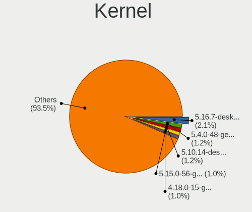

| Version                  | Computers | Percent |
|--------------------------|-----------|---------|
| 5.4.0-48-generic         | 7         | 2.18%   |
| 4.18.0-15-generic        | 6         | 1.87%   |
| 5.4.0-42-generic         | 5         | 1.56%   |
| 5.3.0-40-generic         | 5         | 1.56%   |
| 5.16.7-desktop-1omv4003  | 5         | 1.56%   |
| 5.13.0-30-generic        | 5         | 1.56%   |
| 5.8.0-41-generic         | 4         | 1.25%   |
| 5.13.0-41-generic        | 4         | 1.25%   |
| 5.13.0-28-generic        | 4         | 1.25%   |
| 5.11.0-40-generic        | 4         | 1.25%   |
| 5.8.0-43-generic         | 3         | 0.93%   |
| 5.8.0-36-generic         | 3         | 0.93%   |
| 5.8.0-14-generic         | 3         | 0.93%   |
| 5.4.0-70-generic         | 3         | 0.93%   |
| 5.4.0-60-generic         | 3         | 0.93%   |
| 5.4.0-54-generic         | 3         | 0.93%   |
| 5.4.0-52-generic         | 3         | 0.93%   |
| 5.4.0-31-generic         | 3         | 0.93%   |
| 5.4.0-29-generic         | 3         | 0.93%   |
| 5.4.0-26-generic         | 3         | 0.93%   |
| 5.3.0-26-generic         | 3         | 0.93%   |
| 5.15.0-46-generic        | 3         | 0.93%   |
| 5.15.0-25-generic        | 3         | 0.93%   |
| 5.13.0-21-generic        | 3         | 0.93%   |
| 5.11.0-43-generic        | 3         | 0.93%   |
| 5.10.14-desktop-1omv4002 | 3         | 0.93%   |
| 4.18.0-17-generic        | 3         | 0.93%   |
| 5.9.2-arch1-1            | 2         | 0.62%   |
| 5.8.0-7630-generic       | 2         | 0.62%   |
| 5.8.0-53-generic         | 2         | 0.62%   |
| 5.8.0-44-generic         | 2         | 0.62%   |
| 5.6.14-desktop-2bP       | 2         | 0.62%   |
| 5.6.0-1-amd64            | 2         | 0.62%   |
| 5.4.0-90-generic         | 2         | 0.62%   |
| 5.4.0-89-generic         | 2         | 0.62%   |
| 5.4.0-7642-generic       | 2         | 0.62%   |
| 5.4.0-66-generic         | 2         | 0.62%   |
| 5.4.0-58-generic         | 2         | 0.62%   |
| 5.4.0-56-generic         | 2         | 0.62%   |
| 5.4.0-40-generic         | 2         | 0.62%   |
| 5.4.0-33-generic         | 2         | 0.62%   |
| 5.4.0-28-generic         | 2         | 0.62%   |
| 5.4.0-104-generic        | 2         | 0.62%   |
| 5.3.0-23-generic         | 2         | 0.62%   |
| 5.3.0-19-generic         | 2         | 0.62%   |
| 5.16.15-76051615-generic | 2         | 0.62%   |
| 5.15.0-41-generic        | 2         | 0.62%   |
| 5.15.0-40-generic        | 2         | 0.62%   |
| 5.13.19-2-MANJARO        | 2         | 0.62%   |
| 5.13.0-7614-generic      | 2         | 0.62%   |
| 5.13.0-27-generic        | 2         | 0.62%   |
| 5.13.0-22-generic        | 2         | 0.62%   |
| 5.12.4-desktop-1omv4050  | 2         | 0.62%   |
| 5.11.0-38-generic        | 2         | 0.62%   |
| 5.10.0-8-amd64           | 2         | 0.62%   |
| 5.10.0-10-amd64          | 2         | 0.62%   |
| 5.0.0-25-generic         | 2         | 0.62%   |
| 5.0.0-23-generic         | 2         | 0.62%   |
| 4.18.16-desktop-1bP      | 2         | 0.62%   |
| 4.15.0-46-generic        | 2         | 0.62%   |

Kernel Family
-------------

Linux kernel without a distro release

| Version | Computers | Percent |
|---------|-----------|---------|
| 5.4.0   | 66        | 21.64%  |
| 5.8.0   | 28        | 9.18%   |
| 5.13.0  | 26        | 8.52%   |
| 5.11.0  | 18        | 5.9%    |
| 5.3.0   | 16        | 5.25%   |
| 4.15.0  | 16        | 5.25%   |
| 4.18.0  | 15        | 4.92%   |
| 5.15.0  | 14        | 4.59%   |
| 5.10.0  | 7         | 2.3%    |
| 5.16.7  | 6         | 1.97%   |
| 5.0.0   | 6         | 1.97%   |
| 5.10.14 | 5         | 1.64%   |
| 5.6.0   | 4         | 1.31%   |
| 5.9.2   | 2         | 0.66%   |
| 5.9.15  | 2         | 0.66%   |
| 5.6.14  | 2         | 0.66%   |
| 5.17.5  | 2         | 0.66%   |
| 5.16.15 | 2         | 0.66%   |
| 5.15.2  | 2         | 0.66%   |
| 5.14.16 | 2         | 0.66%   |
| 5.14.0  | 2         | 0.66%   |
| 5.13.19 | 2         | 0.66%   |
| 5.12.8  | 2         | 0.66%   |
| 5.12.4  | 2         | 0.66%   |
| 5.10.30 | 2         | 0.66%   |
| 4.18.16 | 2         | 0.66%   |
| 5.9.8   | 1         | 0.33%   |
| 5.9.14  | 1         | 0.33%   |
| 5.8.8   | 1         | 0.33%   |
| 5.8.6   | 1         | 0.33%   |
| 5.8.5   | 1         | 0.33%   |
| 5.8.18  | 1         | 0.33%   |
| 5.8.10  | 1         | 0.33%   |
| 5.7.13  | 1         | 0.33%   |
| 5.7.0   | 1         | 0.33%   |
| 5.5.15  | 1         | 0.33%   |
| 5.5.0   | 1         | 0.33%   |
| 5.4.80  | 1         | 0.33%   |
| 5.4.53  | 1         | 0.33%   |
| 5.4.27  | 1         | 0.33%   |
| 5.4.14  | 1         | 0.33%   |
| 5.3.6   | 1         | 0.33%   |
| 5.18.10 | 1         | 0.33%   |
| 5.17.4  | 1         | 0.33%   |
| 5.17.12 | 1         | 0.33%   |
| 5.17.1  | 1         | 0.33%   |
| 5.17.0  | 1         | 0.33%   |
| 5.16.4  | 1         | 0.33%   |
| 5.16.19 | 1         | 0.33%   |
| 5.16.18 | 1         | 0.33%   |
| 5.16.16 | 1         | 0.33%   |
| 5.16.0  | 1         | 0.33%   |
| 5.15.6  | 1         | 0.33%   |
| 5.15.5  | 1         | 0.33%   |
| 5.15.48 | 1         | 0.33%   |
| 5.15.16 | 1         | 0.33%   |
| 5.15.10 | 1         | 0.33%   |
| 5.14.11 | 1         | 0.33%   |
| 5.14.10 | 1         | 0.33%   |
| 5.13.9  | 1         | 0.33%   |

Kernel Major Ver.
-----------------

Linux kernel major version

| Version | Computers | Percent |
|---------|-----------|---------|
| 5.4     | 69        | 22.92%  |
| 5.8     | 33        | 10.96%  |
| 5.13    | 30        | 9.97%   |
| 5.11    | 21        | 6.98%   |
| 5.15    | 20        | 6.64%   |
| 5.3     | 17        | 5.65%   |
| 4.18    | 17        | 5.65%   |
| 4.15    | 16        | 5.32%   |
| 5.10    | 15        | 4.98%   |
| 5.16    | 13        | 4.32%   |
| 5.12    | 7         | 2.33%   |
| 5.6     | 6         | 1.99%   |
| 5.17    | 6         | 1.99%   |
| 5.14    | 6         | 1.99%   |
| 5.0     | 6         | 1.99%   |
| 5.9     | 5         | 1.66%   |
| 5.7     | 2         | 0.66%   |
| 5.5     | 2         | 0.66%   |
| 4.19    | 2         | 0.66%   |
| 4.1     | 2         | 0.66%   |
| 3.18    | 2         | 0.66%   |
| 5.18    | 1         | 0.33%   |
| 4.9     | 1         | 0.33%   |
| 4.20    | 1         | 0.33%   |
| 4.14    | 1         | 0.33%   |

Arch
----

OS architecture (x86_64, i586, etc.)

| Name    | Computers | Percent |
|---------|-----------|---------|
| x86_64  | 256       | 95.52%  |
| i686    | 5         | 1.87%   |
| aarch64 | 5         | 1.87%   |
| armv8l  | 2         | 0.75%   |

DE
--

Desktop Environment

| Name            | Computers | Percent |
|-----------------|-----------|---------|
| GNOME           | 122       | 43.11%  |
| Unknown         | 47        | 16.61%  |
| KDE5            | 42        | 14.84%  |
| XFCE            | 25        | 8.83%   |
| X-Cinnamon      | 10        | 3.53%   |
| KDE             | 9         | 3.18%   |
| Cinnamon        | 6         | 2.12%   |
| LXQt            | 4         | 1.41%   |
| Unity           | 3         | 1.06%   |
| Budgie          | 3         | 1.06%   |
| MATE            | 2         | 0.71%   |
| DWM             | 2         | 0.71%   |
| UKUI            | 1         | 0.35%   |
| Trinity         | 1         | 0.35%   |
| Pantheon        | 1         | 0.35%   |
| Openbox         | 1         | 0.35%   |
| NsCDE           | 1         | 0.35%   |
| KDE4            | 1         | 0.35%   |
| i3              | 1         | 0.35%   |
| GNOME Flashback | 1         | 0.35%   |

Display Server
--------------

X11 or Wayland

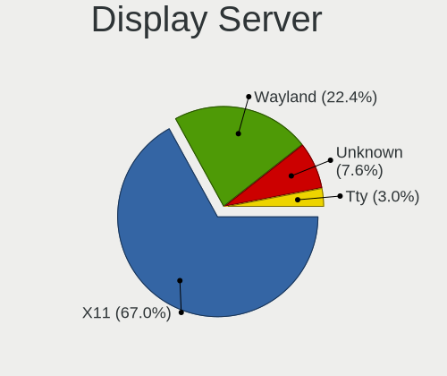

| Name    | Computers | Percent |
|---------|-----------|---------|
| X11     | 211       | 75.9%   |
| Unknown | 31        | 11.15%  |
| Wayland | 29        | 10.43%  |
| Tty     | 7         | 2.52%   |

Display Manager
---------------

SDDM, LightDM, etc.

| Name    | Computers | Percent |
|---------|-----------|---------|
| Unknown | 150       | 53.19%  |
| SDDM    | 40        | 14.18%  |
| GDM     | 35        | 12.41%  |
| LightDM | 22        | 7.8%    |
| GDM3    | 19        | 6.74%   |
| TDM     | 14        | 4.96%   |
| XDM     | 1         | 0.35%   |
| KDM     | 1         | 0.35%   |

OS Lang
-------

Language

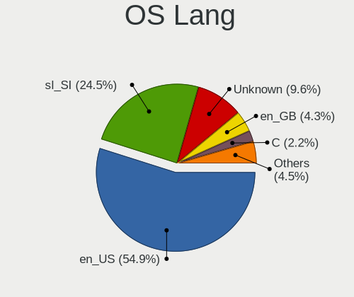

| Lang    | Computers | Percent |
|---------|-----------|---------|
| en_US   | 132       | 48.18%  |
| sl_SI   | 72        | 26.28%  |
| Unknown | 44        | 16.06%  |
| en_GB   | 12        | 4.38%   |
| C       | 6         | 2.19%   |
| en_SI   | 4         | 1.46%   |
| nl_NL   | 1         | 0.36%   |
| it_IT   | 1         | 0.36%   |
| hr_HR   | 1         | 0.36%   |
| de_DE   | 1         | 0.36%   |

Boot Mode
---------

EFI or BIOS

| Mode | Computers | Percent |
|------|-----------|---------|
| EFI  | 139       | 50.36%  |
| BIOS | 137       | 49.64%  |

Filesystem
----------

Type of filesystem

| Type    | Computers | Percent |
|---------|-----------|---------|
| Ext4    | 215       | 78.18%  |
| Overlay | 22        | 8%      |
| Unknown | 16        | 5.82%   |
| Btrfs   | 14        | 5.09%   |
| Zfs     | 5         | 1.82%   |
| Xfs     | 2         | 0.73%   |
| Ext2    | 1         | 0.36%   |

Part. scheme
------------

Scheme of partitioning

| Type    | Computers | Percent |
|---------|-----------|---------|
| Unknown | 162       | 58.91%  |
| GPT     | 82        | 29.82%  |
| MBR     | 31        | 11.27%  |

Dual Boot with Linux/BSD
------------------------

Hosting more than one Linux/BSD

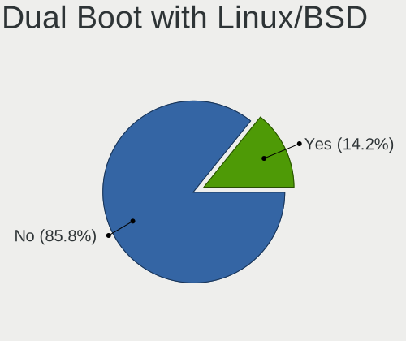

| Dual boot | Computers | Percent |
|-----------|-----------|---------|
| No        | 240       | 87.27%  |
| Yes       | 35        | 12.73%  |

Dual Boot (Win)
---------------

Hosting Linux and Windows

| Dual boot | Computers | Percent |
|-----------|-----------|---------|
| No        | 193       | 70.7%   |
| Yes       | 80        | 29.3%   |

Board
-----

Vendor
------

Motherboard manufacturer

| Name                    | Computers | Percent |
|-------------------------|-----------|---------|
| Hewlett-Packard         | 60        | 22.39%  |
| Lenovo                  | 53        | 19.78%  |
| ASUSTek Computer        | 47        | 17.54%  |
| Gigabyte Technology     | 18        | 6.72%   |
| Dell                    | 17        | 6.34%   |
| ASRock                  | 13        | 4.85%   |
| MSI                     | 11        | 4.1%    |
| Intel                   | 7         | 2.61%   |
| Acer                    | 6         | 2.24%   |
| Raspberry Pi Foundation | 5         | 1.87%   |
| Toshiba                 | 4         | 1.49%   |
| Pegatron                | 4         | 1.49%   |
| Apple                   | 4         | 1.49%   |
| Medion                  | 3         | 1.12%   |
| Supermicro              | 2         | 0.75%   |
| Fujitsu                 | 2         | 0.75%   |
| Unknown                 | 2         | 0.75%   |
| Razer                   | 1         | 0.37%   |
| PC Specialist           | 1         | 0.37%   |
| Panasonic               | 1         | 0.37%   |
| Microsoft               | 1         | 0.37%   |
| IBM                     | 1         | 0.37%   |
| Fujitsu Siemens         | 1         | 0.37%   |
| Framework               | 1         | 0.37%   |
| eMachines               | 1         | 0.37%   |
| Biostar                 | 1         | 0.37%   |
| Acidanthera             | 1         | 0.37%   |

Model
-----

Motherboard model

| Name                                       | Computers | Percent |
|--------------------------------------------|-----------|---------|
| MSI MS-7C02                                | 3         | 1.12%   |
| HP 255 G7 Notebook PC                      | 3         | 1.12%   |
| Unknown                                    | 3         | 1.12%   |
| Toshiba Satellite L750                     | 2         | 0.75%   |
| RPi Raspberry Pi 400 Rev 1.0               | 2         | 0.75%   |
| RPi Raspberry Pi 4 Model B Rev 1.2         | 2         | 0.75%   |
| Pegatron FL308AA-ABD IQ512de               | 2         | 0.75%   |
| MSI MS-7788                                | 2         | 0.75%   |
| Lenovo ThinkPad T410 2522A92               | 2         | 0.75%   |
| HP Spectre x360 Convertible 13-ae0xx       | 2         | 0.75%   |
| HP EliteBook 8760w                         | 2         | 0.75%   |
| Gigabyte F2A88XM-D3HP                      | 2         | 0.75%   |
| Dell Inspiron 5570                         | 2         | 0.75%   |
| ASUS ROG STRIX Z370-F GAMING               | 2         | 0.75%   |
| ASUS ROG STRIX X570-E GAMING               | 2         | 0.75%   |
| ASUS PRIME B350-PLUS                       | 2         | 0.75%   |
| ASUS PRIME A320M-K                         | 2         | 0.75%   |
| ASUS P7H55-M SI                            | 2         | 0.75%   |
| Toshiba Satellite Pro U400                 | 1         | 0.37%   |
| Toshiba QOSMIO X500                        | 1         | 0.37%   |
| Supermicro X7SBi-LN4                       | 1         | 0.37%   |
| Supermicro PCplus T600-C246                | 1         | 0.37%   |
| Razer Blade 14 - RZ09-0370                 | 1         | 0.37%   |
| RPi Raspberry Pi 4 Model B Rev 1.1 (DT)    | 1         | 0.37%   |
| Pegatron Pro 3010 Microtower PC            | 1         | 0.37%   |
| Pegatron 2A73                              | 1         | 0.37%   |
| PC Specialist Fusion IV                    | 1         | 0.37%   |
| Panasonic CF-53SWWZ5MG                     | 1         | 0.37%   |
| MSI U210                                   | 1         | 0.37%   |
| MSI MS-7C37                                | 1         | 0.37%   |
| MSI MS-7B24                                | 1         | 0.37%   |
| MSI MS-7994                                | 1         | 0.37%   |
| MSI MS-7636                                | 1         | 0.37%   |
| MSI GP60 2OD                               | 1         | 0.37%   |
| Microsoft Surface Pro 4                    | 1         | 0.37%   |
| Medion MS-7707                             | 1         | 0.37%   |
| Medion E7218                               | 1         | 0.37%   |
| Medion Akoya E7226                         | 1         | 0.37%   |
| Lenovo Yoga S740-14IIL 81RS                | 1         | 0.37%   |
| Lenovo Yoga 2 13 20344                     | 1         | 0.37%   |
| Lenovo ThinkStation S20 4157ZSK            | 1         | 0.37%   |
| Lenovo ThinkStation P330 Tiny 30CF000XMH   | 1         | 0.37%   |
| Lenovo ThinkPad X250 20CM004ESC            | 1         | 0.37%   |
| Lenovo ThinkPad X230 23202DG               | 1         | 0.37%   |
| Lenovo ThinkPad X1 Extreme 20MFCTO1WW      | 1         | 0.37%   |
| Lenovo ThinkPad X1 Carbon Gen 8 20U9CTO1WW | 1         | 0.37%   |
| Lenovo ThinkPad W530 24479K4               | 1         | 0.37%   |
| Lenovo ThinkPad T61 8897CTO                | 1         | 0.37%   |
| Lenovo ThinkPad T590 20N5S0YN00            | 1         | 0.37%   |
| Lenovo ThinkPad T590 20N5S0MR00            | 1         | 0.37%   |
| Lenovo ThinkPad T500 2055WYX               | 1         | 0.37%   |
| Lenovo ThinkPad T490s 20NYS4HL07           | 1         | 0.37%   |
| Lenovo ThinkPad T480 20L6S01W00            | 1         | 0.37%   |
| Lenovo ThinkPad T460s 20FAS7XT01           | 1         | 0.37%   |
| Lenovo ThinkPad T420 4236A78               | 1         | 0.37%   |
| Lenovo ThinkPad T420 423662G               | 1         | 0.37%   |
| Lenovo ThinkPad T15 Gen 1 20S6000NSC       | 1         | 0.37%   |
| Lenovo ThinkPad SL500 27464DG              | 1         | 0.37%   |
| Lenovo ThinkPad S3 Yoga 14 20DM008FSC      | 1         | 0.37%   |
| Lenovo ThinkPad R61 8933W4F                | 1         | 0.37%   |

Model Family
------------

Motherboard model prefix

| Name                   | Computers | Percent |
|------------------------|-----------|---------|
| Lenovo ThinkPad        | 31        | 11.57%  |
| ASUS PRIME             | 11        | 4.1%    |
| HP EliteBook           | 10        | 3.73%   |
| HP ProBook             | 9         | 3.36%   |
| Lenovo ThinkCentre     | 7         | 2.61%   |
| Dell Inspiron          | 7         | 2.61%   |
| HP Compaq              | 6         | 2.24%   |
| ASUS ROG               | 6         | 2.24%   |
| RPi Raspberry          | 5         | 1.87%   |
| Lenovo IdeaPad         | 5         | 1.87%   |
| HP ZBook               | 5         | 1.87%   |
| HP 255                 | 4         | 1.49%   |
| HP 250                 | 4         | 1.49%   |
| Dell Latitude          | 4         | 1.49%   |
| ASUS TUF               | 4         | 1.49%   |
| Acer Aspire            | 4         | 1.49%   |
| Toshiba Satellite      | 3         | 1.12%   |
| MSI MS-7C02            | 3         | 1.12%   |
| HP Pavilion            | 3         | 1.12%   |
| ASUS VivoBook          | 3         | 1.12%   |
| Unknown                | 3         | 1.12%   |
| Pegatron FL308AA-ABD   | 2         | 0.75%   |
| MSI MS-7788            | 2         | 0.75%   |
| Lenovo Yoga            | 2         | 0.75%   |
| Lenovo ThinkStation    | 2         | 0.75%   |
| HP Spectre             | 2         | 0.75%   |
| HP Laptop              | 2         | 0.75%   |
| Gigabyte F2A88XM-D3HP  | 2         | 0.75%   |
| Gigabyte B450M         | 2         | 0.75%   |
| Dell XPS               | 2         | 0.75%   |
| Dell Precision         | 2         | 0.75%   |
| ASUS P7H55-M           | 2         | 0.75%   |
| Toshiba QOSMIO         | 1         | 0.37%   |
| Supermicro X7SBi-LN4   | 1         | 0.37%   |
| Supermicro PCplus      | 1         | 0.37%   |
| Razer Blade            | 1         | 0.37%   |
| Pegatron Pro           | 1         | 0.37%   |
| Pegatron 2A73          | 1         | 0.37%   |
| PC Specialist Fusion   | 1         | 0.37%   |
| Panasonic CF-53SWWZ5MG | 1         | 0.37%   |
| MSI U210               | 1         | 0.37%   |
| MSI MS-7C37            | 1         | 0.37%   |
| MSI MS-7B24            | 1         | 0.37%   |
| MSI MS-7994            | 1         | 0.37%   |
| MSI MS-7636            | 1         | 0.37%   |
| MSI GP60               | 1         | 0.37%   |
| Microsoft Surface      | 1         | 0.37%   |
| Medion MS-7707         | 1         | 0.37%   |
| Medion E7218           | 1         | 0.37%   |
| Medion Akoya           | 1         | 0.37%   |
| Lenovo MIIX            | 1         | 0.37%   |
| Lenovo Legion          | 1         | 0.37%   |
| Lenovo G585            | 1         | 0.37%   |
| Lenovo G510            | 1         | 0.37%   |
| Lenovo G500            | 1         | 0.37%   |
| Lenovo B50-30          | 1         | 0.37%   |
| Intel NUC8i5BEK        | 1         | 0.37%   |
| Intel NUC7i3BNB        | 1         | 0.37%   |
| Intel NUC5i7RYB        | 1         | 0.37%   |
| Intel DQ67SW           | 1         | 0.37%   |

MFG Year
--------

Motherboard manufacture year

| Year    | Computers | Percent |
|---------|-----------|---------|
| 2019    | 29        | 10.82%  |
| 2017    | 26        | 9.7%    |
| 2018    | 24        | 8.96%   |
| 2020    | 22        | 8.21%   |
| 2011    | 21        | 7.84%   |
| 2009    | 20        | 7.46%   |
| 2015    | 17        | 6.34%   |
| 2013    | 17        | 6.34%   |
| 2014    | 14        | 5.22%   |
| 2010    | 14        | 5.22%   |
| 2012    | 13        | 4.85%   |
| 2008    | 12        | 4.48%   |
| 2021    | 9         | 3.36%   |
| 2016    | 9         | 3.36%   |
| 2007    | 8         | 2.99%   |
| Unknown | 7         | 2.61%   |
| 2006    | 6         | 2.24%   |

Form Factor
-----------

Physical design of the computer

| Name           | Computers | Percent |
|----------------|-----------|---------|
| Notebook       | 139       | 51.87%  |
| Desktop        | 102       | 38.06%  |
| All in one     | 6         | 2.24%   |
| System on chip | 5         | 1.87%   |
| Mini pc        | 5         | 1.87%   |
| Tablet         | 3         | 1.12%   |
| Convertible    | 3         | 1.12%   |
| Server         | 3         | 1.12%   |
| Phone          | 2         | 0.75%   |

Secure Boot
-----------

Enabled or disabled

| State    | Computers | Percent |
|----------|-----------|---------|
| Disabled | 252       | 93.33%  |
| Enabled  | 18        | 6.67%   |

Coreboot
--------

Have coreboot on board

| Used | Computers | Percent |
|------|-----------|---------|
| No   | 267       | 99.63%  |
| Yes  | 1         | 0.37%   |

RAM Size
--------

Total RAM memory

| Size in GB      | Computers | Percent |
|-----------------|-----------|---------|
| 3.01-4.0        | 63        | 23.33%  |
| 16.01-24.0      | 58        | 21.48%  |
| 8.01-16.0       | 57        | 21.11%  |
| 4.01-8.0        | 44        | 16.3%   |
| 32.01-64.0      | 23        | 8.52%   |
| 2.01-3.0        | 7         | 2.59%   |
| 1.01-2.0        | 7         | 2.59%   |
| 64.01-256.0     | 5         | 1.85%   |
| 24.01-32.0      | 4         | 1.48%   |
| More than 256.0 | 1         | 0.37%   |
| 0.51-1.0        | 1         | 0.37%   |

RAM Used
--------

Used RAM memory

| Used GB    | Computers | Percent |
|------------|-----------|---------|
| 1.01-2.0   | 108       | 36%     |
| 2.01-3.0   | 72        | 24%     |
| 4.01-8.0   | 39        | 13%     |
| 3.01-4.0   | 36        | 12%     |
| 0.51-1.0   | 19        | 6.33%   |
| 8.01-16.0  | 16        | 5.33%   |
| 0.01-0.5   | 6         | 2%      |
| 16.01-24.0 | 3         | 1%      |
| 24.01-32.0 | 1         | 0.33%   |

Total Drives
------------

Number of drives on board

| Drives | Computers | Percent |
|--------|-----------|---------|
| 1      | 163       | 59.27%  |
| 2      | 68        | 24.73%  |
| 3      | 18        | 6.55%   |
| 4      | 8         | 2.91%   |
| 0      | 5         | 1.82%   |
| 6      | 4         | 1.45%   |
| 5      | 4         | 1.45%   |
| 8      | 3         | 1.09%   |
| 7      | 2         | 0.73%   |

Has CD-ROM
----------

Has CD-ROM on board

| Presented | Computers | Percent |
|-----------|-----------|---------|
| No        | 148       | 54.81%  |
| Yes       | 122       | 45.19%  |

Has Ethernet
------------

Has Ethernet on board

| Presented | Computers | Percent |
|-----------|-----------|---------|
| Yes       | 239       | 88.85%  |
| No        | 30        | 11.15%  |

Has WiFi
--------

Has WiFi module

| Presented | Computers | Percent |
|-----------|-----------|---------|
| Yes       | 184       | 68.15%  |
| No        | 86        | 31.85%  |

Has Bluetooth
-------------

Has Bluetooth module

| Presented | Computers | Percent |
|-----------|-----------|---------|
| Yes       | 148       | 54.81%  |
| No        | 122       | 45.19%  |

Location
--------

Country
-------

Geographic location (country)

| Country  | Computers | Percent |
|----------|-----------|---------|
| Slovenia | 268       | 100%    |

City
----

Geographic location (city)

| City                    | Computers | Percent |
|-------------------------|-----------|---------|
| Ljubljana               | 99        | 34.02%  |
| Maribor                 | 8         | 2.75%   |
| Kranj                   | 8         | 2.75%   |
| Celje                   | 8         | 2.75%   |
| Vrhnika                 | 7         | 2.41%   |
| Koper                   | 7         | 2.41%   |
| Novo Mesto              | 6         | 2.06%   |
| Grosuplje               | 5         | 1.72%   |
| Trzin                   | 4         | 1.37%   |
| Rence                   | 4         | 1.37%   |
| Portoro               | 4         | 1.37%   |
| alec                  | 3         | 1.03%   |
| Slovenske Konjice       | 3         | 1.03%   |
| Radovljica              | 3         | 1.03%   |
| Ptuj                    | 3         | 1.03%   |
| Pragersko               | 3         | 1.03%   |
| Petrovce                | 3         | 1.03%   |
| Murska Sobota           | 3         | 1.03%   |
| Logatec                 | 3         | 1.03%   |
| Kamnik                  | 3         | 1.03%   |
| Ziri                    | 2         | 0.69%   |
| Zgornja Besnica         | 2         | 0.69%   |
| Velike Lae          | 2         | 0.69%   |
| Velenje                 | 2         | 0.69%   |
| Slovenj Gradec          | 2         | 0.69%   |
| kofja Loka            | 2         | 0.69%   |
| entjur pri Celju      | 2         | 0.69%   |
| Puconci                 | 2         | 0.69%   |
| Postojna                | 2         | 0.69%   |
| Poljane nad Skofjo Loko | 2         | 0.69%   |
| Oplotnica               | 2         | 0.69%   |
| Nova Gorica             | 2         | 0.69%   |
| Muta                    | 2         | 0.69%   |
| Domale                | 2         | 0.69%   |
| Cerknica                | 2         | 0.69%   |
| Ajdovina            | 2         | 0.69%   |
| uemberk             | 1         | 0.34%   |
| Zirovnica               | 1         | 0.34%   |
| Zgornji Leskovec        | 1         | 0.34%   |
| Zgornja Kungota         | 1         | 0.34%   |
| Zagorje ob Savi         | 1         | 0.34%   |
| Vuzenica                | 1         | 0.34%   |
| Volcja Draga            | 1         | 0.34%   |
| Visoko                  | 1         | 0.34%   |
| Trzic                   | 1         | 0.34%   |
| Trbovlje                | 1         | 0.34%   |
| Tabor                   | 1         | 0.34%   |
| tore                  | 1         | 0.34%   |
| Stari Trg pri Lozu      | 1         | 0.34%   |
| Sostanj                 | 1         | 0.34%   |
| Solkan                  | 1         | 0.34%   |
| Smartno ob Paki         | 1         | 0.34%   |
| Smarje pri Jelsah       | 1         | 0.34%   |
| Slovenska Bistrica      | 1         | 0.34%   |
| Skocjan                 | 1         | 0.34%   |
| Seana                 | 1         | 0.34%   |
| entjernej             | 1         | 0.34%   |
| Sempeter pri Gorici     | 1         | 0.34%   |
| Selnica ob Dravi        | 1         | 0.34%   |
| Rue                   | 1         | 0.34%   |

Drives
------

Drive Vendor
------------

Hard drive vendors

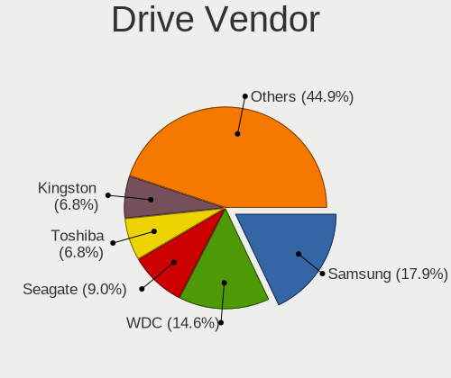

| Vendor                  | Computers | Drives | Percent |
|-------------------------|-----------|--------|---------|
| WDC                     | 71        | 123    | 18.64%  |
| Samsung Electronics     | 50        | 87     | 13.12%  |
| Seagate                 | 39        | 62     | 10.24%  |
| Toshiba                 | 34        | 47     | 8.92%   |
| Kingston                | 26        | 36     | 6.82%   |
| Crucial                 | 26        | 38     | 6.82%   |
| SanDisk                 | 18        | 22     | 4.72%   |
| Unknown                 | 16        | 19     | 4.2%    |
| Hitachi                 | 12        | 15     | 3.15%   |
| HGST                    | 11        | 12     | 2.89%   |
| SK hynix                | 10        | 13     | 2.62%   |
| Intel                   | 7         | 7      | 1.84%   |
| Corsair                 | 6         | 7      | 1.57%   |
| Intenso                 | 5         | 7      | 1.31%   |
| Transcend               | 3         | 4      | 0.79%   |
| Patriot                 | 3         | 5      | 0.79%   |
| OCZ                     | 3         | 6      | 0.79%   |
| Fujitsu                 | 3         | 4      | 0.79%   |
| Apacer                  | 3         | 4      | 0.79%   |
| Silicon Motion          | 2         | 2      | 0.52%   |
| Micron Technology       | 2         | 2      | 0.52%   |
| LITEONIT                | 2         | 2      | 0.52%   |
| LITEON                  | 2         | 2      | 0.52%   |
| KIOXIA                  | 2         | 2      | 0.52%   |
| Hewlett-Packard         | 2         | 2      | 0.52%   |
| Gigabyte Technology     | 2         | 4      | 0.52%   |
| China                   | 2         | 2      | 0.52%   |
| Apple                   | 2         | 3      | 0.52%   |
| Union Memory (Shenzhen) | 1         | 1      | 0.26%   |
| TS512GMT                | 1         | 3      | 0.26%   |
| Team                    | 1         | 1      | 0.26%   |
| SABRENT                 | 1         | 1      | 0.26%   |
| Realtek                 | 1         | 1      | 0.26%   |
| Phison                  | 1         | 1      | 0.26%   |
| Maxtor                  | 1         | 1      | 0.26%   |
| Leven                   | 1         | 1      | 0.26%   |
| Lenovo                  | 1         | 1      | 0.26%   |
| KingDian                | 1         | 1      | 0.26%   |
| JMicron Technology      | 1         | 1      | 0.26%   |
| Integral                | 1         | 1      | 0.26%   |
| IBM-ESXS                | 1         | 1      | 0.26%   |
| HGST HTS                | 1         | 1      | 0.26%   |
| GOODRAM                 | 1         | 1      | 0.26%   |
| ASMT109x                | 1         | 1      | 0.26%   |
| A-DATA Technology       | 1         | 1      | 0.26%   |

Drive Model
-----------

Hard drive models

| Model                                   | Computers | Percent |
|-----------------------------------------|-----------|---------|
| Kingston SA400S37240G 240GB SSD         | 7         | 1.62%   |
| Crucial CT240BX500SSD1 240GB            | 7         | 1.62%   |
| Toshiba DT01ACA100 1TB                  | 6         | 1.39%   |
| Samsung NVMe SSD Drive 256GB            | 6         | 1.39%   |
| Samsung NVMe SSD Drive 512GB            | 5         | 1.16%   |
| HGST HTS721010A9E630 1TB                | 5         | 1.16%   |
| Unknown MMC Card  16GB                  | 4         | 0.93%   |
| Samsung SSD 850 EVO 250GB               | 4         | 0.93%   |
| WDC WDS500G2B0A-00SM50 500GB SSD        | 3         | 0.7%    |
| WDC WD10EARS-00Y5B1 1TB                 | 3         | 0.7%    |
| Unknown MMC Card  32GB                  | 3         | 0.7%    |
| Toshiba HDWD120 2TB                     | 3         | 0.7%    |
| Toshiba DT01ACA200 2TB                  | 3         | 0.7%    |
| Seagate ST1000LM024 HN-M101MBB 1TB      | 3         | 0.7%    |
| SanDisk NVMe SSD Drive 512GB            | 3         | 0.7%    |
| SanDisk NVMe SSD Drive 500GB            | 3         | 0.7%    |
| Samsung SSD 970 EVO Plus 500GB          | 3         | 0.7%    |
| Samsung SSD 860 EVO 1TB                 | 3         | 0.7%    |
| Kingston SUV400S37240G 240GB SSD        | 3         | 0.7%    |
| Kingston SA400S37120G 120GB SSD         | 3         | 0.7%    |
| Hitachi HTS547575A9E384 752GB           | 3         | 0.7%    |
| HGST HTS545050A7E680 500GB              | 3         | 0.7%    |
| Crucial CT500MX500SSD1 500GB            | 3         | 0.7%    |
| Crucial CT1000MX500SSD1 1TB             | 3         | 0.7%    |
| WDC WDS500G3X0C-00SJG0 500GB            | 2         | 0.46%   |
| WDC WDS480G2G0A-00JH30 480GB SSD        | 2         | 0.46%   |
| WDC WDS240G2G0B-00EPW0 240GB SSD        | 2         | 0.46%   |
| WDC WDS240G2G0A-00JH30 240GB SSD        | 2         | 0.46%   |
| WDC WDS120G2G0A-00JH30 120GB SSD        | 2         | 0.46%   |
| WDC WD5000AADS-00S9B0 500GB             | 2         | 0.46%   |
| WDC WD5000AACS-00G8B1 500GB             | 2         | 0.46%   |
| WDC WD40PURZ-85TTDY0 4TB                | 2         | 0.46%   |
| WDC WD40EFRX-68N32N0 4TB                | 2         | 0.46%   |
| WDC WD15EARS-00MVWB0 1TB                | 2         | 0.46%   |
| WDC WD10EZEX-08M2NA0 1TB                | 2         | 0.46%   |
| WDC WD1002FAEX-00Y9A0 1TB               | 2         | 0.46%   |
| Unknown MMC Card                        | 2         | 0.46%   |
| Toshiba MQ04ABF100 1TB                  | 2         | 0.46%   |
| Toshiba MQ01ABF050 500GB                | 2         | 0.46%   |
| Toshiba KBG30ZMS128G 128GB NVMe SSD     | 2         | 0.46%   |
| Toshiba DT01ACA050 500GB                | 2         | 0.46%   |
| SK hynix SC311 SATA 256GB SSD           | 2         | 0.46%   |
| Seagate ST9750420AS 752GB               | 2         | 0.46%   |
| Seagate ST9500325AS 500GB               | 2         | 0.46%   |
| Seagate ST500LM012 HN-M500MBB 500GB     | 2         | 0.46%   |
| Seagate ST1000DM003-1CH162 1TB          | 2         | 0.46%   |
| Seagate Portable 4TB                    | 2         | 0.46%   |
| SanDisk SSD PLUS 1000GB                 | 2         | 0.46%   |
| Samsung SSD 970 EVO Plus 1TB            | 2         | 0.46%   |
| Samsung SSD 970 EVO 500GB               | 2         | 0.46%   |
| Samsung SSD 860 QVO 1TB                 | 2         | 0.46%   |
| Samsung SSD 860 EVO 500GB               | 2         | 0.46%   |
| Samsung SSD 850 EVO 120GB               | 2         | 0.46%   |
| Samsung SSD 840 EVO 250GB               | 2         | 0.46%   |
| Samsung SM963 2.5" NVMe PCIe SSD 1024GB | 2         | 0.46%   |
| Samsung NVMe SSD Drive 500GB            | 2         | 0.46%   |
| Kingston SV300S37A120G 120GB SSD        | 2         | 0.46%   |
| Intenso 128GB                           | 2         | 0.46%   |
| Hitachi HTS725032A9A364 320GB           | 2         | 0.46%   |
| HP SSD EX900 500GB                      | 2         | 0.46%   |

HDD Vendor
----------

Hard disk drive vendors

| Vendor              | Computers | Drives | Percent |
|---------------------|-----------|--------|---------|
| WDC                 | 55        | 99     | 35.95%  |
| Seagate             | 38        | 59     | 24.84%  |
| Toshiba             | 25        | 35     | 16.34%  |
| Hitachi             | 12        | 15     | 7.84%   |
| HGST                | 11        | 12     | 7.19%   |
| Fujitsu             | 3         | 4      | 1.96%   |
| Samsung Electronics | 2         | 2      | 1.31%   |
| Unknown             | 1         | 1      | 0.65%   |
| SABRENT             | 1         | 1      | 0.65%   |
| Maxtor              | 1         | 1      | 0.65%   |
| IBM-ESXS            | 1         | 1      | 0.65%   |
| HGST HTS            | 1         | 1      | 0.65%   |
| ASMT109x            | 1         | 1      | 0.65%   |
| Apple               | 1         | 2      | 0.65%   |

SSD Vendor
----------

Solid state drive vendors

| Vendor              | Computers | Drives | Percent |
|---------------------|-----------|--------|---------|
| Crucial             | 24        | 36     | 17.91%  |
| Kingston            | 23        | 29     | 17.16%  |
| Samsung Electronics | 22        | 36     | 16.42%  |
| WDC                 | 15        | 17     | 11.19%  |
| SanDisk             | 10        | 13     | 7.46%   |
| Intel               | 4         | 4      | 2.99%   |
| Corsair             | 4         | 5      | 2.99%   |
| Transcend           | 3         | 4      | 2.24%   |
| SK hynix            | 3         | 3      | 2.24%   |
| Patriot             | 3         | 5      | 2.24%   |
| OCZ                 | 3         | 6      | 2.24%   |
| Intenso             | 3         | 3      | 2.24%   |
| Toshiba             | 2         | 2      | 1.49%   |
| LITEONIT            | 2         | 2      | 1.49%   |
| LITEON              | 2         | 2      | 1.49%   |
| China               | 2         | 2      | 1.49%   |
| Apacer              | 2         | 3      | 1.49%   |
| Micron Technology   | 1         | 1      | 0.75%   |
| Leven               | 1         | 1      | 0.75%   |
| KingDian            | 1         | 1      | 0.75%   |
| Integral            | 1         | 1      | 0.75%   |
| GOODRAM             | 1         | 1      | 0.75%   |
| Gigabyte Technology | 1         | 2      | 0.75%   |
| A-DATA Technology   | 1         | 1      | 0.75%   |

Drive Kind
----------

HDD or SSD

| Kind    | Computers | Drives | Percent |
|---------|-----------|--------|---------|
| HDD     | 131       | 234    | 37.32%  |
| SSD     | 118       | 180    | 33.62%  |
| NVMe    | 82        | 116    | 23.36%  |
| MMC     | 13        | 16     | 3.7%    |
| Unknown | 7         | 12     | 1.99%   |

Drive Connector
---------------

SATA, SAS, NVMe, etc.

| Type | Computers | Drives | Percent |
|------|-----------|--------|---------|
| SATA | 201       | 405    | 64.63%  |
| NVMe | 82        | 115    | 26.37%  |
| SAS  | 15        | 22     | 4.82%   |
| MMC  | 13        | 16     | 4.18%   |

Drive Size
----------

Size of hard drive

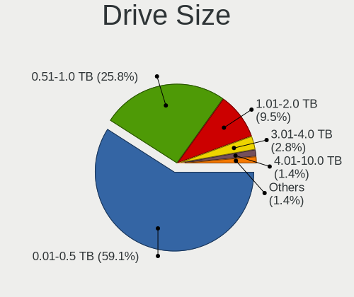

| Size in TB | Computers | Drives | Percent |
|------------|-----------|--------|---------|
| 0.01-0.5   | 150       | 239    | 57.69%  |
| 0.51-1.0   | 78        | 127    | 30%     |
| 1.01-2.0   | 18        | 25     | 6.92%   |
| 3.01-4.0   | 8         | 15     | 3.08%   |
| 2.01-3.0   | 2         | 3      | 0.77%   |
| 10.01-20.0 | 2         | 2      | 0.77%   |
| 4.01-10.0  | 2         | 3      | 0.77%   |

Space Total
-----------

Amount of disk space available on the file system

| Size in GB     | Computers | Percent |
|----------------|-----------|---------|
| 251-500        | 70        | 24.31%  |
| 101-250        | 69        | 23.96%  |
| 501-1000       | 38        | 13.19%  |
| 1001-2000      | 28        | 9.72%   |
| 1-20           | 23        | 7.99%   |
| 51-100         | 16        | 5.56%   |
| 2001-3000      | 14        | 4.86%   |
| 21-50          | 13        | 4.51%   |
| Unknown        | 10        | 3.47%   |
| More than 3000 | 7         | 2.43%   |

Space Used
----------

Amount of used disk space

| Used GB   | Computers | Percent |
|-----------|-----------|---------|
| 1-20      | 119       | 41.03%  |
| 21-50     | 39        | 13.45%  |
| 51-100    | 38        | 13.1%   |
| 101-250   | 35        | 12.07%  |
| 251-500   | 21        | 7.24%   |
| 1001-2000 | 11        | 3.79%   |
| 501-1000  | 11        | 3.79%   |
| Unknown   | 10        | 3.45%   |
| 2001-3000 | 6         | 2.07%   |

Malfunc. Drives
---------------

Drive models with a malfunction

| Model                              | Computers | Drives | Percent |
|------------------------------------|-----------|--------|---------|
| HGST HTS545050A7E680 500GB         | 2         | 2      | 6.67%   |
| WDC WDS480G2G0A-00JH30 480GB SSD   | 1         | 1      | 3.33%   |
| WDC WD5000AADS-00S9B0 500GB        | 1         | 1      | 3.33%   |
| WDC WD40EFRX-68N32N0 4TB           | 1         | 1      | 3.33%   |
| WDC WD3200AAKS-22B3A0 320GB        | 1         | 1      | 3.33%   |
| WDC WD20EFRX-68EUZN0 2TB           | 1         | 1      | 3.33%   |
| Toshiba Q300. 240GB SSD            | 1         | 1      | 3.33%   |
| Toshiba MQ01ABF050 500GB           | 1         | 5      | 3.33%   |
| Toshiba DT01ACA300 3TB             | 1         | 1      | 3.33%   |
| Seagate ST9750420AS 752GB          | 1         | 1      | 3.33%   |
| Seagate ST9500423AS 500GB          | 1         | 1      | 3.33%   |
| Seagate ST9500325AS 500GB          | 1         | 2      | 3.33%   |
| Seagate ST3500514NS 500GB          | 1         | 1      | 3.33%   |
| Seagate ST3500320NS 500GB          | 1         | 1      | 3.33%   |
| Seagate ST3320620AS 320GB          | 1         | 1      | 3.33%   |
| Seagate ST3200822AS 200GB          | 1         | 1      | 3.33%   |
| Seagate ST2000DM001-1CH164 2TB     | 1         | 1      | 3.33%   |
| Seagate ST1000LM024 HN-M101MBB 1TB | 1         | 1      | 3.33%   |
| Seagate ST1000DM003-1CH162 1TB     | 1         | 1      | 3.33%   |
| SanDisk SD7SB2Q512G1001 512GB SSD  | 1         | 1      | 3.33%   |
| OCZ VERTEX3 120GB SSD              | 1         | 1      | 3.33%   |
| Kingston SV300S37A120G 120GB SSD   | 1         | 1      | 3.33%   |
| Kingston SA400S37240G 240GB SSD    | 1         | 1      | 3.33%   |
| Intel SSDSA2M160G2GC 160GB         | 1         | 1      | 3.33%   |
| Hitachi HTS727550A9E364 500GB      | 1         | 1      | 3.33%   |
| HGST HTS721010A9E630 1TB           | 1         | 1      | 3.33%   |
| Hewlett-Packard SSD EX900 500GB    | 1         | 1      | 3.33%   |
| Crucial M4-CT128M4SSD2 128GB       | 1         | 1      | 3.33%   |
| Crucial CT120M500SSD1 120GB        | 1         | 1      | 3.33%   |

Malfunc. Drive Vendor
---------------------

Vendors of faulty drives

| Vendor          | Computers | Drives | Percent |
|-----------------|-----------|--------|---------|
| Seagate         | 8         | 11     | 29.63%  |
| WDC             | 4         | 5      | 14.81%  |
| Toshiba         | 3         | 7      | 11.11%  |
| HGST            | 3         | 3      | 11.11%  |
| Kingston        | 2         | 2      | 7.41%   |
| Crucial         | 2         | 2      | 7.41%   |
| SanDisk         | 1         | 1      | 3.7%    |
| OCZ             | 1         | 1      | 3.7%    |
| Intel           | 1         | 1      | 3.7%    |
| Hitachi         | 1         | 1      | 3.7%    |
| Hewlett-Packard | 1         | 1      | 3.7%    |

Malfunc. HDD Vendor
-------------------

Vendors of faulty HDD drives

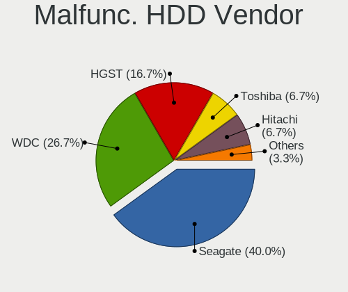

| Vendor  | Computers | Drives | Percent |
|---------|-----------|--------|---------|
| Seagate | 8         | 11     | 47.06%  |
| WDC     | 3         | 4      | 17.65%  |
| HGST    | 3         | 3      | 17.65%  |
| Toshiba | 2         | 6      | 11.76%  |
| Hitachi | 1         | 1      | 5.88%   |

Malfunc. Drive Kind
-------------------

Kinds of faulty drives

| Kind | Computers | Drives | Percent |
|------|-----------|--------|---------|
| HDD  | 15        | 25     | 62.5%   |
| SSD  | 8         | 9      | 33.33%  |
| NVMe | 1         | 1      | 4.17%   |

Failed Drives
-------------

Failed drive models

| Model                   | Computers | Drives | Percent |
|-------------------------|-----------|--------|---------|
| Toshiba MK6465GSX 640GB | 1         | 2      | 100%    |

Failed Drive Vendor
-------------------

Failed drive vendors

| Vendor  | Computers | Drives | Percent |
|---------|-----------|--------|---------|
| Toshiba | 1         | 2      | 100%    |

Drive Status
------------

Number of failed and malfunc. drives

| Status   | Computers | Drives | Percent |
|----------|-----------|--------|---------|
| Detected | 170       | 317    | 58.82%  |
| Works    | 94        | 204    | 32.53%  |
| Malfunc  | 24        | 35     | 8.3%    |
| Failed   | 1         | 2      | 0.35%   |

Storage controller
------------------

Storage Vendor
--------------

Storage controller vendors

| Vendor                           | Computers | Percent |
|----------------------------------|-----------|---------|
| Intel                            | 186       | 55.03%  |
| AMD                              | 45        | 13.31%  |
| Samsung Electronics              | 36        | 10.65%  |
| SanDisk                          | 15        | 4.44%   |
| Toshiba America Info Systems     | 8         | 2.37%   |
| SK hynix                         | 7         | 2.07%   |
| Kingston Technology Company      | 5         | 1.48%   |
| JMicron Technology               | 5         | 1.48%   |
| Silicon Motion                   | 4         | 1.18%   |
| Phison Electronics               | 4         | 1.18%   |
| Marvell Technology Group         | 4         | 1.18%   |
| ASMedia Technology               | 3         | 0.89%   |
| Micron/Crucial Technology        | 2         | 0.59%   |
| KIOXIA                           | 2         | 0.59%   |
| Union Memory (Shenzhen)          | 1         | 0.3%    |
| Silicon Integrated Systems [SiS] | 1         | 0.3%    |
| Silicon Image                    | 1         | 0.3%    |
| Shenzhen Longsys Electronics     | 1         | 0.3%    |
| OCZ Technology Group             | 1         | 0.3%    |
| Nvidia                           | 1         | 0.3%    |
| Micron Technology                | 1         | 0.3%    |
| LSI Logic / Symbios Logic        | 1         | 0.3%    |
| Lenovo                           | 1         | 0.3%    |
| Integrated Technology Express    | 1         | 0.3%    |
| Hewlett-Packard                  | 1         | 0.3%    |
| Broadcom / LSI                   | 1         | 0.3%    |

Storage Model
-------------

Storage controller models

| Model                                                                                   | Computers | Percent |
|-----------------------------------------------------------------------------------------|-----------|---------|
| AMD FCH SATA Controller [AHCI mode]                                                     | 34        | 8.59%   |
| Samsung NVMe SSD Controller SM981/PM981/PM983                                           | 22        | 5.56%   |
| Intel 8 Series/C220 Series Chipset Family 6-port SATA Controller 1 [AHCI mode]          | 12        | 3.03%   |
| Intel 7 Series Chipset Family 6-port SATA Controller [AHCI mode]                        | 11        | 2.78%   |
| Intel 6 Series/C200 Series Chipset Family 6 port Mobile SATA AHCI Controller            | 11        | 2.78%   |
| Intel 200 Series PCH SATA controller [AHCI mode]                                        | 10        | 2.53%   |
| AMD 400 Series Chipset SATA Controller                                                  | 10        | 2.53%   |
| Intel Q170/Q150/B150/H170/H110/Z170/CM236 Chipset SATA Controller [AHCI Mode]           | 8         | 2.02%   |
| Intel 5 Series/3400 Series Chipset 6 port SATA AHCI Controller                          | 8         | 2.02%   |
| SanDisk WD Black SN750 / PC SN730 NVMe SSD                                              | 7         | 1.77%   |
| Intel 8 Series SATA Controller 1 [AHCI mode]                                            | 7         | 1.77%   |
| Intel Wildcat Point-LP SATA Controller [AHCI Mode]                                      | 6         | 1.52%   |
| Intel Sunrise Point-LP SATA Controller [AHCI mode]                                      | 6         | 1.52%   |
| Intel Cannon Lake PCH SATA AHCI Controller                                              | 6         | 1.52%   |
| Intel 82801HM/HEM (ICH8M/ICH8M-E) SATA Controller [AHCI mode]                           | 6         | 1.52%   |
| Intel 82801HM/HEM (ICH8M/ICH8M-E) IDE Controller                                        | 6         | 1.52%   |
| Intel 82801 Mobile SATA Controller [RAID mode]                                          | 6         | 1.52%   |
| Intel 6 Series/C200 Series Chipset Family Desktop SATA Controller (IDE mode, ports 4-5) | 6         | 1.52%   |
| Intel 6 Series/C200 Series Chipset Family Desktop SATA Controller (IDE mode, ports 0-3) | 6         | 1.52%   |
| AMD SB7x0/SB8x0/SB9x0 SATA Controller [AHCI mode]                                       | 6         | 1.52%   |
| Samsung NVMe SSD Controller SM961/PM961/SM963                                           | 5         | 1.26%   |
| Intel 82801IR/IO/IH (ICH9R/DO/DH) 4 port SATA Controller [IDE mode]                     | 5         | 1.26%   |
| Intel 82801IBM/IEM (ICH9M/ICH9M-E) 4 port SATA Controller [AHCI mode]                   | 5         | 1.26%   |
| Intel 82801I (ICH9 Family) 2 port SATA Controller [IDE mode]                            | 5         | 1.26%   |
| Silicon Motion SM2263EN/SM2263XT SSD Controller                                         | 4         | 1.01%   |
| SanDisk WD Blue SN550 NVMe SSD                                                          | 4         | 1.01%   |
| Samsung NVMe SSD Controller SM951/PM951                                                 | 4         | 1.01%   |
| Intel NM10/ICH7 Family SATA Controller [IDE mode]                                       | 4         | 1.01%   |
| Intel Cannon Lake Mobile PCH SATA AHCI Controller                                       | 4         | 1.01%   |
| Intel 82801G (ICH7 Family) IDE Controller                                               | 4         | 1.01%   |
| Intel 6 Series/C200 Series Chipset Family 6 port Desktop SATA AHCI Controller           | 4         | 1.01%   |
| Intel 5 Series/3400 Series Chipset 4 port SATA IDE Controller                           | 4         | 1.01%   |
| Intel 5 Series/3400 Series Chipset 4 port SATA AHCI Controller                          | 4         | 1.01%   |
| Intel 5 Series/3400 Series Chipset 2 port SATA IDE Controller                           | 4         | 1.01%   |
| Toshiba America Info Systems XG4 NVMe SSD Controller                                    | 3         | 0.76%   |
| Toshiba America Info Systems BG3 NVMe SSD Controller                                    | 3         | 0.76%   |
| SK hynix Gold P31 SSD                                                                   | 3         | 0.76%   |
| Samsung NVMe SSD Controller PM9A1/PM9A3/980PRO                                          | 3         | 0.76%   |
| Samsung NVMe SSD Controller 980                                                         | 3         | 0.76%   |
| Kingston Company A2000 NVMe SSD                                                         | 3         | 0.76%   |
| JMicron JMB368 IDE controller                                                           | 3         | 0.76%   |
| Intel Volume Management Device NVMe RAID Controller                                     | 3         | 0.76%   |
| Intel SATA Controller [RAID mode]                                                       | 3         | 0.76%   |
| Intel HM170/QM170 Chipset SATA Controller [AHCI Mode]                                   | 3         | 0.76%   |
| Intel Atom Processor E3800 Series SATA AHCI Controller                                  | 3         | 0.76%   |
| Intel 9 Series Chipset Family SATA Controller [AHCI Mode]                               | 3         | 0.76%   |
| Intel 82801JI (ICH10 Family) SATA AHCI Controller                                       | 3         | 0.76%   |
| Intel 82801JI (ICH10 Family) 4 port SATA IDE Controller #1                              | 3         | 0.76%   |
| ASMedia ASM1062 Serial ATA Controller                                                   | 3         | 0.76%   |
| AMD SB7x0/SB8x0/SB9x0 IDE Controller                                                    | 3         | 0.76%   |
| Toshiba America Info Systems XG6 NVMe SSD Controller                                    | 2         | 0.51%   |
| SK hynix BC511                                                                          | 2         | 0.51%   |
| SanDisk PC SN520 NVMe SSD                                                               | 2         | 0.51%   |
| Phison PS5013 E13 NVMe Controller                                                       | 2         | 0.51%   |
| Marvell Group 88SE6101/6102 single-port PATA133 interface                               | 2         | 0.51%   |
| KIOXIA NVMe SSD Controller BG4                                                          | 2         | 0.51%   |
| JMicron JMB363 SATA/IDE Controller                                                      | 2         | 0.51%   |
| Intel SSD 660P Series                                                                   | 2         | 0.51%   |
| Intel Comet Lake SATA AHCI Controller                                                   | 2         | 0.51%   |
| Intel Celeron/Pentium Silver Processor SATA Controller                                  | 2         | 0.51%   |

Storage Kind
------------

Kind of storage controller (IDE, SATA, NVMe, SAS, ...)

| Kind | Computers | Percent |
|------|-----------|---------|
| SATA | 184       | 54.44%  |
| NVMe | 86        | 25.44%  |
| IDE  | 47        | 13.91%  |
| RAID | 18        | 5.33%   |
| SAS  | 2         | 0.59%   |
| SCSI | 1         | 0.3%    |

Processor
---------

CPU Vendor
----------

Processor vendors

| Vendor | Computers | Percent |
|--------|-----------|---------|
| Intel  | 210       | 78.36%  |
| AMD    | 51        | 19.03%  |
| ARM    | 7         | 2.61%   |

CPU Model
---------

Processor models

| Model                                         | Computers | Percent |
|-----------------------------------------------|-----------|---------|
| Intel Core i7-8565U CPU @ 1.80GHz             | 5         | 1.87%   |
| Intel Core i7-10510U CPU @ 1.80GHz            | 5         | 1.87%   |
| Intel Core i5-8250U CPU @ 1.60GHz             | 5         | 1.87%   |
| ARM Processor                                 | 5         | 1.87%   |
| Intel Celeron CPU N2840 @ 2.16GHz             | 4         | 1.49%   |
| Intel Core i7-8750H CPU @ 2.20GHz             | 3         | 1.12%   |
| Intel Core i7-7700HQ CPU @ 2.80GHz            | 3         | 1.12%   |
| Intel Core i7-4500U CPU @ 1.80GHz             | 3         | 1.12%   |
| Intel Core 2 Quad CPU Q6600 @ 2.40GHz         | 3         | 1.12%   |
| Intel Core 2 Duo CPU T8300 @ 2.40GHz          | 3         | 1.12%   |
| Intel 11th Gen Core i7-1165G7 @ 2.80GHz       | 3         | 1.12%   |
| AMD Ryzen 5 5600X 6-Core Processor            | 3         | 1.12%   |
| AMD Ryzen 5 3500U with Radeon Vega Mobile Gfx | 3         | 1.12%   |
| Intel Core i7-8700K CPU @ 3.70GHz             | 2         | 0.75%   |
| Intel Core i7-8700 CPU @ 3.20GHz              | 2         | 0.75%   |
| Intel Core i7-8665U CPU @ 1.90GHz             | 2         | 0.75%   |
| Intel Core i7-8550U CPU @ 1.80GHz             | 2         | 0.75%   |
| Intel Core i7-7700 CPU @ 3.60GHz              | 2         | 0.75%   |
| Intel Core i7-5600U CPU @ 2.60GHz             | 2         | 0.75%   |
| Intel Core i7-4720HQ CPU @ 2.60GHz            | 2         | 0.75%   |
| Intel Core i7-3610QM CPU @ 2.30GHz            | 2         | 0.75%   |
| Intel Core i7-1065G7 CPU @ 1.30GHz            | 2         | 0.75%   |
| Intel Core i7 CPU Q 740 @ 1.73GHz             | 2         | 0.75%   |
| Intel Core i5-8265U CPU @ 1.60GHz             | 2         | 0.75%   |
| Intel Core i5-7400 CPU @ 3.00GHz              | 2         | 0.75%   |
| Intel Core i5-6400 CPU @ 2.70GHz              | 2         | 0.75%   |
| Intel Core i5-6300U CPU @ 2.40GHz             | 2         | 0.75%   |
| Intel Core i5-5200U CPU @ 2.20GHz             | 2         | 0.75%   |
| Intel Core i5-4460 CPU @ 3.20GHz              | 2         | 0.75%   |
| Intel Core i5-4210U CPU @ 1.70GHz             | 2         | 0.75%   |
| Intel Core i5-4200M CPU @ 2.50GHz             | 2         | 0.75%   |
| Intel Core i5-3550 CPU @ 3.30GHz              | 2         | 0.75%   |
| Intel Core i5-2520M CPU @ 2.50GHz             | 2         | 0.75%   |
| Intel Core i5-2430M CPU @ 2.40GHz             | 2         | 0.75%   |
| Intel Core i5-2400 CPU @ 3.10GHz              | 2         | 0.75%   |
| Intel Core i5 CPU M 520 @ 2.40GHz             | 2         | 0.75%   |
| Intel Core i5 CPU 750 @ 2.67GHz               | 2         | 0.75%   |
| Intel Core i5 CPU 650 @ 3.20GHz               | 2         | 0.75%   |
| Intel Core i3 CPU M 370 @ 2.40GHz             | 2         | 0.75%   |
| Intel Core 2 Duo CPU T7250 @ 2.00GHz          | 2         | 0.75%   |
| Intel Core 2 Duo CPU T7100 @ 1.80GHz          | 2         | 0.75%   |
| Intel Core 2 Duo CPU E8500 @ 3.16GHz          | 2         | 0.75%   |
| Intel Core 2 Duo CPU E8400 @ 3.00GHz          | 2         | 0.75%   |
| Intel Core 2 Duo CPU E7500 @ 2.93GHz          | 2         | 0.75%   |
| Intel 11th Gen Core i7-1185G7 @ 3.00GHz       | 2         | 0.75%   |
| AMD Ryzen 9 5900X 12-Core Processor           | 2         | 0.75%   |
| AMD Ryzen 9 5900HX with Radeon Graphics       | 2         | 0.75%   |
| AMD Ryzen 7 5700U with Radeon Graphics        | 2         | 0.75%   |
| AMD Ryzen 5 2600 Six-Core Processor           | 2         | 0.75%   |
| AMD Ryzen 5 1600X Six-Core Processor          | 2         | 0.75%   |
| AMD Ryzen 3 5300U with Radeon Graphics        | 2         | 0.75%   |
| AMD Ryzen 3 2200U with Radeon Vega Mobile Gfx | 2         | 0.75%   |
| Intel Xeon CPU X5365 @ 3.00GHz                | 1         | 0.37%   |
| Intel Xeon CPU W3565 @ 3.20GHz                | 1         | 0.37%   |
| Intel Xeon CPU E5645 @ 2.40GHz                | 1         | 0.37%   |
| Intel Xeon CPU E5-2620 0 @ 2.00GHz            | 1         | 0.37%   |
| Intel Xeon CPU E5-1650 v2 @ 3.50GHz           | 1         | 0.37%   |
| Intel Xeon CPU E5-1650 0 @ 3.20GHz            | 1         | 0.37%   |
| Intel Xeon CPU E5-1620 v4 @ 3.50GHz           | 1         | 0.37%   |
| Intel Xeon CPU E3-1245 v6 @ 3.70GHz           | 1         | 0.37%   |

CPU Model Family
----------------

Processor model prefix

| Model                   | Computers | Percent |
|-------------------------|-----------|---------|
| Intel Core i5           | 64        | 23.88%  |
| Intel Core i7           | 57        | 21.27%  |
| Intel Core 2 Duo        | 24        | 8.96%   |
| Intel Core i3           | 17        | 6.34%   |
| AMD Ryzen 5             | 16        | 5.97%   |
| Other                   | 13        | 4.85%   |
| Intel Xeon              | 11        | 4.1%    |
| Intel Celeron           | 9         | 3.36%   |
| Intel Pentium           | 8         | 2.99%   |
| AMD Ryzen 7             | 8         | 2.99%   |
| AMD Ryzen 3             | 7         | 2.61%   |
| AMD Ryzen 9             | 5         | 1.87%   |
| Intel Core 2            | 4         | 1.49%   |
| Intel Core 2 Quad       | 3         | 1.12%   |
| Intel Atom              | 3         | 1.12%   |
| AMD FX                  | 2         | 0.75%   |
| Intel Pentium Silver    | 1         | 0.37%   |
| Intel Pentium Dual      | 1         | 0.37%   |
| Intel Pentium D         | 1         | 0.37%   |
| ARM AArch64             | 1         | 0.37%   |
| AMD Turion II Dual-Core | 1         | 0.37%   |
| AMD Turion II           | 1         | 0.37%   |
| AMD Ryzen 3 PRO         | 1         | 0.37%   |
| AMD Phenom II X6        | 1         | 0.37%   |
| AMD Phenom II X4        | 1         | 0.37%   |
| AMD E1                  | 1         | 0.37%   |
| AMD E                   | 1         | 0.37%   |
| AMD Athlon X4           | 1         | 0.37%   |
| AMD Athlon Neo          | 1         | 0.37%   |
| AMD Athlon II X2        | 1         | 0.37%   |
| AMD Athlon 64 X2        | 1         | 0.37%   |
| AMD A8                  | 1         | 0.37%   |
| AMD A10                 | 1         | 0.37%   |

CPU Cores
---------

Number of processor cores

| Number | Computers | Percent |
|--------|-----------|---------|
| 4      | 112       | 41.79%  |
| 2      | 104       | 38.81%  |
| 6      | 31        | 11.57%  |
| 8      | 14        | 5.22%   |
| 12     | 5         | 1.87%   |
| 1      | 2         | 0.75%   |

CPU Sockets
-----------

Number of sockets

| Number | Computers | Percent |
|--------|-----------|---------|
| 1      | 263       | 98.13%  |
| 2      | 5         | 1.87%   |

CPU Threads
-----------

Threads per core (Hyper-Threading)

| Number | Computers | Percent |
|--------|-----------|---------|
| 2      | 164       | 61.19%  |
| 1      | 104       | 38.81%  |

CPU Op-Modes
------------

CPU Operation Modes (32-bit, 64-bit)

| Op mode        | Computers | Percent |
|----------------|-----------|---------|
| 32-bit, 64-bit | 255       | 94.44%  |
| Unknown        | 14        | 5.19%   |
| 32-bit         | 1         | 0.37%   |

CPU Microcode
-------------

Microcode number

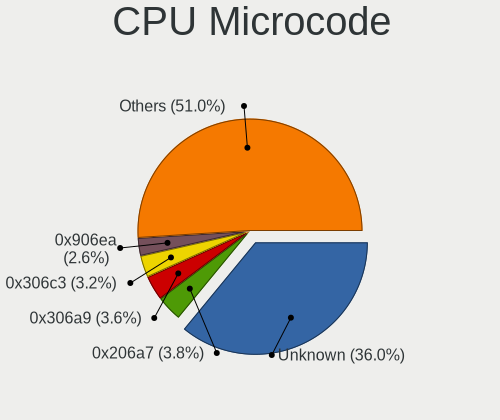

| Number     | Computers | Percent |
|------------|-----------|---------|
| Unknown    | 54        | 19.29%  |
| 0x206a7    | 17        | 6.07%   |
| 0x306a9    | 14        | 5%      |
| 0x306c3    | 12        | 4.29%   |
| 0x906ea    | 11        | 3.93%   |
| 0x906e9    | 11        | 3.93%   |
| 0x806ec    | 10        | 3.57%   |
| 0x1067a    | 9         | 3.21%   |
| 0x806ea    | 7         | 2.5%    |
| 0x40651    | 7         | 2.5%    |
| 0x30678    | 7         | 2.5%    |
| 0x20655    | 7         | 2.5%    |
| 0x10676    | 7         | 2.5%    |
| 0x6fd      | 6         | 2.14%   |
| 0x506e3    | 6         | 2.14%   |
| 0x106e5    | 6         | 2.14%   |
| 0x806c1    | 5         | 1.79%   |
| 0x08108102 | 5         | 1.79%   |
| 0x906ed    | 4         | 1.43%   |
| 0x6fb      | 4         | 1.43%   |
| 0x306d4    | 4         | 1.43%   |
| 0x406e3    | 3         | 1.07%   |
| 0x20652    | 3         | 1.07%   |
| 0x0a201016 | 3         | 1.07%   |
| 0x08108109 | 3         | 1.07%   |
| 0x0810100b | 3         | 1.07%   |
| 0x08001138 | 3         | 1.07%   |
| 0xa0671    | 2         | 0.71%   |
| 0x706e5    | 2         | 0.71%   |
| 0x506c9    | 2         | 0.71%   |
| 0x206d7    | 2         | 0.71%   |
| 0x0a201009 | 2         | 0.71%   |
| 0x08600106 | 2         | 0.71%   |
| 0x0800820d | 2         | 0.71%   |
| 0x08001137 | 2         | 0.71%   |
| 0x010000dc | 2         | 0.71%   |
| 0xf47      | 1         | 0.36%   |
| 0xa0660    | 1         | 0.36%   |
| 0xa0655    | 1         | 0.36%   |
| 0xa0652    | 1         | 0.36%   |
| 0x906eb    | 1         | 0.36%   |
| 0x806eb    | 1         | 0.36%   |
| 0x706a1    | 1         | 0.36%   |
| 0x6f7      | 1         | 0.36%   |
| 0x6f6      | 1         | 0.36%   |
| 0x6f2      | 1         | 0.36%   |
| 0x406f1    | 1         | 0.36%   |
| 0x406c4    | 1         | 0.36%   |
| 0x40671    | 1         | 0.36%   |
| 0x306e4    | 1         | 0.36%   |
| 0x206c2    | 1         | 0.36%   |
| 0x106c2    | 1         | 0.36%   |
| 0x106a5    | 1         | 0.36%   |
| 0x0a50000c | 1         | 0.36%   |
| 0x0a201205 | 1         | 0.36%   |
| 0x08701021 | 1         | 0.36%   |
| 0x08701013 | 1         | 0.36%   |
| 0x08608103 | 1         | 0.36%   |
| 0x08608102 | 1         | 0.36%   |
| 0x0700010f | 1         | 0.36%   |

CPU Microarch
-------------

Microarchitecture

| Name          | Computers | Percent |
|---------------|-----------|---------|
| KabyLake      | 53        | 19.78%  |
| Haswell       | 22        | 8.21%   |
| SandyBridge   | 20        | 7.46%   |
| Penryn        | 18        | 6.72%   |
| IvyBridge     | 17        | 6.34%   |
| Core          | 16        | 5.97%   |
| Unknown       | 12        | 4.48%   |
| Zen+          | 11        | 4.1%    |
| Westmere      | 11        | 4.1%    |
| Skylake       | 11        | 4.1%    |
| Zen           | 9         | 3.36%   |
| Zen 3         | 8         | 2.99%   |
| Silvermont    | 8         | 2.99%   |
| Broadwell     | 8         | 2.99%   |
| Nehalem       | 7         | 2.61%   |
| Zen 2         | 5         | 1.87%   |
| TigerLake     | 5         | 1.87%   |
| K10           | 5         | 1.87%   |
| Icelake       | 4         | 1.49%   |
| Piledriver    | 3         | 1.12%   |
| CometLake     | 3         | 1.12%   |
| K8 Hammer     | 2         | 0.75%   |
| Goldmont plus | 2         | 0.75%   |
| Goldmont      | 2         | 0.75%   |
| Steamroller   | 1         | 0.37%   |
| NetBurst      | 1         | 0.37%   |
| Jaguar        | 1         | 0.37%   |
| Excavator     | 1         | 0.37%   |
| Bonnell       | 1         | 0.37%   |
| Bobcat        | 1         | 0.37%   |

Graphics
--------

GPU Vendor
----------

Vendors of graphics cards

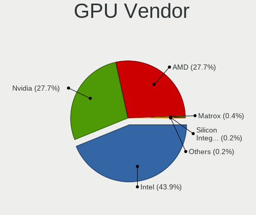

| Vendor                           | Computers | Percent |
|----------------------------------|-----------|---------|
| Intel                            | 143       | 45.54%  |
| Nvidia                           | 88        | 28.03%  |
| AMD                              | 80        | 25.48%  |
| Matrox Electronics Systems       | 2         | 0.64%   |
| Silicon Integrated Systems [SiS] | 1         | 0.32%   |

GPU Model
---------

Graphics card models

| Model                                                                                 | Computers | Percent |
|---------------------------------------------------------------------------------------|-----------|---------|
| Intel 2nd Generation Core Processor Family Integrated Graphics Controller             | 13        | 4.06%   |
| Intel 3rd Gen Core processor Graphics Controller                                      | 10        | 3.13%   |
| Intel WhiskeyLake-U GT2 [UHD Graphics 620]                                            | 9         | 2.81%   |
| AMD Picasso/Raven 2 [Radeon Vega Series / Radeon Vega Mobile Series]                  | 8         | 2.5%    |
| Intel UHD Graphics 620                                                                | 7         | 2.19%   |
| Intel HD Graphics 630                                                                 | 7         | 2.19%   |
| Intel Haswell-ULT Integrated Graphics Controller                                      | 7         | 2.19%   |
| Intel Atom Processor Z36xxx/Z37xxx Series Graphics & Display                          | 7         | 2.19%   |
| Intel 4th Gen Core Processor Integrated Graphics Controller                           | 7         | 2.19%   |
| AMD Ellesmere [Radeon RX 470/480/570/570X/580/580X/590]                               | 7         | 2.19%   |
| Intel CometLake-U GT2 [UHD Graphics]                                                  | 6         | 1.88%   |
| Intel TigerLake-LP GT2 [Iris Xe Graphics]                                             | 5         | 1.56%   |
| Intel HD Graphics 5500                                                                | 5         | 1.56%   |
| Intel Core Processor Integrated Graphics Controller                                   | 5         | 1.56%   |
| Intel CoffeeLake-H GT2 [UHD Graphics 630]                                             | 5         | 1.56%   |
| Nvidia GP108M [GeForce MX250]                                                         | 4         | 1.25%   |
| Intel Xeon E3-1200 v3/4th Gen Core Processor Integrated Graphics Controller           | 4         | 1.25%   |
| Intel Mobile GM965/GL960 Integrated Graphics Controller (secondary)                   | 4         | 1.25%   |
| Intel Mobile GM965/GL960 Integrated Graphics Controller (primary)                     | 4         | 1.25%   |
| Intel Mobile 4 Series Chipset Integrated Graphics Controller                          | 4         | 1.25%   |
| AMD Lucienne                                                                          | 4         | 1.25%   |
| Nvidia GP104 [GeForce GTX 1070]                                                       | 3         | 0.94%   |
| Nvidia GM206 [GeForce GTX 960]                                                        | 3         | 0.94%   |
| Nvidia GK208M [GeForce GT 740M]                                                       | 3         | 0.94%   |
| Intel Skylake GT2 [HD Graphics 520]                                                   | 3         | 0.94%   |
| Intel CoffeeLake-S GT2 [UHD Graphics 630]                                             | 3         | 0.94%   |
| AMD Topaz XT [Radeon R7 M260/M265 / M340/M360 / M440/M445 / 530/535 / 620/625 Mobile] | 3         | 0.94%   |
| AMD Renoir                                                                            | 3         | 0.94%   |
| AMD Raven Ridge [Radeon Vega Series / Radeon Vega Mobile Series]                      | 3         | 0.94%   |
| AMD Caicos [Radeon HD 6450/7450/8450 / R5 230 OEM]                                    | 3         | 0.94%   |
| Nvidia GP108 [GeForce GT 1030]                                                        | 2         | 0.63%   |
| Nvidia GP107M [GeForce MX350]                                                         | 2         | 0.63%   |
| Nvidia GP107M [GeForce GTX 1050 Ti Mobile]                                            | 2         | 0.63%   |
| Nvidia GP107 [GeForce GTX 1050]                                                       | 2         | 0.63%   |
| Nvidia GP106 [GeForce GTX 1060 6GB]                                                   | 2         | 0.63%   |
| Nvidia GP102 [GeForce GTX 1080 Ti]                                                    | 2         | 0.63%   |
| Nvidia GM108M [GeForce 940M]                                                          | 2         | 0.63%   |
| Nvidia G98M [GeForce 9300M GS]                                                        | 2         | 0.63%   |
| Intel Xeon E3-1200 v2/3rd Gen Core processor Graphics Controller                      | 2         | 0.63%   |
| Intel Iris Plus Graphics G7                                                           | 2         | 0.63%   |
| Intel HD Graphics 510                                                                 | 2         | 0.63%   |
| Intel 82G33/G31 Express Integrated Graphics Controller                                | 2         | 0.63%   |
| Intel 82946GZ/GL Integrated Graphics Controller                                       | 2         | 0.63%   |
| Intel 4 Series Chipset Integrated Graphics Controller                                 | 2         | 0.63%   |
| AMD Turks XT [Radeon HD 6670/7670]                                                    | 2         | 0.63%   |
| AMD RV710/M92 [Mobility Radeon HD 4330/4350/4550]                                     | 2         | 0.63%   |
| AMD Park [Mobility Radeon HD 5430/5450/5470]                                          | 2         | 0.63%   |
| AMD Opal XT [Radeon R7 M265/M365X/M465]                                               | 2         | 0.63%   |
| AMD Navi 14 [Radeon RX 5500/5500M / Pro 5500M]                                        | 2         | 0.63%   |
| AMD Lexa [Radeon 540X/550X/630 / RX 640 / E9171 MCM]                                  | 2         | 0.63%   |
| AMD Juniper XT [Radeon HD 5770]                                                       | 2         | 0.63%   |
| AMD Cezanne                                                                           | 2         | 0.63%   |
| AMD Cedar [Radeon HD 5000/6000/7350/8350 Series]                                      | 2         | 0.63%   |
| AMD Baffin [Radeon RX 460/560D / Pro 450/455/460/555/555X/560/560X]                   | 2         | 0.63%   |
| Silicon Integrated Systems [SiS] 771/671 PCIE VGA Display Adapter                     | 1         | 0.31%   |
| Nvidia TU117M [GeForce GTX 1650 Ti Mobile]                                            | 1         | 0.31%   |
| Nvidia TU117M [GeForce GTX 1650 Mobile / Max-Q]                                       | 1         | 0.31%   |
| Nvidia TU117GLM [Quadro T500 Mobile]                                                  | 1         | 0.31%   |
| Nvidia TU117GLM [Quadro T2000 Mobile / Max-Q]                                         | 1         | 0.31%   |
| Nvidia TU117 [GeForce GTX 1650]                                                       | 1         | 0.31%   |

GPU Combo
---------

Combinations of graphics cards

| Name           | Computers | Percent |
|----------------|-----------|---------|
| 1 x Intel      | 97        | 35.93%  |
| 1 x AMD        | 59        | 21.85%  |
| 1 x Nvidia     | 54        | 20%     |
| Intel + Nvidia | 29        | 10.74%  |
| Intel + AMD    | 14        | 5.19%   |
| Other          | 7         | 2.59%   |
| AMD + Nvidia   | 5         | 1.85%   |
| 2 x AMD        | 2         | 0.74%   |
| 1 x Matrox     | 2         | 0.74%   |
| 1 x SiS        | 1         | 0.37%   |

GPU Driver
----------

Free vs proprietary

| Driver      | Computers | Percent |
|-------------|-----------|---------|
| Free        | 209       | 76.84%  |
| Proprietary | 45        | 16.54%  |
| Unknown     | 18        | 6.62%   |

GPU Memory
----------

Total video memory

| Size in GB | Computers | Percent |
|------------|-----------|---------|
| Unknown    | 148       | 53.05%  |
| 1.01-2.0   | 47        | 16.85%  |
| 0.01-0.5   | 23        | 8.24%   |
| 0.51-1.0   | 22        | 7.89%   |
| 3.01-4.0   | 15        | 5.38%   |
| 7.01-8.0   | 11        | 3.94%   |
| 5.01-6.0   | 7         | 2.51%   |
| 2.01-3.0   | 3         | 1.08%   |
| 8.01-16.0  | 2         | 0.72%   |
| 4.01-5.0   | 1         | 0.36%   |

Monitor
-------

Monitor Vendor
--------------

Monitor vendors

| Vendor                  | Computers | Percent |
|-------------------------|-----------|---------|
| AU Optronics            | 41        | 13.8%   |
| Samsung Electronics     | 40        | 13.47%  |
| Dell                    | 32        | 10.77%  |
| LG Display              | 20        | 6.73%   |
| AOC                     | 20        | 6.73%   |
| Chimei Innolux          | 19        | 6.4%    |
| BOE                     | 16        | 5.39%   |
| Goldstar                | 15        | 5.05%   |
| Philips                 | 14        | 4.71%   |
| Lenovo                  | 13        | 4.38%   |
| Hewlett-Packard         | 8         | 2.69%   |
| Chi Mei Optoelectronics | 7         | 2.36%   |
| Acer                    | 5         | 1.68%   |
| Sony                    | 4         | 1.35%   |
| Ancor Communications    | 4         | 1.35%   |
| Unknown                 | 3         | 1.01%   |
| Sharp                   | 3         | 1.01%   |
| Iiyama                  | 3         | 1.01%   |
| Apple                   | 3         | 1.01%   |
| ViewSonic               | 2         | 0.67%   |
| LG Philips              | 2         | 0.67%   |
| HannStar                | 2         | 0.67%   |
| CSO                     | 2         | 0.67%   |
| BenQ                    | 2         | 0.67%   |
| Vestel Elektronik       | 1         | 0.34%   |
| Unknown (XXX)           | 1         | 0.34%   |
| TMX                     | 1         | 0.34%   |
| RS                      | 1         | 0.34%   |
| PANDA                   | 1         | 0.34%   |
| NEC Computers           | 1         | 0.34%   |
| LGD                     | 1         | 0.34%   |
| InfoVision              | 1         | 0.34%   |
| IBM                     | 1         | 0.34%   |
| Gericom                 | 1         | 0.34%   |
| FUN                     | 1         | 0.34%   |
| Eizo                    | 1         | 0.34%   |
| DIF                     | 1         | 0.34%   |
| DENON                   | 1         | 0.34%   |
| CPT                     | 1         | 0.34%   |
| ASUSTek Computer        | 1         | 0.34%   |
| Arnos Instruments       | 1         | 0.34%   |

Monitor Model
-------------

Monitor models

| Model                                                                     | Computers | Percent |
|---------------------------------------------------------------------------|-----------|---------|
| AU Optronics LCD Monitor AUO38ED 1920x1080 344x193mm 15.5-inch            | 7         | 2.26%   |
| Dell U2412M DELA07A 1920x1200 518x324mm 24.1-inch                         | 4         | 1.29%   |
| Philips LCD Monitor FTV 1920x1080                                         | 3         | 0.97%   |
| Lenovo LCD Monitor LEN40BA 1920x1080 344x194mm 15.5-inch                  | 3         | 0.97%   |
| Goldstar ULTRAWIDE GSM59F1 2560x1080 673x284mm 28.8-inch                  | 3         | 0.97%   |
| AU Optronics LCD Monitor AUO21ED 1920x1080 344x193mm 15.5-inch            | 3         | 0.97%   |
| AU Optronics LCD Monitor AUO119E 1600x900 382x214mm 17.2-inch             | 3         | 0.97%   |
| Unknown LCD Monitor FFFF 2288x1287 2550x2550mm 142.0-inch                 | 2         | 0.65%   |
| Samsung Electronics SyncMaster SAM02B6 1920x1200 518x324mm 24.1-inch      | 2         | 0.65%   |
| Samsung Electronics SyncMaster SAM026F 1280x1024 376x301mm 19.0-inch      | 2         | 0.65%   |
| Samsung Electronics C24F390 SAM0D2C 1920x1080 520x290mm 23.4-inch         | 2         | 0.65%   |
| Philips FTV PHL01EA 1920x1080 1440x810mm 65.0-inch                        | 2         | 0.65%   |
| Philips 226V4 PHLC0B1 1920x1080 477x268mm 21.5-inch                       | 2         | 0.65%   |
| LG Display LCD Monitor LGD0259 1920x1080 345x194mm 15.6-inch              | 2         | 0.65%   |
| Lenovo LEN P27h-10 LEN61AF 2560x1440 597x336mm 27.0-inch                  | 2         | 0.65%   |
| Lenovo LCD Monitor LEN40B0 1366x768 344x193mm 15.5-inch                   | 2         | 0.65%   |
| Lenovo LCD Monitor LEN4036 1440x900 304x190mm 14.1-inch                   | 2         | 0.65%   |
| Goldstar ULTRAWIDE GSM5AE2 1920x1080 800x335mm 34.1-inch                  | 2         | 0.65%   |
| Chimei Innolux LCD Monitor CMN15E8 1920x1080 344x193mm 15.5-inch          | 2         | 0.65%   |
| Chimei Innolux LCD Monitor CMN1376 1920x1080 293x165mm 13.2-inch          | 2         | 0.65%   |
| Chi Mei Optoelectronics LCD Monitor CMO1720 1920x1080 382x215mm 17.3-inch | 2         | 0.65%   |
| Chi Mei Optoelectronics LCD Monitor CMO15A7 1366x768 344x193mm 15.5-inch  | 2         | 0.65%   |
| BOE LCD Monitor BOE08E2 1920x1080 344x194mm 15.5-inch                     | 2         | 0.65%   |
| BOE LCD Monitor BOE0869 1920x1080 344x194mm 15.5-inch                     | 2         | 0.65%   |
| BOE LCD Monitor BOE06A5 1366x768 344x194mm 15.5-inch                      | 2         | 0.65%   |
| AU Optronics LCD Monitor AUO219D 1920x1080 381x214mm 17.2-inch            | 2         | 0.65%   |
| AU Optronics LCD Monitor AUO129E 1600x900 382x214mm 17.2-inch             | 2         | 0.65%   |
| AOC Q3279WG5B AOC3279 2560x1440 725x428mm 33.1-inch                       | 2         | 0.65%   |
| AOC LCD Monitor AG251FWG2 1920x1080                                       | 2         | 0.65%   |
| AOC 2470W AOC2470 1920x1080 521x293mm 23.5-inch                           | 2         | 0.65%   |
| ViewSonic VX3211-4K VSCC336 3840x2160 698x393mm 31.5-inch                 | 1         | 0.32%   |
| ViewSonic VG2448 VSC3B35 1920x1080 527x296mm 23.8-inch                    | 1         | 0.32%   |
| Vestel Elektronik 50UHD_LCD_TV VES3700 3840x2160 1872x1053mm 84.6-inch    | 1         | 0.32%   |
| Unknown LCD Monitor SAMSUNG                                               | 1         | 0.32%   |
| Unknown (XXX) M22EI4 XXX076E 1680x1050 474x296mm 22.0-inch                | 1         | 0.32%   |
| TMX TL140BDXP01-0 TMX1400 2560x1440 310x174mm 14.0-inch                   | 1         | 0.32%   |
| Sony TV SNYAB03 1920x1080                                                 | 1         | 0.32%   |
| Sony TV SNYAA01 1360x768                                                  | 1         | 0.32%   |
| Sony TV *02 SNY9403 1920x1080 1218x685mm 55.0-inch                        | 1         | 0.32%   |
| Sony SDM-S93 SNY1390 1280x1024 359x287mm 18.1-inch                        | 1         | 0.32%   |
| Sharp LCD Monitor SHP14F9 1920x1200 288x180mm 13.4-inch                   | 1         | 0.32%   |
| Sharp LCD Monitor SHP14B9 3840x2160 344x194mm 15.5-inch                   | 1         | 0.32%   |
| Sharp LCD Monitor SHP1450 3840x2160 350x190mm 15.7-inch                   | 1         | 0.32%   |
| Samsung Electronics SyncMaster SAM05EC 1920x1080 597x336mm 27.0-inch      | 1         | 0.32%   |
| Samsung Electronics SyncMaster SAM0526 1920x1080 510x287mm 23.0-inch      | 1         | 0.32%   |
| Samsung Electronics SyncMaster SAM04DE 1920x1080 477x268mm 21.5-inch      | 1         | 0.32%   |
| Samsung Electronics SyncMaster SAM04D3 1920x1080 531x298mm 24.0-inch      | 1         | 0.32%   |
| Samsung Electronics SyncMaster SAM0467 1920x1200 518x324mm 24.1-inch      | 1         | 0.32%   |
| Samsung Electronics SyncMaster SAM041F 2048x1152 510x287mm 23.0-inch      | 1         | 0.32%   |
| Samsung Electronics SyncMaster SAM03E5 1680x1050 474x296mm 22.0-inch      | 1         | 0.32%   |
| Samsung Electronics SyncMaster SAM0372 1680x1050 459x296mm 21.5-inch      | 1         | 0.32%   |
| Samsung Electronics SyncMaster SAM0303 1680x1050 494x320mm 23.2-inch      | 1         | 0.32%   |
| Samsung Electronics SyncMaster SAM02B5 1920x1200 518x324mm 24.1-inch      | 1         | 0.32%   |
| Samsung Electronics SyncMaster SAM0288 1680x1050 474x296mm 22.0-inch      | 1         | 0.32%   |
| Samsung Electronics SyncMaster SAM0214 1680x1050 408x306mm 20.1-inch      | 1         | 0.32%   |
| Samsung Electronics SMS24A450/460 SAM0838 1920x1080 531x299mm 24.0-inch   | 1         | 0.32%   |
| Samsung Electronics S27D390 SAM0B66 1920x1080 598x336mm 27.0-inch         | 1         | 0.32%   |
| Samsung Electronics S24F350 SAM0D20 1920x1080 521x293mm 23.5-inch         | 1         | 0.32%   |
| Samsung Electronics S24E450 SAM0C82 1920x1080 531x299mm 24.0-inch         | 1         | 0.32%   |
| Samsung Electronics S24D330 SAM0D93 1920x1080 531x299mm 24.0-inch         | 1         | 0.32%   |

Monitor Resolution
------------------

Monitor screen resolution

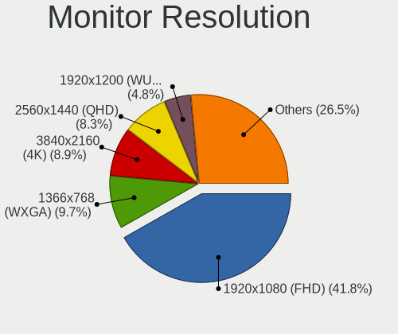

| Resolution         | Computers | Percent |
|--------------------|-----------|---------|
| 1920x1080 (FHD)    | 123       | 43.77%  |
| 1366x768 (WXGA)    | 31        | 11.03%  |
| 1600x900 (HD+)     | 19        | 6.76%   |
| 3840x2160 (4K)     | 17        | 6.05%   |
| 2560x1440 (QHD)    | 16        | 5.69%   |
| 1920x1200 (WUXGA)  | 13        | 4.63%   |
| 1680x1050 (WSXGA+) | 13        | 4.63%   |
| 1280x1024 (SXGA)   | 12        | 4.27%   |
| 3440x1440          | 7         | 2.49%   |
| 1440x900 (WXGA+)   | 6         | 2.14%   |
| 2560x1080          | 4         | 1.42%   |
| 1280x800 (WXGA)    | 4         | 1.42%   |
| 2560x1600          | 3         | 1.07%   |
| 2288x1287          | 2         | 0.71%   |
| Unknown            | 2         | 0.71%   |
| 3840x1200          | 1         | 0.36%   |
| 3840x1080          | 1         | 0.36%   |
| 2736x1824          | 1         | 0.36%   |
| 2560x1024          | 1         | 0.36%   |
| 2256x1504          | 1         | 0.36%   |
| 2048x1152          | 1         | 0.36%   |
| 1400x1050          | 1         | 0.36%   |
| 1280x720 (HD)      | 1         | 0.36%   |
| 1024x768 (XGA)     | 1         | 0.36%   |

Monitor Diagonal
----------------

Diagonal size in inches

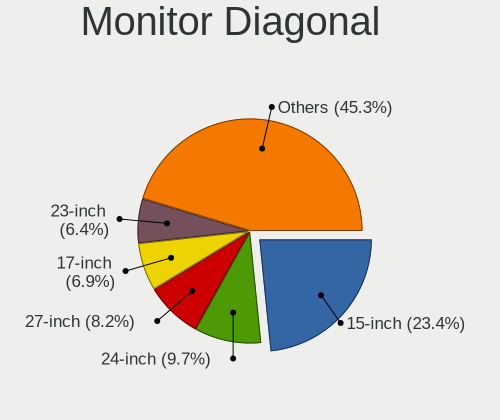

| Inches  | Computers | Percent |
|---------|-----------|---------|
| 15      | 73        | 24.5%   |
| 24      | 29        | 9.73%   |
| 17      | 26        | 8.72%   |
| 23      | 22        | 7.38%   |
| 21      | 19        | 6.38%   |
| 27      | 18        | 6.04%   |
| 13      | 16        | 5.37%   |
| 14      | 14        | 4.7%    |
| Unknown | 14        | 4.7%    |
| 34      | 11        | 3.69%   |
| 19      | 7         | 2.35%   |
| 31      | 6         | 2.01%   |
| 22      | 6         | 2.01%   |
| 20      | 6         | 2.01%   |
| 18      | 6         | 2.01%   |
| 12      | 4         | 1.34%   |
| 65      | 3         | 1.01%   |
| 142     | 2         | 0.67%   |
| 84      | 2         | 0.67%   |
| 72      | 2         | 0.67%   |
| 54      | 2         | 0.67%   |
| 33      | 2         | 0.67%   |
| 55      | 1         | 0.34%   |
| 49      | 1         | 0.34%   |
| 39      | 1         | 0.34%   |
| 32      | 1         | 0.34%   |
| 29      | 1         | 0.34%   |
| 25      | 1         | 0.34%   |
| 16      | 1         | 0.34%   |
| 10      | 1         | 0.34%   |

Monitor Width
-------------

Physical width

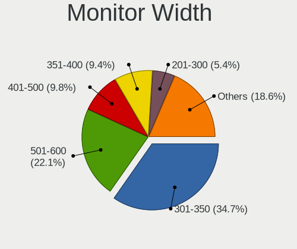

| Width in mm    | Computers | Percent |
|----------------|-----------|---------|
| 301-350        | 95        | 32.42%  |
| 501-600        | 64        | 21.84%  |
| 401-500        | 35        | 11.95%  |
| 351-400        | 34        | 11.6%   |
| 201-300        | 15        | 5.12%   |
| 701-800        | 14        | 4.78%   |
| Unknown        | 14        | 4.78%   |
| 601-700        | 8         | 2.73%   |
| 1001-1500      | 7         | 2.39%   |
| 1501-2000      | 4         | 1.37%   |
| More than 2000 | 2         | 0.68%   |
| 801-900        | 1         | 0.34%   |

Aspect Ratio
------------

Proportional relationship between the width and the height

| Ratio   | Computers | Percent |
|---------|-----------|---------|
| 16/9    | 192       | 70.85%  |
| 16/10   | 35        | 12.92%  |
| 5/4     | 12        | 4.43%   |
| Unknown | 12        | 4.43%   |
| 21/9    | 11        | 4.06%   |
| 4/3     | 3         | 1.11%   |
| 3/2     | 3         | 1.11%   |
| 1.00    | 2         | 0.74%   |
| 32/9    | 1         | 0.37%   |

Monitor Area
------------

Area in inch

| Area in inch | Computers | Percent |
|----------------|-----------|---------|
| 101-110        | 72        | 24.24%  |
| 201-250        | 57        | 19.19%  |
| 121-130        | 22        | 7.41%   |
| 81-90          | 21        | 7.07%   |
| 351-500        | 21        | 7.07%   |
| 151-200        | 21        | 7.07%   |
| 301-350        | 18        | 6.06%   |
| 251-300        | 14        | 4.71%   |
| Unknown        | 14        | 4.71%   |
| More than 1000 | 12        | 4.04%   |
| 71-80          | 9         | 3.03%   |
| 141-150        | 5         | 1.68%   |
| 61-70          | 4         | 1.35%   |
| 131-140        | 2         | 0.67%   |
| 501-1000       | 2         | 0.67%   |
| 41-50          | 1         | 0.34%   |
| 111-120        | 1         | 0.34%   |
| 91-100         | 1         | 0.34%   |

Pixel Density
-------------

Pixels per inch

| Density       | Computers | Percent |
|---------------|-----------|---------|
| 51-100        | 97        | 34.04%  |
| 121-160       | 72        | 25.26%  |
| 101-120       | 69        | 24.21%  |
| 161-240       | 16        | 5.61%   |
| Unknown       | 14        | 4.91%   |
| 1-50          | 12        | 4.21%   |
| More than 240 | 5         | 1.75%   |

Multiple Monitors
-----------------

Total monitors connected

| Total | Computers | Percent |
|-------|-----------|---------|
| 1     | 214       | 77.26%  |
| 2     | 49        | 17.69%  |
| 0     | 11        | 3.97%   |
| 3     | 3         | 1.08%   |

Network
-------

Net Controller Vendor
---------------------

Controller vendors

| Vendor                            | Computers | Percent |
|-----------------------------------|-----------|---------|
| Intel                             | 130       | 34.48%  |
| Realtek Semiconductor             | 129       | 34.22%  |
| Qualcomm Atheros                  | 39        | 10.34%  |
| Broadcom                          | 25        | 6.63%   |
| Ralink                            | 7         | 1.86%   |
| Ralink Technology                 | 5         | 1.33%   |
| Marvell Technology Group          | 5         | 1.33%   |
| ASUSTek Computer                  | 4         | 1.06%   |
| Huawei Technologies               | 3         | 0.8%    |
| Ericsson Business Mobile Networks | 3         | 0.8%    |
| Sierra Wireless                   | 2         | 0.53%   |
| Samsung Electronics               | 2         | 0.53%   |
| Linksys                           | 2         | 0.53%   |
| Hewlett-Packard                   | 2         | 0.53%   |
| Broadcom Limited                  | 2         | 0.53%   |
| ZyDAS Technology                  | 1         | 0.27%   |
| VIA Technologies                  | 1         | 0.27%   |
| TP-Link                           | 1         | 0.27%   |
| Silicon Integrated Systems [SiS]  | 1         | 0.27%   |
| Qualcomm Atheros Communications   | 1         | 0.27%   |
| Nvidia                            | 1         | 0.27%   |
| Microsoft                         | 1         | 0.27%   |
| MediaTek                          | 1         | 0.27%   |
| Lenovo                            | 1         | 0.27%   |
| JMicron Technology                | 1         | 0.27%   |
| IMC Networks                      | 1         | 0.27%   |
| IBM                               | 1         | 0.27%   |
| D-Link System                     | 1         | 0.27%   |
| D-Link                            | 1         | 0.27%   |
| Compal Electronics                | 1         | 0.27%   |
| Belkin Components                 | 1         | 0.27%   |
| ASIX Electronics                  | 1         | 0.27%   |

Net Controller Model
--------------------

Controller models

| Model                                                                   | Computers | Percent |
|-------------------------------------------------------------------------|-----------|---------|
| Realtek RTL8111/8168/8411 PCI Express Gigabit Ethernet Controller       | 98        | 21.59%  |
| Intel 82579LM Gigabit Network Connection (Lewisville)                   | 14        | 3.08%   |
| Realtek RTL810xE PCI Express Fast Ethernet controller                   | 13        | 2.86%   |
| Intel Wi-Fi 6 AX200                                                     | 11        | 2.42%   |
| Intel Ethernet Connection (2) I219-V                                    | 10        | 2.2%    |
| Intel I211 Gigabit Network Connection                                   | 9         | 1.98%   |
| Qualcomm Atheros AR9285 Wireless Network Adapter (PCI-Express)          | 8         | 1.76%   |
| Realtek RTL8821CE 802.11ac PCIe Wireless Network Adapter                | 7         | 1.54%   |
| Intel Wireless 8265 / 8275                                              | 7         | 1.54%   |
| Intel Wireless 7260                                                     | 7         | 1.54%   |
| Intel Centrino Advanced-N 6205 [Taylor Peak]                            | 7         | 1.54%   |
| Qualcomm Atheros QCA9565 / AR9565 Wireless Network Adapter              | 6         | 1.32%   |
| Intel Ethernet Connection (6) I219-V                                    | 6         | 1.32%   |
| Intel Comet Lake PCH-LP CNVi WiFi                                       | 6         | 1.32%   |
| Realtek RTL8822BE 802.11a/b/g/n/ac WiFi adapter                         | 5         | 1.1%    |
| Qualcomm Atheros QCA9377 802.11ac Wireless Network Adapter              | 5         | 1.1%    |
| Intel Wireless 7265                                                     | 5         | 1.1%    |
| Intel Cannon Point-LP CNVi [Wireless-AC]                                | 5         | 1.1%    |
| Realtek RTL8153 Gigabit Ethernet Adapter                                | 4         | 0.88%   |
| Intel Wi-Fi 6 AX201                                                     | 4         | 0.88%   |
| Intel Ethernet Connection (7) I219-V                                    | 4         | 0.88%   |
| Intel Cannon Lake PCH CNVi WiFi                                         | 4         | 0.88%   |
| Intel 82577LM Gigabit Network Connection                                | 4         | 0.88%   |
| Broadcom BCM43142 802.11b/g/n                                           | 4         | 0.88%   |
| Realtek RTL8723BE PCIe Wireless Network Adapter                         | 3         | 0.66%   |
| Realtek RTL8125 2.5GbE Controller                                       | 3         | 0.66%   |
| Ralink MT7601U Wireless Adapter                                         | 3         | 0.66%   |
| Qualcomm Atheros AR9485 Wireless Network Adapter                        | 3         | 0.66%   |
| Qualcomm Atheros AR8131 Gigabit Ethernet                                | 3         | 0.66%   |
| Intel PRO/Wireless 5100 AGN [Shiloh] Network Connection                 | 3         | 0.66%   |
| Intel Ice Lake-LP PCH CNVi WiFi                                         | 3         | 0.66%   |
| Intel Ethernet Connection (7) I219-LM                                   | 3         | 0.66%   |
| Intel Centrino Ultimate-N 6300                                          | 3         | 0.66%   |
| Intel Centrino Advanced-N 6200                                          | 3         | 0.66%   |
| Intel 82574L Gigabit Network Connection                                 | 3         | 0.66%   |
| Intel 82567LM Gigabit Network Connection                                | 3         | 0.66%   |
| Huawei JNY-LX1                                                          | 3         | 0.66%   |
| Samsung Galaxy series, misc. (tethering mode)                           | 2         | 0.44%   |
| Realtek RTL8821AE 802.11ac PCIe Wireless Network Adapter                | 2         | 0.44%   |
| Realtek RTL8191SEvB Wireless LAN Controller                             | 2         | 0.44%   |
| Ralink RT2870/RT3070 Wireless Adapter                                   | 2         | 0.44%   |
| Ralink RT3290 Wireless 802.11n 1T/1R PCIe                               | 2         | 0.44%   |
| Ralink RT2790 Wireless 802.11n 1T/2R PCIe                               | 2         | 0.44%   |
| Qualcomm Atheros QCA8172 Fast Ethernet                                  | 2         | 0.44%   |
| Qualcomm Atheros QCA6174 802.11ac Wireless Network Adapter              | 2         | 0.44%   |
| Qualcomm Atheros AR9462 Wireless Network Adapter                        | 2         | 0.44%   |
| Qualcomm Atheros AR8152 v2.0 Fast Ethernet                              | 2         | 0.44%   |
| Qualcomm Atheros AR8151 v2.0 Gigabit Ethernet                           | 2         | 0.44%   |
| Qualcomm Atheros AR8121/AR8113/AR8114 Gigabit or Fast Ethernet          | 2         | 0.44%   |
| Qualcomm Atheros AR242x / AR542x Wireless Network Adapter (PCI-Express) | 2         | 0.44%   |
| Marvell Group 88E8072 PCI-E Gigabit Ethernet Controller                 | 2         | 0.44%   |
| Marvell Group 88E8056 PCI-E Gigabit Ethernet Controller                 | 2         | 0.44%   |
| Intel Wireless 8260                                                     | 2         | 0.44%   |
| Intel Wireless 3165                                                     | 2         | 0.44%   |
| Intel Wi-Fi 6 AX210/AX211/AX411 160MHz                                  | 2         | 0.44%   |
| Intel PRO/Wireless 3945ABG [Golan] Network Connection                   | 2         | 0.44%   |
| Intel Ethernet Connection I217-LM                                       | 2         | 0.44%   |
| Intel Ethernet Connection (6) I219-LM                                   | 2         | 0.44%   |
| Intel Ethernet Connection (4) I219-V                                    | 2         | 0.44%   |
| Intel Ethernet Connection (3) I218-LM                                   | 2         | 0.44%   |

Wireless Vendor
---------------

Wireless vendors

| Vendor                            | Computers | Percent |
|-----------------------------------|-----------|---------|
| Intel                             | 85        | 44.74%  |
| Qualcomm Atheros                  | 31        | 16.32%  |
| Realtek Semiconductor             | 27        | 14.21%  |
| Broadcom                          | 16        | 8.42%   |
| Ralink                            | 7         | 3.68%   |
| Ralink Technology                 | 5         | 2.63%   |
| ASUSTek Computer                  | 4         | 2.11%   |
| Broadcom Limited                  | 2         | 1.05%   |
| ZyDAS Technology                  | 1         | 0.53%   |
| TP-Link                           | 1         | 0.53%   |
| Sierra Wireless                   | 1         | 0.53%   |
| Qualcomm Atheros Communications   | 1         | 0.53%   |
| MediaTek                          | 1         | 0.53%   |
| Marvell Technology Group          | 1         | 0.53%   |
| Linksys                           | 1         | 0.53%   |
| IMC Networks                      | 1         | 0.53%   |
| Hewlett-Packard                   | 1         | 0.53%   |
| Ericsson Business Mobile Networks | 1         | 0.53%   |
| D-Link System                     | 1         | 0.53%   |
| D-Link                            | 1         | 0.53%   |
| Belkin Components                 | 1         | 0.53%   |

Wireless Model
--------------

Wireless models

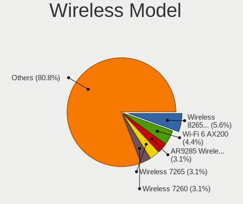

| Model                                                                                 | Computers | Percent |
|---------------------------------------------------------------------------------------|-----------|---------|
| Intel Wi-Fi 6 AX200                                                                   | 11        | 5.76%   |
| Qualcomm Atheros AR9285 Wireless Network Adapter (PCI-Express)                        | 8         | 4.19%   |
| Realtek RTL8821CE 802.11ac PCIe Wireless Network Adapter                              | 7         | 3.66%   |
| Intel Wireless 8265 / 8275                                                            | 7         | 3.66%   |
| Intel Wireless 7260                                                                   | 7         | 3.66%   |
| Intel Centrino Advanced-N 6205 [Taylor Peak]                                          | 7         | 3.66%   |
| Qualcomm Atheros QCA9565 / AR9565 Wireless Network Adapter                            | 6         | 3.14%   |
| Intel Comet Lake PCH-LP CNVi WiFi                                                     | 6         | 3.14%   |
| Realtek RTL8822BE 802.11a/b/g/n/ac WiFi adapter                                       | 5         | 2.62%   |
| Qualcomm Atheros QCA9377 802.11ac Wireless Network Adapter                            | 5         | 2.62%   |
| Intel Wireless 7265                                                                   | 5         | 2.62%   |
| Intel Cannon Point-LP CNVi [Wireless-AC]                                              | 5         | 2.62%   |
| Intel Wi-Fi 6 AX201                                                                   | 4         | 2.09%   |
| Intel Cannon Lake PCH CNVi WiFi                                                       | 4         | 2.09%   |
| Broadcom BCM43142 802.11b/g/n                                                         | 4         | 2.09%   |
| Realtek RTL8723BE PCIe Wireless Network Adapter                                       | 3         | 1.57%   |
| Ralink MT7601U Wireless Adapter                                                       | 3         | 1.57%   |
| Qualcomm Atheros AR9485 Wireless Network Adapter                                      | 3         | 1.57%   |
| Intel PRO/Wireless 5100 AGN [Shiloh] Network Connection                               | 3         | 1.57%   |
| Intel Ice Lake-LP PCH CNVi WiFi                                                       | 3         | 1.57%   |
| Intel Centrino Ultimate-N 6300                                                        | 3         | 1.57%   |
| Intel Centrino Advanced-N 6200                                                        | 3         | 1.57%   |
| Realtek RTL8821AE 802.11ac PCIe Wireless Network Adapter                              | 2         | 1.05%   |
| Realtek RTL8191SEvB Wireless LAN Controller                                           | 2         | 1.05%   |
| Ralink RT2870/RT3070 Wireless Adapter                                                 | 2         | 1.05%   |
| Ralink RT3290 Wireless 802.11n 1T/1R PCIe                                             | 2         | 1.05%   |
| Ralink RT2790 Wireless 802.11n 1T/2R PCIe                                             | 2         | 1.05%   |
| Qualcomm Atheros QCA6174 802.11ac Wireless Network Adapter                            | 2         | 1.05%   |
| Qualcomm Atheros AR9462 Wireless Network Adapter                                      | 2         | 1.05%   |
| Qualcomm Atheros AR242x / AR542x Wireless Network Adapter (PCI-Express)               | 2         | 1.05%   |
| Intel Wireless 8260                                                                   | 2         | 1.05%   |
| Intel Wireless 3165                                                                   | 2         | 1.05%   |
| Intel Wi-Fi 6 AX210/AX211/AX411 160MHz                                                | 2         | 1.05%   |
| Intel PRO/Wireless 3945ABG [Golan] Network Connection                                 | 2         | 1.05%   |
| Intel Dual Band Wireless-AC 3168NGW [Stone Peak]                                      | 2         | 1.05%   |
| Intel Centrino Advanced-N 6235                                                        | 2         | 1.05%   |
| Broadcom BCM4322 802.11a/b/g/n Wireless LAN Controller                                | 2         | 1.05%   |
| Broadcom BCM4313 802.11bgn Wireless Network Adapter                                   | 2         | 1.05%   |
| ZyDAS ZD1212B Wireless Adapter                                                        | 1         | 0.52%   |
| TP-Link Archer T2U PLUS [RTL8821AU]                                                   | 1         | 0.52%   |
| Sierra Wireless MC8305                                                                | 1         | 0.52%   |
| Realtek RTL8852AE 802.11ax PCIe Wireless Network Adapter                              | 1         | 0.52%   |
| Realtek RTL8822CE 802.11ac PCIe Wireless Network Adapter                              | 1         | 0.52%   |
| Realtek RTL8723DE Wireless Network Adapter                                            | 1         | 0.52%   |
| Realtek RTL8723AE PCIe Wireless Network Adapter                                       | 1         | 0.52%   |
| Realtek RTL8192EU 802.11b/g/n WLAN Adapter                                            | 1         | 0.52%   |
| Realtek RTL8192CU 802.11n WLAN Adapter                                                | 1         | 0.52%   |
| Realtek RTL8192CE PCIe Wireless Network Adapter                                       | 1         | 0.52%   |
| Realtek RTL8188CUS 802.11n WLAN Adapter                                               | 1         | 0.52%   |
| Realtek RTL8187 Wireless Adapter                                                      | 1         | 0.52%   |
| Ralink RT3090 Wireless 802.11n 1T/1R PCIe                                             | 1         | 0.52%   |
| Ralink RT3060 Wireless 802.11n 1T/1R                                                  | 1         | 0.52%   |
| Ralink RT2561/RT61 802.11g PCI                                                        | 1         | 0.52%   |
| Qualcomm Atheros AR9271 802.11n                                                       | 1         | 0.52%   |
| Qualcomm Atheros AR93xx Wireless Network Adapter                                      | 1         | 0.52%   |
| Qualcomm Atheros AR5418 Wireless Network Adapter [AR5008E 802.11(a)bgn] (PCI-Express) | 1         | 0.52%   |
| Qualcomm Atheros AR5416 Wireless Network Adapter [AR5008 802.11(a)bgn]                | 1         | 0.52%   |
| MediaTek MT7630e 802.11bgn Wireless Network Adapter                                   | 1         | 0.52%   |
| Marvell Group 88W8897 [AVASTAR] 802.11ac Wireless                                     | 1         | 0.52%   |
| Linksys AE1200 802.11bgn Wireless Adapter [Broadcom BCM43235]                         | 1         | 0.52%   |

Ethernet Vendor
---------------

Ethernet vendors

| Vendor                           | Computers | Percent |
|----------------------------------|-----------|---------|
| Realtek Semiconductor            | 120       | 46.88%  |
| Intel                            | 90        | 35.16%  |
| Qualcomm Atheros                 | 13        | 5.08%   |
| Broadcom                         | 13        | 5.08%   |
| Marvell Technology Group         | 4         | 1.56%   |
| Huawei Technologies              | 3         | 1.17%   |
| Samsung Electronics              | 2         | 0.78%   |
| VIA Technologies                 | 1         | 0.39%   |
| Silicon Integrated Systems [SiS] | 1         | 0.39%   |
| Sierra Wireless                  | 1         | 0.39%   |
| Nvidia                           | 1         | 0.39%   |
| Microsoft                        | 1         | 0.39%   |
| Linksys                          | 1         | 0.39%   |
| Lenovo                           | 1         | 0.39%   |
| JMicron Technology               | 1         | 0.39%   |
| IBM                              | 1         | 0.39%   |
| Compal Electronics               | 1         | 0.39%   |
| ASIX Electronics                 | 1         | 0.39%   |

Ethernet Model
--------------

Ethernet models

| Model                                                             | Computers | Percent |
|-------------------------------------------------------------------|-----------|---------|
| Realtek RTL8111/8168/8411 PCI Express Gigabit Ethernet Controller | 98        | 37.69%  |
| Intel 82579LM Gigabit Network Connection (Lewisville)             | 14        | 5.38%   |
| Realtek RTL810xE PCI Express Fast Ethernet controller             | 13        | 5%      |
| Intel Ethernet Connection (2) I219-V                              | 10        | 3.85%   |
| Intel I211 Gigabit Network Connection                             | 9         | 3.46%   |
| Intel Ethernet Connection (6) I219-V                              | 6         | 2.31%   |
| Realtek RTL8153 Gigabit Ethernet Adapter                          | 4         | 1.54%   |
| Intel Ethernet Connection (7) I219-V                              | 4         | 1.54%   |
| Intel 82577LM Gigabit Network Connection                          | 4         | 1.54%   |
| Realtek RTL8125 2.5GbE Controller                                 | 3         | 1.15%   |
| Qualcomm Atheros AR8131 Gigabit Ethernet                          | 3         | 1.15%   |
| Intel Ethernet Connection (7) I219-LM                             | 3         | 1.15%   |
| Intel 82574L Gigabit Network Connection                           | 3         | 1.15%   |
| Intel 82567LM Gigabit Network Connection                          | 3         | 1.15%   |
| Huawei JNY-LX1                                                    | 3         | 1.15%   |
| Samsung Galaxy series, misc. (tethering mode)                     | 2         | 0.77%   |
| Qualcomm Atheros QCA8172 Fast Ethernet                            | 2         | 0.77%   |
| Qualcomm Atheros AR8152 v2.0 Fast Ethernet                        | 2         | 0.77%   |
| Qualcomm Atheros AR8151 v2.0 Gigabit Ethernet                     | 2         | 0.77%   |
| Qualcomm Atheros AR8121/AR8113/AR8114 Gigabit or Fast Ethernet    | 2         | 0.77%   |
| Marvell Group 88E8072 PCI-E Gigabit Ethernet Controller           | 2         | 0.77%   |
| Marvell Group 88E8056 PCI-E Gigabit Ethernet Controller           | 2         | 0.77%   |
| Intel Ethernet Connection I217-LM                                 | 2         | 0.77%   |
| Intel Ethernet Connection (6) I219-LM                             | 2         | 0.77%   |
| Intel Ethernet Connection (4) I219-V                              | 2         | 0.77%   |
| Intel Ethernet Connection (3) I218-LM                             | 2         | 0.77%   |
| Intel Ethernet Connection (2) I219-LM                             | 2         | 0.77%   |
| Intel Ethernet Connection (10) I219-V                             | 2         | 0.77%   |
| Intel 82567LM-3 Gigabit Network Connection                        | 2         | 0.77%   |
| Intel 82566DM-2 Gigabit Network Connection                        | 2         | 0.77%   |
| Intel 82562GT 10/100 Network Connection                           | 2         | 0.77%   |
| Broadcom NetXtreme BCM57766 Gigabit Ethernet PCIe                 | 2         | 0.77%   |
| Broadcom NetXtreme BCM5755 Gigabit Ethernet PCI Express           | 2         | 0.77%   |
| Broadcom NetLink BCM5786 Gigabit Ethernet PCI Express             | 2         | 0.77%   |
| VIA VT6105/VT6106S [Rhine-III]                                    | 1         | 0.38%   |
| Silicon Integrated Systems [SiS] 191 Gigabit Ethernet Adapter     | 1         | 0.38%   |
| Sierra Wireless EM7345 4G LTE                                     | 1         | 0.38%   |
| Realtek RTL8152 Fast Ethernet Adapter                             | 1         | 0.38%   |
| Realtek Killer E2600 Gigabit Ethernet Controller                  | 1         | 0.38%   |
| Qualcomm Atheros Killer E220x Gigabit Ethernet Controller         | 1         | 0.38%   |
| Qualcomm Atheros AR8161 Gigabit Ethernet                          | 1         | 0.38%   |
| Nvidia MCP79 Ethernet                                             | 1         | 0.38%   |
| Microsoft RTL8153 GigE [Surface Ethernet Adapter]                 | 1         | 0.38%   |
| Linksys Gigabit Network Adapter                                   | 1         | 0.38%   |
| Lenovo ThinkPad TBT3 LAN                                          | 1         | 0.38%   |
| JMicron JMC250 PCI Express Gigabit Ethernet Controller            | 1         | 0.38%   |
| Intel I350 Gigabit Network Connection                             | 1         | 0.38%   |
| Intel I210 Gigabit Network Connection                             | 1         | 0.38%   |
| Intel Ethernet Connection I219-V                                  | 1         | 0.38%   |
| Intel Ethernet Connection I219-LM                                 | 1         | 0.38%   |
| Intel Ethernet Connection I217-V                                  | 1         | 0.38%   |
| Intel Ethernet Connection (5) I219-LM                             | 1         | 0.38%   |
| Intel Ethernet Connection (3) I218-V                              | 1         | 0.38%   |
| Intel Ethernet Connection (2) I218-LM                             | 1         | 0.38%   |
| Intel Ethernet Connection (14) I219-V                             | 1         | 0.38%   |
| Intel Ethernet Connection (13) I219-V                             | 1         | 0.38%   |
| Intel 82583V Gigabit Network Connection                           | 1         | 0.38%   |
| Intel 82579V Gigabit Network Connection                           | 1         | 0.38%   |
| Intel 82578DM Gigabit Network Connection                          | 1         | 0.38%   |
| Intel 82576 Gigabit Network Connection                            | 1         | 0.38%   |

Net Controller Kind
-------------------

Ethernet, WiFi or modem

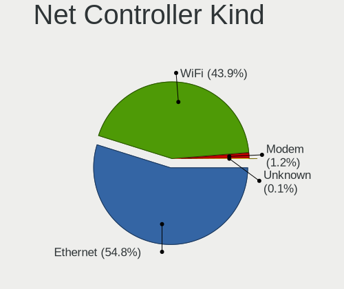

| Kind     | Computers | Percent |
|----------|-----------|---------|
| Ethernet | 239       | 56.1%   |
| WiFi     | 184       | 43.19%  |
| Modem    | 3         | 0.7%    |

Used Controller
---------------

Currently used network controller

| Kind     | Computers | Percent |
|----------|-----------|---------|
| WiFi     | 134       | 50%     |
| Ethernet | 134       | 50%     |

NICs
----

Total network controllers on board

| Total | Computers | Percent |
|-------|-----------|---------|
| 2     | 148       | 54.81%  |
| 1     | 105       | 38.89%  |
| 0     | 11        | 4.07%   |
| 3     | 3         | 1.11%   |
| 4     | 2         | 0.74%   |
| 5     | 1         | 0.37%   |

IPv6
----

IPv6 vs IPv4

| Used | Computers | Percent |
|------|-----------|---------|
| No   | 259       | 94.53%  |
| Yes  | 15        | 5.47%   |

Bluetooth
---------

Bluetooth Vendor
----------------

Controller vendors

| Vendor                          | Computers | Percent |
|---------------------------------|-----------|---------|
| Intel                           | 62        | 41.33%  |
| Realtek Semiconductor           | 13        | 8.67%   |
| Broadcom                        | 13        | 8.67%   |
| Qualcomm Atheros Communications | 12        | 8%      |
| IMC Networks                    | 11        | 7.33%   |
| Cambridge Silicon Radio         | 8         | 5.33%   |
| Hewlett-Packard                 | 7         | 4.67%   |
| ASUSTek Computer                | 6         | 4%      |
| Lite-On Technology              | 4         | 2.67%   |
| Apple                           | 3         | 2%      |
| Ralink                          | 2         | 1.33%   |
| Edimax Technology               | 2         | 1.33%   |
| Ralink Technology               | 1         | 0.67%   |
| Qcom                            | 1         | 0.67%   |
| Marvell Semiconductor           | 1         | 0.67%   |
| Integrated System Solution      | 1         | 0.67%   |
| Foxconn International           | 1         | 0.67%   |
| Foxconn / Hon Hai               | 1         | 0.67%   |
| Chicony Electronics             | 1         | 0.67%   |

Bluetooth Model
---------------

Controller models

| Model                                               | Computers | Percent |
|-----------------------------------------------------|-----------|---------|
| Intel Bluetooth wireless interface                  | 21        | 14%     |
| Intel AX201 Bluetooth                               | 14        | 9.33%   |
| Intel AX200 Bluetooth                               | 11        | 7.33%   |
| Intel Bluetooth 9460/9560 Jefferson Peak (JfP)      | 9         | 6%      |
| Cambridge Silicon Radio Bluetooth Dongle (HCI mode) | 8         | 5.33%   |
| Realtek Bluetooth Radio                             | 6         | 4%      |
| IMC Networks Bluetooth Radio                        | 5         | 3.33%   |
| Realtek  Bluetooth 4.2 Adapter                      | 4         | 2.67%   |
| Qualcomm Atheros  Bluetooth Device                  | 4         | 2.67%   |
| Qualcomm Atheros AR3011 Bluetooth                   | 4         | 2.67%   |
| HP Bluetooth 2.0 Interface [Broadcom BCM2045]       | 4         | 2.67%   |
| IMC Networks Bluetooth Device                       | 3         | 2%      |
| HP Broadcom 2070 Bluetooth Combo                    | 3         | 2%      |
| Realtek RTL8822BE Bluetooth 4.2 Adapter             | 2         | 1.33%   |
| Ralink RT3290 Bluetooth                             | 2         | 1.33%   |
| Qualcomm Atheros AR3012 Bluetooth 4.0               | 2         | 1.33%   |
| Lite-On Bluetooth Device                            | 2         | 1.33%   |
| Intel Wireless-AC 3168 Bluetooth                    | 2         | 1.33%   |
| Intel Centrino Bluetooth Wireless Transceiver       | 2         | 1.33%   |
| Intel AX210 Bluetooth                               | 2         | 1.33%   |
| IMC Networks Atheros AR3012 Bluetooth 4.0 Adapter   | 2         | 1.33%   |
| Edimax Bluetooth Adapter                            | 2         | 1.33%   |
| Broadcom BCM20702 Bluetooth 4.0 [ThinkPad]          | 2         | 1.33%   |
| Broadcom BCM2070 Bluetooth 2.1 + EDR                | 2         | 1.33%   |
| Broadcom BCM2045B (BDC-2.1) [Bluetooth Controller]  | 2         | 1.33%   |
| Broadcom BCM2045B (BDC-2.1)                         | 2         | 1.33%   |
| Broadcom BCM2045B (BDC-2) [Bluetooth Controller]    | 2         | 1.33%   |
| ASUS BT-270 Bluetooth Adapter                       | 2         | 1.33%   |
| ASUS Broadcom BCM20702A0 Bluetooth                  | 2         | 1.33%   |
| Realtek RTL8821A Bluetooth                          | 1         | 0.67%   |
| Ralink Motorola BC4 Bluetooth 3.0+HS Adapter        | 1         | 0.67%   |
| Qualcomm Atheros QCA61x4 Bluetooth 4.0              | 1         | 0.67%   |
| Qualcomm Atheros AR9462 Bluetooth                   | 1         | 0.67%   |
| Qcom Broadcom Bluetooth USB                         | 1         | 0.67%   |
| Marvell Bluetooth and Wireless LAN Composite        | 1         | 0.67%   |
| Lite-On Qualcomm Atheros QCA9377 Bluetooth          | 1         | 0.67%   |
| Lite-On Broadcom BCM43142A0 Bluetooth Device        | 1         | 0.67%   |
| Intel Wireless-AC 9260 Bluetooth Adapter            | 1         | 0.67%   |
| Integrated System Solution Bluetooth Device         | 1         | 0.67%   |
| IMC Networks Bluetooth                              | 1         | 0.67%   |
| Foxconn International BCM43142A0 Bluetooth module   | 1         | 0.67%   |
| Foxconn / Hon Hai BT                                | 1         | 0.67%   |
| Chicony Bluetooth (RTL8723BE)                       | 1         | 0.67%   |
| Broadcom HP Portable SoftSailing                    | 1         | 0.67%   |
| Broadcom BCM43142 Bluetooth 4.0                     | 1         | 0.67%   |
| Broadcom BCM20702A0                                 | 1         | 0.67%   |
| ASUS Qualcomm Bluetooth 4.1                         | 1         | 0.67%   |
| ASUS Bluetooth Radio                                | 1         | 0.67%   |
| Apple Built-in Bluetooth 2.0+EDR HCI                | 1         | 0.67%   |
| Apple Bluetooth USB Host Controller                 | 1         | 0.67%   |
| Apple Bluetooth HCI                                 | 1         | 0.67%   |

Sound
-----

Sound Vendor
------------

Sound card vendors

| Vendor                           | Computers | Percent |
|----------------------------------|-----------|---------|
| Intel                            | 199       | 54.97%  |
| AMD                              | 71        | 19.61%  |
| Nvidia                           | 62        | 17.13%  |
| Logitech                         | 4         | 1.1%    |
| C-Media Electronics              | 4         | 1.1%    |
| JMTek                            | 3         | 0.83%   |
| Texas Instruments                | 2         | 0.55%   |
| ASUSTek Computer                 | 2         | 0.55%   |
| Yamaha                           | 1         | 0.28%   |
| Textech International            | 1         | 0.28%   |
| Syntek                           | 1         | 0.28%   |
| Silicon Integrated Systems [SiS] | 1         | 0.28%   |
| Sennheiser Communications        | 1         | 0.28%   |
| PreSonus Audio Electronics       | 1         | 0.28%   |
| Nam Tai E&E Products             | 1         | 0.28%   |
| Mackie Designs                   | 1         | 0.28%   |
| Lenovo                           | 1         | 0.28%   |
| Kingston Technology              | 1         | 0.28%   |
| iCreate Technologies             | 1         | 0.28%   |
| Hewlett-Packard                  | 1         | 0.28%   |
| FiiO Electronics Technology      | 1         | 0.28%   |
| Creative Labs                    | 1         | 0.28%   |
| BEHRINGER International          | 1         | 0.28%   |

Sound Model
-----------

Sound card models

| Model                                                                             | Computers | Percent |
|-----------------------------------------------------------------------------------|-----------|---------|
| Intel 6 Series/C200 Series Chipset Family High Definition Audio Controller        | 20        | 4.76%   |
| AMD Family 17h/19h HD Audio Controller                                            | 20        | 4.76%   |
| Intel 5 Series/3400 Series Chipset High Definition Audio                          | 16        | 3.81%   |
| Intel Cannon Lake PCH cAVS                                                        | 13        | 3.1%    |
| Intel 8 Series/C220 Series Chipset High Definition Audio Controller               | 13        | 3.1%    |
| Intel Sunrise Point-LP HD Audio                                                   | 12        | 2.86%   |
| Intel 7 Series/C216 Chipset Family High Definition Audio Controller               | 12        | 2.86%   |
| Intel 200 Series PCH HD Audio                                                     | 11        | 2.62%   |
| Intel Xeon E3-1200 v3/4th Gen Core Processor HD Audio Controller                  | 10        | 2.38%   |
| Intel Cannon Point-LP High Definition Audio Controller                            | 10        | 2.38%   |
| Intel 82801I (ICH9 Family) HD Audio Controller                                    | 10        | 2.38%   |
| AMD Raven/Raven2/Fenghuang HDMI/DP Audio Controller                               | 10        | 2.38%   |
| Intel 82801H (ICH8 Family) HD Audio Controller                                    | 8         | 1.9%    |
| Intel 100 Series/C230 Series Chipset Family HD Audio Controller                   | 8         | 1.9%    |
| AMD Starship/Matisse HD Audio Controller                                          | 8         | 1.9%    |
| AMD Family 17h (Models 00h-0fh) HD Audio Controller                               | 8         | 1.9%    |
| Nvidia GP107GL High Definition Audio Controller                                   | 7         | 1.67%   |
| Intel Haswell-ULT HD Audio Controller                                             | 7         | 1.67%   |
| Intel Comet Lake PCH-LP cAVS                                                      | 7         | 1.67%   |
| Intel Broadwell-U Audio Controller                                                | 7         | 1.67%   |
| Intel 8 Series HD Audio Controller                                                | 7         | 1.67%   |
| AMD SBx00 Azalia (Intel HDA)                                                      | 7         | 1.67%   |
| AMD Renoir Radeon High Definition Audio Controller                                | 7         | 1.67%   |
| AMD Ellesmere HDMI Audio [Radeon RX 470/480 / 570/580/590]                        | 7         | 1.67%   |
| Nvidia GP106 High Definition Audio Controller                                     | 6         | 1.43%   |
| Intel Wildcat Point-LP High Definition Audio Controller                           | 6         | 1.43%   |
| Intel NM10/ICH7 Family High Definition Audio Controller                           | 6         | 1.43%   |
| AMD Cedar HDMI Audio [Radeon HD 5400/6300/7300 Series]                            | 6         | 1.43%   |
| Nvidia GP104 High Definition Audio Controller                                     | 5         | 1.19%   |
| Intel Tiger Lake-LP Smart Sound Technology Audio Controller                       | 5         | 1.19%   |
| Intel Atom Processor Z36xxx/Z37xxx Series High Definition Audio Controller        | 5         | 1.19%   |
| Intel 82801JI (ICH10 Family) HD Audio Controller                                  | 5         | 1.19%   |
| AMD FCH Azalia Controller                                                         | 5         | 1.19%   |
| Nvidia TU107 GeForce GTX 1650 High Definition Audio Controller                    | 4         | 0.95%   |
| Nvidia GM206 High Definition Audio Controller                                     | 3         | 0.71%   |
| Nvidia GM107 High Definition Audio Controller [GeForce 940MX]                     | 3         | 0.71%   |
| Nvidia GK107 HDMI Audio Controller                                                | 3         | 0.71%   |
| Nvidia GK104 HDMI Audio Controller                                                | 3         | 0.71%   |
| Nvidia GF106 High Definition Audio Controller                                     | 3         | 0.71%   |
| Nvidia GA104 High Definition Audio Controller                                     | 3         | 0.71%   |
| Intel Ice Lake-LP Smart Sound Technology Audio Controller                         | 3         | 0.71%   |
| Intel CM238 HD Audio Controller                                                   | 3         | 0.71%   |
| Intel 9 Series Chipset Family HD Audio Controller                                 | 3         | 0.71%   |
| AMD Turks HDMI Audio [Radeon HD 6500/6600 / 6700M Series]                         | 3         | 0.71%   |
| AMD Caicos HDMI Audio [Radeon HD 6450 / 7450/8450/8490 OEM / R5 230/235/235X OEM] | 3         | 0.71%   |
| AMD Baffin HDMI/DP Audio [Radeon RX 550 640SP / RX 560/560X]                      | 3         | 0.71%   |
| Texas Instruments PCM2902 Audio Codec                                             | 2         | 0.48%   |
| Nvidia TU116 High Definition Audio Controller                                     | 2         | 0.48%   |
| Nvidia GP108 High Definition Audio Controller                                     | 2         | 0.48%   |
| Nvidia GP102 HDMI Audio Controller                                                | 2         | 0.48%   |
| Nvidia GM204 High Definition Audio Controller                                     | 2         | 0.48%   |
| Nvidia GK208 HDMI/DP Audio Controller                                             | 2         | 0.48%   |
| Nvidia GK106 HDMI Audio Controller                                                | 2         | 0.48%   |
| Nvidia GF108 High Definition Audio Controller                                     | 2         | 0.48%   |
| Logitech G430 Surround Sound Gaming Headset                                       | 2         | 0.48%   |
| Intel Tiger Lake-H HD Audio Controller                                            | 2         | 0.48%   |
| Intel Celeron/Pentium Silver Processor High Definition Audio                      | 2         | 0.48%   |
| Intel Celeron N3350/Pentium N4200/Atom E3900 Series Audio Cluster                 | 2         | 0.48%   |
| Intel C600/X79 series chipset High Definition Audio Controller                    | 2         | 0.48%   |
| Intel 82801JD/DO (ICH10 Family) HD Audio Controller                               | 2         | 0.48%   |

Memory
------

Memory Vendor
-------------

Memory module vendors

| Vendor              | Computers | Percent |
|---------------------|-----------|---------|
| SK hynix            | 37        | 21.89%  |
| Samsung Electronics | 31        | 18.34%  |
| Kingston            | 19        | 11.24%  |
| Crucial             | 18        | 10.65%  |
| Micron Technology   | 16        | 9.47%   |
| Unknown             | 11        | 6.51%   |
| G.Skill             | 9         | 5.33%   |
| Elpida              | 5         | 2.96%   |
| Corsair             | 5         | 2.96%   |
| Nanya Technology    | 4         | 2.37%   |
| Ramaxel Technology  | 3         | 1.78%   |
| A-DATA Technology   | 3         | 1.78%   |
| Team                | 2         | 1.18%   |
| TakeMS              | 2         | 1.18%   |
| Patriot             | 2         | 1.18%   |
| Transcend           | 1         | 0.59%   |
| Qimonda             | 1         | 0.59%   |

Memory Model
------------

Memory module models

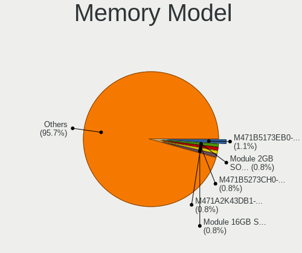

| Model                                                            | Computers | Percent |
|------------------------------------------------------------------|-----------|---------|
| SK hynix RAM HMT351S6CFR8C-PB 4GB SODIMM DDR3 1600MT/s           | 3         | 1.63%   |
| Samsung RAM M471B5273CH0-CH9 4096MB SODIMM DDR3 1334MT/s         | 3         | 1.63%   |
| Unknown RAM Module 2GB SODIMM DDR2                               | 2         | 1.09%   |
| SK hynix RAM Module 8192MB SODIMM DDR4 2400MT/s                  | 2         | 1.09%   |
| SK hynix RAM HMT451S6BFR8A-PB 4GB SODIMM DDR3 1600MT/s           | 2         | 1.09%   |
| SK hynix RAM HMT351S6BFR8C-H9 4096MB SODIMM DDR3 1333MT/s        | 2         | 1.09%   |
| SK hynix RAM HMA82GS6JJR8N-VK 16GB SODIMM DDR4 2667MT/s          | 2         | 1.09%   |
| SK hynix RAM HMA81GS6CJR8N-VK 8GB SODIMM DDR4 2667MT/s           | 2         | 1.09%   |
| Samsung RAM M471B5173EB0-YK0 4GB SODIMM DDR3 1600MT/s            | 2         | 1.09%   |
| Samsung RAM M471B1G73DB0-YK0 8GB SODIMM DDR3 1600MT/s            | 2         | 1.09%   |
| Samsung RAM M471A1K43CB1-CTD 8GB SODIMM DDR4 2667MT/s            | 2         | 1.09%   |
| Samsung RAM M393B1G70QH0-CMA 8GB DIMM 1867MT/s                   | 2         | 1.09%   |
| Nanya RAM NT4GC64B8HG0NS-CG 4GB SODIMM DDR3 1334MT/s             | 2         | 1.09%   |
| Micron RAM 16ATF2G64HZ-3G2J1 16GB SODIMM DDR4 3200MT/s           | 2         | 1.09%   |
| Kingston RAM KHX2133C14/8G 8GB DIMM DDR4 2400MT/s                | 2         | 1.09%   |
| G.Skill RAM F4-3000C16-8GISB 8GB DIMM DDR4 3200MT/s              | 2         | 1.09%   |
| Crucial RAM CT16G4SFD8266.M16FJ 16384MB SODIMM DDR4 2667MT/s     | 2         | 1.09%   |
| Unknown RAM Module 8GB Chip DDR4 2133MT/s                        | 1         | 0.54%   |
| Unknown RAM Module 4096MB DIMM DDR 1600MT/s                      | 1         | 0.54%   |
| Unknown RAM Module 2GB Row Of Chips LPDDR4 4267MT/s              | 1         | 0.54%   |
| Unknown RAM Module 2GB DIMM 800MT/s                              | 1         | 0.54%   |
| Unknown RAM Module 2048MB SODIMM DRAM                            | 1         | 0.54%   |
| Unknown RAM Module 2048MB SODIMM DDR2 667MT/s                    | 1         | 0.54%   |
| Unknown RAM Module 2048MB DIMM DDR2 667MT/s                      | 1         | 0.54%   |
| Unknown RAM Module 2048MB Chip DDR3 1066MT/s                     | 1         | 0.54%   |
| Unknown RAM 3000 C16 Series 8192MB DIMM DDR4 2133MT/s            | 1         | 0.54%   |
| Transcend RAM JM800QLU-2G 2GB DIMM DDR2 2048MT/s                 | 1         | 0.54%   |
| Team RAM TEAMGROUP-UD4-3000 8GB DIMM DDR4 3000MT/s               | 1         | 0.54%   |
| Team RAM TEAMGROUP-UD4-2666 8GB DIMM DDR4 2667MT/s               | 1         | 0.54%   |
| TakeMS RAM TMS4GB364F081139EM 4096MB DIMM DDR3 1333MT/s          | 1         | 0.54%   |
| TakeMS RAM TMS4GB364E081139PP 4GB DIMM DDR3 1333MT/s             | 1         | 0.54%   |
| TakeMS RAM TMS2GB264D081805EV 2048MB DIMM DDR2 800MT/s           | 1         | 0.54%   |
| SK hynix RAM Module 8GB SODIMM DDR4 2400MT/s                     | 1         | 0.54%   |
| SK hynix RAM Module 8GB Row Of Chips LPDDR3 2133MT/s             | 1         | 0.54%   |
| SK hynix RAM Module 8192MB SODIMM DDR4 2667MT/s                  | 1         | 0.54%   |
| SK hynix RAM Module 4096MB SODIMM DDR3 1600MT/s                  | 1         | 0.54%   |
| SK hynix RAM Module 4096MB FB-DIMM DDR2 667MT/s                  | 1         | 0.54%   |
| SK hynix RAM Module 16GB SODIMM DDR4 3200MT/s                    | 1         | 0.54%   |
| SK hynix RAM Module 16GB SODIMM DDR4 2667MT/s                    | 1         | 0.54%   |
| SK hynix RAM Module 16GB SODIMM DDR4 2133MT/s                    | 1         | 0.54%   |
| SK hynix RAM Module 16384MB SODIMM DDR4 2667MT/s                 | 1         | 0.54%   |
| SK hynix RAM Module 16384MB SODIMM DDR4 2400MT/s                 | 1         | 0.54%   |
| SK hynix RAM HYMP512S64CP8-Y5 1GB SODIMM DDR2 667MT/s            | 1         | 0.54%   |
| SK hynix RAM HYMP325S64AMP8-Y5 2048MB SODIMM DDR 667MT/s         | 1         | 0.54%   |
| SK hynix RAM HYMP112S64CP6-Y5 1024MB SODIMM DDR2 667MT/s         | 1         | 0.54%   |
| SK hynix RAM HMT451S6AFR8C-PB 4GB SODIMM DDR3 1600MT/s           | 1         | 0.54%   |
| SK hynix RAM HMT41GS6BFR8A-PB 8GB SODIMM DDR3 1600MT/s           | 1         | 0.54%   |
| SK hynix RAM HMT351U6EFR8C-PB 4GB DIMM DDR3 1800MT/s             | 1         | 0.54%   |
| SK hynix RAM HMT351S6EFR8A-PB 4GB SODIMM DDR3 1600MT/s           | 1         | 0.54%   |
| SK hynix RAM HMT31GR7EFR4A-H9 8GB DIMM 1067MT/s                  | 1         | 0.54%   |
| SK hynix RAM HMT31GR7CFR4A-H9 8GB DIMM 1333MT/s                  | 1         | 0.54%   |
| SK hynix RAM HMT125U6BFR8C-H9 2GB DIMM 1333MT/s                  | 1         | 0.54%   |
| SK hynix RAM HMT112S6BFR6C-H9 1GB SODIMM DDR3 1333MT/s           | 1         | 0.54%   |
| SK hynix RAM HMAA2GS6CJR8N-XN 16384MB SODIMM DDR4 3200MT/s       | 1         | 0.54%   |
| SK hynix RAM HMAA1GS6CMR6N-VK 8GB SODIMM DDR4 2667MT/s           | 1         | 0.54%   |
| SK hynix RAM HMA82GS6AFR8N-UH 16GB SODIMM DDR4 2667MT/s          | 1         | 0.54%   |
| SK hynix RAM HMA81GS6DJR8N-XN 8GB SODIMM DDR4 3200MT/s           | 1         | 0.54%   |
| SK hynix RAM HMA81GS6AFR8N-UH 8GB SODIMM DDR4 2667MT/s           | 1         | 0.54%   |
| SK hynix RAM HMA41GR7AFR4N-UH 8GB DIMM DDR4 2400MT/s             | 1         | 0.54%   |
| SK hynix RAM H9CCNNNBJTALAR-NVD 4GB Row Of Chips LPDDR3 2133MT/s | 1         | 0.54%   |

Memory Kind
-----------

Memory module kinds

| Kind    | Computers | Percent |
|---------|-----------|---------|
| DDR4    | 73        | 49.66%  |
| DDR3    | 45        | 30.61%  |
| DDR2    | 13        | 8.84%   |
| SDRAM   | 6         | 4.08%   |
| LPDDR3  | 4         | 2.72%   |
| LPDDR4  | 2         | 1.36%   |
| Unknown | 2         | 1.36%   |
| DRAM    | 1         | 0.68%   |
| DDR     | 1         | 0.68%   |

Memory Form Factor
------------------

Physical design of the memory module

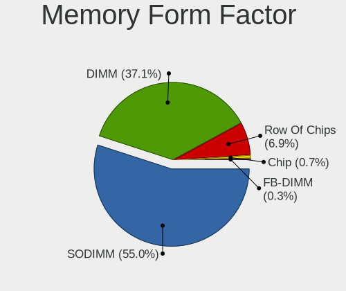

| Name         | Computers | Percent |
|--------------|-----------|---------|
| SODIMM       | 79        | 54.48%  |
| DIMM         | 56        | 38.62%  |
| Row Of Chips | 7         | 4.83%   |
| Chip         | 2         | 1.38%   |
| FB-DIMM      | 1         | 0.69%   |

Memory Size
-----------

Memory module size

| Size  | Computers | Percent |
|-------|-----------|---------|
| 8192  | 54        | 36.24%  |
| 4096  | 39        | 26.17%  |
| 16384 | 27        | 18.12%  |
| 2048  | 19        | 12.75%  |
| 1024  | 7         | 4.7%    |
| 32768 | 3         | 2.01%   |

Memory Speed
------------

Memory module speed

| Speed   | Computers | Percent |
|---------|-----------|---------|
| 1600    | 28        | 17.61%  |
| 2667    | 26        | 16.35%  |
| 3200    | 15        | 9.43%   |
| 2400    | 14        | 8.81%   |
| 2133    | 10        | 6.29%   |
| 1333    | 9         | 5.66%   |
| 1334    | 7         | 4.4%    |
| 667     | 7         | 4.4%    |
| 3600    | 5         | 3.14%   |
| 1867    | 5         | 3.14%   |
| 800     | 5         | 3.14%   |
| 1067    | 3         | 1.89%   |
| Unknown | 3         | 1.89%   |
| 4267    | 2         | 1.26%   |
| 4199    | 2         | 1.26%   |
| 3800    | 2         | 1.26%   |
| 3466    | 2         | 1.26%   |
| 3000    | 2         | 1.26%   |
| 2048    | 2         | 1.26%   |
| 49926   | 1         | 0.63%   |
| 8400    | 1         | 0.63%   |
| 3733    | 1         | 0.63%   |
| 3266    | 1         | 0.63%   |
| 2866    | 1         | 0.63%   |
| 2800    | 1         | 0.63%   |
| 1800    | 1         | 0.63%   |
| 1639    | 1         | 0.63%   |
| 1066    | 1         | 0.63%   |
| 975     | 1         | 0.63%   |

Printers & scanners
-------------------

Printer Vendor
--------------

Printer device vendors

| Vendor              | Computers | Percent |
|---------------------|-----------|---------|
| Hewlett-Packard     | 3         | 37.5%   |
| Xerox               | 2         | 25%     |
| Samsung Electronics | 1         | 12.5%   |
| Canon               | 1         | 12.5%   |
| Brother Industries  | 1         | 12.5%   |

Printer Model
-------------

Printer device models

| Model                              | Computers | Percent |
|------------------------------------|-----------|---------|
| Xerox Phaser 3140 and 3155         | 1         | 12.5%   |
| Xerox Phaser 3010                  | 1         | 12.5%   |
| Samsung M2070 Series               | 1         | 12.5%   |
| HP DeskJet F4200 series            | 1         | 12.5%   |
| HP DeskJet 2620 All-in-One Printer | 1         | 12.5%   |
| HP Color LaserJet 2605dn           | 1         | 12.5%   |
| Canon PIXMA MP250                  | 1         | 12.5%   |
| Brother DCP-L2530DW series         | 1         | 12.5%   |

Scanner Vendor
--------------

Scanner device vendors

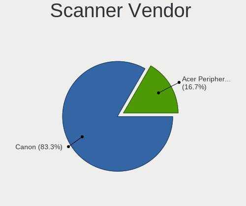

| Vendor | Computers | Percent |
|--------|-----------|---------|
| Canon  | 4         | 100%    |

Scanner Model
-------------

Scanner device models

| Model                              | Computers | Percent |
|------------------------------------|-----------|---------|
| Canon CanoScan N670U/N676U/LiDE 20 | 1         | 25%     |
| Canon CanoScan LiDE 700F           | 1         | 25%     |
| Canon CanoScan LiDE 220            | 1         | 25%     |
| Canon CanoScan 4200F               | 1         | 25%     |

Camera
------

Camera Vendor
-------------

Camera device vendors

| Vendor                                 | Computers | Percent |
|----------------------------------------|-----------|---------|
| Chicony Electronics                    | 44        | 30.99%  |
| IMC Networks                           | 14        | 9.86%   |
| Realtek Semiconductor                  | 10        | 7.04%   |
| Quanta                                 | 9         | 6.34%   |
| Cheng Uei Precision Industry (Foxlink) | 9         | 6.34%   |
| Sunplus Innovation Technology          | 8         | 5.63%   |
| Logitech                               | 8         | 5.63%   |
| Microdia                               | 7         | 4.93%   |
| Acer                                   | 6         | 4.23%   |
| Lite-On Technology                     | 5         | 3.52%   |
| Apple                                  | 4         | 2.82%   |
| Lenovo                                 | 3         | 2.11%   |
| Syntek                                 | 2         | 1.41%   |
| Suyin                                  | 2         | 1.41%   |
| Samsung Electronics                    | 2         | 1.41%   |
| Primax Electronics                     | 2         | 1.41%   |
| Generalplus Technology                 | 2         | 1.41%   |
| Z-Star Microelectronics                | 1         | 0.7%    |
| Ricoh                                  | 1         | 0.7%    |
| Pixart Imaging                         | 1         | 0.7%    |
| Luxvisions Innotech Limited            | 1         | 0.7%    |
| Cubeternet                             | 1         | 0.7%    |

Camera Model
------------

Camera device models

| Model                                                            | Computers | Percent |
|------------------------------------------------------------------|-----------|---------|
| Chicony Integrated Camera                                        | 9         | 6.25%   |
| Microdia Integrated_Webcam_HD                                    | 7         | 4.86%   |
| IMC Networks Integrated Camera                                   | 6         | 4.17%   |
| Acer Integrated Camera                                           | 4         | 2.78%   |
| IMC Networks USB2.0 HD UVC WebCam                                | 3         | 2.08%   |
| Chicony USB2.0 HD UVC WebCam                                     | 3         | 2.08%   |
| Chicony HP HD Webcam                                             | 3         | 2.08%   |
| Cheng Uei Precision Industry (Foxlink) HP Webcam                 | 3         | 2.08%   |
| Syntek Lenovo EasyCamera                                         | 2         | 1.39%   |
| Sunplus HP HD Webcam [Fixed]                                     | 2         | 1.39%   |
| Sunplus HD WebCam                                                | 2         | 1.39%   |
| Samsung Galaxy series, misc. (MTP mode)                          | 2         | 1.39%   |
| Realtek USB Camera                                               | 2         | 1.39%   |
| Realtek Integrated_Webcam_HD                                     | 2         | 1.39%   |
| Realtek Asus laptop camera                                       | 2         | 1.39%   |
| Quanta HP Webcam                                                 | 2         | 1.39%   |
| Quanta HP TrueVision HD Camera                                   | 2         | 1.39%   |
| Quanta HP HD Camera                                              | 2         | 1.39%   |
| Primax HP HD Webcam [Fixed]                                      | 2         | 1.39%   |
| Logitech Webcam C310                                             | 2         | 1.39%   |
| Lite-On HP HD Webcam                                             | 2         | 1.39%   |
| Lite-On HP HD Camera                                             | 2         | 1.39%   |
| Lenovo Integrated Webcam [R5U877]                                | 2         | 1.39%   |
| IMC Networks Integrated Webcam                                   | 2         | 1.39%   |
| Generalplus GENERAL WEBCAM                                       | 2         | 1.39%   |
| Chicony USB2.0 VGA UVC WebCam                                    | 2         | 1.39%   |
| Chicony Lenovo EasyCamera                                        | 2         | 1.39%   |
| Chicony Integrated Camera [ThinkPad]                             | 2         | 1.39%   |
| Chicony Integrated Camera (1280x720@30)                          | 2         | 1.39%   |
| Chicony HP Wide Vision HD Camera                                 | 2         | 1.39%   |
| Chicony HP Webcam                                                | 2         | 1.39%   |
| Chicony HP TrueVision HD Camera                                  | 2         | 1.39%   |
| Chicony CNF7042                                                  | 2         | 1.39%   |
| Cheng Uei Precision Industry (Foxlink) HP Wide Vision FHD Camera | 2         | 1.39%   |
| Apple FaceTime HD Camera (Built-in)                              | 2         | 1.39%   |
| Z-Star Venus USB2.0 Camera                                       | 1         | 0.69%   |
| Suyin HP Truevision HD                                           | 1         | 0.69%   |
| Suyin 1.3M WebCam (notebook emachines E730, Acer sub-brand)      | 1         | 0.69%   |
| Sunplus Integrated Camera                                        | 1         | 0.69%   |
| Sunplus HP Universal Camera                                      | 1         | 0.69%   |
| Sunplus HP 2.0MP High Definition Webcam                          | 1         | 0.69%   |
| Sunplus HD 720P webcam                                           | 1         | 0.69%   |
| Ricoh Integrated Webcam                                          | 1         | 0.69%   |
| Realtek Lenovo EasyCamera                                        | 1         | 0.69%   |
| Realtek Laptop Camera                                            | 1         | 0.69%   |
| Realtek Integrated Webcam                                        | 1         | 0.69%   |
| Realtek Integrated Camera                                        | 1         | 0.69%   |
| Quanta VGA WebCam                                                | 1         | 0.69%   |
| Quanta HP TrueVision HD Webcam                                   | 1         | 0.69%   |
| Quanta HD Webcam                                                 | 1         | 0.69%   |
| Pixart Imaging GE 1.3 MP MiniCam Pro                             | 1         | 0.69%   |
| Luxvisions Innotech Limited HP HD Camera                         | 1         | 0.69%   |
| Logitech Webcam C210                                             | 1         | 0.69%   |
| Logitech Webcam C170                                             | 1         | 0.69%   |
| Logitech Logi 4K Stream Edition                                  | 1         | 0.69%   |
| Logitech HD Webcam C910                                          | 1         | 0.69%   |
| Logitech HD Pro Webcam C920                                      | 1         | 0.69%   |
| Logitech BRIO Ultra HD Webcam                                    | 1         | 0.69%   |
| Lite-On Integrated Camera                                        | 1         | 0.69%   |
| Lenovo UVC Camera                                                | 1         | 0.69%   |

Security
--------

Fingerprint Vendor
------------------

Fingerprint sensor vendors

| Vendor                     | Computers | Percent |
|----------------------------|-----------|---------|
| Synaptics                  | 16        | 37.21%  |
| Validity Sensors           | 14        | 32.56%  |
| Upek                       | 4         | 9.3%    |
| AuthenTec                  | 4         | 9.3%    |
| Shenzhen Goodix Technology | 3         | 6.98%   |
| STMicroelectronics         | 1         | 2.33%   |
| Elan Microelectronics      | 1         | 2.33%   |

Fingerprint Model
-----------------

Fingerprint sensor models

| Model                                                      | Computers | Percent |
|------------------------------------------------------------|-----------|---------|
| Validity Sensors VFS495 Fingerprint Reader                 | 6         | 13.95%  |
| Synaptics Prometheus MIS Touch Fingerprint Reader          | 6         | 13.95%  |
| Upek Biometric Touchchip/Touchstrip Fingerprint Sensor     | 4         | 9.3%    |
| Synaptics  VFS7552 Touch Fingerprint Sensor with PurePrint | 3         | 6.98%   |
| Synaptics Metallica MIS Touch Fingerprint Reader           | 3         | 6.98%   |
| Validity Sensors VFS471 Fingerprint Reader                 | 2         | 4.65%   |
| Validity Sensors VFS451 Fingerprint Reader                 | 2         | 4.65%   |
| Shenzhen Goodix  FingerPrint Device                        | 2         | 4.65%   |
| AuthenTec AES2810                                          | 2         | 4.65%   |
| Unknown                                                    | 2         | 4.65%   |
| Validity Sensors VFS5011 Fingerprint Reader                | 1         | 2.33%   |
| Validity Sensors VFS491                                    | 1         | 2.33%   |
| Validity Sensors VFS301 Fingerprint Reader                 | 1         | 2.33%   |
| Validity Sensors VFS 5011 fingerprint sensor               | 1         | 2.33%   |
| Synaptics  FS7604 Touch Fingerprint Sensor with PurePrint  | 1         | 2.33%   |
| Synaptics Metallica MOH Touch Fingerprint Reader           | 1         | 2.33%   |
| STMicroelectronics Fingerprint Reader                      | 1         | 2.33%   |
| Shenzhen Goodix FingerPrint                                | 1         | 2.33%   |
| Elan ELAN:ARM-M4                                           | 1         | 2.33%   |
| AuthenTec AES2550 Fingerprint Sensor                       | 1         | 2.33%   |
| AuthenTec AES2501 Fingerprint Sensor                       | 1         | 2.33%   |

Chipcard Vendor
---------------

Chipcard module vendors

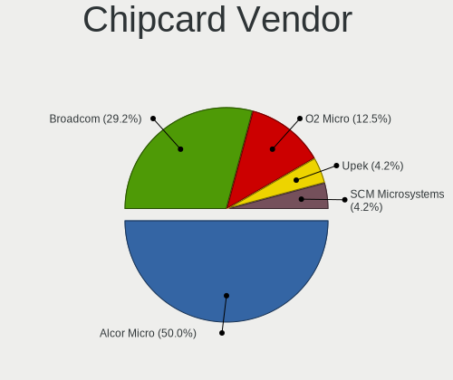

| Vendor           | Computers | Percent |
|------------------|-----------|---------|
| Alcor Micro      | 7         | 53.85%  |
| Broadcom         | 3         | 23.08%  |
| Upek             | 1         | 7.69%   |
| SCM Microsystems | 1         | 7.69%   |
| O2 Micro         | 1         | 7.69%   |

Chipcard Model
--------------

Chipcard module models

| Model                                                      | Computers | Percent |
|------------------------------------------------------------|-----------|---------|
| Alcor Micro AU9540 Smartcard Reader                        | 7         | 53.85%  |
| Broadcom 58200                                             | 2         | 15.38%  |
| Upek TouchChip Fingerprint Coprocessor (WBF advanced mode) | 1         | 7.69%   |
| SCM Microsystems uTrust 3512 SAM slot Token                | 1         | 7.69%   |
| O2 Micro OZ776 CCID Smartcard Reader                       | 1         | 7.69%   |
| Broadcom BCM5880 Secure Applications Processor             | 1         | 7.69%   |

Unsupported
-----------

Unsupported Devices
-------------------

Total unsupported devices on board

| Total | Computers | Percent |
|-------|-----------|---------|
| 0     | 184       | 67.9%   |
| 1     | 65        | 23.99%  |
| 2     | 21        | 7.75%   |
| 3     | 1         | 0.37%   |

Unsupported Device Types
------------------------

Types of unsupported devices

| Type                     | Computers | Percent |
|--------------------------|-----------|---------|
| Fingerprint reader       | 43        | 39.81%  |
| Graphics card            | 21        | 19.44%  |
| Chipcard                 | 13        | 12.04%  |
| Net/wireless             | 8         | 7.41%   |
| Multimedia controller    | 8         | 7.41%   |
| Communication controller | 4         | 3.7%    |
| Storage                  | 3         | 2.78%   |
| Bluetooth                | 3         | 2.78%   |
| Unassigned class         | 1         | 0.93%   |
| Net/ethernet             | 1         | 0.93%   |
| Dvb card                 | 1         | 0.93%   |
| Card reader              | 1         | 0.93%   |
| Camera                   | 1         | 0.93%   |

