Linux in Slovenia - Tested Hardware & Statistics (Desktops)
-----------------------------------------------------------

A project to collect tested hardware configurations for Linux in Slovenia.

Anyone can contribute to this report by the [hw-probe](https://github.com/linuxhw/hw-probe) tool:

    sudo -E hw-probe -all -upload

Please contribute! Especially if your hardware is rare.

Contents
--------

* [ Test Cases ](#test-cases)

* [ System ](#system)
  - [ OS                       ](#os)
  - [ OS Family                ](#os-family)
  - [ Kernel                   ](#kernel)
  - [ Kernel Family            ](#kernel-family)
  - [ Kernel Major Ver.        ](#kernel-major-ver)
  - [ Arch                     ](#arch)
  - [ DE                       ](#de)
  - [ Display Server           ](#display-server)
  - [ Display Manager          ](#display-manager)
  - [ OS Lang                  ](#os-lang)
  - [ Boot Mode                ](#boot-mode)
  - [ Filesystem               ](#filesystem)
  - [ Part. scheme             ](#part-scheme)
  - [ Dual Boot with Linux/BSD ](#dual-boot-with-linuxbsd)
  - [ Dual Boot (Win)          ](#dual-boot-win)

* [ Board ](#board)
  - [ Vendor                   ](#vendor)
  - [ Model                    ](#model)
  - [ Model Family             ](#model-family)
  - [ MFG Year                 ](#mfg-year)
  - [ Form Factor              ](#form-factor)
  - [ Secure Boot              ](#secure-boot)
  - [ Coreboot                 ](#coreboot)
  - [ RAM Size                 ](#ram-size)
  - [ RAM Used                 ](#ram-used)
  - [ Total Drives             ](#total-drives)
  - [ Has CD-ROM               ](#has-cd-rom)
  - [ Has Ethernet             ](#has-ethernet)
  - [ Has WiFi                 ](#has-wifi)
  - [ Has Bluetooth            ](#has-bluetooth)

* [ Location ](#location)
  - [ Country                  ](#country)
  - [ City                     ](#city)

* [ Drives ](#drives)
  - [ Drive Vendor             ](#drive-vendor)
  - [ Drive Model              ](#drive-model)
  - [ HDD Vendor               ](#hdd-vendor)
  - [ SSD Vendor               ](#ssd-vendor)
  - [ Drive Kind               ](#drive-kind)
  - [ Drive Connector          ](#drive-connector)
  - [ Drive Size               ](#drive-size)
  - [ Space Total              ](#space-total)
  - [ Space Used               ](#space-used)
  - [ Malfunc. Drives          ](#malfunc-drives)
  - [ Malfunc. Drive Vendor    ](#malfunc-drive-vendor)
  - [ Malfunc. HDD Vendor      ](#malfunc-hdd-vendor)
  - [ Malfunc. Drive Kind      ](#malfunc-drive-kind)
  - [ Failed Drives            ](#failed-drives)
  - [ Failed Drive Vendor      ](#failed-drive-vendor)
  - [ Drive Status             ](#drive-status)

* [ Storage controller ](#storage-controller)
  - [ Storage Vendor           ](#storage-vendor)
  - [ Storage Model            ](#storage-model)
  - [ Storage Kind             ](#storage-kind)

* [ Processor ](#processor)
  - [ CPU Vendor               ](#cpu-vendor)
  - [ CPU Model                ](#cpu-model)
  - [ CPU Model Family         ](#cpu-model-family)
  - [ CPU Cores                ](#cpu-cores)
  - [ CPU Sockets              ](#cpu-sockets)
  - [ CPU Threads              ](#cpu-threads)
  - [ CPU Op-Modes             ](#cpu-op-modes)
  - [ CPU Microcode            ](#cpu-microcode)
  - [ CPU Microarch            ](#cpu-microarch)

* [ Graphics ](#graphics)
  - [ GPU Vendor               ](#gpu-vendor)
  - [ GPU Model                ](#gpu-model)
  - [ GPU Combo                ](#gpu-combo)
  - [ GPU Driver               ](#gpu-driver)
  - [ GPU Memory               ](#gpu-memory)

* [ Monitor ](#monitor)
  - [ Monitor Vendor           ](#monitor-vendor)
  - [ Monitor Model            ](#monitor-model)
  - [ Monitor Resolution       ](#monitor-resolution)
  - [ Monitor Diagonal         ](#monitor-diagonal)
  - [ Monitor Width            ](#monitor-width)
  - [ Aspect Ratio             ](#aspect-ratio)
  - [ Monitor Area             ](#monitor-area)
  - [ Pixel Density            ](#pixel-density)
  - [ Multiple Monitors        ](#multiple-monitors)

* [ Network ](#network)
  - [ Net Controller Vendor    ](#net-controller-vendor)
  - [ Net Controller Model     ](#net-controller-model)
  - [ Wireless Vendor          ](#wireless-vendor)
  - [ Wireless Model           ](#wireless-model)
  - [ Ethernet Vendor          ](#ethernet-vendor)
  - [ Ethernet Model           ](#ethernet-model)
  - [ Net Controller Kind      ](#net-controller-kind)
  - [ Used Controller          ](#used-controller)
  - [ NICs                     ](#nics)
  - [ IPv6                     ](#ipv6)

* [ Bluetooth ](#bluetooth)
  - [ Bluetooth Vendor         ](#bluetooth-vendor)
  - [ Bluetooth Model          ](#bluetooth-model)

* [ Sound ](#sound)
  - [ Sound Vendor             ](#sound-vendor)
  - [ Sound Model              ](#sound-model)

* [ Memory ](#memory)
  - [ Memory Vendor            ](#memory-vendor)
  - [ Memory Model             ](#memory-model)
  - [ Memory Kind              ](#memory-kind)
  - [ Memory Form Factor       ](#memory-form-factor)
  - [ Memory Size              ](#memory-size)
  - [ Memory Speed             ](#memory-speed)

* [ Printers & scanners ](#printers--scanners)
  - [ Printer Vendor           ](#printer-vendor)
  - [ Printer Model            ](#printer-model)
  - [ Scanner Vendor           ](#scanner-vendor)
  - [ Scanner Model            ](#scanner-model)

* [ Camera ](#camera)
  - [ Camera Vendor            ](#camera-vendor)
  - [ Camera Model             ](#camera-model)

* [ Security ](#security)
  - [ Fingerprint Vendor       ](#fingerprint-vendor)
  - [ Fingerprint Model        ](#fingerprint-model)
  - [ Chipcard Vendor          ](#chipcard-vendor)
  - [ Chipcard Model           ](#chipcard-model)

* [ Unsupported ](#unsupported)
  - [ Unsupported Devices      ](#unsupported-devices)
  - [ Unsupported Device Types ](#unsupported-device-types)

Test Cases
----------

Total: 185

| Vendor     | Model                       | Probe                                                      | Date         |
|------------|-----------------------------|------------------------------------------------------------|--------------|
| ASUSTek    | TUF B450-PLUS GAMING        | [9e269ee2a4](https://linux-hardware.org/?probe=9e269ee2a4) | Dec 24, 2022 |
| MSI        | Z170-A PRO                  | [3948dcc7ef](https://linux-hardware.org/?probe=3948dcc7ef) | Dec 23, 2022 |
| HP         | 8594                        | [de0b36257e](https://linux-hardware.org/?probe=de0b36257e) | Dec 21, 2022 |
| ASUSTek    | ROG STRIX B550-F GAMING     | [cb70181c3a](https://linux-hardware.org/?probe=cb70181c3a) | Dec 21, 2022 |
| Gigabyte   | B650M GAMING X AX           | [01b7250cea](https://linux-hardware.org/?probe=01b7250cea) | Dec 19, 2022 |
| Gigabyte   | B650M GAMING X AX           | [999cbfe9f7](https://linux-hardware.org/?probe=999cbfe9f7) | Dec 19, 2022 |
| ASUSTek    | SABERTOOTH Z77              | [3892b54ac4](https://linux-hardware.org/?probe=3892b54ac4) | Dec 08, 2022 |
| ASUSTek    | SABERTOOTH Z77              | [eced972f80](https://linux-hardware.org/?probe=eced972f80) | Dec 05, 2022 |
| ASUSTek    | SABERTOOTH Z77              | [d37c93af89](https://linux-hardware.org/?probe=d37c93af89) | Dec 05, 2022 |
| ASRock     | H55M-LE                     | [9d2066a479](https://linux-hardware.org/?probe=9d2066a479) | Dec 03, 2022 |
| HP         | 8591                        | [98bde1bd5a](https://linux-hardware.org/?probe=98bde1bd5a) | Nov 01, 2022 |
| Gigabyte   | H61M-S2V-B3                 | [9e7b79bfbb](https://linux-hardware.org/?probe=9e7b79bfbb) | Oct 20, 2022 |
| Gigabyte   | H81M-S2PV                   | [90661c40a3](https://linux-hardware.org/?probe=90661c40a3) | Oct 12, 2022 |
| ASRock     | H61M-HVS                    | [5348794267](https://linux-hardware.org/?probe=5348794267) | Oct 09, 2022 |
| HP         | 18E4                        | [d9deeda238](https://linux-hardware.org/?probe=d9deeda238) | Oct 05, 2022 |
| ASRock     | H61M-HVS                    | [660419ed49](https://linux-hardware.org/?probe=660419ed49) | Sep 27, 2022 |
| MSI        | X570-A PRO                  | [0306edc8ba](https://linux-hardware.org/?probe=0306edc8ba) | Sep 22, 2022 |
| MSI        | X570-A PRO                  | [56d6df17b5](https://linux-hardware.org/?probe=56d6df17b5) | Sep 22, 2022 |
| ASUSTek    | PRIME B550M-K               | [f5fb874e1e](https://linux-hardware.org/?probe=f5fb874e1e) | Sep 18, 2022 |
| Gigabyte   | B450M DS3H-CF               | [ea2264656c](https://linux-hardware.org/?probe=ea2264656c) | Sep 15, 2022 |
| ASUSTek    | TUF Gaming B550M-E          | [600ef31484](https://linux-hardware.org/?probe=600ef31484) | Sep 15, 2022 |
| MSI        | MPG B550 GAMING EDGE WIF... | [4c7f501c2b](https://linux-hardware.org/?probe=4c7f501c2b) | Sep 02, 2022 |
| HP         | 8053                        | [2e48f3f13e](https://linux-hardware.org/?probe=2e48f3f13e) | Sep 02, 2022 |
| ASRock     | B450 Gaming-ITX/ac          | [194290f42c](https://linux-hardware.org/?probe=194290f42c) | Aug 31, 2022 |
| ASRock     | H110M-DVS R2.0              | [adae304d62](https://linux-hardware.org/?probe=adae304d62) | Aug 24, 2022 |
| Supermicro | X7SBi-LN4                   | [ec37ffcc15](https://linux-hardware.org/?probe=ec37ffcc15) | Aug 23, 2022 |
| ASUSTek    | PRIME B450M-A               | [230d7247c0](https://linux-hardware.org/?probe=230d7247c0) | Aug 11, 2022 |
| MSI        | B450 TOMAHAWK MAX           | [17954b8ac5](https://linux-hardware.org/?probe=17954b8ac5) | Jul 26, 2022 |
| ASUSTek    | PRIME X470-PRO              | [0e195b05bf](https://linux-hardware.org/?probe=0e195b05bf) | Jul 13, 2022 |
| ASUSTek    | CROSSHAIR V FORMULA-Z       | [d59692d648](https://linux-hardware.org/?probe=d59692d648) | Jun 29, 2022 |
| ASRock     | H61M-ITX                    | [4afafc5b76](https://linux-hardware.org/?probe=4afafc5b76) | Jun 29, 2022 |
| HP         | 212B                        | [a163af0cb5](https://linux-hardware.org/?probe=a163af0cb5) | Jun 21, 2022 |
| ASRock     | X570M Pro4                  | [bbb784f2df](https://linux-hardware.org/?probe=bbb784f2df) | Jun 18, 2022 |
| ASUSTek    | ROG STRIX X570-E GAMING     | [cc2e6a1605](https://linux-hardware.org/?probe=cc2e6a1605) | Jun 17, 2022 |
| ASRock     | X570M Pro4                  | [4f6d06171b](https://linux-hardware.org/?probe=4f6d06171b) | Jun 10, 2022 |
| Intel      | CM-iAM/SBC-FITPC2i          | [cbfe433386](https://linux-hardware.org/?probe=cbfe433386) | May 20, 2022 |
| ASUSTek    | ROG STRIX Z370-F GAMING     | [86d60d0227](https://linux-hardware.org/?probe=86d60d0227) | May 12, 2022 |
| Gigabyte   | GA-MA770T-UD3               | [934d403a31](https://linux-hardware.org/?probe=934d403a31) | May 04, 2022 |
| ASUSTek    | ROG STRIX Z370-F GAMING     | [965985d6f4](https://linux-hardware.org/?probe=965985d6f4) | Apr 29, 2022 |
| ASUSTek    | ROG STRIX X570-E GAMING     | [f727388ac8](https://linux-hardware.org/?probe=f727388ac8) | Apr 17, 2022 |
| ASUSTek    | ROG STRIX X570-E GAMING     | [c1102c77ec](https://linux-hardware.org/?probe=c1102c77ec) | Apr 17, 2022 |
| ASUSTek    | STRIX Z270G GAMING          | [76a5225b83](https://linux-hardware.org/?probe=76a5225b83) | Apr 16, 2022 |
| ASRock     | H170M Pro4                  | [0dd1b326c0](https://linux-hardware.org/?probe=0dd1b326c0) | Apr 15, 2022 |
| ASUSTek    | TUF Gaming B560-PLUS WIF... | [222189213d](https://linux-hardware.org/?probe=222189213d) | Apr 11, 2022 |
| MSI        | X570-A PRO                  | [0813d4bc9e](https://linux-hardware.org/?probe=0813d4bc9e) | Mar 31, 2022 |
| MSI        | X570-A PRO                  | [defac75126](https://linux-hardware.org/?probe=defac75126) | Mar 31, 2022 |
| ASUSTek    | PRIME B250M-A               | [1260b540e7](https://linux-hardware.org/?probe=1260b540e7) | Mar 27, 2022 |
| ASUSTek    | PRIME A320M-K               | [9d5d5c0ffb](https://linux-hardware.org/?probe=9d5d5c0ffb) | Feb 26, 2022 |
| ASUSTek    | ROG STRIX B450-F GAMING ... | [1c8a37fb2f](https://linux-hardware.org/?probe=1c8a37fb2f) | Feb 24, 2022 |
| Dell       | 09M8Y8 A02                  | [202fc1f0b9](https://linux-hardware.org/?probe=202fc1f0b9) | Feb 22, 2022 |
| ASUSTek    | PRIME H410M-A               | [cad9a70c49](https://linux-hardware.org/?probe=cad9a70c49) | Feb 16, 2022 |
| ASUSTek    | PRIME H410M-A               | [676d121bda](https://linux-hardware.org/?probe=676d121bda) | Feb 13, 2022 |
| Gigabyte   | EP45-UD3LR                  | [239eb94a17](https://linux-hardware.org/?probe=239eb94a17) | Feb 07, 2022 |
| Gigabyte   | Z170-HD3P-CF                | [901d568e70](https://linux-hardware.org/?probe=901d568e70) | Jan 31, 2022 |
| Gigabyte   | Z170-HD3P-CF                | [621d099786](https://linux-hardware.org/?probe=621d099786) | Jan 31, 2022 |
| HP         | 1589                        | [41dbcb78cb](https://linux-hardware.org/?probe=41dbcb78cb) | Jan 30, 2022 |
| Pegatron   | EVE                         | [06d22ac6e2](https://linux-hardware.org/?probe=06d22ac6e2) | Jan 21, 2022 |
| Pegatron   | EVE                         | [5640f6122a](https://linux-hardware.org/?probe=5640f6122a) | Jan 21, 2022 |
| ASRock     | B85M-HDS                    | [77cb3218a8](https://linux-hardware.org/?probe=77cb3218a8) | Jan 12, 2022 |
| Lenovo     | ThinkCentre M57e 9439WHV    | [a9b2163945](https://linux-hardware.org/?probe=a9b2163945) | Dec 25, 2021 |
| Gigabyte   | H57M-USB3                   | [ee70d6b4b4](https://linux-hardware.org/?probe=ee70d6b4b4) | Dec 24, 2021 |
| ASUSTek    | ROG STRIX Z370-F GAMING     | [6aee0ff442](https://linux-hardware.org/?probe=6aee0ff442) | Dec 15, 2021 |
| ASUSTek    | TUF B450-PLUS GAMING        | [6649bea1f8](https://linux-hardware.org/?probe=6649bea1f8) | Dec 04, 2021 |
| ASUSTek    | TUF B450-PLUS GAMING        | [723e2a158a](https://linux-hardware.org/?probe=723e2a158a) | Dec 03, 2021 |
| ASUSTek    | M4A78T-E                    | [df3010e1b8](https://linux-hardware.org/?probe=df3010e1b8) | Nov 27, 2021 |
| ASUSTek    | ROG STRIX X570-F GAMING     | [6016236fad](https://linux-hardware.org/?probe=6016236fad) | Nov 24, 2021 |
| Gigabyte   | H57M-USB3                   | [97409a8d1c](https://linux-hardware.org/?probe=97409a8d1c) | Nov 22, 2021 |
| Gigabyte   | H57M-USB3                   | [e0e4ee802a](https://linux-hardware.org/?probe=e0e4ee802a) | Nov 22, 2021 |
| Gigabyte   | H61M-S2PV                   | [163092e4b9](https://linux-hardware.org/?probe=163092e4b9) | Nov 18, 2021 |
| ASUSTek    | ROG STRIX X570-E GAMING     | [dfe40a023a](https://linux-hardware.org/?probe=dfe40a023a) | Nov 12, 2021 |
| ASUSTek    | ROG STRIX X570-E GAMING     | [1336c9e31c](https://linux-hardware.org/?probe=1336c9e31c) | Nov 12, 2021 |
| Fujitsu    | D3417-B2 S26361-D3417-B2    | [ab14080e40](https://linux-hardware.org/?probe=ab14080e40) | Nov 09, 2021 |
| ASUSTek    | PRIME Z270-A                | [a11d4b7c50](https://linux-hardware.org/?probe=a11d4b7c50) | Oct 20, 2021 |
| ASRock     | X300M-STX                   | [cd738f5036](https://linux-hardware.org/?probe=cd738f5036) | Oct 11, 2021 |
| ASRock     | X300M-STX                   | [bc1fd03a63](https://linux-hardware.org/?probe=bc1fd03a63) | Oct 10, 2021 |
| ASRock     | X300M-STX                   | [6ec6ce5c81](https://linux-hardware.org/?probe=6ec6ce5c81) | Oct 10, 2021 |
| MSI        | X570-A PRO                  | [9813ead17b](https://linux-hardware.org/?probe=9813ead17b) | Sep 23, 2021 |
| Medion     | Akoya E7226                 | [9367472acb](https://linux-hardware.org/?probe=9367472acb) | Sep 18, 2021 |
| MSI        | X570-A PRO                  | [934d0576e0](https://linux-hardware.org/?probe=934d0576e0) | Aug 27, 2021 |
| ASRock     | H310CM-HDV                  | [0fccd48745](https://linux-hardware.org/?probe=0fccd48745) | Aug 13, 2021 |
| MSI        | X570-A PRO                  | [8cc7d05010](https://linux-hardware.org/?probe=8cc7d05010) | Aug 12, 2021 |
| ASUSTek    | PRIME A320M-K               | [e6e223209a](https://linux-hardware.org/?probe=e6e223209a) | Jul 20, 2021 |
| MSI        | H61M-P31                    | [ccd9d80d59](https://linux-hardware.org/?probe=ccd9d80d59) | Jul 18, 2021 |
| Pegatron   | 2A73                        | [2bff425af7](https://linux-hardware.org/?probe=2bff425af7) | Jul 14, 2021 |
| Pegatron   | 2A73                        | [44ea7169ef](https://linux-hardware.org/?probe=44ea7169ef) | Jul 14, 2021 |
| MSI        | B450 TOMAHAWK MAX II        | [bc18a23953](https://linux-hardware.org/?probe=bc18a23953) | Jun 28, 2021 |
| Gigabyte   | F2A88XM-D3HP                | [02bf919368](https://linux-hardware.org/?probe=02bf919368) | Jun 02, 2021 |
| Lenovo     | ThinkStation S20 4157ZSK    | [3e6d98fe9c](https://linux-hardware.org/?probe=3e6d98fe9c) | Apr 27, 2021 |
| ASRock     | B560 Pro4                   | [ddd384c6cb](https://linux-hardware.org/?probe=ddd384c6cb) | Apr 26, 2021 |
| Lenovo     | ThinkCentre M55e 9389WEG    | [66c2003859](https://linux-hardware.org/?probe=66c2003859) | Apr 20, 2021 |
| HP         | 1905                        | [e0fc243f47](https://linux-hardware.org/?probe=e0fc243f47) | Apr 19, 2021 |
| ASUSTek    | P5Q SE                      | [325f4ca461](https://linux-hardware.org/?probe=325f4ca461) | Apr 05, 2021 |
| ASUSTek    | P5Q SE                      | [1c3958d998](https://linux-hardware.org/?probe=1c3958d998) | Apr 05, 2021 |
| Lenovo     | ThinkStation S20 4157ZSK    | [1038d58fea](https://linux-hardware.org/?probe=1038d58fea) | Mar 25, 2021 |
| Lenovo     | ThinkStation S20 4157ZSK    | [8b28b318fd](https://linux-hardware.org/?probe=8b28b318fd) | Mar 19, 2021 |
| Gigabyte   | H61M-D2-B3                  | [453120855b](https://linux-hardware.org/?probe=453120855b) | Mar 18, 2021 |
| Apple      | Mac-F4208DA9 PVT            | [4ab255096c](https://linux-hardware.org/?probe=4ab255096c) | Feb 28, 2021 |
| Dell       | 0C27VV A02                  | [49cd056ca4](https://linux-hardware.org/?probe=49cd056ca4) | Feb 24, 2021 |
| Gigabyte   | P35C-DS3R                   | [bd76fdbde8](https://linux-hardware.org/?probe=bd76fdbde8) | Feb 20, 2021 |
| ASUSTek    | PRIME B350-PLUS             | [153bb12a6a](https://linux-hardware.org/?probe=153bb12a6a) | Feb 19, 2021 |
| MSI        | H61M-P31                    | [a0192f9d6e](https://linux-hardware.org/?probe=a0192f9d6e) | Feb 17, 2021 |
| ASUSTek    | SABERTOOTH 990FX R2.0       | [106c66da60](https://linux-hardware.org/?probe=106c66da60) | Feb 14, 2021 |
| Lenovo     | ThinkCentre M90p 5498PK8    | [df39a8847b](https://linux-hardware.org/?probe=df39a8847b) | Feb 14, 2021 |
| ASUSTek    | P7H55-M SI                  | [e40fe3768d](https://linux-hardware.org/?probe=e40fe3768d) | Feb 09, 2021 |
| Gigabyte   | P35C-DS3R                   | [a31754db23](https://linux-hardware.org/?probe=a31754db23) | Feb 08, 2021 |
| Pegatron   | 2A73                        | [4c2042c088](https://linux-hardware.org/?probe=4c2042c088) | Jan 18, 2021 |
| Pegatron   | 2A73                        | [c6cf8a7efe](https://linux-hardware.org/?probe=c6cf8a7efe) | Jan 18, 2021 |
| MSI        | H55M-P31                    | [3313a8aba5](https://linux-hardware.org/?probe=3313a8aba5) | Jan 12, 2021 |
| ASUSTek    | PRIME B350-PLUS             | [0265add193](https://linux-hardware.org/?probe=0265add193) | Jan 10, 2021 |
| Gigabyte   | B450M DS3H-CF               | [8b0a9a71b3](https://linux-hardware.org/?probe=8b0a9a71b3) | Jan 10, 2021 |
| ASUSTek    | PRIME B350-PLUS             | [497bf4005e](https://linux-hardware.org/?probe=497bf4005e) | Jan 10, 2021 |
| Gigabyte   | H61M-D2-B3                  | [60d8b9344b](https://linux-hardware.org/?probe=60d8b9344b) | Jan 09, 2021 |
| ASUSTek    | TUF Z370-PLUS GAMING        | [58204a920b](https://linux-hardware.org/?probe=58204a920b) | Jan 05, 2021 |
| Gigabyte   | H270-HD3-CF                 | [b6c93666ee](https://linux-hardware.org/?probe=b6c93666ee) | Dec 29, 2020 |
| Gigabyte   | H270-HD3-CF                 | [7905034ba5](https://linux-hardware.org/?probe=7905034ba5) | Dec 29, 2020 |
| Gigabyte   | H270-HD3-CF                 | [71370e1dd8](https://linux-hardware.org/?probe=71370e1dd8) | Dec 19, 2020 |
| Gigabyte   | B450M GAMING                | [def1b6fff4](https://linux-hardware.org/?probe=def1b6fff4) | Dec 13, 2020 |
| Pegatron   | EVE                         | [08ced52205](https://linux-hardware.org/?probe=08ced52205) | Nov 29, 2020 |
| ASRock     | H110M-HDV R3.0              | [c3df499de1](https://linux-hardware.org/?probe=c3df499de1) | Nov 12, 2020 |
| ASRock     | H110M-HDV R3.0              | [e05c144d2f](https://linux-hardware.org/?probe=e05c144d2f) | Nov 12, 2020 |
| Lenovo     | ThinkCentre M55e 9389WEG    | [2462c80a14](https://linux-hardware.org/?probe=2462c80a14) | Nov 10, 2020 |
| ASUSTek    | Z97-K                       | [e8f7b6ef7e](https://linux-hardware.org/?probe=e8f7b6ef7e) | Nov 07, 2020 |
| ASUSTek    | Z97-K                       | [7e9d52855a](https://linux-hardware.org/?probe=7e9d52855a) | Nov 07, 2020 |
| MSI        | B450 TOMAHAWK               | [1e6ba50614](https://linux-hardware.org/?probe=1e6ba50614) | Nov 04, 2020 |
| Intel      | DH87RL AAG74240-403         | [caa0e9c93b](https://linux-hardware.org/?probe=caa0e9c93b) | Nov 02, 2020 |
| Gigabyte   | H270-HD3-CF                 | [fa6d538a50](https://linux-hardware.org/?probe=fa6d538a50) | Oct 31, 2020 |
| MSI        | B360M PRO-VDH               | [d336eeaa8d](https://linux-hardware.org/?probe=d336eeaa8d) | Oct 21, 2020 |
| Lenovo     | 3098 NOK                    | [2c592ebb94](https://linux-hardware.org/?probe=2c592ebb94) | Oct 19, 2020 |
| Lenovo     | 3098 NOK                    | [92a22bd753](https://linux-hardware.org/?probe=92a22bd753) | Oct 19, 2020 |
| Gigabyte   | Z68P-DS3                    | [2e8b092dbc](https://linux-hardware.org/?probe=2e8b092dbc) | Oct 12, 2020 |
| Gigabyte   | Z97X-Gaming 3               | [da4740881e](https://linux-hardware.org/?probe=da4740881e) | Oct 04, 2020 |
| Pegatron   | 2A94h                       | [3a1ede6188](https://linux-hardware.org/?probe=3a1ede6188) | Oct 03, 2020 |
| Gigabyte   | F2A88XM-D3HP                | [1d3401ff46](https://linux-hardware.org/?probe=1d3401ff46) | Oct 02, 2020 |
| Intel      | DQ35JO AAD82085-801         | [51c42a0f25](https://linux-hardware.org/?probe=51c42a0f25) | Sep 17, 2020 |
| Pegatron   | 2A73                        | [a4607af679](https://linux-hardware.org/?probe=a4607af679) | Aug 25, 2020 |
| Pegatron   | 2A73                        | [f2c225880d](https://linux-hardware.org/?probe=f2c225880d) | Aug 25, 2020 |
| HP         | 3048h                       | [0bc2b9bafc](https://linux-hardware.org/?probe=0bc2b9bafc) | Aug 17, 2020 |
| ASUSTek    | P7H55-M SI                  | [c323481902](https://linux-hardware.org/?probe=c323481902) | Jun 14, 2020 |
| ASUSTek    | P7H55-M SI                  | [6889f53e3b](https://linux-hardware.org/?probe=6889f53e3b) | Jun 13, 2020 |
| ASRock     | X570 Extreme4               | [add6daf97a](https://linux-hardware.org/?probe=add6daf97a) | Jun 07, 2020 |
| ASUSTek    | PRIME H370-PLUS             | [d7dee77bfc](https://linux-hardware.org/?probe=d7dee77bfc) | Jun 04, 2020 |
| Gigabyte   | B85M-HD3                    | [03b36ff9c1](https://linux-hardware.org/?probe=03b36ff9c1) | May 28, 2020 |
| ASRock     | Z390 Pro4                   | [e1c0c74ca6](https://linux-hardware.org/?probe=e1c0c74ca6) | May 25, 2020 |
| MSI        | H61M-P31                    | [870b2534d7](https://linux-hardware.org/?probe=870b2534d7) | May 22, 2020 |
| MSI        | H110M ECO                   | [fe6009a465](https://linux-hardware.org/?probe=fe6009a465) | May 15, 2020 |
| Lenovo     | ThinkCentre M55e 9389W11    | [f148017266](https://linux-hardware.org/?probe=f148017266) | Apr 12, 2020 |
| ASUSTek    | H170 PRO GAMING             | [f9c3afb706](https://linux-hardware.org/?probe=f9c3afb706) | Apr 08, 2020 |
| Gigabyte   | B360M DS3H                  | [17dd7e6ddb](https://linux-hardware.org/?probe=17dd7e6ddb) | Apr 05, 2020 |
| Lenovo     | ThinkCentre M57e 9356W2K    | [663d112138](https://linux-hardware.org/?probe=663d112138) | Apr 02, 2020 |
| HP         | 0A58h                       | [0734e4224d](https://linux-hardware.org/?probe=0734e4224d) | Mar 16, 2020 |
| ASUSTek    | H110M-A                     | [9a43e8f82a](https://linux-hardware.org/?probe=9a43e8f82a) | Feb 26, 2020 |
| ASUSTek    | H110M-A                     | [0722f7ccf8](https://linux-hardware.org/?probe=0722f7ccf8) | Feb 22, 2020 |
| ASUSTek    | P8Z77-M PRO                 | [44e0ce8fc8](https://linux-hardware.org/?probe=44e0ce8fc8) | Jan 24, 2020 |
| Medion     | MS-7707                     | [3feacd8f08](https://linux-hardware.org/?probe=3feacd8f08) | Jan 19, 2020 |
| Medion     | MS-7707                     | [5d5096c9a8](https://linux-hardware.org/?probe=5d5096c9a8) | Jan 18, 2020 |
| Biostar    | TH55B HD                    | [3f28da0706](https://linux-hardware.org/?probe=3f28da0706) | Jan 17, 2020 |
| Biostar    | TH55B HD                    | [980b5da590](https://linux-hardware.org/?probe=980b5da590) | Jan 02, 2020 |
| Biostar    | TH55B HD                    | [e13730f188](https://linux-hardware.org/?probe=e13730f188) | Dec 25, 2019 |
| HP         | 1495                        | [d56240bfb5](https://linux-hardware.org/?probe=d56240bfb5) | Dec 07, 2019 |
| Gigabyte   | F2A88XM-D3HP                | [de68096cdc](https://linux-hardware.org/?probe=de68096cdc) | Nov 27, 2019 |
| ASRock     | H61M-DGS R2.0               | [7ad66ff018](https://linux-hardware.org/?probe=7ad66ff018) | Nov 23, 2019 |
| ASRock     | H61M-DGS R2.0               | [837d7c2621](https://linux-hardware.org/?probe=837d7c2621) | Nov 23, 2019 |
| HP         | 1495                        | [7517e7c74d](https://linux-hardware.org/?probe=7517e7c74d) | Nov 20, 2019 |
| HP         | 1495                        | [b4598c0e73](https://linux-hardware.org/?probe=b4598c0e73) | Nov 19, 2019 |
| HP         | 1495                        | [ab3f7ddb42](https://linux-hardware.org/?probe=ab3f7ddb42) | Nov 05, 2019 |
| HP         | 1495                        | [75e4e80f87](https://linux-hardware.org/?probe=75e4e80f87) | Oct 04, 2019 |
| HP         | 1495                        | [470c7daaaa](https://linux-hardware.org/?probe=470c7daaaa) | Sep 20, 2019 |
| HP         | 1495                        | [4f34ee60db](https://linux-hardware.org/?probe=4f34ee60db) | Sep 17, 2019 |
| Medion     | MS-7707                     | [9b50675efd](https://linux-hardware.org/?probe=9b50675efd) | Aug 03, 2019 |
| ASUSTek    | PRIME X470-PRO              | [4a2455eae6](https://linux-hardware.org/?probe=4a2455eae6) | Jul 28, 2019 |
| ASUSTek    | PRIME X470-PRO              | [8d117b8f35](https://linux-hardware.org/?probe=8d117b8f35) | Jul 28, 2019 |
| Gigabyte   | F2A88XM-D3HP                | [ab7980dba3](https://linux-hardware.org/?probe=ab7980dba3) | Jul 01, 2019 |
| Medion     | MS-7707                     | [b843e52e30](https://linux-hardware.org/?probe=b843e52e30) | Jun 03, 2019 |
| Lenovo     | ThinkCentre M57 6072VAM     | [c399cbb5f3](https://linux-hardware.org/?probe=c399cbb5f3) | May 04, 2019 |
| ASUSTek    | PRIME X370-PRO              | [8ad90844e8](https://linux-hardware.org/?probe=8ad90844e8) | Apr 16, 2019 |
| Medion     | MS-7707                     | [71684dcee4](https://linux-hardware.org/?probe=71684dcee4) | Apr 12, 2019 |
| HP         | 0A68h                       | [fa9c3d044f](https://linux-hardware.org/?probe=fa9c3d044f) | Mar 13, 2019 |
| Intel      | DQ67SW AAG12527-310         | [d304d79466](https://linux-hardware.org/?probe=d304d79466) | Mar 10, 2019 |
| ASUSTek    | PRIME X470-PRO              | [8348d3c21e](https://linux-hardware.org/?probe=8348d3c21e) | Feb 23, 2019 |
| HP         | 82A2                        | [0f9aa13b55](https://linux-hardware.org/?probe=0f9aa13b55) | Feb 21, 2019 |
| ASUSTek    | PRIME X470-PRO              | [0407ee67e9](https://linux-hardware.org/?probe=0407ee67e9) | Feb 11, 2019 |
| HP         | 0A68h                       | [7b0d921779](https://linux-hardware.org/?probe=7b0d921779) | Dec 15, 2018 |
| HP         | 0A68h                       | [b773c3a27d](https://linux-hardware.org/?probe=b773c3a27d) | Dec 15, 2018 |
| HP         | 0A68h                       | [11bcd6f218](https://linux-hardware.org/?probe=11bcd6f218) | Dec 15, 2018 |
| Gigabyte   | 970A-UD3P                   | [d48dca3ee3](https://linux-hardware.org/?probe=d48dca3ee3) | Feb 18, 2017 |

System
------

OS
--

Installed operating systems

| Name                         | Desktops | Percent |
|------------------------------|----------|---------|
| Ubuntu 20.04                 | 26       | 20%     |
| Ubuntu 18.04                 | 9        | 6.92%   |
| Ubuntu 22.04                 | 7        | 5.38%   |
| OpenMandriva 4.3             | 7        | 5.38%   |
| Zorin 16                     | 5        | 3.85%   |
| KDE neon 20.04               | 4        | 3.08%   |
| Xubuntu 20.04                | 3        | 2.31%   |
| Ubuntu 19.10                 | 3        | 2.31%   |
| Pop!_OS 20.04                | 3        | 2.31%   |
| Linux Mint 19.3              | 3        | 2.31%   |
| Ubuntu 20.10                 | 2        | 1.54%   |
| Ubuntu 18.10                 | 2        | 1.54%   |
| Pop!_OS 21.10                | 2        | 1.54%   |
| OpenMandriva 4.2             | 2        | 1.54%   |
| Kubuntu 22.04                | 2        | 1.54%   |
| Kubuntu 20.04                | 2        | 1.54%   |
| Fedora 35                    | 2        | 1.54%   |
| EndeavourOS Rolling          | 2        | 1.54%   |
| Debian 11                    | 2        | 1.54%   |
| ArcoLinux Rolling            | 2        | 1.54%   |
| Zorin 15                     | 1        | 0.77%   |
| Xubuntu 22.04                | 1        | 0.77%   |
| Xubuntu 21.10                | 1        | 0.77%   |
| Ubuntu Unity 18.04           | 1        | 0.77%   |
| Ubuntu Unity 16.04           | 1        | 0.77%   |
| Ubuntu MATE 18.04            | 1        | 0.77%   |
| Ubuntu Kylin 20.04           | 1        | 0.77%   |
| Ubuntu Budgie 22.04          | 1        | 0.77%   |
| Ubuntu 21.10                 | 1        | 0.77%   |
| ROSA R8                      | 1        | 0.77%   |
| RHEL 8                       | 1        | 0.77%   |
| Pop!_OS 22.04                | 1        | 0.77%   |
| openSUSE Tumbleweed-XXXXXXXX | 1        | 0.77%   |
| OpenMandriva 4.50            | 1        | 0.77%   |
| Manjaro 21.2.3               | 1        | 0.77%   |
| Manjaro 21.2.0               | 1        | 0.77%   |
| Manjaro 21.0.2               | 1        | 0.77%   |
| Manjaro 20.2.1               | 1        | 0.77%   |
| Manjaro                      | 1        | 0.77%   |
| Mageia 8                     | 1        | 0.77%   |

OS Family
---------

OS without a version

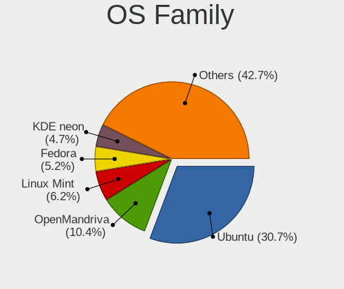

| Name          | Desktops | Percent |
|---------------|----------|---------|
| Ubuntu        | 49       | 39.52%  |
| OpenMandriva  | 9        | 7.26%   |
| Linux Mint    | 7        | 5.65%   |
| Pop!_OS       | 6        | 4.84%   |
| Zorin         | 5        | 4.03%   |
| Xubuntu       | 5        | 4.03%   |
| Manjaro       | 5        | 4.03%   |
| Kubuntu       | 5        | 4.03%   |
| KDE neon      | 4        | 3.23%   |
| Gentoo        | 3        | 2.42%   |
| Fedora        | 3        | 2.42%   |
| EndeavourOS   | 3        | 2.42%   |
| Ubuntu Unity  | 2        | 1.61%   |
| Endless       | 2        | 1.61%   |
| Debian        | 2        | 1.61%   |
| ArcoLinux     | 2        | 1.61%   |
| Ubuntu MATE   | 1        | 0.81%   |
| Ubuntu Kylin  | 1        | 0.81%   |
| Ubuntu Budgie | 1        | 0.81%   |
| ROSA          | 1        | 0.81%   |
| RHEL          | 1        | 0.81%   |
| openSUSE      | 1        | 0.81%   |
| Mageia        | 1        | 0.81%   |
| Lubuntu       | 1        | 0.81%   |
| Elementary    | 1        | 0.81%   |
| CentOS        | 1        | 0.81%   |
| BlackPanther  | 1        | 0.81%   |
| Arch          | 1        | 0.81%   |

Kernel
------

Version of the Linux kernel

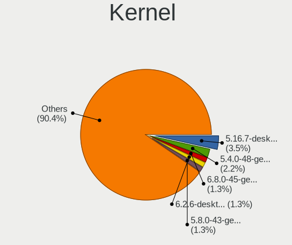

| Version                  | Desktops | Percent |
|--------------------------|----------|---------|
| 5.16.7-desktop-1omv4003  | 7        | 4.9%    |
| 5.4.0-48-generic         | 5        | 3.5%    |
| 5.8.0-43-generic         | 3        | 2.1%    |
| 5.4.0-31-generic         | 3        | 2.1%    |
| 5.15.0-56-generic        | 3        | 2.1%    |
| 5.15.0-25-generic        | 3        | 2.1%    |
| 5.8.0-36-generic         | 2        | 1.4%    |
| 5.4.0-7642-generic       | 2        | 1.4%    |
| 5.4.0-66-generic         | 2        | 1.4%    |
| 5.4.0-60-generic         | 2        | 1.4%    |
| 5.4.0-52-generic         | 2        | 1.4%    |
| 5.4.0-29-generic         | 2        | 1.4%    |
| 5.4.0-104-generic        | 2        | 1.4%    |
| 5.3.0-40-generic         | 2        | 1.4%    |
| 5.3.0-26-generic         | 2        | 1.4%    |
| 5.3.0-23-generic         | 2        | 1.4%    |
| 5.16.15-76051615-generic | 2        | 1.4%    |
| 5.15.0-47-generic        | 2        | 1.4%    |
| 5.15.0-46-generic        | 2        | 1.4%    |
| 5.13.0-30-generic        | 2        | 1.4%    |
| 5.13.0-27-generic        | 2        | 1.4%    |
| 5.11.0-40-generic        | 2        | 1.4%    |
| 5.10.14-desktop-1omv4002 | 2        | 1.4%    |
| 4.18.0-17-generic        | 2        | 1.4%    |
| 4.18.0-15-generic        | 2        | 1.4%    |
| 4.15.0-45-generic        | 2        | 1.4%    |
| 6.0.13-300.fc37.x86_64   | 1        | 0.7%    |
| 6.0.12-arch1-1           | 1        | 0.7%    |
| 5.9.2-arch1-1            | 1        | 0.7%    |
| 5.9.15-xanmod1           | 1        | 0.7%    |
| 5.8.0-63-generic         | 1        | 0.7%    |
| 5.8.0-59-generic         | 1        | 0.7%    |
| 5.8.0-53-generic         | 1        | 0.7%    |
| 5.8.0-45-generic         | 1        | 0.7%    |
| 5.8.0-41-generic         | 1        | 0.7%    |
| 5.8.0-18-generic         | 1        | 0.7%    |
| 5.8.0-14-generic         | 1        | 0.7%    |
| 5.7.0-gentoo-x86_64      | 1        | 0.7%    |
| 5.6.14-desktop-2bP       | 1        | 0.7%    |
| 5.6.0-1-default          | 1        | 0.7%    |

Kernel Family
-------------

Linux kernel without a distro release

| Version | Desktops | Percent |
|---------|----------|---------|
| 5.4.0   | 31       | 23.13%  |
| 5.15.0  | 13       | 9.7%    |
| 5.8.0   | 11       | 8.21%   |
| 5.16.7  | 8        | 5.97%   |
| 5.13.0  | 8        | 5.97%   |
| 4.18.0  | 8        | 5.97%   |
| 5.3.0   | 7        | 5.22%   |
| 5.11.0  | 6        | 4.48%   |
| 4.15.0  | 6        | 4.48%   |
| 5.10.14 | 3        | 2.24%   |
| 5.16.15 | 2        | 1.49%   |
| 5.10.30 | 2        | 1.49%   |
| 5.0.0   | 2        | 1.49%   |
| 6.0.13  | 1        | 0.75%   |
| 6.0.12  | 1        | 0.75%   |
| 5.9.2   | 1        | 0.75%   |
| 5.9.15  | 1        | 0.75%   |
| 5.7.0   | 1        | 0.75%   |
| 5.6.14  | 1        | 0.75%   |
| 5.6.0   | 1        | 0.75%   |
| 5.4.14  | 1        | 0.75%   |
| 5.19.13 | 1        | 0.75%   |
| 5.18.10 | 1        | 0.75%   |
| 5.17.5  | 1        | 0.75%   |
| 5.16.18 | 1        | 0.75%   |
| 5.15.74 | 1        | 0.75%   |
| 5.15.6  | 1        | 0.75%   |
| 5.15.2  | 1        | 0.75%   |
| 5.15.16 | 1        | 0.75%   |
| 5.14.16 | 1        | 0.75%   |
| 5.14.10 | 1        | 0.75%   |
| 5.14.0  | 1        | 0.75%   |
| 5.13.8  | 1        | 0.75%   |
| 5.13.16 | 1        | 0.75%   |
| 5.12.4  | 1        | 0.75%   |
| 5.12.15 | 1        | 0.75%   |
| 5.10.0  | 1        | 0.75%   |
| 4.20.7  | 1        | 0.75%   |
| 4.18.16 | 1        | 0.75%   |
| 4.1.38  | 1        | 0.75%   |

Kernel Major Ver.
-----------------

Linux kernel major version

| Version | Desktops | Percent |
|---------|----------|---------|
| 5.4     | 32       | 24.24%  |
| 5.15    | 17       | 12.88%  |
| 5.8     | 11       | 8.33%   |
| 5.16    | 11       | 8.33%   |
| 5.13    | 9        | 6.82%   |
| 4.18    | 9        | 6.82%   |
| 5.3     | 7        | 5.3%    |
| 5.11    | 6        | 4.55%   |
| 5.10    | 6        | 4.55%   |
| 4.15    | 6        | 4.55%   |
| 5.14    | 3        | 2.27%   |
| 6.0     | 2        | 1.52%   |
| 5.6     | 2        | 1.52%   |
| 5.12    | 2        | 1.52%   |
| 5.0     | 2        | 1.52%   |
| 5.9     | 1        | 0.76%   |
| 5.7     | 1        | 0.76%   |
| 5.19    | 1        | 0.76%   |
| 5.18    | 1        | 0.76%   |
| 5.17    | 1        | 0.76%   |
| 4.20    | 1        | 0.76%   |
| 4.1     | 1        | 0.76%   |

Arch
----

OS architecture (x86_64, i586, etc.)

| Name   | Desktops | Percent |
|--------|----------|---------|
| x86_64 | 117      | 97.5%   |
| i686   | 3        | 2.5%    |

DE
--

Desktop Environment

| Name       | Desktops | Percent |
|------------|----------|---------|
| GNOME      | 55       | 42.64%  |
| KDE5       | 23       | 17.83%  |
| Unknown    | 14       | 10.85%  |
| XFCE       | 12       | 9.3%    |
| KDE        | 6        | 4.65%   |
| X-Cinnamon | 5        | 3.88%   |
| Cinnamon   | 4        | 3.1%    |
| Unity      | 2        | 1.55%   |
| UKUI       | 1        | 0.78%   |
| Pantheon   | 1        | 0.78%   |
| NsCDE      | 1        | 0.78%   |
| MATE       | 1        | 0.78%   |
| LXQt       | 1        | 0.78%   |
| KDE4       | 1        | 0.78%   |
| DWM        | 1        | 0.78%   |
| Budgie     | 1        | 0.78%   |

Display Server
--------------

X11 or Wayland

| Name    | Desktops | Percent |
|---------|----------|---------|
| X11     | 101      | 82.11%  |
| Unknown | 9        | 7.32%   |
| Wayland | 8        | 6.5%    |
| Tty     | 5        | 4.07%   |

Display Manager
---------------

SDDM, LightDM, etc.

| Name    | Desktops | Percent |
|---------|----------|---------|
| Unknown | 60       | 48%     |
| SDDM    | 21       | 16.8%   |
| LightDM | 14       | 11.2%   |
| GDM     | 12       | 9.6%    |
| GDM3    | 11       | 8.8%    |
| TDM     | 5        | 4%      |
| XDM     | 1        | 0.8%    |
| KDM     | 1        | 0.8%    |

OS Lang
-------

Language

| Lang    | Desktops | Percent |
|---------|----------|---------|
| en_US   | 59       | 47.58%  |
| sl_SI   | 42       | 33.87%  |
| Unknown | 14       | 11.29%  |
| en_GB   | 4        | 3.23%   |
| C       | 2        | 1.61%   |
| it_IT   | 1        | 0.81%   |
| de_DE   | 1        | 0.81%   |
| de_AT   | 1        | 0.81%   |

Boot Mode
---------

EFI or BIOS

| Mode | Desktops | Percent |
|------|----------|---------|
| BIOS | 66       | 53.66%  |
| EFI  | 57       | 46.34%  |

Filesystem
----------

Type of filesystem

| Type    | Desktops | Percent |
|---------|----------|---------|
| Ext4    | 87       | 71.9%   |
| Overlay | 16       | 13.22%  |
| Btrfs   | 6        | 4.96%   |
| Unknown | 6        | 4.96%   |
| Zfs     | 4        | 3.31%   |
| Xfs     | 2        | 1.65%   |

Part. scheme
------------

Scheme of partitioning

| Type    | Desktops | Percent |
|---------|----------|---------|
| Unknown | 62       | 51.67%  |
| GPT     | 45       | 37.5%   |
| MBR     | 13       | 10.83%  |

Dual Boot with Linux/BSD
------------------------

Hosting more than one Linux/BSD

| Dual boot | Desktops | Percent |
|-----------|----------|---------|
| No        | 97       | 78.23%  |
| Yes       | 27       | 21.77%  |

Dual Boot (Win)
---------------

Hosting Linux and Windows

| Dual boot | Desktops | Percent |
|-----------|----------|---------|
| No        | 84       | 69.42%  |
| Yes       | 37       | 30.58%  |

Board
-----

Vendor
------

Motherboard manufacturer

| Name                | Desktops | Percent |
|---------------------|----------|---------|
| ASUSTek Computer    | 36       | 30%     |
| Gigabyte Technology | 21       | 17.5%   |
| ASRock              | 15       | 12.5%   |
| MSI                 | 12       | 10%     |
| Hewlett-Packard     | 12       | 10%     |
| Lenovo              | 8        | 6.67%   |
| Pegatron            | 4        | 3.33%   |
| Intel               | 4        | 3.33%   |
| Medion              | 2        | 1.67%   |
| Dell                | 2        | 1.67%   |
| Supermicro          | 1        | 0.83%   |
| Fujitsu             | 1        | 0.83%   |
| Biostar             | 1        | 0.83%   |
| Apple               | 1        | 0.83%   |

Model
-----

Motherboard model

| Name                              | Desktops | Percent |
|-----------------------------------|----------|---------|
| MSI MS-7C02                       | 3        | 2.5%    |
| Pegatron FL308AA-ABD IQ512de      | 2        | 1.67%   |
| MSI MS-7C37                       | 2        | 1.67%   |
| MSI MS-7788                       | 2        | 1.67%   |
| Gigabyte F2A88XM-D3HP             | 2        | 1.67%   |
| Gigabyte B450M DS3H               | 2        | 1.67%   |
| ASUS TUF B450-PLUS GAMING         | 2        | 1.67%   |
| ASUS ROG STRIX Z370-F GAMING      | 2        | 1.67%   |
| ASUS ROG STRIX X570-E GAMING      | 2        | 1.67%   |
| ASUS PRIME B350-PLUS              | 2        | 1.67%   |
| ASUS PRIME A320M-K                | 2        | 1.67%   |
| ASUS P7H55-M SI                   | 2        | 1.67%   |
| Supermicro X7SBi-LN4              | 1        | 0.83%   |
| Pegatron Pro 3010 Microtower PC   | 1        | 0.83%   |
| Pegatron 2A73                     | 1        | 0.83%   |
| MSI MS-7C91                       | 1        | 0.83%   |
| MSI MS-7B24                       | 1        | 0.83%   |
| MSI MS-7994                       | 1        | 0.83%   |
| MSI MS-7971                       | 1        | 0.83%   |
| MSI MS-7636                       | 1        | 0.83%   |
| Medion MS-7707                    | 1        | 0.83%   |
| Medion Akoya E7226                | 1        | 0.83%   |
| Lenovo ThinkStation S20 4157ZSK   | 1        | 0.83%   |
| Lenovo ThinkCentre M90p 5498PK8   | 1        | 0.83%   |
| Lenovo ThinkCentre M73 10B4S0NN00 | 1        | 0.83%   |
| Lenovo ThinkCentre M57e 9439WHV   | 1        | 0.83%   |
| Lenovo ThinkCentre M57e 9356W2K   | 1        | 0.83%   |
| Lenovo ThinkCentre M57 6072VAM    | 1        | 0.83%   |
| Lenovo ThinkCentre M55e 9389WEG   | 1        | 0.83%   |
| Lenovo ThinkCentre M55e 9389W11   | 1        | 0.83%   |
| Intel DQ67SW AAG12527-310         | 1        | 0.83%   |
| Intel DQ35JO AAD82085-801         | 1        | 0.83%   |
| Intel DH87RL AAG74240-403         | 1        | 0.83%   |
| Intel CM-iAM/SBC-FITPC2i          | 1        | 0.83%   |
| HP Z440 Workstation               | 1        | 0.83%   |
| HP Z420 Workstation               | 1        | 0.83%   |
| HP Z230 Tower Workstation         | 1        | 0.83%   |
| HP Z1 Entry Tower G5              | 1        | 0.83%   |
| HP xw4400 Workstation             | 1        | 0.83%   |
| HP ProDesk 400 G4 SFF             | 1        | 0.83%   |

Model Family
------------

Motherboard model prefix

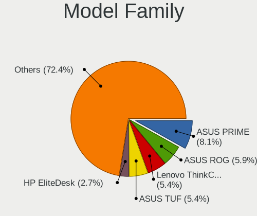

| Name                  | Desktops | Percent |
|-----------------------|----------|---------|
| ASUS PRIME            | 12       | 10%     |
| Lenovo ThinkCentre    | 7        | 5.83%   |
| ASUS ROG              | 7        | 5.83%   |
| ASUS TUF              | 5        | 4.17%   |
| MSI MS-7C02           | 3        | 2.5%    |
| HP EliteDesk          | 3        | 2.5%    |
| HP Compaq             | 3        | 2.5%    |
| Gigabyte B450M        | 3        | 2.5%    |
| Pegatron FL308AA-ABD  | 2        | 1.67%   |
| MSI MS-7C37           | 2        | 1.67%   |
| MSI MS-7788           | 2        | 1.67%   |
| Gigabyte F2A88XM-D3HP | 2        | 1.67%   |
| ASUS SABERTOOTH       | 2        | 1.67%   |
| ASUS P7H55-M          | 2        | 1.67%   |
| Supermicro X7SBi-LN4  | 1        | 0.83%   |
| Pegatron Pro          | 1        | 0.83%   |
| Pegatron 2A73         | 1        | 0.83%   |
| MSI MS-7C91           | 1        | 0.83%   |
| MSI MS-7B24           | 1        | 0.83%   |
| MSI MS-7994           | 1        | 0.83%   |
| MSI MS-7971           | 1        | 0.83%   |
| MSI MS-7636           | 1        | 0.83%   |
| Medion MS-7707        | 1        | 0.83%   |
| Medion Akoya          | 1        | 0.83%   |
| Lenovo ThinkStation   | 1        | 0.83%   |
| Intel DQ67SW          | 1        | 0.83%   |
| Intel DQ35JO          | 1        | 0.83%   |
| Intel DH87RL          | 1        | 0.83%   |
| Intel CM-iAM          | 1        | 0.83%   |
| HP Z440               | 1        | 0.83%   |
| HP Z420               | 1        | 0.83%   |
| HP Z230               | 1        | 0.83%   |
| HP Z1                 | 1        | 0.83%   |
| HP xw4400             | 1        | 0.83%   |
| HP ProDesk            | 1        | 0.83%   |
| Gigabyte Z97X-Gaming  | 1        | 0.83%   |
| Gigabyte Z68P-DS3     | 1        | 0.83%   |
| Gigabyte Z170-HD3P    | 1        | 0.83%   |
| Gigabyte P35C-DS3R    | 1        | 0.83%   |
| Gigabyte H81M-S2PV    | 1        | 0.83%   |

MFG Year
--------

Motherboard manufacture year

| Year | Desktops | Percent |
|------|----------|---------|
| 2018 | 13       | 10.83%  |
| 2019 | 11       | 9.17%   |
| 2017 | 11       | 9.17%   |
| 2009 | 11       | 9.17%   |
| 2015 | 10       | 8.33%   |
| 2011 | 9        | 7.5%    |
| 2020 | 8        | 6.67%   |
| 2013 | 8        | 6.67%   |
| 2010 | 7        | 5.83%   |
| 2016 | 6        | 5%      |
| 2012 | 6        | 5%      |
| 2014 | 4        | 3.33%   |
| 2008 | 4        | 3.33%   |
| 2007 | 4        | 3.33%   |
| 2006 | 4        | 3.33%   |
| 2021 | 3        | 2.5%    |
| 2022 | 1        | 0.83%   |

Form Factor
-----------

Physical design of the computer

| Name    | Desktops | Percent |
|---------|----------|---------|
| Desktop | 120      | 100%    |

Secure Boot
-----------

Enabled or disabled

| State    | Desktops | Percent |
|----------|----------|---------|
| Disabled | 116      | 96.67%  |
| Enabled  | 4        | 3.33%   |

Coreboot
--------

Have coreboot on board

| Used | Desktops | Percent |
|------|----------|---------|
| No   | 120      | 100%    |

RAM Size
--------

Total RAM memory

| Size in GB  | Desktops | Percent |
|-------------|----------|---------|
| 16.01-24.0  | 33       | 27.27%  |
| 8.01-16.0   | 30       | 24.79%  |
| 3.01-4.0    | 18       | 14.88%  |
| 32.01-64.0  | 16       | 13.22%  |
| 4.01-8.0    | 11       | 9.09%   |
| 2.01-3.0    | 4        | 3.31%   |
| 64.01-256.0 | 4        | 3.31%   |
| 24.01-32.0  | 3        | 2.48%   |
| 1.01-2.0    | 2        | 1.65%   |

RAM Used
--------

Used RAM memory

| Used GB    | Desktops | Percent |
|------------|----------|---------|
| 1.01-2.0   | 43       | 32.58%  |
| 4.01-8.0   | 28       | 21.21%  |
| 2.01-3.0   | 28       | 21.21%  |
| 3.01-4.0   | 13       | 9.85%   |
| 8.01-16.0  | 7        | 5.3%    |
| 0.51-1.0   | 5        | 3.79%   |
| 0.01-0.5   | 4        | 3.03%   |
| 16.01-24.0 | 3        | 2.27%   |
| 24.01-32.0 | 1        | 0.76%   |

Total Drives
------------

Number of drives on board

| Drives | Desktops | Percent |
|--------|----------|---------|
| 1      | 46       | 37.4%   |
| 2      | 34       | 27.64%  |
| 3      | 19       | 15.45%  |
| 4      | 10       | 8.13%   |
| 6      | 4        | 3.25%   |
| 5      | 4        | 3.25%   |
| 8      | 3        | 2.44%   |
| 7      | 2        | 1.63%   |
| 11     | 1        | 0.81%   |

Has CD-ROM
----------

Has CD-ROM on board

| Presented | Desktops | Percent |
|-----------|----------|---------|
| No        | 66       | 54.55%  |
| Yes       | 55       | 45.45%  |

Has Ethernet
------------

Has Ethernet on board

| Presented | Desktops | Percent |
|-----------|----------|---------|
| Yes       | 118      | 98.33%  |
| No        | 2        | 1.67%   |

Has WiFi
--------

Has WiFi module

| Presented | Desktops | Percent |
|-----------|----------|---------|
| No        | 86       | 71.07%  |
| Yes       | 35       | 28.93%  |

Has Bluetooth
-------------

Has Bluetooth module

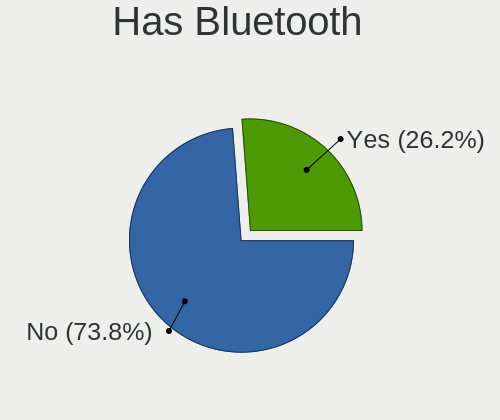

| Presented | Desktops | Percent |
|-----------|----------|---------|
| No        | 93       | 77.5%   |
| Yes       | 27       | 22.5%   |

Location
--------

Country
-------

Geographic location (country)

| Country  | Desktops | Percent |
|----------|----------|---------|
| Slovenia | 120      | 100%    |

City
----

Geographic location (city)

| City                | Desktops | Percent |
|---------------------|----------|---------|
| Ljubljana           | 44       | 34.65%  |
| Vrhnika             | 4        | 3.15%   |
| Rence               | 3        | 2.36%   |
| Radovljica          | 3        | 2.36%   |
| Novo Mesto          | 3        | 2.36%   |
| Maribor             | 3        | 2.36%   |
| Kamnik              | 3        | 2.36%   |
| Grosuplje           | 3        | 2.36%   |
| alec              | 2        | 1.57%   |
| kofja Loka        | 2        | 1.57%   |
| Ptuj                | 2        | 1.57%   |
| Pragersko           | 2        | 1.57%   |
| Logatec             | 2        | 1.57%   |
| Kranj               | 2        | 1.57%   |
| Koper               | 2        | 1.57%   |
| Celje               | 2        | 1.57%   |
| Zirovnica           | 1        | 0.79%   |
| Ziri                | 1        | 0.79%   |
| Zgornja Besnica     | 1        | 0.79%   |
| Vuzenica            | 1        | 0.79%   |
| Volcja Draga        | 1        | 0.79%   |
| Velenje             | 1        | 0.79%   |
| tore              | 1        | 0.79%   |
| Stari Trg pri Lozu  | 1        | 0.79%   |
| Sostanj             | 1        | 0.79%   |
| Slovenske Konjice   | 1        | 0.79%   |
| Slovenska Bistrica  | 1        | 0.79%   |
| Sempeter pri Gorici | 1        | 0.79%   |
| Selnica ob Dravi    | 1        | 0.79%   |
| Radomlje            | 1        | 0.79%   |
| Postojna            | 1        | 0.79%   |
| Portoro           | 1        | 0.79%   |
| Podvelka            | 1        | 0.79%   |
| Petrovce            | 1        | 0.79%   |
| Oplotnica           | 1        | 0.79%   |
| Nova Gorica         | 1        | 0.79%   |
| Muta                | 1        | 0.79%   |
| Materija            | 1        | 0.79%   |
| Lukovica            | 1        | 0.79%   |
| Loski Potok         | 1        | 0.79%   |

Drives
------

Drive Vendor
------------

Hard drive vendors

| Vendor              | Desktops | Drives | Percent |
|---------------------|----------|--------|---------|
| WDC                 | 60       | 117    | 27.03%  |
| Samsung Electronics | 30       | 57     | 13.51%  |
| Seagate             | 27       | 48     | 12.16%  |
| Toshiba             | 19       | 23     | 8.56%   |
| Kingston            | 19       | 24     | 8.56%   |
| Crucial             | 12       | 16     | 5.41%   |
| SanDisk             | 8        | 10     | 3.6%    |
| Corsair             | 5        | 6      | 2.25%   |
| Intenso             | 4        | 6      | 1.8%    |
| Intel               | 4        | 5      | 1.8%    |
| Hitachi             | 4        | 4      | 1.8%    |
| Silicon Motion      | 2        | 2      | 0.9%    |
| Patriot             | 2        | 3      | 0.9%    |
| OCZ                 | 2        | 5      | 0.9%    |
| Hewlett-Packard     | 2        | 2      | 0.9%    |
| China               | 2        | 2      | 0.9%    |
| Apacer              | 2        | 3      | 0.9%    |
| Unknown             | 1        | 1      | 0.45%   |
| Transcend           | 1        | 2      | 0.45%   |
| SPCC                | 1        | 2      | 0.45%   |
| SK hynix            | 1        | 1      | 0.45%   |
| Realtek             | 1        | 1      | 0.45%   |
| PNY                 | 1        | 1      | 0.45%   |
| Phison              | 1        | 1      | 0.45%   |
| Maxtor              | 1        | 1      | 0.45%   |
| LITEONIT            | 1        | 1      | 0.45%   |
| KIOXIA              | 1        | 1      | 0.45%   |
| KingDian            | 1        | 1      | 0.45%   |
| JMicron Technology  | 1        | 1      | 0.45%   |
| Integral            | 1        | 1      | 0.45%   |
| HGST                | 1        | 1      | 0.45%   |
| GOODRAM             | 1        | 1      | 0.45%   |
| Gigabyte Technology | 1        | 2      | 0.45%   |
| ASMT109x            | 1        | 1      | 0.45%   |
| A-DATA Technology   | 1        | 1      | 0.45%   |

Drive Model
-----------

Hard drive models

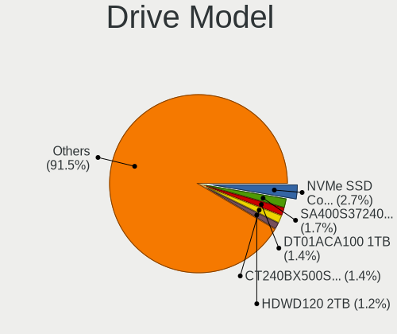

| Model                            | Desktops | Percent |
|----------------------------------|----------|---------|
| Kingston SA400S37240G 240GB SSD  | 7        | 2.55%   |
| Toshiba DT01ACA100 1TB           | 6        | 2.19%   |
| Crucial CT240BX500SSD1 240GB     | 5        | 1.82%   |
| WDC WD10EARS-00Y5B1 1TB          | 4        | 1.46%   |
| Toshiba HDWD120 2TB              | 4        | 1.46%   |
| Toshiba DT01ACA200 2TB           | 3        | 1.09%   |
| Samsung SSD 970 EVO Plus 500GB   | 3        | 1.09%   |
| Samsung SSD 860 EVO 1TB          | 3        | 1.09%   |
| Samsung SSD 850 EVO 250GB        | 3        | 1.09%   |
| WDC WDS500G2B0A-00SM50 500GB SSD | 2        | 0.73%   |
| WDC WDS500G2B0A 500GB SSD        | 2        | 0.73%   |
| WDC WDS480G2G0A-00JH30 480GB SSD | 2        | 0.73%   |
| WDC WDS240G2G0A-00JH30 240GB SSD | 2        | 0.73%   |
| WDC WD5000AAKX-001CA0 500GB      | 2        | 0.73%   |
| WDC WD5000AADS-00S9B0 500GB      | 2        | 0.73%   |
| WDC WD5000AACS-00G8B1 500GB      | 2        | 0.73%   |
| WDC WD40PURZ-85TTDY0 4TB         | 2        | 0.73%   |
| WDC WD40EZRZ-00GXCB0 4TB         | 2        | 0.73%   |
| WDC WD40EFRX-68N32N0 4TB         | 2        | 0.73%   |
| WDC WD20PURZ-85GU6Y0 2TB         | 2        | 0.73%   |
| WDC WD15EARS-00MVWB0 1TB         | 2        | 0.73%   |
| WDC WD10EZEX-08M2NA0 1TB         | 2        | 0.73%   |
| WDC WD1002FAEX-00Y9A0 1TB        | 2        | 0.73%   |
| Toshiba DT01ACA050 500GB         | 2        | 0.73%   |
| Seagate ST2000DM008-2FR102 2TB   | 2        | 0.73%   |
| Seagate ST1000DM003-1CH162 1TB   | 2        | 0.73%   |
| Seagate Portable 5TB             | 2        | 0.73%   |
| SanDisk SSD PLUS 240GB           | 2        | 0.73%   |
| SanDisk SSD PLUS 1000GB          | 2        | 0.73%   |
| SanDisk NVMe SSD Drive 500GB     | 2        | 0.73%   |
| Samsung SSD 980 PRO 500GB        | 2        | 0.73%   |
| Samsung SSD 980 PRO 250GB        | 2        | 0.73%   |
| Samsung SSD 980 1TB              | 2        | 0.73%   |
| Samsung SSD 970 EVO Plus 1TB     | 2        | 0.73%   |
| Samsung SSD 850 EVO 120GB        | 2        | 0.73%   |
| Samsung NVMe SSD Drive 500GB     | 2        | 0.73%   |
| Kingston SUV400S37240G 240GB SSD | 2        | 0.73%   |
| Kingston SA400S37120G 120GB SSD  | 2        | 0.73%   |
| Intenso 128GB                    | 2        | 0.73%   |
| HP SSD EX900 500GB               | 2        | 0.73%   |

HDD Vendor
----------

Hard disk drive vendors

| Vendor              | Desktops | Drives | Percent |
|---------------------|----------|--------|---------|
| WDC                 | 53       | 101    | 50.48%  |
| Seagate             | 25       | 44     | 23.81%  |
| Toshiba             | 17       | 21     | 16.19%  |
| Hitachi             | 4        | 4      | 3.81%   |
| Samsung Electronics | 2        | 2      | 1.9%    |
| Maxtor              | 1        | 1      | 0.95%   |
| Intenso             | 1        | 1      | 0.95%   |
| HGST                | 1        | 1      | 0.95%   |
| ASMT109x            | 1        | 1      | 0.95%   |

SSD Vendor
----------

Solid state drive vendors

| Vendor              | Desktops | Drives | Percent |
|---------------------|----------|--------|---------|
| Kingston            | 17       | 19     | 20.48%  |
| Samsung Electronics | 14       | 25     | 16.87%  |
| WDC                 | 11       | 13     | 13.25%  |
| Crucial             | 11       | 15     | 13.25%  |
| SanDisk             | 5        | 6      | 6.02%   |
| Intel               | 4        | 5      | 4.82%   |
| Corsair             | 3        | 4      | 3.61%   |
| Patriot             | 2        | 3      | 2.41%   |
| OCZ                 | 2        | 5      | 2.41%   |
| China               | 2        | 2      | 2.41%   |
| Apacer              | 2        | 3      | 2.41%   |
| Transcend           | 1        | 2      | 1.2%    |
| Toshiba             | 1        | 1      | 1.2%    |
| PNY                 | 1        | 1      | 1.2%    |
| LITEONIT            | 1        | 1      | 1.2%    |
| KingDian            | 1        | 1      | 1.2%    |
| JMicron Technology  | 1        | 1      | 1.2%    |
| Intenso             | 1        | 1      | 1.2%    |
| Integral            | 1        | 1      | 1.2%    |
| GOODRAM             | 1        | 1      | 1.2%    |
| A-DATA Technology   | 1        | 1      | 1.2%    |

Drive Kind
----------

HDD or SSD

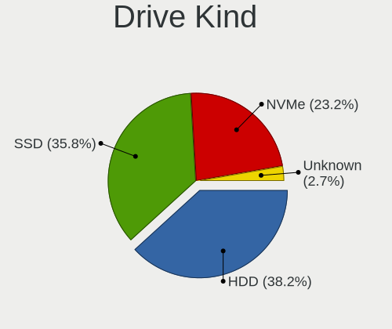

| Kind    | Desktops | Drives | Percent |
|---------|----------|--------|---------|
| HDD     | 83       | 176    | 42.78%  |
| SSD     | 66       | 111    | 34.02%  |
| NVMe    | 40       | 59     | 20.62%  |
| Unknown | 5        | 8      | 2.58%   |

Drive Connector
---------------

SATA, SAS, NVMe, etc.

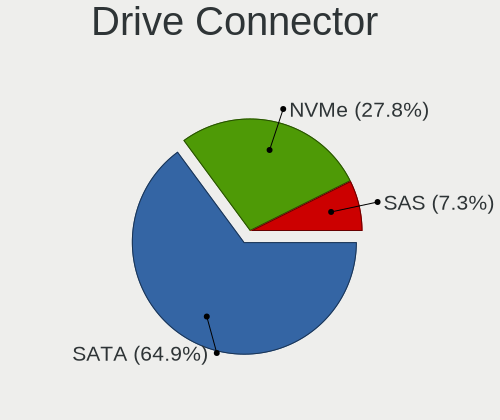

| Type | Desktops | Drives | Percent |
|------|----------|--------|---------|
| SATA | 110      | 284    | 69.18%  |
| NVMe | 40       | 58     | 25.16%  |
| SAS  | 9        | 12     | 5.66%   |

Drive Size
----------

Size of hard drive

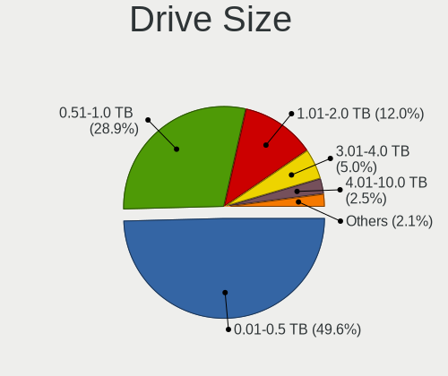

| Size in TB | Desktops | Drives | Percent |
|------------|----------|--------|---------|
| 0.01-0.5   | 83       | 150    | 49.7%   |
| 0.51-1.0   | 48       | 84     | 28.74%  |
| 1.01-2.0   | 18       | 23     | 10.78%  |
| 3.01-4.0   | 8        | 15     | 4.79%   |
| 4.01-10.0  | 6        | 10     | 3.59%   |
| 2.01-3.0   | 3        | 4      | 1.8%    |
| 10.01-20.0 | 1        | 1      | 0.6%    |

Space Total
-----------

Amount of disk space available on the file system

| Size in GB     | Desktops | Percent |
|----------------|----------|---------|
| 101-250        | 27       | 21.09%  |
| 251-500        | 21       | 16.41%  |
| 1001-2000      | 18       | 14.06%  |
| 501-1000       | 17       | 13.28%  |
| 1-20           | 13       | 10.16%  |
| More than 3000 | 9        | 7.03%   |
| 2001-3000      | 9        | 7.03%   |
| 51-100         | 7        | 5.47%   |
| Unknown        | 4        | 3.13%   |
| 21-50          | 3        | 2.34%   |

Space Used
----------

Amount of used disk space

| Used GB        | Desktops | Percent |
|----------------|----------|---------|
| 1-20           | 46       | 35.94%  |
| 51-100         | 18       | 14.06%  |
| 21-50          | 15       | 11.72%  |
| 101-250        | 14       | 10.94%  |
| 1001-2000      | 9        | 7.03%   |
| 251-500        | 7        | 5.47%   |
| 501-1000       | 7        | 5.47%   |
| 2001-3000      | 6        | 4.69%   |
| Unknown        | 4        | 3.13%   |
| More than 3000 | 2        | 1.56%   |

Malfunc. Drives
---------------

Drive models with a malfunction

| Model                                    | Desktops | Drives | Percent |
|------------------------------------------|----------|--------|---------|
| WDC WDS480G2G0A-00JH30 480GB SSD         | 1        | 1      | 4.55%   |
| WDC WD5000AADS-00S9B0 500GB              | 1        | 1      | 4.55%   |
| WDC WD40EFRX-68N32N0 4TB                 | 1        | 1      | 4.55%   |
| WDC WD3200AAKS-22B3A0 320GB              | 1        | 1      | 4.55%   |
| WDC WD20EFRX-68EUZN0 2TB                 | 1        | 1      | 4.55%   |
| Toshiba Q300. 240GB SSD                  | 1        | 1      | 4.55%   |
| Toshiba DT01ACA300 3TB                   | 1        | 1      | 4.55%   |
| Seagate ST3500514NS 500GB                | 1        | 1      | 4.55%   |
| Seagate ST3500320NS 500GB                | 1        | 1      | 4.55%   |
| Seagate ST3320620AS 320GB                | 1        | 1      | 4.55%   |
| Seagate ST3200822AS 200GB                | 1        | 1      | 4.55%   |
| Seagate ST2000DM001-1CH164 2TB           | 1        | 1      | 4.55%   |
| Seagate ST1000DM003-1CH162 1TB           | 1        | 1      | 4.55%   |
| SanDisk SSD PLUS 240GB                   | 1        | 1      | 4.55%   |
| SanDisk SSD PLUS 1000GB                  | 1        | 1      | 4.55%   |
| Samsung Electronics SSD 970 EVO 1TB      | 1        | 1      | 4.55%   |
| Samsung Electronics SSD 840 Series 120GB | 1        | 1      | 4.55%   |
| OCZ VERTEX3 120GB SSD                    | 1        | 1      | 4.55%   |
| Kingston SA400S37240G 240GB SSD          | 1        | 1      | 4.55%   |
| Intel SSDSA2M160G2GC 160GB               | 1        | 1      | 4.55%   |
| Hewlett-Packard SSD EX900 500GB          | 1        | 1      | 4.55%   |
| Crucial M4-CT128M4SSD2 128GB             | 1        | 1      | 4.55%   |

Malfunc. Drive Vendor
---------------------

Vendors of faulty drives

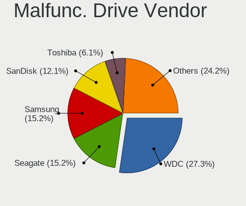

| Vendor              | Desktops | Drives | Percent |
|---------------------|----------|--------|---------|
| WDC                 | 4        | 5      | 21.05%  |
| Seagate             | 4        | 6      | 21.05%  |
| Toshiba             | 2        | 2      | 10.53%  |
| SanDisk             | 2        | 2      | 10.53%  |
| Samsung Electronics | 2        | 2      | 10.53%  |
| OCZ                 | 1        | 1      | 5.26%   |
| Kingston            | 1        | 1      | 5.26%   |
| Intel               | 1        | 1      | 5.26%   |
| Hewlett-Packard     | 1        | 1      | 5.26%   |
| Crucial             | 1        | 1      | 5.26%   |

Malfunc. HDD Vendor
-------------------

Vendors of faulty HDD drives

| Vendor  | Desktops | Drives | Percent |
|---------|----------|--------|---------|
| Seagate | 4        | 6      | 50%     |
| WDC     | 3        | 4      | 37.5%   |
| Toshiba | 1        | 1      | 12.5%   |

Malfunc. Drive Kind
-------------------

Kinds of faulty drives

| Kind | Desktops | Drives | Percent |
|------|----------|--------|---------|
| SSD  | 8        | 9      | 50%     |
| HDD  | 6        | 11     | 37.5%   |
| NVMe | 2        | 2      | 12.5%   |

Failed Drives
-------------

Failed drive models

| Model                 | Desktops | Drives | Percent |
|-----------------------|----------|--------|---------|
| SPCC M.2 PCIe SSD 2TB | 1        | 1      | 100%    |

Failed Drive Vendor
-------------------

Failed drive vendors

| Vendor | Desktops | Drives | Percent |
|--------|----------|--------|---------|
| SPCC   | 1        | 1      | 100%    |

Drive Status
------------

Number of failed and malfunc. drives

| Status   | Desktops | Drives | Percent |
|----------|----------|--------|---------|
| Detected | 71       | 169    | 50.35%  |
| Works    | 53       | 162    | 37.59%  |
| Malfunc  | 16       | 22     | 11.35%  |
| Failed   | 1        | 1      | 0.71%   |

Storage controller
------------------

Storage Vendor
--------------

Storage controller vendors

| Vendor                        | Desktops | Percent |
|-------------------------------|----------|---------|
| Intel                         | 83       | 46.11%  |
| AMD                           | 37       | 20.56%  |
| Samsung Electronics           | 19       | 10.56%  |
| SanDisk                       | 6        | 3.33%   |
| Silicon Motion                | 5        | 2.78%   |
| JMicron Technology            | 5        | 2.78%   |
| ASMedia Technology            | 5        | 2.78%   |
| Phison Electronics            | 4        | 2.22%   |
| Marvell Technology Group      | 4        | 2.22%   |
| Kingston Technology Company   | 4        | 2.22%   |
| Toshiba America Info Systems  | 1        | 0.56%   |
| SK hynix                      | 1        | 0.56%   |
| Silicon Image                 | 1        | 0.56%   |
| Seagate Technology            | 1        | 0.56%   |
| OCZ Technology Group          | 1        | 0.56%   |
| Micron/Crucial Technology     | 1        | 0.56%   |
| KIOXIA                        | 1        | 0.56%   |
| Integrated Technology Express | 1        | 0.56%   |

Storage Model
-------------

Storage controller models

| Model                                                                                   | Desktops | Percent |
|-----------------------------------------------------------------------------------------|----------|---------|
| AMD FCH SATA Controller [AHCI mode]                                                     | 25       | 10.73%  |
| AMD 400 Series Chipset SATA Controller                                                  | 12       | 5.15%   |
| Samsung NVMe SSD Controller SM981/PM981/PM983                                           | 10       | 4.29%   |
| Intel Q170/Q150/B150/H170/H110/Z170/CM236 Chipset SATA Controller [AHCI Mode]           | 10       | 4.29%   |
| Intel 200 Series PCH SATA controller [AHCI mode]                                        | 8        | 3.43%   |
| Intel 8 Series/C220 Series Chipset Family 6-port SATA Controller 1 [AHCI mode]          | 7        | 3%      |
| Intel 6 Series/C200 Series Chipset Family Desktop SATA Controller (IDE mode, ports 4-5) | 7        | 3%      |
| Intel 6 Series/C200 Series Chipset Family Desktop SATA Controller (IDE mode, ports 0-3) | 7        | 3%      |
| Samsung NVMe SSD Controller PM9A1/PM9A3/980PRO                                          | 5        | 2.15%   |
| Intel Cannon Lake PCH SATA AHCI Controller                                              | 5        | 2.15%   |
| Intel 82801IR/IO/IH (ICH9R/DO/DH) 4 port SATA Controller [IDE mode]                     | 5        | 2.15%   |
| Intel 82801I (ICH9 Family) 2 port SATA Controller [IDE mode]                            | 5        | 2.15%   |
| Intel 6 Series/C200 Series Chipset Family 6 port Desktop SATA AHCI Controller           | 5        | 2.15%   |
| Intel 5 Series/3400 Series Chipset 4 port SATA IDE Controller                           | 5        | 2.15%   |
| Intel 5 Series/3400 Series Chipset 2 port SATA IDE Controller                           | 5        | 2.15%   |
| ASMedia ASM1062 Serial ATA Controller                                                   | 5        | 2.15%   |
| Silicon Motion SM2263EN/SM2263XT SSD Controller                                         | 4        | 1.72%   |
| Intel NM10/ICH7 Family SATA Controller [IDE mode]                                       | 4        | 1.72%   |
| AMD SB7x0/SB8x0/SB9x0 SATA Controller [AHCI mode]                                       | 4        | 1.72%   |
| AMD 500 Series Chipset SATA Controller                                                  | 4        | 1.72%   |
| Samsung NVMe SSD Controller 980                                                         | 3        | 1.29%   |
| Kingston Company A2000 NVMe SSD                                                         | 3        | 1.29%   |
| JMicron JMB368 IDE controller                                                           | 3        | 1.29%   |
| Intel 82801G (ICH7 Family) IDE Controller                                               | 3        | 1.29%   |
| AMD SB7x0/SB8x0/SB9x0 IDE Controller                                                    | 3        | 1.29%   |
| SanDisk WD Blue SN550 NVMe SSD                                                          | 2        | 0.86%   |
| SanDisk WD Black SN750 / PC SN730 NVMe SSD                                              | 2        | 0.86%   |
| Samsung NVMe SSD Controller SM961/PM961/SM963                                           | 2        | 0.86%   |
| Marvell Group 88SE9215 PCIe 2.0 x1 4-port SATA 6 Gb/s Controller                        | 2        | 0.86%   |
| Marvell Group 88SE6101/6102 single-port PATA133 interface                               | 2        | 0.86%   |
| JMicron JMB363 SATA/IDE Controller                                                      | 2        | 0.86%   |
| Intel SATA Controller [RAID mode]                                                       | 2        | 0.86%   |
| Intel C600/X79 series chipset SATA RAID Controller                                      | 2        | 0.86%   |
| Intel 9 Series Chipset Family SATA Controller [AHCI Mode]                               | 2        | 0.86%   |
| Intel 82Q35 Express PT IDER Controller                                                  | 2        | 0.86%   |
| Intel 82801JI (ICH10 Family) SATA AHCI Controller                                       | 2        | 0.86%   |
| Intel 82801JI (ICH10 Family) 4 port SATA IDE Controller #1                              | 2        | 0.86%   |
| Intel 82801HM/HEM (ICH8M/ICH8M-E) SATA Controller [AHCI mode]                           | 2        | 0.86%   |
| Intel 82801HM/HEM (ICH8M/ICH8M-E) IDE Controller                                        | 2        | 0.86%   |
| Intel 7 Series/C210 Series Chipset Family 6-port SATA Controller [AHCI mode]            | 2        | 0.86%   |

Storage Kind
------------

Kind of storage controller (IDE, SATA, NVMe, SAS, ...)

| Kind | Desktops | Percent |
|------|----------|---------|
| SATA | 89       | 51.74%  |
| NVMe | 40       | 23.26%  |
| IDE  | 35       | 20.35%  |
| RAID | 6        | 3.49%   |
| SAS  | 1        | 0.58%   |
| SCSI | 1        | 0.58%   |

Processor
---------

CPU Vendor
----------

Processor vendors

| Vendor | Desktops | Percent |
|--------|----------|---------|
| Intel  | 83       | 69.17%  |
| AMD    | 37       | 30.83%  |

CPU Model
---------

Processor models

| Model                                 | Desktops | Percent |
|---------------------------------------|----------|---------|
| AMD Ryzen 9 5900X 12-Core Processor   | 4        | 3.33%   |
| Intel Core i5-2400 CPU @ 3.10GHz      | 3        | 2.5%    |
| Intel Core 2 Quad CPU Q6600 @ 2.40GHz | 3        | 2.5%    |
| AMD Ryzen 5 5600X 6-Core Processor    | 3        | 2.5%    |
| Intel Core i7-8700K CPU @ 3.70GHz     | 2        | 1.67%   |
| Intel Core i7-8700 CPU @ 3.20GHz      | 2        | 1.67%   |
| Intel Core i7-6700K CPU @ 4.00GHz     | 2        | 1.67%   |
| Intel Core i5-7400 CPU @ 3.00GHz      | 2        | 1.67%   |
| Intel Core i5-6400 CPU @ 2.70GHz      | 2        | 1.67%   |
| Intel Core i5-4460 CPU @ 3.20GHz      | 2        | 1.67%   |
| Intel Core i5-3550 CPU @ 3.30GHz      | 2        | 1.67%   |
| Intel Core i5 CPU 760 @ 2.80GHz       | 2        | 1.67%   |
| Intel Core i5 CPU 750 @ 2.67GHz       | 2        | 1.67%   |
| Intel Core i5 CPU 650 @ 3.20GHz       | 2        | 1.67%   |
| Intel Core i3-2120 CPU @ 3.30GHz      | 2        | 1.67%   |
| Intel Core 2 Duo CPU T7250 @ 2.00GHz  | 2        | 1.67%   |
| Intel Core 2 Duo CPU E8500 @ 3.16GHz  | 2        | 1.67%   |
| Intel Core 2 Duo CPU E7500 @ 2.93GHz  | 2        | 1.67%   |
| AMD Ryzen 7 5800X 8-Core Processor    | 2        | 1.67%   |
| AMD Ryzen 5 2600 Six-Core Processor   | 2        | 1.67%   |
| AMD Ryzen 5 1600X Six-Core Processor  | 2        | 1.67%   |
| AMD Ryzen 5 1600 Six-Core Processor   | 2        | 1.67%   |
| Intel Xeon CPU X5365 @ 3.00GHz        | 1        | 0.83%   |
| Intel Xeon CPU W3565 @ 3.20GHz        | 1        | 0.83%   |
| Intel Xeon CPU E5-1650 v2 @ 3.50GHz   | 1        | 0.83%   |
| Intel Xeon CPU E5-1650 0 @ 3.20GHz    | 1        | 0.83%   |
| Intel Xeon CPU E5-1620 v4 @ 3.50GHz   | 1        | 0.83%   |
| Intel Xeon CPU E3-1231 v3 @ 3.40GHz   | 1        | 0.83%   |
| Intel Xeon CPU E3-1225 v6 @ 3.30GHz   | 1        | 0.83%   |
| Intel Xeon CPU E3-1225 v3 @ 3.20GHz   | 1        | 0.83%   |
| Intel Pentium D CPU 2.80GHz           | 1        | 0.83%   |
| Intel Pentium CPU N3530 @ 2.16GHz     | 1        | 0.83%   |
| Intel Pentium CPU G4400 @ 3.30GHz     | 1        | 0.83%   |
| Intel Pentium CPU G3220 @ 3.00GHz     | 1        | 0.83%   |
| Intel Pentium CPU G2020 @ 2.90GHz     | 1        | 0.83%   |
| Intel Core i9-9900 CPU @ 3.10GHz      | 1        | 0.83%   |
| Intel Core i7-7700 CPU @ 3.60GHz      | 1        | 0.83%   |
| Intel Core i7-6700 CPU @ 3.40GHz      | 1        | 0.83%   |
| Intel Core i7-4771 CPU @ 3.50GHz      | 1        | 0.83%   |
| Intel Core i5-9400F CPU @ 2.90GHz     | 1        | 0.83%   |

CPU Model Family
----------------

Processor model prefix

| Model             | Desktops | Percent |
|-------------------|----------|---------|
| Intel Core i5     | 31       | 25.83%  |
| AMD Ryzen 5       | 14       | 11.67%  |
| Intel Core 2 Duo  | 10       | 8.33%   |
| Intel Core i7     | 9        | 7.5%    |
| Intel Xeon        | 8        | 6.67%   |
| Intel Core i3     | 8        | 6.67%   |
| AMD Ryzen 9       | 6        | 5%      |
| AMD Ryzen 7       | 6        | 5%      |
| Intel Pentium     | 4        | 3.33%   |
| Intel Core 2 Quad | 3        | 2.5%    |
| Intel Core 2      | 3        | 2.5%    |
| AMD Ryzen 3       | 3        | 2.5%    |
| Other             | 2        | 1.67%   |
| Intel Celeron     | 2        | 1.67%   |
| AMD FX            | 2        | 1.67%   |
| Intel Pentium D   | 1        | 0.83%   |
| Intel Core i9     | 1        | 0.83%   |
| Intel Atom        | 1        | 0.83%   |
| AMD Ryzen 3 PRO   | 1        | 0.83%   |
| AMD Phenom II X6  | 1        | 0.83%   |
| AMD Phenom II X4  | 1        | 0.83%   |
| AMD Athlon X4     | 1        | 0.83%   |
| AMD Athlon II X2  | 1        | 0.83%   |
| AMD A10           | 1        | 0.83%   |

CPU Cores
---------

Number of processor cores

| Number | Desktops | Percent |
|--------|----------|---------|
| 4      | 50       | 41.67%  |
| 2      | 30       | 25%     |
| 6      | 24       | 20%     |
| 8      | 9        | 7.5%    |
| 12     | 5        | 4.17%   |
| 16     | 1        | 0.83%   |
| 1      | 1        | 0.83%   |

CPU Sockets
-----------

Number of sockets

| Number | Desktops | Percent |
|--------|----------|---------|
| 1      | 119      | 99.17%  |
| 2      | 1        | 0.83%   |

CPU Threads
-----------

Threads per core (Hyper-Threading)

| Number | Desktops | Percent |
|--------|----------|---------|
| 1      | 62       | 51.67%  |
| 2      | 58       | 48.33%  |

CPU Op-Modes
------------

CPU Operation Modes (32-bit, 64-bit)

| Op mode        | Desktops | Percent |
|----------------|----------|---------|
| 32-bit, 64-bit | 117      | 96.69%  |
| Unknown        | 3        | 2.48%   |
| 32-bit         | 1        | 0.83%   |

CPU Microcode
-------------

Microcode number

| Number     | Desktops | Percent |
|------------|----------|---------|
| Unknown    | 20       | 16%     |
| 0x506e3    | 8        | 6.4%    |
| 0x906ea    | 7        | 5.6%    |
| 0x906e9    | 6        | 4.8%    |
| 0x306c3    | 6        | 4.8%    |
| 0x306a9    | 6        | 4.8%    |
| 0x206a7    | 6        | 4.8%    |
| 0x106e5    | 4        | 3.2%    |
| 0x1067a    | 4        | 3.2%    |
| 0x10676    | 4        | 3.2%    |
| 0x0a201016 | 4        | 3.2%    |
| 0x0800820d | 4        | 3.2%    |
| 0x6fb      | 3        | 2.4%    |
| 0x0a201009 | 3        | 2.4%    |
| 0x08108109 | 3        | 2.4%    |
| 0x08001138 | 3        | 2.4%    |
| 0xa0671    | 2        | 1.6%    |
| 0x20655    | 2        | 1.6%    |
| 0x08701021 | 2        | 1.6%    |
| 0x08001137 | 2        | 1.6%    |
| 0x010000dc | 2        | 1.6%    |
| 0xf47      | 1        | 0.8%    |
| 0xa0655    | 1        | 0.8%    |
| 0x906ed    | 1        | 0.8%    |
| 0x906eb    | 1        | 0.8%    |
| 0x6fd      | 1        | 0.8%    |
| 0x6f7      | 1        | 0.8%    |
| 0x6f6      | 1        | 0.8%    |
| 0x6f2      | 1        | 0.8%    |
| 0x406f1    | 1        | 0.8%    |
| 0x306e4    | 1        | 0.8%    |
| 0x30678    | 1        | 0.8%    |
| 0x206d7    | 1        | 0.8%    |
| 0x20652    | 1        | 0.8%    |
| 0x106c2    | 1        | 0.8%    |
| 0x106a5    | 1        | 0.8%    |
| 0x0a20120a | 1        | 0.8%    |
| 0x0a201205 | 1        | 0.8%    |
| 0x08701013 | 1        | 0.8%    |
| 0x08600106 | 1        | 0.8%    |

CPU Microarch
-------------

Microarchitecture

| Name        | Desktops | Percent |
|-------------|----------|---------|
| KabyLake    | 16       | 13.33%  |
| Zen 3       | 10       | 8.33%   |
| Skylake     | 9        | 7.5%    |
| SandyBridge | 9        | 7.5%    |
| Penryn      | 9        | 7.5%    |
| Haswell     | 9        | 7.5%    |
| Core        | 9        | 7.5%    |
| Zen+        | 8        | 6.67%   |
| Zen         | 7        | 5.83%   |
| IvyBridge   | 7        | 5.83%   |
| Nehalem     | 5        | 4.17%   |
| Zen 2       | 4        | 3.33%   |
| Westmere    | 3        | 2.5%    |
| K10         | 3        | 2.5%    |
| Piledriver  | 2        | 1.67%   |
| Unknown     | 2        | 1.67%   |
| Steamroller | 1        | 0.83%   |
| Silvermont  | 1        | 0.83%   |
| NetBurst    | 1        | 0.83%   |
| Icelake     | 1        | 0.83%   |
| Excavator   | 1        | 0.83%   |
| CometLake   | 1        | 0.83%   |
| Broadwell   | 1        | 0.83%   |
| Bonnell     | 1        | 0.83%   |

Graphics
--------

GPU Vendor
----------

Vendors of graphics cards

| Vendor | Desktops | Percent |
|--------|----------|---------|
| Nvidia | 56       | 42.42%  |
| AMD    | 39       | 29.55%  |
| Intel  | 37       | 28.03%  |

GPU Model
---------

Graphics card models

| Model                                                                       | Desktops | Percent |
|-----------------------------------------------------------------------------|----------|---------|
| AMD Ellesmere [Radeon RX 470/480/570/570X/580/580X/590]                     | 8        | 6.02%   |
| Intel Xeon E3-1200 v3/4th Gen Core Processor Integrated Graphics Controller | 5        | 3.76%   |
| Intel 2nd Generation Core Processor Family Integrated Graphics Controller   | 5        | 3.76%   |
| Intel HD Graphics 630                                                       | 4        | 3.01%   |
| Intel CoffeeLake-S GT2 [UHD Graphics 630]                                   | 4        | 3.01%   |
| AMD Juniper XT [Radeon HD 5770]                                             | 4        | 3.01%   |
| AMD Caicos [Radeon HD 6450/7450/8450 / R5 230 OEM]                          | 4        | 3.01%   |
| Nvidia GP104 [GeForce GTX 1070]                                             | 3        | 2.26%   |
| Nvidia GP102 [GeForce GTX 1080 Ti]                                          | 3        | 2.26%   |
| Nvidia GM206 [GeForce GTX 960]                                              | 3        | 2.26%   |
| AMD Picasso/Raven 2 [Radeon Vega Series / Radeon Vega Mobile Series]        | 3        | 2.26%   |
| Nvidia GP108 [GeForce GT 1030]                                              | 2        | 1.5%    |
| Nvidia GP107 [GeForce GTX 1050]                                             | 2        | 1.5%    |
| Nvidia GP106 [GeForce GTX 1060 6GB]                                         | 2        | 1.5%    |
| Nvidia GM204 [GeForce GTX 970]                                              | 2        | 1.5%    |
| Nvidia G98M [GeForce 9300M GS]                                              | 2        | 1.5%    |
| Intel Xeon E3-1200 v2/3rd Gen Core processor Graphics Controller            | 2        | 1.5%    |
| Intel HD Graphics 530                                                       | 2        | 1.5%    |
| Intel HD Graphics 510                                                       | 2        | 1.5%    |
| Intel 82G33/G31 Express Integrated Graphics Controller                      | 2        | 1.5%    |
| Intel 82946GZ/GL Integrated Graphics Controller                             | 2        | 1.5%    |
| Intel 4 Series Chipset Integrated Graphics Controller                       | 2        | 1.5%    |
| AMD Turks XT [Radeon HD 6670/7670]                                          | 2        | 1.5%    |
| AMD Navi 14 [Radeon RX 5500/5500M / Pro 5500M]                              | 2        | 1.5%    |
| AMD Cedar [Radeon HD 5000/6000/7350/8350 Series]                            | 2        | 1.5%    |
| Nvidia TU117 [GeForce GTX 1650]                                             | 1        | 0.75%   |
| Nvidia TU116 [GeForce GTX 1660]                                             | 1        | 0.75%   |
| Nvidia TU116 [GeForce GTX 1660 Ti]                                          | 1        | 0.75%   |
| Nvidia TU116 [GeForce GTX 1660 SUPER]                                       | 1        | 0.75%   |
| Nvidia TU106 [GeForce RTX 2060 Rev. A]                                      | 1        | 0.75%   |
| Nvidia TU104 [GeForce RTX 2070 SUPER]                                       | 1        | 0.75%   |
| Nvidia TU104 [GeForce RTX 2060]                                             | 1        | 0.75%   |
| Nvidia GP106GL [Quadro P2000]                                               | 1        | 0.75%   |
| Nvidia GP106 [GeForce GTX 1060 3GB]                                         | 1        | 0.75%   |
| Nvidia GP104GL [Quadro P4000]                                               | 1        | 0.75%   |
| Nvidia GP104 [GeForce GTX 1080]                                             | 1        | 0.75%   |
| Nvidia GM206 [GeForce GTX 950]                                              | 1        | 0.75%   |
| Nvidia GM107 [GeForce GTX 750]                                              | 1        | 0.75%   |
| Nvidia GM107 [GeForce GTX 750 Ti]                                           | 1        | 0.75%   |
| Nvidia GK208B [GeForce GT 730]                                              | 1        | 0.75%   |

GPU Combo
---------

Combinations of graphics cards

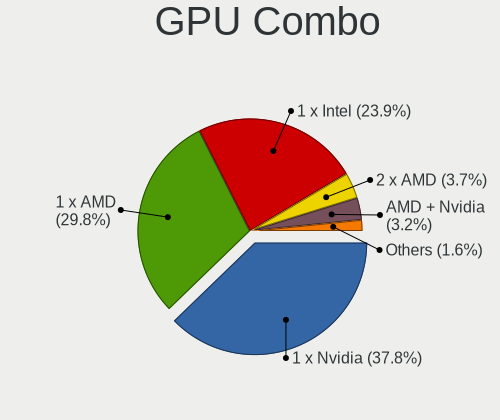

| Name           | Desktops | Percent |
|----------------|----------|---------|
| 1 x Nvidia     | 49       | 40.16%  |
| 1 x AMD        | 34       | 27.87%  |
| 1 x Intel      | 31       | 25.41%  |
| AMD + Nvidia   | 4        | 3.28%   |
| Intel + Nvidia | 3        | 2.46%   |
| 2 x AMD        | 1        | 0.82%   |

GPU Driver
----------

Free vs proprietary

| Driver      | Desktops | Percent |
|-------------|----------|---------|
| Free        | 87       | 70.73%  |
| Proprietary | 29       | 23.58%  |
| Unknown     | 7        | 5.69%   |

GPU Memory
----------

Total video memory

| Size in GB | Desktops | Percent |
|------------|----------|---------|
| Unknown    | 52       | 41.6%   |
| 1.01-2.0   | 20       | 16%     |
| 7.01-8.0   | 13       | 10.4%   |
| 0.51-1.0   | 11       | 8.8%    |
| 0.01-0.5   | 10       | 8%      |
| 5.01-6.0   | 6        | 4.8%    |
| 3.01-4.0   | 6        | 4.8%    |
| 8.01-16.0  | 4        | 3.2%    |
| 2.01-3.0   | 2        | 1.6%    |
| 4.01-5.0   | 1        | 0.8%    |

Monitor
-------

Monitor Vendor
--------------

Monitor vendors

| Vendor               | Desktops | Percent |
|----------------------|----------|---------|
| Samsung Electronics  | 28       | 20.9%   |
| Dell                 | 25       | 18.66%  |
| AOC                  | 20       | 14.93%  |
| Goldstar             | 14       | 10.45%  |
| Philips              | 12       | 8.96%   |
| Hewlett-Packard      | 7        | 5.22%   |
| Ancor Communications | 4        | 2.99%   |
| Lenovo               | 3        | 2.24%   |
| Iiyama               | 3        | 2.24%   |
| Acer                 | 3        | 2.24%   |
| ViewSonic            | 2        | 1.49%   |
| Sony                 | 2        | 1.49%   |
| Vestel Elektronik    | 1        | 0.75%   |
| Unknown              | 1        | 0.75%   |
| RS                   | 1        | 0.75%   |
| LG Display           | 1        | 0.75%   |
| HannStar             | 1        | 0.75%   |
| Grundig              | 1        | 0.75%   |
| FUN                  | 1        | 0.75%   |
| DIF                  | 1        | 0.75%   |
| DENON                | 1        | 0.75%   |
| ASUSTek Computer     | 1        | 0.75%   |
| Arnos Instruments    | 1        | 0.75%   |

Monitor Model
-------------

Monitor models

| Model                                                                   | Desktops | Percent |
|-------------------------------------------------------------------------|----------|---------|
| Philips LCD Monitor FTV 1920x1080                                       | 3        | 2.04%   |
| Goldstar ULTRAWIDE GSM59F1 2560x1080 798x334mm 34.1-inch                | 3        | 2.04%   |
| Dell U2412M DELA07A 1920x1200 518x324mm 24.1-inch                       | 3        | 2.04%   |
| Samsung Electronics SyncMaster SAM026F 1280x1024 376x301mm 19.0-inch    | 2        | 1.36%   |
| Philips FTV PHL01EA 1920x1080 1440x810mm 65.0-inch                      | 2        | 1.36%   |
| Philips 226V4 PHLC0B1 1920x1080 477x268mm 21.5-inch                     | 2        | 1.36%   |
| Dell U2515H DELD06E 2560x1440 553x311mm 25.0-inch                       | 2        | 1.36%   |
| AOC LCD Monitor AG251FWG2 1920x1080                                     | 2        | 1.36%   |
| AOC 2470W AOC2470 1920x1080 521x293mm 23.5-inch                         | 2        | 1.36%   |
| ViewSonic VX3211-4K VSCC336 3840x2160 698x393mm 31.5-inch               | 1        | 0.68%   |
| ViewSonic VG2448 VSC3B35 1920x1080 527x296mm 23.8-inch                  | 1        | 0.68%   |
| Vestel Elektronik 40UHD_LCD_TV VES3700 3840x2160 890x500mm 40.2-inch    | 1        | 0.68%   |
| Unknown LCD Monitor FFFF 2288x1287 2550x2550mm 142.0-inch               | 1        | 0.68%   |
| Sony TV SNYAB03 1920x1080                                               | 1        | 0.68%   |
| Sony TV *02 SNY9403 1920x1080 1218x685mm 55.0-inch                      | 1        | 0.68%   |
| Samsung Electronics U28E590 SAM0C4D 3840x2160 607x345mm 27.5-inch       | 1        | 0.68%   |
| Samsung Electronics SyncMaster SAM05EC 1920x1080 597x336mm 27.0-inch    | 1        | 0.68%   |
| Samsung Electronics SyncMaster SAM04DE 1920x1080 477x268mm 21.5-inch    | 1        | 0.68%   |
| Samsung Electronics SyncMaster SAM04D3 1920x1080 531x298mm 24.0-inch    | 1        | 0.68%   |
| Samsung Electronics SyncMaster SAM0467 1920x1200 518x324mm 24.1-inch    | 1        | 0.68%   |
| Samsung Electronics SyncMaster SAM0423 1920x1080                        | 1        | 0.68%   |
| Samsung Electronics SyncMaster SAM03E5 1680x1050 474x296mm 22.0-inch    | 1        | 0.68%   |
| Samsung Electronics SyncMaster SAM0303 1680x1050 494x320mm 23.2-inch    | 1        | 0.68%   |
| Samsung Electronics SyncMaster SAM02B6 1920x1200 518x324mm 24.1-inch    | 1        | 0.68%   |
| Samsung Electronics SyncMaster SAM0288 1680x1050 474x296mm 22.0-inch    | 1        | 0.68%   |
| Samsung Electronics SyncMaster SAM0214 1680x1050 408x306mm 20.1-inch    | 1        | 0.68%   |
| Samsung Electronics SyncMaster SAM011E 1280x1024 338x270mm 17.0-inch    | 1        | 0.68%   |
| Samsung Electronics SMS24A450/460 SAM0838 1920x1080 531x299mm 24.0-inch | 1        | 0.68%   |
| Samsung Electronics SMBX2231 SAM076C 1920x1080 477x268mm 21.5-inch      | 1        | 0.68%   |
| Samsung Electronics S24F350 SAM0D20 1920x1080 520x290mm 23.4-inch       | 1        | 0.68%   |
| Samsung Electronics S24E450 SAM0C82 1920x1080 531x299mm 24.0-inch       | 1        | 0.68%   |
| Samsung Electronics S24D590 SAM0B47 1920x1080 521x293mm 23.5-inch       | 1        | 0.68%   |
| Samsung Electronics S24B300 SAM08B4 1920x1080 521x293mm 23.5-inch       | 1        | 0.68%   |
| Samsung Electronics S22C200 SAM09B7 1920x1080 477x268mm 21.5-inch       | 1        | 0.68%   |
| Samsung Electronics LU28R55 SAM1018 3840x2160 632x360mm 28.6-inch       | 1        | 0.68%   |
| Samsung Electronics LCD Monitor SyncMaster 2560x1024                    | 1        | 0.68%   |
| Samsung Electronics LCD Monitor SAM7129 3840x2160 1020x570mm 46.0-inch  | 1        | 0.68%   |
| Samsung Electronics LCD Monitor SAM0D4D 1366x768 609x347mm 27.6-inch    | 1        | 0.68%   |
| Samsung Electronics LCD Monitor SAM0200 1280x720                        | 1        | 0.68%   |
| Samsung Electronics LC27RG50 SAM100A 1920x1080 530x300mm 24.0-inch      | 1        | 0.68%   |

Monitor Resolution
------------------

Monitor screen resolution

| Resolution         | Desktops | Percent |
|--------------------|----------|---------|
| 1920x1080 (FHD)    | 55       | 41.67%  |
| 3840x2160 (4K)     | 13       | 9.85%   |
| 2560x1440 (QHD)    | 13       | 9.85%   |
| 1280x1024 (SXGA)   | 11       | 8.33%   |
| 1680x1050 (WSXGA+) | 9        | 6.82%   |
| 1920x1200 (WUXGA)  | 8        | 6.06%   |
| 3440x1440          | 4        | 3.03%   |
| 2560x1080          | 4        | 3.03%   |
| 1600x900 (HD+)     | 3        | 2.27%   |
| 1366x768 (WXGA)    | 2        | 1.52%   |
| 3840x1600          | 1        | 0.76%   |
| 3840x1080          | 1        | 0.76%   |
| 2560x1600          | 1        | 0.76%   |
| 2560x1024          | 1        | 0.76%   |
| 2288x1287          | 1        | 0.76%   |
| 1440x900 (WXGA+)   | 1        | 0.76%   |
| 1280x960           | 1        | 0.76%   |
| 1280x720 (HD)      | 1        | 0.76%   |
| 1024x768 (XGA)     | 1        | 0.76%   |
| Unknown            | 1        | 0.76%   |

Monitor Diagonal
----------------

Diagonal size in inches

| Inches  | Desktops | Percent |
|---------|----------|---------|
| 24      | 20       | 14.71%  |
| 23      | 17       | 12.5%   |
| 21      | 15       | 11.03%  |
| 27      | 14       | 10.29%  |
| Unknown | 14       | 10.29%  |
| 34      | 8        | 5.88%   |
| 19      | 7        | 5.15%   |
| 22      | 6        | 4.41%   |
| 31      | 5        | 3.68%   |
| 20      | 4        | 2.94%   |
| 17      | 4        | 2.94%   |
| 65      | 3        | 2.21%   |
| 84      | 2        | 1.47%   |
| 72      | 2        | 1.47%   |
| 32      | 2        | 1.47%   |
| 25      | 2        | 1.47%   |
| 18      | 2        | 1.47%   |
| 142     | 1        | 0.74%   |
| 55      | 1        | 0.74%   |
| 54      | 1        | 0.74%   |
| 49      | 1        | 0.74%   |
| 37      | 1        | 0.74%   |
| 33      | 1        | 0.74%   |
| 29      | 1        | 0.74%   |
| 28      | 1        | 0.74%   |
| 15      | 1        | 0.74%   |

Monitor Width
-------------

Physical width

| Width in mm    | Desktops | Percent |
|----------------|----------|---------|
| 501-600        | 47       | 35.34%  |
| 401-500        | 26       | 19.55%  |
| Unknown        | 14       | 10.53%  |
| 701-800        | 11       | 8.27%   |
| 601-700        | 10       | 7.52%   |
| 351-400        | 9        | 6.77%   |
| 1001-1500      | 6        | 4.51%   |
| 301-350        | 4        | 3.01%   |
| 1501-2000      | 4        | 3.01%   |
| More than 2000 | 1        | 0.75%   |
| 801-900        | 1        | 0.75%   |

Aspect Ratio
------------

Proportional relationship between the width and the height

| Ratio   | Desktops | Percent |
|---------|----------|---------|
| 16/9    | 74       | 58.73%  |
| 16/10   | 16       | 12.7%   |
| 5/4     | 11       | 8.73%   |
| Unknown | 11       | 8.73%   |
| 21/9    | 9        | 7.14%   |
| 4/3     | 2        | 1.59%   |
| 32/9    | 1        | 0.79%   |
| 3/2     | 1        | 0.79%   |
| 1.00    | 1        | 0.79%   |

Monitor Area
------------

Area in inch

| Area in inch | Desktops | Percent |
|----------------|----------|---------|
| 201-250        | 43       | 32.09%  |
| 351-500        | 18       | 13.43%  |
| 151-200        | 15       | 11.19%  |
| 301-350        | 14       | 10.45%  |
| Unknown        | 14       | 10.45%  |
| 251-300        | 12       | 8.96%   |
| More than 1000 | 10       | 7.46%   |
| 141-150        | 4        | 2.99%   |
| 501-1000       | 2        | 1.49%   |
| 121-130        | 1        | 0.75%   |
| 101-110        | 1        | 0.75%   |

Pixel Density
-------------

Pixels per inch

| Density | Desktops | Percent |
|---------|----------|---------|
| 51-100  | 67       | 54.03%  |
| 101-120 | 26       | 20.97%  |
| Unknown | 14       | 11.29%  |
| 1-50    | 9        | 7.26%   |
| 121-160 | 8        | 6.45%   |

Multiple Monitors
-----------------

Total monitors connected

| Total | Desktops | Percent |
|-------|----------|---------|
| 1     | 94       | 76.42%  |
| 2     | 24       | 19.51%  |
| 0     | 4        | 3.25%   |
| 6     | 1        | 0.81%   |

Network
-------

Net Controller Vendor
---------------------

Controller vendors

| Vendor                          | Desktops | Percent |
|---------------------------------|----------|---------|
| Realtek Semiconductor           | 69       | 44.23%  |
| Intel                           | 51       | 32.69%  |
| Qualcomm Atheros                | 7        | 4.49%   |
| Broadcom                        | 5        | 3.21%   |
| Ralink Technology               | 4        | 2.56%   |
| Ralink                          | 4        | 2.56%   |
| Marvell Technology Group        | 2        | 1.28%   |
| Linksys                         | 2        | 1.28%   |
| ASUSTek Computer                | 2        | 1.28%   |
| ZyDAS Technology                | 1        | 0.64%   |
| VIA Technologies                | 1        | 0.64%   |
| TP-Link                         | 1        | 0.64%   |
| Samsung Electronics             | 1        | 0.64%   |
| Qualcomm Atheros Communications | 1        | 0.64%   |
| IMC Networks                    | 1        | 0.64%   |
| D-Link System                   | 1        | 0.64%   |
| D-Link                          | 1        | 0.64%   |
| Compal Electronics              | 1        | 0.64%   |
| Belkin Components               | 1        | 0.64%   |

Net Controller Model
--------------------

Controller models

| Model                                                                  | Desktops | Percent |
|------------------------------------------------------------------------|----------|---------|
| Realtek RTL8111/8168/8411 PCI Express Gigabit Ethernet Controller      | 59       | 35.54%  |
| Intel I211 Gigabit Network Connection                                  | 9        | 5.42%   |
| Intel Ethernet Connection (2) I219-V                                   | 9        | 5.42%   |
| Realtek RTL8125 2.5GbE Controller                                      | 5        | 3.01%   |
| Intel 82579LM Gigabit Network Connection (Lewisville)                  | 4        | 2.41%   |
| Intel Wi-Fi 6 AX200                                                    | 3        | 1.81%   |
| Realtek RTL810xE PCI Express Fast Ethernet controller                  | 2        | 1.2%    |
| Ralink RT2870/RT3070 Wireless Adapter                                  | 2        | 1.2%    |
| Ralink MT7601U Wireless Adapter                                        | 2        | 1.2%    |
| Ralink RT2790 Wireless 802.11n 1T/2R PCIe                              | 2        | 1.2%    |
| Qualcomm Atheros AR8121/AR8113/AR8114 Gigabit or Fast Ethernet         | 2        | 1.2%    |
| Marvell Group 88E8056 PCI-E Gigabit Ethernet Controller                | 2        | 1.2%    |
| Intel Wi-Fi 6 AX210/AX211/AX411 160MHz                                 | 2        | 1.2%    |
| Intel Ethernet Connection I217-LM                                      | 2        | 1.2%    |
| Intel Ethernet Connection (7) I219-LM                                  | 2        | 1.2%    |
| Intel Ethernet Connection (2) I219-LM                                  | 2        | 1.2%    |
| Intel 82579V Gigabit Network Connection                                | 2        | 1.2%    |
| Intel 82574L Gigabit Network Connection                                | 2        | 1.2%    |
| Intel 82567LM-3 Gigabit Network Connection                             | 2        | 1.2%    |
| Intel 82566DM-2 Gigabit Network Connection                             | 2        | 1.2%    |
| Broadcom NetXtreme BCM5755 Gigabit Ethernet PCI Express                | 2        | 1.2%    |
| Broadcom NetLink BCM5786 Gigabit Ethernet PCI Express                  | 2        | 1.2%    |
| ZyDAS ZD1212B Wireless Adapter                                         | 1        | 0.6%    |
| VIA VT6105/VT6106S [Rhine-III]                                         | 1        | 0.6%    |
| TP-Link Archer T2U PLUS [RTL8821AU]                                    | 1        | 0.6%    |
| Samsung GT-I9070 (network tethering, USB debugging enabled)            | 1        | 0.6%    |
| Realtek USB 10/100/1G/2.5G LAN                                         | 1        | 0.6%    |
| Realtek RTL8723BE PCIe Wireless Network Adapter                        | 1        | 0.6%    |
| Realtek RTL8192EU 802.11b/g/n WLAN Adapter                             | 1        | 0.6%    |
| Realtek RTL8192CU 802.11n WLAN Adapter                                 | 1        | 0.6%    |
| Realtek RTL8192CE PCIe Wireless Network Adapter                        | 1        | 0.6%    |
| Realtek RTL8187 Wireless Adapter                                       | 1        | 0.6%    |
| Ralink RT3060 Wireless 802.11n 1T/1R                                   | 1        | 0.6%    |
| Ralink RT2561/RT61 802.11g PCI                                         | 1        | 0.6%    |
| Qualcomm Atheros QCA6174 802.11ac Wireless Network Adapter             | 1        | 0.6%    |
| Qualcomm Atheros Killer E220x Gigabit Ethernet Controller              | 1        | 0.6%    |
| Qualcomm Atheros AR9271 802.11n                                        | 1        | 0.6%    |
| Qualcomm Atheros AR9462 Wireless Network Adapter                       | 1        | 0.6%    |
| Qualcomm Atheros AR93xx Wireless Network Adapter                       | 1        | 0.6%    |
| Qualcomm Atheros AR5416 Wireless Network Adapter [AR5008 802.11(a)bgn] | 1        | 0.6%    |

Wireless Vendor
---------------

Wireless vendors

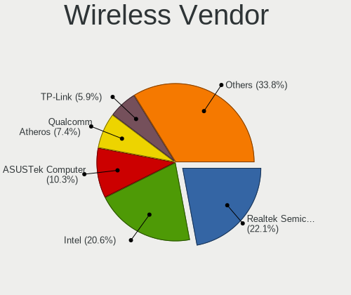

| Vendor                          | Desktops | Percent |
|---------------------------------|----------|---------|
| Intel                           | 8        | 22.86%  |
| Realtek Semiconductor           | 4        | 11.43%  |
| Ralink Technology               | 4        | 11.43%  |
| Ralink                          | 4        | 11.43%  |
| Qualcomm Atheros                | 4        | 11.43%  |
| ASUSTek Computer                | 2        | 5.71%   |
| ZyDAS Technology                | 1        | 2.86%   |
| TP-Link                         | 1        | 2.86%   |
| Qualcomm Atheros Communications | 1        | 2.86%   |
| Linksys                         | 1        | 2.86%   |
| IMC Networks                    | 1        | 2.86%   |
| D-Link System                   | 1        | 2.86%   |
| D-Link                          | 1        | 2.86%   |
| Broadcom                        | 1        | 2.86%   |
| Belkin Components               | 1        | 2.86%   |

Wireless Model
--------------

Wireless models

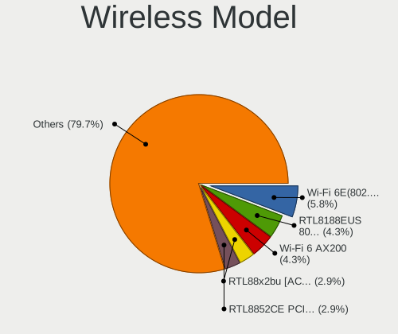

| Model                                                                             | Desktops | Percent |
|-----------------------------------------------------------------------------------|----------|---------|
| Intel Wi-Fi 6 AX200                                                               | 3        | 8.33%   |
| Ralink RT2870/RT3070 Wireless Adapter                                             | 2        | 5.56%   |
| Ralink MT7601U Wireless Adapter                                                   | 2        | 5.56%   |
| Ralink RT2790 Wireless 802.11n 1T/2R PCIe                                         | 2        | 5.56%   |
| Intel Wi-Fi 6 AX210/AX211/AX411 160MHz                                            | 2        | 5.56%   |
| ZyDAS ZD1212B Wireless Adapter                                                    | 1        | 2.78%   |
| TP-Link Archer T2U PLUS [RTL8821AU]                                               | 1        | 2.78%   |
| Realtek RTL8723BE PCIe Wireless Network Adapter                                   | 1        | 2.78%   |
| Realtek RTL8192EU 802.11b/g/n WLAN Adapter                                        | 1        | 2.78%   |
| Realtek RTL8192CU 802.11n WLAN Adapter                                            | 1        | 2.78%   |
| Realtek RTL8192CE PCIe Wireless Network Adapter                                   | 1        | 2.78%   |
| Realtek RTL8187 Wireless Adapter                                                  | 1        | 2.78%   |
| Ralink RT3060 Wireless 802.11n 1T/1R                                              | 1        | 2.78%   |
| Ralink RT2561/RT61 802.11g PCI                                                    | 1        | 2.78%   |
| Qualcomm Atheros QCA6174 802.11ac Wireless Network Adapter                        | 1        | 2.78%   |
| Qualcomm Atheros AR9271 802.11n                                                   | 1        | 2.78%   |
| Qualcomm Atheros AR9462 Wireless Network Adapter                                  | 1        | 2.78%   |
| Qualcomm Atheros AR93xx Wireless Network Adapter                                  | 1        | 2.78%   |
| Qualcomm Atheros AR5416 Wireless Network Adapter [AR5008 802.11(a)bgn]            | 1        | 2.78%   |
| Linksys AE1200 802.11bgn Wireless Adapter [Broadcom BCM43235]                     | 1        | 2.78%   |
| Intel Tiger Lake PCH CNVi WiFi                                                    | 1        | 2.78%   |
| Intel Dual Band Wireless-AC 3168NGW [Stone Peak]                                  | 1        | 2.78%   |
| Intel Cannon Lake PCH CNVi WiFi                                                   | 1        | 2.78%   |
| IMC Networks Mediao 802.11n WLAN [Realtek RTL8191SU]                              | 1        | 2.78%   |
| D-Link System DWA-131 802.11n Wireless N Nano Adapter(rev.A1) [Realtek RTL8192SU] | 1        | 2.78%   |
| D-Link 802.11 n WLAN                                                              | 1        | 2.78%   |
| Broadcom BCM4352 802.11ac Wireless Network Adapter                                | 1        | 2.78%   |
| Belkin Components F5D7050 Wireless G Adapter v4000 [Zydas ZD1211B]                | 1        | 2.78%   |
| ASUS USB-N13 802.11n Network Adapter (rev. B1) [Realtek RTL8192CU]                | 1        | 2.78%   |
| ASUS N10 Nano 802.11n Network Adapter [Realtek RTL8192CU]                         | 1        | 2.78%   |

Ethernet Vendor
---------------

Ethernet vendors

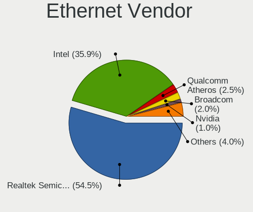

| Vendor                   | Desktops | Percent |
|--------------------------|----------|---------|
| Realtek Semiconductor    | 67       | 52.76%  |
| Intel                    | 47       | 37.01%  |
| Broadcom                 | 4        | 3.15%   |
| Qualcomm Atheros         | 3        | 2.36%   |
| Marvell Technology Group | 2        | 1.57%   |
| VIA Technologies         | 1        | 0.79%   |
| Samsung Electronics      | 1        | 0.79%   |
| Linksys                  | 1        | 0.79%   |
| Compal Electronics       | 1        | 0.79%   |

Ethernet Model
--------------

Ethernet models

| Model                                                                         | Desktops | Percent |
|-------------------------------------------------------------------------------|----------|---------|
| Realtek RTL8111/8168/8411 PCI Express Gigabit Ethernet Controller             | 59       | 45.38%  |
| Intel I211 Gigabit Network Connection                                         | 9        | 6.92%   |
| Intel Ethernet Connection (2) I219-V                                          | 9        | 6.92%   |
| Realtek RTL8125 2.5GbE Controller                                             | 5        | 3.85%   |
| Intel 82579LM Gigabit Network Connection (Lewisville)                         | 4        | 3.08%   |
| Realtek RTL810xE PCI Express Fast Ethernet controller                         | 2        | 1.54%   |
| Qualcomm Atheros AR8121/AR8113/AR8114 Gigabit or Fast Ethernet                | 2        | 1.54%   |
| Marvell Group 88E8056 PCI-E Gigabit Ethernet Controller                       | 2        | 1.54%   |
| Intel Ethernet Connection I217-LM                                             | 2        | 1.54%   |
| Intel Ethernet Connection (7) I219-LM                                         | 2        | 1.54%   |
| Intel Ethernet Connection (2) I219-LM                                         | 2        | 1.54%   |
| Intel 82579V Gigabit Network Connection                                       | 2        | 1.54%   |
| Intel 82574L Gigabit Network Connection                                       | 2        | 1.54%   |
| Intel 82567LM-3 Gigabit Network Connection                                    | 2        | 1.54%   |
| Intel 82566DM-2 Gigabit Network Connection                                    | 2        | 1.54%   |
| Broadcom NetXtreme BCM5755 Gigabit Ethernet PCI Express                       | 2        | 1.54%   |
| Broadcom NetLink BCM5786 Gigabit Ethernet PCI Express                         | 2        | 1.54%   |
| VIA VT6105/VT6106S [Rhine-III]                                                | 1        | 0.77%   |
| Samsung GT-I9070 (network tethering, USB debugging enabled)                   | 1        | 0.77%   |
| Realtek USB 10/100/1G/2.5G LAN                                                | 1        | 0.77%   |
| Qualcomm Atheros Killer E220x Gigabit Ethernet Controller                     | 1        | 0.77%   |
| Linksys Gigabit Network Adapter                                               | 1        | 0.77%   |
| Intel I350 Gigabit Network Connection                                         | 1        | 0.77%   |
| Intel Ethernet Controller I225-V                                              | 1        | 0.77%   |
| Intel Ethernet Connection I217-V                                              | 1        | 0.77%   |
| Intel Ethernet Connection (7) I219-V                                          | 1        | 0.77%   |
| Intel Ethernet Connection (2) I218-LM                                         | 1        | 0.77%   |
| Intel Ethernet Connection (14) I219-V                                         | 1        | 0.77%   |
| Intel 82583V Gigabit Network Connection                                       | 1        | 0.77%   |
| Intel 82578DM Gigabit Network Connection                                      | 1        | 0.77%   |
| Intel 82576 Gigabit Network Connection                                        | 1        | 0.77%   |
| Intel 82573L Gigabit Ethernet Controller                                      | 1        | 0.77%   |
| Intel 82573E Gigabit Ethernet Controller (Copper)                             | 1        | 0.77%   |
| Intel 82571EB/82571GB Gigabit Ethernet Controller D0/D1 (copper applications) | 1        | 0.77%   |
| Intel 82566DM Gigabit Network Connection                                      | 1        | 0.77%   |
| Intel 80003ES2LAN Gigabit Ethernet Controller (Copper)                        | 1        | 0.77%   |
| Compal Android                                                                | 1        | 0.77%   |

Net Controller Kind
-------------------

Ethernet, WiFi or modem

| Kind     | Desktops | Percent |
|----------|----------|---------|
| Ethernet | 118      | 77.12%  |
| WiFi     | 35       | 22.88%  |

Used Controller
---------------

Currently used network controller

| Kind     | Desktops | Percent |
|----------|----------|---------|
| Ethernet | 102      | 85%     |
| WiFi     | 18       | 15%     |

NICs
----

Total network controllers on board

| Total | Desktops | Percent |
|-------|----------|---------|
| 1     | 90       | 74.38%  |
| 2     | 24       | 19.83%  |
| 3     | 3        | 2.48%   |
| 0     | 2        | 1.65%   |
| 5     | 1        | 0.83%   |
| 4     | 1        | 0.83%   |

IPv6
----

IPv6 vs IPv4

| Used | Desktops | Percent |
|------|----------|---------|
| No   | 110      | 88.71%  |
| Yes  | 14       | 11.29%  |

Bluetooth
---------

Bluetooth Vendor
----------------

Controller vendors

| Vendor                     | Desktops | Percent |
|----------------------------|----------|---------|
| Intel                      | 8        | 29.63%  |
| Cambridge Silicon Radio    | 6        | 22.22%  |
| ASUSTek Computer           | 4        | 14.81%  |
| Hewlett-Packard            | 2        | 7.41%   |
| Edimax Technology          | 2        | 7.41%   |
| Realtek Semiconductor      | 1        | 3.7%    |
| Lite-On Technology         | 1        | 3.7%    |
| Integrated System Solution | 1        | 3.7%    |
| IMC Networks               | 1        | 3.7%    |
| Apple                      | 1        | 3.7%    |

Bluetooth Model
---------------

Controller models

| Model                                               | Desktops | Percent |
|-----------------------------------------------------|----------|---------|
| Cambridge Silicon Radio Bluetooth Dongle (HCI mode) | 6        | 22.22%  |
| Intel AX200 Bluetooth                               | 3        | 11.11%  |
| Intel AX210 Bluetooth                               | 2        | 7.41%   |
| HP Bluetooth 2.0 Interface [Broadcom BCM2045]       | 2        | 7.41%   |
| Edimax Bluetooth Adapter                            | 2        | 7.41%   |
| ASUS Broadcom BCM20702A0 Bluetooth                  | 2        | 7.41%   |
| Realtek Bluetooth Radio                             | 1        | 3.7%    |
| Lite-On Bluetooth Device                            | 1        | 3.7%    |
| Intel Wireless-AC 3168 Bluetooth                    | 1        | 3.7%    |
| Intel Bluetooth 9460/9560 Jefferson Peak (JfP)      | 1        | 3.7%    |
| Intel AX201 Bluetooth                               | 1        | 3.7%    |
| Integrated System Solution Bluetooth Device         | 1        | 3.7%    |
| IMC Networks Bluetooth Radio                        | 1        | 3.7%    |
| ASUS Qualcomm Bluetooth 4.1                         | 1        | 3.7%    |
| ASUS Bluetooth Device                               | 1        | 3.7%    |
| Apple Bluetooth HCI                                 | 1        | 3.7%    |

Sound
-----

Sound Vendor
------------

Sound card vendors

| Vendor                      | Desktops | Percent |
|-----------------------------|----------|---------|
| Intel                       | 78       | 37.68%  |
| AMD                         | 52       | 25.12%  |
| Nvidia                      | 51       | 24.64%  |
| Logitech                    | 3        | 1.45%   |
| C-Media Electronics         | 3        | 1.45%   |
| ASUSTek Computer            | 3        | 1.45%   |
| JMTek                       | 2        | 0.97%   |
| BEHRINGER International     | 2        | 0.97%   |
| Yamaha                      | 1        | 0.48%   |
| Textech International       | 1        | 0.48%   |
| Texas Instruments           | 1        | 0.48%   |
| Syntek                      | 1        | 0.48%   |
| Sony                        | 1        | 0.48%   |
| PreSonus Audio Electronics  | 1        | 0.48%   |
| Nam Tai E&E Products        | 1        | 0.48%   |
| Mackie Designs              | 1        | 0.48%   |
| Kingston Technology         | 1        | 0.48%   |
| iCreate Technologies        | 1        | 0.48%   |
| FiiO Electronics Technology | 1        | 0.48%   |
| Creative Labs               | 1        | 0.48%   |
| AKAI Professional M.I.      | 1        | 0.48%   |

Sound Model
-----------

Sound card models

| Model                                                                             | Desktops | Percent |
|-----------------------------------------------------------------------------------|----------|---------|
| AMD Starship/Matisse HD Audio Controller                                          | 12       | 5.19%   |
| Intel 6 Series/C200 Series Chipset Family High Definition Audio Controller        | 11       | 4.76%   |
| AMD Family 17h (Models 00h-0fh) HD Audio Controller                               | 10       | 4.33%   |
| Intel 200 Series PCH HD Audio                                                     | 9        | 3.9%    |
| Intel 100 Series/C230 Series Chipset Family HD Audio Controller                   | 9        | 3.9%    |
| AMD Ellesmere HDMI Audio [Radeon RX 470/480 / 570/580/590]                        | 8        | 3.46%   |
| Intel 8 Series/C220 Series Chipset High Definition Audio Controller               | 7        | 3.03%   |
| Intel 5 Series/3400 Series Chipset High Definition Audio                          | 7        | 3.03%   |
| AMD Family 17h/19h HD Audio Controller                                            | 7        | 3.03%   |
| Intel Cannon Lake PCH cAVS                                                        | 6        | 2.6%    |
| Nvidia GP104 High Definition Audio Controller                                     | 5        | 2.16%   |
| Intel Xeon E3-1200 v3/4th Gen Core Processor HD Audio Controller                  | 5        | 2.16%   |
| Intel NM10/ICH7 Family High Definition Audio Controller                           | 5        | 2.16%   |
| Nvidia GP106 High Definition Audio Controller                                     | 4        | 1.73%   |
| Nvidia GM206 High Definition Audio Controller                                     | 4        | 1.73%   |
| Intel 82801JI (ICH10 Family) HD Audio Controller                                  | 4        | 1.73%   |
| Intel 82801I (ICH9 Family) HD Audio Controller                                    | 4        | 1.73%   |
| AMD Raven/Raven2/Fenghuang HDMI/DP Audio Controller                               | 4        | 1.73%   |
| AMD Juniper HDMI Audio [Radeon HD 5700 Series]                                    | 4        | 1.73%   |
| AMD Caicos HDMI Audio [Radeon HD 6450 / 7450/8450/8490 OEM / R5 230/235/235X OEM] | 4        | 1.73%   |
| Nvidia TU116 High Definition Audio Controller                                     | 3        | 1.3%    |
| Nvidia GP102 HDMI Audio Controller                                                | 3        | 1.3%    |
| Nvidia GK107 HDMI Audio Controller                                                | 3        | 1.3%    |
| Nvidia GK106 HDMI Audio Controller                                                | 3        | 1.3%    |
| AMD SBx00 Azalia (Intel HDA)                                                      | 3        | 1.3%    |
| AMD Cedar HDMI Audio [Radeon HD 5400/6300/7300 Series]                            | 3        | 1.3%    |
| Nvidia TU104 HD Audio Controller                                                  | 2        | 0.87%   |
| Nvidia GP108 High Definition Audio Controller                                     | 2        | 0.87%   |
| Nvidia GP107GL High Definition Audio Controller                                   | 2        | 0.87%   |
| Nvidia GM204 High Definition Audio Controller                                     | 2        | 0.87%   |
| Nvidia GM107 High Definition Audio Controller [GeForce 940MX]                     | 2        | 0.87%   |
| Nvidia GK208 HDMI/DP Audio Controller                                             | 2        | 0.87%   |
| Nvidia GK104 HDMI Audio Controller                                                | 2        | 0.87%   |
| Nvidia GF108 High Definition Audio Controller                                     | 2        | 0.87%   |
| Nvidia GF106 High Definition Audio Controller                                     | 2        | 0.87%   |
| Nvidia GA104 High Definition Audio Controller                                     | 2        | 0.87%   |
| Logitech G430 Surround Sound Gaming Headset                                       | 2        | 0.87%   |
| Intel Tiger Lake-H HD Audio Controller                                            | 2        | 0.87%   |
| Intel C600/X79 series chipset High Definition Audio Controller                    | 2        | 0.87%   |
| Intel 9 Series Chipset Family HD Audio Controller                                 | 2        | 0.87%   |

Memory
------

Memory Vendor
-------------

Memory module vendors

| Vendor              | Desktops | Percent |
|---------------------|----------|---------|
| Kingston            | 15       | 18.99%  |
| G.Skill             | 13       | 16.46%  |
| Crucial             | 12       | 15.19%  |
| Samsung Electronics | 8        | 10.13%  |
| SK hynix            | 7        | 8.86%   |
| Unknown             | 6        | 7.59%   |
| Corsair             | 6        | 7.59%   |
| Team                | 2        | 2.53%   |
| TakeMS              | 2        | 2.53%   |
| Micron Technology   | 2        | 2.53%   |
| Transcend           | 1        | 1.27%   |
| Patriot             | 1        | 1.27%   |
| Nanya Technology    | 1        | 1.27%   |
| GOODRAM             | 1        | 1.27%   |
| Elpida              | 1        | 1.27%   |
| A-DATA Technology   | 1        | 1.27%   |

Memory Model
------------

Memory module models

| Model                                                                      | Desktops | Percent |
|----------------------------------------------------------------------------|----------|---------|
| Kingston RAM KHX2133C14/8G 8GB DIMM DDR4 2400MT/s                          | 2        | 2.41%   |
| G.Skill RAM F4-3000C16-8GISB 8GB DIMM DDR4 3200MT/s                        | 2        | 2.41%   |
| Unknown RAM Module 8GB DIMM DDR3 1600MT/s                                  | 1        | 1.2%    |
| Unknown RAM Module 4096MB DIMM DDR 1600MT/s                                | 1        | 1.2%    |
| Unknown RAM Module 2GB SODIMM DDR2                                         | 1        | 1.2%    |
| Unknown RAM Module 2GB DIMM 800MT/s                                        | 1        | 1.2%    |
| Unknown RAM Module 2048MB DIMM DDR2 667MT/s                                | 1        | 1.2%    |
| Unknown RAM 3000 C16 Series 8192MB DIMM DDR4 2133MT/s                      | 1        | 1.2%    |
| Transcend RAM JM800QLU-2G 2048MB DIMM DDR 2048MT/s                         | 1        | 1.2%    |
| Team RAM TEAMGROUP-UD4-3000 8GB DIMM DDR4 3000MT/s                         | 1        | 1.2%    |
| Team RAM TEAMGROUP-UD3-1600 8GB DIMM DDR3 1600MT/s                         | 1        | 1.2%    |
| TakeMS RAM TMS4GB364F081139EM 4096MB DIMM DDR3 1333MT/s                    | 1        | 1.2%    |
| TakeMS RAM TMS4GB364E081139PP 4GB DIMM DDR3 1333MT/s                       | 1        | 1.2%    |
| TakeMS RAM TMS2GB264D081805EV 2048MB DIMM DDR2 800MT/s                     | 1        | 1.2%    |
| SK hynix RAM Module 8GB SODIMM DDR4 3200MT/s                               | 1        | 1.2%    |
| SK hynix RAM Module 8GB DIMM DDR4 2133MT/s                                 | 1        | 1.2%    |
| SK hynix RAM Module 4096MB FB-DIMM DDR2 667MT/s                            | 1        | 1.2%    |
| SK hynix RAM HMT351U6EFR8C-PB 4GB DIMM DDR3 1800MT/s                       | 1        | 1.2%    |
| SK hynix RAM HMA81GU6CJR8N-XN 8GB DIMM DDR4 3200MT/s                       | 1        | 1.2%    |
| SK hynix RAM HMA41GR7AFR4N-UH 8GB DIMM DDR4 2400MT/s                       | 1        | 1.2%    |
| SK hynix RAM 48594D503131325536344350382D53362020 1024MB DIMM DDR2 800MT/s | 1        | 1.2%    |
| Samsung RAM Module 4096MB DIMM DDR4 2400MT/s                               | 1        | 1.2%    |
| Samsung RAM M4 70T5663QZ3-CF7 2GB SODIMM DDR2 2048MT/s                     | 1        | 1.2%    |
| Samsung RAM M393B1G70QH0-CMA 8GB DIMM DDR3 1867MT/s                        | 1        | 1.2%    |
| Samsung RAM M393A1K43BB0-CRC 8GB DIMM DDR4 2400MT/s                        | 1        | 1.2%    |
| Samsung RAM M391A2K43BB1-CRC 16GB DIMM DDR4 2866MT/s                       | 1        | 1.2%    |
| Samsung RAM M378B5773CH0-CH9 2GB DIMM DDR3 1867MT/s                        | 1        | 1.2%    |
| Samsung RAM M378B5673FH0-CF8 2048MB DIMM DDR3 1067MT/s                     | 1        | 1.2%    |
| Samsung RAM M3 78T5663QZ3-CF7 2GB DIMM DDR2 667MT/s                        | 1        | 1.2%    |
| Samsung RAM M3 78T5663QZ3-CE6 2048MB DIMM DDR2 667MT/s                     | 1        | 1.2%    |
| Patriot RAM 3200 C16 Series 16GB DIMM DDR4 3200MT/s                        | 1        | 1.2%    |
| Nanya RAM NT1GT64U88D0BY-AD 1GB DIMM DDR2 49926MT/s                        | 1        | 1.2%    |
| Micron RAM 18JSF51272AZ-1G6M 4GB DIMM DDR3 1600MT/s                        | 1        | 1.2%    |
| Micron RAM 18HTF12872AY-667B3 1024MB DIMM DDR2 667MT/s                     | 1        | 1.2%    |
| Kingston RAM Module 1024MB DIMM DDR2 800MT/s                               | 1        | 1.2%    |
| Kingston RAM KHX3600C18D4/32GX 32GB DIMM DDR4 3600MT/s                     | 1        | 1.2%    |
| Kingston RAM KHX3200C18D4/8G 8GB DIMM DDR4 3333MT/s                        | 1        | 1.2%    |
| Kingston RAM KHX3200C16D4/16GX 16GB DIMM DDR4 3600MT/s                     | 1        | 1.2%    |
| Kingston RAM KHX2666C16/8G 8GB DIMM DDR4 3466MT/s                          | 1        | 1.2%    |
| Kingston RAM KHX2133C14D4/8G 8GB DIMM DDR4 2667MT/s                        | 1        | 1.2%    |

Memory Kind
-----------

Memory module kinds

| Kind    | Desktops | Percent |
|---------|----------|---------|
| DDR4    | 43       | 61.43%  |
| DDR3    | 14       | 20%     |
| DDR2    | 8        | 11.43%  |
| SDRAM   | 3        | 4.29%   |
| DDR     | 1        | 1.43%   |
| Unknown | 1        | 1.43%   |

Memory Form Factor
------------------

Physical design of the memory module

| Name    | Desktops | Percent |
|---------|----------|---------|
| DIMM    | 64       | 92.75%  |
| SODIMM  | 4        | 5.8%    |
| FB-DIMM | 1        | 1.45%   |

Memory Size
-----------

Memory module size

| Size  | Desktops | Percent |
|-------|----------|---------|
| 8192  | 31       | 44.29%  |
| 4096  | 13       | 18.57%  |
| 16384 | 11       | 15.71%  |
| 2048  | 8        | 11.43%  |
| 1024  | 4        | 5.71%   |
| 32768 | 3        | 4.29%   |

Memory Speed
------------

Memory module speed

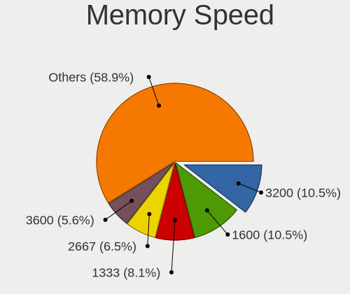

| Speed   | Desktops | Percent |
|---------|----------|---------|
| 3200    | 12       | 15.38%  |
| 2400    | 7        | 8.97%   |
| 2133    | 6        | 7.69%   |
| 1600    | 6        | 7.69%   |
| 3600    | 5        | 6.41%   |
| 2667    | 5        | 6.41%   |
| 800     | 4        | 5.13%   |
| 667     | 4        | 5.13%   |
| 3733    | 3        | 3.85%   |
| 1867    | 3        | 3.85%   |
| 1333    | 3        | 3.85%   |
| 3800    | 2        | 2.56%   |
| 3000    | 2        | 2.56%   |
| 2800    | 2        | 2.56%   |
| 2048    | 2        | 2.56%   |
| 1800    | 2        | 2.56%   |
| 49926   | 1        | 1.28%   |
| 4133    | 1        | 1.28%   |
| 3866    | 1        | 1.28%   |
| 3466    | 1        | 1.28%   |
| 3333    | 1        | 1.28%   |
| 2866    | 1        | 1.28%   |
| 1866    | 1        | 1.28%   |
| 1639    | 1        | 1.28%   |
| 1067    | 1        | 1.28%   |
| Unknown | 1        | 1.28%   |

Printers & scanners
-------------------

Printer Vendor
--------------

Printer device vendors

| Vendor              | Desktops | Percent |
|---------------------|----------|---------|
| Hewlett-Packard     | 2        | 25%     |
| Xerox               | 1        | 12.5%   |
| Seiko Epson         | 1        | 12.5%   |
| Samsung Electronics | 1        | 12.5%   |
| Datamax-O'Neil      | 1        | 12.5%   |
| Canon               | 1        | 12.5%   |
| Brother Industries  | 1        | 12.5%   |

Printer Model
-------------

Printer device models

| Model                              | Desktops | Percent |
|------------------------------------|----------|---------|
| Xerox Phaser 3140 and 3155         | 1        | 12.5%   |
| Seiko Epson L3160 Series           | 1        | 12.5%   |
| Samsung M2070 Series               | 1        | 12.5%   |
| HP DeskJet 2620 All-in-One Printer | 1        | 12.5%   |
| HP Color LaserJet 2605dn           | 1        | 12.5%   |
| Datamax-O'Neil Datamax E-4304      | 1        | 12.5%   |
| Canon PIXMA MX390 Series           | 1        | 12.5%   |
| Brother DCP-L2530DW series         | 1        | 12.5%   |

Scanner Vendor
--------------

Scanner device vendors

| Vendor | Desktops | Percent |
|--------|----------|---------|
| Canon  | 2        | 100%    |

Scanner Model
-------------

Scanner device models

| Model                    | Desktops | Percent |
|--------------------------|----------|---------|
| Canon CanoScan LiDE 700F | 1        | 50%     |
| Canon CanoScan LiDE 220  | 1        | 50%     |

Camera
------

Camera Vendor
-------------

Camera device vendors

| Vendor                        | Desktops | Percent |
|-------------------------------|----------|---------|
| Logitech                      | 5        | 31.25%  |
| Chicony Electronics           | 3        | 18.75%  |
| Z-Star Microelectronics       | 1        | 6.25%   |
| Sunplus Innovation Technology | 1        | 6.25%   |
| Sony                          | 1        | 6.25%   |
| Samsung Electronics           | 1        | 6.25%   |
| Pixart Imaging                | 1        | 6.25%   |
| Microdia                      | 1        | 6.25%   |
| MacroSilicon                  | 1        | 6.25%   |
| Cubeternet                    | 1        | 6.25%   |

Camera Model
------------

Camera device models

| Model                                         | Desktops | Percent |
|-----------------------------------------------|----------|---------|
| Chicony CNF7042                               | 2        | 12.5%   |
| Z-Star Venus USB2.0 Camera                    | 1        | 6.25%   |
| Sunplus HD 720P webcam                        | 1        | 6.25%   |
| Sony CEVCECM                                  | 1        | 6.25%   |
| Samsung Galaxy A5 (MTP)                       | 1        | 6.25%   |
| Pixart Imaging GE 1.3 MP MiniCam Pro          | 1        | 6.25%   |
| Microdia Camera                               | 1        | 6.25%   |
| MacroSilicon MS210x Video Grabber [EasierCAP] | 1        | 6.25%   |
| Logitech Webcam C310                          | 1        | 6.25%   |
| Logitech Webcam C210                          | 1        | 6.25%   |
| Logitech Webcam C170                          | 1        | 6.25%   |
| Logitech HD Pro Webcam C920                   | 1        | 6.25%   |
| Logitech BRIO Ultra HD Webcam                 | 1        | 6.25%   |
| Cubeternet GL-UPC822 UVC WebCam               | 1        | 6.25%   |
| Chicony USB2.0 HD UVC WebCam                  | 1        | 6.25%   |

Security
--------

Fingerprint Vendor
------------------

Fingerprint sensor vendors

| Vendor                | Desktops | Percent |
|-----------------------|----------|---------|
| Elan Microelectronics | 1        | 100%    |

Fingerprint Model
-----------------

Fingerprint sensor models

| Model                                       | Desktops | Percent |
|---------------------------------------------|----------|---------|
| Elan fingerprint sensor [FeinTech FPS00200] | 1        | 100%    |

Chipcard Vendor
---------------

Chipcard module vendors

| Vendor           | Desktops | Percent |
|------------------|----------|---------|
| SCM Microsystems | 1        | 100%    |

Chipcard Model
--------------

Chipcard module models

| Model                                       | Desktops | Percent |
|---------------------------------------------|----------|---------|
| SCM Microsystems uTrust 3512 SAM slot Token | 1        | 100%    |

Unsupported
-----------

Unsupported Devices
-------------------

Total unsupported devices on board

| Total | Desktops | Percent |
|-------|----------|---------|
| 0     | 101      | 82.79%  |
| 1     | 21       | 17.21%  |

Unsupported Device Types
------------------------

Types of unsupported devices

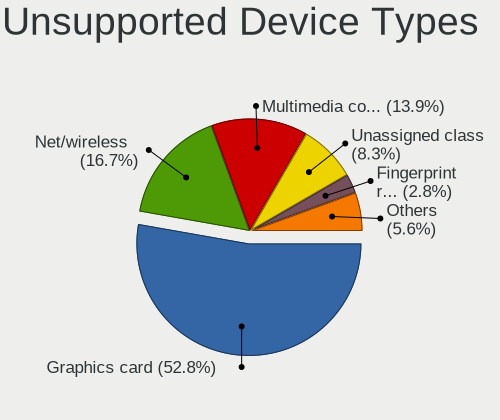

| Type                  | Desktops | Percent |
|-----------------------|----------|---------|
| Graphics card         | 11       | 52.38%  |
| Multimedia controller | 4        | 19.05%  |
| Net/wireless          | 2        | 9.52%   |
| Unassigned class      | 1        | 4.76%   |
| Fingerprint reader    | 1        | 4.76%   |
| Chipcard              | 1        | 4.76%   |
| Card reader           | 1        | 4.76%   |

