Linux in Slovenia - Tested Hardware & Statistics (Desktops)
-----------------------------------------------------------

A project to collect tested hardware configurations for Linux in Slovenia.

Anyone can contribute to this report by the [hw-probe](https://github.com/linuxhw/hw-probe) tool:

    sudo -E hw-probe -all -upload

Please contribute! Especially if your hardware is rare.

Contents
--------

* [ Test Cases ](#test-cases)

* [ System ](#system)
  - [ OS                       ](#os)
  - [ OS Family                ](#os-family)
  - [ Kernel                   ](#kernel)
  - [ Kernel Family            ](#kernel-family)
  - [ Kernel Major Ver.        ](#kernel-major-ver)
  - [ Arch                     ](#arch)
  - [ DE                       ](#de)
  - [ Display Server           ](#display-server)
  - [ Display Manager          ](#display-manager)
  - [ OS Lang                  ](#os-lang)
  - [ Boot Mode                ](#boot-mode)
  - [ Filesystem               ](#filesystem)
  - [ Part. scheme             ](#part-scheme)
  - [ Dual Boot with Linux/BSD ](#dual-boot-with-linuxbsd)
  - [ Dual Boot (Win)          ](#dual-boot-win)

* [ Board ](#board)
  - [ Vendor                   ](#vendor)
  - [ Model                    ](#model)
  - [ Model Family             ](#model-family)
  - [ MFG Year                 ](#mfg-year)
  - [ Form Factor              ](#form-factor)
  - [ Secure Boot              ](#secure-boot)
  - [ Coreboot                 ](#coreboot)
  - [ RAM Size                 ](#ram-size)
  - [ RAM Used                 ](#ram-used)
  - [ Total Drives             ](#total-drives)
  - [ Has CD-ROM               ](#has-cd-rom)
  - [ Has Ethernet             ](#has-ethernet)
  - [ Has WiFi                 ](#has-wifi)
  - [ Has Bluetooth            ](#has-bluetooth)

* [ Location ](#location)
  - [ Country                  ](#country)
  - [ City                     ](#city)

* [ Drives ](#drives)
  - [ Drive Vendor             ](#drive-vendor)
  - [ Drive Model              ](#drive-model)
  - [ HDD Vendor               ](#hdd-vendor)
  - [ SSD Vendor               ](#ssd-vendor)
  - [ Drive Kind               ](#drive-kind)
  - [ Drive Connector          ](#drive-connector)
  - [ Drive Size               ](#drive-size)
  - [ Space Total              ](#space-total)
  - [ Space Used               ](#space-used)
  - [ Malfunc. Drives          ](#malfunc-drives)
  - [ Malfunc. Drive Vendor    ](#malfunc-drive-vendor)
  - [ Malfunc. HDD Vendor      ](#malfunc-hdd-vendor)
  - [ Malfunc. Drive Kind      ](#malfunc-drive-kind)
  - [ Failed Drives            ](#failed-drives)
  - [ Failed Drive Vendor      ](#failed-drive-vendor)
  - [ Drive Status             ](#drive-status)

* [ Storage controller ](#storage-controller)
  - [ Storage Vendor           ](#storage-vendor)
  - [ Storage Model            ](#storage-model)
  - [ Storage Kind             ](#storage-kind)

* [ Processor ](#processor)
  - [ CPU Vendor               ](#cpu-vendor)
  - [ CPU Model                ](#cpu-model)
  - [ CPU Model Family         ](#cpu-model-family)
  - [ CPU Cores                ](#cpu-cores)
  - [ CPU Sockets              ](#cpu-sockets)
  - [ CPU Threads              ](#cpu-threads)
  - [ CPU Op-Modes             ](#cpu-op-modes)
  - [ CPU Microcode            ](#cpu-microcode)
  - [ CPU Microarch            ](#cpu-microarch)

* [ Graphics ](#graphics)
  - [ GPU Vendor               ](#gpu-vendor)
  - [ GPU Model                ](#gpu-model)
  - [ GPU Combo                ](#gpu-combo)
  - [ GPU Driver               ](#gpu-driver)
  - [ GPU Memory               ](#gpu-memory)

* [ Monitor ](#monitor)
  - [ Monitor Vendor           ](#monitor-vendor)
  - [ Monitor Model            ](#monitor-model)
  - [ Monitor Resolution       ](#monitor-resolution)
  - [ Monitor Diagonal         ](#monitor-diagonal)
  - [ Monitor Width            ](#monitor-width)
  - [ Aspect Ratio             ](#aspect-ratio)
  - [ Monitor Area             ](#monitor-area)
  - [ Pixel Density            ](#pixel-density)
  - [ Multiple Monitors        ](#multiple-monitors)

* [ Network ](#network)
  - [ Net Controller Vendor    ](#net-controller-vendor)
  - [ Net Controller Model     ](#net-controller-model)
  - [ Wireless Vendor          ](#wireless-vendor)
  - [ Wireless Model           ](#wireless-model)
  - [ Ethernet Vendor          ](#ethernet-vendor)
  - [ Ethernet Model           ](#ethernet-model)
  - [ Net Controller Kind      ](#net-controller-kind)
  - [ Used Controller          ](#used-controller)
  - [ NICs                     ](#nics)
  - [ IPv6                     ](#ipv6)

* [ Bluetooth ](#bluetooth)
  - [ Bluetooth Vendor         ](#bluetooth-vendor)
  - [ Bluetooth Model          ](#bluetooth-model)

* [ Sound ](#sound)
  - [ Sound Vendor             ](#sound-vendor)
  - [ Sound Model              ](#sound-model)

* [ Memory ](#memory)
  - [ Memory Vendor            ](#memory-vendor)
  - [ Memory Model             ](#memory-model)
  - [ Memory Kind              ](#memory-kind)
  - [ Memory Form Factor       ](#memory-form-factor)
  - [ Memory Size              ](#memory-size)
  - [ Memory Speed             ](#memory-speed)

* [ Printers & scanners ](#printers--scanners)
  - [ Printer Vendor           ](#printer-vendor)
  - [ Printer Model            ](#printer-model)
  - [ Scanner Vendor           ](#scanner-vendor)
  - [ Scanner Model            ](#scanner-model)

* [ Camera ](#camera)
  - [ Camera Vendor            ](#camera-vendor)
  - [ Camera Model             ](#camera-model)

* [ Security ](#security)
  - [ Fingerprint Vendor       ](#fingerprint-vendor)
  - [ Fingerprint Model        ](#fingerprint-model)
  - [ Chipcard Vendor          ](#chipcard-vendor)
  - [ Chipcard Model           ](#chipcard-model)

* [ Unsupported ](#unsupported)
  - [ Unsupported Devices      ](#unsupported-devices)
  - [ Unsupported Device Types ](#unsupported-device-types)

Test Cases
----------

Total: 247

| Vendor     | Model                       | Probe                                                      | Date         |
|------------|-----------------------------|------------------------------------------------------------|--------------|
| Gigabyte   | X99-UD7 WIFI-CF             | [b7389a656c](https://linux-hardware.org/?probe=b7389a656c) | Apr 27, 2024 |
| Gigabyte   | Z68MA-D2H-B3                | [d9d4c8fda0](https://linux-hardware.org/?probe=d9d4c8fda0) | Apr 21, 2024 |
| HP         | 886C                        | [c36efe4b45](https://linux-hardware.org/?probe=c36efe4b45) | Mar 30, 2024 |
| Gigabyte   | B650 GAMING X AX V2         | [82d7d88e80](https://linux-hardware.org/?probe=82d7d88e80) | Mar 25, 2024 |
| Gigabyte   | Z68P-DS3                    | [68be72f718](https://linux-hardware.org/?probe=68be72f718) | Mar 01, 2024 |
| Gigabyte   | B450 AORUS ELITE            | [a0d12d4111](https://linux-hardware.org/?probe=a0d12d4111) | Feb 21, 2024 |
| HP         | 3647h                       | [f504108ab7](https://linux-hardware.org/?probe=f504108ab7) | Feb 10, 2024 |
| ASUSTek    | SABERTOOTH Z77              | [94b425089f](https://linux-hardware.org/?probe=94b425089f) | Jan 24, 2024 |
| Gigabyte   | X470 AORUS ULTRA GAMING-... | [360a430907](https://linux-hardware.org/?probe=360a430907) | Jan 09, 2024 |
| Gigabyte   | X470 AORUS ULTRA GAMING-... | [615d88f290](https://linux-hardware.org/?probe=615d88f290) | Jan 05, 2024 |
| ASRock     | H61M-VG4                    | [6eee51a63f](https://linux-hardware.org/?probe=6eee51a63f) | Dec 31, 2023 |
| ASRock     | H61M-VG4                    | [1c5959e766](https://linux-hardware.org/?probe=1c5959e766) | Dec 31, 2023 |
| ASRock     | X570 Phantom Gaming 4       | [4202011d88](https://linux-hardware.org/?probe=4202011d88) | Dec 09, 2023 |
| ASUSTek    | TUF B450M-PLUS GAMING       | [d46afc319c](https://linux-hardware.org/?probe=d46afc319c) | Nov 30, 2023 |
| MSI        | MAG X570S TORPEDO MAX       | [f6e7c5e8a3](https://linux-hardware.org/?probe=f6e7c5e8a3) | Nov 29, 2023 |
| MSI        | A320M PRO-VH PLUS           | [fbee1b0cb7](https://linux-hardware.org/?probe=fbee1b0cb7) | Nov 26, 2023 |
| MSI        | MAG X570S TORPEDO MAX       | [829e6fdd78](https://linux-hardware.org/?probe=829e6fdd78) | Nov 23, 2023 |
| HP         | 1589                        | [481cc393d1](https://linux-hardware.org/?probe=481cc393d1) | Nov 19, 2023 |
| Gigabyte   | H61M-D2-B3                  | [358c0e28e9](https://linux-hardware.org/?probe=358c0e28e9) | Nov 17, 2023 |
| ASUSTek    | H110M-A                     | [a721fea460](https://linux-hardware.org/?probe=a721fea460) | Oct 23, 2023 |
| ASUSTek    | PRIME H510M-E               | [375e62bbf4](https://linux-hardware.org/?probe=375e62bbf4) | Oct 17, 2023 |
| ASUSTek    | M5A88-M                     | [e73165d1b3](https://linux-hardware.org/?probe=e73165d1b3) | Oct 10, 2023 |
| ASUSTek    | TUF Gaming X670E-PLUS WI... | [e590e7eb2c](https://linux-hardware.org/?probe=e590e7eb2c) | Oct 04, 2023 |
| ASUSTek    | ROG STRIX X570-F GAMING     | [5dbe8e1541](https://linux-hardware.org/?probe=5dbe8e1541) | Sep 28, 2023 |
| Foxconn    | 2ABF                        | [b566fc3ff3](https://linux-hardware.org/?probe=b566fc3ff3) | Sep 23, 2023 |
| ASUSTek    | P5Q SE PLUS                 | [311596a316](https://linux-hardware.org/?probe=311596a316) | Aug 30, 2023 |
| HP         | 1589                        | [047e0158e8](https://linux-hardware.org/?probe=047e0158e8) | Aug 29, 2023 |
| ASUSTek    | ROG CROSSHAIR X670E GENE    | [a9a56ae120](https://linux-hardware.org/?probe=a9a56ae120) | Aug 22, 2023 |
| ASUSTek    | TUF Gaming X570-PLUS        | [d387c8fec5](https://linux-hardware.org/?probe=d387c8fec5) | Aug 11, 2023 |
| Unknown    | Unknown                     | [cf0d6729b4](https://linux-hardware.org/?probe=cf0d6729b4) | Aug 11, 2023 |
| Gigabyte   | EP45-UD3LR                  | [0f3d20a423](https://linux-hardware.org/?probe=0f3d20a423) | Aug 06, 2023 |
| MSI        | B450 TOMAHAWK MAX           | [a14f4895b0](https://linux-hardware.org/?probe=a14f4895b0) | Jul 17, 2023 |
| Nvidia     | MCP79                       | [8203509a77](https://linux-hardware.org/?probe=8203509a77) | Jun 09, 2023 |
| AZW        | EQ                          | [98e574abed](https://linux-hardware.org/?probe=98e574abed) | Jun 07, 2023 |
| Nvidia     | MCP79                       | [bf109ed28f](https://linux-hardware.org/?probe=bf109ed28f) | Jun 06, 2023 |
| ASRock     | H170M Pro4                  | [d936c663d3](https://linux-hardware.org/?probe=d936c663d3) | Jun 01, 2023 |
| HP         | 2AF7                        | [b459ce46cb](https://linux-hardware.org/?probe=b459ce46cb) | May 27, 2023 |
| ASRock     | B550 Steel Legend           | [35534cbfba](https://linux-hardware.org/?probe=35534cbfba) | Apr 19, 2023 |
| MSI        | B450 GAMING PLUS MAX        | [c279e7b8fe](https://linux-hardware.org/?probe=c279e7b8fe) | Apr 11, 2023 |
| Gigabyte   | M61SME-S2                   | [25d436d2cb](https://linux-hardware.org/?probe=25d436d2cb) | Apr 06, 2023 |
| ASRock     | Q1900M                      | [dfae44d3f6](https://linux-hardware.org/?probe=dfae44d3f6) | Apr 02, 2023 |
| Gigabyte   | GA-880GM-UD2H               | [f46913bb86](https://linux-hardware.org/?probe=f46913bb86) | Apr 02, 2023 |
| HP         | 1998                        | [d88ffd3db4](https://linux-hardware.org/?probe=d88ffd3db4) | Apr 01, 2023 |
| HP         | 8053                        | [6c887800bb](https://linux-hardware.org/?probe=6c887800bb) | Apr 01, 2023 |
| ASUSTek    | PRIME H610I-PLUS D4         | [7b984afb2c](https://linux-hardware.org/?probe=7b984afb2c) | Mar 29, 2023 |
| ASUSTek    | SABERTOOTH Z77              | [43113791e9](https://linux-hardware.org/?probe=43113791e9) | Mar 23, 2023 |
| HP         | 1589                        | [5c483a16fc](https://linux-hardware.org/?probe=5c483a16fc) | Mar 18, 2023 |
| ASUSTek    | M5A88-M                     | [4b1712febb](https://linux-hardware.org/?probe=4b1712febb) | Mar 15, 2023 |
| MSI        | B450 GAMING PLUS MAX        | [6735fc94ae](https://linux-hardware.org/?probe=6735fc94ae) | Mar 06, 2023 |
| Gigabyte   | EX58-UD5                    | [eaec9511de](https://linux-hardware.org/?probe=eaec9511de) | Feb 27, 2023 |
| Gigabyte   | EX58-UD5                    | [85ed1d43c7](https://linux-hardware.org/?probe=85ed1d43c7) | Feb 26, 2023 |
| ASUSTek    | ROG STRIX Z370-G GAMING     | [84fb689a7e](https://linux-hardware.org/?probe=84fb689a7e) | Feb 06, 2023 |
| ASUSTek    | Z97-PRO                     | [0e241538c1](https://linux-hardware.org/?probe=0e241538c1) | Jan 29, 2023 |
| ASUSTek    | Z170-K                      | [2cf59bd38d](https://linux-hardware.org/?probe=2cf59bd38d) | Jan 26, 2023 |
| Lenovo     | MAHOBAY NOK                 | [6bd02bf2c0](https://linux-hardware.org/?probe=6bd02bf2c0) | Jan 24, 2023 |
| ASUSTek    | ROG STRIX Z370-G GAMING     | [405641895c](https://linux-hardware.org/?probe=405641895c) | Jan 18, 2023 |
| Medion     | MS-7621                     | [67b535d88f](https://linux-hardware.org/?probe=67b535d88f) | Jan 18, 2023 |
| Lenovo     | 31900058 STD or WIN         | [21cdab1361](https://linux-hardware.org/?probe=21cdab1361) | Jan 03, 2023 |
| ASUSTek    | TUF B450-PLUS GAMING        | [9e269ee2a4](https://linux-hardware.org/?probe=9e269ee2a4) | Dec 24, 2022 |
| MSI        | Z170-A PRO                  | [3948dcc7ef](https://linux-hardware.org/?probe=3948dcc7ef) | Dec 23, 2022 |
| HP         | 8594                        | [de0b36257e](https://linux-hardware.org/?probe=de0b36257e) | Dec 21, 2022 |
| ASUSTek    | ROG STRIX B550-F GAMING     | [cb70181c3a](https://linux-hardware.org/?probe=cb70181c3a) | Dec 21, 2022 |
| Gigabyte   | B650M GAMING X AX           | [01b7250cea](https://linux-hardware.org/?probe=01b7250cea) | Dec 19, 2022 |
| Gigabyte   | B650M GAMING X AX           | [999cbfe9f7](https://linux-hardware.org/?probe=999cbfe9f7) | Dec 19, 2022 |
| ASUSTek    | SABERTOOTH Z77              | [3892b54ac4](https://linux-hardware.org/?probe=3892b54ac4) | Dec 08, 2022 |
| ASUSTek    | SABERTOOTH Z77              | [eced972f80](https://linux-hardware.org/?probe=eced972f80) | Dec 05, 2022 |
| ASUSTek    | SABERTOOTH Z77              | [d37c93af89](https://linux-hardware.org/?probe=d37c93af89) | Dec 05, 2022 |
| ASRock     | H55M-LE                     | [9d2066a479](https://linux-hardware.org/?probe=9d2066a479) | Dec 03, 2022 |
| HP         | 8591                        | [98bde1bd5a](https://linux-hardware.org/?probe=98bde1bd5a) | Nov 01, 2022 |
| Gigabyte   | H61M-S2V-B3                 | [9e7b79bfbb](https://linux-hardware.org/?probe=9e7b79bfbb) | Oct 20, 2022 |
| Gigabyte   | H81M-S2PV                   | [90661c40a3](https://linux-hardware.org/?probe=90661c40a3) | Oct 12, 2022 |
| ASRock     | H61M-HVS                    | [5348794267](https://linux-hardware.org/?probe=5348794267) | Oct 09, 2022 |
| HP         | 18E4                        | [d9deeda238](https://linux-hardware.org/?probe=d9deeda238) | Oct 05, 2022 |
| ASRock     | H61M-HVS                    | [660419ed49](https://linux-hardware.org/?probe=660419ed49) | Sep 27, 2022 |
| MSI        | X570-A PRO                  | [0306edc8ba](https://linux-hardware.org/?probe=0306edc8ba) | Sep 22, 2022 |
| MSI        | X570-A PRO                  | [56d6df17b5](https://linux-hardware.org/?probe=56d6df17b5) | Sep 22, 2022 |
| ASUSTek    | PRIME B550M-K               | [f5fb874e1e](https://linux-hardware.org/?probe=f5fb874e1e) | Sep 18, 2022 |
| Gigabyte   | B450M DS3H-CF               | [ea2264656c](https://linux-hardware.org/?probe=ea2264656c) | Sep 15, 2022 |
| ASUSTek    | TUF Gaming B550M-E          | [600ef31484](https://linux-hardware.org/?probe=600ef31484) | Sep 15, 2022 |
| MSI        | MPG B550 GAMING EDGE WIF... | [4c7f501c2b](https://linux-hardware.org/?probe=4c7f501c2b) | Sep 02, 2022 |
| HP         | 8053                        | [2e48f3f13e](https://linux-hardware.org/?probe=2e48f3f13e) | Sep 02, 2022 |
| ASRock     | B450 Gaming-ITX/ac          | [194290f42c](https://linux-hardware.org/?probe=194290f42c) | Aug 31, 2022 |
| ASRock     | H110M-DVS R2.0              | [adae304d62](https://linux-hardware.org/?probe=adae304d62) | Aug 24, 2022 |
| Supermicro | X7SBi-LN4                   | [ec37ffcc15](https://linux-hardware.org/?probe=ec37ffcc15) | Aug 23, 2022 |
| ASUSTek    | PRIME B450M-A               | [230d7247c0](https://linux-hardware.org/?probe=230d7247c0) | Aug 11, 2022 |
| MSI        | B450 TOMAHAWK MAX           | [17954b8ac5](https://linux-hardware.org/?probe=17954b8ac5) | Jul 26, 2022 |
| ASUSTek    | PRIME X470-PRO              | [0e195b05bf](https://linux-hardware.org/?probe=0e195b05bf) | Jul 13, 2022 |
| ASUSTek    | CROSSHAIR V FORMULA-Z       | [d59692d648](https://linux-hardware.org/?probe=d59692d648) | Jun 29, 2022 |
| ASRock     | H61M-ITX                    | [4afafc5b76](https://linux-hardware.org/?probe=4afafc5b76) | Jun 29, 2022 |
| HP         | 212B                        | [a163af0cb5](https://linux-hardware.org/?probe=a163af0cb5) | Jun 21, 2022 |
| ASRock     | X570M Pro4                  | [bbb784f2df](https://linux-hardware.org/?probe=bbb784f2df) | Jun 18, 2022 |
| ASUSTek    | ROG STRIX X570-E GAMING     | [cc2e6a1605](https://linux-hardware.org/?probe=cc2e6a1605) | Jun 17, 2022 |
| ASRock     | X570M Pro4                  | [4f6d06171b](https://linux-hardware.org/?probe=4f6d06171b) | Jun 10, 2022 |
| Intel      | CM-iAM/SBC-FITPC2i          | [cbfe433386](https://linux-hardware.org/?probe=cbfe433386) | May 20, 2022 |
| ASUSTek    | ROG STRIX Z370-F GAMING     | [86d60d0227](https://linux-hardware.org/?probe=86d60d0227) | May 12, 2022 |
| Gigabyte   | GA-MA770T-UD3               | [934d403a31](https://linux-hardware.org/?probe=934d403a31) | May 04, 2022 |
| ASUSTek    | ROG STRIX Z370-F GAMING     | [965985d6f4](https://linux-hardware.org/?probe=965985d6f4) | Apr 29, 2022 |
| ASUSTek    | ROG STRIX X570-E GAMING     | [f727388ac8](https://linux-hardware.org/?probe=f727388ac8) | Apr 17, 2022 |
| ASUSTek    | ROG STRIX X570-E GAMING     | [c1102c77ec](https://linux-hardware.org/?probe=c1102c77ec) | Apr 17, 2022 |
| ASUSTek    | STRIX Z270G GAMING          | [76a5225b83](https://linux-hardware.org/?probe=76a5225b83) | Apr 16, 2022 |
| ASRock     | H170M Pro4                  | [0dd1b326c0](https://linux-hardware.org/?probe=0dd1b326c0) | Apr 15, 2022 |
| ASUSTek    | TUF Gaming B560-PLUS WIF... | [222189213d](https://linux-hardware.org/?probe=222189213d) | Apr 11, 2022 |
| MSI        | X570-A PRO                  | [0813d4bc9e](https://linux-hardware.org/?probe=0813d4bc9e) | Mar 31, 2022 |
| MSI        | X570-A PRO                  | [defac75126](https://linux-hardware.org/?probe=defac75126) | Mar 31, 2022 |
| ASUSTek    | PRIME B250M-A               | [1260b540e7](https://linux-hardware.org/?probe=1260b540e7) | Mar 27, 2022 |
| ASUSTek    | PRIME A320M-K               | [9d5d5c0ffb](https://linux-hardware.org/?probe=9d5d5c0ffb) | Feb 26, 2022 |
| ASUSTek    | ROG STRIX B450-F GAMING ... | [1c8a37fb2f](https://linux-hardware.org/?probe=1c8a37fb2f) | Feb 24, 2022 |
| Dell       | 09M8Y8 A02                  | [202fc1f0b9](https://linux-hardware.org/?probe=202fc1f0b9) | Feb 22, 2022 |
| ASUSTek    | PRIME H410M-A               | [cad9a70c49](https://linux-hardware.org/?probe=cad9a70c49) | Feb 16, 2022 |
| ASUSTek    | PRIME H410M-A               | [676d121bda](https://linux-hardware.org/?probe=676d121bda) | Feb 13, 2022 |
| Gigabyte   | EP45-UD3LR                  | [239eb94a17](https://linux-hardware.org/?probe=239eb94a17) | Feb 07, 2022 |
| Gigabyte   | Z170-HD3P-CF                | [901d568e70](https://linux-hardware.org/?probe=901d568e70) | Jan 31, 2022 |
| Gigabyte   | Z170-HD3P-CF                | [621d099786](https://linux-hardware.org/?probe=621d099786) | Jan 31, 2022 |
| HP         | 1589                        | [41dbcb78cb](https://linux-hardware.org/?probe=41dbcb78cb) | Jan 30, 2022 |
| Pegatron   | EVE                         | [06d22ac6e2](https://linux-hardware.org/?probe=06d22ac6e2) | Jan 21, 2022 |
| Pegatron   | EVE                         | [5640f6122a](https://linux-hardware.org/?probe=5640f6122a) | Jan 21, 2022 |
| ASRock     | B85M-HDS                    | [77cb3218a8](https://linux-hardware.org/?probe=77cb3218a8) | Jan 12, 2022 |
| Lenovo     | ThinkCentre M57e 9439WHV    | [a9b2163945](https://linux-hardware.org/?probe=a9b2163945) | Dec 25, 2021 |
| Gigabyte   | H57M-USB3                   | [ee70d6b4b4](https://linux-hardware.org/?probe=ee70d6b4b4) | Dec 24, 2021 |
| ASUSTek    | ROG STRIX Z370-F GAMING     | [6aee0ff442](https://linux-hardware.org/?probe=6aee0ff442) | Dec 15, 2021 |
| ASUSTek    | TUF B450-PLUS GAMING        | [6649bea1f8](https://linux-hardware.org/?probe=6649bea1f8) | Dec 04, 2021 |
| ASUSTek    | TUF B450-PLUS GAMING        | [723e2a158a](https://linux-hardware.org/?probe=723e2a158a) | Dec 03, 2021 |
| ASUSTek    | M4A78T-E                    | [df3010e1b8](https://linux-hardware.org/?probe=df3010e1b8) | Nov 27, 2021 |
| ASUSTek    | ROG STRIX X570-F GAMING     | [6016236fad](https://linux-hardware.org/?probe=6016236fad) | Nov 24, 2021 |
| Gigabyte   | H57M-USB3                   | [97409a8d1c](https://linux-hardware.org/?probe=97409a8d1c) | Nov 22, 2021 |
| Gigabyte   | H57M-USB3                   | [e0e4ee802a](https://linux-hardware.org/?probe=e0e4ee802a) | Nov 22, 2021 |
| Gigabyte   | H61M-S2PV                   | [163092e4b9](https://linux-hardware.org/?probe=163092e4b9) | Nov 18, 2021 |
| ASUSTek    | ROG STRIX X570-E GAMING     | [dfe40a023a](https://linux-hardware.org/?probe=dfe40a023a) | Nov 12, 2021 |
| ASUSTek    | ROG STRIX X570-E GAMING     | [1336c9e31c](https://linux-hardware.org/?probe=1336c9e31c) | Nov 12, 2021 |
| Fujitsu    | D3417-B2 S26361-D3417-B2    | [ab14080e40](https://linux-hardware.org/?probe=ab14080e40) | Nov 09, 2021 |
| ASUSTek    | PRIME Z270-A                | [a11d4b7c50](https://linux-hardware.org/?probe=a11d4b7c50) | Oct 20, 2021 |
| ASRock     | X300M-STX                   | [cd738f5036](https://linux-hardware.org/?probe=cd738f5036) | Oct 11, 2021 |
| ASRock     | X300M-STX                   | [bc1fd03a63](https://linux-hardware.org/?probe=bc1fd03a63) | Oct 10, 2021 |
| ASRock     | X300M-STX                   | [6ec6ce5c81](https://linux-hardware.org/?probe=6ec6ce5c81) | Oct 10, 2021 |
| MSI        | X570-A PRO                  | [9813ead17b](https://linux-hardware.org/?probe=9813ead17b) | Sep 23, 2021 |
| Medion     | Akoya E7226                 | [9367472acb](https://linux-hardware.org/?probe=9367472acb) | Sep 18, 2021 |
| MSI        | X570-A PRO                  | [934d0576e0](https://linux-hardware.org/?probe=934d0576e0) | Aug 27, 2021 |
| ASRock     | H310CM-HDV                  | [0fccd48745](https://linux-hardware.org/?probe=0fccd48745) | Aug 13, 2021 |
| MSI        | X570-A PRO                  | [8cc7d05010](https://linux-hardware.org/?probe=8cc7d05010) | Aug 12, 2021 |
| ASUSTek    | PRIME A320M-K               | [e6e223209a](https://linux-hardware.org/?probe=e6e223209a) | Jul 20, 2021 |
| MSI        | H61M-P31                    | [ccd9d80d59](https://linux-hardware.org/?probe=ccd9d80d59) | Jul 18, 2021 |
| Pegatron   | 2A73                        | [2bff425af7](https://linux-hardware.org/?probe=2bff425af7) | Jul 14, 2021 |
| Pegatron   | 2A73                        | [44ea7169ef](https://linux-hardware.org/?probe=44ea7169ef) | Jul 14, 2021 |
| MSI        | B450 TOMAHAWK MAX II        | [bc18a23953](https://linux-hardware.org/?probe=bc18a23953) | Jun 28, 2021 |
| ASUSTek    | ROG STRIX Z370-G GAMING     | [181bd83bdd](https://linux-hardware.org/?probe=181bd83bdd) | Jun 02, 2021 |
| Gigabyte   | F2A88XM-D3HP                | [02bf919368](https://linux-hardware.org/?probe=02bf919368) | Jun 02, 2021 |
| Lenovo     | ThinkStation S20 4157ZSK    | [3e6d98fe9c](https://linux-hardware.org/?probe=3e6d98fe9c) | Apr 27, 2021 |
| ASRock     | B560 Pro4                   | [ddd384c6cb](https://linux-hardware.org/?probe=ddd384c6cb) | Apr 26, 2021 |
| Lenovo     | ThinkCentre M55e 9389WEG    | [66c2003859](https://linux-hardware.org/?probe=66c2003859) | Apr 20, 2021 |
| HP         | 1905                        | [e0fc243f47](https://linux-hardware.org/?probe=e0fc243f47) | Apr 19, 2021 |
| ASUSTek    | ROG STRIX Z370-G GAMING     | [132c1a0515](https://linux-hardware.org/?probe=132c1a0515) | Apr 08, 2021 |
| ASUSTek    | ROG STRIX Z370-G GAMING     | [10132d3ee3](https://linux-hardware.org/?probe=10132d3ee3) | Apr 05, 2021 |
| ASUSTek    | P5Q SE                      | [325f4ca461](https://linux-hardware.org/?probe=325f4ca461) | Apr 05, 2021 |
| ASUSTek    | P5Q SE                      | [1c3958d998](https://linux-hardware.org/?probe=1c3958d998) | Apr 05, 2021 |
| ASUSTek    | ROG STRIX Z370-G GAMING     | [62f6aa5c03](https://linux-hardware.org/?probe=62f6aa5c03) | Mar 27, 2021 |
| Lenovo     | ThinkStation S20 4157ZSK    | [1038d58fea](https://linux-hardware.org/?probe=1038d58fea) | Mar 25, 2021 |
| Lenovo     | ThinkStation S20 4157ZSK    | [8b28b318fd](https://linux-hardware.org/?probe=8b28b318fd) | Mar 19, 2021 |
| Gigabyte   | H61M-D2-B3                  | [453120855b](https://linux-hardware.org/?probe=453120855b) | Mar 18, 2021 |
| Apple      | Mac-F4208DA9 PVT            | [4ab255096c](https://linux-hardware.org/?probe=4ab255096c) | Feb 28, 2021 |
| Dell       | 0C27VV A02                  | [49cd056ca4](https://linux-hardware.org/?probe=49cd056ca4) | Feb 24, 2021 |
| Gigabyte   | P35C-DS3R                   | [bd76fdbde8](https://linux-hardware.org/?probe=bd76fdbde8) | Feb 20, 2021 |
| ASUSTek    | PRIME B350-PLUS             | [153bb12a6a](https://linux-hardware.org/?probe=153bb12a6a) | Feb 19, 2021 |
| MSI        | H61M-P31                    | [a0192f9d6e](https://linux-hardware.org/?probe=a0192f9d6e) | Feb 17, 2021 |
| ASUSTek    | SABERTOOTH 990FX R2.0       | [106c66da60](https://linux-hardware.org/?probe=106c66da60) | Feb 14, 2021 |
| Lenovo     | ThinkCentre M90p 5498PK8    | [df39a8847b](https://linux-hardware.org/?probe=df39a8847b) | Feb 14, 2021 |
| ASUSTek    | P7H55-M SI                  | [e40fe3768d](https://linux-hardware.org/?probe=e40fe3768d) | Feb 09, 2021 |
| Gigabyte   | P35C-DS3R                   | [a31754db23](https://linux-hardware.org/?probe=a31754db23) | Feb 08, 2021 |
| Pegatron   | 2A73                        | [4c2042c088](https://linux-hardware.org/?probe=4c2042c088) | Jan 18, 2021 |
| Pegatron   | 2A73                        | [c6cf8a7efe](https://linux-hardware.org/?probe=c6cf8a7efe) | Jan 18, 2021 |
| MSI        | H55M-P31                    | [3313a8aba5](https://linux-hardware.org/?probe=3313a8aba5) | Jan 12, 2021 |
| ASUSTek    | PRIME B350-PLUS             | [0265add193](https://linux-hardware.org/?probe=0265add193) | Jan 10, 2021 |
| Gigabyte   | B450M DS3H-CF               | [8b0a9a71b3](https://linux-hardware.org/?probe=8b0a9a71b3) | Jan 10, 2021 |
| ASUSTek    | PRIME B350-PLUS             | [497bf4005e](https://linux-hardware.org/?probe=497bf4005e) | Jan 10, 2021 |
| Gigabyte   | H61M-D2-B3                  | [60d8b9344b](https://linux-hardware.org/?probe=60d8b9344b) | Jan 09, 2021 |
| ASUSTek    | TUF Z370-PLUS GAMING        | [58204a920b](https://linux-hardware.org/?probe=58204a920b) | Jan 05, 2021 |
| Gigabyte   | H270-HD3-CF                 | [b6c93666ee](https://linux-hardware.org/?probe=b6c93666ee) | Dec 29, 2020 |
| Gigabyte   | H270-HD3-CF                 | [7905034ba5](https://linux-hardware.org/?probe=7905034ba5) | Dec 29, 2020 |
| Gigabyte   | H270-HD3-CF                 | [71370e1dd8](https://linux-hardware.org/?probe=71370e1dd8) | Dec 19, 2020 |
| Gigabyte   | B450M GAMING                | [def1b6fff4](https://linux-hardware.org/?probe=def1b6fff4) | Dec 13, 2020 |
| Pegatron   | EVE                         | [08ced52205](https://linux-hardware.org/?probe=08ced52205) | Nov 29, 2020 |
| ASRock     | H110M-HDV R3.0              | [c3df499de1](https://linux-hardware.org/?probe=c3df499de1) | Nov 12, 2020 |
| ASRock     | H110M-HDV R3.0              | [e05c144d2f](https://linux-hardware.org/?probe=e05c144d2f) | Nov 12, 2020 |
| Lenovo     | ThinkCentre M55e 9389WEG    | [2462c80a14](https://linux-hardware.org/?probe=2462c80a14) | Nov 10, 2020 |
| ASUSTek    | Z97-K                       | [e8f7b6ef7e](https://linux-hardware.org/?probe=e8f7b6ef7e) | Nov 07, 2020 |
| ASUSTek    | Z97-K                       | [7e9d52855a](https://linux-hardware.org/?probe=7e9d52855a) | Nov 07, 2020 |
| MSI        | B450 TOMAHAWK               | [1e6ba50614](https://linux-hardware.org/?probe=1e6ba50614) | Nov 04, 2020 |
| Intel      | DH87RL AAG74240-403         | [caa0e9c93b](https://linux-hardware.org/?probe=caa0e9c93b) | Nov 02, 2020 |
| Gigabyte   | H270-HD3-CF                 | [fa6d538a50](https://linux-hardware.org/?probe=fa6d538a50) | Oct 31, 2020 |
| MSI        | B360M PRO-VDH               | [d336eeaa8d](https://linux-hardware.org/?probe=d336eeaa8d) | Oct 21, 2020 |
| Lenovo     | 3098 NOK                    | [2c592ebb94](https://linux-hardware.org/?probe=2c592ebb94) | Oct 19, 2020 |
| Lenovo     | 3098 NOK                    | [92a22bd753](https://linux-hardware.org/?probe=92a22bd753) | Oct 19, 2020 |
| Gigabyte   | Z68P-DS3                    | [2e8b092dbc](https://linux-hardware.org/?probe=2e8b092dbc) | Oct 12, 2020 |
| Gigabyte   | Z97X-Gaming 3               | [da4740881e](https://linux-hardware.org/?probe=da4740881e) | Oct 04, 2020 |
| Pegatron   | 2A94h                       | [3a1ede6188](https://linux-hardware.org/?probe=3a1ede6188) | Oct 03, 2020 |
| Gigabyte   | F2A88XM-D3HP                | [1d3401ff46](https://linux-hardware.org/?probe=1d3401ff46) | Oct 02, 2020 |
| Intel      | DQ35JO AAD82085-801         | [51c42a0f25](https://linux-hardware.org/?probe=51c42a0f25) | Sep 17, 2020 |
| Pegatron   | 2A73                        | [a4607af679](https://linux-hardware.org/?probe=a4607af679) | Aug 25, 2020 |
| Pegatron   | 2A73                        | [f2c225880d](https://linux-hardware.org/?probe=f2c225880d) | Aug 25, 2020 |
| HP         | 3048h                       | [0bc2b9bafc](https://linux-hardware.org/?probe=0bc2b9bafc) | Aug 17, 2020 |
| ASUSTek    | P7H55-M SI                  | [c323481902](https://linux-hardware.org/?probe=c323481902) | Jun 14, 2020 |
| ASUSTek    | P7H55-M SI                  | [6889f53e3b](https://linux-hardware.org/?probe=6889f53e3b) | Jun 13, 2020 |
| ASRock     | X570 Extreme4               | [add6daf97a](https://linux-hardware.org/?probe=add6daf97a) | Jun 07, 2020 |
| ASUSTek    | PRIME H370-PLUS             | [d7dee77bfc](https://linux-hardware.org/?probe=d7dee77bfc) | Jun 04, 2020 |
| Gigabyte   | B85M-HD3                    | [03b36ff9c1](https://linux-hardware.org/?probe=03b36ff9c1) | May 28, 2020 |
| ASRock     | Z390 Pro4                   | [e1c0c74ca6](https://linux-hardware.org/?probe=e1c0c74ca6) | May 25, 2020 |
| MSI        | H61M-P31                    | [870b2534d7](https://linux-hardware.org/?probe=870b2534d7) | May 22, 2020 |
| MSI        | H110M ECO                   | [fe6009a465](https://linux-hardware.org/?probe=fe6009a465) | May 15, 2020 |
| Lenovo     | ThinkCentre M55e 9389W11    | [f148017266](https://linux-hardware.org/?probe=f148017266) | Apr 12, 2020 |
| ASUSTek    | H170 PRO GAMING             | [f9c3afb706](https://linux-hardware.org/?probe=f9c3afb706) | Apr 08, 2020 |
| Gigabyte   | B360M DS3H                  | [17dd7e6ddb](https://linux-hardware.org/?probe=17dd7e6ddb) | Apr 05, 2020 |
| Lenovo     | ThinkCentre M57e 9356W2K    | [663d112138](https://linux-hardware.org/?probe=663d112138) | Apr 02, 2020 |
| HP         | 0A58h                       | [0734e4224d](https://linux-hardware.org/?probe=0734e4224d) | Mar 16, 2020 |
| ASUSTek    | H110M-A                     | [9a43e8f82a](https://linux-hardware.org/?probe=9a43e8f82a) | Feb 26, 2020 |
| ASUSTek    | H110M-A                     | [0722f7ccf8](https://linux-hardware.org/?probe=0722f7ccf8) | Feb 22, 2020 |
| ASUSTek    | P8Z77-M PRO                 | [44e0ce8fc8](https://linux-hardware.org/?probe=44e0ce8fc8) | Jan 24, 2020 |
| Medion     | MS-7707                     | [3feacd8f08](https://linux-hardware.org/?probe=3feacd8f08) | Jan 19, 2020 |
| Medion     | MS-7707                     | [5d5096c9a8](https://linux-hardware.org/?probe=5d5096c9a8) | Jan 18, 2020 |
| Biostar    | TH55B HD                    | [3f28da0706](https://linux-hardware.org/?probe=3f28da0706) | Jan 17, 2020 |
| Biostar    | TH55B HD                    | [980b5da590](https://linux-hardware.org/?probe=980b5da590) | Jan 02, 2020 |
| Biostar    | TH55B HD                    | [e13730f188](https://linux-hardware.org/?probe=e13730f188) | Dec 25, 2019 |
| HP         | 1495                        | [d56240bfb5](https://linux-hardware.org/?probe=d56240bfb5) | Dec 07, 2019 |
| Gigabyte   | F2A88XM-D3HP                | [de68096cdc](https://linux-hardware.org/?probe=de68096cdc) | Nov 27, 2019 |
| ASRock     | H61M-DGS R2.0               | [7ad66ff018](https://linux-hardware.org/?probe=7ad66ff018) | Nov 23, 2019 |
| ASRock     | H61M-DGS R2.0               | [837d7c2621](https://linux-hardware.org/?probe=837d7c2621) | Nov 23, 2019 |
| HP         | 1495                        | [7517e7c74d](https://linux-hardware.org/?probe=7517e7c74d) | Nov 20, 2019 |
| HP         | 1495                        | [b4598c0e73](https://linux-hardware.org/?probe=b4598c0e73) | Nov 19, 2019 |
| HP         | 1495                        | [ab3f7ddb42](https://linux-hardware.org/?probe=ab3f7ddb42) | Nov 05, 2019 |
| HP         | 1495                        | [75e4e80f87](https://linux-hardware.org/?probe=75e4e80f87) | Oct 04, 2019 |
| HP         | 1495                        | [470c7daaaa](https://linux-hardware.org/?probe=470c7daaaa) | Sep 20, 2019 |
| HP         | 1495                        | [4f34ee60db](https://linux-hardware.org/?probe=4f34ee60db) | Sep 17, 2019 |
| Medion     | MS-7707                     | [9b50675efd](https://linux-hardware.org/?probe=9b50675efd) | Aug 03, 2019 |
| ASUSTek    | PRIME X470-PRO              | [4a2455eae6](https://linux-hardware.org/?probe=4a2455eae6) | Jul 28, 2019 |
| ASUSTek    | PRIME X470-PRO              | [8d117b8f35](https://linux-hardware.org/?probe=8d117b8f35) | Jul 28, 2019 |
| Gigabyte   | F2A88XM-D3HP                | [ab7980dba3](https://linux-hardware.org/?probe=ab7980dba3) | Jul 01, 2019 |
| Medion     | MS-7707                     | [b843e52e30](https://linux-hardware.org/?probe=b843e52e30) | Jun 03, 2019 |
| Lenovo     | ThinkCentre M57 6072VAM     | [c399cbb5f3](https://linux-hardware.org/?probe=c399cbb5f3) | May 04, 2019 |
| ASUSTek    | PRIME X370-PRO              | [8ad90844e8](https://linux-hardware.org/?probe=8ad90844e8) | Apr 16, 2019 |
| Medion     | MS-7707                     | [71684dcee4](https://linux-hardware.org/?probe=71684dcee4) | Apr 12, 2019 |
| HP         | 0A68h                       | [fa9c3d044f](https://linux-hardware.org/?probe=fa9c3d044f) | Mar 13, 2019 |
| Intel      | DQ67SW AAG12527-310         | [d304d79466](https://linux-hardware.org/?probe=d304d79466) | Mar 10, 2019 |
| ASUSTek    | PRIME X470-PRO              | [8348d3c21e](https://linux-hardware.org/?probe=8348d3c21e) | Feb 23, 2019 |
| HP         | 82A2                        | [0f9aa13b55](https://linux-hardware.org/?probe=0f9aa13b55) | Feb 21, 2019 |
| ASUSTek    | PRIME X470-PRO              | [0407ee67e9](https://linux-hardware.org/?probe=0407ee67e9) | Feb 11, 2019 |
| HP         | 0A68h                       | [7b0d921779](https://linux-hardware.org/?probe=7b0d921779) | Dec 15, 2018 |
| HP         | 0A68h                       | [b773c3a27d](https://linux-hardware.org/?probe=b773c3a27d) | Dec 15, 2018 |
| HP         | 0A68h                       | [11bcd6f218](https://linux-hardware.org/?probe=11bcd6f218) | Dec 15, 2018 |
| Gigabyte   | 970A-UD3P                   | [d48dca3ee3](https://linux-hardware.org/?probe=d48dca3ee3) | Feb 18, 2017 |

System
------

OS
--

Installed operating systems

| Name                         | Desktops | Percent |
|------------------------------|----------|---------|
| Ubuntu 20.04                 | 27       | 15.17%  |
| Ubuntu 22.04                 | 13       | 7.3%    |
| Ubuntu 18.04                 | 9        | 5.06%   |
| OpenMandriva 4.3             | 8        | 4.49%   |
| Zorin 16                     | 6        | 3.37%   |
| ArcoLinux Rolling            | 5        | 2.81%   |
| OpenMandriva 23.03           | 4        | 2.25%   |
| Kubuntu 22.04                | 4        | 2.25%   |
| KDE neon 22.04               | 4        | 2.25%   |
| KDE neon 20.04               | 4        | 2.25%   |
| Xubuntu 20.04                | 3        | 1.69%   |
| Ubuntu 19.10                 | 3        | 1.69%   |
| Pop!_OS 20.04                | 3        | 1.69%   |
| OpenMandriva 23.08           | 3        | 1.69%   |
| Linux Mint 19.3              | 3        | 1.69%   |
| Arch Rolling                 | 3        | 1.69%   |
| Ubuntu 20.10                 | 2        | 1.12%   |
| Ubuntu 18.10                 | 2        | 1.12%   |
| Pop!_OS 22.04                | 2        | 1.12%   |
| Pop!_OS 21.10                | 2        | 1.12%   |
| openSUSE Tumbleweed-XXXXXXXX | 2        | 1.12%   |
| OpenMandriva 4.2             | 2        | 1.12%   |
| Kubuntu 20.04                | 2        | 1.12%   |
| Fedora 38                    | 2        | 1.12%   |
| Fedora 37                    | 2        | 1.12%   |
| Fedora 35                    | 2        | 1.12%   |
| EndeavourOS Rolling          | 2        | 1.12%   |
| Debian 11                    | 2        | 1.12%   |
| Zorin 15                     | 1        | 0.56%   |
| Xubuntu 22.04                | 1        | 0.56%   |
| Xubuntu 21.10                | 1        | 0.56%   |
| Ubuntu Unity 18.04           | 1        | 0.56%   |
| Ubuntu Unity 16.04           | 1        | 0.56%   |
| Ubuntu MATE 23.04            | 1        | 0.56%   |
| Ubuntu MATE 18.04            | 1        | 0.56%   |
| Ubuntu Kylin 20.04           | 1        | 0.56%   |
| Ubuntu Budgie 22.04          | 1        | 0.56%   |
| Ubuntu 24.04                 | 1        | 0.56%   |
| Ubuntu 23.04                 | 1        | 0.56%   |
| Ubuntu 21.10                 | 1        | 0.56%   |

OS Family
---------

OS without a version

| Name          | Desktops | Percent |
|---------------|----------|---------|
| Ubuntu        | 56       | 33.53%  |
| OpenMandriva  | 18       | 10.78%  |
| KDE neon      | 8        | 4.79%   |
| Pop!_OS       | 7        | 4.19%   |
| Linux Mint    | 7        | 4.19%   |
| Kubuntu       | 7        | 4.19%   |
| Fedora        | 7        | 4.19%   |
| Zorin         | 6        | 3.59%   |
| Manjaro       | 6        | 3.59%   |
| Xubuntu       | 5        | 2.99%   |
| ArcoLinux     | 5        | 2.99%   |
| Arch          | 4        | 2.4%    |
| openSUSE      | 3        | 1.8%    |
| Gentoo        | 3        | 1.8%    |
| EndeavourOS   | 3        | 1.8%    |
| Ubuntu Unity  | 2        | 1.2%    |
| Ubuntu MATE   | 2        | 1.2%    |
| Endless       | 2        | 1.2%    |
| Debian        | 2        | 1.2%    |
| Ubuntu Kylin  | 1        | 0.6%    |
| Ubuntu Budgie | 1        | 0.6%    |
| ROSA          | 1        | 0.6%    |
| RHEL          | 1        | 0.6%    |
| NixOS         | 1        | 0.6%    |
| Mageia        | 1        | 0.6%    |
| Lubuntu       | 1        | 0.6%    |
| Kali          | 1        | 0.6%    |
| Garuda Linux  | 1        | 0.6%    |
| Elementary    | 1        | 0.6%    |
| CentOS        | 1        | 0.6%    |
| CachyOS       | 1        | 0.6%    |
| BlackPanther  | 1        | 0.6%    |
| Artix         | 1        | 0.6%    |

Kernel
------

Version of the Linux kernel

| Version                  | Desktops | Percent |
|--------------------------|----------|---------|
| 5.16.7-desktop-1omv4003  | 8        | 4.06%   |
| 5.4.0-48-generic         | 5        | 2.54%   |
| 6.2.6-desktop-1omv2390   | 3        | 1.52%   |
| 5.8.0-43-generic         | 3        | 1.52%   |
| 5.4.0-31-generic         | 3        | 1.52%   |
| 5.15.0-56-generic        | 3        | 1.52%   |
| 5.15.0-25-generic        | 3        | 1.52%   |
| 6.4.11-desktop-1omv2390  | 2        | 1.02%   |
| 6.2.0-39-generic         | 2        | 1.02%   |
| 6.2.0-33-generic         | 2        | 1.02%   |
| 5.8.0-36-generic         | 2        | 1.02%   |
| 5.4.0-7642-generic       | 2        | 1.02%   |
| 5.4.0-66-generic         | 2        | 1.02%   |
| 5.4.0-60-generic         | 2        | 1.02%   |
| 5.4.0-52-generic         | 2        | 1.02%   |
| 5.4.0-29-generic         | 2        | 1.02%   |
| 5.4.0-104-generic        | 2        | 1.02%   |
| 5.3.0-40-generic         | 2        | 1.02%   |
| 5.3.0-26-generic         | 2        | 1.02%   |
| 5.3.0-23-generic         | 2        | 1.02%   |
| 5.16.15-76051615-generic | 2        | 1.02%   |
| 5.15.0-58-generic        | 2        | 1.02%   |
| 5.15.0-47-generic        | 2        | 1.02%   |
| 5.15.0-46-generic        | 2        | 1.02%   |
| 5.15.0-43-generic        | 2        | 1.02%   |
| 5.13.0-30-generic        | 2        | 1.02%   |
| 5.13.0-27-generic        | 2        | 1.02%   |
| 5.11.0-40-generic        | 2        | 1.02%   |
| 5.10.14-desktop-1omv4002 | 2        | 1.02%   |
| 4.18.0-17-generic        | 2        | 1.02%   |
| 4.18.0-15-generic        | 2        | 1.02%   |
| 4.15.0-45-generic        | 2        | 1.02%   |
| 6.8.7-zen1-1-zen         | 1        | 0.51%   |
| 6.8.0-31-generic         | 1        | 0.51%   |
| 6.7.4-1-default          | 1        | 0.51%   |
| 6.6.8-arch1-1            | 1        | 0.51%   |
| 6.6.3-zen1-1-zen         | 1        | 0.51%   |
| 6.6.2-desktop-1omv2390   | 1        | 0.51%   |
| 6.5.6-300.fc39.x86_64    | 1        | 0.51%   |
| 6.5.6-200.fc38.x86_64    | 1        | 0.51%   |

Kernel Family
-------------

Linux kernel without a distro release

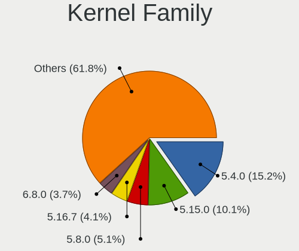

| Version | Desktops | Percent |
|---------|----------|---------|
| 5.4.0   | 31       | 16.67%  |
| 5.15.0  | 19       | 10.22%  |
| 5.8.0   | 11       | 5.91%   |
| 5.16.7  | 9        | 4.84%   |
| 5.13.0  | 8        | 4.3%    |
| 4.18.0  | 8        | 4.3%    |
| 5.3.0   | 7        | 3.76%   |
| 5.11.0  | 6        | 3.23%   |
| 4.15.0  | 6        | 3.23%   |
| 6.2.0   | 5        | 2.69%   |
| 6.2.6   | 4        | 2.15%   |
| 5.10.14 | 3        | 1.61%   |
| 6.5.6   | 2        | 1.08%   |
| 6.5.0   | 2        | 1.08%   |
| 6.4.11  | 2        | 1.08%   |
| 5.19.0  | 2        | 1.08%   |
| 5.16.15 | 2        | 1.08%   |
| 5.10.30 | 2        | 1.08%   |
| 5.0.0   | 2        | 1.08%   |
| 6.8.7   | 1        | 0.54%   |
| 6.8.0   | 1        | 0.54%   |
| 6.7.4   | 1        | 0.54%   |
| 6.6.8   | 1        | 0.54%   |
| 6.6.3   | 1        | 0.54%   |
| 6.6.2   | 1        | 0.54%   |
| 6.5.5   | 1        | 0.54%   |
| 6.4.9   | 1        | 0.54%   |
| 6.4.8   | 1        | 0.54%   |
| 6.4.7   | 1        | 0.54%   |
| 6.4.3   | 1        | 0.54%   |
| 6.4.15  | 1        | 0.54%   |
| 6.4.0   | 1        | 0.54%   |
| 6.3.4   | 1        | 0.54%   |
| 6.2.8   | 1        | 0.54%   |
| 6.2.10  | 1        | 0.54%   |
| 6.1.8   | 1        | 0.54%   |
| 6.1.45  | 1        | 0.54%   |
| 6.1.4   | 1        | 0.54%   |
| 6.1.3   | 1        | 0.54%   |
| 6.1.14  | 1        | 0.54%   |

Kernel Major Ver.
-----------------

Linux kernel major version

| Version | Desktops | Percent |
|---------|----------|---------|
| 5.4     | 32       | 17.58%  |
| 5.15    | 24       | 13.19%  |
| 5.16    | 12       | 6.59%   |
| 6.2     | 11       | 6.04%   |
| 5.8     | 11       | 6.04%   |
| 5.13    | 9        | 4.95%   |
| 4.18    | 9        | 4.95%   |
| 6.4     | 8        | 4.4%    |
| 5.3     | 7        | 3.85%   |
| 5.11    | 7        | 3.85%   |
| 6.1     | 6        | 3.3%    |
| 5.10    | 6        | 3.3%    |
| 4.15    | 6        | 3.3%    |
| 6.5     | 5        | 2.75%   |
| 5.14    | 4        | 2.2%    |
| 6.6     | 3        | 1.65%   |
| 5.19    | 3        | 1.65%   |
| 5.12    | 3        | 1.65%   |
| 6.8     | 2        | 1.1%    |
| 6.0     | 2        | 1.1%    |
| 5.6     | 2        | 1.1%    |
| 5.0     | 2        | 1.1%    |
| 6.7     | 1        | 0.55%   |
| 6.3     | 1        | 0.55%   |
| 5.9     | 1        | 0.55%   |
| 5.7     | 1        | 0.55%   |
| 5.18    | 1        | 0.55%   |
| 5.17    | 1        | 0.55%   |
| 4.20    | 1        | 0.55%   |
| 4.1     | 1        | 0.55%   |

Arch
----

OS architecture (x86_64, i586, etc.)

| Name   | Desktops | Percent |
|--------|----------|---------|
| x86_64 | 158      | 98.14%  |
| i686   | 3        | 1.86%   |

DE
--

Desktop Environment

| Name       | Desktops | Percent |
|------------|----------|---------|
| GNOME      | 70       | 40.7%   |
| KDE5       | 45       | 26.16%  |
| Unknown    | 16       | 9.3%    |
| XFCE       | 14       | 8.14%   |
| KDE        | 6        | 3.49%   |
| X-Cinnamon | 5        | 2.91%   |
| Cinnamon   | 4        | 2.33%   |
| Unity      | 2        | 1.16%   |
| MATE       | 2        | 1.16%   |
| LXQt       | 2        | 1.16%   |
| UKUI       | 1        | 0.58%   |
| Pantheon   | 1        | 0.58%   |
| NsCDE      | 1        | 0.58%   |
| KDE4       | 1        | 0.58%   |
| DWM        | 1        | 0.58%   |
| Budgie     | 1        | 0.58%   |

Display Server
--------------

X11 or Wayland

| Name    | Desktops | Percent |
|---------|----------|---------|
| X11     | 124      | 74.7%   |
| Wayland | 24       | 14.46%  |
| Unknown | 12       | 7.23%   |
| Tty     | 6        | 3.61%   |

Display Manager
---------------

SDDM, LightDM, etc.

| Name    | Desktops | Percent |
|---------|----------|---------|
| Unknown | 69       | 40.59%  |
| SDDM    | 42       | 24.71%  |
| GDM3    | 19       | 11.18%  |
| LightDM | 17       | 10%     |
| GDM     | 16       | 9.41%   |
| TDM     | 5        | 2.94%   |
| XDM     | 1        | 0.59%   |
| KDM     | 1        | 0.59%   |

OS Lang
-------

Language

| Lang    | Desktops | Percent |
|---------|----------|---------|
| en_US   | 90       | 53.89%  |
| sl_SI   | 49       | 29.34%  |
| Unknown | 15       | 8.98%   |
| en_GB   | 5        | 2.99%   |
| C       | 3        | 1.8%    |
| de_AT   | 2        | 1.2%    |
| it_IT   | 1        | 0.6%    |
| de_DE   | 1        | 0.6%    |
| bs_BA   | 1        | 0.6%    |

Boot Mode
---------

EFI or BIOS

| Mode | Desktops | Percent |
|------|----------|---------|
| BIOS | 91       | 54.49%  |
| EFI  | 76       | 45.51%  |

Filesystem
----------

Type of filesystem

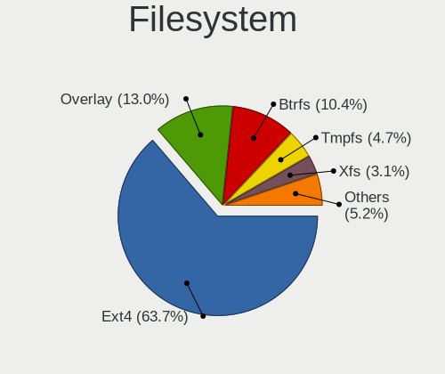

| Type    | Desktops | Percent |
|---------|----------|---------|
| Ext4    | 110      | 65.87%  |
| Overlay | 23       | 13.77%  |
| Btrfs   | 15       | 8.98%   |
| Unknown | 6        | 3.59%   |
| Tmpfs   | 5        | 2.99%   |
| Zfs     | 4        | 2.4%    |
| Xfs     | 4        | 2.4%    |

Part. scheme
------------

Scheme of partitioning

| Type    | Desktops | Percent |
|---------|----------|---------|
| GPT     | 72       | 44.17%  |
| Unknown | 70       | 42.94%  |
| MBR     | 21       | 12.88%  |

Dual Boot with Linux/BSD
------------------------

Hosting more than one Linux/BSD

| Dual boot | Desktops | Percent |
|-----------|----------|---------|
| No        | 126      | 75.45%  |
| Yes       | 41       | 24.55%  |

Dual Boot (Win)
---------------

Hosting Linux and Windows

| Dual boot | Desktops | Percent |
|-----------|----------|---------|
| No        | 115      | 70.55%  |
| Yes       | 48       | 29.45%  |

Board
-----

Vendor
------

Motherboard manufacturer

| Name                | Desktops | Percent |
|---------------------|----------|---------|
| ASUSTek Computer    | 48       | 29.81%  |
| Gigabyte Technology | 30       | 18.63%  |
| ASRock              | 19       | 11.8%   |
| Hewlett-Packard     | 17       | 10.56%  |
| MSI                 | 16       | 9.94%   |
| Lenovo              | 10       | 6.21%   |
| Pegatron            | 4        | 2.48%   |
| Intel               | 4        | 2.48%   |
| Medion              | 3        | 1.86%   |
| Dell                | 2        | 1.24%   |
| Supermicro          | 1        | 0.62%   |
| Nvidia              | 1        | 0.62%   |
| Fujitsu             | 1        | 0.62%   |
| Foxconn             | 1        | 0.62%   |
| Biostar             | 1        | 0.62%   |
| AZW                 | 1        | 0.62%   |
| Apple               | 1        | 0.62%   |
| Unknown             | 1        | 0.62%   |

Model
-----

Motherboard model

| Name                              | Desktops | Percent |
|-----------------------------------|----------|---------|
| MSI MS-7C02                       | 4        | 2.48%   |
| Pegatron FL308AA-ABD IQ512de      | 2        | 1.24%   |
| MSI MS-7C37                       | 2        | 1.24%   |
| MSI MS-7788                       | 2        | 1.24%   |
| HP Z420 Workstation               | 2        | 1.24%   |
| Gigabyte Z68P-DS3                 | 2        | 1.24%   |
| Gigabyte F2A88XM-D3HP             | 2        | 1.24%   |
| Gigabyte B450M DS3H               | 2        | 1.24%   |
| ASUS TUF B450-PLUS GAMING         | 2        | 1.24%   |
| ASUS ROG STRIX Z370-F GAMING      | 2        | 1.24%   |
| ASUS ROG STRIX X570-F GAMING      | 2        | 1.24%   |
| ASUS ROG STRIX X570-E GAMING      | 2        | 1.24%   |
| ASUS PRIME B350-PLUS              | 2        | 1.24%   |
| ASUS PRIME A320M-K                | 2        | 1.24%   |
| ASUS P7H55-M SI                   | 2        | 1.24%   |
| ASUS All Series                   | 2        | 1.24%   |
| Supermicro X7SBi-LN4              | 1        | 0.62%   |
| Pegatron Pro 3010 Microtower PC   | 1        | 0.62%   |
| Pegatron 2A73                     | 1        | 0.62%   |
| Nvidia MCP79                      | 1        | 0.62%   |
| MSI MS-7D54                       | 1        | 0.62%   |
| MSI MS-7C91                       | 1        | 0.62%   |
| MSI MS-7B86                       | 1        | 0.62%   |
| MSI MS-7B24                       | 1        | 0.62%   |
| MSI MS-7B07                       | 1        | 0.62%   |
| MSI MS-7994                       | 1        | 0.62%   |
| MSI MS-7971                       | 1        | 0.62%   |
| MSI MS-7636                       | 1        | 0.62%   |
| Medion MS-7707                    | 1        | 0.62%   |
| Medion MS-7621                    | 1        | 0.62%   |
| Medion Akoya E7226                | 1        | 0.62%   |
| Lenovo ThinkStation S20 4157ZSK   | 1        | 0.62%   |
| Lenovo ThinkCentre M92p 32384B0   | 1        | 0.62%   |
| Lenovo ThinkCentre M90p 5498PK8   | 1        | 0.62%   |
| Lenovo ThinkCentre M73 10B4S0NN00 | 1        | 0.62%   |
| Lenovo ThinkCentre M57e 9439WHV   | 1        | 0.62%   |
| Lenovo ThinkCentre M57e 9356W2K   | 1        | 0.62%   |
| Lenovo ThinkCentre M57 6072VAM    | 1        | 0.62%   |
| Lenovo ThinkCentre M55e 9389WEG   | 1        | 0.62%   |
| Lenovo ThinkCentre M55e 9389W11   | 1        | 0.62%   |

Model Family
------------

Motherboard model prefix

| Name                  | Desktops | Percent |
|-----------------------|----------|---------|
| ASUS PRIME            | 14       | 8.7%    |
| ASUS ROG              | 10       | 6.21%   |
| Lenovo ThinkCentre    | 8        | 4.97%   |
| ASUS TUF              | 8        | 4.97%   |
| MSI MS-7C02           | 4        | 2.48%   |
| HP EliteDesk          | 4        | 2.48%   |
| HP Compaq             | 4        | 2.48%   |
| Gigabyte B450M        | 3        | 1.86%   |
| Pegatron FL308AA-ABD  | 2        | 1.24%   |
| MSI MS-7C37           | 2        | 1.24%   |
| MSI MS-7788           | 2        | 1.24%   |
| HP Z420               | 2        | 1.24%   |
| Gigabyte Z68P-DS3     | 2        | 1.24%   |
| Gigabyte F2A88XM-D3HP | 2        | 1.24%   |
| ASUS SABERTOOTH       | 2        | 1.24%   |
| ASUS P7H55-M          | 2        | 1.24%   |
| ASUS P5Q              | 2        | 1.24%   |
| ASUS All              | 2        | 1.24%   |
| ASRock X570           | 2        | 1.24%   |
| Supermicro X7SBi-LN4  | 1        | 0.62%   |
| Pegatron Pro          | 1        | 0.62%   |
| Pegatron 2A73         | 1        | 0.62%   |
| Nvidia MCP79          | 1        | 0.62%   |
| MSI MS-7D54           | 1        | 0.62%   |
| MSI MS-7C91           | 1        | 0.62%   |
| MSI MS-7B86           | 1        | 0.62%   |
| MSI MS-7B24           | 1        | 0.62%   |
| MSI MS-7B07           | 1        | 0.62%   |
| MSI MS-7994           | 1        | 0.62%   |
| MSI MS-7971           | 1        | 0.62%   |
| MSI MS-7636           | 1        | 0.62%   |
| Medion MS-7707        | 1        | 0.62%   |
| Medion MS-7621        | 1        | 0.62%   |
| Medion Akoya          | 1        | 0.62%   |
| Lenovo ThinkStation   | 1        | 0.62%   |
| Lenovo H535s          | 1        | 0.62%   |
| Intel DQ67SW          | 1        | 0.62%   |
| Intel DQ35JO          | 1        | 0.62%   |
| Intel DH87RL          | 1        | 0.62%   |
| Intel CM-iAM          | 1        | 0.62%   |

MFG Year
--------

Motherboard manufacture year

| Year | Desktops | Percent |
|------|----------|---------|
| 2018 | 17       | 10.56%  |
| 2019 | 16       | 9.94%   |
| 2009 | 15       | 9.32%   |
| 2011 | 13       | 8.07%   |
| 2017 | 12       | 7.45%   |
| 2013 | 12       | 7.45%   |
| 2015 | 11       | 6.83%   |
| 2020 | 9        | 5.59%   |
| 2016 | 8        | 4.97%   |
| 2014 | 7        | 4.35%   |
| 2010 | 7        | 4.35%   |
| 2021 | 6        | 3.73%   |
| 2012 | 6        | 3.73%   |
| 2008 | 6        | 3.73%   |
| 2007 | 5        | 3.11%   |
| 2022 | 4        | 2.48%   |
| 2006 | 4        | 2.48%   |
| 2023 | 3        | 1.86%   |

Form Factor
-----------

Physical design of the computer

| Name    | Desktops | Percent |
|---------|----------|---------|
| Desktop | 161      | 100%    |

Secure Boot
-----------

Enabled or disabled

| State    | Desktops | Percent |
|----------|----------|---------|
| Disabled | 157      | 96.91%  |
| Enabled  | 5        | 3.09%   |

Coreboot
--------

Have coreboot on board

| Used | Desktops | Percent |
|------|----------|---------|
| No   | 161      | 100%    |

RAM Size
--------

Total RAM memory

| Size in GB  | Desktops | Percent |
|-------------|----------|---------|
| 16.01-24.0  | 44       | 26.83%  |
| 8.01-16.0   | 35       | 21.34%  |
| 3.01-4.0    | 24       | 14.63%  |
| 32.01-64.0  | 23       | 14.02%  |
| 4.01-8.0    | 17       | 10.37%  |
| 64.01-256.0 | 9        | 5.49%   |
| 24.01-32.0  | 5        | 3.05%   |
| 2.01-3.0    | 5        | 3.05%   |
| 1.01-2.0    | 2        | 1.22%   |

RAM Used
--------

Used RAM memory

| Used GB    | Desktops | Percent |
|------------|----------|---------|
| 1.01-2.0   | 56       | 30.6%   |
| 2.01-3.0   | 39       | 21.31%  |
| 4.01-8.0   | 38       | 20.77%  |
| 3.01-4.0   | 23       | 12.57%  |
| 8.01-16.0  | 10       | 5.46%   |
| 0.51-1.0   | 8        | 4.37%   |
| 16.01-24.0 | 4        | 2.19%   |
| 0.01-0.5   | 4        | 2.19%   |
| 24.01-32.0 | 1        | 0.55%   |

Total Drives
------------

Number of drives on board

| Drives | Desktops | Percent |
|--------|----------|---------|
| 1      | 64       | 38.1%   |
| 2      | 48       | 28.57%  |
| 3      | 21       | 12.5%   |
| 4      | 12       | 7.14%   |
| 5      | 8        | 4.76%   |
| 6      | 6        | 3.57%   |
| 8      | 4        | 2.38%   |
| 7      | 3        | 1.79%   |
| 11     | 1        | 0.6%    |
| 0      | 1        | 0.6%    |

Has CD-ROM
----------

Has CD-ROM on board

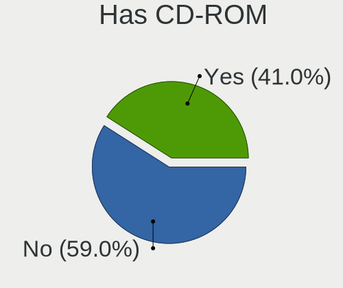

| Presented | Desktops | Percent |
|-----------|----------|---------|
| No        | 92       | 56.1%   |
| Yes       | 72       | 43.9%   |

Has Ethernet
------------

Has Ethernet on board

| Presented | Desktops | Percent |
|-----------|----------|---------|
| Yes       | 159      | 98.76%  |
| No        | 2        | 1.24%   |

Has WiFi
--------

Has WiFi module

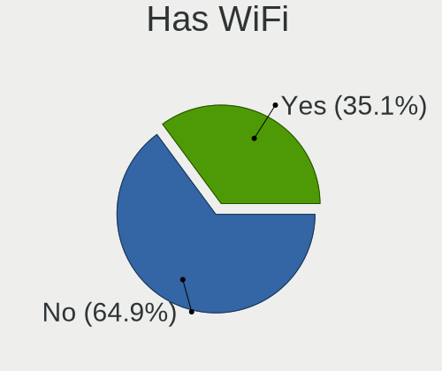

| Presented | Desktops | Percent |
|-----------|----------|---------|
| No        | 107      | 65.64%  |
| Yes       | 56       | 34.36%  |

Has Bluetooth
-------------

Has Bluetooth module

| Presented | Desktops | Percent |
|-----------|----------|---------|
| No        | 122      | 75.78%  |
| Yes       | 39       | 24.22%  |

Location
--------

Country
-------

Geographic location (country)

| Country  | Desktops | Percent |
|----------|----------|---------|
| Slovenia | 161      | 100%    |

City
----

Geographic location (city)

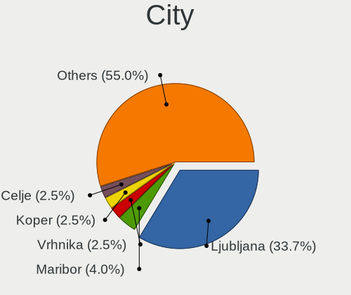

| City                | Desktops | Percent |
|---------------------|----------|---------|
| Ljubljana           | 59       | 33.91%  |
| Maribor             | 6        | 3.45%   |
| Vrhnika             | 5        | 2.87%   |
| Kranj               | 4        | 2.3%    |
| Koper               | 4        | 2.3%    |
| Kamnik              | 4        | 2.3%    |
| Celje               | 4        | 2.3%    |
| Sempeter pri Gorici | 3        | 1.72%   |
| Rence               | 3        | 1.72%   |
| Radovljica          | 3        | 1.72%   |
| Novo Mesto          | 3        | 1.72%   |
| Grosuplje           | 3        | 1.72%   |
| alec              | 2        | 1.15%   |
| kofja Loka        | 2        | 1.15%   |
| Ptuj                | 2        | 1.15%   |
| Pragersko           | 2        | 1.15%   |
| Logatec             | 2        | 1.15%   |
| Ig                  | 2        | 1.15%   |
| Crensovci           | 2        | 1.15%   |
| Zrece               | 1        | 0.57%   |
| Zirovnica           | 1        | 0.57%   |
| Ziri                | 1        | 0.57%   |
| Zgornja Besnica     | 1        | 0.57%   |
| Vuzenica            | 1        | 0.57%   |
| Volcja Draga        | 1        | 0.57%   |
| Vipava              | 1        | 0.57%   |
| Velenje             | 1        | 0.57%   |
| Trzin               | 1        | 0.57%   |
| tore              | 1        | 0.57%   |
| Stari Trg pri Lozu  | 1        | 0.57%   |
| Sostanj             | 1        | 0.57%   |
| Slovenske Konjice   | 1        | 0.57%   |
| Slovenska Bistrica  | 1        | 0.57%   |
| Seana             | 1        | 0.57%   |
| entjur pri Celju  | 1        | 0.57%   |
| Selnica ob Dravi    | 1        | 0.57%   |
| Radomlje            | 1        | 0.57%   |
| Race                | 1        | 0.57%   |
| Prebold             | 1        | 0.57%   |
| Postojna            | 1        | 0.57%   |

Drives
------

Drive Vendor
------------

Hard drive vendors

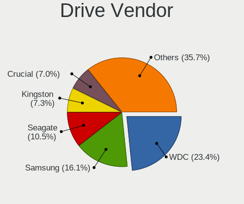

| Vendor                      | Desktops | Drives | Percent |
|-----------------------------|----------|--------|---------|
| WDC                         | 74       | 141    | 24.75%  |
| Samsung Electronics         | 42       | 76     | 14.05%  |
| Seagate                     | 35       | 64     | 11.71%  |
| Kingston                    | 23       | 32     | 7.69%   |
| Toshiba                     | 21       | 30     | 7.02%   |
| Crucial                     | 18       | 26     | 6.02%   |
| Sandisk                     | 16       | 18     | 5.35%   |
| Intel                       | 6        | 7      | 2.01%   |
| Hitachi                     | 5        | 5      | 1.67%   |
| Corsair                     | 5        | 6      | 1.67%   |
| Intenso                     | 4        | 6      | 1.34%   |
| SPCC                        | 3        | 4      | 1%      |
| OCZ                         | 3        | 8      | 1%      |
| HGST                        | 3        | 3      | 1%      |
| A-DATA Technology           | 3        | 5      | 1%      |
| Unknown                     | 2        | 5      | 0.67%   |
| Silicon Motion              | 2        | 2      | 0.67%   |
| PNY                         | 2        | 2      | 0.67%   |
| Patriot                     | 2        | 3      | 0.67%   |
| KingDian                    | 2        | 2      | 0.67%   |
| JMicron Technology          | 2        | 2      | 0.67%   |
| Hewlett-Packard             | 2        | 2      | 0.67%   |
| China                       | 2        | 2      | 0.67%   |
| Apacer                      | 2        | 3      | 0.67%   |
| TS512GMT                    | 1        | 5      | 0.33%   |
| Transcend                   | 1        | 2      | 0.33%   |
| SK hynix                    | 1        | 1      | 0.33%   |
| Realtek                     | 1        | 1      | 0.33%   |
| Phison Electronics          | 1        | 1      | 0.33%   |
| Phison                      | 1        | 1      | 0.33%   |
| Netac                       | 1        | 1      | 0.33%   |
| Micron/Crucial Technology   | 1        | 1      | 0.33%   |
| Maxtor                      | 1        | 1      | 0.33%   |
| MAXIO Technology (Hangzhou) | 1        | 1      | 0.33%   |
| LITEONIT                    | 1        | 1      | 0.33%   |
| Lexar                       | 1        | 1      | 0.33%   |
| Leven                       | 1        | 1      | 0.33%   |
| KIOXIA                      | 1        | 1      | 0.33%   |
| Integral                    | 1        | 1      | 0.33%   |
| GOODRAM                     | 1        | 1      | 0.33%   |

Drive Model
-----------

Hard drive models

| Model                                             | Desktops | Percent |
|---------------------------------------------------|----------|---------|
| Kingston SA400S37240G 240GB SSD                   | 7        | 1.93%   |
| Toshiba DT01ACA100 1TB                            | 6        | 1.66%   |
| Crucial CT240BX500SSD1 240GB                      | 6        | 1.66%   |
| Toshiba HDWD120 2TB                               | 5        | 1.38%   |
| Samsung NVMe SSD Controller SM981/PM981/PM983 1TB | 5        | 1.38%   |
| WDC WDS240G2G0A-00JH30 240GB SSD                  | 4        | 1.1%    |
| WDC WD10EARS-00Y5B1 1TB                           | 4        | 1.1%    |
| Toshiba DT01ACA200 2TB                            | 4        | 1.1%    |
| SanDisk SSD PLUS 1000GB                           | 4        | 1.1%    |
| Samsung SSD 850 EVO 250GB                         | 4        | 1.1%    |
| WDC WD5000AADS-00S9B0 500GB                       | 3        | 0.83%   |
| Samsung SSD 980 1TB                               | 3        | 0.83%   |
| Samsung SSD 970 EVO Plus 500GB                    | 3        | 0.83%   |
| Samsung SSD 860 EVO 500GB                         | 3        | 0.83%   |
| Samsung SSD 860 EVO 1TB                           | 3        | 0.83%   |
| Kingston SA400S37480G 480GB SSD                   | 3        | 0.83%   |
| Kingston SA400S37120G 120GB SSD                   | 3        | 0.83%   |
| Crucial CT500MX500SSD1 500GB                      | 3        | 0.83%   |
| Crucial CT1000MX500SSD1 1TB                       | 3        | 0.83%   |
| WDC WDS500G2B0A-00SM50 500GB SSD                  | 2        | 0.55%   |
| WDC WDS500G2B0A 500GB SSD                         | 2        | 0.55%   |
| WDC WDS480G2G0A-00JH30 480GB SSD                  | 2        | 0.55%   |
| WDC WD5000AAKX-001CA0 500GB                       | 2        | 0.55%   |
| WDC WD5000AACS-00G8B1 500GB                       | 2        | 0.55%   |
| WDC WD40PURZ-85TTDY0 4TB                          | 2        | 0.55%   |
| WDC WD40EZRZ-00GXCB0 4TB                          | 2        | 0.55%   |
| WDC WD40EFRX-68N32N0 4TB                          | 2        | 0.55%   |
| WDC WD20PURZ-85GU6Y0 2TB                          | 2        | 0.55%   |
| WDC WD20EZRZ-00Z5HB0 2TB                          | 2        | 0.55%   |
| WDC WD20EFRX-68EUZN0 2TB                          | 2        | 0.55%   |
| WDC WD15EARS-00MVWB0 1TB                          | 2        | 0.55%   |
| WDC WD10EZEX-08M2NA0 1TB                          | 2        | 0.55%   |
| WDC WD10EADS-00L5B1 1TB                           | 2        | 0.55%   |
| WDC WD1002FAEX-00Y9A0 1TB                         | 2        | 0.55%   |
| Toshiba DT01ACA050 500GB                          | 2        | 0.55%   |
| Seagate ST2000DM008-2FR102 2TB                    | 2        | 0.55%   |
| Seagate ST2000DM001-1CH164 2TB                    | 2        | 0.55%   |
| Seagate ST1000DM010-2EP102 1TB                    | 2        | 0.55%   |
| Seagate ST1000DM003-1CH162 1TB                    | 2        | 0.55%   |
| Seagate Portable 5TB                              | 2        | 0.55%   |

HDD Vendor
----------

Hard disk drive vendors

| Vendor              | Desktops | Drives | Percent |
|---------------------|----------|--------|---------|
| WDC                 | 65       | 122    | 48.87%  |
| Seagate             | 33       | 60     | 24.81%  |
| Toshiba             | 18       | 27     | 13.53%  |
| Hitachi             | 5        | 5      | 3.76%   |
| Samsung Electronics | 3        | 3      | 2.26%   |
| HGST                | 3        | 3      | 2.26%   |
| JMicron Technology  | 2        | 2      | 1.5%    |
| Maxtor              | 1        | 1      | 0.75%   |
| Intenso             | 1        | 1      | 0.75%   |
| Fujitsu             | 1        | 2      | 0.75%   |
| ASMT109x            | 1        | 1      | 0.75%   |

SSD Vendor
----------

Solid state drive vendors

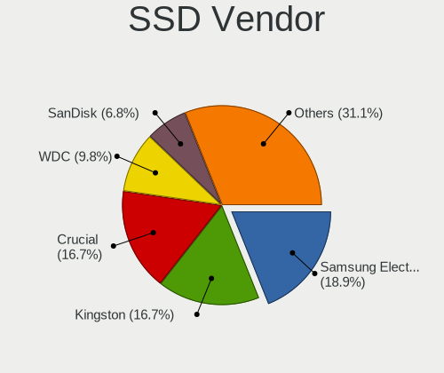

| Vendor              | Desktops | Drives | Percent |
|---------------------|----------|--------|---------|
| Kingston            | 20       | 25     | 17.54%  |
| Samsung Electronics | 19       | 33     | 16.67%  |
| Crucial             | 17       | 25     | 14.91%  |
| WDC                 | 13       | 16     | 11.4%   |
| SanDisk             | 9        | 10     | 7.89%   |
| Intel               | 6        | 7      | 5.26%   |
| OCZ                 | 3        | 8      | 2.63%   |
| Corsair             | 3        | 4      | 2.63%   |
| A-DATA Technology   | 3        | 5      | 2.63%   |
| Toshiba             | 2        | 2      | 1.75%   |
| SPCC                | 2        | 2      | 1.75%   |
| PNY                 | 2        | 2      | 1.75%   |
| Patriot             | 2        | 3      | 1.75%   |
| KingDian            | 2        | 2      | 1.75%   |
| China               | 2        | 2      | 1.75%   |
| Apacer              | 2        | 3      | 1.75%   |
| Transcend           | 1        | 2      | 0.88%   |
| Netac               | 1        | 1      | 0.88%   |
| LITEONIT            | 1        | 1      | 0.88%   |
| Leven               | 1        | 1      | 0.88%   |
| Intenso             | 1        | 1      | 0.88%   |
| Integral            | 1        | 1      | 0.88%   |
| GOODRAM             | 1        | 1      | 0.88%   |

Drive Kind
----------

HDD or SSD

| Kind    | Desktops | Drives | Percent |
|---------|----------|--------|---------|
| HDD     | 103      | 227    | 40.23%  |
| SSD     | 90       | 157    | 35.16%  |
| NVMe    | 55       | 79     | 21.48%  |
| Unknown | 8        | 18     | 3.13%   |

Drive Connector
---------------

SATA, SAS, NVMe, etc.

| Type | Desktops | Drives | Percent |
|------|----------|--------|---------|
| SATA | 141      | 374    | 66.2%   |
| NVMe | 55       | 78     | 25.82%  |
| SAS  | 17       | 29     | 7.98%   |

Drive Size
----------

Size of hard drive

| Size in TB | Desktops | Drives | Percent |
|------------|----------|--------|---------|
| 0.01-0.5   | 109      | 203    | 50.93%  |
| 0.51-1.0   | 60       | 107    | 28.04%  |
| 1.01-2.0   | 23       | 38     | 10.75%  |
| 3.01-4.0   | 10       | 18     | 4.67%   |
| 4.01-10.0  | 6        | 11     | 2.8%    |
| 2.01-3.0   | 4        | 5      | 1.87%   |
| 10.01-20.0 | 2        | 2      | 0.93%   |

Space Total
-----------

Amount of disk space available on the file system

| Size in GB     | Desktops | Percent |
|----------------|----------|---------|
| 101-250        | 36       | 20.34%  |
| 251-500        | 27       | 15.25%  |
| 1001-2000      | 25       | 14.12%  |
| 501-1000       | 22       | 12.43%  |
| 1-20           | 21       | 11.86%  |
| More than 3000 | 15       | 8.47%   |
| 2001-3000      | 11       | 6.21%   |
| 51-100         | 9        | 5.08%   |
| Unknown        | 7        | 3.95%   |
| 21-50          | 4        | 2.26%   |

Space Used
----------

Amount of used disk space

| Used GB        | Desktops | Percent |
|----------------|----------|---------|
| 1-20           | 60       | 34.09%  |
| 21-50          | 24       | 13.64%  |
| 51-100         | 24       | 13.64%  |
| 101-250        | 17       | 9.66%   |
| 251-500        | 13       | 7.39%   |
| 1001-2000      | 11       | 6.25%   |
| 501-1000       | 8        | 4.55%   |
| 2001-3000      | 7        | 3.98%   |
| Unknown        | 7        | 3.98%   |
| More than 3000 | 5        | 2.84%   |

Malfunc. Drives
---------------

Drive models with a malfunction

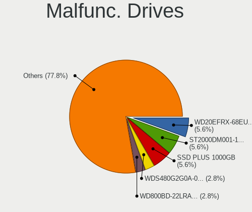

| Model                                    | Desktops | Drives | Percent |
|------------------------------------------|----------|--------|---------|
| WDC WD20EFRX-68EUZN0 2TB                 | 2        | 3      | 5.88%   |
| Seagate ST2000DM001-1CH164 2TB           | 2        | 3      | 5.88%   |
| SanDisk SSD PLUS 1000GB                  | 2        | 2      | 5.88%   |
| WDC WDS480G2G0A-00JH30 480GB SSD         | 1        | 1      | 2.94%   |
| WDC WD800BD-22LRA0 80GB                  | 1        | 1      | 2.94%   |
| WDC WD5000AADS-00S9B0 500GB              | 1        | 2      | 2.94%   |
| WDC WD40EZRX-00SPEB0 4TB                 | 1        | 1      | 2.94%   |
| WDC WD40EFRX-68N32N0 4TB                 | 1        | 1      | 2.94%   |
| WDC WD3200AAKS-22B3A0 320GB              | 1        | 1      | 2.94%   |
| WDC WD2500AAJS-08L7A0 250GB              | 1        | 1      | 2.94%   |
| Toshiba Q300. 240GB SSD                  | 1        | 1      | 2.94%   |
| Toshiba DT01ACA300 3TB                   | 1        | 1      | 2.94%   |
| Seagate ST3500514NS 500GB                | 1        | 1      | 2.94%   |
| Seagate ST3500320NS 500GB                | 1        | 1      | 2.94%   |
| Seagate ST3320620AS 320GB                | 1        | 1      | 2.94%   |
| Seagate ST3200822AS 200GB                | 1        | 1      | 2.94%   |
| Seagate ST1000DM003-1CH162 1TB           | 1        | 3      | 2.94%   |
| SanDisk SSD PLUS 480GB                   | 1        | 1      | 2.94%   |
| SanDisk SSD PLUS 240GB                   | 1        | 1      | 2.94%   |
| Samsung Electronics SSD 970 EVO 1TB      | 1        | 1      | 2.94%   |
| Samsung Electronics SSD 850 EVO 250GB    | 1        | 1      | 2.94%   |
| Samsung Electronics SSD 840 Series 120GB | 1        | 1      | 2.94%   |
| Samsung Electronics HD103UJ 1TB          | 1        | 1      | 2.94%   |
| OCZ VERTEX3 120GB SSD                    | 1        | 2      | 2.94%   |
| Kingston SA400S37240G 240GB SSD          | 1        | 1      | 2.94%   |
| Intel SSDSCKKW240H6 240GB                | 1        | 1      | 2.94%   |
| Intel SSDSA2M160G2GC 160GB               | 1        | 1      | 2.94%   |
| HGST HTS541075A9E680 752GB               | 1        | 1      | 2.94%   |
| HGST HTS541010A9E680 1TB                 | 1        | 1      | 2.94%   |
| Hewlett-Packard SSD EX900 500GB          | 1        | 1      | 2.94%   |
| Crucial M4-CT128M4SSD2 128GB             | 1        | 1      | 2.94%   |

Malfunc. Drive Vendor
---------------------

Vendors of faulty drives

| Vendor              | Desktops | Drives | Percent |
|---------------------|----------|--------|---------|
| WDC                 | 8        | 11     | 25.81%  |
| Seagate             | 5        | 10     | 16.13%  |
| SanDisk             | 4        | 4      | 12.9%   |
| Samsung Electronics | 4        | 4      | 12.9%   |
| Toshiba             | 2        | 2      | 6.45%   |
| Intel               | 2        | 2      | 6.45%   |
| HGST                | 2        | 2      | 6.45%   |
| OCZ                 | 1        | 2      | 3.23%   |
| Kingston            | 1        | 1      | 3.23%   |
| Hewlett-Packard     | 1        | 1      | 3.23%   |
| Crucial             | 1        | 1      | 3.23%   |

Malfunc. HDD Vendor
-------------------

Vendors of faulty HDD drives

| Vendor              | Desktops | Drives | Percent |
|---------------------|----------|--------|---------|
| WDC                 | 7        | 10     | 43.75%  |
| Seagate             | 5        | 10     | 31.25%  |
| HGST                | 2        | 2      | 12.5%   |
| Toshiba             | 1        | 1      | 6.25%   |
| Samsung Electronics | 1        | 1      | 6.25%   |

Malfunc. Drive Kind
-------------------

Kinds of faulty drives

| Kind | Desktops | Drives | Percent |
|------|----------|--------|---------|
| HDD  | 13       | 24     | 48.15%  |
| SSD  | 12       | 14     | 44.44%  |
| NVMe | 2        | 2      | 7.41%   |

Failed Drives
-------------

Failed drive models

| Model                 | Desktops | Drives | Percent |
|-----------------------|----------|--------|---------|
| SPCC M.2 PCIe SSD 2TB | 1        | 1      | 100%    |

Failed Drive Vendor
-------------------

Failed drive vendors

| Vendor | Desktops | Drives | Percent |
|--------|----------|--------|---------|
| SPCC   | 1        | 1      | 100%    |

Drive Status
------------

Number of failed and malfunc. drives

| Status   | Desktops | Drives | Percent |
|----------|----------|--------|---------|
| Detected | 92       | 215    | 47.92%  |
| Works    | 74       | 225    | 38.54%  |
| Malfunc  | 25       | 40     | 13.02%  |
| Failed   | 1        | 1      | 0.52%   |

Storage controller
------------------

Storage Vendor
--------------

Storage controller vendors

| Vendor                        | Desktops | Percent |
|-------------------------------|----------|---------|
| Intel                         | 104      | 43.15%  |
| AMD                           | 54       | 22.41%  |
| Samsung Electronics           | 26       | 10.79%  |
| SanDisk                       | 10       | 4.15%   |
| JMicron Technology            | 7        | 2.9%    |
| ASMedia Technology            | 6        | 2.49%   |
| Silicon Motion                | 5        | 2.07%   |
| Phison Electronics            | 5        | 2.07%   |
| Kingston Technology Company   | 5        | 2.07%   |
| Marvell Technology Group      | 4        | 1.66%   |
| Nvidia                        | 3        | 1.24%   |
| Micron/Crucial Technology     | 2        | 0.83%   |
| Toshiba America Info Systems  | 1        | 0.41%   |
| SK hynix                      | 1        | 0.41%   |
| Silicon Image                 | 1        | 0.41%   |
| Shenzhen Longsys Electronics  | 1        | 0.41%   |
| Seagate Technology            | 1        | 0.41%   |
| OCZ Technology Group          | 1        | 0.41%   |
| MAXIO Technology (Hangzhou)   | 1        | 0.41%   |
| LSI Logic / Symbios Logic     | 1        | 0.41%   |
| KIOXIA                        | 1        | 0.41%   |
| Integrated Technology Express | 1        | 0.41%   |

Storage Model
-------------

Storage controller models

| Model                                                                                   | Desktops | Percent |
|-----------------------------------------------------------------------------------------|----------|---------|
| AMD FCH SATA Controller [AHCI mode]                                                     | 35       | 11.33%  |
| AMD 400 Series Chipset SATA Controller                                                  | 17       | 5.5%    |
| Samsung NVMe SSD Controller SM981/PM981/PM983                                           | 14       | 4.53%   |
| Intel Q170/Q150/B150/H170/H110/Z170/CM236 Chipset SATA Controller [AHCI Mode]           | 11       | 3.56%   |
| Intel 8 Series/C220 Series Chipset Family 6-port SATA Controller 1 [AHCI mode]          | 9        | 2.91%   |
| Intel 200 Series PCH SATA controller [AHCI mode]                                        | 9        | 2.91%   |
| Samsung NVMe SSD Controller PM9A1/PM9A3/980PRO                                          | 8        | 2.59%   |
| Intel 6 Series/C200 Series Chipset Family 6 port Desktop SATA AHCI Controller           | 8        | 2.59%   |
| Intel 6 Series/C200 Series Chipset Family Desktop SATA Controller (IDE mode, ports 4-5) | 7        | 2.27%   |
| Intel 6 Series/C200 Series Chipset Family Desktop SATA Controller (IDE mode, ports 0-3) | 7        | 2.27%   |
| Intel SATA Controller [RAID mode]                                                       | 6        | 1.94%   |
| ASMedia ASM1061/ASM1062 Serial ATA Controller                                           | 6        | 1.94%   |
| Intel Cannon Lake PCH SATA AHCI Controller                                              | 5        | 1.62%   |
| Intel 82801IR/IO/IH (ICH9R/DO/DH) 4 port SATA Controller [IDE mode]                     | 5        | 1.62%   |
| Intel 82801I (ICH9 Family) 2 port SATA Controller [IDE mode]                            | 5        | 1.62%   |
| Intel 5 Series/3400 Series Chipset 4 port SATA IDE Controller                           | 5        | 1.62%   |
| Intel 5 Series/3400 Series Chipset 2 port SATA IDE Controller                           | 5        | 1.62%   |
| AMD SB7x0/SB8x0/SB9x0 SATA Controller [AHCI mode]                                       | 5        | 1.62%   |
| AMD SB7x0/SB8x0/SB9x0 IDE Controller                                                    | 5        | 1.62%   |
| AMD 500 Series Chipset SATA Controller                                                  | 5        | 1.62%   |
| Silicon Motion SM2263EN/SM2263XT (DRAM-less) NVMe SSD Controllers                       | 4        | 1.29%   |
| Samsung NVMe SSD Controller 980 (DRAM-less)                                             | 4        | 1.29%   |
| JMicron JMB368 IDE controller                                                           | 4        | 1.29%   |
| Intel NM10/ICH7 Family SATA Controller [IDE mode]                                       | 4        | 1.29%   |
| Intel 82801JI (ICH10 Family) 4 port SATA IDE Controller #1                              | 4        | 1.29%   |
| AMD 600 Series Chipset SATA Controller                                                  | 4        | 1.29%   |
| SanDisk Extreme Pro / WD Black SN750 / PC SN730 / Red SN700 NVMe SSD                    | 3        | 0.97%   |
| Kingston Company A2000 NVMe SSD SM2263EN                                                | 3        | 0.97%   |
| JMicron JMB363 SATA/IDE Controller                                                      | 3        | 0.97%   |
| Intel 9 Series Chipset Family SATA Controller [AHCI Mode]                               | 3        | 0.97%   |
| Intel 82801JI (ICH10 Family) 2 port SATA IDE Controller #2                              | 3        | 0.97%   |
| Intel 82801G (ICH7 Family) IDE Controller                                               | 3        | 0.97%   |
| Intel 7 Series/C210 Series Chipset Family 6-port SATA Controller [AHCI mode]            | 3        | 0.97%   |
| Intel 500 Series Chipset Family SATA AHCI Controller                                    | 3        | 0.97%   |
| AMD FCH SATA Controller D                                                               | 3        | 0.97%   |
| Sandisk WD Black SN850X NVMe SSD                                                        | 2        | 0.65%   |
| SanDisk Ultra 3D / WD Blue SN550 NVMe SSD                                               | 2        | 0.65%   |
| Samsung NVMe SSD Controller SM961/PM961/SM963                                           | 2        | 0.65%   |
| Phison E12 NVMe Controller                                                              | 2        | 0.65%   |
| Nvidia MCP79 AHCI Controller                                                            | 2        | 0.65%   |

Storage Kind
------------

Kind of storage controller (IDE, SATA, NVMe, SAS, ...)

| Kind | Desktops | Percent |
|------|----------|---------|
| SATA | 125      | 53.19%  |
| NVMe | 55       | 23.4%   |
| IDE  | 42       | 17.87%  |
| RAID | 9        | 3.83%   |
| SAS  | 3        | 1.28%   |
| SCSI | 1        | 0.43%   |

Processor
---------

CPU Vendor
----------

Processor vendors

| Vendor | Desktops | Percent |
|--------|----------|---------|
| Intel  | 106      | 65.84%  |
| AMD    | 55       | 34.16%  |

CPU Model
---------

Processor models

| Model                                       | Desktops | Percent |
|---------------------------------------------|----------|---------|
| AMD Ryzen 7 5800X 8-Core Processor          | 5        | 3.11%   |
| AMD Ryzen 9 5900X 12-Core Processor         | 4        | 2.48%   |
| Intel Core i7-6700K CPU @ 4.00GHz           | 3        | 1.86%   |
| Intel Core i5-2400 CPU @ 3.10GHz            | 3        | 1.86%   |
| Intel Core 2 Quad CPU Q6600 @ 2.40GHz       | 3        | 1.86%   |
| AMD Ryzen 9 7950X 16-Core Processor         | 3        | 1.86%   |
| AMD Ryzen 5 5600X 6-Core Processor          | 3        | 1.86%   |
| AMD Ryzen 5 1600X Six-Core Processor        | 3        | 1.86%   |
| AMD Ryzen 5 1600 Six-Core Processor         | 3        | 1.86%   |
| Intel Core i7-8700K CPU @ 3.70GHz           | 2        | 1.24%   |
| Intel Core i7-8700 CPU @ 3.20GHz            | 2        | 1.24%   |
| Intel Core i5-7400 CPU @ 3.00GHz            | 2        | 1.24%   |
| Intel Core i5-6400 CPU @ 2.70GHz            | 2        | 1.24%   |
| Intel Core i5-4460 CPU @ 3.20GHz            | 2        | 1.24%   |
| Intel Core i5-3550 CPU @ 3.30GHz            | 2        | 1.24%   |
| Intel Core i5-2500 CPU @ 3.30GHz            | 2        | 1.24%   |
| Intel Core i5 CPU 760 @ 2.80GHz             | 2        | 1.24%   |
| Intel Core i5 CPU 750 @ 2.67GHz             | 2        | 1.24%   |
| Intel Core i5 CPU 650 @ 3.20GHz             | 2        | 1.24%   |
| Intel Core i3-2120 CPU @ 3.30GHz            | 2        | 1.24%   |
| Intel Core 2 Duo CPU T7250 @ 2.00GHz        | 2        | 1.24%   |
| Intel Core 2 Duo CPU E8500 @ 3.16GHz        | 2        | 1.24%   |
| Intel Core 2 Duo CPU E7500 @ 2.93GHz        | 2        | 1.24%   |
| Intel 11th Gen Core i5-11400 @ 2.60GHz      | 2        | 1.24%   |
| AMD Ryzen 7 2700X Eight-Core Processor      | 2        | 1.24%   |
| AMD Ryzen 5 5600G with Radeon Graphics      | 2        | 1.24%   |
| AMD Ryzen 5 3600 6-Core Processor           | 2        | 1.24%   |
| AMD Ryzen 5 2600X Six-Core Processor        | 2        | 1.24%   |
| AMD Ryzen 5 2600 Six-Core Processor         | 2        | 1.24%   |
| AMD Phenom II X6 1055T Processor            | 2        | 1.24%   |
| Intel Xeon CPU X5365 @ 3.00GHz              | 1        | 0.62%   |
| Intel Xeon CPU W3565 @ 3.20GHz              | 1        | 0.62%   |
| Intel Xeon CPU E5-1650 v2 @ 3.50GHz         | 1        | 0.62%   |
| Intel Xeon CPU E5-1650 0 @ 3.20GHz          | 1        | 0.62%   |
| Intel Xeon CPU E5-1620 v4 @ 3.50GHz         | 1        | 0.62%   |
| Intel Xeon CPU E5-1620 v2 @ 3.70GHz         | 1        | 0.62%   |
| Intel Xeon CPU E3-1231 v3 @ 3.40GHz         | 1        | 0.62%   |
| Intel Xeon CPU E3-1225 v6 @ 3.30GHz         | 1        | 0.62%   |
| Intel Xeon CPU E3-1225 v3 @ 3.20GHz         | 1        | 0.62%   |
| Intel Pentium Dual-Core CPU T4400 @ 2.20GHz | 1        | 0.62%   |

CPU Model Family
----------------

Processor model prefix

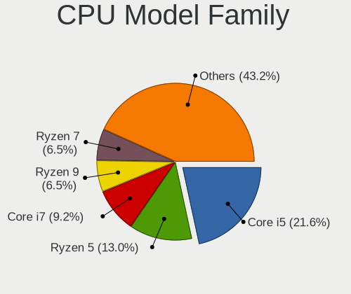

| Model                   | Desktops | Percent |
|-------------------------|----------|---------|
| Intel Core i5           | 37       | 22.98%  |
| AMD Ryzen 5             | 19       | 11.8%   |
| Intel Core i7           | 13       | 8.07%   |
| AMD Ryzen 7             | 12       | 7.45%   |
| Intel Core 2 Duo        | 10       | 6.21%   |
| Intel Xeon              | 9        | 5.59%   |
| Intel Core i3           | 9        | 5.59%   |
| AMD Ryzen 9             | 9        | 5.59%   |
| Other                   | 6        | 3.73%   |
| Intel Celeron           | 5        | 3.11%   |
| Intel Pentium           | 4        | 2.48%   |
| Intel Core 2 Quad       | 4        | 2.48%   |
| Intel Core 2            | 4        | 2.48%   |
| AMD Ryzen 3             | 3        | 1.86%   |
| Intel Atom              | 2        | 1.24%   |
| AMD Phenom II X6        | 2        | 1.24%   |
| AMD FX                  | 2        | 1.24%   |
| AMD A10                 | 2        | 1.24%   |
| Intel Pentium Dual-Core | 1        | 0.62%   |
| Intel Pentium D         | 1        | 0.62%   |
| Intel Core i9           | 1        | 0.62%   |
| AMD Ryzen 3 PRO         | 1        | 0.62%   |
| AMD Phenom II X4        | 1        | 0.62%   |
| AMD Athlon X4           | 1        | 0.62%   |
| AMD Athlon II X4        | 1        | 0.62%   |
| AMD Athlon II X2        | 1        | 0.62%   |
| AMD Athlon 64 X2        | 1        | 0.62%   |

CPU Cores
---------

Number of processor cores

| Number | Desktops | Percent |
|--------|----------|---------|
| 4      | 64       | 39.75%  |
| 2      | 37       | 22.98%  |
| 6      | 33       | 20.5%   |
| 8      | 16       | 9.94%   |
| 12     | 5        | 3.11%   |
| 16     | 4        | 2.48%   |
| 1      | 2        | 1.24%   |

CPU Sockets
-----------

Number of sockets

| Number | Desktops | Percent |
|--------|----------|---------|
| 1      | 160      | 99.38%  |
| 2      | 1        | 0.62%   |

CPU Threads
-----------

Threads per core (Hyper-Threading)

| Number | Desktops | Percent |
|--------|----------|---------|
| 2      | 84       | 52.17%  |
| 1      | 77       | 47.83%  |

CPU Op-Modes
------------

CPU Operation Modes (32-bit, 64-bit)

| Op mode        | Desktops | Percent |
|----------------|----------|---------|
| 32-bit, 64-bit | 158      | 97.53%  |
| Unknown        | 3        | 1.85%   |
| 32-bit         | 1        | 0.62%   |

CPU Microcode
-------------

Microcode number

| Number     | Desktops | Percent |
|------------|----------|---------|
| Unknown    | 51       | 29.65%  |
| 0x506e3    | 9        | 5.23%   |
| 0x906ea    | 7        | 4.07%   |
| 0x306c3    | 7        | 4.07%   |
| 0x906e9    | 6        | 3.49%   |
| 0x306a9    | 6        | 3.49%   |
| 0x206a7    | 6        | 3.49%   |
| 0x0a201016 | 6        | 3.49%   |
| 0x1067a    | 5        | 2.91%   |
| 0x106e5    | 4        | 2.33%   |
| 0x10676    | 4        | 2.33%   |
| 0x0800820d | 4        | 2.33%   |
| 0x6fb      | 3        | 1.74%   |
| 0x0a201009 | 3        | 1.74%   |
| 0x08108109 | 3        | 1.74%   |
| 0x08001138 | 3        | 1.74%   |
| 0xa0671    | 2        | 1.16%   |
| 0x906ed    | 2        | 1.16%   |
| 0x20655    | 2        | 1.16%   |
| 0x106c2    | 2        | 1.16%   |
| 0x0a20120a | 2        | 1.16%   |
| 0x08701021 | 2        | 1.16%   |
| 0x08001137 | 2        | 1.16%   |
| 0x010000dc | 2        | 1.16%   |
| 0xf47      | 1        | 0.58%   |
| 0xa0655    | 1        | 0.58%   |
| 0x906eb    | 1        | 0.58%   |
| 0x6fd      | 1        | 0.58%   |
| 0x6f7      | 1        | 0.58%   |
| 0x6f6      | 1        | 0.58%   |
| 0x6f2      | 1        | 0.58%   |
| 0x406f1    | 1        | 0.58%   |
| 0x306e4    | 1        | 0.58%   |
| 0x30678    | 1        | 0.58%   |
| 0x206d7    | 1        | 0.58%   |
| 0x20652    | 1        | 0.58%   |
| 0x106a5    | 1        | 0.58%   |
| 0x0a601203 | 1        | 0.58%   |
| 0x0a601201 | 1        | 0.58%   |
| 0x0a50000c | 1        | 0.58%   |

CPU Microarch
-------------

Microarchitecture

| Name        | Desktops | Percent |
|-------------|----------|---------|
| KabyLake    | 17       | 10.56%  |
| Zen 3       | 16       | 9.94%   |
| Haswell     | 13       | 8.07%   |
| SandyBridge | 11       | 6.83%   |
| Penryn      | 11       | 6.83%   |
| IvyBridge   | 11       | 6.83%   |
| Zen+        | 10       | 6.21%   |
| Skylake     | 10       | 6.21%   |
| Core        | 10       | 6.21%   |
| Zen         | 9        | 5.59%   |
| Unknown     | 7        | 4.35%   |
| Nehalem     | 6        | 3.73%   |
| Zen 2       | 5        | 3.11%   |
| K10         | 5        | 3.11%   |
| Westmere    | 3        | 1.86%   |
| Piledriver  | 3        | 1.86%   |
| Icelake     | 3        | 1.86%   |
| Silvermont  | 2        | 1.24%   |
| Bonnell     | 2        | 1.24%   |
| Steamroller | 1        | 0.62%   |
| NetBurst    | 1        | 0.62%   |
| K8 Hammer   | 1        | 0.62%   |
| Gracemont   | 1        | 0.62%   |
| Excavator   | 1        | 0.62%   |
| CometLake   | 1        | 0.62%   |
| Broadwell   | 1        | 0.62%   |

Graphics
--------

GPU Vendor
----------

Vendors of graphics cards

| Vendor | Desktops | Percent |
|--------|----------|---------|
| Nvidia | 72       | 41.14%  |
| AMD    | 57       | 32.57%  |
| Intel  | 46       | 26.29%  |

GPU Model
---------

Graphics card models

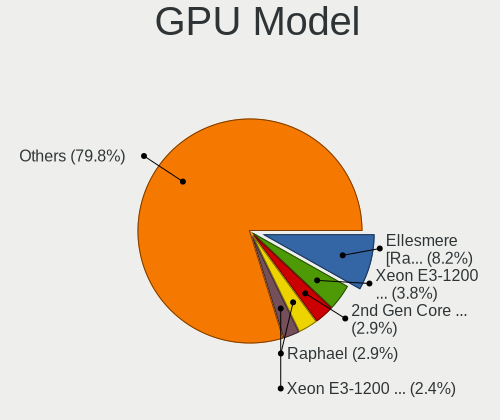

| Model                                                                       | Desktops | Percent |
|-----------------------------------------------------------------------------|----------|---------|
| AMD Ellesmere [Radeon RX 470/480/570/570X/580/580X/590]                     | 13       | 7.26%   |
| Intel Xeon E3-1200 v3/4th Gen Core Processor Integrated Graphics Controller | 6        | 3.35%   |
| Intel 2nd Generation Core Processor Family Integrated Graphics Controller   | 6        | 3.35%   |
| Intel Xeon E3-1200 v2/3rd Gen Core processor Graphics Controller            | 4        | 2.23%   |
| Intel HD Graphics 630                                                       | 4        | 2.23%   |
| Intel CoffeeLake-S GT2 [UHD Graphics 630]                                   | 4        | 2.23%   |
| AMD Juniper XT [Radeon HD 5770]                                             | 4        | 2.23%   |
| AMD Caicos [Radeon HD 6450/7450/8450 / R5 230 OEM]                          | 4        | 2.23%   |
| Nvidia GP106 [GeForce GTX 1060 6GB]                                         | 3        | 1.68%   |
| Nvidia GP104 [GeForce GTX 1070]                                             | 3        | 1.68%   |
| Nvidia GP102 [GeForce GTX 1080 Ti]                                          | 3        | 1.68%   |
| Nvidia GM206 [GeForce GTX 960]                                              | 3        | 1.68%   |
| AMD Raphael                                                                 | 3        | 1.68%   |
| AMD Picasso/Raven 2 [Radeon Vega Series / Radeon Vega Mobile Series]        | 3        | 1.68%   |
| AMD Cedar [Radeon HD 5000/6000/7350/8350 Series]                            | 3        | 1.68%   |
| Nvidia TU117 [GeForce GTX 1650]                                             | 2        | 1.12%   |
| Nvidia TU104 [GeForce RTX 2070 SUPER]                                       | 2        | 1.12%   |
| Nvidia GP108 [GeForce GT 1030]                                              | 2        | 1.12%   |
| Nvidia GP107 [GeForce GTX 1050]                                             | 2        | 1.12%   |
| Nvidia GM204 [GeForce GTX 970]                                              | 2        | 1.12%   |
| Nvidia GK208B [GeForce GT 730]                                              | 2        | 1.12%   |
| Nvidia GK107GL [Quadro K2000]                                               | 2        | 1.12%   |
| Nvidia GA106 [GeForce RTX 3060 Lite Hash Rate]                              | 2        | 1.12%   |
| Nvidia G98M [GeForce 9300M GS]                                              | 2        | 1.12%   |
| Intel RocketLake-S GT1 [UHD Graphics 730]                                   | 2        | 1.12%   |
| Intel HD Graphics 530                                                       | 2        | 1.12%   |
| Intel HD Graphics 510                                                       | 2        | 1.12%   |
| Intel Atom Processor Z36xxx/Z37xxx Series Graphics & Display                | 2        | 1.12%   |
| Intel 82G33/G31 Express Integrated Graphics Controller                      | 2        | 1.12%   |
| Intel 82946GZ/GL Integrated Graphics Controller                             | 2        | 1.12%   |
| Intel 4 Series Chipset Integrated Graphics Controller                       | 2        | 1.12%   |
| AMD Turks XT [Radeon HD 6670/7670]                                          | 2        | 1.12%   |
| AMD Navi 22 [Radeon RX 6700/6700 XT/6750 XT / 6800M/6850M XT]               | 2        | 1.12%   |
| AMD Navi 14 [Radeon RX 5500/5500M / Pro 5500M]                              | 2        | 1.12%   |
| AMD Cezanne [Radeon Vega Series / Radeon Vega Mobile Series]                | 2        | 1.12%   |
| Nvidia TU116 [GeForce GTX 1660]                                             | 1        | 0.56%   |
| Nvidia TU116 [GeForce GTX 1660 Ti]                                          | 1        | 0.56%   |
| Nvidia TU116 [GeForce GTX 1660 SUPER]                                       | 1        | 0.56%   |
| Nvidia TU106 [GeForce RTX 2060 SUPER]                                       | 1        | 0.56%   |
| Nvidia TU106 [GeForce RTX 2060 Rev. A]                                      | 1        | 0.56%   |

GPU Combo
---------

Combinations of graphics cards

| Name           | Desktops | Percent |
|----------------|----------|---------|
| 1 x Nvidia     | 64       | 39.26%  |
| 1 x AMD        | 48       | 29.45%  |
| 1 x Intel      | 39       | 23.93%  |
| AMD + Nvidia   | 5        | 3.07%   |
| 2 x AMD        | 4        | 2.45%   |
| Intel + Nvidia | 3        | 1.84%   |

GPU Driver
----------

Free vs proprietary

| Driver      | Desktops | Percent |
|-------------|----------|---------|
| Free        | 122      | 72.62%  |
| Proprietary | 37       | 22.02%  |
| Unknown     | 9        | 5.36%   |

GPU Memory
----------

Total video memory

| Size in GB | Desktops | Percent |
|------------|----------|---------|
| Unknown    | 73       | 43.45%  |
| 1.01-2.0   | 23       | 13.69%  |
| 7.01-8.0   | 15       | 8.93%   |
| 0.01-0.5   | 15       | 8.93%   |
| 0.51-1.0   | 13       | 7.74%   |
| 3.01-4.0   | 10       | 5.95%   |
| 5.01-6.0   | 8        | 4.76%   |
| 8.01-16.0  | 8        | 4.76%   |
| 2.01-3.0   | 2        | 1.19%   |
| 4.01-5.0   | 1        | 0.6%    |

Monitor
-------

Monitor Vendor
--------------

Monitor vendors

| Vendor               | Desktops | Percent |
|----------------------|----------|---------|
| Samsung Electronics  | 40       | 22.1%   |
| Dell                 | 31       | 17.13%  |
| AOC                  | 28       | 15.47%  |
| Goldstar             | 21       | 11.6%   |
| Philips              | 14       | 7.73%   |
| Hewlett-Packard      | 10       | 5.52%   |
| Ancor Communications | 6        | 3.31%   |
| Lenovo               | 4        | 2.21%   |
| Acer                 | 4        | 2.21%   |
| Iiyama               | 3        | 1.66%   |
| ViewSonic            | 2        | 1.1%    |
| Unknown              | 2        | 1.1%    |
| Sony                 | 2        | 1.1%    |
| BenQ                 | 2        | 1.1%    |
| Vestel Elektronik    | 1        | 0.55%   |
| SKY                  | 1        | 0.55%   |
| RS                   | 1        | 0.55%   |
| LG Display           | 1        | 0.55%   |
| HannStar             | 1        | 0.55%   |
| Grundig              | 1        | 0.55%   |
| FUN                  | 1        | 0.55%   |
| Eizo                 | 1        | 0.55%   |
| DIF                  | 1        | 0.55%   |
| DENON                | 1        | 0.55%   |
| ASUSTek Computer     | 1        | 0.55%   |
| Arnos Instruments    | 1        | 0.55%   |

Monitor Model
-------------

Monitor models

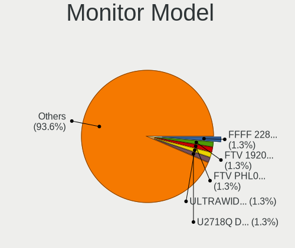

| Model                                                                | Desktops | Percent |
|----------------------------------------------------------------------|----------|---------|
| Philips LCD Monitor FTV 1920x1080                                    | 3        | 1.51%   |
| Philips FTV PHL01EA 1920x1080 1440x810mm 65.0-inch                   | 3        | 1.51%   |
| Goldstar ULTRAWIDE GSM59F1 2560x1080 673x284mm 28.8-inch             | 3        | 1.51%   |
| Dell U2412M DELA07A 1920x1200 518x324mm 24.1-inch                    | 3        | 1.51%   |
| AOC 2470W AOC2470 1920x1080 521x293mm 23.5-inch                      | 3        | 1.51%   |
| Unknown LCD Monitor FFFF 2288x1287 2550x2550mm 142.0-inch            | 2        | 1.01%   |
| Samsung Electronics U28E590 SAM0C4D 3840x2160 607x345mm 27.5-inch    | 2        | 1.01%   |
| Samsung Electronics SyncMaster SAM026F 1280x1024 376x301mm 19.0-inch | 2        | 1.01%   |
| Samsung Electronics LCD Monitor SAM04FD 1360x768                     | 2        | 1.01%   |
| Samsung Electronics LC24RG50 SAM0F90 1920x1080 532x304mm 24.1-inch   | 2        | 1.01%   |
| Philips 226V4 PHLC0B1 1920x1080 477x268mm 21.5-inch                  | 2        | 1.01%   |
| Dell U2718Q DELA0EC 3840x2160 609x349mm 27.6-inch                    | 2        | 1.01%   |
| Dell U2515H DELD06E 2560x1440 553x311mm 25.0-inch                    | 2        | 1.01%   |
| AOC Q3279WG5B AOC3279 2560x1440 725x428mm 33.1-inch                  | 2        | 1.01%   |
| AOC LCD Monitor AG251FWG2 1920x1080                                  | 2        | 1.01%   |
| AOC AG251FWG2 AOC2510 1920x1080 544x303mm 24.5-inch                  | 2        | 1.01%   |
| AOC 24B2W1 AOC2402 1920x1080 527x296mm 23.8-inch                     | 2        | 1.01%   |
| ViewSonic VX3211-4K VSCC336 3840x2160 698x393mm 31.5-inch            | 1        | 0.5%    |
| ViewSonic VG2448 VSC3B35 1920x1080 527x296mm 23.8-inch               | 1        | 0.5%    |
| Vestel Elektronik 22W_LCD_TV VES3700 1920x540                        | 1        | 0.5%    |
| Sony TV SNYAB03 1920x1080                                            | 1        | 0.5%    |
| Sony TV *02 SNY9403 1920x1080 1218x685mm 55.0-inch                   | 1        | 0.5%    |
| SKY TV MONITOR SKY0030 1920x1080 1430x800mm 64.5-inch                | 1        | 0.5%    |
| Samsung Electronics T27C350 SAM0AC5 1920x1080 598x336mm 27.0-inch    | 1        | 0.5%    |
| Samsung Electronics SyncMaster SAM05EC 1920x1080 597x336mm 27.0-inch | 1        | 0.5%    |
| Samsung Electronics SyncMaster SAM04DE 1920x1080 477x268mm 21.5-inch | 1        | 0.5%    |
| Samsung Electronics SyncMaster SAM04D4 1920x1080 531x298mm 24.0-inch | 1        | 0.5%    |
| Samsung Electronics SyncMaster SAM04D3 1920x1080 531x298mm 24.0-inch | 1        | 0.5%    |
| Samsung Electronics SyncMaster SAM0467 1920x1200 518x324mm 24.1-inch | 1        | 0.5%    |
| Samsung Electronics SyncMaster SAM044C 1680x1050 474x296mm 22.0-inch | 1        | 0.5%    |
| Samsung Electronics SyncMaster SAM0423 1920x1080                     | 1        | 0.5%    |
| Samsung Electronics SyncMaster SAM03E5 1680x1050 474x296mm 22.0-inch | 1        | 0.5%    |
| Samsung Electronics SyncMaster SAM0303 1680x1050 494x320mm 23.2-inch | 1        | 0.5%    |
| Samsung Electronics SyncMaster SAM02B6 1920x1200 518x324mm 24.1-inch | 1        | 0.5%    |
| Samsung Electronics SyncMaster SAM0288 1680x1050 474x296mm 22.0-inch | 1        | 0.5%    |
| Samsung Electronics SyncMaster SAM0218 1280x1024 376x301mm 19.0-inch | 1        | 0.5%    |
| Samsung Electronics SyncMaster SAM0217 1280x1024 376x301mm 19.0-inch | 1        | 0.5%    |
| Samsung Electronics SyncMaster SAM0214 1680x1050 408x306mm 20.1-inch | 1        | 0.5%    |
| Samsung Electronics SyncMaster SAM011E 1280x1024 338x270mm 17.0-inch | 1        | 0.5%    |
| Samsung Electronics SyncMaster SAM010F 1280x1024 376x301mm 19.0-inch | 1        | 0.5%    |

Monitor Resolution
------------------

Monitor screen resolution

| Resolution         | Desktops | Percent |
|--------------------|----------|---------|
| 1920x1080 (FHD)    | 70       | 40%     |
| 3840x2160 (4K)     | 22       | 12.57%  |
| 2560x1440 (QHD)    | 22       | 12.57%  |
| 1280x1024 (SXGA)   | 15       | 8.57%   |
| 1680x1050 (WSXGA+) | 12       | 6.86%   |
| 1920x1200 (WUXGA)  | 8        | 4.57%   |
| 3440x1440          | 4        | 2.29%   |
| 2560x1080          | 4        | 2.29%   |
| 1600x900 (HD+)     | 3        | 1.71%   |
| 2288x1287          | 2        | 1.14%   |
| 1440x900 (WXGA+)   | 2        | 1.14%   |
| 1366x768 (WXGA)    | 2        | 1.14%   |
| 1024x768 (XGA)     | 2        | 1.14%   |
| 3840x1600          | 1        | 0.57%   |
| 3840x1080          | 1        | 0.57%   |
| 2560x1600          | 1        | 0.57%   |
| 2560x1024          | 1        | 0.57%   |
| 1280x960           | 1        | 0.57%   |
| 1280x720 (HD)      | 1        | 0.57%   |
| Unknown            | 1        | 0.57%   |

Monitor Diagonal
----------------

Diagonal size in inches

| Inches  | Desktops | Percent |
|---------|----------|---------|
| 24      | 28       | 15.3%   |
| 27      | 24       | 13.11%  |
| 23      | 21       | 11.48%  |
| 21      | 17       | 9.29%   |
| Unknown | 16       | 8.74%   |
| 19      | 13       | 7.1%    |
| 31      | 9        | 4.92%   |
| 34      | 8        | 4.37%   |
| 22      | 7        | 3.83%   |
| 20      | 6        | 3.28%   |
| 17      | 5        | 2.73%   |
| 65      | 4        | 2.19%   |
| 84      | 3        | 1.64%   |
| 142     | 2        | 1.09%   |
| 72      | 2        | 1.09%   |
| 54      | 2        | 1.09%   |
| 33      | 2        | 1.09%   |
| 32      | 2        | 1.09%   |
| 25      | 2        | 1.09%   |
| 18      | 2        | 1.09%   |
| 15      | 2        | 1.09%   |
| 64      | 1        | 0.55%   |
| 55      | 1        | 0.55%   |
| 49      | 1        | 0.55%   |
| 37      | 1        | 0.55%   |
| 29      | 1        | 0.55%   |
| 28      | 1        | 0.55%   |

Monitor Width
-------------

Physical width

| Width in mm    | Desktops | Percent |
|----------------|----------|---------|
| 501-600        | 65       | 36.72%  |
| 401-500        | 32       | 18.08%  |
| 601-700        | 16       | 9.04%   |
| Unknown        | 16       | 9.04%   |
| 351-400        | 14       | 7.91%   |
| 701-800        | 12       | 6.78%   |
| 1001-1500      | 8        | 4.52%   |
| 301-350        | 6        | 3.39%   |
| 1501-2000      | 5        | 2.82%   |
| More than 2000 | 2        | 1.13%   |
| 801-900        | 1        | 0.56%   |

Aspect Ratio
------------

Proportional relationship between the width and the height

| Ratio   | Desktops | Percent |
|---------|----------|---------|
| 16/9    | 100      | 59.52%  |
| 16/10   | 22       | 13.1%   |
| 5/4     | 17       | 10.12%  |
| Unknown | 13       | 7.74%   |
| 21/9    | 9        | 5.36%   |
| 4/3     | 3        | 1.79%   |
| 1.00    | 2        | 1.19%   |
| 32/9    | 1        | 0.6%    |
| 3/2     | 1        | 0.6%    |

Monitor Area
------------

Area in inch

| Area in inch | Desktops | Percent |
|----------------|----------|---------|
| 201-250        | 51       | 28.18%  |
| 151-200        | 25       | 13.81%  |
| 301-350        | 24       | 13.26%  |
| 351-500        | 23       | 12.71%  |
| 251-300        | 18       | 9.94%   |
| Unknown        | 16       | 8.84%   |
| More than 1000 | 14       | 7.73%   |
| 141-150        | 5        | 2.76%   |
| 101-110        | 2        | 1.1%    |
| 501-1000       | 2        | 1.1%    |
| 121-130        | 1        | 0.55%   |

Pixel Density
-------------

Pixels per inch

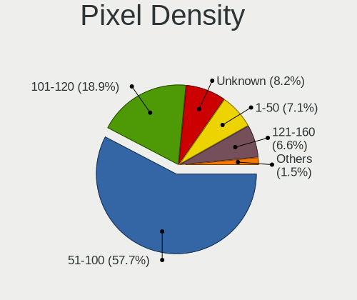

| Density | Desktops | Percent |
|---------|----------|---------|
| 51-100  | 96       | 57.14%  |
| 101-120 | 32       | 19.05%  |
| Unknown | 16       | 9.52%   |
| 1-50    | 12       | 7.14%   |
| 121-160 | 10       | 5.95%   |
| 161-240 | 2        | 1.19%   |

Multiple Monitors
-----------------

Total monitors connected

| Total | Desktops | Percent |
|-------|----------|---------|
| 1     | 124      | 74.7%   |
| 2     | 32       | 19.28%  |
| 0     | 7        | 4.22%   |
| 3     | 2        | 1.2%    |
| 6     | 1        | 0.6%    |

Network
-------

Net Controller Vendor
---------------------

Controller vendors

| Vendor                          | Desktops | Percent |
|---------------------------------|----------|---------|
| Realtek Semiconductor           | 96       | 45.07%  |
| Intel                           | 67       | 31.46%  |
| Qualcomm Atheros                | 7        | 3.29%   |
| Broadcom                        | 6        | 2.82%   |
| ASUSTek Computer                | 6        | 2.82%   |
| Ralink Technology               | 4        | 1.88%   |
| Ralink                          | 4        | 1.88%   |
| TP-Link                         | 2        | 0.94%   |
| Qualcomm Atheros Communications | 2        | 0.94%   |
| Nvidia                          | 2        | 0.94%   |
| Marvell Technology Group        | 2        | 0.94%   |
| Linksys                         | 2        | 0.94%   |
| Edimax Technology               | 2        | 0.94%   |
| ZyDAS Technology                | 1        | 0.47%   |
| ZyDAS                           | 1        | 0.47%   |
| VIA Technologies                | 1        | 0.47%   |
| Samsung Electronics             | 1        | 0.47%   |
| Mellanox Technologies           | 1        | 0.47%   |
| MediaTek                        | 1        | 0.47%   |
| IMC Networks                    | 1        | 0.47%   |
| D-Link System                   | 1        | 0.47%   |
| D-Link                          | 1        | 0.47%   |
| Compal Electronics              | 1        | 0.47%   |
| Belkin Components               | 1        | 0.47%   |

Net Controller Model
--------------------

Controller models

| Model                                                                  | Desktops | Percent |
|------------------------------------------------------------------------|----------|---------|
| Realtek RTL8111/8168/8211/8411 PCI Express Gigabit Ethernet Controller | 81       | 35.06%  |
| Intel I211 Gigabit Network Connection                                  | 12       | 5.19%   |
| Intel Ethernet Connection (2) I219-V                                   | 10       | 4.33%   |
| Realtek RTL8125 2.5GbE Controller                                      | 9        | 3.9%    |
| Intel 82579LM Gigabit Network Connection (Lewisville)                  | 6        | 2.6%    |
| Intel Wi-Fi 6E(802.11ax) AX210/AX1675* 2x2 [Typhoon Peak]              | 3        | 1.3%    |
| Intel Wi-Fi 6 AX200                                                    | 3        | 1.3%    |
| Intel Ethernet Controller I225-V                                       | 3        | 1.3%    |
| Intel Ethernet Connection I217-LM                                      | 3        | 1.3%    |
| Intel 82567LM-3 Gigabit Network Connection                             | 3        | 1.3%    |
| Realtek RTL810xE PCI Express Fast Ethernet controller                  | 2        | 0.87%   |
| Ralink RT2870/RT3070 Wireless Adapter                                  | 2        | 0.87%   |
| Ralink MT7601U Wireless Adapter                                        | 2        | 0.87%   |
| Ralink RT2790 Wireless 802.11n 1T/2R PCIe                              | 2        | 0.87%   |
| Qualcomm Atheros AR9271 802.11n                                        | 2        | 0.87%   |
| Qualcomm Atheros AR8121/AR8113/AR8114 Gigabit or Fast Ethernet         | 2        | 0.87%   |
| Marvell Group 88E8056 PCI-E Gigabit Ethernet Controller                | 2        | 0.87%   |
| Intel Wireless 7260                                                    | 2        | 0.87%   |
| Intel Tiger Lake PCH CNVi WiFi                                         | 2        | 0.87%   |
| Intel Ethernet Connection (7) I219-LM                                  | 2        | 0.87%   |
| Intel Ethernet Connection (2) I219-LM                                  | 2        | 0.87%   |
| Intel Ethernet Connection (14) I219-V                                  | 2        | 0.87%   |
| Intel 82579V Gigabit Network Connection                                | 2        | 0.87%   |
| Intel 82574L Gigabit Network Connection                                | 2        | 0.87%   |
| Intel 82566DM-2 Gigabit Network Connection                             | 2        | 0.87%   |
| Broadcom NetXtreme BCM5755 Gigabit Ethernet PCI Express                | 2        | 0.87%   |
| Broadcom NetLink BCM5786 Gigabit Ethernet PCI Express                  | 2        | 0.87%   |
| Broadcom BCM4352 802.11ac Dual Band Wireless Network Adapter           | 2        | 0.87%   |
| ZyDAS ZD1211 802.11g                                                   | 1        | 0.43%   |
| ZyDAS ZD1212B Wireless Adapter                                         | 1        | 0.43%   |
| VIA VT6105/VT6106S [Rhine-III]                                         | 1        | 0.43%   |
| TP-Link TL-WN722N v2/v3 [Realtek RTL8188EUS]                           | 1        | 0.43%   |
| TP-Link Archer T2U PLUS [RTL8821AU]                                    | 1        | 0.43%   |
| Samsung GT-I9070 (network tethering, USB debugging enabled)            | 1        | 0.43%   |
| Realtek USB 10/100/1G/2.5G LAN                                         | 1        | 0.43%   |
| Realtek RTL88x2bu [AC1200 Techkey]                                     | 1        | 0.43%   |
| Realtek RTL8852CE PCIe 802.11ax Wireless Network Controller            | 1        | 0.43%   |
| Realtek RTL8822BE 802.11a/b/g/n/ac WiFi adapter                        | 1        | 0.43%   |
| Realtek RTL8723BE PCIe Wireless Network Adapter                        | 1        | 0.43%   |
| Realtek RTL8192EU 802.11b/g/n WLAN Adapter                             | 1        | 0.43%   |

Wireless Vendor
---------------

Wireless vendors

| Vendor                          | Desktops | Percent |
|---------------------------------|----------|---------|
| Intel                           | 13       | 22.81%  |
| Realtek Semiconductor           | 10       | 17.54%  |
| ASUSTek Computer                | 6        | 10.53%  |
| Ralink Technology               | 4        | 7.02%   |
| Ralink                          | 4        | 7.02%   |
| Qualcomm Atheros                | 4        | 7.02%   |
| TP-Link                         | 2        | 3.51%   |
| Qualcomm Atheros Communications | 2        | 3.51%   |
| Edimax Technology               | 2        | 3.51%   |
| Broadcom                        | 2        | 3.51%   |
| ZyDAS Technology                | 1        | 1.75%   |
| ZyDAS                           | 1        | 1.75%   |
| MediaTek                        | 1        | 1.75%   |
| Linksys                         | 1        | 1.75%   |
| IMC Networks                    | 1        | 1.75%   |
| D-Link System                   | 1        | 1.75%   |
| D-Link                          | 1        | 1.75%   |
| Belkin Components               | 1        | 1.75%   |

Wireless Model
--------------

Wireless models

| Model                                                                             | Desktops | Percent |
|-----------------------------------------------------------------------------------|----------|---------|
| Intel Wi-Fi 6E(802.11ax) AX210/AX1675* 2x2 [Typhoon Peak]                         | 3        | 5.17%   |
| Intel Wi-Fi 6 AX200                                                               | 3        | 5.17%   |
| Ralink RT2870/RT3070 Wireless Adapter                                             | 2        | 3.45%   |
| Ralink MT7601U Wireless Adapter                                                   | 2        | 3.45%   |
| Ralink RT2790 Wireless 802.11n 1T/2R PCIe                                         | 2        | 3.45%   |
| Qualcomm Atheros AR9271 802.11n                                                   | 2        | 3.45%   |
| Intel Wireless 7260                                                               | 2        | 3.45%   |
| Intel Tiger Lake PCH CNVi WiFi                                                    | 2        | 3.45%   |
| Broadcom BCM4352 802.11ac Dual Band Wireless Network Adapter                      | 2        | 3.45%   |
| ZyDAS ZD1211 802.11g                                                              | 1        | 1.72%   |
| ZyDAS ZD1212B Wireless Adapter                                                    | 1        | 1.72%   |
| TP-Link TL-WN722N v2/v3 [Realtek RTL8188EUS]                                      | 1        | 1.72%   |
| TP-Link Archer T2U PLUS [RTL8821AU]                                               | 1        | 1.72%   |
| Realtek RTL88x2bu [AC1200 Techkey]                                                | 1        | 1.72%   |
| Realtek RTL8852CE PCIe 802.11ax Wireless Network Controller                       | 1        | 1.72%   |
| Realtek RTL8822BE 802.11a/b/g/n/ac WiFi adapter                                   | 1        | 1.72%   |
| Realtek RTL8723BE PCIe Wireless Network Adapter                                   | 1        | 1.72%   |
| Realtek RTL8192EU 802.11b/g/n WLAN Adapter                                        | 1        | 1.72%   |
| Realtek RTL8192CU 802.11n WLAN Adapter                                            | 1        | 1.72%   |
| Realtek RTL8192CE PCIe Wireless Network Adapter                                   | 1        | 1.72%   |
| Realtek RTL8191SEvB Wireless LAN Controller                                       | 1        | 1.72%   |
| Realtek RTL8188EUS 802.11n Wireless Network Adapter                               | 1        | 1.72%   |
| Realtek RTL8188EE Wireless Network Adapter                                        | 1        | 1.72%   |
| Realtek RTL8187 Wireless Adapter                                                  | 1        | 1.72%   |
| Ralink RT3060 Wireless 802.11n 1T/1R                                              | 1        | 1.72%   |
| Ralink RT2561/RT61 802.11g PCI                                                    | 1        | 1.72%   |
| Qualcomm Atheros QCA6174 802.11ac Wireless Network Adapter                        | 1        | 1.72%   |
| Qualcomm Atheros AR9462 Wireless Network Adapter                                  | 1        | 1.72%   |
| Qualcomm Atheros AR93xx Wireless Network Adapter                                  | 1        | 1.72%   |
| Qualcomm Atheros AR5416 Wireless Network Adapter [AR5008 802.11(a)bgn]            | 1        | 1.72%   |
| MediaTek MT7921K (RZ608) Wi-Fi 6E 80MHz                                           | 1        | 1.72%   |
| Linksys AE1200 802.11bgn Wireless Adapter [Broadcom BCM43235]                     | 1        | 1.72%   |
| Intel Dual Band Wireless-AC 3168NGW [Stone Peak]                                  | 1        | 1.72%   |
| Intel CNVi: Wi-Fi                                                                 | 1        | 1.72%   |
| Intel Cannon Lake PCH CNVi WiFi                                                   | 1        | 1.72%   |
| IMC Networks Mediao 802.11n WLAN [Realtek RTL8191SU]                              | 1        | 1.72%   |
| Edimax EW-7612UAn V2 802.11n Wireless Adapter [Realtek RTL8192CU]                 | 1        | 1.72%   |
| Edimax AC600 USB                                                                  | 1        | 1.72%   |
| D-Link System DWA-131 802.11n Wireless N Nano Adapter(rev.A1) [Realtek RTL8192SU] | 1        | 1.72%   |
| D-Link 802.11 n WLAN                                                              | 1        | 1.72%   |

Ethernet Vendor
---------------

Ethernet vendors

| Vendor                   | Desktops | Percent |
|--------------------------|----------|---------|
| Realtek Semiconductor    | 93       | 54.71%  |
| Intel                    | 61       | 35.88%  |
| Broadcom                 | 4        | 2.35%   |
| Qualcomm Atheros         | 3        | 1.76%   |
| Nvidia                   | 2        | 1.18%   |
| Marvell Technology Group | 2        | 1.18%   |
| VIA Technologies         | 1        | 0.59%   |
| Samsung Electronics      | 1        | 0.59%   |
| Mellanox Technologies    | 1        | 0.59%   |
| Linksys                  | 1        | 0.59%   |
| Compal Electronics       | 1        | 0.59%   |

Ethernet Model
--------------

Ethernet models

| Model                                                                         | Desktops | Percent |
|-------------------------------------------------------------------------------|----------|---------|
| Realtek RTL8111/8168/8211/8411 PCI Express Gigabit Ethernet Controller        | 81       | 46.82%  |
| Intel I211 Gigabit Network Connection                                         | 12       | 6.94%   |
| Intel Ethernet Connection (2) I219-V                                          | 10       | 5.78%   |
| Realtek RTL8125 2.5GbE Controller                                             | 9        | 5.2%    |
| Intel 82579LM Gigabit Network Connection (Lewisville)                         | 6        | 3.47%   |
| Intel Ethernet Controller I225-V                                              | 3        | 1.73%   |
| Intel Ethernet Connection I217-LM                                             | 3        | 1.73%   |
| Intel 82567LM-3 Gigabit Network Connection                                    | 3        | 1.73%   |
| Realtek RTL810xE PCI Express Fast Ethernet controller                         | 2        | 1.16%   |
| Qualcomm Atheros AR8121/AR8113/AR8114 Gigabit or Fast Ethernet                | 2        | 1.16%   |
| Marvell Group 88E8056 PCI-E Gigabit Ethernet Controller                       | 2        | 1.16%   |
| Intel Ethernet Connection (7) I219-LM                                         | 2        | 1.16%   |
| Intel Ethernet Connection (2) I219-LM                                         | 2        | 1.16%   |
| Intel Ethernet Connection (14) I219-V                                         | 2        | 1.16%   |
| Intel 82579V Gigabit Network Connection                                       | 2        | 1.16%   |
| Intel 82574L Gigabit Network Connection                                       | 2        | 1.16%   |
| Intel 82566DM-2 Gigabit Network Connection                                    | 2        | 1.16%   |
| Broadcom NetXtreme BCM5755 Gigabit Ethernet PCI Express                       | 2        | 1.16%   |
| Broadcom NetLink BCM5786 Gigabit Ethernet PCI Express                         | 2        | 1.16%   |
| VIA VT6105/VT6106S [Rhine-III]                                                | 1        | 0.58%   |
| Samsung GT-I9070 (network tethering, USB debugging enabled)                   | 1        | 0.58%   |
| Realtek USB 10/100/1G/2.5G LAN                                                | 1        | 0.58%   |
| Qualcomm Atheros Killer E220x Gigabit Ethernet Controller                     | 1        | 0.58%   |
| Nvidia MCP79 Ethernet                                                         | 1        | 0.58%   |
| Nvidia MCP61 Ethernet                                                         | 1        | 0.58%   |
| Mellanox MT26448 [ConnectX EN 10GigE, PCIe 2.0 5GT/s]                         | 1        | 0.58%   |
| Linksys Gigabit Network Adapter                                               | 1        | 0.58%   |
| Intel I350 Gigabit Network Connection                                         | 1        | 0.58%   |
| Intel I210 Gigabit Network Connection                                         | 1        | 0.58%   |
| Intel Ethernet Controller I226-V                                              | 1        | 0.58%   |
| Intel Ethernet Connection I217-V                                              | 1        | 0.58%   |
| Intel Ethernet Connection (7) I219-V                                          | 1        | 0.58%   |
| Intel Ethernet Connection (2) I218-V                                          | 1        | 0.58%   |
| Intel Ethernet Connection (2) I218-LM                                         | 1        | 0.58%   |
| Intel 82583V Gigabit Network Connection                                       | 1        | 0.58%   |
| Intel 82578DM Gigabit Network Connection                                      | 1        | 0.58%   |
| Intel 82576 Gigabit Network Connection                                        | 1        | 0.58%   |
| Intel 82573L Gigabit Ethernet Controller                                      | 1        | 0.58%   |
| Intel 82573E Gigabit Ethernet Controller (Copper)                             | 1        | 0.58%   |
| Intel 82571EB/82571GB Gigabit Ethernet Controller D0/D1 (copper applications) | 1        | 0.58%   |

Net Controller Kind
-------------------

Ethernet, WiFi or modem

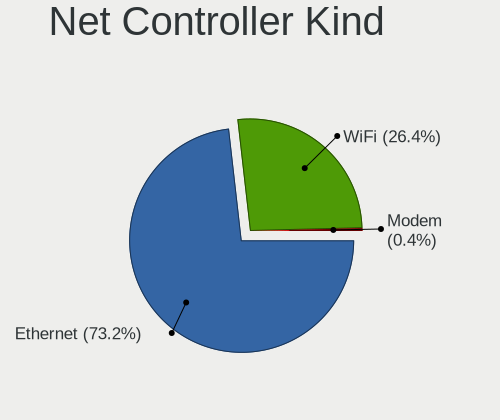

| Kind     | Desktops | Percent |
|----------|----------|---------|
| Ethernet | 159      | 73.95%  |
| WiFi     | 56       | 26.05%  |

Used Controller
---------------

Currently used network controller

| Kind     | Desktops | Percent |
|----------|----------|---------|
| Ethernet | 133      | 80.61%  |
| WiFi     | 32       | 19.39%  |

NICs
----

Total network controllers on board

| Total | Desktops | Percent |
|-------|----------|---------|
| 1     | 117      | 72.22%  |
| 2     | 35       | 21.6%   |
| 3     | 5        | 3.09%   |
| 4     | 2        | 1.23%   |
| 0     | 2        | 1.23%   |
| 5     | 1        | 0.62%   |

IPv6
----

IPv6 vs IPv4

| Used | Desktops | Percent |
|------|----------|---------|
| No   | 143      | 85.63%  |
| Yes  | 24       | 14.37%  |

Bluetooth
---------

Bluetooth Vendor
----------------

Controller vendors

| Vendor                     | Desktops | Percent |
|----------------------------|----------|---------|
| Intel                      | 13       | 32.5%   |
| Cambridge Silicon Radio    | 8        | 20%     |
| ASUSTek Computer           | 7        | 17.5%   |
| Realtek Semiconductor      | 3        | 7.5%    |
| Hewlett-Packard            | 2        | 5%      |
| Edimax Technology          | 2        | 5%      |
| MediaTek                   | 1        | 2.5%    |
| Lite-On Technology         | 1        | 2.5%    |
| Integrated System Solution | 1        | 2.5%    |
| IMC Networks               | 1        | 2.5%    |
| Apple                      | 1        | 2.5%    |

Bluetooth Model
---------------

Controller models

| Model                                               | Desktops | Percent |
|-----------------------------------------------------|----------|---------|
| Cambridge Silicon Radio Bluetooth Dongle (HCI mode) | 8        | 20%     |
| Realtek Bluetooth Radio                             | 3        | 7.5%    |
| Intel AX210 Bluetooth                               | 3        | 7.5%    |
| Intel AX201 Bluetooth                               | 3        | 7.5%    |
| Intel AX200 Bluetooth                               | 3        | 7.5%    |
| Intel Bluetooth wireless interface                  | 2        | 5%      |
| HP Bluetooth 2.0 Interface [Broadcom BCM2045]       | 2        | 5%      |
| Edimax Edimax Bluetooth Adapter                     | 2        | 5%      |
| ASUS Broadcom BCM20702A0 Bluetooth                  | 2        | 5%      |
| ASUS ASUS USB-BT500                                 | 2        | 5%      |
| MediaTek Wireless_Device                            | 1        | 2.5%    |
| Lite-On Bluetooth Device                            | 1        | 2.5%    |
| Intel Wireless-AC 3168 Bluetooth                    | 1        | 2.5%    |
| Intel Bluetooth 9460/9560 Jefferson Peak (JfP)      | 1        | 2.5%    |
| Integrated System Solution Bluetooth Device         | 1        | 2.5%    |
| IMC Networks Bluetooth Radio                        | 1        | 2.5%    |
| ASUS Qualcomm Bluetooth 4.1                         | 1        | 2.5%    |
| ASUS Bluetooth Radio                                | 1        | 2.5%    |
| ASUS BCM20702A0                                     | 1        | 2.5%    |
| Apple Bluetooth HCI                                 | 1        | 2.5%    |

Sound
-----

Sound Vendor
------------

Sound card vendors

| Vendor                      | Desktops | Percent |
|-----------------------------|----------|---------|
| Intel                       | 99       | 36%     |
| AMD                         | 75       | 27.27%  |
| Nvidia                      | 66       | 24%     |
| C-Media Electronics         | 4        | 1.45%   |
| ASUSTek Computer            | 4        | 1.45%   |
| Logitech                    | 3        | 1.09%   |
| JMTek                       | 2        | 0.73%   |
| BEHRINGER International     | 2        | 0.73%   |
| Yamaha                      | 1        | 0.36%   |
| Weltrend Semiconductor      | 1        | 0.36%   |
| Textech International       | 1        | 0.36%   |
| Texas Instruments           | 1        | 0.36%   |
| Syntek                      | 1        | 0.36%   |
| SteelSeries ApS             | 1        | 0.36%   |
| Sony                        | 1        | 0.36%   |
| SAVITECH                    | 1        | 0.36%   |
| Samson Technologies         | 1        | 0.36%   |
| PreSonus Audio Electronics  | 1        | 0.36%   |
| Nam Tai E&E Products        | 1        | 0.36%   |
| Mackie Designs              | 1        | 0.36%   |
| Kingston Technology         | 1        | 0.36%   |
| iCreate Technologies        | 1        | 0.36%   |
| Hewlett-Packard             | 1        | 0.36%   |
| FiiO Electronics Technology | 1        | 0.36%   |
| DCMT Technology             | 1        | 0.36%   |
| Creative Technology         | 1        | 0.36%   |
| Creative Labs               | 1        | 0.36%   |
| AKAI Professional M.I.      | 1        | 0.36%   |

Sound Model
-----------

Sound card models

| Model                                                                             | Desktops | Percent |
|-----------------------------------------------------------------------------------|----------|---------|
| AMD Starship/Matisse HD Audio Controller                                          | 17       | 5.43%   |
| Intel 6 Series/C200 Series Chipset Family High Definition Audio Controller        | 15       | 4.79%   |
| AMD Family 17h (Models 00h-0fh) HD Audio Controller                               | 14       | 4.47%   |
| AMD Ellesmere HDMI Audio [Radeon RX 470/480 / 570/580/590]                        | 13       | 4.15%   |
| Intel 200 Series PCH HD Audio                                                     | 10       | 3.19%   |
| Intel 100 Series/C230 Series Chipset Family HD Audio Controller                   | 10       | 3.19%   |
| AMD Family 17h/19h HD Audio Controller                                            | 10       | 3.19%   |
| Intel 8 Series/C220 Series Chipset High Definition Audio Controller               | 9        | 2.88%   |
| Intel Xeon E3-1200 v3/4th Gen Core Processor HD Audio Controller                  | 7        | 2.24%   |
| Intel 5 Series/3400 Series Chipset High Definition Audio                          | 7        | 2.24%   |
| Intel Cannon Lake PCH cAVS                                                        | 6        | 1.92%   |
| Intel 82801JI (ICH10 Family) HD Audio Controller                                  | 6        | 1.92%   |
| Nvidia GP106 High Definition Audio Controller                                     | 5        | 1.6%    |
| Nvidia GP104 High Definition Audio Controller                                     | 5        | 1.6%    |
| Intel NM10/ICH7 Family High Definition Audio Controller                           | 5        | 1.6%    |
| AMD SBx00 Azalia (Intel HDA)                                                      | 5        | 1.6%    |
| AMD Caicos HDMI Audio [Radeon HD 6450 / 7450/8450/8490 OEM / R5 230/235/235X OEM] | 5        | 1.6%    |
| Nvidia GM206 High Definition Audio Controller                                     | 4        | 1.28%   |
| Nvidia GK107 HDMI Audio Controller                                                | 4        | 1.28%   |
| Intel Tiger Lake-H HD Audio Controller                                            | 4        | 1.28%   |
| Intel 82801I (ICH9 Family) HD Audio Controller                                    | 4        | 1.28%   |
| AMD Raven/Raven2/Fenghuang HDMI/DP Audio Controller                               | 4        | 1.28%   |
| AMD Juniper HDMI Audio [Radeon HD 5700 Series]                                    | 4        | 1.28%   |
| AMD Cedar HDMI Audio [Radeon HD 5400/6300/7300 Series]                            | 4        | 1.28%   |
| Nvidia TU116 High Definition Audio Controller                                     | 3        | 0.96%   |
| Nvidia TU104 HD Audio Controller                                                  | 3        | 0.96%   |
| Nvidia GP107GL High Definition Audio Controller                                   | 3        | 0.96%   |
| Nvidia GP102 HDMI Audio Controller                                                | 3        | 0.96%   |
| Nvidia GK208 HDMI/DP Audio Controller                                             | 3        | 0.96%   |
| Nvidia GK106 HDMI Audio Controller                                                | 3        | 0.96%   |
| Nvidia GF108 High Definition Audio Controller                                     | 3        | 0.96%   |
| Intel C600/X79 series chipset High Definition Audio Controller                    | 3        | 0.96%   |
| Intel 9 Series Chipset Family HD Audio Controller                                 | 3        | 0.96%   |
| Intel 82801JD/DO (ICH10 Family) HD Audio Controller                               | 3        | 0.96%   |
| AMD Renoir Radeon High Definition Audio Controller                                | 3        | 0.96%   |
| AMD Rembrandt Radeon High Definition Audio Controller                             | 3        | 0.96%   |
| AMD Navi 21/23 HDMI/DP Audio Controller                                           | 3        | 0.96%   |
| AMD Navi 10 HDMI Audio                                                            | 3        | 0.96%   |
| AMD FCH Azalia Controller                                                         | 3        | 0.96%   |
| Nvidia TU107 GeForce GTX 1650 High Definition Audio Controller                    | 2        | 0.64%   |

Memory
------

Memory Vendor
-------------

Memory module vendors

| Vendor              | Desktops | Percent |
|---------------------|----------|---------|
| Kingston            | 18       | 16.82%  |
| Crucial             | 17       | 15.89%  |
| G.Skill             | 15       | 14.02%  |
| Unknown             | 11       | 10.28%  |
| Samsung Electronics | 10       | 9.35%   |
| SK hynix            | 9        | 8.41%   |
| Corsair             | 7        | 6.54%   |
| Micron Technology   | 3        | 2.8%    |
| Team                | 2        | 1.87%   |
| TakeMS              | 2        | 1.87%   |
| Patriot             | 2        | 1.87%   |
| Nanya Technology    | 2        | 1.87%   |
| A-DATA Technology   | 2        | 1.87%   |
| Transcend           | 1        | 0.93%   |
| Swissbit            | 1        | 0.93%   |
| Silicon Power       | 1        | 0.93%   |
| Ramaxel Technology  | 1        | 0.93%   |
| GOODRAM             | 1        | 0.93%   |
| GLOWAY              | 1        | 0.93%   |
| Elpida              | 1        | 0.93%   |

Memory Model
------------

Memory module models

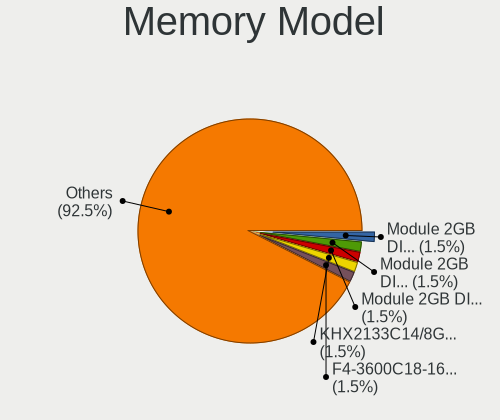

| Model                                                                      | Desktops | Percent |
|----------------------------------------------------------------------------|----------|---------|
| Unknown RAM Module 2GB DIMM 1333MT/s                                       | 2        | 1.75%   |
| Kingston RAM KHX2133C14/8G 8GB DIMM DDR4 2666MT/s                          | 2        | 1.75%   |
| G.Skill RAM F4-3000C16-8GISB 8192MB DIMM DDR4 3200MT/s                     | 2        | 1.75%   |
| Crucial RAM CT8G4DFS8266.M8FD 8GB DIMM DDR4 3600MT/s                       | 2        | 1.75%   |
| Crucial RAM CT16G4DFRA32A.M16FR 16GB DIMM DDR4 3200MT/s                    | 2        | 1.75%   |
| A-DATA RAM DDR4 3600 8GB DIMM DDR4 3800MT/s                                | 2        | 1.75%   |
| Unknown RAM Module 8GB DIMM DDR3 1600MT/s                                  | 1        | 0.88%   |
| Unknown RAM Module 4GB DIMM 1333MT/s                                       | 1        | 0.88%   |
| Unknown RAM Module 4096MB DIMM DDR 1600MT/s                                | 1        | 0.88%   |
| Unknown RAM Module 2GB SODIMM DDR2                                         | 1        | 0.88%   |
| Unknown RAM Module 2GB DIMM DDR2 800MT/s                                   | 1        | 0.88%   |
| Unknown RAM Module 2GB DIMM 800MT/s                                        | 1        | 0.88%   |
| Unknown RAM Module 2GB DIMM 400MT/s                                        | 1        | 0.88%   |
| Unknown RAM Module 2048MB DIMM DDR2 667MT/s                                | 1        | 0.88%   |
| Unknown RAM 3000 C16 Series 8192MB DIMM DDR4 2133MT/s                      | 1        | 0.88%   |
| Transcend RAM JM800QLU-2G 2GB DIMM DDR2 2048MT/s                           | 1        | 0.88%   |
| Team RAM TEAMGROUP-UD4-3000 8GB DIMM DDR4 3200MT/s                         | 1        | 0.88%   |
| Team RAM TEAMGROUP-UD3-1600 8GB DIMM DDR3 1067MT/s                         | 1        | 0.88%   |
| TakeMS RAM TMS4GB364F081139EM 4096MB DIMM DDR3 1333MT/s                    | 1        | 0.88%   |
| TakeMS RAM TMS4GB364E081139PP 4GB DIMM DDR3 1333MT/s                       | 1        | 0.88%   |
| TakeMS RAM TMS2GB264D081805EV 2048MB DIMM DDR2 800MT/s                     | 1        | 0.88%   |
| Swissbit RAM MEN02G64D2BF2EP-2A 2GB DIMM SDRAM 2048MT/s                    | 1        | 0.88%   |
| SK hynix RAM Module 8GB SODIMM DDR4 3200MT/s                               | 1        | 0.88%   |
| SK hynix RAM Module 8GB DIMM DDR4 2133MT/s                                 | 1        | 0.88%   |
| SK hynix RAM Module 4096MB FB-DIMM DDR2 667MT/s                            | 1        | 0.88%   |
| SK hynix RAM HMT41GU6AFR8A-PB 8GB DIMM DDR3 1600MT/s                       | 1        | 0.88%   |
| SK hynix RAM HMT41GR7MFR4C-PB 8GB DIMM DDR3 1600MT/s                       | 1        | 0.88%   |
| SK hynix RAM HMT41GR7BFR4C-PB 8GB DIMM DDR3 1600MT/s                       | 1        | 0.88%   |
| SK hynix RAM HMT351U6EFR8C-PB 4GB DIMM DDR3 1600MT/s                       | 1        | 0.88%   |
| SK hynix RAM HMA81GU6CJR8N-XN 8GB DIMM DDR4 3200MT/s                       | 1        | 0.88%   |
| SK hynix RAM HMA41GR7AFR4N-UH 8GB DIMM DDR4 2400MT/s                       | 1        | 0.88%   |
| SK hynix RAM 48594D503131325536344350382D53362020 1024MB DIMM DDR2 800MT/s | 1        | 0.88%   |
| Silicon Power RAM SP004GBLFU240W02 4GB DIMM DDR4 2400MT/s                  | 1        | 0.88%   |
| Samsung RAM Module 4096MB DIMM DDR4 2400MT/s                               | 1        | 0.88%   |
| Samsung RAM M4 70T5663QZ3-CF7 2GB SODIMM DDR2 2048MT/s                     | 1        | 0.88%   |
| Samsung RAM M393B1G70QH0-CMA 8GB DIMM DDR3 1867MT/s                        | 1        | 0.88%   |
| Samsung RAM M393A1K43BB0-CRC 8GB DIMM DDR4 2400MT/s                        | 1        | 0.88%   |
| Samsung RAM M391A2K43BB1-CRC 16GB DIMM DDR4 2866MT/s                       | 1        | 0.88%   |
| Samsung RAM M378B5773CH0-CH9 2048MB DIMM DDR3 1867MT/s                     | 1        | 0.88%   |
| Samsung RAM M378B5673FH0-CF8 2GB DIMM DDR3 1067MT/s                        | 1        | 0.88%   |

Memory Kind
-----------

Memory module kinds

| Kind    | Desktops | Percent |
|---------|----------|---------|
| DDR4    | 52       | 54.17%  |
| DDR3    | 21       | 21.88%  |
| DDR2    | 9        | 9.38%   |
| SDRAM   | 5        | 5.21%   |
| Unknown | 5        | 5.21%   |
| DDR5    | 3        | 3.13%   |
| DDR     | 1        | 1.04%   |

Memory Form Factor
------------------

Physical design of the memory module

| Name    | Desktops | Percent |
|---------|----------|---------|
| DIMM    | 89       | 93.68%  |
| SODIMM  | 5        | 5.26%   |
| FB-DIMM | 1        | 1.05%   |

Memory Size
-----------

Memory module size

| Size  | Desktops | Percent |
|-------|----------|---------|
| 8192  | 37       | 38.14%  |
| 4096  | 19       | 19.59%  |
| 2048  | 15       | 15.46%  |
| 16384 | 13       | 13.4%   |
| 32768 | 9        | 9.28%   |
| 1024  | 4        | 4.12%   |

Memory Speed
------------

Memory module speed

| Speed   | Desktops | Percent |
|---------|----------|---------|
| 3200    | 13       | 12.15%  |
| 1600    | 11       | 10.28%  |
| 1333    | 9        | 8.41%   |
| 2667    | 8        | 7.48%   |
| 3600    | 7        | 6.54%   |
| 2400    | 6        | 5.61%   |
| 2133    | 6        | 5.61%   |
| 800     | 5        | 4.67%   |
| 667     | 4        | 3.74%   |
| 3800    | 3        | 2.8%    |
| 3733    | 3        | 2.8%    |
| 2048    | 3        | 2.8%    |
| 1867    | 3        | 2.8%    |
| 1800    | 3        | 2.8%    |
| 3866    | 2        | 1.87%   |
| 3000    | 2        | 1.87%   |
| 2800    | 2        | 1.87%   |
| 2666    | 2        | 1.87%   |
| 49926   | 1        | 0.93%   |
| 6000    | 1        | 0.93%   |
| 5200    | 1        | 0.93%   |
| 4800    | 1        | 0.93%   |
| 4133    | 1        | 0.93%   |
| 3534    | 1        | 0.93%   |
| 3466    | 1        | 0.93%   |
| 3400    | 1        | 0.93%   |
| 3333    | 1        | 0.93%   |
| 2866    | 1        | 0.93%   |
| 1866    | 1        | 0.93%   |
| 1639    | 1        | 0.93%   |
| 1067    | 1        | 0.93%   |
| 400     | 1        | 0.93%   |
| Unknown | 1        | 0.93%   |

Printers & scanners
-------------------

Printer Vendor
--------------

Printer device vendors

| Vendor                | Desktops | Percent |
|-----------------------|----------|---------|
| Hewlett-Packard       | 3        | 30%     |
| Xerox                 | 1        | 10%     |
| Seiko Epson           | 1        | 10%     |
| Samsung Electronics   | 1        | 10%     |
| Lexmark International | 1        | 10%     |
| Datamax-O'Neil        | 1        | 10%     |
| Canon                 | 1        | 10%     |
| Brother Industries    | 1        | 10%     |

Printer Model
-------------

Printer device models

| Model                                    | Desktops | Percent |
|------------------------------------------|----------|---------|
| Xerox Phaser 3140 and 3155               | 1        | 10%     |
| Seiko Epson ET-2720 Series               | 1        | 10%     |
| Samsung M2070 Series                     | 1        | 10%     |
| Lexmark International Laser Printer E232 | 1        | 10%     |
| HP DeskJet 4530 series                   | 1        | 10%     |
| HP DeskJet 2600 series                   | 1        | 10%     |
| HP Color LaserJet 2605dn                 | 1        | 10%     |
| Datamax-O'Neil Datamax E-4304            | 1        | 10%     |
| Canon PIXMA MX390 Series                 | 1        | 10%     |
| Brother DCP-L2530DW series               | 1        | 10%     |

Scanner Vendor
--------------

Scanner device vendors

| Vendor                      | Desktops | Percent |
|-----------------------------|----------|---------|
| Canon                       | 3        | 75%     |
| Acer Peripherals (now BenQ) | 1        | 25%     |

Scanner Model
-------------

Scanner device models

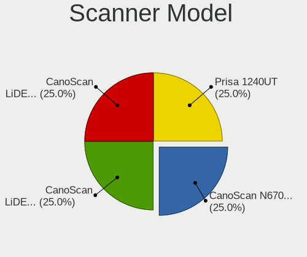

| Model                                    | Desktops | Percent |
|------------------------------------------|----------|---------|
| Canon CanoScan N670U/N676U/LiDE 20       | 1        | 25%     |
| Canon CanoScan LiDE 700F                 | 1        | 25%     |
| Canon CanoScan LiDE 220                  | 1        | 25%     |
| Acer Peripherals (now BenQ) Prisa 1240UT | 1        | 25%     |

Camera
------

Camera Vendor
-------------

Camera device vendors

| Vendor                                 | Desktops | Percent |
|----------------------------------------|----------|---------|
| Logitech                               | 7        | 35%     |
| Chicony Electronics                    | 4        | 20%     |
| Z-Star Microelectronics                | 1        | 5%      |
| Sunplus Innovation Technology          | 1        | 5%      |
| Sony Ericsson Mobile Communications AB | 1        | 5%      |
| Sony                                   | 1        | 5%      |
| Samsung Electronics                    | 1        | 5%      |
| Pixart Imaging                         | 1        | 5%      |
| Microdia                               | 1        | 5%      |
| MacroSilicon                           | 1        | 5%      |
| Cubeternet                             | 1        | 5%      |

Camera Model
------------

Camera device models

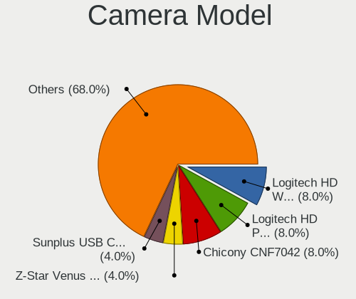

| Model                                           | Desktops | Percent |
|-------------------------------------------------|----------|---------|
| Chicony CNF7042                                 | 2        | 10%     |
| Z-Star Venus USB2.0 Camera                      | 1        | 5%      |
| Sunplus HD 720P webcam                          | 1        | 5%      |
| Sony Ericsson Mobile AB Xperia 10 II - Dual SIM | 1        | 5%      |
| Sony CEVCECM                                    | 1        | 5%      |
| Samsung Galaxy series, misc. (MTP mode)         | 1        | 5%      |
| Pixart Imaging GE 1.3 MP MiniCam Pro            | 1        | 5%      |
| Microdia Camera                                 | 1        | 5%      |
| MacroSilicon MS210x Video Grabber [EasierCAP]   | 1        | 5%      |
| Logitech Webcam C925e                           | 1        | 5%      |
| Logitech Webcam C310                            | 1        | 5%      |
| Logitech Webcam C210                            | 1        | 5%      |
| Logitech Webcam C170                            | 1        | 5%      |
| Logitech HD Webcam C910                         | 1        | 5%      |
| Logitech HD Pro Webcam C920                     | 1        | 5%      |
| Logitech BRIO Ultra HD Webcam                   | 1        | 5%      |
| Cubeternet GL-UPC822 UVC WebCam                 | 1        | 5%      |
| Chicony WebCam                                  | 1        | 5%      |
| Chicony USB2.0 HD UVC WebCam                    | 1        | 5%      |

Security
--------

Fingerprint Vendor
------------------

Fingerprint sensor vendors

| Vendor                | Desktops | Percent |
|-----------------------|----------|---------|
| Elan Microelectronics | 1        | 100%    |

Fingerprint Model
-----------------

Fingerprint sensor models

| Model                                       | Desktops | Percent |
|---------------------------------------------|----------|---------|
| Elan fingerprint sensor [FeinTech FPS00200] | 1        | 100%    |

Chipcard Vendor
---------------

Chipcard module vendors

| Vendor           | Desktops | Percent |
|------------------|----------|---------|
| SCM Microsystems | 1        | 100%    |

Chipcard Model
--------------

Chipcard module models

| Model                                       | Desktops | Percent |
|---------------------------------------------|----------|---------|
| SCM Microsystems uTrust 3512 SAM slot Token | 1        | 100%    |

Unsupported
-----------

Unsupported Devices
-------------------

Total unsupported devices on board

| Total | Desktops | Percent |
|-------|----------|---------|
| 0     | 135      | 81.33%  |
| 1     | 31       | 18.67%  |

Unsupported Device Types
------------------------

Types of unsupported devices

| Type                  | Desktops | Percent |
|-----------------------|----------|---------|
| Graphics card         | 16       | 51.61%  |
| Net/wireless          | 5        | 16.13%  |
| Multimedia controller | 5        | 16.13%  |
| Unassigned class      | 2        | 6.45%   |
| Fingerprint reader    | 1        | 3.23%   |
| Chipcard              | 1        | 3.23%   |
| Card reader           | 1        | 3.23%   |

