Linux in Slovenia - Tested Hardware & Statistics (Desktops)
-----------------------------------------------------------

A project to collect tested hardware configurations for Linux in Slovenia.

Anyone can contribute to this report by the [hw-probe](https://github.com/linuxhw/hw-probe) tool:

    sudo -E hw-probe -all -upload

Please contribute! Especially if your hardware is rare.

Contents
--------

* [ Test Cases ](#test-cases)

* [ System ](#system)
  - [ OS                       ](#os)
  - [ OS Family                ](#os-family)
  - [ Kernel                   ](#kernel)
  - [ Kernel Family            ](#kernel-family)
  - [ Kernel Major Ver.        ](#kernel-major-ver)
  - [ Arch                     ](#arch)
  - [ DE                       ](#de)
  - [ Display Server           ](#display-server)
  - [ Display Manager          ](#display-manager)
  - [ OS Lang                  ](#os-lang)
  - [ Boot Mode                ](#boot-mode)
  - [ Filesystem               ](#filesystem)
  - [ Part. scheme             ](#part-scheme)
  - [ Dual Boot with Linux/BSD ](#dual-boot-with-linuxbsd)
  - [ Dual Boot (Win)          ](#dual-boot-win)

* [ Board ](#board)
  - [ Vendor                   ](#vendor)
  - [ Model                    ](#model)
  - [ Model Family             ](#model-family)
  - [ MFG Year                 ](#mfg-year)
  - [ Form Factor              ](#form-factor)
  - [ Secure Boot              ](#secure-boot)
  - [ Coreboot                 ](#coreboot)
  - [ RAM Size                 ](#ram-size)
  - [ RAM Used                 ](#ram-used)
  - [ Total Drives             ](#total-drives)
  - [ Has CD-ROM               ](#has-cd-rom)
  - [ Has Ethernet             ](#has-ethernet)
  - [ Has WiFi                 ](#has-wifi)
  - [ Has Bluetooth            ](#has-bluetooth)

* [ Location ](#location)
  - [ Country                  ](#country)
  - [ City                     ](#city)

* [ Drives ](#drives)
  - [ Drive Vendor             ](#drive-vendor)
  - [ Drive Model              ](#drive-model)
  - [ HDD Vendor               ](#hdd-vendor)
  - [ SSD Vendor               ](#ssd-vendor)
  - [ Drive Kind               ](#drive-kind)
  - [ Drive Connector          ](#drive-connector)
  - [ Drive Size               ](#drive-size)
  - [ Space Total              ](#space-total)
  - [ Space Used               ](#space-used)
  - [ Malfunc. Drives          ](#malfunc-drives)
  - [ Malfunc. Drive Vendor    ](#malfunc-drive-vendor)
  - [ Malfunc. HDD Vendor      ](#malfunc-hdd-vendor)
  - [ Malfunc. Drive Kind      ](#malfunc-drive-kind)
  - [ Failed Drives            ](#failed-drives)
  - [ Failed Drive Vendor      ](#failed-drive-vendor)
  - [ Drive Status             ](#drive-status)

* [ Storage controller ](#storage-controller)
  - [ Storage Vendor           ](#storage-vendor)
  - [ Storage Model            ](#storage-model)
  - [ Storage Kind             ](#storage-kind)

* [ Processor ](#processor)
  - [ CPU Vendor               ](#cpu-vendor)
  - [ CPU Model                ](#cpu-model)
  - [ CPU Model Family         ](#cpu-model-family)
  - [ CPU Cores                ](#cpu-cores)
  - [ CPU Sockets              ](#cpu-sockets)
  - [ CPU Threads              ](#cpu-threads)
  - [ CPU Op-Modes             ](#cpu-op-modes)
  - [ CPU Microcode            ](#cpu-microcode)
  - [ CPU Microarch            ](#cpu-microarch)

* [ Graphics ](#graphics)
  - [ GPU Vendor               ](#gpu-vendor)
  - [ GPU Model                ](#gpu-model)
  - [ GPU Combo                ](#gpu-combo)
  - [ GPU Driver               ](#gpu-driver)
  - [ GPU Memory               ](#gpu-memory)

* [ Monitor ](#monitor)
  - [ Monitor Vendor           ](#monitor-vendor)
  - [ Monitor Model            ](#monitor-model)
  - [ Monitor Resolution       ](#monitor-resolution)
  - [ Monitor Diagonal         ](#monitor-diagonal)
  - [ Monitor Width            ](#monitor-width)
  - [ Aspect Ratio             ](#aspect-ratio)
  - [ Monitor Area             ](#monitor-area)
  - [ Pixel Density            ](#pixel-density)
  - [ Multiple Monitors        ](#multiple-monitors)

* [ Network ](#network)
  - [ Net Controller Vendor    ](#net-controller-vendor)
  - [ Net Controller Model     ](#net-controller-model)
  - [ Wireless Vendor          ](#wireless-vendor)
  - [ Wireless Model           ](#wireless-model)
  - [ Ethernet Vendor          ](#ethernet-vendor)
  - [ Ethernet Model           ](#ethernet-model)
  - [ Net Controller Kind      ](#net-controller-kind)
  - [ Used Controller          ](#used-controller)
  - [ NICs                     ](#nics)
  - [ IPv6                     ](#ipv6)

* [ Bluetooth ](#bluetooth)
  - [ Bluetooth Vendor         ](#bluetooth-vendor)
  - [ Bluetooth Model          ](#bluetooth-model)

* [ Sound ](#sound)
  - [ Sound Vendor             ](#sound-vendor)
  - [ Sound Model              ](#sound-model)

* [ Memory ](#memory)
  - [ Memory Vendor            ](#memory-vendor)
  - [ Memory Model             ](#memory-model)
  - [ Memory Kind              ](#memory-kind)
  - [ Memory Form Factor       ](#memory-form-factor)
  - [ Memory Size              ](#memory-size)
  - [ Memory Speed             ](#memory-speed)

* [ Printers & scanners ](#printers--scanners)
  - [ Printer Vendor           ](#printer-vendor)
  - [ Printer Model            ](#printer-model)
  - [ Scanner Vendor           ](#scanner-vendor)
  - [ Scanner Model            ](#scanner-model)

* [ Camera ](#camera)
  - [ Camera Vendor            ](#camera-vendor)
  - [ Camera Model             ](#camera-model)

* [ Security ](#security)
  - [ Fingerprint Vendor       ](#fingerprint-vendor)
  - [ Fingerprint Model        ](#fingerprint-model)
  - [ Chipcard Vendor          ](#chipcard-vendor)
  - [ Chipcard Model           ](#chipcard-model)

* [ Unsupported ](#unsupported)
  - [ Unsupported Devices      ](#unsupported-devices)
  - [ Unsupported Device Types ](#unsupported-device-types)

Test Cases
----------

Total: 158

| Vendor   | Model                       | Probe                                                      | Date         |
|----------|-----------------------------|------------------------------------------------------------|--------------|
| MSI      | B450 TOMAHAWK MAX           | [17954b8ac5](https://linux-hardware.org/?probe=17954b8ac5) | Jul 26, 2022 |
| ASUSTek  | PRIME X470-PRO              | [0e195b05bf](https://linux-hardware.org/?probe=0e195b05bf) | Jul 13, 2022 |
| ASUSTek  | CROSSHAIR V FORMULA-Z       | [d59692d648](https://linux-hardware.org/?probe=d59692d648) | Jun 29, 2022 |
| ASRock   | H61M-ITX                    | [4afafc5b76](https://linux-hardware.org/?probe=4afafc5b76) | Jun 29, 2022 |
| HP       | 212B                        | [a163af0cb5](https://linux-hardware.org/?probe=a163af0cb5) | Jun 21, 2022 |
| ASRock   | X570M Pro4                  | [bbb784f2df](https://linux-hardware.org/?probe=bbb784f2df) | Jun 18, 2022 |
| ASUSTek  | ROG STRIX X570-E GAMING     | [cc2e6a1605](https://linux-hardware.org/?probe=cc2e6a1605) | Jun 17, 2022 |
| ASRock   | X570M Pro4                  | [4f6d06171b](https://linux-hardware.org/?probe=4f6d06171b) | Jun 10, 2022 |
| Intel    | CM-iAM/SBC-FITPC2i          | [cbfe433386](https://linux-hardware.org/?probe=cbfe433386) | May 20, 2022 |
| ASUSTek  | ROG STRIX Z370-F GAMING     | [86d60d0227](https://linux-hardware.org/?probe=86d60d0227) | May 12, 2022 |
| Gigabyte | GA-MA770T-UD3               | [934d403a31](https://linux-hardware.org/?probe=934d403a31) | May 04, 2022 |
| ASUSTek  | ROG STRIX Z370-F GAMING     | [965985d6f4](https://linux-hardware.org/?probe=965985d6f4) | Apr 29, 2022 |
| ASUSTek  | ROG STRIX X570-E GAMING     | [f727388ac8](https://linux-hardware.org/?probe=f727388ac8) | Apr 17, 2022 |
| ASUSTek  | ROG STRIX X570-E GAMING     | [c1102c77ec](https://linux-hardware.org/?probe=c1102c77ec) | Apr 17, 2022 |
| ASUSTek  | STRIX Z270G GAMING          | [76a5225b83](https://linux-hardware.org/?probe=76a5225b83) | Apr 16, 2022 |
| ASRock   | H170M Pro4                  | [0dd1b326c0](https://linux-hardware.org/?probe=0dd1b326c0) | Apr 15, 2022 |
| ASUSTek  | TUF Gaming B560-PLUS WIF... | [222189213d](https://linux-hardware.org/?probe=222189213d) | Apr 11, 2022 |
| MSI      | X570-A PRO                  | [0813d4bc9e](https://linux-hardware.org/?probe=0813d4bc9e) | Mar 31, 2022 |
| MSI      | X570-A PRO                  | [defac75126](https://linux-hardware.org/?probe=defac75126) | Mar 31, 2022 |
| ASUSTek  | PRIME B250M-A               | [1260b540e7](https://linux-hardware.org/?probe=1260b540e7) | Mar 27, 2022 |
| ASUSTek  | PRIME A320M-K               | [9d5d5c0ffb](https://linux-hardware.org/?probe=9d5d5c0ffb) | Feb 26, 2022 |
| ASUSTek  | ROG STRIX B450-F GAMING ... | [1c8a37fb2f](https://linux-hardware.org/?probe=1c8a37fb2f) | Feb 24, 2022 |
| Dell     | 09M8Y8 A02                  | [202fc1f0b9](https://linux-hardware.org/?probe=202fc1f0b9) | Feb 22, 2022 |
| ASUSTek  | PRIME H410M-A               | [cad9a70c49](https://linux-hardware.org/?probe=cad9a70c49) | Feb 16, 2022 |
| ASUSTek  | PRIME H410M-A               | [676d121bda](https://linux-hardware.org/?probe=676d121bda) | Feb 13, 2022 |
| Gigabyte | EP45-UD3LR                  | [239eb94a17](https://linux-hardware.org/?probe=239eb94a17) | Feb 07, 2022 |
| Gigabyte | Z170-HD3P-CF                | [901d568e70](https://linux-hardware.org/?probe=901d568e70) | Jan 31, 2022 |
| Gigabyte | Z170-HD3P-CF                | [621d099786](https://linux-hardware.org/?probe=621d099786) | Jan 31, 2022 |
| HP       | 1589                        | [41dbcb78cb](https://linux-hardware.org/?probe=41dbcb78cb) | Jan 30, 2022 |
| Pegatron | EVE                         | [06d22ac6e2](https://linux-hardware.org/?probe=06d22ac6e2) | Jan 21, 2022 |
| Pegatron | EVE                         | [5640f6122a](https://linux-hardware.org/?probe=5640f6122a) | Jan 21, 2022 |
| ASRock   | B85M-HDS                    | [77cb3218a8](https://linux-hardware.org/?probe=77cb3218a8) | Jan 12, 2022 |
| Lenovo   | ThinkCentre M57e 9439WHV    | [a9b2163945](https://linux-hardware.org/?probe=a9b2163945) | Dec 25, 2021 |
| Gigabyte | H57M-USB3                   | [ee70d6b4b4](https://linux-hardware.org/?probe=ee70d6b4b4) | Dec 24, 2021 |
| ASUSTek  | ROG STRIX Z370-F GAMING     | [6aee0ff442](https://linux-hardware.org/?probe=6aee0ff442) | Dec 15, 2021 |
| ASUSTek  | TUF B450-PLUS GAMING        | [6649bea1f8](https://linux-hardware.org/?probe=6649bea1f8) | Dec 04, 2021 |
| ASUSTek  | TUF B450-PLUS GAMING        | [723e2a158a](https://linux-hardware.org/?probe=723e2a158a) | Dec 03, 2021 |
| ASUSTek  | M4A78T-E                    | [df3010e1b8](https://linux-hardware.org/?probe=df3010e1b8) | Nov 27, 2021 |
| ASUSTek  | ROG STRIX X570-F GAMING     | [6016236fad](https://linux-hardware.org/?probe=6016236fad) | Nov 24, 2021 |
| Gigabyte | H57M-USB3                   | [97409a8d1c](https://linux-hardware.org/?probe=97409a8d1c) | Nov 22, 2021 |
| Gigabyte | H57M-USB3                   | [e0e4ee802a](https://linux-hardware.org/?probe=e0e4ee802a) | Nov 22, 2021 |
| Gigabyte | H61M-S2PV                   | [163092e4b9](https://linux-hardware.org/?probe=163092e4b9) | Nov 18, 2021 |
| ASUSTek  | ROG STRIX X570-E GAMING     | [dfe40a023a](https://linux-hardware.org/?probe=dfe40a023a) | Nov 12, 2021 |
| ASUSTek  | ROG STRIX X570-E GAMING     | [1336c9e31c](https://linux-hardware.org/?probe=1336c9e31c) | Nov 12, 2021 |
| Fujitsu  | D3417-B2 S26361-D3417-B2    | [ab14080e40](https://linux-hardware.org/?probe=ab14080e40) | Nov 09, 2021 |
| ASUSTek  | PRIME Z270-A                | [a11d4b7c50](https://linux-hardware.org/?probe=a11d4b7c50) | Oct 20, 2021 |
| ASRock   | X300M-STX                   | [cd738f5036](https://linux-hardware.org/?probe=cd738f5036) | Oct 11, 2021 |
| ASRock   | X300M-STX                   | [bc1fd03a63](https://linux-hardware.org/?probe=bc1fd03a63) | Oct 10, 2021 |
| ASRock   | X300M-STX                   | [6ec6ce5c81](https://linux-hardware.org/?probe=6ec6ce5c81) | Oct 10, 2021 |
| MSI      | X570-A PRO                  | [9813ead17b](https://linux-hardware.org/?probe=9813ead17b) | Sep 23, 2021 |
| Medion   | Akoya E7226                 | [9367472acb](https://linux-hardware.org/?probe=9367472acb) | Sep 18, 2021 |
| MSI      | X570-A PRO                  | [934d0576e0](https://linux-hardware.org/?probe=934d0576e0) | Aug 27, 2021 |
| ASRock   | H310CM-HDV                  | [0fccd48745](https://linux-hardware.org/?probe=0fccd48745) | Aug 13, 2021 |
| MSI      | X570-A PRO                  | [8cc7d05010](https://linux-hardware.org/?probe=8cc7d05010) | Aug 12, 2021 |
| ASUSTek  | PRIME A320M-K               | [e6e223209a](https://linux-hardware.org/?probe=e6e223209a) | Jul 20, 2021 |
| MSI      | H61M-P31                    | [ccd9d80d59](https://linux-hardware.org/?probe=ccd9d80d59) | Jul 18, 2021 |
| Pegatron | 2A73                        | [2bff425af7](https://linux-hardware.org/?probe=2bff425af7) | Jul 14, 2021 |
| Pegatron | 2A73                        | [44ea7169ef](https://linux-hardware.org/?probe=44ea7169ef) | Jul 14, 2021 |
| MSI      | B450 TOMAHAWK MAX II        | [bc18a23953](https://linux-hardware.org/?probe=bc18a23953) | Jun 28, 2021 |
| Gigabyte | F2A88XM-D3HP                | [02bf919368](https://linux-hardware.org/?probe=02bf919368) | Jun 02, 2021 |
| Lenovo   | ThinkStation S20 4157ZSK    | [3e6d98fe9c](https://linux-hardware.org/?probe=3e6d98fe9c) | Apr 27, 2021 |
| ASRock   | B560 Pro4                   | [ddd384c6cb](https://linux-hardware.org/?probe=ddd384c6cb) | Apr 26, 2021 |
| Lenovo   | ThinkCentre M55e 9389WEG    | [66c2003859](https://linux-hardware.org/?probe=66c2003859) | Apr 20, 2021 |
| HP       | 1905                        | [e0fc243f47](https://linux-hardware.org/?probe=e0fc243f47) | Apr 19, 2021 |
| ASUSTek  | P5Q SE                      | [325f4ca461](https://linux-hardware.org/?probe=325f4ca461) | Apr 05, 2021 |
| ASUSTek  | P5Q SE                      | [1c3958d998](https://linux-hardware.org/?probe=1c3958d998) | Apr 05, 2021 |
| Lenovo   | ThinkStation S20 4157ZSK    | [1038d58fea](https://linux-hardware.org/?probe=1038d58fea) | Mar 25, 2021 |
| Lenovo   | ThinkStation S20 4157ZSK    | [8b28b318fd](https://linux-hardware.org/?probe=8b28b318fd) | Mar 19, 2021 |
| Gigabyte | H61M-D2-B3                  | [453120855b](https://linux-hardware.org/?probe=453120855b) | Mar 18, 2021 |
| Apple    | Mac-F4208DA9 PVT            | [4ab255096c](https://linux-hardware.org/?probe=4ab255096c) | Feb 28, 2021 |
| Dell     | 0C27VV A02                  | [49cd056ca4](https://linux-hardware.org/?probe=49cd056ca4) | Feb 24, 2021 |
| Gigabyte | P35C-DS3R                   | [bd76fdbde8](https://linux-hardware.org/?probe=bd76fdbde8) | Feb 20, 2021 |
| ASUSTek  | PRIME B350-PLUS             | [153bb12a6a](https://linux-hardware.org/?probe=153bb12a6a) | Feb 19, 2021 |
| MSI      | H61M-P31                    | [a0192f9d6e](https://linux-hardware.org/?probe=a0192f9d6e) | Feb 17, 2021 |
| ASUSTek  | SABERTOOTH 990FX R2.0       | [106c66da60](https://linux-hardware.org/?probe=106c66da60) | Feb 14, 2021 |
| Lenovo   | ThinkCentre M90p 5498PK8    | [df39a8847b](https://linux-hardware.org/?probe=df39a8847b) | Feb 14, 2021 |
| ASUSTek  | P7H55-M SI                  | [e40fe3768d](https://linux-hardware.org/?probe=e40fe3768d) | Feb 09, 2021 |
| Gigabyte | P35C-DS3R                   | [a31754db23](https://linux-hardware.org/?probe=a31754db23) | Feb 08, 2021 |
| Pegatron | 2A73                        | [4c2042c088](https://linux-hardware.org/?probe=4c2042c088) | Jan 18, 2021 |
| Pegatron | 2A73                        | [c6cf8a7efe](https://linux-hardware.org/?probe=c6cf8a7efe) | Jan 18, 2021 |
| MSI      | H55M-P31                    | [3313a8aba5](https://linux-hardware.org/?probe=3313a8aba5) | Jan 12, 2021 |
| ASUSTek  | PRIME B350-PLUS             | [0265add193](https://linux-hardware.org/?probe=0265add193) | Jan 10, 2021 |
| Gigabyte | B450M DS3H-CF               | [8b0a9a71b3](https://linux-hardware.org/?probe=8b0a9a71b3) | Jan 10, 2021 |
| ASUSTek  | PRIME B350-PLUS             | [497bf4005e](https://linux-hardware.org/?probe=497bf4005e) | Jan 10, 2021 |
| Gigabyte | H61M-D2-B3                  | [60d8b9344b](https://linux-hardware.org/?probe=60d8b9344b) | Jan 09, 2021 |
| ASUSTek  | TUF Z370-PLUS GAMING        | [58204a920b](https://linux-hardware.org/?probe=58204a920b) | Jan 05, 2021 |
| Gigabyte | H270-HD3-CF                 | [b6c93666ee](https://linux-hardware.org/?probe=b6c93666ee) | Dec 29, 2020 |
| Gigabyte | H270-HD3-CF                 | [7905034ba5](https://linux-hardware.org/?probe=7905034ba5) | Dec 29, 2020 |
| Gigabyte | H270-HD3-CF                 | [71370e1dd8](https://linux-hardware.org/?probe=71370e1dd8) | Dec 19, 2020 |
| Gigabyte | B450M GAMING                | [def1b6fff4](https://linux-hardware.org/?probe=def1b6fff4) | Dec 13, 2020 |
| Pegatron | EVE                         | [08ced52205](https://linux-hardware.org/?probe=08ced52205) | Nov 29, 2020 |
| ASRock   | H110M-HDV R3.0              | [c3df499de1](https://linux-hardware.org/?probe=c3df499de1) | Nov 12, 2020 |
| ASRock   | H110M-HDV R3.0              | [e05c144d2f](https://linux-hardware.org/?probe=e05c144d2f) | Nov 12, 2020 |
| Lenovo   | ThinkCentre M55e 9389WEG    | [2462c80a14](https://linux-hardware.org/?probe=2462c80a14) | Nov 10, 2020 |
| ASUSTek  | Z97-K                       | [e8f7b6ef7e](https://linux-hardware.org/?probe=e8f7b6ef7e) | Nov 07, 2020 |
| ASUSTek  | Z97-K                       | [7e9d52855a](https://linux-hardware.org/?probe=7e9d52855a) | Nov 07, 2020 |
| MSI      | B450 TOMAHAWK               | [1e6ba50614](https://linux-hardware.org/?probe=1e6ba50614) | Nov 04, 2020 |
| Intel    | DH87RL AAG74240-403         | [caa0e9c93b](https://linux-hardware.org/?probe=caa0e9c93b) | Nov 02, 2020 |
| Gigabyte | H270-HD3-CF                 | [fa6d538a50](https://linux-hardware.org/?probe=fa6d538a50) | Oct 31, 2020 |
| MSI      | B360M PRO-VDH               | [d336eeaa8d](https://linux-hardware.org/?probe=d336eeaa8d) | Oct 21, 2020 |
| Lenovo   | 3098 NOK                    | [2c592ebb94](https://linux-hardware.org/?probe=2c592ebb94) | Oct 19, 2020 |
| Lenovo   | 3098 NOK                    | [92a22bd753](https://linux-hardware.org/?probe=92a22bd753) | Oct 19, 2020 |
| Gigabyte | Z68P-DS3                    | [2e8b092dbc](https://linux-hardware.org/?probe=2e8b092dbc) | Oct 12, 2020 |
| Gigabyte | Z97X-Gaming 3               | [da4740881e](https://linux-hardware.org/?probe=da4740881e) | Oct 04, 2020 |
| Pegatron | 2A94h                       | [3a1ede6188](https://linux-hardware.org/?probe=3a1ede6188) | Oct 03, 2020 |
| Gigabyte | F2A88XM-D3HP                | [1d3401ff46](https://linux-hardware.org/?probe=1d3401ff46) | Oct 02, 2020 |
| Intel    | DQ35JO AAD82085-801         | [51c42a0f25](https://linux-hardware.org/?probe=51c42a0f25) | Sep 17, 2020 |
| Pegatron | 2A73                        | [a4607af679](https://linux-hardware.org/?probe=a4607af679) | Aug 25, 2020 |
| Pegatron | 2A73                        | [f2c225880d](https://linux-hardware.org/?probe=f2c225880d) | Aug 25, 2020 |
| HP       | 3048h                       | [0bc2b9bafc](https://linux-hardware.org/?probe=0bc2b9bafc) | Aug 17, 2020 |
| ASUSTek  | P7H55-M SI                  | [c323481902](https://linux-hardware.org/?probe=c323481902) | Jun 14, 2020 |
| ASUSTek  | P7H55-M SI                  | [6889f53e3b](https://linux-hardware.org/?probe=6889f53e3b) | Jun 13, 2020 |
| ASRock   | X570 Extreme4               | [add6daf97a](https://linux-hardware.org/?probe=add6daf97a) | Jun 07, 2020 |
| ASUSTek  | PRIME H370-PLUS             | [d7dee77bfc](https://linux-hardware.org/?probe=d7dee77bfc) | Jun 04, 2020 |
| Gigabyte | B85M-HD3                    | [03b36ff9c1](https://linux-hardware.org/?probe=03b36ff9c1) | May 28, 2020 |
| ASRock   | Z390 Pro4                   | [e1c0c74ca6](https://linux-hardware.org/?probe=e1c0c74ca6) | May 25, 2020 |
| MSI      | H61M-P31                    | [870b2534d7](https://linux-hardware.org/?probe=870b2534d7) | May 22, 2020 |
| MSI      | H110M ECO                   | [fe6009a465](https://linux-hardware.org/?probe=fe6009a465) | May 15, 2020 |
| Lenovo   | ThinkCentre M55e 9389W11    | [f148017266](https://linux-hardware.org/?probe=f148017266) | Apr 12, 2020 |
| ASUSTek  | H170 PRO GAMING             | [f9c3afb706](https://linux-hardware.org/?probe=f9c3afb706) | Apr 08, 2020 |
| Gigabyte | B360M DS3H                  | [17dd7e6ddb](https://linux-hardware.org/?probe=17dd7e6ddb) | Apr 05, 2020 |
| Lenovo   | ThinkCentre M57e 9356W2K    | [663d112138](https://linux-hardware.org/?probe=663d112138) | Apr 02, 2020 |
| HP       | 0A58h                       | [0734e4224d](https://linux-hardware.org/?probe=0734e4224d) | Mar 16, 2020 |
| ASUSTek  | H110M-A                     | [9a43e8f82a](https://linux-hardware.org/?probe=9a43e8f82a) | Feb 26, 2020 |
| ASUSTek  | H110M-A                     | [0722f7ccf8](https://linux-hardware.org/?probe=0722f7ccf8) | Feb 22, 2020 |
| ASUSTek  | P8Z77-M PRO                 | [44e0ce8fc8](https://linux-hardware.org/?probe=44e0ce8fc8) | Jan 24, 2020 |
| Medion   | MS-7707                     | [3feacd8f08](https://linux-hardware.org/?probe=3feacd8f08) | Jan 19, 2020 |
| Medion   | MS-7707                     | [5d5096c9a8](https://linux-hardware.org/?probe=5d5096c9a8) | Jan 18, 2020 |
| Biostar  | TH55B HD                    | [3f28da0706](https://linux-hardware.org/?probe=3f28da0706) | Jan 17, 2020 |
| Biostar  | TH55B HD                    | [980b5da590](https://linux-hardware.org/?probe=980b5da590) | Jan 02, 2020 |
| Biostar  | TH55B HD                    | [e13730f188](https://linux-hardware.org/?probe=e13730f188) | Dec 25, 2019 |
| HP       | 1495                        | [d56240bfb5](https://linux-hardware.org/?probe=d56240bfb5) | Dec 07, 2019 |
| Gigabyte | F2A88XM-D3HP                | [de68096cdc](https://linux-hardware.org/?probe=de68096cdc) | Nov 27, 2019 |
| ASRock   | H61M-DGS R2.0               | [7ad66ff018](https://linux-hardware.org/?probe=7ad66ff018) | Nov 23, 2019 |
| ASRock   | H61M-DGS R2.0               | [837d7c2621](https://linux-hardware.org/?probe=837d7c2621) | Nov 23, 2019 |
| HP       | 1495                        | [7517e7c74d](https://linux-hardware.org/?probe=7517e7c74d) | Nov 20, 2019 |
| HP       | 1495                        | [b4598c0e73](https://linux-hardware.org/?probe=b4598c0e73) | Nov 19, 2019 |
| HP       | 1495                        | [ab3f7ddb42](https://linux-hardware.org/?probe=ab3f7ddb42) | Nov 05, 2019 |
| HP       | 1495                        | [75e4e80f87](https://linux-hardware.org/?probe=75e4e80f87) | Oct 04, 2019 |
| HP       | 1495                        | [470c7daaaa](https://linux-hardware.org/?probe=470c7daaaa) | Sep 20, 2019 |
| HP       | 1495                        | [4f34ee60db](https://linux-hardware.org/?probe=4f34ee60db) | Sep 17, 2019 |
| Medion   | MS-7707                     | [9b50675efd](https://linux-hardware.org/?probe=9b50675efd) | Aug 03, 2019 |
| ASUSTek  | PRIME X470-PRO              | [4a2455eae6](https://linux-hardware.org/?probe=4a2455eae6) | Jul 28, 2019 |
| ASUSTek  | PRIME X470-PRO              | [8d117b8f35](https://linux-hardware.org/?probe=8d117b8f35) | Jul 28, 2019 |
| Gigabyte | F2A88XM-D3HP                | [ab7980dba3](https://linux-hardware.org/?probe=ab7980dba3) | Jul 01, 2019 |
| Medion   | MS-7707                     | [b843e52e30](https://linux-hardware.org/?probe=b843e52e30) | Jun 03, 2019 |
| Lenovo   | ThinkCentre M57 6072VAM     | [c399cbb5f3](https://linux-hardware.org/?probe=c399cbb5f3) | May 04, 2019 |
| ASUSTek  | PRIME X370-PRO              | [8ad90844e8](https://linux-hardware.org/?probe=8ad90844e8) | Apr 16, 2019 |
| Medion   | MS-7707                     | [71684dcee4](https://linux-hardware.org/?probe=71684dcee4) | Apr 12, 2019 |
| HP       | 0A68h                       | [fa9c3d044f](https://linux-hardware.org/?probe=fa9c3d044f) | Mar 13, 2019 |
| Intel    | DQ67SW AAG12527-310         | [d304d79466](https://linux-hardware.org/?probe=d304d79466) | Mar 10, 2019 |
| ASUSTek  | PRIME X470-PRO              | [8348d3c21e](https://linux-hardware.org/?probe=8348d3c21e) | Feb 23, 2019 |
| HP       | 82A2                        | [0f9aa13b55](https://linux-hardware.org/?probe=0f9aa13b55) | Feb 21, 2019 |
| ASUSTek  | PRIME X470-PRO              | [0407ee67e9](https://linux-hardware.org/?probe=0407ee67e9) | Feb 11, 2019 |
| HP       | 0A68h                       | [7b0d921779](https://linux-hardware.org/?probe=7b0d921779) | Dec 15, 2018 |
| HP       | 0A68h                       | [b773c3a27d](https://linux-hardware.org/?probe=b773c3a27d) | Dec 15, 2018 |
| HP       | 0A68h                       | [11bcd6f218](https://linux-hardware.org/?probe=11bcd6f218) | Dec 15, 2018 |
| Gigabyte | 970A-UD3P                   | [d48dca3ee3](https://linux-hardware.org/?probe=d48dca3ee3) | Feb 18, 2017 |

System
------

OS
--

Installed operating systems

| Name                         | Desktops | Percent |
|------------------------------|----------|---------|
| Ubuntu 20.04                 | 24       | 22.22%  |
| Ubuntu 18.04                 | 10       | 9.26%   |
| Zorin 16                     | 4        | 3.7%    |
| KDE neon 20.04               | 4        | 3.7%    |
| Xubuntu 20.04                | 3        | 2.78%   |
| Ubuntu 19.10                 | 3        | 2.78%   |
| Pop!_OS 20.04                | 3        | 2.78%   |
| OpenMandriva 4.3             | 3        | 2.78%   |
| Linux Mint 19.3              | 3        | 2.78%   |
| Ubuntu 22.04                 | 2        | 1.85%   |
| Ubuntu 20.10                 | 2        | 1.85%   |
| Ubuntu 18.10                 | 2        | 1.85%   |
| Pop!_OS 21.10                | 2        | 1.85%   |
| OpenMandriva 4.2             | 2        | 1.85%   |
| Fedora 35                    | 2        | 1.85%   |
| Debian 11                    | 2        | 1.85%   |
| Zorin 15                     | 1        | 0.93%   |
| Xubuntu 21.10                | 1        | 0.93%   |
| Ubuntu MATE 18.04            | 1        | 0.93%   |
| Ubuntu Kylin 20.04           | 1        | 0.93%   |
| Ubuntu Budgie 22.04          | 1        | 0.93%   |
| Ubuntu 21.10                 | 1        | 0.93%   |
| Ubuntu 16.04                 | 1        | 0.93%   |
| ROSA R8                      | 1        | 0.93%   |
| openSUSE Tumbleweed-XXXXXXXX | 1        | 0.93%   |
| OpenMandriva 4.50            | 1        | 0.93%   |
| Manjaro 21.2.3               | 1        | 0.93%   |
| Manjaro 21.2.0               | 1        | 0.93%   |
| Manjaro 21.0.2               | 1        | 0.93%   |
| Manjaro 20.2.1               | 1        | 0.93%   |
| Mageia 8                     | 1        | 0.93%   |
| Lubuntu 20.04                | 1        | 0.93%   |
| Linux Mint 20.3              | 1        | 0.93%   |
| Linux Mint 20.2              | 1        | 0.93%   |
| Linux Mint 20                | 1        | 0.93%   |
| Linux Mint 19.1              | 1        | 0.93%   |
| Kubuntu 22.04                | 1        | 0.93%   |
| Kubuntu 20.04                | 1        | 0.93%   |
| Kubuntu 19.10                | 1        | 0.93%   |
| Gentoo 2.8                   | 1        | 0.93%   |
| Gentoo 2.7                   | 1        | 0.93%   |
| Gentoo 2.6                   | 1        | 0.93%   |
| Fedora 34                    | 1        | 0.93%   |
| Endless 3.9.3                | 1        | 0.93%   |
| Endless 3.7.5                | 1        | 0.93%   |
| Endless 3.7.4                | 1        | 0.93%   |
| Endless 3.6.3                | 1        | 0.93%   |
| EndeavourOS Rolling          | 1        | 0.93%   |
| EndeavourOS                  | 1        | 0.93%   |
| CentOS 8                     | 1        | 0.93%   |
| BlackPanther 18.1            | 1        | 0.93%   |
| ArcoLinux Rolling            | 1        | 0.93%   |
| Arch                         | 1        | 0.93%   |

OS Family
---------

OS without a version

| Name          | Desktops | Percent |
|---------------|----------|---------|
| Ubuntu        | 43       | 42.57%  |
| Linux Mint    | 7        | 6.93%   |
| Pop!_OS       | 5        | 4.95%   |
| OpenMandriva  | 5        | 4.95%   |
| Zorin         | 4        | 3.96%   |
| Xubuntu       | 4        | 3.96%   |
| Manjaro       | 4        | 3.96%   |
| KDE neon      | 4        | 3.96%   |
| Kubuntu       | 3        | 2.97%   |
| Gentoo        | 3        | 2.97%   |
| Fedora        | 2        | 1.98%   |
| Endless       | 2        | 1.98%   |
| EndeavourOS   | 2        | 1.98%   |
| Debian        | 2        | 1.98%   |
| Ubuntu MATE   | 1        | 0.99%   |
| Ubuntu Kylin  | 1        | 0.99%   |
| Ubuntu Budgie | 1        | 0.99%   |
| ROSA          | 1        | 0.99%   |
| openSUSE      | 1        | 0.99%   |
| Mageia        | 1        | 0.99%   |
| Lubuntu       | 1        | 0.99%   |
| CentOS        | 1        | 0.99%   |
| BlackPanther  | 1        | 0.99%   |
| ArcoLinux     | 1        | 0.99%   |
| Arch          | 1        | 0.99%   |

Kernel
------

Version of the Linux kernel

| Version                  | Desktops | Percent |
|--------------------------|----------|---------|
| 5.4.0-48-generic         | 5        | 4.17%   |
| 5.8.0-43-generic         | 3        | 2.5%    |
| 5.4.0-31-generic         | 3        | 2.5%    |
| 5.16.7-desktop-1omv4003  | 3        | 2.5%    |
| 5.8.0-36-generic         | 2        | 1.67%   |
| 5.4.0-7642-generic       | 2        | 1.67%   |
| 5.4.0-66-generic         | 2        | 1.67%   |
| 5.4.0-60-generic         | 2        | 1.67%   |
| 5.4.0-52-generic         | 2        | 1.67%   |
| 5.4.0-29-generic         | 2        | 1.67%   |
| 5.3.0-40-generic         | 2        | 1.67%   |
| 5.3.0-26-generic         | 2        | 1.67%   |
| 5.3.0-23-generic         | 2        | 1.67%   |
| 5.16.15-76051615-generic | 2        | 1.67%   |
| 5.15.0-25-generic        | 2        | 1.67%   |
| 5.13.0-30-generic        | 2        | 1.67%   |
| 5.13.0-27-generic        | 2        | 1.67%   |
| 5.11.0-40-generic        | 2        | 1.67%   |
| 5.10.14-desktop-1omv4002 | 2        | 1.67%   |
| 4.18.0-17-generic        | 2        | 1.67%   |
| 4.18.0-15-generic        | 2        | 1.67%   |
| 4.15.0-45-generic        | 2        | 1.67%   |
| 5.9.2-arch1-1            | 1        | 0.83%   |
| 5.9.15-xanmod1           | 1        | 0.83%   |
| 5.8.0-63-generic         | 1        | 0.83%   |
| 5.8.0-59-generic         | 1        | 0.83%   |
| 5.8.0-53-generic         | 1        | 0.83%   |
| 5.8.0-45-generic         | 1        | 0.83%   |
| 5.8.0-41-generic         | 1        | 0.83%   |
| 5.8.0-18-generic         | 1        | 0.83%   |
| 5.8.0-14-generic         | 1        | 0.83%   |
| 5.7.0-gentoo-x86_64      | 1        | 0.83%   |
| 5.6.14-desktop-2bP       | 1        | 0.83%   |
| 5.6.0-1-default          | 1        | 0.83%   |
| 5.4.14-gentoo            | 1        | 0.83%   |
| 5.4.0-91-generic         | 1        | 0.83%   |
| 5.4.0-90-generic         | 1        | 0.83%   |
| 5.4.0-89-generic         | 1        | 0.83%   |
| 5.4.0-7634-generic       | 1        | 0.83%   |
| 5.4.0-70-generic         | 1        | 0.83%   |
| 5.4.0-58-generic         | 1        | 0.83%   |
| 5.4.0-51-generic         | 1        | 0.83%   |
| 5.4.0-47-generic         | 1        | 0.83%   |
| 5.4.0-26-generic         | 1        | 0.83%   |
| 5.4.0-21-generic         | 1        | 0.83%   |
| 5.4.0-109-generic        | 1        | 0.83%   |
| 5.4.0-104-generic        | 1        | 0.83%   |
| 5.3.0-45-generic         | 1        | 0.83%   |
| 5.3.0-27-generic         | 1        | 0.83%   |
| 5.3.0-19-generic         | 1        | 0.83%   |
| 5.17.5-76051705-generic  | 1        | 0.83%   |
| 5.16.7-1-MANJARO         | 1        | 0.83%   |
| 5.16.18-200.fc35.x86_64  | 1        | 0.83%   |
| 5.15.6-gentoo            | 1        | 0.83%   |
| 5.15.2-2-MANJARO         | 1        | 0.83%   |
| 5.15.16-desktop-1.mga8   | 1        | 0.83%   |
| 5.15.0-41-generic        | 1        | 0.83%   |
| 5.15.0-37-generic        | 1        | 0.83%   |
| 5.14.16-arch1-1          | 1        | 0.83%   |
| 5.14.10-300.fc35.x86_64  | 1        | 0.83%   |

Kernel Family
-------------

Linux kernel without a distro release

| Version | Desktops | Percent |
|---------|----------|---------|
| 5.4.0   | 29       | 25.89%  |
| 5.8.0   | 11       | 9.82%   |
| 5.13.0  | 8        | 7.14%   |
| 5.3.0   | 7        | 6.25%   |
| 4.18.0  | 7        | 6.25%   |
| 4.15.0  | 6        | 5.36%   |
| 5.11.0  | 5        | 4.46%   |
| 5.16.7  | 4        | 3.57%   |
| 5.15.0  | 4        | 3.57%   |
| 5.10.14 | 3        | 2.68%   |
| 5.16.15 | 2        | 1.79%   |
| 5.10.30 | 2        | 1.79%   |
| 5.0.0   | 2        | 1.79%   |
| 5.9.2   | 1        | 0.89%   |
| 5.9.15  | 1        | 0.89%   |
| 5.7.0   | 1        | 0.89%   |
| 5.6.14  | 1        | 0.89%   |
| 5.6.0   | 1        | 0.89%   |
| 5.4.14  | 1        | 0.89%   |
| 5.17.5  | 1        | 0.89%   |
| 5.16.18 | 1        | 0.89%   |
| 5.15.6  | 1        | 0.89%   |
| 5.15.2  | 1        | 0.89%   |
| 5.15.16 | 1        | 0.89%   |
| 5.14.16 | 1        | 0.89%   |
| 5.14.10 | 1        | 0.89%   |
| 5.14.0  | 1        | 0.89%   |
| 5.13.8  | 1        | 0.89%   |
| 5.13.16 | 1        | 0.89%   |
| 5.12.4  | 1        | 0.89%   |
| 5.12.15 | 1        | 0.89%   |
| 5.10.0  | 1        | 0.89%   |
| 4.20.7  | 1        | 0.89%   |
| 4.18.16 | 1        | 0.89%   |
| 4.1.38  | 1        | 0.89%   |

Kernel Major Ver.
-----------------

Linux kernel major version

| Version | Desktops | Percent |
|---------|----------|---------|
| 5.4     | 30       | 27.27%  |
| 5.8     | 11       | 10%     |
| 5.13    | 9        | 8.18%   |
| 4.18    | 8        | 7.27%   |
| 5.3     | 7        | 6.36%   |
| 5.16    | 7        | 6.36%   |
| 5.15    | 7        | 6.36%   |
| 5.10    | 6        | 5.45%   |
| 4.15    | 6        | 5.45%   |
| 5.11    | 5        | 4.55%   |
| 5.14    | 3        | 2.73%   |
| 5.6     | 2        | 1.82%   |
| 5.12    | 2        | 1.82%   |
| 5.0     | 2        | 1.82%   |
| 5.9     | 1        | 0.91%   |
| 5.7     | 1        | 0.91%   |
| 5.17    | 1        | 0.91%   |
| 4.20    | 1        | 0.91%   |
| 4.1     | 1        | 0.91%   |

Arch
----

OS architecture (x86_64, i586, etc.)

| Name   | Desktops | Percent |
|--------|----------|---------|
| x86_64 | 95       | 96.94%  |
| i686   | 3        | 3.06%   |

DE
--

Desktop Environment

| Name       | Desktops | Percent |
|------------|----------|---------|
| GNOME      | 45       | 42.06%  |
| KDE5       | 14       | 13.08%  |
| Unknown    | 13       | 12.15%  |
| XFCE       | 11       | 10.28%  |
| KDE        | 6        | 5.61%   |
| X-Cinnamon | 5        | 4.67%   |
| Cinnamon   | 4        | 3.74%   |
| Unity      | 2        | 1.87%   |
| UKUI       | 1        | 0.93%   |
| NsCDE      | 1        | 0.93%   |
| MATE       | 1        | 0.93%   |
| LXQt       | 1        | 0.93%   |
| KDE4       | 1        | 0.93%   |
| DWM        | 1        | 0.93%   |
| Budgie     | 1        | 0.93%   |

Display Server
--------------

X11 or Wayland

| Name    | Desktops | Percent |
|---------|----------|---------|
| X11     | 84       | 83.17%  |
| Unknown | 8        | 7.92%   |
| Tty     | 5        | 4.95%   |
| Wayland | 4        | 3.96%   |

Display Manager
---------------

SDDM, LightDM, etc.

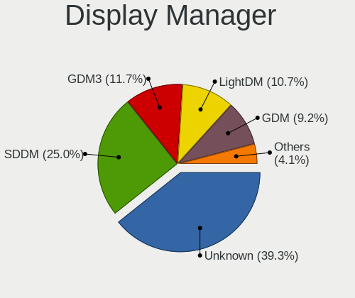

| Name    | Desktops | Percent |
|---------|----------|---------|
| Unknown | 53       | 51.46%  |
| SDDM    | 14       | 13.59%  |
| LightDM | 12       | 11.65%  |
| GDM     | 11       | 10.68%  |
| GDM3    | 6        | 5.83%   |
| TDM     | 5        | 4.85%   |
| XDM     | 1        | 0.97%   |
| KDM     | 1        | 0.97%   |

OS Lang
-------

Language

| Lang    | Desktops | Percent |
|---------|----------|---------|
| en_US   | 46       | 45.1%   |
| sl_SI   | 36       | 35.29%  |
| Unknown | 13       | 12.75%  |
| en_GB   | 3        | 2.94%   |
| C       | 2        | 1.96%   |
| it_IT   | 1        | 0.98%   |
| de_DE   | 1        | 0.98%   |

Boot Mode
---------

EFI or BIOS

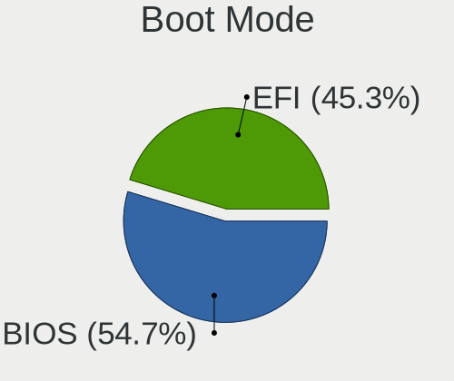

| Mode | Desktops | Percent |
|------|----------|---------|
| BIOS | 57       | 56.44%  |
| EFI  | 44       | 43.56%  |

Filesystem
----------

Type of filesystem

| Type    | Desktops | Percent |
|---------|----------|---------|
| Ext4    | 72       | 72.73%  |
| Overlay | 12       | 12.12%  |
| Unknown | 6        | 6.06%   |
| Zfs     | 4        | 4.04%   |
| Btrfs   | 4        | 4.04%   |
| Xfs     | 1        | 1.01%   |

Part. scheme
------------

Scheme of partitioning

| Type    | Desktops | Percent |
|---------|----------|---------|
| Unknown | 56       | 57.14%  |
| GPT     | 30       | 30.61%  |
| MBR     | 12       | 12.24%  |

Dual Boot with Linux/BSD
------------------------

Hosting more than one Linux/BSD

| Dual boot | Desktops | Percent |
|-----------|----------|---------|
| No        | 79       | 77.45%  |
| Yes       | 23       | 22.55%  |

Dual Boot (Win)
---------------

Hosting Linux and Windows

| Dual boot | Desktops | Percent |
|-----------|----------|---------|
| No        | 68       | 68.69%  |
| Yes       | 31       | 31.31%  |

Board
-----

Vendor
------

Motherboard manufacturer

| Name                | Desktops | Percent |
|---------------------|----------|---------|
| ASUSTek Computer    | 30       | 30.61%  |
| Gigabyte Technology | 17       | 17.35%  |
| ASRock              | 11       | 11.22%  |
| MSI                 | 9        | 9.18%   |
| Lenovo              | 8        | 8.16%   |
| Hewlett-Packard     | 8        | 8.16%   |
| Pegatron            | 4        | 4.08%   |
| Intel               | 4        | 4.08%   |
| Medion              | 2        | 2.04%   |
| Dell                | 2        | 2.04%   |
| Fujitsu             | 1        | 1.02%   |
| Biostar             | 1        | 1.02%   |
| Apple               | 1        | 1.02%   |

Model
-----

Motherboard model

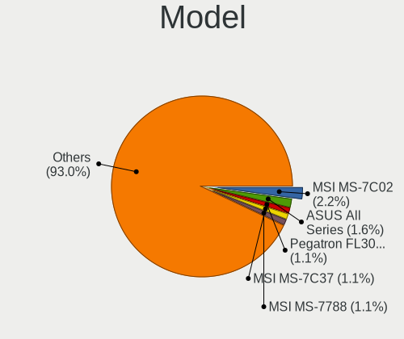

| Name                                    | Desktops | Percent |
|-----------------------------------------|----------|---------|
| MSI MS-7C02                             | 3        | 3.06%   |
| Pegatron FL308AA-ABD IQ512de            | 2        | 2.04%   |
| MSI MS-7788                             | 2        | 2.04%   |
| Gigabyte F2A88XM-D3HP                   | 2        | 2.04%   |
| ASUS ROG STRIX Z370-F GAMING            | 2        | 2.04%   |
| ASUS ROG STRIX X570-E GAMING            | 2        | 2.04%   |
| ASUS PRIME B350-PLUS                    | 2        | 2.04%   |
| ASUS PRIME A320M-K                      | 2        | 2.04%   |
| ASUS P7H55-M SI                         | 2        | 2.04%   |
| Pegatron Pro 3010 Microtower PC         | 1        | 1.02%   |
| Pegatron 2A73                           | 1        | 1.02%   |
| MSI MS-7C37                             | 1        | 1.02%   |
| MSI MS-7B24                             | 1        | 1.02%   |
| MSI MS-7994                             | 1        | 1.02%   |
| MSI MS-7636                             | 1        | 1.02%   |
| Medion MS-7707                          | 1        | 1.02%   |
| Medion Akoya E7226                      | 1        | 1.02%   |
| Lenovo ThinkStation S20 4157ZSK         | 1        | 1.02%   |
| Lenovo ThinkCentre M90p 5498PK8         | 1        | 1.02%   |
| Lenovo ThinkCentre M73 10B4S0NN00       | 1        | 1.02%   |
| Lenovo ThinkCentre M57e 9439WHV         | 1        | 1.02%   |
| Lenovo ThinkCentre M57e 9356W2K         | 1        | 1.02%   |
| Lenovo ThinkCentre M57 6072VAM          | 1        | 1.02%   |
| Lenovo ThinkCentre M55e 9389WEG         | 1        | 1.02%   |
| Lenovo ThinkCentre M55e 9389W11         | 1        | 1.02%   |
| Intel DQ67SW AAG12527-310               | 1        | 1.02%   |
| Intel DQ35JO AAD82085-801               | 1        | 1.02%   |
| Intel DH87RL AAG74240-403               | 1        | 1.02%   |
| Intel CM-iAM/SBC-FITPC2i                | 1        | 1.02%   |
| HP Z440 Workstation                     | 1        | 1.02%   |
| HP Z420 Workstation                     | 1        | 1.02%   |
| HP Z230 Tower Workstation               | 1        | 1.02%   |
| HP xw4400 Workstation                   | 1        | 1.02%   |
| HP ProDesk 400 G4 SFF                   | 1        | 1.02%   |
| HP Compaq dc7700p Convertible Minitower | 1        | 1.02%   |
| HP Compaq 8200 Elite SFF PC             | 1        | 1.02%   |
| HP Compaq 6000 Pro MT PC                | 1        | 1.02%   |
| Gigabyte Z97X-Gaming 3                  | 1        | 1.02%   |
| Gigabyte Z68P-DS3                       | 1        | 1.02%   |
| Gigabyte Z170-HD3P                      | 1        | 1.02%   |
| Gigabyte P35C-DS3R                      | 1        | 1.02%   |
| Gigabyte H61M-S2PV                      | 1        | 1.02%   |
| Gigabyte H61M-D2-B3                     | 1        | 1.02%   |
| Gigabyte H57M-USB3                      | 1        | 1.02%   |
| Gigabyte H270-HD3                       | 1        | 1.02%   |
| Gigabyte GA-MA770T-UD3                  | 1        | 1.02%   |
| Gigabyte EP45-UD3LR                     | 1        | 1.02%   |
| Gigabyte B85M-HD3                       | 1        | 1.02%   |
| Gigabyte B450M GAMING                   | 1        | 1.02%   |
| Gigabyte B450M DS3H                     | 1        | 1.02%   |
| Gigabyte B360M-DS3H                     | 1        | 1.02%   |
| Gigabyte 970A-UD3P                      | 1        | 1.02%   |
| Fujitsu D3417-B2 S26361-D3417-B2        | 1        | 1.02%   |
| Dell Precision T3610                    | 1        | 1.02%   |
| Dell OptiPlex 780                       | 1        | 1.02%   |
| Biostar TH55B HD                        | 1        | 1.02%   |
| ASUS TUF Z370-PLUS GAMING               | 1        | 1.02%   |
| ASUS TUF Gaming B560-PLUS WIFI          | 1        | 1.02%   |
| ASUS TUF B450-PLUS GAMING               | 1        | 1.02%   |
| ASUS STRIX Z270G GAMING                 | 1        | 1.02%   |

Model Family
------------

Motherboard model prefix

| Name                   | Desktops | Percent |
|------------------------|----------|---------|
| ASUS PRIME             | 10       | 10.2%   |
| Lenovo ThinkCentre     | 7        | 7.14%   |
| ASUS ROG               | 6        | 6.12%   |
| MSI MS-7C02            | 3        | 3.06%   |
| HP Compaq              | 3        | 3.06%   |
| ASUS TUF               | 3        | 3.06%   |
| Pegatron FL308AA-ABD   | 2        | 2.04%   |
| MSI MS-7788            | 2        | 2.04%   |
| Gigabyte F2A88XM-D3HP  | 2        | 2.04%   |
| Gigabyte B450M         | 2        | 2.04%   |
| ASUS P7H55-M           | 2        | 2.04%   |
| Pegatron Pro           | 1        | 1.02%   |
| Pegatron 2A73          | 1        | 1.02%   |
| MSI MS-7C37            | 1        | 1.02%   |
| MSI MS-7B24            | 1        | 1.02%   |
| MSI MS-7994            | 1        | 1.02%   |
| MSI MS-7636            | 1        | 1.02%   |
| Medion MS-7707         | 1        | 1.02%   |
| Medion Akoya           | 1        | 1.02%   |
| Lenovo ThinkStation    | 1        | 1.02%   |
| Intel DQ67SW           | 1        | 1.02%   |
| Intel DQ35JO           | 1        | 1.02%   |
| Intel DH87RL           | 1        | 1.02%   |
| Intel CM-iAM           | 1        | 1.02%   |
| HP Z440                | 1        | 1.02%   |
| HP Z420                | 1        | 1.02%   |
| HP Z230                | 1        | 1.02%   |
| HP xw4400              | 1        | 1.02%   |
| HP ProDesk             | 1        | 1.02%   |
| Gigabyte Z97X-Gaming   | 1        | 1.02%   |
| Gigabyte Z68P-DS3      | 1        | 1.02%   |
| Gigabyte Z170-HD3P     | 1        | 1.02%   |
| Gigabyte P35C-DS3R     | 1        | 1.02%   |
| Gigabyte H61M-S2PV     | 1        | 1.02%   |
| Gigabyte H61M-D2-B3    | 1        | 1.02%   |
| Gigabyte H57M-USB3     | 1        | 1.02%   |
| Gigabyte H270-HD3      | 1        | 1.02%   |
| Gigabyte GA-MA770T-UD3 | 1        | 1.02%   |
| Gigabyte EP45-UD3LR    | 1        | 1.02%   |
| Gigabyte B85M-HD3      | 1        | 1.02%   |
| Gigabyte B360M-DS3H    | 1        | 1.02%   |
| Gigabyte 970A-UD3P     | 1        | 1.02%   |
| Fujitsu D3417-B2       | 1        | 1.02%   |
| Dell Precision         | 1        | 1.02%   |
| Dell OptiPlex          | 1        | 1.02%   |
| Biostar TH55B          | 1        | 1.02%   |
| ASUS STRIX             | 1        | 1.02%   |
| ASUS SABERTOOTH        | 1        | 1.02%   |
| ASUS P8Z77-M           | 1        | 1.02%   |
| ASUS P5Q               | 1        | 1.02%   |
| ASUS M4A78T-E          | 1        | 1.02%   |
| ASUS H170              | 1        | 1.02%   |
| ASUS H110M-A           | 1        | 1.02%   |
| ASUS CROSSHAIR         | 1        | 1.02%   |
| ASUS All               | 1        | 1.02%   |
| ASRock Z390            | 1        | 1.02%   |
| ASRock X570M           | 1        | 1.02%   |
| ASRock X570            | 1        | 1.02%   |
| ASRock X300M-STX       | 1        | 1.02%   |
| ASRock H61M-ITX        | 1        | 1.02%   |

MFG Year
--------

Motherboard manufacture year

| Year | Desktops | Percent |
|------|----------|---------|
| 2017 | 11       | 11.22%  |
| 2009 | 11       | 11.22%  |
| 2018 | 9        | 9.18%   |
| 2015 | 9        | 9.18%   |
| 2019 | 8        | 8.16%   |
| 2011 | 7        | 7.14%   |
| 2013 | 6        | 6.12%   |
| 2010 | 6        | 6.12%   |
| 2020 | 5        | 5.1%    |
| 2012 | 5        | 5.1%    |
| 2016 | 4        | 4.08%   |
| 2014 | 4        | 4.08%   |
| 2007 | 4        | 4.08%   |
| 2006 | 4        | 4.08%   |
| 2008 | 3        | 3.06%   |
| 2021 | 2        | 2.04%   |

Form Factor
-----------

Physical design of the computer

| Name    | Desktops | Percent |
|---------|----------|---------|
| Desktop | 98       | 100%    |

Secure Boot
-----------

Enabled or disabled

| State    | Desktops | Percent |
|----------|----------|---------|
| Disabled | 96       | 97.96%  |
| Enabled  | 2        | 2.04%   |

Coreboot
--------

Have coreboot on board

| Used | Desktops | Percent |
|------|----------|---------|
| No   | 98       | 100%    |

RAM Size
--------

Total RAM memory

| Size in GB  | Desktops | Percent |
|-------------|----------|---------|
| 16.01-24.0  | 27       | 27.27%  |
| 8.01-16.0   | 25       | 25.25%  |
| 3.01-4.0    | 16       | 16.16%  |
| 4.01-8.0    | 11       | 11.11%  |
| 32.01-64.0  | 9        | 9.09%   |
| 2.01-3.0    | 4        | 4.04%   |
| 64.01-256.0 | 3        | 3.03%   |
| 24.01-32.0  | 2        | 2.02%   |
| 1.01-2.0    | 2        | 2.02%   |

RAM Used
--------

Used RAM memory

| Used GB    | Desktops | Percent |
|------------|----------|---------|
| 1.01-2.0   | 37       | 33.94%  |
| 2.01-3.0   | 24       | 22.02%  |
| 4.01-8.0   | 22       | 20.18%  |
| 3.01-4.0   | 11       | 10.09%  |
| 8.01-16.0  | 5        | 4.59%   |
| 0.51-1.0   | 4        | 3.67%   |
| 0.01-0.5   | 3        | 2.75%   |
| 16.01-24.0 | 2        | 1.83%   |
| 24.01-32.0 | 1        | 0.92%   |

Total Drives
------------

Number of drives on board

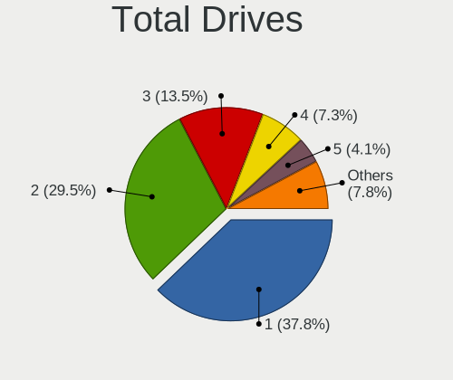

| Drives | Desktops | Percent |
|--------|----------|---------|
| 1      | 36       | 35.64%  |
| 2      | 31       | 30.69%  |
| 3      | 14       | 13.86%  |
| 4      | 7        | 6.93%   |
| 6      | 4        | 3.96%   |
| 5      | 4        | 3.96%   |
| 8      | 3        | 2.97%   |
| 7      | 2        | 1.98%   |

Has CD-ROM
----------

Has CD-ROM on board

| Presented | Desktops | Percent |
|-----------|----------|---------|
| No        | 53       | 53.54%  |
| Yes       | 46       | 46.46%  |

Has Ethernet
------------

Has Ethernet on board

| Presented | Desktops | Percent |
|-----------|----------|---------|
| Yes       | 96       | 97.96%  |
| No        | 2        | 2.04%   |

Has WiFi
--------

Has WiFi module

| Presented | Desktops | Percent |
|-----------|----------|---------|
| No        | 69       | 69.7%   |
| Yes       | 30       | 30.3%   |

Has Bluetooth
-------------

Has Bluetooth module

| Presented | Desktops | Percent |
|-----------|----------|---------|
| No        | 79       | 80.61%  |
| Yes       | 19       | 19.39%  |

Location
--------

Country
-------

Geographic location (country)

| Country  | Desktops | Percent |
|----------|----------|---------|
| Slovenia | 98       | 100%    |

City
----

Geographic location (city)

| City                 | Desktops | Percent |
|----------------------|----------|---------|
| Ljubljana            | 32       | 30.48%  |
| Vrhnika              | 3        | 2.86%   |
| Rence                | 3        | 2.86%   |
| Radovljica           | 3        | 2.86%   |
| Novo Mesto           | 3        | 2.86%   |
| Maribor              | 3        | 2.86%   |
| Grosuplje            | 3        | 2.86%   |
| alec               | 2        | 1.9%    |
| Ptuj                 | 2        | 1.9%    |
| Pragersko            | 2        | 1.9%    |
| Logatec              | 2        | 1.9%    |
| Koper                | 2        | 1.9%    |
| Kamnik               | 2        | 1.9%    |
| Celje                | 2        | 1.9%    |
| Zirovnica            | 1        | 0.95%   |
| Ziri                 | 1        | 0.95%   |
| Zgornja Besnica      | 1        | 0.95%   |
| Vuzenica             | 1        | 0.95%   |
| Volcja Draga         | 1        | 0.95%   |
| Velenje              | 1        | 0.95%   |
| tore               | 1        | 0.95%   |
| Stari Trg pri Lozu   | 1        | 0.95%   |
| Slovenske Konjice    | 1        | 0.95%   |
| Slovenska Bistrica   | 1        | 0.95%   |
| kofja Loka         | 1        | 0.95%   |
| Sempeter pri Gorici  | 1        | 0.95%   |
| Selnica ob Dravi     | 1        | 0.95%   |
| Postojna             | 1        | 0.95%   |
| Portoro            | 1        | 0.95%   |
| Podvelka             | 1        | 0.95%   |
| Petrovce             | 1        | 0.95%   |
| Oplotnica            | 1        | 0.95%   |
| Nova Gorica          | 1        | 0.95%   |
| Muta                 | 1        | 0.95%   |
| Materija             | 1        | 0.95%   |
| Lukovica             | 1        | 0.95%   |
| Lopaca               | 1        | 0.95%   |
| Lako               | 1        | 0.95%   |
| Kranj                | 1        | 0.95%   |
| Kisovec              | 1        | 0.95%   |
| Kamnica              | 1        | 0.95%   |
| Jezero               | 1        | 0.95%   |
| Jesenice             | 1        | 0.95%   |
| Izola                | 1        | 0.95%   |
| Izlake               | 1        | 0.95%   |
| Ilirska Bistrica     | 1        | 0.95%   |
| Horjul               | 1        | 0.95%   |
| Domale             | 1        | 0.95%   |
| Dolenjske Toplice    | 1        | 0.95%   |
| Divaa              | 1        | 0.95%   |
| Cerkno               | 1        | 0.95%   |
| Cerknica             | 1        | 0.95%   |
| Brestanica           | 1        | 0.95%   |
| Borovnica            | 1        | 0.95%   |
| Begunje pri Cerknici | 1        | 0.95%   |

Drives
------

Drive Vendor
------------

Hard drive vendors

| Vendor              | Desktops | Drives | Percent |
|---------------------|----------|--------|---------|
| WDC                 | 52       | 103    | 28.89%  |
| Samsung Electronics | 22       | 47     | 12.22%  |
| Seagate             | 21       | 39     | 11.67%  |
| Toshiba             | 16       | 20     | 8.89%   |
| Kingston            | 15       | 20     | 8.33%   |
| Crucial             | 9        | 13     | 5%      |
| SanDisk             | 5        | 7      | 2.78%   |
| Corsair             | 5        | 6      | 2.78%   |
| Hitachi             | 4        | 4      | 2.22%   |
| Intenso             | 3        | 5      | 1.67%   |
| Intel               | 3        | 3      | 1.67%   |
| Silicon Motion      | 2        | 2      | 1.11%   |
| Patriot             | 2        | 3      | 1.11%   |
| OCZ                 | 2        | 5      | 1.11%   |
| Hewlett-Packard     | 2        | 2      | 1.11%   |
| China               | 2        | 2      | 1.11%   |
| Apacer              | 2        | 3      | 1.11%   |
| Unknown             | 1        | 1      | 0.56%   |
| Transcend           | 1        | 2      | 0.56%   |
| Realtek             | 1        | 1      | 0.56%   |
| Phison              | 1        | 1      | 0.56%   |
| Maxtor              | 1        | 1      | 0.56%   |
| LITEONIT            | 1        | 1      | 0.56%   |
| KingDian            | 1        | 1      | 0.56%   |
| Integral            | 1        | 1      | 0.56%   |
| HGST                | 1        | 1      | 0.56%   |
| GOODRAM             | 1        | 1      | 0.56%   |
| Gigabyte Technology | 1        | 2      | 0.56%   |
| ASMT109x            | 1        | 1      | 0.56%   |
| A-DATA Technology   | 1        | 1      | 0.56%   |

Drive Model
-----------

Hard drive models

| Model                            | Desktops | Percent |
|----------------------------------|----------|---------|
| Toshiba DT01ACA100 1TB           | 5        | 2.25%   |
| Kingston SA400S37240G 240GB SSD  | 5        | 2.25%   |
| Crucial CT240BX500SSD1 240GB     | 4        | 1.8%    |
| WDC WD10EARS-00Y5B1 1TB          | 3        | 1.35%   |
| Toshiba HDWD120 2TB              | 3        | 1.35%   |
| Toshiba DT01ACA200 2TB           | 3        | 1.35%   |
| Samsung SSD 970 EVO Plus 500GB   | 3        | 1.35%   |
| Samsung SSD 860 EVO 1TB          | 3        | 1.35%   |
| Samsung SSD 850 EVO 250GB        | 3        | 1.35%   |
| WDC WDS500G2B0A-00SM50 500GB SSD | 2        | 0.9%    |
| WDC WDS480G2G0A-00JH30 480GB SSD | 2        | 0.9%    |
| WDC WDS240G2G0A-00JH30 240GB SSD | 2        | 0.9%    |
| WDC WD5000AADS-00S9B0 500GB      | 2        | 0.9%    |
| WDC WD5000AACS-00G8B1 500GB      | 2        | 0.9%    |
| WDC WD40PURZ-85TTDY0 4TB         | 2        | 0.9%    |
| WDC WD40EFRX-68N32N0 4TB         | 2        | 0.9%    |
| WDC WD15EARS-00MVWB0 1TB         | 2        | 0.9%    |
| WDC WD10EZEX-08M2NA0 1TB         | 2        | 0.9%    |
| WDC WD1002FAEX-00Y9A0 1TB        | 2        | 0.9%    |
| Seagate ST1000DM003-1CH162 1TB   | 2        | 0.9%    |
| Seagate Portable 2TB             | 2        | 0.9%    |
| SanDisk NVMe SSD Drive 500GB     | 2        | 0.9%    |
| Samsung SSD 970 EVO Plus 1TB     | 2        | 0.9%    |
| Samsung SSD 850 EVO 120GB        | 2        | 0.9%    |
| Samsung NVMe SSD Drive 500GB     | 2        | 0.9%    |
| Kingston SUV400S37240G 240GB SSD | 2        | 0.9%    |
| Intenso 128GB                    | 2        | 0.9%    |
| HP SSD EX900 500GB               | 2        | 0.9%    |
| Crucial CT500MX500SSD1 500GB     | 2        | 0.9%    |
| WDC WUS721010ALE6L4 10TB         | 1        | 0.45%   |
| WDC WDS500G3X0C-00SJG0 500GB     | 1        | 0.45%   |
| WDC WDS500G2B0B-00YS70 500GB SSD | 1        | 0.45%   |
| WDC WDS500G2B0A 500GB SSD        | 1        | 0.45%   |
| WDC WDS256G1X0C-00ENX0 256GB     | 1        | 0.45%   |
| WDC WDS240G2G0B-00EPW0 240GB SSD | 1        | 0.45%   |
| WDC WD800BD-08MRA1 80GB          | 1        | 0.45%   |
| WDC WD6402AAEX-00Z3A0 640GB      | 1        | 0.45%   |
| WDC WD6402AAEX-00Y9A0 640GB      | 1        | 0.45%   |
| WDC WD6400AARS-00Y5B1 640GB      | 1        | 0.45%   |
| WDC WD5000AZRX-00A8LB0 500GB     | 1        | 0.45%   |
| WDC WD5000AZLX-00JKKA0 500GB     | 1        | 0.45%   |
| WDC WD5000AAVS-00ZTB0 500GB      | 1        | 0.45%   |
| WDC WD5000AAKX-60U6AA0 500GB     | 1        | 0.45%   |
| WDC WD5000AAKX-001CA0 500GB      | 1        | 0.45%   |
| WDC WD5000AAKS-00TMA0 500GB      | 1        | 0.45%   |
| WDC WD40EZRZ-22GXCB0 4TB         | 1        | 0.45%   |
| WDC WD40EZRZ-00GXCB0 4TB         | 1        | 0.45%   |
| WDC WD4004FZWX-00GBGB0 4TB       | 1        | 0.45%   |
| WDC WD3200LPVX-00V0TT0 320GB     | 1        | 0.45%   |
| WDC WD3200AAKS-75B3A0 320GB      | 1        | 0.45%   |
| WDC WD3200AAKS-22B3A0 320GB      | 1        | 0.45%   |
| WDC WD3200AAJS-56B4A0 320GB      | 1        | 0.45%   |
| WDC WD30EZRZ-00Z5HB0 3TB         | 1        | 0.45%   |
| WDC WD2500AAKX-083CA1 250GB      | 1        | 0.45%   |
| WDC WD20PURZ-85GU6Y0 2TB         | 1        | 0.45%   |
| WDC WD20EZRZ-00Z5HB0 2TB         | 1        | 0.45%   |
| WDC WD20EFRX-68EUZN0 2TB         | 1        | 0.45%   |
| WDC WD20EARX-00ZUDB0 2TB         | 1        | 0.45%   |
| WDC WD1600JS-00MHB1 160GB        | 1        | 0.45%   |
| WDC WD1600AAJS-07PSA0 160GB      | 1        | 0.45%   |

HDD Vendor
----------

Hard disk drive vendors

| Vendor              | Desktops | Drives | Percent |
|---------------------|----------|--------|---------|
| WDC                 | 46       | 90     | 51.69%  |
| Seagate             | 20       | 36     | 22.47%  |
| Toshiba             | 14       | 18     | 15.73%  |
| Hitachi             | 4        | 4      | 4.49%   |
| Samsung Electronics | 2        | 2      | 2.25%   |
| Maxtor              | 1        | 1      | 1.12%   |
| HGST                | 1        | 1      | 1.12%   |
| ASMT109x            | 1        | 1      | 1.12%   |

SSD Vendor
----------

Solid state drive vendors

| Vendor              | Desktops | Drives | Percent |
|---------------------|----------|--------|---------|
| Kingston            | 14       | 16     | 20.9%   |
| Samsung Electronics | 11       | 22     | 16.42%  |
| WDC                 | 9        | 11     | 13.43%  |
| Crucial             | 8        | 12     | 11.94%  |
| SanDisk             | 3        | 4      | 4.48%   |
| Intel               | 3        | 3      | 4.48%   |
| Corsair             | 3        | 4      | 4.48%   |
| Patriot             | 2        | 3      | 2.99%   |
| OCZ                 | 2        | 5      | 2.99%   |
| China               | 2        | 2      | 2.99%   |
| Apacer              | 2        | 3      | 2.99%   |
| Transcend           | 1        | 2      | 1.49%   |
| Toshiba             | 1        | 1      | 1.49%   |
| LITEONIT            | 1        | 1      | 1.49%   |
| KingDian            | 1        | 1      | 1.49%   |
| Intenso             | 1        | 1      | 1.49%   |
| Integral            | 1        | 1      | 1.49%   |
| GOODRAM             | 1        | 1      | 1.49%   |
| A-DATA Technology   | 1        | 1      | 1.49%   |

Drive Kind
----------

HDD or SSD

| Kind    | Desktops | Drives | Percent |
|---------|----------|--------|---------|
| HDD     | 70       | 153    | 44.59%  |
| SSD     | 54       | 94     | 34.39%  |
| NVMe    | 28       | 44     | 17.83%  |
| Unknown | 5        | 8      | 3.18%   |

Drive Connector
---------------

SATA, SAS, NVMe, etc.

| Type | Desktops | Drives | Percent |
|------|----------|--------|---------|
| SATA | 93       | 247    | 73.23%  |
| NVMe | 28       | 43     | 22.05%  |
| SAS  | 6        | 9      | 4.72%   |

Drive Size
----------

Size of hard drive

| Size in TB | Desktops | Drives | Percent |
|------------|----------|--------|---------|
| 0.01-0.5   | 69       | 129    | 50%     |
| 0.51-1.0   | 43       | 78     | 31.16%  |
| 1.01-2.0   | 13       | 18     | 9.42%   |
| 3.01-4.0   | 9        | 16     | 6.52%   |
| 2.01-3.0   | 2        | 3      | 1.45%   |
| 10.01-20.0 | 1        | 1      | 0.72%   |
| 4.01-10.0  | 1        | 2      | 0.72%   |

Space Total
-----------

Amount of disk space available on the file system

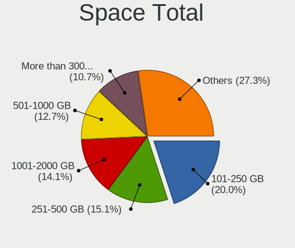

| Size in GB     | Desktops | Percent |
|----------------|----------|---------|
| 101-250        | 21       | 19.81%  |
| 251-500        | 18       | 16.98%  |
| 1001-2000      | 15       | 14.15%  |
| 501-1000       | 15       | 14.15%  |
| 1-20           | 10       | 9.43%   |
| 2001-3000      | 9        | 8.49%   |
| 51-100         | 7        | 6.6%    |
| More than 3000 | 6        | 5.66%   |
| Unknown        | 3        | 2.83%   |
| 21-50          | 2        | 1.89%   |

Space Used
----------

Amount of used disk space

| Used GB   | Desktops | Percent |
|-----------|----------|---------|
| 1-20      | 38       | 35.85%  |
| 21-50     | 14       | 13.21%  |
| 51-100    | 13       | 12.26%  |
| 101-250   | 12       | 11.32%  |
| 1001-2000 | 8        | 7.55%   |
| 251-500   | 6        | 5.66%   |
| 2001-3000 | 6        | 5.66%   |
| 501-1000  | 6        | 5.66%   |
| Unknown   | 3        | 2.83%   |

Malfunc. Drives
---------------

Drive models with a malfunction

| Model                            | Desktops | Drives | Percent |
|----------------------------------|----------|--------|---------|
| WDC WDS480G2G0A-00JH30 480GB SSD | 1        | 1      | 5.56%   |
| WDC WD5000AADS-00S9B0 500GB      | 1        | 1      | 5.56%   |
| WDC WD40EFRX-68N32N0 4TB         | 1        | 1      | 5.56%   |
| WDC WD3200AAKS-22B3A0 320GB      | 1        | 1      | 5.56%   |
| WDC WD20EFRX-68EUZN0 2TB         | 1        | 1      | 5.56%   |
| Toshiba Q300. 240GB SSD          | 1        | 1      | 5.56%   |
| Toshiba DT01ACA300 3TB           | 1        | 1      | 5.56%   |
| Seagate ST3500514NS 500GB        | 1        | 1      | 5.56%   |
| Seagate ST3500320NS 500GB        | 1        | 1      | 5.56%   |
| Seagate ST3320620AS 320GB        | 1        | 1      | 5.56%   |
| Seagate ST3200822AS 200GB        | 1        | 1      | 5.56%   |
| Seagate ST2000DM001-1CH164 2TB   | 1        | 1      | 5.56%   |
| Seagate ST1000DM003-1CH162 1TB   | 1        | 1      | 5.56%   |
| OCZ VERTEX3 120GB SSD            | 1        | 1      | 5.56%   |
| Kingston SA400S37240G 240GB SSD  | 1        | 1      | 5.56%   |
| Intel SSDSA2M160G2GC 160GB       | 1        | 1      | 5.56%   |
| Hewlett-Packard SSD EX900 500GB  | 1        | 1      | 5.56%   |
| Crucial M4-CT128M4SSD2 128GB     | 1        | 1      | 5.56%   |

Malfunc. Drive Vendor
---------------------

Vendors of faulty drives

| Vendor          | Desktops | Drives | Percent |
|-----------------|----------|--------|---------|
| WDC             | 4        | 5      | 26.67%  |
| Seagate         | 4        | 6      | 26.67%  |
| Toshiba         | 2        | 2      | 13.33%  |
| OCZ             | 1        | 1      | 6.67%   |
| Kingston        | 1        | 1      | 6.67%   |
| Intel           | 1        | 1      | 6.67%   |
| Hewlett-Packard | 1        | 1      | 6.67%   |
| Crucial         | 1        | 1      | 6.67%   |

Malfunc. HDD Vendor
-------------------

Vendors of faulty HDD drives

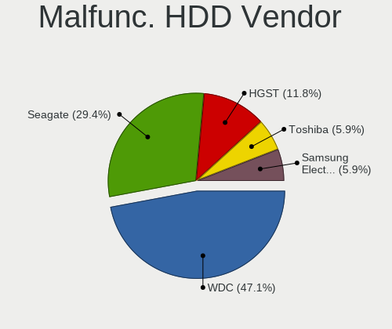

| Vendor  | Desktops | Drives | Percent |
|---------|----------|--------|---------|
| Seagate | 4        | 6      | 50%     |
| WDC     | 3        | 4      | 37.5%   |
| Toshiba | 1        | 1      | 12.5%   |

Malfunc. Drive Kind
-------------------

Kinds of faulty drives

| Kind | Desktops | Drives | Percent |
|------|----------|--------|---------|
| HDD  | 6        | 11     | 50%     |
| SSD  | 5        | 6      | 41.67%  |
| NVMe | 1        | 1      | 8.33%   |

Failed Drives
-------------

Failed drive models

Zero info for selected period =(

Failed Drive Vendor
-------------------

Failed drive vendors

Zero info for selected period =(

Drive Status
------------

Number of failed and malfunc. drives

| Status   | Desktops | Drives | Percent |
|----------|----------|--------|---------|
| Detected | 62       | 154    | 55.36%  |
| Works    | 38       | 127    | 33.93%  |
| Malfunc  | 12       | 18     | 10.71%  |

Storage controller
------------------

Storage Vendor
--------------

Storage controller vendors

| Vendor                       | Desktops | Percent |
|------------------------------|----------|---------|
| Intel                        | 71       | 50.35%  |
| AMD                          | 27       | 19.15%  |
| Samsung Electronics          | 14       | 9.93%   |
| JMicron Technology           | 5        | 3.55%   |
| Silicon Motion               | 4        | 2.84%   |
| SanDisk                      | 4        | 2.84%   |
| Phison Electronics           | 3        | 2.13%   |
| Marvell Technology Group     | 3        | 2.13%   |
| Kingston Technology Company  | 3        | 2.13%   |
| ASMedia Technology           | 3        | 2.13%   |
| Toshiba America Info Systems | 1        | 0.71%   |
| Silicon Image                | 1        | 0.71%   |
| OCZ Technology Group         | 1        | 0.71%   |
| Micron/Crucial Technology    | 1        | 0.71%   |

Storage Model
-------------

Storage controller models

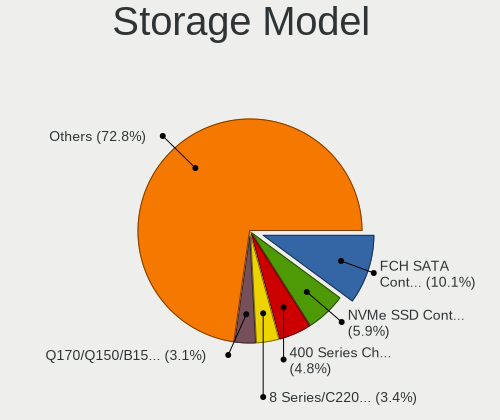

| Model                                                                                   | Desktops | Percent |
|-----------------------------------------------------------------------------------------|----------|---------|
| AMD FCH SATA Controller [AHCI mode]                                                     | 20       | 10.75%  |
| Samsung NVMe SSD Controller SM981/PM981/PM983                                           | 8        | 4.3%    |
| Intel 200 Series PCH SATA controller [AHCI mode]                                        | 8        | 4.3%    |
| AMD 400 Series Chipset SATA Controller                                                  | 8        | 4.3%    |
| Intel Q170/Q150/B150/H170/H110/Z170/CM236 Chipset SATA Controller [AHCI Mode]           | 7        | 3.76%   |
| Intel 6 Series/C200 Series Chipset Family Desktop SATA Controller (IDE mode, ports 4-5) | 6        | 3.23%   |
| Intel 6 Series/C200 Series Chipset Family Desktop SATA Controller (IDE mode, ports 0-3) | 6        | 3.23%   |
| Intel 8 Series/C220 Series Chipset Family 6-port SATA Controller 1 [AHCI mode]          | 5        | 2.69%   |
| Silicon Motion SM2263EN/SM2263XT SSD Controller                                         | 4        | 2.15%   |
| Intel NM10/ICH7 Family SATA Controller [IDE mode]                                       | 4        | 2.15%   |
| Intel 82801IR/IO/IH (ICH9R/DO/DH) 4 port SATA Controller [IDE mode]                     | 4        | 2.15%   |
| Intel 82801I (ICH9 Family) 2 port SATA Controller [IDE mode]                            | 4        | 2.15%   |
| Intel 6 Series/C200 Series Chipset Family 6 port Desktop SATA AHCI Controller           | 4        | 2.15%   |
| Intel 5 Series/3400 Series Chipset 4 port SATA IDE Controller                           | 4        | 2.15%   |
| Intel 5 Series/3400 Series Chipset 2 port SATA IDE Controller                           | 4        | 2.15%   |
| AMD SB7x0/SB8x0/SB9x0 SATA Controller [AHCI mode]                                       | 4        | 2.15%   |
| Samsung NVMe SSD Controller PM9A1/PM9A3/980PRO                                          | 3        | 1.61%   |
| JMicron JMB368 IDE controller                                                           | 3        | 1.61%   |
| Intel Cannon Lake PCH SATA AHCI Controller                                              | 3        | 1.61%   |
| Intel 82801G (ICH7 Family) IDE Controller                                               | 3        | 1.61%   |
| ASMedia ASM1062 Serial ATA Controller                                                   | 3        | 1.61%   |
| AMD SB7x0/SB8x0/SB9x0 IDE Controller                                                    | 3        | 1.61%   |
| SanDisk WD Black SN750 / PC SN730 NVMe SSD                                              | 2        | 1.08%   |
| Samsung NVMe SSD Controller SM961/PM961/SM963                                           | 2        | 1.08%   |
| Marvell Group 88SE6101/6102 single-port PATA133 interface                               | 2        | 1.08%   |
| Kingston Company A2000 NVMe SSD                                                         | 2        | 1.08%   |
| JMicron JMB363 SATA/IDE Controller                                                      | 2        | 1.08%   |
| Intel SATA Controller [RAID mode]                                                       | 2        | 1.08%   |
| Intel C600/X79 series chipset SATA RAID Controller                                      | 2        | 1.08%   |
| Intel 9 Series Chipset Family SATA Controller [AHCI Mode]                               | 2        | 1.08%   |
| Intel 82Q35 Express PT IDER Controller                                                  | 2        | 1.08%   |
| Intel 82801JI (ICH10 Family) SATA AHCI Controller                                       | 2        | 1.08%   |
| Intel 82801JI (ICH10 Family) 4 port SATA IDE Controller #1                              | 2        | 1.08%   |
| Intel 82801HM/HEM (ICH8M/ICH8M-E) SATA Controller [AHCI mode]                           | 2        | 1.08%   |
| Intel 82801HM/HEM (ICH8M/ICH8M-E) IDE Controller                                        | 2        | 1.08%   |
| Intel 500 Series Chipset Family SATA AHCI Controller                                    | 2        | 1.08%   |
| Intel 5 Series/3400 Series Chipset 6 port SATA AHCI Controller                          | 2        | 1.08%   |
| AMD FCH SATA Controller D                                                               | 2        | 1.08%   |
| AMD 300 Series Chipset SATA Controller                                                  | 2        | 1.08%   |
| Toshiba America Info Systems BG3 NVMe SSD Controller                                    | 1        | 0.54%   |
| Silicon Image SiI 3132 Serial ATA Raid II Controller                                    | 1        | 0.54%   |
| SanDisk WD Blue SN550 NVMe SSD                                                          | 1        | 0.54%   |
| SanDisk WD Black NVMe SSD                                                               | 1        | 0.54%   |
| Samsung NVMe SSD Controller SM951/PM951                                                 | 1        | 0.54%   |
| Samsung NVMe SSD Controller 980                                                         | 1        | 0.54%   |
| Phison PS5013 E13 NVMe Controller                                                       | 1        | 0.54%   |
| Phison E18 PCIe4 NVMe Controller                                                        | 1        | 0.54%   |
| Phison E16 PCIe4 NVMe Controller                                                        | 1        | 0.54%   |
| OCZ Group RevoDrive 3 X2 PCI-Express SSD 240 GB (Marvell Controller)                    | 1        | 0.54%   |
| Micron/Crucial P1 NVMe PCIe SSD                                                         | 1        | 0.54%   |
| Marvell Group 88SE9215 PCIe 2.0 x1 4-port SATA 6 Gb/s Controller                        | 1        | 0.54%   |
| Kingston Company SNVS2000G [NV1 NVMe PCIe SSD 2TB]                                      | 1        | 0.54%   |
| Intel US15W/US15X/US15L/UL11L SCH [Poulsbo] IDE Controller                              | 1        | 0.54%   |
| Intel C610/X99 series chipset sSATA Controller [RAID mode]                              | 1        | 0.54%   |
| Intel C602 chipset 4-Port SATA Storage Control Unit                                     | 1        | 0.54%   |
| Intel C600/X79 series chipset IDE-r Controller                                          | 1        | 0.54%   |
| Intel C600/X79 series chipset 6-Port SATA AHCI Controller                               | 1        | 0.54%   |
| Intel Atom Processor E3800 Series SATA AHCI Controller                                  | 1        | 0.54%   |
| Intel 82Q963/Q965 PT IDER Controller                                                    | 1        | 0.54%   |
| Intel 82801JI (ICH10 Family) 2 port SATA IDE Controller #2                              | 1        | 0.54%   |

Storage Kind
------------

Kind of storage controller (IDE, SATA, NVMe, SAS, ...)

| Kind | Desktops | Percent |
|------|----------|---------|
| SATA | 70       | 50.72%  |
| IDE  | 32       | 23.19%  |
| NVMe | 28       | 20.29%  |
| RAID | 6        | 4.35%   |
| SAS  | 1        | 0.72%   |
| SCSI | 1        | 0.72%   |

Processor
---------

CPU Vendor
----------

Processor vendors

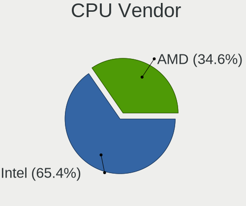

| Vendor | Desktops | Percent |
|--------|----------|---------|
| Intel  | 71       | 72.45%  |
| AMD    | 27       | 27.55%  |

CPU Model
---------

Processor models

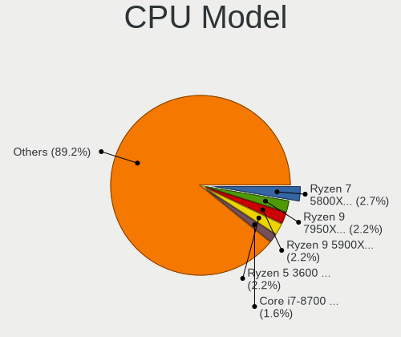

| Model                                  | Desktops | Percent |
|----------------------------------------|----------|---------|
| Intel Core 2 Quad CPU Q6600 @ 2.40GHz  | 3        | 3.06%   |
| AMD Ryzen 5 5600X 6-Core Processor     | 3        | 3.06%   |
| Intel Core i7-8700K CPU @ 3.70GHz      | 2        | 2.04%   |
| Intel Core i7-8700 CPU @ 3.20GHz       | 2        | 2.04%   |
| Intel Core i5-7400 CPU @ 3.00GHz       | 2        | 2.04%   |
| Intel Core i5-6400 CPU @ 2.70GHz       | 2        | 2.04%   |
| Intel Core i5-4460 CPU @ 3.20GHz       | 2        | 2.04%   |
| Intel Core i5-3550 CPU @ 3.30GHz       | 2        | 2.04%   |
| Intel Core i5-2400 CPU @ 3.10GHz       | 2        | 2.04%   |
| Intel Core i5 CPU 750 @ 2.67GHz        | 2        | 2.04%   |
| Intel Core i5 CPU 650 @ 3.20GHz        | 2        | 2.04%   |
| Intel Core 2 Duo CPU T7250 @ 2.00GHz   | 2        | 2.04%   |
| Intel Core 2 Duo CPU E8500 @ 3.16GHz   | 2        | 2.04%   |
| AMD Ryzen 9 5900X 12-Core Processor    | 2        | 2.04%   |
| AMD Ryzen 5 1600X Six-Core Processor   | 2        | 2.04%   |
| Intel Xeon CPU X5365 @ 3.00GHz         | 1        | 1.02%   |
| Intel Xeon CPU W3565 @ 3.20GHz         | 1        | 1.02%   |
| Intel Xeon CPU E5-1650 v2 @ 3.50GHz    | 1        | 1.02%   |
| Intel Xeon CPU E5-1650 0 @ 3.20GHz     | 1        | 1.02%   |
| Intel Xeon CPU E5-1620 v4 @ 3.50GHz    | 1        | 1.02%   |
| Intel Xeon CPU E3-1231 v3 @ 3.40GHz    | 1        | 1.02%   |
| Intel Xeon CPU E3-1225 v6 @ 3.30GHz    | 1        | 1.02%   |
| Intel Xeon CPU E3-1225 v3 @ 3.20GHz    | 1        | 1.02%   |
| Intel Pentium D CPU 2.80GHz            | 1        | 1.02%   |
| Intel Pentium CPU N3530 @ 2.16GHz      | 1        | 1.02%   |
| Intel Pentium CPU G3220 @ 3.00GHz      | 1        | 1.02%   |
| Intel Pentium CPU G2020 @ 2.90GHz      | 1        | 1.02%   |
| Intel Core i7-7700 CPU @ 3.60GHz       | 1        | 1.02%   |
| Intel Core i7-6700K CPU @ 4.00GHz      | 1        | 1.02%   |
| Intel Core i7-4771 CPU @ 3.50GHz       | 1        | 1.02%   |
| Intel Core i5-9400F CPU @ 2.90GHz      | 1        | 1.02%   |
| Intel Core i5-8600K CPU @ 3.60GHz      | 1        | 1.02%   |
| Intel Core i5-8400 CPU @ 2.80GHz       | 1        | 1.02%   |
| Intel Core i5-7500 CPU @ 3.40GHz       | 1        | 1.02%   |
| Intel Core i5-6600 CPU @ 3.30GHz       | 1        | 1.02%   |
| Intel Core i5-6500 CPU @ 3.20GHz       | 1        | 1.02%   |
| Intel Core i5-3350P CPU @ 3.10GHz      | 1        | 1.02%   |
| Intel Core i5-2500K CPU @ 3.30GHz      | 1        | 1.02%   |
| Intel Core i5-2500 CPU @ 3.30GHz       | 1        | 1.02%   |
| Intel Core i5-2300 CPU @ 2.80GHz       | 1        | 1.02%   |
| Intel Core i5-10400F CPU @ 2.90GHz     | 1        | 1.02%   |
| Intel Core i5 CPU 760 @ 2.80GHz        | 1        | 1.02%   |
| Intel Core i3-9100F CPU @ 3.60GHz      | 1        | 1.02%   |
| Intel Core i3-7100 CPU @ 3.90GHz       | 1        | 1.02%   |
| Intel Core i3-4330 CPU @ 3.50GHz       | 1        | 1.02%   |
| Intel Core i3-3220 CPU @ 3.30GHz       | 1        | 1.02%   |
| Intel Core i3-2120 CPU @ 3.30GHz       | 1        | 1.02%   |
| Intel Core i3 CPU 540 @ 3.07GHz        | 1        | 1.02%   |
| Intel Core 2 Duo CPU E8400 @ 3.00GHz   | 1        | 1.02%   |
| Intel Core 2 Duo CPU E8300 @ 2.83GHz   | 1        | 1.02%   |
| Intel Core 2 Duo CPU E7500 @ 2.93GHz   | 1        | 1.02%   |
| Intel Core 2 Duo CPU E7300 @ 2.66GHz   | 1        | 1.02%   |
| Intel Core 2 Duo CPU E7200 @ 2.53GHz   | 1        | 1.02%   |
| Intel Core 2 CPU 6600 @ 2.40GHz        | 1        | 1.02%   |
| Intel Core 2 CPU 6400 @ 2.13GHz        | 1        | 1.02%   |
| Intel Core 2 CPU 6320 @ 1.86GHz        | 1        | 1.02%   |
| Intel Celeron CPU G3900 @ 2.80GHz      | 1        | 1.02%   |
| Intel Celeron CPU E3400 @ 2.60GHz      | 1        | 1.02%   |
| Intel Atom CPU Z530 @ 1.60GHz          | 1        | 1.02%   |
| Intel 11th Gen Core i7-11700 @ 2.50GHz | 1        | 1.02%   |

CPU Model Family
----------------

Processor model prefix

| Model             | Desktops | Percent |
|-------------------|----------|---------|
| Intel Core i5     | 26       | 26.53%  |
| AMD Ryzen 5       | 10       | 10.2%   |
| Intel Core 2 Duo  | 9        | 9.18%   |
| Intel Xeon        | 8        | 8.16%   |
| Intel Core i7     | 7        | 7.14%   |
| Intel Core i3     | 6        | 6.12%   |
| AMD Ryzen 7       | 4        | 4.08%   |
| Intel Pentium     | 3        | 3.06%   |
| Intel Core 2 Quad | 3        | 3.06%   |
| Intel Core 2      | 3        | 3.06%   |
| AMD Ryzen 9       | 3        | 3.06%   |
| AMD Ryzen 3       | 3        | 3.06%   |
| Other             | 2        | 2.04%   |
| Intel Celeron     | 2        | 2.04%   |
| AMD FX            | 2        | 2.04%   |
| Intel Pentium D   | 1        | 1.02%   |
| Intel Atom        | 1        | 1.02%   |
| AMD Phenom II X6  | 1        | 1.02%   |
| AMD Phenom II X4  | 1        | 1.02%   |
| AMD Athlon X4     | 1        | 1.02%   |
| AMD Athlon II X2  | 1        | 1.02%   |
| AMD A10           | 1        | 1.02%   |

CPU Cores
---------

Number of processor cores

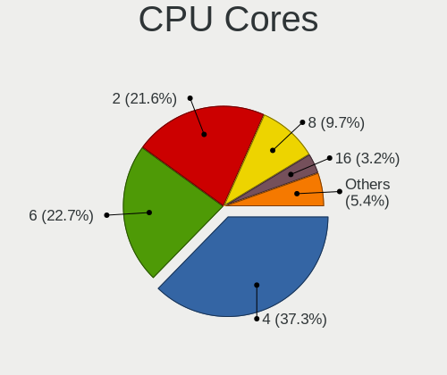

| Number | Desktops | Percent |
|--------|----------|---------|
| 4      | 41       | 41.84%  |
| 2      | 27       | 27.55%  |
| 6      | 20       | 20.41%  |
| 8      | 6        | 6.12%   |
| 12     | 3        | 3.06%   |
| 1      | 1        | 1.02%   |

CPU Sockets
-----------

Number of sockets

| Number | Desktops | Percent |
|--------|----------|---------|
| 1      | 97       | 98.98%  |
| 2      | 1        | 1.02%   |

CPU Threads
-----------

Threads per core (Hyper-Threading)

| Number | Desktops | Percent |
|--------|----------|---------|
| 1      | 53       | 54.08%  |
| 2      | 45       | 45.92%  |

CPU Op-Modes
------------

CPU Operation Modes (32-bit, 64-bit)

| Op mode        | Desktops | Percent |
|----------------|----------|---------|
| 32-bit, 64-bit | 95       | 95.96%  |
| Unknown        | 3        | 3.03%   |
| 32-bit         | 1        | 1.01%   |

CPU Microcode
-------------

Microcode number

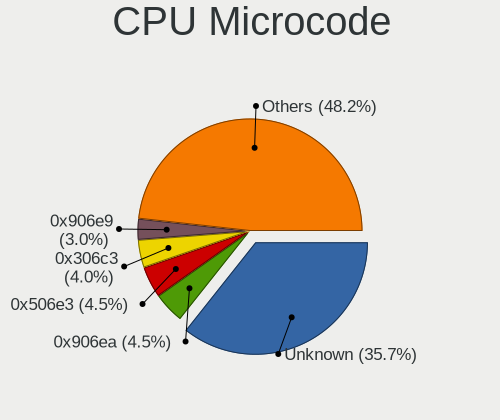

| Number     | Desktops | Percent |
|------------|----------|---------|
| Unknown    | 14       | 13.59%  |
| 0x906ea    | 7        | 6.8%    |
| 0x906e9    | 6        | 5.83%   |
| 0x206a7    | 6        | 5.83%   |
| 0x506e3    | 5        | 4.85%   |
| 0x306c3    | 5        | 4.85%   |
| 0x306a9    | 5        | 4.85%   |
| 0x10676    | 4        | 3.88%   |
| 0x6fb      | 3        | 2.91%   |
| 0x106e5    | 3        | 2.91%   |
| 0x1067a    | 3        | 2.91%   |
| 0x0a201016 | 3        | 2.91%   |
| 0x08001138 | 3        | 2.91%   |
| 0xa0671    | 2        | 1.94%   |
| 0x20655    | 2        | 1.94%   |
| 0x0a201009 | 2        | 1.94%   |
| 0x08108109 | 2        | 1.94%   |
| 0x0800820d | 2        | 1.94%   |
| 0x08001137 | 2        | 1.94%   |
| 0x010000dc | 2        | 1.94%   |
| 0xf47      | 1        | 0.97%   |
| 0xa0655    | 1        | 0.97%   |
| 0x6fd      | 1        | 0.97%   |
| 0x6f7      | 1        | 0.97%   |
| 0x6f6      | 1        | 0.97%   |
| 0x6f2      | 1        | 0.97%   |
| 0x406f1    | 1        | 0.97%   |
| 0x306e4    | 1        | 0.97%   |
| 0x30678    | 1        | 0.97%   |
| 0x206d7    | 1        | 0.97%   |
| 0x20652    | 1        | 0.97%   |
| 0x106c2    | 1        | 0.97%   |
| 0x106a5    | 1        | 0.97%   |
| 0x0a201205 | 1        | 0.97%   |
| 0x08701021 | 1        | 0.97%   |
| 0x08701013 | 1        | 0.97%   |
| 0x08600106 | 1        | 0.97%   |
| 0x0810100b | 1        | 0.97%   |
| 0x06006113 | 1        | 0.97%   |
| 0x06003106 | 1        | 0.97%   |
| 0x06000852 | 1        | 0.97%   |
| 0x010000c7 | 1        | 0.97%   |

CPU Microarch
-------------

Microarchitecture

| Name        | Desktops | Percent |
|-------------|----------|---------|
| KabyLake    | 14       | 14.29%  |
| Core        | 9        | 9.18%   |
| Penryn      | 8        | 8.16%   |
| Zen         | 7        | 7.14%   |
| SandyBridge | 7        | 7.14%   |
| Haswell     | 7        | 7.14%   |
| Zen 3       | 6        | 6.12%   |
| Skylake     | 6        | 6.12%   |
| IvyBridge   | 6        | 6.12%   |
| Zen+        | 4        | 4.08%   |
| Nehalem     | 4        | 4.08%   |
| Zen 2       | 3        | 3.06%   |
| Westmere    | 3        | 3.06%   |
| K10         | 3        | 3.06%   |
| Piledriver  | 2        | 2.04%   |
| Steamroller | 1        | 1.02%   |
| Silvermont  | 1        | 1.02%   |
| NetBurst    | 1        | 1.02%   |
| Icelake     | 1        | 1.02%   |
| Excavator   | 1        | 1.02%   |
| CometLake   | 1        | 1.02%   |
| Broadwell   | 1        | 1.02%   |
| Bonnell     | 1        | 1.02%   |
| Unknown     | 1        | 1.02%   |

Graphics
--------

GPU Vendor
----------

Vendors of graphics cards

| Vendor | Desktops | Percent |
|--------|----------|---------|
| Nvidia | 45       | 42.45%  |
| Intel  | 31       | 29.25%  |
| AMD    | 30       | 28.3%   |

GPU Model
---------

Graphics card models

| Model                                                                       | Desktops | Percent |
|-----------------------------------------------------------------------------|----------|---------|
| AMD Ellesmere [Radeon RX 470/480/570/570X/580/580X/590]                     | 7        | 6.54%   |
| Intel Xeon E3-1200 v3/4th Gen Core Processor Integrated Graphics Controller | 4        | 3.74%   |
| Intel HD Graphics 630                                                       | 4        | 3.74%   |
| Intel 2nd Generation Core Processor Family Integrated Graphics Controller   | 4        | 3.74%   |
| Nvidia GP104 [GeForce GTX 1070]                                             | 3        | 2.8%    |
| Nvidia GM206 [GeForce GTX 960]                                              | 3        | 2.8%    |
| AMD Caicos [Radeon HD 6450/7450/8450 / R5 230 OEM]                          | 3        | 2.8%    |
| Nvidia GP108 [GeForce GT 1030]                                              | 2        | 1.87%   |
| Nvidia GP107 [GeForce GTX 1050]                                             | 2        | 1.87%   |
| Nvidia GP106 [GeForce GTX 1060 6GB]                                         | 2        | 1.87%   |
| Nvidia GP102 [GeForce GTX 1080 Ti]                                          | 2        | 1.87%   |
| Nvidia G98M [GeForce 9300M GS]                                              | 2        | 1.87%   |
| Intel Xeon E3-1200 v2/3rd Gen Core processor Graphics Controller            | 2        | 1.87%   |
| Intel CoffeeLake-S GT2 [UHD Graphics 630]                                   | 2        | 1.87%   |
| Intel 82G33/G31 Express Integrated Graphics Controller                      | 2        | 1.87%   |
| Intel 82946GZ/GL Integrated Graphics Controller                             | 2        | 1.87%   |
| Intel 4 Series Chipset Integrated Graphics Controller                       | 2        | 1.87%   |
| AMD Turks XT [Radeon HD 6670/7670]                                          | 2        | 1.87%   |
| AMD Picasso/Raven 2 [Radeon Vega Series / Radeon Vega Mobile Series]        | 2        | 1.87%   |
| AMD Navi 14 [Radeon RX 5500/5500M / Pro 5500M]                              | 2        | 1.87%   |
| AMD Juniper XT [Radeon HD 5770]                                             | 2        | 1.87%   |
| AMD Cedar [Radeon HD 5000/6000/7350/8350 Series]                            | 2        | 1.87%   |
| Nvidia TU117 [GeForce GTX 1650]                                             | 1        | 0.93%   |
| Nvidia TU116 [GeForce GTX 1660 Ti]                                          | 1        | 0.93%   |
| Nvidia TU106 [GeForce RTX 2060 Rev. A]                                      | 1        | 0.93%   |
| Nvidia TU104 [GeForce RTX 2060]                                             | 1        | 0.93%   |
| Nvidia GP106GL [Quadro P2000]                                               | 1        | 0.93%   |
| Nvidia GP106 [GeForce GTX 1060 3GB]                                         | 1        | 0.93%   |
| Nvidia GP104GL [Quadro P4000]                                               | 1        | 0.93%   |
| Nvidia GP104 [GeForce GTX 1080]                                             | 1        | 0.93%   |
| Nvidia GM204 [GeForce GTX 970]                                              | 1        | 0.93%   |
| Nvidia GM107 [GeForce GTX 750]                                              | 1        | 0.93%   |
| Nvidia GM107 [GeForce GTX 750 Ti]                                           | 1        | 0.93%   |
| Nvidia GK208 [GeForce GT 630 Rev. 2]                                        | 1        | 0.93%   |
| Nvidia GK107GL [Quadro K2000]                                               | 1        | 0.93%   |
| Nvidia GK107 [GeForce GT 740]                                               | 1        | 0.93%   |
| Nvidia GK107 [GeForce GT 640]                                               | 1        | 0.93%   |
| Nvidia GK106GL [Quadro K4000]                                               | 1        | 0.93%   |
| Nvidia GK106 [GeForce GTX 650 Ti]                                           | 1        | 0.93%   |
| Nvidia GK104 [GeForce GTX 770]                                              | 1        | 0.93%   |
| Nvidia GK104 [GeForce GTX 660 Ti]                                           | 1        | 0.93%   |
| Nvidia GF116 [GeForce GTX 550 Ti]                                           | 1        | 0.93%   |
| Nvidia GF114 [GeForce GTX 560 Ti]                                           | 1        | 0.93%   |
| Nvidia GF108 [GeForce GT 440]                                               | 1        | 0.93%   |
| Nvidia GF108 [GeForce GT 430]                                               | 1        | 0.93%   |
| Nvidia GF106GL [Quadro 2000]                                                | 1        | 0.93%   |
| Nvidia GF106 [GeForce GTS 450 OEM]                                          | 1        | 0.93%   |
| Nvidia GA104 [GeForce RTX 3070]                                             | 1        | 0.93%   |
| Nvidia G80 [GeForce 8800 GTS]                                               | 1        | 0.93%   |
| Nvidia G73 [GeForce 7600 GS]                                                | 1        | 0.93%   |
| Nvidia G73 [GeForce 7300 GT]                                                | 1        | 0.93%   |
| Intel US15W/US15X SCH [Poulsbo] Graphics Controller                         | 1        | 0.93%   |
| Intel RocketLake-S GT1 [UHD Graphics 750]                                   | 1        | 0.93%   |
| Intel RocketLake-S GT1 [UHD Graphics 730]                                   | 1        | 0.93%   |
| Intel HD Graphics P630                                                      | 1        | 0.93%   |
| Intel HD Graphics 530                                                       | 1        | 0.93%   |
| Intel HD Graphics 510                                                       | 1        | 0.93%   |
| Intel Core Processor Integrated Graphics Controller                         | 1        | 0.93%   |
| Intel Atom Processor Z36xxx/Z37xxx Series Graphics & Display                | 1        | 0.93%   |
| Intel 82Q35 Express Integrated Graphics Controller                          | 1        | 0.93%   |

GPU Combo
---------

Combinations of graphics cards

| Name           | Desktops | Percent |
|----------------|----------|---------|
| 1 x Nvidia     | 41       | 41%     |
| 1 x Intel      | 27       | 27%     |
| 1 x AMD        | 27       | 27%     |
| Intel + Nvidia | 2        | 2%      |
| AMD + Nvidia   | 2        | 2%      |
| 2 x AMD        | 1        | 1%      |

GPU Driver
----------

Free vs proprietary

| Driver      | Desktops | Percent |
|-------------|----------|---------|
| Free        | 72       | 71.29%  |
| Proprietary | 22       | 21.78%  |
| Unknown     | 7        | 6.93%   |

GPU Memory
----------

Total video memory

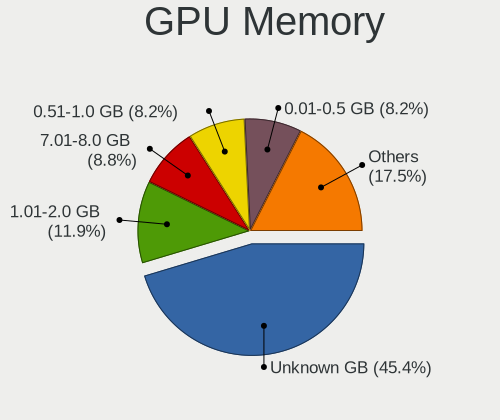

| Size in GB | Desktops | Percent |
|------------|----------|---------|
| Unknown    | 42       | 40.78%  |
| 1.01-2.0   | 17       | 16.5%   |
| 7.01-8.0   | 10       | 9.71%   |
| 0.51-1.0   | 10       | 9.71%   |
| 0.01-0.5   | 9        | 8.74%   |
| 5.01-6.0   | 5        | 4.85%   |
| 3.01-4.0   | 5        | 4.85%   |
| 2.01-3.0   | 2        | 1.94%   |
| 8.01-16.0  | 2        | 1.94%   |
| 4.01-5.0   | 1        | 0.97%   |

Monitor
-------

Monitor Vendor
--------------

Monitor vendors

| Vendor               | Desktops | Percent |
|----------------------|----------|---------|
| Dell                 | 21       | 19.44%  |
| Samsung Electronics  | 19       | 17.59%  |
| AOC                  | 15       | 13.89%  |
| Goldstar             | 13       | 12.04%  |
| Philips              | 11       | 10.19%  |
| Hewlett-Packard      | 5        | 4.63%   |
| Ancor Communications | 4        | 3.7%    |
| Iiyama               | 3        | 2.78%   |
| Acer                 | 3        | 2.78%   |
| ViewSonic            | 2        | 1.85%   |
| Sony                 | 2        | 1.85%   |
| Lenovo               | 2        | 1.85%   |
| Vestel Elektronik    | 1        | 0.93%   |
| Unknown              | 1        | 0.93%   |
| RS                   | 1        | 0.93%   |
| LG Display           | 1        | 0.93%   |
| FUN                  | 1        | 0.93%   |
| DIF                  | 1        | 0.93%   |
| DENON                | 1        | 0.93%   |
| Arnos Instruments    | 1        | 0.93%   |

Monitor Model
-------------

Monitor models

| Model                                                                   | Desktops | Percent |
|-------------------------------------------------------------------------|----------|---------|
| Philips LCD Monitor FTV 1920x1080                                       | 3        | 2.59%   |
| Goldstar ULTRAWIDE GSM59F1 2560x1080 673x284mm 28.8-inch                | 3        | 2.59%   |
| Dell U2412M DELA07A 1920x1200 518x324mm 24.1-inch                       | 3        | 2.59%   |
| Philips 226V4 PHLC0B1 1920x1080 477x268mm 21.5-inch                     | 2        | 1.72%   |
| AOC LCD Monitor AG251FWG2 1920x1080                                     | 2        | 1.72%   |
| ViewSonic VX3211-4K VSCC336 3840x2160 698x393mm 31.5-inch               | 1        | 0.86%   |
| ViewSonic VG2448 VSC3B35 1920x1080 527x296mm 23.8-inch                  | 1        | 0.86%   |
| Vestel Elektronik 39FHD_LCD_TV VES3700 1920x1080 1280x720mm 57.8-inch   | 1        | 0.86%   |
| Unknown LCD Monitor FFFF 2288x1287 2550x2550mm 142.0-inch               | 1        | 0.86%   |
| Sony TV SNYAB03 1920x1080                                               | 1        | 0.86%   |
| Sony TV *02 SNY9403 1920x1080 1218x685mm 55.0-inch                      | 1        | 0.86%   |
| Samsung Electronics SyncMaster SAM05EC 1920x1080 597x336mm 27.0-inch    | 1        | 0.86%   |
| Samsung Electronics SyncMaster SAM04DE 1920x1080 477x268mm 21.5-inch    | 1        | 0.86%   |
| Samsung Electronics SyncMaster SAM0467 1920x1200 518x324mm 24.1-inch    | 1        | 0.86%   |
| Samsung Electronics SyncMaster SAM0303 1680x1050 494x320mm 23.2-inch    | 1        | 0.86%   |
| Samsung Electronics SyncMaster SAM02B6 1920x1200 518x324mm 24.1-inch    | 1        | 0.86%   |
| Samsung Electronics SyncMaster SAM0288 1680x1050 474x296mm 22.0-inch    | 1        | 0.86%   |
| Samsung Electronics SyncMaster SAM026F 1280x1024 376x301mm 19.0-inch    | 1        | 0.86%   |
| Samsung Electronics SyncMaster SAM0214 1680x1050 408x306mm 20.1-inch    | 1        | 0.86%   |
| Samsung Electronics SMS24A450/460 SAM0838 1920x1080 531x299mm 24.0-inch | 1        | 0.86%   |
| Samsung Electronics S24F350 SAM0D20 1920x1080 521x293mm 23.5-inch       | 1        | 0.86%   |
| Samsung Electronics S24E450 SAM0C82 1920x1080 531x299mm 24.0-inch       | 1        | 0.86%   |
| Samsung Electronics S24B300 SAM08B4 1920x1080 521x293mm 23.5-inch       | 1        | 0.86%   |
| Samsung Electronics LCD Monitor SyncMaster 2560x1024                    | 1        | 0.86%   |
| Samsung Electronics LCD Monitor SAM7129 3840x2160 950x540mm 43.0-inch   | 1        | 0.86%   |
| Samsung Electronics LCD Monitor SAM0D4D 1366x768 609x347mm 27.6-inch    | 1        | 0.86%   |
| Samsung Electronics LCD Monitor SAM0200 1280x720                        | 1        | 0.86%   |
| Samsung Electronics LC27RG50 SAM100A 1920x1080 532x304mm 24.1-inch      | 1        | 0.86%   |
| Samsung Electronics LC27RG50 SAM1009 1920x1080 530x300mm 24.0-inch      | 1        | 0.86%   |
| Samsung Electronics C49HG9x SAM0E5E 3840x1080 1196x336mm 48.9-inch      | 1        | 0.86%   |
| Samsung Electronics C49HG9x SAM0E5D 3840x1080 1196x336mm 48.9-inch      | 1        | 0.86%   |
| Samsung Electronics C24F390 SAM0D2D 1920x1080 521x293mm 23.5-inch       | 1        | 0.86%   |
| Samsung Electronics C24F390 SAM0D2C 1920x1080 521x293mm 23.5-inch       | 1        | 0.86%   |
| RS LM-1702 BTC1702 1280x1024 338x270mm 17.0-inch                        | 1        | 0.86%   |
| Philips PHL 328P6A PHL0913 2560x1440 698x393mm 31.5-inch                | 1        | 0.86%   |
| Philips FTV PHL04C3 1920x1080 1440x810mm 65.0-inch                      | 1        | 0.86%   |
| Philips FTV PHL01EA 1920x1080 1440x810mm 65.0-inch                      | 1        | 0.86%   |
| Philips 273EL PHLC07C 1920x1080 598x336mm 27.0-inch                     | 1        | 0.86%   |
| Philips 220WS PHI0851 1680x1050 434x270mm 20.1-inch                     | 1        | 0.86%   |
| Philips 190V PHL0847 1280x1024 376x301mm 19.0-inch                      | 1        | 0.86%   |
| Philips 190B PHL086C 1280x1024 376x301mm 19.0-inch                      | 1        | 0.86%   |
| Philips 150P PHL150A 1024x768 304x228mm 15.0-inch                       | 1        | 0.86%   |
| LG Display LCD Monitor LGD0357 1600x900 382x215mm 17.3-inch             | 1        | 0.86%   |
| Lenovo LEN P27h-10 LEN61AF 2560x1440 597x336mm 27.0-inch                | 1        | 0.86%   |
| Lenovo LEN L1900pA LEN114F 1280x1024 376x301mm 19.0-inch                | 1        | 0.86%   |
| Iiyama X2483/2481 IVM6128 1920x1080 530x300mm 24.0-inch                 | 1        | 0.86%   |
| Iiyama PL2792Q IVM6637 2560x1440 597x336mm 27.0-inch                    | 1        | 0.86%   |
| Iiyama PL2770H IVM665E 1920x1080 598x336mm 27.0-inch                    | 1        | 0.86%   |
| Hewlett-Packard LCD Monitor LP1965                                      | 1        | 0.86%   |
| Hewlett-Packard LCD Monitor 2211 1920x1080                              | 1        | 0.86%   |
| Hewlett-Packard L1906 HWP265E 1280x1024 337x270mm 17.0-inch             | 1        | 0.86%   |
| Hewlett-Packard E233 HPN3460 1920x1080 510x290mm 23.1-inch              | 1        | 0.86%   |
| Hewlett-Packard 22x HPN3656 1920x1080 476x268mm 21.5-inch               | 1        | 0.86%   |
| Goldstar W2486 GSM5723 1920x1080 531x299mm 24.0-inch                    | 1        | 0.86%   |
| Goldstar W2442 GSM56D9 1920x1080 531x299mm 24.0-inch                    | 1        | 0.86%   |
| Goldstar ULTRAWIDE GSM5AE2 3440x1440 800x335mm 34.1-inch                | 1        | 0.86%   |
| Goldstar MP59G GSM5B34 1920x1080 480x270mm 21.7-inch                    | 1        | 0.86%   |
| Goldstar L222W GSM5664 1680x1050 474x296mm 22.0-inch                    | 1        | 0.86%   |
| Goldstar L1900E GSM4B00 1280x1024 376x301mm 19.0-inch                   | 1        | 0.86%   |
| Goldstar IPS234 GSM58DA 1920x1080 510x290mm 23.1-inch                   | 1        | 0.86%   |

Monitor Resolution
------------------

Monitor screen resolution

| Resolution         | Desktops | Percent |
|--------------------|----------|---------|
| 1920x1080 (FHD)    | 45       | 43.27%  |
| 2560x1440 (QHD)    | 9        | 8.65%   |
| 1280x1024 (SXGA)   | 9        | 8.65%   |
| 3840x2160 (4K)     | 7        | 6.73%   |
| 1920x1200 (WUXGA)  | 7        | 6.73%   |
| 1680x1050 (WSXGA+) | 7        | 6.73%   |
| 2560x1080          | 4        | 3.85%   |
| 3440x1440          | 3        | 2.88%   |
| 1600x900 (HD+)     | 3        | 2.88%   |
| 1366x768 (WXGA)    | 2        | 1.92%   |
| 3840x1080          | 1        | 0.96%   |
| 2560x1600          | 1        | 0.96%   |
| 2560x1024          | 1        | 0.96%   |
| 2288x1287          | 1        | 0.96%   |
| 1440x900 (WXGA+)   | 1        | 0.96%   |
| 1280x720 (HD)      | 1        | 0.96%   |
| 1024x768 (XGA)     | 1        | 0.96%   |
| Unknown            | 1        | 0.96%   |

Monitor Diagonal
----------------

Diagonal size in inches

| Inches  | Desktops | Percent |
|---------|----------|---------|
| 24      | 16       | 14.95%  |
| 23      | 14       | 13.08%  |
| 21      | 13       | 12.15%  |
| Unknown | 12       | 11.21%  |
| 27      | 10       | 9.35%   |
| 34      | 7        | 6.54%   |
| 20      | 5        | 4.67%   |
| 19      | 5        | 4.67%   |
| 31      | 4        | 3.74%   |
| 22      | 3        | 2.8%    |
| 17      | 3        | 2.8%    |
| 84      | 2        | 1.87%   |
| 72      | 2        | 1.87%   |
| 65      | 2        | 1.87%   |
| 18      | 2        | 1.87%   |
| 142     | 1        | 0.93%   |
| 55      | 1        | 0.93%   |
| 49      | 1        | 0.93%   |
| 32      | 1        | 0.93%   |
| 29      | 1        | 0.93%   |
| 25      | 1        | 0.93%   |
| 15      | 1        | 0.93%   |

Monitor Width
-------------

Physical width

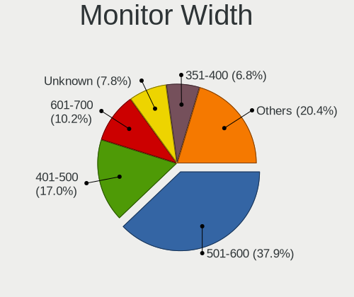

| Width in mm    | Desktops | Percent |
|----------------|----------|---------|
| 501-600        | 38       | 35.85%  |
| 401-500        | 23       | 21.7%   |
| Unknown        | 12       | 11.32%  |
| 701-800        | 8        | 7.55%   |
| 351-400        | 7        | 6.6%    |
| 601-700        | 6        | 5.66%   |
| 1501-2000      | 4        | 3.77%   |
| 1001-1500      | 4        | 3.77%   |
| 301-350        | 3        | 2.83%   |
| More than 2000 | 1        | 0.94%   |

Aspect Ratio
------------

Proportional relationship between the width and the height

| Ratio   | Desktops | Percent |
|---------|----------|---------|
| 16/9    | 57       | 56.44%  |
| 16/10   | 13       | 12.87%  |
| Unknown | 10       | 9.9%    |
| 5/4     | 9        | 8.91%   |
| 21/9    | 7        | 6.93%   |
| 4/3     | 2        | 1.98%   |
| 32/9    | 1        | 0.99%   |
| 3/2     | 1        | 0.99%   |
| 1.00    | 1        | 0.99%   |

Monitor Area
------------

Area in inch

| Area in inch | Desktops | Percent |
|----------------|----------|---------|
| 201-250        | 35       | 32.71%  |
| 351-500        | 13       | 12.15%  |
| 151-200        | 13       | 12.15%  |
| Unknown        | 12       | 11.21%  |
| 301-350        | 10       | 9.35%   |
| 251-300        | 10       | 9.35%   |
| More than 1000 | 8        | 7.48%   |
| 141-150        | 3        | 2.8%    |
| 121-130        | 1        | 0.93%   |
| 101-110        | 1        | 0.93%   |
| 501-1000       | 1        | 0.93%   |

Pixel Density
-------------

Pixels per inch

| Density | Desktops | Percent |
|---------|----------|---------|
| 51-100  | 55       | 55%     |
| 101-120 | 21       | 21%     |
| Unknown | 12       | 12%     |
| 1-50    | 8        | 8%      |
| 121-160 | 4        | 4%      |

Multiple Monitors
-----------------

Total monitors connected

| Total | Desktops | Percent |
|-------|----------|---------|
| 1     | 79       | 78.22%  |
| 2     | 19       | 18.81%  |
| 0     | 3        | 2.97%   |

Network
-------

Net Controller Vendor
---------------------

Controller vendors

| Vendor                          | Desktops | Percent |
|---------------------------------|----------|---------|
| Realtek Semiconductor           | 54       | 41.86%  |
| Intel                           | 40       | 31.01%  |
| Qualcomm Atheros                | 7        | 5.43%   |
| Broadcom                        | 5        | 3.88%   |
| Ralink Technology               | 4        | 3.1%    |
| Ralink                          | 4        | 3.1%    |
| Marvell Technology Group        | 2        | 1.55%   |
| Linksys                         | 2        | 1.55%   |
| ASUSTek Computer                | 2        | 1.55%   |
| ZyDAS Technology                | 1        | 0.78%   |
| VIA Technologies                | 1        | 0.78%   |
| TP-Link                         | 1        | 0.78%   |
| Qualcomm Atheros Communications | 1        | 0.78%   |
| IMC Networks                    | 1        | 0.78%   |
| D-Link System                   | 1        | 0.78%   |
| D-Link                          | 1        | 0.78%   |
| Compal Electronics              | 1        | 0.78%   |
| Belkin Components               | 1        | 0.78%   |

Net Controller Model
--------------------

Controller models

| Model                                                                             | Desktops | Percent |
|-----------------------------------------------------------------------------------|----------|---------|
| Realtek RTL8111/8168/8411 PCI Express Gigabit Ethernet Controller                 | 48       | 35.29%  |
| Intel Ethernet Connection (2) I219-V                                              | 9        | 6.62%   |
| Intel I211 Gigabit Network Connection                                             | 8        | 5.88%   |
| Intel 82579LM Gigabit Network Connection (Lewisville)                             | 4        | 2.94%   |
| Realtek RTL8125 2.5GbE Controller                                                 | 3        | 2.21%   |
| Ralink RT2870/RT3070 Wireless Adapter                                             | 2        | 1.47%   |
| Ralink MT7601U Wireless Adapter                                                   | 2        | 1.47%   |
| Ralink RT2790 Wireless 802.11n 1T/2R PCIe                                         | 2        | 1.47%   |
| Qualcomm Atheros AR8121/AR8113/AR8114 Gigabit or Fast Ethernet                    | 2        | 1.47%   |
| Marvell Group 88E8056 PCI-E Gigabit Ethernet Controller                           | 2        | 1.47%   |
| Intel Wi-Fi 6 AX200                                                               | 2        | 1.47%   |
| Intel 82574L Gigabit Network Connection                                           | 2        | 1.47%   |
| Intel 82567LM-3 Gigabit Network Connection                                        | 2        | 1.47%   |
| Intel 82566DM-2 Gigabit Network Connection                                        | 2        | 1.47%   |
| Broadcom NetXtreme BCM5755 Gigabit Ethernet PCI Express                           | 2        | 1.47%   |
| Broadcom NetLink BCM5786 Gigabit Ethernet PCI Express                             | 2        | 1.47%   |
| ZyDAS ZD1212B Wireless Adapter                                                    | 1        | 0.74%   |
| VIA VT6105/VT6106S [Rhine-III]                                                    | 1        | 0.74%   |
| TP-Link Archer T2U PLUS [RTL8821AU]                                               | 1        | 0.74%   |
| Realtek RTL8723BE PCIe Wireless Network Adapter                                   | 1        | 0.74%   |
| Realtek RTL8192EU 802.11b/g/n WLAN Adapter                                        | 1        | 0.74%   |
| Realtek RTL8192CU 802.11n WLAN Adapter                                            | 1        | 0.74%   |
| Realtek RTL8192CE PCIe Wireless Network Adapter                                   | 1        | 0.74%   |
| Realtek RTL8187 Wireless Adapter                                                  | 1        | 0.74%   |
| Realtek RTL810xE PCI Express Fast Ethernet controller                             | 1        | 0.74%   |
| Ralink RT3060 Wireless 802.11n 1T/1R                                              | 1        | 0.74%   |
| Ralink RT2561/RT61 802.11g PCI                                                    | 1        | 0.74%   |
| Qualcomm Atheros QCA6174 802.11ac Wireless Network Adapter                        | 1        | 0.74%   |
| Qualcomm Atheros Killer E220x Gigabit Ethernet Controller                         | 1        | 0.74%   |
| Qualcomm Atheros AR9271 802.11n                                                   | 1        | 0.74%   |
| Qualcomm Atheros AR9462 Wireless Network Adapter                                  | 1        | 0.74%   |
| Qualcomm Atheros AR93xx Wireless Network Adapter                                  | 1        | 0.74%   |
| Qualcomm Atheros AR5416 Wireless Network Adapter [AR5008 802.11(a)bgn]            | 1        | 0.74%   |
| Linksys Gigabit Network Adapter                                                   | 1        | 0.74%   |
| Linksys AE1200 802.11bgn Wireless Adapter [Broadcom BCM43235]                     | 1        | 0.74%   |
| Intel Tiger Lake PCH CNVi WiFi                                                    | 1        | 0.74%   |
| Intel I350 Gigabit Network Connection                                             | 1        | 0.74%   |
| Intel Ethernet Connection I217-V                                                  | 1        | 0.74%   |
| Intel Ethernet Connection I217-LM                                                 | 1        | 0.74%   |
| Intel Ethernet Connection (7) I219-V                                              | 1        | 0.74%   |
| Intel Ethernet Connection (2) I219-LM                                             | 1        | 0.74%   |
| Intel Ethernet Connection (2) I218-LM                                             | 1        | 0.74%   |
| Intel Ethernet Connection (14) I219-V                                             | 1        | 0.74%   |
| Intel 82583V Gigabit Network Connection                                           | 1        | 0.74%   |
| Intel 82579V Gigabit Network Connection                                           | 1        | 0.74%   |
| Intel 82578DM Gigabit Network Connection                                          | 1        | 0.74%   |
| Intel 82576 Gigabit Network Connection                                            | 1        | 0.74%   |
| Intel 82571EB/82571GB Gigabit Ethernet Controller D0/D1 (copper applications)     | 1        | 0.74%   |
| Intel 82566DM Gigabit Network Connection                                          | 1        | 0.74%   |
| Intel 80003ES2LAN Gigabit Ethernet Controller (Copper)                            | 1        | 0.74%   |
| IMC Networks Mediao 802.11n WLAN [Realtek RTL8191SU]                              | 1        | 0.74%   |
| D-Link System DWA-131 802.11n Wireless N Nano Adapter(rev.A1) [Realtek RTL8192SU] | 1        | 0.74%   |
| D-Link 802.11 n WLAN                                                              | 1        | 0.74%   |
| Compal Android                                                                    | 1        | 0.74%   |
| Broadcom BCM4352 802.11ac Wireless Network Adapter                                | 1        | 0.74%   |
| Belkin Components F5D7050 Wireless G Adapter v4000 [Zydas ZD1211B]                | 1        | 0.74%   |
| ASUS USB-N13 802.11n Network Adapter (rev. B1) [Realtek RTL8192CU]                | 1        | 0.74%   |
| ASUS N10 Nano 802.11n Network Adapter [Realtek RTL8192CU]                         | 1        | 0.74%   |

Wireless Vendor
---------------

Wireless vendors

| Vendor                          | Desktops | Percent |
|---------------------------------|----------|---------|
| Realtek Semiconductor           | 4        | 13.33%  |
| Ralink Technology               | 4        | 13.33%  |
| Ralink                          | 4        | 13.33%  |
| Qualcomm Atheros                | 4        | 13.33%  |
| Intel                           | 3        | 10%     |
| ASUSTek Computer                | 2        | 6.67%   |
| ZyDAS Technology                | 1        | 3.33%   |
| TP-Link                         | 1        | 3.33%   |
| Qualcomm Atheros Communications | 1        | 3.33%   |
| Linksys                         | 1        | 3.33%   |
| IMC Networks                    | 1        | 3.33%   |
| D-Link System                   | 1        | 3.33%   |
| D-Link                          | 1        | 3.33%   |
| Broadcom                        | 1        | 3.33%   |
| Belkin Components               | 1        | 3.33%   |

Wireless Model
--------------

Wireless models

| Model                                                                             | Desktops | Percent |
|-----------------------------------------------------------------------------------|----------|---------|
| Ralink RT2870/RT3070 Wireless Adapter                                             | 2        | 6.45%   |
| Ralink MT7601U Wireless Adapter                                                   | 2        | 6.45%   |
| Ralink RT2790 Wireless 802.11n 1T/2R PCIe                                         | 2        | 6.45%   |
| Intel Wi-Fi 6 AX200                                                               | 2        | 6.45%   |
| ZyDAS ZD1212B Wireless Adapter                                                    | 1        | 3.23%   |
| TP-Link Archer T2U PLUS [RTL8821AU]                                               | 1        | 3.23%   |
| Realtek RTL8723BE PCIe Wireless Network Adapter                                   | 1        | 3.23%   |
| Realtek RTL8192EU 802.11b/g/n WLAN Adapter                                        | 1        | 3.23%   |
| Realtek RTL8192CU 802.11n WLAN Adapter                                            | 1        | 3.23%   |
| Realtek RTL8192CE PCIe Wireless Network Adapter                                   | 1        | 3.23%   |
| Realtek RTL8187 Wireless Adapter                                                  | 1        | 3.23%   |
| Ralink RT3060 Wireless 802.11n 1T/1R                                              | 1        | 3.23%   |
| Ralink RT2561/RT61 802.11g PCI                                                    | 1        | 3.23%   |
| Qualcomm Atheros QCA6174 802.11ac Wireless Network Adapter                        | 1        | 3.23%   |
| Qualcomm Atheros AR9271 802.11n                                                   | 1        | 3.23%   |
| Qualcomm Atheros AR9462 Wireless Network Adapter                                  | 1        | 3.23%   |
| Qualcomm Atheros AR93xx Wireless Network Adapter                                  | 1        | 3.23%   |
| Qualcomm Atheros AR5416 Wireless Network Adapter [AR5008 802.11(a)bgn]            | 1        | 3.23%   |
| Linksys AE1200 802.11bgn Wireless Adapter [Broadcom BCM43235]                     | 1        | 3.23%   |
| Intel Tiger Lake PCH CNVi WiFi                                                    | 1        | 3.23%   |
| IMC Networks Mediao 802.11n WLAN [Realtek RTL8191SU]                              | 1        | 3.23%   |
| D-Link System DWA-131 802.11n Wireless N Nano Adapter(rev.A1) [Realtek RTL8192SU] | 1        | 3.23%   |
| D-Link 802.11 n WLAN                                                              | 1        | 3.23%   |
| Broadcom BCM4352 802.11ac Wireless Network Adapter                                | 1        | 3.23%   |
| Belkin Components F5D7050 Wireless G Adapter v4000 [Zydas ZD1211B]                | 1        | 3.23%   |
| ASUS USB-N13 802.11n Network Adapter (rev. B1) [Realtek RTL8192CU]                | 1        | 3.23%   |
| ASUS N10 Nano 802.11n Network Adapter [Realtek RTL8192CU]                         | 1        | 3.23%   |

Ethernet Vendor
---------------

Ethernet vendors

| Vendor                   | Desktops | Percent |
|--------------------------|----------|---------|
| Realtek Semiconductor    | 52       | 50.49%  |
| Intel                    | 39       | 37.86%  |
| Broadcom                 | 4        | 3.88%   |
| Qualcomm Atheros         | 3        | 2.91%   |
| Marvell Technology Group | 2        | 1.94%   |
| VIA Technologies         | 1        | 0.97%   |
| Linksys                  | 1        | 0.97%   |
| Compal Electronics       | 1        | 0.97%   |

Ethernet Model
--------------

Ethernet models

| Model                                                                         | Desktops | Percent |
|-------------------------------------------------------------------------------|----------|---------|
| Realtek RTL8111/8168/8411 PCI Express Gigabit Ethernet Controller             | 48       | 45.71%  |
| Intel Ethernet Connection (2) I219-V                                          | 9        | 8.57%   |
| Intel I211 Gigabit Network Connection                                         | 8        | 7.62%   |
| Intel 82579LM Gigabit Network Connection (Lewisville)                         | 4        | 3.81%   |
| Realtek RTL8125 2.5GbE Controller                                             | 3        | 2.86%   |
| Qualcomm Atheros AR8121/AR8113/AR8114 Gigabit or Fast Ethernet                | 2        | 1.9%    |
| Marvell Group 88E8056 PCI-E Gigabit Ethernet Controller                       | 2        | 1.9%    |
| Intel 82574L Gigabit Network Connection                                       | 2        | 1.9%    |
| Intel 82567LM-3 Gigabit Network Connection                                    | 2        | 1.9%    |
| Intel 82566DM-2 Gigabit Network Connection                                    | 2        | 1.9%    |
| Broadcom NetXtreme BCM5755 Gigabit Ethernet PCI Express                       | 2        | 1.9%    |
| Broadcom NetLink BCM5786 Gigabit Ethernet PCI Express                         | 2        | 1.9%    |
| VIA VT6105/VT6106S [Rhine-III]                                                | 1        | 0.95%   |
| Realtek RTL810xE PCI Express Fast Ethernet controller                         | 1        | 0.95%   |
| Qualcomm Atheros Killer E220x Gigabit Ethernet Controller                     | 1        | 0.95%   |
| Linksys Gigabit Network Adapter                                               | 1        | 0.95%   |
| Intel I350 Gigabit Network Connection                                         | 1        | 0.95%   |
| Intel Ethernet Connection I217-V                                              | 1        | 0.95%   |
| Intel Ethernet Connection I217-LM                                             | 1        | 0.95%   |
| Intel Ethernet Connection (7) I219-V                                          | 1        | 0.95%   |
| Intel Ethernet Connection (2) I219-LM                                         | 1        | 0.95%   |
| Intel Ethernet Connection (2) I218-LM                                         | 1        | 0.95%   |
| Intel Ethernet Connection (14) I219-V                                         | 1        | 0.95%   |
| Intel 82583V Gigabit Network Connection                                       | 1        | 0.95%   |
| Intel 82579V Gigabit Network Connection                                       | 1        | 0.95%   |
| Intel 82578DM Gigabit Network Connection                                      | 1        | 0.95%   |
| Intel 82576 Gigabit Network Connection                                        | 1        | 0.95%   |
| Intel 82571EB/82571GB Gigabit Ethernet Controller D0/D1 (copper applications) | 1        | 0.95%   |
| Intel 82566DM Gigabit Network Connection                                      | 1        | 0.95%   |
| Intel 80003ES2LAN Gigabit Ethernet Controller (Copper)                        | 1        | 0.95%   |
| Compal Android                                                                | 1        | 0.95%   |

Net Controller Kind
-------------------

Ethernet, WiFi or modem

| Kind     | Desktops | Percent |
|----------|----------|---------|
| Ethernet | 96       | 76.19%  |
| WiFi     | 30       | 23.81%  |

Used Controller
---------------

Currently used network controller

| Kind     | Desktops | Percent |
|----------|----------|---------|
| Ethernet | 81       | 81.82%  |
| WiFi     | 18       | 18.18%  |

NICs
----

Total network controllers on board

| Total | Desktops | Percent |
|-------|----------|---------|
| 1     | 75       | 75.76%  |
| 2     | 18       | 18.18%  |
| 3     | 3        | 3.03%   |
| 0     | 2        | 2.02%   |
| 5     | 1        | 1.01%   |

IPv6
----

IPv6 vs IPv4

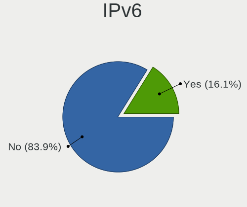

| Used | Desktops | Percent |
|------|----------|---------|
| No   | 91       | 89.22%  |
| Yes  | 11       | 10.78%  |

Bluetooth
---------

Bluetooth Vendor
----------------

Controller vendors

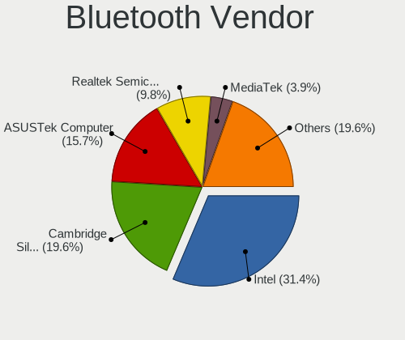

| Vendor                     | Desktops | Percent |
|----------------------------|----------|---------|
| Cambridge Silicon Radio    | 5        | 26.32%  |
| Intel                      | 3        | 15.79%  |
| ASUSTek Computer           | 3        | 15.79%  |
| Hewlett-Packard            | 2        | 10.53%  |
| Realtek Semiconductor      | 1        | 5.26%   |
| Lite-On Technology         | 1        | 5.26%   |
| Integrated System Solution | 1        | 5.26%   |
| IMC Networks               | 1        | 5.26%   |
| Edimax Technology          | 1        | 5.26%   |
| Apple                      | 1        | 5.26%   |

Bluetooth Model
---------------

Controller models

| Model                                               | Desktops | Percent |
|-----------------------------------------------------|----------|---------|
| Cambridge Silicon Radio Bluetooth Dongle (HCI mode) | 5        | 26.32%  |
| Intel AX200 Bluetooth                               | 2        | 10.53%  |
| HP Bluetooth 2.0 Interface [Broadcom BCM2045]       | 2        | 10.53%  |
| ASUS Broadcom BCM20702A0 Bluetooth                  | 2        | 10.53%  |
| Realtek Bluetooth Radio                             | 1        | 5.26%   |
| Lite-On Bluetooth Device                            | 1        | 5.26%   |
| Intel AX201 Bluetooth                               | 1        | 5.26%   |
| Integrated System Solution Bluetooth Device         | 1        | 5.26%   |
| IMC Networks Bluetooth Radio                        | 1        | 5.26%   |
| Edimax Bluetooth Adapter                            | 1        | 5.26%   |
| ASUS Qualcomm Bluetooth 4.1                         | 1        | 5.26%   |
| Apple Bluetooth HCI                                 | 1        | 5.26%   |

Sound
-----

Sound Vendor
------------

Sound card vendors

| Vendor                      | Desktops | Percent |
|-----------------------------|----------|---------|
| Intel                       | 67       | 40.61%  |
| Nvidia                      | 40       | 24.24%  |
| AMD                         | 38       | 23.03%  |
| Logitech                    | 3        | 1.82%   |
| JMTek                       | 2        | 1.21%   |
| ASUSTek Computer            | 2        | 1.21%   |
| Yamaha                      | 1        | 0.61%   |
| Textech International       | 1        | 0.61%   |
| Texas Instruments           | 1        | 0.61%   |
| Syntek                      | 1        | 0.61%   |
| PreSonus Audio Electronics  | 1        | 0.61%   |
| Nam Tai E&E Products        | 1        | 0.61%   |
| Mackie Designs              | 1        | 0.61%   |
| Kingston Technology         | 1        | 0.61%   |
| iCreate Technologies        | 1        | 0.61%   |
| FiiO Electronics Technology | 1        | 0.61%   |
| Creative Labs               | 1        | 0.61%   |
| C-Media Electronics         | 1        | 0.61%   |
| BEHRINGER International     | 1        | 0.61%   |

Sound Model
-----------

Sound card models

| Model                                                                             | Desktops | Percent |
|-----------------------------------------------------------------------------------|----------|---------|
| Intel 6 Series/C200 Series Chipset Family High Definition Audio Controller        | 9        | 4.89%   |
| Intel 200 Series PCH HD Audio                                                     | 9        | 4.89%   |
| AMD Starship/Matisse HD Audio Controller                                          | 8        | 4.35%   |
| AMD Family 17h (Models 00h-0fh) HD Audio Controller                               | 7        | 3.8%    |
| AMD Ellesmere HDMI Audio [Radeon RX 470/480 / 570/580/590]                        | 7        | 3.8%    |
| Intel 5 Series/3400 Series Chipset High Definition Audio                          | 6        | 3.26%   |
| Intel 100 Series/C230 Series Chipset Family HD Audio Controller                   | 6        | 3.26%   |
| Nvidia GP104 High Definition Audio Controller                                     | 5        | 2.72%   |
| Intel NM10/ICH7 Family High Definition Audio Controller                           | 5        | 2.72%   |
| Intel 8 Series/C220 Series Chipset High Definition Audio Controller               | 5        | 2.72%   |
| Nvidia GP106 High Definition Audio Controller                                     | 4        | 2.17%   |
| Intel Xeon E3-1200 v3/4th Gen Core Processor HD Audio Controller                  | 4        | 2.17%   |
| Intel Cannon Lake PCH cAVS                                                        | 4        | 2.17%   |
| Intel 82801JI (ICH10 Family) HD Audio Controller                                  | 4        | 2.17%   |
| Intel 82801I (ICH9 Family) HD Audio Controller                                    | 4        | 2.17%   |
| AMD Family 17h/19h HD Audio Controller                                            | 4        | 2.17%   |
| Nvidia GM206 High Definition Audio Controller                                     | 3        | 1.63%   |
| Nvidia GK107 HDMI Audio Controller                                                | 3        | 1.63%   |
| AMD SBx00 Azalia (Intel HDA)                                                      | 3        | 1.63%   |
| AMD Raven/Raven2/Fenghuang HDMI/DP Audio Controller                               | 3        | 1.63%   |
| AMD Cedar HDMI Audio [Radeon HD 5400/6300/7300 Series]                            | 3        | 1.63%   |
| AMD Caicos HDMI Audio [Radeon HD 6450 / 7450/8450/8490 OEM / R5 230/235/235X OEM] | 3        | 1.63%   |
| Nvidia GP108 High Definition Audio Controller                                     | 2        | 1.09%   |
| Nvidia GP107GL High Definition Audio Controller                                   | 2        | 1.09%   |
| Nvidia GP102 HDMI Audio Controller                                                | 2        | 1.09%   |
| Nvidia GM107 High Definition Audio Controller [GeForce 940MX]                     | 2        | 1.09%   |
| Nvidia GK106 HDMI Audio Controller                                                | 2        | 1.09%   |
| Nvidia GK104 HDMI Audio Controller                                                | 2        | 1.09%   |
| Nvidia GF108 High Definition Audio Controller                                     | 2        | 1.09%   |
| Nvidia GF106 High Definition Audio Controller                                     | 2        | 1.09%   |
| Logitech G430 Surround Sound Gaming Headset                                       | 2        | 1.09%   |
| Intel Tiger Lake-H HD Audio Controller                                            | 2        | 1.09%   |
| Intel C600/X79 series chipset High Definition Audio Controller                    | 2        | 1.09%   |
| Intel 9 Series Chipset Family HD Audio Controller                                 | 2        | 1.09%   |
| Intel 82801JD/DO (ICH10 Family) HD Audio Controller                               | 2        | 1.09%   |
| Intel 82801H (ICH8 Family) HD Audio Controller                                    | 2        | 1.09%   |
| AMD Turks HDMI Audio [Radeon HD 6500/6600 / 6700M Series]                         | 2        | 1.09%   |
| AMD Navi 10 HDMI Audio                                                            | 2        | 1.09%   |
| AMD Juniper HDMI Audio [Radeon HD 5700 Series]                                    | 2        | 1.09%   |
| AMD FCH Azalia Controller                                                         | 2        | 1.09%   |
| Yamaha Steinberg UR22mkII                                                         | 1        | 0.54%   |
| Textech International MIDI Interface cable                                        | 1        | 0.54%   |
| Texas Instruments PCM2902 Audio Codec                                             | 1        | 0.54%   |
| Syntek USB Ear-Microphone                                                         | 1        | 0.54%   |
| PreSonus Audio Electronics PreSonus AudioBox iTwo                                 | 1        | 0.54%   |
| Nvidia TU116 High Definition Audio Controller                                     | 1        | 0.54%   |
| Nvidia TU107 GeForce GTX 1650 High Definition Audio Controller                    | 1        | 0.54%   |
| Nvidia TU106 High Definition Audio Controller                                     | 1        | 0.54%   |
| Nvidia TU104 HD Audio Controller                                                  | 1        | 0.54%   |
| Nvidia GM204 High Definition Audio Controller                                     | 1        | 0.54%   |
| Nvidia GK208 HDMI/DP Audio Controller                                             | 1        | 0.54%   |
| Nvidia GF116 High Definition Audio Controller                                     | 1        | 0.54%   |
| Nvidia GF114 HDMI Audio Controller                                                | 1        | 0.54%   |
| Nvidia GA104 High Definition Audio Controller                                     | 1        | 0.54%   |
| Nam Tai E&E Products Sony SingStar USBMIC                                         | 1        | 0.54%   |
| Mackie Designs Onyx Producer 2-2                                                  | 1        | 0.54%   |
| Logitech G933 Wireless Headset Dongle                                             | 1        | 0.54%   |
| Kingston Technology HyperX 7.1 Audio                                              | 1        | 0.54%   |
| JMTek USB Audio Device                                                            | 1        | 0.54%   |
| JMTek audio controller                                                            | 1        | 0.54%   |

Memory
------

Memory Vendor
-------------

Memory module vendors

| Vendor              | Desktops | Percent |
|---------------------|----------|---------|
| Kingston            | 12       | 21.05%  |
| Samsung Electronics | 8        | 14.04%  |
| G.Skill             | 8        | 14.04%  |
| Crucial             | 7        | 12.28%  |
| Unknown             | 5        | 8.77%   |
| Corsair             | 5        | 8.77%   |
| SK hynix            | 3        | 5.26%   |
| TakeMS              | 2        | 3.51%   |
| Micron Technology   | 2        | 3.51%   |
| Transcend           | 1        | 1.75%   |
| Team                | 1        | 1.75%   |
| Nanya Technology    | 1        | 1.75%   |
| Elpida              | 1        | 1.75%   |
| A-DATA Technology   | 1        | 1.75%   |

Memory Model
------------

Memory module models

| Model                                                     | Desktops | Percent |
|-----------------------------------------------------------|----------|---------|
| Kingston RAM KHX2133C14/8G 8GB DIMM DDR4 2400MT/s         | 2        | 3.28%   |
| Unknown RAM Module 4096MB DIMM DDR 1600MT/s               | 1        | 1.64%   |
| Unknown RAM Module 2GB SODIMM DDR2                        | 1        | 1.64%   |
| Unknown RAM Module 2GB DIMM 800MT/s                       | 1        | 1.64%   |
| Unknown RAM Module 2048MB DIMM DDR2 667MT/s               | 1        | 1.64%   |
| Unknown RAM 3000 C16 Series 8192MB DIMM DDR4 2133MT/s     | 1        | 1.64%   |
| Transcend RAM JM800QLU-2G 2GB DIMM DDR2 2048MT/s          | 1        | 1.64%   |
| Team RAM TEAMGROUP-UD4-3000 8GB DIMM DDR4 3000MT/s        | 1        | 1.64%   |
| TakeMS RAM TMS4GB364F081139EM 4096MB DIMM DDR3 1333MT/s   | 1        | 1.64%   |
| TakeMS RAM TMS4GB364E081139PP 4GB DIMM DDR3 1333MT/s      | 1        | 1.64%   |
| TakeMS RAM TMS2GB264D081805EV 2048MB DIMM DDR2 800MT/s    | 1        | 1.64%   |
| SK hynix RAM Module 4096MB FB-DIMM DDR2 667MT/s           | 1        | 1.64%   |
| SK hynix RAM HMT351U6EFR8C-PB 4GB DIMM DDR3 1800MT/s      | 1        | 1.64%   |
| SK hynix RAM HMA41GR7AFR4N-UH 8GB DIMM DDR4 2400MT/s      | 1        | 1.64%   |
| Samsung RAM Module 4096MB DIMM DDR4 2400MT/s              | 1        | 1.64%   |
| Samsung RAM M4 70T5663QZ3-CF7 2048MB SODIMM DDR2 2048MT/s | 1        | 1.64%   |
| Samsung RAM M393B1G70QH0-CMA 8GB DIMM 1867MT/s            | 1        | 1.64%   |
| Samsung RAM M393A1K43BB0-CRC 8GB DIMM DDR4 2400MT/s       | 1        | 1.64%   |
| Samsung RAM M391A2K43BB1-CRC 16GB DIMM DDR4 2866MT/s      | 1        | 1.64%   |
| Samsung RAM M378B5773CH0-CH9 2GB DIMM DDR3 1867MT/s       | 1        | 1.64%   |
| Samsung RAM M378B5673FH0-CF8 2GB DIMM DDR3 1067MT/s       | 1        | 1.64%   |
| Samsung RAM M3 78T5663QZ3-CF7 2GB DIMM DDR2 1639MT/s      | 1        | 1.64%   |
| Samsung RAM M3 78T5663QZ3-CE6 2048MB DIMM DDR2 667MT/s    | 1        | 1.64%   |
| Nanya RAM NT1GT64U88D0BY-AD 1024MB DIMM DDR 49926MT/s     | 1        | 1.64%   |
| Micron RAM 18JSF51272AZ-1G6M 4GB DIMM DDR3 1600MT/s       | 1        | 1.64%   |
| Micron RAM 18HTF12872AY-667B3 1024MB DIMM DDR2 667MT/s    | 1        | 1.64%   |
| Kingston RAM Module 1024MB DIMM DDR2 800MT/s              | 1        | 1.64%   |
| Kingston RAM KHX3600C18D4/32GX 32GB DIMM DDR4 3600MT/s    | 1        | 1.64%   |
| Kingston RAM KHX3200C16D4/16GX 16GB DIMM DDR4 3600MT/s    | 1        | 1.64%   |
| Kingston RAM KHX2666C16/8G 8GB DIMM DDR4 3466MT/s         | 1        | 1.64%   |
| Kingston RAM KHX2133C14D4/8G 8GB DIMM DDR4 2667MT/s       | 1        | 1.64%   |
| Kingston RAM KHX2133C11D3/8GX 8GB DIMM DDR3 2133MT/s      | 1        | 1.64%   |
| Kingston RAM KHX1866C9D3/4GX 4GB DIMM DDR3 1867MT/s       | 1        | 1.64%   |
| Kingston RAM 9965639-002.A02G 8GB DIMM DDR4 2133MT/s      | 1        | 1.64%   |
| Kingston RAM 9905622-058.A00G 8GB DIMM DDR4 2133MT/s      | 1        | 1.64%   |
| Kingston RAM 9905471-017.A00LF 4096MB DIMM DDR3 1333MT/s  | 1        | 1.64%   |
| G.Skill RAM F4-4000C17-8GTZR 8GB DIMM DDR4 3733MT/s       | 1        | 1.64%   |
| G.Skill RAM F4-3600C16-8GTZNC 8GB DIMM DDR4 3800MT/s      | 1        | 1.64%   |
| G.Skill RAM F4-3600C16-16GTZNC 16384MB DIMM DDR4 3600MT/s | 1        | 1.64%   |
| G.Skill RAM F4-3200C16-8GVKB 8GB DIMM DDR4 3200MT/s       | 1        | 1.64%   |
| G.Skill RAM F4-3200C16-8GTZR 8GB DIMM DDR4 3200MT/s       | 1        | 1.64%   |
| G.Skill RAM F4-3000C16-8GISB 8GB DIMM DDR4 3200MT/s       | 1        | 1.64%   |
| G.Skill RAM F4-2800C17-8GVR 8GB DIMM DDR4 2133MT/s        | 1        | 1.64%   |
| G.Skill RAM F4-2400C16-8GFX 8GB DIMM DDR4 2400MT/s        | 1        | 1.64%   |
| G.Skill RAM F4-2400C15-8GVR 8GB DIMM DDR4 3200MT/s        | 1        | 1.64%   |
| Elpida RAM EBE10EE8ACWA-8G-E 1024MB DIMM DDR2 667MT/s     | 1        | 1.64%   |
| Crucial RAM CT8G4DFS8266.M8FJ 8GB DIMM DDR4 2667MT/s      | 1        | 1.64%   |
| Crucial RAM CT8G4DFS8266.M8FD 8192MB DIMM DDR4 2667MT/s   | 1        | 1.64%   |
| Crucial RAM CT8G4DFS824A.C8FDD1 8GB DIMM DDR4 3200MT/s    | 1        | 1.64%   |
| Crucial RAM CT16G4SFD8266.C16FN 16GB SODIMM DDR4 2667MT/s | 1        | 1.64%   |
| Crucial RAM CT102464BA160B.M16 8GB DIMM DDR3 1600MT/s     | 1        | 1.64%   |
| Crucial RAM BLS4G4D26BFSE.8FE 4GB DIMM DDR4 2667MT/s      | 1        | 1.64%   |
| Crucial RAM BLS4G3D1609DS1S00. 4GB DIMM DDR3 1600MT/s     | 1        | 1.64%   |
| Crucial RAM BL8G30C15U4B.M8FE1 8GB DIMM DDR4 3000MT/s     | 1        | 1.64%   |
| Corsair RAM CMW16GX4M2C3200C16 8GB DIMM DDR4 3266MT/s     | 1        | 1.64%   |
| Corsair RAM CMV4GX3M1A133 4GB DIMM DDR3 1333MT/s          | 1        | 1.64%   |
| Corsair RAM CMK32GX4M2A2400C14 16GB DIMM DDR4 2400MT/s    | 1        | 1.64%   |
| Corsair RAM CMK16GX4M2D3000C16 8GB DIMM DDR4 3200MT/s     | 1        | 1.64%   |
| Corsair RAM CMK16GX4M2B3200C16 8GB DIMM DDR4 3600MT/s     | 1        | 1.64%   |
| A-DATA RAM DDR4 3600 16GB DIMM DDR4 3800MT/s              | 1        | 1.64%   |

Memory Kind
-----------

Memory module kinds

| Kind    | Desktops | Percent |
|---------|----------|---------|
| DDR4    | 31       | 57.41%  |
| DDR3    | 11       | 20.37%  |
| DDR2    | 7        | 12.96%  |
| SDRAM   | 3        | 5.56%   |
| DDR     | 1        | 1.85%   |
| Unknown | 1        | 1.85%   |

Memory Form Factor
------------------

Physical design of the memory module

| Name    | Desktops | Percent |
|---------|----------|---------|
| DIMM    | 49       | 92.45%  |
| SODIMM  | 3        | 5.66%   |
| FB-DIMM | 1        | 1.89%   |

Memory Size
-----------

Memory module size

| Size  | Desktops | Percent |
|-------|----------|---------|
| 8192  | 23       | 42.59%  |
| 4096  | 11       | 20.37%  |
| 2048  | 8        | 14.81%  |
| 16384 | 7        | 12.96%  |
| 1024  | 3        | 5.56%   |
| 32768 | 2        | 3.7%    |

Memory Speed
------------

Memory module speed

| Speed   | Desktops | Percent |
|---------|----------|---------|
| 2400    | 6        | 10.53%  |
| 3600    | 5        | 8.77%   |
| 3200    | 5        | 8.77%   |
| 2667    | 4        | 7.02%   |
| 2133    | 4        | 7.02%   |
| 1600    | 4        | 7.02%   |
| 667     | 4        | 7.02%   |
| 1867    | 3        | 5.26%   |
| 1333    | 3        | 5.26%   |
| 800     | 3        | 5.26%   |
| 3800    | 2        | 3.51%   |
| 3466    | 2        | 3.51%   |
| 3000    | 2        | 3.51%   |
| 2048    | 2        | 3.51%   |
| 49926   | 1        | 1.75%   |
| 3733    | 1        | 1.75%   |
| 3266    | 1        | 1.75%   |
| 2866    | 1        | 1.75%   |
| 1800    | 1        | 1.75%   |
| 1639    | 1        | 1.75%   |
| 1067    | 1        | 1.75%   |
| Unknown | 1        | 1.75%   |

Printers & scanners
-------------------

Printer Vendor
--------------

Printer device vendors

| Vendor              | Desktops | Percent |
|---------------------|----------|---------|
| Hewlett-Packard     | 2        | 40%     |
| Xerox               | 1        | 20%     |
| Samsung Electronics | 1        | 20%     |
| Brother Industries  | 1        | 20%     |

Printer Model
-------------

Printer device models

| Model                              | Desktops | Percent |
|------------------------------------|----------|---------|
| Xerox Phaser 3140 and 3155         | 1        | 20%     |
| Samsung M2070 Series               | 1        | 20%     |
| HP DeskJet 2620 All-in-One Printer | 1        | 20%     |
| HP Color LaserJet 2605dn           | 1        | 20%     |
| Brother DCP-L2530DW series         | 1        | 20%     |

Scanner Vendor
--------------

Scanner device vendors

| Vendor | Desktops | Percent |
|--------|----------|---------|
| Canon  | 2        | 100%    |

Scanner Model
-------------

Scanner device models

| Model                    | Desktops | Percent |
|--------------------------|----------|---------|
| Canon CanoScan LiDE 700F | 1        | 50%     |
| Canon CanoScan LiDE 220  | 1        | 50%     |

Camera
------

Camera Vendor
-------------

Camera device vendors

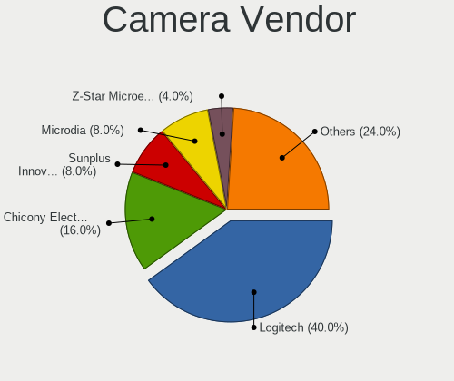

| Vendor                  | Desktops | Percent |
|-------------------------|----------|---------|
| Logitech                | 5        | 41.67%  |
| Chicony Electronics     | 3        | 25%     |
| Z-Star Microelectronics | 1        | 8.33%   |
| Samsung Electronics     | 1        | 8.33%   |
| Pixart Imaging          | 1        | 8.33%   |
| Cubeternet              | 1        | 8.33%   |

Camera Model
------------

Camera device models

| Model                                | Desktops | Percent |
|--------------------------------------|----------|---------|
| Chicony CNF7042                      | 2        | 16.67%  |
| Z-Star Venus USB2.0 Camera           | 1        | 8.33%   |
| Samsung Galaxy A5 (MTP)              | 1        | 8.33%   |
| Pixart Imaging GE 1.3 MP MiniCam Pro | 1        | 8.33%   |
| Logitech Webcam C310                 | 1        | 8.33%   |
| Logitech Webcam C210                 | 1        | 8.33%   |
| Logitech Webcam C170                 | 1        | 8.33%   |
| Logitech HD Pro Webcam C920          | 1        | 8.33%   |
| Logitech BRIO Ultra HD Webcam        | 1        | 8.33%   |
| Cubeternet GL-UPC822 UVC WebCam      | 1        | 8.33%   |
| Chicony USB2.0 HD UVC WebCam         | 1        | 8.33%   |

Security
--------

Fingerprint Vendor
------------------

Fingerprint sensor vendors

Zero info for selected period =(

Fingerprint Model
-----------------

Fingerprint sensor models

Zero info for selected period =(

Chipcard Vendor
---------------

Chipcard module vendors

| Vendor           | Desktops | Percent |
|------------------|----------|---------|
| SCM Microsystems | 1        | 100%    |

Chipcard Model
--------------

Chipcard module models

| Model                                       | Desktops | Percent |
|---------------------------------------------|----------|---------|
| SCM Microsystems uTrust 3512 SAM slot Token | 1        | 100%    |

Unsupported
-----------

Unsupported Devices
-------------------

Total unsupported devices on board

| Total | Desktops | Percent |
|-------|----------|---------|
| 0     | 79       | 79%     |
| 1     | 21       | 21%     |

Unsupported Device Types
------------------------

Types of unsupported devices

| Type                  | Desktops | Percent |
|-----------------------|----------|---------|
| Graphics card         | 12       | 57.14%  |
| Multimedia controller | 4        | 19.05%  |
| Net/wireless          | 2        | 9.52%   |
| Unassigned class      | 1        | 4.76%   |
| Chipcard              | 1        | 4.76%   |
| Card reader           | 1        | 4.76%   |

