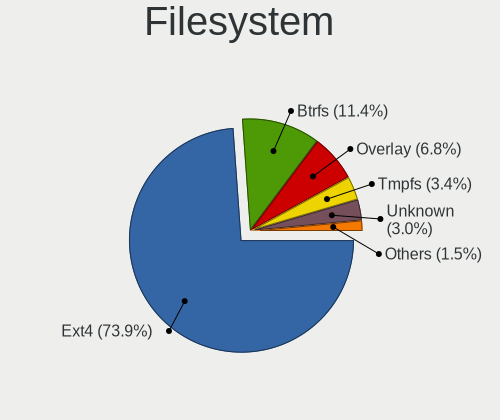
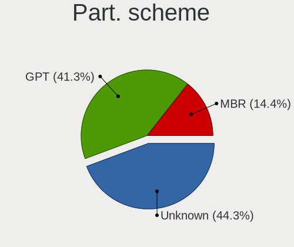
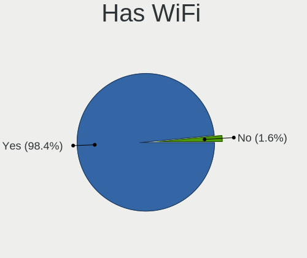
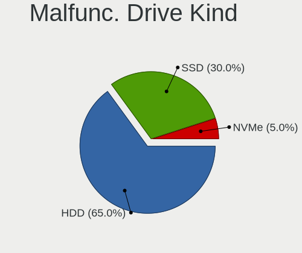
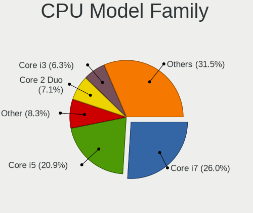
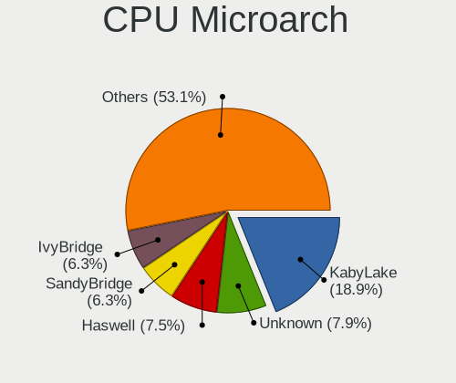
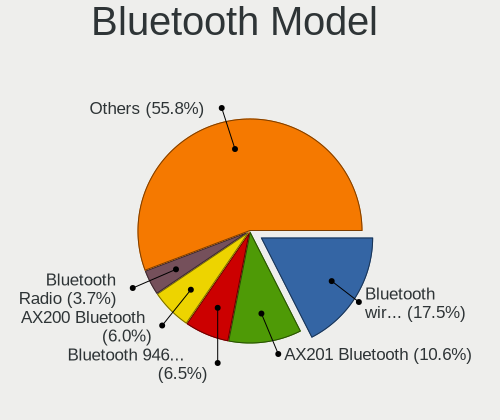
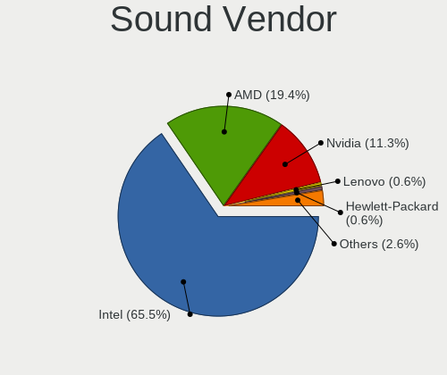
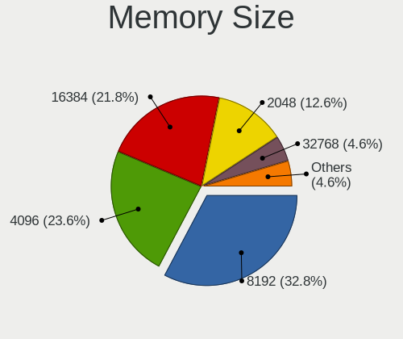
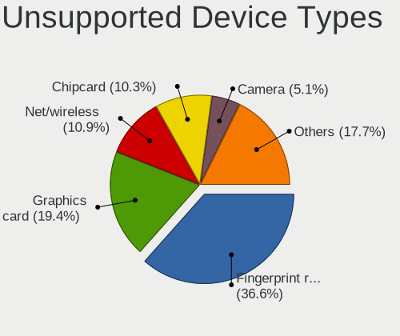

Linux in Slovenia - Tested Hardware & Statistics (Notebooks)
------------------------------------------------------------

A project to collect tested hardware configurations for Linux in Slovenia.

Anyone can contribute to this report by the [hw-probe](https://github.com/linuxhw/hw-probe) tool:

    sudo -E hw-probe -all -upload

Please contribute! Especially if your hardware is rare.

Contents
--------

* [ Test Cases ](#test-cases)

* [ System ](#system)
  - [ OS                       ](#os)
  - [ OS Family                ](#os-family)
  - [ Kernel                   ](#kernel)
  - [ Kernel Family            ](#kernel-family)
  - [ Kernel Major Ver.        ](#kernel-major-ver)
  - [ Arch                     ](#arch)
  - [ DE                       ](#de)
  - [ Display Server           ](#display-server)
  - [ Display Manager          ](#display-manager)
  - [ OS Lang                  ](#os-lang)
  - [ Boot Mode                ](#boot-mode)
  - [ Filesystem               ](#filesystem)
  - [ Part. scheme             ](#part-scheme)
  - [ Dual Boot with Linux/BSD ](#dual-boot-with-linuxbsd)
  - [ Dual Boot (Win)          ](#dual-boot-win)

* [ Board ](#board)
  - [ Vendor                   ](#vendor)
  - [ Model                    ](#model)
  - [ Model Family             ](#model-family)
  - [ MFG Year                 ](#mfg-year)
  - [ Form Factor              ](#form-factor)
  - [ Secure Boot              ](#secure-boot)
  - [ Coreboot                 ](#coreboot)
  - [ RAM Size                 ](#ram-size)
  - [ RAM Used                 ](#ram-used)
  - [ Total Drives             ](#total-drives)
  - [ Has CD-ROM               ](#has-cd-rom)
  - [ Has Ethernet             ](#has-ethernet)
  - [ Has WiFi                 ](#has-wifi)
  - [ Has Bluetooth            ](#has-bluetooth)

* [ Location ](#location)
  - [ Country                  ](#country)
  - [ City                     ](#city)

* [ Drives ](#drives)
  - [ Drive Vendor             ](#drive-vendor)
  - [ Drive Model              ](#drive-model)
  - [ HDD Vendor               ](#hdd-vendor)
  - [ SSD Vendor               ](#ssd-vendor)
  - [ Drive Kind               ](#drive-kind)
  - [ Drive Connector          ](#drive-connector)
  - [ Drive Size               ](#drive-size)
  - [ Space Total              ](#space-total)
  - [ Space Used               ](#space-used)
  - [ Malfunc. Drives          ](#malfunc-drives)
  - [ Malfunc. Drive Vendor    ](#malfunc-drive-vendor)
  - [ Malfunc. HDD Vendor      ](#malfunc-hdd-vendor)
  - [ Malfunc. Drive Kind      ](#malfunc-drive-kind)
  - [ Failed Drives            ](#failed-drives)
  - [ Failed Drive Vendor      ](#failed-drive-vendor)
  - [ Drive Status             ](#drive-status)

* [ Storage controller ](#storage-controller)
  - [ Storage Vendor           ](#storage-vendor)
  - [ Storage Model            ](#storage-model)
  - [ Storage Kind             ](#storage-kind)

* [ Processor ](#processor)
  - [ CPU Vendor               ](#cpu-vendor)
  - [ CPU Model                ](#cpu-model)
  - [ CPU Model Family         ](#cpu-model-family)
  - [ CPU Cores                ](#cpu-cores)
  - [ CPU Sockets              ](#cpu-sockets)
  - [ CPU Threads              ](#cpu-threads)
  - [ CPU Op-Modes             ](#cpu-op-modes)
  - [ CPU Microcode            ](#cpu-microcode)
  - [ CPU Microarch            ](#cpu-microarch)

* [ Graphics ](#graphics)
  - [ GPU Vendor               ](#gpu-vendor)
  - [ GPU Model                ](#gpu-model)
  - [ GPU Combo                ](#gpu-combo)
  - [ GPU Driver               ](#gpu-driver)
  - [ GPU Memory               ](#gpu-memory)

* [ Monitor ](#monitor)
  - [ Monitor Vendor           ](#monitor-vendor)
  - [ Monitor Model            ](#monitor-model)
  - [ Monitor Resolution       ](#monitor-resolution)
  - [ Monitor Diagonal         ](#monitor-diagonal)
  - [ Monitor Width            ](#monitor-width)
  - [ Aspect Ratio             ](#aspect-ratio)
  - [ Monitor Area             ](#monitor-area)
  - [ Pixel Density            ](#pixel-density)
  - [ Multiple Monitors        ](#multiple-monitors)

* [ Network ](#network)
  - [ Net Controller Vendor    ](#net-controller-vendor)
  - [ Net Controller Model     ](#net-controller-model)
  - [ Wireless Vendor          ](#wireless-vendor)
  - [ Wireless Model           ](#wireless-model)
  - [ Ethernet Vendor          ](#ethernet-vendor)
  - [ Ethernet Model           ](#ethernet-model)
  - [ Net Controller Kind      ](#net-controller-kind)
  - [ Used Controller          ](#used-controller)
  - [ NICs                     ](#nics)
  - [ IPv6                     ](#ipv6)

* [ Bluetooth ](#bluetooth)
  - [ Bluetooth Vendor         ](#bluetooth-vendor)
  - [ Bluetooth Model          ](#bluetooth-model)

* [ Sound ](#sound)
  - [ Sound Vendor             ](#sound-vendor)
  - [ Sound Model              ](#sound-model)

* [ Memory ](#memory)
  - [ Memory Vendor            ](#memory-vendor)
  - [ Memory Model             ](#memory-model)
  - [ Memory Kind              ](#memory-kind)
  - [ Memory Form Factor       ](#memory-form-factor)
  - [ Memory Size              ](#memory-size)
  - [ Memory Speed             ](#memory-speed)

* [ Printers & scanners ](#printers--scanners)
  - [ Printer Vendor           ](#printer-vendor)
  - [ Printer Model            ](#printer-model)
  - [ Scanner Vendor           ](#scanner-vendor)
  - [ Scanner Model            ](#scanner-model)

* [ Camera ](#camera)
  - [ Camera Vendor            ](#camera-vendor)
  - [ Camera Model             ](#camera-model)

* [ Security ](#security)
  - [ Fingerprint Vendor       ](#fingerprint-vendor)
  - [ Fingerprint Model        ](#fingerprint-model)
  - [ Chipcard Vendor          ](#chipcard-vendor)
  - [ Chipcard Model           ](#chipcard-model)

* [ Unsupported ](#unsupported)
  - [ Unsupported Devices      ](#unsupported-devices)
  - [ Unsupported Device Types ](#unsupported-device-types)

Test Cases
----------

Total: 222

| Vendor        | Model                       | Probe                                                      | Date         |
|---------------|-----------------------------|------------------------------------------------------------|--------------|
| Dell          | Inspiron 1501               | [f6efa72c1f](https://linux-hardware.org/?probe=f6efa72c1f) | Jul 01, 2022 |
| HP            | 255 G8 Notebook PC          | [cae0332804](https://linux-hardware.org/?probe=cae0332804) | Jun 17, 2022 |
| HP            | 255 G8 Notebook PC          | [e65ead281f](https://linux-hardware.org/?probe=e65ead281f) | Jun 17, 2022 |
| HP            | ZBook Firefly 14 G7 Mobi... | [011acdab42](https://linux-hardware.org/?probe=011acdab42) | Jun 09, 2022 |
| HP            | ZBook Firefly 14 G7 Mobi... | [c751dcffff](https://linux-hardware.org/?probe=c751dcffff) | Jun 09, 2022 |
| Lenovo        | IdeaPad 5 15ARE05 81YQ      | [065dee2160](https://linux-hardware.org/?probe=065dee2160) | Jun 04, 2022 |
| Toshiba       | Satellite Pro U400          | [4aeeca648d](https://linux-hardware.org/?probe=4aeeca648d) | May 24, 2022 |
| Lenovo        | IdeaPad 5 15ARE05 81YQ      | [ecfb1c48d9](https://linux-hardware.org/?probe=ecfb1c48d9) | May 17, 2022 |
| Lenovo        | IdeaPad 100-15IBY 80MJ      | [ddadf86375](https://linux-hardware.org/?probe=ddadf86375) | May 15, 2022 |
| ASUSTek       | N71Vg                       | [33a6047c0b](https://linux-hardware.org/?probe=33a6047c0b) | May 14, 2022 |
| ASUSTek       | N71Vg                       | [86d9e911f1](https://linux-hardware.org/?probe=86d9e911f1) | May 13, 2022 |
| ASUSTek       | X550JX                      | [b420f9214c](https://linux-hardware.org/?probe=b420f9214c) | May 06, 2022 |
| HP            | Laptop 17-ca3xxx            | [373f22a70f](https://linux-hardware.org/?probe=373f22a70f) | May 03, 2022 |
| HP            | Laptop 17-ca3xxx            | [91a367d874](https://linux-hardware.org/?probe=91a367d874) | May 03, 2022 |
| Lenovo        | Yoga 2 13 20344             | [ce528c379a](https://linux-hardware.org/?probe=ce528c379a) | May 01, 2022 |
| Lenovo        | IdeaPad 5 15ARE05 81YQ      | [95ec2ff7d2](https://linux-hardware.org/?probe=95ec2ff7d2) | Apr 30, 2022 |
| Lenovo        | ThinkPad S3 Yoga 14 20DM... | [5d0f1a15e1](https://linux-hardware.org/?probe=5d0f1a15e1) | Apr 30, 2022 |
| Lenovo        | IdeaPad 5 15ARE05 81YQ      | [57271a5f8b](https://linux-hardware.org/?probe=57271a5f8b) | Apr 28, 2022 |
| HP            | ZBook 17 G2                 | [81409450dc](https://linux-hardware.org/?probe=81409450dc) | Apr 28, 2022 |
| HP            | ZBook 17 G2                 | [d7b7a81cbb](https://linux-hardware.org/?probe=d7b7a81cbb) | Apr 16, 2022 |
| Lenovo        | IdeaPad 5 15ARE05 81YQ      | [7e7136d915](https://linux-hardware.org/?probe=7e7136d915) | Apr 16, 2022 |
| Lenovo        | ThinkPad E15 Gen 3 20YG0... | [8570b5ab84](https://linux-hardware.org/?probe=8570b5ab84) | Apr 12, 2022 |
| Lenovo        | IdeaPad 5 15ARE05 81YQ      | [4d5998459b](https://linux-hardware.org/?probe=4d5998459b) | Apr 09, 2022 |
| Lenovo        | ThinkPad R61 8933W4F        | [4864fcdfa0](https://linux-hardware.org/?probe=4864fcdfa0) | Apr 07, 2022 |
| Lenovo        | IdeaPad 5 15ARE05 81YQ      | [d13496f68a](https://linux-hardware.org/?probe=d13496f68a) | Mar 31, 2022 |
| HP            | ZBook 17 G2                 | [f0efa22aa2](https://linux-hardware.org/?probe=f0efa22aa2) | Mar 27, 2022 |
| HP            | ENVY Laptop 13-ba0xxx       | [0bf3028253](https://linux-hardware.org/?probe=0bf3028253) | Mar 27, 2022 |
| Dell          | Precision 5540              | [38d9bed727](https://linux-hardware.org/?probe=38d9bed727) | Mar 21, 2022 |
| Fujitsu       | LIFEBOOK S792               | [55da3ab4e0](https://linux-hardware.org/?probe=55da3ab4e0) | Mar 09, 2022 |
| HP            | Compaq nw8440 (RH415EA#A... | [55a6d982b3](https://linux-hardware.org/?probe=55a6d982b3) | Mar 07, 2022 |
| HP            | ZBook 17 G2                 | [d9773ef48d](https://linux-hardware.org/?probe=d9773ef48d) | Mar 06, 2022 |
| HP            | kip                         | [4d6e1264c7](https://linux-hardware.org/?probe=4d6e1264c7) | Mar 02, 2022 |
| HP            | kip                         | [a6ab5d4d8a](https://linux-hardware.org/?probe=a6ab5d4d8a) | Mar 01, 2022 |
| Lenovo        | ThinkPad Edge E540 20C60... | [d5c0be1b13](https://linux-hardware.org/?probe=d5c0be1b13) | Feb 27, 2022 |
| HP            | Pavilion dv7                | [46280b758c](https://linux-hardware.org/?probe=46280b758c) | Feb 25, 2022 |
| ASUSTek       | X550JX                      | [ec93ded12b](https://linux-hardware.org/?probe=ec93ded12b) | Feb 23, 2022 |
| HP            | Pavilion dv7                | [fd1bbe1769](https://linux-hardware.org/?probe=fd1bbe1769) | Feb 21, 2022 |
| HP            | Pavilion dv7                | [da9449422c](https://linux-hardware.org/?probe=da9449422c) | Feb 21, 2022 |
| ASUSTek       | X550JX                      | [0ee9dcd568](https://linux-hardware.org/?probe=0ee9dcd568) | Feb 20, 2022 |
| HP            | ProBook 4730s               | [5ffa4bce13](https://linux-hardware.org/?probe=5ffa4bce13) | Feb 19, 2022 |
| ASUSTek       | X550JX                      | [5ee5668ab1](https://linux-hardware.org/?probe=5ee5668ab1) | Feb 19, 2022 |
| HP            | ZBook Firefly 15 inch G8... | [5323885713](https://linux-hardware.org/?probe=5323885713) | Feb 17, 2022 |
| HP            | EliteBook 8570w             | [df5a829402](https://linux-hardware.org/?probe=df5a829402) | Feb 09, 2022 |
| Acer          | Predator PH317-52           | [ec43c5baa2](https://linux-hardware.org/?probe=ec43c5baa2) | Feb 07, 2022 |
| ASUSTek       | X750LN                      | [94a70cdd5d](https://linux-hardware.org/?probe=94a70cdd5d) | Feb 02, 2022 |
| Dell          | Inspiron 5748               | [07c8076d3e](https://linux-hardware.org/?probe=07c8076d3e) | Feb 01, 2022 |
| HP            | EliteBook 8570w             | [81e03a6b48](https://linux-hardware.org/?probe=81e03a6b48) | Jan 21, 2022 |
| HP            | OMEN by Laptop 15-ce0xx     | [faba7de732](https://linux-hardware.org/?probe=faba7de732) | Jan 17, 2022 |
| HP            | OMEN by Laptop 15-ce0xx     | [f2bae7651d](https://linux-hardware.org/?probe=f2bae7651d) | Jan 16, 2022 |
| Lenovo        | ThinkPad X230 23202DG       | [22e51b8b41](https://linux-hardware.org/?probe=22e51b8b41) | Jan 06, 2022 |
| Lenovo        | ThinkPad X230 23202DG       | [52db8d0bbf](https://linux-hardware.org/?probe=52db8d0bbf) | Jan 06, 2022 |
| Lenovo        | ThinkPad T590 20N5S0MR00    | [29040ecce5](https://linux-hardware.org/?probe=29040ecce5) | Jan 01, 2022 |
| MSI           | U210                        | [24eb05a4d9](https://linux-hardware.org/?probe=24eb05a4d9) | Dec 29, 2021 |
| Lenovo        | Legion 7 16ACHg6 82N6       | [be79b3cd82](https://linux-hardware.org/?probe=be79b3cd82) | Dec 26, 2021 |
| HP            | ProBook 450 G5              | [8887022aa7](https://linux-hardware.org/?probe=8887022aa7) | Dec 23, 2021 |
| HP            | Pavilion Laptop 15-eh1xx... | [6b40a0f2c5](https://linux-hardware.org/?probe=6b40a0f2c5) | Dec 21, 2021 |
| HP            | Pavilion Laptop 15-eh1xx... | [31c2b40e84](https://linux-hardware.org/?probe=31c2b40e84) | Dec 21, 2021 |
| Lenovo        | IdeaPad 3 15ALC6 82KU       | [6238c622ad](https://linux-hardware.org/?probe=6238c622ad) | Dec 18, 2021 |
| Lenovo        | Legion 7 16ACHg6 82N6       | [45ac665485](https://linux-hardware.org/?probe=45ac665485) | Dec 10, 2021 |
| Dell          | Inspiron 5748               | [77f278682e](https://linux-hardware.org/?probe=77f278682e) | Dec 06, 2021 |
| Lenovo        | ThinkPad X1 Extreme 20MF... | [6d9c31a411](https://linux-hardware.org/?probe=6d9c31a411) | Nov 28, 2021 |
| Lenovo        | ThinkPad X1 Extreme 20MF... | [e005ddb405](https://linux-hardware.org/?probe=e005ddb405) | Nov 28, 2021 |
| Toshiba       | Satellite L750              | [0a4f8ff5f1](https://linux-hardware.org/?probe=0a4f8ff5f1) | Nov 28, 2021 |
| HP            | EliteBook 8760w             | [febc9d2faa](https://linux-hardware.org/?probe=febc9d2faa) | Nov 28, 2021 |
| Lenovo        | Legion 7 16ACHg6 82N6       | [e898d8c017](https://linux-hardware.org/?probe=e898d8c017) | Nov 20, 2021 |
| Lenovo        | Legion 7 16ACHg6 82N6       | [e37febb0b3](https://linux-hardware.org/?probe=e37febb0b3) | Nov 18, 2021 |
| HP            | 250 G3                      | [8d370cbb27](https://linux-hardware.org/?probe=8d370cbb27) | Nov 16, 2021 |
| HP            | 250 G3                      | [fb9fe2f3fb](https://linux-hardware.org/?probe=fb9fe2f3fb) | Nov 16, 2021 |
| Dell          | XPS 13 7390                 | [c4e6de1315](https://linux-hardware.org/?probe=c4e6de1315) | Nov 15, 2021 |
| Dell          | XPS 13 9310                 | [0f6c2b21cf](https://linux-hardware.org/?probe=0f6c2b21cf) | Nov 14, 2021 |
| Dell          | XPS 13 9310                 | [01c20231f2](https://linux-hardware.org/?probe=01c20231f2) | Nov 13, 2021 |
| Lenovo        | ThinkPad X1 Carbon Gen 8... | [5a2fa34576](https://linux-hardware.org/?probe=5a2fa34576) | Nov 10, 2021 |
| HP            | Pavilion dv7                | [3c3e5bc872](https://linux-hardware.org/?probe=3c3e5bc872) | Nov 08, 2021 |
| HP            | EliteBook 8760w             | [99fb47dc2b](https://linux-hardware.org/?probe=99fb47dc2b) | Oct 28, 2021 |
| Lenovo        | IdeaPad 5 15IIL05 81YK      | [4e5da9e4d3](https://linux-hardware.org/?probe=4e5da9e4d3) | Oct 24, 2021 |
| HP            | EliteBook Folio 9470m       | [f66ba65dc8](https://linux-hardware.org/?probe=f66ba65dc8) | Oct 22, 2021 |
| HP            | EliteBook Folio 9470m       | [1d50915627](https://linux-hardware.org/?probe=1d50915627) | Oct 21, 2021 |
| Toshiba       | Satellite L750              | [f18e793687](https://linux-hardware.org/?probe=f18e793687) | Oct 17, 2021 |
| Toshiba       | Satellite L750              | [065ee91163](https://linux-hardware.org/?probe=065ee91163) | Oct 17, 2021 |
| Toshiba       | Satellite L750              | [2cbf85194c](https://linux-hardware.org/?probe=2cbf85194c) | Oct 14, 2021 |
| Razer         | Blade 14 - RZ09-0370        | [f424437bd1](https://linux-hardware.org/?probe=f424437bd1) | Oct 01, 2021 |
| Razer         | Blade 14 - RZ09-0370        | [c85622ebee](https://linux-hardware.org/?probe=c85622ebee) | Sep 29, 2021 |
| HP            | ProBook 450 G1              | [284c0763b3](https://linux-hardware.org/?probe=284c0763b3) | Sep 09, 2021 |
| Lenovo        | ThinkPad T460s 20FAS7XT0... | [b2de2ea1ab](https://linux-hardware.org/?probe=b2de2ea1ab) | Aug 22, 2021 |
| Lenovo        | ThinkPad T460s 20FAS7XT0... | [9da6a33d24](https://linux-hardware.org/?probe=9da6a33d24) | Aug 22, 2021 |
| ASUSTek       | ASUS EXPERTBOOK B9400CEA... | [8c7e729202](https://linux-hardware.org/?probe=8c7e729202) | Aug 19, 2021 |
| HP            | 2000                        | [2909375db3](https://linux-hardware.org/?probe=2909375db3) | Aug 06, 2021 |
| HP            | 2000                        | [df5d5e05c6](https://linux-hardware.org/?probe=df5d5e05c6) | Aug 06, 2021 |
| Dell          | Inspiron 5570               | [5b89a99ad8](https://linux-hardware.org/?probe=5b89a99ad8) | Jul 31, 2021 |
| HP            | 2000                        | [9fbfcf95d2](https://linux-hardware.org/?probe=9fbfcf95d2) | Jul 29, 2021 |
| HP            | 250 G5 Notebook PC          | [53d3003d94](https://linux-hardware.org/?probe=53d3003d94) | Jul 25, 2021 |
| HP            | 2000                        | [13aaafccdb](https://linux-hardware.org/?probe=13aaafccdb) | Jul 22, 2021 |
| HP            | 2000                        | [f3c7f85988](https://linux-hardware.org/?probe=f3c7f85988) | Jul 21, 2021 |
| HP            | 2000                        | [e6019f1bd3](https://linux-hardware.org/?probe=e6019f1bd3) | Jul 12, 2021 |
| HP            | 2000                        | [6a169f2d87](https://linux-hardware.org/?probe=6a169f2d87) | Jun 22, 2021 |
| HP            | 2000                        | [b2e5075aaf](https://linux-hardware.org/?probe=b2e5075aaf) | Jun 17, 2021 |
| HP            | EliteBook 8440p             | [330d2214c6](https://linux-hardware.org/?probe=330d2214c6) | Jun 10, 2021 |
| HP            | 2000                        | [6a1c91ae8d](https://linux-hardware.org/?probe=6a1c91ae8d) | Jun 07, 2021 |
| Acer          | Nitro AN517-52              | [c79b400454](https://linux-hardware.org/?probe=c79b400454) | Jun 06, 2021 |
| Lenovo        | ThinkPad T61 8897CTO        | [6cfc0271ba](https://linux-hardware.org/?probe=6cfc0271ba) | Jun 03, 2021 |
| HP            | 250 G7 Notebook PC          | [92d97521bc](https://linux-hardware.org/?probe=92d97521bc) | May 21, 2021 |
| HP            | 250 G7 Notebook PC          | [76598a468f](https://linux-hardware.org/?probe=76598a468f) | May 20, 2021 |
| HP            | 2000                        | [1469c94a5f](https://linux-hardware.org/?probe=1469c94a5f) | May 17, 2021 |
| HP            | EliteBook 830 G6            | [8fcf99f057](https://linux-hardware.org/?probe=8fcf99f057) | May 12, 2021 |
| Lenovo        | ThinkPad E495 20NECTO1WW    | [f67c550f8e](https://linux-hardware.org/?probe=f67c550f8e) | Apr 27, 2021 |
| Lenovo        | ThinkPad E495 20NECTO1WW    | [0876a200b7](https://linux-hardware.org/?probe=0876a200b7) | Apr 27, 2021 |
| Panasonic     | CF-53SWWZ5MG                | [c59fd76192](https://linux-hardware.org/?probe=c59fd76192) | Apr 14, 2021 |
| HP            | EliteBook 8440p             | [d0a4124a2a](https://linux-hardware.org/?probe=d0a4124a2a) | Apr 10, 2021 |
| HP            | ProBook 4515s (VC377ES#A... | [2c84f60b0d](https://linux-hardware.org/?probe=2c84f60b0d) | Apr 09, 2021 |
| HP            | ProBook 4740s               | [cf941af09e](https://linux-hardware.org/?probe=cf941af09e) | Apr 08, 2021 |
| Dell          | Latitude 5501               | [474510883b](https://linux-hardware.org/?probe=474510883b) | Mar 22, 2021 |
| HP            | ProBook 450 G5              | [49b951896d](https://linux-hardware.org/?probe=49b951896d) | Mar 17, 2021 |
| ASUSTek       | K72Jr                       | [2d9ae8527d](https://linux-hardware.org/?probe=2d9ae8527d) | Mar 11, 2021 |
| ASUSTek       | K52JT                       | [e434a21940](https://linux-hardware.org/?probe=e434a21940) | Mar 04, 2021 |
| Panasonic     | CF-53SWWZ5MG                | [6fdf12c20c](https://linux-hardware.org/?probe=6fdf12c20c) | Feb 28, 2021 |
| Dell          | XPS 13 7390                 | [9dc547fceb](https://linux-hardware.org/?probe=9dc547fceb) | Feb 26, 2021 |
| Lenovo        | ThinkPad L520 785958G       | [45025e2399](https://linux-hardware.org/?probe=45025e2399) | Feb 13, 2021 |
| Lenovo        | ThinkPad L520 785958G       | [be03f382e6](https://linux-hardware.org/?probe=be03f382e6) | Feb 09, 2021 |
| Panasonic     | CF-53SWWZ5MG                | [d1ade3e39d](https://linux-hardware.org/?probe=d1ade3e39d) | Feb 08, 2021 |
| Acer          | Aspire A315-42              | [95958aa225](https://linux-hardware.org/?probe=95958aa225) | Feb 08, 2021 |
| Dell          | XPS 13 7390                 | [0e552a01e6](https://linux-hardware.org/?probe=0e552a01e6) | Feb 03, 2021 |
| Dell          | XPS 13 7390                 | [1f3dc6c825](https://linux-hardware.org/?probe=1f3dc6c825) | Feb 03, 2021 |
| ASUSTek       | X551CA                      | [1857586e3a](https://linux-hardware.org/?probe=1857586e3a) | Feb 03, 2021 |
| ASUSTek       | VivoBook 17_ASUS Laptop ... | [7e828e295f](https://linux-hardware.org/?probe=7e828e295f) | Jan 20, 2021 |
| HP            | ZBook 15u G3                | [812e100310](https://linux-hardware.org/?probe=812e100310) | Jan 12, 2021 |
| HP            | ZBook 15u G3                | [30332e1d71](https://linux-hardware.org/?probe=30332e1d71) | Jan 12, 2021 |
| HP            | Laptop 15-ra0xx             | [8227f44e5c](https://linux-hardware.org/?probe=8227f44e5c) | Jan 10, 2021 |
| HP            | ProBook 4730s               | [e7ab1bcd89](https://linux-hardware.org/?probe=e7ab1bcd89) | Jan 06, 2021 |
| HP            | EliteBook 6930p             | [e9c1683321](https://linux-hardware.org/?probe=e9c1683321) | Jan 04, 2021 |
| ASUSTek       | UX31E                       | [912f3fe702](https://linux-hardware.org/?probe=912f3fe702) | Dec 25, 2020 |
| HP            | 255 G7 Notebook PC          | [d759211bb6](https://linux-hardware.org/?probe=d759211bb6) | Dec 24, 2020 |
| Lenovo        | ThinkPad T420 4236A78       | [f98c371e7f](https://linux-hardware.org/?probe=f98c371e7f) | Dec 24, 2020 |
| Lenovo        | ThinkPad T15 Gen 1 20S60... | [6c3965a41f](https://linux-hardware.org/?probe=6c3965a41f) | Dec 18, 2020 |
| ASUSTek       | G771JW                      | [b103133d69](https://linux-hardware.org/?probe=b103133d69) | Dec 16, 2020 |
| Dell          | Inspiron 3542               | [4260174285](https://linux-hardware.org/?probe=4260174285) | Dec 11, 2020 |
| Lenovo        | ThinkPad T500 2055WYX       | [6f04a45e2e](https://linux-hardware.org/?probe=6f04a45e2e) | Dec 11, 2020 |
| Lenovo        | ThinkPad T410 2522A92       | [dd93682c3c](https://linux-hardware.org/?probe=dd93682c3c) | Dec 09, 2020 |
| Dell          | Latitude D630               | [92ccc6100c](https://linux-hardware.org/?probe=92ccc6100c) | Dec 05, 2020 |
| Lenovo        | ThinkPad E15 20RD0011SC     | [e2ffbd65b4](https://linux-hardware.org/?probe=e2ffbd65b4) | Dec 04, 2020 |
| Acer          | Aspire A315-42              | [1b5583ba18](https://linux-hardware.org/?probe=1b5583ba18) | Nov 23, 2020 |
| HP            | 250 G7 Notebook PC          | [bc3c7d8910](https://linux-hardware.org/?probe=bc3c7d8910) | Nov 22, 2020 |
| HP            | 250 G7 Notebook PC          | [db1f0e1247](https://linux-hardware.org/?probe=db1f0e1247) | Nov 22, 2020 |
| Lenovo        | ThinkPad E15 20RD0011SC     | [5978ba6a13](https://linux-hardware.org/?probe=5978ba6a13) | Nov 22, 2020 |
| HP            | 470 G7 Notebook PC          | [f0d3574818](https://linux-hardware.org/?probe=f0d3574818) | Nov 17, 2020 |
| ASUSTek       | VivoBook 15_ASUS Laptop ... | [8783481f8a](https://linux-hardware.org/?probe=8783481f8a) | Nov 15, 2020 |
| Lenovo        | ThinkPad E15 20RD0011SC     | [1298138505](https://linux-hardware.org/?probe=1298138505) | Nov 13, 2020 |
| HP            | ProBook 4720s               | [e58dca9ad5](https://linux-hardware.org/?probe=e58dca9ad5) | Nov 11, 2020 |
| ASUSTek       | TUF Gaming FX505DT_FX505... | [0b3fe9a6f2](https://linux-hardware.org/?probe=0b3fe9a6f2) | Nov 01, 2020 |
| ASUSTek       | TUF Gaming FX505DT_FX505... | [49bc5032be](https://linux-hardware.org/?probe=49bc5032be) | Nov 01, 2020 |
| HP            | 255 G7 Notebook PC          | [3ad72de5c7](https://linux-hardware.org/?probe=3ad72de5c7) | Oct 09, 2020 |
| HP            | 255 G7 Notebook PC          | [2c625d510e](https://linux-hardware.org/?probe=2c625d510e) | Oct 03, 2020 |
| Lenovo        | ThinkPad P53 20QN000DGE     | [3a0bc546cc](https://linux-hardware.org/?probe=3a0bc546cc) | Sep 28, 2020 |
| Lenovo        | Yoga S740-14IIL 81RS        | [f12775338c](https://linux-hardware.org/?probe=f12775338c) | Sep 27, 2020 |
| Lenovo        | ThinkPad E495 20NECTO1WW    | [1a20b51c58](https://linux-hardware.org/?probe=1a20b51c58) | Sep 24, 2020 |
| Lenovo        | ThinkPad E495 20NECTO1WW    | [ca8c660b91](https://linux-hardware.org/?probe=ca8c660b91) | Sep 24, 2020 |
| HP            | 255 G7 Notebook PC          | [8bba4f976e](https://linux-hardware.org/?probe=8bba4f976e) | Sep 20, 2020 |
| Dell          | Vostro 3550                 | [ef71fe525d](https://linux-hardware.org/?probe=ef71fe525d) | Sep 17, 2020 |
| Lenovo        | Yoga S740-14IIL 81RS        | [41b9e8cb16](https://linux-hardware.org/?probe=41b9e8cb16) | Sep 15, 2020 |
| ASUSTek       | VivoBook S14 X430UA         | [85ab9de98f](https://linux-hardware.org/?probe=85ab9de98f) | Sep 03, 2020 |
| PC Special... | Fusion IV                   | [55da1618ab](https://linux-hardware.org/?probe=55da1618ab) | Aug 30, 2020 |
| Lenovo        | IdeaPad 320-17ISK 80XJ      | [a87567fe16](https://linux-hardware.org/?probe=a87567fe16) | Aug 27, 2020 |
| HP            | ProBook 4540s               | [32346e7861](https://linux-hardware.org/?probe=32346e7861) | Aug 26, 2020 |
| Lenovo        | ThinkPad E15 20RD0011SC     | [438b0df832](https://linux-hardware.org/?probe=438b0df832) | Jul 21, 2020 |
| HP            | 2000                        | [1facf761c9](https://linux-hardware.org/?probe=1facf761c9) | Jul 19, 2020 |
| Lenovo        | ThinkPad T420 423662G       | [f0e52bdb36](https://linux-hardware.org/?probe=f0e52bdb36) | Jul 10, 2020 |
| Lenovo        | ThinkPad E15 20RD0011SC     | [b78049616e](https://linux-hardware.org/?probe=b78049616e) | Jul 09, 2020 |
| Lenovo        | ThinkPad T480 20L6S01W00    | [758a8710d7](https://linux-hardware.org/?probe=758a8710d7) | Jun 29, 2020 |
| HP            | ProBook 4540s               | [98a9e4902b](https://linux-hardware.org/?probe=98a9e4902b) | Jun 08, 2020 |
| HP            | ProBook 4540s               | [2b515ca642](https://linux-hardware.org/?probe=2b515ca642) | May 31, 2020 |
| HP            | EliteBook 8540w             | [a8e5567ca8](https://linux-hardware.org/?probe=a8e5567ca8) | May 30, 2020 |
| HP            | EliteBook 840 G6            | [bea6687b8b](https://linux-hardware.org/?probe=bea6687b8b) | May 27, 2020 |
| Acer          | Aspire V3-771               | [910279b054](https://linux-hardware.org/?probe=910279b054) | May 25, 2020 |
| Lenovo        | ThinkPad X250 20CM004ESC    | [793c164825](https://linux-hardware.org/?probe=793c164825) | May 25, 2020 |
| HP            | ProBook 470 G2              | [d39ca7c5fa](https://linux-hardware.org/?probe=d39ca7c5fa) | May 15, 2020 |
| HP            | 15                          | [fa65501be6](https://linux-hardware.org/?probe=fa65501be6) | May 10, 2020 |
| Dell          | Inspiron 5570               | [91d3944426](https://linux-hardware.org/?probe=91d3944426) | May 10, 2020 |
| HP            | 250 G6 Notebook PC          | [ee92e64256](https://linux-hardware.org/?probe=ee92e64256) | May 07, 2020 |
| HP            | ProBook 4515s (VC377ES#A... | [3ec25a2e7a](https://linux-hardware.org/?probe=3ec25a2e7a) | May 01, 2020 |
| Dell          | Inspiron 15 7000 Gaming     | [a1de2f2fe9](https://linux-hardware.org/?probe=a1de2f2fe9) | Apr 18, 2020 |
| Lenovo        | ThinkPad T590 20N5S0YN00    | [0efab1d69f](https://linux-hardware.org/?probe=0efab1d69f) | Apr 08, 2020 |
| ASUSTek       | X750LB                      | [a7c5fb20f8](https://linux-hardware.org/?probe=a7c5fb20f8) | Mar 28, 2020 |
| Lenovo        | G510 20238                  | [9130b68bf4](https://linux-hardware.org/?probe=9130b68bf4) | Mar 22, 2020 |
| Fujitsu Si... | ESPRIMO Mobile V5555        | [ff84ae40b8](https://linux-hardware.org/?probe=ff84ae40b8) | Mar 21, 2020 |
| Fujitsu Si... | ESPRIMO Mobile V5555        | [0877aa97e7](https://linux-hardware.org/?probe=0877aa97e7) | Mar 21, 2020 |
| Fujitsu Si... | ESPRIMO Mobile V5555        | [677f41b346](https://linux-hardware.org/?probe=677f41b346) | Mar 21, 2020 |
| Lenovo        | ThinkPad P52 20MAS5XN00     | [48cd703e5b](https://linux-hardware.org/?probe=48cd703e5b) | Mar 05, 2020 |
| Lenovo        | ThinkPad P52 20MAS5XN00     | [e6a4ad2c61](https://linux-hardware.org/?probe=e6a4ad2c61) | Mar 04, 2020 |
| HP            | EliteBook 8760w             | [624fd6f7fa](https://linux-hardware.org/?probe=624fd6f7fa) | Mar 01, 2020 |
| Lenovo        | ThinkPad E595 20NF0000GE    | [608fef5510](https://linux-hardware.org/?probe=608fef5510) | Feb 03, 2020 |
| Lenovo        | ThinkPad E590 20NB002BSC    | [b20e37d478](https://linux-hardware.org/?probe=b20e37d478) | Jan 06, 2020 |
| Dell          | Latitude 5500               | [84e2b9bc59](https://linux-hardware.org/?probe=84e2b9bc59) | Jan 03, 2020 |
| HP            | EliteBook 850 G6            | [0d7f336b82](https://linux-hardware.org/?probe=0d7f336b82) | Jan 03, 2020 |
| Dell          | Latitude 5500               | [0d946e75f9](https://linux-hardware.org/?probe=0d946e75f9) | Jan 03, 2020 |
| Dell          | Latitude 5500               | [be70af9da7](https://linux-hardware.org/?probe=be70af9da7) | Jan 03, 2020 |
| ASUSTek       | VivoBook 17_ASUS Laptop ... | [d853ff31e4](https://linux-hardware.org/?probe=d853ff31e4) | Dec 08, 2019 |
| ASUSTek       | VivoBook 17_ASUS Laptop ... | [25e0799d44](https://linux-hardware.org/?probe=25e0799d44) | Dec 08, 2019 |
| MSI           | GP60 2OD                    | [f450b0d5d4](https://linux-hardware.org/?probe=f450b0d5d4) | Oct 20, 2019 |
| HP            | EliteBook 6930p             | [b11cbf51cb](https://linux-hardware.org/?probe=b11cbf51cb) | Sep 28, 2019 |
| Lenovo        | G585 20137                  | [084d318c5c](https://linux-hardware.org/?probe=084d318c5c) | Sep 16, 2019 |
| Acer          | Aspire E5-573G              | [d2242a3cd4](https://linux-hardware.org/?probe=d2242a3cd4) | Sep 02, 2019 |
| eMachines     | G730                        | [af8b954f82](https://linux-hardware.org/?probe=af8b954f82) | Aug 29, 2019 |
| ASUSTek       | G751JT                      | [a5f96019bd](https://linux-hardware.org/?probe=a5f96019bd) | Aug 04, 2019 |
| eMachines     | G730                        | [5073ea0163](https://linux-hardware.org/?probe=5073ea0163) | Aug 02, 2019 |
| eMachines     | G730                        | [4f0fa60c8d](https://linux-hardware.org/?probe=4f0fa60c8d) | Jul 31, 2019 |
| HP            | Pavilion 15                 | [edf229fa5e](https://linux-hardware.org/?probe=edf229fa5e) | Jul 22, 2019 |
| Toshiba       | QOSMIO X500                 | [34905cb301](https://linux-hardware.org/?probe=34905cb301) | Jul 15, 2019 |
| ASUSTek       | G751JT                      | [3a17d38bdd](https://linux-hardware.org/?probe=3a17d38bdd) | Jul 09, 2019 |
| Lenovo        | ThinkPad T410 2522A92       | [68640c00d9](https://linux-hardware.org/?probe=68640c00d9) | Jun 09, 2019 |
| HP            | Compaq 325                  | [4161a93030](https://linux-hardware.org/?probe=4161a93030) | May 16, 2019 |
| HP            | ProBook 4710s               | [54ed79f58d](https://linux-hardware.org/?probe=54ed79f58d) | May 15, 2019 |
| HP            | Compaq 325                  | [b9dadeece3](https://linux-hardware.org/?probe=b9dadeece3) | May 12, 2019 |
| HP            | Compaq 6720s                | [0e2550055b](https://linux-hardware.org/?probe=0e2550055b) | May 07, 2019 |
| Gigabyte      | P65                         | [6dfb59f508](https://linux-hardware.org/?probe=6dfb59f508) | May 07, 2019 |
| HP            | ZBook 14 G2                 | [e1463c9ca8](https://linux-hardware.org/?probe=e1463c9ca8) | Apr 23, 2019 |
| Lenovo        | ThinkPad W530 24479K4       | [7d56ca80ca](https://linux-hardware.org/?probe=7d56ca80ca) | Apr 22, 2019 |
| ASUSTek       | X751NV                      | [a189d47b9a](https://linux-hardware.org/?probe=a189d47b9a) | Apr 09, 2019 |
| Dell          | Latitude E6500              | [abdbb02998](https://linux-hardware.org/?probe=abdbb02998) | Feb 23, 2019 |
| Medion        | E7218                       | [5d97b97758](https://linux-hardware.org/?probe=5d97b97758) | Dec 16, 2018 |
| HP            | Unknown                     | [696e11ac42](https://linux-hardware.org/?probe=696e11ac42) | Nov 29, 2018 |
| HP            | Unknown                     | [121bf767df](https://linux-hardware.org/?probe=121bf767df) | Nov 29, 2018 |
| Lenovo        | ThinkPad Edge 326054G       | [6754682a3b](https://linux-hardware.org/?probe=6754682a3b) | Sep 16, 2017 |
| Lenovo        | ThinkPad Edge 326054G       | [c208f4b144](https://linux-hardware.org/?probe=c208f4b144) | Nov 24, 2016 |

System
------

OS
--

Installed operating systems

| Name                | Notebooks | Percent |
|---------------------|-----------|---------|
| Ubuntu 20.04        | 24        | 16.22%  |
| Ubuntu 18.04        | 14        | 9.46%   |
| Debian 11           | 5         | 3.38%   |
| Zorin 16            | 4         | 2.7%    |
| KDE neon 20.04      | 4         | 2.7%    |
| Fedora 34           | 4         | 2.7%    |
| ArcoLinux Rolling   | 4         | 2.7%    |
| Zorin 15            | 3         | 2.03%   |
| Xubuntu 20.04       | 3         | 2.03%   |
| Ubuntu 22.04        | 3         | 2.03%   |
| Linux Mint 19.1     | 3         | 2.03%   |
| Kubuntu 21.10       | 3         | 2.03%   |
| Kubuntu 20.04       | 3         | 2.03%   |
| Fedora 33           | 3         | 2.03%   |
| Debian Testing      | 3         | 2.03%   |
| Arch                | 3         | 2.03%   |
| Ubuntu 21.10        | 2         | 1.35%   |
| Ubuntu 21.04        | 2         | 1.35%   |
| Ubuntu 20.10        | 2         | 1.35%   |
| Ubuntu 19.10        | 2         | 1.35%   |
| Pop!_OS 21.04       | 2         | 1.35%   |
| Manjaro 20.2        | 2         | 1.35%   |
| Manjaro             | 2         | 1.35%   |
| Kubuntu 22.04       | 2         | 1.35%   |
| Kubuntu 18.04       | 2         | 1.35%   |
| Gentoo 2.6          | 2         | 1.35%   |
| Endless 3.5.8       | 2         | 1.35%   |
| Ubuntu Budgie 20.04 | 1         | 0.68%   |
| Ubuntu 19.04        | 1         | 0.68%   |
| Ubuntu 16.04        | 1         | 0.68%   |
| ROSA R9             | 1         | 0.68%   |
| ROSA R8             | 1         | 0.68%   |
| Q4OS 4              | 1         | 0.68%   |
| Pop!_OS 22.04       | 1         | 0.68%   |
| Pop!_OS 21.10       | 1         | 0.68%   |
| OpenMandriva 4.3    | 1         | 0.68%   |
| OpenMandriva 4.2    | 1         | 0.68%   |
| Manjaro 21.3.0      | 1         | 0.68%   |
| Manjaro 21.0.4      | 1         | 0.68%   |
| Manjaro 19.0.2      | 1         | 0.68%   |
| Manjaro 18.1.5      | 1         | 0.68%   |
| Lubuntu 21.04       | 1         | 0.68%   |
| Lubuntu 20.04       | 1         | 0.68%   |
| Linux Mint 20.2     | 1         | 0.68%   |
| Linux Mint 20.1     | 1         | 0.68%   |
| Linux Mint 19.3     | 1         | 0.68%   |
| Kubuntu 21.04       | 1         | 0.68%   |
| Kubuntu 19.10       | 1         | 0.68%   |
| KDE neon 18.04      | 1         | 0.68%   |
| Garuda Linux        | 1         | 0.68%   |
| Fedora 35           | 1         | 0.68%   |
| Fedora 32           | 1         | 0.68%   |
| Fedora 31           | 1         | 0.68%   |
| Fedora 30           | 1         | 0.68%   |
| Endless 4.0.2       | 1         | 0.68%   |
| Endless 3.9.4       | 1         | 0.68%   |
| Endless 3.9.1       | 1         | 0.68%   |
| Endless 3.8.7       | 1         | 0.68%   |
| Endless 3.7.4       | 1         | 0.68%   |
| Endless 3.6.3       | 1         | 0.68%   |

OS Family
---------

OS without a version

| Name          | Notebooks | Percent |
|---------------|-----------|---------|
| Ubuntu        | 48        | 34.53%  |
| Kubuntu       | 11        | 7.91%   |
| Fedora        | 10        | 7.19%   |
| Debian        | 9         | 6.47%   |
| Zorin         | 7         | 5.04%   |
| Manjaro       | 7         | 5.04%   |
| Endless       | 7         | 5.04%   |
| Linux Mint    | 6         | 4.32%   |
| KDE neon      | 5         | 3.6%    |
| Pop!_OS       | 4         | 2.88%   |
| ArcoLinux     | 4         | 2.88%   |
| Xubuntu       | 3         | 2.16%   |
| Arch          | 3         | 2.16%   |
| OpenMandriva  | 2         | 1.44%   |
| Lubuntu       | 2         | 1.44%   |
| Gentoo        | 2         | 1.44%   |
| Ubuntu Budgie | 1         | 0.72%   |
| ROSA          | 1         | 0.72%   |
| Q4OS          | 1         | 0.72%   |
| Garuda Linux  | 1         | 0.72%   |
| EndeavourOS   | 1         | 0.72%   |
| Elementary    | 1         | 0.72%   |
| Clear Linux   | 1         | 0.72%   |
| Chrome OS     | 1         | 0.72%   |
| BlackPanther  | 1         | 0.72%   |

Kernel
------

Version of the Linux kernel

| Version                | Notebooks | Percent |
|------------------------|-----------|---------|
| 5.4.0-42-generic       | 4         | 2.47%   |
| 4.18.0-15-generic      | 4         | 2.47%   |
| 5.8.0-41-generic       | 3         | 1.85%   |
| 5.3.0-40-generic       | 3         | 1.85%   |
| 5.13.0-41-generic      | 3         | 1.85%   |
| 5.13.0-30-generic      | 3         | 1.85%   |
| 5.13.0-28-generic      | 3         | 1.85%   |
| 5.13.0-21-generic      | 3         | 1.85%   |
| 5.8.0-44-generic       | 2         | 1.23%   |
| 5.8.0-14-generic       | 2         | 1.23%   |
| 5.6.0-1-amd64          | 2         | 1.23%   |
| 5.4.0-70-generic       | 2         | 1.23%   |
| 5.4.0-56-generic       | 2         | 1.23%   |
| 5.4.0-54-generic       | 2         | 1.23%   |
| 5.4.0-48-generic       | 2         | 1.23%   |
| 5.4.0-40-generic       | 2         | 1.23%   |
| 5.4.0-33-generic       | 2         | 1.23%   |
| 5.4.0-28-generic       | 2         | 1.23%   |
| 5.4.0-26-generic       | 2         | 1.23%   |
| 5.13.19-2-MANJARO      | 2         | 1.23%   |
| 5.13.0-7614-generic    | 2         | 1.23%   |
| 5.11.0-43-generic      | 2         | 1.23%   |
| 5.11.0-40-generic      | 2         | 1.23%   |
| 5.10.0-8-amd64         | 2         | 1.23%   |
| 4.15.0-128-generic     | 2         | 1.23%   |
| 5.9.8-2-MANJARO        | 1         | 0.62%   |
| 5.9.2-arch1-1          | 1         | 0.62%   |
| 5.9.15-200.fc33.x86_64 | 1         | 0.62%   |
| 5.9.14-arch1-1         | 1         | 0.62%   |
| 5.8.8-arch1-1          | 1         | 0.62%   |
| 5.8.5-arch1-1          | 1         | 0.62%   |
| 5.8.18-300.fc33.x86_64 | 1         | 0.62%   |
| 5.8.10-200.fc32.x86_64 | 1         | 0.62%   |
| 5.8.0-48-generic       | 1         | 0.62%   |
| 5.8.0-36-generic       | 1         | 0.62%   |
| 5.8.0-2-amd64          | 1         | 0.62%   |
| 5.7.13-975.native      | 1         | 0.62%   |
| 5.6.14-desktop-2bP     | 1         | 0.62%   |
| 5.6.0-1036-oem         | 1         | 0.62%   |
| 5.5.15-200.fc31.x86_64 | 1         | 0.62%   |
| 5.5.0-1-MANJARO        | 1         | 0.62%   |
| 5.4.80-2-MANJARO       | 1         | 0.62%   |
| 5.4.53+                | 1         | 0.62%   |
| 5.4.27-1-MANJARO       | 1         | 0.62%   |
| 5.4.0-99-generic       | 1         | 0.62%   |
| 5.4.0-94-generic       | 1         | 0.62%   |
| 5.4.0-90-generic       | 1         | 0.62%   |
| 5.4.0-74-generic       | 1         | 0.62%   |
| 5.4.0-67-generic       | 1         | 0.62%   |
| 5.4.0-65-generic       | 1         | 0.62%   |
| 5.4.0-60-generic       | 1         | 0.62%   |
| 5.4.0-58-generic       | 1         | 0.62%   |
| 5.4.0-53-generic       | 1         | 0.62%   |
| 5.4.0-52-generic       | 1         | 0.62%   |
| 5.4.0-45-generic       | 1         | 0.62%   |
| 5.4.0-39-generic       | 1         | 0.62%   |
| 5.4.0-29-generic       | 1         | 0.62%   |
| 5.4.0-100-generic      | 1         | 0.62%   |
| 5.3.6-200.fc30.x86_64  | 1         | 0.62%   |
| 5.3.0-53-generic       | 1         | 0.62%   |

Kernel Family
-------------

Linux kernel without a distro release

| Version | Notebooks | Percent |
|---------|-----------|---------|
| 5.4.0   | 30        | 19.48%  |
| 5.13.0  | 16        | 10.39%  |
| 5.11.0  | 11        | 7.14%   |
| 5.8.0   | 9         | 5.84%   |
| 4.15.0  | 9         | 5.84%   |
| 5.3.0   | 8         | 5.19%   |
| 4.18.0  | 8         | 5.19%   |
| 5.10.0  | 5         | 3.25%   |
| 5.15.0  | 4         | 2.6%    |
| 5.0.0   | 4         | 2.6%    |
| 5.6.0   | 3         | 1.95%   |
| 5.13.19 | 2         | 1.3%    |
| 5.10.14 | 2         | 1.3%    |
| 5.9.8   | 1         | 0.65%   |
| 5.9.2   | 1         | 0.65%   |
| 5.9.15  | 1         | 0.65%   |
| 5.9.14  | 1         | 0.65%   |
| 5.8.8   | 1         | 0.65%   |
| 5.8.5   | 1         | 0.65%   |
| 5.8.18  | 1         | 0.65%   |
| 5.8.10  | 1         | 0.65%   |
| 5.7.13  | 1         | 0.65%   |
| 5.6.14  | 1         | 0.65%   |
| 5.5.15  | 1         | 0.65%   |
| 5.5.0   | 1         | 0.65%   |
| 5.4.80  | 1         | 0.65%   |
| 5.4.53  | 1         | 0.65%   |
| 5.4.27  | 1         | 0.65%   |
| 5.3.6   | 1         | 0.65%   |
| 5.17.5  | 1         | 0.65%   |
| 5.17.4  | 1         | 0.65%   |
| 5.17.1  | 1         | 0.65%   |
| 5.16.7  | 1         | 0.65%   |
| 5.16.4  | 1         | 0.65%   |
| 5.16.19 | 1         | 0.65%   |
| 5.16.16 | 1         | 0.65%   |
| 5.16.0  | 1         | 0.65%   |
| 5.15.5  | 1         | 0.65%   |
| 5.15.48 | 1         | 0.65%   |
| 5.15.2  | 1         | 0.65%   |
| 5.15.10 | 1         | 0.65%   |
| 5.14.16 | 1         | 0.65%   |
| 5.14.11 | 1         | 0.65%   |
| 5.14.0  | 1         | 0.65%   |
| 5.13.9  | 1         | 0.65%   |
| 5.12.9  | 1         | 0.65%   |
| 5.12.8  | 1         | 0.65%   |
| 5.12.2  | 1         | 0.65%   |
| 5.11.15 | 1         | 0.65%   |
| 5.11.11 | 1         | 0.65%   |
| 4.9.20  | 1         | 0.65%   |
| 4.19.72 | 1         | 0.65%   |
| 4.19.0  | 1         | 0.65%   |
| 4.18.16 | 1         | 0.65%   |
| 4.14.83 | 1         | 0.65%   |
| 4.1.34  | 1         | 0.65%   |

Kernel Major Ver.
-----------------

Linux kernel major version

| Version | Notebooks | Percent |
|---------|-----------|---------|
| 5.4     | 32        | 21.05%  |
| 5.13    | 19        | 12.5%   |
| 5.8     | 13        | 8.55%   |
| 5.11    | 13        | 8.55%   |
| 5.3     | 9         | 5.92%   |
| 4.18    | 9         | 5.92%   |
| 4.15    | 9         | 5.92%   |
| 5.15    | 7         | 4.61%   |
| 5.10    | 7         | 4.61%   |
| 5.16    | 5         | 3.29%   |
| 5.9     | 4         | 2.63%   |
| 5.6     | 4         | 2.63%   |
| 5.0     | 4         | 2.63%   |
| 5.17    | 3         | 1.97%   |
| 5.14    | 3         | 1.97%   |
| 5.12    | 3         | 1.97%   |
| 5.5     | 2         | 1.32%   |
| 4.19    | 2         | 1.32%   |
| 5.7     | 1         | 0.66%   |
| 4.9     | 1         | 0.66%   |
| 4.14    | 1         | 0.66%   |
| 4.1     | 1         | 0.66%   |

Arch
----

OS architecture (x86_64, i586, etc.)

| Name   | Notebooks | Percent |
|--------|-----------|---------|
| x86_64 | 132       | 98.51%  |
| i686   | 2         | 1.49%   |

DE
--

Desktop Environment

| Name       | Notebooks | Percent |
|------------|-----------|---------|
| GNOME      | 59        | 42.14%  |
| Unknown    | 26        | 18.57%  |
| KDE5       | 24        | 17.14%  |
| XFCE       | 12        | 8.57%   |
| X-Cinnamon | 3         | 2.14%   |
| LXQt       | 3         | 2.14%   |
| KDE        | 3         | 2.14%   |
| Cinnamon   | 2         | 1.43%   |
| Unity      | 1         | 0.71%   |
| Trinity    | 1         | 0.71%   |
| Pantheon   | 1         | 0.71%   |
| Openbox    | 1         | 0.71%   |
| MATE       | 1         | 0.71%   |
| i3         | 1         | 0.71%   |
| DWM        | 1         | 0.71%   |
| Budgie     | 1         | 0.71%   |

Display Server
--------------

X11 or Wayland

| Name    | Notebooks | Percent |
|---------|-----------|---------|
| X11     | 104       | 73.76%  |
| Wayland | 19        | 13.48%  |
| Unknown | 17        | 12.06%  |
| Tty     | 1         | 0.71%   |

Display Manager
---------------

SDDM, LightDM, etc.

| Name    | Notebooks | Percent |
|---------|-----------|---------|
| Unknown | 74        | 52.48%  |
| SDDM    | 23        | 16.31%  |
| GDM     | 18        | 12.77%  |
| TDM     | 9         | 6.38%   |
| GDM3    | 9         | 6.38%   |
| LightDM | 8         | 5.67%   |

OS Lang
-------

Language

| Lang    | Notebooks | Percent |
|---------|-----------|---------|
| en_US   | 68        | 50%     |
| sl_SI   | 30        | 22.06%  |
| Unknown | 26        | 19.12%  |
| en_GB   | 6         | 4.41%   |
| en_SI   | 3         | 2.21%   |
| C       | 2         | 1.47%   |
| hr_HR   | 1         | 0.74%   |

Boot Mode
---------

EFI or BIOS

| Mode | Notebooks | Percent |
|------|-----------|---------|
| EFI  | 73        | 53.28%  |
| BIOS | 64        | 46.72%  |

Filesystem
----------

Type of filesystem

| Type    | Notebooks | Percent |
|---------|-----------|---------|
| Ext4    | 112       | 80.58%  |
| Btrfs   | 9         | 6.47%   |
| Overlay | 8         | 5.76%   |
| Unknown | 8         | 5.76%   |
| Zfs     | 1         | 0.72%   |
| Ext2    | 1         | 0.72%   |

Part. scheme
------------

Scheme of partitioning

| Type    | Notebooks | Percent |
|---------|-----------|---------|
| Unknown | 83        | 59.29%  |
| GPT     | 39        | 27.86%  |
| MBR     | 18        | 12.86%  |

Dual Boot with Linux/BSD
------------------------

Hosting more than one Linux/BSD

| Dual boot | Notebooks | Percent |
|-----------|-----------|---------|
| No        | 127       | 92.7%   |
| Yes       | 10        | 7.3%    |

Dual Boot (Win)
---------------

Hosting Linux and Windows

| Dual boot | Notebooks | Percent |
|-----------|-----------|---------|
| No        | 96        | 70.07%  |
| Yes       | 41        | 29.93%  |

Board
-----

Vendor
------

Motherboard manufacturer

| Name                | Notebooks | Percent |
|---------------------|-----------|---------|
| Hewlett-Packard     | 47        | 35.07%  |
| Lenovo              | 38        | 28.36%  |
| ASUSTek Computer    | 16        | 11.94%  |
| Dell                | 14        | 10.45%  |
| Acer                | 5         | 3.73%   |
| Toshiba             | 4         | 2.99%   |
| MSI                 | 2         | 1.49%   |
| Razer               | 1         | 0.75%   |
| PC Specialist       | 1         | 0.75%   |
| Panasonic           | 1         | 0.75%   |
| Medion              | 1         | 0.75%   |
| Gigabyte Technology | 1         | 0.75%   |
| Fujitsu Siemens     | 1         | 0.75%   |
| Fujitsu             | 1         | 0.75%   |
| eMachines           | 1         | 0.75%   |

Model
-----

Motherboard model

| Name                                              | Notebooks | Percent |
|---------------------------------------------------|-----------|---------|
| HP 255 G7 Notebook PC                             | 3         | 2.24%   |
| Toshiba Satellite L750                            | 2         | 1.49%   |
| Lenovo ThinkPad T410 2522A92                      | 2         | 1.49%   |
| HP EliteBook 8760w                                | 2         | 1.49%   |
| Dell Inspiron 5570                                | 2         | 1.49%   |
| Toshiba Satellite Pro U400                        | 1         | 0.75%   |
| Toshiba QOSMIO X500                               | 1         | 0.75%   |
| Razer Blade 14 - RZ09-0370                        | 1         | 0.75%   |
| PC Specialist Fusion IV                           | 1         | 0.75%   |
| Panasonic CF-53SWWZ5MG                            | 1         | 0.75%   |
| MSI U210                                          | 1         | 0.75%   |
| MSI GP60 2OD                                      | 1         | 0.75%   |
| Medion E7218                                      | 1         | 0.75%   |
| Lenovo Yoga S740-14IIL 81RS                       | 1         | 0.75%   |
| Lenovo Yoga 2 13 20344                            | 1         | 0.75%   |
| Lenovo ThinkPad X250 20CM004ESC                   | 1         | 0.75%   |
| Lenovo ThinkPad X230 23202DG                      | 1         | 0.75%   |
| Lenovo ThinkPad X1 Extreme 20MFCTO1WW             | 1         | 0.75%   |
| Lenovo ThinkPad X1 Carbon Gen 8 20U9CTO1WW        | 1         | 0.75%   |
| Lenovo ThinkPad W530 24479K4                      | 1         | 0.75%   |
| Lenovo ThinkPad T61 8897CTO                       | 1         | 0.75%   |
| Lenovo ThinkPad T590 20N5S0YN00                   | 1         | 0.75%   |
| Lenovo ThinkPad T590 20N5S0MR00                   | 1         | 0.75%   |
| Lenovo ThinkPad T500 2055WYX                      | 1         | 0.75%   |
| Lenovo ThinkPad T480 20L6S01W00                   | 1         | 0.75%   |
| Lenovo ThinkPad T460s 20FAS7XT01                  | 1         | 0.75%   |
| Lenovo ThinkPad T420 4236A78                      | 1         | 0.75%   |
| Lenovo ThinkPad T420 423662G                      | 1         | 0.75%   |
| Lenovo ThinkPad T15 Gen 1 20S6000NSC              | 1         | 0.75%   |
| Lenovo ThinkPad S3 Yoga 14 20DM008FSC             | 1         | 0.75%   |
| Lenovo ThinkPad R61 8933W4F                       | 1         | 0.75%   |
| Lenovo ThinkPad P53 20QN000DGE                    | 1         | 0.75%   |
| Lenovo ThinkPad P52 20MAS5XN00                    | 1         | 0.75%   |
| Lenovo ThinkPad L520 785958G                      | 1         | 0.75%   |
| Lenovo ThinkPad Edge E540 20C60043SC              | 1         | 0.75%   |
| Lenovo ThinkPad Edge 326054G                      | 1         | 0.75%   |
| Lenovo ThinkPad E595 20NF0000GE                   | 1         | 0.75%   |
| Lenovo ThinkPad E590 20NB002BSC                   | 1         | 0.75%   |
| Lenovo ThinkPad E495 20NECTO1WW                   | 1         | 0.75%   |
| Lenovo ThinkPad E15 Gen 3 20YG003VGE              | 1         | 0.75%   |
| Lenovo ThinkPad E15 20RD0011SC                    | 1         | 0.75%   |
| Lenovo Legion 7 16ACHg6 82N6                      | 1         | 0.75%   |
| Lenovo IdeaPad 5 15IIL05 81YK                     | 1         | 0.75%   |
| Lenovo IdeaPad 5 15ARE05 81YQ                     | 1         | 0.75%   |
| Lenovo IdeaPad 320-17ISK 80XJ                     | 1         | 0.75%   |
| Lenovo IdeaPad 3 15ALC6 82KU                      | 1         | 0.75%   |
| Lenovo IdeaPad 100-15IBY 80MJ                     | 1         | 0.75%   |
| Lenovo G585 20137                                 | 1         | 0.75%   |
| Lenovo G510 20238                                 | 1         | 0.75%   |
| HP ZBook Firefly 15 inch G8 Mobile Workstation PC | 1         | 0.75%   |
| HP ZBook Firefly 14 G7 Mobile Workstation         | 1         | 0.75%   |
| HP ZBook 17 G2                                    | 1         | 0.75%   |
| HP ZBook 15u G3                                   | 1         | 0.75%   |
| HP ZBook 14 G2                                    | 1         | 0.75%   |
| HP ProBook 4740s                                  | 1         | 0.75%   |
| HP ProBook 4730s                                  | 1         | 0.75%   |
| HP ProBook 4720s                                  | 1         | 0.75%   |
| HP ProBook 4710s                                  | 1         | 0.75%   |
| HP ProBook 470 G2                                 | 1         | 0.75%   |
| HP ProBook 4540s                                  | 1         | 0.75%   |

Model Family
------------

Motherboard model prefix

| Name                    | Notebooks | Percent |
|-------------------------|-----------|---------|
| Lenovo ThinkPad         | 28        | 20.9%   |
| HP EliteBook            | 10        | 7.46%   |
| HP ProBook              | 9         | 6.72%   |
| Dell Inspiron           | 6         | 4.48%   |
| Lenovo IdeaPad          | 5         | 3.73%   |
| HP ZBook                | 5         | 3.73%   |
| HP 255                  | 4         | 2.99%   |
| HP 250                  | 4         | 2.99%   |
| Dell Latitude           | 4         | 2.99%   |
| Toshiba Satellite       | 3         | 2.24%   |
| HP Pavilion             | 3         | 2.24%   |
| HP Compaq               | 3         | 2.24%   |
| ASUS VivoBook           | 3         | 2.24%   |
| Acer Aspire             | 3         | 2.24%   |
| Lenovo Yoga             | 2         | 1.49%   |
| HP Laptop               | 2         | 1.49%   |
| Dell XPS                | 2         | 1.49%   |
| Toshiba QOSMIO          | 1         | 0.75%   |
| Razer Blade             | 1         | 0.75%   |
| PC Specialist Fusion    | 1         | 0.75%   |
| Panasonic CF-53SWWZ5MG  | 1         | 0.75%   |
| MSI U210                | 1         | 0.75%   |
| MSI GP60                | 1         | 0.75%   |
| Medion E7218            | 1         | 0.75%   |
| Lenovo Legion           | 1         | 0.75%   |
| Lenovo G585             | 1         | 0.75%   |
| Lenovo G510             | 1         | 0.75%   |
| HP OMEN                 | 1         | 0.75%   |
| HP kip                  | 1         | 0.75%   |
| HP ENVY                 | 1         | 0.75%   |
| HP 470                  | 1         | 0.75%   |
| HP 2000                 | 1         | 0.75%   |
| HP 15                   | 1         | 0.75%   |
| Gigabyte P65            | 1         | 0.75%   |
| Fujitsu Siemens ESPRIMO | 1         | 0.75%   |
| Fujitsu LIFEBOOK        | 1         | 0.75%   |
| eMachines G730          | 1         | 0.75%   |
| Dell Vostro             | 1         | 0.75%   |
| Dell Precision          | 1         | 0.75%   |
| ASUS X751NV             | 1         | 0.75%   |
| ASUS X750LN             | 1         | 0.75%   |
| ASUS X750LB             | 1         | 0.75%   |
| ASUS X551CA             | 1         | 0.75%   |
| ASUS X550JX             | 1         | 0.75%   |
| ASUS UX31E              | 1         | 0.75%   |
| ASUS TUF                | 1         | 0.75%   |
| ASUS N71Vg              | 1         | 0.75%   |
| ASUS K72Jr              | 1         | 0.75%   |
| ASUS K52JT              | 1         | 0.75%   |
| ASUS G771JW             | 1         | 0.75%   |
| ASUS G751JT             | 1         | 0.75%   |
| ASUS ASUS               | 1         | 0.75%   |
| Acer Predator           | 1         | 0.75%   |
| Acer Nitro              | 1         | 0.75%   |
| Unknown                 | 1         | 0.75%   |

MFG Year
--------

Motherboard manufacture year

| Year | Notebooks | Percent |
|------|-----------|---------|
| 2019 | 20        | 14.93%  |
| 2020 | 12        | 8.96%   |
| 2011 | 12        | 8.96%   |
| 2018 | 11        | 8.21%   |
| 2017 | 10        | 7.46%   |
| 2013 | 10        | 7.46%   |
| 2014 | 8         | 5.97%   |
| 2012 | 8         | 5.97%   |
| 2010 | 8         | 5.97%   |
| 2009 | 7         | 5.22%   |
| 2008 | 7         | 5.22%   |
| 2021 | 6         | 4.48%   |
| 2015 | 6         | 4.48%   |
| 2007 | 4         | 2.99%   |
| 2016 | 3         | 2.24%   |
| 2006 | 2         | 1.49%   |

Form Factor
-----------

Physical design of the computer

| Name     | Notebooks | Percent |
|----------|-----------|---------|
| Notebook | 134       | 100%    |

Secure Boot
-----------

Enabled or disabled

| State    | Notebooks | Percent |
|----------|-----------|---------|
| Disabled | 122       | 89.71%  |
| Enabled  | 14        | 10.29%  |

Coreboot
--------

Have coreboot on board

| Used | Notebooks | Percent |
|------|-----------|---------|
| No   | 133       | 99.25%  |
| Yes  | 1         | 0.75%   |

RAM Size
--------

Total RAM memory

| Size in GB  | Notebooks | Percent |
|-------------|-----------|---------|
| 3.01-4.0    | 38        | 28.15%  |
| 8.01-16.0   | 30        | 22.22%  |
| 4.01-8.0    | 27        | 20%     |
| 16.01-24.0  | 25        | 18.52%  |
| 32.01-64.0  | 9         | 6.67%   |
| 24.01-32.0  | 2         | 1.48%   |
| 1.01-2.0    | 2         | 1.48%   |
| 2.01-3.0    | 1         | 0.74%   |
| 64.01-256.0 | 1         | 0.74%   |

RAM Used
--------

Used RAM memory

| Used GB    | Notebooks | Percent |
|------------|-----------|---------|
| 1.01-2.0   | 54        | 35.29%  |
| 2.01-3.0   | 41        | 26.8%   |
| 3.01-4.0   | 19        | 12.42%  |
| 4.01-8.0   | 15        | 9.8%    |
| 0.51-1.0   | 13        | 8.5%    |
| 8.01-16.0  | 8         | 5.23%   |
| 0.01-0.5   | 2         | 1.31%   |
| 16.01-24.0 | 1         | 0.65%   |

Total Drives
------------

Number of drives on board

| Drives | Notebooks | Percent |
|--------|-----------|---------|
| 1      | 100       | 72.99%  |
| 2      | 29        | 21.17%  |
| 0      | 5         | 3.65%   |
| 3      | 3         | 2.19%   |

Has CD-ROM
----------

Has CD-ROM on board

| Presented | Notebooks | Percent |
|-----------|-----------|---------|
| No        | 70        | 52.24%  |
| Yes       | 64        | 47.76%  |

Has Ethernet
------------

Has Ethernet on board

| Presented | Notebooks | Percent |
|-----------|-----------|---------|
| Yes       | 120       | 88.89%  |
| No        | 15        | 11.11%  |

Has WiFi
--------

Has WiFi module

| Presented | Notebooks | Percent |
|-----------|-----------|---------|
| Yes       | 134       | 99.26%  |
| No        | 1         | 0.74%   |

Has Bluetooth
-------------

Has Bluetooth module

| Presented | Notebooks | Percent |
|-----------|-----------|---------|
| Yes       | 110       | 80.88%  |
| No        | 26        | 19.12%  |

Location
--------

Country
-------

Geographic location (country)

| Country  | Notebooks | Percent |
|----------|-----------|---------|
| Slovenia | 134       | 100%    |

City
----

Geographic location (city)

| City                    | Notebooks | Percent |
|-------------------------|-----------|---------|
| Ljubljana               | 53        | 35.33%  |
| Kranj                   | 7         | 4.67%   |
| Celje                   | 5         | 3.33%   |
| Maribor                 | 4         | 2.67%   |
| Vrhnika                 | 3         | 2%      |
| Trzin                   | 3         | 2%      |
| Portoro               | 3         | 2%      |
| Murska Sobota           | 3         | 2%      |
| Koper                   | 3         | 2%      |
| Slovenske Konjice       | 2         | 1.33%   |
| Slovenj Gradec          | 2         | 1.33%   |
| Puconci                 | 2         | 1.33%   |
| Poljane nad Skofjo Loko | 2         | 1.33%   |
| Petrovce                | 2         | 1.33%   |
| Grosuplje               | 2         | 1.33%   |
| Ajdovina            | 2         | 1.33%   |
| uemberk             | 1         | 0.67%   |
| Ziri                    | 1         | 0.67%   |
| Zgornji Leskovec        | 1         | 0.67%   |
| Zgornja Besnica         | 1         | 0.67%   |
| alec                  | 1         | 0.67%   |
| Zagorje ob Savi         | 1         | 0.67%   |
| Visoko                  | 1         | 0.67%   |
| Velenje                 | 1         | 0.67%   |
| Trzic                   | 1         | 0.67%   |
| Trbovlje                | 1         | 0.67%   |
| Tabor                   | 1         | 0.67%   |
| Solkan                  | 1         | 0.67%   |
| Smartno ob Paki         | 1         | 0.67%   |
| Smarje pri Jelsah       | 1         | 0.67%   |
| kofja Loka            | 1         | 0.67%   |
| Skocjan                 | 1         | 0.67%   |
| Seana                 | 1         | 0.67%   |
| entjernej             | 1         | 0.67%   |
| Rue                   | 1         | 0.67%   |
| Rogasovci               | 1         | 0.67%   |
| Rogaka Slatina        | 1         | 0.67%   |
| Rence                   | 1         | 0.67%   |
| Ptuj                    | 1         | 0.67%   |
| Preserje pri Komnu      | 1         | 0.67%   |
| Preddvor                | 1         | 0.67%   |
| Pragersko               | 1         | 0.67%   |
| Pobegi                  | 1         | 0.67%   |
| Ormoz                   | 1         | 0.67%   |
| Orehova Vas             | 1         | 0.67%   |
| Oplotnica               | 1         | 0.67%   |
| Novo Mesto              | 1         | 0.67%   |
| Notranje Gorice         | 1         | 0.67%   |
| Muta                    | 1         | 0.67%   |
| Mozirje                 | 1         | 0.67%   |
| Medvode                 | 1         | 0.67%   |
| Loski Potok             | 1         | 0.67%   |
| Logatec                 | 1         | 0.67%   |
| Log pri Brezovici       | 1         | 0.67%   |
| Ljutomer                | 1         | 0.67%   |
| Lesicno                 | 1         | 0.67%   |
| Lendava                 | 1         | 0.67%   |
| Kotlje                  | 1         | 0.67%   |
| Komenda                 | 1         | 0.67%   |
| Kolomban                | 1         | 0.67%   |

Drives
------

Drive Vendor
------------

Hard drive vendors

| Vendor                  | Notebooks | Drives | Percent |
|-------------------------|-----------|--------|---------|
| Samsung Electronics     | 21        | 33     | 13.46%  |
| Seagate                 | 16        | 19     | 10.26%  |
| WDC                     | 14        | 14     | 8.97%   |
| Toshiba                 | 14        | 22     | 8.97%   |
| Crucial                 | 14        | 20     | 8.97%   |
| SanDisk                 | 12        | 14     | 7.69%   |
| SK hynix                | 10        | 13     | 6.41%   |
| Kingston                | 9         | 14     | 5.77%   |
| HGST                    | 9         | 10     | 5.77%   |
| Hitachi                 | 8         | 11     | 5.13%   |
| Unknown                 | 4         | 5      | 2.56%   |
| Intel                   | 4         | 4      | 2.56%   |
| Transcend               | 2         | 2      | 1.28%   |
| Micron Technology       | 2         | 2      | 1.28%   |
| LITEON                  | 2         | 2      | 1.28%   |
| KIOXIA                  | 2         | 2      | 1.28%   |
| Intenso                 | 2         | 2      | 1.28%   |
| Fujitsu                 | 2         | 3      | 1.28%   |
| Union Memory (Shenzhen) | 1         | 1      | 0.64%   |
| SABRENT                 | 1         | 1      | 0.64%   |
| Patriot                 | 1         | 2      | 0.64%   |
| OCZ                     | 1         | 1      | 0.64%   |
| LITEONIT                | 1         | 1      | 0.64%   |
| Lenovo                  | 1         | 1      | 0.64%   |
| JMicron Technology      | 1         | 1      | 0.64%   |
| HGST HTS                | 1         | 1      | 0.64%   |
| Gigabyte Technology     | 1         | 2      | 0.64%   |

Drive Model
-----------

Hard drive models

| Model                                        | Notebooks | Percent |
|----------------------------------------------|-----------|---------|
| HGST HTS721010A9E630 1TB                     | 5         | 3.09%   |
| Samsung NVMe SSD Drive 512GB                 | 4         | 2.47%   |
| Hitachi HTS547575A9E384 752GB                | 3         | 1.85%   |
| Crucial CT240BX500SSD1 240GB                 | 3         | 1.85%   |
| Toshiba MQ04ABF100 1TB                       | 2         | 1.23%   |
| Toshiba MQ01ABF050 500GB                     | 2         | 1.23%   |
| SK hynix SC311 SATA 256GB SSD                | 2         | 1.23%   |
| Seagate ST9750420AS 752GB                    | 2         | 1.23%   |
| Seagate ST9500325AS 500GB                    | 2         | 1.23%   |
| Seagate ST1000LM024 HN-M101MBB 1TB           | 2         | 1.23%   |
| SanDisk NVMe SSD Drive 512GB                 | 2         | 1.23%   |
| Samsung NVMe SSD Drive 256GB                 | 2         | 1.23%   |
| Samsung NVMe SSD Drive 1024GB                | 2         | 1.23%   |
| Kingston SA400S37240G 240GB SSD              | 2         | 1.23%   |
| Kingston SA400S37120G 120GB SSD              | 2         | 1.23%   |
| Hitachi HTS725032A9A364 320GB                | 2         | 1.23%   |
| HGST HTS545050A7E680 500GB                   | 2         | 1.23%   |
| Crucial CT2000MX500SSD1 2TB                  | 2         | 1.23%   |
| WDC WDS500G2B0A-00SM50 500GB SSD             | 1         | 0.62%   |
| WDC WDS240G2G0B-00EPW0 240GB SSD             | 1         | 0.62%   |
| WDC WDS120G2G0A-00JH30 120GB SSD             | 1         | 0.62%   |
| WDC WDS100T3X0C-00SJG0 1TB                   | 1         | 0.62%   |
| WDC WDS100T2B0B-00YS70 1TB SSD               | 1         | 0.62%   |
| WDC WD7500BPVX-60JC3T0 752GB                 | 1         | 0.62%   |
| WDC WD3200BEKT-22KA9T0 320GB                 | 1         | 0.62%   |
| WDC WD2500BEVT-60ZCT1 250GB                  | 1         | 0.62%   |
| WDC WD10SPZX-60Z10T0 1TB                     | 1         | 0.62%   |
| WDC WD10JPVX-22JC3T0 1TB                     | 1         | 0.62%   |
| WDC WD10JPCX-24UE4T0 1TB                     | 1         | 0.62%   |
| WDC PC SN730 SDBQNTY-512G-1001 512GB         | 1         | 0.62%   |
| WDC PC SN520 SDAPMUW-512G-1001 512GB         | 1         | 0.62%   |
| WDC PC SN520 NVMe 512GB                      | 1         | 0.62%   |
| Unknown SD128  128GB                         | 1         | 0.62%   |
| Unknown NVMe SSD Drive 512GB                 | 1         | 0.62%   |
| Unknown MMC Card  32GB                       | 1         | 0.62%   |
| Unknown MMC Card  16GB                       | 1         | 0.62%   |
| Union Memory (Shenzhen) NVMe SSD Drive 256GB | 1         | 0.62%   |
| Transcend TS512GMTS800 512GB SSD             | 1         | 0.62%   |
| Transcend TS256GSSD370 256GB                 | 1         | 0.62%   |
| Toshiba THNSN5512GPUK NVMe 512GB             | 1         | 0.62%   |
| Toshiba THNSN5256GPUK 256GB                  | 1         | 0.62%   |
| Toshiba THNSFJ256GDNU A 256GB SSD            | 1         | 0.62%   |
| Toshiba NVMe SSD Drive 1024GB                | 1         | 0.62%   |
| Toshiba MK6475GSX 640GB                      | 1         | 0.62%   |
| Toshiba MK6465GSX 640GB                      | 1         | 0.62%   |
| Toshiba MK5055GSX 500GB                      | 1         | 0.62%   |
| Toshiba MK3265GSX 320GB                      | 1         | 0.62%   |
| Toshiba KBG40ZNT512G MEMORY 512GB            | 1         | 0.62%   |
| Toshiba KBG30ZMS128G 128GB NVMe SSD          | 1         | 0.62%   |
| SK hynix SKHynix_HFS001TDE9X084N 1TB         | 1         | 0.62%   |
| SK hynix SKHynix_HFM512GD3HX015N 512GB       | 1         | 0.62%   |
| SK hynix PC711 HFS512GDE9X073N 512GB         | 1         | 0.62%   |
| SK hynix PC601 NVMe 1TB                      | 1         | 0.62%   |
| SK hynix NVMe SSD Drive 512GB                | 1         | 0.62%   |
| SK hynix NVMe SSD Drive 1024GB               | 1         | 0.62%   |
| SK hynix HFS256G3BTND-N210A 256GB SSD        | 1         | 0.62%   |
| SK hynix BC511 HFM256GDJTNI-82A0A 256GB      | 1         | 0.62%   |
| SK hynix BC501 HFM512GDJTNG-8310A 512GB      | 1         | 0.62%   |
| Seagate ST9500423AS 500GB                    | 1         | 0.62%   |
| Seagate ST9320423AS 320GB                    | 1         | 0.62%   |

HDD Vendor
----------

Hard disk drive vendors

| Vendor   | Notebooks | Drives | Percent |
|----------|-----------|--------|---------|
| Seagate  | 16        | 19     | 31.37%  |
| HGST     | 9         | 10     | 17.65%  |
| Toshiba  | 8         | 14     | 15.69%  |
| Hitachi  | 8         | 11     | 15.69%  |
| WDC      | 6         | 6      | 11.76%  |
| Fujitsu  | 2         | 3      | 3.92%   |
| SABRENT  | 1         | 1      | 1.96%   |
| HGST HTS | 1         | 1      | 1.96%   |

SSD Vendor
----------

Solid state drive vendors

| Vendor              | Notebooks | Drives | Percent |
|---------------------|-----------|--------|---------|
| Crucial             | 13        | 19     | 22.81%  |
| Samsung Electronics | 9         | 12     | 15.79%  |
| Kingston            | 8         | 12     | 14.04%  |
| SanDisk             | 7         | 9      | 12.28%  |
| WDC                 | 4         | 4      | 7.02%   |
| SK hynix            | 3         | 3      | 5.26%   |
| Transcend           | 2         | 2      | 3.51%   |
| LITEON              | 2         | 2      | 3.51%   |
| Intenso             | 2         | 2      | 3.51%   |
| Toshiba             | 1         | 1      | 1.75%   |
| Patriot             | 1         | 2      | 1.75%   |
| OCZ                 | 1         | 1      | 1.75%   |
| Micron Technology   | 1         | 1      | 1.75%   |
| LITEONIT            | 1         | 1      | 1.75%   |
| Intel               | 1         | 1      | 1.75%   |
| Gigabyte Technology | 1         | 2      | 1.75%   |

Drive Kind
----------

HDD or SSD

| Kind    | Notebooks | Drives | Percent |
|---------|-----------|--------|---------|
| SSD     | 55        | 74     | 36.67%  |
| HDD     | 49        | 65     | 32.67%  |
| NVMe    | 42        | 59     | 28%     |
| MMC     | 3         | 4      | 2%      |
| Unknown | 1         | 1      | 0.67%   |

Drive Connector
---------------

SATA, SAS, NVMe, etc.

| Type | Notebooks | Drives | Percent |
|------|-----------|--------|---------|
| SATA | 91        | 132    | 64.08%  |
| NVMe | 42        | 59     | 29.58%  |
| SAS  | 6         | 8      | 4.23%   |
| MMC  | 3         | 4      | 2.11%   |

Drive Size
----------

Size of hard drive

| Size in TB | Notebooks | Drives | Percent |
|------------|-----------|--------|---------|
| 0.01-0.5   | 67        | 92     | 64.42%  |
| 0.51-1.0   | 32        | 40     | 30.77%  |
| 1.01-2.0   | 5         | 7      | 4.81%   |

Space Total
-----------

Amount of disk space available on the file system

| Size in GB     | Notebooks | Percent |
|----------------|-----------|---------|
| 251-500        | 42        | 28.97%  |
| 101-250        | 37        | 25.52%  |
| 501-1000       | 22        | 15.17%  |
| 1001-2000      | 11        | 7.59%   |
| 1-20           | 9         | 6.21%   |
| 21-50          | 8         | 5.52%   |
| 51-100         | 7         | 4.83%   |
| 2001-3000      | 5         | 3.45%   |
| Unknown        | 3         | 2.07%   |
| More than 3000 | 1         | 0.69%   |

Space Used
----------

Amount of used disk space

| Used GB   | Notebooks | Percent |
|-----------|-----------|---------|
| 1-20      | 64        | 43.84%  |
| 21-50     | 22        | 15.07%  |
| 101-250   | 19        | 13.01%  |
| 51-100    | 16        | 10.96%  |
| 251-500   | 15        | 10.27%  |
| 501-1000  | 5         | 3.42%   |
| Unknown   | 3         | 2.05%   |
| 1001-2000 | 2         | 1.37%   |

Malfunc. Drives
---------------

Drive models with a malfunction

| Model                              | Notebooks | Drives | Percent |
|------------------------------------|-----------|--------|---------|
| HGST HTS545050A7E680 500GB         | 2         | 2      | 16.67%  |
| Toshiba MQ01ABF050 500GB           | 1         | 5      | 8.33%   |
| Seagate ST9750420AS 752GB          | 1         | 1      | 8.33%   |
| Seagate ST9500423AS 500GB          | 1         | 1      | 8.33%   |
| Seagate ST9500325AS 500GB          | 1         | 2      | 8.33%   |
| Seagate ST1000LM024 HN-M101MBB 1TB | 1         | 1      | 8.33%   |
| SanDisk SD7SB2Q512G1001 512GB SSD  | 1         | 1      | 8.33%   |
| Kingston SV300S37A120G 120GB SSD   | 1         | 1      | 8.33%   |
| Hitachi HTS727550A9E364 500GB      | 1         | 1      | 8.33%   |
| HGST HTS721010A9E630 1TB           | 1         | 1      | 8.33%   |
| Crucial CT120M500SSD1 120GB        | 1         | 1      | 8.33%   |

Malfunc. Drive Vendor
---------------------

Vendors of faulty drives

| Vendor   | Notebooks | Drives | Percent |
|----------|-----------|--------|---------|
| Seagate  | 4         | 5      | 33.33%  |
| HGST     | 3         | 3      | 25%     |
| Toshiba  | 1         | 5      | 8.33%   |
| SanDisk  | 1         | 1      | 8.33%   |
| Kingston | 1         | 1      | 8.33%   |
| Hitachi  | 1         | 1      | 8.33%   |
| Crucial  | 1         | 1      | 8.33%   |

Malfunc. HDD Vendor
-------------------

Vendors of faulty HDD drives

| Vendor  | Notebooks | Drives | Percent |
|---------|-----------|--------|---------|
| Seagate | 4         | 5      | 44.44%  |
| HGST    | 3         | 3      | 33.33%  |
| Toshiba | 1         | 5      | 11.11%  |
| Hitachi | 1         | 1      | 11.11%  |

Malfunc. Drive Kind
-------------------

Kinds of faulty drives

| Kind | Notebooks | Drives | Percent |
|------|-----------|--------|---------|
| HDD  | 9         | 14     | 75%     |
| SSD  | 3         | 3      | 25%     |

Failed Drives
-------------

Failed drive models

| Model                   | Notebooks | Drives | Percent |
|-------------------------|-----------|--------|---------|
| Toshiba MK6465GSX 640GB | 1         | 2      | 100%    |

Failed Drive Vendor
-------------------

Failed drive vendors

| Vendor  | Notebooks | Drives | Percent |
|---------|-----------|--------|---------|
| Toshiba | 1         | 2      | 100%    |

Drive Status
------------

Number of failed and malfunc. drives

| Status   | Notebooks | Drives | Percent |
|----------|-----------|--------|---------|
| Detected | 82        | 126    | 59.42%  |
| Works    | 43        | 58     | 31.16%  |
| Malfunc  | 12        | 17     | 8.7%    |
| Failed   | 1         | 2      | 0.72%   |

Storage controller
------------------

Storage Vendor
--------------

Storage controller vendors

| Vendor                           | Notebooks | Percent |
|----------------------------------|-----------|---------|
| Intel                            | 97        | 61.01%  |
| AMD                              | 16        | 10.06%  |
| Samsung Electronics              | 15        | 9.43%   |
| SanDisk                          | 9         | 5.66%   |
| SK hynix                         | 7         | 4.4%    |
| Toshiba America Info Systems     | 6         | 3.77%   |
| KIOXIA                           | 2         | 1.26%   |
| Union Memory (Shenzhen)          | 1         | 0.63%   |
| Silicon Integrated Systems [SiS] | 1         | 0.63%   |
| Micron/Crucial Technology        | 1         | 0.63%   |
| Micron Technology                | 1         | 0.63%   |
| Marvell Technology Group         | 1         | 0.63%   |
| Lenovo                           | 1         | 0.63%   |
| Kingston Technology Company      | 1         | 0.63%   |

Storage Model
-------------

Storage controller models

| Model                                                                            | Notebooks | Percent |
|----------------------------------------------------------------------------------|-----------|---------|
| Samsung NVMe SSD Controller SM981/PM981/PM983                                    | 12        | 7.14%   |
| AMD FCH SATA Controller [AHCI mode]                                              | 12        | 7.14%   |
| Intel 6 Series/C200 Series Chipset Family 6 port Mobile SATA AHCI Controller     | 11        | 6.55%   |
| Intel 7 Series Chipset Family 6-port SATA Controller [AHCI mode]                 | 10        | 5.95%   |
| Intel 8 Series/C220 Series Chipset Family 6-port SATA Controller 1 [AHCI mode]   | 7         | 4.17%   |
| Intel 8 Series SATA Controller 1 [AHCI mode]                                     | 7         | 4.17%   |
| Intel 82801 Mobile SATA Controller [RAID mode]                                   | 6         | 3.57%   |
| Intel 5 Series/3400 Series Chipset 6 port SATA AHCI Controller                   | 6         | 3.57%   |
| Intel Wildcat Point-LP SATA Controller [AHCI Mode]                               | 5         | 2.98%   |
| Intel Sunrise Point-LP SATA Controller [AHCI mode]                               | 5         | 2.98%   |
| SanDisk WD Black SN750 / PC SN730 NVMe SSD                                       | 4         | 2.38%   |
| Intel Cannon Lake Mobile PCH SATA AHCI Controller                                | 4         | 2.38%   |
| Intel 82801IBM/IEM (ICH9M/ICH9M-E) 4 port SATA Controller [AHCI mode]            | 4         | 2.38%   |
| Intel 82801HM/HEM (ICH8M/ICH8M-E) SATA Controller [AHCI mode]                    | 4         | 2.38%   |
| Intel 82801HM/HEM (ICH8M/ICH8M-E) IDE Controller                                 | 4         | 2.38%   |
| Intel 5 Series/3400 Series Chipset 4 port SATA AHCI Controller                   | 4         | 2.38%   |
| SK hynix Gold P31 SSD                                                            | 3         | 1.79%   |
| Intel Volume Management Device NVMe RAID Controller                              | 3         | 1.79%   |
| Intel HM170/QM170 Chipset SATA Controller [AHCI Mode]                            | 3         | 1.79%   |
| Toshiba America Info Systems XG6 NVMe SSD Controller                             | 2         | 1.19%   |
| Toshiba America Info Systems XG4 NVMe SSD Controller                             | 2         | 1.19%   |
| Toshiba America Info Systems BG3 NVMe SSD Controller                             | 2         | 1.19%   |
| SK hynix BC511                                                                   | 2         | 1.19%   |
| SanDisk WD Blue SN550 NVMe SSD                                                   | 2         | 1.19%   |
| SanDisk PC SN520 NVMe SSD                                                        | 2         | 1.19%   |
| Samsung NVMe SSD Controller SM951/PM951                                          | 2         | 1.19%   |
| KIOXIA Non-Volatile memory controller                                            | 2         | 1.19%   |
| Intel SSD 660P Series                                                            | 2         | 1.19%   |
| Intel Comet Lake SATA AHCI Controller                                            | 2         | 1.19%   |
| Intel Celeron/Pentium Silver Processor SATA Controller                           | 2         | 1.19%   |
| Intel Celeron N3350/Pentium N4200/Atom E3900 Series SATA AHCI Controller         | 2         | 1.19%   |
| Intel 82801HM/HEM (ICH8M/ICH8M-E) SATA Controller [IDE mode]                     | 2         | 1.19%   |
| AMD SB7x0/SB8x0/SB9x0 SATA Controller [AHCI mode]                                | 2         | 1.19%   |
| AMD SB600 Non-Raid-5 SATA                                                        | 2         | 1.19%   |
| Union Memory (Shenzhen) Non-Volatile memory controller                           | 1         | 0.6%    |
| SK hynix Non-Volatile memory controller                                          | 1         | 0.6%    |
| SK hynix BC501 NVMe Solid State Drive                                            | 1         | 0.6%    |
| Silicon Integrated Systems [SiS] SATA Controller / IDE mode                      | 1         | 0.6%    |
| Silicon Integrated Systems [SiS] 5513 IDE Controller                             | 1         | 0.6%    |
| SanDisk WD Blue SN500 / PC SN520 NVMe SSD                                        | 1         | 0.6%    |
| Samsung NVMe SSD Controller 980                                                  | 1         | 0.6%    |
| Micron/Crucial P2 NVMe PCIe SSD                                                  | 1         | 0.6%    |
| Micron Non-Volatile memory controller                                            | 1         | 0.6%    |
| Marvell Group 88SS9183 PCIe SSD Controller                                       | 1         | 0.6%    |
| Lenovo Non-Volatile memory controller                                            | 1         | 0.6%    |
| Kingston Company Company Non-Volatile memory controller                          | 1         | 0.6%    |
| Intel SSD Pro 7600p/760p/E 6100p Series                                          | 1         | 0.6%    |
| Intel Ice Lake-LP SATA Controller [AHCI mode]                                    | 1         | 0.6%    |
| Intel Atom/Celeron/Pentium Processor x5-E8000/J3xxx/N3xxx Series SATA Controller | 1         | 0.6%    |
| Intel Atom Processor E3800 Series SATA IDE Controller                            | 1         | 0.6%    |
| Intel Atom Processor E3800 Series SATA AHCI Controller                           | 1         | 0.6%    |
| Intel 82801GBM/GHM (ICH7-M Family) SATA Controller [AHCI mode]                   | 1         | 0.6%    |
| Intel 82801G (ICH7 Family) IDE Controller                                        | 1         | 0.6%    |
| Intel 8 Series/C220 Series Chipset Family 2-port SATA Controller 2 [IDE mode]    | 1         | 0.6%    |
| Intel 7 Series Chipset Family 4-port SATA Controller [IDE mode]                  | 1         | 0.6%    |
| Intel 7 Series Chipset Family 2-port SATA Controller [IDE mode]                  | 1         | 0.6%    |
| Intel 400 Series Chipset Family SATA AHCI Controller                             | 1         | 0.6%    |
| AMD SB600 IDE                                                                    | 1         | 0.6%    |

Storage Kind
------------

Kind of storage controller (IDE, SATA, NVMe, SAS, ...)

| Kind | Notebooks | Percent |
|------|-----------|---------|
| SATA | 97        | 59.51%  |
| NVMe | 45        | 27.61%  |
| IDE  | 12        | 7.36%   |
| RAID | 9         | 5.52%   |

Processor
---------

CPU Vendor
----------

Processor vendors

| Vendor | Notebooks | Percent |
|--------|-----------|---------|
| Intel  | 112       | 83.58%  |
| AMD    | 22        | 16.42%  |

CPU Model
---------

Processor models

| Model                                         | Notebooks | Percent |
|-----------------------------------------------|-----------|---------|
| Intel Core i7-8565U CPU @ 1.80GHz             | 5         | 3.73%   |
| Intel Core i7-10510U CPU @ 1.80GHz            | 5         | 3.73%   |
| Intel Core i5-8250U CPU @ 1.60GHz             | 4         | 2.99%   |
| Intel Core i7-8750H CPU @ 2.20GHz             | 3         | 2.24%   |
| Intel Core i7-7700HQ CPU @ 2.80GHz            | 3         | 2.24%   |
| Intel Core i7-4500U CPU @ 1.80GHz             | 3         | 2.24%   |
| Intel Core 2 Duo CPU T8300 @ 2.40GHz          | 3         | 2.24%   |
| Intel Celeron CPU N2840 @ 2.16GHz             | 3         | 2.24%   |
| AMD Ryzen 5 3500U with Radeon Vega Mobile Gfx | 3         | 2.24%   |
| Intel Core i7-5600U CPU @ 2.60GHz             | 2         | 1.49%   |
| Intel Core i7-4720HQ CPU @ 2.60GHz            | 2         | 1.49%   |
| Intel Core i7-1065G7 CPU @ 1.30GHz            | 2         | 1.49%   |
| Intel Core i7 CPU Q 740 @ 1.73GHz             | 2         | 1.49%   |
| Intel Core i5-8265U CPU @ 1.60GHz             | 2         | 1.49%   |
| Intel Core i5-5200U CPU @ 2.20GHz             | 2         | 1.49%   |
| Intel Core i5-4210U CPU @ 1.70GHz             | 2         | 1.49%   |
| Intel Core i5-4200M CPU @ 2.50GHz             | 2         | 1.49%   |
| Intel Core i5-2520M CPU @ 2.50GHz             | 2         | 1.49%   |
| Intel Core i5-2430M CPU @ 2.40GHz             | 2         | 1.49%   |
| Intel Core i5 CPU M 520 @ 2.40GHz             | 2         | 1.49%   |
| Intel Core i3 CPU M 370 @ 2.40GHz             | 2         | 1.49%   |
| Intel Core 2 Duo CPU T7100 @ 1.80GHz          | 2         | 1.49%   |
| Intel 11th Gen Core i7-1185G7 @ 3.00GHz       | 2         | 1.49%   |
| AMD Ryzen 9 5900HX with Radeon Graphics       | 2         | 1.49%   |
| AMD Ryzen 7 5700U with Radeon Graphics        | 2         | 1.49%   |
| AMD Ryzen 3 5300U with Radeon Graphics        | 2         | 1.49%   |
| AMD Ryzen 3 2200U with Radeon Vega Mobile Gfx | 2         | 1.49%   |
| Intel Pentium Silver N5000 CPU @ 1.10GHz      | 1         | 0.75%   |
| Intel Pentium Dual CPU T3200 @ 2.00GHz        | 1         | 0.75%   |
| Intel Pentium CPU P6100 @ 2.00GHz             | 1         | 0.75%   |
| Intel Pentium CPU N4200 @ 1.10GHz             | 1         | 0.75%   |
| Intel Pentium CPU N3710 @ 1.60GHz             | 1         | 0.75%   |
| Intel Pentium CPU B960 @ 2.20GHz              | 1         | 0.75%   |
| Intel Core i7-9850H CPU @ 2.60GHz             | 1         | 0.75%   |
| Intel Core i7-9750H CPU @ 2.60GHz             | 1         | 0.75%   |
| Intel Core i7-8665U CPU @ 1.90GHz             | 1         | 0.75%   |
| Intel Core i7-8550U CPU @ 1.80GHz             | 1         | 0.75%   |
| Intel Core i7-6500U CPU @ 2.50GHz             | 1         | 0.75%   |
| Intel Core i7-4810MQ CPU @ 2.80GHz            | 1         | 0.75%   |
| Intel Core i7-4710HQ CPU @ 2.50GHz            | 1         | 0.75%   |
| Intel Core i7-4702MQ CPU @ 2.20GHz            | 1         | 0.75%   |
| Intel Core i7-4700MQ CPU @ 2.40GHz            | 1         | 0.75%   |
| Intel Core i7-3840QM CPU @ 2.80GHz            | 1         | 0.75%   |
| Intel Core i7-3610QM CPU @ 2.30GHz            | 1         | 0.75%   |
| Intel Core i7-2820QM CPU @ 2.30GHz            | 1         | 0.75%   |
| Intel Core i7-2630QM CPU @ 2.00GHz            | 1         | 0.75%   |
| Intel Core i7-10750H CPU @ 2.60GHz            | 1         | 0.75%   |
| Intel Core i7-10710U CPU @ 1.10GHz            | 1         | 0.75%   |
| Intel Core i7 CPU Q 720 @ 1.60GHz             | 1         | 0.75%   |
| Intel Core i5-9400H CPU @ 2.50GHz             | 1         | 0.75%   |
| Intel Core i5-6300U CPU @ 2.40GHz             | 1         | 0.75%   |
| Intel Core i5-4200U CPU @ 1.60GHz             | 1         | 0.75%   |
| Intel Core i5-3427U CPU @ 1.80GHz             | 1         | 0.75%   |
| Intel Core i5-3360M CPU @ 2.80GHz             | 1         | 0.75%   |
| Intel Core i5-3340M CPU @ 2.70GHz             | 1         | 0.75%   |
| Intel Core i5-3320M CPU @ 2.60GHz             | 1         | 0.75%   |
| Intel Core i5-3230M CPU @ 2.60GHz             | 1         | 0.75%   |
| Intel Core i5-3210M CPU @ 2.50GHz             | 1         | 0.75%   |
| Intel Core i5-2557M CPU @ 1.70GHz             | 1         | 0.75%   |
| Intel Core i5-2410M CPU @ 2.30GHz             | 1         | 0.75%   |

CPU Model Family
----------------

Processor model prefix

| Model                   | Notebooks | Percent |
|-------------------------|-----------|---------|
| Intel Core i7           | 43        | 32.09%  |
| Intel Core i5           | 33        | 24.63%  |
| Intel Core 2 Duo        | 11        | 8.21%   |
| Intel Core i3           | 9         | 6.72%   |
| Intel Celeron           | 6         | 4.48%   |
| AMD Ryzen 5             | 5         | 3.73%   |
| Intel Pentium           | 4         | 2.99%   |
| AMD Ryzen 7             | 4         | 2.99%   |
| AMD Ryzen 3             | 4         | 2.99%   |
| Other                   | 3         | 2.24%   |
| AMD Ryzen 9             | 2         | 1.49%   |
| Intel Pentium Silver    | 1         | 0.75%   |
| Intel Pentium Dual      | 1         | 0.75%   |
| Intel Core 2            | 1         | 0.75%   |
| AMD Turion II Dual-Core | 1         | 0.75%   |
| AMD Turion II           | 1         | 0.75%   |
| AMD E1                  | 1         | 0.75%   |
| AMD E                   | 1         | 0.75%   |
| AMD Athlon Neo          | 1         | 0.75%   |
| AMD Athlon 64 X2        | 1         | 0.75%   |
| AMD A8                  | 1         | 0.75%   |

CPU Cores
---------

Number of processor cores

| Number | Notebooks | Percent |
|--------|-----------|---------|
| 2      | 68        | 50.75%  |
| 4      | 52        | 38.81%  |
| 6      | 8         | 5.97%   |
| 8      | 5         | 3.73%   |
| 1      | 1         | 0.75%   |

CPU Sockets
-----------

Number of sockets

| Number | Notebooks | Percent |
|--------|-----------|---------|
| 1      | 134       | 100%    |

CPU Threads
-----------

Threads per core (Hyper-Threading)

| Number | Notebooks | Percent |
|--------|-----------|---------|
| 2      | 103       | 76.87%  |
| 1      | 31        | 23.13%  |

CPU Op-Modes
------------

CPU Operation Modes (32-bit, 64-bit)

| Op mode        | Notebooks | Percent |
|----------------|-----------|---------|
| 32-bit, 64-bit | 129       | 95.56%  |
| Unknown        | 6         | 4.44%   |

CPU Microcode
-------------

Microcode number

| Number     | Notebooks | Percent |
|------------|-----------|---------|
| Unknown    | 24        | 17.39%  |
| 0x206a7    | 11        | 7.97%   |
| 0x806ec    | 10        | 7.25%   |
| 0x306a9    | 9         | 6.52%   |
| 0x40651    | 7         | 5.07%   |
| 0x306c3    | 7         | 5.07%   |
| 0x20655    | 5         | 3.62%   |
| 0x08108102 | 5         | 3.62%   |
| 0x906ea    | 4         | 2.9%    |
| 0x806ea    | 4         | 2.9%    |
| 0x6fd      | 4         | 2.9%    |
| 0x906e9    | 3         | 2.17%   |
| 0x806c1    | 3         | 2.17%   |
| 0x406e3    | 3         | 2.17%   |
| 0x306d4    | 3         | 2.17%   |
| 0x30678    | 3         | 2.17%   |
| 0x106e5    | 3         | 2.17%   |
| 0x1067a    | 3         | 2.17%   |
| 0x10676    | 3         | 2.17%   |
| 0x906ed    | 2         | 1.45%   |
| 0x706e5    | 2         | 1.45%   |
| 0x506c9    | 2         | 1.45%   |
| 0x20652    | 2         | 1.45%   |
| 0x0810100b | 2         | 1.45%   |
| 0xa0660    | 1         | 0.72%   |
| 0xa0652    | 1         | 0.72%   |
| 0x806eb    | 1         | 0.72%   |
| 0x706a1    | 1         | 0.72%   |
| 0x6fb      | 1         | 0.72%   |
| 0x406c4    | 1         | 0.72%   |
| 0x0a50000c | 1         | 0.72%   |
| 0x08608103 | 1         | 0.72%   |
| 0x08608102 | 1         | 0.72%   |
| 0x08600106 | 1         | 0.72%   |
| 0x0700010f | 1         | 0.72%   |
| 0x06001119 | 1         | 0.72%   |
| 0x05000119 | 1         | 0.72%   |
| 0x010000c8 | 1         | 0.72%   |

CPU Microarch
-------------

Microarchitecture

| Name          | Notebooks | Percent |
|---------------|-----------|---------|
| KabyLake      | 28        | 20.9%   |
| Haswell       | 15        | 11.19%  |
| SandyBridge   | 12        | 8.96%   |
| IvyBridge     | 10        | 7.46%   |
| Westmere      | 7         | 5.22%   |
| Penryn        | 7         | 5.22%   |
| Core          | 6         | 4.48%   |
| Zen+          | 5         | 3.73%   |
| Broadwell     | 5         | 3.73%   |
| Silvermont    | 4         | 2.99%   |
| Unknown       | 4         | 2.99%   |
| TigerLake     | 3         | 2.24%   |
| Skylake       | 3         | 2.24%   |
| Nehalem       | 3         | 2.24%   |
| IceLake       | 3         | 2.24%   |
| Zen 3         | 2         | 1.49%   |
| Zen 2         | 2         | 1.49%   |
| Zen           | 2         | 1.49%   |
| K8 Hammer     | 2         | 1.49%   |
| K10           | 2         | 1.49%   |
| Goldmont plus | 2         | 1.49%   |
| Goldmont      | 2         | 1.49%   |
| CometLake     | 2         | 1.49%   |
| Piledriver    | 1         | 0.75%   |
| Jaguar        | 1         | 0.75%   |
| Bobcat        | 1         | 0.75%   |

Graphics
--------

GPU Vendor
----------

Vendors of graphics cards

| Vendor                           | Notebooks | Percent |
|----------------------------------|-----------|---------|
| Intel                            | 94        | 53.11%  |
| AMD                              | 45        | 25.42%  |
| Nvidia                           | 37        | 20.9%   |
| Silicon Integrated Systems [SiS] | 1         | 0.56%   |

GPU Model
---------

Graphics card models

| Model                                                                                 | Notebooks | Percent |
|---------------------------------------------------------------------------------------|-----------|---------|
| Intel 3rd Gen Core processor Graphics Controller                                      | 9         | 4.95%   |
| Intel 2nd Generation Core Processor Family Integrated Graphics Controller             | 9         | 4.95%   |
| Intel WhiskeyLake-U GT2 [UHD Graphics 620]                                            | 8         | 4.4%    |
| Intel Haswell-ULT Integrated Graphics Controller                                      | 7         | 3.85%   |
| Intel 4th Gen Core Processor Integrated Graphics Controller                           | 7         | 3.85%   |
| Intel CometLake-U GT2 [UHD Graphics]                                                  | 6         | 3.3%    |
| Intel UHD Graphics 620                                                                | 5         | 2.75%   |
| Intel HD Graphics 5500                                                                | 5         | 2.75%   |
| Intel CoffeeLake-H GT2 [UHD Graphics 630]                                             | 5         | 2.75%   |
| AMD Picasso/Raven 2 [Radeon Vega Series / Radeon Vega Mobile Series]                  | 5         | 2.75%   |
| Nvidia GP108M [GeForce MX250]                                                         | 4         | 2.2%    |
| Intel Mobile GM965/GL960 Integrated Graphics Controller (secondary)                   | 4         | 2.2%    |
| Intel Mobile GM965/GL960 Integrated Graphics Controller (primary)                     | 4         | 2.2%    |
| Intel Core Processor Integrated Graphics Controller                                   | 4         | 2.2%    |
| AMD Lucienne                                                                          | 4         | 2.2%    |
| Nvidia GK208M [GeForce GT 740M]                                                       | 3         | 1.65%   |
| Intel TigerLake-LP GT2 [Iris Xe Graphics]                                             | 3         | 1.65%   |
| Intel Mobile 4 Series Chipset Integrated Graphics Controller                          | 3         | 1.65%   |
| Intel Atom Processor Z36xxx/Z37xxx Series Graphics & Display                          | 3         | 1.65%   |
| AMD Topaz XT [Radeon R7 M260/M265 / M340/M360 / M440/M445 / 530/535 / 620/625 Mobile] | 3         | 1.65%   |
| Nvidia GP107M [GeForce GTX 1050 Ti Mobile]                                            | 2         | 1.1%    |
| Nvidia GM108M [GeForce 940M]                                                          | 2         | 1.1%    |
| Intel Skylake GT2 [HD Graphics 520]                                                   | 2         | 1.1%    |
| Intel Iris Plus Graphics G7                                                           | 2         | 1.1%    |
| Intel HD Graphics 630                                                                 | 2         | 1.1%    |
| AMD RV710/M92 [Mobility Radeon HD 4330/4350/4550]                                     | 2         | 1.1%    |
| AMD Renoir                                                                            | 2         | 1.1%    |
| AMD Raven Ridge [Radeon Vega Series / Radeon Vega Mobile Series]                      | 2         | 1.1%    |
| AMD Park [Mobility Radeon HD 5430/5450/5470]                                          | 2         | 1.1%    |
| AMD Opal XT [Radeon R7 M265/M365X/M465]                                               | 2         | 1.1%    |
| AMD Lexa [Radeon 540X/550X/630 / RX 640 / E9171 MCM]                                  | 2         | 1.1%    |
| AMD Cezanne                                                                           | 2         | 1.1%    |
| Silicon Integrated Systems [SiS] 771/671 PCIE VGA Display Adapter                     | 1         | 0.55%   |
| Nvidia TU117M [GeForce GTX 1650 Ti Mobile]                                            | 1         | 0.55%   |
| Nvidia TU117M [GeForce GTX 1650 Mobile / Max-Q]                                       | 1         | 0.55%   |
| Nvidia TU117GLM [Quadro T500 Mobile]                                                  | 1         | 0.55%   |
| Nvidia TU117GLM [Quadro T2000 Mobile / Max-Q]                                         | 1         | 0.55%   |
| Nvidia GT215GLM [Quadro FX 1800M]                                                     | 1         | 0.55%   |
| Nvidia GP108GLM [Quadro P520]                                                         | 1         | 0.55%   |
| Nvidia GP107M [GeForce MX350]                                                         | 1         | 0.55%   |
| Nvidia GP107GLM [Quadro P1000 Mobile]                                                 | 1         | 0.55%   |
| Nvidia GP106M [GeForce GTX 1060 Mobile]                                               | 1         | 0.55%   |
| Nvidia GP106BM [GeForce GTX 1060 Mobile 6GB]                                          | 1         | 0.55%   |
| Nvidia GM204M [GeForce GTX 970M]                                                      | 1         | 0.55%   |
| Nvidia GM108M [GeForce 930MX]                                                         | 1         | 0.55%   |
| Nvidia GM108M [GeForce 920MX]                                                         | 1         | 0.55%   |
| Nvidia GM108M [GeForce 840M]                                                          | 1         | 0.55%   |
| Nvidia GM107M [GeForce GTX 960M]                                                      | 1         | 0.55%   |
| Nvidia GM107M [GeForce GTX 950M]                                                      | 1         | 0.55%   |
| Nvidia GK208BM [GeForce 920M]                                                         | 1         | 0.55%   |
| Nvidia GK107M [GeForce GT 650M]                                                       | 1         | 0.55%   |
| Nvidia GK107GLM [Quadro K1000M]                                                       | 1         | 0.55%   |
| Nvidia GK104GLM [Quadro K3100M]                                                       | 1         | 0.55%   |
| Nvidia GF119M [GeForce GT 520M]                                                       | 1         | 0.55%   |
| Nvidia GF106M [GeForce GTX 460M]                                                      | 1         | 0.55%   |
| Nvidia GF104GLM [Quadro 3000M]                                                        | 1         | 0.55%   |
| Nvidia GA104M [GeForce RTX 3080 Mobile / Max-Q 8GB/16GB]                              | 1         | 0.55%   |
| Nvidia GA104M [GeForce RTX 3070 Mobile / Max-Q]                                       | 1         | 0.55%   |
| Nvidia G96CM [GeForce GT 220M]                                                        | 1         | 0.55%   |
| Intel Mobile GME965/GLE960 Integrated Graphics Controller                             | 1         | 0.55%   |

GPU Combo
---------

Combinations of graphics cards

| Name           | Notebooks | Percent |
|----------------|-----------|---------|
| 1 x Intel      | 54        | 40.3%   |
| 1 x AMD        | 27        | 20.15%  |
| Intel + Nvidia | 26        | 19.4%   |
| Intel + AMD    | 14        | 10.45%  |
| 1 x Nvidia     | 8         | 5.97%   |
| AMD + Nvidia   | 3         | 2.24%   |
| 2 x AMD        | 1         | 0.75%   |
| 1 x SiS        | 1         | 0.75%   |

GPU Driver
----------

Free vs proprietary

| Driver      | Notebooks | Percent |
|-------------|-----------|---------|
| Free        | 112       | 82.96%  |
| Proprietary | 19        | 14.07%  |
| Unknown     | 4         | 2.96%   |

GPU Memory
----------

Total video memory

| Size in GB | Notebooks | Percent |
|------------|-----------|---------|
| Unknown    | 79        | 56.83%  |
| 1.01-2.0   | 24        | 17.27%  |
| 0.51-1.0   | 12        | 8.63%   |
| 0.01-0.5   | 11        | 7.91%   |
| 3.01-4.0   | 9         | 6.47%   |
| 5.01-6.0   | 2         | 1.44%   |
| 7.01-8.0   | 1         | 0.72%   |
| 2.01-3.0   | 1         | 0.72%   |

Monitor
-------

Monitor Vendor
--------------

Monitor vendors

| Vendor                  | Notebooks | Percent |
|-------------------------|-----------|---------|
| AU Optronics            | 40        | 25.32%  |
| Samsung Electronics     | 18        | 11.39%  |
| LG Display              | 17        | 10.76%  |
| Chimei Innolux          | 16        | 10.13%  |
| BOE                     | 15        | 9.49%   |
| Dell                    | 10        | 6.33%   |
| Lenovo                  | 9         | 5.7%    |
| Chi Mei Optoelectronics | 6         | 3.8%    |
| Sharp                   | 3         | 1.9%    |
| AOC                     | 3         | 1.9%    |
| LG Philips              | 2         | 1.27%   |
| Goldstar                | 2         | 1.27%   |
| CSO                     | 2         | 1.27%   |
| Unknown (XXX)           | 1         | 0.63%   |
| Unknown                 | 1         | 0.63%   |
| TMX                     | 1         | 0.63%   |
| Sony                    | 1         | 0.63%   |
| PANDA                   | 1         | 0.63%   |
| NEC Computers           | 1         | 0.63%   |
| LGD                     | 1         | 0.63%   |
| InfoVision              | 1         | 0.63%   |
| IBM                     | 1         | 0.63%   |
| Hewlett-Packard         | 1         | 0.63%   |
| HannStar                | 1         | 0.63%   |
| Gericom                 | 1         | 0.63%   |
| CPT                     | 1         | 0.63%   |
| BenQ                    | 1         | 0.63%   |
| ASUSTek Computer        | 1         | 0.63%   |

Monitor Model
-------------

Monitor models

| Model                                                                     | Notebooks | Percent |
|---------------------------------------------------------------------------|-----------|---------|
| AU Optronics LCD Monitor AUO38ED 1920x1080 344x193mm 15.5-inch            | 7         | 4.32%   |
| Lenovo LCD Monitor LEN40BA 1920x1080 344x194mm 15.5-inch                  | 3         | 1.85%   |
| AU Optronics LCD Monitor AUO21ED 1920x1080 344x193mm 15.5-inch            | 3         | 1.85%   |
| AU Optronics LCD Monitor AUO119E 1600x900 382x214mm 17.2-inch             | 3         | 1.85%   |
| LG Display LCD Monitor LGD0259 1920x1080 345x194mm 15.6-inch              | 2         | 1.23%   |
| Lenovo LCD Monitor LEN40B0 1366x768 344x194mm 15.5-inch                   | 2         | 1.23%   |
| Lenovo LCD Monitor LEN4036 1440x900 304x190mm 14.1-inch                   | 2         | 1.23%   |
| Chimei Innolux LCD Monitor CMN15E8 1920x1080 340x190mm 15.3-inch          | 2         | 1.23%   |
| Chi Mei Optoelectronics LCD Monitor CMO1720 1920x1080 382x215mm 17.3-inch | 2         | 1.23%   |
| BOE LCD Monitor BOE08E2 1920x1080 344x194mm 15.5-inch                     | 2         | 1.23%   |
| BOE LCD Monitor BOE0869 1920x1080 344x194mm 15.5-inch                     | 2         | 1.23%   |
| BOE LCD Monitor BOE06A5 1366x768 344x194mm 15.5-inch                      | 2         | 1.23%   |
| AU Optronics LCD Monitor AUO219D 1920x1080 381x214mm 17.2-inch            | 2         | 1.23%   |
| AU Optronics LCD Monitor AUO129E 1600x900 382x214mm 17.2-inch             | 2         | 1.23%   |
| Unknown LCD Monitor FFFF 2288x1287 2550x2550mm 142.0-inch                 | 1         | 0.62%   |
| Unknown (XXX) M22EI4 XXX076E 1680x1050 474x296mm 22.0-inch                | 1         | 0.62%   |
| TMX TL140BDXP01-0 TMX1400 2560x1440 310x174mm 14.0-inch                   | 1         | 0.62%   |
| Sony TV SNYAA01 1360x768                                                  | 1         | 0.62%   |
| Sharp LCD Monitor SHP14F9 1920x1200 288x180mm 13.4-inch                   | 1         | 0.62%   |
| Sharp LCD Monitor SHP14B9 3840x2160 344x194mm 15.5-inch                   | 1         | 0.62%   |
| Sharp LCD Monitor SHP1450 3840x2160 350x190mm 15.7-inch                   | 1         | 0.62%   |
| Samsung Electronics SyncMaster SAM04D3 1920x1080 531x298mm 24.0-inch      | 1         | 0.62%   |
| Samsung Electronics SyncMaster SAM041F 2048x1152 510x287mm 23.0-inch      | 1         | 0.62%   |
| Samsung Electronics SyncMaster SAM03E5 1680x1050 470x300mm 22.0-inch      | 1         | 0.62%   |
| Samsung Electronics SyncMaster SAM0372 1680x1050 459x296mm 21.5-inch      | 1         | 0.62%   |
| Samsung Electronics SyncMaster SAM02B6 1920x1200 518x324mm 24.1-inch      | 1         | 0.62%   |
| Samsung Electronics SyncMaster SAM02B5 1920x1200 518x324mm 24.1-inch      | 1         | 0.62%   |
| Samsung Electronics S27D390 SAM0B66 1920x1080 598x336mm 27.0-inch         | 1         | 0.62%   |
| Samsung Electronics S24D330 SAM0D93 1920x1080 531x299mm 24.0-inch         | 1         | 0.62%   |
| Samsung Electronics S24D330 SAM0D92 1920x1080 531x299mm 24.0-inch         | 1         | 0.62%   |
| Samsung Electronics LCD Monitor SEC5448 1920x1080 344x194mm 15.5-inch     | 1         | 0.62%   |
| Samsung Electronics LCD Monitor SEC4C42 1280x800 303x190mm 14.1-inch      | 1         | 0.62%   |
| Samsung Electronics LCD Monitor SEC3448 1920x1200 367x230mm 17.1-inch     | 1         | 0.62%   |
| Samsung Electronics LCD Monitor SEC3358 1280x800 330x210mm 15.4-inch      | 1         | 0.62%   |
| Samsung Electronics LCD Monitor SEC3251 1366x768 344x194mm 15.5-inch      | 1         | 0.62%   |
| Samsung Electronics LCD Monitor SEC3150 1366x768 340x190mm 15.3-inch      | 1         | 0.62%   |
| Samsung Electronics LCD Monitor SEC304C 1366x768 353x198mm 15.9-inch      | 1         | 0.62%   |
| Samsung Electronics LCD Monitor SDC4752 1366x768 344x194mm 15.5-inch      | 1         | 0.62%   |
| Samsung Electronics LCD Monitor SAM0B30 1920x1080 885x498mm 40.0-inch     | 1         | 0.62%   |
| Samsung Electronics LCD Monitor SAM0902 1920x1080 890x500mm 40.2-inch     | 1         | 0.62%   |
| Samsung Electronics C27F390 SAM0D32 1920x1080 598x336mm 27.0-inch         | 1         | 0.62%   |
| Samsung Electronics C24F390 SAM0D2C 1920x1080 521x293mm 23.5-inch         | 1         | 0.62%   |
| PANDA LCD Monitor NCP002D 1920x1080 344x194mm 15.5-inch                   | 1         | 0.62%   |
| NEC Computers EA234WMi NEC691E 1920x1080 509x286mm 23.0-inch              | 1         | 0.62%   |
| LGD LCD Monitor 1920x1080                                                 | 1         | 0.62%   |
| LG Philips LCD Monitor LPL0AA8 1440x900 331x207mm 15.4-inch               | 1         | 0.62%   |
| LG Philips LCD Monitor LPL0A01 1440x900 367x230mm 17.1-inch               | 1         | 0.62%   |
| LG Display LCD Monitor LGD061C 1920x1080 294x165mm 13.3-inch              | 1         | 0.62%   |
| LG Display LCD Monitor LGD0521 1920x1080 309x174mm 14.0-inch              | 1         | 0.62%   |
| LG Display LCD Monitor LGD0490 1920x1080 309x174mm 14.0-inch              | 1         | 0.62%   |
| LG Display LCD Monitor LGD046F 1920x1080 344x194mm 15.5-inch              | 1         | 0.62%   |
| LG Display LCD Monitor LGD046C 1920x1080 382x215mm 17.3-inch              | 1         | 0.62%   |
| LG Display LCD Monitor LGD046B 1366x768 344x194mm 15.5-inch               | 1         | 0.62%   |
| LG Display LCD Monitor LGD0468 1366x768 344x194mm 15.5-inch               | 1         | 0.62%   |
| LG Display LCD Monitor LGD0437 1920x1080 280x160mm 12.7-inch              | 1         | 0.62%   |
| LG Display LCD Monitor LGD03D2 1366x768 309x174mm 14.0-inch               | 1         | 0.62%   |
| LG Display LCD Monitor LGD0384 1366x768 344x194mm 15.5-inch               | 1         | 0.62%   |
| LG Display LCD Monitor LGD033A 1366x768 344x194mm 15.5-inch               | 1         | 0.62%   |
| LG Display LCD Monitor LGD02E3 1366x768 344x194mm 15.5-inch               | 1         | 0.62%   |
| LG Display LCD Monitor LGD02AD 1366x768 344x194mm 15.5-inch               | 1         | 0.62%   |

Monitor Resolution
------------------

Monitor screen resolution

| Resolution         | Notebooks | Percent |
|--------------------|-----------|---------|
| 1920x1080 (FHD)    | 68        | 46.58%  |
| 1366x768 (WXGA)    | 27        | 18.49%  |
| 1600x900 (HD+)     | 16        | 10.96%  |
| 2560x1440 (QHD)    | 5         | 3.42%   |
| 1920x1200 (WUXGA)  | 5         | 3.42%   |
| 1680x1050 (WSXGA+) | 5         | 3.42%   |
| 3840x2160 (4K)     | 4         | 2.74%   |
| 3440x1440          | 4         | 2.74%   |
| 1440x900 (WXGA+)   | 4         | 2.74%   |
| 1280x800 (WXGA)    | 3         | 2.05%   |
| 2560x1600          | 1         | 0.68%   |
| 2288x1287          | 1         | 0.68%   |
| 2048x1152          | 1         | 0.68%   |
| 1400x1050          | 1         | 0.68%   |
| 1280x1024 (SXGA)   | 1         | 0.68%   |

Monitor Diagonal
----------------

Diagonal size in inches

| Inches  | Notebooks | Percent |
|---------|-----------|---------|
| 15      | 69        | 43.13%  |
| 17      | 22        | 13.75%  |
| 14      | 14        | 8.75%   |
| 13      | 12        | 7.5%    |
| 24      | 9         | 5.63%   |
| 27      | 5         | 3.13%   |
| 23      | 5         | 3.13%   |
| 34      | 4         | 2.5%    |
| 21      | 4         | 2.5%    |
| 22      | 3         | 1.88%   |
| 12      | 3         | 1.88%   |
| 54      | 2         | 1.25%   |
| 18      | 2         | 1.25%   |
| 142     | 1         | 0.63%   |
| 39      | 1         | 0.63%   |
| 33      | 1         | 0.63%   |
| 19      | 1         | 0.63%   |
| 16      | 1         | 0.63%   |
| Unknown | 1         | 0.63%   |

Monitor Width
-------------

Physical width

| Width in mm    | Notebooks | Percent |
|----------------|-----------|---------|
| 301-350        | 88        | 56.05%  |
| 351-400        | 24        | 15.29%  |
| 501-600        | 17        | 10.83%  |
| 201-300        | 10        | 6.37%   |
| 401-500        | 8         | 5.1%    |
| 701-800        | 5         | 3.18%   |
| 1001-1500      | 2         | 1.27%   |
| More than 2000 | 1         | 0.64%   |
| 801-900        | 1         | 0.64%   |
| Unknown        | 1         | 0.64%   |

Aspect Ratio
------------

Proportional relationship between the width and the height

| Ratio   | Notebooks | Percent |
|---------|-----------|---------|
| 16/9    | 115       | 82.14%  |
| 16/10   | 17        | 12.14%  |
| 21/9    | 4         | 2.86%   |
| 5/4     | 1         | 0.71%   |
| 4/3     | 1         | 0.71%   |
| 1.00    | 1         | 0.71%   |
| Unknown | 1         | 0.71%   |

Monitor Area
------------

Area in inch

| Area in inch | Notebooks | Percent |
|----------------|-----------|---------|
| 101-110        | 68        | 42.77%  |
| 121-130        | 20        | 12.58%  |
| 81-90          | 19        | 11.95%  |
| 201-250        | 16        | 10.06%  |
| 71-80          | 7         | 4.4%    |
| 351-500        | 5         | 3.14%   |
| 301-350        | 5         | 3.14%   |
| More than 1000 | 3         | 1.89%   |
| 61-70          | 3         | 1.89%   |
| 251-300        | 3         | 1.89%   |
| 151-200        | 2         | 1.26%   |
| 141-150        | 2         | 1.26%   |
| 131-140        | 2         | 1.26%   |
| 111-120        | 1         | 0.63%   |
| 501-1000       | 1         | 0.63%   |
| 91-100         | 1         | 0.63%   |
| Unknown        | 1         | 0.63%   |

Pixel Density
-------------

Pixels per inch

| Density       | Notebooks | Percent |
|---------------|-----------|---------|
| 121-160       | 65        | 41.67%  |
| 101-120       | 46        | 29.49%  |
| 51-100        | 30        | 19.23%  |
| 161-240       | 7         | 4.49%   |
| More than 240 | 4         | 2.56%   |
| 1-50          | 3         | 1.92%   |
| Unknown       | 1         | 0.64%   |

Multiple Monitors
-----------------

Total monitors connected

| Total | Notebooks | Percent |
|-------|-----------|---------|
| 1     | 109       | 77.86%  |
| 2     | 26        | 18.57%  |
| 3     | 3         | 2.14%   |
| 0     | 2         | 1.43%   |

Network
-------

Net Controller Vendor
---------------------

Controller vendors

| Vendor                            | Notebooks | Percent |
|-----------------------------------|-----------|---------|
| Intel                             | 74        | 35.24%  |
| Realtek Semiconductor             | 67        | 31.9%   |
| Qualcomm Atheros                  | 30        | 14.29%  |
| Broadcom                          | 14        | 6.67%   |
| Ralink                            | 3         | 1.43%   |
| Huawei Technologies               | 3         | 1.43%   |
| Sierra Wireless                   | 2         | 0.95%   |
| Samsung Electronics               | 2         | 0.95%   |
| Marvell Technology Group          | 2         | 0.95%   |
| Hewlett-Packard                   | 2         | 0.95%   |
| Broadcom Limited                  | 2         | 0.95%   |
| ASUSTek Computer                  | 2         | 0.95%   |
| Silicon Integrated Systems [SiS]  | 1         | 0.48%   |
| Ralink Technology                 | 1         | 0.48%   |
| MediaTek                          | 1         | 0.48%   |
| Lenovo                            | 1         | 0.48%   |
| JMicron Technology                | 1         | 0.48%   |
| Ericsson Business Mobile Networks | 1         | 0.48%   |
| ASIX Electronics                  | 1         | 0.48%   |

Net Controller Model
--------------------

Controller models

| Model                                                                   | Notebooks | Percent |
|-------------------------------------------------------------------------|-----------|---------|
| Realtek RTL8111/8168/8411 PCI Express Gigabit Ethernet Controller       | 45        | 16.73%  |
| Realtek RTL810xE PCI Express Fast Ethernet controller                   | 12        | 4.46%   |
| Intel 82579LM Gigabit Network Connection (Lewisville)                   | 10        | 3.72%   |
| Intel Wi-Fi 6 AX200                                                     | 9         | 3.35%   |
| Qualcomm Atheros AR9285 Wireless Network Adapter (PCI-Express)          | 8         | 2.97%   |
| Realtek RTL8821CE 802.11ac PCIe Wireless Network Adapter                | 7         | 2.6%    |
| Intel Wireless 7260                                                     | 7         | 2.6%    |
| Intel Centrino Advanced-N 6205 [Taylor Peak]                            | 7         | 2.6%    |
| Intel Comet Lake PCH-LP CNVi WiFi                                       | 6         | 2.23%   |
| Qualcomm Atheros QCA9565 / AR9565 Wireless Network Adapter              | 5         | 1.86%   |
| Qualcomm Atheros QCA9377 802.11ac Wireless Network Adapter              | 5         | 1.86%   |
| Intel Ethernet Connection (6) I219-V                                    | 5         | 1.86%   |
| Realtek RTL8822BE 802.11a/b/g/n/ac WiFi adapter                         | 4         | 1.49%   |
| Intel Wireless 7265                                                     | 4         | 1.49%   |
| Intel Cannon Lake PCH CNVi WiFi                                         | 4         | 1.49%   |
| Intel 82577LM Gigabit Network Connection                                | 4         | 1.49%   |
| Realtek RTL8153 Gigabit Ethernet Adapter                                | 3         | 1.12%   |
| Qualcomm Atheros AR9485 Wireless Network Adapter                        | 3         | 1.12%   |
| Qualcomm Atheros AR8131 Gigabit Ethernet                                | 3         | 1.12%   |
| Intel Wireless 8265 / 8275                                              | 3         | 1.12%   |
| Intel Wi-Fi 6 AX201                                                     | 3         | 1.12%   |
| Intel Ice Lake-LP PCH CNVi WiFi                                         | 3         | 1.12%   |
| Intel Ethernet Connection (7) I219-V                                    | 3         | 1.12%   |
| Intel Centrino Ultimate-N 6300                                          | 3         | 1.12%   |
| Intel Centrino Advanced-N 6200                                          | 3         | 1.12%   |
| Intel Cannon Point-LP CNVi [Wireless-AC]                                | 3         | 1.12%   |
| Intel 82567LM Gigabit Network Connection                                | 3         | 1.12%   |
| Huawei COL-L29                                                          | 3         | 1.12%   |
| Broadcom BCM43142 802.11b/g/n                                           | 3         | 1.12%   |
| Samsung Galaxy series, misc. (tethering mode)                           | 2         | 0.74%   |
| Realtek RTL8821AE 802.11ac PCIe Wireless Network Adapter                | 2         | 0.74%   |
| Realtek RTL8723BE PCIe Wireless Network Adapter                         | 2         | 0.74%   |
| Ralink RT3290 Wireless 802.11n 1T/1R PCIe                               | 2         | 0.74%   |
| Qualcomm Atheros AR8152 v2.0 Fast Ethernet                              | 2         | 0.74%   |
| Qualcomm Atheros AR8151 v2.0 Gigabit Ethernet                           | 2         | 0.74%   |
| Qualcomm Atheros AR242x / AR542x Wireless Network Adapter (PCI-Express) | 2         | 0.74%   |
| Marvell Group 88E8072 PCI-E Gigabit Ethernet Controller                 | 2         | 0.74%   |
| Intel Wireless 8260                                                     | 2         | 0.74%   |
| Intel Wireless 3165                                                     | 2         | 0.74%   |
| Intel PRO/Wireless 5100 AGN [Shiloh] Network Connection                 | 2         | 0.74%   |
| Intel PRO/Wireless 3945ABG [Golan] Network Connection                   | 2         | 0.74%   |
| Intel Ethernet Connection (3) I218-LM                                   | 2         | 0.74%   |
| Intel Ethernet Connection (10) I219-V                                   | 2         | 0.74%   |
| Intel Centrino Advanced-N 6235                                          | 2         | 0.74%   |
| Intel 82562GT 10/100 Network Connection                                 | 2         | 0.74%   |
| Broadcom BCM4313 802.11bgn Wireless Network Adapter                     | 2         | 0.74%   |
| Silicon Integrated Systems [SiS] 191 Gigabit Ethernet Adapter           | 1         | 0.37%   |
| Sierra Wireless MC8305 Modem                                            | 1         | 0.37%   |
| Sierra Wireless EM7345 4G LTE                                           | 1         | 0.37%   |
| Realtek RTL8852AE 802.11ax PCIe Wireless Network Adapter                | 1         | 0.37%   |
| Realtek RTL8822CE 802.11ac PCIe Wireless Network Adapter                | 1         | 0.37%   |
| Realtek RTL8723DE Wireless Network Adapter                              | 1         | 0.37%   |
| Realtek RTL8723AE PCIe Wireless Network Adapter                         | 1         | 0.37%   |
| Realtek RTL8191SEvB Wireless LAN Controller                             | 1         | 0.37%   |
| Realtek RTL8188CUS 802.11n WLAN Adapter                                 | 1         | 0.37%   |
| Realtek Killer E2600 Gigabit Ethernet Controller                        | 1         | 0.37%   |
| Ralink MT7601U Wireless Adapter                                         | 1         | 0.37%   |
| Ralink RT3090 Wireless 802.11n 1T/1R PCIe                               | 1         | 0.37%   |
| Qualcomm Atheros QCA8172 Fast Ethernet                                  | 1         | 0.37%   |
| Qualcomm Atheros QCA6174 802.11ac Wireless Network Adapter              | 1         | 0.37%   |

Wireless Vendor
---------------

Wireless vendors

| Vendor                | Notebooks | Percent |
|-----------------------|-----------|---------|
| Intel                 | 71        | 50.35%  |
| Qualcomm Atheros      | 26        | 18.44%  |
| Realtek Semiconductor | 21        | 14.89%  |
| Broadcom              | 11        | 7.8%    |
| Ralink                | 3         | 2.13%   |
| Sierra Wireless       | 2         | 1.42%   |
| Broadcom Limited      | 2         | 1.42%   |
| ASUSTek Computer      | 2         | 1.42%   |
| Ralink Technology     | 1         | 0.71%   |
| MediaTek              | 1         | 0.71%   |
| Hewlett-Packard       | 1         | 0.71%   |

Wireless Model
--------------

Wireless models

| Model                                                                                 | Notebooks | Percent |
|---------------------------------------------------------------------------------------|-----------|---------|
| Intel Wi-Fi 6 AX200                                                                   | 9         | 6.38%   |
| Qualcomm Atheros AR9285 Wireless Network Adapter (PCI-Express)                        | 8         | 5.67%   |
| Realtek RTL8821CE 802.11ac PCIe Wireless Network Adapter                              | 7         | 4.96%   |
| Intel Wireless 7260                                                                   | 7         | 4.96%   |
| Intel Centrino Advanced-N 6205 [Taylor Peak]                                          | 7         | 4.96%   |
| Intel Comet Lake PCH-LP CNVi WiFi                                                     | 6         | 4.26%   |
| Qualcomm Atheros QCA9565 / AR9565 Wireless Network Adapter                            | 5         | 3.55%   |
| Qualcomm Atheros QCA9377 802.11ac Wireless Network Adapter                            | 5         | 3.55%   |
| Realtek RTL8822BE 802.11a/b/g/n/ac WiFi adapter                                       | 4         | 2.84%   |
| Intel Wireless 7265                                                                   | 4         | 2.84%   |
| Intel Cannon Lake PCH CNVi WiFi                                                       | 4         | 2.84%   |
| Qualcomm Atheros AR9485 Wireless Network Adapter                                      | 3         | 2.13%   |
| Intel Wireless 8265 / 8275                                                            | 3         | 2.13%   |
| Intel Wi-Fi 6 AX201                                                                   | 3         | 2.13%   |
| Intel Ice Lake-LP PCH CNVi WiFi                                                       | 3         | 2.13%   |
| Intel Centrino Ultimate-N 6300                                                        | 3         | 2.13%   |
| Intel Centrino Advanced-N 6200                                                        | 3         | 2.13%   |
| Intel Cannon Point-LP CNVi [Wireless-AC]                                              | 3         | 2.13%   |
| Broadcom BCM43142 802.11b/g/n                                                         | 3         | 2.13%   |
| Realtek RTL8821AE 802.11ac PCIe Wireless Network Adapter                              | 2         | 1.42%   |
| Realtek RTL8723BE PCIe Wireless Network Adapter                                       | 2         | 1.42%   |
| Ralink RT3290 Wireless 802.11n 1T/1R PCIe                                             | 2         | 1.42%   |
| Qualcomm Atheros AR242x / AR542x Wireless Network Adapter (PCI-Express)               | 2         | 1.42%   |
| Intel Wireless 8260                                                                   | 2         | 1.42%   |
| Intel Wireless 3165                                                                   | 2         | 1.42%   |
| Intel PRO/Wireless 5100 AGN [Shiloh] Network Connection                               | 2         | 1.42%   |
| Intel PRO/Wireless 3945ABG [Golan] Network Connection                                 | 2         | 1.42%   |
| Intel Centrino Advanced-N 6235                                                        | 2         | 1.42%   |
| Broadcom BCM4313 802.11bgn Wireless Network Adapter                                   | 2         | 1.42%   |
| Sierra Wireless MC8305 Modem                                                          | 1         | 0.71%   |
| Sierra Wireless EM7345 4G LTE                                                         | 1         | 0.71%   |
| Realtek RTL8852AE 802.11ax PCIe Wireless Network Adapter                              | 1         | 0.71%   |
| Realtek RTL8822CE 802.11ac PCIe Wireless Network Adapter                              | 1         | 0.71%   |
| Realtek RTL8723DE Wireless Network Adapter                                            | 1         | 0.71%   |
| Realtek RTL8723AE PCIe Wireless Network Adapter                                       | 1         | 0.71%   |
| Realtek RTL8191SEvB Wireless LAN Controller                                           | 1         | 0.71%   |
| Realtek RTL8188CUS 802.11n WLAN Adapter                                               | 1         | 0.71%   |
| Ralink MT7601U Wireless Adapter                                                       | 1         | 0.71%   |
| Ralink RT3090 Wireless 802.11n 1T/1R PCIe                                             | 1         | 0.71%   |
| Qualcomm Atheros QCA6174 802.11ac Wireless Network Adapter                            | 1         | 0.71%   |
| Qualcomm Atheros AR9462 Wireless Network Adapter                                      | 1         | 0.71%   |
| Qualcomm Atheros AR5418 Wireless Network Adapter [AR5008E 802.11(a)bgn] (PCI-Express) | 1         | 0.71%   |
| MediaTek MT7630e 802.11bgn Wireless Network Adapter                                   | 1         | 0.71%   |
| Intel Wireless-AC 9260                                                                | 1         | 0.71%   |
| Intel Wi-Fi 6 AX210/AX211/AX411 160MHz                                                | 1         | 0.71%   |
| Intel PRO/Wireless 4965 AG or AGN [Kedron] Network Connection                         | 1         | 0.71%   |
| Intel Dual Band Wireless-AC 3168NGW [Stone Peak]                                      | 1         | 0.71%   |
| Intel Comet Lake PCH CNVi WiFi                                                        | 1         | 0.71%   |
| Intel Centrino Wireless-N 1030 [Rainbow Peak]                                         | 1         | 0.71%   |
| HP lt4112 Gobi 4G Module Network Device                                               | 1         | 0.71%   |
| Broadcom Limited BCM4313 802.11bgn Wireless Network Adapter                           | 1         | 0.71%   |
| Broadcom Limited BCM4311 802.11a/b/g                                                  | 1         | 0.71%   |
| Broadcom BCM43225 802.11b/g/n                                                         | 1         | 0.71%   |
| Broadcom BCM43224 802.11a/b/g/n                                                       | 1         | 0.71%   |
| Broadcom BCM4322 802.11a/b/g/n Wireless LAN Controller                                | 1         | 0.71%   |
| Broadcom BCM4312 802.11b/g LP-PHY                                                     | 1         | 0.71%   |
| Broadcom BCM4311 802.11b/g WLAN                                                       | 1         | 0.71%   |
| Broadcom BCM4311 802.11a/b/g                                                          | 1         | 0.71%   |
| ASUS Realtek 8188EUS [USB-N10 Nano]                                                   | 1         | 0.71%   |
| ASUS 802.11n WLAN Adapter                                                             | 1         | 0.71%   |

Ethernet Vendor
---------------

Ethernet vendors

| Vendor                           | Notebooks | Percent |
|----------------------------------|-----------|---------|
| Realtek Semiconductor            | 61        | 48.41%  |
| Intel                            | 40        | 31.75%  |
| Qualcomm Atheros                 | 9         | 7.14%   |
| Broadcom                         | 5         | 3.97%   |
| Huawei Technologies              | 3         | 2.38%   |
| Samsung Electronics              | 2         | 1.59%   |
| Marvell Technology Group         | 2         | 1.59%   |
| Silicon Integrated Systems [SiS] | 1         | 0.79%   |
| Lenovo                           | 1         | 0.79%   |
| JMicron Technology               | 1         | 0.79%   |
| ASIX Electronics                 | 1         | 0.79%   |

Ethernet Model
--------------

Ethernet models

| Model                                                             | Notebooks | Percent |
|-------------------------------------------------------------------|-----------|---------|
| Realtek RTL8111/8168/8411 PCI Express Gigabit Ethernet Controller | 45        | 35.71%  |
| Realtek RTL810xE PCI Express Fast Ethernet controller             | 12        | 9.52%   |
| Intel 82579LM Gigabit Network Connection (Lewisville)             | 10        | 7.94%   |
| Intel Ethernet Connection (6) I219-V                              | 5         | 3.97%   |
| Intel 82577LM Gigabit Network Connection                          | 4         | 3.17%   |
| Realtek RTL8153 Gigabit Ethernet Adapter                          | 3         | 2.38%   |
| Qualcomm Atheros AR8131 Gigabit Ethernet                          | 3         | 2.38%   |
| Intel Ethernet Connection (7) I219-V                              | 3         | 2.38%   |
| Intel 82567LM Gigabit Network Connection                          | 3         | 2.38%   |
| Huawei COL-L29                                                    | 3         | 2.38%   |
| Samsung Galaxy series, misc. (tethering mode)                     | 2         | 1.59%   |
| Qualcomm Atheros AR8152 v2.0 Fast Ethernet                        | 2         | 1.59%   |
| Qualcomm Atheros AR8151 v2.0 Gigabit Ethernet                     | 2         | 1.59%   |
| Marvell Group 88E8072 PCI-E Gigabit Ethernet Controller           | 2         | 1.59%   |
| Intel Ethernet Connection (3) I218-LM                             | 2         | 1.59%   |
| Intel Ethernet Connection (10) I219-V                             | 2         | 1.59%   |
| Intel 82562GT 10/100 Network Connection                           | 2         | 1.59%   |
| Silicon Integrated Systems [SiS] 191 Gigabit Ethernet Adapter     | 1         | 0.79%   |
| Realtek Killer E2600 Gigabit Ethernet Controller                  | 1         | 0.79%   |
| Qualcomm Atheros QCA8172 Fast Ethernet                            | 1         | 0.79%   |
| Qualcomm Atheros AR8161 Gigabit Ethernet                          | 1         | 0.79%   |
| Lenovo ThinkPad TBT3 LAN                                          | 1         | 0.79%   |
| JMicron JMC250 PCI Express Gigabit Ethernet Controller            | 1         | 0.79%   |
| Intel Ethernet Connection I219-V                                  | 1         | 0.79%   |
| Intel Ethernet Connection I219-LM                                 | 1         | 0.79%   |
| Intel Ethernet Connection I217-LM                                 | 1         | 0.79%   |
| Intel Ethernet Connection (7) I219-LM                             | 1         | 0.79%   |
| Intel Ethernet Connection (6) I219-LM                             | 1         | 0.79%   |
| Intel Ethernet Connection (4) I219-V                              | 1         | 0.79%   |
| Intel Ethernet Connection (13) I219-V                             | 1         | 0.79%   |
| Intel 82574L Gigabit Network Connection                           | 1         | 0.79%   |
| Intel 82566MM Gigabit Network Connection                          | 1         | 0.79%   |
| Broadcom NetXtreme BCM5755M Gigabit Ethernet PCI Express          | 1         | 0.79%   |
| Broadcom NetXtreme BCM5753M Gigabit Ethernet PCI Express          | 1         | 0.79%   |
| Broadcom NetLink BCM5787M Gigabit Ethernet PCI Express            | 1         | 0.79%   |
| Broadcom NetLink BCM57780 Gigabit Ethernet PCIe                   | 1         | 0.79%   |
| Broadcom BCM4401-B0 100Base-TX                                    | 1         | 0.79%   |
| ASIX AX88772B Fast Ethernet Controller                            | 1         | 0.79%   |

Net Controller Kind
-------------------

Ethernet, WiFi or modem

| Kind     | Notebooks | Percent |
|----------|-----------|---------|
| WiFi     | 134       | 52.34%  |
| Ethernet | 120       | 46.88%  |
| Modem    | 2         | 0.78%   |

Used Controller
---------------

Currently used network controller

| Kind     | Notebooks | Percent |
|----------|-----------|---------|
| WiFi     | 104       | 73.76%  |
| Ethernet | 37        | 26.24%  |

NICs
----

Total network controllers on board

| Total | Notebooks | Percent |
|-------|-----------|---------|
| 2     | 114       | 84.44%  |
| 1     | 21        | 15.56%  |

IPv6
----

IPv6 vs IPv4

| Used | Notebooks | Percent |
|------|-----------|---------|
| No   | 134       | 99.26%  |
| Yes  | 1         | 0.74%   |

Bluetooth
---------

Bluetooth Vendor
----------------

Controller vendors

| Vendor                          | Notebooks | Percent |
|---------------------------------|-----------|---------|
| Intel                           | 49        | 44.14%  |
| Realtek Semiconductor           | 12        | 10.81%  |
| Broadcom                        | 12        | 10.81%  |
| Qualcomm Atheros Communications | 11        | 9.91%   |
| IMC Networks                    | 10        | 9.01%   |
| Hewlett-Packard                 | 5         | 4.5%    |
| Lite-On Technology              | 3         | 2.7%    |
| Ralink                          | 2         | 1.8%    |
| Cambridge Silicon Radio         | 2         | 1.8%    |
| ASUSTek Computer                | 2         | 1.8%    |
| Ralink Technology               | 1         | 0.9%    |
| Foxconn / Hon Hai               | 1         | 0.9%    |
| Chicony Electronics             | 1         | 0.9%    |

Bluetooth Model
---------------

Controller models

| Model                                               | Notebooks | Percent |
|-----------------------------------------------------|-----------|---------|
| Intel Bluetooth wireless interface                  | 16        | 14.41%  |
| Intel Bluetooth Device                              | 12        | 10.81%  |
| Intel AX200 Bluetooth                               | 9         | 8.11%   |
| Intel Bluetooth 9460/9560 Jefferson Peak (JfP)      | 7         | 6.31%   |
| Realtek Bluetooth Radio                             | 5         | 4.5%    |
| Realtek  Bluetooth 4.2 Adapter                      | 4         | 3.6%    |
| Qualcomm Atheros  Bluetooth Device                  | 4         | 3.6%    |
| Qualcomm Atheros AR3011 Bluetooth                   | 4         | 3.6%    |
| IMC Networks Bluetooth Radio                        | 4         | 3.6%    |
| IMC Networks Bluetooth Device                       | 3         | 2.7%    |
| HP Broadcom 2070 Bluetooth Combo                    | 3         | 2.7%    |
| Realtek RTL8822BE Bluetooth 4.2 Adapter             | 2         | 1.8%    |
| Ralink RT3290 Bluetooth                             | 2         | 1.8%    |
| Intel Centrino Bluetooth Wireless Transceiver       | 2         | 1.8%    |
| IMC Networks Atheros AR3012 Bluetooth 4.0 Adapter   | 2         | 1.8%    |
| HP Bluetooth 2.0 Interface [Broadcom BCM2045]       | 2         | 1.8%    |
| Cambridge Silicon Radio Bluetooth Dongle (HCI mode) | 2         | 1.8%    |
| Broadcom BCM20702 Bluetooth 4.0 [ThinkPad]          | 2         | 1.8%    |
| Broadcom BCM2070 Bluetooth 2.1 + EDR                | 2         | 1.8%    |
| Broadcom BCM2045B (BDC-2.1)                         | 2         | 1.8%    |
| Broadcom BCM2045B (BDC-2) [Bluetooth Controller]    | 2         | 1.8%    |
| ASUS BT-270 Bluetooth Adapter                       | 2         | 1.8%    |
| Realtek RTL8821A Bluetooth                          | 1         | 0.9%    |
| Ralink Motorola BC4 Bluetooth 3.0+HS Adapter        | 1         | 0.9%    |
| Qualcomm Atheros QCA61x4 Bluetooth 4.0              | 1         | 0.9%    |
| Qualcomm Atheros AR9462 Bluetooth                   | 1         | 0.9%    |
| Qualcomm Atheros AR3012 Bluetooth 4.0               | 1         | 0.9%    |
| Lite-On Qualcomm Atheros QCA9377 Bluetooth          | 1         | 0.9%    |
| Lite-On Broadcom BCM43142A0 Bluetooth Device        | 1         | 0.9%    |
| Lite-On Bluetooth Device                            | 1         | 0.9%    |
| Intel Wireless-AC 9260 Bluetooth Adapter            | 1         | 0.9%    |
| Intel Wireless-AC 3168 Bluetooth                    | 1         | 0.9%    |
| Intel AX210 Bluetooth                               | 1         | 0.9%    |
| IMC Networks Bluetooth                              | 1         | 0.9%    |
| Foxconn / Hon Hai BT                                | 1         | 0.9%    |
| Chicony Bluetooth (RTL8723BE)                       | 1         | 0.9%    |
| Broadcom HP Portable SoftSailing                    | 1         | 0.9%    |
| Broadcom BCM43142 Bluetooth 4.0                     | 1         | 0.9%    |
| Broadcom BCM20702A0                                 | 1         | 0.9%    |
| Broadcom BCM2045B (BDC-2.1) [Bluetooth Controller]  | 1         | 0.9%    |

Sound
-----

Sound Vendor
------------

Sound card vendors

| Vendor                           | Notebooks | Percent |
|----------------------------------|-----------|---------|
| Intel                            | 111       | 67.68%  |
| AMD                              | 29        | 17.68%  |
| Nvidia                           | 17        | 10.37%  |
| Texas Instruments                | 1         | 0.61%   |
| Silicon Integrated Systems [SiS] | 1         | 0.61%   |
| Logitech                         | 1         | 0.61%   |
| Lenovo                           | 1         | 0.61%   |
| JMTek                            | 1         | 0.61%   |
| Hewlett-Packard                  | 1         | 0.61%   |
| C-Media Electronics              | 1         | 0.61%   |

Sound Model
-----------

Sound card models

| Model                                                                                             | Notebooks | Percent |
|---------------------------------------------------------------------------------------------------|-----------|---------|
| AMD Family 17h/19h HD Audio Controller                                                            | 15        | 7.5%    |
| Intel 7 Series/C216 Chipset Family High Definition Audio Controller                               | 11        | 5.5%    |
| Intel 6 Series/C200 Series Chipset Family High Definition Audio Controller                        | 11        | 5.5%    |
| Intel 5 Series/3400 Series Chipset High Definition Audio                                          | 10        | 5%      |
| Intel Sunrise Point-LP HD Audio                                                                   | 8         | 4%      |
| Intel Cannon Point-LP High Definition Audio Controller                                            | 8         | 4%      |
| Intel 8 Series/C220 Series Chipset High Definition Audio Controller                               | 8         | 4%      |
| Intel Haswell-ULT HD Audio Controller                                                             | 7         | 3.5%    |
| Intel Comet Lake PCH-LP cAVS                                                                      | 7         | 3.5%    |
| Intel 8 Series HD Audio Controller                                                                | 7         | 3.5%    |
| Intel Xeon E3-1200 v3/4th Gen Core Processor HD Audio Controller                                  | 6         | 3%      |
| Intel Cannon Lake PCH cAVS                                                                        | 6         | 3%      |
| Intel 82801H (ICH8 Family) HD Audio Controller                                                    | 6         | 3%      |
| AMD Renoir Radeon High Definition Audio Controller                                                | 6         | 3%      |
| AMD Raven/Raven2/Fenghuang HDMI/DP Audio Controller                                               | 6         | 3%      |
| Intel Wildcat Point-LP High Definition Audio Controller                                           | 5         | 2.5%    |
| Intel Broadwell-U Audio Controller                                                                | 5         | 2.5%    |
| Intel 82801I (ICH9 Family) HD Audio Controller                                                    | 5         | 2.5%    |
| AMD SBx00 Azalia (Intel HDA)                                                                      | 4         | 2%      |
| Nvidia TU107 GeForce GTX 1650 High Definition Audio Controller                                    | 3         | 1.5%    |
| Nvidia GP107GL High Definition Audio Controller                                                   | 3         | 1.5%    |
| Intel Tiger Lake-LP Smart Sound Technology Audio Controller                                       | 3         | 1.5%    |
| Intel Ice Lake-LP Smart Sound Technology Audio Controller                                         | 3         | 1.5%    |
| Intel CM238 HD Audio Controller                                                                   | 3         | 1.5%    |
| Intel Atom Processor Z36xxx/Z37xxx Series High Definition Audio Controller                        | 3         | 1.5%    |
| AMD FCH Azalia Controller                                                                         | 3         | 1.5%    |
| AMD Cedar HDMI Audio [Radeon HD 5400/6300/7300 Series]                                            | 3         | 1.5%    |
| Nvidia GP106 High Definition Audio Controller                                                     | 2         | 1%      |
| Nvidia GA104 High Definition Audio Controller                                                     | 2         | 1%      |
| Intel Celeron/Pentium Silver Processor High Definition Audio                                      | 2         | 1%      |
| Intel Celeron N3350/Pentium N4200/Atom E3900 Series Audio Cluster                                 | 2         | 1%      |
| AMD RV710/730 HDMI Audio [Radeon HD 4000 series]                                                  | 2         | 1%      |
| Texas Instruments PCM2902 Audio Codec                                                             | 1         | 0.5%    |
| Silicon Integrated Systems [SiS] Azalia Audio Controller                                          | 1         | 0.5%    |
| Nvidia High Definition Audio Controller                                                           | 1         | 0.5%    |
| Nvidia GM204 High Definition Audio Controller                                                     | 1         | 0.5%    |
| Nvidia GK208 HDMI/DP Audio Controller                                                             | 1         | 0.5%    |
| Nvidia GK104 HDMI Audio Controller                                                                | 1         | 0.5%    |
| Nvidia GF119 HDMI Audio Controller                                                                | 1         | 0.5%    |
| Nvidia GF106 High Definition Audio Controller                                                     | 1         | 0.5%    |
| Nvidia GF104 High Definition Audio Controller                                                     | 1         | 0.5%    |
| Logitech USB Headset                                                                              | 1         | 0.5%    |
| Lenovo ThinkPad Thunderbolt 3 Dock Audio                                                          | 1         | 0.5%    |
| JMTek USB PnP Audio Device                                                                        | 1         | 0.5%    |
| Intel NM10/ICH7 Family High Definition Audio Controller                                           | 1         | 0.5%    |
| Intel Comet Lake PCH cAVS                                                                         | 1         | 0.5%    |
| Intel Atom/Celeron/Pentium Processor x5-E8000/J3xxx/N3xxx Series High Definition Audio Controller | 1         | 0.5%    |
| Hewlett-Packard USB Audio                                                                         | 1         | 0.5%    |
| C-Media Electronics Audio Adapter (Unitek Y-247A)                                                 | 1         | 0.5%    |
| AMD Wrestler HDMI Audio                                                                           | 1         | 0.5%    |
| AMD Turks HDMI Audio [Radeon HD 6500/6600 / 6700M Series]                                         | 1         | 0.5%    |
| AMD Trinity HDMI Audio Controller                                                                 | 1         | 0.5%    |
| AMD RS880 HDMI Audio [Radeon HD 4200 Series]                                                      | 1         | 0.5%    |
| AMD RS690 HDMI Audio [Radeon Xpress 1200 Series]                                                  | 1         | 0.5%    |
| AMD Redwood HDMI Audio [Radeon HD 5000 Series]                                                    | 1         | 0.5%    |
| AMD Oland/Hainan/Cape Verde/Pitcairn HDMI Audio [Radeon HD 7000 Series]                           | 1         | 0.5%    |
| AMD Kabini HDMI/DP Audio                                                                          | 1         | 0.5%    |

Memory
------

Memory Vendor
-------------

Memory module vendors

| Vendor              | Notebooks | Percent |
|---------------------|-----------|---------|
| SK hynix            | 27        | 29.35%  |
| Samsung Electronics | 22        | 23.91%  |
| Micron Technology   | 11        | 11.96%  |
| Kingston            | 7         | 7.61%   |
| Crucial             | 7         | 7.61%   |
| Unknown             | 5         | 5.43%   |
| Elpida              | 4         | 4.35%   |
| Nanya Technology    | 3         | 3.26%   |
| Ramaxel Technology  | 2         | 2.17%   |
| A-DATA Technology   | 2         | 2.17%   |
| Qimonda             | 1         | 1.09%   |
| Patriot             | 1         | 1.09%   |

Memory Model
------------

Memory module models

| Model                                                        | Notebooks | Percent |
|--------------------------------------------------------------|-----------|---------|
| SK hynix RAM HMT351S6CFR8C-PB 4GB SODIMM DDR3 1600MT/s       | 3         | 3%      |
| Samsung RAM M471B5273CH0-CH9 4GB SODIMM DDR3 1334MT/s        | 3         | 3%      |
| SK hynix RAM HMT451S6BFR8A-PB 4096MB SODIMM DDR3 1600MT/s    | 2         | 2%      |
| SK hynix RAM HMT351S6BFR8C-H9 4GB SODIMM DDR3 1333MT/s       | 2         | 2%      |
| SK hynix RAM HMA82GS6JJR8N-VK 16GB SODIMM DDR4 2667MT/s      | 2         | 2%      |
| SK hynix RAM HMA81GS6CJR8N-VK 8GB SODIMM DDR4 2667MT/s       | 2         | 2%      |
| Samsung RAM M471B5173EB0-YK0 4GB SODIMM DDR3 1600MT/s        | 2         | 2%      |
| Samsung RAM M471B1G73DB0-YK0 8GB SODIMM DDR3 1600MT/s        | 2         | 2%      |
| Samsung RAM M471A1K43CB1-CTD 8GB SODIMM DDR4 2667MT/s        | 2         | 2%      |
| Nanya RAM NT4GC64B8HG0NS-CG 4GB SODIMM DDR3 1334MT/s         | 2         | 2%      |
| Micron RAM 16ATF2G64HZ-3G2J1 16GB SODIMM DDR4 3200MT/s       | 2         | 2%      |
| Crucial RAM CT16G4SFD8266.M16FJ 16GB SODIMM DDR4 2667MT/s    | 2         | 2%      |
| Unknown RAM Module 8GB Chip DDR4 2133MT/s                    | 1         | 1%      |
| Unknown RAM Module 2GB SODIMM DDR2                           | 1         | 1%      |
| Unknown RAM Module 2GB Row Of Chips LPDDR4 4267MT/s          | 1         | 1%      |
| Unknown RAM Module 2048MB SODIMM DRAM                        | 1         | 1%      |
| Unknown RAM Module 2048MB SODIMM DDR2 667MT/s                | 1         | 1%      |
| SK hynix RAM Module 8GB SODIMM DDR4 2400MT/s                 | 1         | 1%      |
| SK hynix RAM Module 8GB Row Of Chips LPDDR3 2133MT/s         | 1         | 1%      |
| SK hynix RAM Module 8192MB SODIMM DDR4 2667MT/s              | 1         | 1%      |
| SK hynix RAM Module 8192MB SODIMM DDR4 2400MT/s              | 1         | 1%      |
| SK hynix RAM Module 4096MB SODIMM DDR3 1600MT/s              | 1         | 1%      |
| SK hynix RAM Module 16GB SODIMM DDR4 3200MT/s                | 1         | 1%      |
| SK hynix RAM Module 16GB SODIMM DDR4 2667MT/s                | 1         | 1%      |
| SK hynix RAM Module 16GB SODIMM DDR4 2133MT/s                | 1         | 1%      |
| SK hynix RAM Module 16384MB SODIMM DDR4 2667MT/s             | 1         | 1%      |
| SK hynix RAM HYMP512S64CP8-Y5 1GB SODIMM DDR 667MT/s         | 1         | 1%      |
| SK hynix RAM HYMP325S64AMP8-Y5 2048MB SODIMM DDR 667MT/s     | 1         | 1%      |
| SK hynix RAM HYMP112S64CP6-Y5 1024MB SODIMM DDR2 667MT/s     | 1         | 1%      |
| SK hynix RAM HMT451S6AFR8C-PB 4GB SODIMM DDR3 1600MT/s       | 1         | 1%      |
| SK hynix RAM HMT41GS6BFR8A-PB 8GB SODIMM DDR3 1600MT/s       | 1         | 1%      |
| SK hynix RAM HMT351S6EFR8A-PB 4GB SODIMM DDR3 1600MT/s       | 1         | 1%      |
| SK hynix RAM HMT112S6BFR6C-H9 1GB SODIMM DDR3 1333MT/s       | 1         | 1%      |
| SK hynix RAM HMAA2GS6CJR8N-XN 16384MB SODIMM DDR4 3200MT/s   | 1         | 1%      |
| SK hynix RAM HMAA1GS6CMR6N-VK 8GB SODIMM DDR4 2667MT/s       | 1         | 1%      |
| SK hynix RAM HMA82GS6AFR8N-UH 16GB SODIMM DDR4 2667MT/s      | 1         | 1%      |
| SK hynix RAM HMA81GS6AFR8N-UH 8GB SODIMM DDR4 2667MT/s       | 1         | 1%      |
| Samsung RAM Module 8GB SODIMM DDR4 2400MT/s                  | 1         | 1%      |
| Samsung RAM Module 8192MB SODIMM DDR4 2400MT/s               | 1         | 1%      |
| Samsung RAM Module 4096MB SODIMM DDR3 1600MT/s               | 1         | 1%      |
| Samsung RAM Module 16GB SODIMM DDR4 2133MT/s                 | 1         | 1%      |
| Samsung RAM Module 16384MB SODIMM DDR4 2667MT/s              | 1         | 1%      |
| Samsung RAM M471B5773CHS-CH9 2GB SODIMM DDR3 4199MT/s        | 1         | 1%      |
| Samsung RAM M471B5673EH1-CF8 2GB SODIMM DDR3 4199MT/s        | 1         | 1%      |
| Samsung RAM M471B5273DH0-CH9 4GB SODIMM DDR3 1334MT/s        | 1         | 1%      |
| Samsung RAM M471B5273BH1-CH9 4GB SODIMM 1333MT/s             | 1         | 1%      |
| Samsung RAM M471B5173QH0-YK0 4GB SODIMM DDR3 1600MT/s        | 1         | 1%      |
| Samsung RAM M471A4G43MB1-CTD 32GB SODIMM DDR4 2667MT/s       | 1         | 1%      |
| Samsung RAM M471A2K43CB1-CTD 16GB SODIMM DDR4 2667MT/s       | 1         | 1%      |
| Samsung RAM M471A1K43DB1-CTD 8GB SODIMM DDR4 2667MT/s        | 1         | 1%      |
| Samsung RAM M471A1K43BB1-CTD 8GB SODIMM DDR4 2667MT/s        | 1         | 1%      |
| Samsung RAM M471A1G44AB0-CWE 8GB Row Of Chips DDR4 3200MT/s  | 1         | 1%      |
| Samsung RAM M471A1G44AB0-CWE 8192MB SODIMM DDR4 3200MT/s     | 1         | 1%      |
| Samsung RAM K4EBE304EC-EGCG 8GB Row Of Chips LPDDR3 2133MT/s | 1         | 1%      |
| Ramaxel RAM RMT3170EB68F9W1600 4GB SODIMM DDR3 1600MT/s      | 1         | 1%      |
| Ramaxel RAM RMSA3260NA78HAF-2666 8192MB SODIMM DDR4 2667MT/s | 1         | 1%      |
| Qimonda RAM 64T128021HDL3SB 1GB SODIMM DDR2 667MT/s          | 1         | 1%      |
| Patriot RAM PSD38G16002S 8GB SODIMM DDR3 1600MT/s            | 1         | 1%      |
| Nanya RAM NT2GC64B8HC0NS-CG 2GB SODIMM DDR3 1334MT/s         | 1         | 1%      |
| Micron RAM 8KTF51264HZ-1G6E1 4096MB SODIMM DDR3 1600MT/s     | 1         | 1%      |

Memory Kind
-----------

Memory module kinds

| Kind   | Notebooks | Percent |
|--------|-----------|---------|
| DDR4   | 32        | 43.24%  |
| DDR3   | 30        | 40.54%  |
| DDR2   | 5         | 6.76%   |
| SDRAM  | 2         | 2.7%    |
| LPDDR4 | 2         | 2.7%    |
| LPDDR3 | 2         | 2.7%    |
| DRAM   | 1         | 1.35%   |

Memory Form Factor
------------------

Physical design of the memory module

| Name         | Notebooks | Percent |
|--------------|-----------|---------|
| SODIMM       | 69        | 92%     |
| Row Of Chips | 5         | 6.67%   |
| Chip         | 1         | 1.33%   |

Memory Size
-----------

Memory module size

| Size  | Notebooks | Percent |
|-------|-----------|---------|
| 8192  | 26        | 33.33%  |
| 4096  | 24        | 30.77%  |
| 16384 | 15        | 19.23%  |
| 2048  | 9         | 11.54%  |
| 1024  | 3         | 3.85%   |
| 32768 | 1         | 1.28%   |

Memory Speed
------------

Memory module speed

| Speed   | Notebooks | Percent |
|---------|-----------|---------|
| 1600    | 22        | 26.83%  |
| 2667    | 21        | 25.61%  |
| 1334    | 7         | 8.54%   |
| 3200    | 6         | 7.32%   |
| 2400    | 5         | 6.1%    |
| 2133    | 4         | 4.88%   |
| 1333    | 4         | 4.88%   |
| 667     | 3         | 3.66%   |
| 4267    | 2         | 2.44%   |
| 4199    | 2         | 2.44%   |
| Unknown | 2         | 2.44%   |
| 1867    | 1         | 1.22%   |
| 1067    | 1         | 1.22%   |
| 975     | 1         | 1.22%   |
| 800     | 1         | 1.22%   |

Printers & scanners
-------------------

Printer Vendor
--------------

Printer device vendors

| Vendor          | Notebooks | Percent |
|-----------------|-----------|---------|
| Xerox           | 1         | 33.33%  |
| Hewlett-Packard | 1         | 33.33%  |
| Canon           | 1         | 33.33%  |

Printer Model
-------------

Printer device models

| Model                   | Notebooks | Percent |
|-------------------------|-----------|---------|
| Xerox Phaser 3010       | 1         | 33.33%  |
| HP DeskJet F4200 series | 1         | 33.33%  |
| Canon PIXMA MP250       | 1         | 33.33%  |

Scanner Vendor
--------------

Scanner device vendors

| Vendor | Notebooks | Percent |
|--------|-----------|---------|
| Canon  | 1         | 100%    |

Scanner Model
-------------

Scanner device models

| Model                              | Notebooks | Percent |
|------------------------------------|-----------|---------|
| Canon CanoScan N670U/N676U/LiDE 20 | 1         | 100%    |

Camera
------

Camera Vendor
-------------

Camera device vendors

| Vendor                                 | Notebooks | Percent |
|----------------------------------------|-----------|---------|
| Chicony Electronics                    | 40        | 35.09%  |
| IMC Networks                           | 13        | 11.4%   |
| Quanta                                 | 9         | 7.89%   |
| Realtek Semiconductor                  | 8         | 7.02%   |
| Sunplus Innovation Technology          | 6         | 5.26%   |
| Microdia                               | 6         | 5.26%   |
| Cheng Uei Precision Industry (Foxlink) | 6         | 5.26%   |
| Acer                                   | 6         | 5.26%   |
| Lite-On Technology                     | 5         | 4.39%   |
| Lenovo                                 | 3         | 2.63%   |
| Suyin                                  | 2         | 1.75%   |
| Primax Electronics                     | 2         | 1.75%   |
| Generalplus Technology                 | 2         | 1.75%   |
| Syntek                                 | 1         | 0.88%   |
| Samsung Electronics                    | 1         | 0.88%   |
| Ricoh                                  | 1         | 0.88%   |
| Luxvisions Innotech Limited            | 1         | 0.88%   |
| Logitech                               | 1         | 0.88%   |
| Apple                                  | 1         | 0.88%   |

Camera Model
------------

Camera device models

| Model                                                       | Notebooks | Percent |
|-------------------------------------------------------------|-----------|---------|
| Chicony Integrated Camera                                   | 9         | 7.83%   |
| Microdia Integrated_Webcam_HD                               | 6         | 5.22%   |
| IMC Networks Integrated Camera                              | 5         | 4.35%   |
| Acer Integrated Camera                                      | 4         | 3.48%   |
| Lite-On HP HD Camera                                        | 3         | 2.61%   |
| IMC Networks USB2.0 HD UVC WebCam                           | 3         | 2.61%   |
| Chicony HP HD Webcam                                        | 3         | 2.61%   |
| Cheng Uei Precision Industry (Foxlink) HP Webcam            | 3         | 2.61%   |
| Sunplus HP HD Webcam [Fixed]                                | 2         | 1.74%   |
| Sunplus HD WebCam                                           | 2         | 1.74%   |
| Realtek USB Camera                                          | 2         | 1.74%   |
| Realtek Integrated_Webcam_HD                                | 2         | 1.74%   |
| Realtek Asus laptop camera                                  | 2         | 1.74%   |
| Quanta HP Webcam                                            | 2         | 1.74%   |
| Quanta HP TrueVision HD Camera                              | 2         | 1.74%   |
| Quanta HP HD Camera                                         | 2         | 1.74%   |
| Primax HP HD Webcam [Fixed]                                 | 2         | 1.74%   |
| Lenovo Integrated Webcam [R5U877]                           | 2         | 1.74%   |
| IMC Networks Integrated Webcam                              | 2         | 1.74%   |
| Generalplus GENERAL WEBCAM                                  | 2         | 1.74%   |
| Chicony USB2.0 VGA UVC WebCam                               | 2         | 1.74%   |
| Chicony USB2.0 HD UVC WebCam                                | 2         | 1.74%   |
| Chicony Lenovo EasyCamera                                   | 2         | 1.74%   |
| Chicony Integrated Camera [ThinkPad]                        | 2         | 1.74%   |
| Chicony Integrated Camera (1280x720@30)                     | 2         | 1.74%   |
| Chicony HP Wide Vision HD Camera                            | 2         | 1.74%   |
| Chicony HP Webcam                                           | 2         | 1.74%   |
| Chicony HP TrueVision HD Camera                             | 2         | 1.74%   |
| Syntek Lenovo EasyCamera                                    | 1         | 0.87%   |
| Suyin HP Truevision HD                                      | 1         | 0.87%   |
| Suyin 1.3M WebCam (notebook emachines E730, Acer sub-brand) | 1         | 0.87%   |
| Sunplus Integrated Camera                                   | 1         | 0.87%   |
| Sunplus HP Universal Camera                                 | 1         | 0.87%   |
| Samsung Galaxy series, misc. (MTP mode)                     | 1         | 0.87%   |
| Ricoh Integrated Webcam                                     | 1         | 0.87%   |
| Realtek Integrated Webcam                                   | 1         | 0.87%   |
| Realtek Integrated Camera                                   | 1         | 0.87%   |
| Quanta VGA WebCam                                           | 1         | 0.87%   |
| Quanta HP TrueVision HD Webcam                              | 1         | 0.87%   |
| Quanta HD Webcam                                            | 1         | 0.87%   |
| Luxvisions Innotech Limited HP HD Camera                    | 1         | 0.87%   |
| Logitech Webcam C310                                        | 1         | 0.87%   |
| Lite-On Integrated Camera                                   | 1         | 0.87%   |
| Lite-On HP HD Webcam                                        | 1         | 0.87%   |
| Lenovo UVC Camera                                           | 1         | 0.87%   |
| IMC Networks USB2.0 VGA Webcam                              | 1         | 0.87%   |
| IMC Networks USB2.0 VGA UVC WebCam                          | 1         | 0.87%   |
| IMC Networks EasyCamera                                     | 1         | 0.87%   |
| Chicony USB2.0 UVC WebCam                                   | 1         | 0.87%   |
| Chicony USB 2.0 Camera                                      | 1         | 0.87%   |
| Chicony HP Webcam [2 MP Macro]                              | 1         | 0.87%   |
| Chicony HP Laptop Integrated Webcam [2 MP Fixed]            | 1         | 0.87%   |
| Chicony HP HD Webcam [Fixed]                                | 1         | 0.87%   |
| Chicony HP HD Camera                                        | 1         | 0.87%   |
| Chicony HD WebCam (Asus N-series)                           | 1         | 0.87%   |
| Chicony HD WebCam                                           | 1         | 0.87%   |
| Chicony HD User Facing                                      | 1         | 0.87%   |
| Chicony FJ Camera                                           | 1         | 0.87%   |
| Chicony CNF8243 Webcam                                      | 1         | 0.87%   |
| Chicony 2.0M UVC Webcam / CNF7129                           | 1         | 0.87%   |

Security
--------

Fingerprint Vendor
------------------

Fingerprint sensor vendors

| Vendor                     | Notebooks | Percent |
|----------------------------|-----------|---------|
| Synaptics                  | 15        | 38.46%  |
| Validity Sensors           | 12        | 30.77%  |
| AuthenTec                  | 4         | 10.26%  |
| Upek                       | 3         | 7.69%   |
| Shenzhen Goodix Technology | 3         | 7.69%   |
| STMicroelectronics         | 1         | 2.56%   |
| Elan Microelectronics      | 1         | 2.56%   |

Fingerprint Model
-----------------

Fingerprint sensor models

| Model                                                      | Notebooks | Percent |
|------------------------------------------------------------|-----------|---------|
| Validity Sensors VFS495 Fingerprint Reader                 | 5         | 12.82%  |
| Synaptics Prometheus MIS Touch Fingerprint Reader          | 5         | 12.82%  |
| Upek Biometric Touchchip/Touchstrip Fingerprint Sensor     | 3         | 7.69%   |
| Synaptics  VFS7552 Touch Fingerprint Sensor with PurePrint | 3         | 7.69%   |
| Synaptics Metallica MIS Touch Fingerprint Reader           | 3         | 7.69%   |
| Validity Sensors VFS471 Fingerprint Reader                 | 2         | 5.13%   |
| Validity Sensors VFS451 Fingerprint Reader                 | 2         | 5.13%   |
| Shenzhen Goodix  FingerPrint Device                        | 2         | 5.13%   |
| AuthenTec AES2810                                          | 2         | 5.13%   |
| Unknown                                                    | 2         | 5.13%   |
| Validity Sensors VFS491                                    | 1         | 2.56%   |
| Validity Sensors VFS301 Fingerprint Reader                 | 1         | 2.56%   |
| Validity Sensors VFS 5011 fingerprint sensor               | 1         | 2.56%   |
| Synaptics  FS7604 Touch Fingerprint Sensor with PurePrint  | 1         | 2.56%   |
| Synaptics Metallica MOH Touch Fingerprint Reader           | 1         | 2.56%   |
| STMicroelectronics Fingerprint Reader                      | 1         | 2.56%   |
| Shenzhen Goodix FingerPrint                                | 1         | 2.56%   |
| Elan ELAN:ARM-M4                                           | 1         | 2.56%   |
| AuthenTec AES2550 Fingerprint Sensor                       | 1         | 2.56%   |
| AuthenTec AES2501 Fingerprint Sensor                       | 1         | 2.56%   |

Chipcard Vendor
---------------

Chipcard module vendors

| Vendor      | Notebooks | Percent |
|-------------|-----------|---------|
| Alcor Micro | 7         | 58.33%  |
| Broadcom    | 3         | 25%     |
| Upek        | 1         | 8.33%   |
| O2 Micro    | 1         | 8.33%   |

Chipcard Model
--------------

Chipcard module models

| Model                                                      | Notebooks | Percent |
|------------------------------------------------------------|-----------|---------|
| Alcor Micro AU9540 Smartcard Reader                        | 7         | 58.33%  |
| Broadcom 58200                                             | 2         | 16.67%  |
| Upek TouchChip Fingerprint Coprocessor (WBF advanced mode) | 1         | 8.33%   |
| O2 Micro OZ776 CCID Smartcard Reader                       | 1         | 8.33%   |
| Broadcom BCM5880 Secure Applications Processor             | 1         | 8.33%   |

Unsupported
-----------

Unsupported Devices
-------------------

Total unsupported devices on board

| Total | Notebooks | Percent |
|-------|-----------|---------|
| 0     | 74        | 54.81%  |
| 1     | 40        | 29.63%  |
| 2     | 20        | 14.81%  |
| 3     | 1         | 0.74%   |

Unsupported Device Types
------------------------

Types of unsupported devices

| Type                     | Notebooks | Percent |
|--------------------------|-----------|---------|
| Fingerprint reader       | 39        | 48.15%  |
| Chipcard                 | 12        | 14.81%  |
| Graphics card            | 11        | 13.58%  |
| Net/wireless             | 5         | 6.17%   |
| Multimedia controller    | 4         | 4.94%   |
| Communication controller | 3         | 3.7%    |
| Bluetooth                | 3         | 3.7%    |
| Storage                  | 2         | 2.47%   |
| Net/ethernet             | 1         | 1.23%   |
| Camera                   | 1         | 1.23%   |

