Linux in Slovenia - Tested Hardware & Statistics (Notebooks)
------------------------------------------------------------

A project to collect tested hardware configurations for Linux in Slovenia.

Anyone can contribute to this report by the [hw-probe](https://github.com/linuxhw/hw-probe) tool:

    sudo -E hw-probe -all -upload

Please contribute! Especially if your hardware is rare.

Contents
--------

* [ Test Cases ](#test-cases)

* [ System ](#system)
  - [ OS                       ](#os)
  - [ OS Family                ](#os-family)
  - [ Kernel                   ](#kernel)
  - [ Kernel Family            ](#kernel-family)
  - [ Kernel Major Ver.        ](#kernel-major-ver)
  - [ Arch                     ](#arch)
  - [ DE                       ](#de)
  - [ Display Server           ](#display-server)
  - [ Display Manager          ](#display-manager)
  - [ OS Lang                  ](#os-lang)
  - [ Boot Mode                ](#boot-mode)
  - [ Filesystem               ](#filesystem)
  - [ Part. scheme             ](#part-scheme)
  - [ Dual Boot with Linux/BSD ](#dual-boot-with-linuxbsd)
  - [ Dual Boot (Win)          ](#dual-boot-win)

* [ Board ](#board)
  - [ Vendor                   ](#vendor)
  - [ Model                    ](#model)
  - [ Model Family             ](#model-family)
  - [ MFG Year                 ](#mfg-year)
  - [ Form Factor              ](#form-factor)
  - [ Secure Boot              ](#secure-boot)
  - [ Coreboot                 ](#coreboot)
  - [ RAM Size                 ](#ram-size)
  - [ RAM Used                 ](#ram-used)
  - [ Total Drives             ](#total-drives)
  - [ Has CD-ROM               ](#has-cd-rom)
  - [ Has Ethernet             ](#has-ethernet)
  - [ Has WiFi                 ](#has-wifi)
  - [ Has Bluetooth            ](#has-bluetooth)

* [ Location ](#location)
  - [ Country                  ](#country)
  - [ City                     ](#city)

* [ Drives ](#drives)
  - [ Drive Vendor             ](#drive-vendor)
  - [ Drive Model              ](#drive-model)
  - [ HDD Vendor               ](#hdd-vendor)
  - [ SSD Vendor               ](#ssd-vendor)
  - [ Drive Kind               ](#drive-kind)
  - [ Drive Connector          ](#drive-connector)
  - [ Drive Size               ](#drive-size)
  - [ Space Total              ](#space-total)
  - [ Space Used               ](#space-used)
  - [ Malfunc. Drives          ](#malfunc-drives)
  - [ Malfunc. Drive Vendor    ](#malfunc-drive-vendor)
  - [ Malfunc. HDD Vendor      ](#malfunc-hdd-vendor)
  - [ Malfunc. Drive Kind      ](#malfunc-drive-kind)
  - [ Failed Drives            ](#failed-drives)
  - [ Failed Drive Vendor      ](#failed-drive-vendor)
  - [ Drive Status             ](#drive-status)

* [ Storage controller ](#storage-controller)
  - [ Storage Vendor           ](#storage-vendor)
  - [ Storage Model            ](#storage-model)
  - [ Storage Kind             ](#storage-kind)

* [ Processor ](#processor)
  - [ CPU Vendor               ](#cpu-vendor)
  - [ CPU Model                ](#cpu-model)
  - [ CPU Model Family         ](#cpu-model-family)
  - [ CPU Cores                ](#cpu-cores)
  - [ CPU Sockets              ](#cpu-sockets)
  - [ CPU Threads              ](#cpu-threads)
  - [ CPU Op-Modes             ](#cpu-op-modes)
  - [ CPU Microcode            ](#cpu-microcode)
  - [ CPU Microarch            ](#cpu-microarch)

* [ Graphics ](#graphics)
  - [ GPU Vendor               ](#gpu-vendor)
  - [ GPU Model                ](#gpu-model)
  - [ GPU Combo                ](#gpu-combo)
  - [ GPU Driver               ](#gpu-driver)
  - [ GPU Memory               ](#gpu-memory)

* [ Monitor ](#monitor)
  - [ Monitor Vendor           ](#monitor-vendor)
  - [ Monitor Model            ](#monitor-model)
  - [ Monitor Resolution       ](#monitor-resolution)
  - [ Monitor Diagonal         ](#monitor-diagonal)
  - [ Monitor Width            ](#monitor-width)
  - [ Aspect Ratio             ](#aspect-ratio)
  - [ Monitor Area             ](#monitor-area)
  - [ Pixel Density            ](#pixel-density)
  - [ Multiple Monitors        ](#multiple-monitors)

* [ Network ](#network)
  - [ Net Controller Vendor    ](#net-controller-vendor)
  - [ Net Controller Model     ](#net-controller-model)
  - [ Wireless Vendor          ](#wireless-vendor)
  - [ Wireless Model           ](#wireless-model)
  - [ Ethernet Vendor          ](#ethernet-vendor)
  - [ Ethernet Model           ](#ethernet-model)
  - [ Net Controller Kind      ](#net-controller-kind)
  - [ Used Controller          ](#used-controller)
  - [ NICs                     ](#nics)
  - [ IPv6                     ](#ipv6)

* [ Bluetooth ](#bluetooth)
  - [ Bluetooth Vendor         ](#bluetooth-vendor)
  - [ Bluetooth Model          ](#bluetooth-model)

* [ Sound ](#sound)
  - [ Sound Vendor             ](#sound-vendor)
  - [ Sound Model              ](#sound-model)

* [ Memory ](#memory)
  - [ Memory Vendor            ](#memory-vendor)
  - [ Memory Model             ](#memory-model)
  - [ Memory Kind              ](#memory-kind)
  - [ Memory Form Factor       ](#memory-form-factor)
  - [ Memory Size              ](#memory-size)
  - [ Memory Speed             ](#memory-speed)

* [ Printers & scanners ](#printers--scanners)
  - [ Printer Vendor           ](#printer-vendor)
  - [ Printer Model            ](#printer-model)
  - [ Scanner Vendor           ](#scanner-vendor)
  - [ Scanner Model            ](#scanner-model)

* [ Camera ](#camera)
  - [ Camera Vendor            ](#camera-vendor)
  - [ Camera Model             ](#camera-model)

* [ Security ](#security)
  - [ Fingerprint Vendor       ](#fingerprint-vendor)
  - [ Fingerprint Model        ](#fingerprint-model)
  - [ Chipcard Vendor          ](#chipcard-vendor)
  - [ Chipcard Model           ](#chipcard-model)

* [ Unsupported ](#unsupported)
  - [ Unsupported Devices      ](#unsupported-devices)
  - [ Unsupported Device Types ](#unsupported-device-types)

Test Cases
----------

Total: 343

| Vendor        | Model                       | Probe                                                      | Date         |
|---------------|-----------------------------|------------------------------------------------------------|--------------|
| Lenovo        | IdeaPad 3 15ITL6 82H8       | [5fac7fde98](https://linux-hardware.org/?probe=5fac7fde98) | Jan 27, 2024 |
| HP            | Pavilion Notebook           | [91f1ca34ad](https://linux-hardware.org/?probe=91f1ca34ad) | Jan 19, 2024 |
| HP            | Pavilion dv1000 (EW489EA... | [ea4b49f529](https://linux-hardware.org/?probe=ea4b49f529) | Jan 17, 2024 |
| Lenovo        | IdeaPad Pro 5 16APH8 83A... | [de6b5ead5b](https://linux-hardware.org/?probe=de6b5ead5b) | Dec 24, 2023 |
| Lenovo        | ThinkPad T410 2537E82       | [d153c701cc](https://linux-hardware.org/?probe=d153c701cc) | Dec 23, 2023 |
| Lenovo        | ThinkPad T410 2537E82       | [398233e395](https://linux-hardware.org/?probe=398233e395) | Dec 23, 2023 |
| Dell          | XPS 15 9500                 | [941f6d849a](https://linux-hardware.org/?probe=941f6d849a) | Dec 18, 2023 |
| Dell          | Precision 5510              | [8157bb9bc9](https://linux-hardware.org/?probe=8157bb9bc9) | Dec 12, 2023 |
| Dell          | Precision 5510              | [a14acbd791](https://linux-hardware.org/?probe=a14acbd791) | Dec 12, 2023 |
| Dell          | Latitude 7490               | [c964863876](https://linux-hardware.org/?probe=c964863876) | Nov 20, 2023 |
| HP            | Stream Notebook PC 13       | [946612aeb4](https://linux-hardware.org/?probe=946612aeb4) | Nov 19, 2023 |
| HP            | Stream Notebook PC 13       | [9cf67aa27c](https://linux-hardware.org/?probe=9cf67aa27c) | Nov 19, 2023 |
| Dynabook      | Satellite Pro C40-G-109     | [32a21ea7ad](https://linux-hardware.org/?probe=32a21ea7ad) | Nov 10, 2023 |
| Lenovo        | ThinkPad T520 4243RU3       | [5095529d19](https://linux-hardware.org/?probe=5095529d19) | Nov 05, 2023 |
| Schenker      | XMG FUSION 15 (XFU15M22)    | [4ba182f0d5](https://linux-hardware.org/?probe=4ba182f0d5) | Nov 02, 2023 |
| ASUSTek       | Zenbook UM3402YA_UM3402Y... | [d64009bcc1](https://linux-hardware.org/?probe=d64009bcc1) | Nov 01, 2023 |
| ASUSTek       | Zenbook UM3402YA_UM3402Y... | [f5d0c4d34a](https://linux-hardware.org/?probe=f5d0c4d34a) | Nov 01, 2023 |
| Fujitsu       | LIFEBOOK S792               | [5eaa7922e7](https://linux-hardware.org/?probe=5eaa7922e7) | Oct 27, 2023 |
| HUAWEI        | NBLK-WAX9X                  | [38046f165d](https://linux-hardware.org/?probe=38046f165d) | Oct 26, 2023 |
| HUAWEI        | NBLK-WAX9X                  | [7830b3ae27](https://linux-hardware.org/?probe=7830b3ae27) | Oct 26, 2023 |
| Acer          | Aspire A515-47              | [3c1e418bf0](https://linux-hardware.org/?probe=3c1e418bf0) | Sep 26, 2023 |
| Dell          | Inspiron 5748               | [21baf66690](https://linux-hardware.org/?probe=21baf66690) | Sep 11, 2023 |
| Lenovo        | V15 G2 ALC 82KD             | [db906f78dd](https://linux-hardware.org/?probe=db906f78dd) | Sep 06, 2023 |
| HUAWEI        | MACHD-WXX9                  | [3b0d2983a6](https://linux-hardware.org/?probe=3b0d2983a6) | Sep 03, 2023 |
| Lenovo        | ThinkPad P14s Gen 2i 20V... | [aefedc3b34](https://linux-hardware.org/?probe=aefedc3b34) | Sep 01, 2023 |
| Lenovo        | ThinkPad T470s W10DG 20J... | [6dd95e8115](https://linux-hardware.org/?probe=6dd95e8115) | Aug 30, 2023 |
| HP            | ProBook 450 15.6 inch G9... | [df48f3ca66](https://linux-hardware.org/?probe=df48f3ca66) | Aug 19, 2023 |
| Schenker      | XMG FUSION 15 (XFU15M22)    | [5510e9c316](https://linux-hardware.org/?probe=5510e9c316) | Aug 06, 2023 |
| Lenovo        | Legion Pro 5 16IRX8 82WK    | [12948b89f6](https://linux-hardware.org/?probe=12948b89f6) | Aug 04, 2023 |
| Schenker      | XMG FUSION 15 (XFU15M22)    | [b62328e801](https://linux-hardware.org/?probe=b62328e801) | Jun 28, 2023 |
| TUXEDO        | Polaris AMD Gen2 (REN)      | [18847b167a](https://linux-hardware.org/?probe=18847b167a) | Jun 28, 2023 |
| ASUSTek       | GL503VS                     | [767317b527](https://linux-hardware.org/?probe=767317b527) | Jun 20, 2023 |
| Dell          | XPS 15 9510                 | [347c5ce944](https://linux-hardware.org/?probe=347c5ce944) | Jun 19, 2023 |
| HP            | EliteBook Folio 9470m       | [73720c6437](https://linux-hardware.org/?probe=73720c6437) | Jun 12, 2023 |
| Dell          | Inspiron 5748               | [08b61d608c](https://linux-hardware.org/?probe=08b61d608c) | May 30, 2023 |
| Dell          | XPS 15 9510                 | [bcad978a06](https://linux-hardware.org/?probe=bcad978a06) | May 29, 2023 |
| Dell          | XPS 15 9510                 | [331bbabc0e](https://linux-hardware.org/?probe=331bbabc0e) | May 29, 2023 |
| HP            | ZBook 17 G2                 | [50b19fc413](https://linux-hardware.org/?probe=50b19fc413) | May 20, 2023 |
| Dell          | Latitude D630               | [d5d56f7183](https://linux-hardware.org/?probe=d5d56f7183) | May 20, 2023 |
| Dell          | Latitude D630               | [af41a1c303](https://linux-hardware.org/?probe=af41a1c303) | May 20, 2023 |
| ASUSTek       | ASUS EXPERTBOOK B5402CBA... | [170341ae00](https://linux-hardware.org/?probe=170341ae00) | May 15, 2023 |
| ASUSTek       | Zenbook UM3402YA_UM3402Y... | [ed72b68c39](https://linux-hardware.org/?probe=ed72b68c39) | May 13, 2023 |
| Dell          | XPS 15 9510                 | [fbd91068d3](https://linux-hardware.org/?probe=fbd91068d3) | May 05, 2023 |
| Medion        | E6232                       | [38b433b485](https://linux-hardware.org/?probe=38b433b485) | May 04, 2023 |
| Dell          | XPS 15 9510                 | [2ab4f57ff6](https://linux-hardware.org/?probe=2ab4f57ff6) | May 04, 2023 |
| HP            | ProBook 4730s               | [c4f4cf46cf](https://linux-hardware.org/?probe=c4f4cf46cf) | May 01, 2023 |
| HP            | ProBook 4730s               | [bd90580b35](https://linux-hardware.org/?probe=bd90580b35) | May 01, 2023 |
| Acer          | Nitro AN517-42              | [5e54d08f91](https://linux-hardware.org/?probe=5e54d08f91) | Apr 25, 2023 |
| HP            | ZBook 17 G5                 | [c1d71592a4](https://linux-hardware.org/?probe=c1d71592a4) | Apr 24, 2023 |
| HP            | ZBook 17 G5                 | [ce9fd79431](https://linux-hardware.org/?probe=ce9fd79431) | Apr 23, 2023 |
| Dell          | XPS 13 9310                 | [5c9b8fef2e](https://linux-hardware.org/?probe=5c9b8fef2e) | Apr 21, 2023 |
| ASUSTek       | UX430UNR                    | [d8ed935b86](https://linux-hardware.org/?probe=d8ed935b86) | Apr 19, 2023 |
| Fujitsu Si... | AMILO Pro Edition V3505     | [ac404082b4](https://linux-hardware.org/?probe=ac404082b4) | Apr 18, 2023 |
| Lenovo        | ThinkPad E15 Gen 3 20YG0... | [cc18450a32](https://linux-hardware.org/?probe=cc18450a32) | Apr 17, 2023 |
| Lenovo        | ThinkPad P50 20EN0005GE     | [85a4de4e58](https://linux-hardware.org/?probe=85a4de4e58) | Apr 12, 2023 |
| HP            | 255 G8 Notebook PC          | [4c46d2ae80](https://linux-hardware.org/?probe=4c46d2ae80) | Apr 04, 2023 |
| Fujitsu       | LIFEBOOK AH530              | [a316144991](https://linux-hardware.org/?probe=a316144991) | Mar 29, 2023 |
| HP            | Compaq 6730s                | [8d4cea5a81](https://linux-hardware.org/?probe=8d4cea5a81) | Mar 28, 2023 |
| HP            | ProBook 450 G6              | [acbfa27478](https://linux-hardware.org/?probe=acbfa27478) | Mar 20, 2023 |
| HP            | ProBook 450 G6              | [d8c39b84d1](https://linux-hardware.org/?probe=d8c39b84d1) | Mar 20, 2023 |
| Lenovo        | IdeaPad Y700-17ISK 80Q0     | [92d818d184](https://linux-hardware.org/?probe=92d818d184) | Mar 16, 2023 |
| Lenovo        | IdeaPad Y700-17ISK 80Q0     | [60114cc9c8](https://linux-hardware.org/?probe=60114cc9c8) | Mar 16, 2023 |
| Dell          | Latitude 5530               | [aac966a8af](https://linux-hardware.org/?probe=aac966a8af) | Mar 15, 2023 |
| Lenovo        | IdeaPad U300s 20111         | [aaaee5fcf5](https://linux-hardware.org/?probe=aaaee5fcf5) | Mar 12, 2023 |
| Lenovo        | IdeaPad U300s 20111         | [3f3945f7e3](https://linux-hardware.org/?probe=3f3945f7e3) | Mar 12, 2023 |
| HP            | ZBook 17 G2                 | [6efd61c4e0](https://linux-hardware.org/?probe=6efd61c4e0) | Mar 05, 2023 |
| Toshiba       | Satellite Pro R50-E         | [b039ed22c6](https://linux-hardware.org/?probe=b039ed22c6) | Mar 01, 2023 |
| Lenovo        | ThinkPad R400 7439W2F       | [2673ce6bd9](https://linux-hardware.org/?probe=2673ce6bd9) | Feb 27, 2023 |
| HP            | ZBook Fury 15 G7 Mobile ... | [09070f52bb](https://linux-hardware.org/?probe=09070f52bb) | Feb 23, 2023 |
| HP            | ProBook 4730s               | [99232fe32d](https://linux-hardware.org/?probe=99232fe32d) | Feb 19, 2023 |
| Dell          | XPS 13 9310                 | [0461c55b4a](https://linux-hardware.org/?probe=0461c55b4a) | Feb 10, 2023 |
| HP            | ProBook 4530s               | [c081fdc9be](https://linux-hardware.org/?probe=c081fdc9be) | Feb 07, 2023 |
| Fujitsu Si... | AMILO Pro Edition V3505     | [475265e1f8](https://linux-hardware.org/?probe=475265e1f8) | Feb 05, 2023 |
| Fujitsu       | LIFEBOOK A530               | [0698054de0](https://linux-hardware.org/?probe=0698054de0) | Jan 30, 2023 |
| Fujitsu       | LIFEBOOK A530               | [122005ade3](https://linux-hardware.org/?probe=122005ade3) | Jan 30, 2023 |
| Lenovo        | V15 G2 ALC 82KD             | [82c74e5cca](https://linux-hardware.org/?probe=82c74e5cca) | Jan 21, 2023 |
| Dell          | Latitude 14 Rugged (5404... | [74bf687e30](https://linux-hardware.org/?probe=74bf687e30) | Jan 15, 2023 |
| Acer          | Predator PH315-53           | [436a4fc2a0](https://linux-hardware.org/?probe=436a4fc2a0) | Jan 15, 2023 |
| Lenovo        | ThinkPad E590 20NCS00800    | [8751d5b445](https://linux-hardware.org/?probe=8751d5b445) | Jan 15, 2023 |
| Fujitsu       | LIFEBOOK A3510              | [b3c2be78b3](https://linux-hardware.org/?probe=b3c2be78b3) | Jan 14, 2023 |
| HP            | EliteBook 830 G5            | [6a11a77a53](https://linux-hardware.org/?probe=6a11a77a53) | Jan 12, 2023 |
| HP            | EliteBook 830 G5            | [09f51f5cd3](https://linux-hardware.org/?probe=09f51f5cd3) | Jan 12, 2023 |
| Lenovo        | Legion 7 16ACHg6 82N6       | [82ca2971d9](https://linux-hardware.org/?probe=82ca2971d9) | Jan 12, 2023 |
| Lenovo        | G50-30 80G0                 | [7c432a386b](https://linux-hardware.org/?probe=7c432a386b) | Jan 11, 2023 |
| Lenovo        | G500 20236                  | [501b47c258](https://linux-hardware.org/?probe=501b47c258) | Jan 02, 2023 |
| Dell          | Inspiron 1501               | [1bb0000755](https://linux-hardware.org/?probe=1bb0000755) | Dec 16, 2022 |
| HUAWEI        | HKD-WXX                     | [a7b446df37](https://linux-hardware.org/?probe=a7b446df37) | Dec 08, 2022 |
| HP            | EliteBook 820 G1            | [59118a0638](https://linux-hardware.org/?probe=59118a0638) | Dec 07, 2022 |
| HP            | EliteBook 820 G1            | [a214979767](https://linux-hardware.org/?probe=a214979767) | Dec 07, 2022 |
| Toshiba       | Satellite R630              | [3826be6846](https://linux-hardware.org/?probe=3826be6846) | Dec 06, 2022 |
| Toshiba       | Satellite R630              | [eebafcab9e](https://linux-hardware.org/?probe=eebafcab9e) | Dec 06, 2022 |
| TUXEDO        | Aura 15 Gen1                | [f19b2c0b81](https://linux-hardware.org/?probe=f19b2c0b81) | Dec 03, 2022 |
| ASUSTek       | 1225B                       | [87f1b143de](https://linux-hardware.org/?probe=87f1b143de) | Nov 27, 2022 |
| HUAWEI        | HKD-WXX                     | [5271fa9ef9](https://linux-hardware.org/?probe=5271fa9ef9) | Nov 26, 2022 |
| ASUSTek       | X553MA                      | [673c961915](https://linux-hardware.org/?probe=673c961915) | Nov 09, 2022 |
| Lenovo        | B50-80 80LT                 | [c16106686d](https://linux-hardware.org/?probe=c16106686d) | Nov 08, 2022 |
| Toshiba       | TECRA A11                   | [10d2346f7c](https://linux-hardware.org/?probe=10d2346f7c) | Oct 30, 2022 |
| Toshiba       | TECRA A11                   | [1af8ca0ac9](https://linux-hardware.org/?probe=1af8ca0ac9) | Oct 27, 2022 |
| ASUSTek       | X510UQR                     | [c03f0f4b6a](https://linux-hardware.org/?probe=c03f0f4b6a) | Oct 24, 2022 |
| Toshiba       | TECRA A11                   | [de0b3e96fa](https://linux-hardware.org/?probe=de0b3e96fa) | Oct 23, 2022 |
| Toshiba       | TECRA A11                   | [b91eedb26a](https://linux-hardware.org/?probe=b91eedb26a) | Oct 23, 2022 |
| Lenovo        | Yoga 2 13 20344             | [f779ba08c9](https://linux-hardware.org/?probe=f779ba08c9) | Oct 16, 2022 |
| ASUSTek       | VivoBook 15_ASUS Laptop ... | [a2e0ee2043](https://linux-hardware.org/?probe=a2e0ee2043) | Oct 15, 2022 |
| Toshiba       | Satellite A100              | [f280857c1c](https://linux-hardware.org/?probe=f280857c1c) | Oct 09, 2022 |
| ASUSTek       | ASUS TUF Gaming A15 FA50... | [487fd1959f](https://linux-hardware.org/?probe=487fd1959f) | Oct 08, 2022 |
| HP            | Pavilion g7                 | [19b206ba2f](https://linux-hardware.org/?probe=19b206ba2f) | Sep 25, 2022 |
| HP            | ProBook 4340s               | [668ffa05ea](https://linux-hardware.org/?probe=668ffa05ea) | Sep 18, 2022 |
| HP            | ProBook 4340s               | [1abbd84e9c](https://linux-hardware.org/?probe=1abbd84e9c) | Sep 18, 2022 |
| Toshiba       | TECRA S10                   | [602d81b7c5](https://linux-hardware.org/?probe=602d81b7c5) | Sep 17, 2022 |
| ASUSTek       | ASUS TUF Gaming A17 FA70... | [6ff152e455](https://linux-hardware.org/?probe=6ff152e455) | Sep 15, 2022 |
| Lenovo        | ThinkPad T480 20L6S58700    | [9d9d51e924](https://linux-hardware.org/?probe=9d9d51e924) | Sep 14, 2022 |
| HP            | Unknown                     | [692825c1eb](https://linux-hardware.org/?probe=692825c1eb) | Sep 14, 2022 |
| Lenovo        | ThinkPad R61 8933W4F        | [c55fef18c3](https://linux-hardware.org/?probe=c55fef18c3) | Sep 11, 2022 |
| Lenovo        | G500 20236                  | [fc210ff2c2](https://linux-hardware.org/?probe=fc210ff2c2) | Sep 07, 2022 |
| Lenovo        | ThinkPad T490s 20NYS4HL0... | [273e5229a4](https://linux-hardware.org/?probe=273e5229a4) | Aug 30, 2022 |
| Lenovo        | G500 20236                  | [45df8f9be9](https://linux-hardware.org/?probe=45df8f9be9) | Aug 18, 2022 |
| Lenovo        | G500 20236                  | [6974cf32ce](https://linux-hardware.org/?probe=6974cf32ce) | Aug 17, 2022 |
| Framework     | Laptop                      | [c52019fe10](https://linux-hardware.org/?probe=c52019fe10) | Aug 07, 2022 |
| Lenovo        | ThinkPad SL500 27464DG      | [b9c35e80d2](https://linux-hardware.org/?probe=b9c35e80d2) | Aug 06, 2022 |
| Lenovo        | B50-30 20382                | [6ab4942a20](https://linux-hardware.org/?probe=6ab4942a20) | Jul 16, 2022 |
| Lenovo        | B50-30 20382                | [d9573dc3e6](https://linux-hardware.org/?probe=d9573dc3e6) | Jul 08, 2022 |
| Dell          | Inspiron 1501               | [f6efa72c1f](https://linux-hardware.org/?probe=f6efa72c1f) | Jul 01, 2022 |
| HP            | 255 G8 Notebook PC          | [cae0332804](https://linux-hardware.org/?probe=cae0332804) | Jun 17, 2022 |
| HP            | 255 G8 Notebook PC          | [e65ead281f](https://linux-hardware.org/?probe=e65ead281f) | Jun 17, 2022 |
| HP            | ZBook Firefly 14 G7 Mobi... | [011acdab42](https://linux-hardware.org/?probe=011acdab42) | Jun 09, 2022 |
| HP            | ZBook Firefly 14 G7 Mobi... | [c751dcffff](https://linux-hardware.org/?probe=c751dcffff) | Jun 09, 2022 |
| Lenovo        | IdeaPad 5 15ARE05 81YQ      | [065dee2160](https://linux-hardware.org/?probe=065dee2160) | Jun 04, 2022 |
| Toshiba       | Satellite Pro U400          | [4aeeca648d](https://linux-hardware.org/?probe=4aeeca648d) | May 24, 2022 |
| Lenovo        | IdeaPad 5 15ARE05 81YQ      | [ecfb1c48d9](https://linux-hardware.org/?probe=ecfb1c48d9) | May 17, 2022 |
| Lenovo        | IdeaPad 100-15IBY 80MJ      | [ddadf86375](https://linux-hardware.org/?probe=ddadf86375) | May 15, 2022 |
| ASUSTek       | N71Vg                       | [33a6047c0b](https://linux-hardware.org/?probe=33a6047c0b) | May 14, 2022 |
| ASUSTek       | N71Vg                       | [86d9e911f1](https://linux-hardware.org/?probe=86d9e911f1) | May 13, 2022 |
| ASUSTek       | X550JX                      | [b420f9214c](https://linux-hardware.org/?probe=b420f9214c) | May 06, 2022 |
| HP            | Laptop 17-ca3xxx            | [373f22a70f](https://linux-hardware.org/?probe=373f22a70f) | May 03, 2022 |
| HP            | Laptop 17-ca3xxx            | [91a367d874](https://linux-hardware.org/?probe=91a367d874) | May 03, 2022 |
| Lenovo        | Yoga 2 13 20344             | [ce528c379a](https://linux-hardware.org/?probe=ce528c379a) | May 01, 2022 |
| Lenovo        | IdeaPad 5 15ARE05 81YQ      | [95ec2ff7d2](https://linux-hardware.org/?probe=95ec2ff7d2) | Apr 30, 2022 |
| Lenovo        | ThinkPad S3 Yoga 14 20DM... | [5d0f1a15e1](https://linux-hardware.org/?probe=5d0f1a15e1) | Apr 30, 2022 |
| Lenovo        | IdeaPad 5 15ARE05 81YQ      | [57271a5f8b](https://linux-hardware.org/?probe=57271a5f8b) | Apr 28, 2022 |
| HP            | ZBook 17 G2                 | [81409450dc](https://linux-hardware.org/?probe=81409450dc) | Apr 28, 2022 |
| HP            | ZBook 17 G2                 | [d7b7a81cbb](https://linux-hardware.org/?probe=d7b7a81cbb) | Apr 16, 2022 |
| Lenovo        | IdeaPad 5 15ARE05 81YQ      | [7e7136d915](https://linux-hardware.org/?probe=7e7136d915) | Apr 16, 2022 |
| Lenovo        | ThinkPad E15 Gen 3 20YG0... | [8570b5ab84](https://linux-hardware.org/?probe=8570b5ab84) | Apr 12, 2022 |
| Lenovo        | IdeaPad 5 15ARE05 81YQ      | [4d5998459b](https://linux-hardware.org/?probe=4d5998459b) | Apr 09, 2022 |
| Lenovo        | ThinkPad R61 8933W4F        | [4864fcdfa0](https://linux-hardware.org/?probe=4864fcdfa0) | Apr 07, 2022 |
| Lenovo        | IdeaPad 5 15ARE05 81YQ      | [d13496f68a](https://linux-hardware.org/?probe=d13496f68a) | Mar 31, 2022 |
| HP            | ZBook 17 G2                 | [f0efa22aa2](https://linux-hardware.org/?probe=f0efa22aa2) | Mar 27, 2022 |
| HP            | ENVY Laptop 13-ba0xxx       | [0bf3028253](https://linux-hardware.org/?probe=0bf3028253) | Mar 27, 2022 |
| Dell          | Precision 5540              | [38d9bed727](https://linux-hardware.org/?probe=38d9bed727) | Mar 21, 2022 |
| Fujitsu       | LIFEBOOK S792               | [55da3ab4e0](https://linux-hardware.org/?probe=55da3ab4e0) | Mar 09, 2022 |
| HP            | Compaq nw8440 (RH415EA#A... | [55a6d982b3](https://linux-hardware.org/?probe=55a6d982b3) | Mar 07, 2022 |
| HP            | ZBook 17 G2                 | [d9773ef48d](https://linux-hardware.org/?probe=d9773ef48d) | Mar 06, 2022 |
| HP            | kip                         | [4d6e1264c7](https://linux-hardware.org/?probe=4d6e1264c7) | Mar 02, 2022 |
| HP            | kip                         | [a6ab5d4d8a](https://linux-hardware.org/?probe=a6ab5d4d8a) | Mar 01, 2022 |
| Lenovo        | ThinkPad Edge E540 20C60... | [d5c0be1b13](https://linux-hardware.org/?probe=d5c0be1b13) | Feb 27, 2022 |
| HP            | Pavilion dv7                | [46280b758c](https://linux-hardware.org/?probe=46280b758c) | Feb 25, 2022 |
| ASUSTek       | X550JX                      | [ec93ded12b](https://linux-hardware.org/?probe=ec93ded12b) | Feb 23, 2022 |
| HP            | Pavilion dv7                | [fd1bbe1769](https://linux-hardware.org/?probe=fd1bbe1769) | Feb 21, 2022 |
| HP            | Pavilion dv7                | [da9449422c](https://linux-hardware.org/?probe=da9449422c) | Feb 21, 2022 |
| ASUSTek       | X550JX                      | [0ee9dcd568](https://linux-hardware.org/?probe=0ee9dcd568) | Feb 20, 2022 |
| HP            | ProBook 4730s               | [5ffa4bce13](https://linux-hardware.org/?probe=5ffa4bce13) | Feb 19, 2022 |
| ASUSTek       | X550JX                      | [5ee5668ab1](https://linux-hardware.org/?probe=5ee5668ab1) | Feb 19, 2022 |
| HP            | ZBook Firefly 15 inch G8... | [5323885713](https://linux-hardware.org/?probe=5323885713) | Feb 17, 2022 |
| HP            | EliteBook 8570w             | [df5a829402](https://linux-hardware.org/?probe=df5a829402) | Feb 09, 2022 |
| Acer          | Predator PH317-52           | [ec43c5baa2](https://linux-hardware.org/?probe=ec43c5baa2) | Feb 07, 2022 |
| ASUSTek       | X750LN                      | [94a70cdd5d](https://linux-hardware.org/?probe=94a70cdd5d) | Feb 02, 2022 |
| Dell          | Inspiron 5748               | [07c8076d3e](https://linux-hardware.org/?probe=07c8076d3e) | Feb 01, 2022 |
| HP            | EliteBook 8570w             | [81e03a6b48](https://linux-hardware.org/?probe=81e03a6b48) | Jan 21, 2022 |
| HP            | OMEN by Laptop 15-ce0xx     | [faba7de732](https://linux-hardware.org/?probe=faba7de732) | Jan 17, 2022 |
| HP            | OMEN by Laptop 15-ce0xx     | [f2bae7651d](https://linux-hardware.org/?probe=f2bae7651d) | Jan 16, 2022 |
| Lenovo        | ThinkPad X230 23202DG       | [22e51b8b41](https://linux-hardware.org/?probe=22e51b8b41) | Jan 06, 2022 |
| Lenovo        | ThinkPad X230 23202DG       | [52db8d0bbf](https://linux-hardware.org/?probe=52db8d0bbf) | Jan 06, 2022 |
| Lenovo        | ThinkPad T590 20N5S0MR00    | [29040ecce5](https://linux-hardware.org/?probe=29040ecce5) | Jan 01, 2022 |
| MSI           | U210                        | [24eb05a4d9](https://linux-hardware.org/?probe=24eb05a4d9) | Dec 29, 2021 |
| Lenovo        | Legion 7 16ACHg6 82N6       | [be79b3cd82](https://linux-hardware.org/?probe=be79b3cd82) | Dec 26, 2021 |
| HP            | ProBook 450 G5              | [8887022aa7](https://linux-hardware.org/?probe=8887022aa7) | Dec 23, 2021 |
| HP            | Pavilion Laptop 15-eh1xx... | [6b40a0f2c5](https://linux-hardware.org/?probe=6b40a0f2c5) | Dec 21, 2021 |
| HP            | Pavilion Laptop 15-eh1xx... | [31c2b40e84](https://linux-hardware.org/?probe=31c2b40e84) | Dec 21, 2021 |
| Lenovo        | IdeaPad 3 15ALC6 82KU       | [6238c622ad](https://linux-hardware.org/?probe=6238c622ad) | Dec 18, 2021 |
| Lenovo        | Legion 7 16ACHg6 82N6       | [45ac665485](https://linux-hardware.org/?probe=45ac665485) | Dec 10, 2021 |
| Dell          | Inspiron 5748               | [77f278682e](https://linux-hardware.org/?probe=77f278682e) | Dec 06, 2021 |
| Lenovo        | ThinkPad X1 Extreme 20MF... | [6d9c31a411](https://linux-hardware.org/?probe=6d9c31a411) | Nov 28, 2021 |
| Lenovo        | ThinkPad X1 Extreme 20MF... | [e005ddb405](https://linux-hardware.org/?probe=e005ddb405) | Nov 28, 2021 |
| Toshiba       | Satellite L750              | [0a4f8ff5f1](https://linux-hardware.org/?probe=0a4f8ff5f1) | Nov 28, 2021 |
| HP            | EliteBook 8760w             | [febc9d2faa](https://linux-hardware.org/?probe=febc9d2faa) | Nov 28, 2021 |
| Lenovo        | Legion 7 16ACHg6 82N6       | [e898d8c017](https://linux-hardware.org/?probe=e898d8c017) | Nov 20, 2021 |
| Lenovo        | Legion 7 16ACHg6 82N6       | [e37febb0b3](https://linux-hardware.org/?probe=e37febb0b3) | Nov 18, 2021 |
| HP            | 250 G3                      | [8d370cbb27](https://linux-hardware.org/?probe=8d370cbb27) | Nov 16, 2021 |
| HP            | 250 G3                      | [fb9fe2f3fb](https://linux-hardware.org/?probe=fb9fe2f3fb) | Nov 16, 2021 |
| Dell          | XPS 13 7390                 | [c4e6de1315](https://linux-hardware.org/?probe=c4e6de1315) | Nov 15, 2021 |
| Dell          | XPS 13 9310                 | [0f6c2b21cf](https://linux-hardware.org/?probe=0f6c2b21cf) | Nov 14, 2021 |
| Dell          | XPS 13 9310                 | [01c20231f2](https://linux-hardware.org/?probe=01c20231f2) | Nov 13, 2021 |
| Lenovo        | ThinkPad X1 Carbon Gen 8... | [5a2fa34576](https://linux-hardware.org/?probe=5a2fa34576) | Nov 10, 2021 |
| HP            | Pavilion dv7                | [3c3e5bc872](https://linux-hardware.org/?probe=3c3e5bc872) | Nov 08, 2021 |
| HP            | EliteBook 8760w             | [99fb47dc2b](https://linux-hardware.org/?probe=99fb47dc2b) | Oct 28, 2021 |
| Lenovo        | IdeaPad 5 15IIL05 81YK      | [4e5da9e4d3](https://linux-hardware.org/?probe=4e5da9e4d3) | Oct 24, 2021 |
| HP            | EliteBook Folio 9470m       | [f66ba65dc8](https://linux-hardware.org/?probe=f66ba65dc8) | Oct 22, 2021 |
| HP            | EliteBook Folio 9470m       | [1d50915627](https://linux-hardware.org/?probe=1d50915627) | Oct 21, 2021 |
| Toshiba       | Satellite L750              | [f18e793687](https://linux-hardware.org/?probe=f18e793687) | Oct 17, 2021 |
| Toshiba       | Satellite L750              | [065ee91163](https://linux-hardware.org/?probe=065ee91163) | Oct 17, 2021 |
| Toshiba       | Satellite L750              | [2cbf85194c](https://linux-hardware.org/?probe=2cbf85194c) | Oct 14, 2021 |
| Razer         | Blade 14 - RZ09-0370        | [f424437bd1](https://linux-hardware.org/?probe=f424437bd1) | Oct 01, 2021 |
| Razer         | Blade 14 - RZ09-0370        | [c85622ebee](https://linux-hardware.org/?probe=c85622ebee) | Sep 29, 2021 |
| HP            | ProBook 450 G1              | [284c0763b3](https://linux-hardware.org/?probe=284c0763b3) | Sep 09, 2021 |
| Lenovo        | ThinkPad T460s 20FAS7XT0... | [b2de2ea1ab](https://linux-hardware.org/?probe=b2de2ea1ab) | Aug 22, 2021 |
| Lenovo        | ThinkPad T460s 20FAS7XT0... | [9da6a33d24](https://linux-hardware.org/?probe=9da6a33d24) | Aug 22, 2021 |
| ASUSTek       | ASUS EXPERTBOOK B9400CEA... | [8c7e729202](https://linux-hardware.org/?probe=8c7e729202) | Aug 19, 2021 |
| HP            | 2000                        | [2909375db3](https://linux-hardware.org/?probe=2909375db3) | Aug 06, 2021 |
| HP            | 2000                        | [df5d5e05c6](https://linux-hardware.org/?probe=df5d5e05c6) | Aug 06, 2021 |
| Dell          | Inspiron 5570               | [5b89a99ad8](https://linux-hardware.org/?probe=5b89a99ad8) | Jul 31, 2021 |
| HP            | 2000                        | [9fbfcf95d2](https://linux-hardware.org/?probe=9fbfcf95d2) | Jul 29, 2021 |
| HP            | 250 G5 Notebook PC          | [53d3003d94](https://linux-hardware.org/?probe=53d3003d94) | Jul 25, 2021 |
| HP            | 2000                        | [13aaafccdb](https://linux-hardware.org/?probe=13aaafccdb) | Jul 22, 2021 |
| HP            | 2000                        | [f3c7f85988](https://linux-hardware.org/?probe=f3c7f85988) | Jul 21, 2021 |
| HP            | 2000                        | [e6019f1bd3](https://linux-hardware.org/?probe=e6019f1bd3) | Jul 12, 2021 |
| HP            | 2000                        | [6a169f2d87](https://linux-hardware.org/?probe=6a169f2d87) | Jun 22, 2021 |
| HP            | 2000                        | [b2e5075aaf](https://linux-hardware.org/?probe=b2e5075aaf) | Jun 17, 2021 |
| HP            | EliteBook 8440p             | [330d2214c6](https://linux-hardware.org/?probe=330d2214c6) | Jun 10, 2021 |
| HP            | 2000                        | [6a1c91ae8d](https://linux-hardware.org/?probe=6a1c91ae8d) | Jun 07, 2021 |
| Acer          | Nitro AN517-52              | [c79b400454](https://linux-hardware.org/?probe=c79b400454) | Jun 06, 2021 |
| Lenovo        | ThinkPad T61 8897CTO        | [6cfc0271ba](https://linux-hardware.org/?probe=6cfc0271ba) | Jun 03, 2021 |
| HP            | 250 G7 Notebook PC          | [92d97521bc](https://linux-hardware.org/?probe=92d97521bc) | May 21, 2021 |
| HP            | 250 G7 Notebook PC          | [76598a468f](https://linux-hardware.org/?probe=76598a468f) | May 20, 2021 |
| HP            | 2000                        | [1469c94a5f](https://linux-hardware.org/?probe=1469c94a5f) | May 17, 2021 |
| HP            | EliteBook 830 G6            | [8fcf99f057](https://linux-hardware.org/?probe=8fcf99f057) | May 12, 2021 |
| Lenovo        | ThinkPad E495 20NECTO1WW    | [f67c550f8e](https://linux-hardware.org/?probe=f67c550f8e) | Apr 27, 2021 |
| Lenovo        | ThinkPad E495 20NECTO1WW    | [0876a200b7](https://linux-hardware.org/?probe=0876a200b7) | Apr 27, 2021 |
| Panasonic     | CF-53SWWZ5MG                | [c59fd76192](https://linux-hardware.org/?probe=c59fd76192) | Apr 14, 2021 |
| HP            | EliteBook 8440p             | [d0a4124a2a](https://linux-hardware.org/?probe=d0a4124a2a) | Apr 10, 2021 |
| HP            | ProBook 4515s (VC377ES#A... | [2c84f60b0d](https://linux-hardware.org/?probe=2c84f60b0d) | Apr 09, 2021 |
| HP            | ProBook 4740s               | [cf941af09e](https://linux-hardware.org/?probe=cf941af09e) | Apr 08, 2021 |
| Dell          | Latitude 5501               | [474510883b](https://linux-hardware.org/?probe=474510883b) | Mar 22, 2021 |
| HP            | ProBook 450 G5              | [49b951896d](https://linux-hardware.org/?probe=49b951896d) | Mar 17, 2021 |
| ASUSTek       | K72Jr                       | [2d9ae8527d](https://linux-hardware.org/?probe=2d9ae8527d) | Mar 11, 2021 |
| ASUSTek       | K52JT                       | [e434a21940](https://linux-hardware.org/?probe=e434a21940) | Mar 04, 2021 |
| Panasonic     | CF-53SWWZ5MG                | [6fdf12c20c](https://linux-hardware.org/?probe=6fdf12c20c) | Feb 28, 2021 |
| Dell          | XPS 13 7390                 | [9dc547fceb](https://linux-hardware.org/?probe=9dc547fceb) | Feb 26, 2021 |
| Lenovo        | ThinkPad L520 785958G       | [45025e2399](https://linux-hardware.org/?probe=45025e2399) | Feb 13, 2021 |
| Lenovo        | ThinkPad L520 785958G       | [be03f382e6](https://linux-hardware.org/?probe=be03f382e6) | Feb 09, 2021 |
| Panasonic     | CF-53SWWZ5MG                | [d1ade3e39d](https://linux-hardware.org/?probe=d1ade3e39d) | Feb 08, 2021 |
| Acer          | Aspire A315-42              | [95958aa225](https://linux-hardware.org/?probe=95958aa225) | Feb 08, 2021 |
| Dell          | XPS 13 7390                 | [0e552a01e6](https://linux-hardware.org/?probe=0e552a01e6) | Feb 03, 2021 |
| Dell          | XPS 13 7390                 | [1f3dc6c825](https://linux-hardware.org/?probe=1f3dc6c825) | Feb 03, 2021 |
| ASUSTek       | X551CA                      | [1857586e3a](https://linux-hardware.org/?probe=1857586e3a) | Feb 03, 2021 |
| ASUSTek       | VivoBook 17_ASUS Laptop ... | [7e828e295f](https://linux-hardware.org/?probe=7e828e295f) | Jan 20, 2021 |
| HP            | ZBook 15u G3                | [812e100310](https://linux-hardware.org/?probe=812e100310) | Jan 12, 2021 |
| HP            | ZBook 15u G3                | [30332e1d71](https://linux-hardware.org/?probe=30332e1d71) | Jan 12, 2021 |
| HP            | Laptop 15-ra0xx             | [8227f44e5c](https://linux-hardware.org/?probe=8227f44e5c) | Jan 10, 2021 |
| HP            | ProBook 4730s               | [e7ab1bcd89](https://linux-hardware.org/?probe=e7ab1bcd89) | Jan 06, 2021 |
| HP            | EliteBook 6930p             | [e9c1683321](https://linux-hardware.org/?probe=e9c1683321) | Jan 04, 2021 |
| ASUSTek       | UX31E                       | [912f3fe702](https://linux-hardware.org/?probe=912f3fe702) | Dec 25, 2020 |
| HP            | 255 G7 Notebook PC          | [d759211bb6](https://linux-hardware.org/?probe=d759211bb6) | Dec 24, 2020 |
| Lenovo        | ThinkPad T420 4236A78       | [f98c371e7f](https://linux-hardware.org/?probe=f98c371e7f) | Dec 24, 2020 |
| Lenovo        | ThinkPad T15 Gen 1 20S60... | [6c3965a41f](https://linux-hardware.org/?probe=6c3965a41f) | Dec 18, 2020 |
| ASUSTek       | G771JW                      | [b103133d69](https://linux-hardware.org/?probe=b103133d69) | Dec 16, 2020 |
| Dell          | Inspiron 3542               | [4260174285](https://linux-hardware.org/?probe=4260174285) | Dec 11, 2020 |
| Lenovo        | ThinkPad T500 2055WYX       | [6f04a45e2e](https://linux-hardware.org/?probe=6f04a45e2e) | Dec 11, 2020 |
| Lenovo        | ThinkPad T410 2522A92       | [dd93682c3c](https://linux-hardware.org/?probe=dd93682c3c) | Dec 09, 2020 |
| Dell          | Latitude D630               | [92ccc6100c](https://linux-hardware.org/?probe=92ccc6100c) | Dec 05, 2020 |
| Lenovo        | ThinkPad E15 20RD0011SC     | [e2ffbd65b4](https://linux-hardware.org/?probe=e2ffbd65b4) | Dec 04, 2020 |
| Acer          | Aspire A315-42              | [1b5583ba18](https://linux-hardware.org/?probe=1b5583ba18) | Nov 23, 2020 |
| HP            | 250 G7 Notebook PC          | [bc3c7d8910](https://linux-hardware.org/?probe=bc3c7d8910) | Nov 22, 2020 |
| HP            | 250 G7 Notebook PC          | [db1f0e1247](https://linux-hardware.org/?probe=db1f0e1247) | Nov 22, 2020 |
| Lenovo        | ThinkPad E15 20RD0011SC     | [5978ba6a13](https://linux-hardware.org/?probe=5978ba6a13) | Nov 22, 2020 |
| HP            | 470 G7 Notebook PC          | [f0d3574818](https://linux-hardware.org/?probe=f0d3574818) | Nov 17, 2020 |
| ASUSTek       | VivoBook 15_ASUS Laptop ... | [8783481f8a](https://linux-hardware.org/?probe=8783481f8a) | Nov 15, 2020 |
| Lenovo        | ThinkPad E15 20RD0011SC     | [1298138505](https://linux-hardware.org/?probe=1298138505) | Nov 13, 2020 |
| HP            | ProBook 4720s               | [e58dca9ad5](https://linux-hardware.org/?probe=e58dca9ad5) | Nov 11, 2020 |
| ASUSTek       | TUF Gaming FX505DT_FX505... | [0b3fe9a6f2](https://linux-hardware.org/?probe=0b3fe9a6f2) | Nov 01, 2020 |
| ASUSTek       | TUF Gaming FX505DT_FX505... | [49bc5032be](https://linux-hardware.org/?probe=49bc5032be) | Nov 01, 2020 |
| HP            | 255 G7 Notebook PC          | [3ad72de5c7](https://linux-hardware.org/?probe=3ad72de5c7) | Oct 09, 2020 |
| HP            | 255 G7 Notebook PC          | [2c625d510e](https://linux-hardware.org/?probe=2c625d510e) | Oct 03, 2020 |
| Lenovo        | ThinkPad P53 20QN000DGE     | [3a0bc546cc](https://linux-hardware.org/?probe=3a0bc546cc) | Sep 28, 2020 |
| Lenovo        | Yoga S740-14IIL 81RS        | [f12775338c](https://linux-hardware.org/?probe=f12775338c) | Sep 27, 2020 |
| Lenovo        | ThinkPad E495 20NECTO1WW    | [1a20b51c58](https://linux-hardware.org/?probe=1a20b51c58) | Sep 24, 2020 |
| Lenovo        | ThinkPad E495 20NECTO1WW    | [ca8c660b91](https://linux-hardware.org/?probe=ca8c660b91) | Sep 24, 2020 |
| HP            | 255 G7 Notebook PC          | [8bba4f976e](https://linux-hardware.org/?probe=8bba4f976e) | Sep 20, 2020 |
| Dell          | Vostro 3550                 | [ef71fe525d](https://linux-hardware.org/?probe=ef71fe525d) | Sep 17, 2020 |
| Lenovo        | Yoga S740-14IIL 81RS        | [41b9e8cb16](https://linux-hardware.org/?probe=41b9e8cb16) | Sep 15, 2020 |
| ASUSTek       | VivoBook S14 X430UA         | [85ab9de98f](https://linux-hardware.org/?probe=85ab9de98f) | Sep 03, 2020 |
| PC Special... | Fusion IV                   | [55da1618ab](https://linux-hardware.org/?probe=55da1618ab) | Aug 30, 2020 |
| Lenovo        | IdeaPad 320-17ISK 80XJ      | [a87567fe16](https://linux-hardware.org/?probe=a87567fe16) | Aug 27, 2020 |
| HP            | ProBook 4540s               | [32346e7861](https://linux-hardware.org/?probe=32346e7861) | Aug 26, 2020 |
| Lenovo        | ThinkPad E15 20RD0011SC     | [438b0df832](https://linux-hardware.org/?probe=438b0df832) | Jul 21, 2020 |
| HP            | 2000                        | [1facf761c9](https://linux-hardware.org/?probe=1facf761c9) | Jul 19, 2020 |
| Lenovo        | ThinkPad T420 423662G       | [f0e52bdb36](https://linux-hardware.org/?probe=f0e52bdb36) | Jul 10, 2020 |
| Lenovo        | ThinkPad E15 20RD0011SC     | [b78049616e](https://linux-hardware.org/?probe=b78049616e) | Jul 09, 2020 |
| Lenovo        | ThinkPad T480 20L6S01W00    | [758a8710d7](https://linux-hardware.org/?probe=758a8710d7) | Jun 29, 2020 |
| HP            | ProBook 4540s               | [98a9e4902b](https://linux-hardware.org/?probe=98a9e4902b) | Jun 08, 2020 |
| HP            | ProBook 4540s               | [2b515ca642](https://linux-hardware.org/?probe=2b515ca642) | May 31, 2020 |
| HP            | EliteBook 8540w             | [a8e5567ca8](https://linux-hardware.org/?probe=a8e5567ca8) | May 30, 2020 |
| HP            | EliteBook 840 G6            | [bea6687b8b](https://linux-hardware.org/?probe=bea6687b8b) | May 27, 2020 |
| Acer          | Aspire V3-771               | [910279b054](https://linux-hardware.org/?probe=910279b054) | May 25, 2020 |
| Lenovo        | ThinkPad X250 20CM004ESC    | [793c164825](https://linux-hardware.org/?probe=793c164825) | May 25, 2020 |
| HP            | ProBook 470 G2              | [d39ca7c5fa](https://linux-hardware.org/?probe=d39ca7c5fa) | May 15, 2020 |
| HP            | 15                          | [fa65501be6](https://linux-hardware.org/?probe=fa65501be6) | May 10, 2020 |
| Dell          | Inspiron 5570               | [91d3944426](https://linux-hardware.org/?probe=91d3944426) | May 10, 2020 |
| HP            | 250 G6 Notebook PC          | [ee92e64256](https://linux-hardware.org/?probe=ee92e64256) | May 07, 2020 |
| HP            | ProBook 4515s (VC377ES#A... | [3ec25a2e7a](https://linux-hardware.org/?probe=3ec25a2e7a) | May 01, 2020 |
| Dell          | Inspiron 15 7000 Gaming     | [a1de2f2fe9](https://linux-hardware.org/?probe=a1de2f2fe9) | Apr 18, 2020 |
| Lenovo        | ThinkPad T590 20N5S0YN00    | [0efab1d69f](https://linux-hardware.org/?probe=0efab1d69f) | Apr 08, 2020 |
| ASUSTek       | X750LB                      | [a7c5fb20f8](https://linux-hardware.org/?probe=a7c5fb20f8) | Mar 28, 2020 |
| Lenovo        | G510 20238                  | [9130b68bf4](https://linux-hardware.org/?probe=9130b68bf4) | Mar 22, 2020 |
| Fujitsu Si... | ESPRIMO Mobile V5555        | [ff84ae40b8](https://linux-hardware.org/?probe=ff84ae40b8) | Mar 21, 2020 |
| Fujitsu Si... | ESPRIMO Mobile V5555        | [0877aa97e7](https://linux-hardware.org/?probe=0877aa97e7) | Mar 21, 2020 |
| Fujitsu Si... | ESPRIMO Mobile V5555        | [677f41b346](https://linux-hardware.org/?probe=677f41b346) | Mar 21, 2020 |
| Lenovo        | ThinkPad P52 20MAS5XN00     | [48cd703e5b](https://linux-hardware.org/?probe=48cd703e5b) | Mar 05, 2020 |
| Lenovo        | ThinkPad P52 20MAS5XN00     | [e6a4ad2c61](https://linux-hardware.org/?probe=e6a4ad2c61) | Mar 04, 2020 |
| HP            | EliteBook 8760w             | [624fd6f7fa](https://linux-hardware.org/?probe=624fd6f7fa) | Mar 01, 2020 |
| Lenovo        | ThinkPad E595 20NF0000GE    | [608fef5510](https://linux-hardware.org/?probe=608fef5510) | Feb 03, 2020 |
| Lenovo        | ThinkPad E590 20NB002BSC    | [b20e37d478](https://linux-hardware.org/?probe=b20e37d478) | Jan 06, 2020 |
| Dell          | Latitude 5500               | [84e2b9bc59](https://linux-hardware.org/?probe=84e2b9bc59) | Jan 03, 2020 |
| HP            | EliteBook 850 G6            | [0d7f336b82](https://linux-hardware.org/?probe=0d7f336b82) | Jan 03, 2020 |
| Dell          | Latitude 5500               | [0d946e75f9](https://linux-hardware.org/?probe=0d946e75f9) | Jan 03, 2020 |
| Dell          | Latitude 5500               | [be70af9da7](https://linux-hardware.org/?probe=be70af9da7) | Jan 03, 2020 |
| ASUSTek       | VivoBook 17_ASUS Laptop ... | [d853ff31e4](https://linux-hardware.org/?probe=d853ff31e4) | Dec 08, 2019 |
| ASUSTek       | VivoBook 17_ASUS Laptop ... | [25e0799d44](https://linux-hardware.org/?probe=25e0799d44) | Dec 08, 2019 |
| MSI           | GP60 2OD                    | [f450b0d5d4](https://linux-hardware.org/?probe=f450b0d5d4) | Oct 20, 2019 |
| HP            | EliteBook 6930p             | [b11cbf51cb](https://linux-hardware.org/?probe=b11cbf51cb) | Sep 28, 2019 |
| Lenovo        | G585 20137                  | [084d318c5c](https://linux-hardware.org/?probe=084d318c5c) | Sep 16, 2019 |
| Acer          | Aspire E5-573G              | [d2242a3cd4](https://linux-hardware.org/?probe=d2242a3cd4) | Sep 02, 2019 |
| eMachines     | G730                        | [af8b954f82](https://linux-hardware.org/?probe=af8b954f82) | Aug 29, 2019 |
| ASUSTek       | G751JT                      | [a5f96019bd](https://linux-hardware.org/?probe=a5f96019bd) | Aug 04, 2019 |
| eMachines     | G730                        | [5073ea0163](https://linux-hardware.org/?probe=5073ea0163) | Aug 02, 2019 |
| eMachines     | G730                        | [4f0fa60c8d](https://linux-hardware.org/?probe=4f0fa60c8d) | Jul 31, 2019 |
| HP            | Pavilion 15                 | [edf229fa5e](https://linux-hardware.org/?probe=edf229fa5e) | Jul 22, 2019 |
| Toshiba       | QOSMIO X500                 | [34905cb301](https://linux-hardware.org/?probe=34905cb301) | Jul 15, 2019 |
| ASUSTek       | G751JT                      | [3a17d38bdd](https://linux-hardware.org/?probe=3a17d38bdd) | Jul 09, 2019 |
| Lenovo        | ThinkPad T410 2522A92       | [68640c00d9](https://linux-hardware.org/?probe=68640c00d9) | Jun 09, 2019 |
| HP            | Compaq 325                  | [4161a93030](https://linux-hardware.org/?probe=4161a93030) | May 16, 2019 |
| HP            | ProBook 4710s               | [54ed79f58d](https://linux-hardware.org/?probe=54ed79f58d) | May 15, 2019 |
| HP            | Compaq 325                  | [b9dadeece3](https://linux-hardware.org/?probe=b9dadeece3) | May 12, 2019 |
| HP            | Compaq 6720s                | [0e2550055b](https://linux-hardware.org/?probe=0e2550055b) | May 07, 2019 |
| Gigabyte      | P65                         | [6dfb59f508](https://linux-hardware.org/?probe=6dfb59f508) | May 07, 2019 |
| HP            | ZBook 14 G2                 | [e1463c9ca8](https://linux-hardware.org/?probe=e1463c9ca8) | Apr 23, 2019 |
| Lenovo        | ThinkPad W530 24479K4       | [7d56ca80ca](https://linux-hardware.org/?probe=7d56ca80ca) | Apr 22, 2019 |
| ASUSTek       | X751NV                      | [a189d47b9a](https://linux-hardware.org/?probe=a189d47b9a) | Apr 09, 2019 |
| Dell          | Latitude E6500              | [abdbb02998](https://linux-hardware.org/?probe=abdbb02998) | Feb 23, 2019 |
| Medion        | E7218                       | [5d97b97758](https://linux-hardware.org/?probe=5d97b97758) | Dec 16, 2018 |
| HP            | Unknown                     | [696e11ac42](https://linux-hardware.org/?probe=696e11ac42) | Nov 29, 2018 |
| HP            | Unknown                     | [121bf767df](https://linux-hardware.org/?probe=121bf767df) | Nov 29, 2018 |
| Lenovo        | ThinkPad Edge 326054G       | [6754682a3b](https://linux-hardware.org/?probe=6754682a3b) | Sep 16, 2017 |
| Lenovo        | ThinkPad Edge 326054G       | [c208f4b144](https://linux-hardware.org/?probe=c208f4b144) | Nov 24, 2016 |

System
------

OS
--

Installed operating systems

| Name               | Notebooks | Percent |
|--------------------|-----------|---------|
| Ubuntu 20.04       | 28        | 11.91%  |
| Ubuntu 22.04       | 17        | 7.23%   |
| Ubuntu 18.04       | 14        | 5.96%   |
| Debian 11          | 8         | 3.4%    |
| Arch Rolling       | 7         | 2.98%   |
| Kubuntu 22.04      | 5         | 2.13%   |
| KDE neon 22.04     | 5         | 2.13%   |
| KDE neon 20.04     | 5         | 2.13%   |
| Fedora 37          | 5         | 2.13%   |
| Zorin 16           | 4         | 1.7%    |
| Zorin 15           | 4         | 1.7%    |
| OpenMandriva 4.3   | 4         | 1.7%    |
| Fedora 34          | 4         | 1.7%    |
| Fedora 33          | 4         | 1.7%    |
| ArcoLinux Rolling  | 4         | 1.7%    |
| Arch               | 4         | 1.7%    |
| Xubuntu 20.04      | 3         | 1.28%   |
| Linux Mint 19.1    | 3         | 1.28%   |
| Kubuntu 21.10      | 3         | 1.28%   |
| Kubuntu 20.04      | 3         | 1.28%   |
| Debian Testing     | 3         | 1.28%   |
| Ubuntu Unity 16.04 | 2         | 0.85%   |
| Ubuntu 21.10       | 2         | 0.85%   |
| Ubuntu 21.04       | 2         | 0.85%   |
| Ubuntu 20.10       | 2         | 0.85%   |
| Ubuntu 19.10       | 2         | 0.85%   |
| Pop!_OS 22.04      | 2         | 0.85%   |
| Pop!_OS 21.04      | 2         | 0.85%   |
| OpenMandriva 4.2   | 2         | 0.85%   |
| Manjaro 20.2       | 2         | 0.85%   |
| Manjaro            | 2         | 0.85%   |
| LMDE 5             | 2         | 0.85%   |
| Linux Mint 21      | 2         | 0.85%   |
| Linux Mint 19.3    | 2         | 0.85%   |
| Kubuntu 18.04      | 2         | 0.85%   |
| Gentoo 2.6         | 2         | 0.85%   |
| Fedora 38          | 2         | 0.85%   |
| Endless 3.5.8      | 2         | 0.85%   |
| EndeavourOS        | 2         | 0.85%   |
| Debian 12          | 2         | 0.85%   |

OS Family
---------

OS without a version

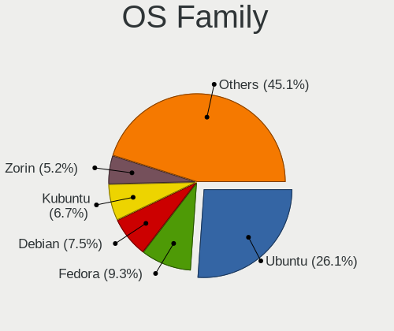

| Name          | Notebooks | Percent |
|---------------|-----------|---------|
| Ubuntu        | 66        | 29.46%  |
| Fedora        | 18        | 8.04%   |
| Kubuntu       | 15        | 6.7%    |
| Debian        | 15        | 6.7%    |
| Linux Mint    | 11        | 4.91%   |
| KDE neon      | 11        | 4.91%   |
| Arch          | 11        | 4.91%   |
| OpenMandriva  | 9         | 4.02%   |
| Manjaro       | 9         | 4.02%   |
| Zorin         | 8         | 3.57%   |
| Endless       | 8         | 3.57%   |
| Pop!_OS       | 5         | 2.23%   |
| Xubuntu       | 4         | 1.79%   |
| ArcoLinux     | 4         | 1.79%   |
| openSUSE      | 3         | 1.34%   |
| Ubuntu Unity  | 2         | 0.89%   |
| Ubuntu Budgie | 2         | 0.89%   |
| Q4OS          | 2         | 0.89%   |
| Lubuntu       | 2         | 0.89%   |
| LMDE          | 2         | 0.89%   |
| Kali          | 2         | 0.89%   |
| Gentoo        | 2         | 0.89%   |
| Garuda Linux  | 2         | 0.89%   |
| EndeavourOS   | 2         | 0.89%   |
| Elementary    | 2         | 0.89%   |
| Ubuntu MATE   | 1         | 0.45%   |
| ROSA          | 1         | 0.45%   |
| Nobara        | 1         | 0.45%   |
| NixOS         | 1         | 0.45%   |
| Clear Linux   | 1         | 0.45%   |
| Chrome OS     | 1         | 0.45%   |
| BlackPanther  | 1         | 0.45%   |

Kernel
------

Version of the Linux kernel

| Version                  | Notebooks | Percent |
|--------------------------|-----------|---------|
| 5.4.0-42-generic         | 4         | 1.56%   |
| 4.18.0-15-generic        | 4         | 1.56%   |
| 5.8.0-41-generic         | 3         | 1.17%   |
| 5.3.0-40-generic         | 3         | 1.17%   |
| 5.16.7-desktop-1omv4003  | 3         | 1.17%   |
| 5.15.0-57-generic        | 3         | 1.17%   |
| 5.15.0-56-generic        | 3         | 1.17%   |
| 5.15.0-43-generic        | 3         | 1.17%   |
| 5.13.0-41-generic        | 3         | 1.17%   |
| 5.13.0-30-generic        | 3         | 1.17%   |
| 5.13.0-28-generic        | 3         | 1.17%   |
| 5.13.0-21-generic        | 3         | 1.17%   |
| 6.4.11-desktop-1omv2390  | 2         | 0.78%   |
| 6.3.9-arch1-1            | 2         | 0.78%   |
| 6.2.0-36-generic         | 2         | 0.78%   |
| 6.2.0-31-generic         | 2         | 0.78%   |
| 5.8.0-44-generic         | 2         | 0.78%   |
| 5.8.0-14-generic         | 2         | 0.78%   |
| 5.6.0-1-amd64            | 2         | 0.78%   |
| 5.4.0-70-generic         | 2         | 0.78%   |
| 5.4.0-56-generic         | 2         | 0.78%   |
| 5.4.0-54-generic         | 2         | 0.78%   |
| 5.4.0-48-generic         | 2         | 0.78%   |
| 5.4.0-40-generic         | 2         | 0.78%   |
| 5.4.0-33-generic         | 2         | 0.78%   |
| 5.4.0-28-generic         | 2         | 0.78%   |
| 5.4.0-26-generic         | 2         | 0.78%   |
| 5.19.0-41-generic        | 2         | 0.78%   |
| 5.15.0-47-generic        | 2         | 0.78%   |
| 5.15.0-46-generic        | 2         | 0.78%   |
| 5.13.19-2-MANJARO        | 2         | 0.78%   |
| 5.13.0-7614-generic      | 2         | 0.78%   |
| 5.11.0-43-generic        | 2         | 0.78%   |
| 5.11.0-40-generic        | 2         | 0.78%   |
| 5.11.0-35-generic        | 2         | 0.78%   |
| 5.10.14-desktop-1omv4002 | 2         | 0.78%   |
| 5.10.0-8-amd64           | 2         | 0.78%   |
| 4.15.0-128-generic       | 2         | 0.78%   |
| 6.6.7-200.fc39.x86_64    | 1         | 0.39%   |
| 6.5.9-arch2-1            | 1         | 0.39%   |

Kernel Family
-------------

Linux kernel without a distro release

| Version | Notebooks | Percent |
|---------|-----------|---------|
| 5.4.0   | 34        | 13.93%  |
| 5.15.0  | 19        | 7.79%   |
| 5.13.0  | 17        | 6.97%   |
| 5.11.0  | 12        | 4.92%   |
| 5.10.0  | 10        | 4.1%    |
| 4.15.0  | 10        | 4.1%    |
| 5.8.0   | 9         | 3.69%   |
| 6.2.0   | 8         | 3.28%   |
| 5.3.0   | 8         | 3.28%   |
| 4.18.0  | 8         | 3.28%   |
| 5.19.0  | 7         | 2.87%   |
| 5.0.0   | 5         | 2.05%   |
| 6.1.0   | 4         | 1.64%   |
| 6.5.0   | 3         | 1.23%   |
| 6.4.11  | 3         | 1.23%   |
| 5.6.0   | 3         | 1.23%   |
| 5.16.7  | 3         | 1.23%   |
| 5.10.14 | 3         | 1.23%   |
| 6.3.9   | 2         | 0.82%   |
| 6.2.6   | 2         | 0.82%   |
| 6.0.11  | 2         | 0.82%   |
| 5.13.19 | 2         | 0.82%   |
| 6.6.7   | 1         | 0.41%   |
| 6.5.9   | 1         | 0.41%   |
| 6.5.5   | 1         | 0.41%   |
| 6.4.7   | 1         | 0.41%   |
| 6.3.1   | 1         | 0.41%   |
| 6.2.8   | 1         | 0.41%   |
| 6.2.2   | 1         | 0.41%   |
| 6.2.15  | 1         | 0.41%   |
| 6.2.11  | 1         | 0.41%   |
| 6.2.10  | 1         | 0.41%   |
| 6.1.9   | 1         | 0.41%   |
| 6.1.5   | 1         | 0.41%   |
| 6.1.18  | 1         | 0.41%   |
| 6.1.15  | 1         | 0.41%   |
| 6.1.12  | 1         | 0.41%   |
| 6.1.11  | 1         | 0.41%   |
| 6.1.1   | 1         | 0.41%   |
| 6.0.7   | 1         | 0.41%   |

Kernel Major Ver.
-----------------

Linux kernel major version

| Version | Notebooks | Percent |
|---------|-----------|---------|
| 5.4     | 36        | 14.88%  |
| 5.15    | 24        | 9.92%   |
| 5.13    | 20        | 8.26%   |
| 6.2     | 15        | 6.2%    |
| 5.11    | 14        | 5.79%   |
| 5.8     | 13        | 5.37%   |
| 5.10    | 13        | 5.37%   |
| 6.1     | 11        | 4.55%   |
| 5.19    | 10        | 4.13%   |
| 4.15    | 10        | 4.13%   |
| 5.3     | 9         | 3.72%   |
| 4.18    | 9         | 3.72%   |
| 5.16    | 8         | 3.31%   |
| 6.5     | 5         | 2.07%   |
| 5.14    | 5         | 2.07%   |
| 5.0     | 5         | 2.07%   |
| 6.4     | 4         | 1.65%   |
| 5.9     | 4         | 1.65%   |
| 5.6     | 4         | 1.65%   |
| 5.17    | 4         | 1.65%   |
| 6.3     | 3         | 1.24%   |
| 6.0     | 3         | 1.24%   |
| 5.12    | 3         | 1.24%   |
| 5.5     | 2         | 0.83%   |
| 4.19    | 2         | 0.83%   |
| 6.6     | 1         | 0.41%   |
| 5.7     | 1         | 0.41%   |
| 5.18    | 1         | 0.41%   |
| 4.9     | 1         | 0.41%   |
| 4.14    | 1         | 0.41%   |
| 4.1     | 1         | 0.41%   |

Arch
----

OS architecture (x86_64, i586, etc.)

| Name   | Notebooks | Percent |
|--------|-----------|---------|
| x86_64 | 204       | 96.68%  |
| i686   | 7         | 3.32%   |

DE
--

Desktop Environment

| Name         | Notebooks | Percent |
|--------------|-----------|---------|
| GNOME        | 88        | 39.64%  |
| KDE5         | 50        | 22.52%  |
| Unknown      | 28        | 12.61%  |
| XFCE         | 18        | 8.11%   |
| X-Cinnamon   | 8         | 3.6%    |
| MATE         | 4         | 1.8%    |
| LXQt         | 4         | 1.8%    |
| KDE          | 3         | 1.35%   |
| i3           | 3         | 1.35%   |
| Unity        | 2         | 0.9%    |
| Trinity      | 2         | 0.9%    |
| Pantheon     | 2         | 0.9%    |
| LXDE         | 2         | 0.9%    |
| Cinnamon     | 2         | 0.9%    |
| Budgie       | 2         | 0.9%    |
| Openbox      | 1         | 0.45%   |
| none+awesome | 1         | 0.45%   |
| DWM          | 1         | 0.45%   |
| bspwm        | 1         | 0.45%   |

Display Server
--------------

X11 or Wayland

| Name    | Notebooks | Percent |
|---------|-----------|---------|
| X11     | 157       | 70.72%  |
| Wayland | 42        | 18.92%  |
| Unknown | 19        | 8.56%   |
| Tty     | 4         | 1.8%    |

Display Manager
---------------

SDDM, LightDM, etc.

| Name    | Notebooks | Percent |
|---------|-----------|---------|
| Unknown | 95        | 42.6%   |
| SDDM    | 42        | 18.83%  |
| GDM3    | 27        | 12.11%  |
| GDM     | 25        | 11.21%  |
| LightDM | 24        | 10.76%  |
| TDM     | 10        | 4.48%   |

OS Lang
-------

Language

| Lang    | Notebooks | Percent |
|---------|-----------|---------|
| en_US   | 117       | 54.42%  |
| sl_SI   | 47        | 21.86%  |
| Unknown | 27        | 12.56%  |
| en_GB   | 10        | 4.65%   |
| en_SI   | 4         | 1.86%   |
| it_IT   | 3         | 1.4%    |
| C       | 3         | 1.4%    |
| pt_PT   | 1         | 0.47%   |
| nl_NL   | 1         | 0.47%   |
| hr_HR   | 1         | 0.47%   |
| en_BW   | 1         | 0.47%   |

Boot Mode
---------

EFI or BIOS

| Mode | Notebooks | Percent |
|------|-----------|---------|
| EFI  | 114       | 52.78%  |
| BIOS | 102       | 47.22%  |

Filesystem
----------

Type of filesystem

| Type    | Notebooks | Percent |
|---------|-----------|---------|
| Ext4    | 171       | 78.44%  |
| Btrfs   | 20        | 9.17%   |
| Overlay | 13        | 5.96%   |
| Unknown | 8         | 3.67%   |
| Tmpfs   | 3         | 1.38%   |
| Zfs     | 1         | 0.46%   |
| Xfs     | 1         | 0.46%   |
| Ext2    | 1         | 0.46%   |

Part. scheme
------------

Scheme of partitioning

| Type    | Notebooks | Percent |
|---------|-----------|---------|
| Unknown | 106       | 48.18%  |
| GPT     | 79        | 35.91%  |
| MBR     | 35        | 15.91%  |

Dual Boot with Linux/BSD
------------------------

Hosting more than one Linux/BSD

| Dual boot | Notebooks | Percent |
|-----------|-----------|---------|
| No        | 200       | 92.17%  |
| Yes       | 17        | 7.83%   |

Dual Boot (Win)
---------------

Hosting Linux and Windows

| Dual boot | Notebooks | Percent |
|-----------|-----------|---------|
| No        | 154       | 71.3%   |
| Yes       | 62        | 28.7%   |

Board
-----

Vendor
------

Motherboard manufacturer

| Name                | Notebooks | Percent |
|---------------------|-----------|---------|
| Hewlett-Packard     | 63        | 29.86%  |
| Lenovo              | 59        | 27.96%  |
| ASUSTek Computer    | 26        | 12.32%  |
| Dell                | 23        | 10.9%   |
| Toshiba             | 9         | 4.27%   |
| Acer                | 8         | 3.79%   |
| Fujitsu             | 4         | 1.9%    |
| HUAWEI              | 3         | 1.42%   |
| TUXEDO              | 2         | 0.95%   |
| MSI                 | 2         | 0.95%   |
| Medion              | 2         | 0.95%   |
| Fujitsu Siemens     | 2         | 0.95%   |
| Schenker            | 1         | 0.47%   |
| Razer               | 1         | 0.47%   |
| PC Specialist       | 1         | 0.47%   |
| Panasonic           | 1         | 0.47%   |
| Gigabyte Technology | 1         | 0.47%   |
| Framework           | 1         | 0.47%   |
| eMachines           | 1         | 0.47%   |
| Dynabook            | 1         | 0.47%   |

Model
-----

Motherboard model

| Name                                       | Notebooks | Percent |
|--------------------------------------------|-----------|---------|
| HP 255 G7 Notebook PC                      | 3         | 1.42%   |
| Toshiba Satellite L750                     | 2         | 0.95%   |
| Lenovo V15 G2 ALC 82KD                     | 2         | 0.95%   |
| Lenovo ThinkPad T410 2522A92               | 2         | 0.95%   |
| HP ProBook 4730s                           | 2         | 0.95%   |
| HP EliteBook 8760w                         | 2         | 0.95%   |
| HP 255 G8 Notebook PC                      | 2         | 0.95%   |
| Dell XPS 13 9310                           | 2         | 0.95%   |
| Dell Latitude D630                         | 2         | 0.95%   |
| Dell Inspiron 5570                         | 2         | 0.95%   |
| Dell Inspiron 1501                         | 2         | 0.95%   |
| ASUS VivoBook 15_ASUS Laptop X540MA_X543MA | 2         | 0.95%   |
| Unknown                                    | 2         | 0.95%   |
| TUXEDO Polaris AMD Gen2 (REN)              | 1         | 0.47%   |
| TUXEDO Aura 15 Gen1                        | 1         | 0.47%   |
| Toshiba TECRA S10                          | 1         | 0.47%   |
| Toshiba TECRA A11                          | 1         | 0.47%   |
| Toshiba Satellite R630                     | 1         | 0.47%   |
| Toshiba Satellite Pro U400                 | 1         | 0.47%   |
| Toshiba Satellite Pro R50-E                | 1         | 0.47%   |
| Toshiba Satellite A100                     | 1         | 0.47%   |
| Toshiba QOSMIO X500                        | 1         | 0.47%   |
| Schenker XMG FUSION 15 (XFU15M22)          | 1         | 0.47%   |
| Razer Blade 14 - RZ09-0370                 | 1         | 0.47%   |
| PC Specialist Fusion IV                    | 1         | 0.47%   |
| Panasonic CF-53SWWZ5MG                     | 1         | 0.47%   |
| MSI U210                                   | 1         | 0.47%   |
| MSI GP60 2OD                               | 1         | 0.47%   |
| Medion E7218                               | 1         | 0.47%   |
| Medion E6232                               | 1         | 0.47%   |
| Lenovo Yoga S740-14IIL 81RS                | 1         | 0.47%   |
| Lenovo Yoga 2 13 20344                     | 1         | 0.47%   |
| Lenovo ThinkPad X250 20CM004ESC            | 1         | 0.47%   |
| Lenovo ThinkPad X230 23202DG               | 1         | 0.47%   |
| Lenovo ThinkPad X1 Extreme 20MFCTO1WW      | 1         | 0.47%   |
| Lenovo ThinkPad X1 Carbon Gen 8 20U9CTO1WW | 1         | 0.47%   |
| Lenovo ThinkPad W530 24479K4               | 1         | 0.47%   |
| Lenovo ThinkPad T61 8897CTO                | 1         | 0.47%   |
| Lenovo ThinkPad T590 20N5S0YN00            | 1         | 0.47%   |
| Lenovo ThinkPad T590 20N5S0MR00            | 1         | 0.47%   |

Model Family
------------

Motherboard model prefix

| Name                   | Notebooks | Percent |
|------------------------|-----------|---------|
| Lenovo ThinkPad        | 38        | 18.01%  |
| HP ProBook             | 14        | 6.64%   |
| HP EliteBook           | 12        | 5.69%   |
| Lenovo IdeaPad         | 9         | 4.27%   |
| Dell Latitude          | 8         | 3.79%   |
| HP ZBook               | 7         | 3.32%   |
| Dell Inspiron          | 7         | 3.32%   |
| Toshiba Satellite      | 6         | 2.84%   |
| HP Pavilion            | 6         | 2.84%   |
| HP 255                 | 5         | 2.37%   |
| Dell XPS               | 5         | 2.37%   |
| HP Compaq              | 4         | 1.9%    |
| HP 250                 | 4         | 1.9%    |
| Fujitsu LIFEBOOK       | 4         | 1.9%    |
| ASUS VivoBook          | 4         | 1.9%    |
| ASUS ASUS              | 4         | 1.9%    |
| Acer Aspire            | 4         | 1.9%    |
| Toshiba TECRA          | 2         | 0.95%   |
| Lenovo Yoga            | 2         | 0.95%   |
| Lenovo V15             | 2         | 0.95%   |
| Lenovo Legion          | 2         | 0.95%   |
| HP Laptop              | 2         | 0.95%   |
| Dell Precision         | 2         | 0.95%   |
| Acer Predator          | 2         | 0.95%   |
| Acer Nitro             | 2         | 0.95%   |
| Unknown                | 2         | 0.95%   |
| TUXEDO Polaris         | 1         | 0.47%   |
| TUXEDO Aura            | 1         | 0.47%   |
| Toshiba QOSMIO         | 1         | 0.47%   |
| Schenker XMG           | 1         | 0.47%   |
| Razer Blade            | 1         | 0.47%   |
| PC Specialist Fusion   | 1         | 0.47%   |
| Panasonic CF-53SWWZ5MG | 1         | 0.47%   |
| MSI U210               | 1         | 0.47%   |
| MSI GP60               | 1         | 0.47%   |
| Medion E7218           | 1         | 0.47%   |
| Medion E6232           | 1         | 0.47%   |
| Lenovo G585            | 1         | 0.47%   |
| Lenovo G510            | 1         | 0.47%   |
| Lenovo G500            | 1         | 0.47%   |

MFG Year
--------

Motherboard manufacture year

| Year | Notebooks | Percent |
|------|-----------|---------|
| 2019 | 25        | 11.85%  |
| 2020 | 20        | 9.48%   |
| 2021 | 17        | 8.06%   |
| 2011 | 17        | 8.06%   |
| 2018 | 16        | 7.58%   |
| 2017 | 13        | 6.16%   |
| 2014 | 12        | 5.69%   |
| 2013 | 12        | 5.69%   |
| 2012 | 12        | 5.69%   |
| 2010 | 12        | 5.69%   |
| 2008 | 12        | 5.69%   |
| 2015 | 9         | 4.27%   |
| 2009 | 9         | 4.27%   |
| 2022 | 6         | 2.84%   |
| 2007 | 6         | 2.84%   |
| 2016 | 5         | 2.37%   |
| 2006 | 5         | 2.37%   |
| 2023 | 3         | 1.42%   |

Form Factor
-----------

Physical design of the computer

| Name     | Notebooks | Percent |
|----------|-----------|---------|
| Notebook | 211       | 100%    |

Secure Boot
-----------

Enabled or disabled

| State    | Notebooks | Percent |
|----------|-----------|---------|
| Disabled | 192       | 89.3%   |
| Enabled  | 23        | 10.7%   |

Coreboot
--------

Have coreboot on board

| Used | Notebooks | Percent |
|------|-----------|---------|
| No   | 210       | 99.53%  |
| Yes  | 1         | 0.47%   |

RAM Size
--------

Total RAM memory

| Size in GB  | Notebooks | Percent |
|-------------|-----------|---------|
| 3.01-4.0    | 53        | 24.88%  |
| 8.01-16.0   | 43        | 20.19%  |
| 4.01-8.0    | 40        | 18.78%  |
| 16.01-24.0  | 38        | 17.84%  |
| 32.01-64.0  | 21        | 9.86%   |
| 1.01-2.0    | 8         | 3.76%   |
| 24.01-32.0  | 3         | 1.41%   |
| 2.01-3.0    | 3         | 1.41%   |
| 64.01-256.0 | 2         | 0.94%   |
| 0.51-1.0    | 2         | 0.94%   |

RAM Used
--------

Used RAM memory

| Used GB    | Notebooks | Percent |
|------------|-----------|---------|
| 1.01-2.0   | 72        | 30.25%  |
| 2.01-3.0   | 62        | 26.05%  |
| 3.01-4.0   | 32        | 13.45%  |
| 4.01-8.0   | 31        | 13.03%  |
| 0.51-1.0   | 21        | 8.82%   |
| 8.01-16.0  | 13        | 5.46%   |
| 0.01-0.5   | 3         | 1.26%   |
| 24.01-32.0 | 2         | 0.84%   |
| 16.01-24.0 | 2         | 0.84%   |

Total Drives
------------

Number of drives on board

| Drives | Notebooks | Percent |
|--------|-----------|---------|
| 1      | 167       | 76.96%  |
| 2      | 38        | 17.51%  |
| 3      | 7         | 3.23%   |
| 0      | 5         | 2.3%    |

Has CD-ROM
----------

Has CD-ROM on board

| Presented | Notebooks | Percent |
|-----------|-----------|---------|
| No        | 122       | 57.82%  |
| Yes       | 89        | 42.18%  |

Has Ethernet
------------

Has Ethernet on board

| Presented | Notebooks | Percent |
|-----------|-----------|---------|
| Yes       | 185       | 86.85%  |
| No        | 28        | 13.15%  |

Has WiFi
--------

Has WiFi module

| Presented | Notebooks | Percent |
|-----------|-----------|---------|
| Yes       | 211       | 99.53%  |
| No        | 1         | 0.47%   |

Has Bluetooth
-------------

Has Bluetooth module

| Presented | Notebooks | Percent |
|-----------|-----------|---------|
| Yes       | 177       | 83.1%   |
| No        | 36        | 16.9%   |

Location
--------

Country
-------

Geographic location (country)

| Country  | Notebooks | Percent |
|----------|-----------|---------|
| Slovenia | 211       | 100%    |

City
----

Geographic location (city)

| City                    | Notebooks | Percent |
|-------------------------|-----------|---------|
| Ljubljana               | 80        | 34.04%  |
| Kranj                   | 17        | 7.23%   |
| Celje                   | 8         | 3.4%    |
| Trzin                   | 6         | 2.55%   |
| Poljane nad Skofjo Loko | 5         | 2.13%   |
| Maribor                 | 5         | 2.13%   |
| Vrhnika                 | 4         | 1.7%    |
| alec                  | 3         | 1.28%   |
| Slovenske Konjice       | 3         | 1.28%   |
| Portoro               | 3         | 1.28%   |
| Murska Sobota           | 3         | 1.28%   |
| Koper                   | 3         | 1.28%   |
| Ajdovina            | 3         | 1.28%   |
| Smarje pri Jelsah       | 2         | 0.85%   |
| Slovenj Gradec          | 2         | 0.85%   |
| kofja Loka            | 2         | 0.85%   |
| Seana                 | 2         | 0.85%   |
| Sempeter pri Gorici     | 2         | 0.85%   |
| Puconci                 | 2         | 0.85%   |
| Petrovce                | 2         | 0.85%   |
| Nova Gorica             | 2         | 0.85%   |
| Medvode                 | 2         | 0.85%   |
| Lesce                   | 2         | 0.85%   |
| Kamnik                  | 2         | 0.85%   |
| Grosuplje               | 2         | 0.85%   |
| Domale                | 2         | 0.85%   |
| Blejska Dobrava         | 2         | 0.85%   |
| uemberk             | 1         | 0.43%   |
| Ziri                    | 1         | 0.43%   |
| Zgornji Leskovec        | 1         | 0.43%   |
| Zgornja Besnica         | 1         | 0.43%   |
| Zagorje ob Savi         | 1         | 0.43%   |
| Visoko                  | 1         | 0.43%   |
| Vipava                  | 1         | 0.43%   |
| Velenje                 | 1         | 0.43%   |
| Turnisce                | 1         | 0.43%   |
| Trzic                   | 1         | 0.43%   |
| Trbovlje                | 1         | 0.43%   |
| Tabor                   | 1         | 0.43%   |
| Solkan                  | 1         | 0.43%   |

Drives
------

Drive Vendor
------------

Hard drive vendors

| Vendor                      | Notebooks | Drives | Percent |
|-----------------------------|-----------|--------|---------|
| Samsung Electronics         | 43        | 61     | 17.2%   |
| Seagate                     | 23        | 27     | 9.2%    |
| Toshiba                     | 19        | 27     | 7.6%    |
| Crucial                     | 19        | 27     | 7.6%    |
| WDC                         | 18        | 19     | 7.2%    |
| Kingston                    | 18        | 24     | 7.2%    |
| SK hynix                    | 16        | 21     | 6.4%    |
| Sandisk                     | 15        | 19     | 6%      |
| Hitachi                     | 10        | 13     | 4%      |
| HGST                        | 9         | 10     | 3.6%    |
| Unknown                     | 8         | 9      | 3.2%    |
| Micron Technology           | 7         | 8      | 2.8%    |
| Intel                       | 5         | 6      | 2%      |
| KIOXIA                      | 4         | 4      | 1.6%    |
| Fujitsu                     | 4         | 5      | 1.6%    |
| JMicron Technology          | 3         | 3      | 1.2%    |
| Intenso                     | 3         | 3      | 1.2%    |
| Transcend                   | 2         | 2      | 0.8%    |
| PNY                         | 2         | 2      | 0.8%    |
| OCZ                         | 2         | 2      | 0.8%    |
| Micron/Crucial Technology   | 2         | 2      | 0.8%    |
| LITEON                      | 2         | 2      | 0.8%    |
| Lenovo                      | 2         | 2      | 0.8%    |
| Union Memory (Shenzhen)     | 1         | 1      | 0.4%    |
| Union Memory                | 1         | 1      | 0.4%    |
| Team                        | 1         | 1      | 0.4%    |
| Silicon Motion              | 1         | 2      | 0.4%    |
| SABRENT                     | 1         | 1      | 0.4%    |
| Phison                      | 1         | 1      | 0.4%    |
| Patriot                     | 1         | 2      | 0.4%    |
| MAXIO Technology (Hangzhou) | 1         | 1      | 0.4%    |
| LITEONIT                    | 1         | 2      | 0.4%    |
| HGST HTS                    | 1         | 1      | 0.4%    |
| Gigabyte Technology         | 1         | 2      | 0.4%    |
| Corsair                     | 1         | 3      | 0.4%    |
| A-DATA Technology           | 1         | 1      | 0.4%    |
| Unknown                     | 1         | 1      | 0.4%    |

Drive Model
-----------

Hard drive models

| Model                                             | Notebooks | Percent |
|---------------------------------------------------|-----------|---------|
| Samsung NVMe SSD Drive 512GB                      | 5         | 1.95%   |
| Samsung NVMe SSD Controller SM981/PM981/PM983 1TB | 5         | 1.95%   |
| HGST HTS721010A9E630 1TB                          | 5         | 1.95%   |
| Kingston SA400S37240G 240GB SSD                   | 4         | 1.56%   |
| Hitachi HTS547575A9E384 752GB                     | 3         | 1.17%   |
| Crucial CT240BX500SSD1 240GB                      | 3         | 1.17%   |
| Unknown MMC Card  32GB                            | 2         | 0.78%   |
| Toshiba MQ04ABF100 1TB                            | 2         | 0.78%   |
| Toshiba MQ01ABF050 500GB                          | 2         | 0.78%   |
| SK hynix SC311 SATA 256GB SSD                     | 2         | 0.78%   |
| Seagate ST9750420AS 752GB                         | 2         | 0.78%   |
| Seagate ST9500325AS 500GB                         | 2         | 0.78%   |
| Seagate ST9320423AS 320GB                         | 2         | 0.78%   |
| Seagate ST1000LM024 HN-M101MBB 1TB                | 2         | 0.78%   |
| SanDisk NVMe SSD Drive 512GB                      | 2         | 0.78%   |
| Samsung SSD 860 EVO 250GB                         | 2         | 0.78%   |
| Samsung SSD 850 EVO 250GB                         | 2         | 0.78%   |
| Samsung PM963 2.5" NVMe PCIe SSD 256GB            | 2         | 0.78%   |
| Samsung NVMe SSD Drive 1024GB                     | 2         | 0.78%   |
| PNY CS900 120GB SSD                               | 2         | 0.78%   |
| Lenovo NVMe SSD Drive 256GB                       | 2         | 0.78%   |
| Kingston SV300S37A60G 64GB SSD                    | 2         | 0.78%   |
| Kingston SA400S37120G 120GB SSD                   | 2         | 0.78%   |
| Hitachi HTS725032A9A364 320GB                     | 2         | 0.78%   |
| HGST HTS545050A7E680 500GB                        | 2         | 0.78%   |
| Crucial CT250BX100SSD1 250GB                      | 2         | 0.78%   |
| Crucial CT2000MX500SSD1 2TB                       | 2         | 0.78%   |
| WDC WDS500G3X0C-00SJG0 500GB                      | 1         | 0.39%   |
| WDC WDS500G2B0A-00SM50 500GB SSD                  | 1         | 0.39%   |
| WDC WDS240G2G0B-00EPW0 240GB SSD                  | 1         | 0.39%   |
| WDC WDS120G2G0B-00EPW0 120GB SSD                  | 1         | 0.39%   |
| WDC WDS120G2G0A-00JH30 120GB SSD                  | 1         | 0.39%   |
| WDC WDS100T3X0C-00SJG0 1TB                        | 1         | 0.39%   |
| WDC WDS100T2B0B-00YS70 1TB SSD                    | 1         | 0.39%   |
| WDC WD7500BPVX-60JC3T0 752GB                      | 1         | 0.39%   |
| WDC WD3200BEKT-22KA9T0 320GB                      | 1         | 0.39%   |
| WDC WD2500BEVT-60ZCT1 250GB                       | 1         | 0.39%   |
| WDC WD10SPZX-60Z10T0 1TB                          | 1         | 0.39%   |
| WDC WD10JPVX-22JC3T0 1TB                          | 1         | 0.39%   |
| WDC WD10JPCX-24UE4T0 1TB                          | 1         | 0.39%   |

HDD Vendor
----------

Hard disk drive vendors

| Vendor             | Notebooks | Drives | Percent |
|--------------------|-----------|--------|---------|
| Seagate            | 23        | 27     | 34.85%  |
| Toshiba            | 11        | 17     | 16.67%  |
| Hitachi            | 10        | 13     | 15.15%  |
| HGST               | 9         | 10     | 13.64%  |
| WDC                | 6         | 6      | 9.09%   |
| Fujitsu            | 4         | 5      | 6.06%   |
| SABRENT            | 1         | 1      | 1.52%   |
| JMicron Technology | 1         | 1      | 1.52%   |
| HGST HTS           | 1         | 1      | 1.52%   |

SSD Vendor
----------

Solid state drive vendors

| Vendor              | Notebooks | Drives | Percent |
|---------------------|-----------|--------|---------|
| Samsung Electronics | 17        | 23     | 19.1%   |
| Crucial             | 17        | 25     | 19.1%   |
| Kingston            | 15        | 20     | 16.85%  |
| SanDisk             | 8         | 10     | 8.99%   |
| WDC                 | 5         | 5      | 5.62%   |
| SK hynix            | 4         | 4      | 4.49%   |
| Micron Technology   | 3         | 3      | 3.37%   |
| Transcend           | 2         | 2      | 2.25%   |
| PNY                 | 2         | 2      | 2.25%   |
| OCZ                 | 2         | 2      | 2.25%   |
| LITEON              | 2         | 2      | 2.25%   |
| Intenso             | 2         | 2      | 2.25%   |
| Toshiba             | 1         | 1      | 1.12%   |
| Team                | 1         | 1      | 1.12%   |
| Phison              | 1         | 1      | 1.12%   |
| Patriot             | 1         | 2      | 1.12%   |
| LITEONIT            | 1         | 2      | 1.12%   |
| JMicron Technology  | 1         | 1      | 1.12%   |
| Intel               | 1         | 1      | 1.12%   |
| Gigabyte Technology | 1         | 2      | 1.12%   |
| Corsair             | 1         | 3      | 1.12%   |
| A-DATA Technology   | 1         | 1      | 1.12%   |

Drive Kind
----------

HDD or SSD

| Kind    | Notebooks | Drives | Percent |
|---------|-----------|--------|---------|
| SSD     | 81        | 115    | 34.47%  |
| NVMe    | 80        | 111    | 34.04%  |
| HDD     | 64        | 81     | 27.23%  |
| MMC     | 7         | 8      | 2.98%   |
| Unknown | 3         | 3      | 1.28%   |

Drive Connector
---------------

SATA, SAS, NVMe, etc.

| Type | Notebooks | Drives | Percent |
|------|-----------|--------|---------|
| SATA | 131       | 190    | 58.22%  |
| NVMe | 80        | 111    | 35.56%  |
| SAS  | 7         | 9      | 3.11%   |
| MMC  | 7         | 8      | 3.11%   |

Drive Size
----------

Size of hard drive

| Size in TB | Notebooks | Drives | Percent |
|------------|-----------|--------|---------|
| 0.01-0.5   | 101       | 138    | 70.14%  |
| 0.51-1.0   | 36        | 46     | 25%     |
| 1.01-2.0   | 7         | 12     | 4.86%   |

Space Total
-----------

Amount of disk space available on the file system

| Size in GB     | Notebooks | Percent |
|----------------|-----------|---------|
| 101-250        | 63        | 27.88%  |
| 251-500        | 59        | 26.11%  |
| 501-1000       | 33        | 14.6%   |
| 51-100         | 16        | 7.08%   |
| 1-20           | 15        | 6.64%   |
| 1001-2000      | 13        | 5.75%   |
| 21-50          | 10        | 4.42%   |
| 2001-3000      | 7         | 3.1%    |
| More than 3000 | 5         | 2.21%   |
| Unknown        | 5         | 2.21%   |

Space Used
----------

Amount of used disk space

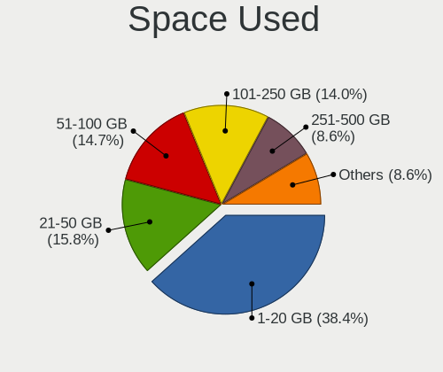

| Used GB        | Notebooks | Percent |
|----------------|-----------|---------|
| 1-20           | 93        | 39.91%  |
| 21-50          | 36        | 15.45%  |
| 101-250        | 33        | 14.16%  |
| 51-100         | 33        | 14.16%  |
| 251-500        | 20        | 8.58%   |
| 501-1000       | 8         | 3.43%   |
| Unknown        | 5         | 2.15%   |
| 1001-2000      | 3         | 1.29%   |
| More than 3000 | 1         | 0.43%   |
| 2001-3000      | 1         | 0.43%   |

Malfunc. Drives
---------------

Drive models with a malfunction

| Model                                          | Notebooks | Drives | Percent |
|------------------------------------------------|-----------|--------|---------|
| HGST HTS545050A7E680 500GB                     | 2         | 2      | 11.11%  |
| Toshiba MQ01ABF050 500GB                       | 1         | 5      | 5.56%   |
| SK hynix HFS256G32MND-2200A 256GB SSD          | 1         | 1      | 5.56%   |
| Seagate ST98823AS 80GB                         | 1         | 2      | 5.56%   |
| Seagate ST9750420AS 752GB                      | 1         | 1      | 5.56%   |
| Seagate ST9500423AS 500GB                      | 1         | 1      | 5.56%   |
| Seagate ST9500325AS 500GB                      | 1         | 2      | 5.56%   |
| Seagate ST9160314AS 160GB                      | 1         | 1      | 5.56%   |
| Seagate ST1000LM024 HN-M101MBB 1TB             | 1         | 1      | 5.56%   |
| SanDisk SD7SB2Q512G1001 512GB SSD              | 1         | 1      | 5.56%   |
| Micron Technology 1100_MTFDDAV512TBN 512GB SSD | 1         | 1      | 5.56%   |
| Kingston SV300S37A120G 120GB SSD               | 1         | 1      | 5.56%   |
| Hitachi HTS727550A9E364 500GB                  | 1         | 1      | 5.56%   |
| Hitachi HTS543280L9SA00 80GB                   | 1         | 1      | 5.56%   |
| HGST HTS721010A9E630 1TB                       | 1         | 1      | 5.56%   |
| Crucial CT250BX100SSD1 250GB                   | 1         | 1      | 5.56%   |
| Crucial CT120M500SSD1 120GB                    | 1         | 1      | 5.56%   |

Malfunc. Drive Vendor
---------------------

Vendors of faulty drives

| Vendor            | Notebooks | Drives | Percent |
|-------------------|-----------|--------|---------|
| Seagate           | 6         | 8      | 33.33%  |
| HGST              | 3         | 3      | 16.67%  |
| Hitachi           | 2         | 2      | 11.11%  |
| Crucial           | 2         | 2      | 11.11%  |
| Toshiba           | 1         | 5      | 5.56%   |
| SK hynix          | 1         | 1      | 5.56%   |
| SanDisk           | 1         | 1      | 5.56%   |
| Micron Technology | 1         | 1      | 5.56%   |
| Kingston          | 1         | 1      | 5.56%   |

Malfunc. HDD Vendor
-------------------

Vendors of faulty HDD drives

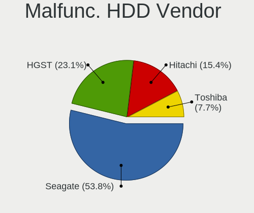

| Vendor  | Notebooks | Drives | Percent |
|---------|-----------|--------|---------|
| Seagate | 6         | 8      | 50%     |
| HGST    | 3         | 3      | 25%     |
| Hitachi | 2         | 2      | 16.67%  |
| Toshiba | 1         | 5      | 8.33%   |

Malfunc. Drive Kind
-------------------

Kinds of faulty drives

| Kind | Notebooks | Drives | Percent |
|------|-----------|--------|---------|
| HDD  | 12        | 18     | 66.67%  |
| SSD  | 6         | 6      | 33.33%  |

Failed Drives
-------------

Failed drive models

| Model                                            | Notebooks | Drives | Percent |
|--------------------------------------------------|-----------|--------|---------|
| Toshiba MK6465GSX 640GB                          | 1         | 2      | 50%     |
| Samsung Electronics MZNLN256HCHP-000L7 256GB SSD | 1         | 1      | 50%     |

Failed Drive Vendor
-------------------

Failed drive vendors

| Vendor              | Notebooks | Drives | Percent |
|---------------------|-----------|--------|---------|
| Toshiba             | 1         | 2      | 50%     |
| Samsung Electronics | 1         | 1      | 50%     |

Drive Status
------------

Number of failed and malfunc. drives

| Status   | Notebooks | Drives | Percent |
|----------|-----------|--------|---------|
| Detected | 117       | 178    | 52.7%   |
| Works    | 85        | 113    | 38.29%  |
| Malfunc  | 18        | 24     | 8.11%   |
| Failed   | 2         | 3      | 0.9%    |

Storage controller
------------------

Storage Vendor
--------------

Storage controller vendors

| Vendor                           | Notebooks | Percent |
|----------------------------------|-----------|---------|
| Intel                            | 140       | 55.78%  |
| Samsung Electronics              | 30        | 11.95%  |
| AMD                              | 25        | 9.96%   |
| SanDisk                          | 14        | 5.58%   |
| SK hynix                         | 12        | 4.78%   |
| Toshiba America Info Systems     | 10        | 3.98%   |
| Micron Technology                | 4         | 1.59%   |
| Micron/Crucial Technology        | 3         | 1.2%    |
| Kingston Technology Company      | 3         | 1.2%    |
| Union Memory (Shenzhen)          | 2         | 0.8%    |
| Lenovo                           | 2         | 0.8%    |
| KIOXIA                           | 2         | 0.8%    |
| Silicon Motion                   | 1         | 0.4%    |
| Silicon Integrated Systems [SiS] | 1         | 0.4%    |
| MAXIO Technology (Hangzhou)      | 1         | 0.4%    |
| Marvell Technology Group         | 1         | 0.4%    |

Storage Model
-------------

Storage controller models

| Model                                                                          | Notebooks | Percent |
|--------------------------------------------------------------------------------|-----------|---------|
| Samsung NVMe SSD Controller SM981/PM981/PM983                                  | 20        | 7.52%   |
| AMD FCH SATA Controller [AHCI mode]                                            | 19        | 7.14%   |
| Intel 6 Series/C200 Series Chipset Family 6 port Mobile SATA AHCI Controller   | 15        | 5.64%   |
| Intel 7 Series Chipset Family 6-port SATA Controller [AHCI mode]               | 12        | 4.51%   |
| Intel 8 Series SATA Controller 1 [AHCI mode]                                   | 9         | 3.38%   |
| Intel Sunrise Point-LP SATA Controller [AHCI mode]                             | 8         | 3.01%   |
| Intel 82801 Mobile SATA Controller [RAID mode]                                 | 8         | 3.01%   |
| Intel 5 Series/3400 Series Chipset 4 port SATA AHCI Controller                 | 8         | 3.01%   |
| Intel 82801IBM/IEM (ICH9M/ICH9M-E) 4 port SATA Controller [AHCI mode]          | 7         | 2.63%   |
| Intel 8 Series/C220 Series Chipset Family 6-port SATA Controller 1 [AHCI mode] | 7         | 2.63%   |
| Intel 5 Series/3400 Series Chipset 6 port SATA AHCI Controller                 | 7         | 2.63%   |
| SK hynix Gold P31/BC711/PC711 NVMe Solid State Drive                           | 6         | 2.26%   |
| Intel 82801HM/HEM (ICH8M/ICH8M-E) SATA Controller [AHCI mode]                  | 6         | 2.26%   |
| Intel 82801HM/HEM (ICH8M/ICH8M-E) IDE Controller                               | 6         | 2.26%   |
| SanDisk Extreme Pro / WD Black SN750 / PC SN730 / Red SN700 NVMe SSD           | 5         | 1.88%   |
| Samsung NVMe SSD Controller 980 (DRAM-less)                                    | 5         | 1.88%   |
| Intel Wildcat Point-LP SATA Controller [AHCI Mode]                             | 5         | 1.88%   |
| Intel Volume Management Device NVMe RAID Controller                            | 5         | 1.88%   |
| Intel HM170/QM170 Chipset SATA Controller [AHCI Mode]                          | 5         | 1.88%   |
| Intel Cannon Lake Mobile PCH SATA AHCI Controller                              | 5         | 1.88%   |
| Toshiba America Info Systems XG6 NVMe SSD Controller                           | 4         | 1.5%    |
| Intel Atom Processor E3800 Series SATA AHCI Controller                         | 4         | 1.5%    |
| Toshiba America Info Systems BG3 x2 NVMe SSD Controller (DRAM-less)            | 3         | 1.13%   |
| Samsung NVMe SSD Controller SM951/PM951                                        | 3         | 1.13%   |
| Intel Comet Lake SATA AHCI Controller                                          | 3         | 1.13%   |
| Intel Celeron/Pentium Silver Processor SATA Controller                         | 3         | 1.13%   |
| AMD SB7x0/SB8x0/SB9x0 SATA Controller [AHCI mode]                              | 3         | 1.13%   |
| AMD SB600 Non-Raid-5 SATA                                                      | 3         | 1.13%   |
| Union Memory (Shenzhen) AM620 PCIe 3.0 NVMe SSD 256GB                          | 2         | 0.75%   |
| Toshiba America Info Systems XG4 NVMe SSD Controller                           | 2         | 0.75%   |
| SK hynix BC511 NVMe SSD                                                        | 2         | 0.75%   |
| SanDisk WD PC SN810 / Black SN850 NVMe SSD                                     | 2         | 0.75%   |
| SanDisk WD Blue SN500 / PC SN520 x2 M.2 2280 NVMe SSD                          | 2         | 0.75%   |
| SanDisk Ultra 3D / WD Blue SN550 NVMe SSD                                      | 2         | 0.75%   |
| Micron/Crucial P2 [Nick P2] / P3 / P3 Plus NVMe PCIe SSD (DRAM-less)           | 2         | 0.75%   |
| Lenovo LENSE20256GMSP34MEAT2TA                                                 | 2         | 0.75%   |
| KIOXIA NVMe SSD Controller BG4 (DRAM-less)                                     | 2         | 0.75%   |
| Kingston Company OM8PCP Design-In PCIe 3 NVMe SSD (DRAM-less)                  | 2         | 0.75%   |
| Intel SSD 660P Series                                                          | 2         | 0.75%   |
| Intel Ice Lake-LP SATA Controller [AHCI mode]                                  | 2         | 0.75%   |

Storage Kind
------------

Kind of storage controller (IDE, SATA, NVMe, SAS, ...)

| Kind | Notebooks | Percent |
|------|-----------|---------|
| SATA | 141       | 54.86%  |
| NVMe | 83        | 32.3%   |
| IDE  | 20        | 7.78%   |
| RAID | 13        | 5.06%   |

Processor
---------

CPU Vendor
----------

Processor vendors

| Vendor | Notebooks | Percent |
|--------|-----------|---------|
| Intel  | 174       | 82.46%  |
| AMD    | 37        | 17.54%  |

CPU Model
---------

Processor models

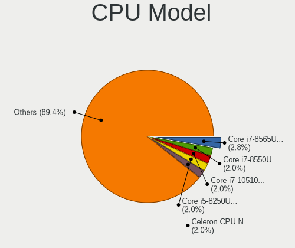

| Model                                         | Notebooks | Percent |
|-----------------------------------------------|-----------|---------|
| Intel Core i7-8565U CPU @ 1.80GHz             | 6         | 2.84%   |
| Intel Core i7-10510U CPU @ 1.80GHz            | 5         | 2.37%   |
| Intel Core i5-8250U CPU @ 1.60GHz             | 5         | 2.37%   |
| Intel Celeron CPU N2840 @ 2.16GHz             | 5         | 2.37%   |
| AMD Ryzen 3 5300U with Radeon Graphics        | 5         | 2.37%   |
| Intel Core i7-7700HQ CPU @ 2.80GHz            | 4         | 1.9%    |
| Intel Core i5-2430M CPU @ 2.40GHz             | 4         | 1.9%    |
| Intel 11th Gen Core i7-1165G7 @ 2.80GHz       | 4         | 1.9%    |
| AMD Ryzen 5 3500U with Radeon Vega Mobile Gfx | 4         | 1.9%    |
| Intel Pentium CPU P6100 @ 2.00GHz             | 3         | 1.42%   |
| Intel Core i7-8750H CPU @ 2.20GHz             | 3         | 1.42%   |
| Intel Core i7-8550U CPU @ 1.80GHz             | 3         | 1.42%   |
| Intel Core i7-6700HQ CPU @ 2.60GHz            | 3         | 1.42%   |
| Intel Core i7-4500U CPU @ 1.80GHz             | 3         | 1.42%   |
| Intel Core i7-10750H CPU @ 2.60GHz            | 3         | 1.42%   |
| Intel Core i5-8265U CPU @ 1.60GHz             | 3         | 1.42%   |
| Intel Core i5-4210U CPU @ 1.70GHz             | 3         | 1.42%   |
| Intel Core i5-2520M CPU @ 2.50GHz             | 3         | 1.42%   |
| Intel Core 2 Duo CPU T8300 @ 2.40GHz          | 3         | 1.42%   |
| Intel 11th Gen Core i7-1185G7 @ 3.00GHz       | 3         | 1.42%   |
| Intel Core i7-8665U CPU @ 1.90GHz             | 2         | 0.95%   |
| Intel Core i7-5600U CPU @ 2.60GHz             | 2         | 0.95%   |
| Intel Core i7-4720HQ CPU @ 2.60GHz            | 2         | 0.95%   |
| Intel Core i7-3610QM CPU @ 2.30GHz            | 2         | 0.95%   |
| Intel Core i7-1065G7 CPU @ 1.30GHz            | 2         | 0.95%   |
| Intel Core i7 CPU Q 740 @ 1.73GHz             | 2         | 0.95%   |
| Intel Core i5-5200U CPU @ 2.20GHz             | 2         | 0.95%   |
| Intel Core i5-4200M CPU @ 2.50GHz             | 2         | 0.95%   |
| Intel Core i5-1035G1 CPU @ 1.00GHz            | 2         | 0.95%   |
| Intel Core i5 CPU M 540 @ 2.53GHz             | 2         | 0.95%   |
| Intel Core i5 CPU M 520 @ 2.40GHz             | 2         | 0.95%   |
| Intel Core i3-3110M CPU @ 2.40GHz             | 2         | 0.95%   |
| Intel Core i3 CPU M 370 @ 2.40GHz             | 2         | 0.95%   |
| Intel Core 2 Duo CPU T7100 @ 1.80GHz          | 2         | 0.95%   |
| Intel Core 2 Duo CPU P8600 @ 2.40GHz          | 2         | 0.95%   |
| Intel Core 2 Duo CPU P8400 @ 2.26GHz          | 2         | 0.95%   |
| Intel Celeron N4000 CPU @ 1.10GHz             | 2         | 0.95%   |
| Intel 12th Gen Core i7-1255U                  | 2         | 0.95%   |
| Intel 11th Gen Core i7-11800H @ 2.30GHz       | 2         | 0.95%   |
| AMD Ryzen 9 5900HX with Radeon Graphics       | 2         | 0.95%   |

CPU Model Family
----------------

Processor model prefix

| Model                   | Notebooks | Percent |
|-------------------------|-----------|---------|
| Intel Core i7           | 59        | 27.96%  |
| Intel Core i5           | 45        | 21.33%  |
| Intel Core 2 Duo        | 17        | 8.06%   |
| Other                   | 15        | 7.11%   |
| Intel Core i3           | 14        | 6.64%   |
| Intel Celeron           | 12        | 5.69%   |
| AMD Ryzen 7             | 9         | 4.27%   |
| AMD Ryzen 5             | 8         | 3.79%   |
| AMD Ryzen 3             | 7         | 3.32%   |
| Intel Pentium           | 6         | 2.84%   |
| Intel Genuine           | 3         | 1.42%   |
| AMD Ryzen 9             | 3         | 1.42%   |
| Intel Pentium Silver    | 1         | 0.47%   |
| Intel Pentium Dual      | 1         | 0.47%   |
| Intel Core 2            | 1         | 0.47%   |
| AMD Turion II Dual-Core | 1         | 0.47%   |
| AMD Turion II           | 1         | 0.47%   |
| AMD Mobile Sempron      | 1         | 0.47%   |
| AMD E1                  | 1         | 0.47%   |
| AMD E                   | 1         | 0.47%   |
| AMD C-60                | 1         | 0.47%   |
| AMD Athlon Neo          | 1         | 0.47%   |
| AMD Athlon 64 X2        | 1         | 0.47%   |
| AMD A8                  | 1         | 0.47%   |
| AMD A6                  | 1         | 0.47%   |

CPU Cores
---------

Number of processor cores

| Number | Notebooks | Percent |
|--------|-----------|---------|
| 2      | 100       | 47.39%  |
| 4      | 77        | 36.49%  |
| 6      | 14        | 6.64%   |
| 8      | 13        | 6.16%   |
| 1      | 3         | 1.42%   |
| 10     | 2         | 0.95%   |
| 16     | 1         | 0.47%   |
| 12     | 1         | 0.47%   |

CPU Sockets
-----------

Number of sockets

| Number | Notebooks | Percent |
|--------|-----------|---------|
| 1      | 211       | 100%    |

CPU Threads
-----------

Threads per core (Hyper-Threading)

| Number | Notebooks | Percent |
|--------|-----------|---------|
| 2      | 160       | 75.83%  |
| 1      | 51        | 24.17%  |

CPU Op-Modes
------------

CPU Operation Modes (32-bit, 64-bit)

| Op mode        | Notebooks | Percent |
|----------------|-----------|---------|
| 32-bit, 64-bit | 203       | 95.75%  |
| Unknown        | 6         | 2.83%   |
| 32-bit         | 3         | 1.42%   |

CPU Microcode
-------------

Microcode number

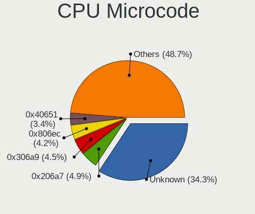

| Number     | Notebooks | Percent |
|------------|-----------|---------|
| Unknown    | 57        | 25.91%  |
| 0x206a7    | 13        | 5.91%   |
| 0x806ec    | 11        | 5%      |
| 0x306a9    | 10        | 4.55%   |
| 0x40651    | 9         | 4.09%   |
| 0x306c3    | 8         | 3.64%   |
| 0x20655    | 8         | 3.64%   |
| 0x806ea    | 7         | 3.18%   |
| 0x6fd      | 7         | 3.18%   |
| 0x806c1    | 6         | 2.73%   |
| 0x30678    | 5         | 2.27%   |
| 0x10676    | 5         | 2.27%   |
| 0x08108102 | 5         | 2.27%   |
| 0x906ea    | 4         | 1.82%   |
| 0x906e9    | 4         | 1.82%   |
| 0x20652    | 4         | 1.82%   |
| 0x1067a    | 4         | 1.82%   |
| 0xa0652    | 3         | 1.36%   |
| 0x706e5    | 3         | 1.36%   |
| 0x6e8      | 3         | 1.36%   |
| 0x406e3    | 3         | 1.36%   |
| 0x306d4    | 3         | 1.36%   |
| 0x106e5    | 3         | 1.36%   |
| 0x0a50000c | 3         | 1.36%   |
| 0x08608103 | 3         | 1.36%   |
| 0x08600106 | 3         | 1.36%   |
| 0x906ed    | 2         | 0.91%   |
| 0x806eb    | 2         | 0.91%   |
| 0x706a1    | 2         | 0.91%   |
| 0x506c9    | 2         | 0.91%   |
| 0x08608102 | 2         | 0.91%   |
| 0x0810100b | 2         | 0.91%   |
| 0x06001119 | 2         | 0.91%   |
| 0x05000119 | 2         | 0.91%   |
| 0xa0660    | 1         | 0.45%   |
| 0x906a4    | 1         | 0.45%   |
| 0x6fb      | 1         | 0.45%   |
| 0x406c4    | 1         | 0.45%   |
| 0x0a704101 | 1         | 0.45%   |
| 0x0a404102 | 1         | 0.45%   |

CPU Microarch
-------------

Microarchitecture

| Name             | Notebooks | Percent |
|------------------|-----------|---------|
| KabyLake         | 40        | 18.96%  |
| Haswell          | 18        | 8.53%   |
| SandyBridge      | 16        | 7.58%   |
| IvyBridge        | 13        | 6.16%   |
| Westmere         | 12        | 5.69%   |
| Penryn           | 10        | 4.74%   |
| Unknown          | 10        | 4.74%   |
| TigerLake        | 9         | 4.27%   |
| Core             | 9         | 4.27%   |
| Skylake          | 8         | 3.79%   |
| Silvermont       | 8         | 3.79%   |
| Zen+             | 6         | 2.84%   |
| Zen 2            | 6         | 2.84%   |
| IceLake          | 6         | 2.84%   |
| CometLake        | 5         | 2.37%   |
| Broadwell        | 5         | 2.37%   |
| Zen 3            | 4         | 1.9%    |
| P6               | 3         | 1.42%   |
| Nehalem          | 3         | 1.42%   |
| K8 Hammer        | 3         | 1.42%   |
| Goldmont plus    | 3         | 1.42%   |
| Alderlake Hybrid | 3         | 1.42%   |
| Zen              | 2         | 0.95%   |
| Piledriver       | 2         | 0.95%   |
| K10              | 2         | 0.95%   |
| Goldmont         | 2         | 0.95%   |
| Bobcat           | 2         | 0.95%   |
| Jaguar           | 1         | 0.47%   |

Graphics
--------

GPU Vendor
----------

Vendors of graphics cards

| Vendor                           | Notebooks | Percent |
|----------------------------------|-----------|---------|
| Intel                            | 152       | 55.27%  |
| AMD                              | 64        | 23.27%  |
| Nvidia                           | 58        | 21.09%  |
| Silicon Integrated Systems [SiS] | 1         | 0.36%   |

GPU Model
---------

Graphics card models

| Model                                                                                 | Notebooks | Percent |
|---------------------------------------------------------------------------------------|-----------|---------|
| Intel 2nd Generation Core Processor Family Integrated Graphics Controller             | 13        | 4.56%   |
| Intel 3rd Gen Core processor Graphics Controller                                      | 12        | 4.21%   |
| Intel WhiskeyLake-U GT2 [UHD Graphics 620]                                            | 11        | 3.86%   |
| Intel UHD Graphics 620                                                                | 10        | 3.51%   |
| Intel Haswell-ULT Integrated Graphics Controller                                      | 10        | 3.51%   |
| Intel TigerLake-LP GT2 [Iris Xe Graphics]                                             | 9         | 3.16%   |
| Intel Core Processor Integrated Graphics Controller                                   | 9         | 3.16%   |
| Intel 4th Gen Core Processor Integrated Graphics Controller                           | 7         | 2.46%   |
| AMD Lucienne                                                                          | 7         | 2.46%   |
| Intel CometLake-U GT2 [UHD Graphics]                                                  | 6         | 2.11%   |
| Intel CoffeeLake-H GT2 [UHD Graphics 630]                                             | 6         | 2.11%   |
| Intel Atom Processor Z36xxx/Z37xxx Series Graphics & Display                          | 6         | 2.11%   |
| AMD Renoir [Radeon RX Vega 6 (Ryzen 4000/5000 Mobile Series)]                         | 6         | 2.11%   |
| AMD Picasso/Raven 2 [Radeon Vega Series / Radeon Vega Mobile Series]                  | 6         | 2.11%   |
| Intel Mobile GM965/GL960 Integrated Graphics Controller (secondary)                   | 5         | 1.75%   |
| Intel Mobile GM965/GL960 Integrated Graphics Controller (primary)                     | 5         | 1.75%   |
| Intel Mobile 4 Series Chipset Integrated Graphics Controller                          | 5         | 1.75%   |
| Intel HD Graphics 5500                                                                | 5         | 1.75%   |
| Nvidia GP108M [GeForce MX250]                                                         | 4         | 1.4%    |
| Intel HD Graphics 530                                                                 | 4         | 1.4%    |
| Nvidia GM107M [GeForce GTX 960M]                                                      | 3         | 1.05%   |
| Nvidia GK208M [GeForce GT 740M]                                                       | 3         | 1.05%   |
| Nvidia GA106M [GeForce RTX 3060 Mobile / Max-Q]                                       | 3         | 1.05%   |
| Intel Skylake GT2 [HD Graphics 520]                                                   | 3         | 1.05%   |
| Intel Mobile 945GM/GMS/GME, 943/940GML Express Integrated Graphics Controller         | 3         | 1.05%   |
| Intel Mobile 945GM/GMS, 943/940GML Express Integrated Graphics Controller             | 3         | 1.05%   |
| Intel CometLake-H GT2 [UHD Graphics]                                                  | 3         | 1.05%   |
| AMD Topaz XT [Radeon R7 M260/M265 / M340/M360 / M440/M445 / 530/535 / 620/625 Mobile] | 3         | 1.05%   |
| AMD Seymour [Radeon HD 6400M/7400M Series]                                            | 3         | 1.05%   |
| Nvidia TU117M [GeForce GTX 1650 Ti Mobile]                                            | 2         | 0.7%    |
| Nvidia TU117GLM [Quadro T500 Mobile]                                                  | 2         | 0.7%    |
| Nvidia GP107M [GeForce GTX 1050 Ti Mobile]                                            | 2         | 0.7%    |
| Nvidia GM108M [GeForce 940M]                                                          | 2         | 0.7%    |
| Nvidia GM107GLM [Quadro M1000M]                                                       | 2         | 0.7%    |
| Intel TigerLake-H GT1 [UHD Graphics]                                                  | 2         | 0.7%    |
| Intel Mobile GME965/GLE960 Integrated Graphics Controller                             | 2         | 0.7%    |
| Intel Iris Plus Graphics G7                                                           | 2         | 0.7%    |
| Intel Iris Plus Graphics G1 (Ice Lake)                                                | 2         | 0.7%    |
| Intel HD Graphics 630                                                                 | 2         | 0.7%    |
| Intel GeminiLake [UHD Graphics 600]                                                   | 2         | 0.7%    |

GPU Combo
---------

Combinations of graphics cards

| Name           | Notebooks | Percent |
|----------------|-----------|---------|
| 1 x Intel      | 95        | 44.6%   |
| Intel + Nvidia | 40        | 18.78%  |
| 1 x AMD        | 38        | 17.84%  |
| Intel + AMD    | 17        | 7.98%   |
| 1 x Nvidia     | 11        | 5.16%   |
| AMD + Nvidia   | 7         | 3.29%   |
| 2 x Intel      | 2         | 0.94%   |
| 2 x AMD        | 2         | 0.94%   |
| 1 x SiS        | 1         | 0.47%   |

GPU Driver
----------

Free vs proprietary

| Driver      | Notebooks | Percent |
|-------------|-----------|---------|
| Free        | 175       | 81.78%  |
| Proprietary | 32        | 14.95%  |
| Unknown     | 7         | 3.27%   |

GPU Memory
----------

Total video memory

| Size in GB | Notebooks | Percent |
|------------|-----------|---------|
| Unknown    | 139       | 63.76%  |
| 1.01-2.0   | 25        | 11.47%  |
| 0.01-0.5   | 22        | 10.09%  |
| 0.51-1.0   | 14        | 6.42%   |
| 3.01-4.0   | 11        | 5.05%   |
| 5.01-6.0   | 4         | 1.83%   |
| 7.01-8.0   | 2         | 0.92%   |
| 2.01-3.0   | 1         | 0.46%   |

Monitor
-------

Monitor Vendor
--------------

Monitor vendors

| Vendor                  | Notebooks | Percent |
|-------------------------|-----------|---------|
| AU Optronics            | 53        | 21.54%  |
| LG Display              | 30        | 12.2%   |
| Samsung Electronics     | 29        | 11.79%  |
| Chimei Innolux          | 26        | 10.57%  |
| BOE                     | 22        | 8.94%   |
| Lenovo                  | 15        | 6.1%    |
| Dell                    | 12        | 4.88%   |
| Chi Mei Optoelectronics | 9         | 3.66%   |
| Sharp                   | 7         | 2.85%   |
| LG Philips              | 4         | 1.63%   |
| Goldstar                | 4         | 1.63%   |
| CSO                     | 4         | 1.63%   |
| AOC                     | 3         | 1.22%   |
| TMX                     | 2         | 0.81%   |
| PANDA                   | 2         | 0.81%   |
| InfoVision              | 2         | 0.81%   |
| Hewlett-Packard         | 2         | 0.81%   |
| HannStar                | 2         | 0.81%   |
| CPT                     | 2         | 0.81%   |
| ViewSonic               | 1         | 0.41%   |
| Unknown (XXX)           | 1         | 0.41%   |
| Unknown                 | 1         | 0.41%   |
| Tianma XM               | 1         | 0.41%   |
| Sony                    | 1         | 0.41%   |
| Philips                 | 1         | 0.41%   |
| NEC Computers           | 1         | 0.41%   |
| Medion                  | 1         | 0.41%   |
| LGD                     | 1         | 0.41%   |
| Iiyama                  | 1         | 0.41%   |
| IBM                     | 1         | 0.41%   |
| HUAWEI                  | 1         | 0.41%   |
| Gericom                 | 1         | 0.41%   |
| BenQ                    | 1         | 0.41%   |
| ASUSTek Computer        | 1         | 0.41%   |
| Acer                    | 1         | 0.41%   |

Monitor Model
-------------

Monitor models

| Model                                                                     | Notebooks | Percent |
|---------------------------------------------------------------------------|-----------|---------|
| AU Optronics LCD Monitor AUO38ED 1920x1080 344x193mm 15.5-inch            | 7         | 2.79%   |
| Lenovo LCD Monitor LEN40BA 1920x1080 344x194mm 15.5-inch                  | 4         | 1.59%   |
| AU Optronics LCD Monitor AUO21ED 1920x1080 344x193mm 15.5-inch            | 3         | 1.2%    |
| AU Optronics LCD Monitor AUO119E 1600x900 382x214mm 17.2-inch             | 3         | 1.2%    |
| Samsung Electronics C27F390 SAM0D32 1920x1080 598x336mm 27.0-inch         | 2         | 0.8%    |
| LG Display LCD Monitor LGD0521 1920x1080 309x174mm 14.0-inch              | 2         | 0.8%    |
| LG Display LCD Monitor LGD0465 1366x768 344x194mm 15.5-inch               | 2         | 0.8%    |
| LG Display LCD Monitor LGD0259 1920x1080 345x194mm 15.6-inch              | 2         | 0.8%    |
| Lenovo LCD Monitor LEN40B0 1366x768 345x194mm 15.6-inch                   | 2         | 0.8%    |
| Lenovo LCD Monitor LEN4036 1440x900 303x190mm 14.1-inch                   | 2         | 0.8%    |
| Chimei Innolux LCD Monitor CMN15E8 1920x1080 344x193mm 15.5-inch          | 2         | 0.8%    |
| Chimei Innolux LCD Monitor CMN15E7 1920x1080 344x193mm 15.5-inch          | 2         | 0.8%    |
| Chimei Innolux LCD Monitor CMN151E 1920x1080 344x193mm 15.5-inch          | 2         | 0.8%    |
| Chimei Innolux LCD Monitor CMN14D5 1920x1080 309x173mm 13.9-inch          | 2         | 0.8%    |
| Chi Mei Optoelectronics LCD Monitor CMO1720 1920x1080 382x215mm 17.3-inch | 2         | 0.8%    |
| Chi Mei Optoelectronics LCD Monitor CMO15A7 1366x768 344x193mm 15.5-inch  | 2         | 0.8%    |
| BOE LCD Monitor BOE08E2 1920x1080 344x194mm 15.5-inch                     | 2         | 0.8%    |
| BOE LCD Monitor BOE0869 1920x1080 344x194mm 15.5-inch                     | 2         | 0.8%    |
| BOE LCD Monitor BOE06A5 1366x768 344x194mm 15.5-inch                      | 2         | 0.8%    |
| BOE LCD Monitor BOE069C 1920x1080 344x193mm 15.5-inch                     | 2         | 0.8%    |
| AU Optronics LCD Monitor AUO479D 1920x1080 382x215mm 17.3-inch            | 2         | 0.8%    |
| AU Optronics LCD Monitor AUO312C 1366x768 293x164mm 13.2-inch             | 2         | 0.8%    |
| AU Optronics LCD Monitor AUO219D 1920x1080 381x214mm 17.2-inch            | 2         | 0.8%    |
| AU Optronics LCD Monitor AUO129E 1600x900 382x214mm 17.2-inch             | 2         | 0.8%    |
| AU Optronics LCD Monitor AUO109D 1920x1080 381x214mm 17.2-inch            | 2         | 0.8%    |
| ViewSonic VA2406-FHD VSC3B66 1920x1080 527x296mm 23.8-inch                | 1         | 0.4%    |
| Unknown LCD Monitor FFFF 2288x1287 2550x2550mm 142.0-inch                 | 1         | 0.4%    |
| Unknown (XXX) L9W XXX076E 1440x900 410x256mm 19.0-inch                    | 1         | 0.4%    |
| TMX TL142GDXP02-0 TMX1420 2520x1680 300x200mm 14.2-inch                   | 1         | 0.4%    |
| TMX TL140BDXP01-0 TMX1400 2560x1440 310x174mm 14.0-inch                   | 1         | 0.4%    |
| Tianma XM LCD Monitor TLX1388 3000x2000 293x196mm 13.9-inch               | 1         | 0.4%    |
| Sony TV SNYAA01 1920x1080 880x490mm 39.7-inch                             | 1         | 0.4%    |
| Sharp LQ156M1JW26 SHP1532 1920x1080 344x194mm 15.5-inch                   | 1         | 0.4%    |
| Sharp LCD Monitor SHP153A 1366x768 309x174mm 14.0-inch                    | 1         | 0.4%    |
| Sharp LCD Monitor SHP14F9 1920x1200 288x180mm 13.4-inch                   | 1         | 0.4%    |
| Sharp LCD Monitor SHP14D1 1920x1200 336x210mm 15.6-inch                   | 1         | 0.4%    |
| Sharp LCD Monitor SHP14B9 3840x2160 344x194mm 15.5-inch                   | 1         | 0.4%    |
| Sharp LCD Monitor SHP1453 1920x1080 346x194mm 15.6-inch                   | 1         | 0.4%    |
| Sharp LCD Monitor SHP1450 3840x2160 350x190mm 15.7-inch                   | 1         | 0.4%    |
| Samsung Electronics U28E590 SAM0C4E 3840x2160 608x345mm 27.5-inch         | 1         | 0.4%    |

Monitor Resolution
------------------

Monitor screen resolution

| Resolution         | Notebooks | Percent |
|--------------------|-----------|---------|
| 1920x1080 (FHD)    | 105       | 45.65%  |
| 1366x768 (WXGA)    | 44        | 19.13%  |
| 1600x900 (HD+)     | 19        | 8.26%   |
| 1280x800 (WXGA)    | 9         | 3.91%   |
| 1920x1200 (WUXGA)  | 8         | 3.48%   |
| 3840x2160 (4K)     | 7         | 3.04%   |
| 2560x1440 (QHD)    | 7         | 3.04%   |
| 1440x900 (WXGA+)   | 7         | 3.04%   |
| 3440x1440          | 6         | 2.61%   |
| 1680x1050 (WSXGA+) | 5         | 2.17%   |
| 2560x1600          | 3         | 1.3%    |
| 1280x1024 (SXGA)   | 2         | 0.87%   |
| 3456x2160          | 1         | 0.43%   |
| 3000x2000          | 1         | 0.43%   |
| 2880x1800          | 1         | 0.43%   |
| 2520x1680          | 1         | 0.43%   |
| 2288x1287          | 1         | 0.43%   |
| 2256x1504          | 1         | 0.43%   |
| 2048x1152          | 1         | 0.43%   |
| 1400x1050          | 1         | 0.43%   |

Monitor Diagonal
----------------

Diagonal size in inches

| Inches  | Notebooks | Percent |
|---------|-----------|---------|
| 15      | 105       | 42.34%  |
| 17      | 28        | 11.29%  |
| 13      | 26        | 10.48%  |
| 14      | 24        | 9.68%   |
| 24      | 13        | 5.24%   |
| 27      | 7         | 2.82%   |
| 23      | 7         | 2.82%   |
| 34      | 6         | 2.42%   |
| 21      | 4         | 1.61%   |
| 12      | 4         | 1.61%   |
| 22      | 3         | 1.21%   |
| 19      | 3         | 1.21%   |
| 18      | 3         | 1.21%   |
| 16      | 3         | 1.21%   |
| 54      | 2         | 0.81%   |
| 40      | 2         | 0.81%   |
| Unknown | 2         | 0.81%   |
| 142     | 1         | 0.4%    |
| 65      | 1         | 0.4%    |
| 39      | 1         | 0.4%    |
| 38      | 1         | 0.4%    |
| 33      | 1         | 0.4%    |
| 11      | 1         | 0.4%    |

Monitor Width
-------------

Physical width

| Width in mm    | Notebooks | Percent |
|----------------|-----------|---------|
| 301-350        | 142       | 57.96%  |
| 351-400        | 31        | 12.65%  |
| 501-600        | 24        | 9.8%    |
| 201-300        | 20        | 8.16%   |
| 401-500        | 10        | 4.08%   |
| 701-800        | 7         | 2.86%   |
| 801-900        | 4         | 1.63%   |
| 1001-1500      | 3         | 1.22%   |
| Unknown        | 2         | 0.82%   |
| More than 2000 | 1         | 0.41%   |
| 601-700        | 1         | 0.41%   |

Aspect Ratio
------------

Proportional relationship between the width and the height

| Ratio   | Notebooks | Percent |
|---------|-----------|---------|
| 16/9    | 172       | 77.83%  |
| 16/10   | 34        | 15.38%  |
| 21/9    | 6         | 2.71%   |
| 3/2     | 3         | 1.36%   |
| 5/4     | 2         | 0.9%    |
| Unknown | 2         | 0.9%    |
| 4/3     | 1         | 0.45%   |
| 1.00    | 1         | 0.45%   |

Monitor Area
------------

Area in inch

| Area in inch | Notebooks | Percent |
|----------------|-----------|---------|
| 101-110        | 103       | 41.7%   |
| 81-90          | 37        | 14.98%  |
| 121-130        | 25        | 10.12%  |
| 201-250        | 20        | 8.1%    |
| 71-80          | 12        | 4.86%   |
| 351-500        | 7         | 2.83%   |
| 301-350        | 7         | 2.83%   |
| 251-300        | 5         | 2.02%   |
| 151-200        | 5         | 2.02%   |
| More than 1000 | 4         | 1.62%   |
| 61-70          | 4         | 1.62%   |
| 111-120        | 4         | 1.62%   |
| 501-1000       | 4         | 1.62%   |
| 131-140        | 3         | 1.21%   |
| 141-150        | 2         | 0.81%   |
| 91-100         | 2         | 0.81%   |
| Unknown        | 2         | 0.81%   |
| 51-60          | 1         | 0.4%    |

Pixel Density
-------------

Pixels per inch

| Density       | Notebooks | Percent |
|---------------|-----------|---------|
| 121-160       | 100       | 41.32%  |
| 101-120       | 69        | 28.51%  |
| 51-100        | 47        | 19.42%  |
| 161-240       | 13        | 5.37%   |
| More than 240 | 7         | 2.89%   |
| 1-50          | 4         | 1.65%   |
| Unknown       | 2         | 0.83%   |

Multiple Monitors
-----------------

Total monitors connected

| Total | Notebooks | Percent |
|-------|-----------|---------|
| 1     | 172       | 78.18%  |
| 2     | 39        | 17.73%  |
| 3     | 5         | 2.27%   |
| 0     | 4         | 1.82%   |

Network
-------

Net Controller Vendor
---------------------

Controller vendors

| Vendor                            | Notebooks | Percent |
|-----------------------------------|-----------|---------|
| Intel                             | 127       | 37.46%  |
| Realtek Semiconductor             | 106       | 31.27%  |
| Qualcomm Atheros                  | 40        | 11.8%   |
| Broadcom                          | 22        | 6.49%   |
| MediaTek                          | 6         | 1.77%   |
| Ralink                            | 4         | 1.18%   |
| Marvell Technology Group          | 4         | 1.18%   |
| Huawei Technologies               | 4         | 1.18%   |
| Hewlett-Packard                   | 3         | 0.88%   |
| ASUSTek Computer                  | 3         | 0.88%   |
| Sierra Wireless                   | 2         | 0.59%   |
| Samsung Electronics               | 2         | 0.59%   |
| Ralink Technology                 | 2         | 0.59%   |
| Lenovo                            | 2         | 0.59%   |
| Ericsson Business Mobile Networks | 2         | 0.59%   |
| Dell                              | 2         | 0.59%   |
| Broadcom Limited                  | 2         | 0.59%   |
| ASIX Electronics                  | 2         | 0.59%   |
| Xiaomi                            | 1         | 0.29%   |
| Silicon Integrated Systems [SiS]  | 1         | 0.29%   |
| JMicron Technology                | 1         | 0.29%   |
| ICS Advent                        | 1         | 0.29%   |

Net Controller Model
--------------------

Controller models

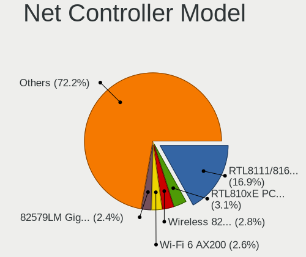

| Model                                                                  | Notebooks | Percent |
|------------------------------------------------------------------------|-----------|---------|
| Realtek RTL8111/8168/8211/8411 PCI Express Gigabit Ethernet Controller | 71        | 16.75%  |
| Realtek RTL810xE PCI Express Fast Ethernet controller                  | 15        | 3.54%   |
| Qualcomm Atheros AR9285 Wireless Network Adapter (PCI-Express)         | 11        | 2.59%   |
| Intel Wi-Fi 6 AX200                                                    | 11        | 2.59%   |
| Intel 82579LM Gigabit Network Connection (Lewisville)                  | 11        | 2.59%   |
| Intel Wireless 8265 / 8275                                             | 10        | 2.36%   |
| Intel Wireless 7260                                                    | 9         | 2.12%   |
| Realtek RTL8153 Gigabit Ethernet Adapter                               | 8         | 1.89%   |
| Intel Wi-Fi 6 AX201                                                    | 8         | 1.89%   |
| Realtek RTL8821CE 802.11ac PCIe Wireless Network Adapter               | 7         | 1.65%   |
| Intel Centrino Advanced-N 6205 [Taylor Peak]                           | 7         | 1.65%   |
| Qualcomm Atheros QCA9565 / AR9565 Wireless Network Adapter             | 6         | 1.42%   |
| Qualcomm Atheros QCA9377 802.11ac Wireless Network Adapter             | 6         | 1.42%   |
| Intel Wireless 8260                                                    | 6         | 1.42%   |
| Intel Comet Lake PCH-LP CNVi WiFi                                      | 6         | 1.42%   |
| Broadcom BCM43142 802.11b/g/n                                          | 6         | 1.42%   |
| Realtek RTL8822BE 802.11a/b/g/n/ac WiFi adapter                        | 5         | 1.18%   |
| Intel Wireless 7265                                                    | 5         | 1.18%   |
| Intel PRO/Wireless 5100 AGN [Shiloh] Network Connection                | 5         | 1.18%   |
| Intel PRO/Wireless 3945ABG [Golan] Network Connection                  | 5         | 1.18%   |
| Intel Ethernet Connection (6) I219-V                                   | 5         | 1.18%   |
| Intel Cannon Point-LP CNVi [Wireless-AC]                               | 5         | 1.18%   |
| Intel Cannon Lake PCH CNVi WiFi                                        | 5         | 1.18%   |
| Intel 82577LM Gigabit Network Connection                               | 5         | 1.18%   |
| Realtek RTL8822CE 802.11ac PCIe Wireless Network Adapter               | 4         | 0.94%   |
| Qualcomm Atheros AR9485 Wireless Network Adapter                       | 4         | 0.94%   |
| MediaTek MT7922 802.11ax PCI Express Wireless Network Adapter          | 4         | 0.94%   |
| Intel Ice Lake-LP PCH CNVi WiFi                                        | 4         | 0.94%   |
| Intel Comet Lake PCH CNVi WiFi                                         | 4         | 0.94%   |
| Intel Centrino Advanced-N 6200                                         | 4         | 0.94%   |
| Intel 82567LM Gigabit Network Connection                               | 4         | 0.94%   |
| Broadcom BCM4313 802.11bgn Wireless Network Adapter                    | 4         | 0.94%   |
| Realtek Killer E2600 GbE Controller                                    | 3         | 0.71%   |
| Ralink RT3290 Wireless 802.11n 1T/1R PCIe                              | 3         | 0.71%   |
| Qualcomm Atheros QCA6174 802.11ac Wireless Network Adapter             | 3         | 0.71%   |
| Qualcomm Atheros AR8131 Gigabit Ethernet                               | 3         | 0.71%   |
| Marvell Group 88E8072 PCI-E Gigabit Ethernet Controller                | 3         | 0.71%   |
| Intel PRO/Wireless 4965 AG or AGN [Kedron] Network Connection          | 3         | 0.71%   |
| Intel Ethernet Connection (7) I219-V                                   | 3         | 0.71%   |
| Intel Ethernet Connection (4) I219-V                                   | 3         | 0.71%   |

Wireless Vendor
---------------

Wireless vendors

| Vendor                | Notebooks | Percent |
|-----------------------|-----------|---------|
| Intel                 | 121       | 54.02%  |
| Qualcomm Atheros      | 35        | 15.63%  |
| Realtek Semiconductor | 27        | 12.05%  |
| Broadcom              | 18        | 8.04%   |
| MediaTek              | 6         | 2.68%   |
| Ralink                | 4         | 1.79%   |
| ASUSTek Computer      | 3         | 1.34%   |
| Sierra Wireless       | 2         | 0.89%   |
| Ralink Technology     | 2         | 0.89%   |
| Hewlett-Packard       | 2         | 0.89%   |
| Dell                  | 2         | 0.89%   |
| Broadcom Limited      | 2         | 0.89%   |

Wireless Model
--------------

Wireless models

| Model                                                                   | Notebooks | Percent |
|-------------------------------------------------------------------------|-----------|---------|
| Qualcomm Atheros AR9285 Wireless Network Adapter (PCI-Express)          | 11        | 4.91%   |
| Intel Wi-Fi 6 AX200                                                     | 11        | 4.91%   |
| Intel Wireless 8265 / 8275                                              | 10        | 4.46%   |
| Intel Wireless 7260                                                     | 9         | 4.02%   |
| Intel Wi-Fi 6 AX201                                                     | 8         | 3.57%   |
| Realtek RTL8821CE 802.11ac PCIe Wireless Network Adapter                | 7         | 3.13%   |
| Intel Centrino Advanced-N 6205 [Taylor Peak]                            | 7         | 3.13%   |
| Qualcomm Atheros QCA9565 / AR9565 Wireless Network Adapter              | 6         | 2.68%   |
| Qualcomm Atheros QCA9377 802.11ac Wireless Network Adapter              | 6         | 2.68%   |
| Intel Wireless 8260                                                     | 6         | 2.68%   |
| Intel Comet Lake PCH-LP CNVi WiFi                                       | 6         | 2.68%   |
| Broadcom BCM43142 802.11b/g/n                                           | 6         | 2.68%   |
| Realtek RTL8822BE 802.11a/b/g/n/ac WiFi adapter                         | 5         | 2.23%   |
| Intel Wireless 7265                                                     | 5         | 2.23%   |
| Intel PRO/Wireless 5100 AGN [Shiloh] Network Connection                 | 5         | 2.23%   |
| Intel PRO/Wireless 3945ABG [Golan] Network Connection                   | 5         | 2.23%   |
| Intel Cannon Point-LP CNVi [Wireless-AC]                                | 5         | 2.23%   |
| Intel Cannon Lake PCH CNVi WiFi                                         | 5         | 2.23%   |
| Realtek RTL8822CE 802.11ac PCIe Wireless Network Adapter                | 4         | 1.79%   |
| Qualcomm Atheros AR9485 Wireless Network Adapter                        | 4         | 1.79%   |
| MediaTek MT7922 802.11ax PCI Express Wireless Network Adapter           | 4         | 1.79%   |
| Intel Ice Lake-LP PCH CNVi WiFi                                         | 4         | 1.79%   |
| Intel Comet Lake PCH CNVi WiFi                                          | 4         | 1.79%   |
| Intel Centrino Advanced-N 6200                                          | 4         | 1.79%   |
| Broadcom BCM4313 802.11bgn Wireless Network Adapter                     | 4         | 1.79%   |
| Ralink RT3290 Wireless 802.11n 1T/1R PCIe                               | 3         | 1.34%   |
| Qualcomm Atheros QCA6174 802.11ac Wireless Network Adapter              | 3         | 1.34%   |
| Intel PRO/Wireless 4965 AG or AGN [Kedron] Network Connection           | 3         | 1.34%   |
| Intel Centrino Ultimate-N 6300                                          | 3         | 1.34%   |
| Intel Alder Lake-P PCH CNVi WiFi                                        | 3         | 1.34%   |
| Realtek RTL8821AE 802.11ac PCIe Wireless Network Adapter                | 2         | 0.89%   |
| Realtek RTL8723BE PCIe Wireless Network Adapter                         | 2         | 0.89%   |
| Qualcomm Atheros AR242x / AR542x Wireless Network Adapter (PCI-Express) | 2         | 0.89%   |
| Intel Wireless 3165                                                     | 2         | 0.89%   |
| Intel Wi-Fi 6E(802.11ax) AX210/AX1675* 2x2 [Typhoon Peak]               | 2         | 0.89%   |
| Intel Wi-Fi 5(802.11ac) Wireless-AC 9x6x [Thunder Peak]                 | 2         | 0.89%   |
| Intel Tiger Lake PCH CNVi WiFi                                          | 2         | 0.89%   |
| Intel Centrino Wireless-N 1030 [Rainbow Peak]                           | 2         | 0.89%   |
| Intel Centrino Advanced-N 6235                                          | 2         | 0.89%   |
| HP lt4112 Gobi 4G Module Network Device                                 | 2         | 0.89%   |

Ethernet Vendor
---------------

Ethernet vendors

| Vendor                           | Notebooks | Percent |
|----------------------------------|-----------|---------|
| Realtek Semiconductor            | 98        | 50.26%  |
| Intel                            | 63        | 32.31%  |
| Qualcomm Atheros                 | 10        | 5.13%   |
| Broadcom                         | 7         | 3.59%   |
| Marvell Technology Group         | 4         | 2.05%   |
| Huawei Technologies              | 3         | 1.54%   |
| Samsung Electronics              | 2         | 1.03%   |
| Lenovo                           | 2         | 1.03%   |
| ASIX Electronics                 | 2         | 1.03%   |
| Xiaomi                           | 1         | 0.51%   |
| Silicon Integrated Systems [SiS] | 1         | 0.51%   |
| JMicron Technology               | 1         | 0.51%   |
| ICS Advent                       | 1         | 0.51%   |

Ethernet Model
--------------

Ethernet models

| Model                                                                  | Notebooks | Percent |
|------------------------------------------------------------------------|-----------|---------|
| Realtek RTL8111/8168/8211/8411 PCI Express Gigabit Ethernet Controller | 71        | 36.22%  |
| Realtek RTL810xE PCI Express Fast Ethernet controller                  | 15        | 7.65%   |
| Intel 82579LM Gigabit Network Connection (Lewisville)                  | 11        | 5.61%   |
| Realtek RTL8153 Gigabit Ethernet Adapter                               | 8         | 4.08%   |
| Intel Ethernet Connection (6) I219-V                                   | 5         | 2.55%   |
| Intel 82577LM Gigabit Network Connection                               | 5         | 2.55%   |
| Intel 82567LM Gigabit Network Connection                               | 4         | 2.04%   |
| Realtek Killer E2600 GbE Controller                                    | 3         | 1.53%   |
| Qualcomm Atheros AR8131 Gigabit Ethernet                               | 3         | 1.53%   |
| Marvell Group 88E8072 PCI-E Gigabit Ethernet Controller                | 3         | 1.53%   |
| Intel Ethernet Connection (7) I219-V                                   | 3         | 1.53%   |
| Intel Ethernet Connection (4) I219-V                                   | 3         | 1.53%   |
| Intel 82562GT 10/100 Network Connection                                | 3         | 1.53%   |
| Huawei STG-LX1                                                         | 3         | 1.53%   |
| Samsung Galaxy series, misc. (tethering mode)                          | 2         | 1.02%   |
| Qualcomm Atheros QCA8172 Fast Ethernet                                 | 2         | 1.02%   |
| Qualcomm Atheros AR8152 v2.0 Fast Ethernet                             | 2         | 1.02%   |
| Qualcomm Atheros AR8151 v2.0 Gigabit Ethernet                          | 2         | 1.02%   |
| Intel PRO/100 VE Network Connection                                    | 2         | 1.02%   |
| Intel Ethernet Connection I219-LM                                      | 2         | 1.02%   |
| Intel Ethernet Connection I218-LM                                      | 2         | 1.02%   |
| Intel Ethernet Connection (7) I219-LM                                  | 2         | 1.02%   |
| Intel Ethernet Connection (6) I219-LM                                  | 2         | 1.02%   |
| Intel Ethernet Connection (4) I219-LM                                  | 2         | 1.02%   |
| Intel Ethernet Connection (3) I218-LM                                  | 2         | 1.02%   |
| Intel Ethernet Connection (10) I219-V                                  | 2         | 1.02%   |
| Intel 82577LC Gigabit Network Connection                               | 2         | 1.02%   |
| Broadcom NetXtreme BCM5755M Gigabit Ethernet PCI Express               | 2         | 1.02%   |
| Broadcom BCM4401-B0 100Base-TX                                         | 2         | 1.02%   |
| Xiaomi Mi/Redmi series (RNDIS)                                         | 1         | 0.51%   |
| Silicon Integrated Systems [SiS] 191 Gigabit Ethernet Adapter          | 1         | 0.51%   |
| Realtek RTL8152 Fast Ethernet Adapter                                  | 1         | 0.51%   |
| Realtek RTL8125 2.5GbE Controller                                      | 1         | 0.51%   |
| Qualcomm Atheros AR8161 Gigabit Ethernet                               | 1         | 0.51%   |
| Marvell Group 88E8055 PCI-E Gigabit Ethernet Controller                | 1         | 0.51%   |
| Lenovo USB-C Dock Ethernet                                             | 1         | 0.51%   |
| Lenovo ThinkPad TBT3 LAN                                               | 1         | 0.51%   |
| JMicron JMC250 PCI Express Gigabit Ethernet Controller                 | 1         | 0.51%   |
| Intel Ethernet Controller I225-V                                       | 1         | 0.51%   |
| Intel Ethernet Connection I219-V                                       | 1         | 0.51%   |

Net Controller Kind
-------------------

Ethernet, WiFi or modem

| Kind     | Notebooks | Percent |
|----------|-----------|---------|
| WiFi     | 211       | 52.75%  |
| Ethernet | 185       | 46.25%  |
| Modem    | 4         | 1%      |

Used Controller
---------------

Currently used network controller

| Kind     | Notebooks | Percent |
|----------|-----------|---------|
| WiFi     | 164       | 72.57%  |
| Ethernet | 62        | 27.43%  |

NICs
----

Total network controllers on board

| Total | Notebooks | Percent |
|-------|-----------|---------|
| 2     | 174       | 82.08%  |
| 1     | 38        | 17.92%  |

IPv6
----

IPv6 vs IPv4

| Used | Notebooks | Percent |
|------|-----------|---------|
| No   | 204       | 95.77%  |
| Yes  | 9         | 4.23%   |

Bluetooth
---------

Bluetooth Vendor
----------------

Controller vendors

| Vendor                          | Notebooks | Percent |
|---------------------------------|-----------|---------|
| Intel                           | 85        | 47.49%  |
| Broadcom                        | 17        | 9.5%    |
| IMC Networks                    | 16        | 8.94%   |
| Qualcomm Atheros Communications | 15        | 8.38%   |
| Realtek Semiconductor           | 14        | 7.82%   |
| Hewlett-Packard                 | 6         | 3.35%   |
| Foxconn / Hon Hai               | 4         | 2.23%   |
| Toshiba                         | 3         | 1.68%   |
| Ralink                          | 3         | 1.68%   |
| Lite-On Technology              | 3         | 1.68%   |
| Cambridge Silicon Radio         | 3         | 1.68%   |
| Foxconn International           | 2         | 1.12%   |
| ASUSTek Computer                | 2         | 1.12%   |
| Askey Computer                  | 2         | 1.12%   |
| Realtek                         | 1         | 0.56%   |
| Ralink Technology               | 1         | 0.56%   |
| Dell                            | 1         | 0.56%   |
| Chicony Electronics             | 1         | 0.56%   |

Bluetooth Model
---------------

Controller models

| Model                                               | Notebooks | Percent |
|-----------------------------------------------------|-----------|---------|
| Intel Bluetooth wireless interface                  | 29        | 16.2%   |
| Intel AX201 Bluetooth                               | 21        | 11.73%  |
| Intel Bluetooth 9460/9560 Jefferson Peak (JfP)      | 12        | 6.7%    |
| Intel AX200 Bluetooth                               | 11        | 6.15%   |
| Realtek Bluetooth Radio                             | 7         | 3.91%   |
| IMC Networks Bluetooth Radio                        | 6         | 3.35%   |
| Qualcomm Atheros AR3011 Bluetooth                   | 5         | 2.79%   |
| Intel Bluetooth Device                              | 5         | 2.79%   |
| Realtek  Bluetooth 4.2 Adapter                      | 4         | 2.23%   |
| Qualcomm Atheros  Bluetooth Device                  | 4         | 2.23%   |
| IMC Networks Bluetooth Device                       | 4         | 2.23%   |
| Broadcom BCM2045B (BDC-2.1)                         | 4         | 2.23%   |
| Ralink RT3290 Bluetooth                             | 3         | 1.68%   |
| Qualcomm Atheros QCA61x4 Bluetooth 4.0              | 3         | 1.68%   |
| Intel Centrino Bluetooth Wireless Transceiver       | 3         | 1.68%   |
| HP Broadcom 2070 Bluetooth Combo                    | 3         | 1.68%   |
| HP Bluetooth 2.0 Interface [Broadcom BCM2045]       | 3         | 1.68%   |
| Foxconn / Hon Hai Wireless_Device                   | 3         | 1.68%   |
| Cambridge Silicon Radio Bluetooth Dongle (HCI mode) | 3         | 1.68%   |
| Toshiba Integrated Bluetooth HCI                    | 2         | 1.12%   |
| Realtek RTL8822BE Bluetooth 4.2 Adapter             | 2         | 1.12%   |
| Qualcomm Atheros AR3012 Bluetooth 4.0               | 2         | 1.12%   |
| Intel AX210 Bluetooth                               | 2         | 1.12%   |
| IMC Networks Wireless_Device                        | 2         | 1.12%   |
| IMC Networks Atheros AR3012 Bluetooth 4.0 Adapter   | 2         | 1.12%   |
| Foxconn International BCM43142A0 Bluetooth module   | 2         | 1.12%   |
| Broadcom BCM20702 Bluetooth 4.0 [ThinkPad]          | 2         | 1.12%   |
| Broadcom BCM2070 Bluetooth 2.1 + EDR                | 2         | 1.12%   |
| Broadcom BCM2045B (BDC-2.1) [Bluetooth Controller]  | 2         | 1.12%   |
| Broadcom BCM2045B (BDC-2) [Bluetooth Controller]    | 2         | 1.12%   |
| ASUS BT-270 Bluetooth Adapter                       | 2         | 1.12%   |
| Askey Bluetooth Device                              | 2         | 1.12%   |
| Toshiba Askey Bluetooth Module                      | 1         | 0.56%   |
| Realtek CSR BS8510                                  | 1         | 0.56%   |
| Realtek Bluetooth Radio                             | 1         | 0.56%   |
| Ralink Motorola BC4 Bluetooth 3.0+HS Adapter        | 1         | 0.56%   |
| Qualcomm Atheros AR9462 Bluetooth                   | 1         | 0.56%   |
| Lite-On Qualcomm Atheros QCA9377 Bluetooth          | 1         | 0.56%   |
| Lite-On Broadcom BCM43142A0 Bluetooth Device        | 1         | 0.56%   |
| Lite-On Bluetooth Device                            | 1         | 0.56%   |

Sound
-----

Sound Vendor
------------

Sound card vendors

| Vendor                           | Notebooks | Percent |
|----------------------------------|-----------|---------|
| Intel                            | 173       | 67.58%  |
| AMD                              | 44        | 17.19%  |
| Nvidia                           | 29        | 11.33%  |
| Lenovo                           | 2         | 0.78%   |
| Hewlett-Packard                  | 2         | 0.78%   |
| Texas Instruments                | 1         | 0.39%   |
| Silicon Integrated Systems [SiS] | 1         | 0.39%   |
| Logitech                         | 1         | 0.39%   |
| KTMicro                          | 1         | 0.39%   |
| JMTek                            | 1         | 0.39%   |
| C-Media Electronics              | 1         | 0.39%   |

Sound Model
-----------

Sound card models

| Model                                                                      | Notebooks | Percent |
|----------------------------------------------------------------------------|-----------|---------|
| AMD Family 17h/19h HD Audio Controller                                     | 27        | 8.77%   |
| Intel Sunrise Point-LP HD Audio                                            | 15        | 4.87%   |
| Intel 6 Series/C200 Series Chipset Family High Definition Audio Controller | 15        | 4.87%   |
| Intel 5 Series/3400 Series Chipset High Definition Audio                   | 15        | 4.87%   |
| Intel 7 Series/C216 Chipset Family High Definition Audio Controller        | 14        | 4.55%   |
| AMD Renoir Radeon High Definition Audio Controller                         | 14        | 4.55%   |
| Intel Cannon Point-LP High Definition Audio Controller                     | 11        | 3.57%   |
| Intel Haswell-ULT HD Audio Controller                                      | 10        | 3.25%   |
| Intel 8 Series HD Audio Controller                                         | 10        | 3.25%   |
| Intel Tiger Lake-LP Smart Sound Technology Audio Controller                | 9         | 2.92%   |
| Intel 82801I (ICH9 Family) HD Audio Controller                             | 9         | 2.92%   |
| Intel Comet Lake PCH-LP cAVS                                               | 8         | 2.6%    |
| Intel 82801H (ICH8 Family) HD Audio Controller                             | 8         | 2.6%    |
| Intel 8 Series/C220 Series Chipset High Definition Audio Controller        | 8         | 2.6%    |
| Intel Cannon Lake PCH cAVS                                                 | 7         | 2.27%   |
| AMD Raven/Raven2/Fenghuang HDMI/DP Audio Controller                        | 7         | 2.27%   |
| Intel Xeon E3-1200 v3/4th Gen Core Processor HD Audio Controller           | 6         | 1.95%   |
| Intel Atom Processor Z36xxx/Z37xxx Series High Definition Audio Controller | 6         | 1.95%   |
| AMD SBx00 Azalia (Intel HDA)                                               | 6         | 1.95%   |
| Intel Wildcat Point-LP High Definition Audio Controller                    | 5         | 1.62%   |
| Intel Broadwell-U Audio Controller                                         | 5         | 1.62%   |
| Intel NM10/ICH7 Family High Definition Audio Controller                    | 4         | 1.3%    |
| Intel Ice Lake-LP Smart Sound Technology Audio Controller                  | 4         | 1.3%    |
| Intel Comet Lake PCH cAVS                                                  | 4         | 1.3%    |
| Intel CM238 HD Audio Controller                                            | 4         | 1.3%    |
| Intel 100 Series/C230 Series Chipset Family HD Audio Controller            | 4         | 1.3%    |
| AMD FCH Azalia Controller                                                  | 4         | 1.3%    |
| Nvidia TU107 GeForce GTX 1650 High Definition Audio Controller             | 3         | 0.97%   |
| Nvidia GP107GL High Definition Audio Controller                            | 3         | 0.97%   |
| Intel Celeron/Pentium Silver Processor High Definition Audio               | 3         | 0.97%   |
| Intel Alder Lake PCH-P High Definition Audio Controller                    | 3         | 0.97%   |
| AMD Cedar HDMI Audio [Radeon HD 5400/6300/7300 Series]                     | 3         | 0.97%   |
| Nvidia TU106 High Definition Audio Controller                              | 2         | 0.65%   |
| Nvidia GP106 High Definition Audio Controller                              | 2         | 0.65%   |
| Nvidia GP104 High Definition Audio Controller                              | 2         | 0.65%   |
| Nvidia GM107 High Definition Audio Controller [GeForce 940MX]              | 2         | 0.65%   |
| Nvidia GF119 HDMI Audio Controller                                         | 2         | 0.65%   |
| Nvidia GA106 High Definition Audio Controller                              | 2         | 0.65%   |
| Nvidia GA104 High Definition Audio Controller                              | 2         | 0.65%   |
| Nvidia Audio device                                                        | 2         | 0.65%   |

Memory
------

Memory Vendor
-------------

Memory module vendors

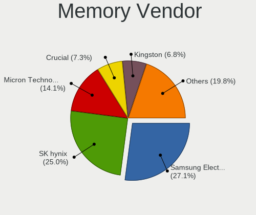

| Vendor              | Notebooks | Percent |
|---------------------|-----------|---------|
| Samsung Electronics | 42        | 27.45%  |
| SK hynix            | 39        | 25.49%  |
| Micron Technology   | 23        | 15.03%  |
| Unknown             | 11        | 7.19%   |
| Crucial             | 11        | 7.19%   |
| Kingston            | 7         | 4.58%   |
| Nanya Technology    | 5         | 3.27%   |
| Ramaxel Technology  | 4         | 2.61%   |
| Elpida              | 4         | 2.61%   |
| Qimonda             | 2         | 1.31%   |
| A-DATA Technology   | 2         | 1.31%   |
| Team                | 1         | 0.65%   |
| Patriot             | 1         | 0.65%   |
| ChangXin Memory     | 1         | 0.65%   |

Memory Model
------------

Memory module models

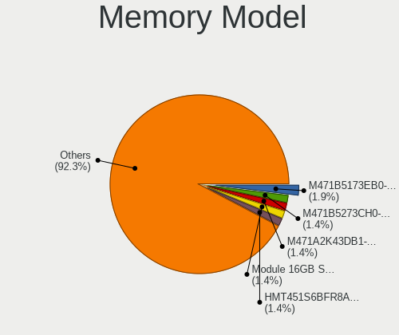

| Model                                                     | Notebooks | Percent |
|-----------------------------------------------------------|-----------|---------|
| SK hynix RAM Module 16GB SODIMM DDR4 3200MT/s             | 3         | 1.79%   |
| SK hynix RAM HMT451S6BFR8A-PB 4GB SODIMM DDR3 1600MT/s    | 3         | 1.79%   |
| SK hynix RAM HMT351S6CFR8C-PB 4GB SODIMM DDR3 1600MT/s    | 3         | 1.79%   |
| SK hynix RAM HMAA2GS6CJR8N-XN 16GB SODIMM DDR4 3200MT/s   | 3         | 1.79%   |
| Samsung RAM M471B5273CH0-CH9 4GB SODIMM DDR3 1334MT/s     | 3         | 1.79%   |
| Samsung RAM M471B5173EB0-YK0 4GB SODIMM DDR3 1600MT/s     | 3         | 1.79%   |
| Samsung RAM M471A2K43DB1-CWE 16GB SODIMM DDR4 3200MT/s    | 3         | 1.79%   |
| Unknown RAM Module 2GB SODIMM DDR2                        | 2         | 1.19%   |
| Unknown RAM Module 2GB Row Of Chips LPDDR4 4267MT/s       | 2         | 1.19%   |
| SK hynix RAM HMT351S6BFR8C-H9 4GB SODIMM DDR3 1333MT/s    | 2         | 1.19%   |
| SK hynix RAM HMA82GS6JJR8N-VK 16GB SODIMM DDR4 2667MT/s   | 2         | 1.19%   |
| SK hynix RAM HMA82GS6AFR8N-UH 16GB SODIMM DDR4 2667MT/s   | 2         | 1.19%   |
| SK hynix RAM HMA81GS6CJR8N-VK 8GB SODIMM DDR4 2667MT/s    | 2         | 1.19%   |
| Samsung RAM Module 8GB SODIMM DDR4 2400MT/s               | 2         | 1.19%   |
| Samsung RAM M471B1G73DB0-YK0 8GB SODIMM DDR3 1600MT/s     | 2         | 1.19%   |
| Samsung RAM M471A1K43DB1-CTD 8GB SODIMM DDR4 2667MT/s     | 2         | 1.19%   |
| Samsung RAM M471A1K43CB1-CTD 8GB SODIMM DDR4 2667MT/s     | 2         | 1.19%   |
| Samsung RAM M471A1G44AB0-CWE 8GB SODIMM DDR4 3200MT/s     | 2         | 1.19%   |
| Nanya RAM NT4GC64B8HG0NS-CG 4GB SODIMM DDR3 1334MT/s      | 2         | 1.19%   |
| Nanya RAM NT2GC64B8HC0NS-CG 2GB SODIMM DDR3 1334MT/s      | 2         | 1.19%   |
| Micron RAM 4ATF1G64HZ-3G2E1 8GB SODIMM DDR4 3200MT/s      | 2         | 1.19%   |
| Micron RAM 16ATF2G64HZ-3G2J1 16GB SODIMM DDR4 3200MT/s    | 2         | 1.19%   |
| Crucial RAM CT8G4SFD824A.M16FF 8GB SODIMM DDR4 2400MT/s   | 2         | 1.19%   |
| Crucial RAM CT16G4SFD8266.M16FJ 16GB SODIMM DDR4 2667MT/s | 2         | 1.19%   |
| Unknown RAM Module 8GB SODIMM DDR3 1333MT/s               | 1         | 0.6%    |
| Unknown RAM Module 8GB Chip DDR4 2133MT/s                 | 1         | 0.6%    |
| Unknown RAM Module 512MB SODIMM DDR2 533MT/s              | 1         | 0.6%    |
| Unknown RAM Module 512MB SODIMM DDR2                      | 1         | 0.6%    |
| Unknown RAM Module 2GB SODIMM DDR2 667MT/s                | 1         | 0.6%    |
| Unknown RAM Module 2048MB SODIMM DRAM                     | 1         | 0.6%    |
| Unknown RAM Module 2048MB SODIMM DDR2 667MT/s             | 1         | 0.6%    |
| Unknown RAM Module 1GB SODIMM DDR2 667MT/s                | 1         | 0.6%    |
| Unknown RAM Module 1024MB SODIMM DDR2 667MT/s             | 1         | 0.6%    |
| Team RAM TEAMGROUP-SD4-2666 16GB SODIMM DDR4 2667MT/s     | 1         | 0.6%    |
| SK hynix RAM Module 8GB SODIMM DDR4 2667MT/s              | 1         | 0.6%    |
| SK hynix RAM Module 8GB SODIMM DDR4 2400MT/s              | 1         | 0.6%    |
| SK hynix RAM Module 8GB Row Of Chips LPDDR3 2133MT/s      | 1         | 0.6%    |
| SK hynix RAM Module 8192MB SODIMM DDR4 2667MT/s           | 1         | 0.6%    |
| SK hynix RAM Module 8192MB SODIMM DDR4 2400MT/s           | 1         | 0.6%    |
| SK hynix RAM Module 4096MB SODIMM DDR3 1600MT/s           | 1         | 0.6%    |

Memory Kind
-----------

Memory module kinds

| Kind   | Notebooks | Percent |
|--------|-----------|---------|
| DDR4   | 59        | 46.83%  |
| DDR3   | 39        | 30.95%  |
| DDR2   | 11        | 8.73%   |
| LPDDR4 | 5         | 3.97%   |
| SDRAM  | 4         | 3.17%   |
| LPDDR3 | 3         | 2.38%   |
| DDR5   | 3         | 2.38%   |
| LPDDR5 | 1         | 0.79%   |
| DRAM   | 1         | 0.79%   |

Memory Form Factor
------------------

Physical design of the memory module

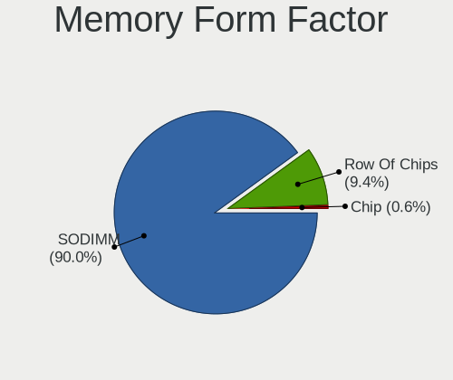

| Name         | Notebooks | Percent |
|--------------|-----------|---------|
| SODIMM       | 116       | 89.92%  |
| Row Of Chips | 12        | 9.3%    |
| Chip         | 1         | 0.78%   |

Memory Size
-----------

Memory module size

| Size  | Notebooks | Percent |
|-------|-----------|---------|
| 8192  | 43        | 31.16%  |
| 16384 | 32        | 23.19%  |
| 4096  | 31        | 22.46%  |
| 2048  | 20        | 14.49%  |
| 1024  | 6         | 4.35%   |
| 32768 | 4         | 2.9%    |
| 512   | 2         | 1.45%   |

Memory Speed
------------

Memory module speed

| Speed   | Notebooks | Percent |
|---------|-----------|---------|
| 2667    | 28        | 20%     |
| 1600    | 26        | 18.57%  |
| 3200    | 22        | 15.71%  |
| 1334    | 11        | 7.86%   |
| 2400    | 10        | 7.14%   |
| 667     | 7         | 5%      |
| 2133    | 6         | 4.29%   |
| 1333    | 6         | 4.29%   |
| Unknown | 4         | 2.86%   |
| 4267    | 3         | 2.14%   |
| 4800    | 2         | 1.43%   |
| 4199    | 2         | 1.43%   |
| 2048    | 2         | 1.43%   |
| 1067    | 2         | 1.43%   |
| 8400    | 1         | 0.71%   |
| 6400    | 1         | 0.71%   |
| 5600    | 1         | 0.71%   |
| 4266    | 1         | 0.71%   |
| 3733    | 1         | 0.71%   |
| 1867    | 1         | 0.71%   |
| 975     | 1         | 0.71%   |
| 800     | 1         | 0.71%   |
| 533     | 1         | 0.71%   |

Printers & scanners
-------------------

Printer Vendor
--------------

Printer device vendors

| Vendor          | Notebooks | Percent |
|-----------------|-----------|---------|
| Xerox           | 1         | 33.33%  |
| Hewlett-Packard | 1         | 33.33%  |
| Canon           | 1         | 33.33%  |

Printer Model
-------------

Printer device models

| Model                   | Notebooks | Percent |
|-------------------------|-----------|---------|
| Xerox Phaser 3010       | 1         | 33.33%  |
| HP DeskJet F4200 series | 1         | 33.33%  |
| Canon PIXMA MP250       | 1         | 33.33%  |

Scanner Vendor
--------------

Scanner device vendors

| Vendor | Notebooks | Percent |
|--------|-----------|---------|
| Canon  | 2         | 100%    |

Scanner Model
-------------

Scanner device models

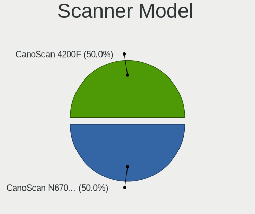

| Model                              | Notebooks | Percent |
|------------------------------------|-----------|---------|
| Canon CanoScan N670U/N676U/LiDE 20 | 1         | 50%     |
| Canon CanoScan 4200F               | 1         | 50%     |

Camera
------

Camera Vendor
-------------

Camera device vendors

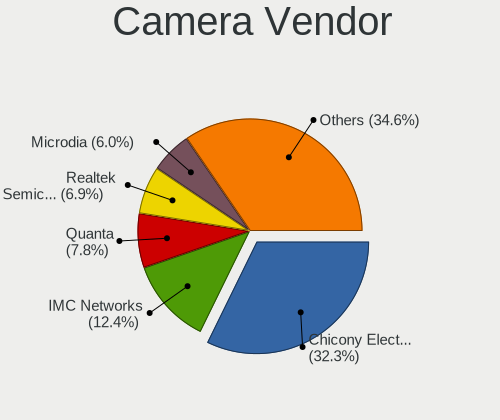

| Vendor                                 | Notebooks | Percent |
|----------------------------------------|-----------|---------|
| Chicony Electronics                    | 57        | 31.32%  |
| IMC Networks                           | 23        | 12.64%  |
| Quanta                                 | 16        | 8.79%   |
| Realtek Semiconductor                  | 14        | 7.69%   |
| Microdia                               | 12        | 6.59%   |
| Sunplus Innovation Technology          | 9         | 4.95%   |
| Bison Electronics                      | 8         | 4.4%    |
| Lite-On Technology                     | 7         | 3.85%   |
| Cheng Uei Precision Industry (Foxlink) | 7         | 3.85%   |
| Syntek                                 | 4         | 2.2%    |
| Lenovo                                 | 4         | 2.2%    |
| Acer                                   | 4         | 2.2%    |
| Suyin                                  | 3         | 1.65%   |
| Primax Electronics                     | 3         | 1.65%   |
| Ricoh                                  | 2         | 1.1%    |
| Generalplus Technology                 | 2         | 1.1%    |
| Unknown (3730304233333731323245)       | 1         | 0.55%   |
| Sonix Technology                       | 1         | 0.55%   |
| Silicon Motion                         | 1         | 0.55%   |
| Samsung Electronics                    | 1         | 0.55%   |
| Luxvisions Innotech Limited            | 1         | 0.55%   |
| Logitech                               | 1         | 0.55%   |
| Apple                                  | 1         | 0.55%   |

Camera Model
------------

Camera device models

| Model                                            | Notebooks | Percent |
|--------------------------------------------------|-----------|---------|
| Chicony Integrated Camera                        | 13        | 7.14%   |
| Microdia Integrated_Webcam_HD                    | 9         | 4.95%   |
| IMC Networks Integrated Camera                   | 8         | 4.4%    |
| IMC Networks USB2.0 HD UVC WebCam                | 6         | 3.3%    |
| Sunplus HP HD Webcam [Fixed]                     | 4         | 2.2%    |
| Quanta HP HD Camera                              | 4         | 2.2%    |
| Chicony HP HD Camera                             | 4         | 2.2%    |
| Bison Integrated Camera                          | 4         | 2.2%    |
| Syntek Lenovo EasyCamera                         | 3         | 1.65%   |
| Realtek USB Camera                               | 3         | 1.65%   |
| Quanta HP TrueVision HD Camera                   | 3         | 1.65%   |
| Primax HP HD Webcam [Fixed]                      | 3         | 1.65%   |
| Lite-On HP HD Webcam                             | 3         | 1.65%   |
| Lenovo Integrated Webcam [R5U877]                | 3         | 1.65%   |
| Chicony HP HD Webcam                             | 3         | 1.65%   |
| Chicony HD Webcam                                | 3         | 1.65%   |
| Cheng Uei Precision Industry (Foxlink) HP Webcam | 3         | 1.65%   |
| Sunplus HD WebCam                                | 2         | 1.1%    |
| Realtek Integrated_Webcam_HD                     | 2         | 1.1%    |
| Realtek Asus laptop camera                       | 2         | 1.1%    |
| Quanta HP Webcam                                 | 2         | 1.1%    |
| Quanta ACER HD User Facing                       | 2         | 1.1%    |
| Lite-On Integrated Camera                        | 2         | 1.1%    |
| Lite-On HP HD Camera                             | 2         | 1.1%    |
| IMC Networks USB2.0 VGA UVC WebCam               | 2         | 1.1%    |
| IMC Networks Integrated Webcam                   | 2         | 1.1%    |
| Generalplus GENERAL WEBCAM                       | 2         | 1.1%    |
| Chicony USB2.0 VGA UVC WebCam                    | 2         | 1.1%    |
| Chicony USB2.0 UVC WebCam                        | 2         | 1.1%    |
| Chicony USB2.0 HD UVC WebCam                     | 2         | 1.1%    |
| Chicony Lenovo EasyCamera                        | 2         | 1.1%    |
| Chicony Integrated Camera [ThinkPad]             | 2         | 1.1%    |
| Chicony Integrated Camera (1280x720@30)          | 2         | 1.1%    |
| Chicony HP Wide Vision HD Camera                 | 2         | 1.1%    |
| Chicony HP Webcam                                | 2         | 1.1%    |
| Chicony HP TrueVision HD Camera                  | 2         | 1.1%    |
| Chicony FJ Camera                                | 2         | 1.1%    |
| Unknown (3730304233333731323245) USB Camera      | 1         | 0.55%   |
| Syntek Integrated Camera                         | 1         | 0.55%   |
| Suyin HP Webcam-50                               | 1         | 0.55%   |

Security
--------

Fingerprint Vendor
------------------

Fingerprint sensor vendors

| Vendor                     | Notebooks | Percent |
|----------------------------|-----------|---------|
| Synaptics                  | 19        | 33.33%  |
| Validity Sensors           | 16        | 28.07%  |
| Shenzhen Goodix Technology | 8         | 14.04%  |
| AuthenTec                  | 6         | 10.53%  |
| Upek                       | 4         | 7.02%   |
| STMicroelectronics         | 2         | 3.51%   |
| Elan Microelectronics      | 2         | 3.51%   |

Fingerprint Model
-----------------

Fingerprint sensor models

| Model                                                                      | Notebooks | Percent |
|----------------------------------------------------------------------------|-----------|---------|
| Synaptics Prometheus MIS Touch Fingerprint Reader                          | 6         | 10.53%  |
| Validity Sensors VFS495 Fingerprint Reader                                 | 5         | 8.77%   |
| Shenzhen Goodix  FingerPrint Device                                        | 5         | 8.77%   |
| Upek Biometric Touchchip/Touchstrip Fingerprint Sensor                     | 4         | 7.02%   |
| Synaptics Metallica MIS Touch Fingerprint Reader                           | 4         | 7.02%   |
| Synaptics Fingerprint reader [HP G6]                                       | 4         | 7.02%   |
| Validity Sensors VFS471 Fingerprint Reader                                 | 3         | 5.26%   |
| Shenzhen Goodix FingerPrint                                                | 3         | 5.26%   |
| Validity Sensors VFS451 Fingerprint Reader                                 | 2         | 3.51%   |
| Synaptics  FS7604 Touch Fingerprint Sensor with PurePrint                  | 2         | 3.51%   |
| STMicroelectronics Fingerprint Reader                                      | 2         | 3.51%   |
| AuthenTec AES2810                                                          | 2         | 3.51%   |
| Validity Sensors VFS7500 Touch Fingerprint Sensor                          | 1         | 1.75%   |
| Validity Sensors VFS5011 Fingerprint Reader                                | 1         | 1.75%   |
| Validity Sensors VFS491                                                    | 1         | 1.75%   |
| Validity Sensors VFS301 Fingerprint Reader                                 | 1         | 1.75%   |
| Validity Sensors VFS 5011 fingerprint sensor                               | 1         | 1.75%   |
| Validity Sensors Synaptics VFS7552 Touch Fingerprint Sensor with PurePrint | 1         | 1.75%   |
| Synaptics UWP WBDI                                                         | 1         | 1.75%   |
| Synaptics Metallica MOH Touch Fingerprint Reader                           | 1         | 1.75%   |
| Synaptics FS7604 Touch Fingerprint Sensor with PurePrint                   | 1         | 1.75%   |
| Elan ELAN:Fingerprint                                                      | 1         | 1.75%   |
| Elan ELAN:ARM-M4                                                           | 1         | 1.75%   |
| AuthenTec Fingerprint Sensor                                               | 1         | 1.75%   |
| AuthenTec AES2550 Fingerprint Sensor                                       | 1         | 1.75%   |
| AuthenTec AES2501 Fingerprint Sensor                                       | 1         | 1.75%   |
| AuthenTec AES1600                                                          | 1         | 1.75%   |

Chipcard Vendor
---------------

Chipcard module vendors

| Vendor      | Notebooks | Percent |
|-------------|-----------|---------|
| Alcor Micro | 9         | 47.37%  |
| Broadcom    | 6         | 31.58%  |
| O2 Micro    | 3         | 15.79%  |
| Upek        | 1         | 5.26%   |

Chipcard Model
--------------

Chipcard module models

| Model                                                                        | Notebooks | Percent |
|------------------------------------------------------------------------------|-----------|---------|
| Alcor Micro AU9540 Smartcard Reader                                          | 9         | 47.37%  |
| O2 Micro OZ776 CCID Smartcard Reader                                         | 3         | 15.79%  |
| Broadcom 58200                                                               | 3         | 15.79%  |
| Upek TouchChip Fingerprint Coprocessor (WBF advanced mode)                   | 1         | 5.26%   |
| Broadcom BCM5880 Secure Applications Processor with fingerprint swipe sensor | 1         | 5.26%   |
| Broadcom BCM5880 Secure Applications Processor                               | 1         | 5.26%   |
| Broadcom 5880                                                                | 1         | 5.26%   |

Unsupported
-----------

Unsupported Devices
-------------------

Total unsupported devices on board

| Total | Notebooks | Percent |
|-------|-----------|---------|
| 0     | 113       | 52.56%  |
| 1     | 71        | 33.02%  |
| 2     | 28        | 13.02%  |
| 3     | 2         | 0.93%   |
| 10    | 1         | 0.47%   |

Unsupported Device Types
------------------------

Types of unsupported devices

| Type                     | Notebooks | Percent |
|--------------------------|-----------|---------|
| Fingerprint reader       | 57        | 41.01%  |
| Graphics card            | 21        | 15.11%  |
| Chipcard                 | 16        | 11.51%  |
| Net/wireless             | 13        | 9.35%   |
| Camera                   | 8         | 5.76%   |
| Bluetooth                | 6         | 4.32%   |
| Multimedia controller    | 5         | 3.6%    |
| Communication controller | 5         | 3.6%    |
| Storage                  | 2         | 1.44%   |
| Card reader              | 2         | 1.44%   |
| Sound                    | 1         | 0.72%   |
| Network                  | 1         | 0.72%   |
| Net/ethernet             | 1         | 0.72%   |
| Flash memory             | 1         | 0.72%   |

