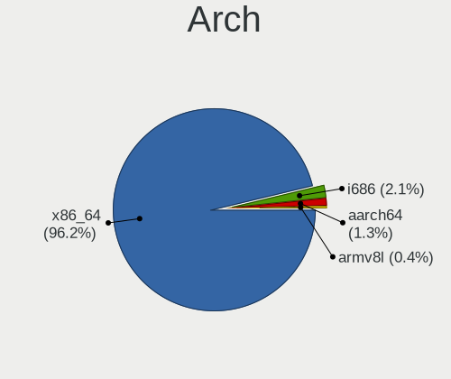
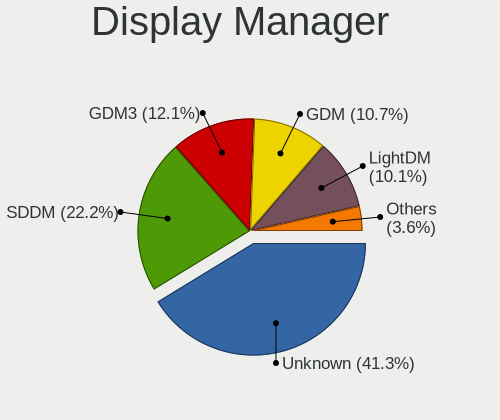
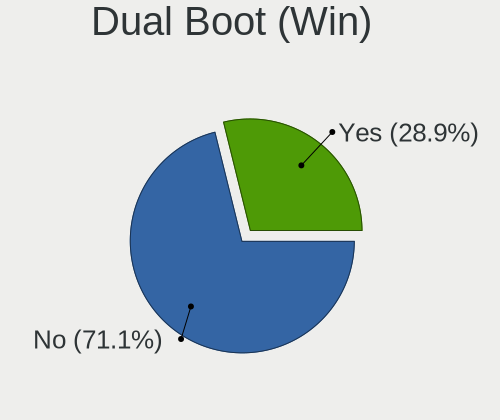
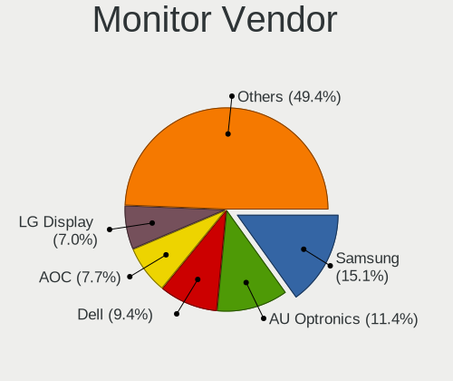
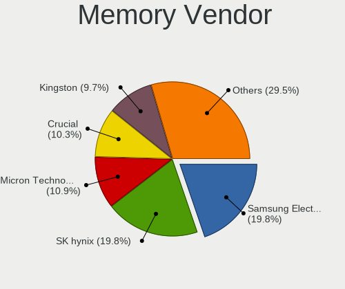
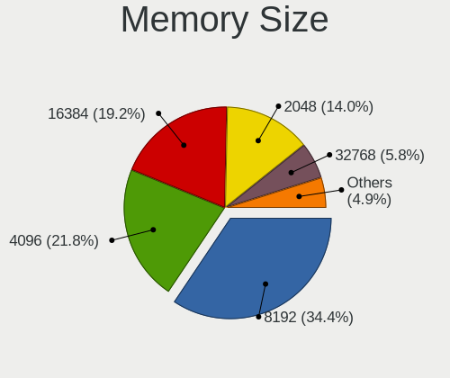
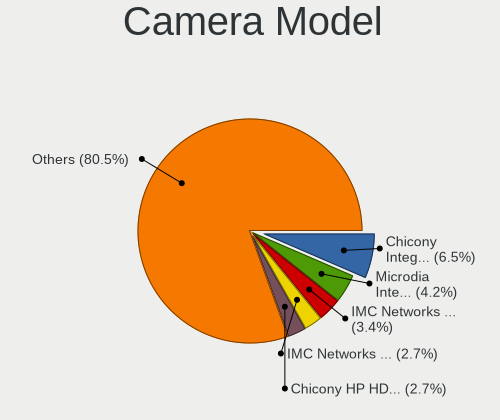

Linux in Slovenia - Tested Hardware & Statistics
------------------------------------------------

A project to collect tested hardware configurations for Linux in Slovenia.

Anyone can contribute to this report by the [hw-probe](https://github.com/linuxhw/hw-probe) tool:

    sudo -E hw-probe -all -upload

Please contribute! Especially if your hardware is rare.

This is a report for all computer types. See also reports for [desktops](/Location/Slovenia/Desktop/README.md) and [notebooks](/Location/Slovenia/Notebook/README.md).

Contents
--------

* [ Test Cases ](#test-cases)

* [ System ](#system)
  - [ OS                       ](#os)
  - [ OS Family                ](#os-family)
  - [ Kernel                   ](#kernel)
  - [ Kernel Family            ](#kernel-family)
  - [ Kernel Major Ver.        ](#kernel-major-ver)
  - [ Arch                     ](#arch)
  - [ DE                       ](#de)
  - [ Display Server           ](#display-server)
  - [ Display Manager          ](#display-manager)
  - [ OS Lang                  ](#os-lang)
  - [ Boot Mode                ](#boot-mode)
  - [ Filesystem               ](#filesystem)
  - [ Part. scheme             ](#part-scheme)
  - [ Dual Boot with Linux/BSD ](#dual-boot-with-linuxbsd)
  - [ Dual Boot (Win)          ](#dual-boot-win)

* [ Board ](#board)
  - [ Vendor                   ](#vendor)
  - [ Model                    ](#model)
  - [ Model Family             ](#model-family)
  - [ MFG Year                 ](#mfg-year)
  - [ Form Factor              ](#form-factor)
  - [ Secure Boot              ](#secure-boot)
  - [ Coreboot                 ](#coreboot)
  - [ RAM Size                 ](#ram-size)
  - [ RAM Used                 ](#ram-used)
  - [ Total Drives             ](#total-drives)
  - [ Has CD-ROM               ](#has-cd-rom)
  - [ Has Ethernet             ](#has-ethernet)
  - [ Has WiFi                 ](#has-wifi)
  - [ Has Bluetooth            ](#has-bluetooth)

* [ Location ](#location)
  - [ Country                  ](#country)
  - [ City                     ](#city)

* [ Drives ](#drives)
  - [ Drive Vendor             ](#drive-vendor)
  - [ Drive Model              ](#drive-model)
  - [ HDD Vendor               ](#hdd-vendor)
  - [ SSD Vendor               ](#ssd-vendor)
  - [ Drive Kind               ](#drive-kind)
  - [ Drive Connector          ](#drive-connector)
  - [ Drive Size               ](#drive-size)
  - [ Space Total              ](#space-total)
  - [ Space Used               ](#space-used)
  - [ Malfunc. Drives          ](#malfunc-drives)
  - [ Malfunc. Drive Vendor    ](#malfunc-drive-vendor)
  - [ Malfunc. HDD Vendor      ](#malfunc-hdd-vendor)
  - [ Malfunc. Drive Kind      ](#malfunc-drive-kind)
  - [ Failed Drives            ](#failed-drives)
  - [ Failed Drive Vendor      ](#failed-drive-vendor)
  - [ Drive Status             ](#drive-status)

* [ Storage controller ](#storage-controller)
  - [ Storage Vendor           ](#storage-vendor)
  - [ Storage Model            ](#storage-model)
  - [ Storage Kind             ](#storage-kind)

* [ Processor ](#processor)
  - [ CPU Vendor               ](#cpu-vendor)
  - [ CPU Model                ](#cpu-model)
  - [ CPU Model Family         ](#cpu-model-family)
  - [ CPU Cores                ](#cpu-cores)
  - [ CPU Sockets              ](#cpu-sockets)
  - [ CPU Threads              ](#cpu-threads)
  - [ CPU Op-Modes             ](#cpu-op-modes)
  - [ CPU Microcode            ](#cpu-microcode)
  - [ CPU Microarch            ](#cpu-microarch)

* [ Graphics ](#graphics)
  - [ GPU Vendor               ](#gpu-vendor)
  - [ GPU Model                ](#gpu-model)
  - [ GPU Combo                ](#gpu-combo)
  - [ GPU Driver               ](#gpu-driver)
  - [ GPU Memory               ](#gpu-memory)

* [ Monitor ](#monitor)
  - [ Monitor Vendor           ](#monitor-vendor)
  - [ Monitor Model            ](#monitor-model)
  - [ Monitor Resolution       ](#monitor-resolution)
  - [ Monitor Diagonal         ](#monitor-diagonal)
  - [ Monitor Width            ](#monitor-width)
  - [ Aspect Ratio             ](#aspect-ratio)
  - [ Monitor Area             ](#monitor-area)
  - [ Pixel Density            ](#pixel-density)
  - [ Multiple Monitors        ](#multiple-monitors)

* [ Network ](#network)
  - [ Net Controller Vendor    ](#net-controller-vendor)
  - [ Net Controller Model     ](#net-controller-model)
  - [ Wireless Vendor          ](#wireless-vendor)
  - [ Wireless Model           ](#wireless-model)
  - [ Ethernet Vendor          ](#ethernet-vendor)
  - [ Ethernet Model           ](#ethernet-model)
  - [ Net Controller Kind      ](#net-controller-kind)
  - [ Used Controller          ](#used-controller)
  - [ NICs                     ](#nics)
  - [ IPv6                     ](#ipv6)

* [ Bluetooth ](#bluetooth)
  - [ Bluetooth Vendor         ](#bluetooth-vendor)
  - [ Bluetooth Model          ](#bluetooth-model)

* [ Sound ](#sound)
  - [ Sound Vendor             ](#sound-vendor)
  - [ Sound Model              ](#sound-model)

* [ Memory ](#memory)
  - [ Memory Vendor            ](#memory-vendor)
  - [ Memory Model             ](#memory-model)
  - [ Memory Kind              ](#memory-kind)
  - [ Memory Form Factor       ](#memory-form-factor)
  - [ Memory Size              ](#memory-size)
  - [ Memory Speed             ](#memory-speed)

* [ Printers & scanners ](#printers--scanners)
  - [ Printer Vendor           ](#printer-vendor)
  - [ Printer Model            ](#printer-model)
  - [ Scanner Vendor           ](#scanner-vendor)
  - [ Scanner Model            ](#scanner-model)

* [ Camera ](#camera)
  - [ Camera Vendor            ](#camera-vendor)
  - [ Camera Model             ](#camera-model)

* [ Security ](#security)
  - [ Fingerprint Vendor       ](#fingerprint-vendor)
  - [ Fingerprint Model        ](#fingerprint-model)
  - [ Chipcard Vendor          ](#chipcard-vendor)
  - [ Chipcard Model           ](#chipcard-model)

* [ Unsupported ](#unsupported)
  - [ Unsupported Devices      ](#unsupported-devices)
  - [ Unsupported Device Types ](#unsupported-device-types)

Test Cases
----------

Total: 746

| Vendor        | Model                       | Form-Factor | Probe                                                      | Date         |
|---------------|-----------------------------|-------------|------------------------------------------------------------|--------------|
| Lenovo        | IdeaPad 5 2-in-1 14AHP9 ... | Convertible | [9b54eb722d](https://linux-hardware.org/?probe=9b54eb722d) | Jan 05, 2025 |
| Lenovo        | ThinkPad P14s Gen 3 21J5... | Notebook    | [d99505e615](https://linux-hardware.org/?probe=d99505e615) | Dec 31, 2024 |
| Lenovo        | 31900058 STD                | All in one  | [4eb5763e89](https://linux-hardware.org/?probe=4eb5763e89) | Dec 29, 2024 |
| Dell          | Latitude 14 Rugged (5404... | Notebook    | [ff70c71f76](https://linux-hardware.org/?probe=ff70c71f76) | Dec 26, 2024 |
| Gigabyte      | B85-HD3                     | Desktop     | [9fc43e3fa9](https://linux-hardware.org/?probe=9fc43e3fa9) | Dec 25, 2024 |
| Gigabyte      | B650 AORUS ELITE AX V2      | Desktop     | [1cc758dd90](https://linux-hardware.org/?probe=1cc758dd90) | Dec 23, 2024 |
| MSI           | B450 TOMAHAWK MAX           | Desktop     | [7386613d29](https://linux-hardware.org/?probe=7386613d29) | Dec 23, 2024 |
| ASUSTek       | VivoBook 14_ASUS Laptop ... | Notebook    | [8e7f60e511](https://linux-hardware.org/?probe=8e7f60e511) | Dec 23, 2024 |
| ASUSTek       | VivoBook 14_ASUS Laptop ... | Notebook    | [b7da8ab4d5](https://linux-hardware.org/?probe=b7da8ab4d5) | Dec 23, 2024 |
| TUXEDO        | Aura 15 Gen1                | Notebook    | [c4af5fafe4](https://linux-hardware.org/?probe=c4af5fafe4) | Dec 21, 2024 |
| ASUSTek       | PRIME A320M-K               | Desktop     | [03151f3639](https://linux-hardware.org/?probe=03151f3639) | Dec 05, 2024 |
| Clevo         | W35_37ET                    | Notebook    | [8c4d3d1caa](https://linux-hardware.org/?probe=8c4d3d1caa) | Nov 30, 2024 |
| Clevo         | W35_37ET                    | Notebook    | [4b7ce97c36](https://linux-hardware.org/?probe=4b7ce97c36) | Nov 30, 2024 |
| Unknown       | Unknown                     | Other       | [ffee17182f](https://linux-hardware.org/?probe=ffee17182f) | Nov 28, 2024 |
| Dell          | Inspiron 5570               | Notebook    | [d8fe08107c](https://linux-hardware.org/?probe=d8fe08107c) | Nov 27, 2024 |
| Shenzhen s... | miniPC                      | Desktop     | [51b66542ff](https://linux-hardware.org/?probe=51b66542ff) | Nov 25, 2024 |
| Lenovo        | 31900058 STD                | All in one  | [bebe350b46](https://linux-hardware.org/?probe=bebe350b46) | Nov 25, 2024 |
| ASUSTek       | X510UNR                     | Notebook    | [9fc9d25b5f](https://linux-hardware.org/?probe=9fc9d25b5f) | Nov 24, 2024 |
| ASUSTek       | TUF Gaming B660M-PLUS WI... | Desktop     | [5b576dfbd4](https://linux-hardware.org/?probe=5b576dfbd4) | Nov 19, 2024 |
| ASRock        | A320M Pro4                  | Desktop     | [69c029ae2e](https://linux-hardware.org/?probe=69c029ae2e) | Nov 18, 2024 |
| Lenovo        | IdeaPad 5 2-in-1 14AHP9 ... | Convertible | [6e16255a96](https://linux-hardware.org/?probe=6e16255a96) | Nov 15, 2024 |
| Lenovo        | ThinkPad T410 253725G       | Notebook    | [2f352dba44](https://linux-hardware.org/?probe=2f352dba44) | Nov 11, 2024 |
| Dell          | Latitude 14 Rugged (5404... | Notebook    | [d5e9aab0ad](https://linux-hardware.org/?probe=d5e9aab0ad) | Nov 08, 2024 |
| Lenovo        | ThinkPad P16s Gen 1 21CK... | Notebook    | [6bfe7b8d66](https://linux-hardware.org/?probe=6bfe7b8d66) | Nov 02, 2024 |
| ASUSTek       | ASUS EXPERTBOOK B5404CMA... | Notebook    | [cb52c24436](https://linux-hardware.org/?probe=cb52c24436) | Oct 30, 2024 |
| Notebook      | NS5x_NS7xPU                 | Notebook    | [82b158b778](https://linux-hardware.org/?probe=82b158b778) | Oct 30, 2024 |
| HP            | 255 G7 Notebook PC          | Notebook    | [7547bc75a9](https://linux-hardware.org/?probe=7547bc75a9) | Oct 29, 2024 |
| Sun Micros... | Ultra 27 52                 | Desktop     | [0f59d982bf](https://linux-hardware.org/?probe=0f59d982bf) | Oct 29, 2024 |
| Dell          | Latitude 7640               | Notebook    | [db98adb76d](https://linux-hardware.org/?probe=db98adb76d) | Oct 28, 2024 |
| ASUSTek       | N552VX                      | Notebook    | [125f09bd6b](https://linux-hardware.org/?probe=125f09bd6b) | Oct 27, 2024 |
| ASUSTek       | TUF Gaming B760M-PLUS       | Desktop     | [aefe5002a6](https://linux-hardware.org/?probe=aefe5002a6) | Oct 27, 2024 |
| Dell          | XPS 15 9530                 | Notebook    | [22b47c8319](https://linux-hardware.org/?probe=22b47c8319) | Oct 25, 2024 |
| ASUSTek       | SABERTOOTH Z77              | Desktop     | [46c6dbdba4](https://linux-hardware.org/?probe=46c6dbdba4) | Oct 24, 2024 |
| Lenovo        | 3730 SDK0J40700 WIN 3258... | Desktop     | [3b25a86203](https://linux-hardware.org/?probe=3b25a86203) | Oct 12, 2024 |
| HP            | 3396                        | Desktop     | [96f0a19516](https://linux-hardware.org/?probe=96f0a19516) | Oct 11, 2024 |
| Lenovo        | 31900058 STD                | All in one  | [306f7a3dfa](https://linux-hardware.org/?probe=306f7a3dfa) | Oct 06, 2024 |
| HP            | 3647h                       | Desktop     | [13f1cfebb3](https://linux-hardware.org/?probe=13f1cfebb3) | Oct 03, 2024 |
| ASRock        | B650E Taichi Lite           | Desktop     | [5ab1034596](https://linux-hardware.org/?probe=5ab1034596) | Sep 29, 2024 |
| Apple         | MacBookPro11,5              | Notebook    | [7680c404f8](https://linux-hardware.org/?probe=7680c404f8) | Sep 29, 2024 |
| ASRock        | Z390 Pro4                   | Desktop     | [c8c75cfab5](https://linux-hardware.org/?probe=c8c75cfab5) | Sep 28, 2024 |
| Gigabyte      | Z370 AORUS Ultra Gaming-... | Desktop     | [d04852d9b1](https://linux-hardware.org/?probe=d04852d9b1) | Sep 26, 2024 |
| Dell          | Latitude 7640               | Notebook    | [c90fe866d1](https://linux-hardware.org/?probe=c90fe866d1) | Sep 26, 2024 |
| ASUSTek       | ZenBook UX325UA_UM325UA     | Notebook    | [62e1a9a394](https://linux-hardware.org/?probe=62e1a9a394) | Sep 20, 2024 |
| ASRock        | B650 LiveMixer              | Desktop     | [d93a1235de](https://linux-hardware.org/?probe=d93a1235de) | Sep 18, 2024 |
| MSI           | B650M GAMING PLUS WIFI      | Desktop     | [34e5a8dcd4](https://linux-hardware.org/?probe=34e5a8dcd4) | Sep 17, 2024 |
| ASUSTek       | X99-A/USB                   | Desktop     | [151237208c](https://linux-hardware.org/?probe=151237208c) | Sep 12, 2024 |
| ASUSTek       | ROG Strix G513RM_G513RM     | Notebook    | [ef8c47b1d9](https://linux-hardware.org/?probe=ef8c47b1d9) | Sep 12, 2024 |
| ASUSTek       | P5KPL-AM SE                 | Desktop     | [6759b6dbf3](https://linux-hardware.org/?probe=6759b6dbf3) | Sep 11, 2024 |
| Microsoft     | Surface Go                  | Tablet      | [7d2e901fca](https://linux-hardware.org/?probe=7d2e901fca) | Sep 10, 2024 |
| HP            | EliteBook 850 G2            | Notebook    | [564d24fc5f](https://linux-hardware.org/?probe=564d24fc5f) | Sep 10, 2024 |
| Lenovo        | 31900058 STD or WIN         | Desktop     | [ce3389610d](https://linux-hardware.org/?probe=ce3389610d) | Sep 10, 2024 |
| HP            | 8592                        | Desktop     | [abba683c46](https://linux-hardware.org/?probe=abba683c46) | Sep 08, 2024 |
| Gigabyte      | AX370-Gaming K7             | Desktop     | [de310bfbfe](https://linux-hardware.org/?probe=de310bfbfe) | Sep 03, 2024 |
| HP            | 8592                        | Desktop     | [d7f2c9eb4c](https://linux-hardware.org/?probe=d7f2c9eb4c) | Aug 29, 2024 |
| Lenovo        | 31900058 STD                | All in one  | [3fe2fd0176](https://linux-hardware.org/?probe=3fe2fd0176) | Aug 28, 2024 |
| HP            | ProBook 450 G6              | Notebook    | [3c8383394f](https://linux-hardware.org/?probe=3c8383394f) | Aug 25, 2024 |
| ASUSTek       | PRIME B650M-A II            | Desktop     | [435c79deb6](https://linux-hardware.org/?probe=435c79deb6) | Aug 25, 2024 |
| Lenovo        | SHARKBAY SDK0E50510 WIN     | Desktop     | [3d53c7ed41](https://linux-hardware.org/?probe=3d53c7ed41) | Aug 25, 2024 |
| HP            | ProBook 450 G6              | Notebook    | [6b40bb2382](https://linux-hardware.org/?probe=6b40bb2382) | Aug 23, 2024 |
| ASRock        | B650 LiveMixer              | Desktop     | [59e07607bc](https://linux-hardware.org/?probe=59e07607bc) | Aug 22, 2024 |
| ASUSTek       | ROG Zephyrus G14 GA401QC... | Notebook    | [d2bf0e7e39](https://linux-hardware.org/?probe=d2bf0e7e39) | Aug 18, 2024 |
| Lenovo        | 3098 SDK0E50510 WIN         | Desktop     | [01ce9d6528](https://linux-hardware.org/?probe=01ce9d6528) | Aug 16, 2024 |
| Lenovo        | ThinkPad T480 20L6S03X1H    | Notebook    | [c4c6048c05](https://linux-hardware.org/?probe=c4c6048c05) | Aug 09, 2024 |
| Dell          | Latitude 7640               | Notebook    | [cd57286388](https://linux-hardware.org/?probe=cd57286388) | Aug 08, 2024 |
| HP            | Compaq 6820s                | Notebook    | [6a3adf5719](https://linux-hardware.org/?probe=6a3adf5719) | Aug 04, 2024 |
| HP            | EliteBook 830 G5            | Notebook    | [0eb2a6c9e7](https://linux-hardware.org/?probe=0eb2a6c9e7) | Aug 02, 2024 |
| Nvidia        | Jetson Orin NX Engineeri... | Soc         | [9bd5c753c8](https://linux-hardware.org/?probe=9bd5c753c8) | Aug 02, 2024 |
| ASUSTek       | ZenBook UX450FDX_UX480FD    | Notebook    | [88e46768ac](https://linux-hardware.org/?probe=88e46768ac) | Jul 27, 2024 |
| Toshiba       | Satellite L650              | Notebook    | [c6baf57189](https://linux-hardware.org/?probe=c6baf57189) | Jul 20, 2024 |
| Gigabyte      | EX58-UD3R                   | Desktop     | [5e7086985d](https://linux-hardware.org/?probe=5e7086985d) | Jul 10, 2024 |
| Acer          | Aspire A515-47              | Notebook    | [2d5cce174d](https://linux-hardware.org/?probe=2d5cce174d) | Jul 10, 2024 |
| Acer          | Aspire A515-47              | Notebook    | [5f4f7526e8](https://linux-hardware.org/?probe=5f4f7526e8) | Jul 10, 2024 |
| Gigabyte      | G41MT-S2                    | Desktop     | [d468d4f9bd](https://linux-hardware.org/?probe=d468d4f9bd) | Jul 04, 2024 |
| HP            | Compaq nw8440 (RH415EA#A... | Notebook    | [c12a51db40](https://linux-hardware.org/?probe=c12a51db40) | Jun 26, 2024 |
| HP            | Compaq nw8440 (RH415EA#A... | Notebook    | [5b21cd9393](https://linux-hardware.org/?probe=5b21cd9393) | Jun 26, 2024 |
| Lenovo        | IdeaPad Pro 5 16ARP8 83A... | Notebook    | [a40ce4c093](https://linux-hardware.org/?probe=a40ce4c093) | Jun 18, 2024 |
| Lenovo        | ThinkPad P16s Gen 1 21CK... | Notebook    | [c9a4221ee5](https://linux-hardware.org/?probe=c9a4221ee5) | Jun 14, 2024 |
| SLIMBOOK      | EXCALIBUR-16-AMD7           | Notebook    | [5b9182e0c0](https://linux-hardware.org/?probe=5b9182e0c0) | Jun 10, 2024 |
| HP            | ProBook 470 G4              | Notebook    | [ad0c9b74a2](https://linux-hardware.org/?probe=ad0c9b74a2) | May 31, 2024 |
| HP            | Laptop 15-ra0xx             | Notebook    | [0be312cffc](https://linux-hardware.org/?probe=0be312cffc) | May 28, 2024 |
| MSI           | B450 GAMING PLUS MAX        | Desktop     | [a33215a452](https://linux-hardware.org/?probe=a33215a452) | May 27, 2024 |
| Gigabyte      | H61M-S2PV                   | Desktop     | [5fb5dd4b81](https://linux-hardware.org/?probe=5fb5dd4b81) | May 26, 2024 |
| ASUSTek       | ROG STRIX B650E-F GAMING... | Desktop     | [1ec3a98637](https://linux-hardware.org/?probe=1ec3a98637) | May 21, 2024 |
| SLIMBOOK      | EXCALIBUR-16-AMD7           | Notebook    | [aa1f7ff9ac](https://linux-hardware.org/?probe=aa1f7ff9ac) | May 21, 2024 |
| Lenovo        | Yoga Slim 7 ProX 14ARH7 ... | Notebook    | [0c1cb2dc27](https://linux-hardware.org/?probe=0c1cb2dc27) | May 12, 2024 |
| Lenovo        | Legion Y530-15ICH 81FV      | Notebook    | [e3f9b42de5](https://linux-hardware.org/?probe=e3f9b42de5) | May 12, 2024 |
| HP            | EliteBook 840 G4            | Notebook    | [d725ec8595](https://linux-hardware.org/?probe=d725ec8595) | May 09, 2024 |
| SLIMBOOK      | HERO-S-TGL-RTX              | Notebook    | [eac9faa98c](https://linux-hardware.org/?probe=eac9faa98c) | May 03, 2024 |
| Gigabyte      | X99-UD7 WIFI-CF             | Desktop     | [b7389a656c](https://linux-hardware.org/?probe=b7389a656c) | Apr 27, 2024 |
| Gigabyte      | Z68MA-D2H-B3                | Desktop     | [d9d4c8fda0](https://linux-hardware.org/?probe=d9d4c8fda0) | Apr 21, 2024 |
| Chuwi         | CoreBook X                  | Notebook    | [deafd4078a](https://linux-hardware.org/?probe=deafd4078a) | Apr 20, 2024 |
| HP            | Laptop 15s-eq2xxx           | Notebook    | [16bde4de91](https://linux-hardware.org/?probe=16bde4de91) | Apr 13, 2024 |
| HP            | 886C                        | Desktop     | [c36efe4b45](https://linux-hardware.org/?probe=c36efe4b45) | Mar 30, 2024 |
| Gigabyte      | B650 GAMING X AX V2         | Desktop     | [82d7d88e80](https://linux-hardware.org/?probe=82d7d88e80) | Mar 25, 2024 |
| ASUSTek       | Vivobook Go E1504FA_E150... | Notebook    | [1b76135004](https://linux-hardware.org/?probe=1b76135004) | Mar 24, 2024 |
| ASUSTek       | Vivobook Go E1504FA_E150... | Notebook    | [32321231e1](https://linux-hardware.org/?probe=32321231e1) | Mar 24, 2024 |
| HP            | EliteBook 8570w             | Notebook    | [4b83d77529](https://linux-hardware.org/?probe=4b83d77529) | Mar 10, 2024 |
| HP            | EliteBook 830 G5            | Notebook    | [b999903479](https://linux-hardware.org/?probe=b999903479) | Mar 09, 2024 |
| Intel         | NUC5CPYB H61145-413         | Mini pc     | [2835f6c70b](https://linux-hardware.org/?probe=2835f6c70b) | Mar 04, 2024 |
| Gigabyte      | Z68P-DS3                    | Desktop     | [68be72f718](https://linux-hardware.org/?probe=68be72f718) | Mar 01, 2024 |
| Acer          | Aspire 5742G                | Notebook    | [ec33f6391f](https://linux-hardware.org/?probe=ec33f6391f) | Feb 27, 2024 |
| Acer          | Aspire 5742G                | Notebook    | [4ab95b25ed](https://linux-hardware.org/?probe=4ab95b25ed) | Feb 24, 2024 |
| Gigabyte      | B450 AORUS ELITE            | Desktop     | [a0d12d4111](https://linux-hardware.org/?probe=a0d12d4111) | Feb 21, 2024 |
| HP            | ProBook 4730s               | Notebook    | [e3bd4bfeae](https://linux-hardware.org/?probe=e3bd4bfeae) | Feb 16, 2024 |
| HP            | ProBook 4730s               | Notebook    | [b71e2386cc](https://linux-hardware.org/?probe=b71e2386cc) | Feb 16, 2024 |
| Sony          | SVF1521V1EB                 | Notebook    | [ec01d30645](https://linux-hardware.org/?probe=ec01d30645) | Feb 12, 2024 |
| HP            | ProBook 450 G3              | Notebook    | [d367c2a560](https://linux-hardware.org/?probe=d367c2a560) | Feb 11, 2024 |
| Lenovo        | ThinkPad Edge E545 20B20... | Notebook    | [4ee3aae45e](https://linux-hardware.org/?probe=4ee3aae45e) | Feb 11, 2024 |
| HP            | 3647h                       | Desktop     | [f504108ab7](https://linux-hardware.org/?probe=f504108ab7) | Feb 10, 2024 |
| Sony          | SVF1521V1EB                 | Notebook    | [3ec5455de7](https://linux-hardware.org/?probe=3ec5455de7) | Feb 10, 2024 |
| Lenovo        | ThinkPad Edge E545 20B20... | Notebook    | [f5fd1fd3ae](https://linux-hardware.org/?probe=f5fd1fd3ae) | Feb 09, 2024 |
| Acer          | Swift SFX14-51G             | Notebook    | [9649ed5351](https://linux-hardware.org/?probe=9649ed5351) | Feb 05, 2024 |
| ASUSTek       | VivoBook 17_ASUS Laptop ... | Notebook    | [51c4f07d2f](https://linux-hardware.org/?probe=51c4f07d2f) | Feb 04, 2024 |
| ASUSTek       | VivoBook 17_ASUS Laptop ... | Notebook    | [ba4fdf1b5b](https://linux-hardware.org/?probe=ba4fdf1b5b) | Feb 04, 2024 |
| Lenovo        | 31900058 STD                | All in one  | [a459170172](https://linux-hardware.org/?probe=a459170172) | Feb 04, 2024 |
| Fujitsu Si... | AMILO Pro Edition V3505     | Notebook    | [3e0e2fd80a](https://linux-hardware.org/?probe=3e0e2fd80a) | Feb 03, 2024 |
| Intel         | NUC5CPYB H61145-412         | Mini pc     | [920618f3ab](https://linux-hardware.org/?probe=920618f3ab) | Jan 27, 2024 |
| Lenovo        | IdeaPad 3 15ITL6 82H8       | Notebook    | [5fac7fde98](https://linux-hardware.org/?probe=5fac7fde98) | Jan 27, 2024 |
| ASUSTek       | SABERTOOTH Z77              | Desktop     | [94b425089f](https://linux-hardware.org/?probe=94b425089f) | Jan 24, 2024 |
| Lenovo        | ThinkPad X380 Yoga 20LJS... | Convertible | [85a99e5858](https://linux-hardware.org/?probe=85a99e5858) | Jan 23, 2024 |
| HP            | Pavilion Notebook           | Notebook    | [91f1ca34ad](https://linux-hardware.org/?probe=91f1ca34ad) | Jan 19, 2024 |
| HP            | Pavilion dv1000 (EW489EA... | Notebook    | [ea4b49f529](https://linux-hardware.org/?probe=ea4b49f529) | Jan 17, 2024 |
| Gigabyte      | X470 AORUS ULTRA GAMING-... | Desktop     | [360a430907](https://linux-hardware.org/?probe=360a430907) | Jan 09, 2024 |
| Gigabyte      | X470 AORUS ULTRA GAMING-... | Desktop     | [615d88f290](https://linux-hardware.org/?probe=615d88f290) | Jan 05, 2024 |
| ASRock        | H61M-VG4                    | Desktop     | [6eee51a63f](https://linux-hardware.org/?probe=6eee51a63f) | Dec 31, 2023 |
| ASRock        | H61M-VG4                    | Desktop     | [1c5959e766](https://linux-hardware.org/?probe=1c5959e766) | Dec 31, 2023 |
| Lenovo        | IdeaPad Pro 5 16APH8 83A... | Notebook    | [de6b5ead5b](https://linux-hardware.org/?probe=de6b5ead5b) | Dec 24, 2023 |
| Lenovo        | 3181 NO DPK                 | Mini pc     | [441eb7b439](https://linux-hardware.org/?probe=441eb7b439) | Dec 24, 2023 |
| Lenovo        | ThinkPad T410 2537E82       | Notebook    | [d153c701cc](https://linux-hardware.org/?probe=d153c701cc) | Dec 23, 2023 |
| Lenovo        | ThinkPad T410 2537E82       | Notebook    | [398233e395](https://linux-hardware.org/?probe=398233e395) | Dec 23, 2023 |
| RuggedPC      | RuggedPadY22                | Tablet      | [80f7f9c98a](https://linux-hardware.org/?probe=80f7f9c98a) | Dec 20, 2023 |
| Dell          | XPS 15 9500                 | Notebook    | [941f6d849a](https://linux-hardware.org/?probe=941f6d849a) | Dec 18, 2023 |
| RuggedPC      | RuggedPadY22                | Tablet      | [da34d3936d](https://linux-hardware.org/?probe=da34d3936d) | Dec 18, 2023 |
| RuggedPC      | RuggedPadY22                | Tablet      | [ce943a3a49](https://linux-hardware.org/?probe=ce943a3a49) | Dec 15, 2023 |
| RuggedPC      | RuggedPadY22                | Tablet      | [cb9765df38](https://linux-hardware.org/?probe=cb9765df38) | Dec 12, 2023 |
| Dell          | Precision 5510              | Notebook    | [8157bb9bc9](https://linux-hardware.org/?probe=8157bb9bc9) | Dec 12, 2023 |
| Dell          | Precision 5510              | Notebook    | [a14acbd791](https://linux-hardware.org/?probe=a14acbd791) | Dec 12, 2023 |
| ASRock        | X570 Phantom Gaming 4       | Desktop     | [4202011d88](https://linux-hardware.org/?probe=4202011d88) | Dec 09, 2023 |
| ASUSTek       | TUF B450M-PLUS GAMING       | Desktop     | [d46afc319c](https://linux-hardware.org/?probe=d46afc319c) | Nov 30, 2023 |
| MSI           | MAG X570S TORPEDO MAX       | Desktop     | [f6e7c5e8a3](https://linux-hardware.org/?probe=f6e7c5e8a3) | Nov 29, 2023 |
| MSI           | A320M PRO-VH PLUS           | Desktop     | [fbee1b0cb7](https://linux-hardware.org/?probe=fbee1b0cb7) | Nov 26, 2023 |
| MSI           | MAG X570S TORPEDO MAX       | Desktop     | [829e6fdd78](https://linux-hardware.org/?probe=829e6fdd78) | Nov 23, 2023 |
| Dell          | Latitude 7490               | Notebook    | [c964863876](https://linux-hardware.org/?probe=c964863876) | Nov 20, 2023 |
| HP            | 1589                        | Desktop     | [481cc393d1](https://linux-hardware.org/?probe=481cc393d1) | Nov 19, 2023 |
| HP            | Stream Notebook PC 13       | Notebook    | [946612aeb4](https://linux-hardware.org/?probe=946612aeb4) | Nov 19, 2023 |
| HP            | Stream Notebook PC 13       | Notebook    | [9cf67aa27c](https://linux-hardware.org/?probe=9cf67aa27c) | Nov 19, 2023 |
| Gigabyte      | H61M-D2-B3                  | Desktop     | [358c0e28e9](https://linux-hardware.org/?probe=358c0e28e9) | Nov 17, 2023 |
| Dynabook      | Satellite Pro C40-G-109     | Notebook    | [32a21ea7ad](https://linux-hardware.org/?probe=32a21ea7ad) | Nov 10, 2023 |
| Lenovo        | ThinkPad T520 4243RU3       | Notebook    | [5095529d19](https://linux-hardware.org/?probe=5095529d19) | Nov 05, 2023 |
| Schenker      | XMG FUSION 15 (XFU15M22)    | Notebook    | [4ba182f0d5](https://linux-hardware.org/?probe=4ba182f0d5) | Nov 02, 2023 |
| ASUSTek       | Zenbook UM3402YA_UM3402Y... | Notebook    | [d64009bcc1](https://linux-hardware.org/?probe=d64009bcc1) | Nov 01, 2023 |
| ASUSTek       | Zenbook UM3402YA_UM3402Y... | Notebook    | [f5d0c4d34a](https://linux-hardware.org/?probe=f5d0c4d34a) | Nov 01, 2023 |
| Fujitsu       | LIFEBOOK S792               | Notebook    | [5eaa7922e7](https://linux-hardware.org/?probe=5eaa7922e7) | Oct 27, 2023 |
| HUAWEI        | NBLK-WAX9X                  | Notebook    | [38046f165d](https://linux-hardware.org/?probe=38046f165d) | Oct 26, 2023 |
| HUAWEI        | NBLK-WAX9X                  | Notebook    | [7830b3ae27](https://linux-hardware.org/?probe=7830b3ae27) | Oct 26, 2023 |
| ASUSTek       | H110M-A                     | Desktop     | [a721fea460](https://linux-hardware.org/?probe=a721fea460) | Oct 23, 2023 |
| ASUSTek       | PRIME H510M-E               | Desktop     | [375e62bbf4](https://linux-hardware.org/?probe=375e62bbf4) | Oct 17, 2023 |
| ASUSTek       | M5A88-M                     | Desktop     | [e73165d1b3](https://linux-hardware.org/?probe=e73165d1b3) | Oct 10, 2023 |
| ASUSTek       | TUF Gaming X670E-PLUS WI... | Desktop     | [e590e7eb2c](https://linux-hardware.org/?probe=e590e7eb2c) | Oct 04, 2023 |
| ASUSTek       | ROG STRIX X570-F GAMING     | Desktop     | [5dbe8e1541](https://linux-hardware.org/?probe=5dbe8e1541) | Sep 28, 2023 |
| Acer          | Aspire A515-47              | Notebook    | [3c1e418bf0](https://linux-hardware.org/?probe=3c1e418bf0) | Sep 26, 2023 |
| Foxconn       | 2ABF                        | Desktop     | [b566fc3ff3](https://linux-hardware.org/?probe=b566fc3ff3) | Sep 23, 2023 |
| Dell          | Inspiron 5748               | Notebook    | [21baf66690](https://linux-hardware.org/?probe=21baf66690) | Sep 11, 2023 |
| Lenovo        | V15 G2 ALC 82KD             | Notebook    | [db906f78dd](https://linux-hardware.org/?probe=db906f78dd) | Sep 06, 2023 |
| HUAWEI        | MACHD-WXX9                  | Notebook    | [3b0d2983a6](https://linux-hardware.org/?probe=3b0d2983a6) | Sep 03, 2023 |
| Lenovo        | ThinkPad P14s Gen 2i 20V... | Notebook    | [aefedc3b34](https://linux-hardware.org/?probe=aefedc3b34) | Sep 01, 2023 |
| Lenovo        | ThinkPad T470s W10DG 20J... | Notebook    | [6dd95e8115](https://linux-hardware.org/?probe=6dd95e8115) | Aug 30, 2023 |
| ASUSTek       | P5Q SE PLUS                 | Desktop     | [311596a316](https://linux-hardware.org/?probe=311596a316) | Aug 30, 2023 |
| HP            | 1589                        | Desktop     | [047e0158e8](https://linux-hardware.org/?probe=047e0158e8) | Aug 29, 2023 |
| ASUSTek       | ROG CROSSHAIR X670E GENE    | Desktop     | [a9a56ae120](https://linux-hardware.org/?probe=a9a56ae120) | Aug 22, 2023 |
| HP            | ProBook 450 15.6 inch G9... | Notebook    | [df48f3ca66](https://linux-hardware.org/?probe=df48f3ca66) | Aug 19, 2023 |
| ASUSTek       | TUF Gaming X570-PLUS        | Desktop     | [d387c8fec5](https://linux-hardware.org/?probe=d387c8fec5) | Aug 11, 2023 |
| Unknown       | Unknown                     | Desktop     | [cf0d6729b4](https://linux-hardware.org/?probe=cf0d6729b4) | Aug 11, 2023 |
| Schenker      | XMG FUSION 15 (XFU15M22)    | Notebook    | [5510e9c316](https://linux-hardware.org/?probe=5510e9c316) | Aug 06, 2023 |
| Gigabyte      | EP45-UD3LR                  | Desktop     | [0f3d20a423](https://linux-hardware.org/?probe=0f3d20a423) | Aug 06, 2023 |
| Lenovo        | Legion Pro 5 16IRX8 82WK    | Notebook    | [12948b89f6](https://linux-hardware.org/?probe=12948b89f6) | Aug 04, 2023 |
| MSI           | B450 TOMAHAWK MAX           | Desktop     | [a14f4895b0](https://linux-hardware.org/?probe=a14f4895b0) | Jul 17, 2023 |
| HP            | Pavilion x360 Convertibl... | Convertible | [e462c362aa](https://linux-hardware.org/?probe=e462c362aa) | Jul 14, 2023 |
| Schenker      | XMG FUSION 15 (XFU15M22)    | Notebook    | [b62328e801](https://linux-hardware.org/?probe=b62328e801) | Jun 28, 2023 |
| TUXEDO        | Polaris AMD Gen2 (REN)      | Notebook    | [18847b167a](https://linux-hardware.org/?probe=18847b167a) | Jun 28, 2023 |
| ASUSTek       | GL503VS                     | Notebook    | [767317b527](https://linux-hardware.org/?probe=767317b527) | Jun 20, 2023 |
| Dell          | XPS 15 9510                 | Notebook    | [347c5ce944](https://linux-hardware.org/?probe=347c5ce944) | Jun 19, 2023 |
| HP            | EliteBook Folio 9470m       | Notebook    | [73720c6437](https://linux-hardware.org/?probe=73720c6437) | Jun 12, 2023 |
| Nvidia        | MCP79                       | Desktop     | [8203509a77](https://linux-hardware.org/?probe=8203509a77) | Jun 09, 2023 |
| AZW           | EQ                          | Desktop     | [98e574abed](https://linux-hardware.org/?probe=98e574abed) | Jun 07, 2023 |
| Nvidia        | MCP79                       | Desktop     | [bf109ed28f](https://linux-hardware.org/?probe=bf109ed28f) | Jun 06, 2023 |
| ASRock        | H170M Pro4                  | Desktop     | [d936c663d3](https://linux-hardware.org/?probe=d936c663d3) | Jun 01, 2023 |
| Dell          | Inspiron 5748               | Notebook    | [08b61d608c](https://linux-hardware.org/?probe=08b61d608c) | May 30, 2023 |
| Dell          | XPS 15 9510                 | Notebook    | [bcad978a06](https://linux-hardware.org/?probe=bcad978a06) | May 29, 2023 |
| Dell          | XPS 15 9510                 | Notebook    | [331bbabc0e](https://linux-hardware.org/?probe=331bbabc0e) | May 29, 2023 |
| HP            | 2AF7                        | Desktop     | [b459ce46cb](https://linux-hardware.org/?probe=b459ce46cb) | May 27, 2023 |
| HP            | ZBook 17 G2                 | Notebook    | [50b19fc413](https://linux-hardware.org/?probe=50b19fc413) | May 20, 2023 |
| Dell          | Latitude D630               | Notebook    | [d5d56f7183](https://linux-hardware.org/?probe=d5d56f7183) | May 20, 2023 |
| Dell          | Latitude D630               | Notebook    | [af41a1c303](https://linux-hardware.org/?probe=af41a1c303) | May 20, 2023 |
| ASUSTek       | Z11PG-D16 Series            | Server      | [6d9e4fc47b](https://linux-hardware.org/?probe=6d9e4fc47b) | May 16, 2023 |
| ASUSTek       | ASUS EXPERTBOOK B5402CBA... | Notebook    | [170341ae00](https://linux-hardware.org/?probe=170341ae00) | May 15, 2023 |
| ASUSTek       | Zenbook UM3402YA_UM3402Y... | Notebook    | [ed72b68c39](https://linux-hardware.org/?probe=ed72b68c39) | May 13, 2023 |
| Dell          | XPS 15 9510                 | Notebook    | [fbd91068d3](https://linux-hardware.org/?probe=fbd91068d3) | May 05, 2023 |
| Medion        | E6232                       | Notebook    | [38b433b485](https://linux-hardware.org/?probe=38b433b485) | May 04, 2023 |
| Dell          | XPS 15 9510                 | Notebook    | [2ab4f57ff6](https://linux-hardware.org/?probe=2ab4f57ff6) | May 04, 2023 |
| HP            | ProBook 4730s               | Notebook    | [c4f4cf46cf](https://linux-hardware.org/?probe=c4f4cf46cf) | May 01, 2023 |
| HP            | ProBook 4730s               | Notebook    | [bd90580b35](https://linux-hardware.org/?probe=bd90580b35) | May 01, 2023 |
| Acer          | Nitro AN517-42              | Notebook    | [5e54d08f91](https://linux-hardware.org/?probe=5e54d08f91) | Apr 25, 2023 |
| HP            | ZBook 17 G5                 | Notebook    | [c1d71592a4](https://linux-hardware.org/?probe=c1d71592a4) | Apr 24, 2023 |
| HP            | ZBook 17 G5                 | Notebook    | [ce9fd79431](https://linux-hardware.org/?probe=ce9fd79431) | Apr 23, 2023 |
| Dell          | XPS 13 9310                 | Notebook    | [5c9b8fef2e](https://linux-hardware.org/?probe=5c9b8fef2e) | Apr 21, 2023 |
| ASRock        | B550 Steel Legend           | Desktop     | [35534cbfba](https://linux-hardware.org/?probe=35534cbfba) | Apr 19, 2023 |
| ASUSTek       | UX430UNR                    | Notebook    | [d8ed935b86](https://linux-hardware.org/?probe=d8ed935b86) | Apr 19, 2023 |
| Fujitsu Si... | AMILO Pro Edition V3505     | Notebook    | [ac404082b4](https://linux-hardware.org/?probe=ac404082b4) | Apr 18, 2023 |
| Lenovo        | ThinkPad E15 Gen 3 20YG0... | Notebook    | [cc18450a32](https://linux-hardware.org/?probe=cc18450a32) | Apr 17, 2023 |
| HP            | 2B3E                        | All in one  | [70f8ce05b6](https://linux-hardware.org/?probe=70f8ce05b6) | Apr 12, 2023 |
| Lenovo        | ThinkPad P50 20EN0005GE     | Notebook    | [85a4de4e58](https://linux-hardware.org/?probe=85a4de4e58) | Apr 12, 2023 |
| MSI           | B450 GAMING PLUS MAX        | Desktop     | [c279e7b8fe](https://linux-hardware.org/?probe=c279e7b8fe) | Apr 11, 2023 |
| Lenovo        | ThinkPad 10 20C10025SC      | Tablet      | [780500d158](https://linux-hardware.org/?probe=780500d158) | Apr 06, 2023 |
| Gigabyte      | M61SME-S2                   | Desktop     | [25d436d2cb](https://linux-hardware.org/?probe=25d436d2cb) | Apr 06, 2023 |
| HP            | 255 G8 Notebook PC          | Notebook    | [4c46d2ae80](https://linux-hardware.org/?probe=4c46d2ae80) | Apr 04, 2023 |
| ASRock        | Q1900M                      | Desktop     | [dfae44d3f6](https://linux-hardware.org/?probe=dfae44d3f6) | Apr 02, 2023 |
| Gigabyte      | GA-880GM-UD2H               | Desktop     | [f46913bb86](https://linux-hardware.org/?probe=f46913bb86) | Apr 02, 2023 |
| HP            | 1998                        | Desktop     | [d88ffd3db4](https://linux-hardware.org/?probe=d88ffd3db4) | Apr 01, 2023 |
| HP            | 8053                        | Desktop     | [6c887800bb](https://linux-hardware.org/?probe=6c887800bb) | Apr 01, 2023 |
| Fujitsu       | LIFEBOOK AH530              | Notebook    | [a316144991](https://linux-hardware.org/?probe=a316144991) | Mar 29, 2023 |
| ASUSTek       | PRIME H610I-PLUS D4         | Desktop     | [7b984afb2c](https://linux-hardware.org/?probe=7b984afb2c) | Mar 29, 2023 |
| HP            | Compaq 6730s                | Notebook    | [8d4cea5a81](https://linux-hardware.org/?probe=8d4cea5a81) | Mar 28, 2023 |
| ASUSTek       | SABERTOOTH Z77              | Desktop     | [43113791e9](https://linux-hardware.org/?probe=43113791e9) | Mar 23, 2023 |
| HP            | ProBook 450 G6              | Notebook    | [acbfa27478](https://linux-hardware.org/?probe=acbfa27478) | Mar 20, 2023 |
| HP            | ProBook 450 G6              | Notebook    | [d8c39b84d1](https://linux-hardware.org/?probe=d8c39b84d1) | Mar 20, 2023 |
| HP            | 1589                        | Desktop     | [5c483a16fc](https://linux-hardware.org/?probe=5c483a16fc) | Mar 18, 2023 |
| Lenovo        | IdeaPad Y700-17ISK 80Q0     | Notebook    | [92d818d184](https://linux-hardware.org/?probe=92d818d184) | Mar 16, 2023 |
| Lenovo        | IdeaPad Y700-17ISK 80Q0     | Notebook    | [60114cc9c8](https://linux-hardware.org/?probe=60114cc9c8) | Mar 16, 2023 |
| Dell          | Latitude 5530               | Notebook    | [aac966a8af](https://linux-hardware.org/?probe=aac966a8af) | Mar 15, 2023 |
| ASUSTek       | M5A88-M                     | Desktop     | [4b1712febb](https://linux-hardware.org/?probe=4b1712febb) | Mar 15, 2023 |
| Lenovo        | IdeaPad U300s 20111         | Notebook    | [aaaee5fcf5](https://linux-hardware.org/?probe=aaaee5fcf5) | Mar 12, 2023 |
| Lenovo        | IdeaPad U300s 20111         | Notebook    | [3f3945f7e3](https://linux-hardware.org/?probe=3f3945f7e3) | Mar 12, 2023 |
| MSI           | B450 GAMING PLUS MAX        | Desktop     | [6735fc94ae](https://linux-hardware.org/?probe=6735fc94ae) | Mar 06, 2023 |
| HP            | ZBook 17 G2                 | Notebook    | [6efd61c4e0](https://linux-hardware.org/?probe=6efd61c4e0) | Mar 05, 2023 |
| Toshiba       | Satellite Pro R50-E         | Notebook    | [b039ed22c6](https://linux-hardware.org/?probe=b039ed22c6) | Mar 01, 2023 |
| Lenovo        | ThinkPad R400 7439W2F       | Notebook    | [2673ce6bd9](https://linux-hardware.org/?probe=2673ce6bd9) | Feb 27, 2023 |
| Gigabyte      | EX58-UD5                    | Desktop     | [eaec9511de](https://linux-hardware.org/?probe=eaec9511de) | Feb 27, 2023 |
| Gigabyte      | EX58-UD5                    | Desktop     | [85ed1d43c7](https://linux-hardware.org/?probe=85ed1d43c7) | Feb 26, 2023 |
| HP            | ZBook Fury 15 G7 Mobile ... | Notebook    | [09070f52bb](https://linux-hardware.org/?probe=09070f52bb) | Feb 23, 2023 |
| HP            | ProBook 4730s               | Notebook    | [99232fe32d](https://linux-hardware.org/?probe=99232fe32d) | Feb 19, 2023 |
| Supermicro    | X11SCAA                     | Server      | [f445829317](https://linux-hardware.org/?probe=f445829317) | Feb 15, 2023 |
| Dell          | XPS 13 9310                 | Notebook    | [0461c55b4a](https://linux-hardware.org/?probe=0461c55b4a) | Feb 10, 2023 |
| HP            | ProBook 4530s               | Notebook    | [c081fdc9be](https://linux-hardware.org/?probe=c081fdc9be) | Feb 07, 2023 |
| ASUSTek       | ROG STRIX Z370-G GAMING     | Desktop     | [84fb689a7e](https://linux-hardware.org/?probe=84fb689a7e) | Feb 06, 2023 |
| Fujitsu Si... | AMILO Pro Edition V3505     | Notebook    | [475265e1f8](https://linux-hardware.org/?probe=475265e1f8) | Feb 05, 2023 |
| Fujitsu       | LIFEBOOK A530               | Notebook    | [0698054de0](https://linux-hardware.org/?probe=0698054de0) | Jan 30, 2023 |
| Fujitsu       | LIFEBOOK A530               | Notebook    | [122005ade3](https://linux-hardware.org/?probe=122005ade3) | Jan 30, 2023 |
| ASUSTek       | Z97-PRO                     | Desktop     | [0e241538c1](https://linux-hardware.org/?probe=0e241538c1) | Jan 29, 2023 |
| ASUSTek       | Z170-K                      | Desktop     | [2cf59bd38d](https://linux-hardware.org/?probe=2cf59bd38d) | Jan 26, 2023 |
| Lenovo        | MAHOBAY NOK                 | Desktop     | [6bd02bf2c0](https://linux-hardware.org/?probe=6bd02bf2c0) | Jan 24, 2023 |
| Lenovo        | V15 G2 ALC 82KD             | Notebook    | [82c74e5cca](https://linux-hardware.org/?probe=82c74e5cca) | Jan 21, 2023 |
| ASUSTek       | ROG STRIX Z370-G GAMING     | Desktop     | [405641895c](https://linux-hardware.org/?probe=405641895c) | Jan 18, 2023 |
| Medion        | MS-7621                     | Desktop     | [67b535d88f](https://linux-hardware.org/?probe=67b535d88f) | Jan 18, 2023 |
| Dell          | Latitude 14 Rugged (5404... | Notebook    | [74bf687e30](https://linux-hardware.org/?probe=74bf687e30) | Jan 15, 2023 |
| Acer          | Predator PH315-53           | Notebook    | [436a4fc2a0](https://linux-hardware.org/?probe=436a4fc2a0) | Jan 15, 2023 |
| Lenovo        | ThinkPad E590 20NCS00800    | Notebook    | [8751d5b445](https://linux-hardware.org/?probe=8751d5b445) | Jan 15, 2023 |
| Fujitsu       | LIFEBOOK A3510              | Notebook    | [b3c2be78b3](https://linux-hardware.org/?probe=b3c2be78b3) | Jan 14, 2023 |
| HP            | EliteBook 830 G5            | Notebook    | [6a11a77a53](https://linux-hardware.org/?probe=6a11a77a53) | Jan 12, 2023 |
| HP            | EliteBook 830 G5            | Notebook    | [09f51f5cd3](https://linux-hardware.org/?probe=09f51f5cd3) | Jan 12, 2023 |
| Lenovo        | Legion 7 16ACHg6 82N6       | Notebook    | [82ca2971d9](https://linux-hardware.org/?probe=82ca2971d9) | Jan 12, 2023 |
| Lenovo        | G50-30 80G0                 | Notebook    | [7c432a386b](https://linux-hardware.org/?probe=7c432a386b) | Jan 11, 2023 |
| Lenovo        | 31900058 STD or WIN         | Desktop     | [21cdab1361](https://linux-hardware.org/?probe=21cdab1361) | Jan 03, 2023 |
| Lenovo        | ThinkPad X1 Yoga 2nd 20J... | Convertible | [496bc9b9cd](https://linux-hardware.org/?probe=496bc9b9cd) | Jan 03, 2023 |
| Lenovo        | G500 20236                  | Notebook    | [501b47c258](https://linux-hardware.org/?probe=501b47c258) | Jan 02, 2023 |
| ASUSTek       | TUF B450-PLUS GAMING        | Desktop     | [9e269ee2a4](https://linux-hardware.org/?probe=9e269ee2a4) | Dec 24, 2022 |
| MSI           | Z170-A PRO                  | Desktop     | [3948dcc7ef](https://linux-hardware.org/?probe=3948dcc7ef) | Dec 23, 2022 |
| HP            | 8594                        | Desktop     | [de0b36257e](https://linux-hardware.org/?probe=de0b36257e) | Dec 21, 2022 |
| ASUSTek       | ROG STRIX B550-F GAMING     | Desktop     | [cb70181c3a](https://linux-hardware.org/?probe=cb70181c3a) | Dec 21, 2022 |
| Gigabyte      | B650M GAMING X AX           | Desktop     | [01b7250cea](https://linux-hardware.org/?probe=01b7250cea) | Dec 19, 2022 |
| Gigabyte      | B650M GAMING X AX           | Desktop     | [999cbfe9f7](https://linux-hardware.org/?probe=999cbfe9f7) | Dec 19, 2022 |
| Dell          | Inspiron 1501               | Notebook    | [1bb0000755](https://linux-hardware.org/?probe=1bb0000755) | Dec 16, 2022 |
| ASUSTek       | SABERTOOTH Z77              | Desktop     | [3892b54ac4](https://linux-hardware.org/?probe=3892b54ac4) | Dec 08, 2022 |
| HUAWEI        | HKD-WXX                     | Notebook    | [a7b446df37](https://linux-hardware.org/?probe=a7b446df37) | Dec 08, 2022 |
| HP            | EliteBook 820 G1            | Notebook    | [59118a0638](https://linux-hardware.org/?probe=59118a0638) | Dec 07, 2022 |
| HP            | EliteBook 820 G1            | Notebook    | [a214979767](https://linux-hardware.org/?probe=a214979767) | Dec 07, 2022 |
| Toshiba       | Satellite R630              | Notebook    | [3826be6846](https://linux-hardware.org/?probe=3826be6846) | Dec 06, 2022 |
| Toshiba       | Satellite R630              | Notebook    | [eebafcab9e](https://linux-hardware.org/?probe=eebafcab9e) | Dec 06, 2022 |
| ASUSTek       | SABERTOOTH Z77              | Desktop     | [eced972f80](https://linux-hardware.org/?probe=eced972f80) | Dec 05, 2022 |
| ASUSTek       | SABERTOOTH Z77              | Desktop     | [d37c93af89](https://linux-hardware.org/?probe=d37c93af89) | Dec 05, 2022 |
| ASRock        | H55M-LE                     | Desktop     | [9d2066a479](https://linux-hardware.org/?probe=9d2066a479) | Dec 03, 2022 |
| TUXEDO        | Aura 15 Gen1                | Notebook    | [f19b2c0b81](https://linux-hardware.org/?probe=f19b2c0b81) | Dec 03, 2022 |
| ASUSTek       | 1225B                       | Notebook    | [87f1b143de](https://linux-hardware.org/?probe=87f1b143de) | Nov 27, 2022 |
| HUAWEI        | HKD-WXX                     | Notebook    | [5271fa9ef9](https://linux-hardware.org/?probe=5271fa9ef9) | Nov 26, 2022 |
| ASUSTek       | X553MA                      | Notebook    | [673c961915](https://linux-hardware.org/?probe=673c961915) | Nov 09, 2022 |
| Lenovo        | B50-80 80LT                 | Notebook    | [c16106686d](https://linux-hardware.org/?probe=c16106686d) | Nov 08, 2022 |
| HP            | 8591                        | Desktop     | [98bde1bd5a](https://linux-hardware.org/?probe=98bde1bd5a) | Nov 01, 2022 |
| Toshiba       | TECRA A11                   | Notebook    | [10d2346f7c](https://linux-hardware.org/?probe=10d2346f7c) | Oct 30, 2022 |
| Toshiba       | TECRA A11                   | Notebook    | [1af8ca0ac9](https://linux-hardware.org/?probe=1af8ca0ac9) | Oct 27, 2022 |
| ASUSTek       | X510UQR                     | Notebook    | [c03f0f4b6a](https://linux-hardware.org/?probe=c03f0f4b6a) | Oct 24, 2022 |
| Toshiba       | TECRA A11                   | Notebook    | [de0b3e96fa](https://linux-hardware.org/?probe=de0b3e96fa) | Oct 23, 2022 |
| Toshiba       | TECRA A11                   | Notebook    | [b91eedb26a](https://linux-hardware.org/?probe=b91eedb26a) | Oct 23, 2022 |
| Gigabyte      | H61M-S2V-B3                 | Desktop     | [9e7b79bfbb](https://linux-hardware.org/?probe=9e7b79bfbb) | Oct 20, 2022 |
| Lenovo        | Yoga 2 13 20344             | Notebook    | [f779ba08c9](https://linux-hardware.org/?probe=f779ba08c9) | Oct 16, 2022 |
| ASUSTek       | VivoBook 15_ASUS Laptop ... | Notebook    | [a2e0ee2043](https://linux-hardware.org/?probe=a2e0ee2043) | Oct 15, 2022 |
| Gigabyte      | H81M-S2PV                   | Desktop     | [90661c40a3](https://linux-hardware.org/?probe=90661c40a3) | Oct 12, 2022 |
| Toshiba       | Satellite A100              | Notebook    | [f280857c1c](https://linux-hardware.org/?probe=f280857c1c) | Oct 09, 2022 |
| ASRock        | H61M-HVS                    | Desktop     | [5348794267](https://linux-hardware.org/?probe=5348794267) | Oct 09, 2022 |
| ASUSTek       | ASUS TUF Gaming A15 FA50... | Notebook    | [487fd1959f](https://linux-hardware.org/?probe=487fd1959f) | Oct 08, 2022 |
| HP            | 18E4                        | Desktop     | [d9deeda238](https://linux-hardware.org/?probe=d9deeda238) | Oct 05, 2022 |
| ASRock        | H61M-HVS                    | Desktop     | [660419ed49](https://linux-hardware.org/?probe=660419ed49) | Sep 27, 2022 |
| HP            | Pavilion g7                 | Notebook    | [19b206ba2f](https://linux-hardware.org/?probe=19b206ba2f) | Sep 25, 2022 |
| MSI           | X570-A PRO                  | Desktop     | [0306edc8ba](https://linux-hardware.org/?probe=0306edc8ba) | Sep 22, 2022 |
| MSI           | X570-A PRO                  | Desktop     | [56d6df17b5](https://linux-hardware.org/?probe=56d6df17b5) | Sep 22, 2022 |
| HP            | ProBook 4340s               | Notebook    | [668ffa05ea](https://linux-hardware.org/?probe=668ffa05ea) | Sep 18, 2022 |
| ASUSTek       | PRIME B550M-K               | Desktop     | [f5fb874e1e](https://linux-hardware.org/?probe=f5fb874e1e) | Sep 18, 2022 |
| HP            | ProBook 4340s               | Notebook    | [1abbd84e9c](https://linux-hardware.org/?probe=1abbd84e9c) | Sep 18, 2022 |
| Toshiba       | TECRA S10                   | Notebook    | [602d81b7c5](https://linux-hardware.org/?probe=602d81b7c5) | Sep 17, 2022 |
| Gigabyte      | B450M DS3H-CF               | Desktop     | [ea2264656c](https://linux-hardware.org/?probe=ea2264656c) | Sep 15, 2022 |
| ASUSTek       | TUF Gaming B550M-E          | Desktop     | [600ef31484](https://linux-hardware.org/?probe=600ef31484) | Sep 15, 2022 |
| ASUSTek       | ASUS TUF Gaming A17 FA70... | Notebook    | [6ff152e455](https://linux-hardware.org/?probe=6ff152e455) | Sep 15, 2022 |
| Lenovo        | ThinkPad T480 20L6S58700    | Notebook    | [9d9d51e924](https://linux-hardware.org/?probe=9d9d51e924) | Sep 14, 2022 |
| HP            | Unknown                     | Notebook    | [692825c1eb](https://linux-hardware.org/?probe=692825c1eb) | Sep 14, 2022 |
| Lenovo        | ThinkPad R61 8933W4F        | Notebook    | [c55fef18c3](https://linux-hardware.org/?probe=c55fef18c3) | Sep 11, 2022 |
| Lenovo        | G500 20236                  | Notebook    | [fc210ff2c2](https://linux-hardware.org/?probe=fc210ff2c2) | Sep 07, 2022 |
| MSI           | MPG B550 GAMING EDGE WIF... | Desktop     | [4c7f501c2b](https://linux-hardware.org/?probe=4c7f501c2b) | Sep 02, 2022 |
| HP            | 8053                        | Desktop     | [2e48f3f13e](https://linux-hardware.org/?probe=2e48f3f13e) | Sep 02, 2022 |
| ASRock        | B450 Gaming-ITX/ac          | Desktop     | [194290f42c](https://linux-hardware.org/?probe=194290f42c) | Aug 31, 2022 |
| Lenovo        | ThinkPad T490s 20NYS4HL0... | Notebook    | [273e5229a4](https://linux-hardware.org/?probe=273e5229a4) | Aug 30, 2022 |
| ASRock        | H110M-DVS R2.0              | Desktop     | [adae304d62](https://linux-hardware.org/?probe=adae304d62) | Aug 24, 2022 |
| Supermicro    | X7SBi-LN4                   | Desktop     | [ec37ffcc15](https://linux-hardware.org/?probe=ec37ffcc15) | Aug 23, 2022 |
| Lenovo        | G500 20236                  | Notebook    | [45df8f9be9](https://linux-hardware.org/?probe=45df8f9be9) | Aug 18, 2022 |
| Lenovo        | G500 20236                  | Notebook    | [6974cf32ce](https://linux-hardware.org/?probe=6974cf32ce) | Aug 17, 2022 |
| ASUSTek       | PRIME B450M-A               | Desktop     | [230d7247c0](https://linux-hardware.org/?probe=230d7247c0) | Aug 11, 2022 |
| Framework     | Laptop                      | Notebook    | [c52019fe10](https://linux-hardware.org/?probe=c52019fe10) | Aug 07, 2022 |
| Lenovo        | ThinkPad SL500 27464DG      | Notebook    | [b9c35e80d2](https://linux-hardware.org/?probe=b9c35e80d2) | Aug 06, 2022 |
| Lenovo        | MIIX 300-10IBY 80NR         | Tablet      | [c301219c25](https://linux-hardware.org/?probe=c301219c25) | Jul 26, 2022 |
| MSI           | B450 TOMAHAWK MAX           | Desktop     | [17954b8ac5](https://linux-hardware.org/?probe=17954b8ac5) | Jul 26, 2022 |
| Lenovo        | B50-30 20382                | Notebook    | [6ab4942a20](https://linux-hardware.org/?probe=6ab4942a20) | Jul 16, 2022 |
| ASUSTek       | PRIME X470-PRO              | Desktop     | [0e195b05bf](https://linux-hardware.org/?probe=0e195b05bf) | Jul 13, 2022 |
| Lenovo        | B50-30 20382                | Notebook    | [d9573dc3e6](https://linux-hardware.org/?probe=d9573dc3e6) | Jul 08, 2022 |
| Dell          | Inspiron 1501               | Notebook    | [f6efa72c1f](https://linux-hardware.org/?probe=f6efa72c1f) | Jul 01, 2022 |
| ASUSTek       | CROSSHAIR V FORMULA-Z       | Desktop     | [d59692d648](https://linux-hardware.org/?probe=d59692d648) | Jun 29, 2022 |
| ASRock        | H61M-ITX                    | Desktop     | [4afafc5b76](https://linux-hardware.org/?probe=4afafc5b76) | Jun 29, 2022 |
| IBM           | 00AM527                     | Server      | [8af3a08c43](https://linux-hardware.org/?probe=8af3a08c43) | Jun 26, 2022 |
| HP            | 212B                        | Desktop     | [a163af0cb5](https://linux-hardware.org/?probe=a163af0cb5) | Jun 21, 2022 |
| ASRock        | X570M Pro4                  | Desktop     | [bbb784f2df](https://linux-hardware.org/?probe=bbb784f2df) | Jun 18, 2022 |
| HP            | 255 G8 Notebook PC          | Notebook    | [cae0332804](https://linux-hardware.org/?probe=cae0332804) | Jun 17, 2022 |
| HP            | 255 G8 Notebook PC          | Notebook    | [e65ead281f](https://linux-hardware.org/?probe=e65ead281f) | Jun 17, 2022 |
| ASUSTek       | ROG STRIX X570-E GAMING     | Desktop     | [cc2e6a1605](https://linux-hardware.org/?probe=cc2e6a1605) | Jun 17, 2022 |
| ASRock        | X570M Pro4                  | Desktop     | [4f6d06171b](https://linux-hardware.org/?probe=4f6d06171b) | Jun 10, 2022 |
| HP            | ZBook Firefly 14 G7 Mobi... | Notebook    | [011acdab42](https://linux-hardware.org/?probe=011acdab42) | Jun 09, 2022 |
| HP            | ZBook Firefly 14 G7 Mobi... | Notebook    | [c751dcffff](https://linux-hardware.org/?probe=c751dcffff) | Jun 09, 2022 |
| Apple         | Mac-FFE5EF870D7BA81A iMa... | All in one  | [28c5fad176](https://linux-hardware.org/?probe=28c5fad176) | Jun 06, 2022 |
| Lenovo        | IdeaPad 5 15ARE05 81YQ      | Notebook    | [065dee2160](https://linux-hardware.org/?probe=065dee2160) | Jun 04, 2022 |
| Apple         | Mac-FFE5EF870D7BA81A iMa... | All in one  | [f4c9e8f3f2](https://linux-hardware.org/?probe=f4c9e8f3f2) | May 30, 2022 |
| Apple         | Mac-FFE5EF870D7BA81A iMa... | All in one  | [14ebca03fe](https://linux-hardware.org/?probe=14ebca03fe) | May 30, 2022 |
| Toshiba       | Satellite Pro U400          | Notebook    | [4aeeca648d](https://linux-hardware.org/?probe=4aeeca648d) | May 24, 2022 |
| Intel         | CM-iAM/SBC-FITPC2i          | Desktop     | [cbfe433386](https://linux-hardware.org/?probe=cbfe433386) | May 20, 2022 |
| Lenovo        | IdeaPad 5 15ARE05 81YQ      | Notebook    | [ecfb1c48d9](https://linux-hardware.org/?probe=ecfb1c48d9) | May 17, 2022 |
| Lenovo        | IdeaPad 100-15IBY 80MJ      | Notebook    | [ddadf86375](https://linux-hardware.org/?probe=ddadf86375) | May 15, 2022 |
| ASUSTek       | N71Vg                       | Notebook    | [33a6047c0b](https://linux-hardware.org/?probe=33a6047c0b) | May 14, 2022 |
| ASUSTek       | N71Vg                       | Notebook    | [86d9e911f1](https://linux-hardware.org/?probe=86d9e911f1) | May 13, 2022 |
| ASUSTek       | ROG STRIX Z370-F GAMING     | Desktop     | [86d60d0227](https://linux-hardware.org/?probe=86d60d0227) | May 12, 2022 |
| ASUSTek       | X550JX                      | Notebook    | [b420f9214c](https://linux-hardware.org/?probe=b420f9214c) | May 06, 2022 |
| Gigabyte      | GA-MA770T-UD3               | Desktop     | [934d403a31](https://linux-hardware.org/?probe=934d403a31) | May 04, 2022 |
| HP            | Laptop 17-ca3xxx            | Notebook    | [373f22a70f](https://linux-hardware.org/?probe=373f22a70f) | May 03, 2022 |
| HP            | Laptop 17-ca3xxx            | Notebook    | [91a367d874](https://linux-hardware.org/?probe=91a367d874) | May 03, 2022 |
| Lenovo        | Yoga 2 13 20344             | Notebook    | [ce528c379a](https://linux-hardware.org/?probe=ce528c379a) | May 01, 2022 |
| Lenovo        | IdeaPad 5 15ARE05 81YQ      | Notebook    | [95ec2ff7d2](https://linux-hardware.org/?probe=95ec2ff7d2) | Apr 30, 2022 |
| Lenovo        | ThinkPad S3 Yoga 14 20DM... | Notebook    | [5d0f1a15e1](https://linux-hardware.org/?probe=5d0f1a15e1) | Apr 30, 2022 |
| ASUSTek       | ROG STRIX Z370-F GAMING     | Desktop     | [965985d6f4](https://linux-hardware.org/?probe=965985d6f4) | Apr 29, 2022 |
| Lenovo        | IdeaPad 5 15ARE05 81YQ      | Notebook    | [57271a5f8b](https://linux-hardware.org/?probe=57271a5f8b) | Apr 28, 2022 |
| HP            | ZBook 17 G2                 | Notebook    | [81409450dc](https://linux-hardware.org/?probe=81409450dc) | Apr 28, 2022 |
| ASUSTek       | ROG STRIX X570-E GAMING     | Desktop     | [f727388ac8](https://linux-hardware.org/?probe=f727388ac8) | Apr 17, 2022 |
| ASUSTek       | ROG STRIX X570-E GAMING     | Desktop     | [c1102c77ec](https://linux-hardware.org/?probe=c1102c77ec) | Apr 17, 2022 |
| HP            | ZBook 17 G2                 | Notebook    | [d7b7a81cbb](https://linux-hardware.org/?probe=d7b7a81cbb) | Apr 16, 2022 |
| Lenovo        | IdeaPad 5 15ARE05 81YQ      | Notebook    | [7e7136d915](https://linux-hardware.org/?probe=7e7136d915) | Apr 16, 2022 |
| ASUSTek       | STRIX Z270G GAMING          | Desktop     | [76a5225b83](https://linux-hardware.org/?probe=76a5225b83) | Apr 16, 2022 |
| ASRock        | H170M Pro4                  | Desktop     | [0dd1b326c0](https://linux-hardware.org/?probe=0dd1b326c0) | Apr 15, 2022 |
| Lenovo        | ThinkPad E15 Gen 3 20YG0... | Notebook    | [8570b5ab84](https://linux-hardware.org/?probe=8570b5ab84) | Apr 12, 2022 |
| ASUSTek       | TUF Gaming B560-PLUS WIF... | Desktop     | [222189213d](https://linux-hardware.org/?probe=222189213d) | Apr 11, 2022 |
| Lenovo        | IdeaPad 5 15ARE05 81YQ      | Notebook    | [4d5998459b](https://linux-hardware.org/?probe=4d5998459b) | Apr 09, 2022 |
| Lenovo        | ThinkPad R61 8933W4F        | Notebook    | [4864fcdfa0](https://linux-hardware.org/?probe=4864fcdfa0) | Apr 07, 2022 |
| MSI           | X570-A PRO                  | Desktop     | [0813d4bc9e](https://linux-hardware.org/?probe=0813d4bc9e) | Mar 31, 2022 |
| MSI           | X570-A PRO                  | Desktop     | [defac75126](https://linux-hardware.org/?probe=defac75126) | Mar 31, 2022 |
| Lenovo        | IdeaPad 5 15ARE05 81YQ      | Notebook    | [d13496f68a](https://linux-hardware.org/?probe=d13496f68a) | Mar 31, 2022 |
| Raspberry ... | Raspberry Pi 4 Model B R... | Soc         | [da62c7238d](https://linux-hardware.org/?probe=da62c7238d) | Mar 28, 2022 |
| ASUSTek       | PRIME B250M-A               | Desktop     | [1260b540e7](https://linux-hardware.org/?probe=1260b540e7) | Mar 27, 2022 |
| HP            | Spectre x360 Convertible... | Convertible | [1eebe899b0](https://linux-hardware.org/?probe=1eebe899b0) | Mar 27, 2022 |
| HP            | ZBook 17 G2                 | Notebook    | [f0efa22aa2](https://linux-hardware.org/?probe=f0efa22aa2) | Mar 27, 2022 |
| HP            | ENVY Laptop 13-ba0xxx       | Notebook    | [0bf3028253](https://linux-hardware.org/?probe=0bf3028253) | Mar 27, 2022 |
| Dell          | Precision 5540              | Notebook    | [38d9bed727](https://linux-hardware.org/?probe=38d9bed727) | Mar 21, 2022 |
| Fujitsu       | LIFEBOOK S792               | Notebook    | [55da3ab4e0](https://linux-hardware.org/?probe=55da3ab4e0) | Mar 09, 2022 |
| Supermicro    | X11SCAA                     | Server      | [b850cd60f6](https://linux-hardware.org/?probe=b850cd60f6) | Mar 08, 2022 |
| HP            | Compaq nw8440 (RH415EA#A... | Notebook    | [55a6d982b3](https://linux-hardware.org/?probe=55a6d982b3) | Mar 07, 2022 |
| HP            | ZBook 17 G2                 | Notebook    | [d9773ef48d](https://linux-hardware.org/?probe=d9773ef48d) | Mar 06, 2022 |
| HP            | kip                         | Notebook    | [4d6e1264c7](https://linux-hardware.org/?probe=4d6e1264c7) | Mar 02, 2022 |
| HP            | kip                         | Notebook    | [a6ab5d4d8a](https://linux-hardware.org/?probe=a6ab5d4d8a) | Mar 01, 2022 |
| Lenovo        | ThinkPad Edge E540 20C60... | Notebook    | [d5c0be1b13](https://linux-hardware.org/?probe=d5c0be1b13) | Feb 27, 2022 |
| ASUSTek       | PRIME A320M-K               | Desktop     | [9d5d5c0ffb](https://linux-hardware.org/?probe=9d5d5c0ffb) | Feb 26, 2022 |
| HP            | Pavilion dv7                | Notebook    | [46280b758c](https://linux-hardware.org/?probe=46280b758c) | Feb 25, 2022 |
| ASUSTek       | ROG STRIX B450-F GAMING ... | Desktop     | [1c8a37fb2f](https://linux-hardware.org/?probe=1c8a37fb2f) | Feb 24, 2022 |
| ASUSTek       | X550JX                      | Notebook    | [ec93ded12b](https://linux-hardware.org/?probe=ec93ded12b) | Feb 23, 2022 |
| Dell          | 09M8Y8 A02                  | Desktop     | [202fc1f0b9](https://linux-hardware.org/?probe=202fc1f0b9) | Feb 22, 2022 |
| HP            | Pavilion dv7                | Notebook    | [fd1bbe1769](https://linux-hardware.org/?probe=fd1bbe1769) | Feb 21, 2022 |
| HP            | Pavilion dv7                | Notebook    | [da9449422c](https://linux-hardware.org/?probe=da9449422c) | Feb 21, 2022 |
| ASUSTek       | X550JX                      | Notebook    | [0ee9dcd568](https://linux-hardware.org/?probe=0ee9dcd568) | Feb 20, 2022 |
| HP            | ProBook 4730s               | Notebook    | [5ffa4bce13](https://linux-hardware.org/?probe=5ffa4bce13) | Feb 19, 2022 |
| ASUSTek       | X550JX                      | Notebook    | [5ee5668ab1](https://linux-hardware.org/?probe=5ee5668ab1) | Feb 19, 2022 |
| HP            | ZBook Firefly 15 inch G8... | Notebook    | [5323885713](https://linux-hardware.org/?probe=5323885713) | Feb 17, 2022 |
| ASUSTek       | PRIME H410M-A               | Desktop     | [cad9a70c49](https://linux-hardware.org/?probe=cad9a70c49) | Feb 16, 2022 |
| ASUSTek       | PRIME H410M-A               | Desktop     | [676d121bda](https://linux-hardware.org/?probe=676d121bda) | Feb 13, 2022 |
| HP            | EliteBook 8570w             | Notebook    | [df5a829402](https://linux-hardware.org/?probe=df5a829402) | Feb 09, 2022 |
| Gigabyte      | EP45-UD3LR                  | Desktop     | [239eb94a17](https://linux-hardware.org/?probe=239eb94a17) | Feb 07, 2022 |
| Acer          | Predator PH317-52           | Notebook    | [ec43c5baa2](https://linux-hardware.org/?probe=ec43c5baa2) | Feb 07, 2022 |
| ASUSTek       | X750LN                      | Notebook    | [94a70cdd5d](https://linux-hardware.org/?probe=94a70cdd5d) | Feb 02, 2022 |
| Dell          | Inspiron 5748               | Notebook    | [07c8076d3e](https://linux-hardware.org/?probe=07c8076d3e) | Feb 01, 2022 |
| Gigabyte      | Z170-HD3P-CF                | Desktop     | [901d568e70](https://linux-hardware.org/?probe=901d568e70) | Jan 31, 2022 |
| Gigabyte      | Z170-HD3P-CF                | Desktop     | [621d099786](https://linux-hardware.org/?probe=621d099786) | Jan 31, 2022 |
| HP            | 1589                        | Desktop     | [41dbcb78cb](https://linux-hardware.org/?probe=41dbcb78cb) | Jan 30, 2022 |
| Pegatron      | EVE                         | Desktop     | [06d22ac6e2](https://linux-hardware.org/?probe=06d22ac6e2) | Jan 21, 2022 |
| HP            | EliteBook 8570w             | Notebook    | [81e03a6b48](https://linux-hardware.org/?probe=81e03a6b48) | Jan 21, 2022 |
| Pegatron      | EVE                         | Desktop     | [5640f6122a](https://linux-hardware.org/?probe=5640f6122a) | Jan 21, 2022 |
| HP            | OMEN by Laptop 15-ce0xx     | Notebook    | [faba7de732](https://linux-hardware.org/?probe=faba7de732) | Jan 17, 2022 |
| HP            | OMEN by Laptop 15-ce0xx     | Notebook    | [f2bae7651d](https://linux-hardware.org/?probe=f2bae7651d) | Jan 16, 2022 |
| ASRock        | B85M-HDS                    | Desktop     | [77cb3218a8](https://linux-hardware.org/?probe=77cb3218a8) | Jan 12, 2022 |
| Dell          | Inspiron 7706 2n1           | Convertible | [b9b69a73a3](https://linux-hardware.org/?probe=b9b69a73a3) | Jan 09, 2022 |
| Lenovo        | ThinkPad X230 23202DG       | Notebook    | [22e51b8b41](https://linux-hardware.org/?probe=22e51b8b41) | Jan 06, 2022 |
| Lenovo        | ThinkPad X230 23202DG       | Notebook    | [52db8d0bbf](https://linux-hardware.org/?probe=52db8d0bbf) | Jan 06, 2022 |
| Lenovo        | ThinkPad T590 20N5S0MR00    | Notebook    | [29040ecce5](https://linux-hardware.org/?probe=29040ecce5) | Jan 01, 2022 |
| MSI           | U210                        | Notebook    | [24eb05a4d9](https://linux-hardware.org/?probe=24eb05a4d9) | Dec 29, 2021 |
| Lenovo        | Legion 7 16ACHg6 82N6       | Notebook    | [be79b3cd82](https://linux-hardware.org/?probe=be79b3cd82) | Dec 26, 2021 |
| Lenovo        | ThinkCentre M57e 9439WHV    | Desktop     | [a9b2163945](https://linux-hardware.org/?probe=a9b2163945) | Dec 25, 2021 |
| Intel         | NUC5i7RYB H73774-101        | Mini pc     | [97ec4e3d99](https://linux-hardware.org/?probe=97ec4e3d99) | Dec 25, 2021 |
| Gigabyte      | H57M-USB3                   | Desktop     | [ee70d6b4b4](https://linux-hardware.org/?probe=ee70d6b4b4) | Dec 24, 2021 |
| HP            | ProBook 450 G5              | Notebook    | [8887022aa7](https://linux-hardware.org/?probe=8887022aa7) | Dec 23, 2021 |
| HP            | Pavilion Laptop 15-eh1xx... | Notebook    | [6b40a0f2c5](https://linux-hardware.org/?probe=6b40a0f2c5) | Dec 21, 2021 |
| HP            | Pavilion Laptop 15-eh1xx... | Notebook    | [31c2b40e84](https://linux-hardware.org/?probe=31c2b40e84) | Dec 21, 2021 |
| Lenovo        | IdeaPad 3 15ALC6 82KU       | Notebook    | [6238c622ad](https://linux-hardware.org/?probe=6238c622ad) | Dec 18, 2021 |
| ASUSTek       | ROG STRIX Z370-F GAMING     | Desktop     | [6aee0ff442](https://linux-hardware.org/?probe=6aee0ff442) | Dec 15, 2021 |
| Lenovo        | Legion 7 16ACHg6 82N6       | Notebook    | [45ac665485](https://linux-hardware.org/?probe=45ac665485) | Dec 10, 2021 |
| Dell          | Inspiron 5748               | Notebook    | [77f278682e](https://linux-hardware.org/?probe=77f278682e) | Dec 06, 2021 |
| ASUSTek       | TUF B450-PLUS GAMING        | Desktop     | [6649bea1f8](https://linux-hardware.org/?probe=6649bea1f8) | Dec 04, 2021 |
| ASUSTek       | TUF B450-PLUS GAMING        | Desktop     | [723e2a158a](https://linux-hardware.org/?probe=723e2a158a) | Dec 03, 2021 |
| Lenovo        | ThinkPad X1 Extreme 20MF... | Notebook    | [6d9c31a411](https://linux-hardware.org/?probe=6d9c31a411) | Nov 28, 2021 |
| Lenovo        | ThinkPad X1 Extreme 20MF... | Notebook    | [e005ddb405](https://linux-hardware.org/?probe=e005ddb405) | Nov 28, 2021 |
| Toshiba       | Satellite L750              | Notebook    | [0a4f8ff5f1](https://linux-hardware.org/?probe=0a4f8ff5f1) | Nov 28, 2021 |
| HP            | EliteBook 8760w             | Notebook    | [febc9d2faa](https://linux-hardware.org/?probe=febc9d2faa) | Nov 28, 2021 |
| ASUSTek       | M4A78T-E                    | Desktop     | [df3010e1b8](https://linux-hardware.org/?probe=df3010e1b8) | Nov 27, 2021 |
| ASUSTek       | ROG STRIX X570-F GAMING     | Desktop     | [6016236fad](https://linux-hardware.org/?probe=6016236fad) | Nov 24, 2021 |
| Gigabyte      | H57M-USB3                   | Desktop     | [97409a8d1c](https://linux-hardware.org/?probe=97409a8d1c) | Nov 22, 2021 |
| Gigabyte      | H57M-USB3                   | Desktop     | [e0e4ee802a](https://linux-hardware.org/?probe=e0e4ee802a) | Nov 22, 2021 |
| Lenovo        | Legion 7 16ACHg6 82N6       | Notebook    | [e898d8c017](https://linux-hardware.org/?probe=e898d8c017) | Nov 20, 2021 |
| Lenovo        | Legion 7 16ACHg6 82N6       | Notebook    | [e37febb0b3](https://linux-hardware.org/?probe=e37febb0b3) | Nov 18, 2021 |
| Gigabyte      | H61M-S2PV                   | Desktop     | [163092e4b9](https://linux-hardware.org/?probe=163092e4b9) | Nov 18, 2021 |
| HP            | 250 G3                      | Notebook    | [8d370cbb27](https://linux-hardware.org/?probe=8d370cbb27) | Nov 16, 2021 |
| HP            | 250 G3                      | Notebook    | [fb9fe2f3fb](https://linux-hardware.org/?probe=fb9fe2f3fb) | Nov 16, 2021 |
| Dell          | XPS 13 7390                 | Notebook    | [c4e6de1315](https://linux-hardware.org/?probe=c4e6de1315) | Nov 15, 2021 |
| Dell          | XPS 13 9310                 | Notebook    | [0f6c2b21cf](https://linux-hardware.org/?probe=0f6c2b21cf) | Nov 14, 2021 |
| Dell          | XPS 13 9310                 | Notebook    | [01c20231f2](https://linux-hardware.org/?probe=01c20231f2) | Nov 13, 2021 |
| ASUSTek       | ROG STRIX X570-E GAMING     | Desktop     | [dfe40a023a](https://linux-hardware.org/?probe=dfe40a023a) | Nov 12, 2021 |
| ASUSTek       | ROG STRIX X570-E GAMING     | Desktop     | [1336c9e31c](https://linux-hardware.org/?probe=1336c9e31c) | Nov 12, 2021 |
| Lenovo        | ThinkPad X1 Carbon Gen 8... | Notebook    | [5a2fa34576](https://linux-hardware.org/?probe=5a2fa34576) | Nov 10, 2021 |
| Fujitsu       | D3417-B2 S26361-D3417-B2    | Desktop     | [ab14080e40](https://linux-hardware.org/?probe=ab14080e40) | Nov 09, 2021 |
| HP            | Pavilion dv7                | Notebook    | [3c3e5bc872](https://linux-hardware.org/?probe=3c3e5bc872) | Nov 08, 2021 |
| HP            | EliteBook 8760w             | Notebook    | [99fb47dc2b](https://linux-hardware.org/?probe=99fb47dc2b) | Oct 28, 2021 |
| Lenovo        | IdeaPad 5 15IIL05 81YK      | Notebook    | [4e5da9e4d3](https://linux-hardware.org/?probe=4e5da9e4d3) | Oct 24, 2021 |
| HP            | EliteBook Folio 9470m       | Notebook    | [f66ba65dc8](https://linux-hardware.org/?probe=f66ba65dc8) | Oct 22, 2021 |
| HP            | EliteBook Folio 9470m       | Notebook    | [1d50915627](https://linux-hardware.org/?probe=1d50915627) | Oct 21, 2021 |
| ASUSTek       | PRIME Z270-A                | Desktop     | [a11d4b7c50](https://linux-hardware.org/?probe=a11d4b7c50) | Oct 20, 2021 |
| Lenovo        | ThinkPad 10 20C10025SC      | Tablet      | [7d6ab19f8d](https://linux-hardware.org/?probe=7d6ab19f8d) | Oct 20, 2021 |
| Toshiba       | Satellite L750              | Notebook    | [f18e793687](https://linux-hardware.org/?probe=f18e793687) | Oct 17, 2021 |
| Toshiba       | Satellite L750              | Notebook    | [065ee91163](https://linux-hardware.org/?probe=065ee91163) | Oct 17, 2021 |
| Toshiba       | Satellite L750              | Notebook    | [2cbf85194c](https://linux-hardware.org/?probe=2cbf85194c) | Oct 14, 2021 |
| ASRock        | X300M-STX                   | Desktop     | [cd738f5036](https://linux-hardware.org/?probe=cd738f5036) | Oct 11, 2021 |
| ASRock        | X300M-STX                   | Desktop     | [bc1fd03a63](https://linux-hardware.org/?probe=bc1fd03a63) | Oct 10, 2021 |
| ASRock        | X300M-STX                   | Desktop     | [6ec6ce5c81](https://linux-hardware.org/?probe=6ec6ce5c81) | Oct 10, 2021 |
| Razer         | Blade 14 - RZ09-0370        | Notebook    | [f424437bd1](https://linux-hardware.org/?probe=f424437bd1) | Oct 01, 2021 |
| Razer         | Blade 14 - RZ09-0370        | Notebook    | [c85622ebee](https://linux-hardware.org/?probe=c85622ebee) | Sep 29, 2021 |
| MSI           | X570-A PRO                  | Desktop     | [9813ead17b](https://linux-hardware.org/?probe=9813ead17b) | Sep 23, 2021 |
| Medion        | Akoya E7226                 | Desktop     | [9367472acb](https://linux-hardware.org/?probe=9367472acb) | Sep 18, 2021 |
| HP            | ProBook 450 G1              | Notebook    | [284c0763b3](https://linux-hardware.org/?probe=284c0763b3) | Sep 09, 2021 |
| MSI           | X570-A PRO                  | Desktop     | [934d0576e0](https://linux-hardware.org/?probe=934d0576e0) | Aug 27, 2021 |
| Lenovo        | ThinkPad T460s 20FAS7XT0... | Notebook    | [b2de2ea1ab](https://linux-hardware.org/?probe=b2de2ea1ab) | Aug 22, 2021 |
| Lenovo        | ThinkPad T460s 20FAS7XT0... | Notebook    | [9da6a33d24](https://linux-hardware.org/?probe=9da6a33d24) | Aug 22, 2021 |
| ASUSTek       | ASUS EXPERTBOOK B9400CEA... | Notebook    | [8c7e729202](https://linux-hardware.org/?probe=8c7e729202) | Aug 19, 2021 |
| ASRock        | H310CM-HDV                  | Desktop     | [0fccd48745](https://linux-hardware.org/?probe=0fccd48745) | Aug 13, 2021 |
| MSI           | X570-A PRO                  | Desktop     | [8cc7d05010](https://linux-hardware.org/?probe=8cc7d05010) | Aug 12, 2021 |
| HP            | 2000                        | Notebook    | [2909375db3](https://linux-hardware.org/?probe=2909375db3) | Aug 06, 2021 |
| HP            | 2000                        | Notebook    | [df5d5e05c6](https://linux-hardware.org/?probe=df5d5e05c6) | Aug 06, 2021 |
| Dell          | Inspiron 5570               | Notebook    | [5b89a99ad8](https://linux-hardware.org/?probe=5b89a99ad8) | Jul 31, 2021 |
| HP            | 2000                        | Notebook    | [9fbfcf95d2](https://linux-hardware.org/?probe=9fbfcf95d2) | Jul 29, 2021 |
| HP            | 250 G5 Notebook PC          | Notebook    | [53d3003d94](https://linux-hardware.org/?probe=53d3003d94) | Jul 25, 2021 |
| HP            | 2000                        | Notebook    | [13aaafccdb](https://linux-hardware.org/?probe=13aaafccdb) | Jul 22, 2021 |
| HP            | 2000                        | Notebook    | [f3c7f85988](https://linux-hardware.org/?probe=f3c7f85988) | Jul 21, 2021 |
| ASUSTek       | PRIME A320M-K               | Desktop     | [e6e223209a](https://linux-hardware.org/?probe=e6e223209a) | Jul 20, 2021 |
| MSI           | H61M-P31                    | Desktop     | [ccd9d80d59](https://linux-hardware.org/?probe=ccd9d80d59) | Jul 18, 2021 |
| Pegatron      | 2A73                        | Desktop     | [2bff425af7](https://linux-hardware.org/?probe=2bff425af7) | Jul 14, 2021 |
| Pegatron      | 2A73                        | Desktop     | [44ea7169ef](https://linux-hardware.org/?probe=44ea7169ef) | Jul 14, 2021 |
| HP            | 2000                        | Notebook    | [e6019f1bd3](https://linux-hardware.org/?probe=e6019f1bd3) | Jul 12, 2021 |
| MSI           | B450 TOMAHAWK MAX II        | Desktop     | [bc18a23953](https://linux-hardware.org/?probe=bc18a23953) | Jun 28, 2021 |
| HP            | 2000                        | Notebook    | [6a169f2d87](https://linux-hardware.org/?probe=6a169f2d87) | Jun 22, 2021 |
| HP            | 2000                        | Notebook    | [b2e5075aaf](https://linux-hardware.org/?probe=b2e5075aaf) | Jun 17, 2021 |
| HP            | EliteBook 8440p             | Notebook    | [330d2214c6](https://linux-hardware.org/?probe=330d2214c6) | Jun 10, 2021 |
| HP            | 2000                        | Notebook    | [6a1c91ae8d](https://linux-hardware.org/?probe=6a1c91ae8d) | Jun 07, 2021 |
| Acer          | Nitro AN517-52              | Notebook    | [c79b400454](https://linux-hardware.org/?probe=c79b400454) | Jun 06, 2021 |
| Lenovo        | ThinkPad T61 8897CTO        | Notebook    | [6cfc0271ba](https://linux-hardware.org/?probe=6cfc0271ba) | Jun 03, 2021 |
| ASUSTek       | ROG STRIX Z370-G GAMING     | Desktop     | [181bd83bdd](https://linux-hardware.org/?probe=181bd83bdd) | Jun 02, 2021 |
| Gigabyte      | F2A88XM-D3HP                | Desktop     | [02bf919368](https://linux-hardware.org/?probe=02bf919368) | Jun 02, 2021 |
| Acer          | Aspire Z5610                | All in one  | [b24fdb7446](https://linux-hardware.org/?probe=b24fdb7446) | May 28, 2021 |
| HP            | 250 G7 Notebook PC          | Notebook    | [92d97521bc](https://linux-hardware.org/?probe=92d97521bc) | May 21, 2021 |
| HP            | ProLiant DL380p Gen8        | Server      | [32951a000f](https://linux-hardware.org/?probe=32951a000f) | May 21, 2021 |
| HP            | 250 G7 Notebook PC          | Notebook    | [76598a468f](https://linux-hardware.org/?probe=76598a468f) | May 20, 2021 |
| HP            | 2000                        | Notebook    | [1469c94a5f](https://linux-hardware.org/?probe=1469c94a5f) | May 17, 2021 |
| HP            | ProLiant DL380p Gen8        | Server      | [a4b9bc232a](https://linux-hardware.org/?probe=a4b9bc232a) | May 15, 2021 |
| HP            | EliteBook 830 G6            | Notebook    | [8fcf99f057](https://linux-hardware.org/?probe=8fcf99f057) | May 12, 2021 |
| Lenovo        | ThinkStation S20 4157ZSK    | Desktop     | [3e6d98fe9c](https://linux-hardware.org/?probe=3e6d98fe9c) | Apr 27, 2021 |
| Lenovo        | ThinkPad E495 20NECTO1WW    | Notebook    | [f67c550f8e](https://linux-hardware.org/?probe=f67c550f8e) | Apr 27, 2021 |
| Lenovo        | ThinkPad E495 20NECTO1WW    | Notebook    | [0876a200b7](https://linux-hardware.org/?probe=0876a200b7) | Apr 27, 2021 |
| ASRock        | B560 Pro4                   | Desktop     | [ddd384c6cb](https://linux-hardware.org/?probe=ddd384c6cb) | Apr 26, 2021 |
| Lenovo        | ThinkCentre M55e 9389WEG    | Desktop     | [66c2003859](https://linux-hardware.org/?probe=66c2003859) | Apr 20, 2021 |
| HP            | 1905                        | Desktop     | [e0fc243f47](https://linux-hardware.org/?probe=e0fc243f47) | Apr 19, 2021 |
| Panasonic     | CF-53SWWZ5MG                | Notebook    | [c59fd76192](https://linux-hardware.org/?probe=c59fd76192) | Apr 14, 2021 |
| HP            | EliteBook 8440p             | Notebook    | [d0a4124a2a](https://linux-hardware.org/?probe=d0a4124a2a) | Apr 10, 2021 |
| HP            | ProBook 4515s (VC377ES#A... | Notebook    | [2c84f60b0d](https://linux-hardware.org/?probe=2c84f60b0d) | Apr 09, 2021 |
| ASUSTek       | ROG STRIX Z370-G GAMING     | Desktop     | [132c1a0515](https://linux-hardware.org/?probe=132c1a0515) | Apr 08, 2021 |
| HP            | ProBook 4740s               | Notebook    | [cf941af09e](https://linux-hardware.org/?probe=cf941af09e) | Apr 08, 2021 |
| ASUSTek       | ROG STRIX Z370-G GAMING     | Desktop     | [10132d3ee3](https://linux-hardware.org/?probe=10132d3ee3) | Apr 05, 2021 |
| ASUSTek       | P5Q SE                      | Desktop     | [325f4ca461](https://linux-hardware.org/?probe=325f4ca461) | Apr 05, 2021 |
| ASUSTek       | P5Q SE                      | Desktop     | [1c3958d998](https://linux-hardware.org/?probe=1c3958d998) | Apr 05, 2021 |
| ASUSTek       | ROG STRIX Z370-G GAMING     | Desktop     | [62f6aa5c03](https://linux-hardware.org/?probe=62f6aa5c03) | Mar 27, 2021 |
| Lenovo        | ThinkStation S20 4157ZSK    | Desktop     | [1038d58fea](https://linux-hardware.org/?probe=1038d58fea) | Mar 25, 2021 |
| Dell          | Latitude 5501               | Notebook    | [474510883b](https://linux-hardware.org/?probe=474510883b) | Mar 22, 2021 |
| Lenovo        | ThinkStation S20 4157ZSK    | Desktop     | [8b28b318fd](https://linux-hardware.org/?probe=8b28b318fd) | Mar 19, 2021 |
| Gigabyte      | H61M-D2-B3                  | Desktop     | [453120855b](https://linux-hardware.org/?probe=453120855b) | Mar 18, 2021 |
| HP            | ProBook 450 G5              | Notebook    | [49b951896d](https://linux-hardware.org/?probe=49b951896d) | Mar 17, 2021 |
| ASUSTek       | K72Jr                       | Notebook    | [2d9ae8527d](https://linux-hardware.org/?probe=2d9ae8527d) | Mar 11, 2021 |
| ASUSTek       | K52JT                       | Notebook    | [e434a21940](https://linux-hardware.org/?probe=e434a21940) | Mar 04, 2021 |
| Panasonic     | CF-53SWWZ5MG                | Notebook    | [6fdf12c20c](https://linux-hardware.org/?probe=6fdf12c20c) | Feb 28, 2021 |
| Apple         | Mac-F4208DA9 PVT            | Desktop     | [4ab255096c](https://linux-hardware.org/?probe=4ab255096c) | Feb 28, 2021 |
| Dell          | XPS 13 7390                 | Notebook    | [9dc547fceb](https://linux-hardware.org/?probe=9dc547fceb) | Feb 26, 2021 |
| Dell          | 0C27VV A02                  | Desktop     | [49cd056ca4](https://linux-hardware.org/?probe=49cd056ca4) | Feb 24, 2021 |
| Apple         | Mac-63001698E7A34814 iMa... | All in one  | [8e84f252bc](https://linux-hardware.org/?probe=8e84f252bc) | Feb 20, 2021 |
| Gigabyte      | P35C-DS3R                   | Desktop     | [bd76fdbde8](https://linux-hardware.org/?probe=bd76fdbde8) | Feb 20, 2021 |
| ASUSTek       | PRIME B350-PLUS             | Desktop     | [153bb12a6a](https://linux-hardware.org/?probe=153bb12a6a) | Feb 19, 2021 |
| MSI           | H61M-P31                    | Desktop     | [a0192f9d6e](https://linux-hardware.org/?probe=a0192f9d6e) | Feb 17, 2021 |
| ASUSTek       | SABERTOOTH 990FX R2.0       | Desktop     | [106c66da60](https://linux-hardware.org/?probe=106c66da60) | Feb 14, 2021 |
| Lenovo        | ThinkCentre M90p 5498PK8    | Desktop     | [df39a8847b](https://linux-hardware.org/?probe=df39a8847b) | Feb 14, 2021 |
| Lenovo        | ThinkPad L520 785958G       | Notebook    | [45025e2399](https://linux-hardware.org/?probe=45025e2399) | Feb 13, 2021 |
| Lenovo        | ThinkPad L520 785958G       | Notebook    | [be03f382e6](https://linux-hardware.org/?probe=be03f382e6) | Feb 09, 2021 |
| ASUSTek       | P7H55-M SI                  | Desktop     | [e40fe3768d](https://linux-hardware.org/?probe=e40fe3768d) | Feb 09, 2021 |
| Panasonic     | CF-53SWWZ5MG                | Notebook    | [d1ade3e39d](https://linux-hardware.org/?probe=d1ade3e39d) | Feb 08, 2021 |
| Gigabyte      | P35C-DS3R                   | Desktop     | [a31754db23](https://linux-hardware.org/?probe=a31754db23) | Feb 08, 2021 |
| Acer          | Aspire A315-42              | Notebook    | [95958aa225](https://linux-hardware.org/?probe=95958aa225) | Feb 08, 2021 |
| Dell          | XPS 13 7390                 | Notebook    | [0e552a01e6](https://linux-hardware.org/?probe=0e552a01e6) | Feb 03, 2021 |
| Dell          | XPS 13 7390                 | Notebook    | [1f3dc6c825](https://linux-hardware.org/?probe=1f3dc6c825) | Feb 03, 2021 |
| ASUSTek       | X551CA                      | Notebook    | [1857586e3a](https://linux-hardware.org/?probe=1857586e3a) | Feb 03, 2021 |
| ASUSTek       | VivoBook 17_ASUS Laptop ... | Notebook    | [7e828e295f](https://linux-hardware.org/?probe=7e828e295f) | Jan 20, 2021 |
| Pegatron      | 2A73                        | Desktop     | [4c2042c088](https://linux-hardware.org/?probe=4c2042c088) | Jan 18, 2021 |
| Pegatron      | 2A73                        | Desktop     | [c6cf8a7efe](https://linux-hardware.org/?probe=c6cf8a7efe) | Jan 18, 2021 |
| HP            | ZBook 15u G3                | Notebook    | [812e100310](https://linux-hardware.org/?probe=812e100310) | Jan 12, 2021 |
| HP            | ZBook 15u G3                | Notebook    | [30332e1d71](https://linux-hardware.org/?probe=30332e1d71) | Jan 12, 2021 |
| MSI           | H55M-P31                    | Desktop     | [3313a8aba5](https://linux-hardware.org/?probe=3313a8aba5) | Jan 12, 2021 |
| ASUSTek       | PRIME B350-PLUS             | Desktop     | [0265add193](https://linux-hardware.org/?probe=0265add193) | Jan 10, 2021 |
| Gigabyte      | B450M DS3H-CF               | Desktop     | [8b0a9a71b3](https://linux-hardware.org/?probe=8b0a9a71b3) | Jan 10, 2021 |
| ASUSTek       | PRIME B350-PLUS             | Desktop     | [497bf4005e](https://linux-hardware.org/?probe=497bf4005e) | Jan 10, 2021 |
| HP            | Laptop 15-ra0xx             | Notebook    | [8227f44e5c](https://linux-hardware.org/?probe=8227f44e5c) | Jan 10, 2021 |
| Gigabyte      | H61M-D2-B3                  | Desktop     | [60d8b9344b](https://linux-hardware.org/?probe=60d8b9344b) | Jan 09, 2021 |
| HP            | ProBook 4730s               | Notebook    | [e7ab1bcd89](https://linux-hardware.org/?probe=e7ab1bcd89) | Jan 06, 2021 |
| ASUSTek       | TUF Z370-PLUS GAMING        | Desktop     | [58204a920b](https://linux-hardware.org/?probe=58204a920b) | Jan 05, 2021 |
| HP            | EliteBook 6930p             | Notebook    | [e9c1683321](https://linux-hardware.org/?probe=e9c1683321) | Jan 04, 2021 |
| Gigabyte      | H270-HD3-CF                 | Desktop     | [b6c93666ee](https://linux-hardware.org/?probe=b6c93666ee) | Dec 29, 2020 |
| Gigabyte      | H270-HD3-CF                 | Desktop     | [7905034ba5](https://linux-hardware.org/?probe=7905034ba5) | Dec 29, 2020 |
| ASUSTek       | UX31E                       | Notebook    | [912f3fe702](https://linux-hardware.org/?probe=912f3fe702) | Dec 25, 2020 |
| HP            | 255 G7 Notebook PC          | Notebook    | [d759211bb6](https://linux-hardware.org/?probe=d759211bb6) | Dec 24, 2020 |
| Lenovo        | ThinkPad T420 4236A78       | Notebook    | [f98c371e7f](https://linux-hardware.org/?probe=f98c371e7f) | Dec 24, 2020 |
| Gigabyte      | H270-HD3-CF                 | Desktop     | [71370e1dd8](https://linux-hardware.org/?probe=71370e1dd8) | Dec 19, 2020 |
| Lenovo        | ThinkPad T15 Gen 1 20S60... | Notebook    | [6c3965a41f](https://linux-hardware.org/?probe=6c3965a41f) | Dec 18, 2020 |
| Raspberry ... | Raspberry Pi 400 Rev 1.0    | Soc         | [87bd14894c](https://linux-hardware.org/?probe=87bd14894c) | Dec 18, 2020 |
| ASUSTek       | G771JW                      | Notebook    | [b103133d69](https://linux-hardware.org/?probe=b103133d69) | Dec 16, 2020 |
| Gigabyte      | B450M GAMING                | Desktop     | [def1b6fff4](https://linux-hardware.org/?probe=def1b6fff4) | Dec 13, 2020 |
| Raspberry ... | Raspberry Pi 400 Rev 1.0    | Soc         | [edd5100ec5](https://linux-hardware.org/?probe=edd5100ec5) | Dec 13, 2020 |
| Dell          | Inspiron 3542               | Notebook    | [4260174285](https://linux-hardware.org/?probe=4260174285) | Dec 11, 2020 |
| Lenovo        | ThinkPad T500 2055WYX       | Notebook    | [6f04a45e2e](https://linux-hardware.org/?probe=6f04a45e2e) | Dec 11, 2020 |
| Lenovo        | 3135                        | Mini pc     | [b16b2d9bd5](https://linux-hardware.org/?probe=b16b2d9bd5) | Dec 11, 2020 |
| Lenovo        | ThinkPad T410 2522A92       | Notebook    | [dd93682c3c](https://linux-hardware.org/?probe=dd93682c3c) | Dec 09, 2020 |
| Dell          | Latitude D630               | Notebook    | [92ccc6100c](https://linux-hardware.org/?probe=92ccc6100c) | Dec 05, 2020 |
| Lenovo        | ThinkPad E15 20RD0011SC     | Notebook    | [e2ffbd65b4](https://linux-hardware.org/?probe=e2ffbd65b4) | Dec 04, 2020 |
| Pegatron      | EVE                         | Desktop     | [08ced52205](https://linux-hardware.org/?probe=08ced52205) | Nov 29, 2020 |
| HP            | Spectre x360 Convertible... | Convertible | [44642a5ed8](https://linux-hardware.org/?probe=44642a5ed8) | Nov 27, 2020 |
| Apple         | Mac-F2218EA9                | All in one  | [201739da91](https://linux-hardware.org/?probe=201739da91) | Nov 25, 2020 |
| Apple         | Mac-F2218EA9                | All in one  | [abd1a36454](https://linux-hardware.org/?probe=abd1a36454) | Nov 23, 2020 |
| Acer          | Aspire A315-42              | Notebook    | [1b5583ba18](https://linux-hardware.org/?probe=1b5583ba18) | Nov 23, 2020 |
| Raspberry ... | Raspberry Pi 4 Model B R... | Soc         | [1bc0a5a430](https://linux-hardware.org/?probe=1bc0a5a430) | Nov 23, 2020 |
| HP            | 250 G7 Notebook PC          | Notebook    | [bc3c7d8910](https://linux-hardware.org/?probe=bc3c7d8910) | Nov 22, 2020 |
| HP            | 250 G7 Notebook PC          | Notebook    | [db1f0e1247](https://linux-hardware.org/?probe=db1f0e1247) | Nov 22, 2020 |
| Lenovo        | ThinkPad E15 20RD0011SC     | Notebook    | [5978ba6a13](https://linux-hardware.org/?probe=5978ba6a13) | Nov 22, 2020 |
| Intel         | NUC8BEB J72692-304          | Mini pc     | [505fb108f7](https://linux-hardware.org/?probe=505fb108f7) | Nov 21, 2020 |
| HP            | 470 G7 Notebook PC          | Notebook    | [f0d3574818](https://linux-hardware.org/?probe=f0d3574818) | Nov 17, 2020 |
| ASUSTek       | VivoBook 15_ASUS Laptop ... | Notebook    | [8783481f8a](https://linux-hardware.org/?probe=8783481f8a) | Nov 15, 2020 |
| Lenovo        | ThinkPad E15 20RD0011SC     | Notebook    | [1298138505](https://linux-hardware.org/?probe=1298138505) | Nov 13, 2020 |
| ASRock        | H110M-HDV R3.0              | Desktop     | [c3df499de1](https://linux-hardware.org/?probe=c3df499de1) | Nov 12, 2020 |
| ASRock        | H110M-HDV R3.0              | Desktop     | [e05c144d2f](https://linux-hardware.org/?probe=e05c144d2f) | Nov 12, 2020 |
| HP            | ProBook 4720s               | Notebook    | [e58dca9ad5](https://linux-hardware.org/?probe=e58dca9ad5) | Nov 11, 2020 |
| Lenovo        | ThinkCentre M55e 9389WEG    | Desktop     | [2462c80a14](https://linux-hardware.org/?probe=2462c80a14) | Nov 10, 2020 |
| ASUSTek       | Z97-K                       | Desktop     | [e8f7b6ef7e](https://linux-hardware.org/?probe=e8f7b6ef7e) | Nov 07, 2020 |
| ASUSTek       | Z97-K                       | Desktop     | [7e9d52855a](https://linux-hardware.org/?probe=7e9d52855a) | Nov 07, 2020 |
| Raspberry ... | Raspberry Pi 4 Model B R... | Soc         | [3ecd75648c](https://linux-hardware.org/?probe=3ecd75648c) | Nov 06, 2020 |
| Raspberry ... | Raspberry Pi 400 Rev 1.0    | Soc         | [b9007f3b4f](https://linux-hardware.org/?probe=b9007f3b4f) | Nov 05, 2020 |
| MSI           | B450 TOMAHAWK               | Desktop     | [1e6ba50614](https://linux-hardware.org/?probe=1e6ba50614) | Nov 04, 2020 |
| Intel         | DH87RL AAG74240-403         | Desktop     | [caa0e9c93b](https://linux-hardware.org/?probe=caa0e9c93b) | Nov 02, 2020 |
| ASUSTek       | TUF Gaming FX505DT_FX505... | Notebook    | [0b3fe9a6f2](https://linux-hardware.org/?probe=0b3fe9a6f2) | Nov 01, 2020 |
| ASUSTek       | TUF Gaming FX505DT_FX505... | Notebook    | [49bc5032be](https://linux-hardware.org/?probe=49bc5032be) | Nov 01, 2020 |
| Gigabyte      | H270-HD3-CF                 | Desktop     | [fa6d538a50](https://linux-hardware.org/?probe=fa6d538a50) | Oct 31, 2020 |
| Microsoft     | Surface Pro 4               | Tablet      | [9c9e8ac41c](https://linux-hardware.org/?probe=9c9e8ac41c) | Oct 24, 2020 |
| MSI           | B360M PRO-VDH               | Desktop     | [d336eeaa8d](https://linux-hardware.org/?probe=d336eeaa8d) | Oct 21, 2020 |
| Lenovo        | 3098 NOK                    | Desktop     | [2c592ebb94](https://linux-hardware.org/?probe=2c592ebb94) | Oct 19, 2020 |
| Lenovo        | 3098 NOK                    | Desktop     | [92a22bd753](https://linux-hardware.org/?probe=92a22bd753) | Oct 19, 2020 |
| Gigabyte      | Z68P-DS3                    | Desktop     | [2e8b092dbc](https://linux-hardware.org/?probe=2e8b092dbc) | Oct 12, 2020 |
| HP            | 255 G7 Notebook PC          | Notebook    | [3ad72de5c7](https://linux-hardware.org/?probe=3ad72de5c7) | Oct 09, 2020 |
| Gigabyte      | Z97X-Gaming 3               | Desktop     | [da4740881e](https://linux-hardware.org/?probe=da4740881e) | Oct 04, 2020 |
| HP            | 255 G7 Notebook PC          | Notebook    | [2c625d510e](https://linux-hardware.org/?probe=2c625d510e) | Oct 03, 2020 |
| Pegatron      | 2A94h                       | Desktop     | [3a1ede6188](https://linux-hardware.org/?probe=3a1ede6188) | Oct 03, 2020 |
| Unknown       | Unknown                     | Phone       | [f4bd5779b6](https://linux-hardware.org/?probe=f4bd5779b6) | Oct 02, 2020 |
| Gigabyte      | F2A88XM-D3HP                | Desktop     | [1d3401ff46](https://linux-hardware.org/?probe=1d3401ff46) | Oct 02, 2020 |
| Intel         | NUC7i3BNB J22859-302        | Mini pc     | [afa81d3409](https://linux-hardware.org/?probe=afa81d3409) | Oct 01, 2020 |
| Lenovo        | ThinkPad P53 20QN000DGE     | Notebook    | [3a0bc546cc](https://linux-hardware.org/?probe=3a0bc546cc) | Sep 28, 2020 |
| Lenovo        | Yoga S740-14IIL 81RS        | Notebook    | [f12775338c](https://linux-hardware.org/?probe=f12775338c) | Sep 27, 2020 |
| Lenovo        | ThinkPad E495 20NECTO1WW    | Notebook    | [1a20b51c58](https://linux-hardware.org/?probe=1a20b51c58) | Sep 24, 2020 |
| Lenovo        | ThinkPad E495 20NECTO1WW    | Notebook    | [ca8c660b91](https://linux-hardware.org/?probe=ca8c660b91) | Sep 24, 2020 |
| HP            | 255 G7 Notebook PC          | Notebook    | [8bba4f976e](https://linux-hardware.org/?probe=8bba4f976e) | Sep 20, 2020 |
| Intel         | DQ35JO AAD82085-801         | Desktop     | [51c42a0f25](https://linux-hardware.org/?probe=51c42a0f25) | Sep 17, 2020 |
| Dell          | Vostro 3550                 | Notebook    | [ef71fe525d](https://linux-hardware.org/?probe=ef71fe525d) | Sep 17, 2020 |
| Unknown       | Unknown                     | Phone       | [e49d4429f4](https://linux-hardware.org/?probe=e49d4429f4) | Sep 15, 2020 |
| Unknown       | Unknown                     | Phone       | [6354f593f4](https://linux-hardware.org/?probe=6354f593f4) | Sep 15, 2020 |
| Lenovo        | Yoga S740-14IIL 81RS        | Notebook    | [41b9e8cb16](https://linux-hardware.org/?probe=41b9e8cb16) | Sep 15, 2020 |
| ASUSTek       | VivoBook S14 X430UA         | Notebook    | [85ab9de98f](https://linux-hardware.org/?probe=85ab9de98f) | Sep 03, 2020 |
| HP            | Spectre x360 Convertible... | Convertible | [94e860aade](https://linux-hardware.org/?probe=94e860aade) | Sep 03, 2020 |
| PC Special... | Fusion IV                   | Notebook    | [55da1618ab](https://linux-hardware.org/?probe=55da1618ab) | Aug 30, 2020 |
| Lenovo        | IdeaPad 320-17ISK 80XJ      | Notebook    | [a87567fe16](https://linux-hardware.org/?probe=a87567fe16) | Aug 27, 2020 |
| HP            | ProBook 4540s               | Notebook    | [32346e7861](https://linux-hardware.org/?probe=32346e7861) | Aug 26, 2020 |
| Pegatron      | 2A73                        | Desktop     | [a4607af679](https://linux-hardware.org/?probe=a4607af679) | Aug 25, 2020 |
| Pegatron      | 2A73                        | Desktop     | [f2c225880d](https://linux-hardware.org/?probe=f2c225880d) | Aug 25, 2020 |
| HP            | 3048h                       | Desktop     | [0bc2b9bafc](https://linux-hardware.org/?probe=0bc2b9bafc) | Aug 17, 2020 |
| Lenovo        | ThinkPad E15 20RD0011SC     | Notebook    | [438b0df832](https://linux-hardware.org/?probe=438b0df832) | Jul 21, 2020 |
| HP            | 2000                        | Notebook    | [1facf761c9](https://linux-hardware.org/?probe=1facf761c9) | Jul 19, 2020 |
| Lenovo        | ThinkPad T420 423662G       | Notebook    | [f0e52bdb36](https://linux-hardware.org/?probe=f0e52bdb36) | Jul 10, 2020 |
| Lenovo        | ThinkPad E15 20RD0011SC     | Notebook    | [b78049616e](https://linux-hardware.org/?probe=b78049616e) | Jul 09, 2020 |
| Lenovo        | ThinkPad T480 20L6S01W00    | Notebook    | [758a8710d7](https://linux-hardware.org/?probe=758a8710d7) | Jun 29, 2020 |
| ASUSTek       | P7H55-M SI                  | Desktop     | [c323481902](https://linux-hardware.org/?probe=c323481902) | Jun 14, 2020 |
| ASUSTek       | P7H55-M SI                  | Desktop     | [6889f53e3b](https://linux-hardware.org/?probe=6889f53e3b) | Jun 13, 2020 |
| HP            | ProBook 4540s               | Notebook    | [98a9e4902b](https://linux-hardware.org/?probe=98a9e4902b) | Jun 08, 2020 |
| ASRock        | X570 Extreme4               | Desktop     | [add6daf97a](https://linux-hardware.org/?probe=add6daf97a) | Jun 07, 2020 |
| ASUSTek       | PRIME H370-PLUS             | Desktop     | [d7dee77bfc](https://linux-hardware.org/?probe=d7dee77bfc) | Jun 04, 2020 |
| HP            | ProBook 4540s               | Notebook    | [2b515ca642](https://linux-hardware.org/?probe=2b515ca642) | May 31, 2020 |
| HP            | EliteBook 8540w             | Notebook    | [a8e5567ca8](https://linux-hardware.org/?probe=a8e5567ca8) | May 30, 2020 |
| Gigabyte      | B85M-HD3                    | Desktop     | [03b36ff9c1](https://linux-hardware.org/?probe=03b36ff9c1) | May 28, 2020 |
| HP            | EliteBook 840 G6            | Notebook    | [bea6687b8b](https://linux-hardware.org/?probe=bea6687b8b) | May 27, 2020 |
| ASRock        | Z390 Pro4                   | Desktop     | [e1c0c74ca6](https://linux-hardware.org/?probe=e1c0c74ca6) | May 25, 2020 |
| Acer          | Aspire V3-771               | Notebook    | [910279b054](https://linux-hardware.org/?probe=910279b054) | May 25, 2020 |
| Lenovo        | ThinkPad X250 20CM004ESC    | Notebook    | [793c164825](https://linux-hardware.org/?probe=793c164825) | May 25, 2020 |
| MSI           | H61M-P31                    | Desktop     | [870b2534d7](https://linux-hardware.org/?probe=870b2534d7) | May 22, 2020 |
| HP            | ProBook 470 G2              | Notebook    | [d39ca7c5fa](https://linux-hardware.org/?probe=d39ca7c5fa) | May 15, 2020 |
| MSI           | H110M ECO                   | Desktop     | [fe6009a465](https://linux-hardware.org/?probe=fe6009a465) | May 15, 2020 |
| HP            | 15                          | Notebook    | [fa65501be6](https://linux-hardware.org/?probe=fa65501be6) | May 10, 2020 |
| Dell          | Inspiron 5570               | Notebook    | [91d3944426](https://linux-hardware.org/?probe=91d3944426) | May 10, 2020 |
| HP            | 250 G6 Notebook PC          | Notebook    | [ee92e64256](https://linux-hardware.org/?probe=ee92e64256) | May 07, 2020 |
| HP            | ProBook 4515s (VC377ES#A... | Notebook    | [3ec25a2e7a](https://linux-hardware.org/?probe=3ec25a2e7a) | May 01, 2020 |
| Dell          | Inspiron 15 7000 Gaming     | Notebook    | [a1de2f2fe9](https://linux-hardware.org/?probe=a1de2f2fe9) | Apr 18, 2020 |
| Lenovo        | ThinkCentre M55e 9389W11    | Desktop     | [f148017266](https://linux-hardware.org/?probe=f148017266) | Apr 12, 2020 |
| Lenovo        | ThinkPad T590 20N5S0YN00    | Notebook    | [0efab1d69f](https://linux-hardware.org/?probe=0efab1d69f) | Apr 08, 2020 |
| ASUSTek       | H170 PRO GAMING             | Desktop     | [f9c3afb706](https://linux-hardware.org/?probe=f9c3afb706) | Apr 08, 2020 |
| Gigabyte      | B360M DS3H                  | Desktop     | [17dd7e6ddb](https://linux-hardware.org/?probe=17dd7e6ddb) | Apr 05, 2020 |
| Lenovo        | ThinkCentre M57e 9356W2K    | Desktop     | [663d112138](https://linux-hardware.org/?probe=663d112138) | Apr 02, 2020 |
| ASUSTek       | X750LB                      | Notebook    | [a7c5fb20f8](https://linux-hardware.org/?probe=a7c5fb20f8) | Mar 28, 2020 |
| Lenovo        | G510 20238                  | Notebook    | [9130b68bf4](https://linux-hardware.org/?probe=9130b68bf4) | Mar 22, 2020 |
| Fujitsu Si... | ESPRIMO Mobile V5555        | Notebook    | [ff84ae40b8](https://linux-hardware.org/?probe=ff84ae40b8) | Mar 21, 2020 |
| Fujitsu Si... | ESPRIMO Mobile V5555        | Notebook    | [0877aa97e7](https://linux-hardware.org/?probe=0877aa97e7) | Mar 21, 2020 |
| Fujitsu Si... | ESPRIMO Mobile V5555        | Notebook    | [677f41b346](https://linux-hardware.org/?probe=677f41b346) | Mar 21, 2020 |
| HP            | 0A58h                       | Desktop     | [0734e4224d](https://linux-hardware.org/?probe=0734e4224d) | Mar 16, 2020 |
| Lenovo        | ThinkPad P52 20MAS5XN00     | Notebook    | [48cd703e5b](https://linux-hardware.org/?probe=48cd703e5b) | Mar 05, 2020 |
| Lenovo        | ThinkPad P52 20MAS5XN00     | Notebook    | [e6a4ad2c61](https://linux-hardware.org/?probe=e6a4ad2c61) | Mar 04, 2020 |
| HP            | EliteBook 8760w             | Notebook    | [624fd6f7fa](https://linux-hardware.org/?probe=624fd6f7fa) | Mar 01, 2020 |
| ASUSTek       | H110M-A                     | Desktop     | [9a43e8f82a](https://linux-hardware.org/?probe=9a43e8f82a) | Feb 26, 2020 |
| ASUSTek       | H110M-A                     | Desktop     | [0722f7ccf8](https://linux-hardware.org/?probe=0722f7ccf8) | Feb 22, 2020 |
| Lenovo        | ThinkPad E595 20NF0000GE    | Notebook    | [608fef5510](https://linux-hardware.org/?probe=608fef5510) | Feb 03, 2020 |
| ASUSTek       | P8Z77-M PRO                 | Desktop     | [44e0ce8fc8](https://linux-hardware.org/?probe=44e0ce8fc8) | Jan 24, 2020 |
| Medion        | MS-7707                     | Desktop     | [3feacd8f08](https://linux-hardware.org/?probe=3feacd8f08) | Jan 19, 2020 |
| Medion        | MS-7707                     | Desktop     | [5d5096c9a8](https://linux-hardware.org/?probe=5d5096c9a8) | Jan 18, 2020 |
| Biostar       | TH55B HD                    | Desktop     | [3f28da0706](https://linux-hardware.org/?probe=3f28da0706) | Jan 17, 2020 |
| HP            | 829B                        | All in one  | [d626be0762](https://linux-hardware.org/?probe=d626be0762) | Jan 09, 2020 |
| Lenovo        | ThinkPad E590 20NB002BSC    | Notebook    | [b20e37d478](https://linux-hardware.org/?probe=b20e37d478) | Jan 06, 2020 |
| Dell          | Latitude 5500               | Notebook    | [84e2b9bc59](https://linux-hardware.org/?probe=84e2b9bc59) | Jan 03, 2020 |
| HP            | EliteBook 850 G6            | Notebook    | [0d7f336b82](https://linux-hardware.org/?probe=0d7f336b82) | Jan 03, 2020 |
| Dell          | Latitude 5500               | Notebook    | [0d946e75f9](https://linux-hardware.org/?probe=0d946e75f9) | Jan 03, 2020 |
| Dell          | Latitude 5500               | Notebook    | [be70af9da7](https://linux-hardware.org/?probe=be70af9da7) | Jan 03, 2020 |
| Biostar       | TH55B HD                    | Desktop     | [980b5da590](https://linux-hardware.org/?probe=980b5da590) | Jan 02, 2020 |
| Biostar       | TH55B HD                    | Desktop     | [e13730f188](https://linux-hardware.org/?probe=e13730f188) | Dec 25, 2019 |
| ASUSTek       | VivoBook 17_ASUS Laptop ... | Notebook    | [d853ff31e4](https://linux-hardware.org/?probe=d853ff31e4) | Dec 08, 2019 |
| ASUSTek       | VivoBook 17_ASUS Laptop ... | Notebook    | [25e0799d44](https://linux-hardware.org/?probe=25e0799d44) | Dec 08, 2019 |
| HP            | 1495                        | Desktop     | [d56240bfb5](https://linux-hardware.org/?probe=d56240bfb5) | Dec 07, 2019 |
| Gigabyte      | F2A88XM-D3HP                | Desktop     | [de68096cdc](https://linux-hardware.org/?probe=de68096cdc) | Nov 27, 2019 |
| ASRock        | H61M-DGS R2.0               | Desktop     | [7ad66ff018](https://linux-hardware.org/?probe=7ad66ff018) | Nov 23, 2019 |
| ASRock        | H61M-DGS R2.0               | Desktop     | [837d7c2621](https://linux-hardware.org/?probe=837d7c2621) | Nov 23, 2019 |
| HP            | 1495                        | Desktop     | [7517e7c74d](https://linux-hardware.org/?probe=7517e7c74d) | Nov 20, 2019 |
| HP            | 1495                        | Desktop     | [b4598c0e73](https://linux-hardware.org/?probe=b4598c0e73) | Nov 19, 2019 |
| HP            | 1495                        | Desktop     | [ab3f7ddb42](https://linux-hardware.org/?probe=ab3f7ddb42) | Nov 05, 2019 |
| MSI           | GP60 2OD                    | Notebook    | [f450b0d5d4](https://linux-hardware.org/?probe=f450b0d5d4) | Oct 20, 2019 |
| HP            | 1495                        | Desktop     | [75e4e80f87](https://linux-hardware.org/?probe=75e4e80f87) | Oct 04, 2019 |
| HP            | EliteBook 6930p             | Notebook    | [b11cbf51cb](https://linux-hardware.org/?probe=b11cbf51cb) | Sep 28, 2019 |
| HP            | 1495                        | Desktop     | [470c7daaaa](https://linux-hardware.org/?probe=470c7daaaa) | Sep 20, 2019 |
| HP            | 1495                        | Desktop     | [4f34ee60db](https://linux-hardware.org/?probe=4f34ee60db) | Sep 17, 2019 |
| Lenovo        | G585 20137                  | Notebook    | [084d318c5c](https://linux-hardware.org/?probe=084d318c5c) | Sep 16, 2019 |
| Acer          | Aspire E5-573G              | Notebook    | [d2242a3cd4](https://linux-hardware.org/?probe=d2242a3cd4) | Sep 02, 2019 |
| eMachines     | G730                        | Notebook    | [af8b954f82](https://linux-hardware.org/?probe=af8b954f82) | Aug 29, 2019 |
| ASUSTek       | G751JT                      | Notebook    | [a5f96019bd](https://linux-hardware.org/?probe=a5f96019bd) | Aug 04, 2019 |
| Medion        | MS-7707                     | Desktop     | [9b50675efd](https://linux-hardware.org/?probe=9b50675efd) | Aug 03, 2019 |
| eMachines     | G730                        | Notebook    | [5073ea0163](https://linux-hardware.org/?probe=5073ea0163) | Aug 02, 2019 |
| eMachines     | G730                        | Notebook    | [4f0fa60c8d](https://linux-hardware.org/?probe=4f0fa60c8d) | Jul 31, 2019 |
| ASUSTek       | PRIME X470-PRO              | Desktop     | [4a2455eae6](https://linux-hardware.org/?probe=4a2455eae6) | Jul 28, 2019 |
| ASUSTek       | PRIME X470-PRO              | Desktop     | [8d117b8f35](https://linux-hardware.org/?probe=8d117b8f35) | Jul 28, 2019 |
| HP            | Pavilion 15                 | Notebook    | [edf229fa5e](https://linux-hardware.org/?probe=edf229fa5e) | Jul 22, 2019 |
| Toshiba       | QOSMIO X500                 | Notebook    | [34905cb301](https://linux-hardware.org/?probe=34905cb301) | Jul 15, 2019 |
| ASUSTek       | G751JT                      | Notebook    | [3a17d38bdd](https://linux-hardware.org/?probe=3a17d38bdd) | Jul 09, 2019 |
| Gigabyte      | F2A88XM-D3HP                | Desktop     | [ab7980dba3](https://linux-hardware.org/?probe=ab7980dba3) | Jul 01, 2019 |
| Lenovo        | ThinkPad T410 2522A92       | Notebook    | [68640c00d9](https://linux-hardware.org/?probe=68640c00d9) | Jun 09, 2019 |
| Medion        | MS-7707                     | Desktop     | [b843e52e30](https://linux-hardware.org/?probe=b843e52e30) | Jun 03, 2019 |
| HP            | Compaq 325                  | Notebook    | [4161a93030](https://linux-hardware.org/?probe=4161a93030) | May 16, 2019 |
| HP            | ProBook 4710s               | Notebook    | [54ed79f58d](https://linux-hardware.org/?probe=54ed79f58d) | May 15, 2019 |
| HP            | Compaq 325                  | Notebook    | [b9dadeece3](https://linux-hardware.org/?probe=b9dadeece3) | May 12, 2019 |
| HP            | Compaq 6720s                | Notebook    | [0e2550055b](https://linux-hardware.org/?probe=0e2550055b) | May 07, 2019 |
| Gigabyte      | P65                         | Notebook    | [6dfb59f508](https://linux-hardware.org/?probe=6dfb59f508) | May 07, 2019 |
| Lenovo        | ThinkCentre M57 6072VAM     | Desktop     | [c399cbb5f3](https://linux-hardware.org/?probe=c399cbb5f3) | May 04, 2019 |
| HP            | ZBook 14 G2                 | Notebook    | [e1463c9ca8](https://linux-hardware.org/?probe=e1463c9ca8) | Apr 23, 2019 |
| Lenovo        | ThinkPad W530 24479K4       | Notebook    | [7d56ca80ca](https://linux-hardware.org/?probe=7d56ca80ca) | Apr 22, 2019 |
| ASUSTek       | PRIME X370-PRO              | Desktop     | [8ad90844e8](https://linux-hardware.org/?probe=8ad90844e8) | Apr 16, 2019 |
| Medion        | MS-7707                     | Desktop     | [71684dcee4](https://linux-hardware.org/?probe=71684dcee4) | Apr 12, 2019 |
| ASUSTek       | X751NV                      | Notebook    | [a189d47b9a](https://linux-hardware.org/?probe=a189d47b9a) | Apr 09, 2019 |
| HP            | 82C0                        | Mini pc     | [1ecda8c9db](https://linux-hardware.org/?probe=1ecda8c9db) | Apr 06, 2019 |
| HP            | 82C0                        | Mini pc     | [134dd6a268](https://linux-hardware.org/?probe=134dd6a268) | Apr 06, 2019 |
| HP            | 0A68h                       | Desktop     | [fa9c3d044f](https://linux-hardware.org/?probe=fa9c3d044f) | Mar 13, 2019 |
| Intel         | DQ67SW AAG12527-310         | Desktop     | [d304d79466](https://linux-hardware.org/?probe=d304d79466) | Mar 10, 2019 |
| ASUSTek       | PRIME X470-PRO              | Desktop     | [8348d3c21e](https://linux-hardware.org/?probe=8348d3c21e) | Feb 23, 2019 |
| Dell          | Latitude E6500              | Notebook    | [abdbb02998](https://linux-hardware.org/?probe=abdbb02998) | Feb 23, 2019 |
| HP            | 82A2                        | Desktop     | [0f9aa13b55](https://linux-hardware.org/?probe=0f9aa13b55) | Feb 21, 2019 |
| ASUSTek       | PRIME X470-PRO              | Desktop     | [0407ee67e9](https://linux-hardware.org/?probe=0407ee67e9) | Feb 11, 2019 |
| Medion        | E7218                       | Notebook    | [5d97b97758](https://linux-hardware.org/?probe=5d97b97758) | Dec 16, 2018 |
| HP            | 0A68h                       | Desktop     | [7b0d921779](https://linux-hardware.org/?probe=7b0d921779) | Dec 15, 2018 |
| HP            | 0A68h                       | Desktop     | [b773c3a27d](https://linux-hardware.org/?probe=b773c3a27d) | Dec 15, 2018 |
| HP            | 0A68h                       | Desktop     | [11bcd6f218](https://linux-hardware.org/?probe=11bcd6f218) | Dec 15, 2018 |
| HP            | Unknown                     | Notebook    | [696e11ac42](https://linux-hardware.org/?probe=696e11ac42) | Nov 29, 2018 |
| HP            | Unknown                     | Notebook    | [121bf767df](https://linux-hardware.org/?probe=121bf767df) | Nov 29, 2018 |
| Lenovo        | ThinkPad Edge 326054G       | Notebook    | [6754682a3b](https://linux-hardware.org/?probe=6754682a3b) | Sep 16, 2017 |
| Gigabyte      | 970A-UD3P                   | Desktop     | [d48dca3ee3](https://linux-hardware.org/?probe=d48dca3ee3) | Feb 18, 2017 |
| Lenovo        | ThinkPad Edge 326054G       | Notebook    | [c208f4b144](https://linux-hardware.org/?probe=c208f4b144) | Nov 24, 2016 |

...

See full list of test cases in the file [Test_Cases.md](</Location/Slovenia/All/Test_Cases.md>).

System
------

OS
--

Installed operating systems

| Name                         | Computers | Percent |
|------------------------------|-----------|---------|
| Ubuntu 20.04                 | 63        | 11.82%  |
| Ubuntu 22.04                 | 37        | 6.94%   |
| Ubuntu 18.04                 | 24        | 4.5%    |
| Arch Rolling                 | 15        | 2.81%   |
| OpenMandriva 4.3             | 13        | 2.44%   |
| Debian 11                    | 12        | 2.25%   |
| ArcoLinux Rolling            | 11        | 2.06%   |
| Zorin 16                     | 10        | 1.88%   |
| KDE neon 22.04               | 10        | 1.88%   |
| KDE neon 20.04               | 10        | 1.88%   |
| Kubuntu 22.04                | 9         | 1.69%   |
| Debian 12                    | 9         | 1.69%   |
| Zorin 17                     | 8         | 1.5%    |
| Ubuntu 20.10                 | 8         | 1.5%    |
| Fedora 37                    | 8         | 1.5%    |
| Xubuntu 20.04                | 7         | 1.31%   |
| OpenMandriva 4.2             | 7         | 1.31%   |
| Fedora 40                    | 7         | 1.31%   |
| Ubuntu 19.10                 | 6         | 1.13%   |
| openSUSE Tumbleweed-XXXXXXXX | 6         | 1.13%   |
| Kubuntu 20.04                | 6         | 1.13%   |
| Zorin 15                     | 5         | 0.94%   |
| Ubuntu 24.04                 | 5         | 0.94%   |
| Pop!_OS 22.04                | 5         | 0.94%   |
| OpenMandriva 23.03           | 5         | 0.94%   |
| Manjaro                      | 5         | 0.94%   |
| Linux Mint 21.3              | 5         | 0.94%   |
| Linux Mint 19.3              | 5         | 0.94%   |
| Fedora 34                    | 5         | 0.94%   |
| Fedora 33                    | 5         | 0.94%   |
| Arch                         | 5         | 0.94%   |
| Xubuntu 22.04                | 4         | 0.75%   |
| Pop!_OS 20.04                | 4         | 0.75%   |
| OpenMandriva 23.08           | 4         | 0.75%   |
| Linux Mint 19.1              | 4         | 0.75%   |
| Fedora 41                    | 4         | 0.75%   |
| Fedora 38                    | 4         | 0.75%   |
| Ubuntu Unity 16.04           | 3         | 0.56%   |
| Ubuntu 21.10                 | 3         | 0.56%   |
| Pop!_OS 21.10                | 3         | 0.56%   |

OS Family
---------

OS without a version

| Name          | Computers | Percent |
|---------------|-----------|---------|
| Ubuntu        | 148       | 29.42%  |
| Fedora        | 39        | 7.75%   |
| OpenMandriva  | 35        | 6.96%   |
| Linux Mint    | 27        | 5.37%   |
| Kubuntu       | 26        | 5.17%   |
| Debian        | 26        | 5.17%   |
| Zorin         | 22        | 4.37%   |
| KDE neon      | 21        | 4.17%   |
| Arch          | 20        | 3.98%   |
| Manjaro       | 17        | 3.38%   |
| Pop!_OS       | 16        | 3.18%   |
| Xubuntu       | 14        | 2.78%   |
| Endless       | 11        | 2.19%   |
| ArcoLinux     | 11        | 2.19%   |
| openSUSE      | 10        | 1.99%   |
| Gentoo        | 7         | 1.39%   |
| EndeavourOS   | 6         | 1.19%   |
| Ubuntu Unity  | 4         | 0.8%    |
| Ubuntu MATE   | 3         | 0.6%    |
| Ubuntu Budgie | 3         | 0.6%    |
| NixOS         | 3         | 0.6%    |
| Lubuntu       | 3         | 0.6%    |
| Kali          | 3         | 0.6%    |
| Garuda Linux  | 3         | 0.6%    |
| Elementary    | 3         | 0.6%    |
| ROSA          | 2         | 0.4%    |
| Q4OS          | 2         | 0.4%    |
| LMDE          | 2         | 0.4%    |
| BlackPanther  | 2         | 0.4%    |
| Artix         | 2         | 0.4%    |
| Android       | 2         | 0.4%    |
| Ubuntu Kylin  | 1         | 0.2%    |
| RHEL          | 1         | 0.2%    |
| Pikaos        | 1         | 0.2%    |
| Nobara        | 1         | 0.2%    |
| Mageia        | 1         | 0.2%    |
| Dts-distro    | 1         | 0.2%    |
| Clear Linux   | 1         | 0.2%    |
| Chrome OS     | 1         | 0.2%    |
| CentOS        | 1         | 0.2%    |

Kernel
------

Version of the Linux kernel

| Version                  | Computers | Percent |
|--------------------------|-----------|---------|
| 5.16.7-desktop-1omv4003  | 12        | 2.05%   |
| 5.4.0-48-generic         | 7         | 1.2%    |
| 5.10.14-desktop-1omv4002 | 7         | 1.2%    |
| 5.15.0-56-generic        | 6         | 1.03%   |
| 4.18.0-15-generic        | 6         | 1.03%   |
| 5.4.0-42-generic         | 5         | 0.85%   |
| 5.3.0-40-generic         | 5         | 0.85%   |
| 5.15.0-43-generic        | 5         | 0.85%   |
| 5.13.0-30-generic        | 5         | 0.85%   |
| 6.8.0-48-generic         | 4         | 0.68%   |
| 6.4.11-desktop-1omv2390  | 4         | 0.68%   |
| 6.2.6-desktop-1omv2390   | 4         | 0.68%   |
| 5.8.0-41-generic         | 4         | 0.68%   |
| 5.15.0-47-generic        | 4         | 0.68%   |
| 5.15.0-46-generic        | 4         | 0.68%   |
| 5.15.0-25-generic        | 4         | 0.68%   |
| 5.13.0-41-generic        | 4         | 0.68%   |
| 5.13.0-28-generic        | 4         | 0.68%   |
| 5.11.0-43-generic        | 4         | 0.68%   |
| 5.11.0-40-generic        | 4         | 0.68%   |
| 6.8.0-45-generic         | 3         | 0.51%   |
| 6.5.0-14-generic         | 3         | 0.51%   |
| 6.2.0-39-generic         | 3         | 0.51%   |
| 5.8.0-43-generic         | 3         | 0.51%   |
| 5.8.0-36-generic         | 3         | 0.51%   |
| 5.8.0-14-generic         | 3         | 0.51%   |
| 5.4.0-70-generic         | 3         | 0.51%   |
| 5.4.0-60-generic         | 3         | 0.51%   |
| 5.4.0-54-generic         | 3         | 0.51%   |
| 5.4.0-52-generic         | 3         | 0.51%   |
| 5.4.0-31-generic         | 3         | 0.51%   |
| 5.4.0-29-generic         | 3         | 0.51%   |
| 5.4.0-26-generic         | 3         | 0.51%   |
| 5.3.0-26-generic         | 3         | 0.51%   |
| 5.15.0-91-generic        | 3         | 0.51%   |
| 5.15.0-57-generic        | 3         | 0.51%   |
| 5.13.0-21-generic        | 3         | 0.51%   |
| 4.18.0-17-generic        | 3         | 0.51%   |
| 6.8.9-1-default          | 2         | 0.34%   |
| 6.8.0-51-generic         | 2         | 0.34%   |

Kernel Family
-------------

Linux kernel without a distro release

| Version | Computers | Percent |
|---------|-----------|---------|
| 5.4.0   | 73        | 13.18%  |
| 5.15.0  | 49        | 8.84%   |
| 5.8.0   | 28        | 5.05%   |
| 5.13.0  | 26        | 4.69%   |
| 5.11.0  | 20        | 3.61%   |
| 6.8.0   | 17        | 3.07%   |
| 4.15.0  | 17        | 3.07%   |
| 6.5.0   | 16        | 2.89%   |
| 5.3.0   | 16        | 2.89%   |
| 4.18.0  | 16        | 2.89%   |
| 6.2.0   | 13        | 2.35%   |
| 5.16.7  | 13        | 2.35%   |
| 5.10.0  | 13        | 2.35%   |
| 6.1.0   | 12        | 2.17%   |
| 5.19.0  | 9         | 1.62%   |
| 5.10.14 | 9         | 1.62%   |
| 5.0.0   | 7         | 1.26%   |
| 6.2.6   | 6         | 1.08%   |
| 6.4.11  | 5         | 0.9%    |
| 5.6.0   | 4         | 0.72%   |
| 6.8.9   | 3         | 0.54%   |
| 6.12.1  | 3         | 0.54%   |
| 6.11.0  | 3         | 0.54%   |
| 5.14.21 | 3         | 0.54%   |
| 6.9.3   | 2         | 0.36%   |
| 6.9.1   | 2         | 0.36%   |
| 6.8.7   | 2         | 0.36%   |
| 6.6.2   | 2         | 0.36%   |
| 6.5.6   | 2         | 0.36%   |
| 6.5.5   | 2         | 0.36%   |
| 6.4.7   | 2         | 0.36%   |
| 6.4.3   | 2         | 0.36%   |
| 6.3.9   | 2         | 0.36%   |
| 6.2.8   | 2         | 0.36%   |
| 6.2.10  | 2         | 0.36%   |
| 6.10.8  | 2         | 0.36%   |
| 6.10.5  | 2         | 0.36%   |
| 6.10.4  | 2         | 0.36%   |
| 6.1.1   | 2         | 0.36%   |
| 6.0.11  | 2         | 0.36%   |

Kernel Major Ver.
-----------------

Linux kernel major version

| Version | Computers | Percent |
|---------|-----------|---------|
| 5.4     | 76        | 13.89%  |
| 5.15    | 61        | 11.15%  |
| 5.8     | 33        | 6.03%   |
| 5.13    | 30        | 5.48%   |
| 6.2     | 26        | 4.75%   |
| 5.10    | 25        | 4.57%   |
| 6.8     | 23        | 4.2%    |
| 6.1     | 23        | 4.2%    |
| 5.11    | 23        | 4.2%    |
| 6.5     | 21        | 3.84%   |
| 5.16    | 21        | 3.84%   |
| 4.18    | 18        | 3.29%   |
| 5.3     | 17        | 3.11%   |
| 4.15    | 17        | 3.11%   |
| 6.4     | 13        | 2.38%   |
| 5.19    | 13        | 2.38%   |
| 6.6     | 11        | 2.01%   |
| 5.14    | 10        | 1.83%   |
| 6.10    | 9         | 1.65%   |
| 6.11    | 7         | 1.28%   |
| 5.17    | 7         | 1.28%   |
| 5.12    | 7         | 1.28%   |
| 5.0     | 7         | 1.28%   |
| 6.9     | 6         | 1.1%    |
| 6.0     | 6         | 1.1%    |
| 5.6     | 6         | 1.1%    |
| 6.3     | 5         | 0.91%   |
| 5.9     | 5         | 0.91%   |
| 6.12    | 4         | 0.73%   |
| 6.7     | 2         | 0.37%   |
| 5.7     | 2         | 0.37%   |
| 5.5     | 2         | 0.37%   |
| 5.18    | 2         | 0.37%   |
| 4.19    | 2         | 0.37%   |
| 4.1     | 2         | 0.37%   |
| 3.18    | 2         | 0.37%   |
| 4.9     | 1         | 0.18%   |
| 4.20    | 1         | 0.18%   |
| 4.14    | 1         | 0.18%   |

Arch
----

OS architecture (x86_64, i586, etc.)

| Name    | Computers | Percent |
|---------|-----------|---------|
| x86_64  | 461       | 96.24%  |
| i686    | 10        | 2.09%   |
| aarch64 | 6         | 1.25%   |
| armv8l  | 2         | 0.42%   |

DE
--

Desktop Environment

| Name            | Computers | Percent |
|-----------------|-----------|---------|
| GNOME           | 201       | 39.64%  |
| KDE5            | 110       | 21.7%   |
| Unknown         | 59        | 11.64%  |
| XFCE            | 40        | 7.89%   |
| X-Cinnamon      | 21        | 4.14%   |
| KDE6            | 13        | 2.56%   |
| KDE             | 9         | 1.78%   |
| MATE            | 8         | 1.58%   |
| LXQt            | 8         | 1.58%   |
| Cinnamon        | 7         | 1.38%   |
| Unity           | 4         | 0.79%   |
| i3              | 4         | 0.79%   |
| Budgie          | 4         | 0.79%   |
| Pantheon        | 3         | 0.59%   |
| KDE4            | 3         | 0.59%   |
| Trinity         | 2         | 0.39%   |
| LXDE            | 2         | 0.39%   |
| DWM             | 2         | 0.39%   |
| UKUI            | 1         | 0.2%    |
| Openbox         | 1         | 0.2%    |
| NsCDE           | 1         | 0.2%    |
| none+awesome    | 1         | 0.2%    |
| GNOME Flashback | 1         | 0.2%    |
| Endless:GNOME   | 1         | 0.2%    |
| bspwm           | 1         | 0.2%    |

Display Server
--------------

X11 or Wayland

| Name    | Computers | Percent |
|---------|-----------|---------|
| X11     | 335       | 67%     |
| Wayland | 112       | 22.4%   |
| Unknown | 38        | 7.6%    |
| Tty     | 15        | 3%      |

Display Manager
---------------

SDDM, LightDM, etc.

| Name    | Computers | Percent |
|---------|-----------|---------|
| Unknown | 208       | 41.27%  |
| SDDM    | 112       | 22.22%  |
| GDM3    | 61        | 12.1%   |
| GDM     | 54        | 10.71%  |
| LightDM | 51        | 10.12%  |
| TDM     | 15        | 2.98%   |
| XDM     | 1         | 0.2%    |
| KDM     | 1         | 0.2%    |
| GREETD  | 1         | 0.2%    |

OS Lang
-------

Language

| Lang    | Computers | Percent |
|---------|-----------|---------|
| en_US   | 269       | 54.9%   |
| sl_SI   | 120       | 24.49%  |
| Unknown | 47        | 9.59%   |
| en_GB   | 21        | 4.29%   |
| C       | 11        | 2.24%   |
| it_IT   | 4         | 0.82%   |
| en_SI   | 4         | 0.82%   |
| hr_HR   | 2         | 0.41%   |
| de_AT   | 2         | 0.41%   |
| ru_RU   | 1         | 0.2%    |
| pt_PT   | 1         | 0.2%    |
| POSIX   | 1         | 0.2%    |
| nl_NL   | 1         | 0.2%    |
| es_ES   | 1         | 0.2%    |
| en_BW   | 1         | 0.2%    |
| en_AG   | 1         | 0.2%    |
| de_DE   | 1         | 0.2%    |
| C.UTF8  | 1         | 0.2%    |
| bs_BA   | 1         | 0.2%    |

Boot Mode
---------

EFI or BIOS

| Mode | Computers | Percent |
|------|-----------|---------|
| EFI  | 257       | 52.02%  |
| BIOS | 237       | 47.98%  |

Filesystem
----------

Type of filesystem

| Type    | Computers | Percent |
|---------|-----------|---------|
| Ext4    | 349       | 69.8%   |
| Btrfs   | 54        | 10.8%   |
| Overlay | 46        | 9.2%    |
| Tmpfs   | 21        | 4.2%    |
| Unknown | 16        | 3.2%    |
| Xfs     | 7         | 1.4%    |
| Zfs     | 5         | 1%      |
| Rootfs  | 1         | 0.2%    |
| Ext2    | 1         | 0.2%    |

Part. scheme
------------

Scheme of partitioning

| Type    | Computers | Percent |
|---------|-----------|---------|
| GPT     | 218       | 44.04%  |
| Unknown | 215       | 43.43%  |
| MBR     | 62        | 12.53%  |

Dual Boot with Linux/BSD
------------------------

Hosting more than one Linux/BSD

| Dual boot | Computers | Percent |
|-----------|-----------|---------|
| No        | 423       | 85.8%   |
| Yes       | 70        | 14.2%   |

Dual Boot (Win)
---------------

Hosting Linux and Windows

| Dual boot | Computers | Percent |
|-----------|-----------|---------|
| No        | 350       | 71.14%  |
| Yes       | 142       | 28.86%  |

Board
-----

Vendor
------

Motherboard manufacturer

| Name                                | Computers | Percent |
|-------------------------------------|-----------|---------|
| Hewlett-Packard                     | 100       | 20.88%  |
| ASUSTek Computer                    | 91        | 19%     |
| Lenovo                              | 88        | 18.37%  |
| Gigabyte Technology                 | 37        | 7.72%   |
| Dell                                | 29        | 6.05%   |
| ASRock                              | 23        | 4.8%    |
| MSI                                 | 19        | 3.97%   |
| Acer                                | 11        | 2.3%    |
| Toshiba                             | 10        | 2.09%   |
| Intel                               | 9         | 1.88%   |
| Raspberry Pi Foundation             | 5         | 1.04%   |
| Medion                              | 5         | 1.04%   |
| Fujitsu                             | 5         | 1.04%   |
| Apple                               | 5         | 1.04%   |
| Pegatron                            | 4         | 0.84%   |
| Unknown                             | 4         | 0.84%   |
| TUXEDO                              | 3         | 0.63%   |
| HUAWEI                              | 3         | 0.63%   |
| Supermicro                          | 2         | 0.42%   |
| SLIMBOOK                            | 2         | 0.42%   |
| Nvidia                              | 2         | 0.42%   |
| Microsoft                           | 2         | 0.42%   |
| Fujitsu Siemens                     | 2         | 0.42%   |
| Sun Microsystems                    | 1         | 0.21%   |
| Sony                                | 1         | 0.21%   |
| Shenzhen suqiao computer technology | 1         | 0.21%   |
| Schenker                            | 1         | 0.21%   |
| RuggedPC                            | 1         | 0.21%   |
| Razer                               | 1         | 0.21%   |
| PC Specialist                       | 1         | 0.21%   |
| Panasonic                           | 1         | 0.21%   |
| Notebook                            | 1         | 0.21%   |
| IBM                                 | 1         | 0.21%   |
| Framework                           | 1         | 0.21%   |
| Foxconn                             | 1         | 0.21%   |
| eMachines                           | 1         | 0.21%   |
| Dynabook                            | 1         | 0.21%   |
| Clevo                               | 1         | 0.21%   |
| Chuwi                               | 1         | 0.21%   |
| Biostar                             | 1         | 0.21%   |

Model
-----

Motherboard model

| Name                                       | Computers | Percent |
|--------------------------------------------|-----------|---------|
| Unknown                                    | 6         | 1.25%   |
| MSI MS-7C02                                | 4         | 0.84%   |
| HP 255 G7 Notebook PC                      | 4         | 0.84%   |
| Dell Inspiron 5570                         | 3         | 0.63%   |
| ASUS All Series                            | 3         | 0.63%   |
| TUXEDO Aura 15 Gen1                        | 2         | 0.42%   |
| Toshiba Satellite L750                     | 2         | 0.42%   |
| RPi Raspberry Pi 400 Rev 1.0               | 2         | 0.42%   |
| RPi Raspberry Pi 4 Model B Rev 1.2         | 2         | 0.42%   |
| Pegatron FL308AA-ABD IQ512de               | 2         | 0.42%   |
| MSI MS-7C37                                | 2         | 0.42%   |
| MSI MS-7788                                | 2         | 0.42%   |
| Lenovo V15 G2 ALC 82KD                     | 2         | 0.42%   |
| Lenovo ThinkPad T410 2522A92               | 2         | 0.42%   |
| HP Z420 Workstation                        | 2         | 0.42%   |
| HP Spectre x360 Convertible 13-ae0xx       | 2         | 0.42%   |
| HP ProBook 4730s                           | 2         | 0.42%   |
| HP ProBook 450 G6                          | 2         | 0.42%   |
| HP Laptop 15-ra0xx                         | 2         | 0.42%   |
| HP EliteBook 8760w                         | 2         | 0.42%   |
| HP EliteBook 8570w                         | 2         | 0.42%   |
| HP Compaq nw8440 (RH415EA#ABB)             | 2         | 0.42%   |
| HP 255 G8 Notebook PC                      | 2         | 0.42%   |
| Gigabyte Z68P-DS3                          | 2         | 0.42%   |
| Gigabyte F2A88XM-D3HP                      | 2         | 0.42%   |
| Gigabyte B450M DS3H                        | 2         | 0.42%   |
| Dell XPS 13 9310                           | 2         | 0.42%   |
| Dell Latitude D630                         | 2         | 0.42%   |
| Dell Inspiron 1501                         | 2         | 0.42%   |
| ASUS VivoBook 17_ASUS Laptop X705MA_X705MA | 2         | 0.42%   |
| ASUS VivoBook 15_ASUS Laptop X540MA_X543MA | 2         | 0.42%   |
| ASUS TUF B450-PLUS GAMING                  | 2         | 0.42%   |
| ASUS ROG STRIX Z370-F GAMING               | 2         | 0.42%   |
| ASUS ROG STRIX X570-F GAMING               | 2         | 0.42%   |
| ASUS ROG STRIX X570-E GAMING               | 2         | 0.42%   |
| ASUS PRIME B350-PLUS                       | 2         | 0.42%   |
| ASUS PRIME A320M-K                         | 2         | 0.42%   |
| ASUS P7H55-M SI                            | 2         | 0.42%   |
| ASRock Z390 Pro4                           | 2         | 0.42%   |
| TUXEDO Polaris AMD Gen2 (REN)              | 1         | 0.21%   |

Model Family
------------

Motherboard model prefix

| Name                 | Computers | Percent |
|----------------------|-----------|---------|
| Lenovo ThinkPad      | 46        | 9.6%    |
| HP ProBook           | 17        | 3.55%   |
| HP EliteBook         | 15        | 3.13%   |
| ASUS PRIME           | 15        | 3.13%   |
| ASUS ROG             | 13        | 2.71%   |
| Lenovo ThinkCentre   | 11        | 2.3%    |
| Lenovo IdeaPad       | 11        | 2.3%    |
| HP Compaq            | 11        | 2.3%    |
| ASUS TUF             | 11        | 2.3%    |
| Dell Latitude        | 9         | 1.88%   |
| Dell Inspiron        | 9         | 1.88%   |
| Toshiba Satellite    | 7         | 1.46%   |
| HP ZBook             | 7         | 1.46%   |
| HP Pavilion          | 7         | 1.46%   |
| ASUS VivoBook        | 7         | 1.46%   |
| HP 255               | 6         | 1.25%   |
| Dell XPS             | 6         | 1.25%   |
| Acer Aspire          | 6         | 1.25%   |
| Unknown              | 6         | 1.25%   |
| RPi Raspberry        | 5         | 1.04%   |
| HP EliteDesk         | 5         | 1.04%   |
| ASUS ASUS            | 5         | 1.04%   |
| MSI MS-7C02          | 4         | 0.84%   |
| HP Laptop            | 4         | 0.84%   |
| HP 250               | 4         | 0.84%   |
| Fujitsu LIFEBOOK     | 4         | 0.84%   |
| Lenovo Yoga          | 3         | 0.63%   |
| Lenovo Legion        | 3         | 0.63%   |
| Gigabyte B450M       | 3         | 0.63%   |
| Dell Precision       | 3         | 0.63%   |
| ASUS ZenBook         | 3         | 0.63%   |
| ASUS All             | 3         | 0.63%   |
| TUXEDO Aura          | 2         | 0.42%   |
| Toshiba TECRA        | 2         | 0.42%   |
| Pegatron FL308AA-ABD | 2         | 0.42%   |
| MSI MS-7C37          | 2         | 0.42%   |
| MSI MS-7788          | 2         | 0.42%   |
| Microsoft Surface    | 2         | 0.42%   |
| Lenovo V15           | 2         | 0.42%   |
| Lenovo ThinkStation  | 2         | 0.42%   |

MFG Year
--------

Motherboard manufacture year

| Year    | Computers | Percent |
|---------|-----------|---------|
| 2018    | 45        | 9.39%   |
| 2019    | 44        | 9.19%   |
| 2017    | 37        | 7.72%   |
| 2020    | 35        | 7.31%   |
| 2011    | 32        | 6.68%   |
| 2021    | 31        | 6.47%   |
| 2013    | 28        | 5.85%   |
| 2009    | 28        | 5.85%   |
| 2015    | 26        | 5.43%   |
| 2014    | 22        | 4.59%   |
| 2012    | 22        | 4.59%   |
| 2010    | 22        | 4.59%   |
| 2022    | 21        | 4.38%   |
| 2008    | 20        | 4.18%   |
| 2016    | 17        | 3.55%   |
| 2023    | 14        | 2.92%   |
| 2007    | 12        | 2.51%   |
| 2006    | 10        | 2.09%   |
| Unknown | 8         | 1.67%   |
| 2024    | 5         | 1.04%   |

Form Factor
-----------

Physical design of the computer

| Name           | Computers | Percent |
|----------------|-----------|---------|
| Notebook       | 254       | 53.03%  |
| Desktop        | 185       | 38.62%  |
| Mini pc        | 8         | 1.67%   |
| Convertible    | 7         | 1.46%   |
| All in one     | 7         | 1.46%   |
| System on chip | 6         | 1.25%   |
| Tablet         | 5         | 1.04%   |
| Server         | 4         | 0.84%   |
| Phone          | 2         | 0.42%   |
| Other          | 1         | 0.21%   |

Secure Boot
-----------

Enabled or disabled

| State    | Computers | Percent |
|----------|-----------|---------|
| Disabled | 448       | 92.37%  |
| Enabled  | 37        | 7.63%   |

Coreboot
--------

Have coreboot on board

| Used | Computers | Percent |
|------|-----------|---------|
| No   | 478       | 99.79%  |
| Yes  | 1         | 0.21%   |

RAM Size
--------

Total RAM memory

| Size in GB      | Computers | Percent |
|-----------------|-----------|---------|
| 16.01-24.0      | 99        | 20.41%  |
| 3.01-4.0        | 94        | 19.38%  |
| 8.01-16.0       | 93        | 19.18%  |
| 4.01-8.0        | 82        | 16.91%  |
| 32.01-64.0      | 58        | 11.96%  |
| 64.01-256.0     | 17        | 3.51%   |
| 24.01-32.0      | 13        | 2.68%   |
| 1.01-2.0        | 13        | 2.68%   |
| 2.01-3.0        | 11        | 2.27%   |
| 0.51-1.0        | 3         | 0.62%   |
| More than 256.0 | 2         | 0.41%   |

RAM Used
--------

Used RAM memory

| Used GB    | Computers | Percent |
|------------|-----------|---------|
| 1.01-2.0   | 157       | 29.13%  |
| 2.01-3.0   | 125       | 23.19%  |
| 4.01-8.0   | 97        | 18%     |
| 3.01-4.0   | 77        | 14.29%  |
| 0.51-1.0   | 35        | 6.49%   |
| 8.01-16.0  | 30        | 5.57%   |
| 0.01-0.5   | 8         | 1.48%   |
| 16.01-24.0 | 6         | 1.11%   |
| 24.01-32.0 | 4         | 0.74%   |

Total Drives
------------

Number of drives on board

| Drives | Computers | Percent |
|--------|-----------|---------|
| 1      | 305       | 61.62%  |
| 2      | 112       | 22.63%  |
| 3      | 34        | 6.87%   |
| 4      | 15        | 3.03%   |
| 5      | 8         | 1.62%   |
| 0      | 7         | 1.41%   |
| 6      | 6         | 1.21%   |
| 8      | 4         | 0.81%   |
| 7      | 3         | 0.61%   |
| 11     | 1         | 0.2%    |

Has CD-ROM
----------

Has CD-ROM on board

| Presented | Computers | Percent |
|-----------|-----------|---------|
| No        | 299       | 62.03%  |
| Yes       | 183       | 37.97%  |

Has Ethernet
------------

Has Ethernet on board

| Presented | Computers | Percent |
|-----------|-----------|---------|
| Yes       | 426       | 88.57%  |
| No        | 55        | 11.43%  |

Has WiFi
--------

Has WiFi module

| Presented | Computers | Percent |
|-----------|-----------|---------|
| Yes       | 341       | 70.6%   |
| No        | 142       | 29.4%   |

Has Bluetooth
-------------

Has Bluetooth module

| Presented | Computers | Percent |
|-----------|-----------|---------|
| Yes       | 287       | 59.3%   |
| No        | 197       | 40.7%   |

Location
--------

Country
-------

Geographic location (country)

| Country  | Computers | Percent |
|----------|-----------|---------|
| Slovenia | 479       | 100%    |

City
----

Geographic location (city)

| City                    | Computers | Percent |
|-------------------------|-----------|---------|
| Ljubljana               | 182       | 34.27%  |
| Kranj                   | 25        | 4.71%   |
| Maribor                 | 16        | 3.01%   |
| Celje                   | 16        | 3.01%   |
| Koper                   | 11        | 2.07%   |
| Vrhnika                 | 9         | 1.69%   |
| Trzin                   | 9         | 1.69%   |
| Novo Mesto              | 9         | 1.69%   |
| alec                  | 7         | 1.32%   |
| Poljane nad Skofjo Loko | 7         | 1.32%   |
| Sempeter pri Gorici     | 6         | 1.13%   |
| Kamnik                  | 6         | 1.13%   |
| Grosuplje               | 6         | 1.13%   |
| kofja Loka            | 5         | 0.94%   |
| Portoro               | 5         | 0.94%   |
| Medvode                 | 5         | 0.94%   |
| Domale                | 5         | 0.94%   |
| Ajdovina            | 5         | 0.94%   |
| Slovenske Konjice       | 4         | 0.75%   |
| Rence                   | 4         | 0.75%   |
| Ptuj                    | 4         | 0.75%   |
| Nova Gorica             | 4         | 0.75%   |
| Zrece                   | 3         | 0.56%   |
| Velenje                 | 3         | 0.56%   |
| Turnisce                | 3         | 0.56%   |
| Sostanj                 | 3         | 0.56%   |
| Slovenj Gradec          | 3         | 0.56%   |
| Seana                 | 3         | 0.56%   |
| entjur pri Celju      | 3         | 0.56%   |
| Radovljica              | 3         | 0.56%   |
| Pragersko               | 3         | 0.56%   |
| Postojna                | 3         | 0.56%   |
| Petrovce                | 3         | 0.56%   |
| Oplotnica               | 3         | 0.56%   |
| Murska Sobota           | 3         | 0.56%   |
| Logatec                 | 3         | 0.56%   |
| Crensovci               | 3         | 0.56%   |
| uemberk             | 2         | 0.38%   |
| Ziri                    | 2         | 0.38%   |
| Zgornja Besnica         | 2         | 0.38%   |

Drives
------

Drive Vendor
------------

Hard drive vendors

| Vendor                      | Computers | Drives | Percent |
|-----------------------------|-----------|--------|---------|
| Samsung Electronics         | 124       | 190    | 17.95%  |
| WDC                         | 101       | 170    | 14.62%  |
| Seagate                     | 62        | 98     | 8.97%   |
| Toshiba                     | 47        | 67     | 6.8%    |
| Kingston                    | 47        | 64     | 6.8%    |
| Crucial                     | 47        | 69     | 6.8%    |
| SanDisk                     | 40        | 48     | 5.79%   |
| Unknown                     | 24        | 31     | 3.47%   |
| SK hynix                    | 20        | 27     | 2.89%   |
| Hitachi                     | 15        | 18     | 2.17%   |
| Intel                       | 13        | 16     | 1.88%   |
| HGST                        | 13        | 14     | 1.88%   |
| Micron Technology           | 12        | 14     | 1.74%   |
| Intenso                     | 10        | 13     | 1.45%   |
| KIOXIA                      | 7         | 8      | 1.01%   |
| JMicron Technology          | 6         | 6      | 0.87%   |
| Corsair                     | 6         | 9      | 0.87%   |
| SPCC                        | 5         | 6      | 0.72%   |
| Silicon Motion              | 5         | 6      | 0.72%   |
| OCZ                         | 5         | 10     | 0.72%   |
| Micron/Crucial Technology   | 5         | 6      | 0.72%   |
| Fujitsu                     | 5         | 7      | 0.72%   |
| A-DATA Technology           | 5         | 7      | 0.72%   |
| Transcend                   | 4         | 5      | 0.58%   |
| PNY                         | 4         | 4      | 0.58%   |
| Apacer                      | 4         | 7      | 0.58%   |
| Patriot                     | 3         | 5      | 0.43%   |
| MAXIO Technology (Hangzhou) | 3         | 3      | 0.43%   |
| Lenovo                      | 3         | 3      | 0.43%   |
| Hewlett-Packard             | 3         | 3      | 0.43%   |
| Apple                       | 3         | 4      | 0.43%   |
| Team                        | 2         | 2      | 0.29%   |
| Realtek                     | 2         | 2      | 0.29%   |
| Phison Electronics          | 2         | 2      | 0.29%   |
| Phison                      | 2         | 2      | 0.29%   |
| LITEONIT                    | 2         | 3      | 0.29%   |
| LITEON                      | 2         | 2      | 0.29%   |
| Leven                       | 2         | 2      | 0.29%   |
| Kingston Technology Company | 2         | 2      | 0.29%   |
| KingDian                    | 2         | 2      | 0.29%   |

Drive Model
-----------

Hard drive models

| Model                                                | Computers | Percent |
|------------------------------------------------------|-----------|---------|
| Samsung NVMe SSD Controller SM981/PM981/PM983 512GB  | 18        | 2.33%   |
| Kingston SA400S37240G 240GB SSD                      | 11        | 1.42%   |
| Samsung SSD 850 EVO 250GB                            | 10        | 1.29%   |
| Crucial CT240BX500SSD1 240GB                         | 9         | 1.16%   |
| Toshiba DT01ACA100 1TB                               | 6         | 0.78%   |
| Samsung SSD 860 EVO 500GB                            | 6         | 0.78%   |
| Samsung NVMe SSD Drive 256GB                         | 6         | 0.78%   |
| Crucial CT500MX500SSD1 500GB                         | 6         | 0.78%   |
| Toshiba HDWD120 2TB                                  | 5         | 0.65%   |
| SanDisk SSD PLUS 1000GB                              | 5         | 0.65%   |
| Samsung SSD 980 1TB                                  | 5         | 0.65%   |
| Samsung NVMe SSD Drive 512GB                         | 5         | 0.65%   |
| Samsung NVMe SSD Controller PM9A1/PM9A3/980PRO 512GB | 5         | 0.65%   |
| Kingston SA400S37480G 480GB SSD                      | 5         | 0.65%   |
| Kingston SA400S37120G 120GB SSD                      | 5         | 0.65%   |
| HGST HTS721010A9E630 1TB                             | 5         | 0.65%   |
| WDC WDS240G2G0A-00JH30 240GB SSD                     | 4         | 0.52%   |
| WDC WD10EARS-00Y5B1 1TB                              | 4         | 0.52%   |
| Unknown MMC Card  32GB                               | 4         | 0.52%   |
| Unknown MMC Card  16GB                               | 4         | 0.52%   |
| Toshiba DT01ACA200 2TB                               | 4         | 0.52%   |
| Samsung SSD 970 EVO Plus 1TB                         | 4         | 0.52%   |
| Samsung SSD 860 EVO 1TB                              | 4         | 0.52%   |
| Samsung SSD 850 EVO 500GB                            | 4         | 0.52%   |
| Kingston SUV400S37240G 240GB SSD                     | 4         | 0.52%   |
| JMicron Generic 500GB                                | 4         | 0.52%   |
| Crucial CT1000MX500SSD1 1TB                          | 4         | 0.52%   |
| WDC WDS500G2B0A-00SM50 500GB SSD                     | 3         | 0.39%   |
| WDC WD5000AADS-00S9B0 500GB                          | 3         | 0.39%   |
| Unknown MMC Card  128GB                              | 3         | 0.39%   |
| Toshiba MQ01ABF050 500GB                             | 3         | 0.39%   |
| Seagate ST2000LM015-2E8174 2TB                       | 3         | 0.39%   |
| Seagate ST1000LM024 HN-M101MBB 1TB                   | 3         | 0.39%   |
| SanDisk SSD PLUS 240GB                               | 3         | 0.39%   |
| SanDisk NVMe SSD Drive 512GB                         | 3         | 0.39%   |
| SanDisk NVMe SSD Drive 500GB                         | 3         | 0.39%   |
| Samsung SSD 970 EVO Plus 500GB                       | 3         | 0.39%   |
| Samsung SSD 860 EVO 250GB                            | 3         | 0.39%   |
| PNY CS900 120GB SSD                                  | 3         | 0.39%   |
| Kingston SV300S37A120G 120GB SSD                     | 3         | 0.39%   |

HDD Vendor
----------

Hard disk drive vendors

| Vendor              | Computers | Drives | Percent |
|---------------------|-----------|--------|---------|
| WDC                 | 79        | 137    | 35.43%  |
| Seagate             | 60        | 94     | 26.91%  |
| Toshiba             | 32        | 49     | 14.35%  |
| Hitachi             | 15        | 18     | 6.73%   |
| HGST                | 13        | 14     | 5.83%   |
| Fujitsu             | 5         | 7      | 2.24%   |
| Samsung Electronics | 4         | 4      | 1.79%   |
| JMicron Technology  | 4         | 4      | 1.79%   |
| Intenso             | 2         | 2      | 0.9%    |
| Unknown             | 1         | 1      | 0.45%   |
| TO Exter            | 1         | 1      | 0.45%   |
| SABRENT             | 1         | 1      | 0.45%   |
| Maxtor              | 1         | 1      | 0.45%   |
| IBM-ESXS            | 1         | 1      | 0.45%   |
| HGST HTS            | 1         | 1      | 0.45%   |
| Hewlett-Packard     | 1         | 1      | 0.45%   |
| ASMT109x            | 1         | 1      | 0.45%   |
| Apple               | 1         | 2      | 0.45%   |

SSD Vendor
----------

Solid state drive vendors

| Vendor              | Computers | Drives | Percent |
|---------------------|-----------|--------|---------|
| Samsung Electronics | 53        | 78     | 20.95%  |
| Crucial             | 43        | 64     | 17%     |
| Kingston            | 41        | 51     | 16.21%  |
| SanDisk             | 22        | 26     | 8.7%    |
| WDC                 | 19        | 22     | 7.51%   |
| Intel               | 7         | 9      | 2.77%   |
| OCZ                 | 5         | 10     | 1.98%   |
| Intenso             | 5         | 5      | 1.98%   |
| A-DATA Technology   | 5         | 7      | 1.98%   |
| Transcend           | 4         | 5      | 1.58%   |
| SPCC                | 4         | 4      | 1.58%   |
| SK hynix            | 4         | 4      | 1.58%   |
| PNY                 | 4         | 4      | 1.58%   |
| Corsair             | 4         | 7      | 1.58%   |
| Toshiba             | 3         | 3      | 1.19%   |
| Patriot             | 3         | 5      | 1.19%   |
| Micron Technology   | 3         | 3      | 1.19%   |
| Apacer              | 3         | 5      | 1.19%   |
| LITEONIT            | 2         | 3      | 0.79%   |
| LITEON              | 2         | 2      | 0.79%   |
| Leven               | 2         | 2      | 0.79%   |
| KingDian            | 2         | 2      | 0.79%   |
| GOODRAM             | 2         | 2      | 0.79%   |
| China               | 2         | 3      | 0.79%   |
| Team                | 1         | 1      | 0.4%    |
| Phison              | 1         | 1      | 0.4%    |
| Netac               | 1         | 1      | 0.4%    |
| LS                  | 1         | 1      | 0.4%    |
| JMicron Technology  | 1         | 1      | 0.4%    |
| Integral            | 1         | 1      | 0.4%    |
| Gigabyte Technology | 1         | 2      | 0.4%    |
| Fanxiang            | 1         | 5      | 0.4%    |
| Apple               | 1         | 1      | 0.4%    |

Drive Kind
----------

HDD or SSD

| Kind    | Computers | Drives | Percent |
|---------|-----------|--------|---------|
| SSD     | 214       | 340    | 34.46%  |
| NVMe    | 188       | 265    | 30.27%  |
| HDD     | 188       | 339    | 30.27%  |
| MMC     | 20        | 24     | 3.22%   |
| Unknown | 11        | 22     | 1.77%   |

Drive Connector
---------------

SATA, SAS, NVMe, etc.

| Type | Computers | Drives | Percent |
|------|-----------|--------|---------|
| SATA | 326       | 658    | 57.8%   |
| NVMe | 188       | 263    | 33.33%  |
| SAS  | 30        | 45     | 5.32%   |
| MMC  | 20        | 24     | 3.55%   |

Drive Size
----------

Size of hard drive

| Size in TB | Computers | Drives | Percent |
|------------|-----------|--------|---------|
| 0.01-0.5   | 254       | 406    | 59.07%  |
| 0.51-1.0   | 111       | 171    | 25.81%  |
| 1.01-2.0   | 41        | 63     | 9.53%   |
| 3.01-4.0   | 12        | 20     | 2.79%   |
| 4.01-10.0  | 6         | 12     | 1.4%    |
| 2.01-3.0   | 3         | 4      | 0.7%    |
| 10.01-20.0 | 3         | 3      | 0.7%    |

Space Total
-----------

Amount of disk space available on the file system

| Size in GB     | Computers | Percent |
|----------------|-----------|---------|
| 101-250        | 128       | 24.66%  |
| 251-500        | 105       | 20.23%  |
| 501-1000       | 70        | 13.49%  |
| 1001-2000      | 49        | 9.44%   |
| 1-20           | 47        | 9.06%   |
| More than 3000 | 31        | 5.97%   |
| 51-100         | 31        | 5.97%   |
| 21-50          | 20        | 3.85%   |
| 2001-3000      | 20        | 3.85%   |
| Unknown        | 18        | 3.47%   |

Space Used
----------

Amount of used disk space

| Used GB        | Computers | Percent |
|----------------|-----------|---------|
| 1-20           | 194       | 36.74%  |
| 51-100         | 77        | 14.58%  |
| 21-50          | 76        | 14.39%  |
| 101-250        | 60        | 11.36%  |
| 251-500        | 40        | 7.58%   |
| 501-1000       | 24        | 4.55%   |
| 1001-2000      | 20        | 3.79%   |
| Unknown        | 18        | 3.41%   |
| 2001-3000      | 11        | 2.08%   |
| More than 3000 | 8         | 1.52%   |

Malfunc. Drives
---------------

Drive models with a malfunction

| Model                                                           | Computers | Drives | Percent |
|-----------------------------------------------------------------|-----------|--------|---------|
| WDC WD20EFRX-68EUZN0 2TB                                        | 2         | 3      | 3.57%   |
| Seagate ST2000DM001-1CH164 2TB                                  | 2         | 3      | 3.57%   |
| SanDisk SSD PLUS 1000GB                                         | 2         | 2      | 3.57%   |
| HGST HTS545050A7E680 500GB                                      | 2         | 2      | 3.57%   |
| WDC WDS480G2G0A-00JH30 480GB SSD                                | 1         | 1      | 1.79%   |
| WDC WD800BD-22LRA0 80GB                                         | 1         | 1      | 1.79%   |
| WDC WD5000AADS-00S9B0 500GB                                     | 1         | 2      | 1.79%   |
| WDC WD40EZRX-00SPEB0 4TB                                        | 1         | 1      | 1.79%   |
| WDC WD40EFRX-68N32N0 4TB                                        | 1         | 1      | 1.79%   |
| WDC WD3200AAKS-22B3A0 320GB                                     | 1         | 1      | 1.79%   |
| WDC WD2500AAJS-08L7A0 250GB                                     | 1         | 1      | 1.79%   |
| WDC WD10EARS-00MVWB0 1TB                                        | 1         | 1      | 1.79%   |
| Toshiba Q300. 240GB SSD                                         | 1         | 1      | 1.79%   |
| Toshiba MQ01ABF050 500GB                                        | 1         | 5      | 1.79%   |
| Toshiba DT01ACA300 3TB                                          | 1         | 1      | 1.79%   |
| SK hynix HFS256G32MND-2200A 256GB SSD                           | 1         | 1      | 1.79%   |
| Seagate ST98823AS 80GB                                          | 1         | 3      | 1.79%   |
| Seagate ST9750420AS 752GB                                       | 1         | 1      | 1.79%   |
| Seagate ST9500423AS 500GB                                       | 1         | 1      | 1.79%   |
| Seagate ST9500325AS 500GB                                       | 1         | 2      | 1.79%   |
| Seagate ST9160314AS 160GB                                       | 1         | 1      | 1.79%   |
| Seagate ST3500514NS 500GB                                       | 1         | 1      | 1.79%   |
| Seagate ST3500320NS 500GB                                       | 1         | 1      | 1.79%   |
| Seagate ST3320620AS 320GB                                       | 1         | 1      | 1.79%   |
| Seagate ST3200822AS 200GB                                       | 1         | 1      | 1.79%   |
| Seagate ST2000LM015-2E8174 2TB                                  | 1         | 1      | 1.79%   |
| Seagate ST1000LM024 HN-M101MBB 1TB                              | 1         | 1      | 1.79%   |
| Seagate ST1000DM003-1CH162 1TB                                  | 1         | 3      | 1.79%   |
| SanDisk SSD PLUS 480GB                                          | 1         | 2      | 1.79%   |
| SanDisk SSD PLUS 240GB                                          | 1         | 1      | 1.79%   |
| SanDisk SD7SB2Q512G1001 512GB SSD                               | 1         | 1      | 1.79%   |
| Samsung Electronics SSD 980 1TB                                 | 1         | 1      | 1.79%   |
| Samsung Electronics SSD 970 EVO 1TB                             | 1         | 1      | 1.79%   |
| Samsung Electronics SSD 850 EVO 250GB                           | 1         | 1      | 1.79%   |
| Samsung Electronics SSD 840 Series 120GB                        | 1         | 1      | 1.79%   |
| Samsung Electronics NVMe SSD Controller SM981/PM981/PM983 512GB | 1         | 1      | 1.79%   |
| Samsung Electronics HD103UJ 1TB                                 | 1         | 1      | 1.79%   |
| OCZ VERTEX3 120GB SSD                                           | 1         | 2      | 1.79%   |
| Micron Technology 1100_MTFDDAV512TBN 512GB SSD                  | 1         | 1      | 1.79%   |
| Kingston SV300S37A120G 120GB SSD                                | 1         | 1      | 1.79%   |

Malfunc. Drive Vendor
---------------------

Vendors of faulty drives

| Vendor              | Computers | Drives | Percent |
|---------------------|-----------|--------|---------|
| Seagate             | 12        | 20     | 22.64%  |
| WDC                 | 9         | 12     | 16.98%  |
| Samsung Electronics | 6         | 6      | 11.32%  |
| SanDisk             | 5         | 6      | 9.43%   |
| HGST                | 5         | 5      | 9.43%   |
| Toshiba             | 3         | 7      | 5.66%   |
| Crucial             | 3         | 3      | 5.66%   |
| Kingston            | 2         | 2      | 3.77%   |
| Intel               | 2         | 2      | 3.77%   |
| Hitachi             | 2         | 2      | 3.77%   |
| SK hynix            | 1         | 1      | 1.89%   |
| OCZ                 | 1         | 2      | 1.89%   |
| Micron Technology   | 1         | 1      | 1.89%   |
| Hewlett-Packard     | 1         | 1      | 1.89%   |

Malfunc. HDD Vendor
-------------------

Vendors of faulty HDD drives

| Vendor              | Computers | Drives | Percent |
|---------------------|-----------|--------|---------|
| Seagate             | 12        | 20     | 40%     |
| WDC                 | 8         | 11     | 26.67%  |
| HGST                | 5         | 5      | 16.67%  |
| Toshiba             | 2         | 6      | 6.67%   |
| Hitachi             | 2         | 2      | 6.67%   |
| Samsung Electronics | 1         | 1      | 3.33%   |

Malfunc. Drive Kind
-------------------

Kinds of faulty drives

| Kind | Computers | Drives | Percent |
|------|-----------|--------|---------|
| HDD  | 27        | 45     | 55.1%   |
| SSD  | 18        | 21     | 36.73%  |
| NVMe | 4         | 4      | 8.16%   |

Failed Drives
-------------

Failed drive models

| Model                                            | Computers | Drives | Percent |
|--------------------------------------------------|-----------|--------|---------|
| Toshiba MK6465GSX 640GB                          | 1         | 2      | 33.33%  |
| SPCC M.2 PCIe SSD 2TB                            | 1         | 1      | 33.33%  |
| Samsung Electronics MZNLN256HCHP-000L7 256GB SSD | 1         | 1      | 33.33%  |

Failed Drive Vendor
-------------------

Failed drive vendors

| Vendor              | Computers | Drives | Percent |
|---------------------|-----------|--------|---------|
| Toshiba             | 1         | 2      | 33.33%  |
| SPCC                | 1         | 1      | 33.33%  |
| Samsung Electronics | 1         | 1      | 33.33%  |

Drive Status
------------

Number of failed and malfunc. drives

| Status   | Computers | Drives | Percent |
|----------|-----------|--------|---------|
| Detected | 264       | 493    | 50.29%  |
| Works    | 211       | 423    | 40.19%  |
| Malfunc  | 47        | 70     | 8.95%   |
| Failed   | 3         | 4      | 0.57%   |

Storage controller
------------------

Storage Vendor
--------------

Storage controller vendors

| Vendor                           | Computers | Percent |
|----------------------------------|-----------|---------|
| Intel                            | 304       | 48.48%  |
| AMD                              | 89        | 14.19%  |
| Samsung Electronics              | 84        | 13.4%   |
| SanDisk                          | 27        | 4.31%   |
| SK hynix                         | 16        | 2.55%   |
| Toshiba America Info Systems     | 15        | 2.39%   |
| Micron Technology                | 10        | 1.59%   |
| Kingston Technology Company      | 10        | 1.59%   |
| Silicon Motion                   | 8         | 1.28%   |
| JMicron Technology               | 8         | 1.28%   |
| Phison Electronics               | 7         | 1.12%   |
| Micron/Crucial Technology        | 7         | 1.12%   |
| ASMedia Technology               | 7         | 1.12%   |
| Marvell Technology Group         | 5         | 0.8%    |
| KIOXIA                           | 5         | 0.8%    |
| Nvidia                           | 4         | 0.64%   |
| MAXIO Technology (Hangzhou)      | 4         | 0.64%   |
| LSI Logic / Symbios Logic        | 3         | 0.48%   |
| Lenovo                           | 3         | 0.48%   |
| Union Memory (Shenzhen)          | 2         | 0.32%   |
| Shenzhen Longsys Electronics     | 2         | 0.32%   |
| Silicon Integrated Systems [SiS] | 1         | 0.16%   |
| Silicon Image                    | 1         | 0.16%   |
| Seagate Technology               | 1         | 0.16%   |
| OCZ Technology Group             | 1         | 0.16%   |
| Integrated Technology Express    | 1         | 0.16%   |
| Hewlett-Packard                  | 1         | 0.16%   |
| Broadcom / LSI                   | 1         | 0.16%   |

Storage Model
-------------

Storage controller models

| Model                                                                                   | Computers | Percent |
|-----------------------------------------------------------------------------------------|-----------|---------|
| AMD FCH SATA Controller [AHCI mode]                                                     | 57        | 7.92%   |
| Samsung NVMe SSD Controller SM981/PM981/PM983                                           | 45        | 6.25%   |
| Intel 8 Series/C220 Series Chipset Family 6-port SATA Controller 1 [AHCI mode]          | 20        | 2.78%   |
| AMD 400 Series Chipset SATA Controller                                                  | 17        | 2.36%   |
| Samsung NVMe SSD Controller PM9A1/PM9A3/980PRO                                          | 15        | 2.08%   |
| Intel Sunrise Point-LP SATA Controller [AHCI mode]                                      | 15        | 2.08%   |
| Intel 7 Series Chipset Family 6-port SATA Controller [AHCI mode]                        | 15        | 2.08%   |
| Intel 6 Series/C200 Series Chipset Family 6 port Mobile SATA AHCI Controller            | 15        | 2.08%   |
| Intel Q170/Q150/B150/H170/H110/Z170/CM236 Chipset SATA Controller [AHCI Mode]           | 13        | 1.81%   |
| Samsung NVMe SSD Controller 980 (DRAM-less)                                             | 12        | 1.67%   |
| Intel 200 Series PCH SATA controller [AHCI mode]                                        | 11        | 1.53%   |
| Intel Cannon Lake PCH SATA AHCI Controller                                              | 10        | 1.39%   |
| Intel 5 Series/3400 Series Chipset 6 port SATA AHCI Controller                          | 10        | 1.39%   |
| Intel 5 Series/3400 Series Chipset 4 port SATA AHCI Controller                          | 10        | 1.39%   |
| AMD 600 Series Chipset SATA Controller                                                  | 10        | 1.39%   |
| Intel Volume Management Device NVMe RAID Controller                                     | 9         | 1.25%   |
| Intel 82801HM/HEM (ICH8M/ICH8M-E) SATA Controller [AHCI mode]                           | 9         | 1.25%   |
| Intel 82801HM/HEM (ICH8M/ICH8M-E) IDE Controller                                        | 9         | 1.25%   |
| Intel 8 Series SATA Controller 1 [AHCI mode]                                            | 9         | 1.25%   |
| SK hynix Gold P31/BC711/PC711 NVMe Solid State Drive                                    | 8         | 1.11%   |
| SanDisk Extreme Pro / WD Black SN750 / PC SN730 / Red SN700 NVMe SSD                    | 8         | 1.11%   |
| Intel 82801 Mobile SATA Controller [RAID mode]                                          | 8         | 1.11%   |
| Intel 6 Series/C200 Series Chipset Family 6 port Desktop SATA AHCI Controller           | 8         | 1.11%   |
| AMD SB7x0/SB8x0/SB9x0 SATA Controller [AHCI mode]                                       | 8         | 1.11%   |
| Samsung NVMe SSD Controller SM961/PM961/SM963                                           | 7         | 0.97%   |
| Intel Wildcat Point-LP SATA Controller [AHCI Mode]                                      | 7         | 0.97%   |
| Intel SATA Controller [RAID mode]                                                       | 7         | 0.97%   |
| Intel 82801IBM/IEM (ICH9M/ICH9M-E) 4 port SATA Controller [AHCI mode]                   | 7         | 0.97%   |
| Intel 82801G (ICH7 Family) IDE Controller                                               | 7         | 0.97%   |
| Intel 6 Series/C200 Series Chipset Family Desktop SATA Controller (IDE mode, ports 4-5) | 7         | 0.97%   |
| Intel 6 Series/C200 Series Chipset Family Desktop SATA Controller (IDE mode, ports 0-3) | 7         | 0.97%   |
| ASMedia ASM1061/ASM1062 Serial ATA Controller                                           | 7         | 0.97%   |
| Silicon Motion SM2263EN/SM2263XT (DRAM-less) NVMe SSD Controllers                       | 6         | 0.83%   |
| Intel NM10/ICH7 Family SATA Controller [IDE mode]                                       | 6         | 0.83%   |
| Intel HM170/QM170 Chipset SATA Controller [AHCI Mode]                                   | 6         | 0.83%   |
| Intel Cannon Lake Mobile PCH SATA AHCI Controller                                       | 6         | 0.83%   |
| Intel Atom Processor E3800 Series SATA AHCI Controller                                  | 6         | 0.83%   |
| Intel 82801JI (ICH10 Family) 4 port SATA IDE Controller #1                              | 6         | 0.83%   |
| Toshiba America Info Systems BG3 x2 NVMe SSD Controller (DRAM-less)                     | 5         | 0.69%   |
| SanDisk Ultra 3D / WD PC SN530, IX SN530, Blue SN550 NVMe SSD (DRAM-less)               | 5         | 0.69%   |

Storage Kind
------------

Kind of storage controller (IDE, SATA, NVMe, SAS, ...)

| Kind | Computers | Percent |
|------|-----------|---------|
| SATA | 326       | 52.24%  |
| NVMe | 192       | 30.77%  |
| IDE  | 69        | 11.06%  |
| RAID | 31        | 4.97%   |
| SAS  | 4         | 0.64%   |
| SCSI | 2         | 0.32%   |

Processor
---------

CPU Vendor
----------

Processor vendors

| Vendor | Computers | Percent |
|--------|-----------|---------|
| Intel  | 355       | 74.11%  |
| AMD    | 116       | 24.22%  |
| ARM    | 8         | 1.67%   |

CPU Model
---------

Processor models

| Model                                         | Computers | Percent |
|-----------------------------------------------|-----------|---------|
| Intel Core i7-8565U CPU @ 1.80GHz             | 7         | 1.46%   |
| Intel Core i7-8550U CPU @ 1.80GHz             | 6         | 1.25%   |
| Intel Core i5-8250U CPU @ 1.60GHz             | 6         | 1.25%   |
| Intel 11th Gen Core i7-1165G7 @ 2.80GHz       | 6         | 1.25%   |
| ARM Processor                                 | 6         | 1.25%   |
| Intel Core i7-10510U CPU @ 1.80GHz            | 5         | 1.04%   |
| Intel Celeron CPU N2840 @ 2.16GHz             | 5         | 1.04%   |
| AMD Ryzen 7 5800X 8-Core Processor            | 5         | 1.04%   |
| AMD Ryzen 3 5300U with Radeon Graphics        | 5         | 1.04%   |
| Intel Pentium CPU P6100 @ 2.00GHz             | 4         | 0.84%   |
| Intel Core i7-7700HQ CPU @ 2.80GHz            | 4         | 0.84%   |
| Intel Core i7-6700HQ CPU @ 2.60GHz            | 4         | 0.84%   |
| Intel Core i5-8265U CPU @ 1.60GHz             | 4         | 0.84%   |
| Intel Core i5-2430M CPU @ 2.40GHz             | 4         | 0.84%   |
| Intel Core 2 Duo CPU T7250 @ 2.00GHz          | 4         | 0.84%   |
| AMD Ryzen 9 7950X 16-Core Processor           | 4         | 0.84%   |
| AMD Ryzen 9 5900X 12-Core Processor           | 4         | 0.84%   |
| AMD Ryzen 5 3600 6-Core Processor             | 4         | 0.84%   |
| AMD Ryzen 5 3500U with Radeon Vega Mobile Gfx | 4         | 0.84%   |
| Intel Core i7-8750H CPU @ 2.20GHz             | 3         | 0.63%   |
| Intel Core i7-8700 CPU @ 3.20GHz              | 3         | 0.63%   |
| Intel Core i7-6700K CPU @ 4.00GHz             | 3         | 0.63%   |
| Intel Core i7-4500U CPU @ 1.80GHz             | 3         | 0.63%   |
| Intel Core i7-10750H CPU @ 2.60GHz            | 3         | 0.63%   |
| Intel Core i5-8350U CPU @ 1.70GHz             | 3         | 0.63%   |
| Intel Core i5-4210U CPU @ 1.70GHz             | 3         | 0.63%   |
| Intel Core i5-2520M CPU @ 2.50GHz             | 3         | 0.63%   |
| Intel Core i5-2400 CPU @ 3.10GHz              | 3         | 0.63%   |
| Intel Core i5 CPU M 540 @ 2.53GHz             | 3         | 0.63%   |
| Intel Core 2 Quad CPU Q6600 @ 2.40GHz         | 3         | 0.63%   |
| Intel Core 2 Duo CPU T8300 @ 2.40GHz          | 3         | 0.63%   |
| Intel Celeron N4000 CPU @ 1.10GHz             | 3         | 0.63%   |
| Intel Celeron CPU N3060 @ 1.60GHz             | 3         | 0.63%   |
| Intel 11th Gen Core i7-1185G7 @ 3.00GHz       | 3         | 0.63%   |
| Intel 11th Gen Core i7-11800H @ 2.30GHz       | 3         | 0.63%   |
| Intel 11th Gen Core i5-11400 @ 2.60GHz        | 3         | 0.63%   |
| AMD Ryzen 7 5700U with Radeon Graphics        | 3         | 0.63%   |
| AMD Ryzen 5 5600X 6-Core Processor            | 3         | 0.63%   |
| AMD Ryzen 5 1600X Six-Core Processor          | 3         | 0.63%   |
| AMD Ryzen 5 1600 Six-Core Processor           | 3         | 0.63%   |

CPU Model Family
----------------

Processor model prefix

| Model                   | Computers | Percent |
|-------------------------|-----------|---------|
| Intel Core i5           | 99        | 20.67%  |
| Intel Core i7           | 90        | 18.79%  |
| Other                   | 40        | 8.35%   |
| AMD Ryzen 5             | 33        | 6.89%   |
| Intel Core 2 Duo        | 30        | 6.26%   |
| Intel Core i3           | 28        | 5.85%   |
| AMD Ryzen 7             | 28        | 5.85%   |
| Intel Celeron           | 22        | 4.59%   |
| AMD Ryzen 9             | 16        | 3.34%   |
| Intel Xeon              | 14        | 2.92%   |
| Intel Pentium           | 12        | 2.51%   |
| AMD Ryzen 3             | 12        | 2.51%   |
| Intel Core 2            | 6         | 1.25%   |
| Intel Core 2 Quad       | 4         | 0.84%   |
| Intel Atom              | 4         | 0.84%   |
| Intel Pentium Dual-Core | 3         | 0.63%   |
| Intel Genuine           | 3         | 0.63%   |
| AMD Ryzen 7 PRO         | 2         | 0.42%   |
| AMD Phenom II X6        | 2         | 0.42%   |
| AMD FX                  | 2         | 0.42%   |
| AMD E                   | 2         | 0.42%   |
| AMD Athlon 64 X2        | 2         | 0.42%   |
| AMD A8                  | 2         | 0.42%   |
| AMD A10                 | 2         | 0.42%   |
| Intel Xeon Gold         | 1         | 0.21%   |
| Intel Pentium Silver    | 1         | 0.21%   |
| Intel Pentium Dual      | 1         | 0.21%   |
| Intel Pentium D         | 1         | 0.21%   |
| Intel Core m3           | 1         | 0.21%   |
| Intel Core i9           | 1         | 0.21%   |
| Intel Core              | 1         | 0.21%   |
| ARM AArch64             | 1         | 0.21%   |
| AMD Turion II Dual-Core | 1         | 0.21%   |
| AMD Turion II           | 1         | 0.21%   |
| AMD Ryzen 3 PRO         | 1         | 0.21%   |
| AMD Phenom II X4        | 1         | 0.21%   |
| AMD Mobile Sempron      | 1         | 0.21%   |
| AMD E1                  | 1         | 0.21%   |
| AMD C-60                | 1         | 0.21%   |
| AMD Athlon X4           | 1         | 0.21%   |

CPU Cores
---------

Number of processor cores

| Number | Computers | Percent |
|--------|-----------|---------|
| 4      | 177       | 36.95%  |
| 2      | 166       | 34.66%  |
| 6      | 59        | 12.32%  |
| 8      | 45        | 9.39%   |
| 12     | 11        | 2.3%    |
| 16     | 8         | 1.67%   |
| 1      | 5         | 1.04%   |
| 10     | 4         | 0.84%   |
| 14     | 3         | 0.63%   |
| 32     | 1         | 0.21%   |

CPU Sockets
-----------

Number of sockets

| Number | Computers | Percent |
|--------|-----------|---------|
| 1      | 473       | 98.75%  |
| 2      | 6         | 1.25%   |

CPU Threads
-----------

Threads per core (Hyper-Threading)

| Number | Computers | Percent |
|--------|-----------|---------|
| 2      | 320       | 66.81%  |
| 1      | 159       | 33.19%  |

CPU Op-Modes
------------

CPU Operation Modes (32-bit, 64-bit)

| Op mode        | Computers | Percent |
|----------------|-----------|---------|
| 32-bit, 64-bit | 463       | 96.26%  |
| Unknown        | 14        | 2.91%   |
| 32-bit         | 4         | 0.83%   |

CPU Microcode
-------------

Microcode number

| Number     | Computers | Percent |
|------------|-----------|---------|
| Unknown    | 182       | 35.97%  |
| 0x206a7    | 19        | 3.75%   |
| 0x306a9    | 18        | 3.56%   |
| 0x306c3    | 16        | 3.16%   |
| 0x906ea    | 13        | 2.57%   |
| 0x906e9    | 12        | 2.37%   |
| 0x806ec    | 11        | 2.17%   |
| 0x806ea    | 11        | 2.17%   |
| 0x20655    | 11        | 2.17%   |
| 0x1067a    | 11        | 2.17%   |
| 0x506e3    | 10        | 1.98%   |
| 0x40651    | 9         | 1.78%   |
| 0x10676    | 9         | 1.78%   |
| 0x6fd      | 8         | 1.58%   |
| 0x30678    | 8         | 1.58%   |
| 0x806c1    | 7         | 1.38%   |
| 0x106e5    | 7         | 1.38%   |
| 0x0a201016 | 6         | 1.19%   |
| 0x906ed    | 5         | 0.99%   |
| 0x406e3    | 5         | 0.99%   |
| 0x20652    | 5         | 0.99%   |
| 0x08108102 | 5         | 0.99%   |
| 0x6fb      | 4         | 0.79%   |
| 0x306d4    | 4         | 0.79%   |
| 0x0a50000c | 4         | 0.79%   |
| 0x08608103 | 4         | 0.79%   |
| 0x08600106 | 4         | 0.79%   |
| 0x08108109 | 4         | 0.79%   |
| 0x0800820d | 4         | 0.79%   |
| 0xa0652    | 3         | 0.59%   |
| 0x706e5    | 3         | 0.59%   |
| 0x6e8      | 3         | 0.59%   |
| 0x406c4    | 3         | 0.59%   |
| 0x106a5    | 3         | 0.59%   |
| 0x0a201009 | 3         | 0.59%   |
| 0x08608102 | 3         | 0.59%   |
| 0x0810100b | 3         | 0.59%   |
| 0x08001138 | 3         | 0.59%   |
| 0x06001119 | 3         | 0.59%   |
| 0xa0671    | 2         | 0.4%    |

CPU Microarch
-------------

Microarchitecture

| Name              | Computers | Percent |
|-------------------|-----------|---------|
| KabyLake          | 80        | 16.7%   |
| Unknown           | 44        | 9.19%   |
| Haswell           | 36        | 7.52%   |
| SandyBridge       | 28        | 5.85%   |
| IvyBridge         | 28        | 5.85%   |
| Penryn            | 25        | 5.22%   |
| Skylake           | 24        | 5.01%   |
| Zen 3             | 21        | 4.38%   |
| Core              | 21        | 4.38%   |
| Westmere          | 19        | 3.97%   |
| Zen+              | 17        | 3.55%   |
| Silvermont        | 16        | 3.34%   |
| Zen 2             | 14        | 2.92%   |
| Zen               | 12        | 2.51%   |
| TigerLake         | 12        | 2.51%   |
| Nehalem           | 11        | 2.3%    |
| IceLake           | 10        | 2.09%   |
| Broadwell         | 10        | 2.09%   |
| Alderlake Hybrid  | 9         | 1.88%   |
| K10               | 7         | 1.46%   |
| Piledriver        | 6         | 1.25%   |
| CometLake         | 6         | 1.25%   |
| K8 Hammer         | 4         | 0.84%   |
| Goldmont plus     | 4         | 0.84%   |
| P6                | 3         | 0.63%   |
| Goldmont          | 2         | 0.42%   |
| Bonnell           | 2         | 0.42%   |
| Bobcat            | 2         | 0.42%   |
| Steamroller       | 1         | 0.21%   |
| NetBurst          | 1         | 0.21%   |
| Meteorlake Hybrid | 1         | 0.21%   |
| Jaguar            | 1         | 0.21%   |
| Gracemont         | 1         | 0.21%   |
| Excavator         | 1         | 0.21%   |

Graphics
--------

GPU Vendor
----------

Vendors of graphics cards

| Vendor                           | Computers | Percent |
|----------------------------------|-----------|---------|
| Intel                            | 250       | 43.86%  |
| Nvidia                           | 158       | 27.72%  |
| AMD                              | 158       | 27.72%  |
| Matrox Electronics Systems       | 2         | 0.35%   |
| Silicon Integrated Systems [SiS] | 1         | 0.18%   |
| ASPEED Technology                | 1         | 0.18%   |

GPU Model
---------

Graphics card models

| Model                                                                                    | Computers | Percent |
|------------------------------------------------------------------------------------------|-----------|---------|
| Intel 2nd Generation Core Processor Family Integrated Graphics Controller                | 19        | 3.24%   |
| AMD Ellesmere [Radeon RX 470/480/570/570X/580/580X/590]                                  | 17        | 2.9%    |
| Intel UHD Graphics 620                                                                   | 16        | 2.73%   |
| Intel 3rd Gen Core processor Graphics Controller                                         | 14        | 2.39%   |
| Intel WhiskeyLake-U GT2 [UHD Graphics 620]                                               | 13        | 2.21%   |
| Intel TigerLake-LP GT2 [Iris Xe Graphics]                                                | 12        | 2.04%   |
| Intel Core Processor Integrated Graphics Controller                                      | 11        | 1.87%   |
| AMD Picasso/Raven 2 [Radeon Vega Series / Radeon Vega Mobile Series]                     | 11        | 1.87%   |
| Intel Haswell-ULT Integrated Graphics Controller                                         | 10        | 1.7%    |
| Intel Atom Processor Z36xxx/Z37xxx Series Graphics & Display                             | 10        | 1.7%    |
| Intel Xeon E3-1200 v3/4th Gen Core Processor Integrated Graphics Controller              | 9         | 1.53%   |
| AMD Lucienne                                                                             | 9         | 1.53%   |
| Intel HD Graphics 530                                                                    | 8         | 1.36%   |
| AMD Renoir [Radeon Vega Series / Radeon Vega Mobile Series]                              | 8         | 1.36%   |
| Intel HD Graphics 630                                                                    | 7         | 1.19%   |
| Intel CoffeeLake-H GT2 [UHD Graphics 630]                                                | 7         | 1.19%   |
| Intel 4th Gen Core Processor Integrated Graphics Controller                              | 7         | 1.19%   |
| AMD Rembrandt [Radeon 680M]                                                              | 7         | 1.19%   |
| Intel HD Graphics 5500                                                                   | 6         | 1.02%   |
| Intel CometLake-U GT2 [UHD Graphics]                                                     | 6         | 1.02%   |
| Intel CoffeeLake-S GT2 [UHD Graphics 630]                                                | 6         | 1.02%   |
| Intel Atom/Celeron/Pentium Processor x5-E8000/J3xxx/N3xxx Integrated Graphics Controller | 6         | 1.02%   |
| AMD Raphael                                                                              | 6         | 1.02%   |
| Nvidia GA106M [GeForce RTX 3060 Mobile / Max-Q]                                          | 5         | 0.85%   |
| Intel Xeon E3-1200 v2/3rd Gen Core processor Graphics Controller                         | 5         | 0.85%   |
| Intel Skylake GT2 [HD Graphics 520]                                                      | 5         | 0.85%   |
| Intel Mobile GM965/GL960 Integrated Graphics Controller (secondary)                      | 5         | 0.85%   |
| Intel Mobile GM965/GL960 Integrated Graphics Controller (primary)                        | 5         | 0.85%   |
| Intel Mobile 4 Series Chipset Integrated Graphics Controller                             | 5         | 0.85%   |
| Intel HD Graphics 620                                                                    | 5         | 0.85%   |
| AMD Cezanne [Radeon Vega Series / Radeon Vega Mobile Series]                             | 5         | 0.85%   |
| Nvidia GP108M [GeForce MX250]                                                            | 4         | 0.68%   |
| Nvidia GP106 [GeForce GTX 1060 6GB]                                                      | 4         | 0.68%   |
| Nvidia GK208M [GeForce GT 740M]                                                          | 4         | 0.68%   |
| AMD Topaz XT [Radeon R7 M260/M265 / M340/M360 / M440/M445 / 530/535 / 620/625 Mobile]    | 4         | 0.68%   |
| AMD Juniper XT [Radeon HD 5770]                                                          | 4         | 0.68%   |
| AMD Cedar [Radeon HD 5000/6000/7350/8350 Series]                                         | 4         | 0.68%   |
| AMD Caicos [Radeon HD 6450/7450/8450 / R5 230 OEM]                                       | 4         | 0.68%   |
| Nvidia TU104 [GeForce RTX 2070 SUPER]                                                    | 3         | 0.51%   |
| Nvidia GP104 [GeForce GTX 1070]                                                          | 3         | 0.51%   |

GPU Combo
---------

Combinations of graphics cards

| Name            | Computers | Percent |
|-----------------|-----------|---------|
| 1 x Intel       | 170       | 35.12%  |
| 1 x AMD         | 114       | 23.55%  |
| 1 x Nvidia      | 88        | 18.18%  |
| Intel + Nvidia  | 54        | 11.16%  |
| Intel + AMD     | 20        | 4.13%   |
| AMD + Nvidia    | 15        | 3.1%    |
| 2 x AMD         | 9         | 1.86%   |
| Other           | 8         | 1.65%   |
| 2 x Intel       | 2         | 0.41%   |
| 1 x Matrox      | 2         | 0.41%   |
| 1 x SiS         | 1         | 0.21%   |
| Nvidia + ASPEED | 1         | 0.21%   |

GPU Driver
----------

Free vs proprietary

| Driver      | Computers | Percent |
|-------------|-----------|---------|
| Free        | 373       | 75.97%  |
| Proprietary | 86        | 17.52%  |
| Unknown     | 32        | 6.52%   |

GPU Memory
----------

Total video memory

| Size in GB | Computers | Percent |
|------------|-----------|---------|
| Unknown    | 292       | 58.75%  |
| 1.01-2.0   | 56        | 11.27%  |
| 0.01-0.5   | 46        | 9.26%   |
| 0.51-1.0   | 31        | 6.24%   |
| 3.01-4.0   | 25        | 5.03%   |
| 7.01-8.0   | 19        | 3.82%   |
| 5.01-6.0   | 13        | 2.62%   |
| 8.01-16.0  | 11        | 2.21%   |
| 2.01-3.0   | 3         | 0.6%    |
| 4.01-5.0   | 1         | 0.2%    |

Monitor
-------

Monitor Vendor
--------------

Monitor vendors

| Vendor                  | Computers | Percent |
|-------------------------|-----------|---------|
| Samsung Electronics     | 82        | 15.1%   |
| AU Optronics            | 62        | 11.42%  |
| Dell                    | 51        | 9.39%   |
| AOC                     | 42        | 7.73%   |
| LG Display              | 38        | 7%      |
| Chimei Innolux          | 35        | 6.45%   |
| BOE                     | 35        | 6.45%   |
| Goldstar                | 30        | 5.52%   |
| Lenovo                  | 24        | 4.42%   |
| Philips                 | 20        | 3.68%   |
| Hewlett-Packard         | 15        | 2.76%   |
| Chi Mei Optoelectronics | 10        | 1.84%   |
| Sharp                   | 8         | 1.47%   |
| Acer                    | 8         | 1.47%   |
| Ancor Communications    | 7         | 1.29%   |
| Unknown                 | 6         | 1.1%    |
| CSO                     | 6         | 1.1%    |
| LG Philips              | 5         | 0.92%   |
| Sony                    | 4         | 0.74%   |
| Iiyama                  | 4         | 0.74%   |
| BenQ                    | 4         | 0.74%   |
| ASUSTek Computer        | 4         | 0.74%   |
| Apple                   | 4         | 0.74%   |
| ViewSonic               | 3         | 0.55%   |
| PANDA                   | 3         | 0.55%   |
| InfoVision              | 3         | 0.55%   |
| HannStar                | 3         | 0.55%   |
| TMX                     | 2         | 0.37%   |
| NEC Computers           | 2         | 0.37%   |
| CPT                     | 2         | 0.37%   |
| Vestel Elektronik       | 1         | 0.18%   |
| Unknown (XXX)           | 1         | 0.18%   |
| Tianma XM               | 1         | 0.18%   |
| SKY                     | 1         | 0.18%   |
| RS                      | 1         | 0.18%   |
| Medion                  | 1         | 0.18%   |
| Marantz                 | 1         | 0.18%   |
| LGD                     | 1         | 0.18%   |
| IBM                     | 1         | 0.18%   |
| HVR                     | 1         | 0.18%   |

Monitor Model
-------------

Monitor models

| Model                                                                | Computers | Percent |
|----------------------------------------------------------------------|-----------|---------|
| AU Optronics LCD Monitor AUO38ED 1920x1080 344x193mm 15.5-inch       | 7         | 1.23%   |
| AOC Q3279WG5B AOC3279 2560x1440 725x428mm 33.1-inch                  | 5         | 0.88%   |
| Unknown LCD Monitor FFFF 2288x1287 2550x2550mm 142.0-inch            | 4         | 0.7%    |
| Samsung Electronics U28E590 SAM0C4D 3840x2160 607x345mm 27.5-inch    | 4         | 0.7%    |
| Philips FTV PHL01EA 1920x1080 1440x810mm 65.0-inch                   | 4         | 0.7%    |
| Lenovo LCD Monitor LEN40BA 1920x1080 344x194mm 15.5-inch             | 4         | 0.7%    |
| Dell U2412M DELA07A 1920x1200 518x324mm 24.1-inch                    | 4         | 0.7%    |
| AU Optronics LCD Monitor AUO21ED 1920x1080 344x193mm 15.5-inch       | 4         | 0.7%    |
| Philips LCD Monitor FTV 1920x1080                                    | 3         | 0.53%   |
| LG Display LCD Monitor LGD0521 1920x1080 309x174mm 14.0-inch         | 3         | 0.53%   |
| LG Display LCD Monitor LGD0465 1366x768 344x194mm 15.5-inch          | 3         | 0.53%   |
| LG Display LCD Monitor LGD0259 1920x1080 345x194mm 15.6-inch         | 3         | 0.53%   |
| Lenovo LEN P27h-10 LEN61AF 2560x1440 597x336mm 27.0-inch             | 3         | 0.53%   |
| Lenovo LCD Monitor LEN4036 1440x900 303x189mm 14.1-inch              | 3         | 0.53%   |
| Goldstar ULTRAWIDE GSM59F1 2560x1080 677x290mm 29.0-inch             | 3         | 0.53%   |
| Dell U2718Q DELA0EC 3840x2160 609x349mm 27.6-inch                    | 3         | 0.53%   |
| BOE LCD Monitor BOE06A5 1366x768 344x194mm 15.5-inch                 | 3         | 0.53%   |
| AU Optronics LCD Monitor AUO119E 1600x900 382x214mm 17.2-inch        | 3         | 0.53%   |
| AOC 24G2W1G5 AOC2402 1920x1080 527x296mm 23.8-inch                   | 3         | 0.53%   |
| AOC 2470W AOC2470 1920x1080 521x293mm 23.5-inch                      | 3         | 0.53%   |
| Samsung Electronics U28E590 SAM0C4E 3840x2160 608x345mm 27.5-inch    | 2         | 0.35%   |
| Samsung Electronics SyncMaster SAM04D3 1920x1080 531x298mm 24.0-inch | 2         | 0.35%   |
| Samsung Electronics SyncMaster SAM03E5 1680x1050 474x296mm 22.0-inch | 2         | 0.35%   |
| Samsung Electronics SyncMaster SAM02B6 1920x1200 518x324mm 24.1-inch | 2         | 0.35%   |
| Samsung Electronics SyncMaster SAM026F 1280x1024 376x301mm 19.0-inch | 2         | 0.35%   |
| Samsung Electronics SyncMaster SAM0214 1680x1050 408x306mm 20.1-inch | 2         | 0.35%   |
| Samsung Electronics LCD Monitor SAM04FD 1280x720                     | 2         | 0.35%   |
| Samsung Electronics LC27RG50 SAM1009 1920x1080 532x304mm 24.1-inch   | 2         | 0.35%   |
| Samsung Electronics LC24RG50 SAM0F90 1920x1080 532x304mm 24.1-inch   | 2         | 0.35%   |
| Samsung Electronics C27F390 SAM0D32 1920x1080 600x340mm 27.2-inch    | 2         | 0.35%   |
| Samsung Electronics C24F390 SAM0D2C 1920x1080 521x293mm 23.5-inch    | 2         | 0.35%   |
| Philips PHL 226V6 PHLC11D 1920x1080 480x270mm 21.7-inch              | 2         | 0.35%   |
| Philips 226V4 PHLC0B1 1920x1080 477x268mm 21.5-inch                  | 2         | 0.35%   |
| LG Display LCD Monitor LGD06B3 1920x1200 336x210mm 15.6-inch         | 2         | 0.35%   |
| Lenovo LCD Monitor LEN40B0 1366x768 345x194mm 15.6-inch              | 2         | 0.35%   |
| Goldstar ULTRAWIDE GSM5AE2 3440x1440 800x335mm 34.1-inch             | 2         | 0.35%   |
| Goldstar IPS234 GSM58DA 1920x1080 510x290mm 23.1-inch                | 2         | 0.35%   |
| Goldstar 34GN850 GSM774A 3440x1440 800x335mm 34.1-inch               | 2         | 0.35%   |
| Goldstar 2D FHD TV GSM59C6 1920x1080 509x286mm 23.0-inch             | 2         | 0.35%   |
| Dell U2515H DELD06E 2560x1440 553x311mm 25.0-inch                    | 2         | 0.35%   |

Monitor Resolution
------------------

Monitor screen resolution

| Resolution         | Computers | Percent |
|--------------------|-----------|---------|
| 1920x1080 (FHD)    | 216       | 41.78%  |
| 1366x768 (WXGA)    | 50        | 9.67%   |
| 3840x2160 (4K)     | 46        | 8.9%    |
| 2560x1440 (QHD)    | 43        | 8.32%   |
| 1920x1200 (WUXGA)  | 25        | 4.84%   |
| 1600x900 (HD+)     | 23        | 4.45%   |
| 1680x1050 (WSXGA+) | 22        | 4.26%   |
| 1280x1024 (SXGA)   | 19        | 3.68%   |
| 1440x900 (WXGA+)   | 12        | 2.32%   |
| 3440x1440          | 11        | 2.13%   |
| 1280x800 (WXGA)    | 9         | 1.74%   |
| 2560x1600          | 7         | 1.35%   |
| 2560x1080          | 5         | 0.97%   |
| 2288x1287          | 4         | 0.77%   |
| Unknown            | 3         | 0.58%   |
| 2880x1800          | 2         | 0.39%   |
| 1024x768 (XGA)     | 2         | 0.39%   |
| 3840x1600          | 1         | 0.19%   |
| 3840x1200          | 1         | 0.19%   |
| 3840x1080          | 1         | 0.19%   |
| 3456x2160          | 1         | 0.19%   |
| 3072x1920          | 1         | 0.19%   |
| 3000x2000          | 1         | 0.19%   |
| 2736x1824          | 1         | 0.19%   |
| 2560x1024          | 1         | 0.19%   |
| 2520x1680          | 1         | 0.19%   |
| 2256x1504          | 1         | 0.19%   |
| 2240x1400          | 1         | 0.19%   |
| 2160x1440          | 1         | 0.19%   |
| 2160x1200          | 1         | 0.19%   |
| 2048x1152          | 1         | 0.19%   |
| 1800x1200          | 1         | 0.19%   |
| 1400x1050          | 1         | 0.19%   |
| 1280x960           | 1         | 0.19%   |
| 1280x720 (HD)      | 1         | 0.19%   |

Monitor Diagonal
----------------

Diagonal size in inches

| Inches  | Computers | Percent |
|---------|-----------|---------|
| 15      | 128       | 23.4%   |
| 24      | 53        | 9.69%   |
| 27      | 45        | 8.23%   |
| 17      | 38        | 6.95%   |
| 23      | 35        | 6.4%    |
| 14      | 34        | 6.22%   |
| 13      | 33        | 6.03%   |
| 21      | 27        | 4.94%   |
| Unknown | 20        | 3.66%   |
| 19      | 17        | 3.11%   |
| 34      | 16        | 2.93%   |
| 31      | 14        | 2.56%   |
| 22      | 12        | 2.19%   |
| 20      | 8         | 1.46%   |
| 16      | 7         | 1.28%   |
| 54      | 6         | 1.1%    |
| 18      | 6         | 1.1%    |
| 65      | 5         | 0.91%   |
| 33      | 5         | 0.91%   |
| 12      | 5         | 0.91%   |
| 142     | 4         | 0.73%   |
| 84      | 4         | 0.73%   |
| 72      | 3         | 0.55%   |
| 25      | 3         | 0.55%   |
| 64      | 2         | 0.37%   |
| 40      | 2         | 0.37%   |
| 32      | 2         | 0.37%   |
| 26      | 2         | 0.37%   |
| 10      | 2         | 0.37%   |
| 55      | 1         | 0.18%   |
| 49      | 1         | 0.18%   |
| 39      | 1         | 0.18%   |
| 38      | 1         | 0.18%   |
| 37      | 1         | 0.18%   |
| 29      | 1         | 0.18%   |
| 28      | 1         | 0.18%   |
| 11      | 1         | 0.18%   |
| 5       | 1         | 0.18%   |

Monitor Width
-------------

Physical width

| Width in mm    | Computers | Percent |
|----------------|-----------|---------|
| 301-350        | 185       | 34.71%  |
| 501-600        | 118       | 22.14%  |
| 401-500        | 52        | 9.76%   |
| 351-400        | 50        | 9.38%   |
| 201-300        | 29        | 5.44%   |
| 601-700        | 25        | 4.69%   |
| 701-800        | 23        | 4.32%   |
| Unknown        | 20        | 3.75%   |
| 1001-1500      | 14        | 2.63%   |
| 1501-2000      | 7         | 1.31%   |
| 801-900        | 5         | 0.94%   |
| More than 2000 | 4         | 0.75%   |
| 101-200        | 1         | 0.19%   |

Aspect Ratio
------------

Proportional relationship between the width and the height

| Ratio   | Computers | Percent |
|---------|-----------|---------|
| 16/9    | 341       | 69.17%  |
| 16/10   | 80        | 16.23%  |
| 5/4     | 21        | 4.26%   |
| 21/9    | 17        | 3.45%   |
| Unknown | 17        | 3.45%   |
| 3/2     | 7         | 1.42%   |
| 4/3     | 5         | 1.01%   |
| 1.00    | 4         | 0.81%   |
| 32/9    | 1         | 0.2%    |

Monitor Area
------------

Area in inch

| Area in inch | Computers | Percent |
|----------------|-----------|---------|
| 101-110        | 126       | 23.25%  |
| 201-250        | 90        | 16.61%  |
| 81-90          | 49        | 9.04%   |
| 301-350        | 46        | 8.49%   |
| 351-500        | 39        | 7.2%    |
| 151-200        | 36        | 6.64%   |
| 251-300        | 29        | 5.35%   |
| 121-130        | 29        | 5.35%   |
| More than 1000 | 24        | 4.43%   |
| Unknown        | 20        | 3.69%   |
| 71-80          | 16        | 2.95%   |
| 141-150        | 8         | 1.48%   |
| 111-120        | 8         | 1.48%   |
| 501-1000       | 6         | 1.11%   |
| 61-70          | 5         | 0.92%   |
| 131-140        | 4         | 0.74%   |
| 91-100         | 3         | 0.55%   |
| 41-50          | 2         | 0.37%   |
| 51-60          | 1         | 0.18%   |
| 1-40           | 1         | 0.18%   |

Pixel Density
-------------

Pixels per inch

| Density       | Computers | Percent |
|---------------|-----------|---------|
| 51-100        | 179       | 34.42%  |
| 121-160       | 139       | 26.73%  |
| 101-120       | 117       | 22.5%   |
| 161-240       | 35        | 6.73%   |
| Unknown       | 20        | 3.85%   |
| 1-50          | 18        | 3.46%   |
| More than 240 | 12        | 2.31%   |

Multiple Monitors
-----------------

Total monitors connected

| Total | Computers | Percent |
|-------|-----------|---------|
| 1     | 380       | 76.77%  |
| 2     | 83        | 16.77%  |
| 0     | 19        | 3.84%   |
| 3     | 11        | 2.22%   |
| 6     | 1         | 0.2%    |
| 4     | 1         | 0.2%    |

Network
-------

Net Controller Vendor
---------------------

Controller vendors

| Vendor                            | Computers | Percent |
|-----------------------------------|-----------|---------|
| Realtek Semiconductor             | 250       | 35.51%  |
| Intel                             | 246       | 34.94%  |
| Qualcomm Atheros                  | 57        | 8.1%    |
| Broadcom                          | 39        | 5.54%   |
| MediaTek                          | 12        | 1.7%    |
| ASUSTek Computer                  | 10        | 1.42%   |
| Ralink                            | 8         | 1.14%   |
| Marvell Technology Group          | 7         | 0.99%   |
| Ralink Technology                 | 6         | 0.85%   |
| TP-Link                           | 5         | 0.71%   |
| Samsung Electronics               | 5         | 0.71%   |
| ASIX Electronics                  | 5         | 0.71%   |
| Huawei Technologies               | 4         | 0.57%   |
| Hewlett-Packard                   | 4         | 0.57%   |
| Sierra Wireless                   | 3         | 0.43%   |
| Qualcomm                          | 3         | 0.43%   |
| Nvidia                            | 3         | 0.43%   |
| Ericsson Business Mobile Networks | 3         | 0.43%   |
| Xiaomi                            | 2         | 0.28%   |
| Qualcomm Atheros Communications   | 2         | 0.28%   |
| Microsoft                         | 2         | 0.28%   |
| Linksys                           | 2         | 0.28%   |
| Lenovo                            | 2         | 0.28%   |
| Edimax Technology                 | 2         | 0.28%   |
| Dell                              | 2         | 0.28%   |
| Broadcom Limited                  | 2         | 0.28%   |
| ZyDAS Technology                  | 1         | 0.14%   |
| ZyDAS                             | 1         | 0.14%   |
| ZTE WCDMA Technologies MSM        | 1         | 0.14%   |
| VIA Technologies                  | 1         | 0.14%   |
| U-Blox                            | 1         | 0.14%   |
| Sundance Technology Inc / IC Plus | 1         | 0.14%   |
| Silicon Integrated Systems [SiS]  | 1         | 0.14%   |
| Mellanox Technologies             | 1         | 0.14%   |
| JMicron Technology                | 1         | 0.14%   |
| IMC Networks                      | 1         | 0.14%   |
| ICS Advent                        | 1         | 0.14%   |
| IBM                               | 1         | 0.14%   |
| Google                            | 1         | 0.14%   |
| Fibocom                           | 1         | 0.14%   |

Net Controller Model
--------------------

Controller models

| Model                                                                  | Computers | Percent |
|------------------------------------------------------------------------|-----------|---------|
| Realtek RTL8111/8168/8211/8411 PCI Express Gigabit Ethernet Controller | 182       | 21.69%  |
| Intel Wireless 8265 / 8275                                             | 20        | 2.38%   |
| Realtek RTL810xE PCI Express Fast Ethernet controller                  | 19        | 2.26%   |
| Intel 82579LM Gigabit Network Connection (Lewisville)                  | 19        | 2.26%   |
| Realtek RTL8125 2.5GbE Controller                                      | 17        | 2.03%   |
| Intel Wi-Fi 6 AX200                                                    | 16        | 1.91%   |
| Intel I211 Gigabit Network Connection                                  | 13        | 1.55%   |
| Realtek RTL8153 Gigabit Ethernet Adapter                               | 12        | 1.43%   |
| Intel Ethernet Connection (2) I219-V                                   | 12        | 1.43%   |
| Qualcomm Atheros AR9285 Wireless Network Adapter (PCI-Express)         | 11        | 1.31%   |
| Intel Wireless 7265                                                    | 11        | 1.31%   |
| Intel Wireless 7260                                                    | 11        | 1.31%   |
| Intel Wi-Fi 6 AX201                                                    | 10        | 1.19%   |
| Realtek RTL8821CE 802.11ac PCIe Wireless Network Adapter               | 9         | 1.07%   |
| Qualcomm Atheros QCA9377 802.11ac Wireless Network Adapter             | 9         | 1.07%   |
| Intel Centrino Advanced-N 6205 [Taylor Peak]                           | 8         | 0.95%   |
| Intel Cannon Point-LP CNVi [Wireless-AC]                               | 8         | 0.95%   |
| Broadcom BCM43142 802.11b/g/n                                          | 8         | 0.95%   |
| Realtek RTL8822CE 802.11ac PCIe Wireless Network Adapter               | 7         | 0.83%   |
| Realtek RTL8822BE 802.11a/b/g/n/ac WiFi adapter                        | 7         | 0.83%   |
| Qualcomm Atheros QCA9565 / AR9565 Wireless Network Adapter             | 7         | 0.83%   |
| MediaTek MT7922 802.11ax PCI Express Wireless Network Adapter          | 7         | 0.83%   |
| Intel PRO/Wireless 3945ABG [Golan] Network Connection                  | 7         | 0.83%   |
| Intel Ethernet Connection (7) I219-LM                                  | 7         | 0.83%   |
| Intel Wireless 8260                                                    | 6         | 0.72%   |
| Intel Wi-Fi 6E(802.11ax) AX210/AX1675* 2x2 [Typhoon Peak]              | 6         | 0.72%   |
| Intel Ethernet Connection (6) I219-V                                   | 6         | 0.72%   |
| Intel Ethernet Connection (4) I219-V                                   | 6         | 0.72%   |
| Intel Comet Lake PCH-LP CNVi WiFi                                      | 6         | 0.72%   |
| Intel Cannon Lake PCH CNVi WiFi                                        | 6         | 0.72%   |
| Intel Alder Lake-P PCH CNVi WiFi                                       | 6         | 0.72%   |
| Intel 82577LM Gigabit Network Connection                               | 6         | 0.72%   |
| Qualcomm Atheros QCA6174 802.11ac Wireless Network Adapter             | 5         | 0.6%    |
| Intel Wireless 3165                                                    | 5         | 0.6%    |
| Intel PRO/Wireless 5100 AGN [Shiloh] Network Connection                | 5         | 0.6%    |
| Intel Ethernet Controller I225-V                                       | 5         | 0.6%    |
| Intel Ethernet Connection I217-LM                                      | 5         | 0.6%    |
| Intel Ethernet Connection (7) I219-V                                   | 5         | 0.6%    |
| Intel Centrino Advanced-N 6200                                         | 5         | 0.6%    |
| Broadcom BCM4313 802.11bgn Wireless Network Adapter                    | 5         | 0.6%    |

Wireless Vendor
---------------

Wireless vendors

| Vendor                          | Computers | Percent |
|---------------------------------|-----------|---------|
| Intel                           | 172       | 47.91%  |
| Realtek Semiconductor           | 52        | 14.48%  |
| Qualcomm Atheros                | 46        | 12.81%  |
| Broadcom                        | 27        | 7.52%   |
| MediaTek                        | 10        | 2.79%   |
| ASUSTek Computer                | 10        | 2.79%   |
| Ralink                          | 8         | 2.23%   |
| Ralink Technology               | 6         | 1.67%   |
| TP-Link                         | 4         | 1.11%   |
| Sierra Wireless                 | 3         | 0.84%   |
| Qualcomm Atheros Communications | 2         | 0.56%   |
| Qualcomm                        | 2         | 0.56%   |
| Hewlett-Packard                 | 2         | 0.56%   |
| Edimax Technology               | 2         | 0.56%   |
| Dell                            | 2         | 0.56%   |
| Broadcom Limited                | 2         | 0.56%   |
| ZyDAS Technology                | 1         | 0.28%   |
| ZyDAS                           | 1         | 0.28%   |
| Marvell Technology Group        | 1         | 0.28%   |
| Linksys                         | 1         | 0.28%   |
| IMC Networks                    | 1         | 0.28%   |
| Fibocom                         | 1         | 0.28%   |
| D-Link System                   | 1         | 0.28%   |
| D-Link                          | 1         | 0.28%   |
| Belkin Components               | 1         | 0.28%   |

Wireless Model
--------------

Wireless models

| Model                                                          | Computers | Percent |
|----------------------------------------------------------------|-----------|---------|
| Intel Wireless 8265 / 8275                                     | 20        | 5.56%   |
| Intel Wi-Fi 6 AX200                                            | 16        | 4.44%   |
| Qualcomm Atheros AR9285 Wireless Network Adapter (PCI-Express) | 11        | 3.06%   |
| Intel Wireless 7265                                            | 11        | 3.06%   |
| Intel Wireless 7260                                            | 11        | 3.06%   |
| Intel Wi-Fi 6 AX201                                            | 10        | 2.78%   |
| Realtek RTL8821CE 802.11ac PCIe Wireless Network Adapter       | 9         | 2.5%    |
| Qualcomm Atheros QCA9377 802.11ac Wireless Network Adapter     | 9         | 2.5%    |
| Intel Centrino Advanced-N 6205 [Taylor Peak]                   | 8         | 2.22%   |
| Intel Cannon Point-LP CNVi [Wireless-AC]                       | 8         | 2.22%   |
| Broadcom BCM43142 802.11b/g/n                                  | 8         | 2.22%   |
| Realtek RTL8822CE 802.11ac PCIe Wireless Network Adapter       | 7         | 1.94%   |
| Realtek RTL8822BE 802.11a/b/g/n/ac WiFi adapter                | 7         | 1.94%   |
| Qualcomm Atheros QCA9565 / AR9565 Wireless Network Adapter     | 7         | 1.94%   |
| Intel PRO/Wireless 3945ABG [Golan] Network Connection          | 7         | 1.94%   |
| Intel Wireless 8260                                            | 6         | 1.67%   |
| Intel Wi-Fi 6E(802.11ax) AX210/AX1675* 2x2 [Typhoon Peak]      | 6         | 1.67%   |
| Intel Comet Lake PCH-LP CNVi WiFi                              | 6         | 1.67%   |
| Intel Cannon Lake PCH CNVi WiFi                                | 6         | 1.67%   |
| Intel Alder Lake-P PCH CNVi WiFi                               | 6         | 1.67%   |
| Qualcomm Atheros QCA6174 802.11ac Wireless Network Adapter     | 5         | 1.39%   |
| MediaTek MT7922 802.11ax PCI Express Wireless Network Adapter  | 5         | 1.39%   |
| Intel Wireless 3165                                            | 5         | 1.39%   |
| Intel PRO/Wireless 5100 AGN [Shiloh] Network Connection        | 5         | 1.39%   |
| Intel Centrino Advanced-N 6200                                 | 5         | 1.39%   |
| Broadcom BCM4313 802.11bgn Wireless Network Adapter            | 5         | 1.39%   |
| Qualcomm Atheros AR9485 Wireless Network Adapter               | 4         | 1.11%   |
| Intel Tiger Lake PCH CNVi WiFi                                 | 4         | 1.11%   |
| Intel Ice Lake-LP PCH CNVi WiFi                                | 4         | 1.11%   |
| Intel Comet Lake PCH CNVi WiFi                                 | 4         | 1.11%   |
| ASUS Realtek 8188EUS [USB-N10 Nano]                            | 4         | 1.11%   |
| Realtek RTL88x2bu [AC1200 Techkey]                             | 3         | 0.83%   |
| Realtek RTL8723BE PCIe Wireless Network Adapter                | 3         | 0.83%   |
| Realtek RTL8191SEvB Wireless LAN Controller                    | 3         | 0.83%   |
| Realtek RTL8188EUS 802.11n Wireless Network Adapter            | 3         | 0.83%   |
| Ralink RT2870/RT3070 Wireless Adapter                          | 3         | 0.83%   |
| Ralink MT7601U Wireless Adapter                                | 3         | 0.83%   |
| Ralink RT3290 Wireless 802.11n 1T/1R PCIe                      | 3         | 0.83%   |
| Intel PRO/Wireless 4965 AG or AGN [Kedron] Network Connection  | 3         | 0.83%   |
| Intel Centrino Ultimate-N 6300                                 | 3         | 0.83%   |

Ethernet Vendor
---------------

Ethernet vendors

| Vendor                            | Computers | Percent |
|-----------------------------------|-----------|---------|
| Realtek Semiconductor             | 236       | 51.3%   |
| Intel                             | 151       | 32.83%  |
| Broadcom                          | 17        | 3.7%    |
| Qualcomm Atheros                  | 16        | 3.48%   |
| Marvell Technology Group          | 6         | 1.3%    |
| ASIX Electronics                  | 5         | 1.09%   |
| Samsung Electronics               | 3         | 0.65%   |
| Nvidia                            | 3         | 0.65%   |
| Huawei Technologies               | 3         | 0.65%   |
| Xiaomi                            | 2         | 0.43%   |
| MediaTek                          | 2         | 0.43%   |
| Lenovo                            | 2         | 0.43%   |
| VIA Technologies                  | 1         | 0.22%   |
| TP-Link                           | 1         | 0.22%   |
| Sundance Technology Inc / IC Plus | 1         | 0.22%   |
| Silicon Integrated Systems [SiS]  | 1         | 0.22%   |
| Qualcomm                          | 1         | 0.22%   |
| Microsoft                         | 1         | 0.22%   |
| Mellanox Technologies             | 1         | 0.22%   |
| Linksys                           | 1         | 0.22%   |
| JMicron Technology                | 1         | 0.22%   |
| ICS Advent                        | 1         | 0.22%   |
| IBM                               | 1         | 0.22%   |
| Hewlett-Packard                   | 1         | 0.22%   |
| Google                            | 1         | 0.22%   |
| Compal Electronics                | 1         | 0.22%   |

Ethernet Model
--------------

Ethernet models

| Model                                                                  | Computers | Percent |
|------------------------------------------------------------------------|-----------|---------|
| Realtek RTL8111/8168/8211/8411 PCI Express Gigabit Ethernet Controller | 182       | 38.81%  |
| Realtek RTL810xE PCI Express Fast Ethernet controller                  | 19        | 4.05%   |
| Intel 82579LM Gigabit Network Connection (Lewisville)                  | 19        | 4.05%   |
| Realtek RTL8125 2.5GbE Controller                                      | 17        | 3.62%   |
| Intel I211 Gigabit Network Connection                                  | 13        | 2.77%   |
| Realtek RTL8153 Gigabit Ethernet Adapter                               | 12        | 2.56%   |
| Intel Ethernet Connection (2) I219-V                                   | 12        | 2.56%   |
| Intel Ethernet Connection (7) I219-LM                                  | 7         | 1.49%   |
| Intel Ethernet Connection (6) I219-V                                   | 6         | 1.28%   |
| Intel Ethernet Connection (4) I219-V                                   | 6         | 1.28%   |
| Intel 82577LM Gigabit Network Connection                               | 6         | 1.28%   |
| Intel Ethernet Controller I225-V                                       | 5         | 1.07%   |
| Intel Ethernet Connection I217-LM                                      | 5         | 1.07%   |
| Intel Ethernet Connection (7) I219-V                                   | 5         | 1.07%   |
| Intel Ethernet Connection (4) I219-LM                                  | 4         | 0.85%   |
| Intel 82567LM Gigabit Network Connection                               | 4         | 0.85%   |
| Intel 82562GT 10/100 Network Connection                                | 4         | 0.85%   |
| ASIX AX88179 Gigabit Ethernet                                          | 4         | 0.85%   |
| Samsung Galaxy series, misc. (tethering mode)                          | 3         | 0.64%   |
| Realtek Killer E2600 GbE Controller                                    | 3         | 0.64%   |
| Qualcomm Atheros AR8131 Gigabit Ethernet                               | 3         | 0.64%   |
| Marvell Group 88E8072 PCI-E Gigabit Ethernet Controller                | 3         | 0.64%   |
| Intel Ethernet Connection (3) I218-LM                                  | 3         | 0.64%   |
| Intel Ethernet Connection (2) I219-LM                                  | 3         | 0.64%   |
| Intel 82574L Gigabit Network Connection                                | 3         | 0.64%   |
| Intel 82567LM-3 Gigabit Network Connection                             | 3         | 0.64%   |
| Huawei FOA-LX9                                                         | 3         | 0.64%   |
| Realtek RTL8852CE PCIe 802.11ax Wireless Network Controller            | 2         | 0.43%   |
| Realtek RTL8152 Fast Ethernet Adapter                                  | 2         | 0.43%   |
| Qualcomm Atheros QCA8172 Fast Ethernet                                 | 2         | 0.43%   |
| Qualcomm Atheros AR8152 v2.0 Fast Ethernet                             | 2         | 0.43%   |
| Qualcomm Atheros AR8151 v2.0 Gigabit Ethernet                          | 2         | 0.43%   |
| Qualcomm Atheros AR8121/AR8113/AR8114 Gigabit or Fast Ethernet         | 2         | 0.43%   |
| Nvidia MCP79 Ethernet                                                  | 2         | 0.43%   |
| MediaTek MT7922 802.11ax PCI Express Wireless Network Adapter          | 2         | 0.43%   |
| Marvell Group 88E8056 PCI-E Gigabit Ethernet Controller                | 2         | 0.43%   |
| Intel PRO/100 VE Network Connection                                    | 2         | 0.43%   |
| Intel I350 Gigabit Network Connection                                  | 2         | 0.43%   |
| Intel I210 Gigabit Network Connection                                  | 2         | 0.43%   |
| Intel Ethernet Controller I226-V                                       | 2         | 0.43%   |

Net Controller Kind
-------------------

Ethernet, WiFi or modem

| Kind     | Computers | Percent |
|----------|-----------|---------|
| Ethernet | 426       | 54.83%  |
| WiFi     | 341       | 43.89%  |
| Modem    | 9         | 1.16%   |
| Unknown  | 1         | 0.13%   |

Used Controller
---------------

Currently used network controller

| Kind     | Computers | Percent |
|----------|-----------|---------|
| WiFi     | 249       | 50.71%  |
| Ethernet | 241       | 49.08%  |
| Modem    | 1         | 0.2%    |

NICs
----

Total network controllers on board

| Total | Computers | Percent |
|-------|-----------|---------|
| 2     | 263       | 54.68%  |
| 1     | 196       | 40.75%  |
| 0     | 11        | 2.29%   |
| 3     | 6         | 1.25%   |
| 4     | 4         | 0.83%   |
| 5     | 1         | 0.21%   |

IPv6
----

IPv6 vs IPv4

| Used | Computers | Percent |
|------|-----------|---------|
| No   | 435       | 89.14%  |
| Yes  | 53        | 10.86%  |

Bluetooth
---------

Bluetooth Vendor
----------------

Controller vendors

| Vendor                          | Computers | Percent |
|---------------------------------|-----------|---------|
| Intel                           | 133       | 45.7%   |
| Realtek Semiconductor           | 26        | 8.93%   |
| IMC Networks                    | 23        | 7.9%    |
| Qualcomm Atheros Communications | 19        | 6.53%   |
| Broadcom                        | 18        | 6.19%   |
| Cambridge Silicon Radio         | 13        | 4.47%   |
| Hewlett-Packard                 | 10        | 3.44%   |
| ASUSTek Computer                | 10        | 3.44%   |
| Foxconn / Hon Hai               | 6         | 2.06%   |
| Lite-On Technology              | 5         | 1.72%   |
| Apple                           | 4         | 1.37%   |
| Toshiba                         | 3         | 1.03%   |
| Ralink                          | 3         | 1.03%   |
| MediaTek                        | 2         | 0.69%   |
| Integrated System Solution      | 2         | 0.69%   |
| Foxconn International           | 2         | 0.69%   |
| Edimax Technology               | 2         | 0.69%   |
| Askey Computer                  | 2         | 0.69%   |
| USI                             | 1         | 0.34%   |
| TP-Link                         | 1         | 0.34%   |
| Realtek                         | 1         | 0.34%   |
| Ralink Technology               | 1         | 0.34%   |
| Qcom                            | 1         | 0.34%   |
| Marvell Semiconductor           | 1         | 0.34%   |
| Dell                            | 1         | 0.34%   |
| Chicony Electronics             | 1         | 0.34%   |

Bluetooth Model
---------------

Controller models

| Model                                               | Computers | Percent |
|-----------------------------------------------------|-----------|---------|
| Intel Bluetooth wireless interface                  | 51        | 17.53%  |
| Intel AX201 Bluetooth                               | 29        | 9.97%   |
| Intel Bluetooth 9460/9560 Jefferson Peak (JfP)      | 16        | 5.5%    |
| Intel AX200 Bluetooth                               | 16        | 5.5%    |
| Realtek Bluetooth Radio                             | 14        | 4.81%   |
| Cambridge Silicon Radio Bluetooth Dongle (HCI mode) | 13        | 4.47%   |
| IMC Networks Bluetooth Radio                        | 8         | 2.75%   |
| Intel AX211 Bluetooth                               | 7         | 2.41%   |
| Intel AX210 Bluetooth                               | 7         | 2.41%   |
| HP Bluetooth 2.0 Interface [Broadcom BCM2045]       | 7         | 2.41%   |
| Realtek  Bluetooth 4.2 Adapter                      | 6         | 2.06%   |
| Qualcomm Atheros  Bluetooth Device                  | 6         | 2.06%   |
| Qualcomm Atheros AR3011 Bluetooth                   | 6         | 2.06%   |
| IMC Networks Bluetooth Device                       | 6         | 2.06%   |
| IMC Networks Wireless_Device                        | 5         | 1.72%   |
| Foxconn / Hon Hai Wireless_Device                   | 4         | 1.37%   |
| Broadcom BCM2045B (BDC-2.1)                         | 4         | 1.37%   |
| Realtek RTL8822BE Bluetooth 4.2 Adapter             | 3         | 1.03%   |
| Ralink RT3290 Bluetooth                             | 3         | 1.03%   |
| Qualcomm Atheros QCA61x4 Bluetooth 4.0              | 3         | 1.03%   |
| Qualcomm Atheros AR3012 Bluetooth 4.0               | 3         | 1.03%   |
| Intel Centrino Bluetooth Wireless Transceiver       | 3         | 1.03%   |
| HP Broadcom 2070 Bluetooth Combo                    | 3         | 1.03%   |
| ASUS ASUS USB-BT500                                 | 3         | 1.03%   |
| Toshiba Integrated Bluetooth HCI                    | 2         | 0.69%   |
| MediaTek Wireless_Device                            | 2         | 0.69%   |
| Lite-On Broadcom BCM43142A0 Bluetooth Device        | 2         | 0.69%   |
| Lite-On Bluetooth Device                            | 2         | 0.69%   |
| Intel Wireless-AC 3168 Bluetooth                    | 2         | 0.69%   |
| IMC Networks Atheros AR3012 Bluetooth 4.0 Adapter   | 2         | 0.69%   |
| Foxconn International BCM43142A0 Bluetooth module   | 2         | 0.69%   |
| Edimax Bluetooth Adapter                            | 2         | 0.69%   |
| Broadcom HP Portable SoftSailing                    | 2         | 0.69%   |
| Broadcom BCM20702 Bluetooth 4.0 [ThinkPad]          | 2         | 0.69%   |
| Broadcom BCM2070 Bluetooth 2.1 + EDR                | 2         | 0.69%   |
| Broadcom BCM2045B (BDC-2.1) [Bluetooth Controller]  | 2         | 0.69%   |
| Broadcom BCM2045B (BDC-2) [Bluetooth Controller]    | 2         | 0.69%   |
| ASUS BT-270 Bluetooth Adapter                       | 2         | 0.69%   |
| ASUS Broadcom BCM20702A0 Bluetooth                  | 2         | 0.69%   |
| Askey Bluetooth Device                              | 2         | 0.69%   |

Sound
-----

Sound Vendor
------------

Sound card vendors

| Vendor                           | Computers | Percent |
|----------------------------------|-----------|---------|
| Intel                            | 340       | 51.44%  |
| AMD                              | 149       | 22.54%  |
| Nvidia                           | 112       | 16.94%  |
| C-Media Electronics              | 8         | 1.21%   |
| Logitech                         | 4         | 0.61%   |
| ASUSTek Computer                 | 4         | 0.61%   |
| KTMicro                          | 3         | 0.45%   |
| JMTek                            | 3         | 0.45%   |
| Hewlett-Packard                  | 3         | 0.45%   |
| Texas Instruments                | 2         | 0.3%    |
| Lenovo                           | 2         | 0.3%    |
| Kingston Technology              | 2         | 0.3%    |
| Generalplus Technology           | 2         | 0.3%    |
| Creative Technology              | 2         | 0.3%    |
| BEHRINGER International          | 2         | 0.3%    |
| Yamaha                           | 1         | 0.15%   |
| Weltrend Semiconductor           | 1         | 0.15%   |
| VIA Technologies                 | 1         | 0.15%   |
| Textech International            | 1         | 0.15%   |
| Tenx Technology                  | 1         | 0.15%   |
| Syntek                           | 1         | 0.15%   |
| SteelSeries ApS                  | 1         | 0.15%   |
| Sony                             | 1         | 0.15%   |
| Silicon Integrated Systems [SiS] | 1         | 0.15%   |
| SAVITECH                         | 1         | 0.15%   |
| Samsung Electronics              | 1         | 0.15%   |
| Samson Technologies              | 1         | 0.15%   |
| Roland                           | 1         | 0.15%   |
| Razer USA                        | 1         | 0.15%   |
| PreSonus Audio Electronics       | 1         | 0.15%   |
| Nam Tai E&E Products             | 1         | 0.15%   |
| Mackie Designs                   | 1         | 0.15%   |
| iCreate Technologies             | 1         | 0.15%   |
| FiiO Electronics Technology      | 1         | 0.15%   |
| DSEA A/S                         | 1         | 0.15%   |
| Dell                             | 1         | 0.15%   |
| Creative Labs                    | 1         | 0.15%   |
| AKAI Professional M.I.           | 1         | 0.15%   |

Sound Model
-----------

Sound card models

| Model                                                                                             | Computers | Percent |
|---------------------------------------------------------------------------------------------------|-----------|---------|
| AMD Family 17h/19h/1ah HD Audio Controller                                                        | 56        | 7.16%   |
| Intel 6 Series/C200 Series Chipset Family High Definition Audio Controller                        | 30        | 3.84%   |
| Intel Sunrise Point-LP HD Audio                                                                   | 29        | 3.71%   |
| Intel 5 Series/3400 Series Chipset High Definition Audio                                          | 25        | 3.2%    |
| Intel 8 Series/C220 Series Chipset High Definition Audio Controller                               | 21        | 2.69%   |
| AMD Renoir Radeon High Definition Audio Controller                                                | 21        | 2.69%   |
| Intel 7 Series/C216 Chipset Family High Definition Audio Controller                               | 20        | 2.56%   |
| Intel Cannon Lake PCH cAVS                                                                        | 19        | 2.43%   |
| AMD Starship/Matisse HD Audio Controller                                                          | 19        | 2.43%   |
| Intel 100 Series/C230 Series Chipset Family HD Audio Controller                                   | 17        | 2.17%   |
| AMD Rembrandt Radeon High Definition Audio Controller                                             | 17        | 2.17%   |
| AMD Ellesmere HDMI Audio [Radeon RX 470/480 / 570/580/590]                                        | 17        | 2.17%   |
| Intel Xeon E3-1200 v3/4th Gen Core Processor HD Audio Controller                                  | 16        | 2.05%   |
| Intel Cannon Point-LP High Definition Audio Controller                                            | 14        | 1.79%   |
| AMD Family 17h (Models 00h-0fh) HD Audio Controller                                               | 14        | 1.79%   |
| Intel 82801I (ICH9 Family) HD Audio Controller                                                    | 13        | 1.66%   |
| AMD Raven/Raven2/Fenghuang HDMI/DP Audio Controller                                               | 13        | 1.66%   |
| Intel Tiger Lake-LP Smart Sound Technology Audio Controller                                       | 12        | 1.53%   |
| Intel NM10/ICH7 Family High Definition Audio Controller                                           | 12        | 1.53%   |
| Intel 200 Series PCH HD Audio                                                                     | 12        | 1.53%   |
| Nvidia GP107GL High Definition Audio Controller                                                   | 11        | 1.41%   |
| Intel 82801H (ICH8 Family) HD Audio Controller                                                    | 11        | 1.41%   |
| AMD SBx00 Azalia (Intel HDA)                                                                      | 11        | 1.41%   |
| Intel Haswell-ULT HD Audio Controller                                                             | 10        | 1.28%   |
| Intel 8 Series HD Audio Controller                                                                | 10        | 1.28%   |
| Intel 82801JI (ICH10 Family) HD Audio Controller                                                  | 9         | 1.15%   |
| AMD Cedar HDMI Audio [Radeon HD 5400/6300/7300 Series]                                            | 9         | 1.15%   |
| Nvidia GP106 High Definition Audio Controller                                                     | 8         | 1.02%   |
| Intel Tiger Lake-H HD Audio Controller                                                            | 8         | 1.02%   |
| Intel Comet Lake PCH-LP cAVS                                                                      | 8         | 1.02%   |
| Intel Broadwell-U Audio Controller                                                                | 8         | 1.02%   |
| Intel Atom Processor Z36xxx/Z37xxx Series High Definition Audio Controller                        | 8         | 1.02%   |
| AMD FCH Azalia Controller                                                                         | 8         | 1.02%   |
| Nvidia GP104 High Definition Audio Controller                                                     | 7         | 0.9%    |
| Nvidia GA106 High Definition Audio Controller                                                     | 7         | 0.9%    |
| Intel Wildcat Point-LP High Definition Audio Controller                                           | 7         | 0.9%    |
| Intel Atom/Celeron/Pentium Processor x5-E8000/J3xxx/N3xxx Series High Definition Audio Controller | 6         | 0.77%   |
| Intel Alder Lake PCH-P High Definition Audio Controller                                           | 6         | 0.77%   |
| Nvidia TU107 GeForce GTX 1650 High Definition Audio Controller                                    | 5         | 0.64%   |
| Nvidia GM107 High Definition Audio Controller [GeForce 940MX]                                     | 5         | 0.64%   |

Memory
------

Memory Vendor
-------------

Memory module vendors

| Vendor              | Computers | Percent |
|---------------------|-----------|---------|
| SK hynix            | 67        | 19.76%  |
| Samsung Electronics | 67        | 19.76%  |
| Micron Technology   | 37        | 10.91%  |
| Crucial             | 35        | 10.32%  |
| Kingston            | 33        | 9.73%   |
| Unknown             | 26        | 7.67%   |
| G.Skill             | 18        | 5.31%   |
| Ramaxel Technology  | 8         | 2.36%   |
| Nanya Technology    | 8         | 2.36%   |
| Corsair             | 8         | 2.36%   |
| Elpida              | 5         | 1.47%   |
| Team                | 4         | 1.18%   |
| A-DATA Technology   | 4         | 1.18%   |
| Patriot             | 3         | 0.88%   |
| GOODRAM             | 3         | 0.88%   |
| TakeMS              | 2         | 0.59%   |
| Qimonda             | 2         | 0.59%   |
| Unknown             | 2         | 0.59%   |
| Wilk                | 1         | 0.29%   |
| Transcend           | 1         | 0.29%   |
| Swissbit            | 1         | 0.29%   |
| Silicon Power       | 1         | 0.29%   |
| Shenzhen Longsys    | 1         | 0.29%   |
| GLOWAY              | 1         | 0.29%   |
| ChangXin Memory     | 1         | 0.29%   |

Memory Model
------------

Memory module models

| Model                                                     | Computers | Percent |
|-----------------------------------------------------------|-----------|---------|
| Samsung RAM M471B5173EB0-YK0 4GB SODIMM DDR3 1600MT/s     | 4         | 1.09%   |
| Unknown RAM Module 2GB SODIMM DDR2                        | 3         | 0.82%   |
| SK hynix RAM Module 16GB SODIMM DDR4 3200MT/s             | 3         | 0.82%   |
| SK hynix RAM HMT451S6BFR8A-PB 4096MB SODIMM DDR3 1600MT/s | 3         | 0.82%   |
| SK hynix RAM HMT351S6CFR8C-PB 4GB SODIMM DDR3 1600MT/s    | 3         | 0.82%   |
| SK hynix RAM HMAA2GS6CJR8N-XN 16GB SODIMM DDR4 3200MT/s   | 3         | 0.82%   |
| Samsung RAM M471B5273CH0-CH9 4GB SODIMM DDR3 1334MT/s     | 3         | 0.82%   |
| Samsung RAM M471A2K43DB1-CWE 16GB SODIMM DDR4 3200MT/s    | 3         | 0.82%   |
| Unknown RAM Module 2GB Row Of Chips LPDDR4 4267MT/s       | 2         | 0.54%   |
| Unknown RAM Module 2GB DIMM DDR2 800MT/s                  | 2         | 0.54%   |
| Unknown RAM Module 2GB DIMM 400MT/s                       | 2         | 0.54%   |
| Unknown RAM Module 2GB DIMM 1333MT/s                      | 2         | 0.54%   |
| SK hynix RAM Module 8192MB SODIMM DDR4 2400MT/s           | 2         | 0.54%   |
| SK hynix RAM HMT41GS6BFR8A-PB 8GB SODIMM DDR3 1600MT/s    | 2         | 0.54%   |
| SK hynix RAM HMT351S6BFR8C-H9 4GB SODIMM DDR3 1333MT/s    | 2         | 0.54%   |
| SK hynix RAM HMA82GS6JJR8N-VK 16GB SODIMM DDR4 2667MT/s   | 2         | 0.54%   |
| SK hynix RAM HMA82GS6AFR8N-UH 16GB SODIMM DDR4 2667MT/s   | 2         | 0.54%   |
| SK hynix RAM HMA81GS6DJR8N-XN 8GB SODIMM DDR4 3200MT/s    | 2         | 0.54%   |
| SK hynix RAM HMA81GS6CJR8N-VK 8GB SODIMM DDR4 2667MT/s    | 2         | 0.54%   |
| SK hynix RAM HMA81GS6AFR8N-UH 8GB SODIMM DDR4 2667MT/s    | 2         | 0.54%   |
| Samsung RAM Module 8GB SODIMM DDR4 2400MT/s               | 2         | 0.54%   |
| Samsung RAM Module 8GB SODIMM DDR4 2133MT/s               | 2         | 0.54%   |
| Samsung RAM M471B1G73DB0-YK0 8GB SODIMM DDR3 1600MT/s     | 2         | 0.54%   |
| Samsung RAM M471A1K43DB1-CWE 8GB SODIMM DDR4 3200MT/s     | 2         | 0.54%   |
| Samsung RAM M471A1K43DB1-CTD 8GB SODIMM DDR4 2667MT/s     | 2         | 0.54%   |
| Samsung RAM M471A1K43CB1-CTD 8GB SODIMM DDR4 2667MT/s     | 2         | 0.54%   |
| Samsung RAM M471A1G44AB0-CWE 8GB SODIMM DDR4 3200MT/s     | 2         | 0.54%   |
| Samsung RAM M4 70T5663QZ3-CF7 2GB SODIMM DDR2 2048MT/s    | 2         | 0.54%   |
| Samsung RAM M393B1G70QH0-CMA 8GB DIMM DDR3 1867MT/s       | 2         | 0.54%   |
| Nanya RAM NT4GC64B8HG0NS-CG 4GB SODIMM DDR3 1334MT/s      | 2         | 0.54%   |
| Nanya RAM NT2GC64B8HC0NS-CG 2GB SODIMM DDR3 1334MT/s      | 2         | 0.54%   |
| Micron RAM 4ATF1G64HZ-3G2E1 8GB SODIMM DDR4 3200MT/s      | 2         | 0.54%   |
| Micron RAM 16KTF1G64HZ-1G9P1 8GB SODIMM DDR3 1867MT/s     | 2         | 0.54%   |
| Micron RAM 16HTF25664HY-667E1 2048MB SODIMM DDR2 667MT/s  | 2         | 0.54%   |
| Micron RAM 16ATF2G64HZ-3G2J1 16GB SODIMM DDR4 3200MT/s    | 2         | 0.54%   |
| Kingston RAM KHX2133C14/8G 8GB DIMM DDR4 2666MT/s         | 2         | 0.54%   |
| Kingston RAM HP16D3LS1KBGH/4G 4GB SODIMM DDR3 1600MT/s    | 2         | 0.54%   |
| G.Skill RAM F4-3600C18-16GVK 16GB DIMM DDR4 3733MT/s      | 2         | 0.54%   |
| G.Skill RAM F4-3000C16-8GISB 8GB DIMM DDR4 3200MT/s       | 2         | 0.54%   |
| Crucial RAM CT8G4SFD824A.M16FF 8GB SODIMM DDR4 2400MT/s   | 2         | 0.54%   |

Memory Kind
-----------

Memory module kinds

| Kind    | Computers | Percent |
|---------|-----------|---------|
| DDR4    | 137       | 46.92%  |
| DDR3    | 78        | 26.71%  |
| DDR2    | 22        | 7.53%   |
| DDR5    | 15        | 5.14%   |
| SDRAM   | 10        | 3.42%   |
| Unknown | 8         | 2.74%   |
| LPDDR4  | 7         | 2.4%    |
| LPDDR3  | 7         | 2.4%    |
| LPDDR5  | 6         | 2.05%   |
| DRAM    | 1         | 0.34%   |
| DDR     | 1         | 0.34%   |

Memory Form Factor
------------------

Physical design of the memory module

| Name         | Computers | Percent |
|--------------|-----------|---------|
| SODIMM       | 160       | 54.98%  |
| DIMM         | 108       | 37.11%  |
| Row Of Chips | 20        | 6.87%   |
| Chip         | 2         | 0.69%   |
| FB-DIMM      | 1         | 0.34%   |

Memory Size
-----------

Memory module size

| Size  | Computers | Percent |
|-------|-----------|---------|
| 8192  | 106       | 34.42%  |
| 4096  | 67        | 21.75%  |
| 16384 | 59        | 19.16%  |
| 2048  | 43        | 13.96%  |
| 32768 | 18        | 5.84%   |
| 1024  | 11        | 3.57%   |
| 512   | 2         | 0.65%   |
| 65536 | 1         | 0.32%   |
| 49152 | 1         | 0.32%   |

Memory Speed
------------

Memory module speed

| Speed   | Computers | Percent |
|---------|-----------|---------|
| 1600    | 47        | 14.6%   |
| 2667    | 45        | 13.98%  |
| 3200    | 44        | 13.66%  |
| 2400    | 21        | 6.52%   |
| 1333    | 18        | 5.59%   |
| 2133    | 17        | 5.28%   |
| 1334    | 12        | 3.73%   |
| 667     | 12        | 3.73%   |
| 1867    | 9         | 2.8%    |
| 4800    | 7         | 2.17%   |
| 3600    | 7         | 2.17%   |
| 800     | 7         | 2.17%   |
| 6400    | 6         | 1.86%   |
| 2048    | 5         | 1.55%   |
| 1067    | 5         | 1.55%   |
| Unknown | 5         | 1.55%   |
| 5600    | 4         | 1.24%   |
| 3800    | 4         | 1.24%   |
| 3733    | 4         | 1.24%   |
| 3000    | 4         | 1.24%   |
| 4267    | 3         | 0.93%   |
| 4000    | 3         | 0.93%   |
| 1800    | 3         | 0.93%   |
| 6000    | 2         | 0.62%   |
| 4266    | 2         | 0.62%   |
| 4199    | 2         | 0.62%   |
| 2800    | 2         | 0.62%   |
| 2666    | 2         | 0.62%   |
| 1066    | 2         | 0.62%   |
| 975     | 2         | 0.62%   |
| 400     | 2         | 0.62%   |
| 49926   | 1         | 0.31%   |
| 8400    | 1         | 0.31%   |
| 7500    | 1         | 0.31%   |
| 5200    | 1         | 0.31%   |
| 4133    | 1         | 0.31%   |
| 3866    | 1         | 0.31%   |
| 3534    | 1         | 0.31%   |
| 3466    | 1         | 0.31%   |
| 3400    | 1         | 0.31%   |

Printers & scanners
-------------------

Printer Vendor
--------------

Printer device vendors

| Vendor                | Computers | Percent |
|-----------------------|-----------|---------|
| Hewlett-Packard       | 5         | 33.33%  |
| Xerox                 | 2         | 13.33%  |
| Canon                 | 2         | 13.33%  |
| Seiko Epson           | 1         | 6.67%   |
| Samsung Electronics   | 1         | 6.67%   |
| Lexmark International | 1         | 6.67%   |
| Datamax-O'Neil        | 1         | 6.67%   |
| Brother Industries    | 1         | 6.67%   |
| BIXOLON               | 1         | 6.67%   |

Printer Model
-------------

Printer device models

| Model                                    | Computers | Percent |
|------------------------------------------|-----------|---------|
| Xerox Phaser 3140 and 3155               | 1         | 6.67%   |
| Xerox Phaser 3010                        | 1         | 6.67%   |
| Seiko Epson ET-2720 Series               | 1         | 6.67%   |
| Samsung M2070 Series                     | 1         | 6.67%   |
| Lexmark International Laser Printer E232 | 1         | 6.67%   |
| HP DeskJet F4200 series                  | 1         | 6.67%   |
| HP DeskJet F300 series                   | 1         | 6.67%   |
| HP DeskJet 4530 series                   | 1         | 6.67%   |
| HP DeskJet 2620 All-in-One Printer       | 1         | 6.67%   |
| HP Color LaserJet 2605dn                 | 1         | 6.67%   |
| Datamax-O'Neil Datamax E-4304            | 1         | 6.67%   |
| Canon PIXMA MX390 Series                 | 1         | 6.67%   |
| Canon PIXMA MP250                        | 1         | 6.67%   |
| Brother DCP-L2530DW series               | 1         | 6.67%   |
| BIXOLON BK3-3                            | 1         | 6.67%   |

Scanner Vendor
--------------

Scanner device vendors

| Vendor                      | Computers | Percent |
|-----------------------------|-----------|---------|
| Canon                       | 5         | 83.33%  |
| Acer Peripherals (now BenQ) | 1         | 16.67%  |

Scanner Model
-------------

Scanner device models

| Model                                    | Computers | Percent |
|------------------------------------------|-----------|---------|
| Canon CanoScan N670U/N676U/LiDE 20       | 2         | 33.33%  |
| Canon CanoScan LiDE 700F                 | 1         | 16.67%  |
| Canon CanoScan LiDE 220                  | 1         | 16.67%  |
| Canon CanoScan 4200F                     | 1         | 16.67%  |
| Acer Peripherals (now BenQ) Prisa 1240UT | 1         | 16.67%  |

Camera
------

Camera Vendor
-------------

Camera device vendors

| Vendor                                 | Computers | Percent |
|----------------------------------------|-----------|---------|
| Chicony Electronics                    | 78        | 30%     |
| IMC Networks                           | 28        | 10.77%  |
| Quanta                                 | 17        | 6.54%   |
| Realtek Semiconductor                  | 16        | 6.15%   |
| Microdia                               | 16        | 6.15%   |
| Sunplus Innovation Technology          | 14        | 5.38%   |
| Logitech                               | 12        | 4.62%   |
| Bison Electronics                      | 12        | 4.62%   |
| Cheng Uei Precision Industry (Foxlink) | 11        | 4.23%   |
| Lite-On Technology                     | 8         | 3.08%   |
| Syntek                                 | 5         | 1.92%   |
| Acer                                   | 5         | 1.92%   |
| Primax Electronics                     | 4         | 1.54%   |
| Lenovo                                 | 4         | 1.54%   |
| Apple                                  | 4         | 1.54%   |
| Suyin                                  | 3         | 1.15%   |
| Samsung Electronics                    | 3         | 1.15%   |
| Z-Star Microelectronics                | 2         | 0.77%   |
| Ricoh                                  | 2         | 0.77%   |
| Luxvisions Innotech Limited            | 2         | 0.77%   |
| Generalplus Technology                 | 2         | 0.77%   |
| Sony Ericsson Mobile Communications AB | 1         | 0.38%   |
| Sony                                   | 1         | 0.38%   |
| Sonix Technology                       | 1         | 0.38%   |
| Silicon Motion                         | 1         | 0.38%   |
| ShineTech                              | 1         | 0.38%   |
| Qtech                                  | 1         | 0.38%   |
| Pixart Imaging                         | 1         | 0.38%   |
| Microsoft                              | 1         | 0.38%   |
| MacroSilicon                           | 1         | 0.38%   |
| DX-230705-A                            | 1         | 0.38%   |
| Cubeternet                             | 1         | 0.38%   |
| BillionPixels                          | 1         | 0.38%   |

Camera Model
------------

Camera device models

| Model                                            | Computers | Percent |
|--------------------------------------------------|-----------|---------|
| Chicony Integrated Camera                        | 17        | 6.49%   |
| Microdia Integrated_Webcam_HD                    | 11        | 4.2%    |
| IMC Networks Integrated Camera                   | 9         | 3.44%   |
| IMC Networks USB2.0 HD UVC WebCam                | 7         | 2.67%   |
| Chicony HP HD Camera                             | 7         | 2.67%   |
| Bison Integrated Camera                          | 5         | 1.91%   |
| Sunplus HP HD Webcam [Fixed]                     | 4         | 1.53%   |
| Quanta HP TrueVision HD Camera                   | 4         | 1.53%   |
| Quanta HP HD Camera                              | 4         | 1.53%   |
| Primax HP HD Webcam [Fixed]                      | 4         | 1.53%   |
| Lite-On HP HD Webcam                             | 4         | 1.53%   |
| Cheng Uei Precision Industry (Foxlink) HP Webcam | 4         | 1.53%   |
| Syntek Lenovo EasyCamera                         | 3         | 1.15%   |
| Sunplus HD WebCam                                | 3         | 1.15%   |
| Samsung Galaxy series, misc. (MTP mode)          | 3         | 1.15%   |
| Lenovo Integrated Webcam [R5U877]                | 3         | 1.15%   |
| IMC Networks VGA UVC WebCam                      | 3         | 1.15%   |
| Chicony USB2.0 VGA UVC WebCam                    | 3         | 1.15%   |
| Chicony USB2.0 HD UVC WebCam                     | 3         | 1.15%   |
| Chicony HP Webcam                                | 3         | 1.15%   |
| Chicony HP HD Webcam                             | 3         | 1.15%   |
| Bison SunplusIT Integrated Camera                | 3         | 1.15%   |
| Syntek Integrated Camera                         | 2         | 0.76%   |
| Realtek USB Camera                               | 2         | 0.76%   |
| Realtek Integrated_Webcam_HD                     | 2         | 0.76%   |
| Realtek Bluetooth Radio                          | 2         | 0.76%   |
| Realtek Asus laptop camera                       | 2         | 0.76%   |
| Quanta HP Webcam                                 | 2         | 0.76%   |
| Quanta ACER HD User Facing                       | 2         | 0.76%   |
| Microdia Webcam Vitade AF                        | 2         | 0.76%   |
| Logitech Webcam C310                             | 2         | 0.76%   |
| Logitech HD Webcam C910                          | 2         | 0.76%   |
| Logitech HD Pro Webcam C920                      | 2         | 0.76%   |
| Lite-On Integrated Camera                        | 2         | 0.76%   |
| Lite-On HP HD Camera                             | 2         | 0.76%   |
| IMC Networks USB2.0 VGA UVC WebCam               | 2         | 0.76%   |
| IMC Networks Integrated Webcam                   | 2         | 0.76%   |
| Generalplus GENERAL WEBCAM                       | 2         | 0.76%   |
| Chicony USB2.0 UVC WebCam                        | 2         | 0.76%   |
| Chicony Lenovo EasyCamera                        | 2         | 0.76%   |

Security
--------

Fingerprint Vendor
------------------

Fingerprint sensor vendors

| Vendor                     | Computers | Percent |
|----------------------------|-----------|---------|
| Validity Sensors           | 23        | 32.86%  |
| Synaptics                  | 21        | 30%     |
| Shenzhen Goodix Technology | 8         | 11.43%  |
| AuthenTec                  | 7         | 10%     |
| Upek                       | 5         | 7.14%   |
| Elan Microelectronics      | 4         | 5.71%   |
| STMicroelectronics         | 2         | 2.86%   |

Fingerprint Model
-----------------

Fingerprint sensor models

| Model                                                                      | Computers | Percent |
|----------------------------------------------------------------------------|-----------|---------|
| Validity Sensors VFS495 Fingerprint Reader                                 | 9         | 12.86%  |
| Synaptics Prometheus MIS Touch Fingerprint Reader                          | 6         | 8.57%   |
| Upek Biometric Touchchip/Touchstrip Fingerprint Sensor                     | 5         | 7.14%   |
| Synaptics Fingerprint reader [HP G6]                                       | 5         | 7.14%   |
| Shenzhen Goodix  FingerPrint Device                                        | 5         | 7.14%   |
| Synaptics Metallica MIS Touch Fingerprint Reader                           | 4         | 5.71%   |
| Validity Sensors VFS471 Fingerprint Reader                                 | 3         | 4.29%   |
| Shenzhen Goodix FingerPrint                                                | 3         | 4.29%   |
| Validity Sensors VFS491                                                    | 2         | 2.86%   |
| Validity Sensors VFS451 Fingerprint Reader                                 | 2         | 2.86%   |
| Validity Sensors Synaptics WBDI                                            | 2         | 2.86%   |
| Synaptics  FS7604 Touch Fingerprint Sensor with PurePrint                  | 2         | 2.86%   |
| STMicroelectronics Fingerprint Reader                                      | 2         | 2.86%   |
| Elan ELAN:ARM-M4                                                           | 2         | 2.86%   |
| AuthenTec AES2810                                                          | 2         | 2.86%   |
| AuthenTec AES2501 Fingerprint Sensor                                       | 2         | 2.86%   |
| Validity Sensors VFS7500 Touch Fingerprint Sensor                          | 1         | 1.43%   |
| Validity Sensors VFS5011 Fingerprint Reader                                | 1         | 1.43%   |
| Validity Sensors VFS301 Fingerprint Reader                                 | 1         | 1.43%   |
| Validity Sensors VFS 5011 fingerprint sensor                               | 1         | 1.43%   |
| Validity Sensors Synaptics VFS7552 Touch Fingerprint Sensor with PurePrint | 1         | 1.43%   |
| Synaptics WBDI                                                             | 1         | 1.43%   |
| Synaptics UWP WBDI                                                         | 1         | 1.43%   |
| Synaptics Metallica MOH Touch Fingerprint Reader                           | 1         | 1.43%   |
| Synaptics FS7604 Touch Fingerprint Sensor with PurePrint                   | 1         | 1.43%   |
| Elan fingerprint sensor [FeinTech FPS00200]                                | 1         | 1.43%   |
| Elan ELAN:Fingerprint                                                      | 1         | 1.43%   |
| AuthenTec Fingerprint Sensor                                               | 1         | 1.43%   |
| AuthenTec AES2550 Fingerprint Sensor                                       | 1         | 1.43%   |
| AuthenTec AES1600                                                          | 1         | 1.43%   |

Chipcard Vendor
---------------

Chipcard module vendors

| Vendor           | Computers | Percent |
|------------------|-----------|---------|
| Alcor Micro      | 12        | 50%     |
| Broadcom         | 7         | 29.17%  |
| O2 Micro         | 3         | 12.5%   |
| Upek             | 1         | 4.17%   |
| SCM Microsystems | 1         | 4.17%   |

Chipcard Model
--------------

Chipcard module models

| Model                                                                        | Computers | Percent |
|------------------------------------------------------------------------------|-----------|---------|
| Alcor Micro AU9540 Smartcard Reader                                          | 12        | 50%     |
| Broadcom 58200                                                               | 4         | 16.67%  |
| O2 Micro OZ776 CCID Smartcard Reader                                         | 3         | 12.5%   |
| Upek TouchChip Fingerprint Coprocessor (WBF advanced mode)                   | 1         | 4.17%   |
| SCM Microsystems uTrust 3512 SAM slot Token                                  | 1         | 4.17%   |
| Broadcom BCM5880 Secure Applications Processor with fingerprint swipe sensor | 1         | 4.17%   |
| Broadcom BCM5880 Secure Applications Processor                               | 1         | 4.17%   |
| Broadcom 5880                                                                | 1         | 4.17%   |

Unsupported
-----------

Unsupported Devices
-------------------

Total unsupported devices on board

| Total | Computers | Percent |
|-------|-----------|---------|
| 0     | 315       | 64.02%  |
| 1     | 130       | 26.42%  |
| 2     | 38        | 7.72%   |
| 3     | 7         | 1.42%   |
| 10    | 1         | 0.2%    |
| 6     | 1         | 0.2%    |

Unsupported Device Types
------------------------

Types of unsupported devices

| Type                     | Computers | Percent |
|--------------------------|-----------|---------|
| Fingerprint reader       | 70        | 29.79%  |
| Graphics card            | 56        | 23.83%  |
| Net/wireless             | 25        | 10.64%  |
| Chipcard                 | 20        | 8.51%   |
| Multimedia controller    | 15        | 6.38%   |
| Camera                   | 10        | 4.26%   |
| Communication controller | 9         | 3.83%   |
| Bluetooth                | 8         | 3.4%    |
| Unassigned class         | 5         | 2.13%   |
| Card reader              | 5         | 2.13%   |
| Storage                  | 3         | 1.28%   |
| Sound                    | 3         | 1.28%   |
| Network                  | 2         | 0.85%   |
| Dvb card                 | 2         | 0.85%   |
| Net/ethernet             | 1         | 0.43%   |
| Flash memory             | 1         | 0.43%   |

