Linux in South Africa - Tested Hardware & Statistics
----------------------------------------------------

A project to collect tested hardware configurations for Linux in South Africa.

Anyone can contribute to this report by the [hw-probe](https://github.com/linuxhw/hw-probe) tool:

    sudo -E hw-probe -all -upload

Please contribute! Especially if your hardware is rare.

This is a report for all computer types. See also reports for [desktops](/Location/South_Africa/Desktop/README.md) and [notebooks](/Location/South_Africa/Notebook/README.md).

Contents
--------

* [ Test Cases ](#test-cases)

* [ System ](#system)
  - [ OS                       ](#os)
  - [ OS Family                ](#os-family)
  - [ Kernel                   ](#kernel)
  - [ Kernel Family            ](#kernel-family)
  - [ Kernel Major Ver.        ](#kernel-major-ver)
  - [ Arch                     ](#arch)
  - [ DE                       ](#de)
  - [ Display Server           ](#display-server)
  - [ Display Manager          ](#display-manager)
  - [ OS Lang                  ](#os-lang)
  - [ Boot Mode                ](#boot-mode)
  - [ Filesystem               ](#filesystem)
  - [ Part. scheme             ](#part-scheme)
  - [ Dual Boot with Linux/BSD ](#dual-boot-with-linuxbsd)
  - [ Dual Boot (Win)          ](#dual-boot-win)

* [ Board ](#board)
  - [ Vendor                   ](#vendor)
  - [ Model                    ](#model)
  - [ Model Family             ](#model-family)
  - [ MFG Year                 ](#mfg-year)
  - [ Form Factor              ](#form-factor)
  - [ Secure Boot              ](#secure-boot)
  - [ Coreboot                 ](#coreboot)
  - [ RAM Size                 ](#ram-size)
  - [ RAM Used                 ](#ram-used)
  - [ Total Drives             ](#total-drives)
  - [ Has CD-ROM               ](#has-cd-rom)
  - [ Has Ethernet             ](#has-ethernet)
  - [ Has WiFi                 ](#has-wifi)
  - [ Has Bluetooth            ](#has-bluetooth)

* [ Location ](#location)
  - [ Country                  ](#country)
  - [ City                     ](#city)

* [ Drives ](#drives)
  - [ Drive Vendor             ](#drive-vendor)
  - [ Drive Model              ](#drive-model)
  - [ HDD Vendor               ](#hdd-vendor)
  - [ SSD Vendor               ](#ssd-vendor)
  - [ Drive Kind               ](#drive-kind)
  - [ Drive Connector          ](#drive-connector)
  - [ Drive Size               ](#drive-size)
  - [ Space Total              ](#space-total)
  - [ Space Used               ](#space-used)
  - [ Malfunc. Drives          ](#malfunc-drives)
  - [ Malfunc. Drive Vendor    ](#malfunc-drive-vendor)
  - [ Malfunc. HDD Vendor      ](#malfunc-hdd-vendor)
  - [ Malfunc. Drive Kind      ](#malfunc-drive-kind)
  - [ Failed Drives            ](#failed-drives)
  - [ Failed Drive Vendor      ](#failed-drive-vendor)
  - [ Drive Status             ](#drive-status)

* [ Storage controller ](#storage-controller)
  - [ Storage Vendor           ](#storage-vendor)
  - [ Storage Model            ](#storage-model)
  - [ Storage Kind             ](#storage-kind)

* [ Processor ](#processor)
  - [ CPU Vendor               ](#cpu-vendor)
  - [ CPU Model                ](#cpu-model)
  - [ CPU Model Family         ](#cpu-model-family)
  - [ CPU Cores                ](#cpu-cores)
  - [ CPU Sockets              ](#cpu-sockets)
  - [ CPU Threads              ](#cpu-threads)
  - [ CPU Op-Modes             ](#cpu-op-modes)
  - [ CPU Microcode            ](#cpu-microcode)
  - [ CPU Microarch            ](#cpu-microarch)

* [ Graphics ](#graphics)
  - [ GPU Vendor               ](#gpu-vendor)
  - [ GPU Model                ](#gpu-model)
  - [ GPU Combo                ](#gpu-combo)
  - [ GPU Driver               ](#gpu-driver)
  - [ GPU Memory               ](#gpu-memory)

* [ Monitor ](#monitor)
  - [ Monitor Vendor           ](#monitor-vendor)
  - [ Monitor Model            ](#monitor-model)
  - [ Monitor Resolution       ](#monitor-resolution)
  - [ Monitor Diagonal         ](#monitor-diagonal)
  - [ Monitor Width            ](#monitor-width)
  - [ Aspect Ratio             ](#aspect-ratio)
  - [ Monitor Area             ](#monitor-area)
  - [ Pixel Density            ](#pixel-density)
  - [ Multiple Monitors        ](#multiple-monitors)

* [ Network ](#network)
  - [ Net Controller Vendor    ](#net-controller-vendor)
  - [ Net Controller Model     ](#net-controller-model)
  - [ Wireless Vendor          ](#wireless-vendor)
  - [ Wireless Model           ](#wireless-model)
  - [ Ethernet Vendor          ](#ethernet-vendor)
  - [ Ethernet Model           ](#ethernet-model)
  - [ Net Controller Kind      ](#net-controller-kind)
  - [ Used Controller          ](#used-controller)
  - [ NICs                     ](#nics)
  - [ IPv6                     ](#ipv6)

* [ Bluetooth ](#bluetooth)
  - [ Bluetooth Vendor         ](#bluetooth-vendor)
  - [ Bluetooth Model          ](#bluetooth-model)

* [ Sound ](#sound)
  - [ Sound Vendor             ](#sound-vendor)
  - [ Sound Model              ](#sound-model)

* [ Memory ](#memory)
  - [ Memory Vendor            ](#memory-vendor)
  - [ Memory Model             ](#memory-model)
  - [ Memory Kind              ](#memory-kind)
  - [ Memory Form Factor       ](#memory-form-factor)
  - [ Memory Size              ](#memory-size)
  - [ Memory Speed             ](#memory-speed)

* [ Printers & scanners ](#printers--scanners)
  - [ Printer Vendor           ](#printer-vendor)
  - [ Printer Model            ](#printer-model)
  - [ Scanner Vendor           ](#scanner-vendor)
  - [ Scanner Model            ](#scanner-model)

* [ Camera ](#camera)
  - [ Camera Vendor            ](#camera-vendor)
  - [ Camera Model             ](#camera-model)

* [ Security ](#security)
  - [ Fingerprint Vendor       ](#fingerprint-vendor)
  - [ Fingerprint Model        ](#fingerprint-model)
  - [ Chipcard Vendor          ](#chipcard-vendor)
  - [ Chipcard Model           ](#chipcard-model)

* [ Unsupported ](#unsupported)
  - [ Unsupported Devices      ](#unsupported-devices)
  - [ Unsupported Device Types ](#unsupported-device-types)

Test Cases
----------

Total: 1306

| Vendor        | Model                       | Form-Factor | Probe                                                      | Date         |
|---------------|-----------------------------|-------------|------------------------------------------------------------|--------------|
| Acer          | Aspire A315-53              | Notebook    | [0012f5d4c5](https://linux-hardware.org/?probe=0012f5d4c5) | Aug 01, 2022 |
| Acer          | Aspire A315-53              | Notebook    | [675bdd8013](https://linux-hardware.org/?probe=675bdd8013) | Aug 01, 2022 |
| HP            | ProBook 4310s               | Notebook    | [d15b493637](https://linux-hardware.org/?probe=d15b493637) | Jul 31, 2022 |
| Acer          | Aspire A315-53              | Notebook    | [28b8a96420](https://linux-hardware.org/?probe=28b8a96420) | Jul 31, 2022 |
| HP            | Laptop 15-bs1xx             | Notebook    | [8fe6a402e7](https://linux-hardware.org/?probe=8fe6a402e7) | Jul 30, 2022 |
| Apple         | Mac-F2268CC8                | All in one  | [ec939adba9](https://linux-hardware.org/?probe=ec939adba9) | Jul 30, 2022 |
| Lenovo        | ThinkPad T540p 20BFA06P0... | Notebook    | [824d231d52](https://linux-hardware.org/?probe=824d231d52) | Jul 29, 2022 |
| Apple         | Mac-F2268CC8                | All in one  | [4a49386ad2](https://linux-hardware.org/?probe=4a49386ad2) | Jul 26, 2022 |
| Lenovo        | IdeaPad S145-15AST 81N3     | Notebook    | [c4c41ad0b5](https://linux-hardware.org/?probe=c4c41ad0b5) | Jul 23, 2022 |
| HP            | ProBook 440 G8 Notebook ... | Notebook    | [1077085bf6](https://linux-hardware.org/?probe=1077085bf6) | Jul 23, 2022 |
| Dell          | Latitude E5450              | Notebook    | [b3e3c79dae](https://linux-hardware.org/?probe=b3e3c79dae) | Jul 22, 2022 |
| Dell          | Latitude E5450              | Notebook    | [aed8e36388](https://linux-hardware.org/?probe=aed8e36388) | Jul 22, 2022 |
| Fujitsu       | D3128-A1 S26361-D3128-A1    | Desktop     | [85ae8afd7d](https://linux-hardware.org/?probe=85ae8afd7d) | Jul 21, 2022 |
| Dell          | Latitude E5450              | Notebook    | [c0e1145ccf](https://linux-hardware.org/?probe=c0e1145ccf) | Jul 21, 2022 |
| Acer          | Veriton M290                | Desktop     | [647393aa0c](https://linux-hardware.org/?probe=647393aa0c) | Jul 20, 2022 |
| ASUSTek       | VivoBook 15_ASUS Laptop ... | Notebook    | [69bd4cdcd9](https://linux-hardware.org/?probe=69bd4cdcd9) | Jul 19, 2022 |
| Acer          | TMP453-MG                   | Notebook    | [797f0ea7fe](https://linux-hardware.org/?probe=797f0ea7fe) | Jul 18, 2022 |
| HP            | ZBook Fury 15.6 inch G8 ... | Notebook    | [baa6fdeed9](https://linux-hardware.org/?probe=baa6fdeed9) | Jul 13, 2022 |
| Intel         | D946GZIS AAD66165-301       | Desktop     | [3d3076977a](https://linux-hardware.org/?probe=3d3076977a) | Jul 12, 2022 |
| Lenovo        | MAHOBAY Win8 Pro DPK TPG    | Desktop     | [320a4240ce](https://linux-hardware.org/?probe=320a4240ce) | Jul 12, 2022 |
| MSI           | Prestige 14Evo A11M         | Notebook    | [292a5032e3](https://linux-hardware.org/?probe=292a5032e3) | Jul 11, 2022 |
| ASUSTek       | T101HA                      | Tablet      | [d234e8543d](https://linux-hardware.org/?probe=d234e8543d) | Jul 11, 2022 |
| HP            | ProBook 440 G8 Notebook ... | Notebook    | [ce42b6cb75](https://linux-hardware.org/?probe=ce42b6cb75) | Jul 11, 2022 |
| ASUSTek       | ROG Maximus Z690 EXTREME    | Desktop     | [d6531258d0](https://linux-hardware.org/?probe=d6531258d0) | Jul 11, 2022 |
| Dell          | Latitude E6500              | Notebook    | [e1ad93da4a](https://linux-hardware.org/?probe=e1ad93da4a) | Jul 11, 2022 |
| ASUSTek       | T101HA                      | Tablet      | [0d90a39160](https://linux-hardware.org/?probe=0d90a39160) | Jul 10, 2022 |
| Dell          | Inspiron 3543               | Notebook    | [0a4fd044e4](https://linux-hardware.org/?probe=0a4fd044e4) | Jul 10, 2022 |
| Gigabyte      | Z270-Gaming K3              | Desktop     | [25b5baa226](https://linux-hardware.org/?probe=25b5baa226) | Jul 10, 2022 |
| MSI           | Prestige 14Evo A11M         | Notebook    | [670abf3d2b](https://linux-hardware.org/?probe=670abf3d2b) | Jul 09, 2022 |
| ASUSTek       | VivoBook 15_ASUS Laptop ... | Notebook    | [274f459142](https://linux-hardware.org/?probe=274f459142) | Jul 07, 2022 |
| Gigabyte      | G41MT-S2PT                  | Desktop     | [48a83358b5](https://linux-hardware.org/?probe=48a83358b5) | Jul 06, 2022 |
| MSI           | H61M-P31/W8                 | Desktop     | [ae5c00cbd0](https://linux-hardware.org/?probe=ae5c00cbd0) | Jul 05, 2022 |
| ASUSTek       | TUF Gaming B550-PLUS        | Desktop     | [31a8bd72d6](https://linux-hardware.org/?probe=31a8bd72d6) | Jul 02, 2022 |
| Dell          | Latitude E6400              | Notebook    | [1c5025c952](https://linux-hardware.org/?probe=1c5025c952) | Jul 01, 2022 |
| Dell          | Latitude E6400              | Notebook    | [a47d49bfab](https://linux-hardware.org/?probe=a47d49bfab) | Jul 01, 2022 |
| Fujitsu Si... | ESPRIMO Mobile V6535        | Notebook    | [7d85e08611](https://linux-hardware.org/?probe=7d85e08611) | Jun 29, 2022 |
| Acer          | Aspire A515-51G             | Notebook    | [4178b8c79f](https://linux-hardware.org/?probe=4178b8c79f) | Jun 28, 2022 |
| Acer          | Aspire A515-51G             | Notebook    | [1571a4ab8e](https://linux-hardware.org/?probe=1571a4ab8e) | Jun 28, 2022 |
| Fujitsu Si... | ESPRIMO Mobile V6535        | Notebook    | [3e451a9d00](https://linux-hardware.org/?probe=3e451a9d00) | Jun 28, 2022 |
| HP            | Pavilion dv7                | Notebook    | [6338462156](https://linux-hardware.org/?probe=6338462156) | Jun 27, 2022 |
| MSI           | A320M PRO-M2 V2             | Desktop     | [a801c7c2ba](https://linux-hardware.org/?probe=a801c7c2ba) | Jun 27, 2022 |
| Foxconn       | G31MXP/G31MXP-K FAB:1.0     | Desktop     | [1faf7dc08f](https://linux-hardware.org/?probe=1faf7dc08f) | Jun 25, 2022 |
| Foxconn       | G31MXP/G31MXP-K FAB:1.0     | Desktop     | [87e5572caa](https://linux-hardware.org/?probe=87e5572caa) | Jun 24, 2022 |
| Acer          | TMP453-MG                   | Notebook    | [e2790ebf7e](https://linux-hardware.org/?probe=e2790ebf7e) | Jun 23, 2022 |
| Acer          | TMP453-MG                   | Notebook    | [c99aceab3b](https://linux-hardware.org/?probe=c99aceab3b) | Jun 23, 2022 |
| Dell          | Latitude 5490               | Notebook    | [f0726860d4](https://linux-hardware.org/?probe=f0726860d4) | Jun 23, 2022 |
| Acer          | Swift SF314-54              | Notebook    | [3e80b4439f](https://linux-hardware.org/?probe=3e80b4439f) | Jun 22, 2022 |
| Intel         | DH77KC AAG39641-401         | Desktop     | [3d2faf0e14](https://linux-hardware.org/?probe=3d2faf0e14) | Jun 19, 2022 |
| Toshiba       | Satellite L655              | Notebook    | [2e67542246](https://linux-hardware.org/?probe=2e67542246) | Jun 19, 2022 |
| Biostar       | H81MLV3                     | Desktop     | [d24427bbc8](https://linux-hardware.org/?probe=d24427bbc8) | Jun 18, 2022 |
| Dell          | Latitude E6540              | Notebook    | [93f049609f](https://linux-hardware.org/?probe=93f049609f) | Jun 16, 2022 |
| ASUSTek       | PRIME X570-P                | Desktop     | [4dc736e2b5](https://linux-hardware.org/?probe=4dc736e2b5) | Jun 16, 2022 |
| Nvidia        | MCP73                       | Desktop     | [4af86ef214](https://linux-hardware.org/?probe=4af86ef214) | Jun 15, 2022 |
| Nvidia        | MCP73                       | Desktop     | [bc4b2de5bc](https://linux-hardware.org/?probe=bc4b2de5bc) | Jun 15, 2022 |
| Lenovo        | V15-IIL 82C5                | Notebook    | [bf09de57ad](https://linux-hardware.org/?probe=bf09de57ad) | Jun 14, 2022 |
| Dell          | Inspiron 5400 2n1           | Convertible | [33c22b2507](https://linux-hardware.org/?probe=33c22b2507) | Jun 13, 2022 |
| Intel         | (R) Education Tablet        | Notebook    | [a776aa706c](https://linux-hardware.org/?probe=a776aa706c) | Jun 13, 2022 |
| Dell          | Inspiron 5400 2n1           | Convertible | [1908660d1a](https://linux-hardware.org/?probe=1908660d1a) | Jun 13, 2022 |
| Intel         | (R) Education Tablet        | Notebook    | [8c47e36905](https://linux-hardware.org/?probe=8c47e36905) | Jun 13, 2022 |
| Radxa         | Zero                        | Soc         | [8b8b6527f5](https://linux-hardware.org/?probe=8b8b6527f5) | Jun 12, 2022 |
| Supermicro    | X8STi                       | Desktop     | [d99d775afe](https://linux-hardware.org/?probe=d99d775afe) | Jun 12, 2022 |
| HP            | Laptop 15-bs0xx             | Notebook    | [a5474363da](https://linux-hardware.org/?probe=a5474363da) | Jun 12, 2022 |
| Lenovo        | E50-70 80JA                 | Notebook    | [2eb0d9bb23](https://linux-hardware.org/?probe=2eb0d9bb23) | Jun 11, 2022 |
| Intel         | DQ965GF AAD41676-601        | Desktop     | [13eadd3c2f](https://linux-hardware.org/?probe=13eadd3c2f) | Jun 10, 2022 |
| Lenovo        | E50-70 80JA                 | Notebook    | [1391106844](https://linux-hardware.org/?probe=1391106844) | Jun 10, 2022 |
| MSI           | X470 GAMING PLUS MAX        | Desktop     | [9bc79127f3](https://linux-hardware.org/?probe=9bc79127f3) | Jun 06, 2022 |
| Dell          | Inspiron 3542               | Notebook    | [cf46fd5c4e](https://linux-hardware.org/?probe=cf46fd5c4e) | Jun 03, 2022 |
| Dell          | Inspiron 3542               | Notebook    | [94db4f10be](https://linux-hardware.org/?probe=94db4f10be) | Jun 03, 2022 |
| Gigabyte      | B550 AORUS ELITE V2         | Desktop     | [ee38b0dd57](https://linux-hardware.org/?probe=ee38b0dd57) | Jun 02, 2022 |
| Dell          | G5 5590                     | Notebook    | [4e53892479](https://linux-hardware.org/?probe=4e53892479) | Jun 02, 2022 |
| HP            | 871A                        | Mini pc     | [5710666139](https://linux-hardware.org/?probe=5710666139) | Jun 01, 2022 |
| Intel         | DH55TC AAE70932-206         | Desktop     | [923699ceec](https://linux-hardware.org/?probe=923699ceec) | Jun 01, 2022 |
| Lenovo        | IdeaPad Y700-17ISK 80Q0     | Notebook    | [d0dbd3d75e](https://linux-hardware.org/?probe=d0dbd3d75e) | Jun 01, 2022 |
| Dell          | Latitude E6400              | Notebook    | [d70c53a9df](https://linux-hardware.org/?probe=d70c53a9df) | May 31, 2022 |
| Dell          | Vostro 5481                 | Notebook    | [5fd6fe3593](https://linux-hardware.org/?probe=5fd6fe3593) | May 31, 2022 |
| Dell          | Latitude 3410               | Notebook    | [b1115f6bbc](https://linux-hardware.org/?probe=b1115f6bbc) | May 28, 2022 |
| Gigabyte      | B150M-D3H-CF                | Desktop     | [e5fdf1083f](https://linux-hardware.org/?probe=e5fdf1083f) | May 28, 2022 |
| Dell          | 040DDP A01                  | Desktop     | [925d3dce8d](https://linux-hardware.org/?probe=925d3dce8d) | May 28, 2022 |
| ASUSTek       | STRIKER II FORMULA          | Desktop     | [f10aecd449](https://linux-hardware.org/?probe=f10aecd449) | May 27, 2022 |
| ASUSTek       | STRIKER II FORMULA          | Desktop     | [df37e5c694](https://linux-hardware.org/?probe=df37e5c694) | May 27, 2022 |
| ASUSTek       | ROG Strix G513QY_G513QY     | Notebook    | [1eecb7a012](https://linux-hardware.org/?probe=1eecb7a012) | May 26, 2022 |
| HP            | 635                         | Notebook    | [79aa62cc98](https://linux-hardware.org/?probe=79aa62cc98) | May 25, 2022 |
| HP            | 635                         | Notebook    | [f97ec34a67](https://linux-hardware.org/?probe=f97ec34a67) | May 24, 2022 |
| LG Electro... | C500                        | Notebook    | [e59da09f71](https://linux-hardware.org/?probe=e59da09f71) | May 24, 2022 |
| Lenovo        | G505 20240                  | Notebook    | [6c4aff8f5f](https://linux-hardware.org/?probe=6c4aff8f5f) | May 18, 2022 |
| Dell          | Precision 3520              | Notebook    | [9e2b1878d1](https://linux-hardware.org/?probe=9e2b1878d1) | May 18, 2022 |
| Lenovo        | IdeaPad 330-15ARR 81D2      | Notebook    | [8026841674](https://linux-hardware.org/?probe=8026841674) | May 15, 2022 |
| Dell          | Inspiron 3580               | Notebook    | [33dbac4352](https://linux-hardware.org/?probe=33dbac4352) | May 15, 2022 |
| Mustek6376... | 945GZT-M ECS                | Desktop     | [0d5f40920b](https://linux-hardware.org/?probe=0d5f40920b) | May 14, 2022 |
| HP            | OMEN by Laptop              | Notebook    | [f08cef4e3b](https://linux-hardware.org/?probe=f08cef4e3b) | May 13, 2022 |
| MSI           | H110M PRO-VD                | Desktop     | [f43f2e2bee](https://linux-hardware.org/?probe=f43f2e2bee) | May 10, 2022 |
| MSI           | H110M PRO-VD                | Desktop     | [3d0c46dc84](https://linux-hardware.org/?probe=3d0c46dc84) | May 10, 2022 |
| ASUSTek       | ROG Maximus Z690 EXTREME    | Desktop     | [76cc09b228](https://linux-hardware.org/?probe=76cc09b228) | May 10, 2022 |
| ASUSTek       | ROG Maximus Z690 EXTREME    | Desktop     | [6500cb78c3](https://linux-hardware.org/?probe=6500cb78c3) | May 10, 2022 |
| HP            | Pavilion dv7                | Notebook    | [709b7bc3e0](https://linux-hardware.org/?probe=709b7bc3e0) | May 09, 2022 |
| Standard      | Unknown                     | Notebook    | [74971ae227](https://linux-hardware.org/?probe=74971ae227) | May 04, 2022 |
| ASUSTek       | TUF Gaming B550-PLUS        | Desktop     | [473e906b63](https://linux-hardware.org/?probe=473e906b63) | May 03, 2022 |
| ASUSTek       | TUF Gaming B550-PLUS        | Desktop     | [9176b48887](https://linux-hardware.org/?probe=9176b48887) | May 03, 2022 |
| MSI           | B450M BAZOOKA PLUS          | Desktop     | [edc5f16866](https://linux-hardware.org/?probe=edc5f16866) | May 03, 2022 |
| ASUSTek       | ROG CROSSHAIR VII HERO      | Desktop     | [dec71580c4](https://linux-hardware.org/?probe=dec71580c4) | May 01, 2022 |
| Lenovo        | IdeaPad 310-15IKB 80TV      | Notebook    | [39475a20ff](https://linux-hardware.org/?probe=39475a20ff) | May 01, 2022 |
| Lenovo        | IdeaPad 310-15IKB 80TV      | Notebook    | [1ec609b350](https://linux-hardware.org/?probe=1ec609b350) | May 01, 2022 |
| ASUSTek       | VivoBook 15_ASUS Laptop ... | Notebook    | [5c628f1d84](https://linux-hardware.org/?probe=5c628f1d84) | May 01, 2022 |
| ASUSTek       | G75VX                       | Notebook    | [fb58cab830](https://linux-hardware.org/?probe=fb58cab830) | Apr 30, 2022 |
| Dell          | Latitude 5490               | Notebook    | [9445f416cb](https://linux-hardware.org/?probe=9445f416cb) | Apr 30, 2022 |
| Dell          | Latitude 5520               | Notebook    | [d35917a603](https://linux-hardware.org/?probe=d35917a603) | Apr 29, 2022 |
| Dell          | Latitude 5520               | Notebook    | [9851c7847d](https://linux-hardware.org/?probe=9851c7847d) | Apr 29, 2022 |
| Lenovo        | Win8 Pro DPK TPG            | Desktop     | [9b78e9af72](https://linux-hardware.org/?probe=9b78e9af72) | Apr 29, 2022 |
| HP            | Pavilion dv7                | Notebook    | [fd2d8cc4f6](https://linux-hardware.org/?probe=fd2d8cc4f6) | Apr 29, 2022 |
| HP            | 871A                        | Mini pc     | [2072675717](https://linux-hardware.org/?probe=2072675717) | Apr 28, 2022 |
| HP            | ProBook 4310s               | Notebook    | [a37901ae30](https://linux-hardware.org/?probe=a37901ae30) | Apr 26, 2022 |
| HP            | EliteBook 840 G7 Noteboo... | Notebook    | [b586e45245](https://linux-hardware.org/?probe=b586e45245) | Apr 25, 2022 |
| Acer          | Aspire E1-571               | Notebook    | [009a9c8ce0](https://linux-hardware.org/?probe=009a9c8ce0) | Apr 25, 2022 |
| Acer          | Aspire E1-571               | Notebook    | [4a76d57188](https://linux-hardware.org/?probe=4a76d57188) | Apr 23, 2022 |
| Acer          | Aspire E1-571               | Notebook    | [ee546b53aa](https://linux-hardware.org/?probe=ee546b53aa) | Apr 23, 2022 |
| Proline       | V146A                       | Notebook    | [30cc5fb7c1](https://linux-hardware.org/?probe=30cc5fb7c1) | Apr 22, 2022 |
| Acer          | Swift SF314-42              | Notebook    | [b0dc5471af](https://linux-hardware.org/?probe=b0dc5471af) | Apr 22, 2022 |
| Dell          | 040DDP A01                  | Desktop     | [6e37f18366](https://linux-hardware.org/?probe=6e37f18366) | Apr 21, 2022 |
| HP            | Laptop 15-bw0xx             | Notebook    | [b251d7f8e6](https://linux-hardware.org/?probe=b251d7f8e6) | Apr 20, 2022 |
| Acer          | Swift SF314-42              | Notebook    | [a8af23856d](https://linux-hardware.org/?probe=a8af23856d) | Apr 20, 2022 |
| Toshiba       | Satellite C850-F31Q         | Notebook    | [e7a2a2ff69](https://linux-hardware.org/?probe=e7a2a2ff69) | Apr 19, 2022 |
| MECER         | YA13Q20-DP_PRO              | Notebook    | [d4cf4e840f](https://linux-hardware.org/?probe=d4cf4e840f) | Apr 18, 2022 |
| Dell          | Inspiron 3521               | Notebook    | [00dc9c3cca](https://linux-hardware.org/?probe=00dc9c3cca) | Apr 18, 2022 |
| Dell          | Latitude 3550               | Notebook    | [03ed6ab7b4](https://linux-hardware.org/?probe=03ed6ab7b4) | Apr 16, 2022 |
| MSI           | B450M PRO-M2 MAX            | Desktop     | [4702e93a67](https://linux-hardware.org/?probe=4702e93a67) | Apr 16, 2022 |
| HP            | Presario CQ57               | Notebook    | [110b597e47](https://linux-hardware.org/?probe=110b597e47) | Apr 14, 2022 |
| Dell          | Latitude 3550               | Notebook    | [6947850074](https://linux-hardware.org/?probe=6947850074) | Apr 14, 2022 |
| MSI           | X370 KRAIT GAMING           | Desktop     | [26be53ebd1](https://linux-hardware.org/?probe=26be53ebd1) | Apr 14, 2022 |
| MSI           | B450M PRO-M2 MAX            | Desktop     | [0fc2a352ab](https://linux-hardware.org/?probe=0fc2a352ab) | Apr 13, 2022 |
| Gigabyte      | H61M-DS2                    | Desktop     | [af56c63db4](https://linux-hardware.org/?probe=af56c63db4) | Apr 12, 2022 |
| Gigabyte      | B150M-D3H-CF                | Desktop     | [1aee3c0b22](https://linux-hardware.org/?probe=1aee3c0b22) | Apr 12, 2022 |
| Lenovo        | IdeaPad 3 15ALC6 82KU       | Notebook    | [6565c955db](https://linux-hardware.org/?probe=6565c955db) | Apr 12, 2022 |
| NCR           | Pocono BIOS.5.1             | Desktop     | [ca175e1f0c](https://linux-hardware.org/?probe=ca175e1f0c) | Apr 09, 2022 |
| Intel         | DQ965GF AAD41676-601        | Desktop     | [61fca7acbc](https://linux-hardware.org/?probe=61fca7acbc) | Apr 07, 2022 |
| ASUSTek       | VivoBook_ASUSLaptop X515... | Notebook    | [f6c87488b0](https://linux-hardware.org/?probe=f6c87488b0) | Apr 06, 2022 |
| Lenovo        | ThinkPad E15 Gen 2 20TD0... | Notebook    | [48f70d4c5a](https://linux-hardware.org/?probe=48f70d4c5a) | Apr 05, 2022 |
| MSI           | X58M                        | Desktop     | [d4146d0724](https://linux-hardware.org/?probe=d4146d0724) | Apr 05, 2022 |
| Foxconn       | 2A8Ch                       | Desktop     | [6354cfe078](https://linux-hardware.org/?probe=6354cfe078) | Apr 04, 2022 |
| Dell          | XPS 13 9380                 | Notebook    | [1395229a99](https://linux-hardware.org/?probe=1395229a99) | Apr 04, 2022 |
| Dell          | 0FPP7F A00                  | Desktop     | [8e8bee474f](https://linux-hardware.org/?probe=8e8bee474f) | Apr 03, 2022 |
| HP            | 871A                        | Mini pc     | [b71bc66f21](https://linux-hardware.org/?probe=b71bc66f21) | Apr 02, 2022 |
| Dell          | Latitude 5500               | Notebook    | [798c0e5fa4](https://linux-hardware.org/?probe=798c0e5fa4) | Apr 02, 2022 |
| CONNEX        | L1470                       | Notebook    | [6c1aaac1ee](https://linux-hardware.org/?probe=6c1aaac1ee) | Apr 02, 2022 |
| Lenovo        | G500 20236                  | Notebook    | [9ebbf23e28](https://linux-hardware.org/?probe=9ebbf23e28) | Apr 01, 2022 |
| Lenovo        | G500 20236                  | Notebook    | [95d2d82ede](https://linux-hardware.org/?probe=95d2d82ede) | Apr 01, 2022 |
| Lenovo        | ThinkPad T420 41786KG       | Notebook    | [00630dc1b2](https://linux-hardware.org/?probe=00630dc1b2) | Apr 01, 2022 |
| Lenovo        | ThinkPad T420 41786KG       | Notebook    | [373ac41605](https://linux-hardware.org/?probe=373ac41605) | Apr 01, 2022 |
| ASUSTek       | UL80VT                      | Notebook    | [bd7c5c01e6](https://linux-hardware.org/?probe=bd7c5c01e6) | Mar 31, 2022 |
| ASUSTek       | GL753VD                     | Notebook    | [af3543aaed](https://linux-hardware.org/?probe=af3543aaed) | Mar 31, 2022 |
| HUAWEI        | BOHB-WAX9                   | Notebook    | [cb353468c2](https://linux-hardware.org/?probe=cb353468c2) | Mar 28, 2022 |
| ASUSTek       | X555UB                      | Notebook    | [e0b9178226](https://linux-hardware.org/?probe=e0b9178226) | Mar 28, 2022 |
| HP            | Pavilion g6                 | Notebook    | [79ebe026b7](https://linux-hardware.org/?probe=79ebe026b7) | Mar 26, 2022 |
| Dell          | Inspiron M5040              | Notebook    | [74a1c6bd00](https://linux-hardware.org/?probe=74a1c6bd00) | Mar 26, 2022 |
| Dell          | Inspiron M5040              | Notebook    | [e352bc299f](https://linux-hardware.org/?probe=e352bc299f) | Mar 26, 2022 |
| Lenovo        | MAHOBAY Win8 Pro DPK TPG    | Desktop     | [2a333a0767](https://linux-hardware.org/?probe=2a333a0767) | Mar 25, 2022 |
| Dell          | Latitude E5540              | Notebook    | [c743515039](https://linux-hardware.org/?probe=c743515039) | Mar 25, 2022 |
| Dell          | Latitude E5540              | Notebook    | [0059ee485d](https://linux-hardware.org/?probe=0059ee485d) | Mar 25, 2022 |
| Gigabyte      | H67MA-USB3-B3               | Desktop     | [c5ad9a2c99](https://linux-hardware.org/?probe=c5ad9a2c99) | Mar 24, 2022 |
| Lenovo        | G500 20236                  | Notebook    | [da34cf7e5c](https://linux-hardware.org/?probe=da34cf7e5c) | Mar 24, 2022 |
| ASUSTek       | Strix GL704GV_GL704GV       | Notebook    | [87c17cc6e1](https://linux-hardware.org/?probe=87c17cc6e1) | Mar 22, 2022 |
| Lenovo        | Legion Y540-17IRH 81Q4      | Notebook    | [26a88b6d1f](https://linux-hardware.org/?probe=26a88b6d1f) | Mar 21, 2022 |
| Dell          | Latitude 5420               | Notebook    | [b1a1e20ab3](https://linux-hardware.org/?probe=b1a1e20ab3) | Mar 21, 2022 |
| Lenovo        | ThinkPad 20LB000DZA         | Notebook    | [e4b122e82a](https://linux-hardware.org/?probe=e4b122e82a) | Mar 21, 2022 |
| Lenovo        | ThinkPad 20LB000DZA         | Notebook    | [879224cf79](https://linux-hardware.org/?probe=879224cf79) | Mar 20, 2022 |
| Biostar       | G41D3+                      | Desktop     | [8d6a4e54b1](https://linux-hardware.org/?probe=8d6a4e54b1) | Mar 20, 2022 |
| Lenovo        | ThinkPad T520 424067G       | Notebook    | [3e6c1f772d](https://linux-hardware.org/?probe=3e6c1f772d) | Mar 18, 2022 |
| ASUSTek       | K52Jr                       | Notebook    | [b05ec1dbda](https://linux-hardware.org/?probe=b05ec1dbda) | Mar 18, 2022 |
| ASUSTek       | K52Jr                       | Notebook    | [77c6485b0f](https://linux-hardware.org/?probe=77c6485b0f) | Mar 17, 2022 |
| Biostar       | Hi-Fi H61S3                 | Desktop     | [469edf935f](https://linux-hardware.org/?probe=469edf935f) | Mar 14, 2022 |
| Dell          | Latitude 3550               | Notebook    | [947e147577](https://linux-hardware.org/?probe=947e147577) | Mar 13, 2022 |
| Dell          | Latitude 3550               | Notebook    | [afffe18667](https://linux-hardware.org/?probe=afffe18667) | Mar 13, 2022 |
| Dell          | Inspiron 3543               | Notebook    | [e6d7592af0](https://linux-hardware.org/?probe=e6d7592af0) | Mar 10, 2022 |
| HP            | Laptop 15-dw3xxx            | Notebook    | [65026cfb9e](https://linux-hardware.org/?probe=65026cfb9e) | Mar 09, 2022 |
| HP            | Laptop 15-dw3xxx            | Notebook    | [7557102b76](https://linux-hardware.org/?probe=7557102b76) | Mar 08, 2022 |
| HP            | Laptop 14 14s-dq1008ni      | Notebook    | [8184627283](https://linux-hardware.org/?probe=8184627283) | Mar 07, 2022 |
| Acer          | TMP453-MG                   | Notebook    | [87bcae98bc](https://linux-hardware.org/?probe=87bcae98bc) | Mar 07, 2022 |
| Foxconn       | H61MXE/-S/-V/-K             | Desktop     | [8aa740825f](https://linux-hardware.org/?probe=8aa740825f) | Mar 06, 2022 |
| Dell          | Latitude E6430              | Notebook    | [0e9a8aa6cc](https://linux-hardware.org/?probe=0e9a8aa6cc) | Mar 06, 2022 |
| ASUSTek       | X555LAB                     | Notebook    | [80be8910f4](https://linux-hardware.org/?probe=80be8910f4) | Mar 05, 2022 |
| Acer          | Aspire VN7-591G             | Notebook    | [57452c9459](https://linux-hardware.org/?probe=57452c9459) | Mar 03, 2022 |
| MSI           | Z170A TOMAHAWK              | Desktop     | [e2956753b7](https://linux-hardware.org/?probe=e2956753b7) | Mar 02, 2022 |
| MSI           | Z170A TOMAHAWK              | Desktop     | [ccf1a5fa76](https://linux-hardware.org/?probe=ccf1a5fa76) | Mar 02, 2022 |
| Dell          | Inspiron 3543               | Notebook    | [f10ea4bbca](https://linux-hardware.org/?probe=f10ea4bbca) | Mar 02, 2022 |
| Dell          | Precision 3520              | Notebook    | [4b9a52ac5c](https://linux-hardware.org/?probe=4b9a52ac5c) | Feb 24, 2022 |
| ASUSTek       | X555LAB                     | Notebook    | [9e1f07c164](https://linux-hardware.org/?probe=9e1f07c164) | Feb 22, 2022 |
| HUAWEI        | BOHB-WAX9                   | Notebook    | [8e2cd5844e](https://linux-hardware.org/?probe=8e2cd5844e) | Feb 21, 2022 |
| HP            | 1494                        | Desktop     | [f2b67d46d0](https://linux-hardware.org/?probe=f2b67d46d0) | Feb 19, 2022 |
| Acer          | TMP453-MG                   | Notebook    | [4b25f5d025](https://linux-hardware.org/?probe=4b25f5d025) | Feb 19, 2022 |
| Dell          | Latitude D630               | Notebook    | [e427bda7a4](https://linux-hardware.org/?probe=e427bda7a4) | Feb 17, 2022 |
| Dell          | Latitude D630               | Notebook    | [bca39271ba](https://linux-hardware.org/?probe=bca39271ba) | Feb 17, 2022 |
| Fujitsu       | LIFEBOOK E751               | Notebook    | [5ca51d5bb5](https://linux-hardware.org/?probe=5ca51d5bb5) | Feb 17, 2022 |
| Dell          | Inspiron 5521               | Notebook    | [e0b1929884](https://linux-hardware.org/?probe=e0b1929884) | Feb 17, 2022 |
| Acer          | Predator G9-793             | Notebook    | [45ec93214f](https://linux-hardware.org/?probe=45ec93214f) | Feb 16, 2022 |
| Sony          | VPCEH38FG                   | Notebook    | [15472f67f5](https://linux-hardware.org/?probe=15472f67f5) | Feb 15, 2022 |
| Lenovo        | G560 20042                  | Notebook    | [5c4a8043b1](https://linux-hardware.org/?probe=5c4a8043b1) | Feb 15, 2022 |
| Dell          | Inspiron 5521               | Notebook    | [aee089a0aa](https://linux-hardware.org/?probe=aee089a0aa) | Feb 14, 2022 |
| Gigabyte      | B75M-D3H                    | Desktop     | [469ab361d5](https://linux-hardware.org/?probe=469ab361d5) | Feb 13, 2022 |
| Gigabyte      | B75M-D3H                    | Desktop     | [0d9d3a0b9b](https://linux-hardware.org/?probe=0d9d3a0b9b) | Feb 12, 2022 |
| ASUSTek       | X101CH                      | Notebook    | [82661c6a9b](https://linux-hardware.org/?probe=82661c6a9b) | Feb 12, 2022 |
| ASUSTek       | VivoBook 15_ASUS Laptop ... | Notebook    | [0df06bcae3](https://linux-hardware.org/?probe=0df06bcae3) | Feb 11, 2022 |
| MSI           | B360-A PRO                  | Desktop     | [1447e1f0e6](https://linux-hardware.org/?probe=1447e1f0e6) | Feb 11, 2022 |
| HP            | ProBook 455 G8 Notebook ... | Notebook    | [456d12240c](https://linux-hardware.org/?probe=456d12240c) | Feb 11, 2022 |
| Lenovo        | IdeaPad 510S-14ISK 80TK     | Notebook    | [305921eee8](https://linux-hardware.org/?probe=305921eee8) | Feb 11, 2022 |
| MSI           | A320M PRO-VD PLUS           | Desktop     | [078b45782e](https://linux-hardware.org/?probe=078b45782e) | Feb 11, 2022 |
| System76      | Oryx Pro                    | Notebook    | [f8437eee6d](https://linux-hardware.org/?probe=f8437eee6d) | Feb 10, 2022 |
| Lenovo        | ThinkPad T460 20FMS1DH01    | Notebook    | [80b214a273](https://linux-hardware.org/?probe=80b214a273) | Feb 10, 2022 |
| Lenovo        | ThinkPad L15 Gen 1 20U30... | Notebook    | [b29422e3cd](https://linux-hardware.org/?probe=b29422e3cd) | Feb 10, 2022 |
| HP            | 1497                        | Desktop     | [3781103124](https://linux-hardware.org/?probe=3781103124) | Feb 09, 2022 |
| Acer          | TMP453-MG                   | Notebook    | [4e741a6acc](https://linux-hardware.org/?probe=4e741a6acc) | Feb 08, 2022 |
| HP            | EliteBook 2540p             | Notebook    | [006afe98fe](https://linux-hardware.org/?probe=006afe98fe) | Feb 07, 2022 |
| ASUSTek       | PRIME B550M-K               | Desktop     | [b4fe3a7a24](https://linux-hardware.org/?probe=b4fe3a7a24) | Feb 07, 2022 |
| MSI           | Z77A-G45                    | Desktop     | [ff87ac3184](https://linux-hardware.org/?probe=ff87ac3184) | Feb 07, 2022 |
| HP            | 635                         | Notebook    | [3f689c9c23](https://linux-hardware.org/?probe=3f689c9c23) | Feb 06, 2022 |
| Dell          | Inspiron 3537               | Notebook    | [66fb2bc907](https://linux-hardware.org/?probe=66fb2bc907) | Feb 06, 2022 |
| HP            | ENVY TS 15                  | Notebook    | [becd915336](https://linux-hardware.org/?probe=becd915336) | Feb 04, 2022 |
| Fujitsu       | D3128-A1 S26361-D3128-A1    | Desktop     | [e514d0d302](https://linux-hardware.org/?probe=e514d0d302) | Feb 03, 2022 |
| Dell          | Inspiron 15-3567            | Notebook    | [7e21d67fa5](https://linux-hardware.org/?probe=7e21d67fa5) | Feb 03, 2022 |
| Lenovo        | IdeaPad 3 15ARE05 81W4      | Notebook    | [3df622872c](https://linux-hardware.org/?probe=3df622872c) | Feb 03, 2022 |
| HP            | ProBook 4530s               | Notebook    | [4a1bfbe60f](https://linux-hardware.org/?probe=4a1bfbe60f) | Feb 01, 2022 |
| Lenovo        | Yoga S940-14IWL 81Q7        | Notebook    | [940c2e990d](https://linux-hardware.org/?probe=940c2e990d) | Jan 31, 2022 |
| Dell          | Latitude E6220              | Notebook    | [808db5a1c8](https://linux-hardware.org/?probe=808db5a1c8) | Jan 29, 2022 |
| Toshiba       | TECRA A10                   | Notebook    | [bdaff089b2](https://linux-hardware.org/?probe=bdaff089b2) | Jan 28, 2022 |
| Intel         | NUC6CAYB J23203-403         | Mini pc     | [94eb262136](https://linux-hardware.org/?probe=94eb262136) | Jan 28, 2022 |
| I-Life Dig... | ZED BOOK II                 | Tablet      | [731ad572d1](https://linux-hardware.org/?probe=731ad572d1) | Jan 27, 2022 |
| Dell          | Latitude D630               | Notebook    | [8a0a5b89dd](https://linux-hardware.org/?probe=8a0a5b89dd) | Jan 27, 2022 |
| Intel         | DH55TC AAE70932-302         | Desktop     | [d66879ebac](https://linux-hardware.org/?probe=d66879ebac) | Jan 27, 2022 |
| Intel         | H81                         | Desktop     | [1f7ff2e980](https://linux-hardware.org/?probe=1f7ff2e980) | Jan 26, 2022 |
| Dell          | 0Y7WYT A00                  | Desktop     | [80295dd814](https://linux-hardware.org/?probe=80295dd814) | Jan 26, 2022 |
| Lenovo        | IdeaPad S145-15AST 81N3     | Notebook    | [3b58afceea](https://linux-hardware.org/?probe=3b58afceea) | Jan 21, 2022 |
| WinSome       | A14C .B005                  | Notebook    | [d685b78944](https://linux-hardware.org/?probe=d685b78944) | Jan 19, 2022 |
| Dell          | Latitude D630               | Notebook    | [6327eec09e](https://linux-hardware.org/?probe=6327eec09e) | Jan 18, 2022 |
| Dell          | Inspiron 5580               | Notebook    | [a8e7059c51](https://linux-hardware.org/?probe=a8e7059c51) | Jan 17, 2022 |
| MSI           | B550-A PRO                  | Desktop     | [72d6b552aa](https://linux-hardware.org/?probe=72d6b552aa) | Jan 17, 2022 |
| ECS           | G31T-M7                     | Desktop     | [12ad49d909](https://linux-hardware.org/?probe=12ad49d909) | Jan 16, 2022 |
| ECS           | G31T-M7                     | Desktop     | [5c10976292](https://linux-hardware.org/?probe=5c10976292) | Jan 16, 2022 |
| Lenovo        | ThinkPad Yoga 260 20FES0... | Convertible | [c7eaebd796](https://linux-hardware.org/?probe=c7eaebd796) | Jan 16, 2022 |
| Lenovo        | ThinkPad Yoga 260 20FES0... | Convertible | [d8c5bf5691](https://linux-hardware.org/?probe=d8c5bf5691) | Jan 16, 2022 |
| Lenovo        | Legion 5 15ACH6 82JW        | Notebook    | [c9dbc0c289](https://linux-hardware.org/?probe=c9dbc0c289) | Jan 14, 2022 |
| HP            | ZBook 15 G3                 | Notebook    | [89809f906e](https://linux-hardware.org/?probe=89809f906e) | Jan 10, 2022 |
| Dell          | Inspiron 15-3567            | Notebook    | [e36e312cf4](https://linux-hardware.org/?probe=e36e312cf4) | Jan 09, 2022 |
| HP            | Laptop 15-bs1xx             | Notebook    | [d187087325](https://linux-hardware.org/?probe=d187087325) | Jan 09, 2022 |
| MSI           | B450M PRO-M2 MAX            | Desktop     | [32cae94f00](https://linux-hardware.org/?probe=32cae94f00) | Jan 06, 2022 |
| MSI           | B450M PRO-M2 MAX            | Desktop     | [c103969fdf](https://linux-hardware.org/?probe=c103969fdf) | Jan 06, 2022 |
| HP            | 2000                        | Notebook    | [3c3f60019b](https://linux-hardware.org/?probe=3c3f60019b) | Jan 05, 2022 |
| Lenovo        | ThinkPad X1 1294BL5         | Notebook    | [2cd6f5fbb0](https://linux-hardware.org/?probe=2cd6f5fbb0) | Jan 01, 2022 |
| Biostar       | Hi-Fi H61S3                 | Desktop     | [6d68cbf5a2](https://linux-hardware.org/?probe=6d68cbf5a2) | Dec 31, 2021 |
| ASRock        | B85M-HDS                    | Desktop     | [8806a9db07](https://linux-hardware.org/?probe=8806a9db07) | Dec 29, 2021 |
| Acer          | TravelMate P255             | Notebook    | [1efdd6ce09](https://linux-hardware.org/?probe=1efdd6ce09) | Dec 26, 2021 |
| Dell          | Latitude 3540               | Notebook    | [7e7f291d68](https://linux-hardware.org/?probe=7e7f291d68) | Dec 24, 2021 |
| Apple         | Mac-F42C88C8 Proto1         | Desktop     | [783618fe4b](https://linux-hardware.org/?probe=783618fe4b) | Dec 23, 2021 |
| Dell          | Latitude E6430              | Notebook    | [c5ac7574f0](https://linux-hardware.org/?probe=c5ac7574f0) | Dec 22, 2021 |
| HP            | ZBook 15u G3                | Notebook    | [6d1e6100ef](https://linux-hardware.org/?probe=6d1e6100ef) | Dec 21, 2021 |
| Acer          | Aspire VN7-572G             | Notebook    | [895dca26b0](https://linux-hardware.org/?probe=895dca26b0) | Dec 21, 2021 |
| Toshiba       | TECRA A10                   | Notebook    | [e5b76a4673](https://linux-hardware.org/?probe=e5b76a4673) | Dec 21, 2021 |
| Lenovo        | ThinkPad T410 25376B8       | Notebook    | [0b0d4dd23f](https://linux-hardware.org/?probe=0b0d4dd23f) | Dec 21, 2021 |
| Lenovo        | ThinkPad E580 20KS001QZA    | Notebook    | [202290bb62](https://linux-hardware.org/?probe=202290bb62) | Dec 20, 2021 |
| Lenovo        | ThinkPad E580 20KS001QZA    | Notebook    | [8a131f560b](https://linux-hardware.org/?probe=8a131f560b) | Dec 20, 2021 |
| HP            | 0A58h                       | Desktop     | [2fce860bda](https://linux-hardware.org/?probe=2fce860bda) | Dec 19, 2021 |
| TYAN Compu... | S7002                       | Server      | [7636863c25](https://linux-hardware.org/?probe=7636863c25) | Dec 18, 2021 |
| TYAN Compu... | S7002                       | Server      | [8cf4b6b014](https://linux-hardware.org/?probe=8cf4b6b014) | Dec 18, 2021 |
| Unknown       | C51GM-M                     | Desktop     | [91386c4f7c](https://linux-hardware.org/?probe=91386c4f7c) | Dec 17, 2021 |
| HP            | EliteBook 2570p             | Notebook    | [15e7aaf611](https://linux-hardware.org/?probe=15e7aaf611) | Dec 17, 2021 |
| Apple         | Mac-F22C86C8                | Mini pc     | [d678da8a69](https://linux-hardware.org/?probe=d678da8a69) | Dec 17, 2021 |
| Unknown       | C51GM-M                     | Desktop     | [cd4d96fefa](https://linux-hardware.org/?probe=cd4d96fefa) | Dec 17, 2021 |
| Acer          | TravelMate 6594             | Notebook    | [d706658ff8](https://linux-hardware.org/?probe=d706658ff8) | Dec 15, 2021 |
| Biostar       | Hi-Fi H61S3                 | Desktop     | [e1362b0ad2](https://linux-hardware.org/?probe=e1362b0ad2) | Dec 14, 2021 |
| Dell          | Inspiron 1525               | Notebook    | [b93d5f0c9c](https://linux-hardware.org/?probe=b93d5f0c9c) | Dec 14, 2021 |
| Dell          | Inspiron 3537               | Notebook    | [f1213e164f](https://linux-hardware.org/?probe=f1213e164f) | Dec 13, 2021 |
| ASRock        | AB350 Pro4                  | Desktop     | [ebf80cd948](https://linux-hardware.org/?probe=ebf80cd948) | Dec 13, 2021 |
| Sony          | VPCP116KG                   | Notebook    | [237c9f66e1](https://linux-hardware.org/?probe=237c9f66e1) | Dec 13, 2021 |
| HP            | EliteBook 2570p             | Notebook    | [1e9841c0eb](https://linux-hardware.org/?probe=1e9841c0eb) | Dec 12, 2021 |
| TCL Commun... | 8085                        | Notebook    | [3d795ceee0](https://linux-hardware.org/?probe=3d795ceee0) | Dec 11, 2021 |
| Dell          | Precision M6800             | Notebook    | [da95c95a07](https://linux-hardware.org/?probe=da95c95a07) | Dec 08, 2021 |
| ASUSTek       | ZenBook UX425EA_UX425EA     | Notebook    | [d0e3422cba](https://linux-hardware.org/?probe=d0e3422cba) | Dec 08, 2021 |
| Raspberry ... | Raspberry Pi 4 Model B R... | Soc         | [dde283bed5](https://linux-hardware.org/?probe=dde283bed5) | Dec 07, 2021 |
| Dell          | Precision M6800             | Notebook    | [3a4d66818c](https://linux-hardware.org/?probe=3a4d66818c) | Dec 07, 2021 |
| MSI           | H61M-P31                    | Desktop     | [58651bba67](https://linux-hardware.org/?probe=58651bba67) | Dec 07, 2021 |
| HP            | Laptop 15-bs1xx             | Notebook    | [b6c9f34c4c](https://linux-hardware.org/?probe=b6c9f34c4c) | Dec 07, 2021 |
| Dell          | Precision M6800             | Notebook    | [3b4f2f0a57](https://linux-hardware.org/?probe=3b4f2f0a57) | Dec 06, 2021 |
| HP            | 255 G8 Notebook PC          | Notebook    | [a700683a6f](https://linux-hardware.org/?probe=a700683a6f) | Dec 05, 2021 |
| Dell          | Latitude 5590               | Notebook    | [5f9747af05](https://linux-hardware.org/?probe=5f9747af05) | Dec 04, 2021 |
| ASUSTek       | H87M-E                      | Desktop     | [2b4abcf54f](https://linux-hardware.org/?probe=2b4abcf54f) | Dec 02, 2021 |
| ASUSTek       | H87M-E                      | Desktop     | [72cf0ed74d](https://linux-hardware.org/?probe=72cf0ed74d) | Dec 02, 2021 |
| Acer          | Predator G9-793             | Notebook    | [b9dc27ddac](https://linux-hardware.org/?probe=b9dc27ddac) | Nov 29, 2021 |
| Lenovo        | ThinkPad T580 20L90024ZA    | Notebook    | [6b8493406e](https://linux-hardware.org/?probe=6b8493406e) | Nov 28, 2021 |
| Lenovo        | ThinkPad T580 20L90024ZA    | Notebook    | [4a398efa1b](https://linux-hardware.org/?probe=4a398efa1b) | Nov 28, 2021 |
| Gigabyte      | XP-M5S661GX                 | Desktop     | [c452e6bdf7](https://linux-hardware.org/?probe=c452e6bdf7) | Nov 27, 2021 |
| HP            | ProBook 4310s               | Notebook    | [9f467df8a8](https://linux-hardware.org/?probe=9f467df8a8) | Nov 27, 2021 |
| HP            | ProBook 4310s               | Notebook    | [6d339b7843](https://linux-hardware.org/?probe=6d339b7843) | Nov 27, 2021 |
| HP            | 1497                        | Desktop     | [9a7d6ebc52](https://linux-hardware.org/?probe=9a7d6ebc52) | Nov 26, 2021 |
| MSI           | MAG B550 TOMAHAWK           | Desktop     | [7d4b6453e9](https://linux-hardware.org/?probe=7d4b6453e9) | Nov 24, 2021 |
| MSI           | B450M MORTAR TITANIUM       | Desktop     | [ce783dccca](https://linux-hardware.org/?probe=ce783dccca) | Nov 24, 2021 |
| LattePanda    | Delta                       | Notebook    | [5950a5a8ac](https://linux-hardware.org/?probe=5950a5a8ac) | Nov 24, 2021 |
| MSI           | MAG B550 TOMAHAWK           | Desktop     | [e9b4b7ecba](https://linux-hardware.org/?probe=e9b4b7ecba) | Nov 24, 2021 |
| Dell          | Inspiron N5110              | Notebook    | [ea27790fc4](https://linux-hardware.org/?probe=ea27790fc4) | Nov 23, 2021 |
| Intel         | DB65AL AAG12530-309         | Desktop     | [44c8025eee](https://linux-hardware.org/?probe=44c8025eee) | Nov 23, 2021 |
| Raspberry ... | Raspberry Pi Compute Mod... | Soc         | [7ddf0db7ec](https://linux-hardware.org/?probe=7ddf0db7ec) | Nov 22, 2021 |
| Dell          | 0M9KCM A00                  | Desktop     | [e0f0471cee](https://linux-hardware.org/?probe=e0f0471cee) | Nov 20, 2021 |
| Lenovo        | ThinkPad X1 1294BL5         | Notebook    | [d543e2cd80](https://linux-hardware.org/?probe=d543e2cd80) | Nov 19, 2021 |
| Gigabyte      | Z77-DS3H                    | Desktop     | [e8ef916c87](https://linux-hardware.org/?probe=e8ef916c87) | Nov 18, 2021 |
| HP            | Notebook                    | Notebook    | [12d501a930](https://linux-hardware.org/?probe=12d501a930) | Nov 17, 2021 |
| Raspberry ... | Raspberry Pi                | Soc         | [86d02c7f2c](https://linux-hardware.org/?probe=86d02c7f2c) | Nov 17, 2021 |
| Lenovo        | ThinkPad T15 Gen 1 20S7S... | Notebook    | [7114246672](https://linux-hardware.org/?probe=7114246672) | Nov 15, 2021 |
| Lenovo        | IdeaPad 320-15IKB 80XL      | Notebook    | [2cb8a3b9ff](https://linux-hardware.org/?probe=2cb8a3b9ff) | Nov 15, 2021 |
| HP            | Presario CQ56               | Notebook    | [a514e96472](https://linux-hardware.org/?probe=a514e96472) | Nov 15, 2021 |
| MSI           | 970 GAMING                  | Desktop     | [1515779722](https://linux-hardware.org/?probe=1515779722) | Nov 15, 2021 |
| MSI           | 970 GAMING                  | Desktop     | [b74fb29b9b](https://linux-hardware.org/?probe=b74fb29b9b) | Nov 15, 2021 |
| Gigabyte      | H61M-S2PV                   | Desktop     | [c62a6022e8](https://linux-hardware.org/?probe=c62a6022e8) | Nov 14, 2021 |
| ASUSTek       | P8P67-M                     | Desktop     | [1cb5f14632](https://linux-hardware.org/?probe=1cb5f14632) | Nov 13, 2021 |
| MSI           | CR72 7ML                    | Notebook    | [9fdd485636](https://linux-hardware.org/?probe=9fdd485636) | Nov 12, 2021 |
| MSI           | CR72 7ML                    | Notebook    | [1165c3e22f](https://linux-hardware.org/?probe=1165c3e22f) | Nov 12, 2021 |
| Foxconn       | G41MXE/G41MXE-K             | Desktop     | [b7579cb355](https://linux-hardware.org/?probe=b7579cb355) | Nov 12, 2021 |
| Foxconn       | G41MXE/G41MXE-K             | Desktop     | [39e3c646ff](https://linux-hardware.org/?probe=39e3c646ff) | Nov 11, 2021 |
| ASUSTek       | P8P67-M                     | Desktop     | [701e60decc](https://linux-hardware.org/?probe=701e60decc) | Nov 11, 2021 |
| Lenovo        | MAHOBAY NOK                 | Desktop     | [62ba7df7ec](https://linux-hardware.org/?probe=62ba7df7ec) | Nov 11, 2021 |
| HP            | ProLiant MicroServer        | Desktop     | [383b7f1862](https://linux-hardware.org/?probe=383b7f1862) | Nov 11, 2021 |
| MSI           | H110M PRO-VH PLUS           | Desktop     | [02f1a55757](https://linux-hardware.org/?probe=02f1a55757) | Nov 08, 2021 |
| Acer          | Aspire V3-571               | Notebook    | [0c1d65f646](https://linux-hardware.org/?probe=0c1d65f646) | Nov 08, 2021 |
| NCR           | Pocono BIOS.3.1             | Desktop     | [985620ce15](https://linux-hardware.org/?probe=985620ce15) | Nov 07, 2021 |
| Dell          | Inspiron 5721               | Notebook    | [d9146c3909](https://linux-hardware.org/?probe=d9146c3909) | Nov 07, 2021 |
| Dell          | Studio 1735                 | Notebook    | [6a444456ef](https://linux-hardware.org/?probe=6a444456ef) | Nov 06, 2021 |
| MSI           | H110M PRO-VH PLUS           | Desktop     | [57417d57e3](https://linux-hardware.org/?probe=57417d57e3) | Nov 06, 2021 |
| Gigabyte      | P17FV5                      | Notebook    | [379e023c65](https://linux-hardware.org/?probe=379e023c65) | Nov 04, 2021 |
| HP            | 0B4Ch D                     | Desktop     | [f51fee36d1](https://linux-hardware.org/?probe=f51fee36d1) | Nov 04, 2021 |
| HP            | ProBook 4310s               | Notebook    | [bb95a3f04d](https://linux-hardware.org/?probe=bb95a3f04d) | Nov 03, 2021 |
| Lenovo        | Yoga S940-14IWL 81Q7        | Notebook    | [293a751aaf](https://linux-hardware.org/?probe=293a751aaf) | Nov 02, 2021 |
| Gigabyte      | P17FV5                      | Notebook    | [7304aa43c3](https://linux-hardware.org/?probe=7304aa43c3) | Nov 02, 2021 |
| Apple         | MacBook4,1                  | Notebook    | [4a72082fdb](https://linux-hardware.org/?probe=4a72082fdb) | Nov 01, 2021 |
| Packard Be... | ENTE11HC                    | Notebook    | [e31fe4eef0](https://linux-hardware.org/?probe=e31fe4eef0) | Nov 01, 2021 |
| Lenovo        | ThinkPad X1 1294BL5         | Notebook    | [e18dd8b896](https://linux-hardware.org/?probe=e18dd8b896) | Nov 01, 2021 |
| HP            | ProBook 450 G3              | Notebook    | [1069b24865](https://linux-hardware.org/?probe=1069b24865) | Oct 31, 2021 |
| HP            | ProBook 450 G3              | Notebook    | [9e32a01dc0](https://linux-hardware.org/?probe=9e32a01dc0) | Oct 31, 2021 |
| Dell          | Inspiron 3537               | Notebook    | [b0f6309320](https://linux-hardware.org/?probe=b0f6309320) | Oct 31, 2021 |
| MECER         | Z140C+Home                  | Notebook    | [2fbf6f153b](https://linux-hardware.org/?probe=2fbf6f153b) | Oct 30, 2021 |
| Gigabyte      | B150M-D3H-CF                | Desktop     | [dd22d96d07](https://linux-hardware.org/?probe=dd22d96d07) | Oct 30, 2021 |
| ASUSTek       | X58C                        | Notebook    | [fdd83a3517](https://linux-hardware.org/?probe=fdd83a3517) | Oct 28, 2021 |
| Dell          | Latitude E5570              | Notebook    | [e7a049a026](https://linux-hardware.org/?probe=e7a049a026) | Oct 27, 2021 |
| HP            | EliteBook 8440p             | Notebook    | [f527983cc9](https://linux-hardware.org/?probe=f527983cc9) | Oct 27, 2021 |
| HP            | Pavilion Gaming Laptop 1... | Notebook    | [d43c3cb973](https://linux-hardware.org/?probe=d43c3cb973) | Oct 27, 2021 |
| Biostar       | B350GTN                     | Desktop     | [53c5fd6db4](https://linux-hardware.org/?probe=53c5fd6db4) | Oct 26, 2021 |
| HP            | Presario CQ56               | Notebook    | [10acff551d](https://linux-hardware.org/?probe=10acff551d) | Oct 25, 2021 |
| Lenovo        | IdeaPad L340-15IRH Gamin... | Notebook    | [eaf7694813](https://linux-hardware.org/?probe=eaf7694813) | Oct 24, 2021 |
| Lenovo        | IdeaPad L340-15IRH Gamin... | Notebook    | [44b5186950](https://linux-hardware.org/?probe=44b5186950) | Oct 24, 2021 |
| Gigabyte      | H61M-S2PV                   | Desktop     | [37ae9a9258](https://linux-hardware.org/?probe=37ae9a9258) | Oct 23, 2021 |
| Dell          | Vostro 15-3568              | Notebook    | [4a961ff6da](https://linux-hardware.org/?probe=4a961ff6da) | Oct 22, 2021 |
| HP            | Laptop 15-dw3xxx            | Notebook    | [9bde1214a9](https://linux-hardware.org/?probe=9bde1214a9) | Oct 22, 2021 |
| Dell          | Latitude E6430              | Notebook    | [b127732e59](https://linux-hardware.org/?probe=b127732e59) | Oct 19, 2021 |
| Lenovo        | ThinkCentre M91p 4512A12    | Desktop     | [1ecb7a6910](https://linux-hardware.org/?probe=1ecb7a6910) | Oct 19, 2021 |
| Apple         | Mac-F42C88C8 Proto1         | Desktop     | [fcc82222d9](https://linux-hardware.org/?probe=fcc82222d9) | Oct 17, 2021 |
| Dell          | 0M9KCM A00                  | Desktop     | [d837406f2a](https://linux-hardware.org/?probe=d837406f2a) | Oct 16, 2021 |
| NCR           | Pocono BIOS.3.1             | Desktop     | [53cafab8f3](https://linux-hardware.org/?probe=53cafab8f3) | Oct 15, 2021 |
| MSI           | GF65 Thin 10SDR             | Notebook    | [0a048a009d](https://linux-hardware.org/?probe=0a048a009d) | Oct 15, 2021 |
| Lenovo        | E50-80 80J2                 | Notebook    | [c3d31689ec](https://linux-hardware.org/?probe=c3d31689ec) | Oct 11, 2021 |
| HP            | 81C3                        | Desktop     | [df2caaf484](https://linux-hardware.org/?probe=df2caaf484) | Oct 11, 2021 |
| Apple         | MacBookPro8,2               | Notebook    | [a3f3c59edc](https://linux-hardware.org/?probe=a3f3c59edc) | Oct 11, 2021 |
| Acer          | Aspire VN7-792G             | Notebook    | [4985d6b90c](https://linux-hardware.org/?probe=4985d6b90c) | Oct 10, 2021 |
| MSI           | Z170A TOMAHAWK              | Desktop     | [e39ce9ade6](https://linux-hardware.org/?probe=e39ce9ade6) | Oct 09, 2021 |
| Apple         | MacBookPro9,2               | Notebook    | [d804de918d](https://linux-hardware.org/?probe=d804de918d) | Oct 08, 2021 |
| MSI           | Z170A TOMAHAWK              | Desktop     | [5a5c0c8f90](https://linux-hardware.org/?probe=5a5c0c8f90) | Oct 07, 2021 |
| Lenovo        | ThinkPad X1 Carbon 7th 2... | Notebook    | [26c62915e0](https://linux-hardware.org/?probe=26c62915e0) | Oct 07, 2021 |
| ASUSTek       | VivoBook 15_ASUS Laptop ... | Notebook    | [080e5a9a9f](https://linux-hardware.org/?probe=080e5a9a9f) | Oct 06, 2021 |
| Lenovo        | G50-80 80E5                 | Notebook    | [d9b26b9fec](https://linux-hardware.org/?probe=d9b26b9fec) | Oct 06, 2021 |
| HP            | EliteBook 850 G3            | Notebook    | [cb307dd929](https://linux-hardware.org/?probe=cb307dd929) | Oct 06, 2021 |
| ASUSTek       | VivoBook 15_ASUS Laptop ... | Notebook    | [f85d75b229](https://linux-hardware.org/?probe=f85d75b229) | Oct 05, 2021 |
| Supermicro    | X9DRi-LN4+/X9DR3-LN4+       | Desktop     | [42a76fbc95](https://linux-hardware.org/?probe=42a76fbc95) | Oct 05, 2021 |
| HP            | 650                         | Notebook    | [bbe8e793b8](https://linux-hardware.org/?probe=bbe8e793b8) | Oct 05, 2021 |
| Intel         | NUC6CAYB J23203-403         | Mini pc     | [ec92b38160](https://linux-hardware.org/?probe=ec92b38160) | Oct 05, 2021 |
| HP            | EliteBook 8440p             | Notebook    | [0890806446](https://linux-hardware.org/?probe=0890806446) | Oct 04, 2021 |
| Acer          | Aspire A315-31              | Notebook    | [65388cbcfc](https://linux-hardware.org/?probe=65388cbcfc) | Oct 03, 2021 |
| Acer          | Aspire A315-31              | Notebook    | [97dde270fa](https://linux-hardware.org/?probe=97dde270fa) | Oct 03, 2021 |
| MSI           | Modern 14 B11MO             | Notebook    | [e8f13facfd](https://linux-hardware.org/?probe=e8f13facfd) | Oct 03, 2021 |
| Nvidia        | MCP73                       | Desktop     | [7099e6ef4b](https://linux-hardware.org/?probe=7099e6ef4b) | Oct 02, 2021 |
| Lenovo        | ThinkPad X1 Yoga 2nd 20J... | Convertible | [1585f476de](https://linux-hardware.org/?probe=1585f476de) | Oct 02, 2021 |
| ASRock        | B550M Steel Legend          | Desktop     | [6b9d5f5444](https://linux-hardware.org/?probe=6b9d5f5444) | Oct 02, 2021 |
| Gigabyte      | B150M-D3H-CF                | Desktop     | [8fe1edb38b](https://linux-hardware.org/?probe=8fe1edb38b) | Sep 30, 2021 |
| HP            | 1497                        | Desktop     | [a792022089](https://linux-hardware.org/?probe=a792022089) | Sep 30, 2021 |
| HP            | Laptop 15-bs0xx             | Notebook    | [e9dd5491e8](https://linux-hardware.org/?probe=e9dd5491e8) | Sep 28, 2021 |
| HP            | Laptop 15-bs0xx             | Notebook    | [44d29122aa](https://linux-hardware.org/?probe=44d29122aa) | Sep 28, 2021 |
| Gigabyte      | G31M-S2L                    | Desktop     | [3255b4d143](https://linux-hardware.org/?probe=3255b4d143) | Sep 28, 2021 |
| MSI           | Modern 14 B11MO             | Notebook    | [9f5c2e0fde](https://linux-hardware.org/?probe=9f5c2e0fde) | Sep 27, 2021 |
| Acer          | Aspire A315-31              | Notebook    | [7af0b1b5dd](https://linux-hardware.org/?probe=7af0b1b5dd) | Sep 27, 2021 |
| Acer          | TravelMate P255             | Notebook    | [c6b7f1d5d9](https://linux-hardware.org/?probe=c6b7f1d5d9) | Sep 26, 2021 |
| Acer          | Aspire VN7-792G             | Notebook    | [b555c8cd95](https://linux-hardware.org/?probe=b555c8cd95) | Sep 25, 2021 |
| Dell          | Latitude E6220              | Notebook    | [08e1d2f464](https://linux-hardware.org/?probe=08e1d2f464) | Sep 25, 2021 |
| Intel         | DQ77CP AAG67261-300         | Desktop     | [2da6abda17](https://linux-hardware.org/?probe=2da6abda17) | Sep 25, 2021 |
| Acer          | Aspire V3-571G              | Notebook    | [9d9796386e](https://linux-hardware.org/?probe=9d9796386e) | Sep 21, 2021 |
| Acer          | Aspire V3-571G              | Notebook    | [33781ae35f](https://linux-hardware.org/?probe=33781ae35f) | Sep 21, 2021 |
| Intel         | NUC6CAYB J23203-403         | Mini pc     | [23324e6aed](https://linux-hardware.org/?probe=23324e6aed) | Sep 17, 2021 |
| Acer          | Extensa 2511                | Notebook    | [b38f9bfa33](https://linux-hardware.org/?probe=b38f9bfa33) | Sep 16, 2021 |
| Dell          | Latitude E7440              | Notebook    | [803cfd7e73](https://linux-hardware.org/?probe=803cfd7e73) | Sep 15, 2021 |
| Gigabyte      | H55M-S2H                    | Desktop     | [82fe8d569f](https://linux-hardware.org/?probe=82fe8d569f) | Sep 11, 2021 |
| ASUSTek       | VivoBook 15_ASUS Laptop ... | Notebook    | [b565f4eee3](https://linux-hardware.org/?probe=b565f4eee3) | Sep 11, 2021 |
| Dell          | Precision 7550              | Notebook    | [42890f7542](https://linux-hardware.org/?probe=42890f7542) | Sep 10, 2021 |
| Dell          | Precision 7550              | Notebook    | [a4a1a56132](https://linux-hardware.org/?probe=a4a1a56132) | Sep 09, 2021 |
| Apple         | MacBookPro8,1               | Notebook    | [03445cb511](https://linux-hardware.org/?probe=03445cb511) | Sep 09, 2021 |
| Acer          | Aspire A315-31              | Notebook    | [10052076e0](https://linux-hardware.org/?probe=10052076e0) | Sep 09, 2021 |
| Acer          | Aspire A315-31              | Notebook    | [8a0df29327](https://linux-hardware.org/?probe=8a0df29327) | Sep 09, 2021 |
| MSI           | B450M MORTAR MAX            | Desktop     | [f40c6b596c](https://linux-hardware.org/?probe=f40c6b596c) | Sep 08, 2021 |
| Dell          | XPS 13 9310                 | Notebook    | [1ee958abc3](https://linux-hardware.org/?probe=1ee958abc3) | Sep 08, 2021 |
| MSI           | B450M MORTAR MAX            | Desktop     | [17c58396b6](https://linux-hardware.org/?probe=17c58396b6) | Sep 08, 2021 |
| MSI           | B450M MORTAR MAX            | Desktop     | [dfe73847d3](https://linux-hardware.org/?probe=dfe73847d3) | Sep 08, 2021 |
| HP            | Presario CQ56               | Notebook    | [b5666dc71b](https://linux-hardware.org/?probe=b5666dc71b) | Sep 08, 2021 |
| Packard Be... | EasyNote TK85               | Notebook    | [3e9c16c5a0](https://linux-hardware.org/?probe=3e9c16c5a0) | Sep 07, 2021 |
| MSI           | Z170A PC MATE               | Desktop     | [192a0d3f1a](https://linux-hardware.org/?probe=192a0d3f1a) | Sep 07, 2021 |
| ASUSTek       | ASUS Gaming FX570UD         | Notebook    | [3eaf057f6f](https://linux-hardware.org/?probe=3eaf057f6f) | Sep 07, 2021 |
| Dell          | Latitude 7480               | Notebook    | [844ab8df38](https://linux-hardware.org/?probe=844ab8df38) | Sep 06, 2021 |
| HP            | ProBook 450 G5              | Notebook    | [beefff4447](https://linux-hardware.org/?probe=beefff4447) | Sep 06, 2021 |
| Apple         | Mac-35C5E08120C7EEAF Mac... | Mini pc     | [43c7b5b039](https://linux-hardware.org/?probe=43c7b5b039) | Sep 06, 2021 |
| Lenovo        | ThinkPad X250 20CL001GZA    | Notebook    | [e732588a09](https://linux-hardware.org/?probe=e732588a09) | Sep 05, 2021 |
| Dell          | 0GM819                      | Desktop     | [f0cc146236](https://linux-hardware.org/?probe=f0cc146236) | Sep 04, 2021 |
| ASUSTek       | G551JM                      | Notebook    | [4309f5e034](https://linux-hardware.org/?probe=4309f5e034) | Sep 04, 2021 |
| ASUSTek       | G551JM                      | Notebook    | [0dad1d056d](https://linux-hardware.org/?probe=0dad1d056d) | Sep 04, 2021 |
| Dell          | Latitude E6430              | Notebook    | [866d479f07](https://linux-hardware.org/?probe=866d479f07) | Sep 04, 2021 |
| Lenovo        | ThinkPad E15 Gen 2 20TD0... | Notebook    | [303c36ac93](https://linux-hardware.org/?probe=303c36ac93) | Sep 03, 2021 |
| Raspberry ... | Raspberry Pi                | Soc         | [7b86b0dee4](https://linux-hardware.org/?probe=7b86b0dee4) | Sep 03, 2021 |
| Intel         | NUC7i5BNB J31144-303        | Mini pc     | [dc703ecae4](https://linux-hardware.org/?probe=dc703ecae4) | Sep 03, 2021 |
| HP            | Notebook                    | Notebook    | [552535c21e](https://linux-hardware.org/?probe=552535c21e) | Sep 02, 2021 |
| HP            | Notebook                    | Notebook    | [0405b5aa6c](https://linux-hardware.org/?probe=0405b5aa6c) | Sep 02, 2021 |
| HP            | ProBook 450 G5              | Notebook    | [1579919ebb](https://linux-hardware.org/?probe=1579919ebb) | Sep 01, 2021 |
| Intel         | D865GLC AAC28906-407        | Desktop     | [5936f5b3ba](https://linux-hardware.org/?probe=5936f5b3ba) | Sep 01, 2021 |
| HP            | EliteBook 8730w             | Notebook    | [93ee7aecde](https://linux-hardware.org/?probe=93ee7aecde) | Aug 31, 2021 |
| HP            | EliteBook 8730w             | Notebook    | [c99d13438f](https://linux-hardware.org/?probe=c99d13438f) | Aug 30, 2021 |
| Intel         | DH55HC AAE70933-504         | Desktop     | [2880661f42](https://linux-hardware.org/?probe=2880661f42) | Aug 30, 2021 |
| HP            | EliteBook 850 G6            | Notebook    | [87f2a544c5](https://linux-hardware.org/?probe=87f2a544c5) | Aug 30, 2021 |
| Gigabyte      | G33M-DS2R                   | Desktop     | [0b340c6818](https://linux-hardware.org/?probe=0b340c6818) | Aug 29, 2021 |
| HP            | 212B                        | Desktop     | [10646959ce](https://linux-hardware.org/?probe=10646959ce) | Aug 27, 2021 |
| Biostar       | H61MGV3                     | Desktop     | [fa2b470ff5](https://linux-hardware.org/?probe=fa2b470ff5) | Aug 26, 2021 |
| Biostar       | H61MGV3                     | Desktop     | [19eacc88f5](https://linux-hardware.org/?probe=19eacc88f5) | Aug 26, 2021 |
| ASUSTek       | P8Z77-V LX                  | Desktop     | [314859d762](https://linux-hardware.org/?probe=314859d762) | Aug 25, 2021 |
| ASUSTek       | P8Z77-V LX                  | Desktop     | [faaf8bc158](https://linux-hardware.org/?probe=faaf8bc158) | Aug 25, 2021 |
| Dell          | 0HH807                      | Desktop     | [fe3659d065](https://linux-hardware.org/?probe=fe3659d065) | Aug 24, 2021 |
| Mustek        | W35xSS_370SS                | Notebook    | [ee70b31c91](https://linux-hardware.org/?probe=ee70b31c91) | Aug 24, 2021 |
| MSI           | B450M PRO-M2 MAX            | Desktop     | [b28b036f78](https://linux-hardware.org/?probe=b28b036f78) | Aug 22, 2021 |
| HP            | 0A50h                       | Desktop     | [f7ea4959d2](https://linux-hardware.org/?probe=f7ea4959d2) | Aug 21, 2021 |
| Intel         | S5000PSL                    | Server      | [2aea05d635](https://linux-hardware.org/?probe=2aea05d635) | Aug 20, 2021 |
| MSI           | G41M4                       | Desktop     | [c5c2a6945a](https://linux-hardware.org/?probe=c5c2a6945a) | Aug 20, 2021 |
| MSI           | G41M4                       | Desktop     | [3862c2333b](https://linux-hardware.org/?probe=3862c2333b) | Aug 20, 2021 |
| Raspberry ... | Raspberry Pi 4 Model B R... | Soc         | [9ef99e18e2](https://linux-hardware.org/?probe=9ef99e18e2) | Aug 19, 2021 |
| Dell          | Inspiron 7577               | Notebook    | [82ff6985ce](https://linux-hardware.org/?probe=82ff6985ce) | Aug 18, 2021 |
| Lenovo        | ThinkPad T15 Gen 1 20S7S... | Notebook    | [d9923e15e0](https://linux-hardware.org/?probe=d9923e15e0) | Aug 18, 2021 |
| Raspberry ... | Raspberry Pi 4 Model B R... | Soc         | [f7a1b3b0e4](https://linux-hardware.org/?probe=f7a1b3b0e4) | Aug 18, 2021 |
| Intel         | DH61WW AAG23116-300         | Desktop     | [0a023d2778](https://linux-hardware.org/?probe=0a023d2778) | Aug 17, 2021 |
| Packard Be... | EasyNote TK85               | Notebook    | [4faeb04124](https://linux-hardware.org/?probe=4faeb04124) | Aug 17, 2021 |
| Gigabyte      | Q2006                       | Notebook    | [16503fc58a](https://linux-hardware.org/?probe=16503fc58a) | Aug 16, 2021 |
| Dell          | Latitude E6430              | Notebook    | [31491d6a83](https://linux-hardware.org/?probe=31491d6a83) | Aug 15, 2021 |
| Dell          | Latitude 5580               | Notebook    | [1c57f7bb76](https://linux-hardware.org/?probe=1c57f7bb76) | Aug 15, 2021 |
| Acidanther... | Mac-7BA5B2D9E42DDD94 iMa... | All in one  | [a8d4959fde](https://linux-hardware.org/?probe=a8d4959fde) | Aug 14, 2021 |
| MSI           | 970A-G46                    | Desktop     | [1d552fc481](https://linux-hardware.org/?probe=1d552fc481) | Aug 14, 2021 |
| MSI           | 970A-G46                    | Desktop     | [ee8d3d8ed0](https://linux-hardware.org/?probe=ee8d3d8ed0) | Aug 14, 2021 |
| HP            | 3031h                       | Desktop     | [201543483c](https://linux-hardware.org/?probe=201543483c) | Aug 13, 2021 |
| ASUSTek       | Rampage II GENE             | Desktop     | [ec056ad7c5](https://linux-hardware.org/?probe=ec056ad7c5) | Aug 12, 2021 |
| HP            | Pavilion dv4                | Notebook    | [bc1ab4b47e](https://linux-hardware.org/?probe=bc1ab4b47e) | Aug 12, 2021 |
| Lenovo        | ThinkPad T15 Gen 1 20S7S... | Notebook    | [1f6745d6bb](https://linux-hardware.org/?probe=1f6745d6bb) | Aug 11, 2021 |
| Notebook      | W54_55SU1,SUW               | Notebook    | [a771e9b877](https://linux-hardware.org/?probe=a771e9b877) | Aug 11, 2021 |
| Apple         | MacBookPro7,1               | Notebook    | [da4107ffc3](https://linux-hardware.org/?probe=da4107ffc3) | Aug 10, 2021 |
| HP            | Pavilion dv4                | Notebook    | [34b7ad0d24](https://linux-hardware.org/?probe=34b7ad0d24) | Aug 09, 2021 |
| HP            | ZBook 15u G3                | Notebook    | [e1a51f61f1](https://linux-hardware.org/?probe=e1a51f61f1) | Aug 08, 2021 |
| Lenovo        | ThinkPad T440p 2000CT0      | Notebook    | [574392d159](https://linux-hardware.org/?probe=574392d159) | Aug 07, 2021 |
| Intel         | NUC8BEB J72692-304          | Mini pc     | [cd6e2c268a](https://linux-hardware.org/?probe=cd6e2c268a) | Aug 07, 2021 |
| Intel         | DH61WW AAG23116-300         | Desktop     | [95ed07c904](https://linux-hardware.org/?probe=95ed07c904) | Aug 05, 2021 |
| HP            | EliteBook 845 G7 Noteboo... | Notebook    | [c505820537](https://linux-hardware.org/?probe=c505820537) | Aug 04, 2021 |
| Gigabyte      | G41MT-S2PT                  | Desktop     | [cf42c809f2](https://linux-hardware.org/?probe=cf42c809f2) | Aug 04, 2021 |
| MSI           | G31M3-F V2                  | Desktop     | [8f821ac3a7](https://linux-hardware.org/?probe=8f821ac3a7) | Aug 02, 2021 |
| HP            | Laptop 15-dw2xxx            | Notebook    | [80d1826ee1](https://linux-hardware.org/?probe=80d1826ee1) | Aug 02, 2021 |
| Acer          | Aspire ES1-512              | Notebook    | [ac364c0278](https://linux-hardware.org/?probe=ac364c0278) | Aug 01, 2021 |
| Acer          | Aspire ES1-512              | Notebook    | [161731059f](https://linux-hardware.org/?probe=161731059f) | Aug 01, 2021 |
| Intel         | DH61WW AAG23116-300         | Desktop     | [886881e04d](https://linux-hardware.org/?probe=886881e04d) | Aug 01, 2021 |
| Dell          | 096JG8 A01                  | Desktop     | [b45d7e4f99](https://linux-hardware.org/?probe=b45d7e4f99) | Jul 29, 2021 |
| HP            | Presario CQ56               | Notebook    | [b2f6fbae75](https://linux-hardware.org/?probe=b2f6fbae75) | Jul 29, 2021 |
| Dell          | 096JG8 A01                  | Desktop     | [290acd3514](https://linux-hardware.org/?probe=290acd3514) | Jul 28, 2021 |
| Intel         | DH55HC AAE70933-504         | Desktop     | [f3a838da1b](https://linux-hardware.org/?probe=f3a838da1b) | Jul 28, 2021 |
| Intel         | S5000PSL                    | Server      | [027f17f610](https://linux-hardware.org/?probe=027f17f610) | Jul 27, 2021 |
| Nvidia        | Tegra                       | Soc         | [5664d9609b](https://linux-hardware.org/?probe=5664d9609b) | Jul 26, 2021 |
| MSI           | 990FXA-GD65                 | Desktop     | [6fe8efac3a](https://linux-hardware.org/?probe=6fe8efac3a) | Jul 25, 2021 |
| Intel         | S5000PSL                    | Server      | [a16ee075fd](https://linux-hardware.org/?probe=a16ee075fd) | Jul 23, 2021 |
| Intel         | S5000PSL                    | Server      | [ddbe02c763](https://linux-hardware.org/?probe=ddbe02c763) | Jul 23, 2021 |
| Gigabyte      | G41MT-S2PT                  | Desktop     | [7e37603df2](https://linux-hardware.org/?probe=7e37603df2) | Jul 23, 2021 |
| Dell          | Inspiron M5040              | Notebook    | [c38c747e1b](https://linux-hardware.org/?probe=c38c747e1b) | Jul 23, 2021 |
| Samsung       | N150P/N210P/N220P           | Notebook    | [f126b121e0](https://linux-hardware.org/?probe=f126b121e0) | Jul 23, 2021 |
| Intel         | DH61WW AAG23116-300         | Desktop     | [fd7862ecd9](https://linux-hardware.org/?probe=fd7862ecd9) | Jul 23, 2021 |
| HP            | 1494                        | Desktop     | [fe57b848c7](https://linux-hardware.org/?probe=fe57b848c7) | Jul 22, 2021 |
| Intel         | DP35DP AAD81073-207         | Desktop     | [7ff35da9be](https://linux-hardware.org/?probe=7ff35da9be) | Jul 22, 2021 |
| Intel         | DP35DP AAD81073-207         | Desktop     | [179a2a6dbb](https://linux-hardware.org/?probe=179a2a6dbb) | Jul 21, 2021 |
| Intel         | DP35DP AAD81073-207         | Desktop     | [9ab1130986](https://linux-hardware.org/?probe=9ab1130986) | Jul 21, 2021 |
| HP            | 1494                        | Desktop     | [2c30dc2cf3](https://linux-hardware.org/?probe=2c30dc2cf3) | Jul 19, 2021 |
| Dell          | XPS 13 9310                 | Notebook    | [bcb7059afa](https://linux-hardware.org/?probe=bcb7059afa) | Jul 19, 2021 |
| MSI           | TRX40 PRO 10G               | Desktop     | [a06646b4da](https://linux-hardware.org/?probe=a06646b4da) | Jul 19, 2021 |
| Intel         | DH61WW AAG23116-300         | Desktop     | [455abdf0c3](https://linux-hardware.org/?probe=455abdf0c3) | Jul 18, 2021 |
| Gigabyte      | G33M-DS2R                   | Desktop     | [04b5a9113c](https://linux-hardware.org/?probe=04b5a9113c) | Jul 17, 2021 |
| Samsung       | RC410/RC510/RC710           | Notebook    | [f9f770c055](https://linux-hardware.org/?probe=f9f770c055) | Jul 17, 2021 |
| Samsung       | RC410/RC510/RC710           | Notebook    | [f2f4a48775](https://linux-hardware.org/?probe=f2f4a48775) | Jul 17, 2021 |
| ASUSTek       | X550CL                      | Notebook    | [3a09584428](https://linux-hardware.org/?probe=3a09584428) | Jul 16, 2021 |
| ASUSTek       | P5K                         | Desktop     | [8e28e97b01](https://linux-hardware.org/?probe=8e28e97b01) | Jul 16, 2021 |
| Intel         | DH61WW AAG23116-300         | Desktop     | [0de164a96d](https://linux-hardware.org/?probe=0de164a96d) | Jul 16, 2021 |
| Dell          | Latitude 5590               | Notebook    | [71d3a5a5d7](https://linux-hardware.org/?probe=71d3a5a5d7) | Jul 16, 2021 |
| Lenovo        | IdeaPad 110-15IBR 80T7      | Notebook    | [662ed28f07](https://linux-hardware.org/?probe=662ed28f07) | Jul 16, 2021 |
| Intel         | DH61WW AAG23116-300         | Desktop     | [d14aa75f4c](https://linux-hardware.org/?probe=d14aa75f4c) | Jul 14, 2021 |
| HP            | 250 G7 Notebook PC          | Notebook    | [846febb191](https://linux-hardware.org/?probe=846febb191) | Jul 14, 2021 |
| Dell          | XPS 13 9310                 | Notebook    | [96ce85594c](https://linux-hardware.org/?probe=96ce85594c) | Jul 14, 2021 |
| Dell          | XPS 13 9310                 | Notebook    | [8e96e56dc3](https://linux-hardware.org/?probe=8e96e56dc3) | Jul 14, 2021 |
| Lenovo        | MAHOBAY NO DPK              | Desktop     | [1b156e0069](https://linux-hardware.org/?probe=1b156e0069) | Jul 12, 2021 |
| Apple         | MacBookPro9,2               | Notebook    | [f1ca4c9fb2](https://linux-hardware.org/?probe=f1ca4c9fb2) | Jul 12, 2021 |
| Dell          | G7 7790                     | Notebook    | [9c6ab51434](https://linux-hardware.org/?probe=9c6ab51434) | Jul 11, 2021 |
| Acer          | Aspire 5715Z                | Notebook    | [8459bc8e66](https://linux-hardware.org/?probe=8459bc8e66) | Jul 11, 2021 |
| Acer          | Aspire 5715Z                | Notebook    | [77bd0c29ea](https://linux-hardware.org/?probe=77bd0c29ea) | Jul 10, 2021 |
| Intel         | DG31PR AAD97573-306         | Desktop     | [a81005ef0b](https://linux-hardware.org/?probe=a81005ef0b) | Jul 10, 2021 |
| MSI           | H81M-P33                    | Desktop     | [a03d8e33d2](https://linux-hardware.org/?probe=a03d8e33d2) | Jul 08, 2021 |
| MSI           | H81M-P33                    | Desktop     | [48a72375f0](https://linux-hardware.org/?probe=48a72375f0) | Jul 08, 2021 |
| Lenovo        | IdeaPad 110-15IBR 80T7      | Notebook    | [94137d1697](https://linux-hardware.org/?probe=94137d1697) | Jul 08, 2021 |
| Lenovo        | IdeaPad 110-15IBR 80T7      | Notebook    | [c27edc6b7e](https://linux-hardware.org/?probe=c27edc6b7e) | Jul 07, 2021 |
| Dell          | Latitude E7440              | Notebook    | [c7aa70ad78](https://linux-hardware.org/?probe=c7aa70ad78) | Jul 07, 2021 |
| Acer          | Aspire X3950                | Desktop     | [1ff3961dca](https://linux-hardware.org/?probe=1ff3961dca) | Jul 06, 2021 |
| Gigabyte      | G31M-S2C                    | Desktop     | [7756be5173](https://linux-hardware.org/?probe=7756be5173) | Jul 06, 2021 |
| Gigabyte      | G31M-S2C                    | Desktop     | [9282eabbef](https://linux-hardware.org/?probe=9282eabbef) | Jul 06, 2021 |
| Intel         | DQ77CP AAG67261-300         | Desktop     | [de63bf6b9c](https://linux-hardware.org/?probe=de63bf6b9c) | Jul 06, 2021 |
| Lenovo        | SDK0E50510 WIN              | Desktop     | [d37ee6f754](https://linux-hardware.org/?probe=d37ee6f754) | Jul 04, 2021 |
| Lenovo        | SDK0E50510 WIN              | Desktop     | [2d6120fa61](https://linux-hardware.org/?probe=2d6120fa61) | Jul 04, 2021 |
| ASRock        | H110M-DGS                   | Desktop     | [1439cc6a27](https://linux-hardware.org/?probe=1439cc6a27) | Jul 04, 2021 |
| HP            | Laptop 15-bs0xx             | Notebook    | [76b81b25d9](https://linux-hardware.org/?probe=76b81b25d9) | Jul 03, 2021 |
| Fujitsu       | D3128-A1 S26361-D3128-A1    | Desktop     | [ea982e9d39](https://linux-hardware.org/?probe=ea982e9d39) | Jul 03, 2021 |
| Foxconn       | 2ABF                        | Desktop     | [b54459c5ca](https://linux-hardware.org/?probe=b54459c5ca) | Jul 01, 2021 |
| ASUSTek       | VivoBook_ASUSLaptop X515... | Notebook    | [d23e2c3398](https://linux-hardware.org/?probe=d23e2c3398) | Jul 01, 2021 |
| Dell          | Inspiron 1564               | Notebook    | [37f6c092f2](https://linux-hardware.org/?probe=37f6c092f2) | Jun 30, 2021 |
| Lenovo        | ThinkPad Edge 057872G       | Notebook    | [8bc64e956d](https://linux-hardware.org/?probe=8bc64e956d) | Jun 25, 2021 |
| MSI           | Z170A PC MATE               | Desktop     | [bd3c620117](https://linux-hardware.org/?probe=bd3c620117) | Jun 24, 2021 |
| Dell          | Inspiron 15-3567            | Notebook    | [b18b2ef77a](https://linux-hardware.org/?probe=b18b2ef77a) | Jun 20, 2021 |
| Acer          | TravelMate 8571             | Notebook    | [5ebead6e64](https://linux-hardware.org/?probe=5ebead6e64) | Jun 20, 2021 |
| Biostar       | TB250-BTC                   | Desktop     | [135a42fc66](https://linux-hardware.org/?probe=135a42fc66) | Jun 19, 2021 |
| Biostar       | TB250-BTC                   | Desktop     | [acdf9bed0d](https://linux-hardware.org/?probe=acdf9bed0d) | Jun 19, 2021 |
| Lenovo        | ThinkPad T470 W10DG 20JN... | Notebook    | [d1c7b5962a](https://linux-hardware.org/?probe=d1c7b5962a) | Jun 19, 2021 |
| Lenovo        | ThinkPad T470 W10DG 20JN... | Notebook    | [592d026476](https://linux-hardware.org/?probe=592d026476) | Jun 19, 2021 |
| Intel         | DH55HC AAE70933-505         | Desktop     | [7b2f77f8db](https://linux-hardware.org/?probe=7b2f77f8db) | Jun 17, 2021 |
| Lenovo        | IdeaPad S145-15IWL 81MV     | Notebook    | [4154f6bf31](https://linux-hardware.org/?probe=4154f6bf31) | Jun 14, 2021 |
| Dell          | XPS 13 9310                 | Notebook    | [278fd058ed](https://linux-hardware.org/?probe=278fd058ed) | Jun 14, 2021 |
| Fujitsu       | D3128-A1 S26361-D3128-A1    | Desktop     | [6a2ce38cb0](https://linux-hardware.org/?probe=6a2ce38cb0) | Jun 12, 2021 |
| Gigabyte      | Z370 HD3-CF                 | Desktop     | [77f9400e70](https://linux-hardware.org/?probe=77f9400e70) | Jun 11, 2021 |
| ASRock        | H61M-VS4                    | Desktop     | [4e96d5e81a](https://linux-hardware.org/?probe=4e96d5e81a) | Jun 10, 2021 |
| Lenovo        | ThinkPad E15 Gen 2 20TD0... | Notebook    | [01cf29ba72](https://linux-hardware.org/?probe=01cf29ba72) | Jun 10, 2021 |
| Acer          | Aspire E1-571               | Notebook    | [c0ba4bd856](https://linux-hardware.org/?probe=c0ba4bd856) | Jun 10, 2021 |
| Lenovo        | IdeaPad 100-15IBD 80QQ      | Notebook    | [54fa44f208](https://linux-hardware.org/?probe=54fa44f208) | Jun 09, 2021 |
| ASUSTek       | VivoBook 15_ASUS Laptop ... | Notebook    | [5d0ad3d400](https://linux-hardware.org/?probe=5d0ad3d400) | Jun 08, 2021 |
| Lenovo        | Yoga 300-11IBR 80M1         | Notebook    | [d13e2fdb32](https://linux-hardware.org/?probe=d13e2fdb32) | Jun 05, 2021 |
| Intel         | DQ57TM AAE70931-400         | Desktop     | [d770d5673c](https://linux-hardware.org/?probe=d770d5673c) | Jun 04, 2021 |
| MSI           | B450M PRO-M2 MAX            | Desktop     | [71bd5e1a20](https://linux-hardware.org/?probe=71bd5e1a20) | Jun 04, 2021 |
| HP            | ProBook 6560b               | Notebook    | [f9ee7c5367](https://linux-hardware.org/?probe=f9ee7c5367) | Jun 01, 2021 |
| HP            | ProBook 6560b               | Notebook    | [523614fee6](https://linux-hardware.org/?probe=523614fee6) | May 31, 2021 |
| Intel         | NUC6CAYB J23203-403         | Mini pc     | [b9f5cb4e7c](https://linux-hardware.org/?probe=b9f5cb4e7c) | May 31, 2021 |
| ASRock        | B550M Steel Legend          | Desktop     | [f39108e22f](https://linux-hardware.org/?probe=f39108e22f) | May 29, 2021 |
| ASUSTek       | M2NPV-MX                    | Desktop     | [37bc060302](https://linux-hardware.org/?probe=37bc060302) | May 27, 2021 |
| ASUSTek       | M2NPV-MX                    | Desktop     | [11cee33a59](https://linux-hardware.org/?probe=11cee33a59) | May 27, 2021 |
| Lenovo        | IdeaPad 110-15IBR 80T7      | Notebook    | [d507f88a47](https://linux-hardware.org/?probe=d507f88a47) | May 26, 2021 |
| Lenovo        | ThinkPad X1 Carbon 7th 2... | Notebook    | [fbf4582983](https://linux-hardware.org/?probe=fbf4582983) | May 25, 2021 |
| Intel         | H81                         | Desktop     | [9107f9abe6](https://linux-hardware.org/?probe=9107f9abe6) | May 25, 2021 |
| Packard Be... | EasyNote TS44HR             | Notebook    | [85bcf858c5](https://linux-hardware.org/?probe=85bcf858c5) | May 25, 2021 |
| ASUSTek       | PRIME B250M-A               | Desktop     | [2961088957](https://linux-hardware.org/?probe=2961088957) | May 24, 2021 |
| Gigabyte      | H97-Gaming 3                | Desktop     | [d8b0632698](https://linux-hardware.org/?probe=d8b0632698) | May 23, 2021 |
| Apple         | MacBookPro16,1              | Notebook    | [2bddf8b98a](https://linux-hardware.org/?probe=2bddf8b98a) | May 23, 2021 |
| Acer          | TMP453-MG                   | Notebook    | [07291bacfe](https://linux-hardware.org/?probe=07291bacfe) | May 22, 2021 |
| Gigabyte      | G31M-ES2C                   | Desktop     | [98e3f46335](https://linux-hardware.org/?probe=98e3f46335) | May 21, 2021 |
| Dell          | Latitude E7440              | Notebook    | [ef82f4635d](https://linux-hardware.org/?probe=ef82f4635d) | May 21, 2021 |
| Dell          | Latitude E7440              | Notebook    | [211f0afc76](https://linux-hardware.org/?probe=211f0afc76) | May 21, 2021 |
| HP            | Compaq Presario C700        | Notebook    | [78d8d0ea55](https://linux-hardware.org/?probe=78d8d0ea55) | May 21, 2021 |
| HP            | Compaq Presario C700        | Notebook    | [46f488f882](https://linux-hardware.org/?probe=46f488f882) | May 21, 2021 |
| HP            | 802F                        | Desktop     | [88fa80f493](https://linux-hardware.org/?probe=88fa80f493) | May 20, 2021 |
| HP            | Laptop 15-db0xxx            | Notebook    | [2947241fec](https://linux-hardware.org/?probe=2947241fec) | May 19, 2021 |
| ASUSTek       | X550VX                      | Notebook    | [6b634edf3a](https://linux-hardware.org/?probe=6b634edf3a) | May 19, 2021 |
| ASUSTek       | U80A                        | Notebook    | [1a763007d1](https://linux-hardware.org/?probe=1a763007d1) | May 18, 2021 |
| ASUSTek       | PRIME B250M-A               | Desktop     | [b646c2612a](https://linux-hardware.org/?probe=b646c2612a) | May 18, 2021 |
| Samsung       | 300E4C/300E5C/300E7C        | Notebook    | [c83a466f92](https://linux-hardware.org/?probe=c83a466f92) | May 17, 2021 |
| ASUSTek       | U80A                        | Notebook    | [b3134204a7](https://linux-hardware.org/?probe=b3134204a7) | May 17, 2021 |
| Lenovo        | ThinkPad X1 Carbon 7th 2... | Notebook    | [a035be3ea2](https://linux-hardware.org/?probe=a035be3ea2) | May 16, 2021 |
| Lenovo        | IdeaPad 330-15AST 81D6      | Notebook    | [bc6920fa56](https://linux-hardware.org/?probe=bc6920fa56) | May 16, 2021 |
| HP            | ProBook 430 G3              | Notebook    | [08de893a8a](https://linux-hardware.org/?probe=08de893a8a) | May 16, 2021 |
| HP            | ProBook 430 G3              | Notebook    | [20657f6556](https://linux-hardware.org/?probe=20657f6556) | May 16, 2021 |
| Gigabyte      | A320M-S2H-CF                | Desktop     | [48f873b6de](https://linux-hardware.org/?probe=48f873b6de) | May 14, 2021 |
| Lenovo        | IdeaPad Y560                | Notebook    | [a51abd79ce](https://linux-hardware.org/?probe=a51abd79ce) | May 14, 2021 |
| Dell          | Inspiron 15-3567            | Notebook    | [d42792c1a7](https://linux-hardware.org/?probe=d42792c1a7) | May 14, 2021 |
| ASUSTek       | PRIME X570-P                | Desktop     | [8d4f6e55dc](https://linux-hardware.org/?probe=8d4f6e55dc) | May 14, 2021 |
| Lenovo        | ThinkCentre M90z 5205RQ1    | All in one  | [0ef323d23d](https://linux-hardware.org/?probe=0ef323d23d) | May 14, 2021 |
| Acer          | Veriton M4620G v1.0         | Desktop     | [bec2435c15](https://linux-hardware.org/?probe=bec2435c15) | May 12, 2021 |
| Gigabyte      | A320M-S2H-CF                | Desktop     | [a3f9e2334a](https://linux-hardware.org/?probe=a3f9e2334a) | May 11, 2021 |
| Raspberry ... | Raspberry Pi 4 Model B R... | Soc         | [fdc6b746fe](https://linux-hardware.org/?probe=fdc6b746fe) | May 10, 2021 |
| Raspberry ... | Raspberry Pi 4 Model B R... | Soc         | [7f62cb4e69](https://linux-hardware.org/?probe=7f62cb4e69) | May 10, 2021 |
| Google        | Treeya                      | Notebook    | [5dfc619144](https://linux-hardware.org/?probe=5dfc619144) | May 09, 2021 |
| Lenovo        | ThinkPad 10 2nd 20E4S0UD... | Tablet      | [42b9111b9b](https://linux-hardware.org/?probe=42b9111b9b) | May 09, 2021 |
| Lenovo        | ThinkPad T440 20B7S0JF0L    | Notebook    | [dc9c7088dd](https://linux-hardware.org/?probe=dc9c7088dd) | May 08, 2021 |
| Lenovo        | ThinkPad T440 20B7S0JF0L    | Notebook    | [9cf4893825](https://linux-hardware.org/?probe=9cf4893825) | May 08, 2021 |
| ASUSTek       | H110I-PLUS                  | Desktop     | [0f9c2db369](https://linux-hardware.org/?probe=0f9c2db369) | May 07, 2021 |
| Gigabyte      | H110-D3A-CF                 | Desktop     | [016d2f25a7](https://linux-hardware.org/?probe=016d2f25a7) | May 06, 2021 |
| Gigabyte      | H61M-S2V-B3                 | Desktop     | [9d01fac140](https://linux-hardware.org/?probe=9d01fac140) | May 06, 2021 |
| ASUSTek       | Z87-K                       | Desktop     | [6d9e2228c3](https://linux-hardware.org/?probe=6d9e2228c3) | May 05, 2021 |
| Standard      | Unknown                     | Notebook    | [e9a891227f](https://linux-hardware.org/?probe=e9a891227f) | May 05, 2021 |
| Standard      | Unknown                     | Notebook    | [713ab93267](https://linux-hardware.org/?probe=713ab93267) | May 04, 2021 |
| Lenovo        | IdeaPad 100-15IBD 80QQ      | Notebook    | [5fe6b07786](https://linux-hardware.org/?probe=5fe6b07786) | May 04, 2021 |
| Standard      | Unknown                     | Notebook    | [c3b8d0e386](https://linux-hardware.org/?probe=c3b8d0e386) | May 04, 2021 |
| ASUSTek       | H110I-PLUS                  | Desktop     | [579414cef4](https://linux-hardware.org/?probe=579414cef4) | May 04, 2021 |
| Lenovo        | ThinkPad 10 2nd 20E4S0UD... | Tablet      | [14574d255e](https://linux-hardware.org/?probe=14574d255e) | May 04, 2021 |
| Toshiba       | Satellite L300              | Notebook    | [2b7b781f75](https://linux-hardware.org/?probe=2b7b781f75) | May 02, 2021 |
| HP            | Compaq CQ58                 | Notebook    | [d1bde8c0f4](https://linux-hardware.org/?probe=d1bde8c0f4) | May 02, 2021 |
| HP            | Compaq CQ58                 | Notebook    | [e6efc8f997](https://linux-hardware.org/?probe=e6efc8f997) | May 02, 2021 |
| Lenovo        | ThinkPad 10 2nd 20E4S0UD... | Tablet      | [aae6f982a0](https://linux-hardware.org/?probe=aae6f982a0) | May 01, 2021 |
| HP            | Pavilion dv7                | Notebook    | [98693d2a86](https://linux-hardware.org/?probe=98693d2a86) | May 01, 2021 |
| HP            | Pavilion dv7                | Notebook    | [bd65b55f0a](https://linux-hardware.org/?probe=bd65b55f0a) | May 01, 2021 |
| HP            | ProBook 430 G5              | Notebook    | [18081fbf4f](https://linux-hardware.org/?probe=18081fbf4f) | May 01, 2021 |
| Acer          | Aspire 4315                 | Notebook    | [159c0c0abe](https://linux-hardware.org/?probe=159c0c0abe) | Apr 30, 2021 |
| CONNEX        | L1420                       | Notebook    | [048b79fa6b](https://linux-hardware.org/?probe=048b79fa6b) | Apr 30, 2021 |
| Dell          | Inspiron 15 7000 Gaming     | Notebook    | [2a4fa34857](https://linux-hardware.org/?probe=2a4fa34857) | Apr 30, 2021 |
| Dell          | Inspiron 5406 2n1           | Convertible | [cab32158e3](https://linux-hardware.org/?probe=cab32158e3) | Apr 30, 2021 |
| Dell          | Latitude E6400              | Notebook    | [2ea2bb4954](https://linux-hardware.org/?probe=2ea2bb4954) | Apr 30, 2021 |
| Acer          | Aspire 4315                 | Notebook    | [b05c255870](https://linux-hardware.org/?probe=b05c255870) | Apr 30, 2021 |
| Sony          | VGN-CR343N_B                | Notebook    | [9ac5c739ff](https://linux-hardware.org/?probe=9ac5c739ff) | Apr 29, 2021 |
| Gigabyte      | A320M-S2H-CF                | Desktop     | [0deafa542c](https://linux-hardware.org/?probe=0deafa542c) | Apr 29, 2021 |
| Gigabyte      | A320M-S2H-CF                | Desktop     | [04d81bb2f6](https://linux-hardware.org/?probe=04d81bb2f6) | Apr 29, 2021 |
| HP            | EliteBook 850 G3            | Notebook    | [945ffd0849](https://linux-hardware.org/?probe=945ffd0849) | Apr 28, 2021 |
| Toshiba       | Satellite L300              | Notebook    | [c52eca34ae](https://linux-hardware.org/?probe=c52eca34ae) | Apr 28, 2021 |
| Acer          | Aspire E1-571               | Notebook    | [b9694847a3](https://linux-hardware.org/?probe=b9694847a3) | Apr 26, 2021 |
| PINNACLEMI... | P65_P67RGRERA               | Notebook    | [15933445a2](https://linux-hardware.org/?probe=15933445a2) | Apr 25, 2021 |
| PINNACLEMI... | P65_P67RGRERA               | Notebook    | [b0ccc7e7a7](https://linux-hardware.org/?probe=b0ccc7e7a7) | Apr 25, 2021 |
| MSI           | H110M PRO-VD PLUS           | Desktop     | [f9f1775d7a](https://linux-hardware.org/?probe=f9f1775d7a) | Apr 24, 2021 |
| MSI           | H110M PRO-VD PLUS           | Desktop     | [8356cbd097](https://linux-hardware.org/?probe=8356cbd097) | Apr 24, 2021 |
| HP            | ENVY TS 15                  | Notebook    | [7ee12f0f12](https://linux-hardware.org/?probe=7ee12f0f12) | Apr 24, 2021 |
| HP            | ENVY TS 15                  | Notebook    | [1e93ee4ada](https://linux-hardware.org/?probe=1e93ee4ada) | Apr 23, 2021 |
| HP            | 255 G7 Notebook PC          | Notebook    | [4f1fd4db18](https://linux-hardware.org/?probe=4f1fd4db18) | Apr 22, 2021 |
| CONNEX        | L1420                       | Notebook    | [eb5985fa85](https://linux-hardware.org/?probe=eb5985fa85) | Apr 21, 2021 |
| CONNEX        | L1420                       | Notebook    | [4abc009f2e](https://linux-hardware.org/?probe=4abc009f2e) | Apr 21, 2021 |
| HP            | Pavilion dv6500             | Notebook    | [cb77a79ee8](https://linux-hardware.org/?probe=cb77a79ee8) | Apr 18, 2021 |
| HP            | Laptop 15-bs0xx             | Notebook    | [50ce0817b2](https://linux-hardware.org/?probe=50ce0817b2) | Apr 14, 2021 |
| Lenovo        | IdeaPad 520-15IKB 81BF      | Notebook    | [2d9245f497](https://linux-hardware.org/?probe=2d9245f497) | Apr 14, 2021 |
| Unknown       | NF-MCP61                    | Desktop     | [2ba92fa1b6](https://linux-hardware.org/?probe=2ba92fa1b6) | Apr 12, 2021 |
| Unknown       | NF-MCP61                    | Desktop     | [265d75e8f5](https://linux-hardware.org/?probe=265d75e8f5) | Apr 12, 2021 |
| Apple         | MacBookPro16,1              | Notebook    | [3842dcb196](https://linux-hardware.org/?probe=3842dcb196) | Apr 06, 2021 |
| Apple         | MacBookPro16,1              | Notebook    | [8730828ebe](https://linux-hardware.org/?probe=8730828ebe) | Apr 06, 2021 |
| Apple         | MacBookPro9,2               | Notebook    | [6c925ae270](https://linux-hardware.org/?probe=6c925ae270) | Apr 05, 2021 |
| ASUSTek       | X101CH                      | Notebook    | [c1b96ff3fa](https://linux-hardware.org/?probe=c1b96ff3fa) | Apr 04, 2021 |
| HP            | 255 G2                      | Notebook    | [f8dcdf927f](https://linux-hardware.org/?probe=f8dcdf927f) | Apr 04, 2021 |
| ASUSTek       | ROG STRIX Z370-H GAMING     | Desktop     | [c49b7e8d5d](https://linux-hardware.org/?probe=c49b7e8d5d) | Apr 01, 2021 |
| Lenovo        | ThinkPad Edge E530 3259T... | Notebook    | [6faba40178](https://linux-hardware.org/?probe=6faba40178) | Mar 30, 2021 |
| ASRock        | H110M-DGS                   | Desktop     | [786c07faff](https://linux-hardware.org/?probe=786c07faff) | Mar 29, 2021 |
| Apple         | MacBookPro16,1              | Notebook    | [e5efa4cc6a](https://linux-hardware.org/?probe=e5efa4cc6a) | Mar 29, 2021 |
| ASRock        | H110M-DGS                   | Desktop     | [e47641b719](https://linux-hardware.org/?probe=e47641b719) | Mar 29, 2021 |
| HP            | 255 G7 Notebook PC          | Notebook    | [e5a505d84f](https://linux-hardware.org/?probe=e5a505d84f) | Mar 25, 2021 |
| HP            | 3397                        | Desktop     | [8bf9eb3e2b](https://linux-hardware.org/?probe=8bf9eb3e2b) | Mar 24, 2021 |
| Lenovo        | ThinkPad X1 Carbon 7th 2... | Notebook    | [90f8531811](https://linux-hardware.org/?probe=90f8531811) | Mar 23, 2021 |
| HP            | ProBook 4520s               | Notebook    | [7577a208f6](https://linux-hardware.org/?probe=7577a208f6) | Mar 22, 2021 |
| HP            | ProBook 4520s               | Notebook    | [d94784890e](https://linux-hardware.org/?probe=d94784890e) | Mar 22, 2021 |
| Apple         | MacBookPro16,1              | Notebook    | [1e05fafe6d](https://linux-hardware.org/?probe=1e05fafe6d) | Mar 21, 2021 |
| HP            | Pavilion g7                 | Notebook    | [ccc49b1cd4](https://linux-hardware.org/?probe=ccc49b1cd4) | Mar 21, 2021 |
| MSI           | Z370 GAMING PRO CARBON A... | Desktop     | [19c2138c14](https://linux-hardware.org/?probe=19c2138c14) | Mar 21, 2021 |
| Intel         | H61M-DS2                    | Desktop     | [26d3b20dae](https://linux-hardware.org/?probe=26d3b20dae) | Mar 20, 2021 |
| Intel         | H61M-DS2                    | Desktop     | [d92567fa4b](https://linux-hardware.org/?probe=d92567fa4b) | Mar 20, 2021 |
| Packard Be... | ENTE11HC                    | Notebook    | [7c208291a7](https://linux-hardware.org/?probe=7c208291a7) | Mar 19, 2021 |
| Apple         | MacBookPro16,1              | Notebook    | [471d1e9f3d](https://linux-hardware.org/?probe=471d1e9f3d) | Mar 18, 2021 |
| Lenovo        | IdeaPad 710S Plus-13IKB ... | Notebook    | [01aac2b2b5](https://linux-hardware.org/?probe=01aac2b2b5) | Mar 17, 2021 |
| Lenovo        | 30D2 SDK0J40697 WIN 3305... | Desktop     | [863c61112e](https://linux-hardware.org/?probe=863c61112e) | Mar 15, 2021 |
| Lenovo        | ThinkPad T410 25374A5       | Notebook    | [ff1dee8695](https://linux-hardware.org/?probe=ff1dee8695) | Mar 15, 2021 |
| Apple         | MacBookPro9,2               | Notebook    | [e5b4868f6d](https://linux-hardware.org/?probe=e5b4868f6d) | Mar 15, 2021 |
| Lenovo        | ThinkPad T420 4236EJ8       | Notebook    | [15fd4b07d7](https://linux-hardware.org/?probe=15fd4b07d7) | Mar 14, 2021 |
| MECER         | YA13Q10_Pro                 | Convertible | [57100619bd](https://linux-hardware.org/?probe=57100619bd) | Mar 12, 2021 |
| Dell          | Latitude E5420              | Notebook    | [89b141dfe7](https://linux-hardware.org/?probe=89b141dfe7) | Mar 11, 2021 |
| Dell          | Latitude E5420              | Notebook    | [1d9f651a21](https://linux-hardware.org/?probe=1d9f651a21) | Mar 11, 2021 |
| ASRock        | H110M-DGS                   | Desktop     | [fb02551d4b](https://linux-hardware.org/?probe=fb02551d4b) | Mar 09, 2021 |
| Acer          | Veriton M4620G v1.0         | Desktop     | [dd94f284a7](https://linux-hardware.org/?probe=dd94f284a7) | Mar 06, 2021 |
| Acer          | Veriton M4620G v1.0         | Desktop     | [3a6a85e270](https://linux-hardware.org/?probe=3a6a85e270) | Mar 06, 2021 |
| YiFang        | NXM1012BCP                  | Notebook    | [321104f919](https://linux-hardware.org/?probe=321104f919) | Mar 02, 2021 |
| YiFang        | NXM1012BCP                  | Notebook    | [689a0a7984](https://linux-hardware.org/?probe=689a0a7984) | Mar 02, 2021 |
| Intel         | DG31PR AAD97573-301         | Desktop     | [afbd63a295](https://linux-hardware.org/?probe=afbd63a295) | Mar 02, 2021 |
| Packard Be... | ENTE11HC                    | Notebook    | [e96028c294](https://linux-hardware.org/?probe=e96028c294) | Mar 01, 2021 |
| Gigabyte      | Z370 HD3-CF                 | Desktop     | [7a590f917d](https://linux-hardware.org/?probe=7a590f917d) | Mar 01, 2021 |
| MSI           | H81M-P33                    | Desktop     | [0842ade22d](https://linux-hardware.org/?probe=0842ade22d) | Feb 28, 2021 |
| MSI           | H81M-P33                    | Desktop     | [4de126b116](https://linux-hardware.org/?probe=4de126b116) | Feb 28, 2021 |
| Lenovo        | IdeaPadFlex 5 14ARE05 81... | Convertible | [73dc422549](https://linux-hardware.org/?probe=73dc422549) | Feb 28, 2021 |
| HP            | Notebook                    | Notebook    | [aa01f63a6a](https://linux-hardware.org/?probe=aa01f63a6a) | Feb 28, 2021 |
| HP            | Notebook                    | Notebook    | [36d62b8339](https://linux-hardware.org/?probe=36d62b8339) | Feb 28, 2021 |
| Lenovo        | V510-14IKB 80WR             | Notebook    | [fc338623ab](https://linux-hardware.org/?probe=fc338623ab) | Feb 27, 2021 |
| MSI           | X570-A PRO                  | Desktop     | [d49fa2b9b8](https://linux-hardware.org/?probe=d49fa2b9b8) | Feb 24, 2021 |
| MSI           | Bravo 15 A4DDR              | Notebook    | [9bec1814a1](https://linux-hardware.org/?probe=9bec1814a1) | Feb 24, 2021 |
| ASUSTek       | ROG STRIX B450-F GAMING     | Desktop     | [24edce07be](https://linux-hardware.org/?probe=24edce07be) | Feb 23, 2021 |
| HP            | Pavilion dv7                | Notebook    | [8592f4c025](https://linux-hardware.org/?probe=8592f4c025) | Feb 23, 2021 |
| Foxconn       | H61MXP                      | Desktop     | [048b9579b0](https://linux-hardware.org/?probe=048b9579b0) | Feb 23, 2021 |
| HP            | EliteBook 850 G3            | Notebook    | [0159818f3c](https://linux-hardware.org/?probe=0159818f3c) | Feb 22, 2021 |
| ASUSTek       | P8Z68-V                     | Desktop     | [af7b978365](https://linux-hardware.org/?probe=af7b978365) | Feb 22, 2021 |
| ASUSTek       | P8Z68-V                     | Desktop     | [8e7261c2a4](https://linux-hardware.org/?probe=8e7261c2a4) | Feb 22, 2021 |
| Acer          | TravelMate P643-M           | Notebook    | [096216b249](https://linux-hardware.org/?probe=096216b249) | Feb 22, 2021 |
| ASRock        | H110M-DVS R2.0              | Desktop     | [58d85cf78e](https://linux-hardware.org/?probe=58d85cf78e) | Feb 21, 2021 |
| Lenovo        | ThinkPad T410 25376B8       | Notebook    | [de7bf8efee](https://linux-hardware.org/?probe=de7bf8efee) | Feb 20, 2021 |
| HP            | EliteBook 2740p             | Notebook    | [13520f47b2](https://linux-hardware.org/?probe=13520f47b2) | Feb 19, 2021 |
| ASUSTek       | SABERTOOTH Z170 S           | Desktop     | [8cee0d69e5](https://linux-hardware.org/?probe=8cee0d69e5) | Feb 18, 2021 |
| ASUSTek       | SABERTOOTH Z170 S           | Desktop     | [490d7048e7](https://linux-hardware.org/?probe=490d7048e7) | Feb 18, 2021 |
| Acer          | Aspire VN7-591G             | Notebook    | [bc2d4ed095](https://linux-hardware.org/?probe=bc2d4ed095) | Feb 18, 2021 |
| HP            | ProBook 650 G1              | Notebook    | [239d40566e](https://linux-hardware.org/?probe=239d40566e) | Feb 18, 2021 |
| Intel         | DH67CL AAG10212-210         | Desktop     | [5995dadf6e](https://linux-hardware.org/?probe=5995dadf6e) | Feb 18, 2021 |
| Foxconn       | H61MXP                      | Desktop     | [d4938b881d](https://linux-hardware.org/?probe=d4938b881d) | Feb 17, 2021 |
| MSI           | B250I GAMING PRO AC         | Desktop     | [e451c5c4c0](https://linux-hardware.org/?probe=e451c5c4c0) | Feb 17, 2021 |
| MSI           | X570-A PRO                  | Desktop     | [615e4e0a09](https://linux-hardware.org/?probe=615e4e0a09) | Feb 17, 2021 |
| ASRock        | H110M-DGS                   | Desktop     | [7f8d441dad](https://linux-hardware.org/?probe=7f8d441dad) | Feb 17, 2021 |
| MSI           | X99A SLI PLUS               | Desktop     | [db1e5dad24](https://linux-hardware.org/?probe=db1e5dad24) | Feb 16, 2021 |
| MSI           | X99A SLI PLUS               | Desktop     | [9dd966644d](https://linux-hardware.org/?probe=9dd966644d) | Feb 16, 2021 |
| HP            | 255 G2                      | Notebook    | [00f7f8adc6](https://linux-hardware.org/?probe=00f7f8adc6) | Feb 16, 2021 |
| HP            | 255 G2                      | Notebook    | [e7c30a1f46](https://linux-hardware.org/?probe=e7c30a1f46) | Feb 16, 2021 |
| Acer          | TravelMate 6594             | Notebook    | [8d386ea5a9](https://linux-hardware.org/?probe=8d386ea5a9) | Feb 15, 2021 |
| Purism        | Librem 13 v4                | Notebook    | [af4ad81769](https://linux-hardware.org/?probe=af4ad81769) | Feb 13, 2021 |
| HP            | 620                         | Notebook    | [101229cb11](https://linux-hardware.org/?probe=101229cb11) | Feb 09, 2021 |
| HP            | Laptop 15-da0xxx            | Notebook    | [b01bec9bdc](https://linux-hardware.org/?probe=b01bec9bdc) | Feb 09, 2021 |
| HP            | 530                         | Notebook    | [cd817322c7](https://linux-hardware.org/?probe=cd817322c7) | Feb 08, 2021 |
| Acer          | Aspire XC-830               | Desktop     | [9aa4fa465f](https://linux-hardware.org/?probe=9aa4fa465f) | Feb 07, 2021 |
| Acer          | Aspire XC-830               | Desktop     | [fd4af8dfa8](https://linux-hardware.org/?probe=fd4af8dfa8) | Feb 07, 2021 |
| HP            | ProBook 6460b               | Notebook    | [1591c890ac](https://linux-hardware.org/?probe=1591c890ac) | Feb 07, 2021 |
| Unknown       | NF-MCP61                    | Desktop     | [0025bae7bc](https://linux-hardware.org/?probe=0025bae7bc) | Feb 07, 2021 |
| Unknown       | NF-MCP61                    | Desktop     | [655941b24c](https://linux-hardware.org/?probe=655941b24c) | Feb 07, 2021 |
| Dell          | Latitude 5580               | Notebook    | [b9ac308476](https://linux-hardware.org/?probe=b9ac308476) | Feb 04, 2021 |
| Lenovo        | ThinkPad E580 20KS000EZA    | Notebook    | [086c30adbd](https://linux-hardware.org/?probe=086c30adbd) | Feb 03, 2021 |
| Dell          | Latitude 5590               | Notebook    | [196742e426](https://linux-hardware.org/?probe=196742e426) | Feb 02, 2021 |
| HP            | ProBook 430 G5              | Notebook    | [88a8fe1d45](https://linux-hardware.org/?probe=88a8fe1d45) | Feb 02, 2021 |
| HUAWEI        | NBLK-WAX9X                  | Notebook    | [2d403e6b99](https://linux-hardware.org/?probe=2d403e6b99) | Jan 31, 2021 |
| HUAWEI        | NBLK-WAX9X                  | Notebook    | [e3fd95697c](https://linux-hardware.org/?probe=e3fd95697c) | Jan 31, 2021 |
| MSI           | B350M GAMING PRO            | Desktop     | [c8bbdc9014](https://linux-hardware.org/?probe=c8bbdc9014) | Jan 31, 2021 |
| Lenovo        | ThinkCentre M57p 6073WB2    | Desktop     | [519a5dab13](https://linux-hardware.org/?probe=519a5dab13) | Jan 31, 2021 |
| Dell          | 0M9KCM A00                  | Desktop     | [bb2c2af939](https://linux-hardware.org/?probe=bb2c2af939) | Jan 30, 2021 |
| Lenovo        | ThinkCentre M57p 6073WB2    | Desktop     | [6845c1eca5](https://linux-hardware.org/?probe=6845c1eca5) | Jan 29, 2021 |
| Lenovo        | IdeaPadFlex 5-1470 80XA     | Convertible | [6b2774908b](https://linux-hardware.org/?probe=6b2774908b) | Jan 29, 2021 |
| HP            | 17E2                        | Mini pc     | [e96eebb6d7](https://linux-hardware.org/?probe=e96eebb6d7) | Jan 25, 2021 |
| HP            | 17E2                        | Mini pc     | [444f0b14f2](https://linux-hardware.org/?probe=444f0b14f2) | Jan 25, 2021 |
| Foxconn       | H61MXP                      | Desktop     | [9104fd06b9](https://linux-hardware.org/?probe=9104fd06b9) | Jan 24, 2021 |
| ASUSTek       | Q87M-E                      | Desktop     | [dc1ef1ca11](https://linux-hardware.org/?probe=dc1ef1ca11) | Jan 24, 2021 |
| ASUSTek       | P5KPL-AM SE                 | Desktop     | [073c824145](https://linux-hardware.org/?probe=073c824145) | Jan 22, 2021 |
| HP            | EliteBook 850 G3            | Notebook    | [492e34ec5b](https://linux-hardware.org/?probe=492e34ec5b) | Jan 22, 2021 |
| HP            | Laptop 15-da0xxx            | Notebook    | [3d5f8c3cd2](https://linux-hardware.org/?probe=3d5f8c3cd2) | Jan 21, 2021 |
| ASUSTek       | H81M-C                      | Desktop     | [ab6314ffcb](https://linux-hardware.org/?probe=ab6314ffcb) | Jan 21, 2021 |
| Mustek        | W650SR                      | Notebook    | [093806c2aa](https://linux-hardware.org/?probe=093806c2aa) | Jan 20, 2021 |
| MSI           | MPG X570 GAMING PRO CARB... | Desktop     | [ceef024b73](https://linux-hardware.org/?probe=ceef024b73) | Jan 20, 2021 |
| MSI           | H77MA-G43                   | Desktop     | [d949ec9e22](https://linux-hardware.org/?probe=d949ec9e22) | Jan 20, 2021 |
| HP            | 530 Notebook PC(KD092AA#... | Notebook    | [f551313213](https://linux-hardware.org/?probe=f551313213) | Jan 20, 2021 |
| Biostar       | H61MGV                      | Desktop     | [41870b834e](https://linux-hardware.org/?probe=41870b834e) | Jan 19, 2021 |
| Lenovo        | ThinkPad T410 25374A5       | Notebook    | [5d131c8a55](https://linux-hardware.org/?probe=5d131c8a55) | Jan 19, 2021 |
| Mustek        | W650SR                      | Notebook    | [df9d2e0b6e](https://linux-hardware.org/?probe=df9d2e0b6e) | Jan 19, 2021 |
| MSI           | B450M PRO-M2 MAX            | Desktop     | [ecbdfd2c54](https://linux-hardware.org/?probe=ecbdfd2c54) | Jan 17, 2021 |
| ASUSTek       | K52F                        | Notebook    | [8852b30ffb](https://linux-hardware.org/?probe=8852b30ffb) | Jan 15, 2021 |
| ASUSTek       | K52F                        | Notebook    | [f939607deb](https://linux-hardware.org/?probe=f939607deb) | Jan 15, 2021 |
| ASUSTek       | H110M-K                     | Desktop     | [475b3240df](https://linux-hardware.org/?probe=475b3240df) | Jan 15, 2021 |
| ASUSTek       | VivoBook 15_ASUS Laptop ... | Notebook    | [5a3e5bd489](https://linux-hardware.org/?probe=5a3e5bd489) | Jan 12, 2021 |
| Mustek        | W650SR                      | Notebook    | [959dcafda5](https://linux-hardware.org/?probe=959dcafda5) | Jan 12, 2021 |
| Intel         | DH55TC AAE70932-302         | Desktop     | [37fa6be89b](https://linux-hardware.org/?probe=37fa6be89b) | Jan 12, 2021 |
| ASUSTek       | VivoBook 15_ASUS Laptop ... | Notebook    | [b6b5391249](https://linux-hardware.org/?probe=b6b5391249) | Jan 12, 2021 |
| Dell          | Precision 7750              | Notebook    | [9cae2308d3](https://linux-hardware.org/?probe=9cae2308d3) | Jan 12, 2021 |
| Dell          | Precision 7750              | Notebook    | [4480bd05df](https://linux-hardware.org/?probe=4480bd05df) | Jan 12, 2021 |
| Lenovo        | ThinkPad W530 24472L5       | Notebook    | [3b79402144](https://linux-hardware.org/?probe=3b79402144) | Jan 12, 2021 |
| Acer          | TravelMate 6594             | Notebook    | [134cac6028](https://linux-hardware.org/?probe=134cac6028) | Jan 11, 2021 |
| Acer          | TravelMate 6594             | Notebook    | [d015dcdb11](https://linux-hardware.org/?probe=d015dcdb11) | Jan 11, 2021 |
| HP            | 1497                        | Desktop     | [1983edaa9d](https://linux-hardware.org/?probe=1983edaa9d) | Jan 10, 2021 |
| Gigabyte      | B75M-D3H                    | Desktop     | [8b9b3a12bf](https://linux-hardware.org/?probe=8b9b3a12bf) | Jan 09, 2021 |
| Gigabyte      | B75M-D3H                    | Desktop     | [08608262c0](https://linux-hardware.org/?probe=08608262c0) | Jan 09, 2021 |
| MSI           | Z77A-GD55                   | Desktop     | [7a756f5970](https://linux-hardware.org/?probe=7a756f5970) | Jan 08, 2021 |
| Dell          | Inspiron 3537               | Notebook    | [1912a7c4ea](https://linux-hardware.org/?probe=1912a7c4ea) | Jan 07, 2021 |
| Samsung       | RV411/RV511/E3511/S3511/... | Notebook    | [6a1e524903](https://linux-hardware.org/?probe=6a1e524903) | Jan 06, 2021 |
| Dell          | Inspiron 3537               | Notebook    | [02eda08f03](https://linux-hardware.org/?probe=02eda08f03) | Jan 06, 2021 |
| Dell          | Inspiron 3580               | Notebook    | [ecabe519f7](https://linux-hardware.org/?probe=ecabe519f7) | Jan 06, 2021 |
| HP            | 530 Notebook PC(KD092AA#... | Notebook    | [5c3ff90c04](https://linux-hardware.org/?probe=5c3ff90c04) | Jan 04, 2021 |
| Sony          | VPCCB17FG                   | Notebook    | [9e2a14cddd](https://linux-hardware.org/?probe=9e2a14cddd) | Jan 02, 2021 |
| Dell          | XPS 13 9300                 | Notebook    | [0d6592676a](https://linux-hardware.org/?probe=0d6592676a) | Jan 02, 2021 |
| Dell          | System XPS L502X            | Notebook    | [acfba5cf21](https://linux-hardware.org/?probe=acfba5cf21) | Jan 01, 2021 |
| Gigabyte      | X58A-UD3R                   | Desktop     | [860a73fabe](https://linux-hardware.org/?probe=860a73fabe) | Dec 31, 2020 |
| Dell          | G3 3579                     | Notebook    | [3f9b834132](https://linux-hardware.org/?probe=3f9b834132) | Dec 30, 2020 |
| ASUSTek       | TUF Gaming FA706IU_FA706... | Notebook    | [32c6bfaacf](https://linux-hardware.org/?probe=32c6bfaacf) | Dec 29, 2020 |
| ASUSTek       | P5KPL-AM SE                 | Desktop     | [0dd4ebf5b8](https://linux-hardware.org/?probe=0dd4ebf5b8) | Dec 29, 2020 |
| ASUSTek       | M4A78T-E                    | Desktop     | [cba05b27c4](https://linux-hardware.org/?probe=cba05b27c4) | Dec 26, 2020 |
| Dell          | Inspiron 3580               | Notebook    | [1fb2f225a2](https://linux-hardware.org/?probe=1fb2f225a2) | Dec 26, 2020 |
| HP            | 15                          | Notebook    | [e9ea153217](https://linux-hardware.org/?probe=e9ea153217) | Dec 23, 2020 |
| HP            | 15                          | Notebook    | [df1bd71a5b](https://linux-hardware.org/?probe=df1bd71a5b) | Dec 23, 2020 |
| Dell          | Inspiron N5110              | Notebook    | [79dc0bb6e5](https://linux-hardware.org/?probe=79dc0bb6e5) | Dec 21, 2020 |
| HP            | 530 Notebook PC(KD092AA#... | Notebook    | [6b5a6b87d0](https://linux-hardware.org/?probe=6b5a6b87d0) | Dec 20, 2020 |
| Acer          | Aspire A315-54K             | Notebook    | [4a57537b9c](https://linux-hardware.org/?probe=4a57537b9c) | Dec 17, 2020 |
| Lenovo        | ThinkPad T560 20FJS3CR00    | Notebook    | [f027e7d759](https://linux-hardware.org/?probe=f027e7d759) | Dec 15, 2020 |
| ASUSTek       | P8B75-V                     | Desktop     | [edb814f54a](https://linux-hardware.org/?probe=edb814f54a) | Dec 15, 2020 |
| HP            | ProBook 450 G2              | Notebook    | [f874634860](https://linux-hardware.org/?probe=f874634860) | Dec 15, 2020 |
| HP            | 250 G6 Notebook PC          | Notebook    | [724522a6d1](https://linux-hardware.org/?probe=724522a6d1) | Dec 14, 2020 |
| Gigabyte      | EG31M-S2                    | Desktop     | [cf3ce9357e](https://linux-hardware.org/?probe=cf3ce9357e) | Dec 14, 2020 |
| Apple         | MacBookPro7,1               | Notebook    | [fe895f311c](https://linux-hardware.org/?probe=fe895f311c) | Dec 13, 2020 |
| Lenovo        | ThinkPad Edge E540 20C60... | Notebook    | [4f4c7dcb90](https://linux-hardware.org/?probe=4f4c7dcb90) | Dec 12, 2020 |
| Unknown       | Unknown                     | Notebook    | [ef997b1269](https://linux-hardware.org/?probe=ef997b1269) | Dec 12, 2020 |
| Unknown       | Unknown                     | Notebook    | [a49b1a585c](https://linux-hardware.org/?probe=a49b1a585c) | Dec 12, 2020 |
| Lenovo        | ThinkPad Edge E540 20C60... | Notebook    | [c4d727c0fe](https://linux-hardware.org/?probe=c4d727c0fe) | Dec 12, 2020 |
| Lenovo        | ThinkPad T560 20FJS3CR00    | Notebook    | [a2a24647bc](https://linux-hardware.org/?probe=a2a24647bc) | Dec 10, 2020 |
| HP            | 530 Notebook PC(KD092AA#... | Notebook    | [795405460c](https://linux-hardware.org/?probe=795405460c) | Dec 10, 2020 |
| Lenovo        | ThinkCentre M90p 3853W1B    | Desktop     | [2a0f16e160](https://linux-hardware.org/?probe=2a0f16e160) | Dec 08, 2020 |
| Gigabyte      | H81M-S2PH                   | Desktop     | [86bd640aaa](https://linux-hardware.org/?probe=86bd640aaa) | Dec 07, 2020 |
| Gigabyte      | Z370 HD3-CF                 | Desktop     | [7e191e6e88](https://linux-hardware.org/?probe=7e191e6e88) | Dec 07, 2020 |
| Dell          | OptiPlex 3010               | Desktop     | [41dabae1fc](https://linux-hardware.org/?probe=41dabae1fc) | Dec 07, 2020 |
| Acer          | TravelMate 6594             | Notebook    | [ae03da366b](https://linux-hardware.org/?probe=ae03da366b) | Dec 02, 2020 |
| MSI           | NF980-G65                   | Desktop     | [905c03a3d4](https://linux-hardware.org/?probe=905c03a3d4) | Dec 02, 2020 |
| ASRock        | 970 Pro3 R2.0               | Desktop     | [0b92fa9e96](https://linux-hardware.org/?probe=0b92fa9e96) | Dec 01, 2020 |
| Raspberry ... | Raspberry Pi 4 Model B R... | Soc         | [8c5ae3d1cc](https://linux-hardware.org/?probe=8c5ae3d1cc) | Dec 01, 2020 |
| ASRock        | 970 Pro3 R2.0               | Desktop     | [1526683bfc](https://linux-hardware.org/?probe=1526683bfc) | Nov 30, 2020 |
| Toshiba       | Satellite L655              | Notebook    | [084b1edabe](https://linux-hardware.org/?probe=084b1edabe) | Nov 28, 2020 |
| Razer         | Blade                       | Notebook    | [e18d620129](https://linux-hardware.org/?probe=e18d620129) | Nov 26, 2020 |
| MSI           | GF65 Thin 10SDR             | Notebook    | [d7689a3ea9](https://linux-hardware.org/?probe=d7689a3ea9) | Nov 26, 2020 |
| Lenovo        | ThinkPad W530 24475FG       | Notebook    | [1cb4ed8103](https://linux-hardware.org/?probe=1cb4ed8103) | Nov 26, 2020 |
| Lenovo        | ThinkPad W530 24475FG       | Notebook    | [4661924b42](https://linux-hardware.org/?probe=4661924b42) | Nov 25, 2020 |
| MSI           | GF65 Thin 10SDR             | Notebook    | [20666074cc](https://linux-hardware.org/?probe=20666074cc) | Nov 25, 2020 |
| ASRock        | 970 Pro3 R2.0               | Desktop     | [4e0a5a0779](https://linux-hardware.org/?probe=4e0a5a0779) | Nov 25, 2020 |
| MSI           | GF65 Thin 10SDR             | Notebook    | [aa40dc132e](https://linux-hardware.org/?probe=aa40dc132e) | Nov 24, 2020 |
| MSI           | GF65 Thin 10SDR             | Notebook    | [e330dc888c](https://linux-hardware.org/?probe=e330dc888c) | Nov 24, 2020 |
| Dell          | System XPS L502X            | Notebook    | [cb6a73b345](https://linux-hardware.org/?probe=cb6a73b345) | Nov 22, 2020 |
| Lenovo        | ThinkPad W530 24472L5       | Notebook    | [eb70db095c](https://linux-hardware.org/?probe=eb70db095c) | Nov 21, 2020 |
| Toshiba       | Satellite L300              | Notebook    | [14ba3c1b1e](https://linux-hardware.org/?probe=14ba3c1b1e) | Nov 21, 2020 |
| MSI           | GF65 Thin 10SDR             | Notebook    | [7459ea254f](https://linux-hardware.org/?probe=7459ea254f) | Nov 20, 2020 |
| MSI           | GF65 Thin 10SDR             | Notebook    | [ccd5e2e9b7](https://linux-hardware.org/?probe=ccd5e2e9b7) | Nov 20, 2020 |
| ASUSTek       | H110M-K                     | Desktop     | [b19f8914b4](https://linux-hardware.org/?probe=b19f8914b4) | Nov 20, 2020 |
| ASUSTek       | H110M-K                     | Desktop     | [c7bdefa142](https://linux-hardware.org/?probe=c7bdefa142) | Nov 20, 2020 |
| MSI           | H61M-P25                    | Desktop     | [d61bf84dc4](https://linux-hardware.org/?probe=d61bf84dc4) | Nov 20, 2020 |
| ASUSTek       | H110M-R                     | Desktop     | [c20406a1b5](https://linux-hardware.org/?probe=c20406a1b5) | Nov 20, 2020 |
| ASUSTek       | H81M-C                      | Desktop     | [aa50c863e9](https://linux-hardware.org/?probe=aa50c863e9) | Nov 20, 2020 |
| Acer          | TMP453-MG                   | Notebook    | [78f12b69b1](https://linux-hardware.org/?probe=78f12b69b1) | Nov 20, 2020 |
| Acer          | Aspire A515-51              | Notebook    | [9d17b487c9](https://linux-hardware.org/?probe=9d17b487c9) | Nov 19, 2020 |
| Lenovo        | IdeaPad 130-15IKB 81H7      | Notebook    | [8d5d3ceb39](https://linux-hardware.org/?probe=8d5d3ceb39) | Nov 19, 2020 |
| HP            | ProBook 4740s               | Notebook    | [52eecd895e](https://linux-hardware.org/?probe=52eecd895e) | Nov 19, 2020 |
| ASUSTek       | M4A78T-E                    | Desktop     | [503cfe38f0](https://linux-hardware.org/?probe=503cfe38f0) | Nov 18, 2020 |
| MSI           | MAG B550M MORTAR            | Desktop     | [61d2df9a57](https://linux-hardware.org/?probe=61d2df9a57) | Nov 17, 2020 |
| HP            | Laptop 15-db0xxx            | Notebook    | [2bc5d144a7](https://linux-hardware.org/?probe=2bc5d144a7) | Nov 15, 2020 |
| Intel         | DH67BL AAG10189-206         | Desktop     | [0762d1d1ce](https://linux-hardware.org/?probe=0762d1d1ce) | Nov 14, 2020 |
| Lenovo        | ThinkPad T410 25374A5       | Notebook    | [5872fcfdcc](https://linux-hardware.org/?probe=5872fcfdcc) | Nov 10, 2020 |
| Acer          | Aspire XC-705               | Desktop     | [143555ecdc](https://linux-hardware.org/?probe=143555ecdc) | Nov 09, 2020 |
| ASUSTek       | H110M-K D3                  | Desktop     | [114c634725](https://linux-hardware.org/?probe=114c634725) | Nov 09, 2020 |
| HP            | Spectre x360 Convertible... | Convertible | [c469c64eb6](https://linux-hardware.org/?probe=c469c64eb6) | Nov 08, 2020 |
| ASUSTek       | ASUS Gaming FX570UD         | Notebook    | [c8b05a074e](https://linux-hardware.org/?probe=c8b05a074e) | Nov 08, 2020 |
| ASUSTek       | ASUS Gaming FX570UD         | Notebook    | [2f2b8ffce4](https://linux-hardware.org/?probe=2f2b8ffce4) | Nov 07, 2020 |
| Acer          | TMP453-MG                   | Notebook    | [1d55620e4d](https://linux-hardware.org/?probe=1d55620e4d) | Nov 05, 2020 |
| HP            | ProBook 430 G5              | Notebook    | [47fa01cd3c](https://linux-hardware.org/?probe=47fa01cd3c) | Nov 05, 2020 |
| HP            | 530                         | Notebook    | [1b2646e26e](https://linux-hardware.org/?probe=1b2646e26e) | Nov 04, 2020 |
| MSI           | NF980-G65                   | Desktop     | [91f0882001](https://linux-hardware.org/?probe=91f0882001) | Nov 04, 2020 |
| Packard Be... | EasyNote ENTG81BA           | Notebook    | [554b898a54](https://linux-hardware.org/?probe=554b898a54) | Nov 04, 2020 |
| Dell          | Precision M2800             | Notebook    | [bffd355a04](https://linux-hardware.org/?probe=bffd355a04) | Nov 03, 2020 |
| HP            | ProLiant MicroServer        | Desktop     | [cdc24d2269](https://linux-hardware.org/?probe=cdc24d2269) | Nov 02, 2020 |
| Gigabyte      | G41MT-ES2L                  | Desktop     | [c729daf76c](https://linux-hardware.org/?probe=c729daf76c) | Nov 02, 2020 |
| Acer          | Aspire XC-705               | Desktop     | [f306c95ded](https://linux-hardware.org/?probe=f306c95ded) | Nov 02, 2020 |
| Dell          | Precision 7740              | Notebook    | [77dfb73496](https://linux-hardware.org/?probe=77dfb73496) | Nov 02, 2020 |
| Acer          | Aspire XC-705               | Desktop     | [8816461fc2](https://linux-hardware.org/?probe=8816461fc2) | Nov 02, 2020 |
| Gigabyte      | B250M-D3H-CF                | Desktop     | [547d1a4d87](https://linux-hardware.org/?probe=547d1a4d87) | Nov 01, 2020 |
| HP            | Notebook                    | Notebook    | [e7ef3fa0c5](https://linux-hardware.org/?probe=e7ef3fa0c5) | Oct 29, 2020 |
| Dell          | Inspiron 1564               | Notebook    | [181df38a9d](https://linux-hardware.org/?probe=181df38a9d) | Oct 28, 2020 |
| MSI           | B450M PRO-M2 MAX            | Desktop     | [192c993267](https://linux-hardware.org/?probe=192c993267) | Oct 26, 2020 |
| Unknown       | Unknown                     | Soc         | [dbc24232ad](https://linux-hardware.org/?probe=dbc24232ad) | Oct 25, 2020 |
| MSI           | NF980-G65                   | Desktop     | [b37787e43b](https://linux-hardware.org/?probe=b37787e43b) | Oct 24, 2020 |
| Dell          | G3 3590                     | Notebook    | [26424b5cc7](https://linux-hardware.org/?probe=26424b5cc7) | Oct 22, 2020 |
| HP            | Compaq nc6320 (RH367ET#A... | Notebook    | [558f06c315](https://linux-hardware.org/?probe=558f06c315) | Oct 22, 2020 |
| Dell          | 0V8F20 A01                  | Desktop     | [458ed5a803](https://linux-hardware.org/?probe=458ed5a803) | Oct 21, 2020 |
| Dell          | Precision 7740              | Notebook    | [703a5701df](https://linux-hardware.org/?probe=703a5701df) | Oct 19, 2020 |
| Dell          | G3 3590                     | Notebook    | [4506998df7](https://linux-hardware.org/?probe=4506998df7) | Oct 19, 2020 |
| Dell          | G3 3590                     | Notebook    | [e373695d27](https://linux-hardware.org/?probe=e373695d27) | Oct 19, 2020 |
| HP            | Pavilion g7                 | Notebook    | [09258aec8a](https://linux-hardware.org/?probe=09258aec8a) | Oct 18, 2020 |
| Gigabyte      | G1.Sniper 2                 | Desktop     | [c4e2198b02](https://linux-hardware.org/?probe=c4e2198b02) | Oct 17, 2020 |
| Gigabyte      | G1.Sniper 2                 | Desktop     | [020c0aa748](https://linux-hardware.org/?probe=020c0aa748) | Oct 17, 2020 |
| HP            | Laptop 15-db0xxx            | Notebook    | [a4ff2b6824](https://linux-hardware.org/?probe=a4ff2b6824) | Oct 14, 2020 |
| HP            | Laptop 15-db0xxx            | Notebook    | [79804afa01](https://linux-hardware.org/?probe=79804afa01) | Oct 14, 2020 |
| Lenovo        | ThinkCentre A70 0889F4G     | Desktop     | [7fecbf8628](https://linux-hardware.org/?probe=7fecbf8628) | Oct 13, 2020 |
| Lenovo        | ThinkCentre A70 0889F4G     | Desktop     | [42fe628907](https://linux-hardware.org/?probe=42fe628907) | Oct 13, 2020 |
| ASUSTek       | ASUS Gaming FX570UD         | Notebook    | [365a05297a](https://linux-hardware.org/?probe=365a05297a) | Oct 10, 2020 |
| HP            | Pavilion g7                 | Notebook    | [1efaadf26c](https://linux-hardware.org/?probe=1efaadf26c) | Oct 10, 2020 |
| Lenovo        | ThinkCentre A70 0889F4G     | Desktop     | [b166b30db3](https://linux-hardware.org/?probe=b166b30db3) | Oct 08, 2020 |
| ASUSTek       | X540LA                      | Notebook    | [258c7e5c59](https://linux-hardware.org/?probe=258c7e5c59) | Oct 06, 2020 |
| Lenovo        | ThinkCentre A70 0889F4G     | Desktop     | [1e6d80b5da](https://linux-hardware.org/?probe=1e6d80b5da) | Oct 06, 2020 |
| Lenovo        | IdeaPad 320-15IKB 80XL      | Notebook    | [c37e90e5ba](https://linux-hardware.org/?probe=c37e90e5ba) | Oct 02, 2020 |
| ASUSTek       | P8H61-M LX R2.0             | Desktop     | [e161c96649](https://linux-hardware.org/?probe=e161c96649) | Sep 30, 2020 |
| ASUSTek       | P8H61-M LX R2.0             | Desktop     | [b21331d245](https://linux-hardware.org/?probe=b21331d245) | Sep 30, 2020 |
| ASUSTek       | Z170-E                      | Desktop     | [bebee961b4](https://linux-hardware.org/?probe=bebee961b4) | Sep 30, 2020 |
| Lenovo        | IdeaPad C340-15IIL 81XJ     | Convertible | [de8ecbd462](https://linux-hardware.org/?probe=de8ecbd462) | Sep 29, 2020 |
| MSI           | H77MA-G43                   | Desktop     | [bc6fb15e78](https://linux-hardware.org/?probe=bc6fb15e78) | Sep 29, 2020 |
| MSI           | H77MA-G43                   | Desktop     | [07f4ed634b](https://linux-hardware.org/?probe=07f4ed634b) | Sep 29, 2020 |
| ASRock        | H110M-ITX/ac                | Desktop     | [9c30ba348a](https://linux-hardware.org/?probe=9c30ba348a) | Sep 28, 2020 |
| HP            | Pavilion g7                 | Notebook    | [9230541054](https://linux-hardware.org/?probe=9230541054) | Sep 27, 2020 |
| ASUSTek       | Z170-E                      | Desktop     | [c5e88dea7d](https://linux-hardware.org/?probe=c5e88dea7d) | Sep 27, 2020 |
| ASUSTek       | Z170-E                      | Desktop     | [9c106c44cf](https://linux-hardware.org/?probe=9c106c44cf) | Sep 27, 2020 |
| Dell          | XPS 15 9570                 | Notebook    | [356de884b8](https://linux-hardware.org/?probe=356de884b8) | Sep 26, 2020 |
| Dell          | XPS 15 9570                 | Notebook    | [4d17cc2498](https://linux-hardware.org/?probe=4d17cc2498) | Sep 26, 2020 |
| ASUSTek       | X541UAK                     | Notebook    | [3c6317b054](https://linux-hardware.org/?probe=3c6317b054) | Sep 25, 2020 |
| Raspberry ... | Raspberry Pi 4 Model B R... | Soc         | [4150c870a5](https://linux-hardware.org/?probe=4150c870a5) | Sep 24, 2020 |
| Lenovo        | ThinkPad E490 20N8000GZA    | Notebook    | [a2cab9674f](https://linux-hardware.org/?probe=a2cab9674f) | Sep 21, 2020 |
| Biostar       | H61MGV                      | Desktop     | [003204ad9f](https://linux-hardware.org/?probe=003204ad9f) | Sep 20, 2020 |
| Acer          | TravelMate 5730             | Notebook    | [263c747308](https://linux-hardware.org/?probe=263c747308) | Sep 20, 2020 |
| Intel         | DH87MC AAG74242-401         | Desktop     | [640d76455f](https://linux-hardware.org/?probe=640d76455f) | Sep 20, 2020 |
| Lenovo        | IdeaPad 320-15IKB 80XL      | Notebook    | [158b2e89af](https://linux-hardware.org/?probe=158b2e89af) | Sep 20, 2020 |
| Lenovo        | IdeaPad 320-15IKB 80XL      | Notebook    | [38c0fd0b5e](https://linux-hardware.org/?probe=38c0fd0b5e) | Sep 20, 2020 |
| HP            | 650                         | Notebook    | [530347b45b](https://linux-hardware.org/?probe=530347b45b) | Sep 15, 2020 |
| HP            | 650                         | Notebook    | [fa6359ea31](https://linux-hardware.org/?probe=fa6359ea31) | Sep 15, 2020 |
| Packard Be... | DOA150                      | Notebook    | [e8e13f5c29](https://linux-hardware.org/?probe=e8e13f5c29) | Sep 15, 2020 |
| Biostar       | H61MLV3                     | Desktop     | [706ef154e2](https://linux-hardware.org/?probe=706ef154e2) | Sep 14, 2020 |
| Biostar       | H61MLV3                     | Desktop     | [837ad7626c](https://linux-hardware.org/?probe=837ad7626c) | Sep 14, 2020 |
| HP            | Laptop 15-bs1xx             | Notebook    | [54f64b9271](https://linux-hardware.org/?probe=54f64b9271) | Sep 14, 2020 |
| HP            | Laptop 15-bs1xx             | Notebook    | [a2c238595d](https://linux-hardware.org/?probe=a2c238595d) | Sep 14, 2020 |
| Gigabyte      | H61M-S2V-B3                 | Desktop     | [3a6da8abca](https://linux-hardware.org/?probe=3a6da8abca) | Sep 13, 2020 |
| Gigabyte      | H61M-S2V-B3                 | Desktop     | [e5854eb062](https://linux-hardware.org/?probe=e5854eb062) | Sep 12, 2020 |
| Lenovo        | ThinkPad T560 20FJS2QH00    | Notebook    | [b8a2c9ffb6](https://linux-hardware.org/?probe=b8a2c9ffb6) | Sep 12, 2020 |
| Acer          | Aspire A315-33              | Notebook    | [ba7f97b25f](https://linux-hardware.org/?probe=ba7f97b25f) | Sep 11, 2020 |
| MSI           | X570-A PRO                  | Desktop     | [656188adb4](https://linux-hardware.org/?probe=656188adb4) | Sep 09, 2020 |
| MSI           | H81M-E33                    | Desktop     | [b95a7fc433](https://linux-hardware.org/?probe=b95a7fc433) | Sep 09, 2020 |
| Lenovo        | Z50-75 80EC                 | Notebook    | [4b6d8031d3](https://linux-hardware.org/?probe=4b6d8031d3) | Sep 09, 2020 |
| Dell          | Inspiron 3558               | Notebook    | [c532a136d9](https://linux-hardware.org/?probe=c532a136d9) | Sep 08, 2020 |
| Fujitsu       | LIFEBOOK AH532              | Notebook    | [813ee792ff](https://linux-hardware.org/?probe=813ee792ff) | Sep 07, 2020 |
| Gigabyte      | G31M-S2L                    | Desktop     | [a70420ab80](https://linux-hardware.org/?probe=a70420ab80) | Sep 07, 2020 |
| Dell          | G5 5587                     | Notebook    | [9e3a5fe32f](https://linux-hardware.org/?probe=9e3a5fe32f) | Sep 07, 2020 |
| Lenovo        | ThinkPad T560 20FJS2QH00    | Notebook    | [eb58725fb3](https://linux-hardware.org/?probe=eb58725fb3) | Sep 07, 2020 |
| MSI           | Z170A GAMING PRO            | Desktop     | [a23e1ab6f7](https://linux-hardware.org/?probe=a23e1ab6f7) | Sep 06, 2020 |
| MSI           | Z170A GAMING PRO            | Desktop     | [e12a573590](https://linux-hardware.org/?probe=e12a573590) | Sep 06, 2020 |
| Gigabyte      | 8VM800PMD-775               | Desktop     | [5556df1576](https://linux-hardware.org/?probe=5556df1576) | Sep 06, 2020 |
| Gigabyte      | 8VM800PMD-775               | Desktop     | [69d3d97213](https://linux-hardware.org/?probe=69d3d97213) | Sep 06, 2020 |
| Intel         | DQ77MK AAG39642-400         | Desktop     | [e44a1ed00a](https://linux-hardware.org/?probe=e44a1ed00a) | Sep 05, 2020 |
| HP            | Laptop 15-rb0xx             | Notebook    | [2ef696d3c4](https://linux-hardware.org/?probe=2ef696d3c4) | Sep 04, 2020 |
| Alienware     | 15 R3                       | Notebook    | [99d1babb0c](https://linux-hardware.org/?probe=99d1babb0c) | Sep 04, 2020 |
| MSI           | MPG Z390 GAMING EDGE AC     | Desktop     | [8b70f4c277](https://linux-hardware.org/?probe=8b70f4c277) | Sep 04, 2020 |
| ASRock        | B450M Pro4                  | Desktop     | [58a5d68d50](https://linux-hardware.org/?probe=58a5d68d50) | Sep 03, 2020 |
| Dell          | Inspiron 15-3567            | Notebook    | [d7fbcdbfbe](https://linux-hardware.org/?probe=d7fbcdbfbe) | Sep 03, 2020 |
| Lenovo        | ThinkPad X1 Carbon 4th 2... | Convertible | [af03504fa7](https://linux-hardware.org/?probe=af03504fa7) | Sep 01, 2020 |
| MSI           | 0A48                        | Desktop     | [0b6b6f4e6c](https://linux-hardware.org/?probe=0b6b6f4e6c) | Sep 01, 2020 |
| Lenovo        | ThinkPad E460 20ET000BZA    | Notebook    | [9594512da6](https://linux-hardware.org/?probe=9594512da6) | Aug 31, 2020 |
| MSI           | B350M MORTAR                | Desktop     | [95318ea3f4](https://linux-hardware.org/?probe=95318ea3f4) | Aug 31, 2020 |
| HP            | ProBook 430 G5              | Notebook    | [08f2b63110](https://linux-hardware.org/?probe=08f2b63110) | Aug 31, 2020 |
| Acer          | Aspire 7750G                | Notebook    | [91041cbcfb](https://linux-hardware.org/?probe=91041cbcfb) | Aug 28, 2020 |
| Acer          | Aspire 7750G                | Notebook    | [072119fece](https://linux-hardware.org/?probe=072119fece) | Aug 28, 2020 |
| ASUSTek       | H110M-K D3                  | Desktop     | [5e4fc68354](https://linux-hardware.org/?probe=5e4fc68354) | Aug 28, 2020 |
| Biostar       | H61MGV                      | Desktop     | [6fc04609f6](https://linux-hardware.org/?probe=6fc04609f6) | Aug 26, 2020 |
| ASUSTek       | P8H67-M LX                  | Desktop     | [1b2d7271d9](https://linux-hardware.org/?probe=1b2d7271d9) | Aug 26, 2020 |
| ASUSTek       | P8H67-M LX                  | Desktop     | [839d7c2a46](https://linux-hardware.org/?probe=839d7c2a46) | Aug 26, 2020 |
| Intel         | E98683-352                  | Desktop     | [2cced3a630](https://linux-hardware.org/?probe=2cced3a630) | Aug 26, 2020 |
| Dell          | Latitude E5510              | Notebook    | [b5daf24624](https://linux-hardware.org/?probe=b5daf24624) | Aug 26, 2020 |
| Toshiba       | Satellite L300              | Notebook    | [d910a7c7f6](https://linux-hardware.org/?probe=d910a7c7f6) | Aug 25, 2020 |
| Acer          | Aspire XC-705               | Desktop     | [a14063c53e](https://linux-hardware.org/?probe=a14063c53e) | Aug 25, 2020 |
| Gigabyte      | Q1532P                      | Notebook    | [7a2e9494a2](https://linux-hardware.org/?probe=7a2e9494a2) | Aug 24, 2020 |
| MSI           | 0A48                        | Desktop     | [ecc5cc9591](https://linux-hardware.org/?probe=ecc5cc9591) | Aug 24, 2020 |
| MSI           | 0A48                        | Desktop     | [6cd21feb7e](https://linux-hardware.org/?probe=6cd21feb7e) | Aug 23, 2020 |
| Dell          | XPS 15 7590                 | Notebook    | [1ecbfe31cc](https://linux-hardware.org/?probe=1ecbfe31cc) | Aug 23, 2020 |
| Dell          | Latitude E6530              | Notebook    | [d475ab6b1f](https://linux-hardware.org/?probe=d475ab6b1f) | Aug 23, 2020 |
| Dell          | Latitude E6530              | Notebook    | [25f98c006e](https://linux-hardware.org/?probe=25f98c006e) | Aug 23, 2020 |
| Dell          | Latitude E6530              | Notebook    | [c2d9b7b8f9](https://linux-hardware.org/?probe=c2d9b7b8f9) | Aug 23, 2020 |
| ASUSTek       | PRIME X470-PRO              | Desktop     | [0d285d0379](https://linux-hardware.org/?probe=0d285d0379) | Aug 22, 2020 |
| Intel         | DH67BL AAG10189-206         | Desktop     | [e160d14621](https://linux-hardware.org/?probe=e160d14621) | Aug 22, 2020 |
| MSI           | H310M PRO-VH PLUS           | Desktop     | [faecb20cfb](https://linux-hardware.org/?probe=faecb20cfb) | Aug 19, 2020 |
| Toshiba       | Satellite L300              | Notebook    | [5f5af9383f](https://linux-hardware.org/?probe=5f5af9383f) | Aug 18, 2020 |
| HP            | 1495                        | Desktop     | [c801ac56c4](https://linux-hardware.org/?probe=c801ac56c4) | Aug 18, 2020 |
| ASRock        | G31M-S                      | Desktop     | [decbf99a87](https://linux-hardware.org/?probe=decbf99a87) | Aug 17, 2020 |
| ASRock        | G31M-S                      | Desktop     | [4915506e2e](https://linux-hardware.org/?probe=4915506e2e) | Aug 17, 2020 |
| Intel         | DH77EB AAG39073-304         | Desktop     | [ae001e48e0](https://linux-hardware.org/?probe=ae001e48e0) | Aug 16, 2020 |
| ASRock        | H61M-VS3                    | Desktop     | [d140a21b1c](https://linux-hardware.org/?probe=d140a21b1c) | Aug 16, 2020 |
| Dell          | Inspiron 15-3567            | Notebook    | [d074e75c19](https://linux-hardware.org/?probe=d074e75c19) | Aug 15, 2020 |
| Dell          | Latitude E5510              | Notebook    | [48dc8dde92](https://linux-hardware.org/?probe=48dc8dde92) | Aug 15, 2020 |
| ASRock        | A320M                       | Desktop     | [e0c8cc0af2](https://linux-hardware.org/?probe=e0c8cc0af2) | Aug 14, 2020 |
| Lenovo        | ThinkPad T520 42405GG       | Notebook    | [b56a1ac043](https://linux-hardware.org/?probe=b56a1ac043) | Aug 13, 2020 |
| Apple         | Mac-77F17D7DA9285301 iMa... | All in one  | [6e765f2af3](https://linux-hardware.org/?probe=6e765f2af3) | Aug 12, 2020 |
| MSI           | 0A48                        | Desktop     | [24b38b5516](https://linux-hardware.org/?probe=24b38b5516) | Aug 12, 2020 |
| MSI           | 0A48                        | Desktop     | [a3f7719625](https://linux-hardware.org/?probe=a3f7719625) | Aug 12, 2020 |
| Acer          | TravelMate 5730             | Notebook    | [348008255f](https://linux-hardware.org/?probe=348008255f) | Aug 12, 2020 |
| ASUSTek       | X540SA                      | Notebook    | [ae4f0e030f](https://linux-hardware.org/?probe=ae4f0e030f) | Aug 11, 2020 |
| Dell          | System XPS L502X            | Notebook    | [9621996153](https://linux-hardware.org/?probe=9621996153) | Aug 11, 2020 |
| Acer          | Aspire A315-33              | Notebook    | [2e6e1fee7d](https://linux-hardware.org/?probe=2e6e1fee7d) | Aug 11, 2020 |
| Dell          | 06D7TR A00                  | Desktop     | [71d3a723ab](https://linux-hardware.org/?probe=71d3a723ab) | Aug 11, 2020 |
| HP            | Laptop 15-rb0xx             | Notebook    | [c336e9c30d](https://linux-hardware.org/?probe=c336e9c30d) | Aug 10, 2020 |
| HP            | EliteBook 8530p             | Notebook    | [de121e336e](https://linux-hardware.org/?probe=de121e336e) | Aug 10, 2020 |
| HP            | EliteBook 8530p             | Notebook    | [87b8fdd5d0](https://linux-hardware.org/?probe=87b8fdd5d0) | Aug 10, 2020 |
| ASUSTek       | X541UAK                     | Notebook    | [81676db3c8](https://linux-hardware.org/?probe=81676db3c8) | Aug 10, 2020 |
| Gigabyte      | H61M-DS2                    | Desktop     | [218e35b46b](https://linux-hardware.org/?probe=218e35b46b) | Aug 10, 2020 |
| Gigabyte      | H61M-DS2                    | Desktop     | [4ff4ced1de](https://linux-hardware.org/?probe=4ff4ced1de) | Aug 10, 2020 |
| Intel         | DQ965GF AAD41676-402        | Desktop     | [c3ceaf788a](https://linux-hardware.org/?probe=c3ceaf788a) | Aug 10, 2020 |
| ASRock        | H61M-VS3                    | Desktop     | [ec2a94de5a](https://linux-hardware.org/?probe=ec2a94de5a) | Aug 09, 2020 |
| Gigabyte      | XP-M5S661GX                 | Desktop     | [5f94eae640](https://linux-hardware.org/?probe=5f94eae640) | Aug 07, 2020 |
| HP            | EliteBook 2560p             | Notebook    | [d3dfb613fb](https://linux-hardware.org/?probe=d3dfb613fb) | Aug 07, 2020 |
| Lenovo        | IdeaPad 710S Plus-13IKB ... | Notebook    | [cc43288bbf](https://linux-hardware.org/?probe=cc43288bbf) | Aug 04, 2020 |
| MSI           | H310M PRO-VH PLUS           | Desktop     | [2f79221a54](https://linux-hardware.org/?probe=2f79221a54) | Aug 02, 2020 |
| Nvidia        | MCP73                       | Desktop     | [51821b9a72](https://linux-hardware.org/?probe=51821b9a72) | Aug 01, 2020 |
| Acer          | Aspire XC-705               | Desktop     | [c17f70b052](https://linux-hardware.org/?probe=c17f70b052) | Aug 01, 2020 |
| MSI           | H81M-P33                    | Desktop     | [2b15f51554](https://linux-hardware.org/?probe=2b15f51554) | Jul 29, 2020 |
| Apple         | Mac-F42C88C8 Proto1         | Desktop     | [be59eae36f](https://linux-hardware.org/?probe=be59eae36f) | Jul 28, 2020 |
| Apple         | Mac-F42C88C8 Proto1         | Desktop     | [adb494dfce](https://linux-hardware.org/?probe=adb494dfce) | Jul 28, 2020 |
| Lenovo        | ThinkPad T460s 20FAS2970... | Notebook    | [9fe0854fe1](https://linux-hardware.org/?probe=9fe0854fe1) | Jul 27, 2020 |
| HP            | Pavilion 15                 | Notebook    | [a0ce170236](https://linux-hardware.org/?probe=a0ce170236) | Jul 27, 2020 |
| Samsung       | 350V5C/351V5C/3540VC/344... | Notebook    | [7efc08bc3f](https://linux-hardware.org/?probe=7efc08bc3f) | Jul 27, 2020 |
| Mustek        | W150HNM/W170HN              | Notebook    | [cb2e9bf05e](https://linux-hardware.org/?probe=cb2e9bf05e) | Jul 26, 2020 |
| HP            | ENVY 17                     | Notebook    | [fe4340900e](https://linux-hardware.org/?probe=fe4340900e) | Jul 24, 2020 |
| Foxconn       | P4M890-8237A                | Desktop     | [c26157f6a1](https://linux-hardware.org/?probe=c26157f6a1) | Jul 23, 2020 |
| Dell          | XPS 15 7590                 | Notebook    | [cf0e22a73b](https://linux-hardware.org/?probe=cf0e22a73b) | Jul 23, 2020 |
| Intel         | DH87MC AAG74242-401         | Desktop     | [4a60cb40c9](https://linux-hardware.org/?probe=4a60cb40c9) | Jul 20, 2020 |
| Dell          | 06D7TR A00                  | Desktop     | [ba6562dccd](https://linux-hardware.org/?probe=ba6562dccd) | Jul 18, 2020 |
| HP            | Compaq 6730b (FU498ES#AC... | Notebook    | [eafb860249](https://linux-hardware.org/?probe=eafb860249) | Jul 18, 2020 |
| HP            | Compaq 6730b (FU498ES#AC... | Notebook    | [6589c077c1](https://linux-hardware.org/?probe=6589c077c1) | Jul 18, 2020 |
| Intel         | DP55WB AAE64798-206         | Desktop     | [f533450c99](https://linux-hardware.org/?probe=f533450c99) | Jul 16, 2020 |
| Acer          | Aspire ES1-531              | Notebook    | [12daf0c779](https://linux-hardware.org/?probe=12daf0c779) | Jul 15, 2020 |
| HP            | ProLiant ML110 G7           | Desktop     | [bb50bb3a46](https://linux-hardware.org/?probe=bb50bb3a46) | Jul 15, 2020 |
| Acer          | Aspire ES1-531              | Notebook    | [c715d782a7](https://linux-hardware.org/?probe=c715d782a7) | Jul 15, 2020 |
| Dell          | Inspiron 1564               | Notebook    | [6f2fd1c5f5](https://linux-hardware.org/?probe=6f2fd1c5f5) | Jul 13, 2020 |
| Intel         | DH67BL AAG10189-206         | Desktop     | [4548f15388](https://linux-hardware.org/?probe=4548f15388) | Jul 12, 2020 |
| HP            | Laptop 15-da1xxx            | Notebook    | [2bafa31949](https://linux-hardware.org/?probe=2bafa31949) | Jul 11, 2020 |
| Lenovo        | MAHOBAY NOK                 | Desktop     | [c6660d16e0](https://linux-hardware.org/?probe=c6660d16e0) | Jul 08, 2020 |
| HP            | EliteBook 8460p             | Notebook    | [690be1abd1](https://linux-hardware.org/?probe=690be1abd1) | Jul 07, 2020 |
| HP            | EliteBook 8460p             | Notebook    | [0a23e6ddb9](https://linux-hardware.org/?probe=0a23e6ddb9) | Jul 07, 2020 |
| ASUSTek       | M5A99FX PRO R2.0            | Desktop     | [de85d7ecf6](https://linux-hardware.org/?probe=de85d7ecf6) | Jul 07, 2020 |
| Samsung       | 700Z3A/700Z4A/700Z5A/700... | Notebook    | [9d9e59f8a7](https://linux-hardware.org/?probe=9d9e59f8a7) | Jul 06, 2020 |
| HP            | Laptop 15-rb0xx             | Notebook    | [5453a2ab1e](https://linux-hardware.org/?probe=5453a2ab1e) | Jul 06, 2020 |
| PINNACLEMI... | W54_55_94_95_97AU,AUQ       | Notebook    | [10e802c9d2](https://linux-hardware.org/?probe=10e802c9d2) | Jul 05, 2020 |
| PINNACLEMI... | W54_55_94_95_97AU,AUQ       | Notebook    | [d2a15517ae](https://linux-hardware.org/?probe=d2a15517ae) | Jul 05, 2020 |
| Acer          | Aspire ES1-531              | Notebook    | [fcfe22c7f7](https://linux-hardware.org/?probe=fcfe22c7f7) | Jul 04, 2020 |
| Lenovo        | ThinkPad Edge E540 20C60... | Notebook    | [811c58d180](https://linux-hardware.org/?probe=811c58d180) | Jul 03, 2020 |
| HP            | ProBook 450 G3              | Notebook    | [cf66568c1a](https://linux-hardware.org/?probe=cf66568c1a) | Jul 01, 2020 |
| ASUSTek       | TUF Gaming FX705DT_FX705... | Notebook    | [f86d13d08b](https://linux-hardware.org/?probe=f86d13d08b) | Jun 30, 2020 |
| ASRock        | AB350M-HDV                  | Desktop     | [db7ec5e511](https://linux-hardware.org/?probe=db7ec5e511) | Jun 29, 2020 |
| ASUSTek       | GL552VW                     | Notebook    | [680865d570](https://linux-hardware.org/?probe=680865d570) | Jun 28, 2020 |
| ASUSTek       | GL552VW                     | Notebook    | [4bd631ea1e](https://linux-hardware.org/?probe=4bd631ea1e) | Jun 28, 2020 |
| ECS           | G31T-M7                     | Desktop     | [95eaae406a](https://linux-hardware.org/?probe=95eaae406a) | Jun 27, 2020 |
| Lenovo        | ThinkPad T460s 20FAS2970... | Notebook    | [7998eb3c9d](https://linux-hardware.org/?probe=7998eb3c9d) | Jun 26, 2020 |
| Acer          | Aspire A315-33              | Notebook    | [6f89973e83](https://linux-hardware.org/?probe=6f89973e83) | Jun 26, 2020 |
| Acer          | Aspire E1-571               | Notebook    | [846c2cfcc2](https://linux-hardware.org/?probe=846c2cfcc2) | Jun 25, 2020 |
| Lenovo        | ThinkPad X1 Carbon 4th 2... | Convertible | [262dbdc5e2](https://linux-hardware.org/?probe=262dbdc5e2) | Jun 22, 2020 |
| Intel         | DH67BL AAG10189-206         | Desktop     | [693e0bb2f6](https://linux-hardware.org/?probe=693e0bb2f6) | Jun 22, 2020 |
| Dell          | Inspiron 15-3567            | Notebook    | [ba23c3d53b](https://linux-hardware.org/?probe=ba23c3d53b) | Jun 21, 2020 |
| ASUSTek       | SABERTOOTH 990FX R2.0       | Desktop     | [ddda4255d1](https://linux-hardware.org/?probe=ddda4255d1) | Jun 19, 2020 |
| Gigabyte      | H81M-S2PH                   | Desktop     | [871a6364d4](https://linux-hardware.org/?probe=871a6364d4) | Jun 19, 2020 |
| ASUSTek       | Q87M-E                      | Desktop     | [5b07966114](https://linux-hardware.org/?probe=5b07966114) | Jun 18, 2020 |
| HP            | ProBook 4530s               | Notebook    | [9a3677462f](https://linux-hardware.org/?probe=9a3677462f) | Jun 15, 2020 |
| Dell          | Vostro 5581                 | Notebook    | [9cca353931](https://linux-hardware.org/?probe=9cca353931) | Jun 14, 2020 |
| HP            | ProBook 450 G3              | Notebook    | [7c8e952de0](https://linux-hardware.org/?probe=7c8e952de0) | Jun 12, 2020 |
| Dell          | Inspiron 15-3567            | Notebook    | [723f40770e](https://linux-hardware.org/?probe=723f40770e) | Jun 12, 2020 |
| MSI           | MS-7528                     | Desktop     | [dc65359d28](https://linux-hardware.org/?probe=dc65359d28) | Jun 11, 2020 |
| Lenovo        | IdeaPad S145-15IIL 81W8     | Notebook    | [210e0bbd91](https://linux-hardware.org/?probe=210e0bbd91) | Jun 10, 2020 |
| HP            | 805B                        | Desktop     | [442ee42078](https://linux-hardware.org/?probe=442ee42078) | Jun 10, 2020 |
| Biostar       | H61MLV2                     | Desktop     | [7c2d6cc69e](https://linux-hardware.org/?probe=7c2d6cc69e) | Jun 10, 2020 |
| Biostar       | H61MLV2                     | Desktop     | [707e32f26c](https://linux-hardware.org/?probe=707e32f26c) | Jun 09, 2020 |
| Dell          | Latitude E5470              | Notebook    | [8e2c9531ee](https://linux-hardware.org/?probe=8e2c9531ee) | Jun 08, 2020 |
| HP            | Pavilion dv6                | Notebook    | [75bb7f58f7](https://linux-hardware.org/?probe=75bb7f58f7) | Jun 07, 2020 |
| HP            | 83F3                        | Desktop     | [5338d0b301](https://linux-hardware.org/?probe=5338d0b301) | Jun 06, 2020 |
| Dell          | Inspiron 15-3567            | Notebook    | [042de23941](https://linux-hardware.org/?probe=042de23941) | Jun 06, 2020 |
| ASUSTek       | VivoBook_ASUSLaptop X532... | Notebook    | [e132acbd84](https://linux-hardware.org/?probe=e132acbd84) | Jun 05, 2020 |
| Dell          | 05R2TK A01                  | All in one  | [76ca08a49d](https://linux-hardware.org/?probe=76ca08a49d) | Jun 04, 2020 |
| Samsung       | RV411/RV511/E3511/S3511/... | Notebook    | [231469ed54](https://linux-hardware.org/?probe=231469ed54) | Jun 04, 2020 |
| Dell          | 0GDG8Y A00                  | Desktop     | [25d22f7216](https://linux-hardware.org/?probe=25d22f7216) | Jun 03, 2020 |
| ASUSTek       | F3E                         | Notebook    | [017dbb9885](https://linux-hardware.org/?probe=017dbb9885) | Jun 02, 2020 |
| ASUSTek       | F3E                         | Notebook    | [94392b7fbe](https://linux-hardware.org/?probe=94392b7fbe) | Jun 02, 2020 |
| HP            | Unknown                     | Notebook    | [c9eaaa02f0](https://linux-hardware.org/?probe=c9eaaa02f0) | Jun 02, 2020 |
| Dell          | Inspiron 15-3567            | Notebook    | [8517d04de8](https://linux-hardware.org/?probe=8517d04de8) | Jun 02, 2020 |
| Dell          | Inspiron 15-3567            | Notebook    | [2542efac1a](https://linux-hardware.org/?probe=2542efac1a) | Jun 02, 2020 |
| Intel         | DG33FB AAD81072-306         | Desktop     | [e3bd459f84](https://linux-hardware.org/?probe=e3bd459f84) | Jun 01, 2020 |
| Intel         | DG33FB AAD81072-306         | Desktop     | [fcc918ad60](https://linux-hardware.org/?probe=fcc918ad60) | May 31, 2020 |
| Apple         | MacBookPro14,1              | Notebook    | [0ecb29970a](https://linux-hardware.org/?probe=0ecb29970a) | May 31, 2020 |
| Apple         | MacBookPro14,1              | Notebook    | [28fa9f025a](https://linux-hardware.org/?probe=28fa9f025a) | May 31, 2020 |
| HP            | 635                         | Notebook    | [4c1e9766eb](https://linux-hardware.org/?probe=4c1e9766eb) | May 30, 2020 |
| Gigabyte      | B85M-HD3                    | Desktop     | [7cdfc70ee9](https://linux-hardware.org/?probe=7cdfc70ee9) | May 30, 2020 |
| Gigabyte      | B85M-HD3                    | Desktop     | [4b5ddc99c9](https://linux-hardware.org/?probe=4b5ddc99c9) | May 30, 2020 |
| Acer          | Swift SF714-52T             | Notebook    | [225373558d](https://linux-hardware.org/?probe=225373558d) | May 28, 2020 |
| Acer          | Swift SF714-52T             | Notebook    | [45777f6233](https://linux-hardware.org/?probe=45777f6233) | May 28, 2020 |
| HP            | Compaq 615                  | Notebook    | [b5764f8ab1](https://linux-hardware.org/?probe=b5764f8ab1) | May 28, 2020 |
| Gigabyte      | H81M-S2PH                   | Desktop     | [45b32108e4](https://linux-hardware.org/?probe=45b32108e4) | May 27, 2020 |
| Acer          | TravelMate 5730             | Notebook    | [cbd537f7c5](https://linux-hardware.org/?probe=cbd537f7c5) | May 26, 2020 |
| ASUSTek       | P8H61-M LX                  | Desktop     | [cb9d706df6](https://linux-hardware.org/?probe=cb9d706df6) | May 26, 2020 |
| ASUSTek       | X541NA                      | Notebook    | [2b1ef7d7ca](https://linux-hardware.org/?probe=2b1ef7d7ca) | May 26, 2020 |
| MSI           | GE62 2QF                    | Notebook    | [321d1bd5a9](https://linux-hardware.org/?probe=321d1bd5a9) | May 24, 2020 |
| Samsung       | 700Z3A/700Z4A/700Z5A/700... | Notebook    | [d691e2d0c5](https://linux-hardware.org/?probe=d691e2d0c5) | May 24, 2020 |
| HP            | ProBook 4520s               | Notebook    | [a82abd4f97](https://linux-hardware.org/?probe=a82abd4f97) | May 24, 2020 |
| HP            | ProBook 4520s               | Notebook    | [ad874f6c98](https://linux-hardware.org/?probe=ad874f6c98) | May 24, 2020 |
| Dell          | G3 3579                     | Notebook    | [ec47395462](https://linux-hardware.org/?probe=ec47395462) | May 23, 2020 |
| Dell          | G3 3579                     | Notebook    | [c1b7c40099](https://linux-hardware.org/?probe=c1b7c40099) | May 23, 2020 |
| HP            | ProBook 430 G5              | Notebook    | [416ff2ebbb](https://linux-hardware.org/?probe=416ff2ebbb) | May 23, 2020 |
| HP            | ProBook 430 G5              | Notebook    | [06bf1966d5](https://linux-hardware.org/?probe=06bf1966d5) | May 23, 2020 |
| Intel         | NUC6CAYB J23203-407         | Mini pc     | [41f9dc6e07](https://linux-hardware.org/?probe=41f9dc6e07) | May 21, 2020 |
| ECS           | H55H-M                      | Desktop     | [077724dbf5](https://linux-hardware.org/?probe=077724dbf5) | May 20, 2020 |
| ECS           | H55H-M                      | Desktop     | [a1eede754f](https://linux-hardware.org/?probe=a1eede754f) | May 20, 2020 |
| ASUSTek       | X541NA                      | Notebook    | [8664f78348](https://linux-hardware.org/?probe=8664f78348) | May 18, 2020 |
| Dell          | Inspiron 1564               | Notebook    | [f8beaacc00](https://linux-hardware.org/?probe=f8beaacc00) | May 18, 2020 |
| Unknown       | P4M800Pro-8237              | Desktop     | [71f901a69f](https://linux-hardware.org/?probe=71f901a69f) | May 18, 2020 |
| Unknown       | P4M800Pro-8237              | Desktop     | [bce5724752](https://linux-hardware.org/?probe=bce5724752) | May 18, 2020 |
| Intel         | DQ57TM AAE70931-402         | Desktop     | [b8442a4625](https://linux-hardware.org/?probe=b8442a4625) | May 17, 2020 |
| HP            | Pavilion dv6                | Notebook    | [6e5db16a3d](https://linux-hardware.org/?probe=6e5db16a3d) | May 17, 2020 |
| HP            | Laptop 15-da0xxx            | Notebook    | [f8d707f73e](https://linux-hardware.org/?probe=f8d707f73e) | May 16, 2020 |
| Dell          | Inspiron 1564               | Notebook    | [64684a4b90](https://linux-hardware.org/?probe=64684a4b90) | May 16, 2020 |
| Unknown       | P4M800Pro-8237              | Desktop     | [21d6bc116d](https://linux-hardware.org/?probe=21d6bc116d) | May 15, 2020 |
| Acer          | Aspire A315-54              | Notebook    | [64bc1caac9](https://linux-hardware.org/?probe=64bc1caac9) | May 14, 2020 |
| Acer          | Aspire A315-54              | Notebook    | [22538b9f97](https://linux-hardware.org/?probe=22538b9f97) | May 13, 2020 |
| ECS           | G41T-M                      | Desktop     | [6349e4f073](https://linux-hardware.org/?probe=6349e4f073) | May 13, 2020 |
| Gigabyte      | H77M-D3H                    | Desktop     | [de237bc9f1](https://linux-hardware.org/?probe=de237bc9f1) | May 12, 2020 |
| HP            | 1495                        | Desktop     | [6829e49d1b](https://linux-hardware.org/?probe=6829e49d1b) | May 12, 2020 |
| Biostar       | TB250-BTC PRO               | Desktop     | [7274c8e573](https://linux-hardware.org/?probe=7274c8e573) | May 12, 2020 |
| HP            | 250 G4 Notebook PC          | Notebook    | [2406267563](https://linux-hardware.org/?probe=2406267563) | May 12, 2020 |
| HP            | 250 G4 Notebook PC          | Notebook    | [7e8fdf4b86](https://linux-hardware.org/?probe=7e8fdf4b86) | May 11, 2020 |
| HP            | 1495                        | Desktop     | [bdada1df43](https://linux-hardware.org/?probe=bdada1df43) | May 11, 2020 |
| ASUSTek       | X541NA                      | Notebook    | [0f64cb0bb2](https://linux-hardware.org/?probe=0f64cb0bb2) | May 11, 2020 |
| ASUSTek       | X541NA                      | Notebook    | [8f1e4e6ac0](https://linux-hardware.org/?probe=8f1e4e6ac0) | May 11, 2020 |
| ASUSTek       | Strix GL504GM_GL504GM       | Notebook    | [877b1afb6f](https://linux-hardware.org/?probe=877b1afb6f) | May 10, 2020 |
| ASUSTek       | Q87M-E                      | Desktop     | [4aab40e3ef](https://linux-hardware.org/?probe=4aab40e3ef) | May 09, 2020 |
| Acer          | Aspire E1-571               | Notebook    | [81745dc737](https://linux-hardware.org/?probe=81745dc737) | May 07, 2020 |
| ASUSTek       | P5N-D                       | Desktop     | [d77f4b93e4](https://linux-hardware.org/?probe=d77f4b93e4) | May 07, 2020 |
| Dell          | Vostro 3550                 | Notebook    | [aeb508b54b](https://linux-hardware.org/?probe=aeb508b54b) | May 07, 2020 |
| Dell          | Inspiron 3521               | Notebook    | [621dd13569](https://linux-hardware.org/?probe=621dd13569) | May 07, 2020 |
| Lenovo        | IdeaPad 130-15AST 81H5      | Notebook    | [927efeb75f](https://linux-hardware.org/?probe=927efeb75f) | May 06, 2020 |
| Lenovo        | ThinkCentre M57 6075WAU     | Desktop     | [1ceade6e83](https://linux-hardware.org/?probe=1ceade6e83) | May 06, 2020 |
| ASUSTek       | P8H61-I R2.0                | Desktop     | [1cbb308058](https://linux-hardware.org/?probe=1cbb308058) | May 06, 2020 |
| Intel         | DQ57TM AAE70931-403         | Desktop     | [ea3398787c](https://linux-hardware.org/?probe=ea3398787c) | May 06, 2020 |
| Intel         | DQ57TM AAE70931-403         | Desktop     | [4771e12533](https://linux-hardware.org/?probe=4771e12533) | May 05, 2020 |
| Dell          | G3 3779                     | Notebook    | [5416d30b40](https://linux-hardware.org/?probe=5416d30b40) | May 05, 2020 |
| ASUSTek       | P8H61-I R2.0                | Desktop     | [a90f974870](https://linux-hardware.org/?probe=a90f974870) | May 05, 2020 |
| Acer          | Aspire A315-54K             | Notebook    | [45fad98669](https://linux-hardware.org/?probe=45fad98669) | May 04, 2020 |
| Gigabyte      | P65                         | Notebook    | [8fbc34fb32](https://linux-hardware.org/?probe=8fbc34fb32) | May 04, 2020 |
| Dell          | Inspiron 1545               | Notebook    | [ac74330be2](https://linux-hardware.org/?probe=ac74330be2) | May 03, 2020 |
| Lenovo        | Yoga C740-15IML 81TD        | Convertible | [59e2960cf3](https://linux-hardware.org/?probe=59e2960cf3) | May 02, 2020 |
| Intel         | DG33FB AAD81072-306         | Desktop     | [2c0b3102ba](https://linux-hardware.org/?probe=2c0b3102ba) | May 01, 2020 |
| HP            | Unknown                     | Notebook    | [e161ed1b13](https://linux-hardware.org/?probe=e161ed1b13) | May 01, 2020 |
| Acer          | Aspire A315-54              | Notebook    | [9007ac437f](https://linux-hardware.org/?probe=9007ac437f) | Apr 30, 2020 |
| Acer          | Aspire A315-54              | Notebook    | [e56e6a57f6](https://linux-hardware.org/?probe=e56e6a57f6) | Apr 30, 2020 |
| ASUSTek       | M3A79-T DELUXE              | Desktop     | [d70c0d15c6](https://linux-hardware.org/?probe=d70c0d15c6) | Apr 30, 2020 |
| Lenovo        | MAHOBAY                     | Desktop     | [a9fa20578e](https://linux-hardware.org/?probe=a9fa20578e) | Apr 28, 2020 |
| Lenovo        | MAHOBAY                     | Desktop     | [bd69f0db96](https://linux-hardware.org/?probe=bd69f0db96) | Apr 28, 2020 |
| ASUSTek       | ASUS Gaming FX570UD         | Notebook    | [29954f450a](https://linux-hardware.org/?probe=29954f450a) | Apr 28, 2020 |
| Intel         | DQ57TM AAE70931-402         | Desktop     | [346f94096c](https://linux-hardware.org/?probe=346f94096c) | Apr 27, 2020 |
| Nvidia        | MCP73                       | Desktop     | [df5be54153](https://linux-hardware.org/?probe=df5be54153) | Apr 27, 2020 |
| Intel         | DQ57TM AAE70931-402         | Desktop     | [da9fd9a546](https://linux-hardware.org/?probe=da9fd9a546) | Apr 27, 2020 |
| Dell          | Inspiron 1545               | Notebook    | [fed3b2695a](https://linux-hardware.org/?probe=fed3b2695a) | Apr 27, 2020 |
| Dell          | Inspiron N5010              | Notebook    | [a70e19ee19](https://linux-hardware.org/?probe=a70e19ee19) | Apr 27, 2020 |
| HP            | Laptop 15-da0xxx            | Notebook    | [7eee20d7e5](https://linux-hardware.org/?probe=7eee20d7e5) | Apr 26, 2020 |
| Dell          | Inspiron 1545               | Notebook    | [a1b6c234ed](https://linux-hardware.org/?probe=a1b6c234ed) | Apr 25, 2020 |
| ASUSTek       | Maximus IX HERO             | Desktop     | [184ef341c4](https://linux-hardware.org/?probe=184ef341c4) | Apr 23, 2020 |
| ASUSTek       | Maximus IX HERO             | Desktop     | [2b950abd55](https://linux-hardware.org/?probe=2b950abd55) | Apr 23, 2020 |
| ASUSTek       | Maximus IX HERO             | Desktop     | [7e34d139fc](https://linux-hardware.org/?probe=7e34d139fc) | Apr 23, 2020 |
| Lenovo        | ThinkCentre A55 963672G     | Desktop     | [f33142fc46](https://linux-hardware.org/?probe=f33142fc46) | Apr 17, 2020 |
| MSI           | MS-7388                     | Desktop     | [1bf85fec38](https://linux-hardware.org/?probe=1bf85fec38) | Apr 17, 2020 |
| MSI           | B150M BAZOOKA               | Desktop     | [2bda20adc0](https://linux-hardware.org/?probe=2bda20adc0) | Apr 16, 2020 |
| MSI           | B150M BAZOOKA               | Desktop     | [d2e90e08eb](https://linux-hardware.org/?probe=d2e90e08eb) | Apr 16, 2020 |
| Dell          | Latitude E6510              | Notebook    | [f15cdfeb6c](https://linux-hardware.org/?probe=f15cdfeb6c) | Apr 15, 2020 |
| Universal ... | ITL 1161-32                 | Convertible | [96bd1814c7](https://linux-hardware.org/?probe=96bd1814c7) | Apr 14, 2020 |
| ASUSTek       | Q87M-E                      | Desktop     | [9998ec29fd](https://linux-hardware.org/?probe=9998ec29fd) | Apr 11, 2020 |
| ASUSTek       | Q87M-E                      | Desktop     | [8300430118](https://linux-hardware.org/?probe=8300430118) | Apr 10, 2020 |
| ASUSTek       | Q87M-E                      | Desktop     | [6d6740d6e5](https://linux-hardware.org/?probe=6d6740d6e5) | Apr 10, 2020 |
| ASUSTek       | Q87M-E                      | Desktop     | [70b7d8282a](https://linux-hardware.org/?probe=70b7d8282a) | Apr 10, 2020 |
| HP            | ProBook 430 G5              | Notebook    | [a1f59e373b](https://linux-hardware.org/?probe=a1f59e373b) | Apr 10, 2020 |
| ASUSTek       | P5G41T-M LX3                | Desktop     | [31c445f67f](https://linux-hardware.org/?probe=31c445f67f) | Apr 09, 2020 |
| Dell          | Vostro 5471                 | Notebook    | [031fe22aec](https://linux-hardware.org/?probe=031fe22aec) | Apr 08, 2020 |
| Lite-On       | 08FCh E01                   | Desktop     | [e5a23af168](https://linux-hardware.org/?probe=e5a23af168) | Apr 05, 2020 |
| Lite-On       | 08FCh E01                   | Desktop     | [b2adb5c48e](https://linux-hardware.org/?probe=b2adb5c48e) | Apr 05, 2020 |
| eMachines     | E725                        | Notebook    | [b4f225dd7c](https://linux-hardware.org/?probe=b4f225dd7c) | Apr 04, 2020 |
| HP            | 805B                        | Desktop     | [2fe00b7859](https://linux-hardware.org/?probe=2fe00b7859) | Apr 03, 2020 |
| HP            | Compaq nc6320 (EY396EA#A... | Notebook    | [737a6eaa7d](https://linux-hardware.org/?probe=737a6eaa7d) | Apr 02, 2020 |
| Samsung       | RV411/RV511/E3511/S3511/... | Notebook    | [65f353ed24](https://linux-hardware.org/?probe=65f353ed24) | Apr 01, 2020 |
| HP            | ProBook 4320s               | Notebook    | [b78e8287b3](https://linux-hardware.org/?probe=b78e8287b3) | Mar 27, 2020 |
| HP            | ProBook 450 G6              | Notebook    | [9e4d8ea0ce](https://linux-hardware.org/?probe=9e4d8ea0ce) | Mar 27, 2020 |
| Acer          | Aspire E1-571               | Notebook    | [628116088e](https://linux-hardware.org/?probe=628116088e) | Mar 26, 2020 |
| HP            | Laptop 15-bs1xx             | Notebook    | [b3f0c20207](https://linux-hardware.org/?probe=b3f0c20207) | Mar 23, 2020 |
| Intel         | DH87MC AAG74242-401         | Desktop     | [d6fec3460a](https://linux-hardware.org/?probe=d6fec3460a) | Mar 22, 2020 |
| ASUSTek       | P5Q-PRO                     | Desktop     | [0fb21440b5](https://linux-hardware.org/?probe=0fb21440b5) | Mar 15, 2020 |
| ASRock        | G31M-VS                     | Desktop     | [3256f062c5](https://linux-hardware.org/?probe=3256f062c5) | Mar 11, 2020 |
| Dell          | Inspiron 3593               | Notebook    | [683e249eac](https://linux-hardware.org/?probe=683e249eac) | Mar 11, 2020 |
| Acer          | Aspire E1-571               | Notebook    | [2152fb6549](https://linux-hardware.org/?probe=2152fb6549) | Mar 10, 2020 |
| Acer          | TravelMate 5760             | Notebook    | [dca1c692d7](https://linux-hardware.org/?probe=dca1c692d7) | Mar 08, 2020 |
| Intel         | NUC7JYB J67967-403          | Mini pc     | [70fa214165](https://linux-hardware.org/?probe=70fa214165) | Mar 08, 2020 |
| MSI           | X370 GAMING PRO CARBON      | Desktop     | [7668f2f550](https://linux-hardware.org/?probe=7668f2f550) | Mar 06, 2020 |
| MSI           | X370 GAMING PRO CARBON      | Desktop     | [ccaffec62a](https://linux-hardware.org/?probe=ccaffec62a) | Mar 06, 2020 |
| MSI           | X370 GAMING PRO CARBON      | Desktop     | [15b50d0d21](https://linux-hardware.org/?probe=15b50d0d21) | Mar 06, 2020 |
| Acer          | Aspire E5-773G              | Notebook    | [b51ba53e10](https://linux-hardware.org/?probe=b51ba53e10) | Mar 06, 2020 |
| Gigabyte      | Q270M-D3H                   | Desktop     | [8d63f92e6f](https://linux-hardware.org/?probe=8d63f92e6f) | Mar 03, 2020 |
| Gigabyte      | Q270M-D3H                   | Desktop     | [1a69b0489c](https://linux-hardware.org/?probe=1a69b0489c) | Mar 03, 2020 |
| Dell          | Latitude E4310              | Notebook    | [234ba00176](https://linux-hardware.org/?probe=234ba00176) | Feb 27, 2020 |
| Acer          | Aspire E5-773G              | Notebook    | [01210c0b0e](https://linux-hardware.org/?probe=01210c0b0e) | Feb 22, 2020 |
| Acer          | Aspire 5100                 | Notebook    | [1312407631](https://linux-hardware.org/?probe=1312407631) | Feb 17, 2020 |
| HP            | ProBook 4530s               | Notebook    | [639dbf3714](https://linux-hardware.org/?probe=639dbf3714) | Feb 16, 2020 |
| Lenovo        | IdeaPad 330-15ICH 81FK      | Notebook    | [0d6a51d929](https://linux-hardware.org/?probe=0d6a51d929) | Feb 16, 2020 |
| Dell          | Vostro 3550                 | Notebook    | [edfe8875af](https://linux-hardware.org/?probe=edfe8875af) | Feb 12, 2020 |
| Dell          | XPS 13 9360                 | Notebook    | [56f48226c5](https://linux-hardware.org/?probe=56f48226c5) | Feb 11, 2020 |
| Dell          | System XPS L702X            | Notebook    | [ea0d918dbc](https://linux-hardware.org/?probe=ea0d918dbc) | Feb 09, 2020 |
| HP            | Pavilion dv6                | Notebook    | [170bcb6796](https://linux-hardware.org/?probe=170bcb6796) | Feb 08, 2020 |
| Dell          | Latitude E6420              | Notebook    | [abf8099af0](https://linux-hardware.org/?probe=abf8099af0) | Feb 07, 2020 |
| Intel         | DH61WW AAG23116-303         | Desktop     | [fed0d77a30](https://linux-hardware.org/?probe=fed0d77a30) | Feb 04, 2020 |
| Gigabyte      | H81M-DS2                    | Desktop     | [2017ebe76b](https://linux-hardware.org/?probe=2017ebe76b) | Feb 02, 2020 |
| Dell          | Inspiron 15-3567            | Notebook    | [451bf983c1](https://linux-hardware.org/?probe=451bf983c1) | Jan 29, 2020 |
| Biostar       | TPower X58                  | Desktop     | [94920b348a](https://linux-hardware.org/?probe=94920b348a) | Jan 28, 2020 |
| Gigabyte      | H81M-DS2                    | Desktop     | [f0fca4cc90](https://linux-hardware.org/?probe=f0fca4cc90) | Jan 28, 2020 |
| Gigabyte      | H81M-DS2                    | Desktop     | [d5427ab6fc](https://linux-hardware.org/?probe=d5427ab6fc) | Jan 27, 2020 |
| MSI           | Z97 PC Mate                 | Desktop     | [7b9527402d](https://linux-hardware.org/?probe=7b9527402d) | Jan 25, 2020 |
| ADSC          | A21R                        | Notebook    | [e753f5a358](https://linux-hardware.org/?probe=e753f5a358) | Jan 25, 2020 |
| ADSC          | A21R                        | Notebook    | [80b05fc52a](https://linux-hardware.org/?probe=80b05fc52a) | Jan 25, 2020 |
| MSI           | H77MA-G43                   | Desktop     | [5a0c6d2f14](https://linux-hardware.org/?probe=5a0c6d2f14) | Jan 24, 2020 |
| Lenovo        | ThinkPad X250 20CLS65E00    | Notebook    | [23d14de0c7](https://linux-hardware.org/?probe=23d14de0c7) | Jan 24, 2020 |
| Gigabyte      | B75M-D3V                    | Desktop     | [c900d7a6e2](https://linux-hardware.org/?probe=c900d7a6e2) | Jan 20, 2020 |
| Dell          | Vostro 3700                 | Notebook    | [a2fcc4ac0b](https://linux-hardware.org/?probe=a2fcc4ac0b) | Jan 15, 2020 |
| Toshiba       | Satellite Pro C850-F84U     | Notebook    | [43c5790730](https://linux-hardware.org/?probe=43c5790730) | Jan 15, 2020 |
| Toshiba       | Satellite Pro C850-F84U     | Notebook    | [19597039c1](https://linux-hardware.org/?probe=19597039c1) | Jan 14, 2020 |
| Apple         | MacBook2,1                  | Notebook    | [9f544e3b8a](https://linux-hardware.org/?probe=9f544e3b8a) | Jan 14, 2020 |
| HP            | Pavilion Gaming Laptop 1... | Notebook    | [713c4952d3](https://linux-hardware.org/?probe=713c4952d3) | Jan 14, 2020 |
| HP            | ML150 G3                    | Desktop     | [b4f5ff56bd](https://linux-hardware.org/?probe=b4f5ff56bd) | Jan 09, 2020 |
| Lenovo        | IdeaPad 100-15IBD 80QQ      | Notebook    | [4bcdaf5509](https://linux-hardware.org/?probe=4bcdaf5509) | Jan 05, 2020 |
| Lenovo        | IdeaPad 100-15IBD 80QQ      | Notebook    | [ae8aac83f4](https://linux-hardware.org/?probe=ae8aac83f4) | Jan 05, 2020 |
| Dell          | Inspiron 15-3567            | Notebook    | [41c1bfbdd4](https://linux-hardware.org/?probe=41c1bfbdd4) | Jan 03, 2020 |
| ASUSTek       | P5Q-PRO                     | Desktop     | [9cd8c465bf](https://linux-hardware.org/?probe=9cd8c465bf) | Jan 03, 2020 |
| ASUSTek       | Strix GL704GV_GL704GV       | Notebook    | [772f70fa79](https://linux-hardware.org/?probe=772f70fa79) | Jan 01, 2020 |
| Fujitsu       | D3223-C1 S26361-D3223-C1    | Desktop     | [18674d7b06](https://linux-hardware.org/?probe=18674d7b06) | Dec 31, 2019 |
| Acer          | TMP455-MG                   | Notebook    | [9f0083c2b2](https://linux-hardware.org/?probe=9f0083c2b2) | Dec 28, 2019 |
| ASUSTek       | Strix GL704GV_GL704GV       | Notebook    | [a47d005445](https://linux-hardware.org/?probe=a47d005445) | Dec 26, 2019 |
| Lenovo        | IdeaPad 100-15IBD 80QQ      | Notebook    | [7605fc1d79](https://linux-hardware.org/?probe=7605fc1d79) | Dec 23, 2019 |
| Dell          | Inspiron 15-3567            | Notebook    | [86a1799786](https://linux-hardware.org/?probe=86a1799786) | Dec 22, 2019 |
| Acer          | TMP455-MG                   | Notebook    | [e7cf026b7b](https://linux-hardware.org/?probe=e7cf026b7b) | Dec 22, 2019 |
| Dell          | 0V8F20 A01                  | Desktop     | [0f87997cd1](https://linux-hardware.org/?probe=0f87997cd1) | Dec 18, 2019 |
| Fujitsu       | D3223-C1 S26361-D3223-C1    | Desktop     | [84669a36b5](https://linux-hardware.org/?probe=84669a36b5) | Dec 18, 2019 |
| Fujitsu       | D3223-C1 S26361-D3223-C1    | Desktop     | [e87c9c3d58](https://linux-hardware.org/?probe=e87c9c3d58) | Dec 18, 2019 |
| Panasonic     | FZ55-1                      | Notebook    | [c6b0fb17ab](https://linux-hardware.org/?probe=c6b0fb17ab) | Dec 17, 2019 |
| Biostar       | H110MHV3                    | Desktop     | [8ae0080096](https://linux-hardware.org/?probe=8ae0080096) | Dec 14, 2019 |
| Intel         | NUC8BEB J72693-305          | Mini pc     | [0b6c8f302c](https://linux-hardware.org/?probe=0b6c8f302c) | Dec 13, 2019 |
| Dell          | Inspiron 15-3573            | Notebook    | [4aa36c1dd5](https://linux-hardware.org/?probe=4aa36c1dd5) | Dec 10, 2019 |
| Fujitsu       | D3223-C1 S26361-D3223-C1    | Desktop     | [688d57e1a1](https://linux-hardware.org/?probe=688d57e1a1) | Dec 06, 2019 |
| Dell          | G3 3779                     | Notebook    | [716cb93844](https://linux-hardware.org/?probe=716cb93844) | Dec 06, 2019 |
| HP            | ZBook 15 G6                 | Notebook    | [bdd15b19b1](https://linux-hardware.org/?probe=bdd15b19b1) | Dec 06, 2019 |
| HP            | Notebook                    | Notebook    | [832aafeb1a](https://linux-hardware.org/?probe=832aafeb1a) | Dec 06, 2019 |
| ASRock        | H61M-VS                     | Desktop     | [5da8f545aa](https://linux-hardware.org/?probe=5da8f545aa) | Nov 30, 2019 |
| Acer          | TravelMate 6594             | Notebook    | [da5eb48dbb](https://linux-hardware.org/?probe=da5eb48dbb) | Nov 27, 2019 |
| Biostar       | H110MHV3                    | Desktop     | [7656b302ec](https://linux-hardware.org/?probe=7656b302ec) | Nov 26, 2019 |
| Dell          | Inspiron N5050              | Notebook    | [f4cae8af59](https://linux-hardware.org/?probe=f4cae8af59) | Nov 19, 2019 |
| HP            | Notebook                    | Notebook    | [b9f3d1de04](https://linux-hardware.org/?probe=b9f3d1de04) | Nov 15, 2019 |
| HP            | Notebook                    | Notebook    | [ee3c3a87f9](https://linux-hardware.org/?probe=ee3c3a87f9) | Nov 15, 2019 |
| Lenovo        | V510-14IKB 80WR             | Notebook    | [649bc0e8ee](https://linux-hardware.org/?probe=649bc0e8ee) | Nov 13, 2019 |
| Lenovo        | V510-14IKB 80WR             | Notebook    | [a21f74c946](https://linux-hardware.org/?probe=a21f74c946) | Nov 13, 2019 |
| HP            | Notebook                    | Notebook    | [6b5304d567](https://linux-hardware.org/?probe=6b5304d567) | Nov 12, 2019 |
| HP            | Notebook                    | Notebook    | [5cc3eb5066](https://linux-hardware.org/?probe=5cc3eb5066) | Nov 11, 2019 |
| Gigabyte      | X470 AORUS ULTRA GAMING-... | Desktop     | [5783b5888e](https://linux-hardware.org/?probe=5783b5888e) | Oct 31, 2019 |
| Gigabyte      | X470 AORUS ULTRA GAMING-... | Desktop     | [32f516b0a3](https://linux-hardware.org/?probe=32f516b0a3) | Oct 31, 2019 |
| ASUSTek       | VivoBook 15_ASUS Laptop ... | Notebook    | [689eb23f13](https://linux-hardware.org/?probe=689eb23f13) | Oct 29, 2019 |
| Gigabyte      | EP45T-UD3LR                 | Desktop     | [4565af098e](https://linux-hardware.org/?probe=4565af098e) | Oct 26, 2019 |
| HP            | ProBook 6560b               | Notebook    | [791c17d2af](https://linux-hardware.org/?probe=791c17d2af) | Oct 26, 2019 |
| CONNEX        | L1470                       | Notebook    | [5e59b4f83c](https://linux-hardware.org/?probe=5e59b4f83c) | Oct 16, 2019 |
| Acer          | Aspire E1-571               | Notebook    | [5ae5b431d6](https://linux-hardware.org/?probe=5ae5b431d6) | Oct 14, 2019 |
| HP            | ProBook 6560b               | Notebook    | [113596c5ef](https://linux-hardware.org/?probe=113596c5ef) | Oct 12, 2019 |
| Gigabyte      | H55M-S2H                    | Desktop     | [09b0e06bf9](https://linux-hardware.org/?probe=09b0e06bf9) | Oct 09, 2019 |
| HP            | Notebook                    | Notebook    | [01242805f0](https://linux-hardware.org/?probe=01242805f0) | Oct 08, 2019 |
| HP            | ProBook 6550b               | Notebook    | [10745db434](https://linux-hardware.org/?probe=10745db434) | Sep 30, 2019 |
| Lenovo        | ThinkPad X201 3680L11       | Notebook    | [c448add7bc](https://linux-hardware.org/?probe=c448add7bc) | Sep 30, 2019 |
| MSI           | X99S SLI PLUS               | Desktop     | [5ef345d877](https://linux-hardware.org/?probe=5ef345d877) | Sep 27, 2019 |
| Dell          | 0200DY A01                  | Desktop     | [bfea104c20](https://linux-hardware.org/?probe=bfea104c20) | Sep 26, 2019 |
| MSI           | X99S SLI PLUS               | Desktop     | [9c67e3a660](https://linux-hardware.org/?probe=9c67e3a660) | Sep 18, 2019 |
| HP            | ProBook 6560b               | Notebook    | [a94a53c453](https://linux-hardware.org/?probe=a94a53c453) | Sep 17, 2019 |
| HP            | ProBook 6560b               | Notebook    | [a95e0f0396](https://linux-hardware.org/?probe=a95e0f0396) | Sep 10, 2019 |
| HP            | ProBook 6560b               | Notebook    | [544a98fd56](https://linux-hardware.org/?probe=544a98fd56) | Sep 09, 2019 |
| HP            | 1632                        | Desktop     | [3f5304647a](https://linux-hardware.org/?probe=3f5304647a) | Sep 07, 2019 |
| Intel         | DG33FB AAD81072-307         | Desktop     | [53195aa497](https://linux-hardware.org/?probe=53195aa497) | Sep 01, 2019 |
| Intel         | DG33FB AAD81072-307         | Desktop     | [51521e9703](https://linux-hardware.org/?probe=51521e9703) | Sep 01, 2019 |
| Intel         | DG33FB AAD81072-307         | Desktop     | [941dc4e852](https://linux-hardware.org/?probe=941dc4e852) | Sep 01, 2019 |
| Intel         | D946GZIS AAD83227-402       | Desktop     | [ec6430c030](https://linux-hardware.org/?probe=ec6430c030) | Aug 29, 2019 |
| Dell          | Inspiron 1525               | Notebook    | [ebb2371a06](https://linux-hardware.org/?probe=ebb2371a06) | Aug 28, 2019 |
| Dell          | Inspiron 1525               | Notebook    | [cdb9ea2eb6](https://linux-hardware.org/?probe=cdb9ea2eb6) | Aug 28, 2019 |
| HP            | ProBook 450 G0              | Notebook    | [4aea7a651a](https://linux-hardware.org/?probe=4aea7a651a) | Aug 27, 2019 |
| Gigabyte      | H55M-S2H                    | Desktop     | [e106c00a0a](https://linux-hardware.org/?probe=e106c00a0a) | Aug 27, 2019 |
| HP            | ProBook 450 G2              | Notebook    | [43a52eb758](https://linux-hardware.org/?probe=43a52eb758) | Aug 24, 2019 |
| HP            | 304Bh                       | Desktop     | [0e9912689f](https://linux-hardware.org/?probe=0e9912689f) | Aug 23, 2019 |
| ASUSTek       | PRIME A320M-K               | Desktop     | [31e1665c16](https://linux-hardware.org/?probe=31e1665c16) | Aug 22, 2019 |
| ASUSTek       | GL553VE                     | Notebook    | [46d0739d29](https://linux-hardware.org/?probe=46d0739d29) | Aug 20, 2019 |
| Intel         | D946GZIS AAD83227-402       | Desktop     | [8053ea70b7](https://linux-hardware.org/?probe=8053ea70b7) | Aug 11, 2019 |
| Foxconn       | 2ABF                        | Desktop     | [ec9d343037](https://linux-hardware.org/?probe=ec9d343037) | Aug 03, 2019 |
| Lenovo        | ThinkPad T440s 20AQ006LZ... | Notebook    | [4e682ac524](https://linux-hardware.org/?probe=4e682ac524) | Jul 24, 2019 |
| Dell          | Latitude E6410              | Notebook    | [d588cd38c2](https://linux-hardware.org/?probe=d588cd38c2) | Jul 20, 2019 |
| Dell          | 0Y2MRG A00                  | Desktop     | [fed40374f1](https://linux-hardware.org/?probe=fed40374f1) | Jul 19, 2019 |
| Dell          | Vostro 3350                 | Notebook    | [02a2ac15de](https://linux-hardware.org/?probe=02a2ac15de) | Jul 18, 2019 |
| Lenovo        | ThinkPad L520 5017BB3       | Notebook    | [916fa6f088](https://linux-hardware.org/?probe=916fa6f088) | Jul 14, 2019 |
| Gigabyte      | B360M D3H-CF                | Desktop     | [b1e690fc69](https://linux-hardware.org/?probe=b1e690fc69) | Jul 14, 2019 |
| Samsung       | 300E4C/300E5C/300E7C        | Notebook    | [3a996cf854](https://linux-hardware.org/?probe=3a996cf854) | Jul 08, 2019 |
| ASUSTek       | Z170-K                      | Desktop     | [4fc2e905b4](https://linux-hardware.org/?probe=4fc2e905b4) | Jul 04, 2019 |
| ASUSTek       | Z170-K                      | Desktop     | [7eecce410f](https://linux-hardware.org/?probe=7eecce410f) | Jul 04, 2019 |
| Dell          | Vostro 3350                 | Notebook    | [3f908b8c67](https://linux-hardware.org/?probe=3f908b8c67) | Jul 02, 2019 |
| Gigabyte      | G31M-S2C                    | Desktop     | [b4020c7021](https://linux-hardware.org/?probe=b4020c7021) | Jun 20, 2019 |
| Gigabyte      | G31M-S2C                    | Desktop     | [83ef6f0482](https://linux-hardware.org/?probe=83ef6f0482) | Jun 20, 2019 |
| HP            | ProBook 4520s               | Notebook    | [bd68794cbe](https://linux-hardware.org/?probe=bd68794cbe) | Jun 19, 2019 |
| HP            | ProBook 4520s               | Notebook    | [bf38f0dbfe](https://linux-hardware.org/?probe=bf38f0dbfe) | Jun 18, 2019 |
| Toshiba       | Satellite L50-A0381         | Notebook    | [8618f4a1cf](https://linux-hardware.org/?probe=8618f4a1cf) | Jun 08, 2019 |
| Foxconn       | nT-iBT18_nT-iBT19_nT-iBT... | Desktop     | [0c90b25a45](https://linux-hardware.org/?probe=0c90b25a45) | May 28, 2019 |
| Dell          | 0V8F20 A01                  | Desktop     | [29eca9d63c](https://linux-hardware.org/?probe=29eca9d63c) | May 20, 2019 |
| HP            | EliteBook 8530w (FU462EA... | Notebook    | [e05fe6b4ab](https://linux-hardware.org/?probe=e05fe6b4ab) | May 18, 2019 |
| HP            | EliteBook 8530w (FU462EA... | Notebook    | [224acb078e](https://linux-hardware.org/?probe=224acb078e) | May 17, 2019 |
| HP            | 250 G6 Notebook PC          | Notebook    | [f6ca1a1782](https://linux-hardware.org/?probe=f6ca1a1782) | May 14, 2019 |
| Gigabyte      | B85M-HD3                    | Desktop     | [d5af14209b](https://linux-hardware.org/?probe=d5af14209b) | May 10, 2019 |
| Lenovo        | ThinkPad Edge E530c 3366... | Notebook    | [86e834e0d5](https://linux-hardware.org/?probe=86e834e0d5) | May 07, 2019 |
| Lenovo        | G500 20236                  | Notebook    | [2cc1e7b6e9](https://linux-hardware.org/?probe=2cc1e7b6e9) | May 07, 2019 |
| Apple         | MacBook2,1                  | Notebook    | [06a8da4be5](https://linux-hardware.org/?probe=06a8da4be5) | May 05, 2019 |
| Apple         | MacBook2,1                  | Notebook    | [c98f5d17c5](https://linux-hardware.org/?probe=c98f5d17c5) | May 05, 2019 |
| ASUSTek       | H61M-E                      | Desktop     | [758b0583b1](https://linux-hardware.org/?probe=758b0583b1) | May 04, 2019 |
| Intel         | DQ57TM AAE70931-402         | Desktop     | [3135496cc0](https://linux-hardware.org/?probe=3135496cc0) | Apr 29, 2019 |
| I-Life Dig... | ZED BOOK II                 | Tablet      | [6dd31d6e80](https://linux-hardware.org/?probe=6dd31d6e80) | Apr 21, 2019 |
| ASUSTek       | P5G41T-M LX                 | Desktop     | [16ecb5a13f](https://linux-hardware.org/?probe=16ecb5a13f) | Apr 19, 2019 |
| HP            | ProBook 4530s               | Notebook    | [93916c5a59](https://linux-hardware.org/?probe=93916c5a59) | Apr 12, 2019 |
| HP            | 635                         | Notebook    | [c98b3f711e](https://linux-hardware.org/?probe=c98b3f711e) | Apr 11, 2019 |
| ASUSTek       | Strix GL504GM_GL504GM       | Notebook    | [b1a967e21d](https://linux-hardware.org/?probe=b1a967e21d) | Apr 09, 2019 |
| Dell          | 09KPNV A00                  | Desktop     | [bca2ebdbaf](https://linux-hardware.org/?probe=bca2ebdbaf) | Apr 03, 2019 |
| ASUSTek       | H81-GAMER                   | Desktop     | [27465fddb7](https://linux-hardware.org/?probe=27465fddb7) | Mar 28, 2019 |
| MSI           | Z370 SLI PLUS               | Desktop     | [ce19512cbb](https://linux-hardware.org/?probe=ce19512cbb) | Mar 18, 2019 |
| MSI           | Z370 SLI PLUS               | Desktop     | [38b37701fa](https://linux-hardware.org/?probe=38b37701fa) | Mar 18, 2019 |
| Microsoft     | Surface Pro 4               | Tablet      | [65865a1e7a](https://linux-hardware.org/?probe=65865a1e7a) | Mar 02, 2019 |
| HP            | 2000                        | Notebook    | [32c8e8239c](https://linux-hardware.org/?probe=32c8e8239c) | Feb 16, 2019 |
| HP            | 1632                        | Desktop     | [8d82d4b75c](https://linux-hardware.org/?probe=8d82d4b75c) | Jan 30, 2019 |
| HP            | 1632                        | Desktop     | [24f2034cf5](https://linux-hardware.org/?probe=24f2034cf5) | Jan 26, 2019 |
| Lenovo        | ThinkCentre A57 97027LG     | Desktop     | [3f2f50064e](https://linux-hardware.org/?probe=3f2f50064e) | Dec 21, 2018 |
| Lenovo        | ThinkPad T410 2537BU0       | Notebook    | [1c48341762](https://linux-hardware.org/?probe=1c48341762) | Dec 18, 2018 |
| Lenovo        | ThinkPad T410 2537BU0       | Notebook    | [f9c9eb5f06](https://linux-hardware.org/?probe=f9c9eb5f06) | Dec 18, 2018 |
| Toshiba       | Satellite C850-F117         | Notebook    | [94f8199a4b](https://linux-hardware.org/?probe=94f8199a4b) | Dec 13, 2018 |
| Dell          | Latitude E6400              | Notebook    | [837615c7fb](https://linux-hardware.org/?probe=837615c7fb) | Nov 30, 2018 |
| Dell          | Latitude E6400              | Notebook    | [e92097f8a8](https://linux-hardware.org/?probe=e92097f8a8) | Nov 29, 2018 |
| Dell          | Latitude E6400              | Notebook    | [c6d1868c6a](https://linux-hardware.org/?probe=c6d1868c6a) | Nov 29, 2018 |
| Dell          | 0GDG8Y A00                  | Desktop     | [0491674dac](https://linux-hardware.org/?probe=0491674dac) | Nov 27, 2018 |
| Foxconn       | H55MXV Series               | Desktop     | [6b384caea8](https://linux-hardware.org/?probe=6b384caea8) | Nov 26, 2018 |
| Unknown       | NF-MCP61                    | Desktop     | [34b91208c5](https://linux-hardware.org/?probe=34b91208c5) | Oct 31, 2018 |
| HP            | ProLiant MicroServer        | Desktop     | [1dd894b330](https://linux-hardware.org/?probe=1dd894b330) | Oct 19, 2018 |
| HP            | ProLiant MicroServer        | Desktop     | [9d5778f932](https://linux-hardware.org/?probe=9d5778f932) | Oct 19, 2018 |
| HP            | Notebook                    | Notebook    | [176d8ea47b](https://linux-hardware.org/?probe=176d8ea47b) | Oct 19, 2018 |
| HP            | Notebook                    | Notebook    | [798c678ca4](https://linux-hardware.org/?probe=798c678ca4) | Oct 19, 2018 |
| Purism        | Librem 15 v3                | Notebook    | [02e23b6024](https://linux-hardware.org/?probe=02e23b6024) | May 21, 2018 |
| Lenovo        | ThinkPad W520 4284B82       | Notebook    | [ec9f5a20b2](https://linux-hardware.org/?probe=ec9f5a20b2) | Mar 05, 2018 |
| ASUSTek       | P5QL-EM                     | Desktop     | [dcc6824dc1](https://linux-hardware.org/?probe=dcc6824dc1) | Feb 21, 2018 |
| Samsung       | 300E4C/300E5C/300E7C        | Notebook    | [d126f4661a](https://linux-hardware.org/?probe=d126f4661a) | Jan 09, 2018 |
| MSI           | H81M-P33                    | Desktop     | [376a9193df](https://linux-hardware.org/?probe=376a9193df) | Jun 27, 2017 |
| Lenovo        | NO DPK                      | Desktop     | [21f98e8f6c](https://linux-hardware.org/?probe=21f98e8f6c) | May 07, 2017 |
| ASRock        | H61M-VS3                    | Desktop     | [c0b09d5096](https://linux-hardware.org/?probe=c0b09d5096) | Apr 29, 2017 |
| Samsung       | 300E4C/300E5C/300E7C        | Notebook    | [87968fc7d7](https://linux-hardware.org/?probe=87968fc7d7) | Mar 13, 2017 |

System
------

OS
--

Installed operating systems

| Name                | Computers | Percent |
|---------------------|-----------|---------|
| Ubuntu 20.04        | 180       | 20.57%  |
| Ubuntu 18.04        | 74        | 8.46%   |
| KDE neon 20.04      | 29        | 3.31%   |
| Zorin 16            | 25        | 2.86%   |
| Pop!_OS 21.04       | 23        | 2.63%   |
| Pop!_OS 20.04       | 23        | 2.63%   |
| Pop!_OS 20.10       | 21        | 2.4%    |
| Linux Mint 19.3     | 20        | 2.29%   |
| Zorin 15            | 19        | 2.17%   |
| Linux Mint 20.3     | 19        | 2.17%   |
| Linux Mint 20.1     | 19        | 2.17%   |
| Ubuntu 21.04        | 18        | 2.06%   |
| Manjaro             | 18        | 2.06%   |
| OpenMandriva 4.2    | 17        | 1.94%   |
| Ubuntu 19.10        | 15        | 1.71%   |
| Linux Mint 20.2     | 14        | 1.6%    |
| Ubuntu 20.10        | 12        | 1.37%   |
| Ubuntu 16.04        | 11        | 1.26%   |
| Debian 11           | 11        | 1.26%   |
| Ubuntu 22.04        | 10        | 1.14%   |
| Ubuntu 19.04        | 10        | 1.14%   |
| OpenMandriva 4.3    | 10        | 1.14%   |
| Kubuntu 20.04       | 10        | 1.14%   |
| ArcoLinux Rolling   | 10        | 1.14%   |
| Ubuntu 21.10        | 9         | 1.03%   |
| Linux Mint 20       | 9         | 1.03%   |
| Pop!_OS 21.10       | 8         | 0.91%   |
| Linux Mint 19       | 8         | 0.91%   |
| Fedora 34           | 8         | 0.91%   |
| Arch Rolling        | 8         | 0.91%   |
| Fedora 35           | 7         | 0.8%    |
| Debian 10           | 7         | 0.8%    |
| Arch                | 7         | 0.8%    |
| Linux Mint 19.1     | 6         | 0.69%   |
| Linux Mint 19.2     | 5         | 0.57%   |
| Fedora 36           | 5         | 0.57%   |
| Fedora 33           | 5         | 0.57%   |
| Fedora 32           | 5         | 0.57%   |
| Xubuntu 20.04       | 4         | 0.46%   |
| Ubuntu 18.10        | 4         | 0.46%   |
| ROSA R11.1          | 4         | 0.46%   |
| Pop!_OS 22.04       | 4         | 0.46%   |
| Lubuntu 20.04       | 4         | 0.46%   |
| Gentoo 2.6          | 4         | 0.46%   |
| BlackPanther 18.1   | 4         | 0.46%   |
| Xubuntu 19.10       | 3         | 0.34%   |
| Slackware 15.0      | 3         | 0.34%   |
| ROSA R9             | 3         | 0.34%   |
| Rocky Linux 8.5     | 3         | 0.34%   |
| LMDE 4              | 3         | 0.34%   |
| LinuxFX 10          | 3         | 0.34%   |
| Kubuntu 22.04       | 3         | 0.34%   |
| Kubuntu 21.10       | 3         | 0.34%   |
| KDE neon 18.04      | 3         | 0.34%   |
| Kali 2022.1         | 3         | 0.34%   |
| Endless 3.7.8       | 3         | 0.34%   |
| Elementary 6.1      | 3         | 0.34%   |
| CentOS 8            | 3         | 0.34%   |
| Xubuntu 18.04       | 2         | 0.23%   |
| Ubuntu Budgie 20.04 | 2         | 0.23%   |

OS Family
---------

OS without a version

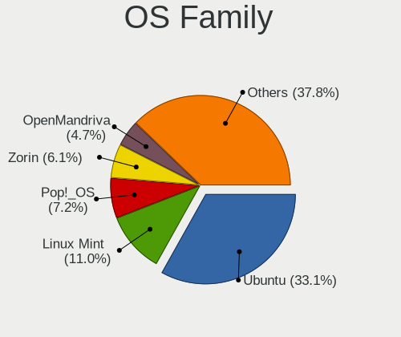

| Name          | Computers | Percent |
|---------------|-----------|---------|
| Ubuntu        | 326       | 38.76%  |
| Linux Mint    | 98        | 11.65%  |
| Pop!_OS       | 78        | 9.27%   |
| Zorin         | 44        | 5.23%   |
| KDE neon      | 32        | 3.8%    |
| OpenMandriva  | 29        | 3.45%   |
| Manjaro       | 26        | 3.09%   |
| Fedora        | 26        | 3.09%   |
| Debian        | 22        | 2.62%   |
| Kubuntu       | 21        | 2.5%    |
| Arch          | 15        | 1.78%   |
| Xubuntu       | 11        | 1.31%   |
| Kali          | 11        | 1.31%   |
| ROSA          | 10        | 1.19%   |
| ArcoLinux     | 10        | 1.19%   |
| Endless       | 9         | 1.07%   |
| Clear Linux   | 8         | 0.95%   |
| Elementary    | 7         | 0.83%   |
| Lubuntu       | 5         | 0.59%   |
| LinuxFX       | 4         | 0.48%   |
| Gentoo        | 4         | 0.48%   |
| CentOS        | 4         | 0.48%   |
| BlackPanther  | 4         | 0.48%   |
| Ubuntu Budgie | 3         | 0.36%   |
| Slackware     | 3         | 0.36%   |
| Rocky Linux   | 3         | 0.36%   |
| Parrot        | 3         | 0.36%   |
| LMDE          | 3         | 0.36%   |
| Ubuntu MATE   | 2         | 0.24%   |
| RHEL          | 2         | 0.24%   |
| KaOS          | 2         | 0.24%   |
| Garuda Linux  | 2         | 0.24%   |
| EndeavourOS   | 2         | 0.24%   |
| UbuntuDDE     | 1         | 0.12%   |
| Sparky        | 1         | 0.12%   |
| Q4OS          | 1         | 0.12%   |
| PureOS        | 1         | 0.12%   |
| Peppermint    | 1         | 0.12%   |
| openSUSE      | 1         | 0.12%   |
| Manjaro-ARM   | 1         | 0.12%   |
| Kaisen        | 1         | 0.12%   |
| Deepin        | 1         | 0.12%   |
| Archcraft     | 1         | 0.12%   |
| antergos      | 1         | 0.12%   |
| Alpine        | 1         | 0.12%   |

Kernel
------

Version of the Linux kernel

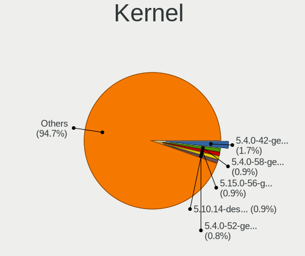

| Version                  | Computers | Percent |
|--------------------------|-----------|---------|
| 5.4.0-42-generic         | 29        | 2.98%   |
| 5.4.0-58-generic         | 16        | 1.64%   |
| 5.10.14-desktop-1omv4002 | 15        | 1.54%   |
| 5.4.0-52-generic         | 14        | 1.44%   |
| 5.13.0-7614-generic      | 13        | 1.33%   |
| 5.11.0-38-generic        | 12        | 1.23%   |
| 5.11.0-27-generic        | 12        | 1.23%   |
| 5.4.0-72-generic         | 11        | 1.13%   |
| 5.8.0-7642-generic       | 10        | 1.03%   |
| 5.4.0-40-generic         | 10        | 1.03%   |
| 5.16.7-desktop-1omv4003  | 10        | 1.03%   |
| 5.8.0-43-generic         | 9         | 0.92%   |
| 5.4.0-29-generic         | 9         | 0.92%   |
| 5.13.0-28-generic        | 9         | 0.92%   |
| 5.11.0-40-generic        | 9         | 0.92%   |
| 5.0.0-37-generic         | 9         | 0.92%   |
| 5.8.0-7630-generic       | 8         | 0.82%   |
| 5.4.0-7634-generic       | 8         | 0.82%   |
| 5.4.0-26-generic         | 8         | 0.82%   |
| 5.13.0-39-generic        | 8         | 0.82%   |
| 5.11.0-41-generic        | 8         | 0.82%   |
| 5.11.0-25-generic        | 8         | 0.82%   |
| 5.4.0-7642-generic       | 7         | 0.72%   |
| 5.4.0-73-generic         | 7         | 0.72%   |
| 5.4.0-33-generic         | 7         | 0.72%   |
| 5.4.0-31-generic         | 7         | 0.72%   |
| 5.11.0-37-generic        | 7         | 0.72%   |
| 4.15.0-54-generic        | 7         | 0.72%   |
| 5.8.0-59-generic         | 6         | 0.62%   |
| 5.8.0-44-generic         | 6         | 0.62%   |
| 5.4.0-77-generic         | 6         | 0.62%   |
| 5.4.0-56-generic         | 6         | 0.62%   |
| 5.4.0-54-generic         | 6         | 0.62%   |
| 5.4.0-45-generic         | 6         | 0.62%   |
| 5.4.0-113-generic        | 6         | 0.62%   |
| 5.3.0-51-generic         | 6         | 0.62%   |
| 5.3.0-46-generic         | 6         | 0.62%   |
| 5.3.0-28-generic         | 6         | 0.62%   |
| 5.13.0-30-generic        | 6         | 0.62%   |
| 5.11.0-43-generic        | 6         | 0.62%   |
| 5.8.0-63-generic         | 5         | 0.51%   |
| 5.8.0-53-generic         | 5         | 0.51%   |
| 5.8.0-50-generic         | 5         | 0.51%   |
| 5.4.0-74-generic         | 5         | 0.51%   |
| 5.4.0-65-generic         | 5         | 0.51%   |
| 5.4.0-47-generic         | 5         | 0.51%   |
| 5.4.0-37-generic         | 5         | 0.51%   |
| 5.15.15-76051515-generic | 5         | 0.51%   |
| 5.11.0-7620-generic      | 5         | 0.51%   |
| 5.11.0-7614-generic      | 5         | 0.51%   |
| 5.11.0-34-generic        | 5         | 0.51%   |
| 5.4.0-80-generic         | 4         | 0.41%   |
| 5.4.0-28-generic         | 4         | 0.41%   |
| 5.3.0-53-generic         | 4         | 0.41%   |
| 5.3.0-40-generic         | 4         | 0.41%   |
| 5.3.0-24-generic         | 4         | 0.41%   |
| 5.15.0-41-generic        | 4         | 0.41%   |
| 5.13.0-52-generic        | 4         | 0.41%   |
| 5.13.0-51-generic        | 4         | 0.41%   |
| 5.13.0-40-generic        | 4         | 0.41%   |

Kernel Family
-------------

Linux kernel without a distro release

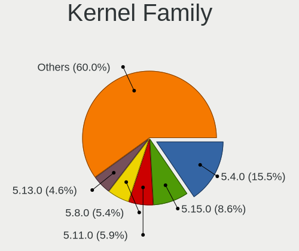

| Version  | Computers | Percent |
|----------|-----------|---------|
| 5.4.0    | 223       | 24.86%  |
| 5.11.0   | 94        | 10.48%  |
| 5.8.0    | 84        | 9.36%   |
| 5.13.0   | 70        | 7.8%    |
| 4.15.0   | 67        | 7.47%   |
| 5.3.0    | 50        | 5.57%   |
| 5.0.0    | 25        | 2.79%   |
| 4.18.0   | 23        | 2.56%   |
| 5.10.0   | 19        | 2.12%   |
| 5.15.0   | 17        | 1.9%    |
| 5.10.14  | 15        | 1.67%   |
| 5.16.7   | 11        | 1.23%   |
| 5.17.5   | 9         | 1%      |
| 5.14.0   | 7         | 0.78%   |
| 4.19.0   | 7         | 0.78%   |
| 5.15.15  | 5         | 0.56%   |
| 4.4.0    | 5         | 0.56%   |
| 4.18.16  | 4         | 0.45%   |
| 5.9.0    | 3         | 0.33%   |
| 5.6.0    | 3         | 0.33%   |
| 5.16.18  | 3         | 0.33%   |
| 5.16.11  | 3         | 0.33%   |
| 5.15.5   | 3         | 0.33%   |
| 5.15.32  | 3         | 0.33%   |
| 5.14.9   | 3         | 0.33%   |
| 4.9.20   | 3         | 0.33%   |
| 5.9.16   | 2         | 0.22%   |
| 5.8.1    | 2         | 0.22%   |
| 5.6.7    | 2         | 0.22%   |
| 5.6.11   | 2         | 0.22%   |
| 5.5.0    | 2         | 0.22%   |
| 5.4.60   | 2         | 0.22%   |
| 5.4.32   | 2         | 0.22%   |
| 5.17.9   | 2         | 0.22%   |
| 5.17.1   | 2         | 0.22%   |
| 5.16.19  | 2         | 0.22%   |
| 5.16.16  | 2         | 0.22%   |
| 5.16.0   | 2         | 0.22%   |
| 5.15.6   | 2         | 0.22%   |
| 5.15.4   | 2         | 0.22%   |
| 5.15.3   | 2         | 0.22%   |
| 5.14.8   | 2         | 0.22%   |
| 5.13.13  | 2         | 0.22%   |
| 5.12.5   | 2         | 0.22%   |
| 5.11.16  | 2         | 0.22%   |
| 5.11.12  | 2         | 0.22%   |
| 5.10.110 | 2         | 0.22%   |
| 5.9.14   | 1         | 0.11%   |
| 5.9.11   | 1         | 0.11%   |
| 5.9.1    | 1         | 0.11%   |
| 5.8.9    | 1         | 0.11%   |
| 5.8.3    | 1         | 0.11%   |
| 5.8.18   | 1         | 0.11%   |
| 5.8.16   | 1         | 0.11%   |
| 5.8.15   | 1         | 0.11%   |
| 5.8.10   | 1         | 0.11%   |
| 5.7.9    | 1         | 0.11%   |
| 5.7.7    | 1         | 0.11%   |
| 5.7.2    | 1         | 0.11%   |
| 5.7.10   | 1         | 0.11%   |

Kernel Major Ver.
-----------------

Linux kernel major version

| Version | Computers | Percent |
|---------|-----------|---------|
| 5.4     | 232       | 26.1%   |
| 5.11    | 102       | 11.47%  |
| 5.8     | 92        | 10.35%  |
| 5.13    | 78        | 8.77%   |
| 4.15    | 67        | 7.54%   |
| 5.3     | 52        | 5.85%   |
| 5.10    | 50        | 5.62%   |
| 5.15    | 40        | 4.5%    |
| 4.18    | 27        | 3.04%   |
| 5.0     | 25        | 2.81%   |
| 5.16    | 24        | 2.7%    |
| 5.17    | 17        | 1.91%   |
| 5.14    | 13        | 1.46%   |
| 5.6     | 10        | 1.12%   |
| 4.19    | 9         | 1.01%   |
| 5.9     | 8         | 0.9%    |
| 5.12    | 7         | 0.79%   |
| 4.9     | 7         | 0.79%   |
| 5.7     | 6         | 0.67%   |
| 5.5     | 5         | 0.56%   |
| 4.4     | 5         | 0.56%   |
| 5.18    | 3         | 0.34%   |
| 3.10    | 2         | 0.22%   |
| 5.2     | 1         | 0.11%   |
| 5.1     | 1         | 0.11%   |
| 4.16    | 1         | 0.11%   |
| 4.13    | 1         | 0.11%   |
| 4.12    | 1         | 0.11%   |
| 4.1     | 1         | 0.11%   |
| 3.16    | 1         | 0.11%   |
| 3.13    | 1         | 0.11%   |

Arch
----

OS architecture (x86_64, i586, etc.)

| Name    | Computers | Percent |
|---------|-----------|---------|
| x86_64  | 786       | 95.74%  |
| i686    | 24        | 2.92%   |
| aarch64 | 11        | 1.34%   |

DE
--

Desktop Environment

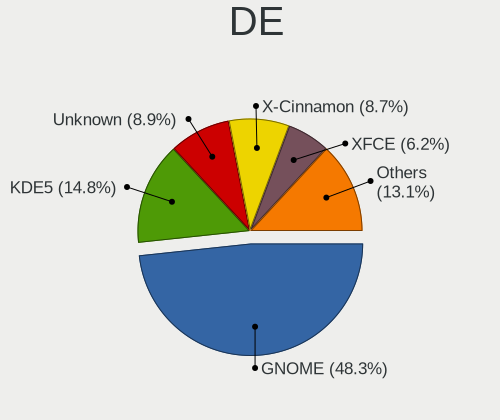

| Name             | Computers | Percent |
|------------------|-----------|---------|
| GNOME            | 419       | 49.41%  |
| KDE5             | 101       | 11.91%  |
| Unknown          | 101       | 11.91%  |
| X-Cinnamon       | 70        | 8.25%   |
| XFCE             | 46        | 5.42%   |
| KDE              | 36        | 4.25%   |
| MATE             | 16        | 1.89%   |
| Unity            | 11        | 1.3%    |
| Pantheon         | 7         | 0.83%   |
| LXDE             | 6         | 0.71%   |
| Cinnamon         | 6         | 0.71%   |
| KDE4             | 5         | 0.59%   |
| i3               | 5         | 0.59%   |
| LXQt             | 4         | 0.47%   |
| Deepin           | 4         | 0.47%   |
| Budgie           | 3         | 0.35%   |
| lightdm-xsession | 2         | 0.24%   |
| GNOME Classic    | 2         | 0.24%   |
| trinity          | 1         | 0.12%   |
| GNOME Flashback  | 1         | 0.12%   |
| bspwm            | 1         | 0.12%   |
| Awesome          | 1         | 0.12%   |

Display Server
--------------

X11 or Wayland

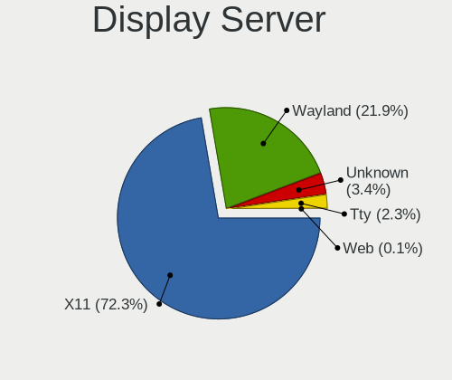

| Name    | Computers | Percent |
|---------|-----------|---------|
| X11     | 704       | 83.51%  |
| Wayland | 77        | 9.13%   |
| Unknown | 42        | 4.98%   |
| Tty     | 20        | 2.37%   |

Display Manager
---------------

SDDM, LightDM, etc.

| Name    | Computers | Percent |
|---------|-----------|---------|
| Unknown | 571       | 67.33%  |
| SDDM    | 87        | 10.26%  |
| GDM3    | 67        | 7.9%    |
| GDM     | 57        | 6.72%   |
| LightDM | 38        | 4.48%   |
| TDM     | 23        | 2.71%   |
| KDM     | 5         | 0.59%   |

OS Lang
-------

Language

| Lang    | Computers | Percent |
|---------|-----------|---------|
| en_ZA   | 541       | 63.65%  |
| en_US   | 157       | 18.47%  |
| Unknown | 80        | 9.41%   |
| en_GB   | 48        | 5.65%   |
| C       | 14        | 1.65%   |
| en_ZW   | 6         | 0.71%   |
| fr_FR   | 2         | 0.24%   |
| af_ZA   | 2         | 0.24%   |

Boot Mode
---------

EFI or BIOS

| Mode | Computers | Percent |
|------|-----------|---------|
| BIOS | 485       | 57.95%  |
| EFI  | 352       | 42.05%  |

Filesystem
----------

Type of filesystem

| Type    | Computers | Percent |
|---------|-----------|---------|
| Ext4    | 696       | 83.65%  |
| Overlay | 41        | 4.93%   |
| Btrfs   | 39        | 4.69%   |
| Unknown | 27        | 3.25%   |
| Xfs     | 16        | 1.92%   |
| Zfs     | 7         | 0.84%   |
| Tmpfs   | 2         | 0.24%   |
| Aufs    | 2         | 0.24%   |
| Rootfs  | 1         | 0.12%   |
| Ext2    | 1         | 0.12%   |

Part. scheme
------------

Scheme of partitioning

| Type    | Computers | Percent |
|---------|-----------|---------|
| Unknown | 612       | 73.73%  |
| GPT     | 162       | 19.52%  |
| MBR     | 56        | 6.75%   |

Dual Boot with Linux/BSD
------------------------

Hosting more than one Linux/BSD

| Dual boot | Computers | Percent |
|-----------|-----------|---------|
| No        | 735       | 88.13%  |
| Yes       | 99        | 11.87%  |

Dual Boot (Win)
---------------

Hosting Linux and Windows

| Dual boot | Computers | Percent |
|-----------|-----------|---------|
| No        | 610       | 73.14%  |
| Yes       | 224       | 26.86%  |

Board
-----

Vendor
------

Motherboard manufacturer

| Name                            | Computers | Percent |
|---------------------------------|-----------|---------|
| Hewlett-Packard                 | 135       | 16.48%  |
| Dell                            | 132       | 16.12%  |
| Lenovo                          | 107       | 13.06%  |
| ASUSTek Computer                | 90        | 10.99%  |
| MSI                             | 69        | 8.42%   |
| Gigabyte Technology             | 50        | 6.11%   |
| Intel                           | 43        | 5.25%   |
| Acer                            | 43        | 5.25%   |
| Apple                           | 20        | 2.44%   |
| ASRock                          | 15        | 1.83%   |
| Biostar                         | 12        | 1.47%   |
| Foxconn                         | 10        | 1.22%   |
| Toshiba                         | 8         | 0.98%   |
| Raspberry Pi Foundation         | 8         | 0.98%   |
| Samsung Electronics             | 7         | 0.85%   |
| Unknown                         | 6         | 0.73%   |
| Packard Bell                    | 5         | 0.61%   |
| Sony                            | 4         | 0.49%   |
| Fujitsu                         | 4         | 0.49%   |
| ECS                             | 4         | 0.49%   |
| Standard                        | 3         | 0.37%   |
| Mustek                          | 3         | 0.37%   |
| MECER                           | 3         | 0.37%   |
| CONNEX                          | 3         | 0.37%   |
| Supermicro                      | 2         | 0.24%   |
| Purism                          | 2         | 0.24%   |
| PINNACLEMICRO                   | 2         | 0.24%   |
| Nvidia                          | 2         | 0.24%   |
| NCR                             | 2         | 0.24%   |
| I-Life Digital Technologies     | 2         | 0.24%   |
| HUAWEI                          | 2         | 0.24%   |
| YiFang                          | 1         | 0.12%   |
| WinSome                         | 1         | 0.12%   |
| Universal Exports Group Limited | 1         | 0.12%   |
| TYAN Computer                   | 1         | 0.12%   |
| TCL Communication               | 1         | 0.12%   |
| System76                        | 1         | 0.12%   |
| Razer                           | 1         | 0.12%   |
| Radxa                           | 1         | 0.12%   |
| Proline                         | 1         | 0.12%   |
| Notebook                        | 1         | 0.12%   |
| Mustek6376 mst6376              | 1         | 0.12%   |
| Microsoft                       | 1         | 0.12%   |
| Lite-On                         | 1         | 0.12%   |
| LG Electronics                  | 1         | 0.12%   |
| LattePanda                      | 1         | 0.12%   |
| Google                          | 1         | 0.12%   |
| Fujitsu Siemens                 | 1         | 0.12%   |
| eMachines                       | 1         | 0.12%   |
| Alienware                       | 1         | 0.12%   |
| ADSC                            | 1         | 0.12%   |
| Acidanthera                     | 1         | 0.12%   |

Model
-----

Motherboard model

| Name                                 | Computers | Percent |
|--------------------------------------|-----------|---------|
| Unknown                              | 11        | 1.34%   |
| Dell Inspiron 15-3567                | 10        | 1.22%   |
| ASUS All Series                      | 6         | 0.73%   |
| MSI MS-7817                          | 5         | 0.61%   |
| RPi Raspberry Pi 4 Model B Rev 1.4   | 4         | 0.49%   |
| MSI MS-7B84                          | 4         | 0.49%   |
| HP ProBook 4530s                     | 4         | 0.49%   |
| HP Pavilion dv7                      | 4         | 0.49%   |
| HP Notebook                          | 4         | 0.49%   |
| HP 635                               | 4         | 0.49%   |
| Dell XPS 13 9310                     | 4         | 0.49%   |
| Dell Latitude E6400                  | 4         | 0.49%   |
| ASUS VivoBook 15_ASUS Laptop X540UAR | 4         | 0.49%   |
| MSI MS-7756                          | 3         | 0.37%   |
| Lenovo IdeaPad 110-15IBR 80T7        | 3         | 0.37%   |
| Lenovo G500 20236                    | 3         | 0.37%   |
| HP ProLiant MicroServer              | 3         | 0.37%   |
| HP ProBook 4520s                     | 3         | 0.37%   |
| HP Laptop 15-da0xxx                  | 3         | 0.37%   |
| HP Laptop 15-bs1xx                   | 3         | 0.37%   |
| HP Laptop 15-bs0xx                   | 3         | 0.37%   |
| Gigabyte G41MT-S2PT                  | 3         | 0.37%   |
| Gigabyte G31M-ES2C                   | 3         | 0.37%   |
| Dell Vostro 3670                     | 3         | 0.37%   |
| Dell Latitude E6430                  | 3         | 0.37%   |
| Dell Inspiron 3580                   | 3         | 0.37%   |
| Apple MacPro3,1                      | 3         | 0.37%   |
| Apple MacBookPro9,2                  | 3         | 0.37%   |
| Apple MacBookPro16,1                 | 3         | 0.37%   |
| Acer Aspire E1-571                   | 3         | 0.37%   |
| Toshiba Satellite L655               | 2         | 0.24%   |
| Samsung 300E4C/300E5C/300E7C         | 2         | 0.24%   |
| RPi Raspberry Pi                     | 2         | 0.24%   |
| MSI MS-7C91                          | 2         | 0.24%   |
| MSI MS-7C37                          | 2         | 0.24%   |
| MSI MS-7B89                          | 2         | 0.24%   |
| MSI MS-7A15                          | 2         | 0.24%   |
| MSI MS-7971                          | 2         | 0.24%   |
| MSI MS-7970                          | 2         | 0.24%   |
| MSI MS-7885                          | 2         | 0.24%   |
| MSI MS-7788                          | 2         | 0.24%   |
| MSI MS-7693                          | 2         | 0.24%   |
| MSI MS-7612                          | 2         | 0.24%   |
| Lenovo V510-14IKB 80WR               | 2         | 0.24%   |
| Lenovo ThinkPad T410 25376B8         | 2         | 0.24%   |
| Lenovo ThinkPad Edge E540 20C600HHZA | 2         | 0.24%   |
| Lenovo IdeaPad S145-15AST 81N3       | 2         | 0.24%   |
| Lenovo IdeaPad 320-15IKB 80XL        | 2         | 0.24%   |
| Lenovo IdeaPad 100-15IBD 80QQ        | 2         | 0.24%   |
| Intel NUC6CAYH                       | 2         | 0.24%   |
| Intel Mecer_X102                     | 2         | 0.24%   |
| Intel H81                            | 2         | 0.24%   |
| Intel DH61WW AAG23116-300            | 2         | 0.24%   |
| Intel DH55TC AAE70932-302            | 2         | 0.24%   |
| I-Life Digital ZED BOOK II           | 2         | 0.24%   |
| HP ProBook 6560b                     | 2         | 0.24%   |
| HP ProBook 450 G3                    | 2         | 0.24%   |
| HP ProBook 450 G2                    | 2         | 0.24%   |
| HP Pavilion dv6                      | 2         | 0.24%   |
| HP Laptop 15-dw3xxx                  | 2         | 0.24%   |

Model Family
------------

Motherboard model prefix

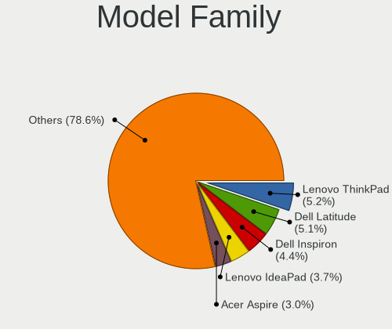

| Name                  | Computers | Percent |
|-----------------------|-----------|---------|
| Lenovo ThinkPad       | 45        | 5.49%   |
| Dell Inspiron         | 42        | 5.13%   |
| Dell Latitude         | 39        | 4.76%   |
| Acer Aspire           | 27        | 3.3%    |
| Lenovo IdeaPad        | 26        | 3.17%   |
| HP ProBook            | 26        | 3.17%   |
| Lenovo ThinkCentre    | 17        | 2.08%   |
| HP Laptop             | 17        | 2.08%   |
| HP EliteBook          | 14        | 1.71%   |
| HP Compaq             | 14        | 1.71%   |
| HP Pavilion           | 13        | 1.59%   |
| Dell XPS              | 12        | 1.47%   |
| Dell Vostro           | 11        | 1.34%   |
| ASUS VivoBook         | 11        | 1.34%   |
| Unknown               | 11        | 1.34%   |
| Dell OptiPlex         | 9         | 1.1%    |
| RPi Raspberry         | 8         | 0.98%   |
| Toshiba Satellite     | 7         | 0.85%   |
| Dell Precision        | 7         | 0.85%   |
| Acer TravelMate       | 7         | 0.85%   |
| ASUS PRIME            | 6         | 0.73%   |
| ASUS All              | 6         | 0.73%   |
| MSI MS-7817           | 5         | 0.61%   |
| HP ProLiant           | 5         | 0.61%   |
| Dell G3               | 5         | 0.61%   |
| ASUS ROG              | 5         | 0.61%   |
| MSI MS-7B84           | 4         | 0.49%   |
| HP ZBook              | 4         | 0.49%   |
| HP Notebook           | 4         | 0.49%   |
| HP 635                | 4         | 0.49%   |
| HP 255                | 4         | 0.49%   |
| HP 250                | 4         | 0.49%   |
| ASUS TUF              | 4         | 0.49%   |
| Packard Bell EasyNote | 3         | 0.37%   |
| MSI MS-7756           | 3         | 0.37%   |
| Lenovo Yoga           | 3         | 0.37%   |
| Lenovo G500           | 3         | 0.37%   |
| Intel Mecer           | 3         | 0.37%   |
| Intel DH61WW          | 3         | 0.37%   |
| Intel DH55TC          | 3         | 0.37%   |
| HP ENVY               | 3         | 0.37%   |
| HP 530                | 3         | 0.37%   |
| Gigabyte G41MT-S2PT   | 3         | 0.37%   |
| Gigabyte G31M-ES2C    | 3         | 0.37%   |
| Dell System           | 3         | 0.37%   |
| ASUS H110M-K          | 3         | 0.37%   |
| Apple MacPro3         | 3         | 0.37%   |
| Apple MacBookPro9     | 3         | 0.37%   |
| Apple MacBookPro16    | 3         | 0.37%   |
| Acer Swift            | 3         | 0.37%   |
| Samsung 300E4C        | 2         | 0.24%   |
| Purism Librem         | 2         | 0.24%   |
| MSI MS-7C91           | 2         | 0.24%   |
| MSI MS-7C37           | 2         | 0.24%   |
| MSI MS-7B89           | 2         | 0.24%   |
| MSI MS-7A15           | 2         | 0.24%   |
| MSI MS-7971           | 2         | 0.24%   |
| MSI MS-7970           | 2         | 0.24%   |
| MSI MS-7885           | 2         | 0.24%   |
| MSI MS-7788           | 2         | 0.24%   |

MFG Year
--------

Motherboard manufacture year

| Year    | Computers | Percent |
|---------|-----------|---------|
| 2018    | 87        | 10.62%  |
| 2011    | 85        | 10.38%  |
| 2012    | 76        | 9.28%   |
| 2013    | 65        | 7.94%   |
| 2017    | 59        | 7.2%    |
| 2016    | 58        | 7.08%   |
| 2008    | 56        | 6.84%   |
| 2010    | 54        | 6.59%   |
| 2019    | 53        | 6.47%   |
| 2020    | 52        | 6.35%   |
| 2015    | 43        | 5.25%   |
| 2009    | 32        | 3.91%   |
| 2014    | 31        | 3.79%   |
| 2007    | 26        | 3.17%   |
| 2021    | 16        | 1.95%   |
| 2006    | 12        | 1.47%   |
| Unknown | 9         | 1.1%    |
| 2005    | 3         | 0.37%   |
| 2022    | 1         | 0.12%   |
| 2004    | 1         | 0.12%   |

Form Factor
-----------

Physical design of the computer

| Name           | Computers | Percent |
|----------------|-----------|---------|
| Notebook       | 466       | 56.9%   |
| Desktop        | 308       | 37.61%  |
| Convertible    | 12        | 1.47%   |
| System on chip | 11        | 1.34%   |
| Mini pc        | 10        | 1.22%   |
| Tablet         | 5         | 0.61%   |
| All in one     | 5         | 0.61%   |
| Server         | 2         | 0.24%   |

Secure Boot
-----------

Enabled or disabled

| State    | Computers | Percent |
|----------|-----------|---------|
| Disabled | 755       | 91.18%  |
| Enabled  | 73        | 8.82%   |

Coreboot
--------

Have coreboot on board

| Used | Computers | Percent |
|------|-----------|---------|
| No   | 815       | 99.51%  |
| Yes  | 4         | 0.49%   |

RAM Size
--------

Total RAM memory

| Size in GB  | Computers | Percent |
|-------------|-----------|---------|
| 3.01-4.0    | 207       | 25.03%  |
| 4.01-8.0    | 182       | 22.01%  |
| 8.01-16.0   | 148       | 17.9%   |
| 16.01-24.0  | 141       | 17.05%  |
| 1.01-2.0    | 59        | 7.13%   |
| 32.01-64.0  | 49        | 5.93%   |
| 2.01-3.0    | 15        | 1.81%   |
| 24.01-32.0  | 12        | 1.45%   |
| 64.01-256.0 | 7         | 0.85%   |
| 0.51-1.0    | 7         | 0.85%   |

RAM Used
--------

Used RAM memory

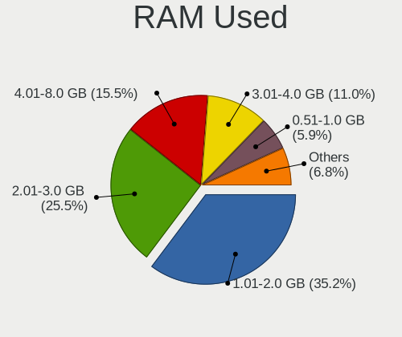

| Used GB     | Computers | Percent |
|-------------|-----------|---------|
| 1.01-2.0    | 374       | 40.87%  |
| 2.01-3.0    | 222       | 24.26%  |
| 4.01-8.0    | 113       | 12.35%  |
| 3.01-4.0    | 88        | 9.62%   |
| 0.51-1.0    | 64        | 6.99%   |
| 8.01-16.0   | 34        | 3.72%   |
| 0.01-0.5    | 11        | 1.2%    |
| 16.01-24.0  | 5         | 0.55%   |
| 32.01-64.0  | 1         | 0.11%   |
| 24.01-32.0  | 1         | 0.11%   |
| 64.01-256.0 | 1         | 0.11%   |
| Unknown     | 1         | 0.11%   |

Total Drives
------------

Number of drives on board

| Drives  | Computers | Percent |
|---------|-----------|---------|
| 1       | 466       | 55.41%  |
| 2       | 241       | 28.66%  |
| 3       | 62        | 7.37%   |
| 4       | 36        | 4.28%   |
| 0       | 16        | 1.9%    |
| 5       | 6         | 0.71%   |
| 6       | 5         | 0.59%   |
| 8       | 4         | 0.48%   |
| 7       | 4         | 0.48%   |
| Unknown | 1         | 0.12%   |

Has CD-ROM
----------

Has CD-ROM on board

| Presented | Computers | Percent |
|-----------|-----------|---------|
| No        | 432       | 52.11%  |
| Yes       | 397       | 47.89%  |

Has Ethernet
------------

Has Ethernet on board

| Presented | Computers | Percent |
|-----------|-----------|---------|
| Yes       | 741       | 90.48%  |
| No        | 78        | 9.52%   |

Has WiFi
--------

Has WiFi module

| Presented | Computers | Percent |
|-----------|-----------|---------|
| Yes       | 595       | 72.21%  |
| No        | 229       | 27.79%  |

Has Bluetooth
-------------

Has Bluetooth module

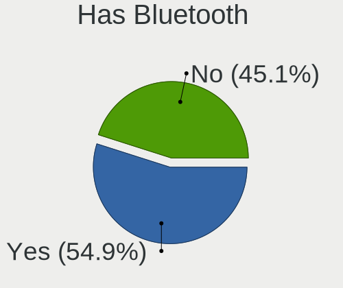

| Presented | Computers | Percent |
|-----------|-----------|---------|
| Yes       | 444       | 53.3%   |
| No        | 389       | 46.7%   |

Location
--------

Country
-------

Geographic location (country)

| Country      | Computers | Percent |
|--------------|-----------|---------|
| South Africa | 819       | 100%    |

City
----

Geographic location (city)

| City             | Computers | Percent |
|------------------|-----------|---------|
| Cape Town        | 208       | 23.91%  |
| Johannesburg     | 207       | 23.79%  |
| Pretoria         | 109       | 12.53%  |
| Durban           | 48        | 5.52%   |
| Centurion        | 30        | 3.45%   |
| Port Elizabeth   | 20        | 2.3%    |
| Pietermaritzburg | 12        | 1.38%   |
| Sandton          | 11        | 1.26%   |
| East London      | 11        | 1.26%   |
| Alberton         | 9         | 1.03%   |
| Benoni           | 8         | 0.92%   |
| Bellville        | 8         | 0.92%   |
| Roodepoort       | 7         | 0.8%    |
| Midrand          | 7         | 0.8%    |
| Kempton Park     | 7         | 0.8%    |
| Bloemfontein     | 7         | 0.8%    |
| Randburg         | 6         | 0.69%   |
| Boksburg         | 6         | 0.69%   |
| Thabazimbi       | 5         | 0.57%   |
| Somerset West    | 5         | 0.57%   |
| Polokwane        | 5         | 0.57%   |
| George           | 5         | 0.57%   |
| Edenvale         | 5         | 0.57%   |
| Vanderbijlpark   | 4         | 0.46%   |
| Stellenbosch     | 4         | 0.46%   |
| Potchefstroom    | 4         | 0.46%   |
| Oudtshoorn       | 4         | 0.46%   |
| Sasolburg        | 3         | 0.34%   |
| Plettenberg Bay  | 3         | 0.34%   |
| Nelspruit        | 3         | 0.34%   |
| Louis Trichardt  | 3         | 0.34%   |
| Lichtenburg      | 3         | 0.34%   |
| Klerksdorp       | 3         | 0.34%   |
| Hermanus         | 3         | 0.34%   |
| Germiston        | 3         | 0.34%   |
| Zeerust          | 2         | 0.23%   |
| Witbank          | 2         | 0.23%   |
| White River      | 2         | 0.23%   |
| Westville        | 2         | 0.23%   |
| Secunda          | 2         | 0.23%   |
| Sabie            | 2         | 0.23%   |
| Rustenburg       | 2         | 0.23%   |
| Richards Bay     | 2         | 0.23%   |
| Port Alfred      | 2         | 0.23%   |
| Mulbarton        | 2         | 0.23%   |
| Mossel Bay       | 2         | 0.23%   |
| Mokopane         | 2         | 0.23%   |
| Middelburg       | 2         | 0.23%   |
| Krugersdorp      | 2         | 0.23%   |
| Grahamstown      | 2         | 0.23%   |
| Worcester        | 1         | 0.11%   |
| Wellington       | 1         | 0.11%   |
| Welkom           | 1         | 0.11%   |
| Villiersdorp     | 1         | 0.11%   |
| Upington         | 1         | 0.11%   |
| Uitenhage        | 1         | 0.11%   |
| Tzaneen          | 1         | 0.11%   |
| Tulbagh          | 1         | 0.11%   |
| Thohoyandou      | 1         | 0.11%   |
| Strand           | 1         | 0.11%   |

Drives
------

Drive Vendor
------------

Hard drive vendors

| Vendor                         | Computers | Drives | Percent |
|--------------------------------|-----------|--------|---------|
| Seagate                        | 269       | 456    | 22.84%  |
| WDC                            | 244       | 335    | 20.71%  |
| Samsung Electronics            | 133       | 186    | 11.29%  |
| Toshiba                        | 105       | 129    | 8.91%   |
| Unknown                        | 47        | 61     | 3.99%   |
| Hitachi                        | 43        | 67     | 3.65%   |
| HGST                           | 30        | 36     | 2.55%   |
| Kingston                       | 29        | 33     | 2.46%   |
| SanDisk                        | 23        | 29     | 1.95%   |
| Transcend                      | 22        | 31     | 1.87%   |
| A-DATA Technology              | 21        | 30     | 1.78%   |
| SK hynix                       | 20        | 20     | 1.7%    |
| Silicon Motion                 | 17        | 26     | 1.44%   |
| Crucial                        | 17        | 19     | 1.44%   |
| Intel                          | 15        | 18     | 1.27%   |
| TO Exter                       | 13        | 14     | 1.1%    |
| Hewlett-Packard                | 8         | 9      | 0.68%   |
| Apple                          | 8         | 9      | 0.68%   |
| Phison                         | 6         | 8      | 0.51%   |
| Maxtor                         | 6         | 7      | 0.51%   |
| Hikvision                      | 6         | 6      | 0.51%   |
| Fujitsu                        | 6         | 7      | 0.51%   |
| Mushkin                        | 5         | 7      | 0.42%   |
| Micron Technology              | 5         | 6      | 0.42%   |
| LITEON                         | 5         | 6      | 0.42%   |
| KIOXIA                         | 5         | 5      | 0.42%   |
| Kingmax                        | 5         | 6      | 0.42%   |
| LITEONIT                       | 4         | 5      | 0.34%   |
| HS-SSD-E100                    | 4         | 6      | 0.34%   |
| HS-SSD-C100                    | 4         | 5      | 0.34%   |
| Corsair                        | 4         | 8      | 0.34%   |
| Apacer                         | 4         | 5      | 0.34%   |
| Netac                          | 3         | 3      | 0.25%   |
| Gigabyte Technology            | 3         | 4      | 0.25%   |
| External                       | 3         | 3      | 0.25%   |
| Union Memory                   | 2         | 2      | 0.17%   |
| Realtek Semiconductor          | 2         | 2      | 0.17%   |
| Plextor                        | 2         | 3      | 0.17%   |
| JMicron Technology             | 2         | 2      | 0.17%   |
| HGST HTS                       | 2         | 2      | 0.17%   |
| ASMT                           | 2         | 2      | 0.17%   |
| Unknown                        | 2         | 2      | 0.17%   |
| USB                            | 1         | 1      | 0.08%   |
| UMIS                           | 1         | 1      | 0.08%   |
| TS120GSS                       | 1         | 1      | 0.08%   |
| StoreJet                       | 1         | 1      | 0.08%   |
| SOLIDATA                       | 1         | 1      | 0.08%   |
| Solid State Storage Technology | 1         | 2      | 0.08%   |
| Radeon                         | 1         | 1      | 0.08%   |
| PHISON S                       | 1         | 1      | 0.08%   |
| OCZ                            | 1         | 2      | 0.08%   |
| Netac SS                       | 1         | 1      | 0.08%   |
| Neo Forza                      | 1         | 1      | 0.08%   |
| MyDigitalSSD                   | 1         | 1      | 0.08%   |
| Lite-On                        | 1         | 1      | 0.08%   |
| Lexar                          | 1         | 1      | 0.08%   |
| Lenovo                         | 1         | 1      | 0.08%   |
| KingSpec                       | 1         | 2      | 0.08%   |
| Hypertec                       | 1         | 1      | 0.08%   |
| HUAWEI                         | 1         | 1      | 0.08%   |

Drive Model
-----------

Hard drive models

| Model                                | Computers | Percent |
|--------------------------------------|-----------|---------|
| Seagate ST1000LM035-1RK172 1TB       | 26        | 1.98%   |
| Seagate ST500DM002-1BD142 500GB      | 20        | 1.52%   |
| WDC WDS500G2B0A-00SM50 500GB SSD     | 18        | 1.37%   |
| Seagate ST3500418AS 500GB            | 15        | 1.14%   |
| Unknown MMC Card  32GB               | 13        | 0.99%   |
| Toshiba MQ01ABF050 500GB             | 13        | 0.99%   |
| TO Exter nal USB 3.0 1TB             | 13        | 0.99%   |
| Toshiba MQ04ABF100 1TB               | 12        | 0.91%   |
| Toshiba MQ01ABD100 1TB               | 12        | 0.91%   |
| Seagate ST1000LM024 HN-M101MBB 1TB   | 11        | 0.84%   |
| Seagate ST380815AS 80GB              | 10        | 0.76%   |
| Samsung HD103SI 1TB                  | 9         | 0.69%   |
| HGST HTS721010A9E630 1TB             | 9         | 0.69%   |
| WDC WD10EZEX-08WN4A0 1TB             | 8         | 0.61%   |
| Seagate ST500LT012-1DG142 500GB      | 8         | 0.61%   |
| Seagate ST3500413AS 500GB            | 8         | 0.61%   |
| Seagate ST1000DM010-2EP102 1TB       | 8         | 0.61%   |
| Samsung NVMe SSD Drive 256GB         | 8         | 0.61%   |
| WDC WDS240G2G0A-00JH30 240GB SSD     | 7         | 0.53%   |
| Toshiba MQ01ACF050 500GB             | 7         | 0.53%   |
| Seagate ST4000DM000-1F2168 4TB       | 7         | 0.53%   |
| Seagate ST3250318AS 250GB            | 7         | 0.53%   |
| Samsung SSD 850 EVO 250GB            | 7         | 0.53%   |
| Samsung NVMe SSD Drive 512GB         | 7         | 0.53%   |
| WDC WDS100T2B0A-00SM50 1TB SSD       | 6         | 0.46%   |
| WDC WD20EZRZ-00Z5HB0 2TB             | 6         | 0.46%   |
| WDC WD20EZRX-00D8PB0 2TB             | 6         | 0.46%   |
| WDC WD20EARX-00PASB0 2TB             | 6         | 0.46%   |
| Unknown MMC Card  64GB               | 6         | 0.46%   |
| Toshiba NVMe SSD Drive 512GB         | 6         | 0.46%   |
| Seagate ST4000DM004-2CV104 4TB       | 6         | 0.46%   |
| Seagate ST3160815AS 160GB            | 6         | 0.46%   |
| Seagate ST2000DM001-1CH164 2TB       | 6         | 0.46%   |
| HGST HTS725050A7E630 500GB           | 6         | 0.46%   |
| HGST HTS541010A9E680 1TB             | 6         | 0.46%   |
| WDC WD10EZEX-00BN5A0 1TB             | 5         | 0.38%   |
| Unknown MMC Card  128GB              | 5         | 0.38%   |
| Transcend TS256GSSD230S 256GB        | 5         | 0.38%   |
| Toshiba DT01ACA100 1TB               | 5         | 0.38%   |
| Seagate ST9500325AS 500GB            | 5         | 0.38%   |
| Seagate ST500LM012 HN-M500MBB 500GB  | 5         | 0.38%   |
| Seagate ST3320620AS 320GB            | 5         | 0.38%   |
| Seagate ST31500341AS 1TB             | 5         | 0.38%   |
| Seagate ST1000DM003-1ER162 1TB       | 5         | 0.38%   |
| Samsung SSD 750 EVO 250GB            | 5         | 0.38%   |
| Samsung HM321HI 320GB                | 5         | 0.38%   |
| Samsung HD502HI 500GB                | 5         | 0.38%   |
| Intel NVMe SSD Drive 512GB           | 5         | 0.38%   |
| Hitachi HTS543232A7A384 320GB        | 5         | 0.38%   |
| WDC WDS120G2G0A-00JH30 120GB SSD     | 4         | 0.3%    |
| WDC WD5000LPVX-22V0TT0 500GB         | 4         | 0.3%    |
| WDC WD10SPZX-60Z10T0 1TB             | 4         | 0.3%    |
| WDC WD10EZEX-00WN4A0 1TB             | 4         | 0.3%    |
| Unknown MMC Card  16GB               | 4         | 0.3%    |
| Toshiba HDWD110 1TB                  | 4         | 0.3%    |
| SK hynix NVMe SSD Drive 512GB        | 4         | 0.3%    |
| Silicon Motion NVMe SSD Drive 1TB    | 4         | 0.3%    |
| Silicon Motion NVMe SSD Drive 1024GB | 4         | 0.3%    |
| Seagate ST9250315AS 250GB            | 4         | 0.3%    |
| Seagate ST500LT012-9WS142 500GB      | 4         | 0.3%    |

HDD Vendor
----------

Hard disk drive vendors

| Vendor              | Computers | Drives | Percent |
|---------------------|-----------|--------|---------|
| Seagate             | 263       | 436    | 37.2%   |
| WDC                 | 205       | 280    | 29%     |
| Toshiba             | 87        | 108    | 12.31%  |
| Samsung Electronics | 47        | 66     | 6.65%   |
| Hitachi             | 43        | 67     | 6.08%   |
| HGST                | 30        | 36     | 4.24%   |
| Maxtor              | 6         | 7      | 0.85%   |
| Fujitsu             | 6         | 7      | 0.85%   |
| Hewlett-Packard     | 5         | 5      | 0.71%   |
| Apple               | 5         | 5      | 0.71%   |
| Unknown             | 3         | 4      | 0.42%   |
| External            | 2         | 2      | 0.28%   |
| ASMT                | 2         | 2      | 0.28%   |
| USB                 | 1         | 1      | 0.14%   |
| HPE                 | 1         | 2      | 0.14%   |
| HGST HTS            | 1         | 1      | 0.14%   |

SSD Vendor
----------

Solid state drive vendors

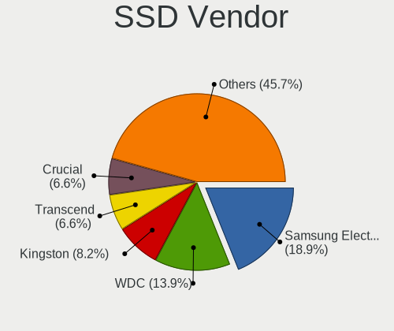

| Vendor              | Computers | Drives | Percent |
|---------------------|-----------|--------|---------|
| Samsung Electronics | 53        | 72     | 19.41%  |
| WDC                 | 44        | 52     | 16.12%  |
| Kingston            | 22        | 25     | 8.06%   |
| Transcend           | 19        | 27     | 6.96%   |
| A-DATA Technology   | 18        | 27     | 6.59%   |
| Crucial             | 16        | 18     | 5.86%   |
| SanDisk             | 14        | 17     | 5.13%   |
| TO Exter            | 13        | 14     | 4.76%   |
| Toshiba             | 6         | 7      | 2.2%    |
| SK hynix            | 6         | 6      | 2.2%    |
| Intel               | 6         | 7      | 2.2%    |
| Kingmax             | 5         | 6      | 1.83%   |
| Seagate             | 4         | 8      | 1.47%   |
| Micron Technology   | 4         | 5      | 1.47%   |
| LITEONIT            | 4         | 5      | 1.47%   |
| LITEON              | 4         | 5      | 1.47%   |
| Apacer              | 4         | 5      | 1.47%   |
| Netac               | 3         | 3      | 1.1%    |
| Mushkin             | 3         | 3      | 1.1%    |
| Gigabyte Technology | 3         | 4      | 1.1%    |
| Corsair             | 3         | 7      | 1.1%    |
| Plextor             | 2         | 3      | 0.73%   |
| HS-SSD-E100         | 2         | 2      | 0.73%   |
| StoreJet            | 1         | 1      | 0.37%   |
| SOLIDATA            | 1         | 1      | 0.37%   |
| Radeon              | 1         | 1      | 0.37%   |
| OCZ                 | 1         | 2      | 0.37%   |
| Neo Forza           | 1         | 1      | 0.37%   |
| MyDigitalSSD        | 1         | 1      | 0.37%   |
| Lexar               | 1         | 1      | 0.37%   |
| KingSpec            | 1         | 2      | 0.37%   |
| Hypertec            | 1         | 1      | 0.37%   |
| Hikvision           | 1         | 1      | 0.37%   |
| Hewlett-Packard     | 1         | 1      | 0.37%   |
| Biostar             | 1         | 1      | 0.37%   |
| AFOX                | 1         | 1      | 0.37%   |
| Acer                | 1         | 1      | 0.37%   |
| Unknown             | 1         | 1      | 0.37%   |

Drive Kind
----------

HDD or SSD

| Kind    | Computers | Drives | Percent |
|---------|-----------|--------|---------|
| HDD     | 572       | 1029   | 56.41%  |
| SSD     | 239       | 345    | 23.57%  |
| NVMe    | 141       | 190    | 13.91%  |
| MMC     | 44        | 58     | 4.34%   |
| Unknown | 18        | 24     | 1.78%   |

Drive Connector
---------------

SATA, SAS, NVMe, etc.

| Type | Computers | Drives | Percent |
|------|-----------|--------|---------|
| SATA | 698       | 1330   | 74.65%  |
| NVMe | 140       | 189    | 14.97%  |
| SAS  | 53        | 69     | 5.67%   |
| MMC  | 44        | 58     | 4.71%   |

Drive Size
----------

Size of hard drive

| Size in TB | Computers | Drives | Percent |
|------------|-----------|--------|---------|
| 0.01-0.5   | 516       | 789    | 56.15%  |
| 0.51-1.0   | 278       | 394    | 30.25%  |
| 1.01-2.0   | 64        | 88     | 6.96%   |
| 3.01-4.0   | 34        | 58     | 3.7%    |
| 2.01-3.0   | 19        | 24     | 2.07%   |
| 4.01-10.0  | 6         | 17     | 0.65%   |
| 10.01-20.0 | 2         | 4      | 0.22%   |

Space Total
-----------

Amount of disk space available on the file system

| Size in GB     | Computers | Percent |
|----------------|-----------|---------|
| 251-500        | 222       | 25.69%  |
| 101-250        | 197       | 22.8%   |
| 501-1000       | 130       | 15.05%  |
| 1001-2000      | 88        | 10.19%  |
| 51-100         | 51        | 5.9%    |
| 1-20           | 49        | 5.67%   |
| More than 3000 | 46        | 5.32%   |
| 21-50          | 30        | 3.47%   |
| 2001-3000      | 30        | 3.47%   |
| Unknown        | 21        | 2.43%   |

Space Used
----------

Amount of used disk space

| Used GB        | Computers | Percent |
|----------------|-----------|---------|
| 1-20           | 308       | 34.03%  |
| 21-50          | 158       | 17.46%  |
| 101-250        | 108       | 11.93%  |
| 51-100         | 106       | 11.71%  |
| 251-500        | 81        | 8.95%   |
| 501-1000       | 56        | 6.19%   |
| 1001-2000      | 31        | 3.43%   |
| Unknown        | 21        | 2.32%   |
| More than 3000 | 20        | 2.21%   |
| 2001-3000      | 16        | 1.77%   |

Malfunc. Drives
---------------

Drive models with a malfunction

| Model                                 | Computers | Drives | Percent |
|---------------------------------------|-----------|--------|---------|
| Seagate ST1000LM035-1RK172 1TB        | 4         | 4      | 6.45%   |
| Seagate ST3500418AS 500GB             | 3         | 4      | 4.84%   |
| Seagate ST1000LM024 HN-M101MBB 1TB    | 3         | 3      | 4.84%   |
| WDC WD3200AAJS-00RYA0 320GB           | 2         | 2      | 3.23%   |
| HGST HTS725050A7E630 500GB            | 2         | 2      | 3.23%   |
| WDC WD6400AAKS-75A7B0 640GB           | 1         | 1      | 1.61%   |
| WDC WD5000LPVX-22V0TT0 500GB          | 1         | 1      | 1.61%   |
| WDC WD5000AVVS-63ZWB0 500GB           | 1         | 1      | 1.61%   |
| WDC WD5000AAKX-22ERMA0 500GB          | 1         | 1      | 1.61%   |
| WDC WD5000AAKX-221CA1 500GB           | 1         | 1      | 1.61%   |
| WDC WD5000AAKX-00ERMA0 500GB          | 1         | 2      | 1.61%   |
| WDC WD3200BPVT-22JJ5T0 320GB          | 1         | 1      | 1.61%   |
| WDC WD30EZRX-00MMMB0 3TB              | 1         | 3      | 1.61%   |
| WDC WD30EFRX-68EUZN0 3TB              | 1         | 1      | 1.61%   |
| WDC WD20EZRZ-00Z5HB0 2TB              | 1         | 1      | 1.61%   |
| WDC WD20EARX-00PASB0 2TB              | 1         | 1      | 1.61%   |
| WDC WD1600AAJS-08L7A0 160GB           | 1         | 1      | 1.61%   |
| WDC WD15EADS-00P8B0 1TB               | 1         | 1      | 1.61%   |
| WDC WD10EZEX-08WN4A0 1TB              | 1         | 1      | 1.61%   |
| WDC WD10EADS-67M2B0 1TB               | 1         | 2      | 1.61%   |
| WDC WD10EACS-00ZJB0 1TB               | 1         | 1      | 1.61%   |
| Transcend TS64GSSD720 64GB            | 1         | 1      | 1.61%   |
| Toshiba MQ01ABD100 1TB                | 1         | 1      | 1.61%   |
| Toshiba MK5065GSXF 500GB              | 1         | 1      | 1.61%   |
| SOLIDATA SSD 120GB                    | 1         | 1      | 1.61%   |
| SK hynix HFS128G3BTND-N210A 128GB SSD | 1         | 1      | 1.61%   |
| Seagate ST9500423AS 500GB             | 1         | 1      | 1.61%   |
| Seagate ST9500325AS 500GB             | 1         | 2      | 1.61%   |
| Seagate ST500LM021-1KJ152 500GB       | 1         | 1      | 1.61%   |
| Seagate ST500LM012 HN-M500MBB 500GB   | 1         | 1      | 1.61%   |
| Seagate ST500DM002-1BD142 500GB       | 1         | 1      | 1.61%   |
| Seagate ST4000DM004-2CV104 4TB        | 1         | 1      | 1.61%   |
| Seagate ST4000DM000-1F2168 4TB        | 1         | 2      | 1.61%   |
| Seagate ST3320418AS 320GB             | 1         | 1      | 1.61%   |
| Seagate ST320LT007-9ZV142 320GB       | 1         | 1      | 1.61%   |
| Seagate ST32000542AS 2TB              | 1         | 1      | 1.61%   |
| Seagate ST3160815AS 160GB             | 1         | 2      | 1.61%   |
| Seagate ST31500341AS 1TB              | 1         | 1      | 1.61%   |
| Seagate ST31000520AS 1TB              | 1         | 1      | 1.61%   |
| Seagate ST3000DM001-1CH166 3TB        | 1         | 1      | 1.61%   |
| Seagate ST1000LM014-SSHD-8GB          | 1         | 1      | 1.61%   |
| Samsung Electronics HD203WI 2TB       | 1         | 1      | 1.61%   |
| Samsung Electronics HD154UI 1TB       | 1         | 1      | 1.61%   |
| Samsung Electronics HD103SI 1TB       | 1         | 2      | 1.61%   |
| Micron Technology 1100 SATA 256GB SSD | 1         | 1      | 1.61%   |
| Intel SSDSCKKF240H6L 240GB            | 1         | 2      | 1.61%   |
| Intel SSDSC2BW120H6 120GB             | 1         | 1      | 1.61%   |
| Intel SSDSC2BF240A4L 240GB            | 1         | 1      | 1.61%   |
| Hitachi HTS547575A9E384 752GB         | 1         | 1      | 1.61%   |
| Hitachi HDS721010KLA33R RSD HUA 1TB   | 1         | 1      | 1.61%   |
| HGST HTS541010A9E680 1TB              | 1         | 1      | 1.61%   |
| Hewlett-Packard SSD EX900 250GB       | 1         | 1      | 1.61%   |
| Hewlett-Packard GB0250EAFYK 250GB     | 1         | 1      | 1.61%   |

Malfunc. Drive Vendor
---------------------

Vendors of faulty drives

| Vendor              | Computers | Drives | Percent |
|---------------------|-----------|--------|---------|
| Seagate             | 25        | 29     | 40.32%  |
| WDC                 | 18        | 22     | 29.03%  |
| Samsung Electronics | 3         | 4      | 4.84%   |
| Intel               | 3         | 4      | 4.84%   |
| HGST                | 3         | 3      | 4.84%   |
| Toshiba             | 2         | 2      | 3.23%   |
| Hitachi             | 2         | 2      | 3.23%   |
| Hewlett-Packard     | 2         | 2      | 3.23%   |
| Transcend           | 1         | 1      | 1.61%   |
| SOLIDATA            | 1         | 1      | 1.61%   |
| SK hynix            | 1         | 1      | 1.61%   |
| Micron Technology   | 1         | 1      | 1.61%   |

Malfunc. HDD Vendor
-------------------

Vendors of faulty HDD drives

| Vendor              | Computers | Drives | Percent |
|---------------------|-----------|--------|---------|
| Seagate             | 25        | 29     | 46.3%   |
| WDC                 | 18        | 22     | 33.33%  |
| Samsung Electronics | 3         | 4      | 5.56%   |
| HGST                | 3         | 3      | 5.56%   |
| Toshiba             | 2         | 2      | 3.7%    |
| Hitachi             | 2         | 2      | 3.7%    |
| Hewlett-Packard     | 1         | 1      | 1.85%   |

Malfunc. Drive Kind
-------------------

Kinds of faulty drives

| Kind | Computers | Drives | Percent |
|------|-----------|--------|---------|
| HDD  | 48        | 63     | 85.71%  |
| SSD  | 7         | 8      | 12.5%   |
| NVMe | 1         | 1      | 1.79%   |

Failed Drives
-------------

Failed drive models

| Model                    | Computers | Drives | Percent |
|--------------------------|-----------|--------|---------|
| WDC WD20EZRX-00D8PB0 2TB | 2         | 2      | 100%    |

Failed Drive Vendor
-------------------

Failed drive vendors

| Vendor | Computers | Drives | Percent |
|--------|-----------|--------|---------|
| WDC    | 2         | 2      | 100%    |

Drive Status
------------

Number of failed and malfunc. drives

| Status   | Computers | Drives | Percent |
|----------|-----------|--------|---------|
| Detected | 625       | 1258   | 71.67%  |
| Works    | 191       | 314    | 21.9%   |
| Malfunc  | 54        | 72     | 6.19%   |
| Failed   | 2         | 2      | 0.23%   |

Storage controller
------------------

Storage Vendor
--------------

Storage controller vendors

| Vendor                           | Computers | Percent |
|----------------------------------|-----------|---------|
| Intel                            | 648       | 69.01%  |
| AMD                              | 88        | 9.37%   |
| Samsung Electronics              | 40        | 4.26%   |
| Silicon Motion                   | 22        | 2.34%   |
| Toshiba America Info Systems     | 17        | 1.81%   |
| SK hynix                         | 14        | 1.49%   |
| Nvidia                           | 14        | 1.49%   |
| SanDisk                          | 11        | 1.17%   |
| Marvell Technology Group         | 11        | 1.17%   |
| JMicron Technology               | 11        | 1.17%   |
| Phison Electronics               | 9         | 0.96%   |
| ASMedia Technology               | 9         | 0.96%   |
| Kingston Technology Company      | 7         | 0.75%   |
| KIOXIA                           | 6         | 0.64%   |
| VIA Technologies                 | 3         | 0.32%   |
| Silicon Integrated Systems [SiS] | 3         | 0.32%   |
| Silicon Image                    | 3         | 0.32%   |
| Apple                            | 3         | 0.32%   |
| ADATA Technology                 | 3         | 0.32%   |
| Union Memory (Shenzhen)          | 2         | 0.21%   |
| Seagate Technology               | 2         | 0.21%   |
| Realtek Semiconductor            | 2         | 0.21%   |
| MAXIO Technology (Hangzhou)      | 2         | 0.21%   |
| Solid State Storage Technology   | 1         | 0.11%   |
| Micron/Crucial Technology        | 1         | 0.11%   |
| Micron Technology                | 1         | 0.11%   |
| LSI Logic / Symbios Logic        | 1         | 0.11%   |
| Lite-On Technology               | 1         | 0.11%   |
| Lenovo                           | 1         | 0.11%   |
| Broadcom / LSI                   | 1         | 0.11%   |
| Biwin Storage Technology         | 1         | 0.11%   |
| Adaptec                          | 1         | 0.11%   |

Storage Model
-------------

Storage controller models

| Model                                                                                   | Computers | Percent |
|-----------------------------------------------------------------------------------------|-----------|---------|
| Intel Sunrise Point-LP SATA Controller [AHCI mode]                                      | 62        | 5.44%   |
| AMD FCH SATA Controller [AHCI mode]                                                     | 52        | 4.57%   |
| Intel 82801 Mobile SATA Controller [RAID mode]                                          | 48        | 4.21%   |
| Intel 7 Series Chipset Family 6-port SATA Controller [AHCI mode]                        | 38        | 3.34%   |
| Intel 8 Series/C220 Series Chipset Family 6-port SATA Controller 1 [AHCI mode]          | 36        | 3.16%   |
| Intel NM10/ICH7 Family SATA Controller [IDE mode]                                       | 34        | 2.99%   |
| Intel 6 Series/C200 Series Chipset Family 6 port Mobile SATA AHCI Controller            | 34        | 2.99%   |
| Intel Q170/Q150/B150/H170/H110/Z170/CM236 Chipset SATA Controller [AHCI Mode]           | 31        | 2.72%   |
| Intel 6 Series/C200 Series Chipset Family Desktop SATA Controller (IDE mode, ports 4-5) | 28        | 2.46%   |
| Intel 6 Series/C200 Series Chipset Family Desktop SATA Controller (IDE mode, ports 0-3) | 28        | 2.46%   |
| Intel 82801G (ICH7 Family) IDE Controller                                               | 27        | 2.37%   |
| Intel 6 Series/C200 Series Chipset Family 6 port Desktop SATA AHCI Controller           | 25        | 2.19%   |
| Intel 5 Series/3400 Series Chipset 6 port SATA AHCI Controller                          | 24        | 2.11%   |
| Intel Wildcat Point-LP SATA Controller [AHCI Mode]                                      | 18        | 1.58%   |
| Intel Cannon Lake Mobile PCH SATA AHCI Controller                                       | 18        | 1.58%   |
| Intel 82801IBM/IEM (ICH9M/ICH9M-E) 4 port SATA Controller [AHCI mode]                   | 18        | 1.58%   |
| Samsung NVMe SSD Controller SM981/PM981/PM983                                           | 17        | 1.49%   |
| Intel SATA Controller [RAID mode]                                                       | 17        | 1.49%   |
| AMD SB7x0/SB8x0/SB9x0 SATA Controller [AHCI mode]                                       | 17        | 1.49%   |
| Silicon Motion SM2262/SM2262EN SSD Controller                                           | 16        | 1.4%    |
| Intel Atom/Celeron/Pentium Processor x5-E8000/J3xxx/N3xxx Series SATA Controller        | 15        | 1.32%   |
| Intel 7 Series/C210 Series Chipset Family 6-port SATA Controller [AHCI mode]            | 15        | 1.32%   |
| Intel 5 Series/3400 Series Chipset 4 port SATA AHCI Controller                          | 15        | 1.32%   |
| Samsung NVMe SSD Controller SM961/PM961/SM963                                           | 14        | 1.23%   |
| Intel 8 Series SATA Controller 1 [AHCI mode]                                            | 14        | 1.23%   |
| Intel 5 Series/3400 Series Chipset 4 port SATA IDE Controller                           | 13        | 1.14%   |
| Intel 5 Series/3400 Series Chipset 2 port SATA IDE Controller                           | 13        | 1.14%   |
| Toshiba America Info Systems XG6 NVMe SSD Controller                                    | 12        | 1.05%   |
| Intel 200 Series PCH SATA controller [AHCI mode]                                        | 12        | 1.05%   |
| AMD 400 Series Chipset SATA Controller                                                  | 12        | 1.05%   |
| Intel HM170/QM170 Chipset SATA Controller [AHCI Mode]                                   | 11        | 0.97%   |
| Intel Celeron N3350/Pentium N4200/Atom E3900 Series SATA AHCI Controller                | 10        | 0.88%   |
| Intel 82801HM/HEM (ICH8M/ICH8M-E) IDE Controller                                        | 10        | 0.88%   |
| Intel Cannon Point-LP SATA Controller [AHCI Mode]                                       | 9         | 0.79%   |
| Intel 82801HM/HEM (ICH8M/ICH8M-E) SATA Controller [AHCI mode]                           | 9         | 0.79%   |
| Intel 5 Series/3400 Series Chipset PT IDER Controller                                   | 9         | 0.79%   |
| AMD 500 Series Chipset SATA Controller                                                  | 9         | 0.79%   |
| Intel Volume Management Device NVMe RAID Controller                                     | 8         | 0.7%    |
| AMD SB7x0/SB8x0/SB9x0 IDE Controller                                                    | 8         | 0.7%    |
| Intel SSD 660P Series                                                                   | 7         | 0.61%   |
| ASMedia ASM1062 Serial ATA Controller                                                   | 7         | 0.61%   |
| Silicon Motion SM2263EN/SM2263XT SSD Controller                                         | 6         | 0.53%   |
| Samsung NVMe SSD Controller 980                                                         | 6         | 0.53%   |
| KIOXIA NVMe SSD Controller BG4                                                          | 6         | 0.53%   |
| JMicron JMB363 SATA/IDE Controller                                                      | 6         | 0.53%   |
| Intel Celeron/Pentium Silver Processor SATA Controller                                  | 6         | 0.53%   |
| Intel 7 Series/C210 Series Chipset Family 4-port SATA Controller [IDE mode]             | 6         | 0.53%   |
| Intel 7 Series/C210 Series Chipset Family 2-port SATA Controller [IDE mode]             | 6         | 0.53%   |
| Intel 6 Series/C200 Series Chipset Family Mobile SATA Controller (IDE mode, ports 4-5)  | 6         | 0.53%   |
| Intel 6 Series/C200 Series Chipset Family Mobile SATA Controller (IDE mode, ports 0-3)  | 6         | 0.53%   |
| Phison E12 NVMe Controller                                                              | 5         | 0.44%   |
| Marvell Group 88SE6101/6102 single-port PATA133 interface                               | 5         | 0.44%   |
| Intel Cannon Lake PCH SATA AHCI Controller                                              | 5         | 0.44%   |
| Intel 82801JI (ICH10 Family) 4 port SATA IDE Controller #1                              | 5         | 0.44%   |
| Intel 82801JI (ICH10 Family) 2 port SATA IDE Controller #2                              | 5         | 0.44%   |
| Intel 82801I (ICH9 Family) 2 port SATA Controller [IDE mode]                            | 5         | 0.44%   |
| Intel 631xESB/632xESB IDE Controller                                                    | 5         | 0.44%   |
| AMD SB7x0/SB8x0/SB9x0 SATA Controller [IDE mode]                                        | 5         | 0.44%   |
| AMD FCH SATA Controller D                                                               | 5         | 0.44%   |
| AMD 300 Series Chipset SATA Controller                                                  | 5         | 0.44%   |

Storage Kind
------------

Kind of storage controller (IDE, SATA, NVMe, SAS, ...)

| Kind | Computers | Percent |
|------|-----------|---------|
| SATA | 559       | 57.87%  |
| IDE  | 175       | 18.12%  |
| NVMe | 146       | 15.11%  |
| RAID | 82        | 8.49%   |
| SAS  | 2         | 0.21%   |
| SCSI | 2         | 0.21%   |

Processor
---------

CPU Vendor
----------

Processor vendors

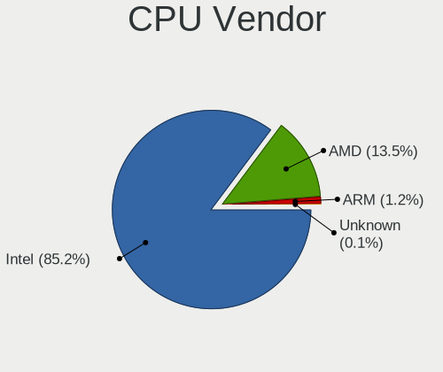

| Vendor | Computers | Percent |
|--------|-----------|---------|
| Intel  | 706       | 86.2%   |
| AMD    | 102       | 12.45%  |
| ARM    | 11        | 1.34%   |

CPU Model
---------

Processor models

| Model                                       | Computers | Percent |
|---------------------------------------------|-----------|---------|
| Intel Core i7-7500U CPU @ 2.70GHz           | 11        | 1.34%   |
| Intel Core i5-7200U CPU @ 2.50GHz           | 11        | 1.34%   |
| Intel Core i7-8565U CPU @ 1.80GHz           | 10        | 1.22%   |
| ARM Processor                               | 10        | 1.22%   |
| Intel Core i7-8550U CPU @ 1.80GHz           | 9         | 1.1%    |
| Intel Core i7-3770 CPU @ 3.40GHz            | 9         | 1.1%    |
| Intel Core i7-2630QM CPU @ 2.00GHz          | 9         | 1.1%    |
| Intel Core i5-8250U CPU @ 1.60GHz           | 9         | 1.1%    |
| Intel Core i5-3470 CPU @ 3.20GHz            | 9         | 1.1%    |
| Intel Celeron CPU N3060 @ 1.60GHz           | 9         | 1.1%    |
| Intel Core i7-9750H CPU @ 2.60GHz           | 8         | 0.98%   |
| Intel Core i7-8750H CPU @ 2.20GHz           | 8         | 0.98%   |
| Intel Core i7-2600 CPU @ 3.40GHz            | 8         | 0.98%   |
| Intel Core i5-5200U CPU @ 2.20GHz           | 8         | 0.98%   |
| Intel Core i5-1035G1 CPU @ 1.00GHz          | 8         | 0.98%   |
| Intel Core 2 Duo CPU P8600 @ 2.40GHz        | 8         | 0.98%   |
| Intel Celeron CPU N3350 @ 1.10GHz           | 8         | 0.98%   |
| Intel Core i7-6700HQ CPU @ 2.60GHz          | 7         | 0.85%   |
| Intel Core i7-6500U CPU @ 2.50GHz           | 7         | 0.85%   |
| Intel Core i5-6300U CPU @ 2.40GHz           | 7         | 0.85%   |
| Intel Core i5-3210M CPU @ 2.50GHz           | 7         | 0.85%   |
| Intel Atom x5-Z8350 CPU @ 1.44GHz           | 7         | 0.85%   |
| Intel Core i7-7700HQ CPU @ 2.80GHz          | 6         | 0.73%   |
| Intel Core i5-8265U CPU @ 1.60GHz           | 6         | 0.73%   |
| Intel Core i5 CPU M 520 @ 2.40GHz           | 6         | 0.73%   |
| Intel Core i3-6006U CPU @ 2.00GHz           | 6         | 0.73%   |
| Intel Core i3-2120 CPU @ 3.30GHz            | 6         | 0.73%   |
| Intel 11th Gen Core i7-1185G7 @ 3.00GHz     | 6         | 0.73%   |
| Intel 11th Gen Core i7-1165G7 @ 2.80GHz     | 6         | 0.73%   |
| Intel Pentium 4 CPU 3.00GHz                 | 5         | 0.61%   |
| Intel Core i7-6700K CPU @ 4.00GHz           | 5         | 0.61%   |
| Intel Core i5-4590 CPU @ 3.30GHz            | 5         | 0.61%   |
| Intel Core i5-2520M CPU @ 2.50GHz           | 5         | 0.61%   |
| Intel Core i5-2450M CPU @ 2.50GHz           | 5         | 0.61%   |
| Intel Core i5-2410M CPU @ 2.30GHz           | 5         | 0.61%   |
| Intel Core i5-2400 CPU @ 3.10GHz            | 5         | 0.61%   |
| Intel Core i3-5005U CPU @ 2.00GHz           | 5         | 0.61%   |
| Intel Core 2 Quad CPU Q8400 @ 2.66GHz       | 5         | 0.61%   |
| Intel Celeron CPU N3050 @ 1.60GHz           | 5         | 0.61%   |
| AMD E-450 APU with Radeon HD Graphics       | 5         | 0.61%   |
| Intel Pentium CPU G2030 @ 3.00GHz           | 4         | 0.49%   |
| Intel Core i7-8700K CPU @ 3.70GHz           | 4         | 0.49%   |
| Intel Core i7-8700 CPU @ 3.20GHz            | 4         | 0.49%   |
| Intel Core i7-6600U CPU @ 2.60GHz           | 4         | 0.49%   |
| Intel Core i7-4700MQ CPU @ 2.40GHz          | 4         | 0.49%   |
| Intel Core i5-6200U CPU @ 2.30GHz           | 4         | 0.49%   |
| Intel Core i5-4460 CPU @ 3.20GHz            | 4         | 0.49%   |
| Intel Core i5-3330 CPU @ 3.00GHz            | 4         | 0.49%   |
| Intel Core i5-3230M CPU @ 2.60GHz           | 4         | 0.49%   |
| Intel Core i5 CPU 650 @ 3.20GHz             | 4         | 0.49%   |
| Intel Core i3-2310M CPU @ 2.10GHz           | 4         | 0.49%   |
| Intel Core i3-2100 CPU @ 3.10GHz            | 4         | 0.49%   |
| Intel Core i3 CPU 530 @ 2.93GHz             | 4         | 0.49%   |
| Intel Core 2 Duo CPU E7500 @ 2.93GHz        | 4         | 0.49%   |
| Intel Xeon CPU E5462 @ 2.80GHz              | 3         | 0.37%   |
| Intel Pentium Dual-Core CPU E5200 @ 2.50GHz | 3         | 0.37%   |
| Intel Pentium CPU G620 @ 2.60GHz            | 3         | 0.37%   |
| Intel Pentium CPU G2020 @ 2.90GHz           | 3         | 0.37%   |
| Intel Core i9-9880H CPU @ 2.30GHz           | 3         | 0.37%   |
| Intel Core i7-2620M CPU @ 2.70GHz           | 3         | 0.37%   |

CPU Model Family
----------------

Processor model prefix

| Model                   | Computers | Percent |
|-------------------------|-----------|---------|
| Intel Core i5           | 200       | 24.42%  |
| Intel Core i7           | 192       | 23.44%  |
| Intel Core i3           | 82        | 10.01%  |
| Intel Celeron           | 55        | 6.72%   |
| Intel Core 2 Duo        | 49        | 5.98%   |
| Other                   | 31        | 3.79%   |
| Intel Pentium           | 27        | 3.3%    |
| AMD Ryzen 5             | 22        | 2.69%   |
| AMD Ryzen 7             | 18        | 2.2%    |
| Intel Xeon              | 15        | 1.83%   |
| Intel Atom              | 14        | 1.71%   |
| Intel Core 2 Quad       | 12        | 1.47%   |
| Intel Pentium Dual-Core | 8         | 0.98%   |
| Intel Pentium 4         | 7         | 0.85%   |
| AMD Ryzen 9             | 7         | 0.85%   |
| AMD FX                  | 7         | 0.85%   |
| AMD E                   | 7         | 0.85%   |
| Intel Pentium Dual      | 6         | 0.73%   |
| Intel Genuine           | 4         | 0.49%   |
| Intel Core i9           | 4         | 0.49%   |
| Intel Core 2            | 4         | 0.49%   |
| AMD Ryzen 3             | 4         | 0.49%   |
| AMD Athlon 64 X2        | 4         | 0.49%   |
| AMD A4                  | 4         | 0.49%   |
| Intel Pentium D         | 3         | 0.37%   |
| AMD Turion II Neo       | 3         | 0.37%   |
| Intel Core Duo          | 2         | 0.24%   |
| AMD Ryzen 7 PRO         | 2         | 0.24%   |
| AMD Phenom II X4        | 2         | 0.24%   |
| AMD Phenom II X2        | 2         | 0.24%   |
| AMD E2                  | 2         | 0.24%   |
| AMD E1                  | 2         | 0.24%   |
| AMD A6                  | 2         | 0.24%   |
| Intel Core 2 Extreme    | 1         | 0.12%   |
| Intel Celeron M         | 1         | 0.12%   |
| Intel Celeron Dual-Core | 1         | 0.12%   |
| Intel Celeron D         | 1         | 0.12%   |
| ARM AArch64             | 1         | 0.12%   |
| AMD Turion II Dual-Core | 1         | 0.12%   |
| AMD Turion 64 Mobile    | 1         | 0.12%   |
| AMD Ryzen Threadripper  | 1         | 0.12%   |
| AMD Phenom II X3        | 1         | 0.12%   |
| AMD G                   | 1         | 0.12%   |
| AMD Athlon X2           | 1         | 0.12%   |
| AMD Athlon II           | 1         | 0.12%   |
| AMD Athlon 64           | 1         | 0.12%   |
| AMD A8                  | 1         | 0.12%   |
| AMD A12                 | 1         | 0.12%   |
| AMD A10                 | 1         | 0.12%   |

CPU Cores
---------

Number of processor cores

| Number  | Computers | Percent |
|---------|-----------|---------|
| 2       | 415       | 50.67%  |
| 4       | 285       | 34.8%   |
| 6       | 50        | 6.11%   |
| 8       | 31        | 3.79%   |
| 1       | 25        | 3.05%   |
| 12      | 5         | 0.61%   |
| 16      | 3         | 0.37%   |
| 3       | 3         | 0.37%   |
| 24      | 1         | 0.12%   |
| Unknown | 1         | 0.12%   |

CPU Sockets
-----------

Number of sockets

| Number  | Computers | Percent |
|---------|-----------|---------|
| 1       | 812       | 99.15%  |
| 2       | 6         | 0.73%   |
| Unknown | 1         | 0.12%   |

CPU Threads
-----------

Threads per core (Hyper-Threading)

| Number  | Computers | Percent |
|---------|-----------|---------|
| 2       | 510       | 62.27%  |
| 1       | 308       | 37.61%  |
| Unknown | 1         | 0.12%   |

CPU Op-Modes
------------

CPU Operation Modes (32-bit, 64-bit)

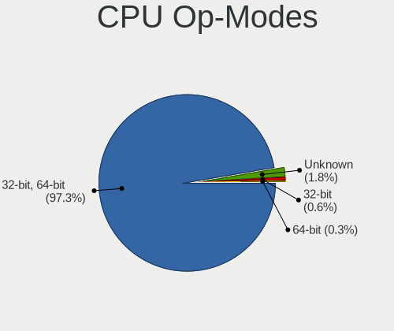

| Op mode        | Computers | Percent |
|----------------|-----------|---------|
| 32-bit, 64-bit | 791       | 96.11%  |
| Unknown        | 22        | 2.67%   |
| 32-bit         | 8         | 0.97%   |
| 64-bit         | 2         | 0.24%   |

CPU Microcode
-------------

Microcode number

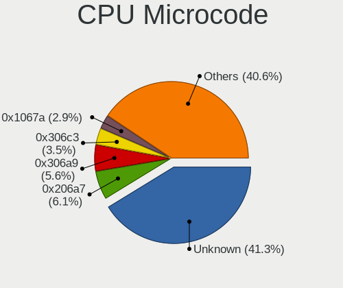

| Number     | Computers | Percent |
|------------|-----------|---------|
| Unknown    | 209       | 24.47%  |
| 0x206a7    | 71        | 8.31%   |
| 0x306a9    | 60        | 7.03%   |
| 0x306c3    | 36        | 4.22%   |
| 0x1067a    | 33        | 3.86%   |
| 0x406e3    | 29        | 3.4%    |
| 0x806e9    | 27        | 3.16%   |
| 0x20655    | 25        | 2.93%   |
| 0x506e3    | 24        | 2.81%   |
| 0x906ea    | 22        | 2.58%   |
| 0x906e9    | 20        | 2.34%   |
| 0x806ea    | 18        | 2.11%   |
| 0x406c4    | 15        | 1.76%   |
| 0x806ec    | 14        | 1.64%   |
| 0x306d4    | 14        | 1.64%   |
| 0x10676    | 14        | 1.64%   |
| 0x6fd      | 13        | 1.52%   |
| 0x20652    | 13        | 1.52%   |
| 0x40651    | 11        | 1.29%   |
| 0x806c1    | 10        | 1.17%   |
| 0x6fb      | 9         | 1.05%   |
| 0x506c9    | 9         | 1.05%   |
| 0x08701021 | 8         | 0.94%   |
| 0x06006705 | 8         | 0.94%   |
| 0x106a5    | 7         | 0.82%   |
| 0x706e5    | 6         | 0.7%    |
| 0x406c3    | 6         | 0.7%    |
| 0x106e5    | 6         | 0.7%    |
| 0xa0652    | 5         | 0.59%   |
| 0x806eb    | 5         | 0.59%   |
| 0x706a1    | 5         | 0.59%   |
| 0x010000db | 5         | 0.59%   |
| 0x10661    | 4         | 0.47%   |
| 0x0a50000c | 4         | 0.47%   |
| 0x08108109 | 4         | 0.47%   |
| 0x0800820d | 4         | 0.47%   |
| 0x0600611a | 4         | 0.47%   |
| 0x06000852 | 4         | 0.47%   |
| 0x05000119 | 4         | 0.47%   |
| 0x010000c8 | 4         | 0.47%   |
| 0x906ed    | 3         | 0.35%   |
| 0x6f6      | 3         | 0.35%   |
| 0x30678    | 3         | 0.35%   |
| 0x08600106 | 3         | 0.35%   |
| 0xf65      | 2         | 0.23%   |
| 0xf64      | 2         | 0.23%   |
| 0xf41      | 2         | 0.23%   |
| 0x906eb    | 2         | 0.23%   |
| 0x6f2      | 2         | 0.23%   |
| 0x6ec      | 2         | 0.23%   |
| 0x30661    | 2         | 0.23%   |
| 0x106c2    | 2         | 0.23%   |
| 0x0a201016 | 2         | 0.23%   |
| 0x08101007 | 2         | 0.23%   |
| 0x08001137 | 2         | 0.23%   |
| 0x0700010f | 2         | 0.23%   |
| 0xf4a      | 1         | 0.12%   |
| 0xf49      | 1         | 0.12%   |
| 0xf47      | 1         | 0.12%   |
| 0xf43      | 1         | 0.12%   |

CPU Microarch
-------------

Microarchitecture

| Name             | Computers | Percent |
|------------------|-----------|---------|
| KabyLake         | 137       | 16.71%  |
| SandyBridge      | 88        | 10.73%  |
| IvyBridge        | 78        | 9.51%   |
| Haswell          | 65        | 7.93%   |
| Skylake          | 63        | 7.68%   |
| Penryn           | 63        | 7.68%   |
| Westmere         | 46        | 5.61%   |
| Core             | 36        | 4.39%   |
| Silvermont       | 27        | 3.29%   |
| Broadwell        | 19        | 2.32%   |
| Zen 2            | 18        | 2.2%    |
| TigerLake        | 15        | 1.83%   |
| Unknown          | 14        | 1.71%   |
| Zen 3            | 13        | 1.59%   |
| Nehalem          | 13        | 1.59%   |
| Excavator        | 13        | 1.59%   |
| Zen+             | 12        | 1.46%   |
| NetBurst         | 12        | 1.46%   |
| IceLake          | 11        | 1.34%   |
| Zen              | 10        | 1.22%   |
| K10              | 10        | 1.22%   |
| Goldmont         | 10        | 1.22%   |
| Bobcat           | 9         | 1.1%    |
| CometLake        | 7         | 0.85%   |
| Piledriver       | 6         | 0.73%   |
| K8 Hammer        | 6         | 0.73%   |
| Goldmont plus    | 6         | 0.73%   |
| Bonnell          | 5         | 0.61%   |
| P6               | 3         | 0.37%   |
| Jaguar           | 2         | 0.24%   |
| Steamroller      | 1         | 0.12%   |
| K8 & K10 hybrid  | 1         | 0.12%   |
| Alderlake Hybrid | 1         | 0.12%   |

Graphics
--------

GPU Vendor
----------

Vendors of graphics cards

| Vendor                           | Computers | Percent |
|----------------------------------|-----------|---------|
| Intel                            | 551       | 58.37%  |
| Nvidia                           | 229       | 24.26%  |
| AMD                              | 156       | 16.53%  |
| Matrox Electronics Systems       | 4         | 0.42%   |
| Silicon Integrated Systems [SiS] | 2         | 0.21%   |
| VIA Technologies                 | 1         | 0.11%   |
| Silicon Motion                   | 1         | 0.11%   |

GPU Model
---------

Graphics card models

| Model                                                                                    | Computers | Percent |
|------------------------------------------------------------------------------------------|-----------|---------|
| Intel 2nd Generation Core Processor Family Integrated Graphics Controller                | 69        | 7.11%   |
| Intel Core Processor Integrated Graphics Controller                                      | 37        | 3.81%   |
| Intel 3rd Gen Core processor Graphics Controller                                         | 30        | 3.09%   |
| Intel Skylake GT2 [HD Graphics 520]                                                      | 28        | 2.89%   |
| Intel HD Graphics 620                                                                    | 28        | 2.89%   |
| Intel Atom/Celeron/Pentium Processor x5-E8000/J3xxx/N3xxx Integrated Graphics Controller | 24        | 2.47%   |
| Intel UHD Graphics 620                                                                   | 23        | 2.37%   |
| Intel Xeon E3-1200 v2/3rd Gen Core processor Graphics Controller                         | 19        | 1.96%   |
| Intel HD Graphics 5500                                                                   | 19        | 1.96%   |
| Intel CoffeeLake-H GT2 [UHD Graphics 630]                                                | 19        | 1.96%   |
| Intel Xeon E3-1200 v3/4th Gen Core Processor Integrated Graphics Controller              | 18        | 1.86%   |
| Intel WhiskeyLake-U GT2 [UHD Graphics 620]                                               | 18        | 1.86%   |
| Intel Mobile 4 Series Chipset Integrated Graphics Controller                             | 18        | 1.86%   |
| Intel 82G33/G31 Express Integrated Graphics Controller                                   | 18        | 1.86%   |
| Intel 4th Gen Core Processor Integrated Graphics Controller                              | 18        | 1.86%   |
| Intel Haswell-ULT Integrated Graphics Controller                                         | 16        | 1.65%   |
| Intel TigerLake-LP GT2 [Iris Xe Graphics]                                                | 15        | 1.55%   |
| Intel HD Graphics 630                                                                    | 14        | 1.44%   |
| AMD Ellesmere [Radeon RX 470/480/570/570X/580/580X/590]                                  | 14        | 1.44%   |
| Nvidia GT218 [GeForce 210]                                                               | 13        | 1.34%   |
| Intel Mobile GM965/GL960 Integrated Graphics Controller (secondary)                      | 10        | 1.03%   |
| Intel Mobile GM965/GL960 Integrated Graphics Controller (primary)                        | 10        | 1.03%   |
| Intel HD Graphics 530                                                                    | 10        | 1.03%   |
| Intel HD Graphics 500                                                                    | 10        | 1.03%   |
| AMD Stoney [Radeon R2/R3/R4/R5 Graphics]                                                 | 9         | 0.93%   |
| Intel Iris Plus Graphics G1 (Ice Lake)                                                   | 8         | 0.82%   |
| Nvidia GP107M [GeForce GTX 1050 Mobile]                                                  | 7         | 0.72%   |
| Intel Mobile 945GM/GMS/GME, 943/940GML Express Integrated Graphics Controller            | 7         | 0.72%   |
| Intel IvyBridge GT2 [HD Graphics 4000]                                                   | 7         | 0.72%   |
| Intel 4 Series Chipset Integrated Graphics Controller                                    | 7         | 0.72%   |
| AMD Renoir                                                                               | 7         | 0.72%   |
| Nvidia TU116M [GeForce GTX 1660 Ti Mobile]                                               | 6         | 0.62%   |
| Nvidia GP107M [GeForce GTX 1050 Ti Mobile]                                               | 6         | 0.62%   |
| Nvidia GM108M [GeForce MX130]                                                            | 6         | 0.62%   |
| Intel GeminiLake [UHD Graphics 600]                                                      | 6         | 0.62%   |
| Intel CoffeeLake-S GT2 [UHD Graphics 630]                                                | 6         | 0.62%   |
| AMD Wrestler [Radeon HD 6320]                                                            | 6         | 0.62%   |
| AMD Picasso/Raven 2 [Radeon Vega Series / Radeon Vega Mobile Series]                     | 6         | 0.62%   |
| Nvidia TU117M [GeForce GTX 1650 Mobile / Max-Q]                                          | 5         | 0.52%   |
| Nvidia GM204 [GeForce GTX 970]                                                           | 5         | 0.52%   |
| Nvidia GF108 [GeForce GT 630]                                                            | 5         | 0.52%   |
| Intel CometLake-U GT2 [UHD Graphics]                                                     | 5         | 0.52%   |
| AMD Topaz XT [Radeon R7 M260/M265 / M340/M360 / M440/M445 / 530/535 / 620/625 Mobile]    | 5         | 0.52%   |
| AMD Sun XT [Radeon HD 8670A/8670M/8690M / R5 M330 / M430 / Radeon 520 Mobile]            | 5         | 0.52%   |
| AMD Navi 14 [Radeon RX 5500/5500M / Pro 5500M]                                           | 5         | 0.52%   |
| AMD Cezanne                                                                              | 5         | 0.52%   |
| Nvidia GP107 [GeForce GTX 1050]                                                          | 4         | 0.41%   |
| Nvidia GP106M [GeForce GTX 1060 Mobile]                                                  | 4         | 0.41%   |
| Nvidia GK208B [GeForce GT 710]                                                           | 4         | 0.41%   |
| Nvidia GF119 [GeForce GT 610]                                                            | 4         | 0.41%   |
| Nvidia GF108 [GeForce GT 730]                                                            | 4         | 0.41%   |
| Intel Mobile 945GSE Express Integrated Graphics Controller                               | 4         | 0.41%   |
| Intel CometLake-H GT2 [UHD Graphics]                                                     | 4         | 0.41%   |
| Intel 82Q963/Q965 Integrated Graphics Controller                                         | 4         | 0.41%   |
| Intel 4th Generation Core Processor Family Integrated Graphics Controller                | 4         | 0.41%   |
| AMD Whistler [Radeon HD 6630M/6650M/6750M/7670M/7690M]                                   | 4         | 0.41%   |
| AMD Navi 10 [Radeon RX 5600 OEM/5600 XT / 5700/5700 XT]                                  | 4         | 0.41%   |
| AMD Cape Verde XT [Radeon HD 7770/8760 / R7 250X]                                        | 4         | 0.41%   |
| Nvidia GP108M [GeForce MX150]                                                            | 3         | 0.31%   |
| Nvidia GP107 [GeForce GTX 1050 Ti]                                                       | 3         | 0.31%   |

GPU Combo
---------

Combinations of graphics cards

| Name               | Computers | Percent |
|--------------------|-----------|---------|
| 1 x Intel          | 419       | 51.04%  |
| 1 x Nvidia         | 134       | 16.32%  |
| 1 x AMD            | 110       | 13.4%   |
| Intel + Nvidia     | 90        | 10.96%  |
| Intel + AMD        | 33        | 4.02%   |
| Other              | 13        | 1.58%   |
| 2 x AMD            | 8         | 0.97%   |
| AMD + Nvidia       | 5         | 0.61%   |
| 1 x Matrox         | 3         | 0.37%   |
| 1 x SiS            | 2         | 0.24%   |
| 2 x Intel          | 1         | 0.12%   |
| 1 x VIA            | 1         | 0.12%   |
| 1 x Silicon Motion | 1         | 0.12%   |
| AMD + Matrox       | 1         | 0.12%   |

GPU Driver
----------

Free vs proprietary

| Driver      | Computers | Percent |
|-------------|-----------|---------|
| Free        | 663       | 80.17%  |
| Proprietary | 121       | 14.63%  |
| Unknown     | 43        | 5.2%    |

GPU Memory
----------

Total video memory

| Size in GB | Computers | Percent |
|------------|-----------|---------|
| Unknown    | 522       | 61.41%  |
| 1.01-2.0   | 114       | 13.41%  |
| 0.01-0.5   | 65        | 7.65%   |
| 0.51-1.0   | 57        | 6.71%   |
| 3.01-4.0   | 45        | 5.29%   |
| 5.01-6.0   | 20        | 2.35%   |
| 7.01-8.0   | 17        | 2%      |
| 2.01-3.0   | 7         | 0.82%   |
| 8.01-16.0  | 2         | 0.24%   |
| 16.01-24.0 | 1         | 0.12%   |

Monitor
-------

Monitor Vendor
--------------

Monitor vendors

| Vendor                  | Computers | Percent |
|-------------------------|-----------|---------|
| Samsung Electronics     | 156       | 17.37%  |
| Dell                    | 108       | 12.03%  |
| AU Optronics            | 108       | 12.03%  |
| LG Display              | 85        | 9.47%   |
| BOE                     | 84        | 9.35%   |
| Goldstar                | 67        | 7.46%   |
| Chimei Innolux          | 67        | 7.46%   |
| Chi Mei Optoelectronics | 22        | 2.45%   |
| AOC                     | 16        | 1.78%   |
| Philips                 | 15        | 1.67%   |
| Hewlett-Packard         | 14        | 1.56%   |
| Apple                   | 14        | 1.56%   |
| Lenovo                  | 13        | 1.45%   |
| Sharp                   | 10        | 1.11%   |
| Unknown                 | 9         | 1%      |
| BenQ                    | 9         | 1%      |
| LG Electronics          | 8         | 0.89%   |
| Toshiba                 | 7         | 0.78%   |
| LG Philips              | 7         | 0.78%   |
| Acer                    | 7         | 0.78%   |
| VIE                     | 6         | 0.67%   |
| Fujitsu Siemens         | 4         | 0.45%   |
| Ancor Communications    | 4         | 0.45%   |
| Sony                    | 3         | 0.33%   |
| SKY                     | 3         | 0.33%   |
| PRI                     | 3         | 0.33%   |
| MECER                   | 3         | 0.33%   |
| ViewSonic               | 2         | 0.22%   |
| Tatung                  | 2         | 0.22%   |
| Quanta Display          | 2         | 0.22%   |
| Plain Tree Systems      | 2         | 0.22%   |
| Onkyo                   | 2         | 0.22%   |
| NEC Computers           | 2         | 0.22%   |
| Hitachi                 | 2         | 0.22%   |
| Eizo                    | 2         | 0.22%   |
| CTV                     | 2         | 0.22%   |
| ___                     | 1         | 0.11%   |
| VST                     | 1         | 0.11%   |
| STD                     | 1         | 0.11%   |
| SLD                     | 1         | 0.11%   |
| SKK                     | 1         | 0.11%   |
| SEEYOO                  | 1         | 0.11%   |
| SBI                     | 1         | 0.11%   |
| Sampo                   | 1         | 0.11%   |
| RTK                     | 1         | 0.11%   |
| PKB                     | 1         | 0.11%   |
| PANDA                   | 1         | 0.11%   |
| Panasonic               | 1         | 0.11%   |
| Packard Bell            | 1         | 0.11%   |
| MStar                   | 1         | 0.11%   |
| Microsoft               | 1         | 0.11%   |
| Marantz                 | 1         | 0.11%   |
| LTM                     | 1         | 0.11%   |
| InnoLux Display         | 1         | 0.11%   |
| InfoVision              | 1         | 0.11%   |
| HKC                     | 1         | 0.11%   |
| HannStar                | 1         | 0.11%   |
| FUS                     | 1         | 0.11%   |
| Daewoo                  | 1         | 0.11%   |
| CMN                     | 1         | 0.11%   |

Monitor Model
-------------

Monitor models

| Model                                                                    | Computers | Percent |
|--------------------------------------------------------------------------|-----------|---------|
| BOE LCD Monitor BOE06A5 1366x768 344x194mm 15.5-inch                     | 10        | 1.07%   |
| Goldstar ULTRAWIDE GSM59F1 2560x1080 673x284mm 28.8-inch                 | 9         | 0.96%   |
| Dell SE2416H DELD081 1920x1080 527x296mm 23.8-inch                       | 9         | 0.96%   |
| AU Optronics LCD Monitor AUO71EC 1366x768 344x193mm 15.5-inch            | 9         | 0.96%   |
| Dell SE2416H DELD082 1920x1080 527x296mm 23.8-inch                       | 8         | 0.85%   |
| AU Optronics LCD Monitor AUO22EC 1366x768 344x193mm 15.5-inch            | 8         | 0.85%   |
| Dell SE2216H DELF071 1920x1080 476x268mm 21.5-inch                       | 7         | 0.75%   |
| Goldstar IPS FULLHD GSM5AB8 1920x1080 480x270mm 21.7-inch                | 6         | 0.64%   |
| Chimei Innolux LCD Monitor CMN15DB 1366x768 344x193mm 15.5-inch          | 6         | 0.64%   |
| BOE LCD Monitor BOE0672 1366x768 344x194mm 15.5-inch                     | 6         | 0.64%   |
| LG Display LCD Monitor LGD0456 1366x768 344x194mm 15.5-inch              | 5         | 0.53%   |
| LG Display LCD Monitor LGD02DC 1366x768 344x194mm 15.5-inch              | 5         | 0.53%   |
| Chi Mei Optoelectronics LCD Monitor CMO1592 1366x768 344x193mm 15.5-inch | 5         | 0.53%   |
| AU Optronics LCD Monitor AUO70EC 1366x768 344x193mm 15.5-inch            | 5         | 0.53%   |
| AU Optronics LCD Monitor AUO38ED 1920x1080 344x193mm 15.5-inch           | 5         | 0.53%   |
| Sharp LCD Monitor SHP14F9 1920x1200 288x180mm 13.4-inch                  | 4         | 0.43%   |
| Samsung Electronics SMBX2031 SAM076B 1600x900 443x249mm 20.0-inch        | 4         | 0.43%   |
| Samsung Electronics S20B300 SAM08A8 1600x900 443x249mm 20.0-inch         | 4         | 0.43%   |
| Samsung Electronics C24F390 SAM0D2C 1920x1080 521x293mm 23.5-inch        | 4         | 0.43%   |
| LG Display LCD Monitor LGD053F 1920x1080 344x194mm 15.5-inch             | 4         | 0.43%   |
| LG Display LCD Monitor LGD033A 1366x768 344x194mm 15.5-inch              | 4         | 0.43%   |
| LG Display LCD Monitor LGD02AC 1366x768 344x194mm 15.5-inch              | 4         | 0.43%   |
| Goldstar W2343 GSM5700 1920x1080 474x296mm 22.0-inch                     | 4         | 0.43%   |
| Dell SE2717H/HX DELD0A1 1920x1080 598x336mm 27.0-inch                    | 4         | 0.43%   |
| Dell SE2419HR DELF113 1920x1080 527x296mm 23.8-inch                      | 4         | 0.43%   |
| Dell SE2419H DELF109 1920x1080 527x296mm 23.8-inch                       | 4         | 0.43%   |
| Dell S2340L DELD058 1920x1080 509x286mm 23.0-inch                        | 4         | 0.43%   |
| Chimei Innolux LCD Monitor CMN15E6 1366x768 344x193mm 15.5-inch          | 4         | 0.43%   |
| AU Optronics LCD Monitor AUO26EC 1366x768 344x193mm 15.5-inch            | 4         | 0.43%   |
| Toshiba LCD-MONITOR LCDEC80 1680x1050 470x300mm 22.0-inch                | 3         | 0.32%   |
| Samsung Electronics SyncMaster SAM0272 1280x1024 338x270mm 17.0-inch     | 3         | 0.32%   |
| Samsung Electronics S24D300 SAM0B45 1920x1080 521x293mm 23.5-inch        | 3         | 0.32%   |
| Samsung Electronics S19C150 SAM0AE6 1366x768 410x230mm 18.5-inch         | 3         | 0.32%   |
| Samsung Electronics LCD Monitor SyncMaster 1920x1080                     | 3         | 0.32%   |
| Samsung Electronics LCD Monitor SEC5441 1366x768 344x194mm 15.5-inch     | 3         | 0.32%   |
| Samsung Electronics LCD Monitor SEC325A 1366x768 344x194mm 15.5-inch     | 3         | 0.32%   |
| Samsung Electronics LCD Monitor SDC5441 1366x768 344x193mm 15.5-inch     | 3         | 0.32%   |
| LG Philips LCD Monitor LPLDB00 1280x800 331x207mm 15.4-inch              | 3         | 0.32%   |
| LG Electronics LCD Monitor LG ULTRAWIDE                                  | 3         | 0.32%   |
| LG Display LCD Monitor LGD039F 1366x768 345x194mm 15.6-inch              | 3         | 0.32%   |
| LG Display LCD Monitor LGD0266 1366x768 344x194mm 15.5-inch              | 3         | 0.32%   |
| Lenovo LCD Monitor LEN40B1 1600x900 344x193mm 15.5-inch                  | 3         | 0.32%   |
| Lenovo LCD Monitor LEN4036 1440x900 303x189mm 14.1-inch                  | 3         | 0.32%   |
| Goldstar W2443 GSM571B 1920x1080 474x296mm 22.0-inch                     | 3         | 0.32%   |
| Goldstar FULL HD GSM5ABB 1920x1080 480x270mm 21.7-inch                   | 3         | 0.32%   |
| Goldstar 23MP55 GSM5A23 1920x1080 510x290mm 23.1-inch                    | 3         | 0.32%   |
| Dell SE2719HR DELF115 1920x1080 598x336mm 27.0-inch                      | 3         | 0.32%   |
| Dell SE2719H DELF10C 1920x1080 598x336mm 27.0-inch                       | 3         | 0.32%   |
| Dell S3220DGF DELD0F2 2560x1440 697x392mm 31.5-inch                      | 3         | 0.32%   |
| Dell S2716DG DELA0D1 2560x1440 598x336mm 27.0-inch                       | 3         | 0.32%   |
| Dell S2421HN DEL41F1 1920x1080 527x296mm 23.8-inch                       | 3         | 0.32%   |
| Chimei Innolux LCD Monitor CMN1735 1920x1080 381x214mm 17.2-inch         | 3         | 0.32%   |
| Chimei Innolux LCD Monitor CMN15E7 1920x1080 344x193mm 15.5-inch         | 3         | 0.32%   |
| Chimei Innolux LCD Monitor CMN15C6 1366x768 344x193mm 15.5-inch          | 3         | 0.32%   |
| Chimei Innolux LCD Monitor CMN15C4 1920x1080 344x193mm 15.5-inch         | 3         | 0.32%   |
| Chimei Innolux LCD Monitor CMN15BE 1366x768 344x193mm 15.5-inch          | 3         | 0.32%   |
| Chimei Innolux LCD Monitor CMN15AB 1366x768 344x193mm 15.5-inch          | 3         | 0.32%   |
| Chi Mei Optoelectronics LCD Monitor CMO15A4 1366x768 344x194mm 15.5-inch | 3         | 0.32%   |
| Chi Mei Optoelectronics LCD Monitor CMO15A3 1366x768 344x194mm 15.5-inch | 3         | 0.32%   |
| Chi Mei Optoelectronics LCD Monitor CMO15A1 1366x768 344x193mm 15.5-inch | 3         | 0.32%   |

Monitor Resolution
------------------

Monitor screen resolution

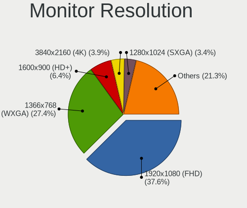

| Resolution         | Computers | Percent |
|--------------------|-----------|---------|
| 1920x1080 (FHD)    | 315       | 36.67%  |
| 1366x768 (WXGA)    | 245       | 28.52%  |
| 1600x900 (HD+)     | 63        | 7.33%   |
| 1280x1024 (SXGA)   | 33        | 3.84%   |
| 1280x800 (WXGA)    | 31        | 3.61%   |
| 2560x1440 (QHD)    | 23        | 2.68%   |
| 1440x900 (WXGA+)   | 23        | 2.68%   |
| 3840x2160 (4K)     | 22        | 2.56%   |
| 1680x1050 (WSXGA+) | 17        | 1.98%   |
| 1920x1200 (WUXGA)  | 13        | 1.51%   |
| 2560x1080          | 10        | 1.16%   |
| Unknown            | 10        | 1.16%   |
| 1360x768           | 9         | 1.05%   |
| 1024x768 (XGA)     | 9         | 1.05%   |
| 3840x1080          | 5         | 0.58%   |
| 1920x540           | 4         | 0.47%   |
| 3072x1920          | 3         | 0.35%   |
| 1024x600           | 3         | 0.35%   |
| 5120x1080          | 2         | 0.23%   |
| 1600x1200          | 2         | 0.23%   |
| 1152x864           | 2         | 0.23%   |
| 720x480            | 1         | 0.12%   |
| 4880x1080          | 1         | 0.12%   |
| 4480x1080          | 1         | 0.12%   |
| 3360x1080          | 1         | 0.12%   |
| 3286x1080          | 1         | 0.12%   |
| 3280x1200          | 1         | 0.12%   |
| 2880x1920          | 1         | 0.12%   |
| 2880x1800          | 1         | 0.12%   |
| 2736x1824          | 1         | 0.12%   |
| 2288x1287          | 1         | 0.12%   |
| 2048x1536          | 1         | 0.12%   |
| 1x1                | 1         | 0.12%   |
| 1680x945           | 1         | 0.12%   |
| 1400x1050          | 1         | 0.12%   |
| 1280x720 (HD)      | 1         | 0.12%   |

Monitor Diagonal
----------------

Diagonal size in inches

| Inches  | Computers | Percent |
|---------|-----------|---------|
| 15      | 309       | 34.18%  |
| 23      | 60        | 6.64%   |
| 24      | 54        | 5.97%   |
| 17      | 54        | 5.97%   |
| 13      | 54        | 5.97%   |
| 14      | 46        | 5.09%   |
| Unknown | 44        | 4.87%   |
| 21      | 43        | 4.76%   |
| 27      | 40        | 4.42%   |
| 20      | 32        | 3.54%   |
| 18      | 32        | 3.54%   |
| 19      | 30        | 3.32%   |
| 22      | 18        | 1.99%   |
| 31      | 15        | 1.66%   |
| 12      | 11        | 1.22%   |
| 34      | 9         | 1%      |
| 40      | 8         | 0.88%   |
| 72      | 5         | 0.55%   |
| 84      | 4         | 0.44%   |
| 54      | 4         | 0.44%   |
| 32      | 4         | 0.44%   |
| 48      | 3         | 0.33%   |
| 26      | 3         | 0.33%   |
| 16      | 3         | 0.33%   |
| 10      | 3         | 0.33%   |
| 52      | 2         | 0.22%   |
| 49      | 2         | 0.22%   |
| 46      | 2         | 0.22%   |
| 25      | 2         | 0.22%   |
| 11      | 2         | 0.22%   |
| 97      | 1         | 0.11%   |
| 67      | 1         | 0.11%   |
| 63      | 1         | 0.11%   |
| 39      | 1         | 0.11%   |
| 28      | 1         | 0.11%   |
| 8       | 1         | 0.11%   |

Monitor Width
-------------

Physical width

| Width in mm    | Computers | Percent |
|----------------|-----------|---------|
| 301-350        | 395       | 44.43%  |
| 501-600        | 145       | 16.31%  |
| 401-500        | 142       | 15.97%  |
| 351-400        | 52        | 5.85%   |
| Unknown        | 44        | 4.95%   |
| 201-300        | 43        | 4.84%   |
| 601-700        | 19        | 2.14%   |
| 1001-1500      | 15        | 1.69%   |
| 701-800        | 13        | 1.46%   |
| 801-900        | 9         | 1.01%   |
| 1501-2000      | 9         | 1.01%   |
| More than 2000 | 1         | 0.11%   |
| 101-200        | 1         | 0.11%   |
| 1-100          | 1         | 0.11%   |

Aspect Ratio
------------

Proportional relationship between the width and the height

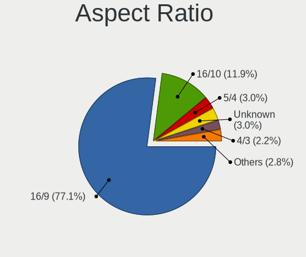

| Ratio   | Computers | Percent |
|---------|-----------|---------|
| 16/9    | 602       | 76.3%   |
| 16/10   | 87        | 11.03%  |
| Unknown | 31        | 3.93%   |
| 5/4     | 25        | 3.17%   |
| 4/3     | 21        | 2.66%   |
| 21/9    | 9         | 1.14%   |
| 3/2     | 6         | 0.76%   |
| 32/9    | 5         | 0.63%   |
| 1.96    | 2         | 0.25%   |
| 0.00    | 1         | 0.13%   |

Monitor Area
------------

Area in inch

| Area in inch | Computers | Percent |
|----------------|-----------|---------|
| 101-110        | 305       | 34.27%  |
| 201-250        | 147       | 16.52%  |
| 81-90          | 79        | 8.88%   |
| 151-200        | 78        | 8.76%   |
| Unknown        | 45        | 5.06%   |
| 301-350        | 42        | 4.72%   |
| 141-150        | 42        | 4.72%   |
| 121-130        | 34        | 3.82%   |
| 351-500        | 28        | 3.15%   |
| 71-80          | 21        | 2.36%   |
| More than 1000 | 19        | 2.13%   |
| 501-1000       | 15        | 1.69%   |
| 61-70          | 10        | 1.12%   |
| 251-300        | 9         | 1.01%   |
| 111-120        | 7         | 0.79%   |
| 131-140        | 3         | 0.34%   |
| 51-60          | 2         | 0.22%   |
| 41-50          | 2         | 0.22%   |
| 1-40           | 1         | 0.11%   |
| 91-100         | 1         | 0.11%   |

Pixel Density
-------------

Pixels per inch

| Density       | Computers | Percent |
|---------------|-----------|---------|
| 51-100        | 319       | 36.84%  |
| 101-120       | 284       | 32.79%  |
| 121-160       | 166       | 19.17%  |
| Unknown       | 44        | 5.08%   |
| 161-240       | 24        | 2.77%   |
| 1-50          | 23        | 2.66%   |
| More than 240 | 6         | 0.69%   |

Multiple Monitors
-----------------

Total monitors connected

| Total | Computers | Percent |
|-------|-----------|---------|
| 1     | 634       | 75.21%  |
| 2     | 157       | 18.62%  |
| 0     | 36        | 4.27%   |
| 3     | 15        | 1.78%   |
| 4     | 1         | 0.12%   |

Network
-------

Net Controller Vendor
---------------------

Controller vendors

| Vendor                            | Computers | Percent |
|-----------------------------------|-----------|---------|
| Realtek Semiconductor             | 456       | 36.1%   |
| Intel                             | 349       | 27.63%  |
| Qualcomm Atheros                  | 161       | 12.75%  |
| Broadcom                          | 73        | 5.78%   |
| Huawei Technologies               | 22        | 1.74%   |
| Samsung Electronics               | 18        | 1.43%   |
| Dell                              | 18        | 1.43%   |
| Broadcom Limited                  | 17        | 1.35%   |
| Ralink                            | 16        | 1.27%   |
| TP-Link                           | 14        | 1.11%   |
| Marvell Technology Group          | 14        | 1.11%   |
| Ralink Technology                 | 13        | 1.03%   |
| Nvidia                            | 11        | 0.87%   |
| MediaTek                          | 6         | 0.48%   |
| Ericsson Business Mobile Networks | 6         | 0.48%   |
| JMicron Technology                | 5         | 0.4%    |
| D-Link System                     | 5         | 0.4%    |
| Sierra Wireless                   | 4         | 0.32%   |
| D-Link                            | 4         | 0.32%   |
| ZyXEL Communications              | 3         | 0.24%   |
| Spreadtrum Communications         | 3         | 0.24%   |
| Silicon Integrated Systems [SiS]  | 3         | 0.24%   |
| Microsoft                         | 3         | 0.24%   |
| Hewlett-Packard                   | 3         | 0.24%   |
| ASIX Electronics                  | 3         | 0.24%   |
| Aquantia                          | 3         | 0.24%   |
| Apple                             | 3         | 0.24%   |
| TRENDnet                          | 2         | 0.16%   |
| Qualcomm Atheros Communications   | 2         | 0.16%   |
| Lenovo                            | 2         | 0.16%   |
| Arduino SA                        | 2         | 0.16%   |
| ZTE WCDMA Technologies MSM        | 1         | 0.08%   |
| Xiaomi                            | 1         | 0.08%   |
| Toshiba                           | 1         | 0.08%   |
| Texas Instruments                 | 1         | 0.08%   |
| Motorola                          | 1         | 0.08%   |
| Linux 2.6.31.6 with s3c-udc       | 1         | 0.08%   |
| Linksys                           | 1         | 0.08%   |
| IBM                               | 1         | 0.08%   |
| HMD Global                        | 1         | 0.08%   |
| Foxconn / Hon Hai                 | 1         | 0.08%   |
| Fibocom                           | 1         | 0.08%   |
| Exar                              | 1         | 0.08%   |
| Edimax Technology                 | 1         | 0.08%   |
| DisplayLink                       | 1         | 0.08%   |
| CyberTAN Technology               | 1         | 0.08%   |
| Belkin Components                 | 1         | 0.08%   |
| Attansic Technology               | 1         | 0.08%   |
| ASUSTek Computer                  | 1         | 0.08%   |
| Unknown                           | 1         | 0.08%   |

Net Controller Model
--------------------

Controller models

| Model                                                             | Computers | Percent |
|-------------------------------------------------------------------|-----------|---------|
| Realtek RTL8111/8168/8411 PCI Express Gigabit Ethernet Controller | 306       | 20.72%  |
| Realtek RTL810xE PCI Express Fast Ethernet controller             | 88        | 5.96%   |
| Intel 82579LM Gigabit Network Connection (Lewisville)             | 35        | 2.37%   |
| Qualcomm Atheros QCA9377 802.11ac Wireless Network Adapter        | 28        | 1.9%    |
| Qualcomm Atheros QCA9565 / AR9565 Wireless Network Adapter        | 26        | 1.76%   |
| Qualcomm Atheros AR9285 Wireless Network Adapter (PCI-Express)    | 25        | 1.69%   |
| Realtek RTL8821CE 802.11ac PCIe Wireless Network Adapter          | 20        | 1.35%   |
| Intel Wireless 8265 / 8275                                        | 20        | 1.35%   |
| Realtek RTL8153 Gigabit Ethernet Adapter                          | 19        | 1.29%   |
| Intel Wi-Fi 6 AX200                                               | 16        | 1.08%   |
| Broadcom BCM4313 802.11bgn Wireless Network Adapter               | 16        | 1.08%   |
| Realtek RTL8188EUS 802.11n Wireless Network Adapter               | 15        | 1.02%   |
| Intel Wireless 8260                                               | 15        | 1.02%   |
| Intel Cannon Lake PCH CNVi WiFi                                   | 15        | 1.02%   |
| Intel 82579V Gigabit Network Connection                           | 14        | 0.95%   |
| Realtek RTL8723BE PCIe Wireless Network Adapter                   | 13        | 0.88%   |
| Intel Wi-Fi 6 AX201                                               | 13        | 0.88%   |
| Intel Wireless 3165                                               | 12        | 0.81%   |
| Intel Ethernet Connection (2) I219-V                              | 12        | 0.81%   |
| Intel Centrino Advanced-N 6205 [Taylor Peak]                      | 12        | 0.81%   |
| Intel Centrino Advanced-N 6200                                    | 12        | 0.81%   |
| Intel 82577LM Gigabit Network Connection                          | 12        | 0.81%   |
| Qualcomm Atheros QCA6174 802.11ac Wireless Network Adapter        | 11        | 0.74%   |
| Qualcomm Atheros AR9485 Wireless Network Adapter                  | 11        | 0.74%   |
| Intel Dual Band Wireless-AC 3165 Plus Bluetooth                   | 11        | 0.74%   |
| Ralink RT3290 Wireless 802.11n 1T/1R PCIe                         | 10        | 0.68%   |
| Qualcomm Atheros AR9287 Wireless Network Adapter (PCI-Express)    | 10        | 0.68%   |
| Intel Wireless 7265                                               | 10        | 0.68%   |
| Intel Wireless 3160                                               | 10        | 0.68%   |
| Intel Cannon Point-LP CNVi [Wireless-AC]                          | 10        | 0.68%   |
| Samsung GT-I9070 (network tethering, USB debugging enabled)       | 9         | 0.61%   |
| Samsung Galaxy series, misc. (tethering mode)                     | 9         | 0.61%   |
| Realtek RTL8125 2.5GbE Controller                                 | 9         | 0.61%   |
| Qualcomm Atheros AR9462 Wireless Network Adapter                  | 9         | 0.61%   |
| Intel Centrino Wireless-N 1030 [Rainbow Peak]                     | 9         | 0.61%   |
| Realtek RTL8822CE 802.11ac PCIe Wireless Network Adapter          | 8         | 0.54%   |
| Ralink MT7601U Wireless Adapter                                   | 8         | 0.54%   |
| Intel WiFi Link 5100                                              | 8         | 0.54%   |
| Intel Ethernet Connection I219-LM                                 | 8         | 0.54%   |
| TP-Link TL-WN823N v2/v3 [Realtek RTL8192EU]                       | 7         | 0.47%   |
| Realtek RTL8723DE Wireless Network Adapter                        | 7         | 0.47%   |
| Realtek RTL-8100/8101L/8139 PCI Fast Ethernet Adapter             | 7         | 0.47%   |
| Qualcomm Atheros AR8151 v2.0 Gigabit Ethernet                     | 7         | 0.47%   |
| Intel Wireless 7260                                               | 7         | 0.47%   |
| Intel PRO/Wireless 3945ABG [Golan] Network Connection             | 7         | 0.47%   |
| Intel I211 Gigabit Network Connection                             | 7         | 0.47%   |
| Intel Ethernet Connection I217-LM                                 | 7         | 0.47%   |
| Intel Ethernet Connection (4) I219-LM                             | 7         | 0.47%   |
| Intel Ethernet Connection (2) I219-LM                             | 7         | 0.47%   |
| Intel Dual Band Wireless-AC 3168NGW [Stone Peak]                  | 7         | 0.47%   |
| Intel Centrino Wireless-N 2230                                    | 7         | 0.47%   |
| Intel 82578DM Gigabit Network Connection                          | 7         | 0.47%   |
| Intel 82567LM Gigabit Network Connection                          | 7         | 0.47%   |
| Broadcom NetLink BCM57785 Gigabit Ethernet PCIe                   | 7         | 0.47%   |
| Realtek RTL8188FTV 802.11b/g/n 1T1R 2.4G WLAN Adapter             | 6         | 0.41%   |
| Qualcomm Atheros AR5212/5213/2414 Wireless Network Adapter        | 6         | 0.41%   |
| Intel Centrino Wireless-N 1000 [Condor Peak]                      | 6         | 0.41%   |
| Intel Centrino Ultimate-N 6300                                    | 6         | 0.41%   |
| Intel 82578DC Gigabit Network Connection                          | 6         | 0.41%   |
| Realtek RTL8723BU 802.11b/g/n WLAN Adapter                        | 5         | 0.34%   |

Wireless Vendor
---------------

Wireless vendors

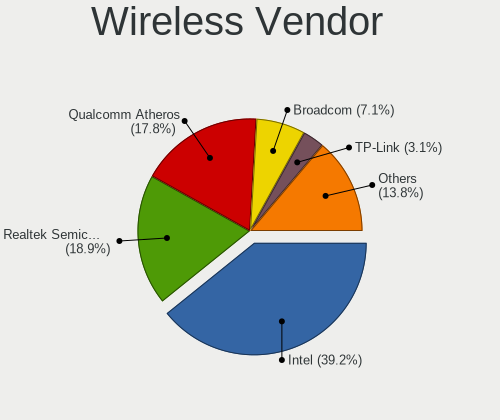

| Vendor                          | Computers | Percent |
|---------------------------------|-----------|---------|
| Intel                           | 247       | 39.39%  |
| Qualcomm Atheros                | 137       | 21.85%  |
| Realtek Semiconductor           | 102       | 16.27%  |
| Broadcom                        | 49        | 7.81%   |
| Ralink                          | 16        | 2.55%   |
| TP-Link                         | 13        | 2.07%   |
| Ralink Technology               | 13        | 2.07%   |
| Dell                            | 10        | 1.59%   |
| Broadcom Limited                | 8         | 1.28%   |
| Sierra Wireless                 | 4         | 0.64%   |
| MediaTek                        | 4         | 0.64%   |
| D-Link                          | 4         | 0.64%   |
| ZyXEL Communications            | 3         | 0.48%   |
| Microsoft                       | 3         | 0.48%   |
| TRENDnet                        | 2         | 0.32%   |
| Qualcomm Atheros Communications | 2         | 0.32%   |
| D-Link System                   | 2         | 0.32%   |
| ZTE WCDMA Technologies MSM      | 1         | 0.16%   |
| Marvell Technology Group        | 1         | 0.16%   |
| Linksys                         | 1         | 0.16%   |
| Fibocom                         | 1         | 0.16%   |
| Edimax Technology               | 1         | 0.16%   |
| CyberTAN Technology             | 1         | 0.16%   |
| Belkin Components               | 1         | 0.16%   |
| ASUSTek Computer                | 1         | 0.16%   |

Wireless Model
--------------

Wireless models

| Model                                                                   | Computers | Percent |
|-------------------------------------------------------------------------|-----------|---------|
| Qualcomm Atheros QCA9377 802.11ac Wireless Network Adapter              | 28        | 4.43%   |
| Qualcomm Atheros QCA9565 / AR9565 Wireless Network Adapter              | 26        | 4.11%   |
| Qualcomm Atheros AR9285 Wireless Network Adapter (PCI-Express)          | 25        | 3.96%   |
| Realtek RTL8821CE 802.11ac PCIe Wireless Network Adapter                | 20        | 3.16%   |
| Intel Wireless 8265 / 8275                                              | 20        | 3.16%   |
| Intel Wi-Fi 6 AX200                                                     | 16        | 2.53%   |
| Broadcom BCM4313 802.11bgn Wireless Network Adapter                     | 16        | 2.53%   |
| Realtek RTL8188EUS 802.11n Wireless Network Adapter                     | 15        | 2.37%   |
| Intel Wireless 8260                                                     | 15        | 2.37%   |
| Intel Cannon Lake PCH CNVi WiFi                                         | 15        | 2.37%   |
| Realtek RTL8723BE PCIe Wireless Network Adapter                         | 13        | 2.06%   |
| Intel Wi-Fi 6 AX201                                                     | 13        | 2.06%   |
| Intel Wireless 3165                                                     | 12        | 1.9%    |
| Intel Centrino Advanced-N 6205 [Taylor Peak]                            | 12        | 1.9%    |
| Intel Centrino Advanced-N 6200                                          | 12        | 1.9%    |
| Qualcomm Atheros QCA6174 802.11ac Wireless Network Adapter              | 11        | 1.74%   |
| Qualcomm Atheros AR9485 Wireless Network Adapter                        | 11        | 1.74%   |
| Intel Dual Band Wireless-AC 3165 Plus Bluetooth                         | 11        | 1.74%   |
| Ralink RT3290 Wireless 802.11n 1T/1R PCIe                               | 10        | 1.58%   |
| Qualcomm Atheros AR9287 Wireless Network Adapter (PCI-Express)          | 10        | 1.58%   |
| Intel Wireless 7265                                                     | 10        | 1.58%   |
| Intel Wireless 3160                                                     | 10        | 1.58%   |
| Intel Cannon Point-LP CNVi [Wireless-AC]                                | 10        | 1.58%   |
| Qualcomm Atheros AR9462 Wireless Network Adapter                        | 9         | 1.42%   |
| Intel Centrino Wireless-N 1030 [Rainbow Peak]                           | 9         | 1.42%   |
| Realtek RTL8822CE 802.11ac PCIe Wireless Network Adapter                | 8         | 1.27%   |
| Ralink MT7601U Wireless Adapter                                         | 8         | 1.27%   |
| Intel WiFi Link 5100                                                    | 8         | 1.27%   |
| TP-Link TL-WN823N v2/v3 [Realtek RTL8192EU]                             | 7         | 1.11%   |
| Realtek RTL8723DE Wireless Network Adapter                              | 7         | 1.11%   |
| Intel Wireless 7260                                                     | 7         | 1.11%   |
| Intel PRO/Wireless 3945ABG [Golan] Network Connection                   | 7         | 1.11%   |
| Intel Dual Band Wireless-AC 3168NGW [Stone Peak]                        | 7         | 1.11%   |
| Intel Centrino Wireless-N 2230                                          | 7         | 1.11%   |
| Realtek RTL8188FTV 802.11b/g/n 1T1R 2.4G WLAN Adapter                   | 6         | 0.95%   |
| Qualcomm Atheros AR5212/5213/2414 Wireless Network Adapter              | 6         | 0.95%   |
| Intel Centrino Wireless-N 1000 [Condor Peak]                            | 6         | 0.95%   |
| Intel Centrino Ultimate-N 6300                                          | 6         | 0.95%   |
| Realtek RTL8723BU 802.11b/g/n WLAN Adapter                              | 5         | 0.79%   |
| Realtek RTL8192CU 802.11n WLAN Adapter                                  | 5         | 0.79%   |
| Qualcomm Atheros AR242x / AR542x Wireless Network Adapter (PCI-Express) | 5         | 0.79%   |
| Intel Ultimate N WiFi Link 5300                                         | 5         | 0.79%   |
| Intel Comet Lake PCH-LP CNVi WiFi                                       | 5         | 0.79%   |
| Intel Comet Lake PCH CNVi WiFi                                          | 5         | 0.79%   |
| Dell DW5811e Snapdragon X7 LTE                                    | 5         | 0.79%   |
| Broadcom BCM4331 802.11a/b/g/n                                          | 5         | 0.79%   |
| Broadcom BCM43228 802.11a/b/g/n                                         | 5         | 0.79%   |
| Ralink RT5370 Wireless Adapter                                          | 4         | 0.63%   |
| Intel Wireless-AC 9260                                                  | 4         | 0.63%   |
| Intel Ice Lake-LP PCH CNVi WiFi                                         | 4         | 0.63%   |
| Dell Hub of E-Port Replicator                                           | 4         | 0.63%   |
| Broadcom BCM43142 802.11b/g/n                                           | 4         | 0.63%   |
| Broadcom BCM4312 802.11b/g LP-PHY                                       | 4         | 0.63%   |
| TP-Link 802.11ac WLAN Adapter                                           | 3         | 0.47%   |
| Realtek RTL8723AE PCIe Wireless Network Adapter                         | 3         | 0.47%   |
| Realtek RTL8192EU 802.11b/g/n WLAN Adapter                              | 3         | 0.47%   |
| Realtek RTL8188EE Wireless Network Adapter                              | 3         | 0.47%   |
| Microsoft Xbox 360 Wireless Adapter                                     | 3         | 0.47%   |
| Broadcom Limited BCM4312 802.11b/g LP-PHY                               | 3         | 0.47%   |
| Broadcom BCM4364 802.11ac Wireless Network Adapter                      | 3         | 0.47%   |

Ethernet Vendor
---------------

Ethernet vendors

| Vendor                           | Computers | Percent |
|----------------------------------|-----------|---------|
| Realtek Semiconductor            | 429       | 53.49%  |
| Intel                            | 202       | 25.19%  |
| Broadcom                         | 37        | 4.61%   |
| Qualcomm Atheros                 | 36        | 4.49%   |
| Samsung Electronics              | 18        | 2.24%   |
| Marvell Technology Group         | 13        | 1.62%   |
| Huawei Technologies              | 13        | 1.62%   |
| Nvidia                           | 11        | 1.37%   |
| Broadcom Limited                 | 10        | 1.25%   |
| JMicron Technology               | 5         | 0.62%   |
| Spreadtrum Communications        | 3         | 0.37%   |
| Silicon Integrated Systems [SiS] | 3         | 0.37%   |
| D-Link System                    | 3         | 0.37%   |
| ASIX Electronics                 | 3         | 0.37%   |
| Aquantia                         | 3         | 0.37%   |
| Apple                            | 3         | 0.37%   |
| MediaTek                         | 2         | 0.25%   |
| Lenovo                           | 2         | 0.25%   |
| Xiaomi                           | 1         | 0.12%   |
| TP-Link                          | 1         | 0.12%   |
| HMD Global                       | 1         | 0.12%   |
| Foxconn / Hon Hai                | 1         | 0.12%   |
| DisplayLink                      | 1         | 0.12%   |
| Attansic Technology              | 1         | 0.12%   |

Ethernet Model
--------------

Ethernet models

| Model                                                                | Computers | Percent |
|----------------------------------------------------------------------|-----------|---------|
| Realtek RTL8111/8168/8411 PCI Express Gigabit Ethernet Controller    | 306       | 37.78%  |
| Realtek RTL810xE PCI Express Fast Ethernet controller                | 88        | 10.86%  |
| Intel 82579LM Gigabit Network Connection (Lewisville)                | 35        | 4.32%   |
| Realtek RTL8153 Gigabit Ethernet Adapter                             | 19        | 2.35%   |
| Intel 82579V Gigabit Network Connection                              | 14        | 1.73%   |
| Intel Ethernet Connection (2) I219-V                                 | 12        | 1.48%   |
| Intel 82577LM Gigabit Network Connection                             | 12        | 1.48%   |
| Samsung GT-I9070 (network tethering, USB debugging enabled)          | 9         | 1.11%   |
| Samsung Galaxy series, misc. (tethering mode)                        | 9         | 1.11%   |
| Realtek RTL8125 2.5GbE Controller                                    | 9         | 1.11%   |
| Intel Ethernet Connection I219-LM                                    | 8         | 0.99%   |
| Realtek RTL-8100/8101L/8139 PCI Fast Ethernet Adapter                | 7         | 0.86%   |
| Qualcomm Atheros AR8151 v2.0 Gigabit Ethernet                        | 7         | 0.86%   |
| Intel I211 Gigabit Network Connection                                | 7         | 0.86%   |
| Intel Ethernet Connection I217-LM                                    | 7         | 0.86%   |
| Intel Ethernet Connection (4) I219-LM                                | 7         | 0.86%   |
| Intel Ethernet Connection (2) I219-LM                                | 7         | 0.86%   |
| Intel 82578DM Gigabit Network Connection                             | 7         | 0.86%   |
| Intel 82567LM Gigabit Network Connection                             | 7         | 0.86%   |
| Broadcom NetLink BCM57785 Gigabit Ethernet PCIe                      | 7         | 0.86%   |
| Intel 82578DC Gigabit Network Connection                             | 6         | 0.74%   |
| Marvell Group 88E8040 PCI-E Fast Ethernet Controller                 | 5         | 0.62%   |
| Intel 82574L Gigabit Network Connection                              | 5         | 0.62%   |
| Huawei LYA-L09                                                       | 5         | 0.62%   |
| Huawei E353/E3131                                                    | 5         | 0.62%   |
| Broadcom NetXtreme BCM57765 Gigabit Ethernet PCIe                    | 5         | 0.62%   |
| Broadcom NetXtreme BCM5764M Gigabit Ethernet PCIe                    | 5         | 0.62%   |
| Qualcomm Atheros QCA8172 Fast Ethernet                               | 4         | 0.49%   |
| Qualcomm Atheros AR8131 Gigabit Ethernet                             | 4         | 0.49%   |
| JMicron JMC250 PCI Express Gigabit Ethernet Controller               | 4         | 0.49%   |
| Intel Ethernet Connection I219-V                                     | 4         | 0.49%   |
| Intel Ethernet Connection I218-LM                                    | 4         | 0.49%   |
| Intel Ethernet Connection (6) I219-V                                 | 4         | 0.49%   |
| Intel 82566DM Gigabit Network Connection                             | 4         | 0.49%   |
| Intel 80003ES2LAN Gigabit Ethernet Controller (Copper)               | 4         | 0.49%   |
| Realtek RTL8169 PCI Gigabit Ethernet Controller                      | 3         | 0.37%   |
| Qualcomm Atheros QCA8171 Gigabit Ethernet                            | 3         | 0.37%   |
| Qualcomm Atheros Killer E220x Gigabit Ethernet Controller            | 3         | 0.37%   |
| Qualcomm Atheros AR8132 Fast Ethernet                                | 3         | 0.37%   |
| Nvidia MCP51 Ethernet Controller                                     | 3         | 0.37%   |
| Intel Ethernet Connection I217-V                                     | 3         | 0.37%   |
| Intel Ethernet Connection (7) I219-V                                 | 3         | 0.37%   |
| Intel Ethernet Connection (4) I219-V                                 | 3         | 0.37%   |
| Intel Ethernet Connection (3) I218-LM                                | 3         | 0.37%   |
| Intel Ethernet Connection (2) I218-V                                 | 3         | 0.37%   |
| Intel Ethernet Connection (11) I219-LM                               | 3         | 0.37%   |
| Intel 82566DM-2 Gigabit Network Connection                           | 3         | 0.37%   |
| Intel 82566DC-2 Gigabit Network Connection                           | 3         | 0.37%   |
| Intel 82562ET/EZ/GT/GZ - PRO/100 VE (LOM) Ethernet Controller Mobile | 3         | 0.37%   |
| D-Link System DGE-528T Gigabit Ethernet Adapter                      | 3         | 0.37%   |
| Broadcom NetXtreme BCM5723 Gigabit Ethernet PCIe                     | 3         | 0.37%   |
| Apple iBridge                                                        | 3         | 0.37%   |
| Spreadtrum Unisoc Phone                                              | 2         | 0.25%   |
| Silicon Integrated Systems [SiS] SiS900 PCI Fast Ethernet            | 2         | 0.25%   |
| Realtek Killer E2500 Gigabit Ethernet Controller                     | 2         | 0.25%   |
| Qualcomm Atheros Killer E2500 Gigabit Ethernet Controller            | 2         | 0.25%   |
| Qualcomm Atheros Killer E2400 Gigabit Ethernet Controller            | 2         | 0.25%   |
| Qualcomm Atheros Attansic L1 Gigabit Ethernet                        | 2         | 0.25%   |
| Qualcomm Atheros AR8121/AR8113/AR8114 Gigabit or Fast Ethernet       | 2         | 0.25%   |
| Nvidia MCP79 Ethernet                                                | 2         | 0.25%   |

Net Controller Kind
-------------------

Ethernet, WiFi or modem

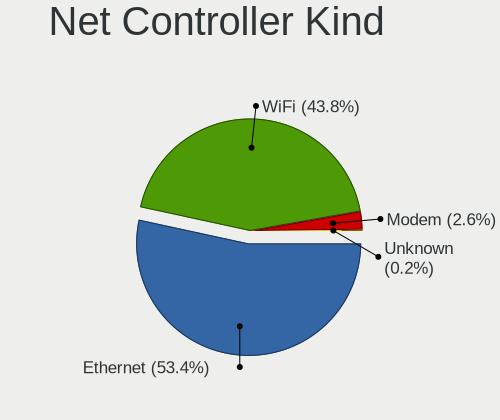

| Kind     | Computers | Percent |
|----------|-----------|---------|
| Ethernet | 741       | 54.13%  |
| WiFi     | 594       | 43.39%  |
| Modem    | 32        | 2.34%   |
| Unknown  | 2         | 0.15%   |

Used Controller
---------------

Currently used network controller

| Kind     | Computers | Percent |
|----------|-----------|---------|
| WiFi     | 485       | 56.73%  |
| Ethernet | 369       | 43.16%  |
| Modem    | 1         | 0.12%   |

NICs
----

Total network controllers on board

| Total | Computers | Percent |
|-------|-----------|---------|
| 2     | 471       | 57.23%  |
| 1     | 316       | 38.4%   |
| 0     | 27        | 3.28%   |
| 3     | 8         | 0.97%   |
| 4     | 1         | 0.12%   |

IPv6
----

IPv6 vs IPv4

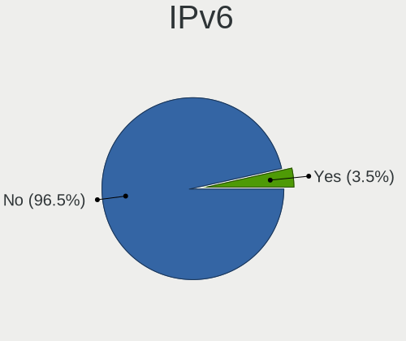

| Used | Computers | Percent |
|------|-----------|---------|
| No   | 807       | 98.29%  |
| Yes  | 14        | 1.71%   |

Bluetooth
---------

Bluetooth Vendor
----------------

Controller vendors

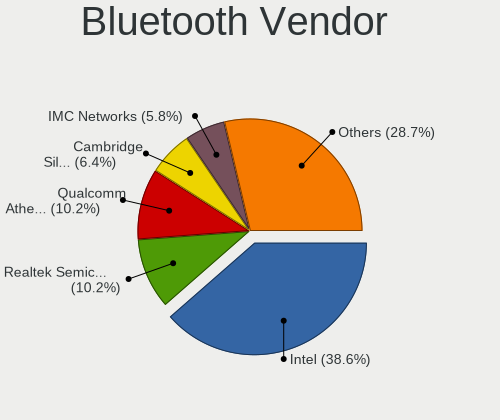

| Vendor                          | Computers | Percent |
|---------------------------------|-----------|---------|
| Intel                           | 170       | 38.03%  |
| Qualcomm Atheros Communications | 56        | 12.53%  |
| Realtek Semiconductor           | 40        | 8.95%   |
| Cambridge Silicon Radio         | 27        | 6.04%   |
| Broadcom                        | 27        | 6.04%   |
| Lite-On Technology              | 19        | 4.25%   |
| Foxconn / Hon Hai               | 19        | 4.25%   |
| Hewlett-Packard                 | 18        | 4.03%   |
| IMC Networks                    | 16        | 3.58%   |
| Apple                           | 15        | 3.36%   |
| Dell                            | 13        | 2.91%   |
| Ralink                          | 10        | 2.24%   |
| Toshiba                         | 7         | 1.57%   |
| ASUSTek Computer                | 4         | 0.89%   |
| Realtek                         | 1         | 0.22%   |
| Mobile Action Technology        | 1         | 0.22%   |
| Micro Star International        | 1         | 0.22%   |
| Marvell Semiconductor           | 1         | 0.22%   |
| Foxconn International           | 1         | 0.22%   |
| Edimax Technology               | 1         | 0.22%   |

Bluetooth Model
---------------

Controller models

| Model                                                                               | Computers | Percent |
|-------------------------------------------------------------------------------------|-----------|---------|
| Intel Bluetooth wireless interface                                                  | 75        | 16.78%  |
| Qualcomm Atheros  Bluetooth Device                                                  | 31        | 6.94%   |
| Intel Bluetooth 9460/9560 Jefferson Peak (JfP)                                      | 30        | 6.71%   |
| Cambridge Silicon Radio Bluetooth Dongle (HCI mode)                                 | 27        | 6.04%   |
| Intel AX201 Bluetooth                                                               | 24        | 5.37%   |
| Realtek Bluetooth Radio                                                             | 22        | 4.92%   |
| Realtek  Bluetooth 4.2 Adapter                                                      | 15        | 3.36%   |
| Intel AX200 Bluetooth                                                               | 14        | 3.13%   |
| Intel Bluetooth Device                                                              | 12        | 2.68%   |
| HP Broadcom 2070 Bluetooth Combo                                                    | 12        | 2.68%   |
| Qualcomm Atheros AR3011 Bluetooth                                                   | 11        | 2.46%   |
| Foxconn / Hon Hai Bluetooth Device                                                  | 11        | 2.46%   |
| Ralink RT3290 Bluetooth                                                             | 10        | 2.24%   |
| Broadcom BCM2045B (BDC-2.1)                                                         | 10        | 2.24%   |
| Lite-On Qualcomm Atheros QCA9377 Bluetooth                                          | 8         | 1.79%   |
| Intel Centrino Bluetooth Wireless Transceiver                                       | 8         | 1.79%   |
| Qualcomm Atheros AR3012 Bluetooth 4.0                                               | 7         | 1.57%   |
| Intel Wireless-AC 3168 Bluetooth                                                    | 7         | 1.57%   |
| Lite-On Bluetooth Device                                                            | 6         | 1.34%   |
| IMC Networks Bluetooth Device                                                       | 6         | 1.34%   |
| HP Bluetooth 2.0 Interface [Broadcom BCM2045]                                       | 6         | 1.34%   |
| Apple Bluetooth USB Host Controller                                                 | 6         | 1.34%   |
| IMC Networks Bluetooth Radio                                                        | 5         | 1.12%   |
| Apple Bluetooth HCI                                                                 | 5         | 1.12%   |
| Qualcomm Atheros AR9462 Bluetooth                                                   | 4         | 0.89%   |
| Lite-On Atheros AR3012 Bluetooth                                                    | 4         | 0.89%   |
| Dell BCM20702A0 Bluetooth Module                                                    | 4         | 0.89%   |
| Realtek RTL8723B Bluetooth                                                          | 3         | 0.67%   |
| Dell Wireless 370 Bluetooth Mini-card                                               | 3         | 0.67%   |
| Broadcom BCM2070 Bluetooth Device                                                   | 3         | 0.67%   |
| Apple Bluetooth Host Controller                                                     | 3         | 0.67%   |
| Toshiba RT Bluetooth Radio                                                          | 2         | 0.45%   |
| Toshiba Askey Bluetooth Module                                                      | 2         | 0.45%   |
| Qualcomm Atheros Bluetooth USB Host Controller                                      | 2         | 0.45%   |
| IMC Networks Bluetooth USB Host Controller                                          | 2         | 0.45%   |
| IMC Networks Atheros AR3012 Bluetooth 4.0 Adapter                                   | 2         | 0.45%   |
| Foxconn / Hon Hai BT                                                                | 2         | 0.45%   |
| Foxconn / Hon Hai Broadcom Bluetooth 2.1 Device                                     | 2         | 0.45%   |
| Foxconn / Hon Hai BCM20702A0                                                        | 2         | 0.45%   |
| Dell Wireless 365 Bluetooth                                                         | 2         | 0.45%   |
| Dell Wireless 360 Bluetooth                                                         | 2         | 0.45%   |
| Broadcom HP Portable Bumble Bee                                                     | 2         | 0.45%   |
| Broadcom BCM43142 Bluetooth 4.0                                                     | 2         | 0.45%   |
| Broadcom BCM20702A0 Bluetooth 4.0                                                   | 2         | 0.45%   |
| Broadcom BCM2070 Bluetooth 2.1 + EDR                                                | 2         | 0.45%   |
| ASUS BT-253 Bluetooth Adapter                                                       | 2         | 0.45%   |
| Toshiba Integrated Bluetooth HCI                                                    | 1         | 0.22%   |
| Toshiba Bluetooth Device                                                            | 1         | 0.22%   |
| Toshiba Atheros AR3012 Bluetooth                                                    | 1         | 0.22%   |
| Realtek Bluetooth Radio                                                             | 1         | 0.22%   |
| Qualcomm Atheros AR3012 Bluetooth                                                   | 1         | 0.22%   |
| Mobile Action MA-700 Bluetooth Adapter                                              | 1         | 0.22%   |
| Micro Star International Bluetooth dongle                                           | 1         | 0.22%   |
| Marvell Bluetooth and Wireless LAN Composite                                        | 1         | 0.22%   |
| Lite-On Bluetooth Radio                                                             | 1         | 0.22%   |
| IMC Networks Wireless_Device                                                        | 1         | 0.22%   |
| Foxconn International BCM43142A0 Bluetooth module                                   | 1         | 0.22%   |
| Foxconn / Hon Hai Foxconn T77H114 BCM2070 [Single-Chip Bluetooth 2.1 + EDR Adapter] | 1         | 0.22%   |
| Foxconn / Hon Hai Acer Bluetooth module                                             | 1         | 0.22%   |
| Edimax Wi-Fi N150 Bluetooth4.0 USB Adapter                                          | 1         | 0.22%   |

Sound
-----

Sound Vendor
------------

Sound card vendors

| Vendor                           | Computers | Percent |
|----------------------------------|-----------|---------|
| Intel                            | 672       | 62.92%  |
| Nvidia                           | 159       | 14.89%  |
| AMD                              | 143       | 13.39%  |
| C-Media Electronics              | 16        | 1.5%    |
| Logitech                         | 8         | 0.75%   |
| Creative Labs                    | 6         | 0.56%   |
| Corsair                          | 5         | 0.47%   |
| VIA Technologies                 | 3         | 0.28%   |
| Silicon Integrated Systems [SiS] | 3         | 0.28%   |
| Sennheiser Communications        | 3         | 0.28%   |
| Plantronics                      | 3         | 0.28%   |
| Lenovo                           | 3         | 0.28%   |
| JMTek                            | 3         | 0.28%   |
| Hewlett-Packard                  | 3         | 0.28%   |
| Apple                            | 3         | 0.28%   |
| Syntek                           | 2         | 0.19%   |
| Samson Technologies              | 2         | 0.19%   |
| Realtek Semiconductor            | 2         | 0.19%   |
| Razer USA                        | 2         | 0.19%   |
| Microsoft                        | 2         | 0.19%   |
| GN Netcom                        | 2         | 0.19%   |
| Generalplus Technology           | 2         | 0.19%   |
| Cooler Master                    | 2         | 0.19%   |
| ASUSTek Computer                 | 2         | 0.19%   |
| Xiaomi                           | 1         | 0.09%   |
| Texas Instruments                | 1         | 0.09%   |
| Tenx Technology                  | 1         | 0.09%   |
| Steinberg Soft-und Hardware      | 1         | 0.09%   |
| Sony                             | 1         | 0.09%   |
| Schiit Audio                     | 1         | 0.09%   |
| Micro Star International         | 1         | 0.09%   |
| Magic Control Technology         | 1         | 0.09%   |
| M-Audio                          | 1         | 0.09%   |
| iPassion Technology              | 1         | 0.09%   |
| GYROCOM C&C                      | 1         | 0.09%   |
| Focusrite-Novation               | 1         | 0.09%   |
| Creative Technology              | 1         | 0.09%   |
| Conexant Systems                 | 1         | 0.09%   |
| Cambridge Silicon Radio          | 1         | 0.09%   |
| Astro Gaming                     | 1         | 0.09%   |
| Afatech                          | 1         | 0.09%   |

Sound Model
-----------

Sound card models

| Model                                                                                             | Computers | Percent |
|---------------------------------------------------------------------------------------------------|-----------|---------|
| Intel 6 Series/C200 Series Chipset Family High Definition Audio Controller                        | 93        | 7.68%   |
| Intel Sunrise Point-LP HD Audio                                                                   | 84        | 6.94%   |
| Intel 7 Series/C216 Chipset Family High Definition Audio Controller                               | 67        | 5.53%   |
| Intel 5 Series/3400 Series Chipset High Definition Audio                                          | 51        | 4.21%   |
| Intel 8 Series/C220 Series Chipset High Definition Audio Controller                               | 44        | 3.63%   |
| Intel NM10/ICH7 Family High Definition Audio Controller                                           | 42        | 3.47%   |
| Intel 100 Series/C230 Series Chipset Family HD Audio Controller                                   | 38        | 3.14%   |
| Intel Xeon E3-1200 v3/4th Gen Core Processor HD Audio Controller                                  | 37        | 3.06%   |
| Intel 82801I (ICH9 Family) HD Audio Controller                                                    | 31        | 2.56%   |
| Intel Cannon Lake PCH cAVS                                                                        | 27        | 2.23%   |
| AMD Family 17h/19h HD Audio Controller                                                            | 25        | 2.06%   |
| Nvidia GF108 High Definition Audio Controller                                                     | 21        | 1.73%   |
| Intel Cannon Point-LP High Definition Audio Controller                                            | 20        | 1.65%   |
| Nvidia High Definition Audio Controller                                                           | 19        | 1.57%   |
| Intel Wildcat Point-LP High Definition Audio Controller                                           | 19        | 1.57%   |
| Intel Broadwell-U Audio Controller                                                                | 19        | 1.57%   |
| AMD SBx00 Azalia (Intel HDA)                                                                      | 19        | 1.57%   |
| Intel Atom/Celeron/Pentium Processor x5-E8000/J3xxx/N3xxx Series High Definition Audio Controller | 16        | 1.32%   |
| Intel 82801H (ICH8 Family) HD Audio Controller                                                    | 16        | 1.32%   |
| Intel 8 Series HD Audio Controller                                                                | 16        | 1.32%   |
| AMD Starship/Matisse HD Audio Controller                                                          | 16        | 1.32%   |
| Intel Tiger Lake-LP Smart Sound Technology Audio Controller                                       | 15        | 1.24%   |
| Intel Haswell-ULT HD Audio Controller                                                             | 15        | 1.24%   |
| AMD Ellesmere HDMI Audio [Radeon RX 470/480 / 570/580/590]                                        | 14        | 1.16%   |
| Intel 200 Series PCH HD Audio                                                                     | 13        | 1.07%   |
| AMD Family 17h (Models 00h-0fh) HD Audio Controller                                               | 13        | 1.07%   |
| AMD Renoir Radeon High Definition Audio Controller                                                | 12        | 0.99%   |
| AMD Family 15h (Models 60h-6fh) Audio Controller                                                  | 12        | 0.99%   |
| Nvidia GP107GL High Definition Audio Controller                                                   | 11        | 0.91%   |
| Nvidia GP106 High Definition Audio Controller                                                     | 11        | 0.91%   |
| Intel Ice Lake-LP Smart Sound Technology Audio Controller                                         | 10        | 0.83%   |
| Intel CM238 HD Audio Controller                                                                   | 10        | 0.83%   |
| Intel Celeron N3350/Pentium N4200/Atom E3900 Series Audio Cluster                                 | 10        | 0.83%   |
| Intel 82801JI (ICH10 Family) HD Audio Controller                                                  | 10        | 0.83%   |
| AMD Oland/Hainan/Cape Verde/Pitcairn HDMI Audio [Radeon HD 7000 Series]                           | 9         | 0.74%   |
| AMD Navi 10 HDMI Audio                                                                            | 9         | 0.74%   |
| AMD High Definition Audio Controller                                                              | 9         | 0.74%   |
| Nvidia TU116 High Definition Audio Controller                                                     | 8         | 0.66%   |
| Nvidia GP104 High Definition Audio Controller                                                     | 8         | 0.66%   |
| AMD Wrestler HDMI Audio                                                                           | 8         | 0.66%   |
| AMD Raven/Raven2/Fenghuang HDMI/DP Audio Controller                                               | 8         | 0.66%   |
| Nvidia GK104 HDMI Audio Controller                                                                | 7         | 0.58%   |
| Nvidia GF119 HDMI Audio Controller                                                                | 7         | 0.58%   |
| AMD Cedar HDMI Audio [Radeon HD 5400/6300/7300 Series]                                            | 7         | 0.58%   |
| Nvidia TU107 GeForce GTX 1650 High Definition Audio Controller                                    | 6         | 0.5%    |
| Nvidia GM107 High Definition Audio Controller [GeForce 940MX]                                     | 6         | 0.5%    |
| Nvidia GK208 HDMI/DP Audio Controller                                                             | 6         | 0.5%    |
| Intel Comet Lake PCH-LP cAVS                                                                      | 6         | 0.5%    |
| Intel Comet Lake PCH cAVS                                                                         | 6         | 0.5%    |
| Intel Celeron/Pentium Silver Processor High Definition Audio                                      | 6         | 0.5%    |
| AMD Turks HDMI Audio [Radeon HD 6500/6600 / 6700M Series]                                         | 6         | 0.5%    |
| AMD Baffin HDMI/DP Audio [Radeon RX 550 640SP / RX 560/560X]                                      | 6         | 0.5%    |
| Nvidia GM204 High Definition Audio Controller                                                     | 5         | 0.41%   |
| C-Media Electronics USB Audio Device                                                              | 5         | 0.41%   |
| AMD Kabini HDMI/DP Audio                                                                          | 5         | 0.41%   |
| Nvidia TU106 High Definition Audio Controller                                                     | 4         | 0.33%   |
| Nvidia GA104 High Definition Audio Controller                                                     | 4         | 0.33%   |
| C-Media Electronics Audio Adapter (Unitek Y-247A)                                                 | 4         | 0.33%   |
| AMD FCH Azalia Controller                                                                         | 4         | 0.33%   |
| Nvidia TU104 HD Audio Controller                                                                  | 3         | 0.25%   |

Memory
------

Memory Vendor
-------------

Memory module vendors

| Vendor              | Computers | Percent |
|---------------------|-----------|---------|
| SK hynix            | 92        | 23.12%  |
| Samsung Electronics | 72        | 18.09%  |
| Kingston            | 43        | 10.8%   |
| Unknown             | 31        | 7.79%   |
| Micron Technology   | 31        | 7.79%   |
| Corsair             | 24        | 6.03%   |
| Crucial             | 18        | 4.52%   |
| Transcend           | 16        | 4.02%   |
| A-DATA Technology   | 12        | 3.02%   |
| G.Skill             | 11        | 2.76%   |
| Ramaxel Technology  | 8         | 2.01%   |
| Patriot             | 8         | 2.01%   |
| Elpida              | 8         | 2.01%   |
| Nanya Technology    | 7         | 1.76%   |
| KLEVV               | 3         | 0.75%   |
| Unknown (ABCD)      | 2         | 0.5%    |
| Team                | 2         | 0.5%    |
| Essencore Limited   | 2         | 0.5%    |
| Apacer              | 2         | 0.5%    |
| Strontium           | 1         | 0.25%   |
| Silicon Power       | 1         | 0.25%   |
| Qimonda             | 1         | 0.25%   |
| Neo Forza           | 1         | 0.25%   |
| Kingmax             | 1         | 0.25%   |
| A-DA                | 1         | 0.25%   |

Memory Model
------------

Memory module models

| Model                                                            | Computers | Percent |
|------------------------------------------------------------------|-----------|---------|
| SK hynix RAM HMA81GS6AFR8N-UH 8GB SODIMM DDR4 2667MT/s           | 9         | 2.13%   |
| Samsung RAM M471A5244CB0-CTD 4096MB SODIMM DDR4 3266MT/s         | 8         | 1.9%    |
| SK hynix RAM HMT351S6EFR8A-PB 4GB SODIMM DDR3 1600MT/s           | 5         | 1.18%   |
| SK hynix RAM HMA851S6AFR6N-UH 4GB SODIMM DDR4 2667MT/s           | 5         | 1.18%   |
| SK hynix RAM HMA81GS6CJR8N-VK 8GB SODIMM DDR4 2667MT/s           | 5         | 1.18%   |
| Samsung RAM M471A5244CB0-CRC 4GB SODIMM DDR4 2667MT/s            | 5         | 1.18%   |
| SK hynix RAM HMA81GS6JJR8N-VK 8GB SODIMM DDR4 2667MT/s           | 4         | 0.95%   |
| Samsung RAM M471B5273DH0-CK0 4GB SODIMM DDR3 1600MT/s            | 4         | 0.95%   |
| Unknown RAM Module 2GB Row Of Chips LPDDR4 4267MT/s              | 3         | 0.71%   |
| Transcend RAM TS512MLK64V6H 4GB DIMM DDR3 1600MT/s               | 3         | 0.71%   |
| SK hynix RAM HMT425S6AFR6A-PB 2GB SODIMM DDR3 1600MT/s           | 3         | 0.71%   |
| SK hynix RAM HMT41GS6BFR8A-PB 8GB SODIMM DDR3 1600MT/s           | 3         | 0.71%   |
| SK hynix RAM HMT351S6CFR8C-PB 4GB SODIMM DDR3 1600MT/s           | 3         | 0.71%   |
| Samsung RAM M471B5273DH0-CH9 4GB SODIMM DDR3 1334MT/s            | 3         | 0.71%   |
| Samsung RAM M471B5173EB0-YK0 4GB SODIMM DDR3 1600MT/s            | 3         | 0.71%   |
| Samsung RAM M471B5173DB0-YK0 4GB SODIMM DDR3 1600MT/s            | 3         | 0.71%   |
| Samsung RAM M471A1K43DB1-CWE 8GB SODIMM DDR4 3200MT/s            | 3         | 0.71%   |
| Samsung RAM M471A1K43CB1-CRC 8GB SODIMM DDR4 2667MT/s            | 3         | 0.71%   |
| Nanya RAM NT2GC64B88B0NS-CG 2GB SODIMM DDR3 1334MT/s             | 3         | 0.71%   |
| Unknown RAM Module 512MB DIMM 400MT/s                            | 2         | 0.47%   |
| Unknown RAM Module 4GB DIMM 800MT/s                              | 2         | 0.47%   |
| Unknown RAM Module 4GB DIMM 400MT/s                              | 2         | 0.47%   |
| Unknown RAM Module 4GB DIMM 1333MT/s                             | 2         | 0.47%   |
| Unknown RAM Module 2048MB DIMM 1333MT/s                          | 2         | 0.47%   |
| Unknown (ABCD) RAM 123456789012345678 4GB SODIMM LPDDR4 2400MT/s | 2         | 0.47%   |
| Transcend RAM JM2666HSB-16G 16GB SODIMM DDR4 2667MT/s            | 2         | 0.47%   |
| SK hynix RAM Module 2GB SODIMM DDR3 1600MT/s                     | 2         | 0.47%   |
| SK hynix RAM HMT451U6BFR8C-PB 4096MB DIMM DDR3 1600MT/s          | 2         | 0.47%   |
| SK hynix RAM HMT451U6BFR8A-PB 4GB DIMM DDR3 1600MT/s             | 2         | 0.47%   |
| SK hynix RAM HMT451U6AFR8C-PB 4GB DIMM DDR3 1600MT/s             | 2         | 0.47%   |
| SK hynix RAM HMT451S6BFR8A-PB 4GB SODIMM DDR3 1600MT/s           | 2         | 0.47%   |
| SK hynix RAM HMT351S6BFR8C-H9 4GB SODIMM DDR3 1334MT/s           | 2         | 0.47%   |
| SK hynix RAM HMT325S6EFR8A-PB 2GB SODIMM DDR3 1600MT/s           | 2         | 0.47%   |
| SK hynix RAM HMA82GS6MFR8N-TF 16GB SODIMM DDR4 2133MT/s          | 2         | 0.47%   |
| SK hynix RAM HMA82GS6CJR8N-VK 16384MB SODIMM DDR4 2667MT/s       | 2         | 0.47%   |
| Samsung RAM Module 16GB SODIMM DDR4 3200MT/s                     | 2         | 0.47%   |
| Samsung RAM M471B5273CH0-CH9 4GB SODIMM DDR3 1334MT/s            | 2         | 0.47%   |
| Samsung RAM M471B1G73QH0-YK0 8GB SODIMM DDR3 1600MT/s            | 2         | 0.47%   |
| Samsung RAM M471B1G73EB0-YK0 8GB SODIMM DDR3 1600MT/s            | 2         | 0.47%   |
| Samsung RAM M471A1K43CB1-CTD 8GB SODIMM DDR4 2667MT/s            | 2         | 0.47%   |
| Patriot RAM PSD48G266681 8GB DIMM DDR4 2934MT/s                  | 2         | 0.47%   |
| Patriot RAM PSD38G16002 8GB DIMM DDR3 1600MT/s                   | 2         | 0.47%   |
| Nanya RAM NT4GC64B8HB0NS-CG 4096MB SODIMM DDR3 1334MT/s          | 2         | 0.47%   |
| Micron RAM 8KTF51264HZ-1G6E1 4GB SODIMM DDR3 1600MT/s            | 2         | 0.47%   |
| Micron RAM 8JTF51264AZ-1G6E1 4096MB DIMM DDR3 1600MT/s           | 2         | 0.47%   |
| Micron RAM 8JSF25664HZ-1G4D1 2048MB SODIMM DDR3 1334MT/s         | 2         | 0.47%   |
| KLEVV RAM KD4AGUA8A-26N1900 16GB DIMM DDR4 2667MT/s              | 2         | 0.47%   |
| Kingston RAM 9905700-026.A00G 8192MB SODIMM DDR4 2667MT/s        | 2         | 0.47%   |
| Kingston RAM 9905678-023.A00G 8192MB DIMM DDR4 2134MT/s          | 2         | 0.47%   |
| Kingston RAM 9905663-030.A00G 16GB SODIMM DDR4 2667MT/s          | 2         | 0.47%   |
| Kingston RAM 9905663-021.A00G 16GB SODIMM DDR4 2400MT/s          | 2         | 0.47%   |
| G.Skill RAM F4-3200C16-8GVKB 8GB DIMM DDR4 3200MT/s              | 2         | 0.47%   |
| Elpida RAM EBJ21UE8BDS0-DJ-F 2GB SODIMM DDR3 1334MT/s            | 2         | 0.47%   |
| Corsair RAM CMZ8GX3M1A1600C10 8GB DIMM DDR3 1600MT/s             | 2         | 0.47%   |
| Corsair RAM CMZ4GX3M1A1600C9 4GB DIMM DDR3 1600MT/s              | 2         | 0.47%   |
| Corsair RAM CMSX16GX4M1A2666C18 16GB SODIMM DDR4 2667MT/s        | 2         | 0.47%   |
| Corsair RAM CMSO8GX4M1A2133C15 8GB SODIMM DDR4 2133MT/s          | 2         | 0.47%   |
| Corsair RAM CMK32GX4M2A2666C16 16GB DIMM DDR4 3100MT/s           | 2         | 0.47%   |
| A-DATA RAM Module 8192MB DIMM DDR4 2133MT/s                      | 2         | 0.47%   |
| Unknown RAM Module 8GB DIMM DDR3 1333MT/s                        | 1         | 0.24%   |

Memory Kind
-----------

Memory module kinds

| Kind    | Computers | Percent |
|---------|-----------|---------|
| DDR4    | 136       | 43.87%  |
| DDR3    | 128       | 41.29%  |
| Unknown | 15        | 4.84%   |
| DDR2    | 14        | 4.52%   |
| LPDDR4  | 11        | 3.55%   |
| LPDDR3  | 4         | 1.29%   |
| DDR     | 2         | 0.65%   |

Memory Form Factor
------------------

Physical design of the memory module

| Name         | Computers | Percent |
|--------------|-----------|---------|
| SODIMM       | 191       | 61.02%  |
| DIMM         | 104       | 33.23%  |
| Row Of Chips | 13        | 4.15%   |
| Chip         | 3         | 0.96%   |
| FB-DIMM      | 1         | 0.32%   |
| Unknown      | 1         | 0.32%   |

Memory Size
-----------

Memory module size

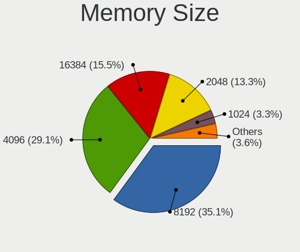

| Size  | Computers | Percent |
|-------|-----------|---------|
| 4096  | 125       | 35.92%  |
| 8192  | 107       | 30.75%  |
| 2048  | 55        | 15.8%   |
| 16384 | 43        | 12.36%  |
| 1024  | 10        | 2.87%   |
| 32768 | 4         | 1.15%   |
| 512   | 4         | 1.15%   |

Memory Speed
------------

Memory module speed

| Speed   | Computers | Percent |
|---------|-----------|---------|
| 1600    | 79        | 22.7%   |
| 2667    | 66        | 18.97%  |
| 1333    | 33        | 9.48%   |
| 2400    | 25        | 7.18%   |
| 2133    | 25        | 7.18%   |
| 3200    | 20        | 5.75%   |
| 1334    | 16        | 4.6%    |
| 800     | 9         | 2.59%   |
| 3266    | 8         | 2.3%    |
| 667     | 7         | 2.01%   |
| 1867    | 5         | 1.44%   |
| 1067    | 5         | 1.44%   |
| 4267    | 4         | 1.15%   |
| 3466    | 4         | 1.15%   |
| 400     | 4         | 1.15%   |
| 3600    | 3         | 0.86%   |
| 2933    | 3         | 0.86%   |
| 975     | 3         | 0.86%   |
| Unknown | 3         | 0.86%   |
| 3100    | 2         | 0.57%   |
| 2934    | 2         | 0.57%   |
| 2666    | 2         | 0.57%   |
| 2134    | 2         | 0.57%   |
| 1800    | 2         | 0.57%   |
| 1066    | 2         | 0.57%   |
| 41632   | 1         | 0.29%   |
| 8400    | 1         | 0.29%   |
| 6000    | 1         | 0.29%   |
| 3800    | 1         | 0.29%   |
| 3733    | 1         | 0.29%   |
| 3400    | 1         | 0.29%   |
| 3066    | 1         | 0.29%   |
| 3000    | 1         | 0.29%   |
| 2800    | 1         | 0.29%   |
| 2733    | 1         | 0.29%   |
| 2200    | 1         | 0.29%   |
| 1776    | 1         | 0.29%   |
| 533     | 1         | 0.29%   |
| 133     | 1         | 0.29%   |

Printers & scanners
-------------------

Printer Vendor
--------------

Printer device vendors

| Vendor                | Computers | Percent |
|-----------------------|-----------|---------|
| Canon                 | 6         | 28.57%  |
| Samsung Electronics   | 5         | 23.81%  |
| Pantum                | 3         | 14.29%  |
| Hewlett-Packard       | 2         | 9.52%   |
| Seiko Epson           | 1         | 4.76%   |
| Oki Data              | 1         | 4.76%   |
| Lexmark International | 1         | 4.76%   |
| Dell                  | 1         | 4.76%   |
| Brother Industries    | 1         | 4.76%   |

Printer Model
-------------

Printer device models

| Model                                      | Computers | Percent |
|--------------------------------------------|-----------|---------|
| Pantum P2200 series                        | 3         | 14.29%  |
| Seiko Epson L3110 Series                   | 1         | 4.76%   |
| Samsung SCX-4623 Series                    | 1         | 4.76%   |
| Samsung SCX-4600 Series                    | 1         | 4.76%   |
| Samsung M2070 Series                       | 1         | 4.76%   |
| Samsung M2020 Series                       | 1         | 4.76%   |
| Samsung Composite Device                   | 1         | 4.76%   |
| Oki Data USB Device                        | 1         | 4.76%   |
| Lexmark International InkJet Color Printer | 1         | 4.76%   |
| HP OfficeJet Pro 9010 series               | 1         | 4.76%   |
| HP LaserJet 1022                           | 1         | 4.76%   |
| Dell 1250c Color Printer                   | 1         | 4.76%   |
| Canon PIXMA MX410                          | 1         | 4.76%   |
| Canon PIXMA MG3600 Series                  | 1         | 4.76%   |
| Canon PIXMA MG2500 Series                  | 1         | 4.76%   |
| Canon MF210 Series                         | 1         | 4.76%   |
| Canon G4000 series                         | 1         | 4.76%   |
| Canon G3010 series                         | 1         | 4.76%   |
| Brother HL-2130 series                     | 1         | 4.76%   |

Scanner Vendor
--------------

Scanner device vendors

| Vendor          | Computers | Percent |
|-----------------|-----------|---------|
| Seiko Epson     | 1         | 50%     |
| Hewlett-Packard | 1         | 50%     |

Scanner Model
-------------

Scanner device models

| Model                                              | Computers | Percent |
|----------------------------------------------------|-----------|---------|
| Seiko Epson GT-8400UF [Perfection 1670/1670 PHOTO] | 1         | 50%     |
| HP OfficeJet 6110                                  | 1         | 50%     |

Camera
------

Camera Vendor
-------------

Camera device vendors

| Vendor                                            | Computers | Percent |
|---------------------------------------------------|-----------|---------|
| Chicony Electronics                               | 83        | 17.33%  |
| Microdia                                          | 52        | 10.86%  |
| Realtek Semiconductor                             | 49        | 10.23%  |
| Acer                                              | 37        | 7.72%   |
| Sunplus Innovation Technology                     | 34        | 7.1%    |
| IMC Networks                                      | 31        | 6.47%   |
| Quanta                                            | 23        | 4.8%    |
| Logitech                                          | 20        | 4.18%   |
| Apple                                             | 20        | 4.18%   |
| Cheng Uei Precision Industry (Foxlink)            | 18        | 3.76%   |
| Syntek                                            | 14        | 2.92%   |
| Suyin                                             | 14        | 2.92%   |
| Samsung Electronics                               | 13        | 2.71%   |
| Lite-On Technology                                | 13        | 2.71%   |
| Microsoft                                         | 8         | 1.67%   |
| Silicon Motion                                    | 7         | 1.46%   |
| Alcor Micro                                       | 7         | 1.46%   |
| Z-Star Microelectronics                           | 5         | 1.04%   |
| Ricoh                                             | 5         | 1.04%   |
| Luxvisions Innotech Limited                       | 4         | 0.84%   |
| Primax Electronics                                | 3         | 0.63%   |
| Lenovo                                            | 3         | 0.63%   |
| LG Electronics                                    | 2         | 0.42%   |
| Importek                                          | 2         | 0.42%   |
| GEMBIRD                                           | 2         | 0.42%   |
| Sunplus Technology                                | 1         | 0.21%   |
| STMicroelectronics Imaging Division (VLSI Vision) | 1         | 0.21%   |
| Spreadtrum Communications                         | 1         | 0.21%   |
| SN0002                                            | 1         | 0.21%   |
| KYE Systems (Mouse Systems)                       | 1         | 0.21%   |
| icSpring                                          | 1         | 0.21%   |
| Google                                            | 1         | 0.21%   |
| DJJHNA29IE70D3                                    | 1         | 0.21%   |
| DigiTech                                          | 1         | 0.21%   |
| Asuscom Network                                   | 1         | 0.21%   |

Camera Model
------------

Camera device models

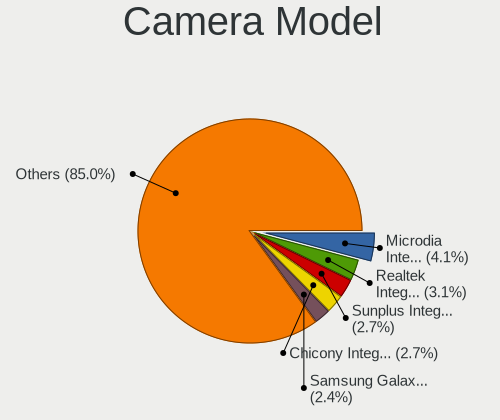

| Model                                                       | Computers | Percent |
|-------------------------------------------------------------|-----------|---------|
| Microdia Integrated_Webcam_HD                               | 22        | 4.57%   |
| Realtek Integrated_Webcam_HD                                | 17        | 3.53%   |
| Sunplus Integrated_Webcam_HD                                | 14        | 2.91%   |
| Samsung Galaxy A5 (MTP)                                     | 12        | 2.49%   |
| IMC Networks USB2.0 VGA UVC WebCam                          | 11        | 2.29%   |
| Acer Integrated Camera                                      | 10        | 2.08%   |
| Microdia Integrated Webcam                                  | 9         | 1.87%   |
| Chicony Integrated Camera                                   | 9         | 1.87%   |
| Chicony HD Webcam                                           | 8         | 1.66%   |
| Apple iPhone 5/5C/5S/6/SE                                   | 7         | 1.46%   |
| Realtek Integrated Webcam HD                                | 6         | 1.25%   |
| Quanta VGA WebCam                                           | 6         | 1.25%   |
| IMC Networks USB2.0 HD UVC WebCam                           | 6         | 1.25%   |
| IMC Networks Integrated Camera                              | 6         | 1.25%   |
| Chicony EasyCamera                                          | 6         | 1.25%   |
| Quanta HP HD Camera                                         | 5         | 1.04%   |
| Logitech Webcam C270                                        | 5         | 1.04%   |
| Chicony USB2.0 VGA UVC WebCam                               | 5         | 1.04%   |
| Cheng Uei Precision Industry (Foxlink) Webcam               | 5         | 1.04%   |
| Apple FaceTime HD Camera                                    | 5         | 1.04%   |
| Acer Lenovo EasyCamera                                      | 5         | 1.04%   |
| Syntek Integrated Camera                                    | 4         | 0.83%   |
| Syntek EasyCamera                                           | 4         | 0.83%   |
| Sunplus HD Webcam                                           | 4         | 0.83%   |
| Realtek Integrated Webcam                                   | 4         | 0.83%   |
| Realtek HP Truevision HD                                    | 4         | 0.83%   |
| Quanta HP Webcam                                            | 4         | 0.83%   |
| Microdia Laptop_Integrated_Webcam_HD                        | 4         | 0.83%   |
| Lite-On HP HD Camera                                        | 4         | 0.83%   |
| Chicony HP Webcam                                           | 4         | 0.83%   |
| Chicony HP TrueVision HD Camera                             | 4         | 0.83%   |
| Cheng Uei Precision Industry (Foxlink) HP Truevision HD     | 4         | 0.83%   |
| Apple FaceTime HD Camera (Built-in)                         | 4         | 0.83%   |
| Alcor Micro USB 2.0 PC cam                                  | 4         | 0.83%   |
| Acer SunplusIT Integrated Camera                            | 4         | 0.83%   |
| Acer EasyCamera                                             | 4         | 0.83%   |
| Syntek Lenovo EasyCamera                                    | 3         | 0.62%   |
| Suyin HP TrueVision HD Integrated Webcam                    | 3         | 0.62%   |
| Suyin Acer/HP Integrated Webcam [CN0314]                    | 3         | 0.62%   |
| Realtek USB2.0 VGA UVC WebCam                               | 3         | 0.62%   |
| Realtek HD Webcam - Realtek                                 | 3         | 0.62%   |
| Microsoft LifeCam HD-3000                                   | 3         | 0.62%   |
| Microdia Dell Laptop Integrated Webcam HD                   | 3         | 0.62%   |
| Logitech Webcam C170                                        | 3         | 0.62%   |
| Lite-On Integrated Camera                                   | 3         | 0.62%   |
| Lenovo Integrated Webcam [R5U877]                           | 3         | 0.62%   |
| Chicony USB 2.0 Camera                                      | 3         | 0.62%   |
| Chicony Lenovo Integrated Camera (0.3MP)                    | 3         | 0.62%   |
| Chicony Integrated HP HD Webcam                             | 3         | 0.62%   |
| Chicony HP Laptop Integrated Webcam [2 MP Fixed]            | 3         | 0.62%   |
| Apple Built-in iSight                                       | 3         | 0.62%   |
| Acer BisonCam, NB Pro                                       | 3         | 0.62%   |
| Z-Star Venus USB2.0 Camera                                  | 2         | 0.42%   |
| Suyin 1.3M WebCam (notebook emachines E730, Acer sub-brand) | 2         | 0.42%   |
| Sunplus Laptop_Integrated_Webcam_FHD                        | 2         | 0.42%   |
| Sunplus Full HD webcam                                      | 2         | 0.42%   |
| Silicon Motion WebCam SC-13HDL11939N                        | 2         | 0.42%   |
| Silicon Motion 300k Pixel Camera                            | 2         | 0.42%   |
| Realtek Integrated Camera                                   | 2         | 0.42%   |
| Realtek Acer 640 x 480 laptop camera                        | 2         | 0.42%   |

Security
--------

Fingerprint Vendor
------------------

Fingerprint sensor vendors

| Vendor                     | Computers | Percent |
|----------------------------|-----------|---------|
| Validity Sensors           | 52        | 48.6%   |
| Synaptics                  | 17        | 15.89%  |
| Upek                       | 12        | 11.21%  |
| Shenzhen Goodix Technology | 11        | 10.28%  |
| AuthenTec                  | 8         | 7.48%   |
| LighTuning Technology      | 5         | 4.67%   |
| STMicroelectronics         | 1         | 0.93%   |
| Focal-systems.Corp         | 1         | 0.93%   |

Fingerprint Model
-----------------

Fingerprint sensor models

| Model                                                      | Computers | Percent |
|------------------------------------------------------------|-----------|---------|
| Validity Sensors VFS495 Fingerprint Reader                 | 12        | 11.21%  |
| Upek Biometric Touchchip/Touchstrip Fingerprint Sensor     | 11        | 10.28%  |
| Validity Sensors VFS5011 Fingerprint Reader                | 6         | 5.61%   |
| Validity Sensors VFS471 Fingerprint Reader                 | 6         | 5.61%   |
| Validity Sensors VFS 5011 fingerprint sensor               | 6         | 5.61%   |
| Shenzhen Goodix Fingerprint Reader                         | 6         | 5.61%   |
| Validity Sensors VFS451 Fingerprint Reader                 | 5         | 4.67%   |
| Unknown                                                    | 5         | 4.67%   |
| Validity Sensors VFS7500 Touch Fingerprint Sensor          | 3         | 2.8%    |
| Validity Sensors Synaptics WBDI                            | 3         | 2.8%    |
| Validity Sensors Swipe Fingerprint Sensor                  | 3         | 2.8%    |
| Validity Sensors Fingerprint scanner                       | 3         | 2.8%    |
| Synaptics  VFS7552 Touch Fingerprint Sensor with PurePrint | 3         | 2.8%    |
| Synaptics Metallica MOH Touch Fingerprint Reader           | 3         | 2.8%    |
| Shenzhen Goodix FingerPrint                                | 3         | 2.8%    |
| AuthenTec AES2810                                          | 3         | 2.8%    |
| Validity Sensors VFS491                                    | 2         | 1.87%   |
| Synaptics  WBDI                                            | 2         | 1.87%   |
| Synaptics Prometheus MIS Touch Fingerprint Reader          | 2         | 1.87%   |
| Shenzhen Goodix  FingerPrint Device                        | 2         | 1.87%   |
| LighTuning ES603 Swipe Fingerprint Sensor                  | 2         | 1.87%   |
| AuthenTec Fingerprint Sensor                               | 2         | 1.87%   |
| AuthenTec AES2501 Fingerprint Sensor                       | 2         | 1.87%   |
| Validity Sensors VFS7552 Touch Fingerprint Sensor          | 1         | 0.93%   |
| Validity Sensors VFS301 Fingerprint Reader                 | 1         | 0.93%   |
| Validity Sensors VFS300 Fingerprint Reader                 | 1         | 0.93%   |
| Upek TCS5B Fingerprint sensor                              | 1         | 0.93%   |
| Synaptics  FS7604 Touch Fingerprint Sensor with PurePrint  | 1         | 0.93%   |
| Synaptics Metallica MIS Touch Fingerprint Reader           | 1         | 0.93%   |
| STMicroelectronics Fingerprint Reader                      | 1         | 0.93%   |
| LighTuning Fingerprint Sensor                              | 1         | 0.93%   |
| LighTuning Fingerprint Reader                              | 1         | 0.93%   |
| LighTuning EgisTec Touch Fingerprint Sensor                | 1         | 0.93%   |
| Focal-systems.Corp FT9201Fingerprint.                      | 1         | 0.93%   |
| AuthenTec AES1600                                          | 1         | 0.93%   |

Chipcard Vendor
---------------

Chipcard module vendors

| Vendor      | Computers | Percent |
|-------------|-----------|---------|
| Broadcom    | 32        | 69.57%  |
| Lenovo      | 5         | 10.87%  |
| O2 Micro    | 4         | 8.7%    |
| Alcor Micro | 3         | 6.52%   |
| Upek        | 2         | 4.35%   |

Chipcard Model
--------------

Chipcard module models

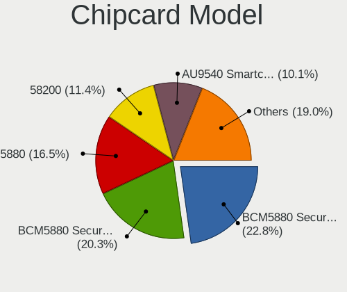

| Model                                                                        | Computers | Percent |
|------------------------------------------------------------------------------|-----------|---------|
| Broadcom BCM5880 Secure Applications Processor                               | 11        | 23.91%  |
| Broadcom 5880                                                                | 8         | 17.39%  |
| Broadcom BCM5880 Secure Applications Processor with fingerprint swipe sensor | 7         | 15.22%  |
| Broadcom 58200                                                               | 6         | 13.04%  |
| Lenovo Integrated Smart Card Reader                                          | 5         | 10.87%  |
| O2 Micro OZ776 CCID Smartcard Reader                                         | 4         | 8.7%    |
| Alcor Micro AU9540 Smartcard Reader                                          | 3         | 6.52%   |
| Upek TouchChip Fingerprint Coprocessor (WBF advanced mode)                   | 2         | 4.35%   |

Unsupported
-----------

Unsupported Devices
-------------------

Total unsupported devices on board

| Total | Computers | Percent |
|-------|-----------|---------|
| 0     | 578       | 69.47%  |
| 1     | 205       | 24.64%  |
| 2     | 43        | 5.17%   |
| 3     | 4         | 0.48%   |
| 9     | 1         | 0.12%   |
| 5     | 1         | 0.12%   |

Unsupported Device Types
------------------------

Types of unsupported devices

| Type                     | Computers | Percent |
|--------------------------|-----------|---------|
| Fingerprint reader       | 107       | 35.08%  |
| Graphics card            | 47        | 15.41%  |
| Chipcard                 | 43        | 14.1%   |
| Net/wireless             | 37        | 12.13%  |
| Multimedia controller    | 14        | 4.59%   |
| Bluetooth                | 13        | 4.26%   |
| Communication controller | 11        | 3.61%   |
| Sound                    | 6         | 1.97%   |
| Camera                   | 6         | 1.97%   |
| Storage                  | 5         | 1.64%   |
| Modem                    | 4         | 1.31%   |
| Unassigned class         | 3         | 0.98%   |
| Card reader              | 3         | 0.98%   |
| Network                  | 2         | 0.66%   |
| Net/ethernet             | 2         | 0.66%   |
| Storage/nvme             | 1         | 0.33%   |
| Flash memory             | 1         | 0.33%   |

