Linux in South Africa - Tested Hardware & Statistics
----------------------------------------------------

A project to collect tested hardware configurations for Linux in South Africa.

Anyone can contribute to this report by the [hw-probe](https://github.com/linuxhw/hw-probe) tool:

    sudo -E hw-probe -all -upload

Please contribute! Especially if your hardware is rare.

This is a report for all computer types. See also reports for [desktops](/Location/South_Africa/Desktop/README.md) and [notebooks](/Location/South_Africa/Notebook/README.md).

Contents
--------

* [ Test Cases ](#test-cases)

* [ System ](#system)
  - [ OS                       ](#os)
  - [ OS Family                ](#os-family)
  - [ Kernel                   ](#kernel)
  - [ Kernel Family            ](#kernel-family)
  - [ Kernel Major Ver.        ](#kernel-major-ver)
  - [ Arch                     ](#arch)
  - [ DE                       ](#de)
  - [ Display Server           ](#display-server)
  - [ Display Manager          ](#display-manager)
  - [ OS Lang                  ](#os-lang)
  - [ Boot Mode                ](#boot-mode)
  - [ Filesystem               ](#filesystem)
  - [ Part. scheme             ](#part-scheme)
  - [ Dual Boot with Linux/BSD ](#dual-boot-with-linuxbsd)
  - [ Dual Boot (Win)          ](#dual-boot-win)

* [ Board ](#board)
  - [ Vendor                   ](#vendor)
  - [ Model                    ](#model)
  - [ Model Family             ](#model-family)
  - [ MFG Year                 ](#mfg-year)
  - [ Form Factor              ](#form-factor)
  - [ Secure Boot              ](#secure-boot)
  - [ Coreboot                 ](#coreboot)
  - [ RAM Size                 ](#ram-size)
  - [ RAM Used                 ](#ram-used)
  - [ Total Drives             ](#total-drives)
  - [ Has CD-ROM               ](#has-cd-rom)
  - [ Has Ethernet             ](#has-ethernet)
  - [ Has WiFi                 ](#has-wifi)
  - [ Has Bluetooth            ](#has-bluetooth)

* [ Location ](#location)
  - [ Country                  ](#country)
  - [ City                     ](#city)

* [ Drives ](#drives)
  - [ Drive Vendor             ](#drive-vendor)
  - [ Drive Model              ](#drive-model)
  - [ HDD Vendor               ](#hdd-vendor)
  - [ SSD Vendor               ](#ssd-vendor)
  - [ Drive Kind               ](#drive-kind)
  - [ Drive Connector          ](#drive-connector)
  - [ Drive Size               ](#drive-size)
  - [ Space Total              ](#space-total)
  - [ Space Used               ](#space-used)
  - [ Malfunc. Drives          ](#malfunc-drives)
  - [ Malfunc. Drive Vendor    ](#malfunc-drive-vendor)
  - [ Malfunc. HDD Vendor      ](#malfunc-hdd-vendor)
  - [ Malfunc. Drive Kind      ](#malfunc-drive-kind)
  - [ Failed Drives            ](#failed-drives)
  - [ Failed Drive Vendor      ](#failed-drive-vendor)
  - [ Drive Status             ](#drive-status)

* [ Storage controller ](#storage-controller)
  - [ Storage Vendor           ](#storage-vendor)
  - [ Storage Model            ](#storage-model)
  - [ Storage Kind             ](#storage-kind)

* [ Processor ](#processor)
  - [ CPU Vendor               ](#cpu-vendor)
  - [ CPU Model                ](#cpu-model)
  - [ CPU Model Family         ](#cpu-model-family)
  - [ CPU Cores                ](#cpu-cores)
  - [ CPU Sockets              ](#cpu-sockets)
  - [ CPU Threads              ](#cpu-threads)
  - [ CPU Op-Modes             ](#cpu-op-modes)
  - [ CPU Microcode            ](#cpu-microcode)
  - [ CPU Microarch            ](#cpu-microarch)

* [ Graphics ](#graphics)
  - [ GPU Vendor               ](#gpu-vendor)
  - [ GPU Model                ](#gpu-model)
  - [ GPU Combo                ](#gpu-combo)
  - [ GPU Driver               ](#gpu-driver)
  - [ GPU Memory               ](#gpu-memory)

* [ Monitor ](#monitor)
  - [ Monitor Vendor           ](#monitor-vendor)
  - [ Monitor Model            ](#monitor-model)
  - [ Monitor Resolution       ](#monitor-resolution)
  - [ Monitor Diagonal         ](#monitor-diagonal)
  - [ Monitor Width            ](#monitor-width)
  - [ Aspect Ratio             ](#aspect-ratio)
  - [ Monitor Area             ](#monitor-area)
  - [ Pixel Density            ](#pixel-density)
  - [ Multiple Monitors        ](#multiple-monitors)

* [ Network ](#network)
  - [ Net Controller Vendor    ](#net-controller-vendor)
  - [ Net Controller Model     ](#net-controller-model)
  - [ Wireless Vendor          ](#wireless-vendor)
  - [ Wireless Model           ](#wireless-model)
  - [ Ethernet Vendor          ](#ethernet-vendor)
  - [ Ethernet Model           ](#ethernet-model)
  - [ Net Controller Kind      ](#net-controller-kind)
  - [ Used Controller          ](#used-controller)
  - [ NICs                     ](#nics)
  - [ IPv6                     ](#ipv6)

* [ Bluetooth ](#bluetooth)
  - [ Bluetooth Vendor         ](#bluetooth-vendor)
  - [ Bluetooth Model          ](#bluetooth-model)

* [ Sound ](#sound)
  - [ Sound Vendor             ](#sound-vendor)
  - [ Sound Model              ](#sound-model)

* [ Memory ](#memory)
  - [ Memory Vendor            ](#memory-vendor)
  - [ Memory Model             ](#memory-model)
  - [ Memory Kind              ](#memory-kind)
  - [ Memory Form Factor       ](#memory-form-factor)
  - [ Memory Size              ](#memory-size)
  - [ Memory Speed             ](#memory-speed)

* [ Printers & scanners ](#printers--scanners)
  - [ Printer Vendor           ](#printer-vendor)
  - [ Printer Model            ](#printer-model)
  - [ Scanner Vendor           ](#scanner-vendor)
  - [ Scanner Model            ](#scanner-model)

* [ Camera ](#camera)
  - [ Camera Vendor            ](#camera-vendor)
  - [ Camera Model             ](#camera-model)

* [ Security ](#security)
  - [ Fingerprint Vendor       ](#fingerprint-vendor)
  - [ Fingerprint Model        ](#fingerprint-model)
  - [ Chipcard Vendor          ](#chipcard-vendor)
  - [ Chipcard Model           ](#chipcard-model)

* [ Unsupported ](#unsupported)
  - [ Unsupported Devices      ](#unsupported-devices)
  - [ Unsupported Device Types ](#unsupported-device-types)

Test Cases
----------

Total: 1440

| Vendor        | Model                       | Form-Factor | Probe                                                      | Date         |
|---------------|-----------------------------|-------------|------------------------------------------------------------|--------------|
| Lenovo        | 36DB SDK0J40688 WIN 3424... | All in one  | [ddad62bbcb](https://linux-hardware.org/?probe=ddad62bbcb) | Dec 31, 2022 |
| HP            | ProLiant MicroServer        | Desktop     | [03b6f5a97d](https://linux-hardware.org/?probe=03b6f5a97d) | Dec 30, 2022 |
| Lenovo        | IdeaPad 110-15IBR 80T7      | Notebook    | [ceb89aefed](https://linux-hardware.org/?probe=ceb89aefed) | Dec 30, 2022 |
| MSI           | X570-A PRO                  | Desktop     | [7af9125172](https://linux-hardware.org/?probe=7af9125172) | Dec 29, 2022 |
| Acer          | Aspire A315-53              | Notebook    | [9c28036440](https://linux-hardware.org/?probe=9c28036440) | Dec 29, 2022 |
| HP            | ProBook 6570b               | Notebook    | [46fd918b7c](https://linux-hardware.org/?probe=46fd918b7c) | Dec 29, 2022 |
| HP            | ZBook Fury 16 G9 Mobile ... | Notebook    | [6c67e1435e](https://linux-hardware.org/?probe=6c67e1435e) | Dec 29, 2022 |
| HP            | G62                         | Notebook    | [05ad917600](https://linux-hardware.org/?probe=05ad917600) | Dec 28, 2022 |
| Gigabyte      | Z370 HD3-CF                 | Desktop     | [ac6571db76](https://linux-hardware.org/?probe=ac6571db76) | Dec 27, 2022 |
| Gigabyte      | H61M-S2PV                   | Desktop     | [4403153e04](https://linux-hardware.org/?probe=4403153e04) | Dec 27, 2022 |
| HP            | Compaq CQ58                 | Notebook    | [e18b58bbde](https://linux-hardware.org/?probe=e18b58bbde) | Dec 26, 2022 |
| HP            | Compaq CQ58                 | Notebook    | [7e0cac17f6](https://linux-hardware.org/?probe=7e0cac17f6) | Dec 26, 2022 |
| HP            | 1495                        | Desktop     | [b8e1dc67eb](https://linux-hardware.org/?probe=b8e1dc67eb) | Dec 26, 2022 |
| Dell          | Inspiron 15 7510            | Notebook    | [d5702b0c66](https://linux-hardware.org/?probe=d5702b0c66) | Dec 24, 2022 |
| ASRock        | G31M-S                      | Desktop     | [476c5ec563](https://linux-hardware.org/?probe=476c5ec563) | Dec 22, 2022 |
| ASRock        | G31M-S                      | Desktop     | [88d93da5a7](https://linux-hardware.org/?probe=88d93da5a7) | Dec 22, 2022 |
| Dell          | MXG071                      | Notebook    | [b999ae7bba](https://linux-hardware.org/?probe=b999ae7bba) | Dec 19, 2022 |
| Dell          | MXG071                      | Notebook    | [587b5fb932](https://linux-hardware.org/?probe=587b5fb932) | Dec 19, 2022 |
| Gigabyte      | G31M-ES2C                   | Desktop     | [5de13fdffa](https://linux-hardware.org/?probe=5de13fdffa) | Dec 19, 2022 |
| Gigabyte      | G31M-ES2C                   | Desktop     | [98fe52d91e](https://linux-hardware.org/?probe=98fe52d91e) | Dec 17, 2022 |
| MSI           | PRO B660M-E DDR4            | Desktop     | [3f4e01746b](https://linux-hardware.org/?probe=3f4e01746b) | Dec 17, 2022 |
| Lenovo        | ThinkPad X1 Extreme 2nd ... | Notebook    | [9768b1fe82](https://linux-hardware.org/?probe=9768b1fe82) | Dec 16, 2022 |
| MECER         | CA11Q5_PRO                  | Notebook    | [b8d784f0ef](https://linux-hardware.org/?probe=b8d784f0ef) | Dec 16, 2022 |
| MECER         | CA11Q5_PRO                  | Notebook    | [e2e6c34fde](https://linux-hardware.org/?probe=e2e6c34fde) | Dec 16, 2022 |
| Apple         | MacBookAir7,1               | Notebook    | [facc218586](https://linux-hardware.org/?probe=facc218586) | Dec 15, 2022 |
| Apple         | Mac-031B6874CF7F642A iMa... | All in one  | [f384f924ee](https://linux-hardware.org/?probe=f384f924ee) | Dec 12, 2022 |
| IBM           | M97IP SIT                   | Desktop     | [c4041b26f3](https://linux-hardware.org/?probe=c4041b26f3) | Dec 11, 2022 |
| LG Electro... | C500                        | Notebook    | [078e13cadd](https://linux-hardware.org/?probe=078e13cadd) | Dec 08, 2022 |
| Gigabyte      | X58A-UD3R                   | Desktop     | [969406ce12](https://linux-hardware.org/?probe=969406ce12) | Dec 08, 2022 |
| Lenovo        | MIIX 310-10ICR 80SG         | Tablet      | [87ecb2b41d](https://linux-hardware.org/?probe=87ecb2b41d) | Dec 07, 2022 |
| ASUSTek       | P7P55D                      | Desktop     | [a1d27bfc48](https://linux-hardware.org/?probe=a1d27bfc48) | Dec 04, 2022 |
| HP            | 0B4Ch D                     | Desktop     | [07aa2d3665](https://linux-hardware.org/?probe=07aa2d3665) | Dec 02, 2022 |
| Panasonic     | CF-19ADNAXDY                | Notebook    | [51120805b1](https://linux-hardware.org/?probe=51120805b1) | Dec 02, 2022 |
| Panasonic     | CF-19ADNAXDY                | Notebook    | [7a809e9dbd](https://linux-hardware.org/?probe=7a809e9dbd) | Dec 02, 2022 |
| Gigabyte      | Z370 HD3-CF                 | Desktop     | [ece7618688](https://linux-hardware.org/?probe=ece7618688) | Nov 30, 2022 |
| Standard      | Unknown                     | Notebook    | [723d9c3551](https://linux-hardware.org/?probe=723d9c3551) | Nov 30, 2022 |
| Dell          | 0Y7WYT A00                  | Desktop     | [c0e4685d23](https://linux-hardware.org/?probe=c0e4685d23) | Nov 30, 2022 |
| MSI           | H510M-A PRO                 | Desktop     | [cbae74a53a](https://linux-hardware.org/?probe=cbae74a53a) | Nov 29, 2022 |
| Foxconn       | G41MXE/G41MXE-K             | Desktop     | [4f13d9a2cc](https://linux-hardware.org/?probe=4f13d9a2cc) | Nov 29, 2022 |
| MECER         | YA13Q20-DP_PRO              | Notebook    | [c51a900a73](https://linux-hardware.org/?probe=c51a900a73) | Nov 23, 2022 |
| Apple         | MacBookAir7,1               | Notebook    | [f735b3e731](https://linux-hardware.org/?probe=f735b3e731) | Nov 23, 2022 |
| Unknown       | Apple Mac mini (M1, 2020... | Other       | [f6634d3a58](https://linux-hardware.org/?probe=f6634d3a58) | Nov 21, 2022 |
| MECER         | YA13Q20-DP_PRO              | Notebook    | [81cdfb4100](https://linux-hardware.org/?probe=81cdfb4100) | Nov 20, 2022 |
| MSI           | H410M-A PRO                 | Desktop     | [36716fb1f4](https://linux-hardware.org/?probe=36716fb1f4) | Nov 17, 2022 |
| ASUSTek       | ASUS Gaming FX570UD         | Notebook    | [522c9222c5](https://linux-hardware.org/?probe=522c9222c5) | Nov 17, 2022 |
| Unknown       | Apple Mac mini (M1, 2020... | Other       | [c2b90b8fc8](https://linux-hardware.org/?probe=c2b90b8fc8) | Nov 14, 2022 |
| HP            | Unknown                     | Notebook    | [1a144cae82](https://linux-hardware.org/?probe=1a144cae82) | Nov 13, 2022 |
| Lenovo        | ThinkCentre M90p 5498R97    | Desktop     | [8104152607](https://linux-hardware.org/?probe=8104152607) | Nov 13, 2022 |
| Intel         | DG41WV AAE90316-102         | Desktop     | [7af4696c1b](https://linux-hardware.org/?probe=7af4696c1b) | Nov 12, 2022 |
| Intel         | (R) Education Tablet        | Notebook    | [13286af46e](https://linux-hardware.org/?probe=13286af46e) | Nov 10, 2022 |
| RIZZEN        | NOVABOOK R40                | Notebook    | [84890252a6](https://linux-hardware.org/?probe=84890252a6) | Nov 10, 2022 |
| Lenovo        | ThinkPad E14 Gen 2 20TA0... | Notebook    | [c62cbe8eb5](https://linux-hardware.org/?probe=c62cbe8eb5) | Nov 08, 2022 |
| Lenovo        | ThinkCentre M90p 5498R97    | Desktop     | [29c3e37808](https://linux-hardware.org/?probe=29c3e37808) | Nov 06, 2022 |
| Lenovo        | ThinkCentre M90p 5498R97    | Desktop     | [cd2a716a60](https://linux-hardware.org/?probe=cd2a716a60) | Nov 06, 2022 |
| MSI           | H170 GAMING M3              | Desktop     | [b65108d66e](https://linux-hardware.org/?probe=b65108d66e) | Nov 04, 2022 |
| Lenovo        | ThinkPad X1 Carbon 7th 2... | Notebook    | [f391e8dce8](https://linux-hardware.org/?probe=f391e8dce8) | Nov 03, 2022 |
| Lenovo        | ThinkPad X1 Carbon 7th 2... | Notebook    | [39e7abb29a](https://linux-hardware.org/?probe=39e7abb29a) | Nov 03, 2022 |
| Dell          | Latitude E6420              | Notebook    | [032920f109](https://linux-hardware.org/?probe=032920f109) | Nov 02, 2022 |
| Acer          | Aspire E1-571               | Notebook    | [d81e8b3ea2](https://linux-hardware.org/?probe=d81e8b3ea2) | Nov 01, 2022 |
| Dell          | Vostro 3500                 | Notebook    | [a3abf820e1](https://linux-hardware.org/?probe=a3abf820e1) | Oct 31, 2022 |
| Acer          | Aspire E1-571               | Notebook    | [4ba79bc73e](https://linux-hardware.org/?probe=4ba79bc73e) | Oct 30, 2022 |
| Lenovo        | IdeaPad Slim 1-14AST-05 ... | Notebook    | [50170811fd](https://linux-hardware.org/?probe=50170811fd) | Oct 30, 2022 |
| Dell          | Vostro 3500                 | Notebook    | [53754d84e7](https://linux-hardware.org/?probe=53754d84e7) | Oct 29, 2022 |
| Gigabyte      | Z370 HD3-CF                 | Desktop     | [06cb3f01ba](https://linux-hardware.org/?probe=06cb3f01ba) | Oct 29, 2022 |
| HP            | Laptop 15-dw3xxx            | Notebook    | [99ac55823d](https://linux-hardware.org/?probe=99ac55823d) | Oct 29, 2022 |
| Gigabyte      | X58A-UD3R                   | Desktop     | [560f96a33a](https://linux-hardware.org/?probe=560f96a33a) | Oct 28, 2022 |
| MSI           | GF63 Thin 10SC              | Notebook    | [2b22722ce8](https://linux-hardware.org/?probe=2b22722ce8) | Oct 27, 2022 |
| HP            | Laptop 15s-fq5xxx           | Notebook    | [a5c7ddd00c](https://linux-hardware.org/?probe=a5c7ddd00c) | Oct 25, 2022 |
| Intel         | NUC5CPYB H61145-408         | Mini pc     | [0d42e2c113](https://linux-hardware.org/?probe=0d42e2c113) | Oct 24, 2022 |
| Intel         | NUC5CPYB H61145-408         | Mini pc     | [7c3c3f8b72](https://linux-hardware.org/?probe=7c3c3f8b72) | Oct 24, 2022 |
| Mustek        | Z140C                       | Notebook    | [9188dbd3a5](https://linux-hardware.org/?probe=9188dbd3a5) | Oct 23, 2022 |
| ASUSTek       | TUF Gaming X570-PRO WIFI... | Desktop     | [c3b1784ecc](https://linux-hardware.org/?probe=c3b1784ecc) | Oct 21, 2022 |
| HP            | 2000                        | Notebook    | [6bb35d5fe9](https://linux-hardware.org/?probe=6bb35d5fe9) | Oct 21, 2022 |
| HP            | Unknown                     | Notebook    | [3b5effbcc5](https://linux-hardware.org/?probe=3b5effbcc5) | Oct 20, 2022 |
| Gigabyte      | MX33-BS0-00 00010001        | Server      | [abfee9c5f7](https://linux-hardware.org/?probe=abfee9c5f7) | Oct 18, 2022 |
| LG Electro... | C500                        | Notebook    | [f688cc0536](https://linux-hardware.org/?probe=f688cc0536) | Oct 18, 2022 |
| HP            | 339A                        | Desktop     | [e168e3b75b](https://linux-hardware.org/?probe=e168e3b75b) | Oct 18, 2022 |
| Mustek        | Z140C                       | Notebook    | [02a81c2c1f](https://linux-hardware.org/?probe=02a81c2c1f) | Oct 16, 2022 |
| Foxconn       | H61MXT1/F2/-S/-V            | Desktop     | [a5a47837e5](https://linux-hardware.org/?probe=a5a47837e5) | Oct 15, 2022 |
| Foxconn       | H61MXT1/F2/-S/-V            | Desktop     | [614d4b0dc3](https://linux-hardware.org/?probe=614d4b0dc3) | Oct 15, 2022 |
| Lenovo        | ThinkPad T540p 20BE00AKZ... | Notebook    | [2a1c89201f](https://linux-hardware.org/?probe=2a1c89201f) | Oct 12, 2022 |
| Lenovo        | ThinkPad T540p 20BE00AKZ... | Notebook    | [e952835a2f](https://linux-hardware.org/?probe=e952835a2f) | Oct 12, 2022 |
| HP            | 1495                        | Desktop     | [7125a7b95b](https://linux-hardware.org/?probe=7125a7b95b) | Oct 11, 2022 |
| HP            | Compaq 6710b (GB887EA#AC... | Notebook    | [9f2e301993](https://linux-hardware.org/?probe=9f2e301993) | Oct 10, 2022 |
| HP            | Compaq 6710b (GB887EA#AC... | Notebook    | [af662698b9](https://linux-hardware.org/?probe=af662698b9) | Oct 10, 2022 |
| Gigabyte      | X58A-UD3R                   | Desktop     | [22b023a49f](https://linux-hardware.org/?probe=22b023a49f) | Oct 10, 2022 |
| Intel         | (R) Education Tablet        | Notebook    | [9d1756d283](https://linux-hardware.org/?probe=9d1756d283) | Oct 09, 2022 |
| ASUSTek       | ASUS TUF Gaming A17 FA70... | Notebook    | [62e134c294](https://linux-hardware.org/?probe=62e134c294) | Oct 09, 2022 |
| HP            | 1495                        | Desktop     | [bf20b30af3](https://linux-hardware.org/?probe=bf20b30af3) | Oct 08, 2022 |
| HP            | 1589                        | Desktop     | [d50afd3db1](https://linux-hardware.org/?probe=d50afd3db1) | Oct 08, 2022 |
| HP            | 0B4Ch D                     | Desktop     | [b95ff9d622](https://linux-hardware.org/?probe=b95ff9d622) | Oct 02, 2022 |
| Dell          | Latitude E5250              | Notebook    | [aeb221e727](https://linux-hardware.org/?probe=aeb221e727) | Oct 01, 2022 |
| Dell          | Latitude E5250              | Notebook    | [43f7cf1b59](https://linux-hardware.org/?probe=43f7cf1b59) | Oct 01, 2022 |
| Acer          | TMP453-MG                   | Notebook    | [4d36d13ea9](https://linux-hardware.org/?probe=4d36d13ea9) | Oct 01, 2022 |
| ASUSTek       | P8H67-M                     | Desktop     | [583fe6d90d](https://linux-hardware.org/?probe=583fe6d90d) | Sep 30, 2022 |
| HP            | EliteBook 840 G3            | Notebook    | [2ad6238f03](https://linux-hardware.org/?probe=2ad6238f03) | Sep 25, 2022 |
| ASUSTek       | X200MA                      | Notebook    | [753d8c4211](https://linux-hardware.org/?probe=753d8c4211) | Sep 24, 2022 |
| Lenovo        | ThinkPad Edge E540 20C60... | Notebook    | [b7f6ab8ad0](https://linux-hardware.org/?probe=b7f6ab8ad0) | Sep 23, 2022 |
| Toshiba       | Satellite C850-F21B         | Notebook    | [6d336c1e89](https://linux-hardware.org/?probe=6d336c1e89) | Sep 23, 2022 |
| Toshiba       | Satellite C850-F21B         | Notebook    | [dc1e853bbf](https://linux-hardware.org/?probe=dc1e853bbf) | Sep 23, 2022 |
| Dell          | Latitude E6540              | Notebook    | [d13fb4e622](https://linux-hardware.org/?probe=d13fb4e622) | Sep 19, 2022 |
| Dell          | Inspiron N5050              | Notebook    | [db02122f3d](https://linux-hardware.org/?probe=db02122f3d) | Sep 14, 2022 |
| MSI           | GP73 Leopard 8RE            | Notebook    | [21744558cb](https://linux-hardware.org/?probe=21744558cb) | Sep 12, 2022 |
| Dell          | XPS 17 9720                 | Notebook    | [b85068c001](https://linux-hardware.org/?probe=b85068c001) | Sep 07, 2022 |
| Gigabyte      | B560M DS3H V2               | Desktop     | [0612f13b64](https://linux-hardware.org/?probe=0612f13b64) | Sep 06, 2022 |
| Lenovo        | ThinkPad Edge E540 20C60... | Notebook    | [758f8d2184](https://linux-hardware.org/?probe=758f8d2184) | Sep 03, 2022 |
| Supermicro    | X9SCL/X9SCMA                | Desktop     | [fa0d296a6d](https://linux-hardware.org/?probe=fa0d296a6d) | Sep 01, 2022 |
| ASUSTek       | VivoBook_ASUSLaptop X515... | Notebook    | [6566bc7d09](https://linux-hardware.org/?probe=6566bc7d09) | Sep 01, 2022 |
| Acer          | TMP453-MG                   | Notebook    | [63efab9aef](https://linux-hardware.org/?probe=63efab9aef) | Aug 30, 2022 |
| Gigabyte      | H97M-D3H                    | Desktop     | [a8100fcf41](https://linux-hardware.org/?probe=a8100fcf41) | Aug 29, 2022 |
| Gigabyte      | H97M-D3H                    | Desktop     | [f8f42b0857](https://linux-hardware.org/?probe=f8f42b0857) | Aug 29, 2022 |
| Lenovo        | ThinkCentre M58p 6234CL2    | Desktop     | [14449a705a](https://linux-hardware.org/?probe=14449a705a) | Aug 29, 2022 |
| Intel         | DQ965GF AAD41676-601        | Desktop     | [a163a7fc6d](https://linux-hardware.org/?probe=a163a7fc6d) | Aug 25, 2022 |
| Dell          | 0YXT71 A03                  | Desktop     | [176c458f3a](https://linux-hardware.org/?probe=176c458f3a) | Aug 25, 2022 |
| Gigabyte      | G41MT-S2                    | Desktop     | [42cd205688](https://linux-hardware.org/?probe=42cd205688) | Aug 25, 2022 |
| MSI           | Z370 TOMAHAWK               | Desktop     | [251d227686](https://linux-hardware.org/?probe=251d227686) | Aug 22, 2022 |
| MSI           | MS-7528                     | Desktop     | [723f567e19](https://linux-hardware.org/?probe=723f567e19) | Aug 19, 2022 |
| MSI           | MS-7528                     | Desktop     | [4d549f68ce](https://linux-hardware.org/?probe=4d549f68ce) | Aug 19, 2022 |
| HP            | 1497                        | Desktop     | [c0b6759020](https://linux-hardware.org/?probe=c0b6759020) | Aug 16, 2022 |
| HP            | EliteBook 840 G3            | Notebook    | [81b8b0400d](https://linux-hardware.org/?probe=81b8b0400d) | Aug 14, 2022 |
| Acer          | Aspire A315-53              | Notebook    | [d7550029db](https://linux-hardware.org/?probe=d7550029db) | Aug 12, 2022 |
| Intel         | (R) Education Tablet        | Notebook    | [a9b5863c1a](https://linux-hardware.org/?probe=a9b5863c1a) | Aug 11, 2022 |
| Dell          | Latitude E6420              | Notebook    | [bd610e8bd8](https://linux-hardware.org/?probe=bd610e8bd8) | Aug 11, 2022 |
| Foxconn       | 45GM/45CM/45CM-S            | Desktop     | [a6b418356a](https://linux-hardware.org/?probe=a6b418356a) | Aug 11, 2022 |
| ASRock        | X570 Steel Legend           | Desktop     | [42f35776a6](https://linux-hardware.org/?probe=42f35776a6) | Aug 10, 2022 |
| Intel         | DP35DP AAD81073-207         | Desktop     | [3f55eb1ae4](https://linux-hardware.org/?probe=3f55eb1ae4) | Aug 10, 2022 |
| HP            | ProLiant DL380p Gen8        | Server      | [51ba94d8f9](https://linux-hardware.org/?probe=51ba94d8f9) | Aug 10, 2022 |
| HP            | ProLiant DL380p Gen8        | Server      | [c28a56202d](https://linux-hardware.org/?probe=c28a56202d) | Aug 10, 2022 |
| ASUSTek       | VivoBook 15_ASUS Laptop ... | Notebook    | [dc6f7b4c01](https://linux-hardware.org/?probe=dc6f7b4c01) | Aug 09, 2022 |
| Lenovo        | IdeaPad 110-15IBR 80T7      | Notebook    | [3a348c35e7](https://linux-hardware.org/?probe=3a348c35e7) | Aug 09, 2022 |
| Lenovo        | IdeaPad 110-15IBR 80T7      | Notebook    | [0ad516c20b](https://linux-hardware.org/?probe=0ad516c20b) | Aug 08, 2022 |
| MSI           | H81M-P33                    | Desktop     | [f79c49386d](https://linux-hardware.org/?probe=f79c49386d) | Aug 08, 2022 |
| Lenovo        | B570e HuronRiver Platfor... | Notebook    | [2d4b30ec72](https://linux-hardware.org/?probe=2d4b30ec72) | Aug 07, 2022 |
| Lenovo        | IdeaPad S145-15IKB 81VD     | Notebook    | [f3a36d0f3a](https://linux-hardware.org/?probe=f3a36d0f3a) | Aug 07, 2022 |
| Lenovo        | IdeaPad Y700-15ISK 80NV     | Notebook    | [6beddf67f5](https://linux-hardware.org/?probe=6beddf67f5) | Aug 06, 2022 |
| Lenovo        | ThinkPad T540p 20BFA06P0... | Notebook    | [2f51f6572f](https://linux-hardware.org/?probe=2f51f6572f) | Aug 06, 2022 |
| Foxconn       | 45GM/45CM/45CM-S            | Desktop     | [3d64e8f950](https://linux-hardware.org/?probe=3d64e8f950) | Aug 04, 2022 |
| Acer          | Aspire A315-53              | Notebook    | [0012f5d4c5](https://linux-hardware.org/?probe=0012f5d4c5) | Aug 01, 2022 |
| HP            | ProBook 4310s               | Notebook    | [d15b493637](https://linux-hardware.org/?probe=d15b493637) | Jul 31, 2022 |
| Acer          | Aspire A315-53              | Notebook    | [28b8a96420](https://linux-hardware.org/?probe=28b8a96420) | Jul 31, 2022 |
| HP            | Laptop 15-bs1xx             | Notebook    | [8fe6a402e7](https://linux-hardware.org/?probe=8fe6a402e7) | Jul 30, 2022 |
| Apple         | Mac-F2268CC8                | All in one  | [ec939adba9](https://linux-hardware.org/?probe=ec939adba9) | Jul 30, 2022 |
| Lenovo        | ThinkPad T540p 20BFA06P0... | Notebook    | [824d231d52](https://linux-hardware.org/?probe=824d231d52) | Jul 29, 2022 |
| Apple         | Mac-F2268CC8                | All in one  | [4a49386ad2](https://linux-hardware.org/?probe=4a49386ad2) | Jul 26, 2022 |
| Lenovo        | IdeaPad S145-15AST 81N3     | Notebook    | [c4c41ad0b5](https://linux-hardware.org/?probe=c4c41ad0b5) | Jul 23, 2022 |
| HP            | ProBook 440 G8 Notebook ... | Notebook    | [1077085bf6](https://linux-hardware.org/?probe=1077085bf6) | Jul 23, 2022 |
| Dell          | Latitude E5450              | Notebook    | [b3e3c79dae](https://linux-hardware.org/?probe=b3e3c79dae) | Jul 22, 2022 |
| Fujitsu       | D3128-A1 S26361-D3128-A1    | Desktop     | [85ae8afd7d](https://linux-hardware.org/?probe=85ae8afd7d) | Jul 21, 2022 |
| Dell          | Latitude E5450              | Notebook    | [c0e1145ccf](https://linux-hardware.org/?probe=c0e1145ccf) | Jul 21, 2022 |
| Acer          | Veriton M290                | Desktop     | [647393aa0c](https://linux-hardware.org/?probe=647393aa0c) | Jul 20, 2022 |
| ASUSTek       | VivoBook 15_ASUS Laptop ... | Notebook    | [69bd4cdcd9](https://linux-hardware.org/?probe=69bd4cdcd9) | Jul 19, 2022 |
| Acer          | TMP453-MG                   | Notebook    | [797f0ea7fe](https://linux-hardware.org/?probe=797f0ea7fe) | Jul 18, 2022 |
| HP            | ZBook Fury 15.6 inch G8 ... | Notebook    | [baa6fdeed9](https://linux-hardware.org/?probe=baa6fdeed9) | Jul 13, 2022 |
| Intel         | D946GZIS AAD66165-301       | Desktop     | [3d3076977a](https://linux-hardware.org/?probe=3d3076977a) | Jul 12, 2022 |
| Lenovo        | MAHOBAY Win8 Pro DPK TPG    | Desktop     | [320a4240ce](https://linux-hardware.org/?probe=320a4240ce) | Jul 12, 2022 |
| MSI           | Prestige 14Evo A11M         | Notebook    | [292a5032e3](https://linux-hardware.org/?probe=292a5032e3) | Jul 11, 2022 |
| ASUSTek       | T101HA                      | Tablet      | [d234e8543d](https://linux-hardware.org/?probe=d234e8543d) | Jul 11, 2022 |
| HP            | ProBook 440 G8 Notebook ... | Notebook    | [ce42b6cb75](https://linux-hardware.org/?probe=ce42b6cb75) | Jul 11, 2022 |
| ASUSTek       | ROG Maximus Z690 EXTREME    | Desktop     | [d6531258d0](https://linux-hardware.org/?probe=d6531258d0) | Jul 11, 2022 |
| Dell          | Latitude E6500              | Notebook    | [e1ad93da4a](https://linux-hardware.org/?probe=e1ad93da4a) | Jul 11, 2022 |
| ASUSTek       | T101HA                      | Tablet      | [0d90a39160](https://linux-hardware.org/?probe=0d90a39160) | Jul 10, 2022 |
| Dell          | Inspiron 3543               | Notebook    | [0a4fd044e4](https://linux-hardware.org/?probe=0a4fd044e4) | Jul 10, 2022 |
| Gigabyte      | Z270-Gaming K3              | Desktop     | [25b5baa226](https://linux-hardware.org/?probe=25b5baa226) | Jul 10, 2022 |
| MSI           | Prestige 14Evo A11M         | Notebook    | [670abf3d2b](https://linux-hardware.org/?probe=670abf3d2b) | Jul 09, 2022 |
| ASUSTek       | VivoBook 15_ASUS Laptop ... | Notebook    | [274f459142](https://linux-hardware.org/?probe=274f459142) | Jul 07, 2022 |
| Gigabyte      | G41MT-S2PT                  | Desktop     | [48a83358b5](https://linux-hardware.org/?probe=48a83358b5) | Jul 06, 2022 |
| MSI           | H61M-P31/W8                 | Desktop     | [ae5c00cbd0](https://linux-hardware.org/?probe=ae5c00cbd0) | Jul 05, 2022 |
| ASUSTek       | TUF Gaming B550-PLUS        | Desktop     | [31a8bd72d6](https://linux-hardware.org/?probe=31a8bd72d6) | Jul 02, 2022 |
| Dell          | Latitude E6400              | Notebook    | [1c5025c952](https://linux-hardware.org/?probe=1c5025c952) | Jul 01, 2022 |
| Fujitsu Si... | ESPRIMO Mobile V6535        | Notebook    | [7d85e08611](https://linux-hardware.org/?probe=7d85e08611) | Jun 29, 2022 |
| Acer          | Aspire A515-51G             | Notebook    | [4178b8c79f](https://linux-hardware.org/?probe=4178b8c79f) | Jun 28, 2022 |
| Acer          | Aspire A515-51G             | Notebook    | [1571a4ab8e](https://linux-hardware.org/?probe=1571a4ab8e) | Jun 28, 2022 |
| Fujitsu Si... | ESPRIMO Mobile V6535        | Notebook    | [3e451a9d00](https://linux-hardware.org/?probe=3e451a9d00) | Jun 28, 2022 |
| HP            | Pavilion dv7                | Notebook    | [6338462156](https://linux-hardware.org/?probe=6338462156) | Jun 27, 2022 |
| MSI           | A320M PRO-M2 V2             | Desktop     | [a801c7c2ba](https://linux-hardware.org/?probe=a801c7c2ba) | Jun 27, 2022 |
| Foxconn       | G31MXP/G31MXP-K FAB:1.0     | Desktop     | [1faf7dc08f](https://linux-hardware.org/?probe=1faf7dc08f) | Jun 25, 2022 |
| Foxconn       | G31MXP/G31MXP-K FAB:1.0     | Desktop     | [87e5572caa](https://linux-hardware.org/?probe=87e5572caa) | Jun 24, 2022 |
| Acer          | TMP453-MG                   | Notebook    | [e2790ebf7e](https://linux-hardware.org/?probe=e2790ebf7e) | Jun 23, 2022 |
| Acer          | TMP453-MG                   | Notebook    | [c99aceab3b](https://linux-hardware.org/?probe=c99aceab3b) | Jun 23, 2022 |
| Dell          | Latitude 5490               | Notebook    | [f0726860d4](https://linux-hardware.org/?probe=f0726860d4) | Jun 23, 2022 |
| Acer          | Swift SF314-54              | Notebook    | [3e80b4439f](https://linux-hardware.org/?probe=3e80b4439f) | Jun 22, 2022 |
| Intel         | DH77KC AAG39641-401         | Desktop     | [3d2faf0e14](https://linux-hardware.org/?probe=3d2faf0e14) | Jun 19, 2022 |
| Toshiba       | Satellite L655              | Notebook    | [2e67542246](https://linux-hardware.org/?probe=2e67542246) | Jun 19, 2022 |
| Biostar       | H81MLV3                     | Desktop     | [d24427bbc8](https://linux-hardware.org/?probe=d24427bbc8) | Jun 18, 2022 |
| Dell          | Latitude E6540              | Notebook    | [93f049609f](https://linux-hardware.org/?probe=93f049609f) | Jun 16, 2022 |
| ASUSTek       | PRIME X570-P                | Desktop     | [4dc736e2b5](https://linux-hardware.org/?probe=4dc736e2b5) | Jun 16, 2022 |
| Nvidia        | MCP73                       | Desktop     | [4af86ef214](https://linux-hardware.org/?probe=4af86ef214) | Jun 15, 2022 |
| Nvidia        | MCP73                       | Desktop     | [bc4b2de5bc](https://linux-hardware.org/?probe=bc4b2de5bc) | Jun 15, 2022 |
| Lenovo        | V15-IIL 82C5                | Notebook    | [bf09de57ad](https://linux-hardware.org/?probe=bf09de57ad) | Jun 14, 2022 |
| Dell          | Inspiron 5400 2n1           | Convertible | [33c22b2507](https://linux-hardware.org/?probe=33c22b2507) | Jun 13, 2022 |
| Intel         | (R) Education Tablet        | Notebook    | [a776aa706c](https://linux-hardware.org/?probe=a776aa706c) | Jun 13, 2022 |
| Dell          | Inspiron 5400 2n1           | Convertible | [1908660d1a](https://linux-hardware.org/?probe=1908660d1a) | Jun 13, 2022 |
| Intel         | (R) Education Tablet        | Notebook    | [8c47e36905](https://linux-hardware.org/?probe=8c47e36905) | Jun 13, 2022 |
| Radxa         | Zero                        | Soc         | [8b8b6527f5](https://linux-hardware.org/?probe=8b8b6527f5) | Jun 12, 2022 |
| Supermicro    | X8STi                       | Desktop     | [d99d775afe](https://linux-hardware.org/?probe=d99d775afe) | Jun 12, 2022 |
| HP            | Laptop 15-bs0xx             | Notebook    | [a5474363da](https://linux-hardware.org/?probe=a5474363da) | Jun 12, 2022 |
| Lenovo        | E50-70 80JA                 | Notebook    | [2eb0d9bb23](https://linux-hardware.org/?probe=2eb0d9bb23) | Jun 11, 2022 |
| Intel         | DQ965GF AAD41676-601        | Desktop     | [13eadd3c2f](https://linux-hardware.org/?probe=13eadd3c2f) | Jun 10, 2022 |
| Lenovo        | E50-70 80JA                 | Notebook    | [1391106844](https://linux-hardware.org/?probe=1391106844) | Jun 10, 2022 |
| MSI           | X470 GAMING PLUS MAX        | Desktop     | [9bc79127f3](https://linux-hardware.org/?probe=9bc79127f3) | Jun 06, 2022 |
| Dell          | Inspiron 3542               | Notebook    | [cf46fd5c4e](https://linux-hardware.org/?probe=cf46fd5c4e) | Jun 03, 2022 |
| Dell          | Inspiron 3542               | Notebook    | [94db4f10be](https://linux-hardware.org/?probe=94db4f10be) | Jun 03, 2022 |
| Gigabyte      | B550 AORUS ELITE V2         | Desktop     | [ee38b0dd57](https://linux-hardware.org/?probe=ee38b0dd57) | Jun 02, 2022 |
| Dell          | G5 5590                     | Notebook    | [4e53892479](https://linux-hardware.org/?probe=4e53892479) | Jun 02, 2022 |
| HP            | 871A                        | Mini pc     | [5710666139](https://linux-hardware.org/?probe=5710666139) | Jun 01, 2022 |
| Intel         | DH55TC AAE70932-206         | Desktop     | [923699ceec](https://linux-hardware.org/?probe=923699ceec) | Jun 01, 2022 |
| Lenovo        | IdeaPad Y700-17ISK 80Q0     | Notebook    | [d0dbd3d75e](https://linux-hardware.org/?probe=d0dbd3d75e) | Jun 01, 2022 |
| Dell          | Latitude E6400              | Notebook    | [d70c53a9df](https://linux-hardware.org/?probe=d70c53a9df) | May 31, 2022 |
| Dell          | Vostro 5481                 | Notebook    | [5fd6fe3593](https://linux-hardware.org/?probe=5fd6fe3593) | May 31, 2022 |
| Dell          | Latitude 3410               | Notebook    | [b1115f6bbc](https://linux-hardware.org/?probe=b1115f6bbc) | May 28, 2022 |
| Gigabyte      | B150M-D3H-CF                | Desktop     | [e5fdf1083f](https://linux-hardware.org/?probe=e5fdf1083f) | May 28, 2022 |
| Dell          | 040DDP A01                  | Desktop     | [925d3dce8d](https://linux-hardware.org/?probe=925d3dce8d) | May 28, 2022 |
| ASUSTek       | STRIKER II FORMULA          | Desktop     | [f10aecd449](https://linux-hardware.org/?probe=f10aecd449) | May 27, 2022 |
| ASUSTek       | STRIKER II FORMULA          | Desktop     | [df37e5c694](https://linux-hardware.org/?probe=df37e5c694) | May 27, 2022 |
| ASUSTek       | ROG Strix G513QY_G513QY     | Notebook    | [1eecb7a012](https://linux-hardware.org/?probe=1eecb7a012) | May 26, 2022 |
| HP            | 635                         | Notebook    | [79aa62cc98](https://linux-hardware.org/?probe=79aa62cc98) | May 25, 2022 |
| HP            | 635                         | Notebook    | [f97ec34a67](https://linux-hardware.org/?probe=f97ec34a67) | May 24, 2022 |
| LG Electro... | C500                        | Notebook    | [e59da09f71](https://linux-hardware.org/?probe=e59da09f71) | May 24, 2022 |
| Lenovo        | G505 20240                  | Notebook    | [6c4aff8f5f](https://linux-hardware.org/?probe=6c4aff8f5f) | May 18, 2022 |
| Dell          | Precision 3520              | Notebook    | [9e2b1878d1](https://linux-hardware.org/?probe=9e2b1878d1) | May 18, 2022 |
| Lenovo        | IdeaPad 330-15ARR 81D2      | Notebook    | [8026841674](https://linux-hardware.org/?probe=8026841674) | May 15, 2022 |
| Dell          | Inspiron 3580               | Notebook    | [33dbac4352](https://linux-hardware.org/?probe=33dbac4352) | May 15, 2022 |
| Mustek6376... | 945GZT-M ECS                | Desktop     | [0d5f40920b](https://linux-hardware.org/?probe=0d5f40920b) | May 14, 2022 |
| HP            | OMEN by Laptop              | Notebook    | [f08cef4e3b](https://linux-hardware.org/?probe=f08cef4e3b) | May 13, 2022 |
| MSI           | H110M PRO-VD                | Desktop     | [f43f2e2bee](https://linux-hardware.org/?probe=f43f2e2bee) | May 10, 2022 |
| MSI           | H110M PRO-VD                | Desktop     | [3d0c46dc84](https://linux-hardware.org/?probe=3d0c46dc84) | May 10, 2022 |
| ASUSTek       | ROG Maximus Z690 EXTREME    | Desktop     | [76cc09b228](https://linux-hardware.org/?probe=76cc09b228) | May 10, 2022 |
| ASUSTek       | ROG Maximus Z690 EXTREME    | Desktop     | [6500cb78c3](https://linux-hardware.org/?probe=6500cb78c3) | May 10, 2022 |
| HP            | Pavilion dv7                | Notebook    | [709b7bc3e0](https://linux-hardware.org/?probe=709b7bc3e0) | May 09, 2022 |
| Standard      | Unknown                     | Notebook    | [74971ae227](https://linux-hardware.org/?probe=74971ae227) | May 04, 2022 |
| ASUSTek       | TUF Gaming B550-PLUS        | Desktop     | [473e906b63](https://linux-hardware.org/?probe=473e906b63) | May 03, 2022 |
| ASUSTek       | TUF Gaming B550-PLUS        | Desktop     | [9176b48887](https://linux-hardware.org/?probe=9176b48887) | May 03, 2022 |
| MSI           | B450M BAZOOKA PLUS          | Desktop     | [edc5f16866](https://linux-hardware.org/?probe=edc5f16866) | May 03, 2022 |
| ASUSTek       | ROG CROSSHAIR VII HERO      | Desktop     | [dec71580c4](https://linux-hardware.org/?probe=dec71580c4) | May 01, 2022 |
| Lenovo        | IdeaPad 310-15IKB 80TV      | Notebook    | [39475a20ff](https://linux-hardware.org/?probe=39475a20ff) | May 01, 2022 |
| Lenovo        | IdeaPad 310-15IKB 80TV      | Notebook    | [1ec609b350](https://linux-hardware.org/?probe=1ec609b350) | May 01, 2022 |
| ASUSTek       | VivoBook 15_ASUS Laptop ... | Notebook    | [5c628f1d84](https://linux-hardware.org/?probe=5c628f1d84) | May 01, 2022 |
| ASUSTek       | G75VX                       | Notebook    | [fb58cab830](https://linux-hardware.org/?probe=fb58cab830) | Apr 30, 2022 |
| Dell          | Latitude 5490               | Notebook    | [9445f416cb](https://linux-hardware.org/?probe=9445f416cb) | Apr 30, 2022 |
| Dell          | Latitude 5520               | Notebook    | [d35917a603](https://linux-hardware.org/?probe=d35917a603) | Apr 29, 2022 |
| Dell          | Latitude 5520               | Notebook    | [9851c7847d](https://linux-hardware.org/?probe=9851c7847d) | Apr 29, 2022 |
| Lenovo        | Win8 Pro DPK TPG            | Desktop     | [9b78e9af72](https://linux-hardware.org/?probe=9b78e9af72) | Apr 29, 2022 |
| HP            | Pavilion dv7                | Notebook    | [fd2d8cc4f6](https://linux-hardware.org/?probe=fd2d8cc4f6) | Apr 29, 2022 |
| HP            | 871A                        | Mini pc     | [2072675717](https://linux-hardware.org/?probe=2072675717) | Apr 28, 2022 |
| HP            | ProBook 4310s               | Notebook    | [a37901ae30](https://linux-hardware.org/?probe=a37901ae30) | Apr 26, 2022 |
| HP            | EliteBook 840 G7 Noteboo... | Notebook    | [b586e45245](https://linux-hardware.org/?probe=b586e45245) | Apr 25, 2022 |
| Acer          | Aspire E1-571               | Notebook    | [009a9c8ce0](https://linux-hardware.org/?probe=009a9c8ce0) | Apr 25, 2022 |
| Acer          | Aspire E1-571               | Notebook    | [4a76d57188](https://linux-hardware.org/?probe=4a76d57188) | Apr 23, 2022 |
| Acer          | Aspire E1-571               | Notebook    | [ee546b53aa](https://linux-hardware.org/?probe=ee546b53aa) | Apr 23, 2022 |
| Proline       | V146A                       | Notebook    | [30cc5fb7c1](https://linux-hardware.org/?probe=30cc5fb7c1) | Apr 22, 2022 |
| Acer          | Swift SF314-42              | Notebook    | [b0dc5471af](https://linux-hardware.org/?probe=b0dc5471af) | Apr 22, 2022 |
| Dell          | 040DDP A01                  | Desktop     | [6e37f18366](https://linux-hardware.org/?probe=6e37f18366) | Apr 21, 2022 |
| HP            | Laptop 15-bw0xx             | Notebook    | [b251d7f8e6](https://linux-hardware.org/?probe=b251d7f8e6) | Apr 20, 2022 |
| Acer          | Swift SF314-42              | Notebook    | [a8af23856d](https://linux-hardware.org/?probe=a8af23856d) | Apr 20, 2022 |
| Toshiba       | Satellite C850-F31Q         | Notebook    | [e7a2a2ff69](https://linux-hardware.org/?probe=e7a2a2ff69) | Apr 19, 2022 |
| MECER         | YA13Q20-DP_PRO              | Notebook    | [d4cf4e840f](https://linux-hardware.org/?probe=d4cf4e840f) | Apr 18, 2022 |
| Dell          | Inspiron 3521               | Notebook    | [00dc9c3cca](https://linux-hardware.org/?probe=00dc9c3cca) | Apr 18, 2022 |
| Dell          | Latitude 3550               | Notebook    | [03ed6ab7b4](https://linux-hardware.org/?probe=03ed6ab7b4) | Apr 16, 2022 |
| MSI           | B450M PRO-M2 MAX            | Desktop     | [4702e93a67](https://linux-hardware.org/?probe=4702e93a67) | Apr 16, 2022 |
| HP            | Presario CQ57               | Notebook    | [110b597e47](https://linux-hardware.org/?probe=110b597e47) | Apr 14, 2022 |
| Dell          | Latitude 3550               | Notebook    | [6947850074](https://linux-hardware.org/?probe=6947850074) | Apr 14, 2022 |
| MSI           | X370 KRAIT GAMING           | Desktop     | [26be53ebd1](https://linux-hardware.org/?probe=26be53ebd1) | Apr 14, 2022 |
| MSI           | B450M PRO-M2 MAX            | Desktop     | [0fc2a352ab](https://linux-hardware.org/?probe=0fc2a352ab) | Apr 13, 2022 |
| Gigabyte      | H61M-DS2                    | Desktop     | [af56c63db4](https://linux-hardware.org/?probe=af56c63db4) | Apr 12, 2022 |
| Gigabyte      | B150M-D3H-CF                | Desktop     | [1aee3c0b22](https://linux-hardware.org/?probe=1aee3c0b22) | Apr 12, 2022 |
| Lenovo        | IdeaPad 3 15ALC6 82KU       | Notebook    | [6565c955db](https://linux-hardware.org/?probe=6565c955db) | Apr 12, 2022 |
| NCR           | Pocono BIOS.5.1             | Desktop     | [ca175e1f0c](https://linux-hardware.org/?probe=ca175e1f0c) | Apr 09, 2022 |
| Intel         | DQ965GF AAD41676-601        | Desktop     | [61fca7acbc](https://linux-hardware.org/?probe=61fca7acbc) | Apr 07, 2022 |
| ASUSTek       | VivoBook_ASUSLaptop X515... | Notebook    | [f6c87488b0](https://linux-hardware.org/?probe=f6c87488b0) | Apr 06, 2022 |
| Lenovo        | ThinkPad E15 Gen 2 20TD0... | Notebook    | [48f70d4c5a](https://linux-hardware.org/?probe=48f70d4c5a) | Apr 05, 2022 |
| MSI           | X58M                        | Desktop     | [d4146d0724](https://linux-hardware.org/?probe=d4146d0724) | Apr 05, 2022 |
| Foxconn       | 2A8Ch                       | Desktop     | [6354cfe078](https://linux-hardware.org/?probe=6354cfe078) | Apr 04, 2022 |
| Dell          | XPS 13 9380                 | Notebook    | [1395229a99](https://linux-hardware.org/?probe=1395229a99) | Apr 04, 2022 |
| Dell          | 0FPP7F A00                  | Desktop     | [8e8bee474f](https://linux-hardware.org/?probe=8e8bee474f) | Apr 03, 2022 |
| HP            | 871A                        | Mini pc     | [b71bc66f21](https://linux-hardware.org/?probe=b71bc66f21) | Apr 02, 2022 |
| Dell          | Latitude 5500               | Notebook    | [798c0e5fa4](https://linux-hardware.org/?probe=798c0e5fa4) | Apr 02, 2022 |
| CONNEX        | L1470                       | Notebook    | [6c1aaac1ee](https://linux-hardware.org/?probe=6c1aaac1ee) | Apr 02, 2022 |
| Lenovo        | G500 20236                  | Notebook    | [9ebbf23e28](https://linux-hardware.org/?probe=9ebbf23e28) | Apr 01, 2022 |
| Lenovo        | G500 20236                  | Notebook    | [95d2d82ede](https://linux-hardware.org/?probe=95d2d82ede) | Apr 01, 2022 |
| Lenovo        | ThinkPad T420 41786KG       | Notebook    | [00630dc1b2](https://linux-hardware.org/?probe=00630dc1b2) | Apr 01, 2022 |
| Lenovo        | ThinkPad T420 41786KG       | Notebook    | [373ac41605](https://linux-hardware.org/?probe=373ac41605) | Apr 01, 2022 |
| ASUSTek       | UL80VT                      | Notebook    | [bd7c5c01e6](https://linux-hardware.org/?probe=bd7c5c01e6) | Mar 31, 2022 |
| ASUSTek       | GL753VD                     | Notebook    | [af3543aaed](https://linux-hardware.org/?probe=af3543aaed) | Mar 31, 2022 |
| HUAWEI        | BOHB-WAX9                   | Notebook    | [cb353468c2](https://linux-hardware.org/?probe=cb353468c2) | Mar 28, 2022 |
| ASUSTek       | X555UB                      | Notebook    | [e0b9178226](https://linux-hardware.org/?probe=e0b9178226) | Mar 28, 2022 |
| HP            | Pavilion g6                 | Notebook    | [79ebe026b7](https://linux-hardware.org/?probe=79ebe026b7) | Mar 26, 2022 |
| Dell          | Inspiron M5040              | Notebook    | [74a1c6bd00](https://linux-hardware.org/?probe=74a1c6bd00) | Mar 26, 2022 |
| Dell          | Inspiron M5040              | Notebook    | [e352bc299f](https://linux-hardware.org/?probe=e352bc299f) | Mar 26, 2022 |
| Lenovo        | MAHOBAY Win8 Pro DPK TPG    | Desktop     | [2a333a0767](https://linux-hardware.org/?probe=2a333a0767) | Mar 25, 2022 |
| Dell          | Latitude E5540              | Notebook    | [c743515039](https://linux-hardware.org/?probe=c743515039) | Mar 25, 2022 |
| Dell          | Latitude E5540              | Notebook    | [0059ee485d](https://linux-hardware.org/?probe=0059ee485d) | Mar 25, 2022 |
| Gigabyte      | H67MA-USB3-B3               | Desktop     | [c5ad9a2c99](https://linux-hardware.org/?probe=c5ad9a2c99) | Mar 24, 2022 |
| Lenovo        | G500 20236                  | Notebook    | [da34cf7e5c](https://linux-hardware.org/?probe=da34cf7e5c) | Mar 24, 2022 |
| ASUSTek       | Strix GL704GV_GL704GV       | Notebook    | [87c17cc6e1](https://linux-hardware.org/?probe=87c17cc6e1) | Mar 22, 2022 |
| Lenovo        | Legion Y540-17IRH 81Q4      | Notebook    | [26a88b6d1f](https://linux-hardware.org/?probe=26a88b6d1f) | Mar 21, 2022 |
| Dell          | Latitude 5420               | Notebook    | [b1a1e20ab3](https://linux-hardware.org/?probe=b1a1e20ab3) | Mar 21, 2022 |
| Lenovo        | ThinkPad 20LB000DZA         | Notebook    | [e4b122e82a](https://linux-hardware.org/?probe=e4b122e82a) | Mar 21, 2022 |
| Lenovo        | ThinkPad 20LB000DZA         | Notebook    | [879224cf79](https://linux-hardware.org/?probe=879224cf79) | Mar 20, 2022 |
| Biostar       | G41D3+                      | Desktop     | [8d6a4e54b1](https://linux-hardware.org/?probe=8d6a4e54b1) | Mar 20, 2022 |
| Lenovo        | ThinkPad T520 424067G       | Notebook    | [3e6c1f772d](https://linux-hardware.org/?probe=3e6c1f772d) | Mar 18, 2022 |
| ASUSTek       | K52Jr                       | Notebook    | [b05ec1dbda](https://linux-hardware.org/?probe=b05ec1dbda) | Mar 18, 2022 |
| ASUSTek       | K52Jr                       | Notebook    | [77c6485b0f](https://linux-hardware.org/?probe=77c6485b0f) | Mar 17, 2022 |
| Biostar       | Hi-Fi H61S3                 | Desktop     | [469edf935f](https://linux-hardware.org/?probe=469edf935f) | Mar 14, 2022 |
| Dell          | Latitude 3550               | Notebook    | [947e147577](https://linux-hardware.org/?probe=947e147577) | Mar 13, 2022 |
| Dell          | Latitude 3550               | Notebook    | [afffe18667](https://linux-hardware.org/?probe=afffe18667) | Mar 13, 2022 |
| Dell          | Inspiron 3543               | Notebook    | [e6d7592af0](https://linux-hardware.org/?probe=e6d7592af0) | Mar 10, 2022 |
| HP            | Laptop 15-dw3xxx            | Notebook    | [65026cfb9e](https://linux-hardware.org/?probe=65026cfb9e) | Mar 09, 2022 |
| HP            | Laptop 15-dw3xxx            | Notebook    | [7557102b76](https://linux-hardware.org/?probe=7557102b76) | Mar 08, 2022 |
| HP            | Laptop 14 14s-dq1008ni      | Notebook    | [8184627283](https://linux-hardware.org/?probe=8184627283) | Mar 07, 2022 |
| Acer          | TMP453-MG                   | Notebook    | [87bcae98bc](https://linux-hardware.org/?probe=87bcae98bc) | Mar 07, 2022 |
| Foxconn       | H61MXE/-S/-V/-K             | Desktop     | [8aa740825f](https://linux-hardware.org/?probe=8aa740825f) | Mar 06, 2022 |
| Dell          | Latitude E6430              | Notebook    | [0e9a8aa6cc](https://linux-hardware.org/?probe=0e9a8aa6cc) | Mar 06, 2022 |
| ASUSTek       | X555LAB                     | Notebook    | [80be8910f4](https://linux-hardware.org/?probe=80be8910f4) | Mar 05, 2022 |
| Acer          | Aspire VN7-591G             | Notebook    | [57452c9459](https://linux-hardware.org/?probe=57452c9459) | Mar 03, 2022 |
| MSI           | Z170A TOMAHAWK              | Desktop     | [e2956753b7](https://linux-hardware.org/?probe=e2956753b7) | Mar 02, 2022 |
| MSI           | Z170A TOMAHAWK              | Desktop     | [ccf1a5fa76](https://linux-hardware.org/?probe=ccf1a5fa76) | Mar 02, 2022 |
| Dell          | Inspiron 3543               | Notebook    | [f10ea4bbca](https://linux-hardware.org/?probe=f10ea4bbca) | Mar 02, 2022 |
| Dell          | Precision 3520              | Notebook    | [4b9a52ac5c](https://linux-hardware.org/?probe=4b9a52ac5c) | Feb 24, 2022 |
| ASUSTek       | X555LAB                     | Notebook    | [9e1f07c164](https://linux-hardware.org/?probe=9e1f07c164) | Feb 22, 2022 |
| HUAWEI        | BOHB-WAX9                   | Notebook    | [8e2cd5844e](https://linux-hardware.org/?probe=8e2cd5844e) | Feb 21, 2022 |
| HP            | 1494                        | Desktop     | [f2b67d46d0](https://linux-hardware.org/?probe=f2b67d46d0) | Feb 19, 2022 |
| Acer          | TMP453-MG                   | Notebook    | [4b25f5d025](https://linux-hardware.org/?probe=4b25f5d025) | Feb 19, 2022 |
| Dell          | Latitude D630               | Notebook    | [e427bda7a4](https://linux-hardware.org/?probe=e427bda7a4) | Feb 17, 2022 |
| Dell          | Latitude D630               | Notebook    | [bca39271ba](https://linux-hardware.org/?probe=bca39271ba) | Feb 17, 2022 |
| Fujitsu       | LIFEBOOK E751               | Notebook    | [5ca51d5bb5](https://linux-hardware.org/?probe=5ca51d5bb5) | Feb 17, 2022 |
| Dell          | Inspiron 5521               | Notebook    | [e0b1929884](https://linux-hardware.org/?probe=e0b1929884) | Feb 17, 2022 |
| Acer          | Predator G9-793             | Notebook    | [45ec93214f](https://linux-hardware.org/?probe=45ec93214f) | Feb 16, 2022 |
| Sony          | VPCEH38FG                   | Notebook    | [15472f67f5](https://linux-hardware.org/?probe=15472f67f5) | Feb 15, 2022 |
| Lenovo        | G560 20042                  | Notebook    | [5c4a8043b1](https://linux-hardware.org/?probe=5c4a8043b1) | Feb 15, 2022 |
| Dell          | Inspiron 5521               | Notebook    | [aee089a0aa](https://linux-hardware.org/?probe=aee089a0aa) | Feb 14, 2022 |
| Gigabyte      | B75M-D3H                    | Desktop     | [469ab361d5](https://linux-hardware.org/?probe=469ab361d5) | Feb 13, 2022 |
| Gigabyte      | B75M-D3H                    | Desktop     | [0d9d3a0b9b](https://linux-hardware.org/?probe=0d9d3a0b9b) | Feb 12, 2022 |
| ASUSTek       | X101CH                      | Notebook    | [82661c6a9b](https://linux-hardware.org/?probe=82661c6a9b) | Feb 12, 2022 |
| ASUSTek       | VivoBook 15_ASUS Laptop ... | Notebook    | [0df06bcae3](https://linux-hardware.org/?probe=0df06bcae3) | Feb 11, 2022 |
| MSI           | B360-A PRO                  | Desktop     | [1447e1f0e6](https://linux-hardware.org/?probe=1447e1f0e6) | Feb 11, 2022 |
| HP            | ProBook 455 G8 Notebook ... | Notebook    | [456d12240c](https://linux-hardware.org/?probe=456d12240c) | Feb 11, 2022 |
| Lenovo        | IdeaPad 510S-14ISK 80TK     | Notebook    | [305921eee8](https://linux-hardware.org/?probe=305921eee8) | Feb 11, 2022 |
| MSI           | A320M PRO-VD PLUS           | Desktop     | [078b45782e](https://linux-hardware.org/?probe=078b45782e) | Feb 11, 2022 |
| System76      | Oryx Pro                    | Notebook    | [f8437eee6d](https://linux-hardware.org/?probe=f8437eee6d) | Feb 10, 2022 |
| Lenovo        | ThinkPad T460 20FMS1DH01    | Notebook    | [80b214a273](https://linux-hardware.org/?probe=80b214a273) | Feb 10, 2022 |
| Lenovo        | ThinkPad L15 Gen 1 20U30... | Notebook    | [b29422e3cd](https://linux-hardware.org/?probe=b29422e3cd) | Feb 10, 2022 |
| HP            | 1497                        | Desktop     | [3781103124](https://linux-hardware.org/?probe=3781103124) | Feb 09, 2022 |
| Acer          | TMP453-MG                   | Notebook    | [4e741a6acc](https://linux-hardware.org/?probe=4e741a6acc) | Feb 08, 2022 |
| HP            | EliteBook 2540p             | Notebook    | [006afe98fe](https://linux-hardware.org/?probe=006afe98fe) | Feb 07, 2022 |
| ASUSTek       | PRIME B550M-K               | Desktop     | [b4fe3a7a24](https://linux-hardware.org/?probe=b4fe3a7a24) | Feb 07, 2022 |
| MSI           | Z77A-G45                    | Desktop     | [ff87ac3184](https://linux-hardware.org/?probe=ff87ac3184) | Feb 07, 2022 |
| HP            | 635                         | Notebook    | [3f689c9c23](https://linux-hardware.org/?probe=3f689c9c23) | Feb 06, 2022 |
| Dell          | Inspiron 3537               | Notebook    | [66fb2bc907](https://linux-hardware.org/?probe=66fb2bc907) | Feb 06, 2022 |
| HP            | ENVY TS 15                  | Notebook    | [becd915336](https://linux-hardware.org/?probe=becd915336) | Feb 04, 2022 |
| Fujitsu       | D3128-A1 S26361-D3128-A1    | Desktop     | [e514d0d302](https://linux-hardware.org/?probe=e514d0d302) | Feb 03, 2022 |
| Dell          | Inspiron 15-3567            | Notebook    | [7e21d67fa5](https://linux-hardware.org/?probe=7e21d67fa5) | Feb 03, 2022 |
| Lenovo        | IdeaPad 3 15ARE05 81W4      | Notebook    | [3df622872c](https://linux-hardware.org/?probe=3df622872c) | Feb 03, 2022 |
| HP            | ProBook 4530s               | Notebook    | [4a1bfbe60f](https://linux-hardware.org/?probe=4a1bfbe60f) | Feb 01, 2022 |
| Lenovo        | Yoga S940-14IWL 81Q7        | Notebook    | [940c2e990d](https://linux-hardware.org/?probe=940c2e990d) | Jan 31, 2022 |
| Dell          | Latitude E6220              | Notebook    | [808db5a1c8](https://linux-hardware.org/?probe=808db5a1c8) | Jan 29, 2022 |
| Toshiba       | TECRA A10                   | Notebook    | [bdaff089b2](https://linux-hardware.org/?probe=bdaff089b2) | Jan 28, 2022 |
| Intel         | NUC6CAYB J23203-403         | Mini pc     | [94eb262136](https://linux-hardware.org/?probe=94eb262136) | Jan 28, 2022 |
| I-Life Dig... | ZED BOOK II                 | Tablet      | [731ad572d1](https://linux-hardware.org/?probe=731ad572d1) | Jan 27, 2022 |
| Dell          | Latitude D630               | Notebook    | [8a0a5b89dd](https://linux-hardware.org/?probe=8a0a5b89dd) | Jan 27, 2022 |
| Intel         | DH55TC AAE70932-302         | Desktop     | [d66879ebac](https://linux-hardware.org/?probe=d66879ebac) | Jan 27, 2022 |
| Intel         | H81                         | Desktop     | [1f7ff2e980](https://linux-hardware.org/?probe=1f7ff2e980) | Jan 26, 2022 |
| Dell          | 0Y7WYT A00                  | Desktop     | [80295dd814](https://linux-hardware.org/?probe=80295dd814) | Jan 26, 2022 |
| Lenovo        | IdeaPad S145-15AST 81N3     | Notebook    | [3b58afceea](https://linux-hardware.org/?probe=3b58afceea) | Jan 21, 2022 |
| WinSome       | A14C .B005                  | Notebook    | [d685b78944](https://linux-hardware.org/?probe=d685b78944) | Jan 19, 2022 |
| Dell          | Latitude D630               | Notebook    | [6327eec09e](https://linux-hardware.org/?probe=6327eec09e) | Jan 18, 2022 |
| Dell          | Inspiron 5580               | Notebook    | [a8e7059c51](https://linux-hardware.org/?probe=a8e7059c51) | Jan 17, 2022 |
| MSI           | B550-A PRO                  | Desktop     | [72d6b552aa](https://linux-hardware.org/?probe=72d6b552aa) | Jan 17, 2022 |
| ECS           | G31T-M7                     | Desktop     | [12ad49d909](https://linux-hardware.org/?probe=12ad49d909) | Jan 16, 2022 |
| ECS           | G31T-M7                     | Desktop     | [5c10976292](https://linux-hardware.org/?probe=5c10976292) | Jan 16, 2022 |
| Lenovo        | ThinkPad Yoga 260 20FES0... | Convertible | [c7eaebd796](https://linux-hardware.org/?probe=c7eaebd796) | Jan 16, 2022 |
| Lenovo        | ThinkPad Yoga 260 20FES0... | Convertible | [d8c5bf5691](https://linux-hardware.org/?probe=d8c5bf5691) | Jan 16, 2022 |
| Lenovo        | Legion 5 15ACH6 82JW        | Notebook    | [c9dbc0c289](https://linux-hardware.org/?probe=c9dbc0c289) | Jan 14, 2022 |
| HP            | ZBook 15 G3                 | Notebook    | [89809f906e](https://linux-hardware.org/?probe=89809f906e) | Jan 10, 2022 |
| Dell          | Inspiron 15-3567            | Notebook    | [e36e312cf4](https://linux-hardware.org/?probe=e36e312cf4) | Jan 09, 2022 |
| HP            | Laptop 15-bs1xx             | Notebook    | [d187087325](https://linux-hardware.org/?probe=d187087325) | Jan 09, 2022 |
| MSI           | B450M PRO-M2 MAX            | Desktop     | [32cae94f00](https://linux-hardware.org/?probe=32cae94f00) | Jan 06, 2022 |
| MSI           | B450M PRO-M2 MAX            | Desktop     | [c103969fdf](https://linux-hardware.org/?probe=c103969fdf) | Jan 06, 2022 |
| HP            | 2000                        | Notebook    | [3c3f60019b](https://linux-hardware.org/?probe=3c3f60019b) | Jan 05, 2022 |
| Lenovo        | ThinkPad X1 1294BL5         | Notebook    | [2cd6f5fbb0](https://linux-hardware.org/?probe=2cd6f5fbb0) | Jan 01, 2022 |
| Biostar       | Hi-Fi H61S3                 | Desktop     | [6d68cbf5a2](https://linux-hardware.org/?probe=6d68cbf5a2) | Dec 31, 2021 |
| ASRock        | B85M-HDS                    | Desktop     | [8806a9db07](https://linux-hardware.org/?probe=8806a9db07) | Dec 29, 2021 |
| Acer          | TravelMate P255             | Notebook    | [1efdd6ce09](https://linux-hardware.org/?probe=1efdd6ce09) | Dec 26, 2021 |
| Dell          | Latitude 3540               | Notebook    | [7e7f291d68](https://linux-hardware.org/?probe=7e7f291d68) | Dec 24, 2021 |
| Apple         | Mac-F42C88C8 Proto1         | Desktop     | [783618fe4b](https://linux-hardware.org/?probe=783618fe4b) | Dec 23, 2021 |
| Dell          | Latitude E6430              | Notebook    | [c5ac7574f0](https://linux-hardware.org/?probe=c5ac7574f0) | Dec 22, 2021 |
| HP            | ZBook 15u G3                | Notebook    | [6d1e6100ef](https://linux-hardware.org/?probe=6d1e6100ef) | Dec 21, 2021 |
| Acer          | Aspire VN7-572G             | Notebook    | [895dca26b0](https://linux-hardware.org/?probe=895dca26b0) | Dec 21, 2021 |
| Toshiba       | TECRA A10                   | Notebook    | [e5b76a4673](https://linux-hardware.org/?probe=e5b76a4673) | Dec 21, 2021 |
| Lenovo        | ThinkPad T410 25376B8       | Notebook    | [0b0d4dd23f](https://linux-hardware.org/?probe=0b0d4dd23f) | Dec 21, 2021 |
| Lenovo        | ThinkPad E580 20KS001QZA    | Notebook    | [202290bb62](https://linux-hardware.org/?probe=202290bb62) | Dec 20, 2021 |
| Lenovo        | ThinkPad E580 20KS001QZA    | Notebook    | [8a131f560b](https://linux-hardware.org/?probe=8a131f560b) | Dec 20, 2021 |
| HP            | 0A58h                       | Desktop     | [2fce860bda](https://linux-hardware.org/?probe=2fce860bda) | Dec 19, 2021 |
| TYAN Compu... | S7002                       | Server      | [7636863c25](https://linux-hardware.org/?probe=7636863c25) | Dec 18, 2021 |
| TYAN Compu... | S7002                       | Server      | [8cf4b6b014](https://linux-hardware.org/?probe=8cf4b6b014) | Dec 18, 2021 |
| Unknown       | C51GM-M                     | Desktop     | [91386c4f7c](https://linux-hardware.org/?probe=91386c4f7c) | Dec 17, 2021 |
| HP            | EliteBook 2570p             | Notebook    | [15e7aaf611](https://linux-hardware.org/?probe=15e7aaf611) | Dec 17, 2021 |
| Apple         | Mac-F22C86C8                | Mini pc     | [d678da8a69](https://linux-hardware.org/?probe=d678da8a69) | Dec 17, 2021 |
| Unknown       | C51GM-M                     | Desktop     | [cd4d96fefa](https://linux-hardware.org/?probe=cd4d96fefa) | Dec 17, 2021 |
| Acer          | TravelMate 6594             | Notebook    | [d706658ff8](https://linux-hardware.org/?probe=d706658ff8) | Dec 15, 2021 |
| Biostar       | Hi-Fi H61S3                 | Desktop     | [e1362b0ad2](https://linux-hardware.org/?probe=e1362b0ad2) | Dec 14, 2021 |
| Dell          | Inspiron 1525               | Notebook    | [b93d5f0c9c](https://linux-hardware.org/?probe=b93d5f0c9c) | Dec 14, 2021 |
| Dell          | Inspiron 3537               | Notebook    | [f1213e164f](https://linux-hardware.org/?probe=f1213e164f) | Dec 13, 2021 |
| ASRock        | AB350 Pro4                  | Desktop     | [ebf80cd948](https://linux-hardware.org/?probe=ebf80cd948) | Dec 13, 2021 |
| Sony          | VPCP116KG                   | Notebook    | [237c9f66e1](https://linux-hardware.org/?probe=237c9f66e1) | Dec 13, 2021 |
| HP            | EliteBook 2570p             | Notebook    | [1e9841c0eb](https://linux-hardware.org/?probe=1e9841c0eb) | Dec 12, 2021 |
| TCL Commun... | 8085                        | Notebook    | [3d795ceee0](https://linux-hardware.org/?probe=3d795ceee0) | Dec 11, 2021 |
| Dell          | Precision M6800             | Notebook    | [da95c95a07](https://linux-hardware.org/?probe=da95c95a07) | Dec 08, 2021 |
| ASUSTek       | ZenBook UX425EA_UX425EA     | Notebook    | [d0e3422cba](https://linux-hardware.org/?probe=d0e3422cba) | Dec 08, 2021 |
| Raspberry ... | Raspberry Pi 4 Model B R... | Soc         | [dde283bed5](https://linux-hardware.org/?probe=dde283bed5) | Dec 07, 2021 |
| Dell          | Precision M6800             | Notebook    | [3a4d66818c](https://linux-hardware.org/?probe=3a4d66818c) | Dec 07, 2021 |
| MSI           | H61M-P31                    | Desktop     | [58651bba67](https://linux-hardware.org/?probe=58651bba67) | Dec 07, 2021 |
| HP            | Laptop 15-bs1xx             | Notebook    | [b6c9f34c4c](https://linux-hardware.org/?probe=b6c9f34c4c) | Dec 07, 2021 |
| Dell          | Precision M6800             | Notebook    | [3b4f2f0a57](https://linux-hardware.org/?probe=3b4f2f0a57) | Dec 06, 2021 |
| HP            | 255 G8 Notebook PC          | Notebook    | [a700683a6f](https://linux-hardware.org/?probe=a700683a6f) | Dec 05, 2021 |
| Dell          | Latitude 5590               | Notebook    | [5f9747af05](https://linux-hardware.org/?probe=5f9747af05) | Dec 04, 2021 |
| ASUSTek       | H87M-E                      | Desktop     | [2b4abcf54f](https://linux-hardware.org/?probe=2b4abcf54f) | Dec 02, 2021 |
| ASUSTek       | H87M-E                      | Desktop     | [72cf0ed74d](https://linux-hardware.org/?probe=72cf0ed74d) | Dec 02, 2021 |
| Acer          | Predator G9-793             | Notebook    | [b9dc27ddac](https://linux-hardware.org/?probe=b9dc27ddac) | Nov 29, 2021 |
| Lenovo        | ThinkPad T580 20L90024ZA    | Notebook    | [6b8493406e](https://linux-hardware.org/?probe=6b8493406e) | Nov 28, 2021 |
| Lenovo        | ThinkPad T580 20L90024ZA    | Notebook    | [4a398efa1b](https://linux-hardware.org/?probe=4a398efa1b) | Nov 28, 2021 |
| Gigabyte      | XP-M5S661GX                 | Desktop     | [c452e6bdf7](https://linux-hardware.org/?probe=c452e6bdf7) | Nov 27, 2021 |
| HP            | ProBook 4310s               | Notebook    | [9f467df8a8](https://linux-hardware.org/?probe=9f467df8a8) | Nov 27, 2021 |
| HP            | ProBook 4310s               | Notebook    | [6d339b7843](https://linux-hardware.org/?probe=6d339b7843) | Nov 27, 2021 |
| HP            | 1497                        | Desktop     | [9a7d6ebc52](https://linux-hardware.org/?probe=9a7d6ebc52) | Nov 26, 2021 |
| MSI           | MAG B550 TOMAHAWK           | Desktop     | [7d4b6453e9](https://linux-hardware.org/?probe=7d4b6453e9) | Nov 24, 2021 |
| MSI           | B450M MORTAR TITANIUM       | Desktop     | [ce783dccca](https://linux-hardware.org/?probe=ce783dccca) | Nov 24, 2021 |
| LattePanda    | Delta                       | Notebook    | [5950a5a8ac](https://linux-hardware.org/?probe=5950a5a8ac) | Nov 24, 2021 |
| MSI           | MAG B550 TOMAHAWK           | Desktop     | [e9b4b7ecba](https://linux-hardware.org/?probe=e9b4b7ecba) | Nov 24, 2021 |
| Dell          | Inspiron N5110              | Notebook    | [ea27790fc4](https://linux-hardware.org/?probe=ea27790fc4) | Nov 23, 2021 |
| Intel         | DB65AL AAG12530-309         | Desktop     | [44c8025eee](https://linux-hardware.org/?probe=44c8025eee) | Nov 23, 2021 |
| Raspberry ... | Raspberry Pi Compute Mod... | Soc         | [7ddf0db7ec](https://linux-hardware.org/?probe=7ddf0db7ec) | Nov 22, 2021 |
| Dell          | 0M9KCM A00                  | Desktop     | [e0f0471cee](https://linux-hardware.org/?probe=e0f0471cee) | Nov 20, 2021 |
| Lenovo        | ThinkPad X1 1294BL5         | Notebook    | [d543e2cd80](https://linux-hardware.org/?probe=d543e2cd80) | Nov 19, 2021 |
| Gigabyte      | Z77-DS3H                    | Desktop     | [e8ef916c87](https://linux-hardware.org/?probe=e8ef916c87) | Nov 18, 2021 |
| HP            | Notebook                    | Notebook    | [12d501a930](https://linux-hardware.org/?probe=12d501a930) | Nov 17, 2021 |
| Raspberry ... | Raspberry Pi                | Soc         | [86d02c7f2c](https://linux-hardware.org/?probe=86d02c7f2c) | Nov 17, 2021 |
| Lenovo        | ThinkPad T15 Gen 1 20S7S... | Notebook    | [7114246672](https://linux-hardware.org/?probe=7114246672) | Nov 15, 2021 |
| Lenovo        | IdeaPad 320-15IKB 80XL      | Notebook    | [2cb8a3b9ff](https://linux-hardware.org/?probe=2cb8a3b9ff) | Nov 15, 2021 |
| HP            | Presario CQ56               | Notebook    | [a514e96472](https://linux-hardware.org/?probe=a514e96472) | Nov 15, 2021 |
| MSI           | 970 GAMING                  | Desktop     | [1515779722](https://linux-hardware.org/?probe=1515779722) | Nov 15, 2021 |
| MSI           | 970 GAMING                  | Desktop     | [b74fb29b9b](https://linux-hardware.org/?probe=b74fb29b9b) | Nov 15, 2021 |
| Gigabyte      | H61M-S2PV                   | Desktop     | [c62a6022e8](https://linux-hardware.org/?probe=c62a6022e8) | Nov 14, 2021 |
| ASUSTek       | P8P67-M                     | Desktop     | [1cb5f14632](https://linux-hardware.org/?probe=1cb5f14632) | Nov 13, 2021 |
| MSI           | CR72 7ML                    | Notebook    | [9fdd485636](https://linux-hardware.org/?probe=9fdd485636) | Nov 12, 2021 |
| MSI           | CR72 7ML                    | Notebook    | [1165c3e22f](https://linux-hardware.org/?probe=1165c3e22f) | Nov 12, 2021 |
| Foxconn       | G41MXE/G41MXE-K             | Desktop     | [b7579cb355](https://linux-hardware.org/?probe=b7579cb355) | Nov 12, 2021 |
| Foxconn       | G41MXE/G41MXE-K             | Desktop     | [39e3c646ff](https://linux-hardware.org/?probe=39e3c646ff) | Nov 11, 2021 |
| ASUSTek       | P8P67-M                     | Desktop     | [701e60decc](https://linux-hardware.org/?probe=701e60decc) | Nov 11, 2021 |
| Lenovo        | MAHOBAY NOK                 | Desktop     | [62ba7df7ec](https://linux-hardware.org/?probe=62ba7df7ec) | Nov 11, 2021 |
| HP            | ProLiant MicroServer        | Desktop     | [383b7f1862](https://linux-hardware.org/?probe=383b7f1862) | Nov 11, 2021 |
| MSI           | H110M PRO-VH PLUS           | Desktop     | [02f1a55757](https://linux-hardware.org/?probe=02f1a55757) | Nov 08, 2021 |
| Acer          | Aspire V3-571               | Notebook    | [0c1d65f646](https://linux-hardware.org/?probe=0c1d65f646) | Nov 08, 2021 |
| NCR           | Pocono BIOS.3.1             | Desktop     | [985620ce15](https://linux-hardware.org/?probe=985620ce15) | Nov 07, 2021 |
| Dell          | Inspiron 5721               | Notebook    | [d9146c3909](https://linux-hardware.org/?probe=d9146c3909) | Nov 07, 2021 |
| Dell          | Studio 1735                 | Notebook    | [6a444456ef](https://linux-hardware.org/?probe=6a444456ef) | Nov 06, 2021 |
| MSI           | H110M PRO-VH PLUS           | Desktop     | [57417d57e3](https://linux-hardware.org/?probe=57417d57e3) | Nov 06, 2021 |
| Gigabyte      | P17FV5                      | Notebook    | [379e023c65](https://linux-hardware.org/?probe=379e023c65) | Nov 04, 2021 |
| HP            | 0B4Ch D                     | Desktop     | [f51fee36d1](https://linux-hardware.org/?probe=f51fee36d1) | Nov 04, 2021 |
| HP            | ProBook 4310s               | Notebook    | [bb95a3f04d](https://linux-hardware.org/?probe=bb95a3f04d) | Nov 03, 2021 |
| Lenovo        | Yoga S940-14IWL 81Q7        | Notebook    | [293a751aaf](https://linux-hardware.org/?probe=293a751aaf) | Nov 02, 2021 |
| Gigabyte      | P17FV5                      | Notebook    | [7304aa43c3](https://linux-hardware.org/?probe=7304aa43c3) | Nov 02, 2021 |
| Apple         | MacBook4,1                  | Notebook    | [4a72082fdb](https://linux-hardware.org/?probe=4a72082fdb) | Nov 01, 2021 |
| Packard Be... | ENTE11HC                    | Notebook    | [e31fe4eef0](https://linux-hardware.org/?probe=e31fe4eef0) | Nov 01, 2021 |
| Lenovo        | ThinkPad X1 1294BL5         | Notebook    | [e18dd8b896](https://linux-hardware.org/?probe=e18dd8b896) | Nov 01, 2021 |
| HP            | ProBook 450 G3              | Notebook    | [1069b24865](https://linux-hardware.org/?probe=1069b24865) | Oct 31, 2021 |
| HP            | ProBook 450 G3              | Notebook    | [9e32a01dc0](https://linux-hardware.org/?probe=9e32a01dc0) | Oct 31, 2021 |
| Dell          | Inspiron 3537               | Notebook    | [b0f6309320](https://linux-hardware.org/?probe=b0f6309320) | Oct 31, 2021 |
| MECER         | Z140C+Home                  | Notebook    | [2fbf6f153b](https://linux-hardware.org/?probe=2fbf6f153b) | Oct 30, 2021 |
| Gigabyte      | B150M-D3H-CF                | Desktop     | [dd22d96d07](https://linux-hardware.org/?probe=dd22d96d07) | Oct 30, 2021 |
| ASUSTek       | X58C                        | Notebook    | [fdd83a3517](https://linux-hardware.org/?probe=fdd83a3517) | Oct 28, 2021 |
| Dell          | Latitude E5570              | Notebook    | [e7a049a026](https://linux-hardware.org/?probe=e7a049a026) | Oct 27, 2021 |
| HP            | EliteBook 8440p             | Notebook    | [f527983cc9](https://linux-hardware.org/?probe=f527983cc9) | Oct 27, 2021 |
| HP            | Pavilion Gaming Laptop 1... | Notebook    | [d43c3cb973](https://linux-hardware.org/?probe=d43c3cb973) | Oct 27, 2021 |
| Biostar       | B350GTN                     | Desktop     | [53c5fd6db4](https://linux-hardware.org/?probe=53c5fd6db4) | Oct 26, 2021 |
| HP            | Presario CQ56               | Notebook    | [10acff551d](https://linux-hardware.org/?probe=10acff551d) | Oct 25, 2021 |
| Lenovo        | IdeaPad L340-15IRH Gamin... | Notebook    | [eaf7694813](https://linux-hardware.org/?probe=eaf7694813) | Oct 24, 2021 |
| Lenovo        | IdeaPad L340-15IRH Gamin... | Notebook    | [44b5186950](https://linux-hardware.org/?probe=44b5186950) | Oct 24, 2021 |
| Gigabyte      | H61M-S2PV                   | Desktop     | [37ae9a9258](https://linux-hardware.org/?probe=37ae9a9258) | Oct 23, 2021 |
| Dell          | Vostro 15-3568              | Notebook    | [4a961ff6da](https://linux-hardware.org/?probe=4a961ff6da) | Oct 22, 2021 |
| HP            | Laptop 15-dw3xxx            | Notebook    | [9bde1214a9](https://linux-hardware.org/?probe=9bde1214a9) | Oct 22, 2021 |
| Dell          | Latitude E6430              | Notebook    | [b127732e59](https://linux-hardware.org/?probe=b127732e59) | Oct 19, 2021 |
| Lenovo        | ThinkCentre M91p 4512A12    | Desktop     | [1ecb7a6910](https://linux-hardware.org/?probe=1ecb7a6910) | Oct 19, 2021 |
| Apple         | Mac-F42C88C8 Proto1         | Desktop     | [fcc82222d9](https://linux-hardware.org/?probe=fcc82222d9) | Oct 17, 2021 |
| Dell          | 0M9KCM A00                  | Desktop     | [d837406f2a](https://linux-hardware.org/?probe=d837406f2a) | Oct 16, 2021 |
| NCR           | Pocono BIOS.3.1             | Desktop     | [53cafab8f3](https://linux-hardware.org/?probe=53cafab8f3) | Oct 15, 2021 |
| MSI           | GF65 Thin 10SDR             | Notebook    | [0a048a009d](https://linux-hardware.org/?probe=0a048a009d) | Oct 15, 2021 |
| Lenovo        | E50-80 80J2                 | Notebook    | [c3d31689ec](https://linux-hardware.org/?probe=c3d31689ec) | Oct 11, 2021 |
| HP            | 81C3                        | Desktop     | [df2caaf484](https://linux-hardware.org/?probe=df2caaf484) | Oct 11, 2021 |
| Apple         | MacBookPro8,2               | Notebook    | [a3f3c59edc](https://linux-hardware.org/?probe=a3f3c59edc) | Oct 11, 2021 |
| Acer          | Aspire VN7-792G             | Notebook    | [4985d6b90c](https://linux-hardware.org/?probe=4985d6b90c) | Oct 10, 2021 |
| MSI           | Z170A TOMAHAWK              | Desktop     | [e39ce9ade6](https://linux-hardware.org/?probe=e39ce9ade6) | Oct 09, 2021 |
| Apple         | MacBookPro9,2               | Notebook    | [d804de918d](https://linux-hardware.org/?probe=d804de918d) | Oct 08, 2021 |
| MSI           | Z170A TOMAHAWK              | Desktop     | [5a5c0c8f90](https://linux-hardware.org/?probe=5a5c0c8f90) | Oct 07, 2021 |
| Lenovo        | ThinkPad X1 Carbon 7th 2... | Notebook    | [26c62915e0](https://linux-hardware.org/?probe=26c62915e0) | Oct 07, 2021 |
| ASUSTek       | VivoBook 15_ASUS Laptop ... | Notebook    | [080e5a9a9f](https://linux-hardware.org/?probe=080e5a9a9f) | Oct 06, 2021 |
| Lenovo        | G50-80 80E5                 | Notebook    | [d9b26b9fec](https://linux-hardware.org/?probe=d9b26b9fec) | Oct 06, 2021 |
| HP            | EliteBook 850 G3            | Notebook    | [cb307dd929](https://linux-hardware.org/?probe=cb307dd929) | Oct 06, 2021 |
| ASUSTek       | VivoBook 15_ASUS Laptop ... | Notebook    | [f85d75b229](https://linux-hardware.org/?probe=f85d75b229) | Oct 05, 2021 |
| Supermicro    | X9DRi-LN4+/X9DR3-LN4+       | Desktop     | [42a76fbc95](https://linux-hardware.org/?probe=42a76fbc95) | Oct 05, 2021 |
| HP            | 650                         | Notebook    | [bbe8e793b8](https://linux-hardware.org/?probe=bbe8e793b8) | Oct 05, 2021 |
| Intel         | NUC6CAYB J23203-403         | Mini pc     | [ec92b38160](https://linux-hardware.org/?probe=ec92b38160) | Oct 05, 2021 |
| HP            | EliteBook 8440p             | Notebook    | [0890806446](https://linux-hardware.org/?probe=0890806446) | Oct 04, 2021 |
| Acer          | Aspire A315-31              | Notebook    | [65388cbcfc](https://linux-hardware.org/?probe=65388cbcfc) | Oct 03, 2021 |
| Acer          | Aspire A315-31              | Notebook    | [97dde270fa](https://linux-hardware.org/?probe=97dde270fa) | Oct 03, 2021 |
| MSI           | Modern 14 B11MO             | Notebook    | [e8f13facfd](https://linux-hardware.org/?probe=e8f13facfd) | Oct 03, 2021 |
| Nvidia        | MCP73                       | Desktop     | [7099e6ef4b](https://linux-hardware.org/?probe=7099e6ef4b) | Oct 02, 2021 |
| Lenovo        | ThinkPad X1 Yoga 2nd 20J... | Convertible | [1585f476de](https://linux-hardware.org/?probe=1585f476de) | Oct 02, 2021 |
| ASRock        | B550M Steel Legend          | Desktop     | [6b9d5f5444](https://linux-hardware.org/?probe=6b9d5f5444) | Oct 02, 2021 |
| Gigabyte      | B150M-D3H-CF                | Desktop     | [8fe1edb38b](https://linux-hardware.org/?probe=8fe1edb38b) | Sep 30, 2021 |
| HP            | 1497                        | Desktop     | [a792022089](https://linux-hardware.org/?probe=a792022089) | Sep 30, 2021 |
| HP            | Laptop 15-bs0xx             | Notebook    | [e9dd5491e8](https://linux-hardware.org/?probe=e9dd5491e8) | Sep 28, 2021 |
| HP            | Laptop 15-bs0xx             | Notebook    | [44d29122aa](https://linux-hardware.org/?probe=44d29122aa) | Sep 28, 2021 |
| Gigabyte      | G31M-S2L                    | Desktop     | [3255b4d143](https://linux-hardware.org/?probe=3255b4d143) | Sep 28, 2021 |
| MSI           | Modern 14 B11MO             | Notebook    | [9f5c2e0fde](https://linux-hardware.org/?probe=9f5c2e0fde) | Sep 27, 2021 |
| Acer          | Aspire A315-31              | Notebook    | [7af0b1b5dd](https://linux-hardware.org/?probe=7af0b1b5dd) | Sep 27, 2021 |
| Acer          | TravelMate P255             | Notebook    | [c6b7f1d5d9](https://linux-hardware.org/?probe=c6b7f1d5d9) | Sep 26, 2021 |
| Acer          | Aspire VN7-792G             | Notebook    | [b555c8cd95](https://linux-hardware.org/?probe=b555c8cd95) | Sep 25, 2021 |
| Dell          | Latitude E6220              | Notebook    | [08e1d2f464](https://linux-hardware.org/?probe=08e1d2f464) | Sep 25, 2021 |
| Intel         | DQ77CP AAG67261-300         | Desktop     | [2da6abda17](https://linux-hardware.org/?probe=2da6abda17) | Sep 25, 2021 |
| Acer          | Aspire V3-571G              | Notebook    | [9d9796386e](https://linux-hardware.org/?probe=9d9796386e) | Sep 21, 2021 |
| Acer          | Aspire V3-571G              | Notebook    | [33781ae35f](https://linux-hardware.org/?probe=33781ae35f) | Sep 21, 2021 |
| Intel         | NUC6CAYB J23203-403         | Mini pc     | [23324e6aed](https://linux-hardware.org/?probe=23324e6aed) | Sep 17, 2021 |
| Acer          | Extensa 2511                | Notebook    | [b38f9bfa33](https://linux-hardware.org/?probe=b38f9bfa33) | Sep 16, 2021 |
| Dell          | Latitude E7440              | Notebook    | [803cfd7e73](https://linux-hardware.org/?probe=803cfd7e73) | Sep 15, 2021 |
| Gigabyte      | H55M-S2H                    | Desktop     | [82fe8d569f](https://linux-hardware.org/?probe=82fe8d569f) | Sep 11, 2021 |
| ASUSTek       | VivoBook 15_ASUS Laptop ... | Notebook    | [b565f4eee3](https://linux-hardware.org/?probe=b565f4eee3) | Sep 11, 2021 |
| Dell          | Precision 7550              | Notebook    | [42890f7542](https://linux-hardware.org/?probe=42890f7542) | Sep 10, 2021 |
| Dell          | Precision 7550              | Notebook    | [a4a1a56132](https://linux-hardware.org/?probe=a4a1a56132) | Sep 09, 2021 |
| Apple         | MacBookPro8,1               | Notebook    | [03445cb511](https://linux-hardware.org/?probe=03445cb511) | Sep 09, 2021 |
| Acer          | Aspire A315-31              | Notebook    | [10052076e0](https://linux-hardware.org/?probe=10052076e0) | Sep 09, 2021 |
| Acer          | Aspire A315-31              | Notebook    | [8a0df29327](https://linux-hardware.org/?probe=8a0df29327) | Sep 09, 2021 |
| MSI           | B450M MORTAR MAX            | Desktop     | [f40c6b596c](https://linux-hardware.org/?probe=f40c6b596c) | Sep 08, 2021 |
| Dell          | XPS 13 9310                 | Notebook    | [1ee958abc3](https://linux-hardware.org/?probe=1ee958abc3) | Sep 08, 2021 |
| MSI           | B450M MORTAR MAX            | Desktop     | [17c58396b6](https://linux-hardware.org/?probe=17c58396b6) | Sep 08, 2021 |
| MSI           | B450M MORTAR MAX            | Desktop     | [dfe73847d3](https://linux-hardware.org/?probe=dfe73847d3) | Sep 08, 2021 |
| HP            | Presario CQ56               | Notebook    | [b5666dc71b](https://linux-hardware.org/?probe=b5666dc71b) | Sep 08, 2021 |
| Packard Be... | EasyNote TK85               | Notebook    | [3e9c16c5a0](https://linux-hardware.org/?probe=3e9c16c5a0) | Sep 07, 2021 |
| MSI           | Z170A PC MATE               | Desktop     | [192a0d3f1a](https://linux-hardware.org/?probe=192a0d3f1a) | Sep 07, 2021 |
| ASUSTek       | ASUS Gaming FX570UD         | Notebook    | [3eaf057f6f](https://linux-hardware.org/?probe=3eaf057f6f) | Sep 07, 2021 |
| Dell          | Latitude 7480               | Notebook    | [844ab8df38](https://linux-hardware.org/?probe=844ab8df38) | Sep 06, 2021 |
| HP            | ProBook 450 G5              | Notebook    | [beefff4447](https://linux-hardware.org/?probe=beefff4447) | Sep 06, 2021 |
| Apple         | Mac-35C5E08120C7EEAF Mac... | Mini pc     | [43c7b5b039](https://linux-hardware.org/?probe=43c7b5b039) | Sep 06, 2021 |
| Lenovo        | ThinkPad X250 20CL001GZA    | Notebook    | [e732588a09](https://linux-hardware.org/?probe=e732588a09) | Sep 05, 2021 |
| Dell          | 0GM819                      | Desktop     | [f0cc146236](https://linux-hardware.org/?probe=f0cc146236) | Sep 04, 2021 |
| ASUSTek       | G551JM                      | Notebook    | [4309f5e034](https://linux-hardware.org/?probe=4309f5e034) | Sep 04, 2021 |
| ASUSTek       | G551JM                      | Notebook    | [0dad1d056d](https://linux-hardware.org/?probe=0dad1d056d) | Sep 04, 2021 |
| Dell          | Latitude E6430              | Notebook    | [866d479f07](https://linux-hardware.org/?probe=866d479f07) | Sep 04, 2021 |
| Lenovo        | ThinkPad E15 Gen 2 20TD0... | Notebook    | [303c36ac93](https://linux-hardware.org/?probe=303c36ac93) | Sep 03, 2021 |
| Raspberry ... | Raspberry Pi                | Soc         | [7b86b0dee4](https://linux-hardware.org/?probe=7b86b0dee4) | Sep 03, 2021 |
| Intel         | NUC7i5BNB J31144-303        | Mini pc     | [dc703ecae4](https://linux-hardware.org/?probe=dc703ecae4) | Sep 03, 2021 |
| HP            | Notebook                    | Notebook    | [552535c21e](https://linux-hardware.org/?probe=552535c21e) | Sep 02, 2021 |
| HP            | Notebook                    | Notebook    | [0405b5aa6c](https://linux-hardware.org/?probe=0405b5aa6c) | Sep 02, 2021 |
| HP            | ProBook 450 G5              | Notebook    | [1579919ebb](https://linux-hardware.org/?probe=1579919ebb) | Sep 01, 2021 |
| Intel         | D865GLC AAC28906-407        | Desktop     | [5936f5b3ba](https://linux-hardware.org/?probe=5936f5b3ba) | Sep 01, 2021 |
| HP            | EliteBook 8730w             | Notebook    | [93ee7aecde](https://linux-hardware.org/?probe=93ee7aecde) | Aug 31, 2021 |
| HP            | EliteBook 8730w             | Notebook    | [c99d13438f](https://linux-hardware.org/?probe=c99d13438f) | Aug 30, 2021 |
| Intel         | DH55HC AAE70933-504         | Desktop     | [2880661f42](https://linux-hardware.org/?probe=2880661f42) | Aug 30, 2021 |
| HP            | EliteBook 850 G6            | Notebook    | [87f2a544c5](https://linux-hardware.org/?probe=87f2a544c5) | Aug 30, 2021 |
| Gigabyte      | G33M-DS2R                   | Desktop     | [0b340c6818](https://linux-hardware.org/?probe=0b340c6818) | Aug 29, 2021 |
| HP            | 212B                        | Desktop     | [10646959ce](https://linux-hardware.org/?probe=10646959ce) | Aug 27, 2021 |
| Biostar       | H61MGV3                     | Desktop     | [fa2b470ff5](https://linux-hardware.org/?probe=fa2b470ff5) | Aug 26, 2021 |
| Biostar       | H61MGV3                     | Desktop     | [19eacc88f5](https://linux-hardware.org/?probe=19eacc88f5) | Aug 26, 2021 |
| ASUSTek       | P8Z77-V LX                  | Desktop     | [314859d762](https://linux-hardware.org/?probe=314859d762) | Aug 25, 2021 |
| ASUSTek       | P8Z77-V LX                  | Desktop     | [faaf8bc158](https://linux-hardware.org/?probe=faaf8bc158) | Aug 25, 2021 |
| Dell          | 0HH807                      | Desktop     | [fe3659d065](https://linux-hardware.org/?probe=fe3659d065) | Aug 24, 2021 |
| Mustek        | W35xSS_370SS                | Notebook    | [ee70b31c91](https://linux-hardware.org/?probe=ee70b31c91) | Aug 24, 2021 |
| MSI           | B450M PRO-M2 MAX            | Desktop     | [b28b036f78](https://linux-hardware.org/?probe=b28b036f78) | Aug 22, 2021 |
| HP            | 0A50h                       | Desktop     | [f7ea4959d2](https://linux-hardware.org/?probe=f7ea4959d2) | Aug 21, 2021 |
| Intel         | S5000PSL                    | Server      | [2aea05d635](https://linux-hardware.org/?probe=2aea05d635) | Aug 20, 2021 |
| MSI           | G41M4                       | Desktop     | [c5c2a6945a](https://linux-hardware.org/?probe=c5c2a6945a) | Aug 20, 2021 |
| MSI           | G41M4                       | Desktop     | [3862c2333b](https://linux-hardware.org/?probe=3862c2333b) | Aug 20, 2021 |
| Raspberry ... | Raspberry Pi 4 Model B R... | Soc         | [9ef99e18e2](https://linux-hardware.org/?probe=9ef99e18e2) | Aug 19, 2021 |
| Dell          | Inspiron 7577               | Notebook    | [82ff6985ce](https://linux-hardware.org/?probe=82ff6985ce) | Aug 18, 2021 |
| Lenovo        | ThinkPad T15 Gen 1 20S7S... | Notebook    | [d9923e15e0](https://linux-hardware.org/?probe=d9923e15e0) | Aug 18, 2021 |
| Raspberry ... | Raspberry Pi 4 Model B R... | Soc         | [f7a1b3b0e4](https://linux-hardware.org/?probe=f7a1b3b0e4) | Aug 18, 2021 |
| Intel         | DH61WW AAG23116-300         | Desktop     | [0a023d2778](https://linux-hardware.org/?probe=0a023d2778) | Aug 17, 2021 |
| Packard Be... | EasyNote TK85               | Notebook    | [4faeb04124](https://linux-hardware.org/?probe=4faeb04124) | Aug 17, 2021 |
| Gigabyte      | Q2006                       | Notebook    | [16503fc58a](https://linux-hardware.org/?probe=16503fc58a) | Aug 16, 2021 |
| Dell          | Latitude E6430              | Notebook    | [31491d6a83](https://linux-hardware.org/?probe=31491d6a83) | Aug 15, 2021 |
| Dell          | Latitude 5580               | Notebook    | [1c57f7bb76](https://linux-hardware.org/?probe=1c57f7bb76) | Aug 15, 2021 |
| Acidanther... | Mac-7BA5B2D9E42DDD94 iMa... | All in one  | [a8d4959fde](https://linux-hardware.org/?probe=a8d4959fde) | Aug 14, 2021 |
| MSI           | 970A-G46                    | Desktop     | [1d552fc481](https://linux-hardware.org/?probe=1d552fc481) | Aug 14, 2021 |
| MSI           | 970A-G46                    | Desktop     | [ee8d3d8ed0](https://linux-hardware.org/?probe=ee8d3d8ed0) | Aug 14, 2021 |
| HP            | 3031h                       | Desktop     | [201543483c](https://linux-hardware.org/?probe=201543483c) | Aug 13, 2021 |
| ASUSTek       | Rampage II GENE             | Desktop     | [ec056ad7c5](https://linux-hardware.org/?probe=ec056ad7c5) | Aug 12, 2021 |
| HP            | Pavilion dv4                | Notebook    | [bc1ab4b47e](https://linux-hardware.org/?probe=bc1ab4b47e) | Aug 12, 2021 |
| Lenovo        | ThinkPad T15 Gen 1 20S7S... | Notebook    | [1f6745d6bb](https://linux-hardware.org/?probe=1f6745d6bb) | Aug 11, 2021 |
| Notebook      | W54_55SU1,SUW               | Notebook    | [a771e9b877](https://linux-hardware.org/?probe=a771e9b877) | Aug 11, 2021 |
| Apple         | MacBookPro7,1               | Notebook    | [da4107ffc3](https://linux-hardware.org/?probe=da4107ffc3) | Aug 10, 2021 |
| HP            | Pavilion dv4                | Notebook    | [34b7ad0d24](https://linux-hardware.org/?probe=34b7ad0d24) | Aug 09, 2021 |
| HP            | ZBook 15u G3                | Notebook    | [e1a51f61f1](https://linux-hardware.org/?probe=e1a51f61f1) | Aug 08, 2021 |
| Lenovo        | ThinkPad T440p 2000CT0      | Notebook    | [574392d159](https://linux-hardware.org/?probe=574392d159) | Aug 07, 2021 |
| Intel         | NUC8BEB J72692-304          | Mini pc     | [cd6e2c268a](https://linux-hardware.org/?probe=cd6e2c268a) | Aug 07, 2021 |
| Intel         | DH61WW AAG23116-300         | Desktop     | [95ed07c904](https://linux-hardware.org/?probe=95ed07c904) | Aug 05, 2021 |
| HP            | EliteBook 845 G7 Noteboo... | Notebook    | [c505820537](https://linux-hardware.org/?probe=c505820537) | Aug 04, 2021 |
| Gigabyte      | G41MT-S2PT                  | Desktop     | [cf42c809f2](https://linux-hardware.org/?probe=cf42c809f2) | Aug 04, 2021 |
| MSI           | G31M3-F V2                  | Desktop     | [8f821ac3a7](https://linux-hardware.org/?probe=8f821ac3a7) | Aug 02, 2021 |
| HP            | Laptop 15-dw2xxx            | Notebook    | [80d1826ee1](https://linux-hardware.org/?probe=80d1826ee1) | Aug 02, 2021 |
| Acer          | Aspire ES1-512              | Notebook    | [ac364c0278](https://linux-hardware.org/?probe=ac364c0278) | Aug 01, 2021 |
| Acer          | Aspire ES1-512              | Notebook    | [161731059f](https://linux-hardware.org/?probe=161731059f) | Aug 01, 2021 |
| Intel         | DH61WW AAG23116-300         | Desktop     | [886881e04d](https://linux-hardware.org/?probe=886881e04d) | Aug 01, 2021 |
| Dell          | 096JG8 A01                  | Desktop     | [b45d7e4f99](https://linux-hardware.org/?probe=b45d7e4f99) | Jul 29, 2021 |
| HP            | Presario CQ56               | Notebook    | [b2f6fbae75](https://linux-hardware.org/?probe=b2f6fbae75) | Jul 29, 2021 |
| Dell          | 096JG8 A01                  | Desktop     | [290acd3514](https://linux-hardware.org/?probe=290acd3514) | Jul 28, 2021 |
| Intel         | DH55HC AAE70933-504         | Desktop     | [f3a838da1b](https://linux-hardware.org/?probe=f3a838da1b) | Jul 28, 2021 |
| Intel         | S5000PSL                    | Server      | [027f17f610](https://linux-hardware.org/?probe=027f17f610) | Jul 27, 2021 |
| Nvidia        | Tegra                       | Soc         | [5664d9609b](https://linux-hardware.org/?probe=5664d9609b) | Jul 26, 2021 |
| MSI           | 990FXA-GD65                 | Desktop     | [6fe8efac3a](https://linux-hardware.org/?probe=6fe8efac3a) | Jul 25, 2021 |
| Intel         | S5000PSL                    | Server      | [a16ee075fd](https://linux-hardware.org/?probe=a16ee075fd) | Jul 23, 2021 |
| Intel         | S5000PSL                    | Server      | [ddbe02c763](https://linux-hardware.org/?probe=ddbe02c763) | Jul 23, 2021 |
| Gigabyte      | G41MT-S2PT                  | Desktop     | [7e37603df2](https://linux-hardware.org/?probe=7e37603df2) | Jul 23, 2021 |
| Dell          | Inspiron M5040              | Notebook    | [c38c747e1b](https://linux-hardware.org/?probe=c38c747e1b) | Jul 23, 2021 |
| Samsung       | N150P/N210P/N220P           | Notebook    | [f126b121e0](https://linux-hardware.org/?probe=f126b121e0) | Jul 23, 2021 |
| Intel         | DH61WW AAG23116-300         | Desktop     | [fd7862ecd9](https://linux-hardware.org/?probe=fd7862ecd9) | Jul 23, 2021 |
| HP            | 1494                        | Desktop     | [fe57b848c7](https://linux-hardware.org/?probe=fe57b848c7) | Jul 22, 2021 |
| Intel         | DP35DP AAD81073-207         | Desktop     | [7ff35da9be](https://linux-hardware.org/?probe=7ff35da9be) | Jul 22, 2021 |
| Intel         | DP35DP AAD81073-207         | Desktop     | [179a2a6dbb](https://linux-hardware.org/?probe=179a2a6dbb) | Jul 21, 2021 |
| Intel         | DP35DP AAD81073-207         | Desktop     | [9ab1130986](https://linux-hardware.org/?probe=9ab1130986) | Jul 21, 2021 |
| HP            | 1494                        | Desktop     | [2c30dc2cf3](https://linux-hardware.org/?probe=2c30dc2cf3) | Jul 19, 2021 |
| Dell          | XPS 13 9310                 | Notebook    | [bcb7059afa](https://linux-hardware.org/?probe=bcb7059afa) | Jul 19, 2021 |
| MSI           | TRX40 PRO 10G               | Desktop     | [a06646b4da](https://linux-hardware.org/?probe=a06646b4da) | Jul 19, 2021 |
| Intel         | DH61WW AAG23116-300         | Desktop     | [455abdf0c3](https://linux-hardware.org/?probe=455abdf0c3) | Jul 18, 2021 |
| Gigabyte      | G33M-DS2R                   | Desktop     | [04b5a9113c](https://linux-hardware.org/?probe=04b5a9113c) | Jul 17, 2021 |
| Samsung       | RC410/RC510/RC710           | Notebook    | [f9f770c055](https://linux-hardware.org/?probe=f9f770c055) | Jul 17, 2021 |
| Samsung       | RC410/RC510/RC710           | Notebook    | [f2f4a48775](https://linux-hardware.org/?probe=f2f4a48775) | Jul 17, 2021 |
| ASUSTek       | X550CL                      | Notebook    | [3a09584428](https://linux-hardware.org/?probe=3a09584428) | Jul 16, 2021 |
| ASUSTek       | P5K                         | Desktop     | [8e28e97b01](https://linux-hardware.org/?probe=8e28e97b01) | Jul 16, 2021 |
| Intel         | DH61WW AAG23116-300         | Desktop     | [0de164a96d](https://linux-hardware.org/?probe=0de164a96d) | Jul 16, 2021 |
| Dell          | Latitude 5590               | Notebook    | [71d3a5a5d7](https://linux-hardware.org/?probe=71d3a5a5d7) | Jul 16, 2021 |
| Lenovo        | IdeaPad 110-15IBR 80T7      | Notebook    | [662ed28f07](https://linux-hardware.org/?probe=662ed28f07) | Jul 16, 2021 |
| Intel         | DH61WW AAG23116-300         | Desktop     | [d14aa75f4c](https://linux-hardware.org/?probe=d14aa75f4c) | Jul 14, 2021 |
| HP            | 250 G7 Notebook PC          | Notebook    | [846febb191](https://linux-hardware.org/?probe=846febb191) | Jul 14, 2021 |
| Dell          | XPS 13 9310                 | Notebook    | [96ce85594c](https://linux-hardware.org/?probe=96ce85594c) | Jul 14, 2021 |
| Dell          | XPS 13 9310                 | Notebook    | [8e96e56dc3](https://linux-hardware.org/?probe=8e96e56dc3) | Jul 14, 2021 |
| Lenovo        | MAHOBAY NO DPK              | Desktop     | [1b156e0069](https://linux-hardware.org/?probe=1b156e0069) | Jul 12, 2021 |
| Apple         | MacBookPro9,2               | Notebook    | [f1ca4c9fb2](https://linux-hardware.org/?probe=f1ca4c9fb2) | Jul 12, 2021 |
| Dell          | G7 7790                     | Notebook    | [9c6ab51434](https://linux-hardware.org/?probe=9c6ab51434) | Jul 11, 2021 |
| Acer          | Aspire 5715Z                | Notebook    | [8459bc8e66](https://linux-hardware.org/?probe=8459bc8e66) | Jul 11, 2021 |
| Acer          | Aspire 5715Z                | Notebook    | [77bd0c29ea](https://linux-hardware.org/?probe=77bd0c29ea) | Jul 10, 2021 |
| Intel         | DG31PR AAD97573-306         | Desktop     | [a81005ef0b](https://linux-hardware.org/?probe=a81005ef0b) | Jul 10, 2021 |
| MSI           | H81M-P33                    | Desktop     | [a03d8e33d2](https://linux-hardware.org/?probe=a03d8e33d2) | Jul 08, 2021 |
| MSI           | H81M-P33                    | Desktop     | [48a72375f0](https://linux-hardware.org/?probe=48a72375f0) | Jul 08, 2021 |
| Lenovo        | IdeaPad 110-15IBR 80T7      | Notebook    | [94137d1697](https://linux-hardware.org/?probe=94137d1697) | Jul 08, 2021 |
| Lenovo        | IdeaPad 110-15IBR 80T7      | Notebook    | [c27edc6b7e](https://linux-hardware.org/?probe=c27edc6b7e) | Jul 07, 2021 |
| Dell          | Latitude E7440              | Notebook    | [c7aa70ad78](https://linux-hardware.org/?probe=c7aa70ad78) | Jul 07, 2021 |
| Acer          | Aspire X3950                | Desktop     | [1ff3961dca](https://linux-hardware.org/?probe=1ff3961dca) | Jul 06, 2021 |
| Gigabyte      | G31M-S2C                    | Desktop     | [7756be5173](https://linux-hardware.org/?probe=7756be5173) | Jul 06, 2021 |
| Gigabyte      | G31M-S2C                    | Desktop     | [9282eabbef](https://linux-hardware.org/?probe=9282eabbef) | Jul 06, 2021 |
| Intel         | DQ77CP AAG67261-300         | Desktop     | [de63bf6b9c](https://linux-hardware.org/?probe=de63bf6b9c) | Jul 06, 2021 |
| Lenovo        | SDK0E50510 WIN              | Desktop     | [d37ee6f754](https://linux-hardware.org/?probe=d37ee6f754) | Jul 04, 2021 |
| Lenovo        | SDK0E50510 WIN              | Desktop     | [2d6120fa61](https://linux-hardware.org/?probe=2d6120fa61) | Jul 04, 2021 |
| ASRock        | H110M-DGS                   | Desktop     | [1439cc6a27](https://linux-hardware.org/?probe=1439cc6a27) | Jul 04, 2021 |
| HP            | Laptop 15-bs0xx             | Notebook    | [76b81b25d9](https://linux-hardware.org/?probe=76b81b25d9) | Jul 03, 2021 |
| Fujitsu       | D3128-A1 S26361-D3128-A1    | Desktop     | [ea982e9d39](https://linux-hardware.org/?probe=ea982e9d39) | Jul 03, 2021 |
| Foxconn       | 2ABF                        | Desktop     | [b54459c5ca](https://linux-hardware.org/?probe=b54459c5ca) | Jul 01, 2021 |
| ASUSTek       | VivoBook_ASUSLaptop X515... | Notebook    | [d23e2c3398](https://linux-hardware.org/?probe=d23e2c3398) | Jul 01, 2021 |
| Dell          | Inspiron 1564               | Notebook    | [37f6c092f2](https://linux-hardware.org/?probe=37f6c092f2) | Jun 30, 2021 |
| Lenovo        | ThinkPad Edge 057872G       | Notebook    | [8bc64e956d](https://linux-hardware.org/?probe=8bc64e956d) | Jun 25, 2021 |
| MSI           | Z170A PC MATE               | Desktop     | [bd3c620117](https://linux-hardware.org/?probe=bd3c620117) | Jun 24, 2021 |
| Dell          | Inspiron 15-3567            | Notebook    | [b18b2ef77a](https://linux-hardware.org/?probe=b18b2ef77a) | Jun 20, 2021 |
| Acer          | TravelMate 8571             | Notebook    | [5ebead6e64](https://linux-hardware.org/?probe=5ebead6e64) | Jun 20, 2021 |
| Biostar       | TB250-BTC                   | Desktop     | [135a42fc66](https://linux-hardware.org/?probe=135a42fc66) | Jun 19, 2021 |
| Biostar       | TB250-BTC                   | Desktop     | [acdf9bed0d](https://linux-hardware.org/?probe=acdf9bed0d) | Jun 19, 2021 |
| Lenovo        | ThinkPad T470 W10DG 20JN... | Notebook    | [d1c7b5962a](https://linux-hardware.org/?probe=d1c7b5962a) | Jun 19, 2021 |
| Lenovo        | ThinkPad T470 W10DG 20JN... | Notebook    | [592d026476](https://linux-hardware.org/?probe=592d026476) | Jun 19, 2021 |
| Intel         | DH55HC AAE70933-505         | Desktop     | [7b2f77f8db](https://linux-hardware.org/?probe=7b2f77f8db) | Jun 17, 2021 |
| Lenovo        | IdeaPad S145-15IWL 81MV     | Notebook    | [4154f6bf31](https://linux-hardware.org/?probe=4154f6bf31) | Jun 14, 2021 |
| Dell          | XPS 13 9310                 | Notebook    | [278fd058ed](https://linux-hardware.org/?probe=278fd058ed) | Jun 14, 2021 |
| Fujitsu       | D3128-A1 S26361-D3128-A1    | Desktop     | [6a2ce38cb0](https://linux-hardware.org/?probe=6a2ce38cb0) | Jun 12, 2021 |
| Gigabyte      | Z370 HD3-CF                 | Desktop     | [77f9400e70](https://linux-hardware.org/?probe=77f9400e70) | Jun 11, 2021 |
| ASRock        | H61M-VS4                    | Desktop     | [4e96d5e81a](https://linux-hardware.org/?probe=4e96d5e81a) | Jun 10, 2021 |
| Lenovo        | ThinkPad E15 Gen 2 20TD0... | Notebook    | [01cf29ba72](https://linux-hardware.org/?probe=01cf29ba72) | Jun 10, 2021 |
| Acer          | Aspire E1-571               | Notebook    | [c0ba4bd856](https://linux-hardware.org/?probe=c0ba4bd856) | Jun 10, 2021 |
| Lenovo        | IdeaPad 100-15IBD 80QQ      | Notebook    | [54fa44f208](https://linux-hardware.org/?probe=54fa44f208) | Jun 09, 2021 |
| ASUSTek       | VivoBook 15_ASUS Laptop ... | Notebook    | [5d0ad3d400](https://linux-hardware.org/?probe=5d0ad3d400) | Jun 08, 2021 |
| Lenovo        | Yoga 300-11IBR 80M1         | Notebook    | [d13e2fdb32](https://linux-hardware.org/?probe=d13e2fdb32) | Jun 05, 2021 |
| Intel         | DQ57TM AAE70931-400         | Desktop     | [d770d5673c](https://linux-hardware.org/?probe=d770d5673c) | Jun 04, 2021 |
| MSI           | B450M PRO-M2 MAX            | Desktop     | [71bd5e1a20](https://linux-hardware.org/?probe=71bd5e1a20) | Jun 04, 2021 |
| HP            | ProBook 6560b               | Notebook    | [f9ee7c5367](https://linux-hardware.org/?probe=f9ee7c5367) | Jun 01, 2021 |
| HP            | ProBook 6560b               | Notebook    | [523614fee6](https://linux-hardware.org/?probe=523614fee6) | May 31, 2021 |
| Intel         | NUC6CAYB J23203-403         | Mini pc     | [b9f5cb4e7c](https://linux-hardware.org/?probe=b9f5cb4e7c) | May 31, 2021 |
| ASRock        | B550M Steel Legend          | Desktop     | [f39108e22f](https://linux-hardware.org/?probe=f39108e22f) | May 29, 2021 |
| ASUSTek       | M2NPV-MX                    | Desktop     | [37bc060302](https://linux-hardware.org/?probe=37bc060302) | May 27, 2021 |
| ASUSTek       | M2NPV-MX                    | Desktop     | [11cee33a59](https://linux-hardware.org/?probe=11cee33a59) | May 27, 2021 |
| Lenovo        | IdeaPad 110-15IBR 80T7      | Notebook    | [d507f88a47](https://linux-hardware.org/?probe=d507f88a47) | May 26, 2021 |
| Lenovo        | ThinkPad X1 Carbon 7th 2... | Notebook    | [fbf4582983](https://linux-hardware.org/?probe=fbf4582983) | May 25, 2021 |
| Intel         | H81                         | Desktop     | [9107f9abe6](https://linux-hardware.org/?probe=9107f9abe6) | May 25, 2021 |
| Packard Be... | EasyNote TS44HR             | Notebook    | [85bcf858c5](https://linux-hardware.org/?probe=85bcf858c5) | May 25, 2021 |
| ASUSTek       | PRIME B250M-A               | Desktop     | [2961088957](https://linux-hardware.org/?probe=2961088957) | May 24, 2021 |
| Gigabyte      | H97-Gaming 3                | Desktop     | [d8b0632698](https://linux-hardware.org/?probe=d8b0632698) | May 23, 2021 |
| Apple         | MacBookPro16,1              | Notebook    | [2bddf8b98a](https://linux-hardware.org/?probe=2bddf8b98a) | May 23, 2021 |
| Acer          | TMP453-MG                   | Notebook    | [07291bacfe](https://linux-hardware.org/?probe=07291bacfe) | May 22, 2021 |
| Gigabyte      | G31M-ES2C                   | Desktop     | [98e3f46335](https://linux-hardware.org/?probe=98e3f46335) | May 21, 2021 |
| Dell          | Latitude E7440              | Notebook    | [ef82f4635d](https://linux-hardware.org/?probe=ef82f4635d) | May 21, 2021 |
| Dell          | Latitude E7440              | Notebook    | [211f0afc76](https://linux-hardware.org/?probe=211f0afc76) | May 21, 2021 |
| HP            | Compaq Presario C700        | Notebook    | [78d8d0ea55](https://linux-hardware.org/?probe=78d8d0ea55) | May 21, 2021 |
| HP            | Compaq Presario C700        | Notebook    | [46f488f882](https://linux-hardware.org/?probe=46f488f882) | May 21, 2021 |
| HP            | 802F                        | Desktop     | [88fa80f493](https://linux-hardware.org/?probe=88fa80f493) | May 20, 2021 |
| HP            | Laptop 15-db0xxx            | Notebook    | [2947241fec](https://linux-hardware.org/?probe=2947241fec) | May 19, 2021 |
| ASUSTek       | X550VX                      | Notebook    | [6b634edf3a](https://linux-hardware.org/?probe=6b634edf3a) | May 19, 2021 |
| ASUSTek       | U80A                        | Notebook    | [1a763007d1](https://linux-hardware.org/?probe=1a763007d1) | May 18, 2021 |
| ASUSTek       | PRIME B250M-A               | Desktop     | [b646c2612a](https://linux-hardware.org/?probe=b646c2612a) | May 18, 2021 |
| Samsung       | 300E4C/300E5C/300E7C        | Notebook    | [c83a466f92](https://linux-hardware.org/?probe=c83a466f92) | May 17, 2021 |
| ASUSTek       | U80A                        | Notebook    | [b3134204a7](https://linux-hardware.org/?probe=b3134204a7) | May 17, 2021 |
| Lenovo        | ThinkPad X1 Carbon 7th 2... | Notebook    | [a035be3ea2](https://linux-hardware.org/?probe=a035be3ea2) | May 16, 2021 |
| Lenovo        | IdeaPad 330-15AST 81D6      | Notebook    | [bc6920fa56](https://linux-hardware.org/?probe=bc6920fa56) | May 16, 2021 |
| HP            | ProBook 430 G3              | Notebook    | [08de893a8a](https://linux-hardware.org/?probe=08de893a8a) | May 16, 2021 |
| HP            | ProBook 430 G3              | Notebook    | [20657f6556](https://linux-hardware.org/?probe=20657f6556) | May 16, 2021 |
| Gigabyte      | A320M-S2H-CF                | Desktop     | [48f873b6de](https://linux-hardware.org/?probe=48f873b6de) | May 14, 2021 |
| Lenovo        | IdeaPad Y560                | Notebook    | [a51abd79ce](https://linux-hardware.org/?probe=a51abd79ce) | May 14, 2021 |
| Dell          | Inspiron 15-3567            | Notebook    | [d42792c1a7](https://linux-hardware.org/?probe=d42792c1a7) | May 14, 2021 |
| ASUSTek       | PRIME X570-P                | Desktop     | [8d4f6e55dc](https://linux-hardware.org/?probe=8d4f6e55dc) | May 14, 2021 |
| Lenovo        | ThinkCentre M90z 5205RQ1    | All in one  | [0ef323d23d](https://linux-hardware.org/?probe=0ef323d23d) | May 14, 2021 |
| Acer          | Veriton M4620G v1.0         | Desktop     | [bec2435c15](https://linux-hardware.org/?probe=bec2435c15) | May 12, 2021 |
| Gigabyte      | A320M-S2H-CF                | Desktop     | [a3f9e2334a](https://linux-hardware.org/?probe=a3f9e2334a) | May 11, 2021 |
| Raspberry ... | Raspberry Pi 4 Model B R... | Soc         | [fdc6b746fe](https://linux-hardware.org/?probe=fdc6b746fe) | May 10, 2021 |
| Raspberry ... | Raspberry Pi 4 Model B R... | Soc         | [7f62cb4e69](https://linux-hardware.org/?probe=7f62cb4e69) | May 10, 2021 |
| Google        | Treeya                      | Notebook    | [5dfc619144](https://linux-hardware.org/?probe=5dfc619144) | May 09, 2021 |
| Lenovo        | ThinkPad 10 2nd 20E4S0UD... | Tablet      | [42b9111b9b](https://linux-hardware.org/?probe=42b9111b9b) | May 09, 2021 |
| Lenovo        | ThinkPad T440 20B7S0JF0L    | Notebook    | [dc9c7088dd](https://linux-hardware.org/?probe=dc9c7088dd) | May 08, 2021 |
| Lenovo        | ThinkPad T440 20B7S0JF0L    | Notebook    | [9cf4893825](https://linux-hardware.org/?probe=9cf4893825) | May 08, 2021 |
| ASUSTek       | H110I-PLUS                  | Desktop     | [0f9c2db369](https://linux-hardware.org/?probe=0f9c2db369) | May 07, 2021 |
| Gigabyte      | H110-D3A-CF                 | Desktop     | [016d2f25a7](https://linux-hardware.org/?probe=016d2f25a7) | May 06, 2021 |
| Gigabyte      | H61M-S2V-B3                 | Desktop     | [9d01fac140](https://linux-hardware.org/?probe=9d01fac140) | May 06, 2021 |
| ASUSTek       | Z87-K                       | Desktop     | [6d9e2228c3](https://linux-hardware.org/?probe=6d9e2228c3) | May 05, 2021 |
| Standard      | Unknown                     | Notebook    | [e9a891227f](https://linux-hardware.org/?probe=e9a891227f) | May 05, 2021 |
| Standard      | Unknown                     | Notebook    | [713ab93267](https://linux-hardware.org/?probe=713ab93267) | May 04, 2021 |
| Lenovo        | IdeaPad 100-15IBD 80QQ      | Notebook    | [5fe6b07786](https://linux-hardware.org/?probe=5fe6b07786) | May 04, 2021 |
| Standard      | Unknown                     | Notebook    | [c3b8d0e386](https://linux-hardware.org/?probe=c3b8d0e386) | May 04, 2021 |
| ASUSTek       | H110I-PLUS                  | Desktop     | [579414cef4](https://linux-hardware.org/?probe=579414cef4) | May 04, 2021 |
| Lenovo        | ThinkPad 10 2nd 20E4S0UD... | Tablet      | [14574d255e](https://linux-hardware.org/?probe=14574d255e) | May 04, 2021 |
| Toshiba       | Satellite L300              | Notebook    | [2b7b781f75](https://linux-hardware.org/?probe=2b7b781f75) | May 02, 2021 |
| HP            | Compaq CQ58                 | Notebook    | [d1bde8c0f4](https://linux-hardware.org/?probe=d1bde8c0f4) | May 02, 2021 |
| HP            | Compaq CQ58                 | Notebook    | [e6efc8f997](https://linux-hardware.org/?probe=e6efc8f997) | May 02, 2021 |
| Lenovo        | ThinkPad 10 2nd 20E4S0UD... | Tablet      | [aae6f982a0](https://linux-hardware.org/?probe=aae6f982a0) | May 01, 2021 |
| HP            | Pavilion dv7                | Notebook    | [98693d2a86](https://linux-hardware.org/?probe=98693d2a86) | May 01, 2021 |
| HP            | Pavilion dv7                | Notebook    | [bd65b55f0a](https://linux-hardware.org/?probe=bd65b55f0a) | May 01, 2021 |
| HP            | ProBook 430 G5              | Notebook    | [18081fbf4f](https://linux-hardware.org/?probe=18081fbf4f) | May 01, 2021 |
| Acer          | Aspire 4315                 | Notebook    | [159c0c0abe](https://linux-hardware.org/?probe=159c0c0abe) | Apr 30, 2021 |
| CONNEX        | L1420                       | Notebook    | [048b79fa6b](https://linux-hardware.org/?probe=048b79fa6b) | Apr 30, 2021 |
| Dell          | Inspiron 15 7000 Gaming     | Notebook    | [2a4fa34857](https://linux-hardware.org/?probe=2a4fa34857) | Apr 30, 2021 |
| Dell          | Inspiron 5406 2n1           | Convertible | [cab32158e3](https://linux-hardware.org/?probe=cab32158e3) | Apr 30, 2021 |
| Dell          | Latitude E6400              | Notebook    | [2ea2bb4954](https://linux-hardware.org/?probe=2ea2bb4954) | Apr 30, 2021 |
| Acer          | Aspire 4315                 | Notebook    | [b05c255870](https://linux-hardware.org/?probe=b05c255870) | Apr 30, 2021 |
| Sony          | VGN-CR343N_B                | Notebook    | [9ac5c739ff](https://linux-hardware.org/?probe=9ac5c739ff) | Apr 29, 2021 |
| Gigabyte      | A320M-S2H-CF                | Desktop     | [0deafa542c](https://linux-hardware.org/?probe=0deafa542c) | Apr 29, 2021 |
| Gigabyte      | A320M-S2H-CF                | Desktop     | [04d81bb2f6](https://linux-hardware.org/?probe=04d81bb2f6) | Apr 29, 2021 |
| HP            | EliteBook 850 G3            | Notebook    | [945ffd0849](https://linux-hardware.org/?probe=945ffd0849) | Apr 28, 2021 |
| Toshiba       | Satellite L300              | Notebook    | [c52eca34ae](https://linux-hardware.org/?probe=c52eca34ae) | Apr 28, 2021 |
| Acer          | Aspire E1-571               | Notebook    | [b9694847a3](https://linux-hardware.org/?probe=b9694847a3) | Apr 26, 2021 |
| PINNACLEMI... | P65_P67RGRERA               | Notebook    | [15933445a2](https://linux-hardware.org/?probe=15933445a2) | Apr 25, 2021 |
| PINNACLEMI... | P65_P67RGRERA               | Notebook    | [b0ccc7e7a7](https://linux-hardware.org/?probe=b0ccc7e7a7) | Apr 25, 2021 |
| MSI           | H110M PRO-VD PLUS           | Desktop     | [f9f1775d7a](https://linux-hardware.org/?probe=f9f1775d7a) | Apr 24, 2021 |
| MSI           | H110M PRO-VD PLUS           | Desktop     | [8356cbd097](https://linux-hardware.org/?probe=8356cbd097) | Apr 24, 2021 |
| HP            | ENVY TS 15                  | Notebook    | [7ee12f0f12](https://linux-hardware.org/?probe=7ee12f0f12) | Apr 24, 2021 |
| HP            | ENVY TS 15                  | Notebook    | [1e93ee4ada](https://linux-hardware.org/?probe=1e93ee4ada) | Apr 23, 2021 |
| HP            | 255 G7 Notebook PC          | Notebook    | [4f1fd4db18](https://linux-hardware.org/?probe=4f1fd4db18) | Apr 22, 2021 |
| CONNEX        | L1420                       | Notebook    | [eb5985fa85](https://linux-hardware.org/?probe=eb5985fa85) | Apr 21, 2021 |
| CONNEX        | L1420                       | Notebook    | [4abc009f2e](https://linux-hardware.org/?probe=4abc009f2e) | Apr 21, 2021 |
| HP            | Pavilion dv6500             | Notebook    | [cb77a79ee8](https://linux-hardware.org/?probe=cb77a79ee8) | Apr 18, 2021 |
| HP            | Laptop 15-bs0xx             | Notebook    | [50ce0817b2](https://linux-hardware.org/?probe=50ce0817b2) | Apr 14, 2021 |
| Lenovo        | IdeaPad 520-15IKB 81BF      | Notebook    | [2d9245f497](https://linux-hardware.org/?probe=2d9245f497) | Apr 14, 2021 |
| Unknown       | NF-MCP61                    | Desktop     | [2ba92fa1b6](https://linux-hardware.org/?probe=2ba92fa1b6) | Apr 12, 2021 |
| Unknown       | NF-MCP61                    | Desktop     | [265d75e8f5](https://linux-hardware.org/?probe=265d75e8f5) | Apr 12, 2021 |
| Apple         | MacBookPro16,1              | Notebook    | [3842dcb196](https://linux-hardware.org/?probe=3842dcb196) | Apr 06, 2021 |
| Apple         | MacBookPro16,1              | Notebook    | [8730828ebe](https://linux-hardware.org/?probe=8730828ebe) | Apr 06, 2021 |
| Apple         | MacBookPro9,2               | Notebook    | [6c925ae270](https://linux-hardware.org/?probe=6c925ae270) | Apr 05, 2021 |
| ASUSTek       | X101CH                      | Notebook    | [c1b96ff3fa](https://linux-hardware.org/?probe=c1b96ff3fa) | Apr 04, 2021 |
| HP            | 255 G2                      | Notebook    | [f8dcdf927f](https://linux-hardware.org/?probe=f8dcdf927f) | Apr 04, 2021 |
| ASUSTek       | ROG STRIX Z370-H GAMING     | Desktop     | [c49b7e8d5d](https://linux-hardware.org/?probe=c49b7e8d5d) | Apr 01, 2021 |
| Lenovo        | ThinkPad Edge E530 3259T... | Notebook    | [6faba40178](https://linux-hardware.org/?probe=6faba40178) | Mar 30, 2021 |
| ASRock        | H110M-DGS                   | Desktop     | [786c07faff](https://linux-hardware.org/?probe=786c07faff) | Mar 29, 2021 |
| Apple         | MacBookPro16,1              | Notebook    | [e5efa4cc6a](https://linux-hardware.org/?probe=e5efa4cc6a) | Mar 29, 2021 |
| ASRock        | H110M-DGS                   | Desktop     | [e47641b719](https://linux-hardware.org/?probe=e47641b719) | Mar 29, 2021 |
| HP            | 255 G7 Notebook PC          | Notebook    | [e5a505d84f](https://linux-hardware.org/?probe=e5a505d84f) | Mar 25, 2021 |
| HP            | 3397                        | Desktop     | [8bf9eb3e2b](https://linux-hardware.org/?probe=8bf9eb3e2b) | Mar 24, 2021 |
| Lenovo        | ThinkPad X1 Carbon 7th 2... | Notebook    | [90f8531811](https://linux-hardware.org/?probe=90f8531811) | Mar 23, 2021 |
| HP            | ProBook 4520s               | Notebook    | [7577a208f6](https://linux-hardware.org/?probe=7577a208f6) | Mar 22, 2021 |
| HP            | ProBook 4520s               | Notebook    | [d94784890e](https://linux-hardware.org/?probe=d94784890e) | Mar 22, 2021 |
| Apple         | MacBookPro16,1              | Notebook    | [1e05fafe6d](https://linux-hardware.org/?probe=1e05fafe6d) | Mar 21, 2021 |
| HP            | Pavilion g7                 | Notebook    | [ccc49b1cd4](https://linux-hardware.org/?probe=ccc49b1cd4) | Mar 21, 2021 |
| MSI           | Z370 GAMING PRO CARBON A... | Desktop     | [19c2138c14](https://linux-hardware.org/?probe=19c2138c14) | Mar 21, 2021 |
| Intel         | H61M-DS2                    | Desktop     | [26d3b20dae](https://linux-hardware.org/?probe=26d3b20dae) | Mar 20, 2021 |
| Intel         | H61M-DS2                    | Desktop     | [d92567fa4b](https://linux-hardware.org/?probe=d92567fa4b) | Mar 20, 2021 |
| Packard Be... | ENTE11HC                    | Notebook    | [7c208291a7](https://linux-hardware.org/?probe=7c208291a7) | Mar 19, 2021 |
| Apple         | MacBookPro16,1              | Notebook    | [471d1e9f3d](https://linux-hardware.org/?probe=471d1e9f3d) | Mar 18, 2021 |
| Lenovo        | IdeaPad 710S Plus-13IKB ... | Notebook    | [01aac2b2b5](https://linux-hardware.org/?probe=01aac2b2b5) | Mar 17, 2021 |
| Lenovo        | 30D2 SDK0J40697 WIN 3305... | Desktop     | [863c61112e](https://linux-hardware.org/?probe=863c61112e) | Mar 15, 2021 |
| Lenovo        | ThinkPad T410 25374A5       | Notebook    | [ff1dee8695](https://linux-hardware.org/?probe=ff1dee8695) | Mar 15, 2021 |
| Apple         | MacBookPro9,2               | Notebook    | [e5b4868f6d](https://linux-hardware.org/?probe=e5b4868f6d) | Mar 15, 2021 |
| Lenovo        | ThinkPad T420 4236EJ8       | Notebook    | [15fd4b07d7](https://linux-hardware.org/?probe=15fd4b07d7) | Mar 14, 2021 |
| MECER         | YA13Q10_Pro                 | Convertible | [57100619bd](https://linux-hardware.org/?probe=57100619bd) | Mar 12, 2021 |
| Dell          | Latitude E5420              | Notebook    | [89b141dfe7](https://linux-hardware.org/?probe=89b141dfe7) | Mar 11, 2021 |
| Dell          | Latitude E5420              | Notebook    | [1d9f651a21](https://linux-hardware.org/?probe=1d9f651a21) | Mar 11, 2021 |
| ASRock        | H110M-DGS                   | Desktop     | [fb02551d4b](https://linux-hardware.org/?probe=fb02551d4b) | Mar 09, 2021 |
| Acer          | Veriton M4620G v1.0         | Desktop     | [dd94f284a7](https://linux-hardware.org/?probe=dd94f284a7) | Mar 06, 2021 |
| Acer          | Veriton M4620G v1.0         | Desktop     | [3a6a85e270](https://linux-hardware.org/?probe=3a6a85e270) | Mar 06, 2021 |
| YiFang        | NXM1012BCP                  | Notebook    | [321104f919](https://linux-hardware.org/?probe=321104f919) | Mar 02, 2021 |
| YiFang        | NXM1012BCP                  | Notebook    | [689a0a7984](https://linux-hardware.org/?probe=689a0a7984) | Mar 02, 2021 |
| Intel         | DG31PR AAD97573-301         | Desktop     | [afbd63a295](https://linux-hardware.org/?probe=afbd63a295) | Mar 02, 2021 |
| Packard Be... | ENTE11HC                    | Notebook    | [e96028c294](https://linux-hardware.org/?probe=e96028c294) | Mar 01, 2021 |
| Gigabyte      | Z370 HD3-CF                 | Desktop     | [7a590f917d](https://linux-hardware.org/?probe=7a590f917d) | Mar 01, 2021 |
| MSI           | H81M-P33                    | Desktop     | [0842ade22d](https://linux-hardware.org/?probe=0842ade22d) | Feb 28, 2021 |
| MSI           | H81M-P33                    | Desktop     | [4de126b116](https://linux-hardware.org/?probe=4de126b116) | Feb 28, 2021 |
| Lenovo        | IdeaPadFlex 5 14ARE05 81... | Convertible | [73dc422549](https://linux-hardware.org/?probe=73dc422549) | Feb 28, 2021 |
| HP            | Notebook                    | Notebook    | [aa01f63a6a](https://linux-hardware.org/?probe=aa01f63a6a) | Feb 28, 2021 |
| HP            | Notebook                    | Notebook    | [36d62b8339](https://linux-hardware.org/?probe=36d62b8339) | Feb 28, 2021 |
| Lenovo        | V510-14IKB 80WR             | Notebook    | [fc338623ab](https://linux-hardware.org/?probe=fc338623ab) | Feb 27, 2021 |
| MSI           | X570-A PRO                  | Desktop     | [d49fa2b9b8](https://linux-hardware.org/?probe=d49fa2b9b8) | Feb 24, 2021 |
| MSI           | Bravo 15 A4DDR              | Notebook    | [9bec1814a1](https://linux-hardware.org/?probe=9bec1814a1) | Feb 24, 2021 |
| ASUSTek       | ROG STRIX B450-F GAMING     | Desktop     | [24edce07be](https://linux-hardware.org/?probe=24edce07be) | Feb 23, 2021 |
| HP            | Pavilion dv7                | Notebook    | [8592f4c025](https://linux-hardware.org/?probe=8592f4c025) | Feb 23, 2021 |
| Foxconn       | H61MXP                      | Desktop     | [048b9579b0](https://linux-hardware.org/?probe=048b9579b0) | Feb 23, 2021 |
| HP            | EliteBook 850 G3            | Notebook    | [0159818f3c](https://linux-hardware.org/?probe=0159818f3c) | Feb 22, 2021 |
| ASUSTek       | P8Z68-V                     | Desktop     | [af7b978365](https://linux-hardware.org/?probe=af7b978365) | Feb 22, 2021 |
| ASUSTek       | P8Z68-V                     | Desktop     | [8e7261c2a4](https://linux-hardware.org/?probe=8e7261c2a4) | Feb 22, 2021 |
| Acer          | TravelMate P643-M           | Notebook    | [096216b249](https://linux-hardware.org/?probe=096216b249) | Feb 22, 2021 |
| ASRock        | H110M-DVS R2.0              | Desktop     | [58d85cf78e](https://linux-hardware.org/?probe=58d85cf78e) | Feb 21, 2021 |
| Lenovo        | ThinkPad T410 25376B8       | Notebook    | [de7bf8efee](https://linux-hardware.org/?probe=de7bf8efee) | Feb 20, 2021 |
| HP            | EliteBook 2740p             | Notebook    | [13520f47b2](https://linux-hardware.org/?probe=13520f47b2) | Feb 19, 2021 |
| ASUSTek       | SABERTOOTH Z170 S           | Desktop     | [8cee0d69e5](https://linux-hardware.org/?probe=8cee0d69e5) | Feb 18, 2021 |
| ASUSTek       | SABERTOOTH Z170 S           | Desktop     | [490d7048e7](https://linux-hardware.org/?probe=490d7048e7) | Feb 18, 2021 |
| Acer          | Aspire VN7-591G             | Notebook    | [bc2d4ed095](https://linux-hardware.org/?probe=bc2d4ed095) | Feb 18, 2021 |
| HP            | ProBook 650 G1              | Notebook    | [239d40566e](https://linux-hardware.org/?probe=239d40566e) | Feb 18, 2021 |
| Intel         | DH67CL AAG10212-210         | Desktop     | [5995dadf6e](https://linux-hardware.org/?probe=5995dadf6e) | Feb 18, 2021 |
| Foxconn       | H61MXP                      | Desktop     | [d4938b881d](https://linux-hardware.org/?probe=d4938b881d) | Feb 17, 2021 |
| MSI           | B250I GAMING PRO AC         | Desktop     | [e451c5c4c0](https://linux-hardware.org/?probe=e451c5c4c0) | Feb 17, 2021 |
| MSI           | X570-A PRO                  | Desktop     | [615e4e0a09](https://linux-hardware.org/?probe=615e4e0a09) | Feb 17, 2021 |
| ASRock        | H110M-DGS                   | Desktop     | [7f8d441dad](https://linux-hardware.org/?probe=7f8d441dad) | Feb 17, 2021 |
| MSI           | X99A SLI PLUS               | Desktop     | [db1e5dad24](https://linux-hardware.org/?probe=db1e5dad24) | Feb 16, 2021 |
| MSI           | X99A SLI PLUS               | Desktop     | [9dd966644d](https://linux-hardware.org/?probe=9dd966644d) | Feb 16, 2021 |
| HP            | 255 G2                      | Notebook    | [00f7f8adc6](https://linux-hardware.org/?probe=00f7f8adc6) | Feb 16, 2021 |
| HP            | 255 G2                      | Notebook    | [e7c30a1f46](https://linux-hardware.org/?probe=e7c30a1f46) | Feb 16, 2021 |
| Acer          | TravelMate 6594             | Notebook    | [8d386ea5a9](https://linux-hardware.org/?probe=8d386ea5a9) | Feb 15, 2021 |
| Purism        | Librem 13 v4                | Notebook    | [af4ad81769](https://linux-hardware.org/?probe=af4ad81769) | Feb 13, 2021 |
| HP            | 620                         | Notebook    | [101229cb11](https://linux-hardware.org/?probe=101229cb11) | Feb 09, 2021 |
| HP            | Laptop 15-da0xxx            | Notebook    | [b01bec9bdc](https://linux-hardware.org/?probe=b01bec9bdc) | Feb 09, 2021 |
| HP            | 530                         | Notebook    | [cd817322c7](https://linux-hardware.org/?probe=cd817322c7) | Feb 08, 2021 |
| Acer          | Aspire XC-830               | Desktop     | [9aa4fa465f](https://linux-hardware.org/?probe=9aa4fa465f) | Feb 07, 2021 |
| Acer          | Aspire XC-830               | Desktop     | [fd4af8dfa8](https://linux-hardware.org/?probe=fd4af8dfa8) | Feb 07, 2021 |
| HP            | ProBook 6460b               | Notebook    | [1591c890ac](https://linux-hardware.org/?probe=1591c890ac) | Feb 07, 2021 |
| Unknown       | NF-MCP61                    | Desktop     | [0025bae7bc](https://linux-hardware.org/?probe=0025bae7bc) | Feb 07, 2021 |
| Unknown       | NF-MCP61                    | Desktop     | [655941b24c](https://linux-hardware.org/?probe=655941b24c) | Feb 07, 2021 |
| Dell          | Latitude 5580               | Notebook    | [b9ac308476](https://linux-hardware.org/?probe=b9ac308476) | Feb 04, 2021 |
| Lenovo        | ThinkPad E580 20KS000EZA    | Notebook    | [086c30adbd](https://linux-hardware.org/?probe=086c30adbd) | Feb 03, 2021 |
| Dell          | Latitude 5590               | Notebook    | [196742e426](https://linux-hardware.org/?probe=196742e426) | Feb 02, 2021 |
| HP            | ProBook 430 G5              | Notebook    | [88a8fe1d45](https://linux-hardware.org/?probe=88a8fe1d45) | Feb 02, 2021 |
| HUAWEI        | NBLK-WAX9X                  | Notebook    | [2d403e6b99](https://linux-hardware.org/?probe=2d403e6b99) | Jan 31, 2021 |
| HUAWEI        | NBLK-WAX9X                  | Notebook    | [e3fd95697c](https://linux-hardware.org/?probe=e3fd95697c) | Jan 31, 2021 |
| MSI           | B350M GAMING PRO            | Desktop     | [c8bbdc9014](https://linux-hardware.org/?probe=c8bbdc9014) | Jan 31, 2021 |
| Lenovo        | ThinkCentre M57p 6073WB2    | Desktop     | [519a5dab13](https://linux-hardware.org/?probe=519a5dab13) | Jan 31, 2021 |
| Dell          | 0M9KCM A00                  | Desktop     | [bb2c2af939](https://linux-hardware.org/?probe=bb2c2af939) | Jan 30, 2021 |
| Lenovo        | ThinkCentre M57p 6073WB2    | Desktop     | [6845c1eca5](https://linux-hardware.org/?probe=6845c1eca5) | Jan 29, 2021 |
| Lenovo        | IdeaPadFlex 5-1470 80XA     | Convertible | [6b2774908b](https://linux-hardware.org/?probe=6b2774908b) | Jan 29, 2021 |
| HP            | 17E2                        | Mini pc     | [e96eebb6d7](https://linux-hardware.org/?probe=e96eebb6d7) | Jan 25, 2021 |
| HP            | 17E2                        | Mini pc     | [444f0b14f2](https://linux-hardware.org/?probe=444f0b14f2) | Jan 25, 2021 |
| Foxconn       | H61MXP                      | Desktop     | [9104fd06b9](https://linux-hardware.org/?probe=9104fd06b9) | Jan 24, 2021 |
| ASUSTek       | Q87M-E                      | Desktop     | [dc1ef1ca11](https://linux-hardware.org/?probe=dc1ef1ca11) | Jan 24, 2021 |
| ASUSTek       | P5KPL-AM SE                 | Desktop     | [073c824145](https://linux-hardware.org/?probe=073c824145) | Jan 22, 2021 |
| HP            | EliteBook 850 G3            | Notebook    | [492e34ec5b](https://linux-hardware.org/?probe=492e34ec5b) | Jan 22, 2021 |
| HP            | Laptop 15-da0xxx            | Notebook    | [3d5f8c3cd2](https://linux-hardware.org/?probe=3d5f8c3cd2) | Jan 21, 2021 |
| ASUSTek       | H81M-C                      | Desktop     | [ab6314ffcb](https://linux-hardware.org/?probe=ab6314ffcb) | Jan 21, 2021 |
| Mustek        | W650SR                      | Notebook    | [093806c2aa](https://linux-hardware.org/?probe=093806c2aa) | Jan 20, 2021 |
| MSI           | MPG X570 GAMING PRO CARB... | Desktop     | [ceef024b73](https://linux-hardware.org/?probe=ceef024b73) | Jan 20, 2021 |
| MSI           | H77MA-G43                   | Desktop     | [d949ec9e22](https://linux-hardware.org/?probe=d949ec9e22) | Jan 20, 2021 |
| HP            | 530 Notebook PC(KD092AA#... | Notebook    | [f551313213](https://linux-hardware.org/?probe=f551313213) | Jan 20, 2021 |
| Biostar       | H61MGV                      | Desktop     | [41870b834e](https://linux-hardware.org/?probe=41870b834e) | Jan 19, 2021 |
| Lenovo        | ThinkPad T410 25374A5       | Notebook    | [5d131c8a55](https://linux-hardware.org/?probe=5d131c8a55) | Jan 19, 2021 |
| Mustek        | W650SR                      | Notebook    | [df9d2e0b6e](https://linux-hardware.org/?probe=df9d2e0b6e) | Jan 19, 2021 |
| MSI           | B450M PRO-M2 MAX            | Desktop     | [ecbdfd2c54](https://linux-hardware.org/?probe=ecbdfd2c54) | Jan 17, 2021 |
| ASUSTek       | K52F                        | Notebook    | [8852b30ffb](https://linux-hardware.org/?probe=8852b30ffb) | Jan 15, 2021 |
| ASUSTek       | K52F                        | Notebook    | [f939607deb](https://linux-hardware.org/?probe=f939607deb) | Jan 15, 2021 |
| ASUSTek       | H110M-K                     | Desktop     | [475b3240df](https://linux-hardware.org/?probe=475b3240df) | Jan 15, 2021 |
| ASUSTek       | VivoBook 15_ASUS Laptop ... | Notebook    | [5a3e5bd489](https://linux-hardware.org/?probe=5a3e5bd489) | Jan 12, 2021 |
| Mustek        | W650SR                      | Notebook    | [959dcafda5](https://linux-hardware.org/?probe=959dcafda5) | Jan 12, 2021 |
| Intel         | DH55TC AAE70932-302         | Desktop     | [37fa6be89b](https://linux-hardware.org/?probe=37fa6be89b) | Jan 12, 2021 |
| ASUSTek       | VivoBook 15_ASUS Laptop ... | Notebook    | [b6b5391249](https://linux-hardware.org/?probe=b6b5391249) | Jan 12, 2021 |
| Dell          | Precision 7750              | Notebook    | [9cae2308d3](https://linux-hardware.org/?probe=9cae2308d3) | Jan 12, 2021 |
| Dell          | Precision 7750              | Notebook    | [4480bd05df](https://linux-hardware.org/?probe=4480bd05df) | Jan 12, 2021 |
| Lenovo        | ThinkPad W530 24472L5       | Notebook    | [3b79402144](https://linux-hardware.org/?probe=3b79402144) | Jan 12, 2021 |
| Acer          | TravelMate 6594             | Notebook    | [134cac6028](https://linux-hardware.org/?probe=134cac6028) | Jan 11, 2021 |
| Acer          | TravelMate 6594             | Notebook    | [d015dcdb11](https://linux-hardware.org/?probe=d015dcdb11) | Jan 11, 2021 |
| HP            | 1497                        | Desktop     | [1983edaa9d](https://linux-hardware.org/?probe=1983edaa9d) | Jan 10, 2021 |
| Gigabyte      | B75M-D3H                    | Desktop     | [8b9b3a12bf](https://linux-hardware.org/?probe=8b9b3a12bf) | Jan 09, 2021 |
| Gigabyte      | B75M-D3H                    | Desktop     | [08608262c0](https://linux-hardware.org/?probe=08608262c0) | Jan 09, 2021 |
| MSI           | Z77A-GD55                   | Desktop     | [7a756f5970](https://linux-hardware.org/?probe=7a756f5970) | Jan 08, 2021 |
| Dell          | Inspiron 3537               | Notebook    | [1912a7c4ea](https://linux-hardware.org/?probe=1912a7c4ea) | Jan 07, 2021 |
| Samsung       | RV411/RV511/E3511/S3511/... | Notebook    | [6a1e524903](https://linux-hardware.org/?probe=6a1e524903) | Jan 06, 2021 |
| Dell          | Inspiron 3537               | Notebook    | [02eda08f03](https://linux-hardware.org/?probe=02eda08f03) | Jan 06, 2021 |
| Dell          | Inspiron 3580               | Notebook    | [ecabe519f7](https://linux-hardware.org/?probe=ecabe519f7) | Jan 06, 2021 |
| HP            | 530 Notebook PC(KD092AA#... | Notebook    | [5c3ff90c04](https://linux-hardware.org/?probe=5c3ff90c04) | Jan 04, 2021 |
| Sony          | VPCCB17FG                   | Notebook    | [9e2a14cddd](https://linux-hardware.org/?probe=9e2a14cddd) | Jan 02, 2021 |
| Dell          | XPS 13 9300                 | Notebook    | [0d6592676a](https://linux-hardware.org/?probe=0d6592676a) | Jan 02, 2021 |
| Dell          | System XPS L502X            | Notebook    | [acfba5cf21](https://linux-hardware.org/?probe=acfba5cf21) | Jan 01, 2021 |
| Gigabyte      | X58A-UD3R                   | Desktop     | [860a73fabe](https://linux-hardware.org/?probe=860a73fabe) | Dec 31, 2020 |
| Dell          | G3 3579                     | Notebook    | [3f9b834132](https://linux-hardware.org/?probe=3f9b834132) | Dec 30, 2020 |
| ASUSTek       | TUF Gaming FA706IU_FA706... | Notebook    | [32c6bfaacf](https://linux-hardware.org/?probe=32c6bfaacf) | Dec 29, 2020 |
| ASUSTek       | P5KPL-AM SE                 | Desktop     | [0dd4ebf5b8](https://linux-hardware.org/?probe=0dd4ebf5b8) | Dec 29, 2020 |
| ASUSTek       | M4A78T-E                    | Desktop     | [cba05b27c4](https://linux-hardware.org/?probe=cba05b27c4) | Dec 26, 2020 |
| Dell          | Inspiron 3580               | Notebook    | [1fb2f225a2](https://linux-hardware.org/?probe=1fb2f225a2) | Dec 26, 2020 |
| HP            | 15                          | Notebook    | [e9ea153217](https://linux-hardware.org/?probe=e9ea153217) | Dec 23, 2020 |
| HP            | 15                          | Notebook    | [df1bd71a5b](https://linux-hardware.org/?probe=df1bd71a5b) | Dec 23, 2020 |
| Dell          | Inspiron N5110              | Notebook    | [79dc0bb6e5](https://linux-hardware.org/?probe=79dc0bb6e5) | Dec 21, 2020 |
| HP            | 530 Notebook PC(KD092AA#... | Notebook    | [6b5a6b87d0](https://linux-hardware.org/?probe=6b5a6b87d0) | Dec 20, 2020 |
| Acer          | Aspire A315-54K             | Notebook    | [4a57537b9c](https://linux-hardware.org/?probe=4a57537b9c) | Dec 17, 2020 |
| Lenovo        | ThinkPad T560 20FJS3CR00    | Notebook    | [f027e7d759](https://linux-hardware.org/?probe=f027e7d759) | Dec 15, 2020 |
| ASUSTek       | P8B75-V                     | Desktop     | [edb814f54a](https://linux-hardware.org/?probe=edb814f54a) | Dec 15, 2020 |
| HP            | ProBook 450 G2              | Notebook    | [f874634860](https://linux-hardware.org/?probe=f874634860) | Dec 15, 2020 |
| HP            | 250 G6 Notebook PC          | Notebook    | [724522a6d1](https://linux-hardware.org/?probe=724522a6d1) | Dec 14, 2020 |
| Gigabyte      | EG31M-S2                    | Desktop     | [cf3ce9357e](https://linux-hardware.org/?probe=cf3ce9357e) | Dec 14, 2020 |
| Apple         | MacBookPro7,1               | Notebook    | [fe895f311c](https://linux-hardware.org/?probe=fe895f311c) | Dec 13, 2020 |
| Lenovo        | ThinkPad Edge E540 20C60... | Notebook    | [4f4c7dcb90](https://linux-hardware.org/?probe=4f4c7dcb90) | Dec 12, 2020 |
| Unknown       | Unknown                     | Notebook    | [ef997b1269](https://linux-hardware.org/?probe=ef997b1269) | Dec 12, 2020 |
| Unknown       | Unknown                     | Notebook    | [a49b1a585c](https://linux-hardware.org/?probe=a49b1a585c) | Dec 12, 2020 |
| Lenovo        | ThinkPad Edge E540 20C60... | Notebook    | [c4d727c0fe](https://linux-hardware.org/?probe=c4d727c0fe) | Dec 12, 2020 |
| Lenovo        | ThinkPad T560 20FJS3CR00    | Notebook    | [a2a24647bc](https://linux-hardware.org/?probe=a2a24647bc) | Dec 10, 2020 |
| HP            | 530 Notebook PC(KD092AA#... | Notebook    | [795405460c](https://linux-hardware.org/?probe=795405460c) | Dec 10, 2020 |
| Lenovo        | ThinkCentre M90p 3853W1B    | Desktop     | [2a0f16e160](https://linux-hardware.org/?probe=2a0f16e160) | Dec 08, 2020 |
| Gigabyte      | H81M-S2PH                   | Desktop     | [86bd640aaa](https://linux-hardware.org/?probe=86bd640aaa) | Dec 07, 2020 |
| Gigabyte      | Z370 HD3-CF                 | Desktop     | [7e191e6e88](https://linux-hardware.org/?probe=7e191e6e88) | Dec 07, 2020 |
| Dell          | OptiPlex 3010               | Desktop     | [41dabae1fc](https://linux-hardware.org/?probe=41dabae1fc) | Dec 07, 2020 |
| Acer          | TravelMate 6594             | Notebook    | [ae03da366b](https://linux-hardware.org/?probe=ae03da366b) | Dec 02, 2020 |
| MSI           | NF980-G65                   | Desktop     | [905c03a3d4](https://linux-hardware.org/?probe=905c03a3d4) | Dec 02, 2020 |
| ASRock        | 970 Pro3 R2.0               | Desktop     | [0b92fa9e96](https://linux-hardware.org/?probe=0b92fa9e96) | Dec 01, 2020 |
| Raspberry ... | Raspberry Pi 4 Model B R... | Soc         | [8c5ae3d1cc](https://linux-hardware.org/?probe=8c5ae3d1cc) | Dec 01, 2020 |
| ASRock        | 970 Pro3 R2.0               | Desktop     | [1526683bfc](https://linux-hardware.org/?probe=1526683bfc) | Nov 30, 2020 |
| Toshiba       | Satellite L655              | Notebook    | [084b1edabe](https://linux-hardware.org/?probe=084b1edabe) | Nov 28, 2020 |
| Razer         | Blade                       | Notebook    | [e18d620129](https://linux-hardware.org/?probe=e18d620129) | Nov 26, 2020 |
| MSI           | GF65 Thin 10SDR             | Notebook    | [d7689a3ea9](https://linux-hardware.org/?probe=d7689a3ea9) | Nov 26, 2020 |
| Lenovo        | ThinkPad W530 24475FG       | Notebook    | [1cb4ed8103](https://linux-hardware.org/?probe=1cb4ed8103) | Nov 26, 2020 |
| Lenovo        | ThinkPad W530 24475FG       | Notebook    | [4661924b42](https://linux-hardware.org/?probe=4661924b42) | Nov 25, 2020 |
| MSI           | GF65 Thin 10SDR             | Notebook    | [20666074cc](https://linux-hardware.org/?probe=20666074cc) | Nov 25, 2020 |
| ASRock        | 970 Pro3 R2.0               | Desktop     | [4e0a5a0779](https://linux-hardware.org/?probe=4e0a5a0779) | Nov 25, 2020 |
| MSI           | GF65 Thin 10SDR             | Notebook    | [aa40dc132e](https://linux-hardware.org/?probe=aa40dc132e) | Nov 24, 2020 |
| MSI           | GF65 Thin 10SDR             | Notebook    | [e330dc888c](https://linux-hardware.org/?probe=e330dc888c) | Nov 24, 2020 |
| Dell          | System XPS L502X            | Notebook    | [cb6a73b345](https://linux-hardware.org/?probe=cb6a73b345) | Nov 22, 2020 |
| Lenovo        | ThinkPad W530 24472L5       | Notebook    | [eb70db095c](https://linux-hardware.org/?probe=eb70db095c) | Nov 21, 2020 |
| Toshiba       | Satellite L300              | Notebook    | [14ba3c1b1e](https://linux-hardware.org/?probe=14ba3c1b1e) | Nov 21, 2020 |
| MSI           | GF65 Thin 10SDR             | Notebook    | [7459ea254f](https://linux-hardware.org/?probe=7459ea254f) | Nov 20, 2020 |
| MSI           | GF65 Thin 10SDR             | Notebook    | [ccd5e2e9b7](https://linux-hardware.org/?probe=ccd5e2e9b7) | Nov 20, 2020 |
| ASUSTek       | H110M-K                     | Desktop     | [b19f8914b4](https://linux-hardware.org/?probe=b19f8914b4) | Nov 20, 2020 |
| ASUSTek       | H110M-K                     | Desktop     | [c7bdefa142](https://linux-hardware.org/?probe=c7bdefa142) | Nov 20, 2020 |
| MSI           | H61M-P25                    | Desktop     | [d61bf84dc4](https://linux-hardware.org/?probe=d61bf84dc4) | Nov 20, 2020 |
| ASUSTek       | H110M-R                     | Desktop     | [c20406a1b5](https://linux-hardware.org/?probe=c20406a1b5) | Nov 20, 2020 |
| ASUSTek       | H81M-C                      | Desktop     | [aa50c863e9](https://linux-hardware.org/?probe=aa50c863e9) | Nov 20, 2020 |
| Acer          | TMP453-MG                   | Notebook    | [78f12b69b1](https://linux-hardware.org/?probe=78f12b69b1) | Nov 20, 2020 |
| Acer          | Aspire A515-51              | Notebook    | [9d17b487c9](https://linux-hardware.org/?probe=9d17b487c9) | Nov 19, 2020 |
| Lenovo        | IdeaPad 130-15IKB 81H7      | Notebook    | [8d5d3ceb39](https://linux-hardware.org/?probe=8d5d3ceb39) | Nov 19, 2020 |
| HP            | ProBook 4740s               | Notebook    | [52eecd895e](https://linux-hardware.org/?probe=52eecd895e) | Nov 19, 2020 |
| ASUSTek       | M4A78T-E                    | Desktop     | [503cfe38f0](https://linux-hardware.org/?probe=503cfe38f0) | Nov 18, 2020 |
| MSI           | MAG B550M MORTAR            | Desktop     | [61d2df9a57](https://linux-hardware.org/?probe=61d2df9a57) | Nov 17, 2020 |
| HP            | Laptop 15-db0xxx            | Notebook    | [2bc5d144a7](https://linux-hardware.org/?probe=2bc5d144a7) | Nov 15, 2020 |
| Intel         | DH67BL AAG10189-206         | Desktop     | [0762d1d1ce](https://linux-hardware.org/?probe=0762d1d1ce) | Nov 14, 2020 |
| Lenovo        | ThinkPad T410 25374A5       | Notebook    | [5872fcfdcc](https://linux-hardware.org/?probe=5872fcfdcc) | Nov 10, 2020 |
| Acer          | Aspire XC-705               | Desktop     | [143555ecdc](https://linux-hardware.org/?probe=143555ecdc) | Nov 09, 2020 |
| ASUSTek       | H110M-K D3                  | Desktop     | [114c634725](https://linux-hardware.org/?probe=114c634725) | Nov 09, 2020 |
| HP            | Spectre x360 Convertible... | Convertible | [c469c64eb6](https://linux-hardware.org/?probe=c469c64eb6) | Nov 08, 2020 |
| ASUSTek       | ASUS Gaming FX570UD         | Notebook    | [c8b05a074e](https://linux-hardware.org/?probe=c8b05a074e) | Nov 08, 2020 |
| ASUSTek       | ASUS Gaming FX570UD         | Notebook    | [2f2b8ffce4](https://linux-hardware.org/?probe=2f2b8ffce4) | Nov 07, 2020 |
| Acer          | TMP453-MG                   | Notebook    | [1d55620e4d](https://linux-hardware.org/?probe=1d55620e4d) | Nov 05, 2020 |
| HP            | ProBook 430 G5              | Notebook    | [47fa01cd3c](https://linux-hardware.org/?probe=47fa01cd3c) | Nov 05, 2020 |
| HP            | 530                         | Notebook    | [1b2646e26e](https://linux-hardware.org/?probe=1b2646e26e) | Nov 04, 2020 |
| MSI           | NF980-G65                   | Desktop     | [91f0882001](https://linux-hardware.org/?probe=91f0882001) | Nov 04, 2020 |
| Packard Be... | EasyNote ENTG81BA           | Notebook    | [554b898a54](https://linux-hardware.org/?probe=554b898a54) | Nov 04, 2020 |
| Dell          | Precision M2800             | Notebook    | [bffd355a04](https://linux-hardware.org/?probe=bffd355a04) | Nov 03, 2020 |
| HP            | ProLiant MicroServer        | Desktop     | [cdc24d2269](https://linux-hardware.org/?probe=cdc24d2269) | Nov 02, 2020 |
| Gigabyte      | G41MT-ES2L                  | Desktop     | [c729daf76c](https://linux-hardware.org/?probe=c729daf76c) | Nov 02, 2020 |
| Acer          | Aspire XC-705               | Desktop     | [f306c95ded](https://linux-hardware.org/?probe=f306c95ded) | Nov 02, 2020 |
| Dell          | Precision 7740              | Notebook    | [77dfb73496](https://linux-hardware.org/?probe=77dfb73496) | Nov 02, 2020 |
| Acer          | Aspire XC-705               | Desktop     | [8816461fc2](https://linux-hardware.org/?probe=8816461fc2) | Nov 02, 2020 |
| Gigabyte      | B250M-D3H-CF                | Desktop     | [547d1a4d87](https://linux-hardware.org/?probe=547d1a4d87) | Nov 01, 2020 |
| HP            | Notebook                    | Notebook    | [e7ef3fa0c5](https://linux-hardware.org/?probe=e7ef3fa0c5) | Oct 29, 2020 |
| Dell          | Inspiron 1564               | Notebook    | [181df38a9d](https://linux-hardware.org/?probe=181df38a9d) | Oct 28, 2020 |
| MSI           | B450M PRO-M2 MAX            | Desktop     | [192c993267](https://linux-hardware.org/?probe=192c993267) | Oct 26, 2020 |
| Unknown       | Unknown                     | Soc         | [dbc24232ad](https://linux-hardware.org/?probe=dbc24232ad) | Oct 25, 2020 |
| MSI           | NF980-G65                   | Desktop     | [b37787e43b](https://linux-hardware.org/?probe=b37787e43b) | Oct 24, 2020 |
| Dell          | G3 3590                     | Notebook    | [26424b5cc7](https://linux-hardware.org/?probe=26424b5cc7) | Oct 22, 2020 |
| HP            | Compaq nc6320 (RH367ET#A... | Notebook    | [558f06c315](https://linux-hardware.org/?probe=558f06c315) | Oct 22, 2020 |
| Dell          | 0V8F20 A01                  | Desktop     | [458ed5a803](https://linux-hardware.org/?probe=458ed5a803) | Oct 21, 2020 |
| Dell          | Precision 7740              | Notebook    | [703a5701df](https://linux-hardware.org/?probe=703a5701df) | Oct 19, 2020 |
| Dell          | G3 3590                     | Notebook    | [4506998df7](https://linux-hardware.org/?probe=4506998df7) | Oct 19, 2020 |
| Dell          | G3 3590                     | Notebook    | [e373695d27](https://linux-hardware.org/?probe=e373695d27) | Oct 19, 2020 |
| HP            | Pavilion g7                 | Notebook    | [09258aec8a](https://linux-hardware.org/?probe=09258aec8a) | Oct 18, 2020 |
| Gigabyte      | G1.Sniper 2                 | Desktop     | [c4e2198b02](https://linux-hardware.org/?probe=c4e2198b02) | Oct 17, 2020 |
| Gigabyte      | G1.Sniper 2                 | Desktop     | [020c0aa748](https://linux-hardware.org/?probe=020c0aa748) | Oct 17, 2020 |
| HP            | Laptop 15-db0xxx            | Notebook    | [a4ff2b6824](https://linux-hardware.org/?probe=a4ff2b6824) | Oct 14, 2020 |
| HP            | Laptop 15-db0xxx            | Notebook    | [79804afa01](https://linux-hardware.org/?probe=79804afa01) | Oct 14, 2020 |
| Lenovo        | ThinkCentre A70 0889F4G     | Desktop     | [7fecbf8628](https://linux-hardware.org/?probe=7fecbf8628) | Oct 13, 2020 |
| Lenovo        | ThinkCentre A70 0889F4G     | Desktop     | [42fe628907](https://linux-hardware.org/?probe=42fe628907) | Oct 13, 2020 |
| ASUSTek       | ASUS Gaming FX570UD         | Notebook    | [365a05297a](https://linux-hardware.org/?probe=365a05297a) | Oct 10, 2020 |
| HP            | Pavilion g7                 | Notebook    | [1efaadf26c](https://linux-hardware.org/?probe=1efaadf26c) | Oct 10, 2020 |
| Lenovo        | ThinkCentre A70 0889F4G     | Desktop     | [b166b30db3](https://linux-hardware.org/?probe=b166b30db3) | Oct 08, 2020 |
| ASUSTek       | X540LA                      | Notebook    | [258c7e5c59](https://linux-hardware.org/?probe=258c7e5c59) | Oct 06, 2020 |
| Lenovo        | ThinkCentre A70 0889F4G     | Desktop     | [1e6d80b5da](https://linux-hardware.org/?probe=1e6d80b5da) | Oct 06, 2020 |
| Lenovo        | IdeaPad 320-15IKB 80XL      | Notebook    | [c37e90e5ba](https://linux-hardware.org/?probe=c37e90e5ba) | Oct 02, 2020 |
| ASUSTek       | P8H61-M LX R2.0             | Desktop     | [e161c96649](https://linux-hardware.org/?probe=e161c96649) | Sep 30, 2020 |
| ASUSTek       | P8H61-M LX R2.0             | Desktop     | [b21331d245](https://linux-hardware.org/?probe=b21331d245) | Sep 30, 2020 |
| ASUSTek       | Z170-E                      | Desktop     | [bebee961b4](https://linux-hardware.org/?probe=bebee961b4) | Sep 30, 2020 |
| Lenovo        | IdeaPad C340-15IIL 81XJ     | Convertible | [de8ecbd462](https://linux-hardware.org/?probe=de8ecbd462) | Sep 29, 2020 |
| MSI           | H77MA-G43                   | Desktop     | [bc6fb15e78](https://linux-hardware.org/?probe=bc6fb15e78) | Sep 29, 2020 |
| MSI           | H77MA-G43                   | Desktop     | [07f4ed634b](https://linux-hardware.org/?probe=07f4ed634b) | Sep 29, 2020 |

...

See full list of test cases in the file [Test_Cases.md](</Location/South_Africa/All/Test_Cases.md>).

System
------

OS
--

Installed operating systems

| Name               | Computers | Percent |
|--------------------|-----------|---------|
| Ubuntu 20.04       | 181       | 18.56%  |
| Ubuntu 18.04       | 73        | 7.49%   |
| Ubuntu 22.04       | 41        | 4.21%   |
| KDE neon 20.04     | 30        | 3.08%   |
| Zorin 16           | 27        | 2.77%   |
| Pop!_OS 21.04      | 23        | 2.36%   |
| Pop!_OS 20.04      | 23        | 2.36%   |
| Linux Mint 19.3    | 22        | 2.26%   |
| Pop!_OS 20.10      | 21        | 2.15%   |
| Zorin 15           | 19        | 1.95%   |
| Linux Mint 20.3    | 19        | 1.95%   |
| Linux Mint 20.1    | 19        | 1.95%   |
| Ubuntu 21.04       | 18        | 1.85%   |
| Manjaro            | 18        | 1.85%   |
| OpenMandriva 4.2   | 17        | 1.74%   |
| Ubuntu 19.10       | 15        | 1.54%   |
| Debian 11          | 15        | 1.54%   |
| Linux Mint 20.2    | 14        | 1.44%   |
| Ubuntu 20.10       | 12        | 1.23%   |
| OpenMandriva 4.3   | 12        | 1.23%   |
| ArcoLinux Rolling  | 12        | 1.23%   |
| Arch Rolling       | 11        | 1.13%   |
| Ubuntu 21.10       | 10        | 1.03%   |
| Ubuntu 19.04       | 10        | 1.03%   |
| Kubuntu 20.04      | 10        | 1.03%   |
| Linux Mint 20      | 9         | 0.92%   |
| Pop!_OS 22.04      | 8         | 0.82%   |
| Pop!_OS 21.10      | 8         | 0.82%   |
| Linux Mint 19      | 8         | 0.82%   |
| Fedora 35          | 8         | 0.82%   |
| Fedora 34          | 8         | 0.82%   |
| Debian 10          | 7         | 0.72%   |
| Arch               | 7         | 0.72%   |
| Ubuntu Unity 16.04 | 6         | 0.62%   |
| Ubuntu 16.04       | 6         | 0.62%   |
| Linux Mint 19.1    | 6         | 0.62%   |
| Fedora 36          | 6         | 0.62%   |
| Xubuntu 20.04      | 5         | 0.51%   |
| Linux Mint 19.2    | 5         | 0.51%   |
| Fedora 33          | 5         | 0.51%   |

OS Family
---------

OS without a version

| Name          | Computers | Percent |
|---------------|-----------|---------|
| Ubuntu        | 353       | 37.75%  |
| Linux Mint    | 104       | 11.12%  |
| Pop!_OS       | 82        | 8.77%   |
| Zorin         | 46        | 4.92%   |
| KDE neon      | 35        | 3.74%   |
| OpenMandriva  | 34        | 3.64%   |
| Fedora        | 32        | 3.42%   |
| Debian        | 28        | 2.99%   |
| Manjaro       | 26        | 2.78%   |
| Kubuntu       | 22        | 2.35%   |
| Arch          | 18        | 1.93%   |
| Xubuntu       | 13        | 1.39%   |
| Kali          | 13        | 1.39%   |
| ArcoLinux     | 12        | 1.28%   |
| Ubuntu Unity  | 10        | 1.07%   |
| ROSA          | 10        | 1.07%   |
| Endless       | 9         | 0.96%   |
| Elementary    | 8         | 0.86%   |
| Clear Linux   | 8         | 0.86%   |
| Lubuntu       | 6         | 0.64%   |
| CentOS        | 5         | 0.53%   |
| openSUSE      | 4         | 0.43%   |
| LMDE          | 4         | 0.43%   |
| LinuxFX       | 4         | 0.43%   |
| Gentoo        | 4         | 0.43%   |
| BlackPanther  | 4         | 0.43%   |
| Ubuntu Budgie | 3         | 0.32%   |
| Slackware     | 3         | 0.32%   |
| Rocky Linux   | 3         | 0.32%   |
| Parrot        | 3         | 0.32%   |
| Garuda Linux  | 3         | 0.32%   |
| Ubuntu MATE   | 2         | 0.21%   |
| RHEL          | 2         | 0.21%   |
| Peppermint    | 2         | 0.21%   |
| Nobara        | 2         | 0.21%   |
| KaOS          | 2         | 0.21%   |
| EndeavourOS   | 2         | 0.21%   |
| Archcraft     | 2         | 0.21%   |
| UbuntuDDE     | 1         | 0.11%   |
| Storm OS      | 1         | 0.11%   |

Kernel
------

Version of the Linux kernel

| Version                  | Computers | Percent |
|--------------------------|-----------|---------|
| 5.4.0-42-generic         | 29        | 2.67%   |
| 5.4.0-58-generic         | 16        | 1.47%   |
| 5.10.14-desktop-1omv4002 | 15        | 1.38%   |
| 5.4.0-52-generic         | 14        | 1.29%   |
| 5.13.0-7614-generic      | 13        | 1.2%    |
| 5.16.7-desktop-1omv4003  | 12        | 1.11%   |
| 5.15.0-56-generic        | 12        | 1.11%   |
| 5.11.0-38-generic        | 12        | 1.11%   |
| 5.11.0-27-generic        | 12        | 1.11%   |
| 5.4.0-72-generic         | 11        | 1.01%   |
| 5.8.0-7642-generic       | 10        | 0.92%   |
| 5.4.0-40-generic         | 10        | 0.92%   |
| 5.15.0-52-generic        | 10        | 0.92%   |
| 5.15.0-48-generic        | 10        | 0.92%   |
| 5.8.0-43-generic         | 9         | 0.83%   |
| 5.4.0-29-generic         | 9         | 0.83%   |
| 5.13.0-28-generic        | 9         | 0.83%   |
| 5.11.0-40-generic        | 9         | 0.83%   |
| 5.0.0-37-generic         | 9         | 0.83%   |
| 5.8.0-7630-generic       | 8         | 0.74%   |
| 5.4.0-7634-generic       | 8         | 0.74%   |
| 5.4.0-26-generic         | 8         | 0.74%   |
| 5.13.0-39-generic        | 8         | 0.74%   |
| 5.11.0-41-generic        | 8         | 0.74%   |
| 5.11.0-25-generic        | 8         | 0.74%   |
| 5.4.0-7642-generic       | 7         | 0.65%   |
| 5.4.0-73-generic         | 7         | 0.65%   |
| 5.4.0-33-generic         | 7         | 0.65%   |
| 5.4.0-31-generic         | 7         | 0.65%   |
| 5.11.0-37-generic        | 7         | 0.65%   |
| 4.15.0-54-generic        | 7         | 0.65%   |
| 5.8.0-59-generic         | 6         | 0.55%   |
| 5.8.0-44-generic         | 6         | 0.55%   |
| 5.4.0-77-generic         | 6         | 0.55%   |
| 5.4.0-56-generic         | 6         | 0.55%   |
| 5.4.0-54-generic         | 6         | 0.55%   |
| 5.4.0-45-generic         | 6         | 0.55%   |
| 5.4.0-113-generic        | 6         | 0.55%   |
| 5.3.0-51-generic         | 6         | 0.55%   |
| 5.3.0-46-generic         | 6         | 0.55%   |

Kernel Family
-------------

Linux kernel without a distro release

| Version | Computers | Percent |
|---------|-----------|---------|
| 5.4.0   | 228       | 22.71%  |
| 5.11.0  | 94        | 9.36%   |
| 5.8.0   | 84        | 8.37%   |
| 5.13.0  | 71        | 7.07%   |
| 4.15.0  | 68        | 6.77%   |
| 5.15.0  | 65        | 6.47%   |
| 5.3.0   | 50        | 4.98%   |
| 5.0.0   | 25        | 2.49%   |
| 4.18.0  | 24        | 2.39%   |
| 5.10.0  | 23        | 2.29%   |
| 5.10.14 | 15        | 1.49%   |
| 5.16.7  | 13        | 1.29%   |
| 5.17.5  | 10        | 1%      |
| 5.19.0  | 7         | 0.7%    |
| 5.14.0  | 7         | 0.7%    |
| 4.19.0  | 7         | 0.7%    |
| 5.15.15 | 5         | 0.5%    |
| 4.4.0   | 5         | 0.5%    |
| 4.18.16 | 4         | 0.4%    |
| 5.9.0   | 3         | 0.3%    |
| 5.6.0   | 3         | 0.3%    |
| 5.18.0  | 3         | 0.3%    |
| 5.16.18 | 3         | 0.3%    |
| 5.16.11 | 3         | 0.3%    |
| 5.15.5  | 3         | 0.3%    |
| 5.15.32 | 3         | 0.3%    |
| 5.14.9  | 3         | 0.3%    |
| 4.9.20  | 3         | 0.3%    |
| 6.1.1   | 2         | 0.2%    |
| 6.0.3   | 2         | 0.2%    |
| 6.0.2   | 2         | 0.2%    |
| 6.0.15  | 2         | 0.2%    |
| 6.0.12  | 2         | 0.2%    |
| 6.0.0   | 2         | 0.2%    |
| 5.9.16  | 2         | 0.2%    |
| 5.8.1   | 2         | 0.2%    |
| 5.6.7   | 2         | 0.2%    |
| 5.6.11  | 2         | 0.2%    |
| 5.5.0   | 2         | 0.2%    |
| 5.4.60  | 2         | 0.2%    |

Kernel Major Ver.
-----------------

Linux kernel major version

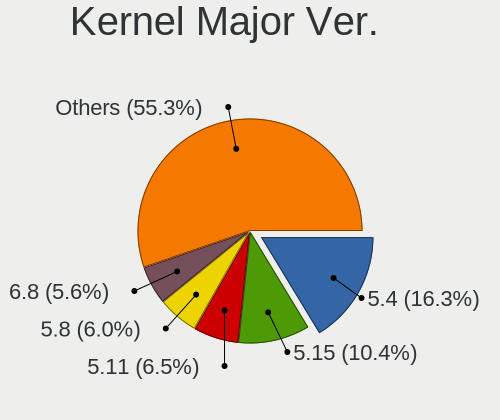

| Version | Computers | Percent |
|---------|-----------|---------|
| 5.4     | 237       | 23.92%  |
| 5.11    | 102       | 10.29%  |
| 5.8     | 92        | 9.28%   |
| 5.15    | 89        | 8.98%   |
| 5.13    | 79        | 7.97%   |
| 4.15    | 68        | 6.86%   |
| 5.10    | 54        | 5.45%   |
| 5.3     | 52        | 5.25%   |
| 4.18    | 28        | 2.83%   |
| 5.16    | 26        | 2.62%   |
| 5.0     | 25        | 2.52%   |
| 5.17    | 20        | 2.02%   |
| 5.14    | 14        | 1.41%   |
| 6.0     | 13        | 1.31%   |
| 5.19    | 11        | 1.11%   |
| 5.18    | 11        | 1.11%   |
| 5.6     | 10        | 1.01%   |
| 4.19    | 9         | 0.91%   |
| 5.9     | 8         | 0.81%   |
| 5.12    | 7         | 0.71%   |
| 4.9     | 7         | 0.71%   |
| 5.7     | 6         | 0.61%   |
| 5.5     | 5         | 0.5%    |
| 4.4     | 5         | 0.5%    |
| 3.10    | 3         | 0.3%    |
| 6.1     | 2         | 0.2%    |
| 5.2     | 1         | 0.1%    |
| 5.1     | 1         | 0.1%    |
| 4.16    | 1         | 0.1%    |
| 4.13    | 1         | 0.1%    |
| 4.12    | 1         | 0.1%    |
| 4.1     | 1         | 0.1%    |
| 3.16    | 1         | 0.1%    |
| 3.13    | 1         | 0.1%    |

Arch
----

OS architecture (x86_64, i586, etc.)

| Name    | Computers | Percent |
|---------|-----------|---------|
| x86_64  | 872       | 95.82%  |
| i686    | 26        | 2.86%   |
| aarch64 | 12        | 1.32%   |

DE
--

Desktop Environment

| Name             | Computers | Percent |
|------------------|-----------|---------|
| GNOME            | 464       | 49.47%  |
| KDE5             | 118       | 12.58%  |
| Unknown          | 107       | 11.41%  |
| X-Cinnamon       | 75        | 8%      |
| XFCE             | 51        | 5.44%   |
| KDE              | 36        | 3.84%   |
| MATE             | 21        | 2.24%   |
| Unity            | 10        | 1.07%   |
| Pantheon         | 8         | 0.85%   |
| Cinnamon         | 7         | 0.75%   |
| LXQt             | 6         | 0.64%   |
| LXDE             | 6         | 0.64%   |
| KDE4             | 6         | 0.64%   |
| i3               | 5         | 0.53%   |
| Deepin           | 5         | 0.53%   |
| Budgie           | 4         | 0.43%   |
| lightdm-xsession | 2         | 0.21%   |
| GNOME Classic    | 2         | 0.21%   |
| awesome          | 2         | 0.21%   |
| trinity          | 1         | 0.11%   |
| GNOME Flashback  | 1         | 0.11%   |
| bspwm            | 1         | 0.11%   |

Display Server
--------------

X11 or Wayland

| Name    | Computers | Percent |
|---------|-----------|---------|
| X11     | 763       | 81.6%   |
| Wayland | 106       | 11.34%  |
| Unknown | 44        | 4.71%   |
| Tty     | 22        | 2.35%   |

Display Manager
---------------

SDDM, LightDM, etc.

| Name    | Computers | Percent |
|---------|-----------|---------|
| Unknown | 601       | 63.8%   |
| SDDM    | 103       | 10.93%  |
| GDM3    | 98        | 10.4%   |
| GDM     | 63        | 6.69%   |
| LightDM | 50        | 5.31%   |
| TDM     | 22        | 2.34%   |
| KDM     | 5         | 0.53%   |

OS Lang
-------

Language

| Lang    | Computers | Percent |
|---------|-----------|---------|
| en_ZA   | 606       | 64.4%   |
| en_US   | 177       | 18.81%  |
| Unknown | 82        | 8.71%   |
| en_GB   | 51        | 5.42%   |
| C       | 15        | 1.59%   |
| en_ZW   | 6         | 0.64%   |
| fr_FR   | 2         | 0.21%   |
| af_ZA   | 2         | 0.21%   |

Boot Mode
---------

EFI or BIOS

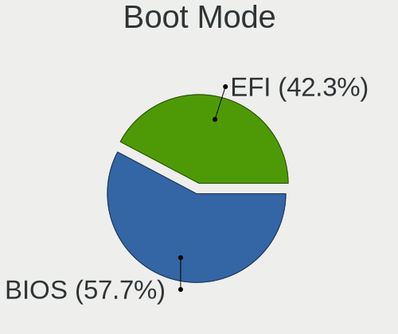

| Mode | Computers | Percent |
|------|-----------|---------|
| BIOS | 543       | 58.39%  |
| EFI  | 387       | 41.61%  |

Filesystem
----------

Type of filesystem

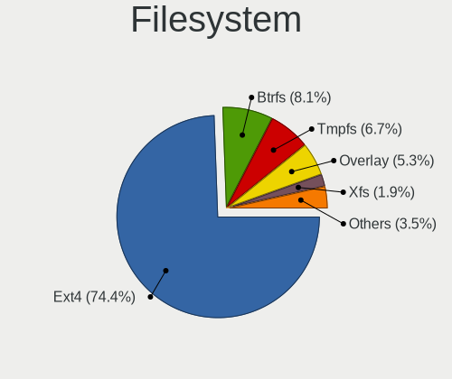

| Type    | Computers | Percent |
|---------|-----------|---------|
| Ext4    | 767       | 83.1%   |
| Btrfs   | 51        | 5.53%   |
| Overlay | 47        | 5.09%   |
| Unknown | 27        | 2.93%   |
| Xfs     | 16        | 1.73%   |
| Zfs     | 8         | 0.87%   |
| Tmpfs   | 2         | 0.22%   |
| Aufs    | 2         | 0.22%   |
| Rootfs  | 1         | 0.11%   |
| Ext3    | 1         | 0.11%   |
| Ext2    | 1         | 0.11%   |

Part. scheme
------------

Scheme of partitioning

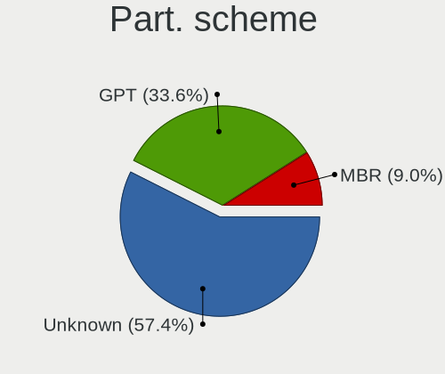

| Type    | Computers | Percent |
|---------|-----------|---------|
| Unknown | 644       | 69.77%  |
| GPT     | 208       | 22.54%  |
| MBR     | 71        | 7.69%   |

Dual Boot with Linux/BSD
------------------------

Hosting more than one Linux/BSD

| Dual boot | Computers | Percent |
|-----------|-----------|---------|
| No        | 809       | 87.55%  |
| Yes       | 115       | 12.45%  |

Dual Boot (Win)
---------------

Hosting Linux and Windows

| Dual boot | Computers | Percent |
|-----------|-----------|---------|
| No        | 677       | 73.27%  |
| Yes       | 247       | 26.73%  |

Board
-----

Vendor
------

Motherboard manufacturer

| Name                            | Computers | Percent |
|---------------------------------|-----------|---------|
| Hewlett-Packard                 | 151       | 16.63%  |
| Dell                            | 144       | 15.86%  |
| Lenovo                          | 121       | 13.33%  |
| ASUSTek Computer                | 97        | 10.68%  |
| MSI                             | 79        | 8.7%    |
| Gigabyte Technology             | 57        | 6.28%   |
| Intel                           | 46        | 5.07%   |
| Acer                            | 46        | 5.07%   |
| Apple                           | 22        | 2.42%   |
| ASRock                          | 17        | 1.87%   |
| Foxconn                         | 13        | 1.43%   |
| Biostar                         | 12        | 1.32%   |
| Toshiba                         | 9         | 0.99%   |
| Raspberry Pi Foundation         | 8         | 0.88%   |
| Samsung Electronics             | 7         | 0.77%   |
| Unknown                         | 7         | 0.77%   |
| Packard Bell                    | 5         | 0.55%   |
| MECER                           | 5         | 0.55%   |
| Standard                        | 4         | 0.44%   |
| Sony                            | 4         | 0.44%   |
| Mustek                          | 4         | 0.44%   |
| Fujitsu                         | 4         | 0.44%   |
| ECS                             | 4         | 0.44%   |
| Supermicro                      | 3         | 0.33%   |
| CONNEX                          | 3         | 0.33%   |
| Purism                          | 2         | 0.22%   |
| PINNACLEMICRO                   | 2         | 0.22%   |
| Nvidia                          | 2         | 0.22%   |
| NCR                             | 2         | 0.22%   |
| I-Life Digital Technologies     | 2         | 0.22%   |
| HUAWEI                          | 2         | 0.22%   |
| YiFang                          | 1         | 0.11%   |
| WinSome                         | 1         | 0.11%   |
| Universal Exports Group Limited | 1         | 0.11%   |
| TYAN Computer                   | 1         | 0.11%   |
| TCL Communication               | 1         | 0.11%   |
| System76                        | 1         | 0.11%   |
| RIZZEN                          | 1         | 0.11%   |
| Razer                           | 1         | 0.11%   |
| Radxa                           | 1         | 0.11%   |

Model
-----

Motherboard model

| Name                                 | Computers | Percent |
|--------------------------------------|-----------|---------|
| Unknown                              | 15        | 1.65%   |
| Dell Inspiron 15-3567                | 10        | 1.1%    |
| MSI MS-7817                          | 6         | 0.66%   |
| ASUS All Series                      | 6         | 0.66%   |
| Lenovo IdeaPad 110-15IBR 80T7        | 5         | 0.55%   |
| ASUS VivoBook 15_ASUS Laptop X540UAR | 5         | 0.55%   |
| Acer Aspire E1-571                   | 5         | 0.55%   |
| RPi Raspberry Pi 4 Model B Rev 1.4   | 4         | 0.44%   |
| MSI MS-7B84                          | 4         | 0.44%   |
| HP ProLiant MicroServer              | 4         | 0.44%   |
| HP ProBook 4530s                     | 4         | 0.44%   |
| HP Pavilion dv7                      | 4         | 0.44%   |
| HP Notebook                          | 4         | 0.44%   |
| HP 635                               | 4         | 0.44%   |
| Gigabyte G31M-ES2C                   | 4         | 0.44%   |
| Dell XPS 13 9310                     | 4         | 0.44%   |
| Dell Latitude E6400                  | 4         | 0.44%   |
| MSI MS-7C37                          | 3         | 0.33%   |
| MSI MS-7756                          | 3         | 0.33%   |
| Lenovo G500 20236                    | 3         | 0.33%   |
| Intel Mecer_X102                     | 3         | 0.33%   |
| HP ProBook 4520s                     | 3         | 0.33%   |
| HP Laptop 15-dw3xxx                  | 3         | 0.33%   |
| HP Laptop 15-da0xxx                  | 3         | 0.33%   |
| HP Laptop 15-bs1xx                   | 3         | 0.33%   |
| HP Laptop 15-bs0xx                   | 3         | 0.33%   |
| Gigabyte G41MT-S2PT                  | 3         | 0.33%   |
| Dell Vostro 3670                     | 3         | 0.33%   |
| Dell OptiPlex 7040                   | 3         | 0.33%   |
| Dell Latitude E6430                  | 3         | 0.33%   |
| Dell Latitude E6420                  | 3         | 0.33%   |
| Dell Inspiron 3580                   | 3         | 0.33%   |
| Apple MacPro3,1                      | 3         | 0.33%   |
| Apple MacBookPro9,2                  | 3         | 0.33%   |
| Apple MacBookPro16,1                 | 3         | 0.33%   |
| Toshiba Satellite L655               | 2         | 0.22%   |
| Samsung 300E4C/300E5C/300E7C         | 2         | 0.22%   |
| RPi Raspberry Pi                     | 2         | 0.22%   |
| MSI MS-7C91                          | 2         | 0.22%   |
| MSI MS-7B89                          | 2         | 0.22%   |

Model Family
------------

Motherboard model prefix

| Name                  | Computers | Percent |
|-----------------------|-----------|---------|
| Lenovo ThinkPad       | 49        | 5.4%    |
| Dell Inspiron         | 44        | 4.85%   |
| Dell Latitude         | 43        | 4.74%   |
| Lenovo IdeaPad        | 31        | 3.41%   |
| Acer Aspire           | 30        | 3.3%    |
| HP ProBook            | 27        | 2.97%   |
| Lenovo ThinkCentre    | 19        | 2.09%   |
| HP Laptop             | 19        | 2.09%   |
| HP Compaq             | 18        | 1.98%   |
| HP EliteBook          | 16        | 1.76%   |
| Unknown               | 15        | 1.65%   |
| HP Pavilion           | 13        | 1.43%   |
| Dell XPS              | 13        | 1.43%   |
| Dell Vostro           | 13        | 1.43%   |
| ASUS VivoBook         | 13        | 1.43%   |
| Dell OptiPlex         | 11        | 1.21%   |
| Toshiba Satellite     | 8         | 0.88%   |
| RPi Raspberry         | 8         | 0.88%   |
| HP ProLiant           | 7         | 0.77%   |
| Dell Precision        | 7         | 0.77%   |
| Acer TravelMate       | 7         | 0.77%   |
| MSI MS-7817           | 6         | 0.66%   |
| ASUS PRIME            | 6         | 0.66%   |
| ASUS All              | 6         | 0.66%   |
| HP ZBook              | 5         | 0.55%   |
| Dell G3               | 5         | 0.55%   |
| ASUS TUF              | 5         | 0.55%   |
| ASUS ROG              | 5         | 0.55%   |
| MSI MS-7B84           | 4         | 0.44%   |
| Intel Mecer           | 4         | 0.44%   |
| HP Notebook           | 4         | 0.44%   |
| HP 635                | 4         | 0.44%   |
| HP 255                | 4         | 0.44%   |
| HP 250                | 4         | 0.44%   |
| Gigabyte G31M-ES2C    | 4         | 0.44%   |
| Packard Bell EasyNote | 3         | 0.33%   |
| MSI MS-7C37           | 3         | 0.33%   |
| MSI MS-7756           | 3         | 0.33%   |
| Lenovo Yoga           | 3         | 0.33%   |
| Lenovo G500           | 3         | 0.33%   |

MFG Year
--------

Motherboard manufacture year

| Year    | Computers | Percent |
|---------|-----------|---------|
| 2011    | 97        | 10.68%  |
| 2018    | 91        | 10.02%  |
| 2012    | 85        | 9.36%   |
| 2013    | 70        | 7.71%   |
| 2016    | 65        | 7.16%   |
| 2017    | 61        | 6.72%   |
| 2010    | 61        | 6.72%   |
| 2008    | 59        | 6.5%    |
| 2019    | 58        | 6.39%   |
| 2020    | 57        | 6.28%   |
| 2015    | 46        | 5.07%   |
| 2009    | 36        | 3.96%   |
| 2014    | 34        | 3.74%   |
| 2007    | 31        | 3.41%   |
| 2021    | 27        | 2.97%   |
| 2006    | 12        | 1.32%   |
| Unknown | 9         | 0.99%   |
| 2022    | 5         | 0.55%   |
| 2005    | 3         | 0.33%   |
| 2004    | 1         | 0.11%   |

Form Factor
-----------

Physical design of the computer

| Name           | Computers | Percent |
|----------------|-----------|---------|
| Notebook       | 514       | 56.61%  |
| Desktop        | 342       | 37.67%  |
| Convertible    | 12        | 1.32%   |
| System on chip | 11        | 1.21%   |
| Mini pc        | 11        | 1.21%   |
| All in one     | 7         | 0.77%   |
| Tablet         | 6         | 0.66%   |
| Server         | 4         | 0.44%   |
| Other          | 1         | 0.11%   |

Secure Boot
-----------

Enabled or disabled

| State    | Computers | Percent |
|----------|-----------|---------|
| Disabled | 840       | 91.5%   |
| Enabled  | 78        | 8.5%    |

Coreboot
--------

Have coreboot on board

| Used | Computers | Percent |
|------|-----------|---------|
| No   | 904       | 99.56%  |
| Yes  | 4         | 0.44%   |

RAM Size
--------

Total RAM memory

| Size in GB  | Computers | Percent |
|-------------|-----------|---------|
| 3.01-4.0    | 224       | 24.43%  |
| 4.01-8.0    | 195       | 21.26%  |
| 8.01-16.0   | 167       | 18.21%  |
| 16.01-24.0  | 157       | 17.12%  |
| 1.01-2.0    | 70        | 7.63%   |
| 32.01-64.0  | 58        | 6.32%   |
| 2.01-3.0    | 18        | 1.96%   |
| 24.01-32.0  | 13        | 1.42%   |
| 64.01-256.0 | 8         | 0.87%   |
| 0.51-1.0    | 7         | 0.76%   |

RAM Used
--------

Used RAM memory

| Used GB     | Computers | Percent |
|-------------|-----------|---------|
| 1.01-2.0    | 409       | 40.5%   |
| 2.01-3.0    | 248       | 24.55%  |
| 4.01-8.0    | 125       | 12.38%  |
| 3.01-4.0    | 97        | 9.6%    |
| 0.51-1.0    | 71        | 7.03%   |
| 8.01-16.0   | 39        | 3.86%   |
| 0.01-0.5    | 11        | 1.09%   |
| 16.01-24.0  | 6         | 0.59%   |
| 32.01-64.0  | 1         | 0.1%    |
| 24.01-32.0  | 1         | 0.1%    |
| 64.01-256.0 | 1         | 0.1%    |
| Unknown     | 1         | 0.1%    |

Total Drives
------------

Number of drives on board

| Drives  | Computers | Percent |
|---------|-----------|---------|
| 1       | 519       | 55.51%  |
| 2       | 267       | 28.56%  |
| 3       | 66        | 7.06%   |
| 4       | 43        | 4.6%    |
| 0       | 18        | 1.93%   |
| 5       | 6         | 0.64%   |
| 7       | 5         | 0.53%   |
| 6       | 5         | 0.53%   |
| 8       | 4         | 0.43%   |
| 14      | 1         | 0.11%   |
| Unknown | 1         | 0.11%   |

Has CD-ROM
----------

Has CD-ROM on board

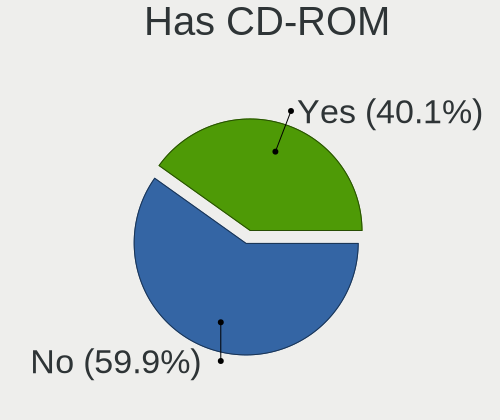

| Presented | Computers | Percent |
|-----------|-----------|---------|
| No        | 498       | 54.19%  |
| Yes       | 421       | 45.81%  |

Has Ethernet
------------

Has Ethernet on board

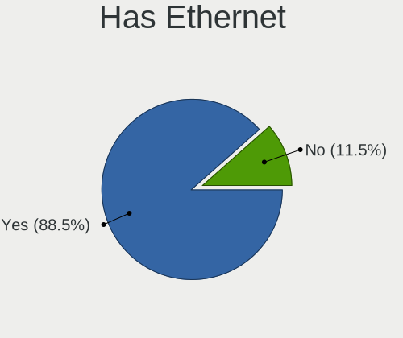

| Presented | Computers | Percent |
|-----------|-----------|---------|
| Yes       | 821       | 90.42%  |
| No        | 87        | 9.58%   |

Has WiFi
--------

Has WiFi module

| Presented | Computers | Percent |
|-----------|-----------|---------|
| Yes       | 655       | 71.74%  |
| No        | 258       | 28.26%  |

Has Bluetooth
-------------

Has Bluetooth module

| Presented | Computers | Percent |
|-----------|-----------|---------|
| Yes       | 494       | 53.46%  |
| No        | 430       | 46.54%  |

Location
--------

Country
-------

Geographic location (country)

| Country      | Computers | Percent |
|--------------|-----------|---------|
| South Africa | 908       | 100%    |

City
----

Geographic location (city)

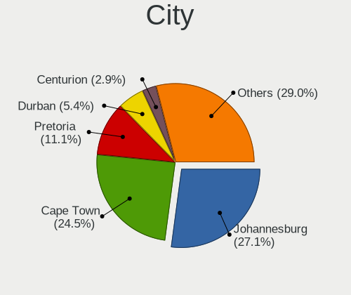

| City             | Computers | Percent |
|------------------|-----------|---------|
| Cape Town        | 239       | 24.87%  |
| Johannesburg     | 231       | 24.04%  |
| Pretoria         | 116       | 12.07%  |
| Durban           | 49        | 5.1%    |
| Centurion        | 34        | 3.54%   |
| Port Elizabeth   | 21        | 2.19%   |
| Sandton          | 12        | 1.25%   |
| Pietermaritzburg | 12        | 1.25%   |
| East London      | 12        | 1.25%   |
| Benoni           | 11        | 1.14%   |
| Alberton         | 10        | 1.04%   |
| Bloemfontein     | 8         | 0.83%   |
| Bellville        | 8         | 0.83%   |
| Roodepoort       | 7         | 0.73%   |
| Midrand          | 7         | 0.73%   |
| Kempton Park     | 7         | 0.73%   |
| Boksburg         | 7         | 0.73%   |
| Somerset West    | 6         | 0.62%   |
| Randburg         | 6         | 0.62%   |
| Thabazimbi       | 5         | 0.52%   |
| Potchefstroom    | 5         | 0.52%   |
| Polokwane        | 5         | 0.52%   |
| George           | 5         | 0.52%   |
| Edenvale         | 5         | 0.52%   |
| Vanderbijlpark   | 4         | 0.42%   |
| Stellenbosch     | 4         | 0.42%   |
| Oudtshoorn       | 4         | 0.42%   |
| Nelspruit        | 4         | 0.42%   |
| Sasolburg        | 3         | 0.31%   |
| Plettenberg Bay  | 3         | 0.31%   |
| Middelburg       | 3         | 0.31%   |
| Louis Trichardt  | 3         | 0.31%   |
| Lichtenburg      | 3         | 0.31%   |
| Klerksdorp       | 3         | 0.31%   |
| Hermanus         | 3         | 0.31%   |
| Germiston        | 3         | 0.31%   |
| Zeerust          | 2         | 0.21%   |
| Witbank          | 2         | 0.21%   |
| White River      | 2         | 0.21%   |
| Westville        | 2         | 0.21%   |

Drives
------

Drive Vendor
------------

Hard drive vendors

| Vendor              | Computers | Drives | Percent |
|---------------------|-----------|--------|---------|
| Seagate             | 288       | 499    | 22.02%  |
| WDC                 | 271       | 384    | 20.72%  |
| Samsung Electronics | 145       | 201    | 11.09%  |
| Toshiba             | 111       | 135    | 8.49%   |
| Unknown             | 56        | 73     | 4.28%   |
| Hitachi             | 49        | 75     | 3.75%   |
| HGST                | 33        | 39     | 2.52%   |
| Kingston            | 32        | 37     | 2.45%   |
| SanDisk             | 30        | 38     | 2.29%   |
| Transcend           | 26        | 35     | 1.99%   |
| A-DATA Technology   | 23        | 34     | 1.76%   |
| SK hynix            | 22        | 22     | 1.68%   |
| Crucial             | 22        | 24     | 1.68%   |
| Silicon Motion      | 20        | 29     | 1.53%   |
| Intel               | 16        | 19     | 1.22%   |
| TO Exter            | 13        | 14     | 0.99%   |
| Hewlett-Packard     | 11        | 12     | 0.84%   |
| Apple               | 11        | 15     | 0.84%   |
| Hikvision           | 7         | 8      | 0.54%   |
| Phison              | 6         | 8      | 0.46%   |
| Maxtor              | 6         | 7      | 0.46%   |
| Kingmax             | 6         | 7      | 0.46%   |
| Fujitsu             | 6         | 7      | 0.46%   |
| Mushkin             | 5         | 7      | 0.38%   |
| Micron Technology   | 5         | 6      | 0.38%   |
| LITEON              | 5         | 6      | 0.38%   |
| KIOXIA              | 5         | 5      | 0.38%   |
| LITEONIT            | 4         | 5      | 0.31%   |
| HS-SSD-E100         | 4         | 6      | 0.31%   |
| HS-SSD-C100         | 4         | 7      | 0.31%   |
| Gigabyte Technology | 4         | 5      | 0.31%   |
| Corsair             | 4         | 8      | 0.31%   |
| Apacer              | 4         | 5      | 0.31%   |
| OCZ                 | 3         | 4      | 0.23%   |
| Netac               | 3         | 3      | 0.23%   |
| External            | 3         | 3      | 0.23%   |
| ASMT                | 3         | 3      | 0.23%   |
| Unknown             | 3         | 3      | 0.23%   |
| Union Memory        | 2         | 2      | 0.15%   |
| StoreJet            | 2         | 2      | 0.15%   |

Drive Model
-----------

Hard drive models

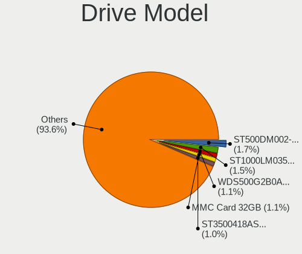

| Model                                  | Computers | Percent |
|----------------------------------------|-----------|---------|
| Seagate ST1000LM035-1RK172 1TB         | 29        | 1.98%   |
| Seagate ST500DM002-1BD142 500GB        | 23        | 1.57%   |
| WDC WDS500G2B0A-00SM50 500GB SSD       | 20        | 1.37%   |
| Unknown MMC Card  32GB                 | 15        | 1.03%   |
| Seagate ST3500418AS 500GB              | 15        | 1.03%   |
| Toshiba MQ04ABF100 1TB                 | 14        | 0.96%   |
| Toshiba MQ01ABF050 500GB               | 14        | 0.96%   |
| TO Exter nal USB 3.0 512GB             | 13        | 0.89%   |
| Toshiba MQ01ABD100 1TB                 | 12        | 0.82%   |
| Seagate ST380815AS 80GB                | 11        | 0.75%   |
| Seagate ST1000LM024 HN-M101MBB 1TB     | 11        | 0.75%   |
| WDC WD10EZEX-08WN4A0 1TB               | 10        | 0.68%   |
| Unknown MMC Card  64GB                 | 10        | 0.68%   |
| Seagate ST3500413AS 500GB              | 9         | 0.62%   |
| Samsung HD103SI 1TB                    | 9         | 0.62%   |
| HGST HTS721010A9E630 1TB               | 9         | 0.62%   |
| Seagate ST500LT012-1DG142 500GB        | 8         | 0.55%   |
| Seagate ST4000DM000-1F2168 4TB         | 8         | 0.55%   |
| Seagate ST1000DM010-2EP102 1TB         | 8         | 0.55%   |
| Samsung SM963 2.5" NVMe PCIe SSD 256GB | 8         | 0.55%   |
| HGST HTS541010A9E680 1TB               | 8         | 0.55%   |
| WDC WDS240G2G0A-00JH30 240GB SSD       | 7         | 0.48%   |
| Toshiba MQ01ACF050 500GB               | 7         | 0.48%   |
| Seagate ST4000DM004-2CV104 4TB         | 7         | 0.48%   |
| Seagate ST3250318AS 250GB              | 7         | 0.48%   |
| Seagate ST2000DM001-1CH164 2TB         | 7         | 0.48%   |
| Samsung SSD 850 EVO 250GB              | 7         | 0.48%   |
| Samsung NVMe SSD Drive 512GB           | 7         | 0.48%   |
| Samsung HD502HI 500GB                  | 7         | 0.48%   |
| Hitachi HTS543232A7A384 320GB          | 7         | 0.48%   |
| WDC WDS100T2B0A-00SM50 1TB SSD         | 6         | 0.41%   |
| WDC WD20EZRZ-00Z5HB0 2TB               | 6         | 0.41%   |
| WDC WD20EZRX-00D8PB0 2TB               | 6         | 0.41%   |
| WDC WD20EARX-00PASB0 2TB               | 6         | 0.41%   |
| Unknown MMC Card  128GB                | 6         | 0.41%   |
| Toshiba NVMe SSD Drive 512GB           | 6         | 0.41%   |
| Seagate ST3320620AS 320GB              | 6         | 0.41%   |
| Seagate ST3160815AS 160GB              | 6         | 0.41%   |
| Samsung SSD 750 EVO 250GB              | 6         | 0.41%   |
| HGST HTS725050A7E630 500GB             | 6         | 0.41%   |

HDD Vendor
----------

Hard disk drive vendors

| Vendor              | Computers | Drives | Percent |
|---------------------|-----------|--------|---------|
| Seagate             | 282       | 479    | 36.62%  |
| WDC                 | 227       | 321    | 29.48%  |
| Toshiba             | 93        | 114    | 12.08%  |
| Samsung Electronics | 49        | 68     | 6.36%   |
| Hitachi             | 49        | 75     | 6.36%   |
| HGST                | 33        | 39     | 4.29%   |
| Maxtor              | 6         | 7      | 0.78%   |
| Hewlett-Packard     | 6         | 6      | 0.78%   |
| Fujitsu             | 6         | 7      | 0.78%   |
| Apple               | 6         | 6      | 0.78%   |
| Unknown             | 5         | 6      | 0.65%   |
| HGST HTS            | 2         | 2      | 0.26%   |
| External            | 2         | 2      | 0.26%   |
| ASMT                | 2         | 2      | 0.26%   |
| USB                 | 1         | 1      | 0.13%   |
| HPE                 | 1         | 2      | 0.13%   |

SSD Vendor
----------

Solid state drive vendors

| Vendor              | Computers | Drives | Percent |
|---------------------|-----------|--------|---------|
| Samsung Electronics | 58        | 77     | 18.77%  |
| WDC                 | 49        | 59     | 15.86%  |
| Kingston            | 24        | 28     | 7.77%   |
| Transcend           | 23        | 31     | 7.44%   |
| Crucial             | 20        | 22     | 6.47%   |
| A-DATA Technology   | 20        | 31     | 6.47%   |
| SanDisk             | 17        | 20     | 5.5%    |
| TO Exter            | 13        | 14     | 4.21%   |
| Toshiba             | 6         | 7      | 1.94%   |
| SK hynix            | 6         | 6      | 1.94%   |
| Kingmax             | 6         | 7      | 1.94%   |
| Intel               | 6         | 7      | 1.94%   |
| Seagate             | 4         | 8      | 1.29%   |
| Micron Technology   | 4         | 5      | 1.29%   |
| LITEONIT            | 4         | 5      | 1.29%   |
| LITEON              | 4         | 5      | 1.29%   |
| Apacer              | 4         | 5      | 1.29%   |
| OCZ                 | 3         | 4      | 0.97%   |
| Netac               | 3         | 3      | 0.97%   |
| Mushkin             | 3         | 3      | 0.97%   |
| Gigabyte Technology | 3         | 4      | 0.97%   |
| Corsair             | 3         | 7      | 0.97%   |
| StoreJet            | 2         | 2      | 0.65%   |
| Rogueware           | 2         | 2      | 0.65%   |
| Plextor             | 2         | 3      | 0.65%   |
| HS-SSD-E100         | 2         | 2      | 0.65%   |
| Hewlett-Packard     | 2         | 2      | 0.65%   |
| China               | 2         | 2      | 0.65%   |
| AFOX                | 2         | 2      | 0.65%   |
| XPG                 | 1         | 1      | 0.32%   |
| SOLIDATA            | 1         | 1      | 0.32%   |
| Radeon              | 1         | 1      | 0.32%   |
| Neo Forza           | 1         | 1      | 0.32%   |
| MyDigitalSSD        | 1         | 1      | 0.32%   |
| Lexar               | 1         | 1      | 0.32%   |
| KingSpec            | 1         | 2      | 0.32%   |
| Hypertec            | 1         | 1      | 0.32%   |
| Hikvision           | 1         | 1      | 0.32%   |
| Biostar             | 1         | 1      | 0.32%   |
| Acer                | 1         | 1      | 0.32%   |

Drive Kind
----------

HDD or SSD

| Kind    | Computers | Drives | Percent |
|---------|-----------|--------|---------|
| HDD     | 624       | 1137   | 55.52%  |
| SSD     | 270       | 386    | 24.02%  |
| NVMe    | 160       | 221    | 14.23%  |
| MMC     | 52        | 71     | 4.63%   |
| Unknown | 18        | 26     | 1.6%    |

Drive Connector
---------------

SATA, SAS, NVMe, etc.

| Type | Computers | Drives | Percent |
|------|-----------|--------|---------|
| SATA | 765       | 1469   | 73.77%  |
| NVMe | 159       | 220    | 15.33%  |
| SAS  | 61        | 81     | 5.88%   |
| MMC  | 52        | 71     | 5.01%   |

Drive Size
----------

Size of hard drive

| Size in TB | Computers | Drives | Percent |
|------------|-----------|--------|---------|
| 0.01-0.5   | 573       | 878    | 56.56%  |
| 0.51-1.0   | 299       | 416    | 29.52%  |
| 1.01-2.0   | 68        | 106    | 6.71%   |
| 3.01-4.0   | 39        | 63     | 3.85%   |
| 2.01-3.0   | 20        | 25     | 1.97%   |
| 4.01-10.0  | 12        | 31     | 1.18%   |
| 10.01-20.0 | 2         | 4      | 0.2%    |

Space Total
-----------

Amount of disk space available on the file system

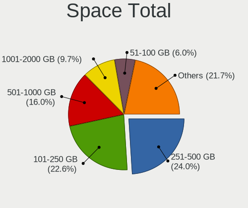

| Size in GB     | Computers | Percent |
|----------------|-----------|---------|
| 251-500        | 245       | 25.49%  |
| 101-250        | 217       | 22.58%  |
| 501-1000       | 149       | 15.5%   |
| 1001-2000      | 91        | 9.47%   |
| 51-100         | 58        | 6.04%   |
| More than 3000 | 55        | 5.72%   |
| 1-20           | 54        | 5.62%   |
| 21-50          | 35        | 3.64%   |
| 2001-3000      | 34        | 3.54%   |
| Unknown        | 23        | 2.39%   |

Space Used
----------

Amount of used disk space

| Used GB        | Computers | Percent |
|----------------|-----------|---------|
| 1-20           | 338       | 33.67%  |
| 21-50          | 175       | 17.43%  |
| 101-250        | 119       | 11.85%  |
| 51-100         | 119       | 11.85%  |
| 251-500        | 95        | 9.46%   |
| 501-1000       | 60        | 5.98%   |
| 1001-2000      | 35        | 3.49%   |
| More than 3000 | 23        | 2.29%   |
| Unknown        | 23        | 2.29%   |
| 2001-3000      | 17        | 1.69%   |

Malfunc. Drives
---------------

Drive models with a malfunction

| Model                                 | Computers | Drives | Percent |
|---------------------------------------|-----------|--------|---------|
| Seagate ST1000LM035-1RK172 1TB        | 4         | 4      | 5.8%    |
| Seagate ST3500418AS 500GB             | 3         | 4      | 4.35%   |
| Seagate ST1000LM024 HN-M101MBB 1TB    | 3         | 3      | 4.35%   |
| WDC WD3200AAJS-00RYA0 320GB           | 2         | 2      | 2.9%    |
| Seagate ST500DM002-1BD142 500GB       | 2         | 2      | 2.9%    |
| Seagate ST320LT007-9ZV142 320GB       | 2         | 2      | 2.9%    |
| HGST HTS725050A7E630 500GB            | 2         | 2      | 2.9%    |
| HGST HTS541010A9E680 1TB              | 2         | 2      | 2.9%    |
| WDC WD6400AAKS-75A7B0 640GB           | 1         | 1      | 1.45%   |
| WDC WD5000LPVX-22V0TT0 500GB          | 1         | 1      | 1.45%   |
| WDC WD5000AVVS-63ZWB0 500GB           | 1         | 1      | 1.45%   |
| WDC WD5000AAKX-22ERMA0 500GB          | 1         | 1      | 1.45%   |
| WDC WD5000AAKX-221CA1 500GB           | 1         | 1      | 1.45%   |
| WDC WD5000AAKX-00ERMA0 500GB          | 1         | 2      | 1.45%   |
| WDC WD3200BPVT-22JJ5T0 320GB          | 1         | 1      | 1.45%   |
| WDC WD3200AAJS-60Z0A0 320GB           | 1         | 1      | 1.45%   |
| WDC WD30EZRX-00MMMB0 3TB              | 1         | 3      | 1.45%   |
| WDC WD30EFRX-68EUZN0 3TB              | 1         | 1      | 1.45%   |
| WDC WD20EZRZ-00Z5HB0 2TB              | 1         | 1      | 1.45%   |
| WDC WD20EARX-00PASB0 2TB              | 1         | 1      | 1.45%   |
| WDC WD1600AAJS-08L7A0 160GB           | 1         | 1      | 1.45%   |
| WDC WD15EADS-00P8B0 1TB               | 1         | 1      | 1.45%   |
| WDC WD10EZEX-08WN4A0 1TB              | 1         | 1      | 1.45%   |
| WDC WD10EADS-67M2B0 1TB               | 1         | 2      | 1.45%   |
| WDC WD10EACS-00ZJB0 1TB               | 1         | 1      | 1.45%   |
| Transcend TS64GSSD720 64GB            | 1         | 1      | 1.45%   |
| Toshiba MQ01ABD100 1TB                | 1         | 1      | 1.45%   |
| Toshiba MK5065GSXF 500GB              | 1         | 1      | 1.45%   |
| SOLIDATA SSD 120GB                    | 1         | 1      | 1.45%   |
| SK hynix HFS128G3BTND-N210A 128GB SSD | 1         | 1      | 1.45%   |
| Seagate ST9500423AS 500GB             | 1         | 1      | 1.45%   |
| Seagate ST9500325AS 500GB             | 1         | 3      | 1.45%   |
| Seagate ST500LM021-1KJ152 500GB       | 1         | 1      | 1.45%   |
| Seagate ST500LM012 HN-M500MBB 500GB   | 1         | 1      | 1.45%   |
| Seagate ST4000DM004-2CV104 4TB        | 1         | 1      | 1.45%   |
| Seagate ST4000DM000-1F2168 4TB        | 1         | 5      | 1.45%   |
| Seagate ST3320418AS 320GB             | 1         | 1      | 1.45%   |
| Seagate ST32000542AS 2TB              | 1         | 1      | 1.45%   |
| Seagate ST3160815AS 160GB             | 1         | 2      | 1.45%   |
| Seagate ST31500341AS 1TB              | 1         | 1      | 1.45%   |

Malfunc. Drive Vendor
---------------------

Vendors of faulty drives

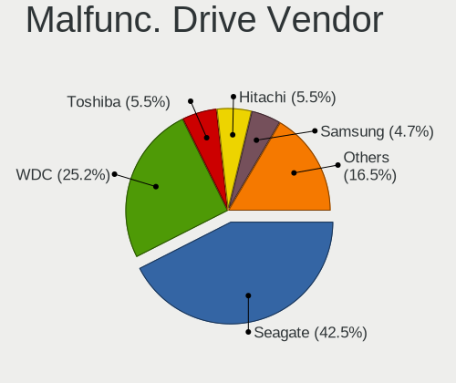

| Vendor              | Computers | Drives | Percent |
|---------------------|-----------|--------|---------|
| Seagate             | 27        | 36     | 39.71%  |
| WDC                 | 19        | 23     | 27.94%  |
| HGST                | 4         | 4      | 5.88%   |
| Samsung Electronics | 3         | 4      | 4.41%   |
| Intel               | 3         | 4      | 4.41%   |
| Hitachi             | 3         | 3      | 4.41%   |
| Toshiba             | 2         | 2      | 2.94%   |
| Hewlett-Packard     | 2         | 2      | 2.94%   |
| Transcend           | 1         | 1      | 1.47%   |
| SOLIDATA            | 1         | 1      | 1.47%   |
| SK hynix            | 1         | 1      | 1.47%   |
| Micron Technology   | 1         | 1      | 1.47%   |
| Kingston            | 1         | 1      | 1.47%   |

Malfunc. HDD Vendor
-------------------

Vendors of faulty HDD drives

| Vendor              | Computers | Drives | Percent |
|---------------------|-----------|--------|---------|
| Seagate             | 27        | 36     | 45.76%  |
| WDC                 | 19        | 23     | 32.2%   |
| HGST                | 4         | 4      | 6.78%   |
| Samsung Electronics | 3         | 4      | 5.08%   |
| Hitachi             | 3         | 3      | 5.08%   |
| Toshiba             | 2         | 2      | 3.39%   |
| Hewlett-Packard     | 1         | 1      | 1.69%   |

Malfunc. Drive Kind
-------------------

Kinds of faulty drives

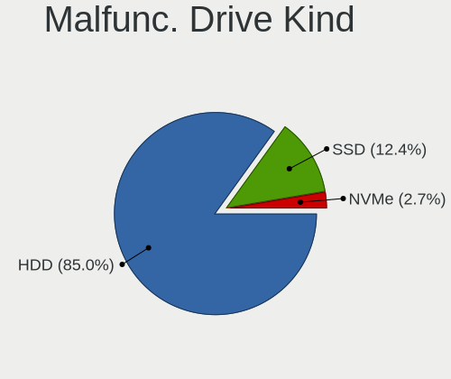

| Kind | Computers | Drives | Percent |
|------|-----------|--------|---------|
| HDD  | 53        | 73     | 85.48%  |
| SSD  | 8         | 9      | 12.9%   |
| NVMe | 1         | 1      | 1.61%   |

Failed Drives
-------------

Failed drive models

| Model                    | Computers | Drives | Percent |
|--------------------------|-----------|--------|---------|
| WDC WD20EZRX-00D8PB0 2TB | 2         | 2      | 100%    |

Failed Drive Vendor
-------------------

Failed drive vendors

| Vendor | Computers | Drives | Percent |
|--------|-----------|--------|---------|
| WDC    | 2         | 2      | 100%    |

Drive Status
------------

Number of failed and malfunc. drives

| Status   | Computers | Drives | Percent |
|----------|-----------|--------|---------|
| Detected | 677       | 1366   | 70.23%  |
| Works    | 225       | 390    | 23.34%  |
| Malfunc  | 60        | 83     | 6.22%   |
| Failed   | 2         | 2      | 0.21%   |

Storage controller
------------------

Storage Vendor
--------------

Storage controller vendors

| Vendor                           | Computers | Percent |
|----------------------------------|-----------|---------|
| Intel                            | 721       | 68.8%   |
| AMD                              | 94        | 8.97%   |
| Samsung Electronics              | 45        | 4.29%   |
| Silicon Motion                   | 27        | 2.58%   |
| Toshiba America Info Systems     | 17        | 1.62%   |
| SK hynix                         | 16        | 1.53%   |
| SanDisk                          | 14        | 1.34%   |
| Nvidia                           | 14        | 1.34%   |
| Marvell Technology Group         | 13        | 1.24%   |
| JMicron Technology               | 13        | 1.24%   |
| Phison Electronics               | 10        | 0.95%   |
| ASMedia Technology               | 10        | 0.95%   |
| Kingston Technology Company      | 8         | 0.76%   |
| KIOXIA                           | 6         | 0.57%   |
| Apple                            | 4         | 0.38%   |
| VIA Technologies                 | 3         | 0.29%   |
| Silicon Integrated Systems [SiS] | 3         | 0.29%   |
| Silicon Image                    | 3         | 0.29%   |
| Micron/Crucial Technology        | 3         | 0.29%   |
| ADATA Technology                 | 3         | 0.29%   |
| Union Memory (Shenzhen)          | 2         | 0.19%   |
| Seagate Technology               | 2         | 0.19%   |
| Realtek Semiconductor            | 2         | 0.19%   |
| MAXIO Technology (Hangzhou)      | 2         | 0.19%   |
| LSI Logic / Symbios Logic        | 2         | 0.19%   |
| Broadcom / LSI                   | 2         | 0.19%   |
| Adaptec                          | 2         | 0.19%   |
| Solid State Storage Technology   | 1         | 0.1%    |
| Micron Technology                | 1         | 0.1%    |
| Lite-On Technology               | 1         | 0.1%    |
| Lenovo                           | 1         | 0.1%    |
| HighPoint Technologies           | 1         | 0.1%    |
| Hewlett-Packard                  | 1         | 0.1%    |
| Biwin Storage Technology         | 1         | 0.1%    |

Storage Model
-------------

Storage controller models

| Model                                                                                   | Computers | Percent |
|-----------------------------------------------------------------------------------------|-----------|---------|
| Intel Sunrise Point-LP SATA Controller [AHCI mode]                                      | 67        | 5.28%   |
| AMD FCH SATA Controller [AHCI mode]                                                     | 57        | 4.49%   |
| Intel 82801 Mobile SATA Controller [RAID mode]                                          | 52        | 4.1%    |
| Intel 7 Series Chipset Family 6-port SATA Controller [AHCI mode]                        | 43        | 3.39%   |
| Intel NM10/ICH7 Family SATA Controller [IDE mode]                                       | 41        | 3.23%   |
| Intel 8 Series/C220 Series Chipset Family 6-port SATA Controller 1 [AHCI mode]          | 40        | 3.15%   |
| Intel 6 Series/C200 Series Chipset Family 6 port Mobile SATA AHCI Controller            | 36        | 2.84%   |
| Intel Q170/Q150/B150/H170/H110/Z170/CM236 Chipset SATA Controller [AHCI Mode]           | 32        | 2.52%   |
| Intel 82801G (ICH7 Family) IDE Controller                                               | 31        | 2.44%   |
| Intel 6 Series/C200 Series Chipset Family Desktop SATA Controller (IDE mode, ports 4-5) | 29        | 2.29%   |
| Intel 6 Series/C200 Series Chipset Family Desktop SATA Controller (IDE mode, ports 0-3) | 29        | 2.29%   |
| Intel 6 Series/C200 Series Chipset Family 6 port Desktop SATA AHCI Controller           | 29        | 2.29%   |
| Intel 5 Series/3400 Series Chipset 6 port SATA AHCI Controller                          | 26        | 2.05%   |
| Silicon Motion SM2262/SM2262EN SSD Controller                                           | 21        | 1.65%   |
| Samsung NVMe SSD Controller SM981/PM981/PM983                                           | 20        | 1.58%   |
| Intel SATA Controller [RAID mode]                                                       | 19        | 1.5%    |
| Intel Cannon Lake Mobile PCH SATA AHCI Controller                                       | 19        | 1.5%    |
| Intel Wildcat Point-LP SATA Controller [AHCI Mode]                                      | 18        | 1.42%   |
| Intel Atom/Celeron/Pentium Processor x5-E8000/J3xxx/N3xxx Series SATA Controller        | 18        | 1.42%   |
| Intel 82801IBM/IEM (ICH9M/ICH9M-E) 4 port SATA Controller [AHCI mode]                   | 18        | 1.42%   |
| AMD SB7x0/SB8x0/SB9x0 SATA Controller [AHCI mode]                                       | 18        | 1.42%   |
| Intel 7 Series/C210 Series Chipset Family 6-port SATA Controller [AHCI mode]            | 16        | 1.26%   |
| Intel 5 Series/3400 Series Chipset 4 port SATA AHCI Controller                          | 16        | 1.26%   |
| Samsung NVMe SSD Controller SM961/PM961/SM963                                           | 14        | 1.1%    |
| Intel 8 Series SATA Controller 1 [AHCI mode]                                            | 14        | 1.1%    |
| Intel 200 Series PCH SATA controller [AHCI mode]                                        | 14        | 1.1%    |
| Intel Volume Management Device NVMe RAID Controller                                     | 13        | 1.02%   |
| Intel 82801HM/HEM (ICH8M/ICH8M-E) SATA Controller [AHCI mode]                           | 13        | 1.02%   |
| Intel 5 Series/3400 Series Chipset 4 port SATA IDE Controller                           | 13        | 1.02%   |
| Intel 5 Series/3400 Series Chipset 2 port SATA IDE Controller                           | 13        | 1.02%   |
| Toshiba America Info Systems XG6 NVMe SSD Controller                                    | 12        | 0.95%   |
| Intel HM170/QM170 Chipset SATA Controller [AHCI Mode]                                   | 12        | 0.95%   |
| Intel 82801HM/HEM (ICH8M/ICH8M-E) IDE Controller                                        | 12        | 0.95%   |
| AMD 400 Series Chipset SATA Controller                                                  | 12        | 0.95%   |
| Intel Celeron N3350/Pentium N4200/Atom E3900 Series SATA AHCI Controller                | 11        | 0.87%   |
| Intel Cannon Point-LP SATA Controller [AHCI Mode]                                       | 9         | 0.71%   |
| Intel 5 Series/3400 Series Chipset PT IDER Controller                                   | 9         | 0.71%   |
| AMD SB7x0/SB8x0/SB9x0 IDE Controller                                                    | 9         | 0.71%   |
| AMD 500 Series Chipset SATA Controller                                                  | 9         | 0.71%   |
| JMicron JMB363 SATA/IDE Controller                                                      | 8         | 0.63%   |

Storage Kind
------------

Kind of storage controller (IDE, SATA, NVMe, SAS, ...)

| Kind | Computers | Percent |
|------|-----------|---------|
| SATA | 618       | 57.17%  |
| IDE  | 194       | 17.95%  |
| NVMe | 164       | 15.17%  |
| RAID | 98        | 9.07%   |
| SAS  | 4         | 0.37%   |
| SCSI | 3         | 0.28%   |

Processor
---------

CPU Vendor
----------

Processor vendors

| Vendor  | Computers | Percent |
|---------|-----------|---------|
| Intel   | 788       | 86.78%  |
| AMD     | 108       | 11.89%  |
| ARM     | 11        | 1.21%   |
| Unknown | 1         | 0.11%   |

CPU Model
---------

Processor models

| Model                                   | Computers | Percent |
|-----------------------------------------|-----------|---------|
| Intel Core i7-7500U CPU @ 2.70GHz       | 11        | 1.21%   |
| Intel Core i5-7200U CPU @ 2.50GHz       | 11        | 1.21%   |
| Intel Celeron CPU N3060 @ 1.60GHz       | 11        | 1.21%   |
| Intel Core i7-8565U CPU @ 1.80GHz       | 10        | 1.1%    |
| Intel Core i5-3470 CPU @ 3.20GHz        | 10        | 1.1%    |
| ARM Processor                           | 10        | 1.1%    |
| Intel Core i7-8750H CPU @ 2.20GHz       | 9         | 0.99%   |
| Intel Core i7-8550U CPU @ 1.80GHz       | 9         | 0.99%   |
| Intel Core i7-3770 CPU @ 3.40GHz        | 9         | 0.99%   |
| Intel Core i7-2630QM CPU @ 2.00GHz      | 9         | 0.99%   |
| Intel Core i7-2600 CPU @ 3.40GHz        | 9         | 0.99%   |
| Intel Core i5-8250U CPU @ 1.60GHz       | 9         | 0.99%   |
| Intel Core i5-6300U CPU @ 2.40GHz       | 9         | 0.99%   |
| Intel Atom x5-Z8350 CPU @ 1.44GHz       | 9         | 0.99%   |
| Intel Core i7-9750H CPU @ 2.60GHz       | 8         | 0.88%   |
| Intel Core i7-6700HQ CPU @ 2.60GHz      | 8         | 0.88%   |
| Intel Core i5-5200U CPU @ 2.20GHz       | 8         | 0.88%   |
| Intel Core i5-3210M CPU @ 2.50GHz       | 8         | 0.88%   |
| Intel Core i5-2520M CPU @ 2.50GHz       | 8         | 0.88%   |
| Intel Core i5-1035G1 CPU @ 1.00GHz      | 8         | 0.88%   |
| Intel Core 2 Duo CPU P8600 @ 2.40GHz    | 8         | 0.88%   |
| Intel Celeron CPU N3350 @ 1.10GHz       | 8         | 0.88%   |
| Intel Core i7-6500U CPU @ 2.50GHz       | 7         | 0.77%   |
| Intel Core i5-2450M CPU @ 2.50GHz       | 7         | 0.77%   |
| Intel Core i3-2120 CPU @ 3.30GHz        | 7         | 0.77%   |
| Intel 11th Gen Core i7-1165G7 @ 2.80GHz | 7         | 0.77%   |
| Intel Core i7-7700HQ CPU @ 2.80GHz      | 6         | 0.66%   |
| Intel Core i5-8265U CPU @ 1.60GHz       | 6         | 0.66%   |
| Intel Core i5-4590 CPU @ 3.30GHz        | 6         | 0.66%   |
| Intel Core i5 CPU M 520 @ 2.40GHz       | 6         | 0.66%   |
| Intel Core i3-6006U CPU @ 2.00GHz       | 6         | 0.66%   |
| Intel Core i3-2100 CPU @ 3.10GHz        | 6         | 0.66%   |
| Intel Celeron CPU N3050 @ 1.60GHz       | 6         | 0.66%   |
| Intel 11th Gen Core i7-1185G7 @ 3.00GHz | 6         | 0.66%   |
| Intel Pentium 4 CPU 3.00GHz             | 5         | 0.55%   |
| Intel Core i7-8700K CPU @ 3.70GHz       | 5         | 0.55%   |
| Intel Core i7-6700K CPU @ 4.00GHz       | 5         | 0.55%   |
| Intel Core i5-2410M CPU @ 2.30GHz       | 5         | 0.55%   |
| Intel Core i5-2400 CPU @ 3.10GHz        | 5         | 0.55%   |
| Intel Core i3-5005U CPU @ 2.00GHz       | 5         | 0.55%   |

CPU Model Family
----------------

Processor model prefix

| Model                   | Computers | Percent |
|-------------------------|-----------|---------|
| Intel Core i5           | 217       | 23.9%   |
| Intel Core i7           | 203       | 22.36%  |
| Intel Core i3           | 96        | 10.57%  |
| Intel Celeron           | 65        | 7.16%   |
| Intel Core 2 Duo        | 57        | 6.28%   |
| Other                   | 44        | 4.85%   |
| Intel Pentium           | 27        | 2.97%   |
| AMD Ryzen 5             | 25        | 2.75%   |
| Intel Xeon              | 19        | 2.09%   |
| AMD Ryzen 7             | 19        | 2.09%   |
| Intel Atom              | 16        | 1.76%   |
| Intel Core 2 Quad       | 13        | 1.43%   |
| Intel Pentium Dual-Core | 9         | 0.99%   |
| Intel Pentium Dual      | 8         | 0.88%   |
| Intel Pentium 4         | 7         | 0.77%   |
| AMD Ryzen 9             | 7         | 0.77%   |
| AMD FX                  | 7         | 0.77%   |
| AMD E                   | 7         | 0.77%   |
| AMD A4                  | 5         | 0.55%   |
| Intel Genuine           | 4         | 0.44%   |
| Intel Core i9           | 4         | 0.44%   |
| Intel Core 2            | 4         | 0.44%   |
| AMD Turion II Neo       | 4         | 0.44%   |
| AMD Ryzen 3             | 4         | 0.44%   |
| AMD Athlon 64 X2        | 4         | 0.44%   |
| Intel Pentium D         | 3         | 0.33%   |
| Intel Core Duo          | 2         | 0.22%   |
| AMD Ryzen 7 PRO         | 2         | 0.22%   |
| AMD Phenom II X4        | 2         | 0.22%   |
| AMD Phenom II X2        | 2         | 0.22%   |
| AMD E2                  | 2         | 0.22%   |
| AMD E1                  | 2         | 0.22%   |
| AMD A6                  | 2         | 0.22%   |
| Intel Core 2 Extreme    | 1         | 0.11%   |
| Intel Celeron M         | 1         | 0.11%   |
| Intel Celeron Dual-Core | 1         | 0.11%   |
| Intel Celeron D         | 1         | 0.11%   |
| ARM AArch64             | 1         | 0.11%   |
| AMD Turion II Dual-Core | 1         | 0.11%   |
| AMD Turion 64 Mobile    | 1         | 0.11%   |

CPU Cores
---------

Number of processor cores

| Number  | Computers | Percent |
|---------|-----------|---------|
| 2       | 461       | 50.77%  |
| 4       | 310       | 34.14%  |
| 6       | 59        | 6.5%    |
| 8       | 36        | 3.96%   |
| 1       | 25        | 2.75%   |
| 12      | 5         | 0.55%   |
| 16      | 4         | 0.44%   |
| 3       | 4         | 0.44%   |
| 24      | 1         | 0.11%   |
| 14      | 1         | 0.11%   |
| 10      | 1         | 0.11%   |
| Unknown | 1         | 0.11%   |

CPU Sockets
-----------

Number of sockets

| Number  | Computers | Percent |
|---------|-----------|---------|
| 1       | 899       | 99.01%  |
| 2       | 8         | 0.88%   |
| Unknown | 1         | 0.11%   |

CPU Threads
-----------

Threads per core (Hyper-Threading)

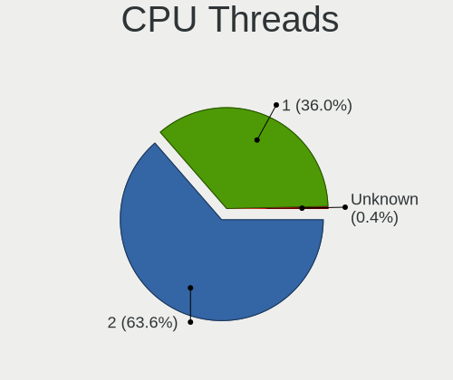

| Number  | Computers | Percent |
|---------|-----------|---------|
| 2       | 563       | 62%     |
| 1       | 344       | 37.89%  |
| Unknown | 1         | 0.11%   |

CPU Op-Modes
------------

CPU Operation Modes (32-bit, 64-bit)

| Op mode        | Computers | Percent |
|----------------|-----------|---------|
| 32-bit, 64-bit | 879       | 96.38%  |
| Unknown        | 22        | 2.41%   |
| 32-bit         | 8         | 0.88%   |
| 64-bit         | 3         | 0.33%   |

CPU Microcode
-------------

Microcode number

| Number     | Computers | Percent |
|------------|-----------|---------|
| Unknown    | 246       | 25.95%  |
| 0x206a7    | 76        | 8.02%   |
| 0x306a9    | 64        | 6.75%   |
| 0x306c3    | 40        | 4.22%   |
| 0x1067a    | 38        | 4.01%   |
| 0x406e3    | 31        | 3.27%   |
| 0x806e9    | 28        | 2.95%   |
| 0x506e3    | 27        | 2.85%   |
| 0x20655    | 25        | 2.64%   |
| 0x906ea    | 24        | 2.53%   |
| 0x906e9    | 20        | 2.11%   |
| 0x806ea    | 20        | 2.11%   |
| 0x406c4    | 18        | 1.9%    |
| 0x6fd      | 15        | 1.58%   |
| 0x306d4    | 15        | 1.58%   |
| 0x806ec    | 14        | 1.48%   |
| 0x20652    | 14        | 1.48%   |
| 0x10676    | 14        | 1.48%   |
| 0x806c1    | 13        | 1.37%   |
| 0x40651    | 11        | 1.16%   |
| 0x6fb      | 10        | 1.05%   |
| 0x506c9    | 9         | 0.95%   |
| 0x06006705 | 9         | 0.95%   |
| 0x08701021 | 8         | 0.84%   |
| 0x406c3    | 7         | 0.74%   |
| 0x106e5    | 7         | 0.74%   |
| 0x106a5    | 7         | 0.74%   |
| 0xa0652    | 6         | 0.63%   |
| 0x706e5    | 6         | 0.63%   |
| 0x806eb    | 5         | 0.53%   |
| 0x706a1    | 5         | 0.53%   |
| 0x0a50000c | 5         | 0.53%   |
| 0x010000db | 5         | 0.53%   |
| 0x010000c8 | 5         | 0.53%   |
| 0x10661    | 4         | 0.42%   |
| 0x08108109 | 4         | 0.42%   |
| 0x0800820d | 4         | 0.42%   |
| 0x0600611a | 4         | 0.42%   |
| 0x06000852 | 4         | 0.42%   |
| 0x05000119 | 4         | 0.42%   |

CPU Microarch
-------------

Microarchitecture

| Name             | Computers | Percent |
|------------------|-----------|---------|
| KabyLake         | 144       | 15.84%  |
| SandyBridge      | 101       | 11.11%  |
| IvyBridge        | 84        | 9.24%   |
| Haswell          | 71        | 7.81%   |
| Skylake          | 68        | 7.48%   |
| Penryn           | 68        | 7.48%   |
| Westmere         | 47        | 5.17%   |
| Core             | 45        | 4.95%   |
| Silvermont       | 34        | 3.74%   |
| Broadwell        | 21        | 2.31%   |
| Zen 2            | 20        | 2.2%    |
| TigerLake        | 20        | 2.2%    |
| Unknown          | 17        | 1.87%   |
| Nehalem          | 16        | 1.76%   |
| Zen 3            | 15        | 1.65%   |
| Excavator        | 14        | 1.54%   |
| Icelake          | 13        | 1.43%   |
| Zen+             | 12        | 1.32%   |
| NetBurst         | 12        | 1.32%   |
| K10              | 11        | 1.21%   |
| Goldmont         | 11        | 1.21%   |
| Zen              | 10        | 1.1%    |
| CometLake        | 10        | 1.1%    |
| Bobcat           | 9         | 0.99%   |
| Goldmont plus    | 7         | 0.77%   |
| Piledriver       | 6         | 0.66%   |
| K8 Hammer        | 6         | 0.66%   |
| Bonnell          | 5         | 0.55%   |
| Alderlake Hybrid | 5         | 0.55%   |
| P6               | 3         | 0.33%   |
| Jaguar           | 2         | 0.22%   |
| Steamroller      | 1         | 0.11%   |
| K8 & K10 hybrid  | 1         | 0.11%   |

Graphics
--------

GPU Vendor
----------

Vendors of graphics cards

| Vendor                           | Computers | Percent |
|----------------------------------|-----------|---------|
| Intel                            | 614       | 58.7%   |
| Nvidia                           | 257       | 24.57%  |
| AMD                              | 164       | 15.68%  |
| Matrox Electronics Systems       | 6         | 0.57%   |
| Silicon Integrated Systems [SiS] | 2         | 0.19%   |
| VIA Technologies                 | 1         | 0.1%    |
| Silicon Motion                   | 1         | 0.1%    |
| ASPEED Technology                | 1         | 0.1%    |

GPU Model
---------

Graphics card models

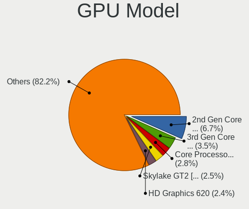

| Model                                                                                    | Computers | Percent |
|------------------------------------------------------------------------------------------|-----------|---------|
| Intel 2nd Generation Core Processor Family Integrated Graphics Controller                | 79        | 7.36%   |
| Intel Core Processor Integrated Graphics Controller                                      | 38        | 3.54%   |
| Intel 3rd Gen Core processor Graphics Controller                                         | 33        | 3.08%   |
| Intel Skylake GT2 [HD Graphics 520]                                                      | 30        | 2.8%    |
| Intel HD Graphics 620                                                                    | 30        | 2.8%    |
| Intel Atom/Celeron/Pentium Processor x5-E8000/J3xxx/N3xxx Integrated Graphics Controller | 30        | 2.8%    |
| Intel UHD Graphics 620                                                                   | 24        | 2.24%   |
| Intel Xeon E3-1200 v2/3rd Gen Core processor Graphics Controller                         | 21        | 1.96%   |
| Intel CoffeeLake-H GT2 [UHD Graphics 630]                                                | 21        | 1.96%   |
| Intel 4th Gen Core Processor Integrated Graphics Controller                              | 21        | 1.96%   |
| Intel Xeon E3-1200 v3/4th Gen Core Processor Integrated Graphics Controller              | 20        | 1.86%   |
| Intel HD Graphics 5500                                                                   | 20        | 1.86%   |
| Intel 82G33/G31 Express Integrated Graphics Controller                                   | 20        | 1.86%   |
| Intel WhiskeyLake-U GT2 [UHD Graphics 620]                                               | 18        | 1.68%   |
| Intel TigerLake-LP GT2 [Iris Xe Graphics]                                                | 18        | 1.68%   |
| Intel Mobile 4 Series Chipset Integrated Graphics Controller                             | 18        | 1.68%   |
| Intel Haswell-ULT Integrated Graphics Controller                                         | 16        | 1.49%   |
| Intel HD Graphics 630                                                                    | 15        | 1.4%    |
| AMD Ellesmere [Radeon RX 470/480/570/570X/580/580X/590]                                  | 14        | 1.3%    |
| Nvidia GT218 [GeForce 210]                                                               | 13        | 1.21%   |
| Intel Mobile GM965/GL960 Integrated Graphics Controller (secondary)                      | 11        | 1.03%   |
| Intel Mobile GM965/GL960 Integrated Graphics Controller (primary)                        | 11        | 1.03%   |
| Intel HD Graphics 530                                                                    | 11        | 1.03%   |
| Intel HD Graphics 500                                                                    | 11        | 1.03%   |
| Intel 4 Series Chipset Integrated Graphics Controller                                    | 10        | 0.93%   |
| AMD Stoney [Radeon R2/R3/R4/R5 Graphics]                                                 | 10        | 0.93%   |
| Intel Iris Plus Graphics G1 (Ice Lake)                                                   | 8         | 0.75%   |
| AMD Renoir                                                                               | 8         | 0.75%   |
| Nvidia TU116M [GeForce GTX 1660 Ti Mobile]                                               | 7         | 0.65%   |
| Nvidia GP107M [GeForce GTX 1050 Mobile]                                                  | 7         | 0.65%   |
| Intel Mobile 945GM/GMS/GME, 943/940GML Express Integrated Graphics Controller            | 7         | 0.65%   |
| Intel IvyBridge GT2 [HD Graphics 4000]                                                   | 7         | 0.65%   |
| Intel GeminiLake [UHD Graphics 600]                                                      | 7         | 0.65%   |
| Intel CoffeeLake-S GT2 [UHD Graphics 630]                                                | 7         | 0.65%   |
| Nvidia TU117M [GeForce GTX 1650 Mobile / Max-Q]                                          | 6         | 0.56%   |
| Nvidia GP107M [GeForce GTX 1050 Ti Mobile]                                               | 6         | 0.56%   |
| Nvidia GM108M [GeForce MX130]                                                            | 6         | 0.56%   |
| AMD Wrestler [Radeon HD 6320]                                                            | 6         | 0.56%   |
| AMD Picasso/Raven 2 [Radeon Vega Series / Radeon Vega Mobile Series]                     | 6         | 0.56%   |
| AMD Cezanne [Radeon Vega Series / Radeon Vega Mobile Series]                             | 6         | 0.56%   |

GPU Combo
---------

Combinations of graphics cards

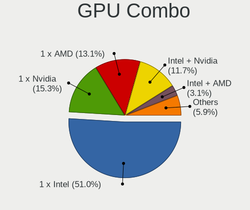

| Name               | Computers | Percent |
|--------------------|-----------|---------|
| 1 x Intel          | 470       | 51.65%  |
| 1 x Nvidia         | 150       | 16.48%  |
| 1 x AMD            | 116       | 12.75%  |
| Intel + Nvidia     | 100       | 10.99%  |
| Intel + AMD        | 34        | 3.74%   |
| Other              | 14        | 1.54%   |
| 2 x AMD            | 8         | 0.88%   |
| AMD + Nvidia       | 6         | 0.66%   |
| 1 x Matrox         | 5         | 0.55%   |
| 1 x SiS            | 2         | 0.22%   |
| 2 x Intel          | 1         | 0.11%   |
| 1 x VIA            | 1         | 0.11%   |
| 1 x Silicon Motion | 1         | 0.11%   |
| Nvidia + ASPEED    | 1         | 0.11%   |
| AMD + Matrox       | 1         | 0.11%   |

GPU Driver
----------

Free vs proprietary

| Driver      | Computers | Percent |
|-------------|-----------|---------|
| Free        | 735       | 80.24%  |
| Proprietary | 133       | 14.52%  |
| Unknown     | 48        | 5.24%   |

GPU Memory
----------

Total video memory

| Size in GB | Computers | Percent |
|------------|-----------|---------|
| Unknown    | 592       | 62.91%  |
| 1.01-2.0   | 118       | 12.54%  |
| 0.01-0.5   | 69        | 7.33%   |
| 0.51-1.0   | 64        | 6.8%    |
| 3.01-4.0   | 46        | 4.89%   |
| 5.01-6.0   | 23        | 2.44%   |
| 7.01-8.0   | 19        | 2.02%   |
| 2.01-3.0   | 7         | 0.74%   |
| 8.01-16.0  | 2         | 0.21%   |
| 16.01-24.0 | 1         | 0.11%   |

Monitor
-------

Monitor Vendor
--------------

Monitor vendors

| Vendor                  | Computers | Percent |
|-------------------------|-----------|---------|
| Samsung Electronics     | 176       | 17.55%  |
| Dell                    | 122       | 12.16%  |
| AU Optronics            | 113       | 11.27%  |
| LG Display              | 93        | 9.27%   |
| BOE                     | 92        | 9.17%   |
| Chimei Innolux          | 77        | 7.68%   |
| Goldstar                | 73        | 7.28%   |
| Chi Mei Optoelectronics | 25        | 2.49%   |
| Philips                 | 18        | 1.79%   |
| AOC                     | 17        | 1.69%   |
| Hewlett-Packard         | 16        | 1.6%    |
| Apple                   | 16        | 1.6%    |
| Lenovo                  | 15        | 1.5%    |
| Sharp                   | 11        | 1.1%    |
| Acer                    | 10        | 1%      |
| Unknown                 | 9         | 0.9%    |
| BenQ                    | 9         | 0.9%    |
| LG Philips              | 8         | 0.8%    |
| LG Electronics          | 8         | 0.8%    |
| Toshiba                 | 7         | 0.7%    |
| VIE                     | 6         | 0.6%    |
| Fujitsu Siemens         | 6         | 0.6%    |
| SKY                     | 5         | 0.5%    |
| Ancor Communications    | 4         | 0.4%    |
| Sony                    | 3         | 0.3%    |
| PRI                     | 3         | 0.3%    |
| MECER                   | 3         | 0.3%    |
| Hitachi                 | 3         | 0.3%    |
| ___                     | 2         | 0.2%    |
| ViewSonic               | 2         | 0.2%    |
| Tatung                  | 2         | 0.2%    |
| Quanta Display          | 2         | 0.2%    |
| Plain Tree Systems      | 2         | 0.2%    |
| PANDA                   | 2         | 0.2%    |
| Onkyo                   | 2         | 0.2%    |
| NEC Computers           | 2         | 0.2%    |
| HKC                     | 2         | 0.2%    |
| Eizo                    | 2         | 0.2%    |
| CTV                     | 2         | 0.2%    |
| Unknown                 | 2         | 0.2%    |

Monitor Model
-------------

Monitor models

| Model                                                                    | Computers | Percent |
|--------------------------------------------------------------------------|-----------|---------|
| BOE LCD Monitor BOE06A5 1366x768 344x194mm 15.5-inch                     | 11        | 1.05%   |
| Dell SE2416H DELD082 1920x1080 527x296mm 23.8-inch                       | 10        | 0.96%   |
| Dell SE2416H DELD081 1920x1080 527x296mm 23.8-inch                       | 10        | 0.96%   |
| Goldstar ULTRAWIDE GSM59F1 2560x1080 798x334mm 34.1-inch                 | 9         | 0.86%   |
| AU Optronics LCD Monitor AUO71EC 1366x768 344x193mm 15.5-inch            | 9         | 0.86%   |
| LG Display LCD Monitor LGD02DC 1366x768 344x194mm 15.5-inch              | 8         | 0.77%   |
| AU Optronics LCD Monitor AUO22EC 1366x768 344x193mm 15.5-inch            | 8         | 0.77%   |
| Dell SE2216H DELF071 1920x1080 476x268mm 21.5-inch                       | 7         | 0.67%   |
| BOE LCD Monitor BOE0672 1366x768 344x194mm 15.5-inch                     | 7         | 0.67%   |
| Goldstar IPS FULLHD GSM5AB8 1920x1080 480x270mm 21.7-inch                | 6         | 0.57%   |
| Chimei Innolux LCD Monitor CMN15DB 1366x768 344x193mm 15.5-inch          | 6         | 0.57%   |
| Chi Mei Optoelectronics LCD Monitor CMO1592 1366x768 344x193mm 15.5-inch | 6         | 0.57%   |
| Samsung Electronics C24F390 SAM0D2C 1920x1080 521x293mm 23.5-inch        | 5         | 0.48%   |
| LG Display LCD Monitor LGD0456 1366x768 344x194mm 15.5-inch              | 5         | 0.48%   |
| Dell SE2419HR DELF113 1920x1080 527x296mm 23.8-inch                      | 5         | 0.48%   |
| Chimei Innolux LCD Monitor CMN15E6 1366x768 344x193mm 15.5-inch          | 5         | 0.48%   |
| AU Optronics LCD Monitor AUO70EC 1366x768 344x193mm 15.5-inch            | 5         | 0.48%   |
| AU Optronics LCD Monitor AUO38ED 1920x1080 344x193mm 15.5-inch           | 5         | 0.48%   |
| Sharp LCD Monitor SHP14F9 1920x1200 288x180mm 13.4-inch                  | 4         | 0.38%   |
| Samsung Electronics SMBX2031 SAM076B 1600x900 443x249mm 20.0-inch        | 4         | 0.38%   |
| Samsung Electronics S20B300 SAM08A8 1600x900 443x249mm 20.0-inch         | 4         | 0.38%   |
| Samsung Electronics LCD Monitor SEC325A 1366x768 344x194mm 15.5-inch     | 4         | 0.38%   |
| LG Display LCD Monitor LGD053F 1920x1080 344x194mm 15.5-inch             | 4         | 0.38%   |
| LG Display LCD Monitor LGD033A 1366x768 344x194mm 15.5-inch              | 4         | 0.38%   |
| LG Display LCD Monitor LGD02AC 1366x768 344x194mm 15.5-inch              | 4         | 0.38%   |
| Goldstar W2343 GSM5700 1920x1080 474x296mm 22.0-inch                     | 4         | 0.38%   |
| Dell SE2717H/HX DELD0A1 1920x1080 600x340mm 27.2-inch                    | 4         | 0.38%   |
| Dell SE2419H DELF109 1920x1080 527x296mm 23.8-inch                       | 4         | 0.38%   |
| Dell S2340L DELD058 1920x1080 509x286mm 23.0-inch                        | 4         | 0.38%   |
| Chimei Innolux LCD Monitor CMN15E7 1920x1080 344x193mm 15.5-inch         | 4         | 0.38%   |
| AU Optronics LCD Monitor AUO26EC 1366x768 344x193mm 15.5-inch            | 4         | 0.38%   |
| Toshiba LCD-MONITOR LCDEC80 1680x1050 470x300mm 22.0-inch                | 3         | 0.29%   |
| Samsung Electronics SyncMaster SAM0272 1280x1024 338x270mm 17.0-inch     | 3         | 0.29%   |
| Samsung Electronics S24F350 SAM0D20 1920x1080 520x290mm 23.4-inch        | 3         | 0.29%   |
| Samsung Electronics S24D300 SAM0B45 1920x1080 521x293mm 23.5-inch        | 3         | 0.29%   |
| Samsung Electronics S19C150 SAM0AE6 1366x768 410x230mm 18.5-inch         | 3         | 0.29%   |
| Samsung Electronics LCD Monitor SyncMaster 1920x1080                     | 3         | 0.29%   |
| Samsung Electronics LCD Monitor SEC5441 1366x768 344x194mm 15.5-inch     | 3         | 0.29%   |
| Samsung Electronics LCD Monitor SEC4845 1280x800 331x207mm 15.4-inch     | 3         | 0.29%   |
| Samsung Electronics LCD Monitor SDC5441 1366x768 309x174mm 14.0-inch     | 3         | 0.29%   |

Monitor Resolution
------------------

Monitor screen resolution

| Resolution         | Computers | Percent |
|--------------------|-----------|---------|
| 1920x1080 (FHD)    | 347       | 36.3%   |
| 1366x768 (WXGA)    | 271       | 28.35%  |
| 1600x900 (HD+)     | 68        | 7.11%   |
| 1280x1024 (SXGA)   | 38        | 3.97%   |
| 1280x800 (WXGA)    | 34        | 3.56%   |
| 3840x2160 (4K)     | 30        | 3.14%   |
| 1440x900 (WXGA+)   | 26        | 2.72%   |
| 2560x1440 (QHD)    | 25        | 2.62%   |
| 1680x1050 (WSXGA+) | 21        | 2.2%    |
| 1920x1200 (WUXGA)  | 15        | 1.57%   |
| 1360x768           | 12        | 1.26%   |
| 2560x1080          | 10        | 1.05%   |
| 1024x768 (XGA)     | 10        | 1.05%   |
| Unknown            | 10        | 1.05%   |
| 3840x1080          | 5         | 0.52%   |
| 1920x540           | 4         | 0.42%   |
| 1600x1200          | 4         | 0.42%   |
| 3072x1920          | 3         | 0.31%   |
| 1152x864           | 3         | 0.31%   |
| 1024x600           | 3         | 0.31%   |
| 5120x1080          | 2         | 0.21%   |
| 720x480            | 1         | 0.1%    |
| 4880x1080          | 1         | 0.1%    |
| 4480x1080          | 1         | 0.1%    |
| 3360x1080          | 1         | 0.1%    |
| 3286x1080          | 1         | 0.1%    |
| 3280x1200          | 1         | 0.1%    |
| 2880x1920          | 1         | 0.1%    |
| 2880x1800          | 1         | 0.1%    |
| 2736x1824          | 1         | 0.1%    |
| 2288x1287          | 1         | 0.1%    |
| 2048x1536          | 1         | 0.1%    |
| 1x1                | 1         | 0.1%    |
| 1680x945           | 1         | 0.1%    |
| 1400x1050          | 1         | 0.1%    |
| 1280x720 (HD)      | 1         | 0.1%    |

Monitor Diagonal
----------------

Diagonal size in inches

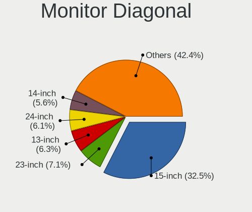

| Inches  | Computers | Percent |
|---------|-----------|---------|
| 15      | 340       | 33.66%  |
| 23      | 71        | 7.03%   |
| 24      | 61        | 6.04%   |
| 17      | 59        | 5.84%   |
| 13      | 57        | 5.64%   |
| 14      | 52        | 5.15%   |
| 21      | 49        | 4.85%   |
| 27      | 46        | 4.55%   |
| Unknown | 45        | 4.46%   |
| 19      | 39        | 3.86%   |
| 18      | 36        | 3.56%   |
| 20      | 35        | 3.47%   |
| 22      | 20        | 1.98%   |
| 31      | 16        | 1.58%   |
| 12      | 12        | 1.19%   |
| 34      | 9         | 0.89%   |
| 40      | 8         | 0.79%   |
| 32      | 6         | 0.59%   |
| 84      | 5         | 0.5%    |
| 72      | 5         | 0.5%    |
| 16      | 4         | 0.4%    |
| 11      | 4         | 0.4%    |
| 54      | 3         | 0.3%    |
| 52      | 3         | 0.3%    |
| 48      | 3         | 0.3%    |
| 26      | 3         | 0.3%    |
| 10      | 3         | 0.3%    |
| 63      | 2         | 0.2%    |
| 49      | 2         | 0.2%    |
| 46      | 2         | 0.2%    |
| 39      | 2         | 0.2%    |
| 25      | 2         | 0.2%    |
| 97      | 1         | 0.1%    |
| 67      | 1         | 0.1%    |
| 64      | 1         | 0.1%    |
| 44      | 1         | 0.1%    |
| 28      | 1         | 0.1%    |
| 8       | 1         | 0.1%    |

Monitor Width
-------------

Physical width

| Width in mm    | Computers | Percent |
|----------------|-----------|---------|
| 301-350        | 436       | 44%     |
| 501-600        | 164       | 16.55%  |
| 401-500        | 164       | 16.55%  |
| 351-400        | 57        | 5.75%   |
| 201-300        | 47        | 4.74%   |
| Unknown        | 45        | 4.54%   |
| 601-700        | 22        | 2.22%   |
| 1001-1500      | 17        | 1.72%   |
| 701-800        | 15        | 1.51%   |
| 801-900        | 10        | 1.01%   |
| 1501-2000      | 10        | 1.01%   |
| More than 2000 | 1         | 0.1%    |
| 101-200        | 1         | 0.1%    |
| 901-1000       | 1         | 0.1%    |
| 1-100          | 1         | 0.1%    |

Aspect Ratio
------------

Proportional relationship between the width and the height

| Ratio   | Computers | Percent |
|---------|-----------|---------|
| 16/9    | 669       | 76.2%   |
| 16/10   | 99        | 11.28%  |
| Unknown | 32        | 3.64%   |
| 5/4     | 29        | 3.3%    |
| 4/3     | 25        | 2.85%   |
| 21/9    | 9         | 1.03%   |
| 3/2     | 7         | 0.8%    |
| 32/9    | 5         | 0.57%   |
| 1.96    | 2         | 0.23%   |
| 0.00    | 1         | 0.11%   |

Monitor Area
------------

Area in inch

| Area in inch | Computers | Percent |
|----------------|-----------|---------|
| 101-110        | 334       | 33.6%   |
| 201-250        | 170       | 17.1%   |
| 151-200        | 90        | 9.05%   |
| 81-90          | 87        | 8.75%   |
| 301-350        | 48        | 4.83%   |
| 141-150        | 48        | 4.83%   |
| Unknown        | 46        | 4.63%   |
| 121-130        | 37        | 3.72%   |
| 351-500        | 31        | 3.12%   |
| More than 1000 | 22        | 2.21%   |
| 71-80          | 22        | 2.21%   |
| 501-1000       | 17        | 1.71%   |
| 61-70          | 11        | 1.11%   |
| 251-300        | 10        | 1.01%   |
| 111-120        | 10        | 1.01%   |
| 51-60          | 4         | 0.4%    |
| 131-140        | 3         | 0.3%    |
| 41-50          | 2         | 0.2%    |
| 1-40           | 1         | 0.1%    |
| 91-100         | 1         | 0.1%    |

Pixel Density
-------------

Pixels per inch

| Density       | Computers | Percent |
|---------------|-----------|---------|
| 51-100        | 366       | 37.89%  |
| 101-120       | 310       | 32.09%  |
| 121-160       | 189       | 19.57%  |
| Unknown       | 45        | 4.66%   |
| 161-240       | 25        | 2.59%   |
| 1-50          | 24        | 2.48%   |
| More than 240 | 7         | 0.72%   |

Multiple Monitors
-----------------

Total monitors connected

| Total | Computers | Percent |
|-------|-----------|---------|
| 1     | 696       | 74.68%  |
| 2     | 179       | 19.21%  |
| 0     | 39        | 4.18%   |
| 3     | 16        | 1.72%   |
| 4     | 2         | 0.21%   |

Network
-------

Net Controller Vendor
---------------------

Controller vendors

| Vendor                            | Computers | Percent |
|-----------------------------------|-----------|---------|
| Realtek Semiconductor             | 499       | 35.87%  |
| Intel                             | 391       | 28.11%  |
| Qualcomm Atheros                  | 174       | 12.51%  |
| Broadcom                          | 86        | 6.18%   |
| Huawei Technologies               | 22        | 1.58%   |
| Samsung Electronics               | 21        | 1.51%   |
| Dell                              | 21        | 1.51%   |
| Broadcom Limited                  | 20        | 1.44%   |
| Ralink                            | 16        | 1.15%   |
| TP-Link                           | 14        | 1.01%   |
| Ralink Technology                 | 14        | 1.01%   |
| Marvell Technology Group          | 14        | 1.01%   |
| Nvidia                            | 11        | 0.79%   |
| MediaTek                          | 7         | 0.5%    |
| Ericsson Business Mobile Networks | 6         | 0.43%   |
| JMicron Technology                | 5         | 0.36%   |
| D-Link System                     | 5         | 0.36%   |
| D-Link                            | 5         | 0.36%   |
| Spreadtrum Communications         | 4         | 0.29%   |
| Sierra Wireless                   | 4         | 0.29%   |
| Hewlett-Packard                   | 4         | 0.29%   |
| ZyXEL Communications              | 3         | 0.22%   |
| TRENDnet                          | 3         | 0.22%   |
| Silicon Integrated Systems [SiS]  | 3         | 0.22%   |
| Microsoft                         | 3         | 0.22%   |
| ASIX Electronics                  | 3         | 0.22%   |
| Aquantia                          | 3         | 0.22%   |
| Apple                             | 3         | 0.22%   |
| Qualcomm Atheros Communications   | 2         | 0.14%   |
| Lenovo                            | 2         | 0.14%   |
| Arduino SA                        | 2         | 0.14%   |
| ZTE WCDMA Technologies MSM        | 1         | 0.07%   |
| Xiaomi                            | 1         | 0.07%   |
| Toshiba                           | 1         | 0.07%   |
| Texas Instruments                 | 1         | 0.07%   |
| Motorola                          | 1         | 0.07%   |
| Microchip Technology              | 1         | 0.07%   |
| Mellanox Technologies             | 1         | 0.07%   |
| Linux 2.6.31.6 with s3c-udc       | 1         | 0.07%   |
| Linksys                           | 1         | 0.07%   |

Net Controller Model
--------------------

Controller models

| Model                                                             | Computers | Percent |
|-------------------------------------------------------------------|-----------|---------|
| Realtek RTL8111/8168/8411 PCI Express Gigabit Ethernet Controller | 329       | 20.2%   |
| Realtek RTL810xE PCI Express Fast Ethernet controller             | 94        | 5.77%   |
| Intel 82579LM Gigabit Network Connection (Lewisville)             | 43        | 2.64%   |
| Qualcomm Atheros QCA9377 802.11ac Wireless Network Adapter        | 33        | 2.03%   |
| Qualcomm Atheros QCA9565 / AR9565 Wireless Network Adapter        | 26        | 1.6%    |
| Qualcomm Atheros AR9285 Wireless Network Adapter (PCI-Express)    | 26        | 1.6%    |
| Realtek RTL8821CE 802.11ac PCIe Wireless Network Adapter          | 24        | 1.47%   |
| Realtek RTL8153 Gigabit Ethernet Adapter                          | 23        | 1.41%   |
| Intel Wireless 8265 / 8275                                        | 20        | 1.23%   |
| Realtek RTL8188EUS 802.11n Wireless Network Adapter               | 18        | 1.1%    |
| Intel Wireless 8260                                               | 17        | 1.04%   |
| Intel Wi-Fi 6 AX200                                               | 17        | 1.04%   |
| Broadcom BCM4313 802.11bgn Wireless Network Adapter               | 17        | 1.04%   |
| Intel Cannon Lake PCH CNVi WiFi                                   | 16        | 0.98%   |
| Intel Wi-Fi 6 AX201                                               | 15        | 0.92%   |
| Intel 82579V Gigabit Network Connection                           | 15        | 0.92%   |
| Realtek RTL8723BE PCIe Wireless Network Adapter                   | 14        | 0.86%   |
| Qualcomm Atheros AR9485 Wireless Network Adapter                  | 14        | 0.86%   |
| Intel Wireless 3165                                               | 13        | 0.8%    |
| Intel Ethernet Connection (2) I219-V                              | 13        | 0.8%    |
| Intel Dual Band Wireless-AC 3165 Plus Bluetooth                   | 13        | 0.8%    |
| Intel Centrino Advanced-N 6205 [Taylor Peak]                      | 13        | 0.8%    |
| Intel Wireless 7265                                               | 12        | 0.74%   |
| Intel Centrino Advanced-N 6200                                    | 12        | 0.74%   |
| Intel 82577LM Gigabit Network Connection                          | 12        | 0.74%   |
| Samsung GT-I9070 (network tethering, USB debugging enabled)       | 11        | 0.68%   |
| Qualcomm Atheros QCA6174 802.11ac Wireless Network Adapter        | 11        | 0.68%   |
| Samsung Galaxy series, misc. (tethering mode)                     | 10        | 0.61%   |
| Realtek RTL8125 2.5GbE Controller                                 | 10        | 0.61%   |
| Ralink RT3290 Wireless 802.11n 1T/1R PCIe                         | 10        | 0.61%   |
| Qualcomm Atheros AR9287 Wireless Network Adapter (PCI-Express)    | 10        | 0.61%   |
| Intel Wireless 3160                                               | 10        | 0.61%   |
| Intel Ethernet Connection I219-LM                                 | 10        | 0.61%   |
| Intel Cannon Point-LP CNVi [Wireless-AC]                          | 10        | 0.61%   |
| Realtek RTL8822CE 802.11ac PCIe Wireless Network Adapter          | 9         | 0.55%   |
| Realtek RTL-8100/8101L/8139 PCI Fast Ethernet Adapter             | 9         | 0.55%   |
| Ralink MT7601U Wireless Adapter                                   | 9         | 0.55%   |
| Qualcomm Atheros AR9462 Wireless Network Adapter                  | 9         | 0.55%   |
| Intel PRO/Wireless 3945ABG [Golan] Network Connection             | 9         | 0.55%   |
| Intel Ethernet Connection I217-LM                                 | 9         | 0.55%   |

Wireless Vendor
---------------

Wireless vendors

| Vendor                          | Computers | Percent |
|---------------------------------|-----------|---------|
| Intel                           | 271       | 39.33%  |
| Qualcomm Atheros                | 147       | 21.34%  |
| Realtek Semiconductor           | 116       | 16.84%  |
| Broadcom                        | 55        | 7.98%   |
| Ralink                          | 16        | 2.32%   |
| Ralink Technology               | 14        | 2.03%   |
| TP-Link                         | 13        | 1.89%   |
| Dell                            | 12        | 1.74%   |
| Broadcom Limited                | 10        | 1.45%   |
| MediaTek                        | 5         | 0.73%   |
| D-Link                          | 5         | 0.73%   |
| Sierra Wireless                 | 4         | 0.58%   |
| ZyXEL Communications            | 3         | 0.44%   |
| TRENDnet                        | 3         | 0.44%   |
| Microsoft                       | 3         | 0.44%   |
| Qualcomm Atheros Communications | 2         | 0.29%   |
| D-Link System                   | 2         | 0.29%   |
| ZTE WCDMA Technologies MSM      | 1         | 0.15%   |
| Marvell Technology Group        | 1         | 0.15%   |
| Linksys                         | 1         | 0.15%   |
| Fibocom                         | 1         | 0.15%   |
| Edimax Technology               | 1         | 0.15%   |
| CyberTAN Technology             | 1         | 0.15%   |
| Belkin Components               | 1         | 0.15%   |
| ASUSTek Computer                | 1         | 0.15%   |

Wireless Model
--------------

Wireless models

| Model                                                          | Computers | Percent |
|----------------------------------------------------------------|-----------|---------|
| Qualcomm Atheros QCA9377 802.11ac Wireless Network Adapter     | 33        | 4.76%   |
| Qualcomm Atheros QCA9565 / AR9565 Wireless Network Adapter     | 26        | 3.75%   |
| Qualcomm Atheros AR9285 Wireless Network Adapter (PCI-Express) | 26        | 3.75%   |
| Realtek RTL8821CE 802.11ac PCIe Wireless Network Adapter       | 24        | 3.46%   |
| Intel Wireless 8265 / 8275                                     | 20        | 2.88%   |
| Realtek RTL8188EUS 802.11n Wireless Network Adapter            | 18        | 2.59%   |
| Intel Wireless 8260                                            | 17        | 2.45%   |
| Intel Wi-Fi 6 AX200                                            | 17        | 2.45%   |
| Broadcom BCM4313 802.11bgn Wireless Network Adapter            | 17        | 2.45%   |
| Intel Cannon Lake PCH CNVi WiFi                                | 16        | 2.31%   |
| Intel Wi-Fi 6 AX201                                            | 15        | 2.16%   |
| Realtek RTL8723BE PCIe Wireless Network Adapter                | 14        | 2.02%   |
| Qualcomm Atheros AR9485 Wireless Network Adapter               | 14        | 2.02%   |
| Intel Wireless 3165                                            | 13        | 1.87%   |
| Intel Dual Band Wireless-AC 3165 Plus Bluetooth                | 13        | 1.87%   |
| Intel Centrino Advanced-N 6205 [Taylor Peak]                   | 13        | 1.87%   |
| Intel Wireless 7265                                            | 12        | 1.73%   |
| Intel Centrino Advanced-N 6200                                 | 12        | 1.73%   |
| Qualcomm Atheros QCA6174 802.11ac Wireless Network Adapter     | 11        | 1.59%   |
| Ralink RT3290 Wireless 802.11n 1T/1R PCIe                      | 10        | 1.44%   |
| Qualcomm Atheros AR9287 Wireless Network Adapter (PCI-Express) | 10        | 1.44%   |
| Intel Wireless 3160                                            | 10        | 1.44%   |
| Intel Cannon Point-LP CNVi [Wireless-AC]                       | 10        | 1.44%   |
| Realtek RTL8822CE 802.11ac PCIe Wireless Network Adapter       | 9         | 1.3%    |
| Ralink MT7601U Wireless Adapter                                | 9         | 1.3%    |
| Qualcomm Atheros AR9462 Wireless Network Adapter               | 9         | 1.3%    |
| Intel PRO/Wireless 3945ABG [Golan] Network Connection          | 9         | 1.3%    |
| Intel Centrino Wireless-N 1030 [Rainbow Peak]                  | 9         | 1.3%    |
| Intel Wireless 7260                                            | 8         | 1.15%   |
| Intel WiFi Link 5100                                           | 8         | 1.15%   |
| Intel Centrino Ultimate-N 6300                                 | 8         | 1.15%   |
| TP-Link TL-WN823N v2/v3 [Realtek RTL8192EU]                    | 7         | 1.01%   |
| Realtek RTL8723DE Wireless Network Adapter                     | 7         | 1.01%   |
| Realtek RTL8188FTV 802.11b/g/n 1T1R 2.4G WLAN Adapter          | 7         | 1.01%   |
| Realtek 802.11n WLAN Adapter                                   | 7         | 1.01%   |
| Qualcomm Atheros AR5212/5213/2414 Wireless Network Adapter     | 7         | 1.01%   |
| Intel Dual Band Wireless-AC 3168NGW [Stone Peak]               | 7         | 1.01%   |
| Intel Centrino Wireless-N 2230                                 | 7         | 1.01%   |
| Broadcom BCM43228 802.11a/b/g/n                                | 7         | 1.01%   |
| Intel Comet Lake PCH CNVi WiFi                                 | 6         | 0.86%   |

Ethernet Vendor
---------------

Ethernet vendors

| Vendor                           | Computers | Percent |
|----------------------------------|-----------|---------|
| Realtek Semiconductor            | 466       | 52.6%   |
| Intel                            | 230       | 25.96%  |
| Broadcom                         | 46        | 5.19%   |
| Qualcomm Atheros                 | 39        | 4.4%    |
| Samsung Electronics              | 21        | 2.37%   |
| Marvell Technology Group         | 13        | 1.47%   |
| Huawei Technologies              | 13        | 1.47%   |
| Nvidia                           | 11        | 1.24%   |
| Broadcom Limited                 | 11        | 1.24%   |
| JMicron Technology               | 5         | 0.56%   |
| Spreadtrum Communications        | 4         | 0.45%   |
| Silicon Integrated Systems [SiS] | 3         | 0.34%   |
| D-Link System                    | 3         | 0.34%   |
| ASIX Electronics                 | 3         | 0.34%   |
| Aquantia                         | 3         | 0.34%   |
| Apple                            | 3         | 0.34%   |
| MediaTek                         | 2         | 0.23%   |
| Lenovo                           | 2         | 0.23%   |
| Xiaomi                           | 1         | 0.11%   |
| TP-Link                          | 1         | 0.11%   |
| Microchip Technology             | 1         | 0.11%   |
| Mellanox Technologies            | 1         | 0.11%   |
| HMD Global                       | 1         | 0.11%   |
| Foxconn / Hon Hai                | 1         | 0.11%   |
| DisplayLink                      | 1         | 0.11%   |
| Attansic Technology              | 1         | 0.11%   |

Ethernet Model
--------------

Ethernet models

| Model                                                             | Computers | Percent |
|-------------------------------------------------------------------|-----------|---------|
| Realtek RTL8111/8168/8411 PCI Express Gigabit Ethernet Controller | 329       | 36.68%  |
| Realtek RTL810xE PCI Express Fast Ethernet controller             | 94        | 10.48%  |
| Intel 82579LM Gigabit Network Connection (Lewisville)             | 43        | 4.79%   |
| Realtek RTL8153 Gigabit Ethernet Adapter                          | 23        | 2.56%   |
| Intel 82579V Gigabit Network Connection                           | 15        | 1.67%   |
| Intel Ethernet Connection (2) I219-V                              | 13        | 1.45%   |
| Intel 82577LM Gigabit Network Connection                          | 12        | 1.34%   |
| Samsung GT-I9070 (network tethering, USB debugging enabled)       | 11        | 1.23%   |
| Samsung Galaxy series, misc. (tethering mode)                     | 10        | 1.11%   |
| Realtek RTL8125 2.5GbE Controller                                 | 10        | 1.11%   |
| Intel Ethernet Connection I219-LM                                 | 10        | 1.11%   |
| Realtek RTL-8100/8101L/8139 PCI Fast Ethernet Adapter             | 9         | 1%      |
| Intel Ethernet Connection I217-LM                                 | 9         | 1%      |
| Broadcom NetLink BCM57785 Gigabit Ethernet PCIe                   | 9         | 1%      |
| Intel I211 Gigabit Network Connection                             | 8         | 0.89%   |
| Intel Ethernet Connection (2) I219-LM                             | 8         | 0.89%   |
| Intel 82578DM Gigabit Network Connection                          | 8         | 0.89%   |
| Qualcomm Atheros AR8151 v2.0 Gigabit Ethernet                     | 7         | 0.78%   |
| Intel Ethernet Connection (4) I219-LM                             | 7         | 0.78%   |
| Intel 82567LM Gigabit Network Connection                          | 7         | 0.78%   |
| Intel 82578DC Gigabit Network Connection                          | 6         | 0.67%   |
| Intel 82574L Gigabit Network Connection                           | 6         | 0.67%   |
| Marvell Group 88E8040 PCI-E Fast Ethernet Controller              | 5         | 0.56%   |
| Huawei STK-L21                                                    | 5         | 0.56%   |
| Huawei E353/E3131                                                 | 5         | 0.56%   |
| Broadcom NetXtreme BCM57765 Gigabit Ethernet PCIe                 | 5         | 0.56%   |
| Broadcom NetXtreme BCM5764M Gigabit Ethernet PCIe                 | 5         | 0.56%   |
| Realtek RTL8152 Fast Ethernet Adapter                             | 4         | 0.45%   |
| Qualcomm Atheros QCA8172 Fast Ethernet                            | 4         | 0.45%   |
| Qualcomm Atheros Killer E2400 Gigabit Ethernet Controller         | 4         | 0.45%   |
| Qualcomm Atheros AR8131 Gigabit Ethernet                          | 4         | 0.45%   |
| JMicron JMC250 PCI Express Gigabit Ethernet Controller            | 4         | 0.45%   |
| Intel Ethernet Connection I219-V                                  | 4         | 0.45%   |
| Intel Ethernet Connection I218-LM                                 | 4         | 0.45%   |
| Intel Ethernet Connection (6) I219-V                              | 4         | 0.45%   |
| Intel Ethernet Connection (3) I218-LM                             | 4         | 0.45%   |
| Intel 82566DM Gigabit Network Connection                          | 4         | 0.45%   |
| Intel 80003ES2LAN Gigabit Ethernet Controller (Copper)            | 4         | 0.45%   |
| Broadcom NetXtreme BCM5723 Gigabit Ethernet PCIe                  | 4         | 0.45%   |
| Spreadtrum Nokia G21                                              | 3         | 0.33%   |

Net Controller Kind
-------------------

Ethernet, WiFi or modem

| Kind     | Computers | Percent |
|----------|-----------|---------|
| Ethernet | 821       | 54.3%   |
| WiFi     | 654       | 43.25%  |
| Modem    | 34        | 2.25%   |
| Unknown  | 3         | 0.2%    |

Used Controller
---------------

Currently used network controller

| Kind     | Computers | Percent |
|----------|-----------|---------|
| WiFi     | 530       | 56.26%  |
| Ethernet | 411       | 43.63%  |
| Modem    | 1         | 0.11%   |

NICs
----

Total network controllers on board

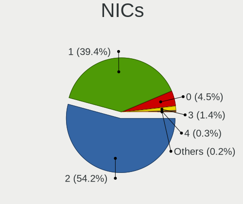

| Total | Computers | Percent |
|-------|-----------|---------|
| 2     | 512       | 56.14%  |
| 1     | 355       | 38.93%  |
| 0     | 33        | 3.62%   |
| 3     | 10        | 1.1%    |
| 6     | 1         | 0.11%   |
| 4     | 1         | 0.11%   |

IPv6
----

IPv6 vs IPv4

| Used | Computers | Percent |
|------|-----------|---------|
| No   | 885       | 97.25%  |
| Yes  | 25        | 2.75%   |

Bluetooth
---------

Bluetooth Vendor
----------------

Controller vendors

| Vendor                          | Computers | Percent |
|---------------------------------|-----------|---------|
| Intel                           | 188       | 37.83%  |
| Qualcomm Atheros Communications | 60        | 12.07%  |
| Realtek Semiconductor           | 45        | 9.05%   |
| Cambridge Silicon Radio         | 31        | 6.24%   |
| Broadcom                        | 31        | 6.24%   |
| Lite-On Technology              | 21        | 4.23%   |
| Hewlett-Packard                 | 20        | 4.02%   |
| Foxconn / Hon Hai               | 20        | 4.02%   |
| IMC Networks                    | 19        | 3.82%   |
| Apple                           | 17        | 3.42%   |
| Dell                            | 14        | 2.82%   |
| Ralink                          | 10        | 2.01%   |
| Toshiba                         | 8         | 1.61%   |
| ASUSTek Computer                | 4         | 0.8%    |
| Realtek                         | 1         | 0.2%    |
| Mobile Action Technology        | 1         | 0.2%    |
| Micro Star International        | 1         | 0.2%    |
| MediaTek                        | 1         | 0.2%    |
| Marvell Semiconductor           | 1         | 0.2%    |
| Integrated System Solution      | 1         | 0.2%    |
| Foxconn International           | 1         | 0.2%    |
| Edimax Technology               | 1         | 0.2%    |
| Alps Electric                   | 1         | 0.2%    |

Bluetooth Model
---------------

Controller models

| Model                                               | Computers | Percent |
|-----------------------------------------------------|-----------|---------|
| Intel Bluetooth wireless interface                  | 83        | 16.7%   |
| Intel Bluetooth 9460/9560 Jefferson Peak (JfP)      | 33        | 6.64%   |
| Cambridge Silicon Radio Bluetooth Dongle (HCI mode) | 31        | 6.24%   |
| Qualcomm Atheros  Bluetooth Device                  | 28        | 5.63%   |
| Intel AX201 Bluetooth                               | 28        | 5.63%   |
| Realtek Bluetooth Radio                             | 25        | 5.03%   |
| Realtek  Bluetooth 4.2 Adapter                      | 15        | 3.02%   |
| Intel AX200 Bluetooth                               | 15        | 3.02%   |
| HP Broadcom 2070 Bluetooth Combo                    | 13        | 2.62%   |
| Qualcomm Atheros AR3011 Bluetooth                   | 11        | 2.21%   |
| Foxconn / Hon Hai Bluetooth Device                  | 11        | 2.21%   |
| Ralink RT3290 Bluetooth                             | 10        | 2.01%   |
| Broadcom BCM2045B (BDC-2.1)                         | 10        | 2.01%   |
| Lite-On Qualcomm Atheros QCA9377 Bluetooth          | 9         | 1.81%   |
| Intel Centrino Advanced-N 6230 Bluetooth adapter    | 9         | 1.81%   |
| Intel Centrino Bluetooth Wireless Transceiver       | 8         | 1.61%   |
| IMC Networks Bluetooth Radio                        | 8         | 1.61%   |
| Apple Bluetooth USB Host Controller                 | 8         | 1.61%   |
| Qualcomm Atheros QCA61x4 Bluetooth 4.0              | 7         | 1.41%   |
| Qualcomm Atheros AR3012 Bluetooth 4.0               | 7         | 1.41%   |
| Intel Wireless-AC 3168 Bluetooth                    | 7         | 1.41%   |
| HP Bluetooth 2.0 Interface [Broadcom BCM2045]       | 7         | 1.41%   |
| Lite-On Bluetooth Device                            | 6         | 1.21%   |
| IMC Networks Bluetooth Device                       | 6         | 1.21%   |
| Apple Bluetooth HCI                                 | 5         | 1.01%   |
| Realtek RTL8723B Bluetooth                          | 4         | 0.8%    |
| Qualcomm Atheros AR9462 Bluetooth                   | 4         | 0.8%    |
| Lite-On Atheros AR3012 Bluetooth                    | 4         | 0.8%    |
| Dell BCM20702A0 Bluetooth Module                    | 4         | 0.8%    |
| Toshiba RT Bluetooth Radio                          | 3         | 0.6%    |
| Intel Bluetooth Device                              | 3         | 0.6%    |
| Foxconn / Hon Hai Broadcom Bluetooth 2.1 Device     | 3         | 0.6%    |
| Dell Wireless 370 Bluetooth Mini-card               | 3         | 0.6%    |
| Broadcom BCM20702A0 Bluetooth 4.0                   | 3         | 0.6%    |
| Broadcom BCM2070 Bluetooth Device                   | 3         | 0.6%    |
| Broadcom BCM2070 Bluetooth 2.1 + EDR                | 3         | 0.6%    |
| Apple Bluetooth Host Controller                     | 3         | 0.6%    |
| Toshiba Askey Bluetooth Module                      | 2         | 0.4%    |
| Qualcomm Atheros Bluetooth USB Host Controller      | 2         | 0.4%    |
| Intel Wireless-AC 9260 Bluetooth Adapter            | 2         | 0.4%    |

Sound
-----

Sound Vendor
------------

Sound card vendors

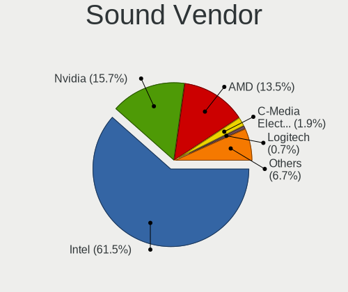

| Vendor                           | Computers | Percent |
|----------------------------------|-----------|---------|
| Intel                            | 747       | 63.36%  |
| Nvidia                           | 178       | 15.1%   |
| AMD                              | 150       | 12.72%  |
| C-Media Electronics              | 18        | 1.53%   |
| Logitech                         | 9         | 0.76%   |
| Creative Labs                    | 7         | 0.59%   |
| Corsair                          | 7         | 0.59%   |
| Realtek Semiconductor            | 4         | 0.34%   |
| VIA Technologies                 | 3         | 0.25%   |
| Silicon Integrated Systems [SiS] | 3         | 0.25%   |
| Razer USA                        | 3         | 0.25%   |
| Plantronics                      | 3         | 0.25%   |
| Lenovo                           | 3         | 0.25%   |
| JMTek                            | 3         | 0.25%   |
| Hewlett-Packard                  | 3         | 0.25%   |
| Apple                            | 3         | 0.25%   |
| Syntek                           | 2         | 0.17%   |
| Samson Technologies              | 2         | 0.17%   |
| Microsoft                        | 2         | 0.17%   |
| GN Netcom                        | 2         | 0.17%   |
| Generalplus Technology           | 2         | 0.17%   |
| DSEA A/S                         | 2         | 0.17%   |
| Cooler Master                    | 2         | 0.17%   |
| Conexant Systems                 | 2         | 0.17%   |
| ASUSTek Computer                 | 2         | 0.17%   |
| Xiaomi                           | 1         | 0.08%   |
| Texas Instruments                | 1         | 0.08%   |
| Tenx Technology                  | 1         | 0.08%   |
| Steinberg Soft-und Hardware      | 1         | 0.08%   |
| Sony                             | 1         | 0.08%   |
| Sennheiser Communications        | 1         | 0.08%   |
| Schiit Audio                     | 1         | 0.08%   |
| Micro Star International         | 1         | 0.08%   |
| Magic Control Technology         | 1         | 0.08%   |
| M-Audio                          | 1         | 0.08%   |
| iPassion Technology              | 1         | 0.08%   |
| GYROCOM C&C                      | 1         | 0.08%   |
| Focusrite-Novation               | 1         | 0.08%   |
| Creative Technology              | 1         | 0.08%   |
| Cambridge Silicon Radio          | 1         | 0.08%   |

Sound Model
-----------

Sound card models

| Model                                                                                             | Computers | Percent |
|---------------------------------------------------------------------------------------------------|-----------|---------|
| Intel 6 Series/C200 Series Chipset Family High Definition Audio Controller                        | 102       | 7.66%   |
| Intel Sunrise Point-LP HD Audio                                                                   | 89        | 6.68%   |
| Intel 7 Series/C216 Chipset Family High Definition Audio Controller                               | 74        | 5.56%   |
| Intel 5 Series/3400 Series Chipset High Definition Audio                                          | 54        | 4.05%   |
| Intel NM10/ICH7 Family High Definition Audio Controller                                           | 49        | 3.68%   |
| Intel 8 Series/C220 Series Chipset High Definition Audio Controller                               | 49        | 3.68%   |
| Intel Xeon E3-1200 v3/4th Gen Core Processor HD Audio Controller                                  | 41        | 3.08%   |
| Intel 100 Series/C230 Series Chipset Family HD Audio Controller                                   | 41        | 3.08%   |
| Intel 82801I (ICH9 Family) HD Audio Controller                                                    | 31        | 2.33%   |
| Intel Cannon Lake PCH cAVS                                                                        | 29        | 2.18%   |
| AMD Family 17h/19h HD Audio Controller                                                            | 27        | 2.03%   |
| Nvidia GF108 High Definition Audio Controller                                                     | 22        | 1.65%   |
| Nvidia High Definition Audio Controller                                                           | 21        | 1.58%   |
| Intel Wildcat Point-LP High Definition Audio Controller                                           | 21        | 1.58%   |
| Intel Broadwell-U Audio Controller                                                                | 21        | 1.58%   |
| Intel Tiger Lake-LP Smart Sound Technology Audio Controller                                       | 20        | 1.5%    |
| Intel Cannon Point-LP High Definition Audio Controller                                            | 20        | 1.5%    |
| Intel Atom/Celeron/Pentium Processor x5-E8000/J3xxx/N3xxx Series High Definition Audio Controller | 20        | 1.5%    |
| Intel 82801H (ICH8 Family) HD Audio Controller                                                    | 20        | 1.5%    |
| AMD SBx00 Azalia (Intel HDA)                                                                      | 19        | 1.43%   |
| AMD Starship/Matisse HD Audio Controller                                                          | 18        | 1.35%   |
| Intel 8 Series HD Audio Controller                                                                | 16        | 1.2%    |
| Intel Haswell-ULT HD Audio Controller                                                             | 15        | 1.13%   |
| Intel 200 Series PCH HD Audio                                                                     | 15        | 1.13%   |
| AMD Renoir Radeon High Definition Audio Controller                                                | 14        | 1.05%   |
| AMD Ellesmere HDMI Audio [Radeon RX 470/480 / 570/580/590]                                        | 14        | 1.05%   |
| AMD Family 17h (Models 00h-0fh) HD Audio Controller                                               | 13        | 0.98%   |
| AMD Family 15h (Models 60h-6fh) Audio Controller                                                  | 13        | 0.98%   |
| Nvidia GP107GL High Definition Audio Controller                                                   | 12        | 0.9%    |
| Nvidia GP106 High Definition Audio Controller                                                     | 12        | 0.9%    |
| Intel Celeron N3350/Pentium N4200/Atom E3900 Series Audio Cluster                                 | 11        | 0.83%   |
| Intel 82801JI (ICH10 Family) HD Audio Controller                                                  | 11        | 0.83%   |
| Nvidia GF119 HDMI Audio Controller                                                                | 10        | 0.75%   |
| Intel Ice Lake-LP Smart Sound Technology Audio Controller                                         | 10        | 0.75%   |
| Intel CM238 HD Audio Controller                                                                   | 10        | 0.75%   |
| AMD Oland/Hainan/Cape Verde/Pitcairn HDMI Audio [Radeon HD 7000 Series]                           | 10        | 0.75%   |
| AMD High Definition Audio Controller                                                              | 10        | 0.75%   |
| Nvidia TU116 High Definition Audio Controller                                                     | 9         | 0.68%   |
| AMD Navi 10 HDMI Audio                                                                            | 9         | 0.68%   |
| Nvidia GP104 High Definition Audio Controller                                                     | 8         | 0.6%    |

Memory
------

Memory Vendor
-------------

Memory module vendors

| Vendor              | Computers | Percent |
|---------------------|-----------|---------|
| SK hynix            | 99        | 21.85%  |
| Samsung Electronics | 87        | 19.21%  |
| Kingston            | 52        | 11.48%  |
| Unknown             | 37        | 8.17%   |
| Micron Technology   | 32        | 7.06%   |
| Corsair             | 27        | 5.96%   |
| Crucial             | 22        | 4.86%   |
| Transcend           | 18        | 3.97%   |
| G.Skill             | 14        | 3.09%   |
| A-DATA Technology   | 12        | 2.65%   |
| Elpida              | 9         | 1.99%   |
| Ramaxel Technology  | 8         | 1.77%   |
| Patriot             | 8         | 1.77%   |
| Nanya Technology    | 7         | 1.55%   |
| Unknown (ABCD)      | 3         | 0.66%   |
| KLEVV               | 3         | 0.66%   |
| Team                | 2         | 0.44%   |
| Essencore Limited   | 2         | 0.44%   |
| Apacer              | 2         | 0.44%   |
| Unknown             | 2         | 0.44%   |
| Strontium           | 1         | 0.22%   |
| Silicon Power       | 1         | 0.22%   |
| Qimonda             | 1         | 0.22%   |
| Neo Forza           | 1         | 0.22%   |
| Kingmax             | 1         | 0.22%   |
| Hewlett-Packard     | 1         | 0.22%   |
| A-DA                | 1         | 0.22%   |

Memory Model
------------

Memory module models

| Model                                                            | Computers | Percent |
|------------------------------------------------------------------|-----------|---------|
| SK hynix RAM HMA81GS6AFR8N-UH 8GB SODIMM DDR4 2667MT/s           | 9         | 1.87%   |
| Samsung RAM M471A5244CB0-CTD 4GB SODIMM DDR4 3266MT/s            | 9         | 1.87%   |
| SK hynix RAM HMA851S6AFR6N-UH 2GB SODIMM LPDDR4 2667MT/s         | 5         | 1.04%   |
| SK hynix RAM HMA81GS6CJR8N-VK 8GB SODIMM DDR4 2667MT/s           | 5         | 1.04%   |
| Samsung RAM M471B5273DH0-CK0 4GB SODIMM DDR3 1600MT/s            | 5         | 1.04%   |
| Samsung RAM M471A5244CB0-CRC 4GB SODIMM DDR4 2667MT/s            | 5         | 1.04%   |
| Samsung RAM M471A1K43CB1-CRC 8GB SODIMM DDR4 2667MT/s            | 5         | 1.04%   |
| SK hynix RAM HMT41GS6BFR8A-PB 8GB SODIMM DDR3 1600MT/s           | 4         | 0.83%   |
| SK hynix RAM HMT351S6EFR8A-PB 4096MB SODIMM DDR3 1600MT/s        | 4         | 0.83%   |
| SK hynix RAM HMA81GS6JJR8N-VK 8GB SODIMM DDR4 2667MT/s           | 4         | 0.83%   |
| Samsung RAM M471B5273DH0-CH9 4096MB SODIMM DDR3 1334MT/s         | 4         | 0.83%   |
| Unknown RAM Module 4GB DIMM 400MT/s                              | 3         | 0.62%   |
| Unknown RAM Module 2GB Row Of Chips LPDDR4 4267MT/s              | 3         | 0.62%   |
| Unknown RAM Module 2048MB DIMM 1333MT/s                          | 3         | 0.62%   |
| Unknown (ABCD) RAM 123456789012345678 2GB SODIMM LPDDR4 2400MT/s | 3         | 0.62%   |
| Transcend RAM TS512MLK64V6H 4GB DIMM DDR3 1600MT/s               | 3         | 0.62%   |
| SK hynix RAM HMT451S6BFR8A-PB 4GB SODIMM DDR3 1600MT/s           | 3         | 0.62%   |
| SK hynix RAM HMT351S6CFR8C-PB 4GB SODIMM DDR3 1600MT/s           | 3         | 0.62%   |
| Samsung RAM M471B5173EB0-YK0 4GB SODIMM DDR3 1600MT/s            | 3         | 0.62%   |
| Samsung RAM M471B5173DB0-YK0 4GB SODIMM DDR3 1600MT/s            | 3         | 0.62%   |
| Samsung RAM M471A1K43DB1-CWE 8GB SODIMM DDR4 3200MT/s            | 3         | 0.62%   |
| Nanya RAM NT2GC64B88B0NS-CG 2GB SODIMM DDR3 1334MT/s             | 3         | 0.62%   |
| G.Skill RAM F4-3200C16-8GVKB 8GB DIMM DDR4 3866MT/s              | 3         | 0.62%   |
| Unknown RAM Module 512MB DIMM 400MT/s                            | 2         | 0.42%   |
| Unknown RAM Module 4GB SODIMM DDR3 1600MT/s                      | 2         | 0.42%   |
| Unknown RAM Module 4GB DIMM 800MT/s                              | 2         | 0.42%   |
| Unknown RAM Module 4GB DIMM 1333MT/s                             | 2         | 0.42%   |
| Transcend RAM JM2666HSB-16G 16GB SODIMM DDR4 2667MT/s            | 2         | 0.42%   |
| Transcend RAM JM1333KLH-8G 8GB DIMM DDR3 1333MT/s                | 2         | 0.42%   |
| SK hynix RAM Module 2GB SODIMM DDR3 1600MT/s                     | 2         | 0.42%   |
| SK hynix RAM HMT451U6BFR8C-PB 4GB DIMM DDR3 1600MT/s             | 2         | 0.42%   |
| SK hynix RAM HMT451U6BFR8A-PB 4GB DIMM DDR3 1648MT/s             | 2         | 0.42%   |
| SK hynix RAM HMT451U6AFR8C-PB 4GB DIMM DDR3 1600MT/s             | 2         | 0.42%   |
| SK hynix RAM HMT425S6AFR6A-PB 2GB SODIMM DDR3 1600MT/s           | 2         | 0.42%   |
| SK hynix RAM HMT41GS6AFR8A-PB 8GB SODIMM DDR3 1600MT/s           | 2         | 0.42%   |
| SK hynix RAM HMT351S6BFR8C-H9 4GB SODIMM DDR3 1334MT/s           | 2         | 0.42%   |
| SK hynix RAM HMT351S6BFR8C-H9 4GB SODIMM DDR3 1333MT/s           | 2         | 0.42%   |
| SK hynix RAM HMT325S6EFR8A-PB 2GB SODIMM DDR3 1600MT/s           | 2         | 0.42%   |
| SK hynix RAM HMT325S6CFR8C-H9 2GB SODIMM DDR3 1334MT/s           | 2         | 0.42%   |
| SK hynix RAM HMA851S6AFR6N-TF 4GB SODIMM DDR4 2133MT/s           | 2         | 0.42%   |

Memory Kind
-----------

Memory module kinds

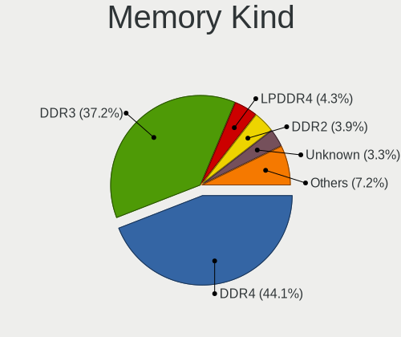

| Kind    | Computers | Percent |
|---------|-----------|---------|
| DDR4    | 154       | 43.5%   |
| DDR3    | 146       | 41.24%  |
| Unknown | 16        | 4.52%   |
| DDR2    | 15        | 4.24%   |
| LPDDR4  | 12        | 3.39%   |
| LPDDR3  | 5         | 1.41%   |
| DDR5    | 3         | 0.85%   |
| DDR     | 2         | 0.56%   |
| SDRAM   | 1         | 0.28%   |

Memory Form Factor
------------------

Physical design of the memory module

| Name         | Computers | Percent |
|--------------|-----------|---------|
| SODIMM       | 217       | 60.78%  |
| DIMM         | 121       | 33.89%  |
| Row Of Chips | 14        | 3.92%   |
| Chip         | 3         | 0.84%   |
| FB-DIMM      | 1         | 0.28%   |
| Unknown      | 1         | 0.28%   |

Memory Size
-----------

Memory module size

| Size  | Computers | Percent |
|-------|-----------|---------|
| 4096  | 137       | 34.25%  |
| 8192  | 133       | 33.25%  |
| 2048  | 62        | 15.5%   |
| 16384 | 48        | 12%     |
| 1024  | 10        | 2.5%    |
| 32768 | 6         | 1.5%    |
| 512   | 4         | 1%      |

Memory Speed
------------

Memory module speed

| Speed   | Computers | Percent |
|---------|-----------|---------|
| 1600    | 91        | 22.75%  |
| 2667    | 68        | 17%     |
| 1333    | 38        | 9.5%    |
| 2133    | 30        | 7.5%    |
| 2400    | 27        | 6.75%   |
| 3200    | 25        | 6.25%   |
| 1334    | 19        | 4.75%   |
| 3266    | 9         | 2.25%   |
| 800     | 9         | 2.25%   |
| 667     | 7         | 1.75%   |
| 3600    | 6         | 1.5%    |
| 1067    | 6         | 1.5%    |
| 1867    | 5         | 1.25%   |
| 400     | 5         | 1.25%   |
| 4267    | 4         | 1%      |
| 2933    | 4         | 1%      |
| Unknown | 4         | 1%      |
| 3866    | 3         | 0.75%   |
| 3000    | 3         | 0.75%   |
| 1066    | 3         | 0.75%   |
| 975     | 3         | 0.75%   |
| 4800    | 2         | 0.5%    |
| 3800    | 2         | 0.5%    |
| 3466    | 2         | 0.5%    |
| 3100    | 2         | 0.5%    |
| 2934    | 2         | 0.5%    |
| 2666    | 2         | 0.5%    |
| 2187    | 2         | 0.5%    |
| 1800    | 2         | 0.5%    |
| 1648    | 2         | 0.5%    |
| 41632   | 1         | 0.25%   |
| 8400    | 1         | 0.25%   |
| 6000    | 1         | 0.25%   |
| 3733    | 1         | 0.25%   |
| 3400    | 1         | 0.25%   |
| 3066    | 1         | 0.25%   |
| 2800    | 1         | 0.25%   |
| 2733    | 1         | 0.25%   |
| 2200    | 1         | 0.25%   |
| 2048    | 1         | 0.25%   |

Printers & scanners
-------------------

Printer Vendor
--------------

Printer device vendors

| Vendor                | Computers | Percent |
|-----------------------|-----------|---------|
| Canon                 | 6         | 27.27%  |
| Samsung Electronics   | 5         | 22.73%  |
| Pantum                | 3         | 13.64%  |
| Hewlett-Packard       | 2         | 9.09%   |
| Brother Industries    | 2         | 9.09%   |
| Seiko Epson           | 1         | 4.55%   |
| Oki Data              | 1         | 4.55%   |
| Lexmark International | 1         | 4.55%   |
| Dell                  | 1         | 4.55%   |

Printer Model
-------------

Printer device models

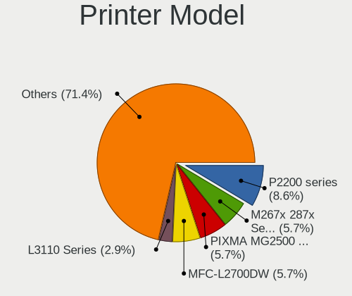

| Model                                      | Computers | Percent |
|--------------------------------------------|-----------|---------|
| Pantum P2200 series                        | 3         | 13.64%  |
| Seiko Epson L3110 Series                   | 1         | 4.55%   |
| Samsung SCX-4623 Series                    | 1         | 4.55%   |
| Samsung SCX-4600 Series                    | 1         | 4.55%   |
| Samsung M2070 Series                       | 1         | 4.55%   |
| Samsung M2020 Series                       | 1         | 4.55%   |
| Samsung Composite Device                   | 1         | 4.55%   |
| Oki Data USB Device                        | 1         | 4.55%   |
| Lexmark International InkJet Color Printer | 1         | 4.55%   |
| HP OfficeJet Pro 9010 series               | 1         | 4.55%   |
| HP LaserJet 1022                           | 1         | 4.55%   |
| Dell 1250c Color Printer                   | 1         | 4.55%   |
| Canon PIXMA MX410                          | 1         | 4.55%   |
| Canon PIXMA MG3600 Series                  | 1         | 4.55%   |
| Canon PIXMA MG2500 Series                  | 1         | 4.55%   |
| Canon MF210 Series                         | 1         | 4.55%   |
| Canon G4000 series                         | 1         | 4.55%   |
| Canon G3010 series                         | 1         | 4.55%   |
| Brother MFC-L2700DW                        | 1         | 4.55%   |
| Brother HL-2130 series                     | 1         | 4.55%   |

Scanner Vendor
--------------

Scanner device vendors

| Vendor          | Computers | Percent |
|-----------------|-----------|---------|
| Seiko Epson     | 1         | 50%     |
| Hewlett-Packard | 1         | 50%     |

Scanner Model
-------------

Scanner device models

| Model                                              | Computers | Percent |
|----------------------------------------------------|-----------|---------|
| Seiko Epson GT-8400UF [Perfection 1670/1670 PHOTO] | 1         | 50%     |
| HP OfficeJet 6110                                  | 1         | 50%     |

Camera
------

Camera Vendor
-------------

Camera device vendors

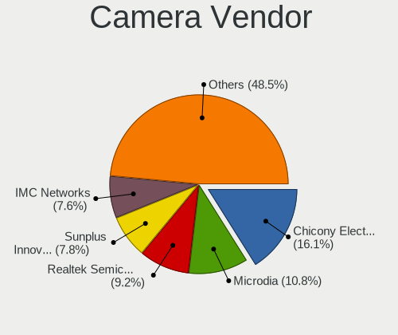

| Vendor                                            | Computers | Percent |
|---------------------------------------------------|-----------|---------|
| Chicony Electronics                               | 94        | 17.74%  |
| Microdia                                          | 55        | 10.38%  |
| Realtek Semiconductor                             | 51        | 9.62%   |
| Sunplus Innovation Technology                     | 40        | 7.55%   |
| Acer                                              | 40        | 7.55%   |
| IMC Networks                                      | 33        | 6.23%   |
| Logitech                                          | 24        | 4.53%   |
| Quanta                                            | 23        | 4.34%   |
| Apple                                             | 21        | 3.96%   |
| Cheng Uei Precision Industry (Foxlink)            | 19        | 3.58%   |
| Syntek                                            | 16        | 3.02%   |
| Suyin                                             | 15        | 2.83%   |
| Samsung Electronics                               | 15        | 2.83%   |
| Lite-On Technology                                | 14        | 2.64%   |
| Microsoft                                         | 11        | 2.08%   |
| Silicon Motion                                    | 7         | 1.32%   |
| Luxvisions Innotech Limited                       | 7         | 1.32%   |
| Alcor Micro                                       | 7         | 1.32%   |
| Ricoh                                             | 6         | 1.13%   |
| Z-Star Microelectronics                           | 5         | 0.94%   |
| Primax Electronics                                | 4         | 0.75%   |
| USB Camera                                        | 3         | 0.57%   |
| Lenovo                                            | 3         | 0.57%   |
| LG Electronics                                    | 2         | 0.38%   |
| Importek                                          | 2         | 0.38%   |
| GEMBIRD                                           | 2         | 0.38%   |
| Sunplus Technology                                | 1         | 0.19%   |
| STMicroelectronics Imaging Division (VLSI Vision) | 1         | 0.19%   |
| Spreadtrum Communications                         | 1         | 0.19%   |
| Sonix Technology                                  | 1         | 0.19%   |
| SN0002                                            | 1         | 0.19%   |
| Panasonic (Matsushita)                            | 1         | 0.19%   |
| OmniVision Technologies                           | 1         | 0.19%   |
| KYE Systems (Mouse Systems)                       | 1         | 0.19%   |
| Google                                            | 1         | 0.19%   |
| DigiTech                                          | 1         | 0.19%   |
| Asuscom Network                                   | 1         | 0.19%   |

Camera Model
------------

Camera device models

| Model                                                   | Computers | Percent |
|---------------------------------------------------------|-----------|---------|
| Microdia Integrated_Webcam_HD                           | 24        | 4.51%   |
| Realtek Integrated_Webcam_HD                            | 21        | 3.95%   |
| Sunplus Integrated_Webcam_HD                            | 15        | 2.82%   |
| Samsung Galaxy A5 (MTP)                                 | 14        | 2.63%   |
| Acer Integrated Camera                                  | 14        | 2.63%   |
| IMC Networks USB2.0 VGA UVC WebCam                      | 12        | 2.26%   |
| Chicony Integrated Camera                               | 12        | 2.26%   |
| Microdia Integrated Webcam                              | 10        | 1.88%   |
| Chicony HD Webcam                                       | 9         | 1.69%   |
| Chicony EasyCamera                                      | 8         | 1.5%    |
| IMC Networks USB2.0 HD UVC WebCam                       | 7         | 1.32%   |
| Apple iPhone5/5C/5S/6                                   | 7         | 1.32%   |
| Sunplus HD WebCam                                       | 6         | 1.13%   |
| Quanta VGA WebCam                                       | 6         | 1.13%   |
| Logitech Webcam C270                                    | 6         | 1.13%   |
| IMC Networks Integrated Camera                          | 6         | 1.13%   |
| Syntek Integrated Camera                                | 5         | 0.94%   |
| Syntek EasyCamera                                       | 5         | 0.94%   |
| Realtek Integrated Webcam                               | 5         | 0.94%   |
| Quanta HP HD Camera                                     | 5         | 0.94%   |
| Chicony USB2.0 VGA UVC WebCam                           | 5         | 0.94%   |
| Chicony HP TrueVision HD Camera                         | 5         | 0.94%   |
| Cheng Uei Precision Industry (Foxlink) Webcam           | 5         | 0.94%   |
| Apple FaceTime HD Camera (Built-in)                     | 5         | 0.94%   |
| Apple FaceTime HD Camera                                | 5         | 0.94%   |
| Acer Lenovo EasyCamera                                  | 5         | 0.94%   |
| Suyin HP TrueVision HD Integrated Webcam                | 4         | 0.75%   |
| Quanta HP Webcam                                        | 4         | 0.75%   |
| Microsoft LifeCam HD-3000                               | 4         | 0.75%   |
| Microdia Laptop_Integrated_Webcam_HD                    | 4         | 0.75%   |
| Logitech Webcam C170                                    | 4         | 0.75%   |
| Lite-On HP HD Camera                                    | 4         | 0.75%   |
| Chicony HP Webcam                                       | 4         | 0.75%   |
| Cheng Uei Precision Industry (Foxlink) HP Truevision HD | 4         | 0.75%   |
| Alcor Micro USB 2.0 Camera                              | 4         | 0.75%   |
| Acer SunplusIT Integrated Camera                        | 4         | 0.75%   |
| Acer EasyCamera                                         | 4         | 0.75%   |
| USB Camera USB Camera                                   | 3         | 0.56%   |
| Syntek Lenovo EasyCamera                                | 3         | 0.56%   |
| Suyin Acer/HP Integrated Webcam [CN0314]                | 3         | 0.56%   |

Security
--------

Fingerprint Vendor
------------------

Fingerprint sensor vendors

| Vendor                     | Computers | Percent |
|----------------------------|-----------|---------|
| Validity Sensors           | 56        | 48.7%   |
| Synaptics                  | 18        | 15.65%  |
| Upek                       | 12        | 10.43%  |
| Shenzhen Goodix Technology | 12        | 10.43%  |
| AuthenTec                  | 9         | 7.83%   |
| LighTuning Technology      | 5         | 4.35%   |
| Focal-systems.Corp         | 2         | 1.74%   |
| STMicroelectronics         | 1         | 0.87%   |

Fingerprint Model
-----------------

Fingerprint sensor models

| Model                                                      | Computers | Percent |
|------------------------------------------------------------|-----------|---------|
| Validity Sensors VFS495 Fingerprint Reader                 | 14        | 12.17%  |
| Upek Biometric Touchchip/Touchstrip Fingerprint Sensor     | 11        | 9.57%   |
| Validity Sensors VFS 5011 fingerprint sensor               | 7         | 6.09%   |
| Validity Sensors VFS5011 Fingerprint Reader                | 6         | 5.22%   |
| Validity Sensors VFS471 Fingerprint Reader                 | 6         | 5.22%   |
| Shenzhen Goodix Fingerprint Reader                         | 6         | 5.22%   |
| Validity Sensors VFS451 Fingerprint Reader                 | 5         | 4.35%   |
| Unknown                                                    | 5         | 4.35%   |
| Validity Sensors VFS7500 Touch Fingerprint Sensor          | 3         | 2.61%   |
| Validity Sensors VFS491                                    | 3         | 2.61%   |
| Validity Sensors Synaptics WBDI                            | 3         | 2.61%   |
| Validity Sensors Swipe Fingerprint Sensor                  | 3         | 2.61%   |
| Validity Sensors Fingerprint scanner                       | 3         | 2.61%   |
| Synaptics  VFS7552 Touch Fingerprint Sensor with PurePrint | 3         | 2.61%   |
| Synaptics Prometheus MIS Touch Fingerprint Reader          | 3         | 2.61%   |
| Synaptics Metallica MOH Touch Fingerprint Reader           | 3         | 2.61%   |
| Shenzhen Goodix  FingerPrint Device                        | 3         | 2.61%   |
| Shenzhen Goodix FingerPrint                                | 3         | 2.61%   |
| AuthenTec AES2810                                          | 3         | 2.61%   |
| AuthenTec AES2501 Fingerprint Sensor                       | 3         | 2.61%   |
| Synaptics  WBDI                                            | 2         | 1.74%   |
| LighTuning ES603 Swipe Fingerprint Sensor                  | 2         | 1.74%   |
| Focal-systems.Corp FT9201Fingerprint.                      | 2         | 1.74%   |
| AuthenTec Fingerprint Sensor                               | 2         | 1.74%   |
| Validity Sensors VFS7552 Touch Fingerprint Sensor          | 1         | 0.87%   |
| Validity Sensors VFS301 Fingerprint Reader                 | 1         | 0.87%   |
| Validity Sensors VFS300 Fingerprint Reader                 | 1         | 0.87%   |
| Upek TCS5B Fingerprint sensor                              | 1         | 0.87%   |
| Synaptics  FS7604 Touch Fingerprint Sensor with PurePrint  | 1         | 0.87%   |
| Synaptics Metallica MIS Touch Fingerprint Reader           | 1         | 0.87%   |
| STMicroelectronics Fingerprint Reader                      | 1         | 0.87%   |
| LighTuning Fingerprint Sensor                              | 1         | 0.87%   |
| LighTuning Fingerprint Reader                              | 1         | 0.87%   |
| LighTuning EgisTec Touch Fingerprint Sensor                | 1         | 0.87%   |
| AuthenTec AES1600                                          | 1         | 0.87%   |

Chipcard Vendor
---------------

Chipcard module vendors

| Vendor      | Computers | Percent |
|-------------|-----------|---------|
| Broadcom    | 35        | 70%     |
| Lenovo      | 5         | 10%     |
| O2 Micro    | 4         | 8%      |
| Alcor Micro | 4         | 8%      |
| Upek        | 2         | 4%      |

Chipcard Model
--------------

Chipcard module models

| Model                                                                        | Computers | Percent |
|------------------------------------------------------------------------------|-----------|---------|
| Broadcom BCM5880 Secure Applications Processor                               | 11        | 22%     |
| Broadcom BCM5880 Secure Applications Processor with fingerprint swipe sensor | 10        | 20%     |
| Broadcom 5880                                                                | 8         | 16%     |
| Broadcom 58200                                                               | 6         | 12%     |
| Lenovo Integrated Smart Card Reader                                          | 5         | 10%     |
| O2 Micro OZ776 CCID Smartcard Reader                                         | 4         | 8%      |
| Alcor Micro AU9540 Smartcard Reader                                          | 4         | 8%      |
| Upek TouchChip Fingerprint Coprocessor (WBF advanced mode)                   | 2         | 4%      |

Unsupported
-----------

Unsupported Devices
-------------------

Total unsupported devices on board

| Total | Computers | Percent |
|-------|-----------|---------|
| 0     | 645       | 69.96%  |
| 1     | 223       | 24.19%  |
| 2     | 47        | 5.1%    |
| 3     | 5         | 0.54%   |
| 9     | 1         | 0.11%   |
| 4     | 1         | 0.11%   |

Unsupported Device Types
------------------------

Types of unsupported devices

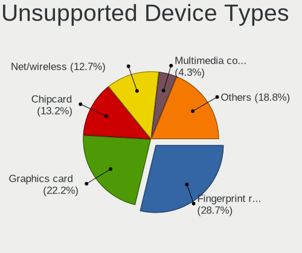

| Type                     | Computers | Percent |
|--------------------------|-----------|---------|
| Fingerprint reader       | 114       | 34.65%  |
| Graphics card            | 53        | 16.11%  |
| Chipcard                 | 46        | 13.98%  |
| Net/wireless             | 37        | 11.25%  |
| Multimedia controller    | 16        | 4.86%   |
| Communication controller | 13        | 3.95%   |
| Bluetooth                | 13        | 3.95%   |
| Storage                  | 6         | 1.82%   |
| Sound                    | 6         | 1.82%   |
| Camera                   | 6         | 1.82%   |
| Unassigned class         | 4         | 1.22%   |
| Modem                    | 4         | 1.22%   |
| Card reader              | 3         | 0.91%   |
| Storage/raid             | 2         | 0.61%   |
| Network                  | 2         | 0.61%   |
| Net/ethernet             | 2         | 0.61%   |
| Storage/nvme             | 1         | 0.3%    |
| Flash memory             | 1         | 0.3%    |

