Linux in South Africa - Tested Hardware & Statistics (Desktops)
---------------------------------------------------------------

A project to collect tested hardware configurations for Linux in South Africa.

Anyone can contribute to this report by the [hw-probe](https://github.com/linuxhw/hw-probe) tool:

    sudo -E hw-probe -all -upload

Please contribute! Especially if your hardware is rare.

Contents
--------

* [ Test Cases ](#test-cases)

* [ System ](#system)
  - [ OS                       ](#os)
  - [ OS Family                ](#os-family)
  - [ Kernel                   ](#kernel)
  - [ Kernel Family            ](#kernel-family)
  - [ Kernel Major Ver.        ](#kernel-major-ver)
  - [ Arch                     ](#arch)
  - [ DE                       ](#de)
  - [ Display Server           ](#display-server)
  - [ Display Manager          ](#display-manager)
  - [ OS Lang                  ](#os-lang)
  - [ Boot Mode                ](#boot-mode)
  - [ Filesystem               ](#filesystem)
  - [ Part. scheme             ](#part-scheme)
  - [ Dual Boot with Linux/BSD ](#dual-boot-with-linuxbsd)
  - [ Dual Boot (Win)          ](#dual-boot-win)

* [ Board ](#board)
  - [ Vendor                   ](#vendor)
  - [ Model                    ](#model)
  - [ Model Family             ](#model-family)
  - [ MFG Year                 ](#mfg-year)
  - [ Form Factor              ](#form-factor)
  - [ Secure Boot              ](#secure-boot)
  - [ Coreboot                 ](#coreboot)
  - [ RAM Size                 ](#ram-size)
  - [ RAM Used                 ](#ram-used)
  - [ Total Drives             ](#total-drives)
  - [ Has CD-ROM               ](#has-cd-rom)
  - [ Has Ethernet             ](#has-ethernet)
  - [ Has WiFi                 ](#has-wifi)
  - [ Has Bluetooth            ](#has-bluetooth)

* [ Location ](#location)
  - [ Country                  ](#country)
  - [ City                     ](#city)

* [ Drives ](#drives)
  - [ Drive Vendor             ](#drive-vendor)
  - [ Drive Model              ](#drive-model)
  - [ HDD Vendor               ](#hdd-vendor)
  - [ SSD Vendor               ](#ssd-vendor)
  - [ Drive Kind               ](#drive-kind)
  - [ Drive Connector          ](#drive-connector)
  - [ Drive Size               ](#drive-size)
  - [ Space Total              ](#space-total)
  - [ Space Used               ](#space-used)
  - [ Malfunc. Drives          ](#malfunc-drives)
  - [ Malfunc. Drive Vendor    ](#malfunc-drive-vendor)
  - [ Malfunc. HDD Vendor      ](#malfunc-hdd-vendor)
  - [ Malfunc. Drive Kind      ](#malfunc-drive-kind)
  - [ Failed Drives            ](#failed-drives)
  - [ Failed Drive Vendor      ](#failed-drive-vendor)
  - [ Drive Status             ](#drive-status)

* [ Storage controller ](#storage-controller)
  - [ Storage Vendor           ](#storage-vendor)
  - [ Storage Model            ](#storage-model)
  - [ Storage Kind             ](#storage-kind)

* [ Processor ](#processor)
  - [ CPU Vendor               ](#cpu-vendor)
  - [ CPU Model                ](#cpu-model)
  - [ CPU Model Family         ](#cpu-model-family)
  - [ CPU Cores                ](#cpu-cores)
  - [ CPU Sockets              ](#cpu-sockets)
  - [ CPU Threads              ](#cpu-threads)
  - [ CPU Op-Modes             ](#cpu-op-modes)
  - [ CPU Microcode            ](#cpu-microcode)
  - [ CPU Microarch            ](#cpu-microarch)

* [ Graphics ](#graphics)
  - [ GPU Vendor               ](#gpu-vendor)
  - [ GPU Model                ](#gpu-model)
  - [ GPU Combo                ](#gpu-combo)
  - [ GPU Driver               ](#gpu-driver)
  - [ GPU Memory               ](#gpu-memory)

* [ Monitor ](#monitor)
  - [ Monitor Vendor           ](#monitor-vendor)
  - [ Monitor Model            ](#monitor-model)
  - [ Monitor Resolution       ](#monitor-resolution)
  - [ Monitor Diagonal         ](#monitor-diagonal)
  - [ Monitor Width            ](#monitor-width)
  - [ Aspect Ratio             ](#aspect-ratio)
  - [ Monitor Area             ](#monitor-area)
  - [ Pixel Density            ](#pixel-density)
  - [ Multiple Monitors        ](#multiple-monitors)

* [ Network ](#network)
  - [ Net Controller Vendor    ](#net-controller-vendor)
  - [ Net Controller Model     ](#net-controller-model)
  - [ Wireless Vendor          ](#wireless-vendor)
  - [ Wireless Model           ](#wireless-model)
  - [ Ethernet Vendor          ](#ethernet-vendor)
  - [ Ethernet Model           ](#ethernet-model)
  - [ Net Controller Kind      ](#net-controller-kind)
  - [ Used Controller          ](#used-controller)
  - [ NICs                     ](#nics)
  - [ IPv6                     ](#ipv6)

* [ Bluetooth ](#bluetooth)
  - [ Bluetooth Vendor         ](#bluetooth-vendor)
  - [ Bluetooth Model          ](#bluetooth-model)

* [ Sound ](#sound)
  - [ Sound Vendor             ](#sound-vendor)
  - [ Sound Model              ](#sound-model)

* [ Memory ](#memory)
  - [ Memory Vendor            ](#memory-vendor)
  - [ Memory Model             ](#memory-model)
  - [ Memory Kind              ](#memory-kind)
  - [ Memory Form Factor       ](#memory-form-factor)
  - [ Memory Size              ](#memory-size)
  - [ Memory Speed             ](#memory-speed)

* [ Printers & scanners ](#printers--scanners)
  - [ Printer Vendor           ](#printer-vendor)
  - [ Printer Model            ](#printer-model)
  - [ Scanner Vendor           ](#scanner-vendor)
  - [ Scanner Model            ](#scanner-model)

* [ Camera ](#camera)
  - [ Camera Vendor            ](#camera-vendor)
  - [ Camera Model             ](#camera-model)

* [ Security ](#security)
  - [ Fingerprint Vendor       ](#fingerprint-vendor)
  - [ Fingerprint Model        ](#fingerprint-model)
  - [ Chipcard Vendor          ](#chipcard-vendor)
  - [ Chipcard Model           ](#chipcard-model)

* [ Unsupported ](#unsupported)
  - [ Unsupported Devices      ](#unsupported-devices)
  - [ Unsupported Device Types ](#unsupported-device-types)

Test Cases
----------

Total: 1060

| Vendor        | Model                       | Probe                                                      | Date         |
|---------------|-----------------------------|------------------------------------------------------------|--------------|
| ASUSTek       | P8B75-M LE                  | [c9f8923761](https://linux-hardware.org/?probe=c9f8923761) | Jan 03, 2026 |
| ABIT          | A-S78H                      | [dd0fa485ad](https://linux-hardware.org/?probe=dd0fa485ad) | Jan 01, 2026 |
| ABIT          | A-S78H                      | [ac34044240](https://linux-hardware.org/?probe=ac34044240) | Jan 01, 2026 |
| ASUSTek       | P8H61-I                     | [aaf46102ca](https://linux-hardware.org/?probe=aaf46102ca) | Jan 01, 2026 |
| MSI           | B450M PRO-VDH MAX           | [200f1027dc](https://linux-hardware.org/?probe=200f1027dc) | Dec 31, 2025 |
| Dell          | 0GXM1W A00                  | [925e1b2900](https://linux-hardware.org/?probe=925e1b2900) | Dec 29, 2025 |
| ASUSTek       | ROG STRIX X870-F GAMING ... | [9cfbffa333](https://linux-hardware.org/?probe=9cfbffa333) | Dec 29, 2025 |
| Dell          | 0YXT71 A00                  | [656340a869](https://linux-hardware.org/?probe=656340a869) | Dec 29, 2025 |
| Gigabyte      | H610M H V3 DDR4             | [6ee508bfca](https://linux-hardware.org/?probe=6ee508bfca) | Dec 27, 2025 |
| Gigabyte      | H610M H V3 DDR4             | [d7a82c7195](https://linux-hardware.org/?probe=d7a82c7195) | Dec 27, 2025 |
| ASUSTek       | ROG STRIX Z890-A GAMING ... | [50f4428f2d](https://linux-hardware.org/?probe=50f4428f2d) | Dec 26, 2025 |
| ASRock        | Z87 Extreme4                | [889c6d3ab3](https://linux-hardware.org/?probe=889c6d3ab3) | Dec 23, 2025 |
| Intel         | DQ57TM AAE70931-403         | [e7b61d89e2](https://linux-hardware.org/?probe=e7b61d89e2) | Dec 23, 2025 |
| Intel         | DQ57TM AAE70931-403         | [26cee44397](https://linux-hardware.org/?probe=26cee44397) | Dec 23, 2025 |
| ASUSTek       | PRIME B450M-K II            | [5b6a34a1b6](https://linux-hardware.org/?probe=5b6a34a1b6) | Dec 22, 2025 |
| Gigabyte      | H81M-DS2                    | [cc1f98d125](https://linux-hardware.org/?probe=cc1f98d125) | Dec 20, 2025 |
| Dell          | 0VD5HY A04                  | [e0c6f73d45](https://linux-hardware.org/?probe=e0c6f73d45) | Dec 16, 2025 |
| Intel         | DQ77MK AAG39642-302         | [2e96953b53](https://linux-hardware.org/?probe=2e96953b53) | Dec 15, 2025 |
| ASUSTek       | ROG CROSSHAIR X870E HERO    | [1bf5114a42](https://linux-hardware.org/?probe=1bf5114a42) | Dec 15, 2025 |
| MSI           | MAG B650 TOMAHAWK WIFI      | [150bec88af](https://linux-hardware.org/?probe=150bec88af) | Dec 13, 2025 |
| GMKtec        | NucBox K8 Plus              | [92d6c532e7](https://linux-hardware.org/?probe=92d6c532e7) | Dec 13, 2025 |
| Dell          | 0VD92X A00                  | [3d6e789cca](https://linux-hardware.org/?probe=3d6e789cca) | Dec 13, 2025 |
| ASUSTek       | Z97-K/USB                   | [20d39bb27d](https://linux-hardware.org/?probe=20d39bb27d) | Dec 12, 2025 |
| HP            | 8169                        | [fde575655d](https://linux-hardware.org/?probe=fde575655d) | Dec 07, 2025 |
| Intel         | DQ77MK AAG39642-302         | [a9906d5fd7](https://linux-hardware.org/?probe=a9906d5fd7) | Dec 06, 2025 |
| Dell          | 0VD92X A00                  | [68d56feb28](https://linux-hardware.org/?probe=68d56feb28) | Dec 06, 2025 |
| ASRock        | X570 Steel Legend           | [b74f30b971](https://linux-hardware.org/?probe=b74f30b971) | Dec 04, 2025 |
| ASUSTek       | PRIME B550M-K               | [e098569a84](https://linux-hardware.org/?probe=e098569a84) | Dec 03, 2025 |
| Gigabyte      | H81M-DS2                    | [88dbc90302](https://linux-hardware.org/?probe=88dbc90302) | Nov 28, 2025 |
| Gigabyte      | H81M-DS2                    | [5907c7d44b](https://linux-hardware.org/?probe=5907c7d44b) | Nov 28, 2025 |
| MSI           | 2A9C                        | [d8c7341766](https://linux-hardware.org/?probe=d8c7341766) | Nov 24, 2025 |
| MSI           | H410M-A PRO                 | [76d5c004c4](https://linux-hardware.org/?probe=76d5c004c4) | Nov 24, 2025 |
| MSI           | 2A9C                        | [a0e60dd1b1](https://linux-hardware.org/?probe=a0e60dd1b1) | Nov 24, 2025 |
| Intel         | DQ57TM AAE70931-403         | [7dc87ea258](https://linux-hardware.org/?probe=7dc87ea258) | Nov 22, 2025 |
| Intel         | DQ57TM AAE70931-403         | [3de6d3e060](https://linux-hardware.org/?probe=3de6d3e060) | Nov 22, 2025 |
| Dell          | 0GXM1W A00                  | [e830e03e1c](https://linux-hardware.org/?probe=e830e03e1c) | Nov 17, 2025 |
| MSI           | Z270 GAMING PRO CARBON      | [739c2b146d](https://linux-hardware.org/?probe=739c2b146d) | Nov 13, 2025 |
| ASUSTek       | M5A99FX PRO R2.0            | [e5dce5ac9e](https://linux-hardware.org/?probe=e5dce5ac9e) | Nov 10, 2025 |
| Dell          | 0VNP2H A00                  | [106601decd](https://linux-hardware.org/?probe=106601decd) | Nov 10, 2025 |
| Gigabyte      | 945GZM-S2                   | [d854cd3746](https://linux-hardware.org/?probe=d854cd3746) | Nov 10, 2025 |
| ASUSTek       | M5A99FX PRO R2.0            | [d552215479](https://linux-hardware.org/?probe=d552215479) | Nov 10, 2025 |
| Dell          | 0YXT71 A02                  | [04d83d930d](https://linux-hardware.org/?probe=04d83d930d) | Nov 07, 2025 |
| ASUSTek       | Z170I PRO GAMING            | [446f8d02d2](https://linux-hardware.org/?probe=446f8d02d2) | Nov 06, 2025 |
| Foxconn       | G41MXE/G41MXE-K             | [6bceb602c1](https://linux-hardware.org/?probe=6bceb602c1) | Nov 06, 2025 |
| MSI           | B450M-A PRO MAX II          | [9fe26e7565](https://linux-hardware.org/?probe=9fe26e7565) | Nov 04, 2025 |
| MSI           | A520M-A PRO                 | [2edda8b979](https://linux-hardware.org/?probe=2edda8b979) | Nov 04, 2025 |
| ASUSTek       | M5A97 R2.0                  | [a6ede9fec3](https://linux-hardware.org/?probe=a6ede9fec3) | Nov 03, 2025 |
| ASRock        | Z170 Pro4                   | [763cc273b4](https://linux-hardware.org/?probe=763cc273b4) | Nov 01, 2025 |
| Dell          | 0F5C5X A00                  | [bd7f947a73](https://linux-hardware.org/?probe=bd7f947a73) | Oct 31, 2025 |
| Lenovo        | MAHOBAY 0C48431 PRO         | [aee14419c9](https://linux-hardware.org/?probe=aee14419c9) | Oct 28, 2025 |
| Intel         | DQ67SW AAG12527-310         | [a0f445fe15](https://linux-hardware.org/?probe=a0f445fe15) | Oct 27, 2025 |
| Intel         | DQ77MK AAG39642-400         | [9ceed2ab1b](https://linux-hardware.org/?probe=9ceed2ab1b) | Oct 27, 2025 |
| HP            | 1495                        | [33bfd2e476](https://linux-hardware.org/?probe=33bfd2e476) | Oct 25, 2025 |
| ASUSTek       | TUF Gaming X870-PLUS WIF... | [53a524efac](https://linux-hardware.org/?probe=53a524efac) | Oct 24, 2025 |
| Lenovo        | SHARKBAY SDK0E50515 STD     | [585725e48b](https://linux-hardware.org/?probe=585725e48b) | Oct 21, 2025 |
| Lenovo        | SHARKBAY SDK0E50515 STD     | [0829effe09](https://linux-hardware.org/?probe=0829effe09) | Oct 21, 2025 |
| MSI           | Z590-A PRO                  | [fd04193e96](https://linux-hardware.org/?probe=fd04193e96) | Oct 20, 2025 |
| ASRock        | B550 Phantom Gaming 4/ac    | [924e2695b4](https://linux-hardware.org/?probe=924e2695b4) | Oct 19, 2025 |
| Fujitsu       | D2990-A1 S26361-D2990-A1    | [99c113eec6](https://linux-hardware.org/?probe=99c113eec6) | Oct 16, 2025 |
| Fujitsu       | D2990-A1 S26361-D2990-A1    | [9271cb3efb](https://linux-hardware.org/?probe=9271cb3efb) | Oct 16, 2025 |
| HP            | 3646h                       | [77a710b362](https://linux-hardware.org/?probe=77a710b362) | Oct 16, 2025 |
| MSI           | Z270 GAMING PRO CARBON      | [8809dd754d](https://linux-hardware.org/?probe=8809dd754d) | Oct 08, 2025 |
| ASUSTek       | PRIME B760M-K               | [bd20ea9349](https://linux-hardware.org/?probe=bd20ea9349) | Oct 08, 2025 |
| ASRock        | B550 Phantom Gaming 4/ac    | [10800520d4](https://linux-hardware.org/?probe=10800520d4) | Oct 04, 2025 |
| Lenovo        | 3098 SDK0E50510 WIN         | [5f092f9e84](https://linux-hardware.org/?probe=5f092f9e84) | Sep 30, 2025 |
| Lenovo        | 361A SDK0K17763 WIN         | [8f9cab2590](https://linux-hardware.org/?probe=8f9cab2590) | Sep 29, 2025 |
| ASUSTek       | ROG STRIX B550-A GAMING     | [f6fb41717e](https://linux-hardware.org/?probe=f6fb41717e) | Sep 21, 2025 |
| ASUSTek       | ROG STRIX B550-A GAMING     | [486ce3c552](https://linux-hardware.org/?probe=486ce3c552) | Sep 21, 2025 |
| Pegatron      | 2A73                        | [c09dec266b](https://linux-hardware.org/?probe=c09dec266b) | Sep 18, 2025 |
| Pegatron      | 2A73                        | [aed026e1cc](https://linux-hardware.org/?probe=aed026e1cc) | Sep 17, 2025 |
| ASUSTek       | PRIME H510M-D               | [7a769aae3f](https://linux-hardware.org/?probe=7a769aae3f) | Sep 16, 2025 |
| MSI           | B450M-A PRO MAX II          | [11728f8b50](https://linux-hardware.org/?probe=11728f8b50) | Sep 14, 2025 |
| Pegatron      | IPMIP-GS                    | [5d23a22583](https://linux-hardware.org/?probe=5d23a22583) | Sep 14, 2025 |
| Dell          | 0F5C5X A00                  | [0a8517d33f](https://linux-hardware.org/?probe=0a8517d33f) | Sep 13, 2025 |
| ASUSTek       | TUF B450-PRO GAMING         | [1cb6fe19b6](https://linux-hardware.org/?probe=1cb6fe19b6) | Sep 12, 2025 |
| ASUSTek       | TUF B450-PRO GAMING         | [e5c1f418c8](https://linux-hardware.org/?probe=e5c1f418c8) | Sep 12, 2025 |
| Gigabyte      | H97-Gaming 3                | [c0c1acff33](https://linux-hardware.org/?probe=c0c1acff33) | Sep 09, 2025 |
| Dell          | 0F5C5X A00                  | [9d1c54a90d](https://linux-hardware.org/?probe=9d1c54a90d) | Sep 08, 2025 |
| ASRock        | A520M-HVS                   | [b0a9c6c0d4](https://linux-hardware.org/?probe=b0a9c6c0d4) | Sep 06, 2025 |
| MSI           | MPG X870E CARBON WIFI       | [45b6426e9f](https://linux-hardware.org/?probe=45b6426e9f) | Aug 30, 2025 |
| Dell          | 0GY6Y8 A03                  | [fa9c4347a5](https://linux-hardware.org/?probe=fa9c4347a5) | Aug 30, 2025 |
| Gigabyte      | B760M DS3H DDR4             | [0b0978d456](https://linux-hardware.org/?probe=0b0978d456) | Aug 27, 2025 |
| Gigabyte      | Z390 UD                     | [778be0b047](https://linux-hardware.org/?probe=778be0b047) | Aug 23, 2025 |
| MSI           | X470 GAMING PRO             | [d5ea4eea9f](https://linux-hardware.org/?probe=d5ea4eea9f) | Aug 18, 2025 |
| MSI           | MAG B650 TOMAHAWK WIFI      | [ea81fedc48](https://linux-hardware.org/?probe=ea81fedc48) | Aug 17, 2025 |
| Fujitsu Si... | D2824-A1 S26361-D2824-A1    | [c72c9c1087](https://linux-hardware.org/?probe=c72c9c1087) | Aug 14, 2025 |
| ASUSTek       | ROG STRIX B550-F GAMING     | [f4a02aa5b2](https://linux-hardware.org/?probe=f4a02aa5b2) | Aug 14, 2025 |
| MSI           | MPG Z390 GAMING PLUS        | [c49f0666fa](https://linux-hardware.org/?probe=c49f0666fa) | Aug 13, 2025 |
| ASUSTek       | H61M-C                      | [2f49070211](https://linux-hardware.org/?probe=2f49070211) | Aug 13, 2025 |
| ASUSTek       | ROG CROSSHAIR X870E HERO    | [7ee0268b7c](https://linux-hardware.org/?probe=7ee0268b7c) | Aug 12, 2025 |
| Inventec      | D CLASS A02                 | [bf34229f54](https://linux-hardware.org/?probe=bf34229f54) | Aug 10, 2025 |
| ASUSTek       | H81M-PLUS                   | [ec75d0f934](https://linux-hardware.org/?probe=ec75d0f934) | Aug 10, 2025 |
| MSI           | B450M-A PRO MAX II          | [c1e976a610](https://linux-hardware.org/?probe=c1e976a610) | Aug 09, 2025 |
| MSI           | B450M-A PRO MAX II          | [1005aa7c0a](https://linux-hardware.org/?probe=1005aa7c0a) | Aug 09, 2025 |
| Dell          | 040DDP A01                  | [225ef1b0a1](https://linux-hardware.org/?probe=225ef1b0a1) | Aug 08, 2025 |
| MSI           | PRO B760M-E DDR4            | [062ae6d8fa](https://linux-hardware.org/?probe=062ae6d8fa) | Aug 04, 2025 |
| MSI           | PRO B760M-E DDR4            | [75fae8b00e](https://linux-hardware.org/?probe=75fae8b00e) | Aug 03, 2025 |
| Biostar       | Hi-Fi H87S3+                | [9237c08a22](https://linux-hardware.org/?probe=9237c08a22) | Aug 02, 2025 |
| Unknown       | Unknown                     | [f71e3714a9](https://linux-hardware.org/?probe=f71e3714a9) | Aug 02, 2025 |
| Unknown       | Unknown                     | [c09e070e80](https://linux-hardware.org/?probe=c09e070e80) | Aug 02, 2025 |
| Dell          | 0HGFJM A00                  | [f5a5b8e2e7](https://linux-hardware.org/?probe=f5a5b8e2e7) | Aug 01, 2025 |
| Gigabyte      | X58A-UD3R                   | [2da8214d57](https://linux-hardware.org/?probe=2da8214d57) | Jul 30, 2025 |
| Gigabyte      | X58A-UD3R                   | [318bac5704](https://linux-hardware.org/?probe=318bac5704) | Jul 23, 2025 |
| Gigabyte      | Z790 UD                     | [4b3a3e3e0c](https://linux-hardware.org/?probe=4b3a3e3e0c) | Jul 19, 2025 |
| Gigabyte      | Z170X-Designare-CF          | [7e5968741c](https://linux-hardware.org/?probe=7e5968741c) | Jul 17, 2025 |
| MSI           | B350M MORTAR                | [3ceca59898](https://linux-hardware.org/?probe=3ceca59898) | Jul 15, 2025 |
| Lenovo        | 310B SDK0J40697 WIN 3305... | [f17adce9b8](https://linux-hardware.org/?probe=f17adce9b8) | Jul 14, 2025 |
| Gigabyte      | Z790 UD                     | [efd8136a60](https://linux-hardware.org/?probe=efd8136a60) | Jul 14, 2025 |
| Intel         | DQ57TM AAE70931-404         | [99b6e859a9](https://linux-hardware.org/?probe=99b6e859a9) | Jul 13, 2025 |
| Gigabyte      | H110M-DS2-CF                | [aa9416c050](https://linux-hardware.org/?probe=aa9416c050) | Jul 09, 2025 |
| Dell          | 0GY6Y8 A03                  | [203b1e6b36](https://linux-hardware.org/?probe=203b1e6b36) | Jul 09, 2025 |
| Dell          | 0DR845                      | [7d01634b12](https://linux-hardware.org/?probe=7d01634b12) | Jul 07, 2025 |
| MSI           | B450M PRO-M2 MAX            | [4b0b13233a](https://linux-hardware.org/?probe=4b0b13233a) | Jul 06, 2025 |
| ASUSTek       | ROG STRIX X370-F GAMING     | [02e15c6ef1](https://linux-hardware.org/?probe=02e15c6ef1) | Jul 01, 2025 |
| ASUSTek       | ROG STRIX B550-F GAMING ... | [a521784cb7](https://linux-hardware.org/?probe=a521784cb7) | Jun 28, 2025 |
| Gigabyte      | Q270M-D3H                   | [16981d4c3c](https://linux-hardware.org/?probe=16981d4c3c) | Jun 26, 2025 |
| ASUSTek       | TUF Gaming B550-PLUS        | [675c47829b](https://linux-hardware.org/?probe=675c47829b) | Jun 24, 2025 |
| Gigabyte      | Q270M-D3H                   | [8e156c671a](https://linux-hardware.org/?probe=8e156c671a) | Jun 23, 2025 |
| Gigabyte      | B650M GAMING WIFI           | [2ccced7a76](https://linux-hardware.org/?probe=2ccced7a76) | Jun 15, 2025 |
| Dell          | 04YP6J A02                  | [b94f380348](https://linux-hardware.org/?probe=b94f380348) | Jun 14, 2025 |
| MSI           | B550 GAMING GEN3            | [5da133f121](https://linux-hardware.org/?probe=5da133f121) | Jun 05, 2025 |
| ASUSTek       | PRIME B550M-K               | [a33015a3d3](https://linux-hardware.org/?probe=a33015a3d3) | May 31, 2025 |
| ASUSTek       | H81M-C                      | [86cf26cc9a](https://linux-hardware.org/?probe=86cf26cc9a) | May 29, 2025 |
| ASUSTek       | PRIME B250M-A               | [60da864f2e](https://linux-hardware.org/?probe=60da864f2e) | May 27, 2025 |
| MSI           | MPG X570 GAMING PLUS        | [ea459757e2](https://linux-hardware.org/?probe=ea459757e2) | May 24, 2025 |
| Dell          | 0JJ7YG A00                  | [b5cbe92614](https://linux-hardware.org/?probe=b5cbe92614) | May 21, 2025 |
| MSI           | Z370-A PRO                  | [cc9a737d16](https://linux-hardware.org/?probe=cc9a737d16) | May 19, 2025 |
| Dell          | 0GY6Y8 A03                  | [b4a41269f6](https://linux-hardware.org/?probe=b4a41269f6) | May 18, 2025 |
| MSI           | B350M MORTAR                | [cf155ca6e8](https://linux-hardware.org/?probe=cf155ca6e8) | May 13, 2025 |
| Foxconn       | G41MXE/G41MXE-K             | [55ff85d3af](https://linux-hardware.org/?probe=55ff85d3af) | May 13, 2025 |
| Gigabyte      | G41MT-ES2L                  | [f6d7a448e6](https://linux-hardware.org/?probe=f6d7a448e6) | May 12, 2025 |
| ASUSTek       | TUF X299 MARK 2             | [5554c610fc](https://linux-hardware.org/?probe=5554c610fc) | May 08, 2025 |
| ASUSTek       | PRIME B650M-A II            | [73df6711e8](https://linux-hardware.org/?probe=73df6711e8) | May 03, 2025 |
| Intel         | DH55HC AAE70933-505         | [6c4614fd2d](https://linux-hardware.org/?probe=6c4614fd2d) | May 02, 2025 |
| ASUSTek       | TUF X470-PLUS GAMING        | [50e8024efc](https://linux-hardware.org/?probe=50e8024efc) | May 02, 2025 |
| MSI           | Z370-A PRO                  | [0d9d8fbf5f](https://linux-hardware.org/?probe=0d9d8fbf5f) | May 01, 2025 |
| Gigabyte      | H81M-S2PH                   | [81f106956d](https://linux-hardware.org/?probe=81f106956d) | May 01, 2025 |
| MSI           | H77MA-G43                   | [f335a8fb7f](https://linux-hardware.org/?probe=f335a8fb7f) | Apr 29, 2025 |
| MSI           | MAG B365M MORTAR            | [9fccd29eff](https://linux-hardware.org/?probe=9fccd29eff) | Apr 27, 2025 |
| Dell          | 0F5C5X A00                  | [4c50c1b91f](https://linux-hardware.org/?probe=4c50c1b91f) | Apr 25, 2025 |
| Gigabyte      | B85M-HD3                    | [5d4ed1d3ac](https://linux-hardware.org/?probe=5d4ed1d3ac) | Apr 24, 2025 |
| MSI           | Z370 PC PRO                 | [5f526e0951](https://linux-hardware.org/?probe=5f526e0951) | Apr 23, 2025 |
| MSI           | Z370 PC PRO                 | [df503b475e](https://linux-hardware.org/?probe=df503b475e) | Apr 23, 2025 |
| ASUSTek       | ROG CROSSHAIR VIII HERO     | [c6127ea71d](https://linux-hardware.org/?probe=c6127ea71d) | Apr 20, 2025 |
| Dell          | 0Y958C A00                  | [6df39c6d6d](https://linux-hardware.org/?probe=6df39c6d6d) | Apr 20, 2025 |
| Dell          | 0GY6Y8 A03                  | [4c34c02389](https://linux-hardware.org/?probe=4c34c02389) | Apr 20, 2025 |
| ASUSTek       | ROG STRIX X870-F GAMING ... | [4c739adaf2](https://linux-hardware.org/?probe=4c739adaf2) | Apr 19, 2025 |
| Intel         | DH55HC AAE70933-505         | [a8ffa0abf0](https://linux-hardware.org/?probe=a8ffa0abf0) | Apr 18, 2025 |
| Gigabyte      | Z790 AORUS ELITE AX ICE     | [3c41241a9d](https://linux-hardware.org/?probe=3c41241a9d) | Apr 18, 2025 |
| QS            | Q670-PLUS                   | [197b81e5d0](https://linux-hardware.org/?probe=197b81e5d0) | Apr 15, 2025 |
| MSI           | B450M PRO-M2 MAX            | [9121533895](https://linux-hardware.org/?probe=9121533895) | Apr 14, 2025 |
| Dell          | 0GY6Y8 A03                  | [9401a57618](https://linux-hardware.org/?probe=9401a57618) | Apr 13, 2025 |
| Win elemen... | M600                        | [8237d1d9c9](https://linux-hardware.org/?probe=8237d1d9c9) | Apr 10, 2025 |
| Intel         | DQ67SW AAG12527-310         | [2d88e5d47f](https://linux-hardware.org/?probe=2d88e5d47f) | Apr 04, 2025 |
| Acer          | Veriton X4610G              | [059e067cc2](https://linux-hardware.org/?probe=059e067cc2) | Apr 03, 2025 |
| ASUSTek       | M5A97 R2.0                  | [252e0838f1](https://linux-hardware.org/?probe=252e0838f1) | Apr 03, 2025 |
| ASUSTek       | ROG CROSSHAIR VIII HERO     | [4bc4969766](https://linux-hardware.org/?probe=4bc4969766) | Apr 02, 2025 |
| MSI           | X99A SLI PLUS               | [9842ed6b8f](https://linux-hardware.org/?probe=9842ed6b8f) | Apr 02, 2025 |
| MSI           | MAG X870 TOMAHAWK WIFI      | [a145128ea6](https://linux-hardware.org/?probe=a145128ea6) | Apr 01, 2025 |
| MSI           | MAG X870 TOMAHAWK WIFI      | [f453141342](https://linux-hardware.org/?probe=f453141342) | Apr 01, 2025 |
| ASUSTek       | M2NPV-MX                    | [90f5be2e93](https://linux-hardware.org/?probe=90f5be2e93) | Mar 30, 2025 |
| MSI           | PRO Z890-S WIFI             | [6ab0db08c7](https://linux-hardware.org/?probe=6ab0db08c7) | Mar 29, 2025 |
| Intel         | DH55HC AAE70933-505         | [ab22c9b7c9](https://linux-hardware.org/?probe=ab22c9b7c9) | Mar 24, 2025 |
| ASUSTek       | PRIME B550M-K               | [1721452ada](https://linux-hardware.org/?probe=1721452ada) | Mar 23, 2025 |
| MSI           | MAG X570 TOMAHAWK WIFI      | [f1542e6c28](https://linux-hardware.org/?probe=f1542e6c28) | Mar 21, 2025 |
| HP            | 1589                        | [92cee80b9e](https://linux-hardware.org/?probe=92cee80b9e) | Mar 20, 2025 |
| ASRock        | H270 Pro4                   | [c50796c87c](https://linux-hardware.org/?probe=c50796c87c) | Mar 20, 2025 |
| Lenovo        | SHARKBAY NOK                | [226793fe8f](https://linux-hardware.org/?probe=226793fe8f) | Mar 20, 2025 |
| MSI           | B250M MORTAR                | [874d0d53cc](https://linux-hardware.org/?probe=874d0d53cc) | Mar 17, 2025 |
| ASUSTek       | M5A97 R2.0                  | [1c6b4482fb](https://linux-hardware.org/?probe=1c6b4482fb) | Mar 16, 2025 |
| MSI           | B450M-A PRO MAX             | [71de2797b1](https://linux-hardware.org/?probe=71de2797b1) | Mar 16, 2025 |
| ASRock        | H270 Pro4                   | [661a9bba6f](https://linux-hardware.org/?probe=661a9bba6f) | Mar 15, 2025 |
| Gigabyte      | Z87-D3HP-CF                 | [b5ef54cd66](https://linux-hardware.org/?probe=b5ef54cd66) | Mar 14, 2025 |
| Lenovo        | ThinkCentre M58p 6234CL2    | [dd5402dab8](https://linux-hardware.org/?probe=dd5402dab8) | Mar 14, 2025 |
| Foxconn       | 2ABF                        | [bba91be385](https://linux-hardware.org/?probe=bba91be385) | Mar 13, 2025 |
| Gigabyte      | H81M-S1                     | [53be458ae1](https://linux-hardware.org/?probe=53be458ae1) | Mar 12, 2025 |
| MSI           | H77MA-G43                   | [1adf7d4b88](https://linux-hardware.org/?probe=1adf7d4b88) | Mar 12, 2025 |
| Intel         | DH55TC AAE70932-301         | [a180e9f59c](https://linux-hardware.org/?probe=a180e9f59c) | Mar 12, 2025 |
| Intel         | DH55TC AAE70932-301         | [5b4ccdb451](https://linux-hardware.org/?probe=5b4ccdb451) | Mar 12, 2025 |
| Acer          | Veriton X4610G              | [df14eb636d](https://linux-hardware.org/?probe=df14eb636d) | Mar 02, 2025 |
| ASUSTek       | ROG Maximus XI HERO         | [1ac6c719d5](https://linux-hardware.org/?probe=1ac6c719d5) | Mar 01, 2025 |
| MSI           | H370 GAMING PLUS            | [6b94ee9830](https://linux-hardware.org/?probe=6b94ee9830) | Mar 01, 2025 |
| Gigabyte      | X299X AORUS MASTER          | [b1ae9b6a08](https://linux-hardware.org/?probe=b1ae9b6a08) | Feb 25, 2025 |
| HP            | 8053                        | [6136be487a](https://linux-hardware.org/?probe=6136be487a) | Feb 24, 2025 |
| HP            | 8053                        | [5941f8eb6d](https://linux-hardware.org/?probe=5941f8eb6d) | Feb 24, 2025 |
| ASUSTek       | ROG STRIX B450-F GAMING     | [bc3f84636a](https://linux-hardware.org/?probe=bc3f84636a) | Feb 24, 2025 |
| ASUSTek       | ROG Maximus XI HERO         | [673e7be2c0](https://linux-hardware.org/?probe=673e7be2c0) | Feb 24, 2025 |
| Intel         | DQ57TM AAE70931-403         | [7a908522fb](https://linux-hardware.org/?probe=7a908522fb) | Feb 21, 2025 |
| MSI           | B450M-A PRO MAX             | [37f9f08f99](https://linux-hardware.org/?probe=37f9f08f99) | Feb 16, 2025 |
| ASRock        | H61M-HVS                    | [8fbd70306b](https://linux-hardware.org/?probe=8fbd70306b) | Feb 15, 2025 |
| ASRock        | H61M-HVS                    | [af4b670bb6](https://linux-hardware.org/?probe=af4b670bb6) | Feb 12, 2025 |
| MSI           | Z170A GAMING M7             | [e34bf7edb1](https://linux-hardware.org/?probe=e34bf7edb1) | Feb 07, 2025 |
| MSI           | B450M BAZOOKA MAX WIFI      | [8e3c3b72a5](https://linux-hardware.org/?probe=8e3c3b72a5) | Feb 06, 2025 |
| Dell          | 0VGHXY A01                  | [96af055988](https://linux-hardware.org/?probe=96af055988) | Jan 25, 2025 |
| Lenovo        | MAHOBAY NO DPK              | [a01c37a6fb](https://linux-hardware.org/?probe=a01c37a6fb) | Jan 25, 2025 |
| Dell          | 0D441T A03                  | [09864d9904](https://linux-hardware.org/?probe=09864d9904) | Jan 24, 2025 |
| MSI           | B85M-E45                    | [2020ecaf2c](https://linux-hardware.org/?probe=2020ecaf2c) | Jan 24, 2025 |
| Lenovo        | 3098 SDK0E50510 WIN         | [d7c146b08b](https://linux-hardware.org/?probe=d7c146b08b) | Jan 24, 2025 |
| Lenovo        | SKYBAY SDK0J40705 WIN 34... | [1a7e667cac](https://linux-hardware.org/?probe=1a7e667cac) | Jan 21, 2025 |
| ASUSTek       | PRIME X870-P WIFI           | [1161611f94](https://linux-hardware.org/?probe=1161611f94) | Jan 19, 2025 |
| MSI           | Z170A PC MATE               | [3af2b25f1f](https://linux-hardware.org/?probe=3af2b25f1f) | Jan 18, 2025 |
| Gigabyte      | X870E AORUS PRO             | [ea62c8b8a1](https://linux-hardware.org/?probe=ea62c8b8a1) | Jan 17, 2025 |
| MSI           | X99S SLI PLUS               | [3c2f63a235](https://linux-hardware.org/?probe=3c2f63a235) | Jan 16, 2025 |
| MSI           | H410M-A PRO                 | [9418b33c70](https://linux-hardware.org/?probe=9418b33c70) | Jan 14, 2025 |
| MSI           | Z87-G45 GAMING              | [2d4861b37f](https://linux-hardware.org/?probe=2d4861b37f) | Jan 10, 2025 |
| Dell          | 040DDP A01                  | [4b5d5a304e](https://linux-hardware.org/?probe=4b5d5a304e) | Jan 09, 2025 |
| Lenovo        | SHARKBAY 0B98401 WIN        | [7d4da5d65b](https://linux-hardware.org/?probe=7d4da5d65b) | Jan 09, 2025 |
| MSI           | G31TM-P21                   | [250906e3f4](https://linux-hardware.org/?probe=250906e3f4) | Jan 09, 2025 |
| ASUSTek       | PRIME A320M-K               | [a84fed3745](https://linux-hardware.org/?probe=a84fed3745) | Jan 09, 2025 |
| ASUSTek       | ROG STRIX B550-F GAMING ... | [8542ecc93a](https://linux-hardware.org/?probe=8542ecc93a) | Jan 08, 2025 |
| ASUSTek       | TUF B450-PLUS GAMING        | [08fe93de5e](https://linux-hardware.org/?probe=08fe93de5e) | Jan 08, 2025 |
| ASUSTek       | PRIME Z690-A                | [a2a616fa46](https://linux-hardware.org/?probe=a2a616fa46) | Jan 05, 2025 |
| ASUSTek       | PRIME Z690-A                | [17a75e1af5](https://linux-hardware.org/?probe=17a75e1af5) | Jan 05, 2025 |
| ASUSTek       | M5A97 R2.0                  | [ced881b7bd](https://linux-hardware.org/?probe=ced881b7bd) | Jan 04, 2025 |
| HP            | ProLiant ML150 G6           | [d281d0b24d](https://linux-hardware.org/?probe=d281d0b24d) | Jan 03, 2025 |
| Dell          | 0M3F6C A01                  | [480dd5a7e1](https://linux-hardware.org/?probe=480dd5a7e1) | Dec 31, 2024 |
| Dell          | 0M3F6C A01                  | [2a62b1ff44](https://linux-hardware.org/?probe=2a62b1ff44) | Dec 31, 2024 |
| HP            | 802F                        | [5c6293b2ab](https://linux-hardware.org/?probe=5c6293b2ab) | Dec 31, 2024 |
| Dell          | 0G261D A00                  | [8fb7d29eda](https://linux-hardware.org/?probe=8fb7d29eda) | Dec 30, 2024 |
| ASUSTek       | Rampage II GENE             | [6358a8fcf5](https://linux-hardware.org/?probe=6358a8fcf5) | Dec 22, 2024 |
| Gigabyte      | Q87M-D2H                    | [b99f7b8080](https://linux-hardware.org/?probe=b99f7b8080) | Dec 18, 2024 |
| MSI           | X99S SLI PLUS               | [9ff7b1c7a1](https://linux-hardware.org/?probe=9ff7b1c7a1) | Dec 15, 2024 |
| Gigabyte      | H310M HD2                   | [82869d9dec](https://linux-hardware.org/?probe=82869d9dec) | Dec 12, 2024 |
| ASUSTek       | ROG STRIX Z370-E GAMING     | [3f7324c90a](https://linux-hardware.org/?probe=3f7324c90a) | Dec 05, 2024 |
| Dell          | 09KPNV A00                  | [954003dcdc](https://linux-hardware.org/?probe=954003dcdc) | Dec 04, 2024 |
| Gigabyte      | H310M HD2                   | [c6f2cf8f23](https://linux-hardware.org/?probe=c6f2cf8f23) | Dec 04, 2024 |
| Intel         | DQ57TM AAE70931-403         | [4cf044143a](https://linux-hardware.org/?probe=4cf044143a) | Dec 04, 2024 |
| Lenovo        | ThinkCentre A55 870577G     | [88f7652696](https://linux-hardware.org/?probe=88f7652696) | Dec 03, 2024 |
| ASUSTek       | ROG STRIX Z370-E GAMING     | [b6f18ef9c7](https://linux-hardware.org/?probe=b6f18ef9c7) | Nov 23, 2024 |
| Dell          | 0M3F6C A01                  | [0fa1bd4afb](https://linux-hardware.org/?probe=0fa1bd4afb) | Nov 23, 2024 |
| MSI           | PRO A620M-E                 | [38cd0b15fd](https://linux-hardware.org/?probe=38cd0b15fd) | Nov 20, 2024 |
| MSI           | B550M-A PRO                 | [b8da51818e](https://linux-hardware.org/?probe=b8da51818e) | Nov 20, 2024 |
| MSI           | A520M-A PRO                 | [72727e842e](https://linux-hardware.org/?probe=72727e842e) | Nov 17, 2024 |
| Gigabyte      | H81M-DS2                    | [992e52b9f8](https://linux-hardware.org/?probe=992e52b9f8) | Nov 17, 2024 |
| ASUSTek       | PRIME X470-PRO              | [cc1f1fc7a8](https://linux-hardware.org/?probe=cc1f1fc7a8) | Nov 16, 2024 |
| MSI           | H81M-P33                    | [7f7dc5c76e](https://linux-hardware.org/?probe=7f7dc5c76e) | Nov 03, 2024 |
| ASUSTek       | H81M-C                      | [f7228f91c2](https://linux-hardware.org/?probe=f7228f91c2) | Nov 01, 2024 |
| Intel         | DH77EB AAG39073-304         | [260a0dccc2](https://linux-hardware.org/?probe=260a0dccc2) | Oct 25, 2024 |
| ASUSTek       | PRIME B450M-K II            | [9fe232feef](https://linux-hardware.org/?probe=9fe232feef) | Oct 23, 2024 |
| Gigabyte      | B360M D3H-CF                | [8833bd0cb0](https://linux-hardware.org/?probe=8833bd0cb0) | Oct 13, 2024 |
| HP            | 1495                        | [7bc90c5c20](https://linux-hardware.org/?probe=7bc90c5c20) | Oct 12, 2024 |
| Unknown       | Unknown                     | [6470bbc81c](https://linux-hardware.org/?probe=6470bbc81c) | Oct 12, 2024 |
| Gigabyte      | B550 AORUS ELITE V2         | [1693b17ecc](https://linux-hardware.org/?probe=1693b17ecc) | Oct 02, 2024 |
| Gigabyte      | Z370XP SLI-CF               | [597a401f4b](https://linux-hardware.org/?probe=597a401f4b) | Sep 29, 2024 |
| ASUSTek       | P5Q-PRO                     | [ef27e1122b](https://linux-hardware.org/?probe=ef27e1122b) | Sep 28, 2024 |
| Gigabyte      | Q87M-D2H                    | [fee0652be0](https://linux-hardware.org/?probe=fee0652be0) | Sep 24, 2024 |
| ASUSTek       | PRIME X570-PRO              | [f1a006d1e1](https://linux-hardware.org/?probe=f1a006d1e1) | Sep 21, 2024 |
| Intel         | YL-3160L2                   | [0089e01b37](https://linux-hardware.org/?probe=0089e01b37) | Sep 19, 2024 |
| Intel         | YL-3160L2                   | [761c361710](https://linux-hardware.org/?probe=761c361710) | Sep 18, 2024 |
| Intel         | DH87MC AAG74242-401         | [a939d2d16e](https://linux-hardware.org/?probe=a939d2d16e) | Sep 13, 2024 |
| Intel         | DH87MC AAG74242-401         | [e9b559c00d](https://linux-hardware.org/?probe=e9b559c00d) | Sep 13, 2024 |
| Dell          | 0M3F6C A01                  | [11ec44761a](https://linux-hardware.org/?probe=11ec44761a) | Sep 11, 2024 |
| Dell          | 0M3F6C A01                  | [305e71b5c8](https://linux-hardware.org/?probe=305e71b5c8) | Sep 10, 2024 |
| HP            | ProLiant MicroServer        | [9bf2e5fa67](https://linux-hardware.org/?probe=9bf2e5fa67) | Sep 04, 2024 |
| HP            | 18E5                        | [041180d946](https://linux-hardware.org/?probe=041180d946) | Sep 02, 2024 |
| Intel         | D2700MUD AAG32419-602       | [b8c333d96c](https://linux-hardware.org/?probe=b8c333d96c) | Aug 28, 2024 |
| Lenovo        | SDK0E50510 WIN 262508624... | [71083ea502](https://linux-hardware.org/?probe=71083ea502) | Aug 27, 2024 |
| Foxconn       | G41MXE/G41MXE-K             | [b9a18b9df4](https://linux-hardware.org/?probe=b9a18b9df4) | Aug 25, 2024 |
| Foxconn       | G41MXE/G41MXE-K             | [b3bbf9e6bc](https://linux-hardware.org/?probe=b3bbf9e6bc) | Aug 25, 2024 |
| ASUSTek       | H61M-PLUS                   | [ab3e598343](https://linux-hardware.org/?probe=ab3e598343) | Aug 25, 2024 |
| MSI           | H410M-A PRO                 | [25eeae722f](https://linux-hardware.org/?probe=25eeae722f) | Aug 23, 2024 |
| Fujitsu       | D3233-A1 S26361-D3233-A1    | [9097e7e869](https://linux-hardware.org/?probe=9097e7e869) | Aug 22, 2024 |
| Foxconn       | H81MXV FAB A                | [991acbad5a](https://linux-hardware.org/?probe=991acbad5a) | Aug 22, 2024 |
| ASUSTek       | TUF Gaming X570-PRO WIFI... | [fb333380d7](https://linux-hardware.org/?probe=fb333380d7) | Aug 18, 2024 |
| Gigabyte      | B450 AORUS PRO-CF           | [2166fcf9cc](https://linux-hardware.org/?probe=2166fcf9cc) | Aug 14, 2024 |
| Shuttle       | FS81                        | [74880d56b5](https://linux-hardware.org/?probe=74880d56b5) | Aug 11, 2024 |
| ASUSTek       | ROG STRIX X570-I GAMING     | [9ff5090062](https://linux-hardware.org/?probe=9ff5090062) | Aug 09, 2024 |
| Dell          | 0M3F6C A01                  | [727f97a807](https://linux-hardware.org/?probe=727f97a807) | Aug 04, 2024 |
| Dell          | 040DDP A01                  | [2bfcfd81ea](https://linux-hardware.org/?probe=2bfcfd81ea) | Aug 04, 2024 |
| Gigabyte      | G41MT-S2P                   | [68972e8426](https://linux-hardware.org/?probe=68972e8426) | Aug 02, 2024 |
| Lenovo        | ThinkCentre M58p 6234CL2    | [024bb5ea7e](https://linux-hardware.org/?probe=024bb5ea7e) | Aug 01, 2024 |
| ASUSTek       | TUF B450M-PLUS GAMING       | [527680c165](https://linux-hardware.org/?probe=527680c165) | Jul 26, 2024 |
| Dell          | 0J3C2F A02                  | [f92c77dcff](https://linux-hardware.org/?probe=f92c77dcff) | Jul 23, 2024 |
| ASUSTek       | H110M-R                     | [c4ebdee91f](https://linux-hardware.org/?probe=c4ebdee91f) | Jul 23, 2024 |
| ASUSTek       | H110M-R                     | [1274ac92f3](https://linux-hardware.org/?probe=1274ac92f3) | Jul 23, 2024 |
| Intel         | DH55TC AAE70932-301         | [f78113b341](https://linux-hardware.org/?probe=f78113b341) | Jul 19, 2024 |
| Intel         | DH55HC AAE70933-505         | [dc2ae2fa5c](https://linux-hardware.org/?probe=dc2ae2fa5c) | Jul 15, 2024 |
| ASRock        | B650E Taichi                | [7f2ba72278](https://linux-hardware.org/?probe=7f2ba72278) | Jul 15, 2024 |
| Intel         | DH55TC AAE70932-301         | [023e81ce64](https://linux-hardware.org/?probe=023e81ce64) | Jul 10, 2024 |
| Gigabyte      | H61M-S2P                    | [045d7ad610](https://linux-hardware.org/?probe=045d7ad610) | Jul 06, 2024 |
| MSI           | H310M PRO-VH                | [7831c80d10](https://linux-hardware.org/?probe=7831c80d10) | Jul 06, 2024 |
| Intel         | CRESCENTBAY                 | [1d5bcb33a2](https://linux-hardware.org/?probe=1d5bcb33a2) | Jul 04, 2024 |
| ASUSTek       | SABERTOOTH 990FX R2.0       | [605b774f63](https://linux-hardware.org/?probe=605b774f63) | Jul 02, 2024 |
| MSI           | H510M-A PRO                 | [e62fc1e658](https://linux-hardware.org/?probe=e62fc1e658) | Jun 27, 2024 |
| Acer          | Aspire XC-705               | [79a3553bf0](https://linux-hardware.org/?probe=79a3553bf0) | Jun 23, 2024 |
| Gigabyte      | B85-HD3-A                   | [27bdf82400](https://linux-hardware.org/?probe=27bdf82400) | Jun 22, 2024 |
| Gigabyte      | Q87M-D2H                    | [428a86ff5a](https://linux-hardware.org/?probe=428a86ff5a) | Jun 19, 2024 |
| Unknown       | elkasc01                    | [6eda6d4fd2](https://linux-hardware.org/?probe=6eda6d4fd2) | Jun 17, 2024 |
| Intel         | DP965LT AAD41694-207        | [b10d8e03ca](https://linux-hardware.org/?probe=b10d8e03ca) | Jun 10, 2024 |
| ASUSTek       | Z97M-PLUS                   | [3365a917c2](https://linux-hardware.org/?probe=3365a917c2) | Jun 09, 2024 |
| Gigabyte      | H97-Gaming 3                | [98633fa042](https://linux-hardware.org/?probe=98633fa042) | Jun 08, 2024 |
| ASUSTek       | ROG STRIX Z370-E GAMING     | [3f369e2d04](https://linux-hardware.org/?probe=3f369e2d04) | Jun 05, 2024 |
| Intel         | H81                         | [ce9c224872](https://linux-hardware.org/?probe=ce9c224872) | Jun 05, 2024 |
| Gigabyte      | A520 AORUS ELITE            | [550e710714](https://linux-hardware.org/?probe=550e710714) | Jun 03, 2024 |
| ASUSTek       | TUF B450-PLUS GAMING        | [75e7998265](https://linux-hardware.org/?probe=75e7998265) | Jun 03, 2024 |
| Gigabyte      | B360M D3H-CF                | [fb4d92aad1](https://linux-hardware.org/?probe=fb4d92aad1) | Jun 03, 2024 |
| Gigabyte      | B360M D3H-CF                | [6f368cbce5](https://linux-hardware.org/?probe=6f368cbce5) | Jun 03, 2024 |
| MSI           | X299 SLI PLUS               | [91086ccc13](https://linux-hardware.org/?probe=91086ccc13) | May 25, 2024 |
| Foxconn       | H61MXE                      | [ee366c1ccf](https://linux-hardware.org/?probe=ee366c1ccf) | May 23, 2024 |
| Dell          | 0RK936                      | [0649f2aa0e](https://linux-hardware.org/?probe=0649f2aa0e) | May 22, 2024 |
| Dell          | 0RK936                      | [3eac5a08fe](https://linux-hardware.org/?probe=3eac5a08fe) | May 15, 2024 |
| HP            | 1497                        | [4bc097afa1](https://linux-hardware.org/?probe=4bc097afa1) | May 12, 2024 |
| HP            | 1497                        | [f90b9a54c2](https://linux-hardware.org/?probe=f90b9a54c2) | May 12, 2024 |
| MSI           | PRO X670-P WIFI             | [a411b722e3](https://linux-hardware.org/?probe=a411b722e3) | May 05, 2024 |
| Dell          | 03NVJ6 A03                  | [fd0f0fad2d](https://linux-hardware.org/?probe=fd0f0fad2d) | May 04, 2024 |
| Gigabyte      | H61M-S2PV                   | [c3bf425427](https://linux-hardware.org/?probe=c3bf425427) | Apr 27, 2024 |
| MSI           | PRO B550M-VC WIFI           | [971ae6415a](https://linux-hardware.org/?probe=971ae6415a) | Apr 26, 2024 |
| Gigabyte      | B650I AORUS ULTRA se2       | [0fcc20ba38](https://linux-hardware.org/?probe=0fcc20ba38) | Apr 22, 2024 |
| Biostar       | H61MLV3                     | [a383411310](https://linux-hardware.org/?probe=a383411310) | Apr 21, 2024 |
| ASUSTek       | TUF Gaming B550-PLUS        | [9778349d4b](https://linux-hardware.org/?probe=9778349d4b) | Apr 18, 2024 |
| ASUSTek       | TUF Gaming B550-PLUS        | [c7e32d8f0c](https://linux-hardware.org/?probe=c7e32d8f0c) | Apr 18, 2024 |
| Pegatron      | IPMSB-H61                   | [8e8c4a6627](https://linux-hardware.org/?probe=8e8c4a6627) | Apr 17, 2024 |
| MSI           | B450 GAMING PRO CARBON A... | [d2060f0dcd](https://linux-hardware.org/?probe=d2060f0dcd) | Apr 14, 2024 |
| MSI           | B450 GAMING PRO CARBON A... | [37733a1209](https://linux-hardware.org/?probe=37733a1209) | Apr 09, 2024 |
| MSI           | X99S SLI PLUS               | [a61ed0e4eb](https://linux-hardware.org/?probe=a61ed0e4eb) | Apr 09, 2024 |
| ASUSTek       | P8B75-V                     | [366bbe1d9b](https://linux-hardware.org/?probe=366bbe1d9b) | Apr 08, 2024 |
| HP            | 1497                        | [7e1f82d39c](https://linux-hardware.org/?probe=7e1f82d39c) | Apr 05, 2024 |
| Lenovo        | ThinkCentre M58p 6234CL2    | [d2eea8b39c](https://linux-hardware.org/?probe=d2eea8b39c) | Apr 01, 2024 |
| Biostar       | Hi-Fi B85Z                  | [4b6b31177e](https://linux-hardware.org/?probe=4b6b31177e) | Mar 23, 2024 |
| Apple         | Mac-F42C88C8 Proto1         | [54f6a8451a](https://linux-hardware.org/?probe=54f6a8451a) | Mar 22, 2024 |
| ASRock        | Z97M Pro4                   | [d82ec98b2f](https://linux-hardware.org/?probe=d82ec98b2f) | Mar 14, 2024 |
| ASUSTek       | TUF Gaming B550-PLUS        | [d63b912feb](https://linux-hardware.org/?probe=d63b912feb) | Feb 19, 2024 |
| ASUSTek       | TUF Gaming B550-PLUS        | [710c281afe](https://linux-hardware.org/?probe=710c281afe) | Feb 19, 2024 |
| ASUSTek       | P5KPL-AM SE                 | [c0926b6944](https://linux-hardware.org/?probe=c0926b6944) | Jan 26, 2024 |
| ASUSTek       | P5KPL-AM SE                 | [fd8742e98a](https://linux-hardware.org/?probe=fd8742e98a) | Jan 26, 2024 |
| Foxconn       | H61MXE                      | [0a7a342b95](https://linux-hardware.org/?probe=0a7a342b95) | Jan 20, 2024 |
| MSI           | H310M PRO-VD                | [3cdbce90e0](https://linux-hardware.org/?probe=3cdbce90e0) | Jan 17, 2024 |
| ASUSTek       | PRIME A320M-K               | [ffe6ae701f](https://linux-hardware.org/?probe=ffe6ae701f) | Jan 15, 2024 |
| ASRock        | Z97M Pro4                   | [594754cd87](https://linux-hardware.org/?probe=594754cd87) | Jan 13, 2024 |
| Dell          | 0YXT71 A03                  | [3aa9c455f5](https://linux-hardware.org/?probe=3aa9c455f5) | Jan 13, 2024 |
| HP            | ProLiant ML150 G6           | [15df93ab9c](https://linux-hardware.org/?probe=15df93ab9c) | Jan 10, 2024 |
| Dell          | 0KV62T A00                  | [17aa442f24](https://linux-hardware.org/?probe=17aa442f24) | Jan 10, 2024 |
| ASUSTek       | TUF Gaming B550-PLUS        | [f618c2c6b8](https://linux-hardware.org/?probe=f618c2c6b8) | Jan 10, 2024 |
| ASUSTek       | TUF Gaming B550-PLUS        | [af4d83b40f](https://linux-hardware.org/?probe=af4d83b40f) | Jan 10, 2024 |
| ASUSTek       | PRIME X570-P                | [f7f3e0ddc9](https://linux-hardware.org/?probe=f7f3e0ddc9) | Jan 01, 2024 |
| ASUSTek       | PRIME Z690-A                | [faf34bf75f](https://linux-hardware.org/?probe=faf34bf75f) | Dec 30, 2023 |
| Gigabyte      | Z370 HD3-CF                 | [25e443386a](https://linux-hardware.org/?probe=25e443386a) | Dec 26, 2023 |
| Dell          | 0JP3NX A01                  | [706947928d](https://linux-hardware.org/?probe=706947928d) | Dec 21, 2023 |
| Dell          | 0KV62T A00                  | [b6ca701110](https://linux-hardware.org/?probe=b6ca701110) | Dec 18, 2023 |
| MSI           | B350 TOMAHAWK               | [18f6c41058](https://linux-hardware.org/?probe=18f6c41058) | Dec 10, 2023 |
| Dell          | 0KV62T A00                  | [df48d704bb](https://linux-hardware.org/?probe=df48d704bb) | Dec 09, 2023 |
| Foxconn       | 2A8Ch                       | [b15f912ae7](https://linux-hardware.org/?probe=b15f912ae7) | Dec 06, 2023 |
| Intel         | DQ67SW AAG12527-309         | [99293a328c](https://linux-hardware.org/?probe=99293a328c) | Dec 02, 2023 |
| Intel         | DQ67SW AAG12527-309         | [b8e3a992b3](https://linux-hardware.org/?probe=b8e3a992b3) | Dec 02, 2023 |
| Acer          | Veriton M290                | [30dd8ffe84](https://linux-hardware.org/?probe=30dd8ffe84) | Nov 26, 2023 |
| ASRock        | B250M-HDV                   | [1d8de35042](https://linux-hardware.org/?probe=1d8de35042) | Nov 21, 2023 |
| Foxconn       | 2A8Ch                       | [0b8966c181](https://linux-hardware.org/?probe=0b8966c181) | Nov 19, 2023 |
| Dell          | 0J3C2F A00                  | [28440e547a](https://linux-hardware.org/?probe=28440e547a) | Nov 18, 2023 |
| Foxconn       | 2ABF                        | [10abd64eac](https://linux-hardware.org/?probe=10abd64eac) | Nov 18, 2023 |
| Intel         | DH77KC AAG39641-400         | [9ac3245bda](https://linux-hardware.org/?probe=9ac3245bda) | Nov 16, 2023 |
| Intel         | DH77KC AAG39641-400         | [e66475e9e4](https://linux-hardware.org/?probe=e66475e9e4) | Nov 16, 2023 |
| MSI           | Z87-G43 GAMING              | [71786a484b](https://linux-hardware.org/?probe=71786a484b) | Nov 16, 2023 |
| MSI           | Z87-G43 GAMING              | [1cf432335c](https://linux-hardware.org/?probe=1cf432335c) | Nov 15, 2023 |
| Gigabyte      | Z370 HD3-CF                 | [f29ef35eec](https://linux-hardware.org/?probe=f29ef35eec) | Nov 13, 2023 |
| ASUSTek       | H81M-C                      | [b3c22e6ea8](https://linux-hardware.org/?probe=b3c22e6ea8) | Nov 13, 2023 |
| Intel         | DH61WW AAG23116-206         | [75735f5b69](https://linux-hardware.org/?probe=75735f5b69) | Nov 11, 2023 |
| Gigabyte      | G31M-ES2C                   | [6de52fa703](https://linux-hardware.org/?probe=6de52fa703) | Nov 11, 2023 |
| Gigabyte      | G31M-ES2C                   | [70755c93a9](https://linux-hardware.org/?probe=70755c93a9) | Nov 10, 2023 |
| Dell          | 04YP6J A02                  | [b7f860630b](https://linux-hardware.org/?probe=b7f860630b) | Nov 10, 2023 |
| MSI           | B550-A PRO                  | [13fbc97a18](https://linux-hardware.org/?probe=13fbc97a18) | Nov 08, 2023 |
| MSI           | B450M MORTAR TITANIUM       | [a22610f17c](https://linux-hardware.org/?probe=a22610f17c) | Nov 06, 2023 |
| MSI           | H110M PRO-VH PLUS           | [128a0a94c7](https://linux-hardware.org/?probe=128a0a94c7) | Nov 02, 2023 |
| ASUSTek       | PRIME Z690-A                | [e356c02979](https://linux-hardware.org/?probe=e356c02979) | Oct 30, 2023 |
| Gigabyte      | X58A-UD3R                   | [7c4b363241](https://linux-hardware.org/?probe=7c4b363241) | Oct 28, 2023 |
| MSI           | Z87-G43 GAMING              | [31129675c0](https://linux-hardware.org/?probe=31129675c0) | Oct 24, 2023 |
| Gigabyte      | H61M-DS2                    | [ff9e1d6c16](https://linux-hardware.org/?probe=ff9e1d6c16) | Oct 22, 2023 |
| Gigabyte      | H61M-DS2                    | [9999b4b89a](https://linux-hardware.org/?probe=9999b4b89a) | Oct 22, 2023 |
| MSI           | H510M-A PRO                 | [f927a69d11](https://linux-hardware.org/?probe=f927a69d11) | Oct 20, 2023 |
| Dell          | 0J3C2F A00                  | [eb391611f3](https://linux-hardware.org/?probe=eb391611f3) | Oct 19, 2023 |
| HP            | 3397                        | [555ad3c716](https://linux-hardware.org/?probe=555ad3c716) | Oct 19, 2023 |
| Dell          | 0J3C2F A00                  | [df408e2203](https://linux-hardware.org/?probe=df408e2203) | Oct 18, 2023 |
| Gigabyte      | B450 AORUS ELITE            | [8d41cb80bf](https://linux-hardware.org/?probe=8d41cb80bf) | Oct 13, 2023 |
| Gigabyte      | B450 AORUS ELITE            | [339d1c4a25](https://linux-hardware.org/?probe=339d1c4a25) | Oct 13, 2023 |
| Gigabyte      | A520M DS3H                  | [fa2c7e0da1](https://linux-hardware.org/?probe=fa2c7e0da1) | Oct 03, 2023 |
| Gigabyte      | A320M-H-CF                  | [10ebab5a3f](https://linux-hardware.org/?probe=10ebab5a3f) | Oct 02, 2023 |
| ASRock        | X670E Pro RS                | [da95378bd3](https://linux-hardware.org/?probe=da95378bd3) | Oct 02, 2023 |
| Gigabyte      | H77M-D3H                    | [1d1c00db51](https://linux-hardware.org/?probe=1d1c00db51) | Oct 02, 2023 |
| Intel         | DP45SG AAE27733-404         | [2b0868267b](https://linux-hardware.org/?probe=2b0868267b) | Oct 02, 2023 |
| Intel         | DP45SG AAE27733-404         | [d8e6101d6d](https://linux-hardware.org/?probe=d8e6101d6d) | Oct 02, 2023 |
| HP            | 0A50h                       | [e2082963e9](https://linux-hardware.org/?probe=e2082963e9) | Oct 01, 2023 |
| ASRock        | H81M-HG4                    | [7f2a420ea3](https://linux-hardware.org/?probe=7f2a420ea3) | Sep 29, 2023 |
| HP            | 3397                        | [e0396e65c6](https://linux-hardware.org/?probe=e0396e65c6) | Sep 26, 2023 |
| MSI           | Z370-A PRO                  | [77c3039fdc](https://linux-hardware.org/?probe=77c3039fdc) | Sep 24, 2023 |
| Gigabyte      | Z77X-UD3H                   | [f870f9e3ac](https://linux-hardware.org/?probe=f870f9e3ac) | Sep 21, 2023 |
| ASRock        | H81M-HG4                    | [7398d477e4](https://linux-hardware.org/?probe=7398d477e4) | Sep 10, 2023 |
| MSI           | Z370-A PRO                  | [b23d13eddc](https://linux-hardware.org/?probe=b23d13eddc) | Sep 10, 2023 |
| MSI           | MPG X570 GAMING PLUS        | [08fd5b59f4](https://linux-hardware.org/?probe=08fd5b59f4) | Sep 10, 2023 |
| Intel         | DQ67SW AAG12527-310         | [774ca51623](https://linux-hardware.org/?probe=774ca51623) | Sep 06, 2023 |
| MSI           | Z370-A PRO                  | [19dc657d04](https://linux-hardware.org/?probe=19dc657d04) | Sep 06, 2023 |
| MSI           | Z370-A PRO                  | [8415f054e5](https://linux-hardware.org/?probe=8415f054e5) | Sep 05, 2023 |
| ASUSTek       | PRIME X570-P                | [08dd85e58d](https://linux-hardware.org/?probe=08dd85e58d) | Sep 05, 2023 |
| MSI           | Z370-A PRO                  | [b670e69634](https://linux-hardware.org/?probe=b670e69634) | Sep 04, 2023 |
| ASUSTek       | ProArt X670E-CREATOR WIF... | [99b1fcf2e9](https://linux-hardware.org/?probe=99b1fcf2e9) | Sep 03, 2023 |
| MSI           | H81M-P33                    | [266b226035](https://linux-hardware.org/?probe=266b226035) | Sep 02, 2023 |
| Gigabyte      | B75M-D3H                    | [9e7e8b4fbd](https://linux-hardware.org/?probe=9e7e8b4fbd) | Sep 01, 2023 |
| ASUSTek       | PRIME Z790-P D4             | [1cea30e36a](https://linux-hardware.org/?probe=1cea30e36a) | Aug 30, 2023 |
| ASUSTek       | PRIME Z790-P D4             | [20b35a5d4f](https://linux-hardware.org/?probe=20b35a5d4f) | Aug 30, 2023 |
| MSI           | A320M PRO-VD PLUS           | [1782829fec](https://linux-hardware.org/?probe=1782829fec) | Aug 29, 2023 |
| MSI           | G31M3-F V2                  | [fa4595b9f1](https://linux-hardware.org/?probe=fa4595b9f1) | Aug 21, 2023 |
| ASRock        | A520M-HDV                   | [cb333c6fae](https://linux-hardware.org/?probe=cb333c6fae) | Aug 20, 2023 |
| MSI           | G31M3-F V2                  | [3007f122d0](https://linux-hardware.org/?probe=3007f122d0) | Aug 19, 2023 |
| MSI           | X470 GAMING PLUS MAX        | [64a1b8ad5d](https://linux-hardware.org/?probe=64a1b8ad5d) | Aug 14, 2023 |
| MSI           | X470 GAMING PLUS MAX        | [9d7d216fc0](https://linux-hardware.org/?probe=9d7d216fc0) | Aug 14, 2023 |
| MSI           | X470 GAMING PLUS MAX        | [3ea3856297](https://linux-hardware.org/?probe=3ea3856297) | Aug 12, 2023 |
| Gigabyte      | Z370 HD3-CF                 | [97505d521e](https://linux-hardware.org/?probe=97505d521e) | Aug 06, 2023 |
| ASUSTek       | Maximus V FORMULA           | [ee882ba789](https://linux-hardware.org/?probe=ee882ba789) | Aug 06, 2023 |
| Gigabyte      | H510M H                     | [51541062dc](https://linux-hardware.org/?probe=51541062dc) | Jul 31, 2023 |
| Gigabyte      | H97-Gaming 3                | [c15cd0e6c0](https://linux-hardware.org/?probe=c15cd0e6c0) | Jul 29, 2023 |
| Lenovo        | SDK0E50510 WIN              | [f375185ce4](https://linux-hardware.org/?probe=f375185ce4) | Jul 26, 2023 |
| ASRock        | Z97M Pro4                   | [1b062f3c31](https://linux-hardware.org/?probe=1b062f3c31) | Jul 26, 2023 |
| ASRock        | Z97M Pro4                   | [bca4424b5d](https://linux-hardware.org/?probe=bca4424b5d) | Jul 26, 2023 |
| Intel         | DQ965GF AAD41676-601        | [384577dee3](https://linux-hardware.org/?probe=384577dee3) | Jul 25, 2023 |
| Gigabyte      | Z77X-UD3H                   | [b75ed54995](https://linux-hardware.org/?probe=b75ed54995) | Jul 25, 2023 |
| Dell          | OptiPlex 755                | [9297c88bef](https://linux-hardware.org/?probe=9297c88bef) | Jul 23, 2023 |
| Dell          | OptiPlex 755                | [15827e6939](https://linux-hardware.org/?probe=15827e6939) | Jul 23, 2023 |
| MSI           | Z370-A PRO                  | [9a1d731109](https://linux-hardware.org/?probe=9a1d731109) | Jul 21, 2023 |
| Intel         | DH67BL AAG10189-209         | [8065e7b83a](https://linux-hardware.org/?probe=8065e7b83a) | Jul 20, 2023 |
| Gigabyte      | X570 AORUS ELITE            | [3d605ad77f](https://linux-hardware.org/?probe=3d605ad77f) | Jul 19, 2023 |
| Gigabyte      | G31M-ES2C                   | [202ada5369](https://linux-hardware.org/?probe=202ada5369) | Jul 13, 2023 |
| Gigabyte      | G31M-ES2C                   | [88982c878a](https://linux-hardware.org/?probe=88982c878a) | Jul 13, 2023 |
| HP            | 1495                        | [8fa2ff9487](https://linux-hardware.org/?probe=8fa2ff9487) | Jul 12, 2023 |
| ASUSTek       | TUF Gaming B550-PLUS        | [7c6ad4407b](https://linux-hardware.org/?probe=7c6ad4407b) | Jul 11, 2023 |
| MSI           | Z170A PC MATE               | [39b5c3bb23](https://linux-hardware.org/?probe=39b5c3bb23) | Jul 11, 2023 |
| Gigabyte      | B75M-D3H                    | [8a9c93e501](https://linux-hardware.org/?probe=8a9c93e501) | Jul 06, 2023 |
| HP            | 0A50h                       | [125782672d](https://linux-hardware.org/?probe=125782672d) | Jul 06, 2023 |
| Gigabyte      | H61M-DS2                    | [b0c1a875c3](https://linux-hardware.org/?probe=b0c1a875c3) | Jul 06, 2023 |
| MSI           | Z390-A PRO                  | [36ca0aa203](https://linux-hardware.org/?probe=36ca0aa203) | Jul 03, 2023 |
| Unknown       | Unknown                     | [186a7eedb6](https://linux-hardware.org/?probe=186a7eedb6) | Jun 25, 2023 |
| ASUSTek       | PRIME X570-P                | [a243aaac72](https://linux-hardware.org/?probe=a243aaac72) | Jun 24, 2023 |
| Lenovo        | ThinkCentre M90p 5498R97    | [4a18635ad7](https://linux-hardware.org/?probe=4a18635ad7) | Jun 20, 2023 |
| Gigabyte      | H61M-DS2                    | [2310257292](https://linux-hardware.org/?probe=2310257292) | Jun 19, 2023 |
| Lenovo        | ThinkCentre M90p 5498R97    | [d2550efee5](https://linux-hardware.org/?probe=d2550efee5) | Jun 19, 2023 |
| Gigabyte      | H61M-DS2                    | [ee6f9906b5](https://linux-hardware.org/?probe=ee6f9906b5) | Jun 19, 2023 |
| MSI           | H81M-P33                    | [ce94354489](https://linux-hardware.org/?probe=ce94354489) | Jun 18, 2023 |
| MSI           | H81M-P33                    | [a581f2e058](https://linux-hardware.org/?probe=a581f2e058) | Jun 18, 2023 |
| MSI           | H67MA-E35                   | [8b37f91738](https://linux-hardware.org/?probe=8b37f91738) | Jun 16, 2023 |
| ASUSTek       | TUF Gaming B550-PLUS        | [b67a3f74c3](https://linux-hardware.org/?probe=b67a3f74c3) | Jun 15, 2023 |
| ASUSTek       | SABERTOOTH 990FX            | [f92739d54b](https://linux-hardware.org/?probe=f92739d54b) | Jun 11, 2023 |
| ASUSTek       | SABERTOOTH 990FX            | [07dac575d9](https://linux-hardware.org/?probe=07dac575d9) | Jun 10, 2023 |
| Intel         | DP45SG AAE27733-404         | [7abba8629e](https://linux-hardware.org/?probe=7abba8629e) | Jun 10, 2023 |
| Intel         | DP45SG AAE27733-404         | [afaced265f](https://linux-hardware.org/?probe=afaced265f) | Jun 10, 2023 |
| HP            | 1495                        | [32cfd162b8](https://linux-hardware.org/?probe=32cfd162b8) | Jun 05, 2023 |
| HP            | 1495                        | [f6c9f689ec](https://linux-hardware.org/?probe=f6c9f689ec) | Jun 05, 2023 |
| Dell          | 042P49 A01                  | [50f682ce84](https://linux-hardware.org/?probe=50f682ce84) | Jun 04, 2023 |
| Gigabyte      | H310M HD2                   | [b28787ecb7](https://linux-hardware.org/?probe=b28787ecb7) | Jun 04, 2023 |
| HP            | 1497                        | [5f1886622a](https://linux-hardware.org/?probe=5f1886622a) | May 29, 2023 |
| HP            | 1495                        | [15b94cba50](https://linux-hardware.org/?probe=15b94cba50) | May 28, 2023 |
| ASUSTek       | TUF Gaming B550-PLUS        | [aa7e36874d](https://linux-hardware.org/?probe=aa7e36874d) | May 17, 2023 |
| ASUSTek       | TUF Gaming B550-PLUS        | [e8dc0c0b41](https://linux-hardware.org/?probe=e8dc0c0b41) | May 17, 2023 |
| Intel         | Tiger Hill                  | [fdbe67045c](https://linux-hardware.org/?probe=fdbe67045c) | May 15, 2023 |
| Dell          | 06X1TJ A00                  | [d3107c9603](https://linux-hardware.org/?probe=d3107c9603) | May 14, 2023 |
| ASUSTek       | PRIME A520M-K               | [d266be713a](https://linux-hardware.org/?probe=d266be713a) | May 13, 2023 |
| Intel         | H61                         | [cd89c5b708](https://linux-hardware.org/?probe=cd89c5b708) | May 06, 2023 |
| Gigabyte      | P75-D3                      | [4f6987c722](https://linux-hardware.org/?probe=4f6987c722) | Apr 30, 2023 |
| Biostar       | H110MHV3                    | [95b25ba480](https://linux-hardware.org/?probe=95b25ba480) | Apr 29, 2023 |
| MSI           | H81M-P33                    | [2099cafe74](https://linux-hardware.org/?probe=2099cafe74) | Apr 27, 2023 |
| ASUSTek       | P5GC-VM/SI                  | [abf277ec59](https://linux-hardware.org/?probe=abf277ec59) | Apr 27, 2023 |
| ASRock        | G31M-S                      | [7c2bfcaeca](https://linux-hardware.org/?probe=7c2bfcaeca) | Apr 20, 2023 |
| Acer          | FQ965M MP                   | [9be9793747](https://linux-hardware.org/?probe=9be9793747) | Apr 18, 2023 |
| Gigabyte      | H55M-S2H                    | [f44b68cf93](https://linux-hardware.org/?probe=f44b68cf93) | Apr 16, 2023 |
| Intel         | DH67BL AAG10189-209         | [b8e206486d](https://linux-hardware.org/?probe=b8e206486d) | Apr 13, 2023 |
| HP            | 339A                        | [877e64e105](https://linux-hardware.org/?probe=877e64e105) | Apr 11, 2023 |
| Gigabyte      | B450 AORUS ELITE            | [ef5829077e](https://linux-hardware.org/?probe=ef5829077e) | Apr 11, 2023 |
| Gigabyte      | B450 AORUS ELITE            | [e0e2242a64](https://linux-hardware.org/?probe=e0e2242a64) | Apr 11, 2023 |
| HP            | 339A                        | [eb409991d2](https://linux-hardware.org/?probe=eb409991d2) | Apr 09, 2023 |
| HP            | 2AA2                        | [28c42fc95f](https://linux-hardware.org/?probe=28c42fc95f) | Apr 05, 2023 |
| ASUSTek       | P7P55D                      | [b50f27ad05](https://linux-hardware.org/?probe=b50f27ad05) | Mar 31, 2023 |
| ASUSTek       | P5GC-VM/SI                  | [b53d1202dc](https://linux-hardware.org/?probe=b53d1202dc) | Mar 28, 2023 |
| ASUSTek       | P5GC-VM/SI                  | [e5cef530ff](https://linux-hardware.org/?probe=e5cef530ff) | Mar 27, 2023 |
| Lenovo        | SHARKBAY No DPK             | [2941abc936](https://linux-hardware.org/?probe=2941abc936) | Mar 25, 2023 |
| HP            | 1495                        | [3fe89757bb](https://linux-hardware.org/?probe=3fe89757bb) | Mar 21, 2023 |
| ASUSTek       | P5KPL-AM SE                 | [662d96a2ed](https://linux-hardware.org/?probe=662d96a2ed) | Mar 20, 2023 |
| ASUSTek       | PRIME B660M-K D4            | [77b68431f7](https://linux-hardware.org/?probe=77b68431f7) | Mar 14, 2023 |
| Gigabyte      | Z370 HD3-CF                 | [b53c65e6c9](https://linux-hardware.org/?probe=b53c65e6c9) | Mar 10, 2023 |
| Gigabyte      | X570 AORUS ELITE            | [82551d929c](https://linux-hardware.org/?probe=82551d929c) | Mar 09, 2023 |
| Gigabyte      | X570 AORUS ELITE            | [4f64764c75](https://linux-hardware.org/?probe=4f64764c75) | Mar 08, 2023 |
| ASUSTek       | TUF Gaming H470-PRO         | [769cd87ebd](https://linux-hardware.org/?probe=769cd87ebd) | Mar 07, 2023 |
| ASUSTek       | TUF Gaming H470-PRO         | [e1846f2a68](https://linux-hardware.org/?probe=e1846f2a68) | Mar 07, 2023 |
| Gigabyte      | H61M-S2P-B3                 | [83c569f727](https://linux-hardware.org/?probe=83c569f727) | Mar 06, 2023 |
| Gigabyte      | H61M-S2P-B3                 | [ca3531a813](https://linux-hardware.org/?probe=ca3531a813) | Mar 06, 2023 |
| Gigabyte      | X570 AORUS ELITE            | [c2d6b5218e](https://linux-hardware.org/?probe=c2d6b5218e) | Mar 03, 2023 |
| ASUSTek       | P8H61-M LX                  | [01f7386d8c](https://linux-hardware.org/?probe=01f7386d8c) | Mar 02, 2023 |
| Gigabyte      | X570 AORUS ELITE            | [f942bae731](https://linux-hardware.org/?probe=f942bae731) | Mar 02, 2023 |
| HP            | 1497                        | [c74b2b540e](https://linux-hardware.org/?probe=c74b2b540e) | Mar 02, 2023 |
| HP            | 805D                        | [4638c85566](https://linux-hardware.org/?probe=4638c85566) | Mar 01, 2023 |
| Biostar       | H81MLV3                     | [ccba1a8217](https://linux-hardware.org/?probe=ccba1a8217) | Feb 28, 2023 |
| MSI           | B450M MORTAR MAX            | [0335729036](https://linux-hardware.org/?probe=0335729036) | Feb 27, 2023 |
| Lenovo        | MAHOBAY NO DPK              | [186b84313d](https://linux-hardware.org/?probe=186b84313d) | Feb 22, 2023 |
| ASUSTek       | PRIME X470-PRO              | [586653a4a6](https://linux-hardware.org/?probe=586653a4a6) | Feb 18, 2023 |
| ASUSTek       | P7P55D                      | [bcae3260be](https://linux-hardware.org/?probe=bcae3260be) | Feb 17, 2023 |
| Gigabyte      | 945GZM-S2                   | [8cd6645d36](https://linux-hardware.org/?probe=8cd6645d36) | Feb 16, 2023 |
| Biostar       | H61MHB                      | [c8d5686c80](https://linux-hardware.org/?probe=c8d5686c80) | Feb 15, 2023 |
| Biostar       | H61MHB                      | [565eeeb040](https://linux-hardware.org/?probe=565eeeb040) | Feb 15, 2023 |
| Gigabyte      | 945GZM-S2                   | [e271dc0c66](https://linux-hardware.org/?probe=e271dc0c66) | Feb 14, 2023 |
| Gigabyte      | B450 AORUS ELITE            | [cbf6311f2c](https://linux-hardware.org/?probe=cbf6311f2c) | Feb 12, 2023 |
| Gigabyte      | B450 AORUS ELITE            | [a545753206](https://linux-hardware.org/?probe=a545753206) | Feb 10, 2023 |
| Gigabyte      | B450 AORUS ELITE            | [c7de2e3ca2](https://linux-hardware.org/?probe=c7de2e3ca2) | Feb 10, 2023 |
| Gigabyte      | B450 AORUS ELITE            | [47c66d7783](https://linux-hardware.org/?probe=47c66d7783) | Feb 08, 2023 |
| ASUSTek       | P5G41T-M LX                 | [62882a0c3e](https://linux-hardware.org/?probe=62882a0c3e) | Feb 03, 2023 |
| Gigabyte      | G31M-ES2C                   | [135dcf2c12](https://linux-hardware.org/?probe=135dcf2c12) | Feb 02, 2023 |
| Gigabyte      | G31M-ES2C                   | [ec3d16bb4e](https://linux-hardware.org/?probe=ec3d16bb4e) | Feb 01, 2023 |
| Foxconn       | G41MXE/G41MXE-K             | [50c552026e](https://linux-hardware.org/?probe=50c552026e) | Feb 01, 2023 |
| ASUSTek       | P7P55D                      | [981ae95b2a](https://linux-hardware.org/?probe=981ae95b2a) | Jan 31, 2023 |
| Gigabyte      | G31M-ES2C                   | [8a5dee0d52](https://linux-hardware.org/?probe=8a5dee0d52) | Jan 27, 2023 |
| Gigabyte      | G31M-ES2C                   | [c49f3c0e92](https://linux-hardware.org/?probe=c49f3c0e92) | Jan 24, 2023 |
| Gigabyte      | G31M-ES2C                   | [0cff571f25](https://linux-hardware.org/?probe=0cff571f25) | Jan 24, 2023 |
| Gigabyte      | G31M-ES2C                   | [eac6804cbb](https://linux-hardware.org/?probe=eac6804cbb) | Jan 24, 2023 |
| ASRock        | G31M-S                      | [50bc0b52b3](https://linux-hardware.org/?probe=50bc0b52b3) | Jan 18, 2023 |
| MSI           | X470 GAMING PLUS MAX        | [4589a3ea25](https://linux-hardware.org/?probe=4589a3ea25) | Jan 17, 2023 |
| ASUSTek       | PRIME Z690-A                | [d6e6c13962](https://linux-hardware.org/?probe=d6e6c13962) | Jan 08, 2023 |
| Gigabyte      | G31M-ES2C                   | [7076e737af](https://linux-hardware.org/?probe=7076e737af) | Jan 04, 2023 |
| MSI           | H81M-P33                    | [041ee2fde1](https://linux-hardware.org/?probe=041ee2fde1) | Jan 03, 2023 |
| HP            | ProLiant MicroServer        | [03b6f5a97d](https://linux-hardware.org/?probe=03b6f5a97d) | Dec 30, 2022 |
| MSI           | X570-A PRO                  | [7af9125172](https://linux-hardware.org/?probe=7af9125172) | Dec 29, 2022 |
| Gigabyte      | Z370 HD3-CF                 | [ac6571db76](https://linux-hardware.org/?probe=ac6571db76) | Dec 27, 2022 |
| Gigabyte      | H61M-S2PV                   | [4403153e04](https://linux-hardware.org/?probe=4403153e04) | Dec 27, 2022 |
| HP            | 1495                        | [b8e1dc67eb](https://linux-hardware.org/?probe=b8e1dc67eb) | Dec 26, 2022 |
| ASRock        | G31M-S                      | [476c5ec563](https://linux-hardware.org/?probe=476c5ec563) | Dec 22, 2022 |
| ASRock        | G31M-S                      | [88d93da5a7](https://linux-hardware.org/?probe=88d93da5a7) | Dec 22, 2022 |
| Gigabyte      | G31M-ES2C                   | [5de13fdffa](https://linux-hardware.org/?probe=5de13fdffa) | Dec 19, 2022 |
| Gigabyte      | G31M-ES2C                   | [98fe52d91e](https://linux-hardware.org/?probe=98fe52d91e) | Dec 17, 2022 |
| MSI           | PRO B660M-E DDR4            | [3f4e01746b](https://linux-hardware.org/?probe=3f4e01746b) | Dec 17, 2022 |
| IBM           | M97IP SIT                   | [c4041b26f3](https://linux-hardware.org/?probe=c4041b26f3) | Dec 11, 2022 |
| Gigabyte      | X58A-UD3R                   | [969406ce12](https://linux-hardware.org/?probe=969406ce12) | Dec 08, 2022 |
| ASUSTek       | P7P55D                      | [a1d27bfc48](https://linux-hardware.org/?probe=a1d27bfc48) | Dec 04, 2022 |
| HP            | 0B4Ch D                     | [07aa2d3665](https://linux-hardware.org/?probe=07aa2d3665) | Dec 02, 2022 |
| Gigabyte      | Z370 HD3-CF                 | [ece7618688](https://linux-hardware.org/?probe=ece7618688) | Nov 30, 2022 |
| Dell          | 0Y7WYT A00                  | [c0e4685d23](https://linux-hardware.org/?probe=c0e4685d23) | Nov 30, 2022 |
| MSI           | H510M-A PRO                 | [cbae74a53a](https://linux-hardware.org/?probe=cbae74a53a) | Nov 29, 2022 |
| Foxconn       | G41MXE/G41MXE-K             | [4f13d9a2cc](https://linux-hardware.org/?probe=4f13d9a2cc) | Nov 29, 2022 |
| MSI           | H410M-A PRO                 | [36716fb1f4](https://linux-hardware.org/?probe=36716fb1f4) | Nov 17, 2022 |
| Lenovo        | ThinkCentre M90p 5498R97    | [8104152607](https://linux-hardware.org/?probe=8104152607) | Nov 13, 2022 |
| Intel         | DG41WV AAE90316-102         | [7af4696c1b](https://linux-hardware.org/?probe=7af4696c1b) | Nov 12, 2022 |
| Lenovo        | ThinkCentre M90p 5498R97    | [29c3e37808](https://linux-hardware.org/?probe=29c3e37808) | Nov 06, 2022 |
| Lenovo        | ThinkCentre M90p 5498R97    | [cd2a716a60](https://linux-hardware.org/?probe=cd2a716a60) | Nov 06, 2022 |
| MSI           | H170 GAMING M3              | [b65108d66e](https://linux-hardware.org/?probe=b65108d66e) | Nov 04, 2022 |
| Gigabyte      | Z370 HD3-CF                 | [06cb3f01ba](https://linux-hardware.org/?probe=06cb3f01ba) | Oct 29, 2022 |
| Gigabyte      | X58A-UD3R                   | [560f96a33a](https://linux-hardware.org/?probe=560f96a33a) | Oct 28, 2022 |
| ASUSTek       | TUF Gaming X570-PRO WIFI... | [c3b1784ecc](https://linux-hardware.org/?probe=c3b1784ecc) | Oct 21, 2022 |
| HP            | 339A                        | [e168e3b75b](https://linux-hardware.org/?probe=e168e3b75b) | Oct 18, 2022 |
| Foxconn       | H61MXT1/F2/-S/-V            | [a5a47837e5](https://linux-hardware.org/?probe=a5a47837e5) | Oct 15, 2022 |
| Foxconn       | H61MXT1/F2/-S/-V            | [614d4b0dc3](https://linux-hardware.org/?probe=614d4b0dc3) | Oct 15, 2022 |
| HP            | 1495                        | [7125a7b95b](https://linux-hardware.org/?probe=7125a7b95b) | Oct 11, 2022 |
| Gigabyte      | X58A-UD3R                   | [22b023a49f](https://linux-hardware.org/?probe=22b023a49f) | Oct 10, 2022 |
| HP            | 1495                        | [bf20b30af3](https://linux-hardware.org/?probe=bf20b30af3) | Oct 08, 2022 |
| HP            | 1589                        | [d50afd3db1](https://linux-hardware.org/?probe=d50afd3db1) | Oct 08, 2022 |
| HP            | 0B4Ch D                     | [b95ff9d622](https://linux-hardware.org/?probe=b95ff9d622) | Oct 02, 2022 |
| ASUSTek       | P8H67-M                     | [583fe6d90d](https://linux-hardware.org/?probe=583fe6d90d) | Sep 30, 2022 |
| Gigabyte      | B560M DS3H V2               | [0612f13b64](https://linux-hardware.org/?probe=0612f13b64) | Sep 06, 2022 |
| Supermicro    | X9SCL/X9SCMA                | [fa0d296a6d](https://linux-hardware.org/?probe=fa0d296a6d) | Sep 01, 2022 |
| Gigabyte      | H97M-D3H                    | [a8100fcf41](https://linux-hardware.org/?probe=a8100fcf41) | Aug 29, 2022 |
| Gigabyte      | H97M-D3H                    | [f8f42b0857](https://linux-hardware.org/?probe=f8f42b0857) | Aug 29, 2022 |
| Lenovo        | ThinkCentre M58p 6234CL2    | [14449a705a](https://linux-hardware.org/?probe=14449a705a) | Aug 29, 2022 |
| Intel         | DQ965GF AAD41676-601        | [a163a7fc6d](https://linux-hardware.org/?probe=a163a7fc6d) | Aug 25, 2022 |
| Dell          | 0YXT71 A03                  | [176c458f3a](https://linux-hardware.org/?probe=176c458f3a) | Aug 25, 2022 |
| Gigabyte      | G41MT-S2                    | [42cd205688](https://linux-hardware.org/?probe=42cd205688) | Aug 25, 2022 |
| MSI           | Z370 TOMAHAWK               | [251d227686](https://linux-hardware.org/?probe=251d227686) | Aug 22, 2022 |
| MSI           | MS-7528                     | [723f567e19](https://linux-hardware.org/?probe=723f567e19) | Aug 19, 2022 |
| MSI           | MS-7528                     | [4d549f68ce](https://linux-hardware.org/?probe=4d549f68ce) | Aug 19, 2022 |
| HP            | 1497                        | [c0b6759020](https://linux-hardware.org/?probe=c0b6759020) | Aug 16, 2022 |
| Foxconn       | 45GM/45CM/45CM-S            | [a6b418356a](https://linux-hardware.org/?probe=a6b418356a) | Aug 11, 2022 |
| ASRock        | X570 Steel Legend           | [42f35776a6](https://linux-hardware.org/?probe=42f35776a6) | Aug 10, 2022 |
| Intel         | DP35DP AAD81073-207         | [3f55eb1ae4](https://linux-hardware.org/?probe=3f55eb1ae4) | Aug 10, 2022 |
| MSI           | H81M-P33                    | [f79c49386d](https://linux-hardware.org/?probe=f79c49386d) | Aug 08, 2022 |
| Foxconn       | 45GM/45CM/45CM-S            | [3d64e8f950](https://linux-hardware.org/?probe=3d64e8f950) | Aug 04, 2022 |
| Fujitsu       | D3128-A1 S26361-D3128-A1    | [85ae8afd7d](https://linux-hardware.org/?probe=85ae8afd7d) | Jul 21, 2022 |
| Acer          | Veriton M290                | [647393aa0c](https://linux-hardware.org/?probe=647393aa0c) | Jul 20, 2022 |
| Intel         | D946GZIS AAD66165-301       | [3d3076977a](https://linux-hardware.org/?probe=3d3076977a) | Jul 12, 2022 |
| Lenovo        | MAHOBAY Win8 Pro DPK TPG    | [320a4240ce](https://linux-hardware.org/?probe=320a4240ce) | Jul 12, 2022 |
| ASUSTek       | ROG Maximus Z690 EXTREME    | [d6531258d0](https://linux-hardware.org/?probe=d6531258d0) | Jul 11, 2022 |
| Gigabyte      | Z270-Gaming K3              | [25b5baa226](https://linux-hardware.org/?probe=25b5baa226) | Jul 10, 2022 |
| Gigabyte      | G41MT-S2PT                  | [48a83358b5](https://linux-hardware.org/?probe=48a83358b5) | Jul 06, 2022 |
| MSI           | H61M-P31/W8                 | [ae5c00cbd0](https://linux-hardware.org/?probe=ae5c00cbd0) | Jul 05, 2022 |
| ASUSTek       | TUF Gaming B550-PLUS        | [31a8bd72d6](https://linux-hardware.org/?probe=31a8bd72d6) | Jul 02, 2022 |
| MSI           | A320M PRO-M2 V2             | [a801c7c2ba](https://linux-hardware.org/?probe=a801c7c2ba) | Jun 27, 2022 |
| Foxconn       | G31MXP/G31MXP-K FAB:1.0     | [1faf7dc08f](https://linux-hardware.org/?probe=1faf7dc08f) | Jun 25, 2022 |
| Foxconn       | G31MXP/G31MXP-K FAB:1.0     | [87e5572caa](https://linux-hardware.org/?probe=87e5572caa) | Jun 24, 2022 |
| Intel         | DH77KC AAG39641-401         | [3d2faf0e14](https://linux-hardware.org/?probe=3d2faf0e14) | Jun 19, 2022 |
| Biostar       | H81MLV3                     | [d24427bbc8](https://linux-hardware.org/?probe=d24427bbc8) | Jun 18, 2022 |
| ASUSTek       | PRIME X570-P                | [4dc736e2b5](https://linux-hardware.org/?probe=4dc736e2b5) | Jun 16, 2022 |
| Nvidia        | MCP73                       | [4af86ef214](https://linux-hardware.org/?probe=4af86ef214) | Jun 15, 2022 |
| Nvidia        | MCP73                       | [bc4b2de5bc](https://linux-hardware.org/?probe=bc4b2de5bc) | Jun 15, 2022 |
| Supermicro    | X8STi                       | [d99d775afe](https://linux-hardware.org/?probe=d99d775afe) | Jun 12, 2022 |
| Intel         | DQ965GF AAD41676-601        | [13eadd3c2f](https://linux-hardware.org/?probe=13eadd3c2f) | Jun 10, 2022 |
| MSI           | X470 GAMING PLUS MAX        | [9bc79127f3](https://linux-hardware.org/?probe=9bc79127f3) | Jun 06, 2022 |
| Gigabyte      | B550 AORUS ELITE V2         | [ee38b0dd57](https://linux-hardware.org/?probe=ee38b0dd57) | Jun 02, 2022 |
| Intel         | DH55TC AAE70932-206         | [923699ceec](https://linux-hardware.org/?probe=923699ceec) | Jun 01, 2022 |
| Gigabyte      | B150M-D3H-CF                | [e5fdf1083f](https://linux-hardware.org/?probe=e5fdf1083f) | May 28, 2022 |
| Dell          | 040DDP A01                  | [925d3dce8d](https://linux-hardware.org/?probe=925d3dce8d) | May 28, 2022 |
| ASUSTek       | STRIKER II FORMULA          | [f10aecd449](https://linux-hardware.org/?probe=f10aecd449) | May 27, 2022 |
| ASUSTek       | STRIKER II FORMULA          | [df37e5c694](https://linux-hardware.org/?probe=df37e5c694) | May 27, 2022 |
| Mustek6376... | 945GZT-M ECS                | [0d5f40920b](https://linux-hardware.org/?probe=0d5f40920b) | May 14, 2022 |
| MSI           | H110M PRO-VD                | [f43f2e2bee](https://linux-hardware.org/?probe=f43f2e2bee) | May 10, 2022 |
| MSI           | H110M PRO-VD                | [3d0c46dc84](https://linux-hardware.org/?probe=3d0c46dc84) | May 10, 2022 |
| ASUSTek       | ROG Maximus Z690 EXTREME    | [76cc09b228](https://linux-hardware.org/?probe=76cc09b228) | May 10, 2022 |
| ASUSTek       | ROG Maximus Z690 EXTREME    | [6500cb78c3](https://linux-hardware.org/?probe=6500cb78c3) | May 10, 2022 |
| ASUSTek       | TUF Gaming B550-PLUS        | [473e906b63](https://linux-hardware.org/?probe=473e906b63) | May 03, 2022 |
| ASUSTek       | TUF Gaming B550-PLUS        | [9176b48887](https://linux-hardware.org/?probe=9176b48887) | May 03, 2022 |
| MSI           | B450M BAZOOKA PLUS          | [edc5f16866](https://linux-hardware.org/?probe=edc5f16866) | May 03, 2022 |
| ASUSTek       | ROG CROSSHAIR VII HERO      | [dec71580c4](https://linux-hardware.org/?probe=dec71580c4) | May 01, 2022 |
| Lenovo        | Win8 Pro DPK TPG            | [9b78e9af72](https://linux-hardware.org/?probe=9b78e9af72) | Apr 29, 2022 |
| Dell          | 040DDP A01                  | [6e37f18366](https://linux-hardware.org/?probe=6e37f18366) | Apr 21, 2022 |
| MSI           | B450M PRO-M2 MAX            | [4702e93a67](https://linux-hardware.org/?probe=4702e93a67) | Apr 16, 2022 |
| MSI           | X370 KRAIT GAMING           | [26be53ebd1](https://linux-hardware.org/?probe=26be53ebd1) | Apr 14, 2022 |
| MSI           | B450M PRO-M2 MAX            | [0fc2a352ab](https://linux-hardware.org/?probe=0fc2a352ab) | Apr 13, 2022 |
| Gigabyte      | H61M-DS2                    | [af56c63db4](https://linux-hardware.org/?probe=af56c63db4) | Apr 12, 2022 |
| Gigabyte      | B150M-D3H-CF                | [1aee3c0b22](https://linux-hardware.org/?probe=1aee3c0b22) | Apr 12, 2022 |
| NCR           | Pocono BIOS.5.1             | [ca175e1f0c](https://linux-hardware.org/?probe=ca175e1f0c) | Apr 09, 2022 |
| Intel         | DQ965GF AAD41676-601        | [61fca7acbc](https://linux-hardware.org/?probe=61fca7acbc) | Apr 07, 2022 |
| MSI           | X58M                        | [d4146d0724](https://linux-hardware.org/?probe=d4146d0724) | Apr 05, 2022 |
| Foxconn       | 2A8Ch                       | [6354cfe078](https://linux-hardware.org/?probe=6354cfe078) | Apr 04, 2022 |
| Dell          | 0FPP7F A00                  | [8e8bee474f](https://linux-hardware.org/?probe=8e8bee474f) | Apr 03, 2022 |
| Lenovo        | MAHOBAY Win8 Pro DPK TPG    | [2a333a0767](https://linux-hardware.org/?probe=2a333a0767) | Mar 25, 2022 |
| Gigabyte      | H67MA-USB3-B3               | [c5ad9a2c99](https://linux-hardware.org/?probe=c5ad9a2c99) | Mar 24, 2022 |
| Biostar       | G41D3+                      | [8d6a4e54b1](https://linux-hardware.org/?probe=8d6a4e54b1) | Mar 20, 2022 |
| Biostar       | Hi-Fi H61S3                 | [469edf935f](https://linux-hardware.org/?probe=469edf935f) | Mar 14, 2022 |
| Foxconn       | H61MXE/-S/-V/-K             | [8aa740825f](https://linux-hardware.org/?probe=8aa740825f) | Mar 06, 2022 |
| MSI           | Z170A TOMAHAWK              | [e2956753b7](https://linux-hardware.org/?probe=e2956753b7) | Mar 02, 2022 |
| MSI           | Z170A TOMAHAWK              | [ccf1a5fa76](https://linux-hardware.org/?probe=ccf1a5fa76) | Mar 02, 2022 |
| HP            | 1494                        | [f2b67d46d0](https://linux-hardware.org/?probe=f2b67d46d0) | Feb 19, 2022 |
| Gigabyte      | B75M-D3H                    | [469ab361d5](https://linux-hardware.org/?probe=469ab361d5) | Feb 13, 2022 |
| Gigabyte      | B75M-D3H                    | [0d9d3a0b9b](https://linux-hardware.org/?probe=0d9d3a0b9b) | Feb 12, 2022 |
| MSI           | B360-A PRO                  | [1447e1f0e6](https://linux-hardware.org/?probe=1447e1f0e6) | Feb 11, 2022 |
| MSI           | A320M PRO-VD PLUS           | [078b45782e](https://linux-hardware.org/?probe=078b45782e) | Feb 11, 2022 |
| HP            | 1497                        | [3781103124](https://linux-hardware.org/?probe=3781103124) | Feb 09, 2022 |
| ASUSTek       | PRIME B550M-K               | [b4fe3a7a24](https://linux-hardware.org/?probe=b4fe3a7a24) | Feb 07, 2022 |
| MSI           | Z77A-G45                    | [ff87ac3184](https://linux-hardware.org/?probe=ff87ac3184) | Feb 07, 2022 |
| Fujitsu       | D3128-A1 S26361-D3128-A1    | [e514d0d302](https://linux-hardware.org/?probe=e514d0d302) | Feb 03, 2022 |
| Intel         | DH55TC AAE70932-302         | [d66879ebac](https://linux-hardware.org/?probe=d66879ebac) | Jan 27, 2022 |
| Intel         | H81                         | [1f7ff2e980](https://linux-hardware.org/?probe=1f7ff2e980) | Jan 26, 2022 |
| Dell          | 0Y7WYT A00                  | [80295dd814](https://linux-hardware.org/?probe=80295dd814) | Jan 26, 2022 |
| MSI           | B550-A PRO                  | [72d6b552aa](https://linux-hardware.org/?probe=72d6b552aa) | Jan 17, 2022 |
| ECS           | G31T-M7                     | [12ad49d909](https://linux-hardware.org/?probe=12ad49d909) | Jan 16, 2022 |
| ECS           | G31T-M7                     | [5c10976292](https://linux-hardware.org/?probe=5c10976292) | Jan 16, 2022 |
| MSI           | B450M PRO-M2 MAX            | [32cae94f00](https://linux-hardware.org/?probe=32cae94f00) | Jan 06, 2022 |
| MSI           | B450M PRO-M2 MAX            | [c103969fdf](https://linux-hardware.org/?probe=c103969fdf) | Jan 06, 2022 |
| Biostar       | Hi-Fi H61S3                 | [6d68cbf5a2](https://linux-hardware.org/?probe=6d68cbf5a2) | Dec 31, 2021 |
| ASRock        | B85M-HDS                    | [8806a9db07](https://linux-hardware.org/?probe=8806a9db07) | Dec 29, 2021 |
| Apple         | Mac-F42C88C8 Proto1         | [783618fe4b](https://linux-hardware.org/?probe=783618fe4b) | Dec 23, 2021 |
| HP            | 0A58h                       | [2fce860bda](https://linux-hardware.org/?probe=2fce860bda) | Dec 19, 2021 |
| Unknown       | C51GM-M                     | [91386c4f7c](https://linux-hardware.org/?probe=91386c4f7c) | Dec 17, 2021 |
| Unknown       | C51GM-M                     | [cd4d96fefa](https://linux-hardware.org/?probe=cd4d96fefa) | Dec 17, 2021 |
| Biostar       | Hi-Fi H61S3                 | [e1362b0ad2](https://linux-hardware.org/?probe=e1362b0ad2) | Dec 14, 2021 |
| ASRock        | AB350 Pro4                  | [ebf80cd948](https://linux-hardware.org/?probe=ebf80cd948) | Dec 13, 2021 |
| MSI           | H61M-P31                    | [58651bba67](https://linux-hardware.org/?probe=58651bba67) | Dec 07, 2021 |
| ASUSTek       | H87M-E                      | [2b4abcf54f](https://linux-hardware.org/?probe=2b4abcf54f) | Dec 02, 2021 |
| ASUSTek       | H87M-E                      | [72cf0ed74d](https://linux-hardware.org/?probe=72cf0ed74d) | Dec 02, 2021 |
| Gigabyte      | XP-M5S661GX                 | [c452e6bdf7](https://linux-hardware.org/?probe=c452e6bdf7) | Nov 27, 2021 |
| HP            | 1497                        | [9a7d6ebc52](https://linux-hardware.org/?probe=9a7d6ebc52) | Nov 26, 2021 |
| MSI           | MAG B550 TOMAHAWK           | [7d4b6453e9](https://linux-hardware.org/?probe=7d4b6453e9) | Nov 24, 2021 |
| MSI           | B450M MORTAR TITANIUM       | [ce783dccca](https://linux-hardware.org/?probe=ce783dccca) | Nov 24, 2021 |
| MSI           | MAG B550 TOMAHAWK           | [e9b4b7ecba](https://linux-hardware.org/?probe=e9b4b7ecba) | Nov 24, 2021 |
| Intel         | DB65AL AAG12530-309         | [44c8025eee](https://linux-hardware.org/?probe=44c8025eee) | Nov 23, 2021 |
| Dell          | 0M9KCM A00                  | [e0f0471cee](https://linux-hardware.org/?probe=e0f0471cee) | Nov 20, 2021 |
| Gigabyte      | Z77-DS3H                    | [e8ef916c87](https://linux-hardware.org/?probe=e8ef916c87) | Nov 18, 2021 |
| MSI           | 970 GAMING                  | [1515779722](https://linux-hardware.org/?probe=1515779722) | Nov 15, 2021 |
| MSI           | 970 GAMING                  | [b74fb29b9b](https://linux-hardware.org/?probe=b74fb29b9b) | Nov 15, 2021 |
| Gigabyte      | H61M-S2PV                   | [c62a6022e8](https://linux-hardware.org/?probe=c62a6022e8) | Nov 14, 2021 |
| ASUSTek       | P8P67-M                     | [1cb5f14632](https://linux-hardware.org/?probe=1cb5f14632) | Nov 13, 2021 |
| Foxconn       | G41MXE/G41MXE-K             | [b7579cb355](https://linux-hardware.org/?probe=b7579cb355) | Nov 12, 2021 |
| Foxconn       | G41MXE/G41MXE-K             | [39e3c646ff](https://linux-hardware.org/?probe=39e3c646ff) | Nov 11, 2021 |
| ASUSTek       | P8P67-M                     | [701e60decc](https://linux-hardware.org/?probe=701e60decc) | Nov 11, 2021 |
| Lenovo        | MAHOBAY NOK                 | [62ba7df7ec](https://linux-hardware.org/?probe=62ba7df7ec) | Nov 11, 2021 |
| HP            | ProLiant MicroServer        | [383b7f1862](https://linux-hardware.org/?probe=383b7f1862) | Nov 11, 2021 |
| MSI           | H110M PRO-VH PLUS           | [02f1a55757](https://linux-hardware.org/?probe=02f1a55757) | Nov 08, 2021 |
| NCR           | Pocono BIOS.3.1             | [985620ce15](https://linux-hardware.org/?probe=985620ce15) | Nov 07, 2021 |
| MSI           | H110M PRO-VH PLUS           | [57417d57e3](https://linux-hardware.org/?probe=57417d57e3) | Nov 06, 2021 |
| HP            | 0B4Ch D                     | [f51fee36d1](https://linux-hardware.org/?probe=f51fee36d1) | Nov 04, 2021 |
| Gigabyte      | B150M-D3H-CF                | [dd22d96d07](https://linux-hardware.org/?probe=dd22d96d07) | Oct 30, 2021 |
| Biostar       | B350GTN                     | [53c5fd6db4](https://linux-hardware.org/?probe=53c5fd6db4) | Oct 26, 2021 |
| Gigabyte      | H61M-S2PV                   | [37ae9a9258](https://linux-hardware.org/?probe=37ae9a9258) | Oct 23, 2021 |
| Lenovo        | ThinkCentre M91p 4512A12    | [1ecb7a6910](https://linux-hardware.org/?probe=1ecb7a6910) | Oct 19, 2021 |
| Apple         | Mac-F42C88C8 Proto1         | [fcc82222d9](https://linux-hardware.org/?probe=fcc82222d9) | Oct 17, 2021 |
| Dell          | 0M9KCM A00                  | [d837406f2a](https://linux-hardware.org/?probe=d837406f2a) | Oct 16, 2021 |
| NCR           | Pocono BIOS.3.1             | [53cafab8f3](https://linux-hardware.org/?probe=53cafab8f3) | Oct 15, 2021 |
| HP            | 81C3                        | [df2caaf484](https://linux-hardware.org/?probe=df2caaf484) | Oct 11, 2021 |
| MSI           | Z170A TOMAHAWK              | [e39ce9ade6](https://linux-hardware.org/?probe=e39ce9ade6) | Oct 09, 2021 |
| MSI           | Z170A TOMAHAWK              | [5a5c0c8f90](https://linux-hardware.org/?probe=5a5c0c8f90) | Oct 07, 2021 |
| Supermicro    | X9DRi-LN4+/X9DR3-LN4+       | [42a76fbc95](https://linux-hardware.org/?probe=42a76fbc95) | Oct 05, 2021 |
| Nvidia        | MCP73                       | [7099e6ef4b](https://linux-hardware.org/?probe=7099e6ef4b) | Oct 02, 2021 |
| ASRock        | B550M Steel Legend          | [6b9d5f5444](https://linux-hardware.org/?probe=6b9d5f5444) | Oct 02, 2021 |
| Gigabyte      | B150M-D3H-CF                | [8fe1edb38b](https://linux-hardware.org/?probe=8fe1edb38b) | Sep 30, 2021 |
| HP            | 1497                        | [a792022089](https://linux-hardware.org/?probe=a792022089) | Sep 30, 2021 |
| Gigabyte      | G31M-S2L                    | [3255b4d143](https://linux-hardware.org/?probe=3255b4d143) | Sep 28, 2021 |
| Intel         | DQ77CP AAG67261-300         | [2da6abda17](https://linux-hardware.org/?probe=2da6abda17) | Sep 25, 2021 |
| Gigabyte      | H55M-S2H                    | [82fe8d569f](https://linux-hardware.org/?probe=82fe8d569f) | Sep 11, 2021 |
| MSI           | B450M MORTAR MAX            | [f40c6b596c](https://linux-hardware.org/?probe=f40c6b596c) | Sep 08, 2021 |
| MSI           | B450M MORTAR MAX            | [17c58396b6](https://linux-hardware.org/?probe=17c58396b6) | Sep 08, 2021 |
| MSI           | B450M MORTAR MAX            | [dfe73847d3](https://linux-hardware.org/?probe=dfe73847d3) | Sep 08, 2021 |
| MSI           | Z170A PC MATE               | [192a0d3f1a](https://linux-hardware.org/?probe=192a0d3f1a) | Sep 07, 2021 |
| Dell          | 0GM819                      | [f0cc146236](https://linux-hardware.org/?probe=f0cc146236) | Sep 04, 2021 |
| Intel         | D865GLC AAC28906-407        | [5936f5b3ba](https://linux-hardware.org/?probe=5936f5b3ba) | Sep 01, 2021 |
| Intel         | DH55HC AAE70933-504         | [2880661f42](https://linux-hardware.org/?probe=2880661f42) | Aug 30, 2021 |
| Gigabyte      | G33M-DS2R                   | [0b340c6818](https://linux-hardware.org/?probe=0b340c6818) | Aug 29, 2021 |
| HP            | 212B                        | [10646959ce](https://linux-hardware.org/?probe=10646959ce) | Aug 27, 2021 |
| Biostar       | H61MGV3                     | [fa2b470ff5](https://linux-hardware.org/?probe=fa2b470ff5) | Aug 26, 2021 |
| Biostar       | H61MGV3                     | [19eacc88f5](https://linux-hardware.org/?probe=19eacc88f5) | Aug 26, 2021 |
| ASUSTek       | P8Z77-V LX                  | [314859d762](https://linux-hardware.org/?probe=314859d762) | Aug 25, 2021 |
| ASUSTek       | P8Z77-V LX                  | [faaf8bc158](https://linux-hardware.org/?probe=faaf8bc158) | Aug 25, 2021 |
| Dell          | 0HH807                      | [fe3659d065](https://linux-hardware.org/?probe=fe3659d065) | Aug 24, 2021 |
| MSI           | B450M PRO-M2 MAX            | [b28b036f78](https://linux-hardware.org/?probe=b28b036f78) | Aug 22, 2021 |
| HP            | 0A50h                       | [f7ea4959d2](https://linux-hardware.org/?probe=f7ea4959d2) | Aug 21, 2021 |
| MSI           | G41M4                       | [c5c2a6945a](https://linux-hardware.org/?probe=c5c2a6945a) | Aug 20, 2021 |
| MSI           | G41M4                       | [3862c2333b](https://linux-hardware.org/?probe=3862c2333b) | Aug 20, 2021 |
| Intel         | DH61WW AAG23116-300         | [0a023d2778](https://linux-hardware.org/?probe=0a023d2778) | Aug 17, 2021 |
| MSI           | 970A-G46                    | [1d552fc481](https://linux-hardware.org/?probe=1d552fc481) | Aug 14, 2021 |
| MSI           | 970A-G46                    | [ee8d3d8ed0](https://linux-hardware.org/?probe=ee8d3d8ed0) | Aug 14, 2021 |
| HP            | 3031h                       | [201543483c](https://linux-hardware.org/?probe=201543483c) | Aug 13, 2021 |
| ASUSTek       | Rampage II GENE             | [ec056ad7c5](https://linux-hardware.org/?probe=ec056ad7c5) | Aug 12, 2021 |
| Intel         | DH61WW AAG23116-300         | [95ed07c904](https://linux-hardware.org/?probe=95ed07c904) | Aug 05, 2021 |
| Gigabyte      | G41MT-S2PT                  | [cf42c809f2](https://linux-hardware.org/?probe=cf42c809f2) | Aug 04, 2021 |
| MSI           | G31M3-F V2                  | [8f821ac3a7](https://linux-hardware.org/?probe=8f821ac3a7) | Aug 02, 2021 |
| Intel         | DH61WW AAG23116-300         | [886881e04d](https://linux-hardware.org/?probe=886881e04d) | Aug 01, 2021 |
| Dell          | 096JG8 A01                  | [b45d7e4f99](https://linux-hardware.org/?probe=b45d7e4f99) | Jul 29, 2021 |
| Dell          | 096JG8 A01                  | [290acd3514](https://linux-hardware.org/?probe=290acd3514) | Jul 28, 2021 |
| Intel         | DH55HC AAE70933-504         | [f3a838da1b](https://linux-hardware.org/?probe=f3a838da1b) | Jul 28, 2021 |
| MSI           | 990FXA-GD65                 | [6fe8efac3a](https://linux-hardware.org/?probe=6fe8efac3a) | Jul 25, 2021 |
| Gigabyte      | G41MT-S2PT                  | [7e37603df2](https://linux-hardware.org/?probe=7e37603df2) | Jul 23, 2021 |
| Intel         | DH61WW AAG23116-300         | [fd7862ecd9](https://linux-hardware.org/?probe=fd7862ecd9) | Jul 23, 2021 |
| HP            | 1494                        | [fe57b848c7](https://linux-hardware.org/?probe=fe57b848c7) | Jul 22, 2021 |
| Intel         | DP35DP AAD81073-207         | [7ff35da9be](https://linux-hardware.org/?probe=7ff35da9be) | Jul 22, 2021 |
| Intel         | DP35DP AAD81073-207         | [179a2a6dbb](https://linux-hardware.org/?probe=179a2a6dbb) | Jul 21, 2021 |
| Intel         | DP35DP AAD81073-207         | [9ab1130986](https://linux-hardware.org/?probe=9ab1130986) | Jul 21, 2021 |
| HP            | 1494                        | [2c30dc2cf3](https://linux-hardware.org/?probe=2c30dc2cf3) | Jul 19, 2021 |
| MSI           | TRX40 PRO 10G               | [a06646b4da](https://linux-hardware.org/?probe=a06646b4da) | Jul 19, 2021 |
| Intel         | DH61WW AAG23116-300         | [455abdf0c3](https://linux-hardware.org/?probe=455abdf0c3) | Jul 18, 2021 |
| Gigabyte      | G33M-DS2R                   | [04b5a9113c](https://linux-hardware.org/?probe=04b5a9113c) | Jul 17, 2021 |
| ASUSTek       | P5K                         | [8e28e97b01](https://linux-hardware.org/?probe=8e28e97b01) | Jul 16, 2021 |
| Intel         | DH61WW AAG23116-300         | [0de164a96d](https://linux-hardware.org/?probe=0de164a96d) | Jul 16, 2021 |
| Intel         | DH61WW AAG23116-300         | [d14aa75f4c](https://linux-hardware.org/?probe=d14aa75f4c) | Jul 14, 2021 |
| Lenovo        | MAHOBAY NO DPK              | [1b156e0069](https://linux-hardware.org/?probe=1b156e0069) | Jul 12, 2021 |
| Intel         | DG31PR AAD97573-306         | [a81005ef0b](https://linux-hardware.org/?probe=a81005ef0b) | Jul 10, 2021 |
| MSI           | H81M-P33                    | [a03d8e33d2](https://linux-hardware.org/?probe=a03d8e33d2) | Jul 08, 2021 |
| MSI           | H81M-P33                    | [48a72375f0](https://linux-hardware.org/?probe=48a72375f0) | Jul 08, 2021 |
| Acer          | Aspire X3950                | [1ff3961dca](https://linux-hardware.org/?probe=1ff3961dca) | Jul 06, 2021 |
| Gigabyte      | G31M-S2C                    | [7756be5173](https://linux-hardware.org/?probe=7756be5173) | Jul 06, 2021 |
| Gigabyte      | G31M-S2C                    | [9282eabbef](https://linux-hardware.org/?probe=9282eabbef) | Jul 06, 2021 |
| Intel         | DQ77CP AAG67261-300         | [de63bf6b9c](https://linux-hardware.org/?probe=de63bf6b9c) | Jul 06, 2021 |
| Lenovo        | SDK0E50510 WIN              | [d37ee6f754](https://linux-hardware.org/?probe=d37ee6f754) | Jul 04, 2021 |
| Lenovo        | SDK0E50510 WIN              | [2d6120fa61](https://linux-hardware.org/?probe=2d6120fa61) | Jul 04, 2021 |
| ASRock        | H110M-DGS                   | [1439cc6a27](https://linux-hardware.org/?probe=1439cc6a27) | Jul 04, 2021 |
| Fujitsu       | D3128-A1 S26361-D3128-A1    | [ea982e9d39](https://linux-hardware.org/?probe=ea982e9d39) | Jul 03, 2021 |
| Foxconn       | 2ABF                        | [b54459c5ca](https://linux-hardware.org/?probe=b54459c5ca) | Jul 01, 2021 |
| MSI           | Z170A PC MATE               | [bd3c620117](https://linux-hardware.org/?probe=bd3c620117) | Jun 24, 2021 |
| Biostar       | TB250-BTC                   | [135a42fc66](https://linux-hardware.org/?probe=135a42fc66) | Jun 19, 2021 |
| Biostar       | TB250-BTC                   | [acdf9bed0d](https://linux-hardware.org/?probe=acdf9bed0d) | Jun 19, 2021 |
| Intel         | DH55HC AAE70933-505         | [7b2f77f8db](https://linux-hardware.org/?probe=7b2f77f8db) | Jun 17, 2021 |
| Fujitsu       | D3128-A1 S26361-D3128-A1    | [6a2ce38cb0](https://linux-hardware.org/?probe=6a2ce38cb0) | Jun 12, 2021 |
| Gigabyte      | Z370 HD3-CF                 | [77f9400e70](https://linux-hardware.org/?probe=77f9400e70) | Jun 11, 2021 |
| ASRock        | H61M-VS4                    | [4e96d5e81a](https://linux-hardware.org/?probe=4e96d5e81a) | Jun 10, 2021 |
| Intel         | DQ57TM AAE70931-400         | [d770d5673c](https://linux-hardware.org/?probe=d770d5673c) | Jun 04, 2021 |
| MSI           | B450M PRO-M2 MAX            | [71bd5e1a20](https://linux-hardware.org/?probe=71bd5e1a20) | Jun 04, 2021 |
| ASRock        | B550M Steel Legend          | [f39108e22f](https://linux-hardware.org/?probe=f39108e22f) | May 29, 2021 |
| ASUSTek       | M2NPV-MX                    | [37bc060302](https://linux-hardware.org/?probe=37bc060302) | May 27, 2021 |
| ASUSTek       | M2NPV-MX                    | [11cee33a59](https://linux-hardware.org/?probe=11cee33a59) | May 27, 2021 |
| Intel         | H81                         | [9107f9abe6](https://linux-hardware.org/?probe=9107f9abe6) | May 25, 2021 |
| ASUSTek       | PRIME B250M-A               | [2961088957](https://linux-hardware.org/?probe=2961088957) | May 24, 2021 |
| Gigabyte      | H97-Gaming 3                | [d8b0632698](https://linux-hardware.org/?probe=d8b0632698) | May 23, 2021 |
| Gigabyte      | G31M-ES2C                   | [98e3f46335](https://linux-hardware.org/?probe=98e3f46335) | May 21, 2021 |
| HP            | 802F                        | [88fa80f493](https://linux-hardware.org/?probe=88fa80f493) | May 20, 2021 |
| ASUSTek       | PRIME B250M-A               | [b646c2612a](https://linux-hardware.org/?probe=b646c2612a) | May 18, 2021 |
| Gigabyte      | A320M-S2H-CF                | [48f873b6de](https://linux-hardware.org/?probe=48f873b6de) | May 14, 2021 |
| ASUSTek       | PRIME X570-P                | [8d4f6e55dc](https://linux-hardware.org/?probe=8d4f6e55dc) | May 14, 2021 |
| Acer          | Veriton M4620G v1.0         | [bec2435c15](https://linux-hardware.org/?probe=bec2435c15) | May 12, 2021 |
| Gigabyte      | A320M-S2H-CF                | [a3f9e2334a](https://linux-hardware.org/?probe=a3f9e2334a) | May 11, 2021 |
| ASUSTek       | H110I-PLUS                  | [0f9c2db369](https://linux-hardware.org/?probe=0f9c2db369) | May 07, 2021 |
| Gigabyte      | H110-D3A-CF                 | [016d2f25a7](https://linux-hardware.org/?probe=016d2f25a7) | May 06, 2021 |
| Gigabyte      | H61M-S2V-B3                 | [9d01fac140](https://linux-hardware.org/?probe=9d01fac140) | May 06, 2021 |
| ASUSTek       | Z87-K                       | [6d9e2228c3](https://linux-hardware.org/?probe=6d9e2228c3) | May 05, 2021 |
| ASUSTek       | H110I-PLUS                  | [579414cef4](https://linux-hardware.org/?probe=579414cef4) | May 04, 2021 |
| Gigabyte      | A320M-S2H-CF                | [0deafa542c](https://linux-hardware.org/?probe=0deafa542c) | Apr 29, 2021 |
| Gigabyte      | A320M-S2H-CF                | [04d81bb2f6](https://linux-hardware.org/?probe=04d81bb2f6) | Apr 29, 2021 |
| MSI           | H110M PRO-VD PLUS           | [f9f1775d7a](https://linux-hardware.org/?probe=f9f1775d7a) | Apr 24, 2021 |
| MSI           | H110M PRO-VD PLUS           | [8356cbd097](https://linux-hardware.org/?probe=8356cbd097) | Apr 24, 2021 |
| Unknown       | NF-MCP61                    | [2ba92fa1b6](https://linux-hardware.org/?probe=2ba92fa1b6) | Apr 12, 2021 |
| Unknown       | NF-MCP61                    | [265d75e8f5](https://linux-hardware.org/?probe=265d75e8f5) | Apr 12, 2021 |
| ASUSTek       | ROG STRIX Z370-H GAMING     | [c49b7e8d5d](https://linux-hardware.org/?probe=c49b7e8d5d) | Apr 01, 2021 |
| ASRock        | H110M-DGS                   | [786c07faff](https://linux-hardware.org/?probe=786c07faff) | Mar 29, 2021 |
| ASRock        | H110M-DGS                   | [e47641b719](https://linux-hardware.org/?probe=e47641b719) | Mar 29, 2021 |
| HP            | 3397                        | [8bf9eb3e2b](https://linux-hardware.org/?probe=8bf9eb3e2b) | Mar 24, 2021 |
| MSI           | Z370 GAMING PRO CARBON A... | [19c2138c14](https://linux-hardware.org/?probe=19c2138c14) | Mar 21, 2021 |
| Intel         | H61M-DS2                    | [26d3b20dae](https://linux-hardware.org/?probe=26d3b20dae) | Mar 20, 2021 |
| Intel         | H61M-DS2                    | [d92567fa4b](https://linux-hardware.org/?probe=d92567fa4b) | Mar 20, 2021 |
| Lenovo        | 30D2 SDK0J40697 WIN 3305... | [863c61112e](https://linux-hardware.org/?probe=863c61112e) | Mar 15, 2021 |
| ASRock        | H110M-DGS                   | [fb02551d4b](https://linux-hardware.org/?probe=fb02551d4b) | Mar 09, 2021 |
| Acer          | Veriton M4620G v1.0         | [dd94f284a7](https://linux-hardware.org/?probe=dd94f284a7) | Mar 06, 2021 |
| Acer          | Veriton M4620G v1.0         | [3a6a85e270](https://linux-hardware.org/?probe=3a6a85e270) | Mar 06, 2021 |
| Intel         | DG31PR AAD97573-301         | [afbd63a295](https://linux-hardware.org/?probe=afbd63a295) | Mar 02, 2021 |
| Gigabyte      | Z370 HD3-CF                 | [7a590f917d](https://linux-hardware.org/?probe=7a590f917d) | Mar 01, 2021 |
| MSI           | H81M-P33                    | [0842ade22d](https://linux-hardware.org/?probe=0842ade22d) | Feb 28, 2021 |
| MSI           | H81M-P33                    | [4de126b116](https://linux-hardware.org/?probe=4de126b116) | Feb 28, 2021 |
| MSI           | X570-A PRO                  | [d49fa2b9b8](https://linux-hardware.org/?probe=d49fa2b9b8) | Feb 24, 2021 |
| ASUSTek       | ROG STRIX B450-F GAMING     | [24edce07be](https://linux-hardware.org/?probe=24edce07be) | Feb 23, 2021 |
| Foxconn       | H61MXP                      | [048b9579b0](https://linux-hardware.org/?probe=048b9579b0) | Feb 23, 2021 |
| ASUSTek       | P8Z68-V                     | [af7b978365](https://linux-hardware.org/?probe=af7b978365) | Feb 22, 2021 |
| ASUSTek       | P8Z68-V                     | [8e7261c2a4](https://linux-hardware.org/?probe=8e7261c2a4) | Feb 22, 2021 |
| ASRock        | H110M-DVS R2.0              | [58d85cf78e](https://linux-hardware.org/?probe=58d85cf78e) | Feb 21, 2021 |
| ASUSTek       | SABERTOOTH Z170 S           | [8cee0d69e5](https://linux-hardware.org/?probe=8cee0d69e5) | Feb 18, 2021 |
| ASUSTek       | SABERTOOTH Z170 S           | [490d7048e7](https://linux-hardware.org/?probe=490d7048e7) | Feb 18, 2021 |
| Intel         | DH67CL AAG10212-210         | [5995dadf6e](https://linux-hardware.org/?probe=5995dadf6e) | Feb 18, 2021 |
| Foxconn       | H61MXP                      | [d4938b881d](https://linux-hardware.org/?probe=d4938b881d) | Feb 17, 2021 |
| MSI           | B250I GAMING PRO AC         | [e451c5c4c0](https://linux-hardware.org/?probe=e451c5c4c0) | Feb 17, 2021 |
| MSI           | X570-A PRO                  | [615e4e0a09](https://linux-hardware.org/?probe=615e4e0a09) | Feb 17, 2021 |
| ASRock        | H110M-DGS                   | [7f8d441dad](https://linux-hardware.org/?probe=7f8d441dad) | Feb 17, 2021 |
| MSI           | X99A SLI PLUS               | [db1e5dad24](https://linux-hardware.org/?probe=db1e5dad24) | Feb 16, 2021 |
| MSI           | X99A SLI PLUS               | [9dd966644d](https://linux-hardware.org/?probe=9dd966644d) | Feb 16, 2021 |
| Acer          | Aspire XC-830               | [9aa4fa465f](https://linux-hardware.org/?probe=9aa4fa465f) | Feb 07, 2021 |
| Acer          | Aspire XC-830               | [fd4af8dfa8](https://linux-hardware.org/?probe=fd4af8dfa8) | Feb 07, 2021 |
| Unknown       | NF-MCP61                    | [0025bae7bc](https://linux-hardware.org/?probe=0025bae7bc) | Feb 07, 2021 |
| Unknown       | NF-MCP61                    | [655941b24c](https://linux-hardware.org/?probe=655941b24c) | Feb 07, 2021 |
| MSI           | B350M GAMING PRO            | [c8bbdc9014](https://linux-hardware.org/?probe=c8bbdc9014) | Jan 31, 2021 |
| Lenovo        | ThinkCentre M57p 6073WB2    | [519a5dab13](https://linux-hardware.org/?probe=519a5dab13) | Jan 31, 2021 |
| Dell          | 0M9KCM A00                  | [bb2c2af939](https://linux-hardware.org/?probe=bb2c2af939) | Jan 30, 2021 |
| Lenovo        | ThinkCentre M57p 6073WB2    | [6845c1eca5](https://linux-hardware.org/?probe=6845c1eca5) | Jan 29, 2021 |
| Foxconn       | H61MXP                      | [9104fd06b9](https://linux-hardware.org/?probe=9104fd06b9) | Jan 24, 2021 |
| ASUSTek       | Q87M-E                      | [dc1ef1ca11](https://linux-hardware.org/?probe=dc1ef1ca11) | Jan 24, 2021 |
| ASUSTek       | P5KPL-AM SE                 | [073c824145](https://linux-hardware.org/?probe=073c824145) | Jan 22, 2021 |
| ASUSTek       | H81M-C                      | [ab6314ffcb](https://linux-hardware.org/?probe=ab6314ffcb) | Jan 21, 2021 |
| MSI           | MPG X570 GAMING PRO CARB... | [ceef024b73](https://linux-hardware.org/?probe=ceef024b73) | Jan 20, 2021 |
| MSI           | H77MA-G43                   | [d949ec9e22](https://linux-hardware.org/?probe=d949ec9e22) | Jan 20, 2021 |
| Biostar       | H61MGV                      | [41870b834e](https://linux-hardware.org/?probe=41870b834e) | Jan 19, 2021 |
| MSI           | B450M PRO-M2 MAX            | [ecbdfd2c54](https://linux-hardware.org/?probe=ecbdfd2c54) | Jan 17, 2021 |
| ASUSTek       | H110M-K                     | [475b3240df](https://linux-hardware.org/?probe=475b3240df) | Jan 15, 2021 |
| Intel         | DH55TC AAE70932-302         | [37fa6be89b](https://linux-hardware.org/?probe=37fa6be89b) | Jan 12, 2021 |
| HP            | 1497                        | [1983edaa9d](https://linux-hardware.org/?probe=1983edaa9d) | Jan 10, 2021 |
| Gigabyte      | B75M-D3H                    | [8b9b3a12bf](https://linux-hardware.org/?probe=8b9b3a12bf) | Jan 09, 2021 |
| Gigabyte      | B75M-D3H                    | [08608262c0](https://linux-hardware.org/?probe=08608262c0) | Jan 09, 2021 |
| MSI           | Z77A-GD55                   | [7a756f5970](https://linux-hardware.org/?probe=7a756f5970) | Jan 08, 2021 |
| Gigabyte      | X58A-UD3R                   | [860a73fabe](https://linux-hardware.org/?probe=860a73fabe) | Dec 31, 2020 |
| ASUSTek       | P5KPL-AM SE                 | [0dd4ebf5b8](https://linux-hardware.org/?probe=0dd4ebf5b8) | Dec 29, 2020 |
| ASUSTek       | M4A78T-E                    | [cba05b27c4](https://linux-hardware.org/?probe=cba05b27c4) | Dec 26, 2020 |
| ASUSTek       | P8B75-V                     | [edb814f54a](https://linux-hardware.org/?probe=edb814f54a) | Dec 15, 2020 |
| Gigabyte      | EG31M-S2                    | [cf3ce9357e](https://linux-hardware.org/?probe=cf3ce9357e) | Dec 14, 2020 |
| Lenovo        | ThinkCentre M90p 3853W1B    | [2a0f16e160](https://linux-hardware.org/?probe=2a0f16e160) | Dec 08, 2020 |
| Gigabyte      | H81M-S2PH                   | [86bd640aaa](https://linux-hardware.org/?probe=86bd640aaa) | Dec 07, 2020 |
| Gigabyte      | Z370 HD3-CF                 | [7e191e6e88](https://linux-hardware.org/?probe=7e191e6e88) | Dec 07, 2020 |
| Dell          | OptiPlex 3010               | [41dabae1fc](https://linux-hardware.org/?probe=41dabae1fc) | Dec 07, 2020 |
| MSI           | NF980-G65                   | [905c03a3d4](https://linux-hardware.org/?probe=905c03a3d4) | Dec 02, 2020 |
| ASRock        | 970 Pro3 R2.0               | [0b92fa9e96](https://linux-hardware.org/?probe=0b92fa9e96) | Dec 01, 2020 |
| ASRock        | 970 Pro3 R2.0               | [1526683bfc](https://linux-hardware.org/?probe=1526683bfc) | Nov 30, 2020 |
| ASRock        | 970 Pro3 R2.0               | [4e0a5a0779](https://linux-hardware.org/?probe=4e0a5a0779) | Nov 25, 2020 |
| ASUSTek       | H110M-K                     | [b19f8914b4](https://linux-hardware.org/?probe=b19f8914b4) | Nov 20, 2020 |
| ASUSTek       | H110M-K                     | [c7bdefa142](https://linux-hardware.org/?probe=c7bdefa142) | Nov 20, 2020 |
| MSI           | H61M-P25                    | [d61bf84dc4](https://linux-hardware.org/?probe=d61bf84dc4) | Nov 20, 2020 |
| ASUSTek       | H110M-R                     | [c20406a1b5](https://linux-hardware.org/?probe=c20406a1b5) | Nov 20, 2020 |
| ASUSTek       | H81M-C                      | [aa50c863e9](https://linux-hardware.org/?probe=aa50c863e9) | Nov 20, 2020 |
| ASUSTek       | M4A78T-E                    | [503cfe38f0](https://linux-hardware.org/?probe=503cfe38f0) | Nov 18, 2020 |
| MSI           | MAG B550M MORTAR            | [61d2df9a57](https://linux-hardware.org/?probe=61d2df9a57) | Nov 17, 2020 |
| Intel         | DH67BL AAG10189-206         | [0762d1d1ce](https://linux-hardware.org/?probe=0762d1d1ce) | Nov 14, 2020 |
| Acer          | Aspire XC-705               | [143555ecdc](https://linux-hardware.org/?probe=143555ecdc) | Nov 09, 2020 |
| ASUSTek       | H110M-K D3                  | [114c634725](https://linux-hardware.org/?probe=114c634725) | Nov 09, 2020 |
| MSI           | NF980-G65                   | [91f0882001](https://linux-hardware.org/?probe=91f0882001) | Nov 04, 2020 |
| HP            | ProLiant MicroServer        | [cdc24d2269](https://linux-hardware.org/?probe=cdc24d2269) | Nov 02, 2020 |
| Gigabyte      | G41MT-ES2L                  | [c729daf76c](https://linux-hardware.org/?probe=c729daf76c) | Nov 02, 2020 |
| Acer          | Aspire XC-705               | [f306c95ded](https://linux-hardware.org/?probe=f306c95ded) | Nov 02, 2020 |
| Acer          | Aspire XC-705               | [8816461fc2](https://linux-hardware.org/?probe=8816461fc2) | Nov 02, 2020 |
| Gigabyte      | B250M-D3H-CF                | [547d1a4d87](https://linux-hardware.org/?probe=547d1a4d87) | Nov 01, 2020 |
| MSI           | B450M PRO-M2 MAX            | [192c993267](https://linux-hardware.org/?probe=192c993267) | Oct 26, 2020 |
| MSI           | NF980-G65                   | [b37787e43b](https://linux-hardware.org/?probe=b37787e43b) | Oct 24, 2020 |
| Dell          | 0V8F20 A01                  | [458ed5a803](https://linux-hardware.org/?probe=458ed5a803) | Oct 21, 2020 |
| Gigabyte      | G1.Sniper 2                 | [c4e2198b02](https://linux-hardware.org/?probe=c4e2198b02) | Oct 17, 2020 |
| Gigabyte      | G1.Sniper 2                 | [020c0aa748](https://linux-hardware.org/?probe=020c0aa748) | Oct 17, 2020 |
| Lenovo        | ThinkCentre A70 0889F4G     | [7fecbf8628](https://linux-hardware.org/?probe=7fecbf8628) | Oct 13, 2020 |
| Lenovo        | ThinkCentre A70 0889F4G     | [42fe628907](https://linux-hardware.org/?probe=42fe628907) | Oct 13, 2020 |
| Lenovo        | ThinkCentre A70 0889F4G     | [b166b30db3](https://linux-hardware.org/?probe=b166b30db3) | Oct 08, 2020 |
| Lenovo        | ThinkCentre A70 0889F4G     | [1e6d80b5da](https://linux-hardware.org/?probe=1e6d80b5da) | Oct 06, 2020 |
| ASUSTek       | P8H61-M LX R2.0             | [e161c96649](https://linux-hardware.org/?probe=e161c96649) | Sep 30, 2020 |
| ASUSTek       | P8H61-M LX R2.0             | [b21331d245](https://linux-hardware.org/?probe=b21331d245) | Sep 30, 2020 |
| ASUSTek       | Z170-E                      | [bebee961b4](https://linux-hardware.org/?probe=bebee961b4) | Sep 30, 2020 |
| MSI           | H77MA-G43                   | [bc6fb15e78](https://linux-hardware.org/?probe=bc6fb15e78) | Sep 29, 2020 |
| MSI           | H77MA-G43                   | [07f4ed634b](https://linux-hardware.org/?probe=07f4ed634b) | Sep 29, 2020 |
| ASRock        | H110M-ITX/ac                | [9c30ba348a](https://linux-hardware.org/?probe=9c30ba348a) | Sep 28, 2020 |
| ASUSTek       | Z170-E                      | [c5e88dea7d](https://linux-hardware.org/?probe=c5e88dea7d) | Sep 27, 2020 |
| ASUSTek       | Z170-E                      | [9c106c44cf](https://linux-hardware.org/?probe=9c106c44cf) | Sep 27, 2020 |
| Biostar       | H61MGV                      | [003204ad9f](https://linux-hardware.org/?probe=003204ad9f) | Sep 20, 2020 |
| Intel         | DH87MC AAG74242-401         | [640d76455f](https://linux-hardware.org/?probe=640d76455f) | Sep 20, 2020 |
| Biostar       | H61MLV3                     | [706ef154e2](https://linux-hardware.org/?probe=706ef154e2) | Sep 14, 2020 |
| Biostar       | H61MLV3                     | [837ad7626c](https://linux-hardware.org/?probe=837ad7626c) | Sep 14, 2020 |
| Gigabyte      | H61M-S2V-B3                 | [3a6da8abca](https://linux-hardware.org/?probe=3a6da8abca) | Sep 13, 2020 |
| Gigabyte      | H61M-S2V-B3                 | [e5854eb062](https://linux-hardware.org/?probe=e5854eb062) | Sep 12, 2020 |
| MSI           | X570-A PRO                  | [656188adb4](https://linux-hardware.org/?probe=656188adb4) | Sep 09, 2020 |
| MSI           | H81M-E33                    | [b95a7fc433](https://linux-hardware.org/?probe=b95a7fc433) | Sep 09, 2020 |
| Gigabyte      | G31M-S2L                    | [a70420ab80](https://linux-hardware.org/?probe=a70420ab80) | Sep 07, 2020 |
| MSI           | Z170A GAMING PRO            | [a23e1ab6f7](https://linux-hardware.org/?probe=a23e1ab6f7) | Sep 06, 2020 |
| MSI           | Z170A GAMING PRO            | [e12a573590](https://linux-hardware.org/?probe=e12a573590) | Sep 06, 2020 |
| Gigabyte      | 8VM800PMD-775               | [5556df1576](https://linux-hardware.org/?probe=5556df1576) | Sep 06, 2020 |
| Gigabyte      | 8VM800PMD-775               | [69d3d97213](https://linux-hardware.org/?probe=69d3d97213) | Sep 06, 2020 |
| Intel         | DQ77MK AAG39642-400         | [e44a1ed00a](https://linux-hardware.org/?probe=e44a1ed00a) | Sep 05, 2020 |
| MSI           | MPG Z390 GAMING EDGE AC     | [8b70f4c277](https://linux-hardware.org/?probe=8b70f4c277) | Sep 04, 2020 |
| ASRock        | B450M Pro4                  | [58a5d68d50](https://linux-hardware.org/?probe=58a5d68d50) | Sep 03, 2020 |
| MSI           | 0A48                        | [0b6b6f4e6c](https://linux-hardware.org/?probe=0b6b6f4e6c) | Sep 01, 2020 |
| MSI           | B350M MORTAR                | [95318ea3f4](https://linux-hardware.org/?probe=95318ea3f4) | Aug 31, 2020 |
| ASUSTek       | H110M-K D3                  | [5e4fc68354](https://linux-hardware.org/?probe=5e4fc68354) | Aug 28, 2020 |
| Biostar       | H61MGV                      | [6fc04609f6](https://linux-hardware.org/?probe=6fc04609f6) | Aug 26, 2020 |
| ASUSTek       | P8H67-M LX                  | [1b2d7271d9](https://linux-hardware.org/?probe=1b2d7271d9) | Aug 26, 2020 |
| ASUSTek       | P8H67-M LX                  | [839d7c2a46](https://linux-hardware.org/?probe=839d7c2a46) | Aug 26, 2020 |
| Intel         | E98683-352                  | [2cced3a630](https://linux-hardware.org/?probe=2cced3a630) | Aug 26, 2020 |
| Acer          | Aspire XC-705               | [a14063c53e](https://linux-hardware.org/?probe=a14063c53e) | Aug 25, 2020 |
| MSI           | 0A48                        | [ecc5cc9591](https://linux-hardware.org/?probe=ecc5cc9591) | Aug 24, 2020 |
| MSI           | 0A48                        | [6cd21feb7e](https://linux-hardware.org/?probe=6cd21feb7e) | Aug 23, 2020 |
| ASUSTek       | PRIME X470-PRO              | [0d285d0379](https://linux-hardware.org/?probe=0d285d0379) | Aug 22, 2020 |
| Intel         | DH67BL AAG10189-206         | [e160d14621](https://linux-hardware.org/?probe=e160d14621) | Aug 22, 2020 |
| MSI           | H310M PRO-VH PLUS           | [faecb20cfb](https://linux-hardware.org/?probe=faecb20cfb) | Aug 19, 2020 |
| HP            | 1495                        | [c801ac56c4](https://linux-hardware.org/?probe=c801ac56c4) | Aug 18, 2020 |
| ASRock        | G31M-S                      | [decbf99a87](https://linux-hardware.org/?probe=decbf99a87) | Aug 17, 2020 |
| ASRock        | G31M-S                      | [4915506e2e](https://linux-hardware.org/?probe=4915506e2e) | Aug 17, 2020 |
| Intel         | DH77EB AAG39073-304         | [ae001e48e0](https://linux-hardware.org/?probe=ae001e48e0) | Aug 16, 2020 |
| ASRock        | H61M-VS3                    | [d140a21b1c](https://linux-hardware.org/?probe=d140a21b1c) | Aug 16, 2020 |
| ASRock        | A320M                       | [e0c8cc0af2](https://linux-hardware.org/?probe=e0c8cc0af2) | Aug 14, 2020 |
| MSI           | 0A48                        | [24b38b5516](https://linux-hardware.org/?probe=24b38b5516) | Aug 12, 2020 |
| MSI           | 0A48                        | [a3f7719625](https://linux-hardware.org/?probe=a3f7719625) | Aug 12, 2020 |
| Dell          | 06D7TR A00                  | [71d3a723ab](https://linux-hardware.org/?probe=71d3a723ab) | Aug 11, 2020 |
| Gigabyte      | H61M-DS2                    | [218e35b46b](https://linux-hardware.org/?probe=218e35b46b) | Aug 10, 2020 |
| Gigabyte      | H61M-DS2                    | [4ff4ced1de](https://linux-hardware.org/?probe=4ff4ced1de) | Aug 10, 2020 |
| Intel         | DQ965GF AAD41676-402        | [c3ceaf788a](https://linux-hardware.org/?probe=c3ceaf788a) | Aug 10, 2020 |
| ASRock        | H61M-VS3                    | [ec2a94de5a](https://linux-hardware.org/?probe=ec2a94de5a) | Aug 09, 2020 |
| Gigabyte      | XP-M5S661GX                 | [5f94eae640](https://linux-hardware.org/?probe=5f94eae640) | Aug 07, 2020 |
| MSI           | H310M PRO-VH PLUS           | [2f79221a54](https://linux-hardware.org/?probe=2f79221a54) | Aug 02, 2020 |
| Nvidia        | MCP73                       | [51821b9a72](https://linux-hardware.org/?probe=51821b9a72) | Aug 01, 2020 |
| Acer          | Aspire XC-705               | [c17f70b052](https://linux-hardware.org/?probe=c17f70b052) | Aug 01, 2020 |
| MSI           | H81M-P33                    | [2b15f51554](https://linux-hardware.org/?probe=2b15f51554) | Jul 29, 2020 |
| Apple         | Mac-F42C88C8 Proto1         | [be59eae36f](https://linux-hardware.org/?probe=be59eae36f) | Jul 28, 2020 |
| Apple         | Mac-F42C88C8 Proto1         | [adb494dfce](https://linux-hardware.org/?probe=adb494dfce) | Jul 28, 2020 |
| Foxconn       | P4M890-8237A                | [c26157f6a1](https://linux-hardware.org/?probe=c26157f6a1) | Jul 23, 2020 |
| Intel         | DH87MC AAG74242-401         | [4a60cb40c9](https://linux-hardware.org/?probe=4a60cb40c9) | Jul 20, 2020 |
| Dell          | 06D7TR A00                  | [ba6562dccd](https://linux-hardware.org/?probe=ba6562dccd) | Jul 18, 2020 |
| Intel         | DP55WB AAE64798-206         | [f533450c99](https://linux-hardware.org/?probe=f533450c99) | Jul 16, 2020 |
| HP            | ProLiant ML110 G7           | [bb50bb3a46](https://linux-hardware.org/?probe=bb50bb3a46) | Jul 15, 2020 |
| Intel         | DH67BL AAG10189-206         | [4548f15388](https://linux-hardware.org/?probe=4548f15388) | Jul 12, 2020 |
| Lenovo        | MAHOBAY NOK                 | [c6660d16e0](https://linux-hardware.org/?probe=c6660d16e0) | Jul 08, 2020 |
| ASUSTek       | M5A99FX PRO R2.0            | [de85d7ecf6](https://linux-hardware.org/?probe=de85d7ecf6) | Jul 07, 2020 |
| ASRock        | AB350M-HDV                  | [db7ec5e511](https://linux-hardware.org/?probe=db7ec5e511) | Jun 29, 2020 |
| ECS           | G31T-M7                     | [95eaae406a](https://linux-hardware.org/?probe=95eaae406a) | Jun 27, 2020 |
| Intel         | DH67BL AAG10189-206         | [693e0bb2f6](https://linux-hardware.org/?probe=693e0bb2f6) | Jun 22, 2020 |
| ASUSTek       | SABERTOOTH 990FX R2.0       | [ddda4255d1](https://linux-hardware.org/?probe=ddda4255d1) | Jun 19, 2020 |
| Gigabyte      | H81M-S2PH                   | [871a6364d4](https://linux-hardware.org/?probe=871a6364d4) | Jun 19, 2020 |
| ASUSTek       | Q87M-E                      | [5b07966114](https://linux-hardware.org/?probe=5b07966114) | Jun 18, 2020 |
| MSI           | MS-7528                     | [dc65359d28](https://linux-hardware.org/?probe=dc65359d28) | Jun 11, 2020 |
| HP            | 805B                        | [442ee42078](https://linux-hardware.org/?probe=442ee42078) | Jun 10, 2020 |
| Biostar       | H61MLV2                     | [7c2d6cc69e](https://linux-hardware.org/?probe=7c2d6cc69e) | Jun 10, 2020 |
| Biostar       | H61MLV2                     | [707e32f26c](https://linux-hardware.org/?probe=707e32f26c) | Jun 09, 2020 |
| HP            | 83F3                        | [5338d0b301](https://linux-hardware.org/?probe=5338d0b301) | Jun 06, 2020 |
| Dell          | 0GDG8Y A00                  | [25d22f7216](https://linux-hardware.org/?probe=25d22f7216) | Jun 03, 2020 |
| Intel         | DG33FB AAD81072-306         | [e3bd459f84](https://linux-hardware.org/?probe=e3bd459f84) | Jun 01, 2020 |
| Intel         | DG33FB AAD81072-306         | [fcc918ad60](https://linux-hardware.org/?probe=fcc918ad60) | May 31, 2020 |
| Gigabyte      | B85M-HD3                    | [7cdfc70ee9](https://linux-hardware.org/?probe=7cdfc70ee9) | May 30, 2020 |
| Gigabyte      | B85M-HD3                    | [4b5ddc99c9](https://linux-hardware.org/?probe=4b5ddc99c9) | May 30, 2020 |
| Gigabyte      | H81M-S2PH                   | [45b32108e4](https://linux-hardware.org/?probe=45b32108e4) | May 27, 2020 |
| ASUSTek       | P8H61-M LX                  | [cb9d706df6](https://linux-hardware.org/?probe=cb9d706df6) | May 26, 2020 |
| ECS           | H55H-M                      | [077724dbf5](https://linux-hardware.org/?probe=077724dbf5) | May 20, 2020 |
| ECS           | H55H-M                      | [a1eede754f](https://linux-hardware.org/?probe=a1eede754f) | May 20, 2020 |
| Unknown       | P4M800Pro-8237              | [71f901a69f](https://linux-hardware.org/?probe=71f901a69f) | May 18, 2020 |
| Unknown       | P4M800Pro-8237              | [bce5724752](https://linux-hardware.org/?probe=bce5724752) | May 18, 2020 |
| Intel         | DQ57TM AAE70931-402         | [b8442a4625](https://linux-hardware.org/?probe=b8442a4625) | May 17, 2020 |
| Unknown       | P4M800Pro-8237              | [21d6bc116d](https://linux-hardware.org/?probe=21d6bc116d) | May 15, 2020 |
| ECS           | G41T-M                      | [6349e4f073](https://linux-hardware.org/?probe=6349e4f073) | May 13, 2020 |
| Gigabyte      | H77M-D3H                    | [de237bc9f1](https://linux-hardware.org/?probe=de237bc9f1) | May 12, 2020 |
| HP            | 1495                        | [6829e49d1b](https://linux-hardware.org/?probe=6829e49d1b) | May 12, 2020 |
| Biostar       | TB250-BTC PRO               | [7274c8e573](https://linux-hardware.org/?probe=7274c8e573) | May 12, 2020 |
| HP            | 1495                        | [bdada1df43](https://linux-hardware.org/?probe=bdada1df43) | May 11, 2020 |
| ASUSTek       | Q87M-E                      | [4aab40e3ef](https://linux-hardware.org/?probe=4aab40e3ef) | May 09, 2020 |
| ASUSTek       | P5N-D                       | [d77f4b93e4](https://linux-hardware.org/?probe=d77f4b93e4) | May 07, 2020 |
| Lenovo        | ThinkCentre M57 6075WAU     | [1ceade6e83](https://linux-hardware.org/?probe=1ceade6e83) | May 06, 2020 |
| ASUSTek       | P8H61-I R2.0                | [1cbb308058](https://linux-hardware.org/?probe=1cbb308058) | May 06, 2020 |
| Intel         | DQ57TM AAE70931-403         | [ea3398787c](https://linux-hardware.org/?probe=ea3398787c) | May 06, 2020 |
| Intel         | DQ57TM AAE70931-403         | [4771e12533](https://linux-hardware.org/?probe=4771e12533) | May 05, 2020 |
| ASUSTek       | P8H61-I R2.0                | [a90f974870](https://linux-hardware.org/?probe=a90f974870) | May 05, 2020 |
| Intel         | DG33FB AAD81072-306         | [2c0b3102ba](https://linux-hardware.org/?probe=2c0b3102ba) | May 01, 2020 |
| ASUSTek       | M3A79-T DELUXE              | [d70c0d15c6](https://linux-hardware.org/?probe=d70c0d15c6) | Apr 30, 2020 |
| Lenovo        | MAHOBAY                     | [a9fa20578e](https://linux-hardware.org/?probe=a9fa20578e) | Apr 28, 2020 |
| Lenovo        | MAHOBAY                     | [bd69f0db96](https://linux-hardware.org/?probe=bd69f0db96) | Apr 28, 2020 |
| Intel         | DQ57TM AAE70931-402         | [346f94096c](https://linux-hardware.org/?probe=346f94096c) | Apr 27, 2020 |
| Nvidia        | MCP73                       | [df5be54153](https://linux-hardware.org/?probe=df5be54153) | Apr 27, 2020 |
| Intel         | DQ57TM AAE70931-402         | [da9fd9a546](https://linux-hardware.org/?probe=da9fd9a546) | Apr 27, 2020 |
| ASUSTek       | Maximus IX HERO             | [184ef341c4](https://linux-hardware.org/?probe=184ef341c4) | Apr 23, 2020 |
| ASUSTek       | Maximus IX HERO             | [2b950abd55](https://linux-hardware.org/?probe=2b950abd55) | Apr 23, 2020 |
| ASUSTek       | Maximus IX HERO             | [7e34d139fc](https://linux-hardware.org/?probe=7e34d139fc) | Apr 23, 2020 |
| Lenovo        | ThinkCentre A55 963672G     | [f33142fc46](https://linux-hardware.org/?probe=f33142fc46) | Apr 17, 2020 |
| MSI           | MS-7388                     | [1bf85fec38](https://linux-hardware.org/?probe=1bf85fec38) | Apr 17, 2020 |
| MSI           | B150M BAZOOKA               | [2bda20adc0](https://linux-hardware.org/?probe=2bda20adc0) | Apr 16, 2020 |
| MSI           | B150M BAZOOKA               | [d2e90e08eb](https://linux-hardware.org/?probe=d2e90e08eb) | Apr 16, 2020 |
| ASUSTek       | Q87M-E                      | [9998ec29fd](https://linux-hardware.org/?probe=9998ec29fd) | Apr 11, 2020 |
| ASUSTek       | Q87M-E                      | [8300430118](https://linux-hardware.org/?probe=8300430118) | Apr 10, 2020 |
| ASUSTek       | Q87M-E                      | [6d6740d6e5](https://linux-hardware.org/?probe=6d6740d6e5) | Apr 10, 2020 |
| ASUSTek       | Q87M-E                      | [70b7d8282a](https://linux-hardware.org/?probe=70b7d8282a) | Apr 10, 2020 |
| ASUSTek       | P5G41T-M LX3                | [31c445f67f](https://linux-hardware.org/?probe=31c445f67f) | Apr 09, 2020 |
| Lite-On       | 08FCh E01                   | [e5a23af168](https://linux-hardware.org/?probe=e5a23af168) | Apr 05, 2020 |
| Lite-On       | 08FCh E01                   | [b2adb5c48e](https://linux-hardware.org/?probe=b2adb5c48e) | Apr 05, 2020 |
| HP            | 805B                        | [2fe00b7859](https://linux-hardware.org/?probe=2fe00b7859) | Apr 03, 2020 |
| Intel         | DH87MC AAG74242-401         | [d6fec3460a](https://linux-hardware.org/?probe=d6fec3460a) | Mar 22, 2020 |
| ASUSTek       | P5Q-PRO                     | [0fb21440b5](https://linux-hardware.org/?probe=0fb21440b5) | Mar 15, 2020 |
| ASRock        | G31M-VS                     | [3256f062c5](https://linux-hardware.org/?probe=3256f062c5) | Mar 11, 2020 |
| MSI           | X370 GAMING PRO CARBON      | [7668f2f550](https://linux-hardware.org/?probe=7668f2f550) | Mar 06, 2020 |
| MSI           | X370 GAMING PRO CARBON      | [ccaffec62a](https://linux-hardware.org/?probe=ccaffec62a) | Mar 06, 2020 |
| MSI           | X370 GAMING PRO CARBON      | [15b50d0d21](https://linux-hardware.org/?probe=15b50d0d21) | Mar 06, 2020 |
| Gigabyte      | Q270M-D3H                   | [8d63f92e6f](https://linux-hardware.org/?probe=8d63f92e6f) | Mar 03, 2020 |
| Gigabyte      | Q270M-D3H                   | [1a69b0489c](https://linux-hardware.org/?probe=1a69b0489c) | Mar 03, 2020 |
| Intel         | DH61WW AAG23116-303         | [fed0d77a30](https://linux-hardware.org/?probe=fed0d77a30) | Feb 04, 2020 |
| Gigabyte      | H81M-DS2                    | [2017ebe76b](https://linux-hardware.org/?probe=2017ebe76b) | Feb 02, 2020 |
| Biostar       | TPower X58                  | [94920b348a](https://linux-hardware.org/?probe=94920b348a) | Jan 28, 2020 |
| Gigabyte      | H81M-DS2                    | [f0fca4cc90](https://linux-hardware.org/?probe=f0fca4cc90) | Jan 28, 2020 |

...

See full list of test cases in the file [Test_Cases.md](</Location/South_Africa/Desktop/Test_Cases.md>).

System
------

OS
--

Installed operating systems

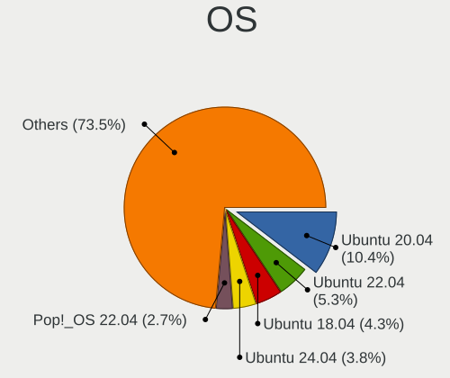

| Name               | Desktops | Percent |
|--------------------|----------|---------|
| Ubuntu 20.04       | 77       | 10.39%  |
| Ubuntu 22.04       | 39       | 5.26%   |
| Ubuntu 18.04       | 32       | 4.32%   |
| Ubuntu 24.04       | 28       | 3.78%   |
| Pop!_OS 22.04      | 20       | 2.7%    |
| Debian 12          | 16       | 2.16%   |
| Zorin 16           | 14       | 1.89%   |
| Zorin 17           | 13       | 1.75%   |
| OpenMandriva 24.12 | 13       | 1.75%   |
| ArcoLinux Rolling  | 13       | 1.75%   |
| Manjaro            | 12       | 1.62%   |
| Linux Mint 19.3    | 12       | 1.62%   |
| Arch Rolling       | 12       | 1.62%   |
| Pop!_OS 20.10      | 11       | 1.48%   |
| Linux Mint 22.1    | 11       | 1.48%   |
| Zorin 15           | 9        | 1.21%   |
| Pop!_OS 21.04      | 9        | 1.21%   |
| Pop!_OS 20.04      | 9        | 1.21%   |
| KDE neon 20.04     | 9        | 1.21%   |
| OpenMandriva 4.3   | 8        | 1.08%   |
| OpenMandriva 4.2   | 8        | 1.08%   |
| OpenMandriva 25.90 | 8        | 1.08%   |
| OpenMandriva 23.08 | 7        | 0.94%   |
| Linux Mint 20.1    | 7        | 0.94%   |
| Fedora 41          | 7        | 0.94%   |
| Fedora 40          | 7        | 0.94%   |
| Debian 11          | 7        | 0.94%   |
| Bazzite 42         | 7        | 0.94%   |
| Ubuntu 21.04       | 6        | 0.81%   |
| Ubuntu 19.10       | 6        | 0.81%   |
| Linux Mint 22.2    | 6        | 0.81%   |
| Linux Mint 20.3    | 6        | 0.81%   |
| KDE neon 22.04     | 6        | 0.81%   |
| Fedora 42          | 6        | 0.81%   |
| BlackPanther 18.1  | 6        | 0.81%   |
| Ubuntu 25.04       | 5        | 0.67%   |
| Ubuntu 16.04       | 5        | 0.67%   |
| OpenMandriva 5.0   | 5        | 0.67%   |
| OpenMandriva 23.03 | 5        | 0.67%   |
| Linux Mint 21.2    | 5        | 0.67%   |

OS Family
---------

OS without a version

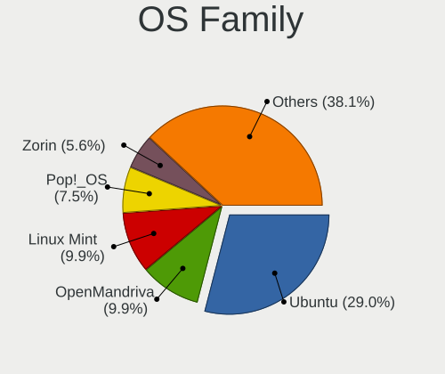

| Name             | Desktops | Percent |
|------------------|----------|---------|
| Ubuntu           | 202      | 29.02%  |
| OpenMandriva     | 69       | 9.91%   |
| Linux Mint       | 69       | 9.91%   |
| Pop!_OS          | 52       | 7.47%   |
| Zorin            | 39       | 5.6%    |
| Debian           | 36       | 5.17%   |
| Fedora           | 29       | 4.17%   |
| Manjaro          | 22       | 3.16%   |
| KDE neon         | 17       | 2.44%   |
| Arch             | 14       | 2.01%   |
| ArcoLinux        | 13       | 1.87%   |
| Kubuntu          | 12       | 1.72%   |
| Bazzite          | 12       | 1.72%   |
| Xubuntu          | 8        | 1.15%   |
| ROSA             | 8        | 1.15%   |
| Kali             | 8        | 1.15%   |
| BlackPanther     | 6        | 0.86%   |
| Ubuntu Unity     | 5        | 0.72%   |
| openSUSE         | 5        | 0.72%   |
| EndeavourOS      | 5        | 0.72%   |
| Nobara           | 4        | 0.57%   |
| Lubuntu          | 4        | 0.57%   |
| Garuda Linux     | 4        | 0.57%   |
| TUXEDO OS        | 3        | 0.43%   |
| SteamOS          | 3        | 0.43%   |
| Parrot           | 3        | 0.43%   |
| MX               | 3        | 0.43%   |
| LMDE             | 3        | 0.43%   |
| LinuxFX          | 3        | 0.43%   |
| Gentoo           | 3        | 0.43%   |
| Rocky Linux      | 2        | 0.29%   |
| RHEL             | 2        | 0.29%   |
| org.kde.Platform | 2        | 0.29%   |
| Endless          | 2        | 0.29%   |
| Elementary       | 2        | 0.29%   |
| Clear Linux      | 2        | 0.29%   |
| CentOS           | 2        | 0.29%   |
| Xero             | 1        | 0.14%   |
| Vanilla          | 1        | 0.14%   |
| Ubuntu MATE      | 1        | 0.14%   |

Kernel
------

Version of the Linux kernel

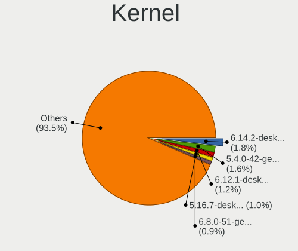

| Version                  | Desktops | Percent |
|--------------------------|----------|---------|
| 6.14.2-desktop-3omv2590  | 15       | 1.84%   |
| 5.4.0-42-generic         | 13       | 1.59%   |
| 6.12.1-desktop-1omv2490  | 10       | 1.23%   |
| 5.16.7-desktop-1omv4003  | 8        | 0.98%   |
| 6.8.0-51-generic         | 7        | 0.86%   |
| 5.8.0-7642-generic       | 7        | 0.86%   |
| 5.4.0-58-generic         | 7        | 0.86%   |
| 5.4.0-52-generic         | 7        | 0.86%   |
| 5.15.0-56-generic        | 7        | 0.86%   |
| 6.6.2-desktop-1omv2390   | 6        | 0.74%   |
| 5.13.0-7614-generic      | 6        | 0.74%   |
| 5.10.14-desktop-1omv4002 | 6        | 0.74%   |
| 6.9.3-76060903-generic   | 5        | 0.61%   |
| 6.4.11-desktop-1omv2390  | 5        | 0.61%   |
| 6.2.6-desktop-1omv2390   | 5        | 0.61%   |
| 6.14.0-37-generic        | 5        | 0.61%   |
| 6.14.0-33-generic        | 5        | 0.61%   |
| 6.1.0-13-amd64           | 5        | 0.61%   |
| 5.19.0-35-generic        | 5        | 0.61%   |
| 5.15.0-48-generic        | 5        | 0.61%   |
| 5.11.0-40-generic        | 5        | 0.61%   |
| 4.18.16-desktop-1bP      | 5        | 0.61%   |
| 4.15.0-54-generic        | 5        | 0.61%   |
| 6.8.0-31-generic         | 4        | 0.49%   |
| 6.14.0-35-generic        | 4        | 0.49%   |
| 6.12.9-desktop-1omv2490  | 4        | 0.49%   |
| 6.1.1-desktop-1omv2290   | 4        | 0.49%   |
| 5.8.0-59-generic         | 4        | 0.49%   |
| 5.4.0-7634-generic       | 4        | 0.49%   |
| 5.4.0-72-generic         | 4        | 0.49%   |
| 5.4.0-54-generic         | 4        | 0.49%   |
| 5.3.0-46-generic         | 4        | 0.49%   |
| 5.15.0-46-generic        | 4        | 0.49%   |
| 5.11.0-41-generic        | 4        | 0.49%   |
| 5.11.0-27-generic        | 4        | 0.49%   |
| 5.11.0-25-generic        | 4        | 0.49%   |
| 6.8.0-57-generic         | 3        | 0.37%   |
| 6.8.0-40-generic         | 3        | 0.37%   |
| 6.5.0-35-generic         | 3        | 0.37%   |
| 6.5.0-28-generic         | 3        | 0.37%   |

Kernel Family
-------------

Linux kernel without a distro release

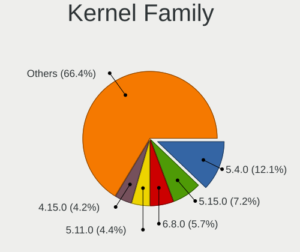

| Version | Desktops | Percent |
|---------|----------|---------|
| 5.4.0   | 93       | 12.13%  |
| 5.15.0  | 55       | 7.17%   |
| 6.8.0   | 44       | 5.74%   |
| 5.11.0  | 34       | 4.43%   |
| 4.15.0  | 32       | 4.17%   |
| 5.8.0   | 30       | 3.91%   |
| 6.14.0  | 25       | 3.26%   |
| 6.1.0   | 22       | 2.87%   |
| 5.13.0  | 22       | 2.87%   |
| 6.5.0   | 16       | 2.09%   |
| 6.14.2  | 16       | 2.09%   |
| 5.3.0   | 16       | 2.09%   |
| 5.19.0  | 16       | 2.09%   |
| 4.18.0  | 13       | 1.69%   |
| 6.11.0  | 11       | 1.43%   |
| 5.10.0  | 11       | 1.43%   |
| 6.2.0   | 10       | 1.3%    |
| 6.12.1  | 10       | 1.3%    |
| 6.2.6   | 9        | 1.17%   |
| 5.0.0   | 9        | 1.17%   |
| 5.16.7  | 8        | 1.04%   |
| 6.12.9  | 7        | 0.91%   |
| 6.6.2   | 6        | 0.78%   |
| 6.4.11  | 6        | 0.78%   |
| 5.10.14 | 6        | 0.78%   |
| 6.9.3   | 5        | 0.65%   |
| 6.1.1   | 5        | 0.65%   |
| 4.4.0   | 5        | 0.65%   |
| 4.18.16 | 5        | 0.65%   |
| 6.4.12  | 3        | 0.39%   |
| 6.17.4  | 3        | 0.39%   |
| 6.14.6  | 3        | 0.39%   |
| 6.13.5  | 3        | 0.39%   |
| 4.9.20  | 3        | 0.39%   |
| 6.8.5   | 2        | 0.26%   |
| 6.8.11  | 2        | 0.26%   |
| 6.6.6   | 2        | 0.26%   |
| 6.3.0   | 2        | 0.26%   |
| 6.17.9  | 2        | 0.26%   |
| 6.17.8  | 2        | 0.26%   |

Kernel Major Ver.
-----------------

Linux kernel major version

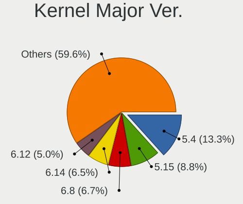

| Version | Desktops | Percent |
|---------|----------|---------|
| 5.4     | 101      | 13.32%  |
| 5.15    | 67       | 8.84%   |
| 6.8     | 51       | 6.73%   |
| 6.14    | 49       | 6.46%   |
| 6.12    | 38       | 5.01%   |
| 5.11    | 38       | 5.01%   |
| 6.1     | 34       | 4.49%   |
| 5.8     | 32       | 4.22%   |
| 4.15    | 32       | 4.22%   |
| 5.13    | 25       | 3.3%    |
| 6.2     | 23       | 3.03%   |
| 5.10    | 23       | 3.03%   |
| 6.5     | 19       | 2.51%   |
| 4.18    | 18       | 2.37%   |
| 6.11    | 17       | 2.24%   |
| 5.19    | 17       | 2.24%   |
| 6.6     | 16       | 2.11%   |
| 5.3     | 16       | 2.11%   |
| 6.4     | 14       | 1.85%   |
| 6.17    | 12       | 1.58%   |
| 5.16    | 12       | 1.58%   |
| 6.13    | 11       | 1.45%   |
| 6.10    | 9        | 1.19%   |
| 5.0     | 9        | 1.19%   |
| 6.9     | 8        | 1.06%   |
| 6.15    | 7        | 0.92%   |
| 6.16    | 5        | 0.66%   |
| 5.6     | 5        | 0.66%   |
| 5.17    | 5        | 0.66%   |
| 4.9     | 5        | 0.66%   |
| 4.4     | 5        | 0.66%   |
| 6.0     | 4        | 0.53%   |
| 5.18    | 4        | 0.53%   |
| 5.14    | 4        | 0.53%   |
| 5.12    | 4        | 0.53%   |
| 6.3     | 3        | 0.4%    |
| 5.9     | 3        | 0.4%    |
| 4.19    | 3        | 0.4%    |
| 6.7     | 2        | 0.26%   |
| 5.5     | 2        | 0.26%   |

Arch
----

OS architecture (x86_64, i586, etc.)

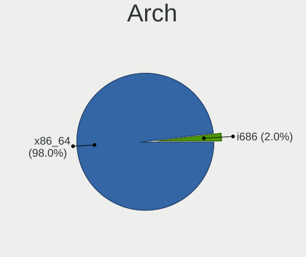

| Name   | Desktops | Percent |
|--------|----------|---------|
| x86_64 | 652      | 98.05%  |
| i686   | 13       | 1.95%   |

DE
--

Desktop Environment

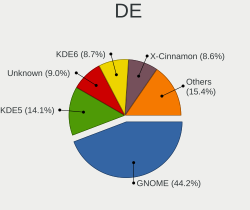

| Name            | Desktops | Percent |
|-----------------|----------|---------|
| GNOME           | 310      | 44.22%  |
| KDE5            | 99       | 14.12%  |
| Unknown         | 63       | 8.99%   |
| KDE6            | 61       | 8.7%    |
| X-Cinnamon      | 60       | 8.56%   |
| XFCE            | 39       | 5.56%   |
| KDE             | 15       | 2.14%   |
| MATE            | 14       | 2%      |
| LXQt            | 11       | 1.57%   |
| Unity           | 5        | 0.71%   |
| KDE4            | 4        | 0.57%   |
| Pantheon        | 3        | 0.43%   |
| LXDE            | 3        | 0.43%   |
| i3              | 3        | 0.43%   |
| Cinnamon        | 3        | 0.43%   |
| Hyprland        | 2        | 0.29%   |
| trinity         | 1        | 0.14%   |
| niri            | 1        | 0.14%   |
| GNOME Flashback | 1        | 0.14%   |
| GNOME Classic   | 1        | 0.14%   |
| Budgie          | 1        | 0.14%   |
| awesome         | 1        | 0.14%   |

Display Server
--------------

X11 or Wayland

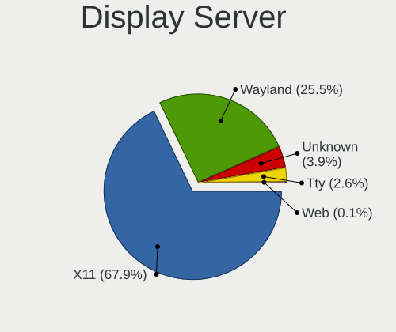

| Name    | Desktops | Percent |
|---------|----------|---------|
| X11     | 469      | 67.87%  |
| Wayland | 176      | 25.47%  |
| Unknown | 27       | 3.91%   |
| Tty     | 18       | 2.6%    |
| Web     | 1        | 0.14%   |

Display Manager
---------------

SDDM, LightDM, etc.

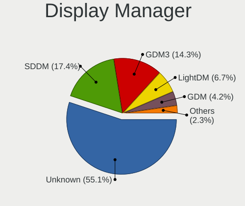

| Name    | Desktops | Percent |
|---------|----------|---------|
| Unknown | 384      | 55.09%  |
| SDDM    | 121      | 17.36%  |
| GDM3    | 100      | 14.35%  |
| LightDM | 47       | 6.74%   |
| GDM     | 29       | 4.16%   |
| TDM     | 10       | 1.43%   |
| KDM     | 3        | 0.43%   |
| MDM     | 1        | 0.14%   |
| LY-DM   | 1        | 0.14%   |
| GREETD  | 1        | 0.14%   |

OS Lang
-------

Language

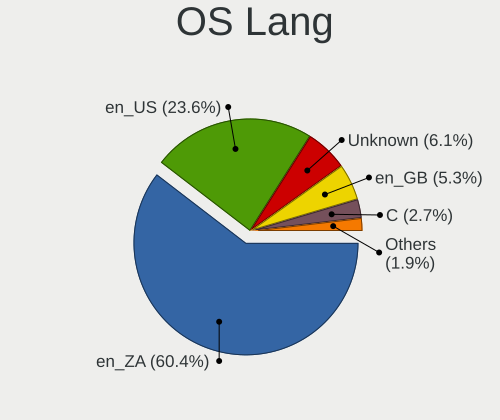

| Lang    | Desktops | Percent |
|---------|----------|---------|
| en_ZA   | 423      | 60.43%  |
| en_US   | 165      | 23.57%  |
| Unknown | 43       | 6.14%   |
| en_GB   | 37       | 5.29%   |
| C       | 19       | 2.71%   |
| en_ZW   | 8        | 1.14%   |
| en_BW   | 2        | 0.29%   |
| af_ZA   | 2        | 0.29%   |
| C.UTF8  | 1        | 0.14%   |

Boot Mode
---------

EFI or BIOS

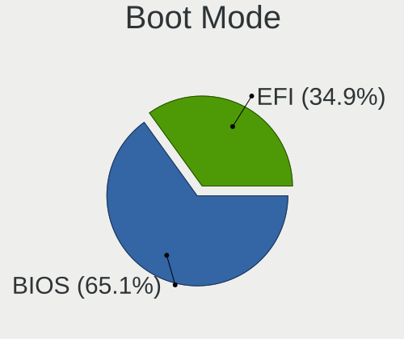

| Mode | Desktops | Percent |
|------|----------|---------|
| BIOS | 447      | 65.07%  |
| EFI  | 240      | 34.93%  |

Filesystem
----------

Type of filesystem

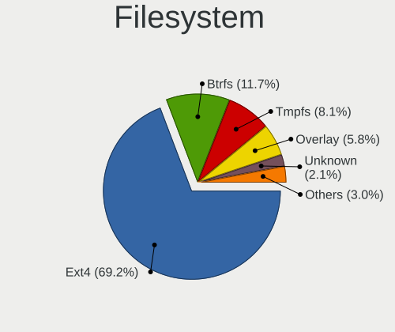

| Type    | Desktops | Percent |
|---------|----------|---------|
| Ext4    | 486      | 69.23%  |
| Btrfs   | 82       | 11.68%  |
| Tmpfs   | 57       | 8.12%   |
| Overlay | 41       | 5.84%   |
| Unknown | 15       | 2.14%   |
| Xfs     | 14       | 1.99%   |
| Zfs     | 4        | 0.57%   |
| F2fs    | 1        | 0.14%   |
| Ext3    | 1        | 0.14%   |
| Ext2    | 1        | 0.14%   |

Part. scheme
------------

Scheme of partitioning

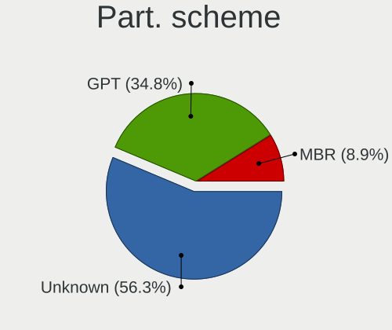

| Type    | Desktops | Percent |
|---------|----------|---------|
| Unknown | 388      | 56.31%  |
| GPT     | 240      | 34.83%  |
| MBR     | 61       | 8.85%   |

Dual Boot with Linux/BSD
------------------------

Hosting more than one Linux/BSD

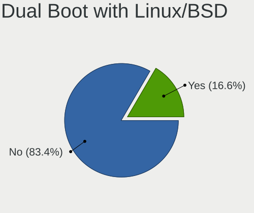

| Dual boot | Desktops | Percent |
|-----------|----------|---------|
| No        | 573      | 83.41%  |
| Yes       | 114      | 16.59%  |

Dual Boot (Win)
---------------

Hosting Linux and Windows

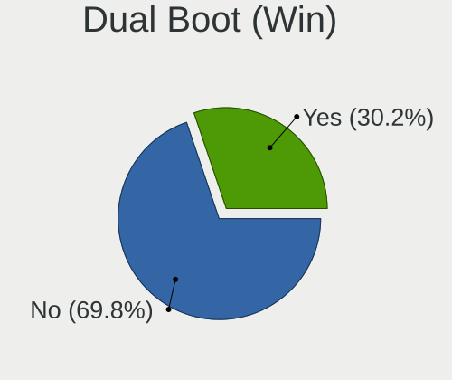

| Dual boot | Desktops | Percent |
|-----------|----------|---------|
| No        | 474      | 69.81%  |
| Yes       | 205      | 30.19%  |

Board
-----

Vendor
------

Motherboard manufacturer

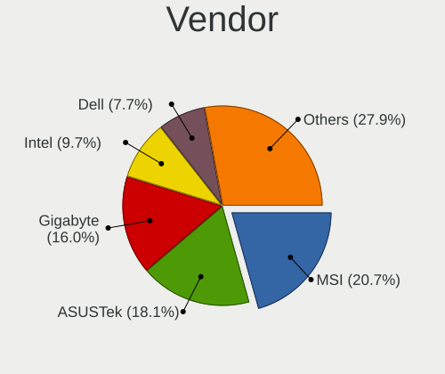

| Name                | Desktops | Percent |
|---------------------|----------|---------|
| MSI                 | 137      | 20.66%  |
| ASUSTek Computer    | 120      | 18.1%   |
| Gigabyte Technology | 106      | 15.99%  |
| Intel               | 64       | 9.65%   |
| Dell                | 51       | 7.69%   |
| Hewlett-Packard     | 38       | 5.73%   |
| Lenovo              | 33       | 4.98%   |
| ASRock              | 30       | 4.52%   |
| Foxconn             | 20       | 3.02%   |
| Biostar             | 18       | 2.71%   |
| Unknown             | 8        | 1.21%   |
| Acer                | 7        | 1.06%   |
| Fujitsu             | 4        | 0.6%    |
| ECS                 | 4        | 0.6%    |
| Apple               | 4        | 0.6%    |
| Supermicro          | 3        | 0.45%   |
| Pegatron            | 3        | 0.45%   |
| NCR                 | 2        | 0.3%    |
| Win element         | 1        | 0.15%   |
| Shuttle             | 1        | 0.15%   |
| QS                  | 1        | 0.15%   |
| Nvidia              | 1        | 0.15%   |
| Mustek6376 mst6376  | 1        | 0.15%   |
| Lite-On             | 1        | 0.15%   |
| Inventec            | 1        | 0.15%   |
| IBM                 | 1        | 0.15%   |
| GMKtec              | 1        | 0.15%   |
| Fujitsu Siemens     | 1        | 0.15%   |
| ABIT                | 1        | 0.15%   |

Model
-----

Motherboard model

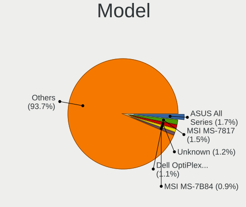

| Name                        | Desktops | Percent |
|-----------------------------|----------|---------|
| ASUS All Series             | 11       | 1.66%   |
| MSI MS-7817                 | 10       | 1.51%   |
| Unknown                     | 8        | 1.21%   |
| Dell OptiPlex 7010          | 7        | 1.06%   |
| MSI MS-7B84                 | 6        | 0.9%    |
| Gigabyte G31M-ES2C          | 6        | 0.9%    |
| MSI MS-7756                 | 5        | 0.75%   |
| HP ProLiant MicroServer     | 5        | 0.75%   |
| Gigabyte H61M-DS2           | 5        | 0.75%   |
| Dell OptiPlex 3020          | 5        | 0.75%   |
| MSI MS-7C52                 | 4        | 0.6%    |
| MSI MS-7C37                 | 4        | 0.6%    |
| MSI MS-7B89                 | 4        | 0.6%    |
| MSI MS-7B79                 | 4        | 0.6%    |
| MSI MS-7B48                 | 4        | 0.6%    |
| Intel Mecer_X102            | 4        | 0.6%    |
| HP Compaq 8200 Elite SFF PC | 4        | 0.6%    |
| Gigabyte X58A-UD3R          | 4        | 0.6%    |
| Gigabyte B75M-D3H           | 4        | 0.6%    |
| ASUS TUF Gaming B550-PLUS   | 4        | 0.6%    |
| ASUS PRIME X570-P           | 4        | 0.6%    |
| Apple MacPro3,1             | 4        | 0.6%    |
| MSI MS-7C96                 | 3        | 0.45%   |
| MSI MS-7A37                 | 3        | 0.45%   |
| MSI MS-7A15                 | 3        | 0.45%   |
| MSI MS-7885                 | 3        | 0.45%   |
| Intel X110                  | 3        | 0.45%   |
| Intel PROLINE               | 3        | 0.45%   |
| Intel H81                   | 3        | 0.45%   |
| Intel DH55HC AAE70933-505   | 3        | 0.45%   |
| Gigabyte Q270M-D3H          | 3        | 0.45%   |
| Gigabyte H81M-S2PH          | 3        | 0.45%   |
| Gigabyte H81M-DS2           | 3        | 0.45%   |
| Gigabyte H61M-S2PV          | 3        | 0.45%   |
| Gigabyte G41MT-S2PT         | 3        | 0.45%   |
| Gigabyte B85M-HD3           | 3        | 0.45%   |
| Foxconn G41MXE/G41MXE-K     | 3        | 0.45%   |
| Dell Vostro 3670            | 3        | 0.45%   |
| Dell OptiPlex 9010          | 3        | 0.45%   |
| Dell OptiPlex 755           | 3        | 0.45%   |

Model Family
------------

Motherboard model prefix

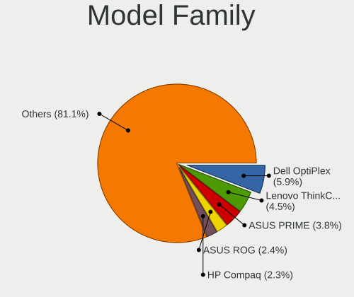

| Name               | Desktops | Percent |
|--------------------|----------|---------|
| Dell OptiPlex      | 39       | 5.88%   |
| Lenovo ThinkCentre | 30       | 4.52%   |
| ASUS PRIME         | 25       | 3.77%   |
| ASUS ROG           | 16       | 2.41%   |
| HP Compaq          | 15       | 2.26%   |
| ASUS TUF           | 13       | 1.96%   |
| ASUS All           | 11       | 1.66%   |
| MSI MS-7817        | 10       | 1.51%   |
| HP ProLiant        | 8        | 1.21%   |
| Unknown            | 8        | 1.21%   |
| Intel Mecer        | 7        | 1.06%   |
| Dell Vostro        | 7        | 1.06%   |
| MSI MS-7B84        | 6        | 0.9%    |
| Gigabyte G31M-ES2C | 6        | 0.9%    |
| MSI MS-7756        | 5        | 0.75%   |
| Gigabyte H61M-DS2  | 5        | 0.75%   |
| MSI MS-7C52        | 4        | 0.6%    |
| MSI MS-7C37        | 4        | 0.6%    |
| MSI MS-7B89        | 4        | 0.6%    |
| MSI MS-7B79        | 4        | 0.6%    |
| MSI MS-7B48        | 4        | 0.6%    |
| Intel PROLINE      | 4        | 0.6%    |
| Intel DH61WW       | 4        | 0.6%    |
| Intel DH55TC       | 4        | 0.6%    |
| Intel DH55HC       | 4        | 0.6%    |
| Gigabyte X58A-UD3R | 4        | 0.6%    |
| Gigabyte B75M-D3H  | 4        | 0.6%    |
| ASUS SABERTOOTH    | 4        | 0.6%    |
| Apple MacPro3      | 4        | 0.6%    |
| Acer Veriton       | 4        | 0.6%    |
| MSI MS-7C96        | 3        | 0.45%   |
| MSI MS-7A37        | 3        | 0.45%   |
| MSI MS-7A15        | 3        | 0.45%   |
| MSI MS-7885        | 3        | 0.45%   |
| Intel X110         | 3        | 0.45%   |
| Intel H81          | 3        | 0.45%   |
| HP ProDesk         | 3        | 0.45%   |
| HP EliteDesk       | 3        | 0.45%   |
| Gigabyte Q270M-D3H | 3        | 0.45%   |
| Gigabyte H81M-S2PH | 3        | 0.45%   |

MFG Year
--------

Motherboard manufacture year

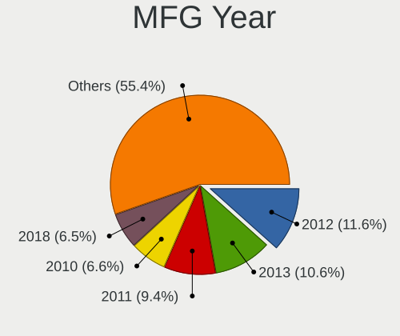

| Year | Desktops | Percent |
|------|----------|---------|
| 2012 | 77       | 11.61%  |
| 2013 | 70       | 10.56%  |
| 2011 | 62       | 9.35%   |
| 2010 | 44       | 6.64%   |
| 2018 | 43       | 6.49%   |
| 2017 | 42       | 6.33%   |
| 2009 | 39       | 5.88%   |
| 2008 | 36       | 5.43%   |
| 2015 | 34       | 5.13%   |
| 2014 | 32       | 4.83%   |
| 2016 | 31       | 4.68%   |
| 2019 | 30       | 4.52%   |
| 2020 | 28       | 4.22%   |
| 2007 | 25       | 3.77%   |
| 2021 | 17       | 2.56%   |
| 2024 | 16       | 2.41%   |
| 2022 | 13       | 1.96%   |
| 2023 | 10       | 1.51%   |
| 2006 | 10       | 1.51%   |
| 2005 | 3        | 0.45%   |
| 2004 | 1        | 0.15%   |

Form Factor
-----------

Physical design of the computer

| Name    | Desktops | Percent |
|---------|----------|---------|
| Desktop | 663      | 100%    |

Secure Boot
-----------

Enabled or disabled

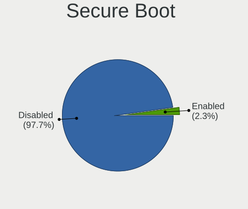

| State    | Desktops | Percent |
|----------|----------|---------|
| Disabled | 651      | 97.75%  |
| Enabled  | 15       | 2.25%   |

Coreboot
--------

Have coreboot on board

| Used | Desktops | Percent |
|------|----------|---------|
| No   | 663      | 100%    |

RAM Size
--------

Total RAM memory

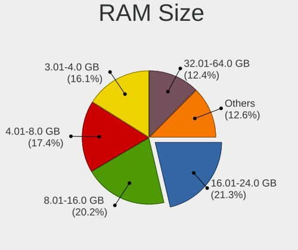

| Size in GB  | Desktops | Percent |
|-------------|----------|---------|
| 16.01-24.0  | 146      | 21.35%  |
| 8.01-16.0   | 138      | 20.18%  |
| 4.01-8.0    | 119      | 17.4%   |
| 3.01-4.0    | 110      | 16.08%  |
| 32.01-64.0  | 85       | 12.43%  |
| 1.01-2.0    | 31       | 4.53%   |
| 64.01-256.0 | 24       | 3.51%   |
| 24.01-32.0  | 22       | 3.22%   |
| 2.01-3.0    | 5        | 0.73%   |
| 0.51-1.0    | 4        | 0.58%   |

RAM Used
--------

Used RAM memory

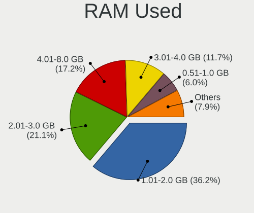

| Used GB     | Desktops | Percent |
|-------------|----------|---------|
| 1.01-2.0    | 267      | 36.18%  |
| 2.01-3.0    | 156      | 21.14%  |
| 4.01-8.0    | 127      | 17.21%  |
| 3.01-4.0    | 86       | 11.65%  |
| 0.51-1.0    | 44       | 5.96%   |
| 8.01-16.0   | 37       | 5.01%   |
| 0.01-0.5    | 12       | 1.63%   |
| 16.01-24.0  | 6        | 0.81%   |
| 32.01-64.0  | 1        | 0.14%   |
| 64.01-256.0 | 1        | 0.14%   |
| Unknown     | 1        | 0.14%   |

Total Drives
------------

Number of drives on board

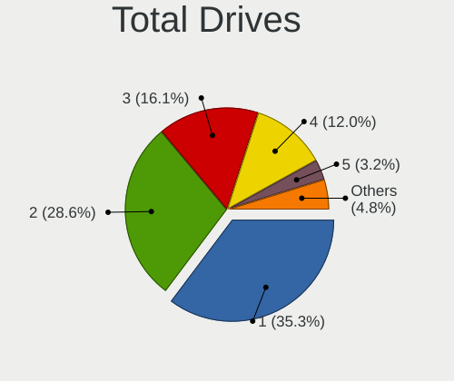

| Drives  | Desktops | Percent |
|---------|----------|---------|
| 1       | 250      | 35.26%  |
| 2       | 203      | 28.63%  |
| 3       | 114      | 16.08%  |
| 4       | 85       | 11.99%  |
| 5       | 23       | 3.24%   |
| 6       | 14       | 1.97%   |
| 7       | 8        | 1.13%   |
| 0       | 5        | 0.71%   |
| 8       | 4        | 0.56%   |
| 14      | 1        | 0.14%   |
| 11      | 1        | 0.14%   |
| Unknown | 1        | 0.14%   |

Has CD-ROM
----------

Has CD-ROM on board

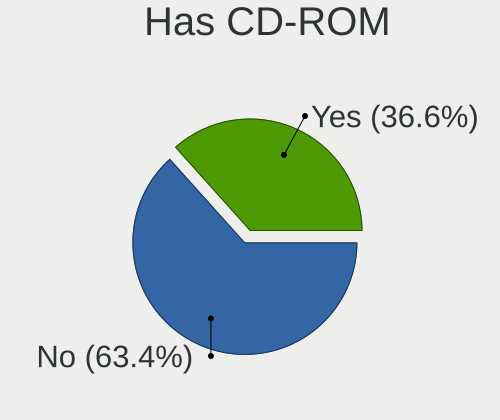

| Presented | Desktops | Percent |
|-----------|----------|---------|
| No        | 429      | 63.37%  |
| Yes       | 248      | 36.63%  |

Has Ethernet
------------

Has Ethernet on board

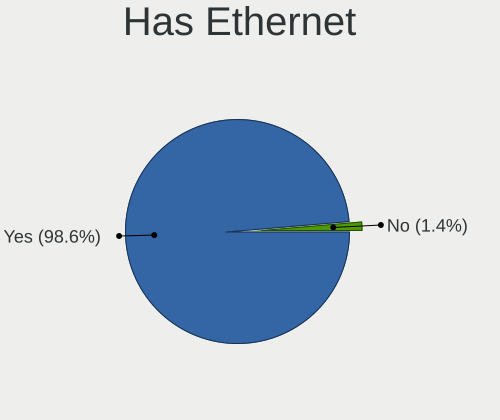

| Presented | Desktops | Percent |
|-----------|----------|---------|
| Yes       | 654      | 98.64%  |
| No        | 9        | 1.36%   |

Has WiFi
--------

Has WiFi module

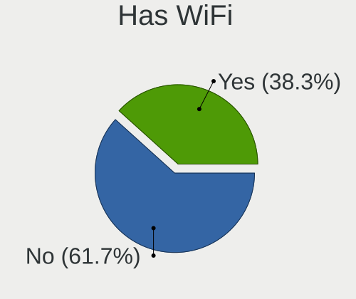

| Presented | Desktops | Percent |
|-----------|----------|---------|
| No        | 417      | 61.69%  |
| Yes       | 259      | 38.31%  |

Has Bluetooth
-------------

Has Bluetooth module

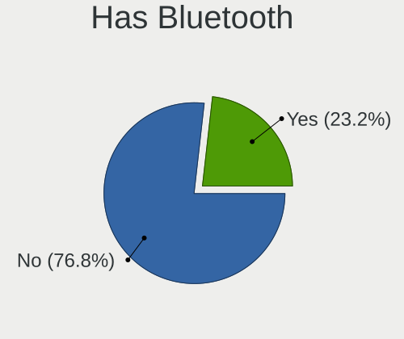

| Presented | Desktops | Percent |
|-----------|----------|---------|
| No        | 526      | 76.79%  |
| Yes       | 159      | 23.21%  |

Location
--------

Country
-------

Geographic location (country)

| Country      | Desktops | Percent |
|--------------|----------|---------|
| South Africa | 663      | 100%    |

City
----

Geographic location (city)

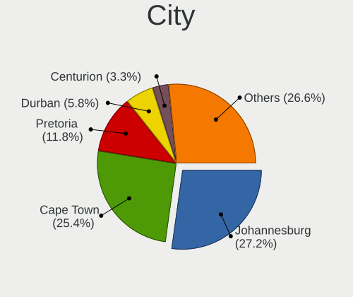

| City             | Desktops | Percent |
|------------------|----------|---------|
| Johannesburg     | 192      | 27.2%   |
| Cape Town        | 179      | 25.35%  |
| Pretoria         | 83       | 11.76%  |
| Durban           | 41       | 5.81%   |
| Centurion        | 23       | 3.26%   |
| Port Elizabeth   | 10       | 1.42%   |
| Benoni           | 10       | 1.42%   |
| Alberton         | 9        | 1.27%   |
| Kempton Park     | 8        | 1.13%   |
| Sandton          | 6        | 0.85%   |
| Midrand          | 6        | 0.85%   |
| Bloemfontein     | 6        | 0.85%   |
| Randburg         | 5        | 0.71%   |
| Boksburg         | 5        | 0.71%   |
| Sasolburg        | 4        | 0.57%   |
| Pietermaritzburg | 4        | 0.57%   |
| Citrusdal        | 4        | 0.57%   |
| Bellville        | 4        | 0.57%   |
| Vanderbijlpark   | 3        | 0.42%   |
| Stellenbosch     | 3        | 0.42%   |
| Roodepoort       | 3        | 0.42%   |
| Krugersdorp      | 3        | 0.42%   |
| George           | 3        | 0.42%   |
| East London      | 3        | 0.42%   |
| Worcester        | 2        | 0.28%   |
| Westville        | 2        | 0.28%   |
| Vredenburg       | 2        | 0.28%   |
| Upington         | 2        | 0.28%   |
| Uitenhage        | 2        | 0.28%   |
| Struisbaai       | 2        | 0.28%   |
| Secunda          | 2        | 0.28%   |
| Plettenberg Bay  | 2        | 0.28%   |
| Paarl            | 2        | 0.28%   |
| Oudtshoorn       | 2        | 0.28%   |
| Nelspruit        | 2        | 0.28%   |
| Germiston        | 2        | 0.28%   |
| Gansbaai         | 2        | 0.28%   |
| Emalahleni       | 2        | 0.28%   |
| Edenvale         | 2        | 0.28%   |
| Durbanville      | 2        | 0.28%   |

Drives
------

Drive Vendor
------------

Hard drive vendors

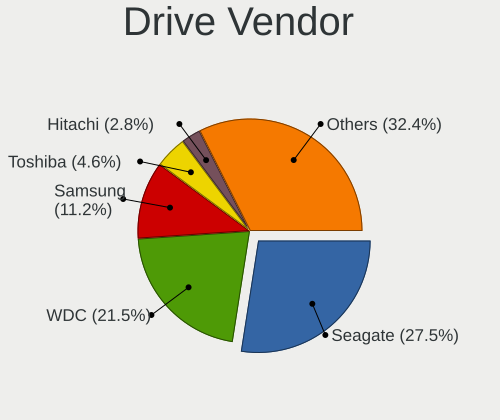

| Vendor                      | Desktops | Drives | Percent |
|-----------------------------|----------|--------|---------|
| Seagate                     | 343      | 649    | 27.46%  |
| WDC                         | 268      | 429    | 21.46%  |
| Samsung Electronics         | 140      | 210    | 11.21%  |
| Toshiba                     | 58       | 78     | 4.64%   |
| Hitachi                     | 35       | 54     | 2.8%    |
| SanDisk                     | 33       | 48     | 2.64%   |
| Crucial                     | 31       | 38     | 2.48%   |
| Kingston                    | 28       | 34     | 2.24%   |
| Silicon Motion              | 26       | 32     | 2.08%   |
| Transcend                   | 22       | 30     | 1.76%   |
| A-DATA Technology           | 19       | 24     | 1.52%   |
| Hewlett-Packard             | 15       | 34     | 1.2%    |
| Rogueware                   | 12       | 18     | 0.96%   |
| MAXIO Technology (Hangzhou) | 11       | 14     | 0.88%   |
| SK hynix                    | 9        | 10     | 0.72%   |
| Mushkin                     | 9        | 10     | 0.72%   |
| HGST                        | 9        | 10     | 0.72%   |
| China                       | 9        | 10     | 0.72%   |
| Phison Electronics          | 8        | 14     | 0.64%   |
| HS-SSD-E100                 | 8        | 11     | 0.64%   |
| HS-SSD-C100                 | 8        | 11     | 0.64%   |
| Micron/Crucial Technology   | 7        | 15     | 0.56%   |
| Maxtor                      | 7        | 8      | 0.56%   |
| Unknown                     | 6        | 8      | 0.48%   |
| TO Exter                    | 6        | 7      | 0.48%   |
| Lexar                       | 6        | 9      | 0.48%   |
| Kingmax                     | 6        | 12     | 0.48%   |
| Realtek Semiconductor       | 5        | 5      | 0.4%    |
| Phison                      | 5        | 7      | 0.4%    |
| Patriot                     | 5        | 5      | 0.4%    |
| Intel                       | 5        | 6      | 0.4%    |
| Hikvision                   | 5        | 6      | 0.4%    |
| Corsair                     | 5        | 7      | 0.4%    |
| ADATA Technology            | 5        | 6      | 0.4%    |
| OCZ                         | 4        | 6      | 0.32%   |
| Micron Technology           | 4        | 4      | 0.32%   |
| KIOXIA                      | 4        | 5      | 0.32%   |
| Kingston Technology Company | 4        | 5      | 0.32%   |
| Gigabyte Technology         | 4        | 6      | 0.32%   |
| Team                        | 3        | 3      | 0.24%   |

Drive Model
-----------

Hard drive models

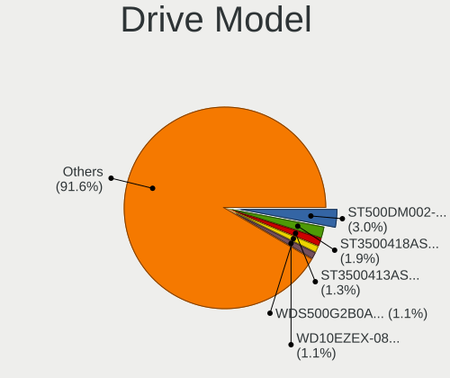

| Model                                                 | Desktops | Percent |
|-------------------------------------------------------|----------|---------|
| Seagate ST500DM002-1BD142 500GB                       | 45       | 2.98%   |
| Seagate ST3500418AS 500GB                             | 28       | 1.86%   |
| Seagate ST3500413AS 500GB                             | 20       | 1.33%   |
| WDC WDS500G2B0A-00SM50 500GB                          | 17       | 1.13%   |
| WDC WD10EZEX-08WN4A0 1TB                              | 17       | 1.13%   |
| Seagate ST3250318AS 250GB                             | 16       | 1.06%   |
| Seagate ST380815AS 80GB                               | 14       | 0.93%   |
| Seagate ST1000DM010-2EP102 1TB                        | 14       | 0.93%   |
| Seagate ST4000DM004-2CV104 4TB                        | 13       | 0.86%   |
| Silicon Motion SM2263EN/SM2263XT SSD Controller 512GB | 12       | 0.8%    |
| Seagate Expansion Desk 4TB                            | 12       | 0.8%    |
| WDC WDS240G2G0A-00JH30 240GB SSD                      | 11       | 0.73%   |
| Samsung HD103SI 1TB                                   | 11       | 0.73%   |
| WDC WD20EURX-63T0FY0 2TB                              | 10       | 0.66%   |
| Toshiba HDWD110 1TB                                   | 10       | 0.66%   |
| Seagate ST4000DM000-1F2168 4TB                        | 10       | 0.66%   |
| Seagate ST3160815AS 160GB                             | 10       | 0.66%   |
| Seagate ST1000LM035-1RK172 1TB                        | 10       | 0.66%   |
| Samsung SSD 850 EVO 250GB                             | 10       | 0.66%   |
| WDC WDS100T2B0A-00SM50 1TB SSD                        | 9        | 0.6%    |
| WDC WD10EZEX-00BN5A0 1TB                              | 9        | 0.6%    |
| Seagate ST3250310AS 250GB                             | 9        | 0.6%    |
| Seagate ST2000DM001-1CH164 2TB                        | 9        | 0.6%    |
| Seagate ST1000DM003-1CH162 1TB                        | 9        | 0.6%    |
| Rogueware 2.5" S 256GB                                | 9        | 0.6%    |
| WDC WD20EZRZ-00Z5HB0 2TB                              | 8        | 0.53%   |
| Seagate ST1000DM003-1ER162 1TB                        | 8        | 0.53%   |
| Samsung NVMe SSD Controller SM981/PM981/PM983 1TB     | 8        | 0.53%   |
| Samsung HD502HI 500GB                                 | 8        | 0.53%   |
| Kingston SA400S37240G 240GB SSD                       | 8        | 0.53%   |
| WDC WDS120G2G0A-00JH30 120GB SSD                      | 7        | 0.46%   |
| WDC WD5000AAKX-75U6AA0 500GB                          | 7        | 0.46%   |
| WDC WD20EARX-00PASB0 2TB                              | 7        | 0.46%   |
| WDC WD10EZEX-00WN4A0 1TB                              | 7        | 0.46%   |
| Toshiba DT01ACA100 1TB                                | 7        | 0.46%   |
| Silicon Motion SM2262/SM2262EN SSD Controller 960GB   | 7        | 0.46%   |
| Seagate ST31500341AS 1TB                              | 7        | 0.46%   |
| Seagate ST2000DL003-9VT166 2TB                        | 7        | 0.46%   |
| Samsung SSD 750 EVO 250GB                             | 7        | 0.46%   |
| Samsung NVMe SSD Controller SM961/PM961/SM963 1024GB  | 7        | 0.46%   |

HDD Vendor
----------

Hard disk drive vendors

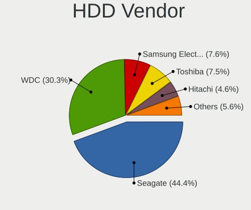

| Vendor              | Desktops | Drives | Percent |
|---------------------|----------|--------|---------|
| Seagate             | 338      | 632    | 44.36%  |
| WDC                 | 231      | 362    | 30.31%  |
| Samsung Electronics | 58       | 77     | 7.61%   |
| Toshiba             | 57       | 77     | 7.48%   |
| Hitachi             | 35       | 54     | 4.59%   |
| Hewlett-Packard     | 10       | 28     | 1.31%   |
| HGST                | 9        | 10     | 1.18%   |
| Maxtor              | 7        | 8      | 0.92%   |
| TO Exter            | 6        | 7      | 0.79%   |
| External            | 3        | 4      | 0.39%   |
| Unknown             | 2        | 4      | 0.26%   |
| USB                 | 1        | 1      | 0.13%   |
| StoreJet            | 1        | 1      | 0.13%   |
| JMicron Technology  | 1        | 1      | 0.13%   |
| HPE                 | 1        | 2      | 0.13%   |
| Fujitsu             | 1        | 1      | 0.13%   |
| Apple               | 1        | 2      | 0.13%   |

SSD Vendor
----------

Solid state drive vendors

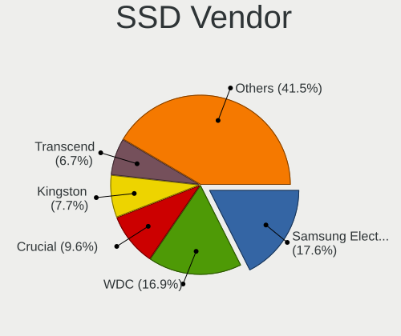

| Vendor              | Desktops | Drives | Percent |
|---------------------|----------|--------|---------|
| Samsung Electronics | 55       | 78     | 17.57%  |
| WDC                 | 53       | 66     | 16.93%  |
| Crucial             | 30       | 37     | 9.58%   |
| Kingston            | 24       | 27     | 7.67%   |
| Transcend           | 21       | 28     | 6.71%   |
| A-DATA Technology   | 16       | 20     | 5.11%   |
| SanDisk             | 14       | 18     | 4.47%   |
| Rogueware           | 12       | 18     | 3.83%   |
| China               | 9        | 10     | 2.88%   |
| Kingmax             | 6        | 12     | 1.92%   |
| Patriot             | 5        | 5      | 1.6%    |
| Mushkin             | 5        | 5      | 1.6%    |
| Seagate             | 4        | 4      | 1.28%   |
| OCZ                 | 4        | 6      | 1.28%   |
| Lexar               | 4        | 7      | 1.28%   |
| Team                | 3        | 3      | 0.96%   |
| SK hynix            | 3        | 3      | 0.96%   |
| HS-SSD-E100         | 3        | 3      | 0.96%   |
| Gigabyte Technology | 3        | 5      | 0.96%   |
| Corsair             | 3        | 5      | 0.96%   |
| Apacer              | 3        | 4      | 0.96%   |
| KODAK               | 2        | 2      | 0.64%   |
| Kimtigo             | 2        | 2      | 0.64%   |
| Intel               | 2        | 2      | 0.64%   |
| HS-SSD-C100         | 2        | 2      | 0.64%   |
| Hewlett-Packard     | 2        | 2      | 0.64%   |
| Biwintech           | 2        | 3      | 0.64%   |
| XPG                 | 1        | 1      | 0.32%   |
| WDC WDS5            | 1        | 1      | 0.32%   |
| Toshiba             | 1        | 1      | 0.32%   |
| SOLIDATA            | 1        | 1      | 0.32%   |
| Plextor             | 1        | 2      | 0.32%   |
| MSI                 | 1        | 1      | 0.32%   |
| Min Yi U            | 1        | 1      | 0.32%   |
| Micron Technology   | 1        | 1      | 0.32%   |
| LITEONIT            | 1        | 1      | 0.32%   |
| LITEON              | 1        | 1      | 0.32%   |
| KingSpec            | 1        | 2      | 0.32%   |
| Indilinx            | 1        | 1      | 0.32%   |
| HS-SSD-E100N        | 1        | 1      | 0.32%   |

Drive Kind
----------

HDD or SSD

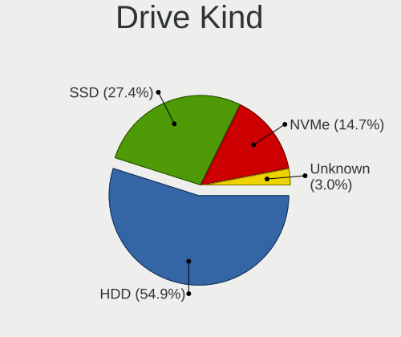

| Kind    | Desktops | Drives | Percent |
|---------|----------|--------|---------|
| HDD     | 527      | 1271   | 54.9%   |
| SSD     | 263      | 400    | 27.4%   |
| NVMe    | 141      | 252    | 14.69%  |
| Unknown | 29       | 38     | 3.02%   |

Drive Connector
---------------

SATA, SAS, NVMe, etc.

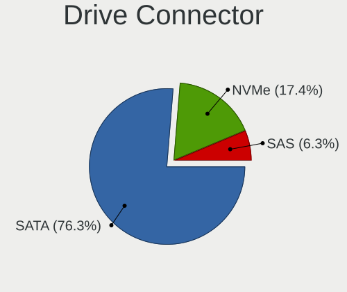

| Type | Desktops | Drives | Percent |
|------|----------|--------|---------|
| SATA | 618      | 1622   | 76.3%   |
| NVMe | 141      | 251    | 17.41%  |
| SAS  | 51       | 88     | 6.3%    |

Drive Size
----------

Size of hard drive

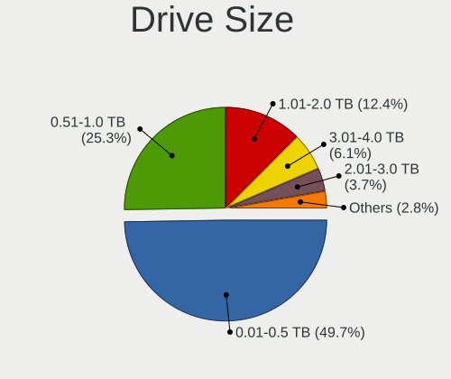

| Size in TB | Desktops | Drives | Percent |
|------------|----------|--------|---------|
| 0.01-0.5   | 484      | 884    | 49.74%  |
| 0.51-1.0   | 246      | 383    | 25.28%  |
| 1.01-2.0   | 121      | 196    | 12.44%  |
| 3.01-4.0   | 59       | 105    | 6.06%   |
| 2.01-3.0   | 36       | 48     | 3.7%    |
| 4.01-10.0  | 24       | 47     | 2.47%   |
| 10.01-20.0 | 3        | 8      | 0.31%   |

Space Total
-----------

Amount of disk space available on the file system

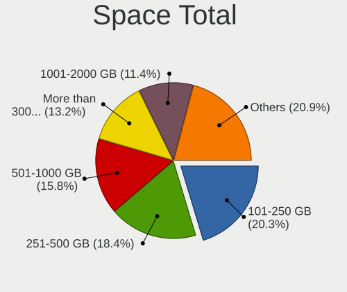

| Size in GB     | Desktops | Percent |
|----------------|----------|---------|
| 101-250        | 148      | 20.33%  |
| 251-500        | 134      | 18.41%  |
| 501-1000       | 115      | 15.8%   |
| More than 3000 | 96       | 13.19%  |
| 1001-2000      | 83       | 11.4%   |
| 2001-3000      | 44       | 6.04%   |
| 1-20           | 36       | 4.95%   |
| 51-100         | 32       | 4.4%    |
| Unknown        | 21       | 2.88%   |
| 21-50          | 19       | 2.61%   |

Space Used
----------

Amount of used disk space

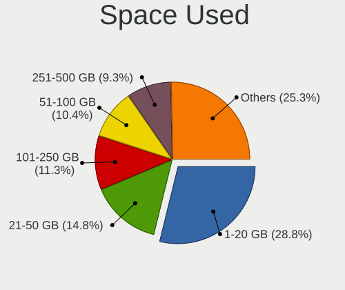

| Used GB        | Desktops | Percent |
|----------------|----------|---------|
| 1-20           | 214      | 28.84%  |
| 21-50          | 110      | 14.82%  |
| 101-250        | 84       | 11.32%  |
| 51-100         | 77       | 10.38%  |
| 251-500        | 69       | 9.3%    |
| 1001-2000      | 51       | 6.87%   |
| 501-1000       | 48       | 6.47%   |
| More than 3000 | 44       | 5.93%   |
| 2001-3000      | 21       | 2.83%   |
| Unknown        | 21       | 2.83%   |
| 0              | 3        | 0.4%    |

Malfunc. Drives
---------------

Drive models with a malfunction

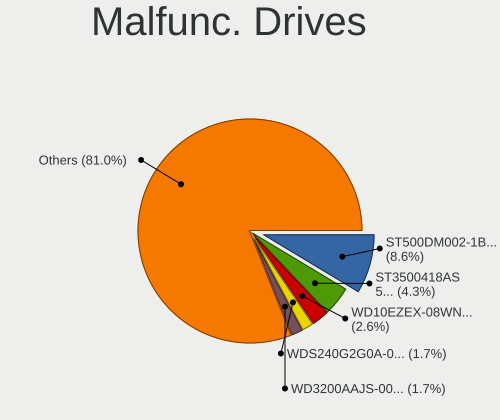

| Model                            | Desktops | Drives | Percent |
|----------------------------------|----------|--------|---------|
| Seagate ST500DM002-1BD142 500GB  | 10       | 11     | 8.62%   |
| Seagate ST3500418AS 500GB        | 5        | 6      | 4.31%   |
| WDC WD10EZEX-08WN4A0 1TB         | 3        | 3      | 2.59%   |
| WDC WDS240G2G0A-00JH30 240GB SSD | 2        | 2      | 1.72%   |
| WDC WD3200AAJS-00RYA0 320GB      | 2        | 2      | 1.72%   |
| WDC WD30EZRX-00MMMB0 3TB         | 2        | 4      | 1.72%   |
| WDC WD2500AAKX-75U6AA0 250GB     | 2        | 2      | 1.72%   |
| WDC WD1600AAJS-08L7A0 160GB      | 2        | 2      | 1.72%   |
| Seagate ST500LM021-1KJ152 500GB  | 2        | 2      | 1.72%   |
| Seagate ST4000DM004-2CV104 4TB   | 2        | 2      | 1.72%   |
| Seagate ST3500413AS 500GB        | 2        | 2      | 1.72%   |
| Seagate ST3250310AS 250GB        | 2        | 2      | 1.72%   |
| Seagate ST320LT007-9ZV142 320GB  | 2        | 2      | 1.72%   |
| Seagate ST3000DM001-1CH166 3TB   | 2        | 3      | 1.72%   |
| Seagate ST2000DL003-9VT166 2TB   | 2        | 3      | 1.72%   |
| Samsung Electronics HD103SI 1TB  | 2        | 3      | 1.72%   |
| WDC WD6400AAKS-75A7B0 640GB      | 1        | 1      | 0.86%   |
| WDC WD5000AZLX-60K2TA0 500GB     | 1        | 1      | 0.86%   |
| WDC WD5000AVVS-63ZWB0 500GB      | 1        | 1      | 0.86%   |
| WDC WD5000AAKX-75U6AA0 500GB     | 1        | 2      | 0.86%   |
| WDC WD5000AAKX-22ERMA0 500GB     | 1        | 1      | 0.86%   |
| WDC WD5000AAKX-221CA1 500GB      | 1        | 1      | 0.86%   |
| WDC WD5000AAKX-00ERMA0 500GB     | 1        | 2      | 0.86%   |
| WDC WD5000AAKS-60Z1A0 500GB      | 1        | 1      | 0.86%   |
| WDC WD40EZRZ-00GXCB0 4TB         | 1        | 2      | 0.86%   |
| WDC WD3200BPVT-80JJ5T0 320GB     | 1        | 1      | 0.86%   |
| WDC WD3200AAJS-60Z0A0 320GB      | 1        | 1      | 0.86%   |
| WDC WD3200AAJS-60M0A1 320GB      | 1        | 1      | 0.86%   |
| WDC WD30PURX-64P6ZY0 3TB         | 1        | 1      | 0.86%   |
| WDC WD30EZRX-00DC0B0 3TB         | 1        | 1      | 0.86%   |
| WDC WD30EFRX-68EUZN0 3TB         | 1        | 1      | 0.86%   |
| WDC WD30EFRX-68AX9N0 3TB         | 1        | 1      | 0.86%   |
| WDC WD2500BEVS-60UST0 250GB      | 1        | 1      | 0.86%   |
| WDC WD2500AAJS-75M0A0 249GB      | 1        | 1      | 0.86%   |
| WDC WD20EZRZ-00Z5HB0 2TB         | 1        | 1      | 0.86%   |
| WDC WD20EURX-63T0FY0 2TB         | 1        | 1      | 0.86%   |
| WDC WD20EFRX-68EUZN0 2TB         | 1        | 4      | 0.86%   |
| WDC WD20EARX-00PASB0 2TB         | 1        | 1      | 0.86%   |
| WDC WD15EADS-00P8B0 1TB          | 1        | 1      | 0.86%   |
| WDC WD10EZEX-00WN4A0 1TB         | 1        | 1      | 0.86%   |

Malfunc. Drive Vendor
---------------------

Vendors of faulty drives

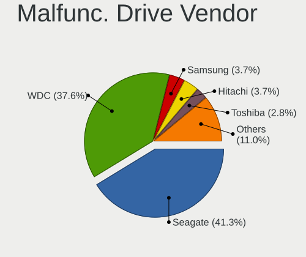

| Vendor              | Desktops | Drives | Percent |
|---------------------|----------|--------|---------|
| Seagate             | 45       | 66     | 41.28%  |
| WDC                 | 41       | 55     | 37.61%  |
| Samsung Electronics | 4        | 5      | 3.67%   |
| Hitachi             | 4        | 4      | 3.67%   |
| Toshiba             | 3        | 3      | 2.75%   |
| HGST                | 2        | 2      | 1.83%   |
| Hewlett-Packard     | 2        | 2      | 1.83%   |
| Transcend           | 1        | 1      | 0.92%   |
| TO Exter            | 1        | 1      | 0.92%   |
| SOLIDATA            | 1        | 1      | 0.92%   |
| SanDisk             | 1        | 1      | 0.92%   |
| Patriot             | 1        | 1      | 0.92%   |
| Kingston            | 1        | 1      | 0.92%   |
| Indilinx            | 1        | 1      | 0.92%   |
| ADATA Technology    | 1        | 1      | 0.92%   |

Malfunc. HDD Vendor
-------------------

Vendors of faulty HDD drives

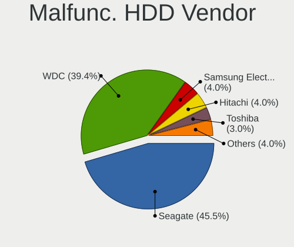

| Vendor              | Desktops | Drives | Percent |
|---------------------|----------|--------|---------|
| Seagate             | 45       | 66     | 45.45%  |
| WDC                 | 39       | 53     | 39.39%  |
| Samsung Electronics | 4        | 5      | 4.04%   |
| Hitachi             | 4        | 4      | 4.04%   |
| Toshiba             | 3        | 3      | 3.03%   |
| HGST                | 2        | 2      | 2.02%   |
| TO Exter            | 1        | 1      | 1.01%   |
| Hewlett-Packard     | 1        | 1      | 1.01%   |

Malfunc. Drive Kind
-------------------

Kinds of faulty drives

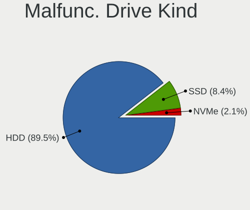

| Kind | Desktops | Drives | Percent |
|------|----------|--------|---------|
| HDD  | 85       | 135    | 89.47%  |
| SSD  | 8        | 8      | 8.42%   |
| NVMe | 2        | 2      | 2.11%   |

Failed Drives
-------------

Failed drive models

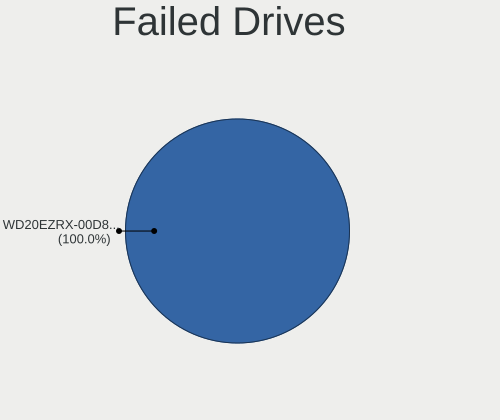

| Model                    | Desktops | Drives | Percent |
|--------------------------|----------|--------|---------|
| WDC WD20EZRX-00D8PB0 2TB | 2        | 2      | 100%    |

Failed Drive Vendor
-------------------

Failed drive vendors

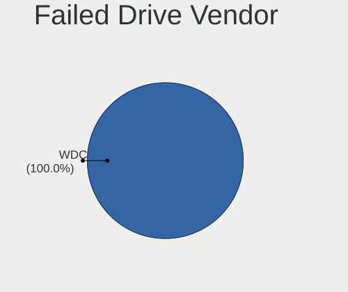

| Vendor | Desktops | Drives | Percent |
|--------|----------|--------|---------|
| WDC    | 2        | 2      | 100%    |

Drive Status
------------

Number of failed and malfunc. drives

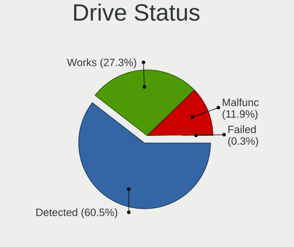

| Status   | Desktops | Drives | Percent |
|----------|----------|--------|---------|
| Detected | 456      | 1317   | 60.48%  |
| Works    | 206      | 497    | 27.32%  |
| Malfunc  | 90       | 145    | 11.94%  |
| Failed   | 2        | 2      | 0.27%   |

Storage controller
------------------

Storage Vendor
--------------

Storage controller vendors

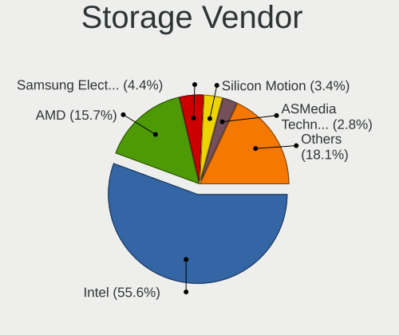

| Vendor                           | Desktops | Percent |
|----------------------------------|----------|---------|
| Intel                            | 505      | 55.62%  |
| AMD                              | 143      | 15.75%  |
| Samsung Electronics              | 40       | 4.41%   |
| Silicon Motion                   | 31       | 3.41%   |
| ASMedia Technology               | 25       | 2.75%   |
| SanDisk                          | 19       | 2.09%   |
| Phison Electronics               | 18       | 1.98%   |
| Marvell Technology Group         | 17       | 1.87%   |
| JMicron Technology               | 16       | 1.76%   |
| MAXIO Technology (Hangzhou)      | 12       | 1.32%   |
| Nvidia                           | 10       | 1.1%    |
| Kingston Technology Company      | 8        | 0.88%   |
| ADATA Technology                 | 8        | 0.88%   |
| Micron/Crucial Technology        | 7        | 0.77%   |
| INNOGRIT                         | 7        | 0.77%   |
| SK hynix                         | 6        | 0.66%   |
| Realtek Semiconductor            | 5        | 0.55%   |
| Silicon Image                    | 4        | 0.44%   |
| Micron Technology                | 4        | 0.44%   |
| KIOXIA                           | 4        | 0.44%   |
| VIA Technologies                 | 3        | 0.33%   |
| Seagate Technology               | 3        | 0.33%   |
| Silicon Integrated Systems [SiS] | 2        | 0.22%   |
| Broadcom / LSI                   | 2        | 0.22%   |
| Adaptec                          | 2        | 0.22%   |
| Transcend                        | 1        | 0.11%   |
| Shenzhen Longsys Electronics     | 1        | 0.11%   |
| LSI Logic / Symbios Logic        | 1        | 0.11%   |
| Lite-On Technology               | 1        | 0.11%   |
| HighPoint Technologies           | 1        | 0.11%   |
| Hewlett-Packard                  | 1        | 0.11%   |
| Biwin Storage Technology         | 1        | 0.11%   |

Storage Model
-------------

Storage controller models

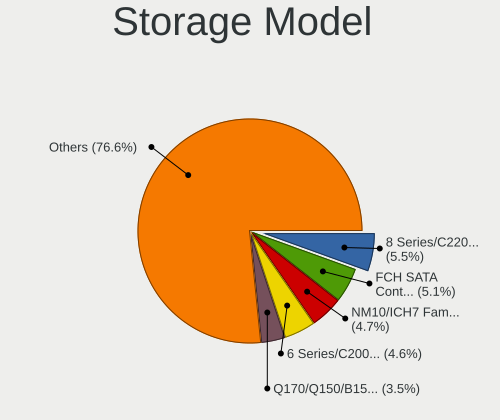

| Model                                                                                   | Desktops | Percent |
|-----------------------------------------------------------------------------------------|----------|---------|
| Intel 8 Series/C220 Series Chipset Family 6-port SATA Controller 1 [AHCI mode]          | 65       | 5.51%   |
| AMD FCH SATA Controller [AHCI mode]                                                     | 60       | 5.09%   |
| Intel NM10/ICH7 Family SATA Controller [IDE mode]                                       | 56       | 4.75%   |
| Intel 6 Series/C200 Series Chipset Family 6 port Desktop SATA AHCI Controller           | 54       | 4.58%   |
| Intel Q170/Q150/B150/H170/H110/Z170/CM236 Chipset SATA Controller [AHCI Mode]           | 41       | 3.48%   |
| Intel 6 Series/C200 Series Chipset Family Desktop SATA Controller (IDE mode, ports 4-5) | 39       | 3.31%   |
| Intel 6 Series/C200 Series Chipset Family Desktop SATA Controller (IDE mode, ports 0-3) | 39       | 3.31%   |
| AMD 400 Series Chipset SATA Controller                                                  | 36       | 3.05%   |
| Intel 82801G (ICH7 Family) IDE Controller                                               | 34       | 2.88%   |
| Intel 7 Series/C210 Series Chipset Family 6-port SATA Controller [AHCI mode]            | 34       | 2.88%   |
| Intel SATA Controller [RAID mode]                                                       | 33       | 2.8%    |
| Intel 200 Series PCH SATA controller [AHCI mode]                                        | 30       | 2.54%   |
| AMD 500 Series Chipset SATA Controller                                                  | 29       | 2.46%   |
| ASMedia ASM1061/ASM1062 Serial ATA Controller                                           | 21       | 1.78%   |
| Intel 5 Series/3400 Series Chipset 4 port SATA IDE Controller                           | 19       | 1.61%   |
| Intel 5 Series/3400 Series Chipset 2 port SATA IDE Controller                           | 19       | 1.61%   |
| AMD 600 Series Chipset SATA Controller                                                  | 18       | 1.53%   |
| Intel 5 Series/3400 Series Chipset PT IDER Controller                                   | 17       | 1.44%   |
| Silicon Motion SM2262/SM2262EN SSD Controller                                           | 16       | 1.36%   |
| Silicon Motion SM2263EN/SM2263XT (DRAM-less) NVMe SSD Controllers                       | 15       | 1.27%   |
| Samsung NVMe SSD Controller SM981/PM981/PM983                                           | 15       | 1.27%   |
| AMD SB7x0/SB8x0/SB9x0 SATA Controller [AHCI mode]                                       | 14       | 1.19%   |
| Intel Cannon Lake PCH SATA AHCI Controller                                              | 13       | 1.1%    |
| Samsung NVMe SSD Controller SM961/PM961/SM963                                           | 12       | 1.02%   |
| Intel 82801JI (ICH10 Family) 4 port SATA IDE Controller #1                              | 12       | 1.02%   |
| Intel 82801JI (ICH10 Family) 2 port SATA IDE Controller #2                              | 12       | 1.02%   |
| Intel 7 Series/C210 Series Chipset Family 4-port SATA Controller [IDE mode]             | 12       | 1.02%   |
| Intel 7 Series/C210 Series Chipset Family 2-port SATA Controller [IDE mode]             | 12       | 1.02%   |
| Intel 5 Series/3400 Series Chipset 6 port SATA AHCI Controller                          | 12       | 1.02%   |
| AMD SB7x0/SB8x0/SB9x0 IDE Controller                                                    | 11       | 0.93%   |
| JMicron JMB363 SATA/IDE Controller                                                      | 10       | 0.85%   |
| Phison E12 NVMe Controller                                                              | 9        | 0.76%   |
| AMD A320 Chipset SATA Controller [AHCI mode]                                            | 8        | 0.68%   |
| AMD 300 Series Chipset SATA Controller                                                  | 8        | 0.68%   |
| Samsung NVMe SSD Controller 980 (DRAM-less)                                             | 7        | 0.59%   |
| MAXIO (Hangzhou) NVMe SSD Controller MAP1602 (DRAM-less)                                | 7        | 0.59%   |
| Marvell Group 88SE6101/6102 single-port PATA133 interface                               | 7        | 0.59%   |
| Intel Alder Lake-S PCH SATA Controller [AHCI Mode]                                      | 7        | 0.59%   |
| Intel 82801I (ICH9 Family) 2 port SATA Controller [IDE mode]                            | 7        | 0.59%   |
| Intel 4 Series Chipset PT IDER Controller                                               | 7        | 0.59%   |

Storage Kind
------------

Kind of storage controller (IDE, SATA, NVMe, SAS, ...)

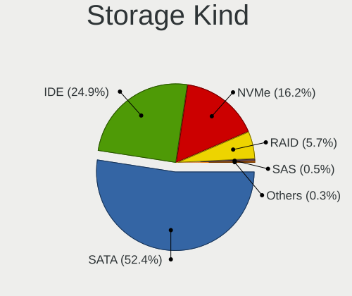

| Kind | Desktops | Percent |
|------|----------|---------|
| SATA | 463      | 52.43%  |
| IDE  | 220      | 24.92%  |
| NVMe | 143      | 16.19%  |
| RAID | 50       | 5.66%   |
| SAS  | 4        | 0.45%   |
| SCSI | 3        | 0.34%   |

Processor
---------

CPU Vendor
----------

Processor vendors

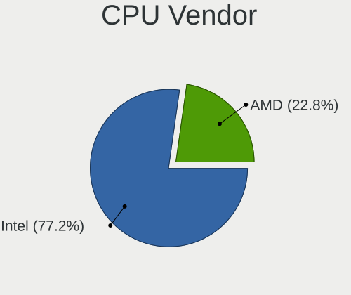

| Vendor | Desktops | Percent |
|--------|----------|---------|
| Intel  | 512      | 77.22%  |
| AMD    | 151      | 22.78%  |

CPU Model
---------

Processor models

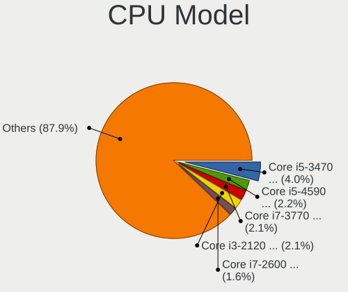

| Model                                  | Desktops | Percent |
|----------------------------------------|----------|---------|
| Intel Core i5-3470 CPU @ 3.20GHz       | 27       | 4.05%   |
| Intel Core i5-4590 CPU @ 3.30GHz       | 15       | 2.25%   |
| Intel Core i7-3770 CPU @ 3.40GHz       | 14       | 2.1%    |
| Intel Core i3-2120 CPU @ 3.30GHz       | 14       | 2.1%    |
| Intel Core i7-2600 CPU @ 3.40GHz       | 11       | 1.65%   |
| Intel Core i5-2400 CPU @ 3.10GHz       | 10       | 1.5%    |
| Intel Core i3-2100 CPU @ 3.10GHz       | 10       | 1.5%    |
| Intel Core i5-4460 CPU @ 3.20GHz       | 9        | 1.35%   |
| AMD Ryzen 5 5600X 6-Core Processor     | 9        | 1.35%   |
| Intel Core i5 CPU 650 @ 3.20GHz        | 8        | 1.2%    |
| Intel Core i7-8700K CPU @ 3.70GHz      | 7        | 1.05%   |
| Intel Core i7-6700K CPU @ 4.00GHz      | 7        | 1.05%   |
| Intel Core i7-4790 CPU @ 3.60GHz       | 7        | 1.05%   |
| Intel Core 2 Duo CPU E8400 @ 3.00GHz   | 7        | 1.05%   |
| Intel Core 2 Duo CPU E7500 @ 2.93GHz   | 7        | 1.05%   |
| AMD Ryzen 5 3600 6-Core Processor      | 7        | 1.05%   |
| Intel Core i7-8700 CPU @ 3.20GHz       | 6        | 0.9%    |
| Intel Core i3 CPU 530 @ 2.93GHz        | 6        | 0.9%    |
| AMD Ryzen 7 2700X Eight-Core Processor | 6        | 0.9%    |
| Intel Pentium 4 CPU 3.00GHz            | 5        | 0.75%   |
| Intel Core i7-4790K CPU @ 4.00GHz      | 5        | 0.75%   |
| Intel Core i5-7400 CPU @ 3.00GHz       | 5        | 0.75%   |
| Intel Core i5-6500 CPU @ 3.20GHz       | 5        | 0.75%   |
| Intel Core i5-6400 CPU @ 2.70GHz       | 5        | 0.75%   |
| Intel Core i5-4570 CPU @ 3.20GHz       | 5        | 0.75%   |
| Intel Core i5-3330 CPU @ 3.00GHz       | 5        | 0.75%   |
| Intel Core i3-3220 CPU @ 3.30GHz       | 5        | 0.75%   |
| Intel Core 2 Quad CPU Q8400 @ 2.66GHz  | 5        | 0.75%   |
| Intel Core 2 Quad CPU Q6600 @ 2.40GHz  | 5        | 0.75%   |
| Intel Core 2 Duo CPU E6550 @ 2.33GHz   | 5        | 0.75%   |
| AMD Ryzen 9 5950X 16-Core Processor    | 5        | 0.75%   |
| AMD Ryzen 7 5800X 8-Core Processor     | 5        | 0.75%   |
| Intel Xeon CPU E5462 @ 2.80GHz         | 4        | 0.6%    |
| Intel Pentium CPU G2030 @ 3.00GHz      | 4        | 0.6%    |
| Intel Core i7-6700 CPU @ 3.40GHz       | 4        | 0.6%    |
| Intel Core i3-3240 CPU @ 3.40GHz       | 4        | 0.6%    |
| Intel Core 2 Duo CPU E8500 @ 3.16GHz   | 4        | 0.6%    |
| AMD Ryzen 7 9800X3D 8-Core Processor   | 4        | 0.6%    |
| AMD Ryzen 5 5500                       | 4        | 0.6%    |
| AMD Ryzen 5 3600X 6-Core Processor     | 4        | 0.6%    |

CPU Model Family
----------------

Processor model prefix

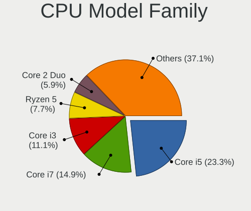

| Model                   | Desktops | Percent |
|-------------------------|----------|---------|
| Intel Core i5           | 155      | 23.31%  |
| Intel Core i7           | 99       | 14.89%  |
| Intel Core i3           | 74       | 11.13%  |
| AMD Ryzen 5             | 51       | 7.67%   |
| Intel Core 2 Duo        | 39       | 5.86%   |
| AMD Ryzen 7             | 33       | 4.96%   |
| Intel Pentium           | 28       | 4.21%   |
| AMD Ryzen 9             | 23       | 3.46%   |
| Intel Xeon              | 22       | 3.31%   |
| Intel Celeron           | 22       | 3.31%   |
| Intel Core 2 Quad       | 17       | 2.56%   |
| Other                   | 14       | 2.11%   |
| Intel Pentium Dual-Core | 12       | 1.8%    |
| AMD FX                  | 10       | 1.5%    |
| AMD Ryzen 3             | 9        | 1.35%   |
| Intel Pentium Dual      | 8        | 1.2%    |
| Intel Pentium 4         | 7        | 1.05%   |
| AMD Turion II Neo       | 5        | 0.75%   |
| Intel Core i9           | 4        | 0.6%    |
| Intel Core 2            | 4        | 0.6%    |
| AMD Athlon 64 X2        | 4        | 0.6%    |
| Intel Pentium D         | 3        | 0.45%   |
| Intel Core              | 2        | 0.3%    |
| Intel Atom              | 2        | 0.3%    |
| AMD Ryzen 7 PRO         | 2        | 0.3%    |
| AMD Ryzen 5 PRO         | 2        | 0.3%    |
| AMD Phenom II X4        | 2        | 0.3%    |
| AMD Phenom II X2        | 2        | 0.3%    |
| Intel Genuine           | 1        | 0.15%   |
| Intel Core 2 Extreme    | 1        | 0.15%   |
| Intel Celeron D         | 1        | 0.15%   |
| AMD Ryzen Threadripper  | 1        | 0.15%   |
| AMD Phenom II X3        | 1        | 0.15%   |
| AMD Phenom              | 1        | 0.15%   |
| AMD G                   | 1        | 0.15%   |
| AMD Athlon 64           | 1        | 0.15%   |
| AMD A8                  | 1        | 0.15%   |
| AMD A12                 | 1        | 0.15%   |

CPU Cores
---------

Number of processor cores

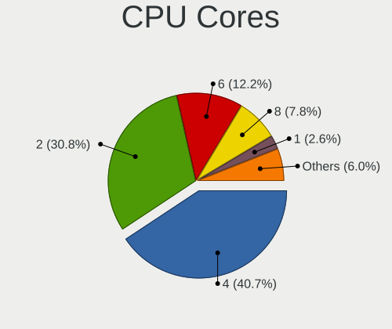

| Number | Desktops | Percent |
|--------|----------|---------|
| 4      | 271      | 40.69%  |
| 2      | 205      | 30.78%  |
| 6      | 81       | 12.16%  |
| 8      | 52       | 7.81%   |
| 1      | 17       | 2.55%   |
| 16     | 16       | 2.4%    |
| 12     | 13       | 1.95%   |
| 24     | 5        | 0.75%   |
| 3      | 3        | 0.45%   |
| 20     | 1        | 0.15%   |
| 18     | 1        | 0.15%   |
| 14     | 1        | 0.15%   |

CPU Sockets
-----------

Number of sockets

| Number | Desktops | Percent |
|--------|----------|---------|
| 1      | 655      | 98.79%  |
| 2      | 8        | 1.21%   |

CPU Threads
-----------

Threads per core (Hyper-Threading)

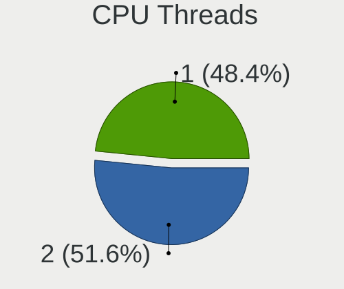

| Number | Desktops | Percent |
|--------|----------|---------|
| 2      | 345      | 51.57%  |
| 1      | 324      | 48.43%  |

CPU Op-Modes
------------

CPU Operation Modes (32-bit, 64-bit)

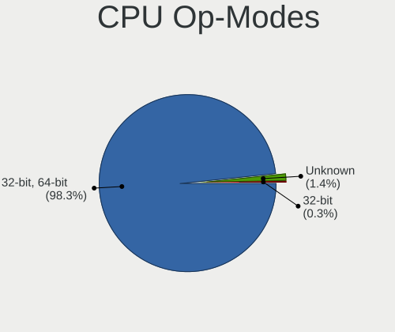

| Op mode        | Desktops | Percent |
|----------------|----------|---------|
| 32-bit, 64-bit | 654      | 98.35%  |
| Unknown        | 9        | 1.35%   |
| 32-bit         | 2        | 0.3%    |

CPU Microcode
-------------

Microcode number

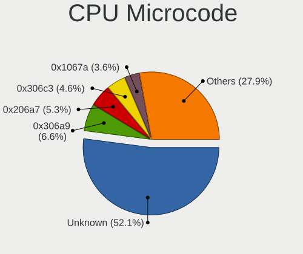

| Number     | Desktops | Percent |
|------------|----------|---------|
| Unknown    | 364      | 52.07%  |
| 0x306a9    | 46       | 6.58%   |
| 0x206a7    | 37       | 5.29%   |
| 0x306c3    | 32       | 4.58%   |
| 0x1067a    | 25       | 3.58%   |
| 0x506e3    | 22       | 3.15%   |
| 0x906e9    | 10       | 1.43%   |
| 0x6fb      | 10       | 1.43%   |
| 0x10676    | 10       | 1.43%   |
| 0x906ea    | 9        | 1.29%   |
| 0x6fd      | 9        | 1.29%   |
| 0x08701021 | 9        | 1.29%   |
| 0x20652    | 8        | 1.14%   |
| 0x106a5    | 7        | 1%      |
| 0x0800820d | 7        | 1%      |
| 0x20655    | 5        | 0.72%   |
| 0x106e5    | 5        | 0.72%   |
| 0x06000852 | 5        | 0.72%   |
| 0x010000db | 5        | 0.72%   |
| 0xa0653    | 4        | 0.57%   |
| 0x0a201016 | 4        | 0.57%   |
| 0x08108109 | 4        | 0.57%   |
| 0x010000c8 | 4        | 0.57%   |
| 0x0a50000c | 3        | 0.43%   |
| 0x08600106 | 3        | 0.43%   |
| 0x0600611a | 3        | 0.43%   |
| 0xf65      | 2        | 0.29%   |
| 0xf64      | 2        | 0.29%   |
| 0xf49      | 2        | 0.29%   |
| 0xf41      | 2        | 0.29%   |
| 0x906eb    | 2        | 0.29%   |
| 0x90672    | 2        | 0.29%   |
| 0x6f2      | 2        | 0.29%   |
| 0x30661    | 2        | 0.29%   |
| 0x206d7    | 2        | 0.29%   |
| 0x0a601203 | 2        | 0.29%   |
| 0x08001137 | 2        | 0.29%   |
| 0xf4a      | 1        | 0.14%   |
| 0xf47      | 1        | 0.14%   |
| 0xf43      | 1        | 0.14%   |

CPU Microarch
-------------

Microarchitecture

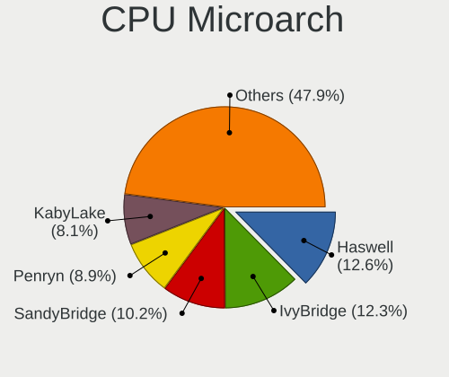

| Name             | Desktops | Percent |
|------------------|----------|---------|
| Haswell          | 84       | 12.61%  |
| IvyBridge        | 82       | 12.31%  |
| SandyBridge      | 68       | 10.21%  |
| Penryn           | 59       | 8.86%   |
| KabyLake         | 54       | 8.11%   |
| Skylake          | 41       | 6.16%   |
| Zen 3            | 38       | 5.71%   |
| Core             | 34       | 5.11%   |
| Unknown          | 32       | 4.8%    |
| Zen 2            | 31       | 4.65%   |
| Westmere         | 26       | 3.9%    |
| Zen+             | 18       | 2.7%    |
| Nehalem          | 18       | 2.7%    |
| Zen              | 14       | 2.1%    |
| NetBurst         | 13       | 1.95%   |
| K10              | 11       | 1.65%   |
| Piledriver       | 10       | 1.5%    |
| CometLake        | 9        | 1.35%   |
| Alderlake Hybrid | 7        | 1.05%   |
| K8 Hammer        | 5        | 0.75%   |
| Silvermont       | 3        | 0.45%   |
| Excavator        | 3        | 0.45%   |
| Bonnell          | 2        | 0.3%    |
| Tremont          | 1        | 0.15%   |
| Icelake          | 1        | 0.15%   |
| Goldmont plus    | 1        | 0.15%   |
| Bobcat           | 1        | 0.15%   |

Graphics
--------

GPU Vendor
----------

Vendors of graphics cards

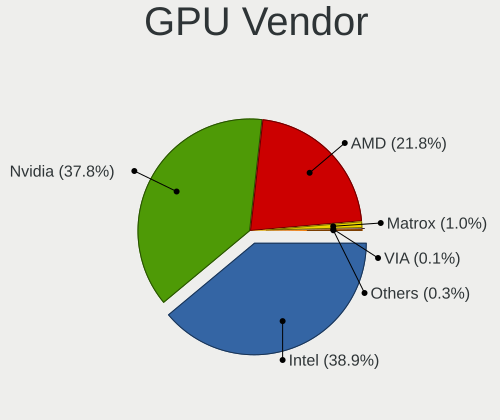

| Vendor                           | Desktops | Percent |
|----------------------------------|----------|---------|
| Intel                            | 280      | 38.94%  |
| Nvidia                           | 272      | 37.83%  |
| AMD                              | 157      | 21.84%  |
| Matrox Electronics Systems       | 7        | 0.97%   |
| VIA Technologies                 | 1        | 0.14%   |
| Silicon Motion                   | 1        | 0.14%   |
| Silicon Integrated Systems [SiS] | 1        | 0.14%   |

GPU Model
---------

Graphics card models

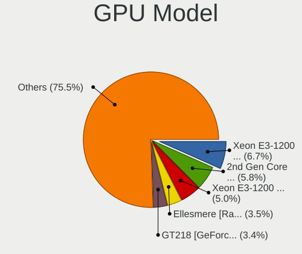

| Model                                                                       | Desktops | Percent |
|-----------------------------------------------------------------------------|----------|---------|
| Intel Xeon E3-1200 v3/4th Gen Core Processor Integrated Graphics Controller | 49       | 6.66%   |
| Intel 2nd Generation Core Processor Family Integrated Graphics Controller   | 43       | 5.84%   |
| Intel Xeon E3-1200 v2/3rd Gen Core processor Graphics Controller            | 37       | 5.03%   |
| AMD Ellesmere [Radeon RX 470/480/570/570X/580/580X/590]                     | 26       | 3.53%   |
| Nvidia GT218 [GeForce 210]                                                  | 25       | 3.4%    |
| Intel 82G33/G31 Express Integrated Graphics Controller                      | 25       | 3.4%    |
| Intel 4 Series Chipset Integrated Graphics Controller                       | 19       | 2.58%   |
| Intel Core Processor Integrated Graphics Controller                         | 13       | 1.77%   |
| Nvidia GK208B [GeForce GT 710]                                              | 12       | 1.63%   |
| Nvidia GF108 [GeForce GT 730]                                               | 10       | 1.36%   |
| Intel Kaby Lake-S GT2 [HD Graphics 630]                                     | 10       | 1.36%   |
| Nvidia GP107 [GeForce GTX 1050 Ti]                                          | 9        | 1.22%   |
| Nvidia GP106 [GeForce GTX 1060 6GB]                                         | 9        | 1.22%   |
| Intel Skylake-S GT2 [HD Graphics 530]                                       | 9        | 1.22%   |
| Intel IvyBridge GT2 [HD Graphics 4000]                                      | 9        | 1.22%   |
| Intel CoffeeLake-S GT2 [UHD Graphics 630]                                   | 9        | 1.22%   |
| Nvidia GP104 [GeForce GTX 1070]                                             | 8        | 1.09%   |
| Intel 4th Generation Core Processor Family Integrated Graphics Controller   | 8        | 1.09%   |
| Nvidia GP108 [GeForce GT 1030]                                              | 7        | 0.95%   |
| Nvidia GP104 [GeForce GTX 1080]                                             | 7        | 0.95%   |
| AMD Navi 10 [Radeon RX 5600 OEM/5600 XT / 5700/5700 XT]                     | 7        | 0.95%   |
| AMD Cezanne [Radeon Vega Series / Radeon Vega Mobile Series]                | 7        | 0.95%   |
| Nvidia GF119 [GeForce GT 610]                                               | 6        | 0.82%   |
| Nvidia G96C [GeForce 9400 GT]                                               | 6        | 0.82%   |
| AMD Raphael                                                                 | 6        | 0.82%   |
| AMD Navi 32 [Radeon RX 7700 XT / 7800 XT]                                   | 6        | 0.82%   |
| Nvidia GP107 [GeForce GTX 1050]                                             | 5        | 0.68%   |
| Nvidia GP102 [GeForce GTX 1080 Ti]                                          | 5        | 0.68%   |
| Nvidia GM204 [GeForce GTX 970]                                              | 5        | 0.68%   |
| Nvidia GF108 [GeForce GT 630]                                               | 5        | 0.68%   |
| Nvidia GA106 [GeForce RTX 3060 Lite Hash Rate]                              | 5        | 0.68%   |
| Intel 82Q963/Q965 Integrated Graphics Controller                            | 5        | 0.68%   |
| AMD Picasso/Raven 2 [Radeon Vega Series / Radeon Vega Mobile Series]        | 5        | 0.68%   |
| AMD Granite Ridge [Radeon Graphics]                                         | 5        | 0.68%   |
| AMD Cape Verde XT [Radeon HD 7770/8760 / R7 250X]                           | 5        | 0.68%   |
| Nvidia GP106 [GeForce GTX 1060 3GB]                                         | 4        | 0.54%   |
| Nvidia GM206 [GeForce GTX 960]                                              | 4        | 0.54%   |
| Nvidia GA104 [GeForce RTX 3060 Ti Lite Hash Rate]                           | 4        | 0.54%   |
| Nvidia GA102 [GeForce RTX 3090]                                             | 4        | 0.54%   |
| Nvidia G92 [GeForce GTS 250]                                                | 4        | 0.54%   |

GPU Combo
---------

Combinations of graphics cards

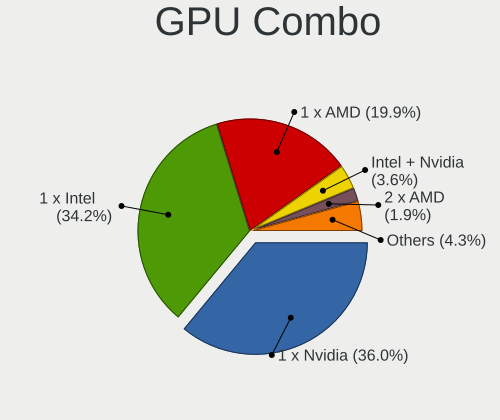

| Name               | Desktops | Percent |
|--------------------|----------|---------|
| 1 x Nvidia         | 242      | 36.01%  |
| 1 x Intel          | 230      | 34.23%  |
| 1 x AMD            | 134      | 19.94%  |
| Intel + Nvidia     | 24       | 3.57%   |
| 2 x AMD            | 13       | 1.93%   |
| AMD + Nvidia       | 7        | 1.04%   |
| 2 x Intel          | 6        | 0.89%   |
| 1 x Matrox         | 6        | 0.89%   |
| Intel + AMD        | 4        | 0.6%    |
| Other              | 2        | 0.3%    |
| 1 x VIA            | 1        | 0.15%   |
| 1 x SiS            | 1        | 0.15%   |
| 1 x Silicon Motion | 1        | 0.15%   |
| AMD + Matrox       | 1        | 0.15%   |

GPU Driver
----------

Free vs proprietary

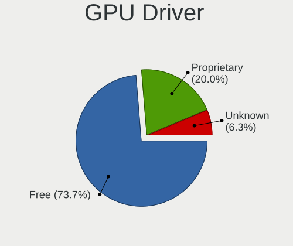

| Driver      | Desktops | Percent |
|-------------|----------|---------|
| Free        | 502      | 73.72%  |
| Proprietary | 136      | 19.97%  |
| Unknown     | 43       | 6.31%   |

GPU Memory
----------

Total video memory

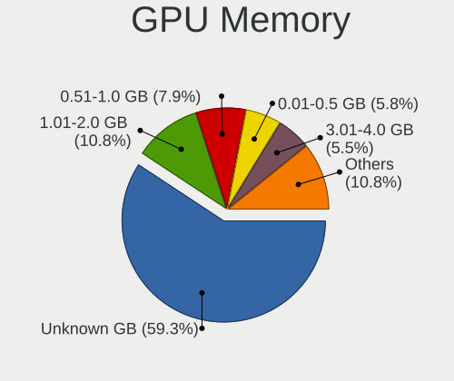

| Size in GB | Desktops | Percent |
|------------|----------|---------|
| Unknown    | 412      | 59.28%  |
| 1.01-2.0   | 75       | 10.79%  |
| 0.51-1.0   | 55       | 7.91%   |
| 0.01-0.5   | 40       | 5.76%   |
| 3.01-4.0   | 38       | 5.47%   |
| 7.01-8.0   | 33       | 4.75%   |
| 5.01-6.0   | 17       | 2.45%   |
| 8.01-16.0  | 16       | 2.3%    |
| 2.01-3.0   | 5        | 0.72%   |
| 16.01-24.0 | 4        | 0.58%   |

Monitor
-------

Monitor Vendor
--------------

Monitor vendors

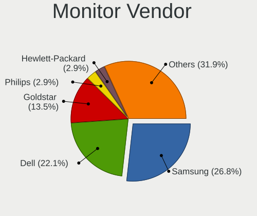

| Vendor               | Desktops | Percent |
|----------------------|----------|---------|
| Samsung Electronics  | 178      | 26.77%  |
| Dell                 | 147      | 22.11%  |
| Goldstar             | 90       | 13.53%  |
| Philips              | 19       | 2.86%   |
| Hewlett-Packard      | 19       | 2.86%   |
| AOC                  | 19       | 2.86%   |
| BenQ                 | 14       | 2.11%   |
| Acer                 | 14       | 2.11%   |
| VIE                  | 13       | 1.95%   |
| Unknown              | 11       | 1.65%   |
| LG Electronics       | 10       | 1.5%    |
| ViewSonic            | 7        | 1.05%   |
| Toshiba              | 7        | 1.05%   |
| Lenovo               | 7        | 1.05%   |
| Hitachi              | 7        | 1.05%   |
| PRI                  | 5        | 0.75%   |
| Panasonic            | 5        | 0.75%   |
| Fujitsu Siemens      | 5        | 0.75%   |
| Ancor Communications | 5        | 0.75%   |
| Plain Tree Systems   | 4        | 0.6%    |
| ASUSTek Computer     | 4        | 0.6%    |
| Unknown              | 4        | 0.6%    |
| Sony                 | 3        | 0.45%   |
| SKY                  | 3        | 0.45%   |
| RTK                  | 3        | 0.45%   |
| MECER                | 3        | 0.45%   |
| CTV                  | 3        | 0.45%   |
| CDR                  | 3        | 0.45%   |
| ___                  | 2        | 0.3%    |
| Wacom                | 2        | 0.3%    |
| Sampo                | 2        | 0.3%    |
| Packard Bell         | 2        | 0.3%    |
| Onkyo                | 2        | 0.3%    |
| NEC Computers        | 2        | 0.3%    |
| MStar                | 2        | 0.3%    |
| MSD                  | 2        | 0.3%    |
| Mi                   | 2        | 0.3%    |
| HUAWEI               | 2        | 0.3%    |
| HKC                  | 2        | 0.3%    |
| FUS                  | 2        | 0.3%    |

Monitor Model
-------------

Monitor models

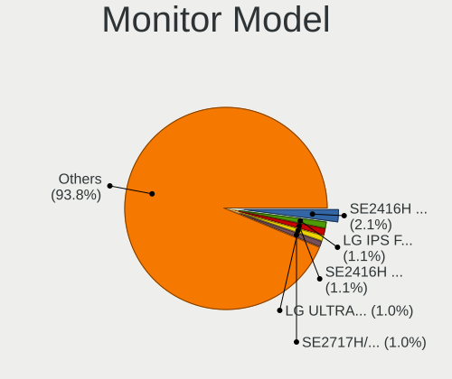

| Model                                                              | Desktops | Percent |
|--------------------------------------------------------------------|----------|---------|
| Dell SE2416H DELD082 1920x1080 527x296mm 23.8-inch                 | 15       | 2.07%   |
| Goldstar LG IPS FULLHD GSM5AB8 1920x1080 480x270mm 21.7-inch       | 8        | 1.11%   |
| Dell SE2416H DELD081 1920x1080 527x296mm 23.8-inch                 | 8        | 1.11%   |
| Goldstar LG ULTRAWIDE GSM59F1 2560x1080 670x280mm 28.6-inch        | 7        | 0.97%   |
| Dell SE2717H/HX DELD0A1 1920x1080 598x336mm 27.0-inch              | 7        | 0.97%   |
| Dell SE2216H DELF071 1920x1080 476x268mm 21.5-inch                 | 5        | 0.69%   |
| Dell S2340L DELD058 1920x1080 509x286mm 23.0-inch                  | 5        | 0.69%   |
| VIE D-GM215 VIEE003 1920x1080 480x260mm 21.5-inch                  | 4        | 0.55%   |
| Samsung Electronics SMBX2031 SAM076B 1600x900 443x249mm 20.0-inch  | 4        | 0.55%   |
| Samsung Electronics S20B300 SAM08A8 1600x900 443x249mm 20.0-inch   | 4        | 0.55%   |
| Goldstar HD GSM5ACB 1366x768 410x230mm 18.5-inch                   | 4        | 0.55%   |
| Dell S2721DGF DEL41D9 2560x1440 597x336mm 27.0-inch                | 4        | 0.55%   |
| Dell E1916HV DELF06C 1366x768 409x230mm 18.5-inch                  | 4        | 0.55%   |
| Unknown                                                            | 4        | 0.55%   |
| Samsung Electronics SMS19A100 SAM0867 1366x768 410x230mm 18.5-inch | 3        | 0.41%   |
| Samsung Electronics SMBX2450 SAM0722 1920x1080 531x299mm 24.0-inch | 3        | 0.41%   |
| Samsung Electronics S27B550 SAM091A 1920x1080 598x336mm 27.0-inch  | 3        | 0.41%   |
| Samsung Electronics S22F350 SAM0D1A 1920x1080 477x268mm 21.5-inch  | 3        | 0.41%   |
| Samsung Electronics S20C300 SAM0A19 1600x900 432x240mm 19.5-inch   | 3        | 0.41%   |
| Samsung Electronics S19C150 SAM0AE6 1366x768 410x230mm 18.5-inch   | 3        | 0.41%   |
| Samsung Electronics LCD Monitor SyncMaster 1920x1080               | 3        | 0.41%   |
| Samsung Electronics C24F390 SAM0D2C 1920x1080 521x293mm 23.5-inch  | 3        | 0.41%   |
| Panasonic '' MEIA0B9 1920x1080                                     | 3        | 0.41%   |
| Hewlett-Packard L1706 HWP265C 1280x1024 338x270mm 17.0-inch        | 3        | 0.41%   |
| Goldstar W2443 GSM571B 1920x1080 474x296mm 22.0-inch               | 3        | 0.41%   |
| Goldstar W1934 GSM4B7A 1440x900 410x256mm 19.0-inch                | 3        | 0.41%   |
| Goldstar L1919S GSM4AF2 1280x1024 380x300mm 19.1-inch              | 3        | 0.41%   |
| Goldstar HD PLUS GSM5AC5 1600x900 440x250mm 19.9-inch              | 3        | 0.41%   |
| Goldstar E1951 GSM4BFD 1366x768 410x230mm 18.5-inch                | 3        | 0.41%   |
| Goldstar 23MP55 GSM5A23 1920x1080 510x290mm 23.1-inch              | 3        | 0.41%   |
| Dell SE2722H DELD116 1920x1080 596x335mm 26.9-inch                 | 3        | 0.41%   |
| Dell SE2719H DELF10C 1920x1080 598x336mm 27.0-inch                 | 3        | 0.41%   |
| Dell SE2419HR DELF113 1920x1080 527x296mm 23.8-inch                | 3        | 0.41%   |
| Dell S2421HN DEL41F1 1920x1080 527x296mm 23.8-inch                 | 3        | 0.41%   |
| Dell P2715Q DEL40BD 3840x2160 597x336mm 27.0-inch                  | 3        | 0.41%   |
| Dell E2014H DELD03B 1600x900 432x240mm 19.5-inch                   | 3        | 0.41%   |
| Dell DEL 1908FPBLK DEL4047 1280x1024 376x301mm 19.0-inch           | 3        | 0.41%   |
| CDR Monitor CDR1700 1280x1024 337x270mm 17.0-inch                  | 3        | 0.41%   |
| AOC 1970W AOC1970 1366x768 410x230mm 18.5-inch                     | 3        | 0.41%   |
| ___ LCD Monitor ___A770 1280x1024 320x240mm 15.7-inch              | 2        | 0.28%   |

Monitor Resolution
------------------

Monitor screen resolution

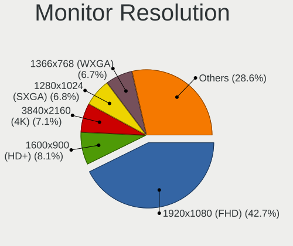

| Resolution         | Desktops | Percent |
|--------------------|----------|---------|
| 1920x1080 (FHD)    | 281      | 42.71%  |
| 1600x900 (HD+)     | 53       | 8.05%   |
| 3840x2160 (4K)     | 47       | 7.14%   |
| 1280x1024 (SXGA)   | 45       | 6.84%   |
| 1366x768 (WXGA)    | 44       | 6.69%   |
| 2560x1440 (QHD)    | 37       | 5.62%   |
| 1440x900 (WXGA+)   | 29       | 4.41%   |
| 1680x1050 (WSXGA+) | 22       | 3.34%   |
| 1360x768           | 20       | 3.04%   |
| Unknown            | 13       | 1.98%   |
| 1024x768 (XGA)     | 11       | 1.67%   |
| 2560x1080          | 9        | 1.37%   |
| 3840x1080          | 7        | 1.06%   |
| 1920x540           | 7        | 1.06%   |
| 1920x1200 (WUXGA)  | 7        | 1.06%   |
| 3440x1440          | 6        | 0.91%   |
| 1152x864           | 4        | 0.61%   |
| 5120x1080          | 2        | 0.3%    |
| 4480x1080          | 2        | 0.3%    |
| 1600x1200          | 2        | 0.3%    |
| 7680x2160          | 1        | 0.15%   |
| 720x480            | 1        | 0.15%   |
| 4880x1080          | 1        | 0.15%   |
| 4480x1440          | 1        | 0.15%   |
| 3360x1080          | 1        | 0.15%   |
| 3286x1080          | 1        | 0.15%   |
| 3280x1200          | 1        | 0.15%   |
| 2048x1536          | 1        | 0.15%   |
| 1400x1050          | 1        | 0.15%   |
| 1280x720 (HD)      | 1        | 0.15%   |

Monitor Diagonal
----------------

Diagonal size in inches

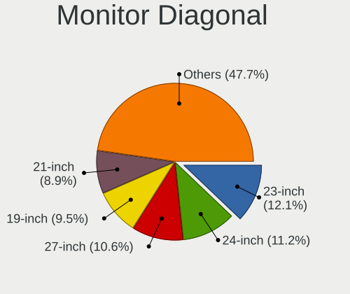

| Inches  | Desktops | Percent |
|---------|----------|---------|
| 23      | 82       | 12.11%  |
| 24      | 76       | 11.23%  |
| 27      | 72       | 10.64%  |
| 19      | 64       | 9.45%   |
| 21      | 60       | 8.86%   |
| Unknown | 55       | 8.12%   |
| 18      | 48       | 7.09%   |
| 20      | 39       | 5.76%   |
| 31      | 21       | 3.1%    |
| 22      | 21       | 3.1%    |
| 17      | 21       | 3.1%    |
| 15      | 20       | 2.95%   |
| 84      | 14       | 2.07%   |
| 34      | 14       | 2.07%   |
| 40      | 9        | 1.33%   |
| 32      | 7        | 1.03%   |
| 72      | 6        | 0.89%   |
| 52      | 6        | 0.89%   |
| 49      | 5        | 0.74%   |
| 48      | 5        | 0.74%   |
| 46      | 4        | 0.59%   |
| 25      | 4        | 0.59%   |
| 13      | 4        | 0.59%   |
| 54      | 3        | 0.44%   |
| 26      | 3        | 0.44%   |
| 63      | 2        | 0.3%    |
| 43      | 2        | 0.3%    |
| 28      | 2        | 0.3%    |
| 97      | 1        | 0.15%   |
| 67      | 1        | 0.15%   |
| 64      | 1        | 0.15%   |
| 44      | 1        | 0.15%   |
| 42      | 1        | 0.15%   |
| 41      | 1        | 0.15%   |
| 39      | 1        | 0.15%   |
| 14      | 1        | 0.15%   |

Monitor Width
-------------

Physical width

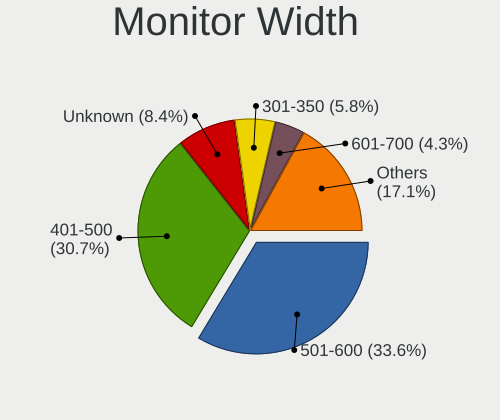

| Width in mm    | Desktops | Percent |
|----------------|----------|---------|
| 501-600        | 219      | 33.64%  |
| 401-500        | 200      | 30.72%  |
| Unknown        | 55       | 8.45%   |
| 301-350        | 38       | 5.84%   |
| 601-700        | 28       | 4.3%    |
| 1001-1500      | 26       | 3.99%   |
| 351-400        | 23       | 3.53%   |
| 701-800        | 20       | 3.07%   |
| 1501-2000      | 20       | 3.07%   |
| 801-900        | 11       | 1.69%   |
| 201-300        | 5        | 0.77%   |
| 901-1000       | 5        | 0.77%   |
| More than 2000 | 1        | 0.15%   |

Aspect Ratio
------------

Proportional relationship between the width and the height

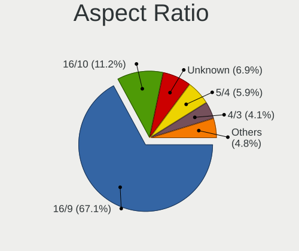

| Ratio   | Desktops | Percent |
|---------|----------|---------|
| 16/9    | 408      | 67.11%  |
| 16/10   | 68       | 11.18%  |
| Unknown | 42       | 6.91%   |
| 5/4     | 36       | 5.92%   |
| 4/3     | 25       | 4.11%   |
| 21/9    | 14       | 2.3%    |
| 32/9    | 8        | 1.32%   |
| 3/2     | 4        | 0.66%   |
| 1.96    | 3        | 0.49%   |

Monitor Area
------------

Area in inch²

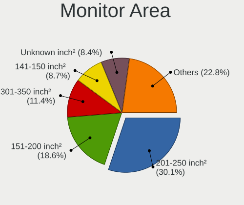

| Area in inch² | Desktops | Percent |
|----------------|----------|---------|
| 201-250        | 198      | 30.14%  |
| 151-200        | 122      | 18.57%  |
| 301-350        | 75       | 11.42%  |
| 141-150        | 57       | 8.68%   |
| Unknown        | 55       | 8.37%   |
| 351-500        | 43       | 6.54%   |
| More than 1000 | 35       | 5.33%   |
| 501-1000       | 27       | 4.11%   |
| 251-300        | 16       | 2.44%   |
| 101-110        | 12       | 1.83%   |
| 111-120        | 9        | 1.37%   |
| 131-140        | 4        | 0.61%   |
| 81-90          | 3        | 0.46%   |
| 71-80          | 1        | 0.15%   |

Pixel Density
-------------

Pixels per inch

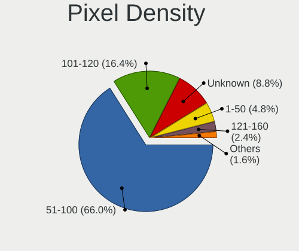

| Density | Desktops | Percent |
|---------|----------|---------|
| 51-100  | 414      | 66.03%  |
| 101-120 | 103      | 16.43%  |
| Unknown | 55       | 8.77%   |
| 1-50    | 30       | 4.78%   |
| 121-160 | 15       | 2.39%   |
| 161-240 | 10       | 1.59%   |

Multiple Monitors
-----------------

Total monitors connected

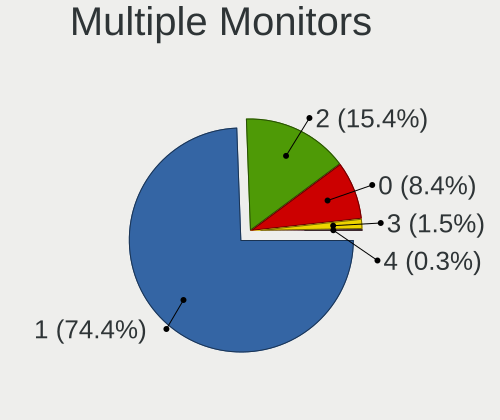

| Total | Desktops | Percent |
|-------|----------|---------|
| 1     | 512      | 74.42%  |
| 2     | 106      | 15.41%  |
| 0     | 58       | 8.43%   |
| 3     | 10       | 1.45%   |
| 4     | 2        | 0.29%   |

Network
-------

Net Controller Vendor
---------------------

Controller vendors

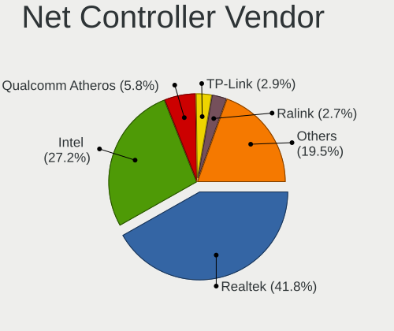

| Vendor                           | Desktops | Percent |
|----------------------------------|----------|---------|
| Realtek Semiconductor            | 398      | 41.81%  |
| Intel                            | 259      | 27.21%  |
| Qualcomm Atheros                 | 55       | 5.78%   |
| TP-Link                          | 28       | 2.94%   |
| Ralink Technology                | 26       | 2.73%   |
| Broadcom                         | 21       | 2.21%   |
| MediaTek                         | 20       | 2.1%    |
| Samsung Electronics              | 19       | 2%      |
| Huawei Technologies              | 19       | 2%      |
| Ralink                           | 10       | 1.05%   |
| Nvidia                           | 9        | 0.95%   |
| D-Link System                    | 9        | 0.95%   |
| D-Link                           | 9        | 0.95%   |
| Microsoft                        | 7        | 0.74%   |
| Aquantia                         | 6        | 0.63%   |
| Marvell Technology Group         | 4        | 0.42%   |
| Broadcom Limited                 | 4        | 0.42%   |
| Tenda                            | 3        | 0.32%   |
| Spreadtrum Communications        | 3        | 0.32%   |
| DisplayLink                      | 3        | 0.32%   |
| ZyXEL Communications             | 2        | 0.21%   |
| TRENDnet                         | 2        | 0.21%   |
| Silicon Integrated Systems [SiS] | 2        | 0.21%   |
| Qualcomm Technologies            | 2        | 0.21%   |
| Qualcomm Atheros Communications  | 2        | 0.21%   |
| Qualcomm                         | 2        | 0.21%   |
| OPPO Electronics                 | 2        | 0.21%   |
| NetGear                          | 2        | 0.21%   |
| Edimax Technology                | 2        | 0.21%   |
| ASUSTek Computer                 | 2        | 0.21%   |
| ASIX Electronics                 | 2        | 0.21%   |
| ZTopInc                          | 1        | 0.11%   |
| ZTE WCDMA Technologies MSM       | 1        | 0.11%   |
| Xiaomi                           | 1        | 0.11%   |
| vivo                             | 1        | 0.11%   |
| Smart Link                       | 1        | 0.11%   |
| Realtek                          | 1        | 0.11%   |
| Padix (Rockfire)                 | 1        | 0.11%   |
| Motorola                         | 1        | 0.11%   |
| Mercucys                         | 1        | 0.11%   |

Net Controller Model
--------------------

Controller models

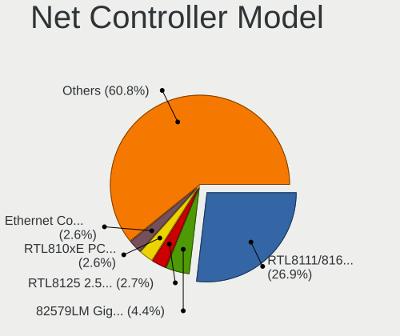

| Model                                                                  | Desktops | Percent |
|------------------------------------------------------------------------|----------|---------|
| Realtek RTL8111/8168/8211/8411 PCI Express Gigabit Ethernet Controller | 284      | 26.87%  |
| Intel 82579LM Gigabit Network Connection (Lewisville)                  | 46       | 4.35%   |
| Realtek RTL8125 2.5GbE Controller                                      | 29       | 2.74%   |
| Realtek RTL810xE PCI Express Fast Ethernet controller                  | 28       | 2.65%   |
| Intel Ethernet Connection (2) I219-V                                   | 27       | 2.55%   |
| Ralink MT7601U Wireless Adapter                                        | 22       | 2.08%   |
| Realtek RTL8188EUS 802.11n Wireless Network Adapter                    | 21       | 1.99%   |
| Intel I211 Gigabit Network Connection                                  | 21       | 1.99%   |
| Intel 82579V Gigabit Network Connection                                | 16       | 1.51%   |
| Intel Ethernet Connection I217-LM                                      | 15       | 1.42%   |
| Samsung Galaxy series, misc. (tethering mode)                          | 14       | 1.32%   |
| Realtek RTL8188FTV 802.11b/g/n 1T1R 2.4G WLAN Adapter                  | 14       | 1.32%   |
| Intel Ethernet Connection (2) I219-LM                                  | 14       | 1.32%   |
| Intel Wi-Fi 6 AX200                                                    | 12       | 1.14%   |
| Intel 82578DM Gigabit Network Connection                               | 12       | 1.14%   |
| TP-Link TL-WN823N v2/v3 [Realtek RTL8192EU]                            | 10       | 0.95%   |
| Qualcomm Atheros AR9287 Wireless Network Adapter (PCI-Express)         | 10       | 0.95%   |
| Intel Ethernet Controller I225-V                                       | 10       | 0.95%   |
| Realtek RTL-8100/8101L/8139 PCI Fast Ethernet Adapter                  | 9        | 0.85%   |
| Intel 82578DC Gigabit Network Connection                               | 9        | 0.85%   |
| Qualcomm Atheros AR5212/5213/2414 Wireless Network Adapter             | 8        | 0.76%   |
| MediaTek MT7922 802.11ax PCI Express Wireless Network Adapter          | 8        | 0.76%   |
| Intel Ethernet Connection (7) I219-V                                   | 8        | 0.76%   |
| Intel 82574L Gigabit Network Connection                                | 8        | 0.76%   |
| Intel 82567LM-3 Gigabit Network Connection                             | 8        | 0.76%   |
| TP-Link 802.11ac WLAN Adapter                                          | 7        | 0.66%   |
| Realtek 802.11ac NIC                                                   | 7        | 0.66%   |
| Intel Ethernet Controller I226-V                                       | 7        | 0.66%   |
| D-Link System DGE-528T Gigabit Ethernet Adapter                        | 7        | 0.66%   |
| Samsung GT-I9070 (network tethering, USB debugging enabled)            | 6        | 0.57%   |
| Realtek RTL8192EE PCIe Wireless Network Adapter                        | 6        | 0.57%   |
| Realtek RTL8192CU 802.11n WLAN Adapter                                 | 6        | 0.57%   |
| Qualcomm Atheros AR8151 v2.0 Gigabit Ethernet                          | 6        | 0.57%   |
| Microsoft Xbox 360 Wireless Adapter                                    | 6        | 0.57%   |
| Intel Ethernet Connection I217-V                                       | 6        | 0.57%   |
| Intel Ethernet Connection (2) I218-V                                   | 6        | 0.57%   |
| Huawei FOA-LX9                                                         | 6        | 0.57%   |
| Huawei E353/E3131                                                      | 6        | 0.57%   |
| Broadcom NetXtreme BCM5723 Gigabit Ethernet PCIe                       | 6        | 0.57%   |
| Realtek RTL8192EU 802.11b/g/n WLAN Adapter                             | 5        | 0.47%   |

Wireless Vendor
---------------

Wireless vendors

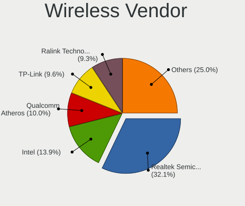

| Vendor                                | Desktops | Percent |
|---------------------------------------|----------|---------|
| Realtek Semiconductor                 | 90       | 32.14%  |
| Intel                                 | 39       | 13.93%  |
| Qualcomm Atheros                      | 28       | 10%     |
| TP-Link                               | 27       | 9.64%   |
| Ralink Technology                     | 26       | 9.29%   |
| MediaTek                              | 14       | 5%      |
| Ralink                                | 10       | 3.57%   |
| D-Link                                | 9        | 3.21%   |
| Microsoft                             | 7        | 2.5%    |
| Broadcom                              | 4        | 1.43%   |
| Tenda                                 | 3        | 1.07%   |
| ZyXEL Communications                  | 2        | 0.71%   |
| TRENDnet                              | 2        | 0.71%   |
| Qualcomm Atheros Communications       | 2        | 0.71%   |
| NetGear                               | 2        | 0.71%   |
| Edimax Technology                     | 2        | 0.71%   |
| D-Link System                         | 2        | 0.71%   |
| ASUSTek Computer                      | 2        | 0.71%   |
| ZTopInc                               | 1        | 0.36%   |
| ZTE WCDMA Technologies MSM            | 1        | 0.36%   |
| Realtek                               | 1        | 0.36%   |
| Qualcomm Technologies                 | 1        | 0.36%   |
| Mercucys                              | 1        | 0.36%   |
| CyberTAN Technology                   | 1        | 0.36%   |
| Broadcom Limited                      | 1        | 0.36%   |
| Belkin Components                     | 1        | 0.36%   |
| 802.11g Adapter [Linksys WUSB54GC v3] | 1        | 0.36%   |

Wireless Model
--------------

Wireless models

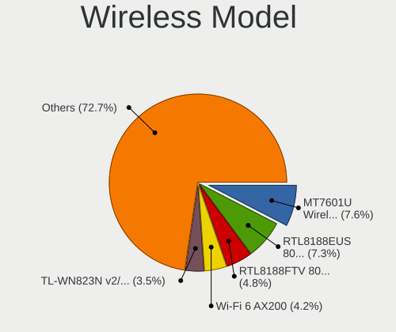

| Model                                                          | Desktops | Percent |
|----------------------------------------------------------------|----------|---------|
| Ralink MT7601U Wireless Adapter                                | 22       | 7.61%   |
| Realtek RTL8188EUS 802.11n Wireless Network Adapter            | 21       | 7.27%   |
| Realtek RTL8188FTV 802.11b/g/n 1T1R 2.4G WLAN Adapter          | 14       | 4.84%   |
| Intel Wi-Fi 6 AX200                                            | 12       | 4.15%   |
| TP-Link TL-WN823N v2/v3 [Realtek RTL8192EU]                    | 10       | 3.46%   |
| Qualcomm Atheros AR9287 Wireless Network Adapter (PCI-Express) | 10       | 3.46%   |
| Qualcomm Atheros AR5212/5213/2414 Wireless Network Adapter     | 8        | 2.77%   |
| TP-Link 802.11ac WLAN Adapter                                  | 7        | 2.42%   |
| Realtek 802.11ac NIC                                           | 7        | 2.42%   |
| MediaTek MT7922 802.11ax PCI Express Wireless Network Adapter  | 7        | 2.42%   |
| Realtek RTL8192EE PCIe Wireless Network Adapter                | 6        | 2.08%   |
| Realtek RTL8192CU 802.11n WLAN Adapter                         | 6        | 2.08%   |
| Microsoft Xbox 360 Wireless Adapter                            | 6        | 2.08%   |
| Realtek RTL8192EU 802.11b/g/n WLAN Adapter                     | 5        | 1.73%   |
| Ralink RT5370 Wireless Adapter                                 | 5        | 1.73%   |
| Intel Wireless 7265                                            | 5        | 1.73%   |
| TP-Link AC600 wireless Realtek RTL8811AU [Archer T2U Nano]     | 4        | 1.38%   |
| Realtek RTL88x2bu [AC1200 Techkey]                             | 4        | 1.38%   |
| Realtek RTL8188CUS 802.11n WLAN Adapter                        | 4        | 1.38%   |
| Qualcomm Atheros QCA9565 / AR9565 Wireless Network Adapter     | 4        | 1.38%   |
| TP-Link Archer T4U ver.3                                       | 3        | 1.04%   |
| Tenda U12                                                      | 3        | 1.04%   |
| Realtek RTL8812AE 802.11ac PCIe Wireless Network Adapter       | 3        | 1.04%   |
| Realtek RTL8192CE PCIe Wireless Network Adapter                | 3        | 1.04%   |
| Realtek RTL8191SU 802.11n WLAN Adapter                         | 3        | 1.04%   |
| Qualcomm Atheros AR9227 Wireless Network Adapter               | 3        | 1.04%   |
| MediaTek MT7921K (RZ608) Wi-Fi 6E 80MHz                        | 3        | 1.04%   |
| Intel Wireless 8265 / 8275                                     | 3        | 1.04%   |
| Intel Wireless 3165                                            | 3        | 1.04%   |
| Intel Wi-Fi 6E(802.11ax) AX210/AX1675* 2x2 [Typhoon Peak]      | 3        | 1.04%   |
| TP-Link Archer T4UH wireless Realtek 8812AU                    | 2        | 0.69%   |
| Realtek RTL8821CE 802.11ac PCIe Wireless Network Adapter       | 2        | 0.69%   |
| Realtek RTL8814AU 802.11a/b/g/n/ac Wireless Adapter            | 2        | 0.69%   |
| Realtek RTL8188EE Wireless Network Adapter                     | 2        | 0.69%   |
| Realtek RTL-8185 IEEE 802.11a/b/g Wireless LAN Controller      | 2        | 0.69%   |
| Realtek 802.11n WLAN Adapter                                   | 2        | 0.69%   |
| Ralink RT5392 PCIe Wireless Network Adapter                    | 2        | 0.69%   |
| Ralink RT3060 Wireless 802.11n 1T/1R                           | 2        | 0.69%   |
| Ralink RT2790 Wireless 802.11n 1T/2R PCIe                      | 2        | 0.69%   |
| Qualcomm Atheros AR9271 802.11n                                | 2        | 0.69%   |

Ethernet Vendor
---------------

Ethernet vendors

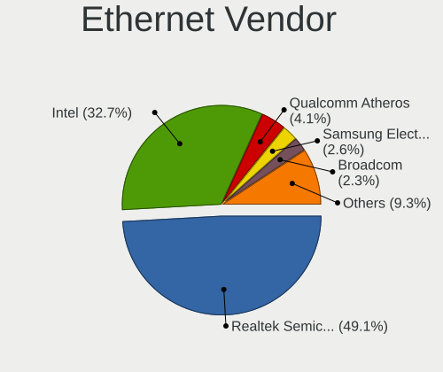

| Vendor                           | Desktops | Percent |
|----------------------------------|----------|---------|
| Realtek Semiconductor            | 361      | 49.12%  |
| Intel                            | 240      | 32.65%  |
| Qualcomm Atheros                 | 30       | 4.08%   |
| Samsung Electronics              | 19       | 2.59%   |
| Broadcom                         | 17       | 2.31%   |
| Huawei Technologies              | 14       | 1.9%    |
| Nvidia                           | 9        | 1.22%   |
| D-Link System                    | 7        | 0.95%   |
| Aquantia                         | 6        | 0.82%   |
| MediaTek                         | 5        | 0.68%   |
| Marvell Technology Group         | 4        | 0.54%   |
| Spreadtrum Communications        | 3        | 0.41%   |
| DisplayLink                      | 3        | 0.41%   |
| Broadcom Limited                 | 3        | 0.41%   |
| Silicon Integrated Systems [SiS] | 2        | 0.27%   |
| OPPO Electronics                 | 2        | 0.27%   |
| ASIX Electronics                 | 2        | 0.27%   |
| Xiaomi                           | 1        | 0.14%   |
| vivo                             | 1        | 0.14%   |
| TP-Link                          | 1        | 0.14%   |
| Qualcomm Technologies            | 1        | 0.14%   |
| Qualcomm                         | 1        | 0.14%   |
| Foxconn / Hon Hai                | 1        | 0.14%   |
| Apple                            | 1        | 0.14%   |
| Accton Technology                | 1        | 0.14%   |

Ethernet Model
--------------

Ethernet models

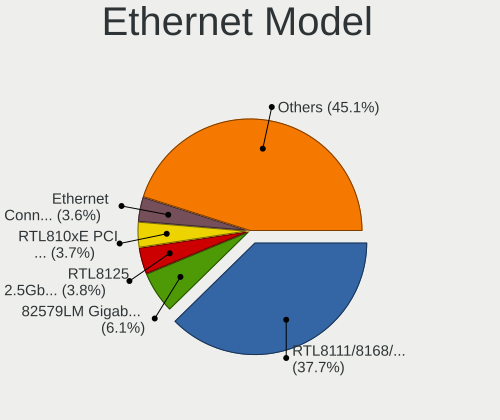

| Model                                                                          | Desktops | Percent |
|--------------------------------------------------------------------------------|----------|---------|
| Realtek RTL8111/8168/8211/8411 PCI Express Gigabit Ethernet Controller         | 284      | 37.67%  |
| Intel 82579LM Gigabit Network Connection (Lewisville)                          | 46       | 6.1%    |
| Realtek RTL8125 2.5GbE Controller                                              | 29       | 3.85%   |
| Realtek RTL810xE PCI Express Fast Ethernet controller                          | 28       | 3.71%   |
| Intel Ethernet Connection (2) I219-V                                           | 27       | 3.58%   |
| Intel I211 Gigabit Network Connection                                          | 21       | 2.79%   |
| Intel 82579V Gigabit Network Connection                                        | 16       | 2.12%   |
| Intel Ethernet Connection I217-LM                                              | 15       | 1.99%   |
| Samsung Galaxy series, misc. (tethering mode)                                  | 14       | 1.86%   |
| Intel Ethernet Connection (2) I219-LM                                          | 14       | 1.86%   |
| Intel 82578DM Gigabit Network Connection                                       | 12       | 1.59%   |
| Intel Ethernet Controller I225-V                                               | 10       | 1.33%   |
| Realtek RTL-8100/8101L/8139 PCI Fast Ethernet Adapter                          | 9        | 1.19%   |
| Intel 82578DC Gigabit Network Connection                                       | 9        | 1.19%   |
| Intel Ethernet Connection (7) I219-V                                           | 8        | 1.06%   |
| Intel 82574L Gigabit Network Connection                                        | 8        | 1.06%   |
| Intel 82567LM-3 Gigabit Network Connection                                     | 8        | 1.06%   |
| Intel Ethernet Controller I226-V                                               | 7        | 0.93%   |
| D-Link System DGE-528T Gigabit Ethernet Adapter                                | 7        | 0.93%   |
| Samsung GT-I9070 (network tethering, USB debugging enabled)                    | 6        | 0.8%    |
| Qualcomm Atheros AR8151 v2.0 Gigabit Ethernet                                  | 6        | 0.8%    |
| Intel Ethernet Connection I217-V                                               | 6        | 0.8%    |
| Intel Ethernet Connection (2) I218-V                                           | 6        | 0.8%    |
| Huawei FOA-LX9                                                                 | 6        | 0.8%    |
| Huawei E353/E3131                                                              | 6        | 0.8%    |
| Broadcom NetXtreme BCM5723 Gigabit Ethernet PCIe                               | 6        | 0.8%    |
| Realtek RTL8153 Gigabit Ethernet Adapter                                       | 5        | 0.66%   |
| Realtek RTL8111/8168/8411 PCI Express Gigabit Ethernet Controller              | 5        | 0.66%   |
| Qualcomm Atheros Killer E220x Gigabit Ethernet Controller                      | 5        | 0.66%   |
| Intel 82566DM-2 Gigabit Network Connection                                     | 5        | 0.66%   |
| Intel 82566DM Gigabit Network Connection                                       | 5        | 0.66%   |
| Realtek RTL8126 5GbE Controller                                                | 4        | 0.53%   |
| Nvidia MCP51 Ethernet Controller                                               | 4        | 0.53%   |
| Intel 80003ES2LAN Gigabit Ethernet Controller (Copper)                         | 4        | 0.53%   |
| Realtek RTL8169 PCI Gigabit Ethernet Controller                                | 3        | 0.4%    |
| Qualcomm Atheros AR8131 Gigabit Ethernet                                       | 3        | 0.4%    |
| Marvell Group 88E8056 PCI-E Gigabit Ethernet Controller                        | 3        | 0.4%    |
| Intel 82566DC-2 Gigabit Network Connection                                     | 3        | 0.4%    |
| Aquantia AQtion AQC107 NBase-T/IEEE 802.3an Ethernet Controller [Atlantic 10G] | 3        | 0.4%    |
| Spreadtrum Android                                                             | 2        | 0.27%   |

Net Controller Kind
-------------------

Ethernet, WiFi or modem

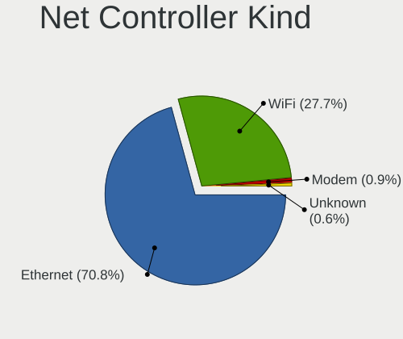

| Kind     | Desktops | Percent |
|----------|----------|---------|
| Ethernet | 654      | 70.78%  |
| WiFi     | 256      | 27.71%  |
| Modem    | 8        | 0.87%   |
| Unknown  | 6        | 0.65%   |

Used Controller
---------------

Currently used network controller

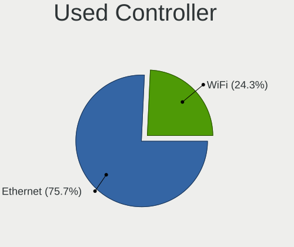

| Kind     | Desktops | Percent |
|----------|----------|---------|
| Ethernet | 515      | 75.74%  |
| WiFi     | 165      | 24.26%  |

NICs
----

Total network controllers on board

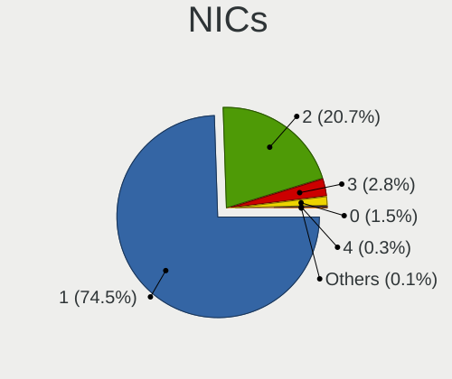

| Total | Desktops | Percent |
|-------|----------|---------|
| 1     | 499      | 74.48%  |
| 2     | 139      | 20.75%  |
| 3     | 19       | 2.84%   |
| 0     | 10       | 1.49%   |
| 4     | 2        | 0.3%    |
| 8     | 1        | 0.15%   |

IPv6
----

IPv6 vs IPv4

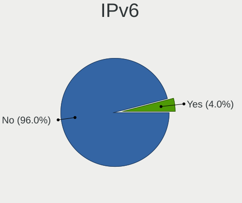

| Used | Desktops | Percent |
|------|----------|---------|
| No   | 640      | 95.95%  |
| Yes  | 27       | 4.05%   |

Bluetooth
---------

Bluetooth Vendor
----------------

Controller vendors

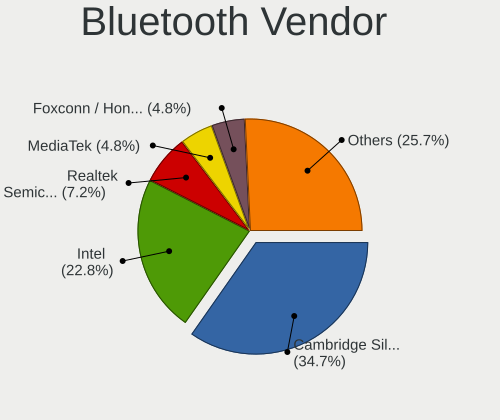

| Vendor                          | Desktops | Percent |
|---------------------------------|----------|---------|
| Cambridge Silicon Radio         | 58       | 34.73%  |
| Intel                           | 38       | 22.75%  |
| Realtek Semiconductor           | 12       | 7.19%   |
| MediaTek                        | 8        | 4.79%   |
| Foxconn / Hon Hai               | 8        | 4.79%   |
| Broadcom                        | 8        | 4.79%   |
| IMC Networks                    | 7        | 4.19%   |
| TP-Link                         | 6        | 3.59%   |
| ASUSTek Computer                | 5        | 2.99%   |
| Qualcomm Atheros Communications | 4        | 2.4%    |
| Apple                           | 4        | 2.4%    |
| Integrated System Solution      | 2        | 1.2%    |
| Actions                         | 2        | 1.2%    |
| Toshiba                         | 1        | 0.6%    |
| Realtek                         | 1        | 0.6%    |
| Micro Star International        | 1        | 0.6%    |
| i.Tech Dynamic Limited          | 1        | 0.6%    |
| Edimax Technology               | 1        | 0.6%    |

Bluetooth Model
---------------

Controller models

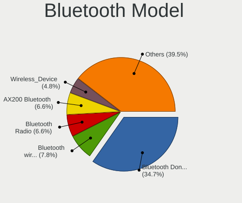

| Model                                                   | Desktops | Percent |
|---------------------------------------------------------|----------|---------|
| Cambridge Silicon Radio Bluetooth Dongle (HCI mode)     | 58       | 34.73%  |
| Intel Bluetooth wireless interface                      | 13       | 7.78%   |
| Realtek Bluetooth Radio                                 | 11       | 6.59%   |
| Intel AX200 Bluetooth                                   | 11       | 6.59%   |
| MediaTek Wireless_Device                                | 8        | 4.79%   |
| TP-Link TP-T@- UB500 Adapter                            | 6        | 3.59%   |
| Qualcomm Atheros  Bluetooth Device                      | 4        | 2.4%    |
| Intel Bluetooth Device                                  | 4        | 2.4%    |
| IMC Networks Wireless_Device                            | 4        | 2.4%    |
| Foxconn / Hon Hai Wireless_Device                       | 4        | 2.4%    |
| Broadcom BCM20702A0 Bluetooth 4.0                       | 4        | 2.4%    |
| Apple Bluetooth HCI                                     | 4        | 2.4%    |
| Intel AX210 Bluetooth                                   | 3        | 1.8%    |
| Foxconn / Hon Hai Bluetooth Device                      | 3        | 1.8%    |
| Intel Wireless-AC 3168 Bluetooth                        | 2        | 1.2%    |
| Intel Centrino Bluetooth Wireless Transceiver           | 2        | 1.2%    |
| Intel Bluetooth 9460/9560 Jefferson Peak (JfP)          | 2        | 1.2%    |
| IMC Networks Bluetooth Radio                            | 2        | 1.2%    |
| Actions general adapter                                 | 2        | 1.2%    |
| Toshiba Atheros AR3012 Bluetooth                        | 1        | 0.6%    |
| Realtek Bluetooth 5.3 Radio                             | 1        | 0.6%    |
| Realtek Bluetooth Radio                                 | 1        | 0.6%    |
| Micro Star International Bluetooth dongle               | 1        | 0.6%    |
| Intel Wireless-AC 9260 Bluetooth Adapter                | 1        | 0.6%    |
| Integrated System Solution KY-BT100 Bluetooth Adapter   | 1        | 0.6%    |
| Integrated System Solution Bluetooth Device             | 1        | 0.6%    |
| IMC Networks Atheros AR3012 Bluetooth 4.0 Adapter       | 1        | 0.6%    |
| i.Tech Dynamic Limited BlueCON U2                       | 1        | 0.6%    |
| Foxconn / Hon Hai MediaTek Bluetooth Adapter            | 1        | 0.6%    |
| Edimax EW-7611ULB 802.11b/g/n and Bluetooth 4.0 Adapter | 1        | 0.6%    |
| Broadcom Bluetooth 2.0+eDR dongle                       | 1        | 0.6%    |
| Broadcom BCM920702 Bluetooth 4.0 Zero Touch Dongle      | 1        | 0.6%    |
| Broadcom BCM2045 Bluetooth                              | 1        | 0.6%    |
| Broadcom BCM2035 Bluetooth dongle                       | 1        | 0.6%    |
| ASUS Qualcomm Bluetooth 4.1                             | 1        | 0.6%    |
| ASUS Bluetooth Radio                                    | 1        | 0.6%    |
| ASUS Bluetooth Adapter                                  | 1        | 0.6%    |
| ASUS BCM20702A0                                         | 1        | 0.6%    |
| ASUS ASUS USB-BT500                                     | 1        | 0.6%    |

Sound
-----

Sound Vendor
------------

Sound card vendors

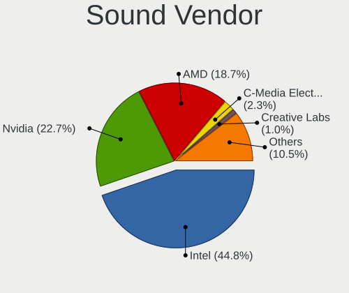

| Vendor                           | Desktops | Percent |
|----------------------------------|----------|---------|
| Intel                            | 486      | 44.75%  |
| Nvidia                           | 247      | 22.74%  |
| AMD                              | 203      | 18.69%  |
| C-Media Electronics              | 25       | 2.3%    |
| Creative Labs                    | 11       | 1.01%   |
| Corsair                          | 11       | 1.01%   |
| Logitech                         | 9        | 0.83%   |
| ASUSTek Computer                 | 8        | 0.74%   |
| Sony                             | 6        | 0.55%   |
| JMTek                            | 6        | 0.55%   |
| Micro Star International         | 5        | 0.46%   |
| SteelSeries ApS                  | 4        | 0.37%   |
| DSEA A/S                         | 4        | 0.37%   |
| VIA Technologies                 | 3        | 0.28%   |
| Trust                            | 3        | 0.28%   |
| Samson Technologies              | 3        | 0.28%   |
| Razer USA                        | 3        | 0.28%   |
| Plantronics                      | 3        | 0.28%   |
| GN Netcom                        | 3        | 0.28%   |
| Generalplus Technology           | 3        | 0.28%   |
| Focusrite-Novation               | 3        | 0.28%   |
| Silicon Integrated Systems [SiS] | 2        | 0.18%   |
| Microsoft                        | 2        | 0.18%   |
| Hewlett-Packard                  | 2        | 0.18%   |
| Elgato Systems                   | 2        | 0.18%   |
| Cambridge Silicon Radio          | 2        | 0.18%   |
| BEHRINGER International          | 2        | 0.18%   |
| Astro Gaming                     | 2        | 0.18%   |
| USB MICROPHONE                   | 1        | 0.09%   |
| Texas Instruments                | 1        | 0.09%   |
| Syntek                           | 1        | 0.09%   |
| ROCCAT                           | 1        | 0.09%   |
| Realtek Semiconductor            | 1        | 0.09%   |
| PreSonus Audio Electronics       | 1        | 0.09%   |
| M-Audio                          | 1        | 0.09%   |
| Jieli Technology                 | 1        | 0.09%   |
| iPassion Technology              | 1        | 0.09%   |
| GYROCOM C&C                      | 1        | 0.09%   |
| Guillemot                        | 1        | 0.09%   |
| Giga-Byte Technology             | 1        | 0.09%   |

Sound Model
-----------

Sound card models

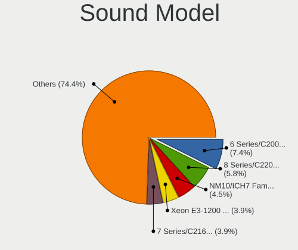

| Model                                                                      | Desktops | Percent |
|----------------------------------------------------------------------------|----------|---------|
| Intel 6 Series/C200 Series Chipset Family High Definition Audio Controller | 92       | 7.4%    |
| Intel 8 Series/C220 Series Chipset High Definition Audio Controller        | 72       | 5.79%   |
| Intel NM10/ICH7 Family High Definition Audio Controller                    | 56       | 4.5%    |
| Intel Xeon E3-1200 v3/4th Gen Core Processor HD Audio Controller           | 49       | 3.94%   |
| Intel 7 Series/C216 Chipset Family High Definition Audio Controller        | 49       | 3.94%   |
| AMD Starship/Matisse HD Audio Controller                                   | 48       | 3.86%   |
| AMD Ryzen HD Audio Controller                                              | 46       | 3.7%    |
| Intel 100 Series/C230 Series Chipset Family HD Audio Controller            | 45       | 3.62%   |
| Intel 200 Series PCH HD Audio                                              | 32       | 2.57%   |
| Nvidia High Definition Audio Controller                                    | 31       | 2.49%   |
| Intel 5 Series/3400 Series Chipset High Definition Audio                   | 29       | 2.33%   |
| AMD Ellesmere HDMI Audio [Radeon RX 470/480 / 570/580/590]                 | 29       | 2.33%   |
| AMD Family 17h (Models 00h-0fh) HD Audio Controller                        | 23       | 1.85%   |
| AMD Renoir/Cezanne HDMI/DP Audio Controller                                | 20       | 1.61%   |
| Nvidia GF108 High Definition Audio Controller                              | 18       | 1.45%   |
| Nvidia GP104 High Definition Audio Controller                              | 17       | 1.37%   |
| Intel Cannon Lake PCH cAVS                                                 | 16       | 1.29%   |
| Intel 82801JI (ICH10 Family) HD Audio Controller                           | 15       | 1.21%   |
| AMD Oland/Hainan/Cape Verde/Pitcairn HDMI Audio [Radeon HD 7000 Series]    | 15       | 1.21%   |
| Nvidia GP107GL High Definition Audio Controller                            | 14       | 1.13%   |
| Nvidia GK208 HDMI/DP Audio Controller                                      | 14       | 1.13%   |
| Nvidia GP106 High Definition Audio Controller                              | 13       | 1.05%   |
| AMD SBx00 Azalia (Intel HDA)                                               | 13       | 1.05%   |
| AMD Radeon High Definition Audio Controller                                | 13       | 1.05%   |
| AMD Navi 21/23 HDMI/DP Audio Controller                                    | 13       | 1.05%   |
| AMD Navi 31 HDMI/DP Audio                                                  | 12       | 0.96%   |
| Nvidia TU106 High Definition Audio Controller                              | 11       | 0.88%   |
| Nvidia GF119 HDMI Audio Controller                                         | 11       | 0.88%   |
| Nvidia TU116 High Definition Audio Controller                              | 10       | 0.8%    |
| Intel 82801I (ICH9 Family) HD Audio Controller                             | 10       | 0.8%    |
| Nvidia GK107 HDMI Audio Controller                                         | 9        | 0.72%   |
| Nvidia GK104 HDMI Audio Controller                                         | 9        | 0.72%   |
| Nvidia GA106 High Definition Audio Controller                              | 9        | 0.72%   |
| Nvidia GA104 High Definition Audio Controller                              | 9        | 0.72%   |
| Intel 82801JD/DO (ICH10 Family) HD Audio Controller                        | 9        | 0.72%   |
| AMD Baffin HDMI/DP Audio [Radeon RX 550 640SP / RX 560/560X]               | 9        | 0.72%   |
| AMD Raven/Raven2/Fenghuang HDMI/DP Audio Controller                        | 8        | 0.64%   |
| AMD Navi 10 HDMI Audio                                                     | 8        | 0.64%   |
| AMD Cedar HDMI Audio [Radeon HD 5400/6300/7300 Series]                     | 8        | 0.64%   |
| Nvidia GP108 High Definition Audio Controller                              | 7        | 0.56%   |

Memory
------

Memory Vendor
-------------

Memory module vendors

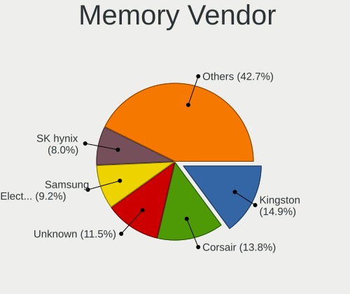

| Vendor              | Desktops | Percent |
|---------------------|----------|---------|
| Kingston            | 52       | 14.9%   |
| Corsair             | 48       | 13.75%  |
| Unknown             | 40       | 11.46%  |
| Samsung Electronics | 32       | 9.17%   |
| SK hynix            | 28       | 8.02%   |
| Transcend           | 23       | 6.59%   |
| G.Skill             | 21       | 6.02%   |
| Crucial             | 19       | 5.44%   |
| Micron Technology   | 16       | 4.58%   |
| KLEVV               | 13       | 3.72%   |
| A-DATA Technology   | 11       | 3.15%   |
| Patriot             | 8        | 2.29%   |
| Unknown             | 6        | 1.72%   |
| Ramaxel Technology  | 5        | 1.43%   |
| Apacer              | 5        | 1.43%   |
| Strontium           | 4        | 1.15%   |
| Nanya Technology    | 4        | 1.15%   |
| Kingmax             | 4        | 1.15%   |
| Team                | 3        | 0.86%   |
| Silicon Power       | 1        | 0.29%   |
| Shenzhen Zhongteng  | 1        | 0.29%   |
| Qimonda             | 1        | 0.29%   |
| Neo Forza           | 1        | 0.29%   |
| KingFast            | 1        | 0.29%   |
| Elpida              | 1        | 0.29%   |
| ASint Technology    | 1        | 0.29%   |

Memory Model
------------

Memory module models

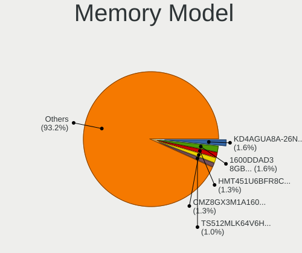

| Model                                                 | Desktops | Percent |
|-------------------------------------------------------|----------|---------|
| KLEVV RAM KD4AGUA8A-26N1900 16GB DIMM DDR4 2667MT/s   | 6        | 1.57%   |
| Unknown                                               | 6        | 1.57%   |
| SK hynix RAM HMT451U6BFR8C-PB 4GB DIMM DDR3 1600MT/s  | 5        | 1.31%   |
| Corsair RAM CMZ8GX3M1A1600C10 8GB DIMM DDR3 1600MT/s  | 5        | 1.31%   |
| Transcend RAM TS512MLK64V6H 4GB DIMM DDR3 1600MT/s    | 4        | 1.04%   |
| Micron RAM 8JTF51264AZ-1G6E1 4GB DIMM DDR3 1600MT/s   | 4        | 1.04%   |
| G.Skill RAM F4-3200C16-8GVKB 8GB DIMM DDR4 4000MT/s   | 4        | 1.04%   |
| Unknown RAM Module 4GB DIMM 400MT/s                   | 3        | 0.78%   |
| Unknown RAM Module 2048MB DIMM 1333MT/s               | 3        | 0.78%   |
| Transcend RAM JM1333KLH-8G 8GB DIMM DDR3 1333MT/s     | 3        | 0.78%   |
| SK hynix RAM HMT451U6AFR8C-PB 4GB DIMM DDR3 1600MT/s  | 3        | 0.78%   |
| Samsung RAM M378A5244CB0-CRC 4GB DIMM DDR4 3066MT/s   | 3        | 0.78%   |
| Kingston RAM KHX3200C16D4/8GX 8GB DIMM DDR4 3733MT/s  | 3        | 0.78%   |
| Kingston RAM 99U5471-054.A00LF 8GB DIMM DDR3 1600MT/s | 3        | 0.78%   |
| G.Skill RAM F5-6000J3040G32G 32GB DIMM DDR5 6200MT/s  | 3        | 0.78%   |
| Crucial RAM CT51264BD160B.C16F 4GB DIMM DDR3 1600MT/s | 3        | 0.78%   |
| Unknown RAM Module 8GB DIMM DDR3 1333MT/s             | 2        | 0.52%   |
| Unknown RAM Module 512MB DIMM 400MT/s                 | 2        | 0.52%   |
| Unknown RAM Module 4GB DIMM DDR3 1600MT/s             | 2        | 0.52%   |
| Unknown RAM Module 4GB DIMM 800MT/s                   | 2        | 0.52%   |
| Unknown RAM Module 4GB DIMM 1333MT/s                  | 2        | 0.52%   |
| Unknown RAM Module 2GB DIMM DDR2 667MT/s              | 2        | 0.52%   |
| Unknown RAM Module 2GB DIMM DDR2 1067MT/s             | 2        | 0.52%   |
| Unknown RAM Module 2GB DIMM 800MT/s                   | 2        | 0.52%   |
| Unknown RAM Module 1GB DIMM DDR2 667MT/s              | 2        | 0.52%   |
| Transcend RAM TS1GLK64V6H 8GB DIMM DDR3 1600MT/s      | 2        | 0.52%   |
| Transcend RAM JM1600KLN-4G 4GB DIMM DDR3 1600MT/s     | 2        | 0.52%   |
| Transcend RAM JM1333KLN-4G 4GB DIMM DDR3 1333MT/s     | 2        | 0.52%   |
| Transcend RAM JM1333KLN-2G 2GB DIMM DDR3 1333MT/s     | 2        | 0.52%   |
| SK hynix RAM Module 8GB SODIMM DDR4 2133MT/s          | 2        | 0.52%   |
| SK hynix RAM HMT451U6BFR8A-PB 4GB DIMM DDR3 1600MT/s  | 2        | 0.52%   |
| SK hynix RAM HMT351U6EFR8C-PB 4GB DIMM DDR3 1600MT/s  | 2        | 0.52%   |
| SK hynix RAM HMT351U6CFR8C-H9 4GB DIMM DDR3 1600MT/s  | 2        | 0.52%   |
| SK hynix RAM HMA81GU6AFR8N-UH 8GB DIMM DDR4 2667MT/s  | 2        | 0.52%   |
| Samsung RAM M378B5773CH0-CH9 2GB DIMM DDR3 1867MT/s   | 2        | 0.52%   |
| Samsung RAM M378B5273DH0-CK0 4GB DIMM DDR3 2200MT/s   | 2        | 0.52%   |
| Patriot RAM PSD48G266681 8GB DIMM DDR4 2934MT/s       | 2        | 0.52%   |
| Patriot RAM PSD38G16002 8192MB DIMM DDR3 1600MT/s     | 2        | 0.52%   |
| KLEVV RAM KD4AGUA80-32N220E 16GB DIMM DDR4 3200MT/s   | 2        | 0.52%   |
| Kingston RAM KHX2666C16/16G 16GB DIMM DDR4 3200MT/s   | 2        | 0.52%   |

Memory Kind
-----------

Memory module kinds

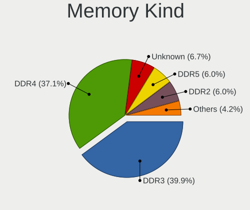

| Kind    | Desktops | Percent |
|---------|----------|---------|
| DDR3    | 113      | 39.93%  |
| DDR4    | 105      | 37.1%   |
| Unknown | 19       | 6.71%   |
| DDR5    | 17       | 6.01%   |
| DDR2    | 17       | 6.01%   |
| SDRAM   | 9        | 3.18%   |
| DDR     | 3        | 1.06%   |

Memory Form Factor
------------------

Physical design of the memory module

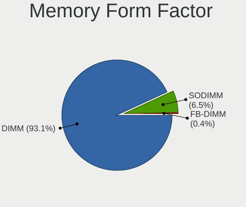

| Name    | Desktops | Percent |
|---------|----------|---------|
| DIMM    | 258      | 93.14%  |
| SODIMM  | 18       | 6.5%    |
| FB-DIMM | 1        | 0.36%   |

Memory Size
-----------

Memory module size

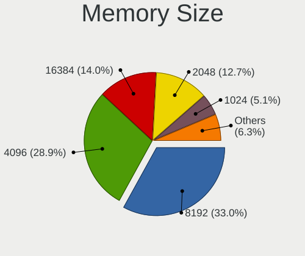

| Size  | Desktops | Percent |
|-------|----------|---------|
| 8192  | 104      | 33.02%  |
| 4096  | 91       | 28.89%  |
| 16384 | 44       | 13.97%  |
| 2048  | 40       | 12.7%   |
| 1024  | 16       | 5.08%   |
| 32768 | 13       | 4.13%   |
| 512   | 4        | 1.27%   |
| 24576 | 2        | 0.63%   |
| 49152 | 1        | 0.32%   |

Memory Speed
------------

Memory module speed

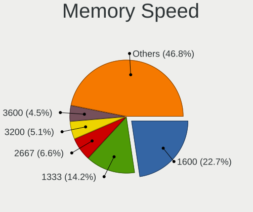

| Speed   | Desktops | Percent |
|---------|----------|---------|
| 1600    | 75       | 22.66%  |
| 1333    | 47       | 14.2%   |
| 2667    | 22       | 6.65%   |
| 3200    | 17       | 5.14%   |
| 3600    | 15       | 4.53%   |
| 2133    | 14       | 4.23%   |
| 800     | 12       | 3.63%   |
| 667     | 10       | 3.02%   |
| 2400    | 9        | 2.72%   |
| 1867    | 8        | 2.42%   |
| 3733    | 6        | 1.81%   |
| 2666    | 6        | 1.81%   |
| 400     | 5        | 1.51%   |
| 6000    | 4        | 1.21%   |
| 4000    | 4        | 1.21%   |
| 3066    | 4        | 1.21%   |
| 1067    | 4        | 1.21%   |
| 6200    | 3        | 0.91%   |
| 5600    | 3        | 0.91%   |
| 4800    | 3        | 0.91%   |
| 3800    | 3        | 0.91%   |
| 3466    | 3        | 0.91%   |
| 1866    | 3        | 0.91%   |
| 1800    | 3        | 0.91%   |
| 1648    | 3        | 0.91%   |
| 1066    | 3        | 0.91%   |
| Unknown | 3        | 0.91%   |
| 3933    | 2        | 0.6%    |
| 3266    | 2        | 0.6%    |
| 3100    | 2        | 0.6%    |
| 3000    | 2        | 0.6%    |
| 2934    | 2        | 0.6%    |
| 2800    | 2        | 0.6%    |
| 2448    | 2        | 0.6%    |
| 2200    | 2        | 0.6%    |
| 1334    | 2        | 0.6%    |
| 133     | 2        | 0.6%    |
| 41632   | 1        | 0.3%    |
| 12800   | 1        | 0.3%    |
| 6800    | 1        | 0.3%    |

Printers & scanners
-------------------

Printer Vendor
--------------

Printer device vendors

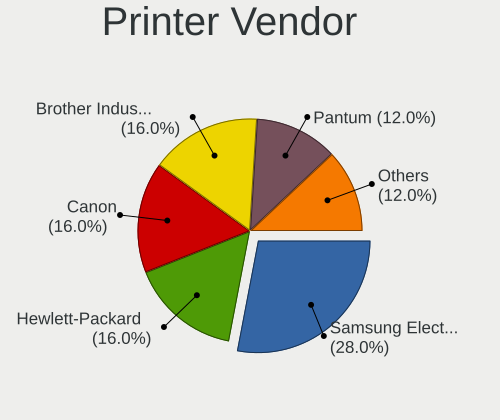

| Vendor              | Desktops | Percent |
|---------------------|----------|---------|
| Samsung Electronics | 7        | 28%     |
| Hewlett-Packard     | 4        | 16%     |
| Canon               | 4        | 16%     |
| Brother Industries  | 4        | 16%     |
| Pantum              | 3        | 12%     |
| Seiko Epson         | 1        | 4%      |
| MIIIW               | 1        | 4%      |
| Dell                | 1        | 4%      |

Printer Model
-------------

Printer device models

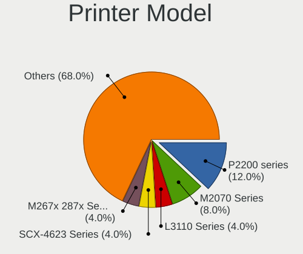

| Model                        | Desktops | Percent |
|------------------------------|----------|---------|
| Pantum P2200 series          | 3        | 12%     |
| Samsung M2070 Series         | 2        | 8%      |
| Seiko Epson L3110 Series     | 1        | 4%      |
| Samsung SCX-4623 Series      | 1        | 4%      |
| Samsung M267x 287x Series    | 1        | 4%      |
| Samsung M2020 Series         | 1        | 4%      |
| Samsung Composite Device     | 1        | 4%      |
| Samsung C460 Series          | 1        | 4%      |
| MIIIW MW Keyboard Air Mini   | 1        | 4%      |
| HP OfficeJet Pro 9010 series | 1        | 4%      |
| HP OfficeJet 5600 (USBHUB)   | 1        | 4%      |
| HP LaserJet 1018             | 1        | 4%      |
| HP LaserJet 1010             | 1        | 4%      |
| Dell 1250c Color Printer     | 1        | 4%      |
| Canon PIXMA MX410            | 1        | 4%      |
| Canon PIXMA MG3600 Series    | 1        | 4%      |
| Canon MG2400 series          | 1        | 4%      |
| Canon G3010 series           | 1        | 4%      |
| Brother Printer              | 1        | 4%      |
| Brother MFC-L2700DW          | 1        | 4%      |
| Brother HL-2130 series       | 1        | 4%      |
| Brother DCP-J105             | 1        | 4%      |

Scanner Vendor
--------------

Scanner device vendors

| Vendor          | Desktops | Percent |
|-----------------|----------|---------|
| Seiko Epson     | 1        | 33.33%  |
| Hewlett-Packard | 1        | 33.33%  |
| Canon           | 1        | 33.33%  |

Scanner Model
-------------

Scanner device models

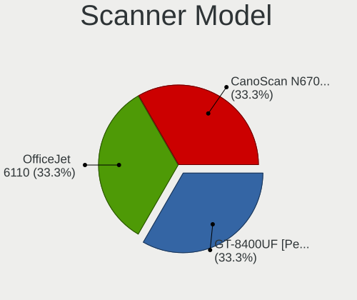

| Model                                              | Desktops | Percent |
|----------------------------------------------------|----------|---------|
| Seiko Epson GT-8400UF [Perfection 1670/1670 PHOTO] | 1        | 33.33%  |
| HP OfficeJet 6110                                  | 1        | 33.33%  |
| Canon CanoScan N670U/N676U/LiDE 20                 | 1        | 33.33%  |

Camera
------

Camera Vendor
-------------

Camera device vendors

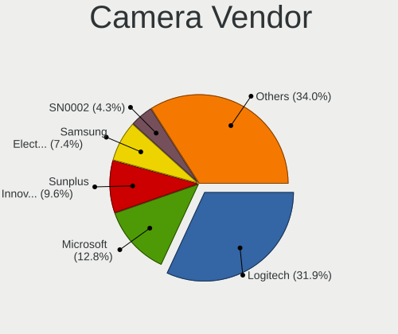

| Vendor                        | Desktops | Percent |
|-------------------------------|----------|---------|
| Logitech                      | 30       | 31.91%  |
| Microsoft                     | 12       | 12.77%  |
| Sunplus Innovation Technology | 9        | 9.57%   |
| Samsung Electronics           | 7        | 7.45%   |
| SN0002                        | 4        | 4.26%   |
| Apple                         | 4        | 4.26%   |
| Z-Star Microelectronics       | 2        | 2.13%   |
| Realtek Semiconductor         | 2        | 2.13%   |
| Microdia                      | 2        | 2.13%   |
| Xiongmai                      | 1        | 1.06%   |
| TASCORP                       | 1        | 1.06%   |
| Syntek                        | 1        | 1.06%   |
| Sonix Technology              | 1        | 1.06%   |
| Razer USA                     | 1        | 1.06%   |
| Pixart Imaging                | 1        | 1.06%   |
| Panasonic (Matsushita)        | 1        | 1.06%   |
| Owl Labs                      | 1        | 1.06%   |
| OPPO Electronics              | 1        | 1.06%   |
| OmniVision Technologies       | 1        | 1.06%   |
| MacroSilicon                  | 1        | 1.06%   |
| KYE Systems (Mouse Systems)   | 1        | 1.06%   |
| Jieli Technology              | 1        | 1.06%   |
| Insta360                      | 1        | 1.06%   |
| Hisense                       | 1        | 1.06%   |
| Hewlett-Packard               | 1        | 1.06%   |
| Google                        | 1        | 1.06%   |
| Generalplus Technology        | 1        | 1.06%   |
| Chicony Electronics           | 1        | 1.06%   |
| Bison Electronics             | 1        | 1.06%   |
| Asuscom Network               | 1        | 1.06%   |
| Alcor Micro                   | 1        | 1.06%   |

Camera Model
------------

Camera device models

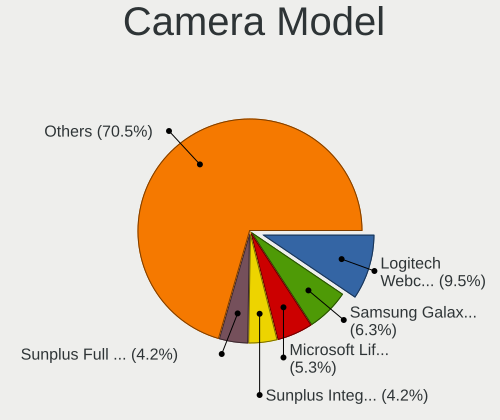

| Model                                            | Desktops | Percent |
|--------------------------------------------------|----------|---------|
| Logitech Webcam C270                             | 9        | 9.47%   |
| Samsung Galaxy series, misc. (MTP mode)          | 6        | 6.32%   |
| Microsoft LifeCam HD-3000                        | 5        | 5.26%   |
| Sunplus Integrated Camera                        | 4        | 4.21%   |
| Sunplus Full HD webcam                           | 4        | 4.21%   |
| SN0002 1080P Web Camera                          | 4        | 4.21%   |
| Logitech Webcam C170                             | 4        | 4.21%   |
| Microsoft LifeCam VX-800                         | 3        | 3.16%   |
| Microsoft LifeCam VX-2000                        | 3        | 3.16%   |
| Logitech Webcam C310                             | 3        | 3.16%   |
| Apple iPhone 5/5C/5S/6/SE/7/8/X                  | 3        | 3.16%   |
| Logitech Webcam C210                             | 2        | 2.11%   |
| Logitech Webcam C200                             | 2        | 2.11%   |
| Logitech HD Webcam C615                          | 2        | 2.11%   |
| Z-Star Venus USB2.0 Camera                       | 1        | 1.05%   |
| Z-Star A4 TECH USB2.0 PC Camera E                | 1        | 1.05%   |
| Xiongmai web camera                              | 1        | 1.05%   |
| TASCORP USB2.0 WebCam                            | 1        | 1.05%   |
| Syntek XYZ printing cameraR2                     | 1        | 1.05%   |
| Syntek XYZ printing cameraL2                     | 1        | 1.05%   |
| Sunplus MTD Camera                               | 1        | 1.05%   |
| Sonix QHD Webcam                                 | 1        | 1.05%   |
| Samsung USB2.0 UVC HQ WebCam                     | 1        | 1.05%   |
| Realtek USB Video device                         | 1        | 1.05%   |
| Realtek Lanseyaoji                               | 1        | 1.05%   |
| Razer USA Razer Kiyo Pro                         | 1        | 1.05%   |
| Pixart Imaging GE 1.3 MP MiniCam Pro             | 1        | 1.05%   |
| Panasonic (Matsushita) NV-GS11/230/250 (DV mode) | 1        | 1.05%   |
| Owl Labs Meeting Owl Pro                         | 1        | 1.05%   |
| OPPO Oppo N1                                     | 1        | 1.05%   |
| OmniVision USB Camera-OV580                      | 1        | 1.05%   |
| Microsoft LifeCam Cinema                         | 1        | 1.05%   |
| Microdia HP Integrated Webcam                    | 1        | 1.05%   |
| Microdia Camera                                  | 1        | 1.05%   |
| MacroSilicon UGREEN 15390                        | 1        | 1.05%   |
| Logitech QuickCam Sphere                         | 1        | 1.05%   |
| Logitech QuickCam Pro 9000                       | 1        | 1.05%   |
| Logitech HD Webcam C525                          | 1        | 1.05%   |
| Logitech C922 Pro Stream Webcam                  | 1        | 1.05%   |
| Logitech C920 PRO HD Webcam                      | 1        | 1.05%   |

Security
--------

Fingerprint Vendor
------------------

Fingerprint sensor vendors

Zero info for selected period =(

Fingerprint Model
-----------------

Fingerprint sensor models

Zero info for selected period =(

Chipcard Vendor
---------------

Chipcard module vendors

Zero info for selected period =(

Chipcard Model
--------------

Chipcard module models

Zero info for selected period =(

Unsupported
-----------

Unsupported Devices
-------------------

Total unsupported devices on board

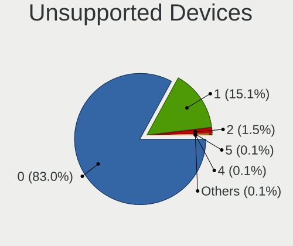

| Total | Desktops | Percent |
|-------|----------|---------|
| 0     | 560      | 82.96%  |
| 1     | 102      | 15.11%  |
| 2     | 10       | 1.48%   |
| 5     | 1        | 0.15%   |
| 4     | 1        | 0.15%   |
| 3     | 1        | 0.15%   |

Unsupported Device Types
------------------------

Types of unsupported devices

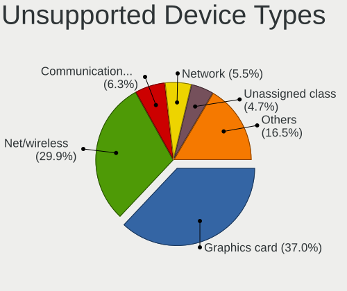

| Type                     | Desktops | Percent |
|--------------------------|----------|---------|
| Graphics card            | 47       | 37.01%  |
| Net/wireless             | 38       | 29.92%  |
| Communication controller | 8        | 6.3%    |
| Network                  | 7        | 5.51%   |
| Unassigned class         | 6        | 4.72%   |
| Sound                    | 5        | 3.94%   |
| Camera                   | 5        | 3.94%   |
| Net/ethernet             | 4        | 3.15%   |
| Storage/raid             | 2        | 1.57%   |
| Multimedia controller    | 2        | 1.57%   |
| Modem                    | 2        | 1.57%   |
| Storage/nvme             | 1        | 0.79%   |

