Linux in South Africa - Tested Hardware & Statistics (Desktops)
---------------------------------------------------------------

A project to collect tested hardware configurations for Linux in South Africa.

Anyone can contribute to this report by the [hw-probe](https://github.com/linuxhw/hw-probe) tool:

    sudo -E hw-probe -all -upload

Please contribute! Especially if your hardware is rare.

Contents
--------

* [ Test Cases ](#test-cases)

* [ System ](#system)
  - [ OS                       ](#os)
  - [ OS Family                ](#os-family)
  - [ Kernel                   ](#kernel)
  - [ Kernel Family            ](#kernel-family)
  - [ Kernel Major Ver.        ](#kernel-major-ver)
  - [ Arch                     ](#arch)
  - [ DE                       ](#de)
  - [ Display Server           ](#display-server)
  - [ Display Manager          ](#display-manager)
  - [ OS Lang                  ](#os-lang)
  - [ Boot Mode                ](#boot-mode)
  - [ Filesystem               ](#filesystem)
  - [ Part. scheme             ](#part-scheme)
  - [ Dual Boot with Linux/BSD ](#dual-boot-with-linuxbsd)
  - [ Dual Boot (Win)          ](#dual-boot-win)

* [ Board ](#board)
  - [ Vendor                   ](#vendor)
  - [ Model                    ](#model)
  - [ Model Family             ](#model-family)
  - [ MFG Year                 ](#mfg-year)
  - [ Form Factor              ](#form-factor)
  - [ Secure Boot              ](#secure-boot)
  - [ Coreboot                 ](#coreboot)
  - [ RAM Size                 ](#ram-size)
  - [ RAM Used                 ](#ram-used)
  - [ Total Drives             ](#total-drives)
  - [ Has CD-ROM               ](#has-cd-rom)
  - [ Has Ethernet             ](#has-ethernet)
  - [ Has WiFi                 ](#has-wifi)
  - [ Has Bluetooth            ](#has-bluetooth)

* [ Location ](#location)
  - [ Country                  ](#country)
  - [ City                     ](#city)

* [ Drives ](#drives)
  - [ Drive Vendor             ](#drive-vendor)
  - [ Drive Model              ](#drive-model)
  - [ HDD Vendor               ](#hdd-vendor)
  - [ SSD Vendor               ](#ssd-vendor)
  - [ Drive Kind               ](#drive-kind)
  - [ Drive Connector          ](#drive-connector)
  - [ Drive Size               ](#drive-size)
  - [ Space Total              ](#space-total)
  - [ Space Used               ](#space-used)
  - [ Malfunc. Drives          ](#malfunc-drives)
  - [ Malfunc. Drive Vendor    ](#malfunc-drive-vendor)
  - [ Malfunc. HDD Vendor      ](#malfunc-hdd-vendor)
  - [ Malfunc. Drive Kind      ](#malfunc-drive-kind)
  - [ Failed Drives            ](#failed-drives)
  - [ Failed Drive Vendor      ](#failed-drive-vendor)
  - [ Drive Status             ](#drive-status)

* [ Storage controller ](#storage-controller)
  - [ Storage Vendor           ](#storage-vendor)
  - [ Storage Model            ](#storage-model)
  - [ Storage Kind             ](#storage-kind)

* [ Processor ](#processor)
  - [ CPU Vendor               ](#cpu-vendor)
  - [ CPU Model                ](#cpu-model)
  - [ CPU Model Family         ](#cpu-model-family)
  - [ CPU Cores                ](#cpu-cores)
  - [ CPU Sockets              ](#cpu-sockets)
  - [ CPU Threads              ](#cpu-threads)
  - [ CPU Op-Modes             ](#cpu-op-modes)
  - [ CPU Microcode            ](#cpu-microcode)
  - [ CPU Microarch            ](#cpu-microarch)

* [ Graphics ](#graphics)
  - [ GPU Vendor               ](#gpu-vendor)
  - [ GPU Model                ](#gpu-model)
  - [ GPU Combo                ](#gpu-combo)
  - [ GPU Driver               ](#gpu-driver)
  - [ GPU Memory               ](#gpu-memory)

* [ Monitor ](#monitor)
  - [ Monitor Vendor           ](#monitor-vendor)
  - [ Monitor Model            ](#monitor-model)
  - [ Monitor Resolution       ](#monitor-resolution)
  - [ Monitor Diagonal         ](#monitor-diagonal)
  - [ Monitor Width            ](#monitor-width)
  - [ Aspect Ratio             ](#aspect-ratio)
  - [ Monitor Area             ](#monitor-area)
  - [ Pixel Density            ](#pixel-density)
  - [ Multiple Monitors        ](#multiple-monitors)

* [ Network ](#network)
  - [ Net Controller Vendor    ](#net-controller-vendor)
  - [ Net Controller Model     ](#net-controller-model)
  - [ Wireless Vendor          ](#wireless-vendor)
  - [ Wireless Model           ](#wireless-model)
  - [ Ethernet Vendor          ](#ethernet-vendor)
  - [ Ethernet Model           ](#ethernet-model)
  - [ Net Controller Kind      ](#net-controller-kind)
  - [ Used Controller          ](#used-controller)
  - [ NICs                     ](#nics)
  - [ IPv6                     ](#ipv6)

* [ Bluetooth ](#bluetooth)
  - [ Bluetooth Vendor         ](#bluetooth-vendor)
  - [ Bluetooth Model          ](#bluetooth-model)

* [ Sound ](#sound)
  - [ Sound Vendor             ](#sound-vendor)
  - [ Sound Model              ](#sound-model)

* [ Memory ](#memory)
  - [ Memory Vendor            ](#memory-vendor)
  - [ Memory Model             ](#memory-model)
  - [ Memory Kind              ](#memory-kind)
  - [ Memory Form Factor       ](#memory-form-factor)
  - [ Memory Size              ](#memory-size)
  - [ Memory Speed             ](#memory-speed)

* [ Printers & scanners ](#printers--scanners)
  - [ Printer Vendor           ](#printer-vendor)
  - [ Printer Model            ](#printer-model)
  - [ Scanner Vendor           ](#scanner-vendor)
  - [ Scanner Model            ](#scanner-model)

* [ Camera ](#camera)
  - [ Camera Vendor            ](#camera-vendor)
  - [ Camera Model             ](#camera-model)

* [ Security ](#security)
  - [ Fingerprint Vendor       ](#fingerprint-vendor)
  - [ Fingerprint Model        ](#fingerprint-model)
  - [ Chipcard Vendor          ](#chipcard-vendor)
  - [ Chipcard Model           ](#chipcard-model)

* [ Unsupported ](#unsupported)
  - [ Unsupported Devices      ](#unsupported-devices)
  - [ Unsupported Device Types ](#unsupported-device-types)

Test Cases
----------

Total: 473

| Vendor        | Model                       | Probe                                                      | Date         |
|---------------|-----------------------------|------------------------------------------------------------|--------------|
| Gigabyte      | B150M-D3H-CF                | [e5fdf1083f](https://linux-hardware.org/?probe=e5fdf1083f) | May 28, 2022 |
| Dell          | 040DDP A01                  | [925d3dce8d](https://linux-hardware.org/?probe=925d3dce8d) | May 28, 2022 |
| ASUSTek       | STRIKER II FORMULA          | [f10aecd449](https://linux-hardware.org/?probe=f10aecd449) | May 27, 2022 |
| ASUSTek       | STRIKER II FORMULA          | [df37e5c694](https://linux-hardware.org/?probe=df37e5c694) | May 27, 2022 |
| Mustek6376... | 945GZT-M ECS                | [0d5f40920b](https://linux-hardware.org/?probe=0d5f40920b) | May 14, 2022 |
| MSI           | H110M PRO-VD                | [f43f2e2bee](https://linux-hardware.org/?probe=f43f2e2bee) | May 10, 2022 |
| MSI           | H110M PRO-VD                | [3d0c46dc84](https://linux-hardware.org/?probe=3d0c46dc84) | May 10, 2022 |
| ASUSTek       | ROG Maximus Z690 EXTREME    | [76cc09b228](https://linux-hardware.org/?probe=76cc09b228) | May 10, 2022 |
| ASUSTek       | ROG Maximus Z690 EXTREME    | [6500cb78c3](https://linux-hardware.org/?probe=6500cb78c3) | May 10, 2022 |
| ASUSTek       | TUF Gaming B550-PLUS        | [473e906b63](https://linux-hardware.org/?probe=473e906b63) | May 03, 2022 |
| ASUSTek       | TUF Gaming B550-PLUS        | [9176b48887](https://linux-hardware.org/?probe=9176b48887) | May 03, 2022 |
| MSI           | B450M BAZOOKA PLUS          | [edc5f16866](https://linux-hardware.org/?probe=edc5f16866) | May 03, 2022 |
| ASUSTek       | ROG CROSSHAIR VII HERO      | [dec71580c4](https://linux-hardware.org/?probe=dec71580c4) | May 01, 2022 |
| Lenovo        | Win8 Pro DPK TPG            | [9b78e9af72](https://linux-hardware.org/?probe=9b78e9af72) | Apr 29, 2022 |
| Dell          | 040DDP A01                  | [6e37f18366](https://linux-hardware.org/?probe=6e37f18366) | Apr 21, 2022 |
| MSI           | B450M PRO-M2 MAX            | [4702e93a67](https://linux-hardware.org/?probe=4702e93a67) | Apr 16, 2022 |
| MSI           | X370 KRAIT GAMING           | [26be53ebd1](https://linux-hardware.org/?probe=26be53ebd1) | Apr 14, 2022 |
| MSI           | B450M PRO-M2 MAX            | [0fc2a352ab](https://linux-hardware.org/?probe=0fc2a352ab) | Apr 13, 2022 |
| Gigabyte      | H61M-DS2                    | [af56c63db4](https://linux-hardware.org/?probe=af56c63db4) | Apr 12, 2022 |
| Gigabyte      | B150M-D3H-CF                | [1aee3c0b22](https://linux-hardware.org/?probe=1aee3c0b22) | Apr 12, 2022 |
| NCR           | Pocono BIOS.5.1             | [ca175e1f0c](https://linux-hardware.org/?probe=ca175e1f0c) | Apr 09, 2022 |
| Intel         | DQ965GF AAD41676-601        | [61fca7acbc](https://linux-hardware.org/?probe=61fca7acbc) | Apr 07, 2022 |
| MSI           | X58M                        | [d4146d0724](https://linux-hardware.org/?probe=d4146d0724) | Apr 05, 2022 |
| Foxconn       | 2A8Ch                       | [6354cfe078](https://linux-hardware.org/?probe=6354cfe078) | Apr 04, 2022 |
| Dell          | 0FPP7F A00                  | [8e8bee474f](https://linux-hardware.org/?probe=8e8bee474f) | Apr 03, 2022 |
| Lenovo        | MAHOBAY Win8 Pro DPK TPG    | [2a333a0767](https://linux-hardware.org/?probe=2a333a0767) | Mar 25, 2022 |
| Gigabyte      | H67MA-USB3-B3               | [c5ad9a2c99](https://linux-hardware.org/?probe=c5ad9a2c99) | Mar 24, 2022 |
| Biostar       | G41D3+                      | [8d6a4e54b1](https://linux-hardware.org/?probe=8d6a4e54b1) | Mar 20, 2022 |
| Biostar       | Hi-Fi H61S3                 | [469edf935f](https://linux-hardware.org/?probe=469edf935f) | Mar 14, 2022 |
| Foxconn       | H61MXE/-S/-V/-K             | [8aa740825f](https://linux-hardware.org/?probe=8aa740825f) | Mar 06, 2022 |
| MSI           | Z170A TOMAHAWK              | [e2956753b7](https://linux-hardware.org/?probe=e2956753b7) | Mar 02, 2022 |
| MSI           | Z170A TOMAHAWK              | [ccf1a5fa76](https://linux-hardware.org/?probe=ccf1a5fa76) | Mar 02, 2022 |
| HP            | 1494                        | [f2b67d46d0](https://linux-hardware.org/?probe=f2b67d46d0) | Feb 19, 2022 |
| Gigabyte      | B75M-D3H                    | [469ab361d5](https://linux-hardware.org/?probe=469ab361d5) | Feb 13, 2022 |
| Gigabyte      | B75M-D3H                    | [0d9d3a0b9b](https://linux-hardware.org/?probe=0d9d3a0b9b) | Feb 12, 2022 |
| MSI           | B360-A PRO                  | [1447e1f0e6](https://linux-hardware.org/?probe=1447e1f0e6) | Feb 11, 2022 |
| MSI           | A320M PRO-VD PLUS           | [078b45782e](https://linux-hardware.org/?probe=078b45782e) | Feb 11, 2022 |
| HP            | 1497                        | [3781103124](https://linux-hardware.org/?probe=3781103124) | Feb 09, 2022 |
| ASUSTek       | PRIME B550M-K               | [b4fe3a7a24](https://linux-hardware.org/?probe=b4fe3a7a24) | Feb 07, 2022 |
| MSI           | Z77A-G45                    | [ff87ac3184](https://linux-hardware.org/?probe=ff87ac3184) | Feb 07, 2022 |
| Fujitsu       | D3128-A1 S26361-D3128-A1    | [e514d0d302](https://linux-hardware.org/?probe=e514d0d302) | Feb 03, 2022 |
| Intel         | DH55TC AAE70932-302         | [d66879ebac](https://linux-hardware.org/?probe=d66879ebac) | Jan 27, 2022 |
| Intel         | H81                         | [1f7ff2e980](https://linux-hardware.org/?probe=1f7ff2e980) | Jan 26, 2022 |
| Dell          | 0Y7WYT A00                  | [80295dd814](https://linux-hardware.org/?probe=80295dd814) | Jan 26, 2022 |
| MSI           | B550-A PRO                  | [72d6b552aa](https://linux-hardware.org/?probe=72d6b552aa) | Jan 17, 2022 |
| ECS           | G31T-M7                     | [12ad49d909](https://linux-hardware.org/?probe=12ad49d909) | Jan 16, 2022 |
| ECS           | G31T-M7                     | [5c10976292](https://linux-hardware.org/?probe=5c10976292) | Jan 16, 2022 |
| MSI           | B450M PRO-M2 MAX            | [32cae94f00](https://linux-hardware.org/?probe=32cae94f00) | Jan 06, 2022 |
| MSI           | B450M PRO-M2 MAX            | [c103969fdf](https://linux-hardware.org/?probe=c103969fdf) | Jan 06, 2022 |
| Biostar       | Hi-Fi H61S3                 | [6d68cbf5a2](https://linux-hardware.org/?probe=6d68cbf5a2) | Dec 31, 2021 |
| ASRock        | B85M-HDS                    | [8806a9db07](https://linux-hardware.org/?probe=8806a9db07) | Dec 29, 2021 |
| Apple         | Mac-F42C88C8 Proto1         | [783618fe4b](https://linux-hardware.org/?probe=783618fe4b) | Dec 23, 2021 |
| HP            | 0A58h                       | [2fce860bda](https://linux-hardware.org/?probe=2fce860bda) | Dec 19, 2021 |
| Unknown       | C51GM-M                     | [91386c4f7c](https://linux-hardware.org/?probe=91386c4f7c) | Dec 17, 2021 |
| Unknown       | C51GM-M                     | [cd4d96fefa](https://linux-hardware.org/?probe=cd4d96fefa) | Dec 17, 2021 |
| Biostar       | Hi-Fi H61S3                 | [e1362b0ad2](https://linux-hardware.org/?probe=e1362b0ad2) | Dec 14, 2021 |
| ASRock        | AB350 Pro4                  | [ebf80cd948](https://linux-hardware.org/?probe=ebf80cd948) | Dec 13, 2021 |
| MSI           | H61M-P31                    | [58651bba67](https://linux-hardware.org/?probe=58651bba67) | Dec 07, 2021 |
| ASUSTek       | H87M-E                      | [2b4abcf54f](https://linux-hardware.org/?probe=2b4abcf54f) | Dec 02, 2021 |
| ASUSTek       | H87M-E                      | [72cf0ed74d](https://linux-hardware.org/?probe=72cf0ed74d) | Dec 02, 2021 |
| Gigabyte      | XP-M5S661GX                 | [c452e6bdf7](https://linux-hardware.org/?probe=c452e6bdf7) | Nov 27, 2021 |
| HP            | 1497                        | [9a7d6ebc52](https://linux-hardware.org/?probe=9a7d6ebc52) | Nov 26, 2021 |
| MSI           | MAG B550 TOMAHAWK           | [7d4b6453e9](https://linux-hardware.org/?probe=7d4b6453e9) | Nov 24, 2021 |
| MSI           | B450M MORTAR TITANIUM       | [ce783dccca](https://linux-hardware.org/?probe=ce783dccca) | Nov 24, 2021 |
| MSI           | MAG B550 TOMAHAWK           | [e9b4b7ecba](https://linux-hardware.org/?probe=e9b4b7ecba) | Nov 24, 2021 |
| Intel         | DB65AL AAG12530-309         | [44c8025eee](https://linux-hardware.org/?probe=44c8025eee) | Nov 23, 2021 |
| Dell          | 0M9KCM A00                  | [e0f0471cee](https://linux-hardware.org/?probe=e0f0471cee) | Nov 20, 2021 |
| Gigabyte      | Z77-DS3H                    | [e8ef916c87](https://linux-hardware.org/?probe=e8ef916c87) | Nov 18, 2021 |
| MSI           | 970 GAMING                  | [1515779722](https://linux-hardware.org/?probe=1515779722) | Nov 15, 2021 |
| MSI           | 970 GAMING                  | [b74fb29b9b](https://linux-hardware.org/?probe=b74fb29b9b) | Nov 15, 2021 |
| Gigabyte      | H61M-S2PV                   | [c62a6022e8](https://linux-hardware.org/?probe=c62a6022e8) | Nov 14, 2021 |
| ASUSTek       | P8P67-M                     | [1cb5f14632](https://linux-hardware.org/?probe=1cb5f14632) | Nov 13, 2021 |
| Foxconn       | G41MXE/G41MXE-K             | [b7579cb355](https://linux-hardware.org/?probe=b7579cb355) | Nov 12, 2021 |
| Foxconn       | G41MXE/G41MXE-K             | [39e3c646ff](https://linux-hardware.org/?probe=39e3c646ff) | Nov 11, 2021 |
| ASUSTek       | P8P67-M                     | [701e60decc](https://linux-hardware.org/?probe=701e60decc) | Nov 11, 2021 |
| Lenovo        | MAHOBAY NOK                 | [62ba7df7ec](https://linux-hardware.org/?probe=62ba7df7ec) | Nov 11, 2021 |
| HP            | ProLiant MicroServer        | [383b7f1862](https://linux-hardware.org/?probe=383b7f1862) | Nov 11, 2021 |
| MSI           | H110M PRO-VH PLUS           | [02f1a55757](https://linux-hardware.org/?probe=02f1a55757) | Nov 08, 2021 |
| NCR           | Pocono BIOS.3.1             | [985620ce15](https://linux-hardware.org/?probe=985620ce15) | Nov 07, 2021 |
| MSI           | H110M PRO-VH PLUS           | [57417d57e3](https://linux-hardware.org/?probe=57417d57e3) | Nov 06, 2021 |
| HP            | 0B4Ch D                     | [f51fee36d1](https://linux-hardware.org/?probe=f51fee36d1) | Nov 04, 2021 |
| Gigabyte      | B150M-D3H-CF                | [dd22d96d07](https://linux-hardware.org/?probe=dd22d96d07) | Oct 30, 2021 |
| Biostar       | B350GTN                     | [53c5fd6db4](https://linux-hardware.org/?probe=53c5fd6db4) | Oct 26, 2021 |
| Gigabyte      | H61M-S2PV                   | [37ae9a9258](https://linux-hardware.org/?probe=37ae9a9258) | Oct 23, 2021 |
| Lenovo        | ThinkCentre M91p 4512A12    | [1ecb7a6910](https://linux-hardware.org/?probe=1ecb7a6910) | Oct 19, 2021 |
| Apple         | Mac-F42C88C8 Proto1         | [fcc82222d9](https://linux-hardware.org/?probe=fcc82222d9) | Oct 17, 2021 |
| Dell          | 0M9KCM A00                  | [d837406f2a](https://linux-hardware.org/?probe=d837406f2a) | Oct 16, 2021 |
| NCR           | Pocono BIOS.3.1             | [53cafab8f3](https://linux-hardware.org/?probe=53cafab8f3) | Oct 15, 2021 |
| HP            | 81C3                        | [df2caaf484](https://linux-hardware.org/?probe=df2caaf484) | Oct 11, 2021 |
| MSI           | Z170A TOMAHAWK              | [e39ce9ade6](https://linux-hardware.org/?probe=e39ce9ade6) | Oct 09, 2021 |
| MSI           | Z170A TOMAHAWK              | [5a5c0c8f90](https://linux-hardware.org/?probe=5a5c0c8f90) | Oct 07, 2021 |
| Supermicro    | X9DRi-LN4+/X9DR3-LN4+       | [42a76fbc95](https://linux-hardware.org/?probe=42a76fbc95) | Oct 05, 2021 |
| Nvidia        | MCP73                       | [7099e6ef4b](https://linux-hardware.org/?probe=7099e6ef4b) | Oct 02, 2021 |
| ASRock        | B550M Steel Legend          | [6b9d5f5444](https://linux-hardware.org/?probe=6b9d5f5444) | Oct 02, 2021 |
| Gigabyte      | B150M-D3H-CF                | [8fe1edb38b](https://linux-hardware.org/?probe=8fe1edb38b) | Sep 30, 2021 |
| HP            | 1497                        | [a792022089](https://linux-hardware.org/?probe=a792022089) | Sep 30, 2021 |
| Gigabyte      | G31M-S2L                    | [3255b4d143](https://linux-hardware.org/?probe=3255b4d143) | Sep 28, 2021 |
| Intel         | DQ77CP AAG67261-300         | [2da6abda17](https://linux-hardware.org/?probe=2da6abda17) | Sep 25, 2021 |
| Gigabyte      | H55M-S2H                    | [82fe8d569f](https://linux-hardware.org/?probe=82fe8d569f) | Sep 11, 2021 |
| MSI           | B450M MORTAR MAX            | [f40c6b596c](https://linux-hardware.org/?probe=f40c6b596c) | Sep 08, 2021 |
| MSI           | B450M MORTAR MAX            | [17c58396b6](https://linux-hardware.org/?probe=17c58396b6) | Sep 08, 2021 |
| MSI           | B450M MORTAR MAX            | [dfe73847d3](https://linux-hardware.org/?probe=dfe73847d3) | Sep 08, 2021 |
| MSI           | Z170A PC MATE               | [192a0d3f1a](https://linux-hardware.org/?probe=192a0d3f1a) | Sep 07, 2021 |
| Dell          | 0GM819                      | [f0cc146236](https://linux-hardware.org/?probe=f0cc146236) | Sep 04, 2021 |
| Intel         | D865GLC AAC28906-407        | [5936f5b3ba](https://linux-hardware.org/?probe=5936f5b3ba) | Sep 01, 2021 |
| Intel         | DH55HC AAE70933-504         | [2880661f42](https://linux-hardware.org/?probe=2880661f42) | Aug 30, 2021 |
| Gigabyte      | G33M-DS2R                   | [0b340c6818](https://linux-hardware.org/?probe=0b340c6818) | Aug 29, 2021 |
| HP            | 212B                        | [10646959ce](https://linux-hardware.org/?probe=10646959ce) | Aug 27, 2021 |
| Biostar       | H61MGV3                     | [fa2b470ff5](https://linux-hardware.org/?probe=fa2b470ff5) | Aug 26, 2021 |
| Biostar       | H61MGV3                     | [19eacc88f5](https://linux-hardware.org/?probe=19eacc88f5) | Aug 26, 2021 |
| ASUSTek       | P8Z77-V LX                  | [314859d762](https://linux-hardware.org/?probe=314859d762) | Aug 25, 2021 |
| ASUSTek       | P8Z77-V LX                  | [faaf8bc158](https://linux-hardware.org/?probe=faaf8bc158) | Aug 25, 2021 |
| Dell          | 0HH807                      | [fe3659d065](https://linux-hardware.org/?probe=fe3659d065) | Aug 24, 2021 |
| MSI           | B450M PRO-M2 MAX            | [b28b036f78](https://linux-hardware.org/?probe=b28b036f78) | Aug 22, 2021 |
| HP            | 0A50h                       | [f7ea4959d2](https://linux-hardware.org/?probe=f7ea4959d2) | Aug 21, 2021 |
| MSI           | G41M4                       | [c5c2a6945a](https://linux-hardware.org/?probe=c5c2a6945a) | Aug 20, 2021 |
| MSI           | G41M4                       | [3862c2333b](https://linux-hardware.org/?probe=3862c2333b) | Aug 20, 2021 |
| Intel         | DH61WW AAG23116-300         | [0a023d2778](https://linux-hardware.org/?probe=0a023d2778) | Aug 17, 2021 |
| MSI           | 970A-G46                    | [1d552fc481](https://linux-hardware.org/?probe=1d552fc481) | Aug 14, 2021 |
| MSI           | 970A-G46                    | [ee8d3d8ed0](https://linux-hardware.org/?probe=ee8d3d8ed0) | Aug 14, 2021 |
| HP            | 3031h                       | [201543483c](https://linux-hardware.org/?probe=201543483c) | Aug 13, 2021 |
| ASUSTek       | Rampage II GENE             | [ec056ad7c5](https://linux-hardware.org/?probe=ec056ad7c5) | Aug 12, 2021 |
| Intel         | DH61WW AAG23116-300         | [95ed07c904](https://linux-hardware.org/?probe=95ed07c904) | Aug 05, 2021 |
| Gigabyte      | G41MT-S2PT                  | [cf42c809f2](https://linux-hardware.org/?probe=cf42c809f2) | Aug 04, 2021 |
| MSI           | G31M3-F V2                  | [8f821ac3a7](https://linux-hardware.org/?probe=8f821ac3a7) | Aug 02, 2021 |
| Intel         | DH61WW AAG23116-300         | [886881e04d](https://linux-hardware.org/?probe=886881e04d) | Aug 01, 2021 |
| Dell          | 096JG8 A01                  | [b45d7e4f99](https://linux-hardware.org/?probe=b45d7e4f99) | Jul 29, 2021 |
| Dell          | 096JG8 A01                  | [290acd3514](https://linux-hardware.org/?probe=290acd3514) | Jul 28, 2021 |
| Intel         | DH55HC AAE70933-504         | [f3a838da1b](https://linux-hardware.org/?probe=f3a838da1b) | Jul 28, 2021 |
| MSI           | 990FXA-GD65                 | [6fe8efac3a](https://linux-hardware.org/?probe=6fe8efac3a) | Jul 25, 2021 |
| Gigabyte      | G41MT-S2PT                  | [7e37603df2](https://linux-hardware.org/?probe=7e37603df2) | Jul 23, 2021 |
| Intel         | DH61WW AAG23116-300         | [fd7862ecd9](https://linux-hardware.org/?probe=fd7862ecd9) | Jul 23, 2021 |
| HP            | 1494                        | [fe57b848c7](https://linux-hardware.org/?probe=fe57b848c7) | Jul 22, 2021 |
| Intel         | DP35DP AAD81073-207         | [7ff35da9be](https://linux-hardware.org/?probe=7ff35da9be) | Jul 22, 2021 |
| Intel         | DP35DP AAD81073-207         | [179a2a6dbb](https://linux-hardware.org/?probe=179a2a6dbb) | Jul 21, 2021 |
| Intel         | DP35DP AAD81073-207         | [9ab1130986](https://linux-hardware.org/?probe=9ab1130986) | Jul 21, 2021 |
| HP            | 1494                        | [2c30dc2cf3](https://linux-hardware.org/?probe=2c30dc2cf3) | Jul 19, 2021 |
| MSI           | TRX40 PRO 10G               | [a06646b4da](https://linux-hardware.org/?probe=a06646b4da) | Jul 19, 2021 |
| Intel         | DH61WW AAG23116-300         | [455abdf0c3](https://linux-hardware.org/?probe=455abdf0c3) | Jul 18, 2021 |
| Gigabyte      | G33M-DS2R                   | [04b5a9113c](https://linux-hardware.org/?probe=04b5a9113c) | Jul 17, 2021 |
| ASUSTek       | P5K                         | [8e28e97b01](https://linux-hardware.org/?probe=8e28e97b01) | Jul 16, 2021 |
| Intel         | DH61WW AAG23116-300         | [0de164a96d](https://linux-hardware.org/?probe=0de164a96d) | Jul 16, 2021 |
| Intel         | DH61WW AAG23116-300         | [d14aa75f4c](https://linux-hardware.org/?probe=d14aa75f4c) | Jul 14, 2021 |
| Lenovo        | MAHOBAY NO DPK              | [1b156e0069](https://linux-hardware.org/?probe=1b156e0069) | Jul 12, 2021 |
| Intel         | DG31PR AAD97573-306         | [a81005ef0b](https://linux-hardware.org/?probe=a81005ef0b) | Jul 10, 2021 |
| MSI           | H81M-P33                    | [a03d8e33d2](https://linux-hardware.org/?probe=a03d8e33d2) | Jul 08, 2021 |
| MSI           | H81M-P33                    | [48a72375f0](https://linux-hardware.org/?probe=48a72375f0) | Jul 08, 2021 |
| Acer          | Aspire X3950                | [1ff3961dca](https://linux-hardware.org/?probe=1ff3961dca) | Jul 06, 2021 |
| Gigabyte      | G31M-S2C                    | [7756be5173](https://linux-hardware.org/?probe=7756be5173) | Jul 06, 2021 |
| Gigabyte      | G31M-S2C                    | [9282eabbef](https://linux-hardware.org/?probe=9282eabbef) | Jul 06, 2021 |
| Intel         | DQ77CP AAG67261-300         | [de63bf6b9c](https://linux-hardware.org/?probe=de63bf6b9c) | Jul 06, 2021 |
| Lenovo        | SDK0E50510 WIN              | [d37ee6f754](https://linux-hardware.org/?probe=d37ee6f754) | Jul 04, 2021 |
| Lenovo        | SDK0E50510 WIN              | [2d6120fa61](https://linux-hardware.org/?probe=2d6120fa61) | Jul 04, 2021 |
| ASRock        | H110M-DGS                   | [1439cc6a27](https://linux-hardware.org/?probe=1439cc6a27) | Jul 04, 2021 |
| Fujitsu       | D3128-A1 S26361-D3128-A1    | [ea982e9d39](https://linux-hardware.org/?probe=ea982e9d39) | Jul 03, 2021 |
| Foxconn       | 2ABF                        | [b54459c5ca](https://linux-hardware.org/?probe=b54459c5ca) | Jul 01, 2021 |
| MSI           | Z170A PC MATE               | [bd3c620117](https://linux-hardware.org/?probe=bd3c620117) | Jun 24, 2021 |
| Biostar       | TB250-BTC                   | [135a42fc66](https://linux-hardware.org/?probe=135a42fc66) | Jun 19, 2021 |
| Biostar       | TB250-BTC                   | [acdf9bed0d](https://linux-hardware.org/?probe=acdf9bed0d) | Jun 19, 2021 |
| Intel         | DH55HC AAE70933-505         | [7b2f77f8db](https://linux-hardware.org/?probe=7b2f77f8db) | Jun 17, 2021 |
| Fujitsu       | D3128-A1 S26361-D3128-A1    | [6a2ce38cb0](https://linux-hardware.org/?probe=6a2ce38cb0) | Jun 12, 2021 |
| Gigabyte      | Z370 HD3-CF                 | [77f9400e70](https://linux-hardware.org/?probe=77f9400e70) | Jun 11, 2021 |
| ASRock        | H61M-VS4                    | [4e96d5e81a](https://linux-hardware.org/?probe=4e96d5e81a) | Jun 10, 2021 |
| Intel         | DQ57TM AAE70931-400         | [d770d5673c](https://linux-hardware.org/?probe=d770d5673c) | Jun 04, 2021 |
| MSI           | B450M PRO-M2 MAX            | [71bd5e1a20](https://linux-hardware.org/?probe=71bd5e1a20) | Jun 04, 2021 |
| ASRock        | B550M Steel Legend          | [f39108e22f](https://linux-hardware.org/?probe=f39108e22f) | May 29, 2021 |
| ASUSTek       | M2NPV-MX                    | [37bc060302](https://linux-hardware.org/?probe=37bc060302) | May 27, 2021 |
| ASUSTek       | M2NPV-MX                    | [11cee33a59](https://linux-hardware.org/?probe=11cee33a59) | May 27, 2021 |
| Intel         | H81                         | [9107f9abe6](https://linux-hardware.org/?probe=9107f9abe6) | May 25, 2021 |
| ASUSTek       | PRIME B250M-A               | [2961088957](https://linux-hardware.org/?probe=2961088957) | May 24, 2021 |
| Gigabyte      | H97-Gaming 3                | [d8b0632698](https://linux-hardware.org/?probe=d8b0632698) | May 23, 2021 |
| Gigabyte      | G31M-ES2C                   | [98e3f46335](https://linux-hardware.org/?probe=98e3f46335) | May 21, 2021 |
| HP            | 802F                        | [88fa80f493](https://linux-hardware.org/?probe=88fa80f493) | May 20, 2021 |
| ASUSTek       | PRIME B250M-A               | [b646c2612a](https://linux-hardware.org/?probe=b646c2612a) | May 18, 2021 |
| Gigabyte      | A320M-S2H-CF                | [48f873b6de](https://linux-hardware.org/?probe=48f873b6de) | May 14, 2021 |
| ASUSTek       | PRIME X570-P                | [8d4f6e55dc](https://linux-hardware.org/?probe=8d4f6e55dc) | May 14, 2021 |
| Acer          | Veriton M4620G v1.0         | [bec2435c15](https://linux-hardware.org/?probe=bec2435c15) | May 12, 2021 |
| Gigabyte      | A320M-S2H-CF                | [a3f9e2334a](https://linux-hardware.org/?probe=a3f9e2334a) | May 11, 2021 |
| ASUSTek       | H110I-PLUS                  | [0f9c2db369](https://linux-hardware.org/?probe=0f9c2db369) | May 07, 2021 |
| Gigabyte      | H110-D3A-CF                 | [016d2f25a7](https://linux-hardware.org/?probe=016d2f25a7) | May 06, 2021 |
| Gigabyte      | H61M-S2V-B3                 | [9d01fac140](https://linux-hardware.org/?probe=9d01fac140) | May 06, 2021 |
| ASUSTek       | Z87-K                       | [6d9e2228c3](https://linux-hardware.org/?probe=6d9e2228c3) | May 05, 2021 |
| ASUSTek       | H110I-PLUS                  | [579414cef4](https://linux-hardware.org/?probe=579414cef4) | May 04, 2021 |
| Gigabyte      | A320M-S2H-CF                | [0deafa542c](https://linux-hardware.org/?probe=0deafa542c) | Apr 29, 2021 |
| Gigabyte      | A320M-S2H-CF                | [04d81bb2f6](https://linux-hardware.org/?probe=04d81bb2f6) | Apr 29, 2021 |
| MSI           | H110M PRO-VD PLUS           | [f9f1775d7a](https://linux-hardware.org/?probe=f9f1775d7a) | Apr 24, 2021 |
| MSI           | H110M PRO-VD PLUS           | [8356cbd097](https://linux-hardware.org/?probe=8356cbd097) | Apr 24, 2021 |
| Unknown       | NF-MCP61                    | [2ba92fa1b6](https://linux-hardware.org/?probe=2ba92fa1b6) | Apr 12, 2021 |
| Unknown       | NF-MCP61                    | [265d75e8f5](https://linux-hardware.org/?probe=265d75e8f5) | Apr 12, 2021 |
| ASUSTek       | ROG STRIX Z370-H GAMING     | [c49b7e8d5d](https://linux-hardware.org/?probe=c49b7e8d5d) | Apr 01, 2021 |
| ASRock        | H110M-DGS                   | [786c07faff](https://linux-hardware.org/?probe=786c07faff) | Mar 29, 2021 |
| ASRock        | H110M-DGS                   | [e47641b719](https://linux-hardware.org/?probe=e47641b719) | Mar 29, 2021 |
| HP            | 3397                        | [8bf9eb3e2b](https://linux-hardware.org/?probe=8bf9eb3e2b) | Mar 24, 2021 |
| MSI           | Z370 GAMING PRO CARBON A... | [19c2138c14](https://linux-hardware.org/?probe=19c2138c14) | Mar 21, 2021 |
| Intel         | H61M-DS2                    | [26d3b20dae](https://linux-hardware.org/?probe=26d3b20dae) | Mar 20, 2021 |
| Intel         | H61M-DS2                    | [d92567fa4b](https://linux-hardware.org/?probe=d92567fa4b) | Mar 20, 2021 |
| Lenovo        | 30D2 SDK0J40697 WIN 3305... | [863c61112e](https://linux-hardware.org/?probe=863c61112e) | Mar 15, 2021 |
| ASRock        | H110M-DGS                   | [fb02551d4b](https://linux-hardware.org/?probe=fb02551d4b) | Mar 09, 2021 |
| Acer          | Veriton M4620G v1.0         | [dd94f284a7](https://linux-hardware.org/?probe=dd94f284a7) | Mar 06, 2021 |
| Acer          | Veriton M4620G v1.0         | [3a6a85e270](https://linux-hardware.org/?probe=3a6a85e270) | Mar 06, 2021 |
| Intel         | DG31PR AAD97573-301         | [afbd63a295](https://linux-hardware.org/?probe=afbd63a295) | Mar 02, 2021 |
| Gigabyte      | Z370 HD3-CF                 | [7a590f917d](https://linux-hardware.org/?probe=7a590f917d) | Mar 01, 2021 |
| MSI           | H81M-P33                    | [0842ade22d](https://linux-hardware.org/?probe=0842ade22d) | Feb 28, 2021 |
| MSI           | H81M-P33                    | [4de126b116](https://linux-hardware.org/?probe=4de126b116) | Feb 28, 2021 |
| MSI           | X570-A PRO                  | [d49fa2b9b8](https://linux-hardware.org/?probe=d49fa2b9b8) | Feb 24, 2021 |
| ASUSTek       | ROG STRIX B450-F GAMING     | [24edce07be](https://linux-hardware.org/?probe=24edce07be) | Feb 23, 2021 |
| Foxconn       | H61MXP                      | [048b9579b0](https://linux-hardware.org/?probe=048b9579b0) | Feb 23, 2021 |
| ASUSTek       | P8Z68-V                     | [af7b978365](https://linux-hardware.org/?probe=af7b978365) | Feb 22, 2021 |
| ASUSTek       | P8Z68-V                     | [8e7261c2a4](https://linux-hardware.org/?probe=8e7261c2a4) | Feb 22, 2021 |
| ASRock        | H110M-DVS R2.0              | [58d85cf78e](https://linux-hardware.org/?probe=58d85cf78e) | Feb 21, 2021 |
| ASUSTek       | SABERTOOTH Z170 S           | [8cee0d69e5](https://linux-hardware.org/?probe=8cee0d69e5) | Feb 18, 2021 |
| ASUSTek       | SABERTOOTH Z170 S           | [490d7048e7](https://linux-hardware.org/?probe=490d7048e7) | Feb 18, 2021 |
| Intel         | DH67CL AAG10212-210         | [5995dadf6e](https://linux-hardware.org/?probe=5995dadf6e) | Feb 18, 2021 |
| Foxconn       | H61MXP                      | [d4938b881d](https://linux-hardware.org/?probe=d4938b881d) | Feb 17, 2021 |
| MSI           | B250I GAMING PRO AC         | [e451c5c4c0](https://linux-hardware.org/?probe=e451c5c4c0) | Feb 17, 2021 |
| MSI           | X570-A PRO                  | [615e4e0a09](https://linux-hardware.org/?probe=615e4e0a09) | Feb 17, 2021 |
| ASRock        | H110M-DGS                   | [7f8d441dad](https://linux-hardware.org/?probe=7f8d441dad) | Feb 17, 2021 |
| MSI           | X99A SLI PLUS               | [db1e5dad24](https://linux-hardware.org/?probe=db1e5dad24) | Feb 16, 2021 |
| MSI           | X99A SLI PLUS               | [9dd966644d](https://linux-hardware.org/?probe=9dd966644d) | Feb 16, 2021 |
| Acer          | Aspire XC-830               | [9aa4fa465f](https://linux-hardware.org/?probe=9aa4fa465f) | Feb 07, 2021 |
| Acer          | Aspire XC-830               | [fd4af8dfa8](https://linux-hardware.org/?probe=fd4af8dfa8) | Feb 07, 2021 |
| Unknown       | NF-MCP61                    | [0025bae7bc](https://linux-hardware.org/?probe=0025bae7bc) | Feb 07, 2021 |
| Unknown       | NF-MCP61                    | [655941b24c](https://linux-hardware.org/?probe=655941b24c) | Feb 07, 2021 |
| MSI           | B350M GAMING PRO            | [c8bbdc9014](https://linux-hardware.org/?probe=c8bbdc9014) | Jan 31, 2021 |
| Lenovo        | ThinkCentre M57p 6073WB2    | [519a5dab13](https://linux-hardware.org/?probe=519a5dab13) | Jan 31, 2021 |
| Dell          | 0M9KCM A00                  | [bb2c2af939](https://linux-hardware.org/?probe=bb2c2af939) | Jan 30, 2021 |
| Lenovo        | ThinkCentre M57p 6073WB2    | [6845c1eca5](https://linux-hardware.org/?probe=6845c1eca5) | Jan 29, 2021 |
| Foxconn       | H61MXP                      | [9104fd06b9](https://linux-hardware.org/?probe=9104fd06b9) | Jan 24, 2021 |
| ASUSTek       | Q87M-E                      | [dc1ef1ca11](https://linux-hardware.org/?probe=dc1ef1ca11) | Jan 24, 2021 |
| ASUSTek       | P5KPL-AM SE                 | [073c824145](https://linux-hardware.org/?probe=073c824145) | Jan 22, 2021 |
| ASUSTek       | H81M-C                      | [ab6314ffcb](https://linux-hardware.org/?probe=ab6314ffcb) | Jan 21, 2021 |
| MSI           | MPG X570 GAMING PRO CARB... | [ceef024b73](https://linux-hardware.org/?probe=ceef024b73) | Jan 20, 2021 |
| MSI           | H77MA-G43                   | [d949ec9e22](https://linux-hardware.org/?probe=d949ec9e22) | Jan 20, 2021 |
| Biostar       | H61MGV                      | [41870b834e](https://linux-hardware.org/?probe=41870b834e) | Jan 19, 2021 |
| MSI           | B450M PRO-M2 MAX            | [ecbdfd2c54](https://linux-hardware.org/?probe=ecbdfd2c54) | Jan 17, 2021 |
| ASUSTek       | H110M-K                     | [475b3240df](https://linux-hardware.org/?probe=475b3240df) | Jan 15, 2021 |
| Intel         | DH55TC AAE70932-302         | [37fa6be89b](https://linux-hardware.org/?probe=37fa6be89b) | Jan 12, 2021 |
| HP            | 1497                        | [1983edaa9d](https://linux-hardware.org/?probe=1983edaa9d) | Jan 10, 2021 |
| Gigabyte      | B75M-D3H                    | [8b9b3a12bf](https://linux-hardware.org/?probe=8b9b3a12bf) | Jan 09, 2021 |
| Gigabyte      | B75M-D3H                    | [08608262c0](https://linux-hardware.org/?probe=08608262c0) | Jan 09, 2021 |
| MSI           | Z77A-GD55                   | [7a756f5970](https://linux-hardware.org/?probe=7a756f5970) | Jan 08, 2021 |
| Gigabyte      | X58A-UD3R                   | [860a73fabe](https://linux-hardware.org/?probe=860a73fabe) | Dec 31, 2020 |
| ASUSTek       | P5KPL-AM SE                 | [0dd4ebf5b8](https://linux-hardware.org/?probe=0dd4ebf5b8) | Dec 29, 2020 |
| ASUSTek       | M4A78T-E                    | [cba05b27c4](https://linux-hardware.org/?probe=cba05b27c4) | Dec 26, 2020 |
| ASUSTek       | P8B75-V                     | [edb814f54a](https://linux-hardware.org/?probe=edb814f54a) | Dec 15, 2020 |
| Gigabyte      | EG31M-S2                    | [cf3ce9357e](https://linux-hardware.org/?probe=cf3ce9357e) | Dec 14, 2020 |
| Lenovo        | ThinkCentre M90p 3853W1B    | [2a0f16e160](https://linux-hardware.org/?probe=2a0f16e160) | Dec 08, 2020 |
| Gigabyte      | H81M-S2PH                   | [86bd640aaa](https://linux-hardware.org/?probe=86bd640aaa) | Dec 07, 2020 |
| Gigabyte      | Z370 HD3-CF                 | [7e191e6e88](https://linux-hardware.org/?probe=7e191e6e88) | Dec 07, 2020 |
| Dell          | OptiPlex 3010               | [41dabae1fc](https://linux-hardware.org/?probe=41dabae1fc) | Dec 07, 2020 |
| MSI           | NF980-G65                   | [905c03a3d4](https://linux-hardware.org/?probe=905c03a3d4) | Dec 02, 2020 |
| ASRock        | 970 Pro3 R2.0               | [0b92fa9e96](https://linux-hardware.org/?probe=0b92fa9e96) | Dec 01, 2020 |
| ASRock        | 970 Pro3 R2.0               | [1526683bfc](https://linux-hardware.org/?probe=1526683bfc) | Nov 30, 2020 |
| ASRock        | 970 Pro3 R2.0               | [4e0a5a0779](https://linux-hardware.org/?probe=4e0a5a0779) | Nov 25, 2020 |
| ASUSTek       | H110M-K                     | [b19f8914b4](https://linux-hardware.org/?probe=b19f8914b4) | Nov 20, 2020 |
| ASUSTek       | H110M-K                     | [c7bdefa142](https://linux-hardware.org/?probe=c7bdefa142) | Nov 20, 2020 |
| MSI           | H61M-P25                    | [d61bf84dc4](https://linux-hardware.org/?probe=d61bf84dc4) | Nov 20, 2020 |
| ASUSTek       | H110M-R                     | [c20406a1b5](https://linux-hardware.org/?probe=c20406a1b5) | Nov 20, 2020 |
| ASUSTek       | H81M-C                      | [aa50c863e9](https://linux-hardware.org/?probe=aa50c863e9) | Nov 20, 2020 |
| ASUSTek       | M4A78T-E                    | [503cfe38f0](https://linux-hardware.org/?probe=503cfe38f0) | Nov 18, 2020 |
| MSI           | MAG B550M MORTAR            | [61d2df9a57](https://linux-hardware.org/?probe=61d2df9a57) | Nov 17, 2020 |
| Intel         | DH67BL AAG10189-206         | [0762d1d1ce](https://linux-hardware.org/?probe=0762d1d1ce) | Nov 14, 2020 |
| Acer          | Aspire XC-705               | [143555ecdc](https://linux-hardware.org/?probe=143555ecdc) | Nov 09, 2020 |
| ASUSTek       | H110M-K D3                  | [114c634725](https://linux-hardware.org/?probe=114c634725) | Nov 09, 2020 |
| MSI           | NF980-G65                   | [91f0882001](https://linux-hardware.org/?probe=91f0882001) | Nov 04, 2020 |
| HP            | ProLiant MicroServer        | [cdc24d2269](https://linux-hardware.org/?probe=cdc24d2269) | Nov 02, 2020 |
| Gigabyte      | G41MT-ES2L                  | [c729daf76c](https://linux-hardware.org/?probe=c729daf76c) | Nov 02, 2020 |
| Acer          | Aspire XC-705               | [f306c95ded](https://linux-hardware.org/?probe=f306c95ded) | Nov 02, 2020 |
| Acer          | Aspire XC-705               | [8816461fc2](https://linux-hardware.org/?probe=8816461fc2) | Nov 02, 2020 |
| Gigabyte      | B250M-D3H-CF                | [547d1a4d87](https://linux-hardware.org/?probe=547d1a4d87) | Nov 01, 2020 |
| MSI           | B450M PRO-M2 MAX            | [192c993267](https://linux-hardware.org/?probe=192c993267) | Oct 26, 2020 |
| MSI           | NF980-G65                   | [b37787e43b](https://linux-hardware.org/?probe=b37787e43b) | Oct 24, 2020 |
| Dell          | 0V8F20 A01                  | [458ed5a803](https://linux-hardware.org/?probe=458ed5a803) | Oct 21, 2020 |
| Gigabyte      | G1.Sniper 2                 | [c4e2198b02](https://linux-hardware.org/?probe=c4e2198b02) | Oct 17, 2020 |
| Gigabyte      | G1.Sniper 2                 | [020c0aa748](https://linux-hardware.org/?probe=020c0aa748) | Oct 17, 2020 |
| Lenovo        | ThinkCentre A70 0889F4G     | [7fecbf8628](https://linux-hardware.org/?probe=7fecbf8628) | Oct 13, 2020 |
| Lenovo        | ThinkCentre A70 0889F4G     | [42fe628907](https://linux-hardware.org/?probe=42fe628907) | Oct 13, 2020 |
| Lenovo        | ThinkCentre A70 0889F4G     | [b166b30db3](https://linux-hardware.org/?probe=b166b30db3) | Oct 08, 2020 |
| Lenovo        | ThinkCentre A70 0889F4G     | [1e6d80b5da](https://linux-hardware.org/?probe=1e6d80b5da) | Oct 06, 2020 |
| ASUSTek       | P8H61-M LX R2.0             | [e161c96649](https://linux-hardware.org/?probe=e161c96649) | Sep 30, 2020 |
| ASUSTek       | P8H61-M LX R2.0             | [b21331d245](https://linux-hardware.org/?probe=b21331d245) | Sep 30, 2020 |
| ASUSTek       | Z170-E                      | [bebee961b4](https://linux-hardware.org/?probe=bebee961b4) | Sep 30, 2020 |
| MSI           | H77MA-G43                   | [bc6fb15e78](https://linux-hardware.org/?probe=bc6fb15e78) | Sep 29, 2020 |
| MSI           | H77MA-G43                   | [07f4ed634b](https://linux-hardware.org/?probe=07f4ed634b) | Sep 29, 2020 |
| ASRock        | H110M-ITX/ac                | [9c30ba348a](https://linux-hardware.org/?probe=9c30ba348a) | Sep 28, 2020 |
| ASUSTek       | Z170-E                      | [c5e88dea7d](https://linux-hardware.org/?probe=c5e88dea7d) | Sep 27, 2020 |
| ASUSTek       | Z170-E                      | [9c106c44cf](https://linux-hardware.org/?probe=9c106c44cf) | Sep 27, 2020 |
| Biostar       | H61MGV                      | [003204ad9f](https://linux-hardware.org/?probe=003204ad9f) | Sep 20, 2020 |
| Intel         | DH87MC AAG74242-401         | [640d76455f](https://linux-hardware.org/?probe=640d76455f) | Sep 20, 2020 |
| Biostar       | H61MLV3                     | [706ef154e2](https://linux-hardware.org/?probe=706ef154e2) | Sep 14, 2020 |
| Biostar       | H61MLV3                     | [837ad7626c](https://linux-hardware.org/?probe=837ad7626c) | Sep 14, 2020 |
| Gigabyte      | H61M-S2V-B3                 | [3a6da8abca](https://linux-hardware.org/?probe=3a6da8abca) | Sep 13, 2020 |
| Gigabyte      | H61M-S2V-B3                 | [e5854eb062](https://linux-hardware.org/?probe=e5854eb062) | Sep 12, 2020 |
| MSI           | X570-A PRO                  | [656188adb4](https://linux-hardware.org/?probe=656188adb4) | Sep 09, 2020 |
| MSI           | H81M-E33                    | [b95a7fc433](https://linux-hardware.org/?probe=b95a7fc433) | Sep 09, 2020 |
| Gigabyte      | G31M-S2L                    | [a70420ab80](https://linux-hardware.org/?probe=a70420ab80) | Sep 07, 2020 |
| MSI           | Z170A GAMING PRO            | [a23e1ab6f7](https://linux-hardware.org/?probe=a23e1ab6f7) | Sep 06, 2020 |
| MSI           | Z170A GAMING PRO            | [e12a573590](https://linux-hardware.org/?probe=e12a573590) | Sep 06, 2020 |
| Gigabyte      | 8VM800PMD-775               | [5556df1576](https://linux-hardware.org/?probe=5556df1576) | Sep 06, 2020 |
| Gigabyte      | 8VM800PMD-775               | [69d3d97213](https://linux-hardware.org/?probe=69d3d97213) | Sep 06, 2020 |
| Intel         | DQ77MK AAG39642-400         | [e44a1ed00a](https://linux-hardware.org/?probe=e44a1ed00a) | Sep 05, 2020 |
| MSI           | MPG Z390 GAMING EDGE AC     | [8b70f4c277](https://linux-hardware.org/?probe=8b70f4c277) | Sep 04, 2020 |
| ASRock        | B450M Pro4                  | [58a5d68d50](https://linux-hardware.org/?probe=58a5d68d50) | Sep 03, 2020 |
| MSI           | 0A48                        | [0b6b6f4e6c](https://linux-hardware.org/?probe=0b6b6f4e6c) | Sep 01, 2020 |
| MSI           | B350M MORTAR                | [95318ea3f4](https://linux-hardware.org/?probe=95318ea3f4) | Aug 31, 2020 |
| ASUSTek       | H110M-K D3                  | [5e4fc68354](https://linux-hardware.org/?probe=5e4fc68354) | Aug 28, 2020 |
| Biostar       | H61MGV                      | [6fc04609f6](https://linux-hardware.org/?probe=6fc04609f6) | Aug 26, 2020 |
| ASUSTek       | P8H67-M LX                  | [1b2d7271d9](https://linux-hardware.org/?probe=1b2d7271d9) | Aug 26, 2020 |
| ASUSTek       | P8H67-M LX                  | [839d7c2a46](https://linux-hardware.org/?probe=839d7c2a46) | Aug 26, 2020 |
| Intel         | E98683-352                  | [2cced3a630](https://linux-hardware.org/?probe=2cced3a630) | Aug 26, 2020 |
| Acer          | Aspire XC-705               | [a14063c53e](https://linux-hardware.org/?probe=a14063c53e) | Aug 25, 2020 |
| MSI           | 0A48                        | [ecc5cc9591](https://linux-hardware.org/?probe=ecc5cc9591) | Aug 24, 2020 |
| MSI           | 0A48                        | [6cd21feb7e](https://linux-hardware.org/?probe=6cd21feb7e) | Aug 23, 2020 |
| ASUSTek       | PRIME X470-PRO              | [0d285d0379](https://linux-hardware.org/?probe=0d285d0379) | Aug 22, 2020 |
| Intel         | DH67BL AAG10189-206         | [e160d14621](https://linux-hardware.org/?probe=e160d14621) | Aug 22, 2020 |
| MSI           | H310M PRO-VH PLUS           | [faecb20cfb](https://linux-hardware.org/?probe=faecb20cfb) | Aug 19, 2020 |
| HP            | 1495                        | [c801ac56c4](https://linux-hardware.org/?probe=c801ac56c4) | Aug 18, 2020 |
| ASRock        | G31M-S                      | [decbf99a87](https://linux-hardware.org/?probe=decbf99a87) | Aug 17, 2020 |
| ASRock        | G31M-S                      | [4915506e2e](https://linux-hardware.org/?probe=4915506e2e) | Aug 17, 2020 |
| Intel         | DH77EB AAG39073-304         | [ae001e48e0](https://linux-hardware.org/?probe=ae001e48e0) | Aug 16, 2020 |
| ASRock        | H61M-VS3                    | [d140a21b1c](https://linux-hardware.org/?probe=d140a21b1c) | Aug 16, 2020 |
| ASRock        | A320M                       | [e0c8cc0af2](https://linux-hardware.org/?probe=e0c8cc0af2) | Aug 14, 2020 |
| MSI           | 0A48                        | [24b38b5516](https://linux-hardware.org/?probe=24b38b5516) | Aug 12, 2020 |
| MSI           | 0A48                        | [a3f7719625](https://linux-hardware.org/?probe=a3f7719625) | Aug 12, 2020 |
| Dell          | 06D7TR A00                  | [71d3a723ab](https://linux-hardware.org/?probe=71d3a723ab) | Aug 11, 2020 |
| Gigabyte      | H61M-DS2                    | [218e35b46b](https://linux-hardware.org/?probe=218e35b46b) | Aug 10, 2020 |
| Gigabyte      | H61M-DS2                    | [4ff4ced1de](https://linux-hardware.org/?probe=4ff4ced1de) | Aug 10, 2020 |
| Intel         | DQ965GF AAD41676-402        | [c3ceaf788a](https://linux-hardware.org/?probe=c3ceaf788a) | Aug 10, 2020 |
| ASRock        | H61M-VS3                    | [ec2a94de5a](https://linux-hardware.org/?probe=ec2a94de5a) | Aug 09, 2020 |
| Gigabyte      | XP-M5S661GX                 | [5f94eae640](https://linux-hardware.org/?probe=5f94eae640) | Aug 07, 2020 |
| MSI           | H310M PRO-VH PLUS           | [2f79221a54](https://linux-hardware.org/?probe=2f79221a54) | Aug 02, 2020 |
| Nvidia        | MCP73                       | [51821b9a72](https://linux-hardware.org/?probe=51821b9a72) | Aug 01, 2020 |
| Acer          | Aspire XC-705               | [c17f70b052](https://linux-hardware.org/?probe=c17f70b052) | Aug 01, 2020 |
| MSI           | H81M-P33                    | [2b15f51554](https://linux-hardware.org/?probe=2b15f51554) | Jul 29, 2020 |
| Apple         | Mac-F42C88C8 Proto1         | [be59eae36f](https://linux-hardware.org/?probe=be59eae36f) | Jul 28, 2020 |
| Apple         | Mac-F42C88C8 Proto1         | [adb494dfce](https://linux-hardware.org/?probe=adb494dfce) | Jul 28, 2020 |
| Foxconn       | P4M890-8237A                | [c26157f6a1](https://linux-hardware.org/?probe=c26157f6a1) | Jul 23, 2020 |
| Intel         | DH87MC AAG74242-401         | [4a60cb40c9](https://linux-hardware.org/?probe=4a60cb40c9) | Jul 20, 2020 |
| Dell          | 06D7TR A00                  | [ba6562dccd](https://linux-hardware.org/?probe=ba6562dccd) | Jul 18, 2020 |
| Intel         | DP55WB AAE64798-206         | [f533450c99](https://linux-hardware.org/?probe=f533450c99) | Jul 16, 2020 |
| HP            | ProLiant ML110 G7           | [bb50bb3a46](https://linux-hardware.org/?probe=bb50bb3a46) | Jul 15, 2020 |
| Intel         | DH67BL AAG10189-206         | [4548f15388](https://linux-hardware.org/?probe=4548f15388) | Jul 12, 2020 |
| Lenovo        | MAHOBAY NOK                 | [c6660d16e0](https://linux-hardware.org/?probe=c6660d16e0) | Jul 08, 2020 |
| ASUSTek       | M5A99FX PRO R2.0            | [de85d7ecf6](https://linux-hardware.org/?probe=de85d7ecf6) | Jul 07, 2020 |
| ASRock        | AB350M-HDV                  | [db7ec5e511](https://linux-hardware.org/?probe=db7ec5e511) | Jun 29, 2020 |
| ECS           | G31T-M7                     | [95eaae406a](https://linux-hardware.org/?probe=95eaae406a) | Jun 27, 2020 |
| Intel         | DH67BL AAG10189-206         | [693e0bb2f6](https://linux-hardware.org/?probe=693e0bb2f6) | Jun 22, 2020 |
| ASUSTek       | SABERTOOTH 990FX R2.0       | [ddda4255d1](https://linux-hardware.org/?probe=ddda4255d1) | Jun 19, 2020 |
| Gigabyte      | H81M-S2PH                   | [871a6364d4](https://linux-hardware.org/?probe=871a6364d4) | Jun 19, 2020 |
| ASUSTek       | Q87M-E                      | [5b07966114](https://linux-hardware.org/?probe=5b07966114) | Jun 18, 2020 |
| MSI           | MS-7528                     | [dc65359d28](https://linux-hardware.org/?probe=dc65359d28) | Jun 11, 2020 |
| HP            | 805B                        | [442ee42078](https://linux-hardware.org/?probe=442ee42078) | Jun 10, 2020 |
| Biostar       | H61MLV2                     | [7c2d6cc69e](https://linux-hardware.org/?probe=7c2d6cc69e) | Jun 10, 2020 |
| Biostar       | H61MLV2                     | [707e32f26c](https://linux-hardware.org/?probe=707e32f26c) | Jun 09, 2020 |
| HP            | 83F3                        | [5338d0b301](https://linux-hardware.org/?probe=5338d0b301) | Jun 06, 2020 |
| Dell          | 0GDG8Y A00                  | [25d22f7216](https://linux-hardware.org/?probe=25d22f7216) | Jun 03, 2020 |
| Intel         | DG33FB AAD81072-306         | [e3bd459f84](https://linux-hardware.org/?probe=e3bd459f84) | Jun 01, 2020 |
| Intel         | DG33FB AAD81072-306         | [fcc918ad60](https://linux-hardware.org/?probe=fcc918ad60) | May 31, 2020 |
| Gigabyte      | B85M-HD3                    | [7cdfc70ee9](https://linux-hardware.org/?probe=7cdfc70ee9) | May 30, 2020 |
| Gigabyte      | B85M-HD3                    | [4b5ddc99c9](https://linux-hardware.org/?probe=4b5ddc99c9) | May 30, 2020 |
| Gigabyte      | H81M-S2PH                   | [45b32108e4](https://linux-hardware.org/?probe=45b32108e4) | May 27, 2020 |
| ASUSTek       | P8H61-M LX                  | [cb9d706df6](https://linux-hardware.org/?probe=cb9d706df6) | May 26, 2020 |
| ECS           | H55H-M                      | [077724dbf5](https://linux-hardware.org/?probe=077724dbf5) | May 20, 2020 |
| ECS           | H55H-M                      | [a1eede754f](https://linux-hardware.org/?probe=a1eede754f) | May 20, 2020 |
| Unknown       | P4M800Pro-8237              | [71f901a69f](https://linux-hardware.org/?probe=71f901a69f) | May 18, 2020 |
| Unknown       | P4M800Pro-8237              | [bce5724752](https://linux-hardware.org/?probe=bce5724752) | May 18, 2020 |
| Intel         | DQ57TM AAE70931-402         | [b8442a4625](https://linux-hardware.org/?probe=b8442a4625) | May 17, 2020 |
| Unknown       | P4M800Pro-8237              | [21d6bc116d](https://linux-hardware.org/?probe=21d6bc116d) | May 15, 2020 |
| ECS           | G41T-M                      | [6349e4f073](https://linux-hardware.org/?probe=6349e4f073) | May 13, 2020 |
| Gigabyte      | H77M-D3H                    | [de237bc9f1](https://linux-hardware.org/?probe=de237bc9f1) | May 12, 2020 |
| HP            | 1495                        | [6829e49d1b](https://linux-hardware.org/?probe=6829e49d1b) | May 12, 2020 |
| Biostar       | TB250-BTC PRO               | [7274c8e573](https://linux-hardware.org/?probe=7274c8e573) | May 12, 2020 |
| HP            | 1495                        | [bdada1df43](https://linux-hardware.org/?probe=bdada1df43) | May 11, 2020 |
| ASUSTek       | Q87M-E                      | [4aab40e3ef](https://linux-hardware.org/?probe=4aab40e3ef) | May 09, 2020 |
| ASUSTek       | P5N-D                       | [d77f4b93e4](https://linux-hardware.org/?probe=d77f4b93e4) | May 07, 2020 |
| Lenovo        | ThinkCentre M57 6075WAU     | [1ceade6e83](https://linux-hardware.org/?probe=1ceade6e83) | May 06, 2020 |
| ASUSTek       | P8H61-I R2.0                | [1cbb308058](https://linux-hardware.org/?probe=1cbb308058) | May 06, 2020 |
| Intel         | DQ57TM AAE70931-403         | [ea3398787c](https://linux-hardware.org/?probe=ea3398787c) | May 06, 2020 |
| Intel         | DQ57TM AAE70931-403         | [4771e12533](https://linux-hardware.org/?probe=4771e12533) | May 05, 2020 |
| ASUSTek       | P8H61-I R2.0                | [a90f974870](https://linux-hardware.org/?probe=a90f974870) | May 05, 2020 |
| Intel         | DG33FB AAD81072-306         | [2c0b3102ba](https://linux-hardware.org/?probe=2c0b3102ba) | May 01, 2020 |
| ASUSTek       | M3A79-T DELUXE              | [d70c0d15c6](https://linux-hardware.org/?probe=d70c0d15c6) | Apr 30, 2020 |
| Lenovo        | MAHOBAY                     | [a9fa20578e](https://linux-hardware.org/?probe=a9fa20578e) | Apr 28, 2020 |
| Lenovo        | MAHOBAY                     | [bd69f0db96](https://linux-hardware.org/?probe=bd69f0db96) | Apr 28, 2020 |
| Intel         | DQ57TM AAE70931-402         | [346f94096c](https://linux-hardware.org/?probe=346f94096c) | Apr 27, 2020 |
| Nvidia        | MCP73                       | [df5be54153](https://linux-hardware.org/?probe=df5be54153) | Apr 27, 2020 |
| Intel         | DQ57TM AAE70931-402         | [da9fd9a546](https://linux-hardware.org/?probe=da9fd9a546) | Apr 27, 2020 |
| ASUSTek       | Maximus IX HERO             | [184ef341c4](https://linux-hardware.org/?probe=184ef341c4) | Apr 23, 2020 |
| ASUSTek       | Maximus IX HERO             | [2b950abd55](https://linux-hardware.org/?probe=2b950abd55) | Apr 23, 2020 |
| ASUSTek       | Maximus IX HERO             | [7e34d139fc](https://linux-hardware.org/?probe=7e34d139fc) | Apr 23, 2020 |
| Lenovo        | ThinkCentre A55 963672G     | [f33142fc46](https://linux-hardware.org/?probe=f33142fc46) | Apr 17, 2020 |
| MSI           | MS-7388                     | [1bf85fec38](https://linux-hardware.org/?probe=1bf85fec38) | Apr 17, 2020 |
| MSI           | B150M BAZOOKA               | [2bda20adc0](https://linux-hardware.org/?probe=2bda20adc0) | Apr 16, 2020 |
| MSI           | B150M BAZOOKA               | [d2e90e08eb](https://linux-hardware.org/?probe=d2e90e08eb) | Apr 16, 2020 |
| ASUSTek       | Q87M-E                      | [9998ec29fd](https://linux-hardware.org/?probe=9998ec29fd) | Apr 11, 2020 |
| ASUSTek       | Q87M-E                      | [8300430118](https://linux-hardware.org/?probe=8300430118) | Apr 10, 2020 |
| ASUSTek       | Q87M-E                      | [6d6740d6e5](https://linux-hardware.org/?probe=6d6740d6e5) | Apr 10, 2020 |
| ASUSTek       | Q87M-E                      | [70b7d8282a](https://linux-hardware.org/?probe=70b7d8282a) | Apr 10, 2020 |
| ASUSTek       | P5G41T-M LX3                | [31c445f67f](https://linux-hardware.org/?probe=31c445f67f) | Apr 09, 2020 |
| Lite-On       | 08FCh E01                   | [e5a23af168](https://linux-hardware.org/?probe=e5a23af168) | Apr 05, 2020 |
| Lite-On       | 08FCh E01                   | [b2adb5c48e](https://linux-hardware.org/?probe=b2adb5c48e) | Apr 05, 2020 |
| HP            | 805B                        | [2fe00b7859](https://linux-hardware.org/?probe=2fe00b7859) | Apr 03, 2020 |
| Intel         | DH87MC AAG74242-401         | [d6fec3460a](https://linux-hardware.org/?probe=d6fec3460a) | Mar 22, 2020 |
| ASUSTek       | P5Q-PRO                     | [0fb21440b5](https://linux-hardware.org/?probe=0fb21440b5) | Mar 15, 2020 |
| ASRock        | G31M-VS                     | [3256f062c5](https://linux-hardware.org/?probe=3256f062c5) | Mar 11, 2020 |
| MSI           | X370 GAMING PRO CARBON      | [7668f2f550](https://linux-hardware.org/?probe=7668f2f550) | Mar 06, 2020 |
| MSI           | X370 GAMING PRO CARBON      | [ccaffec62a](https://linux-hardware.org/?probe=ccaffec62a) | Mar 06, 2020 |
| MSI           | X370 GAMING PRO CARBON      | [15b50d0d21](https://linux-hardware.org/?probe=15b50d0d21) | Mar 06, 2020 |
| Gigabyte      | Q270M-D3H                   | [8d63f92e6f](https://linux-hardware.org/?probe=8d63f92e6f) | Mar 03, 2020 |
| Gigabyte      | Q270M-D3H                   | [1a69b0489c](https://linux-hardware.org/?probe=1a69b0489c) | Mar 03, 2020 |
| Intel         | DH61WW AAG23116-303         | [fed0d77a30](https://linux-hardware.org/?probe=fed0d77a30) | Feb 04, 2020 |
| Gigabyte      | H81M-DS2                    | [2017ebe76b](https://linux-hardware.org/?probe=2017ebe76b) | Feb 02, 2020 |
| Biostar       | TPower X58                  | [94920b348a](https://linux-hardware.org/?probe=94920b348a) | Jan 28, 2020 |
| Gigabyte      | H81M-DS2                    | [f0fca4cc90](https://linux-hardware.org/?probe=f0fca4cc90) | Jan 28, 2020 |
| Gigabyte      | H81M-DS2                    | [d5427ab6fc](https://linux-hardware.org/?probe=d5427ab6fc) | Jan 27, 2020 |
| MSI           | Z97 PC Mate                 | [7b9527402d](https://linux-hardware.org/?probe=7b9527402d) | Jan 25, 2020 |
| MSI           | H77MA-G43                   | [5a0c6d2f14](https://linux-hardware.org/?probe=5a0c6d2f14) | Jan 24, 2020 |
| Gigabyte      | B75M-D3V                    | [c900d7a6e2](https://linux-hardware.org/?probe=c900d7a6e2) | Jan 20, 2020 |
| HP            | ML150 G3                    | [b4f5ff56bd](https://linux-hardware.org/?probe=b4f5ff56bd) | Jan 09, 2020 |
| ASUSTek       | P5Q-PRO                     | [9cd8c465bf](https://linux-hardware.org/?probe=9cd8c465bf) | Jan 03, 2020 |
| Fujitsu       | D3223-C1 S26361-D3223-C1    | [18674d7b06](https://linux-hardware.org/?probe=18674d7b06) | Dec 31, 2019 |
| Dell          | 0V8F20 A01                  | [0f87997cd1](https://linux-hardware.org/?probe=0f87997cd1) | Dec 18, 2019 |
| Fujitsu       | D3223-C1 S26361-D3223-C1    | [84669a36b5](https://linux-hardware.org/?probe=84669a36b5) | Dec 18, 2019 |
| Fujitsu       | D3223-C1 S26361-D3223-C1    | [e87c9c3d58](https://linux-hardware.org/?probe=e87c9c3d58) | Dec 18, 2019 |
| Biostar       | H110MHV3                    | [8ae0080096](https://linux-hardware.org/?probe=8ae0080096) | Dec 14, 2019 |
| Fujitsu       | D3223-C1 S26361-D3223-C1    | [688d57e1a1](https://linux-hardware.org/?probe=688d57e1a1) | Dec 06, 2019 |
| ASRock        | H61M-VS                     | [5da8f545aa](https://linux-hardware.org/?probe=5da8f545aa) | Nov 30, 2019 |
| Biostar       | H110MHV3                    | [7656b302ec](https://linux-hardware.org/?probe=7656b302ec) | Nov 26, 2019 |
| Gigabyte      | X470 AORUS ULTRA GAMING-... | [5783b5888e](https://linux-hardware.org/?probe=5783b5888e) | Oct 31, 2019 |
| Gigabyte      | X470 AORUS ULTRA GAMING-... | [32f516b0a3](https://linux-hardware.org/?probe=32f516b0a3) | Oct 31, 2019 |
| Gigabyte      | EP45T-UD3LR                 | [4565af098e](https://linux-hardware.org/?probe=4565af098e) | Oct 26, 2019 |
| Gigabyte      | H55M-S2H                    | [09b0e06bf9](https://linux-hardware.org/?probe=09b0e06bf9) | Oct 09, 2019 |
| MSI           | X99S SLI PLUS               | [5ef345d877](https://linux-hardware.org/?probe=5ef345d877) | Sep 27, 2019 |
| Dell          | 0200DY A01                  | [bfea104c20](https://linux-hardware.org/?probe=bfea104c20) | Sep 26, 2019 |
| MSI           | X99S SLI PLUS               | [9c67e3a660](https://linux-hardware.org/?probe=9c67e3a660) | Sep 18, 2019 |
| HP            | 1632                        | [3f5304647a](https://linux-hardware.org/?probe=3f5304647a) | Sep 07, 2019 |
| Intel         | DG33FB AAD81072-307         | [53195aa497](https://linux-hardware.org/?probe=53195aa497) | Sep 01, 2019 |
| Intel         | DG33FB AAD81072-307         | [51521e9703](https://linux-hardware.org/?probe=51521e9703) | Sep 01, 2019 |
| Intel         | DG33FB AAD81072-307         | [941dc4e852](https://linux-hardware.org/?probe=941dc4e852) | Sep 01, 2019 |
| Intel         | D946GZIS AAD83227-402       | [ec6430c030](https://linux-hardware.org/?probe=ec6430c030) | Aug 29, 2019 |
| Gigabyte      | H55M-S2H                    | [e106c00a0a](https://linux-hardware.org/?probe=e106c00a0a) | Aug 27, 2019 |
| HP            | 304Bh                       | [0e9912689f](https://linux-hardware.org/?probe=0e9912689f) | Aug 23, 2019 |
| ASUSTek       | PRIME A320M-K               | [31e1665c16](https://linux-hardware.org/?probe=31e1665c16) | Aug 22, 2019 |
| Intel         | D946GZIS AAD83227-402       | [8053ea70b7](https://linux-hardware.org/?probe=8053ea70b7) | Aug 11, 2019 |
| Foxconn       | 2ABF                        | [ec9d343037](https://linux-hardware.org/?probe=ec9d343037) | Aug 03, 2019 |
| Dell          | 0Y2MRG A00                  | [fed40374f1](https://linux-hardware.org/?probe=fed40374f1) | Jul 19, 2019 |
| Gigabyte      | B360M D3H-CF                | [b1e690fc69](https://linux-hardware.org/?probe=b1e690fc69) | Jul 14, 2019 |
| ASUSTek       | Z170-K                      | [4fc2e905b4](https://linux-hardware.org/?probe=4fc2e905b4) | Jul 04, 2019 |
| ASUSTek       | Z170-K                      | [7eecce410f](https://linux-hardware.org/?probe=7eecce410f) | Jul 04, 2019 |
| Gigabyte      | G31M-S2C                    | [b4020c7021](https://linux-hardware.org/?probe=b4020c7021) | Jun 20, 2019 |
| Gigabyte      | G31M-S2C                    | [83ef6f0482](https://linux-hardware.org/?probe=83ef6f0482) | Jun 20, 2019 |
| Foxconn       | nT-iBT18_nT-iBT19_nT-iBT... | [0c90b25a45](https://linux-hardware.org/?probe=0c90b25a45) | May 28, 2019 |
| Dell          | 0V8F20 A01                  | [29eca9d63c](https://linux-hardware.org/?probe=29eca9d63c) | May 20, 2019 |
| Gigabyte      | B85M-HD3                    | [d5af14209b](https://linux-hardware.org/?probe=d5af14209b) | May 10, 2019 |
| ASUSTek       | H61M-E                      | [758b0583b1](https://linux-hardware.org/?probe=758b0583b1) | May 04, 2019 |
| Intel         | DQ57TM AAE70931-402         | [3135496cc0](https://linux-hardware.org/?probe=3135496cc0) | Apr 29, 2019 |
| ASUSTek       | P5G41T-M LX                 | [16ecb5a13f](https://linux-hardware.org/?probe=16ecb5a13f) | Apr 19, 2019 |
| Dell          | 09KPNV A00                  | [bca2ebdbaf](https://linux-hardware.org/?probe=bca2ebdbaf) | Apr 03, 2019 |
| ASUSTek       | H81-GAMER                   | [27465fddb7](https://linux-hardware.org/?probe=27465fddb7) | Mar 28, 2019 |
| MSI           | Z370 SLI PLUS               | [ce19512cbb](https://linux-hardware.org/?probe=ce19512cbb) | Mar 18, 2019 |
| MSI           | Z370 SLI PLUS               | [38b37701fa](https://linux-hardware.org/?probe=38b37701fa) | Mar 18, 2019 |
| HP            | 1632                        | [8d82d4b75c](https://linux-hardware.org/?probe=8d82d4b75c) | Jan 30, 2019 |
| HP            | 1632                        | [24f2034cf5](https://linux-hardware.org/?probe=24f2034cf5) | Jan 26, 2019 |
| Lenovo        | ThinkCentre A57 97027LG     | [3f2f50064e](https://linux-hardware.org/?probe=3f2f50064e) | Dec 21, 2018 |
| Dell          | 0GDG8Y A00                  | [0491674dac](https://linux-hardware.org/?probe=0491674dac) | Nov 27, 2018 |
| Foxconn       | H55MXV Series               | [6b384caea8](https://linux-hardware.org/?probe=6b384caea8) | Nov 26, 2018 |
| Unknown       | NF-MCP61                    | [34b91208c5](https://linux-hardware.org/?probe=34b91208c5) | Oct 31, 2018 |
| HP            | ProLiant MicroServer        | [1dd894b330](https://linux-hardware.org/?probe=1dd894b330) | Oct 19, 2018 |
| HP            | ProLiant MicroServer        | [9d5778f932](https://linux-hardware.org/?probe=9d5778f932) | Oct 19, 2018 |
| ASUSTek       | P5QL-EM                     | [dcc6824dc1](https://linux-hardware.org/?probe=dcc6824dc1) | Feb 21, 2018 |
| MSI           | H81M-P33                    | [376a9193df](https://linux-hardware.org/?probe=376a9193df) | Jun 27, 2017 |
| Lenovo        | NO DPK                      | [21f98e8f6c](https://linux-hardware.org/?probe=21f98e8f6c) | May 07, 2017 |
| ASRock        | H61M-VS3                    | [c0b09d5096](https://linux-hardware.org/?probe=c0b09d5096) | Apr 29, 2017 |

System
------

OS
--

Installed operating systems

| Name              | Desktops | Percent |
|-------------------|----------|---------|
| Ubuntu 20.04      | 68       | 21.94%  |
| Ubuntu 18.04      | 31       | 10%     |
| Pop!_OS 20.10     | 11       | 3.55%   |
| Linux Mint 19.3   | 10       | 3.23%   |
| Ubuntu 16.04      | 9        | 2.9%    |
| Pop!_OS 21.04     | 9        | 2.9%    |
| Pop!_OS 20.04     | 9        | 2.9%    |
| Manjaro           | 9        | 2.9%    |
| Zorin 15          | 8        | 2.58%   |
| OpenMandriva 4.2  | 7        | 2.26%   |
| Linux Mint 20.1   | 7        | 2.26%   |
| KDE neon 20.04    | 7        | 2.26%   |
| Ubuntu 21.04      | 6        | 1.94%   |
| Ubuntu 19.10      | 6        | 1.94%   |
| Zorin 16          | 5        | 1.61%   |
| ArcoLinux Rolling | 5        | 1.61%   |
| Pop!_OS 21.10     | 4        | 1.29%   |
| OpenMandriva 4.3  | 4        | 1.29%   |
| Kubuntu 20.04     | 4        | 1.29%   |
| BlackPanther 18.1 | 4        | 1.29%   |
| Ubuntu 21.10      | 3        | 0.97%   |
| ROSA R9           | 3        | 0.97%   |
| ROSA R11.1        | 3        | 0.97%   |
| Linux Mint 20.3   | 3        | 0.97%   |
| Linux Mint 19.2   | 3        | 0.97%   |
| Linux Mint 19     | 3        | 0.97%   |
| Arch Rolling      | 3        | 0.97%   |
| Xubuntu 20.04     | 2        | 0.65%   |
| Ubuntu 22.04      | 2        | 0.65%   |
| Ubuntu 20.10      | 2        | 0.65%   |
| Ubuntu 19.04      | 2        | 0.65%   |
| Ubuntu 18.10      | 2        | 0.65%   |
| Pop!_OS 22.04     | 2        | 0.65%   |
| OpenMandriva 4.50 | 2        | 0.65%   |
| Lubuntu 20.04     | 2        | 0.65%   |
| LinuxFX 10        | 2        | 0.65%   |
| Linux Mint 20     | 2        | 0.65%   |
| Fedora 33         | 2        | 0.65%   |
| Debian 10         | 2        | 0.65%   |
| Arch              | 2        | 0.65%   |
| Xubuntu 21.10     | 1        | 0.32%   |
| Xubuntu 18.04     | 1        | 0.32%   |
| Ubuntu MATE 21.04 | 1        | 0.32%   |
| Ubuntu 14.04      | 1        | 0.32%   |
| Sparky 6          | 1        | 0.32%   |
| Slackware 15.0    | 1        | 0.32%   |
| ROSA R10          | 1        | 0.32%   |
| Rocky Linux 8.5   | 1        | 0.32%   |
| Q4OS 4            | 1        | 0.32%   |
| Manjaro 21.2.6    | 1        | 0.32%   |
| Manjaro 21.0.6    | 1        | 0.32%   |
| Manjaro 20.2.1    | 1        | 0.32%   |
| Manjaro 20.2      | 1        | 0.32%   |
| Manjaro 18.1.5    | 1        | 0.32%   |
| Lubuntu 18.04     | 1        | 0.32%   |
| LMDE 4            | 1        | 0.32%   |
| LinuxFX 11        | 1        | 0.32%   |
| Linux Mint 19.1   | 1        | 0.32%   |
| Linux Mint 18.3   | 1        | 0.32%   |
| Kubuntu 22.04     | 1        | 0.32%   |

OS Family
---------

OS without a version

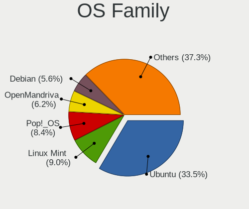

| Name         | Desktops | Percent |
|--------------|----------|---------|
| Ubuntu       | 125      | 41.67%  |
| Pop!_OS      | 34       | 11.33%  |
| Linux Mint   | 30       | 10%     |
| Zorin        | 13       | 4.33%   |
| OpenMandriva | 13       | 4.33%   |
| Manjaro      | 12       | 4%      |
| KDE neon     | 8        | 2.67%   |
| ROSA         | 7        | 2.33%   |
| Kubuntu      | 5        | 1.67%   |
| Fedora       | 5        | 1.67%   |
| Debian       | 5        | 1.67%   |
| ArcoLinux    | 5        | 1.67%   |
| Arch         | 5        | 1.67%   |
| Xubuntu      | 4        | 1.33%   |
| BlackPanther | 4        | 1.33%   |
| Lubuntu      | 3        | 1%      |
| LinuxFX      | 3        | 1%      |
| Endless      | 2        | 0.67%   |
| Clear Linux  | 2        | 0.67%   |
| CentOS       | 2        | 0.67%   |
| Ubuntu MATE  | 1        | 0.33%   |
| Sparky       | 1        | 0.33%   |
| Slackware    | 1        | 0.33%   |
| Rocky Linux  | 1        | 0.33%   |
| Q4OS         | 1        | 0.33%   |
| LMDE         | 1        | 0.33%   |
| KaOS         | 1        | 0.33%   |
| Kali         | 1        | 0.33%   |
| Kaisen       | 1        | 0.33%   |
| Gentoo       | 1        | 0.33%   |
| Garuda Linux | 1        | 0.33%   |
| EndeavourOS  | 1        | 0.33%   |
| Elementary   | 1        | 0.33%   |

Kernel
------

Version of the Linux kernel

| Version                         | Desktops | Percent |
|---------------------------------|----------|---------|
| 5.4.0-42-generic                | 13       | 3.77%   |
| 5.4.0-58-generic                | 7        | 2.03%   |
| 5.4.0-52-generic                | 7        | 2.03%   |
| 5.8.0-7642-generic              | 6        | 1.74%   |
| 5.13.0-7614-generic             | 6        | 1.74%   |
| 5.11.0-40-generic               | 5        | 1.45%   |
| 5.10.14-desktop-1omv4002        | 5        | 1.45%   |
| 4.15.0-54-generic               | 5        | 1.45%   |
| 5.8.0-59-generic                | 4        | 1.16%   |
| 5.4.0-7634-generic              | 4        | 1.16%   |
| 5.4.0-72-generic                | 4        | 1.16%   |
| 5.4.0-54-generic                | 4        | 1.16%   |
| 5.3.0-46-generic                | 4        | 1.16%   |
| 5.16.7-desktop-1omv4003         | 4        | 1.16%   |
| 5.11.0-41-generic               | 4        | 1.16%   |
| 5.11.0-27-generic               | 4        | 1.16%   |
| 5.11.0-25-generic               | 4        | 1.16%   |
| 4.18.16-desktop-1bP             | 4        | 1.16%   |
| 5.8.0-7630-generic              | 3        | 0.87%   |
| 5.8.0-43-generic                | 3        | 0.87%   |
| 5.4.0-45-generic                | 3        | 0.87%   |
| 5.4.0-37-generic                | 3        | 0.87%   |
| 5.3.0-53-generic                | 3        | 0.87%   |
| 5.13.0-28-generic               | 3        | 0.87%   |
| 5.11.0-7620-generic             | 3        | 0.87%   |
| 5.11.0-7614-generic             | 3        | 0.87%   |
| 5.11.0-38-generic               | 3        | 0.87%   |
| 5.0.0-37-generic                | 3        | 0.87%   |
| 4.15.0-112-generic              | 3        | 0.87%   |
| 5.8.0-55-generic                | 2        | 0.58%   |
| 5.8.0-40-generic                | 2        | 0.58%   |
| 5.4.0-77-generic                | 2        | 0.58%   |
| 5.4.0-7642-generic              | 2        | 0.58%   |
| 5.4.0-73-generic                | 2        | 0.58%   |
| 5.4.0-65-generic                | 2        | 0.58%   |
| 5.4.0-47-generic                | 2        | 0.58%   |
| 5.4.0-40-generic                | 2        | 0.58%   |
| 5.4.0-38-generic                | 2        | 0.58%   |
| 5.4.0-31-generic                | 2        | 0.58%   |
| 5.4.0-29-generic                | 2        | 0.58%   |
| 5.4.0-28-generic                | 2        | 0.58%   |
| 5.4.0-26-generic                | 2        | 0.58%   |
| 5.4.0-107-generic               | 2        | 0.58%   |
| 5.3.0-24-generic                | 2        | 0.58%   |
| 5.16.19-76051619-generic        | 2        | 0.58%   |
| 5.15.32-1-MANJARO               | 2        | 0.58%   |
| 5.15.3-1-clear                  | 2        | 0.58%   |
| 5.15.15-76051515-generic        | 2        | 0.58%   |
| 5.15.0-33-generic               | 2        | 0.58%   |
| 5.13.13-arch1-1                 | 2        | 0.58%   |
| 5.11.12-desktop-1omv4002        | 2        | 0.58%   |
| 5.11.0-37-generic               | 2        | 0.58%   |
| 5.0.0-25-generic                | 2        | 0.58%   |
| 4.9.20-nrj-desktop-1rosa-x86_64 | 2        | 0.58%   |
| 4.18.0-25-generic               | 2        | 0.58%   |
| 4.18.0-18-generic               | 2        | 0.58%   |
| 4.18.0-16-generic               | 2        | 0.58%   |
| 4.15.0-39-generic               | 2        | 0.58%   |
| 4.15.0-117-generic              | 2        | 0.58%   |
| 5.9.16-1-MANJARO                | 1        | 0.29%   |

Kernel Family
-------------

Linux kernel without a distro release

| Version | Desktops | Percent |
|---------|----------|---------|
| 5.4.0   | 81       | 25.31%  |
| 5.11.0  | 34       | 10.63%  |
| 5.8.0   | 30       | 9.38%   |
| 4.15.0  | 30       | 9.38%   |
| 5.13.0  | 17       | 5.31%   |
| 5.3.0   | 16       | 5%      |
| 4.18.0  | 12       | 3.75%   |
| 5.0.0   | 9        | 2.81%   |
| 5.10.14 | 5        | 1.56%   |
| 5.10.0  | 5        | 1.56%   |
| 4.4.0   | 5        | 1.56%   |
| 5.16.7  | 4        | 1.25%   |
| 4.18.16 | 4        | 1.25%   |
| 5.15.0  | 3        | 0.94%   |
| 4.9.20  | 3        | 0.94%   |
| 5.9.0   | 2        | 0.63%   |
| 5.6.0   | 2        | 0.63%   |
| 5.17.5  | 2        | 0.63%   |
| 5.17.1  | 2        | 0.63%   |
| 5.16.19 | 2        | 0.63%   |
| 5.15.5  | 2        | 0.63%   |
| 5.15.32 | 2        | 0.63%   |
| 5.15.3  | 2        | 0.63%   |
| 5.15.15 | 2        | 0.63%   |
| 5.13.13 | 2        | 0.63%   |
| 5.11.12 | 2        | 0.63%   |
| 4.19.0  | 2        | 0.63%   |
| 5.9.16  | 1        | 0.31%   |
| 5.8.15  | 1        | 0.31%   |
| 5.8.1   | 1        | 0.31%   |
| 5.6.7   | 1        | 0.31%   |
| 5.6.11  | 1        | 0.31%   |
| 5.5.19  | 1        | 0.31%   |
| 5.5.0   | 1        | 0.31%   |
| 5.4.80  | 1        | 0.31%   |
| 5.4.60  | 1        | 0.31%   |
| 5.4.44  | 1        | 0.31%   |
| 5.4.39  | 1        | 0.31%   |
| 5.4.32  | 1        | 0.31%   |
| 5.4.22  | 1        | 0.31%   |
| 5.4.14  | 1        | 0.31%   |
| 5.4.132 | 1        | 0.31%   |
| 5.16.11 | 1        | 0.31%   |
| 5.16.0  | 1        | 0.31%   |
| 5.15.7  | 1        | 0.31%   |
| 5.15.6  | 1        | 0.31%   |
| 5.15.4  | 1        | 0.31%   |
| 5.12.9  | 1        | 0.31%   |
| 5.12.7  | 1        | 0.31%   |
| 5.12.4  | 1        | 0.31%   |
| 5.12.13 | 1        | 0.31%   |
| 5.11.16 | 1        | 0.31%   |
| 5.11.11 | 1        | 0.31%   |
| 5.10.56 | 1        | 0.31%   |
| 5.10.41 | 1        | 0.31%   |
| 5.10.18 | 1        | 0.31%   |
| 5.10.16 | 1        | 0.31%   |
| 5.10.1  | 1        | 0.31%   |
| 5.1.15  | 1        | 0.31%   |
| 4.9.60  | 1        | 0.31%   |

Kernel Major Ver.
-----------------

Linux kernel major version

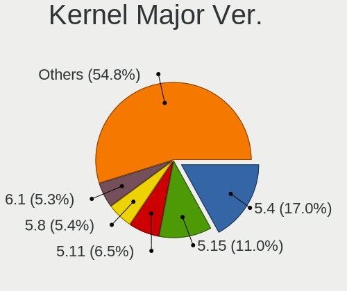

| Version | Desktops | Percent |
|---------|----------|---------|
| 5.4     | 88       | 27.67%  |
| 5.11    | 38       | 11.95%  |
| 5.8     | 32       | 10.06%  |
| 4.15    | 30       | 9.43%   |
| 5.13    | 19       | 5.97%   |
| 5.3     | 16       | 5.03%   |
| 4.18    | 16       | 5.03%   |
| 5.15    | 14       | 4.4%    |
| 5.10    | 14       | 4.4%    |
| 5.0     | 9        | 2.83%   |
| 5.16    | 8        | 2.52%   |
| 4.9     | 5        | 1.57%   |
| 4.4     | 5        | 1.57%   |
| 5.6     | 4        | 1.26%   |
| 5.17    | 4        | 1.26%   |
| 5.12    | 4        | 1.26%   |
| 5.9     | 3        | 0.94%   |
| 4.19    | 3        | 0.94%   |
| 5.5     | 2        | 0.63%   |
| 5.1     | 1        | 0.31%   |
| 3.16    | 1        | 0.31%   |
| 3.13    | 1        | 0.31%   |
| 3.10    | 1        | 0.31%   |

Arch
----

OS architecture (x86_64, i586, etc.)

| Name   | Desktops | Percent |
|--------|----------|---------|
| x86_64 | 284      | 96.27%  |
| i686   | 11       | 3.73%   |

DE
--

Desktop Environment

| Name          | Desktops | Percent |
|---------------|----------|---------|
| GNOME         | 152      | 49.84%  |
| Unknown       | 45       | 14.75%  |
| KDE5          | 36       | 11.8%   |
| X-Cinnamon    | 21       | 6.89%   |
| XFCE          | 14       | 4.59%   |
| KDE           | 11       | 3.61%   |
| Unity         | 5        | 1.64%   |
| MATE          | 4        | 1.31%   |
| LXQt          | 3        | 0.98%   |
| LXDE          | 3        | 0.98%   |
| KDE4          | 3        | 0.98%   |
| i3            | 3        | 0.98%   |
| Cinnamon      | 2        | 0.66%   |
| trinity       | 1        | 0.33%   |
| Pantheon      | 1        | 0.33%   |
| GNOME Classic | 1        | 0.33%   |

Display Server
--------------

X11 or Wayland

| Name    | Desktops | Percent |
|---------|----------|---------|
| X11     | 254      | 85.52%  |
| Unknown | 19       | 6.4%    |
| Wayland | 17       | 5.72%   |
| Tty     | 7        | 2.36%   |

Display Manager
---------------

SDDM, LightDM, etc.

| Name    | Desktops | Percent |
|---------|----------|---------|
| Unknown | 217      | 71.38%  |
| SDDM    | 34       | 11.18%  |
| GDM3    | 22       | 7.24%   |
| GDM     | 12       | 3.95%   |
| TDM     | 10       | 3.29%   |
| LightDM | 6        | 1.97%   |
| KDM     | 3        | 0.99%   |

OS Lang
-------

Language

| Lang    | Desktops | Percent |
|---------|----------|---------|
| en_ZA   | 186      | 60.19%  |
| en_US   | 61       | 19.74%  |
| Unknown | 39       | 12.62%  |
| en_GB   | 10       | 3.24%   |
| C       | 6        | 1.94%   |
| en_ZW   | 5        | 1.62%   |
| af_ZA   | 2        | 0.65%   |

Boot Mode
---------

EFI or BIOS

| Mode | Desktops | Percent |
|------|----------|---------|
| BIOS | 205      | 68.56%  |
| EFI  | 94       | 31.44%  |

Filesystem
----------

Type of filesystem

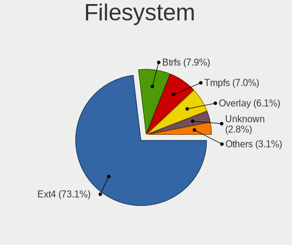

| Type    | Desktops | Percent |
|---------|----------|---------|
| Ext4    | 248      | 82.94%  |
| Unknown | 15       | 5.02%   |
| Overlay | 14       | 4.68%   |
| Btrfs   | 12       | 4.01%   |
| Xfs     | 6        | 2.01%   |
| Zfs     | 2        | 0.67%   |
| Tmpfs   | 1        | 0.33%   |
| Ext2    | 1        | 0.33%   |

Part. scheme
------------

Scheme of partitioning

| Type    | Desktops | Percent |
|---------|----------|---------|
| Unknown | 224      | 75.93%  |
| GPT     | 46       | 15.59%  |
| MBR     | 25       | 8.47%   |

Dual Boot with Linux/BSD
------------------------

Hosting more than one Linux/BSD

| Dual boot | Desktops | Percent |
|-----------|----------|---------|
| No        | 253      | 84.33%  |
| Yes       | 47       | 15.67%  |

Dual Boot (Win)
---------------

Hosting Linux and Windows

| Dual boot | Desktops | Percent |
|-----------|----------|---------|
| No        | 203      | 67.89%  |
| Yes       | 96       | 32.11%  |

Board
-----

Vendor
------

Motherboard manufacturer

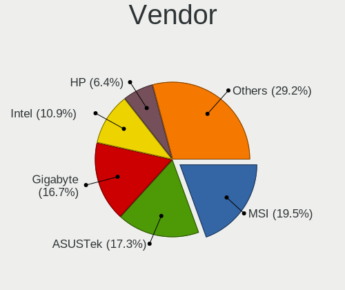

| Name                | Desktops | Percent |
|---------------------|----------|---------|
| MSI                 | 60       | 20.48%  |
| ASUSTek Computer    | 48       | 16.38%  |
| Gigabyte Technology | 43       | 14.68%  |
| Intel               | 32       | 10.92%  |
| Hewlett-Packard     | 20       | 6.83%   |
| Lenovo              | 16       | 5.46%   |
| Dell                | 16       | 5.46%   |
| ASRock              | 15       | 5.12%   |
| Biostar             | 11       | 3.75%   |
| Foxconn             | 9        | 3.07%   |
| ECS                 | 4        | 1.37%   |
| Acer                | 4        | 1.37%   |
| Unknown             | 4        | 1.37%   |
| Apple               | 3        | 1.02%   |
| NCR                 | 2        | 0.68%   |
| Fujitsu             | 2        | 0.68%   |
| Supermicro          | 1        | 0.34%   |
| Nvidia              | 1        | 0.34%   |
| Mustek6376 mst6376  | 1        | 0.34%   |
| Lite-On             | 1        | 0.34%   |

Model
-----

Motherboard model

| Name                        | Desktops | Percent |
|-----------------------------|----------|---------|
| ASUS All Series             | 6        | 2.05%   |
| MSI MS-7817                 | 5        | 1.71%   |
| Unknown                     | 4        | 1.37%   |
| MSI MS-7B84                 | 3        | 1.02%   |
| MSI MS-7756                 | 3        | 1.02%   |
| HP ProLiant MicroServer     | 3        | 1.02%   |
| Gigabyte G31M-ES2C          | 3        | 1.02%   |
| Dell Vostro 3670            | 3        | 1.02%   |
| Apple MacPro3,1             | 3        | 1.02%   |
| MSI MS-7C91                 | 2        | 0.68%   |
| MSI MS-7C37                 | 2        | 0.68%   |
| MSI MS-7B89                 | 2        | 0.68%   |
| MSI MS-7A15                 | 2        | 0.68%   |
| MSI MS-7971                 | 2        | 0.68%   |
| MSI MS-7970                 | 2        | 0.68%   |
| MSI MS-7885                 | 2        | 0.68%   |
| MSI MS-7693                 | 2        | 0.68%   |
| MSI MS-7612                 | 2        | 0.68%   |
| Intel Mecer_X102            | 2        | 0.68%   |
| Intel H81                   | 2        | 0.68%   |
| Intel DH61WW AAG23116-300   | 2        | 0.68%   |
| Intel DH55TC AAE70932-302   | 2        | 0.68%   |
| Gigabyte XP-M5S661GX        | 2        | 0.68%   |
| Gigabyte H81M-S2PH          | 2        | 0.68%   |
| Gigabyte H61M-S2V-B3        | 2        | 0.68%   |
| Gigabyte H61M-DS2           | 2        | 0.68%   |
| Gigabyte G41MT-S2PT         | 2        | 0.68%   |
| Gigabyte G31M-S2L           | 2        | 0.68%   |
| Gigabyte B85M-HD3           | 2        | 0.68%   |
| Gigabyte B75M-D3H           | 2        | 0.68%   |
| ECS G31T-M7                 | 2        | 0.68%   |
| Dell OptiPlex 7040          | 2        | 0.68%   |
| ASUS H110M-K                | 2        | 0.68%   |
| ASRock H61M-VS3             | 2        | 0.68%   |
| Supermicro SSG-6047R-E1R24N | 1        | 0.34%   |
| Nvidia MCP73                | 1        | 0.34%   |
| NCR xxxx-xxxx-xxxx          | 1        | 0.34%   |
| NCR 7606-1309-8801          | 1        | 0.34%   |
| Mustek6376 mst6376 945GZT-M | 1        | 0.34%   |
| MSI MS-7C94                 | 1        | 0.34%   |
| MSI MS-7C60                 | 1        | 0.34%   |
| MSI MS-7C56                 | 1        | 0.34%   |
| MSI MS-7C13                 | 1        | 0.34%   |
| MSI MS-7B93                 | 1        | 0.34%   |
| MSI MS-7B90                 | 1        | 0.34%   |
| MSI MS-7B46                 | 1        | 0.34%   |
| MSI MS-7B45                 | 1        | 0.34%   |
| MSI MS-7B38                 | 1        | 0.34%   |
| MSI MS-7B22                 | 1        | 0.34%   |
| MSI MS-7B17                 | 1        | 0.34%   |
| MSI MS-7A67                 | 1        | 0.34%   |
| MSI MS-7A39                 | 1        | 0.34%   |
| MSI MS-7A37                 | 1        | 0.34%   |
| MSI MS-7A33                 | 1        | 0.34%   |
| MSI MS-7A32                 | 1        | 0.34%   |
| MSI MS-7996                 | 1        | 0.34%   |
| MSI MS-7984                 | 1        | 0.34%   |
| MSI MS-7982                 | 1        | 0.34%   |
| MSI MS-7850                 | 1        | 0.34%   |
| MSI MS-7788                 | 1        | 0.34%   |

Model Family
------------

Motherboard model prefix

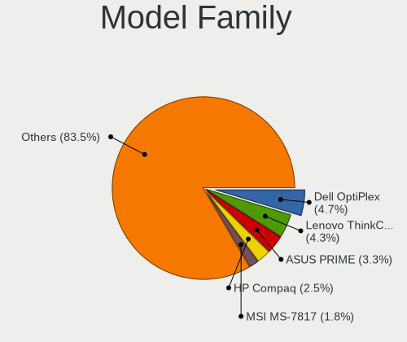

| Name                        | Desktops | Percent |
|-----------------------------|----------|---------|
| Lenovo ThinkCentre          | 16       | 5.46%   |
| Dell OptiPlex               | 9        | 3.07%   |
| HP Compaq                   | 8        | 2.73%   |
| ASUS All                    | 6        | 2.05%   |
| MSI MS-7817                 | 5        | 1.71%   |
| HP ProLiant                 | 5        | 1.71%   |
| ASUS PRIME                  | 5        | 1.71%   |
| Dell Vostro                 | 4        | 1.37%   |
| ASUS ROG                    | 4        | 1.37%   |
| Unknown                     | 4        | 1.37%   |
| MSI MS-7B84                 | 3        | 1.02%   |
| MSI MS-7756                 | 3        | 1.02%   |
| Intel Mecer                 | 3        | 1.02%   |
| Intel DH61WW                | 3        | 1.02%   |
| Gigabyte G31M-ES2C          | 3        | 1.02%   |
| ASUS H110M-K                | 3        | 1.02%   |
| Apple MacPro3               | 3        | 1.02%   |
| Acer Aspire                 | 3        | 1.02%   |
| MSI MS-7C91                 | 2        | 0.68%   |
| MSI MS-7C37                 | 2        | 0.68%   |
| MSI MS-7B89                 | 2        | 0.68%   |
| MSI MS-7A15                 | 2        | 0.68%   |
| MSI MS-7971                 | 2        | 0.68%   |
| MSI MS-7970                 | 2        | 0.68%   |
| MSI MS-7885                 | 2        | 0.68%   |
| MSI MS-7693                 | 2        | 0.68%   |
| MSI MS-7612                 | 2        | 0.68%   |
| Intel H81                   | 2        | 0.68%   |
| Intel DH55TC                | 2        | 0.68%   |
| Intel DH55HC                | 2        | 0.68%   |
| Intel DG33FB                | 2        | 0.68%   |
| Intel DG31PR                | 2        | 0.68%   |
| Gigabyte XP-M5S661GX        | 2        | 0.68%   |
| Gigabyte H81M-S2PH          | 2        | 0.68%   |
| Gigabyte H61M-S2V-B3        | 2        | 0.68%   |
| Gigabyte H61M-DS2           | 2        | 0.68%   |
| Gigabyte G41MT-S2PT         | 2        | 0.68%   |
| Gigabyte G31M-S2L           | 2        | 0.68%   |
| Gigabyte B85M-HD3           | 2        | 0.68%   |
| Gigabyte B75M-D3H           | 2        | 0.68%   |
| Foxconn Pro                 | 2        | 0.68%   |
| ECS G31T-M7                 | 2        | 0.68%   |
| Biostar TB250-BTC           | 2        | 0.68%   |
| ASUS SABERTOOTH             | 2        | 0.68%   |
| ASUS P8H61-M                | 2        | 0.68%   |
| ASUS P5G41T-M               | 2        | 0.68%   |
| ASRock H61M-VS3             | 2        | 0.68%   |
| Supermicro SSG-6047R-E1R24N | 1        | 0.34%   |
| Nvidia MCP73                | 1        | 0.34%   |
| NCR xxxx-xxxx-xxxx          | 1        | 0.34%   |
| NCR 7606-1309-8801          | 1        | 0.34%   |
| Mustek6376 mst6376 945GZT-M | 1        | 0.34%   |
| MSI MS-7C94                 | 1        | 0.34%   |
| MSI MS-7C60                 | 1        | 0.34%   |
| MSI MS-7C56                 | 1        | 0.34%   |
| MSI MS-7C13                 | 1        | 0.34%   |
| MSI MS-7B93                 | 1        | 0.34%   |
| MSI MS-7B90                 | 1        | 0.34%   |
| MSI MS-7B46                 | 1        | 0.34%   |
| MSI MS-7B45                 | 1        | 0.34%   |

MFG Year
--------

Motherboard manufacture year

| Year | Desktops | Percent |
|------|----------|---------|
| 2012 | 39       | 13.31%  |
| 2011 | 33       | 11.26%  |
| 2013 | 29       | 9.9%    |
| 2010 | 24       | 8.19%   |
| 2008 | 24       | 8.19%   |
| 2018 | 21       | 7.17%   |
| 2016 | 21       | 7.17%   |
| 2017 | 17       | 5.8%    |
| 2007 | 16       | 5.46%   |
| 2009 | 15       | 5.12%   |
| 2015 | 13       | 4.44%   |
| 2019 | 11       | 3.75%   |
| 2014 | 10       | 3.41%   |
| 2020 | 7        | 2.39%   |
| 2006 | 7        | 2.39%   |
| 2005 | 3        | 1.02%   |
| 2022 | 1        | 0.34%   |
| 2021 | 1        | 0.34%   |
| 2004 | 1        | 0.34%   |

Form Factor
-----------

Physical design of the computer

| Name    | Desktops | Percent |
|---------|----------|---------|
| Desktop | 293      | 100%    |

Secure Boot
-----------

Enabled or disabled

| State    | Desktops | Percent |
|----------|----------|---------|
| Disabled | 287      | 97.62%  |
| Enabled  | 7        | 2.38%   |

Coreboot
--------

Have coreboot on board

| Used | Desktops | Percent |
|------|----------|---------|
| No   | 293      | 100%    |

RAM Size
--------

Total RAM memory

| Size in GB  | Desktops | Percent |
|-------------|----------|---------|
| 3.01-4.0    | 73       | 24.58%  |
| 8.01-16.0   | 68       | 22.9%   |
| 16.01-24.0  | 60       | 20.2%   |
| 4.01-8.0    | 45       | 15.15%  |
| 1.01-2.0    | 22       | 7.41%   |
| 32.01-64.0  | 18       | 6.06%   |
| 24.01-32.0  | 3        | 1.01%   |
| 64.01-256.0 | 3        | 1.01%   |
| 0.51-1.0    | 3        | 1.01%   |
| 2.01-3.0    | 2        | 0.67%   |

RAM Used
--------

Used RAM memory

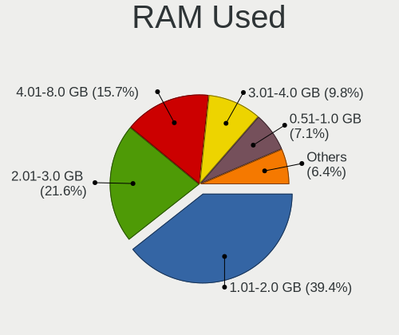

| Used GB     | Desktops | Percent |
|-------------|----------|---------|
| 1.01-2.0    | 156      | 48.15%  |
| 2.01-3.0    | 60       | 18.52%  |
| 4.01-8.0    | 39       | 12.04%  |
| 3.01-4.0    | 26       | 8.02%   |
| 0.51-1.0    | 26       | 8.02%   |
| 8.01-16.0   | 8        | 2.47%   |
| 0.01-0.5    | 6        | 1.85%   |
| 64.01-256.0 | 1        | 0.31%   |
| 16.01-24.0  | 1        | 0.31%   |
| Unknown     | 1        | 0.31%   |

Total Drives
------------

Number of drives on board

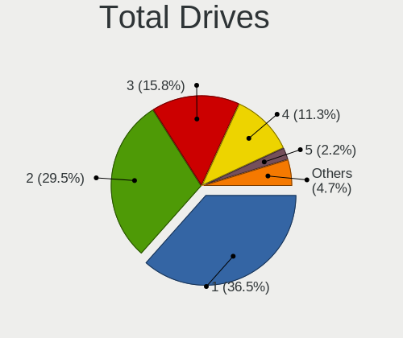

| Drives  | Desktops | Percent |
|---------|----------|---------|
| 1       | 115      | 37.58%  |
| 2       | 92       | 30.07%  |
| 3       | 47       | 15.36%  |
| 4       | 30       | 9.8%    |
| 5       | 6        | 1.96%   |
| 8       | 4        | 1.31%   |
| 7       | 4        | 1.31%   |
| 6       | 4        | 1.31%   |
| 0       | 3        | 0.98%   |
| Unknown | 1        | 0.33%   |

Has CD-ROM
----------

Has CD-ROM on board

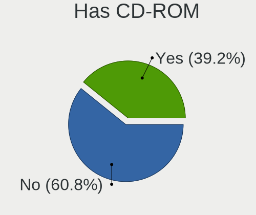

| Presented | Desktops | Percent |
|-----------|----------|---------|
| No        | 163      | 54.33%  |
| Yes       | 137      | 45.67%  |

Has Ethernet
------------

Has Ethernet on board

| Presented | Desktops | Percent |
|-----------|----------|---------|
| Yes       | 289      | 98.63%  |
| No        | 4        | 1.37%   |

Has WiFi
--------

Has WiFi module

| Presented | Desktops | Percent |
|-----------|----------|---------|
| No        | 192      | 64.43%  |
| Yes       | 106      | 35.57%  |

Has Bluetooth
-------------

Has Bluetooth module

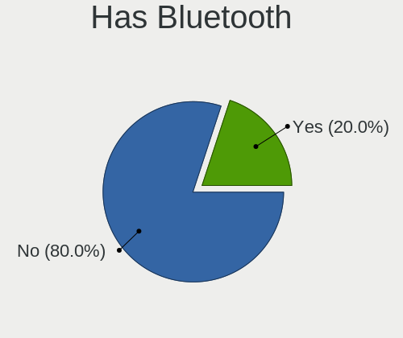

| Presented | Desktops | Percent |
|-----------|----------|---------|
| No        | 254      | 85.23%  |
| Yes       | 44       | 14.77%  |

Location
--------

Country
-------

Geographic location (country)

| Country      | Desktops | Percent |
|--------------|----------|---------|
| South Africa | 293      | 100%    |

City
----

Geographic location (city)

| City             | Desktops | Percent |
|------------------|----------|---------|
| Cape Town        | 79       | 25.73%  |
| Johannesburg     | 62       | 20.2%   |
| Pretoria         | 48       | 15.64%  |
| Durban           | 16       | 5.21%   |
| Centurion        | 11       | 3.58%   |
| Port Elizabeth   | 6        | 1.95%   |
| Kempton Park     | 5        | 1.63%   |
| Benoni           | 5        | 1.63%   |
| Pietermaritzburg | 4        | 1.3%    |
| Bellville        | 4        | 1.3%    |
| Alberton         | 4        | 1.3%    |
| Stellenbosch     | 3        | 0.98%   |
| Sasolburg        | 3        | 0.98%   |
| Midrand          | 3        | 0.98%   |
| Westville        | 2        | 0.65%   |
| Vanderbijlpark   | 2        | 0.65%   |
| Roodepoort       | 2        | 0.65%   |
| Randburg         | 2        | 0.65%   |
| Plettenberg Bay  | 2        | 0.65%   |
| Oudtshoorn       | 2        | 0.65%   |
| Germiston        | 2        | 0.65%   |
| George           | 2        | 0.65%   |
| Edenvale         | 2        | 0.65%   |
| East London      | 2        | 0.65%   |
| Boksburg         | 2        | 0.65%   |
| Bloemfontein     | 2        | 0.65%   |
| Zeerust          | 1        | 0.33%   |
| Uitenhage        | 1        | 0.33%   |
| Thabazimbi       | 1        | 0.33%   |
| Somerset West    | 1        | 0.33%   |
| Sir Lowry's Pass | 1        | 0.33%   |
| Secunda          | 1        | 0.33%   |
| Sandton          | 1        | 0.33%   |
| Rustenburg       | 1        | 0.33%   |
| Richards Bay     | 1        | 0.33%   |
| Queenstown       | 1        | 0.33%   |
| Polokwane        | 1        | 0.33%   |
| Paarl            | 1        | 0.33%   |
| Nottingham Road  | 1        | 0.33%   |
| Newcastle        | 1        | 0.33%   |
| Nelspruit        | 1        | 0.33%   |
| Musgrave         | 1        | 0.33%   |
| Mulbarton        | 1        | 0.33%   |
| Modimolle        | 1        | 0.33%   |
| Mid-Ennerdale    | 1        | 0.33%   |
| Marquard         | 1        | 0.33%   |
| Louis Trichardt  | 1        | 0.33%   |
| Lichtenburg      | 1        | 0.33%   |
| Laudium          | 1        | 0.33%   |
| Krugersdorp      | 1        | 0.33%   |
| Katlehong        | 1        | 0.33%   |
| Hermanus         | 1        | 0.33%   |
| Groot-Brakrivier | 1        | 0.33%   |
| Gansbaai         | 1        | 0.33%   |
| Durbanville      | 1        | 0.33%   |
| Apel             | 1        | 0.33%   |

Drives
------

Drive Vendor
------------

Hard drive vendors

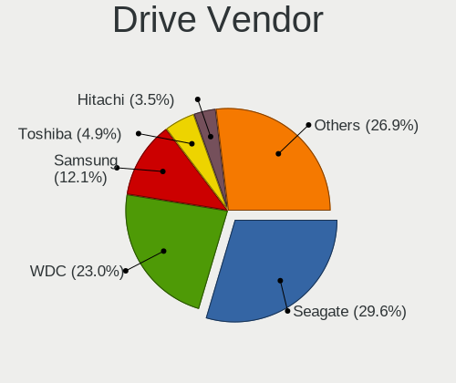

| Vendor                | Desktops | Drives | Percent |
|-----------------------|----------|--------|---------|
| Seagate               | 151      | 282    | 29.49%  |
| WDC                   | 137      | 202    | 26.76%  |
| Samsung Electronics   | 69       | 100    | 13.48%  |
| Toshiba               | 28       | 37     | 5.47%   |
| Hitachi               | 19       | 31     | 3.71%   |
| Kingston              | 9        | 10     | 1.76%   |
| A-DATA Technology     | 9        | 10     | 1.76%   |
| Crucial               | 7        | 9      | 1.37%   |
| Transcend             | 6        | 10     | 1.17%   |
| Silicon Motion        | 6        | 7      | 1.17%   |
| MAXTOR                | 6        | 7      | 1.17%   |
| HGST                  | 6        | 7      | 1.17%   |
| TO Exter              | 5        | 5      | 0.98%   |
| Sandisk               | 5        | 5      | 0.98%   |
| Hewlett-Packard       | 5        | 5      | 0.98%   |
| SK Hynix              | 4        | 4      | 0.78%   |
| Phison                | 4        | 6      | 0.78%   |
| Kingmax               | 4        | 5      | 0.78%   |
| HS-SSD-C100           | 3        | 3      | 0.59%   |
| Unknown               | 2        | 3      | 0.39%   |
| Realtek Semiconductor | 2        | 2      | 0.39%   |
| Mushkin               | 2        | 2      | 0.39%   |
| Intel                 | 2        | 2      | 0.39%   |
| HS-SSD-E100           | 2        | 3      | 0.39%   |
| Hikvision             | 2        | 2      | 0.39%   |
| USB                   | 1        | 1      | 0.2%    |
| Solidata              | 1        | 1      | 0.2%    |
| PLEXTOR               | 1        | 2      | 0.2%    |
| OCZ                   | 1        | 2      | 0.2%    |
| Micron Technology     | 1        | 1      | 0.2%    |
| LITEON                | 1        | 1      | 0.2%    |
| KingSpec              | 1        | 2      | 0.2%    |
| HPE                   | 1        | 2      | 0.2%    |
| Gigabyte Technology   | 1        | 1      | 0.2%    |
| Fujitsu               | 1        | 1      | 0.2%    |
| External              | 1        | 1      | 0.2%    |
| Corsair               | 1        | 3      | 0.2%    |
| Biostar               | 1        | 1      | 0.2%    |
| ASMT                  | 1        | 1      | 0.2%    |
| Apacer                | 1        | 2      | 0.2%    |
| Acer                  | 1        | 1      | 0.2%    |
| Unknown               | 1        | 1      | 0.2%    |

Drive Model
-----------

Hard drive models

| Model                               | Desktops | Percent |
|-------------------------------------|----------|---------|
| Seagate ST500DM002-1BD142 500GB     | 19       | 3.07%   |
| Seagate ST3500418AS 500GB           | 14       | 2.27%   |
| Seagate ST380815AS 80GB             | 10       | 1.62%   |
| Samsung HD103SI 1TB                 | 9        | 1.46%   |
| WDC WDS500G2B0A-00SM50 500GB SSD    | 8        | 1.29%   |
| WDC WD10EZEX-08WN4A0 1TB            | 8        | 1.29%   |
| Seagate ST4000DM000-1F2168 4TB      | 7        | 1.13%   |
| Seagate ST3500413AS 500GB           | 7        | 1.13%   |
| Seagate ST3250318AS 250GB           | 7        | 1.13%   |
| WDC WD20EZRZ-00Z5HB0 2TB            | 6        | 0.97%   |
| WDC WD20EARX-00PASB0 2TB            | 6        | 0.97%   |
| Seagate ST4000DM004-2CV104 4TB      | 6        | 0.97%   |
| Seagate ST3160815AS 160GB           | 6        | 0.97%   |
| Seagate ST2000DM001-1CH164 2TB      | 6        | 0.97%   |
| Seagate ST1000DM010-2EP102 1TB      | 6        | 0.97%   |
| WDC WDS100T2B0A-00SM50 1TB SSD      | 5        | 0.81%   |
| TO Exter nal USB 3.0 320GB          | 5        | 0.81%   |
| Seagate ST31500341AS 1TB            | 5        | 0.81%   |
| Samsung HD502HI 500GB               | 5        | 0.81%   |
| WDC WD20EZRX-00D8PB0 2TB            | 4        | 0.65%   |
| WDC WD10EZEX-00WN4A0 1TB            | 4        | 0.65%   |
| WDC WD10EZEX-00BN5A0 1TB            | 4        | 0.65%   |
| Toshiba MQ01ABD100 1TB              | 4        | 0.65%   |
| Toshiba HDWD110 1TB                 | 4        | 0.65%   |
| Toshiba DT01ACA100 1TB              | 4        | 0.65%   |
| Seagate ST3320620AS 320GB           | 4        | 0.65%   |
| Seagate ST3250310AS 250GB           | 4        | 0.65%   |
| Seagate ST1000DM003-1ER162 1TB      | 4        | 0.65%   |
| Seagate ST1000DM003-1CH162 1TB      | 4        | 0.65%   |
| Samsung SSD 850 EVO 250GB           | 4        | 0.65%   |
| Samsung SSD 750 EVO 250GB           | 4        | 0.65%   |
| Samsung HM321HI 320GB               | 4        | 0.65%   |
| Samsung HD204UI 2TB                 | 4        | 0.65%   |
| WDC WDS240G2G0A-00JH30 240GB SSD    | 3        | 0.49%   |
| WDC WDS120G2G0A-00JH30 120GB SSD    | 3        | 0.49%   |
| WDC WD40EZRZ-00GXCB0 4TB            | 3        | 0.49%   |
| WDC WD3200AAJS-00RYA0 320GB         | 3        | 0.49%   |
| WDC WD10EZEX-00MFCA0 1TB            | 3        | 0.49%   |
| Seagate ST500LM012 HN-M500MBB 500GB | 3        | 0.49%   |
| Seagate ST3160813AS 160GB           | 3        | 0.49%   |
| Seagate ST3160811AS 160GB           | 3        | 0.49%   |
| Seagate ST31000528AS 1TB            | 3        | 0.49%   |
| Seagate ST31000524AS 1TB            | 3        | 0.49%   |
| Seagate ST2000DM001-9YN164 2TB      | 3        | 0.49%   |
| Seagate Expansion Desk 10TB         | 3        | 0.49%   |
| Seagate Expansion 4TB               | 3        | 0.49%   |
| Samsung SSD 860 EVO 250GB           | 3        | 0.49%   |
| Samsung NVMe SSD Drive 250GB        | 3        | 0.49%   |
| HGST HTS545050A7E680 500GB          | 3        | 0.49%   |
| HP VB0250EAVER 250GB                | 3        | 0.49%   |
| Crucial CT250MX500SSD1 250GB        | 3        | 0.49%   |
| WDC WDS500G2B0B-00YS70 500GB SSD    | 2        | 0.32%   |
| WDC WD800JD-00LSA5 80GB             | 2        | 0.32%   |
| WDC WD5000LPCX-21VHAT0 500GB        | 2        | 0.32%   |
| WDC WD5000AZRX-00A8LB0 500GB        | 2        | 0.32%   |
| WDC WD5000AVVS-63ZWB0 500GB         | 2        | 0.32%   |
| WDC WD5000AAKX-22ERMA0 500GB        | 2        | 0.32%   |
| WDC WD5000AAKX-00ERMA0 500GB        | 2        | 0.32%   |
| WDC WD30EZRX-00MMMB0 3TB            | 2        | 0.32%   |
| WDC WD30EZRX-00D8PB0 3TB            | 2        | 0.32%   |

HDD Vendor
----------

Hard disk drive vendors

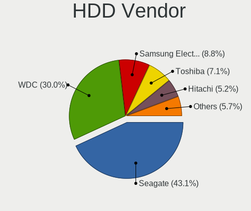

| Vendor              | Desktops | Drives | Percent |
|---------------------|----------|--------|---------|
| Seagate             | 149      | 275    | 39.11%  |
| WDC                 | 121      | 175    | 31.76%  |
| Samsung Electronics | 42       | 59     | 11.02%  |
| Toshiba             | 27       | 36     | 7.09%   |
| Hitachi             | 19       | 31     | 4.99%   |
| MAXTOR              | 6        | 7      | 1.57%   |
| HGST                | 6        | 7      | 1.57%   |
| Hewlett-Packard     | 5        | 5      | 1.31%   |
| Unknown             | 2        | 3      | 0.52%   |
| USB                 | 1        | 1      | 0.26%   |
| HPE                 | 1        | 2      | 0.26%   |
| Fujitsu             | 1        | 1      | 0.26%   |
| ASMT                | 1        | 1      | 0.26%   |

SSD Vendor
----------

Solid state drive vendors

| Vendor              | Desktops | Drives | Percent |
|---------------------|----------|--------|---------|
| WDC                 | 23       | 27     | 22.55%  |
| Samsung Electronics | 21       | 30     | 20.59%  |
| A-DATA Technology   | 8        | 9      | 7.84%   |
| Kingston            | 7        | 8      | 6.86%   |
| Crucial             | 7        | 9      | 6.86%   |
| Transcend           | 5        | 9      | 4.9%    |
| TO Exter            | 5        | 5      | 4.9%    |
| Kingmax             | 4        | 5      | 3.92%   |
| SK Hynix            | 2        | 2      | 1.96%   |
| SanDisk             | 2        | 2      | 1.96%   |
| Mushkin             | 2        | 2      | 1.96%   |
| Toshiba             | 1        | 1      | 0.98%   |
| Solidata            | 1        | 1      | 0.98%   |
| PLEXTOR             | 1        | 2      | 0.98%   |
| OCZ                 | 1        | 2      | 0.98%   |
| Micron Technology   | 1        | 1      | 0.98%   |
| LITEON              | 1        | 1      | 0.98%   |
| KingSpec            | 1        | 2      | 0.98%   |
| Intel               | 1        | 1      | 0.98%   |
| HS-SSD-E100         | 1        | 1      | 0.98%   |
| Gigabyte Technology | 1        | 1      | 0.98%   |
| External            | 1        | 1      | 0.98%   |
| Corsair             | 1        | 3      | 0.98%   |
| Biostar             | 1        | 1      | 0.98%   |
| Apacer              | 1        | 2      | 0.98%   |
| Acer                | 1        | 1      | 0.98%   |
| Unknown             | 1        | 1      | 0.98%   |

Drive Kind
----------

HDD or SSD

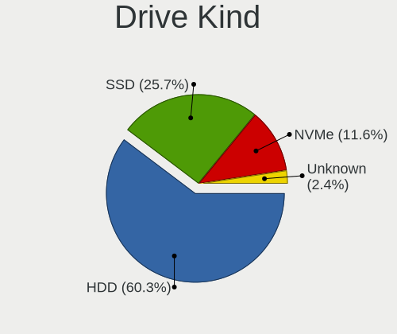

| Kind    | Desktops | Drives | Percent |
|---------|----------|--------|---------|
| HDD     | 256      | 603    | 68.63%  |
| SSD     | 81       | 130    | 21.72%  |
| NVMe    | 30       | 41     | 8.04%   |
| Unknown | 6        | 9      | 1.61%   |

Drive Connector
---------------

SATA, SAS, NVMe, etc.

| Type | Desktops | Drives | Percent |
|------|----------|--------|---------|
| SATA | 280      | 711    | 85.11%  |
| NVMe | 30       | 41     | 9.12%   |
| SAS  | 19       | 31     | 5.78%   |

Drive Size
----------

Size of hard drive

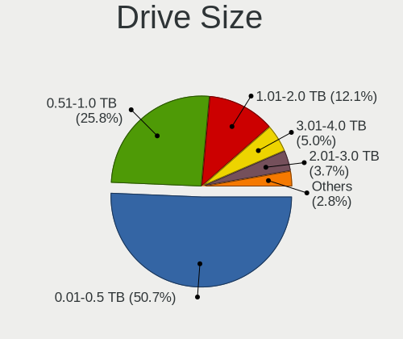

| Size in TB | Desktops | Drives | Percent |
|------------|----------|--------|---------|
| 0.01-0.5   | 221      | 387    | 50.11%  |
| 0.51-1.0   | 114      | 181    | 25.85%  |
| 1.01-2.0   | 51       | 75     | 11.56%  |
| 3.01-4.0   | 28       | 44     | 6.35%   |
| 2.01-3.0   | 15       | 16     | 3.4%    |
| 4.01-10.0  | 10       | 26     | 2.27%   |
| 10.01-20.0 | 2        | 4      | 0.45%   |

Space Total
-----------

Amount of disk space available on the file system

| Size in GB     | Desktops | Percent |
|----------------|----------|---------|
| 101-250        | 73       | 23.7%   |
| 251-500        | 60       | 19.48%  |
| 501-1000       | 39       | 12.66%  |
| More than 3000 | 37       | 12.01%  |
| 1001-2000      | 36       | 11.69%  |
| 1-20           | 17       | 5.52%   |
| 2001-3000      | 16       | 5.19%   |
| 51-100         | 14       | 4.55%   |
| 21-50          | 8        | 2.6%    |
| Unknown        | 8        | 2.6%    |

Space Used
----------

Amount of used disk space

| Used GB        | Desktops | Percent |
|----------------|----------|---------|
| 1-20           | 107      | 33.97%  |
| 21-50          | 39       | 12.38%  |
| 101-250        | 35       | 11.11%  |
| 51-100         | 31       | 9.84%   |
| 251-500        | 29       | 9.21%   |
| 1001-2000      | 20       | 6.35%   |
| More than 3000 | 18       | 5.71%   |
| 501-1000       | 16       | 5.08%   |
| 2001-3000      | 12       | 3.81%   |
| Unknown        | 8        | 2.54%   |

Malfunc. Drives
---------------

Drive models with a malfunction

| Model                               | Desktops | Drives | Percent |
|-------------------------------------|----------|--------|---------|
| Seagate ST3500418AS 500GB           | 3        | 4      | 8.33%   |
| WDC WD3200AAJS-00RYA0 320GB         | 2        | 2      | 5.56%   |
| WDC WD6400AAKS-75A7B0 640GB         | 1        | 1      | 2.78%   |
| WDC WD5000AVVS-63ZWB0 500GB         | 1        | 1      | 2.78%   |
| WDC WD5000AAKX-22ERMA0 500GB        | 1        | 1      | 2.78%   |
| WDC WD5000AAKX-221CA1 500GB         | 1        | 1      | 2.78%   |
| WDC WD5000AAKX-00ERMA0 500GB        | 1        | 2      | 2.78%   |
| WDC WD30EFRX-68EUZN0 3TB            | 1        | 1      | 2.78%   |
| WDC WD20EZRZ-00Z5HB0 2TB            | 1        | 1      | 2.78%   |
| WDC WD20EARX-00PASB0 2TB            | 1        | 1      | 2.78%   |
| WDC WD1600AAJS-08L7A0 160GB         | 1        | 1      | 2.78%   |
| WDC WD15EADS-00P8B0 1TB             | 1        | 1      | 2.78%   |
| WDC WD10EZEX-08WN4A0 1TB            | 1        | 1      | 2.78%   |
| WDC WD10EADS-67M2B0 1TB             | 1        | 2      | 2.78%   |
| WDC WD10EACS-00ZJB0 1TB             | 1        | 1      | 2.78%   |
| Solidata SSD 120GB                  | 1        | 1      | 2.78%   |
| Seagate ST500LM021-1KJ152 500GB     | 1        | 1      | 2.78%   |
| Seagate ST500LM012 HN-M500MBB 500GB | 1        | 1      | 2.78%   |
| Seagate ST500DM002-1BD142 500GB     | 1        | 1      | 2.78%   |
| Seagate ST4000DM004-2CV104 4TB      | 1        | 1      | 2.78%   |
| Seagate ST4000DM000-1F2168 4TB      | 1        | 2      | 2.78%   |
| Seagate ST3320418AS 320GB           | 1        | 1      | 2.78%   |
| Seagate ST32000542AS 2TB            | 1        | 1      | 2.78%   |
| Seagate ST3160815AS 160GB           | 1        | 2      | 2.78%   |
| Seagate ST31500341AS 1TB            | 1        | 1      | 2.78%   |
| Seagate ST31000520AS 1TB            | 1        | 1      | 2.78%   |
| Seagate ST1000LM035-1RK172 1TB      | 1        | 1      | 2.78%   |
| Samsung Electronics HD203WI 2TB     | 1        | 1      | 2.78%   |
| Samsung Electronics HD154UI 1TB     | 1        | 1      | 2.78%   |
| Samsung Electronics HD103SI 1TB     | 1        | 2      | 2.78%   |
| Hitachi HDS721010KLA33R RSD HUA 1TB | 1        | 1      | 2.78%   |
| HGST HTS725050A7E630 500GB          | 1        | 1      | 2.78%   |
| Hewlett-Packard GB0250EAFYK 250GB   | 1        | 1      | 2.78%   |

Malfunc. Drive Vendor
---------------------

Vendors of faulty drives

| Vendor              | Desktops | Drives | Percent |
|---------------------|----------|--------|---------|
| WDC                 | 15       | 17     | 41.67%  |
| Seagate             | 14       | 17     | 38.89%  |
| Samsung Electronics | 3        | 4      | 8.33%   |
| Solidata            | 1        | 1      | 2.78%   |
| Hitachi             | 1        | 1      | 2.78%   |
| HGST                | 1        | 1      | 2.78%   |
| Hewlett-Packard     | 1        | 1      | 2.78%   |

Malfunc. HDD Vendor
-------------------

Vendors of faulty HDD drives

| Vendor              | Desktops | Drives | Percent |
|---------------------|----------|--------|---------|
| WDC                 | 15       | 17     | 42.86%  |
| Seagate             | 14       | 17     | 40%     |
| Samsung Electronics | 3        | 4      | 8.57%   |
| Hitachi             | 1        | 1      | 2.86%   |
| HGST                | 1        | 1      | 2.86%   |
| Hewlett-Packard     | 1        | 1      | 2.86%   |

Malfunc. Drive Kind
-------------------

Kinds of faulty drives

| Kind | Desktops | Drives | Percent |
|------|----------|--------|---------|
| HDD  | 29       | 41     | 96.67%  |
| SSD  | 1        | 1      | 3.33%   |

Failed Drives
-------------

Failed drive models

| Model                    | Desktops | Drives | Percent |
|--------------------------|----------|--------|---------|
| WDC WD20EZRX-00D8PB0 2TB | 2        | 2      | 100%    |

Failed Drive Vendor
-------------------

Failed drive vendors

| Vendor | Desktops | Drives | Percent |
|--------|----------|--------|---------|
| WDC    | 2        | 2      | 100%    |

Drive Status
------------

Number of failed and malfunc. drives

| Status   | Desktops | Drives | Percent |
|----------|----------|--------|---------|
| Detected | 231      | 617    | 71.74%  |
| Works    | 60       | 122    | 18.63%  |
| Malfunc  | 29       | 42     | 9.01%   |
| Failed   | 2        | 2      | 0.62%   |

Storage controller
------------------

Storage Vendor
--------------

Storage controller vendors

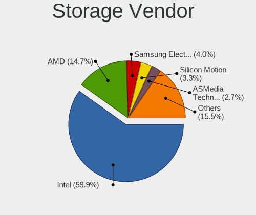

| Vendor                           | Desktops | Percent |
|----------------------------------|----------|---------|
| Intel                            | 232      | 63.91%  |
| AMD                              | 48       | 13.22%  |
| Samsung Electronics              | 11       | 3.03%   |
| Marvell Technology Group         | 10       | 2.75%   |
| JMicron Technology               | 10       | 2.75%   |
| Nvidia                           | 9        | 2.48%   |
| ASMedia Technology               | 9        | 2.48%   |
| Silicon Motion                   | 8        | 2.2%    |
| Phison Electronics               | 5        | 1.38%   |
| VIA Technologies                 | 3        | 0.83%   |
| Sandisk                          | 3        | 0.83%   |
| SK Hynix                         | 2        | 0.55%   |
| Silicon Integrated Systems [SiS] | 2        | 0.55%   |
| Silicon Image                    | 2        | 0.55%   |
| Seagate Technology               | 2        | 0.55%   |
| Realtek Semiconductor            | 2        | 0.55%   |
| Kingston Technology Company      | 2        | 0.55%   |
| LSI Logic / Symbios Logic        | 1        | 0.28%   |
| Broadcom / LSI                   | 1        | 0.28%   |
| ADATA Technology                 | 1        | 0.28%   |

Storage Model
-------------

Storage controller models

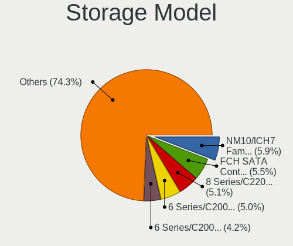

| Model                                                                                   | Desktops | Percent |
|-----------------------------------------------------------------------------------------|----------|---------|
| Intel NM10/ICH7 Family SATA Controller [IDE mode]                                       | 31       | 6.07%   |
| Intel Q170/Q150/B150/H170/H110/Z170/CM236 Chipset SATA Controller [AHCI Mode]           | 26       | 5.09%   |
| Intel 6 Series/C200 Series Chipset Family Desktop SATA Controller (IDE mode, ports 4-5) | 26       | 5.09%   |
| Intel 6 Series/C200 Series Chipset Family Desktop SATA Controller (IDE mode, ports 0-3) | 26       | 5.09%   |
| AMD FCH SATA Controller [AHCI mode]                                                     | 26       | 5.09%   |
| Intel 6 Series/C200 Series Chipset Family 6 port Desktop SATA AHCI Controller           | 25       | 4.89%   |
| Intel 8 Series/C220 Series Chipset Family 6-port SATA Controller 1 [AHCI mode]          | 21       | 4.11%   |
| Intel 82801G (ICH7 Family) IDE Controller                                               | 20       | 3.91%   |
| Intel SATA Controller [RAID mode]                                                       | 15       | 2.94%   |
| Intel 7 Series/C210 Series Chipset Family 6-port SATA Controller [AHCI mode]            | 15       | 2.94%   |
| Intel 5 Series/3400 Series Chipset 4 port SATA IDE Controller                           | 11       | 2.15%   |
| Intel 5 Series/3400 Series Chipset 2 port SATA IDE Controller                           | 11       | 2.15%   |
| Intel 200 Series PCH SATA controller [AHCI mode]                                        | 11       | 2.15%   |
| AMD 400 Series Chipset SATA Controller                                                  | 11       | 2.15%   |
| Intel 5 Series/3400 Series Chipset PT IDER Controller                                   | 8        | 1.57%   |
| AMD SB7x0/SB8x0/SB9x0 IDE Controller                                                    | 8        | 1.57%   |
| ASMedia ASM1062 Serial ATA Controller                                                   | 7        | 1.37%   |
| AMD SB7x0/SB8x0/SB9x0 SATA Controller [AHCI mode]                                       | 7        | 1.37%   |
| AMD 500 Series Chipset SATA Controller                                                  | 7        | 1.37%   |
| Silicon Motion SM2262/SM2262EN SSD Controller                                           | 6        | 1.17%   |
| Samsung NVMe SSD Controller SM961/PM961/SM963                                           | 6        | 1.17%   |
| Intel 7 Series/C210 Series Chipset Family 4-port SATA Controller [IDE mode]             | 6        | 1.17%   |
| Intel 7 Series/C210 Series Chipset Family 2-port SATA Controller [IDE mode]             | 6        | 1.17%   |
| Marvell Group 88SE6101/6102 single-port PATA133 interface                               | 5        | 0.98%   |
| JMicron JMB363 SATA/IDE Controller                                                      | 5        | 0.98%   |
| Intel Cannon Lake PCH SATA AHCI Controller                                              | 5        | 0.98%   |
| Intel 82801JI (ICH10 Family) 4 port SATA IDE Controller #1                              | 5        | 0.98%   |
| Intel 82801JI (ICH10 Family) 2 port SATA IDE Controller #2                              | 5        | 0.98%   |
| Intel 82801I (ICH9 Family) 2 port SATA Controller [IDE mode]                            | 5        | 0.98%   |
| Intel 5 Series/3400 Series Chipset 6 port SATA AHCI Controller                          | 5        | 0.98%   |
| AMD 300 Series Chipset SATA Controller                                                  | 5        | 0.98%   |
| JMicron JMB368 IDE controller                                                           | 4        | 0.78%   |
| Intel 82801IR/IO/IH (ICH9R/DO/DH) 4 port SATA Controller [IDE mode]                     | 4        | 0.78%   |
| Intel 631xESB/632xESB SATA AHCI Controller                                              | 4        | 0.78%   |
| Intel 631xESB/632xESB IDE Controller                                                    | 4        | 0.78%   |
| AMD SB7x0/SB8x0/SB9x0 SATA Controller [IDE mode]                                        | 4        | 0.78%   |
| AMD FCH SATA Controller D                                                               | 4        | 0.78%   |
| VIA VT82C586A/B/VT82C686/A/B/VT823x/A/C PIPC Bus Master IDE                             | 3        | 0.59%   |
| Samsung NVMe SSD Controller SM981/PM981/PM983                                           | 3        | 0.59%   |
| Phison E12 NVMe Controller                                                              | 3        | 0.59%   |
| Nvidia MCP51 Serial ATA Controller                                                      | 3        | 0.59%   |
| Nvidia MCP51 IDE                                                                        | 3        | 0.59%   |
| Intel 82Q35 Express PT IDER Controller                                                  | 3        | 0.59%   |
| Intel 82801IR/IO/IH (ICH9R/DO/DH) 6 port SATA Controller [AHCI mode]                    | 3        | 0.59%   |
| Intel 82801H (ICH8 Family) 4 port SATA Controller [IDE mode]                            | 3        | 0.59%   |
| VIA VIA VT6420 SATA RAID Controller                                                     | 2        | 0.39%   |
| Silicon Motion SM2263EN/SM2263XT SSD Controller                                         | 2        | 0.39%   |
| Silicon Integrated Systems [SiS] RAID bus controller 180 SATA/PATA  [SiS]               | 2        | 0.39%   |
| Silicon Integrated Systems [SiS] 5513 IDE Controller                                    | 2        | 0.39%   |
| Sandisk WD Black 2018/SN750 / PC SN720 NVMe SSD                                         | 2        | 0.39%   |
| Realtek RTS5763DL NVMe SSD Controller                                                   | 2        | 0.39%   |
| Nvidia MCP78S [GeForce 8200] IDE                                                        | 2        | 0.39%   |
| Nvidia MCP78S [GeForce 8200] AHCI Controller                                            | 2        | 0.39%   |
| Nvidia MCP61 SATA Controller                                                            | 2        | 0.39%   |
| Nvidia MCP61 IDE                                                                        | 2        | 0.39%   |
| Marvell Group 88SE6111/6121 SATA II / PATA Controller                                   | 2        | 0.39%   |
| Kingston Company A2000 NVMe SSD                                                         | 2        | 0.39%   |
| Intel C610/X99 series chipset 6-Port SATA Controller [AHCI mode]                        | 2        | 0.39%   |
| Intel C602 chipset 4-Port SATA Storage Control Unit                                     | 2        | 0.39%   |
| Intel C600/X79 series chipset SATA RAID Controller                                      | 2        | 0.39%   |

Storage Kind
------------

Kind of storage controller (IDE, SATA, NVMe, SAS, ...)

| Kind | Desktops | Percent |
|------|----------|---------|
| SATA | 177      | 48.63%  |
| IDE  | 129      | 35.44%  |
| NVMe | 32       | 8.79%   |
| RAID | 22       | 6.04%   |
| SAS  | 2        | 0.55%   |
| SCSI | 2        | 0.55%   |

Processor
---------

CPU Vendor
----------

Processor vendors

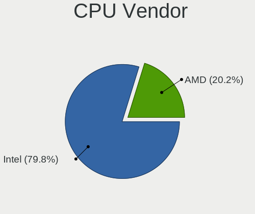

| Vendor | Desktops | Percent |
|--------|----------|---------|
| Intel  | 240      | 81.91%  |
| AMD    | 53       | 18.09%  |

CPU Model
---------

Processor models

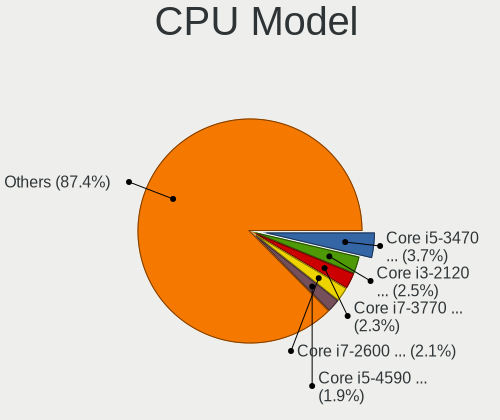

| Model                                       | Desktops | Percent |
|---------------------------------------------|----------|---------|
| Intel Core i7-3770 CPU @ 3.40GHz            | 9        | 3.07%   |
| Intel Core i5-3470 CPU @ 3.20GHz            | 9        | 3.07%   |
| Intel Core i7-2600 CPU @ 3.40GHz            | 8        | 2.73%   |
| Intel Core i3-2120 CPU @ 3.30GHz            | 6        | 2.05%   |
| Intel Pentium 4 CPU 3.00GHz                 | 5        | 1.71%   |
| Intel Core i7-6700K CPU @ 4.00GHz           | 5        | 1.71%   |
| Intel Core i5-4590 CPU @ 3.30GHz            | 5        | 1.71%   |
| Intel Core i5-2400 CPU @ 3.10GHz            | 5        | 1.71%   |
| Intel Pentium CPU G2030 @ 3.00GHz           | 4        | 1.37%   |
| Intel Core i7-8700K CPU @ 3.70GHz           | 4        | 1.37%   |
| Intel Core i7-8700 CPU @ 3.20GHz            | 4        | 1.37%   |
| Intel Core i3-2100 CPU @ 3.10GHz            | 4        | 1.37%   |
| Intel Core 2 Duo CPU E7500 @ 2.93GHz        | 4        | 1.37%   |
| Intel Xeon CPU E5462 @ 2.80GHz              | 3        | 1.02%   |
| Intel Pentium Dual-Core CPU E5200 @ 2.50GHz | 3        | 1.02%   |
| Intel Pentium CPU G620 @ 2.60GHz            | 3        | 1.02%   |
| Intel Pentium CPU G2020 @ 2.90GHz           | 3        | 1.02%   |
| Intel Core i7 CPU 920 @ 2.67GHz             | 3        | 1.02%   |
| Intel Core i7 CPU 870 @ 2.93GHz             | 3        | 1.02%   |
| Intel Core i5-6600K CPU @ 3.50GHz           | 3        | 1.02%   |
| Intel Core i5-4460 CPU @ 3.20GHz            | 3        | 1.02%   |
| Intel Core i5-3330 CPU @ 3.00GHz            | 3        | 1.02%   |
| Intel Core i5 CPU 650 @ 3.20GHz             | 3        | 1.02%   |
| Intel Core i3 CPU 530 @ 2.93GHz             | 3        | 1.02%   |
| Intel Core 2 Quad CPU Q8400 @ 2.66GHz       | 3        | 1.02%   |
| Intel Core 2 Quad CPU Q6600 @ 2.40GHz       | 3        | 1.02%   |
| Intel Core 2 Duo CPU E7300 @ 2.66GHz        | 3        | 1.02%   |
| Intel Core 2 Duo CPU E6550 @ 2.33GHz        | 3        | 1.02%   |
| Intel Celeron CPU G3930 @ 2.90GHz           | 3        | 1.02%   |
| AMD Ryzen 9 3900X 12-Core Processor         | 3        | 1.02%   |
| Intel Pentium Dual CPU E2200 @ 2.20GHz      | 2        | 0.68%   |
| Intel Pentium CPU G850 @ 2.90GHz            | 2        | 0.68%   |
| Intel Pentium CPU G4600 @ 3.60GHz           | 2        | 0.68%   |
| Intel Pentium CPU G4400 @ 3.30GHz           | 2        | 0.68%   |
| Intel Pentium CPU G3260 @ 3.30GHz           | 2        | 0.68%   |
| Intel Core i7-6700 CPU @ 3.40GHz            | 2        | 0.68%   |
| Intel Core i7-4790K CPU @ 4.00GHz           | 2        | 0.68%   |
| Intel Core i7-4790 CPU @ 3.60GHz            | 2        | 0.68%   |
| Intel Core i7-3770S CPU @ 3.10GHz           | 2        | 0.68%   |
| Intel Core i5-7400 CPU @ 3.00GHz            | 2        | 0.68%   |
| Intel Core i5-6500T CPU @ 2.50GHz           | 2        | 0.68%   |
| Intel Core i5-6500 CPU @ 3.20GHz            | 2        | 0.68%   |
| Intel Core i5-6400 CPU @ 2.70GHz            | 2        | 0.68%   |
| Intel Core i5-4430 CPU @ 3.00GHz            | 2        | 0.68%   |
| Intel Core i5-3570K CPU @ 3.40GHz           | 2        | 0.68%   |
| Intel Core i5-3450 CPU @ 3.10GHz            | 2        | 0.68%   |
| Intel Core i3-3240 CPU @ 3.40GHz            | 2        | 0.68%   |
| Intel Core i3 CPU 540 @ 3.07GHz             | 2        | 0.68%   |
| Intel Core 2 Duo CPU E8400 @ 3.00GHz        | 2        | 0.68%   |
| Intel Core 2 Duo CPU E8200 @ 2.66GHz        | 2        | 0.68%   |
| Intel Core 2 Duo CPU E7400 @ 2.80GHz        | 2        | 0.68%   |
| Intel Core 2 Duo CPU E4600 @ 2.40GHz        | 2        | 0.68%   |
| Intel Celeron CPU G3900 @ 2.80GHz           | 2        | 0.68%   |
| Intel Celeron CPU E3300 @ 2.50GHz           | 2        | 0.68%   |
| AMD Turion II Neo N54L Dual-Core Processor  | 2        | 0.68%   |
| AMD Ryzen 9 5950X 16-Core Processor         | 2        | 0.68%   |
| AMD Ryzen 7 2700X Eight-Core Processor      | 2        | 0.68%   |
| AMD Ryzen 5 3600 6-Core Processor           | 2        | 0.68%   |
| AMD Ryzen 5 2600 Six-Core Processor         | 2        | 0.68%   |
| AMD Ryzen 5 2400G with Radeon Vega Graphics | 2        | 0.68%   |

CPU Model Family
----------------

Processor model prefix

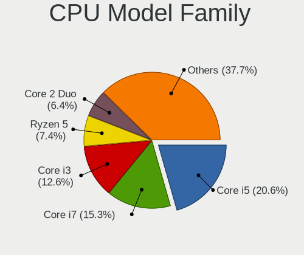

| Model                   | Desktops | Percent |
|-------------------------|----------|---------|
| Intel Core i5           | 57       | 19.45%  |
| Intel Core i7           | 50       | 17.06%  |
| Intel Core i3           | 33       | 11.26%  |
| Intel Pentium           | 21       | 7.17%   |
| Intel Core 2 Duo        | 21       | 7.17%   |
| AMD Ryzen 5             | 14       | 4.78%   |
| Intel Xeon              | 12       | 4.1%    |
| Intel Celeron           | 11       | 3.75%   |
| Intel Core 2 Quad       | 10       | 3.41%   |
| AMD Ryzen 7             | 8        | 2.73%   |
| Intel Pentium 4         | 7        | 2.39%   |
| Intel Pentium Dual-Core | 6        | 2.05%   |
| AMD FX                  | 6        | 2.05%   |
| AMD Ryzen 9             | 5        | 1.71%   |
| Intel Pentium Dual      | 4        | 1.37%   |
| AMD Turion II Neo       | 3        | 1.02%   |
| AMD Ryzen 3             | 3        | 1.02%   |
| AMD Athlon 64 X2        | 3        | 1.02%   |
| Other                   | 2        | 0.68%   |
| Intel Pentium D         | 2        | 0.68%   |
| Intel Core 2            | 2        | 0.68%   |
| AMD Phenom II X4        | 2        | 0.68%   |
| AMD Phenom II X2        | 2        | 0.68%   |
| Intel Genuine           | 1        | 0.34%   |
| Intel Core 2 Extreme    | 1        | 0.34%   |
| Intel Celeron D         | 1        | 0.34%   |
| AMD Ryzen Threadripper  | 1        | 0.34%   |
| AMD Ryzen 7 PRO         | 1        | 0.34%   |
| AMD Phenom II X3        | 1        | 0.34%   |
| AMD Athlon 64           | 1        | 0.34%   |
| AMD A8                  | 1        | 0.34%   |
| AMD A12                 | 1        | 0.34%   |

CPU Cores
---------

Number of processor cores

| Number | Desktops | Percent |
|--------|----------|---------|
| 4      | 122      | 41.64%  |
| 2      | 112      | 38.23%  |
| 6      | 22       | 7.51%   |
| 8      | 13       | 4.44%   |
| 1      | 13       | 4.44%   |
| 12     | 4        | 1.37%   |
| 16     | 3        | 1.02%   |
| 3      | 3        | 1.02%   |
| 24     | 1        | 0.34%   |

CPU Sockets
-----------

Number of sockets

| Number | Desktops | Percent |
|--------|----------|---------|
| 1      | 288      | 98.29%  |
| 2      | 5        | 1.71%   |

CPU Threads
-----------

Threads per core (Hyper-Threading)

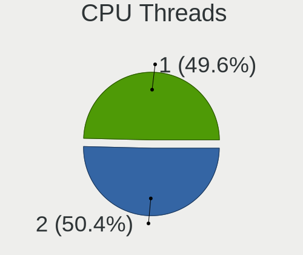

| Number | Desktops | Percent |
|--------|----------|---------|
| 1      | 156      | 53.24%  |
| 2      | 137      | 46.76%  |

CPU Op-Modes
------------

CPU Operation Modes (32-bit, 64-bit)

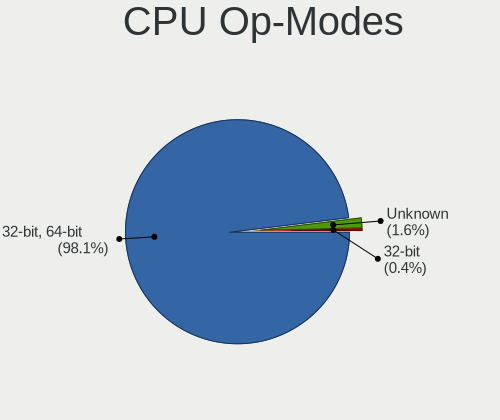

| Op mode        | Desktops | Percent |
|----------------|----------|---------|
| 32-bit, 64-bit | 285      | 96.61%  |
| Unknown        | 8        | 2.71%   |
| 32-bit         | 2        | 0.68%   |

CPU Microcode
-------------

Microcode number

| Number     | Desktops | Percent |
|------------|----------|---------|
| Unknown    | 73       | 23.93%  |
| 0x306a9    | 35       | 11.48%  |
| 0x206a7    | 26       | 8.52%   |
| 0x306c3    | 21       | 6.89%   |
| 0x506e3    | 16       | 5.25%   |
| 0x1067a    | 13       | 4.26%   |
| 0x10676    | 10       | 3.28%   |
| 0x906e9    | 9        | 2.95%   |
| 0x6fb      | 9        | 2.95%   |
| 0x906ea    | 8        | 2.62%   |
| 0x6fd      | 7        | 2.3%    |
| 0x20652    | 7        | 2.3%    |
| 0x106a5    | 6        | 1.97%   |
| 0x08701021 | 6        | 1.97%   |
| 0x010000db | 5        | 1.64%   |
| 0x20655    | 4        | 1.31%   |
| 0x106e5    | 4        | 1.31%   |
| 0x06000852 | 4        | 1.31%   |
| 0x0800820d | 3        | 0.98%   |
| 0x0600611a | 3        | 0.98%   |
| 0x010000c8 | 3        | 0.98%   |
| 0xf65      | 2        | 0.66%   |
| 0xf41      | 2        | 0.66%   |
| 0x906eb    | 2        | 0.66%   |
| 0x6f2      | 2        | 0.66%   |
| 0x0a201016 | 2        | 0.66%   |
| 0x08108109 | 2        | 0.66%   |
| 0x08001137 | 2        | 0.66%   |
| 0xf64      | 1        | 0.33%   |
| 0xf4a      | 1        | 0.33%   |
| 0xf49      | 1        | 0.33%   |
| 0xf47      | 1        | 0.33%   |
| 0xf43      | 1        | 0.33%   |
| 0xf33      | 1        | 0.33%   |
| 0x90672    | 1        | 0.33%   |
| 0x706a1    | 1        | 0.33%   |
| 0x6f7      | 1        | 0.33%   |
| 0x306f2    | 1        | 0.33%   |
| 0x30678    | 1        | 0.33%   |
| 0x206d7    | 1        | 0.33%   |
| 0x0a50000c | 1        | 0.33%   |
| 0x08600106 | 1        | 0.33%   |
| 0x0810100b | 1        | 0.33%   |
| 0x08101007 | 1        | 0.33%   |
| 0x08001138 | 1        | 0.33%   |
| 0x08001126 | 1        | 0.33%   |
| 0x0600084f | 1        | 0.33%   |

CPU Microarch
-------------

Microarchitecture

| Name          | Desktops | Percent |
|---------------|----------|---------|
| IvyBridge     | 44       | 15.02%  |
| SandyBridge   | 33       | 11.26%  |
| Penryn        | 32       | 10.92%  |
| Haswell       | 29       | 9.9%    |
| KabyLake      | 24       | 8.19%   |
| Skylake       | 23       | 7.85%   |
| Core          | 20       | 6.83%   |
| Westmere      | 11       | 3.75%   |
| NetBurst      | 11       | 3.75%   |
| Zen 2         | 10       | 3.41%   |
| Nehalem       | 10       | 3.41%   |
| Zen           | 9        | 3.07%   |
| K10           | 8        | 2.73%   |
| Zen+          | 7        | 2.39%   |
| Zen 3         | 6        | 2.05%   |
| Piledriver    | 6        | 2.05%   |
| K8 Hammer     | 4        | 1.37%   |
| Excavator     | 3        | 1.02%   |
| Silvermont    | 1        | 0.34%   |
| Goldmont plus | 1        | 0.34%   |
| Unknown       | 1        | 0.34%   |

Graphics
--------

GPU Vendor
----------

Vendors of graphics cards

| Vendor                           | Desktops | Percent |
|----------------------------------|----------|---------|
| Intel                            | 128      | 41.29%  |
| Nvidia                           | 110      | 35.48%  |
| AMD                              | 66       | 21.29%  |
| Matrox Electronics Systems       | 3        | 0.97%   |
| VIA Technologies                 | 1        | 0.32%   |
| Silicon Motion                   | 1        | 0.32%   |
| Silicon Integrated Systems [SiS] | 1        | 0.32%   |

GPU Model
---------

Graphics card models

| Model                                                                                      | Desktops | Percent |
|--------------------------------------------------------------------------------------------|----------|---------|
| Intel Xeon E3-1200 v2/3rd Gen Core processor Graphics Controller                           | 19       | 6.01%   |
| Intel 2nd Generation Core Processor Family Integrated Graphics Controller                  | 19       | 6.01%   |
| Intel 82G33/G31 Express Integrated Graphics Controller                                     | 18       | 5.7%    |
| Intel Xeon E3-1200 v3/4th Gen Core Processor Integrated Graphics Controller                | 16       | 5.06%   |
| Nvidia GT218 [GeForce 210]                                                                 | 11       | 3.48%   |
| AMD Ellesmere [Radeon RX 470/480/570/570X/580/580X/590]                                    | 11       | 3.48%   |
| Intel Core Processor Integrated Graphics Controller                                        | 8        | 2.53%   |
| Intel IvyBridge GT2 [HD Graphics 4000]                                                     | 7        | 2.22%   |
| Intel 4 Series Chipset Integrated Graphics Controller                                      | 7        | 2.22%   |
| Intel CoffeeLake-S GT2 [UHD Graphics 630]                                                  | 6        | 1.9%    |
| Nvidia GF108 [GeForce GT 630]                                                              | 5        | 1.58%   |
| Nvidia GP107 [GeForce GTX 1050]                                                            | 4        | 1.27%   |
| Nvidia GM204 [GeForce GTX 970]                                                             | 4        | 1.27%   |
| Nvidia GF119 [GeForce GT 610]                                                              | 4        | 1.27%   |
| Nvidia GF108 [GeForce GT 730]                                                              | 4        | 1.27%   |
| Intel HD Graphics 630                                                                      | 4        | 1.27%   |
| Intel HD Graphics 530                                                                      | 4        | 1.27%   |
| Intel 82Q963/Q965 Integrated Graphics Controller                                           | 4        | 1.27%   |
| Intel 4th Generation Core Processor Family Integrated Graphics Controller                  | 4        | 1.27%   |
| AMD Cape Verde XT [Radeon HD 7770/8760 / R7 250X]                                          | 4        | 1.27%   |
| Nvidia GP107 [GeForce GTX 1050 Ti]                                                         | 3        | 0.95%   |
| Nvidia GP106 [GeForce GTX 1060 3GB]                                                        | 3        | 0.95%   |
| Nvidia GP104 [GeForce GTX 1080]                                                            | 3        | 0.95%   |
| Nvidia GP104 [GeForce GTX 1070]                                                            | 3        | 0.95%   |
| Nvidia GK208B [GeForce GT 710]                                                             | 3        | 0.95%   |
| Nvidia GF116 [GeForce GTX 550 Ti]                                                          | 3        | 0.95%   |
| AMD Vega 10 XL/XT [Radeon RX Vega 56/64]                                                   | 3        | 0.95%   |
| AMD Turks PRO [Radeon HD 6570/7570/8550 / R5 230]                                          | 3        | 0.95%   |
| AMD Navi 10 [Radeon RX 5600 OEM/5600 XT / 5700/5700 XT]                                    | 3        | 0.95%   |
| Nvidia GT215 [GeForce GT 240]                                                              | 2        | 0.63%   |
| Nvidia GP108 [GeForce GT 1030]                                                             | 2        | 0.63%   |
| Nvidia GP106 [GeForce GTX 1060 6GB]                                                        | 2        | 0.63%   |
| Nvidia GP102 [GeForce GTX 1080 Ti]                                                         | 2        | 0.63%   |
| Nvidia GM206 [GeForce GTX 960]                                                             | 2        | 0.63%   |
| Nvidia GM107 [GeForce GTX 750]                                                             | 2        | 0.63%   |
| Nvidia GK104 [GeForce GTX 760]                                                             | 2        | 0.63%   |
| Nvidia GK104 [GeForce GTX 670]                                                             | 2        | 0.63%   |
| Nvidia GF108 [GeForce GT 620]                                                              | 2        | 0.63%   |
| Nvidia G96C [GeForce 9400 GT]                                                              | 2        | 0.63%   |
| Nvidia G92 [GeForce 8800 GT]                                                               | 2        | 0.63%   |
| Nvidia C77 [nForce 780a/980a SLI]                                                          | 2        | 0.63%   |
| Intel HD Graphics 610                                                                      | 2        | 0.63%   |
| Intel HD Graphics 510                                                                      | 2        | 0.63%   |
| Intel 82Q35 Express Integrated Graphics Controller                                         | 2        | 0.63%   |
| Intel 82865G Integrated Graphics Controller                                                | 2        | 0.63%   |
| AMD Wani [Radeon R5/R6/R7 Graphics]                                                        | 2        | 0.63%   |
| AMD Tobago PRO [Radeon R7 360 / R9 360 OEM]                                                | 2        | 0.63%   |
| AMD Raven Ridge [Radeon Vega Series / Radeon Vega Mobile Series]                           | 2        | 0.63%   |
| AMD Picasso/Raven 2 [Radeon Vega Series / Radeon Vega Mobile Series]                       | 2        | 0.63%   |
| AMD Park [Mobility Radeon HD 5430]                                                         | 2        | 0.63%   |
| AMD Curacao XT / Trinidad XT [Radeon R7 370 / R9 270X/370X]                                | 2        | 0.63%   |
| AMD Cezanne                                                                                | 2        | 0.63%   |
| AMD Cedar [Radeon HD 5000/6000/7350/8350 Series]                                           | 2        | 0.63%   |
| AMD Cayman PRO [Radeon HD 6950]                                                            | 2        | 0.63%   |
| AMD Baffin [Radeon RX 550 640SP / RX 560/560X]                                             | 2        | 0.63%   |
| AMD Baffin [Radeon RX 460/560D / Pro 450/455/460/555/555X/560/560X]                        | 2        | 0.63%   |
| VIA Technologies CN700/P4M800 Pro/P4M800 CE/VN800 Graphics [S3 UniChrome Pro]              | 1        | 0.32%   |
| Silicon Motion SM712 LynxEM+                                                               | 1        | 0.32%   |
| Silicon Integrated Systems [SiS] 661/741/760 PCI/AGP or 662/761Gx PCIE VGA Display Adapter | 1        | 0.32%   |
| Nvidia TU116 [GeForce GTX 1660 Ti]                                                         | 1        | 0.32%   |

GPU Combo
---------

Combinations of graphics cards

| Name               | Desktops | Percent |
|--------------------|----------|---------|
| 1 x Intel          | 112      | 38.1%   |
| 1 x Nvidia         | 102      | 34.69%  |
| 1 x AMD            | 57       | 19.39%  |
| Intel + Nvidia     | 6        | 2.04%   |
| 2 x AMD            | 5        | 1.7%    |
| Other              | 2        | 0.68%   |
| 1 x Matrox         | 2        | 0.68%   |
| Intel + AMD        | 2        | 0.68%   |
| AMD + Nvidia       | 2        | 0.68%   |
| 1 x VIA            | 1        | 0.34%   |
| 1 x SiS            | 1        | 0.34%   |
| 1 x Silicon Motion | 1        | 0.34%   |
| AMD + Matrox       | 1        | 0.34%   |

GPU Driver
----------

Free vs proprietary

| Driver      | Desktops | Percent |
|-------------|----------|---------|
| Free        | 219      | 73.99%  |
| Proprietary | 56       | 18.92%  |
| Unknown     | 21       | 7.09%   |

GPU Memory
----------

Total video memory

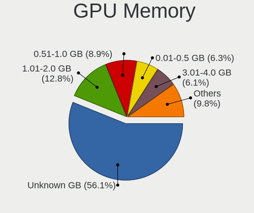

| Size in GB | Desktops | Percent |
|------------|----------|---------|
| Unknown    | 149      | 49.01%  |
| 1.01-2.0   | 54       | 17.76%  |
| 0.51-1.0   | 34       | 11.18%  |
| 0.01-0.5   | 25       | 8.22%   |
| 3.01-4.0   | 17       | 5.59%   |
| 7.01-8.0   | 12       | 3.95%   |
| 5.01-6.0   | 7        | 2.3%    |
| 2.01-3.0   | 3        | 0.99%   |
| 8.01-16.0  | 2        | 0.66%   |
| 16.01-24.0 | 1        | 0.33%   |

Monitor
-------

Monitor Vendor
--------------

Monitor vendors

| Vendor               | Desktops | Percent |
|----------------------|----------|---------|
| Samsung Electronics  | 82       | 28.77%  |
| Dell                 | 56       | 19.65%  |
| Goldstar             | 46       | 16.14%  |
| Philips              | 11       | 3.86%   |
| Unknown              | 9        | 3.16%   |
| Hewlett-Packard      | 9        | 3.16%   |
| AOC                  | 9        | 3.16%   |
| BenQ                 | 8        | 2.81%   |
| LG Electronics       | 6        | 2.11%   |
| Acer                 | 6        | 2.11%   |
| VIE                  | 4        | 1.4%    |
| Ancor Communications | 4        | 1.4%    |
| Toshiba              | 3        | 1.05%   |
| PRI                  | 3        | 1.05%   |
| Mecer                | 3        | 1.05%   |
| Plain Tree Systems   | 2        | 0.7%    |
| Onkyo                | 2        | 0.7%    |
| NEC Computers        | 2        | 0.7%    |
| CTV                  | 2        | 0.7%    |
| ___                  | 1        | 0.35%   |
| ViewSonic            | 1        | 0.35%   |
| TATUNG               | 1        | 0.35%   |
| STD                  | 1        | 0.35%   |
| Sony                 | 1        | 0.35%   |
| SKY                  | 1        | 0.35%   |
| SBI                  | 1        | 0.35%   |
| Sampo                | 1        | 0.35%   |
| RTK                  | 1        | 0.35%   |
| PKB                  | 1        | 0.35%   |
| Packard Bell         | 1        | 0.35%   |
| Marantz              | 1        | 0.35%   |
| Hitachi              | 1        | 0.35%   |
| FUS                  | 1        | 0.35%   |
| Fujitsu Siemens      | 1        | 0.35%   |
| Eizo                 | 1        | 0.35%   |
| ASUSTek Computer     | 1        | 0.35%   |
| Unknown              | 1        | 0.35%   |

Monitor Model
-------------

Monitor models

| Model                                                                 | Desktops | Percent |
|-----------------------------------------------------------------------|----------|---------|
| Dell SE2416H DELD081 1920x1080 527x296mm 23.8-inch                    | 7        | 2.28%   |
| Goldstar ULTRAWIDE GSM59F1 2560x1080 673x284mm 28.8-inch              | 6        | 1.95%   |
| Goldstar IPS FULLHD GSM5AB8 1920x1080 480x270mm 21.7-inch             | 6        | 1.95%   |
| Dell SE2216H DELF071 1920x1080 476x268mm 21.5-inch                    | 5        | 1.63%   |
| Dell SE2416H DELD082 1920x1080 527x296mm 23.8-inch                    | 4        | 1.3%    |
| Samsung Electronics SMBX2031 SAM076B 1600x900 443x249mm 20.0-inch     | 3        | 0.98%   |
| Samsung Electronics S19C150 SAM0AE6 1366x768 410x230mm 18.5-inch      | 3        | 0.98%   |
| Samsung Electronics LCD Monitor SyncMaster 1920x1080                  | 3        | 0.98%   |
| Goldstar W2443 GSM571B 1920x1080 474x296mm 22.0-inch                  | 3        | 0.98%   |
| Dell SE2719H DELF10C 1920x1080 598x336mm 27.0-inch                    | 3        | 0.98%   |
| Dell S2340L DELD058 1920x1080 510x290mm 23.1-inch                     | 3        | 0.98%   |
| VIE S20W VIE2080 1600x900 443x249mm 20.0-inch                         | 2        | 0.65%   |
| Unknown LCD Monitor XXX AAA 1920x1080                                 | 2        | 0.65%   |
| Samsung Electronics SyncMaster SAM058E 1920x1080 477x268mm 21.5-inch  | 2        | 0.65%   |
| Samsung Electronics SyncMaster SAM0272 1280x1024 340x270mm 17.1-inch  | 2        | 0.65%   |
| Samsung Electronics SMB2230 SAM063F 1920x1080 477x268mm 21.5-inch     | 2        | 0.65%   |
| Samsung Electronics S23B300 SAM08AF 1920x1080 510x287mm 23.0-inch     | 2        | 0.65%   |
| Samsung Electronics S23B300 SAM08AE 1680x1050 510x290mm 23.1-inch     | 2        | 0.65%   |
| Samsung Electronics S20B300 SAM08A8 1600x900 443x249mm 20.0-inch      | 2        | 0.65%   |
| Samsung Electronics S19D300 SAM0B34 1366x768 410x230mm 18.5-inch      | 2        | 0.65%   |
| Samsung Electronics C24F390 SAM0D2C 1920x1080 521x293mm 23.5-inch     | 2        | 0.65%   |
| Philips 202EL PHLC05C 1600x900 443x249mm 20.0-inch                    | 2        | 0.65%   |
| Mecer TW999 MUS9996 1440x900 408x255mm 18.9-inch                      | 2        | 0.65%   |
| LG Electronics LCD Monitor LG ULTRAWIDE 5120x1080                     | 2        | 0.65%   |
| LG Electronics LCD Monitor LG ULTRAWIDE                               | 2        | 0.65%   |
| Hewlett-Packard L1740 HWP2649 1280x1024 338x270mm 17.0-inch           | 2        | 0.65%   |
| Hewlett-Packard L1706 HWP265C 1280x1024 338x270mm 17.0-inch           | 2        | 0.65%   |
| Hewlett-Packard E273m HPN346E 1920x1080 598x336mm 27.0-inch           | 2        | 0.65%   |
| Goldstar L1919S GSM4AF2 1280x1024 376x301mm 19.0-inch                 | 2        | 0.65%   |
| Goldstar HD PLUS GSM5AC5 1600x900 440x250mm 19.9-inch                 | 2        | 0.65%   |
| Goldstar HD GSM5ACB 1366x768 410x230mm 18.5-inch                      | 2        | 0.65%   |
| Goldstar 23MP55 GSM5A23 1920x1080 510x290mm 23.1-inch                 | 2        | 0.65%   |
| Dell SE2717H/HX DELD0A1 1920x1080 598x336mm 27.0-inch                 | 2        | 0.65%   |
| Dell SE2216H DELF070 1920x1080 476x268mm 21.5-inch                    | 2        | 0.65%   |
| Dell S2716DG DELA0D1 2560x1440 598x336mm 27.0-inch                    | 2        | 0.65%   |
| Dell S2421HN DEL41F1 1920x1080 527x296mm 23.8-inch                    | 2        | 0.65%   |
| Dell P2014H DEL4096 1600x900 434x236mm 19.4-inch                      | 2        | 0.65%   |
| Dell LCD Monitor DELF115 1920x1080 600x340mm 27.2-inch                | 2        | 0.65%   |
| Dell E1916HV DELF06C 1366x768 410x230mm 18.5-inch                     | 2        | 0.65%   |
| CTV bbk TV CTV0030 3840x2160 708x398mm 32.0-inch                      | 2        | 0.65%   |
| BenQ G925HDA BNQ7843 1366x768 410x230mm 18.5-inch                     | 2        | 0.65%   |
| AOC 1970W AOC1970 1366x768 410x230mm 18.5-inch                        | 2        | 0.65%   |
| ___ LCD Monitor ___A770 1280x1024 320x240mm 15.7-inch                 | 1        | 0.33%   |
| ViewSonic VX2457 VSCB931 1920x1080 521x293mm 23.5-inch                | 1        | 0.33%   |
| VIE VIEWG 23WG VIE2320 1920x1080 2200x1125mm 97.3-inch                | 1        | 0.33%   |
| VIE S20W VIE2080 1600x900 440x250mm 19.9-inch                         | 1        | 0.33%   |
| Unknown LCD Monitor XXX HISENSE                                       | 1        | 0.33%   |
| Unknown LCD Monitor XXX AAA                                           | 1        | 0.33%   |
| Unknown LCD Monitor VTK VIOTEKGN35LD 2560x1080                        | 1        | 0.33%   |
| Unknown LCD Monitor SAMSUNG 1920x1080                                 | 1        | 0.33%   |
| Unknown LCD Monitor MUS MECER JP577 1280x1024                         | 1        | 0.33%   |
| Unknown LCD Monitor Kingston Technology 32 DISPLAY 1280x720           | 1        | 0.33%   |
| Unknown LCD Monitor Hitachi Engineering Company Ltd HISENSE 1920x1080 | 1        | 0.33%   |
| Unknown LCD Monitor CHD CHUD 1920x1080                                | 1        | 0.33%   |
| Toshiba LCD-MONITOR LCDEC80 1680x1050 470x300mm 22.0-inch             | 1        | 0.33%   |
| Toshiba LCD-MONITOR LCDE980 1440x900 408x255mm 18.9-inch              | 1        | 0.33%   |
| Toshiba LCD Monitor 15" 1 5" LCD000D 1024x768 304x228mm 15.0-inch     | 1        | 0.33%   |
| TATUNG VM7E TATF770 1280x1024 300x230mm 14.9-inch                     | 1        | 0.33%   |
| STD VGA STD5101 1600x900 440x230mm 19.5-inch                          | 1        | 0.33%   |
| Sony TV SNYA301 1920x1080 1600x900mm 72.3-inch                        | 1        | 0.33%   |

Monitor Resolution
------------------

Monitor screen resolution

| Resolution         | Desktops | Percent |
|--------------------|----------|---------|
| 1920x1080 (FHD)    | 113      | 40.5%   |
| 1600x900 (HD+)     | 30       | 10.75%  |
| 1280x1024 (SXGA)   | 27       | 9.68%   |
| 1366x768 (WXGA)    | 25       | 8.96%   |
| 1680x1050 (WSXGA+) | 9        | 3.23%   |
| 1440x900 (WXGA+)   | 9        | 3.23%   |
| Unknown            | 9        | 3.23%   |
| 3840x2160 (4K)     | 8        | 2.87%   |
| 2560x1440 (QHD)    | 8        | 2.87%   |
| 2560x1080          | 7        | 2.51%   |
| 1360x768           | 6        | 2.15%   |
| 1024x768 (XGA)     | 6        | 2.15%   |
| 1920x540           | 3        | 1.08%   |
| 1920x1200 (WUXGA)  | 3        | 1.08%   |
| 5120x1080          | 2        | 0.72%   |
| 3840x1080          | 2        | 0.72%   |
| 1152x864           | 2        | 0.72%   |
| 720x480            | 1        | 0.36%   |
| 4880x1080          | 1        | 0.36%   |
| 4480x1080          | 1        | 0.36%   |
| 3360x1080          | 1        | 0.36%   |
| 3286x1080          | 1        | 0.36%   |
| 3280x1200          | 1        | 0.36%   |
| 2048x1536          | 1        | 0.36%   |
| 1600x1200          | 1        | 0.36%   |
| 1400x1050          | 1        | 0.36%   |
| 1280x720 (HD)      | 1        | 0.36%   |

Monitor Diagonal
----------------

Diagonal size in inches

| Inches  | Desktops | Percent |
|---------|----------|---------|
| Unknown | 32       | 11.35%  |
| 23      | 30       | 10.64%  |
| 21      | 30       | 10.64%  |
| 24      | 27       | 9.57%   |
| 18      | 25       | 8.87%   |
| 20      | 23       | 8.16%   |
| 19      | 22       | 7.8%    |
| 27      | 20       | 7.09%   |
| 17      | 14       | 4.96%   |
| 22      | 10       | 3.55%   |
| 15      | 9        | 3.19%   |
| 34      | 6        | 2.13%   |
| 31      | 6        | 2.13%   |
| 40      | 5        | 1.77%   |
| 84      | 3        | 1.06%   |
| 32      | 3        | 1.06%   |
| 72      | 2        | 0.71%   |
| 54      | 2        | 0.71%   |
| 48      | 2        | 0.71%   |
| 46      | 2        | 0.71%   |
| 25      | 2        | 0.71%   |
| 97      | 1        | 0.35%   |
| 67      | 1        | 0.35%   |
| 52      | 1        | 0.35%   |
| 28      | 1        | 0.35%   |
| 26      | 1        | 0.35%   |
| 14      | 1        | 0.35%   |
| 13      | 1        | 0.35%   |

Monitor Width
-------------

Physical width

| Width in mm    | Desktops | Percent |
|----------------|----------|---------|
| 401-500        | 97       | 35.53%  |
| 501-600        | 75       | 27.47%  |
| Unknown        | 32       | 11.72%  |
| 301-350        | 22       | 8.06%   |
| 351-400        | 10       | 3.66%   |
| 701-800        | 9        | 3.3%    |
| 1001-1500      | 8        | 2.93%   |
| 601-700        | 7        | 2.56%   |
| 801-900        | 5        | 1.83%   |
| 1501-2000      | 5        | 1.83%   |
| 201-300        | 2        | 0.73%   |
| More than 2000 | 1        | 0.37%   |

Aspect Ratio
------------

Proportional relationship between the width and the height

| Ratio   | Desktops | Percent |
|---------|----------|---------|
| 16/9    | 162      | 62.55%  |
| Unknown | 28       | 10.81%  |
| 5/4     | 22       | 8.49%   |
| 16/10   | 22       | 8.49%   |
| 4/3     | 14       | 5.41%   |
| 21/9    | 6        | 2.32%   |
| 3/2     | 2        | 0.77%   |
| 1.96    | 2        | 0.77%   |
| 32/9    | 1        | 0.39%   |

Monitor Area
------------

Area in inch

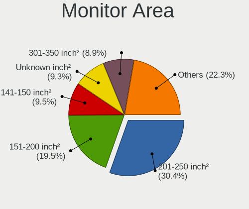

| Area in inch | Desktops | Percent |
|----------------|----------|---------|
| 201-250        | 81       | 29.78%  |
| 151-200        | 55       | 20.22%  |
| 141-150        | 33       | 12.13%  |
| Unknown        | 32       | 11.76%  |
| 301-350        | 21       | 7.72%   |
| 351-500        | 15       | 5.51%   |
| More than 1000 | 11       | 4.04%   |
| 501-1000       | 8        | 2.94%   |
| 101-110        | 6        | 2.21%   |
| 251-300        | 4        | 1.47%   |
| 111-120        | 4        | 1.47%   |
| 81-90          | 1        | 0.37%   |
| 131-140        | 1        | 0.37%   |

Pixel Density
-------------

Pixels per inch

| Density | Desktops | Percent |
|---------|----------|---------|
| 51-100  | 174      | 65.66%  |
| 101-120 | 44       | 16.6%   |
| Unknown | 32       | 12.08%  |
| 1-50    | 13       | 4.91%   |
| 161-240 | 1        | 0.38%   |
| 121-160 | 1        | 0.38%   |

Multiple Monitors
-----------------

Total monitors connected

| Total | Desktops | Percent |
|-------|----------|---------|
| 1     | 231      | 76.74%  |
| 2     | 40       | 13.29%  |
| 0     | 26       | 8.64%   |
| 3     | 3        | 1%      |
| 4     | 1        | 0.33%   |

Network
-------

Net Controller Vendor
---------------------

Controller vendors

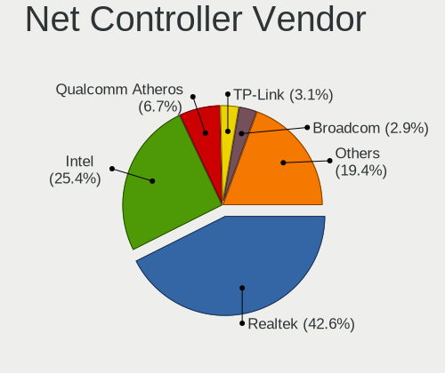

| Vendor                           | Desktops | Percent |
|----------------------------------|----------|---------|
| Realtek Semiconductor            | 173      | 43.25%  |
| Intel                            | 97       | 24.25%  |
| Qualcomm Atheros                 | 29       | 7.25%   |
| Broadcom                         | 12       | 3%      |
| TP-Link                          | 11       | 2.75%   |
| Ralink Technology                | 11       | 2.75%   |
| Huawei Technologies              | 10       | 2.5%    |
| Samsung Electronics              | 8        | 2%      |
| Nvidia                           | 8        | 2%      |
| Ralink                           | 4        | 1%      |
| D-Link System                    | 4        | 1%      |
| D-Link                           | 4        | 1%      |
| Microsoft                        | 3        | 0.75%   |
| Broadcom Limited                 | 3        | 0.75%   |
| Aquantia                         | 3        | 0.75%   |
| ZyXEL Communications             | 2        | 0.5%    |
| Silicon Integrated Systems [SiS] | 2        | 0.5%    |
| MediaTek                         | 2        | 0.5%    |
| Marvell Technology Group         | 2        | 0.5%    |
| ZTE WCDMA Technologies MSM       | 1        | 0.25%   |
| TRENDnet                         | 1        | 0.25%   |
| Spreadtrum Communications        | 1        | 0.25%   |
| Qualcomm Atheros Communications  | 1        | 0.25%   |
| Motorola                         | 1        | 0.25%   |
| Linux 2.6.31.6 with s3c-udc      | 1        | 0.25%   |
| IBM                              | 1        | 0.25%   |
| Foxconn / Hon Hai                | 1        | 0.25%   |
| Edimax Technology                | 1        | 0.25%   |
| CyberTAN Technology              | 1        | 0.25%   |
| Belkin Components                | 1        | 0.25%   |
| Unknown                          | 1        | 0.25%   |

Net Controller Model
--------------------

Controller models

| Model                                                             | Desktops | Percent |
|-------------------------------------------------------------------|----------|---------|
| Realtek RTL8111/8168/8411 PCI Express Gigabit Ethernet Controller | 138      | 31.08%  |
| Intel 82579LM Gigabit Network Connection (Lewisville)             | 17       | 3.83%   |
| Realtek RTL810xE PCI Express Fast Ethernet controller             | 15       | 3.38%   |
| Realtek RTL8188EUS 802.11n Wireless Network Adapter               | 13       | 2.93%   |
| Intel Ethernet Connection (2) I219-V                              | 12       | 2.7%    |
| Intel 82579V Gigabit Network Connection                           | 9        | 2.03%   |
| Ralink MT7601U Wireless Adapter                                   | 7        | 1.58%   |
| Qualcomm Atheros AR9287 Wireless Network Adapter (PCI-Express)    | 7        | 1.58%   |
| Intel I211 Gigabit Network Connection                             | 7        | 1.58%   |
| TP-Link TL-WN823N v2/v3 [Realtek RTL8192EU]                       | 6        | 1.35%   |
| Realtek RTL-8100/8101L/8139 PCI Fast Ethernet Adapter             | 6        | 1.35%   |
| Qualcomm Atheros AR5212/5213/2414 Wireless Network Adapter        | 6        | 1.35%   |
| Intel 82578DM Gigabit Network Connection                          | 6        | 1.35%   |
| Samsung Galaxy series, misc. (tethering mode)                     | 5        | 1.13%   |
| Realtek RTL8192CU 802.11n WLAN Adapter                            | 5        | 1.13%   |
| Intel Ethernet Connection (2) I219-LM                             | 5        | 1.13%   |
| Intel 82578DC Gigabit Network Connection                          | 5        | 1.13%   |
| Realtek RTL8188FTV 802.11b/g/n 1T1R 2.4G WLAN Adapter             | 4        | 0.9%    |
| Realtek RTL8125 2.5GbE Controller                                 | 4        | 0.9%    |
| Ralink RT5370 Wireless Adapter                                    | 4        | 0.9%    |
| Intel Wi-Fi 6 AX200                                               | 4        | 0.9%    |
| Intel 82566DM Gigabit Network Connection                          | 4        | 0.9%    |
| Huawei MAR-LX1A                                                   | 4        | 0.9%    |
| TP-Link 802.11ac WLAN Adapter                                     | 3        | 0.68%   |
| Samsung GT-I9070 (network tethering, USB debugging enabled)       | 3        | 0.68%   |
| Qualcomm Atheros QCA9565 / AR9565 Wireless Network Adapter        | 3        | 0.68%   |
| Nvidia MCP51 Ethernet Controller                                  | 3        | 0.68%   |
| Microsoft Xbox 360 Wireless Adapter                               | 3        | 0.68%   |
| Intel Ethernet Connection (7) I219-V                              | 3        | 0.68%   |
| Intel Ethernet Connection (2) I218-V                              | 3        | 0.68%   |
| Intel 82574L Gigabit Network Connection                           | 3        | 0.68%   |
| Intel 82566DM-2 Gigabit Network Connection                        | 3        | 0.68%   |
| Intel 82566DC-2 Gigabit Network Connection                        | 3        | 0.68%   |
| Intel 80003ES2LAN Gigabit Ethernet Controller (Copper)            | 3        | 0.68%   |
| Broadcom NetXtreme BCM5723 Gigabit Ethernet PCIe                  | 3        | 0.68%   |
| Silicon Integrated Systems [SiS] SiS900 PCI Fast Ethernet         | 2        | 0.45%   |
| Realtek RTL8192EU 802.11b/g/n WLAN Adapter                        | 2        | 0.45%   |
| Realtek RTL8192EE PCIe Wireless Network Adapter                   | 2        | 0.45%   |
| Realtek RTL8188EE Wireless Network Adapter                        | 2        | 0.45%   |
| Realtek RTL8169 PCI Gigabit Ethernet Controller                   | 2        | 0.45%   |
| Realtek RTL8153 Gigabit Ethernet Adapter                          | 2        | 0.45%   |
| Realtek RTL-8185 IEEE 802.11a/b/g Wireless LAN Controller         | 2        | 0.45%   |
| Ralink RT3060 Wireless 802.11n 1T/1R                              | 2        | 0.45%   |
| Qualcomm Atheros Killer E220x Gigabit Ethernet Controller         | 2        | 0.45%   |
| Qualcomm Atheros AR9227 Wireless Network Adapter                  | 2        | 0.45%   |
| Qualcomm Atheros AR8151 v2.0 Gigabit Ethernet                     | 2        | 0.45%   |
| Qualcomm Atheros AR8131 Gigabit Ethernet                          | 2        | 0.45%   |
| Qualcomm Atheros AR8121/AR8113/AR8114 Gigabit or Fast Ethernet    | 2        | 0.45%   |
| Nvidia MCP77 Ethernet                                             | 2        | 0.45%   |
| Nvidia MCP61 Ethernet                                             | 2        | 0.45%   |
| Marvell Group 88E8056 PCI-E Gigabit Ethernet Controller           | 2        | 0.45%   |
| Intel Wireless 8265 / 8275                                        | 2        | 0.45%   |
| Intel Wireless 8260                                               | 2        | 0.45%   |
| Intel Ethernet Connection I217-V                                  | 2        | 0.45%   |
| Intel Ethernet Connection I217-LM                                 | 2        | 0.45%   |
| Intel 82567LM-3 Gigabit Network Connection                        | 2        | 0.45%   |
| Intel 82562EZ 10/100 Ethernet Controller                          | 2        | 0.45%   |
| Huawei E353/E3131                                                 | 2        | 0.45%   |
| D-Link System DGE-528T Gigabit Ethernet Adapter                   | 2        | 0.45%   |
| D-Link 802.11 n WLAN                                              | 2        | 0.45%   |

Wireless Vendor
---------------

Wireless vendors

| Vendor                          | Desktops | Percent |
|---------------------------------|----------|---------|
| Realtek Semiconductor           | 36       | 32.43%  |
| Qualcomm Atheros                | 18       | 16.22%  |
| Intel                           | 12       | 10.81%  |
| Ralink Technology               | 11       | 9.91%   |
| TP-Link                         | 10       | 9.01%   |
| Ralink                          | 4        | 3.6%    |
| D-Link                          | 4        | 3.6%    |
| Microsoft                       | 3        | 2.7%    |
| ZyXEL Communications            | 2        | 1.8%    |
| D-Link System                   | 2        | 1.8%    |
| Broadcom                        | 2        | 1.8%    |
| ZTE WCDMA Technologies MSM      | 1        | 0.9%    |
| TRENDnet                        | 1        | 0.9%    |
| Qualcomm Atheros Communications | 1        | 0.9%    |
| MediaTek                        | 1        | 0.9%    |
| Edimax Technology               | 1        | 0.9%    |
| CyberTAN Technology             | 1        | 0.9%    |
| Belkin Components               | 1        | 0.9%    |

Wireless Model
--------------

Wireless models

| Model                                                                             | Desktops | Percent |
|-----------------------------------------------------------------------------------|----------|---------|
| Realtek RTL8188EUS 802.11n Wireless Network Adapter                               | 13       | 11.5%   |
| Ralink MT7601U Wireless Adapter                                                   | 7        | 6.19%   |
| Qualcomm Atheros AR9287 Wireless Network Adapter (PCI-Express)                    | 7        | 6.19%   |
| TP-Link TL-WN823N v2/v3 [Realtek RTL8192EU]                                       | 6        | 5.31%   |
| Qualcomm Atheros AR5212/5213/2414 Wireless Network Adapter                        | 6        | 5.31%   |
| Realtek RTL8192CU 802.11n WLAN Adapter                                            | 5        | 4.42%   |
| Realtek RTL8188FTV 802.11b/g/n 1T1R 2.4G WLAN Adapter                             | 4        | 3.54%   |
| Ralink RT5370 Wireless Adapter                                                    | 4        | 3.54%   |
| Intel Wi-Fi 6 AX200                                                               | 4        | 3.54%   |
| TP-Link 802.11ac WLAN Adapter                                                     | 3        | 2.65%   |
| Qualcomm Atheros QCA9565 / AR9565 Wireless Network Adapter                        | 3        | 2.65%   |
| Microsoft Xbox 360 Wireless Adapter                                               | 3        | 2.65%   |
| Realtek RTL8192EU 802.11b/g/n WLAN Adapter                                        | 2        | 1.77%   |
| Realtek RTL8192EE PCIe Wireless Network Adapter                                   | 2        | 1.77%   |
| Realtek RTL8188EE Wireless Network Adapter                                        | 2        | 1.77%   |
| Realtek RTL-8185 IEEE 802.11a/b/g Wireless LAN Controller                         | 2        | 1.77%   |
| Ralink RT3060 Wireless 802.11n 1T/1R                                              | 2        | 1.77%   |
| Qualcomm Atheros AR9227 Wireless Network Adapter                                  | 2        | 1.77%   |
| Intel Wireless 8265 / 8275                                                        | 2        | 1.77%   |
| Intel Wireless 8260                                                               | 2        | 1.77%   |
| D-Link 802.11 n WLAN                                                              | 2        | 1.77%   |
| ZyXEL ZyAIR G-202 802.11bg                                                        | 1        | 0.88%   |
| ZyXEL NWD2105 802.11bgn Wireless Adapter [Ralink RT3070]                          | 1        | 0.88%   |
| ZTE WCDMA MSM K3772-Z                                                             | 1        | 0.88%   |
| TRENDnet 802.11n WLAN Adapter                                                     | 1        | 0.88%   |
| TP-Link Archer T4UH wireless Realtek 8812AU                                       | 1        | 0.88%   |
| Realtek RTL8812AE 802.11ac PCIe Wireless Network Adapter                          | 1        | 0.88%   |
| Realtek RTL8192CE PCIe Wireless Network Adapter                                   | 1        | 0.88%   |
| Realtek RTL8191SU 802.11n WLAN Adapter                                            | 1        | 0.88%   |
| Realtek RTL8190 802.11n PCI Wireless Network Adapter                              | 1        | 0.88%   |
| Realtek RTL8188SU 802.11n WLAN Adapter                                            | 1        | 0.88%   |
| Realtek RTL8188GU 802.11n WLAN Adapter (After Modeswitch)                         | 1        | 0.88%   |
| Realtek RTL8188CUS 802.11n WLAN Adapter                                           | 1        | 0.88%   |
| Realtek RTL8187B Wireless 802.11g 54Mbps Network Adapter                          | 1        | 0.88%   |
| Ralink RT2790 Wireless 802.11n 1T/2R PCIe                                         | 1        | 0.88%   |
| Ralink RT2760 Wireless 802.11n 1T/2R                                              | 1        | 0.88%   |
| Qualcomm Atheros AR9271 802.11n                                                   | 1        | 0.88%   |
| MediaTek 802.11 n WLAN                                                            | 1        | 0.88%   |
| Intel Wireless 7265                                                               | 1        | 0.88%   |
| Intel Wireless 3160                                                               | 1        | 0.88%   |
| Intel Cannon Lake PCH CNVi WiFi                                                   | 1        | 0.88%   |
| Intel Alder Lake-S PCH CNVi WiFi                                                  | 1        | 0.88%   |
| Edimax EW-7811Un 802.11n Wireless Adapter [Realtek RTL8188CUS]                    | 1        | 0.88%   |
| D-Link System DWA-131 802.11n Wireless N Nano Adapter(rev.A1) [Realtek RTL8192SU] | 1        | 0.88%   |
| D-Link System DWA-126 802.11n Wireless Adapter [Atheros AR9271]                   | 1        | 0.88%   |
| D-Link DWA-131 Wireless N Nano Adapter (Rev. E1) [Realtek RTL8192EU]              | 1        | 0.88%   |
| D-Link DWA-125 Wireless N 150 Adapter(rev.A3) [Ralink RT5370]                     | 1        | 0.88%   |
| CyberTAN Siemens S30853-S1031-R351 802.11g Wireless Adapter [Atheros AR5523]      | 1        | 0.88%   |
| Broadcom BCM4360 802.11ac Wireless Network Adapter                                | 1        | 0.88%   |
| Broadcom BCM43217 802.11b/g/n                                                     | 1        | 0.88%   |
| Belkin Components F5D8053 N Wireless USB Adapter v3000 [Ralink RT2870]            | 1        | 0.88%   |

Ethernet Vendor
---------------

Ethernet vendors

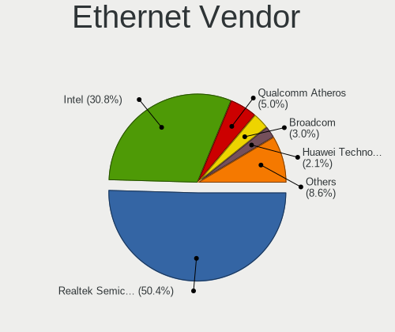

| Vendor                           | Desktops | Percent |
|----------------------------------|----------|---------|
| Realtek Semiconductor            | 164      | 51.25%  |
| Intel                            | 93       | 29.06%  |
| Qualcomm Atheros                 | 13       | 4.06%   |
| Broadcom                         | 10       | 3.13%   |
| Samsung Electronics              | 8        | 2.5%    |
| Nvidia                           | 8        | 2.5%    |
| Huawei Technologies              | 8        | 2.5%    |
| Broadcom Limited                 | 3        | 0.94%   |
| Aquantia                         | 3        | 0.94%   |
| Silicon Integrated Systems [SiS] | 2        | 0.63%   |
| Marvell Technology Group         | 2        | 0.63%   |
| D-Link System                    | 2        | 0.63%   |
| TP-Link                          | 1        | 0.31%   |
| Spreadtrum Communications        | 1        | 0.31%   |
| MediaTek                         | 1        | 0.31%   |
| Foxconn / Hon Hai                | 1        | 0.31%   |

Ethernet Model
--------------

Ethernet models

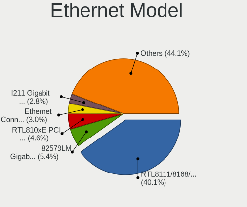

| Model                                                             | Desktops | Percent |
|-------------------------------------------------------------------|----------|---------|
| Realtek RTL8111/8168/8411 PCI Express Gigabit Ethernet Controller | 138      | 42.46%  |
| Intel 82579LM Gigabit Network Connection (Lewisville)             | 17       | 5.23%   |
| Realtek RTL810xE PCI Express Fast Ethernet controller             | 15       | 4.62%   |
| Intel Ethernet Connection (2) I219-V                              | 12       | 3.69%   |
| Intel 82579V Gigabit Network Connection                           | 9        | 2.77%   |
| Intel I211 Gigabit Network Connection                             | 7        | 2.15%   |
| Realtek RTL-8100/8101L/8139 PCI Fast Ethernet Adapter             | 6        | 1.85%   |
| Intel 82578DM Gigabit Network Connection                          | 6        | 1.85%   |
| Samsung Galaxy series, misc. (tethering mode)                     | 5        | 1.54%   |
| Intel Ethernet Connection (2) I219-LM                             | 5        | 1.54%   |
| Intel 82578DC Gigabit Network Connection                          | 5        | 1.54%   |
| Realtek RTL8125 2.5GbE Controller                                 | 4        | 1.23%   |
| Intel 82566DM Gigabit Network Connection                          | 4        | 1.23%   |
| Huawei MAR-LX1A                                                   | 4        | 1.23%   |
| Samsung GT-I9070 (network tethering, USB debugging enabled)       | 3        | 0.92%   |
| Nvidia MCP51 Ethernet Controller                                  | 3        | 0.92%   |
| Intel Ethernet Connection (7) I219-V                              | 3        | 0.92%   |
| Intel Ethernet Connection (2) I218-V                              | 3        | 0.92%   |
| Intel 82574L Gigabit Network Connection                           | 3        | 0.92%   |
| Intel 82566DM-2 Gigabit Network Connection                        | 3        | 0.92%   |
| Intel 82566DC-2 Gigabit Network Connection                        | 3        | 0.92%   |
| Intel 80003ES2LAN Gigabit Ethernet Controller (Copper)            | 3        | 0.92%   |
| Broadcom NetXtreme BCM5723 Gigabit Ethernet PCIe                  | 3        | 0.92%   |
| Silicon Integrated Systems [SiS] SiS900 PCI Fast Ethernet         | 2        | 0.62%   |
| Realtek RTL8169 PCI Gigabit Ethernet Controller                   | 2        | 0.62%   |
| Realtek RTL8153 Gigabit Ethernet Adapter                          | 2        | 0.62%   |
| Qualcomm Atheros Killer E220x Gigabit Ethernet Controller         | 2        | 0.62%   |
| Qualcomm Atheros AR8151 v2.0 Gigabit Ethernet                     | 2        | 0.62%   |
| Qualcomm Atheros AR8131 Gigabit Ethernet                          | 2        | 0.62%   |
| Qualcomm Atheros AR8121/AR8113/AR8114 Gigabit or Fast Ethernet    | 2        | 0.62%   |
| Nvidia MCP77 Ethernet                                             | 2        | 0.62%   |
| Nvidia MCP61 Ethernet                                             | 2        | 0.62%   |
| Marvell Group 88E8056 PCI-E Gigabit Ethernet Controller           | 2        | 0.62%   |
| Intel Ethernet Connection I217-V                                  | 2        | 0.62%   |
| Intel Ethernet Connection I217-LM                                 | 2        | 0.62%   |
| Intel 82567LM-3 Gigabit Network Connection                        | 2        | 0.62%   |
| Intel 82562EZ 10/100 Ethernet Controller                          | 2        | 0.62%   |
| Huawei E353/E3131                                                 | 2        | 0.62%   |
| D-Link System DGE-528T Gigabit Ethernet Adapter                   | 2        | 0.62%   |
| Broadcom Limited NetXtreme BCM5722 Gigabit Ethernet PCI Express   | 2        | 0.62%   |
| Aquantia AQC107 NBase-T/IEEE 802.3bz Ethernet Controller [AQtion] | 2        | 0.62%   |
| TP-Link M7200                                                     | 1        | 0.31%   |
| Spreadtrum Spreadtrum Phone                                       | 1        | 0.31%   |
| Qualcomm Atheros Attansic L2 Fast Ethernet                        | 1        | 0.31%   |
| Qualcomm Atheros Attansic L1 Gigabit Ethernet                     | 1        | 0.31%   |
| Qualcomm Atheros AR8161 Gigabit Ethernet                          | 1        | 0.31%   |
| Qualcomm Atheros AR8152 v2.0 Fast Ethernet                        | 1        | 0.31%   |
| Qualcomm Atheros AR8132 Fast Ethernet                             | 1        | 0.31%   |
| Nvidia MCP55 Ethernet                                             | 1        | 0.31%   |
| MediaTek SP514                                                    | 1        | 0.31%   |
| Intel PRO/100 VE Network Connection                               | 1        | 0.31%   |
| Intel I350 Gigabit Network Connection                             | 1        | 0.31%   |
| Intel Ethernet Controller I225-V                                  | 1        | 0.31%   |
| Intel Ethernet Connection (2) I218-LM                             | 1        | 0.31%   |
| Huawei Ideos (tethering mode)                                     | 1        | 0.31%   |
| Huawei ALE-L21                                                    | 1        | 0.31%   |
| Foxconn / Hon Hai Nokia 7.1                                       | 1        | 0.31%   |
| Broadcom NetXtreme BCM5764M Gigabit Ethernet PCIe                 | 1        | 0.31%   |
| Broadcom NetXtreme BCM5762 Gigabit Ethernet PCIe                  | 1        | 0.31%   |
| Broadcom NetXtreme BCM5761 Gigabit Ethernet PCIe                  | 1        | 0.31%   |

Net Controller Kind
-------------------

Ethernet, WiFi or modem

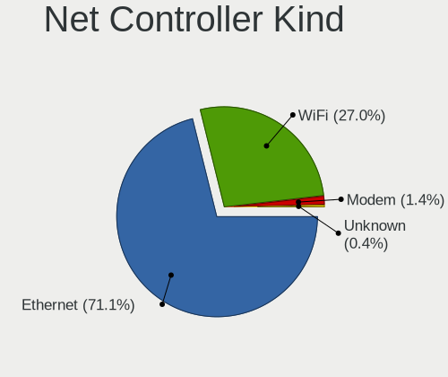

| Kind     | Desktops | Percent |
|----------|----------|---------|
| Ethernet | 289      | 72.25%  |
| WiFi     | 105      | 26.25%  |
| Modem    | 4        | 1%      |
| Unknown  | 2        | 0.5%    |

Used Controller
---------------

Currently used network controller

| Kind     | Desktops | Percent |
|----------|----------|---------|
| Ethernet | 221      | 74.66%  |
| WiFi     | 75       | 25.34%  |

NICs
----

Total network controllers on board

| Total | Desktops | Percent |
|-------|----------|---------|
| 1     | 233      | 78.45%  |
| 2     | 54       | 18.18%  |
| 3     | 6        | 2.02%   |
| 0     | 3        | 1.01%   |
| 4     | 1        | 0.34%   |

IPv6
----

IPv6 vs IPv4

| Used | Desktops | Percent |
|------|----------|---------|
| No   | 290      | 98.31%  |
| Yes  | 5        | 1.69%   |

Bluetooth
---------

Bluetooth Vendor
----------------

Controller vendors

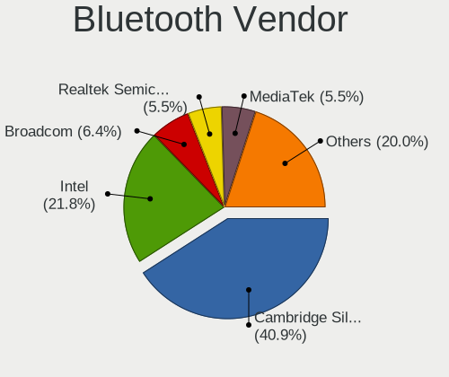

| Vendor                          | Desktops | Percent |
|---------------------------------|----------|---------|
| Cambridge Silicon Radio         | 21       | 47.73%  |
| Intel                           | 11       | 25%     |
| Qualcomm Atheros Communications | 3        | 6.82%   |
| Broadcom                        | 3        | 6.82%   |
| Apple                           | 3        | 6.82%   |
| Micro Star International        | 1        | 2.27%   |
| Edimax Technology               | 1        | 2.27%   |
| ASUSTek Computer                | 1        | 2.27%   |

Bluetooth Model
---------------

Controller models

| Model                                               | Desktops | Percent |
|-----------------------------------------------------|----------|---------|
| Cambridge Silicon Radio Bluetooth Dongle (HCI mode) | 21       | 47.73%  |
| Intel Bluetooth wireless interface                  | 6        | 13.64%  |
| Qualcomm Atheros  Bluetooth Device                  | 3        | 6.82%   |
| Intel AX200 Bluetooth                               | 3        | 6.82%   |
| Apple Bluetooth HCI                                 | 3        | 6.82%   |
| Broadcom BCM20702A0 Bluetooth 4.0                   | 2        | 4.55%   |
| Micro Star International Bluetooth dongle           | 1        | 2.27%   |
| Intel Bluetooth Device                              | 1        | 2.27%   |
| Intel Bluetooth 9460/9560 Jefferson Peak (JfP)      | 1        | 2.27%   |
| Edimax Wi-Fi N150 Bluetooth4.0 USB Adapter          | 1        | 2.27%   |
| Broadcom BCM2035 Bluetooth dongle                   | 1        | 2.27%   |
| ASUS Bluetooth Adapter                              | 1        | 2.27%   |

Sound
-----

Sound Vendor
------------

Sound card vendors

| Vendor                           | Desktops | Percent |
|----------------------------------|----------|---------|
| Intel                            | 224      | 49.56%  |
| Nvidia                           | 97       | 21.46%  |
| AMD                              | 79       | 17.48%  |
| C-Media Electronics              | 9        | 1.99%   |
| Creative Labs                    | 6        | 1.33%   |
| VIA Technologies                 | 3        | 0.66%   |
| Logitech                         | 3        | 0.66%   |
| Corsair                          | 3        | 0.66%   |
| Silicon Integrated Systems [SiS] | 2        | 0.44%   |
| Sennheiser Communications        | 2        | 0.44%   |
| Samson Technologies              | 2        | 0.44%   |
| Razer USA                        | 2        | 0.44%   |
| Plantronics                      | 2        | 0.44%   |
| Microsoft                        | 2        | 0.44%   |
| JMTek                            | 2        | 0.44%   |
| Hewlett-Packard                  | 2        | 0.44%   |
| ASUSTek Computer                 | 2        | 0.44%   |
| Syntek                           | 1        | 0.22%   |
| Sony                             | 1        | 0.22%   |
| Micro Star International         | 1        | 0.22%   |
| iPassion Technology              | 1        | 0.22%   |
| GYROCOM C&C                      | 1        | 0.22%   |
| GN Netcom                        | 1        | 0.22%   |
| Generalplus Technology           | 1        | 0.22%   |
| Cooler Master                    | 1        | 0.22%   |
| Cambridge Silicon Radio          | 1        | 0.22%   |
| Astro Gaming                     | 1        | 0.22%   |

Sound Model
-----------

Sound card models

| Model                                                                      | Desktops | Percent |
|----------------------------------------------------------------------------|----------|---------|
| Intel 6 Series/C200 Series Chipset Family High Definition Audio Controller | 50       | 10.04%  |
| Intel NM10/ICH7 Family High Definition Audio Controller                    | 29       | 5.82%   |
| Intel 100 Series/C230 Series Chipset Family HD Audio Controller            | 28       | 5.62%   |
| Intel 8 Series/C220 Series Chipset High Definition Audio Controller        | 24       | 4.82%   |
| Intel 7 Series/C216 Chipset Family High Definition Audio Controller        | 22       | 4.42%   |
| Intel Xeon E3-1200 v3/4th Gen Core Processor HD Audio Controller           | 17       | 3.41%   |
| Intel 5 Series/3400 Series Chipset High Definition Audio                   | 15       | 3.01%   |
| Nvidia High Definition Audio Controller                                    | 14       | 2.81%   |
| Nvidia GF108 High Definition Audio Controller                              | 13       | 2.61%   |
| AMD Starship/Matisse HD Audio Controller                                   | 13       | 2.61%   |
| Intel 200 Series PCH HD Audio                                              | 12       | 2.41%   |
| AMD Family 17h (Models 00h-0fh) HD Audio Controller                        | 12       | 2.41%   |
| AMD Ellesmere HDMI Audio [Radeon RX 470/480 / 570/580/590]                 | 11       | 2.21%   |
| Intel 82801JI (ICH10 Family) HD Audio Controller                           | 9        | 1.81%   |
| AMD SBx00 Azalia (Intel HDA)                                               | 8        | 1.61%   |
| AMD Oland/Hainan/Cape Verde/Pitcairn HDMI Audio [Radeon HD 7000 Series]    | 8        | 1.61%   |
| Nvidia GP107GL High Definition Audio Controller                            | 7        | 1.41%   |
| Nvidia GP104 High Definition Audio Controller                              | 7        | 1.41%   |
| Intel Cannon Lake PCH cAVS                                                 | 7        | 1.41%   |
| Intel 82801I (ICH9 Family) HD Audio Controller                             | 7        | 1.41%   |
| AMD Family 17h/19h HD Audio Controller                                     | 7        | 1.41%   |
| Nvidia GK104 HDMI Audio Controller                                         | 6        | 1.2%    |
| Nvidia GP106 High Definition Audio Controller                              | 5        | 1%      |
| Nvidia GF119 HDMI Audio Controller                                         | 5        | 1%      |
| AMD Cedar HDMI Audio [Radeon HD 5400/6300/7300 Series]                     | 5        | 1%      |
| AMD Baffin HDMI/DP Audio [Radeon RX 550 640SP / RX 560/560X]               | 5        | 1%      |
| Nvidia GM107 High Definition Audio Controller [GeForce 940MX]              | 4        | 0.8%    |
| Nvidia GK208 HDMI/DP Audio Controller                                      | 4        | 0.8%    |
| Intel 82801H (ICH8 Family) HD Audio Controller                             | 4        | 0.8%    |
| AMD Turks HDMI Audio [Radeon HD 6500/6600 / 6700M Series]                  | 4        | 0.8%    |
| AMD Raven/Raven2/Fenghuang HDMI/DP Audio Controller                        | 4        | 0.8%    |
| AMD Navi 10 HDMI Audio                                                     | 4        | 0.8%    |
| Nvidia GM204 High Definition Audio Controller                              | 3        | 0.6%    |
| Nvidia GF116 High Definition Audio Controller                              | 3        | 0.6%    |
| Intel C610/X99 series chipset HD Audio Controller                          | 3        | 0.6%    |
| Intel 631xESB/632xESB High Definition Audio Controller                     | 3        | 0.6%    |
| C-Media Electronics CMI8738/CMI8768 PCI Audio                              | 3        | 0.6%    |
| AMD Vega 10 HDMI Audio [Radeon Vega 56/64]                                 | 3        | 0.6%    |
| AMD Renoir Radeon High Definition Audio Controller                         | 3        | 0.6%    |
| AMD Family 15h (Models 60h-6fh) Audio Controller                           | 3        | 0.6%    |
| VIA Technologies VT8233/A/8235/8237 AC97 Audio Controller                  | 2        | 0.4%    |
| Silicon Integrated Systems [SiS] SiS7012 AC'97 Sound Controller            | 2        | 0.4%    |
| Nvidia TU116 High Definition Audio Controller                              | 2        | 0.4%    |
| Nvidia TU106 High Definition Audio Controller                              | 2        | 0.4%    |
| Nvidia MCP72XE/MCP72P/MCP78U/MCP78S High Definition Audio                  | 2        | 0.4%    |
| Nvidia MCP61 High Definition Audio                                         | 2        | 0.4%    |
| Nvidia MCP51 High Definition Audio                                         | 2        | 0.4%    |
| Nvidia GP108 High Definition Audio Controller                              | 2        | 0.4%    |
| Nvidia GP102 HDMI Audio Controller                                         | 2        | 0.4%    |
| Nvidia GM206 High Definition Audio Controller                              | 2        | 0.4%    |
| Nvidia GK107 HDMI Audio Controller                                         | 2        | 0.4%    |
| Microsoft LifeChat LX-3000 Headset                                         | 2        | 0.4%    |
| Intel 9 Series Chipset Family HD Audio Controller                          | 2        | 0.4%    |
| Intel 82801JD/DO (ICH10 Family) HD Audio Controller                        | 2        | 0.4%    |
| Intel 82801EB/ER (ICH5/ICH5R) AC'97 Audio Controller                       | 2        | 0.4%    |
| Hewlett-Packard E273m                                                      | 2        | 0.4%    |
| Creative Labs EMU10k2/CA0100/CA0102/CA10200 [Sound Blaster Audigy Series]  | 2        | 0.4%    |
| Creative Labs EMU10k1 [Sound Blaster Live! Series]                         | 2        | 0.4%    |
| AMD Tonga HDMI Audio [Radeon R9 285/380]                                   | 2        | 0.4%    |
| AMD Tobago HDMI Audio [Radeon R7 360 / R9 360 OEM]                         | 2        | 0.4%    |

Memory
------

Memory Vendor
-------------

Memory module vendors

| Vendor              | Desktops | Percent |
|---------------------|----------|---------|
| Kingston            | 20       | 16.67%  |
| Unknown             | 19       | 15.83%  |
| Corsair             | 17       | 14.17%  |
| SK Hynix            | 9        | 7.5%    |
| Transcend           | 7        | 5.83%   |
| Micron Technology   | 7        | 5.83%   |
| G.Skill             | 7        | 5.83%   |
| Samsung Electronics | 6        | 5%      |
| Patriot             | 6        | 5%      |
| Crucial             | 5        | 4.17%   |
| A-DATA Technology   | 5        | 4.17%   |
| Team                | 2        | 1.67%   |
| Klevv               | 2        | 1.67%   |
| Apacer              | 2        | 1.67%   |
| Strontium           | 1        | 0.83%   |
| Silicon Power       | 1        | 0.83%   |
| Ramaxel Technology  | 1        | 0.83%   |
| Qimonda             | 1        | 0.83%   |
| Kingmax             | 1        | 0.83%   |
| ELPIDA              | 1        | 0.83%   |

Memory Model
------------

Memory module models

| Model                                                                       | Desktops | Percent |
|-----------------------------------------------------------------------------|----------|---------|
| Unknown RAM Module 512MB DIMM 400MT/s                                       | 2        | 1.49%   |
| Unknown RAM Module 4GB DIMM 800MT/s                                         | 2        | 1.49%   |
| Unknown RAM Module 4GB DIMM 400MT/s                                         | 2        | 1.49%   |
| Unknown RAM Module 2048MB DIMM 1333MT/s                                     | 2        | 1.49%   |
| Transcend RAM TS512MLK64V6H 4GB DIMM DDR3 1600MT/s                          | 2        | 1.49%   |
| SK Hynix RAM HMT451U6BFR8C-PB 4096MB DIMM DDR3 1600MT/s                     | 2        | 1.49%   |
| SK Hynix RAM HMT451U6BFR8A-PB 4GB DIMM DDR3 1600MT/s                        | 2        | 1.49%   |
| SK Hynix RAM HMT451U6AFR8C-PB 4096MB DIMM DDR3 1600MT/s                     | 2        | 1.49%   |
| Patriot RAM PSD48G266681 8192MB DIMM DDR4 2934MT/s                          | 2        | 1.49%   |
| Patriot RAM PSD38G16002 8GB DIMM DDR3 1600MT/s                              | 2        | 1.49%   |
| Micron RAM 8JTF51264AZ-1G6E1 4096MB DIMM DDR3 1600MT/s                      | 2        | 1.49%   |
| Klevv RAM KD4AGUA8A-26N1900 16GB DIMM DDR4 2667MT/s                         | 2        | 1.49%   |
| Kingston RAM 9905678-023.A00G 8192MB DIMM DDR4 2134MT/s                     | 2        | 1.49%   |
| G.Skill RAM F4-3200C16-8GVKB 8GB DIMM DDR4 3200MT/s                         | 2        | 1.49%   |
| Corsair RAM CMZ8GX3M1A1600C10 8GB DIMM DDR3 800MT/s                         | 2        | 1.49%   |
| Corsair RAM CMZ4GX3M1A1600C9 4096MB DIMM DDR3 1600MT/s                      | 2        | 1.49%   |
| Corsair RAM CMK32GX4M2A2666C16 16GB DIMM DDR4 3100MT/s                      | 2        | 1.49%   |
| A-DATA RAM Module 8192MB DIMM DDR4 2133MT/s                                 | 2        | 1.49%   |
| Unknown RAM Module 8GB DIMM DDR3 1333MT/s                                   | 1        | 0.75%   |
| Unknown RAM Module 4GB DIMM 1333MT/s                                        | 1        | 0.75%   |
| Unknown RAM Module 4096MB DIMM DDR3 1333MT/s                                | 1        | 0.75%   |
| Unknown RAM Module 4096MB DIMM                                              | 1        | 0.75%   |
| Unknown RAM Module 2GB DIMM DDR2 800MT/s                                    | 1        | 0.75%   |
| Unknown RAM Module 2GB DIMM DDR2 667MT/s                                    | 1        | 0.75%   |
| Unknown RAM Module 2GB DIMM 800MT/s                                         | 1        | 0.75%   |
| Unknown RAM Module 2GB DIMM 1333MT/s                                        | 1        | 0.75%   |
| Unknown RAM Module 2048MB DIMM DDR2 800MT/s                                 | 1        | 0.75%   |
| Unknown RAM Module 2048MB DIMM DDR 800MT/s                                  | 1        | 0.75%   |
| Unknown RAM Module 2048MB DIMM 41632MT/s                                    | 1        | 0.75%   |
| Unknown RAM Module 1GB DIMM DDR2 667MT/s                                    | 1        | 0.75%   |
| Unknown RAM Module 1GB DIMM                                                 | 1        | 0.75%   |
| Unknown RAM Module 1024MB DIMM DDR 133MT/s                                  | 1        | 0.75%   |
| Transcend RAM TS1GLK64V3H 8192MB DIMM DDR3 1067MT/s                         | 1        | 0.75%   |
| Transcend RAM TS1GLH64V1H 8GB DIMM DDR4 2133MT/s                            | 1        | 0.75%   |
| Transcend RAM JM1333KLN-4G 4GB DIMM DDR3 1333MT/s                           | 1        | 0.75%   |
| Transcend RAM JM1333KLH-8G 8192MB DIMM DDR3 1333MT/s                        | 1        | 0.75%   |
| Transcend RAM 4A4D383030514C552D314720202020202020 1024MB DIMM DDR2 800MT/s | 1        | 0.75%   |
| Transcend RAM 4A4D383030514C4A2D314720202020202020 1024MB DIMM DDR2 800MT/s | 1        | 0.75%   |
| Team RAM TEAMGROUP-UD4-3200 8GB DIMM DDR4 3200MT/s                          | 1        | 0.75%   |
| Team RAM Elite-1333 4GB DIMM DDR3 1333MT/s                                  | 1        | 0.75%   |
| Strontium RAM SRT4G86U1-P9H 4096MB DIMM DDR3 1333MT/s                       | 1        | 0.75%   |
| SK Hynix RAM Module 8GB SODIMM DDR4 2133MT/s                                | 1        | 0.75%   |
| SK Hynix RAM HMT351U6EFR8C-PB 4GB DIMM DDR3 1800MT/s                        | 1        | 0.75%   |
| SK Hynix RAM HMT351U6CFR8C-PB 4096MB DIMM DDR3 1800MT/s                     | 1        | 0.75%   |
| SK Hynix RAM HMT351U6BFR8C-H9 4096MB DIMM DDR3 1333MT/s                     | 1        | 0.75%   |
| SK Hynix RAM HMT351S6EFR8A-PB 4096MB SODIMM DDR3 1600MT/s                   | 1        | 0.75%   |
| SK Hynix RAM HMA81GU6AFR8N-UH 8192MB DIMM DDR4 2400MT/s                     | 1        | 0.75%   |
| SK Hynix RAM HMA451U6AFR8N-TF 4096MB DIMM DDR4 2133MT/s                     | 1        | 0.75%   |
| SK Hynix RAM DMT125U6BFR8C-H9 2GB DIMM DDR3 1333MT/s                        | 1        | 0.75%   |
| Silicon Power RAM DBLT4GN568S 4GB DIMM 1333MT/s                             | 1        | 0.75%   |
| Samsung RAM M471B5173EB0-YK0 4GB SODIMM DDR3 1600MT/s                       | 1        | 0.75%   |
| Samsung RAM M471A5244CB0-CTD 4GB SODIMM DDR4 3266MT/s                       | 1        | 0.75%   |
| Samsung RAM M471A5143EB0-CPB 4096MB SODIMM DDR4 2133MT/s                    | 1        | 0.75%   |
| Samsung RAM M378B5273DH0-CK0 4GB DIMM DDR3 2200MT/s                         | 1        | 0.75%   |
| Samsung RAM M378B1G73QH0-CK0 8GB DIMM DDR3 1600MT/s                         | 1        | 0.75%   |
| Samsung RAM M378A5244CB0-CRC 4GB DIMM DDR4 3066MT/s                         | 1        | 0.75%   |
| Ramaxel RAM RML1520EG38D6W-667 512MB DIMM DDR2 667MT/s                      | 1        | 0.75%   |
| Qimonda RAM 64T64000HU3SB 512MB DIMM DDR2 667MT/s                           | 1        | 0.75%   |
| Patriot RAM PSD32G13332 2GB DIMM DDR3 1333MT/s                              | 1        | 0.75%   |
| Patriot RAM PSD22G80026 2048MB DIMM DDR2 800MT/s                            | 1        | 0.75%   |

Memory Kind
-----------

Memory module kinds

| Kind    | Desktops | Percent |
|---------|----------|---------|
| DDR3    | 43       | 41.75%  |
| DDR4    | 38       | 36.89%  |
| Unknown | 13       | 12.62%  |
| DDR2    | 7        | 6.8%    |
| DDR     | 2        | 1.94%   |

Memory Form Factor
------------------

Physical design of the memory module

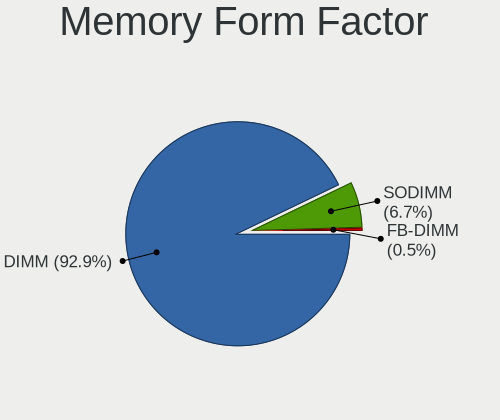

| Name    | Desktops | Percent |
|---------|----------|---------|
| DIMM    | 95       | 92.23%  |
| SODIMM  | 7        | 6.8%    |
| FB-DIMM | 1        | 0.97%   |

Memory Size
-----------

Memory module size

| Size  | Desktops | Percent |
|-------|----------|---------|
| 4096  | 43       | 38.39%  |
| 8192  | 36       | 32.14%  |
| 2048  | 13       | 11.61%  |
| 16384 | 11       | 9.82%   |
| 1024  | 5        | 4.46%   |
| 512   | 3        | 2.68%   |
| 32768 | 1        | 0.89%   |

Memory Speed
------------

Memory module speed

| Speed   | Desktops | Percent |
|---------|----------|---------|
| 1600    | 25       | 22.12%  |
| 1333    | 20       | 17.7%   |
| 2133    | 8        | 7.08%   |
| 800     | 8        | 7.08%   |
| 2667    | 5        | 4.42%   |
| 3466    | 4        | 3.54%   |
| 2400    | 4        | 3.54%   |
| 400     | 4        | 3.54%   |
| 667     | 3        | 2.65%   |
| 3600    | 2        | 1.77%   |
| 3200    | 2        | 1.77%   |
| 3100    | 2        | 1.77%   |
| 2934    | 2        | 1.77%   |
| 2933    | 2        | 1.77%   |
| 2666    | 2        | 1.77%   |
| 2134    | 2        | 1.77%   |
| 1867    | 2        | 1.77%   |
| 1800    | 2        | 1.77%   |
| 1067    | 2        | 1.77%   |
| Unknown | 2        | 1.77%   |
| 41632   | 1        | 0.88%   |
| 6000    | 1        | 0.88%   |
| 3733    | 1        | 0.88%   |
| 3533    | 1        | 0.88%   |
| 3266    | 1        | 0.88%   |
| 3066    | 1        | 0.88%   |
| 3000    | 1        | 0.88%   |
| 2733    | 1        | 0.88%   |
| 2200    | 1        | 0.88%   |
| 133     | 1        | 0.88%   |

Printers & scanners
-------------------

Printer Vendor
--------------

Printer device vendors

| Vendor              | Desktops | Percent |
|---------------------|----------|---------|
| Samsung Electronics | 4        | 28.57%  |
| Pantum              | 3        | 21.43%  |
| Canon               | 3        | 21.43%  |
| Seiko Epson         | 1        | 7.14%   |
| Hewlett-Packard     | 1        | 7.14%   |
| Dell                | 1        | 7.14%   |
| Brother Industries  | 1        | 7.14%   |

Printer Model
-------------

Printer device models

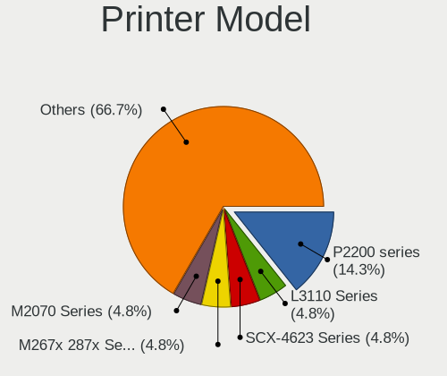

| Model                        | Desktops | Percent |
|------------------------------|----------|---------|
| Pantum P2200 series          | 3        | 21.43%  |
| Seiko Epson L3110 Series     | 1        | 7.14%   |
| Samsung SCX-4623 Series      | 1        | 7.14%   |
| Samsung M2070 Series         | 1        | 7.14%   |
| Samsung M2020 Series         | 1        | 7.14%   |
| Samsung Composite Device     | 1        | 7.14%   |
| HP OfficeJet Pro 9010 series | 1        | 7.14%   |
| Dell 1250c Color Printer     | 1        | 7.14%   |
| Canon PIXMA MX410            | 1        | 7.14%   |
| Canon PIXMA MG3600 Series    | 1        | 7.14%   |
| Canon G3010 series           | 1        | 7.14%   |
| Brother HL-2130 series       | 1        | 7.14%   |

Scanner Vendor
--------------

Scanner device vendors

| Vendor          | Desktops | Percent |
|-----------------|----------|---------|
| Seiko Epson     | 1        | 50%     |
| Hewlett-Packard | 1        | 50%     |

Scanner Model
-------------

Scanner device models

| Model                                              | Desktops | Percent |
|----------------------------------------------------|----------|---------|
| Seiko Epson GT-8400UF [Perfection 1670/1670 PHOTO] | 1        | 50%     |
| HP OfficeJet 6110                                  | 1        | 50%     |

Camera
------

Camera Vendor
-------------

Camera device vendors

| Vendor                        | Desktops | Percent |
|-------------------------------|----------|---------|
| Logitech                      | 16       | 50%     |
| Microsoft                     | 4        | 12.5%   |
| Sunplus Innovation Technology | 2        | 6.25%   |
| Samsung Electronics           | 2        | 6.25%   |
| Apple                         | 2        | 6.25%   |
| Z-Star Microelectronics       | 1        | 3.13%   |
| Syntek                        | 1        | 3.13%   |
| SN0002                        | 1        | 3.13%   |
| KYE Systems (Mouse Systems)   | 1        | 3.13%   |
| Google                        | 1        | 3.13%   |
| Asuscom Network               | 1        | 3.13%   |

Camera Model
------------

Camera device models

| Model                                     | Desktops | Percent |
|-------------------------------------------|----------|---------|
| Logitech Webcam C270                      | 5        | 15.15%  |
| Logitech Webcam C170                      | 3        | 9.09%   |
| Sunplus Canyon CNS-CWC5 Webcam            | 2        | 6.06%   |
| Microsoft LifeCam VX-800                  | 2        | 6.06%   |
| Logitech Webcam C200                      | 2        | 6.06%   |
| Z-Star Venus USB2.0 Camera                | 1        | 3.03%   |
| Syntek XYZ printing cameraR2              | 1        | 3.03%   |
| Syntek XYZ printing cameraL2              | 1        | 3.03%   |
| SN0002 1080P Web Camera                   | 1        | 3.03%   |
| Samsung USB2.0 UVC HQ WebCam              | 1        | 3.03%   |
| Samsung Galaxy A5 (MTP)                   | 1        | 3.03%   |
| Microsoft LifeCam HD-3000                 | 1        | 3.03%   |
| Microsoft LifeCam Cinema                  | 1        | 3.03%   |
| Logitech Webcam C210                      | 1        | 3.03%   |
| Logitech QuickCam Sphere                  | 1        | 3.03%   |
| Logitech QuickCam Pro 9000                | 1        | 3.03%   |
| Logitech HD Webcam C615                   | 1        | 3.03%   |
| Logitech HD Webcam C525                   | 1        | 3.03%   |
| Logitech C920 PRO HD Webcam               | 1        | 3.03%   |
| KYE Systems (Mouse Systems) FaceCam 1000X | 1        | 3.03%   |
| Google HD USB Camera                      | 1        | 3.03%   |
| Asuscom Network HD 1080P PC-Camera        | 1        | 3.03%   |
| Apple iPod Touch 5.Gen [A1421]            | 1        | 3.03%   |
| Apple iPhone 5/5C/5S/6/SE                 | 1        | 3.03%   |

Security
--------

Fingerprint Vendor
------------------

Fingerprint sensor vendors

Zero info for selected period =(

Fingerprint Model
-----------------

Fingerprint sensor models

Zero info for selected period =(

Chipcard Vendor
---------------

Chipcard module vendors

Zero info for selected period =(

Chipcard Model
--------------

Chipcard module models

Zero info for selected period =(

Unsupported
-----------

Unsupported Devices
-------------------

Total unsupported devices on board

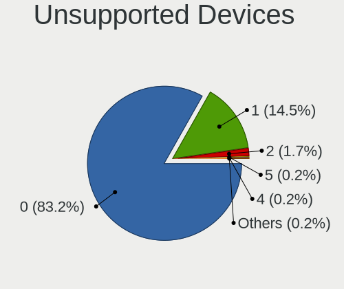

| Total | Desktops | Percent |
|-------|----------|---------|
| 0     | 249      | 84.12%  |
| 1     | 39       | 13.18%  |
| 2     | 7        | 2.36%   |
| 5     | 1        | 0.34%   |

Unsupported Device Types
------------------------

Types of unsupported devices

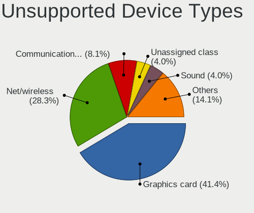

| Type                     | Desktops | Percent |
|--------------------------|----------|---------|
| Graphics card            | 24       | 44.44%  |
| Net/wireless             | 12       | 22.22%  |
| Communication controller | 6        | 11.11%  |
| Unassigned class         | 3        | 5.56%   |
| Sound                    | 3        | 5.56%   |
| Net/ethernet             | 2        | 3.7%    |
| Storage/nvme             | 1        | 1.85%   |
| Network                  | 1        | 1.85%   |
| Modem                    | 1        | 1.85%   |
| Camera                   | 1        | 1.85%   |

