Linux in South Africa - Tested Hardware & Statistics (Notebooks)
----------------------------------------------------------------

A project to collect tested hardware configurations for Linux in South Africa.

Anyone can contribute to this report by the [hw-probe](https://github.com/linuxhw/hw-probe) tool:

    sudo -E hw-probe -all -upload

Please contribute! Especially if your hardware is rare.

Contents
--------

* [ Test Cases ](#test-cases)

* [ System ](#system)
  - [ OS                       ](#os)
  - [ OS Family                ](#os-family)
  - [ Kernel                   ](#kernel)
  - [ Kernel Family            ](#kernel-family)
  - [ Kernel Major Ver.        ](#kernel-major-ver)
  - [ Arch                     ](#arch)
  - [ DE                       ](#de)
  - [ Display Server           ](#display-server)
  - [ Display Manager          ](#display-manager)
  - [ OS Lang                  ](#os-lang)
  - [ Boot Mode                ](#boot-mode)
  - [ Filesystem               ](#filesystem)
  - [ Part. scheme             ](#part-scheme)
  - [ Dual Boot with Linux/BSD ](#dual-boot-with-linuxbsd)
  - [ Dual Boot (Win)          ](#dual-boot-win)

* [ Board ](#board)
  - [ Vendor                   ](#vendor)
  - [ Model                    ](#model)
  - [ Model Family             ](#model-family)
  - [ MFG Year                 ](#mfg-year)
  - [ Form Factor              ](#form-factor)
  - [ Secure Boot              ](#secure-boot)
  - [ Coreboot                 ](#coreboot)
  - [ RAM Size                 ](#ram-size)
  - [ RAM Used                 ](#ram-used)
  - [ Total Drives             ](#total-drives)
  - [ Has CD-ROM               ](#has-cd-rom)
  - [ Has Ethernet             ](#has-ethernet)
  - [ Has WiFi                 ](#has-wifi)
  - [ Has Bluetooth            ](#has-bluetooth)

* [ Location ](#location)
  - [ Country                  ](#country)
  - [ City                     ](#city)

* [ Drives ](#drives)
  - [ Drive Vendor             ](#drive-vendor)
  - [ Drive Model              ](#drive-model)
  - [ HDD Vendor               ](#hdd-vendor)
  - [ SSD Vendor               ](#ssd-vendor)
  - [ Drive Kind               ](#drive-kind)
  - [ Drive Connector          ](#drive-connector)
  - [ Drive Size               ](#drive-size)
  - [ Space Total              ](#space-total)
  - [ Space Used               ](#space-used)
  - [ Malfunc. Drives          ](#malfunc-drives)
  - [ Malfunc. Drive Vendor    ](#malfunc-drive-vendor)
  - [ Malfunc. HDD Vendor      ](#malfunc-hdd-vendor)
  - [ Malfunc. Drive Kind      ](#malfunc-drive-kind)
  - [ Failed Drives            ](#failed-drives)
  - [ Failed Drive Vendor      ](#failed-drive-vendor)
  - [ Drive Status             ](#drive-status)

* [ Storage controller ](#storage-controller)
  - [ Storage Vendor           ](#storage-vendor)
  - [ Storage Model            ](#storage-model)
  - [ Storage Kind             ](#storage-kind)

* [ Processor ](#processor)
  - [ CPU Vendor               ](#cpu-vendor)
  - [ CPU Model                ](#cpu-model)
  - [ CPU Model Family         ](#cpu-model-family)
  - [ CPU Cores                ](#cpu-cores)
  - [ CPU Sockets              ](#cpu-sockets)
  - [ CPU Threads              ](#cpu-threads)
  - [ CPU Op-Modes             ](#cpu-op-modes)
  - [ CPU Microcode            ](#cpu-microcode)
  - [ CPU Microarch            ](#cpu-microarch)

* [ Graphics ](#graphics)
  - [ GPU Vendor               ](#gpu-vendor)
  - [ GPU Model                ](#gpu-model)
  - [ GPU Combo                ](#gpu-combo)
  - [ GPU Driver               ](#gpu-driver)
  - [ GPU Memory               ](#gpu-memory)

* [ Monitor ](#monitor)
  - [ Monitor Vendor           ](#monitor-vendor)
  - [ Monitor Model            ](#monitor-model)
  - [ Monitor Resolution       ](#monitor-resolution)
  - [ Monitor Diagonal         ](#monitor-diagonal)
  - [ Monitor Width            ](#monitor-width)
  - [ Aspect Ratio             ](#aspect-ratio)
  - [ Monitor Area             ](#monitor-area)
  - [ Pixel Density            ](#pixel-density)
  - [ Multiple Monitors        ](#multiple-monitors)

* [ Network ](#network)
  - [ Net Controller Vendor    ](#net-controller-vendor)
  - [ Net Controller Model     ](#net-controller-model)
  - [ Wireless Vendor          ](#wireless-vendor)
  - [ Wireless Model           ](#wireless-model)
  - [ Ethernet Vendor          ](#ethernet-vendor)
  - [ Ethernet Model           ](#ethernet-model)
  - [ Net Controller Kind      ](#net-controller-kind)
  - [ Used Controller          ](#used-controller)
  - [ NICs                     ](#nics)
  - [ IPv6                     ](#ipv6)

* [ Bluetooth ](#bluetooth)
  - [ Bluetooth Vendor         ](#bluetooth-vendor)
  - [ Bluetooth Model          ](#bluetooth-model)

* [ Sound ](#sound)
  - [ Sound Vendor             ](#sound-vendor)
  - [ Sound Model              ](#sound-model)

* [ Memory ](#memory)
  - [ Memory Vendor            ](#memory-vendor)
  - [ Memory Model             ](#memory-model)
  - [ Memory Kind              ](#memory-kind)
  - [ Memory Form Factor       ](#memory-form-factor)
  - [ Memory Size              ](#memory-size)
  - [ Memory Speed             ](#memory-speed)

* [ Printers & scanners ](#printers--scanners)
  - [ Printer Vendor           ](#printer-vendor)
  - [ Printer Model            ](#printer-model)
  - [ Scanner Vendor           ](#scanner-vendor)
  - [ Scanner Model            ](#scanner-model)

* [ Camera ](#camera)
  - [ Camera Vendor            ](#camera-vendor)
  - [ Camera Model             ](#camera-model)

* [ Security ](#security)
  - [ Fingerprint Vendor       ](#fingerprint-vendor)
  - [ Fingerprint Model        ](#fingerprint-model)
  - [ Chipcard Vendor          ](#chipcard-vendor)
  - [ Chipcard Model           ](#chipcard-model)

* [ Unsupported ](#unsupported)
  - [ Unsupported Devices      ](#unsupported-devices)
  - [ Unsupported Device Types ](#unsupported-device-types)

Test Cases
----------

Total: 1514

| Vendor        | Model                       | Probe                                                      | Date         |
|---------------|-----------------------------|------------------------------------------------------------|--------------|
| Lenovo        | G580 20150                  | [d3d07e533b](https://linux-hardware.org/?probe=d3d07e533b) | Jan 03, 2026 |
| Lenovo        | G580 20150                  | [66dd7cee8c](https://linux-hardware.org/?probe=66dd7cee8c) | Dec 31, 2025 |
| CONNEX        | L1430 PRO                   | [444862d127](https://linux-hardware.org/?probe=444862d127) | Dec 31, 2025 |
| Lenovo        | Z51-70 80K6                 | [ea057123cf](https://linux-hardware.org/?probe=ea057123cf) | Dec 28, 2025 |
| Lenovo        | Z51-70 80K6                 | [4423a0f909](https://linux-hardware.org/?probe=4423a0f909) | Dec 28, 2025 |
| Acer          | Aspire A315-53              | [71519fe003](https://linux-hardware.org/?probe=71519fe003) | Dec 27, 2025 |
| HUAWEI        | BOD-WXX9                    | [670417e510](https://linux-hardware.org/?probe=670417e510) | Dec 27, 2025 |
| HP            | EliteBook 840 14 inch G9... | [52100cc26c](https://linux-hardware.org/?probe=52100cc26c) | Dec 26, 2025 |
| MSI           | GF63 Thin 10SC              | [881f0fd9ba](https://linux-hardware.org/?probe=881f0fd9ba) | Dec 25, 2025 |
| Acer          | Aspire SW5-014              | [0238fceca6](https://linux-hardware.org/?probe=0238fceca6) | Dec 24, 2025 |
| Lenovo        | G580 20150                  | [26d5ef86b9](https://linux-hardware.org/?probe=26d5ef86b9) | Dec 20, 2025 |
| Sony          | SVF1521Q1EW                 | [8bdd4a1931](https://linux-hardware.org/?probe=8bdd4a1931) | Dec 19, 2025 |
| Dell          | Pro 16 Plus PB16250         | [6bec15e533](https://linux-hardware.org/?probe=6bec15e533) | Dec 15, 2025 |
| ASUSTek       | Zenbook UM3402YAR_UM3402... | [347a6269a1](https://linux-hardware.org/?probe=347a6269a1) | Dec 11, 2025 |
| ASUSTek       | VivoBook_ASUSLaptop X509... | [48ea1056dd](https://linux-hardware.org/?probe=48ea1056dd) | Dec 09, 2025 |
| Apple         | MacBookAir7,2               | [55d44e33a0](https://linux-hardware.org/?probe=55d44e33a0) | Dec 09, 2025 |
| Lenovo        | IdeaPad Gaming 3 15ARH7 ... | [cf54d3afae](https://linux-hardware.org/?probe=cf54d3afae) | Dec 09, 2025 |
| Lenovo        | Legion Y530-15ICH 81FV      | [5914385adc](https://linux-hardware.org/?probe=5914385adc) | Dec 06, 2025 |
| Standard      | Unknown                     | [e704f99bb6](https://linux-hardware.org/?probe=e704f99bb6) | Dec 03, 2025 |
| Dell          | Latitude E5570              | [422af784ef](https://linux-hardware.org/?probe=422af784ef) | Dec 03, 2025 |
| Lenovo        | ThinkPad T540p 20BFS0FL0... | [b9c868d597](https://linux-hardware.org/?probe=b9c868d597) | Dec 03, 2025 |
| HP            | Unknown                     | [f447f7bbd9](https://linux-hardware.org/?probe=f447f7bbd9) | Nov 29, 2025 |
| ASUSTek       | Vivobook Go E1504GAB_E15... | [3c60b89e92](https://linux-hardware.org/?probe=3c60b89e92) | Nov 27, 2025 |
| Toshiba       | Satellite U300              | [361a846f1e](https://linux-hardware.org/?probe=361a846f1e) | Nov 24, 2025 |
| Lenovo        | ThinkPad E15 Gen 2 20TD0... | [031cea76d5](https://linux-hardware.org/?probe=031cea76d5) | Nov 22, 2025 |
| Lenovo        | ThinkPad E16 Gen 2 21MA0... | [9b12af1d5b](https://linux-hardware.org/?probe=9b12af1d5b) | Nov 21, 2025 |
| Lenovo        | ThinkPad E15 Gen 2 20TD0... | [22789fc20e](https://linux-hardware.org/?probe=22789fc20e) | Nov 20, 2025 |
| Lenovo        | G50-70 20351                | [a71f431057](https://linux-hardware.org/?probe=a71f431057) | Nov 18, 2025 |
| Unknown       | Unknown                     | [5dafcfab6f](https://linux-hardware.org/?probe=5dafcfab6f) | Nov 16, 2025 |
| ASUSTek       | ASUS TUF Gaming F15 FX50... | [191e89595d](https://linux-hardware.org/?probe=191e89595d) | Nov 15, 2025 |
| ASUSTek       | VivoBook_ASUSLaptop X509... | [b5cfa41d9b](https://linux-hardware.org/?probe=b5cfa41d9b) | Nov 14, 2025 |
| Lenovo        | G50-70 20351                | [f5313d1d44](https://linux-hardware.org/?probe=f5313d1d44) | Nov 14, 2025 |
| Dell          | Latitude 7430               | [08ad49a6d1](https://linux-hardware.org/?probe=08ad49a6d1) | Nov 13, 2025 |
| MSI           | GE63VR 7RE                  | [e525adb6d1](https://linux-hardware.org/?probe=e525adb6d1) | Nov 09, 2025 |
| Toshiba       | Satellite C50-A0254         | [85bb650263](https://linux-hardware.org/?probe=85bb650263) | Nov 08, 2025 |
| Acer          | Extensa 215-55              | [2aa22bc317](https://linux-hardware.org/?probe=2aa22bc317) | Nov 06, 2025 |
| Acer          | Extensa 215-55              | [b9f7e89dd5](https://linux-hardware.org/?probe=b9f7e89dd5) | Nov 06, 2025 |
| Unknown       | Unknown                     | [a8c08e1710](https://linux-hardware.org/?probe=a8c08e1710) | Nov 05, 2025 |
| Dell          | Inspiron 5559               | [881e9a9fcb](https://linux-hardware.org/?probe=881e9a9fcb) | Nov 04, 2025 |
| HP            | Unknown                     | [4f80d79c33](https://linux-hardware.org/?probe=4f80d79c33) | Nov 04, 2025 |
| Dell          | Latitude E6410              | [3aa870d787](https://linux-hardware.org/?probe=3aa870d787) | Nov 03, 2025 |
| Lenovo        | ThinkPad T540p 20BFS0FL0... | [dd5e280abc](https://linux-hardware.org/?probe=dd5e280abc) | Nov 03, 2025 |
| ASUSTek       | VivoBook_ASUSLaptop X571... | [e7d875961b](https://linux-hardware.org/?probe=e7d875961b) | Nov 01, 2025 |
| HP            | Unknown                     | [58f5dfa9c7](https://linux-hardware.org/?probe=58f5dfa9c7) | Nov 01, 2025 |
| HP            | Unknown                     | [5e58373373](https://linux-hardware.org/?probe=5e58373373) | Oct 30, 2025 |
| Lenovo        | ThinkPad T540p 20BFS0FL0... | [a5fc656834](https://linux-hardware.org/?probe=a5fc656834) | Oct 28, 2025 |
| Apple         | MacBookPro9,1               | [2dce167aec](https://linux-hardware.org/?probe=2dce167aec) | Oct 28, 2025 |
| HP            | Laptop 15-bs0xx             | [54e6177317](https://linux-hardware.org/?probe=54e6177317) | Oct 23, 2025 |
| HP            | EliteBook 2540p             | [c8ce631a86](https://linux-hardware.org/?probe=c8ce631a86) | Oct 21, 2025 |
| HP            | EliteBook 2540p             | [a03750e25c](https://linux-hardware.org/?probe=a03750e25c) | Oct 21, 2025 |
| Dell          | Inspiron 15-3567            | [3bc87565bb](https://linux-hardware.org/?probe=3bc87565bb) | Oct 21, 2025 |
| Lenovo        | E50-80 80J2                 | [3799ff59dd](https://linux-hardware.org/?probe=3799ff59dd) | Oct 21, 2025 |
| HP            | Laptop 15-bs0xx             | [594e6c55d7](https://linux-hardware.org/?probe=594e6c55d7) | Oct 19, 2025 |
| Lenovo        | IdeaPad 3 15IML05 81WB      | [870f573b22](https://linux-hardware.org/?probe=870f573b22) | Oct 19, 2025 |
| Dell          | Inspiron 3521               | [7b529f5153](https://linux-hardware.org/?probe=7b529f5153) | Oct 16, 2025 |
| Standard      | Unknown                     | [6d21312287](https://linux-hardware.org/?probe=6d21312287) | Oct 16, 2025 |
| Apple         | MacBookPro14,3              | [87876c002d](https://linux-hardware.org/?probe=87876c002d) | Oct 14, 2025 |
| I-Life Dig... | ZED Air Plus                | [1fcc9916ae](https://linux-hardware.org/?probe=1fcc9916ae) | Oct 12, 2025 |
| HP            | Laptop 15-bs0xx             | [be26f564c2](https://linux-hardware.org/?probe=be26f564c2) | Oct 11, 2025 |
| ASUSTek       | VivoBook_ASUSLaptop M150... | [15b8bbf483](https://linux-hardware.org/?probe=15b8bbf483) | Oct 09, 2025 |
| Dell          | Vostro 16 5640              | [0586d91b3a](https://linux-hardware.org/?probe=0586d91b3a) | Oct 08, 2025 |
| HP            | Laptop 15-ra0xx             | [607a4aa02f](https://linux-hardware.org/?probe=607a4aa02f) | Oct 05, 2025 |
| HP            | Laptop 15-ra0xx             | [4114604318](https://linux-hardware.org/?probe=4114604318) | Oct 04, 2025 |
| ASUSTek       | VivoBook_ASUSLaptop X150... | [13f8ba34f0](https://linux-hardware.org/?probe=13f8ba34f0) | Oct 02, 2025 |
| HP            | ProBook 4530s               | [a7763f4e20](https://linux-hardware.org/?probe=a7763f4e20) | Oct 01, 2025 |
| ASUSTek       | VivoBook_ASUSLaptop X150... | [5630650251](https://linux-hardware.org/?probe=5630650251) | Oct 01, 2025 |
| Acer          | Aspire A315-57G             | [ff753de962](https://linux-hardware.org/?probe=ff753de962) | Sep 28, 2025 |
| Lenovo        | IdeaPad 3 15IGL05 81WQ      | [d6d13a9a94](https://linux-hardware.org/?probe=d6d13a9a94) | Sep 26, 2025 |
| Lenovo        | IdeaPad 3 15IGL05 81WQ      | [b7cc425cdc](https://linux-hardware.org/?probe=b7cc425cdc) | Sep 26, 2025 |
| Dell          | Inspiron 3542               | [c28ede0f52](https://linux-hardware.org/?probe=c28ede0f52) | Sep 26, 2025 |
| HP            | 630                         | [18977caac7](https://linux-hardware.org/?probe=18977caac7) | Sep 25, 2025 |
| HP            | 630                         | [76a51245c6](https://linux-hardware.org/?probe=76a51245c6) | Sep 25, 2025 |
| Proline       | V1165C4                     | [4a0d7d946a](https://linux-hardware.org/?probe=4a0d7d946a) | Sep 25, 2025 |
| Proline       | V1165C4                     | [cfc2c58da9](https://linux-hardware.org/?probe=cfc2c58da9) | Sep 25, 2025 |
| Lenovo        | ThinkPad L460 20FVS23N00    | [a25ab71e41](https://linux-hardware.org/?probe=a25ab71e41) | Sep 24, 2025 |
| Dell          | Inspiron 3542               | [6028f7b9b5](https://linux-hardware.org/?probe=6028f7b9b5) | Sep 23, 2025 |
| Apple         | MacBookAir7,2               | [ea88a4bbfe](https://linux-hardware.org/?probe=ea88a4bbfe) | Sep 22, 2025 |
| ASUSTek       | VivoBook_ASUSLaptop X509... | [1fd24b5909](https://linux-hardware.org/?probe=1fd24b5909) | Sep 17, 2025 |
| MSI           | CR643                       | [e2a527d975](https://linux-hardware.org/?probe=e2a527d975) | Sep 17, 2025 |
| HP            | Laptop 15-bs0xx             | [af10223c87](https://linux-hardware.org/?probe=af10223c87) | Sep 14, 2025 |
| MSI           | H110M PRO-VD PLUS           | [54b0fb9f5a](https://linux-hardware.org/?probe=54b0fb9f5a) | Sep 11, 2025 |
| Samsung       | P580                        | [71ae2fd7ec](https://linux-hardware.org/?probe=71ae2fd7ec) | Sep 10, 2025 |
| Packard Be... | ENBFXS                      | [79eb425f5d](https://linux-hardware.org/?probe=79eb425f5d) | Sep 09, 2025 |
| HP            | OMEN by Gaming Laptop 16... | [b1950e6583](https://linux-hardware.org/?probe=b1950e6583) | Sep 09, 2025 |
| ASUSTek       | Vivobook Go E1504GAB_E15... | [c716408a08](https://linux-hardware.org/?probe=c716408a08) | Sep 08, 2025 |
| ASUSTek       | ASUS TUF Dash F15 FX517Z... | [a3d9cf6f6f](https://linux-hardware.org/?probe=a3d9cf6f6f) | Sep 08, 2025 |
| Toshiba       | Satellite U300              | [a435a807e7](https://linux-hardware.org/?probe=a435a807e7) | Sep 06, 2025 |
| Toshiba       | Satellite U300              | [3661b3a989](https://linux-hardware.org/?probe=3661b3a989) | Sep 06, 2025 |
| Lenovo        | IdeaPad S145-15IKB 81VD     | [e15d8fb50f](https://linux-hardware.org/?probe=e15d8fb50f) | Sep 04, 2025 |
| HP            | EliteBook 865 16 inch G9... | [c465e7d635](https://linux-hardware.org/?probe=c465e7d635) | Sep 04, 2025 |
| HP            | EliteBook Folio 9480m       | [aa17090ed6](https://linux-hardware.org/?probe=aa17090ed6) | Sep 03, 2025 |
| Lenovo        | G50-70 20351                | [36b119eb6d](https://linux-hardware.org/?probe=36b119eb6d) | Sep 02, 2025 |
| Lenovo        | G575 20081                  | [5d0ab3cdb2](https://linux-hardware.org/?probe=5d0ab3cdb2) | Sep 02, 2025 |
| Dell          | Inspiron 3542               | [dd831820cd](https://linux-hardware.org/?probe=dd831820cd) | Sep 02, 2025 |
| Dell          | Inspiron 3542               | [8a678b26ec](https://linux-hardware.org/?probe=8a678b26ec) | Sep 02, 2025 |
| ASUSTek       | VivoBook_ASUSLaptop X509... | [64bc38a0d9](https://linux-hardware.org/?probe=64bc38a0d9) | Sep 01, 2025 |
| Lenovo        | ThinkPad X1 Carbon Gen 1... | [725c92c58c](https://linux-hardware.org/?probe=725c92c58c) | Aug 25, 2025 |
| Lenovo        | IdeaPad 110-15ISK 80UD      | [3cc3f62c88](https://linux-hardware.org/?probe=3cc3f62c88) | Aug 24, 2025 |
| Lenovo        | IdeaPad 110-15ISK 80UD      | [636d7879af](https://linux-hardware.org/?probe=636d7879af) | Aug 24, 2025 |
| Lenovo        | G50-80 80E5                 | [1975c6e286](https://linux-hardware.org/?probe=1975c6e286) | Aug 19, 2025 |
| Proline       | V146I516512K                | [10e8987344](https://linux-hardware.org/?probe=10e8987344) | Aug 19, 2025 |
| Proline       | V146I516512K                | [493bd1f1f9](https://linux-hardware.org/?probe=493bd1f1f9) | Aug 19, 2025 |
| Dell          | XPS 13 9380                 | [4ed6cda2e9](https://linux-hardware.org/?probe=4ed6cda2e9) | Aug 18, 2025 |
| ASUSTek       | VivoBook_ASUSLaptop X515... | [43a00c4b6d](https://linux-hardware.org/?probe=43a00c4b6d) | Aug 16, 2025 |
| ASUSTek       | Vivobook Go E1504GAB_E15... | [ae880336b3](https://linux-hardware.org/?probe=ae880336b3) | Aug 15, 2025 |
| HP            | ProBook 6550b               | [3807f7bf67](https://linux-hardware.org/?probe=3807f7bf67) | Aug 14, 2025 |
| Acer          | Nitro AN515-55              | [bd9807ad56](https://linux-hardware.org/?probe=bd9807ad56) | Aug 14, 2025 |
| ASUSTek       | GL553VD                     | [d3c1af7c64](https://linux-hardware.org/?probe=d3c1af7c64) | Aug 12, 2025 |
| Dell          | Inspiron 15-3567            | [e3e48387f5](https://linux-hardware.org/?probe=e3e48387f5) | Aug 12, 2025 |
| Dell          | Inspiron 15-3567            | [7403537fe5](https://linux-hardware.org/?probe=7403537fe5) | Aug 12, 2025 |
| Dell          | Inspiron 15-3567            | [3722ce3df8](https://linux-hardware.org/?probe=3722ce3df8) | Aug 11, 2025 |
| Apple         | MacBookPro11,2              | [5da31d9e6d](https://linux-hardware.org/?probe=5da31d9e6d) | Aug 10, 2025 |
| Acer          | Aspire A315-59              | [1ccb9c9ad2](https://linux-hardware.org/?probe=1ccb9c9ad2) | Aug 09, 2025 |
| Acidanther... | MacBookPro14,1              | [5f0eefe10c](https://linux-hardware.org/?probe=5f0eefe10c) | Aug 09, 2025 |
| Lenovo        | IdeaPad 1 14IGL05 81VU      | [42160d6019](https://linux-hardware.org/?probe=42160d6019) | Aug 09, 2025 |
| HP            | 635                         | [caacd72091](https://linux-hardware.org/?probe=caacd72091) | Aug 09, 2025 |
| Acer          | Aspire A315-59              | [9a7e6ef348](https://linux-hardware.org/?probe=9a7e6ef348) | Aug 08, 2025 |
| Lenovo        | IdeaPad 1 15AMN7 82VG       | [20ce289bd6](https://linux-hardware.org/?probe=20ce289bd6) | Aug 04, 2025 |
| HP            | OMEN by Gaming Laptop 16... | [fc5f673b31](https://linux-hardware.org/?probe=fc5f673b31) | Jul 30, 2025 |
| Dell          | Latitude 5490               | [8daf3ed777](https://linux-hardware.org/?probe=8daf3ed777) | Jul 29, 2025 |
| Lenovo        | Yoga 2 13 20344             | [b5db209646](https://linux-hardware.org/?probe=b5db209646) | Jul 28, 2025 |
| HP            | 250 G4 Notebook PC          | [281a5af981](https://linux-hardware.org/?probe=281a5af981) | Jul 28, 2025 |
| Lenovo        | V330-14IGM 81B3             | [1f8b2fa7d1](https://linux-hardware.org/?probe=1f8b2fa7d1) | Jul 23, 2025 |
| Samsung       | P580                        | [59aa960771](https://linux-hardware.org/?probe=59aa960771) | Jul 23, 2025 |
| Samsung       | P580                        | [9ffc4ab2fc](https://linux-hardware.org/?probe=9ffc4ab2fc) | Jul 23, 2025 |
| ASUSTek       | VivoBook_ASUSLaptop X515... | [fbb2529a58](https://linux-hardware.org/?probe=fbb2529a58) | Jul 21, 2025 |
| Dell          | Latitude 7320               | [fdc78fa4d6](https://linux-hardware.org/?probe=fdc78fa4d6) | Jul 20, 2025 |
| ASUSTek       | Vivobook Go E1504FA_E150... | [b5b6ecb9ce](https://linux-hardware.org/?probe=b5b6ecb9ce) | Jul 20, 2025 |
| Lenovo        | Yoga 2 13 20344             | [7f3bf9df69](https://linux-hardware.org/?probe=7f3bf9df69) | Jul 20, 2025 |
| ASUSTek       | Vivobook Go E1504FA_E150... | [3ace74dc32](https://linux-hardware.org/?probe=3ace74dc32) | Jul 20, 2025 |
| Lenovo        | ThinkPad P16v Gen 2 21KX... | [168dedda19](https://linux-hardware.org/?probe=168dedda19) | Jul 19, 2025 |
| Dell          | Inspiron 15-3567            | [6e48842092](https://linux-hardware.org/?probe=6e48842092) | Jul 18, 2025 |
| Lenovo        | IdeaPad 300-15ISK 80Q7      | [35fcd0aa74](https://linux-hardware.org/?probe=35fcd0aa74) | Jul 18, 2025 |
| Dell          | Latitude 7450               | [ed567fcbc0](https://linux-hardware.org/?probe=ed567fcbc0) | Jul 16, 2025 |
| Lenovo        | IdeaPad S340-15IWL 81N8     | [e0ad9b6b59](https://linux-hardware.org/?probe=e0ad9b6b59) | Jul 13, 2025 |
| HP            | ProBook 4510s               | [9ac1f88828](https://linux-hardware.org/?probe=9ac1f88828) | Jul 11, 2025 |
| ASUSTek       | Vivobook Go E1504GAB_E15... | [af5b948daa](https://linux-hardware.org/?probe=af5b948daa) | Jul 11, 2025 |
| Eluktronic... | Prometheus XVII             | [401128acf0](https://linux-hardware.org/?probe=401128acf0) | Jul 09, 2025 |
| Eluktronic... | Prometheus XVII             | [6b623520d5](https://linux-hardware.org/?probe=6b623520d5) | Jul 09, 2025 |
| ASUSTek       | VivoBook_ASUSLaptop X515... | [bb6f814b30](https://linux-hardware.org/?probe=bb6f814b30) | Jul 08, 2025 |
| ASUSTek       | VivoBook_ASUSLaptop X515... | [44aefbac05](https://linux-hardware.org/?probe=44aefbac05) | Jul 05, 2025 |
| HP            | Victus by Gaming Laptop ... | [e989b599ba](https://linux-hardware.org/?probe=e989b599ba) | Jul 04, 2025 |
| HP            | ProBook 450 G2              | [659c1915c4](https://linux-hardware.org/?probe=659c1915c4) | Jul 04, 2025 |
| ASUSTek       | Zenbook UX5400ZB_UX5400Z... | [b44154491f](https://linux-hardware.org/?probe=b44154491f) | Jul 03, 2025 |
| Dell          | Latitude E6530              | [53d5baa731](https://linux-hardware.org/?probe=53d5baa731) | Jul 03, 2025 |
| Dell          | Latitude 7490               | [3262e875e5](https://linux-hardware.org/?probe=3262e875e5) | Jun 30, 2025 |
| Dell          | Inspiron 15-3567            | [2f9f362a34](https://linux-hardware.org/?probe=2f9f362a34) | Jun 30, 2025 |
| Dell          | Inspiron 3521               | [187e4431c2](https://linux-hardware.org/?probe=187e4431c2) | Jun 29, 2025 |
| Dell          | Latitude E5540              | [fd7ce3c368](https://linux-hardware.org/?probe=fd7ce3c368) | Jun 29, 2025 |
| Dell          | Inspiron 3521               | [4aa926964b](https://linux-hardware.org/?probe=4aa926964b) | Jun 28, 2025 |
| Acer          | Aspire E1-572G              | [c02927189a](https://linux-hardware.org/?probe=c02927189a) | Jun 28, 2025 |
| Dell          | Latitude E5540              | [37cc78837a](https://linux-hardware.org/?probe=37cc78837a) | Jun 27, 2025 |
| Standard      | Unknown                     | [73f6e98611](https://linux-hardware.org/?probe=73f6e98611) | Jun 25, 2025 |
| Standard      | Unknown                     | [b92f7876b4](https://linux-hardware.org/?probe=b92f7876b4) | Jun 25, 2025 |
| Dell          | Latitude E5550              | [cec028edaa](https://linux-hardware.org/?probe=cec028edaa) | Jun 23, 2025 |
| HP            | ZBook 17 G2                 | [5d17c6a627](https://linux-hardware.org/?probe=5d17c6a627) | Jun 23, 2025 |
| Toshiba       | Satellite U300              | [fd5e37b8b5](https://linux-hardware.org/?probe=fd5e37b8b5) | Jun 20, 2025 |
| Acer          | Aspire A315-57G             | [6b0bd0be40](https://linux-hardware.org/?probe=6b0bd0be40) | Jun 20, 2025 |
| Acer          | Aspire A315-57G             | [d34147e021](https://linux-hardware.org/?probe=d34147e021) | Jun 20, 2025 |
| Toshiba       | Satellite P755              | [8e4a07871c](https://linux-hardware.org/?probe=8e4a07871c) | Jun 18, 2025 |
| HP            | EliteBook 8760w             | [d03b65a725](https://linux-hardware.org/?probe=d03b65a725) | Jun 17, 2025 |
| Dell          | Latitude 5580               | [4e2194628e](https://linux-hardware.org/?probe=4e2194628e) | Jun 13, 2025 |
| Dell          | Latitude E6430              | [056e522764](https://linux-hardware.org/?probe=056e522764) | Jun 12, 2025 |
| Apple         | MacBookPro9,2               | [51d0bbbefa](https://linux-hardware.org/?probe=51d0bbbefa) | Jun 11, 2025 |
| Toshiba       | Satellite C850-F31Q         | [c5b61196a3](https://linux-hardware.org/?probe=c5b61196a3) | Jun 10, 2025 |
| Lenovo        | ThinkPad S1 Yoga 12 20DK... | [d7d234d702](https://linux-hardware.org/?probe=d7d234d702) | Jun 09, 2025 |
| Acer          | Aspire V3-771               | [364404e034](https://linux-hardware.org/?probe=364404e034) | Jun 06, 2025 |
| ASUSTek       | H61M-C                      | [e039b363f0](https://linux-hardware.org/?probe=e039b363f0) | Jun 06, 2025 |
| Acer          | Aspire V3-771               | [371d1ff525](https://linux-hardware.org/?probe=371d1ff525) | Jun 05, 2025 |
| Apple         | MacBookPro9,2               | [083eefc1eb](https://linux-hardware.org/?probe=083eefc1eb) | Jun 02, 2025 |
| Apple         | MacBookPro9,2               | [6888923a0d](https://linux-hardware.org/?probe=6888923a0d) | Jun 02, 2025 |
| ASUSTek       | ASUS Zenbook 14 UX3405MA... | [304a23306c](https://linux-hardware.org/?probe=304a23306c) | Jun 02, 2025 |
| HP            | ProBook 450 G0              | [af8f6a8b02](https://linux-hardware.org/?probe=af8f6a8b02) | Jun 02, 2025 |
| Dell          | Vostro 3500                 | [f2e1fe619b](https://linux-hardware.org/?probe=f2e1fe619b) | Jun 01, 2025 |
| HP            | ProBook 450 G0              | [d24ff27c2d](https://linux-hardware.org/?probe=d24ff27c2d) | May 30, 2025 |
| ASUSTek       | ASUS TUF Gaming F16 FX60... | [7eacfc379c](https://linux-hardware.org/?probe=7eacfc379c) | May 29, 2025 |
| ASUSTek       | X555LF                      | [9d92fe2c2b](https://linux-hardware.org/?probe=9d92fe2c2b) | May 28, 2025 |
| MECER         | MW10Q16-UJ_HOME             | [fd7989efd6](https://linux-hardware.org/?probe=fd7989efd6) | May 25, 2025 |
| MECER         | MW10Q16-UJ_HOME             | [247f754bae](https://linux-hardware.org/?probe=247f754bae) | May 25, 2025 |
| ASUSTek       | Vivobook Go E1504GAB_E15... | [5a11e1b55d](https://linux-hardware.org/?probe=5a11e1b55d) | May 24, 2025 |
| HP            | EliteBook 860 16 inch G1... | [332736b467](https://linux-hardware.org/?probe=332736b467) | May 19, 2025 |
| Dell          | Vostro 5468                 | [14b783cf62](https://linux-hardware.org/?probe=14b783cf62) | May 17, 2025 |
| Apple         | MacBookAir7,2               | [1cca66f302](https://linux-hardware.org/?probe=1cca66f302) | May 14, 2025 |
| Lenovo        | ThinkPad T440 20B7S4NT03    | [efd2965f38](https://linux-hardware.org/?probe=efd2965f38) | May 14, 2025 |
| HP            | ZBook 17 G2                 | [316cc14ef9](https://linux-hardware.org/?probe=316cc14ef9) | May 12, 2025 |
| Acer          | Aspire R3-131T              | [9f8555a2b3](https://linux-hardware.org/?probe=9f8555a2b3) | May 12, 2025 |
| Acer          | Aspire R3-131T              | [652a66d756](https://linux-hardware.org/?probe=652a66d756) | May 09, 2025 |
| Dell          | G15 5515                    | [ee4c6ff65f](https://linux-hardware.org/?probe=ee4c6ff65f) | May 08, 2025 |
| ASUSTek       | ASUS TUF Gaming F16 FX60... | [91edfe569e](https://linux-hardware.org/?probe=91edfe569e) | May 06, 2025 |
| TongFang      | Standard                    | [5d358787ca](https://linux-hardware.org/?probe=5d358787ca) | May 04, 2025 |
| Acer          | TravelMate 5744             | [2a33e4a1ac](https://linux-hardware.org/?probe=2a33e4a1ac) | May 04, 2025 |
| TongFang      | Standard                    | [06e06c45c0](https://linux-hardware.org/?probe=06e06c45c0) | May 04, 2025 |
| ASUSTek       | VivoBook_ASUSLaptop X509... | [59df9e44a6](https://linux-hardware.org/?probe=59df9e44a6) | May 01, 2025 |
| HP            | Laptop 15-bs1xx             | [88c4070e4c](https://linux-hardware.org/?probe=88c4070e4c) | Apr 30, 2025 |
| HP            | Laptop 15-bs1xx             | [f36b15e384](https://linux-hardware.org/?probe=f36b15e384) | Apr 30, 2025 |
| Dell          | G7 7700                     | [be5cdc141d](https://linux-hardware.org/?probe=be5cdc141d) | Apr 28, 2025 |
| HP            | Notebook                    | [196861f5a6](https://linux-hardware.org/?probe=196861f5a6) | Apr 28, 2025 |
| HP            | Notebook                    | [75027f204d](https://linux-hardware.org/?probe=75027f204d) | Apr 27, 2025 |
| ASUSTek       | Zenbook UX3402ZA_UX3402Z... | [5b47620f13](https://linux-hardware.org/?probe=5b47620f13) | Apr 26, 2025 |
| ASUSTek       | VivoBook 15_ASUS Laptop ... | [979f28c48e](https://linux-hardware.org/?probe=979f28c48e) | Apr 23, 2025 |
| HP            | 630                         | [7666571ea2](https://linux-hardware.org/?probe=7666571ea2) | Apr 23, 2025 |
| Dell          | Precision 3571              | [025672effb](https://linux-hardware.org/?probe=025672effb) | Apr 22, 2025 |
| Lenovo        | IdeaPad 110-15ISK 80UD      | [2903bb4100](https://linux-hardware.org/?probe=2903bb4100) | Apr 19, 2025 |
| Dell          | Precision 3571              | [784ba63378](https://linux-hardware.org/?probe=784ba63378) | Apr 19, 2025 |
| Toshiba       | Satellite P755              | [7e112d46e3](https://linux-hardware.org/?probe=7e112d46e3) | Apr 17, 2025 |
| Toshiba       | Satellite P755              | [4dc0c3a168](https://linux-hardware.org/?probe=4dc0c3a168) | Apr 17, 2025 |
| HP            | ProBook 450 G0              | [0fae76f5a0](https://linux-hardware.org/?probe=0fae76f5a0) | Apr 16, 2025 |
| Lenovo        | IdeaPad S145-15IIL 81W8     | [677d7ec075](https://linux-hardware.org/?probe=677d7ec075) | Apr 16, 2025 |
| Lenovo        | IdeaPad 110-15ISK 80UD      | [eef2a5b511](https://linux-hardware.org/?probe=eef2a5b511) | Apr 16, 2025 |
| HP            | ProBook 450 G0              | [ffd13672fd](https://linux-hardware.org/?probe=ffd13672fd) | Apr 16, 2025 |
| Proline       | V14664P                     | [a2c547e064](https://linux-hardware.org/?probe=a2c547e064) | Apr 14, 2025 |
| Dell          | Latitude 5540               | [4859a14f26](https://linux-hardware.org/?probe=4859a14f26) | Apr 11, 2025 |
| Dell          | Latitude 5540               | [44c3e78230](https://linux-hardware.org/?probe=44c3e78230) | Apr 11, 2025 |
| ASUSTek       | Vivobook Go E1504GAB_E15... | [625057d629](https://linux-hardware.org/?probe=625057d629) | Apr 11, 2025 |
| Apple         | MacBookAir6,2               | [be4d6fa1cf](https://linux-hardware.org/?probe=be4d6fa1cf) | Apr 11, 2025 |
| Samsung       | R519/R719                   | [5ffb25cebb](https://linux-hardware.org/?probe=5ffb25cebb) | Apr 10, 2025 |
| MECER         | YA13Q20_HOME                | [2c50e74dfb](https://linux-hardware.org/?probe=2c50e74dfb) | Apr 09, 2025 |
| Dell          | Inspiron 15-3567            | [37143c8427](https://linux-hardware.org/?probe=37143c8427) | Apr 07, 2025 |
| MECER         | YA13Q20_HOME                | [fe7db97290](https://linux-hardware.org/?probe=fe7db97290) | Apr 04, 2025 |
| Lenovo        | G50-70 20351                | [541549013e](https://linux-hardware.org/?probe=541549013e) | Apr 04, 2025 |
| Lenovo        | ThinkPad E520 1143KDG       | [2d851e190c](https://linux-hardware.org/?probe=2d851e190c) | Apr 03, 2025 |
| Lenovo        | ThinkPad E520 1143KDG       | [1472ec0d73](https://linux-hardware.org/?probe=1472ec0d73) | Apr 03, 2025 |
| Lenovo        | G50-70 20351                | [0269909edd](https://linux-hardware.org/?probe=0269909edd) | Apr 02, 2025 |
| Dell          | Inspiron 15-3567            | [308042ee29](https://linux-hardware.org/?probe=308042ee29) | Apr 02, 2025 |
| Dell          | Vostro 3590                 | [8992a2c09f](https://linux-hardware.org/?probe=8992a2c09f) | Apr 01, 2025 |
| HP            | ZBook 15 G2                 | [94ac44bfa4](https://linux-hardware.org/?probe=94ac44bfa4) | Mar 28, 2025 |
| HUAWEI        | BOHB-WAX9                   | [1c02be5e87](https://linux-hardware.org/?probe=1c02be5e87) | Mar 28, 2025 |
| MECER         | YA13Q20_HOME                | [056d160b1a](https://linux-hardware.org/?probe=056d160b1a) | Mar 27, 2025 |
| Dell          | Vostro 3558                 | [6140b9f9eb](https://linux-hardware.org/?probe=6140b9f9eb) | Mar 26, 2025 |
| HP            | 635                         | [465a2174de](https://linux-hardware.org/?probe=465a2174de) | Mar 25, 2025 |
| HP            | 635                         | [fca7340eba](https://linux-hardware.org/?probe=fca7340eba) | Mar 22, 2025 |
| Dell          | Latitude E6530              | [dcb8266d27](https://linux-hardware.org/?probe=dcb8266d27) | Mar 21, 2025 |
| Lenovo        | IdeaPad 100-15IBD 80QQ      | [bcbf6ea68c](https://linux-hardware.org/?probe=bcbf6ea68c) | Mar 19, 2025 |
| Lenovo        | ThinkPad Edge E540 20C60... | [2f13efb2b5](https://linux-hardware.org/?probe=2f13efb2b5) | Mar 16, 2025 |
| Samsung       | 905S3G/906S3G/915S3G/930... | [befa9fae1d](https://linux-hardware.org/?probe=befa9fae1d) | Mar 16, 2025 |
| Samsung       | 905S3G/906S3G/915S3G/930... | [3517ecbc86](https://linux-hardware.org/?probe=3517ecbc86) | Mar 16, 2025 |
| Apple         | MacBookPro9,2               | [81d53cdc8d](https://linux-hardware.org/?probe=81d53cdc8d) | Mar 15, 2025 |
| Apple         | MacBookPro9,2               | [fb1d745d02](https://linux-hardware.org/?probe=fb1d745d02) | Mar 15, 2025 |
| Lenovo        | G50-70 20351                | [7e37792e72](https://linux-hardware.org/?probe=7e37792e72) | Mar 14, 2025 |
| ASUSTek       | ZenBook 13 UX310UFR         | [bf8c33329f](https://linux-hardware.org/?probe=bf8c33329f) | Mar 14, 2025 |
| ASUSTek       | ZenBook 13 UX310UFR         | [e647d35051](https://linux-hardware.org/?probe=e647d35051) | Mar 13, 2025 |
| ASUSTek       | VivoBook_ASUSLaptop X509... | [66cc349b86](https://linux-hardware.org/?probe=66cc349b86) | Mar 13, 2025 |
| Lenovo        | ThinkPad X1 Carbon 5th 2... | [06278fb065](https://linux-hardware.org/?probe=06278fb065) | Mar 09, 2025 |
| Dell          | Inspiron 15-3567            | [db2e53024d](https://linux-hardware.org/?probe=db2e53024d) | Mar 08, 2025 |
| Acer          | Aspire E5-575               | [91df6108b4](https://linux-hardware.org/?probe=91df6108b4) | Mar 06, 2025 |
| HP            | ProBook 450 15.6 inch G1... | [c110db3fb7](https://linux-hardware.org/?probe=c110db3fb7) | Mar 04, 2025 |
| HP            | Pavilion 15                 | [292ff611a3](https://linux-hardware.org/?probe=292ff611a3) | Mar 02, 2025 |
| HP            | EliteBook 860 16 inch G1... | [15ea130e19](https://linux-hardware.org/?probe=15ea130e19) | Mar 01, 2025 |
| Gigabyte      | X5                          | [094ff70fc8](https://linux-hardware.org/?probe=094ff70fc8) | Feb 28, 2025 |
| Dell          | Inspiron 15-3567            | [5ac816267e](https://linux-hardware.org/?probe=5ac816267e) | Feb 25, 2025 |
| ASUSTek       | Vivobook Go E1504FA_E150... | [b476447887](https://linux-hardware.org/?probe=b476447887) | Feb 23, 2025 |
| Acer          | Extensa 215-55              | [6528290358](https://linux-hardware.org/?probe=6528290358) | Feb 19, 2025 |
| PINNACLEMI... | W54_55_94_95_97AU,AUQ       | [72e30b838b](https://linux-hardware.org/?probe=72e30b838b) | Feb 16, 2025 |
| Dell          | G7 7700                     | [596a0f3405](https://linux-hardware.org/?probe=596a0f3405) | Feb 15, 2025 |
| Dell          | G7 7700                     | [662a4df4c6](https://linux-hardware.org/?probe=662a4df4c6) | Feb 15, 2025 |
| HP            | Laptop 15s-eq1xxx           | [2997758066](https://linux-hardware.org/?probe=2997758066) | Feb 13, 2025 |
| Dell          | Latitude E5430 non-vPro     | [a0ed979859](https://linux-hardware.org/?probe=a0ed979859) | Feb 10, 2025 |
| Dell          | Inspiron N5050              | [a639e2742f](https://linux-hardware.org/?probe=a639e2742f) | Feb 08, 2025 |
| Dell          | Inspiron N5050              | [69acea99d6](https://linux-hardware.org/?probe=69acea99d6) | Feb 08, 2025 |
| Lenovo        | ThinkPad T440 20B7S0JF0L    | [0449f1c7ba](https://linux-hardware.org/?probe=0449f1c7ba) | Feb 06, 2025 |
| Google        | Ampton                      | [cd25cd43eb](https://linux-hardware.org/?probe=cd25cd43eb) | Feb 06, 2025 |
| HP            | Laptop 15s-eq1xxx           | [c2a0b8eb4f](https://linux-hardware.org/?probe=c2a0b8eb4f) | Feb 05, 2025 |
| Lenovo        | IdeaPad Gaming 3 15ACH6 ... | [b41ec47c39](https://linux-hardware.org/?probe=b41ec47c39) | Feb 05, 2025 |
| Gigabyte      | Q1580M                      | [0fd4a56d6c](https://linux-hardware.org/?probe=0fd4a56d6c) | Feb 05, 2025 |
| ASUSTek       | ASUS TUF Gaming F15 FX50... | [b8af91a818](https://linux-hardware.org/?probe=b8af91a818) | Feb 04, 2025 |
| Lenovo        | IdeaPad Gaming 3 15ARH7 ... | [1ba838e65b](https://linux-hardware.org/?probe=1ba838e65b) | Feb 01, 2025 |
| Dell          | Latitude E6430              | [8019d36c4a](https://linux-hardware.org/?probe=8019d36c4a) | Jan 30, 2025 |
| Lenovo        | ThinkPad W520 4284B82       | [4a4471b7b3](https://linux-hardware.org/?probe=4a4471b7b3) | Jan 29, 2025 |
| HP            | EliteBook 865 16 inch G9... | [0524da9e18](https://linux-hardware.org/?probe=0524da9e18) | Jan 28, 2025 |
| Lenovo        | ThinkPad X201 3680N35       | [72b002a667](https://linux-hardware.org/?probe=72b002a667) | Jan 24, 2025 |
| Lenovo        | IdeaPad 110-15ACL 80TJ      | [ef5d45a013](https://linux-hardware.org/?probe=ef5d45a013) | Jan 24, 2025 |
| Dell          | Latitude E6430              | [63a568cc55](https://linux-hardware.org/?probe=63a568cc55) | Jan 23, 2025 |
| HP            | ENVY 15                     | [5801892217](https://linux-hardware.org/?probe=5801892217) | Jan 23, 2025 |
| HP            | Laptop 15-bs0xx             | [d083df53e6](https://linux-hardware.org/?probe=d083df53e6) | Jan 22, 2025 |
| Lenovo        | G50-70 20351                | [57dfb93bef](https://linux-hardware.org/?probe=57dfb93bef) | Jan 20, 2025 |
| Dell          | Inspiron 5559               | [d2264f823c](https://linux-hardware.org/?probe=d2264f823c) | Jan 20, 2025 |
| ASUSTek       | TUF Gaming FX505DT_FX505... | [1f6def2dce](https://linux-hardware.org/?probe=1f6def2dce) | Jan 18, 2025 |
| ASUSTek       | TUF Gaming FX505DT_FX505... | [3cd794660e](https://linux-hardware.org/?probe=3cd794660e) | Jan 18, 2025 |
| Lenovo        | Legion 5 17IMH05H 81Y8      | [b7bf278984](https://linux-hardware.org/?probe=b7bf278984) | Jan 17, 2025 |
| HP            | ZBook 15 G2                 | [a8371ac032](https://linux-hardware.org/?probe=a8371ac032) | Jan 17, 2025 |
| ASUSTek       | ASUS TUF Gaming F15 FX50... | [c7b341389e](https://linux-hardware.org/?probe=c7b341389e) | Jan 16, 2025 |
| Lenovo        | Legion 5 17IMH05H 81Y8      | [0ed517b908](https://linux-hardware.org/?probe=0ed517b908) | Jan 14, 2025 |
| Dell          | Precision 7680              | [4e2f61e8d6](https://linux-hardware.org/?probe=4e2f61e8d6) | Jan 14, 2025 |
| Dell          | Precision 7680              | [a546e4c73c](https://linux-hardware.org/?probe=a546e4c73c) | Jan 14, 2025 |
| Lenovo        | IdeaPad 320-15IKB 80XL      | [8e44a0f7ff](https://linux-hardware.org/?probe=8e44a0f7ff) | Jan 13, 2025 |
| ASUSTek       | ASUS TUF Gaming F15 FX50... | [189de911e2](https://linux-hardware.org/?probe=189de911e2) | Jan 10, 2025 |
| Lenovo        | IdeaPad 320-15IKB 80XL      | [2e90b69837](https://linux-hardware.org/?probe=2e90b69837) | Jan 10, 2025 |
| Lenovo        | ThinkPad T15 Gen 2i 20W5... | [6a56c275c6](https://linux-hardware.org/?probe=6a56c275c6) | Jan 10, 2025 |
| Lenovo        | IdeaPad Slim 1-14AST-05 ... | [3443e7c2cd](https://linux-hardware.org/?probe=3443e7c2cd) | Jan 09, 2025 |
| Lenovo        | IdeaPad Slim 1-14AST-05 ... | [9d919bbb1d](https://linux-hardware.org/?probe=9d919bbb1d) | Jan 09, 2025 |
| Dell          | Latitude E6430              | [a19d0753c7](https://linux-hardware.org/?probe=a19d0753c7) | Jan 09, 2025 |
| HP            | ProBook 450 15.6 inch G1... | [4d66473211](https://linux-hardware.org/?probe=4d66473211) | Jan 08, 2025 |
| HP            | Compaq CQ58                 | [24826ec70d](https://linux-hardware.org/?probe=24826ec70d) | Jan 07, 2025 |
| Acer          | Aspire E5-574               | [3499b73567](https://linux-hardware.org/?probe=3499b73567) | Jan 07, 2025 |
| Toshiba       | Satellite C55D-A-14U        | [cc0a2b187e](https://linux-hardware.org/?probe=cc0a2b187e) | Jan 06, 2025 |
| Toshiba       | Satellite C55D-A-14U        | [b311418658](https://linux-hardware.org/?probe=b311418658) | Jan 06, 2025 |
| Dell          | Latitude E5550              | [618acec11b](https://linux-hardware.org/?probe=618acec11b) | Jan 01, 2025 |
| Lenovo        | G50-70 20351                | [82a4f5f99b](https://linux-hardware.org/?probe=82a4f5f99b) | Jan 01, 2025 |
| Acer          | TMP645-M                    | [0355ef9fb3](https://linux-hardware.org/?probe=0355ef9fb3) | Dec 29, 2024 |
| HP            | EliteBook 830 G8 Noteboo... | [837d43eb63](https://linux-hardware.org/?probe=837d43eb63) | Dec 28, 2024 |
| HP            | EliteBook 830 G8 Noteboo... | [13704e02a4](https://linux-hardware.org/?probe=13704e02a4) | Dec 28, 2024 |
| Dell          | Latitude 3410               | [d884cebf94](https://linux-hardware.org/?probe=d884cebf94) | Dec 27, 2024 |
| Dell          | G15 5510                    | [e381abffc2](https://linux-hardware.org/?probe=e381abffc2) | Dec 26, 2024 |
| Dell          | G3 3579                     | [1d4bdd5b06](https://linux-hardware.org/?probe=1d4bdd5b06) | Dec 23, 2024 |
| Lenovo        | ThinkPad W540 20BHS14J0J    | [4bfbb1305a](https://linux-hardware.org/?probe=4bfbb1305a) | Dec 20, 2024 |
| Proline       | V14664P                     | [3e422abecf](https://linux-hardware.org/?probe=3e422abecf) | Dec 18, 2024 |
| ASUSTek       | VivoBook 15_ASUS Laptop ... | [0bc7f79026](https://linux-hardware.org/?probe=0bc7f79026) | Dec 16, 2024 |
| Dell          | Latitude 5490               | [e8d767b8cb](https://linux-hardware.org/?probe=e8d767b8cb) | Dec 16, 2024 |
| Lenovo        | ThinkPad X1 Carbon 7th 2... | [c5cf3c9a58](https://linux-hardware.org/?probe=c5cf3c9a58) | Dec 14, 2024 |
| Dell          | Latitude E5520              | [b4afdedcdf](https://linux-hardware.org/?probe=b4afdedcdf) | Dec 12, 2024 |
| ASUSTek       | ASUS TUF Gaming F15 FX50... | [5e4d4ad56d](https://linux-hardware.org/?probe=5e4d4ad56d) | Dec 03, 2024 |
| HP            | Laptop 15-da0xxx            | [c352e2fd24](https://linux-hardware.org/?probe=c352e2fd24) | Dec 02, 2024 |
| HP            | Laptop 15s-eq2xxx           | [4b0b11b247](https://linux-hardware.org/?probe=4b0b11b247) | Dec 02, 2024 |
| Dell          | Inspiron 15-3567            | [76523f65f3](https://linux-hardware.org/?probe=76523f65f3) | Nov 28, 2024 |
| HP            | ProBook 450 G2              | [72abd853a1](https://linux-hardware.org/?probe=72abd853a1) | Nov 28, 2024 |
| Lenovo        | ThinkPad W540 20BHS14J0J    | [5f77ea0b14](https://linux-hardware.org/?probe=5f77ea0b14) | Nov 25, 2024 |
| Lenovo        | ThinkPad W540 20BHS0620V    | [e473ec9a1b](https://linux-hardware.org/?probe=e473ec9a1b) | Nov 23, 2024 |
| Lenovo        | ThinkPad X1 Carbon 7th 2... | [5cd21e65a2](https://linux-hardware.org/?probe=5cd21e65a2) | Nov 20, 2024 |
| Gigabyte      | AORUS 7A K1                 | [9b3907c59e](https://linux-hardware.org/?probe=9b3907c59e) | Nov 19, 2024 |
| Dell          | Latitude 7480               | [d7a47d8576](https://linux-hardware.org/?probe=d7a47d8576) | Nov 14, 2024 |
| HP            | Pavilion Notebook 15-bc5... | [8a2d34954e](https://linux-hardware.org/?probe=8a2d34954e) | Nov 14, 2024 |
| Lenovo        | ThinkPad W540 20BHS0620V    | [969a725e1e](https://linux-hardware.org/?probe=969a725e1e) | Nov 14, 2024 |
| Dell          | Inspiron 15 7000 Gaming     | [c81a415b4f](https://linux-hardware.org/?probe=c81a415b4f) | Nov 12, 2024 |
| Dell          | Inspiron 15-3567            | [b71b050726](https://linux-hardware.org/?probe=b71b050726) | Nov 10, 2024 |
| ASUSTek       | VivoBook_ASUSLaptop X150... | [2c4e1abbf9](https://linux-hardware.org/?probe=2c4e1abbf9) | Nov 09, 2024 |
| Dell          | XPS 13 9360                 | [67aea4785f](https://linux-hardware.org/?probe=67aea4785f) | Nov 08, 2024 |
| HP            | ZBook Fury 15.6 inch G8 ... | [e7b30179ed](https://linux-hardware.org/?probe=e7b30179ed) | Nov 08, 2024 |
| Lenovo        | V110-15ISK 80TL             | [baf7cf7f68](https://linux-hardware.org/?probe=baf7cf7f68) | Nov 05, 2024 |
| Dell          | Inspiron 15-3567            | [48367edd5a](https://linux-hardware.org/?probe=48367edd5a) | Nov 04, 2024 |
| Lenovo        | IdeaPad Slim 3 15IAN8 82... | [8a23e0e1bf](https://linux-hardware.org/?probe=8a23e0e1bf) | Oct 31, 2024 |
| ASUSTek       | ASUS TUF Gaming A15 FA50... | [b6f68c4dbe](https://linux-hardware.org/?probe=b6f68c4dbe) | Oct 30, 2024 |
| HP            | EliteBook 2570p             | [56ef511524](https://linux-hardware.org/?probe=56ef511524) | Oct 29, 2024 |
| ASUSTek       | ASUS TUF Gaming A15 FA50... | [f8a7c34e84](https://linux-hardware.org/?probe=f8a7c34e84) | Oct 28, 2024 |
| Acer          | Aspire E1-571               | [8f019a5780](https://linux-hardware.org/?probe=8f019a5780) | Oct 28, 2024 |
| HUAWEI        | BOHB-WAX9                   | [e114c5afe5](https://linux-hardware.org/?probe=e114c5afe5) | Oct 24, 2024 |
| HP            | OMEN by Gaming Laptop 16... | [0ddd85232d](https://linux-hardware.org/?probe=0ddd85232d) | Oct 20, 2024 |
| HP            | OMEN by Gaming Laptop 16... | [ff10a0e267](https://linux-hardware.org/?probe=ff10a0e267) | Oct 19, 2024 |
| Acer          | Aspire 5750                 | [46d52bac51](https://linux-hardware.org/?probe=46d52bac51) | Oct 14, 2024 |
| Lenovo        | IdeaPad S145-15AST 81N3     | [27e9d1c2a0](https://linux-hardware.org/?probe=27e9d1c2a0) | Oct 12, 2024 |
| Fujitsu       | LIFEBOOK AH532              | [44927dcb48](https://linux-hardware.org/?probe=44927dcb48) | Oct 11, 2024 |
| Lenovo        | ThinkPad T540p 20BE00AKZ... | [a87a56e961](https://linux-hardware.org/?probe=a87a56e961) | Oct 11, 2024 |
| HP            | EliteBook 660 16 inch G1... | [97b155f222](https://linux-hardware.org/?probe=97b155f222) | Oct 04, 2024 |
| Lenovo        | IdeaPad 110-15IBR 80T7      | [8ca3e16fa6](https://linux-hardware.org/?probe=8ca3e16fa6) | Oct 02, 2024 |
| Dell          | Latitude E6430              | [39e185dc5c](https://linux-hardware.org/?probe=39e185dc5c) | Sep 30, 2024 |
| Unknown       | Unknown                     | [abb898be4f](https://linux-hardware.org/?probe=abb898be4f) | Sep 28, 2024 |
| Dell          | G5 5590                     | [b6a29e38bc](https://linux-hardware.org/?probe=b6a29e38bc) | Sep 22, 2024 |
| Dell          | G5 5590                     | [3fecd0e8ed](https://linux-hardware.org/?probe=3fecd0e8ed) | Sep 22, 2024 |
| MSI           | Katana GF76 11UE            | [e49bd98e54](https://linux-hardware.org/?probe=e49bd98e54) | Sep 22, 2024 |
| MSI           | Katana GF76 11UE            | [89bb8dc2c6](https://linux-hardware.org/?probe=89bb8dc2c6) | Sep 21, 2024 |
| MECER         | Z140C-Xpr-FPLUS             | [7485697159](https://linux-hardware.org/?probe=7485697159) | Sep 15, 2024 |
| Toshiba       | Satellite C650              | [94c01ae81b](https://linux-hardware.org/?probe=94c01ae81b) | Sep 13, 2024 |
| Lenovo        | ThinkPad T430 23495W9       | [54c67b3aa6](https://linux-hardware.org/?probe=54c67b3aa6) | Sep 12, 2024 |
| Sony          | SVE14A35CXH                 | [e5851550ee](https://linux-hardware.org/?probe=e5851550ee) | Sep 11, 2024 |
| Dell          | Precision 3520              | [860ad42896](https://linux-hardware.org/?probe=860ad42896) | Sep 09, 2024 |
| Proline       | V1165C4                     | [234cdeb0e8](https://linux-hardware.org/?probe=234cdeb0e8) | Sep 09, 2024 |
| HP            | ProBook 450 G2              | [144957cdb2](https://linux-hardware.org/?probe=144957cdb2) | Sep 06, 2024 |
| HP            | EliteBook 2570p             | [782ad1d45a](https://linux-hardware.org/?probe=782ad1d45a) | Sep 05, 2024 |
| HP            | Laptop 15-rb0xx             | [422ec11e3e](https://linux-hardware.org/?probe=422ec11e3e) | Sep 05, 2024 |
| HP            | Laptop 15-rb0xx             | [e263cf011c](https://linux-hardware.org/?probe=e263cf011c) | Sep 05, 2024 |
| ASUSTek       | ROG Strix G531GT_G531GT     | [eaf9d96fe3](https://linux-hardware.org/?probe=eaf9d96fe3) | Sep 05, 2024 |
| Alienware     | M17xR4                      | [54e24960e6](https://linux-hardware.org/?probe=54e24960e6) | Sep 03, 2024 |
| ASUSTek       | VivoBook_ASUSLaptop X150... | [7ddaa26407](https://linux-hardware.org/?probe=7ddaa26407) | Sep 01, 2024 |
| Dell          | Vostro 5620                 | [a678f3df4a](https://linux-hardware.org/?probe=a678f3df4a) | Sep 01, 2024 |
| Dell          | Vostro 5620                 | [12c8ec58e5](https://linux-hardware.org/?probe=12c8ec58e5) | Aug 31, 2024 |
| Proline       | V1165C4                     | [42aa7b6073](https://linux-hardware.org/?probe=42aa7b6073) | Aug 31, 2024 |
| Proline       | V1165C4                     | [f50bd39526](https://linux-hardware.org/?probe=f50bd39526) | Aug 31, 2024 |
| Lenovo        | IdeaPad Slim 3 15IAN8 82... | [778ec7792e](https://linux-hardware.org/?probe=778ec7792e) | Aug 28, 2024 |
| Lenovo        | IdeaPad 320-15IKB 80YE      | [6db810cf12](https://linux-hardware.org/?probe=6db810cf12) | Aug 28, 2024 |
| Alienware     | 14                          | [8ee6f86bdd](https://linux-hardware.org/?probe=8ee6f86bdd) | Aug 28, 2024 |
| Lenovo        | IdeaPad S145-15AST 81N3     | [1d4609e7fd](https://linux-hardware.org/?probe=1d4609e7fd) | Aug 25, 2024 |
| Lenovo        | IdeaPad S145-15AST 81N3     | [81f1605c7a](https://linux-hardware.org/?probe=81f1605c7a) | Aug 25, 2024 |
| HP            | 250 G4                      | [ce0e70beac](https://linux-hardware.org/?probe=ce0e70beac) | Aug 25, 2024 |
| Dell          | Latitude E7440              | [6cddb30ec0](https://linux-hardware.org/?probe=6cddb30ec0) | Aug 24, 2024 |
| Dell          | Latitude E7440              | [bda506fc26](https://linux-hardware.org/?probe=bda506fc26) | Aug 24, 2024 |
| ASUSTek       | ROG Strix G531GT_G531GT     | [6f5535115e](https://linux-hardware.org/?probe=6f5535115e) | Aug 22, 2024 |
| Acer          | Aspire E1-571               | [3d7216a60a](https://linux-hardware.org/?probe=3d7216a60a) | Aug 21, 2024 |
| Dell          | Latitude E6530              | [2c90332011](https://linux-hardware.org/?probe=2c90332011) | Aug 18, 2024 |
| Dell          | Inspiron 3537               | [0e17d7b31c](https://linux-hardware.org/?probe=0e17d7b31c) | Aug 17, 2024 |
| HP            | EliteBook 2570p             | [59a661ec33](https://linux-hardware.org/?probe=59a661ec33) | Aug 17, 2024 |
| HP            | ProBook 450 G2              | [bdd5722f10](https://linux-hardware.org/?probe=bdd5722f10) | Aug 15, 2024 |
| Dell          | Venue 11 Pro 7130 MS        | [50090c21e6](https://linux-hardware.org/?probe=50090c21e6) | Aug 12, 2024 |
| Dell          | Venue 11 Pro 7130 MS        | [5041509cd8](https://linux-hardware.org/?probe=5041509cd8) | Aug 12, 2024 |
| Acer          | Predator PHN16-71           | [d6c485b1fb](https://linux-hardware.org/?probe=d6c485b1fb) | Aug 12, 2024 |
| Proline       | V14664P                     | [af66b82497](https://linux-hardware.org/?probe=af66b82497) | Aug 11, 2024 |
| Proline       | V14664P                     | [edb4696ad6](https://linux-hardware.org/?probe=edb4696ad6) | Aug 11, 2024 |
| Dell          | Inspiron 3521               | [46039bc018](https://linux-hardware.org/?probe=46039bc018) | Aug 08, 2024 |
| HP            | Laptop 17t-cn200            | [937e050040](https://linux-hardware.org/?probe=937e050040) | Aug 03, 2024 |
| HP            | Laptop 17t-cn200            | [9fe5496875](https://linux-hardware.org/?probe=9fe5496875) | Aug 03, 2024 |
| HP            | ProBook 650 G8 Notebook ... | [fe3943192e](https://linux-hardware.org/?probe=fe3943192e) | Aug 02, 2024 |
| HP            | ProBook 650 G8 Notebook ... | [583c4c91ef](https://linux-hardware.org/?probe=583c4c91ef) | Aug 01, 2024 |
| Lenovo        | IdeaPad Slim 3 15IAN8 82... | [5bf5981935](https://linux-hardware.org/?probe=5bf5981935) | Jul 30, 2024 |
| ASUSTek       | VivoBook_ASUSLaptop X160... | [627469d92a](https://linux-hardware.org/?probe=627469d92a) | Jul 29, 2024 |
| ASUSTek       | VivoBook_ASUSLaptop X160... | [25501ada77](https://linux-hardware.org/?probe=25501ada77) | Jul 29, 2024 |
| Dell          | Inspiron 3582               | [3f49954088](https://linux-hardware.org/?probe=3f49954088) | Jul 26, 2024 |
| Dell          | G3 3579                     | [e26c347f45](https://linux-hardware.org/?probe=e26c347f45) | Jul 25, 2024 |
| Dell          | 500                         | [81a9db8d87](https://linux-hardware.org/?probe=81a9db8d87) | Jul 23, 2024 |
| Dell          | Inspiron 3580               | [8ef4654d8c](https://linux-hardware.org/?probe=8ef4654d8c) | Jul 18, 2024 |
| HP            | ProBook 4510s               | [3cc75dca74](https://linux-hardware.org/?probe=3cc75dca74) | Jul 16, 2024 |
| Dell          | Inspiron 3580               | [7a2073b0b4](https://linux-hardware.org/?probe=7a2073b0b4) | Jul 13, 2024 |
| Lenovo        | IdeaPad 1 15IAU7 82QD       | [26117a2922](https://linux-hardware.org/?probe=26117a2922) | Jul 13, 2024 |
| HUAWEI        | MCLF-XX                     | [02fe034f42](https://linux-hardware.org/?probe=02fe034f42) | Jul 13, 2024 |
| HP            | ProBook 450 G5              | [c5209bc45c](https://linux-hardware.org/?probe=c5209bc45c) | Jul 12, 2024 |
| ASUSTek       | ASUS TUF Gaming F15 FX50... | [af6036e896](https://linux-hardware.org/?probe=af6036e896) | Jul 11, 2024 |
| Dell          | G16 7630                    | [d7741fafce](https://linux-hardware.org/?probe=d7741fafce) | Jul 10, 2024 |
| Lenovo        | IdeaPad 3 14ADA05 81W0      | [7e92935a69](https://linux-hardware.org/?probe=7e92935a69) | Jul 08, 2024 |
| Lenovo        | IdeaPad Gaming 3 15ARH7 ... | [a6b49da204](https://linux-hardware.org/?probe=a6b49da204) | Jul 06, 2024 |
| Dell          | G16 7630                    | [7a6752dc9e](https://linux-hardware.org/?probe=7a6752dc9e) | Jul 05, 2024 |
| Lenovo        | IdeaPad Slim 3 15IAN8 82... | [11d3c82806](https://linux-hardware.org/?probe=11d3c82806) | Jul 02, 2024 |
| Dell          | Vostro 14 5410              | [48aa181cc2](https://linux-hardware.org/?probe=48aa181cc2) | Jul 02, 2024 |
| Acer          | TravelMate P215-52G         | [2b0ffd0d69](https://linux-hardware.org/?probe=2b0ffd0d69) | Jul 02, 2024 |
| HP            | ProBook 4520s               | [b7b72811c3](https://linux-hardware.org/?probe=b7b72811c3) | Jul 01, 2024 |
| ASUSTek       | VivoBook_ASUSLaptop X740... | [981be6ce61](https://linux-hardware.org/?probe=981be6ce61) | Jun 28, 2024 |
| Dell          | Latitude D820               | [27ec5b3e2e](https://linux-hardware.org/?probe=27ec5b3e2e) | Jun 27, 2024 |
| HP            | Pavilion Gaming Laptop 1... | [c9a88334a9](https://linux-hardware.org/?probe=c9a88334a9) | Jun 24, 2024 |
| Acer          | Nitro AN517-54              | [6aa5fd72fb](https://linux-hardware.org/?probe=6aa5fd72fb) | Jun 19, 2024 |
| MSI           | CR61 2M/CX61 2OC/CX61 2O... | [b111d8515c](https://linux-hardware.org/?probe=b111d8515c) | Jun 18, 2024 |
| HP            | 630                         | [5eeaf4939d](https://linux-hardware.org/?probe=5eeaf4939d) | Jun 16, 2024 |
| Dell          | Inspiron 3542               | [717fd4fffe](https://linux-hardware.org/?probe=717fd4fffe) | Jun 15, 2024 |
| Lenovo        | IdeaPad Gaming 3 15ARH7 ... | [b1597e336b](https://linux-hardware.org/?probe=b1597e336b) | Jun 13, 2024 |
| HP            | EliteBook 8560p             | [4e13bdddc6](https://linux-hardware.org/?probe=4e13bdddc6) | Jun 11, 2024 |
| ASUSTek       | E402NA                      | [14a80e8da5](https://linux-hardware.org/?probe=14a80e8da5) | Jun 07, 2024 |
| ASUSTek       | E402NA                      | [60e33d7272](https://linux-hardware.org/?probe=60e33d7272) | Jun 07, 2024 |
| HP            | EliteBook 8560p             | [69fd4959ff](https://linux-hardware.org/?probe=69fd4959ff) | Jun 07, 2024 |
| Mustek        | P170HMx                     | [3e8dcdfdc4](https://linux-hardware.org/?probe=3e8dcdfdc4) | Jun 05, 2024 |
| Lenovo        | IdeaPad 120S-11IAP 81A4     | [d615511255](https://linux-hardware.org/?probe=d615511255) | Jun 03, 2024 |
| Lenovo        | IdeaPad Slim 3 15IAN8 82... | [502d899a54](https://linux-hardware.org/?probe=502d899a54) | Jun 01, 2024 |
| Toshiba       | Satellite L50-A-119         | [830a75e43c](https://linux-hardware.org/?probe=830a75e43c) | Jun 01, 2024 |
| Dell          | Inspiron 3542               | [c4dc83d51f](https://linux-hardware.org/?probe=c4dc83d51f) | May 31, 2024 |
| Dell          | Latitude E6440              | [d63cfa2ec5](https://linux-hardware.org/?probe=d63cfa2ec5) | May 26, 2024 |
| Lenovo        | ThinkPad T450 20BUS3L503    | [f5bb2c6a2a](https://linux-hardware.org/?probe=f5bb2c6a2a) | May 25, 2024 |
| HP            | 255 15.6 inch G9 Noteboo... | [b6411f1df2](https://linux-hardware.org/?probe=b6411f1df2) | May 21, 2024 |
| HP            | OMEN by Laptop              | [866cbfdb98](https://linux-hardware.org/?probe=866cbfdb98) | May 19, 2024 |
| Lenovo        | ThinkPad T460s 20FAS2EW0... | [1473ab54b3](https://linux-hardware.org/?probe=1473ab54b3) | May 18, 2024 |
| Lenovo        | ThinkPad T460s 20FAS2EW0... | [f67b5a2892](https://linux-hardware.org/?probe=f67b5a2892) | May 18, 2024 |
| HP            | Laptop 15s-fq0xxx           | [d40f717b06](https://linux-hardware.org/?probe=d40f717b06) | May 17, 2024 |
| Lenovo        | ThinkPad T540p 20BE00AKZ... | [d5633e7cde](https://linux-hardware.org/?probe=d5633e7cde) | May 15, 2024 |
| Lenovo        | ThinkPad T430 2349BG6       | [590a71a235](https://linux-hardware.org/?probe=590a71a235) | May 13, 2024 |
| ASUSTek       | VivoBook_ASUSLaptop X740... | [fc8cfa7a62](https://linux-hardware.org/?probe=fc8cfa7a62) | May 10, 2024 |
| Lenovo        | ThinkPad T470 20HES18C00    | [a2d8841244](https://linux-hardware.org/?probe=a2d8841244) | May 08, 2024 |
| Lenovo        | G580 20150                  | [3a9861e2be](https://linux-hardware.org/?probe=3a9861e2be) | May 08, 2024 |
| Acer          | Aspire ES1-571              | [91a89a447a](https://linux-hardware.org/?probe=91a89a447a) | May 06, 2024 |
| Proline       | V1165C4                     | [b9571382ea](https://linux-hardware.org/?probe=b9571382ea) | May 02, 2024 |
| Dell          | Latitude E5550              | [5388266587](https://linux-hardware.org/?probe=5388266587) | May 02, 2024 |
| ASUSTek       | X555LAB                     | [3b175a9a09](https://linux-hardware.org/?probe=3b175a9a09) | Apr 26, 2024 |
| ASUSTek       | X553MA                      | [c1b1f9de4b](https://linux-hardware.org/?probe=c1b1f9de4b) | Apr 25, 2024 |
| Lenovo        | ThinkPad SL500 27463ZG      | [e1df9eba9c](https://linux-hardware.org/?probe=e1df9eba9c) | Apr 24, 2024 |
| HP            | Victus by Gaming Laptop ... | [8d2850aa6b](https://linux-hardware.org/?probe=8d2850aa6b) | Apr 24, 2024 |
| Lenovo        | G580 20150                  | [3b93c96edd](https://linux-hardware.org/?probe=3b93c96edd) | Apr 22, 2024 |
| Lenovo        | ThinkPad T430u 86147LG      | [0ce4123de5](https://linux-hardware.org/?probe=0ce4123de5) | Apr 21, 2024 |
| Dell          | Inspiron N5050              | [8b501c2683](https://linux-hardware.org/?probe=8b501c2683) | Apr 21, 2024 |
| Dell          | Inspiron N5050              | [9e2e853ce7](https://linux-hardware.org/?probe=9e2e853ce7) | Apr 21, 2024 |
| HP            | ProBook 4310s               | [9a51586fe9](https://linux-hardware.org/?probe=9a51586fe9) | Apr 20, 2024 |
| Standard      | Unknown                     | [f8ecdc6095](https://linux-hardware.org/?probe=f8ecdc6095) | Apr 15, 2024 |
| HUAWEI        | BOHB-WAX9                   | [e27137024f](https://linux-hardware.org/?probe=e27137024f) | Apr 15, 2024 |
| ASUSTek       | VivoBook_ASUSLaptop K350... | [9c4d14519d](https://linux-hardware.org/?probe=9c4d14519d) | Apr 14, 2024 |
| Dell          | Latitude 5440               | [1fb5966e12](https://linux-hardware.org/?probe=1fb5966e12) | Apr 12, 2024 |
| Dell          | Precision M4800             | [c134959bda](https://linux-hardware.org/?probe=c134959bda) | Apr 12, 2024 |
| Dell          | Inspiron 15-3567            | [3fcaa3cf98](https://linux-hardware.org/?probe=3fcaa3cf98) | Apr 10, 2024 |
| HP            | 250 G4                      | [8f21075772](https://linux-hardware.org/?probe=8f21075772) | Apr 09, 2024 |
| Dell          | Precision 3510              | [e66cc1fb93](https://linux-hardware.org/?probe=e66cc1fb93) | Apr 04, 2024 |
| TongFang      | Standard                    | [00c9588d75](https://linux-hardware.org/?probe=00c9588d75) | Apr 01, 2024 |
| Lenovo        | ThinkPad L470 20J5S1FL00    | [bde51e7b2c](https://linux-hardware.org/?probe=bde51e7b2c) | Apr 01, 2024 |
| Proline       | V1165C4                     | [026d6324c2](https://linux-hardware.org/?probe=026d6324c2) | Mar 27, 2024 |
| ASUSTek       | VivoBook 15_ASUS Laptop ... | [87c9d49e4d](https://linux-hardware.org/?probe=87c9d49e4d) | Mar 27, 2024 |
| ASUSTek       | VivoBook 15_ASUS Laptop ... | [029e810271](https://linux-hardware.org/?probe=029e810271) | Mar 27, 2024 |
| HP            | ProBook 6560b               | [752392c2eb](https://linux-hardware.org/?probe=752392c2eb) | Mar 24, 2024 |
| Proline       | V1165C4                     | [757853d7fb](https://linux-hardware.org/?probe=757853d7fb) | Mar 21, 2024 |
| HP            | ProBook 6560b               | [d14850d291](https://linux-hardware.org/?probe=d14850d291) | Mar 17, 2024 |
| Lenovo        | IdeaPad Gaming 3 15ARH7 ... | [f31c22ae3b](https://linux-hardware.org/?probe=f31c22ae3b) | Mar 16, 2024 |
| Dell          | Inspiron 14 5410 2-in-1     | [3b3380bb42](https://linux-hardware.org/?probe=3b3380bb42) | Mar 14, 2024 |
| Acer          | Aspire 5742G                | [813449796f](https://linux-hardware.org/?probe=813449796f) | Mar 11, 2024 |
| Dell          | Latitude E6440              | [7991b019ef](https://linux-hardware.org/?probe=7991b019ef) | Mar 10, 2024 |
| Dell          | Latitude E6440              | [1729bd7da3](https://linux-hardware.org/?probe=1729bd7da3) | Mar 10, 2024 |
| HP            | EliteBook 2570p             | [43569ca865](https://linux-hardware.org/?probe=43569ca865) | Mar 06, 2024 |
| ASUSTek       | ZenBook UX325EA_UX325EA     | [4963c40308](https://linux-hardware.org/?probe=4963c40308) | Feb 27, 2024 |
| Apple         | MacBookPro9,2               | [b8f9baa1db](https://linux-hardware.org/?probe=b8f9baa1db) | Feb 24, 2024 |
| Dell          | Latitude E6530              | [cd8cb1807f](https://linux-hardware.org/?probe=cd8cb1807f) | Feb 19, 2024 |
| ASUSTek       | Zenbook UX7602ZM            | [028ccb5c8e](https://linux-hardware.org/?probe=028ccb5c8e) | Feb 18, 2024 |
| ASUSTek       | Zenbook UX7602ZM            | [7c0887ee84](https://linux-hardware.org/?probe=7c0887ee84) | Feb 18, 2024 |
| Dell          | Vostro 15-3568              | [f98e2966c9](https://linux-hardware.org/?probe=f98e2966c9) | Feb 17, 2024 |
| Dell          | Inspiron N5110              | [702747ed92](https://linux-hardware.org/?probe=702747ed92) | Feb 14, 2024 |
| Dell          | Inspiron 5370               | [626d2f2659](https://linux-hardware.org/?probe=626d2f2659) | Feb 14, 2024 |
| Acer          | Predator PH315-53           | [3c0f830342](https://linux-hardware.org/?probe=3c0f830342) | Feb 14, 2024 |
| Dell          | Inspiron N5110              | [e450f9d373](https://linux-hardware.org/?probe=e450f9d373) | Feb 11, 2024 |
| ADSC          | A21R                        | [3b2a13ce83](https://linux-hardware.org/?probe=3b2a13ce83) | Feb 09, 2024 |
| Dell          | XPS 9320                    | [c4ec3dbc2b](https://linux-hardware.org/?probe=c4ec3dbc2b) | Feb 05, 2024 |
| Acer          | TravelMate 5744             | [b3e0fa7325](https://linux-hardware.org/?probe=b3e0fa7325) | Feb 03, 2024 |
| Acer          | TravelMate 5744             | [57527bc5f4](https://linux-hardware.org/?probe=57527bc5f4) | Feb 03, 2024 |
| ASUSTek       | S400CA                      | [2a309d26ed](https://linux-hardware.org/?probe=2a309d26ed) | Feb 03, 2024 |
| Dell          | Inspiron 3542               | [176eee6b84](https://linux-hardware.org/?probe=176eee6b84) | Feb 02, 2024 |
| Dell          | Inspiron 3542               | [7f677482ef](https://linux-hardware.org/?probe=7f677482ef) | Feb 02, 2024 |
| Dell          | Inspiron 3521               | [c1602b9504](https://linux-hardware.org/?probe=c1602b9504) | Jan 28, 2024 |
| ASUSTek       | X540NA                      | [de84955a53](https://linux-hardware.org/?probe=de84955a53) | Jan 25, 2024 |
| Acer          | Predator PH315-53           | [a6dd1aa2a0](https://linux-hardware.org/?probe=a6dd1aa2a0) | Jan 22, 2024 |
| HP            | EliteBook 840 G8 Noteboo... | [7bd81f3e89](https://linux-hardware.org/?probe=7bd81f3e89) | Jan 19, 2024 |
| Dell          | Inspiron 15 7000 Gaming     | [217209efeb](https://linux-hardware.org/?probe=217209efeb) | Jan 18, 2024 |
| Dell          | Inspiron 15 7000 Gaming     | [12d61689c2](https://linux-hardware.org/?probe=12d61689c2) | Jan 18, 2024 |
| CONNEX        | L1430-PRO-SL128             | [668f43d066](https://linux-hardware.org/?probe=668f43d066) | Jan 18, 2024 |
| Dell          | Vostro 5502                 | [a134c0eb16](https://linux-hardware.org/?probe=a134c0eb16) | Jan 16, 2024 |
| ASUSTek       | Zenbook UM3402YAR_UM3402... | [c699d403f6](https://linux-hardware.org/?probe=c699d403f6) | Jan 14, 2024 |
| Dell          | Inspiron 3521               | [5569799f07](https://linux-hardware.org/?probe=5569799f07) | Jan 13, 2024 |
| Lenovo        | ThinkPad W540 20BHS0620V    | [b29d25d277](https://linux-hardware.org/?probe=b29d25d277) | Jan 11, 2024 |
| Dell          | Latitude 5590               | [e4ef4cb528](https://linux-hardware.org/?probe=e4ef4cb528) | Jan 09, 2024 |
| ASUSTek       | Zenbook UM3402YA_UM3402Y... | [2c022aaecf](https://linux-hardware.org/?probe=2c022aaecf) | Jan 09, 2024 |
| Dell          | Latitude 5511               | [6c6f30a5dd](https://linux-hardware.org/?probe=6c6f30a5dd) | Jan 08, 2024 |
| Dell          | Latitude 5511               | [9b5387e81f](https://linux-hardware.org/?probe=9b5387e81f) | Jan 08, 2024 |
| Dell          | Inspiron 3593               | [94cefd3624](https://linux-hardware.org/?probe=94cefd3624) | Jan 05, 2024 |
| ASUSTek       | Zenbook UM3402YA_UM3402Y... | [ef882bce34](https://linux-hardware.org/?probe=ef882bce34) | Jan 05, 2024 |
| Lenovo        | ThinkPad T520 4242RM9       | [92458baf9f](https://linux-hardware.org/?probe=92458baf9f) | Jan 02, 2024 |
| Lenovo        | G50-70 20351                | [cb1029f101](https://linux-hardware.org/?probe=cb1029f101) | Jan 02, 2024 |
| ASUSTek       | VivoBook_ASUSLaptop K350... | [a9ddfb0974](https://linux-hardware.org/?probe=a9ddfb0974) | Jan 02, 2024 |
| ASUSTek       | ROG Strix G713PV_G713PV     | [36856f5ac1](https://linux-hardware.org/?probe=36856f5ac1) | Dec 29, 2023 |
| Lenovo        | ThinkPad X1 Carbon 7th 2... | [c0a8fdcf6f](https://linux-hardware.org/?probe=c0a8fdcf6f) | Dec 29, 2023 |
| Lenovo        | V110-15ISK 80TL             | [dd911fd507](https://linux-hardware.org/?probe=dd911fd507) | Dec 24, 2023 |
| HP            | Laptop 15s-eq1xxx           | [1dc0b2a06a](https://linux-hardware.org/?probe=1dc0b2a06a) | Dec 22, 2023 |
| Lenovo        | ThinkPad E15 Gen 2 20TES... | [4e773891cd](https://linux-hardware.org/?probe=4e773891cd) | Dec 21, 2023 |
| Acer          | Aspire VN7-591G             | [9a3cef62bc](https://linux-hardware.org/?probe=9a3cef62bc) | Dec 20, 2023 |
| GIADA         | Cherry Trail CR JHS60V      | [18734ee033](https://linux-hardware.org/?probe=18734ee033) | Dec 17, 2023 |
| Dell          | Precision 7510              | [863d50a5a5](https://linux-hardware.org/?probe=863d50a5a5) | Dec 13, 2023 |
| Dell          | Precision 7510              | [dddb88520a](https://linux-hardware.org/?probe=dddb88520a) | Dec 13, 2023 |
| Lenovo        | ThinkPad X1 Extreme 20MF... | [45c2afd3f1](https://linux-hardware.org/?probe=45c2afd3f1) | Dec 08, 2023 |
| Sony          | VPCW216AG                   | [fb60613609](https://linux-hardware.org/?probe=fb60613609) | Dec 08, 2023 |
| ASUSTek       | ASUS TUF Gaming A15 FA50... | [27ca1601a1](https://linux-hardware.org/?probe=27ca1601a1) | Dec 01, 2023 |
| Lenovo        | ThinkPad T540p 20BE00AKZ... | [16a605c091](https://linux-hardware.org/?probe=16a605c091) | Nov 28, 2023 |
| Lenovo        | ThinkPad E560 20EV0000ZA    | [dad936ca8a](https://linux-hardware.org/?probe=dad936ca8a) | Nov 22, 2023 |
| Lenovo        | ThinkPad E560 20EV0000ZA    | [6cb322f4cb](https://linux-hardware.org/?probe=6cb322f4cb) | Nov 22, 2023 |
| HP            | 255 G7 Notebook PC          | [30d6da52fa](https://linux-hardware.org/?probe=30d6da52fa) | Nov 22, 2023 |
| Dell          | 500                         | [9a40219351](https://linux-hardware.org/?probe=9a40219351) | Nov 16, 2023 |
| HP            | Unknown                     | [3827b1fa19](https://linux-hardware.org/?probe=3827b1fa19) | Nov 16, 2023 |
| HP            | Unknown                     | [ef19087623](https://linux-hardware.org/?probe=ef19087623) | Nov 16, 2023 |
| Acer          | Nitro AN16-51               | [14641b614b](https://linux-hardware.org/?probe=14641b614b) | Nov 15, 2023 |
| Dell          | Inspiron 3542               | [3d78cda725](https://linux-hardware.org/?probe=3d78cda725) | Nov 14, 2023 |
| HP            | EliteBook 2570p             | [133a963c15](https://linux-hardware.org/?probe=133a963c15) | Nov 13, 2023 |
| Lenovo        | G570 20079                  | [37b9c54cea](https://linux-hardware.org/?probe=37b9c54cea) | Oct 26, 2023 |
| HP            | 250 G4 Notebook PC          | [1f7bb1fb21](https://linux-hardware.org/?probe=1f7bb1fb21) | Oct 25, 2023 |
| HP            | 250 G4 Notebook PC          | [8e0cdb93fe](https://linux-hardware.org/?probe=8e0cdb93fe) | Oct 25, 2023 |
| Dell          | G5 5587                     | [57c5525fd7](https://linux-hardware.org/?probe=57c5525fd7) | Oct 24, 2023 |
| HP            | Laptop 15-bs0xx             | [e07bf20a8a](https://linux-hardware.org/?probe=e07bf20a8a) | Oct 20, 2023 |
| Acer          | Aspire VN7-591G             | [7148bf6db9](https://linux-hardware.org/?probe=7148bf6db9) | Oct 19, 2023 |
| Acer          | Aspire VN7-591G             | [9cbbb0364b](https://linux-hardware.org/?probe=9cbbb0364b) | Oct 19, 2023 |
| Dell          | Latitude 5590               | [b788f92c64](https://linux-hardware.org/?probe=b788f92c64) | Oct 11, 2023 |
| Dell          | Latitude E6400              | [12ad8a9467](https://linux-hardware.org/?probe=12ad8a9467) | Oct 09, 2023 |
| Dell          | Latitude 3440               | [88a0ec8369](https://linux-hardware.org/?probe=88a0ec8369) | Oct 08, 2023 |
| Lenovo        | G570 20079                  | [9e30a64927](https://linux-hardware.org/?probe=9e30a64927) | Oct 08, 2023 |
| ASUSTek       | VivoBook 15_ASUS Laptop ... | [7513e708f6](https://linux-hardware.org/?probe=7513e708f6) | Oct 07, 2023 |
| Proline       | V1165C4                     | [393d14039b](https://linux-hardware.org/?probe=393d14039b) | Oct 05, 2023 |
| HP            | 250 G5 Notebook PC          | [4ea4c9812f](https://linux-hardware.org/?probe=4ea4c9812f) | Oct 04, 2023 |
| System76      | Gazelle Professional        | [f33ed13bf5](https://linux-hardware.org/?probe=f33ed13bf5) | Oct 02, 2023 |
| Acer          | Nitro AN515-55              | [e6d8dfa4a1](https://linux-hardware.org/?probe=e6d8dfa4a1) | Sep 29, 2023 |
| HP            | EliteBook 845 G8 Noteboo... | [3847c20962](https://linux-hardware.org/?probe=3847c20962) | Sep 21, 2023 |
| HP            | ProBook 450 G1              | [4e5ae95013](https://linux-hardware.org/?probe=4e5ae95013) | Sep 20, 2023 |
| Dell          | Inspiron 16 5620            | [0f12c482a1](https://linux-hardware.org/?probe=0f12c482a1) | Sep 20, 2023 |
| Lenovo        | ThinkPad T570 20H90011ZA    | [f59a257ab5](https://linux-hardware.org/?probe=f59a257ab5) | Sep 14, 2023 |
| Dell          | Inspiron 16 5620            | [4de6e83768](https://linux-hardware.org/?probe=4de6e83768) | Sep 11, 2023 |
| Fujitsu       | LIFEBOOK AH530              | [d3d6e283d0](https://linux-hardware.org/?probe=d3d6e283d0) | Sep 10, 2023 |
| Dell          | Latitude E6330              | [2a3c06d056](https://linux-hardware.org/?probe=2a3c06d056) | Sep 10, 2023 |
| Fujitsu       | LIFEBOOK AH530              | [2fc59172dd](https://linux-hardware.org/?probe=2fc59172dd) | Sep 09, 2023 |
| Apple         | MacBookPro9,2               | [f3bdad3061](https://linux-hardware.org/?probe=f3bdad3061) | Sep 07, 2023 |
| Lenovo        | ThinkPad T470 W10DG 20JN... | [e65692f205](https://linux-hardware.org/?probe=e65692f205) | Sep 05, 2023 |
| HP            | EliteBook 840 G8 Noteboo... | [d4335c9520](https://linux-hardware.org/?probe=d4335c9520) | Sep 01, 2023 |
| ASUSTek       | VivoBook_ASUSLaptop X515... | [d627b8c625](https://linux-hardware.org/?probe=d627b8c625) | Aug 28, 2023 |
| Lenovo        | IdeaPad 330-15IKB 81DE      | [54930549e6](https://linux-hardware.org/?probe=54930549e6) | Aug 28, 2023 |
| Lenovo        | IdeaPad S145-15IKB 81VD     | [d0f87a58ec](https://linux-hardware.org/?probe=d0f87a58ec) | Aug 23, 2023 |
| HP            | 250 G7 Notebook PC          | [cb4da51551](https://linux-hardware.org/?probe=cb4da51551) | Aug 21, 2023 |
| HP            | ElitePad 1000 G2            | [bb21bd2dbc](https://linux-hardware.org/?probe=bb21bd2dbc) | Aug 21, 2023 |
| Dell          | Latitude 5490               | [058fba578a](https://linux-hardware.org/?probe=058fba578a) | Aug 20, 2023 |
| Dell          | Latitude E6330              | [7e196f2365](https://linux-hardware.org/?probe=7e196f2365) | Aug 19, 2023 |
| Dell          | Latitude D630               | [e8f61a39e7](https://linux-hardware.org/?probe=e8f61a39e7) | Aug 17, 2023 |
| Dell          | G3 3579                     | [58866ca1fb](https://linux-hardware.org/?probe=58866ca1fb) | Aug 17, 2023 |
| Fujitsu       | LIFEBOOK AH530              | [b99e595bfc](https://linux-hardware.org/?probe=b99e595bfc) | Aug 12, 2023 |
| Fujitsu       | LIFEBOOK AH530              | [1fa34106f1](https://linux-hardware.org/?probe=1fa34106f1) | Aug 11, 2023 |
| Dell          | G3 3590                     | [084d659110](https://linux-hardware.org/?probe=084d659110) | Aug 11, 2023 |
| Dell          | Precision 7740              | [954d8472e5](https://linux-hardware.org/?probe=954d8472e5) | Aug 09, 2023 |
| Apple         | MacBookPro14,1              | [72a4a0eed2](https://linux-hardware.org/?probe=72a4a0eed2) | Aug 06, 2023 |
| ASUSTek       | ASUS TUF Gaming A16 FA61... | [779c23fe06](https://linux-hardware.org/?probe=779c23fe06) | Aug 05, 2023 |
| Acer          | Nitro AN515-55              | [191aa2a04f](https://linux-hardware.org/?probe=191aa2a04f) | Aug 04, 2023 |
| Lenovo        | V510-15IKB 80WQ             | [a3ff56579a](https://linux-hardware.org/?probe=a3ff56579a) | Aug 03, 2023 |
| Dell          | G3 3590                     | [78aeeb1aa3](https://linux-hardware.org/?probe=78aeeb1aa3) | Aug 02, 2023 |
| Dell          | G3 3590                     | [47d3c9b9fe](https://linux-hardware.org/?probe=47d3c9b9fe) | Aug 02, 2023 |
| Toshiba       | Satellite C850-F74T         | [7756db419e](https://linux-hardware.org/?probe=7756db419e) | Aug 01, 2023 |
| HP            | EliteBook 840 G3            | [b464dbd11c](https://linux-hardware.org/?probe=b464dbd11c) | Jul 27, 2023 |
| Lenovo        | ThinkPad L14 Gen 2 20X2S... | [3f4e603493](https://linux-hardware.org/?probe=3f4e603493) | Jul 23, 2023 |
| ASUSTek       | ROG Strix G733QR_G733QR     | [cd8a01d7ab](https://linux-hardware.org/?probe=cd8a01d7ab) | Jul 19, 2023 |
| Dell          | Inspiron 15-3567            | [b84e3b9a04](https://linux-hardware.org/?probe=b84e3b9a04) | Jul 19, 2023 |
| CONNEX        | L1415-BAY                   | [8f5663e9c8](https://linux-hardware.org/?probe=8f5663e9c8) | Jul 18, 2023 |
| Dell          | Latitude E6410              | [78131f9d4b](https://linux-hardware.org/?probe=78131f9d4b) | Jul 14, 2023 |
| Dell          | Latitude E6530              | [25cbd87821](https://linux-hardware.org/?probe=25cbd87821) | Jul 13, 2023 |
| ASUSTek       | VivoBook_ASUS Laptop E41... | [975668f4f1](https://linux-hardware.org/?probe=975668f4f1) | Jul 10, 2023 |
| ASUSTek       | VivoBook_ASUS Laptop E41... | [7bc8c956fd](https://linux-hardware.org/?probe=7bc8c956fd) | Jul 10, 2023 |
| Lenovo        | IdeaPad Gaming 3 15ACH6 ... | [8890be41ec](https://linux-hardware.org/?probe=8890be41ec) | Jul 10, 2023 |
| HP            | ProBook 455 G6              | [f4b853f43e](https://linux-hardware.org/?probe=f4b853f43e) | Jul 01, 2023 |
| Dell          | Latitude E6400              | [c8f88ff5b6](https://linux-hardware.org/?probe=c8f88ff5b6) | Jun 30, 2023 |
| Lenovo        | ThinkPad T440p 2000CT0      | [10c852dc38](https://linux-hardware.org/?probe=10c852dc38) | Jun 29, 2023 |
| Dell          | Latitude E6400              | [0f9255924f](https://linux-hardware.org/?probe=0f9255924f) | Jun 28, 2023 |
| Acer          | Aspire A315-58              | [faff66ca26](https://linux-hardware.org/?probe=faff66ca26) | Jun 25, 2023 |
| ASUSTek       | VivoBook_ASUSLaptop X415... | [286826f3b2](https://linux-hardware.org/?probe=286826f3b2) | Jun 25, 2023 |
| ASUSTek       | VivoBook_ASUSLaptop X415... | [b15f68a294](https://linux-hardware.org/?probe=b15f68a294) | Jun 25, 2023 |
| Lenovo        | ThinkPad T410 2537DA3       | [067b7f26a2](https://linux-hardware.org/?probe=067b7f26a2) | Jun 25, 2023 |
| HP            | ProBook 450 G1              | [cadc656340](https://linux-hardware.org/?probe=cadc656340) | Jun 25, 2023 |
| Dell          | Latitude E6400              | [74be208929](https://linux-hardware.org/?probe=74be208929) | Jun 24, 2023 |
| Acer          | Aspire V5-471G              | [f82fbc50e3](https://linux-hardware.org/?probe=f82fbc50e3) | Jun 20, 2023 |
| Dell          | XPS 17 9710                 | [d5ac5e48ce](https://linux-hardware.org/?probe=d5ac5e48ce) | Jun 18, 2023 |
| Lenovo        | ThinkPad T430 2349S33       | [c8c46af444](https://linux-hardware.org/?probe=c8c46af444) | Jun 18, 2023 |
| I-Life Dig... | ZED Air Plus                | [c8bb1a5e0e](https://linux-hardware.org/?probe=c8bb1a5e0e) | Jun 18, 2023 |
| ASUSTek       | VivoBook_ASUSLaptop X571... | [e2357f72af](https://linux-hardware.org/?probe=e2357f72af) | Jun 17, 2023 |
| Proline       | V1165C4                     | [89f6135da3](https://linux-hardware.org/?probe=89f6135da3) | Jun 14, 2023 |
| Dell          | Latitude 5490               | [1e6933ec61](https://linux-hardware.org/?probe=1e6933ec61) | Jun 13, 2023 |
| Lenovo        | ThinkPad T540p 20BE00AKZ... | [f9bc4694e4](https://linux-hardware.org/?probe=f9bc4694e4) | May 28, 2023 |
| Lenovo        | ThinkPad T560 20FJS0CX00    | [cf7d5b7149](https://linux-hardware.org/?probe=cf7d5b7149) | May 27, 2023 |
| Toshiba       | Satellite Pro C650          | [50fc04b16c](https://linux-hardware.org/?probe=50fc04b16c) | May 25, 2023 |
| Acer          | Aspire V3-731               | [d07d017c32](https://linux-hardware.org/?probe=d07d017c32) | May 24, 2023 |
| Lenovo        | ThinkPad X250 20CLS65E00    | [e65932f3a9](https://linux-hardware.org/?probe=e65932f3a9) | May 23, 2023 |
| HP            | Pavilion 15                 | [7afbe545bc](https://linux-hardware.org/?probe=7afbe545bc) | May 21, 2023 |
| Apple         | MacBookPro15,1              | [438d9b5e18](https://linux-hardware.org/?probe=438d9b5e18) | May 21, 2023 |
| Lenovo        | ThinkPad T470 W10DG 20JN... | [1fdf5742d0](https://linux-hardware.org/?probe=1fdf5742d0) | May 21, 2023 |
| Lenovo        | IdeaPad U430 Touch 20270    | [36d4349090](https://linux-hardware.org/?probe=36d4349090) | May 20, 2023 |
| Dell          | Latitude E6530              | [632b8094e3](https://linux-hardware.org/?probe=632b8094e3) | May 15, 2023 |
| Lenovo        | IdeaPad U430 Touch 20270    | [1e7e92e7e8](https://linux-hardware.org/?probe=1e7e92e7e8) | May 15, 2023 |
| Dell          | Latitude E6520              | [e4d8abe098](https://linux-hardware.org/?probe=e4d8abe098) | May 15, 2023 |
| Dell          | Latitude E6520              | [78aaf99b7b](https://linux-hardware.org/?probe=78aaf99b7b) | May 14, 2023 |
| Lenovo        | IdeaPad 3 15ALC6 82KU       | [afde593648](https://linux-hardware.org/?probe=afde593648) | May 10, 2023 |
| Lenovo        | ThinkBook 15 G4 IAP 21DJ    | [fbe46d0c6e](https://linux-hardware.org/?probe=fbe46d0c6e) | May 05, 2023 |
| Lenovo        | IdeaPad 3 15IML05 81WB      | [1d74519195](https://linux-hardware.org/?probe=1d74519195) | May 04, 2023 |
| Dell          | Latitude E6400              | [33b7764234](https://linux-hardware.org/?probe=33b7764234) | May 01, 2023 |
| HP            | Pavilion Laptop 15-cs0xx... | [4cd1484039](https://linux-hardware.org/?probe=4cd1484039) | Apr 27, 2023 |
| HP            | Pavilion Laptop 15-cs0xx... | [0796e35c73](https://linux-hardware.org/?probe=0796e35c73) | Apr 27, 2023 |
| HP            | 250 G8 Notebook PC          | [b03cd2f2d2](https://linux-hardware.org/?probe=b03cd2f2d2) | Apr 26, 2023 |
| Acer          | AOHAPPY                     | [6f32fad8f0](https://linux-hardware.org/?probe=6f32fad8f0) | Apr 24, 2023 |
| Acer          | AOHAPPY                     | [57a7ebf03f](https://linux-hardware.org/?probe=57a7ebf03f) | Apr 21, 2023 |
| Acer          | Aspire A315-54K             | [4c3d8d685a](https://linux-hardware.org/?probe=4c3d8d685a) | Apr 20, 2023 |
| Dell          | Latitude E5510              | [7e57f9e0f0](https://linux-hardware.org/?probe=7e57f9e0f0) | Apr 20, 2023 |
| Dell          | Latitude E5510              | [08e03aa4d8](https://linux-hardware.org/?probe=08e03aa4d8) | Apr 20, 2023 |
| Dell          | Inspiron 17 7000 Series ... | [6222d9b2b0](https://linux-hardware.org/?probe=6222d9b2b0) | Apr 19, 2023 |
| Dell          | Latitude E6330              | [936f8f8810](https://linux-hardware.org/?probe=936f8f8810) | Apr 16, 2023 |
| Lenovo        | ThinkPad X1 Carbon 7th 2... | [9ac7ca1a63](https://linux-hardware.org/?probe=9ac7ca1a63) | Apr 16, 2023 |
| Dell          | Latitude 3510               | [48fe09d0a3](https://linux-hardware.org/?probe=48fe09d0a3) | Apr 12, 2023 |
| Dell          | Latitude 3510               | [582f6705cb](https://linux-hardware.org/?probe=582f6705cb) | Apr 12, 2023 |
| Dell          | Vostro 2521                 | [fdb9903ab4](https://linux-hardware.org/?probe=fdb9903ab4) | Apr 09, 2023 |
| HP            | Victus by Gaming Laptop ... | [6ad0f579b6](https://linux-hardware.org/?probe=6ad0f579b6) | Apr 05, 2023 |
| ASUSTek       | E201NA                      | [098fb721f8](https://linux-hardware.org/?probe=098fb721f8) | Apr 04, 2023 |
| Lenovo        | ThinkPad X1 Carbon 7th 2... | [ed69a3bba9](https://linux-hardware.org/?probe=ed69a3bba9) | Apr 02, 2023 |
| HP            | EliteBook 2540p             | [6aae8ca2a0](https://linux-hardware.org/?probe=6aae8ca2a0) | Mar 30, 2023 |
| Clevo         | W150HNM/W170HN              | [8a86bbf31c](https://linux-hardware.org/?probe=8a86bbf31c) | Mar 29, 2023 |
| Apple         | MacBook5,1                  | [a5c200217f](https://linux-hardware.org/?probe=a5c200217f) | Mar 26, 2023 |
| Dell          | XPS L421X                   | [fd54af9534](https://linux-hardware.org/?probe=fd54af9534) | Mar 21, 2023 |
| Acer          | Aspire 5349                 | [c0f5810e5c](https://linux-hardware.org/?probe=c0f5810e5c) | Mar 21, 2023 |
| Lenovo        | ThinkPad X1 Carbon 7th 2... | [2ab659150c](https://linux-hardware.org/?probe=2ab659150c) | Mar 16, 2023 |
| ASUSTek       | ASUS TUF Gaming A17 FA70... | [96f3739077](https://linux-hardware.org/?probe=96f3739077) | Mar 15, 2023 |
| Acer          | Swift SF114-34              | [aee5d96875](https://linux-hardware.org/?probe=aee5d96875) | Mar 14, 2023 |
| Dell          | G15 5510                    | [fa6a50c541](https://linux-hardware.org/?probe=fa6a50c541) | Mar 13, 2023 |
| Lenovo        | ThinkPad X1 Carbon 7th 2... | [5c45eb6864](https://linux-hardware.org/?probe=5c45eb6864) | Mar 12, 2023 |
| Proline       | V146SH                      | [460deab2ea](https://linux-hardware.org/?probe=460deab2ea) | Mar 11, 2023 |
| ASUSTek       | VivoBook 15_ASUS Laptop ... | [53649dddb6](https://linux-hardware.org/?probe=53649dddb6) | Mar 10, 2023 |
| HP            | ProBook 4530s               | [e9c9dd943e](https://linux-hardware.org/?probe=e9c9dd943e) | Mar 10, 2023 |
| Dell          | Latitude E7470              | [51b40c1604](https://linux-hardware.org/?probe=51b40c1604) | Mar 09, 2023 |
| Lenovo        | IdeaPad 310-15IKB 80TV      | [5b98ac00da](https://linux-hardware.org/?probe=5b98ac00da) | Mar 09, 2023 |
| Lenovo        | ThinkPad T500 2241BU3       | [6cd14d1366](https://linux-hardware.org/?probe=6cd14d1366) | Mar 08, 2023 |
| Lenovo        | ThinkPad T500 2241BU3       | [da7eb1619d](https://linux-hardware.org/?probe=da7eb1619d) | Mar 07, 2023 |
| HP            | 620                         | [d272a54b5d](https://linux-hardware.org/?probe=d272a54b5d) | Mar 05, 2023 |
| Lenovo        | IdeaPad 3 15IML05 81WB      | [0f0f44b0ee](https://linux-hardware.org/?probe=0f0f44b0ee) | Mar 05, 2023 |
| HP            | ProBook 4540s               | [a52b9c7637](https://linux-hardware.org/?probe=a52b9c7637) | Feb 27, 2023 |
| HP            | ProBook 4540s               | [45e989b539](https://linux-hardware.org/?probe=45e989b539) | Feb 27, 2023 |
| HP            | 620                         | [e3bf80caf7](https://linux-hardware.org/?probe=e3bf80caf7) | Feb 25, 2023 |
| Dell          | Latitude 5490               | [ccde867e7d](https://linux-hardware.org/?probe=ccde867e7d) | Feb 24, 2023 |
| HP            | ProBook 4540s               | [079a5f512d](https://linux-hardware.org/?probe=079a5f512d) | Feb 20, 2023 |
| HP            | EliteBook 840 G8 Noteboo... | [fcbec20556](https://linux-hardware.org/?probe=fcbec20556) | Feb 17, 2023 |
| Lenovo        | ThinkPad T410 25376B8       | [fc0430b8fe](https://linux-hardware.org/?probe=fc0430b8fe) | Feb 14, 2023 |
| Lenovo        | ThinkPad Edge 057872G       | [98ed3bb274](https://linux-hardware.org/?probe=98ed3bb274) | Feb 13, 2023 |
| Lenovo        | ThinkPad P51 20HH0002ZA     | [db1061d4db](https://linux-hardware.org/?probe=db1061d4db) | Feb 07, 2023 |
| Getac         | S410G4                      | [81b80297ab](https://linux-hardware.org/?probe=81b80297ab) | Feb 06, 2023 |
| Getac         | S410G4                      | [1d8e6ad383](https://linux-hardware.org/?probe=1d8e6ad383) | Feb 06, 2023 |
| Lenovo        | G50-80 80E5                 | [baf04bdc65](https://linux-hardware.org/?probe=baf04bdc65) | Feb 05, 2023 |
| Lenovo        | IdeaPad 330-15IKB 81DE      | [cfaa43cc81](https://linux-hardware.org/?probe=cfaa43cc81) | Feb 04, 2023 |
| HP            | EliteBook 840 G1            | [9b91cecab9](https://linux-hardware.org/?probe=9b91cecab9) | Jan 31, 2023 |
| Lenovo        | ThinkPad Edge E540 20C60... | [ff3381fe1a](https://linux-hardware.org/?probe=ff3381fe1a) | Jan 28, 2023 |
| Lenovo        | IdeaPad 330-15IKB 81DE      | [a69331d2ea](https://linux-hardware.org/?probe=a69331d2ea) | Jan 27, 2023 |
| ASUSTek       | ROG Strix G733CX_G733CX     | [a0c1ab03da](https://linux-hardware.org/?probe=a0c1ab03da) | Jan 27, 2023 |
| Dell          | Latitude E6430              | [ac467a864d](https://linux-hardware.org/?probe=ac467a864d) | Jan 27, 2023 |
| I-Life Dig... | ZED AIR 2 SABMS             | [8bd062dd40](https://linux-hardware.org/?probe=8bd062dd40) | Jan 27, 2023 |
| I-Life Dig... | ZED AIR 2 SABMS             | [da316254bb](https://linux-hardware.org/?probe=da316254bb) | Jan 24, 2023 |
| Lenovo        | ThinkPad T540p 20BE00AKZ... | [c4a4bd6895](https://linux-hardware.org/?probe=c4a4bd6895) | Jan 23, 2023 |
| Lenovo        | IdeaPad 3 15ALC6 82KU       | [4c6da4840e](https://linux-hardware.org/?probe=4c6da4840e) | Jan 23, 2023 |
| HP            | Pavilion dv6                | [0c262643a2](https://linux-hardware.org/?probe=0c262643a2) | Jan 23, 2023 |
| HP            | Pavilion dv6                | [25269a9baa](https://linux-hardware.org/?probe=25269a9baa) | Jan 23, 2023 |
| Lenovo        | E51-80 80QB                 | [37073c4323](https://linux-hardware.org/?probe=37073c4323) | Jan 22, 2023 |
| HP            | Pavilion dv6                | [b71b30c5e1](https://linux-hardware.org/?probe=b71b30c5e1) | Jan 22, 2023 |
| I-Life Dig... | ZED AIR 2 SABMS             | [aa8fbd29c9](https://linux-hardware.org/?probe=aa8fbd29c9) | Jan 21, 2023 |
| Acer          | Aspire ES1-533              | [96f20a9e2f](https://linux-hardware.org/?probe=96f20a9e2f) | Jan 18, 2023 |
| Lenovo        | ThinkPad Edge E540 20C60... | [2860788f11](https://linux-hardware.org/?probe=2860788f11) | Jan 14, 2023 |
| Acer          | Aspire A515-52              | [217353eb32](https://linux-hardware.org/?probe=217353eb32) | Jan 13, 2023 |
| Dell          | G7 7790                     | [bdaed261a4](https://linux-hardware.org/?probe=bdaed261a4) | Jan 12, 2023 |
| Panasonic     | CF-19ADNAXDY                | [a3b2e995a5](https://linux-hardware.org/?probe=a3b2e995a5) | Jan 08, 2023 |
| HP            | 255 G5 Notebook PC          | [69969b5a27](https://linux-hardware.org/?probe=69969b5a27) | Jan 07, 2023 |
| HP            | Laptop 15-da0xxx            | [5905bea3a2](https://linux-hardware.org/?probe=5905bea3a2) | Jan 06, 2023 |
| HP            | ProBook 450 G0              | [eb2116c5e2](https://linux-hardware.org/?probe=eb2116c5e2) | Jan 03, 2023 |
| Acer          | Aspire R7-572G              | [56e5de8317](https://linux-hardware.org/?probe=56e5de8317) | Jan 03, 2023 |
| Lenovo        | IdeaPad 110-15IBR 80T7      | [ceb89aefed](https://linux-hardware.org/?probe=ceb89aefed) | Dec 30, 2022 |
| Acer          | Aspire A315-53              | [9c28036440](https://linux-hardware.org/?probe=9c28036440) | Dec 29, 2022 |
| HP            | ProBook 6570b               | [46fd918b7c](https://linux-hardware.org/?probe=46fd918b7c) | Dec 29, 2022 |
| HP            | ZBook Fury 16 G9 Mobile ... | [6c67e1435e](https://linux-hardware.org/?probe=6c67e1435e) | Dec 29, 2022 |
| HP            | G62                         | [05ad917600](https://linux-hardware.org/?probe=05ad917600) | Dec 28, 2022 |
| HP            | Compaq CQ58                 | [e18b58bbde](https://linux-hardware.org/?probe=e18b58bbde) | Dec 26, 2022 |
| HP            | Compaq CQ58                 | [7e0cac17f6](https://linux-hardware.org/?probe=7e0cac17f6) | Dec 26, 2022 |
| Dell          | Inspiron 15 7510            | [d5702b0c66](https://linux-hardware.org/?probe=d5702b0c66) | Dec 24, 2022 |
| Dell          | MXG071                      | [b999ae7bba](https://linux-hardware.org/?probe=b999ae7bba) | Dec 19, 2022 |
| Dell          | MXG071                      | [587b5fb932](https://linux-hardware.org/?probe=587b5fb932) | Dec 19, 2022 |
| Lenovo        | ThinkPad X1 Extreme 2nd ... | [9768b1fe82](https://linux-hardware.org/?probe=9768b1fe82) | Dec 16, 2022 |
| MECER         | CA11Q5_PRO                  | [b8d784f0ef](https://linux-hardware.org/?probe=b8d784f0ef) | Dec 16, 2022 |
| MECER         | CA11Q5_PRO                  | [e2e6c34fde](https://linux-hardware.org/?probe=e2e6c34fde) | Dec 16, 2022 |
| Apple         | MacBookAir7,1               | [facc218586](https://linux-hardware.org/?probe=facc218586) | Dec 15, 2022 |
| LG Electro... | C500                        | [078e13cadd](https://linux-hardware.org/?probe=078e13cadd) | Dec 08, 2022 |
| Panasonic     | CF-19ADNAXDY                | [51120805b1](https://linux-hardware.org/?probe=51120805b1) | Dec 02, 2022 |
| Panasonic     | CF-19ADNAXDY                | [7a809e9dbd](https://linux-hardware.org/?probe=7a809e9dbd) | Dec 02, 2022 |
| Standard      | Unknown                     | [723d9c3551](https://linux-hardware.org/?probe=723d9c3551) | Nov 30, 2022 |
| MECER         | YA13Q20-DP_PRO              | [c51a900a73](https://linux-hardware.org/?probe=c51a900a73) | Nov 23, 2022 |
| Apple         | MacBookAir7,1               | [f735b3e731](https://linux-hardware.org/?probe=f735b3e731) | Nov 23, 2022 |
| MECER         | YA13Q20-DP_PRO              | [81cdfb4100](https://linux-hardware.org/?probe=81cdfb4100) | Nov 20, 2022 |
| ASUSTek       | ASUS Gaming FX570UD         | [522c9222c5](https://linux-hardware.org/?probe=522c9222c5) | Nov 17, 2022 |
| HP            | Unknown                     | [1a144cae82](https://linux-hardware.org/?probe=1a144cae82) | Nov 13, 2022 |
| Intel         | (R) Education Tablet        | [13286af46e](https://linux-hardware.org/?probe=13286af46e) | Nov 10, 2022 |
| RIZZEN        | NOVABOOK R40                | [84890252a6](https://linux-hardware.org/?probe=84890252a6) | Nov 10, 2022 |
| Lenovo        | ThinkPad E14 Gen 2 20TA0... | [c62cbe8eb5](https://linux-hardware.org/?probe=c62cbe8eb5) | Nov 08, 2022 |
| Lenovo        | ThinkPad X1 Carbon 7th 2... | [f391e8dce8](https://linux-hardware.org/?probe=f391e8dce8) | Nov 03, 2022 |
| Lenovo        | ThinkPad X1 Carbon 7th 2... | [39e7abb29a](https://linux-hardware.org/?probe=39e7abb29a) | Nov 03, 2022 |
| Dell          | Latitude E6420              | [032920f109](https://linux-hardware.org/?probe=032920f109) | Nov 02, 2022 |
| Acer          | Aspire E1-571               | [d81e8b3ea2](https://linux-hardware.org/?probe=d81e8b3ea2) | Nov 01, 2022 |
| Dell          | Vostro 3500                 | [a3abf820e1](https://linux-hardware.org/?probe=a3abf820e1) | Oct 31, 2022 |
| Acer          | Aspire E1-571               | [4ba79bc73e](https://linux-hardware.org/?probe=4ba79bc73e) | Oct 30, 2022 |
| Lenovo        | IdeaPad Slim 1-14AST-05 ... | [50170811fd](https://linux-hardware.org/?probe=50170811fd) | Oct 30, 2022 |
| Dell          | Vostro 3500                 | [53754d84e7](https://linux-hardware.org/?probe=53754d84e7) | Oct 29, 2022 |
| HP            | Laptop 15-dw3xxx            | [99ac55823d](https://linux-hardware.org/?probe=99ac55823d) | Oct 29, 2022 |
| MSI           | GF63 Thin 10SC              | [2b22722ce8](https://linux-hardware.org/?probe=2b22722ce8) | Oct 27, 2022 |
| HP            | Laptop 15s-fq5xxx           | [a5c7ddd00c](https://linux-hardware.org/?probe=a5c7ddd00c) | Oct 25, 2022 |
| Mustek        | Z140C                       | [9188dbd3a5](https://linux-hardware.org/?probe=9188dbd3a5) | Oct 23, 2022 |
| HP            | 2000                        | [6bb35d5fe9](https://linux-hardware.org/?probe=6bb35d5fe9) | Oct 21, 2022 |
| HP            | Unknown                     | [3b5effbcc5](https://linux-hardware.org/?probe=3b5effbcc5) | Oct 20, 2022 |
| LG Electro... | C500                        | [f688cc0536](https://linux-hardware.org/?probe=f688cc0536) | Oct 18, 2022 |
| Mustek        | Z140C                       | [02a81c2c1f](https://linux-hardware.org/?probe=02a81c2c1f) | Oct 16, 2022 |
| Lenovo        | ThinkPad T540p 20BE00AKZ... | [2a1c89201f](https://linux-hardware.org/?probe=2a1c89201f) | Oct 12, 2022 |
| Lenovo        | ThinkPad T540p 20BE00AKZ... | [e952835a2f](https://linux-hardware.org/?probe=e952835a2f) | Oct 12, 2022 |
| HP            | Compaq 6710b (GB887EA#AC... | [9f2e301993](https://linux-hardware.org/?probe=9f2e301993) | Oct 10, 2022 |
| HP            | Compaq 6710b (GB887EA#AC... | [af662698b9](https://linux-hardware.org/?probe=af662698b9) | Oct 10, 2022 |
| Intel         | (R) Education Tablet        | [9d1756d283](https://linux-hardware.org/?probe=9d1756d283) | Oct 09, 2022 |
| ASUSTek       | ASUS TUF Gaming A17 FA70... | [62e134c294](https://linux-hardware.org/?probe=62e134c294) | Oct 09, 2022 |
| Dell          | Latitude E5250              | [aeb221e727](https://linux-hardware.org/?probe=aeb221e727) | Oct 01, 2022 |
| Dell          | Latitude E5250              | [43f7cf1b59](https://linux-hardware.org/?probe=43f7cf1b59) | Oct 01, 2022 |
| Acer          | TMP453-MG                   | [4d36d13ea9](https://linux-hardware.org/?probe=4d36d13ea9) | Oct 01, 2022 |
| HP            | EliteBook 840 G3            | [2ad6238f03](https://linux-hardware.org/?probe=2ad6238f03) | Sep 25, 2022 |
| ASUSTek       | X200MA                      | [753d8c4211](https://linux-hardware.org/?probe=753d8c4211) | Sep 24, 2022 |
| Lenovo        | ThinkPad Edge E540 20C60... | [b7f6ab8ad0](https://linux-hardware.org/?probe=b7f6ab8ad0) | Sep 23, 2022 |
| Toshiba       | Satellite C850-F21B         | [6d336c1e89](https://linux-hardware.org/?probe=6d336c1e89) | Sep 23, 2022 |
| Toshiba       | Satellite C850-F21B         | [dc1e853bbf](https://linux-hardware.org/?probe=dc1e853bbf) | Sep 23, 2022 |
| Dell          | Latitude E6540              | [d13fb4e622](https://linux-hardware.org/?probe=d13fb4e622) | Sep 19, 2022 |
| Dell          | Inspiron N5050              | [db02122f3d](https://linux-hardware.org/?probe=db02122f3d) | Sep 14, 2022 |
| MSI           | GP73 Leopard 8RE            | [21744558cb](https://linux-hardware.org/?probe=21744558cb) | Sep 12, 2022 |
| Dell          | XPS 17 9720                 | [b85068c001](https://linux-hardware.org/?probe=b85068c001) | Sep 07, 2022 |
| Lenovo        | ThinkPad Edge E540 20C60... | [758f8d2184](https://linux-hardware.org/?probe=758f8d2184) | Sep 03, 2022 |
| ASUSTek       | VivoBook_ASUSLaptop X515... | [6566bc7d09](https://linux-hardware.org/?probe=6566bc7d09) | Sep 01, 2022 |
| Acer          | TMP453-MG                   | [63efab9aef](https://linux-hardware.org/?probe=63efab9aef) | Aug 30, 2022 |
| HP            | EliteBook 840 G3            | [81b8b0400d](https://linux-hardware.org/?probe=81b8b0400d) | Aug 14, 2022 |
| Acer          | Aspire A315-53              | [d7550029db](https://linux-hardware.org/?probe=d7550029db) | Aug 12, 2022 |
| Intel         | (R) Education Tablet        | [a9b5863c1a](https://linux-hardware.org/?probe=a9b5863c1a) | Aug 11, 2022 |
| Dell          | Latitude E6420              | [bd610e8bd8](https://linux-hardware.org/?probe=bd610e8bd8) | Aug 11, 2022 |
| ASUSTek       | VivoBook 15_ASUS Laptop ... | [dc6f7b4c01](https://linux-hardware.org/?probe=dc6f7b4c01) | Aug 09, 2022 |
| Lenovo        | IdeaPad 110-15IBR 80T7      | [3a348c35e7](https://linux-hardware.org/?probe=3a348c35e7) | Aug 09, 2022 |
| Lenovo        | IdeaPad 110-15IBR 80T7      | [0ad516c20b](https://linux-hardware.org/?probe=0ad516c20b) | Aug 08, 2022 |
| Lenovo        | B570e HuronRiver Platfor... | [2d4b30ec72](https://linux-hardware.org/?probe=2d4b30ec72) | Aug 07, 2022 |
| Lenovo        | IdeaPad S145-15IKB 81VD     | [f3a36d0f3a](https://linux-hardware.org/?probe=f3a36d0f3a) | Aug 07, 2022 |
| Lenovo        | IdeaPad Y700-15ISK 80NV     | [6beddf67f5](https://linux-hardware.org/?probe=6beddf67f5) | Aug 06, 2022 |
| Lenovo        | ThinkPad T540p 20BFA06P0... | [2f51f6572f](https://linux-hardware.org/?probe=2f51f6572f) | Aug 06, 2022 |
| Acer          | Aspire A315-53              | [0012f5d4c5](https://linux-hardware.org/?probe=0012f5d4c5) | Aug 01, 2022 |
| HP            | ProBook 4310s               | [d15b493637](https://linux-hardware.org/?probe=d15b493637) | Jul 31, 2022 |
| Acer          | Aspire A315-53              | [28b8a96420](https://linux-hardware.org/?probe=28b8a96420) | Jul 31, 2022 |
| HP            | Laptop 15-bs1xx             | [8fe6a402e7](https://linux-hardware.org/?probe=8fe6a402e7) | Jul 30, 2022 |
| Lenovo        | ThinkPad T540p 20BFA06P0... | [824d231d52](https://linux-hardware.org/?probe=824d231d52) | Jul 29, 2022 |
| Lenovo        | IdeaPad S145-15AST 81N3     | [c4c41ad0b5](https://linux-hardware.org/?probe=c4c41ad0b5) | Jul 23, 2022 |
| HP            | ProBook 440 G8 Notebook ... | [1077085bf6](https://linux-hardware.org/?probe=1077085bf6) | Jul 23, 2022 |
| Dell          | Latitude E5450              | [b3e3c79dae](https://linux-hardware.org/?probe=b3e3c79dae) | Jul 22, 2022 |
| Dell          | Latitude E5450              | [c0e1145ccf](https://linux-hardware.org/?probe=c0e1145ccf) | Jul 21, 2022 |
| ASUSTek       | VivoBook 15_ASUS Laptop ... | [69bd4cdcd9](https://linux-hardware.org/?probe=69bd4cdcd9) | Jul 19, 2022 |
| Acer          | TMP453-MG                   | [797f0ea7fe](https://linux-hardware.org/?probe=797f0ea7fe) | Jul 18, 2022 |
| HP            | ZBook Fury 15.6 inch G8 ... | [baa6fdeed9](https://linux-hardware.org/?probe=baa6fdeed9) | Jul 13, 2022 |
| MSI           | Prestige 14Evo A11M         | [292a5032e3](https://linux-hardware.org/?probe=292a5032e3) | Jul 11, 2022 |
| HP            | ProBook 440 G8 Notebook ... | [ce42b6cb75](https://linux-hardware.org/?probe=ce42b6cb75) | Jul 11, 2022 |
| Dell          | Latitude E6500              | [e1ad93da4a](https://linux-hardware.org/?probe=e1ad93da4a) | Jul 11, 2022 |
| Dell          | Inspiron 3543               | [0a4fd044e4](https://linux-hardware.org/?probe=0a4fd044e4) | Jul 10, 2022 |
| MSI           | Prestige 14Evo A11M         | [670abf3d2b](https://linux-hardware.org/?probe=670abf3d2b) | Jul 09, 2022 |
| ASUSTek       | VivoBook 15_ASUS Laptop ... | [274f459142](https://linux-hardware.org/?probe=274f459142) | Jul 07, 2022 |
| Dell          | Latitude E6400              | [1c5025c952](https://linux-hardware.org/?probe=1c5025c952) | Jul 01, 2022 |
| Fujitsu Si... | ESPRIMO Mobile V6535        | [7d85e08611](https://linux-hardware.org/?probe=7d85e08611) | Jun 29, 2022 |
| Acer          | Aspire A515-51G             | [4178b8c79f](https://linux-hardware.org/?probe=4178b8c79f) | Jun 28, 2022 |
| Acer          | Aspire A515-51G             | [1571a4ab8e](https://linux-hardware.org/?probe=1571a4ab8e) | Jun 28, 2022 |
| Fujitsu Si... | ESPRIMO Mobile V6535        | [3e451a9d00](https://linux-hardware.org/?probe=3e451a9d00) | Jun 28, 2022 |
| HP            | Pavilion dv7                | [6338462156](https://linux-hardware.org/?probe=6338462156) | Jun 27, 2022 |
| Acer          | TMP453-MG                   | [e2790ebf7e](https://linux-hardware.org/?probe=e2790ebf7e) | Jun 23, 2022 |
| Acer          | TMP453-MG                   | [c99aceab3b](https://linux-hardware.org/?probe=c99aceab3b) | Jun 23, 2022 |
| Dell          | Latitude 5490               | [f0726860d4](https://linux-hardware.org/?probe=f0726860d4) | Jun 23, 2022 |
| Acer          | Swift SF314-54              | [3e80b4439f](https://linux-hardware.org/?probe=3e80b4439f) | Jun 22, 2022 |
| Toshiba       | Satellite L655              | [2e67542246](https://linux-hardware.org/?probe=2e67542246) | Jun 19, 2022 |
| Dell          | Latitude E6540              | [93f049609f](https://linux-hardware.org/?probe=93f049609f) | Jun 16, 2022 |
| Lenovo        | V15-IIL 82C5                | [bf09de57ad](https://linux-hardware.org/?probe=bf09de57ad) | Jun 14, 2022 |
| Intel         | (R) Education Tablet        | [a776aa706c](https://linux-hardware.org/?probe=a776aa706c) | Jun 13, 2022 |
| Intel         | (R) Education Tablet        | [8c47e36905](https://linux-hardware.org/?probe=8c47e36905) | Jun 13, 2022 |
| HP            | Laptop 15-bs0xx             | [a5474363da](https://linux-hardware.org/?probe=a5474363da) | Jun 12, 2022 |
| Lenovo        | E50-70 80JA                 | [2eb0d9bb23](https://linux-hardware.org/?probe=2eb0d9bb23) | Jun 11, 2022 |
| Lenovo        | E50-70 80JA                 | [1391106844](https://linux-hardware.org/?probe=1391106844) | Jun 10, 2022 |
| Dell          | Inspiron 3542               | [cf46fd5c4e](https://linux-hardware.org/?probe=cf46fd5c4e) | Jun 03, 2022 |
| Dell          | Inspiron 3542               | [94db4f10be](https://linux-hardware.org/?probe=94db4f10be) | Jun 03, 2022 |
| Dell          | G5 5590                     | [4e53892479](https://linux-hardware.org/?probe=4e53892479) | Jun 02, 2022 |
| Lenovo        | IdeaPad Y700-17ISK 80Q0     | [d0dbd3d75e](https://linux-hardware.org/?probe=d0dbd3d75e) | Jun 01, 2022 |
| Dell          | Latitude E6400              | [d70c53a9df](https://linux-hardware.org/?probe=d70c53a9df) | May 31, 2022 |
| Dell          | Vostro 5481                 | [5fd6fe3593](https://linux-hardware.org/?probe=5fd6fe3593) | May 31, 2022 |
| Dell          | Latitude 3410               | [b1115f6bbc](https://linux-hardware.org/?probe=b1115f6bbc) | May 28, 2022 |
| ASUSTek       | ROG Strix G513QY_G513QY     | [1eecb7a012](https://linux-hardware.org/?probe=1eecb7a012) | May 26, 2022 |
| HP            | 635                         | [79aa62cc98](https://linux-hardware.org/?probe=79aa62cc98) | May 25, 2022 |
| HP            | 635                         | [f97ec34a67](https://linux-hardware.org/?probe=f97ec34a67) | May 24, 2022 |
| LG Electro... | C500                        | [e59da09f71](https://linux-hardware.org/?probe=e59da09f71) | May 24, 2022 |
| Lenovo        | G505 20240                  | [6c4aff8f5f](https://linux-hardware.org/?probe=6c4aff8f5f) | May 18, 2022 |
| Dell          | Precision 3520              | [9e2b1878d1](https://linux-hardware.org/?probe=9e2b1878d1) | May 18, 2022 |
| Lenovo        | IdeaPad 330-15ARR 81D2      | [8026841674](https://linux-hardware.org/?probe=8026841674) | May 15, 2022 |
| Dell          | Inspiron 3580               | [33dbac4352](https://linux-hardware.org/?probe=33dbac4352) | May 15, 2022 |
| HP            | OMEN by Laptop              | [f08cef4e3b](https://linux-hardware.org/?probe=f08cef4e3b) | May 13, 2022 |
| HP            | Pavilion dv7                | [709b7bc3e0](https://linux-hardware.org/?probe=709b7bc3e0) | May 09, 2022 |
| Standard      | Unknown                     | [74971ae227](https://linux-hardware.org/?probe=74971ae227) | May 04, 2022 |
| Lenovo        | IdeaPad 310-15IKB 80TV      | [39475a20ff](https://linux-hardware.org/?probe=39475a20ff) | May 01, 2022 |
| Lenovo        | IdeaPad 310-15IKB 80TV      | [1ec609b350](https://linux-hardware.org/?probe=1ec609b350) | May 01, 2022 |
| ASUSTek       | VivoBook 15_ASUS Laptop ... | [5c628f1d84](https://linux-hardware.org/?probe=5c628f1d84) | May 01, 2022 |
| ASUSTek       | G75VX                       | [fb58cab830](https://linux-hardware.org/?probe=fb58cab830) | Apr 30, 2022 |
| Dell          | Latitude 5490               | [9445f416cb](https://linux-hardware.org/?probe=9445f416cb) | Apr 30, 2022 |
| Dell          | Latitude 5520               | [d35917a603](https://linux-hardware.org/?probe=d35917a603) | Apr 29, 2022 |
| Dell          | Latitude 5520               | [9851c7847d](https://linux-hardware.org/?probe=9851c7847d) | Apr 29, 2022 |
| HP            | Pavilion dv7                | [fd2d8cc4f6](https://linux-hardware.org/?probe=fd2d8cc4f6) | Apr 29, 2022 |
| HP            | ProBook 4310s               | [a37901ae30](https://linux-hardware.org/?probe=a37901ae30) | Apr 26, 2022 |
| HP            | EliteBook 840 G7 Noteboo... | [b586e45245](https://linux-hardware.org/?probe=b586e45245) | Apr 25, 2022 |
| Acer          | Aspire E1-571               | [009a9c8ce0](https://linux-hardware.org/?probe=009a9c8ce0) | Apr 25, 2022 |
| Acer          | Aspire E1-571               | [4a76d57188](https://linux-hardware.org/?probe=4a76d57188) | Apr 23, 2022 |
| Acer          | Aspire E1-571               | [ee546b53aa](https://linux-hardware.org/?probe=ee546b53aa) | Apr 23, 2022 |
| Proline       | V146A                       | [30cc5fb7c1](https://linux-hardware.org/?probe=30cc5fb7c1) | Apr 22, 2022 |
| Acer          | Swift SF314-42              | [b0dc5471af](https://linux-hardware.org/?probe=b0dc5471af) | Apr 22, 2022 |
| HP            | Laptop 15-bw0xx             | [b251d7f8e6](https://linux-hardware.org/?probe=b251d7f8e6) | Apr 20, 2022 |
| Acer          | Swift SF314-42              | [a8af23856d](https://linux-hardware.org/?probe=a8af23856d) | Apr 20, 2022 |
| Toshiba       | Satellite C850-F31Q         | [e7a2a2ff69](https://linux-hardware.org/?probe=e7a2a2ff69) | Apr 19, 2022 |
| MECER         | YA13Q20-DP_PRO              | [d4cf4e840f](https://linux-hardware.org/?probe=d4cf4e840f) | Apr 18, 2022 |
| Dell          | Inspiron 3521               | [00dc9c3cca](https://linux-hardware.org/?probe=00dc9c3cca) | Apr 18, 2022 |
| Dell          | Latitude 3550               | [03ed6ab7b4](https://linux-hardware.org/?probe=03ed6ab7b4) | Apr 16, 2022 |
| HP            | Presario CQ57               | [110b597e47](https://linux-hardware.org/?probe=110b597e47) | Apr 14, 2022 |
| Dell          | Latitude 3550               | [6947850074](https://linux-hardware.org/?probe=6947850074) | Apr 14, 2022 |
| Lenovo        | IdeaPad 3 15ALC6 82KU       | [6565c955db](https://linux-hardware.org/?probe=6565c955db) | Apr 12, 2022 |
| ASUSTek       | VivoBook_ASUSLaptop X515... | [f6c87488b0](https://linux-hardware.org/?probe=f6c87488b0) | Apr 06, 2022 |
| Lenovo        | ThinkPad E15 Gen 2 20TD0... | [48f70d4c5a](https://linux-hardware.org/?probe=48f70d4c5a) | Apr 05, 2022 |
| Dell          | XPS 13 9380                 | [1395229a99](https://linux-hardware.org/?probe=1395229a99) | Apr 04, 2022 |
| Dell          | Latitude 5500               | [798c0e5fa4](https://linux-hardware.org/?probe=798c0e5fa4) | Apr 02, 2022 |
| CONNEX        | L1470                       | [6c1aaac1ee](https://linux-hardware.org/?probe=6c1aaac1ee) | Apr 02, 2022 |
| Lenovo        | G500 20236                  | [9ebbf23e28](https://linux-hardware.org/?probe=9ebbf23e28) | Apr 01, 2022 |
| Lenovo        | G500 20236                  | [95d2d82ede](https://linux-hardware.org/?probe=95d2d82ede) | Apr 01, 2022 |
| Lenovo        | ThinkPad T420 41786KG       | [00630dc1b2](https://linux-hardware.org/?probe=00630dc1b2) | Apr 01, 2022 |
| Lenovo        | ThinkPad T420 41786KG       | [373ac41605](https://linux-hardware.org/?probe=373ac41605) | Apr 01, 2022 |
| ASUSTek       | UL80VT                      | [bd7c5c01e6](https://linux-hardware.org/?probe=bd7c5c01e6) | Mar 31, 2022 |
| ASUSTek       | GL753VD                     | [af3543aaed](https://linux-hardware.org/?probe=af3543aaed) | Mar 31, 2022 |
| HUAWEI        | BOHB-WAX9                   | [cb353468c2](https://linux-hardware.org/?probe=cb353468c2) | Mar 28, 2022 |
| ASUSTek       | X555UB                      | [e0b9178226](https://linux-hardware.org/?probe=e0b9178226) | Mar 28, 2022 |
| HP            | Pavilion g6                 | [79ebe026b7](https://linux-hardware.org/?probe=79ebe026b7) | Mar 26, 2022 |
| Dell          | Inspiron M5040              | [74a1c6bd00](https://linux-hardware.org/?probe=74a1c6bd00) | Mar 26, 2022 |
| Dell          | Inspiron M5040              | [e352bc299f](https://linux-hardware.org/?probe=e352bc299f) | Mar 26, 2022 |
| Dell          | Latitude E5540              | [c743515039](https://linux-hardware.org/?probe=c743515039) | Mar 25, 2022 |
| Dell          | Latitude E5540              | [0059ee485d](https://linux-hardware.org/?probe=0059ee485d) | Mar 25, 2022 |
| Lenovo        | G500 20236                  | [da34cf7e5c](https://linux-hardware.org/?probe=da34cf7e5c) | Mar 24, 2022 |
| ASUSTek       | Strix GL704GV_GL704GV       | [87c17cc6e1](https://linux-hardware.org/?probe=87c17cc6e1) | Mar 22, 2022 |
| Lenovo        | Legion Y540-17IRH 81Q4      | [26a88b6d1f](https://linux-hardware.org/?probe=26a88b6d1f) | Mar 21, 2022 |
| Dell          | Latitude 5420               | [b1a1e20ab3](https://linux-hardware.org/?probe=b1a1e20ab3) | Mar 21, 2022 |
| Lenovo        | ThinkPad 20LB000DZA         | [e4b122e82a](https://linux-hardware.org/?probe=e4b122e82a) | Mar 21, 2022 |
| Lenovo        | ThinkPad 20LB000DZA         | [879224cf79](https://linux-hardware.org/?probe=879224cf79) | Mar 20, 2022 |
| Lenovo        | ThinkPad T520 424067G       | [3e6c1f772d](https://linux-hardware.org/?probe=3e6c1f772d) | Mar 18, 2022 |
| ASUSTek       | K52Jr                       | [b05ec1dbda](https://linux-hardware.org/?probe=b05ec1dbda) | Mar 18, 2022 |
| ASUSTek       | K52Jr                       | [77c6485b0f](https://linux-hardware.org/?probe=77c6485b0f) | Mar 17, 2022 |
| Dell          | Latitude 3550               | [947e147577](https://linux-hardware.org/?probe=947e147577) | Mar 13, 2022 |
| Dell          | Latitude 3550               | [afffe18667](https://linux-hardware.org/?probe=afffe18667) | Mar 13, 2022 |
| Dell          | Inspiron 3543               | [e6d7592af0](https://linux-hardware.org/?probe=e6d7592af0) | Mar 10, 2022 |
| HP            | Laptop 15-dw3xxx            | [65026cfb9e](https://linux-hardware.org/?probe=65026cfb9e) | Mar 09, 2022 |
| HP            | Laptop 15-dw3xxx            | [7557102b76](https://linux-hardware.org/?probe=7557102b76) | Mar 08, 2022 |
| HP            | Laptop 14 14s-dq1008ni      | [8184627283](https://linux-hardware.org/?probe=8184627283) | Mar 07, 2022 |
| Acer          | TMP453-MG                   | [87bcae98bc](https://linux-hardware.org/?probe=87bcae98bc) | Mar 07, 2022 |
| Dell          | Latitude E6430              | [0e9a8aa6cc](https://linux-hardware.org/?probe=0e9a8aa6cc) | Mar 06, 2022 |
| ASUSTek       | X555LAB                     | [80be8910f4](https://linux-hardware.org/?probe=80be8910f4) | Mar 05, 2022 |
| Acer          | Aspire VN7-591G             | [57452c9459](https://linux-hardware.org/?probe=57452c9459) | Mar 03, 2022 |
| Dell          | Inspiron 3543               | [f10ea4bbca](https://linux-hardware.org/?probe=f10ea4bbca) | Mar 02, 2022 |
| Dell          | Precision 3520              | [4b9a52ac5c](https://linux-hardware.org/?probe=4b9a52ac5c) | Feb 24, 2022 |
| ASUSTek       | X555LAB                     | [9e1f07c164](https://linux-hardware.org/?probe=9e1f07c164) | Feb 22, 2022 |
| HUAWEI        | BOHB-WAX9                   | [8e2cd5844e](https://linux-hardware.org/?probe=8e2cd5844e) | Feb 21, 2022 |
| Acer          | TMP453-MG                   | [4b25f5d025](https://linux-hardware.org/?probe=4b25f5d025) | Feb 19, 2022 |
| Dell          | Latitude D630               | [e427bda7a4](https://linux-hardware.org/?probe=e427bda7a4) | Feb 17, 2022 |
| Dell          | Latitude D630               | [bca39271ba](https://linux-hardware.org/?probe=bca39271ba) | Feb 17, 2022 |
| Fujitsu       | LIFEBOOK E751               | [5ca51d5bb5](https://linux-hardware.org/?probe=5ca51d5bb5) | Feb 17, 2022 |
| Dell          | Inspiron 5521               | [e0b1929884](https://linux-hardware.org/?probe=e0b1929884) | Feb 17, 2022 |
| Acer          | Predator G9-793             | [45ec93214f](https://linux-hardware.org/?probe=45ec93214f) | Feb 16, 2022 |
| Sony          | VPCEH38FG                   | [15472f67f5](https://linux-hardware.org/?probe=15472f67f5) | Feb 15, 2022 |
| Lenovo        | G560 20042                  | [5c4a8043b1](https://linux-hardware.org/?probe=5c4a8043b1) | Feb 15, 2022 |
| Dell          | Inspiron 5521               | [aee089a0aa](https://linux-hardware.org/?probe=aee089a0aa) | Feb 14, 2022 |
| ASUSTek       | X101CH                      | [82661c6a9b](https://linux-hardware.org/?probe=82661c6a9b) | Feb 12, 2022 |
| ASUSTek       | VivoBook 15_ASUS Laptop ... | [0df06bcae3](https://linux-hardware.org/?probe=0df06bcae3) | Feb 11, 2022 |
| HP            | ProBook 455 G8 Notebook ... | [456d12240c](https://linux-hardware.org/?probe=456d12240c) | Feb 11, 2022 |
| Lenovo        | IdeaPad 510S-14ISK 80TK     | [305921eee8](https://linux-hardware.org/?probe=305921eee8) | Feb 11, 2022 |
| System76      | Oryx Pro                    | [f8437eee6d](https://linux-hardware.org/?probe=f8437eee6d) | Feb 10, 2022 |
| Lenovo        | ThinkPad T460 20FMS1DH01    | [80b214a273](https://linux-hardware.org/?probe=80b214a273) | Feb 10, 2022 |
| Lenovo        | ThinkPad L15 Gen 1 20U30... | [b29422e3cd](https://linux-hardware.org/?probe=b29422e3cd) | Feb 10, 2022 |
| Acer          | TMP453-MG                   | [4e741a6acc](https://linux-hardware.org/?probe=4e741a6acc) | Feb 08, 2022 |
| HP            | EliteBook 2540p             | [006afe98fe](https://linux-hardware.org/?probe=006afe98fe) | Feb 07, 2022 |
| HP            | 635                         | [3f689c9c23](https://linux-hardware.org/?probe=3f689c9c23) | Feb 06, 2022 |
| Dell          | Inspiron 3537               | [66fb2bc907](https://linux-hardware.org/?probe=66fb2bc907) | Feb 06, 2022 |
| HP            | ENVY TS 15                  | [becd915336](https://linux-hardware.org/?probe=becd915336) | Feb 04, 2022 |
| Dell          | Inspiron 15-3567            | [7e21d67fa5](https://linux-hardware.org/?probe=7e21d67fa5) | Feb 03, 2022 |
| Lenovo        | IdeaPad 3 15ARE05 81W4      | [3df622872c](https://linux-hardware.org/?probe=3df622872c) | Feb 03, 2022 |
| HP            | ProBook 4530s               | [4a1bfbe60f](https://linux-hardware.org/?probe=4a1bfbe60f) | Feb 01, 2022 |
| Lenovo        | Yoga S940-14IWL 81Q7        | [940c2e990d](https://linux-hardware.org/?probe=940c2e990d) | Jan 31, 2022 |
| Dell          | Latitude E6220              | [808db5a1c8](https://linux-hardware.org/?probe=808db5a1c8) | Jan 29, 2022 |
| Toshiba       | TECRA A10                   | [bdaff089b2](https://linux-hardware.org/?probe=bdaff089b2) | Jan 28, 2022 |
| Dell          | Latitude D630               | [8a0a5b89dd](https://linux-hardware.org/?probe=8a0a5b89dd) | Jan 27, 2022 |
| Lenovo        | IdeaPad S145-15AST 81N3     | [3b58afceea](https://linux-hardware.org/?probe=3b58afceea) | Jan 21, 2022 |
| WinSome       | A14C .B005                  | [d685b78944](https://linux-hardware.org/?probe=d685b78944) | Jan 19, 2022 |
| Dell          | Latitude D630               | [6327eec09e](https://linux-hardware.org/?probe=6327eec09e) | Jan 18, 2022 |
| Dell          | Inspiron 5580               | [a8e7059c51](https://linux-hardware.org/?probe=a8e7059c51) | Jan 17, 2022 |
| Lenovo        | Legion 5 15ACH6 82JW        | [c9dbc0c289](https://linux-hardware.org/?probe=c9dbc0c289) | Jan 14, 2022 |
| HP            | ZBook 15 G3                 | [89809f906e](https://linux-hardware.org/?probe=89809f906e) | Jan 10, 2022 |
| Dell          | Inspiron 15-3567            | [e36e312cf4](https://linux-hardware.org/?probe=e36e312cf4) | Jan 09, 2022 |
| HP            | Laptop 15-bs1xx             | [d187087325](https://linux-hardware.org/?probe=d187087325) | Jan 09, 2022 |
| HP            | 2000                        | [3c3f60019b](https://linux-hardware.org/?probe=3c3f60019b) | Jan 05, 2022 |
| Lenovo        | ThinkPad X1 1294BL5         | [2cd6f5fbb0](https://linux-hardware.org/?probe=2cd6f5fbb0) | Jan 01, 2022 |
| Acer          | TravelMate P255             | [1efdd6ce09](https://linux-hardware.org/?probe=1efdd6ce09) | Dec 26, 2021 |
| Dell          | Latitude 3540               | [7e7f291d68](https://linux-hardware.org/?probe=7e7f291d68) | Dec 24, 2021 |
| Dell          | Latitude E6430              | [c5ac7574f0](https://linux-hardware.org/?probe=c5ac7574f0) | Dec 22, 2021 |
| HP            | ZBook 15u G3                | [6d1e6100ef](https://linux-hardware.org/?probe=6d1e6100ef) | Dec 21, 2021 |
| Acer          | Aspire VN7-572G             | [895dca26b0](https://linux-hardware.org/?probe=895dca26b0) | Dec 21, 2021 |
| Toshiba       | TECRA A10                   | [e5b76a4673](https://linux-hardware.org/?probe=e5b76a4673) | Dec 21, 2021 |
| Lenovo        | ThinkPad T410 25376B8       | [0b0d4dd23f](https://linux-hardware.org/?probe=0b0d4dd23f) | Dec 21, 2021 |
| Lenovo        | ThinkPad E580 20KS001QZA    | [202290bb62](https://linux-hardware.org/?probe=202290bb62) | Dec 20, 2021 |
| Lenovo        | ThinkPad E580 20KS001QZA    | [8a131f560b](https://linux-hardware.org/?probe=8a131f560b) | Dec 20, 2021 |
| HP            | EliteBook 2570p             | [15e7aaf611](https://linux-hardware.org/?probe=15e7aaf611) | Dec 17, 2021 |
| Acer          | TravelMate 6594             | [d706658ff8](https://linux-hardware.org/?probe=d706658ff8) | Dec 15, 2021 |
| Dell          | Inspiron 1525               | [b93d5f0c9c](https://linux-hardware.org/?probe=b93d5f0c9c) | Dec 14, 2021 |
| Dell          | Inspiron 3537               | [f1213e164f](https://linux-hardware.org/?probe=f1213e164f) | Dec 13, 2021 |
| Sony          | VPCP116KG                   | [237c9f66e1](https://linux-hardware.org/?probe=237c9f66e1) | Dec 13, 2021 |
| HP            | EliteBook 2570p             | [1e9841c0eb](https://linux-hardware.org/?probe=1e9841c0eb) | Dec 12, 2021 |
| TCL Commun... | 8085                        | [3d795ceee0](https://linux-hardware.org/?probe=3d795ceee0) | Dec 11, 2021 |
| Dell          | Precision M6800             | [da95c95a07](https://linux-hardware.org/?probe=da95c95a07) | Dec 08, 2021 |
| ASUSTek       | ZenBook UX425EA_UX425EA     | [d0e3422cba](https://linux-hardware.org/?probe=d0e3422cba) | Dec 08, 2021 |
| Dell          | Precision M6800             | [3a4d66818c](https://linux-hardware.org/?probe=3a4d66818c) | Dec 07, 2021 |
| HP            | Laptop 15-bs1xx             | [b6c9f34c4c](https://linux-hardware.org/?probe=b6c9f34c4c) | Dec 07, 2021 |
| Dell          | Precision M6800             | [3b4f2f0a57](https://linux-hardware.org/?probe=3b4f2f0a57) | Dec 06, 2021 |
| HP            | 255 G8 Notebook PC          | [a700683a6f](https://linux-hardware.org/?probe=a700683a6f) | Dec 05, 2021 |
| Dell          | Latitude 5590               | [5f9747af05](https://linux-hardware.org/?probe=5f9747af05) | Dec 04, 2021 |
| Acer          | Predator G9-793             | [b9dc27ddac](https://linux-hardware.org/?probe=b9dc27ddac) | Nov 29, 2021 |
| Lenovo        | ThinkPad T580 20L90024ZA    | [6b8493406e](https://linux-hardware.org/?probe=6b8493406e) | Nov 28, 2021 |
| Lenovo        | ThinkPad T580 20L90024ZA    | [4a398efa1b](https://linux-hardware.org/?probe=4a398efa1b) | Nov 28, 2021 |
| HP            | ProBook 4310s               | [9f467df8a8](https://linux-hardware.org/?probe=9f467df8a8) | Nov 27, 2021 |
| HP            | ProBook 4310s               | [6d339b7843](https://linux-hardware.org/?probe=6d339b7843) | Nov 27, 2021 |
| LattePanda    | Delta                       | [5950a5a8ac](https://linux-hardware.org/?probe=5950a5a8ac) | Nov 24, 2021 |
| Dell          | Inspiron N5110              | [ea27790fc4](https://linux-hardware.org/?probe=ea27790fc4) | Nov 23, 2021 |
| Lenovo        | ThinkPad X1 1294BL5         | [d543e2cd80](https://linux-hardware.org/?probe=d543e2cd80) | Nov 19, 2021 |
| HP            | Notebook                    | [12d501a930](https://linux-hardware.org/?probe=12d501a930) | Nov 17, 2021 |
| Lenovo        | ThinkPad T15 Gen 1 20S7S... | [7114246672](https://linux-hardware.org/?probe=7114246672) | Nov 15, 2021 |
| Lenovo        | IdeaPad 320-15IKB 80XL      | [2cb8a3b9ff](https://linux-hardware.org/?probe=2cb8a3b9ff) | Nov 15, 2021 |
| HP            | Presario CQ56               | [a514e96472](https://linux-hardware.org/?probe=a514e96472) | Nov 15, 2021 |
| MSI           | CR72 7ML                    | [9fdd485636](https://linux-hardware.org/?probe=9fdd485636) | Nov 12, 2021 |
| MSI           | CR72 7ML                    | [1165c3e22f](https://linux-hardware.org/?probe=1165c3e22f) | Nov 12, 2021 |
| Acer          | Aspire V3-571               | [0c1d65f646](https://linux-hardware.org/?probe=0c1d65f646) | Nov 08, 2021 |
| Dell          | Inspiron 5721               | [d9146c3909](https://linux-hardware.org/?probe=d9146c3909) | Nov 07, 2021 |
| Dell          | Studio 1735                 | [6a444456ef](https://linux-hardware.org/?probe=6a444456ef) | Nov 06, 2021 |
| Gigabyte      | P17FV5                      | [379e023c65](https://linux-hardware.org/?probe=379e023c65) | Nov 04, 2021 |
| HP            | ProBook 4310s               | [bb95a3f04d](https://linux-hardware.org/?probe=bb95a3f04d) | Nov 03, 2021 |
| Lenovo        | Yoga S940-14IWL 81Q7        | [293a751aaf](https://linux-hardware.org/?probe=293a751aaf) | Nov 02, 2021 |
| Gigabyte      | P17FV5                      | [7304aa43c3](https://linux-hardware.org/?probe=7304aa43c3) | Nov 02, 2021 |
| Apple         | MacBook4,1                  | [4a72082fdb](https://linux-hardware.org/?probe=4a72082fdb) | Nov 01, 2021 |
| Packard Be... | ENTE11HC                    | [e31fe4eef0](https://linux-hardware.org/?probe=e31fe4eef0) | Nov 01, 2021 |
| Lenovo        | ThinkPad X1 1294BL5         | [e18dd8b896](https://linux-hardware.org/?probe=e18dd8b896) | Nov 01, 2021 |
| HP            | ProBook 450 G3              | [1069b24865](https://linux-hardware.org/?probe=1069b24865) | Oct 31, 2021 |
| HP            | ProBook 450 G3              | [9e32a01dc0](https://linux-hardware.org/?probe=9e32a01dc0) | Oct 31, 2021 |
| Dell          | Inspiron 3537               | [b0f6309320](https://linux-hardware.org/?probe=b0f6309320) | Oct 31, 2021 |
| MECER         | Z140C+Home                  | [2fbf6f153b](https://linux-hardware.org/?probe=2fbf6f153b) | Oct 30, 2021 |
| ASUSTek       | X58C                        | [fdd83a3517](https://linux-hardware.org/?probe=fdd83a3517) | Oct 28, 2021 |
| Dell          | Latitude E5570              | [e7a049a026](https://linux-hardware.org/?probe=e7a049a026) | Oct 27, 2021 |
| HP            | EliteBook 8440p             | [f527983cc9](https://linux-hardware.org/?probe=f527983cc9) | Oct 27, 2021 |
| HP            | Pavilion Gaming Laptop 1... | [d43c3cb973](https://linux-hardware.org/?probe=d43c3cb973) | Oct 27, 2021 |
| HP            | Presario CQ56               | [10acff551d](https://linux-hardware.org/?probe=10acff551d) | Oct 25, 2021 |
| Lenovo        | IdeaPad L340-15IRH Gamin... | [eaf7694813](https://linux-hardware.org/?probe=eaf7694813) | Oct 24, 2021 |
| Lenovo        | IdeaPad L340-15IRH Gamin... | [44b5186950](https://linux-hardware.org/?probe=44b5186950) | Oct 24, 2021 |
| Dell          | Vostro 15-3568              | [4a961ff6da](https://linux-hardware.org/?probe=4a961ff6da) | Oct 22, 2021 |
| HP            | Laptop 15-dw3xxx            | [9bde1214a9](https://linux-hardware.org/?probe=9bde1214a9) | Oct 22, 2021 |
| Dell          | Latitude E6430              | [b127732e59](https://linux-hardware.org/?probe=b127732e59) | Oct 19, 2021 |
| MSI           | GF65 Thin 10SDR             | [0a048a009d](https://linux-hardware.org/?probe=0a048a009d) | Oct 15, 2021 |
| Lenovo        | E50-80 80J2                 | [c3d31689ec](https://linux-hardware.org/?probe=c3d31689ec) | Oct 11, 2021 |
| Apple         | MacBookPro8,2               | [a3f3c59edc](https://linux-hardware.org/?probe=a3f3c59edc) | Oct 11, 2021 |
| Acer          | Aspire VN7-792G             | [4985d6b90c](https://linux-hardware.org/?probe=4985d6b90c) | Oct 10, 2021 |
| Apple         | MacBookPro9,2               | [d804de918d](https://linux-hardware.org/?probe=d804de918d) | Oct 08, 2021 |
| Lenovo        | ThinkPad X1 Carbon 7th 2... | [26c62915e0](https://linux-hardware.org/?probe=26c62915e0) | Oct 07, 2021 |
| ASUSTek       | VivoBook 15_ASUS Laptop ... | [080e5a9a9f](https://linux-hardware.org/?probe=080e5a9a9f) | Oct 06, 2021 |
| Lenovo        | G50-80 80E5                 | [d9b26b9fec](https://linux-hardware.org/?probe=d9b26b9fec) | Oct 06, 2021 |
| HP            | EliteBook 850 G3            | [cb307dd929](https://linux-hardware.org/?probe=cb307dd929) | Oct 06, 2021 |
| ASUSTek       | VivoBook 15_ASUS Laptop ... | [f85d75b229](https://linux-hardware.org/?probe=f85d75b229) | Oct 05, 2021 |
| HP            | 650                         | [bbe8e793b8](https://linux-hardware.org/?probe=bbe8e793b8) | Oct 05, 2021 |
| HP            | EliteBook 8440p             | [0890806446](https://linux-hardware.org/?probe=0890806446) | Oct 04, 2021 |
| Acer          | Aspire A315-31              | [65388cbcfc](https://linux-hardware.org/?probe=65388cbcfc) | Oct 03, 2021 |

...

See full list of test cases in the file [Test_Cases.md](</Location/South_Africa/Notebook/Test_Cases.md>).

System
------

OS
--

Installed operating systems

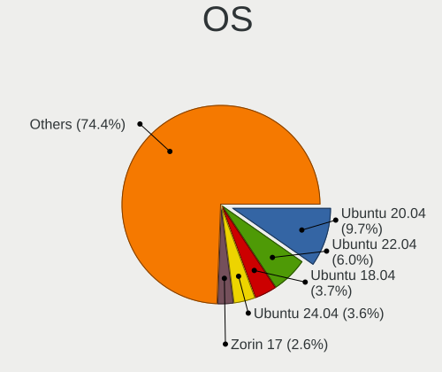

| Name              | Notebooks | Percent |
|-------------------|-----------|---------|
| Ubuntu 20.04      | 103       | 9.69%   |
| Ubuntu 22.04      | 64        | 6.02%   |
| Ubuntu 18.04      | 39        | 3.67%   |
| Ubuntu 24.04      | 38        | 3.57%   |
| Zorin 17          | 28        | 2.63%   |
| Zorin 16          | 28        | 2.63%   |
| Arch Rolling      | 27        | 2.54%   |
| Pop!_OS 22.04     | 26        | 2.45%   |
| Linux Mint 20.3   | 22        | 2.07%   |
| KDE neon 20.04    | 20        | 1.88%   |
| Linux Mint 22.1   | 19        | 1.79%   |
| ArcoLinux Rolling | 16        | 1.51%   |
| Fedora 42         | 15        | 1.41%   |
| Pop!_OS 21.04     | 14        | 1.32%   |
| Pop!_OS 20.04     | 13        | 1.22%   |
| Manjaro           | 12        | 1.13%   |
| Linux Mint 20.2   | 12        | 1.13%   |
| Zorin 15          | 11        | 1.03%   |
| Ubuntu 21.04      | 11        | 1.03%   |
| Linux Mint 21.3   | 11        | 1.03%   |
| Linux Mint 20.1   | 11        | 1.03%   |
| OpenMandriva 4.2  | 10        | 0.94%   |
| Linux Mint 21.1   | 10        | 0.94%   |
| Linux Mint 19.3   | 10        | 0.94%   |
| Fedora 41         | 9         | 0.85%   |
| Debian 11         | 9         | 0.85%   |
| Bazzite 42        | 9         | 0.85%   |
| Ubuntu 19.10      | 8         | 0.75%   |
| Ubuntu 19.04      | 8         | 0.75%   |
| Pop!_OS 20.10     | 8         | 0.75%   |
| Fedora 39         | 8         | 0.75%   |
| Ubuntu 20.10      | 7         | 0.66%   |
| Linux Mint 22.2   | 7         | 0.66%   |
| Linux Mint 20     | 7         | 0.66%   |
| Fedora 40         | 7         | 0.66%   |
| Fedora 37         | 7         | 0.66%   |
| Fedora 35         | 7         | 0.66%   |
| Fedora 34         | 7         | 0.66%   |
| Zorin 18          | 6         | 0.56%   |
| Ubuntu 23.04      | 6         | 0.56%   |

OS Family
---------

OS without a version

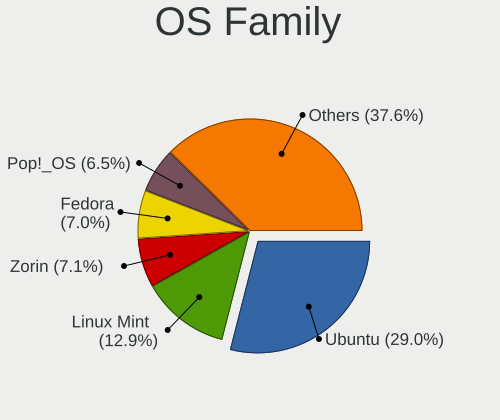

| Name          | Notebooks | Percent |
|---------------|-----------|---------|
| Ubuntu        | 295       | 28.98%  |
| Linux Mint    | 131       | 12.87%  |
| Zorin         | 72        | 7.07%   |
| Fedora        | 71        | 6.97%   |
| Pop!_OS       | 66        | 6.48%   |
| OpenMandriva  | 56        | 5.5%    |
| Arch          | 32        | 3.14%   |
| KDE neon      | 30        | 2.95%   |
| Kubuntu       | 27        | 2.65%   |
| Debian        | 22        | 2.16%   |
| Manjaro       | 18        | 1.77%   |
| Kali          | 18        | 1.77%   |
| ArcoLinux     | 16        | 1.57%   |
| Elementary    | 12        | 1.18%   |
| Bazzite       | 11        | 1.08%   |
| Xubuntu       | 10        | 0.98%   |
| openSUSE      | 10        | 0.98%   |
| Endless       | 9         | 0.88%   |
| Lubuntu       | 8         | 0.79%   |
| Garuda Linux  | 8         | 0.79%   |
| Clear Linux   | 6         | 0.59%   |
| Ubuntu Unity  | 5         | 0.49%   |
| Ubuntu Budgie | 5         | 0.49%   |
| Gentoo        | 5         | 0.49%   |
| Vanilla       | 4         | 0.39%   |
| ROSA          | 4         | 0.39%   |
| Rocky Linux   | 4         | 0.39%   |
| MX            | 4         | 0.39%   |
| Ubuntu MATE   | 3         | 0.29%   |
| RHEL          | 3         | 0.29%   |
| Parrot        | 3         | 0.29%   |
| LMDE          | 3         | 0.29%   |
| EndeavourOS   | 3         | 0.29%   |
| antiX         | 3         | 0.29%   |
| Xero          | 2         | 0.2%    |
| Slackware     | 2         | 0.2%    |
| Devuan        | 2         | 0.2%    |
| CentOS        | 2         | 0.2%    |
| CachyOS       | 2         | 0.2%    |
| BuildRoot     | 2         | 0.2%    |

Kernel
------

Version of the Linux kernel

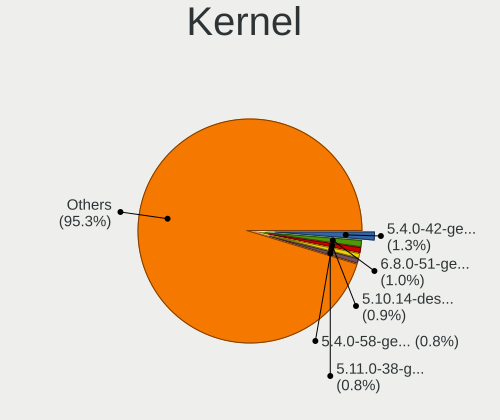

| Version                  | Notebooks | Percent |
|--------------------------|-----------|---------|
| 5.4.0-42-generic         | 15        | 1.29%   |
| 6.8.0-51-generic         | 12        | 1.03%   |
| 5.10.14-desktop-1omv4002 | 10        | 0.86%   |
| 5.4.0-58-generic         | 9         | 0.77%   |
| 5.11.0-38-generic        | 9         | 0.77%   |
| 6.14.2-desktop-3omv2590  | 8         | 0.69%   |
| 5.4.0-40-generic         | 8         | 0.69%   |
| 6.9.3-76060903-generic   | 7         | 0.6%    |
| 6.14.0-27-generic        | 7         | 0.6%    |
| 6.12.10-76061203-generic | 7         | 0.6%    |
| 5.4.0-72-generic         | 7         | 0.6%    |
| 5.4.0-52-generic         | 7         | 0.6%    |
| 5.4.0-29-generic         | 7         | 0.6%    |
| 5.3.0-28-generic         | 7         | 0.6%    |
| 5.15.0-52-generic        | 7         | 0.6%    |
| 5.13.0-7614-generic      | 7         | 0.6%    |
| 5.13.0-39-generic        | 7         | 0.6%    |
| 5.11.0-27-generic        | 7         | 0.6%    |
| 6.8.0-40-generic         | 6         | 0.51%   |
| 5.8.0-43-generic         | 6         | 0.51%   |
| 5.4.0-33-generic         | 6         | 0.51%   |
| 5.4.0-26-generic         | 6         | 0.51%   |
| 5.13.0-28-generic        | 6         | 0.51%   |
| 5.0.0-37-generic         | 6         | 0.51%   |
| 6.8.0-47-generic         | 5         | 0.43%   |
| 6.8.0-41-generic         | 5         | 0.43%   |
| 6.6.2-desktop-1omv2390   | 5         | 0.43%   |
| 6.5.0-28-generic         | 5         | 0.43%   |
| 6.2.0-39-generic         | 5         | 0.43%   |
| 6.14.0-37-generic        | 5         | 0.43%   |
| 6.14.0-29-generic        | 5         | 0.43%   |
| 6.12.1-desktop-1omv2490  | 5         | 0.43%   |
| 6.1.1-desktop-1omv2290   | 5         | 0.43%   |
| 5.8.0-7630-generic       | 5         | 0.43%   |
| 5.8.0-63-generic         | 5         | 0.43%   |
| 5.4.0-73-generic         | 5         | 0.43%   |
| 5.4.0-56-generic         | 5         | 0.43%   |
| 5.3.0-51-generic         | 5         | 0.43%   |
| 5.19.0-38-generic        | 5         | 0.43%   |
| 5.16.7-desktop-1omv4003  | 5         | 0.43%   |

Kernel Family
-------------

Linux kernel without a distro release

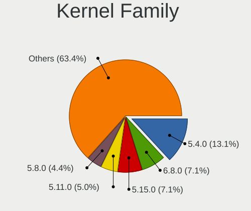

| Version | Notebooks | Percent |
|---------|-----------|---------|
| 5.4.0   | 143       | 13.12%  |
| 6.8.0   | 77        | 7.06%   |
| 5.15.0  | 77        | 7.06%   |
| 5.11.0  | 54        | 4.95%   |
| 5.8.0   | 48        | 4.4%    |
| 5.13.0  | 48        | 4.4%    |
| 6.14.0  | 37        | 3.39%   |
| 6.5.0   | 35        | 3.21%   |
| 4.15.0  | 35        | 3.21%   |
| 5.3.0   | 32        | 2.94%   |
| 6.2.0   | 27        | 2.48%   |
| 5.19.0  | 25        | 2.29%   |
| 5.10.0  | 19        | 1.74%   |
| 6.11.0  | 18        | 1.65%   |
| 5.0.0   | 16        | 1.47%   |
| 6.14.2  | 11        | 1.01%   |
| 4.18.0  | 11        | 1.01%   |
| 6.1.0   | 10        | 0.92%   |
| 5.10.14 | 10        | 0.92%   |
| 6.12.10 | 9         | 0.83%   |
| 5.14.0  | 9         | 0.83%   |
| 6.9.3   | 7         | 0.64%   |
| 6.1.1   | 7         | 0.64%   |
| 6.2.6   | 6         | 0.55%   |
| 6.12.1  | 6         | 0.55%   |
| 5.17.5  | 6         | 0.55%   |
| 5.16.7  | 6         | 0.55%   |
| 6.8.11  | 5         | 0.46%   |
| 6.6.8   | 5         | 0.46%   |
| 6.6.2   | 5         | 0.46%   |
| 6.17.0  | 5         | 0.46%   |
| 6.16.4  | 5         | 0.46%   |
| 6.12.12 | 5         | 0.46%   |
| 4.19.0  | 5         | 0.46%   |
| 6.4.11  | 4         | 0.37%   |
| 6.17.9  | 4         | 0.37%   |
| 6.12.9  | 4         | 0.37%   |
| 6.4.12  | 3         | 0.28%   |
| 6.15.9  | 3         | 0.28%   |
| 6.15.4  | 3         | 0.28%   |

Kernel Major Ver.
-----------------

Linux kernel major version

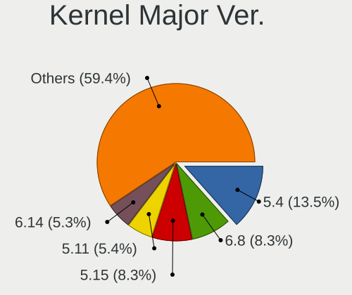

| Version | Notebooks | Percent |
|---------|-----------|---------|
| 5.4     | 145       | 13.45%  |
| 6.8     | 89        | 8.26%   |
| 5.15    | 89        | 8.26%   |
| 5.11    | 58        | 5.38%   |
| 6.14    | 57        | 5.29%   |
| 5.8     | 53        | 4.92%   |
| 5.13    | 53        | 4.92%   |
| 6.5     | 42        | 3.9%    |
| 6.2     | 40        | 3.71%   |
| 5.10    | 38        | 3.53%   |
| 4.15    | 35        | 3.25%   |
| 5.3     | 34        | 3.15%   |
| 6.12    | 30        | 2.78%   |
| 5.19    | 28        | 2.6%    |
| 6.11    | 26        | 2.41%   |
| 6.1     | 25        | 2.32%   |
| 6.6     | 22        | 2.04%   |
| 5.14    | 16        | 1.48%   |
| 5.0     | 16        | 1.48%   |
| 5.16    | 14        | 1.3%    |
| 6.9     | 13        | 1.21%   |
| 6.17    | 13        | 1.21%   |
| 6.15    | 13        | 1.21%   |
| 4.18    | 13        | 1.21%   |
| 6.10    | 11        | 1.02%   |
| 6.0     | 11        | 1.02%   |
| 5.17    | 11        | 1.02%   |
| 6.4     | 10        | 0.93%   |
| 5.18    | 10        | 0.93%   |
| 6.16    | 9         | 0.83%   |
| 6.13    | 9         | 0.83%   |
| 5.7     | 6         | 0.56%   |
| 5.6     | 6         | 0.56%   |
| 4.19    | 6         | 0.56%   |
| 5.9     | 5         | 0.46%   |
| 6.7     | 4         | 0.37%   |
| 6.3     | 3         | 0.28%   |
| 5.5     | 3         | 0.28%   |
| 5.12    | 3         | 0.28%   |
| 4.9     | 2         | 0.19%   |

Arch
----

OS architecture (x86_64, i586, etc.)

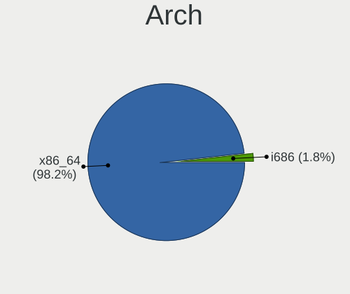

| Name   | Notebooks | Percent |
|--------|-----------|---------|
| x86_64 | 951       | 98.24%  |
| i686   | 17        | 1.76%   |

DE
--

Desktop Environment

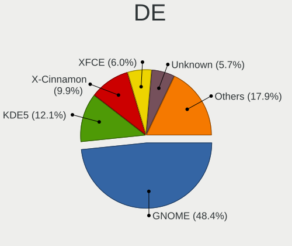

| Name             | Notebooks | Percent |
|------------------|-----------|---------|
| GNOME            | 492       | 48.38%  |
| KDE5             | 123       | 12.09%  |
| X-Cinnamon       | 101       | 9.93%   |
| XFCE             | 61        | 6%      |
| Unknown          | 58        | 5.7%    |
| KDE6             | 54        | 5.31%   |
| MATE             | 24        | 2.36%   |
| KDE              | 24        | 2.36%   |
| Pantheon         | 11        | 1.08%   |
| LXQt             | 11        | 1.08%   |
| Cinnamon         | 9         | 0.88%   |
| Unity            | 6         | 0.59%   |
| KDE4             | 6         | 0.59%   |
| Budgie           | 6         | 0.59%   |
| LXDE             | 4         | 0.39%   |
| Hyprland         | 4         | 0.39%   |
| Deepin           | 4         | 0.39%   |
| lightdm-xsession | 3         | 0.29%   |
| icewm            | 3         | 0.29%   |
| i3               | 2         | 0.2%    |
| GNOME Flashback  | 2         | 0.2%    |
| GNOME Classic    | 2         | 0.2%    |
| COSMIC           | 2         | 0.2%    |
| Awesome          | 2         | 0.2%    |
| Unicorn:XFCE     | 1         | 0.1%    |
| Endless:GNOME    | 1         | 0.1%    |
| bspwm            | 1         | 0.1%    |

Display Server
--------------

X11 or Wayland

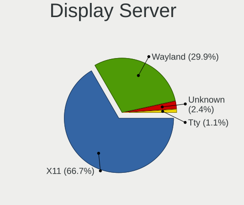

| Name    | Notebooks | Percent |
|---------|-----------|---------|
| X11     | 674       | 66.67%  |
| Wayland | 302       | 29.87%  |
| Unknown | 24        | 2.37%   |
| Tty     | 11        | 1.09%   |

Display Manager
---------------

SDDM, LightDM, etc.

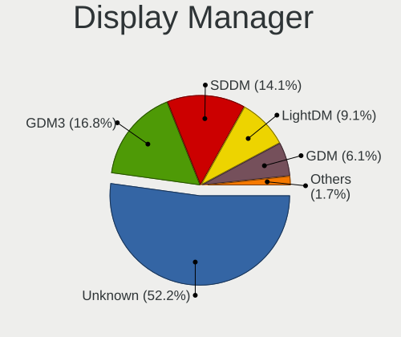

| Name    | Notebooks | Percent |
|---------|-----------|---------|
| Unknown | 528       | 52.17%  |
| GDM3    | 170       | 16.8%   |
| SDDM    | 143       | 14.13%  |
| LightDM | 92        | 9.09%   |
| GDM     | 62        | 6.13%   |
| TDM     | 11        | 1.09%   |
| SLIMSKI | 2         | 0.2%    |
| KDM     | 2         | 0.2%    |
| SLiM    | 1         | 0.1%    |
| GREETD  | 1         | 0.1%    |

OS Lang
-------

Language

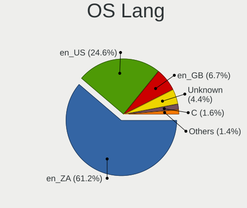

| Lang    | Notebooks | Percent |
|---------|-----------|---------|
| en_ZA   | 611       | 61.22%  |
| en_US   | 246       | 24.65%  |
| en_GB   | 67        | 6.71%   |
| Unknown | 44        | 4.41%   |
| C       | 16        | 1.6%    |
| fr_FR   | 3         | 0.3%    |
| en_ZW   | 3         | 0.3%    |
| en_BW   | 3         | 0.3%    |
| pt_BR   | 1         | 0.1%    |
| en_NZ   | 1         | 0.1%    |
| de_DE   | 1         | 0.1%    |
| C.UTF8  | 1         | 0.1%    |
| af_ZA   | 1         | 0.1%    |

Boot Mode
---------

EFI or BIOS

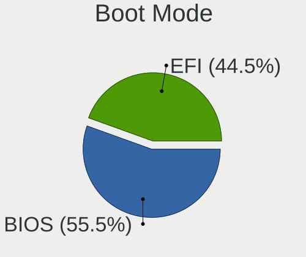

| Mode | Notebooks | Percent |
|------|-----------|---------|
| BIOS | 555       | 55.5%   |
| EFI  | 445       | 44.5%   |

Filesystem
----------

Type of filesystem

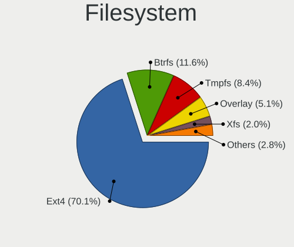

| Type    | Notebooks | Percent |
|---------|-----------|---------|
| Ext4    | 695       | 70.06%  |
| Btrfs   | 115       | 11.59%  |
| Tmpfs   | 83        | 8.37%   |
| Overlay | 51        | 5.14%   |
| Xfs     | 20        | 2.02%   |
| Zfs     | 12        | 1.21%   |
| Unknown | 12        | 1.21%   |
| Aufs    | 2         | 0.2%    |
| Ext3    | 1         | 0.1%    |
| Ext2    | 1         | 0.1%    |

Part. scheme
------------

Scheme of partitioning

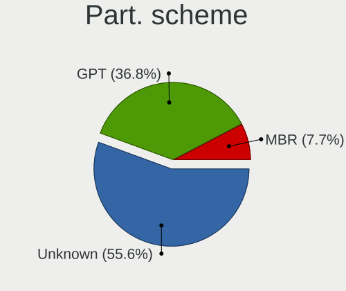

| Type    | Notebooks | Percent |
|---------|-----------|---------|
| Unknown | 558       | 55.58%  |
| GPT     | 369       | 36.75%  |
| MBR     | 77        | 7.67%   |

Dual Boot with Linux/BSD
------------------------

Hosting more than one Linux/BSD

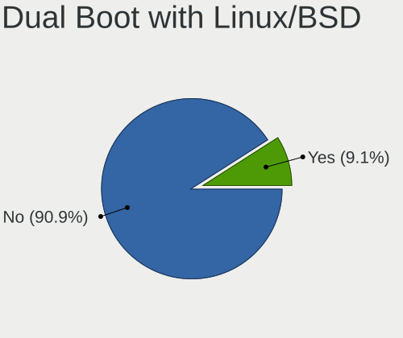

| Dual boot | Notebooks | Percent |
|-----------|-----------|---------|
| No        | 894       | 90.95%  |
| Yes       | 89        | 9.05%   |

Dual Boot (Win)
---------------

Hosting Linux and Windows

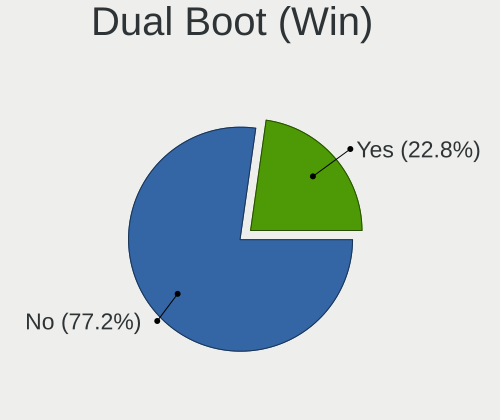

| Dual boot | Notebooks | Percent |
|-----------|-----------|---------|
| No        | 760       | 77.24%  |
| Yes       | 224       | 22.76%  |

Board
-----

Vendor
------

Motherboard manufacturer

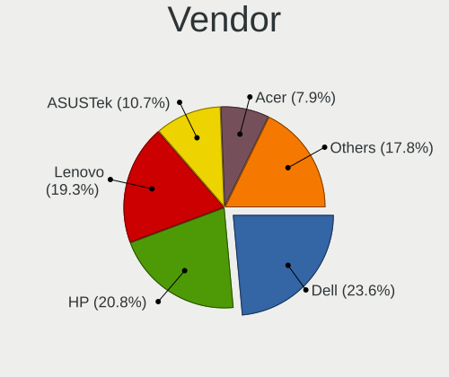

| Name                        | Notebooks | Percent |
|-----------------------------|-----------|---------|
| Dell                        | 228       | 23.55%  |
| Hewlett-Packard             | 201       | 20.76%  |
| Lenovo                      | 187       | 19.32%  |
| ASUSTek Computer            | 104       | 10.74%  |
| Acer                        | 76        | 7.85%   |
| Apple                       | 24        | 2.48%   |
| Toshiba                     | 18        | 1.86%   |
| MSI                         | 14        | 1.45%   |
| Samsung Electronics         | 10        | 1.03%   |
| Proline                     | 9         | 0.93%   |
| Standard                    | 8         | 0.83%   |
| Sony                        | 7         | 0.72%   |
| MECER                       | 7         | 0.72%   |
| HUAWEI                      | 7         | 0.72%   |
| Gigabyte Technology         | 7         | 0.72%   |
| Packard Bell                | 6         | 0.62%   |
| CONNEX                      | 6         | 0.62%   |
| Mustek                      | 5         | 0.52%   |
| Fujitsu                     | 4         | 0.41%   |
| PINNACLEMICRO               | 3         | 0.31%   |
| I-Life Digital Technologies | 3         | 0.31%   |
| Alienware                   | 3         | 0.31%   |
| Unknown                     | 3         | 0.31%   |
| TongFang                    | 2         | 0.21%   |
| System76                    | 2         | 0.21%   |
| Purism                      | 2         | 0.21%   |
| Panasonic                   | 2         | 0.21%   |
| Google                      | 2         | 0.21%   |
| ADSC                        | 2         | 0.21%   |
| YiFang                      | 1         | 0.1%    |
| WinSome                     | 1         | 0.1%    |
| TCL Communication           | 1         | 0.1%    |
| RIZZEN                      | 1         | 0.1%    |
| Razer                       | 1         | 0.1%    |
| Notebook                    | 1         | 0.1%    |
| LG Electronics              | 1         | 0.1%    |
| LattePanda                  | 1         | 0.1%    |
| Intel                       | 1         | 0.1%    |
| GIADA                       | 1         | 0.1%    |
| Getac                       | 1         | 0.1%    |

Model
-----

Motherboard model

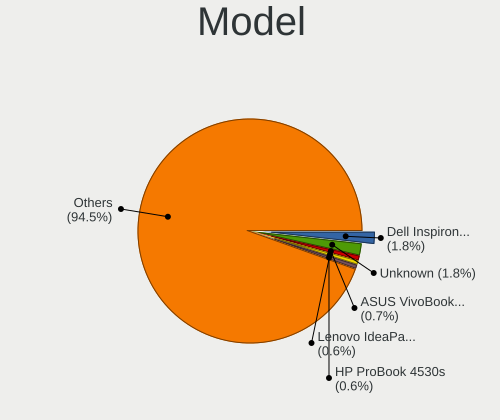

| Name                                   | Notebooks | Percent |
|----------------------------------------|-----------|---------|
| Dell Inspiron 15-3567                  | 17        | 1.76%   |
| Unknown                                | 17        | 1.76%   |
| ASUS VivoBook 15_ASUS Laptop X540UAR   | 7         | 0.72%   |
| Lenovo IdeaPad 110-15IBR 80T7          | 6         | 0.62%   |
| HP ProBook 4530s                       | 6         | 0.62%   |
| HP Laptop 15-bs0xx                     | 6         | 0.62%   |
| Dell Latitude E6530                    | 6         | 0.62%   |
| Dell Latitude E6430                    | 6         | 0.62%   |
| Dell Latitude E6400                    | 6         | 0.62%   |
| Acer Aspire E1-571                     | 6         | 0.62%   |
| Proline V1165C4                        | 5         | 0.52%   |
| HP Notebook                            | 5         | 0.52%   |
| HP Laptop 15-da0xxx                    | 5         | 0.52%   |
| Dell Inspiron 3521                     | 5         | 0.52%   |
| Apple MacBookPro9,2                    | 5         | 0.52%   |
| Lenovo IdeaPad S145-15AST 81N3         | 4         | 0.41%   |
| Lenovo IdeaPad Gaming 3 15ARH7 82SB    | 4         | 0.41%   |
| HUAWEI BOHB-WAX9                       | 4         | 0.41%   |
| HP ProBook 4520s                       | 4         | 0.41%   |
| HP ProBook 450 G0                      | 4         | 0.41%   |
| HP Pavilion dv7                        | 4         | 0.41%   |
| HP Laptop 15-bs1xx                     | 4         | 0.41%   |
| HP 635                                 | 4         | 0.41%   |
| Dell XPS 13 9310                       | 4         | 0.41%   |
| Dell Latitude 5490                     | 4         | 0.41%   |
| Dell Inspiron N5050                    | 4         | 0.41%   |
| Dell Inspiron 3580                     | 4         | 0.41%   |
| Dell Inspiron 3542                     | 4         | 0.41%   |
| Dell G3 3579                           | 4         | 0.41%   |
| ASUS VivoBook_ASUSLaptop X509JA_X509JA | 4         | 0.41%   |
| Lenovo IdeaPad 320-15IKB 80XL          | 3         | 0.31%   |
| Lenovo IdeaPad 3 15IML05 81WB          | 3         | 0.31%   |
| Lenovo IdeaPad 3 15ALC6 82KU           | 3         | 0.31%   |
| Lenovo IdeaPad 100-15IBD 80QQ          | 3         | 0.31%   |
| Lenovo G500 20236                      | 3         | 0.31%   |
| Lenovo G50-80 80E5                     | 3         | 0.31%   |
| Lenovo G50-70 20351                    | 3         | 0.31%   |
| HP ProBook 6560b                       | 3         | 0.31%   |
| HP ProBook 450 G2                      | 3         | 0.31%   |
| HP Pavilion dv6                        | 3         | 0.31%   |

Model Family
------------

Motherboard model prefix

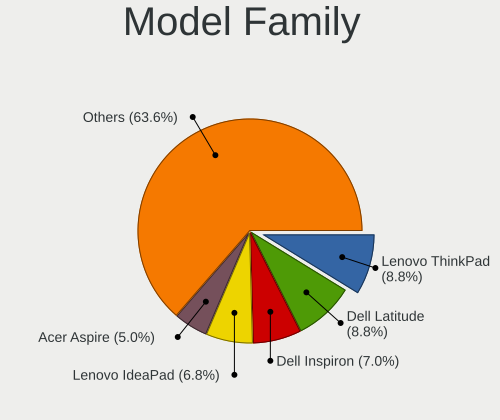

| Name                  | Notebooks | Percent |
|-----------------------|-----------|---------|
| Lenovo ThinkPad       | 85        | 8.78%   |
| Dell Latitude         | 85        | 8.78%   |
| Dell Inspiron         | 68        | 7.02%   |
| Lenovo IdeaPad        | 66        | 6.82%   |
| Acer Aspire           | 48        | 4.96%   |
| HP ProBook            | 46        | 4.75%   |
| ASUS VivoBook         | 41        | 4.24%   |
| HP Laptop             | 31        | 3.2%    |
| HP EliteBook          | 30        | 3.1%    |
| HP Pavilion           | 19        | 1.96%   |
| Dell Vostro           | 19        | 1.96%   |
| Toshiba Satellite     | 17        | 1.76%   |
| Unknown               | 17        | 1.76%   |
| Dell XPS              | 16        | 1.65%   |
| Dell Precision        | 13        | 1.34%   |
| ASUS ASUS             | 13        | 1.34%   |
| HP 250                | 10        | 1.03%   |
| Acer TravelMate       | 10        | 1.03%   |
| HP Compaq             | 9         | 0.93%   |
| ASUS ZenBook          | 9         | 0.93%   |
| HP ZBook              | 8         | 0.83%   |
| Dell G3               | 8         | 0.83%   |
| HP 255                | 7         | 0.72%   |
| Apple MacBookPro9     | 6         | 0.62%   |
| Proline V1165C4       | 5         | 0.52%   |
| HP Notebook           | 5         | 0.52%   |
| ASUS ROG              | 5         | 0.52%   |
| Lenovo Legion         | 4         | 0.41%   |
| HUAWEI BOHB-WAX9      | 4         | 0.41%   |
| HP ENVY               | 4         | 0.41%   |
| HP 635                | 4         | 0.41%   |
| Fujitsu LIFEBOOK      | 4         | 0.41%   |
| Dell G5               | 4         | 0.41%   |
| Acer Swift            | 4         | 0.41%   |
| Acer Nitro            | 4         | 0.41%   |
| Packard Bell EasyNote | 3         | 0.31%   |
| Lenovo Yoga           | 3         | 0.31%   |
| Lenovo G500           | 3         | 0.31%   |
| Lenovo G50-80         | 3         | 0.31%   |
| Lenovo G50-70         | 3         | 0.31%   |

MFG Year
--------

Motherboard manufacture year

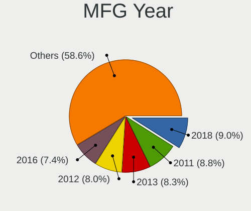

| Year | Notebooks | Percent |
|------|-----------|---------|
| 2018 | 87        | 8.99%   |
| 2011 | 85        | 8.78%   |
| 2013 | 80        | 8.26%   |
| 2012 | 77        | 7.95%   |
| 2016 | 72        | 7.44%   |
| 2020 | 68        | 7.02%   |
| 2019 | 68        | 7.02%   |
| 2021 | 67        | 6.92%   |
| 2017 | 62        | 6.4%    |
| 2015 | 52        | 5.37%   |
| 2010 | 47        | 4.86%   |
| 2014 | 44        | 4.55%   |
| 2022 | 41        | 4.24%   |
| 2008 | 37        | 3.82%   |
| 2009 | 25        | 2.58%   |
| 2023 | 22        | 2.27%   |
| 2007 | 14        | 1.45%   |
| 2024 | 13        | 1.34%   |
| 2006 | 6         | 0.62%   |
| 2025 | 1         | 0.1%    |

Form Factor
-----------

Physical design of the computer

| Name     | Notebooks | Percent |
|----------|-----------|---------|
| Notebook | 968       | 100%    |

Secure Boot
-----------

Enabled or disabled

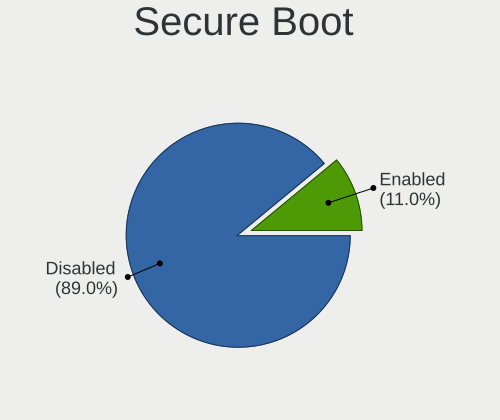

| State    | Notebooks | Percent |
|----------|-----------|---------|
| Disabled | 874       | 89%     |
| Enabled  | 108       | 11%     |

Coreboot
--------

Have coreboot on board

| Used | Notebooks | Percent |
|------|-----------|---------|
| No   | 963       | 99.48%  |
| Yes  | 5         | 0.52%   |

RAM Size
--------

Total RAM memory

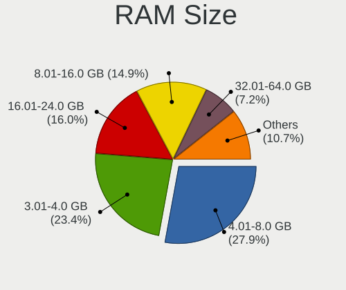

| Size in GB  | Notebooks | Percent |
|-------------|-----------|---------|
| 4.01-8.0    | 274       | 27.87%  |
| 3.01-4.0    | 230       | 23.4%   |
| 16.01-24.0  | 157       | 15.97%  |
| 8.01-16.0   | 146       | 14.85%  |
| 32.01-64.0  | 71        | 7.22%   |
| 1.01-2.0    | 53        | 5.39%   |
| 2.01-3.0    | 21        | 2.14%   |
| 64.01-256.0 | 15        | 1.53%   |
| 24.01-32.0  | 11        | 1.12%   |
| 0.51-1.0    | 5         | 0.51%   |

RAM Used
--------

Used RAM memory

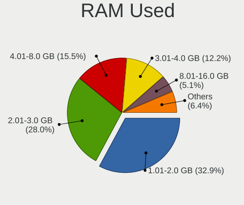

| Used GB    | Notebooks | Percent |
|------------|-----------|---------|
| 1.01-2.0   | 356       | 32.87%  |
| 2.01-3.0   | 303       | 27.98%  |
| 4.01-8.0   | 168       | 15.51%  |
| 3.01-4.0   | 132       | 12.19%  |
| 8.01-16.0  | 55        | 5.08%   |
| 0.51-1.0   | 51        | 4.71%   |
| 16.01-24.0 | 12        | 1.11%   |
| 0.01-0.5   | 3         | 0.28%   |
| 24.01-32.0 | 2         | 0.18%   |
| 32.01-64.0 | 1         | 0.09%   |

Total Drives
------------

Number of drives on board

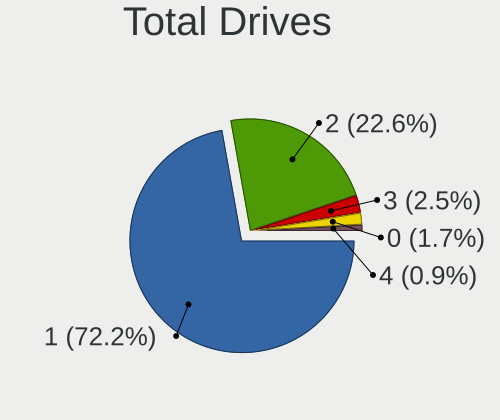

| Drives | Notebooks | Percent |
|--------|-----------|---------|
| 1      | 714       | 72.19%  |
| 2      | 224       | 22.65%  |
| 3      | 25        | 2.53%   |
| 0      | 17        | 1.72%   |
| 4      | 9         | 0.91%   |

Has CD-ROM
----------

Has CD-ROM on board

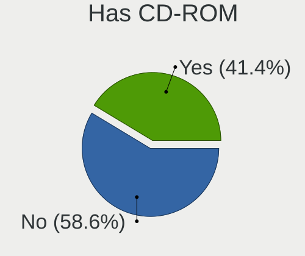

| Presented | Notebooks | Percent |
|-----------|-----------|---------|
| No        | 570       | 58.64%  |
| Yes       | 402       | 41.36%  |

Has Ethernet
------------

Has Ethernet on board

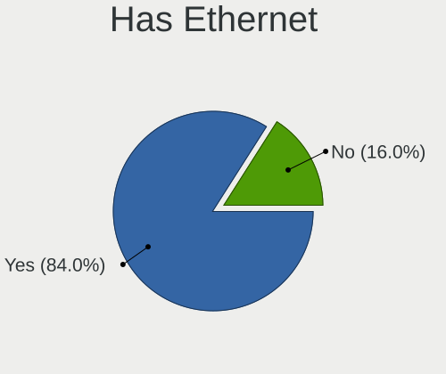

| Presented | Notebooks | Percent |
|-----------|-----------|---------|
| Yes       | 814       | 84%     |
| No        | 155       | 16%     |

Has WiFi
--------

Has WiFi module

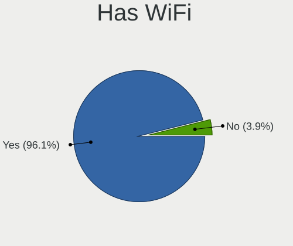

| Presented | Notebooks | Percent |
|-----------|-----------|---------|
| Yes       | 930       | 96.07%  |
| No        | 38        | 3.93%   |

Has Bluetooth
-------------

Has Bluetooth module

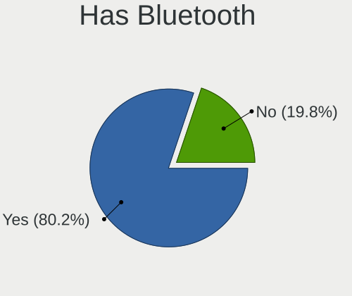

| Presented | Notebooks | Percent |
|-----------|-----------|---------|
| Yes       | 788       | 80.16%  |
| No        | 195       | 19.84%  |

Location
--------

Country
-------

Geographic location (country)

| Country      | Notebooks | Percent |
|--------------|-----------|---------|
| South Africa | 968       | 100%    |

City
----

Geographic location (city)

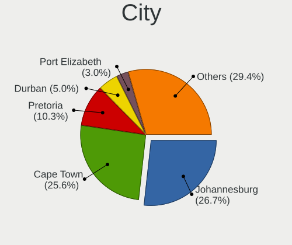

| City             | Notebooks | Percent |
|------------------|-----------|---------|
| Johannesburg     | 280       | 26.74%  |
| Cape Town        | 268       | 25.6%   |
| Pretoria         | 108       | 10.32%  |
| Durban           | 52        | 4.97%   |
| Port Elizabeth   | 31        | 2.96%   |
| Centurion        | 20        | 1.91%   |
| East London      | 13        | 1.24%   |
| Sandton          | 11        | 1.05%   |
| Bloemfontein     | 11        | 1.05%   |
| Pietermaritzburg | 10        | 0.96%   |
| Midrand          | 9         | 0.86%   |
| Potchefstroom    | 8         | 0.76%   |
| Benoni           | 8         | 0.76%   |
| Randburg         | 7         | 0.67%   |
| Brakpan          | 7         | 0.67%   |
| Boksburg         | 7         | 0.67%   |
| Somerset West    | 6         | 0.57%   |
| Polokwane        | 6         | 0.57%   |
| Kempton Park     | 6         | 0.57%   |
| Thabazimbi       | 5         | 0.48%   |
| Roodepoort       | 5         | 0.48%   |
| Port Alfred      | 5         | 0.48%   |
| Bellville        | 5         | 0.48%   |
| Worcester        | 4         | 0.38%   |
| White River      | 4         | 0.38%   |
| Stellenbosch     | 4         | 0.38%   |
| Paarl            | 4         | 0.38%   |
| George           | 4         | 0.38%   |
| Alberton         | 4         | 0.38%   |
| Vereeniging      | 3         | 0.29%   |
| Tzaneen          | 3         | 0.29%   |
| Rustenburg       | 3         | 0.29%   |
| Queenstown       | 3         | 0.29%   |
| Oudtshoorn       | 3         | 0.29%   |
| Nelspruit        | 3         | 0.29%   |
| Middelburg       | 3         | 0.29%   |
| Klerksdorp       | 3         | 0.29%   |
| Hermanus         | 3         | 0.29%   |
| Grahamstown      | 3         | 0.29%   |
| Germiston        | 3         | 0.29%   |

Drives
------

Drive Vendor
------------

Hard drive vendors

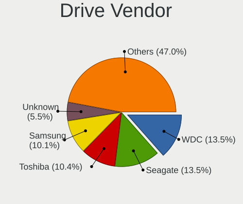

| Vendor                      | Notebooks | Drives | Percent |
|-----------------------------|-----------|--------|---------|
| WDC                         | 164       | 196    | 13.49%  |
| Seagate                     | 164       | 226    | 13.49%  |
| Toshiba                     | 126       | 152    | 10.36%  |
| Samsung Electronics         | 123       | 153    | 10.12%  |
| Unknown                     | 67        | 85     | 5.51%   |
| SanDisk                     | 57        | 82     | 4.69%   |
| Hitachi                     | 43        | 55     | 3.54%   |
| Kingston                    | 40        | 45     | 3.29%   |
| SK hynix                    | 35        | 42     | 2.88%   |
| HGST                        | 35        | 44     | 2.88%   |
| Intel                       | 32        | 40     | 2.63%   |
| Micron Technology           | 30        | 41     | 2.47%   |
| Transcend                   | 26        | 32     | 2.14%   |
| A-DATA Technology           | 24        | 30     | 1.97%   |
| Silicon Motion              | 20        | 29     | 1.64%   |
| Crucial                     | 20        | 21     | 1.64%   |
| KIOXIA                      | 14        | 15     | 1.15%   |
| Apple                       | 13        | 16     | 1.07%   |
| TO Exter                    | 12        | 13     | 0.99%   |
| Rogueware                   | 9         | 9      | 0.74%   |
| Kingston Technology Company | 9         | 10     | 0.74%   |
| Phison Electronics          | 6         | 6      | 0.49%   |
| Patriot                     | 6         | 7      | 0.49%   |
| Kingmax                     | 6         | 7      | 0.49%   |
| Hikvision                   | 6         | 6      | 0.49%   |
| Fujitsu                     | 6         | 7      | 0.49%   |
| Unknown                     | 6         | 8      | 0.49%   |
| Netac                       | 5         | 5      | 0.41%   |
| LITEON                      | 5         | 6      | 0.41%   |
| HS-SSD-E100                 | 5         | 6      | 0.41%   |
| MAXIO Technology (Hangzhou) | 4         | 4      | 0.33%   |
| LITEONIT                    | 4         | 5      | 0.33%   |
| Lexar                       | 4         | 5      | 0.33%   |
| JMicron Technology          | 4         | 4      | 0.33%   |
| HS-SSD-C100                 | 4         | 5      | 0.33%   |
| Hewlett-Packard             | 4         | 5      | 0.33%   |
| External                    | 4         | 4      | 0.33%   |
| Corsair                     | 4         | 6      | 0.33%   |
| Apacer                      | 4         | 5      | 0.33%   |
| ADATA Technology            | 4         | 4      | 0.33%   |

Drive Model
-----------

Hard drive models

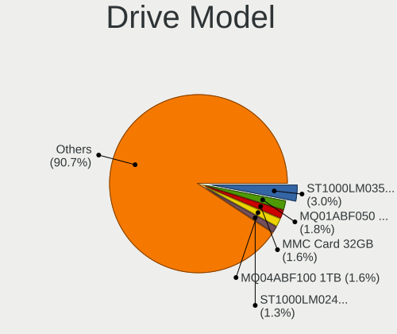

| Model                                               | Notebooks | Percent |
|-----------------------------------------------------|-----------|---------|
| Seagate ST1000LM035-1RK172 1TB                      | 38        | 3.03%   |
| Toshiba MQ01ABF050 500GB                            | 22        | 1.76%   |
| Unknown MMC Card  32GB                              | 20        | 1.6%    |
| Toshiba MQ04ABF100 1TB                              | 20        | 1.6%    |
| Seagate ST1000LM024 HN-M101MBB 1TB                  | 16        | 1.28%   |
| Toshiba MQ01ABD100 1TB                              | 15        | 1.2%    |
| WDC WDS500G2B0A-00SM50 500GB                        | 13        | 1.04%   |
| TO Exter nal USB 3.0 250GB                          | 12        | 0.96%   |
| Seagate ST500LT012-1DG142 500GB                     | 12        | 0.96%   |
| Unknown MMC Card  64GB                              | 11        | 0.88%   |
| HGST HTS721010A9E630 1TB                            | 10        | 0.8%    |
| WDC WD10SPZX-60Z10T0 1TB                            | 9         | 0.72%   |
| Toshiba MQ01ACF050 500GB                            | 9         | 0.72%   |
| Seagate ST500LM030-2E717D 500GB                     | 8         | 0.64%   |
| Samsung NVMe SSD Controller SM981/PM981/PM983 1TB   | 8         | 0.64%   |
| HGST HTS541010A9E680 1TB                            | 8         | 0.64%   |
| Samsung NVMe SSD Drive 512GB                        | 7         | 0.56%   |
| Samsung NVMe SSD Drive 256GB                        | 7         | 0.56%   |
| Hitachi HTS543232A7A384 320GB                       | 7         | 0.56%   |
| SanDisk NVMe SSD Drive 512GB                        | 6         | 0.48%   |
| Kingston SA400S37240G 240GB SSD                     | 6         | 0.48%   |
| Unknown                                             | 6         | 0.48%   |
| WDC WDS240G2G0A-00JH30 240GB SSD                    | 5         | 0.4%    |
| WDC WD5000LPVX-22V0TT0 500GB                        | 5         | 0.4%    |
| WDC WD10SPZX-24Z10 1TB                              | 5         | 0.4%    |
| WDC WD10JPCX-24UE4T0 1TB                            | 5         | 0.4%    |
| Toshiba NVMe SSD Drive 512GB                        | 5         | 0.4%    |
| Silicon Motion SM2262/SM2262EN SSD Controller 960GB | 5         | 0.4%    |
| Seagate ST9320325AS 320GB                           | 5         | 0.4%    |
| Seagate ST1000LM048-2E7172 1TB                      | 5         | 0.4%    |
| SanDisk SSD PLUS 240GB                              | 5         | 0.4%    |
| SanDisk NVMe SSD Drive 1TB                          | 5         | 0.4%    |
| Samsung NVMe SSD Controller PM9A1/PM9A3/980PRO 1TB  | 5         | 0.4%    |
| Rogueware 2.5" S 256GB                              | 5         | 0.4%    |
| Intel SSDPEKNU512GZ 512GB                           | 5         | 0.4%    |
| Intel SSD 660P Series 512GB                         | 5         | 0.4%    |
| Hitachi HTS545050B9A300 500GB                       | 5         | 0.4%    |
| HGST HTS725050A7E630 500GB                          | 5         | 0.4%    |
| WDC WD5000LPZX-22Z10T0 500GB                        | 4         | 0.32%   |
| WDC WD10SPZX-80Z10T2 1TB                            | 4         | 0.32%   |

HDD Vendor
----------

Hard disk drive vendors

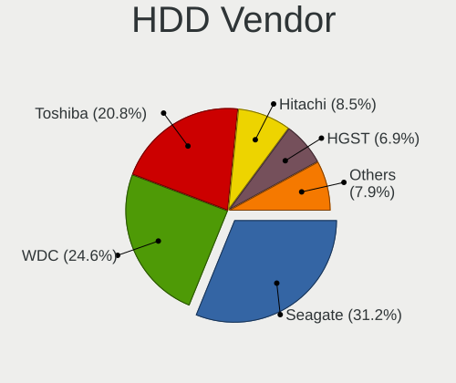

| Vendor              | Notebooks | Drives | Percent |
|---------------------|-----------|--------|---------|
| Seagate             | 157       | 212    | 31.15%  |
| WDC                 | 124       | 142    | 24.6%   |
| Toshiba             | 105       | 126    | 20.83%  |
| Hitachi             | 43        | 55     | 8.53%   |
| HGST                | 35        | 44     | 6.94%   |
| TO Exter            | 12        | 13     | 2.38%   |
| Samsung Electronics | 6         | 6      | 1.19%   |
| Fujitsu             | 6         | 7      | 1.19%   |
| Unknown             | 5         | 6      | 0.99%   |
| External            | 4         | 4      | 0.79%   |
| Apple               | 3         | 3      | 0.6%    |
| HGST HTS            | 2         | 2      | 0.4%    |
| USB3.0              | 1         | 1      | 0.2%    |
| Intenso             | 1         | 1      | 0.2%    |

SSD Vendor
----------

Solid state drive vendors

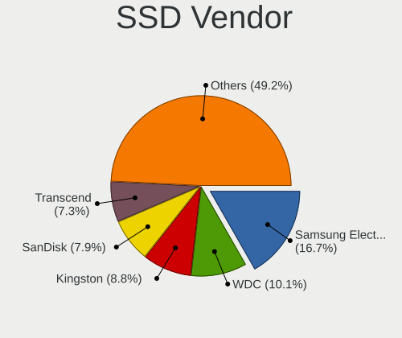

| Vendor              | Notebooks | Drives | Percent |
|---------------------|-----------|--------|---------|
| Samsung Electronics | 53        | 68     | 16.72%  |
| WDC                 | 32        | 45     | 10.09%  |
| Kingston            | 28        | 33     | 8.83%   |
| SanDisk             | 25        | 34     | 7.89%   |
| Transcend           | 23        | 29     | 7.26%   |
| A-DATA Technology   | 20        | 26     | 6.31%   |
| Crucial             | 17        | 18     | 5.36%   |
| Intel               | 9         | 13     | 2.84%   |
| Rogueware           | 8         | 8      | 2.52%   |
| Toshiba             | 7         | 9      | 2.21%   |
| Seagate             | 7         | 11     | 2.21%   |
| Micron Technology   | 7         | 8      | 2.21%   |
| SK hynix            | 6         | 7      | 1.89%   |
| Kingmax             | 6         | 7      | 1.89%   |
| Patriot             | 5         | 6      | 1.58%   |
| Netac               | 5         | 5      | 1.58%   |
| LITEONIT            | 4         | 5      | 1.26%   |
| LITEON              | 4         | 5      | 1.26%   |
| Lexar               | 4         | 5      | 1.26%   |
| Corsair             | 4         | 6      | 1.26%   |
| Apple               | 4         | 5      | 1.26%   |
| Apacer              | 4         | 5      | 1.26%   |
| China               | 3         | 3      | 0.95%   |
| StoreJet            | 2         | 5      | 0.63%   |
| Plextor             | 2         | 2      | 0.63%   |
| OCZ                 | 2         | 2      | 0.63%   |
| HS-SSD-E100         | 2         | 2      | 0.63%   |
| HS-SSD-C100         | 2         | 2      | 0.63%   |
| Hewlett-Packard     | 2         | 2      | 0.63%   |
| Gigabyte Technology | 2         | 3      | 0.63%   |
| Biwintech           | 2         | 3      | 0.63%   |
| Union Memory        | 1         | 1      | 0.32%   |
| Team                | 1         | 4      | 0.32%   |
| Super Talent        | 1         | 1      | 0.32%   |
| Radeon              | 1         | 1      | 0.32%   |
| Neo Forza           | 1         | 1      | 0.32%   |
| MyDigitalSSD        | 1         | 1      | 0.32%   |
| Mushkin             | 1         | 1      | 0.32%   |
| Maxtor              | 1         | 1      | 0.32%   |
| KingSpec            | 1         | 1      | 0.32%   |

Drive Kind
----------

HDD or SSD

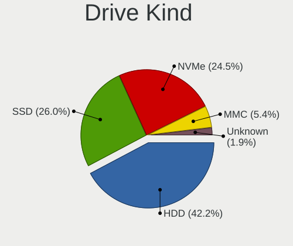

| Kind    | Notebooks | Drives | Percent |
|---------|-----------|--------|---------|
| HDD     | 485       | 622    | 42.25%  |
| SSD     | 298       | 401    | 25.96%  |
| NVMe    | 281       | 382    | 24.48%  |
| MMC     | 62        | 81     | 5.4%    |
| Unknown | 22        | 27     | 1.92%   |

Drive Connector
---------------

SATA, SAS, NVMe, etc.

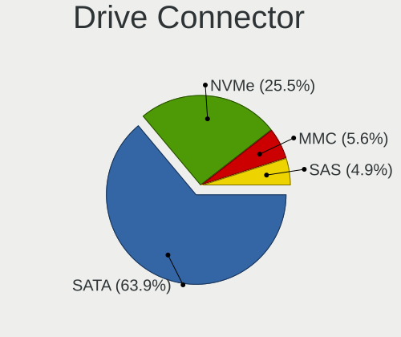

| Type | Notebooks | Drives | Percent |
|------|-----------|--------|---------|
| SATA | 703       | 985    | 63.91%  |
| NVMe | 281       | 381    | 25.55%  |
| MMC  | 62        | 81     | 5.64%   |
| SAS  | 54        | 66     | 4.91%   |

Drive Size
----------

Size of hard drive

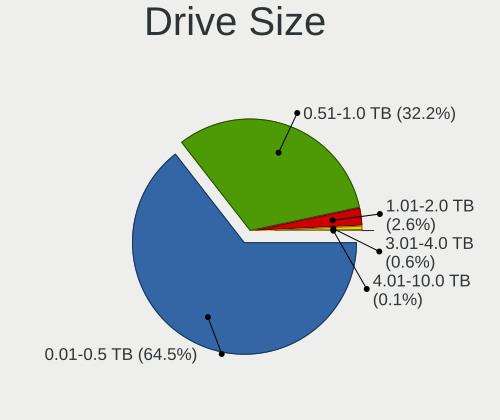

| Size in TB | Notebooks | Drives | Percent |
|------------|-----------|--------|---------|
| 0.01-0.5   | 501       | 683    | 64.48%  |
| 0.51-1.0   | 250       | 310    | 32.18%  |
| 1.01-2.0   | 20        | 22     | 2.57%   |
| 3.01-4.0   | 5         | 7      | 0.64%   |
| 4.01-10.0  | 1         | 1      | 0.13%   |

Space Total
-----------

Amount of disk space available on the file system

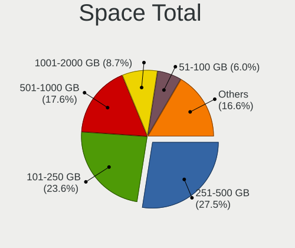

| Size in GB     | Notebooks | Percent |
|----------------|-----------|---------|
| 251-500        | 285       | 27.48%  |
| 101-250        | 245       | 23.63%  |
| 501-1000       | 183       | 17.65%  |
| 1001-2000      | 90        | 8.68%   |
| 51-100         | 62        | 5.98%   |
| 1-20           | 60        | 5.79%   |
| 21-50          | 36        | 3.47%   |
| More than 3000 | 26        | 2.51%   |
| 2001-3000      | 26        | 2.51%   |
| Unknown        | 24        | 2.31%   |

Space Used
----------

Amount of used disk space

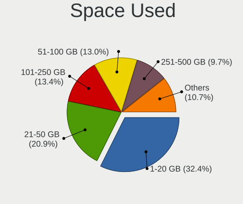

| Used GB        | Notebooks | Percent |
|----------------|-----------|---------|
| 1-20           | 352       | 32.38%  |
| 21-50          | 227       | 20.88%  |
| 101-250        | 146       | 13.43%  |
| 51-100         | 141       | 12.97%  |
| 251-500        | 105       | 9.66%   |
| 501-1000       | 58        | 5.34%   |
| Unknown        | 24        | 2.21%   |
| 1001-2000      | 20        | 1.84%   |
| 2001-3000      | 7         | 0.64%   |
| More than 3000 | 5         | 0.46%   |
| 0              | 2         | 0.18%   |

Malfunc. Drives
---------------

Drive models with a malfunction

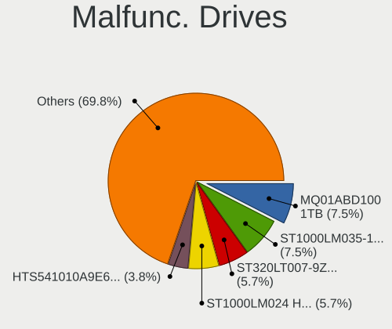

| Model                                                          | Notebooks | Drives | Percent |
|----------------------------------------------------------------|-----------|--------|---------|
| Toshiba MQ01ABD100 1TB                                         | 4         | 5      | 7.55%   |
| Seagate ST1000LM035-1RK172 1TB                                 | 4         | 4      | 7.55%   |
| Seagate ST320LT007-9ZV142 320GB                                | 3         | 3      | 5.66%   |
| Seagate ST1000LM024 HN-M101MBB 1TB                             | 3         | 4      | 5.66%   |
| HGST HTS541010A9E680 1TB                                       | 2         | 2      | 3.77%   |
| WDC WD6400BPVT-60HXZT1 640GB                                   | 1         | 1      | 1.89%   |
| WDC WD5000LPVX-22V0TT0 500GB                                   | 1         | 1      | 1.89%   |
| WDC WD3200BPVT-75JJ5T0 320GB                                   | 1         | 1      | 1.89%   |
| WDC WD3200BPVT-22JJ5T0 320GB                                   | 1         | 1      | 1.89%   |
| WDC WD10SPZX-60Z10T0 1TB                                       | 1         | 1      | 1.89%   |
| WDC WD10JPVX-60JC3T0 1TB                                       | 1         | 1      | 1.89%   |
| Toshiba MQ04ABF100 1TB                                         | 1         | 1      | 1.89%   |
| Toshiba MK5065GSXF 500GB                                       | 1         | 1      | 1.89%   |
| Toshiba MK1633GSG 160GB                                        | 1         | 1      | 1.89%   |
| Toshiba HDWL110 1TB                                            | 1         | 1      | 1.89%   |
| SK hynix HFS128G3BTND-N210A 128GB SSD                          | 1         | 1      | 1.89%   |
| Seagate ST9500423AS 500GB                                      | 1         | 1      | 1.89%   |
| Seagate ST9500325AS 500GB                                      | 1         | 3      | 1.89%   |
| Seagate ST9320423AS 320GB                                      | 1         | 1      | 1.89%   |
| Seagate ST9160827AS 160GB                                      | 1         | 1      | 1.89%   |
| Seagate ST9160412AS 160GB                                      | 1         | 1      | 1.89%   |
| Seagate ST500LT0 12-1DG142 500GB                               | 1         | 1      | 1.89%   |
| Seagate ST1000LM048-2E7172 1TB                                 | 1         | 1      | 1.89%   |
| Seagate ST1000LM014-SSHD-8GB                                   | 1         | 1      | 1.89%   |
| SanDisk SSD PLUS 480GB                                         | 1         | 1      | 1.89%   |
| Samsung Electronics SSD 850 EVO 1TB                            | 1         | 1      | 1.89%   |
| Samsung Electronics NVMe SSD Controller PM9A1/PM9A3/980PRO 1TB | 1         | 1      | 1.89%   |
| Micron Technology 2200V_MTFDHBA512TCK 512GB                    | 1         | 1      | 1.89%   |
| Micron Technology 1100 SATA 256GB SSD                          | 1         | 1      | 1.89%   |
| Kingston SV300S37A120G 120GB SSD                               | 1         | 1      | 1.89%   |
| Kingston SH103S3240G 240GB SSD                                 | 1         | 1      | 1.89%   |
| Intel SSDSCKKF240H6L 240GB                                     | 1         | 2      | 1.89%   |
| Intel SSDSC2CT240A4 240GB                                      | 1         | 1      | 1.89%   |
| Intel SSDSC2BF240A4L 240GB                                     | 1         | 2      | 1.89%   |
| Hitachi HTS723232L9SA60 320GB                                  | 1         | 1      | 1.89%   |
| Hitachi HTS547575A9E384 752GB                                  | 1         | 1      | 1.89%   |
| Hitachi HTS543232A7A384 320GB                                  | 1         | 1      | 1.89%   |
| Hitachi HTS542512K9SA00 120GB                                  | 1         | 1      | 1.89%   |
| HGST HTS725050A7E630 500GB                                     | 1         | 1      | 1.89%   |
| HGST HTS545050A7E680 500GB                                     | 1         | 1      | 1.89%   |

Malfunc. Drive Vendor
---------------------

Vendors of faulty drives

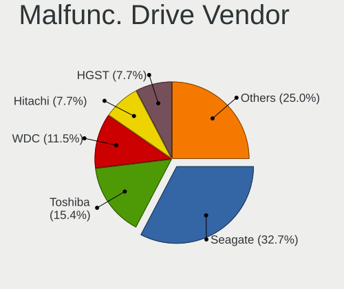

| Vendor              | Notebooks | Drives | Percent |
|---------------------|-----------|--------|---------|
| Seagate             | 17        | 21     | 32.69%  |
| Toshiba             | 8         | 9      | 15.38%  |
| WDC                 | 6         | 6      | 11.54%  |
| Hitachi             | 4         | 4      | 7.69%   |
| HGST                | 4         | 4      | 7.69%   |
| Intel               | 3         | 5      | 5.77%   |
| Samsung Electronics | 2         | 2      | 3.85%   |
| Micron Technology   | 2         | 2      | 3.85%   |
| Kingston            | 2         | 2      | 3.85%   |
| SK hynix            | 1         | 1      | 1.92%   |
| SanDisk             | 1         | 1      | 1.92%   |
| Corsair             | 1         | 1      | 1.92%   |
| A-DATA Technology   | 1         | 1      | 1.92%   |

Malfunc. HDD Vendor
-------------------

Vendors of faulty HDD drives

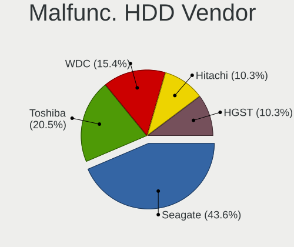

| Vendor  | Notebooks | Drives | Percent |
|---------|-----------|--------|---------|
| Seagate | 17        | 21     | 43.59%  |
| Toshiba | 8         | 9      | 20.51%  |
| WDC     | 6         | 6      | 15.38%  |
| Hitachi | 4         | 4      | 10.26%  |
| HGST    | 4         | 4      | 10.26%  |

Malfunc. Drive Kind
-------------------

Kinds of faulty drives

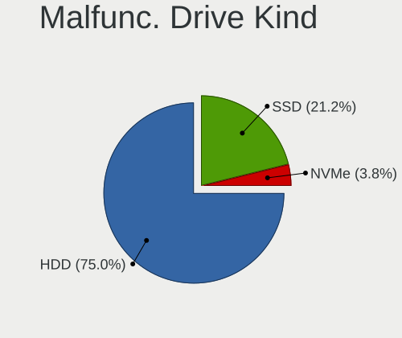

| Kind | Notebooks | Drives | Percent |
|------|-----------|--------|---------|
| HDD  | 39        | 44     | 75%     |
| SSD  | 11        | 13     | 21.15%  |
| NVMe | 2         | 2      | 3.85%   |

Failed Drives
-------------

Failed drive models

Zero info for selected period =(

Failed Drive Vendor
-------------------

Failed drive vendors

Zero info for selected period =(

Drive Status
------------

Number of failed and malfunc. drives

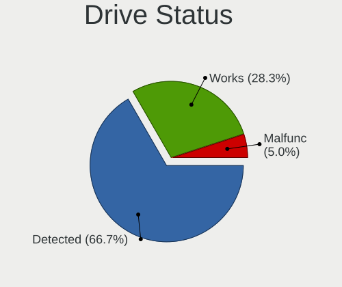

| Status   | Notebooks | Drives | Percent |
|----------|-----------|--------|---------|
| Detected | 676       | 1071   | 66.67%  |
| Works    | 287       | 383    | 28.3%   |
| Malfunc  | 51        | 59     | 5.03%   |

Storage controller
------------------

Storage Vendor
--------------

Storage controller vendors

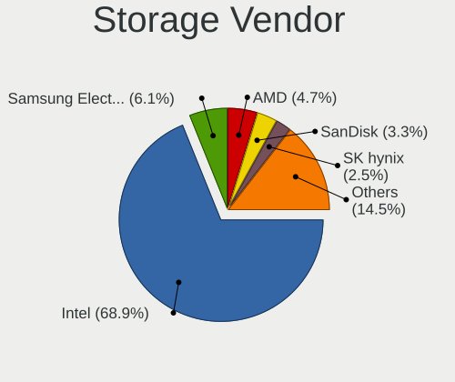

| Vendor                           | Notebooks | Percent |
|----------------------------------|-----------|---------|
| Intel                            | 775       | 68.89%  |
| Samsung Electronics              | 69        | 6.13%   |
| AMD                              | 53        | 4.71%   |
| SanDisk                          | 37        | 3.29%   |
| SK hynix                         | 28        | 2.49%   |
| Silicon Motion                   | 24        | 2.13%   |
| Micron Technology                | 23        | 2.04%   |
| Toshiba America Info Systems     | 20        | 1.78%   |
| Kingston Technology Company      | 20        | 1.78%   |
| KIOXIA                           | 15        | 1.33%   |
| Phison Electronics               | 10        | 0.89%   |
| ADATA Technology                 | 8         | 0.71%   |
| MAXIO Technology (Hangzhou)      | 7         | 0.62%   |
| Micron/Crucial Technology        | 6         | 0.53%   |
| Apple                            | 5         | 0.44%   |
| Nvidia                           | 4         | 0.36%   |
| Solidigm                         | 3         | 0.27%   |
| INNOGRIT                         | 3         | 0.27%   |
| Union Memory (Shenzhen)          | 2         | 0.18%   |
| Transcend                        | 2         | 0.18%   |
| Solid State Storage Technology   | 2         | 0.18%   |
| Marvell Technology Group         | 2         | 0.18%   |
| Silicon Integrated Systems [SiS] | 1         | 0.09%   |
| Shenzhen Longsys Electronics     | 1         | 0.09%   |
| Lite-On Technology               | 1         | 0.09%   |
| Lenovo                           | 1         | 0.09%   |
| Hosin Global Electronics         | 1         | 0.09%   |
| Biwin Storage Technology         | 1         | 0.09%   |
| Unknown                          | 1         | 0.09%   |

Storage Model
-------------

Storage controller models

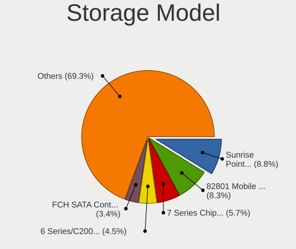

| Model                                                                                  | Notebooks | Percent |
|----------------------------------------------------------------------------------------|-----------|---------|
| Intel Sunrise Point-LP SATA Controller [AHCI mode]                                     | 107       | 8.84%   |
| Intel 82801 Mobile SATA Controller [RAID mode]                                         | 100       | 8.26%   |
| Intel 7 Series Chipset Family 6-port SATA Controller [AHCI mode]                       | 69        | 5.7%    |
| Intel 6 Series/C200 Series Chipset Family 6 port Mobile SATA AHCI Controller           | 54        | 4.46%   |
| AMD FCH SATA Controller [AHCI mode]                                                    | 41        | 3.39%   |
| Intel Volume Management Device NVMe RAID Controller                                    | 37        | 3.06%   |
| Intel Wildcat Point-LP SATA Controller [AHCI Mode]                                     | 36        | 2.98%   |
| Intel 8 Series SATA Controller 1 [AHCI mode]                                           | 34        | 2.81%   |
| Intel 8 Series/C220 Series Chipset Family 6-port SATA Controller 1 [AHCI mode]         | 31        | 2.56%   |
| Intel 82801IBM/IEM (ICH9M/ICH9M-E) 4 port SATA Controller [AHCI mode]                  | 28        | 2.31%   |
| Intel Cannon Lake Mobile PCH SATA AHCI Controller                                      | 27        | 2.23%   |
| Intel Atom/Celeron/Pentium Processor x5-E8000/J3xxx/N3xxx Series SATA Controller       | 27        | 2.23%   |
| Intel 5 Series/3400 Series Chipset 4 port SATA AHCI Controller                         | 25        | 2.07%   |
| Intel 5 Series/3400 Series Chipset 6 port SATA AHCI Controller                         | 22        | 1.82%   |
| Samsung NVMe SSD Controller SM981/PM981/PM983                                          | 21        | 1.74%   |
| Samsung NVMe SSD Controller 980 (DRAM-less)                                            | 20        | 1.65%   |
| Intel Celeron/Pentium Silver Processor SATA Controller                                 | 20        | 1.65%   |
| Intel 82801HM/HEM (ICH8M/ICH8M-E) IDE Controller                                       | 16        | 1.32%   |
| Silicon Motion SM2262/SM2262EN SSD Controller                                          | 15        | 1.24%   |
| Intel HM170/QM170 Chipset SATA Controller [AHCI Mode]                                  | 15        | 1.24%   |
| Intel Celeron N3350/Pentium N4200/Atom E3900 Series SATA AHCI Controller               | 15        | 1.24%   |
| Intel 82801HM/HEM (ICH8M/ICH8M-E) SATA Controller [AHCI mode]                          | 15        | 1.24%   |
| Toshiba America Info Systems XG6 NVMe SSD Controller                                   | 13        | 1.07%   |
| KIOXIA NVMe SSD Controller BG4 (DRAM-less)                                             | 11        | 0.91%   |
| Intel SSD 660P Series                                                                  | 11        | 0.91%   |
| Intel Comet Lake SATA AHCI Controller                                                  | 11        | 0.91%   |
| AMD SB7x0/SB8x0/SB9x0 SATA Controller [AHCI mode]                                      | 11        | 0.91%   |
| Samsung NVMe SSD Controller SM961/PM961/SM963                                          | 10        | 0.83%   |
| Intel Ice Lake-LP SATA Controller [AHCI mode]                                          | 10        | 0.83%   |
| Intel 6 Series/C200 Series Chipset Family Mobile SATA Controller (IDE mode, ports 4-5) | 10        | 0.83%   |
| Intel 6 Series/C200 Series Chipset Family Mobile SATA Controller (IDE mode, ports 0-3) | 10        | 0.83%   |
| Intel 400 Series Chipset Family SATA AHCI Controller                                   | 10        | 0.83%   |
| Intel SSD 670p Series [Keystone Harbor]                                                | 9         | 0.74%   |
| Intel Cannon Point-LP SATA Controller [AHCI Mode]                                      | 9         | 0.74%   |
| SK hynix Gold P31/BC711/PC711 NVMe Solid State Drive                                   | 8         | 0.66%   |
| Samsung NVMe SSD Controller PM9A1/PM9A3/980PRO                                         | 8         | 0.66%   |
| Intel Q170/Q150/B150/H170/H110/Z170/CM236 Chipset SATA Controller [AHCI Mode]          | 8         | 0.66%   |
| Micron 2400 NVMe SSD (DRAM-less)                                                       | 7         | 0.58%   |
| Intel Tiger Lake-LP SATA Controller                                                    | 7         | 0.58%   |
| Silicon Motion SM2263EN/SM2263XT (DRAM-less) NVMe SSD Controllers                      | 6         | 0.5%    |

Storage Kind
------------

Kind of storage controller (IDE, SATA, NVMe, SAS, ...)

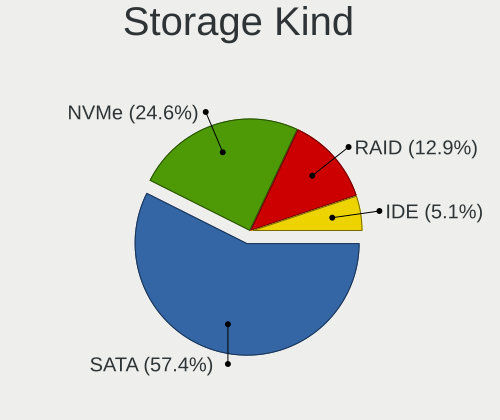

| Kind | Notebooks | Percent |
|------|-----------|---------|
| SATA | 663       | 57.4%   |
| NVMe | 284       | 24.59%  |
| RAID | 149       | 12.9%   |
| IDE  | 59        | 5.11%   |

Processor
---------

CPU Vendor
----------

Processor vendors

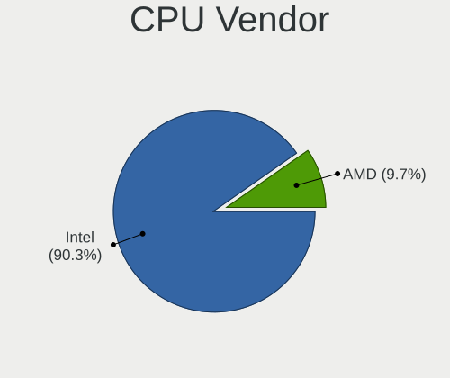

| Vendor | Notebooks | Percent |
|--------|-----------|---------|
| Intel  | 874       | 90.29%  |
| AMD    | 94        | 9.71%   |

CPU Model
---------

Processor models

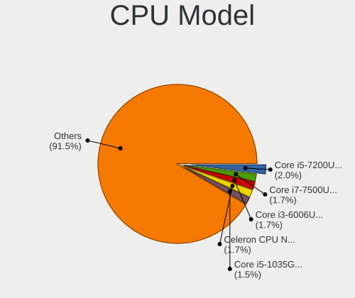

| Model                                   | Notebooks | Percent |
|-----------------------------------------|-----------|---------|
| Intel Core i5-7200U CPU @ 2.50GHz       | 19        | 1.96%   |
| Intel Core i7-7500U CPU @ 2.70GHz       | 16        | 1.65%   |
| Intel Core i3-6006U CPU @ 2.00GHz       | 16        | 1.65%   |
| Intel Celeron CPU N3060 @ 1.60GHz       | 16        | 1.65%   |
| Intel Core i5-1035G1 CPU @ 1.00GHz      | 15        | 1.55%   |
| Intel Core i7-8750H CPU @ 2.20GHz       | 14        | 1.45%   |
| Intel Core i7-8550U CPU @ 1.80GHz       | 14        | 1.45%   |
| Intel Core i5-8250U CPU @ 1.60GHz       | 14        | 1.45%   |
| Intel Core i5-2450M CPU @ 2.50GHz       | 13        | 1.34%   |
| Intel Celeron CPU N3350 @ 1.10GHz       | 13        | 1.34%   |
| Intel Core i7-8565U CPU @ 1.80GHz       | 12        | 1.24%   |
| Intel Core i5-6300U CPU @ 2.40GHz       | 12        | 1.24%   |
| Intel Core i5-5200U CPU @ 2.20GHz       | 12        | 1.24%   |
| Intel Core i5-3210M CPU @ 2.50GHz       | 12        | 1.24%   |
| Intel Celeron N4020 CPU @ 1.10GHz       | 12        | 1.24%   |
| Intel Core i7-9750H CPU @ 2.60GHz       | 11        | 1.14%   |
| Intel Core i7-2630QM CPU @ 2.00GHz      | 11        | 1.14%   |
| Intel Core i5-2520M CPU @ 2.50GHz       | 11        | 1.14%   |
| Intel Core i3-5005U CPU @ 2.00GHz       | 11        | 1.14%   |
| Intel Core i7-7700HQ CPU @ 2.80GHz      | 10        | 1.03%   |
| Intel Core i7-6500U CPU @ 2.50GHz       | 10        | 1.03%   |
| Intel Core 2 Duo CPU P8600 @ 2.40GHz    | 10        | 1.03%   |
| Intel 11th Gen Core i7-1165G7 @ 2.80GHz | 10        | 1.03%   |
| Intel 11th Gen Core i5-1135G7 @ 2.40GHz | 10        | 1.03%   |
| Intel Core i5-8265U CPU @ 1.60GHz       | 9         | 0.93%   |
| Intel Core i5-3230M CPU @ 2.60GHz       | 9         | 0.93%   |
| Intel Core i5 CPU M 520 @ 2.40GHz       | 9         | 0.93%   |
| Intel Core i7-6700HQ CPU @ 2.60GHz      | 8         | 0.83%   |
| Intel Core i5-6200U CPU @ 2.30GHz       | 8         | 0.83%   |
| Intel Core i3-10110U CPU @ 2.10GHz      | 8         | 0.83%   |
| Intel Celeron CPU N3050 @ 1.60GHz       | 8         | 0.83%   |
| Intel 11th Gen Core i7-1185G7 @ 3.00GHz | 8         | 0.83%   |
| Intel Core i5-9300H CPU @ 2.40GHz       | 7         | 0.72%   |
| Intel Core i5-4210U CPU @ 1.70GHz       | 7         | 0.72%   |
| Intel Atom x5-Z8350 CPU @ 1.44GHz       | 7         | 0.72%   |
| Intel Core i7-6600U CPU @ 2.60GHz       | 6         | 0.62%   |
| Intel Core i7-4700MQ CPU @ 2.40GHz      | 6         | 0.62%   |
| Intel Core i7-10750H CPU @ 2.60GHz      | 6         | 0.62%   |
| Intel Core i5-4200U CPU @ 1.60GHz       | 6         | 0.62%   |
| Intel Core i5-4200M CPU @ 2.50GHz       | 6         | 0.62%   |

CPU Model Family
----------------

Processor model prefix

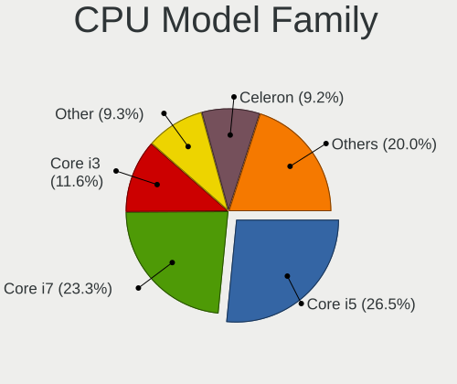

| Model                   | Notebooks | Percent |
|-------------------------|-----------|---------|
| Intel Core i5           | 257       | 26.55%  |
| Intel Core i7           | 226       | 23.35%  |
| Intel Core i3           | 112       | 11.57%  |
| Other                   | 90        | 9.3%    |
| Intel Celeron           | 89        | 9.19%   |
| Intel Core 2 Duo        | 42        | 4.34%   |
| AMD Ryzen 7             | 28        | 2.89%   |
| Intel Atom              | 18        | 1.86%   |
| AMD Ryzen 5             | 18        | 1.86%   |
| Intel Pentium           | 11        | 1.14%   |
| Intel Core              | 8         | 0.83%   |
| AMD E                   | 8         | 0.83%   |
| AMD A4                  | 7         | 0.72%   |
| AMD Ryzen 9             | 6         | 0.62%   |
| AMD A6                  | 6         | 0.62%   |
| Intel Genuine           | 5         | 0.52%   |
| Intel Core i9           | 4         | 0.41%   |
| Intel Celeron Dual-Core | 4         | 0.41%   |
| AMD E2                  | 4         | 0.41%   |
| Intel Pentium Dual-Core | 3         | 0.31%   |
| Intel Pentium Dual      | 2         | 0.21%   |
| Intel Core Duo          | 2         | 0.21%   |
| Intel Core 2            | 2         | 0.21%   |
| AMD Ryzen 3             | 2         | 0.21%   |
| AMD E1                  | 2         | 0.21%   |
| Intel Pentium Silver    | 1         | 0.1%    |
| Intel Celeron M         | 1         | 0.1%    |
| AMD Turion II Dual-Core | 1         | 0.1%    |
| AMD Turion 64 Mobile    | 1         | 0.1%    |
| AMD Ryzen 7 PRO         | 1         | 0.1%    |
| AMD Ryzen 5 PRO         | 1         | 0.1%    |
| AMD Quad-Core           | 1         | 0.1%    |
| AMD FX                  | 1         | 0.1%    |
| AMD Athlon X2           | 1         | 0.1%    |
| AMD Athlon II           | 1         | 0.1%    |
| AMD Athlon 64 X2        | 1         | 0.1%    |
| AMD A10                 | 1         | 0.1%    |

CPU Cores
---------

Number of processor cores

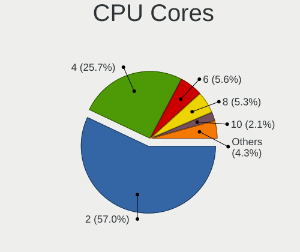

| Number | Notebooks | Percent |
|--------|-----------|---------|
| 2      | 552       | 57.02%  |
| 4      | 249       | 25.72%  |
| 6      | 54        | 5.58%   |
| 8      | 51        | 5.27%   |
| 10     | 20        | 2.07%   |
| 1      | 16        | 1.65%   |
| 12     | 11        | 1.14%   |
| 16     | 8         | 0.83%   |
| 14     | 4         | 0.41%   |
| 24     | 1         | 0.1%    |
| 20     | 1         | 0.1%    |
| 3      | 1         | 0.1%    |

CPU Sockets
-----------

Number of sockets

| Number | Notebooks | Percent |
|--------|-----------|---------|
| 1      | 968       | 100%    |

CPU Threads
-----------

Threads per core (Hyper-Threading)

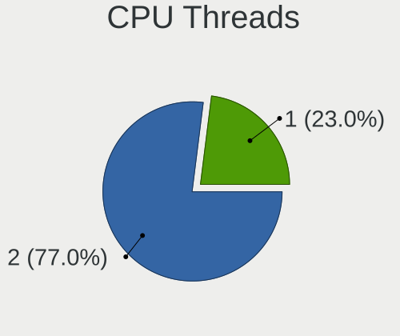

| Number | Notebooks | Percent |
|--------|-----------|---------|
| 2      | 746       | 76.99%  |
| 1      | 223       | 23.01%  |

CPU Op-Modes
------------

CPU Operation Modes (32-bit, 64-bit)

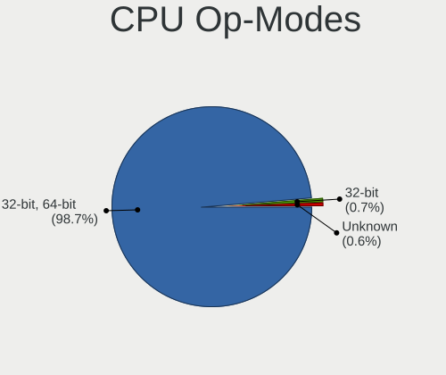

| Op mode        | Notebooks | Percent |
|----------------|-----------|---------|
| 32-bit, 64-bit | 957       | 98.66%  |
| 32-bit         | 7         | 0.72%   |
| Unknown        | 6         | 0.62%   |

CPU Microcode
-------------

Microcode number

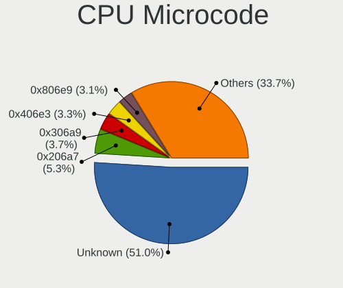

| Number     | Notebooks | Percent |
|------------|-----------|---------|
| Unknown    | 514       | 50.99%  |
| 0x206a7    | 53        | 5.26%   |
| 0x306a9    | 37        | 3.67%   |
| 0x406e3    | 33        | 3.27%   |
| 0x806e9    | 31        | 3.08%   |
| 0x20655    | 23        | 2.28%   |
| 0x806ea    | 21        | 2.08%   |
| 0x306c3    | 19        | 1.88%   |
| 0x1067a    | 19        | 1.88%   |
| 0x906ea    | 18        | 1.79%   |
| 0x306d4    | 18        | 1.79%   |
| 0x406c4    | 17        | 1.69%   |
| 0x806c1    | 16        | 1.59%   |
| 0x806ec    | 15        | 1.49%   |
| 0x40651    | 14        | 1.39%   |
| 0x906e9    | 11        | 1.09%   |
| 0x6fd      | 10        | 0.99%   |
| 0x06006705 | 10        | 0.99%   |
| 0xa0652    | 8         | 0.79%   |
| 0x506e3    | 8         | 0.79%   |
| 0x506c9    | 8         | 0.79%   |
| 0x406c3    | 8         | 0.79%   |
| 0x806eb    | 6         | 0.6%    |
| 0x20652    | 6         | 0.6%    |
| 0x10676    | 5         | 0.5%    |
| 0x806d1    | 4         | 0.4%    |
| 0x706e5    | 4         | 0.4%    |
| 0x706a8    | 4         | 0.4%    |
| 0x10661    | 4         | 0.4%    |
| 0x906ed    | 3         | 0.3%    |
| 0x706a1    | 3         | 0.3%    |
| 0x30678    | 3         | 0.3%    |
| 0x0a50000d | 3         | 0.3%    |
| 0x0a50000c | 3         | 0.3%    |
| 0x05000119 | 3         | 0.3%    |
| 0x906a4    | 2         | 0.2%    |
| 0x6f6      | 2         | 0.2%    |
| 0x6ec      | 2         | 0.2%    |
| 0x6e8      | 2         | 0.2%    |
| 0x30661    | 2         | 0.2%    |

CPU Microarch
-------------

Microarchitecture

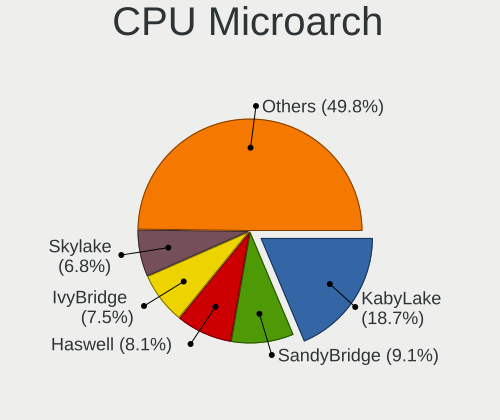

| Name              | Notebooks | Percent |
|-------------------|-----------|---------|
| KabyLake          | 181       | 18.66%  |
| SandyBridge       | 88        | 9.07%   |
| Haswell           | 79        | 8.14%   |
| IvyBridge         | 73        | 7.53%   |
| Skylake           | 66        | 6.8%    |
| Westmere          | 50        | 5.15%   |
| Unknown           | 48        | 4.95%   |
| Silvermont        | 44        | 4.54%   |
| Broadwell         | 44        | 4.54%   |
| Penryn            | 40        | 4.12%   |
| TigerLake         | 36        | 3.71%   |
| Alderlake Hybrid  | 27        | 2.78%   |
| IceLake           | 24        | 2.47%   |
| Core              | 24        | 2.47%   |
| Goldmont plus     | 22        | 2.27%   |
| Zen 3             | 19        | 1.96%   |
| CometLake         | 17        | 1.75%   |
| Excavator         | 16        | 1.65%   |
| Goldmont          | 15        | 1.55%   |
| Zen 2             | 9         | 0.93%   |
| Bobcat            | 9         | 0.93%   |
| Bonnell           | 7         | 0.72%   |
| Zen+              | 6         | 0.62%   |
| P6                | 4         | 0.41%   |
| Jaguar            | 4         | 0.41%   |
| Zen               | 3         | 0.31%   |
| Puma              | 2         | 0.21%   |
| Nehalem           | 2         | 0.21%   |
| Meteorlake Hybrid | 2         | 0.21%   |
| K8 Hammer         | 2         | 0.21%   |
| K10               | 2         | 0.21%   |
| Gracemont         | 2         | 0.21%   |
| Tremont           | 1         | 0.1%    |
| Steamroller       | 1         | 0.1%    |
| K8 & K10 hybrid   | 1         | 0.1%    |

Graphics
--------

GPU Vendor
----------

Vendors of graphics cards

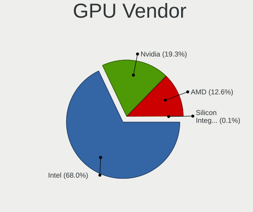

| Vendor                           | Notebooks | Percent |
|----------------------------------|-----------|---------|
| Intel                            | 823       | 67.96%  |
| Nvidia                           | 234       | 19.32%  |
| AMD                              | 153       | 12.63%  |
| Silicon Integrated Systems [SiS] | 1         | 0.08%   |

GPU Model
---------

Graphics card models

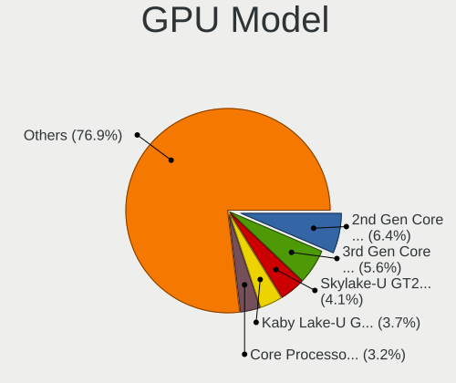

| Model                                                                                    | Notebooks | Percent |
|------------------------------------------------------------------------------------------|-----------|---------|
| Intel 2nd Generation Core Processor Family Integrated Graphics Controller                | 80        | 6.44%   |
| Intel 3rd Gen Core processor Graphics Controller                                         | 70        | 5.64%   |
| Intel Skylake-U GT2 [HD Graphics 520]                                                    | 51        | 4.11%   |
| Intel Kaby Lake-U GT2 [HD Graphics 620]                                                  | 46        | 3.7%    |
| Intel Core Processor Integrated Graphics Controller                                      | 40        | 3.22%   |
| Intel Broadwell-U GT2 [HD Graphics 5500]                                                 | 40        | 3.22%   |
| Intel 4th Gen Core Processor Integrated Graphics Controller                              | 39        | 3.14%   |
| Intel Haswell-ULT Integrated Graphics Controller                                         | 38        | 3.06%   |
| Intel Atom/Celeron/Pentium Processor x5-E8000/J3xxx/N3xxx Integrated Graphics Controller | 38        | 3.06%   |
| Intel Kaby Lake-R GT2 [UHD Graphics 620]                                                 | 37        | 2.98%   |
| Intel CoffeeLake-H GT2 [UHD Graphics 630]                                                | 34        | 2.74%   |
| Intel TigerLake-LP GT2 [Iris Xe Graphics]                                                | 33        | 2.66%   |
| Intel Mobile 4 Series Chipset Integrated Graphics Controller                             | 31        | 2.5%    |
| Intel WhiskeyLake-U GT2 [UHD Graphics 620]                                               | 23        | 1.85%   |
| Intel GeminiLake [UHD Graphics 600]                                                      | 22        | 1.77%   |
| Nvidia TU117M [GeForce GTX 1650 Mobile / Max-Q]                                          | 16        | 1.29%   |
| Intel Kaby Lake-H GT2 [HD Graphics 630]                                                  | 15        | 1.21%   |
| Intel Iris Plus Graphics G1 (Ice Lake)                                                   | 15        | 1.21%   |
| Intel CometLake-U GT2 [UHD Graphics]                                                     | 15        | 1.21%   |
| Intel CometLake-H GT2 [UHD Graphics]                                                     | 15        | 1.21%   |
| AMD Stoney [Radeon R2/R3/R4/R5 Graphics]                                                 | 15        | 1.21%   |
| Intel Mobile GM965/GL960 Integrated Graphics Controller (secondary)                      | 14        | 1.13%   |
| Intel Mobile GM965/GL960 Integrated Graphics Controller (primary)                        | 14        | 1.13%   |
| Intel Apollo Lake GT1 [HD Graphics 500]                                                  | 14        | 1.13%   |
| AMD Cezanne [Radeon Vega Series / Radeon Vega Mobile Series]                             | 11        | 0.89%   |
| Nvidia GP107M [GeForce GTX 1050 Ti Mobile]                                               | 10        | 0.81%   |
| Nvidia GP107M [GeForce GTX 1050 Mobile]                                                  | 10        | 0.81%   |
| Intel Skylake-H GT2 [HD Graphics 530]                                                    | 10        | 0.81%   |
| AMD Sun XT [Radeon HD 8670A/8670M/8690M / R5 M330 / M430 / Radeon 520 Mobile]            | 10        | 0.81%   |
| Nvidia TU116M [GeForce GTX 1660 Ti Mobile]                                               | 9         | 0.72%   |
| Intel TigerLake-H GT1 [UHD Graphics]                                                     | 9         | 0.72%   |
| Intel Raptor Lake-P [Iris Xe Graphics]                                                   | 9         | 0.72%   |
| AMD Renoir [Radeon Vega Series / Radeon Vega Mobile Series]                              | 9         | 0.72%   |
| AMD Rembrandt [Radeon 680M]                                                              | 9         | 0.72%   |
| Nvidia GM108M [GeForce MX130]                                                            | 8         | 0.64%   |
| Nvidia GA107M [GeForce RTX 3050 Mobile]                                                  | 8         | 0.64%   |
| Intel Mobile 945GM/GMS/GME, 943/940GML Express Integrated Graphics Controller            | 8         | 0.64%   |
| Intel Alder Lake-UP3 GT2 [Iris Xe Graphics]                                              | 8         | 0.64%   |
| AMD Topaz XT [Radeon R7 M260/M265 / M340/M360 / M440/M445 / 530/535 / 620/625 Mobile]    | 8         | 0.64%   |
| AMD Picasso/Raven 2 [Radeon Vega Series / Radeon Vega Mobile Series]                     | 7         | 0.56%   |

GPU Combo
---------

Combinations of graphics cards

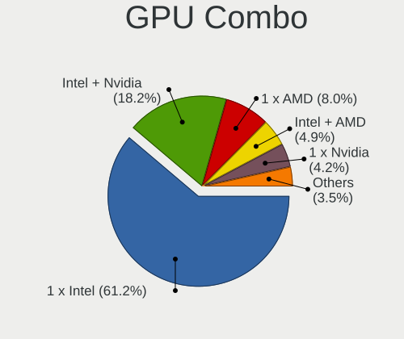

| Name           | Notebooks | Percent |
|----------------|-----------|---------|
| 1 x Intel      | 593       | 61.2%   |
| Intel + Nvidia | 176       | 18.16%  |
| 1 x AMD        | 78        | 8.05%   |
| Intel + AMD    | 47        | 4.85%   |
| 1 x Nvidia     | 41        | 4.23%   |
| AMD + Nvidia   | 17        | 1.75%   |
| 2 x AMD        | 9         | 0.93%   |
| 2 x Intel      | 7         | 0.72%   |
| 1 x SiS        | 1         | 0.1%    |

GPU Driver
----------

Free vs proprietary

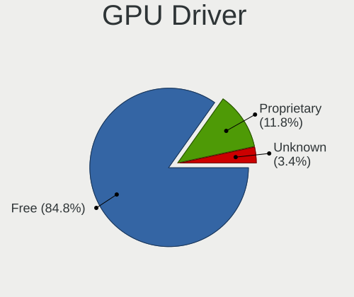

| Driver      | Notebooks | Percent |
|-------------|-----------|---------|
| Free        | 831       | 84.8%   |
| Proprietary | 116       | 11.84%  |
| Unknown     | 33        | 3.37%   |

GPU Memory
----------

Total video memory

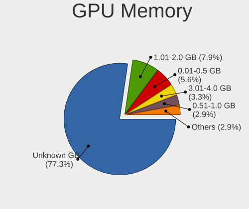

| Size in GB | Notebooks | Percent |
|------------|-----------|---------|
| Unknown    | 767       | 77.32%  |
| 1.01-2.0   | 78        | 7.86%   |
| 0.01-0.5   | 56        | 5.65%   |
| 3.01-4.0   | 33        | 3.33%   |
| 0.51-1.0   | 29        | 2.92%   |
| 5.01-6.0   | 17        | 1.71%   |
| 7.01-8.0   | 6         | 0.6%    |
| 2.01-3.0   | 5         | 0.5%    |
| 8.01-16.0  | 1         | 0.1%    |

Monitor
-------

Monitor Vendor
--------------

Monitor vendors

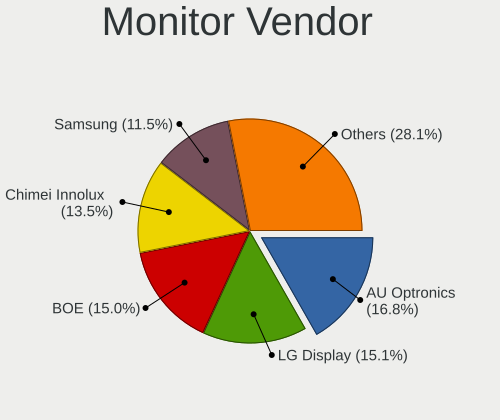

| Vendor                  | Notebooks | Percent |
|-------------------------|-----------|---------|
| AU Optronics            | 193       | 16.75%  |
| LG Display              | 174       | 15.1%   |
| BOE                     | 173       | 15.02%  |
| Chimei Innolux          | 156       | 13.54%  |
| Samsung Electronics     | 132       | 11.46%  |
| Dell                    | 82        | 7.12%   |
| Goldstar                | 37        | 3.21%   |
| Chi Mei Optoelectronics | 32        | 2.78%   |
| Apple                   | 24        | 2.08%   |
| Lenovo                  | 22        | 1.91%   |
| Sharp                   | 17        | 1.48%   |
| PANDA                   | 14        | 1.22%   |
| LG Philips              | 11        | 0.95%   |
| Hewlett-Packard         | 9         | 0.78%   |
| AOC                     | 8         | 0.69%   |
| Philips                 | 6         | 0.52%   |
| Panasonic               | 4         | 0.35%   |
| Toshiba                 | 3         | 0.26%   |
| SLD                     | 3         | 0.26%   |
| SKY                     | 3         | 0.26%   |
| Hitachi                 | 3         | 0.26%   |
| Fujitsu Siemens         | 3         | 0.26%   |
| Unknown (XXX)           | 2         | 0.17%   |
| Quanta Display          | 2         | 0.17%   |
| MStar                   | 2         | 0.17%   |
| KDB                     | 2         | 0.17%   |
| CSW                     | 2         | 0.17%   |
| CSO                     | 2         | 0.17%   |
| VST                     | 1         | 0.09%   |
| VIE                     | 1         | 0.09%   |
| Unknown                 | 1         | 0.09%   |
| Tatung                  | 1         | 0.09%   |
| STD                     | 1         | 0.09%   |
| Sony                    | 1         | 0.09%   |
| SKK                     | 1         | 0.09%   |
| SKG                     | 1         | 0.09%   |
| SEEYOO                  | 1         | 0.09%   |
| RTK                     | 1         | 0.09%   |
| PRI                     | 1         | 0.09%   |
| Olevia                  | 1         | 0.09%   |

Monitor Model
-------------

Monitor models

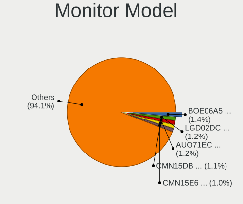

| Model                                                                    | Notebooks | Percent |
|--------------------------------------------------------------------------|-----------|---------|
| BOE LCD Monitor BOE06A5 1366x768 344x194mm 15.5-inch                     | 16        | 1.36%   |
| LG Display LCD Monitor LGD02DC 1366x768 344x194mm 15.5-inch              | 14        | 1.19%   |
| AU Optronics LCD Monitor AUO71EC 1366x768 344x193mm 15.5-inch            | 14        | 1.19%   |
| Chimei Innolux LCD Monitor CMN15DB 1366x768 344x193mm 15.5-inch          | 13        | 1.1%    |
| Chimei Innolux LCD Monitor CMN15E6 1366x768 344x193mm 15.5-inch          | 12        | 1.02%   |
| BOE LCD Monitor BOE0672 1366x768 344x194mm 15.5-inch                     | 11        | 0.93%   |
| AU Optronics LCD Monitor AUO38ED 1920x1080 344x193mm 15.5-inch           | 9         | 0.76%   |
| Chi Mei Optoelectronics LCD Monitor CMO1592 1366x768 344x193mm 15.5-inch | 8         | 0.68%   |
| AU Optronics LCD Monitor AUO22EC 1366x768 344x193mm 15.5-inch            | 8         | 0.68%   |
| LG Display LCD Monitor LGD0456 1366x768 344x194mm 15.5-inch              | 7         | 0.59%   |
| LG Display LCD Monitor LGD033A 1366x768 344x194mm 15.5-inch              | 7         | 0.59%   |
| Samsung Electronics LCD Monitor SEC5441 1280x800 331x207mm 15.4-inch     | 6         | 0.51%   |
| LG Display LCD Monitor LGD02AC 1366x768 344x194mm 15.5-inch              | 6         | 0.51%   |
| Dell SE2416H DELD082 1920x1080 527x296mm 23.8-inch                       | 6         | 0.51%   |
| Dell SE2216H DELF071 1920x1080 476x268mm 21.5-inch                       | 6         | 0.51%   |
| Chimei Innolux LCD Monitor CMN15F5 1920x1080 344x193mm 15.5-inch         | 6         | 0.51%   |
| BOE LCD Monitor BOE0757 1366x768 344x194mm 15.5-inch                     | 6         | 0.51%   |
| AU Optronics LCD Monitor AUO70EC 1366x768 344x193mm 15.5-inch            | 6         | 0.51%   |
| Samsung Electronics LCD Monitor SDC5441 1366x768 344x193mm 15.5-inch     | 5         | 0.42%   |
| PANDA LCD Monitor NCP004D 1920x1080 344x194mm 15.5-inch                  | 5         | 0.42%   |
| LG Display LCD Monitor LGD053F 1920x1080 344x194mm 15.5-inch             | 5         | 0.42%   |
| Lenovo LCD Monitor LEN40B1 1600x900 345x194mm 15.6-inch                  | 5         | 0.42%   |
| Chimei Innolux LCD Monitor CMN15DC 1366x768 344x193mm 15.5-inch          | 5         | 0.42%   |
| Chi Mei Optoelectronics LCD Monitor CMO15A1 1366x768 344x193mm 15.5-inch | 5         | 0.42%   |
| BOE LCD Monitor BOE0872 1920x1080 344x194mm 15.5-inch                    | 5         | 0.42%   |
| BOE LCD Monitor BOE0808 1366x768 344x194mm 15.5-inch                     | 5         | 0.42%   |
| BOE LCD Monitor BOE0671 1366x768 344x194mm 15.5-inch                     | 5         | 0.42%   |
| AU Optronics LCD Monitor AUO61ED 1920x1080 344x194mm 15.5-inch           | 5         | 0.42%   |
| AU Optronics LCD Monitor AUO303E 1600x900 309x174mm 14.0-inch            | 5         | 0.42%   |
| AU Optronics LCD Monitor AUO26EC 1366x768 344x193mm 15.5-inch            | 5         | 0.42%   |
| AU Optronics LCD Monitor AUO23EC 1366x768 344x193mm 15.5-inch            | 5         | 0.42%   |
| Sharp LCD Monitor SHP14F9 1920x1200 288x180mm 13.4-inch                  | 4         | 0.34%   |
| Samsung Electronics LCD Monitor SEC4351 1366x768 344x194mm 15.5-inch     | 4         | 0.34%   |
| Samsung Electronics LCD Monitor SEC325A 1366x768 344x194mm 15.5-inch     | 4         | 0.34%   |
| Samsung Electronics LCD Monitor SDC4C51 1366x768 344x194mm 15.5-inch     | 4         | 0.34%   |
| LG Display LCD Monitor LGD046F 1920x1080 344x194mm 15.5-inch             | 4         | 0.34%   |
| LG Display LCD Monitor LGD039F 1366x768 345x194mm 15.6-inch              | 4         | 0.34%   |
| LG Display LCD Monitor LGD0266 1366x768 344x194mm 15.5-inch              | 4         | 0.34%   |
| Dell SE2419HR DELF113 1920x1080 527x296mm 23.8-inch                      | 4         | 0.34%   |
| Dell SE2416H DELD081 1920x1080 527x296mm 23.8-inch                       | 4         | 0.34%   |

Monitor Resolution
------------------

Monitor screen resolution

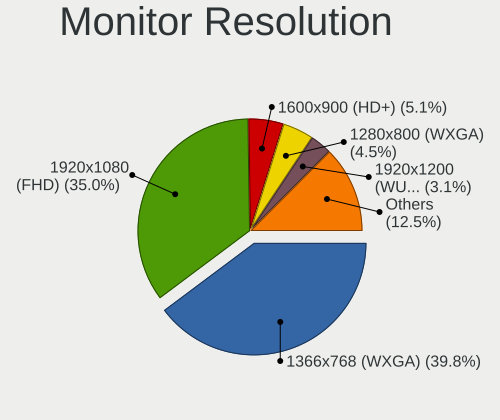

| Resolution         | Notebooks | Percent |
|--------------------|-----------|---------|
| 1366x768 (WXGA)    | 432       | 39.78%  |
| 1920x1080 (FHD)    | 380       | 34.99%  |
| 1600x900 (HD+)     | 55        | 5.06%   |
| 1280x800 (WXGA)    | 49        | 4.51%   |
| 1920x1200 (WUXGA)  | 34        | 3.13%   |
| 3840x2160 (4K)     | 26        | 2.39%   |
| 2560x1440 (QHD)    | 22        | 2.03%   |
| 1440x900 (WXGA+)   | 19        | 1.75%   |
| 2880x1800          | 12        | 1.1%    |
| 1280x1024 (SXGA)   | 10        | 0.92%   |
| 1680x1050 (WSXGA+) | 8         | 0.74%   |
| 1360x768           | 6         | 0.55%   |
| 2560x1080          | 4         | 0.37%   |
| 1024x768 (XGA)     | 4         | 0.37%   |
| 3840x1080          | 3         | 0.28%   |
| 3072x1920          | 3         | 0.28%   |
| 1920x540           | 3         | 0.28%   |
| 1024x600           | 3         | 0.28%   |
| 2880x1620          | 2         | 0.18%   |
| 2560x1600          | 2         | 0.18%   |
| 1600x1200          | 2         | 0.18%   |
| 3840x2400          | 1         | 0.09%   |
| 3200x1800 (QHD+)   | 1         | 0.09%   |
| 2880x1920          | 1         | 0.09%   |
| 2288x1287          | 1         | 0.09%   |
| 2160x1440          | 1         | 0.09%   |
| 1x1                | 1         | 0.09%   |
| 1680x945           | 1         | 0.09%   |

Monitor Diagonal
----------------

Diagonal size in inches

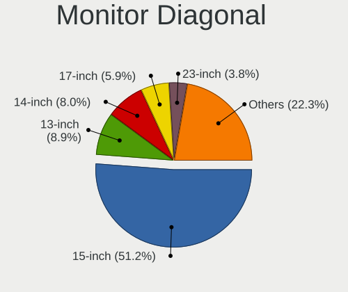

| Inches  | Notebooks | Percent |
|---------|-----------|---------|
| 15      | 598       | 51.2%   |
| 13      | 104       | 8.9%    |
| 14      | 93        | 7.96%   |
| 17      | 69        | 5.91%   |
| 23      | 44        | 3.77%   |
| 24      | 41        | 3.51%   |
| 27      | 30        | 2.57%   |
| 21      | 27        | 2.31%   |
| 16      | 24        | 2.05%   |
| 31      | 16        | 1.37%   |
| 19      | 14        | 1.2%    |
| 12      | 13        | 1.11%   |
| 11      | 13        | 1.11%   |
| 18      | 12        | 1.03%   |
| 20      | 11        | 0.94%   |
| Unknown | 10        | 0.86%   |
| 22      | 8         | 0.68%   |
| 40      | 5         | 0.43%   |
| 10      | 4         | 0.34%   |
| 84      | 3         | 0.26%   |
| 72      | 3         | 0.26%   |
| 52      | 3         | 0.26%   |
| 48      | 3         | 0.26%   |
| 34      | 3         | 0.26%   |
| 32      | 3         | 0.26%   |
| 63      | 2         | 0.17%   |
| 54      | 2         | 0.17%   |
| 86      | 1         | 0.09%   |
| 74      | 1         | 0.09%   |
| 64      | 1         | 0.09%   |
| 49      | 1         | 0.09%   |
| 46      | 1         | 0.09%   |
| 44      | 1         | 0.09%   |
| 42      | 1         | 0.09%   |
| 39      | 1         | 0.09%   |
| 26      | 1         | 0.09%   |
| 8       | 1         | 0.09%   |

Monitor Width
-------------

Physical width

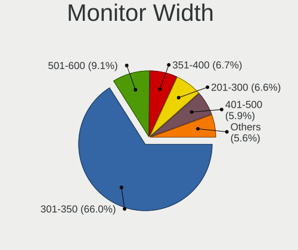

| Width in mm | Notebooks | Percent |
|-------------|-----------|---------|
| 301-350     | 766       | 66.03%  |
| 501-600     | 106       | 9.14%   |
| 351-400     | 78        | 6.72%   |
| 201-300     | 76        | 6.55%   |
| 401-500     | 69        | 5.95%   |
| 601-700     | 18        | 1.55%   |
| 1001-1500   | 14        | 1.21%   |
| Unknown     | 10        | 0.86%   |
| 1501-2000   | 7         | 0.6%    |
| 801-900     | 6         | 0.52%   |
| 701-800     | 6         | 0.52%   |
| 901-1000    | 2         | 0.17%   |
| 101-200     | 1         | 0.09%   |
| 1-100       | 1         | 0.09%   |

Aspect Ratio
------------

Proportional relationship between the width and the height

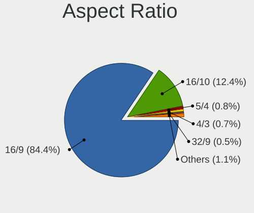

| Ratio   | Notebooks | Percent |
|---------|-----------|---------|
| 16/9    | 841       | 84.44%  |
| 16/10   | 124       | 12.45%  |
| 5/4     | 8         | 0.8%    |
| 4/3     | 7         | 0.7%    |
| 32/9    | 5         | 0.5%    |
| 3/2     | 5         | 0.5%    |
| 21/9    | 3         | 0.3%    |
| 0.56    | 1         | 0.1%    |
| 0.00    | 1         | 0.1%    |
| Unknown | 1         | 0.1%    |

Monitor Area
------------

Area in inch²

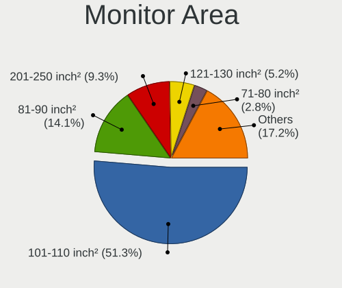

| Area in inch² | Notebooks | Percent |
|----------------|-----------|---------|
| 101-110        | 597       | 51.33%  |
| 81-90          | 164       | 14.1%   |
| 201-250        | 108       | 9.29%   |
| 121-130        | 61        | 5.25%   |
| 71-80          | 33        | 2.84%   |
| 301-350        | 30        | 2.58%   |
| 151-200        | 30        | 2.58%   |
| 111-120        | 24        | 2.06%   |
| 351-500        | 22        | 1.89%   |
| More than 1000 | 17        | 1.46%   |
| 141-150        | 15        | 1.29%   |
| 61-70          | 13        | 1.12%   |
| 51-60          | 13        | 1.12%   |
| 501-1000       | 12        | 1.03%   |
| Unknown        | 11        | 0.95%   |
| 251-300        | 5         | 0.43%   |
| 41-50          | 3         | 0.26%   |
| 131-140        | 3         | 0.26%   |
| 1-40           | 1         | 0.09%   |
| 91-100         | 1         | 0.09%   |

Pixel Density
-------------

Pixels per inch

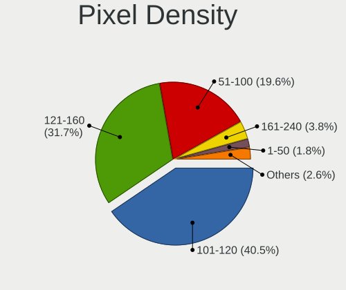

| Density       | Notebooks | Percent |
|---------------|-----------|---------|
| 101-120       | 458       | 40.5%   |
| 121-160       | 359       | 31.74%  |
| 51-100        | 222       | 19.63%  |
| 161-240       | 43        | 3.8%    |
| 1-50          | 20        | 1.77%   |
| More than 240 | 19        | 1.68%   |
| Unknown       | 10        | 0.88%   |

Multiple Monitors
-----------------

Total monitors connected

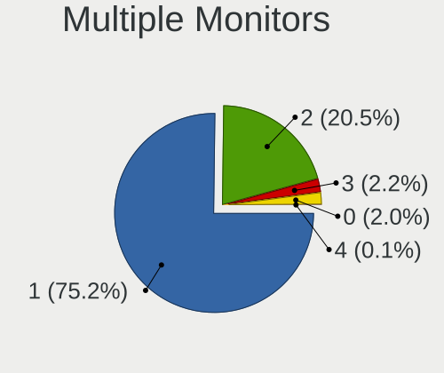

| Total | Notebooks | Percent |
|-------|-----------|---------|
| 1     | 755       | 75.2%   |
| 2     | 206       | 20.52%  |
| 3     | 22        | 2.19%   |
| 0     | 20        | 1.99%   |
| 4     | 1         | 0.1%    |

Network
-------

Net Controller Vendor
---------------------

Controller vendors

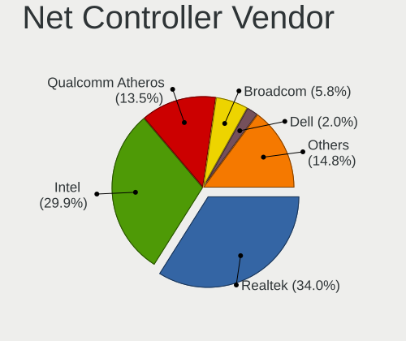

| Vendor                                 | Notebooks | Percent |
|----------------------------------------|-----------|---------|
| Realtek Semiconductor                  | 547       | 33.95%  |
| Intel                                  | 481       | 29.86%  |
| Qualcomm Atheros                       | 217       | 13.47%  |
| Broadcom                               | 94        | 5.83%   |
| Dell                                   | 33        | 2.05%   |
| MediaTek                               | 31        | 1.92%   |
| Broadcom Limited                       | 24        | 1.49%   |
| Samsung Electronics                    | 20        | 1.24%   |
| Marvell Technology Group               | 17        | 1.06%   |
| Ralink                                 | 16        | 0.99%   |
| TP-Link                                | 13        | 0.81%   |
| Shenzhen Goodix Technology             | 13        | 0.81%   |
| Huawei Technologies                    | 13        | 0.81%   |
| Ericsson Business Mobile Networks      | 13        | 0.81%   |
| ASIX Electronics                       | 10        | 0.62%   |
| Hewlett-Packard                        | 8         | 0.5%    |
| Sierra Wireless                        | 7         | 0.43%   |
| JMicron Technology                     | 7         | 0.43%   |
| Apple                                  | 4         | 0.25%   |
| Ralink Technology                      | 3         | 0.19%   |
| Qualcomm                               | 3         | 0.19%   |
| Lenovo                                 | 3         | 0.19%   |
| Xiaomi                                 | 2         | 0.12%   |
| Spreadtrum Communications              | 2         | 0.12%   |
| Nvidia                                 | 2         | 0.12%   |
| Fibocom                                | 2         | 0.12%   |
| DisplayLink                            | 2         | 0.12%   |
| D-Link                                 | 2         | 0.12%   |
| ASUSTek Computer                       | 2         | 0.12%   |
| Arduino SA                             | 2         | 0.12%   |
| ZyXEL Communications                   | 1         | 0.06%   |
| ZyDAS                                  | 1         | 0.06%   |
| ZTopInc                                | 1         | 0.06%   |
| U-Blox                                 | 1         | 0.06%   |
| TRENDnet                               | 1         | 0.06%   |
| Toshiba                                | 1         | 0.06%   |
| Texas Instruments                      | 1         | 0.06%   |
| Suzhou Motorcomm Electronic Technology | 1         | 0.06%   |
| Silicon Integrated Systems [SiS]       | 1         | 0.06%   |
| Qualcomm Atheros Communications        | 1         | 0.06%   |

Net Controller Model
--------------------

Controller models

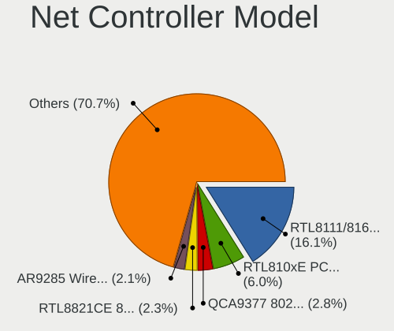

| Model                                                                  | Notebooks | Percent |
|------------------------------------------------------------------------|-----------|---------|
| Realtek RTL8111/8168/8211/8411 PCI Express Gigabit Ethernet Controller | 312       | 16.09%  |
| Realtek RTL810xE PCI Express Fast Ethernet controller                  | 116       | 5.98%   |
| Qualcomm Atheros QCA9377 802.11ac Wireless Network Adapter             | 55        | 2.84%   |
| Realtek RTL8821CE 802.11ac PCIe Wireless Network Adapter               | 45        | 2.32%   |
| Qualcomm Atheros AR9285 Wireless Network Adapter (PCI-Express)         | 40        | 2.06%   |
| Qualcomm Atheros QCA9565 / AR9565 Wireless Network Adapter             | 39        | 2.01%   |
| Intel 82579LM Gigabit Network Connection (Lewisville)                  | 39        | 2.01%   |
| Realtek RTL8153 Gigabit Ethernet Adapter                               | 33        | 1.7%    |
| Intel Wireless 8265 / 8275                                             | 29        | 1.5%    |
| Intel Wi-Fi 6 AX201                                                    | 29        | 1.5%    |
| Intel Centrino Advanced-N 6205 [Taylor Peak]                           | 28        | 1.44%   |
| Realtek RTL8723BE PCIe Wireless Network Adapter                        | 24        | 1.24%   |
| Intel Wireless 8260                                                    | 24        | 1.24%   |
| Intel Cannon Lake PCH CNVi WiFi                                        | 23        | 1.19%   |
| Qualcomm Atheros AR9485 Wireless Network Adapter                       | 22        | 1.13%   |
| Intel Wireless 7260                                                    | 21        | 1.08%   |
| Intel Wi-Fi 6 AX200                                                    | 21        | 1.08%   |
| Broadcom BCM4313 802.11bgn Wireless Network Adapter                    | 21        | 1.08%   |
| Intel Wireless 3165                                                    | 19        | 0.98%   |
| Intel Wireless 7265                                                    | 18        | 0.93%   |
| Intel Wireless 3160                                                    | 18        | 0.93%   |
| Intel Dual Band Wireless-AC 3165 Plus Bluetooth                        | 18        | 0.93%   |
| Intel Centrino Advanced-N 6200                                         | 17        | 0.88%   |
| Intel 82577LM Gigabit Network Connection                               | 17        | 0.88%   |
| Qualcomm Atheros QCA6174 802.11ac Wireless Network Adapter             | 16        | 0.83%   |
| Intel Ethernet Connection I217-LM                                      | 16        | 0.83%   |
| Intel Comet Lake PCH CNVi WiFi                                         | 16        | 0.83%   |
| MediaTek MT7921 802.11ax PCIe Wireless Network Adapter [Filogic 330]   | 14        | 0.72%   |
| Intel Ethernet Connection I219-LM                                      | 14        | 0.72%   |
| Shenzhen Goodix Fingerprint Reader                                     | 13        | 0.67%   |
| Realtek RTL8822CE 802.11ac PCIe Wireless Network Adapter               | 13        | 0.67%   |
| Realtek RTL8723DE Wireless Network Adapter                             | 13        | 0.67%   |
| Ralink RT3290 Wireless 802.11n 1T/1R PCIe                              | 13        | 0.67%   |
| Intel Comet Lake PCH-LP CNVi WiFi                                      | 13        | 0.67%   |
| Intel Alder Lake-P PCH CNVi WiFi                                       | 13        | 0.67%   |
| Qualcomm Atheros AR9462 Wireless Network Adapter                       | 12        | 0.62%   |
| Intel PRO/Wireless 3945ABG [Golan] Network Connection                  | 12        | 0.62%   |
| Intel Ethernet Connection (4) I219-LM                                  | 12        | 0.62%   |
| Intel Centrino Wireless-N 2230                                         | 12        | 0.62%   |
| Intel Centrino Wireless-N 1030 [Rainbow Peak]                          | 12        | 0.62%   |

Wireless Vendor
---------------

Wireless vendors

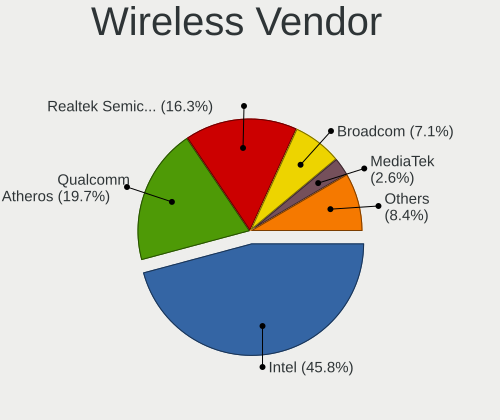

| Vendor                          | Notebooks | Percent |
|---------------------------------|-----------|---------|
| Intel                           | 456       | 45.83%  |
| Qualcomm Atheros                | 196       | 19.7%   |
| Realtek Semiconductor           | 162       | 16.28%  |
| Broadcom                        | 71        | 7.14%   |
| MediaTek                        | 26        | 2.61%   |
| Dell                            | 17        | 1.71%   |
| Ralink                          | 16        | 1.61%   |
| Broadcom Limited                | 14        | 1.41%   |
| TP-Link                         | 12        | 1.21%   |
| Sierra Wireless                 | 7         | 0.7%    |
| Ralink Technology               | 3         | 0.3%    |
| Fibocom                         | 2         | 0.2%    |
| D-Link                          | 2         | 0.2%    |
| ASUSTek Computer                | 2         | 0.2%    |
| ZyXEL Communications            | 1         | 0.1%    |
| ZyDAS                           | 1         | 0.1%    |
| ZTopInc                         | 1         | 0.1%    |
| TRENDnet                        | 1         | 0.1%    |
| Qualcomm Atheros Communications | 1         | 0.1%    |
| Qualcomm                        | 1         | 0.1%    |
| Pace Micro Technology           | 1         | 0.1%    |
| Linksys                         | 1         | 0.1%    |
| Hewlett-Packard                 | 1         | 0.1%    |

Wireless Model
--------------

Wireless models

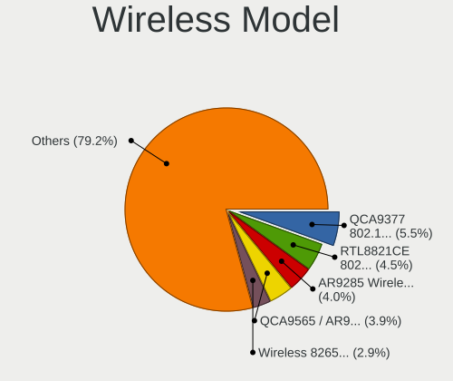

| Model                                                                | Notebooks | Percent |
|----------------------------------------------------------------------|-----------|---------|
| Qualcomm Atheros QCA9377 802.11ac Wireless Network Adapter           | 55        | 5.49%   |
| Realtek RTL8821CE 802.11ac PCIe Wireless Network Adapter             | 45        | 4.5%    |
| Qualcomm Atheros AR9285 Wireless Network Adapter (PCI-Express)       | 40        | 4%      |
| Qualcomm Atheros QCA9565 / AR9565 Wireless Network Adapter           | 39        | 3.9%    |
| Intel Wireless 8265 / 8275                                           | 29        | 2.9%    |
| Intel Wi-Fi 6 AX201                                                  | 29        | 2.9%    |
| Intel Centrino Advanced-N 6205 [Taylor Peak]                         | 28        | 2.8%    |
| Realtek RTL8723BE PCIe Wireless Network Adapter                      | 24        | 2.4%    |
| Intel Wireless 8260                                                  | 24        | 2.4%    |
| Intel Cannon Lake PCH CNVi WiFi                                      | 23        | 2.3%    |
| Qualcomm Atheros AR9485 Wireless Network Adapter                     | 22        | 2.2%    |
| Intel Wireless 7260                                                  | 21        | 2.1%    |
| Intel Wi-Fi 6 AX200                                                  | 21        | 2.1%    |
| Broadcom BCM4313 802.11bgn Wireless Network Adapter                  | 21        | 2.1%    |
| Intel Wireless 3165                                                  | 19        | 1.9%    |
| Intel Wireless 7265                                                  | 18        | 1.8%    |
| Intel Wireless 3160                                                  | 18        | 1.8%    |
| Intel Dual Band Wireless-AC 3165 Plus Bluetooth                      | 18        | 1.8%    |
| Intel Centrino Advanced-N 6200                                       | 17        | 1.7%    |
| Qualcomm Atheros QCA6174 802.11ac Wireless Network Adapter           | 16        | 1.6%    |
| Intel Comet Lake PCH CNVi WiFi                                       | 16        | 1.6%    |
| MediaTek MT7921 802.11ax PCIe Wireless Network Adapter [Filogic 330] | 14        | 1.4%    |
| Realtek RTL8822CE 802.11ac PCIe Wireless Network Adapter             | 13        | 1.3%    |
| Realtek RTL8723DE Wireless Network Adapter                           | 13        | 1.3%    |
| Ralink RT3290 Wireless 802.11n 1T/1R PCIe                            | 13        | 1.3%    |
| Intel Comet Lake PCH-LP CNVi WiFi                                    | 13        | 1.3%    |
| Qualcomm Atheros AR9462 Wireless Network Adapter                     | 12        | 1.2%    |
| Intel PRO/Wireless 3945ABG [Golan] Network Connection                | 12        | 1.2%    |
| Intel Centrino Wireless-N 2230                                       | 12        | 1.2%    |
| Intel Centrino Wireless-N 1030 [Rainbow Peak]                        | 12        | 1.2%    |
| Intel Centrino Ultimate-N 6300                                       | 12        | 1.2%    |
| Realtek RTL8723BU 802.11b/g/n WLAN Adapter                           | 11        | 1.1%    |
| Broadcom BCM43228 802.11a/b/g/n                                      | 11        | 1.1%    |
| Realtek RTL8852BE PCIe 802.11ax Wireless Network Controller          | 10        | 1%      |
| Realtek 802.11n WLAN Adapter                                         | 10        | 1%      |
| Intel WiFi Link 5100                                                 | 10        | 1%      |
| Intel Centrino Wireless-N 1000 [Condor Peak]                         | 10        | 1%      |
| Broadcom BCM43142 802.11b/g/n                                        | 10        | 1%      |
| Intel Tiger Lake PCH CNVi WiFi                                       | 9         | 0.9%    |
| MediaTek MT7902 802.11ax PCIe Wireless Network Adapter [Filogic 310] | 8         | 0.8%    |

Ethernet Vendor
---------------

Ethernet vendors

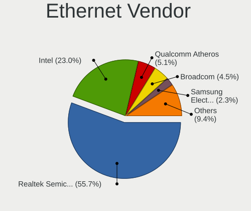

| Vendor                                 | Notebooks | Percent |
|----------------------------------------|-----------|---------|
| Realtek Semiconductor                  | 481       | 55.67%  |
| Intel                                  | 199       | 23.03%  |
| Qualcomm Atheros                       | 44        | 5.09%   |
| Broadcom                               | 39        | 4.51%   |
| Samsung Electronics                    | 20        | 2.31%   |
| Marvell Technology Group               | 17        | 1.97%   |
| Broadcom Limited                       | 11        | 1.27%   |
| ASIX Electronics                       | 10        | 1.16%   |
| JMicron Technology                     | 7         | 0.81%   |
| MediaTek                               | 5         | 0.58%   |
| Huawei Technologies                    | 5         | 0.58%   |
| Apple                                  | 4         | 0.46%   |
| Lenovo                                 | 3         | 0.35%   |
| Xiaomi                                 | 2         | 0.23%   |
| Spreadtrum Communications              | 2         | 0.23%   |
| Qualcomm                               | 2         | 0.23%   |
| Nvidia                                 | 2         | 0.23%   |
| DisplayLink                            | 2         | 0.23%   |
| TP-Link                                | 1         | 0.12%   |
| Suzhou Motorcomm Electronic Technology | 1         | 0.12%   |
| Silicon Integrated Systems [SiS]       | 1         | 0.12%   |
| Microchip Technology                   | 1         | 0.12%   |
| LG Electronics                         | 1         | 0.12%   |
| ICS Advent                             | 1         | 0.12%   |
| HMD Global                             | 1         | 0.12%   |
| Hewlett-Packard                        | 1         | 0.12%   |
| Attansic Technology                    | 1         | 0.12%   |

Ethernet Model
--------------

Ethernet models

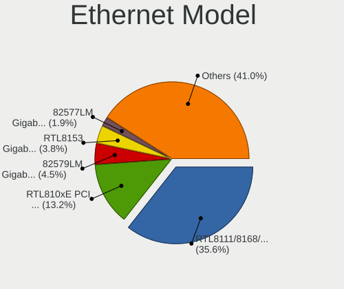

| Model                                                                  | Notebooks | Percent |
|------------------------------------------------------------------------|-----------|---------|
| Realtek RTL8111/8168/8211/8411 PCI Express Gigabit Ethernet Controller | 312       | 35.62%  |
| Realtek RTL810xE PCI Express Fast Ethernet controller                  | 116       | 13.24%  |
| Intel 82579LM Gigabit Network Connection (Lewisville)                  | 39        | 4.45%   |
| Realtek RTL8153 Gigabit Ethernet Adapter                               | 33        | 3.77%   |
| Intel 82577LM Gigabit Network Connection                               | 17        | 1.94%   |
| Intel Ethernet Connection I217-LM                                      | 16        | 1.83%   |
| Intel Ethernet Connection I219-LM                                      | 14        | 1.6%    |
| Intel Ethernet Connection (4) I219-LM                                  | 12        | 1.37%   |
| Samsung Galaxy series, misc. (tethering mode)                          | 11        | 1.26%   |
| Intel Ethernet Connection I218-LM                                      | 11        | 1.26%   |
| Broadcom NetLink BCM57785 Gigabit Ethernet PCIe                        | 11        | 1.26%   |
| Realtek RTL8125 2.5GbE Controller                                      | 10        | 1.14%   |
| Intel 82567LM Gigabit Network Connection                               | 10        | 1.14%   |
| Samsung GT-I9070 (network tethering, USB debugging enabled)            | 9         | 1.03%   |
| Intel Ethernet Connection (3) I218-LM                                  | 9         | 1.03%   |
| ASIX AX88179 Gigabit Ethernet                                          | 9         | 1.03%   |
| Realtek RTL8152 Fast Ethernet Adapter                                  | 8         | 0.91%   |
| Broadcom NetXtreme BCM57765 Gigabit Ethernet PCIe                      | 8         | 0.91%   |
| Realtek Killer E2600 GbE Controller                                    | 7         | 0.8%    |
| Qualcomm Atheros AR8151 v2.0 Gigabit Ethernet                          | 7         | 0.8%    |
| Qualcomm Atheros QCA8172 Fast Ethernet                                 | 6         | 0.68%   |
| Marvell Group 88E8040 PCI-E Fast Ethernet Controller                   | 6         | 0.68%   |
| JMicron JMC250 PCI Express Gigabit Ethernet Controller                 | 6         | 0.68%   |
| Intel 82579V Gigabit Network Connection                                | 6         | 0.68%   |
| Intel Ethernet Connection (4) I219-V                                   | 5         | 0.57%   |
| Intel Ethernet Connection (2) I219-LM                                  | 5         | 0.57%   |
| Intel Alder Lake-P PCH CNVi WiFi                                       | 5         | 0.57%   |
| Broadcom Limited NetLink BCM57780 Gigabit Ethernet PCIe                | 5         | 0.57%   |
| Realtek Killer E2500 Gigabit Ethernet Controller                       | 4         | 0.46%   |
| Qualcomm Atheros QCA8171 Gigabit Ethernet                              | 4         | 0.46%   |
| Qualcomm Atheros Killer E2400 Gigabit Ethernet Controller              | 4         | 0.46%   |
| Qualcomm Atheros AR8152 v1.1 Fast Ethernet                             | 4         | 0.46%   |
| MediaTek MT7922 802.11ax PCI Express Wireless Network Adapter          | 4         | 0.46%   |
| Marvell Group 88E8072 PCI-E Gigabit Ethernet Controller                | 4         | 0.46%   |
| Intel Ethernet Connection I219-V                                       | 4         | 0.46%   |
| Intel Ethernet Connection (7) I219-LM                                  | 4         | 0.46%   |
| Intel Ethernet Connection (5) I219-LM                                  | 4         | 0.46%   |
| Broadcom NetXtreme BCM5764M Gigabit Ethernet PCIe                      | 4         | 0.46%   |
| Apple iBridge                                                          | 4         | 0.46%   |
| Qualcomm Atheros Killer E220x Gigabit Ethernet Controller              | 3         | 0.34%   |

Net Controller Kind
-------------------

Ethernet, WiFi or modem

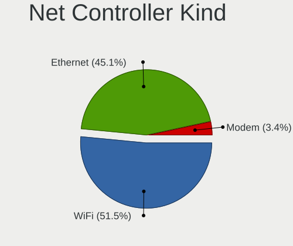

| Kind     | Notebooks | Percent |
|----------|-----------|---------|
| WiFi     | 931       | 51.52%  |
| Ethernet | 815       | 45.1%   |
| Modem    | 61        | 3.38%   |

Used Controller
---------------

Currently used network controller

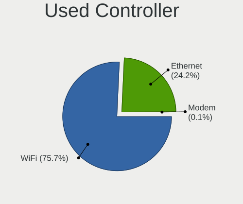

| Kind     | Notebooks | Percent |
|----------|-----------|---------|
| WiFi     | 777       | 75.73%  |
| Ethernet | 248       | 24.17%  |
| Modem    | 1         | 0.1%    |

NICs
----

Total network controllers on board

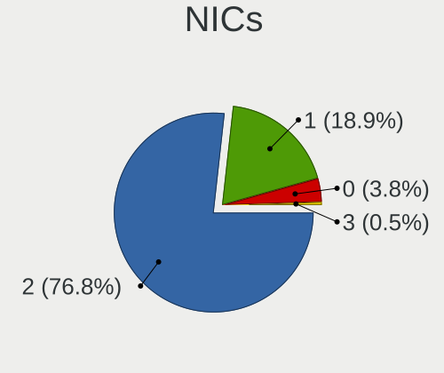

| Total | Notebooks | Percent |
|-------|-----------|---------|
| 2     | 743       | 76.76%  |
| 1     | 183       | 18.9%   |
| 0     | 37        | 3.82%   |
| 3     | 5         | 0.52%   |

IPv6
----

IPv6 vs IPv4

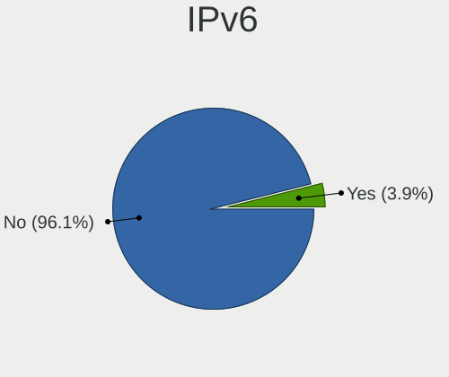

| Used | Notebooks | Percent |
|------|-----------|---------|
| No   | 933       | 96.09%  |
| Yes  | 38        | 3.91%   |

Bluetooth
---------

Bluetooth Vendor
----------------

Controller vendors

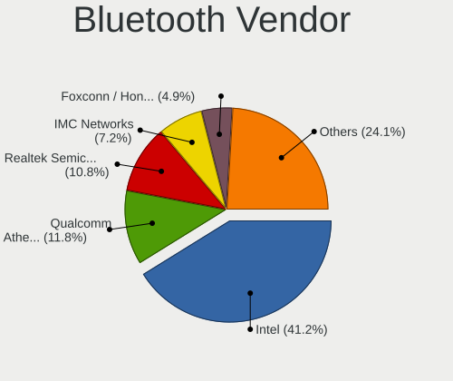

| Vendor                          | Notebooks | Percent |
|---------------------------------|-----------|---------|
| Intel                           | 327       | 41.18%  |
| Qualcomm Atheros Communications | 94        | 11.84%  |
| Realtek Semiconductor           | 86        | 10.83%  |
| IMC Networks                    | 57        | 7.18%   |
| Foxconn / Hon Hai               | 39        | 4.91%   |
| Broadcom                        | 39        | 4.91%   |
| Lite-On Technology              | 31        | 3.9%    |
| Hewlett-Packard                 | 31        | 3.9%    |
| Dell                            | 31        | 3.9%    |
| Apple                           | 17        | 2.14%   |
| Ralink                          | 13        | 1.64%   |
| Toshiba                         | 9         | 1.13%   |
| Cambridge Silicon Radio         | 5         | 0.63%   |
| ASUSTek Computer                | 3         | 0.38%   |
| Alps Electric                   | 2         | 0.25%   |
| USI                             | 1         | 0.13%   |
| TRENDnet                        | 1         | 0.13%   |
| Realtek                         | 1         | 0.13%   |
| Ralink Technology               | 1         | 0.13%   |
| Qcom                            | 1         | 0.13%   |
| Mobile Action Technology        | 1         | 0.13%   |
| Logitech                        | 1         | 0.13%   |
| Foxconn International           | 1         | 0.13%   |
| Askey Computer                  | 1         | 0.13%   |
| Unknown                         | 1         | 0.13%   |

Bluetooth Model
---------------

Controller models

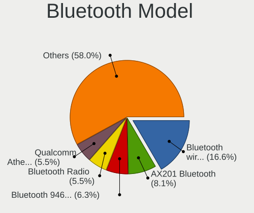

| Model                                               | Notebooks | Percent |
|-----------------------------------------------------|-----------|---------|
| Intel Bluetooth wireless interface                  | 132       | 16.6%   |
| Intel AX201 Bluetooth                               | 64        | 8.05%   |
| Intel Bluetooth 9460/9560 Jefferson Peak (JfP)      | 50        | 6.29%   |
| Realtek Bluetooth Radio                             | 44        | 5.53%   |
| Qualcomm Atheros  Bluetooth Device                  | 44        | 5.53%   |
| Realtek  Bluetooth 4.2 Adapter                      | 30        | 3.77%   |
| Intel Bluetooth Device                              | 25        | 3.14%   |
| HP Broadcom 2070 Bluetooth Combo                    | 22        | 2.77%   |
| Intel AX200 Bluetooth                               | 20        | 2.52%   |
| IMC Networks Wireless_Device                        | 20        | 2.52%   |
| IMC Networks Bluetooth Radio                        | 20        | 2.52%   |
| Qualcomm Atheros AR3011 Bluetooth                   | 17        | 2.14%   |
| Foxconn / Hon Hai Bluetooth Device                  | 15        | 1.89%   |
| Intel Centrino Bluetooth Wireless Transceiver       | 14        | 1.76%   |
| Dell BCM20702A0 Bluetooth Module                    | 14        | 1.76%   |
| Broadcom BCM2045B (BDC-2.1)                         | 14        | 1.76%   |
| Ralink RT3290 Bluetooth                             | 13        | 1.64%   |
| Lite-On Qualcomm Atheros QCA9377 Bluetooth          | 13        | 1.64%   |
| Intel Centrino Advanced-N 6230 Bluetooth adapter    | 12        | 1.51%   |
| Qualcomm Atheros AR3012 Bluetooth 4.0               | 11        | 1.38%   |
| Apple Bluetooth USB Host Controller                 | 11        | 1.38%   |
| IMC Networks Bluetooth Device                       | 10        | 1.26%   |
| Realtek RTL8723B Bluetooth                          | 9         | 1.13%   |
| Qualcomm Atheros QCA61x4 Bluetooth 4.0              | 9         | 1.13%   |
| HP Bluetooth 2.0 Interface [Broadcom BCM2045]       | 9         | 1.13%   |
| Qualcomm Atheros AR9462 Bluetooth                   | 8         | 1.01%   |
| Lite-On Bluetooth Device                            | 8         | 1.01%   |
| Intel Wireless-AC 3168 Bluetooth                    | 6         | 0.75%   |
| Broadcom BCM43142 Bluetooth 4.0                     | 6         | 0.75%   |
| Lite-On Atheros AR3012 Bluetooth                    | 5         | 0.63%   |
| Foxconn / Hon Hai MediaTek Bluetooth Adapter        | 5         | 0.63%   |
| Cambridge Silicon Radio Bluetooth Dongle (HCI mode) | 5         | 0.63%   |
| Foxconn / Hon Hai Broadcom Bluetooth 2.1 Device     | 4         | 0.5%    |
| Dell DW375 Bluetooth Module                         | 4         | 0.5%    |
| Apple Bluetooth Host Controller                     | 4         | 0.5%    |
| Toshiba RT Bluetooth Radio                          | 3         | 0.38%   |
| Realtek RTL8821A Bluetooth                          | 3         | 0.38%   |
| Intel Wireless-AC 9260 Bluetooth Adapter            | 3         | 0.38%   |
| IMC Networks Bluetooth USB Host Controller          | 3         | 0.38%   |
| Foxconn / Hon Hai Acer Bluetooth module             | 3         | 0.38%   |

Sound
-----

Sound Vendor
------------

Sound card vendors

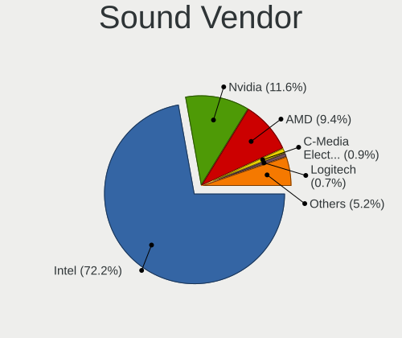

| Vendor                           | Notebooks | Percent |
|----------------------------------|-----------|---------|
| Intel                            | 854       | 72.19%  |
| Nvidia                           | 137       | 11.58%  |
| AMD                              | 111       | 9.38%   |
| C-Media Electronics              | 11        | 0.93%   |
| Logitech                         | 8         | 0.68%   |
| Realtek Semiconductor            | 6         | 0.51%   |
| JMTek                            | 6         | 0.51%   |
| SteelSeries ApS                  | 4         | 0.34%   |
| Hewlett-Packard                  | 4         | 0.34%   |
| Corsair                          | 4         | 0.34%   |
| Apple                            | 4         | 0.34%   |
| Texas Instruments                | 3         | 0.25%   |
| Lenovo                           | 3         | 0.25%   |
| GN Netcom                        | 2         | 0.17%   |
| Generalplus Technology           | 2         | 0.17%   |
| Conexant Systems                 | 2         | 0.17%   |
| ASUSTek Computer                 | 2         | 0.17%   |
| Xiaomi                           | 1         | 0.08%   |
| Walmart                          | 1         | 0.08%   |
| Tenx Technology                  | 1         | 0.08%   |
| Syntek                           | 1         | 0.08%   |
| Steinberg Soft-und Hardware      | 1         | 0.08%   |
| Sony                             | 1         | 0.08%   |
| Silicon Integrated Systems [SiS] | 1         | 0.08%   |
| Schiit Audio                     | 1         | 0.08%   |
| Razer USA                        | 1         | 0.08%   |
| Microsoft                        | 1         | 0.08%   |
| Magic Control Technology         | 1         | 0.08%   |
| M-Audio                          | 1         | 0.08%   |
| Jieli Technology                 | 1         | 0.08%   |
| Focusrite-Novation               | 1         | 0.08%   |
| FiiO Electronics Technology      | 1         | 0.08%   |
| Creative Technology              | 1         | 0.08%   |
| Cooler Master                    | 1         | 0.08%   |
| BEHRINGER International          | 1         | 0.08%   |
| AKAI Professional M.I.           | 1         | 0.08%   |
| Afatech                          | 1         | 0.08%   |

Sound Model
-----------

Sound card models

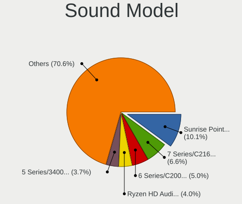

| Model                                                                                             | Notebooks | Percent |
|---------------------------------------------------------------------------------------------------|-----------|---------|
| Intel Sunrise Point-LP HD Audio                                                                   | 140       | 10.08%  |
| Intel 7 Series/C216 Chipset Family High Definition Audio Controller                               | 92        | 6.62%   |
| Intel 6 Series/C200 Series Chipset Family High Definition Audio Controller                        | 69        | 4.97%   |
| AMD Ryzen HD Audio Controller                                                                     | 56        | 4.03%   |
| Intel 5 Series/3400 Series Chipset High Definition Audio                                          | 52        | 3.74%   |
| Intel Wildcat Point-LP High Definition Audio Controller                                           | 43        | 3.1%    |
| Intel Broadwell-U Audio Controller                                                                | 43        | 3.1%    |
| Intel 8 Series/C220 Series Chipset High Definition Audio Controller                               | 40        | 2.88%   |
| Intel 8 Series HD Audio Controller                                                                | 39        | 2.81%   |
| Intel Haswell-ULT HD Audio Controller                                                             | 38        | 2.74%   |
| Intel Xeon E3-1200 v3/4th Gen Core Processor HD Audio Controller                                  | 37        | 2.66%   |
| Intel 82801I (ICH9 Family) HD Audio Controller                                                    | 37        | 2.66%   |
| Intel Tiger Lake-LP Smart Sound Technology Audio Controller                                       | 36        | 2.59%   |
| Intel Cannon Lake PCH cAVS                                                                        | 36        | 2.59%   |
| Intel Atom/Celeron/Pentium Processor x5-E8000/J3xxx/N3xxx Series High Definition Audio Controller | 30        | 2.16%   |
| AMD Renoir/Cezanne HDMI/DP Audio Controller                                                       | 25        | 1.8%    |
| Intel Cannon Point-LP High Definition Audio Controller                                            | 23        | 1.66%   |
| Intel Alder Lake PCH-P High Definition Audio Controller                                           | 23        | 1.66%   |
| Intel Celeron/Pentium Silver Processor High Definition Audio                                      | 21        | 1.51%   |
| Intel 82801H (ICH8 Family) HD Audio Controller                                                    | 20        | 1.44%   |
| Intel Ice Lake-LP Smart Sound Technology Audio Controller                                         | 19        | 1.37%   |
| Nvidia TU107 GeForce GTX 1650 High Definition Audio Controller                                    | 17        | 1.22%   |
| Intel Comet Lake PCH cAVS                                                                         | 17        | 1.22%   |
| Nvidia GF108 High Definition Audio Controller                                                     | 16        | 1.15%   |
| Intel Comet Lake PCH-LP cAVS                                                                      | 15        | 1.08%   |
| Intel CM238 HD Audio Controller                                                                   | 15        | 1.08%   |
| Intel Celeron N3350/Pentium N4200/Atom E3900 Series Audio Cluster                                 | 15        | 1.08%   |
| AMD High Definition Audio Controller                                                              | 15        | 1.08%   |
| AMD Family 15h (Models 60h-6fh) Audio Controller                                                  | 15        | 1.08%   |
| Intel 100 Series/C230 Series Chipset Family HD Audio Controller                                   | 14        | 1.01%   |
| Intel NM10/ICH7 Family High Definition Audio Controller                                           | 13        | 0.94%   |
| AMD Radeon High Definition Audio Controller                                                       | 13        | 0.94%   |
| Nvidia GP107GL High Definition Audio Controller                                                   | 12        | 0.86%   |
| Nvidia AD107 High Definition Audio Controller                                                     | 12        | 0.86%   |
| Intel Raptor Lake-P/U/H cAVS                                                                      | 12        | 0.86%   |
| AMD SBx00 Azalia (Intel HDA)                                                                      | 11        | 0.79%   |
| Intel Tiger Lake-H HD Audio Controller                                                            | 10        | 0.72%   |
| Nvidia TU116 High Definition Audio Controller                                                     | 9         | 0.65%   |
| AMD FCH Azalia Controller                                                                         | 8         | 0.58%   |
| Nvidia GP106 High Definition Audio Controller                                                     | 7         | 0.5%    |

Memory
------

Memory Vendor
-------------

Memory module vendors

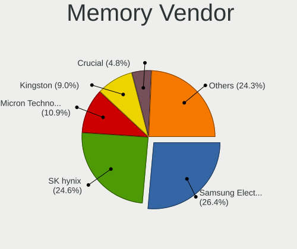

| Vendor                         | Notebooks | Percent |
|--------------------------------|-----------|---------|
| Samsung Electronics            | 150       | 26.41%  |
| SK hynix                       | 140       | 24.65%  |
| Micron Technology              | 62        | 10.92%  |
| Kingston                       | 51        | 8.98%   |
| Crucial                        | 27        | 4.75%   |
| Unknown                        | 21        | 3.7%    |
| Transcend                      | 18        | 3.17%   |
| A-DATA Technology              | 16        | 2.82%   |
| Elpida                         | 13        | 2.29%   |
| Nanya Technology               | 12        | 2.11%   |
| Ramaxel Technology             | 10        | 1.76%   |
| Corsair                        | 7         | 1.23%   |
| Unknown                        | 6         | 1.06%   |
| Unknown (ABCD)                 | 5         | 0.88%   |
| Patriot                        | 5         | 0.88%   |
| G.Skill                        | 5         | 0.88%   |
| Essencore                      | 4         | 0.7%    |
| Essencore Limited              | 3         | 0.53%   |
| KLEVV                          | 2         | 0.35%   |
| Wodposit                       | 1         | 0.18%   |
| Unknown (0x0080)               | 1         | 0.18%   |
| Neo Forza                      | 1         | 0.18%   |
| MKF_SMBIOS_TYPE17_MANUFACTURER | 1         | 0.18%   |
| Lexar                          | 1         | 0.18%   |
| Kingmax                        | 1         | 0.18%   |
| KingFast                       | 1         | 0.18%   |
| Innodisk                       | 1         | 0.18%   |
| ff                             | 1         | 0.18%   |
| 8CFD000080AD                   | 1         | 0.18%   |
| 4ea5                           | 1         | 0.18%   |

Memory Model
------------

Memory module models

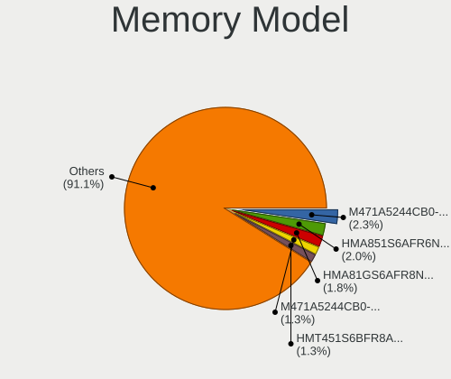

| Model                                                            | Notebooks | Percent |
|------------------------------------------------------------------|-----------|---------|
| Samsung RAM M471A5244CB0-CTD 4GB SODIMM DDR4 3266MT/s            | 14        | 2.34%   |
| SK hynix RAM HMA851S6AFR6N-UH 4GB SODIMM DDR4 2667MT/s           | 12        | 2.01%   |
| SK hynix RAM HMA81GS6AFR8N-UH 8GB SODIMM DDR4 2667MT/s           | 11        | 1.84%   |
| SK hynix RAM HMT451S6BFR8A-PB 4GB SODIMM DDR3 1600MT/s           | 8         | 1.34%   |
| Samsung RAM M471A5244CB0-CRC 4GB SODIMM DDR4 2667MT/s            | 8         | 1.34%   |
| SK hynix RAM HMT41GS6BFR8A-PB 8GB SODIMM DDR3 2667MT/s           | 7         | 1.17%   |
| Samsung RAM M471A1K43CB1-CRC 8GB SODIMM DDR4 8400MT/s            | 7         | 1.17%   |
| SK hynix RAM HMA81GS6JJR8N-VK 8GB SODIMM DDR4 2667MT/s           | 6         | 1%      |
| Samsung RAM M471A1K43EB1-CWE 8GB SODIMM DDR4 3200MT/s            | 6         | 1%      |
| Micron RAM 4ATF51264HZ-2G6E1 4GB SODIMM DDR4 2667MT/s            | 6         | 1%      |
| Unknown                                                          | 6         | 1%      |
| Unknown (ABCD) RAM 123456789012345678 2GB SODIMM LPDDR4 2400MT/s | 5         | 0.84%   |
| SK hynix RAM HMA81GS6CJR8N-VK 8GB SODIMM DDR4 2667MT/s           | 5         | 0.84%   |
| Samsung RAM M471B5273DH0-CK0 4GB SODIMM DDR3 2400MT/s            | 5         | 0.84%   |
| Samsung RAM M471B5273DH0-CH9 4GB SODIMM DDR3 1600MT/s            | 5         | 0.84%   |
| Samsung RAM M471B5173EB0-YK0 4GB SODIMM DDR3 1600MT/s            | 5         | 0.84%   |
| Samsung RAM M471B5173DB0-YK0 4GB SODIMM DDR3 1600MT/s            | 5         | 0.84%   |
| Samsung RAM M471B1G73EB0-YK0 8192MB SODIMM DDR3 1600MT/s         | 5         | 0.84%   |
| Samsung RAM M471A5244CB0-CWE 4GB SODIMM DDR4 3200MT/s            | 5         | 0.84%   |
| Micron RAM 4ATF1G64HZ-3G2F1 8GB SODIMM DDR4 3200MT/s             | 5         | 0.84%   |
| SK hynix RAM HMT351S6EFR8A-PB 4GB SODIMM DDR3 1600MT/s           | 4         | 0.67%   |
| SK hynix RAM HMT351S6CFR8C-PB 4GB SODIMM DDR3 1600MT/s           | 4         | 0.67%   |
| Samsung RAM M471B5273CH0-CH9 4GB SODIMM DDR3 1334MT/s            | 4         | 0.67%   |
| Samsung RAM M471B1G73QH0-YK0 8GB SODIMM DDR3 1600MT/s            | 4         | 0.67%   |
| Samsung RAM M471A5244CB0-CWE 4GB Row Of Chips DDR4 3200MT/s      | 4         | 0.67%   |
| Samsung RAM M425R1GB4BB0-CQKOL 8GB SODIMM DDR5 4800MT/s          | 4         | 0.67%   |
| Nanya RAM NT2GC64B88B0NS-CG 2048MB SODIMM DDR3 1334MT/s          | 4         | 0.67%   |
| Unknown RAM Module 2GB Row Of Chips LPDDR4 4267MT/s              | 3         | 0.5%    |
| SK hynix RAM HMT41GS6BFR8A-PB 8GB SODIMM DDR3 1600MT/s           | 3         | 0.5%    |
| SK hynix RAM HMT351S6CFR8A-PB 4GB SODIMM DDR3 1600MT/s           | 3         | 0.5%    |
| SK hynix RAM HMT351S6BFR8C-H9 4GB SODIMM 1334MT/s                | 3         | 0.5%    |
| SK hynix RAM HMA82GS6CJR8N-VK 16GB SODIMM DDR4 2667MT/s          | 3         | 0.5%    |
| SK hynix RAM HMA81GS6DJR8N-XN 8GB SODIMM DDR4 3200MT/s           | 3         | 0.5%    |
| Samsung RAM Module 16GB SODIMM DDR4 3200MT/s                     | 3         | 0.5%    |
| Samsung RAM M471A2G43AB2-CWE 16GB SODIMM DDR4 3200MT/s           | 3         | 0.5%    |
| Samsung RAM M471A1K43CB1-CTD 8GB SODIMM DDR4 3200MT/s            | 3         | 0.5%    |
| Samsung RAM M471A1K43BB1-CRC 8GB SODIMM DDR4 2667MT/s            | 3         | 0.5%    |
| Nanya RAM NT4GC64B8HB0NS-CG 4GB SODIMM DDR3 1334MT/s             | 3         | 0.5%    |
| Micron RAM 8KTF51264HZ-1G6E1 4GB SODIMM DDR3 1600MT/s            | 3         | 0.5%    |
| Micron RAM 8JSF25664HZ-1G4D1 2GB SODIMM DDR3 1334MT/s            | 3         | 0.5%    |

Memory Kind
-----------

Memory module kinds

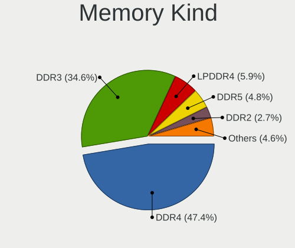

| Kind    | Notebooks | Percent |
|---------|-----------|---------|
| DDR4    | 207       | 47.37%  |
| DDR3    | 151       | 34.55%  |
| LPDDR4  | 26        | 5.95%   |
| DDR5    | 21        | 4.81%   |
| DDR2    | 12        | 2.75%   |
| LPDDR5  | 7         | 1.6%    |
| LPDDR3  | 7         | 1.6%    |
| SDRAM   | 5         | 1.14%   |
| Unknown | 1         | 0.23%   |

Memory Form Factor
------------------

Physical design of the memory module

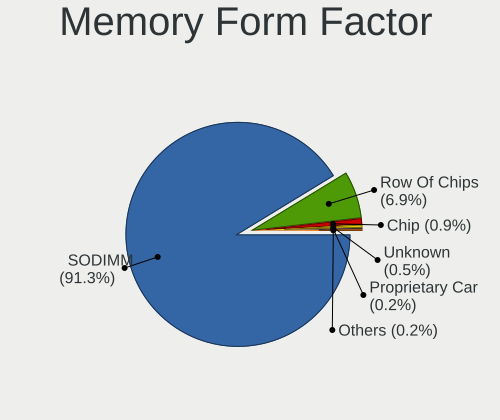

| Name            | Notebooks | Percent |
|-----------------|-----------|---------|
| SODIMM          | 398       | 91.28%  |
| Row Of Chips    | 30        | 6.88%   |
| Chip            | 4         | 0.92%   |
| Unknown         | 2         | 0.46%   |
| Proprietary Car | 1         | 0.23%   |
| DIMM            | 1         | 0.23%   |

Memory Size
-----------

Memory module size

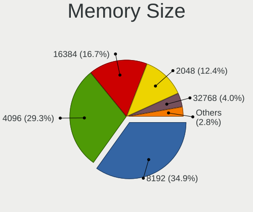

| Size  | Notebooks | Percent |
|-------|-----------|---------|
| 8192  | 175       | 34.86%  |
| 4096  | 147       | 29.28%  |
| 16384 | 84        | 16.73%  |
| 2048  | 62        | 12.35%  |
| 32768 | 20        | 3.98%   |
| 1024  | 13        | 2.59%   |
| 512   | 1         | 0.2%    |

Memory Speed
------------

Memory module speed

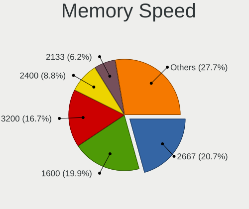

| Speed   | Notebooks | Percent |
|---------|-----------|---------|
| 2667    | 104       | 20.72%  |
| 1600    | 100       | 19.92%  |
| 3200    | 84        | 16.73%  |
| 2400    | 44        | 8.76%   |
| 2133    | 31        | 6.18%   |
| 1334    | 25        | 4.98%   |
| 4800    | 16        | 3.19%   |
| 1333    | 16        | 3.19%   |
| 3266    | 14        | 2.79%   |
| 8400    | 9         | 1.79%   |
| 4267    | 7         | 1.39%   |
| 667     | 7         | 1.39%   |
| 6400    | 6         | 1.2%    |
| 5600    | 5         | 1%      |
| 1067    | 5         | 1%      |
| 975     | 4         | 0.8%    |
| 800     | 4         | 0.8%    |
| 2048    | 3         | 0.6%    |
| 1867    | 3         | 0.6%    |
| 1066    | 3         | 0.6%    |
| 4199    | 2         | 0.4%    |
| 2933    | 2         | 0.4%    |
| Unknown | 2         | 0.4%    |
| 7500    | 1         | 0.2%    |
| 4266    | 1         | 0.2%    |
| 1866    | 1         | 0.2%    |
| 1776    | 1         | 0.2%    |
| 1639    | 1         | 0.2%    |
| 533     | 1         | 0.2%    |

Printers & scanners
-------------------

Printer Vendor
--------------

Printer device vendors

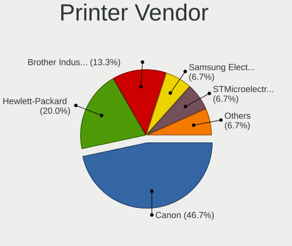

| Vendor                | Notebooks | Percent |
|-----------------------|-----------|---------|
| Canon                 | 7         | 46.67%  |
| Hewlett-Packard       | 3         | 20%     |
| Brother Industries    | 2         | 13.33%  |
| STMicroelectronics    | 1         | 6.67%   |
| Samsung Electronics   | 1         | 6.67%   |
| Lexmark International | 1         | 6.67%   |

Printer Model
-------------

Printer device models

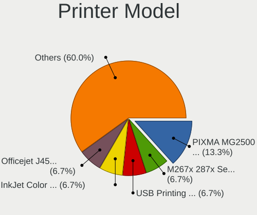

| Model                                      | Notebooks | Percent |
|--------------------------------------------|-----------|---------|
| Canon PIXMA MG2500 Series                  | 2         | 13.33%  |
| STMicroelectronics USB Printing Support    | 1         | 6.67%   |
| Samsung M267x 287x Series                  | 1         | 6.67%   |
| Lexmark International InkJet Color Printer | 1         | 6.67%   |
| HP Officejet J4500 series                  | 1         | 6.67%   |
| HP LaserJet 1022                           | 1         | 6.67%   |
| HP DeskJet 3830 series                     | 1         | 6.67%   |
| Canon TR4500 series                        | 1         | 6.67%   |
| Canon MF210 Series                         | 1         | 6.67%   |
| Canon LBP3360                              | 1         | 6.67%   |
| Canon G4000 series                         | 1         | 6.67%   |
| Canon G2010 series                         | 1         | 6.67%   |
| Brother MFC-L2700DW                        | 1         | 6.67%   |
| Brother MFC-J200                           | 1         | 6.67%   |

Scanner Vendor
--------------

Scanner device vendors

Zero info for selected period =(

Scanner Model
-------------

Scanner device models

Zero info for selected period =(

Camera
------

Camera Vendor
-------------

Camera device vendors

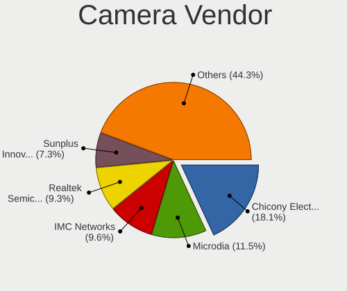

| Vendor                                            | Notebooks | Percent |
|---------------------------------------------------|-----------|---------|
| Chicony Electronics                               | 164       | 18.1%   |
| Microdia                                          | 104       | 11.48%  |
| IMC Networks                                      | 87        | 9.6%    |
| Realtek Semiconductor                             | 84        | 9.27%   |
| Sunplus Innovation Technology                     | 66        | 7.28%   |
| Bison Electronics                                 | 59        | 6.51%   |
| Quanta                                            | 51        | 5.63%   |
| Cheng Uei Precision Industry (Foxlink)            | 35        | 3.86%   |
| Syntek                                            | 25        | 2.76%   |
| Apple                                             | 25        | 2.76%   |
| Lite-On Technology                                | 23        | 2.54%   |
| Suyin                                             | 22        | 2.43%   |
| Luxvisions Innotech Limited                       | 19        | 2.1%    |
| Samsung Electronics                               | 18        | 1.99%   |
| Sonix Technology                                  | 11        | 1.21%   |
| icSpring                                          | 10        | 1.1%    |
| Silicon Motion                                    | 9         | 0.99%   |
| Ricoh                                             | 9         | 0.99%   |
| Logitech                                          | 9         | 0.99%   |
| Alcor Micro                                       | 9         | 0.99%   |
| Acer                                              | 9         | 0.99%   |
| Primax Electronics                                | 8         | 0.88%   |
| Microsoft                                         | 6         | 0.66%   |
| Lenovo                                            | 5         | 0.55%   |
| Z-Star Microelectronics                           | 4         | 0.44%   |
| Shinetech                                         | 4         | 0.44%   |
| Importek                                          | 3         | 0.33%   |
| GEMBIRD                                           | 3         | 0.33%   |
| SunplusIT                                         | 2         | 0.22%   |
| SN0002                                            | 2         | 0.22%   |
| Shine-optics                                      | 2         | 0.22%   |
| LG Electronics                                    | 2         | 0.22%   |
| DigiTech                                          | 2         | 0.22%   |
| ALi                                               | 2         | 0.22%   |
| Y Media                                           | 1         | 0.11%   |
| webcam                                            | 1         | 0.11%   |
| Sunwingroup                                       | 1         | 0.11%   |
| Sunplus Technology                                | 1         | 0.11%   |
| Sunplus IT                                        | 1         | 0.11%   |
| STMicroelectronics Imaging Division (VLSI Vision) | 1         | 0.11%   |

Camera Model
------------

Camera device models

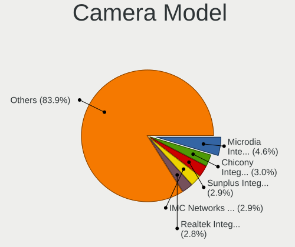

| Model                                            | Notebooks | Percent |
|--------------------------------------------------|-----------|---------|
| Microdia Integrated_Webcam_HD                    | 42        | 4.62%   |
| Chicony Integrated Camera                        | 27        | 2.97%   |
| Sunplus Integrated_Webcam_HD                     | 26        | 2.86%   |
| IMC Networks USB2.0 VGA UVC WebCam               | 26        | 2.86%   |
| Realtek Integrated_Webcam_HD                     | 25        | 2.75%   |
| IMC Networks USB2.0 HD UVC WebCam                | 25        | 2.75%   |
| Samsung Galaxy series, misc. (MTP mode)          | 18        | 1.98%   |
| IMC Networks Integrated Camera                   | 18        | 1.98%   |
| Microdia Integrated Webcam                       | 14        | 1.54%   |
| Bison Integrated Camera                          | 13        | 1.43%   |
| Realtek Integrated Webcam                        | 12        | 1.32%   |
| Chicony HD WebCam                                | 12        | 1.32%   |
| Sunplus HD WebCam                                | 11        | 1.21%   |
| icSpring camera                                  | 10        | 1.1%    |
| Chicony EasyCamera                               | 10        | 1.1%    |
| Bison Lenovo EasyCamera                          | 10        | 1.1%    |
| Bison EasyCamera                                 | 10        | 1.1%    |
| Apple iPhone 5/5C/5S/6/SE/7/8/X                  | 10        | 1.1%    |
| Syntek Integrated Camera                         | 9         | 0.99%   |
| Sonix USB2.0 HD UVC WebCam                       | 9         | 0.99%   |
| Realtek Integrated Webcam HD                     | 9         | 0.99%   |
| Quanta VGA WebCam                                | 9         | 0.99%   |
| Syntek EasyCamera                                | 8         | 0.88%   |
| Cheng Uei Precision Industry (Foxlink) Webcam    | 8         | 0.88%   |
| Apple FaceTime HD Camera                         | 8         | 0.88%   |
| Quanta HP HD Camera                              | 7         | 0.77%   |
| Quanta HD User Facing                            | 7         | 0.77%   |
| Microdia Laptop_Integrated_Webcam_HD             | 7         | 0.77%   |
| Chicony USB2.0 VGA UVC WebCam                    | 7         | 0.77%   |
| Chicony HP TrueVision HD Camera                  | 7         | 0.77%   |
| Cheng Uei Precision Industry (Foxlink) HP Webcam | 7         | 0.77%   |
| Acer Integrated Camera                           | 7         | 0.77%   |
| Syntek Lenovo EasyCamera                         | 6         | 0.66%   |
| Quanta HP Webcam                                 | 6         | 0.66%   |
| Quanta HP TrueVision HD Camera                   | 6         | 0.66%   |
| Microdia Integrated_Webcam_FHD                   | 6         | 0.66%   |
| Lite-On HP HD Camera                             | 6         | 0.66%   |
| Chicony Integrated IR Camera                     | 6         | 0.66%   |
| Realtek HP Truevision HD                         | 5         | 0.55%   |
| Quanta HP Wide Vision HD Camera                  | 5         | 0.55%   |

Security
--------

Fingerprint Vendor
------------------

Fingerprint sensor vendors

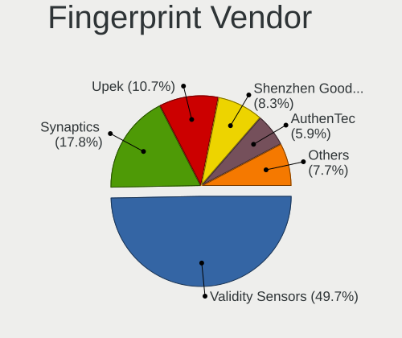

| Vendor                     | Notebooks | Percent |
|----------------------------|-----------|---------|
| Validity Sensors           | 84        | 49.7%   |
| Synaptics                  | 30        | 17.75%  |
| Upek                       | 18        | 10.65%  |
| Shenzhen Goodix Technology | 14        | 8.28%   |
| AuthenTec                  | 10        | 5.92%   |
| LighTuning Technology      | 6         | 3.55%   |
| Focal-systems.Corp         | 3         | 1.78%   |
| STMicroelectronics         | 2         | 1.18%   |
| GDMicroelectronics         | 1         | 0.59%   |
| Elan Microelectronics      | 1         | 0.59%   |

Fingerprint Model
-----------------

Fingerprint sensor models

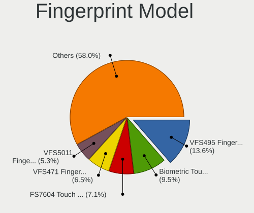

| Model                                                     | Notebooks | Percent |
|-----------------------------------------------------------|-----------|---------|
| Validity Sensors VFS495 Fingerprint Reader                | 23        | 13.61%  |
| Upek Biometric Touchchip/Touchstrip Fingerprint Sensor    | 16        | 9.47%   |
| Synaptics FS7604 Touch Fingerprint Sensor with PurePrint  | 12        | 7.1%    |
| Validity Sensors VFS471 Fingerprint Reader                | 11        | 6.51%   |
| Validity Sensors VFS5011 Fingerprint Reader               | 9         | 5.33%   |
| Validity Sensors VFS 5011 fingerprint sensor              | 9         | 5.33%   |
| Validity Sensors VFS451 Fingerprint Reader                | 8         | 4.73%   |
| Validity Sensors Synaptics WBDI                           | 6         | 3.55%   |
| Shenzhen Goodix Fingerprint Reader                        | 6         | 3.55%   |
| Shenzhen Goodix  FingerPrint Device                       | 5         | 2.96%   |
| Validity Sensors VFS491                                   | 4         | 2.37%   |
| Validity Sensors Swipe Fingerprint Sensor                 | 4         | 2.37%   |
| Validity Sensors Fingerprint scanner                      | 4         | 2.37%   |
| Synaptics Prometheus MIS Touch Fingerprint Reader         | 4         | 2.37%   |
| Synaptics Fingerprint reader [HP G6]                      | 4         | 2.37%   |
| AuthenTec AES2810                                         | 4         | 2.37%   |
| Synaptics Metallica MOH Touch Fingerprint Reader          | 3         | 1.78%   |
| Shenzhen Goodix FingerPrint                               | 3         | 1.78%   |
| LighTuning ES603 Swipe Fingerprint Sensor                 | 3         | 1.78%   |
| Focal-systems.Corp FT9201Fingerprint.                     | 3         | 1.78%   |
| AuthenTec AES2501 Fingerprint Sensor                      | 3         | 1.78%   |
| Validity Sensors VFS7500 Touch Fingerprint Sensor         | 2         | 1.18%   |
| Validity Sensors VFS300 Fingerprint Reader                | 2         | 1.18%   |
| Upek TCS5B Fingerprint sensor                             | 2         | 1.18%   |
| Synaptics Metallica MIS Touch Fingerprint Reader          | 2         | 1.18%   |
| STMicroelectronics Fingerprint Reader                     | 2         | 1.18%   |
| AuthenTec Fingerprint Sensor                              | 2         | 1.18%   |
| Validity Sensors VFS7552 Touch Fingerprint Sensor         | 1         | 0.59%   |
| Validity Sensors VFS301 Fingerprint Reader                | 1         | 0.59%   |
| Synaptics WBDI Fingerprint Reader USB 086                 | 1         | 0.59%   |
| Synaptics WBDI                                            | 1         | 0.59%   |
| Synaptics  WBDI                                           | 1         | 0.59%   |
| Synaptics  FS7604 Touch Fingerprint Sensor with PurePrint | 1         | 0.59%   |
| Synaptics Prometheus Fingerprint Reader                   | 1         | 0.59%   |
| LighTuning Fingerprint Sensor                             | 1         | 0.59%   |
| LighTuning Fingerprint Reader                             | 1         | 0.59%   |
| LighTuning EgisTec Touch Fingerprint Sensor               | 1         | 0.59%   |
| GDMicroelectronics Touch Fingerprint Sensor               | 1         | 0.59%   |
| Elan ELAN:ARM-M4                                          | 1         | 0.59%   |
| AuthenTec AES1600                                         | 1         | 0.59%   |

Chipcard Vendor
---------------

Chipcard module vendors

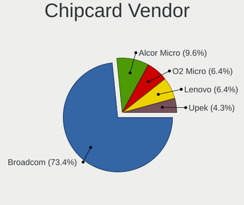

| Vendor      | Notebooks | Percent |
|-------------|-----------|---------|
| Broadcom    | 69        | 73.4%   |
| Alcor Micro | 9         | 9.57%   |
| O2 Micro    | 6         | 6.38%   |
| Lenovo      | 6         | 6.38%   |
| Upek        | 4         | 4.26%   |

Chipcard Model
--------------

Chipcard module models

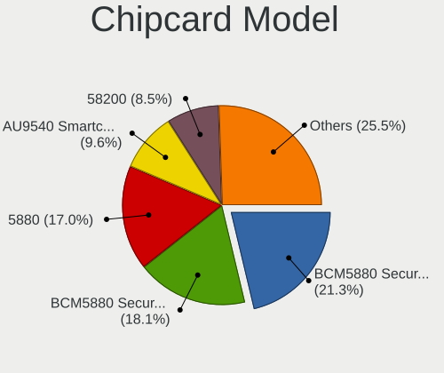

| Model                                                                        | Notebooks | Percent |
|------------------------------------------------------------------------------|-----------|---------|
| Broadcom BCM5880 Secure Applications Processor with fingerprint swipe sensor | 20        | 21.28%  |
| Broadcom BCM5880 Secure Applications Processor                               | 17        | 18.09%  |
| Broadcom 5880                                                                | 16        | 17.02%  |
| Alcor Micro AU9540 Smartcard Reader                                          | 9         | 9.57%   |
| Broadcom 58200                                                               | 8         | 8.51%   |
| Broadcom BCM58200 ControlVault 3 (FingerPrint sensor + Contacted SmartCard)  | 7         | 7.45%   |
| Lenovo Integrated Smart Card Reader                                          | 6         | 6.38%   |
| O2 Micro OZ776 CCID Smartcard Reader                                         | 5         | 5.32%   |
| Upek TouchChip Fingerprint Coprocessor (WBF advanced mode)                   | 4         | 4.26%   |
| O2 Micro Oz776 SmartCard Reader                                              | 1         | 1.06%   |
| Broadcom BCM5880 Secure Applications Processor with fingerprint touch sensor | 1         | 1.06%   |

Unsupported
-----------

Unsupported Devices
-------------------

Total unsupported devices on board

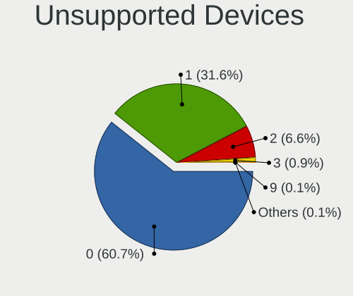

| Total | Notebooks | Percent |
|-------|-----------|---------|
| 0     | 601       | 60.71%  |
| 1     | 313       | 31.62%  |
| 2     | 65        | 6.57%   |
| 3     | 9         | 0.91%   |
| 9     | 1         | 0.1%    |
| 4     | 1         | 0.1%    |

Unsupported Device Types
------------------------

Types of unsupported devices

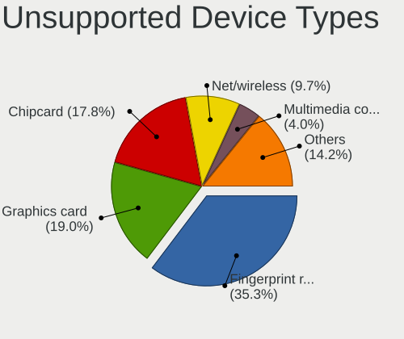

| Type                     | Notebooks | Percent |
|--------------------------|-----------|---------|
| Fingerprint reader       | 167       | 35.31%  |
| Graphics card            | 90        | 19.03%  |
| Chipcard                 | 84        | 17.76%  |
| Net/wireless             | 46        | 9.73%   |
| Multimedia controller    | 19        | 4.02%   |
| Bluetooth                | 18        | 3.81%   |
| Camera                   | 12        | 2.54%   |
| Communication controller | 10        | 2.11%   |
| Storage                  | 8         | 1.69%   |
| Sound                    | 5         | 1.06%   |
| Card reader              | 4         | 0.85%   |
| Modem                    | 3         | 0.63%   |
| Unassigned class         | 2         | 0.42%   |
| Net/ethernet             | 2         | 0.42%   |
| Unclassified device      | 1         | 0.21%   |
| Network                  | 1         | 0.21%   |
| Flash memory             | 1         | 0.21%   |

