Linux in South Africa - Tested Hardware & Statistics (Notebooks)
----------------------------------------------------------------

A project to collect tested hardware configurations for Linux in South Africa.

Anyone can contribute to this report by the [hw-probe](https://github.com/linuxhw/hw-probe) tool:

    sudo -E hw-probe -all -upload

Please contribute! Especially if your hardware is rare.

Contents
--------

* [ Test Cases ](#test-cases)

* [ System ](#system)
  - [ OS                       ](#os)
  - [ OS Family                ](#os-family)
  - [ Kernel                   ](#kernel)
  - [ Kernel Family            ](#kernel-family)
  - [ Kernel Major Ver.        ](#kernel-major-ver)
  - [ Arch                     ](#arch)
  - [ DE                       ](#de)
  - [ Display Server           ](#display-server)
  - [ Display Manager          ](#display-manager)
  - [ OS Lang                  ](#os-lang)
  - [ Boot Mode                ](#boot-mode)
  - [ Filesystem               ](#filesystem)
  - [ Part. scheme             ](#part-scheme)
  - [ Dual Boot with Linux/BSD ](#dual-boot-with-linuxbsd)
  - [ Dual Boot (Win)          ](#dual-boot-win)

* [ Board ](#board)
  - [ Vendor                   ](#vendor)
  - [ Model                    ](#model)
  - [ Model Family             ](#model-family)
  - [ MFG Year                 ](#mfg-year)
  - [ Form Factor              ](#form-factor)
  - [ Secure Boot              ](#secure-boot)
  - [ Coreboot                 ](#coreboot)
  - [ RAM Size                 ](#ram-size)
  - [ RAM Used                 ](#ram-used)
  - [ Total Drives             ](#total-drives)
  - [ Has CD-ROM               ](#has-cd-rom)
  - [ Has Ethernet             ](#has-ethernet)
  - [ Has WiFi                 ](#has-wifi)
  - [ Has Bluetooth            ](#has-bluetooth)

* [ Location ](#location)
  - [ Country                  ](#country)
  - [ City                     ](#city)

* [ Drives ](#drives)
  - [ Drive Vendor             ](#drive-vendor)
  - [ Drive Model              ](#drive-model)
  - [ HDD Vendor               ](#hdd-vendor)
  - [ SSD Vendor               ](#ssd-vendor)
  - [ Drive Kind               ](#drive-kind)
  - [ Drive Connector          ](#drive-connector)
  - [ Drive Size               ](#drive-size)
  - [ Space Total              ](#space-total)
  - [ Space Used               ](#space-used)
  - [ Malfunc. Drives          ](#malfunc-drives)
  - [ Malfunc. Drive Vendor    ](#malfunc-drive-vendor)
  - [ Malfunc. HDD Vendor      ](#malfunc-hdd-vendor)
  - [ Malfunc. Drive Kind      ](#malfunc-drive-kind)
  - [ Failed Drives            ](#failed-drives)
  - [ Failed Drive Vendor      ](#failed-drive-vendor)
  - [ Drive Status             ](#drive-status)

* [ Storage controller ](#storage-controller)
  - [ Storage Vendor           ](#storage-vendor)
  - [ Storage Model            ](#storage-model)
  - [ Storage Kind             ](#storage-kind)

* [ Processor ](#processor)
  - [ CPU Vendor               ](#cpu-vendor)
  - [ CPU Model                ](#cpu-model)
  - [ CPU Model Family         ](#cpu-model-family)
  - [ CPU Cores                ](#cpu-cores)
  - [ CPU Sockets              ](#cpu-sockets)
  - [ CPU Threads              ](#cpu-threads)
  - [ CPU Op-Modes             ](#cpu-op-modes)
  - [ CPU Microcode            ](#cpu-microcode)
  - [ CPU Microarch            ](#cpu-microarch)

* [ Graphics ](#graphics)
  - [ GPU Vendor               ](#gpu-vendor)
  - [ GPU Model                ](#gpu-model)
  - [ GPU Combo                ](#gpu-combo)
  - [ GPU Driver               ](#gpu-driver)
  - [ GPU Memory               ](#gpu-memory)

* [ Monitor ](#monitor)
  - [ Monitor Vendor           ](#monitor-vendor)
  - [ Monitor Model            ](#monitor-model)
  - [ Monitor Resolution       ](#monitor-resolution)
  - [ Monitor Diagonal         ](#monitor-diagonal)
  - [ Monitor Width            ](#monitor-width)
  - [ Aspect Ratio             ](#aspect-ratio)
  - [ Monitor Area             ](#monitor-area)
  - [ Pixel Density            ](#pixel-density)
  - [ Multiple Monitors        ](#multiple-monitors)

* [ Network ](#network)
  - [ Net Controller Vendor    ](#net-controller-vendor)
  - [ Net Controller Model     ](#net-controller-model)
  - [ Wireless Vendor          ](#wireless-vendor)
  - [ Wireless Model           ](#wireless-model)
  - [ Ethernet Vendor          ](#ethernet-vendor)
  - [ Ethernet Model           ](#ethernet-model)
  - [ Net Controller Kind      ](#net-controller-kind)
  - [ Used Controller          ](#used-controller)
  - [ NICs                     ](#nics)
  - [ IPv6                     ](#ipv6)

* [ Bluetooth ](#bluetooth)
  - [ Bluetooth Vendor         ](#bluetooth-vendor)
  - [ Bluetooth Model          ](#bluetooth-model)

* [ Sound ](#sound)
  - [ Sound Vendor             ](#sound-vendor)
  - [ Sound Model              ](#sound-model)

* [ Memory ](#memory)
  - [ Memory Vendor            ](#memory-vendor)
  - [ Memory Model             ](#memory-model)
  - [ Memory Kind              ](#memory-kind)
  - [ Memory Form Factor       ](#memory-form-factor)
  - [ Memory Size              ](#memory-size)
  - [ Memory Speed             ](#memory-speed)

* [ Printers & scanners ](#printers--scanners)
  - [ Printer Vendor           ](#printer-vendor)
  - [ Printer Model            ](#printer-model)
  - [ Scanner Vendor           ](#scanner-vendor)
  - [ Scanner Model            ](#scanner-model)

* [ Camera ](#camera)
  - [ Camera Vendor            ](#camera-vendor)
  - [ Camera Model             ](#camera-model)

* [ Security ](#security)
  - [ Fingerprint Vendor       ](#fingerprint-vendor)
  - [ Fingerprint Model        ](#fingerprint-model)
  - [ Chipcard Vendor          ](#chipcard-vendor)
  - [ Chipcard Model           ](#chipcard-model)

* [ Unsupported ](#unsupported)
  - [ Unsupported Devices      ](#unsupported-devices)
  - [ Unsupported Device Types ](#unsupported-device-types)

Test Cases
----------

Total: 873

| Vendor        | Model                       | Probe                                                      | Date         |
|---------------|-----------------------------|------------------------------------------------------------|--------------|
| HP            | EliteBook 2540p             | [6aae8ca2a0](https://linux-hardware.org/?probe=6aae8ca2a0) | Mar 30, 2023 |
| Clevo         | W150HNM/W170HN              | [8a86bbf31c](https://linux-hardware.org/?probe=8a86bbf31c) | Mar 29, 2023 |
| Apple         | MacBook5,1                  | [a5c200217f](https://linux-hardware.org/?probe=a5c200217f) | Mar 26, 2023 |
| Dell          | XPS L421X                   | [fd54af9534](https://linux-hardware.org/?probe=fd54af9534) | Mar 21, 2023 |
| Acer          | Aspire 5349                 | [c0f5810e5c](https://linux-hardware.org/?probe=c0f5810e5c) | Mar 21, 2023 |
| Lenovo        | ThinkPad X1 Carbon 7th 2... | [2ab659150c](https://linux-hardware.org/?probe=2ab659150c) | Mar 16, 2023 |
| ASUSTek       | ASUS TUF Gaming A17 FA70... | [96f3739077](https://linux-hardware.org/?probe=96f3739077) | Mar 15, 2023 |
| Acer          | Swift SF114-34              | [aee5d96875](https://linux-hardware.org/?probe=aee5d96875) | Mar 14, 2023 |
| Dell          | G15 5510                    | [fa6a50c541](https://linux-hardware.org/?probe=fa6a50c541) | Mar 13, 2023 |
| Lenovo        | ThinkPad X1 Carbon 7th 2... | [5c45eb6864](https://linux-hardware.org/?probe=5c45eb6864) | Mar 12, 2023 |
| Proline       | V146SH                      | [460deab2ea](https://linux-hardware.org/?probe=460deab2ea) | Mar 11, 2023 |
| ASUSTek       | VivoBook 15_ASUS Laptop ... | [53649dddb6](https://linux-hardware.org/?probe=53649dddb6) | Mar 10, 2023 |
| HP            | ProBook 4530s               | [e9c9dd943e](https://linux-hardware.org/?probe=e9c9dd943e) | Mar 10, 2023 |
| Dell          | Latitude E7470              | [51b40c1604](https://linux-hardware.org/?probe=51b40c1604) | Mar 09, 2023 |
| Lenovo        | IdeaPad 310-15IKB 80TV      | [5b98ac00da](https://linux-hardware.org/?probe=5b98ac00da) | Mar 09, 2023 |
| Lenovo        | ThinkPad T500 2241BU3       | [6cd14d1366](https://linux-hardware.org/?probe=6cd14d1366) | Mar 08, 2023 |
| Lenovo        | ThinkPad T500 2241BU3       | [da7eb1619d](https://linux-hardware.org/?probe=da7eb1619d) | Mar 07, 2023 |
| HP            | 620                         | [d272a54b5d](https://linux-hardware.org/?probe=d272a54b5d) | Mar 05, 2023 |
| Lenovo        | IdeaPad 3 15IML05 81WB      | [0f0f44b0ee](https://linux-hardware.org/?probe=0f0f44b0ee) | Mar 05, 2023 |
| HP            | ProBook 4540s               | [a52b9c7637](https://linux-hardware.org/?probe=a52b9c7637) | Feb 27, 2023 |
| HP            | ProBook 4540s               | [45e989b539](https://linux-hardware.org/?probe=45e989b539) | Feb 27, 2023 |
| HP            | 620                         | [e3bf80caf7](https://linux-hardware.org/?probe=e3bf80caf7) | Feb 25, 2023 |
| Dell          | Latitude 5490               | [ccde867e7d](https://linux-hardware.org/?probe=ccde867e7d) | Feb 24, 2023 |
| HP            | ProBook 4540s               | [079a5f512d](https://linux-hardware.org/?probe=079a5f512d) | Feb 20, 2023 |
| HP            | EliteBook 840 G8 Noteboo... | [fcbec20556](https://linux-hardware.org/?probe=fcbec20556) | Feb 17, 2023 |
| Lenovo        | ThinkPad T410 25376B8       | [fc0430b8fe](https://linux-hardware.org/?probe=fc0430b8fe) | Feb 14, 2023 |
| Lenovo        | ThinkPad Edge 057872G       | [98ed3bb274](https://linux-hardware.org/?probe=98ed3bb274) | Feb 13, 2023 |
| Lenovo        | ThinkPad P51 20HH0002ZA     | [db1061d4db](https://linux-hardware.org/?probe=db1061d4db) | Feb 07, 2023 |
| Getac         | S410G4                      | [81b80297ab](https://linux-hardware.org/?probe=81b80297ab) | Feb 06, 2023 |
| Getac         | S410G4                      | [1d8e6ad383](https://linux-hardware.org/?probe=1d8e6ad383) | Feb 06, 2023 |
| Lenovo        | G50-80 80E5                 | [baf04bdc65](https://linux-hardware.org/?probe=baf04bdc65) | Feb 05, 2023 |
| Lenovo        | IdeaPad 330-15IKB 81DE      | [cfaa43cc81](https://linux-hardware.org/?probe=cfaa43cc81) | Feb 04, 2023 |
| HP            | EliteBook 840 G1            | [9b91cecab9](https://linux-hardware.org/?probe=9b91cecab9) | Jan 31, 2023 |
| Lenovo        | ThinkPad Edge E540 20C60... | [ff3381fe1a](https://linux-hardware.org/?probe=ff3381fe1a) | Jan 28, 2023 |
| Lenovo        | IdeaPad 330-15IKB 81DE      | [a69331d2ea](https://linux-hardware.org/?probe=a69331d2ea) | Jan 27, 2023 |
| ASUSTek       | ROG Strix G733CX_G733CX     | [a0c1ab03da](https://linux-hardware.org/?probe=a0c1ab03da) | Jan 27, 2023 |
| Dell          | Latitude E6430              | [ac467a864d](https://linux-hardware.org/?probe=ac467a864d) | Jan 27, 2023 |
| I-Life Dig... | ZED AIR 2 SABMS             | [8bd062dd40](https://linux-hardware.org/?probe=8bd062dd40) | Jan 27, 2023 |
| I-Life Dig... | ZED AIR 2 SABMS             | [da316254bb](https://linux-hardware.org/?probe=da316254bb) | Jan 24, 2023 |
| Lenovo        | ThinkPad T540p 20BE00AKZ... | [c4a4bd6895](https://linux-hardware.org/?probe=c4a4bd6895) | Jan 23, 2023 |
| Lenovo        | IdeaPad 3 15ALC6 82KU       | [4c6da4840e](https://linux-hardware.org/?probe=4c6da4840e) | Jan 23, 2023 |
| HP            | Pavilion dv6                | [0c262643a2](https://linux-hardware.org/?probe=0c262643a2) | Jan 23, 2023 |
| HP            | Pavilion dv6                | [25269a9baa](https://linux-hardware.org/?probe=25269a9baa) | Jan 23, 2023 |
| Lenovo        | E51-80 80QB                 | [37073c4323](https://linux-hardware.org/?probe=37073c4323) | Jan 22, 2023 |
| HP            | Pavilion dv6                | [b71b30c5e1](https://linux-hardware.org/?probe=b71b30c5e1) | Jan 22, 2023 |
| I-Life Dig... | ZED AIR 2 SABMS             | [aa8fbd29c9](https://linux-hardware.org/?probe=aa8fbd29c9) | Jan 21, 2023 |
| Acer          | Aspire ES1-533              | [96f20a9e2f](https://linux-hardware.org/?probe=96f20a9e2f) | Jan 18, 2023 |
| Lenovo        | ThinkPad Edge E540 20C60... | [2860788f11](https://linux-hardware.org/?probe=2860788f11) | Jan 14, 2023 |
| Acer          | Aspire A515-52              | [217353eb32](https://linux-hardware.org/?probe=217353eb32) | Jan 13, 2023 |
| Dell          | G7 7790                     | [bdaed261a4](https://linux-hardware.org/?probe=bdaed261a4) | Jan 12, 2023 |
| Panasonic     | CF-19ADNAXDY                | [a3b2e995a5](https://linux-hardware.org/?probe=a3b2e995a5) | Jan 08, 2023 |
| HP            | 255 G5 Notebook PC          | [69969b5a27](https://linux-hardware.org/?probe=69969b5a27) | Jan 07, 2023 |
| HP            | Laptop 15-da0xxx            | [5905bea3a2](https://linux-hardware.org/?probe=5905bea3a2) | Jan 06, 2023 |
| HP            | ProBook 450 G0              | [eb2116c5e2](https://linux-hardware.org/?probe=eb2116c5e2) | Jan 03, 2023 |
| Acer          | Aspire R7-572G              | [56e5de8317](https://linux-hardware.org/?probe=56e5de8317) | Jan 03, 2023 |
| Lenovo        | IdeaPad 110-15IBR 80T7      | [ceb89aefed](https://linux-hardware.org/?probe=ceb89aefed) | Dec 30, 2022 |
| Acer          | Aspire A315-53              | [9c28036440](https://linux-hardware.org/?probe=9c28036440) | Dec 29, 2022 |
| HP            | ProBook 6570b               | [46fd918b7c](https://linux-hardware.org/?probe=46fd918b7c) | Dec 29, 2022 |
| HP            | ZBook Fury 16 G9 Mobile ... | [6c67e1435e](https://linux-hardware.org/?probe=6c67e1435e) | Dec 29, 2022 |
| HP            | G62                         | [05ad917600](https://linux-hardware.org/?probe=05ad917600) | Dec 28, 2022 |
| HP            | Compaq CQ58                 | [e18b58bbde](https://linux-hardware.org/?probe=e18b58bbde) | Dec 26, 2022 |
| HP            | Compaq CQ58                 | [7e0cac17f6](https://linux-hardware.org/?probe=7e0cac17f6) | Dec 26, 2022 |
| Dell          | Inspiron 15 7510            | [d5702b0c66](https://linux-hardware.org/?probe=d5702b0c66) | Dec 24, 2022 |
| Dell          | MXG071                      | [b999ae7bba](https://linux-hardware.org/?probe=b999ae7bba) | Dec 19, 2022 |
| Dell          | MXG071                      | [587b5fb932](https://linux-hardware.org/?probe=587b5fb932) | Dec 19, 2022 |
| Lenovo        | ThinkPad X1 Extreme 2nd ... | [9768b1fe82](https://linux-hardware.org/?probe=9768b1fe82) | Dec 16, 2022 |
| MECER         | CA11Q5_PRO                  | [b8d784f0ef](https://linux-hardware.org/?probe=b8d784f0ef) | Dec 16, 2022 |
| MECER         | CA11Q5_PRO                  | [e2e6c34fde](https://linux-hardware.org/?probe=e2e6c34fde) | Dec 16, 2022 |
| Apple         | MacBookAir7,1               | [facc218586](https://linux-hardware.org/?probe=facc218586) | Dec 15, 2022 |
| LG Electro... | C500                        | [078e13cadd](https://linux-hardware.org/?probe=078e13cadd) | Dec 08, 2022 |
| Panasonic     | CF-19ADNAXDY                | [51120805b1](https://linux-hardware.org/?probe=51120805b1) | Dec 02, 2022 |
| Panasonic     | CF-19ADNAXDY                | [7a809e9dbd](https://linux-hardware.org/?probe=7a809e9dbd) | Dec 02, 2022 |
| Standard      | Unknown                     | [723d9c3551](https://linux-hardware.org/?probe=723d9c3551) | Nov 30, 2022 |
| MECER         | YA13Q20-DP_PRO              | [c51a900a73](https://linux-hardware.org/?probe=c51a900a73) | Nov 23, 2022 |
| Apple         | MacBookAir7,1               | [f735b3e731](https://linux-hardware.org/?probe=f735b3e731) | Nov 23, 2022 |
| MECER         | YA13Q20-DP_PRO              | [81cdfb4100](https://linux-hardware.org/?probe=81cdfb4100) | Nov 20, 2022 |
| ASUSTek       | ASUS Gaming FX570UD         | [522c9222c5](https://linux-hardware.org/?probe=522c9222c5) | Nov 17, 2022 |
| HP            | Unknown                     | [1a144cae82](https://linux-hardware.org/?probe=1a144cae82) | Nov 13, 2022 |
| Intel         | (R) Education Tablet        | [13286af46e](https://linux-hardware.org/?probe=13286af46e) | Nov 10, 2022 |
| RIZZEN        | NOVABOOK R40                | [84890252a6](https://linux-hardware.org/?probe=84890252a6) | Nov 10, 2022 |
| Lenovo        | ThinkPad E14 Gen 2 20TA0... | [c62cbe8eb5](https://linux-hardware.org/?probe=c62cbe8eb5) | Nov 08, 2022 |
| Lenovo        | ThinkPad X1 Carbon 7th 2... | [f391e8dce8](https://linux-hardware.org/?probe=f391e8dce8) | Nov 03, 2022 |
| Lenovo        | ThinkPad X1 Carbon 7th 2... | [39e7abb29a](https://linux-hardware.org/?probe=39e7abb29a) | Nov 03, 2022 |
| Dell          | Latitude E6420              | [032920f109](https://linux-hardware.org/?probe=032920f109) | Nov 02, 2022 |
| Acer          | Aspire E1-571               | [d81e8b3ea2](https://linux-hardware.org/?probe=d81e8b3ea2) | Nov 01, 2022 |
| Dell          | Vostro 3500                 | [a3abf820e1](https://linux-hardware.org/?probe=a3abf820e1) | Oct 31, 2022 |
| Acer          | Aspire E1-571               | [4ba79bc73e](https://linux-hardware.org/?probe=4ba79bc73e) | Oct 30, 2022 |
| Lenovo        | IdeaPad Slim 1-14AST-05 ... | [50170811fd](https://linux-hardware.org/?probe=50170811fd) | Oct 30, 2022 |
| Dell          | Vostro 3500                 | [53754d84e7](https://linux-hardware.org/?probe=53754d84e7) | Oct 29, 2022 |
| HP            | Laptop 15-dw3xxx            | [99ac55823d](https://linux-hardware.org/?probe=99ac55823d) | Oct 29, 2022 |
| MSI           | GF63 Thin 10SC              | [2b22722ce8](https://linux-hardware.org/?probe=2b22722ce8) | Oct 27, 2022 |
| HP            | Laptop 15s-fq5xxx           | [a5c7ddd00c](https://linux-hardware.org/?probe=a5c7ddd00c) | Oct 25, 2022 |
| Mustek        | Z140C                       | [9188dbd3a5](https://linux-hardware.org/?probe=9188dbd3a5) | Oct 23, 2022 |
| HP            | 2000                        | [6bb35d5fe9](https://linux-hardware.org/?probe=6bb35d5fe9) | Oct 21, 2022 |
| HP            | Unknown                     | [3b5effbcc5](https://linux-hardware.org/?probe=3b5effbcc5) | Oct 20, 2022 |
| LG Electro... | C500                        | [f688cc0536](https://linux-hardware.org/?probe=f688cc0536) | Oct 18, 2022 |
| Mustek        | Z140C                       | [02a81c2c1f](https://linux-hardware.org/?probe=02a81c2c1f) | Oct 16, 2022 |
| Lenovo        | ThinkPad T540p 20BE00AKZ... | [2a1c89201f](https://linux-hardware.org/?probe=2a1c89201f) | Oct 12, 2022 |
| Lenovo        | ThinkPad T540p 20BE00AKZ... | [e952835a2f](https://linux-hardware.org/?probe=e952835a2f) | Oct 12, 2022 |
| HP            | Compaq 6710b (GB887EA#AC... | [9f2e301993](https://linux-hardware.org/?probe=9f2e301993) | Oct 10, 2022 |
| HP            | Compaq 6710b (GB887EA#AC... | [af662698b9](https://linux-hardware.org/?probe=af662698b9) | Oct 10, 2022 |
| Intel         | (R) Education Tablet        | [9d1756d283](https://linux-hardware.org/?probe=9d1756d283) | Oct 09, 2022 |
| ASUSTek       | ASUS TUF Gaming A17 FA70... | [62e134c294](https://linux-hardware.org/?probe=62e134c294) | Oct 09, 2022 |
| Dell          | Latitude E5250              | [aeb221e727](https://linux-hardware.org/?probe=aeb221e727) | Oct 01, 2022 |
| Dell          | Latitude E5250              | [43f7cf1b59](https://linux-hardware.org/?probe=43f7cf1b59) | Oct 01, 2022 |
| Acer          | TMP453-MG                   | [4d36d13ea9](https://linux-hardware.org/?probe=4d36d13ea9) | Oct 01, 2022 |
| HP            | EliteBook 840 G3            | [2ad6238f03](https://linux-hardware.org/?probe=2ad6238f03) | Sep 25, 2022 |
| ASUSTek       | X200MA                      | [753d8c4211](https://linux-hardware.org/?probe=753d8c4211) | Sep 24, 2022 |
| Lenovo        | ThinkPad Edge E540 20C60... | [b7f6ab8ad0](https://linux-hardware.org/?probe=b7f6ab8ad0) | Sep 23, 2022 |
| Toshiba       | Satellite C850-F21B         | [6d336c1e89](https://linux-hardware.org/?probe=6d336c1e89) | Sep 23, 2022 |
| Toshiba       | Satellite C850-F21B         | [dc1e853bbf](https://linux-hardware.org/?probe=dc1e853bbf) | Sep 23, 2022 |
| Dell          | Latitude E6540              | [d13fb4e622](https://linux-hardware.org/?probe=d13fb4e622) | Sep 19, 2022 |
| Dell          | Inspiron N5050              | [db02122f3d](https://linux-hardware.org/?probe=db02122f3d) | Sep 14, 2022 |
| MSI           | GP73 Leopard 8RE            | [21744558cb](https://linux-hardware.org/?probe=21744558cb) | Sep 12, 2022 |
| Dell          | XPS 17 9720                 | [b85068c001](https://linux-hardware.org/?probe=b85068c001) | Sep 07, 2022 |
| Lenovo        | ThinkPad Edge E540 20C60... | [758f8d2184](https://linux-hardware.org/?probe=758f8d2184) | Sep 03, 2022 |
| ASUSTek       | VivoBook_ASUSLaptop X515... | [6566bc7d09](https://linux-hardware.org/?probe=6566bc7d09) | Sep 01, 2022 |
| Acer          | TMP453-MG                   | [63efab9aef](https://linux-hardware.org/?probe=63efab9aef) | Aug 30, 2022 |
| HP            | EliteBook 840 G3            | [81b8b0400d](https://linux-hardware.org/?probe=81b8b0400d) | Aug 14, 2022 |
| Acer          | Aspire A315-53              | [d7550029db](https://linux-hardware.org/?probe=d7550029db) | Aug 12, 2022 |
| Intel         | (R) Education Tablet        | [a9b5863c1a](https://linux-hardware.org/?probe=a9b5863c1a) | Aug 11, 2022 |
| Dell          | Latitude E6420              | [bd610e8bd8](https://linux-hardware.org/?probe=bd610e8bd8) | Aug 11, 2022 |
| ASUSTek       | VivoBook 15_ASUS Laptop ... | [dc6f7b4c01](https://linux-hardware.org/?probe=dc6f7b4c01) | Aug 09, 2022 |
| Lenovo        | IdeaPad 110-15IBR 80T7      | [3a348c35e7](https://linux-hardware.org/?probe=3a348c35e7) | Aug 09, 2022 |
| Lenovo        | IdeaPad 110-15IBR 80T7      | [0ad516c20b](https://linux-hardware.org/?probe=0ad516c20b) | Aug 08, 2022 |
| Lenovo        | B570e HuronRiver Platfor... | [2d4b30ec72](https://linux-hardware.org/?probe=2d4b30ec72) | Aug 07, 2022 |
| Lenovo        | IdeaPad S145-15IKB 81VD     | [f3a36d0f3a](https://linux-hardware.org/?probe=f3a36d0f3a) | Aug 07, 2022 |
| Lenovo        | IdeaPad Y700-15ISK 80NV     | [6beddf67f5](https://linux-hardware.org/?probe=6beddf67f5) | Aug 06, 2022 |
| Lenovo        | ThinkPad T540p 20BFA06P0... | [2f51f6572f](https://linux-hardware.org/?probe=2f51f6572f) | Aug 06, 2022 |
| Acer          | Aspire A315-53              | [0012f5d4c5](https://linux-hardware.org/?probe=0012f5d4c5) | Aug 01, 2022 |
| HP            | ProBook 4310s               | [d15b493637](https://linux-hardware.org/?probe=d15b493637) | Jul 31, 2022 |
| Acer          | Aspire A315-53              | [28b8a96420](https://linux-hardware.org/?probe=28b8a96420) | Jul 31, 2022 |
| HP            | Laptop 15-bs1xx             | [8fe6a402e7](https://linux-hardware.org/?probe=8fe6a402e7) | Jul 30, 2022 |
| Lenovo        | ThinkPad T540p 20BFA06P0... | [824d231d52](https://linux-hardware.org/?probe=824d231d52) | Jul 29, 2022 |
| Lenovo        | IdeaPad S145-15AST 81N3     | [c4c41ad0b5](https://linux-hardware.org/?probe=c4c41ad0b5) | Jul 23, 2022 |
| HP            | ProBook 440 G8 Notebook ... | [1077085bf6](https://linux-hardware.org/?probe=1077085bf6) | Jul 23, 2022 |
| Dell          | Latitude E5450              | [b3e3c79dae](https://linux-hardware.org/?probe=b3e3c79dae) | Jul 22, 2022 |
| Dell          | Latitude E5450              | [c0e1145ccf](https://linux-hardware.org/?probe=c0e1145ccf) | Jul 21, 2022 |
| ASUSTek       | VivoBook 15_ASUS Laptop ... | [69bd4cdcd9](https://linux-hardware.org/?probe=69bd4cdcd9) | Jul 19, 2022 |
| Acer          | TMP453-MG                   | [797f0ea7fe](https://linux-hardware.org/?probe=797f0ea7fe) | Jul 18, 2022 |
| HP            | ZBook Fury 15.6 inch G8 ... | [baa6fdeed9](https://linux-hardware.org/?probe=baa6fdeed9) | Jul 13, 2022 |
| MSI           | Prestige 14Evo A11M         | [292a5032e3](https://linux-hardware.org/?probe=292a5032e3) | Jul 11, 2022 |
| HP            | ProBook 440 G8 Notebook ... | [ce42b6cb75](https://linux-hardware.org/?probe=ce42b6cb75) | Jul 11, 2022 |
| Dell          | Latitude E6500              | [e1ad93da4a](https://linux-hardware.org/?probe=e1ad93da4a) | Jul 11, 2022 |
| Dell          | Inspiron 3543               | [0a4fd044e4](https://linux-hardware.org/?probe=0a4fd044e4) | Jul 10, 2022 |
| MSI           | Prestige 14Evo A11M         | [670abf3d2b](https://linux-hardware.org/?probe=670abf3d2b) | Jul 09, 2022 |
| ASUSTek       | VivoBook 15_ASUS Laptop ... | [274f459142](https://linux-hardware.org/?probe=274f459142) | Jul 07, 2022 |
| Dell          | Latitude E6400              | [1c5025c952](https://linux-hardware.org/?probe=1c5025c952) | Jul 01, 2022 |
| Fujitsu Si... | ESPRIMO Mobile V6535        | [7d85e08611](https://linux-hardware.org/?probe=7d85e08611) | Jun 29, 2022 |
| Acer          | Aspire A515-51G             | [4178b8c79f](https://linux-hardware.org/?probe=4178b8c79f) | Jun 28, 2022 |
| Acer          | Aspire A515-51G             | [1571a4ab8e](https://linux-hardware.org/?probe=1571a4ab8e) | Jun 28, 2022 |
| Fujitsu Si... | ESPRIMO Mobile V6535        | [3e451a9d00](https://linux-hardware.org/?probe=3e451a9d00) | Jun 28, 2022 |
| HP            | Pavilion dv7                | [6338462156](https://linux-hardware.org/?probe=6338462156) | Jun 27, 2022 |
| Acer          | TMP453-MG                   | [e2790ebf7e](https://linux-hardware.org/?probe=e2790ebf7e) | Jun 23, 2022 |
| Acer          | TMP453-MG                   | [c99aceab3b](https://linux-hardware.org/?probe=c99aceab3b) | Jun 23, 2022 |
| Dell          | Latitude 5490               | [f0726860d4](https://linux-hardware.org/?probe=f0726860d4) | Jun 23, 2022 |
| Acer          | Swift SF314-54              | [3e80b4439f](https://linux-hardware.org/?probe=3e80b4439f) | Jun 22, 2022 |
| Toshiba       | Satellite L655              | [2e67542246](https://linux-hardware.org/?probe=2e67542246) | Jun 19, 2022 |
| Dell          | Latitude E6540              | [93f049609f](https://linux-hardware.org/?probe=93f049609f) | Jun 16, 2022 |
| Lenovo        | V15-IIL 82C5                | [bf09de57ad](https://linux-hardware.org/?probe=bf09de57ad) | Jun 14, 2022 |
| Intel         | (R) Education Tablet        | [a776aa706c](https://linux-hardware.org/?probe=a776aa706c) | Jun 13, 2022 |
| Intel         | (R) Education Tablet        | [8c47e36905](https://linux-hardware.org/?probe=8c47e36905) | Jun 13, 2022 |
| HP            | Laptop 15-bs0xx             | [a5474363da](https://linux-hardware.org/?probe=a5474363da) | Jun 12, 2022 |
| Lenovo        | E50-70 80JA                 | [2eb0d9bb23](https://linux-hardware.org/?probe=2eb0d9bb23) | Jun 11, 2022 |
| Lenovo        | E50-70 80JA                 | [1391106844](https://linux-hardware.org/?probe=1391106844) | Jun 10, 2022 |
| Dell          | Inspiron 3542               | [cf46fd5c4e](https://linux-hardware.org/?probe=cf46fd5c4e) | Jun 03, 2022 |
| Dell          | Inspiron 3542               | [94db4f10be](https://linux-hardware.org/?probe=94db4f10be) | Jun 03, 2022 |
| Dell          | G5 5590                     | [4e53892479](https://linux-hardware.org/?probe=4e53892479) | Jun 02, 2022 |
| Lenovo        | IdeaPad Y700-17ISK 80Q0     | [d0dbd3d75e](https://linux-hardware.org/?probe=d0dbd3d75e) | Jun 01, 2022 |
| Dell          | Latitude E6400              | [d70c53a9df](https://linux-hardware.org/?probe=d70c53a9df) | May 31, 2022 |
| Dell          | Vostro 5481                 | [5fd6fe3593](https://linux-hardware.org/?probe=5fd6fe3593) | May 31, 2022 |
| Dell          | Latitude 3410               | [b1115f6bbc](https://linux-hardware.org/?probe=b1115f6bbc) | May 28, 2022 |
| ASUSTek       | ROG Strix G513QY_G513QY     | [1eecb7a012](https://linux-hardware.org/?probe=1eecb7a012) | May 26, 2022 |
| HP            | 635                         | [79aa62cc98](https://linux-hardware.org/?probe=79aa62cc98) | May 25, 2022 |
| HP            | 635                         | [f97ec34a67](https://linux-hardware.org/?probe=f97ec34a67) | May 24, 2022 |
| LG Electro... | C500                        | [e59da09f71](https://linux-hardware.org/?probe=e59da09f71) | May 24, 2022 |
| Lenovo        | G505 20240                  | [6c4aff8f5f](https://linux-hardware.org/?probe=6c4aff8f5f) | May 18, 2022 |
| Dell          | Precision 3520              | [9e2b1878d1](https://linux-hardware.org/?probe=9e2b1878d1) | May 18, 2022 |
| Lenovo        | IdeaPad 330-15ARR 81D2      | [8026841674](https://linux-hardware.org/?probe=8026841674) | May 15, 2022 |
| Dell          | Inspiron 3580               | [33dbac4352](https://linux-hardware.org/?probe=33dbac4352) | May 15, 2022 |
| HP            | OMEN by Laptop              | [f08cef4e3b](https://linux-hardware.org/?probe=f08cef4e3b) | May 13, 2022 |
| HP            | Pavilion dv7                | [709b7bc3e0](https://linux-hardware.org/?probe=709b7bc3e0) | May 09, 2022 |
| Standard      | Unknown                     | [74971ae227](https://linux-hardware.org/?probe=74971ae227) | May 04, 2022 |
| Lenovo        | IdeaPad 310-15IKB 80TV      | [39475a20ff](https://linux-hardware.org/?probe=39475a20ff) | May 01, 2022 |
| Lenovo        | IdeaPad 310-15IKB 80TV      | [1ec609b350](https://linux-hardware.org/?probe=1ec609b350) | May 01, 2022 |
| ASUSTek       | VivoBook 15_ASUS Laptop ... | [5c628f1d84](https://linux-hardware.org/?probe=5c628f1d84) | May 01, 2022 |
| ASUSTek       | G75VX                       | [fb58cab830](https://linux-hardware.org/?probe=fb58cab830) | Apr 30, 2022 |
| Dell          | Latitude 5490               | [9445f416cb](https://linux-hardware.org/?probe=9445f416cb) | Apr 30, 2022 |
| Dell          | Latitude 5520               | [d35917a603](https://linux-hardware.org/?probe=d35917a603) | Apr 29, 2022 |
| Dell          | Latitude 5520               | [9851c7847d](https://linux-hardware.org/?probe=9851c7847d) | Apr 29, 2022 |
| HP            | Pavilion dv7                | [fd2d8cc4f6](https://linux-hardware.org/?probe=fd2d8cc4f6) | Apr 29, 2022 |
| HP            | ProBook 4310s               | [a37901ae30](https://linux-hardware.org/?probe=a37901ae30) | Apr 26, 2022 |
| HP            | EliteBook 840 G7 Noteboo... | [b586e45245](https://linux-hardware.org/?probe=b586e45245) | Apr 25, 2022 |
| Acer          | Aspire E1-571               | [009a9c8ce0](https://linux-hardware.org/?probe=009a9c8ce0) | Apr 25, 2022 |
| Acer          | Aspire E1-571               | [4a76d57188](https://linux-hardware.org/?probe=4a76d57188) | Apr 23, 2022 |
| Acer          | Aspire E1-571               | [ee546b53aa](https://linux-hardware.org/?probe=ee546b53aa) | Apr 23, 2022 |
| Proline       | V146A                       | [30cc5fb7c1](https://linux-hardware.org/?probe=30cc5fb7c1) | Apr 22, 2022 |
| Acer          | Swift SF314-42              | [b0dc5471af](https://linux-hardware.org/?probe=b0dc5471af) | Apr 22, 2022 |
| HP            | Laptop 15-bw0xx             | [b251d7f8e6](https://linux-hardware.org/?probe=b251d7f8e6) | Apr 20, 2022 |
| Acer          | Swift SF314-42              | [a8af23856d](https://linux-hardware.org/?probe=a8af23856d) | Apr 20, 2022 |
| Toshiba       | Satellite C850-F31Q         | [e7a2a2ff69](https://linux-hardware.org/?probe=e7a2a2ff69) | Apr 19, 2022 |
| MECER         | YA13Q20-DP_PRO              | [d4cf4e840f](https://linux-hardware.org/?probe=d4cf4e840f) | Apr 18, 2022 |
| Dell          | Inspiron 3521               | [00dc9c3cca](https://linux-hardware.org/?probe=00dc9c3cca) | Apr 18, 2022 |
| Dell          | Latitude 3550               | [03ed6ab7b4](https://linux-hardware.org/?probe=03ed6ab7b4) | Apr 16, 2022 |
| HP            | Presario CQ57               | [110b597e47](https://linux-hardware.org/?probe=110b597e47) | Apr 14, 2022 |
| Dell          | Latitude 3550               | [6947850074](https://linux-hardware.org/?probe=6947850074) | Apr 14, 2022 |
| Lenovo        | IdeaPad 3 15ALC6 82KU       | [6565c955db](https://linux-hardware.org/?probe=6565c955db) | Apr 12, 2022 |
| ASUSTek       | VivoBook_ASUSLaptop X515... | [f6c87488b0](https://linux-hardware.org/?probe=f6c87488b0) | Apr 06, 2022 |
| Lenovo        | ThinkPad E15 Gen 2 20TD0... | [48f70d4c5a](https://linux-hardware.org/?probe=48f70d4c5a) | Apr 05, 2022 |
| Dell          | XPS 13 9380                 | [1395229a99](https://linux-hardware.org/?probe=1395229a99) | Apr 04, 2022 |
| Dell          | Latitude 5500               | [798c0e5fa4](https://linux-hardware.org/?probe=798c0e5fa4) | Apr 02, 2022 |
| CONNEX        | L1470                       | [6c1aaac1ee](https://linux-hardware.org/?probe=6c1aaac1ee) | Apr 02, 2022 |
| Lenovo        | G500 20236                  | [9ebbf23e28](https://linux-hardware.org/?probe=9ebbf23e28) | Apr 01, 2022 |
| Lenovo        | G500 20236                  | [95d2d82ede](https://linux-hardware.org/?probe=95d2d82ede) | Apr 01, 2022 |
| Lenovo        | ThinkPad T420 41786KG       | [00630dc1b2](https://linux-hardware.org/?probe=00630dc1b2) | Apr 01, 2022 |
| Lenovo        | ThinkPad T420 41786KG       | [373ac41605](https://linux-hardware.org/?probe=373ac41605) | Apr 01, 2022 |
| ASUSTek       | UL80VT                      | [bd7c5c01e6](https://linux-hardware.org/?probe=bd7c5c01e6) | Mar 31, 2022 |
| ASUSTek       | GL753VD                     | [af3543aaed](https://linux-hardware.org/?probe=af3543aaed) | Mar 31, 2022 |
| HUAWEI        | BOHB-WAX9                   | [cb353468c2](https://linux-hardware.org/?probe=cb353468c2) | Mar 28, 2022 |
| ASUSTek       | X555UB                      | [e0b9178226](https://linux-hardware.org/?probe=e0b9178226) | Mar 28, 2022 |
| HP            | Pavilion g6                 | [79ebe026b7](https://linux-hardware.org/?probe=79ebe026b7) | Mar 26, 2022 |
| Dell          | Inspiron M5040              | [74a1c6bd00](https://linux-hardware.org/?probe=74a1c6bd00) | Mar 26, 2022 |
| Dell          | Inspiron M5040              | [e352bc299f](https://linux-hardware.org/?probe=e352bc299f) | Mar 26, 2022 |
| Dell          | Latitude E5540              | [c743515039](https://linux-hardware.org/?probe=c743515039) | Mar 25, 2022 |
| Dell          | Latitude E5540              | [0059ee485d](https://linux-hardware.org/?probe=0059ee485d) | Mar 25, 2022 |
| Lenovo        | G500 20236                  | [da34cf7e5c](https://linux-hardware.org/?probe=da34cf7e5c) | Mar 24, 2022 |
| ASUSTek       | Strix GL704GV_GL704GV       | [87c17cc6e1](https://linux-hardware.org/?probe=87c17cc6e1) | Mar 22, 2022 |
| Lenovo        | Legion Y540-17IRH 81Q4      | [26a88b6d1f](https://linux-hardware.org/?probe=26a88b6d1f) | Mar 21, 2022 |
| Dell          | Latitude 5420               | [b1a1e20ab3](https://linux-hardware.org/?probe=b1a1e20ab3) | Mar 21, 2022 |
| Lenovo        | ThinkPad 20LB000DZA         | [e4b122e82a](https://linux-hardware.org/?probe=e4b122e82a) | Mar 21, 2022 |
| Lenovo        | ThinkPad 20LB000DZA         | [879224cf79](https://linux-hardware.org/?probe=879224cf79) | Mar 20, 2022 |
| Lenovo        | ThinkPad T520 424067G       | [3e6c1f772d](https://linux-hardware.org/?probe=3e6c1f772d) | Mar 18, 2022 |
| ASUSTek       | K52Jr                       | [b05ec1dbda](https://linux-hardware.org/?probe=b05ec1dbda) | Mar 18, 2022 |
| ASUSTek       | K52Jr                       | [77c6485b0f](https://linux-hardware.org/?probe=77c6485b0f) | Mar 17, 2022 |
| Dell          | Latitude 3550               | [947e147577](https://linux-hardware.org/?probe=947e147577) | Mar 13, 2022 |
| Dell          | Latitude 3550               | [afffe18667](https://linux-hardware.org/?probe=afffe18667) | Mar 13, 2022 |
| Dell          | Inspiron 3543               | [e6d7592af0](https://linux-hardware.org/?probe=e6d7592af0) | Mar 10, 2022 |
| HP            | Laptop 15-dw3xxx            | [65026cfb9e](https://linux-hardware.org/?probe=65026cfb9e) | Mar 09, 2022 |
| HP            | Laptop 15-dw3xxx            | [7557102b76](https://linux-hardware.org/?probe=7557102b76) | Mar 08, 2022 |
| HP            | Laptop 14 14s-dq1008ni      | [8184627283](https://linux-hardware.org/?probe=8184627283) | Mar 07, 2022 |
| Acer          | TMP453-MG                   | [87bcae98bc](https://linux-hardware.org/?probe=87bcae98bc) | Mar 07, 2022 |
| Dell          | Latitude E6430              | [0e9a8aa6cc](https://linux-hardware.org/?probe=0e9a8aa6cc) | Mar 06, 2022 |
| ASUSTek       | X555LAB                     | [80be8910f4](https://linux-hardware.org/?probe=80be8910f4) | Mar 05, 2022 |
| Acer          | Aspire VN7-591G             | [57452c9459](https://linux-hardware.org/?probe=57452c9459) | Mar 03, 2022 |
| Dell          | Inspiron 3543               | [f10ea4bbca](https://linux-hardware.org/?probe=f10ea4bbca) | Mar 02, 2022 |
| Dell          | Precision 3520              | [4b9a52ac5c](https://linux-hardware.org/?probe=4b9a52ac5c) | Feb 24, 2022 |
| ASUSTek       | X555LAB                     | [9e1f07c164](https://linux-hardware.org/?probe=9e1f07c164) | Feb 22, 2022 |
| HUAWEI        | BOHB-WAX9                   | [8e2cd5844e](https://linux-hardware.org/?probe=8e2cd5844e) | Feb 21, 2022 |
| Acer          | TMP453-MG                   | [4b25f5d025](https://linux-hardware.org/?probe=4b25f5d025) | Feb 19, 2022 |
| Dell          | Latitude D630               | [e427bda7a4](https://linux-hardware.org/?probe=e427bda7a4) | Feb 17, 2022 |
| Dell          | Latitude D630               | [bca39271ba](https://linux-hardware.org/?probe=bca39271ba) | Feb 17, 2022 |
| Fujitsu       | LIFEBOOK E751               | [5ca51d5bb5](https://linux-hardware.org/?probe=5ca51d5bb5) | Feb 17, 2022 |
| Dell          | Inspiron 5521               | [e0b1929884](https://linux-hardware.org/?probe=e0b1929884) | Feb 17, 2022 |
| Acer          | Predator G9-793             | [45ec93214f](https://linux-hardware.org/?probe=45ec93214f) | Feb 16, 2022 |
| Sony          | VPCEH38FG                   | [15472f67f5](https://linux-hardware.org/?probe=15472f67f5) | Feb 15, 2022 |
| Lenovo        | G560 20042                  | [5c4a8043b1](https://linux-hardware.org/?probe=5c4a8043b1) | Feb 15, 2022 |
| Dell          | Inspiron 5521               | [aee089a0aa](https://linux-hardware.org/?probe=aee089a0aa) | Feb 14, 2022 |
| ASUSTek       | X101CH                      | [82661c6a9b](https://linux-hardware.org/?probe=82661c6a9b) | Feb 12, 2022 |
| ASUSTek       | VivoBook 15_ASUS Laptop ... | [0df06bcae3](https://linux-hardware.org/?probe=0df06bcae3) | Feb 11, 2022 |
| HP            | ProBook 455 G8 Notebook ... | [456d12240c](https://linux-hardware.org/?probe=456d12240c) | Feb 11, 2022 |
| Lenovo        | IdeaPad 510S-14ISK 80TK     | [305921eee8](https://linux-hardware.org/?probe=305921eee8) | Feb 11, 2022 |
| System76      | Oryx Pro                    | [f8437eee6d](https://linux-hardware.org/?probe=f8437eee6d) | Feb 10, 2022 |
| Lenovo        | ThinkPad T460 20FMS1DH01    | [80b214a273](https://linux-hardware.org/?probe=80b214a273) | Feb 10, 2022 |
| Lenovo        | ThinkPad L15 Gen 1 20U30... | [b29422e3cd](https://linux-hardware.org/?probe=b29422e3cd) | Feb 10, 2022 |
| Acer          | TMP453-MG                   | [4e741a6acc](https://linux-hardware.org/?probe=4e741a6acc) | Feb 08, 2022 |
| HP            | EliteBook 2540p             | [006afe98fe](https://linux-hardware.org/?probe=006afe98fe) | Feb 07, 2022 |
| HP            | 635                         | [3f689c9c23](https://linux-hardware.org/?probe=3f689c9c23) | Feb 06, 2022 |
| Dell          | Inspiron 3537               | [66fb2bc907](https://linux-hardware.org/?probe=66fb2bc907) | Feb 06, 2022 |
| HP            | ENVY TS 15                  | [becd915336](https://linux-hardware.org/?probe=becd915336) | Feb 04, 2022 |
| Dell          | Inspiron 15-3567            | [7e21d67fa5](https://linux-hardware.org/?probe=7e21d67fa5) | Feb 03, 2022 |
| Lenovo        | IdeaPad 3 15ARE05 81W4      | [3df622872c](https://linux-hardware.org/?probe=3df622872c) | Feb 03, 2022 |
| HP            | ProBook 4530s               | [4a1bfbe60f](https://linux-hardware.org/?probe=4a1bfbe60f) | Feb 01, 2022 |
| Lenovo        | Yoga S940-14IWL 81Q7        | [940c2e990d](https://linux-hardware.org/?probe=940c2e990d) | Jan 31, 2022 |
| Dell          | Latitude E6220              | [808db5a1c8](https://linux-hardware.org/?probe=808db5a1c8) | Jan 29, 2022 |
| Toshiba       | TECRA A10                   | [bdaff089b2](https://linux-hardware.org/?probe=bdaff089b2) | Jan 28, 2022 |
| Dell          | Latitude D630               | [8a0a5b89dd](https://linux-hardware.org/?probe=8a0a5b89dd) | Jan 27, 2022 |
| Lenovo        | IdeaPad S145-15AST 81N3     | [3b58afceea](https://linux-hardware.org/?probe=3b58afceea) | Jan 21, 2022 |
| WinSome       | A14C .B005                  | [d685b78944](https://linux-hardware.org/?probe=d685b78944) | Jan 19, 2022 |
| Dell          | Latitude D630               | [6327eec09e](https://linux-hardware.org/?probe=6327eec09e) | Jan 18, 2022 |
| Dell          | Inspiron 5580               | [a8e7059c51](https://linux-hardware.org/?probe=a8e7059c51) | Jan 17, 2022 |
| Lenovo        | Legion 5 15ACH6 82JW        | [c9dbc0c289](https://linux-hardware.org/?probe=c9dbc0c289) | Jan 14, 2022 |
| HP            | ZBook 15 G3                 | [89809f906e](https://linux-hardware.org/?probe=89809f906e) | Jan 10, 2022 |
| Dell          | Inspiron 15-3567            | [e36e312cf4](https://linux-hardware.org/?probe=e36e312cf4) | Jan 09, 2022 |
| HP            | Laptop 15-bs1xx             | [d187087325](https://linux-hardware.org/?probe=d187087325) | Jan 09, 2022 |
| HP            | 2000                        | [3c3f60019b](https://linux-hardware.org/?probe=3c3f60019b) | Jan 05, 2022 |
| Lenovo        | ThinkPad X1 1294BL5         | [2cd6f5fbb0](https://linux-hardware.org/?probe=2cd6f5fbb0) | Jan 01, 2022 |
| Acer          | TravelMate P255             | [1efdd6ce09](https://linux-hardware.org/?probe=1efdd6ce09) | Dec 26, 2021 |
| Dell          | Latitude 3540               | [7e7f291d68](https://linux-hardware.org/?probe=7e7f291d68) | Dec 24, 2021 |
| Dell          | Latitude E6430              | [c5ac7574f0](https://linux-hardware.org/?probe=c5ac7574f0) | Dec 22, 2021 |
| HP            | ZBook 15u G3                | [6d1e6100ef](https://linux-hardware.org/?probe=6d1e6100ef) | Dec 21, 2021 |
| Acer          | Aspire VN7-572G             | [895dca26b0](https://linux-hardware.org/?probe=895dca26b0) | Dec 21, 2021 |
| Toshiba       | TECRA A10                   | [e5b76a4673](https://linux-hardware.org/?probe=e5b76a4673) | Dec 21, 2021 |
| Lenovo        | ThinkPad T410 25376B8       | [0b0d4dd23f](https://linux-hardware.org/?probe=0b0d4dd23f) | Dec 21, 2021 |
| Lenovo        | ThinkPad E580 20KS001QZA    | [202290bb62](https://linux-hardware.org/?probe=202290bb62) | Dec 20, 2021 |
| Lenovo        | ThinkPad E580 20KS001QZA    | [8a131f560b](https://linux-hardware.org/?probe=8a131f560b) | Dec 20, 2021 |
| HP            | EliteBook 2570p             | [15e7aaf611](https://linux-hardware.org/?probe=15e7aaf611) | Dec 17, 2021 |
| Acer          | TravelMate 6594             | [d706658ff8](https://linux-hardware.org/?probe=d706658ff8) | Dec 15, 2021 |
| Dell          | Inspiron 1525               | [b93d5f0c9c](https://linux-hardware.org/?probe=b93d5f0c9c) | Dec 14, 2021 |
| Dell          | Inspiron 3537               | [f1213e164f](https://linux-hardware.org/?probe=f1213e164f) | Dec 13, 2021 |
| Sony          | VPCP116KG                   | [237c9f66e1](https://linux-hardware.org/?probe=237c9f66e1) | Dec 13, 2021 |
| HP            | EliteBook 2570p             | [1e9841c0eb](https://linux-hardware.org/?probe=1e9841c0eb) | Dec 12, 2021 |
| TCL Commun... | 8085                        | [3d795ceee0](https://linux-hardware.org/?probe=3d795ceee0) | Dec 11, 2021 |
| Dell          | Precision M6800             | [da95c95a07](https://linux-hardware.org/?probe=da95c95a07) | Dec 08, 2021 |
| ASUSTek       | ZenBook UX425EA_UX425EA     | [d0e3422cba](https://linux-hardware.org/?probe=d0e3422cba) | Dec 08, 2021 |
| Dell          | Precision M6800             | [3a4d66818c](https://linux-hardware.org/?probe=3a4d66818c) | Dec 07, 2021 |
| HP            | Laptop 15-bs1xx             | [b6c9f34c4c](https://linux-hardware.org/?probe=b6c9f34c4c) | Dec 07, 2021 |
| Dell          | Precision M6800             | [3b4f2f0a57](https://linux-hardware.org/?probe=3b4f2f0a57) | Dec 06, 2021 |
| HP            | 255 G8 Notebook PC          | [a700683a6f](https://linux-hardware.org/?probe=a700683a6f) | Dec 05, 2021 |
| Dell          | Latitude 5590               | [5f9747af05](https://linux-hardware.org/?probe=5f9747af05) | Dec 04, 2021 |
| Acer          | Predator G9-793             | [b9dc27ddac](https://linux-hardware.org/?probe=b9dc27ddac) | Nov 29, 2021 |
| Lenovo        | ThinkPad T580 20L90024ZA    | [6b8493406e](https://linux-hardware.org/?probe=6b8493406e) | Nov 28, 2021 |
| Lenovo        | ThinkPad T580 20L90024ZA    | [4a398efa1b](https://linux-hardware.org/?probe=4a398efa1b) | Nov 28, 2021 |
| HP            | ProBook 4310s               | [9f467df8a8](https://linux-hardware.org/?probe=9f467df8a8) | Nov 27, 2021 |
| HP            | ProBook 4310s               | [6d339b7843](https://linux-hardware.org/?probe=6d339b7843) | Nov 27, 2021 |
| LattePanda    | Delta                       | [5950a5a8ac](https://linux-hardware.org/?probe=5950a5a8ac) | Nov 24, 2021 |
| Dell          | Inspiron N5110              | [ea27790fc4](https://linux-hardware.org/?probe=ea27790fc4) | Nov 23, 2021 |
| Lenovo        | ThinkPad X1 1294BL5         | [d543e2cd80](https://linux-hardware.org/?probe=d543e2cd80) | Nov 19, 2021 |
| HP            | Notebook                    | [12d501a930](https://linux-hardware.org/?probe=12d501a930) | Nov 17, 2021 |
| Lenovo        | ThinkPad T15 Gen 1 20S7S... | [7114246672](https://linux-hardware.org/?probe=7114246672) | Nov 15, 2021 |
| Lenovo        | IdeaPad 320-15IKB 80XL      | [2cb8a3b9ff](https://linux-hardware.org/?probe=2cb8a3b9ff) | Nov 15, 2021 |
| HP            | Presario CQ56               | [a514e96472](https://linux-hardware.org/?probe=a514e96472) | Nov 15, 2021 |
| MSI           | CR72 7ML                    | [9fdd485636](https://linux-hardware.org/?probe=9fdd485636) | Nov 12, 2021 |
| MSI           | CR72 7ML                    | [1165c3e22f](https://linux-hardware.org/?probe=1165c3e22f) | Nov 12, 2021 |
| Acer          | Aspire V3-571               | [0c1d65f646](https://linux-hardware.org/?probe=0c1d65f646) | Nov 08, 2021 |
| Dell          | Inspiron 5721               | [d9146c3909](https://linux-hardware.org/?probe=d9146c3909) | Nov 07, 2021 |
| Dell          | Studio 1735                 | [6a444456ef](https://linux-hardware.org/?probe=6a444456ef) | Nov 06, 2021 |
| Gigabyte      | P17FV5                      | [379e023c65](https://linux-hardware.org/?probe=379e023c65) | Nov 04, 2021 |
| HP            | ProBook 4310s               | [bb95a3f04d](https://linux-hardware.org/?probe=bb95a3f04d) | Nov 03, 2021 |
| Lenovo        | Yoga S940-14IWL 81Q7        | [293a751aaf](https://linux-hardware.org/?probe=293a751aaf) | Nov 02, 2021 |
| Gigabyte      | P17FV5                      | [7304aa43c3](https://linux-hardware.org/?probe=7304aa43c3) | Nov 02, 2021 |
| Apple         | MacBook4,1                  | [4a72082fdb](https://linux-hardware.org/?probe=4a72082fdb) | Nov 01, 2021 |
| Packard Be... | ENTE11HC                    | [e31fe4eef0](https://linux-hardware.org/?probe=e31fe4eef0) | Nov 01, 2021 |
| Lenovo        | ThinkPad X1 1294BL5         | [e18dd8b896](https://linux-hardware.org/?probe=e18dd8b896) | Nov 01, 2021 |
| HP            | ProBook 450 G3              | [1069b24865](https://linux-hardware.org/?probe=1069b24865) | Oct 31, 2021 |
| HP            | ProBook 450 G3              | [9e32a01dc0](https://linux-hardware.org/?probe=9e32a01dc0) | Oct 31, 2021 |
| Dell          | Inspiron 3537               | [b0f6309320](https://linux-hardware.org/?probe=b0f6309320) | Oct 31, 2021 |
| MECER         | Z140C+Home                  | [2fbf6f153b](https://linux-hardware.org/?probe=2fbf6f153b) | Oct 30, 2021 |
| ASUSTek       | X58C                        | [fdd83a3517](https://linux-hardware.org/?probe=fdd83a3517) | Oct 28, 2021 |
| Dell          | Latitude E5570              | [e7a049a026](https://linux-hardware.org/?probe=e7a049a026) | Oct 27, 2021 |
| HP            | EliteBook 8440p             | [f527983cc9](https://linux-hardware.org/?probe=f527983cc9) | Oct 27, 2021 |
| HP            | Pavilion Gaming Laptop 1... | [d43c3cb973](https://linux-hardware.org/?probe=d43c3cb973) | Oct 27, 2021 |
| HP            | Presario CQ56               | [10acff551d](https://linux-hardware.org/?probe=10acff551d) | Oct 25, 2021 |
| Lenovo        | IdeaPad L340-15IRH Gamin... | [eaf7694813](https://linux-hardware.org/?probe=eaf7694813) | Oct 24, 2021 |
| Lenovo        | IdeaPad L340-15IRH Gamin... | [44b5186950](https://linux-hardware.org/?probe=44b5186950) | Oct 24, 2021 |
| Dell          | Vostro 15-3568              | [4a961ff6da](https://linux-hardware.org/?probe=4a961ff6da) | Oct 22, 2021 |
| HP            | Laptop 15-dw3xxx            | [9bde1214a9](https://linux-hardware.org/?probe=9bde1214a9) | Oct 22, 2021 |
| Dell          | Latitude E6430              | [b127732e59](https://linux-hardware.org/?probe=b127732e59) | Oct 19, 2021 |
| MSI           | GF65 Thin 10SDR             | [0a048a009d](https://linux-hardware.org/?probe=0a048a009d) | Oct 15, 2021 |
| Lenovo        | E50-80 80J2                 | [c3d31689ec](https://linux-hardware.org/?probe=c3d31689ec) | Oct 11, 2021 |
| Apple         | MacBookPro8,2               | [a3f3c59edc](https://linux-hardware.org/?probe=a3f3c59edc) | Oct 11, 2021 |
| Acer          | Aspire VN7-792G             | [4985d6b90c](https://linux-hardware.org/?probe=4985d6b90c) | Oct 10, 2021 |
| Apple         | MacBookPro9,2               | [d804de918d](https://linux-hardware.org/?probe=d804de918d) | Oct 08, 2021 |
| Lenovo        | ThinkPad X1 Carbon 7th 2... | [26c62915e0](https://linux-hardware.org/?probe=26c62915e0) | Oct 07, 2021 |
| ASUSTek       | VivoBook 15_ASUS Laptop ... | [080e5a9a9f](https://linux-hardware.org/?probe=080e5a9a9f) | Oct 06, 2021 |
| Lenovo        | G50-80 80E5                 | [d9b26b9fec](https://linux-hardware.org/?probe=d9b26b9fec) | Oct 06, 2021 |
| HP            | EliteBook 850 G3            | [cb307dd929](https://linux-hardware.org/?probe=cb307dd929) | Oct 06, 2021 |
| ASUSTek       | VivoBook 15_ASUS Laptop ... | [f85d75b229](https://linux-hardware.org/?probe=f85d75b229) | Oct 05, 2021 |
| HP            | 650                         | [bbe8e793b8](https://linux-hardware.org/?probe=bbe8e793b8) | Oct 05, 2021 |
| HP            | EliteBook 8440p             | [0890806446](https://linux-hardware.org/?probe=0890806446) | Oct 04, 2021 |
| Acer          | Aspire A315-31              | [65388cbcfc](https://linux-hardware.org/?probe=65388cbcfc) | Oct 03, 2021 |
| Acer          | Aspire A315-31              | [97dde270fa](https://linux-hardware.org/?probe=97dde270fa) | Oct 03, 2021 |
| MSI           | Modern 14 B11MO             | [e8f13facfd](https://linux-hardware.org/?probe=e8f13facfd) | Oct 03, 2021 |
| HP            | Laptop 15-bs0xx             | [e9dd5491e8](https://linux-hardware.org/?probe=e9dd5491e8) | Sep 28, 2021 |
| HP            | Laptop 15-bs0xx             | [44d29122aa](https://linux-hardware.org/?probe=44d29122aa) | Sep 28, 2021 |
| MSI           | Modern 14 B11MO             | [9f5c2e0fde](https://linux-hardware.org/?probe=9f5c2e0fde) | Sep 27, 2021 |
| Acer          | Aspire A315-31              | [7af0b1b5dd](https://linux-hardware.org/?probe=7af0b1b5dd) | Sep 27, 2021 |
| Acer          | TravelMate P255             | [c6b7f1d5d9](https://linux-hardware.org/?probe=c6b7f1d5d9) | Sep 26, 2021 |
| Acer          | Aspire VN7-792G             | [b555c8cd95](https://linux-hardware.org/?probe=b555c8cd95) | Sep 25, 2021 |
| Dell          | Latitude E6220              | [08e1d2f464](https://linux-hardware.org/?probe=08e1d2f464) | Sep 25, 2021 |
| Acer          | Aspire V3-571G              | [9d9796386e](https://linux-hardware.org/?probe=9d9796386e) | Sep 21, 2021 |
| Acer          | Aspire V3-571G              | [33781ae35f](https://linux-hardware.org/?probe=33781ae35f) | Sep 21, 2021 |
| Acer          | Extensa 2511                | [b38f9bfa33](https://linux-hardware.org/?probe=b38f9bfa33) | Sep 16, 2021 |
| Dell          | Latitude E7440              | [803cfd7e73](https://linux-hardware.org/?probe=803cfd7e73) | Sep 15, 2021 |
| ASUSTek       | VivoBook 15_ASUS Laptop ... | [b565f4eee3](https://linux-hardware.org/?probe=b565f4eee3) | Sep 11, 2021 |
| Dell          | Precision 7550              | [42890f7542](https://linux-hardware.org/?probe=42890f7542) | Sep 10, 2021 |
| Dell          | Precision 7550              | [a4a1a56132](https://linux-hardware.org/?probe=a4a1a56132) | Sep 09, 2021 |
| Apple         | MacBookPro8,1               | [03445cb511](https://linux-hardware.org/?probe=03445cb511) | Sep 09, 2021 |
| Acer          | Aspire A315-31              | [10052076e0](https://linux-hardware.org/?probe=10052076e0) | Sep 09, 2021 |
| Acer          | Aspire A315-31              | [8a0df29327](https://linux-hardware.org/?probe=8a0df29327) | Sep 09, 2021 |
| Dell          | XPS 13 9310                 | [1ee958abc3](https://linux-hardware.org/?probe=1ee958abc3) | Sep 08, 2021 |
| HP            | Presario CQ56               | [b5666dc71b](https://linux-hardware.org/?probe=b5666dc71b) | Sep 08, 2021 |
| Packard Be... | EasyNote TK85               | [3e9c16c5a0](https://linux-hardware.org/?probe=3e9c16c5a0) | Sep 07, 2021 |
| ASUSTek       | ASUS Gaming FX570UD         | [3eaf057f6f](https://linux-hardware.org/?probe=3eaf057f6f) | Sep 07, 2021 |
| Dell          | Latitude 7480               | [844ab8df38](https://linux-hardware.org/?probe=844ab8df38) | Sep 06, 2021 |
| HP            | ProBook 450 G5              | [beefff4447](https://linux-hardware.org/?probe=beefff4447) | Sep 06, 2021 |
| Lenovo        | ThinkPad X250 20CL001GZA    | [e732588a09](https://linux-hardware.org/?probe=e732588a09) | Sep 05, 2021 |
| ASUSTek       | G551JM                      | [4309f5e034](https://linux-hardware.org/?probe=4309f5e034) | Sep 04, 2021 |
| ASUSTek       | G551JM                      | [0dad1d056d](https://linux-hardware.org/?probe=0dad1d056d) | Sep 04, 2021 |
| Dell          | Latitude E6430              | [866d479f07](https://linux-hardware.org/?probe=866d479f07) | Sep 04, 2021 |
| Lenovo        | ThinkPad E15 Gen 2 20TD0... | [303c36ac93](https://linux-hardware.org/?probe=303c36ac93) | Sep 03, 2021 |
| HP            | Notebook                    | [552535c21e](https://linux-hardware.org/?probe=552535c21e) | Sep 02, 2021 |
| HP            | Notebook                    | [0405b5aa6c](https://linux-hardware.org/?probe=0405b5aa6c) | Sep 02, 2021 |
| HP            | ProBook 450 G5              | [1579919ebb](https://linux-hardware.org/?probe=1579919ebb) | Sep 01, 2021 |
| HP            | EliteBook 8730w             | [93ee7aecde](https://linux-hardware.org/?probe=93ee7aecde) | Aug 31, 2021 |
| HP            | EliteBook 8730w             | [c99d13438f](https://linux-hardware.org/?probe=c99d13438f) | Aug 30, 2021 |
| HP            | EliteBook 850 G6            | [87f2a544c5](https://linux-hardware.org/?probe=87f2a544c5) | Aug 30, 2021 |
| Mustek        | W35xSS_370SS                | [ee70b31c91](https://linux-hardware.org/?probe=ee70b31c91) | Aug 24, 2021 |
| Dell          | Inspiron 7577               | [82ff6985ce](https://linux-hardware.org/?probe=82ff6985ce) | Aug 18, 2021 |
| Lenovo        | ThinkPad T15 Gen 1 20S7S... | [d9923e15e0](https://linux-hardware.org/?probe=d9923e15e0) | Aug 18, 2021 |
| Packard Be... | EasyNote TK85               | [4faeb04124](https://linux-hardware.org/?probe=4faeb04124) | Aug 17, 2021 |
| Gigabyte      | Q2006                       | [16503fc58a](https://linux-hardware.org/?probe=16503fc58a) | Aug 16, 2021 |
| Dell          | Latitude E6430              | [31491d6a83](https://linux-hardware.org/?probe=31491d6a83) | Aug 15, 2021 |
| Dell          | Latitude 5580               | [1c57f7bb76](https://linux-hardware.org/?probe=1c57f7bb76) | Aug 15, 2021 |
| HP            | Pavilion dv4                | [bc1ab4b47e](https://linux-hardware.org/?probe=bc1ab4b47e) | Aug 12, 2021 |
| Lenovo        | ThinkPad T15 Gen 1 20S7S... | [1f6745d6bb](https://linux-hardware.org/?probe=1f6745d6bb) | Aug 11, 2021 |
| Notebook      | W54_55SU1,SUW               | [a771e9b877](https://linux-hardware.org/?probe=a771e9b877) | Aug 11, 2021 |
| Apple         | MacBookPro7,1               | [da4107ffc3](https://linux-hardware.org/?probe=da4107ffc3) | Aug 10, 2021 |
| HP            | Pavilion dv4                | [34b7ad0d24](https://linux-hardware.org/?probe=34b7ad0d24) | Aug 09, 2021 |
| HP            | ZBook 15u G3                | [e1a51f61f1](https://linux-hardware.org/?probe=e1a51f61f1) | Aug 08, 2021 |
| Lenovo        | ThinkPad T440p 2000CT0      | [574392d159](https://linux-hardware.org/?probe=574392d159) | Aug 07, 2021 |
| HP            | EliteBook 845 G7 Noteboo... | [c505820537](https://linux-hardware.org/?probe=c505820537) | Aug 04, 2021 |
| HP            | Laptop 15-dw2xxx            | [80d1826ee1](https://linux-hardware.org/?probe=80d1826ee1) | Aug 02, 2021 |
| Acer          | Aspire ES1-512              | [ac364c0278](https://linux-hardware.org/?probe=ac364c0278) | Aug 01, 2021 |
| Acer          | Aspire ES1-512              | [161731059f](https://linux-hardware.org/?probe=161731059f) | Aug 01, 2021 |
| HP            | Presario CQ56               | [b2f6fbae75](https://linux-hardware.org/?probe=b2f6fbae75) | Jul 29, 2021 |
| Dell          | Inspiron M5040              | [c38c747e1b](https://linux-hardware.org/?probe=c38c747e1b) | Jul 23, 2021 |
| Samsung       | N150P/N210P/N220P           | [f126b121e0](https://linux-hardware.org/?probe=f126b121e0) | Jul 23, 2021 |
| Dell          | XPS 13 9310                 | [bcb7059afa](https://linux-hardware.org/?probe=bcb7059afa) | Jul 19, 2021 |
| Samsung       | RC410/RC510/RC710           | [f9f770c055](https://linux-hardware.org/?probe=f9f770c055) | Jul 17, 2021 |
| Samsung       | RC410/RC510/RC710           | [f2f4a48775](https://linux-hardware.org/?probe=f2f4a48775) | Jul 17, 2021 |
| ASUSTek       | X550CL                      | [3a09584428](https://linux-hardware.org/?probe=3a09584428) | Jul 16, 2021 |
| Dell          | Latitude 5590               | [71d3a5a5d7](https://linux-hardware.org/?probe=71d3a5a5d7) | Jul 16, 2021 |
| Lenovo        | IdeaPad 110-15IBR 80T7      | [662ed28f07](https://linux-hardware.org/?probe=662ed28f07) | Jul 16, 2021 |
| HP            | 250 G7 Notebook PC          | [846febb191](https://linux-hardware.org/?probe=846febb191) | Jul 14, 2021 |
| Dell          | XPS 13 9310                 | [96ce85594c](https://linux-hardware.org/?probe=96ce85594c) | Jul 14, 2021 |
| Dell          | XPS 13 9310                 | [8e96e56dc3](https://linux-hardware.org/?probe=8e96e56dc3) | Jul 14, 2021 |
| Apple         | MacBookPro9,2               | [f1ca4c9fb2](https://linux-hardware.org/?probe=f1ca4c9fb2) | Jul 12, 2021 |
| Dell          | G7 7790                     | [9c6ab51434](https://linux-hardware.org/?probe=9c6ab51434) | Jul 11, 2021 |
| Acer          | Aspire 5715Z                | [8459bc8e66](https://linux-hardware.org/?probe=8459bc8e66) | Jul 11, 2021 |
| Acer          | Aspire 5715Z                | [77bd0c29ea](https://linux-hardware.org/?probe=77bd0c29ea) | Jul 10, 2021 |
| Lenovo        | IdeaPad 110-15IBR 80T7      | [94137d1697](https://linux-hardware.org/?probe=94137d1697) | Jul 08, 2021 |
| Lenovo        | IdeaPad 110-15IBR 80T7      | [c27edc6b7e](https://linux-hardware.org/?probe=c27edc6b7e) | Jul 07, 2021 |
| Dell          | Latitude E7440              | [c7aa70ad78](https://linux-hardware.org/?probe=c7aa70ad78) | Jul 07, 2021 |
| HP            | Laptop 15-bs0xx             | [76b81b25d9](https://linux-hardware.org/?probe=76b81b25d9) | Jul 03, 2021 |
| ASUSTek       | VivoBook_ASUSLaptop X515... | [d23e2c3398](https://linux-hardware.org/?probe=d23e2c3398) | Jul 01, 2021 |
| Dell          | Inspiron 1564               | [37f6c092f2](https://linux-hardware.org/?probe=37f6c092f2) | Jun 30, 2021 |
| Lenovo        | ThinkPad Edge 057872G       | [8bc64e956d](https://linux-hardware.org/?probe=8bc64e956d) | Jun 25, 2021 |
| Dell          | Inspiron 15-3567            | [b18b2ef77a](https://linux-hardware.org/?probe=b18b2ef77a) | Jun 20, 2021 |
| Acer          | TravelMate 8571             | [5ebead6e64](https://linux-hardware.org/?probe=5ebead6e64) | Jun 20, 2021 |
| Lenovo        | ThinkPad T470 W10DG 20JN... | [d1c7b5962a](https://linux-hardware.org/?probe=d1c7b5962a) | Jun 19, 2021 |
| Lenovo        | ThinkPad T470 W10DG 20JN... | [592d026476](https://linux-hardware.org/?probe=592d026476) | Jun 19, 2021 |
| Lenovo        | IdeaPad S145-15IWL 81MV     | [4154f6bf31](https://linux-hardware.org/?probe=4154f6bf31) | Jun 14, 2021 |
| Dell          | XPS 13 9310                 | [278fd058ed](https://linux-hardware.org/?probe=278fd058ed) | Jun 14, 2021 |
| Lenovo        | ThinkPad E15 Gen 2 20TD0... | [01cf29ba72](https://linux-hardware.org/?probe=01cf29ba72) | Jun 10, 2021 |
| Acer          | Aspire E1-571               | [c0ba4bd856](https://linux-hardware.org/?probe=c0ba4bd856) | Jun 10, 2021 |
| Lenovo        | IdeaPad 100-15IBD 80QQ      | [54fa44f208](https://linux-hardware.org/?probe=54fa44f208) | Jun 09, 2021 |
| ASUSTek       | VivoBook 15_ASUS Laptop ... | [5d0ad3d400](https://linux-hardware.org/?probe=5d0ad3d400) | Jun 08, 2021 |
| Lenovo        | Yoga 300-11IBR 80M1         | [d13e2fdb32](https://linux-hardware.org/?probe=d13e2fdb32) | Jun 05, 2021 |
| HP            | ProBook 6560b               | [f9ee7c5367](https://linux-hardware.org/?probe=f9ee7c5367) | Jun 01, 2021 |
| HP            | ProBook 6560b               | [523614fee6](https://linux-hardware.org/?probe=523614fee6) | May 31, 2021 |
| Lenovo        | IdeaPad 110-15IBR 80T7      | [d507f88a47](https://linux-hardware.org/?probe=d507f88a47) | May 26, 2021 |
| Lenovo        | ThinkPad X1 Carbon 7th 2... | [fbf4582983](https://linux-hardware.org/?probe=fbf4582983) | May 25, 2021 |
| Packard Be... | EasyNote TS44HR             | [85bcf858c5](https://linux-hardware.org/?probe=85bcf858c5) | May 25, 2021 |
| Apple         | MacBookPro16,1              | [2bddf8b98a](https://linux-hardware.org/?probe=2bddf8b98a) | May 23, 2021 |
| Acer          | TMP453-MG                   | [07291bacfe](https://linux-hardware.org/?probe=07291bacfe) | May 22, 2021 |
| Dell          | Latitude E7440              | [ef82f4635d](https://linux-hardware.org/?probe=ef82f4635d) | May 21, 2021 |
| Dell          | Latitude E7440              | [211f0afc76](https://linux-hardware.org/?probe=211f0afc76) | May 21, 2021 |
| HP            | Compaq Presario C700        | [78d8d0ea55](https://linux-hardware.org/?probe=78d8d0ea55) | May 21, 2021 |
| HP            | Compaq Presario C700        | [46f488f882](https://linux-hardware.org/?probe=46f488f882) | May 21, 2021 |
| HP            | Laptop 15-db0xxx            | [2947241fec](https://linux-hardware.org/?probe=2947241fec) | May 19, 2021 |
| ASUSTek       | X550VX                      | [6b634edf3a](https://linux-hardware.org/?probe=6b634edf3a) | May 19, 2021 |
| ASUSTek       | U80A                        | [1a763007d1](https://linux-hardware.org/?probe=1a763007d1) | May 18, 2021 |
| Samsung       | 300E4C/300E5C/300E7C        | [c83a466f92](https://linux-hardware.org/?probe=c83a466f92) | May 17, 2021 |
| ASUSTek       | U80A                        | [b3134204a7](https://linux-hardware.org/?probe=b3134204a7) | May 17, 2021 |
| Lenovo        | ThinkPad X1 Carbon 7th 2... | [a035be3ea2](https://linux-hardware.org/?probe=a035be3ea2) | May 16, 2021 |
| Lenovo        | IdeaPad 330-15AST 81D6      | [bc6920fa56](https://linux-hardware.org/?probe=bc6920fa56) | May 16, 2021 |
| HP            | ProBook 430 G3              | [08de893a8a](https://linux-hardware.org/?probe=08de893a8a) | May 16, 2021 |
| HP            | ProBook 430 G3              | [20657f6556](https://linux-hardware.org/?probe=20657f6556) | May 16, 2021 |
| Lenovo        | IdeaPad Y560                | [a51abd79ce](https://linux-hardware.org/?probe=a51abd79ce) | May 14, 2021 |
| Dell          | Inspiron 15-3567            | [d42792c1a7](https://linux-hardware.org/?probe=d42792c1a7) | May 14, 2021 |
| Google        | Treeya                      | [5dfc619144](https://linux-hardware.org/?probe=5dfc619144) | May 09, 2021 |
| Lenovo        | ThinkPad T440 20B7S0JF0L    | [dc9c7088dd](https://linux-hardware.org/?probe=dc9c7088dd) | May 08, 2021 |
| Lenovo        | ThinkPad T440 20B7S0JF0L    | [9cf4893825](https://linux-hardware.org/?probe=9cf4893825) | May 08, 2021 |
| Standard      | Unknown                     | [e9a891227f](https://linux-hardware.org/?probe=e9a891227f) | May 05, 2021 |
| Standard      | Unknown                     | [713ab93267](https://linux-hardware.org/?probe=713ab93267) | May 04, 2021 |
| Lenovo        | IdeaPad 100-15IBD 80QQ      | [5fe6b07786](https://linux-hardware.org/?probe=5fe6b07786) | May 04, 2021 |
| Standard      | Unknown                     | [c3b8d0e386](https://linux-hardware.org/?probe=c3b8d0e386) | May 04, 2021 |
| Toshiba       | Satellite L300              | [2b7b781f75](https://linux-hardware.org/?probe=2b7b781f75) | May 02, 2021 |
| HP            | Compaq CQ58                 | [d1bde8c0f4](https://linux-hardware.org/?probe=d1bde8c0f4) | May 02, 2021 |
| HP            | Compaq CQ58                 | [e6efc8f997](https://linux-hardware.org/?probe=e6efc8f997) | May 02, 2021 |
| HP            | Pavilion dv7                | [98693d2a86](https://linux-hardware.org/?probe=98693d2a86) | May 01, 2021 |
| HP            | Pavilion dv7                | [bd65b55f0a](https://linux-hardware.org/?probe=bd65b55f0a) | May 01, 2021 |
| HP            | ProBook 430 G5              | [18081fbf4f](https://linux-hardware.org/?probe=18081fbf4f) | May 01, 2021 |
| Acer          | Aspire 4315                 | [159c0c0abe](https://linux-hardware.org/?probe=159c0c0abe) | Apr 30, 2021 |
| CONNEX        | L1420                       | [048b79fa6b](https://linux-hardware.org/?probe=048b79fa6b) | Apr 30, 2021 |
| Dell          | Inspiron 15 7000 Gaming     | [2a4fa34857](https://linux-hardware.org/?probe=2a4fa34857) | Apr 30, 2021 |
| Dell          | Latitude E6400              | [2ea2bb4954](https://linux-hardware.org/?probe=2ea2bb4954) | Apr 30, 2021 |
| Acer          | Aspire 4315                 | [b05c255870](https://linux-hardware.org/?probe=b05c255870) | Apr 30, 2021 |
| Sony          | VGN-CR343N_B                | [9ac5c739ff](https://linux-hardware.org/?probe=9ac5c739ff) | Apr 29, 2021 |
| HP            | EliteBook 850 G3            | [945ffd0849](https://linux-hardware.org/?probe=945ffd0849) | Apr 28, 2021 |
| Toshiba       | Satellite L300              | [c52eca34ae](https://linux-hardware.org/?probe=c52eca34ae) | Apr 28, 2021 |
| Acer          | Aspire E1-571               | [b9694847a3](https://linux-hardware.org/?probe=b9694847a3) | Apr 26, 2021 |
| PINNACLEMI... | P65_P67RGRERA               | [15933445a2](https://linux-hardware.org/?probe=15933445a2) | Apr 25, 2021 |
| PINNACLEMI... | P65_P67RGRERA               | [b0ccc7e7a7](https://linux-hardware.org/?probe=b0ccc7e7a7) | Apr 25, 2021 |
| HP            | ENVY TS 15                  | [7ee12f0f12](https://linux-hardware.org/?probe=7ee12f0f12) | Apr 24, 2021 |
| HP            | ENVY TS 15                  | [1e93ee4ada](https://linux-hardware.org/?probe=1e93ee4ada) | Apr 23, 2021 |
| HP            | 255 G7 Notebook PC          | [4f1fd4db18](https://linux-hardware.org/?probe=4f1fd4db18) | Apr 22, 2021 |
| CONNEX        | L1420                       | [eb5985fa85](https://linux-hardware.org/?probe=eb5985fa85) | Apr 21, 2021 |
| CONNEX        | L1420                       | [4abc009f2e](https://linux-hardware.org/?probe=4abc009f2e) | Apr 21, 2021 |
| HP            | Pavilion dv6500             | [cb77a79ee8](https://linux-hardware.org/?probe=cb77a79ee8) | Apr 18, 2021 |
| HP            | Laptop 15-bs0xx             | [50ce0817b2](https://linux-hardware.org/?probe=50ce0817b2) | Apr 14, 2021 |
| Lenovo        | IdeaPad 520-15IKB 81BF      | [2d9245f497](https://linux-hardware.org/?probe=2d9245f497) | Apr 14, 2021 |
| Apple         | MacBookPro16,1              | [3842dcb196](https://linux-hardware.org/?probe=3842dcb196) | Apr 06, 2021 |
| Apple         | MacBookPro16,1              | [8730828ebe](https://linux-hardware.org/?probe=8730828ebe) | Apr 06, 2021 |
| Apple         | MacBookPro9,2               | [6c925ae270](https://linux-hardware.org/?probe=6c925ae270) | Apr 05, 2021 |
| ASUSTek       | X101CH                      | [c1b96ff3fa](https://linux-hardware.org/?probe=c1b96ff3fa) | Apr 04, 2021 |
| HP            | 255 G2                      | [f8dcdf927f](https://linux-hardware.org/?probe=f8dcdf927f) | Apr 04, 2021 |
| Lenovo        | ThinkPad Edge E530 3259T... | [6faba40178](https://linux-hardware.org/?probe=6faba40178) | Mar 30, 2021 |
| Apple         | MacBookPro16,1              | [e5efa4cc6a](https://linux-hardware.org/?probe=e5efa4cc6a) | Mar 29, 2021 |
| HP            | 255 G7 Notebook PC          | [e5a505d84f](https://linux-hardware.org/?probe=e5a505d84f) | Mar 25, 2021 |
| Lenovo        | ThinkPad X1 Carbon 7th 2... | [90f8531811](https://linux-hardware.org/?probe=90f8531811) | Mar 23, 2021 |
| HP            | ProBook 4520s               | [7577a208f6](https://linux-hardware.org/?probe=7577a208f6) | Mar 22, 2021 |
| HP            | ProBook 4520s               | [d94784890e](https://linux-hardware.org/?probe=d94784890e) | Mar 22, 2021 |
| Apple         | MacBookPro16,1              | [1e05fafe6d](https://linux-hardware.org/?probe=1e05fafe6d) | Mar 21, 2021 |
| HP            | Pavilion g7                 | [ccc49b1cd4](https://linux-hardware.org/?probe=ccc49b1cd4) | Mar 21, 2021 |
| Packard Be... | ENTE11HC                    | [7c208291a7](https://linux-hardware.org/?probe=7c208291a7) | Mar 19, 2021 |
| Apple         | MacBookPro16,1              | [471d1e9f3d](https://linux-hardware.org/?probe=471d1e9f3d) | Mar 18, 2021 |
| Lenovo        | IdeaPad 710S Plus-13IKB ... | [01aac2b2b5](https://linux-hardware.org/?probe=01aac2b2b5) | Mar 17, 2021 |
| Lenovo        | ThinkPad T410 25374A5       | [ff1dee8695](https://linux-hardware.org/?probe=ff1dee8695) | Mar 15, 2021 |
| Apple         | MacBookPro9,2               | [e5b4868f6d](https://linux-hardware.org/?probe=e5b4868f6d) | Mar 15, 2021 |
| Lenovo        | ThinkPad T420 4236EJ8       | [15fd4b07d7](https://linux-hardware.org/?probe=15fd4b07d7) | Mar 14, 2021 |
| Dell          | Latitude E5420              | [89b141dfe7](https://linux-hardware.org/?probe=89b141dfe7) | Mar 11, 2021 |
| Dell          | Latitude E5420              | [1d9f651a21](https://linux-hardware.org/?probe=1d9f651a21) | Mar 11, 2021 |
| YiFang        | NXM1012BCP                  | [321104f919](https://linux-hardware.org/?probe=321104f919) | Mar 02, 2021 |
| YiFang        | NXM1012BCP                  | [689a0a7984](https://linux-hardware.org/?probe=689a0a7984) | Mar 02, 2021 |
| Packard Be... | ENTE11HC                    | [e96028c294](https://linux-hardware.org/?probe=e96028c294) | Mar 01, 2021 |
| HP            | Notebook                    | [aa01f63a6a](https://linux-hardware.org/?probe=aa01f63a6a) | Feb 28, 2021 |
| HP            | Notebook                    | [36d62b8339](https://linux-hardware.org/?probe=36d62b8339) | Feb 28, 2021 |
| Lenovo        | V510-14IKB 80WR             | [fc338623ab](https://linux-hardware.org/?probe=fc338623ab) | Feb 27, 2021 |
| MSI           | Bravo 15 A4DDR              | [9bec1814a1](https://linux-hardware.org/?probe=9bec1814a1) | Feb 24, 2021 |
| HP            | Pavilion dv7                | [8592f4c025](https://linux-hardware.org/?probe=8592f4c025) | Feb 23, 2021 |
| HP            | EliteBook 850 G3            | [0159818f3c](https://linux-hardware.org/?probe=0159818f3c) | Feb 22, 2021 |
| Acer          | TravelMate P643-M           | [096216b249](https://linux-hardware.org/?probe=096216b249) | Feb 22, 2021 |
| Lenovo        | ThinkPad T410 25376B8       | [de7bf8efee](https://linux-hardware.org/?probe=de7bf8efee) | Feb 20, 2021 |
| HP            | EliteBook 2740p             | [13520f47b2](https://linux-hardware.org/?probe=13520f47b2) | Feb 19, 2021 |
| Acer          | Aspire VN7-591G             | [bc2d4ed095](https://linux-hardware.org/?probe=bc2d4ed095) | Feb 18, 2021 |
| HP            | ProBook 650 G1              | [239d40566e](https://linux-hardware.org/?probe=239d40566e) | Feb 18, 2021 |
| HP            | 255 G2                      | [00f7f8adc6](https://linux-hardware.org/?probe=00f7f8adc6) | Feb 16, 2021 |
| HP            | 255 G2                      | [e7c30a1f46](https://linux-hardware.org/?probe=e7c30a1f46) | Feb 16, 2021 |
| Acer          | TravelMate 6594             | [8d386ea5a9](https://linux-hardware.org/?probe=8d386ea5a9) | Feb 15, 2021 |
| Purism        | Librem 13 v4                | [af4ad81769](https://linux-hardware.org/?probe=af4ad81769) | Feb 13, 2021 |
| HP            | 620                         | [101229cb11](https://linux-hardware.org/?probe=101229cb11) | Feb 09, 2021 |
| HP            | Laptop 15-da0xxx            | [b01bec9bdc](https://linux-hardware.org/?probe=b01bec9bdc) | Feb 09, 2021 |
| HP            | 530                         | [cd817322c7](https://linux-hardware.org/?probe=cd817322c7) | Feb 08, 2021 |
| HP            | ProBook 6460b               | [1591c890ac](https://linux-hardware.org/?probe=1591c890ac) | Feb 07, 2021 |
| Dell          | Latitude 5580               | [b9ac308476](https://linux-hardware.org/?probe=b9ac308476) | Feb 04, 2021 |
| Lenovo        | ThinkPad E580 20KS000EZA    | [086c30adbd](https://linux-hardware.org/?probe=086c30adbd) | Feb 03, 2021 |
| Dell          | Latitude 5590               | [196742e426](https://linux-hardware.org/?probe=196742e426) | Feb 02, 2021 |
| HP            | ProBook 430 G5              | [88a8fe1d45](https://linux-hardware.org/?probe=88a8fe1d45) | Feb 02, 2021 |
| HUAWEI        | NBLK-WAX9X                  | [2d403e6b99](https://linux-hardware.org/?probe=2d403e6b99) | Jan 31, 2021 |
| HUAWEI        | NBLK-WAX9X                  | [e3fd95697c](https://linux-hardware.org/?probe=e3fd95697c) | Jan 31, 2021 |
| HP            | EliteBook 850 G3            | [492e34ec5b](https://linux-hardware.org/?probe=492e34ec5b) | Jan 22, 2021 |
| HP            | Laptop 15-da0xxx            | [3d5f8c3cd2](https://linux-hardware.org/?probe=3d5f8c3cd2) | Jan 21, 2021 |
| Mustek        | W650SR                      | [093806c2aa](https://linux-hardware.org/?probe=093806c2aa) | Jan 20, 2021 |
| HP            | 530 Notebook PC(KD092AA#... | [f551313213](https://linux-hardware.org/?probe=f551313213) | Jan 20, 2021 |
| Lenovo        | ThinkPad T410 25374A5       | [5d131c8a55](https://linux-hardware.org/?probe=5d131c8a55) | Jan 19, 2021 |
| Mustek        | W650SR                      | [df9d2e0b6e](https://linux-hardware.org/?probe=df9d2e0b6e) | Jan 19, 2021 |
| ASUSTek       | K52F                        | [8852b30ffb](https://linux-hardware.org/?probe=8852b30ffb) | Jan 15, 2021 |
| ASUSTek       | K52F                        | [f939607deb](https://linux-hardware.org/?probe=f939607deb) | Jan 15, 2021 |
| ASUSTek       | VivoBook 15_ASUS Laptop ... | [5a3e5bd489](https://linux-hardware.org/?probe=5a3e5bd489) | Jan 12, 2021 |
| Mustek        | W650SR                      | [959dcafda5](https://linux-hardware.org/?probe=959dcafda5) | Jan 12, 2021 |
| ASUSTek       | VivoBook 15_ASUS Laptop ... | [b6b5391249](https://linux-hardware.org/?probe=b6b5391249) | Jan 12, 2021 |
| Dell          | Precision 7750              | [9cae2308d3](https://linux-hardware.org/?probe=9cae2308d3) | Jan 12, 2021 |
| Dell          | Precision 7750              | [4480bd05df](https://linux-hardware.org/?probe=4480bd05df) | Jan 12, 2021 |
| Lenovo        | ThinkPad W530 24472L5       | [3b79402144](https://linux-hardware.org/?probe=3b79402144) | Jan 12, 2021 |
| Acer          | TravelMate 6594             | [134cac6028](https://linux-hardware.org/?probe=134cac6028) | Jan 11, 2021 |
| Acer          | TravelMate 6594             | [d015dcdb11](https://linux-hardware.org/?probe=d015dcdb11) | Jan 11, 2021 |
| Dell          | Inspiron 3537               | [1912a7c4ea](https://linux-hardware.org/?probe=1912a7c4ea) | Jan 07, 2021 |
| Samsung       | RV411/RV511/E3511/S3511/... | [6a1e524903](https://linux-hardware.org/?probe=6a1e524903) | Jan 06, 2021 |
| Dell          | Inspiron 3537               | [02eda08f03](https://linux-hardware.org/?probe=02eda08f03) | Jan 06, 2021 |
| Dell          | Inspiron 3580               | [ecabe519f7](https://linux-hardware.org/?probe=ecabe519f7) | Jan 06, 2021 |
| HP            | 530 Notebook PC(KD092AA#... | [5c3ff90c04](https://linux-hardware.org/?probe=5c3ff90c04) | Jan 04, 2021 |
| Sony          | VPCCB17FG                   | [9e2a14cddd](https://linux-hardware.org/?probe=9e2a14cddd) | Jan 02, 2021 |
| Dell          | XPS 13 9300                 | [0d6592676a](https://linux-hardware.org/?probe=0d6592676a) | Jan 02, 2021 |
| Dell          | System XPS L502X            | [acfba5cf21](https://linux-hardware.org/?probe=acfba5cf21) | Jan 01, 2021 |
| Dell          | G3 3579                     | [3f9b834132](https://linux-hardware.org/?probe=3f9b834132) | Dec 30, 2020 |
| ASUSTek       | TUF Gaming FA706IU_FA706... | [32c6bfaacf](https://linux-hardware.org/?probe=32c6bfaacf) | Dec 29, 2020 |
| Dell          | Inspiron 3580               | [1fb2f225a2](https://linux-hardware.org/?probe=1fb2f225a2) | Dec 26, 2020 |
| HP            | 15                          | [e9ea153217](https://linux-hardware.org/?probe=e9ea153217) | Dec 23, 2020 |
| HP            | 15                          | [df1bd71a5b](https://linux-hardware.org/?probe=df1bd71a5b) | Dec 23, 2020 |
| Dell          | Inspiron N5110              | [79dc0bb6e5](https://linux-hardware.org/?probe=79dc0bb6e5) | Dec 21, 2020 |
| HP            | 530 Notebook PC(KD092AA#... | [6b5a6b87d0](https://linux-hardware.org/?probe=6b5a6b87d0) | Dec 20, 2020 |
| Acer          | Aspire A315-54K             | [4a57537b9c](https://linux-hardware.org/?probe=4a57537b9c) | Dec 17, 2020 |
| Lenovo        | ThinkPad T560 20FJS3CR00    | [f027e7d759](https://linux-hardware.org/?probe=f027e7d759) | Dec 15, 2020 |
| HP            | ProBook 450 G2              | [f874634860](https://linux-hardware.org/?probe=f874634860) | Dec 15, 2020 |
| HP            | 250 G6 Notebook PC          | [724522a6d1](https://linux-hardware.org/?probe=724522a6d1) | Dec 14, 2020 |
| Apple         | MacBookPro7,1               | [fe895f311c](https://linux-hardware.org/?probe=fe895f311c) | Dec 13, 2020 |
| Lenovo        | ThinkPad Edge E540 20C60... | [4f4c7dcb90](https://linux-hardware.org/?probe=4f4c7dcb90) | Dec 12, 2020 |
| Unknown       | Unknown                     | [ef997b1269](https://linux-hardware.org/?probe=ef997b1269) | Dec 12, 2020 |
| Unknown       | Unknown                     | [a49b1a585c](https://linux-hardware.org/?probe=a49b1a585c) | Dec 12, 2020 |
| Lenovo        | ThinkPad Edge E540 20C60... | [c4d727c0fe](https://linux-hardware.org/?probe=c4d727c0fe) | Dec 12, 2020 |
| Lenovo        | ThinkPad T560 20FJS3CR00    | [a2a24647bc](https://linux-hardware.org/?probe=a2a24647bc) | Dec 10, 2020 |
| HP            | 530 Notebook PC(KD092AA#... | [795405460c](https://linux-hardware.org/?probe=795405460c) | Dec 10, 2020 |
| Acer          | TravelMate 6594             | [ae03da366b](https://linux-hardware.org/?probe=ae03da366b) | Dec 02, 2020 |
| Toshiba       | Satellite L655              | [084b1edabe](https://linux-hardware.org/?probe=084b1edabe) | Nov 28, 2020 |
| Razer         | Blade                       | [e18d620129](https://linux-hardware.org/?probe=e18d620129) | Nov 26, 2020 |
| MSI           | GF65 Thin 10SDR             | [d7689a3ea9](https://linux-hardware.org/?probe=d7689a3ea9) | Nov 26, 2020 |
| Lenovo        | ThinkPad W530 24475FG       | [1cb4ed8103](https://linux-hardware.org/?probe=1cb4ed8103) | Nov 26, 2020 |
| Lenovo        | ThinkPad W530 24475FG       | [4661924b42](https://linux-hardware.org/?probe=4661924b42) | Nov 25, 2020 |
| MSI           | GF65 Thin 10SDR             | [20666074cc](https://linux-hardware.org/?probe=20666074cc) | Nov 25, 2020 |
| MSI           | GF65 Thin 10SDR             | [aa40dc132e](https://linux-hardware.org/?probe=aa40dc132e) | Nov 24, 2020 |
| MSI           | GF65 Thin 10SDR             | [e330dc888c](https://linux-hardware.org/?probe=e330dc888c) | Nov 24, 2020 |
| Dell          | System XPS L502X            | [cb6a73b345](https://linux-hardware.org/?probe=cb6a73b345) | Nov 22, 2020 |
| Lenovo        | ThinkPad W530 24472L5       | [eb70db095c](https://linux-hardware.org/?probe=eb70db095c) | Nov 21, 2020 |
| Toshiba       | Satellite L300              | [14ba3c1b1e](https://linux-hardware.org/?probe=14ba3c1b1e) | Nov 21, 2020 |
| MSI           | GF65 Thin 10SDR             | [7459ea254f](https://linux-hardware.org/?probe=7459ea254f) | Nov 20, 2020 |
| MSI           | GF65 Thin 10SDR             | [ccd5e2e9b7](https://linux-hardware.org/?probe=ccd5e2e9b7) | Nov 20, 2020 |
| Acer          | TMP453-MG                   | [78f12b69b1](https://linux-hardware.org/?probe=78f12b69b1) | Nov 20, 2020 |
| Acer          | Aspire A515-51              | [9d17b487c9](https://linux-hardware.org/?probe=9d17b487c9) | Nov 19, 2020 |
| Lenovo        | IdeaPad 130-15IKB 81H7      | [8d5d3ceb39](https://linux-hardware.org/?probe=8d5d3ceb39) | Nov 19, 2020 |
| HP            | ProBook 4740s               | [52eecd895e](https://linux-hardware.org/?probe=52eecd895e) | Nov 19, 2020 |
| HP            | Laptop 15-db0xxx            | [2bc5d144a7](https://linux-hardware.org/?probe=2bc5d144a7) | Nov 15, 2020 |
| Lenovo        | ThinkPad T410 25374A5       | [5872fcfdcc](https://linux-hardware.org/?probe=5872fcfdcc) | Nov 10, 2020 |
| ASUSTek       | ASUS Gaming FX570UD         | [c8b05a074e](https://linux-hardware.org/?probe=c8b05a074e) | Nov 08, 2020 |
| ASUSTek       | ASUS Gaming FX570UD         | [2f2b8ffce4](https://linux-hardware.org/?probe=2f2b8ffce4) | Nov 07, 2020 |
| Acer          | TMP453-MG                   | [1d55620e4d](https://linux-hardware.org/?probe=1d55620e4d) | Nov 05, 2020 |
| HP            | ProBook 430 G5              | [47fa01cd3c](https://linux-hardware.org/?probe=47fa01cd3c) | Nov 05, 2020 |
| HP            | 530                         | [1b2646e26e](https://linux-hardware.org/?probe=1b2646e26e) | Nov 04, 2020 |
| Packard Be... | EasyNote ENTG81BA           | [554b898a54](https://linux-hardware.org/?probe=554b898a54) | Nov 04, 2020 |
| Dell          | Precision M2800             | [bffd355a04](https://linux-hardware.org/?probe=bffd355a04) | Nov 03, 2020 |
| Dell          | Precision 7740              | [77dfb73496](https://linux-hardware.org/?probe=77dfb73496) | Nov 02, 2020 |
| HP            | Notebook                    | [e7ef3fa0c5](https://linux-hardware.org/?probe=e7ef3fa0c5) | Oct 29, 2020 |
| Dell          | Inspiron 1564               | [181df38a9d](https://linux-hardware.org/?probe=181df38a9d) | Oct 28, 2020 |
| Dell          | G3 3590                     | [26424b5cc7](https://linux-hardware.org/?probe=26424b5cc7) | Oct 22, 2020 |
| HP            | Compaq nc6320 (RH367ET#A... | [558f06c315](https://linux-hardware.org/?probe=558f06c315) | Oct 22, 2020 |
| Dell          | Precision 7740              | [703a5701df](https://linux-hardware.org/?probe=703a5701df) | Oct 19, 2020 |
| Dell          | G3 3590                     | [4506998df7](https://linux-hardware.org/?probe=4506998df7) | Oct 19, 2020 |
| Dell          | G3 3590                     | [e373695d27](https://linux-hardware.org/?probe=e373695d27) | Oct 19, 2020 |
| HP            | Pavilion g7                 | [09258aec8a](https://linux-hardware.org/?probe=09258aec8a) | Oct 18, 2020 |
| HP            | Laptop 15-db0xxx            | [a4ff2b6824](https://linux-hardware.org/?probe=a4ff2b6824) | Oct 14, 2020 |
| HP            | Laptop 15-db0xxx            | [79804afa01](https://linux-hardware.org/?probe=79804afa01) | Oct 14, 2020 |
| ASUSTek       | ASUS Gaming FX570UD         | [365a05297a](https://linux-hardware.org/?probe=365a05297a) | Oct 10, 2020 |
| HP            | Pavilion g7                 | [1efaadf26c](https://linux-hardware.org/?probe=1efaadf26c) | Oct 10, 2020 |
| ASUSTek       | X540LA                      | [258c7e5c59](https://linux-hardware.org/?probe=258c7e5c59) | Oct 06, 2020 |
| Lenovo        | IdeaPad 320-15IKB 80XL      | [c37e90e5ba](https://linux-hardware.org/?probe=c37e90e5ba) | Oct 02, 2020 |
| HP            | Pavilion g7                 | [9230541054](https://linux-hardware.org/?probe=9230541054) | Sep 27, 2020 |
| Dell          | XPS 15 9570                 | [356de884b8](https://linux-hardware.org/?probe=356de884b8) | Sep 26, 2020 |
| Dell          | XPS 15 9570                 | [4d17cc2498](https://linux-hardware.org/?probe=4d17cc2498) | Sep 26, 2020 |
| ASUSTek       | X541UAK                     | [3c6317b054](https://linux-hardware.org/?probe=3c6317b054) | Sep 25, 2020 |
| Lenovo        | ThinkPad E490 20N8000GZA    | [a2cab9674f](https://linux-hardware.org/?probe=a2cab9674f) | Sep 21, 2020 |
| Acer          | TravelMate 5730             | [263c747308](https://linux-hardware.org/?probe=263c747308) | Sep 20, 2020 |
| Lenovo        | IdeaPad 320-15IKB 80XL      | [158b2e89af](https://linux-hardware.org/?probe=158b2e89af) | Sep 20, 2020 |
| Lenovo        | IdeaPad 320-15IKB 80XL      | [38c0fd0b5e](https://linux-hardware.org/?probe=38c0fd0b5e) | Sep 20, 2020 |
| HP            | 650                         | [530347b45b](https://linux-hardware.org/?probe=530347b45b) | Sep 15, 2020 |
| HP            | 650                         | [fa6359ea31](https://linux-hardware.org/?probe=fa6359ea31) | Sep 15, 2020 |
| Packard Be... | DOA150                      | [e8e13f5c29](https://linux-hardware.org/?probe=e8e13f5c29) | Sep 15, 2020 |
| HP            | Laptop 15-bs1xx             | [54f64b9271](https://linux-hardware.org/?probe=54f64b9271) | Sep 14, 2020 |
| HP            | Laptop 15-bs1xx             | [a2c238595d](https://linux-hardware.org/?probe=a2c238595d) | Sep 14, 2020 |
| Lenovo        | ThinkPad T560 20FJS2QH00    | [b8a2c9ffb6](https://linux-hardware.org/?probe=b8a2c9ffb6) | Sep 12, 2020 |
| Acer          | Aspire A315-33              | [ba7f97b25f](https://linux-hardware.org/?probe=ba7f97b25f) | Sep 11, 2020 |
| Lenovo        | Z50-75 80EC                 | [4b6d8031d3](https://linux-hardware.org/?probe=4b6d8031d3) | Sep 09, 2020 |
| Dell          | Inspiron 3558               | [c532a136d9](https://linux-hardware.org/?probe=c532a136d9) | Sep 08, 2020 |
| Fujitsu       | LIFEBOOK AH532              | [813ee792ff](https://linux-hardware.org/?probe=813ee792ff) | Sep 07, 2020 |
| Dell          | G5 5587                     | [9e3a5fe32f](https://linux-hardware.org/?probe=9e3a5fe32f) | Sep 07, 2020 |
| Lenovo        | ThinkPad T560 20FJS2QH00    | [eb58725fb3](https://linux-hardware.org/?probe=eb58725fb3) | Sep 07, 2020 |
| HP            | Laptop 15-rb0xx             | [2ef696d3c4](https://linux-hardware.org/?probe=2ef696d3c4) | Sep 04, 2020 |
| Alienware     | 15 R3                       | [99d1babb0c](https://linux-hardware.org/?probe=99d1babb0c) | Sep 04, 2020 |
| Dell          | Inspiron 15-3567            | [d7fbcdbfbe](https://linux-hardware.org/?probe=d7fbcdbfbe) | Sep 03, 2020 |
| Lenovo        | ThinkPad E460 20ET000BZA    | [9594512da6](https://linux-hardware.org/?probe=9594512da6) | Aug 31, 2020 |
| HP            | ProBook 430 G5              | [08f2b63110](https://linux-hardware.org/?probe=08f2b63110) | Aug 31, 2020 |
| Acer          | Aspire 7750G                | [91041cbcfb](https://linux-hardware.org/?probe=91041cbcfb) | Aug 28, 2020 |
| Acer          | Aspire 7750G                | [072119fece](https://linux-hardware.org/?probe=072119fece) | Aug 28, 2020 |
| Dell          | Latitude E5510              | [b5daf24624](https://linux-hardware.org/?probe=b5daf24624) | Aug 26, 2020 |
| Toshiba       | Satellite L300              | [d910a7c7f6](https://linux-hardware.org/?probe=d910a7c7f6) | Aug 25, 2020 |
| Gigabyte      | Q1532P                      | [7a2e9494a2](https://linux-hardware.org/?probe=7a2e9494a2) | Aug 24, 2020 |
| Dell          | XPS 15 7590                 | [1ecbfe31cc](https://linux-hardware.org/?probe=1ecbfe31cc) | Aug 23, 2020 |
| Dell          | Latitude E6530              | [d475ab6b1f](https://linux-hardware.org/?probe=d475ab6b1f) | Aug 23, 2020 |
| Dell          | Latitude E6530              | [25f98c006e](https://linux-hardware.org/?probe=25f98c006e) | Aug 23, 2020 |
| Dell          | Latitude E6530              | [c2d9b7b8f9](https://linux-hardware.org/?probe=c2d9b7b8f9) | Aug 23, 2020 |
| Toshiba       | Satellite L300              | [5f5af9383f](https://linux-hardware.org/?probe=5f5af9383f) | Aug 18, 2020 |
| Dell          | Inspiron 15-3567            | [d074e75c19](https://linux-hardware.org/?probe=d074e75c19) | Aug 15, 2020 |
| Dell          | Latitude E5510              | [48dc8dde92](https://linux-hardware.org/?probe=48dc8dde92) | Aug 15, 2020 |
| Lenovo        | ThinkPad T520 42405GG       | [b56a1ac043](https://linux-hardware.org/?probe=b56a1ac043) | Aug 13, 2020 |
| Acer          | TravelMate 5730             | [348008255f](https://linux-hardware.org/?probe=348008255f) | Aug 12, 2020 |
| ASUSTek       | X540SA                      | [ae4f0e030f](https://linux-hardware.org/?probe=ae4f0e030f) | Aug 11, 2020 |
| Dell          | System XPS L502X            | [9621996153](https://linux-hardware.org/?probe=9621996153) | Aug 11, 2020 |
| Acer          | Aspire A315-33              | [2e6e1fee7d](https://linux-hardware.org/?probe=2e6e1fee7d) | Aug 11, 2020 |
| HP            | Laptop 15-rb0xx             | [c336e9c30d](https://linux-hardware.org/?probe=c336e9c30d) | Aug 10, 2020 |
| HP            | EliteBook 8530p             | [de121e336e](https://linux-hardware.org/?probe=de121e336e) | Aug 10, 2020 |
| HP            | EliteBook 8530p             | [87b8fdd5d0](https://linux-hardware.org/?probe=87b8fdd5d0) | Aug 10, 2020 |
| ASUSTek       | X541UAK                     | [81676db3c8](https://linux-hardware.org/?probe=81676db3c8) | Aug 10, 2020 |
| HP            | EliteBook 2560p             | [d3dfb613fb](https://linux-hardware.org/?probe=d3dfb613fb) | Aug 07, 2020 |
| Lenovo        | IdeaPad 710S Plus-13IKB ... | [cc43288bbf](https://linux-hardware.org/?probe=cc43288bbf) | Aug 04, 2020 |
| Lenovo        | ThinkPad T460s 20FAS2970... | [9fe0854fe1](https://linux-hardware.org/?probe=9fe0854fe1) | Jul 27, 2020 |
| HP            | Pavilion 15                 | [a0ce170236](https://linux-hardware.org/?probe=a0ce170236) | Jul 27, 2020 |
| Samsung       | 350V5C/351V5C/3540VC/344... | [7efc08bc3f](https://linux-hardware.org/?probe=7efc08bc3f) | Jul 27, 2020 |
| Mustek        | W150HNM/W170HN              | [cb2e9bf05e](https://linux-hardware.org/?probe=cb2e9bf05e) | Jul 26, 2020 |
| HP            | ENVY 17                     | [fe4340900e](https://linux-hardware.org/?probe=fe4340900e) | Jul 24, 2020 |
| Dell          | XPS 15 7590                 | [cf0e22a73b](https://linux-hardware.org/?probe=cf0e22a73b) | Jul 23, 2020 |
| HP            | Compaq 6730b (FU498ES#AC... | [eafb860249](https://linux-hardware.org/?probe=eafb860249) | Jul 18, 2020 |
| HP            | Compaq 6730b (FU498ES#AC... | [6589c077c1](https://linux-hardware.org/?probe=6589c077c1) | Jul 18, 2020 |
| Acer          | Aspire ES1-531              | [12daf0c779](https://linux-hardware.org/?probe=12daf0c779) | Jul 15, 2020 |
| Acer          | Aspire ES1-531              | [c715d782a7](https://linux-hardware.org/?probe=c715d782a7) | Jul 15, 2020 |
| Dell          | Inspiron 1564               | [6f2fd1c5f5](https://linux-hardware.org/?probe=6f2fd1c5f5) | Jul 13, 2020 |
| HP            | Laptop 15-da1xxx            | [2bafa31949](https://linux-hardware.org/?probe=2bafa31949) | Jul 11, 2020 |
| HP            | EliteBook 8460p             | [690be1abd1](https://linux-hardware.org/?probe=690be1abd1) | Jul 07, 2020 |
| HP            | EliteBook 8460p             | [0a23e6ddb9](https://linux-hardware.org/?probe=0a23e6ddb9) | Jul 07, 2020 |
| Samsung       | 700Z3A/700Z4A/700Z5A/700... | [9d9e59f8a7](https://linux-hardware.org/?probe=9d9e59f8a7) | Jul 06, 2020 |
| HP            | Laptop 15-rb0xx             | [5453a2ab1e](https://linux-hardware.org/?probe=5453a2ab1e) | Jul 06, 2020 |
| PINNACLEMI... | W54_55_94_95_97AU,AUQ       | [10e802c9d2](https://linux-hardware.org/?probe=10e802c9d2) | Jul 05, 2020 |
| PINNACLEMI... | W54_55_94_95_97AU,AUQ       | [d2a15517ae](https://linux-hardware.org/?probe=d2a15517ae) | Jul 05, 2020 |
| Acer          | Aspire ES1-531              | [fcfe22c7f7](https://linux-hardware.org/?probe=fcfe22c7f7) | Jul 04, 2020 |
| Lenovo        | ThinkPad Edge E540 20C60... | [811c58d180](https://linux-hardware.org/?probe=811c58d180) | Jul 03, 2020 |
| HP            | ProBook 450 G3              | [cf66568c1a](https://linux-hardware.org/?probe=cf66568c1a) | Jul 01, 2020 |
| ASUSTek       | TUF Gaming FX705DT_FX705... | [f86d13d08b](https://linux-hardware.org/?probe=f86d13d08b) | Jun 30, 2020 |
| ASUSTek       | GL552VW                     | [680865d570](https://linux-hardware.org/?probe=680865d570) | Jun 28, 2020 |
| ASUSTek       | GL552VW                     | [4bd631ea1e](https://linux-hardware.org/?probe=4bd631ea1e) | Jun 28, 2020 |
| Lenovo        | ThinkPad T460s 20FAS2970... | [7998eb3c9d](https://linux-hardware.org/?probe=7998eb3c9d) | Jun 26, 2020 |
| Acer          | Aspire A315-33              | [6f89973e83](https://linux-hardware.org/?probe=6f89973e83) | Jun 26, 2020 |
| Acer          | Aspire E1-571               | [846c2cfcc2](https://linux-hardware.org/?probe=846c2cfcc2) | Jun 25, 2020 |
| Dell          | Inspiron 15-3567            | [ba23c3d53b](https://linux-hardware.org/?probe=ba23c3d53b) | Jun 21, 2020 |
| HP            | ProBook 4530s               | [9a3677462f](https://linux-hardware.org/?probe=9a3677462f) | Jun 15, 2020 |
| Dell          | Vostro 5581                 | [9cca353931](https://linux-hardware.org/?probe=9cca353931) | Jun 14, 2020 |
| HP            | ProBook 450 G3              | [7c8e952de0](https://linux-hardware.org/?probe=7c8e952de0) | Jun 12, 2020 |
| Dell          | Inspiron 15-3567            | [723f40770e](https://linux-hardware.org/?probe=723f40770e) | Jun 12, 2020 |
| Lenovo        | IdeaPad S145-15IIL 81W8     | [210e0bbd91](https://linux-hardware.org/?probe=210e0bbd91) | Jun 10, 2020 |
| Dell          | Latitude E5470              | [8e2c9531ee](https://linux-hardware.org/?probe=8e2c9531ee) | Jun 08, 2020 |
| HP            | Pavilion dv6                | [75bb7f58f7](https://linux-hardware.org/?probe=75bb7f58f7) | Jun 07, 2020 |
| Dell          | Inspiron 15-3567            | [042de23941](https://linux-hardware.org/?probe=042de23941) | Jun 06, 2020 |
| ASUSTek       | VivoBook_ASUSLaptop X532... | [e132acbd84](https://linux-hardware.org/?probe=e132acbd84) | Jun 05, 2020 |
| Samsung       | RV411/RV511/E3511/S3511/... | [231469ed54](https://linux-hardware.org/?probe=231469ed54) | Jun 04, 2020 |
| ASUSTek       | F3E                         | [017dbb9885](https://linux-hardware.org/?probe=017dbb9885) | Jun 02, 2020 |
| ASUSTek       | F3E                         | [94392b7fbe](https://linux-hardware.org/?probe=94392b7fbe) | Jun 02, 2020 |
| HP            | Unknown                     | [c9eaaa02f0](https://linux-hardware.org/?probe=c9eaaa02f0) | Jun 02, 2020 |
| Dell          | Inspiron 15-3567            | [8517d04de8](https://linux-hardware.org/?probe=8517d04de8) | Jun 02, 2020 |
| Dell          | Inspiron 15-3567            | [2542efac1a](https://linux-hardware.org/?probe=2542efac1a) | Jun 02, 2020 |
| Apple         | MacBookPro14,1              | [0ecb29970a](https://linux-hardware.org/?probe=0ecb29970a) | May 31, 2020 |
| Apple         | MacBookPro14,1              | [28fa9f025a](https://linux-hardware.org/?probe=28fa9f025a) | May 31, 2020 |
| HP            | 635                         | [4c1e9766eb](https://linux-hardware.org/?probe=4c1e9766eb) | May 30, 2020 |
| Acer          | Swift SF714-52T             | [225373558d](https://linux-hardware.org/?probe=225373558d) | May 28, 2020 |
| Acer          | Swift SF714-52T             | [45777f6233](https://linux-hardware.org/?probe=45777f6233) | May 28, 2020 |
| HP            | Compaq 615                  | [b5764f8ab1](https://linux-hardware.org/?probe=b5764f8ab1) | May 28, 2020 |
| Acer          | TravelMate 5730             | [cbd537f7c5](https://linux-hardware.org/?probe=cbd537f7c5) | May 26, 2020 |
| ASUSTek       | X541NA                      | [2b1ef7d7ca](https://linux-hardware.org/?probe=2b1ef7d7ca) | May 26, 2020 |
| MSI           | GE62 2QF                    | [321d1bd5a9](https://linux-hardware.org/?probe=321d1bd5a9) | May 24, 2020 |
| Samsung       | 700Z3A/700Z4A/700Z5A/700... | [d691e2d0c5](https://linux-hardware.org/?probe=d691e2d0c5) | May 24, 2020 |
| HP            | ProBook 4520s               | [a82abd4f97](https://linux-hardware.org/?probe=a82abd4f97) | May 24, 2020 |
| HP            | ProBook 4520s               | [ad874f6c98](https://linux-hardware.org/?probe=ad874f6c98) | May 24, 2020 |
| Dell          | G3 3579                     | [ec47395462](https://linux-hardware.org/?probe=ec47395462) | May 23, 2020 |
| Dell          | G3 3579                     | [c1b7c40099](https://linux-hardware.org/?probe=c1b7c40099) | May 23, 2020 |
| HP            | ProBook 430 G5              | [416ff2ebbb](https://linux-hardware.org/?probe=416ff2ebbb) | May 23, 2020 |
| HP            | ProBook 430 G5              | [06bf1966d5](https://linux-hardware.org/?probe=06bf1966d5) | May 23, 2020 |
| ASUSTek       | X541NA                      | [8664f78348](https://linux-hardware.org/?probe=8664f78348) | May 18, 2020 |
| Dell          | Inspiron 1564               | [f8beaacc00](https://linux-hardware.org/?probe=f8beaacc00) | May 18, 2020 |
| HP            | Pavilion dv6                | [6e5db16a3d](https://linux-hardware.org/?probe=6e5db16a3d) | May 17, 2020 |
| HP            | Laptop 15-da0xxx            | [f8d707f73e](https://linux-hardware.org/?probe=f8d707f73e) | May 16, 2020 |
| Dell          | Inspiron 1564               | [64684a4b90](https://linux-hardware.org/?probe=64684a4b90) | May 16, 2020 |
| Acer          | Aspire A315-54              | [64bc1caac9](https://linux-hardware.org/?probe=64bc1caac9) | May 14, 2020 |
| Acer          | Aspire A315-54              | [22538b9f97](https://linux-hardware.org/?probe=22538b9f97) | May 13, 2020 |
| HP            | 250 G4 Notebook PC          | [2406267563](https://linux-hardware.org/?probe=2406267563) | May 12, 2020 |
| HP            | 250 G4 Notebook PC          | [7e8fdf4b86](https://linux-hardware.org/?probe=7e8fdf4b86) | May 11, 2020 |
| ASUSTek       | X541NA                      | [0f64cb0bb2](https://linux-hardware.org/?probe=0f64cb0bb2) | May 11, 2020 |
| ASUSTek       | X541NA                      | [8f1e4e6ac0](https://linux-hardware.org/?probe=8f1e4e6ac0) | May 11, 2020 |
| ASUSTek       | Strix GL504GM_GL504GM       | [877b1afb6f](https://linux-hardware.org/?probe=877b1afb6f) | May 10, 2020 |
| Acer          | Aspire E1-571               | [81745dc737](https://linux-hardware.org/?probe=81745dc737) | May 07, 2020 |
| Dell          | Vostro 3550                 | [aeb508b54b](https://linux-hardware.org/?probe=aeb508b54b) | May 07, 2020 |
| Dell          | Inspiron 3521               | [621dd13569](https://linux-hardware.org/?probe=621dd13569) | May 07, 2020 |
| Lenovo        | IdeaPad 130-15AST 81H5      | [927efeb75f](https://linux-hardware.org/?probe=927efeb75f) | May 06, 2020 |
| Dell          | G3 3779                     | [5416d30b40](https://linux-hardware.org/?probe=5416d30b40) | May 05, 2020 |
| Acer          | Aspire A315-54K             | [45fad98669](https://linux-hardware.org/?probe=45fad98669) | May 04, 2020 |
| Gigabyte      | P65                         | [8fbc34fb32](https://linux-hardware.org/?probe=8fbc34fb32) | May 04, 2020 |
| Dell          | Inspiron 1545               | [ac74330be2](https://linux-hardware.org/?probe=ac74330be2) | May 03, 2020 |
| HP            | Unknown                     | [e161ed1b13](https://linux-hardware.org/?probe=e161ed1b13) | May 01, 2020 |
| Acer          | Aspire A315-54              | [9007ac437f](https://linux-hardware.org/?probe=9007ac437f) | Apr 30, 2020 |
| Acer          | Aspire A315-54              | [e56e6a57f6](https://linux-hardware.org/?probe=e56e6a57f6) | Apr 30, 2020 |
| ASUSTek       | ASUS Gaming FX570UD         | [29954f450a](https://linux-hardware.org/?probe=29954f450a) | Apr 28, 2020 |
| Dell          | Inspiron 1545               | [fed3b2695a](https://linux-hardware.org/?probe=fed3b2695a) | Apr 27, 2020 |
| Dell          | Inspiron N5010              | [a70e19ee19](https://linux-hardware.org/?probe=a70e19ee19) | Apr 27, 2020 |
| HP            | Laptop 15-da0xxx            | [7eee20d7e5](https://linux-hardware.org/?probe=7eee20d7e5) | Apr 26, 2020 |
| Dell          | Inspiron 1545               | [a1b6c234ed](https://linux-hardware.org/?probe=a1b6c234ed) | Apr 25, 2020 |
| Dell          | Latitude E6510              | [f15cdfeb6c](https://linux-hardware.org/?probe=f15cdfeb6c) | Apr 15, 2020 |
| HP            | ProBook 430 G5              | [a1f59e373b](https://linux-hardware.org/?probe=a1f59e373b) | Apr 10, 2020 |
| Dell          | Vostro 5471                 | [031fe22aec](https://linux-hardware.org/?probe=031fe22aec) | Apr 08, 2020 |
| eMachines     | E725                        | [b4f225dd7c](https://linux-hardware.org/?probe=b4f225dd7c) | Apr 04, 2020 |
| HP            | Compaq nc6320 (EY396EA#A... | [737a6eaa7d](https://linux-hardware.org/?probe=737a6eaa7d) | Apr 02, 2020 |
| Samsung       | RV411/RV511/E3511/S3511/... | [65f353ed24](https://linux-hardware.org/?probe=65f353ed24) | Apr 01, 2020 |
| HP            | ProBook 4320s               | [b78e8287b3](https://linux-hardware.org/?probe=b78e8287b3) | Mar 27, 2020 |
| HP            | ProBook 450 G6              | [9e4d8ea0ce](https://linux-hardware.org/?probe=9e4d8ea0ce) | Mar 27, 2020 |
| Acer          | Aspire E1-571               | [628116088e](https://linux-hardware.org/?probe=628116088e) | Mar 26, 2020 |
| HP            | Laptop 15-bs1xx             | [b3f0c20207](https://linux-hardware.org/?probe=b3f0c20207) | Mar 23, 2020 |
| Dell          | Inspiron 3593               | [683e249eac](https://linux-hardware.org/?probe=683e249eac) | Mar 11, 2020 |
| Acer          | Aspire E1-571               | [2152fb6549](https://linux-hardware.org/?probe=2152fb6549) | Mar 10, 2020 |
| Acer          | TravelMate 5760             | [dca1c692d7](https://linux-hardware.org/?probe=dca1c692d7) | Mar 08, 2020 |
| Acer          | Aspire E5-773G              | [b51ba53e10](https://linux-hardware.org/?probe=b51ba53e10) | Mar 06, 2020 |
| Dell          | Latitude E4310              | [234ba00176](https://linux-hardware.org/?probe=234ba00176) | Feb 27, 2020 |
| Acer          | Aspire E5-773G              | [01210c0b0e](https://linux-hardware.org/?probe=01210c0b0e) | Feb 22, 2020 |
| Acer          | Aspire 5100                 | [1312407631](https://linux-hardware.org/?probe=1312407631) | Feb 17, 2020 |
| HP            | ProBook 4530s               | [639dbf3714](https://linux-hardware.org/?probe=639dbf3714) | Feb 16, 2020 |
| Lenovo        | IdeaPad 330-15ICH 81FK      | [0d6a51d929](https://linux-hardware.org/?probe=0d6a51d929) | Feb 16, 2020 |
| Dell          | Vostro 3550                 | [edfe8875af](https://linux-hardware.org/?probe=edfe8875af) | Feb 12, 2020 |
| Dell          | XPS 13 9360                 | [56f48226c5](https://linux-hardware.org/?probe=56f48226c5) | Feb 11, 2020 |
| Dell          | System XPS L702X            | [ea0d918dbc](https://linux-hardware.org/?probe=ea0d918dbc) | Feb 09, 2020 |
| HP            | Pavilion dv6                | [170bcb6796](https://linux-hardware.org/?probe=170bcb6796) | Feb 08, 2020 |
| Dell          | Latitude E6420              | [abf8099af0](https://linux-hardware.org/?probe=abf8099af0) | Feb 07, 2020 |
| Dell          | Inspiron 15-3567            | [451bf983c1](https://linux-hardware.org/?probe=451bf983c1) | Jan 29, 2020 |
| ADSC          | A21R                        | [e753f5a358](https://linux-hardware.org/?probe=e753f5a358) | Jan 25, 2020 |
| ADSC          | A21R                        | [80b05fc52a](https://linux-hardware.org/?probe=80b05fc52a) | Jan 25, 2020 |
| Lenovo        | ThinkPad X250 20CLS65E00    | [23d14de0c7](https://linux-hardware.org/?probe=23d14de0c7) | Jan 24, 2020 |
| Dell          | Vostro 3700                 | [a2fcc4ac0b](https://linux-hardware.org/?probe=a2fcc4ac0b) | Jan 15, 2020 |
| Toshiba       | Satellite Pro C850-F84U     | [43c5790730](https://linux-hardware.org/?probe=43c5790730) | Jan 15, 2020 |
| Toshiba       | Satellite Pro C850-F84U     | [19597039c1](https://linux-hardware.org/?probe=19597039c1) | Jan 14, 2020 |
| Apple         | MacBook2,1                  | [9f544e3b8a](https://linux-hardware.org/?probe=9f544e3b8a) | Jan 14, 2020 |
| HP            | Pavilion Gaming Laptop 1... | [713c4952d3](https://linux-hardware.org/?probe=713c4952d3) | Jan 14, 2020 |
| Lenovo        | IdeaPad 100-15IBD 80QQ      | [4bcdaf5509](https://linux-hardware.org/?probe=4bcdaf5509) | Jan 05, 2020 |
| Lenovo        | IdeaPad 100-15IBD 80QQ      | [ae8aac83f4](https://linux-hardware.org/?probe=ae8aac83f4) | Jan 05, 2020 |
| Dell          | Inspiron 15-3567            | [41c1bfbdd4](https://linux-hardware.org/?probe=41c1bfbdd4) | Jan 03, 2020 |
| ASUSTek       | Strix GL704GV_GL704GV       | [772f70fa79](https://linux-hardware.org/?probe=772f70fa79) | Jan 01, 2020 |
| Acer          | TMP455-MG                   | [9f0083c2b2](https://linux-hardware.org/?probe=9f0083c2b2) | Dec 28, 2019 |
| ASUSTek       | Strix GL704GV_GL704GV       | [a47d005445](https://linux-hardware.org/?probe=a47d005445) | Dec 26, 2019 |
| Lenovo        | IdeaPad 100-15IBD 80QQ      | [7605fc1d79](https://linux-hardware.org/?probe=7605fc1d79) | Dec 23, 2019 |
| Dell          | Inspiron 15-3567            | [86a1799786](https://linux-hardware.org/?probe=86a1799786) | Dec 22, 2019 |
| Acer          | TMP455-MG                   | [e7cf026b7b](https://linux-hardware.org/?probe=e7cf026b7b) | Dec 22, 2019 |
| Panasonic     | FZ55-1                      | [c6b0fb17ab](https://linux-hardware.org/?probe=c6b0fb17ab) | Dec 17, 2019 |
| Dell          | Inspiron 15-3573            | [4aa36c1dd5](https://linux-hardware.org/?probe=4aa36c1dd5) | Dec 10, 2019 |
| Dell          | G3 3779                     | [716cb93844](https://linux-hardware.org/?probe=716cb93844) | Dec 06, 2019 |
| HP            | ZBook 15 G6                 | [bdd15b19b1](https://linux-hardware.org/?probe=bdd15b19b1) | Dec 06, 2019 |
| HP            | Notebook                    | [832aafeb1a](https://linux-hardware.org/?probe=832aafeb1a) | Dec 06, 2019 |
| Acer          | TravelMate 6594             | [da5eb48dbb](https://linux-hardware.org/?probe=da5eb48dbb) | Nov 27, 2019 |
| Dell          | Inspiron N5050              | [f4cae8af59](https://linux-hardware.org/?probe=f4cae8af59) | Nov 19, 2019 |
| HP            | Notebook                    | [b9f3d1de04](https://linux-hardware.org/?probe=b9f3d1de04) | Nov 15, 2019 |
| HP            | Notebook                    | [ee3c3a87f9](https://linux-hardware.org/?probe=ee3c3a87f9) | Nov 15, 2019 |
| Lenovo        | V510-14IKB 80WR             | [649bc0e8ee](https://linux-hardware.org/?probe=649bc0e8ee) | Nov 13, 2019 |
| Lenovo        | V510-14IKB 80WR             | [a21f74c946](https://linux-hardware.org/?probe=a21f74c946) | Nov 13, 2019 |
| HP            | Notebook                    | [6b5304d567](https://linux-hardware.org/?probe=6b5304d567) | Nov 12, 2019 |
| HP            | Notebook                    | [5cc3eb5066](https://linux-hardware.org/?probe=5cc3eb5066) | Nov 11, 2019 |
| ASUSTek       | VivoBook 15_ASUS Laptop ... | [689eb23f13](https://linux-hardware.org/?probe=689eb23f13) | Oct 29, 2019 |
| HP            | ProBook 6560b               | [791c17d2af](https://linux-hardware.org/?probe=791c17d2af) | Oct 26, 2019 |
| CONNEX        | L1470                       | [5e59b4f83c](https://linux-hardware.org/?probe=5e59b4f83c) | Oct 16, 2019 |
| Acer          | Aspire E1-571               | [5ae5b431d6](https://linux-hardware.org/?probe=5ae5b431d6) | Oct 14, 2019 |
| HP            | ProBook 6560b               | [113596c5ef](https://linux-hardware.org/?probe=113596c5ef) | Oct 12, 2019 |
| HP            | Notebook                    | [01242805f0](https://linux-hardware.org/?probe=01242805f0) | Oct 08, 2019 |
| HP            | ProBook 6550b               | [10745db434](https://linux-hardware.org/?probe=10745db434) | Sep 30, 2019 |
| Lenovo        | ThinkPad X201 3680L11       | [c448add7bc](https://linux-hardware.org/?probe=c448add7bc) | Sep 30, 2019 |
| HP            | ProBook 6560b               | [a94a53c453](https://linux-hardware.org/?probe=a94a53c453) | Sep 17, 2019 |
| HP            | ProBook 6560b               | [a95e0f0396](https://linux-hardware.org/?probe=a95e0f0396) | Sep 10, 2019 |
| HP            | ProBook 6560b               | [544a98fd56](https://linux-hardware.org/?probe=544a98fd56) | Sep 09, 2019 |
| Dell          | Inspiron 1525               | [ebb2371a06](https://linux-hardware.org/?probe=ebb2371a06) | Aug 28, 2019 |
| Dell          | Inspiron 1525               | [cdb9ea2eb6](https://linux-hardware.org/?probe=cdb9ea2eb6) | Aug 28, 2019 |
| HP            | ProBook 450 G0              | [4aea7a651a](https://linux-hardware.org/?probe=4aea7a651a) | Aug 27, 2019 |
| HP            | ProBook 450 G2              | [43a52eb758](https://linux-hardware.org/?probe=43a52eb758) | Aug 24, 2019 |
| ASUSTek       | GL553VE                     | [46d0739d29](https://linux-hardware.org/?probe=46d0739d29) | Aug 20, 2019 |
| Lenovo        | ThinkPad T440s 20AQ006LZ... | [4e682ac524](https://linux-hardware.org/?probe=4e682ac524) | Jul 24, 2019 |
| Dell          | Latitude E6410              | [d588cd38c2](https://linux-hardware.org/?probe=d588cd38c2) | Jul 20, 2019 |
| Dell          | Vostro 3350                 | [02a2ac15de](https://linux-hardware.org/?probe=02a2ac15de) | Jul 18, 2019 |
| Lenovo        | ThinkPad L520 5017BB3       | [916fa6f088](https://linux-hardware.org/?probe=916fa6f088) | Jul 14, 2019 |
| Samsung       | 300E4C/300E5C/300E7C        | [3a996cf854](https://linux-hardware.org/?probe=3a996cf854) | Jul 08, 2019 |
| Dell          | Vostro 3350                 | [3f908b8c67](https://linux-hardware.org/?probe=3f908b8c67) | Jul 02, 2019 |
| HP            | ProBook 4520s               | [bd68794cbe](https://linux-hardware.org/?probe=bd68794cbe) | Jun 19, 2019 |
| HP            | ProBook 4520s               | [bf38f0dbfe](https://linux-hardware.org/?probe=bf38f0dbfe) | Jun 18, 2019 |
| Toshiba       | Satellite L50-A0381         | [8618f4a1cf](https://linux-hardware.org/?probe=8618f4a1cf) | Jun 08, 2019 |
| HP            | EliteBook 8530w (FU462EA... | [e05fe6b4ab](https://linux-hardware.org/?probe=e05fe6b4ab) | May 18, 2019 |
| HP            | EliteBook 8530w (FU462EA... | [224acb078e](https://linux-hardware.org/?probe=224acb078e) | May 17, 2019 |
| HP            | 250 G6 Notebook PC          | [f6ca1a1782](https://linux-hardware.org/?probe=f6ca1a1782) | May 14, 2019 |
| Lenovo        | ThinkPad Edge E530c 3366... | [86e834e0d5](https://linux-hardware.org/?probe=86e834e0d5) | May 07, 2019 |
| Lenovo        | G500 20236                  | [2cc1e7b6e9](https://linux-hardware.org/?probe=2cc1e7b6e9) | May 07, 2019 |
| Apple         | MacBook2,1                  | [06a8da4be5](https://linux-hardware.org/?probe=06a8da4be5) | May 05, 2019 |
| Apple         | MacBook2,1                  | [c98f5d17c5](https://linux-hardware.org/?probe=c98f5d17c5) | May 05, 2019 |
| HP            | ProBook 4530s               | [93916c5a59](https://linux-hardware.org/?probe=93916c5a59) | Apr 12, 2019 |
| HP            | 635                         | [c98b3f711e](https://linux-hardware.org/?probe=c98b3f711e) | Apr 11, 2019 |
| ASUSTek       | Strix GL504GM_GL504GM       | [b1a967e21d](https://linux-hardware.org/?probe=b1a967e21d) | Apr 09, 2019 |
| HP            | 2000                        | [32c8e8239c](https://linux-hardware.org/?probe=32c8e8239c) | Feb 16, 2019 |
| Lenovo        | ThinkPad T410 2537BU0       | [1c48341762](https://linux-hardware.org/?probe=1c48341762) | Dec 18, 2018 |
| Lenovo        | ThinkPad T410 2537BU0       | [f9c9eb5f06](https://linux-hardware.org/?probe=f9c9eb5f06) | Dec 18, 2018 |
| Toshiba       | Satellite C850-F117         | [94f8199a4b](https://linux-hardware.org/?probe=94f8199a4b) | Dec 13, 2018 |
| Dell          | Latitude E6400              | [837615c7fb](https://linux-hardware.org/?probe=837615c7fb) | Nov 30, 2018 |
| Dell          | Latitude E6400              | [e92097f8a8](https://linux-hardware.org/?probe=e92097f8a8) | Nov 29, 2018 |
| Dell          | Latitude E6400              | [c6d1868c6a](https://linux-hardware.org/?probe=c6d1868c6a) | Nov 29, 2018 |
| HP            | Notebook                    | [176d8ea47b](https://linux-hardware.org/?probe=176d8ea47b) | Oct 19, 2018 |
| HP            | Notebook                    | [798c678ca4](https://linux-hardware.org/?probe=798c678ca4) | Oct 19, 2018 |
| Purism        | Librem 15 v3                | [02e23b6024](https://linux-hardware.org/?probe=02e23b6024) | May 21, 2018 |
| Lenovo        | ThinkPad W520 4284B82       | [ec9f5a20b2](https://linux-hardware.org/?probe=ec9f5a20b2) | Mar 05, 2018 |
| Samsung       | 300E4C/300E5C/300E7C        | [d126f4661a](https://linux-hardware.org/?probe=d126f4661a) | Jan 09, 2018 |
| Samsung       | 300E4C/300E5C/300E7C        | [87968fc7d7](https://linux-hardware.org/?probe=87968fc7d7) | Mar 13, 2017 |

...

See full list of test cases in the file [Test_Cases.md](</Location/South_Africa/Notebook/Test_Cases.md>).

System
------

OS
--

Installed operating systems

| Name               | Notebooks | Percent |
|--------------------|-----------|---------|
| Ubuntu 20.04       | 101       | 16.86%  |
| Ubuntu 18.04       | 38        | 6.34%   |
| Ubuntu 22.04       | 31        | 5.18%   |
| Zorin 16           | 23        | 3.84%   |
| KDE neon 20.04     | 20        | 3.34%   |
| Linux Mint 20.3    | 18        | 3.01%   |
| Pop!_OS 21.04      | 14        | 2.34%   |
| Pop!_OS 20.04      | 13        | 2.17%   |
| Linux Mint 20.2    | 12        | 2%      |
| Ubuntu 21.04       | 11        | 1.84%   |
| Linux Mint 20.1    | 11        | 1.84%   |
| Zorin 15           | 10        | 1.67%   |
| OpenMandriva 4.2   | 10        | 1.67%   |
| Linux Mint 19.3    | 10        | 1.67%   |
| Arch Rolling       | 10        | 1.67%   |
| Manjaro            | 9         | 1.5%    |
| Ubuntu 19.10       | 8         | 1.34%   |
| Ubuntu 19.04       | 8         | 1.34%   |
| Pop!_OS 20.10      | 8         | 1.34%   |
| Ubuntu 20.10       | 7         | 1.17%   |
| Pop!_OS 22.04      | 7         | 1.17%   |
| Linux Mint 20      | 7         | 1.17%   |
| Fedora 37          | 7         | 1.17%   |
| Fedora 35          | 7         | 1.17%   |
| Fedora 34          | 7         | 1.17%   |
| Debian 11          | 7         | 1.17%   |
| Kubuntu 20.04      | 6         | 1%      |
| ArcoLinux Rolling  | 6         | 1%      |
| OpenMandriva 4.3   | 5         | 0.83%   |
| OpenMandriva 23.01 | 5         | 0.83%   |
| Linux Mint 21      | 5         | 0.83%   |
| Linux Mint 19.1    | 5         | 0.83%   |
| Arch               | 5         | 0.83%   |
| Ubuntu 22.10       | 4         | 0.67%   |
| Ubuntu 21.10       | 4         | 0.67%   |
| Pop!_OS 21.10      | 4         | 0.67%   |
| Linux Mint 19      | 4         | 0.67%   |
| Fedora 32          | 4         | 0.67%   |
| Debian 10          | 4         | 0.67%   |
| Xubuntu 19.10      | 3         | 0.5%    |

OS Family
---------

OS without a version

| Name          | Notebooks | Percent |
|---------------|-----------|---------|
| Ubuntu        | 204       | 35.66%  |
| Linux Mint    | 73        | 12.76%  |
| Pop!_OS       | 46        | 8.04%   |
| Zorin         | 33        | 5.77%   |
| Fedora        | 25        | 4.37%   |
| KDE neon      | 22        | 3.85%   |
| OpenMandriva  | 20        | 3.5%    |
| Arch          | 15        | 2.62%   |
| Kubuntu       | 14        | 2.45%   |
| Manjaro       | 13        | 2.27%   |
| Debian        | 13        | 2.27%   |
| Kali          | 10        | 1.75%   |
| Xubuntu       | 7         | 1.22%   |
| Endless       | 7         | 1.22%   |
| Elementary    | 6         | 1.05%   |
| Clear Linux   | 6         | 1.05%   |
| ArcoLinux     | 6         | 1.05%   |
| Ubuntu Unity  | 5         | 0.87%   |
| openSUSE      | 4         | 0.7%    |
| Ubuntu Budgie | 3         | 0.52%   |
| ROSA          | 3         | 0.52%   |
| RHEL          | 3         | 0.52%   |
| Parrot        | 3         | 0.52%   |
| Lubuntu       | 3         | 0.52%   |
| Gentoo        | 3         | 0.52%   |
| Garuda Linux  | 3         | 0.52%   |
| Slackware     | 2         | 0.35%   |
| Rocky Linux   | 2         | 0.35%   |
| LMDE          | 2         | 0.35%   |
| CentOS        | 2         | 0.35%   |
| Archcraft     | 2         | 0.35%   |
| UbuntuDDE     | 1         | 0.17%   |
| Storm OS      | 1         | 0.17%   |
| PureOS        | 1         | 0.17%   |
| Peppermint    | 1         | 0.17%   |
| Nobara        | 1         | 0.17%   |
| LinuxFX       | 1         | 0.17%   |
| KaOS          | 1         | 0.17%   |
| EndeavourOS   | 1         | 0.17%   |
| Deepin        | 1         | 0.17%   |

Kernel
------

Version of the Linux kernel

| Version                  | Notebooks | Percent |
|--------------------------|-----------|---------|
| 5.4.0-42-generic         | 15        | 2.26%   |
| 5.10.14-desktop-1omv4002 | 10        | 1.51%   |
| 5.4.0-58-generic         | 9         | 1.36%   |
| 5.11.0-38-generic        | 9         | 1.36%   |
| 5.4.0-40-generic         | 8         | 1.2%    |
| 5.4.0-72-generic         | 7         | 1.05%   |
| 5.4.0-52-generic         | 7         | 1.05%   |
| 5.4.0-29-generic         | 7         | 1.05%   |
| 5.15.0-52-generic        | 7         | 1.05%   |
| 5.13.0-7614-generic      | 7         | 1.05%   |
| 5.13.0-39-generic        | 7         | 1.05%   |
| 5.11.0-27-generic        | 7         | 1.05%   |
| 5.8.0-43-generic         | 6         | 0.9%    |
| 5.4.0-33-generic         | 6         | 0.9%    |
| 5.4.0-26-generic         | 6         | 0.9%    |
| 5.3.0-28-generic         | 6         | 0.9%    |
| 5.13.0-28-generic        | 6         | 0.9%    |
| 5.0.0-37-generic         | 6         | 0.9%    |
| 6.1.1-desktop-1omv2290   | 5         | 0.75%   |
| 5.8.0-7630-generic       | 5         | 0.75%   |
| 5.4.0-73-generic         | 5         | 0.75%   |
| 5.4.0-56-generic         | 5         | 0.75%   |
| 5.3.0-51-generic         | 5         | 0.75%   |
| 5.16.7-desktop-1omv4003  | 5         | 0.75%   |
| 5.15.0-56-generic        | 5         | 0.75%   |
| 5.15.0-48-generic        | 5         | 0.75%   |
| 5.15.0-41-generic        | 5         | 0.75%   |
| 5.11.0-37-generic        | 5         | 0.75%   |
| 5.8.0-7642-generic       | 4         | 0.6%    |
| 5.8.0-63-generic         | 4         | 0.6%    |
| 5.4.0-91-generic         | 4         | 0.6%    |
| 5.4.0-77-generic         | 4         | 0.6%    |
| 5.4.0-7642-generic       | 4         | 0.6%    |
| 5.4.0-7634-generic       | 4         | 0.6%    |
| 5.4.0-31-generic         | 4         | 0.6%    |
| 5.4.0-113-generic        | 4         | 0.6%    |
| 5.15.0-53-generic        | 4         | 0.6%    |
| 5.13.0-40-generic        | 4         | 0.6%    |
| 5.13.0-30-generic        | 4         | 0.6%    |
| 5.11.0-43-generic        | 4         | 0.6%    |

Kernel Family
-------------

Linux kernel without a distro release

| Version | Notebooks | Percent |
|---------|-----------|---------|
| 5.4.0   | 136       | 22.15%  |
| 5.11.0  | 55        | 8.96%   |
| 5.15.0  | 48        | 7.82%   |
| 5.8.0   | 47        | 7.65%   |
| 5.13.0  | 46        | 7.49%   |
| 4.15.0  | 35        | 5.7%    |
| 5.3.0   | 31        | 5.05%   |
| 5.0.0   | 16        | 2.61%   |
| 5.10.0  | 14        | 2.28%   |
| 4.18.0  | 11        | 1.79%   |
| 5.10.14 | 10        | 1.63%   |
| 5.19.0  | 8         | 1.3%    |
| 6.1.1   | 7         | 1.14%   |
| 5.17.5  | 6         | 0.98%   |
| 5.16.7  | 6         | 0.98%   |
| 5.14.0  | 6         | 0.98%   |
| 4.19.0  | 4         | 0.65%   |
| 6.2.0   | 3         | 0.49%   |
| 6.1.7   | 3         | 0.49%   |
| 5.16.18 | 3         | 0.49%   |
| 5.15.15 | 3         | 0.49%   |
| 5.14.9  | 3         | 0.49%   |
| 6.0.15  | 2         | 0.33%   |
| 6.0.12  | 2         | 0.33%   |
| 5.18.16 | 2         | 0.33%   |
| 5.17.9  | 2         | 0.33%   |
| 5.16.11 | 2         | 0.33%   |
| 5.12.5  | 2         | 0.33%   |
| 6.2.6   | 1         | 0.16%   |
| 6.2.5   | 1         | 0.16%   |
| 6.1.15  | 1         | 0.16%   |
| 6.1.14  | 1         | 0.16%   |
| 6.1.12  | 1         | 0.16%   |
| 6.0.9   | 1         | 0.16%   |
| 6.0.7   | 1         | 0.16%   |
| 6.0.6   | 1         | 0.16%   |
| 6.0.5   | 1         | 0.16%   |
| 6.0.3   | 1         | 0.16%   |
| 6.0.2   | 1         | 0.16%   |
| 6.0.0   | 1         | 0.16%   |

Kernel Major Ver.
-----------------

Linux kernel major version

| Version | Notebooks | Percent |
|---------|-----------|---------|
| 5.4     | 138       | 22.85%  |
| 5.15    | 60        | 9.93%   |
| 5.11    | 59        | 9.77%   |
| 5.8     | 52        | 8.61%   |
| 5.13    | 51        | 8.44%   |
| 4.15    | 35        | 5.79%   |
| 5.3     | 33        | 5.46%   |
| 5.10    | 31        | 5.13%   |
| 5.0     | 16        | 2.65%   |
| 5.16    | 14        | 2.32%   |
| 6.1     | 13        | 2.15%   |
| 5.14    | 12        | 1.99%   |
| 5.19    | 11        | 1.82%   |
| 5.17    | 11        | 1.82%   |
| 4.18    | 11        | 1.82%   |
| 6.0     | 10        | 1.66%   |
| 5.18    | 7         | 1.16%   |
| 5.7     | 6         | 0.99%   |
| 5.6     | 6         | 0.99%   |
| 6.2     | 5         | 0.83%   |
| 5.9     | 5         | 0.83%   |
| 4.19    | 5         | 0.83%   |
| 5.5     | 3         | 0.5%    |
| 5.12    | 3         | 0.5%    |
| 5.2     | 1         | 0.17%   |
| 4.9     | 1         | 0.17%   |
| 4.16    | 1         | 0.17%   |
| 4.13    | 1         | 0.17%   |
| 4.12    | 1         | 0.17%   |
| 4.1     | 1         | 0.17%   |
| 3.10    | 1         | 0.17%   |

Arch
----

OS architecture (x86_64, i586, etc.)

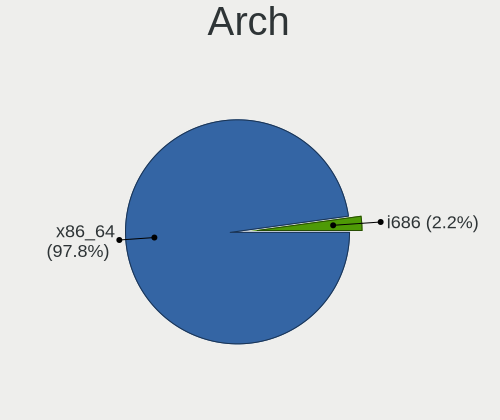

| Name   | Notebooks | Percent |
|--------|-----------|---------|
| x86_64 | 538       | 97.46%  |
| i686   | 14        | 2.54%   |

DE
--

Desktop Environment

| Name             | Notebooks | Percent |
|------------------|-----------|---------|
| GNOME            | 286       | 49.91%  |
| KDE5             | 77        | 13.44%  |
| X-Cinnamon       | 52        | 9.08%   |
| Unknown          | 49        | 8.55%   |
| XFCE             | 33        | 5.76%   |
| KDE              | 21        | 3.66%   |
| MATE             | 14        | 2.44%   |
| Cinnamon         | 7         | 1.22%   |
| Pantheon         | 6         | 1.05%   |
| Unity            | 5         | 0.87%   |
| Deepin           | 4         | 0.7%    |
| LXQt             | 3         | 0.52%   |
| KDE4             | 3         | 0.52%   |
| Budgie           | 3         | 0.52%   |
| LXDE             | 2         | 0.35%   |
| lightdm-xsession | 2         | 0.35%   |
| awesome          | 2         | 0.35%   |
| i3               | 1         | 0.17%   |
| GNOME Flashback  | 1         | 0.17%   |
| GNOME Classic    | 1         | 0.17%   |
| bspwm            | 1         | 0.17%   |

Display Server
--------------

X11 or Wayland

| Name    | Notebooks | Percent |
|---------|-----------|---------|
| X11     | 462       | 80.63%  |
| Wayland | 82        | 14.31%  |
| Unknown | 20        | 3.49%   |
| Tty     | 9         | 1.57%   |

Display Manager
---------------

SDDM, LightDM, etc.

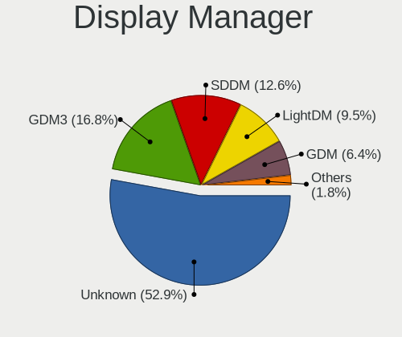

| Name    | Notebooks | Percent |
|---------|-----------|---------|
| Unknown | 346       | 60.07%  |
| GDM3    | 71        | 12.33%  |
| SDDM    | 64        | 11.11%  |
| GDM     | 43        | 7.47%   |
| LightDM | 39        | 6.77%   |
| TDM     | 11        | 1.91%   |
| KDM     | 2         | 0.35%   |

OS Lang
-------

Language

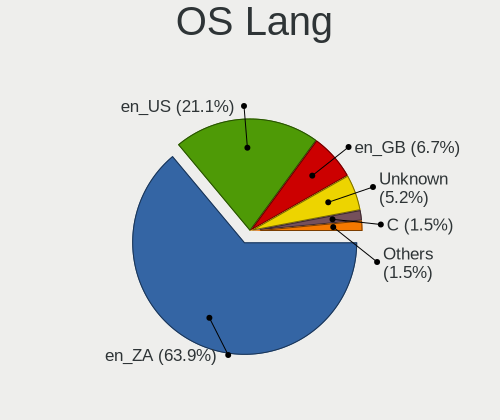

| Lang    | Notebooks | Percent |
|---------|-----------|---------|
| en_ZA   | 379       | 66.73%  |
| en_US   | 103       | 18.13%  |
| Unknown | 39        | 6.87%   |
| en_GB   | 38        | 6.69%   |
| C       | 4         | 0.7%    |
| fr_FR   | 2         | 0.35%   |
| en_ZW   | 1         | 0.18%   |
| en_BW   | 1         | 0.18%   |
| de_DE   | 1         | 0.18%   |

Boot Mode
---------

EFI or BIOS

| Mode | Notebooks | Percent |
|------|-----------|---------|
| BIOS | 307       | 54.14%  |
| EFI  | 260       | 45.86%  |

Filesystem
----------

Type of filesystem

| Type    | Notebooks | Percent |
|---------|-----------|---------|
| Ext4    | 466       | 83.07%  |
| Btrfs   | 35        | 6.24%   |
| Overlay | 29        | 5.17%   |
| Unknown | 12        | 2.14%   |
| Xfs     | 10        | 1.78%   |
| Zfs     | 5         | 0.89%   |
| Aufs    | 2         | 0.36%   |
| Tmpfs   | 1         | 0.18%   |
| Ext2    | 1         | 0.18%   |

Part. scheme
------------

Scheme of partitioning

| Type    | Notebooks | Percent |
|---------|-----------|---------|
| Unknown | 379       | 66.96%  |
| GPT     | 147       | 25.97%  |
| MBR     | 40        | 7.07%   |

Dual Boot with Linux/BSD
------------------------

Hosting more than one Linux/BSD

| Dual boot | Notebooks | Percent |
|-----------|-----------|---------|
| No        | 508       | 90.39%  |
| Yes       | 54        | 9.61%   |

Dual Boot (Win)
---------------

Hosting Linux and Windows

| Dual boot | Notebooks | Percent |
|-----------|-----------|---------|
| No        | 419       | 74.69%  |
| Yes       | 142       | 25.31%  |

Board
-----

Vendor
------

Motherboard manufacturer

| Name                        | Notebooks | Percent |
|-----------------------------|-----------|---------|
| Hewlett-Packard             | 133       | 24.09%  |
| Dell                        | 129       | 23.37%  |
| Lenovo                      | 100       | 18.12%  |
| ASUSTek Computer            | 46        | 8.33%   |
| Acer                        | 46        | 8.33%   |
| Apple                       | 15        | 2.72%   |
| Toshiba                     | 9         | 1.63%   |
| MSI                         | 8         | 1.45%   |
| Samsung Electronics         | 7         | 1.27%   |
| Packard Bell                | 5         | 0.91%   |
| Standard                    | 4         | 0.72%   |
| Sony                        | 4         | 0.72%   |
| Mustek                      | 4         | 0.72%   |
| MECER                       | 4         | 0.72%   |
| Gigabyte Technology         | 4         | 0.72%   |
| CONNEX                      | 3         | 0.54%   |
| Purism                      | 2         | 0.36%   |
| Proline                     | 2         | 0.36%   |
| PINNACLEMICRO               | 2         | 0.36%   |
| Panasonic                   | 2         | 0.36%   |
| HUAWEI                      | 2         | 0.36%   |
| Fujitsu                     | 2         | 0.36%   |
| YiFang                      | 1         | 0.18%   |
| WinSome                     | 1         | 0.18%   |
| TCL Communication           | 1         | 0.18%   |
| System76                    | 1         | 0.18%   |
| RIZZEN                      | 1         | 0.18%   |
| Razer                       | 1         | 0.18%   |
| Notebook                    | 1         | 0.18%   |
| LG Electronics              | 1         | 0.18%   |
| LattePanda                  | 1         | 0.18%   |
| Intel                       | 1         | 0.18%   |
| I-Life Digital Technologies | 1         | 0.18%   |
| Google                      | 1         | 0.18%   |
| Getac                       | 1         | 0.18%   |
| Fujitsu Siemens             | 1         | 0.18%   |
| eMachines                   | 1         | 0.18%   |
| Clevo                       | 1         | 0.18%   |
| Alienware                   | 1         | 0.18%   |
| ADSC                        | 1         | 0.18%   |

Model
-----

Motherboard model

| Name                                 | Notebooks | Percent |
|--------------------------------------|-----------|---------|
| Dell Inspiron 15-3567                | 10        | 1.81%   |
| Unknown                              | 9         | 1.63%   |
| Lenovo IdeaPad 110-15IBR 80T7        | 5         | 0.91%   |
| HP ProBook 4530s                     | 5         | 0.91%   |
| ASUS VivoBook 15_ASUS Laptop X540UAR | 5         | 0.91%   |
| Acer Aspire E1-571                   | 5         | 0.91%   |
| HP Pavilion dv7                      | 4         | 0.72%   |
| HP Notebook                          | 4         | 0.72%   |
| HP Laptop 15-da0xxx                  | 4         | 0.72%   |
| HP 635                               | 4         | 0.72%   |
| Dell XPS 13 9310                     | 4         | 0.72%   |
| Dell Latitude E6430                  | 4         | 0.72%   |
| Dell Latitude E6400                  | 4         | 0.72%   |
| Lenovo G500 20236                    | 3         | 0.54%   |
| HP ProBook 4520s                     | 3         | 0.54%   |
| HP Pavilion dv6                      | 3         | 0.54%   |
| HP Laptop 15-dw3xxx                  | 3         | 0.54%   |
| HP Laptop 15-bs1xx                   | 3         | 0.54%   |
| HP Laptop 15-bs0xx                   | 3         | 0.54%   |
| HP 620                               | 3         | 0.54%   |
| Dell Latitude E6420                  | 3         | 0.54%   |
| Dell Latitude 5490                   | 3         | 0.54%   |
| Dell Inspiron 3580                   | 3         | 0.54%   |
| Apple MacBookPro9,2                  | 3         | 0.54%   |
| Apple MacBookPro16,1                 | 3         | 0.54%   |
| Toshiba Satellite L655               | 2         | 0.36%   |
| Samsung 300E4C/300E5C/300E7C         | 2         | 0.36%   |
| Panasonic CF-19ADNAXDY               | 2         | 0.36%   |
| MECER YA13Q20-DP_PRO                 | 2         | 0.36%   |
| Lenovo V510-14IKB 80WR               | 2         | 0.36%   |
| Lenovo ThinkPad T410 25376B8         | 2         | 0.36%   |
| Lenovo ThinkPad Edge E540 20C600HHZA | 2         | 0.36%   |
| Lenovo IdeaPad S145-15AST 81N3       | 2         | 0.36%   |
| Lenovo IdeaPad 320-15IKB 80XL        | 2         | 0.36%   |
| Lenovo IdeaPad 310-15IKB 80TV        | 2         | 0.36%   |
| Lenovo IdeaPad 3 15ALC6 82KU         | 2         | 0.36%   |
| Lenovo IdeaPad 100-15IBD 80QQ        | 2         | 0.36%   |
| Lenovo G50-80 80E5                   | 2         | 0.36%   |
| HP ProBook 6560b                     | 2         | 0.36%   |
| HP ProBook 450 G3                    | 2         | 0.36%   |

Model Family
------------

Motherboard model prefix

| Name                   | Notebooks | Percent |
|------------------------|-----------|---------|
| Lenovo ThinkPad        | 47        | 8.51%   |
| Dell Latitude          | 46        | 8.33%   |
| Dell Inspiron          | 41        | 7.43%   |
| Lenovo IdeaPad         | 34        | 6.16%   |
| Acer Aspire            | 31        | 5.62%   |
| HP ProBook             | 30        | 5.43%   |
| HP Laptop              | 20        | 3.62%   |
| HP EliteBook           | 18        | 3.26%   |
| HP Pavilion            | 14        | 2.54%   |
| ASUS VivoBook          | 14        | 2.54%   |
| Dell XPS               | 12        | 2.17%   |
| Dell Vostro            | 9         | 1.63%   |
| Unknown                | 9         | 1.63%   |
| Toshiba Satellite      | 8         | 1.45%   |
| HP Compaq              | 8         | 1.45%   |
| Acer TravelMate        | 7         | 1.27%   |
| Dell Precision         | 6         | 1.09%   |
| HP ZBook               | 5         | 0.91%   |
| HP 255                 | 5         | 0.91%   |
| Dell G3                | 5         | 0.91%   |
| HP Notebook            | 4         | 0.72%   |
| HP 635                 | 4         | 0.72%   |
| HP 250                 | 4         | 0.72%   |
| Acer Swift             | 4         | 0.72%   |
| Packard Bell EasyNote  | 3         | 0.54%   |
| Lenovo G500            | 3         | 0.54%   |
| HP ENVY                | 3         | 0.54%   |
| HP 620                 | 3         | 0.54%   |
| HP 530                 | 3         | 0.54%   |
| Dell System            | 3         | 0.54%   |
| ASUS ASUS              | 3         | 0.54%   |
| Apple MacBookPro9      | 3         | 0.54%   |
| Apple MacBookPro16     | 3         | 0.54%   |
| Samsung 300E4C         | 2         | 0.36%   |
| Purism Librem          | 2         | 0.36%   |
| Panasonic CF-19ADNAXDY | 2         | 0.36%   |
| MECER YA13Q20-DP       | 2         | 0.36%   |
| Lenovo Yoga            | 2         | 0.36%   |
| Lenovo V510-14IKB      | 2         | 0.36%   |
| Lenovo Legion          | 2         | 0.36%   |

MFG Year
--------

Motherboard manufacture year

| Year | Notebooks | Percent |
|------|-----------|---------|
| 2018 | 66        | 11.96%  |
| 2011 | 61        | 11.05%  |
| 2016 | 44        | 7.97%   |
| 2013 | 43        | 7.79%   |
| 2012 | 41        | 7.43%   |
| 2020 | 40        | 7.25%   |
| 2019 | 39        | 7.07%   |
| 2017 | 38        | 6.88%   |
| 2010 | 34        | 6.16%   |
| 2008 | 33        | 5.98%   |
| 2015 | 29        | 5.25%   |
| 2021 | 26        | 4.71%   |
| 2014 | 23        | 4.17%   |
| 2009 | 14        | 2.54%   |
| 2007 | 12        | 2.17%   |
| 2022 | 6         | 1.09%   |
| 2006 | 3         | 0.54%   |

Form Factor
-----------

Physical design of the computer

| Name     | Notebooks | Percent |
|----------|-----------|---------|
| Notebook | 552       | 100%    |

Secure Boot
-----------

Enabled or disabled

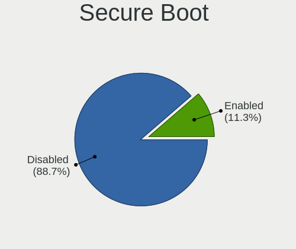

| State    | Notebooks | Percent |
|----------|-----------|---------|
| Disabled | 491       | 87.52%  |
| Enabled  | 70        | 12.48%  |

Coreboot
--------

Have coreboot on board

| Used | Notebooks | Percent |
|------|-----------|---------|
| No   | 548       | 99.28%  |
| Yes  | 4         | 0.72%   |

RAM Size
--------

Total RAM memory

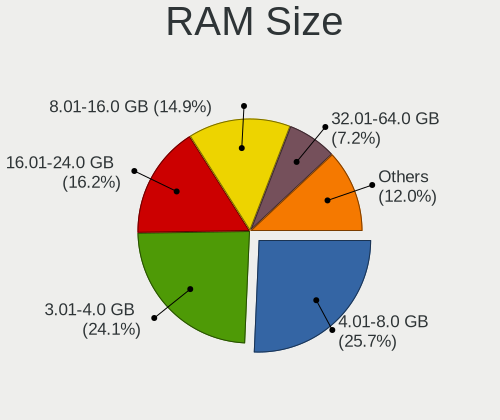

| Size in GB  | Notebooks | Percent |
|-------------|-----------|---------|
| 4.01-8.0    | 141       | 25.31%  |
| 3.01-4.0    | 137       | 24.6%   |
| 8.01-16.0   | 85        | 15.26%  |
| 16.01-24.0  | 83        | 14.9%   |
| 1.01-2.0    | 43        | 7.72%   |
| 32.01-64.0  | 34        | 6.1%    |
| 2.01-3.0    | 16        | 2.87%   |
| 24.01-32.0  | 7         | 1.26%   |
| 64.01-256.0 | 7         | 1.26%   |
| 0.51-1.0    | 4         | 0.72%   |

RAM Used
--------

Used RAM memory

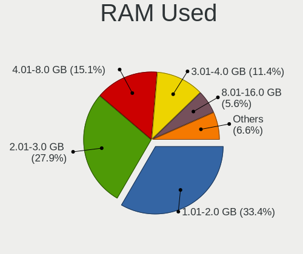

| Used GB    | Notebooks | Percent |
|------------|-----------|---------|
| 1.01-2.0   | 230       | 37.22%  |
| 2.01-3.0   | 169       | 27.35%  |
| 4.01-8.0   | 80        | 12.94%  |
| 3.01-4.0   | 61        | 9.87%   |
| 0.51-1.0   | 38        | 6.15%   |
| 8.01-16.0  | 31        | 5.02%   |
| 16.01-24.0 | 4         | 0.65%   |
| 0.01-0.5   | 3         | 0.49%   |
| 32.01-64.0 | 1         | 0.16%   |
| 24.01-32.0 | 1         | 0.16%   |

Total Drives
------------

Number of drives on board

| Drives | Notebooks | Percent |
|--------|-----------|---------|
| 1      | 389       | 68.97%  |
| 2      | 146       | 25.89%  |
| 3      | 14        | 2.48%   |
| 0      | 11        | 1.95%   |
| 4      | 4         | 0.71%   |

Has CD-ROM
----------

Has CD-ROM on board

| Presented | Notebooks | Percent |
|-----------|-----------|---------|
| No        | 282       | 50.72%  |
| Yes       | 274       | 49.28%  |

Has Ethernet
------------

Has Ethernet on board

| Presented | Notebooks | Percent |
|-----------|-----------|---------|
| Yes       | 487       | 88.22%  |
| No        | 65        | 11.78%  |

Has WiFi
--------

Has WiFi module

| Presented | Notebooks | Percent |
|-----------|-----------|---------|
| Yes       | 538       | 97.46%  |
| No        | 14        | 2.54%   |

Has Bluetooth
-------------

Has Bluetooth module

| Presented | Notebooks | Percent |
|-----------|-----------|---------|
| Yes       | 440       | 78.43%  |
| No        | 121       | 21.57%  |

Location
--------

Country
-------

Geographic location (country)

| Country      | Notebooks | Percent |
|--------------|-----------|---------|
| South Africa | 552       | 100%    |

City
----

Geographic location (city)

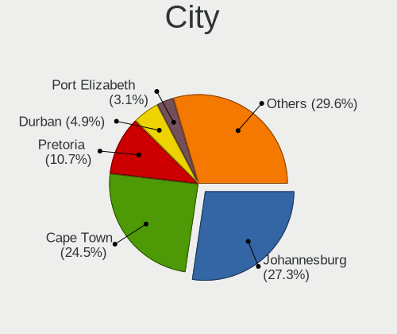

| City             | Notebooks | Percent |
|------------------|-----------|---------|
| Johannesburg     | 151       | 25.34%  |
| Cape Town        | 148       | 24.83%  |
| Pretoria         | 64        | 10.74%  |
| Durban           | 28        | 4.7%    |
| Port Elizabeth   | 17        | 2.85%   |
| Centurion        | 15        | 2.52%   |
| East London      | 10        | 1.68%   |
| Sandton          | 9         | 1.51%   |
| Pietermaritzburg | 7         | 1.17%   |
| Potchefstroom    | 6         | 1.01%   |
| Somerset West    | 5         | 0.84%   |
| Roodepoort       | 5         | 0.84%   |
| Midrand          | 5         | 0.84%   |
| Bloemfontein     | 5         | 0.84%   |
| Benoni           | 5         | 0.84%   |
| Thabazimbi       | 4         | 0.67%   |
| Randburg         | 4         | 0.67%   |
| Polokwane        | 4         | 0.67%   |
| Boksburg         | 4         | 0.67%   |
| Bellville        | 4         | 0.67%   |
| Alberton         | 4         | 0.67%   |
| White River      | 3         | 0.5%    |
| Middelburg       | 3         | 0.5%    |
| Klerksdorp       | 3         | 0.5%    |
| George           | 3         | 0.5%    |
| Edenvale         | 3         | 0.5%    |
| Witbank          | 2         | 0.34%   |
| Vanderbijlpark   | 2         | 0.34%   |
| Sabie            | 2         | 0.34%   |
| Port Alfred      | 2         | 0.34%   |
| Oudtshoorn       | 2         | 0.34%   |
| Nelspruit        | 2         | 0.34%   |
| Mokopane         | 2         | 0.34%   |
| Louis Trichardt  | 2         | 0.34%   |
| Lichtenburg      | 2         | 0.34%   |
| Kempton Park     | 2         | 0.34%   |
| Hermanus         | 2         | 0.34%   |
| Zeerust          | 1         | 0.17%   |
| Worcester        | 1         | 0.17%   |
| Westville        | 1         | 0.17%   |

Drives
------

Drive Vendor
------------

Hard drive vendors

| Vendor                    | Notebooks | Drives | Percent |
|---------------------------|-----------|--------|---------|
| WDC                       | 120       | 143    | 17.29%  |
| Seagate                   | 112       | 162    | 16.14%  |
| Toshiba                   | 82        | 98     | 11.82%  |
| Samsung Electronics       | 64        | 83     | 9.22%   |
| Unknown                   | 41        | 52     | 5.91%   |
| Hitachi                   | 27        | 38     | 3.89%   |
| HGST                      | 27        | 33     | 3.89%   |
| SanDisk                   | 23        | 32     | 3.31%   |
| Kingston                  | 23        | 27     | 3.31%   |
| SK hynix                  | 19        | 19     | 2.74%   |
| Silicon Motion            | 13        | 21     | 1.87%   |
| Intel                     | 13        | 16     | 1.87%   |
| Transcend                 | 12        | 15     | 1.73%   |
| Crucial                   | 12        | 12     | 1.73%   |
| A-DATA Technology         | 12        | 18     | 1.73%   |
| TO Exter                  | 8         | 9      | 1.15%   |
| Apple                     | 7         | 9      | 1.01%   |
| Micron Technology         | 6         | 7      | 0.86%   |
| Fujitsu                   | 5         | 6      | 0.72%   |
| KIOXIA                    | 4         | 4      | 0.58%   |
| Hikvision                 | 4         | 4      | 0.58%   |
| Netac                     | 3         | 3      | 0.43%   |
| LITEONIT                  | 3         | 4      | 0.43%   |
| LITEON                    | 3         | 3      | 0.43%   |
| HS-SSD-E100               | 3         | 4      | 0.43%   |
| Gigabyte Technology       | 3         | 4      | 0.43%   |
| External                  | 3         | 3      | 0.43%   |
| Apacer                    | 3         | 4      | 0.43%   |
| Plextor                   | 2         | 2      | 0.29%   |
| Phison                    | 2         | 2      | 0.29%   |
| Mushkin                   | 2         | 4      | 0.29%   |
| Micron/Crucial Technology | 2         | 2      | 0.29%   |
| JMicron Technology        | 2         | 2      | 0.29%   |
| HS-SSD-C100               | 2         | 3      | 0.29%   |
| HGST HTS                  | 2         | 2      | 0.29%   |
| Hewlett-Packard           | 2         | 3      | 0.29%   |
| Corsair                   | 2         | 4      | 0.29%   |
| Unknown                   | 2         | 2      | 0.29%   |
| Union Memory              | 1         | 1      | 0.14%   |
| UMIS                      | 1         | 1      | 0.14%   |

Drive Model
-----------

Hard drive models

| Model                                  | Notebooks | Percent |
|----------------------------------------|-----------|---------|
| Seagate ST1000LM035-1RK172 1TB         | 27        | 3.76%   |
| Toshiba MQ01ABF050 500GB               | 16        | 2.23%   |
| WDC WDS500G2B0A-00SM50 500GB SSD       | 12        | 1.67%   |
| Unknown MMC Card  32GB                 | 12        | 1.67%   |
| Toshiba MQ04ABF100 1TB                 | 12        | 1.67%   |
| Seagate ST1000LM024 HN-M101MBB 1TB     | 11        | 1.53%   |
| HGST HTS721010A9E630 1TB               | 9         | 1.25%   |
| Toshiba MQ01ABD100 1TB                 | 8         | 1.11%   |
| TO Exter nal USB 3.0 1TB               | 8         | 1.11%   |
| Seagate ST500LT012-1DG142 500GB        | 8         | 1.11%   |
| HGST HTS541010A9E680 1TB               | 8         | 1.11%   |
| Toshiba MQ01ACF050 500GB               | 7         | 0.97%   |
| Samsung SM963 2.5" NVMe PCIe SSD 256GB | 7         | 0.97%   |
| Samsung NVMe SSD Drive 512GB           | 7         | 0.97%   |
| Hitachi HTS543232A7A384 320GB          | 6         | 0.84%   |
| WDC WD5000LPVX-22V0TT0 500GB           | 5         | 0.7%    |
| WDC WD10SPZX-60Z10T0 1TB               | 5         | 0.7%    |
| Unknown MMC Card  64GB                 | 5         | 0.7%    |
| Toshiba NVMe SSD Drive 512GB           | 5         | 0.7%    |
| WDC WDS240G2G0A-00JH30 240GB SSD       | 4         | 0.56%   |
| WDC WD10SPZX-00Z10T0 1TB               | 4         | 0.56%   |
| WDC WD10JPVX-22JC3T0 1TB               | 4         | 0.56%   |
| SK hynix NVMe SSD Drive 256GB          | 4         | 0.56%   |
| Seagate ST9320325AS 320GB              | 4         | 0.56%   |
| Seagate ST500LM030-2E717D 500GB        | 4         | 0.56%   |
| Seagate ST1000LM048-2E7172 1TB         | 4         | 0.56%   |
| Intel NVMe SSD Drive 512GB             | 4         | 0.56%   |
| WDC WD3200BEKT-60V5T1 320GB            | 3         | 0.42%   |
| WDC WD10SPZX-24Z10 1TB                 | 3         | 0.42%   |
| WDC WD10JPVX-75JC3T0 1TB               | 3         | 0.42%   |
| WDC WD10JPVX-60JC3T0 1TB               | 3         | 0.42%   |
| WDC WD10JPCX-24UE4T0 1TB               | 3         | 0.42%   |
| Unknown SD/MMC/MS PRO 64GB             | 3         | 0.42%   |
| Unknown SC16G  16GB                    | 3         | 0.42%   |
| Unknown MMC Card  16GB                 | 3         | 0.42%   |
| Transcend TS256GSSD230S 256GB          | 3         | 0.42%   |
| SK hynix NVMe SSD Drive 512GB          | 3         | 0.42%   |
| Silicon Motion NVMe SSD Drive 1TB      | 3         | 0.42%   |
| Silicon Motion NVMe SSD Drive 1024GB   | 3         | 0.42%   |
| Seagate ST9500423AS 500GB              | 3         | 0.42%   |

HDD Vendor
----------

Hard disk drive vendors

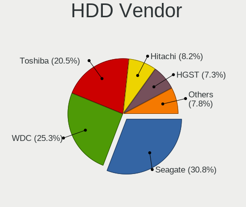

| Vendor              | Notebooks | Drives | Percent |
|---------------------|-----------|--------|---------|
| Seagate             | 108       | 151    | 31.95%  |
| WDC                 | 91        | 108    | 26.92%  |
| Toshiba             | 66        | 78     | 19.53%  |
| Hitachi             | 27        | 38     | 7.99%   |
| HGST                | 27        | 33     | 7.99%   |
| Fujitsu             | 5         | 6      | 1.48%   |
| Samsung Electronics | 4         | 4      | 1.18%   |
| Unknown             | 3         | 3      | 0.89%   |
| Apple               | 3         | 3      | 0.89%   |
| HGST HTS            | 2         | 2      | 0.59%   |
| External            | 2         | 2      | 0.59%   |

SSD Vendor
----------

Solid state drive vendors

| Vendor              | Notebooks | Drives | Percent |
|---------------------|-----------|--------|---------|
| Samsung Electronics | 30        | 40     | 16.67%  |
| WDC                 | 26        | 31     | 14.44%  |
| Kingston            | 17        | 21     | 9.44%   |
| SanDisk             | 15        | 18     | 8.33%   |
| Transcend           | 11        | 14     | 6.11%   |
| Crucial             | 10        | 10     | 5.56%   |
| A-DATA Technology   | 10        | 16     | 5.56%   |
| TO Exter            | 8         | 9      | 4.44%   |
| Toshiba             | 6         | 7      | 3.33%   |
| SK hynix            | 4         | 4      | 2.22%   |
| Seagate             | 4         | 8      | 2.22%   |
| Micron Technology   | 4         | 5      | 2.22%   |
| Intel               | 4         | 5      | 2.22%   |
| Netac               | 3         | 3      | 1.67%   |
| LITEONIT            | 3         | 4      | 1.67%   |
| Apacer              | 3         | 4      | 1.67%   |
| Plextor             | 2         | 2      | 1.11%   |
| LITEON              | 2         | 2      | 1.11%   |
| Gigabyte Technology | 2         | 3      | 1.11%   |
| Corsair             | 2         | 4      | 1.11%   |
| StoreJet            | 1         | 1      | 0.56%   |
| Rogueware           | 1         | 1      | 0.56%   |
| Radeon              | 1         | 1      | 0.56%   |
| OCZ                 | 1         | 1      | 0.56%   |
| Neo Forza           | 1         | 1      | 0.56%   |
| MyDigitalSSD        | 1         | 1      | 0.56%   |
| Lexar               | 1         | 1      | 0.56%   |
| Kingmax             | 1         | 1      | 0.56%   |
| Hypertec            | 1         | 1      | 0.56%   |
| HS-SSD-E100         | 1         | 1      | 0.56%   |
| Hikvision           | 1         | 1      | 0.56%   |
| Hewlett-Packard     | 1         | 1      | 0.56%   |
| China               | 1         | 1      | 0.56%   |
| AFOX                | 1         | 1      | 0.56%   |

Drive Kind
----------

HDD or SSD

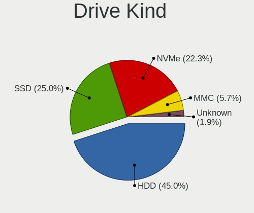

| Kind    | Notebooks | Drives | Percent |
|---------|-----------|--------|---------|
| HDD     | 331       | 428    | 49.7%   |
| SSD     | 165       | 224    | 24.77%  |
| NVMe    | 119       | 159    | 17.87%  |
| MMC     | 39        | 52     | 5.86%   |
| Unknown | 12        | 15     | 1.8%    |

Drive Connector
---------------

SATA, SAS, NVMe, etc.

| Type | Notebooks | Drives | Percent |
|------|-----------|--------|---------|
| SATA | 444       | 629    | 69.92%  |
| NVMe | 118       | 158    | 18.58%  |
| MMC  | 39        | 52     | 6.14%   |
| SAS  | 34        | 39     | 5.35%   |

Drive Size
----------

Size of hard drive

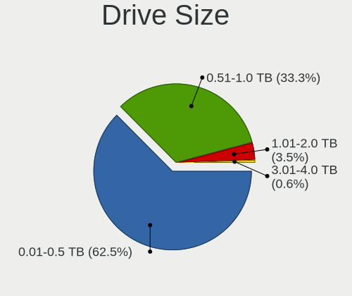

| Size in TB | Notebooks | Drives | Percent |
|------------|-----------|--------|---------|
| 0.01-0.5   | 310       | 418    | 62.5%   |
| 0.51-1.0   | 169       | 215    | 34.07%  |
| 1.01-2.0   | 11        | 11     | 2.22%   |
| 3.01-4.0   | 5         | 7      | 1.01%   |
| 4.01-10.0  | 1         | 1      | 0.2%    |

Space Total
-----------

Amount of disk space available on the file system

| Size in GB     | Notebooks | Percent |
|----------------|-----------|---------|
| 251-500        | 169       | 28.74%  |
| 101-250        | 135       | 22.96%  |
| 501-1000       | 105       | 17.86%  |
| 1001-2000      | 52        | 8.84%   |
| 51-100         | 36        | 6.12%   |
| 1-20           | 33        | 5.61%   |
| 21-50          | 22        | 3.74%   |
| More than 3000 | 13        | 2.21%   |
| 2001-3000      | 13        | 2.21%   |
| Unknown        | 10        | 1.7%    |

Space Used
----------

Amount of used disk space

| Used GB        | Notebooks | Percent |
|----------------|-----------|---------|
| 1-20           | 202       | 32.58%  |
| 21-50          | 123       | 19.84%  |
| 51-100         | 86        | 13.87%  |
| 101-250        | 78        | 12.58%  |
| 251-500        | 61        | 9.84%   |
| 501-1000       | 42        | 6.77%   |
| 1001-2000      | 11        | 1.77%   |
| Unknown        | 10        | 1.61%   |
| 2001-3000      | 5         | 0.81%   |
| More than 3000 | 2         | 0.32%   |

Malfunc. Drives
---------------

Drive models with a malfunction

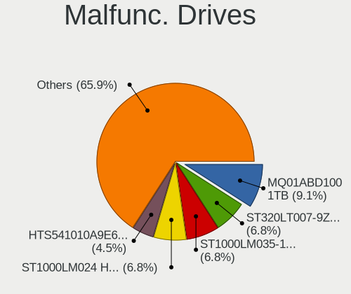

| Model                                 | Notebooks | Drives | Percent |
|---------------------------------------|-----------|--------|---------|
| Seagate ST1000LM035-1RK172 1TB        | 3         | 3      | 11.54%  |
| Seagate ST1000LM024 HN-M101MBB 1TB    | 3         | 4      | 11.54%  |
| Seagate ST320LT007-9ZV142 320GB       | 2         | 2      | 7.69%   |
| HGST HTS541010A9E680 1TB              | 2         | 2      | 7.69%   |
| WDC WD5000LPVX-22V0TT0 500GB          | 1         | 1      | 3.85%   |
| WDC WD3200BPVT-22JJ5T0 320GB          | 1         | 1      | 3.85%   |
| Toshiba MQ01ABD100 1TB                | 1         | 1      | 3.85%   |
| Toshiba MK5065GSXF 500GB              | 1         | 1      | 3.85%   |
| SK hynix HFS128G3BTND-N210A 128GB SSD | 1         | 1      | 3.85%   |
| Seagate ST9500423AS 500GB             | 1         | 1      | 3.85%   |
| Seagate ST9500325AS 500GB             | 1         | 3      | 3.85%   |
| Seagate ST1000LM048-2E7172 1TB        | 1         | 1      | 3.85%   |
| Seagate ST1000LM014-SSHD-8GB          | 1         | 1      | 3.85%   |
| Micron Technology 1100 SATA 256GB SSD | 1         | 1      | 3.85%   |
| Kingston SH103S3240G 240GB SSD        | 1         | 1      | 3.85%   |
| Intel SSDSCKKF240H6L 240GB            | 1         | 2      | 3.85%   |
| Intel SSDSC2BF240A4L 240GB            | 1         | 1      | 3.85%   |
| Hitachi HTS547575A9E384 752GB         | 1         | 1      | 3.85%   |
| Hitachi HTS543232A7A384 320GB         | 1         | 1      | 3.85%   |
| HGST HTS725050A7E630 500GB            | 1         | 1      | 3.85%   |

Malfunc. Drive Vendor
---------------------

Vendors of faulty drives

| Vendor            | Notebooks | Drives | Percent |
|-------------------|-----------|--------|---------|
| Seagate           | 11        | 15     | 44%     |
| HGST              | 3         | 3      | 12%     |
| WDC               | 2         | 2      | 8%      |
| Toshiba           | 2         | 2      | 8%      |
| Intel             | 2         | 3      | 8%      |
| Hitachi           | 2         | 2      | 8%      |
| SK hynix          | 1         | 1      | 4%      |
| Micron Technology | 1         | 1      | 4%      |
| Kingston          | 1         | 1      | 4%      |

Malfunc. HDD Vendor
-------------------

Vendors of faulty HDD drives

| Vendor  | Notebooks | Drives | Percent |
|---------|-----------|--------|---------|
| Seagate | 11        | 15     | 55%     |
| HGST    | 3         | 3      | 15%     |
| WDC     | 2         | 2      | 10%     |
| Toshiba | 2         | 2      | 10%     |
| Hitachi | 2         | 2      | 10%     |

Malfunc. Drive Kind
-------------------

Kinds of faulty drives

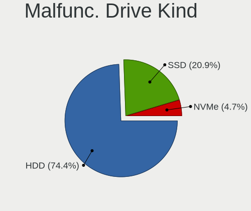

| Kind | Notebooks | Drives | Percent |
|------|-----------|--------|---------|
| HDD  | 20        | 24     | 80%     |
| SSD  | 5         | 6      | 20%     |

Failed Drives
-------------

Failed drive models

Zero info for selected period =(

Failed Drive Vendor
-------------------

Failed drive vendors

Zero info for selected period =(

Drive Status
------------

Number of failed and malfunc. drives

| Status   | Notebooks | Drives | Percent |
|----------|-----------|--------|---------|
| Detected | 405       | 643    | 70.43%  |
| Works    | 145       | 205    | 25.22%  |
| Malfunc  | 25        | 30     | 4.35%   |

Storage controller
------------------

Storage Vendor
--------------

Storage controller vendors

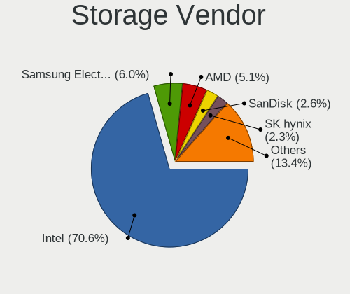

| Vendor                           | Notebooks | Percent |
|----------------------------------|-----------|---------|
| Intel                            | 454       | 73.7%   |
| AMD                              | 37        | 6.01%   |
| Samsung Electronics              | 31        | 5.03%   |
| Toshiba America Info Systems     | 16        | 2.6%    |
| SK hynix                         | 15        | 2.44%   |
| Silicon Motion                   | 14        | 2.27%   |
| SanDisk                          | 10        | 1.62%   |
| Kingston Technology Company      | 6         | 0.97%   |
| KIOXIA                           | 5         | 0.81%   |
| Phison Electronics               | 4         | 0.65%   |
| Nvidia                           | 4         | 0.65%   |
| Micron/Crucial Technology        | 4         | 0.65%   |
| Apple                            | 4         | 0.65%   |
| Micron Technology                | 2         | 0.32%   |
| MAXIO Technology (Hangzhou)      | 2         | 0.32%   |
| ADATA Technology                 | 2         | 0.32%   |
| Union Memory (Shenzhen)          | 1         | 0.16%   |
| Solid State Storage Technology   | 1         | 0.16%   |
| Silicon Integrated Systems [SiS] | 1         | 0.16%   |
| Lite-On Technology               | 1         | 0.16%   |
| Lenovo                           | 1         | 0.16%   |
| Biwin Storage Technology         | 1         | 0.16%   |

Storage Model
-------------

Storage controller models

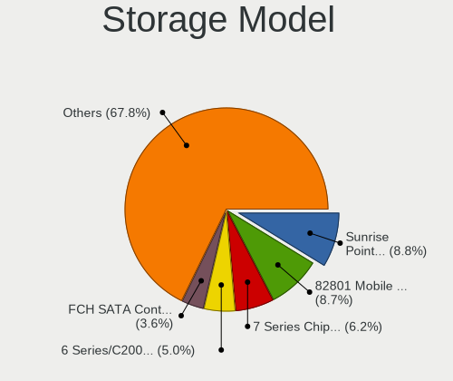

| Model                                                                                  | Notebooks | Percent |
|----------------------------------------------------------------------------------------|-----------|---------|
| Intel Sunrise Point-LP SATA Controller [AHCI mode]                                     | 68        | 10.16%  |
| Intel 82801 Mobile SATA Controller [RAID mode]                                         | 57        | 8.52%   |
| Intel 7 Series Chipset Family 6-port SATA Controller [AHCI mode]                       | 44        | 6.58%   |
| Intel 6 Series/C200 Series Chipset Family 6 port Mobile SATA AHCI Controller           | 39        | 5.83%   |
| AMD FCH SATA Controller [AHCI mode]                                                    | 26        | 3.89%   |
| Intel 82801IBM/IEM (ICH9M/ICH9M-E) 4 port SATA Controller [AHCI mode]                  | 21        | 3.14%   |
| Intel Cannon Lake Mobile PCH SATA AHCI Controller                                      | 20        | 2.99%   |
| Intel Wildcat Point-LP SATA Controller [AHCI Mode]                                     | 19        | 2.84%   |
| Intel Atom/Celeron/Pentium Processor x5-E8000/J3xxx/N3xxx Series SATA Controller       | 18        | 2.69%   |
| Intel 5 Series/3400 Series Chipset 6 port SATA AHCI Controller                         | 17        | 2.54%   |
| Intel 5 Series/3400 Series Chipset 4 port SATA AHCI Controller                         | 16        | 2.39%   |
| Intel 8 Series/C220 Series Chipset Family 6-port SATA Controller 1 [AHCI mode]         | 15        | 2.24%   |
| Intel 8 Series SATA Controller 1 [AHCI mode]                                           | 15        | 2.24%   |
| Samsung NVMe SSD Controller SM981/PM981/PM983                                          | 13        | 1.94%   |
| Intel Volume Management Device NVMe RAID Controller                                    | 13        | 1.94%   |
| Intel 82801HM/HEM (ICH8M/ICH8M-E) SATA Controller [AHCI mode]                          | 13        | 1.94%   |
| Toshiba America Info Systems XG6 NVMe SSD Controller                                   | 12        | 1.79%   |
| Intel HM170/QM170 Chipset SATA Controller [AHCI Mode]                                  | 12        | 1.79%   |
| Intel 82801HM/HEM (ICH8M/ICH8M-E) IDE Controller                                       | 12        | 1.79%   |
| Silicon Motion SM2262/SM2262EN SSD Controller                                          | 11        | 1.64%   |
| AMD SB7x0/SB8x0/SB9x0 SATA Controller [AHCI mode]                                      | 10        | 1.49%   |
| Samsung NVMe SSD Controller SM961/PM961/SM963                                          | 8         | 1.2%    |
| Intel Celeron N3350/Pentium N4200/Atom E3900 Series SATA AHCI Controller               | 8         | 1.2%    |
| Intel 6 Series/C200 Series Chipset Family Mobile SATA Controller (IDE mode, ports 4-5) | 8         | 1.2%    |
| Intel 6 Series/C200 Series Chipset Family Mobile SATA Controller (IDE mode, ports 0-3) | 8         | 1.2%    |
| Intel Cannon Point-LP SATA Controller [AHCI Mode]                                      | 7         | 1.05%   |
| Samsung NVMe SSD Controller 980                                                        | 6         | 0.9%    |
| Intel Tiger Lake-LP SATA Controller                                                    | 6         | 0.9%    |
| Intel Celeron/Pentium Silver Processor SATA Controller                                 | 6         | 0.9%    |
| KIOXIA NVMe SSD Controller BG4                                                         | 5         | 0.75%   |
| Intel SSD 660P Series                                                                  | 5         | 0.75%   |
| Intel Q170/Q150/B150/H170/H110/Z170/CM236 Chipset SATA Controller [AHCI Mode]          | 5         | 0.75%   |
| Intel Mobile 4 Series Chipset PT IDER Controller                                       | 5         | 0.75%   |
| Intel 82801G (ICH7 Family) IDE Controller                                              | 5         | 0.75%   |
| SK hynix Gold P31/PC711 NVMe Solid State Drive                                         | 4         | 0.6%    |
| SK hynix BC511                                                                         | 4         | 0.6%    |
| Samsung NVMe SSD Controller PM9A1/PM9A3/980PRO                                         | 4         | 0.6%    |
| Intel 82801GBM/GHM (ICH7-M Family) SATA Controller [AHCI mode]                         | 4         | 0.6%    |
| SK hynix BC501 NVMe Solid State Drive                                                  | 3         | 0.45%   |
| Silicon Motion SM2263EN/SM2263XT SSD Controller                                        | 3         | 0.45%   |

Storage Kind
------------

Kind of storage controller (IDE, SATA, NVMe, SAS, ...)

| Kind | Notebooks | Percent |
|------|-----------|---------|
| SATA | 407       | 63.2%   |
| NVMe | 122       | 18.94%  |
| RAID | 71        | 11.02%  |
| IDE  | 44        | 6.83%   |

Processor
---------

CPU Vendor
----------

Processor vendors

| Vendor | Notebooks | Percent |
|--------|-----------|---------|
| Intel  | 505       | 91.49%  |
| AMD    | 47        | 8.51%   |

CPU Model
---------

Processor models

| Model                                   | Notebooks | Percent |
|-----------------------------------------|-----------|---------|
| Intel Celeron CPU N3060 @ 1.60GHz       | 12        | 2.17%   |
| Intel Core i7-7500U CPU @ 2.70GHz       | 11        | 1.99%   |
| Intel Core i5-8250U CPU @ 1.60GHz       | 11        | 1.99%   |
| Intel Core i5-7200U CPU @ 2.50GHz       | 11        | 1.99%   |
| Intel Core i7-8565U CPU @ 1.80GHz       | 10        | 1.81%   |
| Intel Core i7-8550U CPU @ 1.80GHz       | 10        | 1.81%   |
| Intel Core 2 Duo CPU P8600 @ 2.40GHz    | 10        | 1.81%   |
| Intel Core i7-9750H CPU @ 2.60GHz       | 9         | 1.63%   |
| Intel Core i7-8750H CPU @ 2.20GHz       | 9         | 1.63%   |
| Intel Core i7-2630QM CPU @ 2.00GHz      | 9         | 1.63%   |
| Intel Core i5-2520M CPU @ 2.50GHz       | 9         | 1.63%   |
| Intel Core i7-6700HQ CPU @ 2.60GHz      | 8         | 1.45%   |
| Intel Core i5-6300U CPU @ 2.40GHz       | 8         | 1.45%   |
| Intel Core i5-5200U CPU @ 2.20GHz       | 8         | 1.45%   |
| Intel Core i5-3210M CPU @ 2.50GHz       | 8         | 1.45%   |
| Intel Core i5-2450M CPU @ 2.50GHz       | 8         | 1.45%   |
| Intel Core i7-6500U CPU @ 2.50GHz       | 7         | 1.27%   |
| Intel 11th Gen Core i7-1185G7 @ 3.00GHz | 7         | 1.27%   |
| Intel 11th Gen Core i7-1165G7 @ 2.80GHz | 7         | 1.27%   |
| Intel Core i7-7700HQ CPU @ 2.80GHz      | 6         | 1.09%   |
| Intel Core i5-8265U CPU @ 1.60GHz       | 6         | 1.09%   |
| Intel Core i5-3230M CPU @ 2.60GHz       | 6         | 1.09%   |
| Intel Core i5-1035G1 CPU @ 1.00GHz      | 6         | 1.09%   |
| Intel Core i5 CPU M 520 @ 2.40GHz       | 6         | 1.09%   |
| Intel Core i3-6006U CPU @ 2.00GHz       | 6         | 1.09%   |
| Intel Core i3-5005U CPU @ 2.00GHz       | 6         | 1.09%   |
| Intel Celeron CPU N3350 @ 1.10GHz       | 6         | 1.09%   |
| Intel Atom x5-Z8350 CPU @ 1.44GHz       | 6         | 1.09%   |
| Intel Core i7-6600U CPU @ 2.60GHz       | 5         | 0.91%   |
| Intel Core i5-2410M CPU @ 2.30GHz       | 5         | 0.91%   |
| Intel Core i3-3110M CPU @ 2.40GHz       | 5         | 0.91%   |
| Intel Celeron CPU N3050 @ 1.60GHz       | 5         | 0.91%   |
| Intel 11th Gen Core i5-1135G7 @ 2.40GHz | 5         | 0.91%   |
| AMD E-450 APU with Radeon HD Graphics   | 5         | 0.91%   |
| Intel Core i7-4700MQ CPU @ 2.40GHz      | 4         | 0.72%   |
| Intel Core i5-6200U CPU @ 2.30GHz       | 4         | 0.72%   |
| Intel Core i5-4200U CPU @ 1.60GHz       | 4         | 0.72%   |
| Intel Core i3-2310M CPU @ 2.10GHz       | 4         | 0.72%   |
| Intel Core i3 CPU M 350 @ 2.27GHz       | 4         | 0.72%   |
| Intel Core 2 Duo CPU T7100 @ 1.80GHz    | 4         | 0.72%   |

CPU Model Family
----------------

Processor model prefix

| Model                   | Notebooks | Percent |
|-------------------------|-----------|---------|
| Intel Core i5           | 151       | 27.36%  |
| Intel Core i7           | 149       | 26.99%  |
| Intel Core i3           | 56        | 10.14%  |
| Intel Celeron           | 50        | 9.06%   |
| Intel Core 2 Duo        | 32        | 5.8%    |
| Other                   | 31        | 5.62%   |
| AMD Ryzen 7             | 13        | 2.36%   |
| Intel Atom              | 12        | 2.17%   |
| AMD E                   | 7         | 1.27%   |
| Intel Pentium           | 6         | 1.09%   |
| AMD A4                  | 5         | 0.91%   |
| Intel Core i9           | 4         | 0.72%   |
| Intel Genuine           | 3         | 0.54%   |
| Intel Celeron Dual-Core | 3         | 0.54%   |
| AMD Ryzen 5             | 3         | 0.54%   |
| AMD E2                  | 3         | 0.54%   |
| Intel Pentium Dual-Core | 2         | 0.36%   |
| Intel Pentium Dual      | 2         | 0.36%   |
| Intel Core Duo          | 2         | 0.36%   |
| Intel Core 2            | 2         | 0.36%   |
| AMD E1                  | 2         | 0.36%   |
| AMD A6                  | 2         | 0.36%   |
| Intel Pentium Silver    | 1         | 0.18%   |
| Intel Celeron M         | 1         | 0.18%   |
| AMD Turion II Dual-Core | 1         | 0.18%   |
| AMD Turion 64 Mobile    | 1         | 0.18%   |
| AMD Ryzen 9             | 1         | 0.18%   |
| AMD Ryzen 7 PRO         | 1         | 0.18%   |
| AMD Ryzen 3             | 1         | 0.18%   |
| AMD FX                  | 1         | 0.18%   |
| AMD Athlon X2           | 1         | 0.18%   |
| AMD Athlon II           | 1         | 0.18%   |
| AMD Athlon 64 X2        | 1         | 0.18%   |
| AMD A10                 | 1         | 0.18%   |

CPU Cores
---------

Number of processor cores

| Number | Notebooks | Percent |
|--------|-----------|---------|
| 2      | 336       | 60.87%  |
| 4      | 152       | 27.54%  |
| 6      | 24        | 4.35%   |
| 8      | 23        | 4.17%   |
| 1      | 12        | 2.17%   |
| 16     | 2         | 0.36%   |
| 14     | 1         | 0.18%   |
| 10     | 1         | 0.18%   |
| 3      | 1         | 0.18%   |

CPU Sockets
-----------

Number of sockets

| Number | Notebooks | Percent |
|--------|-----------|---------|
| 1      | 552       | 100%    |

CPU Threads
-----------

Threads per core (Hyper-Threading)

| Number | Notebooks | Percent |
|--------|-----------|---------|
| 2      | 408       | 73.91%  |
| 1      | 144       | 26.09%  |

CPU Op-Modes
------------

CPU Operation Modes (32-bit, 64-bit)

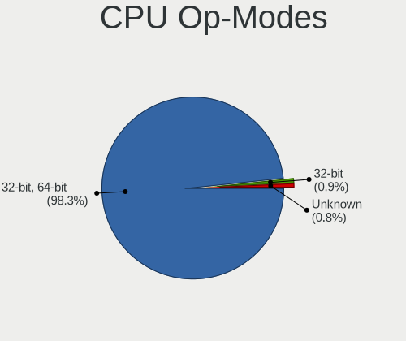

| Op mode        | Notebooks | Percent |
|----------------|-----------|---------|
| 32-bit, 64-bit | 542       | 97.83%  |
| 32-bit         | 6         | 1.08%   |
| Unknown        | 6         | 1.08%   |

CPU Microcode
-------------

Microcode number

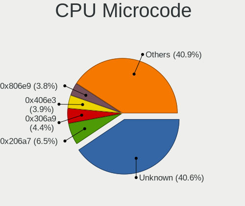

| Number     | Notebooks | Percent |
|------------|-----------|---------|
| Unknown    | 153       | 26.56%  |
| 0x206a7    | 49        | 8.51%   |
| 0x406e3    | 30        | 5.21%   |
| 0x306a9    | 29        | 5.03%   |
| 0x806e9    | 28        | 4.86%   |
| 0x806ea    | 20        | 3.47%   |
| 0x20655    | 20        | 3.47%   |
| 0x1067a    | 17        | 2.95%   |
| 0x906ea    | 16        | 2.78%   |
| 0x406c4    | 16        | 2.78%   |
| 0x306d4    | 16        | 2.78%   |
| 0x306c3    | 15        | 2.6%    |
| 0x806ec    | 14        | 2.43%   |
| 0x806c1    | 14        | 2.43%   |
| 0x40651    | 12        | 2.08%   |
| 0x906e9    | 10        | 1.74%   |
| 0x06006705 | 9         | 1.56%   |
| 0x506e3    | 8         | 1.39%   |
| 0xa0652    | 7         | 1.22%   |
| 0x6fd      | 7         | 1.22%   |
| 0x506c9    | 6         | 1.04%   |
| 0x406c3    | 6         | 1.04%   |
| 0x20652    | 6         | 1.04%   |
| 0x806eb    | 5         | 0.87%   |
| 0x10676    | 5         | 0.87%   |
| 0x706e5    | 4         | 0.69%   |
| 0x10661    | 4         | 0.69%   |
| 0x906ed    | 3         | 0.52%   |
| 0x706a1    | 3         | 0.52%   |
| 0x05000119 | 3         | 0.52%   |
| 0x806d1    | 2         | 0.35%   |
| 0x6f6      | 2         | 0.35%   |
| 0x6ec      | 2         | 0.35%   |
| 0x30678    | 2         | 0.35%   |
| 0x30661    | 2         | 0.35%   |
| 0x106e5    | 2         | 0.35%   |
| 0x106c2    | 2         | 0.35%   |
| 0x0a50000c | 2         | 0.35%   |
| 0x08600106 | 2         | 0.35%   |
| 0x08108109 | 2         | 0.35%   |

CPU Microarch
-------------

Microarchitecture

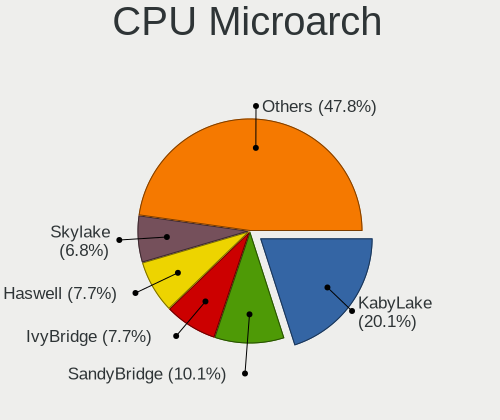

| Name             | Notebooks | Percent |
|------------------|-----------|---------|
| KabyLake         | 119       | 21.56%  |
| SandyBridge      | 64        | 11.59%  |
| Skylake          | 41        | 7.43%   |
| IvyBridge        | 40        | 7.25%   |
| Haswell          | 38        | 6.88%   |
| Westmere         | 33        | 5.98%   |
| Penryn           | 31        | 5.62%   |
| Silvermont       | 29        | 5.25%   |
| Broadwell        | 22        | 3.99%   |
| TigerLake        | 21        | 3.8%    |
| Core             | 19        | 3.44%   |
| Excavator        | 11        | 1.99%   |
| IceLake          | 10        | 1.81%   |
| Goldmont         | 8         | 1.45%   |
| Bobcat           | 8         | 1.45%   |
| CometLake        | 7         | 1.27%   |
| Zen 2            | 6         | 1.09%   |
| Goldmont plus    | 6         | 1.09%   |
| Unknown          | 6         | 1.09%   |
| Zen 3            | 5         | 0.91%   |
| Bonnell          | 5         | 0.91%   |
| Zen+             | 4         | 0.72%   |
| P6               | 3         | 0.54%   |
| Alderlake Hybrid | 3         | 0.54%   |
| Nehalem          | 2         | 0.36%   |
| K8 Hammer        | 2         | 0.36%   |
| K10              | 2         | 0.36%   |
| Jaguar           | 2         | 0.36%   |
| Zen              | 1         | 0.18%   |
| Tremont          | 1         | 0.18%   |
| Steamroller      | 1         | 0.18%   |
| Puma             | 1         | 0.18%   |
| K8 & K10 hybrid  | 1         | 0.18%   |

Graphics
--------

GPU Vendor
----------

Vendors of graphics cards

| Vendor                           | Notebooks | Percent |
|----------------------------------|-----------|---------|
| Intel                            | 471       | 67.87%  |
| Nvidia                           | 134       | 19.31%  |
| AMD                              | 88        | 12.68%  |
| Silicon Integrated Systems [SiS] | 1         | 0.14%   |

GPU Model
---------

Graphics card models

| Model                                                                                    | Notebooks | Percent |
|------------------------------------------------------------------------------------------|-----------|---------|
| Intel 2nd Generation Core Processor Family Integrated Graphics Controller                | 59        | 8.25%   |
| Intel 3rd Gen Core processor Graphics Controller                                         | 38        | 5.31%   |
| Intel Skylake GT2 [HD Graphics 520]                                                      | 30        | 4.2%    |
| Intel HD Graphics 620                                                                    | 29        | 4.06%   |
| Intel Core Processor Integrated Graphics Controller                                      | 28        | 3.92%   |
| Intel UHD Graphics 620                                                                   | 27        | 3.78%   |
| Intel Atom/Celeron/Pentium Processor x5-E8000/J3xxx/N3xxx Integrated Graphics Controller | 26        | 3.64%   |
| Intel CoffeeLake-H GT2 [UHD Graphics 630]                                                | 22        | 3.08%   |
| Intel Mobile 4 Series Chipset Integrated Graphics Controller                             | 21        | 2.94%   |
| Intel HD Graphics 5500                                                                   | 21        | 2.94%   |
| Intel 4th Gen Core Processor Integrated Graphics Controller                              | 21        | 2.94%   |
| Intel TigerLake-LP GT2 [Iris Xe Graphics]                                                | 19        | 2.66%   |
| Intel WhiskeyLake-U GT2 [UHD Graphics 620]                                               | 18        | 2.52%   |
| Intel Haswell-ULT Integrated Graphics Controller                                         | 17        | 2.38%   |
| Intel Mobile GM965/GL960 Integrated Graphics Controller (secondary)                      | 11        | 1.54%   |
| Intel Mobile GM965/GL960 Integrated Graphics Controller (primary)                        | 11        | 1.54%   |
| Intel HD Graphics 630                                                                    | 11        | 1.54%   |
| AMD Stoney [Radeon R2/R3/R4/R5 Graphics]                                                 | 10        | 1.4%    |
| Nvidia TU116M [GeForce GTX 1660 Ti Mobile]                                               | 8         | 1.12%   |
| Nvidia TU117M [GeForce GTX 1650 Mobile / Max-Q]                                          | 7         | 0.98%   |
| Nvidia GP107M [GeForce GTX 1050 Mobile]                                                  | 7         | 0.98%   |
| Nvidia GM108M [GeForce MX130]                                                            | 7         | 0.98%   |
| Intel Mobile 945GM/GMS/GME, 943/940GML Express Integrated Graphics Controller            | 7         | 0.98%   |
| Intel HD Graphics 530                                                                    | 7         | 0.98%   |
| Intel HD Graphics 500                                                                    | 7         | 0.98%   |
| Nvidia GP107M [GeForce GTX 1050 Ti Mobile]                                               | 6         | 0.84%   |
| Intel Iris Plus Graphics G1 (Ice Lake)                                                   | 6         | 0.84%   |
| Intel GeminiLake [UHD Graphics 600]                                                      | 6         | 0.84%   |
| Intel CometLake-U GT2 [UHD Graphics]                                                     | 6         | 0.84%   |
| Intel CometLake-H GT2 [UHD Graphics]                                                     | 6         | 0.84%   |
| AMD Renoir                                                                               | 6         | 0.84%   |
| Nvidia GP106M [GeForce GTX 1060 Mobile]                                                  | 5         | 0.7%    |
| AMD Wrestler [Radeon HD 6320]                                                            | 5         | 0.7%    |
| AMD Topaz XT [Radeon R7 M260/M265 / M340/M360 / M440/M445 / 530/535 / 620/625 Mobile]    | 5         | 0.7%    |
| AMD Sun XT [Radeon HD 8670A/8670M/8690M / R5 M330 / M430 / Radeon 520 Mobile]            | 5         | 0.7%    |
| Nvidia GP108M [GeForce MX150]                                                            | 4         | 0.56%   |
| Nvidia GM107M [GeForce GTX 960M]                                                         | 4         | 0.56%   |
| Nvidia GF108M [GeForce GT 540M]                                                          | 4         | 0.56%   |
| Intel TigerLake-H GT1 [UHD Graphics]                                                     | 4         | 0.56%   |
| Intel Mobile 945GSE Express Integrated Graphics Controller                               | 4         | 0.56%   |

GPU Combo
---------

Combinations of graphics cards

| Name           | Notebooks | Percent |
|----------------|-----------|---------|
| 1 x Intel      | 334       | 60.4%   |
| Intel + Nvidia | 104       | 18.81%  |
| 1 x AMD        | 48        | 8.68%   |
| Intel + AMD    | 32        | 5.79%   |
| 1 x Nvidia     | 25        | 4.52%   |
| AMD + Nvidia   | 5         | 0.9%    |
| 2 x AMD        | 3         | 0.54%   |
| 2 x Intel      | 1         | 0.18%   |
| 1 x SiS        | 1         | 0.18%   |

GPU Driver
----------

Free vs proprietary

| Driver      | Notebooks | Percent |
|-------------|-----------|---------|
| Free        | 471       | 84.56%  |
| Proprietary | 76        | 13.64%  |
| Unknown     | 10        | 1.8%    |

GPU Memory
----------

Total video memory

| Size in GB | Notebooks | Percent |
|------------|-----------|---------|
| Unknown    | 407       | 71.28%  |
| 1.01-2.0   | 62        | 10.86%  |
| 0.01-0.5   | 39        | 6.83%   |
| 3.01-4.0   | 23        | 4.03%   |
| 0.51-1.0   | 20        | 3.5%    |
| 5.01-6.0   | 13        | 2.28%   |
| 2.01-3.0   | 4         | 0.7%    |
| 7.01-8.0   | 3         | 0.53%   |

Monitor
-------

Monitor Vendor
--------------

Monitor vendors

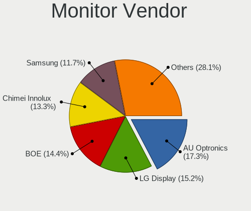

| Vendor                  | Notebooks | Percent |
|-------------------------|-----------|---------|
| AU Optronics            | 115       | 17.37%  |
| LG Display              | 100       | 15.11%  |
| BOE                     | 98        | 14.8%   |
| Chimei Innolux          | 80        | 12.08%  |
| Samsung Electronics     | 75        | 11.33%  |
| Dell                    | 46        | 6.95%   |
| Chi Mei Optoelectronics | 26        | 3.93%   |
| Goldstar                | 21        | 3.17%   |
| Apple                   | 15        | 2.27%   |
| Lenovo                  | 13        | 1.96%   |
| Sharp                   | 11        | 1.66%   |
| LG Philips              | 8         | 1.21%   |
| Philips                 | 6         | 0.91%   |
| Hewlett-Packard         | 5         | 0.76%   |
| AOC                     | 4         | 0.6%    |
| Toshiba                 | 3         | 0.45%   |
| SKY                     | 3         | 0.45%   |
| PANDA                   | 3         | 0.45%   |
| Fujitsu Siemens         | 3         | 0.45%   |
| Quanta Display          | 2         | 0.3%    |
| Panasonic               | 2         | 0.3%    |
| VST                     | 1         | 0.15%   |
| VIE                     | 1         | 0.15%   |
| Tatung                  | 1         | 0.15%   |
| STD                     | 1         | 0.15%   |
| Sony                    | 1         | 0.15%   |
| SLD                     | 1         | 0.15%   |
| SKK                     | 1         | 0.15%   |
| SKG                     | 1         | 0.15%   |
| SEEYOO                  | 1         | 0.15%   |
| MStar                   | 1         | 0.15%   |
| Microsoft               | 1         | 0.15%   |
| LTM                     | 1         | 0.15%   |
| KDC                     | 1         | 0.15%   |
| KDB                     | 1         | 0.15%   |
| InnoLux Display         | 1         | 0.15%   |
| InfoVision              | 1         | 0.15%   |
| HKC                     | 1         | 0.15%   |
| Hitachi                 | 1         | 0.15%   |
| HannStar                | 1         | 0.15%   |

Monitor Model
-------------

Monitor models

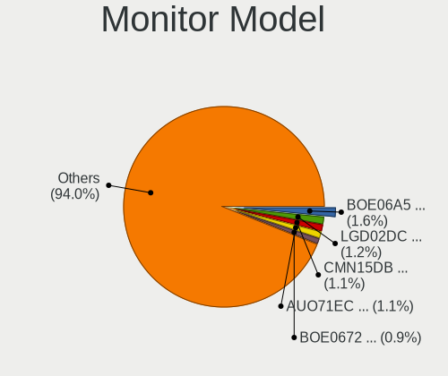

| Model                                                                    | Notebooks | Percent |
|--------------------------------------------------------------------------|-----------|---------|
| BOE LCD Monitor BOE06A5 1366x768 344x194mm 15.5-inch                     | 13        | 1.92%   |
| LG Display LCD Monitor LGD02DC 1366x768 344x194mm 15.5-inch              | 9         | 1.33%   |
| AU Optronics LCD Monitor AUO71EC 1366x768 344x193mm 15.5-inch            | 9         | 1.33%   |
| BOE LCD Monitor BOE0672 1366x768 344x194mm 15.5-inch                     | 8         | 1.18%   |
| AU Optronics LCD Monitor AUO22EC 1366x768 344x193mm 15.5-inch            | 8         | 1.18%   |
| LG Display LCD Monitor LGD02AC 1366x768 344x194mm 15.5-inch              | 6         | 0.89%   |
| Chimei Innolux LCD Monitor CMN15DB 1366x768 344x193mm 15.5-inch          | 6         | 0.89%   |
| Chi Mei Optoelectronics LCD Monitor CMO1592 1366x768 344x193mm 15.5-inch | 6         | 0.89%   |
| AU Optronics LCD Monitor AUO38ED 1920x1080 344x193mm 15.5-inch           | 6         | 0.89%   |
| LG Display LCD Monitor LGD0456 1366x768 344x194mm 15.5-inch              | 5         | 0.74%   |
| Chimei Innolux LCD Monitor CMN15E6 1366x768 344x193mm 15.5-inch          | 5         | 0.74%   |
| AU Optronics LCD Monitor AUO70EC 1366x768 344x193mm 15.5-inch            | 5         | 0.74%   |
| Sharp LCD Monitor SHP14F9 1920x1200 288x180mm 13.4-inch                  | 4         | 0.59%   |
| Samsung Electronics LCD Monitor SEC5441 1366x768 344x194mm 15.5-inch     | 4         | 0.59%   |
| Samsung Electronics LCD Monitor SEC325A 1366x768 344x194mm 15.5-inch     | 4         | 0.59%   |
| LG Display LCD Monitor LGD053F 1920x1080 344x194mm 15.5-inch             | 4         | 0.59%   |
| LG Display LCD Monitor LGD033A 1366x768 344x194mm 15.5-inch              | 4         | 0.59%   |
| Dell SE2419HR DELF113 1920x1080 527x296mm 23.8-inch                      | 4         | 0.59%   |
| Chimei Innolux LCD Monitor CMN15DC 1366x768 344x193mm 15.5-inch          | 4         | 0.59%   |
| Chi Mei Optoelectronics LCD Monitor CMO15A1 1366x768 344x193mm 15.5-inch | 4         | 0.59%   |
| AU Optronics LCD Monitor AUO26EC 1366x768 344x193mm 15.5-inch            | 4         | 0.59%   |
| Samsung Electronics LCD Monitor SEC4845 1280x800 331x207mm 15.4-inch     | 3         | 0.44%   |
| Samsung Electronics LCD Monitor SEC4351 1366x768 344x194mm 15.5-inch     | 3         | 0.44%   |
| Samsung Electronics LCD Monitor SDC5441 1366x768 309x174mm 14.0-inch     | 3         | 0.44%   |
| Samsung Electronics C24F390 SAM0D2C 1920x1080 521x293mm 23.5-inch        | 3         | 0.44%   |
| LG Philips LCD Monitor LPLDB00 1280x800 331x207mm 15.4-inch              | 3         | 0.44%   |
| LG Display LCD Monitor LGD039F 1366x768 345x194mm 15.6-inch              | 3         | 0.44%   |
| LG Display LCD Monitor LGD02DF 1600x900 310x174mm 14.0-inch              | 3         | 0.44%   |
| LG Display LCD Monitor LGD0266 1366x768 344x194mm 15.5-inch              | 3         | 0.44%   |
| Lenovo LCD Monitor LEN40B1 1600x900 344x194mm 15.5-inch                  | 3         | 0.44%   |
| Lenovo LCD Monitor LEN4036 1440x900 303x190mm 14.1-inch                  | 3         | 0.44%   |
| Goldstar W2343 GSM5700 1920x1080 474x296mm 22.0-inch                     | 3         | 0.44%   |
| Goldstar ULTRAWIDE GSM59F1 2560x1080 673x284mm 28.8-inch                 | 3         | 0.44%   |
| Dell SE2416H DELD082 1920x1080 527x296mm 23.8-inch                       | 3         | 0.44%   |
| Dell S3220DGF DELD0F2 2560x1440 697x392mm 31.5-inch                      | 3         | 0.44%   |
| Chimei Innolux LCD Monitor CMN1735 1920x1080 382x215mm 17.3-inch         | 3         | 0.44%   |
| Chimei Innolux LCD Monitor CMN15E7 1920x1080 344x193mm 15.5-inch         | 3         | 0.44%   |
| Chimei Innolux LCD Monitor CMN15D5 1920x1080 344x193mm 15.5-inch         | 3         | 0.44%   |
| Chimei Innolux LCD Monitor CMN15C6 1366x768 344x193mm 15.5-inch          | 3         | 0.44%   |
| Chimei Innolux LCD Monitor CMN15C4 1920x1080 344x193mm 15.5-inch         | 3         | 0.44%   |

Monitor Resolution
------------------

Monitor screen resolution

| Resolution         | Notebooks | Percent |
|--------------------|-----------|---------|
| 1366x768 (WXGA)    | 260       | 41.87%  |
| 1920x1080 (FHD)    | 205       | 33.01%  |
| 1280x800 (WXGA)    | 36        | 5.8%    |
| 1600x900 (HD+)     | 33        | 5.31%   |
| 2560x1440 (QHD)    | 14        | 2.25%   |
| 1920x1200 (WUXGA)  | 12        | 1.93%   |
| 3840x2160 (4K)     | 11        | 1.77%   |
| 1440x900 (WXGA+)   | 11        | 1.77%   |
| 1680x1050 (WSXGA+) | 7         | 1.13%   |
| 1280x1024 (SXGA)   | 7         | 1.13%   |
| 3072x1920          | 3         | 0.48%   |
| 2560x1080          | 3         | 0.48%   |
| 1360x768           | 3         | 0.48%   |
| 1024x768 (XGA)     | 3         | 0.48%   |
| 1024x600           | 3         | 0.48%   |
| 3840x1080          | 2         | 0.32%   |
| 1600x1200          | 2         | 0.32%   |
| 2880x1920          | 1         | 0.16%   |
| 2880x1800          | 1         | 0.16%   |
| 2288x1287          | 1         | 0.16%   |
| 1x1                | 1         | 0.16%   |
| 1920x540           | 1         | 0.16%   |
| 1680x945           | 1         | 0.16%   |

Monitor Diagonal
----------------

Diagonal size in inches

| Inches  | Notebooks | Percent |
|---------|-----------|---------|
| 15      | 348       | 51.86%  |
| 13      | 58        | 8.64%   |
| 14      | 52        | 7.75%   |
| 17      | 48        | 7.15%   |
| 23      | 29        | 4.32%   |
| 24      | 25        | 3.73%   |
| 27      | 13        | 1.94%   |
| 21      | 12        | 1.79%   |
| 31      | 9         | 1.34%   |
| 12      | 9         | 1.34%   |
| Unknown | 9         | 1.34%   |
| 18      | 8         | 1.19%   |
| 20      | 7         | 1.04%   |
| 19      | 7         | 1.04%   |
| 22      | 5         | 0.75%   |
| 16      | 4         | 0.6%    |
| 11      | 4         | 0.6%    |
| 40      | 3         | 0.45%   |
| 34      | 3         | 0.45%   |
| 10      | 3         | 0.45%   |
| 72      | 2         | 0.3%    |
| 32      | 2         | 0.3%    |
| 26      | 2         | 0.3%    |
| 84      | 1         | 0.15%   |
| 64      | 1         | 0.15%   |
| 54      | 1         | 0.15%   |
| 52      | 1         | 0.15%   |
| 49      | 1         | 0.15%   |
| 48      | 1         | 0.15%   |
| 46      | 1         | 0.15%   |
| 39      | 1         | 0.15%   |
| 8       | 1         | 0.15%   |

Monitor Width
-------------

Physical width

| Width in mm | Notebooks | Percent |
|-------------|-----------|---------|
| 301-350     | 432       | 64.96%  |
| 501-600     | 62        | 9.32%   |
| 351-400     | 50        | 7.52%   |
| 201-300     | 42        | 6.32%   |
| 401-500     | 40        | 6.02%   |
| 601-700     | 10        | 1.5%    |
| Unknown     | 9         | 1.35%   |
| 1001-1500   | 6         | 0.9%    |
| 701-800     | 5         | 0.75%   |
| 801-900     | 4         | 0.6%    |
| 1501-2000   | 3         | 0.45%   |
| 101-200     | 1         | 0.15%   |
| 1-100       | 1         | 0.15%   |

Aspect Ratio
------------

Proportional relationship between the width and the height

| Ratio   | Notebooks | Percent |
|---------|-----------|---------|
| 16/9    | 479       | 84.33%  |
| 16/10   | 66        | 11.62%  |
| 4/3     | 7         | 1.23%   |
| 5/4     | 4         | 0.7%    |
| 3/2     | 4         | 0.7%    |
| 32/9    | 3         | 0.53%   |
| 21/9    | 3         | 0.53%   |
| 0.00    | 1         | 0.18%   |
| Unknown | 1         | 0.18%   |

Monitor Area
------------

Area in inch

| Area in inch | Notebooks | Percent |
|----------------|-----------|---------|
| 101-110        | 347       | 51.95%  |
| 81-90          | 90        | 13.47%  |
| 201-250        | 63        | 9.43%   |
| 121-130        | 41        | 6.14%   |
| 71-80          | 20        | 2.99%   |
| 151-200        | 17        | 2.54%   |
| 351-500        | 14        | 2.1%    |
| 301-350        | 14        | 2.1%    |
| 141-150        | 12        | 1.8%    |
| Unknown        | 10        | 1.5%    |
| 61-70          | 9         | 1.35%   |
| 501-1000       | 7         | 1.05%   |
| More than 1000 | 6         | 0.9%    |
| 51-60          | 4         | 0.6%    |
| 251-300        | 4         | 0.6%    |
| 111-120        | 4         | 0.6%    |
| 41-50          | 2         | 0.3%    |
| 131-140        | 2         | 0.3%    |
| 1-40           | 1         | 0.15%   |
| 91-100         | 1         | 0.15%   |

Pixel Density
-------------

Pixels per inch

| Density       | Notebooks | Percent |
|---------------|-----------|---------|
| 101-120       | 272       | 41.85%  |
| 121-160       | 190       | 29.23%  |
| 51-100        | 144       | 22.15%  |
| 161-240       | 19        | 2.92%   |
| 1-50          | 10        | 1.54%   |
| Unknown       | 9         | 1.38%   |
| More than 240 | 6         | 0.92%   |

Multiple Monitors
-----------------

Total monitors connected

| Total | Notebooks | Percent |
|-------|-----------|---------|
| 1     | 422       | 74.04%  |
| 2     | 126       | 22.11%  |
| 3     | 14        | 2.46%   |
| 0     | 8         | 1.4%    |

Network
-------

Net Controller Vendor
---------------------

Controller vendors

| Vendor                            | Notebooks | Percent |
|-----------------------------------|-----------|---------|
| Realtek Semiconductor             | 309       | 32.91%  |
| Intel                             | 271       | 28.86%  |
| Qualcomm Atheros                  | 142       | 15.12%  |
| Broadcom                          | 68        | 7.24%   |
| Dell                              | 23        | 2.45%   |
| Broadcom Limited                  | 15        | 1.6%    |
| Samsung Electronics               | 13        | 1.38%   |
| Ralink                            | 12        | 1.28%   |
| Huawei Technologies               | 12        | 1.28%   |
| Marvell Technology Group          | 11        | 1.17%   |
| JMicron Technology                | 6         | 0.64%   |
| Ericsson Business Mobile Networks | 6         | 0.64%   |
| MediaTek                          | 5         | 0.53%   |
| TP-Link                           | 4         | 0.43%   |
| Sierra Wireless                   | 4         | 0.43%   |
| Hewlett-Packard                   | 4         | 0.43%   |
| ASIX Electronics                  | 4         | 0.43%   |
| Apple                             | 3         | 0.32%   |
| Xiaomi                            | 2         | 0.21%   |
| Spreadtrum Communications         | 2         | 0.21%   |
| Nvidia                            | 2         | 0.21%   |
| Lenovo                            | 2         | 0.21%   |
| Arduino SA                        | 2         | 0.21%   |
| ZyXEL Communications              | 1         | 0.11%   |
| ZyDAS                             | 1         | 0.11%   |
| U-Blox                            | 1         | 0.11%   |
| TRENDnet                          | 1         | 0.11%   |
| Toshiba                           | 1         | 0.11%   |
| Texas Instruments                 | 1         | 0.11%   |
| Silicon Integrated Systems [SiS]  | 1         | 0.11%   |
| Ralink Technology                 | 1         | 0.11%   |
| Qualcomm Atheros Communications   | 1         | 0.11%   |
| Microchip Technology              | 1         | 0.11%   |
| Linksys                           | 1         | 0.11%   |
| HMD Global                        | 1         | 0.11%   |
| Fibocom                           | 1         | 0.11%   |
| Exar                              | 1         | 0.11%   |
| DisplayLink                       | 1         | 0.11%   |
| Attansic Technology               | 1         | 0.11%   |
| ASUSTek Computer                  | 1         | 0.11%   |

Net Controller Model
--------------------

Controller models

| Model                                                             | Notebooks | Percent |
|-------------------------------------------------------------------|-----------|---------|
| Realtek RTL8111/8168/8411 PCI Express Gigabit Ethernet Controller | 182       | 16.13%  |
| Realtek RTL810xE PCI Express Fast Ethernet controller             | 79        | 7%      |
| Qualcomm Atheros QCA9377 802.11ac Wireless Network Adapter        | 33        | 2.93%   |
| Qualcomm Atheros AR9285 Wireless Network Adapter (PCI-Express)    | 26        | 2.3%    |
| Realtek RTL8821CE 802.11ac PCIe Wireless Network Adapter          | 25        | 2.22%   |
| Qualcomm Atheros QCA9565 / AR9565 Wireless Network Adapter        | 24        | 2.13%   |
| Intel 82579LM Gigabit Network Connection (Lewisville)             | 22        | 1.95%   |
| Realtek RTL8153 Gigabit Ethernet Adapter                          | 17        | 1.51%   |
| Intel Wireless 8265 / 8275                                        | 17        | 1.51%   |
| Broadcom BCM4313 802.11bgn Wireless Network Adapter               | 17        | 1.51%   |
| Qualcomm Atheros AR9485 Wireless Network Adapter                  | 16        | 1.42%   |
| Intel Wi-Fi 6 AX201                                               | 16        | 1.42%   |
| Intel Cannon Lake PCH CNVi WiFi                                   | 15        | 1.33%   |
| Realtek RTL8723BE PCIe Wireless Network Adapter                   | 14        | 1.24%   |
| Intel Wireless 8260                                               | 14        | 1.24%   |
| Intel Centrino Advanced-N 6205 [Taylor Peak]                      | 14        | 1.24%   |
| Intel Wi-Fi 6 AX200                                               | 13        | 1.15%   |
| Intel Dual Band Wireless-AC 3165 Plus Bluetooth                   | 12        | 1.06%   |
| Intel Centrino Advanced-N 6200                                    | 12        | 1.06%   |
| Intel 82577LM Gigabit Network Connection                          | 12        | 1.06%   |
| Qualcomm Atheros QCA6174 802.11ac Wireless Network Adapter        | 11        | 0.98%   |
| Intel Wireless 3165                                               | 11        | 0.98%   |
| Ralink RT3290 Wireless 802.11n 1T/1R PCIe                         | 10        | 0.89%   |
| Intel Wireless 7265                                               | 10        | 0.89%   |
| Intel Wireless 3160                                               | 10        | 0.89%   |
| Intel Ethernet Connection I219-LM                                 | 10        | 0.89%   |
| Intel Centrino Wireless-N 1030 [Rainbow Peak]                     | 10        | 0.89%   |
| Realtek RTL8822CE 802.11ac PCIe Wireless Network Adapter          | 9         | 0.8%    |
| Qualcomm Atheros AR9462 Wireless Network Adapter                  | 9         | 0.8%    |
| Intel PRO/Wireless 3945ABG [Golan] Network Connection             | 9         | 0.8%    |
| Broadcom NetLink BCM57785 Gigabit Ethernet PCIe                   | 9         | 0.8%    |
| Broadcom BCM43228 802.11a/b/g/n                                   | 9         | 0.8%    |
| Intel Wireless 7260                                               | 8         | 0.71%   |
| Intel WiFi Link 5100                                              | 8         | 0.71%   |
| Intel Centrino Wireless-N 2230                                    | 8         | 0.71%   |
| Intel Centrino Ultimate-N 6300                                    | 8         | 0.71%   |
| Intel Cannon Point-LP CNVi [Wireless-AC]                          | 8         | 0.71%   |
| Intel 82567LM Gigabit Network Connection                          | 8         | 0.71%   |
| Samsung GT-I9070 (network tethering, USB debugging enabled)       | 7         | 0.62%   |
| Realtek RTL8723DE Wireless Network Adapter                        | 7         | 0.62%   |

Wireless Vendor
---------------

Wireless vendors

| Vendor                          | Notebooks | Percent |
|---------------------------------|-----------|---------|
| Intel                           | 257       | 45.09%  |
| Qualcomm Atheros                | 129       | 22.63%  |
| Realtek Semiconductor           | 80        | 14.04%  |
| Broadcom                        | 51        | 8.95%   |
| Dell                            | 14        | 2.46%   |
| Ralink                          | 12        | 2.11%   |
| Broadcom Limited                | 8         | 1.4%    |
| Sierra Wireless                 | 4         | 0.7%    |
| MediaTek                        | 4         | 0.7%    |
| TP-Link                         | 3         | 0.53%   |
| ZyXEL Communications            | 1         | 0.18%   |
| ZyDAS                           | 1         | 0.18%   |
| TRENDnet                        | 1         | 0.18%   |
| Ralink Technology               | 1         | 0.18%   |
| Qualcomm Atheros Communications | 1         | 0.18%   |
| Linksys                         | 1         | 0.18%   |
| Fibocom                         | 1         | 0.18%   |
| ASUSTek Computer                | 1         | 0.18%   |

Wireless Model
--------------

Wireless models

| Model                                                                   | Notebooks | Percent |
|-------------------------------------------------------------------------|-----------|---------|
| Qualcomm Atheros QCA9377 802.11ac Wireless Network Adapter              | 33        | 5.76%   |
| Qualcomm Atheros AR9285 Wireless Network Adapter (PCI-Express)          | 26        | 4.54%   |
| Realtek RTL8821CE 802.11ac PCIe Wireless Network Adapter                | 25        | 4.36%   |
| Qualcomm Atheros QCA9565 / AR9565 Wireless Network Adapter              | 24        | 4.19%   |
| Intel Wireless 8265 / 8275                                              | 17        | 2.97%   |
| Broadcom BCM4313 802.11bgn Wireless Network Adapter                     | 17        | 2.97%   |
| Qualcomm Atheros AR9485 Wireless Network Adapter                        | 16        | 2.79%   |
| Intel Wi-Fi 6 AX201                                                     | 16        | 2.79%   |
| Intel Cannon Lake PCH CNVi WiFi                                         | 15        | 2.62%   |
| Realtek RTL8723BE PCIe Wireless Network Adapter                         | 14        | 2.44%   |
| Intel Wireless 8260                                                     | 14        | 2.44%   |
| Intel Centrino Advanced-N 6205 [Taylor Peak]                            | 14        | 2.44%   |
| Intel Wi-Fi 6 AX200                                                     | 13        | 2.27%   |
| Intel Dual Band Wireless-AC 3165 Plus Bluetooth                         | 12        | 2.09%   |
| Intel Centrino Advanced-N 6200                                          | 12        | 2.09%   |
| Qualcomm Atheros QCA6174 802.11ac Wireless Network Adapter              | 11        | 1.92%   |
| Intel Wireless 3165                                                     | 11        | 1.92%   |
| Ralink RT3290 Wireless 802.11n 1T/1R PCIe                               | 10        | 1.75%   |
| Intel Wireless 7265                                                     | 10        | 1.75%   |
| Intel Wireless 3160                                                     | 10        | 1.75%   |
| Intel Centrino Wireless-N 1030 [Rainbow Peak]                           | 10        | 1.75%   |
| Realtek RTL8822CE 802.11ac PCIe Wireless Network Adapter                | 9         | 1.57%   |
| Qualcomm Atheros AR9462 Wireless Network Adapter                        | 9         | 1.57%   |
| Intel PRO/Wireless 3945ABG [Golan] Network Connection                   | 9         | 1.57%   |
| Broadcom BCM43228 802.11a/b/g/n                                         | 9         | 1.57%   |
| Intel Wireless 7260                                                     | 8         | 1.4%    |
| Intel WiFi Link 5100                                                    | 8         | 1.4%    |
| Intel Centrino Wireless-N 2230                                          | 8         | 1.4%    |
| Intel Centrino Ultimate-N 6300                                          | 8         | 1.4%    |
| Intel Cannon Point-LP CNVi [Wireless-AC]                                | 8         | 1.4%    |
| Realtek RTL8723DE Wireless Network Adapter                              | 7         | 1.22%   |
| Intel Comet Lake PCH CNVi WiFi                                          | 7         | 1.22%   |
| Dell DW5811e Snapdragon X7 LTE                                    | 7         | 1.22%   |
| Realtek RTL8723BU 802.11b/g/n WLAN Adapter                              | 6         | 1.05%   |
| Intel Dual Band Wireless-AC 3168NGW [Stone Peak]                        | 6         | 1.05%   |
| Intel Centrino Wireless-N 1000 [Condor Peak]                            | 6         | 1.05%   |
| Qualcomm Atheros AR242x / AR542x Wireless Network Adapter (PCI-Express) | 5         | 0.87%   |
| Intel Ultimate N WiFi Link 5300                                         | 5         | 0.87%   |
| Intel Comet Lake PCH-LP CNVi WiFi                                       | 5         | 0.87%   |
| Dell Hub of E-Port Replicator                                           | 5         | 0.87%   |

Ethernet Vendor
---------------

Ethernet vendors

| Vendor                           | Notebooks | Percent |
|----------------------------------|-----------|---------|
| Realtek Semiconductor            | 287       | 55.3%   |
| Intel                            | 115       | 22.16%  |
| Broadcom                         | 28        | 5.39%   |
| Qualcomm Atheros                 | 24        | 4.62%   |
| Samsung Electronics              | 13        | 2.5%    |
| Marvell Technology Group         | 11        | 2.12%   |
| Broadcom Limited                 | 8         | 1.54%   |
| JMicron Technology               | 6         | 1.16%   |
| Huawei Technologies              | 5         | 0.96%   |
| ASIX Electronics                 | 4         | 0.77%   |
| Apple                            | 3         | 0.58%   |
| Xiaomi                           | 2         | 0.39%   |
| Spreadtrum Communications        | 2         | 0.39%   |
| Nvidia                           | 2         | 0.39%   |
| Lenovo                           | 2         | 0.39%   |
| TP-Link                          | 1         | 0.19%   |
| Silicon Integrated Systems [SiS] | 1         | 0.19%   |
| Microchip Technology             | 1         | 0.19%   |
| MediaTek                         | 1         | 0.19%   |
| HMD Global                       | 1         | 0.19%   |
| DisplayLink                      | 1         | 0.19%   |
| Attansic Technology              | 1         | 0.19%   |

Ethernet Model
--------------

Ethernet models

| Model                                                                | Notebooks | Percent |
|----------------------------------------------------------------------|-----------|---------|
| Realtek RTL8111/8168/8411 PCI Express Gigabit Ethernet Controller    | 182       | 34.8%   |
| Realtek RTL810xE PCI Express Fast Ethernet controller                | 79        | 15.11%  |
| Intel 82579LM Gigabit Network Connection (Lewisville)                | 22        | 4.21%   |
| Realtek RTL8153 Gigabit Ethernet Adapter                             | 17        | 3.25%   |
| Intel 82577LM Gigabit Network Connection                             | 12        | 2.29%   |
| Intel Ethernet Connection I219-LM                                    | 10        | 1.91%   |
| Broadcom NetLink BCM57785 Gigabit Ethernet PCIe                      | 9         | 1.72%   |
| Intel 82567LM Gigabit Network Connection                             | 8         | 1.53%   |
| Samsung GT-I9070 (network tethering, USB debugging enabled)          | 7         | 1.34%   |
| Intel Ethernet Connection I217-LM                                    | 7         | 1.34%   |
| Intel Ethernet Connection (4) I219-LM                                | 7         | 1.34%   |
| Samsung Galaxy series, misc. (tethering mode)                        | 6         | 1.15%   |
| Realtek RTL8125 2.5GbE Controller                                    | 5         | 0.96%   |
| Qualcomm Atheros AR8151 v2.0 Gigabit Ethernet                        | 5         | 0.96%   |
| Marvell Group 88E8040 PCI-E Fast Ethernet Controller                 | 5         | 0.96%   |
| JMicron JMC250 PCI Express Gigabit Ethernet Controller               | 5         | 0.96%   |
| Intel Ethernet Connection I218-LM                                    | 5         | 0.96%   |
| Intel 82579V Gigabit Network Connection                              | 5         | 0.96%   |
| Broadcom NetXtreme BCM57765 Gigabit Ethernet PCIe                    | 5         | 0.96%   |
| Realtek RTL8152 Fast Ethernet Adapter                                | 4         | 0.76%   |
| Qualcomm Atheros QCA8172 Fast Ethernet                               | 4         | 0.76%   |
| Intel Ethernet Connection (3) I218-LM                                | 4         | 0.76%   |
| Broadcom NetXtreme BCM5764M Gigabit Ethernet PCIe                    | 4         | 0.76%   |
| Realtek Killer E2500 Gigabit Ethernet Controller                     | 3         | 0.57%   |
| Qualcomm Atheros QCA8171 Gigabit Ethernet                            | 3         | 0.57%   |
| Qualcomm Atheros Killer E2400 Gigabit Ethernet Controller            | 3         | 0.57%   |
| Intel Ethernet Connection I219-V                                     | 3         | 0.57%   |
| Intel Ethernet Connection (7) I219-LM                                | 3         | 0.57%   |
| Intel Ethernet Connection (5) I219-LM                                | 3         | 0.57%   |
| Intel 82562GT 10/100 Network Connection                              | 3         | 0.57%   |
| Intel 82562ET/EZ/GT/GZ - PRO/100 VE (LOM) Ethernet Controller Mobile | 3         | 0.57%   |
| Huawei E353/E3131                                                    | 3         | 0.57%   |
| ASIX AX88179 Gigabit Ethernet                                        | 3         | 0.57%   |
| Apple iBridge                                                        | 3         | 0.57%   |
| Xiaomi Mi/Redmi series (RNDIS)                                       | 2         | 0.38%   |
| Spreadtrum Nokia G21                                                 | 2         | 0.38%   |
| Qualcomm Atheros AR8132 Fast Ethernet                                | 2         | 0.38%   |
| Qualcomm Atheros AR8131 Gigabit Ethernet                             | 2         | 0.38%   |
| Intel Ethernet Connection (6) I219-V                                 | 2         | 0.38%   |
| Intel Ethernet Connection (4) I219-V                                 | 2         | 0.38%   |

Net Controller Kind
-------------------

Ethernet, WiFi or modem

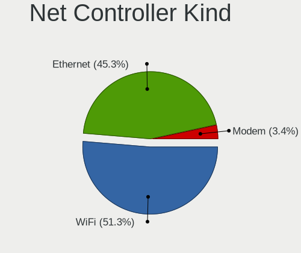

| Kind     | Notebooks | Percent |
|----------|-----------|---------|
| WiFi     | 538       | 50.95%  |
| Ethernet | 487       | 46.12%  |
| Modem    | 31        | 2.94%   |

Used Controller
---------------

Currently used network controller

| Kind     | Notebooks | Percent |
|----------|-----------|---------|
| WiFi     | 451       | 75.67%  |
| Ethernet | 144       | 24.16%  |
| Modem    | 1         | 0.17%   |

NICs
----

Total network controllers on board

| Total | Notebooks | Percent |
|-------|-----------|---------|
| 2     | 456       | 82.61%  |
| 1     | 76        | 13.77%  |
| 0     | 17        | 3.08%   |
| 3     | 3         | 0.54%   |

IPv6
----

IPv6 vs IPv4

| Used | Notebooks | Percent |
|------|-----------|---------|
| No   | 536       | 97.1%   |
| Yes  | 16        | 2.9%    |

Bluetooth
---------

Bluetooth Vendor
----------------

Controller vendors

| Vendor                          | Notebooks | Percent |
|---------------------------------|-----------|---------|
| Intel                           | 174       | 39.28%  |
| Qualcomm Atheros Communications | 59        | 13.32%  |
| Realtek Semiconductor           | 45        | 10.16%  |
| Broadcom                        | 26        | 5.87%   |
| Lite-On Technology              | 23        | 5.19%   |
| Hewlett-Packard                 | 22        | 4.97%   |
| Foxconn / Hon Hai               | 20        | 4.51%   |
| IMC Networks                    | 19        | 4.29%   |
| Dell                            | 15        | 3.39%   |
| Ralink                          | 10        | 2.26%   |
| Apple                           | 10        | 2.26%   |
| Toshiba                         | 8         | 1.81%   |
| Cambridge Silicon Radio         | 4         | 0.9%    |
| ASUSTek Computer                | 3         | 0.68%   |
| Alps Electric                   | 2         | 0.45%   |
| Realtek                         | 1         | 0.23%   |
| Mobile Action Technology        | 1         | 0.23%   |
| Foxconn International           | 1         | 0.23%   |

Bluetooth Model
---------------

Controller models

| Model                                               | Notebooks | Percent |
|-----------------------------------------------------|-----------|---------|
| Intel Bluetooth wireless interface                  | 73        | 16.48%  |
| Intel AX201 Bluetooth                               | 31        | 7%      |
| Intel Bluetooth 9460/9560 Jefferson Peak (JfP)      | 28        | 6.32%   |
| Qualcomm Atheros  Bluetooth Device                  | 26        | 5.87%   |
| Realtek Bluetooth Radio                             | 23        | 5.19%   |
| Realtek  Bluetooth 4.2 Adapter                      | 16        | 3.61%   |
| HP Broadcom 2070 Bluetooth Combo                    | 15        | 3.39%   |
| Intel AX200 Bluetooth                               | 12        | 2.71%   |
| Qualcomm Atheros AR3011 Bluetooth                   | 11        | 2.48%   |
| Foxconn / Hon Hai Bluetooth Device                  | 11        | 2.48%   |
| Ralink RT3290 Bluetooth                             | 10        | 2.26%   |
| Broadcom BCM2045B (BDC-2.1)                         | 10        | 2.26%   |
| Lite-On Qualcomm Atheros QCA9377 Bluetooth          | 9         | 2.03%   |
| Intel Centrino Bluetooth Wireless Transceiver       | 9         | 2.03%   |
| Intel Centrino Advanced-N 6230 Bluetooth adapter    | 9         | 2.03%   |
| Qualcomm Atheros AR3012 Bluetooth 4.0               | 8         | 1.81%   |
| IMC Networks Bluetooth Radio                        | 8         | 1.81%   |
| Qualcomm Atheros QCA61x4 Bluetooth 4.0              | 7         | 1.58%   |
| Lite-On Bluetooth Device                            | 7         | 1.58%   |
| HP Bluetooth 2.0 Interface [Broadcom BCM2045]       | 7         | 1.58%   |
| Intel Wireless-AC 3168 Bluetooth                    | 6         | 1.35%   |
| IMC Networks Bluetooth Device                       | 5         | 1.13%   |
| Dell BCM20702A0 Bluetooth Module                    | 5         | 1.13%   |
| Apple Bluetooth USB Host Controller                 | 5         | 1.13%   |
| Realtek RTL8723B Bluetooth                          | 4         | 0.9%    |
| Qualcomm Atheros AR9462 Bluetooth                   | 4         | 0.9%    |
| Lite-On Atheros AR3012 Bluetooth                    | 4         | 0.9%    |
| Cambridge Silicon Radio Bluetooth Dongle (HCI mode) | 4         | 0.9%    |
| Toshiba RT Bluetooth Radio                          | 3         | 0.68%   |
| Intel Wireless-AC 9260 Bluetooth Adapter            | 3         | 0.68%   |
| Intel Bluetooth Device                              | 3         | 0.68%   |
| Foxconn / Hon Hai Broadcom Bluetooth 2.1 Device     | 3         | 0.68%   |
| Dell Wireless 370 Bluetooth Mini-card               | 3         | 0.68%   |
| Broadcom BCM2070 Bluetooth Device                   | 3         | 0.68%   |
| Broadcom BCM2070 Bluetooth 2.1 + EDR                | 3         | 0.68%   |
| Apple Bluetooth Host Controller                     | 3         | 0.68%   |
| Toshiba Askey Bluetooth Module                      | 2         | 0.45%   |
| Realtek RTL8821A Bluetooth                          | 2         | 0.45%   |
| Qualcomm Atheros Bluetooth USB Host Controller      | 2         | 0.45%   |
| IMC Networks Wireless_Device                        | 2         | 0.45%   |

Sound
-----

Sound Vendor
------------

Sound card vendors

| Vendor                           | Notebooks | Percent |
|----------------------------------|-----------|---------|
| Intel                            | 492       | 74.1%   |
| Nvidia                           | 69        | 10.39%  |
| AMD                              | 58        | 8.73%   |
| Logitech                         | 6         | 0.9%    |
| C-Media Electronics              | 6         | 0.9%    |
| Realtek Semiconductor            | 3         | 0.45%   |
| Lenovo                           | 3         | 0.45%   |
| Corsair                          | 3         | 0.45%   |
| Apple                            | 3         | 0.45%   |
| Generalplus Technology           | 2         | 0.3%    |
| Conexant Systems                 | 2         | 0.3%    |
| Xiaomi                           | 1         | 0.15%   |
| Tenx Technology                  | 1         | 0.15%   |
| Syntek                           | 1         | 0.15%   |
| Steinberg Soft-und Hardware      | 1         | 0.15%   |
| Silicon Integrated Systems [SiS] | 1         | 0.15%   |
| Schiit Audio                     | 1         | 0.15%   |
| Razer USA                        | 1         | 0.15%   |
| Magic Control Technology         | 1         | 0.15%   |
| M-Audio                          | 1         | 0.15%   |
| JMTek                            | 1         | 0.15%   |
| Hewlett-Packard                  | 1         | 0.15%   |
| GN Netcom                        | 1         | 0.15%   |
| Focusrite-Novation               | 1         | 0.15%   |
| Creative Technology              | 1         | 0.15%   |
| Cooler Master                    | 1         | 0.15%   |
| ASUSTek Computer                 | 1         | 0.15%   |
| Afatech                          | 1         | 0.15%   |

Sound Model
-----------

Sound card models

| Model                                                                                             | Notebooks | Percent |
|---------------------------------------------------------------------------------------------------|-----------|---------|
| Intel Sunrise Point-LP HD Audio                                                                   | 89        | 11.65%  |
| Intel 7 Series/C216 Chipset Family High Definition Audio Controller                               | 54        | 7.07%   |
| Intel 6 Series/C200 Series Chipset Family High Definition Audio Controller                        | 50        | 6.54%   |
| Intel 5 Series/3400 Series Chipset High Definition Audio                                          | 35        | 4.58%   |
| Intel 82801I (ICH9 Family) HD Audio Controller                                                    | 27        | 3.53%   |
| Intel Cannon Lake PCH cAVS                                                                        | 23        | 3.01%   |
| Intel Wildcat Point-LP High Definition Audio Controller                                           | 22        | 2.88%   |
| Intel Broadwell-U Audio Controller                                                                | 22        | 2.88%   |
| Intel Xeon E3-1200 v3/4th Gen Core Processor HD Audio Controller                                  | 21        | 2.75%   |
| Intel Tiger Lake-LP Smart Sound Technology Audio Controller                                       | 21        | 2.75%   |
| Intel 8 Series/C220 Series Chipset High Definition Audio Controller                               | 21        | 2.75%   |
| Intel Atom/Celeron/Pentium Processor x5-E8000/J3xxx/N3xxx Series High Definition Audio Controller | 20        | 2.62%   |
| Intel Cannon Point-LP High Definition Audio Controller                                            | 18        | 2.36%   |
| AMD Family 17h/19h HD Audio Controller                                                            | 18        | 2.36%   |
| Intel 8 Series HD Audio Controller                                                                | 17        | 2.23%   |
| Intel Haswell-ULT HD Audio Controller                                                             | 16        | 2.09%   |
| Intel 82801H (ICH8 Family) HD Audio Controller                                                    | 16        | 2.09%   |
| Nvidia GF108 High Definition Audio Controller                                                     | 11        | 1.44%   |
| Intel CM238 HD Audio Controller                                                                   | 11        | 1.44%   |
| Intel NM10/ICH7 Family High Definition Audio Controller                                           | 10        | 1.31%   |
| Intel 100 Series/C230 Series Chipset Family HD Audio Controller                                   | 10        | 1.31%   |
| AMD SBx00 Azalia (Intel HDA)                                                                      | 10        | 1.31%   |
| AMD High Definition Audio Controller                                                              | 10        | 1.31%   |
| AMD Family 15h (Models 60h-6fh) Audio Controller                                                  | 10        | 1.31%   |
| AMD Renoir Radeon High Definition Audio Controller                                                | 9         | 1.18%   |
| Nvidia TU116 High Definition Audio Controller                                                     | 8         | 1.05%   |
| Nvidia TU107 GeForce GTX 1650 High Definition Audio Controller                                    | 8         | 1.05%   |
| Intel Ice Lake-LP Smart Sound Technology Audio Controller                                         | 8         | 1.05%   |
| Intel Celeron N3350/Pentium N4200/Atom E3900 Series Audio Cluster                                 | 8         | 1.05%   |
| Intel Comet Lake PCH cAVS                                                                         | 7         | 0.92%   |
| AMD Wrestler HDMI Audio                                                                           | 7         | 0.92%   |
| Nvidia GP106 High Definition Audio Controller                                                     | 6         | 0.79%   |
| Intel Comet Lake PCH-LP cAVS                                                                      | 6         | 0.79%   |
| Intel Celeron/Pentium Silver Processor High Definition Audio                                      | 6         | 0.79%   |
| AMD FCH Azalia Controller                                                                         | 5         | 0.65%   |
| Nvidia GP107GL High Definition Audio Controller                                                   | 4         | 0.52%   |
| Nvidia GF119 HDMI Audio Controller                                                                | 4         | 0.52%   |
| Nvidia Audio device                                                                               | 4         | 0.52%   |
| Intel Tiger Lake-H HD Audio Controller                                                            | 4         | 0.52%   |
| C-Media Electronics USB Audio Device                                                              | 4         | 0.52%   |

Memory
------

Memory Vendor
-------------

Memory module vendors

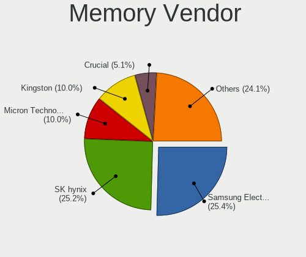

| Vendor              | Notebooks | Percent |
|---------------------|-----------|---------|
| SK hynix            | 87        | 28.25%  |
| Samsung Electronics | 79        | 25.65%  |
| Kingston            | 31        | 10.06%  |
| Micron Technology   | 26        | 8.44%   |
| Crucial             | 16        | 5.19%   |
| Unknown             | 14        | 4.55%   |
| Transcend           | 9         | 2.92%   |
| Elpida              | 8         | 2.6%    |
| Ramaxel Technology  | 7         | 2.27%   |
| Nanya Technology    | 7         | 2.27%   |
| A-DATA Technology   | 6         | 1.95%   |
| Corsair             | 5         | 1.62%   |
| G.Skill             | 4         | 1.3%    |
| Unknown (ABCD)      | 2         | 0.65%   |
| Patriot             | 2         | 0.65%   |
| Essencore Limited   | 2         | 0.65%   |
| Neo Forza           | 1         | 0.32%   |
| KLEVV               | 1         | 0.32%   |
| Innodisk            | 1         | 0.32%   |

Memory Model
------------

Memory module models

| Model                                                            | Notebooks | Percent |
|------------------------------------------------------------------|-----------|---------|
| SK hynix RAM HMA81GS6AFR8N-UH 8GB SODIMM DDR4 2667MT/s           | 8         | 2.5%    |
| Samsung RAM M471A5244CB0-CTD 4GB SODIMM DDR4 3266MT/s            | 7         | 2.19%   |
| SK hynix RAM HMA851S6AFR6N-UH 4GB SODIMM DDR4 2667MT/s           | 5         | 1.56%   |
| SK hynix RAM HMA81GS6CJR8N-VK 8GB SODIMM DDR4 2667MT/s           | 5         | 1.56%   |
| Samsung RAM M471B5273DH0-CK0 4GB SODIMM DDR3 1600MT/s            | 5         | 1.56%   |
| Samsung RAM M471A5244CB0-CRC 4GB SODIMM DDR4 2667MT/s            | 5         | 1.56%   |
| Samsung RAM M471A1K43CB1-CRC 8GB SODIMM DDR4 2667MT/s            | 5         | 1.56%   |
| SK hynix RAM HMT41GS6BFR8A-PB 8GB SODIMM DDR3 1600MT/s           | 4         | 1.25%   |
| SK hynix RAM HMT351S6EFR8A-PB 4GB SODIMM DDR3 1600MT/s           | 4         | 1.25%   |
| SK hynix RAM HMA81GS6JJR8N-VK 8GB SODIMM DDR4 2667MT/s           | 4         | 1.25%   |
| Samsung RAM M471B5273DH0-CH9 4GB SODIMM DDR3 1334MT/s            | 4         | 1.25%   |
| Samsung RAM M471B5173EB0-YK0 4GB SODIMM DDR3 1600MT/s            | 4         | 1.25%   |
| Unknown RAM Module 2GB Row Of Chips LPDDR4 4267MT/s              | 3         | 0.94%   |
| SK hynix RAM HMT351S6CFR8C-PB 4GB SODIMM DDR3 1600MT/s           | 3         | 0.94%   |
| Samsung RAM M471B5273CH0-CH9 4GB SODIMM DDR3 1334MT/s            | 3         | 0.94%   |
| Samsung RAM M471B5173DB0-YK0 4GB SODIMM DDR3 1600MT/s            | 3         | 0.94%   |
| Samsung RAM M471A5244CB0-CWE 4GB Row Of Chips DDR4 3200MT/s      | 3         | 0.94%   |
| Nanya RAM NT2GC64B88B0NS-CG 2GB SODIMM DDR3 1334MT/s             | 3         | 0.94%   |
| Unknown RAM Module 4GB SODIMM DDR3 1600MT/s                      | 2         | 0.63%   |
| Unknown (ABCD) RAM 123456789012345678 2GB SODIMM LPDDR4 2400MT/s | 2         | 0.63%   |
| Transcend RAM JM2666HSB-16G 16GB SODIMM DDR4 2667MT/s            | 2         | 0.63%   |
| SK hynix RAM HMT451S6BFR8A-PB 4GB SODIMM DDR3 1600MT/s           | 2         | 0.63%   |
| SK hynix RAM HMT425S6AFR6A-PB 2GB SODIMM DDR3 1600MT/s           | 2         | 0.63%   |
| SK hynix RAM HMT41GS6AFR8A-PB 8GB SODIMM DDR3 1600MT/s           | 2         | 0.63%   |
| SK hynix RAM HMT351S6CFR8A-PB 4GB SODIMM DDR3 1600MT/s           | 2         | 0.63%   |
| SK hynix RAM HMT351S6BFR8C-H9 4GB SODIMM DDR3 1334MT/s           | 2         | 0.63%   |
| SK hynix RAM HMT351S6BFR8C-H9 4GB SODIMM DDR3 1333MT/s           | 2         | 0.63%   |
| SK hynix RAM HMT325S6EFR8A-PB 2GB SODIMM DDR3 1600MT/s           | 2         | 0.63%   |
| SK hynix RAM HMT325S6CFR8C-H9 2GB SODIMM DDR3 1334MT/s           | 2         | 0.63%   |
| SK hynix RAM HMA851S6DJR6N-XN 4GB SODIMM DDR4 3200MT/s           | 2         | 0.63%   |
| SK hynix RAM HMA851S6AFR6N-TF 4GB SODIMM DDR4 2133MT/s           | 2         | 0.63%   |
| SK hynix RAM HMA82GS6MFR8N-TF 16GB SODIMM DDR4 2133MT/s          | 2         | 0.63%   |
| SK hynix RAM HMA82GS6CJR8N-VK 16GB SODIMM DDR4 2667MT/s          | 2         | 0.63%   |
| Samsung RAM Module 8GB SODIMM DDR4 2133MT/s                      | 2         | 0.63%   |
| Samsung RAM Module 16GB SODIMM DDR4 3200MT/s                     | 2         | 0.63%   |
| Samsung RAM M471B1G73QH0-YK0 8GB SODIMM DDR3 1867MT/s            | 2         | 0.63%   |
| Samsung RAM M471B1G73EB0-YK0 8GB SODIMM DDR3 1600MT/s            | 2         | 0.63%   |
| Samsung RAM M471A5244CB0-CWE 4GB SODIMM DDR4 3200MT/s            | 2         | 0.63%   |
| Samsung RAM M471A1K43DB1-CWE 8GB SODIMM DDR4 3200MT/s            | 2         | 0.63%   |
| Samsung RAM M471A1K43DB1-CTD 8GB SODIMM DDR4 2667MT/s            | 2         | 0.63%   |

Memory Kind
-----------

Memory module kinds

| Kind    | Notebooks | Percent |
|---------|-----------|---------|
| DDR4    | 105       | 46.67%  |
| DDR3    | 95        | 42.22%  |
| LPDDR4  | 12        | 5.33%   |
| DDR2    | 6         | 2.67%   |
| LPDDR3  | 3         | 1.33%   |
| DDR5    | 2         | 0.89%   |
| SDRAM   | 1         | 0.44%   |
| Unknown | 1         | 0.44%   |

Memory Form Factor
------------------

Physical design of the memory module

| Name         | Notebooks | Percent |
|--------------|-----------|---------|
| SODIMM       | 213       | 92.61%  |
| Row Of Chips | 13        | 5.65%   |
| Chip         | 2         | 0.87%   |
| DIMM         | 1         | 0.43%   |
| Unknown      | 1         | 0.43%   |

Memory Size
-----------

Memory module size

| Size  | Notebooks | Percent |
|-------|-----------|---------|
| 4096  | 89        | 34.36%  |
| 8192  | 82        | 31.66%  |
| 2048  | 42        | 16.22%  |
| 16384 | 34        | 13.13%  |
| 32768 | 6         | 2.32%   |
| 1024  | 5         | 1.93%   |
| 512   | 1         | 0.39%   |

Memory Speed
------------

Memory module speed

| Speed   | Notebooks | Percent |
|---------|-----------|---------|
| 2667    | 64        | 24.52%  |
| 1600    | 62        | 23.75%  |
| 3200    | 26        | 9.96%   |
| 2400    | 22        | 8.43%   |
| 2133    | 20        | 7.66%   |
| 1334    | 20        | 7.66%   |
| 1333    | 14        | 5.36%   |
| 3266    | 7         | 2.68%   |
| 4267    | 5         | 1.92%   |
| 975     | 3         | 1.15%   |
| 667     | 3         | 1.15%   |
| 4800    | 2         | 0.77%   |
| 2933    | 2         | 0.77%   |
| 1067    | 2         | 0.77%   |
| 1066    | 2         | 0.77%   |
| 8400    | 1         | 0.38%   |
| 2048    | 1         | 0.38%   |
| 1867    | 1         | 0.38%   |
| 1776    | 1         | 0.38%   |
| 800     | 1         | 0.38%   |
| 533     | 1         | 0.38%   |
| Unknown | 1         | 0.38%   |

Printers & scanners
-------------------

Printer Vendor
--------------

Printer device vendors

| Vendor                | Notebooks | Percent |
|-----------------------|-----------|---------|
| Canon                 | 4         | 50%     |
| Hewlett-Packard       | 2         | 25%     |
| Lexmark International | 1         | 12.5%   |
| Brother Industries    | 1         | 12.5%   |

Printer Model
-------------

Printer device models

| Model                                      | Notebooks | Percent |
|--------------------------------------------|-----------|---------|
| Canon PIXMA MG2500 Series                  | 2         | 25%     |
| Lexmark International InkJet Color Printer | 1         | 12.5%   |
| HP Officejet J4500 series                  | 1         | 12.5%   |
| HP LaserJet 1022                           | 1         | 12.5%   |
| Canon MF210 Series                         | 1         | 12.5%   |
| Canon G4000 series                         | 1         | 12.5%   |
| Brother MFC-L2700DW                        | 1         | 12.5%   |

Scanner Vendor
--------------

Scanner device vendors

Zero info for selected period =(

Scanner Model
-------------

Scanner device models

Zero info for selected period =(

Camera
------

Camera Vendor
-------------

Camera device vendors

| Vendor                                            | Notebooks | Percent |
|---------------------------------------------------|-----------|---------|
| Chicony Electronics                               | 96        | 19.01%  |
| Microdia                                          | 56        | 11.09%  |
| Realtek Semiconductor                             | 50        | 9.9%    |
| Sunplus Innovation Technology                     | 39        | 7.72%   |
| IMC Networks                                      | 37        | 7.33%   |
| Acer                                              | 37        | 7.33%   |
| Quanta                                            | 25        | 4.95%   |
| Cheng Uei Precision Industry (Foxlink)            | 22        | 4.36%   |
| Apple                                             | 17        | 3.37%   |
| Suyin                                             | 15        | 2.97%   |
| Samsung Electronics                               | 14        | 2.77%   |
| Lite-On Technology                                | 14        | 2.77%   |
| Syntek                                            | 13        | 2.57%   |
| Luxvisions Innotech Limited                       | 8         | 1.58%   |
| Silicon Motion                                    | 6         | 1.19%   |
| Ricoh                                             | 6         | 1.19%   |
| Alcor Micro                                       | 6         | 1.19%   |
| Primax Electronics                                | 5         | 0.99%   |
| Bison Electronics                                 | 5         | 0.99%   |
| Microsoft                                         | 4         | 0.79%   |
| Logitech                                          | 4         | 0.79%   |
| Lenovo                                            | 4         | 0.79%   |
| Z-Star Microelectronics                           | 3         | 0.59%   |
| USB Camera                                        | 3         | 0.59%   |
| GEMBIRD                                           | 3         | 0.59%   |
| Sonix Technology                                  | 2         | 0.4%    |
| LG Electronics                                    | 2         | 0.4%    |
| Importek                                          | 2         | 0.4%    |
| Y Media                                           | 1         | 0.2%    |
| Sunplus Technology                                | 1         | 0.2%    |
| STMicroelectronics Imaging Division (VLSI Vision) | 1         | 0.2%    |
| Spreadtrum Communications                         | 1         | 0.2%    |
| OmniVision Technologies                           | 1         | 0.2%    |
| DigiTech                                          | 1         | 0.2%    |
| ALi                                               | 1         | 0.2%    |

Camera Model
------------

Camera device models

| Model                                                   | Notebooks | Percent |
|---------------------------------------------------------|-----------|---------|
| Microdia Integrated_Webcam_HD                           | 25        | 4.95%   |
| Realtek Integrated_Webcam_HD                            | 17        | 3.37%   |
| Sunplus Integrated_Webcam_HD                            | 15        | 2.97%   |
| Samsung Galaxy A5 (MTP)                                 | 14        | 2.77%   |
| IMC Networks USB2.0 VGA UVC WebCam                      | 13        | 2.57%   |
| Chicony Integrated Camera                               | 11        | 2.18%   |
| Microdia Integrated Webcam                              | 10        | 1.98%   |
| IMC Networks Integrated Camera                          | 8         | 1.58%   |
| Chicony EasyCamera                                      | 8         | 1.58%   |
| Acer Integrated Camera                                  | 8         | 1.58%   |
| Quanta VGA Webcam                                       | 7         | 1.39%   |
| IMC Networks USB2.0 HD UVC WebCam                       | 7         | 1.39%   |
| Cheng Uei Precision Industry (Foxlink) Webcam           | 7         | 1.39%   |
| Sunplus HD WebCam                                       | 6         | 1.19%   |
| Apple iPhone 5/5C/5S/6/SE/7/8/X                         | 6         | 1.19%   |
| Acer EasyCamera                                         | 6         | 1.19%   |
| Syntek EasyCamera                                       | 5         | 0.99%   |
| Realtek Integrated Webcam                               | 5         | 0.99%   |
| Realtek HP Truevision HD                                | 5         | 0.99%   |
| Quanta HP HD Camera                                     | 5         | 0.99%   |
| Chicony USB2.0 VGA UVC WebCam                           | 5         | 0.99%   |
| Chicony HP TrueVision HD Camera                         | 5         | 0.99%   |
| Chicony HD WebCam                                       | 5         | 0.99%   |
| Apple FaceTime HD Camera                                | 5         | 0.99%   |
| Acer Lenovo EasyCamera                                  | 5         | 0.99%   |
| Syntek Lenovo EasyCamera                                | 4         | 0.79%   |
| Suyin HP TrueVision HD Integrated Webcam                | 4         | 0.79%   |
| Realtek Integrated Webcam HD                            | 4         | 0.79%   |
| Quanta HP Webcam                                        | 4         | 0.79%   |
| Microdia Laptop_Integrated_Webcam_HD                    | 4         | 0.79%   |
| Lite-On HP HD Camera                                    | 4         | 0.79%   |
| Chicony Integrated IR Camera                            | 4         | 0.79%   |
| Chicony Integrated HP HD Webcam                         | 4         | 0.79%   |
| Chicony HP Webcam                                       | 4         | 0.79%   |
| Cheng Uei Precision Industry (Foxlink) HP Truevision HD | 4         | 0.79%   |
| Acer SunplusIT Integrated Camera                        | 4         | 0.79%   |
| Acer BisonCam, NB Pro                                   | 4         | 0.79%   |
| USB Camera USB Camera                                   | 3         | 0.59%   |
| Suyin Acer/HP Integrated Webcam [CN0314]                | 3         | 0.59%   |
| Sunplus Laptop_Integrated_Webcam_FHD                    | 3         | 0.59%   |

Security
--------

Fingerprint Vendor
------------------

Fingerprint sensor vendors

| Vendor                     | Notebooks | Percent |
|----------------------------|-----------|---------|
| Validity Sensors           | 57        | 50%     |
| Synaptics                  | 16        | 14.04%  |
| Upek                       | 12        | 10.53%  |
| Shenzhen Goodix Technology | 12        | 10.53%  |
| AuthenTec                  | 9         | 7.89%   |
| LighTuning Technology      | 5         | 4.39%   |
| Focal-systems.Corp         | 2         | 1.75%   |
| STMicroelectronics         | 1         | 0.88%   |

Fingerprint Model
-----------------

Fingerprint sensor models

| Model                                                      | Notebooks | Percent |
|------------------------------------------------------------|-----------|---------|
| Validity Sensors VFS495 Fingerprint Reader                 | 15        | 13.16%  |
| Upek Biometric Touchchip/Touchstrip Fingerprint Sensor     | 11        | 9.65%   |
| Validity Sensors VFS5011 Fingerprint Reader                | 7         | 6.14%   |
| Validity Sensors VFS471 Fingerprint Reader                 | 7         | 6.14%   |
| Validity Sensors VFS 5011 fingerprint sensor               | 7         | 6.14%   |
| Validity Sensors VFS451 Fingerprint Reader                 | 5         | 4.39%   |
| Shenzhen Goodix Fingerprint Reader                         | 5         | 4.39%   |
| Validity Sensors Fingerprint scanner                       | 4         | 3.51%   |
| Shenzhen Goodix  FingerPrint Device                        | 4         | 3.51%   |
| Validity Sensors VFS491                                    | 3         | 2.63%   |
| Validity Sensors Swipe Fingerprint Sensor                  | 3         | 2.63%   |
| Synaptics  VFS7552 Touch Fingerprint Sensor with PurePrint | 3         | 2.63%   |
| Synaptics Prometheus MIS Touch Fingerprint Reader          | 3         | 2.63%   |
| Synaptics Metallica MOH Touch Fingerprint Reader           | 3         | 2.63%   |
| Shenzhen Goodix FingerPrint                                | 3         | 2.63%   |
| AuthenTec AES2810                                          | 3         | 2.63%   |
| AuthenTec AES2501 Fingerprint Sensor                       | 3         | 2.63%   |
| Validity Sensors Synaptics WBDI                            | 2         | 1.75%   |
| Synaptics FS7604 Touch Fingerprint Sensor with PurePrint   | 2         | 1.75%   |
| LighTuning ES603 Swipe Fingerprint Sensor                  | 2         | 1.75%   |
| Focal-systems.Corp FT9201Fingerprint.                      | 2         | 1.75%   |
| AuthenTec Fingerprint Sensor                               | 2         | 1.75%   |
| Validity Sensors VFS7552 Touch Fingerprint Sensor          | 1         | 0.88%   |
| Validity Sensors VFS7500 Touch Fingerprint Sensor          | 1         | 0.88%   |
| Validity Sensors VFS301 Fingerprint Reader                 | 1         | 0.88%   |
| Validity Sensors VFS300 Fingerprint Reader                 | 1         | 0.88%   |
| Upek TCS5B Fingerprint sensor                              | 1         | 0.88%   |
| Synaptics WBDI Fingerprint Reader USB 086                  | 1         | 0.88%   |
| Synaptics WBDI                                             | 1         | 0.88%   |
| Synaptics  WBDI                                            | 1         | 0.88%   |
| Synaptics  FS7604 Touch Fingerprint Sensor with PurePrint  | 1         | 0.88%   |
| Synaptics Metallica MIS Touch Fingerprint Reader           | 1         | 0.88%   |
| STMicroelectronics Fingerprint Reader                      | 1         | 0.88%   |
| LighTuning Fingerprint Sensor                              | 1         | 0.88%   |
| LighTuning Fingerprint Reader                              | 1         | 0.88%   |
| LighTuning EgisTec Touch Fingerprint Sensor                | 1         | 0.88%   |
| AuthenTec AES1600                                          | 1         | 0.88%   |

Chipcard Vendor
---------------

Chipcard module vendors

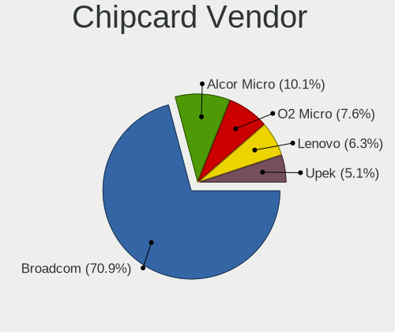

| Vendor      | Notebooks | Percent |
|-------------|-----------|---------|
| Broadcom    | 38        | 70.37%  |
| Lenovo      | 5         | 9.26%   |
| Alcor Micro | 5         | 9.26%   |
| O2 Micro    | 4         | 7.41%   |
| Upek        | 2         | 3.7%    |

Chipcard Model
--------------

Chipcard module models

| Model                                                                        | Notebooks | Percent |
|------------------------------------------------------------------------------|-----------|---------|
| Broadcom BCM5880 Secure Applications Processor with fingerprint swipe sensor | 11        | 20.37%  |
| Broadcom BCM5880 Secure Applications Processor                               | 11        | 20.37%  |
| Broadcom 5880                                                                | 10        | 18.52%  |
| Broadcom 58200                                                               | 6         | 11.11%  |
| Lenovo Integrated Smart Card Reader                                          | 5         | 9.26%   |
| Alcor Micro AU9540 Smartcard Reader                                          | 5         | 9.26%   |
| O2 Micro OZ776 CCID Smartcard Reader                                         | 4         | 7.41%   |
| Upek TouchChip Fingerprint Coprocessor (WBF advanced mode)                   | 2         | 3.7%    |

Unsupported
-----------

Unsupported Devices
-------------------

Total unsupported devices on board

| Total | Notebooks | Percent |
|-------|-----------|---------|
| 0     | 339       | 60.32%  |
| 1     | 176       | 31.32%  |
| 2     | 41        | 7.3%    |
| 3     | 5         | 0.89%   |
| 9     | 1         | 0.18%   |

Unsupported Device Types
------------------------

Types of unsupported devices

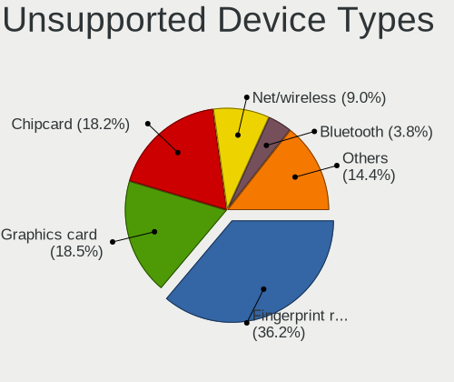

| Type                     | Notebooks | Percent |
|--------------------------|-----------|---------|
| Fingerprint reader       | 113       | 41.24%  |
| Chipcard                 | 50        | 18.25%  |
| Graphics card            | 37        | 13.5%   |
| Net/wireless             | 23        | 8.39%   |
| Bluetooth                | 13        | 4.74%   |
| Multimedia controller    | 11        | 4.01%   |
| Storage                  | 6         | 2.19%   |
| Communication controller | 5         | 1.82%   |
| Camera                   | 5         | 1.82%   |
| Sound                    | 3         | 1.09%   |
| Modem                    | 3         | 1.09%   |
| Card reader              | 2         | 0.73%   |
| Unassigned class         | 1         | 0.36%   |
| Network                  | 1         | 0.36%   |
| Flash memory             | 1         | 0.36%   |

