Linux in South Africa - Tested Hardware & Statistics
----------------------------------------------------

A project to collect tested hardware configurations for Linux in South Africa.

Anyone can contribute to this report by the [hw-probe](https://github.com/linuxhw/hw-probe) tool:

    sudo -E hw-probe -all -upload

Please contribute! Especially if your hardware is rare.

This is a report for all computer types. See also reports for [desktops](/Location/South_Africa/Desktop/README.md) and [notebooks](/Location/South_Africa/Notebook/README.md).

Contents
--------

* [ Test Cases ](#test-cases)

* [ System ](#system)
  - [ OS                       ](#os)
  - [ OS Family                ](#os-family)
  - [ Kernel                   ](#kernel)
  - [ Kernel Family            ](#kernel-family)
  - [ Kernel Major Ver.        ](#kernel-major-ver)
  - [ Arch                     ](#arch)
  - [ DE                       ](#de)
  - [ Display Server           ](#display-server)
  - [ Display Manager          ](#display-manager)
  - [ OS Lang                  ](#os-lang)
  - [ Boot Mode                ](#boot-mode)
  - [ Filesystem               ](#filesystem)
  - [ Part. scheme             ](#part-scheme)
  - [ Dual Boot with Linux/BSD ](#dual-boot-with-linuxbsd)
  - [ Dual Boot (Win)          ](#dual-boot-win)

* [ Board ](#board)
  - [ Vendor                   ](#vendor)
  - [ Model                    ](#model)
  - [ Model Family             ](#model-family)
  - [ MFG Year                 ](#mfg-year)
  - [ Form Factor              ](#form-factor)
  - [ Secure Boot              ](#secure-boot)
  - [ Coreboot                 ](#coreboot)
  - [ RAM Size                 ](#ram-size)
  - [ RAM Used                 ](#ram-used)
  - [ Total Drives             ](#total-drives)
  - [ Has CD-ROM               ](#has-cd-rom)
  - [ Has Ethernet             ](#has-ethernet)
  - [ Has WiFi                 ](#has-wifi)
  - [ Has Bluetooth            ](#has-bluetooth)

* [ Location ](#location)
  - [ Country                  ](#country)
  - [ City                     ](#city)

* [ Drives ](#drives)
  - [ Drive Vendor             ](#drive-vendor)
  - [ Drive Model              ](#drive-model)
  - [ HDD Vendor               ](#hdd-vendor)
  - [ SSD Vendor               ](#ssd-vendor)
  - [ Drive Kind               ](#drive-kind)
  - [ Drive Connector          ](#drive-connector)
  - [ Drive Size               ](#drive-size)
  - [ Space Total              ](#space-total)
  - [ Space Used               ](#space-used)
  - [ Malfunc. Drives          ](#malfunc-drives)
  - [ Malfunc. Drive Vendor    ](#malfunc-drive-vendor)
  - [ Malfunc. HDD Vendor      ](#malfunc-hdd-vendor)
  - [ Malfunc. Drive Kind      ](#malfunc-drive-kind)
  - [ Failed Drives            ](#failed-drives)
  - [ Failed Drive Vendor      ](#failed-drive-vendor)
  - [ Drive Status             ](#drive-status)

* [ Storage controller ](#storage-controller)
  - [ Storage Vendor           ](#storage-vendor)
  - [ Storage Model            ](#storage-model)
  - [ Storage Kind             ](#storage-kind)

* [ Processor ](#processor)
  - [ CPU Vendor               ](#cpu-vendor)
  - [ CPU Model                ](#cpu-model)
  - [ CPU Model Family         ](#cpu-model-family)
  - [ CPU Cores                ](#cpu-cores)
  - [ CPU Sockets              ](#cpu-sockets)
  - [ CPU Threads              ](#cpu-threads)
  - [ CPU Op-Modes             ](#cpu-op-modes)
  - [ CPU Microcode            ](#cpu-microcode)
  - [ CPU Microarch            ](#cpu-microarch)

* [ Graphics ](#graphics)
  - [ GPU Vendor               ](#gpu-vendor)
  - [ GPU Model                ](#gpu-model)
  - [ GPU Combo                ](#gpu-combo)
  - [ GPU Driver               ](#gpu-driver)
  - [ GPU Memory               ](#gpu-memory)

* [ Monitor ](#monitor)
  - [ Monitor Vendor           ](#monitor-vendor)
  - [ Monitor Model            ](#monitor-model)
  - [ Monitor Resolution       ](#monitor-resolution)
  - [ Monitor Diagonal         ](#monitor-diagonal)
  - [ Monitor Width            ](#monitor-width)
  - [ Aspect Ratio             ](#aspect-ratio)
  - [ Monitor Area             ](#monitor-area)
  - [ Pixel Density            ](#pixel-density)
  - [ Multiple Monitors        ](#multiple-monitors)

* [ Network ](#network)
  - [ Net Controller Vendor    ](#net-controller-vendor)
  - [ Net Controller Model     ](#net-controller-model)
  - [ Wireless Vendor          ](#wireless-vendor)
  - [ Wireless Model           ](#wireless-model)
  - [ Ethernet Vendor          ](#ethernet-vendor)
  - [ Ethernet Model           ](#ethernet-model)
  - [ Net Controller Kind      ](#net-controller-kind)
  - [ Used Controller          ](#used-controller)
  - [ NICs                     ](#nics)
  - [ IPv6                     ](#ipv6)

* [ Bluetooth ](#bluetooth)
  - [ Bluetooth Vendor         ](#bluetooth-vendor)
  - [ Bluetooth Model          ](#bluetooth-model)

* [ Sound ](#sound)
  - [ Sound Vendor             ](#sound-vendor)
  - [ Sound Model              ](#sound-model)

* [ Memory ](#memory)
  - [ Memory Vendor            ](#memory-vendor)
  - [ Memory Model             ](#memory-model)
  - [ Memory Kind              ](#memory-kind)
  - [ Memory Form Factor       ](#memory-form-factor)
  - [ Memory Size              ](#memory-size)
  - [ Memory Speed             ](#memory-speed)

* [ Printers & scanners ](#printers--scanners)
  - [ Printer Vendor           ](#printer-vendor)
  - [ Printer Model            ](#printer-model)
  - [ Scanner Vendor           ](#scanner-vendor)
  - [ Scanner Model            ](#scanner-model)

* [ Camera ](#camera)
  - [ Camera Vendor            ](#camera-vendor)
  - [ Camera Model             ](#camera-model)

* [ Security ](#security)
  - [ Fingerprint Vendor       ](#fingerprint-vendor)
  - [ Fingerprint Model        ](#fingerprint-model)
  - [ Chipcard Vendor          ](#chipcard-vendor)
  - [ Chipcard Model           ](#chipcard-model)

* [ Unsupported ](#unsupported)
  - [ Unsupported Devices      ](#unsupported-devices)
  - [ Unsupported Device Types ](#unsupported-device-types)

Test Cases
----------

Total: 2739

| Vendor        | Model                       | Form-Factor | Probe                                                      | Date         |
|---------------|-----------------------------|-------------|------------------------------------------------------------|--------------|
| ASUSTek       | P8B75-M LE                  | Desktop     | [c9f8923761](https://linux-hardware.org/?probe=c9f8923761) | Jan 03, 2026 |
| Lenovo        | G580 20150                  | Notebook    | [d3d07e533b](https://linux-hardware.org/?probe=d3d07e533b) | Jan 03, 2026 |
| ABIT          | A-S78H                      | Desktop     | [dd0fa485ad](https://linux-hardware.org/?probe=dd0fa485ad) | Jan 01, 2026 |
| ABIT          | A-S78H                      | Desktop     | [ac34044240](https://linux-hardware.org/?probe=ac34044240) | Jan 01, 2026 |
| ASUSTek       | P8H61-I                     | Desktop     | [aaf46102ca](https://linux-hardware.org/?probe=aaf46102ca) | Jan 01, 2026 |
| MSI           | B450M PRO-VDH MAX           | Desktop     | [200f1027dc](https://linux-hardware.org/?probe=200f1027dc) | Dec 31, 2025 |
| Lenovo        | G580 20150                  | Notebook    | [66dd7cee8c](https://linux-hardware.org/?probe=66dd7cee8c) | Dec 31, 2025 |
| CONNEX        | L1430 PRO                   | Notebook    | [444862d127](https://linux-hardware.org/?probe=444862d127) | Dec 31, 2025 |
| Dell          | 0GXM1W A00                  | Desktop     | [925e1b2900](https://linux-hardware.org/?probe=925e1b2900) | Dec 29, 2025 |
| ASUSTek       | ROG STRIX X870-F GAMING ... | Desktop     | [9cfbffa333](https://linux-hardware.org/?probe=9cfbffa333) | Dec 29, 2025 |
| Dell          | 0YXT71 A00                  | Desktop     | [656340a869](https://linux-hardware.org/?probe=656340a869) | Dec 29, 2025 |
| Lenovo        | Z51-70 80K6                 | Notebook    | [ea057123cf](https://linux-hardware.org/?probe=ea057123cf) | Dec 28, 2025 |
| Lenovo        | Z51-70 80K6                 | Notebook    | [4423a0f909](https://linux-hardware.org/?probe=4423a0f909) | Dec 28, 2025 |
| Acer          | Aspire A315-53              | Notebook    | [71519fe003](https://linux-hardware.org/?probe=71519fe003) | Dec 27, 2025 |
| HUAWEI        | BOD-WXX9                    | Notebook    | [670417e510](https://linux-hardware.org/?probe=670417e510) | Dec 27, 2025 |
| Gigabyte      | H610M H V3 DDR4             | Desktop     | [6ee508bfca](https://linux-hardware.org/?probe=6ee508bfca) | Dec 27, 2025 |
| Gigabyte      | H610M H V3 DDR4             | Desktop     | [d7a82c7195](https://linux-hardware.org/?probe=d7a82c7195) | Dec 27, 2025 |
| HP            | EliteBook 840 14 inch G9... | Notebook    | [52100cc26c](https://linux-hardware.org/?probe=52100cc26c) | Dec 26, 2025 |
| ASUSTek       | ROG STRIX Z890-A GAMING ... | Desktop     | [50f4428f2d](https://linux-hardware.org/?probe=50f4428f2d) | Dec 26, 2025 |
| MSI           | GF63 Thin 10SC              | Notebook    | [881f0fd9ba](https://linux-hardware.org/?probe=881f0fd9ba) | Dec 25, 2025 |
| AZW           | SER V1.0                    | Mini pc     | [37b9f21c4b](https://linux-hardware.org/?probe=37b9f21c4b) | Dec 24, 2025 |
| Acer          | Aspire SW5-014              | Notebook    | [0238fceca6](https://linux-hardware.org/?probe=0238fceca6) | Dec 24, 2025 |
| ASRock        | Z87 Extreme4                | Desktop     | [889c6d3ab3](https://linux-hardware.org/?probe=889c6d3ab3) | Dec 23, 2025 |
| Intel         | DQ57TM AAE70931-403         | Desktop     | [e7b61d89e2](https://linux-hardware.org/?probe=e7b61d89e2) | Dec 23, 2025 |
| Intel         | DQ57TM AAE70931-403         | Desktop     | [26cee44397](https://linux-hardware.org/?probe=26cee44397) | Dec 23, 2025 |
| ASUSTek       | PRIME B450M-K II            | Desktop     | [5b6a34a1b6](https://linux-hardware.org/?probe=5b6a34a1b6) | Dec 22, 2025 |
| Lenovo        | G580 20150                  | Notebook    | [26d5ef86b9](https://linux-hardware.org/?probe=26d5ef86b9) | Dec 20, 2025 |
| Gigabyte      | H81M-DS2                    | Desktop     | [cc1f98d125](https://linux-hardware.org/?probe=cc1f98d125) | Dec 20, 2025 |
| Sony          | SVF1521Q1EW                 | Notebook    | [8bdd4a1931](https://linux-hardware.org/?probe=8bdd4a1931) | Dec 19, 2025 |
| Dell          | 0VD5HY A04                  | Desktop     | [e0c6f73d45](https://linux-hardware.org/?probe=e0c6f73d45) | Dec 16, 2025 |
| Intel         | DQ77MK AAG39642-302         | Desktop     | [2e96953b53](https://linux-hardware.org/?probe=2e96953b53) | Dec 15, 2025 |
| ASUSTek       | ROG CROSSHAIR X870E HERO    | Desktop     | [1bf5114a42](https://linux-hardware.org/?probe=1bf5114a42) | Dec 15, 2025 |
| Dell          | Pro 16 Plus PB16250         | Notebook    | [6bec15e533](https://linux-hardware.org/?probe=6bec15e533) | Dec 15, 2025 |
| MSI           | MAG B650 TOMAHAWK WIFI      | Desktop     | [150bec88af](https://linux-hardware.org/?probe=150bec88af) | Dec 13, 2025 |
| GMKtec        | NucBox K8 Plus              | Desktop     | [92d6c532e7](https://linux-hardware.org/?probe=92d6c532e7) | Dec 13, 2025 |
| Dell          | 0VD92X A00                  | Desktop     | [3d6e789cca](https://linux-hardware.org/?probe=3d6e789cca) | Dec 13, 2025 |
| ASUSTek       | Z97-K/USB                   | Desktop     | [20d39bb27d](https://linux-hardware.org/?probe=20d39bb27d) | Dec 12, 2025 |
| ASUSTek       | Zenbook UM3402YAR_UM3402... | Notebook    | [347a6269a1](https://linux-hardware.org/?probe=347a6269a1) | Dec 11, 2025 |
| ASUSTek       | VivoBook_ASUSLaptop X509... | Notebook    | [48ea1056dd](https://linux-hardware.org/?probe=48ea1056dd) | Dec 09, 2025 |
| Apple         | MacBookAir7,2               | Notebook    | [55d44e33a0](https://linux-hardware.org/?probe=55d44e33a0) | Dec 09, 2025 |
| Lenovo        | IdeaPad Gaming 3 15ARH7 ... | Notebook    | [cf54d3afae](https://linux-hardware.org/?probe=cf54d3afae) | Dec 09, 2025 |
| HP            | 8169                        | Desktop     | [fde575655d](https://linux-hardware.org/?probe=fde575655d) | Dec 07, 2025 |
| Intel         | DQ77MK AAG39642-302         | Desktop     | [a9906d5fd7](https://linux-hardware.org/?probe=a9906d5fd7) | Dec 06, 2025 |
| Dell          | 0VD92X A00                  | Desktop     | [68d56feb28](https://linux-hardware.org/?probe=68d56feb28) | Dec 06, 2025 |
| Lenovo        | Legion Y530-15ICH 81FV      | Notebook    | [5914385adc](https://linux-hardware.org/?probe=5914385adc) | Dec 06, 2025 |
| ASRock        | X570 Steel Legend           | Desktop     | [b74f30b971](https://linux-hardware.org/?probe=b74f30b971) | Dec 04, 2025 |
| Standard      | Unknown                     | Notebook    | [e704f99bb6](https://linux-hardware.org/?probe=e704f99bb6) | Dec 03, 2025 |
| ASUSTek       | PRIME B550M-K               | Desktop     | [e098569a84](https://linux-hardware.org/?probe=e098569a84) | Dec 03, 2025 |
| Dell          | Latitude E5570              | Notebook    | [422af784ef](https://linux-hardware.org/?probe=422af784ef) | Dec 03, 2025 |
| Lenovo        | ThinkPad T540p 20BFS0FL0... | Notebook    | [b9c868d597](https://linux-hardware.org/?probe=b9c868d597) | Dec 03, 2025 |
| HP            | Unknown                     | Notebook    | [f447f7bbd9](https://linux-hardware.org/?probe=f447f7bbd9) | Nov 29, 2025 |
| Gigabyte      | H81M-DS2                    | Desktop     | [88dbc90302](https://linux-hardware.org/?probe=88dbc90302) | Nov 28, 2025 |
| Gigabyte      | H81M-DS2                    | Desktop     | [5907c7d44b](https://linux-hardware.org/?probe=5907c7d44b) | Nov 28, 2025 |
| ASUSTek       | VivoBook_ASUSLaptop TP41... | Convertible | [62d7b8b01e](https://linux-hardware.org/?probe=62d7b8b01e) | Nov 27, 2025 |
| ASUSTek       | Vivobook Go E1504GAB_E15... | Notebook    | [3c60b89e92](https://linux-hardware.org/?probe=3c60b89e92) | Nov 27, 2025 |
| Toshiba       | Satellite U300              | Notebook    | [361a846f1e](https://linux-hardware.org/?probe=361a846f1e) | Nov 24, 2025 |
| MSI           | 2A9C                        | Desktop     | [d8c7341766](https://linux-hardware.org/?probe=d8c7341766) | Nov 24, 2025 |
| MSI           | H410M-A PRO                 | Desktop     | [76d5c004c4](https://linux-hardware.org/?probe=76d5c004c4) | Nov 24, 2025 |
| MSI           | 2A9C                        | Desktop     | [a0e60dd1b1](https://linux-hardware.org/?probe=a0e60dd1b1) | Nov 24, 2025 |
| Intel         | DQ57TM AAE70931-403         | Desktop     | [7dc87ea258](https://linux-hardware.org/?probe=7dc87ea258) | Nov 22, 2025 |
| Dell          | Latitude 5175               | Tablet      | [29283a51e9](https://linux-hardware.org/?probe=29283a51e9) | Nov 22, 2025 |
| Lenovo        | ThinkPad E15 Gen 2 20TD0... | Notebook    | [031cea76d5](https://linux-hardware.org/?probe=031cea76d5) | Nov 22, 2025 |
| Intel         | DQ57TM AAE70931-403         | Desktop     | [3de6d3e060](https://linux-hardware.org/?probe=3de6d3e060) | Nov 22, 2025 |
| Lenovo        | ThinkPad E16 Gen 2 21MA0... | Notebook    | [9b12af1d5b](https://linux-hardware.org/?probe=9b12af1d5b) | Nov 21, 2025 |
| Lenovo        | ThinkPad E15 Gen 2 20TD0... | Notebook    | [22789fc20e](https://linux-hardware.org/?probe=22789fc20e) | Nov 20, 2025 |
| Lenovo        | G50-70 20351                | Notebook    | [a71f431057](https://linux-hardware.org/?probe=a71f431057) | Nov 18, 2025 |
| Dell          | 0GXM1W A00                  | Desktop     | [e830e03e1c](https://linux-hardware.org/?probe=e830e03e1c) | Nov 17, 2025 |
| Unknown       | Unknown                     | Notebook    | [5dafcfab6f](https://linux-hardware.org/?probe=5dafcfab6f) | Nov 16, 2025 |
| ASUSTek       | ASUS TUF Gaming F15 FX50... | Notebook    | [191e89595d](https://linux-hardware.org/?probe=191e89595d) | Nov 15, 2025 |
| ASUSTek       | VivoBook_ASUSLaptop X509... | Notebook    | [b5cfa41d9b](https://linux-hardware.org/?probe=b5cfa41d9b) | Nov 14, 2025 |
| HP            | 82B5                        | All in one  | [95ad6e0dfd](https://linux-hardware.org/?probe=95ad6e0dfd) | Nov 14, 2025 |
| Lenovo        | G50-70 20351                | Notebook    | [f5313d1d44](https://linux-hardware.org/?probe=f5313d1d44) | Nov 14, 2025 |
| MSI           | Z270 GAMING PRO CARBON      | Desktop     | [739c2b146d](https://linux-hardware.org/?probe=739c2b146d) | Nov 13, 2025 |
| Dell          | Latitude 7430               | Notebook    | [08ad49a6d1](https://linux-hardware.org/?probe=08ad49a6d1) | Nov 13, 2025 |
| Supermicro    | X10SRL-FB                   | Server      | [890f346695](https://linux-hardware.org/?probe=890f346695) | Nov 12, 2025 |
| ASUSTek       | M5A99FX PRO R2.0            | Desktop     | [e5dce5ac9e](https://linux-hardware.org/?probe=e5dce5ac9e) | Nov 10, 2025 |
| Dell          | 0VNP2H A00                  | Desktop     | [106601decd](https://linux-hardware.org/?probe=106601decd) | Nov 10, 2025 |
| Gigabyte      | 945GZM-S2                   | Desktop     | [d854cd3746](https://linux-hardware.org/?probe=d854cd3746) | Nov 10, 2025 |
| ASUSTek       | M5A99FX PRO R2.0            | Desktop     | [d552215479](https://linux-hardware.org/?probe=d552215479) | Nov 10, 2025 |
| MSI           | GE63VR 7RE                  | Notebook    | [e525adb6d1](https://linux-hardware.org/?probe=e525adb6d1) | Nov 09, 2025 |
| Toshiba       | Satellite C50-A0254         | Notebook    | [85bb650263](https://linux-hardware.org/?probe=85bb650263) | Nov 08, 2025 |
| Dell          | 0YXT71 A02                  | Desktop     | [04d83d930d](https://linux-hardware.org/?probe=04d83d930d) | Nov 07, 2025 |
| ASUSTek       | Z170I PRO GAMING            | Desktop     | [446f8d02d2](https://linux-hardware.org/?probe=446f8d02d2) | Nov 06, 2025 |
| Foxconn       | G41MXE/G41MXE-K             | Desktop     | [6bceb602c1](https://linux-hardware.org/?probe=6bceb602c1) | Nov 06, 2025 |
| Acer          | Extensa 215-55              | Notebook    | [2aa22bc317](https://linux-hardware.org/?probe=2aa22bc317) | Nov 06, 2025 |
| Acer          | Extensa 215-55              | Notebook    | [b9f7e89dd5](https://linux-hardware.org/?probe=b9f7e89dd5) | Nov 06, 2025 |
| Unknown       | Unknown                     | Notebook    | [a8c08e1710](https://linux-hardware.org/?probe=a8c08e1710) | Nov 05, 2025 |
| MSI           | B450M-A PRO MAX II          | Desktop     | [9fe26e7565](https://linux-hardware.org/?probe=9fe26e7565) | Nov 04, 2025 |
| Dell          | Inspiron 5559               | Notebook    | [881e9a9fcb](https://linux-hardware.org/?probe=881e9a9fcb) | Nov 04, 2025 |
| MSI           | A520M-A PRO                 | Desktop     | [2edda8b979](https://linux-hardware.org/?probe=2edda8b979) | Nov 04, 2025 |
| HP            | Unknown                     | Notebook    | [4f80d79c33](https://linux-hardware.org/?probe=4f80d79c33) | Nov 04, 2025 |
| Dell          | Latitude E6410              | Notebook    | [3aa870d787](https://linux-hardware.org/?probe=3aa870d787) | Nov 03, 2025 |
| ASUSTek       | M5A97 R2.0                  | Desktop     | [a6ede9fec3](https://linux-hardware.org/?probe=a6ede9fec3) | Nov 03, 2025 |
| Lenovo        | ThinkPad T540p 20BFS0FL0... | Notebook    | [dd5e280abc](https://linux-hardware.org/?probe=dd5e280abc) | Nov 03, 2025 |
| Lenovo        | 3111 SDK0J40697 WIN 3305... | Mini pc     | [d9e3103efe](https://linux-hardware.org/?probe=d9e3103efe) | Nov 02, 2025 |
| ASUSTek       | VivoBook_ASUSLaptop X571... | Notebook    | [e7d875961b](https://linux-hardware.org/?probe=e7d875961b) | Nov 01, 2025 |
| HP            | Unknown                     | Notebook    | [58f5dfa9c7](https://linux-hardware.org/?probe=58f5dfa9c7) | Nov 01, 2025 |
| ASRock        | Z170 Pro4                   | Desktop     | [763cc273b4](https://linux-hardware.org/?probe=763cc273b4) | Nov 01, 2025 |
| Dell          | 0F5C5X A00                  | Desktop     | [bd7f947a73](https://linux-hardware.org/?probe=bd7f947a73) | Oct 31, 2025 |
| HP            | Unknown                     | Notebook    | [5e58373373](https://linux-hardware.org/?probe=5e58373373) | Oct 30, 2025 |
| Lenovo        | ThinkPad T540p 20BFS0FL0... | Notebook    | [a5fc656834](https://linux-hardware.org/?probe=a5fc656834) | Oct 28, 2025 |
| Apple         | MacBookPro9,1               | Notebook    | [2dce167aec](https://linux-hardware.org/?probe=2dce167aec) | Oct 28, 2025 |
| Lenovo        | MAHOBAY 0C48431 PRO         | Desktop     | [aee14419c9](https://linux-hardware.org/?probe=aee14419c9) | Oct 28, 2025 |
| Intel         | DQ67SW AAG12527-310         | Desktop     | [a0f445fe15](https://linux-hardware.org/?probe=a0f445fe15) | Oct 27, 2025 |
| Intel         | DQ77MK AAG39642-400         | Desktop     | [9ceed2ab1b](https://linux-hardware.org/?probe=9ceed2ab1b) | Oct 27, 2025 |
| HP            | 1495                        | Desktop     | [33bfd2e476](https://linux-hardware.org/?probe=33bfd2e476) | Oct 25, 2025 |
| ASUSTek       | TUF Gaming X870-PLUS WIF... | Desktop     | [53a524efac](https://linux-hardware.org/?probe=53a524efac) | Oct 24, 2025 |
| HP            | Laptop 15-bs0xx             | Notebook    | [54e6177317](https://linux-hardware.org/?probe=54e6177317) | Oct 23, 2025 |
| HP            | EliteBook 2540p             | Notebook    | [c8ce631a86](https://linux-hardware.org/?probe=c8ce631a86) | Oct 21, 2025 |
| HP            | EliteBook 2540p             | Notebook    | [a03750e25c](https://linux-hardware.org/?probe=a03750e25c) | Oct 21, 2025 |
| Dell          | Inspiron 15-3567            | Notebook    | [3bc87565bb](https://linux-hardware.org/?probe=3bc87565bb) | Oct 21, 2025 |
| Lenovo        | E50-80 80J2                 | Notebook    | [3799ff59dd](https://linux-hardware.org/?probe=3799ff59dd) | Oct 21, 2025 |
| Lenovo        | SHARKBAY SDK0E50515 STD     | Desktop     | [585725e48b](https://linux-hardware.org/?probe=585725e48b) | Oct 21, 2025 |
| Lenovo        | SHARKBAY SDK0E50515 STD     | Desktop     | [0829effe09](https://linux-hardware.org/?probe=0829effe09) | Oct 21, 2025 |
| MSI           | Z590-A PRO                  | Desktop     | [fd04193e96](https://linux-hardware.org/?probe=fd04193e96) | Oct 20, 2025 |
| HP            | Laptop 15-bs0xx             | Notebook    | [594e6c55d7](https://linux-hardware.org/?probe=594e6c55d7) | Oct 19, 2025 |
| Lenovo        | IdeaPad 3 15IML05 81WB      | Notebook    | [870f573b22](https://linux-hardware.org/?probe=870f573b22) | Oct 19, 2025 |
| ASRock        | B550 Phantom Gaming 4/ac    | Desktop     | [924e2695b4](https://linux-hardware.org/?probe=924e2695b4) | Oct 19, 2025 |
| Lenovo        | Aptio CRB SDK0H15299 WIN    | Mini pc     | [ee75e343e0](https://linux-hardware.org/?probe=ee75e343e0) | Oct 18, 2025 |
| Dell          | Inspiron 3521               | Notebook    | [7b529f5153](https://linux-hardware.org/?probe=7b529f5153) | Oct 16, 2025 |
| Fujitsu       | D2990-A1 S26361-D2990-A1    | Desktop     | [99c113eec6](https://linux-hardware.org/?probe=99c113eec6) | Oct 16, 2025 |
| Fujitsu       | D2990-A1 S26361-D2990-A1    | Desktop     | [9271cb3efb](https://linux-hardware.org/?probe=9271cb3efb) | Oct 16, 2025 |
| Standard      | Unknown                     | Notebook    | [6d21312287](https://linux-hardware.org/?probe=6d21312287) | Oct 16, 2025 |
| HP            | 3646h                       | Desktop     | [77a710b362](https://linux-hardware.org/?probe=77a710b362) | Oct 16, 2025 |
| Apple         | MacBookPro14,3              | Notebook    | [87876c002d](https://linux-hardware.org/?probe=87876c002d) | Oct 14, 2025 |
| I-Life Dig... | ZED Air Plus                | Notebook    | [1fcc9916ae](https://linux-hardware.org/?probe=1fcc9916ae) | Oct 12, 2025 |
| HP            | Laptop 15-bs0xx             | Notebook    | [be26f564c2](https://linux-hardware.org/?probe=be26f564c2) | Oct 11, 2025 |
| ASUSTek       | VivoBook_ASUSLaptop M150... | Notebook    | [15b8bbf483](https://linux-hardware.org/?probe=15b8bbf483) | Oct 09, 2025 |
| Dell          | Vostro 16 5640              | Notebook    | [0586d91b3a](https://linux-hardware.org/?probe=0586d91b3a) | Oct 08, 2025 |
| MSI           | Z270 GAMING PRO CARBON      | Desktop     | [8809dd754d](https://linux-hardware.org/?probe=8809dd754d) | Oct 08, 2025 |
| ASUSTek       | PRIME B760M-K               | Desktop     | [bd20ea9349](https://linux-hardware.org/?probe=bd20ea9349) | Oct 08, 2025 |
| Intel         | NUC11PHBi7 M26151-405       | Mini pc     | [b5de45280f](https://linux-hardware.org/?probe=b5de45280f) | Oct 06, 2025 |
| HP            | Laptop 15-ra0xx             | Notebook    | [607a4aa02f](https://linux-hardware.org/?probe=607a4aa02f) | Oct 05, 2025 |
| HP            | Laptop 15-ra0xx             | Notebook    | [4114604318](https://linux-hardware.org/?probe=4114604318) | Oct 04, 2025 |
| ASRock        | B550 Phantom Gaming 4/ac    | Desktop     | [10800520d4](https://linux-hardware.org/?probe=10800520d4) | Oct 04, 2025 |
| ASUSTek       | VivoBook_ASUSLaptop X150... | Notebook    | [13f8ba34f0](https://linux-hardware.org/?probe=13f8ba34f0) | Oct 02, 2025 |
| HP            | ProBook 4530s               | Notebook    | [a7763f4e20](https://linux-hardware.org/?probe=a7763f4e20) | Oct 01, 2025 |
| ASUSTek       | VivoBook_ASUSLaptop X150... | Notebook    | [5630650251](https://linux-hardware.org/?probe=5630650251) | Oct 01, 2025 |
| Lenovo        | 3098 SDK0E50510 WIN         | Desktop     | [5f092f9e84](https://linux-hardware.org/?probe=5f092f9e84) | Sep 30, 2025 |
| Lenovo        | 361A SDK0K17763 WIN         | Desktop     | [8f9cab2590](https://linux-hardware.org/?probe=8f9cab2590) | Sep 29, 2025 |
| Acer          | Aspire A315-57G             | Notebook    | [ff753de962](https://linux-hardware.org/?probe=ff753de962) | Sep 28, 2025 |
| Lenovo        | IdeaPad 3 15IGL05 81WQ      | Notebook    | [d6d13a9a94](https://linux-hardware.org/?probe=d6d13a9a94) | Sep 26, 2025 |
| Lenovo        | IdeaPad 3 15IGL05 81WQ      | Notebook    | [b7cc425cdc](https://linux-hardware.org/?probe=b7cc425cdc) | Sep 26, 2025 |
| Dell          | Inspiron 3542               | Notebook    | [c28ede0f52](https://linux-hardware.org/?probe=c28ede0f52) | Sep 26, 2025 |
| HP            | 630                         | Notebook    | [18977caac7](https://linux-hardware.org/?probe=18977caac7) | Sep 25, 2025 |
| HP            | 630                         | Notebook    | [76a51245c6](https://linux-hardware.org/?probe=76a51245c6) | Sep 25, 2025 |
| Proline       | V1165C4                     | Notebook    | [4a0d7d946a](https://linux-hardware.org/?probe=4a0d7d946a) | Sep 25, 2025 |
| Proline       | V1165C4                     | Notebook    | [cfc2c58da9](https://linux-hardware.org/?probe=cfc2c58da9) | Sep 25, 2025 |
| Lenovo        | ThinkPad L460 20FVS23N00    | Notebook    | [a25ab71e41](https://linux-hardware.org/?probe=a25ab71e41) | Sep 24, 2025 |
| Dell          | Inspiron 3542               | Notebook    | [6028f7b9b5](https://linux-hardware.org/?probe=6028f7b9b5) | Sep 23, 2025 |
| Apple         | MacBookAir7,2               | Notebook    | [ea88a4bbfe](https://linux-hardware.org/?probe=ea88a4bbfe) | Sep 22, 2025 |
| ASUSTek       | ROG STRIX B550-A GAMING     | Desktop     | [f6fb41717e](https://linux-hardware.org/?probe=f6fb41717e) | Sep 21, 2025 |
| ASUSTek       | ROG STRIX B550-A GAMING     | Desktop     | [486ce3c552](https://linux-hardware.org/?probe=486ce3c552) | Sep 21, 2025 |
| HP            | Spectre x360 2-in-1 Lapt... | Convertible | [8fe0bc74fd](https://linux-hardware.org/?probe=8fe0bc74fd) | Sep 20, 2025 |
| Pegatron      | 2A73                        | Desktop     | [c09dec266b](https://linux-hardware.org/?probe=c09dec266b) | Sep 18, 2025 |
| ASUSTek       | VivoBook_ASUSLaptop X509... | Notebook    | [1fd24b5909](https://linux-hardware.org/?probe=1fd24b5909) | Sep 17, 2025 |
| Samsung       | DP500A2D-S01ZA SEC_SW_RE... | All in one  | [9161e6aab5](https://linux-hardware.org/?probe=9161e6aab5) | Sep 17, 2025 |
| MSI           | CR643                       | Notebook    | [e2a527d975](https://linux-hardware.org/?probe=e2a527d975) | Sep 17, 2025 |
| Pegatron      | 2A73                        | Desktop     | [aed026e1cc](https://linux-hardware.org/?probe=aed026e1cc) | Sep 17, 2025 |
| ASUSTek       | PRIME H510M-D               | Desktop     | [7a769aae3f](https://linux-hardware.org/?probe=7a769aae3f) | Sep 16, 2025 |
| MSI           | B450M-A PRO MAX II          | Desktop     | [11728f8b50](https://linux-hardware.org/?probe=11728f8b50) | Sep 14, 2025 |
| HP            | Laptop 15-bs0xx             | Notebook    | [af10223c87](https://linux-hardware.org/?probe=af10223c87) | Sep 14, 2025 |
| Pegatron      | IPMIP-GS                    | Desktop     | [5d23a22583](https://linux-hardware.org/?probe=5d23a22583) | Sep 14, 2025 |
| Dell          | 0F5C5X A00                  | Desktop     | [0a8517d33f](https://linux-hardware.org/?probe=0a8517d33f) | Sep 13, 2025 |
| ASUSTek       | TUF B450-PRO GAMING         | Desktop     | [1cb6fe19b6](https://linux-hardware.org/?probe=1cb6fe19b6) | Sep 12, 2025 |
| ASUSTek       | TUF B450-PRO GAMING         | Desktop     | [e5c1f418c8](https://linux-hardware.org/?probe=e5c1f418c8) | Sep 12, 2025 |
| MSI           | H110M PRO-VD PLUS           | Notebook    | [54b0fb9f5a](https://linux-hardware.org/?probe=54b0fb9f5a) | Sep 11, 2025 |
| ASUSTek       | VivoBook_ASUSLaptop TN34... | Convertible | [d3c6300a28](https://linux-hardware.org/?probe=d3c6300a28) | Sep 11, 2025 |
| Samsung       | P580                        | Notebook    | [71ae2fd7ec](https://linux-hardware.org/?probe=71ae2fd7ec) | Sep 10, 2025 |
| Gigabyte      | H97-Gaming 3                | Desktop     | [c0c1acff33](https://linux-hardware.org/?probe=c0c1acff33) | Sep 09, 2025 |
| Packard Be... | ENBFXS                      | Notebook    | [79eb425f5d](https://linux-hardware.org/?probe=79eb425f5d) | Sep 09, 2025 |
| HP            | OMEN by Gaming Laptop 16... | Notebook    | [b1950e6583](https://linux-hardware.org/?probe=b1950e6583) | Sep 09, 2025 |
| Dell          | 0F5C5X A00                  | Desktop     | [9d1c54a90d](https://linux-hardware.org/?probe=9d1c54a90d) | Sep 08, 2025 |
| ASUSTek       | Vivobook Go E1504GAB_E15... | Notebook    | [c716408a08](https://linux-hardware.org/?probe=c716408a08) | Sep 08, 2025 |
| ASUSTek       | ASUS TUF Dash F15 FX517Z... | Notebook    | [a3d9cf6f6f](https://linux-hardware.org/?probe=a3d9cf6f6f) | Sep 08, 2025 |
| ASRock        | A520M-HVS                   | Desktop     | [b0a9c6c0d4](https://linux-hardware.org/?probe=b0a9c6c0d4) | Sep 06, 2025 |
| Toshiba       | Satellite U300              | Notebook    | [a435a807e7](https://linux-hardware.org/?probe=a435a807e7) | Sep 06, 2025 |
| Toshiba       | Satellite U300              | Notebook    | [3661b3a989](https://linux-hardware.org/?probe=3661b3a989) | Sep 06, 2025 |
| Lenovo        | IdeaPad S145-15IKB 81VD     | Notebook    | [e15d8fb50f](https://linux-hardware.org/?probe=e15d8fb50f) | Sep 04, 2025 |
| HP            | EliteBook 865 16 inch G9... | Notebook    | [c465e7d635](https://linux-hardware.org/?probe=c465e7d635) | Sep 04, 2025 |
| HP            | EliteBook Folio 9480m       | Notebook    | [aa17090ed6](https://linux-hardware.org/?probe=aa17090ed6) | Sep 03, 2025 |
| Lenovo        | G50-70 20351                | Notebook    | [36b119eb6d](https://linux-hardware.org/?probe=36b119eb6d) | Sep 02, 2025 |
| Lenovo        | G575 20081                  | Notebook    | [5d0ab3cdb2](https://linux-hardware.org/?probe=5d0ab3cdb2) | Sep 02, 2025 |
| Dell          | Inspiron 3542               | Notebook    | [dd831820cd](https://linux-hardware.org/?probe=dd831820cd) | Sep 02, 2025 |
| Dell          | Inspiron 3542               | Notebook    | [8a678b26ec](https://linux-hardware.org/?probe=8a678b26ec) | Sep 02, 2025 |
| ASUSTek       | VivoBook_ASUSLaptop X509... | Notebook    | [64bc38a0d9](https://linux-hardware.org/?probe=64bc38a0d9) | Sep 01, 2025 |
| Dell          | Inspiron 5482               | Convertible | [7079c48bec](https://linux-hardware.org/?probe=7079c48bec) | Sep 01, 2025 |
| MSI           | MPG X870E CARBON WIFI       | Desktop     | [45b6426e9f](https://linux-hardware.org/?probe=45b6426e9f) | Aug 30, 2025 |
| Dell          | 0GY6Y8 A03                  | Desktop     | [fa9c4347a5](https://linux-hardware.org/?probe=fa9c4347a5) | Aug 30, 2025 |
| Apple         | Mac-F2268CC8                | All in one  | [673f523e35](https://linux-hardware.org/?probe=673f523e35) | Aug 28, 2025 |
| Microsoft     | Surface Laptop 2            | Tablet      | [9d2c858a99](https://linux-hardware.org/?probe=9d2c858a99) | Aug 27, 2025 |
| Gigabyte      | B760M DS3H DDR4             | Desktop     | [0b0978d456](https://linux-hardware.org/?probe=0b0978d456) | Aug 27, 2025 |
| Lenovo        | ThinkPad X1 Carbon Gen 1... | Notebook    | [725c92c58c](https://linux-hardware.org/?probe=725c92c58c) | Aug 25, 2025 |
| Lenovo        | IdeaPad 110-15ISK 80UD      | Notebook    | [3cc3f62c88](https://linux-hardware.org/?probe=3cc3f62c88) | Aug 24, 2025 |
| Lenovo        | IdeaPad 110-15ISK 80UD      | Notebook    | [636d7879af](https://linux-hardware.org/?probe=636d7879af) | Aug 24, 2025 |
| Gigabyte      | Z390 UD                     | Desktop     | [778be0b047](https://linux-hardware.org/?probe=778be0b047) | Aug 23, 2025 |
| Lenovo        | G50-80 80E5                 | Notebook    | [1975c6e286](https://linux-hardware.org/?probe=1975c6e286) | Aug 19, 2025 |
| Proline       | V146I516512K                | Notebook    | [10e8987344](https://linux-hardware.org/?probe=10e8987344) | Aug 19, 2025 |
| Proline       | V146I516512K                | Notebook    | [493bd1f1f9](https://linux-hardware.org/?probe=493bd1f1f9) | Aug 19, 2025 |
| Dell          | XPS 13 9380                 | Notebook    | [4ed6cda2e9](https://linux-hardware.org/?probe=4ed6cda2e9) | Aug 18, 2025 |
| MSI           | X470 GAMING PRO             | Desktop     | [d5ea4eea9f](https://linux-hardware.org/?probe=d5ea4eea9f) | Aug 18, 2025 |
| MSI           | MAG B650 TOMAHAWK WIFI      | Desktop     | [ea81fedc48](https://linux-hardware.org/?probe=ea81fedc48) | Aug 17, 2025 |
| ASUSTek       | VivoBook_ASUSLaptop X515... | Notebook    | [43a00c4b6d](https://linux-hardware.org/?probe=43a00c4b6d) | Aug 16, 2025 |
| ASUSTek       | Vivobook Go E1504GAB_E15... | Notebook    | [ae880336b3](https://linux-hardware.org/?probe=ae880336b3) | Aug 15, 2025 |
| Fujitsu Si... | D2824-A1 S26361-D2824-A1    | Desktop     | [c72c9c1087](https://linux-hardware.org/?probe=c72c9c1087) | Aug 14, 2025 |
| HP            | 8D09                        | All in one  | [719c3ab91e](https://linux-hardware.org/?probe=719c3ab91e) | Aug 14, 2025 |
| HP            | ProBook 6550b               | Notebook    | [3807f7bf67](https://linux-hardware.org/?probe=3807f7bf67) | Aug 14, 2025 |
| Acer          | Nitro AN515-55              | Notebook    | [bd9807ad56](https://linux-hardware.org/?probe=bd9807ad56) | Aug 14, 2025 |
| ASUSTek       | ROG STRIX B550-F GAMING     | Desktop     | [f4a02aa5b2](https://linux-hardware.org/?probe=f4a02aa5b2) | Aug 14, 2025 |
| MSI           | MPG Z390 GAMING PLUS        | Desktop     | [c49f0666fa](https://linux-hardware.org/?probe=c49f0666fa) | Aug 13, 2025 |
| ASUSTek       | H61M-C                      | Desktop     | [2f49070211](https://linux-hardware.org/?probe=2f49070211) | Aug 13, 2025 |
| Shenzhen M... | F8BAC                       | Mini pc     | [04e5227ddb](https://linux-hardware.org/?probe=04e5227ddb) | Aug 13, 2025 |
| ASUSTek       | ROG CROSSHAIR X870E HERO    | Desktop     | [7ee0268b7c](https://linux-hardware.org/?probe=7ee0268b7c) | Aug 12, 2025 |
| ASUSTek       | GL553VD                     | Notebook    | [d3c1af7c64](https://linux-hardware.org/?probe=d3c1af7c64) | Aug 12, 2025 |
| Dell          | Inspiron 15-3567            | Notebook    | [e3e48387f5](https://linux-hardware.org/?probe=e3e48387f5) | Aug 12, 2025 |
| Dell          | Inspiron 15-3567            | Notebook    | [7403537fe5](https://linux-hardware.org/?probe=7403537fe5) | Aug 12, 2025 |
| Dell          | Inspiron 15-3567            | Notebook    | [3722ce3df8](https://linux-hardware.org/?probe=3722ce3df8) | Aug 11, 2025 |
| Inventec      | D CLASS A02                 | Desktop     | [bf34229f54](https://linux-hardware.org/?probe=bf34229f54) | Aug 10, 2025 |
| ASUSTek       | H81M-PLUS                   | Desktop     | [ec75d0f934](https://linux-hardware.org/?probe=ec75d0f934) | Aug 10, 2025 |
| Apple         | MacBookPro11,2              | Notebook    | [5da31d9e6d](https://linux-hardware.org/?probe=5da31d9e6d) | Aug 10, 2025 |
| Acer          | Aspire A315-59              | Notebook    | [1ccb9c9ad2](https://linux-hardware.org/?probe=1ccb9c9ad2) | Aug 09, 2025 |
| MSI           | B450M-A PRO MAX II          | Desktop     | [c1e976a610](https://linux-hardware.org/?probe=c1e976a610) | Aug 09, 2025 |
| Acidanther... | MacBookPro14,1              | Notebook    | [5f0eefe10c](https://linux-hardware.org/?probe=5f0eefe10c) | Aug 09, 2025 |
| MSI           | B450M-A PRO MAX II          | Desktop     | [1005aa7c0a](https://linux-hardware.org/?probe=1005aa7c0a) | Aug 09, 2025 |
| Lenovo        | IdeaPad 1 14IGL05 81VU      | Notebook    | [42160d6019](https://linux-hardware.org/?probe=42160d6019) | Aug 09, 2025 |
| HP            | 635                         | Notebook    | [caacd72091](https://linux-hardware.org/?probe=caacd72091) | Aug 09, 2025 |
| Acer          | Aspire A315-59              | Notebook    | [9a7e6ef348](https://linux-hardware.org/?probe=9a7e6ef348) | Aug 08, 2025 |
| Dell          | 040DDP A01                  | Desktop     | [225ef1b0a1](https://linux-hardware.org/?probe=225ef1b0a1) | Aug 08, 2025 |
| MSI           | PRO B760M-E DDR4            | Desktop     | [062ae6d8fa](https://linux-hardware.org/?probe=062ae6d8fa) | Aug 04, 2025 |
| Lenovo        | IdeaPad 1 15AMN7 82VG       | Notebook    | [20ce289bd6](https://linux-hardware.org/?probe=20ce289bd6) | Aug 04, 2025 |
| MSI           | PRO B760M-E DDR4            | Desktop     | [75fae8b00e](https://linux-hardware.org/?probe=75fae8b00e) | Aug 03, 2025 |
| Biostar       | Hi-Fi H87S3+                | Desktop     | [9237c08a22](https://linux-hardware.org/?probe=9237c08a22) | Aug 02, 2025 |
| Unknown       | Unknown                     | Desktop     | [f71e3714a9](https://linux-hardware.org/?probe=f71e3714a9) | Aug 02, 2025 |
| Unknown       | Unknown                     | Desktop     | [c09e070e80](https://linux-hardware.org/?probe=c09e070e80) | Aug 02, 2025 |
| Dell          | 0HGFJM A00                  | Desktop     | [f5a5b8e2e7](https://linux-hardware.org/?probe=f5a5b8e2e7) | Aug 01, 2025 |
| Gigabyte      | X58A-UD3R                   | Desktop     | [2da8214d57](https://linux-hardware.org/?probe=2da8214d57) | Jul 30, 2025 |
| HP            | OMEN by Gaming Laptop 16... | Notebook    | [fc5f673b31](https://linux-hardware.org/?probe=fc5f673b31) | Jul 30, 2025 |
| Dell          | Latitude 5490               | Notebook    | [8daf3ed777](https://linux-hardware.org/?probe=8daf3ed777) | Jul 29, 2025 |
| Lenovo        | Yoga 2 13 20344             | Notebook    | [b5db209646](https://linux-hardware.org/?probe=b5db209646) | Jul 28, 2025 |
| HP            | 250 G4 Notebook PC          | Notebook    | [281a5af981](https://linux-hardware.org/?probe=281a5af981) | Jul 28, 2025 |
| Lenovo        | V330-14IGM 81B3             | Notebook    | [1f8b2fa7d1](https://linux-hardware.org/?probe=1f8b2fa7d1) | Jul 23, 2025 |
| Gigabyte      | X58A-UD3R                   | Desktop     | [318bac5704](https://linux-hardware.org/?probe=318bac5704) | Jul 23, 2025 |
| HP            | 8D09                        | All in one  | [abd178049a](https://linux-hardware.org/?probe=abd178049a) | Jul 23, 2025 |
| Samsung       | P580                        | Notebook    | [59aa960771](https://linux-hardware.org/?probe=59aa960771) | Jul 23, 2025 |
| Samsung       | P580                        | Notebook    | [9ffc4ab2fc](https://linux-hardware.org/?probe=9ffc4ab2fc) | Jul 23, 2025 |
| ASUSTek       | VivoBook_ASUSLaptop X515... | Notebook    | [fbb2529a58](https://linux-hardware.org/?probe=fbb2529a58) | Jul 21, 2025 |
| Dell          | Latitude 7320               | Notebook    | [fdc78fa4d6](https://linux-hardware.org/?probe=fdc78fa4d6) | Jul 20, 2025 |
| ASUSTek       | Vivobook Go E1504FA_E150... | Notebook    | [b5b6ecb9ce](https://linux-hardware.org/?probe=b5b6ecb9ce) | Jul 20, 2025 |
| Lenovo        | Yoga 2 13 20344             | Notebook    | [7f3bf9df69](https://linux-hardware.org/?probe=7f3bf9df69) | Jul 20, 2025 |
| ASUSTek       | Vivobook Go E1504FA_E150... | Notebook    | [3ace74dc32](https://linux-hardware.org/?probe=3ace74dc32) | Jul 20, 2025 |
| Lenovo        | ThinkPad P16v Gen 2 21KX... | Notebook    | [168dedda19](https://linux-hardware.org/?probe=168dedda19) | Jul 19, 2025 |
| Gigabyte      | Z790 UD                     | Desktop     | [4b3a3e3e0c](https://linux-hardware.org/?probe=4b3a3e3e0c) | Jul 19, 2025 |
| Dell          | Inspiron 15-3567            | Notebook    | [6e48842092](https://linux-hardware.org/?probe=6e48842092) | Jul 18, 2025 |
| Lenovo        | IdeaPad 300-15ISK 80Q7      | Notebook    | [35fcd0aa74](https://linux-hardware.org/?probe=35fcd0aa74) | Jul 18, 2025 |
| Gigabyte      | Z170X-Designare-CF          | Desktop     | [7e5968741c](https://linux-hardware.org/?probe=7e5968741c) | Jul 17, 2025 |
| Dell          | Latitude 7450               | Notebook    | [ed567fcbc0](https://linux-hardware.org/?probe=ed567fcbc0) | Jul 16, 2025 |
| MSI           | B350M MORTAR                | Desktop     | [3ceca59898](https://linux-hardware.org/?probe=3ceca59898) | Jul 15, 2025 |
| Lenovo        | 310B SDK0J40697 WIN 3305... | Desktop     | [f17adce9b8](https://linux-hardware.org/?probe=f17adce9b8) | Jul 14, 2025 |
| Gigabyte      | Z790 UD                     | Desktop     | [efd8136a60](https://linux-hardware.org/?probe=efd8136a60) | Jul 14, 2025 |
| Lenovo        | IdeaPad S340-15IWL 81N8     | Notebook    | [e0ad9b6b59](https://linux-hardware.org/?probe=e0ad9b6b59) | Jul 13, 2025 |
| Intel         | DQ57TM AAE70931-404         | Desktop     | [99b6e859a9](https://linux-hardware.org/?probe=99b6e859a9) | Jul 13, 2025 |
| HP            | ProBook 4510s               | Notebook    | [9ac1f88828](https://linux-hardware.org/?probe=9ac1f88828) | Jul 11, 2025 |
| ASUSTek       | Vivobook Go E1504GAB_E15... | Notebook    | [af5b948daa](https://linux-hardware.org/?probe=af5b948daa) | Jul 11, 2025 |
| Gigabyte      | H110M-DS2-CF                | Desktop     | [aa9416c050](https://linux-hardware.org/?probe=aa9416c050) | Jul 09, 2025 |
| Dell          | 0GY6Y8 A03                  | Desktop     | [203b1e6b36](https://linux-hardware.org/?probe=203b1e6b36) | Jul 09, 2025 |
| Eluktronic... | Prometheus XVII             | Notebook    | [401128acf0](https://linux-hardware.org/?probe=401128acf0) | Jul 09, 2025 |
| Eluktronic... | Prometheus XVII             | Notebook    | [6b623520d5](https://linux-hardware.org/?probe=6b623520d5) | Jul 09, 2025 |
| ASUSTek       | VivoBook_ASUSLaptop X515... | Notebook    | [bb6f814b30](https://linux-hardware.org/?probe=bb6f814b30) | Jul 08, 2025 |
| Dell          | 0DR845                      | Desktop     | [7d01634b12](https://linux-hardware.org/?probe=7d01634b12) | Jul 07, 2025 |
| MSI           | B450M PRO-M2 MAX            | Desktop     | [4b0b13233a](https://linux-hardware.org/?probe=4b0b13233a) | Jul 06, 2025 |
| ASUSTek       | VivoBook_ASUSLaptop X515... | Notebook    | [44aefbac05](https://linux-hardware.org/?probe=44aefbac05) | Jul 05, 2025 |
| HP            | Victus by Gaming Laptop ... | Notebook    | [e989b599ba](https://linux-hardware.org/?probe=e989b599ba) | Jul 04, 2025 |
| HP            | ProBook 450 G2              | Notebook    | [659c1915c4](https://linux-hardware.org/?probe=659c1915c4) | Jul 04, 2025 |
| ASUSTek       | Zenbook UX5400ZB_UX5400Z... | Notebook    | [b44154491f](https://linux-hardware.org/?probe=b44154491f) | Jul 03, 2025 |
| Dell          | Latitude E6530              | Notebook    | [53d5baa731](https://linux-hardware.org/?probe=53d5baa731) | Jul 03, 2025 |
| ASUSTek       | ROG STRIX X370-F GAMING     | Desktop     | [02e15c6ef1](https://linux-hardware.org/?probe=02e15c6ef1) | Jul 01, 2025 |
| Dell          | Latitude 7490               | Notebook    | [3262e875e5](https://linux-hardware.org/?probe=3262e875e5) | Jun 30, 2025 |
| Dell          | Inspiron 15-3567            | Notebook    | [2f9f362a34](https://linux-hardware.org/?probe=2f9f362a34) | Jun 30, 2025 |
| Dell          | Inspiron 3521               | Notebook    | [187e4431c2](https://linux-hardware.org/?probe=187e4431c2) | Jun 29, 2025 |
| Dell          | Latitude E5540              | Notebook    | [fd7ce3c368](https://linux-hardware.org/?probe=fd7ce3c368) | Jun 29, 2025 |
| Dell          | Inspiron 3521               | Notebook    | [4aa926964b](https://linux-hardware.org/?probe=4aa926964b) | Jun 28, 2025 |
| ASUSTek       | ROG STRIX B550-F GAMING ... | Desktop     | [a521784cb7](https://linux-hardware.org/?probe=a521784cb7) | Jun 28, 2025 |
| Acer          | Aspire E1-572G              | Notebook    | [c02927189a](https://linux-hardware.org/?probe=c02927189a) | Jun 28, 2025 |
| Dell          | Latitude E5540              | Notebook    | [37cc78837a](https://linux-hardware.org/?probe=37cc78837a) | Jun 27, 2025 |
| Gigabyte      | Q270M-D3H                   | Desktop     | [16981d4c3c](https://linux-hardware.org/?probe=16981d4c3c) | Jun 26, 2025 |
| Standard      | Unknown                     | Notebook    | [73f6e98611](https://linux-hardware.org/?probe=73f6e98611) | Jun 25, 2025 |
| Standard      | Unknown                     | Notebook    | [b92f7876b4](https://linux-hardware.org/?probe=b92f7876b4) | Jun 25, 2025 |
| Dell          | Inspiron 7390 2n1           | Convertible | [78ba297c51](https://linux-hardware.org/?probe=78ba297c51) | Jun 24, 2025 |
| ASUSTek       | TUF Gaming B550-PLUS        | Desktop     | [675c47829b](https://linux-hardware.org/?probe=675c47829b) | Jun 24, 2025 |
| Gigabyte      | Q270M-D3H                   | Desktop     | [8e156c671a](https://linux-hardware.org/?probe=8e156c671a) | Jun 23, 2025 |
| Dell          | Latitude E5550              | Notebook    | [cec028edaa](https://linux-hardware.org/?probe=cec028edaa) | Jun 23, 2025 |
| HP            | ZBook 17 G2                 | Notebook    | [5d17c6a627](https://linux-hardware.org/?probe=5d17c6a627) | Jun 23, 2025 |
| Toshiba       | Satellite U300              | Notebook    | [fd5e37b8b5](https://linux-hardware.org/?probe=fd5e37b8b5) | Jun 20, 2025 |
| Acer          | Aspire A315-57G             | Notebook    | [6b0bd0be40](https://linux-hardware.org/?probe=6b0bd0be40) | Jun 20, 2025 |
| Acer          | Aspire A315-57G             | Notebook    | [d34147e021](https://linux-hardware.org/?probe=d34147e021) | Jun 20, 2025 |
| Toshiba       | Satellite P755              | Notebook    | [8e4a07871c](https://linux-hardware.org/?probe=8e4a07871c) | Jun 18, 2025 |
| HP            | EliteBook 8760w             | Notebook    | [d03b65a725](https://linux-hardware.org/?probe=d03b65a725) | Jun 17, 2025 |
| Gigabyte      | B650M GAMING WIFI           | Desktop     | [2ccced7a76](https://linux-hardware.org/?probe=2ccced7a76) | Jun 15, 2025 |
| Dell          | 04YP6J A02                  | Desktop     | [b94f380348](https://linux-hardware.org/?probe=b94f380348) | Jun 14, 2025 |
| Dell          | Latitude 5580               | Notebook    | [4e2194628e](https://linux-hardware.org/?probe=4e2194628e) | Jun 13, 2025 |
| Dell          | Latitude E6430              | Notebook    | [056e522764](https://linux-hardware.org/?probe=056e522764) | Jun 12, 2025 |
| Apple         | MacBookPro9,2               | Notebook    | [51d0bbbefa](https://linux-hardware.org/?probe=51d0bbbefa) | Jun 11, 2025 |
| Toshiba       | Satellite C850-F31Q         | Notebook    | [c5b61196a3](https://linux-hardware.org/?probe=c5b61196a3) | Jun 10, 2025 |
| Lenovo        | ThinkPad S1 Yoga 12 20DK... | Notebook    | [d7d234d702](https://linux-hardware.org/?probe=d7d234d702) | Jun 09, 2025 |
| Acer          | Aspire V3-771               | Notebook    | [364404e034](https://linux-hardware.org/?probe=364404e034) | Jun 06, 2025 |
| ASUSTek       | H61M-C                      | Notebook    | [e039b363f0](https://linux-hardware.org/?probe=e039b363f0) | Jun 06, 2025 |
| MSI           | B550 GAMING GEN3            | Desktop     | [5da133f121](https://linux-hardware.org/?probe=5da133f121) | Jun 05, 2025 |
| Acer          | Aspire V3-771               | Notebook    | [371d1ff525](https://linux-hardware.org/?probe=371d1ff525) | Jun 05, 2025 |
| Apple         | MacBookPro9,2               | Notebook    | [083eefc1eb](https://linux-hardware.org/?probe=083eefc1eb) | Jun 02, 2025 |
| Apple         | MacBookPro9,2               | Notebook    | [6888923a0d](https://linux-hardware.org/?probe=6888923a0d) | Jun 02, 2025 |
| ASUSTek       | ASUS Zenbook 14 UX3405MA... | Notebook    | [304a23306c](https://linux-hardware.org/?probe=304a23306c) | Jun 02, 2025 |
| HP            | ProBook 450 G0              | Notebook    | [af8f6a8b02](https://linux-hardware.org/?probe=af8f6a8b02) | Jun 02, 2025 |
| Dell          | Vostro 3500                 | Notebook    | [f2e1fe619b](https://linux-hardware.org/?probe=f2e1fe619b) | Jun 01, 2025 |
| ASUSTek       | PRIME B550M-K               | Desktop     | [a33015a3d3](https://linux-hardware.org/?probe=a33015a3d3) | May 31, 2025 |
| HP            | ProBook 450 G0              | Notebook    | [d24ff27c2d](https://linux-hardware.org/?probe=d24ff27c2d) | May 30, 2025 |
| ASUSTek       | ASUS TUF Gaming F16 FX60... | Notebook    | [7eacfc379c](https://linux-hardware.org/?probe=7eacfc379c) | May 29, 2025 |
| ASUSTek       | H81M-C                      | Desktop     | [86cf26cc9a](https://linux-hardware.org/?probe=86cf26cc9a) | May 29, 2025 |
| ASUSTek       | X555LF                      | Notebook    | [9d92fe2c2b](https://linux-hardware.org/?probe=9d92fe2c2b) | May 28, 2025 |
| ASUSTek       | PRIME B250M-A               | Desktop     | [60da864f2e](https://linux-hardware.org/?probe=60da864f2e) | May 27, 2025 |
| MECER         | MW10Q16-UJ_HOME             | Notebook    | [fd7989efd6](https://linux-hardware.org/?probe=fd7989efd6) | May 25, 2025 |
| MECER         | MW10Q16-UJ_HOME             | Notebook    | [247f754bae](https://linux-hardware.org/?probe=247f754bae) | May 25, 2025 |
| MSI           | MPG X570 GAMING PLUS        | Desktop     | [ea459757e2](https://linux-hardware.org/?probe=ea459757e2) | May 24, 2025 |
| ASUSTek       | Vivobook Go E1504GAB_E15... | Notebook    | [5a11e1b55d](https://linux-hardware.org/?probe=5a11e1b55d) | May 24, 2025 |
| Dell          | 0JJ7YG A00                  | Desktop     | [b5cbe92614](https://linux-hardware.org/?probe=b5cbe92614) | May 21, 2025 |
| MSI           | Z370-A PRO                  | Desktop     | [cc9a737d16](https://linux-hardware.org/?probe=cc9a737d16) | May 19, 2025 |
| HP            | EliteBook 860 16 inch G1... | Notebook    | [332736b467](https://linux-hardware.org/?probe=332736b467) | May 19, 2025 |
| Dell          | 0GY6Y8 A03                  | Desktop     | [b4a41269f6](https://linux-hardware.org/?probe=b4a41269f6) | May 18, 2025 |
| Dell          | Vostro 5468                 | Notebook    | [14b783cf62](https://linux-hardware.org/?probe=14b783cf62) | May 17, 2025 |
| Apple         | MacBookAir7,2               | Notebook    | [1cca66f302](https://linux-hardware.org/?probe=1cca66f302) | May 14, 2025 |
| Lenovo        | ThinkPad T440 20B7S4NT03    | Notebook    | [efd2965f38](https://linux-hardware.org/?probe=efd2965f38) | May 14, 2025 |
| MSI           | B350M MORTAR                | Desktop     | [cf155ca6e8](https://linux-hardware.org/?probe=cf155ca6e8) | May 13, 2025 |
| Foxconn       | G41MXE/G41MXE-K             | Desktop     | [55ff85d3af](https://linux-hardware.org/?probe=55ff85d3af) | May 13, 2025 |
| Gigabyte      | G41MT-ES2L                  | Desktop     | [f6d7a448e6](https://linux-hardware.org/?probe=f6d7a448e6) | May 12, 2025 |
| HP            | ZBook 17 G2                 | Notebook    | [316cc14ef9](https://linux-hardware.org/?probe=316cc14ef9) | May 12, 2025 |
| Acer          | Aspire R3-131T              | Notebook    | [9f8555a2b3](https://linux-hardware.org/?probe=9f8555a2b3) | May 12, 2025 |
| Acer          | Aspire R3-131T              | Notebook    | [652a66d756](https://linux-hardware.org/?probe=652a66d756) | May 09, 2025 |
| ASUSTek       | TUF X299 MARK 2             | Desktop     | [5554c610fc](https://linux-hardware.org/?probe=5554c610fc) | May 08, 2025 |
| Dell          | G15 5515                    | Notebook    | [ee4c6ff65f](https://linux-hardware.org/?probe=ee4c6ff65f) | May 08, 2025 |
| ASUSTek       | ASUS TUF Gaming F16 FX60... | Notebook    | [91edfe569e](https://linux-hardware.org/?probe=91edfe569e) | May 06, 2025 |
| TongFang      | Standard                    | Notebook    | [5d358787ca](https://linux-hardware.org/?probe=5d358787ca) | May 04, 2025 |
| Acer          | TravelMate 5744             | Notebook    | [2a33e4a1ac](https://linux-hardware.org/?probe=2a33e4a1ac) | May 04, 2025 |
| TongFang      | Standard                    | Notebook    | [06e06c45c0](https://linux-hardware.org/?probe=06e06c45c0) | May 04, 2025 |
| ASUSTek       | PRIME B650M-A II            | Desktop     | [73df6711e8](https://linux-hardware.org/?probe=73df6711e8) | May 03, 2025 |
| Intel         | DH55HC AAE70933-505         | Desktop     | [6c4614fd2d](https://linux-hardware.org/?probe=6c4614fd2d) | May 02, 2025 |
| ASUSTek       | TUF X470-PLUS GAMING        | Desktop     | [50e8024efc](https://linux-hardware.org/?probe=50e8024efc) | May 02, 2025 |
| MSI           | Z370-A PRO                  | Desktop     | [0d9d8fbf5f](https://linux-hardware.org/?probe=0d9d8fbf5f) | May 01, 2025 |
| ASUSTek       | VivoBook_ASUSLaptop X509... | Notebook    | [59df9e44a6](https://linux-hardware.org/?probe=59df9e44a6) | May 01, 2025 |
| Gigabyte      | H81M-S2PH                   | Desktop     | [81f106956d](https://linux-hardware.org/?probe=81f106956d) | May 01, 2025 |
| HP            | Laptop 15-bs1xx             | Notebook    | [88c4070e4c](https://linux-hardware.org/?probe=88c4070e4c) | Apr 30, 2025 |
| HP            | Laptop 15-bs1xx             | Notebook    | [f36b15e384](https://linux-hardware.org/?probe=f36b15e384) | Apr 30, 2025 |
| MSI           | H77MA-G43                   | Desktop     | [f335a8fb7f](https://linux-hardware.org/?probe=f335a8fb7f) | Apr 29, 2025 |
| MECER         | DP10S+                      | Tablet      | [b65cea8383](https://linux-hardware.org/?probe=b65cea8383) | Apr 29, 2025 |
| Dell          | G7 7700                     | Notebook    | [be5cdc141d](https://linux-hardware.org/?probe=be5cdc141d) | Apr 28, 2025 |
| HP            | Notebook                    | Notebook    | [196861f5a6](https://linux-hardware.org/?probe=196861f5a6) | Apr 28, 2025 |
| MSI           | MAG B365M MORTAR            | Desktop     | [9fccd29eff](https://linux-hardware.org/?probe=9fccd29eff) | Apr 27, 2025 |
| HP            | Notebook                    | Notebook    | [75027f204d](https://linux-hardware.org/?probe=75027f204d) | Apr 27, 2025 |
| ASUSTek       | Zenbook UX3402ZA_UX3402Z... | Notebook    | [5b47620f13](https://linux-hardware.org/?probe=5b47620f13) | Apr 26, 2025 |
| Dell          | 0F5C5X A00                  | Desktop     | [4c50c1b91f](https://linux-hardware.org/?probe=4c50c1b91f) | Apr 25, 2025 |
| Gigabyte      | B85M-HD3                    | Desktop     | [5d4ed1d3ac](https://linux-hardware.org/?probe=5d4ed1d3ac) | Apr 24, 2025 |
| ASUSTek       | VivoBook 15_ASUS Laptop ... | Notebook    | [979f28c48e](https://linux-hardware.org/?probe=979f28c48e) | Apr 23, 2025 |
| Apple         | Mac-F226BEC8 PVT            | All in one  | [4c7638e9b6](https://linux-hardware.org/?probe=4c7638e9b6) | Apr 23, 2025 |
| Apple         | Mac-F226BEC8 PVT            | All in one  | [6f5ee2f252](https://linux-hardware.org/?probe=6f5ee2f252) | Apr 23, 2025 |
| HP            | 630                         | Notebook    | [7666571ea2](https://linux-hardware.org/?probe=7666571ea2) | Apr 23, 2025 |
| MSI           | Z370 PC PRO                 | Desktop     | [5f526e0951](https://linux-hardware.org/?probe=5f526e0951) | Apr 23, 2025 |
| MSI           | Z370 PC PRO                 | Desktop     | [df503b475e](https://linux-hardware.org/?probe=df503b475e) | Apr 23, 2025 |
| Dell          | Precision 3571              | Notebook    | [025672effb](https://linux-hardware.org/?probe=025672effb) | Apr 22, 2025 |
| ASUSTek       | ROG CROSSHAIR VIII HERO     | Desktop     | [c6127ea71d](https://linux-hardware.org/?probe=c6127ea71d) | Apr 20, 2025 |
| Dell          | 0Y958C A00                  | Desktop     | [6df39c6d6d](https://linux-hardware.org/?probe=6df39c6d6d) | Apr 20, 2025 |
| Dell          | 0GY6Y8 A03                  | Desktop     | [4c34c02389](https://linux-hardware.org/?probe=4c34c02389) | Apr 20, 2025 |
| Lenovo        | IdeaPad 110-15ISK 80UD      | Notebook    | [2903bb4100](https://linux-hardware.org/?probe=2903bb4100) | Apr 19, 2025 |
| ASUSTek       | ROG STRIX X870-F GAMING ... | Desktop     | [4c739adaf2](https://linux-hardware.org/?probe=4c739adaf2) | Apr 19, 2025 |
| Dell          | Precision 3571              | Notebook    | [784ba63378](https://linux-hardware.org/?probe=784ba63378) | Apr 19, 2025 |
| Intel         | DH55HC AAE70933-505         | Desktop     | [a8ffa0abf0](https://linux-hardware.org/?probe=a8ffa0abf0) | Apr 18, 2025 |
| Gigabyte      | Z790 AORUS ELITE AX ICE     | Desktop     | [3c41241a9d](https://linux-hardware.org/?probe=3c41241a9d) | Apr 18, 2025 |
| Toshiba       | Satellite P755              | Notebook    | [7e112d46e3](https://linux-hardware.org/?probe=7e112d46e3) | Apr 17, 2025 |
| Toshiba       | Satellite P755              | Notebook    | [4dc0c3a168](https://linux-hardware.org/?probe=4dc0c3a168) | Apr 17, 2025 |
| HP            | ProBook 450 G0              | Notebook    | [0fae76f5a0](https://linux-hardware.org/?probe=0fae76f5a0) | Apr 16, 2025 |
| Lenovo        | IdeaPad S145-15IIL 81W8     | Notebook    | [677d7ec075](https://linux-hardware.org/?probe=677d7ec075) | Apr 16, 2025 |
| Lenovo        | IdeaPad 110-15ISK 80UD      | Notebook    | [eef2a5b511](https://linux-hardware.org/?probe=eef2a5b511) | Apr 16, 2025 |
| HP            | ProBook 450 G0              | Notebook    | [ffd13672fd](https://linux-hardware.org/?probe=ffd13672fd) | Apr 16, 2025 |
| QS            | Q670-PLUS                   | Desktop     | [197b81e5d0](https://linux-hardware.org/?probe=197b81e5d0) | Apr 15, 2025 |
| Acer          | Spin SP515-51N              | Convertible | [b7086f6562](https://linux-hardware.org/?probe=b7086f6562) | Apr 15, 2025 |
| Proline       | V14664P                     | Notebook    | [a2c547e064](https://linux-hardware.org/?probe=a2c547e064) | Apr 14, 2025 |
| MSI           | B450M PRO-M2 MAX            | Desktop     | [9121533895](https://linux-hardware.org/?probe=9121533895) | Apr 14, 2025 |
| Dell          | 0GY6Y8 A03                  | Desktop     | [9401a57618](https://linux-hardware.org/?probe=9401a57618) | Apr 13, 2025 |
| Dell          | Latitude 5540               | Notebook    | [4859a14f26](https://linux-hardware.org/?probe=4859a14f26) | Apr 11, 2025 |
| Dell          | Latitude 5540               | Notebook    | [44c3e78230](https://linux-hardware.org/?probe=44c3e78230) | Apr 11, 2025 |
| ASUSTek       | Vivobook Go E1504GAB_E15... | Notebook    | [625057d629](https://linux-hardware.org/?probe=625057d629) | Apr 11, 2025 |
| Apple         | MacBookAir6,2               | Notebook    | [be4d6fa1cf](https://linux-hardware.org/?probe=be4d6fa1cf) | Apr 11, 2025 |
| Samsung       | R519/R719                   | Notebook    | [5ffb25cebb](https://linux-hardware.org/?probe=5ffb25cebb) | Apr 10, 2025 |
| Win elemen... | M600                        | Desktop     | [8237d1d9c9](https://linux-hardware.org/?probe=8237d1d9c9) | Apr 10, 2025 |
| MECER         | YA13Q20_HOME                | Notebook    | [2c50e74dfb](https://linux-hardware.org/?probe=2c50e74dfb) | Apr 09, 2025 |
| Dell          | Inspiron 15-3567            | Notebook    | [37143c8427](https://linux-hardware.org/?probe=37143c8427) | Apr 07, 2025 |
| Intel         | DQ67SW AAG12527-310         | Desktop     | [2d88e5d47f](https://linux-hardware.org/?probe=2d88e5d47f) | Apr 04, 2025 |
| MECER         | YA13Q20_HOME                | Notebook    | [fe7db97290](https://linux-hardware.org/?probe=fe7db97290) | Apr 04, 2025 |
| Lenovo        | G50-70 20351                | Notebook    | [541549013e](https://linux-hardware.org/?probe=541549013e) | Apr 04, 2025 |
| Lenovo        | ThinkPad E520 1143KDG       | Notebook    | [2d851e190c](https://linux-hardware.org/?probe=2d851e190c) | Apr 03, 2025 |
| Lenovo        | ThinkPad E520 1143KDG       | Notebook    | [1472ec0d73](https://linux-hardware.org/?probe=1472ec0d73) | Apr 03, 2025 |
| Acer          | Veriton X4610G              | Desktop     | [059e067cc2](https://linux-hardware.org/?probe=059e067cc2) | Apr 03, 2025 |
| ASUSTek       | M5A97 R2.0                  | Desktop     | [252e0838f1](https://linux-hardware.org/?probe=252e0838f1) | Apr 03, 2025 |
| Lenovo        | G50-70 20351                | Notebook    | [0269909edd](https://linux-hardware.org/?probe=0269909edd) | Apr 02, 2025 |
| ASUSTek       | ROG CROSSHAIR VIII HERO     | Desktop     | [4bc4969766](https://linux-hardware.org/?probe=4bc4969766) | Apr 02, 2025 |
| MSI           | X99A SLI PLUS               | Desktop     | [9842ed6b8f](https://linux-hardware.org/?probe=9842ed6b8f) | Apr 02, 2025 |
| Dell          | Inspiron 15-3567            | Notebook    | [308042ee29](https://linux-hardware.org/?probe=308042ee29) | Apr 02, 2025 |
| Dell          | Vostro 3590                 | Notebook    | [8992a2c09f](https://linux-hardware.org/?probe=8992a2c09f) | Apr 01, 2025 |
| MSI           | MAG X870 TOMAHAWK WIFI      | Desktop     | [a145128ea6](https://linux-hardware.org/?probe=a145128ea6) | Apr 01, 2025 |
| MSI           | MAG X870 TOMAHAWK WIFI      | Desktop     | [f453141342](https://linux-hardware.org/?probe=f453141342) | Apr 01, 2025 |
| ASUSTek       | M2NPV-MX                    | Desktop     | [90f5be2e93](https://linux-hardware.org/?probe=90f5be2e93) | Mar 30, 2025 |
| MSI           | PRO Z890-S WIFI             | Desktop     | [6ab0db08c7](https://linux-hardware.org/?probe=6ab0db08c7) | Mar 29, 2025 |
| HP            | ZBook 15 G2                 | Notebook    | [94ac44bfa4](https://linux-hardware.org/?probe=94ac44bfa4) | Mar 28, 2025 |
| HUAWEI        | BOHB-WAX9                   | Notebook    | [1c02be5e87](https://linux-hardware.org/?probe=1c02be5e87) | Mar 28, 2025 |
| MECER         | YA13Q20_HOME                | Notebook    | [056d160b1a](https://linux-hardware.org/?probe=056d160b1a) | Mar 27, 2025 |
| Dell          | Vostro 3558                 | Notebook    | [6140b9f9eb](https://linux-hardware.org/?probe=6140b9f9eb) | Mar 26, 2025 |
| HP            | 635                         | Notebook    | [465a2174de](https://linux-hardware.org/?probe=465a2174de) | Mar 25, 2025 |
| Intel         | DH55HC AAE70933-505         | Desktop     | [ab22c9b7c9](https://linux-hardware.org/?probe=ab22c9b7c9) | Mar 24, 2025 |
| ASUSTek       | PRIME B550M-K               | Desktop     | [1721452ada](https://linux-hardware.org/?probe=1721452ada) | Mar 23, 2025 |
| HP            | 635                         | Notebook    | [fca7340eba](https://linux-hardware.org/?probe=fca7340eba) | Mar 22, 2025 |
| Dell          | Latitude E6530              | Notebook    | [dcb8266d27](https://linux-hardware.org/?probe=dcb8266d27) | Mar 21, 2025 |
| MSI           | MAG X570 TOMAHAWK WIFI      | Desktop     | [f1542e6c28](https://linux-hardware.org/?probe=f1542e6c28) | Mar 21, 2025 |
| HP            | 1589                        | Desktop     | [92cee80b9e](https://linux-hardware.org/?probe=92cee80b9e) | Mar 20, 2025 |
| ASRock        | H270 Pro4                   | Desktop     | [c50796c87c](https://linux-hardware.org/?probe=c50796c87c) | Mar 20, 2025 |
| Lenovo        | SHARKBAY NOK                | Desktop     | [226793fe8f](https://linux-hardware.org/?probe=226793fe8f) | Mar 20, 2025 |
| Lenovo        | IdeaPad 100-15IBD 80QQ      | Notebook    | [bcbf6ea68c](https://linux-hardware.org/?probe=bcbf6ea68c) | Mar 19, 2025 |
| MSI           | B250M MORTAR                | Desktop     | [874d0d53cc](https://linux-hardware.org/?probe=874d0d53cc) | Mar 17, 2025 |
| Lenovo        | ThinkPad Edge E540 20C60... | Notebook    | [2f13efb2b5](https://linux-hardware.org/?probe=2f13efb2b5) | Mar 16, 2025 |
| Samsung       | 905S3G/906S3G/915S3G/930... | Notebook    | [befa9fae1d](https://linux-hardware.org/?probe=befa9fae1d) | Mar 16, 2025 |
| Samsung       | 905S3G/906S3G/915S3G/930... | Notebook    | [3517ecbc86](https://linux-hardware.org/?probe=3517ecbc86) | Mar 16, 2025 |
| ASUSTek       | M5A97 R2.0                  | Desktop     | [1c6b4482fb](https://linux-hardware.org/?probe=1c6b4482fb) | Mar 16, 2025 |
| MSI           | B450M-A PRO MAX             | Desktop     | [71de2797b1](https://linux-hardware.org/?probe=71de2797b1) | Mar 16, 2025 |
| Apple         | MacBookPro9,2               | Notebook    | [81d53cdc8d](https://linux-hardware.org/?probe=81d53cdc8d) | Mar 15, 2025 |
| Apple         | MacBookPro9,2               | Notebook    | [fb1d745d02](https://linux-hardware.org/?probe=fb1d745d02) | Mar 15, 2025 |
| ASRock        | H270 Pro4                   | Desktop     | [661a9bba6f](https://linux-hardware.org/?probe=661a9bba6f) | Mar 15, 2025 |
| Gigabyte      | Z87-D3HP-CF                 | Desktop     | [b5ef54cd66](https://linux-hardware.org/?probe=b5ef54cd66) | Mar 14, 2025 |
| Lenovo        | ThinkCentre M58p 6234CL2    | Desktop     | [dd5402dab8](https://linux-hardware.org/?probe=dd5402dab8) | Mar 14, 2025 |
| Lenovo        | G50-70 20351                | Notebook    | [7e37792e72](https://linux-hardware.org/?probe=7e37792e72) | Mar 14, 2025 |
| ASUSTek       | ZenBook 13 UX310UFR         | Notebook    | [bf8c33329f](https://linux-hardware.org/?probe=bf8c33329f) | Mar 14, 2025 |
| ASUSTek       | ZenBook 13 UX310UFR         | Notebook    | [e647d35051](https://linux-hardware.org/?probe=e647d35051) | Mar 13, 2025 |
| Foxconn       | 2ABF                        | Desktop     | [bba91be385](https://linux-hardware.org/?probe=bba91be385) | Mar 13, 2025 |
| ASUSTek       | VivoBook_ASUSLaptop X509... | Notebook    | [66cc349b86](https://linux-hardware.org/?probe=66cc349b86) | Mar 13, 2025 |
| Gigabyte      | H81M-S1                     | Desktop     | [53be458ae1](https://linux-hardware.org/?probe=53be458ae1) | Mar 12, 2025 |
| MSI           | H77MA-G43                   | Desktop     | [1adf7d4b88](https://linux-hardware.org/?probe=1adf7d4b88) | Mar 12, 2025 |
| Intel         | DH55TC AAE70932-301         | Desktop     | [a180e9f59c](https://linux-hardware.org/?probe=a180e9f59c) | Mar 12, 2025 |
| Intel         | DH55TC AAE70932-301         | Desktop     | [5b4ccdb451](https://linux-hardware.org/?probe=5b4ccdb451) | Mar 12, 2025 |
| Lenovo        | ThinkPad X1 Carbon 5th 2... | Notebook    | [06278fb065](https://linux-hardware.org/?probe=06278fb065) | Mar 09, 2025 |
| Dell          | Inspiron 15-3567            | Notebook    | [db2e53024d](https://linux-hardware.org/?probe=db2e53024d) | Mar 08, 2025 |
| Acer          | Aspire E5-575               | Notebook    | [91df6108b4](https://linux-hardware.org/?probe=91df6108b4) | Mar 06, 2025 |
| HP            | ProBook 450 15.6 inch G1... | Notebook    | [c110db3fb7](https://linux-hardware.org/?probe=c110db3fb7) | Mar 04, 2025 |
| Raspberry ... | Raspberry Pi 4 Model B R... | Soc         | [c81a0ba80f](https://linux-hardware.org/?probe=c81a0ba80f) | Mar 04, 2025 |
| Raspberry ... | Raspberry Pi Zero W Rev ... | Soc         | [47bf55af3f](https://linux-hardware.org/?probe=47bf55af3f) | Mar 04, 2025 |
| Raspberry ... | Raspberry Pi 4 Model B R... | Soc         | [ce2d4b2eef](https://linux-hardware.org/?probe=ce2d4b2eef) | Mar 04, 2025 |
| HP            | Pavilion 15                 | Notebook    | [292ff611a3](https://linux-hardware.org/?probe=292ff611a3) | Mar 02, 2025 |
| Acer          | Veriton X4610G              | Desktop     | [df14eb636d](https://linux-hardware.org/?probe=df14eb636d) | Mar 02, 2025 |
| ASUSTek       | ROG Maximus XI HERO         | Desktop     | [1ac6c719d5](https://linux-hardware.org/?probe=1ac6c719d5) | Mar 01, 2025 |
| HP            | EliteBook 860 16 inch G1... | Notebook    | [15ea130e19](https://linux-hardware.org/?probe=15ea130e19) | Mar 01, 2025 |
| MSI           | H370 GAMING PLUS            | Desktop     | [6b94ee9830](https://linux-hardware.org/?probe=6b94ee9830) | Mar 01, 2025 |
| Gigabyte      | X5                          | Notebook    | [094ff70fc8](https://linux-hardware.org/?probe=094ff70fc8) | Feb 28, 2025 |
| Dell          | 0XM091 A00                  | Server      | [003d801304](https://linux-hardware.org/?probe=003d801304) | Feb 27, 2025 |
| Gigabyte      | X299X AORUS MASTER          | Desktop     | [b1ae9b6a08](https://linux-hardware.org/?probe=b1ae9b6a08) | Feb 25, 2025 |
| Dell          | Inspiron 15-3567            | Notebook    | [5ac816267e](https://linux-hardware.org/?probe=5ac816267e) | Feb 25, 2025 |
| HP            | 8053                        | Desktop     | [6136be487a](https://linux-hardware.org/?probe=6136be487a) | Feb 24, 2025 |
| HP            | 8053                        | Desktop     | [5941f8eb6d](https://linux-hardware.org/?probe=5941f8eb6d) | Feb 24, 2025 |
| ASUSTek       | ROG STRIX B450-F GAMING     | Desktop     | [bc3f84636a](https://linux-hardware.org/?probe=bc3f84636a) | Feb 24, 2025 |
| ASUSTek       | ROG Maximus XI HERO         | Desktop     | [673e7be2c0](https://linux-hardware.org/?probe=673e7be2c0) | Feb 24, 2025 |
| ASUSTek       | Vivobook Go E1504FA_E150... | Notebook    | [b476447887](https://linux-hardware.org/?probe=b476447887) | Feb 23, 2025 |
| Intel         | DQ57TM AAE70931-403         | Desktop     | [7a908522fb](https://linux-hardware.org/?probe=7a908522fb) | Feb 21, 2025 |
| Acer          | Extensa 215-55              | Notebook    | [6528290358](https://linux-hardware.org/?probe=6528290358) | Feb 19, 2025 |
| PINNACLEMI... | W54_55_94_95_97AU,AUQ       | Notebook    | [72e30b838b](https://linux-hardware.org/?probe=72e30b838b) | Feb 16, 2025 |
| MSI           | B450M-A PRO MAX             | Desktop     | [37f9f08f99](https://linux-hardware.org/?probe=37f9f08f99) | Feb 16, 2025 |
| ASRock        | H61M-HVS                    | Desktop     | [8fbd70306b](https://linux-hardware.org/?probe=8fbd70306b) | Feb 15, 2025 |
| MECER         | YA13Q40-LTE_PRO-S           | Convertible | [64c8067fe2](https://linux-hardware.org/?probe=64c8067fe2) | Feb 15, 2025 |
| Dell          | G7 7700                     | Notebook    | [596a0f3405](https://linux-hardware.org/?probe=596a0f3405) | Feb 15, 2025 |
| Dell          | G7 7700                     | Notebook    | [662a4df4c6](https://linux-hardware.org/?probe=662a4df4c6) | Feb 15, 2025 |
| HP            | Laptop 15s-eq1xxx           | Notebook    | [2997758066](https://linux-hardware.org/?probe=2997758066) | Feb 13, 2025 |
| ASRock        | H61M-HVS                    | Desktop     | [af4b670bb6](https://linux-hardware.org/?probe=af4b670bb6) | Feb 12, 2025 |
| Dell          | Latitude E5430 non-vPro     | Notebook    | [a0ed979859](https://linux-hardware.org/?probe=a0ed979859) | Feb 10, 2025 |
| Dell          | Inspiron N5050              | Notebook    | [a639e2742f](https://linux-hardware.org/?probe=a639e2742f) | Feb 08, 2025 |
| Dell          | Inspiron N5050              | Notebook    | [69acea99d6](https://linux-hardware.org/?probe=69acea99d6) | Feb 08, 2025 |
| MSI           | Z170A GAMING M7             | Desktop     | [e34bf7edb1](https://linux-hardware.org/?probe=e34bf7edb1) | Feb 07, 2025 |
| MSI           | B450M BAZOOKA MAX WIFI      | Desktop     | [8e3c3b72a5](https://linux-hardware.org/?probe=8e3c3b72a5) | Feb 06, 2025 |
| Lenovo        | ThinkPad T440 20B7S0JF0L    | Notebook    | [0449f1c7ba](https://linux-hardware.org/?probe=0449f1c7ba) | Feb 06, 2025 |
| Google        | Ampton                      | Notebook    | [cd25cd43eb](https://linux-hardware.org/?probe=cd25cd43eb) | Feb 06, 2025 |
| HP            | Laptop 15s-eq1xxx           | Notebook    | [c2a0b8eb4f](https://linux-hardware.org/?probe=c2a0b8eb4f) | Feb 05, 2025 |
| Lenovo        | IdeaPad Gaming 3 15ACH6 ... | Notebook    | [b41ec47c39](https://linux-hardware.org/?probe=b41ec47c39) | Feb 05, 2025 |
| Gigabyte      | Q1580M                      | Notebook    | [0fd4a56d6c](https://linux-hardware.org/?probe=0fd4a56d6c) | Feb 05, 2025 |
| ASUSTek       | ASUS TUF Gaming F15 FX50... | Notebook    | [b8af91a818](https://linux-hardware.org/?probe=b8af91a818) | Feb 04, 2025 |
| Lenovo        | IdeaPad Gaming 3 15ARH7 ... | Notebook    | [1ba838e65b](https://linux-hardware.org/?probe=1ba838e65b) | Feb 01, 2025 |
| Dell          | Latitude E6430              | Notebook    | [8019d36c4a](https://linux-hardware.org/?probe=8019d36c4a) | Jan 30, 2025 |
| Lenovo        | ThinkPad W520 4284B82       | Notebook    | [4a4471b7b3](https://linux-hardware.org/?probe=4a4471b7b3) | Jan 29, 2025 |
| HP            | EliteBook 865 16 inch G9... | Notebook    | [0524da9e18](https://linux-hardware.org/?probe=0524da9e18) | Jan 28, 2025 |
| Lenovo        | 3111 SDK0J40697 WIN 3305... | Mini pc     | [0e58dae193](https://linux-hardware.org/?probe=0e58dae193) | Jan 25, 2025 |
| Dell          | 0VGHXY A01                  | Desktop     | [96af055988](https://linux-hardware.org/?probe=96af055988) | Jan 25, 2025 |
| Lenovo        | MAHOBAY NO DPK              | Desktop     | [a01c37a6fb](https://linux-hardware.org/?probe=a01c37a6fb) | Jan 25, 2025 |
| Dell          | 0D441T A03                  | Desktop     | [09864d9904](https://linux-hardware.org/?probe=09864d9904) | Jan 24, 2025 |
| MSI           | B85M-E45                    | Desktop     | [2020ecaf2c](https://linux-hardware.org/?probe=2020ecaf2c) | Jan 24, 2025 |
| Lenovo        | 3098 SDK0E50510 WIN         | Desktop     | [d7c146b08b](https://linux-hardware.org/?probe=d7c146b08b) | Jan 24, 2025 |
| Lenovo        | ThinkPad X201 3680N35       | Notebook    | [72b002a667](https://linux-hardware.org/?probe=72b002a667) | Jan 24, 2025 |
| Lenovo        | IdeaPad 110-15ACL 80TJ      | Notebook    | [ef5d45a013](https://linux-hardware.org/?probe=ef5d45a013) | Jan 24, 2025 |
| Dell          | Latitude E6430              | Notebook    | [63a568cc55](https://linux-hardware.org/?probe=63a568cc55) | Jan 23, 2025 |
| HP            | ENVY 15                     | Notebook    | [5801892217](https://linux-hardware.org/?probe=5801892217) | Jan 23, 2025 |
| HP            | Laptop 15-bs0xx             | Notebook    | [d083df53e6](https://linux-hardware.org/?probe=d083df53e6) | Jan 22, 2025 |
| Lenovo        | SKYBAY SDK0J40705 WIN 34... | Desktop     | [1a7e667cac](https://linux-hardware.org/?probe=1a7e667cac) | Jan 21, 2025 |
| Lenovo        | G50-70 20351                | Notebook    | [57dfb93bef](https://linux-hardware.org/?probe=57dfb93bef) | Jan 20, 2025 |
| Dell          | Inspiron 5559               | Notebook    | [d2264f823c](https://linux-hardware.org/?probe=d2264f823c) | Jan 20, 2025 |
| ASUSTek       | PRIME X870-P WIFI           | Desktop     | [1161611f94](https://linux-hardware.org/?probe=1161611f94) | Jan 19, 2025 |
| MSI           | Z170A PC MATE               | Desktop     | [3af2b25f1f](https://linux-hardware.org/?probe=3af2b25f1f) | Jan 18, 2025 |
| ASUSTek       | TUF Gaming FX505DT_FX505... | Notebook    | [1f6def2dce](https://linux-hardware.org/?probe=1f6def2dce) | Jan 18, 2025 |
| ASUSTek       | TUF Gaming FX505DT_FX505... | Notebook    | [3cd794660e](https://linux-hardware.org/?probe=3cd794660e) | Jan 18, 2025 |
| Lenovo        | Legion 5 17IMH05H 81Y8      | Notebook    | [b7bf278984](https://linux-hardware.org/?probe=b7bf278984) | Jan 17, 2025 |
| HP            | ZBook 15 G2                 | Notebook    | [a8371ac032](https://linux-hardware.org/?probe=a8371ac032) | Jan 17, 2025 |
| Gigabyte      | X870E AORUS PRO             | Desktop     | [ea62c8b8a1](https://linux-hardware.org/?probe=ea62c8b8a1) | Jan 17, 2025 |
| MSI           | X99S SLI PLUS               | Desktop     | [3c2f63a235](https://linux-hardware.org/?probe=3c2f63a235) | Jan 16, 2025 |
| ASUSTek       | ASUS TUF Gaming F15 FX50... | Notebook    | [c7b341389e](https://linux-hardware.org/?probe=c7b341389e) | Jan 16, 2025 |
| Dell          | 003C1X A00                  | Mini pc     | [2386469e36](https://linux-hardware.org/?probe=2386469e36) | Jan 15, 2025 |
| MSI           | H410M-A PRO                 | Desktop     | [9418b33c70](https://linux-hardware.org/?probe=9418b33c70) | Jan 14, 2025 |
| Lenovo        | Legion 5 17IMH05H 81Y8      | Notebook    | [0ed517b908](https://linux-hardware.org/?probe=0ed517b908) | Jan 14, 2025 |
| Dell          | Precision 7680              | Notebook    | [4e2f61e8d6](https://linux-hardware.org/?probe=4e2f61e8d6) | Jan 14, 2025 |
| Dell          | Precision 7680              | Notebook    | [a546e4c73c](https://linux-hardware.org/?probe=a546e4c73c) | Jan 14, 2025 |
| Lenovo        | IdeaPad 320-15IKB 80XL      | Notebook    | [8e44a0f7ff](https://linux-hardware.org/?probe=8e44a0f7ff) | Jan 13, 2025 |
| ASUSTek       | ASUS TUF Gaming F15 FX50... | Notebook    | [189de911e2](https://linux-hardware.org/?probe=189de911e2) | Jan 10, 2025 |
| Lenovo        | IdeaPad 320-15IKB 80XL      | Notebook    | [2e90b69837](https://linux-hardware.org/?probe=2e90b69837) | Jan 10, 2025 |
| MSI           | Z87-G45 GAMING              | Desktop     | [2d4861b37f](https://linux-hardware.org/?probe=2d4861b37f) | Jan 10, 2025 |
| Lenovo        | ThinkPad T15 Gen 2i 20W5... | Notebook    | [6a56c275c6](https://linux-hardware.org/?probe=6a56c275c6) | Jan 10, 2025 |
| Dell          | 040DDP A01                  | Desktop     | [4b5d5a304e](https://linux-hardware.org/?probe=4b5d5a304e) | Jan 09, 2025 |
| Lenovo        | IdeaPad Slim 1-14AST-05 ... | Notebook    | [3443e7c2cd](https://linux-hardware.org/?probe=3443e7c2cd) | Jan 09, 2025 |
| Lenovo        | IdeaPad Slim 1-14AST-05 ... | Notebook    | [9d919bbb1d](https://linux-hardware.org/?probe=9d919bbb1d) | Jan 09, 2025 |
| Dell          | Latitude E6430              | Notebook    | [a19d0753c7](https://linux-hardware.org/?probe=a19d0753c7) | Jan 09, 2025 |
| Lenovo        | SHARKBAY 0B98401 WIN        | Desktop     | [7d4da5d65b](https://linux-hardware.org/?probe=7d4da5d65b) | Jan 09, 2025 |
| MSI           | G31TM-P21                   | Desktop     | [250906e3f4](https://linux-hardware.org/?probe=250906e3f4) | Jan 09, 2025 |
| ASUSTek       | PRIME A320M-K               | Desktop     | [a84fed3745](https://linux-hardware.org/?probe=a84fed3745) | Jan 09, 2025 |
| ASUSTek       | ROG STRIX B550-F GAMING ... | Desktop     | [8542ecc93a](https://linux-hardware.org/?probe=8542ecc93a) | Jan 08, 2025 |
| ASUSTek       | TUF B450-PLUS GAMING        | Desktop     | [08fe93de5e](https://linux-hardware.org/?probe=08fe93de5e) | Jan 08, 2025 |
| HP            | ProBook 450 15.6 inch G1... | Notebook    | [4d66473211](https://linux-hardware.org/?probe=4d66473211) | Jan 08, 2025 |
| HP            | Compaq CQ58                 | Notebook    | [24826ec70d](https://linux-hardware.org/?probe=24826ec70d) | Jan 07, 2025 |
| Acer          | Aspire E5-574               | Notebook    | [3499b73567](https://linux-hardware.org/?probe=3499b73567) | Jan 07, 2025 |
| Toshiba       | Satellite C55D-A-14U        | Notebook    | [cc0a2b187e](https://linux-hardware.org/?probe=cc0a2b187e) | Jan 06, 2025 |
| Toshiba       | Satellite C55D-A-14U        | Notebook    | [b311418658](https://linux-hardware.org/?probe=b311418658) | Jan 06, 2025 |
| ASUSTek       | PRIME Z690-A                | Desktop     | [a2a616fa46](https://linux-hardware.org/?probe=a2a616fa46) | Jan 05, 2025 |
| ASUSTek       | PRIME Z690-A                | Desktop     | [17a75e1af5](https://linux-hardware.org/?probe=17a75e1af5) | Jan 05, 2025 |
| ASUSTek       | M5A97 R2.0                  | Desktop     | [ced881b7bd](https://linux-hardware.org/?probe=ced881b7bd) | Jan 04, 2025 |
| HP            | ProLiant ML150 G6           | Desktop     | [d281d0b24d](https://linux-hardware.org/?probe=d281d0b24d) | Jan 03, 2025 |
| Dell          | Latitude E5550              | Notebook    | [618acec11b](https://linux-hardware.org/?probe=618acec11b) | Jan 01, 2025 |
| Lenovo        | G50-70 20351                | Notebook    | [82a4f5f99b](https://linux-hardware.org/?probe=82a4f5f99b) | Jan 01, 2025 |
| Dell          | 0M3F6C A01                  | Desktop     | [480dd5a7e1](https://linux-hardware.org/?probe=480dd5a7e1) | Dec 31, 2024 |
| Dell          | 0M3F6C A01                  | Desktop     | [2a62b1ff44](https://linux-hardware.org/?probe=2a62b1ff44) | Dec 31, 2024 |
| HP            | 802F                        | Desktop     | [5c6293b2ab](https://linux-hardware.org/?probe=5c6293b2ab) | Dec 31, 2024 |
| Dell          | 0G261D A00                  | Desktop     | [8fb7d29eda](https://linux-hardware.org/?probe=8fb7d29eda) | Dec 30, 2024 |
| Acer          | TMP645-M                    | Notebook    | [0355ef9fb3](https://linux-hardware.org/?probe=0355ef9fb3) | Dec 29, 2024 |
| HP            | EliteBook 830 G8 Noteboo... | Notebook    | [837d43eb63](https://linux-hardware.org/?probe=837d43eb63) | Dec 28, 2024 |
| HP            | EliteBook 830 G8 Noteboo... | Notebook    | [13704e02a4](https://linux-hardware.org/?probe=13704e02a4) | Dec 28, 2024 |
| Dell          | Latitude 3410               | Notebook    | [d884cebf94](https://linux-hardware.org/?probe=d884cebf94) | Dec 27, 2024 |
| Dell          | G15 5510                    | Notebook    | [e381abffc2](https://linux-hardware.org/?probe=e381abffc2) | Dec 26, 2024 |
| Dell          | G3 3579                     | Notebook    | [1d4bdd5b06](https://linux-hardware.org/?probe=1d4bdd5b06) | Dec 23, 2024 |
| ASUSTek       | Rampage II GENE             | Desktop     | [6358a8fcf5](https://linux-hardware.org/?probe=6358a8fcf5) | Dec 22, 2024 |
| Lenovo        | ThinkPad W540 20BHS14J0J    | Notebook    | [4bfbb1305a](https://linux-hardware.org/?probe=4bfbb1305a) | Dec 20, 2024 |
| Gigabyte      | Q87M-D2H                    | Desktop     | [b99f7b8080](https://linux-hardware.org/?probe=b99f7b8080) | Dec 18, 2024 |
| Proline       | V14664P                     | Notebook    | [3e422abecf](https://linux-hardware.org/?probe=3e422abecf) | Dec 18, 2024 |
| ASUSTek       | VivoBook 15_ASUS Laptop ... | Notebook    | [0bc7f79026](https://linux-hardware.org/?probe=0bc7f79026) | Dec 16, 2024 |
| Dell          | Latitude 5490               | Notebook    | [e8d767b8cb](https://linux-hardware.org/?probe=e8d767b8cb) | Dec 16, 2024 |
| MSI           | X99S SLI PLUS               | Desktop     | [9ff7b1c7a1](https://linux-hardware.org/?probe=9ff7b1c7a1) | Dec 15, 2024 |
| Lenovo        | ThinkPad X1 Carbon 7th 2... | Notebook    | [c5cf3c9a58](https://linux-hardware.org/?probe=c5cf3c9a58) | Dec 14, 2024 |
| Gigabyte      | H310M HD2                   | Desktop     | [82869d9dec](https://linux-hardware.org/?probe=82869d9dec) | Dec 12, 2024 |
| Dell          | Latitude E5520              | Notebook    | [b4afdedcdf](https://linux-hardware.org/?probe=b4afdedcdf) | Dec 12, 2024 |
| ASUSTek       | ROG STRIX Z370-E GAMING     | Desktop     | [3f7324c90a](https://linux-hardware.org/?probe=3f7324c90a) | Dec 05, 2024 |
| Dell          | 09KPNV A00                  | Desktop     | [954003dcdc](https://linux-hardware.org/?probe=954003dcdc) | Dec 04, 2024 |
| Gigabyte      | H310M HD2                   | Desktop     | [c6f2cf8f23](https://linux-hardware.org/?probe=c6f2cf8f23) | Dec 04, 2024 |
| Intel         | DQ57TM AAE70931-403         | Desktop     | [4cf044143a](https://linux-hardware.org/?probe=4cf044143a) | Dec 04, 2024 |
| Lenovo        | ThinkCentre A55 870577G     | Desktop     | [88f7652696](https://linux-hardware.org/?probe=88f7652696) | Dec 03, 2024 |
| ASUSTek       | ASUS TUF Gaming F15 FX50... | Notebook    | [5e4d4ad56d](https://linux-hardware.org/?probe=5e4d4ad56d) | Dec 03, 2024 |
| HP            | Laptop 15-da0xxx            | Notebook    | [c352e2fd24](https://linux-hardware.org/?probe=c352e2fd24) | Dec 02, 2024 |
| HP            | Laptop 15s-eq2xxx           | Notebook    | [4b0b11b247](https://linux-hardware.org/?probe=4b0b11b247) | Dec 02, 2024 |
| Dell          | Inspiron 15-3567            | Notebook    | [76523f65f3](https://linux-hardware.org/?probe=76523f65f3) | Nov 28, 2024 |
| HP            | ProBook 450 G2              | Notebook    | [72abd853a1](https://linux-hardware.org/?probe=72abd853a1) | Nov 28, 2024 |
| Lenovo        | ThinkPad W540 20BHS14J0J    | Notebook    | [5f77ea0b14](https://linux-hardware.org/?probe=5f77ea0b14) | Nov 25, 2024 |
| Lenovo        | ThinkPad W540 20BHS0620V    | Notebook    | [e473ec9a1b](https://linux-hardware.org/?probe=e473ec9a1b) | Nov 23, 2024 |
| ASUSTek       | ROG STRIX Z370-E GAMING     | Desktop     | [b6f18ef9c7](https://linux-hardware.org/?probe=b6f18ef9c7) | Nov 23, 2024 |
| Dell          | 0M3F6C A01                  | Desktop     | [0fa1bd4afb](https://linux-hardware.org/?probe=0fa1bd4afb) | Nov 23, 2024 |
| Lenovo        | 3135 000000B98417 WIN 18... | Mini pc     | [a23b8bcd4c](https://linux-hardware.org/?probe=a23b8bcd4c) | Nov 21, 2024 |
| MSI           | PRO A620M-E                 | Desktop     | [38cd0b15fd](https://linux-hardware.org/?probe=38cd0b15fd) | Nov 20, 2024 |
| Lenovo        | ThinkPad X1 Carbon 7th 2... | Notebook    | [5cd21e65a2](https://linux-hardware.org/?probe=5cd21e65a2) | Nov 20, 2024 |
| MSI           | B550M-A PRO                 | Desktop     | [b8da51818e](https://linux-hardware.org/?probe=b8da51818e) | Nov 20, 2024 |
| Gigabyte      | AORUS 7A K1                 | Notebook    | [9b3907c59e](https://linux-hardware.org/?probe=9b3907c59e) | Nov 19, 2024 |
| MSI           | A520M-A PRO                 | Desktop     | [72727e842e](https://linux-hardware.org/?probe=72727e842e) | Nov 17, 2024 |
| Gigabyte      | H81M-DS2                    | Desktop     | [992e52b9f8](https://linux-hardware.org/?probe=992e52b9f8) | Nov 17, 2024 |
| ASUSTek       | PRIME X470-PRO              | Desktop     | [cc1f1fc7a8](https://linux-hardware.org/?probe=cc1f1fc7a8) | Nov 16, 2024 |
| Dell          | Latitude 7480               | Notebook    | [d7a47d8576](https://linux-hardware.org/?probe=d7a47d8576) | Nov 14, 2024 |
| HP            | Pavilion Notebook 15-bc5... | Notebook    | [8a2d34954e](https://linux-hardware.org/?probe=8a2d34954e) | Nov 14, 2024 |
| Lenovo        | ThinkPad W540 20BHS0620V    | Notebook    | [969a725e1e](https://linux-hardware.org/?probe=969a725e1e) | Nov 14, 2024 |
| Dell          | Inspiron 15 7000 Gaming     | Notebook    | [c81a415b4f](https://linux-hardware.org/?probe=c81a415b4f) | Nov 12, 2024 |
| Dell          | Inspiron 15-3567            | Notebook    | [b71b050726](https://linux-hardware.org/?probe=b71b050726) | Nov 10, 2024 |
| ASUSTek       | VivoBook_ASUSLaptop X150... | Notebook    | [2c4e1abbf9](https://linux-hardware.org/?probe=2c4e1abbf9) | Nov 09, 2024 |
| Dell          | XPS 13 9360                 | Notebook    | [67aea4785f](https://linux-hardware.org/?probe=67aea4785f) | Nov 08, 2024 |
| HP            | ZBook Fury 15.6 inch G8 ... | Notebook    | [e7b30179ed](https://linux-hardware.org/?probe=e7b30179ed) | Nov 08, 2024 |
| Lenovo        | V110-15ISK 80TL             | Notebook    | [baf7cf7f68](https://linux-hardware.org/?probe=baf7cf7f68) | Nov 05, 2024 |
| Intel         | NUC8BEB J72693-306          | Mini pc     | [e5c50f24d2](https://linux-hardware.org/?probe=e5c50f24d2) | Nov 04, 2024 |
| Dell          | Inspiron 15-3567            | Notebook    | [48367edd5a](https://linux-hardware.org/?probe=48367edd5a) | Nov 04, 2024 |
| MSI           | H81M-P33                    | Desktop     | [7f7dc5c76e](https://linux-hardware.org/?probe=7f7dc5c76e) | Nov 03, 2024 |
| ASUSTek       | H81M-C                      | Desktop     | [f7228f91c2](https://linux-hardware.org/?probe=f7228f91c2) | Nov 01, 2024 |
| Lenovo        | IdeaPad Slim 3 15IAN8 82... | Notebook    | [8a23e0e1bf](https://linux-hardware.org/?probe=8a23e0e1bf) | Oct 31, 2024 |
| ASUSTek       | ASUS TUF Gaming A15 FA50... | Notebook    | [b6f68c4dbe](https://linux-hardware.org/?probe=b6f68c4dbe) | Oct 30, 2024 |
| HP            | EliteBook 2570p             | Notebook    | [56ef511524](https://linux-hardware.org/?probe=56ef511524) | Oct 29, 2024 |
| ASUSTek       | ASUS TUF Gaming A15 FA50... | Notebook    | [f8a7c34e84](https://linux-hardware.org/?probe=f8a7c34e84) | Oct 28, 2024 |
| Acer          | Aspire E1-571               | Notebook    | [8f019a5780](https://linux-hardware.org/?probe=8f019a5780) | Oct 28, 2024 |
| MECER         | YA13Q40-LTE_PRO-S           | Convertible | [5f2a1b7c56](https://linux-hardware.org/?probe=5f2a1b7c56) | Oct 27, 2024 |
| Intel         | DH77EB AAG39073-304         | Desktop     | [260a0dccc2](https://linux-hardware.org/?probe=260a0dccc2) | Oct 25, 2024 |
| HUAWEI        | BOHB-WAX9                   | Notebook    | [e114c5afe5](https://linux-hardware.org/?probe=e114c5afe5) | Oct 24, 2024 |
| Intel         | NUC5i5RYB H40999-505        | Mini pc     | [168d9fcda8](https://linux-hardware.org/?probe=168d9fcda8) | Oct 23, 2024 |
| ASUSTek       | PRIME B450M-K II            | Desktop     | [9fe232feef](https://linux-hardware.org/?probe=9fe232feef) | Oct 23, 2024 |
| HP            | OMEN by Gaming Laptop 16... | Notebook    | [0ddd85232d](https://linux-hardware.org/?probe=0ddd85232d) | Oct 20, 2024 |
| HP            | OMEN by Gaming Laptop 16... | Notebook    | [ff10a0e267](https://linux-hardware.org/?probe=ff10a0e267) | Oct 19, 2024 |
| Acer          | Aspire 5750                 | Notebook    | [46d52bac51](https://linux-hardware.org/?probe=46d52bac51) | Oct 14, 2024 |
| Gigabyte      | B360M D3H-CF                | Desktop     | [8833bd0cb0](https://linux-hardware.org/?probe=8833bd0cb0) | Oct 13, 2024 |
| Lenovo        | IdeaPad S145-15AST 81N3     | Notebook    | [27e9d1c2a0](https://linux-hardware.org/?probe=27e9d1c2a0) | Oct 12, 2024 |
| HP            | 1495                        | Desktop     | [7bc90c5c20](https://linux-hardware.org/?probe=7bc90c5c20) | Oct 12, 2024 |
| Unknown       | Unknown                     | Desktop     | [6470bbc81c](https://linux-hardware.org/?probe=6470bbc81c) | Oct 12, 2024 |
| Fujitsu       | LIFEBOOK AH532              | Notebook    | [44927dcb48](https://linux-hardware.org/?probe=44927dcb48) | Oct 11, 2024 |
| Lenovo        | ThinkPad T540p 20BE00AKZ... | Notebook    | [a87a56e961](https://linux-hardware.org/?probe=a87a56e961) | Oct 11, 2024 |
| Raspberry ... | Raspberry Pi 5 Model B R... | Soc         | [c53d0c0006](https://linux-hardware.org/?probe=c53d0c0006) | Oct 09, 2024 |
| HP            | EliteBook 660 16 inch G1... | Notebook    | [97b155f222](https://linux-hardware.org/?probe=97b155f222) | Oct 04, 2024 |
| Gigabyte      | B550 AORUS ELITE V2         | Desktop     | [1693b17ecc](https://linux-hardware.org/?probe=1693b17ecc) | Oct 02, 2024 |
| Lenovo        | IdeaPad 110-15IBR 80T7      | Notebook    | [8ca3e16fa6](https://linux-hardware.org/?probe=8ca3e16fa6) | Oct 02, 2024 |
| Dell          | Latitude E6430              | Notebook    | [39e185dc5c](https://linux-hardware.org/?probe=39e185dc5c) | Sep 30, 2024 |
| Gigabyte      | Z370XP SLI-CF               | Desktop     | [597a401f4b](https://linux-hardware.org/?probe=597a401f4b) | Sep 29, 2024 |
| ASUSTek       | P5Q-PRO                     | Desktop     | [ef27e1122b](https://linux-hardware.org/?probe=ef27e1122b) | Sep 28, 2024 |
| Unknown       | Unknown                     | Notebook    | [abb898be4f](https://linux-hardware.org/?probe=abb898be4f) | Sep 28, 2024 |
| Gigabyte      | Q87M-D2H                    | Desktop     | [fee0652be0](https://linux-hardware.org/?probe=fee0652be0) | Sep 24, 2024 |
| Dell          | G5 5590                     | Notebook    | [b6a29e38bc](https://linux-hardware.org/?probe=b6a29e38bc) | Sep 22, 2024 |
| Dell          | G5 5590                     | Notebook    | [3fecd0e8ed](https://linux-hardware.org/?probe=3fecd0e8ed) | Sep 22, 2024 |
| MSI           | Katana GF76 11UE            | Notebook    | [e49bd98e54](https://linux-hardware.org/?probe=e49bd98e54) | Sep 22, 2024 |
| ASUSTek       | PRIME X570-PRO              | Desktop     | [f1a006d1e1](https://linux-hardware.org/?probe=f1a006d1e1) | Sep 21, 2024 |
| MSI           | Katana GF76 11UE            | Notebook    | [89bb8dc2c6](https://linux-hardware.org/?probe=89bb8dc2c6) | Sep 21, 2024 |
| Intel         | YL-3160L2                   | Desktop     | [0089e01b37](https://linux-hardware.org/?probe=0089e01b37) | Sep 19, 2024 |
| Intel         | YL-3160L2                   | Desktop     | [761c361710](https://linux-hardware.org/?probe=761c361710) | Sep 18, 2024 |
| MECER         | Z140C-Xpr-FPLUS             | Notebook    | [7485697159](https://linux-hardware.org/?probe=7485697159) | Sep 15, 2024 |
| Toshiba       | Satellite C650              | Notebook    | [94c01ae81b](https://linux-hardware.org/?probe=94c01ae81b) | Sep 13, 2024 |
| Intel         | DH87MC AAG74242-401         | Desktop     | [a939d2d16e](https://linux-hardware.org/?probe=a939d2d16e) | Sep 13, 2024 |
| Intel         | DH87MC AAG74242-401         | Desktop     | [e9b559c00d](https://linux-hardware.org/?probe=e9b559c00d) | Sep 13, 2024 |
| Lenovo        | ThinkPad T430 23495W9       | Notebook    | [54c67b3aa6](https://linux-hardware.org/?probe=54c67b3aa6) | Sep 12, 2024 |
| Sony          | SVE14A35CXH                 | Notebook    | [e5851550ee](https://linux-hardware.org/?probe=e5851550ee) | Sep 11, 2024 |
| Dell          | 0M3F6C A01                  | Desktop     | [11ec44761a](https://linux-hardware.org/?probe=11ec44761a) | Sep 11, 2024 |
| Dell          | 0M3F6C A01                  | Desktop     | [305e71b5c8](https://linux-hardware.org/?probe=305e71b5c8) | Sep 10, 2024 |
| Dell          | Precision 3520              | Notebook    | [860ad42896](https://linux-hardware.org/?probe=860ad42896) | Sep 09, 2024 |
| Proline       | V1165C4                     | Notebook    | [234cdeb0e8](https://linux-hardware.org/?probe=234cdeb0e8) | Sep 09, 2024 |
| HP            | ProBook 450 G2              | Notebook    | [144957cdb2](https://linux-hardware.org/?probe=144957cdb2) | Sep 06, 2024 |
| HP            | EliteBook 2570p             | Notebook    | [782ad1d45a](https://linux-hardware.org/?probe=782ad1d45a) | Sep 05, 2024 |
| HP            | Laptop 15-rb0xx             | Notebook    | [422ec11e3e](https://linux-hardware.org/?probe=422ec11e3e) | Sep 05, 2024 |
| HP            | Laptop 15-rb0xx             | Notebook    | [e263cf011c](https://linux-hardware.org/?probe=e263cf011c) | Sep 05, 2024 |
| ASUSTek       | ROG Strix G531GT_G531GT     | Notebook    | [eaf9d96fe3](https://linux-hardware.org/?probe=eaf9d96fe3) | Sep 05, 2024 |
| HP            | ProLiant MicroServer        | Desktop     | [9bf2e5fa67](https://linux-hardware.org/?probe=9bf2e5fa67) | Sep 04, 2024 |
| Alienware     | M17xR4                      | Notebook    | [54e24960e6](https://linux-hardware.org/?probe=54e24960e6) | Sep 03, 2024 |
| Lenovo        | 3111 SDK0J40697 WIN 3305... | Mini pc     | [98da2fa843](https://linux-hardware.org/?probe=98da2fa843) | Sep 03, 2024 |
| HP            | 18E5                        | Desktop     | [041180d946](https://linux-hardware.org/?probe=041180d946) | Sep 02, 2024 |
| Supermicro    | X11SSA-F                    | Server      | [62c087ce77](https://linux-hardware.org/?probe=62c087ce77) | Sep 02, 2024 |
| Intel         | NUC8BEB J72693-308          | Mini pc     | [baa988322d](https://linux-hardware.org/?probe=baa988322d) | Sep 01, 2024 |
| ASUSTek       | VivoBook_ASUSLaptop X150... | Notebook    | [7ddaa26407](https://linux-hardware.org/?probe=7ddaa26407) | Sep 01, 2024 |
| Dell          | Vostro 5620                 | Notebook    | [a678f3df4a](https://linux-hardware.org/?probe=a678f3df4a) | Sep 01, 2024 |
| Dell          | Vostro 5620                 | Notebook    | [12c8ec58e5](https://linux-hardware.org/?probe=12c8ec58e5) | Aug 31, 2024 |
| Proline       | V1165C4                     | Notebook    | [42aa7b6073](https://linux-hardware.org/?probe=42aa7b6073) | Aug 31, 2024 |
| Proline       | V1165C4                     | Notebook    | [f50bd39526](https://linux-hardware.org/?probe=f50bd39526) | Aug 31, 2024 |
| Lenovo        | IdeaPad Slim 3 15IAN8 82... | Notebook    | [778ec7792e](https://linux-hardware.org/?probe=778ec7792e) | Aug 28, 2024 |
| Lenovo        | IdeaPad 320-15IKB 80YE      | Notebook    | [6db810cf12](https://linux-hardware.org/?probe=6db810cf12) | Aug 28, 2024 |
| Alienware     | 14                          | Notebook    | [8ee6f86bdd](https://linux-hardware.org/?probe=8ee6f86bdd) | Aug 28, 2024 |
| Intel         | D2700MUD AAG32419-602       | Desktop     | [b8c333d96c](https://linux-hardware.org/?probe=b8c333d96c) | Aug 28, 2024 |
| Lenovo        | SDK0E50510 WIN 262508624... | Desktop     | [71083ea502](https://linux-hardware.org/?probe=71083ea502) | Aug 27, 2024 |
| Dell          | 02MGVC A00                  | Server      | [2df42d8015](https://linux-hardware.org/?probe=2df42d8015) | Aug 26, 2024 |
| Foxconn       | G41MXE/G41MXE-K             | Desktop     | [b9a18b9df4](https://linux-hardware.org/?probe=b9a18b9df4) | Aug 25, 2024 |
| Foxconn       | G41MXE/G41MXE-K             | Desktop     | [b3bbf9e6bc](https://linux-hardware.org/?probe=b3bbf9e6bc) | Aug 25, 2024 |
| Lenovo        | IdeaPad S145-15AST 81N3     | Notebook    | [1d4609e7fd](https://linux-hardware.org/?probe=1d4609e7fd) | Aug 25, 2024 |
| Lenovo        | IdeaPad S145-15AST 81N3     | Notebook    | [81f1605c7a](https://linux-hardware.org/?probe=81f1605c7a) | Aug 25, 2024 |
| HP            | 250 G4                      | Notebook    | [ce0e70beac](https://linux-hardware.org/?probe=ce0e70beac) | Aug 25, 2024 |
| ASUSTek       | H61M-PLUS                   | Desktop     | [ab3e598343](https://linux-hardware.org/?probe=ab3e598343) | Aug 25, 2024 |
| Dell          | Latitude E7440              | Notebook    | [6cddb30ec0](https://linux-hardware.org/?probe=6cddb30ec0) | Aug 24, 2024 |
| Dell          | Latitude E7440              | Notebook    | [bda506fc26](https://linux-hardware.org/?probe=bda506fc26) | Aug 24, 2024 |
| MSI           | H410M-A PRO                 | Desktop     | [25eeae722f](https://linux-hardware.org/?probe=25eeae722f) | Aug 23, 2024 |
| ASUSTek       | ROG Strix G531GT_G531GT     | Notebook    | [6f5535115e](https://linux-hardware.org/?probe=6f5535115e) | Aug 22, 2024 |
| Lenovo        | IdeaPad 5 2-in-1 14IRU9 ... | Convertible | [596cba94bf](https://linux-hardware.org/?probe=596cba94bf) | Aug 22, 2024 |
| Fujitsu       | D3233-A1 S26361-D3233-A1    | Desktop     | [9097e7e869](https://linux-hardware.org/?probe=9097e7e869) | Aug 22, 2024 |
| Foxconn       | H81MXV FAB A                | Desktop     | [991acbad5a](https://linux-hardware.org/?probe=991acbad5a) | Aug 22, 2024 |
| Acer          | Aspire E1-571               | Notebook    | [3d7216a60a](https://linux-hardware.org/?probe=3d7216a60a) | Aug 21, 2024 |
| Dell          | Latitude E6530              | Notebook    | [2c90332011](https://linux-hardware.org/?probe=2c90332011) | Aug 18, 2024 |
| ASUSTek       | TUF Gaming X570-PRO WIFI... | Desktop     | [fb333380d7](https://linux-hardware.org/?probe=fb333380d7) | Aug 18, 2024 |
| Dell          | Inspiron 3537               | Notebook    | [0e17d7b31c](https://linux-hardware.org/?probe=0e17d7b31c) | Aug 17, 2024 |
| HP            | EliteBook 2570p             | Notebook    | [59a661ec33](https://linux-hardware.org/?probe=59a661ec33) | Aug 17, 2024 |
| HP            | ProBook 450 G2              | Notebook    | [bdd5722f10](https://linux-hardware.org/?probe=bdd5722f10) | Aug 15, 2024 |
| Gigabyte      | B450 AORUS PRO-CF           | Desktop     | [2166fcf9cc](https://linux-hardware.org/?probe=2166fcf9cc) | Aug 14, 2024 |
| Dell          | Venue 11 Pro 7130 MS        | Notebook    | [50090c21e6](https://linux-hardware.org/?probe=50090c21e6) | Aug 12, 2024 |
| Dell          | Venue 11 Pro 7130 MS        | Notebook    | [5041509cd8](https://linux-hardware.org/?probe=5041509cd8) | Aug 12, 2024 |
| Acer          | Predator PHN16-71           | Notebook    | [d6c485b1fb](https://linux-hardware.org/?probe=d6c485b1fb) | Aug 12, 2024 |
| Proline       | V14664P                     | Notebook    | [af66b82497](https://linux-hardware.org/?probe=af66b82497) | Aug 11, 2024 |
| Proline       | V14664P                     | Notebook    | [edb4696ad6](https://linux-hardware.org/?probe=edb4696ad6) | Aug 11, 2024 |
| Shuttle       | FS81                        | Desktop     | [74880d56b5](https://linux-hardware.org/?probe=74880d56b5) | Aug 11, 2024 |
| ASUSTek       | ROG STRIX X570-I GAMING     | Desktop     | [9ff5090062](https://linux-hardware.org/?probe=9ff5090062) | Aug 09, 2024 |
| Dell          | Inspiron 3521               | Notebook    | [46039bc018](https://linux-hardware.org/?probe=46039bc018) | Aug 08, 2024 |
| Dell          | 0M3F6C A01                  | Desktop     | [727f97a807](https://linux-hardware.org/?probe=727f97a807) | Aug 04, 2024 |
| Dell          | 040DDP A01                  | Desktop     | [2bfcfd81ea](https://linux-hardware.org/?probe=2bfcfd81ea) | Aug 04, 2024 |
| HP            | Laptop 17t-cn200            | Notebook    | [937e050040](https://linux-hardware.org/?probe=937e050040) | Aug 03, 2024 |
| HP            | Laptop 17t-cn200            | Notebook    | [9fe5496875](https://linux-hardware.org/?probe=9fe5496875) | Aug 03, 2024 |
| HP            | ProBook 650 G8 Notebook ... | Notebook    | [fe3943192e](https://linux-hardware.org/?probe=fe3943192e) | Aug 02, 2024 |
| Gigabyte      | G41MT-S2P                   | Desktop     | [68972e8426](https://linux-hardware.org/?probe=68972e8426) | Aug 02, 2024 |
| HP            | ProBook 650 G8 Notebook ... | Notebook    | [583c4c91ef](https://linux-hardware.org/?probe=583c4c91ef) | Aug 01, 2024 |
| Lenovo        | ThinkCentre M58p 6234CL2    | Desktop     | [024bb5ea7e](https://linux-hardware.org/?probe=024bb5ea7e) | Aug 01, 2024 |
| Lenovo        | IdeaPad Slim 3 15IAN8 82... | Notebook    | [5bf5981935](https://linux-hardware.org/?probe=5bf5981935) | Jul 30, 2024 |
| ASUSTek       | VivoBook_ASUSLaptop X160... | Notebook    | [627469d92a](https://linux-hardware.org/?probe=627469d92a) | Jul 29, 2024 |
| ASUSTek       | VivoBook_ASUSLaptop X160... | Notebook    | [25501ada77](https://linux-hardware.org/?probe=25501ada77) | Jul 29, 2024 |
| ASUSTek       | TUF B450M-PLUS GAMING       | Desktop     | [527680c165](https://linux-hardware.org/?probe=527680c165) | Jul 26, 2024 |
| Dell          | Inspiron 3582               | Notebook    | [3f49954088](https://linux-hardware.org/?probe=3f49954088) | Jul 26, 2024 |
| Dell          | G3 3579                     | Notebook    | [e26c347f45](https://linux-hardware.org/?probe=e26c347f45) | Jul 25, 2024 |
| Dell          | 0J3C2F A02                  | Desktop     | [f92c77dcff](https://linux-hardware.org/?probe=f92c77dcff) | Jul 23, 2024 |
| Dell          | 500                         | Notebook    | [81a9db8d87](https://linux-hardware.org/?probe=81a9db8d87) | Jul 23, 2024 |
| ASUSTek       | H110M-R                     | Desktop     | [c4ebdee91f](https://linux-hardware.org/?probe=c4ebdee91f) | Jul 23, 2024 |
| ASUSTek       | H110M-R                     | Desktop     | [1274ac92f3](https://linux-hardware.org/?probe=1274ac92f3) | Jul 23, 2024 |
| Raspberry ... | Raspberry Pi                | Soc         | [161ef52375](https://linux-hardware.org/?probe=161ef52375) | Jul 20, 2024 |
| Dell          | 02MGVC A00                  | Server      | [6f55f15df4](https://linux-hardware.org/?probe=6f55f15df4) | Jul 20, 2024 |
| Dell          | 02MGVC A00                  | Server      | [344b0b233c](https://linux-hardware.org/?probe=344b0b233c) | Jul 20, 2024 |
| Intel         | DH55TC AAE70932-301         | Desktop     | [f78113b341](https://linux-hardware.org/?probe=f78113b341) | Jul 19, 2024 |
| Dell          | Inspiron 3580               | Notebook    | [8ef4654d8c](https://linux-hardware.org/?probe=8ef4654d8c) | Jul 18, 2024 |
| HP            | ProBook 4510s               | Notebook    | [3cc75dca74](https://linux-hardware.org/?probe=3cc75dca74) | Jul 16, 2024 |
| Intel         | DH55HC AAE70933-505         | Desktop     | [dc2ae2fa5c](https://linux-hardware.org/?probe=dc2ae2fa5c) | Jul 15, 2024 |
| ASRock        | B650E Taichi                | Desktop     | [7f2ba72278](https://linux-hardware.org/?probe=7f2ba72278) | Jul 15, 2024 |
| Dell          | Inspiron 3580               | Notebook    | [7a2073b0b4](https://linux-hardware.org/?probe=7a2073b0b4) | Jul 13, 2024 |
| Lenovo        | IdeaPad 1 15IAU7 82QD       | Notebook    | [26117a2922](https://linux-hardware.org/?probe=26117a2922) | Jul 13, 2024 |
| HUAWEI        | MCLF-XX                     | Notebook    | [02fe034f42](https://linux-hardware.org/?probe=02fe034f42) | Jul 13, 2024 |
| HP            | ProBook 450 G5              | Notebook    | [c5209bc45c](https://linux-hardware.org/?probe=c5209bc45c) | Jul 12, 2024 |
| ASUSTek       | ASUS TUF Gaming F15 FX50... | Notebook    | [af6036e896](https://linux-hardware.org/?probe=af6036e896) | Jul 11, 2024 |
| Dell          | G16 7630                    | Notebook    | [d7741fafce](https://linux-hardware.org/?probe=d7741fafce) | Jul 10, 2024 |
| Intel         | DH55TC AAE70932-301         | Desktop     | [023e81ce64](https://linux-hardware.org/?probe=023e81ce64) | Jul 10, 2024 |
| Lenovo        | IdeaPad 3 14ADA05 81W0      | Notebook    | [7e92935a69](https://linux-hardware.org/?probe=7e92935a69) | Jul 08, 2024 |
| Lenovo        | IdeaPad Gaming 3 15ARH7 ... | Notebook    | [a6b49da204](https://linux-hardware.org/?probe=a6b49da204) | Jul 06, 2024 |
| Gigabyte      | H61M-S2P                    | Desktop     | [045d7ad610](https://linux-hardware.org/?probe=045d7ad610) | Jul 06, 2024 |
| MSI           | H310M PRO-VH                | Desktop     | [7831c80d10](https://linux-hardware.org/?probe=7831c80d10) | Jul 06, 2024 |
| Apple         | Mac-942B5BF58194151B        | All in one  | [d2702ece47](https://linux-hardware.org/?probe=d2702ece47) | Jul 05, 2024 |
| Dell          | G16 7630                    | Notebook    | [7a6752dc9e](https://linux-hardware.org/?probe=7a6752dc9e) | Jul 05, 2024 |
| Intel         | CRESCENTBAY                 | Desktop     | [1d5bcb33a2](https://linux-hardware.org/?probe=1d5bcb33a2) | Jul 04, 2024 |
| Lenovo        | IdeaPad Slim 3 15IAN8 82... | Notebook    | [11d3c82806](https://linux-hardware.org/?probe=11d3c82806) | Jul 02, 2024 |
| Dell          | Vostro 14 5410              | Notebook    | [48aa181cc2](https://linux-hardware.org/?probe=48aa181cc2) | Jul 02, 2024 |
| Acer          | TravelMate P215-52G         | Notebook    | [2b0ffd0d69](https://linux-hardware.org/?probe=2b0ffd0d69) | Jul 02, 2024 |
| ASUSTek       | SABERTOOTH 990FX R2.0       | Desktop     | [605b774f63](https://linux-hardware.org/?probe=605b774f63) | Jul 02, 2024 |
| HP            | ProBook 4520s               | Notebook    | [b7b72811c3](https://linux-hardware.org/?probe=b7b72811c3) | Jul 01, 2024 |
| ASUSTek       | VivoBook_ASUSLaptop X740... | Notebook    | [981be6ce61](https://linux-hardware.org/?probe=981be6ce61) | Jun 28, 2024 |
| MSI           | H510M-A PRO                 | Desktop     | [e62fc1e658](https://linux-hardware.org/?probe=e62fc1e658) | Jun 27, 2024 |
| Dell          | Latitude D820               | Notebook    | [27ec5b3e2e](https://linux-hardware.org/?probe=27ec5b3e2e) | Jun 27, 2024 |
| HP            | Pavilion Gaming Laptop 1... | Notebook    | [c9a88334a9](https://linux-hardware.org/?probe=c9a88334a9) | Jun 24, 2024 |
| Acer          | Aspire XC-705               | Desktop     | [79a3553bf0](https://linux-hardware.org/?probe=79a3553bf0) | Jun 23, 2024 |
| Gigabyte      | B85-HD3-A                   | Desktop     | [27bdf82400](https://linux-hardware.org/?probe=27bdf82400) | Jun 22, 2024 |
| Gigabyte      | Q87M-D2H                    | Desktop     | [428a86ff5a](https://linux-hardware.org/?probe=428a86ff5a) | Jun 19, 2024 |
| Acer          | Nitro AN517-54              | Notebook    | [6aa5fd72fb](https://linux-hardware.org/?probe=6aa5fd72fb) | Jun 19, 2024 |
| MSI           | CR61 2M/CX61 2OC/CX61 2O... | Notebook    | [b111d8515c](https://linux-hardware.org/?probe=b111d8515c) | Jun 18, 2024 |
| MECER         | YA13Q40-LTE_PRO-S           | Convertible | [58ea5b578b](https://linux-hardware.org/?probe=58ea5b578b) | Jun 17, 2024 |
| MECER         | YA13Q40-LTE_PRO-S           | Convertible | [2542930516](https://linux-hardware.org/?probe=2542930516) | Jun 17, 2024 |
| Unknown       | elkasc01                    | Desktop     | [6eda6d4fd2](https://linux-hardware.org/?probe=6eda6d4fd2) | Jun 17, 2024 |
| HP            | 630                         | Notebook    | [5eeaf4939d](https://linux-hardware.org/?probe=5eeaf4939d) | Jun 16, 2024 |
| Dell          | Inspiron 3542               | Notebook    | [717fd4fffe](https://linux-hardware.org/?probe=717fd4fffe) | Jun 15, 2024 |
| Lenovo        | IdeaPad Gaming 3 15ARH7 ... | Notebook    | [b1597e336b](https://linux-hardware.org/?probe=b1597e336b) | Jun 13, 2024 |
| HP            | EliteBook 8560p             | Notebook    | [4e13bdddc6](https://linux-hardware.org/?probe=4e13bdddc6) | Jun 11, 2024 |
| Intel         | DP965LT AAD41694-207        | Desktop     | [b10d8e03ca](https://linux-hardware.org/?probe=b10d8e03ca) | Jun 10, 2024 |
| ASUSTek       | Z97M-PLUS                   | Desktop     | [3365a917c2](https://linux-hardware.org/?probe=3365a917c2) | Jun 09, 2024 |
| Gigabyte      | H97-Gaming 3                | Desktop     | [98633fa042](https://linux-hardware.org/?probe=98633fa042) | Jun 08, 2024 |
| ASUSTek       | E402NA                      | Notebook    | [14a80e8da5](https://linux-hardware.org/?probe=14a80e8da5) | Jun 07, 2024 |
| ASUSTek       | E402NA                      | Notebook    | [60e33d7272](https://linux-hardware.org/?probe=60e33d7272) | Jun 07, 2024 |
| HP            | EliteBook 8560p             | Notebook    | [69fd4959ff](https://linux-hardware.org/?probe=69fd4959ff) | Jun 07, 2024 |
| Mustek        | P170HMx                     | Notebook    | [3e8dcdfdc4](https://linux-hardware.org/?probe=3e8dcdfdc4) | Jun 05, 2024 |
| ASUSTek       | ROG STRIX Z370-E GAMING     | Desktop     | [3f369e2d04](https://linux-hardware.org/?probe=3f369e2d04) | Jun 05, 2024 |
| Intel         | H81                         | Desktop     | [ce9c224872](https://linux-hardware.org/?probe=ce9c224872) | Jun 05, 2024 |
| Gigabyte      | A520 AORUS ELITE            | Desktop     | [550e710714](https://linux-hardware.org/?probe=550e710714) | Jun 03, 2024 |
| Lenovo        | IdeaPad 120S-11IAP 81A4     | Notebook    | [d615511255](https://linux-hardware.org/?probe=d615511255) | Jun 03, 2024 |
| ASUSTek       | TUF B450-PLUS GAMING        | Desktop     | [75e7998265](https://linux-hardware.org/?probe=75e7998265) | Jun 03, 2024 |
| Gigabyte      | B360M D3H-CF                | Desktop     | [fb4d92aad1](https://linux-hardware.org/?probe=fb4d92aad1) | Jun 03, 2024 |
| Gigabyte      | B360M D3H-CF                | Desktop     | [6f368cbce5](https://linux-hardware.org/?probe=6f368cbce5) | Jun 03, 2024 |
| Lenovo        | IdeaPad Slim 3 15IAN8 82... | Notebook    | [502d899a54](https://linux-hardware.org/?probe=502d899a54) | Jun 01, 2024 |
| Toshiba       | Satellite L50-A-119         | Notebook    | [830a75e43c](https://linux-hardware.org/?probe=830a75e43c) | Jun 01, 2024 |
| Dell          | Inspiron 3542               | Notebook    | [c4dc83d51f](https://linux-hardware.org/?probe=c4dc83d51f) | May 31, 2024 |
| Dell          | Latitude E6440              | Notebook    | [d63cfa2ec5](https://linux-hardware.org/?probe=d63cfa2ec5) | May 26, 2024 |
| MSI           | X299 SLI PLUS               | Desktop     | [91086ccc13](https://linux-hardware.org/?probe=91086ccc13) | May 25, 2024 |
| Lenovo        | ThinkPad T450 20BUS3L503    | Notebook    | [f5bb2c6a2a](https://linux-hardware.org/?probe=f5bb2c6a2a) | May 25, 2024 |
| Foxconn       | H61MXE                      | Desktop     | [ee366c1ccf](https://linux-hardware.org/?probe=ee366c1ccf) | May 23, 2024 |
| Dell          | 0RK936                      | Desktop     | [0649f2aa0e](https://linux-hardware.org/?probe=0649f2aa0e) | May 22, 2024 |
| HP            | 255 15.6 inch G9 Noteboo... | Notebook    | [b6411f1df2](https://linux-hardware.org/?probe=b6411f1df2) | May 21, 2024 |
| HP            | OMEN by Laptop              | Notebook    | [866cbfdb98](https://linux-hardware.org/?probe=866cbfdb98) | May 19, 2024 |
| Lenovo        | ThinkPad T460s 20FAS2EW0... | Notebook    | [1473ab54b3](https://linux-hardware.org/?probe=1473ab54b3) | May 18, 2024 |
| Lenovo        | ThinkPad T460s 20FAS2EW0... | Notebook    | [f67b5a2892](https://linux-hardware.org/?probe=f67b5a2892) | May 18, 2024 |
| HP            | Laptop 15s-fq0xxx           | Notebook    | [d40f717b06](https://linux-hardware.org/?probe=d40f717b06) | May 17, 2024 |
| Dell          | 0RK936                      | Desktop     | [3eac5a08fe](https://linux-hardware.org/?probe=3eac5a08fe) | May 15, 2024 |
| Lenovo        | ThinkPad T540p 20BE00AKZ... | Notebook    | [d5633e7cde](https://linux-hardware.org/?probe=d5633e7cde) | May 15, 2024 |
| Lenovo        | ThinkPad T430 2349BG6       | Notebook    | [590a71a235](https://linux-hardware.org/?probe=590a71a235) | May 13, 2024 |
| HP            | 1497                        | Desktop     | [4bc097afa1](https://linux-hardware.org/?probe=4bc097afa1) | May 12, 2024 |
| HP            | 1497                        | Desktop     | [f90b9a54c2](https://linux-hardware.org/?probe=f90b9a54c2) | May 12, 2024 |
| Lenovo        | CRESCENTBAY SDK0E50515 S... | All in one  | [4fc0154cc2](https://linux-hardware.org/?probe=4fc0154cc2) | May 12, 2024 |
| ASUSTek       | VivoBook_ASUSLaptop X740... | Notebook    | [fc8cfa7a62](https://linux-hardware.org/?probe=fc8cfa7a62) | May 10, 2024 |
| Lenovo        | ThinkPad T470 20HES18C00    | Notebook    | [a2d8841244](https://linux-hardware.org/?probe=a2d8841244) | May 08, 2024 |
| Lenovo        | G580 20150                  | Notebook    | [3a9861e2be](https://linux-hardware.org/?probe=3a9861e2be) | May 08, 2024 |
| Lenovo        | IdeaPad C340-15IML 81TL     | Convertible | [467c035ce1](https://linux-hardware.org/?probe=467c035ce1) | May 07, 2024 |
| Apple         | Mac-F2268DAE                | All in one  | [9e279775ed](https://linux-hardware.org/?probe=9e279775ed) | May 07, 2024 |
| Acer          | Aspire ES1-571              | Notebook    | [91a89a447a](https://linux-hardware.org/?probe=91a89a447a) | May 06, 2024 |
| Apple         | Mac-42FD25EABCABB274 iMa... | All in one  | [3f095aabb5](https://linux-hardware.org/?probe=3f095aabb5) | May 05, 2024 |
| MSI           | PRO X670-P WIFI             | Desktop     | [a411b722e3](https://linux-hardware.org/?probe=a411b722e3) | May 05, 2024 |
| Dell          | 03NVJ6 A03                  | Desktop     | [fd0f0fad2d](https://linux-hardware.org/?probe=fd0f0fad2d) | May 04, 2024 |
| Lenovo        | CRESCENTBAY SDK0E50515 S... | All in one  | [bbd9a3f7ae](https://linux-hardware.org/?probe=bbd9a3f7ae) | May 04, 2024 |
| Proline       | V1165C4                     | Notebook    | [b9571382ea](https://linux-hardware.org/?probe=b9571382ea) | May 02, 2024 |
| Dell          | Latitude E5550              | Notebook    | [5388266587](https://linux-hardware.org/?probe=5388266587) | May 02, 2024 |
| Gigabyte      | H61M-S2PV                   | Desktop     | [c3bf425427](https://linux-hardware.org/?probe=c3bf425427) | Apr 27, 2024 |
| ASUSTek       | X555LAB                     | Notebook    | [3b175a9a09](https://linux-hardware.org/?probe=3b175a9a09) | Apr 26, 2024 |
| MSI           | PRO B550M-VC WIFI           | Desktop     | [971ae6415a](https://linux-hardware.org/?probe=971ae6415a) | Apr 26, 2024 |
| ASUSTek       | X553MA                      | Notebook    | [c1b1f9de4b](https://linux-hardware.org/?probe=c1b1f9de4b) | Apr 25, 2024 |
| Lenovo        | ThinkPad SL500 27463ZG      | Notebook    | [e1df9eba9c](https://linux-hardware.org/?probe=e1df9eba9c) | Apr 24, 2024 |
| HP            | Victus by Gaming Laptop ... | Notebook    | [8d2850aa6b](https://linux-hardware.org/?probe=8d2850aa6b) | Apr 24, 2024 |
| Gigabyte      | B650I AORUS ULTRA se2       | Desktop     | [0fcc20ba38](https://linux-hardware.org/?probe=0fcc20ba38) | Apr 22, 2024 |
| Lenovo        | G580 20150                  | Notebook    | [3b93c96edd](https://linux-hardware.org/?probe=3b93c96edd) | Apr 22, 2024 |
| Lenovo        | ThinkPad T430u 86147LG      | Notebook    | [0ce4123de5](https://linux-hardware.org/?probe=0ce4123de5) | Apr 21, 2024 |
| Biostar       | H61MLV3                     | Desktop     | [a383411310](https://linux-hardware.org/?probe=a383411310) | Apr 21, 2024 |
| Dell          | Inspiron N5050              | Notebook    | [8b501c2683](https://linux-hardware.org/?probe=8b501c2683) | Apr 21, 2024 |
| Dell          | Inspiron N5050              | Notebook    | [9e2e853ce7](https://linux-hardware.org/?probe=9e2e853ce7) | Apr 21, 2024 |
| HP            | ProBook 4310s               | Notebook    | [9a51586fe9](https://linux-hardware.org/?probe=9a51586fe9) | Apr 20, 2024 |
| ASUSTek       | TUF Gaming B550-PLUS        | Desktop     | [9778349d4b](https://linux-hardware.org/?probe=9778349d4b) | Apr 18, 2024 |
| ASUSTek       | TUF Gaming B550-PLUS        | Desktop     | [c7e32d8f0c](https://linux-hardware.org/?probe=c7e32d8f0c) | Apr 18, 2024 |
| Pegatron      | IPMSB-H61                   | Desktop     | [8e8c4a6627](https://linux-hardware.org/?probe=8e8c4a6627) | Apr 17, 2024 |
| Standard      | Unknown                     | Notebook    | [f8ecdc6095](https://linux-hardware.org/?probe=f8ecdc6095) | Apr 15, 2024 |
| HUAWEI        | BOHB-WAX9                   | Notebook    | [e27137024f](https://linux-hardware.org/?probe=e27137024f) | Apr 15, 2024 |
| MSI           | B450 GAMING PRO CARBON A... | Desktop     | [d2060f0dcd](https://linux-hardware.org/?probe=d2060f0dcd) | Apr 14, 2024 |
| ASUSTek       | VivoBook_ASUSLaptop K350... | Notebook    | [9c4d14519d](https://linux-hardware.org/?probe=9c4d14519d) | Apr 14, 2024 |
| Dell          | Latitude 5440               | Notebook    | [1fb5966e12](https://linux-hardware.org/?probe=1fb5966e12) | Apr 12, 2024 |
| Dell          | Precision M4800             | Notebook    | [c134959bda](https://linux-hardware.org/?probe=c134959bda) | Apr 12, 2024 |
| Dell          | Inspiron 15-3567            | Notebook    | [3fcaa3cf98](https://linux-hardware.org/?probe=3fcaa3cf98) | Apr 10, 2024 |
| MSI           | B450 GAMING PRO CARBON A... | Desktop     | [37733a1209](https://linux-hardware.org/?probe=37733a1209) | Apr 09, 2024 |
| MSI           | X99S SLI PLUS               | Desktop     | [a61ed0e4eb](https://linux-hardware.org/?probe=a61ed0e4eb) | Apr 09, 2024 |
| HP            | 250 G4                      | Notebook    | [8f21075772](https://linux-hardware.org/?probe=8f21075772) | Apr 09, 2024 |
| ASUSTek       | P8B75-V                     | Desktop     | [366bbe1d9b](https://linux-hardware.org/?probe=366bbe1d9b) | Apr 08, 2024 |
| HP            | 1497                        | Desktop     | [7e1f82d39c](https://linux-hardware.org/?probe=7e1f82d39c) | Apr 05, 2024 |
| Dell          | Precision 3510              | Notebook    | [e66cc1fb93](https://linux-hardware.org/?probe=e66cc1fb93) | Apr 04, 2024 |
| Lenovo        | ThinkCentre M58p 6234CL2    | Desktop     | [d2eea8b39c](https://linux-hardware.org/?probe=d2eea8b39c) | Apr 01, 2024 |
| TongFang      | Standard                    | Notebook    | [00c9588d75](https://linux-hardware.org/?probe=00c9588d75) | Apr 01, 2024 |
| Lenovo        | ThinkPad L470 20J5S1FL00    | Notebook    | [bde51e7b2c](https://linux-hardware.org/?probe=bde51e7b2c) | Apr 01, 2024 |
| Proline       | V1165C4                     | Notebook    | [026d6324c2](https://linux-hardware.org/?probe=026d6324c2) | Mar 27, 2024 |
| ASUSTek       | VivoBook 15_ASUS Laptop ... | Notebook    | [87c9d49e4d](https://linux-hardware.org/?probe=87c9d49e4d) | Mar 27, 2024 |
| ASUSTek       | VivoBook 15_ASUS Laptop ... | Notebook    | [029e810271](https://linux-hardware.org/?probe=029e810271) | Mar 27, 2024 |
| HP            | ProBook 6560b               | Notebook    | [752392c2eb](https://linux-hardware.org/?probe=752392c2eb) | Mar 24, 2024 |
| Biostar       | Hi-Fi B85Z                  | Desktop     | [4b6b31177e](https://linux-hardware.org/?probe=4b6b31177e) | Mar 23, 2024 |
| Apple         | Mac-F42C88C8 Proto1         | Desktop     | [54f6a8451a](https://linux-hardware.org/?probe=54f6a8451a) | Mar 22, 2024 |
| Proline       | V1165C4                     | Notebook    | [757853d7fb](https://linux-hardware.org/?probe=757853d7fb) | Mar 21, 2024 |
| HP            | ProBook 6560b               | Notebook    | [d14850d291](https://linux-hardware.org/?probe=d14850d291) | Mar 17, 2024 |
| Lenovo        | IdeaPad Gaming 3 15ARH7 ... | Notebook    | [f31c22ae3b](https://linux-hardware.org/?probe=f31c22ae3b) | Mar 16, 2024 |
| ASRock        | Z97M Pro4                   | Desktop     | [d82ec98b2f](https://linux-hardware.org/?probe=d82ec98b2f) | Mar 14, 2024 |
| Dell          | Inspiron 14 5410 2-in-1     | Notebook    | [3b3380bb42](https://linux-hardware.org/?probe=3b3380bb42) | Mar 14, 2024 |
| Apple         | Mac-DB15BD556843C820 iMa... | All in one  | [bd8da5fa68](https://linux-hardware.org/?probe=bd8da5fa68) | Mar 14, 2024 |
| Acer          | Aspire 5742G                | Notebook    | [813449796f](https://linux-hardware.org/?probe=813449796f) | Mar 11, 2024 |
| Dell          | Latitude E6440              | Notebook    | [7991b019ef](https://linux-hardware.org/?probe=7991b019ef) | Mar 10, 2024 |
| Dell          | Latitude E6440              | Notebook    | [1729bd7da3](https://linux-hardware.org/?probe=1729bd7da3) | Mar 10, 2024 |
| HP            | EliteBook 2570p             | Notebook    | [43569ca865](https://linux-hardware.org/?probe=43569ca865) | Mar 06, 2024 |
| ASUSTek       | ZenBook UX325EA_UX325EA     | Notebook    | [4963c40308](https://linux-hardware.org/?probe=4963c40308) | Feb 27, 2024 |
| Apple         | MacBookPro9,2               | Notebook    | [b8f9baa1db](https://linux-hardware.org/?probe=b8f9baa1db) | Feb 24, 2024 |
| ASUSTek       | TUF Gaming B550-PLUS        | Desktop     | [d63b912feb](https://linux-hardware.org/?probe=d63b912feb) | Feb 19, 2024 |
| ASUSTek       | TUF Gaming B550-PLUS        | Desktop     | [710c281afe](https://linux-hardware.org/?probe=710c281afe) | Feb 19, 2024 |
| Dell          | Latitude E6530              | Notebook    | [cd8cb1807f](https://linux-hardware.org/?probe=cd8cb1807f) | Feb 19, 2024 |
| ASUSTek       | Zenbook UX7602ZM            | Notebook    | [028ccb5c8e](https://linux-hardware.org/?probe=028ccb5c8e) | Feb 18, 2024 |
| ASUSTek       | Zenbook UX7602ZM            | Notebook    | [7c0887ee84](https://linux-hardware.org/?probe=7c0887ee84) | Feb 18, 2024 |
| Dell          | Vostro 15-3568              | Notebook    | [f98e2966c9](https://linux-hardware.org/?probe=f98e2966c9) | Feb 17, 2024 |
| Dell          | Inspiron N5110              | Notebook    | [702747ed92](https://linux-hardware.org/?probe=702747ed92) | Feb 14, 2024 |
| Dell          | Inspiron 5370               | Notebook    | [626d2f2659](https://linux-hardware.org/?probe=626d2f2659) | Feb 14, 2024 |
| Acer          | Predator PH315-53           | Notebook    | [3c0f830342](https://linux-hardware.org/?probe=3c0f830342) | Feb 14, 2024 |
| Dell          | Inspiron N5110              | Notebook    | [e450f9d373](https://linux-hardware.org/?probe=e450f9d373) | Feb 11, 2024 |
| ADSC          | A21R                        | Notebook    | [3b2a13ce83](https://linux-hardware.org/?probe=3b2a13ce83) | Feb 09, 2024 |
| Dell          | XPS 9320                    | Notebook    | [c4ec3dbc2b](https://linux-hardware.org/?probe=c4ec3dbc2b) | Feb 05, 2024 |
| Acer          | TravelMate 5744             | Notebook    | [b3e0fa7325](https://linux-hardware.org/?probe=b3e0fa7325) | Feb 03, 2024 |
| Acer          | TravelMate 5744             | Notebook    | [57527bc5f4](https://linux-hardware.org/?probe=57527bc5f4) | Feb 03, 2024 |
| ASUSTek       | S400CA                      | Notebook    | [2a309d26ed](https://linux-hardware.org/?probe=2a309d26ed) | Feb 03, 2024 |
| Dell          | Inspiron 3542               | Notebook    | [176eee6b84](https://linux-hardware.org/?probe=176eee6b84) | Feb 02, 2024 |
| Apple         | Mac-AA95B1DDAB278B95 iMa... | All in one  | [565be02783](https://linux-hardware.org/?probe=565be02783) | Feb 02, 2024 |
| Dell          | Inspiron 3542               | Notebook    | [7f677482ef](https://linux-hardware.org/?probe=7f677482ef) | Feb 02, 2024 |
| Dell          | Inspiron 3521               | Notebook    | [c1602b9504](https://linux-hardware.org/?probe=c1602b9504) | Jan 28, 2024 |
| ASUSTek       | P5KPL-AM SE                 | Desktop     | [c0926b6944](https://linux-hardware.org/?probe=c0926b6944) | Jan 26, 2024 |
| ASUSTek       | P5KPL-AM SE                 | Desktop     | [fd8742e98a](https://linux-hardware.org/?probe=fd8742e98a) | Jan 26, 2024 |
| ASUSTek       | X540NA                      | Notebook    | [de84955a53](https://linux-hardware.org/?probe=de84955a53) | Jan 25, 2024 |
| Acer          | Predator PH315-53           | Notebook    | [a6dd1aa2a0](https://linux-hardware.org/?probe=a6dd1aa2a0) | Jan 22, 2024 |
| Foxconn       | H61MXE                      | Desktop     | [0a7a342b95](https://linux-hardware.org/?probe=0a7a342b95) | Jan 20, 2024 |
| HP            | EliteBook 840 G8 Noteboo... | Notebook    | [7bd81f3e89](https://linux-hardware.org/?probe=7bd81f3e89) | Jan 19, 2024 |
| Dell          | Inspiron 15 7000 Gaming     | Notebook    | [217209efeb](https://linux-hardware.org/?probe=217209efeb) | Jan 18, 2024 |
| Dell          | Inspiron 15 7000 Gaming     | Notebook    | [12d61689c2](https://linux-hardware.org/?probe=12d61689c2) | Jan 18, 2024 |
| CONNEX        | L1430-PRO-SL128             | Notebook    | [668f43d066](https://linux-hardware.org/?probe=668f43d066) | Jan 18, 2024 |
| MSI           | H310M PRO-VD                | Desktop     | [3cdbce90e0](https://linux-hardware.org/?probe=3cdbce90e0) | Jan 17, 2024 |
| Dell          | Vostro 5502                 | Notebook    | [a134c0eb16](https://linux-hardware.org/?probe=a134c0eb16) | Jan 16, 2024 |
| ASUSTek       | PRIME A320M-K               | Desktop     | [ffe6ae701f](https://linux-hardware.org/?probe=ffe6ae701f) | Jan 15, 2024 |
| ASUSTek       | Zenbook UM3402YAR_UM3402... | Notebook    | [c699d403f6](https://linux-hardware.org/?probe=c699d403f6) | Jan 14, 2024 |
| ASRock        | Z97M Pro4                   | Desktop     | [594754cd87](https://linux-hardware.org/?probe=594754cd87) | Jan 13, 2024 |
| Dell          | Inspiron 3521               | Notebook    | [5569799f07](https://linux-hardware.org/?probe=5569799f07) | Jan 13, 2024 |
| Dell          | 0YXT71 A03                  | Desktop     | [3aa9c455f5](https://linux-hardware.org/?probe=3aa9c455f5) | Jan 13, 2024 |
| Lenovo        | ThinkPad W540 20BHS0620V    | Notebook    | [b29d25d277](https://linux-hardware.org/?probe=b29d25d277) | Jan 11, 2024 |
| HP            | ProLiant ML150 G6           | Desktop     | [15df93ab9c](https://linux-hardware.org/?probe=15df93ab9c) | Jan 10, 2024 |
| Dell          | 0KV62T A00                  | Desktop     | [17aa442f24](https://linux-hardware.org/?probe=17aa442f24) | Jan 10, 2024 |
| ASUSTek       | TUF Gaming B550-PLUS        | Desktop     | [f618c2c6b8](https://linux-hardware.org/?probe=f618c2c6b8) | Jan 10, 2024 |
| ASUSTek       | TUF Gaming B550-PLUS        | Desktop     | [af4d83b40f](https://linux-hardware.org/?probe=af4d83b40f) | Jan 10, 2024 |
| Intel         | NUC6CAYB J23203-403         | Mini pc     | [29755be48f](https://linux-hardware.org/?probe=29755be48f) | Jan 09, 2024 |
| Dell          | Latitude 5590               | Notebook    | [e4ef4cb528](https://linux-hardware.org/?probe=e4ef4cb528) | Jan 09, 2024 |
| Apple         | Mac-DB15BD556843C820 iMa... | All in one  | [e7512ad5bf](https://linux-hardware.org/?probe=e7512ad5bf) | Jan 09, 2024 |
| ASUSTek       | Zenbook UM3402YA_UM3402Y... | Notebook    | [2c022aaecf](https://linux-hardware.org/?probe=2c022aaecf) | Jan 09, 2024 |
| Dell          | Latitude 5511               | Notebook    | [6c6f30a5dd](https://linux-hardware.org/?probe=6c6f30a5dd) | Jan 08, 2024 |
| Dell          | Latitude 5511               | Notebook    | [9b5387e81f](https://linux-hardware.org/?probe=9b5387e81f) | Jan 08, 2024 |
| Dell          | Inspiron 3593               | Notebook    | [94cefd3624](https://linux-hardware.org/?probe=94cefd3624) | Jan 05, 2024 |
| ASUSTek       | Zenbook UM3402YA_UM3402Y... | Notebook    | [ef882bce34](https://linux-hardware.org/?probe=ef882bce34) | Jan 05, 2024 |
| Lenovo        | ThinkPad T520 4242RM9       | Notebook    | [92458baf9f](https://linux-hardware.org/?probe=92458baf9f) | Jan 02, 2024 |
| Lenovo        | G50-70 20351                | Notebook    | [cb1029f101](https://linux-hardware.org/?probe=cb1029f101) | Jan 02, 2024 |
| ASUSTek       | VivoBook_ASUSLaptop K350... | Notebook    | [a9ddfb0974](https://linux-hardware.org/?probe=a9ddfb0974) | Jan 02, 2024 |
| ASUSTek       | PRIME X570-P                | Desktop     | [f7f3e0ddc9](https://linux-hardware.org/?probe=f7f3e0ddc9) | Jan 01, 2024 |
| Intel         | NUC11TNBi5 M11904-404       | Mini pc     | [769eb69c0e](https://linux-hardware.org/?probe=769eb69c0e) | Jan 01, 2024 |
| ASUSTek       | PRIME Z690-A                | Desktop     | [faf34bf75f](https://linux-hardware.org/?probe=faf34bf75f) | Dec 30, 2023 |
| ASUSTek       | ROG Strix G713PV_G713PV     | Notebook    | [36856f5ac1](https://linux-hardware.org/?probe=36856f5ac1) | Dec 29, 2023 |
| Lenovo        | ThinkPad X1 Carbon 7th 2... | Notebook    | [c0a8fdcf6f](https://linux-hardware.org/?probe=c0a8fdcf6f) | Dec 29, 2023 |
| Gigabyte      | Z370 HD3-CF                 | Desktop     | [25e443386a](https://linux-hardware.org/?probe=25e443386a) | Dec 26, 2023 |
| Lenovo        | V110-15ISK 80TL             | Notebook    | [dd911fd507](https://linux-hardware.org/?probe=dd911fd507) | Dec 24, 2023 |
| HP            | Laptop 15s-eq1xxx           | Notebook    | [1dc0b2a06a](https://linux-hardware.org/?probe=1dc0b2a06a) | Dec 22, 2023 |
| Dell          | 0JP3NX A01                  | Desktop     | [706947928d](https://linux-hardware.org/?probe=706947928d) | Dec 21, 2023 |
| Lenovo        | ThinkPad E15 Gen 2 20TES... | Notebook    | [4e773891cd](https://linux-hardware.org/?probe=4e773891cd) | Dec 21, 2023 |
| Acer          | Aspire VN7-591G             | Notebook    | [9a3cef62bc](https://linux-hardware.org/?probe=9a3cef62bc) | Dec 20, 2023 |
| Dell          | 0KV62T A00                  | Desktop     | [b6ca701110](https://linux-hardware.org/?probe=b6ca701110) | Dec 18, 2023 |
| GIADA         | Cherry Trail CR JHS60V      | Notebook    | [18734ee033](https://linux-hardware.org/?probe=18734ee033) | Dec 17, 2023 |
| Dell          | Precision 7510              | Notebook    | [863d50a5a5](https://linux-hardware.org/?probe=863d50a5a5) | Dec 13, 2023 |
| Dell          | Precision 7510              | Notebook    | [dddb88520a](https://linux-hardware.org/?probe=dddb88520a) | Dec 13, 2023 |
| MSI           | B350 TOMAHAWK               | Desktop     | [18f6c41058](https://linux-hardware.org/?probe=18f6c41058) | Dec 10, 2023 |
| Dell          | 0KV62T A00                  | Desktop     | [df48d704bb](https://linux-hardware.org/?probe=df48d704bb) | Dec 09, 2023 |
| Lenovo        | ThinkPad X1 Extreme 20MF... | Notebook    | [45c2afd3f1](https://linux-hardware.org/?probe=45c2afd3f1) | Dec 08, 2023 |
| Sony          | VPCW216AG                   | Notebook    | [fb60613609](https://linux-hardware.org/?probe=fb60613609) | Dec 08, 2023 |
| Foxconn       | 2A8Ch                       | Desktop     | [b15f912ae7](https://linux-hardware.org/?probe=b15f912ae7) | Dec 06, 2023 |
| Raspberry ... | Raspberry Pi 4 Model B R... | Soc         | [3c212a9547](https://linux-hardware.org/?probe=3c212a9547) | Dec 02, 2023 |
| Intel         | DQ67SW AAG12527-309         | Desktop     | [99293a328c](https://linux-hardware.org/?probe=99293a328c) | Dec 02, 2023 |
| Intel         | DQ67SW AAG12527-309         | Desktop     | [b8e3a992b3](https://linux-hardware.org/?probe=b8e3a992b3) | Dec 02, 2023 |
| ASUSTek       | ASUS TUF Gaming A15 FA50... | Notebook    | [27ca1601a1](https://linux-hardware.org/?probe=27ca1601a1) | Dec 01, 2023 |
| HP            | Pavilion x360 Convertibl... | Convertible | [00c7b2faf9](https://linux-hardware.org/?probe=00c7b2faf9) | Dec 01, 2023 |
| Raspberry ... | Raspberry Pi 4 Model B R... | Soc         | [384fc3c571](https://linux-hardware.org/?probe=384fc3c571) | Nov 29, 2023 |
| Lenovo        | ThinkPad T540p 20BE00AKZ... | Notebook    | [16a605c091](https://linux-hardware.org/?probe=16a605c091) | Nov 28, 2023 |
| Acer          | Veriton M290                | Desktop     | [30dd8ffe84](https://linux-hardware.org/?probe=30dd8ffe84) | Nov 26, 2023 |
| Lenovo        | ThinkPad E560 20EV0000ZA    | Notebook    | [dad936ca8a](https://linux-hardware.org/?probe=dad936ca8a) | Nov 22, 2023 |
| Lenovo        | ThinkPad E560 20EV0000ZA    | Notebook    | [6cb322f4cb](https://linux-hardware.org/?probe=6cb322f4cb) | Nov 22, 2023 |
| HP            | 255 G7 Notebook PC          | Notebook    | [30d6da52fa](https://linux-hardware.org/?probe=30d6da52fa) | Nov 22, 2023 |
| ASRock        | B250M-HDV                   | Desktop     | [1d8de35042](https://linux-hardware.org/?probe=1d8de35042) | Nov 21, 2023 |
| Foxconn       | 2A8Ch                       | Desktop     | [0b8966c181](https://linux-hardware.org/?probe=0b8966c181) | Nov 19, 2023 |
| Dell          | 0J3C2F A00                  | Desktop     | [28440e547a](https://linux-hardware.org/?probe=28440e547a) | Nov 18, 2023 |
| Foxconn       | 2ABF                        | Desktop     | [10abd64eac](https://linux-hardware.org/?probe=10abd64eac) | Nov 18, 2023 |
| Dell          | 500                         | Notebook    | [9a40219351](https://linux-hardware.org/?probe=9a40219351) | Nov 16, 2023 |
| Intel         | DH77KC AAG39641-400         | Desktop     | [9ac3245bda](https://linux-hardware.org/?probe=9ac3245bda) | Nov 16, 2023 |
| Intel         | DH77KC AAG39641-400         | Desktop     | [e66475e9e4](https://linux-hardware.org/?probe=e66475e9e4) | Nov 16, 2023 |
| HP            | Unknown                     | Notebook    | [3827b1fa19](https://linux-hardware.org/?probe=3827b1fa19) | Nov 16, 2023 |
| HP            | Unknown                     | Notebook    | [ef19087623](https://linux-hardware.org/?probe=ef19087623) | Nov 16, 2023 |
| MSI           | Z87-G43 GAMING              | Desktop     | [71786a484b](https://linux-hardware.org/?probe=71786a484b) | Nov 16, 2023 |
| MSI           | Z87-G43 GAMING              | Desktop     | [1cf432335c](https://linux-hardware.org/?probe=1cf432335c) | Nov 15, 2023 |
| Acer          | Nitro AN16-51               | Notebook    | [14641b614b](https://linux-hardware.org/?probe=14641b614b) | Nov 15, 2023 |
| Dell          | Inspiron 3542               | Notebook    | [3d78cda725](https://linux-hardware.org/?probe=3d78cda725) | Nov 14, 2023 |
| HP            | EliteBook 2570p             | Notebook    | [133a963c15](https://linux-hardware.org/?probe=133a963c15) | Nov 13, 2023 |
| Gigabyte      | Z370 HD3-CF                 | Desktop     | [f29ef35eec](https://linux-hardware.org/?probe=f29ef35eec) | Nov 13, 2023 |
| ASUSTek       | H81M-C                      | Desktop     | [b3c22e6ea8](https://linux-hardware.org/?probe=b3c22e6ea8) | Nov 13, 2023 |
| Intel         | DH61WW AAG23116-206         | Desktop     | [75735f5b69](https://linux-hardware.org/?probe=75735f5b69) | Nov 11, 2023 |
| Gigabyte      | G31M-ES2C                   | Desktop     | [6de52fa703](https://linux-hardware.org/?probe=6de52fa703) | Nov 11, 2023 |
| Gigabyte      | G31M-ES2C                   | Desktop     | [70755c93a9](https://linux-hardware.org/?probe=70755c93a9) | Nov 10, 2023 |
| Dell          | 04YP6J A02                  | Desktop     | [b7f860630b](https://linux-hardware.org/?probe=b7f860630b) | Nov 10, 2023 |
| MSI           | B550-A PRO                  | Desktop     | [13fbc97a18](https://linux-hardware.org/?probe=13fbc97a18) | Nov 08, 2023 |
| MSI           | B450M MORTAR TITANIUM       | Desktop     | [a22610f17c](https://linux-hardware.org/?probe=a22610f17c) | Nov 06, 2023 |
| Raspberry ... | Raspberry Pi 4 Model B R... | Soc         | [eef004b620](https://linux-hardware.org/?probe=eef004b620) | Nov 05, 2023 |
| MSI           | H110M PRO-VH PLUS           | Desktop     | [128a0a94c7](https://linux-hardware.org/?probe=128a0a94c7) | Nov 02, 2023 |
| Apple         | Mac-77EB7D7DAF985301 iMa... | All in one  | [e5a9bbe278](https://linux-hardware.org/?probe=e5a9bbe278) | Oct 31, 2023 |
| ASUSTek       | PRIME Z690-A                | Desktop     | [e356c02979](https://linux-hardware.org/?probe=e356c02979) | Oct 30, 2023 |
| Apple         | Mac-77EB7D7DAF985301 iMa... | All in one  | [d8590bb026](https://linux-hardware.org/?probe=d8590bb026) | Oct 30, 2023 |
| Gigabyte      | X58A-UD3R                   | Desktop     | [7c4b363241](https://linux-hardware.org/?probe=7c4b363241) | Oct 28, 2023 |
| Lenovo        | G570 20079                  | Notebook    | [37b9c54cea](https://linux-hardware.org/?probe=37b9c54cea) | Oct 26, 2023 |
| HP            | 250 G4 Notebook PC          | Notebook    | [1f7bb1fb21](https://linux-hardware.org/?probe=1f7bb1fb21) | Oct 25, 2023 |
| HP            | 250 G4 Notebook PC          | Notebook    | [8e0cdb93fe](https://linux-hardware.org/?probe=8e0cdb93fe) | Oct 25, 2023 |
| MSI           | Z87-G43 GAMING              | Desktop     | [31129675c0](https://linux-hardware.org/?probe=31129675c0) | Oct 24, 2023 |
| Dell          | G5 5587                     | Notebook    | [57c5525fd7](https://linux-hardware.org/?probe=57c5525fd7) | Oct 24, 2023 |
| Gigabyte      | H61M-DS2                    | Desktop     | [ff9e1d6c16](https://linux-hardware.org/?probe=ff9e1d6c16) | Oct 22, 2023 |
| Gigabyte      | H61M-DS2                    | Desktop     | [9999b4b89a](https://linux-hardware.org/?probe=9999b4b89a) | Oct 22, 2023 |
| MSI           | H510M-A PRO                 | Desktop     | [f927a69d11](https://linux-hardware.org/?probe=f927a69d11) | Oct 20, 2023 |
| HP            | Laptop 15-bs0xx             | Notebook    | [e07bf20a8a](https://linux-hardware.org/?probe=e07bf20a8a) | Oct 20, 2023 |
| Dell          | 0J3C2F A00                  | Desktop     | [eb391611f3](https://linux-hardware.org/?probe=eb391611f3) | Oct 19, 2023 |
| HP            | 3397                        | Desktop     | [555ad3c716](https://linux-hardware.org/?probe=555ad3c716) | Oct 19, 2023 |
| Acer          | Aspire VN7-591G             | Notebook    | [7148bf6db9](https://linux-hardware.org/?probe=7148bf6db9) | Oct 19, 2023 |
| Acer          | Aspire VN7-591G             | Notebook    | [9cbbb0364b](https://linux-hardware.org/?probe=9cbbb0364b) | Oct 19, 2023 |
| Dell          | 0J3C2F A00                  | Desktop     | [df408e2203](https://linux-hardware.org/?probe=df408e2203) | Oct 18, 2023 |
| ASUSTek       | Zenbook UN5401RA UN5401R... | Convertible | [da6815d760](https://linux-hardware.org/?probe=da6815d760) | Oct 18, 2023 |
| Gigabyte      | B450 AORUS ELITE            | Desktop     | [8d41cb80bf](https://linux-hardware.org/?probe=8d41cb80bf) | Oct 13, 2023 |
| Gigabyte      | B450 AORUS ELITE            | Desktop     | [339d1c4a25](https://linux-hardware.org/?probe=339d1c4a25) | Oct 13, 2023 |
| Dell          | Latitude 5590               | Notebook    | [b788f92c64](https://linux-hardware.org/?probe=b788f92c64) | Oct 11, 2023 |
| Dell          | Latitude E6400              | Notebook    | [12ad8a9467](https://linux-hardware.org/?probe=12ad8a9467) | Oct 09, 2023 |
| HP            | ProLiant DL380e Gen8        | Server      | [fa291615c6](https://linux-hardware.org/?probe=fa291615c6) | Oct 08, 2023 |
| Dell          | Latitude 3440               | Notebook    | [88a0ec8369](https://linux-hardware.org/?probe=88a0ec8369) | Oct 08, 2023 |
| Lenovo        | G570 20079                  | Notebook    | [9e30a64927](https://linux-hardware.org/?probe=9e30a64927) | Oct 08, 2023 |
| ASUSTek       | VivoBook 15_ASUS Laptop ... | Notebook    | [7513e708f6](https://linux-hardware.org/?probe=7513e708f6) | Oct 07, 2023 |
| Unknown       | H102150IWU                  | Tablet      | [47f7356154](https://linux-hardware.org/?probe=47f7356154) | Oct 06, 2023 |
| Proline       | V1165C4                     | Notebook    | [393d14039b](https://linux-hardware.org/?probe=393d14039b) | Oct 05, 2023 |
| HP            | 250 G5 Notebook PC          | Notebook    | [4ea4c9812f](https://linux-hardware.org/?probe=4ea4c9812f) | Oct 04, 2023 |
| Gigabyte      | A520M DS3H                  | Desktop     | [fa2c7e0da1](https://linux-hardware.org/?probe=fa2c7e0da1) | Oct 03, 2023 |
| System76      | Gazelle Professional        | Notebook    | [f33ed13bf5](https://linux-hardware.org/?probe=f33ed13bf5) | Oct 02, 2023 |
| Gigabyte      | A320M-H-CF                  | Desktop     | [10ebab5a3f](https://linux-hardware.org/?probe=10ebab5a3f) | Oct 02, 2023 |
| ASRock        | X670E Pro RS                | Desktop     | [da95378bd3](https://linux-hardware.org/?probe=da95378bd3) | Oct 02, 2023 |
| Gigabyte      | H77M-D3H                    | Desktop     | [1d1c00db51](https://linux-hardware.org/?probe=1d1c00db51) | Oct 02, 2023 |
| Intel         | DP45SG AAE27733-404         | Desktop     | [2b0868267b](https://linux-hardware.org/?probe=2b0868267b) | Oct 02, 2023 |
| Intel         | DP45SG AAE27733-404         | Desktop     | [d8e6101d6d](https://linux-hardware.org/?probe=d8e6101d6d) | Oct 02, 2023 |
| HP            | 0A50h                       | Desktop     | [e2082963e9](https://linux-hardware.org/?probe=e2082963e9) | Oct 01, 2023 |
| ASRock        | H81M-HG4                    | Desktop     | [7f2a420ea3](https://linux-hardware.org/?probe=7f2a420ea3) | Sep 29, 2023 |
| Acer          | Nitro AN515-55              | Notebook    | [e6d8dfa4a1](https://linux-hardware.org/?probe=e6d8dfa4a1) | Sep 29, 2023 |
| HP            | 3397                        | Desktop     | [e0396e65c6](https://linux-hardware.org/?probe=e0396e65c6) | Sep 26, 2023 |
| Dell          | 0WXF9V A02                  | Server      | [842186b04e](https://linux-hardware.org/?probe=842186b04e) | Sep 24, 2023 |
| MSI           | Z370-A PRO                  | Desktop     | [77c3039fdc](https://linux-hardware.org/?probe=77c3039fdc) | Sep 24, 2023 |
| Gigabyte      | Z77X-UD3H                   | Desktop     | [f870f9e3ac](https://linux-hardware.org/?probe=f870f9e3ac) | Sep 21, 2023 |
| HP            | EliteBook 845 G8 Noteboo... | Notebook    | [3847c20962](https://linux-hardware.org/?probe=3847c20962) | Sep 21, 2023 |
| HP            | ProBook 450 G1              | Notebook    | [4e5ae95013](https://linux-hardware.org/?probe=4e5ae95013) | Sep 20, 2023 |
| Dell          | Inspiron 16 5620            | Notebook    | [0f12c482a1](https://linux-hardware.org/?probe=0f12c482a1) | Sep 20, 2023 |

...

See full list of test cases in the file [Test_Cases.md](</Location/South_Africa/All/Test_Cases.md>).

System
------

OS
--

Installed operating systems

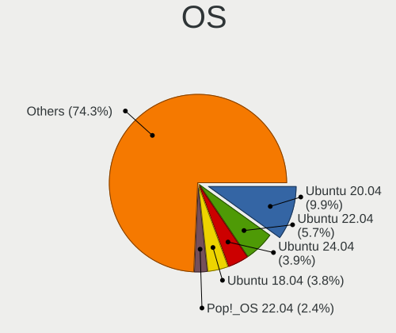

| Name               | Computers | Percent |
|--------------------|-----------|---------|
| Ubuntu 20.04       | 191       | 9.9%    |
| Ubuntu 22.04       | 109       | 5.65%   |
| Ubuntu 24.04       | 75        | 3.89%   |
| Ubuntu 18.04       | 74        | 3.84%   |
| Pop!_OS 22.04      | 47        | 2.44%   |
| Zorin 17           | 44        | 2.28%   |
| Zorin 16           | 43        | 2.23%   |
| Arch Rolling       | 41        | 2.13%   |
| Linux Mint 22.1    | 31        | 1.61%   |
| KDE neon 20.04     | 30        | 1.56%   |
| ArcoLinux Rolling  | 30        | 1.56%   |
| Linux Mint 20.3    | 29        | 1.5%    |
| Debian 12          | 26        | 1.35%   |
| Manjaro            | 24        | 1.24%   |
| Pop!_OS 21.04      | 23        | 1.19%   |
| Pop!_OS 20.04      | 23        | 1.19%   |
| Linux Mint 19.3    | 22        | 1.14%   |
| Fedora 42          | 22        | 1.14%   |
| Zorin 15           | 21        | 1.09%   |
| Pop!_OS 20.10      | 21        | 1.09%   |
| Debian 11          | 21        | 1.09%   |
| OpenMandriva 24.12 | 19        | 0.98%   |
| Linux Mint 20.1    | 19        | 0.98%   |
| Ubuntu 21.04       | 18        | 0.93%   |
| OpenMandriva 4.2   | 18        | 0.93%   |
| Linux Mint 21.1    | 17        | 0.88%   |
| Fedora 41          | 16        | 0.83%   |
| Fedora 40          | 16        | 0.83%   |
| Bazzite 42         | 16        | 0.83%   |
| Ubuntu 19.10       | 15        | 0.78%   |
| Linux Mint 22.2    | 14        | 0.73%   |
| Linux Mint 21.3    | 14        | 0.73%   |
| Linux Mint 20.2    | 14        | 0.73%   |
| KDE neon 22.04     | 14        | 0.73%   |
| OpenMandriva 4.3   | 13        | 0.67%   |
| OpenMandriva 25.90 | 13        | 0.67%   |
| OpenMandriva 23.08 | 13        | 0.67%   |
| Ubuntu 23.04       | 12        | 0.62%   |
| Ubuntu 22.10       | 12        | 0.62%   |
| Ubuntu 20.10       | 12        | 0.62%   |

OS Family
---------

OS without a version

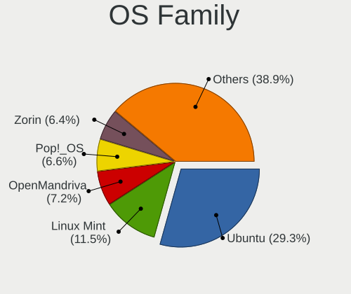

| Name          | Computers | Percent |
|---------------|-----------|---------|
| Ubuntu        | 539       | 29.33%  |
| Linux Mint    | 212       | 11.53%  |
| OpenMandriva  | 132       | 7.18%   |
| Pop!_OS       | 122       | 6.64%   |
| Zorin         | 118       | 6.42%   |
| Fedora        | 109       | 5.93%   |
| Debian        | 68        | 3.7%    |
| KDE neon      | 51        | 2.77%   |
| Arch          | 48        | 2.61%   |
| Kubuntu       | 43        | 2.34%   |
| Manjaro       | 41        | 2.23%   |
| ArcoLinux     | 30        | 1.63%   |
| Kali          | 28        | 1.52%   |
| Bazzite       | 23        | 1.25%   |
| Xubuntu       | 18        | 0.98%   |
| Elementary    | 17        | 0.92%   |
| openSUSE      | 15        | 0.82%   |
| Lubuntu       | 13        | 0.71%   |
| ROSA          | 12        | 0.65%   |
| Garuda Linux  | 12        | 0.65%   |
| Endless       | 11        | 0.6%    |
| Ubuntu Unity  | 10        | 0.54%   |
| EndeavourOS   | 9         | 0.49%   |
| Gentoo        | 8         | 0.44%   |
| Clear Linux   | 8         | 0.44%   |
| BlackPanther  | 8         | 0.44%   |
| MX            | 7         | 0.38%   |
| Ubuntu Budgie | 6         | 0.33%   |
| Rocky Linux   | 6         | 0.33%   |
| Parrot        | 6         | 0.33%   |
| LMDE          | 6         | 0.33%   |
| CentOS        | 6         | 0.33%   |
| Vanilla       | 5         | 0.27%   |
| Ubuntu MATE   | 5         | 0.27%   |
| RHEL          | 5         | 0.27%   |
| Raspbian      | 5         | 0.27%   |
| Nobara        | 5         | 0.27%   |
| TUXEDO OS     | 4         | 0.22%   |
| LinuxFX       | 4         | 0.22%   |
| Xero          | 3         | 0.16%   |

Kernel
------

Version of the Linux kernel

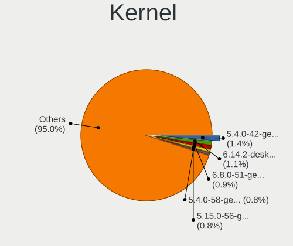

| Version                  | Computers | Percent |
|--------------------------|-----------|---------|
| 5.4.0-42-generic         | 29        | 1.37%   |
| 6.14.2-desktop-3omv2590  | 24        | 1.13%   |
| 6.8.0-51-generic         | 20        | 0.94%   |
| 5.4.0-58-generic         | 16        | 0.75%   |
| 5.15.0-56-generic        | 16        | 0.75%   |
| 5.10.14-desktop-1omv4002 | 16        | 0.75%   |
| 6.12.1-desktop-1omv2490  | 15        | 0.71%   |
| 5.4.0-52-generic         | 14        | 0.66%   |
| 5.16.7-desktop-1omv4003  | 13        | 0.61%   |
| 5.13.0-7614-generic      | 13        | 0.61%   |
| 5.11.0-38-generic        | 13        | 0.61%   |
| 6.9.3-76060903-generic   | 12        | 0.57%   |
| 5.11.0-27-generic        | 12        | 0.57%   |
| 6.6.2-desktop-1omv2390   | 11        | 0.52%   |
| 6.14.0-27-generic        | 11        | 0.52%   |
| 5.8.0-7642-generic       | 11        | 0.52%   |
| 5.4.0-72-generic         | 11        | 0.52%   |
| 6.4.11-desktop-1omv2390  | 10        | 0.47%   |
| 6.14.0-37-generic        | 10        | 0.47%   |
| 5.4.0-40-generic         | 10        | 0.47%   |
| 5.15.0-52-generic        | 10        | 0.47%   |
| 5.15.0-48-generic        | 10        | 0.47%   |
| 6.8.0-40-generic         | 9         | 0.42%   |
| 6.5.0-28-generic         | 9         | 0.42%   |
| 6.2.6-desktop-1omv2390   | 9         | 0.42%   |
| 6.14.0-33-generic        | 9         | 0.42%   |
| 6.12.10-76061203-generic | 9         | 0.42%   |
| 6.1.1-desktop-1omv2290   | 9         | 0.42%   |
| 5.8.0-43-generic         | 9         | 0.42%   |
| 5.4.0-29-generic         | 9         | 0.42%   |
| 5.13.0-28-generic        | 9         | 0.42%   |
| 5.11.0-40-generic        | 9         | 0.42%   |
| 5.0.0-37-generic         | 9         | 0.42%   |
| 6.8.0-41-generic         | 8         | 0.38%   |
| 6.5.0-35-generic         | 8         | 0.38%   |
| 6.14.0-35-generic        | 8         | 0.38%   |
| 6.12.9-desktop-1omv2490  | 8         | 0.38%   |
| 5.4.0-7634-generic       | 8         | 0.38%   |
| 5.4.0-26-generic         | 8         | 0.38%   |
| 5.19.0-38-generic        | 8         | 0.38%   |

Kernel Family
-------------

Linux kernel without a distro release

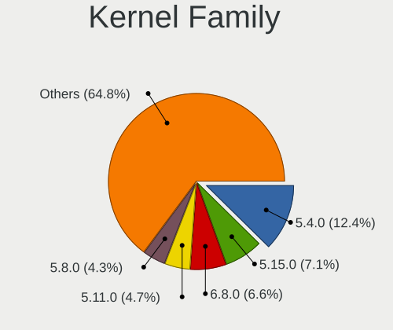

| Version | Computers | Percent |
|---------|-----------|---------|
| 5.4.0   | 246       | 12.37%  |
| 5.15.0  | 142       | 7.14%   |
| 6.8.0   | 132       | 6.64%   |
| 5.11.0  | 94        | 4.73%   |
| 5.8.0   | 85        | 4.28%   |
| 5.13.0  | 74        | 3.72%   |
| 6.14.0  | 69        | 3.47%   |
| 4.15.0  | 69        | 3.47%   |
| 6.5.0   | 54        | 2.72%   |
| 5.3.0   | 51        | 2.57%   |
| 5.19.0  | 46        | 2.31%   |
| 6.2.0   | 43        | 2.16%   |
| 6.1.0   | 36        | 1.81%   |
| 5.10.0  | 32        | 1.61%   |
| 6.11.0  | 31        | 1.56%   |
| 6.14.2  | 28        | 1.41%   |
| 4.18.0  | 26        | 1.31%   |
| 5.0.0   | 25        | 1.26%   |
| 6.2.6   | 17        | 0.86%   |
| 6.12.1  | 16        | 0.8%    |
| 5.10.14 | 16        | 0.8%    |
| 5.16.7  | 14        | 0.7%    |
| 5.14.0  | 13        | 0.65%   |
| 6.9.3   | 12        | 0.6%    |
| 6.4.11  | 12        | 0.6%    |
| 6.1.1   | 12        | 0.6%    |
| 6.6.2   | 11        | 0.55%   |
| 6.12.9  | 11        | 0.55%   |
| 6.12.10 | 11        | 0.55%   |
| 5.17.5  | 10        | 0.5%    |
| 4.19.0  | 8         | 0.4%    |
| 6.8.11  | 7         | 0.35%   |
| 6.17.0  | 7         | 0.35%   |
| 4.18.16 | 7         | 0.35%   |
| 6.4.12  | 6         | 0.3%    |
| 6.17.9  | 6         | 0.3%    |
| 6.14.6  | 6         | 0.3%    |
| 6.12.12 | 6         | 0.3%    |
| 6.6.8   | 5         | 0.25%   |
| 6.17.7  | 5         | 0.25%   |

Kernel Major Ver.
-----------------

Linux kernel major version

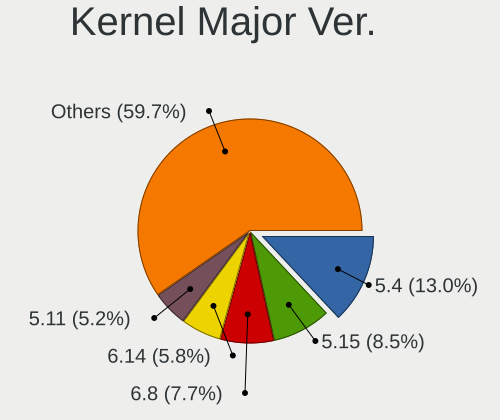

| Version | Computers | Percent |
|---------|-----------|---------|
| 5.4     | 256       | 13.02%  |
| 5.15    | 168       | 8.55%   |
| 6.8     | 152       | 7.73%   |
| 6.14    | 115       | 5.85%   |
| 5.11    | 102       | 5.19%   |
| 5.8     | 93        | 4.73%   |
| 5.13    | 82        | 4.17%   |
| 6.2     | 72        | 3.66%   |
| 6.12    | 70        | 3.56%   |
| 4.15    | 69        | 3.51%   |
| 5.10    | 66        | 3.36%   |
| 6.5     | 65        | 3.31%   |
| 6.1     | 65        | 3.31%   |
| 5.3     | 53        | 2.7%    |
| 5.19    | 50        | 2.54%   |
| 6.11    | 45        | 2.29%   |
| 6.6     | 43        | 2.19%   |
| 4.18    | 33        | 1.68%   |
| 6.4     | 28        | 1.42%   |
| 6.17    | 27        | 1.37%   |
| 5.16    | 27        | 1.37%   |
| 5.0     | 25        | 1.27%   |
| 5.14    | 23        | 1.17%   |
| 6.10    | 22        | 1.12%   |
| 6.9     | 21        | 1.07%   |
| 6.15    | 20        | 1.02%   |
| 6.13    | 20        | 1.02%   |
| 5.17    | 20        | 1.02%   |
| 6.16    | 16        | 0.81%   |
| 6.0     | 15        | 0.76%   |
| 5.18    | 15        | 0.76%   |
| 5.6     | 11        | 0.56%   |
| 4.19    | 10        | 0.51%   |
| 5.9     | 8         | 0.41%   |
| 4.9     | 8         | 0.41%   |
| 6.7     | 7         | 0.36%   |
| 6.3     | 7         | 0.36%   |
| 5.12    | 7         | 0.36%   |
| 5.7     | 6         | 0.31%   |
| 5.5     | 5         | 0.25%   |

Arch
----

OS architecture (x86_64, i586, etc.)

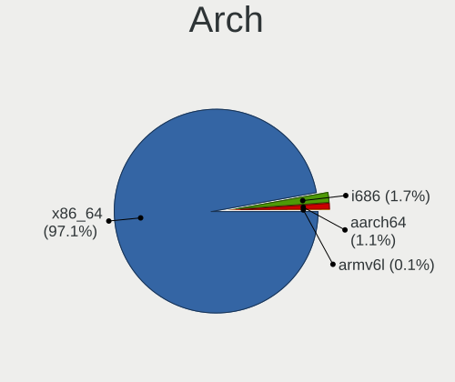

| Name    | Computers | Percent |
|---------|-----------|---------|
| x86_64  | 1704      | 97.15%  |
| i686    | 30        | 1.71%   |
| aarch64 | 19        | 1.08%   |
| armv6l  | 1         | 0.06%   |

DE
--

Desktop Environment

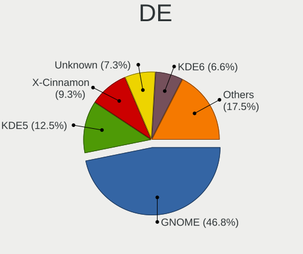

| Name             | Computers | Percent |
|------------------|-----------|---------|
| GNOME            | 862       | 46.82%  |
| KDE5             | 230       | 12.49%  |
| X-Cinnamon       | 171       | 9.29%   |
| Unknown          | 135       | 7.33%   |
| KDE6             | 121       | 6.57%   |
| XFCE             | 103       | 5.59%   |
| KDE              | 44        | 2.39%   |
| MATE             | 40        | 2.17%   |
| LXQt             | 23        | 1.25%   |
| Pantheon         | 17        | 0.92%   |
| Cinnamon         | 12        | 0.65%   |
| Unity            | 11        | 0.6%    |
| LXDE             | 10        | 0.54%   |
| KDE4             | 10        | 0.54%   |
| Budgie           | 8         | 0.43%   |
| i3               | 6         | 0.33%   |
| Hyprland         | 6         | 0.33%   |
| Deepin           | 5         | 0.27%   |
| lightdm-xsession | 3         | 0.16%   |
| icewm            | 3         | 0.16%   |
| GNOME Flashback  | 3         | 0.16%   |
| GNOME Classic    | 3         | 0.16%   |
| Awesome          | 3         | 0.16%   |
| sway             | 2         | 0.11%   |
| COSMIC           | 2         | 0.11%   |
| Unicorn:XFCE     | 1         | 0.05%   |
| trinity          | 1         | 0.05%   |
| Openbox          | 1         | 0.05%   |
| niri             | 1         | 0.05%   |
| LXDE-pi-wayfire  | 1         | 0.05%   |
| labwc:wlroots    | 1         | 0.05%   |
| Endless:GNOME    | 1         | 0.05%   |
| bspwm            | 1         | 0.05%   |

Display Server
--------------

X11 or Wayland

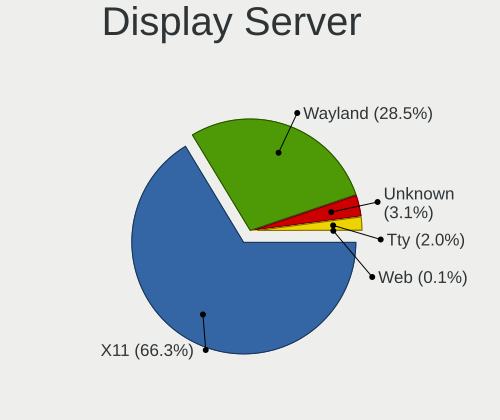

| Name    | Computers | Percent |
|---------|-----------|---------|
| X11     | 1212      | 66.34%  |
| Wayland | 520       | 28.46%  |
| Unknown | 57        | 3.12%   |
| Tty     | 37        | 2.03%   |
| Web     | 1         | 0.05%   |

Display Manager
---------------

SDDM, LightDM, etc.

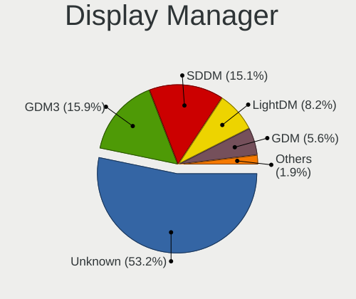

| Name    | Computers | Percent |
|---------|-----------|---------|
| Unknown | 977       | 53.24%  |
| GDM3    | 292       | 15.91%  |
| SDDM    | 278       | 15.15%  |
| LightDM | 151       | 8.23%   |
| GDM     | 102       | 5.56%   |
| TDM     | 22        | 1.2%    |
| KDM     | 5         | 0.27%   |
| SLIMSKI | 2         | 0.11%   |
| SLiM    | 2         | 0.11%   |
| GREETD  | 2         | 0.11%   |
| MDM     | 1         | 0.05%   |
| LY-DM   | 1         | 0.05%   |

OS Lang
-------

Language

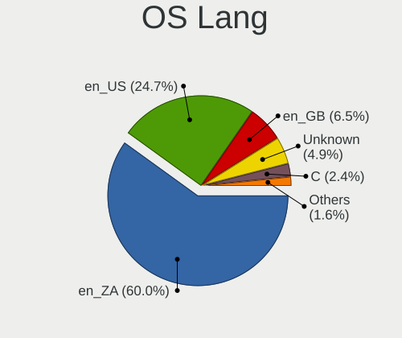

| Lang    | Computers | Percent |
|---------|-----------|---------|
| en_ZA   | 1093      | 59.96%  |
| en_US   | 450       | 24.68%  |
| en_GB   | 118       | 6.47%   |
| Unknown | 89        | 4.88%   |
| C       | 43        | 2.36%   |
| en_ZW   | 11        | 0.6%    |
| en_BW   | 5         | 0.27%   |
| af_ZA   | 4         | 0.22%   |
| fr_FR   | 3         | 0.16%   |
| de_DE   | 2         | 0.11%   |
| C.UTF8  | 2         | 0.11%   |
| pt_BR   | 1         | 0.05%   |
| en_NZ   | 1         | 0.05%   |
| en_AU   | 1         | 0.05%   |

Boot Mode
---------

EFI or BIOS

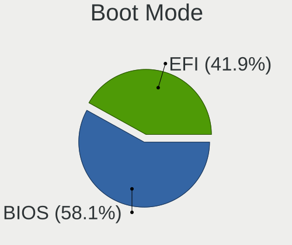

| Mode | Computers | Percent |
|------|-----------|---------|
| BIOS | 1051      | 58.07%  |
| EFI  | 759       | 41.93%  |

Filesystem
----------

Type of filesystem

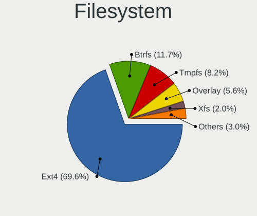

| Type    | Computers | Percent |
|---------|-----------|---------|
| Ext4    | 1266      | 69.6%   |
| Btrfs   | 212       | 11.65%  |
| Tmpfs   | 150       | 8.25%   |
| Overlay | 101       | 5.55%   |
| Xfs     | 36        | 1.98%   |
| Unknown | 27        | 1.48%   |
| Zfs     | 18        | 0.99%   |
| F2fs    | 2         | 0.11%   |
| Ext3    | 2         | 0.11%   |
| Ext2    | 2         | 0.11%   |
| Aufs    | 2         | 0.11%   |
| Rootfs  | 1         | 0.05%   |

Part. scheme
------------

Scheme of partitioning

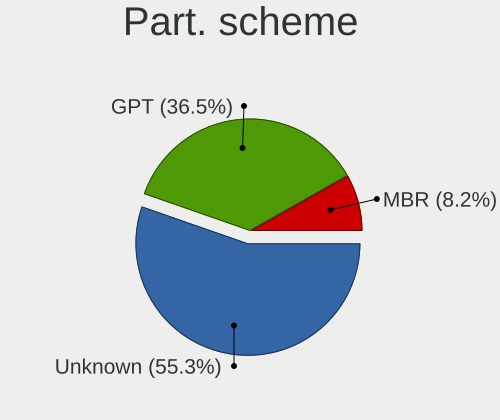

| Type    | Computers | Percent |
|---------|-----------|---------|
| Unknown | 1006      | 55.34%  |
| GPT     | 663       | 36.47%  |
| MBR     | 149       | 8.2%    |

Dual Boot with Linux/BSD
------------------------

Hosting more than one Linux/BSD

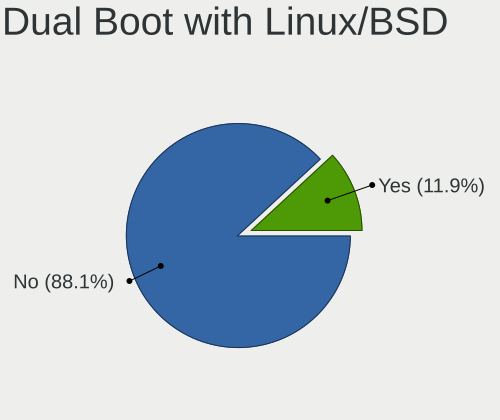

| Dual boot | Computers | Percent |
|-----------|-----------|---------|
| No        | 1579      | 88.11%  |
| Yes       | 213       | 11.89%  |

Dual Boot (Win)
---------------

Hosting Linux and Windows

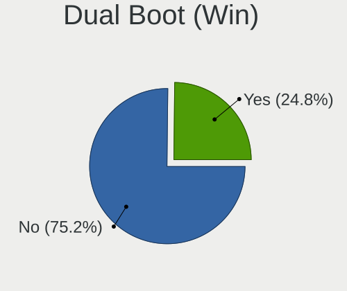

| Dual boot | Computers | Percent |
|-----------|-----------|---------|
| No        | 1341      | 75.17%  |
| Yes       | 443       | 24.83%  |

Board
-----

Vendor
------

Motherboard manufacturer

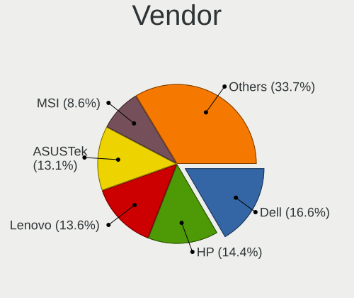

| Name                        | Computers | Percent |
|-----------------------------|-----------|---------|
| Dell                        | 290       | 16.55%  |
| Hewlett-Packard             | 252       | 14.38%  |
| Lenovo                      | 239       | 13.64%  |
| ASUSTek Computer            | 230       | 13.13%  |
| MSI                         | 151       | 8.62%   |
| Gigabyte Technology         | 114       | 6.51%   |
| Acer                        | 84        | 4.79%   |
| Intel                       | 80        | 4.57%   |
| Apple                       | 42        | 2.4%    |
| ASRock                      | 30        | 1.71%   |
| Foxconn                     | 20        | 1.14%   |
| Toshiba                     | 18        | 1.03%   |
| Biostar                     | 18        | 1.03%   |
| Raspberry Pi Foundation     | 16        | 0.91%   |
| Unknown                     | 14        | 0.8%    |
| MECER                       | 13        | 0.74%   |
| Samsung Electronics         | 11        | 0.63%   |
| Proline                     | 9         | 0.51%   |
| Standard                    | 8         | 0.46%   |
| Fujitsu                     | 8         | 0.46%   |
| Sony                        | 7         | 0.4%    |
| HUAWEI                      | 7         | 0.4%    |
| Supermicro                  | 6         | 0.34%   |
| Packard Bell                | 6         | 0.34%   |
| CONNEX                      | 6         | 0.34%   |
| Mustek                      | 5         | 0.29%   |
| I-Life Digital Technologies | 5         | 0.29%   |
| ECS                         | 4         | 0.23%   |
| PINNACLEMICRO               | 3         | 0.17%   |
| Pegatron                    | 3         | 0.17%   |
| Alienware                   | 3         | 0.17%   |
| TongFang                    | 2         | 0.11%   |
| System76                    | 2         | 0.11%   |
| Purism                      | 2         | 0.11%   |
| Panasonic                   | 2         | 0.11%   |
| Nvidia                      | 2         | 0.11%   |
| NCR                         | 2         | 0.11%   |
| Microsoft                   | 2         | 0.11%   |
| IBM                         | 2         | 0.11%   |
| Google                      | 2         | 0.11%   |

Model
-----

Motherboard model

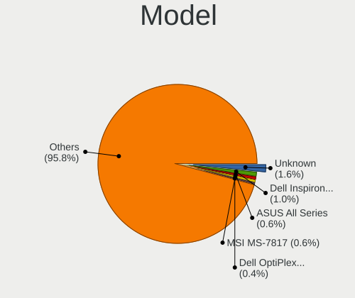

| Name                                 | Computers | Percent |
|--------------------------------------|-----------|---------|
| Unknown                              | 28        | 1.6%    |
| Dell Inspiron 15-3567                | 17        | 0.97%   |
| ASUS All Series                      | 11        | 0.63%   |
| MSI MS-7817                          | 10        | 0.57%   |
| Dell OptiPlex 7010                   | 7         | 0.4%    |
| ASUS VivoBook 15_ASUS Laptop X540UAR | 7         | 0.4%    |
| MSI MS-7B84                          | 6         | 0.34%   |
| Lenovo IdeaPad 110-15IBR 80T7        | 6         | 0.34%   |
| HP ProBook 4530s                     | 6         | 0.34%   |
| HP Laptop 15-bs0xx                   | 6         | 0.34%   |
| Gigabyte G31M-ES2C                   | 6         | 0.34%   |
| Dell Latitude E6530                  | 6         | 0.34%   |
| Dell Latitude E6430                  | 6         | 0.34%   |
| Dell Latitude E6400                  | 6         | 0.34%   |
| Acer Aspire E1-571                   | 6         | 0.34%   |
| Proline V1165C4                      | 5         | 0.29%   |
| MSI MS-7756                          | 5         | 0.29%   |
| HP ProLiant MicroServer              | 5         | 0.29%   |
| HP Notebook                          | 5         | 0.29%   |
| HP Laptop 15-da0xxx                  | 5         | 0.29%   |
| Gigabyte H61M-DS2                    | 5         | 0.29%   |
| Dell OptiPlex 3020                   | 5         | 0.29%   |
| Dell Inspiron 3521                   | 5         | 0.29%   |
| Apple MacBookPro9,2                  | 5         | 0.29%   |
| RPi Raspberry Pi 4 Model B Rev 1.4   | 4         | 0.23%   |
| MSI MS-7C52                          | 4         | 0.23%   |
| MSI MS-7C37                          | 4         | 0.23%   |
| MSI MS-7B89                          | 4         | 0.23%   |
| MSI MS-7B79                          | 4         | 0.23%   |
| MSI MS-7B48                          | 4         | 0.23%   |
| MSI MS-7A15                          | 4         | 0.23%   |
| Lenovo IdeaPad S145-15AST 81N3       | 4         | 0.23%   |
| Lenovo IdeaPad Gaming 3 15ARH7 82SB  | 4         | 0.23%   |
| Intel Mecer_X102                     | 4         | 0.23%   |
| HUAWEI BOHB-WAX9                     | 4         | 0.23%   |
| HP ProBook 4520s                     | 4         | 0.23%   |
| HP ProBook 450 G0                    | 4         | 0.23%   |
| HP Pavilion dv7                      | 4         | 0.23%   |
| HP Laptop 15-bs1xx                   | 4         | 0.23%   |
| HP Compaq 8200 Elite SFF PC          | 4         | 0.23%   |

Model Family
------------

Motherboard model prefix

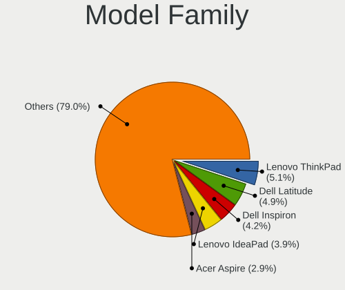

| Name               | Computers | Percent |
|--------------------|-----------|---------|
| Lenovo ThinkPad    | 89        | 5.08%   |
| Dell Latitude      | 86        | 4.91%   |
| Dell Inspiron      | 73        | 4.17%   |
| Lenovo IdeaPad     | 69        | 3.94%   |
| Acer Aspire        | 51        | 2.91%   |
| HP ProBook         | 46        | 2.63%   |
| ASUS VivoBook      | 44        | 2.51%   |
| Dell OptiPlex      | 40        | 2.28%   |
| Lenovo ThinkCentre | 34        | 1.94%   |
| HP Laptop          | 31        | 1.77%   |
| HP EliteBook       | 30        | 1.71%   |
| Unknown            | 28        | 1.6%    |
| Dell Vostro        | 26        | 1.48%   |
| ASUS PRIME         | 25        | 1.43%   |
| HP Compaq          | 24        | 1.37%   |
| ASUS ROG           | 21        | 1.2%    |
| HP Pavilion        | 20        | 1.14%   |
| Dell XPS           | 19        | 1.08%   |
| Toshiba Satellite  | 17        | 0.97%   |
| RPi Raspberry      | 16        | 0.91%   |
| ASUS TUF           | 16        | 0.91%   |
| Dell Precision     | 15        | 0.86%   |
| ASUS ASUS          | 13        | 0.74%   |
| HP ProLiant        | 11        | 0.63%   |
| ASUS Zenbook       | 11        | 0.63%   |
| ASUS All           | 11        | 0.63%   |
| MSI MS-7817        | 10        | 0.57%   |
| HP 250             | 10        | 0.57%   |
| Acer TravelMate    | 10        | 0.57%   |
| HP ZBook           | 8         | 0.46%   |
| Dell G3            | 8         | 0.46%   |
| Intel Mecer        | 7         | 0.4%    |
| HP 255             | 7         | 0.4%    |
| MSI MS-7B84        | 6         | 0.34%   |
| Gigabyte G31M-ES2C | 6         | 0.34%   |
| Apple MacBookPro9  | 6         | 0.34%   |
| Proline V1165C4    | 5         | 0.29%   |
| MSI MS-7756        | 5         | 0.29%   |
| I-Life Digital ZED | 5         | 0.29%   |
| HP Notebook        | 5         | 0.29%   |

MFG Year
--------

Motherboard manufacture year

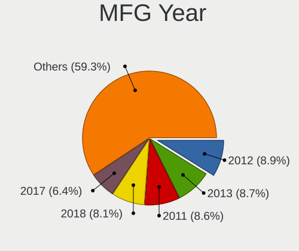

| Year    | Computers | Percent |
|---------|-----------|---------|
| 2012    | 156       | 8.9%    |
| 2013    | 153       | 8.73%   |
| 2011    | 150       | 8.56%   |
| 2018    | 142       | 8.11%   |
| 2017    | 112       | 6.39%   |
| 2020    | 110       | 6.28%   |
| 2019    | 109       | 6.22%   |
| 2016    | 108       | 6.16%   |
| 2010    | 95        | 5.42%   |
| 2015    | 93        | 5.31%   |
| 2021    | 90        | 5.14%   |
| 2014    | 80        | 4.57%   |
| 2008    | 75        | 4.28%   |
| 2009    | 68        | 3.88%   |
| 2022    | 63        | 3.6%    |
| 2007    | 40        | 2.28%   |
| 2024    | 35        | 2%      |
| 2023    | 35        | 2%      |
| 2006    | 17        | 0.97%   |
| Unknown | 15        | 0.86%   |
| 2005    | 3         | 0.17%   |
| 2025    | 2         | 0.11%   |
| 2004    | 1         | 0.06%   |

Form Factor
-----------

Physical design of the computer

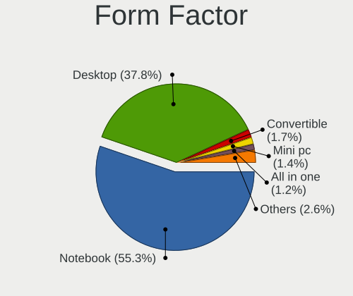

| Name           | Computers | Percent |
|----------------|-----------|---------|
| Notebook       | 968       | 55.25%  |
| Desktop        | 663       | 37.84%  |
| Convertible    | 29        | 1.66%   |
| Mini pc        | 25        | 1.43%   |
| All in one     | 21        | 1.2%    |
| System on chip | 19        | 1.08%   |
| Server         | 14        | 0.8%    |
| Tablet         | 13        | 0.74%   |

Secure Boot
-----------

Enabled or disabled

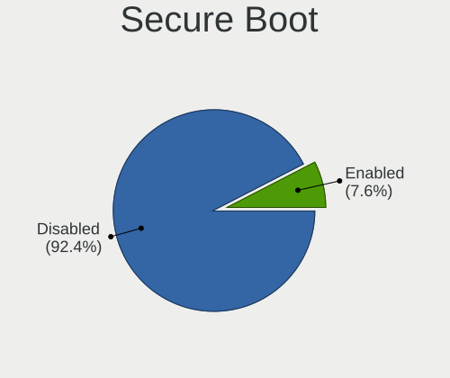

| State    | Computers | Percent |
|----------|-----------|---------|
| Disabled | 1635      | 92.43%  |
| Enabled  | 134       | 7.57%   |

Coreboot
--------

Have coreboot on board

| Used | Computers | Percent |
|------|-----------|---------|
| No   | 1747      | 99.71%  |
| Yes  | 5         | 0.29%   |

RAM Size
--------

Total RAM memory

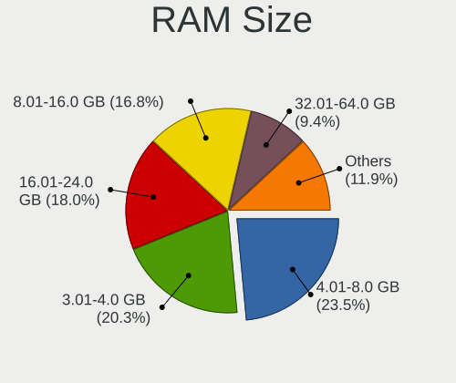

| Size in GB      | Computers | Percent |
|-----------------|-----------|---------|
| 4.01-8.0        | 421       | 23.52%  |
| 3.01-4.0        | 364       | 20.34%  |
| 16.01-24.0      | 323       | 18.04%  |
| 8.01-16.0       | 300       | 16.76%  |
| 32.01-64.0      | 169       | 9.44%   |
| 1.01-2.0        | 94        | 5.25%   |
| 64.01-256.0     | 44        | 2.46%   |
| 24.01-32.0      | 36        | 2.01%   |
| 2.01-3.0        | 26        | 1.45%   |
| 0.51-1.0        | 10        | 0.56%   |
| More than 256.0 | 2         | 0.11%   |
| 0.01-0.5        | 1         | 0.06%   |

RAM Used
--------

Used RAM memory

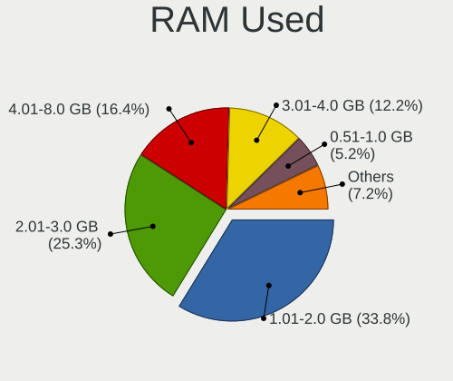

| Used GB     | Computers | Percent |
|-------------|-----------|---------|
| 1.01-2.0    | 659       | 33.78%  |
| 2.01-3.0    | 494       | 25.32%  |
| 4.01-8.0    | 319       | 16.35%  |
| 3.01-4.0    | 238       | 12.2%   |
| 0.51-1.0    | 101       | 5.18%   |
| 8.01-16.0   | 96        | 4.92%   |
| 16.01-24.0  | 19        | 0.97%   |
| 0.01-0.5    | 19        | 0.97%   |
| 32.01-64.0  | 2         | 0.1%    |
| 24.01-32.0  | 2         | 0.1%    |
| 64.01-256.0 | 1         | 0.05%   |
| Unknown     | 1         | 0.05%   |

Total Drives
------------

Number of drives on board

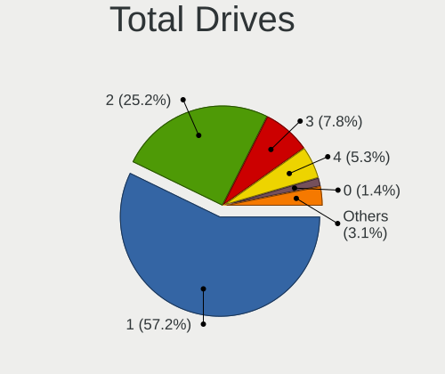

| Drives  | Computers | Percent |
|---------|-----------|---------|
| 1       | 1041      | 57.2%   |
| 2       | 459       | 25.22%  |
| 3       | 142       | 7.8%    |
| 4       | 96        | 5.27%   |
| 0       | 25        | 1.37%   |
| 5       | 23        | 1.26%   |
| 6       | 16        | 0.88%   |
| 7       | 9         | 0.49%   |
| 8       | 4         | 0.22%   |
| 14      | 2         | 0.11%   |
| 22      | 1         | 0.05%   |
| 11      | 1         | 0.05%   |
| Unknown | 1         | 0.05%   |

Has CD-ROM
----------

Has CD-ROM on board

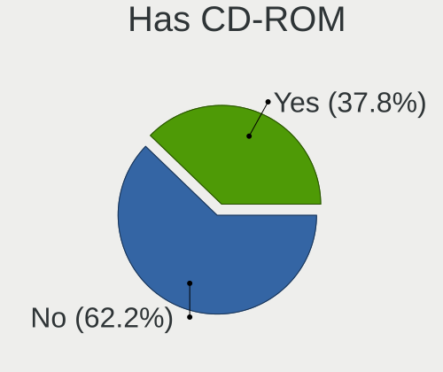

| Presented | Computers | Percent |
|-----------|-----------|---------|
| No        | 1101      | 62.2%   |
| Yes       | 669       | 37.8%   |

Has Ethernet
------------

Has Ethernet on board

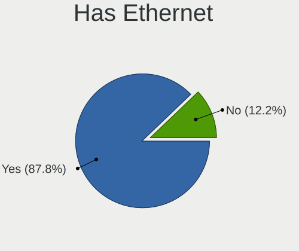

| Presented | Computers | Percent |
|-----------|-----------|---------|
| Yes       | 1540      | 87.85%  |
| No        | 213       | 12.15%  |

Has WiFi
--------

Has WiFi module

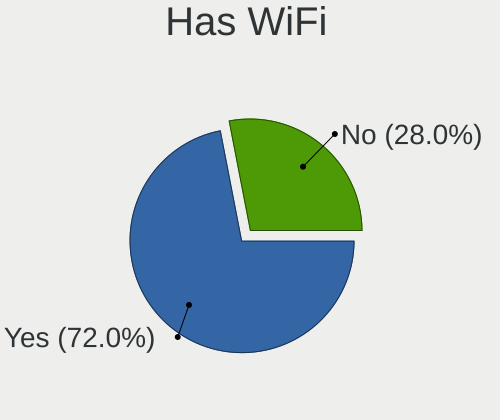

| Presented | Computers | Percent |
|-----------|-----------|---------|
| Yes       | 1270      | 71.95%  |
| No        | 495       | 28.05%  |

Has Bluetooth
-------------

Has Bluetooth module

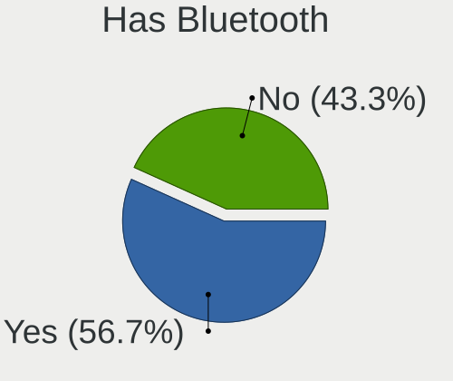

| Presented | Computers | Percent |
|-----------|-----------|---------|
| Yes       | 1015      | 56.74%  |
| No        | 774       | 43.26%  |

Location
--------

Country
-------

Geographic location (country)

| Country      | Computers | Percent |
|--------------|-----------|---------|
| South Africa | 1752      | 100%    |

City
----

Geographic location (city)

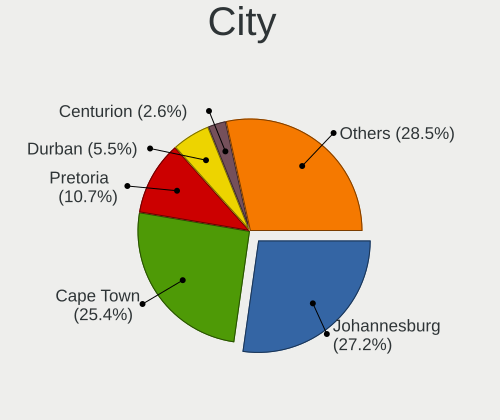

| City             | Computers | Percent |
|------------------|-----------|---------|
| Johannesburg     | 511       | 27.24%  |
| Cape Town        | 477       | 25.43%  |
| Pretoria         | 201       | 10.71%  |
| Durban           | 104       | 5.54%   |
| Centurion        | 49        | 2.61%   |
| Port Elizabeth   | 41        | 2.19%   |
| Sandton          | 19        | 1.01%   |
| Benoni           | 19        | 1.01%   |
| Bloemfontein     | 17        | 0.91%   |
| Kempton Park     | 16        | 0.85%   |
| East London      | 16        | 0.85%   |
| Pietermaritzburg | 15        | 0.8%    |
| Midrand          | 15        | 0.8%    |
| Boksburg         | 13        | 0.69%   |
| Alberton         | 13        | 0.69%   |
| Randburg         | 12        | 0.64%   |
| Potchefstroom    | 10        | 0.53%   |
| George           | 9         | 0.48%   |
| Brakpan          | 9         | 0.48%   |
| Bellville        | 9         | 0.48%   |
| Somerset West    | 8         | 0.43%   |
| Roodepoort       | 8         | 0.43%   |
| Stellenbosch     | 7         | 0.37%   |
| Polokwane        | 7         | 0.37%   |
| Worcester        | 6         | 0.32%   |
| Thabazimbi       | 6         | 0.32%   |
| Paarl            | 6         | 0.32%   |
| Germiston        | 6         | 0.32%   |
| Vanderbijlpark   | 5         | 0.27%   |
| Rustenburg       | 5         | 0.27%   |
| Port Alfred      | 5         | 0.27%   |
| Oudtshoorn       | 5         | 0.27%   |
| Nelspruit        | 5         | 0.27%   |
| Krugersdorp      | 5         | 0.27%   |
| Klerksdorp       | 5         | 0.27%   |
| Edenvale         | 5         | 0.27%   |
| Durbanville      | 5         | 0.27%   |
| White River      | 4         | 0.21%   |
| Vredenburg       | 4         | 0.21%   |
| Upington         | 4         | 0.21%   |

Drives
------

Drive Vendor
------------

Hard drive vendors

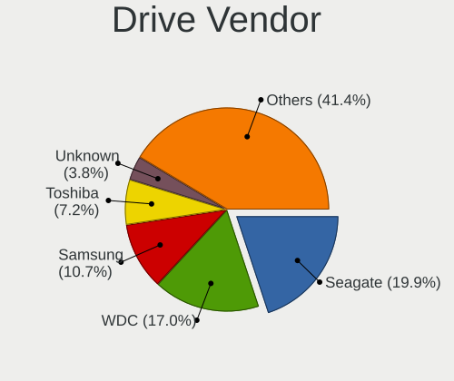

| Vendor                      | Computers | Drives | Percent |
|-----------------------------|-----------|--------|---------|
| Seagate                     | 522       | 907    | 19.94%  |
| WDC                         | 444       | 651    | 16.96%  |
| Samsung Electronics         | 280       | 385    | 10.7%   |
| Toshiba                     | 188       | 234    | 7.18%   |
| Unknown                     | 100       | 129    | 3.82%   |
| SanDisk                     | 97        | 137    | 3.71%   |
| Hitachi                     | 81        | 112    | 3.09%   |
| Kingston                    | 71        | 82     | 2.71%   |
| Crucial                     | 53        | 62     | 2.02%   |
| Transcend                   | 52        | 67     | 1.99%   |
| SK hynix                    | 49        | 61     | 1.87%   |
| Silicon Motion              | 48        | 67     | 1.83%   |
| HGST                        | 45        | 56     | 1.72%   |
| A-DATA Technology           | 45        | 58     | 1.72%   |
| Intel                       | 42        | 51     | 1.6%    |
| Micron Technology           | 41        | 53     | 1.57%   |
| Rogueware                   | 21        | 27     | 0.8%    |
| KIOXIA                      | 21        | 24     | 0.8%    |
| Hewlett-Packard             | 21        | 50     | 0.8%    |
| TO Exter                    | 20        | 22     | 0.76%   |
| Apple                       | 20        | 27     | 0.76%   |
| MAXIO Technology (Hangzhou) | 15        | 18     | 0.57%   |
| Phison Electronics          | 14        | 20     | 0.53%   |
| Mushkin                     | 14        | 17     | 0.53%   |
| Kingston Technology Company | 14        | 16     | 0.53%   |
| HS-SSD-E100                 | 13        | 17     | 0.5%    |
| Kingmax                     | 12        | 19     | 0.46%   |
| HS-SSD-C100                 | 12        | 16     | 0.46%   |
| Hikvision                   | 12        | 14     | 0.46%   |
| China                       | 12        | 13     | 0.46%   |
| Patriot                     | 11        | 12     | 0.42%   |
| ADATA Technology            | 11        | 12     | 0.42%   |
| Micron/Crucial Technology   | 10        | 18     | 0.38%   |
| Lexar                       | 10        | 14     | 0.38%   |
| Corsair                     | 10        | 14     | 0.38%   |
| LITEON                      | 9         | 11     | 0.34%   |
| Maxtor                      | 8         | 9      | 0.31%   |
| JMicron Technology          | 8         | 8      | 0.31%   |
| Apacer                      | 8         | 10     | 0.31%   |
| Unknown                     | 8         | 10     | 0.31%   |

Drive Model
-----------

Hard drive models

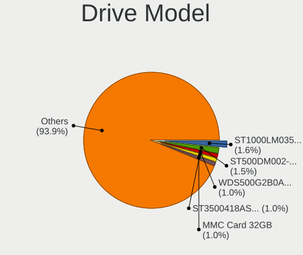

| Model                                                 | Computers | Percent |
|-------------------------------------------------------|-----------|---------|
| Seagate ST1000LM035-1RK172 1TB                        | 48        | 1.64%   |
| Seagate ST500DM002-1BD142 500GB                       | 45        | 1.54%   |
| WDC WDS500G2B0A-00SM50 500GB                          | 30        | 1.02%   |
| Seagate ST3500418AS 500GB                             | 29        | 0.99%   |
| Unknown MMC Card  32GB                                | 28        | 0.96%   |
| Toshiba MQ04ABF100 1TB                                | 23        | 0.79%   |
| Toshiba MQ01ABF050 500GB                              | 23        | 0.79%   |
| Toshiba MQ01ABD100 1TB                                | 21        | 0.72%   |
| TO Exter nal USB 3.0 250GB                            | 20        | 0.68%   |
| Seagate ST3500413AS 500GB                             | 20        | 0.68%   |
| WDC WD10EZEX-08WN4A0 1TB                              | 18        | 0.61%   |
| Unknown MMC Card  64GB                                | 17        | 0.58%   |
| Seagate ST1000LM024 HN-M101MBB 1TB                    | 17        | 0.58%   |
| Samsung NVMe SSD Controller SM981/PM981/PM983 1TB     | 17        | 0.58%   |
| WDC WDS240G2G0A-00JH30 240GB SSD                      | 16        | 0.55%   |
| Seagate ST3250318AS 250GB                             | 16        | 0.55%   |
| Seagate ST500LT012-1DG142 500GB                       | 15        | 0.51%   |
| Silicon Motion SM2263EN/SM2263XT SSD Controller 512GB | 14        | 0.48%   |
| Seagate ST380815AS 80GB                               | 14        | 0.48%   |
| Seagate ST1000DM010-2EP102 1TB                        | 14        | 0.48%   |
| Samsung SSD 850 EVO 250GB                             | 14        | 0.48%   |
| Rogueware 2.5" S 256GB                                | 14        | 0.48%   |
| Kingston SA400S37240G 240GB SSD                       | 14        | 0.48%   |
| Silicon Motion SM2262/SM2262EN SSD Controller 960GB   | 13        | 0.44%   |
| Seagate ST4000DM004-2CV104 4TB                        | 13        | 0.44%   |
| WDC WDS100T2B0A-00SM50 1TB SSD                        | 12        | 0.41%   |
| Seagate Expansion Desk 4TB                            | 12        | 0.41%   |
| WDC WD20EURX-63T0FY0 2TB                              | 11        | 0.38%   |
| Samsung HD103SI 1TB                                   | 11        | 0.38%   |
| Hitachi HTS543232A7A384 320GB                         | 11        | 0.38%   |
| HGST HTS721010A9E630 1TB                              | 11        | 0.38%   |
| Unknown MMC Card  128GB                               | 10        | 0.34%   |
| Toshiba HDWD110 1TB                                   | 10        | 0.34%   |
| Seagate ST500LM030-2E717D 500GB                       | 10        | 0.34%   |
| Seagate ST4000DM000-1F2168 4TB                        | 10        | 0.34%   |
| Seagate ST3160815AS 160GB                             | 10        | 0.34%   |
| Seagate ST2000DM001-1CH164 2TB                        | 10        | 0.34%   |
| Seagate ST1000DM003-1CH162 1TB                        | 10        | 0.34%   |
| WDC WD10SPZX-60Z10T0 1TB                              | 9         | 0.31%   |
| WDC WD10EZEX-00BN5A0 1TB                              | 9         | 0.31%   |

HDD Vendor
----------

Hard disk drive vendors

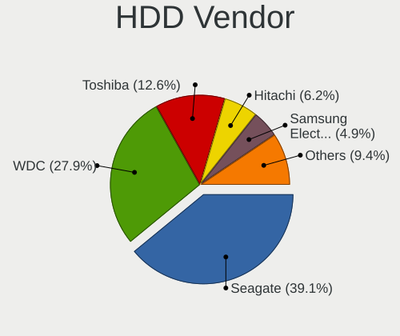

| Vendor              | Computers | Drives | Percent |
|---------------------|-----------|--------|---------|
| Seagate             | 510       | 876    | 39.05%  |
| WDC                 | 364       | 527    | 27.87%  |
| Toshiba             | 164       | 205    | 12.56%  |
| Hitachi             | 81        | 112    | 6.2%    |
| Samsung Electronics | 64        | 83     | 4.9%    |
| HGST                | 45        | 56     | 3.45%   |
| TO Exter            | 20        | 22     | 1.53%   |
| Hewlett-Packard     | 12        | 39     | 0.92%   |
| Apple               | 9         | 10     | 0.69%   |
| Unknown             | 7         | 10     | 0.54%   |
| Maxtor              | 7         | 8      | 0.54%   |
| Fujitsu             | 7         | 8      | 0.54%   |
| External            | 7         | 8      | 0.54%   |
| HGST HTS            | 2         | 2      | 0.15%   |
| USB3.0              | 1         | 1      | 0.08%   |
| USB                 | 1         | 1      | 0.08%   |
| StoreJet            | 1         | 1      | 0.08%   |
| JMicron Technology  | 1         | 1      | 0.08%   |
| Intenso             | 1         | 1      | 0.08%   |
| HPE                 | 1         | 2      | 0.08%   |
| ASMT                | 1         | 1      | 0.08%   |

SSD Vendor
----------

Solid state drive vendors

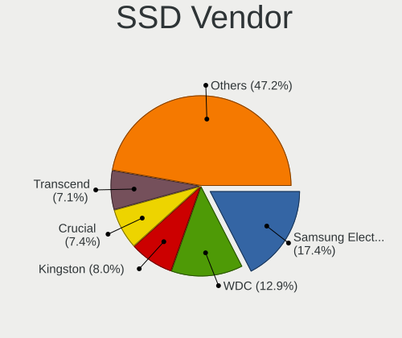

| Vendor              | Computers | Drives | Percent |
|---------------------|-----------|--------|---------|
| Samsung Electronics | 116       | 159    | 17.44%  |
| WDC                 | 86        | 112    | 12.93%  |
| Kingston            | 53        | 61     | 7.97%   |
| Crucial             | 49        | 57     | 7.37%   |
| Transcend           | 47        | 61     | 7.07%   |
| SanDisk             | 40        | 53     | 6.02%   |
| A-DATA Technology   | 37        | 49     | 5.56%   |
| Rogueware           | 20        | 26     | 3.01%   |
| Intel               | 13        | 17     | 1.95%   |
| Kingmax             | 12        | 19     | 1.8%    |
| China               | 12        | 13     | 1.8%    |
| SK hynix            | 11        | 16     | 1.65%   |
| Seagate             | 11        | 15     | 1.65%   |
| Patriot             | 10        | 11     | 1.5%    |
| Micron Technology   | 10        | 12     | 1.5%    |
| Toshiba             | 8         | 10     | 1.2%    |
| LITEON              | 8         | 10     | 1.2%    |
| Lexar               | 8         | 12     | 1.2%    |
| Corsair             | 8         | 12     | 1.2%    |
| Apacer              | 8         | 10     | 1.2%    |
| LITEONIT            | 7         | 8      | 1.05%   |
| OCZ                 | 6         | 8      | 0.9%    |
| Mushkin             | 6         | 6      | 0.9%    |
| Netac               | 5         | 5      | 0.75%   |
| HS-SSD-E100         | 5         | 5      | 0.75%   |
| Gigabyte Technology | 5         | 8      | 0.75%   |
| Apple               | 5         | 6      | 0.75%   |
| Team                | 4         | 7      | 0.6%    |
| HS-SSD-C100         | 4         | 4      | 0.6%    |
| Hewlett-Packard     | 4         | 4      | 0.6%    |
| Biwintech           | 4         | 6      | 0.6%    |
| StoreJet            | 3         | 6      | 0.45%   |
| Plextor             | 3         | 4      | 0.45%   |
| KODAK               | 2         | 2      | 0.3%    |
| KingSpec            | 2         | 3      | 0.3%    |
| Kimtigo             | 2         | 2      | 0.3%    |
| ASMT                | 2         | 2      | 0.3%    |
| AFOX                | 2         | 2      | 0.3%    |
| XPG                 | 1         | 1      | 0.15%   |
| WDC WDS5            | 1         | 1      | 0.15%   |

Drive Kind
----------

HDD or SSD

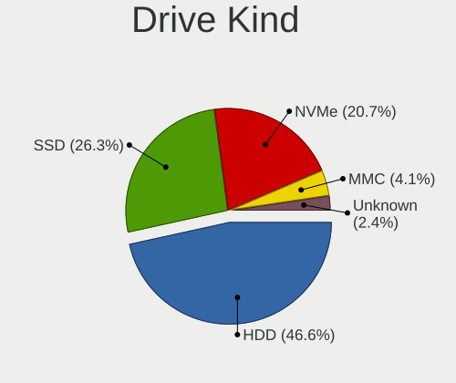

| Kind    | Computers | Drives | Percent |
|---------|-----------|--------|---------|
| HDD     | 1049      | 1974   | 46.56%  |
| SSD     | 593       | 850    | 26.32%  |
| NVMe    | 466       | 698    | 20.68%  |
| MMC     | 92        | 121    | 4.08%   |
| Unknown | 53        | 67     | 2.35%   |

Drive Connector
---------------

SATA, SAS, NVMe, etc.

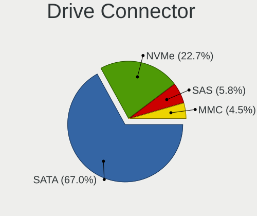

| Type | Computers | Drives | Percent |
|------|-----------|--------|---------|
| SATA | 1373      | 2720   | 66.98%  |
| NVMe | 466       | 696    | 22.73%  |
| SAS  | 119       | 173    | 5.8%    |
| MMC  | 92        | 121    | 4.49%   |

Drive Size
----------

Size of hard drive

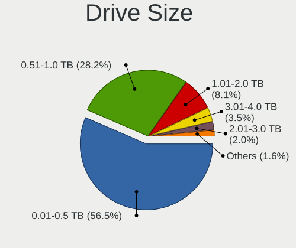

| Size in TB | Computers | Drives | Percent |
|------------|-----------|--------|---------|
| 0.01-0.5   | 1029      | 1646   | 56.51%  |
| 0.51-1.0   | 514       | 721    | 28.23%  |
| 1.01-2.0   | 148       | 238    | 8.13%   |
| 3.01-4.0   | 64        | 112    | 3.51%   |
| 2.01-3.0   | 37        | 50     | 2.03%   |
| 4.01-10.0  | 26        | 49     | 1.43%   |
| 10.01-20.0 | 3         | 8      | 0.16%   |

Space Total
-----------

Amount of disk space available on the file system

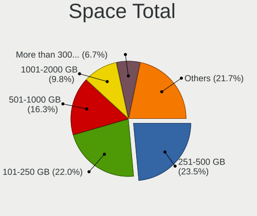

| Size in GB     | Computers | Percent |
|----------------|-----------|---------|
| 251-500        | 445       | 23.52%  |
| 101-250        | 416       | 21.99%  |
| 501-1000       | 309       | 16.33%  |
| 1001-2000      | 185       | 9.78%   |
| More than 3000 | 126       | 6.66%   |
| 51-100         | 108       | 5.71%   |
| 1-20           | 106       | 5.6%    |
| 2001-3000      | 73        | 3.86%   |
| 21-50          | 69        | 3.65%   |
| Unknown        | 55        | 2.91%   |

Space Used
----------

Amount of used disk space

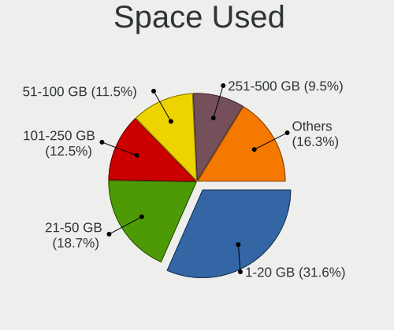

| Used GB        | Computers | Percent |
|----------------|-----------|---------|
| 1-20           | 620       | 31.6%   |
| 21-50          | 366       | 18.65%  |
| 101-250        | 245       | 12.49%  |
| 51-100         | 226       | 11.52%  |
| 251-500        | 186       | 9.48%   |
| 501-1000       | 110       | 5.61%   |
| 1001-2000      | 71        | 3.62%   |
| Unknown        | 55        | 2.8%    |
| More than 3000 | 50        | 2.55%   |
| 2001-3000      | 28        | 1.43%   |
| 0              | 5         | 0.25%   |

Malfunc. Drives
---------------

Drive models with a malfunction

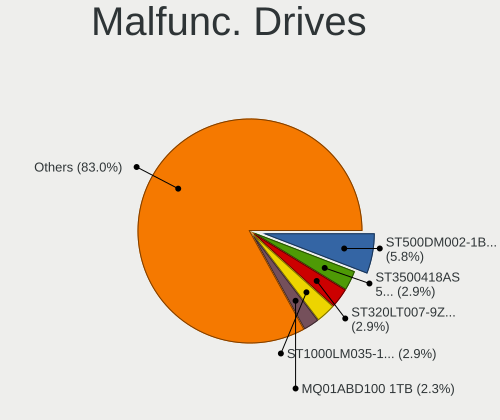

| Model                              | Computers | Drives | Percent |
|------------------------------------|-----------|--------|---------|
| Seagate ST500DM002-1BD142 500GB    | 10        | 11     | 5.85%   |
| Seagate ST3500418AS 500GB          | 5         | 6      | 2.92%   |
| Seagate ST320LT007-9ZV142 320GB    | 5         | 5      | 2.92%   |
| Seagate ST1000LM035-1RK172 1TB     | 5         | 5      | 2.92%   |
| Toshiba MQ01ABD100 1TB             | 4         | 5      | 2.34%   |
| Seagate ST1000LM024 HN-M101MBB 1TB | 4         | 5      | 2.34%   |
| WDC WD10EZEX-08WN4A0 1TB           | 3         | 3      | 1.75%   |
| WDC WDS240G2G0A-00JH30 240GB SSD   | 2         | 2      | 1.17%   |
| WDC WD3200AAJS-00RYA0 320GB        | 2         | 2      | 1.17%   |
| WDC WD30EZRX-00MMMB0 3TB           | 2         | 4      | 1.17%   |
| WDC WD2500AAKX-75U6AA0 250GB       | 2         | 2      | 1.17%   |
| WDC WD1600AAJS-08L7A0 160GB        | 2         | 2      | 1.17%   |
| Seagate ST500LM021-1KJ152 500GB    | 2         | 2      | 1.17%   |
| Seagate ST4000DM004-2CV104 4TB     | 2         | 2      | 1.17%   |
| Seagate ST3500413AS 500GB          | 2         | 2      | 1.17%   |
| Seagate ST3250310AS 250GB          | 2         | 2      | 1.17%   |
| Seagate ST3000DM001-1CH166 3TB     | 2         | 3      | 1.17%   |
| Seagate ST2000DL003-9VT166 2TB     | 2         | 3      | 1.17%   |
| Samsung Electronics HD103SI 1TB    | 2         | 3      | 1.17%   |
| Hitachi HTS547575A9E384 752GB      | 2         | 2      | 1.17%   |
| HGST HTS725050A7E630 500GB         | 2         | 2      | 1.17%   |
| HGST HTS541010A9E680 1TB           | 2         | 2      | 1.17%   |
| WDC WD6400BPVT-60HXZT1 640GB       | 1         | 1      | 0.58%   |
| WDC WD6400AAKS-75A7B0 640GB        | 1         | 1      | 0.58%   |
| WDC WD5000LPVX-22V0TT0 500GB       | 1         | 1      | 0.58%   |
| WDC WD5000AZLX-60K2TA0 500GB       | 1         | 1      | 0.58%   |
| WDC WD5000AVVS-63ZWB0 500GB        | 1         | 1      | 0.58%   |
| WDC WD5000AAKX-75U6AA0 500GB       | 1         | 2      | 0.58%   |
| WDC WD5000AAKX-22ERMA0 500GB       | 1         | 1      | 0.58%   |
| WDC WD5000AAKX-221CA1 500GB        | 1         | 1      | 0.58%   |
| WDC WD5000AAKX-00ERMA0 500GB       | 1         | 2      | 0.58%   |
| WDC WD5000AAKS-60Z1A0 500GB        | 1         | 1      | 0.58%   |
| WDC WD40EZRZ-00GXCB0 4TB           | 1         | 2      | 0.58%   |
| WDC WD3200BPVT-80JJ5T0 320GB       | 1         | 1      | 0.58%   |
| WDC WD3200BPVT-75JJ5T0 320GB       | 1         | 1      | 0.58%   |
| WDC WD3200BPVT-22JJ5T0 320GB       | 1         | 1      | 0.58%   |
| WDC WD3200AAJS-60Z0A0 320GB        | 1         | 1      | 0.58%   |
| WDC WD3200AAJS-60M0A1 320GB        | 1         | 1      | 0.58%   |
| WDC WD30PURX-64P6ZY0 3TB           | 1         | 1      | 0.58%   |
| WDC WD30EZRX-00DC0B0 3TB           | 1         | 1      | 0.58%   |

Malfunc. Drive Vendor
---------------------

Vendors of faulty drives

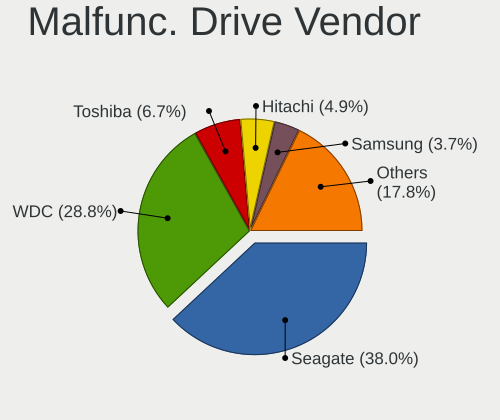

| Vendor              | Computers | Drives | Percent |
|---------------------|-----------|--------|---------|
| Seagate             | 62        | 87     | 38.04%  |
| WDC                 | 47        | 61     | 28.83%  |
| Toshiba             | 11        | 12     | 6.75%   |
| Hitachi             | 8         | 8      | 4.91%   |
| Samsung Electronics | 6         | 7      | 3.68%   |
| HGST                | 6         | 6      | 3.68%   |
| Intel               | 4         | 6      | 2.45%   |
| Kingston            | 3         | 3      | 1.84%   |
| SanDisk             | 2         | 2      | 1.23%   |
| Micron Technology   | 2         | 2      | 1.23%   |
| Hewlett-Packard     | 2         | 2      | 1.23%   |
| Corsair             | 2         | 2      | 1.23%   |
| Transcend           | 1         | 1      | 0.61%   |
| TO Exter            | 1         | 1      | 0.61%   |
| SOLIDATA            | 1         | 1      | 0.61%   |
| SK hynix            | 1         | 1      | 0.61%   |
| Patriot             | 1         | 1      | 0.61%   |
| Indilinx            | 1         | 1      | 0.61%   |
| ADATA Technology    | 1         | 1      | 0.61%   |
| A-DATA Technology   | 1         | 1      | 0.61%   |

Malfunc. HDD Vendor
-------------------

Vendors of faulty HDD drives

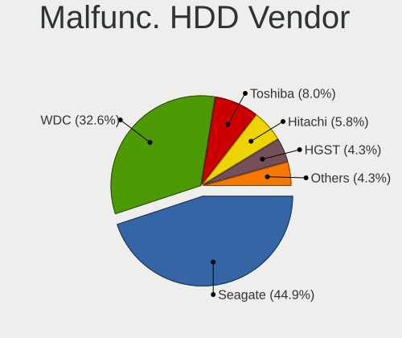

| Vendor              | Computers | Drives | Percent |
|---------------------|-----------|--------|---------|
| Seagate             | 62        | 87     | 44.93%  |
| WDC                 | 45        | 59     | 32.61%  |
| Toshiba             | 11        | 12     | 7.97%   |
| Hitachi             | 8         | 8      | 5.8%    |
| HGST                | 6         | 6      | 4.35%   |
| Samsung Electronics | 4         | 5      | 2.9%    |
| TO Exter            | 1         | 1      | 0.72%   |
| Hewlett-Packard     | 1         | 1      | 0.72%   |

Malfunc. Drive Kind
-------------------

Kinds of faulty drives

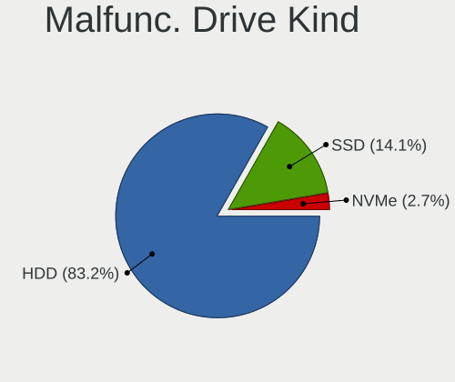

| Kind | Computers | Drives | Percent |
|------|-----------|--------|---------|
| HDD  | 124       | 179    | 83.22%  |
| SSD  | 21        | 23     | 14.09%  |
| NVMe | 4         | 4      | 2.68%   |

Failed Drives
-------------

Failed drive models

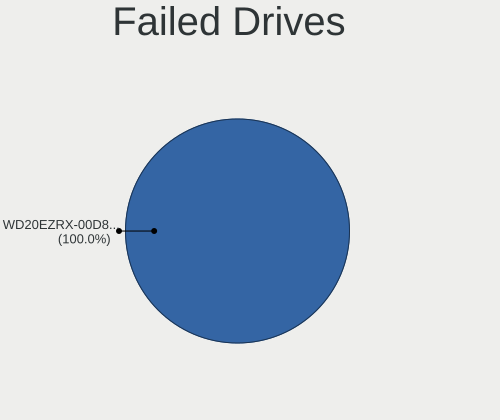

| Model                    | Computers | Drives | Percent |
|--------------------------|-----------|--------|---------|
| WDC WD20EZRX-00D8PB0 2TB | 2         | 2      | 100%    |

Failed Drive Vendor
-------------------

Failed drive vendors

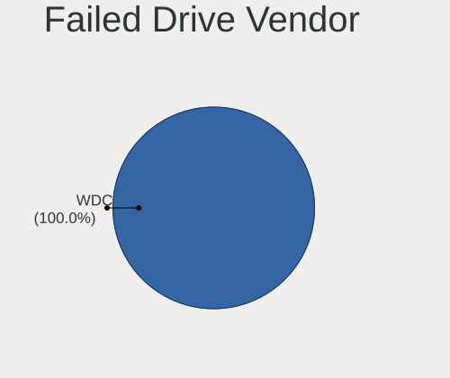

| Vendor | Computers | Drives | Percent |
|--------|-----------|--------|---------|
| WDC    | 2         | 2      | 100%    |

Drive Status
------------

Number of failed and malfunc. drives

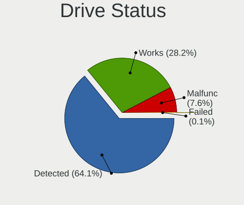

| Status   | Computers | Drives | Percent |
|----------|-----------|--------|---------|
| Detected | 1213      | 2531   | 64.11%  |
| Works    | 534       | 971    | 28.22%  |
| Malfunc  | 143       | 206    | 7.56%   |
| Failed   | 2         | 2      | 0.11%   |

Storage controller
------------------

Storage Vendor
--------------

Storage controller vendors

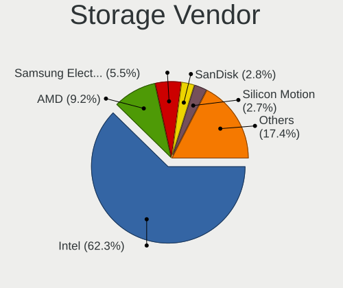

| Vendor                           | Computers | Percent |
|----------------------------------|-----------|---------|
| Intel                            | 1348      | 62.32%  |
| AMD                              | 200       | 9.25%   |
| Samsung Electronics              | 119       | 5.5%    |
| SanDisk                          | 60        | 2.77%   |
| Silicon Motion                   | 59        | 2.73%   |
| SK hynix                         | 37        | 1.71%   |
| Micron Technology                | 32        | 1.48%   |
| Kingston Technology Company      | 31        | 1.43%   |
| Phison Electronics               | 28        | 1.29%   |
| ASMedia Technology               | 26        | 1.2%    |
| KIOXIA                           | 23        | 1.06%   |
| Toshiba America Info Systems     | 22        | 1.02%   |
| Marvell Technology Group         | 21        | 0.97%   |
| MAXIO Technology (Hangzhou)      | 19        | 0.88%   |
| ADATA Technology                 | 19        | 0.88%   |
| Nvidia                           | 18        | 0.83%   |
| JMicron Technology               | 17        | 0.79%   |
| Micron/Crucial Technology        | 14        | 0.65%   |
| INNOGRIT                         | 12        | 0.55%   |
| Realtek Semiconductor            | 5         | 0.23%   |
| Apple                            | 5         | 0.23%   |
| Silicon Image                    | 4         | 0.18%   |
| Hewlett-Packard                  | 4         | 0.18%   |
| Broadcom / LSI                   | 4         | 0.18%   |
| VIA Technologies                 | 3         | 0.14%   |
| Union Memory (Shenzhen)          | 3         | 0.14%   |
| Transcend                        | 3         | 0.14%   |
| Solidigm                         | 3         | 0.14%   |
| Solid State Storage Technology   | 3         | 0.14%   |
| Silicon Integrated Systems [SiS] | 3         | 0.14%   |
| Seagate Technology               | 3         | 0.14%   |
| LSI Logic / Symbios Logic        | 3         | 0.14%   |
| Shenzhen Longsys Electronics     | 2         | 0.09%   |
| Lite-On Technology               | 2         | 0.09%   |
| Biwin Storage Technology         | 2         | 0.09%   |
| Adaptec                          | 2         | 0.09%   |
| Lenovo                           | 1         | 0.05%   |
| Hosin Global Electronics         | 1         | 0.05%   |
| HighPoint Technologies           | 1         | 0.05%   |
| Unknown                          | 1         | 0.05%   |

Storage Model
-------------

Storage controller models

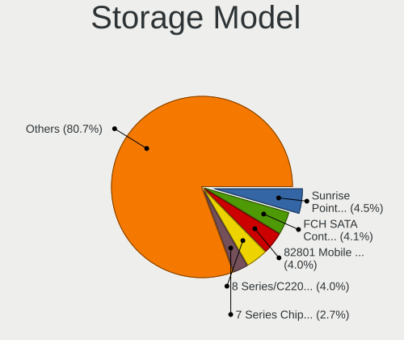

| Model                                                                                   | Computers | Percent |
|-----------------------------------------------------------------------------------------|-----------|---------|
| Intel Sunrise Point-LP SATA Controller [AHCI mode]                                      | 114       | 4.51%   |
| AMD FCH SATA Controller [AHCI mode]                                                     | 104       | 4.11%   |
| Intel 82801 Mobile SATA Controller [RAID mode]                                          | 101       | 4%      |
| Intel 8 Series/C220 Series Chipset Family 6-port SATA Controller 1 [AHCI mode]          | 101       | 4%      |
| Intel 7 Series Chipset Family 6-port SATA Controller [AHCI mode]                        | 69        | 2.73%   |
| Intel NM10/ICH7 Family SATA Controller [IDE mode]                                       | 58        | 2.29%   |
| Intel 6 Series/C200 Series Chipset Family 6 port Desktop SATA AHCI Controller           | 57        | 2.25%   |
| Intel 6 Series/C200 Series Chipset Family 6 port Mobile SATA AHCI Controller            | 54        | 2.14%   |
| Intel Q170/Q150/B150/H170/H110/Z170/CM236 Chipset SATA Controller [AHCI Mode]           | 51        | 2.02%   |
| Intel Volume Management Device NVMe RAID Controller                                     | 42        | 1.66%   |
| Samsung NVMe SSD Controller SM981/PM981/PM983                                           | 40        | 1.58%   |
| Intel 82801G (ICH7 Family) IDE Controller                                               | 40        | 1.58%   |
| Intel 6 Series/C200 Series Chipset Family Desktop SATA Controller (IDE mode, ports 4-5) | 39        | 1.54%   |
| Intel 6 Series/C200 Series Chipset Family Desktop SATA Controller (IDE mode, ports 0-3) | 39        | 1.54%   |
| Intel SATA Controller [RAID mode]                                                       | 38        | 1.5%    |
| Intel 8 Series SATA Controller 1 [AHCI mode]                                            | 37        | 1.46%   |
| Intel Wildcat Point-LP SATA Controller [AHCI Mode]                                      | 36        | 1.42%   |
| Intel 5 Series/3400 Series Chipset 6 port SATA AHCI Controller                          | 36        | 1.42%   |
| AMD 400 Series Chipset SATA Controller                                                  | 36        | 1.42%   |
| Silicon Motion SM2262/SM2262EN SSD Controller                                           | 34        | 1.34%   |
| Intel 7 Series/C210 Series Chipset Family 6-port SATA Controller [AHCI mode]            | 34        | 1.34%   |
| Intel 200 Series PCH SATA controller [AHCI mode]                                        | 33        | 1.31%   |
| Intel Atom/Celeron/Pentium Processor x5-E8000/J3xxx/N3xxx Series SATA Controller        | 30        | 1.19%   |
| AMD 500 Series Chipset SATA Controller                                                  | 29        | 1.15%   |
| Intel 82801IBM/IEM (ICH9M/ICH9M-E) 4 port SATA Controller [AHCI mode]                   | 28        | 1.11%   |
| Samsung NVMe SSD Controller 980 (DRAM-less)                                             | 27        | 1.07%   |
| Intel Cannon Lake Mobile PCH SATA AHCI Controller                                       | 27        | 1.07%   |
| Intel 5 Series/3400 Series Chipset 4 port SATA AHCI Controller                          | 25        | 0.99%   |
| AMD SB7x0/SB8x0/SB9x0 SATA Controller [AHCI mode]                                       | 25        | 0.99%   |
| Intel Celeron/Pentium Silver Processor SATA Controller                                  | 24        | 0.95%   |
| Intel 5 Series/3400 Series Chipset 4 port SATA IDE Controller                           | 24        | 0.95%   |
| Intel 5 Series/3400 Series Chipset 2 port SATA IDE Controller                           | 24        | 0.95%   |
| Samsung NVMe SSD Controller SM961/PM961/SM963                                           | 23        | 0.91%   |
| Intel Celeron N3350/Pentium N4200/Atom E3900 Series SATA AHCI Controller                | 23        | 0.91%   |
| Silicon Motion SM2263EN/SM2263XT (DRAM-less) NVMe SSD Controllers                       | 22        | 0.87%   |
| ASMedia ASM1061/ASM1062 Serial ATA Controller                                           | 21        | 0.83%   |
| AMD 600 Series Chipset SATA Controller                                                  | 18        | 0.71%   |
| Intel 82801HM/HEM (ICH8M/ICH8M-E) IDE Controller                                        | 17        | 0.67%   |
| Intel 5 Series/3400 Series Chipset PT IDER Controller                                   | 17        | 0.67%   |
| KIOXIA NVMe SSD Controller BG4 (DRAM-less)                                              | 16        | 0.63%   |

Storage Kind
------------

Kind of storage controller (IDE, SATA, NVMe, SAS, ...)

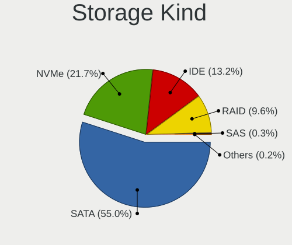

| Kind | Computers | Percent |
|------|-----------|---------|
| SATA | 1191      | 54.99%  |
| NVMe | 470       | 21.7%   |
| IDE  | 286       | 13.2%   |
| RAID | 208       | 9.6%    |
| SAS  | 7         | 0.32%   |
| SCSI | 4         | 0.18%   |

Processor
---------

CPU Vendor
----------

Processor vendors

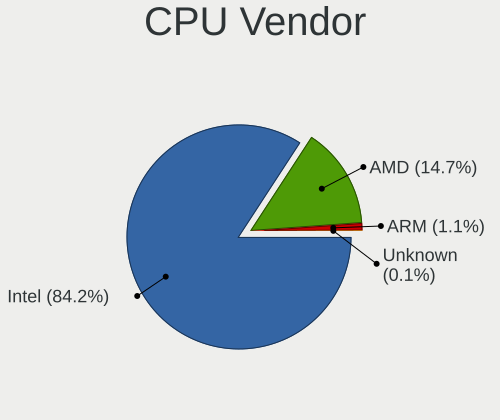

| Vendor  | Computers | Percent |
|---------|-----------|---------|
| Intel   | 1475      | 84.19%  |
| AMD     | 257       | 14.67%  |
| ARM     | 19        | 1.08%   |
| Unknown | 1         | 0.06%   |

CPU Model
---------

Processor models

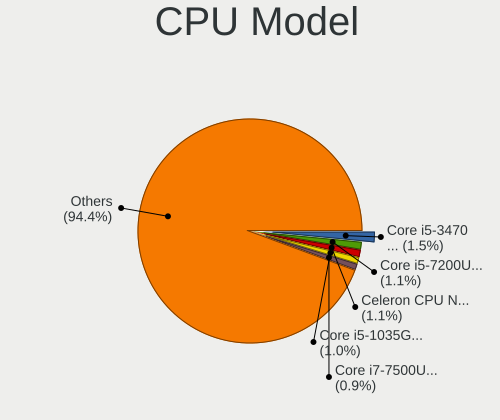

| Model                                   | Computers | Percent |
|-----------------------------------------|-----------|---------|
| Intel Core i5-3470 CPU @ 3.20GHz        | 27        | 1.54%   |
| Intel Core i5-7200U CPU @ 2.50GHz       | 20        | 1.14%   |
| Intel Celeron CPU N3350 @ 1.10GHz       | 19        | 1.08%   |
| Intel Core i5-1035G1 CPU @ 1.00GHz      | 17        | 0.97%   |
| Intel Core i7-7500U CPU @ 2.70GHz       | 16        | 0.91%   |
| Intel Core i5-8250U CPU @ 1.60GHz       | 16        | 0.91%   |
| Intel Core i3-6006U CPU @ 2.00GHz       | 16        | 0.91%   |
| Intel Celeron CPU N3060 @ 1.60GHz       | 16        | 0.91%   |
| Intel Core i7-8565U CPU @ 1.80GHz       | 15        | 0.85%   |
| Intel Core i5-4590 CPU @ 3.30GHz        | 15        | 0.85%   |
| ARM Processor                           | 15        | 0.85%   |
| Intel Core i7-8750H CPU @ 2.20GHz       | 14        | 0.8%    |
| Intel Core i7-8550U CPU @ 1.80GHz       | 14        | 0.8%    |
| Intel Core i7-3770 CPU @ 3.40GHz        | 14        | 0.8%    |
| Intel Core i3-2120 CPU @ 3.30GHz        | 14        | 0.8%    |
| Intel Core i5-6300U CPU @ 2.40GHz       | 13        | 0.74%   |
| Intel Core i5-2450M CPU @ 2.50GHz       | 13        | 0.74%   |
| Intel Celeron N4020 CPU @ 1.10GHz       | 13        | 0.74%   |
| Intel 11th Gen Core i7-1165G7 @ 2.80GHz | 13        | 0.74%   |
| Intel Core i5-5200U CPU @ 2.20GHz       | 12        | 0.68%   |
| Intel Core i5-3210M CPU @ 2.50GHz       | 12        | 0.68%   |
| Intel Atom x5-Z8350 CPU @ 1.44GHz       | 12        | 0.68%   |
| Intel 11th Gen Core i5-1135G7 @ 2.40GHz | 12        | 0.68%   |
| Intel Core i7-9750H CPU @ 2.60GHz       | 11        | 0.63%   |
| Intel Core i7-2630QM CPU @ 2.00GHz      | 11        | 0.63%   |
| Intel Core i7-2600 CPU @ 3.40GHz        | 11        | 0.63%   |
| Intel Core i5-2520M CPU @ 2.50GHz       | 11        | 0.63%   |
| Intel Core i3-5005U CPU @ 2.00GHz       | 11        | 0.63%   |
| Intel Core i7-7700HQ CPU @ 2.80GHz      | 10        | 0.57%   |
| Intel Core i7-6500U CPU @ 2.50GHz       | 10        | 0.57%   |
| Intel Core i5-2400 CPU @ 3.10GHz        | 10        | 0.57%   |
| Intel Core i3-2100 CPU @ 3.10GHz        | 10        | 0.57%   |
| Intel Core 2 Duo CPU P8600 @ 2.40GHz    | 10        | 0.57%   |
| Intel Core i5-8265U CPU @ 1.60GHz       | 9         | 0.51%   |
| Intel Core i5-6200U CPU @ 2.30GHz       | 9         | 0.51%   |
| Intel Core i5-4460 CPU @ 3.20GHz        | 9         | 0.51%   |
| Intel Core i5-3230M CPU @ 2.60GHz       | 9         | 0.51%   |
| Intel Core i5 CPU M 520 @ 2.40GHz       | 9         | 0.51%   |
| Intel Core i5 CPU 650 @ 3.20GHz         | 9         | 0.51%   |
| Intel Core i3-10110U CPU @ 2.10GHz      | 9         | 0.51%   |

CPU Model Family
----------------

Processor model prefix

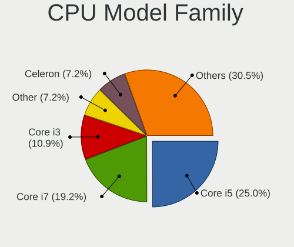

| Model                   | Computers | Percent |
|-------------------------|-----------|---------|
| Intel Core i5           | 438       | 24.97%  |
| Intel Core i7           | 337       | 19.21%  |
| Intel Core i3           | 192       | 10.95%  |
| Other                   | 126       | 7.18%   |
| Intel Celeron           | 126       | 7.18%   |
| Intel Core 2 Duo        | 86        | 4.9%    |
| AMD Ryzen 5             | 71        | 4.05%   |
| AMD Ryzen 7             | 67        | 3.82%   |
| Intel Pentium           | 40        | 2.28%   |
| Intel Xeon              | 32        | 1.82%   |
| AMD Ryzen 9             | 29        | 1.65%   |
| Intel Atom              | 26        | 1.48%   |
| Intel Core 2 Quad       | 17        | 0.97%   |
| Intel Pentium Dual-Core | 15        | 0.86%   |
| Intel Core              | 12        | 0.68%   |
| AMD Ryzen 3             | 11        | 0.63%   |
| AMD FX                  | 11        | 0.63%   |
| Intel Pentium Dual      | 10        | 0.57%   |
| Intel Core i9           | 8         | 0.46%   |
| AMD E                   | 8         | 0.46%   |
| Intel Pentium 4         | 7         | 0.4%    |
| AMD A4                  | 7         | 0.4%    |
| Intel Genuine           | 6         | 0.34%   |
| Intel Core 2            | 6         | 0.34%   |
| AMD A6                  | 6         | 0.34%   |
| AMD Turion II Neo       | 5         | 0.29%   |
| AMD Athlon 64 X2        | 5         | 0.29%   |
| Intel Celeron Dual-Core | 4         | 0.23%   |
| AMD E2                  | 4         | 0.23%   |
| Intel Pentium D         | 3         | 0.17%   |
| ARM BCM                 | 3         | 0.17%   |
| AMD Ryzen 7 PRO         | 3         | 0.17%   |
| AMD Ryzen 5 PRO         | 3         | 0.17%   |
| Intel Core Duo          | 2         | 0.11%   |
| AMD Phenom II X4        | 2         | 0.11%   |
| AMD Phenom II X2        | 2         | 0.11%   |
| AMD G                   | 2         | 0.11%   |
| AMD EPYC                | 2         | 0.11%   |
| AMD E1                  | 2         | 0.11%   |
| Intel Pentium Silver    | 1         | 0.06%   |

CPU Cores
---------

Number of processor cores

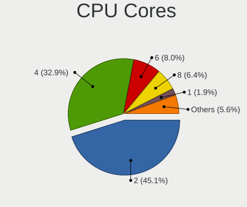

| Number  | Computers | Percent |
|---------|-----------|---------|
| 2       | 792       | 45.13%  |
| 4       | 577       | 32.88%  |
| 6       | 141       | 8.03%   |
| 8       | 113       | 6.44%   |
| 1       | 34        | 1.94%   |
| 12      | 26        | 1.48%   |
| 16      | 25        | 1.42%   |
| 10      | 21        | 1.2%    |
| 24      | 7         | 0.4%    |
| Unknown | 6         | 0.34%   |
| 14      | 5         | 0.28%   |
| 3       | 4         | 0.23%   |
| 20      | 2         | 0.11%   |
| 32      | 1         | 0.06%   |
| 18      | 1         | 0.06%   |

CPU Sockets
-----------

Number of sockets

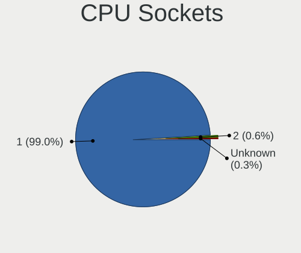

| Number  | Computers | Percent |
|---------|-----------|---------|
| 1       | 1735      | 99.03%  |
| 2       | 11        | 0.63%   |
| Unknown | 6         | 0.34%   |

CPU Threads
-----------

Threads per core (Hyper-Threading)

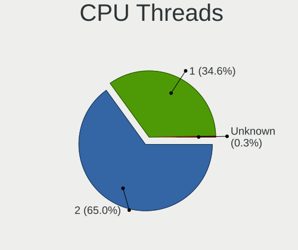

| Number  | Computers | Percent |
|---------|-----------|---------|
| 2       | 1144      | 65.04%  |
| 1       | 609       | 34.62%  |
| Unknown | 6         | 0.34%   |

CPU Op-Modes
------------

CPU Operation Modes (32-bit, 64-bit)

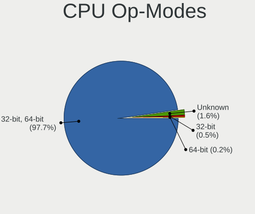

| Op mode        | Computers | Percent |
|----------------|-----------|---------|
| 32-bit, 64-bit | 1715      | 97.67%  |
| Unknown        | 28        | 1.59%   |
| 32-bit         | 9         | 0.51%   |
| 64-bit         | 4         | 0.23%   |

CPU Microcode
-------------

Microcode number

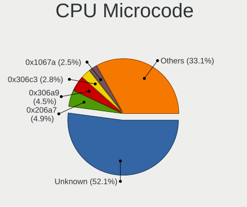

| Number     | Computers | Percent |
|------------|-----------|---------|
| Unknown    | 954       | 52.1%   |
| 0x206a7    | 90        | 4.92%   |
| 0x306a9    | 83        | 4.53%   |
| 0x306c3    | 52        | 2.84%   |
| 0x1067a    | 46        | 2.51%   |
| 0x406e3    | 36        | 1.97%   |
| 0x806e9    | 33        | 1.8%    |
| 0x506e3    | 30        | 1.64%   |
| 0x20655    | 29        | 1.58%   |
| 0x906ea    | 28        | 1.53%   |
| 0x806ea    | 23        | 1.26%   |
| 0x906e9    | 22        | 1.2%    |
| 0x406c4    | 22        | 1.2%    |
| 0x6fd      | 19        | 1.04%   |
| 0x306d4    | 19        | 1.04%   |
| 0x806c1    | 18        | 0.98%   |
| 0x806ec    | 15        | 0.82%   |
| 0x10676    | 15        | 0.82%   |
| 0x506c9    | 14        | 0.76%   |
| 0x40651    | 14        | 0.76%   |
| 0x20652    | 14        | 0.76%   |
| 0x6fb      | 10        | 0.55%   |
| 0x06006705 | 10        | 0.55%   |
| 0x406c3    | 9         | 0.49%   |
| 0x08701021 | 9         | 0.49%   |
| 0xa0652    | 8         | 0.44%   |
| 0x106a5    | 8         | 0.44%   |
| 0x806eb    | 7         | 0.38%   |
| 0x106e5    | 7         | 0.38%   |
| 0x0800820d | 7         | 0.38%   |
| 0x706e5    | 6         | 0.33%   |
| 0x0a50000c | 6         | 0.33%   |
| 0x08600106 | 6         | 0.33%   |
| 0x08108109 | 6         | 0.33%   |
| 0xa0653    | 5         | 0.27%   |
| 0x706a1    | 5         | 0.27%   |
| 0x206d7    | 5         | 0.27%   |
| 0x06000852 | 5         | 0.27%   |
| 0x010000db | 5         | 0.27%   |
| 0x010000c8 | 5         | 0.27%   |

CPU Microarch
-------------

Microarchitecture

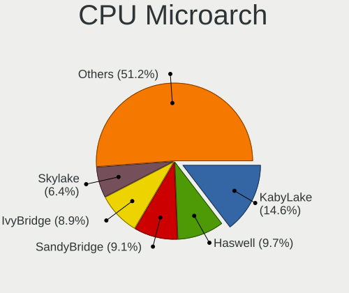

| Name              | Computers | Percent |
|-------------------|-----------|---------|
| KabyLake          | 257       | 14.63%  |
| Haswell           | 171       | 9.73%   |
| SandyBridge       | 160       | 9.11%   |
| IvyBridge         | 157       | 8.94%   |
| Skylake           | 113       | 6.43%   |
| Unknown           | 108       | 6.15%   |
| Penryn            | 105       | 5.98%   |
| Westmere          | 77        | 4.38%   |
| Zen 3             | 60        | 3.41%   |
| Core              | 59        | 3.36%   |
| Silvermont        | 55        | 3.13%   |
| Broadwell         | 45        | 2.56%   |
| Zen 2             | 42        | 2.39%   |
| TigerLake         | 41        | 2.33%   |
| Alderlake Hybrid  | 35        | 1.99%   |
| IceLake           | 29        | 1.65%   |
| CometLake         | 28        | 1.59%   |
| Goldmont plus     | 26        | 1.48%   |
| Zen+              | 24        | 1.37%   |
| Nehalem           | 24        | 1.37%   |
| Goldmont          | 23        | 1.31%   |
| Excavator         | 19        | 1.08%   |
| Zen               | 17        | 0.97%   |
| NetBurst          | 13        | 0.74%   |
| K10               | 13        | 0.74%   |
| Bobcat            | 11        | 0.63%   |
| Piledriver        | 10        | 0.57%   |
| Bonnell           | 9         | 0.51%   |
| K8 Hammer         | 7         | 0.4%    |
| P6                | 4         | 0.23%   |
| Jaguar            | 4         | 0.23%   |
| Tremont           | 3         | 0.17%   |
| Puma              | 2         | 0.11%   |
| Meteorlake Hybrid | 2         | 0.11%   |
| Gracemont         | 2         | 0.11%   |
| Steamroller       | 1         | 0.06%   |
| K8 & K10 hybrid   | 1         | 0.06%   |

Graphics
--------

GPU Vendor
----------

Vendors of graphics cards

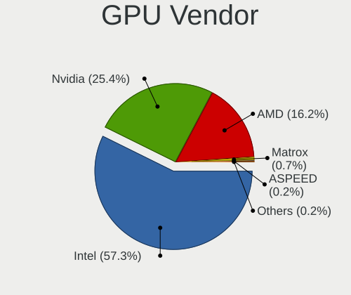

| Vendor                           | Computers | Percent |
|----------------------------------|-----------|---------|
| Intel                            | 1169      | 57.3%   |
| Nvidia                           | 519       | 25.44%  |
| AMD                              | 330       | 16.18%  |
| Matrox Electronics Systems       | 14        | 0.69%   |
| ASPEED Technology                | 4         | 0.2%    |
| Silicon Integrated Systems [SiS] | 2         | 0.1%    |
| VIA Technologies                 | 1         | 0.05%   |
| Silicon Motion                   | 1         | 0.05%   |

GPU Model
---------

Graphics card models

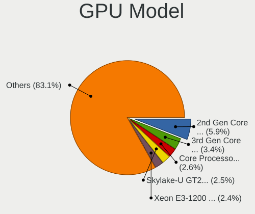

| Model                                                                                    | Computers | Percent |
|------------------------------------------------------------------------------------------|-----------|---------|
| Intel 2nd Generation Core Processor Family Integrated Graphics Controller                | 124       | 5.94%   |
| Intel 3rd Gen Core processor Graphics Controller                                         | 70        | 3.35%   |
| Intel Core Processor Integrated Graphics Controller                                      | 54        | 2.59%   |
| Intel Skylake-U GT2 [HD Graphics 520]                                                    | 53        | 2.54%   |
| Intel Xeon E3-1200 v3/4th Gen Core Processor Integrated Graphics Controller              | 51        | 2.44%   |
| Intel Kaby Lake-U GT2 [HD Graphics 620]                                                  | 48        | 2.3%    |
| Intel Atom/Celeron/Pentium Processor x5-E8000/J3xxx/N3xxx Integrated Graphics Controller | 47        | 2.25%   |
| Intel Haswell-ULT Integrated Graphics Controller                                         | 41        | 1.96%   |
| Intel Kaby Lake-R GT2 [UHD Graphics 620]                                                 | 40        | 1.92%   |
| Intel Broadwell-U GT2 [HD Graphics 5500]                                                 | 40        | 1.92%   |
| Intel 4th Gen Core Processor Integrated Graphics Controller                              | 39        | 1.87%   |
| Intel Xeon E3-1200 v2/3rd Gen Core processor Graphics Controller                         | 38        | 1.82%   |
| Intel TigerLake-LP GT2 [Iris Xe Graphics]                                                | 38        | 1.82%   |
| Intel CoffeeLake-H GT2 [UHD Graphics 630]                                                | 34        | 1.63%   |
| Intel Mobile 4 Series Chipset Integrated Graphics Controller                             | 31        | 1.48%   |
| AMD Ellesmere [Radeon RX 470/480/570/570X/580/580X/590]                                  | 28        | 1.34%   |
| Nvidia GT218 [GeForce 210]                                                               | 26        | 1.25%   |
| Intel WhiskeyLake-U GT2 [UHD Graphics 620]                                               | 26        | 1.25%   |
| Intel GeminiLake [UHD Graphics 600]                                                      | 26        | 1.25%   |
| Intel 82G33/G31 Express Integrated Graphics Controller                                   | 25        | 1.2%    |
| Intel Apollo Lake GT1 [HD Graphics 500]                                                  | 22        | 1.05%   |
| AMD Cezanne [Radeon Vega Series / Radeon Vega Mobile Series]                             | 20        | 0.96%   |
| Intel 4 Series Chipset Integrated Graphics Controller                                    | 19        | 0.91%   |
| Intel Iris Plus Graphics G1 (Ice Lake)                                                   | 17        | 0.81%   |
| Intel CometLake-U GT2 [UHD Graphics]                                                     | 17        | 0.81%   |
| Nvidia TU117M [GeForce GTX 1650 Mobile / Max-Q]                                          | 16        | 0.77%   |
| Intel Kaby Lake-H GT2 [HD Graphics 630]                                                  | 15        | 0.72%   |
| Intel CometLake-H GT2 [UHD Graphics]                                                     | 15        | 0.72%   |
| AMD Stoney [Radeon R2/R3/R4/R5 Graphics]                                                 | 15        | 0.72%   |
| Intel Mobile GM965/GL960 Integrated Graphics Controller (secondary)                      | 14        | 0.67%   |
| Intel Mobile GM965/GL960 Integrated Graphics Controller (primary)                        | 14        | 0.67%   |
| Intel Kaby Lake-S GT2 [HD Graphics 630]                                                  | 14        | 0.67%   |
| AMD Renoir [Radeon Vega Series / Radeon Vega Mobile Series]                              | 13        | 0.62%   |
| Nvidia GK208B [GeForce GT 710]                                                           | 12        | 0.57%   |
| AMD Picasso/Raven 2 [Radeon Vega Series / Radeon Vega Mobile Series]                     | 12        | 0.57%   |
| AMD Rembrandt [Radeon 680M]                                                              | 11        | 0.53%   |
| Nvidia GP107M [GeForce GTX 1050 Ti Mobile]                                               | 10        | 0.48%   |
| Nvidia GP107M [GeForce GTX 1050 Mobile]                                                  | 10        | 0.48%   |
| Nvidia GP107 [GeForce GTX 1050 Ti]                                                       | 10        | 0.48%   |
| Nvidia GF108 [GeForce GT 730]                                                            | 10        | 0.48%   |

GPU Combo
---------

Combinations of graphics cards

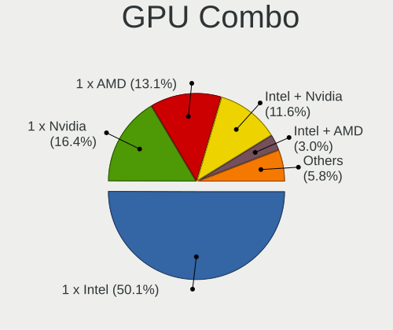

| Name               | Computers | Percent |
|--------------------|-----------|---------|
| 1 x Intel          | 882       | 50.06%  |
| 1 x Nvidia         | 289       | 16.4%   |
| 1 x AMD            | 231       | 13.11%  |
| Intel + Nvidia     | 205       | 11.63%  |
| Intel + AMD        | 52        | 2.95%   |
| AMD + Nvidia       | 24        | 1.36%   |
| Other              | 22        | 1.25%   |
| 2 x AMD            | 22        | 1.25%   |
| 2 x Intel          | 13        | 0.74%   |
| 1 x Matrox         | 12        | 0.68%   |
| 1 x ASPEED         | 3         | 0.17%   |
| 1 x SiS            | 2         | 0.11%   |
| 1 x VIA            | 1         | 0.06%   |
| 1 x Silicon Motion | 1         | 0.06%   |
| Nvidia + Matrox    | 1         | 0.06%   |
| Nvidia + ASPEED    | 1         | 0.06%   |
| AMD + Matrox       | 1         | 0.06%   |

GPU Driver
----------

Free vs proprietary

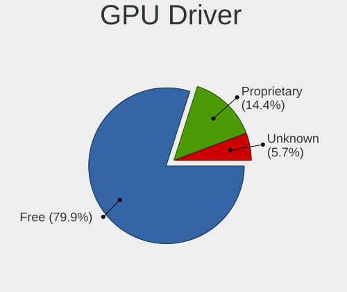

| Driver      | Computers | Percent |
|-------------|-----------|---------|
| Free        | 1424      | 79.91%  |
| Proprietary | 256       | 14.37%  |
| Unknown     | 102       | 5.72%   |

GPU Memory
----------

Total video memory

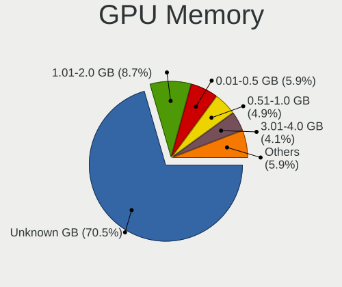

| Size in GB | Computers | Percent |
|------------|-----------|---------|
| Unknown    | 1275      | 70.52%  |
| 1.01-2.0   | 158       | 8.74%   |
| 0.01-0.5   | 106       | 5.86%   |
| 0.51-1.0   | 88        | 4.87%   |
| 3.01-4.0   | 75        | 4.15%   |
| 7.01-8.0   | 40        | 2.21%   |
| 5.01-6.0   | 34        | 1.88%   |
| 8.01-16.0  | 17        | 0.94%   |
| 2.01-3.0   | 11        | 0.61%   |
| 16.01-24.0 | 4         | 0.22%   |

Monitor
-------

Monitor Vendor
--------------

Monitor vendors

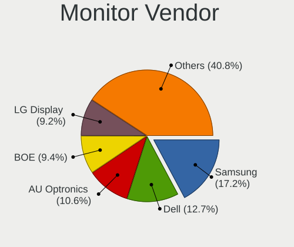

| Vendor                  | Computers | Percent |
|-------------------------|-----------|---------|
| Samsung Electronics     | 328       | 17.2%   |
| Dell                    | 243       | 12.74%  |
| AU Optronics            | 203       | 10.64%  |
| BOE                     | 180       | 9.44%   |
| LG Display              | 175       | 9.18%   |
| Chimei Innolux          | 159       | 8.34%   |
| Goldstar                | 130       | 6.82%   |
| Lenovo                  | 34        | 1.78%   |
| Chi Mei Optoelectronics | 32        | 1.68%   |
| Apple                   | 32        | 1.68%   |
| Hewlett-Packard         | 31        | 1.63%   |
| AOC                     | 31        | 1.63%   |
| Philips                 | 25        | 1.31%   |
| Sharp                   | 17        | 0.89%   |
| PANDA                   | 16        | 0.84%   |
| Acer                    | 16        | 0.84%   |
| BenQ                    | 15        | 0.79%   |
| VIE                     | 14        | 0.73%   |
| Unknown                 | 12        | 0.63%   |
| LG Electronics          | 12        | 0.63%   |
| LG Philips              | 11        | 0.58%   |
| Hitachi                 | 11        | 0.58%   |
| Toshiba                 | 10        | 0.52%   |
| Panasonic               | 10        | 0.52%   |
| ViewSonic               | 8         | 0.42%   |
| Fujitsu Siemens         | 8         | 0.42%   |
| SKY                     | 6         | 0.31%   |
| PRI                     | 6         | 0.31%   |
| CDR                     | 5         | 0.26%   |
| ASUSTek Computer        | 5         | 0.26%   |
| Ancor Communications    | 5         | 0.26%   |
| Sony                    | 4         | 0.21%   |
| RTK                     | 4         | 0.21%   |
| Plain Tree Systems      | 4         | 0.21%   |
| MStar                   | 4         | 0.21%   |
| Unknown                 | 4         | 0.21%   |
| SLD                     | 3         | 0.16%   |
| SKG                     | 3         | 0.16%   |
| MSD                     | 3         | 0.16%   |
| MECER                   | 3         | 0.16%   |

Monitor Model
-------------

Monitor models

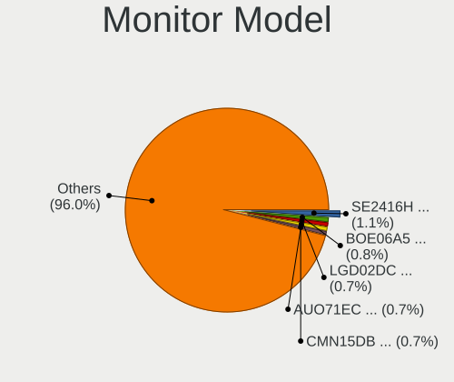

| Model                                                                    | Computers | Percent |
|--------------------------------------------------------------------------|-----------|---------|
| Dell SE2416H DELD082 1920x1080 527x296mm 23.8-inch                       | 22        | 1.1%    |
| BOE LCD Monitor BOE06A5 1366x768 344x194mm 15.5-inch                     | 16        | 0.8%    |
| LG Display LCD Monitor LGD02DC 1366x768 344x194mm 15.5-inch              | 14        | 0.7%    |
| AU Optronics LCD Monitor AUO71EC 1366x768 344x193mm 15.5-inch            | 14        | 0.7%    |
| Chimei Innolux LCD Monitor CMN15DB 1366x768 344x193mm 15.5-inch          | 13        | 0.65%   |
| Dell SE2416H DELD081 1920x1080 527x296mm 23.8-inch                       | 12        | 0.6%    |
| Chimei Innolux LCD Monitor CMN15E6 1366x768 344x193mm 15.5-inch          | 12        | 0.6%    |
| Dell SE2216H DELF071 1920x1080 476x268mm 21.5-inch                       | 11        | 0.55%   |
| BOE LCD Monitor BOE0672 1366x768 344x194mm 15.5-inch                     | 11        | 0.55%   |
| Goldstar LG ULTRAWIDE GSM59F1 2560x1080 670x280mm 28.6-inch              | 10        | 0.5%    |
| Goldstar LG IPS FULLHD GSM5AB8 1920x1080 480x270mm 21.7-inch             | 9         | 0.45%   |
| AU Optronics LCD Monitor AUO38ED 1920x1080 344x193mm 15.5-inch           | 9         | 0.45%   |
| Dell SE2717H/HX DELD0A1 1920x1080 598x336mm 27.0-inch                    | 8         | 0.4%    |
| Chi Mei Optoelectronics LCD Monitor CMO1592 1366x768 344x193mm 15.5-inch | 8         | 0.4%    |
| AU Optronics LCD Monitor AUO22EC 1366x768 344x193mm 15.5-inch            | 8         | 0.4%    |
| Samsung Electronics C24F390 SAM0D2C 1920x1080 521x293mm 23.5-inch        | 7         | 0.35%   |
| LG Display LCD Monitor LGD0456 1366x768 344x194mm 15.5-inch              | 7         | 0.35%   |
| LG Display LCD Monitor LGD033A 1366x768 344x194mm 15.5-inch              | 7         | 0.35%   |
| Dell SE2419HR DELF113 1920x1080 527x296mm 23.8-inch                      | 7         | 0.35%   |
| Dell S2421HN DEL41F1 1920x1080 527x296mm 23.8-inch                       | 7         | 0.35%   |
| Dell S2340L DELD058 1920x1080 509x286mm 23.0-inch                        | 7         | 0.35%   |
| Samsung Electronics LCD Monitor SEC5441 1280x800 331x207mm 15.4-inch     | 6         | 0.3%    |
| LG Display LCD Monitor LGD02AC 1366x768 344x194mm 15.5-inch              | 6         | 0.3%    |
| Dell SE2722H DELD116 1920x1080 596x335mm 26.9-inch                       | 6         | 0.3%    |
| Chimei Innolux LCD Monitor CMN15F5 1920x1080 344x193mm 15.5-inch         | 6         | 0.3%    |
| Chimei Innolux LCD Monitor CMN15E7 1920x1080 344x193mm 15.5-inch         | 6         | 0.3%    |
| BOE LCD Monitor BOE0757 1366x768 344x194mm 15.5-inch                     | 6         | 0.3%    |
| AU Optronics LCD Monitor AUO70EC 1366x768 344x193mm 15.5-inch            | 6         | 0.3%    |
| AU Optronics LCD Monitor AUO61ED 1920x1080 344x194mm 15.5-inch           | 6         | 0.3%    |
| Samsung Electronics SMBX2031 SAM076B 1600x900 443x249mm 20.0-inch        | 5         | 0.25%   |
| Samsung Electronics S20B300 SAM08A8 1600x900 443x249mm 20.0-inch         | 5         | 0.25%   |
| Samsung Electronics LCD Monitor SDC5441 1366x768 344x193mm 15.5-inch     | 5         | 0.25%   |
| Samsung Electronics LCD Monitor SDC4171 2880x1800 302x189mm 14.0-inch    | 5         | 0.25%   |
| Samsung Electronics LCD Monitor SDC4154 2880x1800 302x189mm 14.0-inch    | 5         | 0.25%   |
| PANDA LCD Monitor NCP004D 1920x1080 344x194mm 15.5-inch                  | 5         | 0.25%   |
| Panasonic '' MEIA0B9 1920x1080                                           | 5         | 0.25%   |
| LG Display LCD Monitor LGD053F 1920x1080 344x194mm 15.5-inch             | 5         | 0.25%   |
| Lenovo LCD Monitor LEN40B1 1600x900 345x194mm 15.6-inch                  | 5         | 0.25%   |
| Goldstar W2343 GSM5700 1920x1080 474x296mm 22.0-inch                     | 5         | 0.25%   |
| Dell SE2419H DELF109 1920x1080 527x296mm 23.8-inch                       | 5         | 0.25%   |

Monitor Resolution
------------------

Monitor screen resolution

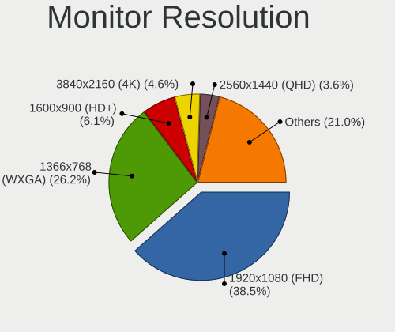

| Resolution         | Computers | Percent |
|--------------------|-----------|---------|
| 1920x1080 (FHD)    | 704       | 38.47%  |
| 1366x768 (WXGA)    | 480       | 26.23%  |
| 1600x900 (HD+)     | 112       | 6.12%   |
| 3840x2160 (4K)     | 85        | 4.64%   |
| 2560x1440 (QHD)    | 65        | 3.55%   |
| 1280x1024 (SXGA)   | 56        | 3.06%   |
| 1440x900 (WXGA+)   | 52        | 2.84%   |
| 1280x800 (WXGA)    | 49        | 2.68%   |
| 1920x1200 (WUXGA)  | 42        | 2.3%    |
| 1680x1050 (WSXGA+) | 32        | 1.75%   |
| 1360x768           | 27        | 1.48%   |
| 2880x1800          | 17        | 0.93%   |
| 1024x768 (XGA)     | 15        | 0.82%   |
| Unknown            | 14        | 0.77%   |
| 2560x1080          | 13        | 0.71%   |
| 3840x1080          | 11        | 0.6%    |
| 1920x540           | 10        | 0.55%   |
| 3440x1440          | 6         | 0.33%   |
| 1600x1200          | 4         | 0.22%   |
| 1152x864           | 4         | 0.22%   |
| 3072x1920          | 3         | 0.16%   |
| 1024x600           | 3         | 0.16%   |
| 5120x1080          | 2         | 0.11%   |
| 4480x1080          | 2         | 0.11%   |
| 2880x1620          | 2         | 0.11%   |
| 2560x1600          | 2         | 0.11%   |
| 7680x2160          | 1         | 0.05%   |
| 720x480            | 1         | 0.05%   |
| 4880x1080          | 1         | 0.05%   |
| 4480x1440          | 1         | 0.05%   |
| 3840x2400          | 1         | 0.05%   |
| 3360x1080          | 1         | 0.05%   |
| 3286x1080          | 1         | 0.05%   |
| 3280x1200          | 1         | 0.05%   |
| 3200x1800 (QHD+)   | 1         | 0.05%   |
| 2880x1920          | 1         | 0.05%   |
| 2736x1824          | 1         | 0.05%   |
| 2288x1287          | 1         | 0.05%   |
| 2160x1440          | 1         | 0.05%   |
| 2048x1536          | 1         | 0.05%   |

Monitor Diagonal
----------------

Diagonal size in inches

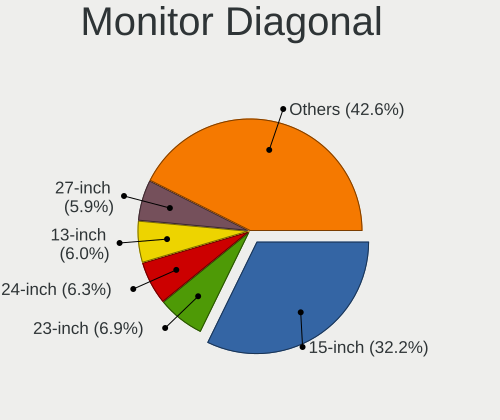

| Inches  | Computers | Percent |
|---------|-----------|---------|
| 15      | 624       | 32.25%  |
| 23      | 133       | 6.87%   |
| 24      | 122       | 6.3%    |
| 13      | 117       | 6.05%   |
| 27      | 115       | 5.94%   |
| 14      | 107       | 5.53%   |
| 21      | 95        | 4.91%   |
| 17      | 91        | 4.7%    |
| 19      | 84        | 4.34%   |
| Unknown | 67        | 3.46%   |
| 18      | 64        | 3.31%   |
| 20      | 54        | 2.79%   |
| 31      | 39        | 2.02%   |
| 22      | 30        | 1.55%   |
| 16      | 24        | 1.24%   |
| 84      | 18        | 0.93%   |
| 34      | 17        | 0.88%   |
| 12      | 16        | 0.83%   |
| 40      | 15        | 0.78%   |
| 11      | 13        | 0.67%   |
| 72      | 10        | 0.52%   |
| 32      | 10        | 0.52%   |
| 52      | 9         | 0.47%   |
| 49      | 8         | 0.41%   |
| 48      | 8         | 0.41%   |
| 54      | 5         | 0.26%   |
| 46      | 5         | 0.26%   |
| 63      | 4         | 0.21%   |
| 26      | 4         | 0.21%   |
| 25      | 4         | 0.21%   |
| 10      | 4         | 0.21%   |
| 28      | 3         | 0.16%   |
| 64      | 2         | 0.1%    |
| 44      | 2         | 0.1%    |
| 43      | 2         | 0.1%    |
| 42      | 2         | 0.1%    |
| 39      | 2         | 0.1%    |
| 97      | 1         | 0.05%   |
| 86      | 1         | 0.05%   |
| 74      | 1         | 0.05%   |

Monitor Width
-------------

Physical width

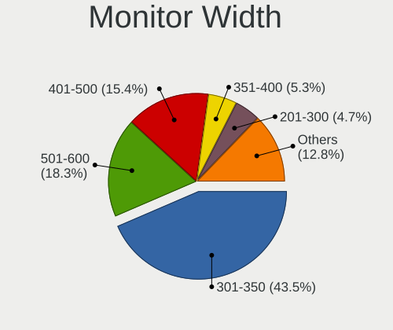

| Width in mm    | Computers | Percent |
|----------------|-----------|---------|
| 301-350        | 827       | 43.53%  |
| 501-600        | 347       | 18.26%  |
| 401-500        | 292       | 15.37%  |
| 351-400        | 101       | 5.32%   |
| 201-300        | 90        | 4.74%   |
| Unknown        | 67        | 3.53%   |
| 601-700        | 51        | 2.68%   |
| 1001-1500      | 42        | 2.21%   |
| 1501-2000      | 29        | 1.53%   |
| 701-800        | 26        | 1.37%   |
| 801-900        | 18        | 0.95%   |
| 901-1000       | 7         | 0.37%   |
| More than 2000 | 1         | 0.05%   |
| 101-200        | 1         | 0.05%   |
| 1-100          | 1         | 0.05%   |

Aspect Ratio
------------

Proportional relationship between the width and the height

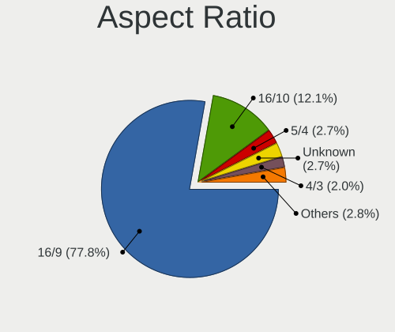

| Ratio   | Computers | Percent |
|---------|-----------|---------|
| 16/9    | 1314      | 77.8%   |
| 16/10   | 205       | 12.14%  |
| 5/4     | 45        | 2.66%   |
| Unknown | 45        | 2.66%   |
| 4/3     | 33        | 1.95%   |
| 21/9    | 17        | 1.01%   |
| 32/9    | 15        | 0.89%   |
| 3/2     | 10        | 0.59%   |
| 1.96    | 3         | 0.18%   |
| 0.56    | 1         | 0.06%   |
| 0.00    | 1         | 0.06%   |

Monitor Area
------------

Area in inch²

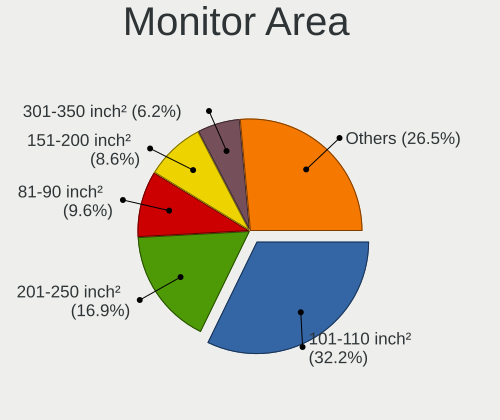

| Area in inch² | Computers | Percent |
|----------------|-----------|---------|
| 101-110        | 615       | 32.22%  |
| 201-250        | 323       | 16.92%  |
| 81-90          | 183       | 9.59%   |
| 151-200        | 165       | 8.64%   |
| 301-350        | 118       | 6.18%   |
| 141-150        | 76        | 3.98%   |
| 351-500        | 68        | 3.56%   |
| Unknown        | 68        | 3.56%   |
| 121-130        | 61        | 3.2%    |
| More than 1000 | 54        | 2.83%   |
| 501-1000       | 42        | 2.2%    |
| 71-80          | 41        | 2.15%   |
| 111-120        | 33        | 1.73%   |
| 251-300        | 22        | 1.15%   |
| 61-70          | 15        | 0.79%   |
| 51-60          | 13        | 0.68%   |
| 131-140        | 7         | 0.37%   |
| 41-50          | 3         | 0.16%   |
| 1-40           | 1         | 0.05%   |
| 91-100         | 1         | 0.05%   |

Pixel Density
-------------

Pixels per inch

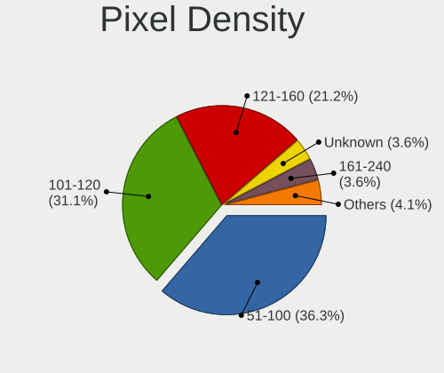

| Density       | Computers | Percent |
|---------------|-----------|---------|
| 51-100        | 670       | 36.29%  |
| 101-120       | 575       | 31.15%  |
| 121-160       | 392       | 21.24%  |
| Unknown       | 67        | 3.63%   |
| 161-240       | 66        | 3.58%   |
| 1-50          | 50        | 2.71%   |
| More than 240 | 26        | 1.41%   |

Multiple Monitors
-----------------

Total monitors connected

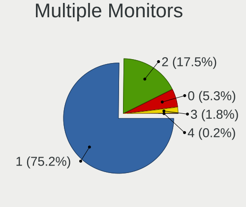

| Total | Computers | Percent |
|-------|-----------|---------|
| 1     | 1364      | 75.19%  |
| 2     | 317       | 17.48%  |
| 0     | 97        | 5.35%   |
| 3     | 32        | 1.76%   |
| 4     | 4         | 0.22%   |

Network
-------

Net Controller Vendor
---------------------

Controller vendors

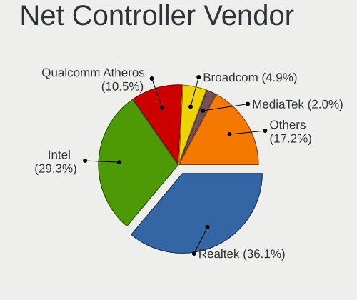

| Vendor                            | Computers | Percent |
|-----------------------------------|-----------|---------|
| Realtek Semiconductor             | 976       | 36.09%  |
| Intel                             | 791       | 29.25%  |
| Qualcomm Atheros                  | 283       | 10.47%  |
| Broadcom                          | 133       | 4.92%   |
| MediaTek                          | 55        | 2.03%   |
| TP-Link                           | 44        | 1.63%   |
| Samsung Electronics               | 39        | 1.44%   |
| Huawei Technologies               | 33        | 1.22%   |
| Dell                              | 33        | 1.22%   |
| Ralink Technology                 | 31        | 1.15%   |
| Broadcom Limited                  | 30        | 1.11%   |
| Ralink                            | 26        | 0.96%   |
| Marvell Technology Group          | 24        | 0.89%   |
| Nvidia                            | 15        | 0.55%   |
| Shenzhen Goodix Technology        | 13        | 0.48%   |
| Ericsson Business Mobile Networks | 13        | 0.48%   |
| ASIX Electronics                  | 13        | 0.48%   |
| D-Link                            | 11        | 0.41%   |
| D-Link System                     | 9         | 0.33%   |
| Sierra Wireless                   | 8         | 0.3%    |
| Hewlett-Packard                   | 8         | 0.3%    |
| Microsoft                         | 7         | 0.26%   |
| JMicron Technology                | 7         | 0.26%   |
| Aquantia                          | 6         | 0.22%   |
| Spreadtrum Communications         | 5         | 0.18%   |
| Qualcomm                          | 5         | 0.18%   |
| DisplayLink                       | 5         | 0.18%   |
| ASUSTek Computer                  | 5         | 0.18%   |
| Apple                             | 5         | 0.18%   |
| ZyXEL Communications              | 3         | 0.11%   |
| Xiaomi                            | 3         | 0.11%   |
| TRENDnet                          | 3         | 0.11%   |
| Tenda                             | 3         | 0.11%   |
| Silicon Integrated Systems [SiS]  | 3         | 0.11%   |
| Qualcomm Atheros Communications   | 3         | 0.11%   |
| Mellanox Technologies             | 3         | 0.11%   |
| Lenovo                            | 3         | 0.11%   |
| ZTopInc                           | 2         | 0.07%   |
| Raspberry Pi                      | 2         | 0.07%   |
| Qualcomm Technologies             | 2         | 0.07%   |

Net Controller Model
--------------------

Controller models

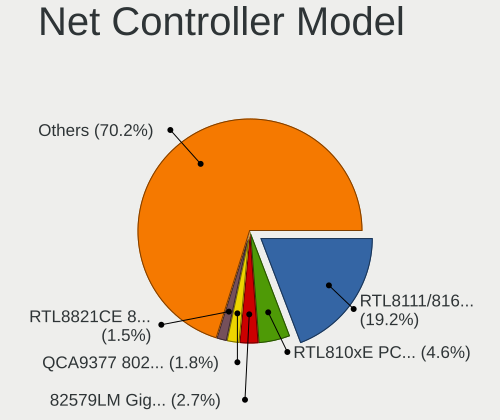

| Model                                                                  | Computers | Percent |
|------------------------------------------------------------------------|-----------|---------|
| Realtek RTL8111/8168/8211/8411 PCI Express Gigabit Ethernet Controller | 608       | 19.2%   |
| Realtek RTL810xE PCI Express Fast Ethernet controller                  | 145       | 4.58%   |
| Intel 82579LM Gigabit Network Connection (Lewisville)                  | 86        | 2.72%   |
| Qualcomm Atheros QCA9377 802.11ac Wireless Network Adapter             | 58        | 1.83%   |
| Realtek RTL8821CE 802.11ac PCIe Wireless Network Adapter               | 47        | 1.48%   |
| Qualcomm Atheros QCA9565 / AR9565 Wireless Network Adapter             | 43        | 1.36%   |
| Realtek RTL8153 Gigabit Ethernet Adapter                               | 42        | 1.33%   |
| Realtek RTL8125 2.5GbE Controller                                      | 40        | 1.26%   |
| Qualcomm Atheros AR9285 Wireless Network Adapter (PCI-Express)         | 40        | 1.26%   |
| Intel Wireless 8265 / 8275                                             | 37        | 1.17%   |
| Intel Wi-Fi 6 AX200                                                    | 34        | 1.07%   |
| Intel Wi-Fi 6 AX201                                                    | 33        | 1.04%   |
| Intel Ethernet Connection I217-LM                                      | 31        | 0.98%   |
| Intel Wireless 8260                                                    | 29        | 0.92%   |
| Intel Ethernet Connection (2) I219-V                                   | 28        | 0.88%   |
| Intel Centrino Advanced-N 6205 [Taylor Peak]                           | 28        | 0.88%   |
| Realtek RTL8188EUS 802.11n Wireless Network Adapter                    | 26        | 0.82%   |
| Ralink MT7601U Wireless Adapter                                        | 26        | 0.82%   |
| Samsung Galaxy series, misc. (tethering mode)                          | 25        | 0.79%   |
| Realtek RTL8723BE PCIe Wireless Network Adapter                        | 25        | 0.79%   |
| Intel Wireless 3165                                                    | 25        | 0.79%   |
| Intel Cannon Lake PCH CNVi WiFi                                        | 25        | 0.79%   |
| Intel Wireless 7265                                                    | 24        | 0.76%   |
| Qualcomm Atheros AR9485 Wireless Network Adapter                       | 23        | 0.73%   |
| Intel 82579V Gigabit Network Connection                                | 22        | 0.69%   |
| Intel Wireless 7260                                                    | 21        | 0.66%   |
| Intel I211 Gigabit Network Connection                                  | 21        | 0.66%   |
| Broadcom BCM4313 802.11bgn Wireless Network Adapter                    | 21        | 0.66%   |
| Intel Wireless 3160                                                    | 19        | 0.6%    |
| Intel Ethernet Connection (2) I219-LM                                  | 19        | 0.6%    |
| Intel Dual Band Wireless-AC 3165 Plus Bluetooth                        | 19        | 0.6%    |
| TP-Link TL-WN823N v2/v3 [Realtek RTL8192EU]                            | 18        | 0.57%   |
| Realtek RTL8188FTV 802.11b/g/n 1T1R 2.4G WLAN Adapter                  | 18        | 0.57%   |
| Qualcomm Atheros QCA6174 802.11ac Wireless Network Adapter             | 18        | 0.57%   |
| Intel Centrino Advanced-N 6200                                         | 17        | 0.54%   |
| Intel 82577LM Gigabit Network Connection                               | 17        | 0.54%   |
| Realtek RTL8822CE 802.11ac PCIe Wireless Network Adapter               | 16        | 0.51%   |
| MediaTek MT7922 802.11ax PCI Express Wireless Network Adapter          | 16        | 0.51%   |
| MediaTek MT7921 802.11ax PCIe Wireless Network Adapter [Filogic 330]   | 16        | 0.51%   |
| Intel Comet Lake PCH CNVi WiFi                                         | 16        | 0.51%   |

Wireless Vendor
---------------

Wireless vendors

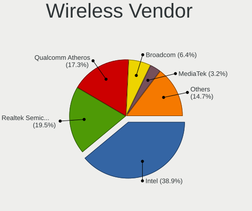

| Vendor                                | Computers | Percent |
|---------------------------------------|-----------|---------|
| Intel                                 | 530       | 38.94%  |
| Realtek Semiconductor                 | 266       | 19.54%  |
| Qualcomm Atheros                      | 235       | 17.27%  |
| Broadcom                              | 87        | 6.39%   |
| MediaTek                              | 43        | 3.16%   |
| TP-Link                               | 42        | 3.09%   |
| Ralink Technology                     | 31        | 2.28%   |
| Ralink                                | 26        | 1.91%   |
| Dell                                  | 17        | 1.25%   |
| Broadcom Limited                      | 17        | 1.25%   |
| D-Link                                | 11        | 0.81%   |
| Sierra Wireless                       | 8         | 0.59%   |
| Microsoft                             | 7         | 0.51%   |
| ASUSTek Computer                      | 5         | 0.37%   |
| ZyXEL Communications                  | 3         | 0.22%   |
| TRENDnet                              | 3         | 0.22%   |
| Tenda                                 | 3         | 0.22%   |
| Qualcomm Atheros Communications       | 3         | 0.22%   |
| ZTopInc                               | 2         | 0.15%   |
| NetGear                               | 2         | 0.15%   |
| Marvell Technology Group              | 2         | 0.15%   |
| Fibocom                               | 2         | 0.15%   |
| Edimax Technology                     | 2         | 0.15%   |
| D-Link System                         | 2         | 0.15%   |
| ZyDAS                                 | 1         | 0.07%   |
| ZTE WCDMA Technologies MSM            | 1         | 0.07%   |
| Realtek                               | 1         | 0.07%   |
| Qualcomm Technologies                 | 1         | 0.07%   |
| Qualcomm                              | 1         | 0.07%   |
| Pace Micro Technology                 | 1         | 0.07%   |
| Mercucys                              | 1         | 0.07%   |
| Linksys                               | 1         | 0.07%   |
| Hewlett-Packard                       | 1         | 0.07%   |
| CyberTAN Technology                   | 1         | 0.07%   |
| Belkin Components                     | 1         | 0.07%   |
| 802.11g Adapter [Linksys WUSB54GC v3] | 1         | 0.07%   |

Wireless Model
--------------

Wireless models

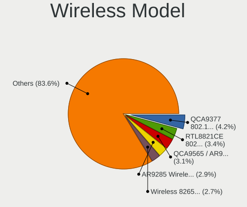

| Model                                                                | Computers | Percent |
|----------------------------------------------------------------------|-----------|---------|
| Qualcomm Atheros QCA9377 802.11ac Wireless Network Adapter           | 58        | 4.22%   |
| Realtek RTL8821CE 802.11ac PCIe Wireless Network Adapter             | 47        | 3.42%   |
| Qualcomm Atheros QCA9565 / AR9565 Wireless Network Adapter           | 43        | 3.13%   |
| Qualcomm Atheros AR9285 Wireless Network Adapter (PCI-Express)       | 40        | 2.91%   |
| Intel Wireless 8265 / 8275                                           | 37        | 2.69%   |
| Intel Wi-Fi 6 AX200                                                  | 34        | 2.47%   |
| Intel Wi-Fi 6 AX201                                                  | 33        | 2.4%    |
| Intel Wireless 8260                                                  | 29        | 2.11%   |
| Intel Centrino Advanced-N 6205 [Taylor Peak]                         | 28        | 2.03%   |
| Realtek RTL8188EUS 802.11n Wireless Network Adapter                  | 26        | 1.89%   |
| Ralink MT7601U Wireless Adapter                                      | 26        | 1.89%   |
| Realtek RTL8723BE PCIe Wireless Network Adapter                      | 25        | 1.82%   |
| Intel Wireless 3165                                                  | 25        | 1.82%   |
| Intel Cannon Lake PCH CNVi WiFi                                      | 25        | 1.82%   |
| Intel Wireless 7265                                                  | 24        | 1.74%   |
| Qualcomm Atheros AR9485 Wireless Network Adapter                     | 23        | 1.67%   |
| Intel Wireless 7260                                                  | 21        | 1.53%   |
| Broadcom BCM4313 802.11bgn Wireless Network Adapter                  | 21        | 1.53%   |
| Intel Wireless 3160                                                  | 19        | 1.38%   |
| Intel Dual Band Wireless-AC 3165 Plus Bluetooth                      | 19        | 1.38%   |
| TP-Link TL-WN823N v2/v3 [Realtek RTL8192EU]                          | 18        | 1.31%   |
| Realtek RTL8188FTV 802.11b/g/n 1T1R 2.4G WLAN Adapter                | 18        | 1.31%   |
| Qualcomm Atheros QCA6174 802.11ac Wireless Network Adapter           | 18        | 1.31%   |
| Intel Centrino Advanced-N 6200                                       | 17        | 1.24%   |
| Realtek RTL8822CE 802.11ac PCIe Wireless Network Adapter             | 16        | 1.16%   |
| MediaTek MT7921 802.11ax PCIe Wireless Network Adapter [Filogic 330] | 16        | 1.16%   |
| Intel Comet Lake PCH CNVi WiFi                                       | 16        | 1.16%   |
| Qualcomm Atheros AR9462 Wireless Network Adapter                     | 15        | 1.09%   |
| Intel Comet Lake PCH-LP CNVi WiFi                                    | 15        | 1.09%   |
| Realtek RTL8723BU 802.11b/g/n WLAN Adapter                           | 14        | 1.02%   |
| Realtek 802.11n WLAN Adapter                                         | 14        | 1.02%   |
| Qualcomm Atheros AR9287 Wireless Network Adapter (PCI-Express)       | 14        | 1.02%   |
| Intel Cannon Point-LP CNVi [Wireless-AC]                             | 14        | 1.02%   |
| Realtek RTL8723DE Wireless Network Adapter                           | 13        | 0.94%   |
| Ralink RT3290 Wireless 802.11n 1T/1R PCIe                            | 13        | 0.94%   |
| Intel Centrino Wireless-N 2230                                       | 13        | 0.94%   |
| Broadcom BCM43228 802.11a/b/g/n                                      | 13        | 0.94%   |
| Intel PRO/Wireless 3945ABG [Golan] Network Connection                | 12        | 0.87%   |
| Intel Centrino Wireless-N 1030 [Rainbow Peak]                        | 12        | 0.87%   |
| Intel Centrino Ultimate-N 6300                                       | 12        | 0.87%   |

Ethernet Vendor
---------------

Ethernet vendors

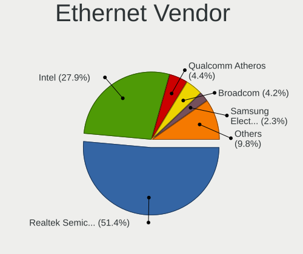

| Vendor                                 | Computers | Percent |
|----------------------------------------|-----------|---------|
| Realtek Semiconductor                  | 863       | 51.43%  |
| Intel                                  | 468       | 27.89%  |
| Qualcomm Atheros                       | 74        | 4.41%   |
| Broadcom                               | 70        | 4.17%   |
| Samsung Electronics                    | 39        | 2.32%   |
| Marvell Technology Group               | 22        | 1.31%   |
| Huawei Technologies                    | 20        | 1.19%   |
| Nvidia                                 | 15        | 0.89%   |
| Broadcom Limited                       | 14        | 0.83%   |
| ASIX Electronics                       | 13        | 0.77%   |
| MediaTek                               | 11        | 0.66%   |
| JMicron Technology                     | 7         | 0.42%   |
| D-Link System                          | 7         | 0.42%   |
| Aquantia                               | 6         | 0.36%   |
| Spreadtrum Communications              | 5         | 0.3%    |
| DisplayLink                            | 5         | 0.3%    |
| Apple                                  | 5         | 0.3%    |
| Xiaomi                                 | 3         | 0.18%   |
| Silicon Integrated Systems [SiS]       | 3         | 0.18%   |
| Qualcomm                               | 3         | 0.18%   |
| Mellanox Technologies                  | 3         | 0.18%   |
| Lenovo                                 | 3         | 0.18%   |
| TP-Link                                | 2         | 0.12%   |
| Raspberry Pi                           | 2         | 0.12%   |
| OPPO Electronics                       | 2         | 0.12%   |
| vivo                                   | 1         | 0.06%   |
| Suzhou Motorcomm Electronic Technology | 1         | 0.06%   |
| Qualcomm Technologies                  | 1         | 0.06%   |
| Microchip Technology                   | 1         | 0.06%   |
| LG Electronics                         | 1         | 0.06%   |
| Insyde Software                        | 1         | 0.06%   |
| ICS Advent                             | 1         | 0.06%   |
| IBM                                    | 1         | 0.06%   |
| HMD Global                             | 1         | 0.06%   |
| Hewlett-Packard                        | 1         | 0.06%   |
| Foxconn / Hon Hai                      | 1         | 0.06%   |
| Attansic Technology                    | 1         | 0.06%   |
| Accton Technology                      | 1         | 0.06%   |

Ethernet Model
--------------

Ethernet models

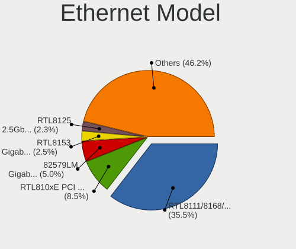

| Model                                                                  | Computers | Percent |
|------------------------------------------------------------------------|-----------|---------|
| Realtek RTL8111/8168/8211/8411 PCI Express Gigabit Ethernet Controller | 608       | 35.51%  |
| Realtek RTL810xE PCI Express Fast Ethernet controller                  | 145       | 8.47%   |
| Intel 82579LM Gigabit Network Connection (Lewisville)                  | 86        | 5.02%   |
| Realtek RTL8153 Gigabit Ethernet Adapter                               | 42        | 2.45%   |
| Realtek RTL8125 2.5GbE Controller                                      | 40        | 2.34%   |
| Intel Ethernet Connection I217-LM                                      | 31        | 1.81%   |
| Intel Ethernet Connection (2) I219-V                                   | 28        | 1.64%   |
| Samsung Galaxy series, misc. (tethering mode)                          | 25        | 1.46%   |
| Intel 82579V Gigabit Network Connection                                | 22        | 1.29%   |
| Intel I211 Gigabit Network Connection                                  | 21        | 1.23%   |
| Intel Ethernet Connection (2) I219-LM                                  | 19        | 1.11%   |
| Intel 82577LM Gigabit Network Connection                               | 17        | 0.99%   |
| Samsung GT-I9070 (network tethering, USB debugging enabled)            | 15        | 0.88%   |
| Intel Ethernet Connection I219-LM                                      | 15        | 0.88%   |
| Intel 82578DM Gigabit Network Connection                               | 14        | 0.82%   |
| Qualcomm Atheros AR8151 v2.0 Gigabit Ethernet                          | 13        | 0.76%   |
| Intel Ethernet Connection (4) I219-LM                                  | 13        | 0.76%   |
| ASIX AX88179 Gigabit Ethernet                                          | 12        | 0.7%    |
| Intel Ethernet Connection I218-LM                                      | 11        | 0.64%   |
| Intel 82574L Gigabit Network Connection                                | 11        | 0.64%   |
| Broadcom NetLink BCM57785 Gigabit Ethernet PCIe                        | 11        | 0.64%   |
| Realtek RTL8152 Fast Ethernet Adapter                                  | 10        | 0.58%   |
| Realtek RTL-8100/8101L/8139 PCI Fast Ethernet Adapter                  | 10        | 0.58%   |
| Intel Ethernet Controller I225-V                                       | 10        | 0.58%   |
| Intel 82567LM Gigabit Network Connection                               | 10        | 0.58%   |
| Huawei E353/E3131                                                      | 10        | 0.58%   |
| Intel Ethernet Connection (7) I219-V                                   | 9         | 0.53%   |
| Intel Ethernet Connection (3) I218-LM                                  | 9         | 0.53%   |
| Intel 82578DC Gigabit Network Connection                               | 9         | 0.53%   |
| Broadcom NetXtreme BCM57765 Gigabit Ethernet PCIe                      | 9         | 0.53%   |
| Qualcomm Atheros Killer E220x Gigabit Ethernet Controller              | 8         | 0.47%   |
| Intel 82567LM-3 Gigabit Network Connection                             | 8         | 0.47%   |
| Realtek Killer E2600 GbE Controller                                    | 7         | 0.41%   |
| Intel Ethernet Controller I226-V                                       | 7         | 0.41%   |
| Intel Ethernet Connection I217-V                                       | 7         | 0.41%   |
| Huawei FOA-LX9                                                         | 7         | 0.41%   |
| D-Link System DGE-528T Gigabit Ethernet Adapter                        | 7         | 0.41%   |
| Broadcom NetXtreme BCM57766 Gigabit Ethernet PCIe                      | 7         | 0.41%   |
| Qualcomm Atheros QCA8172 Fast Ethernet                                 | 6         | 0.35%   |
| Qualcomm Atheros Killer E2400 Gigabit Ethernet Controller              | 6         | 0.35%   |

Net Controller Kind
-------------------

Ethernet, WiFi or modem

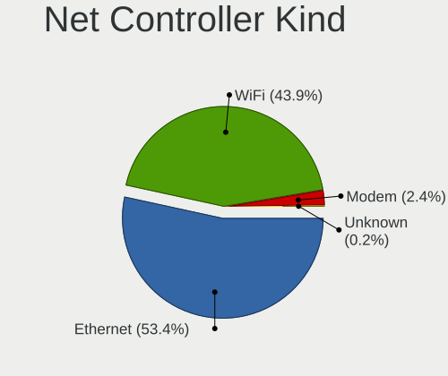

| Kind     | Computers | Percent |
|----------|-----------|---------|
| Ethernet | 1541      | 53.41%  |
| WiFi     | 1267      | 43.92%  |
| Modem    | 70        | 2.43%   |
| Unknown  | 7         | 0.24%   |

Used Controller
---------------

Currently used network controller

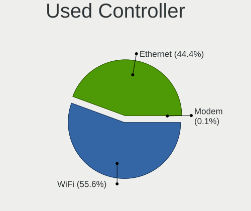

| Kind     | Computers | Percent |
|----------|-----------|---------|
| WiFi     | 1005      | 55.59%  |
| Ethernet | 802       | 44.36%  |
| Modem    | 1         | 0.06%   |

NICs
----

Total network controllers on board

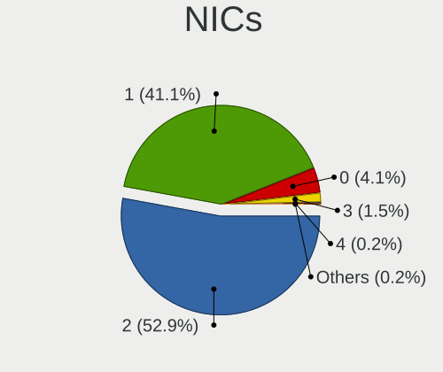

| Total | Computers | Percent |
|-------|-----------|---------|
| 2     | 930       | 52.87%  |
| 1     | 723       | 41.1%   |
| 0     | 72        | 4.09%   |
| 3     | 27        | 1.53%   |
| 4     | 4         | 0.23%   |
| 6     | 2         | 0.11%   |
| 8     | 1         | 0.06%   |

IPv6
----

IPv6 vs IPv4

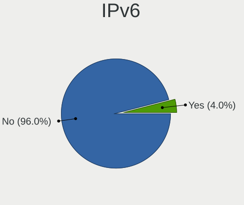

| Used | Computers | Percent |
|------|-----------|---------|
| No   | 1688      | 95.96%  |
| Yes  | 71        | 4.04%   |

Bluetooth
---------

Bluetooth Vendor
----------------

Controller vendors

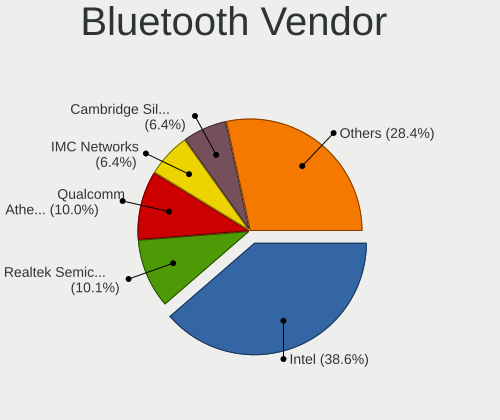

| Vendor                          | Computers | Percent |
|---------------------------------|-----------|---------|
| Intel                           | 398       | 38.64%  |
| Realtek Semiconductor           | 104       | 10.1%   |
| Qualcomm Atheros Communications | 103       | 10%     |
| IMC Networks                    | 66        | 6.41%   |
| Cambridge Silicon Radio         | 66        | 6.41%   |
| Foxconn / Hon Hai               | 49        | 4.76%   |
| Broadcom                        | 48        | 4.66%   |
| Apple                           | 34        | 3.3%    |
| Lite-On Technology              | 32        | 3.11%   |
| Hewlett-Packard                 | 31        | 3.01%   |
| Dell                            | 31        | 3.01%   |
| Ralink                          | 13        | 1.26%   |
| Toshiba                         | 10        | 0.97%   |
| MediaTek                        | 8         | 0.78%   |
| ASUSTek Computer                | 8         | 0.78%   |
| TP-Link                         | 6         | 0.58%   |
| Realtek                         | 2         | 0.19%   |
| Marvell Semiconductor           | 2         | 0.19%   |
| Integrated System Solution      | 2         | 0.19%   |
| Alps Electric                   | 2         | 0.19%   |
| Actions                         | 2         | 0.19%   |
| USI                             | 1         | 0.1%    |
| TRENDnet                        | 1         | 0.1%    |
| Ralink Technology               | 1         | 0.1%    |
| Quectel Wireless Solutions      | 1         | 0.1%    |
| Qcom                            | 1         | 0.1%    |
| Mobile Action Technology        | 1         | 0.1%    |
| Micro Star International        | 1         | 0.1%    |
| Logitech                        | 1         | 0.1%    |
| i.Tech Dynamic Limited          | 1         | 0.1%    |
| Foxconn International           | 1         | 0.1%    |
| Edimax Technology               | 1         | 0.1%    |
| Askey Computer                  | 1         | 0.1%    |
| Unknown                         | 1         | 0.1%    |

Bluetooth Model
---------------

Controller models

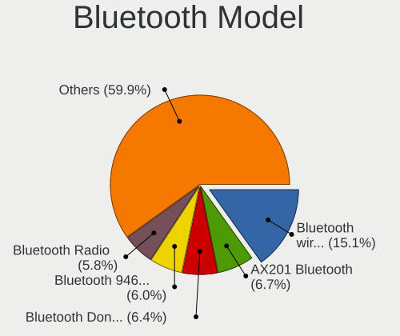

| Model                                               | Computers | Percent |
|-----------------------------------------------------|-----------|---------|
| Intel Bluetooth wireless interface                  | 156       | 15.13%  |
| Intel AX201 Bluetooth                               | 69        | 6.69%   |
| Cambridge Silicon Radio Bluetooth Dongle (HCI mode) | 66        | 6.4%    |
| Intel Bluetooth 9460/9560 Jefferson Peak (JfP)      | 62        | 6.01%   |
| Realtek Bluetooth Radio                             | 60        | 5.82%   |
| Qualcomm Atheros  Bluetooth Device                  | 50        | 4.85%   |
| Intel AX200 Bluetooth                               | 32        | 3.1%    |
| Intel Bluetooth Device                              | 31        | 3.01%   |
| Realtek  Bluetooth 4.2 Adapter                      | 30        | 2.91%   |
| IMC Networks Wireless_Device                        | 25        | 2.42%   |
| IMC Networks Bluetooth Radio                        | 22        | 2.13%   |
| HP Broadcom 2070 Bluetooth Combo                    | 22        | 2.13%   |
| Foxconn / Hon Hai Bluetooth Device                  | 18        | 1.75%   |
| Qualcomm Atheros AR3011 Bluetooth                   | 17        | 1.65%   |
| Intel Centrino Bluetooth Wireless Transceiver       | 16        | 1.55%   |
| Qualcomm Atheros AR3012 Bluetooth 4.0               | 14        | 1.36%   |
| Dell BCM20702A0 Bluetooth Module                    | 14        | 1.36%   |
| Broadcom BCM2045B (BDC-2.1)                         | 14        | 1.36%   |
| Apple Bluetooth USB Host Controller                 | 14        | 1.36%   |
| Ralink RT3290 Bluetooth                             | 13        | 1.26%   |
| Lite-On Qualcomm Atheros QCA9377 Bluetooth          | 13        | 1.26%   |
| Intel Centrino Advanced-N 6230 Bluetooth adapter    | 12        | 1.16%   |
| IMC Networks Bluetooth Device                       | 11        | 1.07%   |
| Realtek RTL8723B Bluetooth                          | 10        | 0.97%   |
| Intel Wireless-AC 3168 Bluetooth                    | 10        | 0.97%   |
| Qualcomm Atheros QCA61x4 Bluetooth 4.0              | 9         | 0.87%   |
| Lite-On Bluetooth Device                            | 9         | 0.87%   |
| HP Bluetooth 2.0 Interface [Broadcom BCM2045]       | 9         | 0.87%   |
| Qualcomm Atheros AR9462 Bluetooth                   | 8         | 0.78%   |
| MediaTek Wireless_Device                            | 8         | 0.78%   |
| Foxconn / Hon Hai Wireless_Device                   | 8         | 0.78%   |
| Apple Bluetooth Host Controller                     | 8         | 0.78%   |
| Apple Bluetooth HCI                                 | 7         | 0.68%   |
| TP-Link TP-T@- UB500 Adapter                        | 6         | 0.58%   |
| Intel AX210 Bluetooth                               | 6         | 0.58%   |
| Foxconn / Hon Hai MediaTek Bluetooth Adapter        | 6         | 0.58%   |
| Broadcom BCM43142 Bluetooth 4.0                     | 6         | 0.58%   |
| Lite-On Atheros AR3012 Bluetooth                    | 5         | 0.48%   |
| Apple Built-in Bluetooth 2.0+EDR HCI                | 5         | 0.48%   |
| Intel Wireless-AC 9260 Bluetooth Adapter            | 4         | 0.39%   |

Sound
-----

Sound Vendor
------------

Sound card vendors

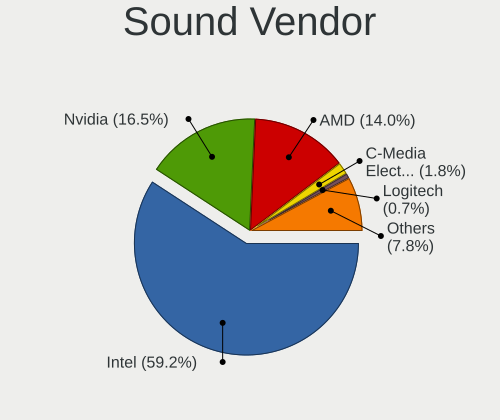

| Vendor                           | Computers | Percent |
|----------------------------------|-----------|---------|
| Intel                            | 1408      | 59.21%  |
| Nvidia                           | 393       | 16.53%  |
| AMD                              | 332       | 13.96%  |
| C-Media Electronics              | 42        | 1.77%   |
| Logitech                         | 17        | 0.71%   |
| Corsair                          | 15        | 0.63%   |
| JMTek                            | 12        | 0.5%    |
| Creative Labs                    | 11        | 0.46%   |
| ASUSTek Computer                 | 10        | 0.42%   |
| SteelSeries ApS                  | 8         | 0.34%   |
| Realtek Semiconductor            | 8         | 0.34%   |
| Sony                             | 7         | 0.29%   |
| Generalplus Technology           | 7         | 0.29%   |
| Hewlett-Packard                  | 6         | 0.25%   |
| Texas Instruments                | 5         | 0.21%   |
| Micro Star International         | 5         | 0.21%   |
| GN Netcom                        | 5         | 0.21%   |
| DSEA A/S                         | 5         | 0.21%   |
| Razer USA                        | 4         | 0.17%   |
| Plantronics                      | 4         | 0.17%   |
| Focusrite-Novation               | 4         | 0.17%   |
| Apple                            | 4         | 0.17%   |
| VIA Technologies                 | 3         | 0.13%   |
| Trust                            | 3         | 0.13%   |
| Silicon Integrated Systems [SiS] | 3         | 0.13%   |
| Samson Technologies              | 3         | 0.13%   |
| Microsoft                        | 3         | 0.13%   |
| Lenovo                           | 3         | 0.13%   |
| Jieli Technology                 | 3         | 0.13%   |
| BEHRINGER International          | 3         | 0.13%   |
| Syntek                           | 2         | 0.08%   |
| M-Audio                          | 2         | 0.08%   |
| Elgato Systems                   | 2         | 0.08%   |
| Cooler Master                    | 2         | 0.08%   |
| Conexant Systems                 | 2         | 0.08%   |
| Cambridge Silicon Radio          | 2         | 0.08%   |
| Astro Gaming                     | 2         | 0.08%   |
| AKAI Professional M.I.           | 2         | 0.08%   |
| Afatech                          | 2         | 0.08%   |
| Xiaomi                           | 1         | 0.04%   |

Sound Model
-----------

Sound card models

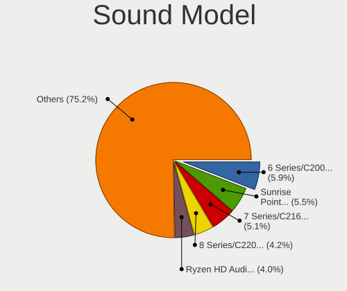

| Model                                                                                             | Computers | Percent |
|---------------------------------------------------------------------------------------------------|-----------|---------|
| Intel 6 Series/C200 Series Chipset Family High Definition Audio Controller                        | 163       | 5.91%   |
| Intel Sunrise Point-LP HD Audio                                                                   | 151       | 5.47%   |
| Intel 7 Series/C216 Chipset Family High Definition Audio Controller                               | 141       | 5.11%   |
| Intel 8 Series/C220 Series Chipset High Definition Audio Controller                               | 117       | 4.24%   |
| AMD Ryzen HD Audio Controller                                                                     | 111       | 4.02%   |
| Intel Xeon E3-1200 v3/4th Gen Core Processor HD Audio Controller                                  | 88        | 3.19%   |
| Intel 5 Series/3400 Series Chipset High Definition Audio                                          | 83        | 3.01%   |
| Intel NM10/ICH7 Family High Definition Audio Controller                                           | 69        | 2.5%    |
| Intel 100 Series/C230 Series Chipset Family HD Audio Controller                                   | 61        | 2.21%   |
| Intel Cannon Lake PCH cAVS                                                                        | 54        | 1.96%   |
| AMD Renoir/Cezanne HDMI/DP Audio Controller                                                       | 51        | 1.85%   |
| AMD Starship/Matisse HD Audio Controller                                                          | 48        | 1.74%   |
| Intel 82801I (ICH9 Family) HD Audio Controller                                                    | 47        | 1.7%    |
| Intel Wildcat Point-LP High Definition Audio Controller                                           | 44        | 1.6%    |
| Intel Broadwell-U Audio Controller                                                                | 44        | 1.6%    |
| Intel Tiger Lake-LP Smart Sound Technology Audio Controller                                       | 41        | 1.49%   |
| Intel Haswell-ULT HD Audio Controller                                                             | 41        | 1.49%   |
| Intel 8 Series HD Audio Controller                                                                | 41        | 1.49%   |
| Nvidia High Definition Audio Controller                                                           | 38        | 1.38%   |
| Intel 200 Series PCH HD Audio                                                                     | 36        | 1.31%   |
| Nvidia GF108 High Definition Audio Controller                                                     | 34        | 1.23%   |
| Intel Atom/Celeron/Pentium Processor x5-E8000/J3xxx/N3xxx Series High Definition Audio Controller | 33        | 1.2%    |
| AMD Ellesmere HDMI Audio [Radeon RX 470/480 / 570/580/590]                                        | 32        | 1.16%   |
| Intel Cannon Point-LP High Definition Audio Controller                                            | 30        | 1.09%   |
| AMD Radeon High Definition Audio Controller                                                       | 29        | 1.05%   |
| Intel 82801H (ICH8 Family) HD Audio Controller                                                    | 27        | 0.98%   |
| Nvidia GP107GL High Definition Audio Controller                                                   | 26        | 0.94%   |
| Intel Celeron/Pentium Silver Processor High Definition Audio                                      | 25        | 0.91%   |
| AMD SBx00 Azalia (Intel HDA)                                                                      | 25        | 0.91%   |
| Intel Celeron N3350/Pentium N4200/Atom E3900 Series Audio Cluster                                 | 23        | 0.83%   |
| Intel Alder Lake PCH-P High Definition Audio Controller                                           | 23        | 0.83%   |
| AMD Family 17h (Models 00h-0fh) HD Audio Controller                                               | 23        | 0.83%   |
| Intel Ice Lake-LP Smart Sound Technology Audio Controller                                         | 21        | 0.76%   |
| Nvidia TU107 GeForce GTX 1650 High Definition Audio Controller                                    | 20        | 0.73%   |
| Nvidia GP106 High Definition Audio Controller                                                     | 20        | 0.73%   |
| Nvidia TU116 High Definition Audio Controller                                                     | 19        | 0.69%   |
| Intel Comet Lake PCH cAVS                                                                         | 19        | 0.69%   |
| AMD Oland/Hainan/Cape Verde/Pitcairn HDMI Audio [Radeon HD 7000 Series]                           | 19        | 0.69%   |
| Nvidia GP104 High Definition Audio Controller                                                     | 18        | 0.65%   |
| Intel Comet Lake PCH-LP cAVS                                                                      | 18        | 0.65%   |

Memory
------

Memory Vendor
-------------

Memory module vendors

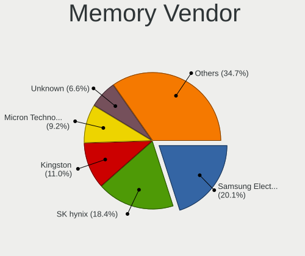

| Vendor                         | Computers | Percent |
|--------------------------------|-----------|---------|
| Samsung Electronics            | 197       | 20.06%  |
| SK hynix                       | 181       | 18.43%  |
| Kingston                       | 108       | 11%     |
| Micron Technology              | 90        | 9.16%   |
| Unknown                        | 65        | 6.62%   |
| Corsair                        | 55        | 5.6%    |
| Crucial                        | 50        | 5.09%   |
| Transcend                      | 42        | 4.28%   |
| A-DATA Technology              | 28        | 2.85%   |
| G.Skill                        | 27        | 2.75%   |
| Nanya Technology               | 16        | 1.63%   |
| Ramaxel Technology             | 15        | 1.53%   |
| KLEVV                          | 15        | 1.53%   |
| Elpida                         | 14        | 1.43%   |
| Unknown                        | 14        | 1.43%   |
| Patriot                        | 13        | 1.32%   |
| Unknown (ABCD)                 | 9         | 0.92%   |
| Kingmax                        | 5         | 0.51%   |
| Apacer                         | 5         | 0.51%   |
| Strontium                      | 4         | 0.41%   |
| Essencore                      | 4         | 0.41%   |
| Team                           | 3         | 0.31%   |
| Essencore Limited              | 3         | 0.31%   |
| Neo Forza                      | 2         | 0.2%    |
| KingFast                       | 2         | 0.2%    |
| Innodisk                       | 2         | 0.2%    |
| Wodposit                       | 1         | 0.1%    |
| Unknown (0x0080)               | 1         | 0.1%    |
| Silicon Power                  | 1         | 0.1%    |
| Shenzhen Zhongteng             | 1         | 0.1%    |
| Qimonda                        | 1         | 0.1%    |
| MKF_SMBIOS_TYPE17_MANUFACTURER | 1         | 0.1%    |
| Lexar                          | 1         | 0.1%    |
| Hewlett-Packard                | 1         | 0.1%    |
| ff                             | 1         | 0.1%    |
| ASint Technology               | 1         | 0.1%    |
| A-DA                           | 1         | 0.1%    |
| 8CFD000080AD                   | 1         | 0.1%    |
| 4ea5                           | 1         | 0.1%    |

Memory Model
------------

Memory module models

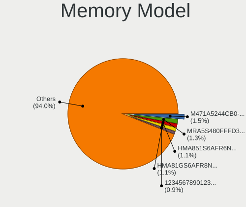

| Model                                                            | Computers | Percent |
|------------------------------------------------------------------|-----------|---------|
| Samsung RAM M471A5244CB0-CTD 4GB SODIMM DDR4 3266MT/s            | 16        | 1.53%   |
| Unknown                                                          | 14        | 1.33%   |
| SK hynix RAM HMA851S6AFR6N-UH 4GB SODIMM DDR4 2667MT/s           | 12        | 1.14%   |
| SK hynix RAM HMA81GS6AFR8N-UH 8GB SODIMM DDR4 2667MT/s           | 12        | 1.14%   |
| Unknown (ABCD) RAM 123456789012345678 2GB SODIMM LPDDR4 2400MT/s | 9         | 0.86%   |
| SK hynix RAM HMT451S6BFR8A-PB 4GB SODIMM DDR3 1600MT/s           | 9         | 0.86%   |
| SK hynix RAM HMT41GS6BFR8A-PB 8GB SODIMM DDR3 2667MT/s           | 8         | 0.76%   |
| Samsung RAM M471A5244CB0-CRC 4GB SODIMM DDR4 2667MT/s            | 8         | 0.76%   |
| Samsung RAM M471A1K43EB1-CWE 8GB SODIMM DDR4 3200MT/s            | 7         | 0.67%   |
| Samsung RAM M471A1K43CB1-CRC 8GB SODIMM DDR4 8400MT/s            | 7         | 0.67%   |
| SK hynix RAM HMA81GS6JJR8N-VK 8GB SODIMM DDR4 2667MT/s           | 6         | 0.57%   |
| Samsung RAM M471B5173EB0-YK0 4GB SODIMM DDR3 1600MT/s            | 6         | 0.57%   |
| Samsung RAM M471B1G73QH0-YK0 8GB SODIMM DDR3 1600MT/s            | 6         | 0.57%   |
| Micron RAM 4ATF51264HZ-2G6E1 4GB SODIMM DDR4 2667MT/s            | 6         | 0.57%   |
| Micron RAM 4ATF1G64HZ-3G2F1 8GB SODIMM DDR4 3200MT/s             | 6         | 0.57%   |
| KLEVV RAM KD4AGUA8A-26N1900 16GB DIMM DDR4 2667MT/s              | 6         | 0.57%   |
| SK hynix RAM HMT451U6BFR8C-PB 4GB DIMM DDR3 1600MT/s             | 5         | 0.48%   |
| SK hynix RAM HMT351S6EFR8A-PB 4GB SODIMM DDR3 1600MT/s           | 5         | 0.48%   |
| SK hynix RAM HMA81GS6CJR8N-VK 8GB SODIMM DDR4 2667MT/s           | 5         | 0.48%   |
| Samsung RAM M471B5273DH0-CK0 4GB SODIMM DDR3 2400MT/s            | 5         | 0.48%   |
| Samsung RAM M471B5273DH0-CH9 4GB SODIMM DDR3 1600MT/s            | 5         | 0.48%   |
| Samsung RAM M471B5173DB0-YK0 4GB SODIMM DDR3 1600MT/s            | 5         | 0.48%   |
| Samsung RAM M471B1G73EB0-YK0 8192MB SODIMM DDR3 1600MT/s         | 5         | 0.48%   |
| Samsung RAM M471A5244CB0-CWE 4GB SODIMM DDR4 3200MT/s            | 5         | 0.48%   |
| Corsair RAM CMZ8GX3M1A1600C10 8GB DIMM DDR3 1600MT/s             | 5         | 0.48%   |
| Transcend RAM TS512MLK64V6H 4GB DIMM DDR3 1600MT/s               | 4         | 0.38%   |
| SK hynix RAM HMT351S6CFR8C-PB 4GB SODIMM DDR3 1600MT/s           | 4         | 0.38%   |
| SK hynix RAM HMT351S6CFR8A-PB 4GB SODIMM DDR3 1600MT/s           | 4         | 0.38%   |
| SK hynix RAM HMA81GS6DJR8N-XN 8GB SODIMM DDR4 3200MT/s           | 4         | 0.38%   |
| Samsung RAM M471B5273CH0-CH9 4GB SODIMM DDR3 1334MT/s            | 4         | 0.38%   |
| Samsung RAM M471A5244CB0-CWE 4GB Row Of Chips DDR4 3200MT/s      | 4         | 0.38%   |
| Samsung RAM M425R1GB4BB0-CQKOL 8GB SODIMM DDR5 4800MT/s          | 4         | 0.38%   |
| Nanya RAM NT2GC64B88B0NS-CG 2048MB SODIMM DDR3 1334MT/s          | 4         | 0.38%   |
| Micron RAM 8KTF51264HZ-1G6E1 4GB SODIMM DDR3 1600MT/s            | 4         | 0.38%   |
| Micron RAM 8JTF51264AZ-1G6E1 4GB DIMM DDR3 1600MT/s              | 4         | 0.38%   |
| G.Skill RAM F4-3200C16-8GVKB 8GB DIMM DDR4 4000MT/s              | 4         | 0.38%   |
| Unknown RAM Module 8GB DIMM DDR3 1333MT/s                        | 3         | 0.29%   |
| Unknown RAM Module 4GB DIMM 400MT/s                              | 3         | 0.29%   |
| Unknown RAM Module 2GB SODIMM DDR3 1600MT/s                      | 3         | 0.29%   |
| Unknown RAM Module 2GB Row Of Chips LPDDR4 4267MT/s              | 3         | 0.29%   |

Memory Kind
-----------

Memory module kinds

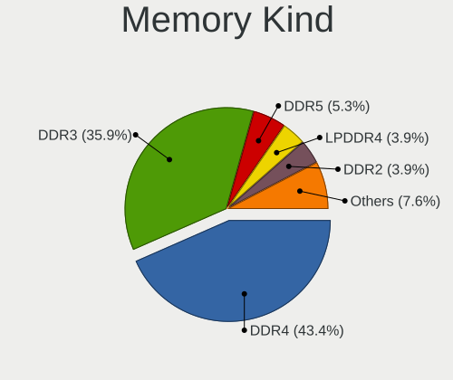

| Kind    | Computers | Percent |
|---------|-----------|---------|
| DDR4    | 336       | 43.41%  |
| DDR3    | 278       | 35.92%  |
| DDR5    | 41        | 5.3%    |
| LPDDR4  | 30        | 3.88%   |
| DDR2    | 30        | 3.88%   |
| Unknown | 20        | 2.58%   |
| SDRAM   | 15        | 1.94%   |
| LPDDR3  | 11        | 1.42%   |
| LPDDR5  | 10        | 1.29%   |
| DDR     | 3         | 0.39%   |

Memory Form Factor
------------------

Physical design of the memory module

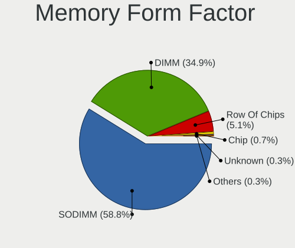

| Name            | Computers | Percent |
|-----------------|-----------|---------|
| SODIMM          | 451       | 58.8%   |
| DIMM            | 268       | 34.94%  |
| Row Of Chips    | 39        | 5.08%   |
| Chip            | 5         | 0.65%   |
| Unknown         | 2         | 0.26%   |
| Proprietary Car | 1         | 0.13%   |
| FB-DIMM         | 1         | 0.13%   |

Memory Size
-----------

Memory module size

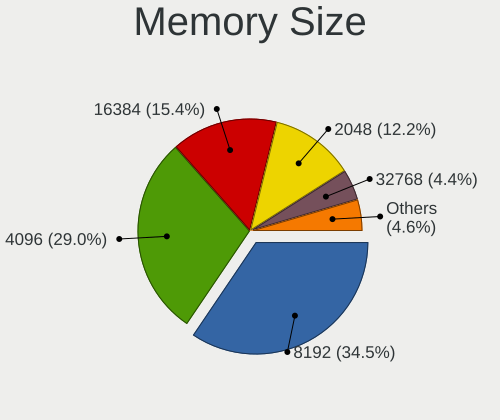

| Size  | Computers | Percent |
|-------|-----------|---------|
| 8192  | 303       | 34.47%  |
| 4096  | 255       | 29.01%  |
| 16384 | 135       | 15.36%  |
| 2048  | 107       | 12.17%  |
| 32768 | 39        | 4.44%   |
| 1024  | 29        | 3.3%    |
| 512   | 6         | 0.68%   |
| 49152 | 2         | 0.23%   |
| 24576 | 2         | 0.23%   |
| 65536 | 1         | 0.11%   |

Memory Speed
------------

Memory module speed

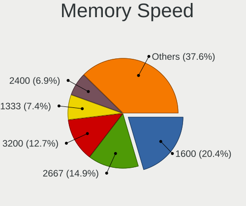

| Speed   | Computers | Percent |
|---------|-----------|---------|
| 1600    | 182       | 20.45%  |
| 2667    | 133       | 14.94%  |
| 3200    | 113       | 12.7%   |
| 1333    | 66        | 7.42%   |
| 2400    | 61        | 6.85%   |
| 2133    | 47        | 5.28%   |
| 1334    | 27        | 3.03%   |
| 4800    | 21        | 2.36%   |
| 3266    | 17        | 1.91%   |
| 800     | 17        | 1.91%   |
| 667     | 17        | 1.91%   |
| 3600    | 16        | 1.8%    |
| 1867    | 16        | 1.8%    |
| 1067    | 10        | 1.12%   |
| 8400    | 9         | 1.01%   |
| 6400    | 9         | 1.01%   |
| 5600    | 9         | 1.01%   |
| 4267    | 7         | 0.79%   |
| 1066    | 7         | 0.79%   |
| 3733    | 6         | 0.67%   |
| 2666    | 6         | 0.67%   |
| 400     | 5         | 0.56%   |
| Unknown | 5         | 0.56%   |
| 6000    | 4         | 0.45%   |
| 4199    | 4         | 0.45%   |
| 4000    | 4         | 0.45%   |
| 3066    | 4         | 0.45%   |
| 2048    | 4         | 0.45%   |
| 1866    | 4         | 0.45%   |
| 975     | 4         | 0.45%   |
| 6200    | 3         | 0.34%   |
| 3800    | 3         | 0.34%   |
| 3466    | 3         | 0.34%   |
| 2933    | 3         | 0.34%   |
| 1800    | 3         | 0.34%   |
| 1648    | 3         | 0.34%   |
| 12800   | 2         | 0.22%   |
| 3933    | 2         | 0.22%   |
| 3100    | 2         | 0.22%   |
| 3000    | 2         | 0.22%   |

Printers & scanners
-------------------

Printer Vendor
--------------

Printer device vendors

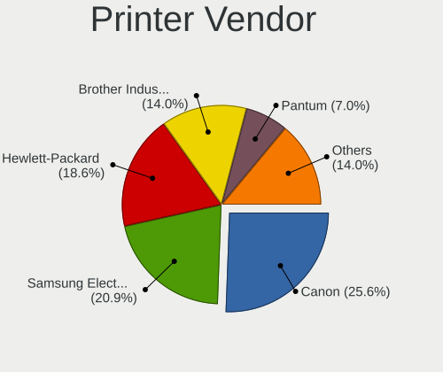

| Vendor                | Computers | Percent |
|-----------------------|-----------|---------|
| Canon                 | 11        | 25.58%  |
| Samsung Electronics   | 9         | 20.93%  |
| Hewlett-Packard       | 8         | 18.6%   |
| Brother Industries    | 6         | 13.95%  |
| Pantum                | 3         | 6.98%   |
| STMicroelectronics    | 1         | 2.33%   |
| Seiko Epson           | 1         | 2.33%   |
| Oki Data              | 1         | 2.33%   |
| MIIIW                 | 1         | 2.33%   |
| Lexmark International | 1         | 2.33%   |
| Dell                  | 1         | 2.33%   |

Printer Model
-------------

Printer device models

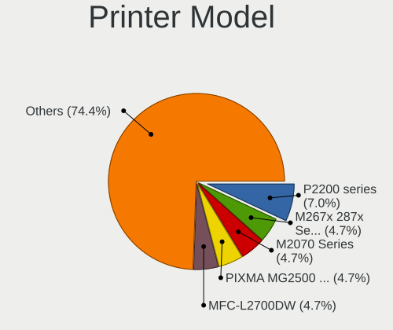

| Model                                      | Computers | Percent |
|--------------------------------------------|-----------|---------|
| Pantum P2200 series                        | 3         | 6.98%   |
| Samsung M267x 287x Series                  | 2         | 4.65%   |
| Samsung M2070 Series                       | 2         | 4.65%   |
| Canon PIXMA MG2500 Series                  | 2         | 4.65%   |
| Brother MFC-L2700DW                        | 2         | 4.65%   |
| STMicroelectronics USB Printing Support    | 1         | 2.33%   |
| Seiko Epson L3110 Series                   | 1         | 2.33%   |
| Samsung SCX-4623 Series                    | 1         | 2.33%   |
| Samsung SCX-4600 Series                    | 1         | 2.33%   |
| Samsung M2020 Series                       | 1         | 2.33%   |
| Samsung Composite Device                   | 1         | 2.33%   |
| Samsung C460 Series                        | 1         | 2.33%   |
| Oki Data USB Device                        | 1         | 2.33%   |
| MIIIW MW Keyboard Air Mini                 | 1         | 2.33%   |
| Lexmark International InkJet Color Printer | 1         | 2.33%   |
| HP OfficeJet Pro 9010 series               | 1         | 2.33%   |
| HP Officejet J4500 series                  | 1         | 2.33%   |
| HP OfficeJet 5600 (USBHUB)                 | 1         | 2.33%   |
| HP OfficeJet 4300                          | 1         | 2.33%   |
| HP LaserJet 1022                           | 1         | 2.33%   |
| HP LaserJet 1018                           | 1         | 2.33%   |
| HP LaserJet 1010                           | 1         | 2.33%   |
| HP DeskJet 3830 series                     | 1         | 2.33%   |
| Dell 1250c Color Printer                   | 1         | 2.33%   |
| Canon TR4500 series                        | 1         | 2.33%   |
| Canon PIXMA MX410                          | 1         | 2.33%   |
| Canon PIXMA MG3600 Series                  | 1         | 2.33%   |
| Canon MG2400 series                        | 1         | 2.33%   |
| Canon MF210 Series                         | 1         | 2.33%   |
| Canon LBP3360                              | 1         | 2.33%   |
| Canon G4000 series                         | 1         | 2.33%   |
| Canon G3010 series                         | 1         | 2.33%   |
| Canon G2010 series                         | 1         | 2.33%   |
| Brother Printer                            | 1         | 2.33%   |
| Brother MFC-J200                           | 1         | 2.33%   |
| Brother HL-2130 series                     | 1         | 2.33%   |
| Brother DCP-J105                           | 1         | 2.33%   |

Scanner Vendor
--------------

Scanner device vendors

| Vendor          | Computers | Percent |
|-----------------|-----------|---------|
| Seiko Epson     | 1         | 33.33%  |
| Hewlett-Packard | 1         | 33.33%  |
| Canon           | 1         | 33.33%  |

Scanner Model
-------------

Scanner device models

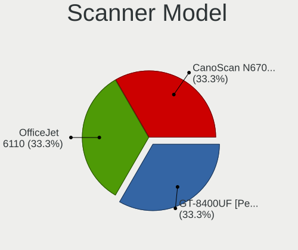

| Model                                              | Computers | Percent |
|----------------------------------------------------|-----------|---------|
| Seiko Epson GT-8400UF [Perfection 1670/1670 PHOTO] | 1         | 33.33%  |
| HP OfficeJet 6110                                  | 1         | 33.33%  |
| Canon CanoScan N670U/N676U/LiDE 20                 | 1         | 33.33%  |

Camera
------

Camera Vendor
-------------

Camera device vendors

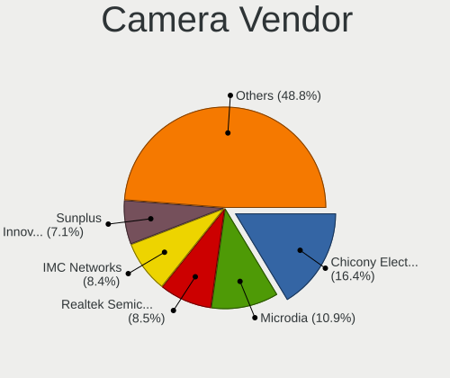

| Vendor                                 | Computers | Percent |
|----------------------------------------|-----------|---------|
| Chicony Electronics                    | 173       | 16.35%  |
| Microdia                               | 115       | 10.87%  |
| Realtek Semiconductor                  | 90        | 8.51%   |
| IMC Networks                           | 89        | 8.41%   |
| Sunplus Innovation Technology          | 75        | 7.09%   |
| Bison Electronics                      | 62        | 5.86%   |
| Quanta                                 | 52        | 4.91%   |
| Apple                                  | 42        | 3.97%   |
| Logitech                               | 41        | 3.88%   |
| Cheng Uei Precision Industry (Foxlink) | 36        | 3.4%    |
| Syntek                                 | 31        | 2.93%   |
| Samsung Electronics                    | 25        | 2.36%   |
| Lite-On Technology                     | 24        | 2.27%   |
| Suyin                                  | 22        | 2.08%   |
| Luxvisions Innotech Limited            | 20        | 1.89%   |
| Microsoft                              | 19        | 1.8%    |
| Sonix Technology                       | 14        | 1.32%   |
| Silicon Motion                         | 11        | 1.04%   |
| Alcor Micro                            | 11        | 1.04%   |
| icSpring                               | 10        | 0.95%   |
| Ricoh                                  | 9         | 0.85%   |
| Acer                                   | 9         | 0.85%   |
| Primax Electronics                     | 8         | 0.76%   |
| Z-Star Microelectronics                | 7         | 0.66%   |
| SN0002                                 | 6         | 0.57%   |
| Lenovo                                 | 5         | 0.47%   |
| Shinetech                              | 4         | 0.38%   |
| Importek                               | 3         | 0.28%   |
| GEMBIRD                                | 3         | 0.28%   |
| SunplusIT                              | 2         | 0.19%   |
| Shine-optics                           | 2         | 0.19%   |
| OPPO Electronics                       | 2         | 0.19%   |
| OmniVision Technologies                | 2         | 0.19%   |
| LG Electronics                         | 2         | 0.19%   |
| DigiTech                               | 2         | 0.19%   |
| ALi                                    | 2         | 0.19%   |
| Y Media                                | 1         | 0.09%   |
| Xiongmai                               | 1         | 0.09%   |
| webcam                                 | 1         | 0.09%   |
| TASCORP                                | 1         | 0.09%   |

Camera Model
------------

Camera device models

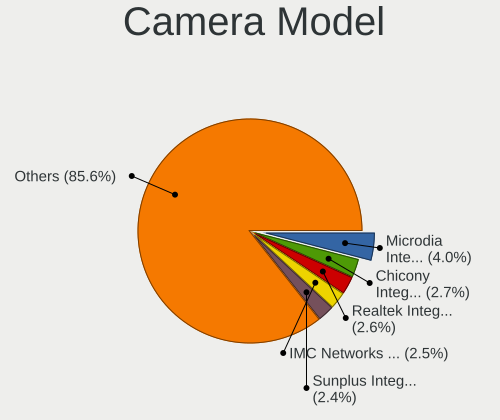

| Model                                            | Computers | Percent |
|--------------------------------------------------|-----------|---------|
| Microdia Integrated_Webcam_HD                    | 43        | 4.04%   |
| Chicony Integrated Camera                        | 29        | 2.72%   |
| Realtek Integrated_Webcam_HD                     | 28        | 2.63%   |
| IMC Networks USB2.0 HD UVC WebCam                | 27        | 2.54%   |
| Sunplus Integrated_Webcam_HD                     | 26        | 2.44%   |
| IMC Networks USB2.0 VGA UVC WebCam               | 26        | 2.44%   |
| Samsung Galaxy series, misc. (MTP mode)          | 24        | 2.25%   |
| IMC Networks Integrated Camera                   | 18        | 1.69%   |
| Bison Integrated Camera                          | 16        | 1.5%    |
| Apple iPhone 5/5C/5S/6/SE/7/8/X                  | 15        | 1.41%   |
| Syntek Integrated Camera                         | 14        | 1.31%   |
| Microdia Integrated Webcam                       | 14        | 1.31%   |
| Chicony HD WebCam                                | 13        | 1.22%   |
| Realtek Integrated Webcam                        | 12        | 1.13%   |
| Sunplus HD WebCam                                | 11        | 1.03%   |
| Logitech Webcam C270                             | 11        | 1.03%   |
| Apple FaceTime HD Camera (Built-in)              | 11        | 1.03%   |
| Microsoft LifeCam HD-3000                        | 10        | 0.94%   |
| icSpring camera                                  | 10        | 0.94%   |
| Chicony EasyCamera                               | 10        | 0.94%   |
| Bison Lenovo EasyCamera                          | 10        | 0.94%   |
| Bison EasyCamera                                 | 10        | 0.94%   |
| Sonix USB2.0 HD UVC WebCam                       | 9         | 0.85%   |
| Realtek Integrated Webcam HD                     | 9         | 0.85%   |
| Quanta VGA WebCam                                | 9         | 0.85%   |
| Syntek EasyCamera                                | 8         | 0.75%   |
| Microdia Integrated_Webcam_FHD                   | 8         | 0.75%   |
| Chicony USB2.0 VGA UVC WebCam                    | 8         | 0.75%   |
| Cheng Uei Precision Industry (Foxlink) Webcam    | 8         | 0.75%   |
| Apple FaceTime HD Camera                         | 8         | 0.75%   |
| Apple Built-in iSight                            | 8         | 0.75%   |
| Quanta HP HD Camera                              | 7         | 0.66%   |
| Quanta HD User Facing                            | 7         | 0.66%   |
| Microdia Laptop_Integrated_Webcam_HD             | 7         | 0.66%   |
| Chicony Integrated IR Camera                     | 7         | 0.66%   |
| Chicony HP TrueVision HD Camera                  | 7         | 0.66%   |
| Cheng Uei Precision Industry (Foxlink) HP Webcam | 7         | 0.66%   |
| Acer Integrated Camera                           | 7         | 0.66%   |
| Syntek Lenovo EasyCamera                         | 6         | 0.56%   |
| SN0002 1080P Web Camera                          | 6         | 0.56%   |

Security
--------

Fingerprint Vendor
------------------

Fingerprint sensor vendors

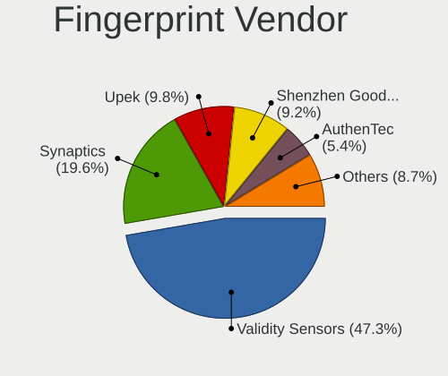

| Vendor                             | Computers | Percent |
|------------------------------------|-----------|---------|
| Validity Sensors                   | 87        | 47.28%  |
| Synaptics                          | 36        | 19.57%  |
| Upek                               | 18        | 9.78%   |
| Shenzhen Goodix Technology         | 17        | 9.24%   |
| AuthenTec                          | 10        | 5.43%   |
| LighTuning Technology              | 6         | 3.26%   |
| Focal-systems.Corp                 | 3         | 1.63%   |
| Elan Microelectronics              | 3         | 1.63%   |
| STMicroelectronics                 | 2         | 1.09%   |
| Realtek USB2.0 Finger Print Bridge | 1         | 0.54%   |
| GDMicroelectronics                 | 1         | 0.54%   |

Fingerprint Model
-----------------

Fingerprint sensor models

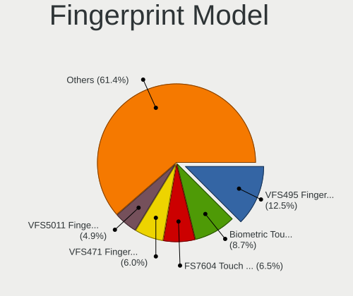

| Model                                                           | Computers | Percent |
|-----------------------------------------------------------------|-----------|---------|
| Validity Sensors VFS495 Fingerprint Reader                      | 23        | 12.5%   |
| Upek Biometric Touchchip/Touchstrip Fingerprint Sensor          | 16        | 8.7%    |
| Synaptics FS7604 Touch Fingerprint Sensor with PurePrint        | 12        | 6.52%   |
| Validity Sensors VFS471 Fingerprint Reader                      | 11        | 5.98%   |
| Validity Sensors VFS5011 Fingerprint Reader                     | 9         | 4.89%   |
| Validity Sensors VFS 5011 fingerprint sensor                    | 9         | 4.89%   |
| Shenzhen Goodix Fingerprint Reader                              | 9         | 4.89%   |
| Validity Sensors VFS451 Fingerprint Reader                      | 8         | 4.35%   |
| Validity Sensors Synaptics WBDI                                 | 7         | 3.8%    |
| Shenzhen Goodix  FingerPrint Device                             | 5         | 2.72%   |
| Validity Sensors VFS7500 Touch Fingerprint Sensor               | 4         | 2.17%   |
| Validity Sensors VFS491                                         | 4         | 2.17%   |
| Validity Sensors Swipe Fingerprint Sensor                       | 4         | 2.17%   |
| Validity Sensors Fingerprint scanner                            | 4         | 2.17%   |
| Synaptics WBDI                                                  | 4         | 2.17%   |
| Synaptics Prometheus MIS Touch Fingerprint Reader               | 4         | 2.17%   |
| Synaptics Fingerprint reader [HP G6]                            | 4         | 2.17%   |
| AuthenTec AES2810                                               | 4         | 2.17%   |
| Synaptics Metallica MOH Touch Fingerprint Reader                | 3         | 1.63%   |
| Shenzhen Goodix FingerPrint                                     | 3         | 1.63%   |
| LighTuning ES603 Swipe Fingerprint Sensor                       | 3         | 1.63%   |
| Focal-systems.Corp FT9201Fingerprint.                           | 3         | 1.63%   |
| AuthenTec AES2501 Fingerprint Sensor                            | 3         | 1.63%   |
| Validity Sensors VFS300 Fingerprint Reader                      | 2         | 1.09%   |
| Upek TCS5B Fingerprint sensor                                   | 2         | 1.09%   |
| Synaptics  WBDI                                                 | 2         | 1.09%   |
| Synaptics Metallica MIS Touch Fingerprint Reader                | 2         | 1.09%   |
| STMicroelectronics Fingerprint Reader                           | 2         | 1.09%   |
| Elan ELAN:ARM-M4                                                | 2         | 1.09%   |
| AuthenTec Fingerprint Sensor                                    | 2         | 1.09%   |
| Validity Sensors VFS7552 Touch Fingerprint Sensor               | 1         | 0.54%   |
| Validity Sensors VFS301 Fingerprint Reader                      | 1         | 0.54%   |
| Synaptics WBDI Fingerprint Reader USB 102                       | 1         | 0.54%   |
| Synaptics WBDI Fingerprint Reader USB 086                       | 1         | 0.54%   |
| Synaptics UWP WBDI                                              | 1         | 0.54%   |
| Synaptics  FS7604 Touch Fingerprint Sensor with PurePrint       | 1         | 0.54%   |
| Synaptics Prometheus Fingerprint Reader                         | 1         | 0.54%   |
| Realtek USB2.0 Finger Print Bridge FocalTech Fingerprint Device | 1         | 0.54%   |
| LighTuning Fingerprint Sensor                                   | 1         | 0.54%   |
| LighTuning Fingerprint Reader                                   | 1         | 0.54%   |

Chipcard Vendor
---------------

Chipcard module vendors

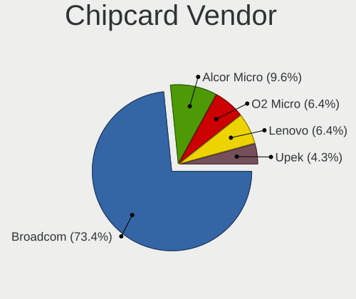

| Vendor      | Computers | Percent |
|-------------|-----------|---------|
| Broadcom    | 69        | 73.4%   |
| Alcor Micro | 9         | 9.57%   |
| O2 Micro    | 6         | 6.38%   |
| Lenovo      | 6         | 6.38%   |
| Upek        | 4         | 4.26%   |

Chipcard Model
--------------

Chipcard module models

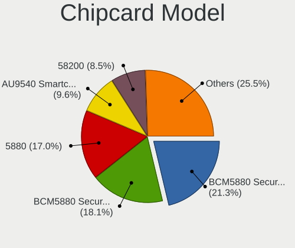

| Model                                                                        | Computers | Percent |
|------------------------------------------------------------------------------|-----------|---------|
| Broadcom BCM5880 Secure Applications Processor with fingerprint swipe sensor | 20        | 21.28%  |
| Broadcom BCM5880 Secure Applications Processor                               | 17        | 18.09%  |
| Broadcom 5880                                                                | 16        | 17.02%  |
| Alcor Micro AU9540 Smartcard Reader                                          | 9         | 9.57%   |
| Broadcom 58200                                                               | 8         | 8.51%   |
| Broadcom BCM58200 ControlVault 3 (FingerPrint sensor + Contacted SmartCard)  | 7         | 7.45%   |
| Lenovo Integrated Smart Card Reader                                          | 6         | 6.38%   |
| O2 Micro OZ776 CCID Smartcard Reader                                         | 5         | 5.32%   |
| Upek TouchChip Fingerprint Coprocessor (WBF advanced mode)                   | 4         | 4.26%   |
| O2 Micro Oz776 SmartCard Reader                                              | 1         | 1.06%   |
| Broadcom BCM5880 Secure Applications Processor with fingerprint touch sensor | 1         | 1.06%   |

Unsupported
-----------

Unsupported Devices
-------------------

Total unsupported devices on board

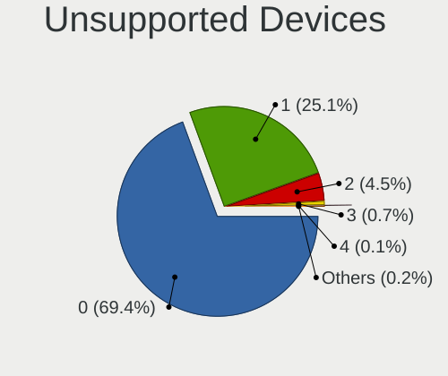

| Total | Computers | Percent |
|-------|-----------|---------|
| 0     | 1241      | 69.41%  |
| 1     | 449       | 25.11%  |
| 2     | 81        | 4.53%   |
| 3     | 12        | 0.67%   |
| 4     | 2         | 0.11%   |
| 9     | 1         | 0.06%   |
| 7     | 1         | 0.06%   |
| 5     | 1         | 0.06%   |

Unsupported Device Types
------------------------

Types of unsupported devices

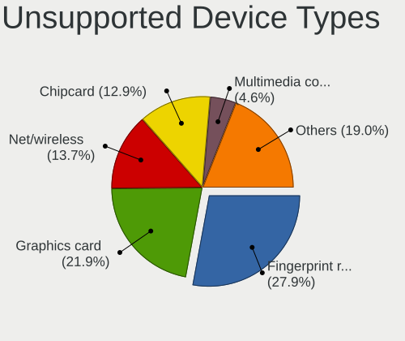

| Type                     | Computers | Percent |
|--------------------------|-----------|---------|
| Fingerprint reader       | 182       | 27.91%  |
| Graphics card            | 143       | 21.93%  |
| Net/wireless             | 89        | 13.65%  |
| Chipcard                 | 84        | 12.88%  |
| Multimedia controller    | 30        | 4.6%    |
| Communication controller | 26        | 3.99%   |
| Camera                   | 19        | 2.91%   |
| Bluetooth                | 19        | 2.91%   |
| Sound                    | 11        | 1.69%   |
| Unassigned class         | 10        | 1.53%   |
| Network                  | 9         | 1.38%   |
| Storage                  | 8         | 1.23%   |
| Net/ethernet             | 6         | 0.92%   |
| Modem                    | 5         | 0.77%   |
| Card reader              | 5         | 0.77%   |
| Storage/raid             | 3         | 0.46%   |
| Unclassified device      | 1         | 0.15%   |
| Storage/nvme             | 1         | 0.15%   |
| Flash memory             | 1         | 0.15%   |

