Linux in South Africa - Tested Hardware & Statistics
----------------------------------------------------

A project to collect tested hardware configurations for Linux in South Africa.

Anyone can contribute to this report by the [hw-probe](https://github.com/linuxhw/hw-probe) tool:

    sudo -E hw-probe -all -upload

Please contribute! Especially if your hardware is rare.

This is a report for all computer types. See also reports for [desktops](/Location/South_Africa/Desktop/README.md) and [notebooks](/Location/South_Africa/Notebook/README.md).

Contents
--------

* [ Test Cases ](#test-cases)

* [ System ](#system)
  - [ OS                       ](#os)
  - [ OS Family                ](#os-family)
  - [ Kernel                   ](#kernel)
  - [ Kernel Family            ](#kernel-family)
  - [ Kernel Major Ver.        ](#kernel-major-ver)
  - [ Arch                     ](#arch)
  - [ DE                       ](#de)
  - [ Display Server           ](#display-server)
  - [ Display Manager          ](#display-manager)
  - [ OS Lang                  ](#os-lang)
  - [ Boot Mode                ](#boot-mode)
  - [ Filesystem               ](#filesystem)
  - [ Part. scheme             ](#part-scheme)
  - [ Dual Boot with Linux/BSD ](#dual-boot-with-linuxbsd)
  - [ Dual Boot (Win)          ](#dual-boot-win)

* [ Board ](#board)
  - [ Vendor                   ](#vendor)
  - [ Model                    ](#model)
  - [ Model Family             ](#model-family)
  - [ MFG Year                 ](#mfg-year)
  - [ Form Factor              ](#form-factor)
  - [ Secure Boot              ](#secure-boot)
  - [ Coreboot                 ](#coreboot)
  - [ RAM Size                 ](#ram-size)
  - [ RAM Used                 ](#ram-used)
  - [ Total Drives             ](#total-drives)
  - [ Has CD-ROM               ](#has-cd-rom)
  - [ Has Ethernet             ](#has-ethernet)
  - [ Has WiFi                 ](#has-wifi)
  - [ Has Bluetooth            ](#has-bluetooth)

* [ Location ](#location)
  - [ Country                  ](#country)
  - [ City                     ](#city)

* [ Drives ](#drives)
  - [ Drive Vendor             ](#drive-vendor)
  - [ Drive Model              ](#drive-model)
  - [ HDD Vendor               ](#hdd-vendor)
  - [ SSD Vendor               ](#ssd-vendor)
  - [ Drive Kind               ](#drive-kind)
  - [ Drive Connector          ](#drive-connector)
  - [ Drive Size               ](#drive-size)
  - [ Space Total              ](#space-total)
  - [ Space Used               ](#space-used)
  - [ Malfunc. Drives          ](#malfunc-drives)
  - [ Malfunc. Drive Vendor    ](#malfunc-drive-vendor)
  - [ Malfunc. HDD Vendor      ](#malfunc-hdd-vendor)
  - [ Malfunc. Drive Kind      ](#malfunc-drive-kind)
  - [ Failed Drives            ](#failed-drives)
  - [ Failed Drive Vendor      ](#failed-drive-vendor)
  - [ Drive Status             ](#drive-status)

* [ Storage controller ](#storage-controller)
  - [ Storage Vendor           ](#storage-vendor)
  - [ Storage Model            ](#storage-model)
  - [ Storage Kind             ](#storage-kind)

* [ Processor ](#processor)
  - [ CPU Vendor               ](#cpu-vendor)
  - [ CPU Model                ](#cpu-model)
  - [ CPU Model Family         ](#cpu-model-family)
  - [ CPU Cores                ](#cpu-cores)
  - [ CPU Sockets              ](#cpu-sockets)
  - [ CPU Threads              ](#cpu-threads)
  - [ CPU Op-Modes             ](#cpu-op-modes)
  - [ CPU Microcode            ](#cpu-microcode)
  - [ CPU Microarch            ](#cpu-microarch)

* [ Graphics ](#graphics)
  - [ GPU Vendor               ](#gpu-vendor)
  - [ GPU Model                ](#gpu-model)
  - [ GPU Combo                ](#gpu-combo)
  - [ GPU Driver               ](#gpu-driver)
  - [ GPU Memory               ](#gpu-memory)

* [ Monitor ](#monitor)
  - [ Monitor Vendor           ](#monitor-vendor)
  - [ Monitor Model            ](#monitor-model)
  - [ Monitor Resolution       ](#monitor-resolution)
  - [ Monitor Diagonal         ](#monitor-diagonal)
  - [ Monitor Width            ](#monitor-width)
  - [ Aspect Ratio             ](#aspect-ratio)
  - [ Monitor Area             ](#monitor-area)
  - [ Pixel Density            ](#pixel-density)
  - [ Multiple Monitors        ](#multiple-monitors)

* [ Network ](#network)
  - [ Net Controller Vendor    ](#net-controller-vendor)
  - [ Net Controller Model     ](#net-controller-model)
  - [ Wireless Vendor          ](#wireless-vendor)
  - [ Wireless Model           ](#wireless-model)
  - [ Ethernet Vendor          ](#ethernet-vendor)
  - [ Ethernet Model           ](#ethernet-model)
  - [ Net Controller Kind      ](#net-controller-kind)
  - [ Used Controller          ](#used-controller)
  - [ NICs                     ](#nics)
  - [ IPv6                     ](#ipv6)

* [ Bluetooth ](#bluetooth)
  - [ Bluetooth Vendor         ](#bluetooth-vendor)
  - [ Bluetooth Model          ](#bluetooth-model)

* [ Sound ](#sound)
  - [ Sound Vendor             ](#sound-vendor)
  - [ Sound Model              ](#sound-model)

* [ Memory ](#memory)
  - [ Memory Vendor            ](#memory-vendor)
  - [ Memory Model             ](#memory-model)
  - [ Memory Kind              ](#memory-kind)
  - [ Memory Form Factor       ](#memory-form-factor)
  - [ Memory Size              ](#memory-size)
  - [ Memory Speed             ](#memory-speed)

* [ Printers & scanners ](#printers--scanners)
  - [ Printer Vendor           ](#printer-vendor)
  - [ Printer Model            ](#printer-model)
  - [ Scanner Vendor           ](#scanner-vendor)
  - [ Scanner Model            ](#scanner-model)

* [ Camera ](#camera)
  - [ Camera Vendor            ](#camera-vendor)
  - [ Camera Model             ](#camera-model)

* [ Security ](#security)
  - [ Fingerprint Vendor       ](#fingerprint-vendor)
  - [ Fingerprint Model        ](#fingerprint-model)
  - [ Chipcard Vendor          ](#chipcard-vendor)
  - [ Chipcard Model           ](#chipcard-model)

* [ Unsupported ](#unsupported)
  - [ Unsupported Devices      ](#unsupported-devices)
  - [ Unsupported Device Types ](#unsupported-device-types)

Test Cases
----------

Total: 2203

| Vendor        | Model                       | Form-Factor | Probe                                                      | Date         |
|---------------|-----------------------------|-------------|------------------------------------------------------------|--------------|
| ASUSTek       | PRIME Z690-A                | Desktop     | [a2a616fa46](https://linux-hardware.org/?probe=a2a616fa46) | Jan 05, 2025 |
| ASUSTek       | PRIME Z690-A                | Desktop     | [17a75e1af5](https://linux-hardware.org/?probe=17a75e1af5) | Jan 05, 2025 |
| ASUSTek       | M5A97 R2.0                  | Desktop     | [ced881b7bd](https://linux-hardware.org/?probe=ced881b7bd) | Jan 04, 2025 |
| HP            | ProLiant ML150 G6           | Desktop     | [d281d0b24d](https://linux-hardware.org/?probe=d281d0b24d) | Jan 03, 2025 |
| Dell          | Latitude E5550              | Notebook    | [618acec11b](https://linux-hardware.org/?probe=618acec11b) | Jan 01, 2025 |
| Lenovo        | G50-70 20351                | Notebook    | [82a4f5f99b](https://linux-hardware.org/?probe=82a4f5f99b) | Jan 01, 2025 |
| Dell          | 0M3F6C A01                  | Desktop     | [480dd5a7e1](https://linux-hardware.org/?probe=480dd5a7e1) | Dec 31, 2024 |
| Dell          | 0M3F6C A01                  | Desktop     | [2a62b1ff44](https://linux-hardware.org/?probe=2a62b1ff44) | Dec 31, 2024 |
| HP            | 802F                        | Desktop     | [5c6293b2ab](https://linux-hardware.org/?probe=5c6293b2ab) | Dec 31, 2024 |
| Dell          | 0G261D A00                  | Desktop     | [8fb7d29eda](https://linux-hardware.org/?probe=8fb7d29eda) | Dec 30, 2024 |
| Acer          | TMP645-M                    | Notebook    | [0355ef9fb3](https://linux-hardware.org/?probe=0355ef9fb3) | Dec 29, 2024 |
| HP            | EliteBook 830 G8 Noteboo... | Notebook    | [837d43eb63](https://linux-hardware.org/?probe=837d43eb63) | Dec 28, 2024 |
| HP            | EliteBook 830 G8 Noteboo... | Notebook    | [13704e02a4](https://linux-hardware.org/?probe=13704e02a4) | Dec 28, 2024 |
| Dell          | Latitude 3410               | Notebook    | [d884cebf94](https://linux-hardware.org/?probe=d884cebf94) | Dec 27, 2024 |
| Dell          | G15 5510                    | Notebook    | [e381abffc2](https://linux-hardware.org/?probe=e381abffc2) | Dec 26, 2024 |
| Dell          | G3 3579                     | Notebook    | [1d4bdd5b06](https://linux-hardware.org/?probe=1d4bdd5b06) | Dec 23, 2024 |
| ASUSTek       | Rampage II GENE             | Desktop     | [6358a8fcf5](https://linux-hardware.org/?probe=6358a8fcf5) | Dec 22, 2024 |
| Lenovo        | ThinkPad W540 20BHS14J0J    | Notebook    | [4bfbb1305a](https://linux-hardware.org/?probe=4bfbb1305a) | Dec 20, 2024 |
| Gigabyte      | Q87M-D2H                    | Desktop     | [b99f7b8080](https://linux-hardware.org/?probe=b99f7b8080) | Dec 18, 2024 |
| Proline       | V14664P                     | Notebook    | [3e422abecf](https://linux-hardware.org/?probe=3e422abecf) | Dec 18, 2024 |
| ASUSTek       | VivoBook 15_ASUS Laptop ... | Notebook    | [0bc7f79026](https://linux-hardware.org/?probe=0bc7f79026) | Dec 16, 2024 |
| Dell          | Latitude 5490               | Notebook    | [e8d767b8cb](https://linux-hardware.org/?probe=e8d767b8cb) | Dec 16, 2024 |
| MSI           | X99S SLI PLUS               | Desktop     | [9ff7b1c7a1](https://linux-hardware.org/?probe=9ff7b1c7a1) | Dec 15, 2024 |
| Lenovo        | ThinkPad X1 Carbon 7th 2... | Notebook    | [c5cf3c9a58](https://linux-hardware.org/?probe=c5cf3c9a58) | Dec 14, 2024 |
| Gigabyte      | H310M HD2                   | Desktop     | [82869d9dec](https://linux-hardware.org/?probe=82869d9dec) | Dec 12, 2024 |
| Dell          | Latitude E5520              | Notebook    | [b4afdedcdf](https://linux-hardware.org/?probe=b4afdedcdf) | Dec 12, 2024 |
| ASUSTek       | ROG STRIX Z370-E GAMING     | Desktop     | [3f7324c90a](https://linux-hardware.org/?probe=3f7324c90a) | Dec 05, 2024 |
| Dell          | 09KPNV A00                  | Desktop     | [954003dcdc](https://linux-hardware.org/?probe=954003dcdc) | Dec 04, 2024 |
| Gigabyte      | H310M HD2                   | Desktop     | [c6f2cf8f23](https://linux-hardware.org/?probe=c6f2cf8f23) | Dec 04, 2024 |
| Intel         | DQ57TM AAE70931-403         | Desktop     | [4cf044143a](https://linux-hardware.org/?probe=4cf044143a) | Dec 04, 2024 |
| Lenovo        | ThinkCentre A55 870577G     | Desktop     | [88f7652696](https://linux-hardware.org/?probe=88f7652696) | Dec 03, 2024 |
| ASUSTek       | ASUS TUF Gaming F15 FX50... | Notebook    | [5e4d4ad56d](https://linux-hardware.org/?probe=5e4d4ad56d) | Dec 03, 2024 |
| HP            | Laptop 15-da0xxx            | Notebook    | [c352e2fd24](https://linux-hardware.org/?probe=c352e2fd24) | Dec 02, 2024 |
| HP            | Laptop 15s-eq2xxx           | Notebook    | [4b0b11b247](https://linux-hardware.org/?probe=4b0b11b247) | Dec 02, 2024 |
| Dell          | Inspiron 15-3567            | Notebook    | [76523f65f3](https://linux-hardware.org/?probe=76523f65f3) | Nov 28, 2024 |
| HP            | ProBook 450 G2              | Notebook    | [72abd853a1](https://linux-hardware.org/?probe=72abd853a1) | Nov 28, 2024 |
| Lenovo        | ThinkPad W540 20BHS14J0J    | Notebook    | [5f77ea0b14](https://linux-hardware.org/?probe=5f77ea0b14) | Nov 25, 2024 |
| Lenovo        | ThinkPad W540 20BHS0620V    | Notebook    | [e473ec9a1b](https://linux-hardware.org/?probe=e473ec9a1b) | Nov 23, 2024 |
| ASUSTek       | ROG STRIX Z370-E GAMING     | Desktop     | [b6f18ef9c7](https://linux-hardware.org/?probe=b6f18ef9c7) | Nov 23, 2024 |
| Dell          | 0M3F6C A01                  | Desktop     | [0fa1bd4afb](https://linux-hardware.org/?probe=0fa1bd4afb) | Nov 23, 2024 |
| Lenovo        | 3135 000000B98417 WIN 18... | Mini pc     | [a23b8bcd4c](https://linux-hardware.org/?probe=a23b8bcd4c) | Nov 21, 2024 |
| MSI           | PRO A620M-E                 | Desktop     | [38cd0b15fd](https://linux-hardware.org/?probe=38cd0b15fd) | Nov 20, 2024 |
| Lenovo        | ThinkPad X1 Carbon 7th 2... | Notebook    | [5cd21e65a2](https://linux-hardware.org/?probe=5cd21e65a2) | Nov 20, 2024 |
| MSI           | B550M-A PRO                 | Desktop     | [b8da51818e](https://linux-hardware.org/?probe=b8da51818e) | Nov 20, 2024 |
| Gigabyte      | AORUS 7A K1                 | Notebook    | [9b3907c59e](https://linux-hardware.org/?probe=9b3907c59e) | Nov 19, 2024 |
| MSI           | A520M-A PRO                 | Desktop     | [72727e842e](https://linux-hardware.org/?probe=72727e842e) | Nov 17, 2024 |
| Gigabyte      | H81M-DS2                    | Desktop     | [992e52b9f8](https://linux-hardware.org/?probe=992e52b9f8) | Nov 17, 2024 |
| ASUSTek       | PRIME X470-PRO              | Desktop     | [cc1f1fc7a8](https://linux-hardware.org/?probe=cc1f1fc7a8) | Nov 16, 2024 |
| Dell          | Latitude 7480               | Notebook    | [d7a47d8576](https://linux-hardware.org/?probe=d7a47d8576) | Nov 14, 2024 |
| HP            | Pavilion Notebook 15-bc5... | Notebook    | [8a2d34954e](https://linux-hardware.org/?probe=8a2d34954e) | Nov 14, 2024 |
| Lenovo        | ThinkPad W540 20BHS0620V    | Notebook    | [969a725e1e](https://linux-hardware.org/?probe=969a725e1e) | Nov 14, 2024 |
| Dell          | Inspiron 15 7000 Gaming     | Notebook    | [c81a415b4f](https://linux-hardware.org/?probe=c81a415b4f) | Nov 12, 2024 |
| Dell          | Inspiron 15-3567            | Notebook    | [b71b050726](https://linux-hardware.org/?probe=b71b050726) | Nov 10, 2024 |
| ASUSTek       | VivoBook_ASUSLaptop X150... | Notebook    | [2c4e1abbf9](https://linux-hardware.org/?probe=2c4e1abbf9) | Nov 09, 2024 |
| Dell          | XPS 13 9360                 | Notebook    | [67aea4785f](https://linux-hardware.org/?probe=67aea4785f) | Nov 08, 2024 |
| HP            | ZBook Fury 15.6 inch G8 ... | Notebook    | [e7b30179ed](https://linux-hardware.org/?probe=e7b30179ed) | Nov 08, 2024 |
| Lenovo        | V110-15ISK 80TL             | Notebook    | [baf7cf7f68](https://linux-hardware.org/?probe=baf7cf7f68) | Nov 05, 2024 |
| Intel         | NUC8BEB J72693-306          | Mini pc     | [e5c50f24d2](https://linux-hardware.org/?probe=e5c50f24d2) | Nov 04, 2024 |
| Dell          | Inspiron 15-3567            | Notebook    | [48367edd5a](https://linux-hardware.org/?probe=48367edd5a) | Nov 04, 2024 |
| MSI           | H81M-P33                    | Desktop     | [7f7dc5c76e](https://linux-hardware.org/?probe=7f7dc5c76e) | Nov 03, 2024 |
| ASUSTek       | H81M-C                      | Desktop     | [f7228f91c2](https://linux-hardware.org/?probe=f7228f91c2) | Nov 01, 2024 |
| Lenovo        | IdeaPad Slim 3 15IAN8 82... | Notebook    | [8a23e0e1bf](https://linux-hardware.org/?probe=8a23e0e1bf) | Oct 31, 2024 |
| ASUSTek       | ASUS TUF Gaming A15 FA50... | Notebook    | [b6f68c4dbe](https://linux-hardware.org/?probe=b6f68c4dbe) | Oct 30, 2024 |
| HP            | EliteBook 2570p             | Notebook    | [56ef511524](https://linux-hardware.org/?probe=56ef511524) | Oct 29, 2024 |
| ASUSTek       | ASUS TUF Gaming A15 FA50... | Notebook    | [f8a7c34e84](https://linux-hardware.org/?probe=f8a7c34e84) | Oct 28, 2024 |
| Acer          | Aspire E1-571               | Notebook    | [8f019a5780](https://linux-hardware.org/?probe=8f019a5780) | Oct 28, 2024 |
| MECER         | YA13Q40-LTE_PRO-S           | Convertible | [5f2a1b7c56](https://linux-hardware.org/?probe=5f2a1b7c56) | Oct 27, 2024 |
| Intel         | DH77EB AAG39073-304         | Desktop     | [260a0dccc2](https://linux-hardware.org/?probe=260a0dccc2) | Oct 25, 2024 |
| HUAWEI        | BOHB-WAX9                   | Notebook    | [e114c5afe5](https://linux-hardware.org/?probe=e114c5afe5) | Oct 24, 2024 |
| Intel         | NUC5i5RYB H40999-505        | Mini pc     | [168d9fcda8](https://linux-hardware.org/?probe=168d9fcda8) | Oct 23, 2024 |
| ASUSTek       | PRIME B450M-K II            | Desktop     | [9fe232feef](https://linux-hardware.org/?probe=9fe232feef) | Oct 23, 2024 |
| HP            | OMEN by Gaming Laptop 16... | Notebook    | [0ddd85232d](https://linux-hardware.org/?probe=0ddd85232d) | Oct 20, 2024 |
| HP            | OMEN by Gaming Laptop 16... | Notebook    | [ff10a0e267](https://linux-hardware.org/?probe=ff10a0e267) | Oct 19, 2024 |
| Acer          | Aspire 5750                 | Notebook    | [46d52bac51](https://linux-hardware.org/?probe=46d52bac51) | Oct 14, 2024 |
| Gigabyte      | B360M D3H-CF                | Desktop     | [8833bd0cb0](https://linux-hardware.org/?probe=8833bd0cb0) | Oct 13, 2024 |
| Lenovo        | IdeaPad S145-15AST 81N3     | Notebook    | [27e9d1c2a0](https://linux-hardware.org/?probe=27e9d1c2a0) | Oct 12, 2024 |
| HP            | 1495                        | Desktop     | [7bc90c5c20](https://linux-hardware.org/?probe=7bc90c5c20) | Oct 12, 2024 |
| Unknown       | Unknown                     | Desktop     | [6470bbc81c](https://linux-hardware.org/?probe=6470bbc81c) | Oct 12, 2024 |
| Fujitsu       | LIFEBOOK AH532              | Notebook    | [44927dcb48](https://linux-hardware.org/?probe=44927dcb48) | Oct 11, 2024 |
| Lenovo        | ThinkPad T540p 20BE00AKZ... | Notebook    | [a87a56e961](https://linux-hardware.org/?probe=a87a56e961) | Oct 11, 2024 |
| Raspberry ... | Raspberry Pi 5 Model B R... | Soc         | [c53d0c0006](https://linux-hardware.org/?probe=c53d0c0006) | Oct 09, 2024 |
| HP            | EliteBook 660 16 inch G1... | Notebook    | [97b155f222](https://linux-hardware.org/?probe=97b155f222) | Oct 04, 2024 |
| Gigabyte      | B550 AORUS ELITE V2         | Desktop     | [1693b17ecc](https://linux-hardware.org/?probe=1693b17ecc) | Oct 02, 2024 |
| Lenovo        | IdeaPad 110-15IBR 80T7      | Notebook    | [8ca3e16fa6](https://linux-hardware.org/?probe=8ca3e16fa6) | Oct 02, 2024 |
| Dell          | Latitude E6430              | Notebook    | [39e185dc5c](https://linux-hardware.org/?probe=39e185dc5c) | Sep 30, 2024 |
| Gigabyte      | Z370XP SLI-CF               | Desktop     | [597a401f4b](https://linux-hardware.org/?probe=597a401f4b) | Sep 29, 2024 |
| ASUSTek       | P5Q-PRO                     | Desktop     | [ef27e1122b](https://linux-hardware.org/?probe=ef27e1122b) | Sep 28, 2024 |
| Unknown       | Unknown                     | Notebook    | [abb898be4f](https://linux-hardware.org/?probe=abb898be4f) | Sep 28, 2024 |
| Gigabyte      | Q87M-D2H                    | Desktop     | [fee0652be0](https://linux-hardware.org/?probe=fee0652be0) | Sep 24, 2024 |
| Dell          | G5 5590                     | Notebook    | [b6a29e38bc](https://linux-hardware.org/?probe=b6a29e38bc) | Sep 22, 2024 |
| Dell          | G5 5590                     | Notebook    | [3fecd0e8ed](https://linux-hardware.org/?probe=3fecd0e8ed) | Sep 22, 2024 |
| MSI           | Katana GF76 11UE            | Notebook    | [e49bd98e54](https://linux-hardware.org/?probe=e49bd98e54) | Sep 22, 2024 |
| ASUSTek       | PRIME X570-PRO              | Desktop     | [f1a006d1e1](https://linux-hardware.org/?probe=f1a006d1e1) | Sep 21, 2024 |
| MSI           | Katana GF76 11UE            | Notebook    | [89bb8dc2c6](https://linux-hardware.org/?probe=89bb8dc2c6) | Sep 21, 2024 |
| Intel         | YL-3160L2                   | Desktop     | [0089e01b37](https://linux-hardware.org/?probe=0089e01b37) | Sep 19, 2024 |
| Intel         | YL-3160L2                   | Desktop     | [761c361710](https://linux-hardware.org/?probe=761c361710) | Sep 18, 2024 |
| MECER         | Z140C-Xpr-FPLUS             | Notebook    | [7485697159](https://linux-hardware.org/?probe=7485697159) | Sep 15, 2024 |
| Toshiba       | Satellite C650              | Notebook    | [94c01ae81b](https://linux-hardware.org/?probe=94c01ae81b) | Sep 13, 2024 |
| Intel         | DH87MC AAG74242-401         | Desktop     | [a939d2d16e](https://linux-hardware.org/?probe=a939d2d16e) | Sep 13, 2024 |
| Intel         | DH87MC AAG74242-401         | Desktop     | [e9b559c00d](https://linux-hardware.org/?probe=e9b559c00d) | Sep 13, 2024 |
| Lenovo        | ThinkPad T430 23495W9       | Notebook    | [54c67b3aa6](https://linux-hardware.org/?probe=54c67b3aa6) | Sep 12, 2024 |
| Sony          | SVE14A35CXH                 | Notebook    | [e5851550ee](https://linux-hardware.org/?probe=e5851550ee) | Sep 11, 2024 |
| Dell          | 0M3F6C A01                  | Desktop     | [11ec44761a](https://linux-hardware.org/?probe=11ec44761a) | Sep 11, 2024 |
| Dell          | 0M3F6C A01                  | Desktop     | [305e71b5c8](https://linux-hardware.org/?probe=305e71b5c8) | Sep 10, 2024 |
| Dell          | Precision 3520              | Notebook    | [860ad42896](https://linux-hardware.org/?probe=860ad42896) | Sep 09, 2024 |
| Proline       | V1165C4                     | Notebook    | [234cdeb0e8](https://linux-hardware.org/?probe=234cdeb0e8) | Sep 09, 2024 |
| HP            | ProBook 450 G2              | Notebook    | [144957cdb2](https://linux-hardware.org/?probe=144957cdb2) | Sep 06, 2024 |
| HP            | EliteBook 2570p             | Notebook    | [782ad1d45a](https://linux-hardware.org/?probe=782ad1d45a) | Sep 05, 2024 |
| HP            | Laptop 15-rb0xx             | Notebook    | [422ec11e3e](https://linux-hardware.org/?probe=422ec11e3e) | Sep 05, 2024 |
| HP            | Laptop 15-rb0xx             | Notebook    | [e263cf011c](https://linux-hardware.org/?probe=e263cf011c) | Sep 05, 2024 |
| ASUSTek       | ROG Strix G531GT_G531GT     | Notebook    | [eaf9d96fe3](https://linux-hardware.org/?probe=eaf9d96fe3) | Sep 05, 2024 |
| HP            | ProLiant MicroServer        | Desktop     | [9bf2e5fa67](https://linux-hardware.org/?probe=9bf2e5fa67) | Sep 04, 2024 |
| Alienware     | M17xR4                      | Notebook    | [54e24960e6](https://linux-hardware.org/?probe=54e24960e6) | Sep 03, 2024 |
| Lenovo        | 3111 SDK0J40697 WIN 3305... | Mini pc     | [98da2fa843](https://linux-hardware.org/?probe=98da2fa843) | Sep 03, 2024 |
| HP            | 18E5                        | Desktop     | [041180d946](https://linux-hardware.org/?probe=041180d946) | Sep 02, 2024 |
| Supermicro    | X11SSA-F                    | Server      | [62c087ce77](https://linux-hardware.org/?probe=62c087ce77) | Sep 02, 2024 |
| Intel         | NUC8BEB J72693-308          | Mini pc     | [baa988322d](https://linux-hardware.org/?probe=baa988322d) | Sep 01, 2024 |
| ASUSTek       | VivoBook_ASUSLaptop X150... | Notebook    | [7ddaa26407](https://linux-hardware.org/?probe=7ddaa26407) | Sep 01, 2024 |
| Dell          | Vostro 5620                 | Notebook    | [a678f3df4a](https://linux-hardware.org/?probe=a678f3df4a) | Sep 01, 2024 |
| Dell          | Vostro 5620                 | Notebook    | [12c8ec58e5](https://linux-hardware.org/?probe=12c8ec58e5) | Aug 31, 2024 |
| Proline       | V1165C4                     | Notebook    | [42aa7b6073](https://linux-hardware.org/?probe=42aa7b6073) | Aug 31, 2024 |
| Proline       | V1165C4                     | Notebook    | [f50bd39526](https://linux-hardware.org/?probe=f50bd39526) | Aug 31, 2024 |
| Lenovo        | IdeaPad Slim 3 15IAN8 82... | Notebook    | [778ec7792e](https://linux-hardware.org/?probe=778ec7792e) | Aug 28, 2024 |
| Lenovo        | IdeaPad 320-15IKB 80YE      | Notebook    | [6db810cf12](https://linux-hardware.org/?probe=6db810cf12) | Aug 28, 2024 |
| Alienware     | 14                          | Notebook    | [8ee6f86bdd](https://linux-hardware.org/?probe=8ee6f86bdd) | Aug 28, 2024 |
| Intel         | D2700MUD AAG32419-602       | Desktop     | [b8c333d96c](https://linux-hardware.org/?probe=b8c333d96c) | Aug 28, 2024 |
| Lenovo        | SDK0E50510 WIN 262508624... | Desktop     | [71083ea502](https://linux-hardware.org/?probe=71083ea502) | Aug 27, 2024 |
| Dell          | 02MGVC A00                  | Server      | [2df42d8015](https://linux-hardware.org/?probe=2df42d8015) | Aug 26, 2024 |
| Foxconn       | G41MXE/G41MXE-K             | Desktop     | [b9a18b9df4](https://linux-hardware.org/?probe=b9a18b9df4) | Aug 25, 2024 |
| Foxconn       | G41MXE/G41MXE-K             | Desktop     | [b3bbf9e6bc](https://linux-hardware.org/?probe=b3bbf9e6bc) | Aug 25, 2024 |
| Lenovo        | IdeaPad S145-15AST 81N3     | Notebook    | [1d4609e7fd](https://linux-hardware.org/?probe=1d4609e7fd) | Aug 25, 2024 |
| Lenovo        | IdeaPad S145-15AST 81N3     | Notebook    | [81f1605c7a](https://linux-hardware.org/?probe=81f1605c7a) | Aug 25, 2024 |
| HP            | 250 G4                      | Notebook    | [ce0e70beac](https://linux-hardware.org/?probe=ce0e70beac) | Aug 25, 2024 |
| ASUSTek       | H61M-PLUS                   | Desktop     | [ab3e598343](https://linux-hardware.org/?probe=ab3e598343) | Aug 25, 2024 |
| Dell          | Latitude E7440              | Notebook    | [6cddb30ec0](https://linux-hardware.org/?probe=6cddb30ec0) | Aug 24, 2024 |
| Dell          | Latitude E7440              | Notebook    | [bda506fc26](https://linux-hardware.org/?probe=bda506fc26) | Aug 24, 2024 |
| MSI           | H410M-A PRO                 | Desktop     | [25eeae722f](https://linux-hardware.org/?probe=25eeae722f) | Aug 23, 2024 |
| ASUSTek       | ROG Strix G531GT_G531GT     | Notebook    | [6f5535115e](https://linux-hardware.org/?probe=6f5535115e) | Aug 22, 2024 |
| Lenovo        | IdeaPad 5 2-in-1 14IRU9 ... | Convertible | [596cba94bf](https://linux-hardware.org/?probe=596cba94bf) | Aug 22, 2024 |
| Fujitsu       | D3233-A1 S26361-D3233-A1    | Desktop     | [9097e7e869](https://linux-hardware.org/?probe=9097e7e869) | Aug 22, 2024 |
| Foxconn       | H81MXV FAB A                | Desktop     | [991acbad5a](https://linux-hardware.org/?probe=991acbad5a) | Aug 22, 2024 |
| Acer          | Aspire E1-571               | Notebook    | [3d7216a60a](https://linux-hardware.org/?probe=3d7216a60a) | Aug 21, 2024 |
| Dell          | Latitude E6530              | Notebook    | [2c90332011](https://linux-hardware.org/?probe=2c90332011) | Aug 18, 2024 |
| ASUSTek       | TUF Gaming X570-PRO WIFI... | Desktop     | [fb333380d7](https://linux-hardware.org/?probe=fb333380d7) | Aug 18, 2024 |
| Dell          | Inspiron 3537               | Notebook    | [0e17d7b31c](https://linux-hardware.org/?probe=0e17d7b31c) | Aug 17, 2024 |
| HP            | EliteBook 2570p             | Notebook    | [59a661ec33](https://linux-hardware.org/?probe=59a661ec33) | Aug 17, 2024 |
| HP            | ProBook 450 G2              | Notebook    | [bdd5722f10](https://linux-hardware.org/?probe=bdd5722f10) | Aug 15, 2024 |
| Gigabyte      | B450 AORUS PRO-CF           | Desktop     | [2166fcf9cc](https://linux-hardware.org/?probe=2166fcf9cc) | Aug 14, 2024 |
| Dell          | Venue 11 Pro 7130 MS        | Notebook    | [50090c21e6](https://linux-hardware.org/?probe=50090c21e6) | Aug 12, 2024 |
| Dell          | Venue 11 Pro 7130 MS        | Notebook    | [5041509cd8](https://linux-hardware.org/?probe=5041509cd8) | Aug 12, 2024 |
| Acer          | Predator PHN16-71           | Notebook    | [d6c485b1fb](https://linux-hardware.org/?probe=d6c485b1fb) | Aug 12, 2024 |
| Proline       | V14664P                     | Notebook    | [af66b82497](https://linux-hardware.org/?probe=af66b82497) | Aug 11, 2024 |
| Proline       | V14664P                     | Notebook    | [edb4696ad6](https://linux-hardware.org/?probe=edb4696ad6) | Aug 11, 2024 |
| Shuttle       | FS81                        | Desktop     | [74880d56b5](https://linux-hardware.org/?probe=74880d56b5) | Aug 11, 2024 |
| ASUSTek       | ROG STRIX X570-I GAMING     | Desktop     | [9ff5090062](https://linux-hardware.org/?probe=9ff5090062) | Aug 09, 2024 |
| Dell          | Inspiron 3521               | Notebook    | [46039bc018](https://linux-hardware.org/?probe=46039bc018) | Aug 08, 2024 |
| Dell          | 0M3F6C A01                  | Desktop     | [727f97a807](https://linux-hardware.org/?probe=727f97a807) | Aug 04, 2024 |
| Dell          | 040DDP A01                  | Desktop     | [2bfcfd81ea](https://linux-hardware.org/?probe=2bfcfd81ea) | Aug 04, 2024 |
| HP            | Laptop 17t-cn200            | Notebook    | [937e050040](https://linux-hardware.org/?probe=937e050040) | Aug 03, 2024 |
| HP            | Laptop 17t-cn200            | Notebook    | [9fe5496875](https://linux-hardware.org/?probe=9fe5496875) | Aug 03, 2024 |
| HP            | ProBook 650 G8 Notebook ... | Notebook    | [fe3943192e](https://linux-hardware.org/?probe=fe3943192e) | Aug 02, 2024 |
| Gigabyte      | G41MT-S2P                   | Desktop     | [68972e8426](https://linux-hardware.org/?probe=68972e8426) | Aug 02, 2024 |
| HP            | ProBook 650 G8 Notebook ... | Notebook    | [583c4c91ef](https://linux-hardware.org/?probe=583c4c91ef) | Aug 01, 2024 |
| Lenovo        | ThinkCentre M58p 6234CL2    | Desktop     | [024bb5ea7e](https://linux-hardware.org/?probe=024bb5ea7e) | Aug 01, 2024 |
| Lenovo        | IdeaPad Slim 3 15IAN8 82... | Notebook    | [5bf5981935](https://linux-hardware.org/?probe=5bf5981935) | Jul 30, 2024 |
| ASUSTek       | VivoBook_ASUSLaptop X160... | Notebook    | [627469d92a](https://linux-hardware.org/?probe=627469d92a) | Jul 29, 2024 |
| ASUSTek       | VivoBook_ASUSLaptop X160... | Notebook    | [25501ada77](https://linux-hardware.org/?probe=25501ada77) | Jul 29, 2024 |
| ASUSTek       | TUF B450M-PLUS GAMING       | Desktop     | [527680c165](https://linux-hardware.org/?probe=527680c165) | Jul 26, 2024 |
| Dell          | Inspiron 3582               | Notebook    | [3f49954088](https://linux-hardware.org/?probe=3f49954088) | Jul 26, 2024 |
| Dell          | G3 3579                     | Notebook    | [e26c347f45](https://linux-hardware.org/?probe=e26c347f45) | Jul 25, 2024 |
| Dell          | 0J3C2F A02                  | Desktop     | [f92c77dcff](https://linux-hardware.org/?probe=f92c77dcff) | Jul 23, 2024 |
| Dell          | 500                         | Notebook    | [81a9db8d87](https://linux-hardware.org/?probe=81a9db8d87) | Jul 23, 2024 |
| ASUSTek       | H110M-R                     | Desktop     | [c4ebdee91f](https://linux-hardware.org/?probe=c4ebdee91f) | Jul 23, 2024 |
| ASUSTek       | H110M-R                     | Desktop     | [1274ac92f3](https://linux-hardware.org/?probe=1274ac92f3) | Jul 23, 2024 |
| Raspberry ... | Raspberry Pi                | Soc         | [161ef52375](https://linux-hardware.org/?probe=161ef52375) | Jul 20, 2024 |
| Dell          | 02MGVC A00                  | Server      | [6f55f15df4](https://linux-hardware.org/?probe=6f55f15df4) | Jul 20, 2024 |
| Dell          | 02MGVC A00                  | Server      | [344b0b233c](https://linux-hardware.org/?probe=344b0b233c) | Jul 20, 2024 |
| Intel         | DH55TC AAE70932-301         | Desktop     | [f78113b341](https://linux-hardware.org/?probe=f78113b341) | Jul 19, 2024 |
| Dell          | Inspiron 3580               | Notebook    | [8ef4654d8c](https://linux-hardware.org/?probe=8ef4654d8c) | Jul 18, 2024 |
| HP            | ProBook 4510s               | Notebook    | [3cc75dca74](https://linux-hardware.org/?probe=3cc75dca74) | Jul 16, 2024 |
| Intel         | DH55HC AAE70933-505         | Desktop     | [dc2ae2fa5c](https://linux-hardware.org/?probe=dc2ae2fa5c) | Jul 15, 2024 |
| ASRock        | B650E Taichi                | Desktop     | [7f2ba72278](https://linux-hardware.org/?probe=7f2ba72278) | Jul 15, 2024 |
| Dell          | Inspiron 3580               | Notebook    | [7a2073b0b4](https://linux-hardware.org/?probe=7a2073b0b4) | Jul 13, 2024 |
| Lenovo        | IdeaPad 1 15IAU7 82QD       | Notebook    | [26117a2922](https://linux-hardware.org/?probe=26117a2922) | Jul 13, 2024 |
| HUAWEI        | MCLF-XX                     | Notebook    | [02fe034f42](https://linux-hardware.org/?probe=02fe034f42) | Jul 13, 2024 |
| HP            | ProBook 450 G5              | Notebook    | [c5209bc45c](https://linux-hardware.org/?probe=c5209bc45c) | Jul 12, 2024 |
| ASUSTek       | ASUS TUF Gaming F15 FX50... | Notebook    | [af6036e896](https://linux-hardware.org/?probe=af6036e896) | Jul 11, 2024 |
| Dell          | G16 7630                    | Notebook    | [d7741fafce](https://linux-hardware.org/?probe=d7741fafce) | Jul 10, 2024 |
| Intel         | DH55TC AAE70932-301         | Desktop     | [023e81ce64](https://linux-hardware.org/?probe=023e81ce64) | Jul 10, 2024 |
| Lenovo        | IdeaPad 3 14ADA05 81W0      | Notebook    | [7e92935a69](https://linux-hardware.org/?probe=7e92935a69) | Jul 08, 2024 |
| Lenovo        | IdeaPad Gaming 3 15ARH7 ... | Notebook    | [a6b49da204](https://linux-hardware.org/?probe=a6b49da204) | Jul 06, 2024 |
| Gigabyte      | H61M-S2P                    | Desktop     | [045d7ad610](https://linux-hardware.org/?probe=045d7ad610) | Jul 06, 2024 |
| MSI           | H310M PRO-VH                | Desktop     | [7831c80d10](https://linux-hardware.org/?probe=7831c80d10) | Jul 06, 2024 |
| Apple         | Mac-942B5BF58194151B        | All in one  | [d2702ece47](https://linux-hardware.org/?probe=d2702ece47) | Jul 05, 2024 |
| Dell          | G16 7630                    | Notebook    | [7a6752dc9e](https://linux-hardware.org/?probe=7a6752dc9e) | Jul 05, 2024 |
| Intel         | CRESCENTBAY                 | Desktop     | [1d5bcb33a2](https://linux-hardware.org/?probe=1d5bcb33a2) | Jul 04, 2024 |
| Lenovo        | IdeaPad Slim 3 15IAN8 82... | Notebook    | [11d3c82806](https://linux-hardware.org/?probe=11d3c82806) | Jul 02, 2024 |
| Dell          | Vostro 14 5410              | Notebook    | [48aa181cc2](https://linux-hardware.org/?probe=48aa181cc2) | Jul 02, 2024 |
| Acer          | TravelMate P215-52G         | Notebook    | [2b0ffd0d69](https://linux-hardware.org/?probe=2b0ffd0d69) | Jul 02, 2024 |
| ASUSTek       | SABERTOOTH 990FX R2.0       | Desktop     | [605b774f63](https://linux-hardware.org/?probe=605b774f63) | Jul 02, 2024 |
| HP            | ProBook 4520s               | Notebook    | [b7b72811c3](https://linux-hardware.org/?probe=b7b72811c3) | Jul 01, 2024 |
| ASUSTek       | VivoBook_ASUSLaptop X740... | Notebook    | [981be6ce61](https://linux-hardware.org/?probe=981be6ce61) | Jun 28, 2024 |
| MSI           | H510M-A PRO                 | Desktop     | [e62fc1e658](https://linux-hardware.org/?probe=e62fc1e658) | Jun 27, 2024 |
| Dell          | Latitude D820               | Notebook    | [27ec5b3e2e](https://linux-hardware.org/?probe=27ec5b3e2e) | Jun 27, 2024 |
| HP            | Pavilion Gaming Laptop 1... | Notebook    | [c9a88334a9](https://linux-hardware.org/?probe=c9a88334a9) | Jun 24, 2024 |
| Acer          | Aspire XC-705               | Desktop     | [79a3553bf0](https://linux-hardware.org/?probe=79a3553bf0) | Jun 23, 2024 |
| Gigabyte      | B85-HD3-A                   | Desktop     | [27bdf82400](https://linux-hardware.org/?probe=27bdf82400) | Jun 22, 2024 |
| Gigabyte      | Q87M-D2H                    | Desktop     | [428a86ff5a](https://linux-hardware.org/?probe=428a86ff5a) | Jun 19, 2024 |
| Acer          | Nitro AN517-54              | Notebook    | [6aa5fd72fb](https://linux-hardware.org/?probe=6aa5fd72fb) | Jun 19, 2024 |
| MSI           | CR61 2M/CX61 2OC/CX61 2O... | Notebook    | [b111d8515c](https://linux-hardware.org/?probe=b111d8515c) | Jun 18, 2024 |
| MECER         | YA13Q40-LTE_PRO-S           | Convertible | [58ea5b578b](https://linux-hardware.org/?probe=58ea5b578b) | Jun 17, 2024 |
| MECER         | YA13Q40-LTE_PRO-S           | Convertible | [2542930516](https://linux-hardware.org/?probe=2542930516) | Jun 17, 2024 |
| Unknown       | elkasc01                    | Desktop     | [6eda6d4fd2](https://linux-hardware.org/?probe=6eda6d4fd2) | Jun 17, 2024 |
| HP            | 630                         | Notebook    | [5eeaf4939d](https://linux-hardware.org/?probe=5eeaf4939d) | Jun 16, 2024 |
| Dell          | Inspiron 3542               | Notebook    | [717fd4fffe](https://linux-hardware.org/?probe=717fd4fffe) | Jun 15, 2024 |
| Lenovo        | IdeaPad Gaming 3 15ARH7 ... | Notebook    | [b1597e336b](https://linux-hardware.org/?probe=b1597e336b) | Jun 13, 2024 |
| HP            | EliteBook 8560p             | Notebook    | [4e13bdddc6](https://linux-hardware.org/?probe=4e13bdddc6) | Jun 11, 2024 |
| Intel         | DP965LT AAD41694-207        | Desktop     | [b10d8e03ca](https://linux-hardware.org/?probe=b10d8e03ca) | Jun 10, 2024 |
| ASUSTek       | Z97M-PLUS                   | Desktop     | [3365a917c2](https://linux-hardware.org/?probe=3365a917c2) | Jun 09, 2024 |
| Gigabyte      | H97-Gaming 3                | Desktop     | [98633fa042](https://linux-hardware.org/?probe=98633fa042) | Jun 08, 2024 |
| ASUSTek       | E402NA                      | Notebook    | [14a80e8da5](https://linux-hardware.org/?probe=14a80e8da5) | Jun 07, 2024 |
| ASUSTek       | E402NA                      | Notebook    | [60e33d7272](https://linux-hardware.org/?probe=60e33d7272) | Jun 07, 2024 |
| HP            | EliteBook 8560p             | Notebook    | [69fd4959ff](https://linux-hardware.org/?probe=69fd4959ff) | Jun 07, 2024 |
| Mustek        | P170HMx                     | Notebook    | [3e8dcdfdc4](https://linux-hardware.org/?probe=3e8dcdfdc4) | Jun 05, 2024 |
| ASUSTek       | ROG STRIX Z370-E GAMING     | Desktop     | [3f369e2d04](https://linux-hardware.org/?probe=3f369e2d04) | Jun 05, 2024 |
| Intel         | H81                         | Desktop     | [ce9c224872](https://linux-hardware.org/?probe=ce9c224872) | Jun 05, 2024 |
| Gigabyte      | A520 AORUS ELITE            | Desktop     | [550e710714](https://linux-hardware.org/?probe=550e710714) | Jun 03, 2024 |
| Lenovo        | IdeaPad 120S-11IAP 81A4     | Notebook    | [d615511255](https://linux-hardware.org/?probe=d615511255) | Jun 03, 2024 |
| ASUSTek       | TUF B450-PLUS GAMING        | Desktop     | [75e7998265](https://linux-hardware.org/?probe=75e7998265) | Jun 03, 2024 |
| Gigabyte      | B360M D3H-CF                | Desktop     | [fb4d92aad1](https://linux-hardware.org/?probe=fb4d92aad1) | Jun 03, 2024 |
| Gigabyte      | B360M D3H-CF                | Desktop     | [6f368cbce5](https://linux-hardware.org/?probe=6f368cbce5) | Jun 03, 2024 |
| Lenovo        | IdeaPad Slim 3 15IAN8 82... | Notebook    | [502d899a54](https://linux-hardware.org/?probe=502d899a54) | Jun 01, 2024 |
| Toshiba       | Satellite L50-A-119         | Notebook    | [830a75e43c](https://linux-hardware.org/?probe=830a75e43c) | Jun 01, 2024 |
| Dell          | Inspiron 3542               | Notebook    | [c4dc83d51f](https://linux-hardware.org/?probe=c4dc83d51f) | May 31, 2024 |
| Dell          | Latitude E6440              | Notebook    | [d63cfa2ec5](https://linux-hardware.org/?probe=d63cfa2ec5) | May 26, 2024 |
| MSI           | X299 SLI PLUS               | Desktop     | [91086ccc13](https://linux-hardware.org/?probe=91086ccc13) | May 25, 2024 |
| Lenovo        | ThinkPad T450 20BUS3L503    | Notebook    | [f5bb2c6a2a](https://linux-hardware.org/?probe=f5bb2c6a2a) | May 25, 2024 |
| Foxconn       | H61MXE                      | Desktop     | [ee366c1ccf](https://linux-hardware.org/?probe=ee366c1ccf) | May 23, 2024 |
| Dell          | 0RK936                      | Desktop     | [0649f2aa0e](https://linux-hardware.org/?probe=0649f2aa0e) | May 22, 2024 |
| HP            | 255 15.6 inch G9 Noteboo... | Notebook    | [b6411f1df2](https://linux-hardware.org/?probe=b6411f1df2) | May 21, 2024 |
| HP            | OMEN by Laptop              | Notebook    | [866cbfdb98](https://linux-hardware.org/?probe=866cbfdb98) | May 19, 2024 |
| Lenovo        | ThinkPad T460s 20FAS2EW0... | Notebook    | [1473ab54b3](https://linux-hardware.org/?probe=1473ab54b3) | May 18, 2024 |
| Lenovo        | ThinkPad T460s 20FAS2EW0... | Notebook    | [f67b5a2892](https://linux-hardware.org/?probe=f67b5a2892) | May 18, 2024 |
| HP            | Laptop 15s-fq0xxx           | Notebook    | [d40f717b06](https://linux-hardware.org/?probe=d40f717b06) | May 17, 2024 |
| Dell          | 0RK936                      | Desktop     | [3eac5a08fe](https://linux-hardware.org/?probe=3eac5a08fe) | May 15, 2024 |
| Lenovo        | ThinkPad T540p 20BE00AKZ... | Notebook    | [d5633e7cde](https://linux-hardware.org/?probe=d5633e7cde) | May 15, 2024 |
| Lenovo        | ThinkPad T430 2349BG6       | Notebook    | [590a71a235](https://linux-hardware.org/?probe=590a71a235) | May 13, 2024 |
| HP            | 1497                        | Desktop     | [4bc097afa1](https://linux-hardware.org/?probe=4bc097afa1) | May 12, 2024 |
| HP            | 1497                        | Desktop     | [f90b9a54c2](https://linux-hardware.org/?probe=f90b9a54c2) | May 12, 2024 |
| Lenovo        | CRESCENTBAY SDK0E50515 S... | All in one  | [4fc0154cc2](https://linux-hardware.org/?probe=4fc0154cc2) | May 12, 2024 |
| ASUSTek       | VivoBook_ASUSLaptop X740... | Notebook    | [fc8cfa7a62](https://linux-hardware.org/?probe=fc8cfa7a62) | May 10, 2024 |
| Lenovo        | ThinkPad T470 20HES18C00    | Notebook    | [a2d8841244](https://linux-hardware.org/?probe=a2d8841244) | May 08, 2024 |
| Lenovo        | G580 20150                  | Notebook    | [3a9861e2be](https://linux-hardware.org/?probe=3a9861e2be) | May 08, 2024 |
| Lenovo        | IdeaPad C340-15IML 81TL     | Convertible | [467c035ce1](https://linux-hardware.org/?probe=467c035ce1) | May 07, 2024 |
| Apple         | Mac-F2268DAE                | All in one  | [9e279775ed](https://linux-hardware.org/?probe=9e279775ed) | May 07, 2024 |
| Acer          | Aspire ES1-571              | Notebook    | [91a89a447a](https://linux-hardware.org/?probe=91a89a447a) | May 06, 2024 |
| Apple         | Mac-42FD25EABCABB274 iMa... | All in one  | [3f095aabb5](https://linux-hardware.org/?probe=3f095aabb5) | May 05, 2024 |
| MSI           | PRO X670-P WIFI             | Desktop     | [a411b722e3](https://linux-hardware.org/?probe=a411b722e3) | May 05, 2024 |
| Dell          | 03NVJ6 A03                  | Desktop     | [fd0f0fad2d](https://linux-hardware.org/?probe=fd0f0fad2d) | May 04, 2024 |
| Lenovo        | CRESCENTBAY SDK0E50515 S... | All in one  | [bbd9a3f7ae](https://linux-hardware.org/?probe=bbd9a3f7ae) | May 04, 2024 |
| Proline       | V1165C4                     | Notebook    | [b9571382ea](https://linux-hardware.org/?probe=b9571382ea) | May 02, 2024 |
| Dell          | Latitude E5550              | Notebook    | [5388266587](https://linux-hardware.org/?probe=5388266587) | May 02, 2024 |
| Gigabyte      | H61M-S2PV                   | Desktop     | [c3bf425427](https://linux-hardware.org/?probe=c3bf425427) | Apr 27, 2024 |
| ASUSTek       | X555LAB                     | Notebook    | [3b175a9a09](https://linux-hardware.org/?probe=3b175a9a09) | Apr 26, 2024 |
| MSI           | PRO B550M-VC WIFI           | Desktop     | [971ae6415a](https://linux-hardware.org/?probe=971ae6415a) | Apr 26, 2024 |
| ASUSTek       | X553MA                      | Notebook    | [c1b1f9de4b](https://linux-hardware.org/?probe=c1b1f9de4b) | Apr 25, 2024 |
| Lenovo        | ThinkPad SL500 27463ZG      | Notebook    | [e1df9eba9c](https://linux-hardware.org/?probe=e1df9eba9c) | Apr 24, 2024 |
| HP            | Victus by Gaming Laptop ... | Notebook    | [8d2850aa6b](https://linux-hardware.org/?probe=8d2850aa6b) | Apr 24, 2024 |
| Gigabyte      | B650I AORUS ULTRA se2       | Desktop     | [0fcc20ba38](https://linux-hardware.org/?probe=0fcc20ba38) | Apr 22, 2024 |
| Lenovo        | G580 20150                  | Notebook    | [3b93c96edd](https://linux-hardware.org/?probe=3b93c96edd) | Apr 22, 2024 |
| Lenovo        | ThinkPad T430u 86147LG      | Notebook    | [0ce4123de5](https://linux-hardware.org/?probe=0ce4123de5) | Apr 21, 2024 |
| Biostar       | H61MLV3                     | Desktop     | [a383411310](https://linux-hardware.org/?probe=a383411310) | Apr 21, 2024 |
| Dell          | Inspiron N5050              | Notebook    | [8b501c2683](https://linux-hardware.org/?probe=8b501c2683) | Apr 21, 2024 |
| Dell          | Inspiron N5050              | Notebook    | [9e2e853ce7](https://linux-hardware.org/?probe=9e2e853ce7) | Apr 21, 2024 |
| HP            | ProBook 4310s               | Notebook    | [9a51586fe9](https://linux-hardware.org/?probe=9a51586fe9) | Apr 20, 2024 |
| ASUSTek       | TUF Gaming B550-PLUS        | Desktop     | [9778349d4b](https://linux-hardware.org/?probe=9778349d4b) | Apr 18, 2024 |
| ASUSTek       | TUF Gaming B550-PLUS        | Desktop     | [c7e32d8f0c](https://linux-hardware.org/?probe=c7e32d8f0c) | Apr 18, 2024 |
| Pegatron      | IPMSB-H61                   | Desktop     | [8e8c4a6627](https://linux-hardware.org/?probe=8e8c4a6627) | Apr 17, 2024 |
| Standard      | Unknown                     | Notebook    | [f8ecdc6095](https://linux-hardware.org/?probe=f8ecdc6095) | Apr 15, 2024 |
| HUAWEI        | BOHB-WAX9                   | Notebook    | [e27137024f](https://linux-hardware.org/?probe=e27137024f) | Apr 15, 2024 |
| MSI           | B450 GAMING PRO CARBON A... | Desktop     | [d2060f0dcd](https://linux-hardware.org/?probe=d2060f0dcd) | Apr 14, 2024 |
| ASUSTek       | VivoBook_ASUSLaptop K350... | Notebook    | [9c4d14519d](https://linux-hardware.org/?probe=9c4d14519d) | Apr 14, 2024 |
| Dell          | Latitude 5440               | Notebook    | [1fb5966e12](https://linux-hardware.org/?probe=1fb5966e12) | Apr 12, 2024 |
| Dell          | Precision M4800             | Notebook    | [c134959bda](https://linux-hardware.org/?probe=c134959bda) | Apr 12, 2024 |
| Dell          | Inspiron 15-3567            | Notebook    | [3fcaa3cf98](https://linux-hardware.org/?probe=3fcaa3cf98) | Apr 10, 2024 |
| MSI           | B450 GAMING PRO CARBON A... | Desktop     | [37733a1209](https://linux-hardware.org/?probe=37733a1209) | Apr 09, 2024 |
| MSI           | X99S SLI PLUS               | Desktop     | [a61ed0e4eb](https://linux-hardware.org/?probe=a61ed0e4eb) | Apr 09, 2024 |
| HP            | 250 G4                      | Notebook    | [8f21075772](https://linux-hardware.org/?probe=8f21075772) | Apr 09, 2024 |
| ASUSTek       | P8B75-V                     | Desktop     | [366bbe1d9b](https://linux-hardware.org/?probe=366bbe1d9b) | Apr 08, 2024 |
| HP            | 1497                        | Desktop     | [7e1f82d39c](https://linux-hardware.org/?probe=7e1f82d39c) | Apr 05, 2024 |
| Dell          | Precision 3510              | Notebook    | [e66cc1fb93](https://linux-hardware.org/?probe=e66cc1fb93) | Apr 04, 2024 |
| Lenovo        | ThinkCentre M58p 6234CL2    | Desktop     | [d2eea8b39c](https://linux-hardware.org/?probe=d2eea8b39c) | Apr 01, 2024 |
| TongFang      | Standard                    | Notebook    | [00c9588d75](https://linux-hardware.org/?probe=00c9588d75) | Apr 01, 2024 |
| Lenovo        | ThinkPad L470 20J5S1FL00    | Notebook    | [bde51e7b2c](https://linux-hardware.org/?probe=bde51e7b2c) | Apr 01, 2024 |
| Proline       | V1165C4                     | Notebook    | [026d6324c2](https://linux-hardware.org/?probe=026d6324c2) | Mar 27, 2024 |
| ASUSTek       | VivoBook 15_ASUS Laptop ... | Notebook    | [87c9d49e4d](https://linux-hardware.org/?probe=87c9d49e4d) | Mar 27, 2024 |
| ASUSTek       | VivoBook 15_ASUS Laptop ... | Notebook    | [029e810271](https://linux-hardware.org/?probe=029e810271) | Mar 27, 2024 |
| HP            | ProBook 6560b               | Notebook    | [752392c2eb](https://linux-hardware.org/?probe=752392c2eb) | Mar 24, 2024 |
| Biostar       | Hi-Fi B85Z                  | Desktop     | [4b6b31177e](https://linux-hardware.org/?probe=4b6b31177e) | Mar 23, 2024 |
| Apple         | Mac-F42C88C8 Proto1         | Desktop     | [54f6a8451a](https://linux-hardware.org/?probe=54f6a8451a) | Mar 22, 2024 |
| Proline       | V1165C4                     | Notebook    | [757853d7fb](https://linux-hardware.org/?probe=757853d7fb) | Mar 21, 2024 |
| HP            | ProBook 6560b               | Notebook    | [d14850d291](https://linux-hardware.org/?probe=d14850d291) | Mar 17, 2024 |
| Lenovo        | IdeaPad Gaming 3 15ARH7 ... | Notebook    | [f31c22ae3b](https://linux-hardware.org/?probe=f31c22ae3b) | Mar 16, 2024 |
| ASRock        | Z97M Pro4                   | Desktop     | [d82ec98b2f](https://linux-hardware.org/?probe=d82ec98b2f) | Mar 14, 2024 |
| Dell          | Inspiron 14 5410 2-in-1     | Notebook    | [3b3380bb42](https://linux-hardware.org/?probe=3b3380bb42) | Mar 14, 2024 |
| Apple         | Mac-DB15BD556843C820 iMa... | All in one  | [bd8da5fa68](https://linux-hardware.org/?probe=bd8da5fa68) | Mar 14, 2024 |
| Acer          | Aspire 5742G                | Notebook    | [813449796f](https://linux-hardware.org/?probe=813449796f) | Mar 11, 2024 |
| Dell          | Latitude E6440              | Notebook    | [7991b019ef](https://linux-hardware.org/?probe=7991b019ef) | Mar 10, 2024 |
| Dell          | Latitude E6440              | Notebook    | [1729bd7da3](https://linux-hardware.org/?probe=1729bd7da3) | Mar 10, 2024 |
| HP            | EliteBook 2570p             | Notebook    | [43569ca865](https://linux-hardware.org/?probe=43569ca865) | Mar 06, 2024 |
| ASUSTek       | ZenBook UX325EA_UX325EA     | Notebook    | [4963c40308](https://linux-hardware.org/?probe=4963c40308) | Feb 27, 2024 |
| Apple         | MacBookPro9,2               | Notebook    | [b8f9baa1db](https://linux-hardware.org/?probe=b8f9baa1db) | Feb 24, 2024 |
| ASUSTek       | TUF Gaming B550-PLUS        | Desktop     | [d63b912feb](https://linux-hardware.org/?probe=d63b912feb) | Feb 19, 2024 |
| ASUSTek       | TUF Gaming B550-PLUS        | Desktop     | [710c281afe](https://linux-hardware.org/?probe=710c281afe) | Feb 19, 2024 |
| Dell          | Latitude E6530              | Notebook    | [cd8cb1807f](https://linux-hardware.org/?probe=cd8cb1807f) | Feb 19, 2024 |
| ASUSTek       | Zenbook UX7602ZM            | Notebook    | [028ccb5c8e](https://linux-hardware.org/?probe=028ccb5c8e) | Feb 18, 2024 |
| ASUSTek       | Zenbook UX7602ZM            | Notebook    | [7c0887ee84](https://linux-hardware.org/?probe=7c0887ee84) | Feb 18, 2024 |
| Dell          | Vostro 15-3568              | Notebook    | [f98e2966c9](https://linux-hardware.org/?probe=f98e2966c9) | Feb 17, 2024 |
| Dell          | Inspiron N5110              | Notebook    | [702747ed92](https://linux-hardware.org/?probe=702747ed92) | Feb 14, 2024 |
| Dell          | Inspiron 5370               | Notebook    | [626d2f2659](https://linux-hardware.org/?probe=626d2f2659) | Feb 14, 2024 |
| Acer          | Predator PH315-53           | Notebook    | [3c0f830342](https://linux-hardware.org/?probe=3c0f830342) | Feb 14, 2024 |
| Dell          | Inspiron N5110              | Notebook    | [e450f9d373](https://linux-hardware.org/?probe=e450f9d373) | Feb 11, 2024 |
| ADSC          | A21R                        | Notebook    | [3b2a13ce83](https://linux-hardware.org/?probe=3b2a13ce83) | Feb 09, 2024 |
| Dell          | XPS 9320                    | Notebook    | [c4ec3dbc2b](https://linux-hardware.org/?probe=c4ec3dbc2b) | Feb 05, 2024 |
| Acer          | TravelMate 5744             | Notebook    | [b3e0fa7325](https://linux-hardware.org/?probe=b3e0fa7325) | Feb 03, 2024 |
| Acer          | TravelMate 5744             | Notebook    | [57527bc5f4](https://linux-hardware.org/?probe=57527bc5f4) | Feb 03, 2024 |
| ASUSTek       | S400CA                      | Notebook    | [2a309d26ed](https://linux-hardware.org/?probe=2a309d26ed) | Feb 03, 2024 |
| Dell          | Inspiron 3542               | Notebook    | [176eee6b84](https://linux-hardware.org/?probe=176eee6b84) | Feb 02, 2024 |
| Apple         | Mac-AA95B1DDAB278B95 iMa... | All in one  | [565be02783](https://linux-hardware.org/?probe=565be02783) | Feb 02, 2024 |
| Dell          | Inspiron 3542               | Notebook    | [7f677482ef](https://linux-hardware.org/?probe=7f677482ef) | Feb 02, 2024 |
| Dell          | Inspiron 3521               | Notebook    | [c1602b9504](https://linux-hardware.org/?probe=c1602b9504) | Jan 28, 2024 |
| ASUSTek       | P5KPL-AM SE                 | Desktop     | [c0926b6944](https://linux-hardware.org/?probe=c0926b6944) | Jan 26, 2024 |
| ASUSTek       | P5KPL-AM SE                 | Desktop     | [fd8742e98a](https://linux-hardware.org/?probe=fd8742e98a) | Jan 26, 2024 |
| ASUSTek       | X540NA                      | Notebook    | [de84955a53](https://linux-hardware.org/?probe=de84955a53) | Jan 25, 2024 |
| Acer          | Predator PH315-53           | Notebook    | [a6dd1aa2a0](https://linux-hardware.org/?probe=a6dd1aa2a0) | Jan 22, 2024 |
| Foxconn       | H61MXE                      | Desktop     | [0a7a342b95](https://linux-hardware.org/?probe=0a7a342b95) | Jan 20, 2024 |
| HP            | EliteBook 840 G8 Noteboo... | Notebook    | [7bd81f3e89](https://linux-hardware.org/?probe=7bd81f3e89) | Jan 19, 2024 |
| Dell          | Inspiron 15 7000 Gaming     | Notebook    | [217209efeb](https://linux-hardware.org/?probe=217209efeb) | Jan 18, 2024 |
| Dell          | Inspiron 15 7000 Gaming     | Notebook    | [12d61689c2](https://linux-hardware.org/?probe=12d61689c2) | Jan 18, 2024 |
| CONNEX        | L1430-PRO-SL128             | Notebook    | [668f43d066](https://linux-hardware.org/?probe=668f43d066) | Jan 18, 2024 |
| MSI           | H310M PRO-VD                | Desktop     | [3cdbce90e0](https://linux-hardware.org/?probe=3cdbce90e0) | Jan 17, 2024 |
| Dell          | Vostro 5502                 | Notebook    | [a134c0eb16](https://linux-hardware.org/?probe=a134c0eb16) | Jan 16, 2024 |
| ASUSTek       | PRIME A320M-K               | Desktop     | [ffe6ae701f](https://linux-hardware.org/?probe=ffe6ae701f) | Jan 15, 2024 |
| ASUSTek       | Zenbook UM3402YAR_UM3402... | Notebook    | [c699d403f6](https://linux-hardware.org/?probe=c699d403f6) | Jan 14, 2024 |
| ASRock        | Z97M Pro4                   | Desktop     | [594754cd87](https://linux-hardware.org/?probe=594754cd87) | Jan 13, 2024 |
| Dell          | Inspiron 3521               | Notebook    | [5569799f07](https://linux-hardware.org/?probe=5569799f07) | Jan 13, 2024 |
| Dell          | 0YXT71 A03                  | Desktop     | [3aa9c455f5](https://linux-hardware.org/?probe=3aa9c455f5) | Jan 13, 2024 |
| Lenovo        | ThinkPad W540 20BHS0620V    | Notebook    | [b29d25d277](https://linux-hardware.org/?probe=b29d25d277) | Jan 11, 2024 |
| HP            | ProLiant ML150 G6           | Desktop     | [15df93ab9c](https://linux-hardware.org/?probe=15df93ab9c) | Jan 10, 2024 |
| Dell          | 0KV62T A00                  | Desktop     | [17aa442f24](https://linux-hardware.org/?probe=17aa442f24) | Jan 10, 2024 |
| ASUSTek       | TUF Gaming B550-PLUS        | Desktop     | [f618c2c6b8](https://linux-hardware.org/?probe=f618c2c6b8) | Jan 10, 2024 |
| ASUSTek       | TUF Gaming B550-PLUS        | Desktop     | [af4d83b40f](https://linux-hardware.org/?probe=af4d83b40f) | Jan 10, 2024 |
| Intel         | NUC6CAYB J23203-403         | Mini pc     | [29755be48f](https://linux-hardware.org/?probe=29755be48f) | Jan 09, 2024 |
| Dell          | Latitude 5590               | Notebook    | [e4ef4cb528](https://linux-hardware.org/?probe=e4ef4cb528) | Jan 09, 2024 |
| Apple         | Mac-DB15BD556843C820 iMa... | All in one  | [e7512ad5bf](https://linux-hardware.org/?probe=e7512ad5bf) | Jan 09, 2024 |
| ASUSTek       | Zenbook UM3402YA_UM3402Y... | Notebook    | [2c022aaecf](https://linux-hardware.org/?probe=2c022aaecf) | Jan 09, 2024 |
| Dell          | Latitude 5511               | Notebook    | [6c6f30a5dd](https://linux-hardware.org/?probe=6c6f30a5dd) | Jan 08, 2024 |
| Dell          | Latitude 5511               | Notebook    | [9b5387e81f](https://linux-hardware.org/?probe=9b5387e81f) | Jan 08, 2024 |
| Dell          | Inspiron 3593               | Notebook    | [94cefd3624](https://linux-hardware.org/?probe=94cefd3624) | Jan 05, 2024 |
| ASUSTek       | Zenbook UM3402YA_UM3402Y... | Notebook    | [ef882bce34](https://linux-hardware.org/?probe=ef882bce34) | Jan 05, 2024 |
| Lenovo        | ThinkPad T520 4242RM9       | Notebook    | [92458baf9f](https://linux-hardware.org/?probe=92458baf9f) | Jan 02, 2024 |
| Lenovo        | G50-70 20351                | Notebook    | [cb1029f101](https://linux-hardware.org/?probe=cb1029f101) | Jan 02, 2024 |
| ASUSTek       | VivoBook_ASUSLaptop K350... | Notebook    | [a9ddfb0974](https://linux-hardware.org/?probe=a9ddfb0974) | Jan 02, 2024 |
| ASUSTek       | PRIME X570-P                | Desktop     | [f7f3e0ddc9](https://linux-hardware.org/?probe=f7f3e0ddc9) | Jan 01, 2024 |
| Intel         | NUC11TNBi5 M11904-404       | Mini pc     | [769eb69c0e](https://linux-hardware.org/?probe=769eb69c0e) | Jan 01, 2024 |
| ASUSTek       | PRIME Z690-A                | Desktop     | [faf34bf75f](https://linux-hardware.org/?probe=faf34bf75f) | Dec 30, 2023 |
| ASUSTek       | ROG Strix G713PV_G713PV     | Notebook    | [36856f5ac1](https://linux-hardware.org/?probe=36856f5ac1) | Dec 29, 2023 |
| Lenovo        | ThinkPad X1 Carbon 7th 2... | Notebook    | [c0a8fdcf6f](https://linux-hardware.org/?probe=c0a8fdcf6f) | Dec 29, 2023 |
| Gigabyte      | Z370 HD3-CF                 | Desktop     | [25e443386a](https://linux-hardware.org/?probe=25e443386a) | Dec 26, 2023 |
| Lenovo        | V110-15ISK 80TL             | Notebook    | [dd911fd507](https://linux-hardware.org/?probe=dd911fd507) | Dec 24, 2023 |
| HP            | Laptop 15s-eq1xxx           | Notebook    | [1dc0b2a06a](https://linux-hardware.org/?probe=1dc0b2a06a) | Dec 22, 2023 |
| Dell          | 0JP3NX A01                  | Desktop     | [706947928d](https://linux-hardware.org/?probe=706947928d) | Dec 21, 2023 |
| Lenovo        | ThinkPad E15 Gen 2 20TES... | Notebook    | [4e773891cd](https://linux-hardware.org/?probe=4e773891cd) | Dec 21, 2023 |
| Acer          | Aspire VN7-591G             | Notebook    | [9a3cef62bc](https://linux-hardware.org/?probe=9a3cef62bc) | Dec 20, 2023 |
| Dell          | 0KV62T A00                  | Desktop     | [b6ca701110](https://linux-hardware.org/?probe=b6ca701110) | Dec 18, 2023 |
| GIADA         | Cherry Trail CR JHS60V      | Notebook    | [18734ee033](https://linux-hardware.org/?probe=18734ee033) | Dec 17, 2023 |
| Dell          | Precision 7510              | Notebook    | [863d50a5a5](https://linux-hardware.org/?probe=863d50a5a5) | Dec 13, 2023 |
| Dell          | Precision 7510              | Notebook    | [dddb88520a](https://linux-hardware.org/?probe=dddb88520a) | Dec 13, 2023 |
| MSI           | B350 TOMAHAWK               | Desktop     | [18f6c41058](https://linux-hardware.org/?probe=18f6c41058) | Dec 10, 2023 |
| Dell          | 0KV62T A00                  | Desktop     | [df48d704bb](https://linux-hardware.org/?probe=df48d704bb) | Dec 09, 2023 |
| Lenovo        | ThinkPad X1 Extreme 20MF... | Notebook    | [45c2afd3f1](https://linux-hardware.org/?probe=45c2afd3f1) | Dec 08, 2023 |
| Sony          | VPCW216AG                   | Notebook    | [fb60613609](https://linux-hardware.org/?probe=fb60613609) | Dec 08, 2023 |
| Foxconn       | 2A8Ch                       | Desktop     | [b15f912ae7](https://linux-hardware.org/?probe=b15f912ae7) | Dec 06, 2023 |
| Raspberry ... | Raspberry Pi 4 Model B R... | Soc         | [3c212a9547](https://linux-hardware.org/?probe=3c212a9547) | Dec 02, 2023 |
| Intel         | DQ67SW AAG12527-309         | Desktop     | [99293a328c](https://linux-hardware.org/?probe=99293a328c) | Dec 02, 2023 |
| Intel         | DQ67SW AAG12527-309         | Desktop     | [b8e3a992b3](https://linux-hardware.org/?probe=b8e3a992b3) | Dec 02, 2023 |
| ASUSTek       | ASUS TUF Gaming A15 FA50... | Notebook    | [27ca1601a1](https://linux-hardware.org/?probe=27ca1601a1) | Dec 01, 2023 |
| HP            | Pavilion x360 Convertibl... | Convertible | [00c7b2faf9](https://linux-hardware.org/?probe=00c7b2faf9) | Dec 01, 2023 |
| Raspberry ... | Raspberry Pi 4 Model B R... | Soc         | [384fc3c571](https://linux-hardware.org/?probe=384fc3c571) | Nov 29, 2023 |
| Lenovo        | ThinkPad T540p 20BE00AKZ... | Notebook    | [16a605c091](https://linux-hardware.org/?probe=16a605c091) | Nov 28, 2023 |
| Acer          | Veriton M290                | Desktop     | [30dd8ffe84](https://linux-hardware.org/?probe=30dd8ffe84) | Nov 26, 2023 |
| Lenovo        | ThinkPad E560 20EV0000ZA    | Notebook    | [dad936ca8a](https://linux-hardware.org/?probe=dad936ca8a) | Nov 22, 2023 |
| Lenovo        | ThinkPad E560 20EV0000ZA    | Notebook    | [6cb322f4cb](https://linux-hardware.org/?probe=6cb322f4cb) | Nov 22, 2023 |
| HP            | 255 G7 Notebook PC          | Notebook    | [30d6da52fa](https://linux-hardware.org/?probe=30d6da52fa) | Nov 22, 2023 |
| ASRock        | B250M-HDV                   | Desktop     | [1d8de35042](https://linux-hardware.org/?probe=1d8de35042) | Nov 21, 2023 |
| Foxconn       | 2A8Ch                       | Desktop     | [0b8966c181](https://linux-hardware.org/?probe=0b8966c181) | Nov 19, 2023 |
| Dell          | 0J3C2F A00                  | Desktop     | [28440e547a](https://linux-hardware.org/?probe=28440e547a) | Nov 18, 2023 |
| Foxconn       | 2ABF                        | Desktop     | [10abd64eac](https://linux-hardware.org/?probe=10abd64eac) | Nov 18, 2023 |
| Dell          | 500                         | Notebook    | [9a40219351](https://linux-hardware.org/?probe=9a40219351) | Nov 16, 2023 |
| Intel         | DH77KC AAG39641-400         | Desktop     | [9ac3245bda](https://linux-hardware.org/?probe=9ac3245bda) | Nov 16, 2023 |
| Intel         | DH77KC AAG39641-400         | Desktop     | [e66475e9e4](https://linux-hardware.org/?probe=e66475e9e4) | Nov 16, 2023 |
| HP            | Unknown                     | Notebook    | [3827b1fa19](https://linux-hardware.org/?probe=3827b1fa19) | Nov 16, 2023 |
| HP            | Unknown                     | Notebook    | [ef19087623](https://linux-hardware.org/?probe=ef19087623) | Nov 16, 2023 |
| MSI           | Z87-G43 GAMING              | Desktop     | [71786a484b](https://linux-hardware.org/?probe=71786a484b) | Nov 16, 2023 |
| MSI           | Z87-G43 GAMING              | Desktop     | [1cf432335c](https://linux-hardware.org/?probe=1cf432335c) | Nov 15, 2023 |
| Acer          | Nitro AN16-51               | Notebook    | [14641b614b](https://linux-hardware.org/?probe=14641b614b) | Nov 15, 2023 |
| Dell          | Inspiron 3542               | Notebook    | [3d78cda725](https://linux-hardware.org/?probe=3d78cda725) | Nov 14, 2023 |
| HP            | EliteBook 2570p             | Notebook    | [133a963c15](https://linux-hardware.org/?probe=133a963c15) | Nov 13, 2023 |
| Gigabyte      | Z370 HD3-CF                 | Desktop     | [f29ef35eec](https://linux-hardware.org/?probe=f29ef35eec) | Nov 13, 2023 |
| ASUSTek       | H81M-C                      | Desktop     | [b3c22e6ea8](https://linux-hardware.org/?probe=b3c22e6ea8) | Nov 13, 2023 |
| Intel         | DH61WW AAG23116-206         | Desktop     | [75735f5b69](https://linux-hardware.org/?probe=75735f5b69) | Nov 11, 2023 |
| Gigabyte      | G31M-ES2C                   | Desktop     | [6de52fa703](https://linux-hardware.org/?probe=6de52fa703) | Nov 11, 2023 |
| Gigabyte      | G31M-ES2C                   | Desktop     | [70755c93a9](https://linux-hardware.org/?probe=70755c93a9) | Nov 10, 2023 |
| Dell          | 04YP6J A02                  | Desktop     | [b7f860630b](https://linux-hardware.org/?probe=b7f860630b) | Nov 10, 2023 |
| MSI           | B550-A PRO                  | Desktop     | [13fbc97a18](https://linux-hardware.org/?probe=13fbc97a18) | Nov 08, 2023 |
| MSI           | B450M MORTAR TITANIUM       | Desktop     | [a22610f17c](https://linux-hardware.org/?probe=a22610f17c) | Nov 06, 2023 |
| Raspberry ... | Raspberry Pi 4 Model B R... | Soc         | [eef004b620](https://linux-hardware.org/?probe=eef004b620) | Nov 05, 2023 |
| MSI           | H110M PRO-VH PLUS           | Desktop     | [128a0a94c7](https://linux-hardware.org/?probe=128a0a94c7) | Nov 02, 2023 |
| Apple         | Mac-77EB7D7DAF985301 iMa... | All in one  | [e5a9bbe278](https://linux-hardware.org/?probe=e5a9bbe278) | Oct 31, 2023 |
| ASUSTek       | PRIME Z690-A                | Desktop     | [e356c02979](https://linux-hardware.org/?probe=e356c02979) | Oct 30, 2023 |
| Apple         | Mac-77EB7D7DAF985301 iMa... | All in one  | [d8590bb026](https://linux-hardware.org/?probe=d8590bb026) | Oct 30, 2023 |
| Gigabyte      | X58A-UD3R                   | Desktop     | [7c4b363241](https://linux-hardware.org/?probe=7c4b363241) | Oct 28, 2023 |
| Lenovo        | G570 20079                  | Notebook    | [37b9c54cea](https://linux-hardware.org/?probe=37b9c54cea) | Oct 26, 2023 |
| HP            | 250 G4 Notebook PC          | Notebook    | [1f7bb1fb21](https://linux-hardware.org/?probe=1f7bb1fb21) | Oct 25, 2023 |
| HP            | 250 G4 Notebook PC          | Notebook    | [8e0cdb93fe](https://linux-hardware.org/?probe=8e0cdb93fe) | Oct 25, 2023 |
| MSI           | Z87-G43 GAMING              | Desktop     | [31129675c0](https://linux-hardware.org/?probe=31129675c0) | Oct 24, 2023 |
| Dell          | G5 5587                     | Notebook    | [57c5525fd7](https://linux-hardware.org/?probe=57c5525fd7) | Oct 24, 2023 |
| Gigabyte      | H61M-DS2                    | Desktop     | [ff9e1d6c16](https://linux-hardware.org/?probe=ff9e1d6c16) | Oct 22, 2023 |
| Gigabyte      | H61M-DS2                    | Desktop     | [9999b4b89a](https://linux-hardware.org/?probe=9999b4b89a) | Oct 22, 2023 |
| MSI           | H510M-A PRO                 | Desktop     | [f927a69d11](https://linux-hardware.org/?probe=f927a69d11) | Oct 20, 2023 |
| HP            | Laptop 15-bs0xx             | Notebook    | [e07bf20a8a](https://linux-hardware.org/?probe=e07bf20a8a) | Oct 20, 2023 |
| Dell          | 0J3C2F A00                  | Desktop     | [eb391611f3](https://linux-hardware.org/?probe=eb391611f3) | Oct 19, 2023 |
| HP            | 3397                        | Desktop     | [555ad3c716](https://linux-hardware.org/?probe=555ad3c716) | Oct 19, 2023 |
| Acer          | Aspire VN7-591G             | Notebook    | [7148bf6db9](https://linux-hardware.org/?probe=7148bf6db9) | Oct 19, 2023 |
| Acer          | Aspire VN7-591G             | Notebook    | [9cbbb0364b](https://linux-hardware.org/?probe=9cbbb0364b) | Oct 19, 2023 |
| Dell          | 0J3C2F A00                  | Desktop     | [df408e2203](https://linux-hardware.org/?probe=df408e2203) | Oct 18, 2023 |
| ASUSTek       | Zenbook UN5401RA UN5401R... | Convertible | [da6815d760](https://linux-hardware.org/?probe=da6815d760) | Oct 18, 2023 |
| Gigabyte      | B450 AORUS ELITE            | Desktop     | [8d41cb80bf](https://linux-hardware.org/?probe=8d41cb80bf) | Oct 13, 2023 |
| Gigabyte      | B450 AORUS ELITE            | Desktop     | [339d1c4a25](https://linux-hardware.org/?probe=339d1c4a25) | Oct 13, 2023 |
| Dell          | Latitude 5590               | Notebook    | [b788f92c64](https://linux-hardware.org/?probe=b788f92c64) | Oct 11, 2023 |
| Dell          | Latitude E6400              | Notebook    | [12ad8a9467](https://linux-hardware.org/?probe=12ad8a9467) | Oct 09, 2023 |
| HP            | ProLiant DL380e Gen8        | Server      | [fa291615c6](https://linux-hardware.org/?probe=fa291615c6) | Oct 08, 2023 |
| Dell          | Latitude 3440               | Notebook    | [88a0ec8369](https://linux-hardware.org/?probe=88a0ec8369) | Oct 08, 2023 |
| Lenovo        | G570 20079                  | Notebook    | [9e30a64927](https://linux-hardware.org/?probe=9e30a64927) | Oct 08, 2023 |
| ASUSTek       | VivoBook 15_ASUS Laptop ... | Notebook    | [7513e708f6](https://linux-hardware.org/?probe=7513e708f6) | Oct 07, 2023 |
| Unknown       | H102150IWU                  | Tablet      | [47f7356154](https://linux-hardware.org/?probe=47f7356154) | Oct 06, 2023 |
| Proline       | V1165C4                     | Notebook    | [393d14039b](https://linux-hardware.org/?probe=393d14039b) | Oct 05, 2023 |
| HP            | 250 G5 Notebook PC          | Notebook    | [4ea4c9812f](https://linux-hardware.org/?probe=4ea4c9812f) | Oct 04, 2023 |
| Gigabyte      | A520M DS3H                  | Desktop     | [fa2c7e0da1](https://linux-hardware.org/?probe=fa2c7e0da1) | Oct 03, 2023 |
| System76      | Gazelle Professional        | Notebook    | [f33ed13bf5](https://linux-hardware.org/?probe=f33ed13bf5) | Oct 02, 2023 |
| Gigabyte      | A320M-H-CF                  | Desktop     | [10ebab5a3f](https://linux-hardware.org/?probe=10ebab5a3f) | Oct 02, 2023 |
| ASRock        | X670E Pro RS                | Desktop     | [da95378bd3](https://linux-hardware.org/?probe=da95378bd3) | Oct 02, 2023 |
| Gigabyte      | H77M-D3H                    | Desktop     | [1d1c00db51](https://linux-hardware.org/?probe=1d1c00db51) | Oct 02, 2023 |
| Intel         | DP45SG AAE27733-404         | Desktop     | [2b0868267b](https://linux-hardware.org/?probe=2b0868267b) | Oct 02, 2023 |
| Intel         | DP45SG AAE27733-404         | Desktop     | [d8e6101d6d](https://linux-hardware.org/?probe=d8e6101d6d) | Oct 02, 2023 |
| HP            | 0A50h                       | Desktop     | [e2082963e9](https://linux-hardware.org/?probe=e2082963e9) | Oct 01, 2023 |
| ASRock        | H81M-HG4                    | Desktop     | [7f2a420ea3](https://linux-hardware.org/?probe=7f2a420ea3) | Sep 29, 2023 |
| Acer          | Nitro AN515-55              | Notebook    | [e6d8dfa4a1](https://linux-hardware.org/?probe=e6d8dfa4a1) | Sep 29, 2023 |
| HP            | 3397                        | Desktop     | [e0396e65c6](https://linux-hardware.org/?probe=e0396e65c6) | Sep 26, 2023 |
| Dell          | 0WXF9V A02                  | Server      | [842186b04e](https://linux-hardware.org/?probe=842186b04e) | Sep 24, 2023 |
| MSI           | Z370-A PRO                  | Desktop     | [77c3039fdc](https://linux-hardware.org/?probe=77c3039fdc) | Sep 24, 2023 |
| Gigabyte      | Z77X-UD3H                   | Desktop     | [f870f9e3ac](https://linux-hardware.org/?probe=f870f9e3ac) | Sep 21, 2023 |
| HP            | EliteBook 845 G8 Noteboo... | Notebook    | [3847c20962](https://linux-hardware.org/?probe=3847c20962) | Sep 21, 2023 |
| HP            | ProBook 450 G1              | Notebook    | [4e5ae95013](https://linux-hardware.org/?probe=4e5ae95013) | Sep 20, 2023 |
| Dell          | Inspiron 16 5620            | Notebook    | [0f12c482a1](https://linux-hardware.org/?probe=0f12c482a1) | Sep 20, 2023 |
| Lenovo        | ThinkPad T570 20H90011ZA    | Notebook    | [f59a257ab5](https://linux-hardware.org/?probe=f59a257ab5) | Sep 14, 2023 |
| Dell          | Inspiron 16 5620            | Notebook    | [4de6e83768](https://linux-hardware.org/?probe=4de6e83768) | Sep 11, 2023 |
| ASRock        | H81M-HG4                    | Desktop     | [7398d477e4](https://linux-hardware.org/?probe=7398d477e4) | Sep 10, 2023 |
| MSI           | Z370-A PRO                  | Desktop     | [b23d13eddc](https://linux-hardware.org/?probe=b23d13eddc) | Sep 10, 2023 |
| MSI           | MPG X570 GAMING PLUS        | Desktop     | [08fd5b59f4](https://linux-hardware.org/?probe=08fd5b59f4) | Sep 10, 2023 |
| Fujitsu       | LIFEBOOK AH530              | Notebook    | [d3d6e283d0](https://linux-hardware.org/?probe=d3d6e283d0) | Sep 10, 2023 |
| Dell          | Latitude E6330              | Notebook    | [2a3c06d056](https://linux-hardware.org/?probe=2a3c06d056) | Sep 10, 2023 |
| Fujitsu       | LIFEBOOK AH530              | Notebook    | [2fc59172dd](https://linux-hardware.org/?probe=2fc59172dd) | Sep 09, 2023 |
| Apple         | MacBookPro9,2               | Notebook    | [f3bdad3061](https://linux-hardware.org/?probe=f3bdad3061) | Sep 07, 2023 |
| Intel         | DQ67SW AAG12527-310         | Desktop     | [774ca51623](https://linux-hardware.org/?probe=774ca51623) | Sep 06, 2023 |
| MSI           | Z370-A PRO                  | Desktop     | [19dc657d04](https://linux-hardware.org/?probe=19dc657d04) | Sep 06, 2023 |
| MSI           | Z370-A PRO                  | Desktop     | [8415f054e5](https://linux-hardware.org/?probe=8415f054e5) | Sep 05, 2023 |
| ASUSTek       | PRIME X570-P                | Desktop     | [08dd85e58d](https://linux-hardware.org/?probe=08dd85e58d) | Sep 05, 2023 |
| Lenovo        | ThinkPad T470 W10DG 20JN... | Notebook    | [e65692f205](https://linux-hardware.org/?probe=e65692f205) | Sep 05, 2023 |
| MSI           | Z370-A PRO                  | Desktop     | [b670e69634](https://linux-hardware.org/?probe=b670e69634) | Sep 04, 2023 |
| ASUSTek       | ProArt X670E-CREATOR WIF... | Desktop     | [99b1fcf2e9](https://linux-hardware.org/?probe=99b1fcf2e9) | Sep 03, 2023 |
| MSI           | H81M-P33                    | Desktop     | [266b226035](https://linux-hardware.org/?probe=266b226035) | Sep 02, 2023 |
| Gigabyte      | B75M-D3H                    | Desktop     | [9e7e8b4fbd](https://linux-hardware.org/?probe=9e7e8b4fbd) | Sep 01, 2023 |
| HP            | EliteBook 840 G8 Noteboo... | Notebook    | [d4335c9520](https://linux-hardware.org/?probe=d4335c9520) | Sep 01, 2023 |
| ASUSTek       | PRIME Z790-P D4             | Desktop     | [1cea30e36a](https://linux-hardware.org/?probe=1cea30e36a) | Aug 30, 2023 |
| ASUSTek       | PRIME Z790-P D4             | Desktop     | [20b35a5d4f](https://linux-hardware.org/?probe=20b35a5d4f) | Aug 30, 2023 |
| MSI           | A320M PRO-VD PLUS           | Desktop     | [1782829fec](https://linux-hardware.org/?probe=1782829fec) | Aug 29, 2023 |
| ASUSTek       | VivoBook_ASUSLaptop X515... | Notebook    | [d627b8c625](https://linux-hardware.org/?probe=d627b8c625) | Aug 28, 2023 |
| Lenovo        | IdeaPad 330-15IKB 81DE      | Notebook    | [54930549e6](https://linux-hardware.org/?probe=54930549e6) | Aug 28, 2023 |
| HP            | 829A                        | Mini pc     | [603dced1cd](https://linux-hardware.org/?probe=603dced1cd) | Aug 27, 2023 |
| Lenovo        | IdeaPad S145-15IKB 81VD     | Notebook    | [d0f87a58ec](https://linux-hardware.org/?probe=d0f87a58ec) | Aug 23, 2023 |
| HP            | 250 G7 Notebook PC          | Notebook    | [cb4da51551](https://linux-hardware.org/?probe=cb4da51551) | Aug 21, 2023 |
| HP            | ElitePad 1000 G2            | Notebook    | [bb21bd2dbc](https://linux-hardware.org/?probe=bb21bd2dbc) | Aug 21, 2023 |
| MSI           | G31M3-F V2                  | Desktop     | [fa4595b9f1](https://linux-hardware.org/?probe=fa4595b9f1) | Aug 21, 2023 |
| ASRock        | A520M-HDV                   | Desktop     | [cb333c6fae](https://linux-hardware.org/?probe=cb333c6fae) | Aug 20, 2023 |
| Dell          | Latitude 5490               | Notebook    | [058fba578a](https://linux-hardware.org/?probe=058fba578a) | Aug 20, 2023 |
| MSI           | G31M3-F V2                  | Desktop     | [3007f122d0](https://linux-hardware.org/?probe=3007f122d0) | Aug 19, 2023 |
| Dell          | Latitude E6330              | Notebook    | [7e196f2365](https://linux-hardware.org/?probe=7e196f2365) | Aug 19, 2023 |
| Apple         | Mac-AA95B1DDAB278B95 iMa... | All in one  | [c43c2f3798](https://linux-hardware.org/?probe=c43c2f3798) | Aug 18, 2023 |
| Apple         | Mac-AA95B1DDAB278B95 iMa... | All in one  | [64428e8ca9](https://linux-hardware.org/?probe=64428e8ca9) | Aug 18, 2023 |
| Dell          | Latitude D630               | Notebook    | [e8f61a39e7](https://linux-hardware.org/?probe=e8f61a39e7) | Aug 17, 2023 |
| Dell          | G3 3579                     | Notebook    | [58866ca1fb](https://linux-hardware.org/?probe=58866ca1fb) | Aug 17, 2023 |
| Intel         | S3420GP E51976-405          | Server      | [b14cc4b52a](https://linux-hardware.org/?probe=b14cc4b52a) | Aug 15, 2023 |
| MSI           | X470 GAMING PLUS MAX        | Desktop     | [64a1b8ad5d](https://linux-hardware.org/?probe=64a1b8ad5d) | Aug 14, 2023 |
| MSI           | X470 GAMING PLUS MAX        | Desktop     | [9d7d216fc0](https://linux-hardware.org/?probe=9d7d216fc0) | Aug 14, 2023 |
| MSI           | X470 GAMING PLUS MAX        | Desktop     | [3ea3856297](https://linux-hardware.org/?probe=3ea3856297) | Aug 12, 2023 |
| Lenovo        | IdeaPadFlex 5 14ALC05 82... | Convertible | [4963974f47](https://linux-hardware.org/?probe=4963974f47) | Aug 12, 2023 |
| Apple         | Mac-F2218EA9                | All in one  | [63861067de](https://linux-hardware.org/?probe=63861067de) | Aug 12, 2023 |
| Lenovo        | IdeaPadFlex 5 14ALC05 82... | Convertible | [2939f44178](https://linux-hardware.org/?probe=2939f44178) | Aug 12, 2023 |
| Fujitsu       | LIFEBOOK AH530              | Notebook    | [b99e595bfc](https://linux-hardware.org/?probe=b99e595bfc) | Aug 12, 2023 |
| Fujitsu       | LIFEBOOK AH530              | Notebook    | [1fa34106f1](https://linux-hardware.org/?probe=1fa34106f1) | Aug 11, 2023 |
| Dell          | G3 3590                     | Notebook    | [084d659110](https://linux-hardware.org/?probe=084d659110) | Aug 11, 2023 |
| Dell          | Precision 7740              | Notebook    | [954d8472e5](https://linux-hardware.org/?probe=954d8472e5) | Aug 09, 2023 |
| Apple         | MacBookPro14,1              | Notebook    | [72a4a0eed2](https://linux-hardware.org/?probe=72a4a0eed2) | Aug 06, 2023 |
| Gigabyte      | Z370 HD3-CF                 | Desktop     | [97505d521e](https://linux-hardware.org/?probe=97505d521e) | Aug 06, 2023 |
| ASUSTek       | Maximus V FORMULA           | Desktop     | [ee882ba789](https://linux-hardware.org/?probe=ee882ba789) | Aug 06, 2023 |
| ASUSTek       | ASUS TUF Gaming A16 FA61... | Notebook    | [779c23fe06](https://linux-hardware.org/?probe=779c23fe06) | Aug 05, 2023 |
| Acer          | Nitro AN515-55              | Notebook    | [191aa2a04f](https://linux-hardware.org/?probe=191aa2a04f) | Aug 04, 2023 |
| ASUSTek       | Zenbook UN5401RA UN5401R... | Convertible | [13c8b276bb](https://linux-hardware.org/?probe=13c8b276bb) | Aug 04, 2023 |
| Lenovo        | V510-15IKB 80WQ             | Notebook    | [a3ff56579a](https://linux-hardware.org/?probe=a3ff56579a) | Aug 03, 2023 |
| Dell          | G3 3590                     | Notebook    | [78aeeb1aa3](https://linux-hardware.org/?probe=78aeeb1aa3) | Aug 02, 2023 |
| Dell          | G3 3590                     | Notebook    | [47d3c9b9fe](https://linux-hardware.org/?probe=47d3c9b9fe) | Aug 02, 2023 |
| Toshiba       | Satellite C850-F74T         | Notebook    | [7756db419e](https://linux-hardware.org/?probe=7756db419e) | Aug 01, 2023 |
| Gigabyte      | H510M H                     | Desktop     | [51541062dc](https://linux-hardware.org/?probe=51541062dc) | Jul 31, 2023 |
| Gigabyte      | H97-Gaming 3                | Desktop     | [c15cd0e6c0](https://linux-hardware.org/?probe=c15cd0e6c0) | Jul 29, 2023 |
| HP            | EliteBook 840 G3            | Notebook    | [b464dbd11c](https://linux-hardware.org/?probe=b464dbd11c) | Jul 27, 2023 |
| Lenovo        | SDK0E50510 WIN              | Desktop     | [f375185ce4](https://linux-hardware.org/?probe=f375185ce4) | Jul 26, 2023 |
| ASRock        | Z97M Pro4                   | Desktop     | [1b062f3c31](https://linux-hardware.org/?probe=1b062f3c31) | Jul 26, 2023 |
| ASRock        | Z97M Pro4                   | Desktop     | [bca4424b5d](https://linux-hardware.org/?probe=bca4424b5d) | Jul 26, 2023 |
| Intel         | DQ965GF AAD41676-601        | Desktop     | [384577dee3](https://linux-hardware.org/?probe=384577dee3) | Jul 25, 2023 |
| Gigabyte      | Z77X-UD3H                   | Desktop     | [b75ed54995](https://linux-hardware.org/?probe=b75ed54995) | Jul 25, 2023 |
| Lenovo        | ThinkPad L14 Gen 2 20X2S... | Notebook    | [3f4e603493](https://linux-hardware.org/?probe=3f4e603493) | Jul 23, 2023 |
| Dell          | OptiPlex 755                | Desktop     | [9297c88bef](https://linux-hardware.org/?probe=9297c88bef) | Jul 23, 2023 |
| Dell          | OptiPlex 755                | Desktop     | [15827e6939](https://linux-hardware.org/?probe=15827e6939) | Jul 23, 2023 |
| MSI           | Z370-A PRO                  | Desktop     | [9a1d731109](https://linux-hardware.org/?probe=9a1d731109) | Jul 21, 2023 |
| Intel         | DH67BL AAG10189-209         | Desktop     | [8065e7b83a](https://linux-hardware.org/?probe=8065e7b83a) | Jul 20, 2023 |
| ASUSTek       | ROG Strix G733QR_G733QR     | Notebook    | [cd8a01d7ab](https://linux-hardware.org/?probe=cd8a01d7ab) | Jul 19, 2023 |
| Dell          | Inspiron 15-3567            | Notebook    | [b84e3b9a04](https://linux-hardware.org/?probe=b84e3b9a04) | Jul 19, 2023 |
| Gigabyte      | X570 AORUS ELITE            | Desktop     | [3d605ad77f](https://linux-hardware.org/?probe=3d605ad77f) | Jul 19, 2023 |
| CONNEX        | L1415-BAY                   | Notebook    | [8f5663e9c8](https://linux-hardware.org/?probe=8f5663e9c8) | Jul 18, 2023 |
| Apple         | Mac-AA95B1DDAB278B95 iMa... | All in one  | [a097322114](https://linux-hardware.org/?probe=a097322114) | Jul 17, 2023 |
| Dell          | Latitude E6410              | Notebook    | [78131f9d4b](https://linux-hardware.org/?probe=78131f9d4b) | Jul 14, 2023 |
| Dell          | Latitude E6530              | Notebook    | [25cbd87821](https://linux-hardware.org/?probe=25cbd87821) | Jul 13, 2023 |
| Gigabyte      | G31M-ES2C                   | Desktop     | [202ada5369](https://linux-hardware.org/?probe=202ada5369) | Jul 13, 2023 |
| Gigabyte      | G31M-ES2C                   | Desktop     | [88982c878a](https://linux-hardware.org/?probe=88982c878a) | Jul 13, 2023 |
| HP            | 1495                        | Desktop     | [8fa2ff9487](https://linux-hardware.org/?probe=8fa2ff9487) | Jul 12, 2023 |
| ASUSTek       | TUF Gaming B550-PLUS        | Desktop     | [7c6ad4407b](https://linux-hardware.org/?probe=7c6ad4407b) | Jul 11, 2023 |
| MSI           | Z170A PC MATE               | Desktop     | [39b5c3bb23](https://linux-hardware.org/?probe=39b5c3bb23) | Jul 11, 2023 |
| ASUSTek       | VivoBook_ASUS Laptop E41... | Notebook    | [975668f4f1](https://linux-hardware.org/?probe=975668f4f1) | Jul 10, 2023 |
| ASUSTek       | VivoBook_ASUS Laptop E41... | Notebook    | [7bc8c956fd](https://linux-hardware.org/?probe=7bc8c956fd) | Jul 10, 2023 |
| Lenovo        | IdeaPad Gaming 3 15ACH6 ... | Notebook    | [8890be41ec](https://linux-hardware.org/?probe=8890be41ec) | Jul 10, 2023 |
| Gigabyte      | B75M-D3H                    | Desktop     | [8a9c93e501](https://linux-hardware.org/?probe=8a9c93e501) | Jul 06, 2023 |
| HP            | 0A50h                       | Desktop     | [125782672d](https://linux-hardware.org/?probe=125782672d) | Jul 06, 2023 |
| Gigabyte      | H61M-DS2                    | Desktop     | [b0c1a875c3](https://linux-hardware.org/?probe=b0c1a875c3) | Jul 06, 2023 |
| ASUSTek       | VivoBook_ASUSLaptop TN34... | Convertible | [0d847f64a0](https://linux-hardware.org/?probe=0d847f64a0) | Jul 05, 2023 |
| MSI           | Z390-A PRO                  | Desktop     | [36ca0aa203](https://linux-hardware.org/?probe=36ca0aa203) | Jul 03, 2023 |
| HP            | ProBook 455 G6              | Notebook    | [f4b853f43e](https://linux-hardware.org/?probe=f4b853f43e) | Jul 01, 2023 |
| Dell          | Latitude E6400              | Notebook    | [c8f88ff5b6](https://linux-hardware.org/?probe=c8f88ff5b6) | Jun 30, 2023 |
| Lenovo        | ThinkPad T440p 2000CT0      | Notebook    | [10c852dc38](https://linux-hardware.org/?probe=10c852dc38) | Jun 29, 2023 |
| Dell          | Latitude E6400              | Notebook    | [0f9255924f](https://linux-hardware.org/?probe=0f9255924f) | Jun 28, 2023 |
| Acer          | Aspire A315-58              | Notebook    | [faff66ca26](https://linux-hardware.org/?probe=faff66ca26) | Jun 25, 2023 |
| ASUSTek       | VivoBook_ASUSLaptop X415... | Notebook    | [286826f3b2](https://linux-hardware.org/?probe=286826f3b2) | Jun 25, 2023 |
| ASUSTek       | VivoBook_ASUSLaptop X415... | Notebook    | [b15f68a294](https://linux-hardware.org/?probe=b15f68a294) | Jun 25, 2023 |
| IBM           | 69Y1006 SIT                 | Server      | [b34e147b1c](https://linux-hardware.org/?probe=b34e147b1c) | Jun 25, 2023 |
| Lenovo        | ThinkPad T410 2537DA3       | Notebook    | [067b7f26a2](https://linux-hardware.org/?probe=067b7f26a2) | Jun 25, 2023 |
| Unknown       | Unknown                     | Desktop     | [186a7eedb6](https://linux-hardware.org/?probe=186a7eedb6) | Jun 25, 2023 |
| HP            | ProBook 450 G1              | Notebook    | [cadc656340](https://linux-hardware.org/?probe=cadc656340) | Jun 25, 2023 |
| ASUSTek       | PRIME X570-P                | Desktop     | [a243aaac72](https://linux-hardware.org/?probe=a243aaac72) | Jun 24, 2023 |
| Dell          | Latitude E6400              | Notebook    | [74be208929](https://linux-hardware.org/?probe=74be208929) | Jun 24, 2023 |
| Apple         | Mac-AA95B1DDAB278B95 iMa... | All in one  | [4c4335bcff](https://linux-hardware.org/?probe=4c4335bcff) | Jun 23, 2023 |
| Acer          | Aspire V5-471G              | Notebook    | [f82fbc50e3](https://linux-hardware.org/?probe=f82fbc50e3) | Jun 20, 2023 |
| Lenovo        | ThinkCentre M90p 5498R97    | Desktop     | [4a18635ad7](https://linux-hardware.org/?probe=4a18635ad7) | Jun 20, 2023 |
| Gigabyte      | H61M-DS2                    | Desktop     | [2310257292](https://linux-hardware.org/?probe=2310257292) | Jun 19, 2023 |
| Lenovo        | ThinkCentre M90p 5498R97    | Desktop     | [d2550efee5](https://linux-hardware.org/?probe=d2550efee5) | Jun 19, 2023 |
| Gigabyte      | H61M-DS2                    | Desktop     | [ee6f9906b5](https://linux-hardware.org/?probe=ee6f9906b5) | Jun 19, 2023 |
| Dell          | XPS 17 9710                 | Notebook    | [d5ac5e48ce](https://linux-hardware.org/?probe=d5ac5e48ce) | Jun 18, 2023 |
| Lenovo        | ThinkPad T430 2349S33       | Notebook    | [c8c46af444](https://linux-hardware.org/?probe=c8c46af444) | Jun 18, 2023 |
| MSI           | H81M-P33                    | Desktop     | [ce94354489](https://linux-hardware.org/?probe=ce94354489) | Jun 18, 2023 |
| MSI           | H81M-P33                    | Desktop     | [a581f2e058](https://linux-hardware.org/?probe=a581f2e058) | Jun 18, 2023 |
| I-Life Dig... | ZED Air Plus                | Notebook    | [c8bb1a5e0e](https://linux-hardware.org/?probe=c8bb1a5e0e) | Jun 18, 2023 |
| ASUSTek       | VivoBook_ASUSLaptop X571... | Notebook    | [e2357f72af](https://linux-hardware.org/?probe=e2357f72af) | Jun 17, 2023 |
| MSI           | H67MA-E35                   | Desktop     | [8b37f91738](https://linux-hardware.org/?probe=8b37f91738) | Jun 16, 2023 |
| ASUSTek       | TUF Gaming B550-PLUS        | Desktop     | [b67a3f74c3](https://linux-hardware.org/?probe=b67a3f74c3) | Jun 15, 2023 |
| Proline       | V1165C4                     | Notebook    | [89f6135da3](https://linux-hardware.org/?probe=89f6135da3) | Jun 14, 2023 |
| Apple         | Mac-AA95B1DDAB278B95 iMa... | All in one  | [8ad5106aca](https://linux-hardware.org/?probe=8ad5106aca) | Jun 14, 2023 |
| Dell          | Latitude 5490               | Notebook    | [1e6933ec61](https://linux-hardware.org/?probe=1e6933ec61) | Jun 13, 2023 |
| ASUSTek       | SABERTOOTH 990FX            | Desktop     | [f92739d54b](https://linux-hardware.org/?probe=f92739d54b) | Jun 11, 2023 |
| ASUSTek       | SABERTOOTH 990FX            | Desktop     | [07dac575d9](https://linux-hardware.org/?probe=07dac575d9) | Jun 10, 2023 |
| Intel         | DP45SG AAE27733-404         | Desktop     | [7abba8629e](https://linux-hardware.org/?probe=7abba8629e) | Jun 10, 2023 |
| Intel         | DP45SG AAE27733-404         | Desktop     | [afaced265f](https://linux-hardware.org/?probe=afaced265f) | Jun 10, 2023 |
| HP            | 1495                        | Desktop     | [32cfd162b8](https://linux-hardware.org/?probe=32cfd162b8) | Jun 05, 2023 |
| HP            | 1495                        | Desktop     | [f6c9f689ec](https://linux-hardware.org/?probe=f6c9f689ec) | Jun 05, 2023 |
| MECER         | MW10Q17                     | Tablet      | [36fd3d704b](https://linux-hardware.org/?probe=36fd3d704b) | Jun 05, 2023 |
| MECER         | MW10Q17                     | Tablet      | [3cdab95833](https://linux-hardware.org/?probe=3cdab95833) | Jun 05, 2023 |
| Dell          | 042P49 A01                  | Desktop     | [50f682ce84](https://linux-hardware.org/?probe=50f682ce84) | Jun 04, 2023 |
| Gigabyte      | H310M HD2                   | Desktop     | [b28787ecb7](https://linux-hardware.org/?probe=b28787ecb7) | Jun 04, 2023 |
| HP            | 1497                        | Desktop     | [5f1886622a](https://linux-hardware.org/?probe=5f1886622a) | May 29, 2023 |
| Lenovo        | ThinkPad T540p 20BE00AKZ... | Notebook    | [f9bc4694e4](https://linux-hardware.org/?probe=f9bc4694e4) | May 28, 2023 |
| HP            | 1495                        | Desktop     | [15b94cba50](https://linux-hardware.org/?probe=15b94cba50) | May 28, 2023 |
| Lenovo        | ThinkPad T560 20FJS0CX00    | Notebook    | [cf7d5b7149](https://linux-hardware.org/?probe=cf7d5b7149) | May 27, 2023 |
| Toshiba       | Satellite Pro C650          | Notebook    | [50fc04b16c](https://linux-hardware.org/?probe=50fc04b16c) | May 25, 2023 |
| Acer          | Aspire V3-731               | Notebook    | [d07d017c32](https://linux-hardware.org/?probe=d07d017c32) | May 24, 2023 |
| Lenovo        | ThinkPad X250 20CLS65E00    | Notebook    | [e65932f3a9](https://linux-hardware.org/?probe=e65932f3a9) | May 23, 2023 |
| HP            | Pavilion 15                 | Notebook    | [7afbe545bc](https://linux-hardware.org/?probe=7afbe545bc) | May 21, 2023 |
| Apple         | MacBookPro15,1              | Notebook    | [438d9b5e18](https://linux-hardware.org/?probe=438d9b5e18) | May 21, 2023 |
| Lenovo        | ThinkPad T470 W10DG 20JN... | Notebook    | [1fdf5742d0](https://linux-hardware.org/?probe=1fdf5742d0) | May 21, 2023 |
| Lenovo        | IdeaPad U430 Touch 20270    | Notebook    | [36d4349090](https://linux-hardware.org/?probe=36d4349090) | May 20, 2023 |
| ASUSTek       | TUF Gaming B550-PLUS        | Desktop     | [aa7e36874d](https://linux-hardware.org/?probe=aa7e36874d) | May 17, 2023 |
| ASUSTek       | TUF Gaming B550-PLUS        | Desktop     | [e8dc0c0b41](https://linux-hardware.org/?probe=e8dc0c0b41) | May 17, 2023 |
| Intel         | Tiger Hill                  | Desktop     | [fdbe67045c](https://linux-hardware.org/?probe=fdbe67045c) | May 15, 2023 |
| Dell          | Latitude E6530              | Notebook    | [632b8094e3](https://linux-hardware.org/?probe=632b8094e3) | May 15, 2023 |
| Lenovo        | IdeaPad U430 Touch 20270    | Notebook    | [1e7e92e7e8](https://linux-hardware.org/?probe=1e7e92e7e8) | May 15, 2023 |
| Dell          | Latitude E6520              | Notebook    | [e4d8abe098](https://linux-hardware.org/?probe=e4d8abe098) | May 15, 2023 |
| Dell          | Latitude E6520              | Notebook    | [78aaf99b7b](https://linux-hardware.org/?probe=78aaf99b7b) | May 14, 2023 |
| Dell          | 06X1TJ A00                  | Desktop     | [d3107c9603](https://linux-hardware.org/?probe=d3107c9603) | May 14, 2023 |
| ASUSTek       | PRIME A520M-K               | Desktop     | [d266be713a](https://linux-hardware.org/?probe=d266be713a) | May 13, 2023 |
| Lenovo        | IdeaPad 3 15ALC6 82KU       | Notebook    | [afde593648](https://linux-hardware.org/?probe=afde593648) | May 10, 2023 |
| Intel         | H61                         | Desktop     | [cd89c5b708](https://linux-hardware.org/?probe=cd89c5b708) | May 06, 2023 |
| Lenovo        | ThinkBook 15 G4 IAP 21DJ    | Notebook    | [fbe46d0c6e](https://linux-hardware.org/?probe=fbe46d0c6e) | May 05, 2023 |
| Lenovo        | IdeaPad 3 15IML05 81WB      | Notebook    | [1d74519195](https://linux-hardware.org/?probe=1d74519195) | May 04, 2023 |
| Dell          | Latitude E6400              | Notebook    | [33b7764234](https://linux-hardware.org/?probe=33b7764234) | May 01, 2023 |
| Gigabyte      | P75-D3                      | Desktop     | [4f6987c722](https://linux-hardware.org/?probe=4f6987c722) | Apr 30, 2023 |
| Biostar       | H110MHV3                    | Desktop     | [95b25ba480](https://linux-hardware.org/?probe=95b25ba480) | Apr 29, 2023 |
| HP            | Pavilion Laptop 15-cs0xx... | Notebook    | [4cd1484039](https://linux-hardware.org/?probe=4cd1484039) | Apr 27, 2023 |
| HP            | Pavilion Laptop 15-cs0xx... | Notebook    | [0796e35c73](https://linux-hardware.org/?probe=0796e35c73) | Apr 27, 2023 |
| MSI           | H81M-P33                    | Desktop     | [2099cafe74](https://linux-hardware.org/?probe=2099cafe74) | Apr 27, 2023 |
| ASUSTek       | P5GC-VM/SI                  | Desktop     | [abf277ec59](https://linux-hardware.org/?probe=abf277ec59) | Apr 27, 2023 |
| HP            | 250 G8 Notebook PC          | Notebook    | [b03cd2f2d2](https://linux-hardware.org/?probe=b03cd2f2d2) | Apr 26, 2023 |
| Acer          | AOHAPPY                     | Notebook    | [6f32fad8f0](https://linux-hardware.org/?probe=6f32fad8f0) | Apr 24, 2023 |
| Acer          | AOHAPPY                     | Notebook    | [57a7ebf03f](https://linux-hardware.org/?probe=57a7ebf03f) | Apr 21, 2023 |
| Acer          | Aspire A315-54K             | Notebook    | [4c3d8d685a](https://linux-hardware.org/?probe=4c3d8d685a) | Apr 20, 2023 |
| ASRock        | G31M-S                      | Desktop     | [7c2bfcaeca](https://linux-hardware.org/?probe=7c2bfcaeca) | Apr 20, 2023 |
| Dell          | Latitude E5510              | Notebook    | [7e57f9e0f0](https://linux-hardware.org/?probe=7e57f9e0f0) | Apr 20, 2023 |
| Dell          | Latitude E5510              | Notebook    | [08e03aa4d8](https://linux-hardware.org/?probe=08e03aa4d8) | Apr 20, 2023 |
| Dell          | Inspiron 17 7000 Series ... | Notebook    | [6222d9b2b0](https://linux-hardware.org/?probe=6222d9b2b0) | Apr 19, 2023 |
| Raspberry ... | Raspberry Pi 4 Model B R... | Soc         | [23a61dfa8f](https://linux-hardware.org/?probe=23a61dfa8f) | Apr 19, 2023 |
| Acer          | FQ965M MP                   | Desktop     | [9be9793747](https://linux-hardware.org/?probe=9be9793747) | Apr 18, 2023 |
| Gigabyte      | H55M-S2H                    | Desktop     | [f44b68cf93](https://linux-hardware.org/?probe=f44b68cf93) | Apr 16, 2023 |
| HP            | Spectre Folio Convertibl... | Convertible | [e39dd8fa42](https://linux-hardware.org/?probe=e39dd8fa42) | Apr 16, 2023 |
| Dell          | Latitude E6330              | Notebook    | [936f8f8810](https://linux-hardware.org/?probe=936f8f8810) | Apr 16, 2023 |
| Lenovo        | ThinkPad X1 Carbon 7th 2... | Notebook    | [9ac7ca1a63](https://linux-hardware.org/?probe=9ac7ca1a63) | Apr 16, 2023 |
| Intel         | DH67BL AAG10189-209         | Desktop     | [b8e206486d](https://linux-hardware.org/?probe=b8e206486d) | Apr 13, 2023 |
| Dell          | Latitude 3510               | Notebook    | [48fe09d0a3](https://linux-hardware.org/?probe=48fe09d0a3) | Apr 12, 2023 |
| Dell          | Latitude 3510               | Notebook    | [582f6705cb](https://linux-hardware.org/?probe=582f6705cb) | Apr 12, 2023 |
| HP            | 339A                        | Desktop     | [877e64e105](https://linux-hardware.org/?probe=877e64e105) | Apr 11, 2023 |
| Gigabyte      | B450 AORUS ELITE            | Desktop     | [ef5829077e](https://linux-hardware.org/?probe=ef5829077e) | Apr 11, 2023 |
| Gigabyte      | B450 AORUS ELITE            | Desktop     | [e0e2242a64](https://linux-hardware.org/?probe=e0e2242a64) | Apr 11, 2023 |
| Dell          | Vostro 2521                 | Notebook    | [fdb9903ab4](https://linux-hardware.org/?probe=fdb9903ab4) | Apr 09, 2023 |
| HP            | 339A                        | Desktop     | [eb409991d2](https://linux-hardware.org/?probe=eb409991d2) | Apr 09, 2023 |
| HP            | 2AA2                        | Desktop     | [28c42fc95f](https://linux-hardware.org/?probe=28c42fc95f) | Apr 05, 2023 |
| HP            | Victus by Gaming Laptop ... | Notebook    | [6ad0f579b6](https://linux-hardware.org/?probe=6ad0f579b6) | Apr 05, 2023 |
| ASUSTek       | E201NA                      | Notebook    | [098fb721f8](https://linux-hardware.org/?probe=098fb721f8) | Apr 04, 2023 |
| Lenovo        | ThinkPad X1 Carbon 7th 2... | Notebook    | [ed69a3bba9](https://linux-hardware.org/?probe=ed69a3bba9) | Apr 02, 2023 |
| Supermicro    | X12SDV-8C-SP6F              | Server      | [3751d50dde](https://linux-hardware.org/?probe=3751d50dde) | Apr 01, 2023 |
| ASUSTek       | P7P55D                      | Desktop     | [b50f27ad05](https://linux-hardware.org/?probe=b50f27ad05) | Mar 31, 2023 |
| Lenovo        | 36DB SDK0J40688 WIN 3424... | All in one  | [07c690a090](https://linux-hardware.org/?probe=07c690a090) | Mar 31, 2023 |
| HP            | EliteBook 2540p             | Notebook    | [6aae8ca2a0](https://linux-hardware.org/?probe=6aae8ca2a0) | Mar 30, 2023 |
| Clevo         | W150HNM/W170HN              | Notebook    | [8a86bbf31c](https://linux-hardware.org/?probe=8a86bbf31c) | Mar 29, 2023 |
| Intel         | NUC11TNBi5 M11904-404       | Mini pc     | [28a9f53f42](https://linux-hardware.org/?probe=28a9f53f42) | Mar 28, 2023 |
| ASUSTek       | P5GC-VM/SI                  | Desktop     | [b53d1202dc](https://linux-hardware.org/?probe=b53d1202dc) | Mar 28, 2023 |
| ASUSTek       | P5GC-VM/SI                  | Desktop     | [e5cef530ff](https://linux-hardware.org/?probe=e5cef530ff) | Mar 27, 2023 |
| Apple         | MacBook5,1                  | Notebook    | [a5c200217f](https://linux-hardware.org/?probe=a5c200217f) | Mar 26, 2023 |
| Lenovo        | SHARKBAY No DPK             | Desktop     | [2941abc936](https://linux-hardware.org/?probe=2941abc936) | Mar 25, 2023 |
| HP            | 1495                        | Desktop     | [3fe89757bb](https://linux-hardware.org/?probe=3fe89757bb) | Mar 21, 2023 |
| Dell          | XPS L421X                   | Notebook    | [fd54af9534](https://linux-hardware.org/?probe=fd54af9534) | Mar 21, 2023 |
| Acer          | Aspire 5349                 | Notebook    | [c0f5810e5c](https://linux-hardware.org/?probe=c0f5810e5c) | Mar 21, 2023 |
| ASUSTek       | P5KPL-AM SE                 | Desktop     | [662d96a2ed](https://linux-hardware.org/?probe=662d96a2ed) | Mar 20, 2023 |
| Lenovo        | ThinkPad X1 Carbon 7th 2... | Notebook    | [2ab659150c](https://linux-hardware.org/?probe=2ab659150c) | Mar 16, 2023 |
| ASUSTek       | ASUS TUF Gaming A17 FA70... | Notebook    | [96f3739077](https://linux-hardware.org/?probe=96f3739077) | Mar 15, 2023 |
| Lenovo        | MIIX 310-10ICR 80SG         | Tablet      | [6219b24b47](https://linux-hardware.org/?probe=6219b24b47) | Mar 15, 2023 |
| ASUSTek       | PRIME B660M-K D4            | Desktop     | [77b68431f7](https://linux-hardware.org/?probe=77b68431f7) | Mar 14, 2023 |
| Acer          | Swift SF114-34              | Notebook    | [aee5d96875](https://linux-hardware.org/?probe=aee5d96875) | Mar 14, 2023 |
| Dell          | G15 5510                    | Notebook    | [fa6a50c541](https://linux-hardware.org/?probe=fa6a50c541) | Mar 13, 2023 |
| Lenovo        | ThinkPad X1 Carbon 7th 2... | Notebook    | [5c45eb6864](https://linux-hardware.org/?probe=5c45eb6864) | Mar 12, 2023 |
| Proline       | V146SH                      | Notebook    | [460deab2ea](https://linux-hardware.org/?probe=460deab2ea) | Mar 11, 2023 |
| ASUSTek       | VivoBook 15_ASUS Laptop ... | Notebook    | [53649dddb6](https://linux-hardware.org/?probe=53649dddb6) | Mar 10, 2023 |
| Gigabyte      | Z370 HD3-CF                 | Desktop     | [b53c65e6c9](https://linux-hardware.org/?probe=b53c65e6c9) | Mar 10, 2023 |
| HP            | ProBook 4530s               | Notebook    | [e9c9dd943e](https://linux-hardware.org/?probe=e9c9dd943e) | Mar 10, 2023 |
| Dell          | Latitude E7470              | Notebook    | [51b40c1604](https://linux-hardware.org/?probe=51b40c1604) | Mar 09, 2023 |
| Lenovo        | IdeaPad 310-15IKB 80TV      | Notebook    | [5b98ac00da](https://linux-hardware.org/?probe=5b98ac00da) | Mar 09, 2023 |
| Gigabyte      | X570 AORUS ELITE            | Desktop     | [82551d929c](https://linux-hardware.org/?probe=82551d929c) | Mar 09, 2023 |
| Lenovo        | ThinkPad T500 2241BU3       | Notebook    | [6cd14d1366](https://linux-hardware.org/?probe=6cd14d1366) | Mar 08, 2023 |
| Gigabyte      | X570 AORUS ELITE            | Desktop     | [4f64764c75](https://linux-hardware.org/?probe=4f64764c75) | Mar 08, 2023 |
| ASUSTek       | TUF Gaming H470-PRO         | Desktop     | [769cd87ebd](https://linux-hardware.org/?probe=769cd87ebd) | Mar 07, 2023 |
| ASUSTek       | TUF Gaming H470-PRO         | Desktop     | [e1846f2a68](https://linux-hardware.org/?probe=e1846f2a68) | Mar 07, 2023 |
| Lenovo        | ThinkPad T500 2241BU3       | Notebook    | [da7eb1619d](https://linux-hardware.org/?probe=da7eb1619d) | Mar 07, 2023 |
| Gigabyte      | H61M-S2P-B3                 | Desktop     | [83c569f727](https://linux-hardware.org/?probe=83c569f727) | Mar 06, 2023 |
| Gigabyte      | H61M-S2P-B3                 | Desktop     | [ca3531a813](https://linux-hardware.org/?probe=ca3531a813) | Mar 06, 2023 |
| HP            | 620                         | Notebook    | [d272a54b5d](https://linux-hardware.org/?probe=d272a54b5d) | Mar 05, 2023 |
| Lenovo        | IdeaPad 3 15IML05 81WB      | Notebook    | [0f0f44b0ee](https://linux-hardware.org/?probe=0f0f44b0ee) | Mar 05, 2023 |
| Gigabyte      | X570 AORUS ELITE            | Desktop     | [c2d6b5218e](https://linux-hardware.org/?probe=c2d6b5218e) | Mar 03, 2023 |
| ASUSTek       | P8H61-M LX                  | Desktop     | [01f7386d8c](https://linux-hardware.org/?probe=01f7386d8c) | Mar 02, 2023 |
| Gigabyte      | X570 AORUS ELITE            | Desktop     | [f942bae731](https://linux-hardware.org/?probe=f942bae731) | Mar 02, 2023 |
| HP            | 1497                        | Desktop     | [c74b2b540e](https://linux-hardware.org/?probe=c74b2b540e) | Mar 02, 2023 |
| Dell          | 05R2TK A01                  | All in one  | [efa9d9069d](https://linux-hardware.org/?probe=efa9d9069d) | Mar 01, 2023 |
| HP            | 805D                        | Desktop     | [4638c85566](https://linux-hardware.org/?probe=4638c85566) | Mar 01, 2023 |
| Biostar       | H81MLV3                     | Desktop     | [ccba1a8217](https://linux-hardware.org/?probe=ccba1a8217) | Feb 28, 2023 |
| MSI           | B450M MORTAR MAX            | Desktop     | [0335729036](https://linux-hardware.org/?probe=0335729036) | Feb 27, 2023 |
| HP            | ProBook 4540s               | Notebook    | [a52b9c7637](https://linux-hardware.org/?probe=a52b9c7637) | Feb 27, 2023 |
| HP            | ProBook 4540s               | Notebook    | [45e989b539](https://linux-hardware.org/?probe=45e989b539) | Feb 27, 2023 |
| HP            | ENVY x360 Convertible 13... | Convertible | [17429e7813](https://linux-hardware.org/?probe=17429e7813) | Feb 27, 2023 |
| HP            | 620                         | Notebook    | [e3bf80caf7](https://linux-hardware.org/?probe=e3bf80caf7) | Feb 25, 2023 |
| Dell          | Latitude 5490               | Notebook    | [ccde867e7d](https://linux-hardware.org/?probe=ccde867e7d) | Feb 24, 2023 |
| Lenovo        | MAHOBAY NO DPK              | Desktop     | [186b84313d](https://linux-hardware.org/?probe=186b84313d) | Feb 22, 2023 |
| HP            | ProBook 4540s               | Notebook    | [079a5f512d](https://linux-hardware.org/?probe=079a5f512d) | Feb 20, 2023 |
| ASUSTek       | PRIME X470-PRO              | Desktop     | [586653a4a6](https://linux-hardware.org/?probe=586653a4a6) | Feb 18, 2023 |
| ASUSTek       | P7P55D                      | Desktop     | [bcae3260be](https://linux-hardware.org/?probe=bcae3260be) | Feb 17, 2023 |
| HP            | EliteBook 840 G8 Noteboo... | Notebook    | [fcbec20556](https://linux-hardware.org/?probe=fcbec20556) | Feb 17, 2023 |
| Gigabyte      | 945GZM-S2                   | Desktop     | [8cd6645d36](https://linux-hardware.org/?probe=8cd6645d36) | Feb 16, 2023 |
| Biostar       | H61MHB                      | Desktop     | [c8d5686c80](https://linux-hardware.org/?probe=c8d5686c80) | Feb 15, 2023 |
| Biostar       | H61MHB                      | Desktop     | [565eeeb040](https://linux-hardware.org/?probe=565eeeb040) | Feb 15, 2023 |
| Gigabyte      | 945GZM-S2                   | Desktop     | [e271dc0c66](https://linux-hardware.org/?probe=e271dc0c66) | Feb 14, 2023 |
| Lenovo        | ThinkPad T410 25376B8       | Notebook    | [fc0430b8fe](https://linux-hardware.org/?probe=fc0430b8fe) | Feb 14, 2023 |
| Lenovo        | ThinkPad Edge 057872G       | Notebook    | [98ed3bb274](https://linux-hardware.org/?probe=98ed3bb274) | Feb 13, 2023 |
| Gigabyte      | B450 AORUS ELITE            | Desktop     | [cbf6311f2c](https://linux-hardware.org/?probe=cbf6311f2c) | Feb 12, 2023 |
| Gigabyte      | B450 AORUS ELITE            | Desktop     | [a545753206](https://linux-hardware.org/?probe=a545753206) | Feb 10, 2023 |
| Gigabyte      | B450 AORUS ELITE            | Desktop     | [c7de2e3ca2](https://linux-hardware.org/?probe=c7de2e3ca2) | Feb 10, 2023 |
| Gigabyte      | B450 AORUS ELITE            | Desktop     | [47c66d7783](https://linux-hardware.org/?probe=47c66d7783) | Feb 08, 2023 |
| Lenovo        | ThinkPad P51 20HH0002ZA     | Notebook    | [db1061d4db](https://linux-hardware.org/?probe=db1061d4db) | Feb 07, 2023 |
| Getac         | S410G4                      | Notebook    | [81b80297ab](https://linux-hardware.org/?probe=81b80297ab) | Feb 06, 2023 |
| Getac         | S410G4                      | Notebook    | [1d8e6ad383](https://linux-hardware.org/?probe=1d8e6ad383) | Feb 06, 2023 |
| Lenovo        | G50-80 80E5                 | Notebook    | [baf04bdc65](https://linux-hardware.org/?probe=baf04bdc65) | Feb 05, 2023 |
| Lenovo        | IdeaPad 330-15IKB 81DE      | Notebook    | [cfaa43cc81](https://linux-hardware.org/?probe=cfaa43cc81) | Feb 04, 2023 |
| ASUSTek       | P5G41T-M LX                 | Desktop     | [62882a0c3e](https://linux-hardware.org/?probe=62882a0c3e) | Feb 03, 2023 |
| Gigabyte      | G31M-ES2C                   | Desktop     | [135dcf2c12](https://linux-hardware.org/?probe=135dcf2c12) | Feb 02, 2023 |
| Gigabyte      | G31M-ES2C                   | Desktop     | [ec3d16bb4e](https://linux-hardware.org/?probe=ec3d16bb4e) | Feb 01, 2023 |
| Foxconn       | G41MXE/G41MXE-K             | Desktop     | [50c552026e](https://linux-hardware.org/?probe=50c552026e) | Feb 01, 2023 |
| ASUSTek       | P7P55D                      | Desktop     | [981ae95b2a](https://linux-hardware.org/?probe=981ae95b2a) | Jan 31, 2023 |
| HP            | EliteBook 840 G1            | Notebook    | [9b91cecab9](https://linux-hardware.org/?probe=9b91cecab9) | Jan 31, 2023 |
| Lenovo        | ThinkPad Edge E540 20C60... | Notebook    | [ff3381fe1a](https://linux-hardware.org/?probe=ff3381fe1a) | Jan 28, 2023 |
| Lenovo        | IdeaPad 330-15IKB 81DE      | Notebook    | [a69331d2ea](https://linux-hardware.org/?probe=a69331d2ea) | Jan 27, 2023 |
| Gigabyte      | G31M-ES2C                   | Desktop     | [8a5dee0d52](https://linux-hardware.org/?probe=8a5dee0d52) | Jan 27, 2023 |
| ASUSTek       | ROG Strix G733CX_G733CX     | Notebook    | [a0c1ab03da](https://linux-hardware.org/?probe=a0c1ab03da) | Jan 27, 2023 |
| Dell          | Latitude E6430              | Notebook    | [ac467a864d](https://linux-hardware.org/?probe=ac467a864d) | Jan 27, 2023 |
| I-Life Dig... | ZED AIR 2 SABMS             | Notebook    | [8bd062dd40](https://linux-hardware.org/?probe=8bd062dd40) | Jan 27, 2023 |
| I-Life Dig... | ZED AIR 2 SABMS             | Notebook    | [da316254bb](https://linux-hardware.org/?probe=da316254bb) | Jan 24, 2023 |
| Gigabyte      | G31M-ES2C                   | Desktop     | [c49f3c0e92](https://linux-hardware.org/?probe=c49f3c0e92) | Jan 24, 2023 |
| Gigabyte      | G31M-ES2C                   | Desktop     | [0cff571f25](https://linux-hardware.org/?probe=0cff571f25) | Jan 24, 2023 |
| Gigabyte      | G31M-ES2C                   | Desktop     | [eac6804cbb](https://linux-hardware.org/?probe=eac6804cbb) | Jan 24, 2023 |
| Lenovo        | ThinkPad T540p 20BE00AKZ... | Notebook    | [c4a4bd6895](https://linux-hardware.org/?probe=c4a4bd6895) | Jan 23, 2023 |
| Lenovo        | IdeaPad 3 15ALC6 82KU       | Notebook    | [4c6da4840e](https://linux-hardware.org/?probe=4c6da4840e) | Jan 23, 2023 |
| HP            | Pavilion dv6                | Notebook    | [0c262643a2](https://linux-hardware.org/?probe=0c262643a2) | Jan 23, 2023 |
| HP            | Pavilion dv6                | Notebook    | [25269a9baa](https://linux-hardware.org/?probe=25269a9baa) | Jan 23, 2023 |
| Lenovo        | E51-80 80QB                 | Notebook    | [37073c4323](https://linux-hardware.org/?probe=37073c4323) | Jan 22, 2023 |
| HP            | Pavilion dv6                | Notebook    | [b71b30c5e1](https://linux-hardware.org/?probe=b71b30c5e1) | Jan 22, 2023 |
| I-Life Dig... | ZED AIR 2 SABMS             | Notebook    | [aa8fbd29c9](https://linux-hardware.org/?probe=aa8fbd29c9) | Jan 21, 2023 |
| Acer          | Aspire ES1-533              | Notebook    | [96f20a9e2f](https://linux-hardware.org/?probe=96f20a9e2f) | Jan 18, 2023 |
| ASRock        | G31M-S                      | Desktop     | [50bc0b52b3](https://linux-hardware.org/?probe=50bc0b52b3) | Jan 18, 2023 |
| MSI           | X470 GAMING PLUS MAX        | Desktop     | [4589a3ea25](https://linux-hardware.org/?probe=4589a3ea25) | Jan 17, 2023 |
| Lenovo        | ThinkPad Edge E540 20C60... | Notebook    | [2860788f11](https://linux-hardware.org/?probe=2860788f11) | Jan 14, 2023 |
| Acer          | Aspire A515-52              | Notebook    | [217353eb32](https://linux-hardware.org/?probe=217353eb32) | Jan 13, 2023 |
| Raspberry ... | Raspberry Pi 4 Model B R... | Soc         | [efeae454c8](https://linux-hardware.org/?probe=efeae454c8) | Jan 13, 2023 |
| Dell          | G7 7790                     | Notebook    | [bdaed261a4](https://linux-hardware.org/?probe=bdaed261a4) | Jan 12, 2023 |
| ASUSTek       | PRIME Z690-A                | Desktop     | [d6e6c13962](https://linux-hardware.org/?probe=d6e6c13962) | Jan 08, 2023 |
| Panasonic     | CF-19ADNAXDY                | Notebook    | [a3b2e995a5](https://linux-hardware.org/?probe=a3b2e995a5) | Jan 08, 2023 |
| HP            | 255 G5 Notebook PC          | Notebook    | [69969b5a27](https://linux-hardware.org/?probe=69969b5a27) | Jan 07, 2023 |
| HP            | Laptop 15-da0xxx            | Notebook    | [5905bea3a2](https://linux-hardware.org/?probe=5905bea3a2) | Jan 06, 2023 |
| HP            | ProLiant DL380p Gen8        | Server      | [790f459294](https://linux-hardware.org/?probe=790f459294) | Jan 05, 2023 |
| Gigabyte      | G31M-ES2C                   | Desktop     | [7076e737af](https://linux-hardware.org/?probe=7076e737af) | Jan 04, 2023 |
| MSI           | H81M-P33                    | Desktop     | [041ee2fde1](https://linux-hardware.org/?probe=041ee2fde1) | Jan 03, 2023 |
| MECER         | MW10Q16+S                   | Tablet      | [e9e77e2e77](https://linux-hardware.org/?probe=e9e77e2e77) | Jan 03, 2023 |
| HP            | ProBook 450 G0              | Notebook    | [eb2116c5e2](https://linux-hardware.org/?probe=eb2116c5e2) | Jan 03, 2023 |
| Acer          | Aspire R7-572G              | Notebook    | [56e5de8317](https://linux-hardware.org/?probe=56e5de8317) | Jan 03, 2023 |
| Lenovo        | 36DB SDK0J40688 WIN 3424... | All in one  | [ddad62bbcb](https://linux-hardware.org/?probe=ddad62bbcb) | Dec 31, 2022 |
| HP            | ProLiant MicroServer        | Desktop     | [03b6f5a97d](https://linux-hardware.org/?probe=03b6f5a97d) | Dec 30, 2022 |
| Lenovo        | IdeaPad 110-15IBR 80T7      | Notebook    | [ceb89aefed](https://linux-hardware.org/?probe=ceb89aefed) | Dec 30, 2022 |
| MSI           | X570-A PRO                  | Desktop     | [7af9125172](https://linux-hardware.org/?probe=7af9125172) | Dec 29, 2022 |
| Acer          | Aspire A315-53              | Notebook    | [9c28036440](https://linux-hardware.org/?probe=9c28036440) | Dec 29, 2022 |
| HP            | ProBook 6570b               | Notebook    | [46fd918b7c](https://linux-hardware.org/?probe=46fd918b7c) | Dec 29, 2022 |
| HP            | ZBook Fury 16 G9 Mobile ... | Notebook    | [6c67e1435e](https://linux-hardware.org/?probe=6c67e1435e) | Dec 29, 2022 |
| HP            | G62                         | Notebook    | [05ad917600](https://linux-hardware.org/?probe=05ad917600) | Dec 28, 2022 |
| Gigabyte      | Z370 HD3-CF                 | Desktop     | [ac6571db76](https://linux-hardware.org/?probe=ac6571db76) | Dec 27, 2022 |
| Gigabyte      | H61M-S2PV                   | Desktop     | [4403153e04](https://linux-hardware.org/?probe=4403153e04) | Dec 27, 2022 |
| HP            | Compaq CQ58                 | Notebook    | [e18b58bbde](https://linux-hardware.org/?probe=e18b58bbde) | Dec 26, 2022 |
| HP            | Compaq CQ58                 | Notebook    | [7e0cac17f6](https://linux-hardware.org/?probe=7e0cac17f6) | Dec 26, 2022 |
| HP            | 1495                        | Desktop     | [b8e1dc67eb](https://linux-hardware.org/?probe=b8e1dc67eb) | Dec 26, 2022 |
| Dell          | Inspiron 15 7510            | Notebook    | [d5702b0c66](https://linux-hardware.org/?probe=d5702b0c66) | Dec 24, 2022 |
| ASRock        | G31M-S                      | Desktop     | [476c5ec563](https://linux-hardware.org/?probe=476c5ec563) | Dec 22, 2022 |
| ASRock        | G31M-S                      | Desktop     | [88d93da5a7](https://linux-hardware.org/?probe=88d93da5a7) | Dec 22, 2022 |
| Dell          | MXG071                      | Notebook    | [b999ae7bba](https://linux-hardware.org/?probe=b999ae7bba) | Dec 19, 2022 |
| Dell          | MXG071                      | Notebook    | [587b5fb932](https://linux-hardware.org/?probe=587b5fb932) | Dec 19, 2022 |
| Gigabyte      | G31M-ES2C                   | Desktop     | [5de13fdffa](https://linux-hardware.org/?probe=5de13fdffa) | Dec 19, 2022 |
| Gigabyte      | G31M-ES2C                   | Desktop     | [98fe52d91e](https://linux-hardware.org/?probe=98fe52d91e) | Dec 17, 2022 |
| MSI           | PRO B660M-E DDR4            | Desktop     | [3f4e01746b](https://linux-hardware.org/?probe=3f4e01746b) | Dec 17, 2022 |
| Lenovo        | ThinkPad X1 Extreme 2nd ... | Notebook    | [9768b1fe82](https://linux-hardware.org/?probe=9768b1fe82) | Dec 16, 2022 |
| MECER         | CA11Q5_PRO                  | Notebook    | [b8d784f0ef](https://linux-hardware.org/?probe=b8d784f0ef) | Dec 16, 2022 |
| MECER         | CA11Q5_PRO                  | Notebook    | [e2e6c34fde](https://linux-hardware.org/?probe=e2e6c34fde) | Dec 16, 2022 |
| Apple         | MacBookAir7,1               | Notebook    | [facc218586](https://linux-hardware.org/?probe=facc218586) | Dec 15, 2022 |
| Apple         | Mac-031B6874CF7F642A iMa... | All in one  | [f384f924ee](https://linux-hardware.org/?probe=f384f924ee) | Dec 12, 2022 |
| IBM           | M97IP SIT                   | Desktop     | [c4041b26f3](https://linux-hardware.org/?probe=c4041b26f3) | Dec 11, 2022 |
| LG Electro... | C500                        | Notebook    | [078e13cadd](https://linux-hardware.org/?probe=078e13cadd) | Dec 08, 2022 |
| Gigabyte      | X58A-UD3R                   | Desktop     | [969406ce12](https://linux-hardware.org/?probe=969406ce12) | Dec 08, 2022 |
| Lenovo        | MIIX 310-10ICR 80SG         | Tablet      | [87ecb2b41d](https://linux-hardware.org/?probe=87ecb2b41d) | Dec 07, 2022 |
| ASUSTek       | P7P55D                      | Desktop     | [a1d27bfc48](https://linux-hardware.org/?probe=a1d27bfc48) | Dec 04, 2022 |
| HP            | 0B4Ch D                     | Desktop     | [07aa2d3665](https://linux-hardware.org/?probe=07aa2d3665) | Dec 02, 2022 |
| Panasonic     | CF-19ADNAXDY                | Notebook    | [51120805b1](https://linux-hardware.org/?probe=51120805b1) | Dec 02, 2022 |
| Panasonic     | CF-19ADNAXDY                | Notebook    | [7a809e9dbd](https://linux-hardware.org/?probe=7a809e9dbd) | Dec 02, 2022 |
| Gigabyte      | Z370 HD3-CF                 | Desktop     | [ece7618688](https://linux-hardware.org/?probe=ece7618688) | Nov 30, 2022 |
| Standard      | Unknown                     | Notebook    | [723d9c3551](https://linux-hardware.org/?probe=723d9c3551) | Nov 30, 2022 |
| Dell          | 0Y7WYT A00                  | Desktop     | [c0e4685d23](https://linux-hardware.org/?probe=c0e4685d23) | Nov 30, 2022 |
| MSI           | H510M-A PRO                 | Desktop     | [cbae74a53a](https://linux-hardware.org/?probe=cbae74a53a) | Nov 29, 2022 |
| Foxconn       | G41MXE/G41MXE-K             | Desktop     | [4f13d9a2cc](https://linux-hardware.org/?probe=4f13d9a2cc) | Nov 29, 2022 |
| MECER         | YA13Q20-DP_PRO              | Notebook    | [c51a900a73](https://linux-hardware.org/?probe=c51a900a73) | Nov 23, 2022 |
| Apple         | MacBookAir7,1               | Notebook    | [f735b3e731](https://linux-hardware.org/?probe=f735b3e731) | Nov 23, 2022 |
| Unknown       | Apple Mac mini (M1, 2020... | Mini pc     | [f6634d3a58](https://linux-hardware.org/?probe=f6634d3a58) | Nov 21, 2022 |
| MECER         | YA13Q20-DP_PRO              | Notebook    | [81cdfb4100](https://linux-hardware.org/?probe=81cdfb4100) | Nov 20, 2022 |
| MSI           | H410M-A PRO                 | Desktop     | [36716fb1f4](https://linux-hardware.org/?probe=36716fb1f4) | Nov 17, 2022 |
| ASUSTek       | ASUS Gaming FX570UD         | Notebook    | [522c9222c5](https://linux-hardware.org/?probe=522c9222c5) | Nov 17, 2022 |
| Unknown       | Apple Mac mini (M1, 2020... | Mini pc     | [c2b90b8fc8](https://linux-hardware.org/?probe=c2b90b8fc8) | Nov 14, 2022 |
| HP            | Unknown                     | Notebook    | [1a144cae82](https://linux-hardware.org/?probe=1a144cae82) | Nov 13, 2022 |
| Lenovo        | ThinkCentre M90p 5498R97    | Desktop     | [8104152607](https://linux-hardware.org/?probe=8104152607) | Nov 13, 2022 |
| Intel         | DG41WV AAE90316-102         | Desktop     | [7af4696c1b](https://linux-hardware.org/?probe=7af4696c1b) | Nov 12, 2022 |
| Intel         | (R) Education Tablet        | Notebook    | [13286af46e](https://linux-hardware.org/?probe=13286af46e) | Nov 10, 2022 |
| RIZZEN        | NOVABOOK R40                | Notebook    | [84890252a6](https://linux-hardware.org/?probe=84890252a6) | Nov 10, 2022 |
| Lenovo        | ThinkPad E14 Gen 2 20TA0... | Notebook    | [c62cbe8eb5](https://linux-hardware.org/?probe=c62cbe8eb5) | Nov 08, 2022 |
| Lenovo        | ThinkCentre M90p 5498R97    | Desktop     | [29c3e37808](https://linux-hardware.org/?probe=29c3e37808) | Nov 06, 2022 |
| Lenovo        | ThinkCentre M90p 5498R97    | Desktop     | [cd2a716a60](https://linux-hardware.org/?probe=cd2a716a60) | Nov 06, 2022 |
| MSI           | H170 GAMING M3              | Desktop     | [b65108d66e](https://linux-hardware.org/?probe=b65108d66e) | Nov 04, 2022 |
| Lenovo        | ThinkPad X1 Carbon 7th 2... | Notebook    | [f391e8dce8](https://linux-hardware.org/?probe=f391e8dce8) | Nov 03, 2022 |
| Lenovo        | ThinkPad X1 Carbon 7th 2... | Notebook    | [39e7abb29a](https://linux-hardware.org/?probe=39e7abb29a) | Nov 03, 2022 |
| Dell          | Latitude E6420              | Notebook    | [032920f109](https://linux-hardware.org/?probe=032920f109) | Nov 02, 2022 |
| Acer          | Aspire E1-571               | Notebook    | [d81e8b3ea2](https://linux-hardware.org/?probe=d81e8b3ea2) | Nov 01, 2022 |
| Dell          | Vostro 3500                 | Notebook    | [a3abf820e1](https://linux-hardware.org/?probe=a3abf820e1) | Oct 31, 2022 |
| Acer          | Aspire E1-571               | Notebook    | [4ba79bc73e](https://linux-hardware.org/?probe=4ba79bc73e) | Oct 30, 2022 |
| Lenovo        | IdeaPad Slim 1-14AST-05 ... | Notebook    | [50170811fd](https://linux-hardware.org/?probe=50170811fd) | Oct 30, 2022 |
| Dell          | Vostro 3500                 | Notebook    | [53754d84e7](https://linux-hardware.org/?probe=53754d84e7) | Oct 29, 2022 |
| Gigabyte      | Z370 HD3-CF                 | Desktop     | [06cb3f01ba](https://linux-hardware.org/?probe=06cb3f01ba) | Oct 29, 2022 |
| HP            | Laptop 15-dw3xxx            | Notebook    | [99ac55823d](https://linux-hardware.org/?probe=99ac55823d) | Oct 29, 2022 |
| Gigabyte      | X58A-UD3R                   | Desktop     | [560f96a33a](https://linux-hardware.org/?probe=560f96a33a) | Oct 28, 2022 |
| MSI           | GF63 Thin 10SC              | Notebook    | [2b22722ce8](https://linux-hardware.org/?probe=2b22722ce8) | Oct 27, 2022 |
| HP            | Laptop 15s-fq5xxx           | Notebook    | [a5c7ddd00c](https://linux-hardware.org/?probe=a5c7ddd00c) | Oct 25, 2022 |
| Intel         | NUC5CPYB H61145-408         | Mini pc     | [0d42e2c113](https://linux-hardware.org/?probe=0d42e2c113) | Oct 24, 2022 |
| Intel         | NUC5CPYB H61145-408         | Mini pc     | [7c3c3f8b72](https://linux-hardware.org/?probe=7c3c3f8b72) | Oct 24, 2022 |
| Mustek        | Z140C                       | Notebook    | [9188dbd3a5](https://linux-hardware.org/?probe=9188dbd3a5) | Oct 23, 2022 |
| ASUSTek       | TUF Gaming X570-PRO WIFI... | Desktop     | [c3b1784ecc](https://linux-hardware.org/?probe=c3b1784ecc) | Oct 21, 2022 |
| HP            | 2000                        | Notebook    | [6bb35d5fe9](https://linux-hardware.org/?probe=6bb35d5fe9) | Oct 21, 2022 |
| HP            | Unknown                     | Notebook    | [3b5effbcc5](https://linux-hardware.org/?probe=3b5effbcc5) | Oct 20, 2022 |
| Gigabyte      | MX33-BS0-00 00010001        | Server      | [abfee9c5f7](https://linux-hardware.org/?probe=abfee9c5f7) | Oct 18, 2022 |
| LG Electro... | C500                        | Notebook    | [f688cc0536](https://linux-hardware.org/?probe=f688cc0536) | Oct 18, 2022 |
| HP            | 339A                        | Desktop     | [e168e3b75b](https://linux-hardware.org/?probe=e168e3b75b) | Oct 18, 2022 |
| Mustek        | Z140C                       | Notebook    | [02a81c2c1f](https://linux-hardware.org/?probe=02a81c2c1f) | Oct 16, 2022 |
| Foxconn       | H61MXT1/F2/-S/-V            | Desktop     | [a5a47837e5](https://linux-hardware.org/?probe=a5a47837e5) | Oct 15, 2022 |
| Foxconn       | H61MXT1/F2/-S/-V            | Desktop     | [614d4b0dc3](https://linux-hardware.org/?probe=614d4b0dc3) | Oct 15, 2022 |
| Lenovo        | ThinkPad T540p 20BE00AKZ... | Notebook    | [2a1c89201f](https://linux-hardware.org/?probe=2a1c89201f) | Oct 12, 2022 |
| Lenovo        | ThinkPad T540p 20BE00AKZ... | Notebook    | [e952835a2f](https://linux-hardware.org/?probe=e952835a2f) | Oct 12, 2022 |
| HP            | 1495                        | Desktop     | [7125a7b95b](https://linux-hardware.org/?probe=7125a7b95b) | Oct 11, 2022 |
| HP            | Compaq 6710b (GB887EA#AC... | Notebook    | [9f2e301993](https://linux-hardware.org/?probe=9f2e301993) | Oct 10, 2022 |
| HP            | Compaq 6710b (GB887EA#AC... | Notebook    | [af662698b9](https://linux-hardware.org/?probe=af662698b9) | Oct 10, 2022 |
| Gigabyte      | X58A-UD3R                   | Desktop     | [22b023a49f](https://linux-hardware.org/?probe=22b023a49f) | Oct 10, 2022 |
| Intel         | (R) Education Tablet        | Notebook    | [9d1756d283](https://linux-hardware.org/?probe=9d1756d283) | Oct 09, 2022 |
| ASUSTek       | ASUS TUF Gaming A17 FA70... | Notebook    | [62e134c294](https://linux-hardware.org/?probe=62e134c294) | Oct 09, 2022 |
| HP            | 1495                        | Desktop     | [bf20b30af3](https://linux-hardware.org/?probe=bf20b30af3) | Oct 08, 2022 |
| HP            | 1589                        | Desktop     | [d50afd3db1](https://linux-hardware.org/?probe=d50afd3db1) | Oct 08, 2022 |
| HP            | 0B4Ch D                     | Desktop     | [b95ff9d622](https://linux-hardware.org/?probe=b95ff9d622) | Oct 02, 2022 |
| Dell          | Latitude E5250              | Notebook    | [aeb221e727](https://linux-hardware.org/?probe=aeb221e727) | Oct 01, 2022 |
| Dell          | Latitude E5250              | Notebook    | [43f7cf1b59](https://linux-hardware.org/?probe=43f7cf1b59) | Oct 01, 2022 |
| Acer          | TMP453-MG                   | Notebook    | [4d36d13ea9](https://linux-hardware.org/?probe=4d36d13ea9) | Oct 01, 2022 |
| ASUSTek       | P8H67-M                     | Desktop     | [583fe6d90d](https://linux-hardware.org/?probe=583fe6d90d) | Sep 30, 2022 |
| HP            | EliteBook 840 G3            | Notebook    | [2ad6238f03](https://linux-hardware.org/?probe=2ad6238f03) | Sep 25, 2022 |
| ASUSTek       | X200MA                      | Notebook    | [753d8c4211](https://linux-hardware.org/?probe=753d8c4211) | Sep 24, 2022 |
| Lenovo        | ThinkPad Edge E540 20C60... | Notebook    | [b7f6ab8ad0](https://linux-hardware.org/?probe=b7f6ab8ad0) | Sep 23, 2022 |
| Toshiba       | Satellite C850-F21B         | Notebook    | [6d336c1e89](https://linux-hardware.org/?probe=6d336c1e89) | Sep 23, 2022 |
| Toshiba       | Satellite C850-F21B         | Notebook    | [dc1e853bbf](https://linux-hardware.org/?probe=dc1e853bbf) | Sep 23, 2022 |
| Dell          | Latitude E6540              | Notebook    | [d13fb4e622](https://linux-hardware.org/?probe=d13fb4e622) | Sep 19, 2022 |
| Dell          | Inspiron N5050              | Notebook    | [db02122f3d](https://linux-hardware.org/?probe=db02122f3d) | Sep 14, 2022 |
| MSI           | GP73 Leopard 8RE            | Notebook    | [21744558cb](https://linux-hardware.org/?probe=21744558cb) | Sep 12, 2022 |
| Dell          | XPS 17 9720                 | Notebook    | [b85068c001](https://linux-hardware.org/?probe=b85068c001) | Sep 07, 2022 |
| Gigabyte      | B560M DS3H V2               | Desktop     | [0612f13b64](https://linux-hardware.org/?probe=0612f13b64) | Sep 06, 2022 |
| Lenovo        | ThinkPad Edge E540 20C60... | Notebook    | [758f8d2184](https://linux-hardware.org/?probe=758f8d2184) | Sep 03, 2022 |
| Supermicro    | X9SCL/X9SCMA                | Desktop     | [fa0d296a6d](https://linux-hardware.org/?probe=fa0d296a6d) | Sep 01, 2022 |
| ASUSTek       | VivoBook_ASUSLaptop X515... | Notebook    | [6566bc7d09](https://linux-hardware.org/?probe=6566bc7d09) | Sep 01, 2022 |
| Acer          | TMP453-MG                   | Notebook    | [63efab9aef](https://linux-hardware.org/?probe=63efab9aef) | Aug 30, 2022 |
| Gigabyte      | H97M-D3H                    | Desktop     | [a8100fcf41](https://linux-hardware.org/?probe=a8100fcf41) | Aug 29, 2022 |
| Gigabyte      | H97M-D3H                    | Desktop     | [f8f42b0857](https://linux-hardware.org/?probe=f8f42b0857) | Aug 29, 2022 |
| Lenovo        | ThinkCentre M58p 6234CL2    | Desktop     | [14449a705a](https://linux-hardware.org/?probe=14449a705a) | Aug 29, 2022 |
| Intel         | DQ965GF AAD41676-601        | Desktop     | [a163a7fc6d](https://linux-hardware.org/?probe=a163a7fc6d) | Aug 25, 2022 |
| Dell          | 0YXT71 A03                  | Desktop     | [176c458f3a](https://linux-hardware.org/?probe=176c458f3a) | Aug 25, 2022 |
| Gigabyte      | G41MT-S2                    | Desktop     | [42cd205688](https://linux-hardware.org/?probe=42cd205688) | Aug 25, 2022 |
| MSI           | Z370 TOMAHAWK               | Desktop     | [251d227686](https://linux-hardware.org/?probe=251d227686) | Aug 22, 2022 |
| MSI           | MS-7528                     | Desktop     | [723f567e19](https://linux-hardware.org/?probe=723f567e19) | Aug 19, 2022 |
| MSI           | MS-7528                     | Desktop     | [4d549f68ce](https://linux-hardware.org/?probe=4d549f68ce) | Aug 19, 2022 |
| HP            | 1497                        | Desktop     | [c0b6759020](https://linux-hardware.org/?probe=c0b6759020) | Aug 16, 2022 |
| HP            | EliteBook 840 G3            | Notebook    | [81b8b0400d](https://linux-hardware.org/?probe=81b8b0400d) | Aug 14, 2022 |
| Acer          | Aspire A315-53              | Notebook    | [d7550029db](https://linux-hardware.org/?probe=d7550029db) | Aug 12, 2022 |
| Intel         | (R) Education Tablet        | Notebook    | [a9b5863c1a](https://linux-hardware.org/?probe=a9b5863c1a) | Aug 11, 2022 |
| Dell          | Latitude E6420              | Notebook    | [bd610e8bd8](https://linux-hardware.org/?probe=bd610e8bd8) | Aug 11, 2022 |
| Foxconn       | 45GM/45CM/45CM-S            | Desktop     | [a6b418356a](https://linux-hardware.org/?probe=a6b418356a) | Aug 11, 2022 |
| ASRock        | X570 Steel Legend           | Desktop     | [42f35776a6](https://linux-hardware.org/?probe=42f35776a6) | Aug 10, 2022 |
| Intel         | DP35DP AAD81073-207         | Desktop     | [3f55eb1ae4](https://linux-hardware.org/?probe=3f55eb1ae4) | Aug 10, 2022 |
| HP            | ProLiant DL380p Gen8        | Server      | [51ba94d8f9](https://linux-hardware.org/?probe=51ba94d8f9) | Aug 10, 2022 |
| HP            | ProLiant DL380p Gen8        | Server      | [c28a56202d](https://linux-hardware.org/?probe=c28a56202d) | Aug 10, 2022 |
| ASUSTek       | VivoBook 15_ASUS Laptop ... | Notebook    | [dc6f7b4c01](https://linux-hardware.org/?probe=dc6f7b4c01) | Aug 09, 2022 |
| Lenovo        | IdeaPad 110-15IBR 80T7      | Notebook    | [3a348c35e7](https://linux-hardware.org/?probe=3a348c35e7) | Aug 09, 2022 |
| Lenovo        | IdeaPad 110-15IBR 80T7      | Notebook    | [0ad516c20b](https://linux-hardware.org/?probe=0ad516c20b) | Aug 08, 2022 |
| MSI           | H81M-P33                    | Desktop     | [f79c49386d](https://linux-hardware.org/?probe=f79c49386d) | Aug 08, 2022 |
| Lenovo        | B570e HuronRiver Platfor... | Notebook    | [2d4b30ec72](https://linux-hardware.org/?probe=2d4b30ec72) | Aug 07, 2022 |
| Lenovo        | IdeaPad S145-15IKB 81VD     | Notebook    | [f3a36d0f3a](https://linux-hardware.org/?probe=f3a36d0f3a) | Aug 07, 2022 |
| Lenovo        | IdeaPad Y700-15ISK 80NV     | Notebook    | [6beddf67f5](https://linux-hardware.org/?probe=6beddf67f5) | Aug 06, 2022 |
| Lenovo        | ThinkPad T540p 20BFA06P0... | Notebook    | [2f51f6572f](https://linux-hardware.org/?probe=2f51f6572f) | Aug 06, 2022 |
| Foxconn       | 45GM/45CM/45CM-S            | Desktop     | [3d64e8f950](https://linux-hardware.org/?probe=3d64e8f950) | Aug 04, 2022 |
| Acer          | Aspire A315-53              | Notebook    | [0012f5d4c5](https://linux-hardware.org/?probe=0012f5d4c5) | Aug 01, 2022 |
| HP            | ProBook 4310s               | Notebook    | [d15b493637](https://linux-hardware.org/?probe=d15b493637) | Jul 31, 2022 |
| Acer          | Aspire A315-53              | Notebook    | [28b8a96420](https://linux-hardware.org/?probe=28b8a96420) | Jul 31, 2022 |
| HP            | Laptop 15-bs1xx             | Notebook    | [8fe6a402e7](https://linux-hardware.org/?probe=8fe6a402e7) | Jul 30, 2022 |
| Apple         | Mac-F2268CC8                | All in one  | [ec939adba9](https://linux-hardware.org/?probe=ec939adba9) | Jul 30, 2022 |
| Lenovo        | ThinkPad T540p 20BFA06P0... | Notebook    | [824d231d52](https://linux-hardware.org/?probe=824d231d52) | Jul 29, 2022 |
| Apple         | Mac-F2268CC8                | All in one  | [4a49386ad2](https://linux-hardware.org/?probe=4a49386ad2) | Jul 26, 2022 |
| Lenovo        | IdeaPad S145-15AST 81N3     | Notebook    | [c4c41ad0b5](https://linux-hardware.org/?probe=c4c41ad0b5) | Jul 23, 2022 |
| HP            | ProBook 440 G8 Notebook ... | Notebook    | [1077085bf6](https://linux-hardware.org/?probe=1077085bf6) | Jul 23, 2022 |
| Dell          | Latitude E5450              | Notebook    | [b3e3c79dae](https://linux-hardware.org/?probe=b3e3c79dae) | Jul 22, 2022 |
| Fujitsu       | D3128-A1 S26361-D3128-A1    | Desktop     | [85ae8afd7d](https://linux-hardware.org/?probe=85ae8afd7d) | Jul 21, 2022 |
| Dell          | Latitude E5450              | Notebook    | [c0e1145ccf](https://linux-hardware.org/?probe=c0e1145ccf) | Jul 21, 2022 |
| Acer          | Veriton M290                | Desktop     | [647393aa0c](https://linux-hardware.org/?probe=647393aa0c) | Jul 20, 2022 |
| ASUSTek       | VivoBook 15_ASUS Laptop ... | Notebook    | [69bd4cdcd9](https://linux-hardware.org/?probe=69bd4cdcd9) | Jul 19, 2022 |
| Acer          | TMP453-MG                   | Notebook    | [797f0ea7fe](https://linux-hardware.org/?probe=797f0ea7fe) | Jul 18, 2022 |
| HP            | ZBook Fury 15.6 inch G8 ... | Notebook    | [baa6fdeed9](https://linux-hardware.org/?probe=baa6fdeed9) | Jul 13, 2022 |
| Intel         | D946GZIS AAD66165-301       | Desktop     | [3d3076977a](https://linux-hardware.org/?probe=3d3076977a) | Jul 12, 2022 |
| Lenovo        | MAHOBAY Win8 Pro DPK TPG    | Desktop     | [320a4240ce](https://linux-hardware.org/?probe=320a4240ce) | Jul 12, 2022 |
| MSI           | Prestige 14Evo A11M         | Notebook    | [292a5032e3](https://linux-hardware.org/?probe=292a5032e3) | Jul 11, 2022 |
| ASUSTek       | T101HA                      | Tablet      | [d234e8543d](https://linux-hardware.org/?probe=d234e8543d) | Jul 11, 2022 |
| HP            | ProBook 440 G8 Notebook ... | Notebook    | [ce42b6cb75](https://linux-hardware.org/?probe=ce42b6cb75) | Jul 11, 2022 |
| ASUSTek       | ROG Maximus Z690 EXTREME    | Desktop     | [d6531258d0](https://linux-hardware.org/?probe=d6531258d0) | Jul 11, 2022 |
| Dell          | Latitude E6500              | Notebook    | [e1ad93da4a](https://linux-hardware.org/?probe=e1ad93da4a) | Jul 11, 2022 |
| ASUSTek       | T101HA                      | Tablet      | [0d90a39160](https://linux-hardware.org/?probe=0d90a39160) | Jul 10, 2022 |
| Dell          | Inspiron 3543               | Notebook    | [0a4fd044e4](https://linux-hardware.org/?probe=0a4fd044e4) | Jul 10, 2022 |
| Gigabyte      | Z270-Gaming K3              | Desktop     | [25b5baa226](https://linux-hardware.org/?probe=25b5baa226) | Jul 10, 2022 |
| MSI           | Prestige 14Evo A11M         | Notebook    | [670abf3d2b](https://linux-hardware.org/?probe=670abf3d2b) | Jul 09, 2022 |
| ASUSTek       | VivoBook 15_ASUS Laptop ... | Notebook    | [274f459142](https://linux-hardware.org/?probe=274f459142) | Jul 07, 2022 |
| Gigabyte      | G41MT-S2PT                  | Desktop     | [48a83358b5](https://linux-hardware.org/?probe=48a83358b5) | Jul 06, 2022 |
| MSI           | H61M-P31/W8                 | Desktop     | [ae5c00cbd0](https://linux-hardware.org/?probe=ae5c00cbd0) | Jul 05, 2022 |
| ASUSTek       | TUF Gaming B550-PLUS        | Desktop     | [31a8bd72d6](https://linux-hardware.org/?probe=31a8bd72d6) | Jul 02, 2022 |
| Dell          | Latitude E6400              | Notebook    | [1c5025c952](https://linux-hardware.org/?probe=1c5025c952) | Jul 01, 2022 |
| Fujitsu Si... | ESPRIMO Mobile V6535        | Notebook    | [7d85e08611](https://linux-hardware.org/?probe=7d85e08611) | Jun 29, 2022 |
| Acer          | Aspire A515-51G             | Notebook    | [4178b8c79f](https://linux-hardware.org/?probe=4178b8c79f) | Jun 28, 2022 |
| Acer          | Aspire A515-51G             | Notebook    | [1571a4ab8e](https://linux-hardware.org/?probe=1571a4ab8e) | Jun 28, 2022 |
| Fujitsu Si... | ESPRIMO Mobile V6535        | Notebook    | [3e451a9d00](https://linux-hardware.org/?probe=3e451a9d00) | Jun 28, 2022 |
| HP            | Pavilion dv7                | Notebook    | [6338462156](https://linux-hardware.org/?probe=6338462156) | Jun 27, 2022 |
| MSI           | A320M PRO-M2 V2             | Desktop     | [a801c7c2ba](https://linux-hardware.org/?probe=a801c7c2ba) | Jun 27, 2022 |
| Foxconn       | G31MXP/G31MXP-K FAB:1.0     | Desktop     | [1faf7dc08f](https://linux-hardware.org/?probe=1faf7dc08f) | Jun 25, 2022 |
| Foxconn       | G31MXP/G31MXP-K FAB:1.0     | Desktop     | [87e5572caa](https://linux-hardware.org/?probe=87e5572caa) | Jun 24, 2022 |
| Acer          | TMP453-MG                   | Notebook    | [e2790ebf7e](https://linux-hardware.org/?probe=e2790ebf7e) | Jun 23, 2022 |
| Acer          | TMP453-MG                   | Notebook    | [c99aceab3b](https://linux-hardware.org/?probe=c99aceab3b) | Jun 23, 2022 |
| Dell          | Latitude 5490               | Notebook    | [f0726860d4](https://linux-hardware.org/?probe=f0726860d4) | Jun 23, 2022 |
| Acer          | Swift SF314-54              | Notebook    | [3e80b4439f](https://linux-hardware.org/?probe=3e80b4439f) | Jun 22, 2022 |
| Intel         | DH77KC AAG39641-401         | Desktop     | [3d2faf0e14](https://linux-hardware.org/?probe=3d2faf0e14) | Jun 19, 2022 |
| Toshiba       | Satellite L655              | Notebook    | [2e67542246](https://linux-hardware.org/?probe=2e67542246) | Jun 19, 2022 |
| Biostar       | H81MLV3                     | Desktop     | [d24427bbc8](https://linux-hardware.org/?probe=d24427bbc8) | Jun 18, 2022 |
| Dell          | Latitude E6540              | Notebook    | [93f049609f](https://linux-hardware.org/?probe=93f049609f) | Jun 16, 2022 |
| ASUSTek       | PRIME X570-P                | Desktop     | [4dc736e2b5](https://linux-hardware.org/?probe=4dc736e2b5) | Jun 16, 2022 |
| Nvidia        | MCP73                       | Desktop     | [4af86ef214](https://linux-hardware.org/?probe=4af86ef214) | Jun 15, 2022 |
| Nvidia        | MCP73                       | Desktop     | [bc4b2de5bc](https://linux-hardware.org/?probe=bc4b2de5bc) | Jun 15, 2022 |
| Lenovo        | V15-IIL 82C5                | Notebook    | [bf09de57ad](https://linux-hardware.org/?probe=bf09de57ad) | Jun 14, 2022 |
| Dell          | Inspiron 5400 2n1           | Convertible | [33c22b2507](https://linux-hardware.org/?probe=33c22b2507) | Jun 13, 2022 |
| Intel         | (R) Education Tablet        | Notebook    | [a776aa706c](https://linux-hardware.org/?probe=a776aa706c) | Jun 13, 2022 |
| Dell          | Inspiron 5400 2n1           | Convertible | [1908660d1a](https://linux-hardware.org/?probe=1908660d1a) | Jun 13, 2022 |
| Intel         | (R) Education Tablet        | Notebook    | [8c47e36905](https://linux-hardware.org/?probe=8c47e36905) | Jun 13, 2022 |
| Radxa         | Zero                        | Soc         | [8b8b6527f5](https://linux-hardware.org/?probe=8b8b6527f5) | Jun 12, 2022 |
| Supermicro    | X8STi                       | Desktop     | [d99d775afe](https://linux-hardware.org/?probe=d99d775afe) | Jun 12, 2022 |
| HP            | Laptop 15-bs0xx             | Notebook    | [a5474363da](https://linux-hardware.org/?probe=a5474363da) | Jun 12, 2022 |
| Lenovo        | E50-70 80JA                 | Notebook    | [2eb0d9bb23](https://linux-hardware.org/?probe=2eb0d9bb23) | Jun 11, 2022 |
| Intel         | DQ965GF AAD41676-601        | Desktop     | [13eadd3c2f](https://linux-hardware.org/?probe=13eadd3c2f) | Jun 10, 2022 |
| Lenovo        | E50-70 80JA                 | Notebook    | [1391106844](https://linux-hardware.org/?probe=1391106844) | Jun 10, 2022 |
| MSI           | X470 GAMING PLUS MAX        | Desktop     | [9bc79127f3](https://linux-hardware.org/?probe=9bc79127f3) | Jun 06, 2022 |
| Dell          | Inspiron 3542               | Notebook    | [cf46fd5c4e](https://linux-hardware.org/?probe=cf46fd5c4e) | Jun 03, 2022 |
| Dell          | Inspiron 3542               | Notebook    | [94db4f10be](https://linux-hardware.org/?probe=94db4f10be) | Jun 03, 2022 |
| Gigabyte      | B550 AORUS ELITE V2         | Desktop     | [ee38b0dd57](https://linux-hardware.org/?probe=ee38b0dd57) | Jun 02, 2022 |
| Dell          | G5 5590                     | Notebook    | [4e53892479](https://linux-hardware.org/?probe=4e53892479) | Jun 02, 2022 |
| HP            | 871A                        | Mini pc     | [5710666139](https://linux-hardware.org/?probe=5710666139) | Jun 01, 2022 |
| Intel         | DH55TC AAE70932-206         | Desktop     | [923699ceec](https://linux-hardware.org/?probe=923699ceec) | Jun 01, 2022 |
| Lenovo        | IdeaPad Y700-17ISK 80Q0     | Notebook    | [d0dbd3d75e](https://linux-hardware.org/?probe=d0dbd3d75e) | Jun 01, 2022 |
| Dell          | Latitude E6400              | Notebook    | [d70c53a9df](https://linux-hardware.org/?probe=d70c53a9df) | May 31, 2022 |
| Dell          | Vostro 5481                 | Notebook    | [5fd6fe3593](https://linux-hardware.org/?probe=5fd6fe3593) | May 31, 2022 |
| Dell          | Latitude 3410               | Notebook    | [b1115f6bbc](https://linux-hardware.org/?probe=b1115f6bbc) | May 28, 2022 |
| Gigabyte      | B150M-D3H-CF                | Desktop     | [e5fdf1083f](https://linux-hardware.org/?probe=e5fdf1083f) | May 28, 2022 |
| Dell          | 040DDP A01                  | Desktop     | [925d3dce8d](https://linux-hardware.org/?probe=925d3dce8d) | May 28, 2022 |
| ASUSTek       | STRIKER II FORMULA          | Desktop     | [f10aecd449](https://linux-hardware.org/?probe=f10aecd449) | May 27, 2022 |
| ASUSTek       | STRIKER II FORMULA          | Desktop     | [df37e5c694](https://linux-hardware.org/?probe=df37e5c694) | May 27, 2022 |
| ASUSTek       | ROG Strix G513QY_G513QY     | Notebook    | [1eecb7a012](https://linux-hardware.org/?probe=1eecb7a012) | May 26, 2022 |
| HP            | 635                         | Notebook    | [79aa62cc98](https://linux-hardware.org/?probe=79aa62cc98) | May 25, 2022 |
| HP            | 635                         | Notebook    | [f97ec34a67](https://linux-hardware.org/?probe=f97ec34a67) | May 24, 2022 |
| LG Electro... | C500                        | Notebook    | [e59da09f71](https://linux-hardware.org/?probe=e59da09f71) | May 24, 2022 |
| Lenovo        | G505 20240                  | Notebook    | [6c4aff8f5f](https://linux-hardware.org/?probe=6c4aff8f5f) | May 18, 2022 |
| Dell          | Precision 3520              | Notebook    | [9e2b1878d1](https://linux-hardware.org/?probe=9e2b1878d1) | May 18, 2022 |
| Lenovo        | IdeaPad 330-15ARR 81D2      | Notebook    | [8026841674](https://linux-hardware.org/?probe=8026841674) | May 15, 2022 |
| Dell          | Inspiron 3580               | Notebook    | [33dbac4352](https://linux-hardware.org/?probe=33dbac4352) | May 15, 2022 |
| Mustek6376... | 945GZT-M ECS                | Desktop     | [0d5f40920b](https://linux-hardware.org/?probe=0d5f40920b) | May 14, 2022 |
| HP            | OMEN by Laptop              | Notebook    | [f08cef4e3b](https://linux-hardware.org/?probe=f08cef4e3b) | May 13, 2022 |
| MSI           | H110M PRO-VD                | Desktop     | [f43f2e2bee](https://linux-hardware.org/?probe=f43f2e2bee) | May 10, 2022 |
| MSI           | H110M PRO-VD                | Desktop     | [3d0c46dc84](https://linux-hardware.org/?probe=3d0c46dc84) | May 10, 2022 |
| ASUSTek       | ROG Maximus Z690 EXTREME    | Desktop     | [76cc09b228](https://linux-hardware.org/?probe=76cc09b228) | May 10, 2022 |
| ASUSTek       | ROG Maximus Z690 EXTREME    | Desktop     | [6500cb78c3](https://linux-hardware.org/?probe=6500cb78c3) | May 10, 2022 |
| HP            | Pavilion dv7                | Notebook    | [709b7bc3e0](https://linux-hardware.org/?probe=709b7bc3e0) | May 09, 2022 |
| Standard      | Unknown                     | Notebook    | [74971ae227](https://linux-hardware.org/?probe=74971ae227) | May 04, 2022 |
| ASUSTek       | TUF Gaming B550-PLUS        | Desktop     | [473e906b63](https://linux-hardware.org/?probe=473e906b63) | May 03, 2022 |
| ASUSTek       | TUF Gaming B550-PLUS        | Desktop     | [9176b48887](https://linux-hardware.org/?probe=9176b48887) | May 03, 2022 |
| MSI           | B450M BAZOOKA PLUS          | Desktop     | [edc5f16866](https://linux-hardware.org/?probe=edc5f16866) | May 03, 2022 |
| ASUSTek       | ROG CROSSHAIR VII HERO      | Desktop     | [dec71580c4](https://linux-hardware.org/?probe=dec71580c4) | May 01, 2022 |
| Lenovo        | IdeaPad 310-15IKB 80TV      | Notebook    | [39475a20ff](https://linux-hardware.org/?probe=39475a20ff) | May 01, 2022 |
| Lenovo        | IdeaPad 310-15IKB 80TV      | Notebook    | [1ec609b350](https://linux-hardware.org/?probe=1ec609b350) | May 01, 2022 |
| ASUSTek       | VivoBook 15_ASUS Laptop ... | Notebook    | [5c628f1d84](https://linux-hardware.org/?probe=5c628f1d84) | May 01, 2022 |
| ASUSTek       | G75VX                       | Notebook    | [fb58cab830](https://linux-hardware.org/?probe=fb58cab830) | Apr 30, 2022 |

...

See full list of test cases in the file [Test_Cases.md](</Location/South_Africa/All/Test_Cases.md>).

System
------

OS
--

Installed operating systems

| Name               | Computers | Percent |
|--------------------|-----------|---------|
| Ubuntu 20.04       | 190       | 12.43%  |
| Ubuntu 22.04       | 105       | 6.87%   |
| Ubuntu 18.04       | 74        | 4.84%   |
| Zorin 16           | 42        | 2.75%   |
| Ubuntu 24.04       | 34        | 2.23%   |
| Pop!_OS 22.04      | 31        | 2.03%   |
| KDE neon 20.04     | 30        | 1.96%   |
| ArcoLinux Rolling  | 30        | 1.96%   |
| Linux Mint 20.3    | 28        | 1.83%   |
| Zorin 17           | 27        | 1.77%   |
| Arch Rolling       | 25        | 1.64%   |
| Debian 12          | 24        | 1.57%   |
| Pop!_OS 21.04      | 23        | 1.51%   |
| Pop!_OS 20.04      | 23        | 1.51%   |
| Linux Mint 19.3    | 22        | 1.44%   |
| Zorin 15           | 21        | 1.37%   |
| Pop!_OS 20.10      | 21        | 1.37%   |
| Manjaro            | 20        | 1.31%   |
| Debian 11          | 20        | 1.31%   |
| Linux Mint 20.1    | 19        | 1.24%   |
| Ubuntu 21.04       | 18        | 1.18%   |
| OpenMandriva 4.2   | 17        | 1.11%   |
| Linux Mint 21.1    | 17        | 1.11%   |
| Ubuntu 19.10       | 15        | 0.98%   |
| Linux Mint 20.2    | 14        | 0.92%   |
| KDE neon 22.04     | 14        | 0.92%   |
| Fedora 40          | 14        | 0.92%   |
| OpenMandriva 4.3   | 13        | 0.85%   |
| Ubuntu 23.04       | 12        | 0.79%   |
| Ubuntu 22.10       | 12        | 0.79%   |
| Ubuntu 20.10       | 12        | 0.79%   |
| Linux Mint 21.2    | 12        | 0.79%   |
| Linux Mint 21.3    | 11        | 0.72%   |
| Ubuntu 21.10       | 10        | 0.65%   |
| Ubuntu 19.04       | 10        | 0.65%   |
| Kubuntu 20.04      | 10        | 0.65%   |
| OpenMandriva 23.03 | 9         | 0.59%   |
| OpenMandriva 23.01 | 9         | 0.59%   |
| Linux Mint 20      | 9         | 0.59%   |
| Kubuntu 22.04      | 9         | 0.59%   |

OS Family
---------

OS without a version

| Name          | Computers | Percent |
|---------------|-----------|---------|
| Ubuntu        | 480       | 33.13%  |
| Linux Mint    | 159       | 10.97%  |
| Pop!_OS       | 105       | 7.25%   |
| Zorin         | 89        | 6.14%   |
| OpenMandriva  | 68        | 4.69%   |
| Fedora        | 68        | 4.69%   |
| Debian        | 60        | 4.14%   |
| KDE neon      | 45        | 3.11%   |
| Kubuntu       | 37        | 2.55%   |
| Manjaro       | 34        | 2.35%   |
| Arch          | 32        | 2.21%   |
| ArcoLinux     | 30        | 2.07%   |
| Kali          | 20        | 1.38%   |
| Xubuntu       | 17        | 1.17%   |
| Elementary    | 13        | 0.9%    |
| ROSA          | 12        | 0.83%   |
| openSUSE      | 11        | 0.76%   |
| Ubuntu Unity  | 10        | 0.69%   |
| Endless       | 10        | 0.69%   |
| Lubuntu       | 8         | 0.55%   |
| Garuda Linux  | 8         | 0.55%   |
| Clear Linux   | 8         | 0.55%   |
| BlackPanther  | 7         | 0.48%   |
| Ubuntu Budgie | 6         | 0.41%   |
| LMDE          | 6         | 0.41%   |
| Gentoo        | 6         | 0.41%   |
| EndeavourOS   | 6         | 0.41%   |
| CentOS        | 6         | 0.41%   |
| Rocky Linux   | 5         | 0.35%   |
| Parrot        | 5         | 0.35%   |
| MX            | 5         | 0.35%   |
| RHEL          | 4         | 0.28%   |
| Nobara        | 4         | 0.28%   |
| LinuxFX       | 4         | 0.28%   |
| Xero          | 3         | 0.21%   |
| Ubuntu MATE   | 3         | 0.21%   |
| TUXEDO OS     | 3         | 0.21%   |
| SteamOS       | 3         | 0.21%   |
| Slackware     | 3         | 0.21%   |
| Raspbian      | 3         | 0.21%   |

Kernel
------

Version of the Linux kernel

| Version                  | Computers | Percent |
|--------------------------|-----------|---------|
| 5.4.0-42-generic         | 29        | 1.72%   |
| 5.4.0-58-generic         | 16        | 0.95%   |
| 5.15.0-56-generic        | 16        | 0.95%   |
| 5.10.14-desktop-1omv4002 | 15        | 0.89%   |
| 5.4.0-52-generic         | 14        | 0.83%   |
| 5.16.7-desktop-1omv4003  | 13        | 0.77%   |
| 5.13.0-7614-generic      | 13        | 0.77%   |
| 5.11.0-38-generic        | 13        | 0.77%   |
| 5.11.0-27-generic        | 12        | 0.71%   |
| 5.8.0-7642-generic       | 11        | 0.65%   |
| 5.4.0-72-generic         | 11        | 0.65%   |
| 5.4.0-40-generic         | 10        | 0.59%   |
| 5.15.0-52-generic        | 10        | 0.59%   |
| 5.15.0-48-generic        | 10        | 0.59%   |
| 6.9.3-76060903-generic   | 9         | 0.53%   |
| 6.8.0-40-generic         | 9         | 0.53%   |
| 6.5.0-28-generic         | 9         | 0.53%   |
| 6.2.6-desktop-1omv2390   | 9         | 0.53%   |
| 6.1.1-desktop-1omv2290   | 9         | 0.53%   |
| 5.8.0-43-generic         | 9         | 0.53%   |
| 5.4.0-29-generic         | 9         | 0.53%   |
| 5.13.0-28-generic        | 9         | 0.53%   |
| 5.11.0-40-generic        | 9         | 0.53%   |
| 5.0.0-37-generic         | 9         | 0.53%   |
| 6.8.0-41-generic         | 8         | 0.47%   |
| 6.5.0-35-generic         | 8         | 0.47%   |
| 5.4.0-7634-generic       | 8         | 0.47%   |
| 5.4.0-26-generic         | 8         | 0.47%   |
| 5.19.0-38-generic        | 8         | 0.47%   |
| 5.19.0-35-generic        | 8         | 0.47%   |
| 5.13.0-39-generic        | 8         | 0.47%   |
| 5.11.0-41-generic        | 8         | 0.47%   |
| 6.6.2-desktop-1omv2390   | 7         | 0.41%   |
| 6.4.11-desktop-1omv2390  | 7         | 0.41%   |
| 6.2.6-76060206-generic   | 7         | 0.41%   |
| 6.2.0-39-generic         | 7         | 0.41%   |
| 6.1.0-13-amd64           | 7         | 0.41%   |
| 5.8.0-7630-generic       | 7         | 0.41%   |
| 5.4.0-7642-generic       | 7         | 0.41%   |
| 5.4.0-73-generic         | 7         | 0.41%   |

Kernel Family
-------------

Linux kernel without a distro release

| Version | Computers | Percent |
|---------|-----------|---------|
| 5.4.0   | 245       | 15.5%   |
| 5.15.0  | 136       | 8.6%    |
| 5.11.0  | 94        | 5.95%   |
| 5.8.0   | 85        | 5.38%   |
| 5.13.0  | 73        | 4.62%   |
| 4.15.0  | 68        | 4.3%    |
| 6.8.0   | 67        | 4.24%   |
| 6.5.0   | 53        | 3.35%   |
| 5.3.0   | 51        | 3.23%   |
| 5.19.0  | 46        | 2.91%   |
| 6.2.0   | 43        | 2.72%   |
| 6.1.0   | 31        | 1.96%   |
| 5.10.0  | 31        | 1.96%   |
| 4.18.0  | 26        | 1.64%   |
| 5.0.0   | 25        | 1.58%   |
| 6.2.6   | 17        | 1.08%   |
| 5.10.14 | 15        | 0.95%   |
| 5.16.7  | 14        | 0.89%   |
| 6.1.1   | 12        | 0.76%   |
| 5.14.0  | 12        | 0.76%   |
| 5.17.5  | 10        | 0.63%   |
| 6.9.3   | 9         | 0.57%   |
| 6.4.11  | 9         | 0.57%   |
| 4.19.0  | 8         | 0.51%   |
| 6.8.11  | 7         | 0.44%   |
| 6.6.2   | 7         | 0.44%   |
| 6.4.12  | 6         | 0.38%   |
| 4.18.16 | 6         | 0.38%   |
| 6.6.8   | 5         | 0.32%   |
| 5.18.0  | 5         | 0.32%   |
| 5.15.15 | 5         | 0.32%   |
| 4.4.0   | 5         | 0.32%   |
| 6.8.5   | 4         | 0.25%   |
| 6.12.1  | 4         | 0.25%   |
| 6.10.6  | 4         | 0.25%   |
| 6.10.0  | 4         | 0.25%   |
| 6.0.12  | 4         | 0.25%   |
| 5.14.21 | 4         | 0.25%   |
| 6.9.7   | 3         | 0.19%   |
| 6.8.6   | 3         | 0.19%   |

Kernel Major Ver.
-----------------

Linux kernel major version

| Version | Computers | Percent |
|---------|-----------|---------|
| 5.4     | 255       | 16.31%  |
| 5.15    | 162       | 10.36%  |
| 5.11    | 102       | 6.53%   |
| 5.8     | 93        | 5.95%   |
| 6.8     | 87        | 5.57%   |
| 5.13    | 81        | 5.18%   |
| 6.2     | 72        | 4.61%   |
| 4.15    | 68        | 4.35%   |
| 5.10    | 64        | 4.09%   |
| 6.5     | 62        | 3.97%   |
| 6.1     | 58        | 3.71%   |
| 5.3     | 53        | 3.39%   |
| 5.19    | 50        | 3.2%    |
| 6.6     | 37        | 2.37%   |
| 4.18    | 32        | 2.05%   |
| 5.16    | 27        | 1.73%   |
| 5.0     | 25        | 1.6%    |
| 6.4     | 24        | 1.54%   |
| 5.14    | 22        | 1.41%   |
| 6.10    | 20        | 1.28%   |
| 5.17    | 20        | 1.28%   |
| 6.9     | 17        | 1.09%   |
| 6.0     | 15        | 0.96%   |
| 5.18    | 15        | 0.96%   |
| 6.11    | 11        | 0.7%    |
| 5.6     | 11        | 0.7%    |
| 4.19    | 10        | 0.64%   |
| 5.9     | 8         | 0.51%   |
| 4.9     | 8         | 0.51%   |
| 6.7     | 7         | 0.45%   |
| 6.3     | 7         | 0.45%   |
| 5.12    | 7         | 0.45%   |
| 5.7     | 6         | 0.38%   |
| 6.12    | 5         | 0.32%   |
| 5.5     | 5         | 0.32%   |
| 4.4     | 5         | 0.32%   |
| 3.10    | 3         | 0.19%   |
| 3.16    | 2         | 0.13%   |
| 5.2     | 1         | 0.06%   |
| 5.1     | 1         | 0.06%   |

Arch
----

OS architecture (x86_64, i586, etc.)

| Name    | Computers | Percent |
|---------|-----------|---------|
| x86_64  | 1348      | 96.56%  |
| i686    | 30        | 2.15%   |
| aarch64 | 18        | 1.29%   |

DE
--

Desktop Environment

| Name             | Computers | Percent |
|------------------|-----------|---------|
| GNOME            | 703       | 48.32%  |
| KDE5             | 215       | 14.78%  |
| Unknown          | 129       | 8.87%   |
| X-Cinnamon       | 127       | 8.73%   |
| XFCE             | 90        | 6.19%   |
| KDE              | 38        | 2.61%   |
| MATE             | 31        | 2.13%   |
| LXQt             | 15        | 1.03%   |
| KDE6             | 13        | 0.89%   |
| Pantheon         | 12        | 0.82%   |
| Cinnamon         | 12        | 0.82%   |
| Unity            | 11        | 0.76%   |
| LXDE             | 10        | 0.69%   |
| Budgie           | 7         | 0.48%   |
| KDE4             | 6         | 0.41%   |
| i3               | 6         | 0.41%   |
| Deepin           | 5         | 0.34%   |
| Hyprland         | 4         | 0.27%   |
| lightdm-xsession | 3         | 0.21%   |
| GNOME Flashback  | 3         | 0.21%   |
| awesome          | 3         | 0.21%   |
| sway             | 2         | 0.14%   |
| icewm            | 2         | 0.14%   |
| GNOME Classic    | 2         | 0.14%   |
| Unicorn:XFCE     | 1         | 0.07%   |
| trinity          | 1         | 0.07%   |
| Openbox          | 1         | 0.07%   |
| LXDE-pi-wayfire  | 1         | 0.07%   |
| COSMIC           | 1         | 0.07%   |
| bspwm            | 1         | 0.07%   |

Display Server
--------------

X11 or Wayland

| Name    | Computers | Percent |
|---------|-----------|---------|
| X11     | 1050      | 72.31%  |
| Wayland | 318       | 21.9%   |
| Unknown | 50        | 3.44%   |
| Tty     | 33        | 2.27%   |
| Web     | 1         | 0.07%   |

Display Manager
---------------

SDDM, LightDM, etc.

| Name    | Computers | Percent |
|---------|-----------|---------|
| Unknown | 794       | 54.61%  |
| GDM3    | 229       | 15.75%  |
| SDDM    | 193       | 13.27%  |
| LightDM | 127       | 8.73%   |
| GDM     | 81        | 5.57%   |
| TDM     | 22        | 1.51%   |
| KDM     | 5         | 0.34%   |
| SLiM    | 2         | 0.14%   |
| SLIMSKI | 1         | 0.07%   |

OS Lang
-------

Language

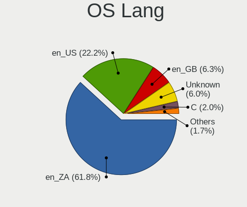

| Lang    | Computers | Percent |
|---------|-----------|---------|
| en_ZA   | 896       | 61.84%  |
| en_US   | 322       | 22.22%  |
| en_GB   | 91        | 6.28%   |
| Unknown | 87        | 6%      |
| C       | 29        | 2%      |
| en_ZW   | 9         | 0.62%   |
| en_BW   | 4         | 0.28%   |
| fr_FR   | 3         | 0.21%   |
| af_ZA   | 3         | 0.21%   |
| C.UTF8  | 2         | 0.14%   |
| pt_BR   | 1         | 0.07%   |
| en_AU   | 1         | 0.07%   |
| de_DE   | 1         | 0.07%   |

Boot Mode
---------

EFI or BIOS

| Mode | Computers | Percent |
|------|-----------|---------|
| BIOS | 828       | 57.74%  |
| EFI  | 606       | 42.26%  |

Filesystem
----------

Type of filesystem

| Type    | Computers | Percent |
|---------|-----------|---------|
| Ext4    | 1074      | 74.43%  |
| Btrfs   | 117       | 8.11%   |
| Tmpfs   | 96        | 6.65%   |
| Overlay | 77        | 5.34%   |
| Xfs     | 28        | 1.94%   |
| Unknown | 27        | 1.87%   |
| Zfs     | 17        | 1.18%   |
| Ext2    | 2         | 0.14%   |
| Aufs    | 2         | 0.14%   |
| Rootfs  | 1         | 0.07%   |
| F2fs    | 1         | 0.07%   |
| Ext3    | 1         | 0.07%   |

Part. scheme
------------

Scheme of partitioning

| Type    | Computers | Percent |
|---------|-----------|---------|
| Unknown | 827       | 57.43%  |
| GPT     | 484       | 33.61%  |
| MBR     | 129       | 8.96%   |

Dual Boot with Linux/BSD
------------------------

Hosting more than one Linux/BSD

| Dual boot | Computers | Percent |
|-----------|-----------|---------|
| No        | 1246      | 87.38%  |
| Yes       | 180       | 12.62%  |

Dual Boot (Win)
---------------

Hosting Linux and Windows

| Dual boot | Computers | Percent |
|-----------|-----------|---------|
| No        | 1051      | 74.01%  |
| Yes       | 369       | 25.99%  |

Board
-----

Vendor
------

Motherboard manufacturer

| Name                            | Computers | Percent |
|---------------------------------|-----------|---------|
| Dell                            | 232       | 16.64%  |
| Hewlett-Packard                 | 214       | 15.35%  |
| Lenovo                          | 185       | 13.27%  |
| ASUSTek Computer                | 170       | 12.2%   |
| MSI                             | 110       | 7.89%   |
| Gigabyte Technology             | 92        | 6.6%    |
| Intel                           | 71        | 5.09%   |
| Acer                            | 70        | 5.02%   |
| Apple                           | 34        | 2.44%   |
| ASRock                          | 23        | 1.65%   |
| Foxconn                         | 19        | 1.36%   |
| Biostar                         | 17        | 1.22%   |
| Raspberry Pi Foundation         | 14        | 1%      |
| Toshiba                         | 13        | 0.93%   |
| Unknown                         | 12        | 0.86%   |
| MECER                           | 10        | 0.72%   |
| Samsung Electronics             | 7         | 0.5%    |
| Proline                         | 7         | 0.5%    |
| Fujitsu                         | 7         | 0.5%    |
| Sony                            | 6         | 0.43%   |
| Supermicro                      | 5         | 0.36%   |
| Standard                        | 5         | 0.36%   |
| Packard Bell                    | 5         | 0.36%   |
| Mustek                          | 5         | 0.36%   |
| HUAWEI                          | 5         | 0.36%   |
| CONNEX                          | 5         | 0.36%   |
| I-Life Digital Technologies     | 4         | 0.29%   |
| ECS                             | 4         | 0.29%   |
| Alienware                       | 3         | 0.22%   |
| System76                        | 2         | 0.14%   |
| Purism                          | 2         | 0.14%   |
| PINNACLEMICRO                   | 2         | 0.14%   |
| Panasonic                       | 2         | 0.14%   |
| Nvidia                          | 2         | 0.14%   |
| NCR                             | 2         | 0.14%   |
| IBM                             | 2         | 0.14%   |
| ADSC                            | 2         | 0.14%   |
| YiFang                          | 1         | 0.07%   |
| WinSome                         | 1         | 0.07%   |
| Universal Exports Group Limited | 1         | 0.07%   |

Model
-----

Motherboard model

| Name                                 | Computers | Percent |
|--------------------------------------|-----------|---------|
| Unknown                              | 22        | 1.58%   |
| Dell Inspiron 15-3567                | 12        | 0.86%   |
| MSI MS-7817                          | 9         | 0.65%   |
| ASUS All Series                      | 9         | 0.65%   |
| Lenovo IdeaPad 110-15IBR 80T7        | 6         | 0.43%   |
| Gigabyte G31M-ES2C                   | 6         | 0.43%   |
| Dell Latitude E6400                  | 6         | 0.43%   |
| ASUS VivoBook 15_ASUS Laptop X540UAR | 6         | 0.43%   |
| Acer Aspire E1-571                   | 6         | 0.43%   |
| HP ProLiant MicroServer              | 5         | 0.36%   |
| HP ProBook 4530s                     | 5         | 0.36%   |
| HP Laptop 15-da0xxx                  | 5         | 0.36%   |
| Gigabyte H61M-DS2                    | 5         | 0.36%   |
| Dell Latitude E6430                  | 5         | 0.36%   |
| RPi Raspberry Pi 4 Model B Rev 1.4   | 4         | 0.29%   |
| Proline V1165C4                      | 4         | 0.29%   |
| MSI MS-7C37                          | 4         | 0.29%   |
| MSI MS-7B89                          | 4         | 0.29%   |
| MSI MS-7B84                          | 4         | 0.29%   |
| Lenovo IdeaPad S145-15AST 81N3       | 4         | 0.29%   |
| HP ProBook 4520s                     | 4         | 0.29%   |
| HP Pavilion dv7                      | 4         | 0.29%   |
| HP Notebook                          | 4         | 0.29%   |
| HP 635                               | 4         | 0.29%   |
| Gigabyte B75M-D3H                    | 4         | 0.29%   |
| Dell XPS 13 9310                     | 4         | 0.29%   |
| Dell Latitude E6530                  | 4         | 0.29%   |
| Dell Latitude 5490                   | 4         | 0.29%   |
| Dell Inspiron 3580                   | 4         | 0.29%   |
| Dell Inspiron 3521                   | 4         | 0.29%   |
| Dell G3 3579                         | 4         | 0.29%   |
| ASUS TUF Gaming B550-PLUS            | 4         | 0.29%   |
| ASUS PRIME X570-P                    | 4         | 0.29%   |
| Apple MacPro3,1                      | 4         | 0.29%   |
| Apple MacBookPro9,2                  | 4         | 0.29%   |
| RPi Raspberry Pi                     | 3         | 0.22%   |
| MSI MS-7B79                          | 3         | 0.22%   |
| MSI MS-7A15                          | 3         | 0.22%   |
| MSI MS-7756                          | 3         | 0.22%   |
| Lenovo IdeaPad 3 15ALC6 82KU         | 3         | 0.22%   |

Model Family
------------

Motherboard model prefix

| Name               | Computers | Percent |
|--------------------|-----------|---------|
| Lenovo ThinkPad    | 73        | 5.24%   |
| Dell Latitude      | 71        | 5.09%   |
| Dell Inspiron      | 61        | 4.38%   |
| Lenovo IdeaPad     | 52        | 3.73%   |
| Acer Aspire        | 42        | 3.01%   |
| HP ProBook         | 39        | 2.8%    |
| ASUS VivoBook      | 29        | 2.08%   |
| Lenovo ThinkCentre | 26        | 1.87%   |
| HP Laptop          | 26        | 1.87%   |
| Dell OptiPlex      | 24        | 1.72%   |
| HP EliteBook       | 23        | 1.65%   |
| Unknown            | 22        | 1.58%   |
| HP Compaq          | 21        | 1.51%   |
| HP Pavilion        | 19        | 1.36%   |
| Dell Vostro        | 19        | 1.36%   |
| Dell XPS           | 18        | 1.29%   |
| ASUS PRIME         | 17        | 1.22%   |
| RPi Raspberry      | 14        | 1%      |
| Dell Precision     | 13        | 0.93%   |
| Toshiba Satellite  | 12        | 0.86%   |
| HP ProLiant        | 11        | 0.79%   |
| ASUS TUF           | 11        | 0.79%   |
| ASUS ROG           | 11        | 0.79%   |
| MSI MS-7817        | 9         | 0.65%   |
| HP 250             | 9         | 0.65%   |
| ASUS All           | 9         | 0.65%   |
| Acer TravelMate    | 9         | 0.65%   |
| Dell G3            | 8         | 0.57%   |
| HP 255             | 7         | 0.5%    |
| ASUS ZenBook       | 7         | 0.5%    |
| ASUS ASUS          | 7         | 0.5%    |
| HP ZBook           | 6         | 0.43%   |
| Gigabyte G31M-ES2C | 6         | 0.43%   |
| Gigabyte H61M-DS2  | 5         | 0.36%   |
| Proline V1165C4    | 4         | 0.29%   |
| MSI MS-7C37        | 4         | 0.29%   |
| MSI MS-7B89        | 4         | 0.29%   |
| MSI MS-7B84        | 4         | 0.29%   |
| Intel PROLINE      | 4         | 0.29%   |
| Intel Mecer        | 4         | 0.29%   |

MFG Year
--------

Motherboard manufacture year

| Year    | Computers | Percent |
|---------|-----------|---------|
| 2012    | 136       | 9.76%   |
| 2011    | 128       | 9.18%   |
| 2018    | 123       | 8.82%   |
| 2013    | 111       | 7.96%   |
| 2020    | 91        | 6.53%   |
| 2017    | 91        | 6.53%   |
| 2016    | 91        | 6.53%   |
| 2019    | 85        | 6.1%    |
| 2010    | 82        | 5.88%   |
| 2008    | 71        | 5.09%   |
| 2021    | 68        | 4.88%   |
| 2014    | 66        | 4.73%   |
| 2015    | 63        | 4.52%   |
| 2009    | 56        | 4.02%   |
| 2022    | 40        | 2.87%   |
| 2007    | 36        | 2.58%   |
| 2023    | 18        | 1.29%   |
| 2006    | 14        | 1%      |
| Unknown | 13        | 0.93%   |
| 2024    | 7         | 0.5%    |
| 2005    | 3         | 0.22%   |
| 2004    | 1         | 0.07%   |

Form Factor
-----------

Physical design of the computer

| Name           | Computers | Percent |
|----------------|-----------|---------|
| Notebook       | 782       | 56.1%   |
| Desktop        | 514       | 36.87%  |
| Convertible    | 23        | 1.65%   |
| Mini pc        | 20        | 1.43%   |
| System on chip | 17        | 1.22%   |
| All in one     | 16        | 1.15%   |
| Server         | 12        | 0.86%   |
| Tablet         | 10        | 0.72%   |

Secure Boot
-----------

Enabled or disabled

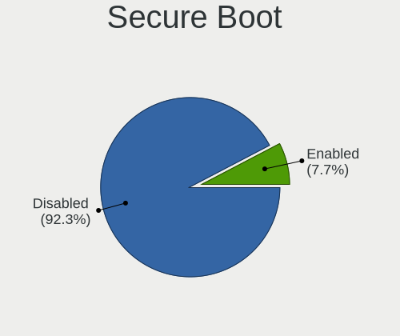

| State    | Computers | Percent |
|----------|-----------|---------|
| Disabled | 1301      | 92.33%  |
| Enabled  | 108       | 7.67%   |

Coreboot
--------

Have coreboot on board

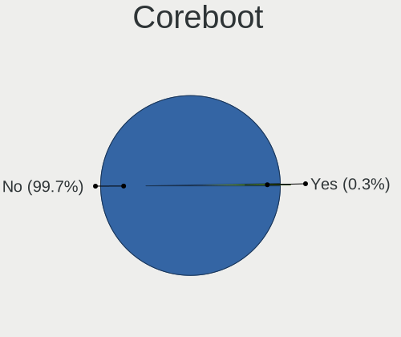

| Used | Computers | Percent |
|------|-----------|---------|
| No   | 1390      | 99.71%  |
| Yes  | 4         | 0.29%   |

RAM Size
--------

Total RAM memory

| Size in GB      | Computers | Percent |
|-----------------|-----------|---------|
| 4.01-8.0        | 321       | 22.56%  |
| 3.01-4.0        | 312       | 21.93%  |
| 16.01-24.0      | 258       | 18.13%  |
| 8.01-16.0       | 248       | 17.43%  |
| 32.01-64.0      | 114       | 8.01%   |
| 1.01-2.0        | 88        | 6.18%   |
| 64.01-256.0     | 25        | 1.76%   |
| 2.01-3.0        | 23        | 1.62%   |
| 24.01-32.0      | 22        | 1.55%   |
| 0.51-1.0        | 10        | 0.7%    |
| More than 256.0 | 2         | 0.14%   |

RAM Used
--------

Used RAM memory

| Used GB     | Computers | Percent |
|-------------|-----------|---------|
| 1.01-2.0    | 547       | 35.24%  |
| 2.01-3.0    | 395       | 25.45%  |
| 4.01-8.0    | 241       | 15.53%  |
| 3.01-4.0    | 171       | 11.02%  |
| 0.51-1.0    | 92        | 5.93%   |
| 8.01-16.0   | 74        | 4.77%   |
| 0.01-0.5    | 15        | 0.97%   |
| 16.01-24.0  | 11        | 0.71%   |
| 32.01-64.0  | 2         | 0.13%   |
| 24.01-32.0  | 2         | 0.13%   |
| 64.01-256.0 | 1         | 0.06%   |
| Unknown     | 1         | 0.06%   |

Total Drives
------------

Number of drives on board

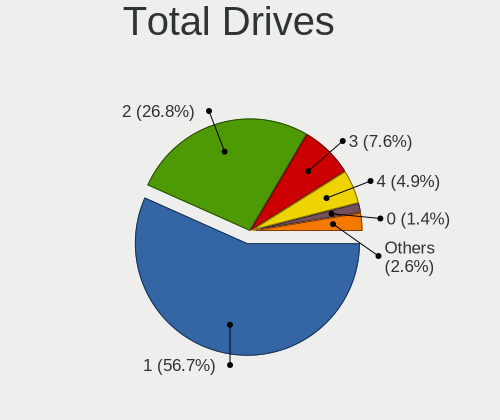

| Drives  | Computers | Percent |
|---------|-----------|---------|
| 1       | 819       | 56.68%  |
| 2       | 387       | 26.78%  |
| 3       | 110       | 7.61%   |
| 4       | 71        | 4.91%   |
| 0       | 20        | 1.38%   |
| 5       | 12        | 0.83%   |
| 7       | 9         | 0.62%   |
| 6       | 8         | 0.55%   |
| 8       | 4         | 0.28%   |
| 14      | 2         | 0.14%   |
| 22      | 1         | 0.07%   |
| 11      | 1         | 0.07%   |
| Unknown | 1         | 0.07%   |

Has CD-ROM
----------

Has CD-ROM on board

| Presented | Computers | Percent |
|-----------|-----------|---------|
| No        | 847       | 59.86%  |
| Yes       | 568       | 40.14%  |

Has Ethernet
------------

Has Ethernet on board

| Presented | Computers | Percent |
|-----------|-----------|---------|
| Yes       | 1233      | 88.45%  |
| No        | 161       | 11.55%  |

Has WiFi
--------

Has WiFi module

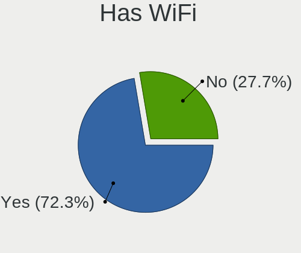

| Presented | Computers | Percent |
|-----------|-----------|---------|
| Yes       | 1015      | 72.34%  |
| No        | 388       | 27.66%  |

Has Bluetooth
-------------

Has Bluetooth module

| Presented | Computers | Percent |
|-----------|-----------|---------|
| Yes       | 782       | 54.92%  |
| No        | 642       | 45.08%  |

Location
--------

Country
-------

Geographic location (country)

| Country      | Computers | Percent |
|--------------|-----------|---------|
| South Africa | 1394      | 100%    |

City
----

Geographic location (city)

| City             | Computers | Percent |
|------------------|-----------|---------|
| Johannesburg     | 403       | 27.1%   |
| Cape Town        | 364       | 24.48%  |
| Pretoria         | 165       | 11.1%   |
| Durban           | 81        | 5.45%   |
| Centurion        | 43        | 2.89%   |
| Port Elizabeth   | 34        | 2.29%   |
| Benoni           | 17        | 1.14%   |
| Sandton          | 15        | 1.01%   |
| Pietermaritzburg | 14        | 0.94%   |
| Kempton Park     | 14        | 0.94%   |
| East London      | 14        | 0.94%   |
| Randburg         | 12        | 0.81%   |
| Bloemfontein     | 12        | 0.81%   |
| Midrand          | 10        | 0.67%   |
| Alberton         | 10        | 0.67%   |
| Potchefstroom    | 9         | 0.61%   |
| George           | 9         | 0.61%   |
| Boksburg         | 9         | 0.61%   |
| Bellville        | 9         | 0.61%   |
| Somerset West    | 8         | 0.54%   |
| Stellenbosch     | 7         | 0.47%   |
| Roodepoort       | 7         | 0.47%   |
| Polokwane        | 7         | 0.47%   |
| Thabazimbi       | 6         | 0.4%    |
| Germiston        | 6         | 0.4%    |
| Oudtshoorn       | 5         | 0.34%   |
| Klerksdorp       | 5         | 0.34%   |
| Edenvale         | 5         | 0.34%   |
| Durbanville      | 5         | 0.34%   |
| Vanderbijlpark   | 4         | 0.27%   |
| Sasolburg        | 4         | 0.27%   |
| Paarl            | 4         | 0.27%   |
| Nelspruit        | 4         | 0.27%   |
| Hermanus         | 4         | 0.27%   |
| Citrusdal        | 4         | 0.27%   |
| Worcester        | 3         | 0.2%    |
| White River      | 3         | 0.2%    |
| Westville        | 3         | 0.2%    |
| Vredenburg       | 3         | 0.2%    |
| Upington         | 3         | 0.2%    |

Drives
------

Drive Vendor
------------

Hard drive vendors

| Vendor                      | Computers | Drives | Percent |
|-----------------------------|-----------|--------|---------|
| Seagate                     | 430       | 748    | 20.9%   |
| WDC                         | 373       | 542    | 18.13%  |
| Samsung Electronics         | 232       | 320    | 11.28%  |
| Toshiba                     | 159       | 198    | 7.73%   |
| Unknown                     | 86        | 110    | 4.18%   |
| Hitachi                     | 70        | 100    | 3.4%    |
| SanDisk                     | 60        | 82     | 2.92%   |
| Kingston                    | 56        | 65     | 2.72%   |
| HGST                        | 39        | 48     | 1.9%    |
| Transcend                   | 38        | 51     | 1.85%   |
| SK hynix                    | 37        | 48     | 1.8%    |
| Crucial                     | 36        | 39     | 1.75%   |
| Silicon Motion              | 35        | 51     | 1.7%    |
| Intel                       | 35        | 43     | 1.7%    |
| A-DATA Technology           | 33        | 44     | 1.6%    |
| Micron Technology           | 24        | 28     | 1.17%   |
| TO Exter                    | 19        | 21     | 0.92%   |
| Hewlett-Packard             | 18        | 45     | 0.88%   |
| KIOXIA                      | 14        | 15     | 0.68%   |
| Apple                       | 14        | 19     | 0.68%   |
| Rogueware                   | 13        | 16     | 0.63%   |
| Hikvision                   | 11        | 13     | 0.53%   |
| Mushkin                     | 9         | 11     | 0.44%   |
| HS-SSD-E100                 | 9         | 12     | 0.44%   |
| HS-SSD-C100                 | 9         | 13     | 0.44%   |
| Kingmax                     | 8         | 9      | 0.39%   |
| China                       | 8         | 9      | 0.39%   |
| Patriot                     | 7         | 8      | 0.34%   |
| LITEONIT                    | 7         | 8      | 0.34%   |
| Kingston Technology Company | 7         | 9      | 0.34%   |
| Gigabyte Technology         | 7         | 8      | 0.34%   |
| Apacer                      | 7         | 9      | 0.34%   |
| Phison                      | 6         | 8      | 0.29%   |
| OCZ                         | 6         | 8      | 0.29%   |
| Maxtor                      | 6         | 7      | 0.29%   |
| Lexar                       | 6         | 9      | 0.29%   |
| JMicron Technology          | 6         | 6      | 0.29%   |
| Fujitsu                     | 6         | 7      | 0.29%   |
| External                    | 6         | 7      | 0.29%   |
| Corsair                     | 6         | 10     | 0.29%   |

Drive Model
-----------

Hard drive models

| Model                                                 | Computers | Percent |
|-------------------------------------------------------|-----------|---------|
| Seagate ST500DM002-1BD142 500GB                       | 39        | 1.7%    |
| Seagate ST1000LM035-1RK172 1TB                        | 35        | 1.52%   |
| WDC WDS500G2B0A-00SM50 500GB SSD                      | 25        | 1.09%   |
| Unknown MMC Card  32GB                                | 25        | 1.09%   |
| Seagate ST3500418AS 500GB                             | 24        | 1.04%   |
| Toshiba MQ01ABF050 500GB                              | 21        | 0.91%   |
| TO Exter nal USB 3.0 1024GB                           | 19        | 0.83%   |
| Toshiba MQ04ABF100 1TB                                | 17        | 0.74%   |
| Toshiba MQ01ABD100 1TB                                | 17        | 0.74%   |
| WDC WD10EZEX-08WN4A0 1TB                              | 15        | 0.65%   |
| Seagate ST1000LM024 HN-M101MBB 1TB                    | 15        | 0.65%   |
| Unknown MMC Card  64GB                                | 14        | 0.61%   |
| Seagate ST500LT012-1DG142 500GB                       | 14        | 0.61%   |
| Samsung NVMe SSD Controller SM981/PM981/PM983 512GB   | 14        | 0.61%   |
| Seagate ST3500413AS 500GB                             | 13        | 0.57%   |
| Seagate ST3250318AS 250GB                             | 13        | 0.57%   |
| Seagate ST380815AS 80GB                               | 12        | 0.52%   |
| WDC WDS240G2G0A-00JH30 240GB SSD                      | 11        | 0.48%   |
| Seagate ST1000DM010-2EP102 1TB                        | 11        | 0.48%   |
| Samsung SSD 850 EVO 250GB                             | 11        | 0.48%   |
| Samsung HD103SI 1TB                                   | 11        | 0.48%   |
| WDC WDS100T2B0A-00SM50 1TB SSD                        | 10        | 0.44%   |
| Seagate ST2000DM001-1CH164 2TB                        | 10        | 0.44%   |
| Hitachi HTS543232A7A384 320GB                         | 10        | 0.44%   |
| WDC WD10SPZX-60Z10T0 1TB                              | 9         | 0.39%   |
| Unknown MMC Card  128GB                               | 9         | 0.39%   |
| Toshiba MQ01ACF050 500GB                              | 9         | 0.39%   |
| Silicon Motion SM2262/SM2262EN SSD Controller 2TB     | 9         | 0.39%   |
| Seagate ST500LM030-2E717D 500GB                       | 9         | 0.39%   |
| Seagate ST4000DM004-2CV104 4TB                        | 9         | 0.39%   |
| Seagate ST4000DM000-1F2168 4TB                        | 9         | 0.39%   |
| Samsung SSD 750 EVO 250GB                             | 9         | 0.39%   |
| HGST HTS721010A9E630 1TB                              | 9         | 0.39%   |
| WDC WD20EZRZ-00Z5HB0 2TB                              | 8         | 0.35%   |
| Toshiba HDWD110 1TB                                   | 8         | 0.35%   |
| Silicon Motion SM2263EN/SM2263XT SSD Controller 256GB | 8         | 0.35%   |
| Seagate ST500LM021-1KJ152 500GB                       | 8         | 0.35%   |
| Seagate ST3250310AS 250GB                             | 8         | 0.35%   |
| Seagate ST1000DM003-1CH162 1TB                        | 8         | 0.35%   |
| Samsung NVMe SSD Drive 256GB                          | 8         | 0.35%   |

HDD Vendor
----------

Hard disk drive vendors

| Vendor              | Computers | Drives | Percent |
|---------------------|-----------|--------|---------|
| Seagate             | 421       | 722    | 38.07%  |
| WDC                 | 310       | 446    | 28.03%  |
| Toshiba             | 136       | 170    | 12.3%   |
| Hitachi             | 70        | 100    | 6.33%   |
| Samsung Electronics | 62        | 81     | 5.61%   |
| HGST                | 39        | 48     | 3.53%   |
| TO Exter            | 19        | 21     | 1.72%   |
| Hewlett-Packard     | 11        | 37     | 0.99%   |
| Apple               | 8         | 8      | 0.72%   |
| Maxtor              | 6         | 7      | 0.54%   |
| Fujitsu             | 6         | 7      | 0.54%   |
| External            | 6         | 7      | 0.54%   |
| Unknown             | 5         | 7      | 0.45%   |
| HGST HTS            | 2         | 2      | 0.18%   |
| ASMT                | 2         | 2      | 0.18%   |
| USB                 | 1         | 1      | 0.09%   |
| StoreJet            | 1         | 1      | 0.09%   |
| HPE                 | 1         | 2      | 0.09%   |

SSD Vendor
----------

Solid state drive vendors

| Vendor              | Computers | Drives | Percent |
|---------------------|-----------|--------|---------|
| Samsung Electronics | 94        | 128    | 18.91%  |
| WDC                 | 69        | 88     | 13.88%  |
| Kingston            | 41        | 47     | 8.25%   |
| Transcend           | 33        | 45     | 6.64%   |
| Crucial             | 33        | 35     | 6.64%   |
| SanDisk             | 29        | 35     | 5.84%   |
| A-DATA Technology   | 27        | 38     | 5.43%   |
| Rogueware           | 13        | 16     | 2.62%   |
| Intel               | 12        | 16     | 2.41%   |
| SK hynix            | 10        | 15     | 2.01%   |
| Toshiba             | 8         | 10     | 1.61%   |
| Micron Technology   | 8         | 9      | 1.61%   |
| Kingmax             | 8         | 9      | 1.61%   |
| China               | 8         | 9      | 1.61%   |
| LITEONIT            | 7         | 8      | 1.41%   |
| Apacer              | 7         | 9      | 1.41%   |
| Seagate             | 6         | 10     | 1.21%   |
| Patriot             | 6         | 7      | 1.21%   |
| OCZ                 | 6         | 8      | 1.21%   |
| Lexar               | 5         | 8      | 1.01%   |
| Gigabyte Technology | 5         | 6      | 1.01%   |
| Netac               | 4         | 4      | 0.8%    |
| Mushkin             | 4         | 4      | 0.8%    |
| LITEON              | 4         | 5      | 0.8%    |
| HS-SSD-E100         | 4         | 4      | 0.8%    |
| Corsair             | 4         | 8      | 0.8%    |
| StoreJet            | 3         | 3      | 0.6%    |
| Plextor             | 3         | 4      | 0.6%    |
| Hewlett-Packard     | 3         | 3      | 0.6%    |
| Team                | 2         | 4      | 0.4%    |
| Kimtigo             | 2         | 2      | 0.4%    |
| HS-SSD-C100         | 2         | 2      | 0.4%    |
| AFOX                | 2         | 2      | 0.4%    |
| XPG                 | 1         | 1      | 0.2%    |
| USB3.0              | 1         | 1      | 0.2%    |
| Union Memory        | 1         | 1      | 0.2%    |
| Super Talent        | 1         | 1      | 0.2%    |
| SOLIDATA            | 1         | 1      | 0.2%    |
| Radeon              | 1         | 1      | 0.2%    |
| Neo Forza           | 1         | 1      | 0.2%    |

Drive Kind
----------

HDD or SSD

| Kind    | Computers | Drives | Percent |
|---------|-----------|--------|---------|
| HDD     | 880       | 1669   | 49.83%  |
| SSD     | 443       | 627    | 25.08%  |
| NVMe    | 325       | 477    | 18.4%   |
| MMC     | 81        | 106    | 4.59%   |
| Unknown | 37        | 48     | 2.1%    |

Drive Connector
---------------

SATA, SAS, NVMe, etc.

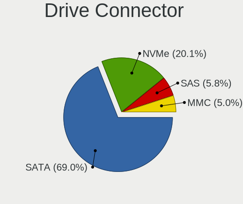

| Type | Computers | Drives | Percent |
|------|-----------|--------|---------|
| SATA | 1115      | 2205   | 69.04%  |
| NVMe | 325       | 477    | 20.12%  |
| SAS  | 94        | 139    | 5.82%   |
| MMC  | 81        | 106    | 5.02%   |

Drive Size
----------

Size of hard drive

| Size in TB | Computers | Drives | Percent |
|------------|-----------|--------|---------|
| 0.01-0.5   | 831       | 1324   | 56.34%  |
| 0.51-1.0   | 428       | 607    | 29.02%  |
| 1.01-2.0   | 123       | 194    | 8.34%   |
| 3.01-4.0   | 42        | 74     | 2.85%   |
| 2.01-3.0   | 29        | 39     | 1.97%   |
| 4.01-10.0  | 18        | 52     | 1.22%   |
| 10.01-20.0 | 4         | 6      | 0.27%   |

Space Total
-----------

Amount of disk space available on the file system

| Size in GB     | Computers | Percent |
|----------------|-----------|---------|
| 251-500        | 360       | 24%     |
| 101-250        | 339       | 22.6%   |
| 501-1000       | 240       | 16%     |
| 1001-2000      | 145       | 9.67%   |
| 51-100         | 90        | 6%      |
| More than 3000 | 87        | 5.8%    |
| 1-20           | 87        | 5.8%    |
| 21-50          | 61        | 4.07%   |
| 2001-3000      | 55        | 3.67%   |
| Unknown        | 36        | 2.4%    |

Space Used
----------

Amount of used disk space

| Used GB        | Computers | Percent |
|----------------|-----------|---------|
| 1-20           | 506       | 32.52%  |
| 21-50          | 291       | 18.7%   |
| 101-250        | 187       | 12.02%  |
| 51-100         | 180       | 11.57%  |
| 251-500        | 154       | 9.9%    |
| 501-1000       | 92        | 5.91%   |
| 1001-2000      | 48        | 3.08%   |
| More than 3000 | 37        | 2.38%   |
| Unknown        | 36        | 2.31%   |
| 2001-3000      | 24        | 1.54%   |
| 0              | 1         | 0.06%   |

Malfunc. Drives
---------------

Drive models with a malfunction

| Model                              | Computers | Drives | Percent |
|------------------------------------|-----------|--------|---------|
| Seagate ST500DM002-1BD142 500GB    | 9         | 9      | 6.77%   |
| Seagate ST3500418AS 500GB          | 5         | 6      | 3.76%   |
| Toshiba MQ01ABD100 1TB             | 4         | 5      | 3.01%   |
| Seagate ST320LT007-9ZV142 320GB    | 4         | 4      | 3.01%   |
| Seagate ST1000LM035-1RK172 1TB     | 4         | 4      | 3.01%   |
| Seagate ST1000LM024 HN-M101MBB 1TB | 3         | 4      | 2.26%   |
| WDC WD3200AAJS-00RYA0 320GB        | 2         | 2      | 1.5%    |
| WDC WD2500AAKX-75U6AA0 250GB       | 2         | 2      | 1.5%    |
| WDC WD1600AAJS-08L7A0 160GB        | 2         | 2      | 1.5%    |
| WDC WD10EZEX-08WN4A0 1TB           | 2         | 2      | 1.5%    |
| Seagate ST500LM021-1KJ152 500GB    | 2         | 2      | 1.5%    |
| Seagate ST4000DM004-2CV104 4TB     | 2         | 2      | 1.5%    |
| Seagate ST3250310AS 250GB          | 2         | 2      | 1.5%    |
| Seagate ST3000DM001-1CH166 3TB     | 2         | 2      | 1.5%    |
| Seagate ST2000DL003-9VT166 2TB     | 2         | 3      | 1.5%    |
| Samsung Electronics HD103SI 1TB    | 2         | 3      | 1.5%    |
| Hitachi HTS547575A9E384 752GB      | 2         | 2      | 1.5%    |
| HGST HTS725050A7E630 500GB         | 2         | 2      | 1.5%    |
| HGST HTS541010A9E680 1TB           | 2         | 2      | 1.5%    |
| WDC WDS240G2G0A-00JH30 240GB SSD   | 1         | 1      | 0.75%   |
| WDC WD6400AAKS-75A7B0 640GB        | 1         | 1      | 0.75%   |
| WDC WD5000LPVX-22V0TT0 500GB       | 1         | 1      | 0.75%   |
| WDC WD5000AZLX-60K2TA0 500GB       | 1         | 1      | 0.75%   |
| WDC WD5000AVVS-63ZWB0 500GB        | 1         | 1      | 0.75%   |
| WDC WD5000AAKX-22ERMA0 500GB       | 1         | 1      | 0.75%   |
| WDC WD5000AAKX-221CA1 500GB        | 1         | 1      | 0.75%   |
| WDC WD5000AAKX-00ERMA0 500GB       | 1         | 2      | 0.75%   |
| WDC WD3200BPVT-22JJ5T0 320GB       | 1         | 1      | 0.75%   |
| WDC WD3200AAJS-60Z0A0 320GB        | 1         | 1      | 0.75%   |
| WDC WD3200AAJS-60M0A1 320GB        | 1         | 1      | 0.75%   |
| WDC WD30PURX-64P6ZY0 3TB           | 1         | 1      | 0.75%   |
| WDC WD30EZRX-00MMMB0 3TB           | 1         | 3      | 0.75%   |
| WDC WD30EZRX-00DC0B0 3TB           | 1         | 1      | 0.75%   |
| WDC WD30EFRX-68EUZN0 3TB           | 1         | 1      | 0.75%   |
| WDC WD2500BEVS-60UST0 250GB        | 1         | 1      | 0.75%   |
| WDC WD2500AAJS-75M0A0 250GB        | 1         | 1      | 0.75%   |
| WDC WD20EZRZ-00Z5HB0 2TB           | 1         | 1      | 0.75%   |
| WDC WD20EFRX-68EUZN0 2TB           | 1         | 2      | 0.75%   |
| WDC WD20EARX-00PASB0 2TB           | 1         | 1      | 0.75%   |
| WDC WD15EADS-00P8B0 1TB            | 1         | 1      | 0.75%   |

Malfunc. Drive Vendor
---------------------

Vendors of faulty drives

| Vendor              | Computers | Drives | Percent |
|---------------------|-----------|--------|---------|
| Seagate             | 54        | 75     | 42.52%  |
| WDC                 | 32        | 40     | 25.2%   |
| Toshiba             | 7         | 8      | 5.51%   |
| Hitachi             | 7         | 7      | 5.51%   |
| Samsung Electronics | 6         | 7      | 4.72%   |
| HGST                | 5         | 5      | 3.94%   |
| Intel               | 4         | 6      | 3.15%   |
| Micron Technology   | 2         | 2      | 1.57%   |
| Kingston            | 2         | 2      | 1.57%   |
| Hewlett-Packard     | 2         | 2      | 1.57%   |
| Transcend           | 1         | 1      | 0.79%   |
| TO Exter            | 1         | 1      | 0.79%   |
| SOLIDATA            | 1         | 1      | 0.79%   |
| SK hynix            | 1         | 1      | 0.79%   |
| Indilinx            | 1         | 1      | 0.79%   |
| A-DATA Technology   | 1         | 1      | 0.79%   |

Malfunc. HDD Vendor
-------------------

Vendors of faulty HDD drives

| Vendor              | Computers | Drives | Percent |
|---------------------|-----------|--------|---------|
| Seagate             | 54        | 75     | 49.09%  |
| WDC                 | 31        | 39     | 28.18%  |
| Toshiba             | 7         | 8      | 6.36%   |
| Hitachi             | 7         | 7      | 6.36%   |
| HGST                | 5         | 5      | 4.55%   |
| Samsung Electronics | 4         | 5      | 3.64%   |
| TO Exter            | 1         | 1      | 0.91%   |
| Hewlett-Packard     | 1         | 1      | 0.91%   |

Malfunc. Drive Kind
-------------------

Kinds of faulty drives

| Kind | Computers | Drives | Percent |
|------|-----------|--------|---------|
| HDD  | 96        | 141    | 84.96%  |
| SSD  | 14        | 16     | 12.39%  |
| NVMe | 3         | 3      | 2.65%   |

Failed Drives
-------------

Failed drive models

| Model                    | Computers | Drives | Percent |
|--------------------------|-----------|--------|---------|
| WDC WD20EZRX-00D8PB0 2TB | 2         | 2      | 100%    |

Failed Drive Vendor
-------------------

Failed drive vendors

| Vendor | Computers | Drives | Percent |
|--------|-----------|--------|---------|
| WDC    | 2         | 2      | 100%    |

Drive Status
------------

Number of failed and malfunc. drives

| Status   | Computers | Drives | Percent |
|----------|-----------|--------|---------|
| Detected | 977       | 2007   | 65.09%  |
| Works    | 412       | 758    | 27.45%  |
| Malfunc  | 110       | 160    | 7.33%   |
| Failed   | 2         | 2      | 0.13%   |

Storage controller
------------------

Storage Vendor
--------------

Storage controller vendors

| Vendor                           | Computers | Percent |
|----------------------------------|-----------|---------|
| Intel                            | 1095      | 65.22%  |
| AMD                              | 149       | 8.87%   |
| Samsung Electronics              | 89        | 5.3%    |
| Silicon Motion                   | 46        | 2.74%   |
| SanDisk                          | 35        | 2.08%   |
| SK hynix                         | 27        | 1.61%   |
| Toshiba America Info Systems     | 21        | 1.25%   |
| Kingston Technology Company      | 21        | 1.25%   |
| ASMedia Technology               | 19        | 1.13%   |
| Phison Electronics               | 18        | 1.07%   |
| Marvell Technology Group         | 18        | 1.07%   |
| Nvidia                           | 16        | 0.95%   |
| Micron Technology                | 16        | 0.95%   |
| KIOXIA                           | 16        | 0.95%   |
| JMicron Technology               | 16        | 0.95%   |
| ADATA Technology                 | 9         | 0.54%   |
| Micron/Crucial Technology        | 8         | 0.48%   |
| MAXIO Technology (Hangzhou)      | 7         | 0.42%   |
| INNOGRIT                         | 5         | 0.3%    |
| Apple                            | 5         | 0.3%    |
| Silicon Image                    | 4         | 0.24%   |
| Hewlett-Packard                  | 4         | 0.24%   |
| Broadcom / LSI                   | 4         | 0.24%   |
| VIA Technologies                 | 3         | 0.18%   |
| Solid State Storage Technology   | 3         | 0.18%   |
| Silicon Integrated Systems [SiS] | 3         | 0.18%   |
| Seagate Technology               | 3         | 0.18%   |
| Realtek Semiconductor            | 3         | 0.18%   |
| LSI Logic / Symbios Logic        | 3         | 0.18%   |
| Union Memory (Shenzhen)          | 2         | 0.12%   |
| Transcend                        | 2         | 0.12%   |
| Lite-On Technology               | 2         | 0.12%   |
| Adaptec                          | 2         | 0.12%   |
| Shenzhen Longsys Electronics     | 1         | 0.06%   |
| Lenovo                           | 1         | 0.06%   |
| Hosin Global Electronics         | 1         | 0.06%   |
| HighPoint Technologies           | 1         | 0.06%   |
| Biwin Storage Technology         | 1         | 0.06%   |

Storage Model
-------------

Storage controller models

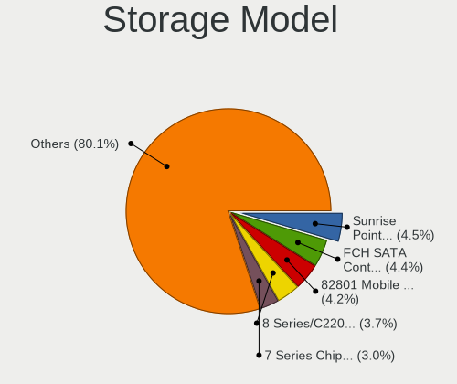

| Model                                                                                   | Computers | Percent |
|-----------------------------------------------------------------------------------------|-----------|---------|
| Intel Sunrise Point-LP SATA Controller [AHCI mode]                                      | 90        | 4.55%   |
| AMD FCH SATA Controller [AHCI mode]                                                     | 87        | 4.39%   |
| Intel 82801 Mobile SATA Controller [RAID mode]                                          | 84        | 4.24%   |
| Intel 8 Series/C220 Series Chipset Family 6-port SATA Controller 1 [AHCI mode]          | 74        | 3.74%   |
| Intel 7 Series Chipset Family 6-port SATA Controller [AHCI mode]                        | 60        | 3.03%   |
| Intel NM10/ICH7 Family SATA Controller [IDE mode]                                       | 54        | 2.73%   |
| Intel 6 Series/C200 Series Chipset Family 6 port Mobile SATA AHCI Controller            | 49        | 2.47%   |
| Intel 6 Series/C200 Series Chipset Family 6 port Desktop SATA AHCI Controller           | 46        | 2.32%   |
| Intel Q170/Q150/B150/H170/H110/Z170/CM236 Chipset SATA Controller [AHCI Mode]           | 42        | 2.12%   |
| Intel 82801G (ICH7 Family) IDE Controller                                               | 38        | 1.92%   |
| Intel 6 Series/C200 Series Chipset Family Desktop SATA Controller (IDE mode, ports 4-5) | 38        | 1.92%   |
| Intel 6 Series/C200 Series Chipset Family Desktop SATA Controller (IDE mode, ports 0-3) | 38        | 1.92%   |
| Samsung NVMe SSD Controller SM981/PM981/PM983                                           | 36        | 1.82%   |
| Intel Volume Management Device NVMe RAID Controller                                     | 35        | 1.77%   |
| Silicon Motion SM2262/SM2262EN SSD Controller                                           | 30        | 1.52%   |
| Intel SATA Controller [RAID mode]                                                       | 30        | 1.52%   |
| Intel 8 Series SATA Controller 1 [AHCI mode]                                            | 29        | 1.46%   |
| Intel 5 Series/3400 Series Chipset 6 port SATA AHCI Controller                          | 29        | 1.46%   |
| Intel Wildcat Point-LP SATA Controller [AHCI Mode]                                      | 26        | 1.31%   |
| Intel Cannon Lake Mobile PCH SATA AHCI Controller                                       | 26        | 1.31%   |
| Intel Atom/Celeron/Pentium Processor x5-E8000/J3xxx/N3xxx Series SATA Controller        | 24        | 1.21%   |
| Intel 82801IBM/IEM (ICH9M/ICH9M-E) 4 port SATA Controller [AHCI mode]                   | 24        | 1.21%   |
| Intel 7 Series/C210 Series Chipset Family 6-port SATA Controller [AHCI mode]            | 23        | 1.16%   |
| Intel 200 Series PCH SATA controller [AHCI mode]                                        | 23        | 1.16%   |
| AMD 400 Series Chipset SATA Controller                                                  | 23        | 1.16%   |
| Intel Celeron N3350/Pentium N4200/Atom E3900 Series SATA AHCI Controller                | 22        | 1.11%   |
| AMD SB7x0/SB8x0/SB9x0 SATA Controller [AHCI mode]                                       | 22        | 1.11%   |
| Samsung NVMe SSD Controller SM961/PM961/SM963                                           | 20        | 1.01%   |
| Intel 5 Series/3400 Series Chipset 4 port SATA IDE Controller                           | 20        | 1.01%   |
| Intel 5 Series/3400 Series Chipset 4 port SATA AHCI Controller                          | 20        | 1.01%   |
| Intel 5 Series/3400 Series Chipset 2 port SATA IDE Controller                           | 20        | 1.01%   |
| AMD 500 Series Chipset SATA Controller                                                  | 20        | 1.01%   |
| Intel Celeron/Pentium Silver Processor SATA Controller                                  | 19        | 0.96%   |
| Samsung NVMe SSD Controller 980 (DRAM-less)                                             | 17        | 0.86%   |
| Silicon Motion SM2263EN/SM2263XT (DRAM-less) NVMe SSD Controllers                       | 16        | 0.81%   |
| Intel 82801HM/HEM (ICH8M/ICH8M-E) IDE Controller                                        | 15        | 0.76%   |
| ASMedia ASM1061/ASM1062 Serial ATA Controller                                           | 15        | 0.76%   |
| Intel 82801HM/HEM (ICH8M/ICH8M-E) SATA Controller [AHCI mode]                           | 14        | 0.71%   |
| Toshiba America Info Systems XG6 NVMe SSD Controller                                    | 13        | 0.66%   |
| KIOXIA NVMe SSD Controller BG4 (DRAM-less)                                              | 13        | 0.66%   |

Storage Kind
------------

Kind of storage controller (IDE, SATA, NVMe, SAS, ...)

| Kind | Computers | Percent |
|------|-----------|---------|
| SATA | 933       | 54.98%  |
| NVMe | 330       | 19.45%  |
| IDE  | 254       | 14.97%  |
| RAID | 170       | 10.02%  |
| SAS  | 6         | 0.35%   |
| SCSI | 4         | 0.24%   |

Processor
---------

CPU Vendor
----------

Processor vendors

| Vendor  | Computers | Percent |
|---------|-----------|---------|
| Intel   | 1188      | 85.22%  |
| AMD     | 188       | 13.49%  |
| ARM     | 17        | 1.22%   |
| Unknown | 1         | 0.07%   |

CPU Model
---------

Processor models

| Model                                   | Computers | Percent |
|-----------------------------------------|-----------|---------|
| Intel Core i5-3470 CPU @ 3.20GHz        | 19        | 1.36%   |
| Intel Celeron CPU N3350 @ 1.10GHz       | 18        | 1.29%   |
| Intel Core i5-7200U CPU @ 2.50GHz       | 16        | 1.15%   |
| Intel Core i5-8250U CPU @ 1.60GHz       | 14        | 1%      |
| Intel Celeron CPU N3060 @ 1.60GHz       | 14        | 1%      |
| ARM Processor                           | 14        | 1%      |
| Intel Core i7-8750H CPU @ 2.20GHz       | 13        | 0.93%   |
| Intel Core i7-7500U CPU @ 2.70GHz       | 13        | 0.93%   |
| Intel Core i5-6300U CPU @ 2.40GHz       | 13        | 0.93%   |
| Intel Core i3-2120 CPU @ 3.30GHz        | 13        | 0.93%   |
| Intel Core i7-8550U CPU @ 1.80GHz       | 12        | 0.86%   |
| Intel Core i7-3770 CPU @ 3.40GHz        | 12        | 0.86%   |
| Intel Core i7-9750H CPU @ 2.60GHz       | 11        | 0.79%   |
| Intel Core i7-8565U CPU @ 1.80GHz       | 11        | 0.79%   |
| Intel Core i7-2630QM CPU @ 2.00GHz      | 11        | 0.79%   |
| Intel Core i7-2600 CPU @ 3.40GHz        | 11        | 0.79%   |
| Intel Core i5-3210M CPU @ 2.50GHz       | 11        | 0.79%   |
| Intel Core i5-2520M CPU @ 2.50GHz       | 11        | 0.79%   |
| Intel Atom x5-Z8350 CPU @ 1.44GHz       | 11        | 0.79%   |
| Intel 11th Gen Core i7-1165G7 @ 2.80GHz | 11        | 0.79%   |
| Intel 11th Gen Core i5-1135G7 @ 2.40GHz | 11        | 0.79%   |
| Intel Core i5-4590 CPU @ 3.30GHz        | 10        | 0.72%   |
| Intel Core 2 Duo CPU P8600 @ 2.40GHz    | 10        | 0.72%   |
| Intel Core i5-2450M CPU @ 2.50GHz       | 9         | 0.64%   |
| Intel Core i5-1035G1 CPU @ 1.00GHz      | 9         | 0.64%   |
| Intel Core i3-6006U CPU @ 2.00GHz       | 9         | 0.64%   |
| Intel Celeron N4020 CPU @ 1.10GHz       | 9         | 0.64%   |
| Intel Core i7-7700HQ CPU @ 2.80GHz      | 8         | 0.57%   |
| Intel Core i7-6700HQ CPU @ 2.60GHz      | 8         | 0.57%   |
| Intel Core i7-6500U CPU @ 2.50GHz       | 8         | 0.57%   |
| Intel Core i5-8265U CPU @ 1.60GHz       | 8         | 0.57%   |
| Intel Core i5-5200U CPU @ 2.20GHz       | 8         | 0.57%   |
| Intel Core i5-3230M CPU @ 2.60GHz       | 8         | 0.57%   |
| Intel Core i5 CPU M 520 @ 2.40GHz       | 8         | 0.57%   |
| Intel Core i3-2100 CPU @ 3.10GHz        | 8         | 0.57%   |
| Intel 11th Gen Core i7-1185G7 @ 3.00GHz | 8         | 0.57%   |
| Intel Core i5-4460 CPU @ 3.20GHz        | 7         | 0.5%    |
| Intel Core i5-2400 CPU @ 3.10GHz        | 7         | 0.5%    |
| Intel Core i3-5005U CPU @ 2.00GHz       | 7         | 0.5%    |
| Intel Core 2 Duo CPU E7500 @ 2.93GHz    | 7         | 0.5%    |

CPU Model Family
----------------

Processor model prefix

| Model                   | Computers | Percent |
|-------------------------|-----------|---------|
| Intel Core i5           | 335       | 24.01%  |
| Intel Core i7           | 281       | 20.14%  |
| Intel Core i3           | 151       | 10.82%  |
| Intel Celeron           | 107       | 7.67%   |
| Other                   | 93        | 6.67%   |
| Intel Core 2 Duo        | 75        | 5.38%   |
| AMD Ryzen 5             | 52        | 3.73%   |
| AMD Ryzen 7             | 42        | 3.01%   |
| Intel Pentium           | 36        | 2.58%   |
| Intel Xeon              | 28        | 2.01%   |
| Intel Atom              | 25        | 1.79%   |
| AMD Ryzen 9             | 17        | 1.22%   |
| Intel Core 2 Quad       | 16        | 1.15%   |
| Intel Pentium Dual-Core | 15        | 1.08%   |
| Intel Pentium Dual      | 10        | 0.72%   |
| AMD FX                  | 10        | 0.72%   |
| AMD Ryzen 3             | 8         | 0.57%   |
| Intel Pentium 4         | 7         | 0.5%    |
| AMD E                   | 7         | 0.5%    |
| AMD A4                  | 6         | 0.43%   |
| Intel Genuine           | 5         | 0.36%   |
| Intel Core i9           | 5         | 0.36%   |
| Intel Core 2            | 5         | 0.36%   |
| AMD Turion II Neo       | 5         | 0.36%   |
| AMD E2                  | 4         | 0.29%   |
| AMD Athlon 64 X2        | 4         | 0.29%   |
| AMD A6                  | 4         | 0.29%   |
| Intel Pentium D         | 3         | 0.22%   |
| Intel Celeron Dual-Core | 3         | 0.22%   |
| AMD Ryzen 7 PRO         | 3         | 0.22%   |
| AMD Ryzen 5 PRO         | 3         | 0.22%   |
| Intel Core Duo          | 2         | 0.14%   |
| Intel Core              | 2         | 0.14%   |
| ARM BCM                 | 2         | 0.14%   |
| AMD Phenom II X4        | 2         | 0.14%   |
| AMD Phenom II X2        | 2         | 0.14%   |
| AMD EPYC                | 2         | 0.14%   |
| AMD E1                  | 2         | 0.14%   |
| Intel Pentium Silver    | 1         | 0.07%   |
| Intel Core 2 Extreme    | 1         | 0.07%   |

CPU Cores
---------

Number of processor cores

| Number  | Computers | Percent |
|---------|-----------|---------|
| 2       | 663       | 47.49%  |
| 4       | 460       | 32.95%  |
| 6       | 110       | 7.88%   |
| 8       | 77        | 5.52%   |
| 1       | 33        | 2.36%   |
| 12      | 16        | 1.15%   |
| 16      | 14        | 1%      |
| 10      | 8         | 0.57%   |
| Unknown | 5         | 0.36%   |
| 3       | 4         | 0.29%   |
| 14      | 3         | 0.21%   |
| 24      | 2         | 0.14%   |
| 32      | 1         | 0.07%   |

CPU Sockets
-----------

Number of sockets

| Number  | Computers | Percent |
|---------|-----------|---------|
| 1       | 1379      | 98.92%  |
| 2       | 10        | 0.72%   |
| Unknown | 5         | 0.36%   |

CPU Threads
-----------

Threads per core (Hyper-Threading)

| Number  | Computers | Percent |
|---------|-----------|---------|
| 2       | 890       | 63.62%  |
| 1       | 504       | 36.03%  |
| Unknown | 5         | 0.36%   |

CPU Op-Modes
------------

CPU Operation Modes (32-bit, 64-bit)

| Op mode        | Computers | Percent |
|----------------|-----------|---------|
| 32-bit, 64-bit | 1360      | 97.28%  |
| Unknown        | 25        | 1.79%   |
| 32-bit         | 9         | 0.64%   |
| 64-bit         | 4         | 0.29%   |

CPU Microcode
-------------

Microcode number

| Number     | Computers | Percent |
|------------|-----------|---------|
| Unknown    | 606       | 41.25%  |
| 0x206a7    | 89        | 6.06%   |
| 0x306a9    | 82        | 5.58%   |
| 0x306c3    | 52        | 3.54%   |
| 0x1067a    | 43        | 2.93%   |
| 0x406e3    | 35        | 2.38%   |
| 0x806e9    | 33        | 2.25%   |
| 0x506e3    | 30        | 2.04%   |
| 0x906ea    | 28        | 1.91%   |
| 0x20655    | 28        | 1.91%   |
| 0x806ea    | 23        | 1.57%   |
| 0x906e9    | 22        | 1.5%    |
| 0x406c4    | 22        | 1.5%    |
| 0x6fd      | 19        | 1.29%   |
| 0x806c1    | 18        | 1.23%   |
| 0x306d4    | 18        | 1.23%   |
| 0x806ec    | 15        | 1.02%   |
| 0x10676    | 15        | 1.02%   |
| 0x506c9    | 14        | 0.95%   |
| 0x20652    | 14        | 0.95%   |
| 0x40651    | 13        | 0.88%   |
| 0x6fb      | 10        | 0.68%   |
| 0x06006705 | 10        | 0.68%   |
| 0x406c3    | 9         | 0.61%   |
| 0x08701021 | 9         | 0.61%   |
| 0xa0652    | 8         | 0.54%   |
| 0x106a5    | 8         | 0.54%   |
| 0x806eb    | 7         | 0.48%   |
| 0x106e5    | 7         | 0.48%   |
| 0x706e5    | 6         | 0.41%   |
| 0x0a50000c | 6         | 0.41%   |
| 0x08600106 | 6         | 0.41%   |
| 0x08108109 | 6         | 0.41%   |
| 0xa0653    | 5         | 0.34%   |
| 0x706a1    | 5         | 0.34%   |
| 0x206d7    | 5         | 0.34%   |
| 0x0800820d | 5         | 0.34%   |
| 0x06000852 | 5         | 0.34%   |
| 0x010000db | 5         | 0.34%   |
| 0x010000c8 | 5         | 0.34%   |

CPU Microarch
-------------

Microarchitecture

| Name             | Computers | Percent |
|------------------|-----------|---------|
| KabyLake         | 211       | 15.09%  |
| SandyBridge      | 141       | 10.09%  |
| IvyBridge        | 129       | 9.23%   |
| Haswell          | 129       | 9.23%   |
| Penryn           | 92        | 6.58%   |
| Skylake          | 90        | 6.44%   |
| Westmere         | 59        | 4.22%   |
| Unknown          | 59        | 4.22%   |
| Core             | 56        | 4.01%   |
| Silvermont       | 46        | 3.29%   |
| Zen 3            | 40        | 2.86%   |
| TigerLake        | 36        | 2.58%   |
| Zen 2            | 31        | 2.22%   |
| Broadwell        | 31        | 2.22%   |
| Nehalem          | 23        | 1.65%   |
| Goldmont         | 22        | 1.57%   |
| Alderlake Hybrid | 22        | 1.57%   |
| CometLake        | 21        | 1.5%    |
| Zen+             | 20        | 1.43%   |
| Icelake          | 19        | 1.36%   |
| Goldmont plus    | 19        | 1.36%   |
| Excavator        | 18        | 1.29%   |
| Zen              | 14        | 1%      |
| NetBurst         | 13        | 0.93%   |
| K10              | 12        | 0.86%   |
| Piledriver       | 9         | 0.64%   |
| Bonnell          | 9         | 0.64%   |
| Bobcat           | 9         | 0.64%   |
| K8 Hammer        | 6         | 0.43%   |
| P6               | 4         | 0.29%   |
| Tremont          | 2         | 0.14%   |
| Jaguar           | 2         | 0.14%   |
| Steamroller      | 1         | 0.07%   |
| Puma             | 1         | 0.07%   |
| K8 & K10 hybrid  | 1         | 0.07%   |
| Gracemont        | 1         | 0.07%   |

Graphics
--------

GPU Vendor
----------

Vendors of graphics cards

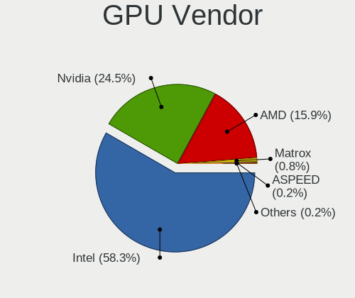

| Vendor                           | Computers | Percent |
|----------------------------------|-----------|---------|
| Intel                            | 944       | 58.34%  |
| Nvidia                           | 397       | 24.54%  |
| AMD                              | 257       | 15.88%  |
| Matrox Electronics Systems       | 13        | 0.8%    |
| ASPEED Technology                | 3         | 0.19%   |
| Silicon Integrated Systems [SiS] | 2         | 0.12%   |
| VIA Technologies                 | 1         | 0.06%   |
| Silicon Motion                   | 1         | 0.06%   |

GPU Model
---------

Graphics card models

| Model                                                                                    | Computers | Percent |
|------------------------------------------------------------------------------------------|-----------|---------|
| Intel 2nd Generation Core Processor Family Integrated Graphics Controller                | 110       | 6.65%   |
| Intel 3rd Gen Core processor Graphics Controller                                         | 58        | 3.51%   |
| Intel Core Processor Integrated Graphics Controller                                      | 46        | 2.78%   |
| Intel Skylake GT2 [HD Graphics 520]                                                      | 41        | 2.48%   |
| Intel HD Graphics 620                                                                    | 39        | 2.36%   |
| Intel Atom/Celeron/Pentium Processor x5-E8000/J3xxx/N3xxx Integrated Graphics Controller | 39        | 2.36%   |
| Intel Xeon E3-1200 v3/4th Gen Core Processor Integrated Graphics Controller              | 38        | 2.3%    |
| Intel UHD Graphics 620                                                                   | 34        | 2.06%   |
| Intel TigerLake-LP GT2 [Iris Xe Graphics]                                                | 34        | 2.06%   |
| Intel CoffeeLake-H GT2 [UHD Graphics 630]                                                | 32        | 1.93%   |
| Intel Haswell-ULT Integrated Graphics Controller                                         | 31        | 1.87%   |
| Intel 4th Gen Core Processor Integrated Graphics Controller                              | 31        | 1.87%   |
| Intel Xeon E3-1200 v2/3rd Gen Core processor Graphics Controller                         | 30        | 1.81%   |
| Intel HD Graphics 5500                                                                   | 29        | 1.75%   |
| Intel Mobile 4 Series Chipset Integrated Graphics Controller                             | 27        | 1.63%   |
| Intel 82G33/G31 Express Integrated Graphics Controller                                   | 24        | 1.45%   |
| AMD Ellesmere [Radeon RX 470/480/570/570X/580/580X/590]                                  | 24        | 1.45%   |
| Intel HD Graphics 630                                                                    | 22        | 1.33%   |
| Intel WhiskeyLake-U GT2 [UHD Graphics 620]                                               | 21        | 1.27%   |
| Intel HD Graphics 500                                                                    | 21        | 1.27%   |
| Intel GeminiLake [UHD Graphics 600]                                                      | 19        | 1.15%   |
| Nvidia GT218 [GeForce 210]                                                               | 16        | 0.97%   |
| Intel HD Graphics 530                                                                    | 16        | 0.97%   |
| Intel 4 Series Chipset Integrated Graphics Controller                                    | 16        | 0.97%   |
| AMD Cezanne [Radeon Vega Series / Radeon Vega Mobile Series]                             | 16        | 0.97%   |
| AMD Stoney [Radeon R2/R3/R4/R5 Graphics]                                                 | 14        | 0.85%   |
| Intel Mobile GM965/GL960 Integrated Graphics Controller (secondary)                      | 13        | 0.79%   |
| Intel Mobile GM965/GL960 Integrated Graphics Controller (primary)                        | 13        | 0.79%   |
| Intel CometLake-U GT2 [UHD Graphics]                                                     | 13        | 0.79%   |
| Nvidia TU117M [GeForce GTX 1650 Mobile / Max-Q]                                          | 12        | 0.73%   |
| AMD Renoir [Radeon Vega Series / Radeon Vega Mobile Series]                              | 12        | 0.73%   |
| Intel CometLake-H GT2 [UHD Graphics]                                                     | 11        | 0.67%   |
| Nvidia GP107M [GeForce GTX 1050 Ti Mobile]                                               | 10        | 0.6%    |
| Intel CoffeeLake-S GT2 [UHD Graphics 630]                                                | 10        | 0.6%    |
| AMD Picasso/Raven 2 [Radeon Vega Series / Radeon Vega Mobile Series]                     | 10        | 0.6%    |
| Nvidia TU116M [GeForce GTX 1660 Ti Mobile]                                               | 9         | 0.54%   |
| Nvidia GF108 [GeForce GT 730]                                                            | 9         | 0.54%   |
| Intel IvyBridge GT2 [HD Graphics 4000]                                                   | 9         | 0.54%   |
| Intel Iris Plus Graphics G1 (Ice Lake)                                                   | 9         | 0.54%   |
| Nvidia GP107M [GeForce GTX 1050 Mobile]                                                  | 8         | 0.48%   |

GPU Combo
---------

Combinations of graphics cards

| Name               | Computers | Percent |
|--------------------|-----------|---------|
| 1 x Intel          | 714       | 50.96%  |
| 1 x Nvidia         | 215       | 15.35%  |
| 1 x AMD            | 183       | 13.06%  |
| Intel + Nvidia     | 164       | 11.71%  |
| Intel + AMD        | 43        | 3.07%   |
| Other              | 20        | 1.43%   |
| AMD + Nvidia       | 17        | 1.21%   |
| 2 x AMD            | 14        | 1%      |
| 2 x Intel          | 11        | 0.79%   |
| 1 x Matrox         | 11        | 0.79%   |
| 1 x SiS            | 2         | 0.14%   |
| 1 x ASPEED         | 2         | 0.14%   |
| 1 x VIA            | 1         | 0.07%   |
| 1 x Silicon Motion | 1         | 0.07%   |
| Nvidia + Matrox    | 1         | 0.07%   |
| Nvidia + ASPEED    | 1         | 0.07%   |
| AMD + Matrox       | 1         | 0.07%   |

GPU Driver
----------

Free vs proprietary

| Driver      | Computers | Percent |
|-------------|-----------|---------|
| Free        | 1138      | 80.31%  |
| Proprietary | 208       | 14.68%  |
| Unknown     | 71        | 5.01%   |

GPU Memory
----------

Total video memory

| Size in GB | Computers | Percent |
|------------|-----------|---------|
| Unknown    | 982       | 68.1%   |
| 1.01-2.0   | 145       | 10.06%  |
| 0.01-0.5   | 90        | 6.24%   |
| 0.51-1.0   | 77        | 5.34%   |
| 3.01-4.0   | 68        | 4.72%   |
| 5.01-6.0   | 31        | 2.15%   |
| 7.01-8.0   | 29        | 2.01%   |
| 8.01-16.0  | 10        | 0.69%   |
| 2.01-3.0   | 8         | 0.55%   |
| 16.01-24.0 | 2         | 0.14%   |

Monitor
-------

Monitor Vendor
--------------

Monitor vendors

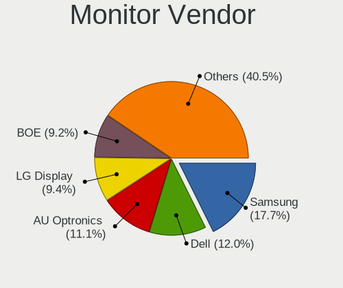

| Vendor                  | Computers | Percent |
|-------------------------|-----------|---------|
| Samsung Electronics     | 270       | 17.66%  |
| Dell                    | 184       | 12.03%  |
| AU Optronics            | 170       | 11.12%  |
| LG Display              | 144       | 9.42%   |
| BOE                     | 141       | 9.22%   |
| Chimei Innolux          | 128       | 8.37%   |
| Goldstar                | 109       | 7.13%   |
| Chi Mei Optoelectronics | 31        | 2.03%   |
| AOC                     | 27        | 1.77%   |
| Lenovo                  | 26        | 1.7%    |
| Hewlett-Packard         | 25        | 1.64%   |
| Apple                   | 24        | 1.57%   |
| Philips                 | 22        | 1.44%   |
| Sharp                   | 17        | 1.11%   |
| Unknown                 | 12        | 0.78%   |
| BenQ                    | 12        | 0.78%   |
| Acer                    | 12        | 0.78%   |
| LG Philips              | 10        | 0.65%   |
| LG Electronics          | 10        | 0.65%   |
| VIE                     | 9         | 0.59%   |
| PANDA                   | 9         | 0.59%   |
| Fujitsu Siemens         | 8         | 0.52%   |
| Toshiba                 | 7         | 0.46%   |
| ViewSonic               | 6         | 0.39%   |
| SKY                     | 6         | 0.39%   |
| Panasonic               | 6         | 0.39%   |
| Hitachi                 | 6         | 0.39%   |
| Ancor Communications    | 5         | 0.33%   |
| PRI                     | 4         | 0.26%   |
| Plain Tree Systems      | 4         | 0.26%   |
| ASUSTek Computer        | 4         | 0.26%   |
| Sony                    | 3         | 0.2%    |
| MStar                   | 3         | 0.2%    |
| MECER                   | 3         | 0.2%    |
| CTV                     | 3         | 0.2%    |
| Unknown                 | 3         | 0.2%    |
| ___                     | 2         | 0.13%   |
| Tatung                  | 2         | 0.13%   |
| STD                     | 2         | 0.13%   |
| SLD                     | 2         | 0.13%   |

Monitor Model
-------------

Monitor models

| Model                                                                    | Computers | Percent |
|--------------------------------------------------------------------------|-----------|---------|
| BOE LCD Monitor BOE06A5 1366x768 344x194mm 15.5-inch                     | 15        | 0.94%   |
| Dell SE2416H DELD082 1920x1080 527x296mm 23.8-inch                       | 14        | 0.88%   |
| LG Display LCD Monitor LGD02DC 1366x768 344x194mm 15.5-inch              | 12        | 0.75%   |
| Dell SE2416H DELD081 1920x1080 527x296mm 23.8-inch                       | 11        | 0.69%   |
| Chimei Innolux LCD Monitor CMN15DB 1366x768 344x193mm 15.5-inch          | 11        | 0.69%   |
| AU Optronics LCD Monitor AUO71EC 1366x768 344x193mm 15.5-inch            | 11        | 0.69%   |
| Goldstar ULTRAWIDE GSM59F1 2560x1080 677x290mm 29.0-inch                 | 10        | 0.63%   |
| Dell SE2216H DELF071 1920x1080 476x268mm 21.5-inch                       | 9         | 0.57%   |
| BOE LCD Monitor BOE0672 1366x768 344x194mm 15.5-inch                     | 9         | 0.57%   |
| Chi Mei Optoelectronics LCD Monitor CMO1592 1366x768 350x190mm 15.7-inch | 8         | 0.5%    |
| AU Optronics LCD Monitor AUO22EC 1366x768 344x193mm 15.5-inch            | 8         | 0.5%    |
| Chimei Innolux LCD Monitor CMN15E6 1366x768 344x193mm 15.5-inch          | 7         | 0.44%   |
| AU Optronics LCD Monitor AUO38ED 1920x1080 344x193mm 15.5-inch           | 7         | 0.44%   |
| Samsung Electronics C24F390 SAM0D2C 1920x1080 521x293mm 23.5-inch        | 6         | 0.38%   |
| LG Display LCD Monitor LGD0456 1366x768 344x194mm 15.5-inch              | 6         | 0.38%   |
| LG Display LCD Monitor LGD02AC 1366x768 344x194mm 15.5-inch              | 6         | 0.38%   |
| Goldstar IPS FULLHD GSM5AB8 1920x1080 480x270mm 21.7-inch                | 6         | 0.38%   |
| Dell SE2419HR DELF113 1920x1080 527x296mm 23.8-inch                      | 6         | 0.38%   |
| Dell S2421HN DEL41F1 1920x1080 527x296mm 23.8-inch                       | 6         | 0.38%   |
| Chimei Innolux LCD Monitor CMN15E7 1920x1080 344x193mm 15.5-inch         | 6         | 0.38%   |
| Samsung Electronics LCD Monitor SEC5441 1280x800 286x179mm 13.3-inch     | 5         | 0.31%   |
| LG Display LCD Monitor LGD053F 1920x1080 344x194mm 15.5-inch             | 5         | 0.31%   |
| Goldstar W2343 GSM5700 1920x1080 474x296mm 22.0-inch                     | 5         | 0.31%   |
| Dell SE2717H/HX DELD0A1 1920x1080 598x336mm 27.0-inch                    | 5         | 0.31%   |
| Dell SE2219H DELF10F 1920x1080 476x268mm 21.5-inch                       | 5         | 0.31%   |
| Dell S2340L DELD058 1920x1080 509x286mm 23.0-inch                        | 5         | 0.31%   |
| Chi Mei Optoelectronics LCD Monitor CMO15A1 1366x768 344x193mm 15.5-inch | 5         | 0.31%   |
| BOE LCD Monitor BOE0808 1366x768 344x194mm 15.5-inch                     | 5         | 0.31%   |
| AU Optronics LCD Monitor AUO70EC 1366x768 344x193mm 15.5-inch            | 5         | 0.31%   |
| Sharp LCD Monitor SHP14F9 1920x1200 288x180mm 13.4-inch                  | 4         | 0.25%   |
| Samsung Electronics SMBX2031 SAM076B 1600x900 443x249mm 20.0-inch        | 4         | 0.25%   |
| Samsung Electronics S22F350 SAM0D1A 1920x1080 477x268mm 21.5-inch        | 4         | 0.25%   |
| Samsung Electronics S20B300 SAM08A8 1600x900 443x249mm 20.0-inch         | 4         | 0.25%   |
| Samsung Electronics S19A33x SAM7120 1366x768 410x230mm 18.5-inch         | 4         | 0.25%   |
| Samsung Electronics LCD Monitor SEC325A 1366x768 344x194mm 15.5-inch     | 4         | 0.25%   |
| Samsung Electronics LCD Monitor SDC5441 1366x768 309x174mm 14.0-inch     | 4         | 0.25%   |
| Samsung Electronics LCD Monitor SDC4154 2880x1800 302x189mm 14.0-inch    | 4         | 0.25%   |
| Panasonic '' MEIA0B9 1920x1080                                           | 4         | 0.25%   |
| LG Display LCD Monitor LGD046F 1920x1080 344x194mm 15.5-inch             | 4         | 0.25%   |
| LG Display LCD Monitor LGD039F 1366x768 345x194mm 15.6-inch              | 4         | 0.25%   |

Monitor Resolution
------------------

Monitor screen resolution

| Resolution         | Computers | Percent |
|--------------------|-----------|---------|
| 1920x1080 (FHD)    | 549       | 37.6%   |
| 1366x768 (WXGA)    | 400       | 27.4%   |
| 1600x900 (HD+)     | 93        | 6.37%   |
| 3840x2160 (4K)     | 57        | 3.9%    |
| 1280x1024 (SXGA)   | 50        | 3.42%   |
| 2560x1440 (QHD)    | 45        | 3.08%   |
| 1280x800 (WXGA)    | 43        | 2.95%   |
| 1440x900 (WXGA+)   | 38        | 2.6%    |
| 1920x1200 (WUXGA)  | 29        | 1.99%   |
| 1680x1050 (WSXGA+) | 28        | 1.92%   |
| 1360x768           | 22        | 1.51%   |
| 1024x768 (XGA)     | 14        | 0.96%   |
| 2560x1080          | 13        | 0.89%   |
| Unknown            | 12        | 0.82%   |
| 2880x1800          | 10        | 0.68%   |
| 3840x1080          | 8         | 0.55%   |
| 1920x540           | 8         | 0.55%   |
| 1600x1200          | 4         | 0.27%   |
| 3440x1440          | 3         | 0.21%   |
| 3072x1920          | 3         | 0.21%   |
| 1152x864           | 3         | 0.21%   |
| 1024x600           | 3         | 0.21%   |
| 5120x1080          | 2         | 0.14%   |
| 4480x1080          | 2         | 0.14%   |
| 2880x1620          | 2         | 0.14%   |
| 2560x1600          | 2         | 0.14%   |
| 7680x2160          | 1         | 0.07%   |
| 720x480            | 1         | 0.07%   |
| 4880x1080          | 1         | 0.07%   |
| 4480x1440          | 1         | 0.07%   |
| 3840x2400          | 1         | 0.07%   |
| 3360x1080          | 1         | 0.07%   |
| 3286x1080          | 1         | 0.07%   |
| 3280x1200          | 1         | 0.07%   |
| 3200x1800 (QHD+)   | 1         | 0.07%   |
| 2880x1920          | 1         | 0.07%   |
| 2736x1824          | 1         | 0.07%   |
| 2288x1287          | 1         | 0.07%   |
| 2048x1536          | 1         | 0.07%   |
| 1x1                | 1         | 0.07%   |

Monitor Diagonal
----------------

Diagonal size in inches

| Inches  | Computers | Percent |
|---------|-----------|---------|
| 15      | 503       | 32.54%  |
| 23      | 110       | 7.12%   |
| 13      | 97        | 6.27%   |
| 24      | 94        | 6.08%   |
| 14      | 86        | 5.56%   |
| 17      | 81        | 5.24%   |
| 27      | 79        | 5.11%   |
| 21      | 71        | 4.59%   |
| 19      | 67        | 4.33%   |
| Unknown | 59        | 3.82%   |
| 18      | 54        | 3.49%   |
| 20      | 45        | 2.91%   |
| 31      | 31        | 2.01%   |
| 22      | 26        | 1.68%   |
| 34      | 15        | 0.97%   |
| 16      | 15        | 0.97%   |
| 40      | 13        | 0.84%   |
| 12      | 13        | 0.84%   |
| 84      | 11        | 0.71%   |
| 11      | 10        | 0.65%   |
| 32      | 8         | 0.52%   |
| 72      | 7         | 0.45%   |
| 52      | 7         | 0.45%   |
| 48      | 7         | 0.45%   |
| 54      | 4         | 0.26%   |
| 49      | 4         | 0.26%   |
| 25      | 4         | 0.26%   |
| 10      | 4         | 0.26%   |
| 46      | 3         | 0.19%   |
| 26      | 3         | 0.19%   |
| 64      | 2         | 0.13%   |
| 63      | 2         | 0.13%   |
| 44      | 2         | 0.13%   |
| 39      | 2         | 0.13%   |
| 97      | 1         | 0.06%   |
| 86      | 1         | 0.06%   |
| 67      | 1         | 0.06%   |
| 43      | 1         | 0.06%   |
| 41      | 1         | 0.06%   |
| 28      | 1         | 0.06%   |

Monitor Width
-------------

Physical width

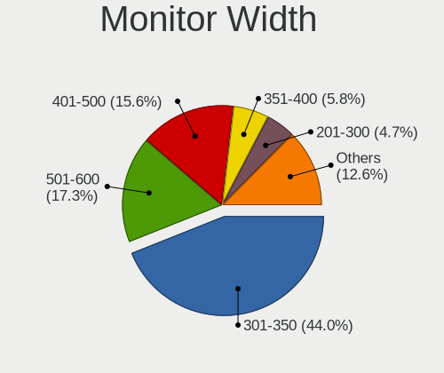

| Width in mm    | Computers | Percent |
|----------------|-----------|---------|
| 301-350        | 667       | 43.97%  |
| 501-600        | 263       | 17.34%  |
| 401-500        | 236       | 15.56%  |
| 351-400        | 88        | 5.8%    |
| 201-300        | 72        | 4.75%   |
| Unknown        | 59        | 3.89%   |
| 601-700        | 39        | 2.57%   |
| 1001-1500      | 30        | 1.98%   |
| 701-800        | 22        | 1.45%   |
| 1501-2000      | 18        | 1.19%   |
| 801-900        | 16        | 1.05%   |
| 901-1000       | 4         | 0.26%   |
| More than 2000 | 1         | 0.07%   |
| 101-200        | 1         | 0.07%   |
| 1-100          | 1         | 0.07%   |

Aspect Ratio
------------

Proportional relationship between the width and the height

| Ratio   | Computers | Percent |
|---------|-----------|---------|
| 16/9    | 1035      | 77.07%  |
| 16/10   | 160       | 11.91%  |
| 5/4     | 40        | 2.98%   |
| Unknown | 40        | 2.98%   |
| 4/3     | 30        | 2.23%   |
| 21/9    | 15        | 1.12%   |
| 32/9    | 10        | 0.74%   |
| 3/2     | 8         | 0.6%    |
| 1.96    | 3         | 0.22%   |
| 0.56    | 1         | 0.07%   |
| 0.00    | 1         | 0.07%   |

Monitor Area
------------

Area in inch

| Area in inch | Computers | Percent |
|----------------|-----------|---------|
| 101-110        | 495       | 32.5%   |
| 201-250        | 256       | 16.81%  |
| 81-90          | 150       | 9.85%   |
| 151-200        | 131       | 8.6%    |
| 301-350        | 81        | 5.32%   |
| 141-150        | 67        | 4.4%    |
| Unknown        | 60        | 3.94%   |
| 121-130        | 55        | 3.61%   |
| 351-500        | 54        | 3.55%   |
| More than 1000 | 38        | 2.5%    |
| 71-80          | 33        | 2.17%   |
| 501-1000       | 30        | 1.97%   |
| 111-120        | 23        | 1.51%   |
| 251-300        | 18        | 1.18%   |
| 61-70          | 12        | 0.79%   |
| 51-60          | 10        | 0.66%   |
| 131-140        | 5         | 0.33%   |
| 41-50          | 3         | 0.2%    |
| 1-40           | 1         | 0.07%   |
| 91-100         | 1         | 0.07%   |

Pixel Density
-------------

Pixels per inch

| Density       | Computers | Percent |
|---------------|-----------|---------|
| 51-100        | 544       | 37.01%  |
| 101-120       | 456       | 31.02%  |
| 121-160       | 307       | 20.88%  |
| Unknown       | 59        | 4.01%   |
| 161-240       | 48        | 3.27%   |
| 1-50          | 37        | 2.52%   |
| More than 240 | 19        | 1.29%   |

Multiple Monitors
-----------------

Total monitors connected

| Total | Computers | Percent |
|-------|-----------|---------|
| 1     | 1088      | 75.45%  |
| 2     | 259       | 17.96%  |
| 0     | 68        | 4.72%   |
| 3     | 23        | 1.6%    |
| 4     | 4         | 0.28%   |

Network
-------

Net Controller Vendor
---------------------

Controller vendors

| Vendor                            | Computers | Percent |
|-----------------------------------|-----------|---------|
| Realtek Semiconductor             | 770       | 35.96%  |
| Intel                             | 613       | 28.63%  |
| Qualcomm Atheros                  | 237       | 11.07%  |
| Broadcom                          | 121       | 5.65%   |
| TP-Link                           | 34        | 1.59%   |
| Dell                              | 32        | 1.49%   |
| MediaTek                          | 30        | 1.4%    |
| Samsung Electronics               | 28        | 1.31%   |
| Huawei Technologies               | 28        | 1.31%   |
| Broadcom Limited                  | 25        | 1.17%   |
| Ralink Technology                 | 22        | 1.03%   |
| Ralink                            | 22        | 1.03%   |
| Marvell Technology Group          | 19        | 0.89%   |
| Nvidia                            | 13        | 0.61%   |
| ASIX Electronics                  | 11        | 0.51%   |
| Ericsson Business Mobile Networks | 10        | 0.47%   |
| D-Link                            | 9         | 0.42%   |
| Sierra Wireless                   | 8         | 0.37%   |
| D-Link System                     | 8         | 0.37%   |
| JMicron Technology                | 7         | 0.33%   |
| Hewlett-Packard                   | 7         | 0.33%   |
| Spreadtrum Communications         | 5         | 0.23%   |
| Microsoft                         | 5         | 0.23%   |
| Aquantia                          | 5         | 0.23%   |
| Apple                             | 5         | 0.23%   |
| ZyXEL Communications              | 3         | 0.14%   |
| Xiaomi                            | 3         | 0.14%   |
| TRENDnet                          | 3         | 0.14%   |
| Tenda                             | 3         | 0.14%   |
| Silicon Integrated Systems [SiS]  | 3         | 0.14%   |
| Mellanox Technologies             | 3         | 0.14%   |
| DisplayLink                       | 3         | 0.14%   |
| ASUSTek Computer                  | 3         | 0.14%   |
| TP-Link Corporation Limited.      | 2         | 0.09%   |
| Raspberry Pi                      | 2         | 0.09%   |
| Qualcomm Atheros Communications   | 2         | 0.09%   |
| Qualcomm                          | 2         | 0.09%   |
| NetGear                           | 2         | 0.09%   |
| Lenovo                            | 2         | 0.09%   |
| IBM                               | 2         | 0.09%   |

Net Controller Model
--------------------

Controller models

| Model                                                                  | Computers | Percent |
|------------------------------------------------------------------------|-----------|---------|
| Realtek RTL8111/8168/8211/8411 PCI Express Gigabit Ethernet Controller | 490       | 19.48%  |
| Realtek RTL810xE PCI Express Fast Ethernet controller                  | 124       | 4.93%   |
| Intel 82579LM Gigabit Network Connection (Lewisville)                  | 66        | 2.62%   |
| Qualcomm Atheros QCA9377 802.11ac Wireless Network Adapter             | 45        | 1.79%   |
| Realtek RTL8821CE 802.11ac PCIe Wireless Network Adapter               | 39        | 1.55%   |
| Qualcomm Atheros QCA9565 / AR9565 Wireless Network Adapter             | 33        | 1.31%   |
| Qualcomm Atheros AR9285 Wireless Network Adapter (PCI-Express)         | 33        | 1.31%   |
| Realtek RTL8153 Gigabit Ethernet Adapter                               | 32        | 1.27%   |
| Intel Wireless 8265 / 8275                                             | 32        | 1.27%   |
| Intel Wi-Fi 6 AX201                                                    | 28        | 1.11%   |
| Intel Wi-Fi 6 AX200                                                    | 26        | 1.03%   |
| Intel Wireless 8260                                                    | 25        | 0.99%   |
| Realtek RTL8188EUS 802.11n Wireless Network Adapter                    | 24        | 0.95%   |
| Intel Cannon Lake PCH CNVi WiFi                                        | 23        | 0.91%   |
| Intel Ethernet Connection I217-LM                                      | 22        | 0.87%   |
| Intel Centrino Advanced-N 6205 [Taylor Peak]                           | 22        | 0.87%   |
| Intel 82579V Gigabit Network Connection                                | 22        | 0.87%   |
| Qualcomm Atheros AR9485 Wireless Network Adapter                       | 20        | 0.8%    |
| Intel Wireless 3165                                                    | 20        | 0.8%    |
| Realtek RTL8723BE PCIe Wireless Network Adapter                        | 19        | 0.76%   |
| Intel Wireless 7265                                                    | 19        | 0.76%   |
| Broadcom BCM4313 802.11bgn Wireless Network Adapter                    | 19        | 0.76%   |
| Realtek RTL8125 2.5GbE Controller                                      | 18        | 0.72%   |
| Intel Ethernet Connection (2) I219-V                                   | 18        | 0.72%   |
| Ralink MT7601U Wireless Adapter                                        | 17        | 0.68%   |
| Samsung Galaxy series, misc. (tethering mode)                          | 16        | 0.64%   |
| Intel I211 Gigabit Network Connection                                  | 16        | 0.64%   |
| Intel Dual Band Wireless-AC 3165 Plus Bluetooth                        | 16        | 0.64%   |
| Realtek RTL8822CE 802.11ac PCIe Wireless Network Adapter               | 15        | 0.6%    |
| Intel Ethernet Connection I219-LM                                      | 15        | 0.6%    |
| Qualcomm Atheros QCA6174 802.11ac Wireless Network Adapter             | 14        | 0.56%   |
| Qualcomm Atheros AR9462 Wireless Network Adapter                       | 14        | 0.56%   |
| Intel Centrino Advanced-N 6200                                         | 14        | 0.56%   |
| Intel 82577LM Gigabit Network Connection                               | 14        | 0.56%   |
| TP-Link TL-WN823N v2/v3 [Realtek RTL8192EU]                            | 13        | 0.52%   |
| Qualcomm Atheros AR9287 Wireless Network Adapter (PCI-Express)         | 13        | 0.52%   |
| Intel Wireless 7260                                                    | 13        | 0.52%   |
| Intel Wireless 3160                                                    | 13        | 0.52%   |
| Intel Ethernet Connection (2) I219-LM                                  | 13        | 0.52%   |
| Intel Centrino Wireless-N 2230                                         | 13        | 0.52%   |

Wireless Vendor
---------------

Wireless vendors

| Vendor                          | Computers | Percent |
|---------------------------------|-----------|---------|
| Intel                           | 425       | 39.21%  |
| Realtek Semiconductor           | 205       | 18.91%  |
| Qualcomm Atheros                | 193       | 17.8%   |
| Broadcom                        | 77        | 7.1%    |
| TP-Link                         | 34        | 3.14%   |
| MediaTek                        | 25        | 2.31%   |
| Ralink Technology               | 22        | 2.03%   |
| Ralink                          | 22        | 2.03%   |
| Dell                            | 17        | 1.57%   |
| Broadcom Limited                | 13        | 1.2%    |
| D-Link                          | 9         | 0.83%   |
| Sierra Wireless                 | 8         | 0.74%   |
| Microsoft                       | 5         | 0.46%   |
| ZyXEL Communications            | 3         | 0.28%   |
| TRENDnet                        | 3         | 0.28%   |
| Tenda                           | 3         | 0.28%   |
| ASUSTek Computer                | 3         | 0.28%   |
| Qualcomm Atheros Communications | 2         | 0.18%   |
| NetGear                         | 2         | 0.18%   |
| Fibocom                         | 2         | 0.18%   |
| Edimax Technology               | 2         | 0.18%   |
| D-Link System                   | 2         | 0.18%   |
| ZyDAS                           | 1         | 0.09%   |
| ZTE WCDMA Technologies MSM      | 1         | 0.09%   |
| Pace Micro Technology           | 1         | 0.09%   |
| Marvell Technology Group        | 1         | 0.09%   |
| Linksys                         | 1         | 0.09%   |
| CyberTAN Technology             | 1         | 0.09%   |
| Belkin Components               | 1         | 0.09%   |

Wireless Model
--------------

Wireless models

| Model                                                          | Computers | Percent |
|----------------------------------------------------------------|-----------|---------|
| Qualcomm Atheros QCA9377 802.11ac Wireless Network Adapter     | 45        | 4.11%   |
| Realtek RTL8821CE 802.11ac PCIe Wireless Network Adapter       | 39        | 3.56%   |
| Qualcomm Atheros QCA9565 / AR9565 Wireless Network Adapter     | 33        | 3.01%   |
| Qualcomm Atheros AR9285 Wireless Network Adapter (PCI-Express) | 33        | 3.01%   |
| Intel Wireless 8265 / 8275                                     | 32        | 2.92%   |
| Intel Wi-Fi 6 AX201                                            | 28        | 2.55%   |
| Intel Wi-Fi 6 AX200                                            | 26        | 2.37%   |
| Intel Wireless 8260                                            | 25        | 2.28%   |
| Realtek RTL8188EUS 802.11n Wireless Network Adapter            | 24        | 2.19%   |
| Intel Cannon Lake PCH CNVi WiFi                                | 23        | 2.1%    |
| Intel Centrino Advanced-N 6205 [Taylor Peak]                   | 22        | 2.01%   |
| Qualcomm Atheros AR9485 Wireless Network Adapter               | 20        | 1.82%   |
| Intel Wireless 3165                                            | 20        | 1.82%   |
| Realtek RTL8723BE PCIe Wireless Network Adapter                | 19        | 1.73%   |
| Intel Wireless 7265                                            | 19        | 1.73%   |
| Broadcom BCM4313 802.11bgn Wireless Network Adapter            | 19        | 1.73%   |
| Ralink MT7601U Wireless Adapter                                | 17        | 1.55%   |
| Intel Dual Band Wireless-AC 3165 Plus Bluetooth                | 16        | 1.46%   |
| Realtek RTL8822CE 802.11ac PCIe Wireless Network Adapter       | 15        | 1.37%   |
| Qualcomm Atheros QCA6174 802.11ac Wireless Network Adapter     | 14        | 1.28%   |
| Qualcomm Atheros AR9462 Wireless Network Adapter               | 14        | 1.28%   |
| Intel Centrino Advanced-N 6200                                 | 14        | 1.28%   |
| TP-Link TL-WN823N v2/v3 [Realtek RTL8192EU]                    | 13        | 1.19%   |
| Qualcomm Atheros AR9287 Wireless Network Adapter (PCI-Express) | 13        | 1.19%   |
| Intel Wireless 7260                                            | 13        | 1.19%   |
| Intel Wireless 3160                                            | 13        | 1.19%   |
| Intel Centrino Wireless-N 2230                                 | 13        | 1.19%   |
| Intel Cannon Point-LP CNVi [Wireless-AC]                       | 13        | 1.19%   |
| Realtek 802.11n WLAN Adapter                                   | 12        | 1.09%   |
| Intel PRO/Wireless 3945ABG [Golan] Network Connection          | 12        | 1.09%   |
| Intel Comet Lake PCH-LP CNVi WiFi                              | 12        | 1.09%   |
| Intel Comet Lake PCH CNVi WiFi                                 | 12        | 1.09%   |
| Intel Centrino Wireless-N 1030 [Rainbow Peak]                  | 12        | 1.09%   |
| Intel Centrino Ultimate-N 6300                                 | 12        | 1.09%   |
| Broadcom BCM43228 802.11a/b/g/n                                | 12        | 1.09%   |
| Realtek RTL8188FTV 802.11b/g/n 1T1R 2.4G WLAN Adapter          | 11        | 1%      |
| Realtek RTL8723BU 802.11b/g/n WLAN Adapter                     | 10        | 0.91%   |
| Ralink RT3290 Wireless 802.11n 1T/1R PCIe                      | 10        | 0.91%   |
| MediaTek MT7921 802.11ax PCI Express Wireless Network Adapter  | 10        | 0.91%   |
| Intel WiFi Link 5100                                           | 9         | 0.82%   |

Ethernet Vendor
---------------

Ethernet vendors

| Vendor                           | Computers | Percent |
|----------------------------------|-----------|---------|
| Realtek Semiconductor            | 686       | 51.73%  |
| Intel                            | 360       | 27.15%  |
| Qualcomm Atheros                 | 64        | 4.83%   |
| Broadcom                         | 64        | 4.83%   |
| Marvell Technology Group         | 18        | 1.36%   |
| Huawei Technologies              | 18        | 1.36%   |
| Samsung Electronics              | 16        | 1.21%   |
| Nvidia                           | 13        | 0.98%   |
| Broadcom Limited                 | 13        | 0.98%   |
| ASIX Electronics                 | 11        | 0.83%   |
| JMicron Technology               | 7         | 0.53%   |
| D-Link System                    | 6         | 0.45%   |
| Spreadtrum Communications        | 5         | 0.38%   |
| MediaTek                         | 5         | 0.38%   |
| Aquantia                         | 5         | 0.38%   |
| Apple                            | 5         | 0.38%   |
| Xiaomi                           | 3         | 0.23%   |
| Silicon Integrated Systems [SiS] | 3         | 0.23%   |
| Mellanox Technologies            | 3         | 0.23%   |
| DisplayLink                      | 3         | 0.23%   |
| TP-Link Corporation Limited.     | 2         | 0.15%   |
| Raspberry Pi                     | 2         | 0.15%   |
| Qualcomm                         | 2         | 0.15%   |
| Lenovo                           | 2         | 0.15%   |
| vivo                             | 1         | 0.08%   |
| Microchip Technology             | 1         | 0.08%   |
| LG Electronics                   | 1         | 0.08%   |
| Insyde Software                  | 1         | 0.08%   |
| IBM                              | 1         | 0.08%   |
| HMD Global                       | 1         | 0.08%   |
| Hewlett-Packard                  | 1         | 0.08%   |
| Foxconn / Hon Hai                | 1         | 0.08%   |
| Attansic Technology              | 1         | 0.08%   |
| Accton Technology                | 1         | 0.08%   |

Ethernet Model
--------------

Ethernet models

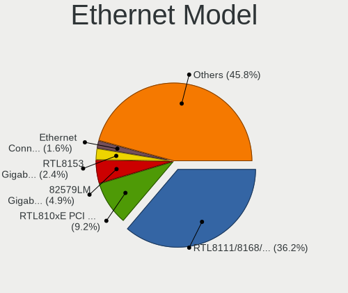

| Model                                                                  | Computers | Percent |
|------------------------------------------------------------------------|-----------|---------|
| Realtek RTL8111/8168/8211/8411 PCI Express Gigabit Ethernet Controller | 490       | 36.22%  |
| Realtek RTL810xE PCI Express Fast Ethernet controller                  | 124       | 9.16%   |
| Intel 82579LM Gigabit Network Connection (Lewisville)                  | 66        | 4.88%   |
| Realtek RTL8153 Gigabit Ethernet Adapter                               | 32        | 2.37%   |
| Intel Ethernet Connection I217-LM                                      | 22        | 1.63%   |
| Intel 82579V Gigabit Network Connection                                | 22        | 1.63%   |
| Realtek RTL8125 2.5GbE Controller                                      | 18        | 1.33%   |
| Intel Ethernet Connection (2) I219-V                                   | 18        | 1.33%   |
| Samsung Galaxy series, misc. (tethering mode)                          | 16        | 1.18%   |
| Intel I211 Gigabit Network Connection                                  | 16        | 1.18%   |
| Intel Ethernet Connection I219-LM                                      | 15        | 1.11%   |
| Intel 82577LM Gigabit Network Connection                               | 14        | 1.03%   |
| Intel Ethernet Connection (2) I219-LM                                  | 13        | 0.96%   |
| Qualcomm Atheros AR8151 v2.0 Gigabit Ethernet                          | 12        | 0.89%   |
| Broadcom NetLink BCM57785 Gigabit Ethernet PCIe                        | 11        | 0.81%   |
| Realtek RTL-8100/8101L/8139 PCI Fast Ethernet Adapter                  | 10        | 0.74%   |
| Intel Ethernet Connection (4) I219-LM                                  | 10        | 0.74%   |
| Intel 82578DM Gigabit Network Connection                               | 10        | 0.74%   |
| Intel 82567LM Gigabit Network Connection                               | 10        | 0.74%   |
| ASIX AX88179 Gigabit Ethernet                                          | 10        | 0.74%   |
| Realtek RTL8152 Fast Ethernet Adapter                                  | 9         | 0.67%   |
| Intel 82574L Gigabit Network Connection                                | 9         | 0.67%   |
| Intel Ethernet Connection (3) I218-LM                                  | 8         | 0.59%   |
| Intel 82578DC Gigabit Network Connection                               | 8         | 0.59%   |
| Huawei E353/E3131                                                      | 8         | 0.59%   |
| Realtek Killer E2600 GbE Controller                                    | 7         | 0.52%   |
| Intel Ethernet Controller I225-V                                       | 7         | 0.52%   |
| Intel Ethernet Connection I218-LM                                      | 7         | 0.52%   |
| Huawei FOA-LX9                                                         | 7         | 0.52%   |
| Broadcom NetXtreme BCM57766 Gigabit Ethernet PCIe                      | 7         | 0.52%   |
| Broadcom NetXtreme BCM57765 Gigabit Ethernet PCIe                      | 7         | 0.52%   |
| Qualcomm Atheros Killer E220x Gigabit Ethernet Controller              | 6         | 0.44%   |
| Marvell Group 88E8040 PCI-E Fast Ethernet Controller                   | 6         | 0.44%   |
| JMicron JMC250 PCI Express Gigabit Ethernet Controller                 | 6         | 0.44%   |
| Intel Ethernet Connection (7) I219-V                                   | 6         | 0.44%   |
| Intel Ethernet Connection (6) I219-V                                   | 6         | 0.44%   |
| Intel Ethernet Connection (4) I219-V                                   | 6         | 0.44%   |
| Intel 82567LM-3 Gigabit Network Connection                             | 6         | 0.44%   |
| D-Link System DGE-528T Gigabit Ethernet Adapter                        | 6         | 0.44%   |
| Broadcom NetXtreme BCM5764M Gigabit Ethernet PCIe                      | 6         | 0.44%   |

Net Controller Kind
-------------------

Ethernet, WiFi or modem

| Kind     | Computers | Percent |
|----------|-----------|---------|
| Ethernet | 1233      | 53.4%   |
| WiFi     | 1011      | 43.79%  |
| Modem    | 61        | 2.64%   |
| Unknown  | 4         | 0.17%   |

Used Controller
---------------

Currently used network controller

| Kind     | Computers | Percent |
|----------|-----------|---------|
| WiFi     | 811       | 56.32%  |
| Ethernet | 627       | 43.54%  |
| Modem    | 2         | 0.14%   |

NICs
----

Total network controllers on board

| Total | Computers | Percent |
|-------|-----------|---------|
| 2     | 759       | 54.21%  |
| 1     | 552       | 39.43%  |
| 0     | 63        | 4.5%    |
| 3     | 19        | 1.36%   |
| 4     | 4         | 0.29%   |
| 6     | 2         | 0.14%   |
| 8     | 1         | 0.07%   |

IPv6
----

IPv6 vs IPv4

| Used | Computers | Percent |
|------|-----------|---------|
| No   | 1350      | 96.5%   |
| Yes  | 49        | 3.5%    |

Bluetooth
---------

Bluetooth Vendor
----------------

Controller vendors

| Vendor                          | Computers | Percent |
|---------------------------------|-----------|---------|
| Intel                           | 305       | 38.56%  |
| Realtek Semiconductor           | 81        | 10.24%  |
| Qualcomm Atheros Communications | 81        | 10.24%  |
| Cambridge Silicon Radio         | 51        | 6.45%   |
| IMC Networks                    | 46        | 5.82%   |
| Broadcom                        | 43        | 5.44%   |
| Foxconn / Hon Hai               | 31        | 3.92%   |
| Hewlett-Packard                 | 27        | 3.41%   |
| Lite-On Technology              | 26        | 3.29%   |
| Apple                           | 26        | 3.29%   |
| Dell                            | 25        | 3.16%   |
| Ralink                          | 10        | 1.26%   |
| Toshiba                         | 9         | 1.14%   |
| ASUSTek Computer                | 7         | 0.88%   |
| MediaTek                        | 6         | 0.76%   |
| TP-Link                         | 2         | 0.25%   |
| Integrated System Solution      | 2         | 0.25%   |
| Alps Electric                   | 2         | 0.25%   |
| USI                             | 1         | 0.13%   |
| Realtek                         | 1         | 0.13%   |
| Ralink Technology               | 1         | 0.13%   |
| Mobile Action Technology        | 1         | 0.13%   |
| Micro Star International        | 1         | 0.13%   |
| Marvell Semiconductor           | 1         | 0.13%   |
| Logitech                        | 1         | 0.13%   |
| Foxconn International           | 1         | 0.13%   |
| Edimax Technology               | 1         | 0.13%   |
| Askey Computer                  | 1         | 0.13%   |
| Actions                         | 1         | 0.13%   |

Bluetooth Model
---------------

Controller models

| Model                                               | Computers | Percent |
|-----------------------------------------------------|-----------|---------|
| Intel Bluetooth wireless interface                  | 123       | 15.55%  |
| Intel AX201 Bluetooth                               | 59        | 7.46%   |
| Cambridge Silicon Radio Bluetooth Dongle (HCI mode) | 51        | 6.45%   |
| Intel Bluetooth 9460/9560 Jefferson Peak (JfP)      | 47        | 5.94%   |
| Realtek Bluetooth Radio                             | 39        | 4.93%   |
| Qualcomm Atheros  Bluetooth Device                  | 39        | 4.93%   |
| Realtek  Bluetooth 4.2 Adapter                      | 25        | 3.16%   |
| Intel AX200 Bluetooth                               | 24        | 3.03%   |
| HP Broadcom 2070 Bluetooth Combo                    | 19        | 2.4%    |
| IMC Networks Bluetooth Radio                        | 16        | 2.02%   |
| Intel Centrino Bluetooth Wireless Transceiver       | 15        | 1.9%    |
| Qualcomm Atheros AR3011 Bluetooth                   | 13        | 1.64%   |
| IMC Networks Wireless_Device                        | 12        | 1.52%   |
| Intel Centrino Advanced-N 6230 Bluetooth adapter    | 11        | 1.39%   |
| Intel AX211 Bluetooth                               | 11        | 1.39%   |
| Foxconn / Hon Hai Bluetooth Device                  | 11        | 1.39%   |
| Broadcom BCM2045B (BDC-2.1)                         | 11        | 1.39%   |
| Ralink RT3290 Bluetooth                             | 10        | 1.26%   |
| Qualcomm Atheros AR3012 Bluetooth 4.0               | 10        | 1.26%   |
| Lite-On Qualcomm Atheros QCA9377 Bluetooth          | 10        | 1.26%   |
| IMC Networks Bluetooth Device                       | 10        | 1.26%   |
| Dell BCM20702A0 Bluetooth Module                    | 10        | 1.26%   |
| Apple Bluetooth USB Host Controller                 | 9         | 1.14%   |
| Qualcomm Atheros QCA61x4 Bluetooth 4.0              | 8         | 1.01%   |
| Lite-On Bluetooth Device                            | 8         | 1.01%   |
| Intel Wireless-AC 3168 Bluetooth                    | 8         | 1.01%   |
| HP Bluetooth 2.0 Interface [Broadcom BCM2045]       | 8         | 1.01%   |
| Realtek RTL8723B Bluetooth                          | 7         | 0.88%   |
| Apple Bluetooth Host Controller                     | 7         | 0.88%   |
| Realtek 802.11ac WLAN Adapter                       | 6         | 0.76%   |
| Qualcomm Atheros AR9462 Bluetooth                   | 6         | 0.76%   |
| MediaTek Wireless_Device                            | 6         | 0.76%   |
| Broadcom BCM43142 Bluetooth 4.0                     | 6         | 0.76%   |
| Apple Bluetooth HCI                                 | 6         | 0.76%   |
| Foxconn / Hon Hai Wireless_Device                   | 5         | 0.63%   |
| Lite-On Atheros AR3012 Bluetooth                    | 4         | 0.51%   |
| Intel Wireless-AC 9260 Bluetooth Adapter            | 4         | 0.51%   |
| Apple Built-in Bluetooth 2.0+EDR HCI                | 4         | 0.51%   |
| Toshiba RT Bluetooth Radio                          | 3         | 0.38%   |
| Realtek RTL8821A Bluetooth                          | 3         | 0.38%   |

Sound
-----

Sound Vendor
------------

Sound card vendors

| Vendor                           | Computers | Percent |
|----------------------------------|-----------|---------|
| Intel                            | 1128      | 61.54%  |
| Nvidia                           | 287       | 15.66%  |
| AMD                              | 248       | 13.53%  |
| C-Media Electronics              | 35        | 1.91%   |
| Logitech                         | 12        | 0.65%   |
| Corsair                          | 12        | 0.65%   |
| JMTek                            | 9         | 0.49%   |
| Creative Labs                    | 8         | 0.44%   |
| Sony                             | 5         | 0.27%   |
| Hewlett-Packard                  | 5         | 0.27%   |
| Generalplus Technology           | 5         | 0.27%   |
| DSEA A/S                         | 5         | 0.27%   |
| Texas Instruments                | 4         | 0.22%   |
| Realtek Semiconductor            | 4         | 0.22%   |
| GN Netcom                        | 4         | 0.22%   |
| ASUSTek Computer                 | 4         | 0.22%   |
| Apple                            | 4         | 0.22%   |
| VIA Technologies                 | 3         | 0.16%   |
| Silicon Integrated Systems [SiS] | 3         | 0.16%   |
| Razer USA                        | 3         | 0.16%   |
| Plantronics                      | 3         | 0.16%   |
| Lenovo                           | 3         | 0.16%   |
| Focusrite-Novation               | 3         | 0.16%   |
| Syntek                           | 2         | 0.11%   |
| SteelSeries ApS                  | 2         | 0.11%   |
| Samson Technologies              | 2         | 0.11%   |
| Microsoft                        | 2         | 0.11%   |
| Micro Star International         | 2         | 0.11%   |
| Jieli Technology                 | 2         | 0.11%   |
| Cooler Master                    | 2         | 0.11%   |
| Conexant Systems                 | 2         | 0.11%   |
| Xiaomi                           | 1         | 0.05%   |
| Trust                            | 1         | 0.05%   |
| Tenx Technology                  | 1         | 0.05%   |
| Steinberg Soft-und Hardware      | 1         | 0.05%   |
| Schiit Audio                     | 1         | 0.05%   |
| Magic Control Technology         | 1         | 0.05%   |
| M-Audio                          | 1         | 0.05%   |
| iPassion Technology              | 1         | 0.05%   |
| GYROCOM C&C                      | 1         | 0.05%   |

Sound Model
-----------

Sound card models

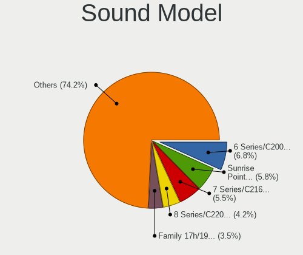

| Model                                                                                             | Computers | Percent |
|---------------------------------------------------------------------------------------------------|-----------|---------|
| Intel 6 Series/C200 Series Chipset Family High Definition Audio Controller                        | 143       | 6.77%   |
| Intel Sunrise Point-LP HD Audio                                                                   | 123       | 5.82%   |
| Intel 7 Series/C216 Chipset Family High Definition Audio Controller                               | 116       | 5.49%   |
| Intel 8 Series/C220 Series Chipset High Definition Audio Controller                               | 88        | 4.17%   |
| AMD Family 17h/19h/1ah HD Audio Controller                                                        | 74        | 3.5%    |
| Intel Xeon E3-1200 v3/4th Gen Core Processor HD Audio Controller                                  | 70        | 3.31%   |
| Intel NM10/ICH7 Family High Definition Audio Controller                                           | 66        | 3.13%   |
| Intel 5 Series/3400 Series Chipset High Definition Audio                                          | 66        | 3.13%   |
| Intel 100 Series/C230 Series Chipset Family HD Audio Controller                                   | 50        | 2.37%   |
| Intel Cannon Lake PCH cAVS                                                                        | 48        | 2.27%   |
| Intel 82801I (ICH9 Family) HD Audio Controller                                                    | 42        | 1.99%   |
| AMD Renoir Radeon High Definition Audio Controller                                                | 39        | 1.85%   |
| Intel Tiger Lake-LP Smart Sound Technology Audio Controller                                       | 36        | 1.7%    |
| AMD Starship/Matisse HD Audio Controller                                                          | 33        | 1.56%   |
| Intel Wildcat Point-LP High Definition Audio Controller                                           | 31        | 1.47%   |
| Intel Haswell-ULT HD Audio Controller                                                             | 31        | 1.47%   |
| Intel Broadwell-U Audio Controller                                                                | 31        | 1.47%   |
| Intel 8 Series HD Audio Controller                                                                | 31        | 1.47%   |
| Nvidia GF108 High Definition Audio Controller                                                     | 29        | 1.37%   |
| AMD Ellesmere HDMI Audio [Radeon RX 470/480 / 570/580/590]                                        | 27        | 1.28%   |
| Intel Atom/Celeron/Pentium Processor x5-E8000/J3xxx/N3xxx Series High Definition Audio Controller | 26        | 1.23%   |
| Nvidia High Definition Audio Controller                                                           | 25        | 1.18%   |
| Intel Cannon Point-LP High Definition Audio Controller                                            | 25        | 1.18%   |
| Intel 82801H (ICH8 Family) HD Audio Controller                                                    | 25        | 1.18%   |
| Intel 200 Series PCH HD Audio                                                                     | 24        | 1.14%   |
| Intel Celeron N3350/Pentium N4200/Atom E3900 Series Audio Cluster                                 | 22        | 1.04%   |
| Nvidia GP107GL High Definition Audio Controller                                                   | 21        | 0.99%   |
| AMD SBx00 Azalia (Intel HDA)                                                                      | 21        | 0.99%   |
| AMD Family 17h (Models 00h-0fh) HD Audio Controller                                               | 19        | 0.9%    |
| Nvidia TU116 High Definition Audio Controller                                                     | 18        | 0.85%   |
| Intel Celeron/Pentium Silver Processor High Definition Audio                                      | 18        | 0.85%   |
| AMD Family 15h (Models 60h-6fh) Audio Controller                                                  | 17        | 0.8%    |
| AMD Oland/Hainan/Cape Verde/Pitcairn HDMI Audio [Radeon HD 7000 Series]                           | 16        | 0.76%   |
| Nvidia TU107 GeForce GTX 1650 High Definition Audio Controller                                    | 15        | 0.71%   |
| Nvidia GF119 HDMI Audio Controller                                                                | 15        | 0.71%   |
| Intel 82801JI (ICH10 Family) HD Audio Controller                                                  | 15        | 0.71%   |
| Nvidia GP106 High Definition Audio Controller                                                     | 14        | 0.66%   |
| Intel Comet Lake PCH-LP cAVS                                                                      | 14        | 0.66%   |
| Intel Comet Lake PCH cAVS                                                                         | 14        | 0.66%   |
| AMD Navi 21/23 HDMI/DP Audio Controller                                                           | 14        | 0.66%   |

Memory
------

Memory Vendor
-------------

Memory module vendors

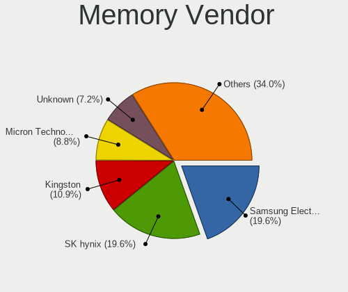

| Vendor                         | Computers | Percent |
|--------------------------------|-----------|---------|
| SK hynix                       | 152       | 19.56%  |
| Samsung Electronics            | 152       | 19.56%  |
| Kingston                       | 85        | 10.94%  |
| Micron Technology              | 68        | 8.75%   |
| Unknown                        | 56        | 7.21%   |
| Crucial                        | 41        | 5.28%   |
| Corsair                        | 41        | 5.28%   |
| Transcend                      | 34        | 4.38%   |
| A-DATA Technology              | 22        | 2.83%   |
| G.Skill                        | 19        | 2.45%   |
| Nanya Technology               | 14        | 1.8%    |
| Ramaxel Technology             | 13        | 1.67%   |
| Patriot                        | 11        | 1.42%   |
| KLEVV                          | 11        | 1.42%   |
| Elpida                         | 11        | 1.42%   |
| Unknown (ABCD)                 | 9         | 1.16%   |
| Unknown                        | 9         | 1.16%   |
| Essencore                      | 4         | 0.51%   |
| Strontium                      | 3         | 0.39%   |
| Kingmax                        | 3         | 0.39%   |
| Apacer                         | 3         | 0.39%   |
| Team                           | 2         | 0.26%   |
| KingFast                       | 2         | 0.26%   |
| Innodisk                       | 2         | 0.26%   |
| Essencore Limited              | 2         | 0.26%   |
| Silicon Power                  | 1         | 0.13%   |
| Shenzhen Zhongteng             | 1         | 0.13%   |
| Qimonda                        | 1         | 0.13%   |
| Neo Forza                      | 1         | 0.13%   |
| MKF_SMBIOS_TYPE17_MANUFACTURER | 1         | 0.13%   |
| Hewlett-Packard                | 1         | 0.13%   |
| ASint Technology               | 1         | 0.13%   |
| A-DA                           | 1         | 0.13%   |

Memory Model
------------

Memory module models

| Model                                                            | Computers | Percent |
|------------------------------------------------------------------|-----------|---------|
| SK hynix RAM HMA81GS6AFR8N-UH 8GB SODIMM DDR4 2667MT/s           | 12        | 1.45%   |
| Samsung RAM M471A5244CB0-CTD 4GB SODIMM DDR4 3266MT/s            | 11        | 1.33%   |
| SK hynix RAM HMT41GS6BFR8A-PB 8GB SODIMM DDR3 1600MT/s           | 10        | 1.2%    |
| SK hynix RAM HMA851S6AFR6N-UH 4GB SODIMM DDR4 2667MT/s           | 10        | 1.2%    |
| Unknown (ABCD) RAM 123456789012345678 2GB SODIMM LPDDR3 2400MT/s | 9         | 1.08%   |
| Unknown                                                          | 9         | 1.08%   |
| Samsung RAM M471A5244CB0-CRC 4GB SODIMM DDR4 2667MT/s            | 8         | 0.96%   |
| Samsung RAM M471A1K43CB1-CRC 8GB SODIMM DDR4 2667MT/s            | 7         | 0.84%   |
| SK hynix RAM HMA81GS6JJR8N-VK 8GB SODIMM DDR4 2667MT/s           | 6         | 0.72%   |
| SK hynix RAM HMT451U6BFR8C-PB 4GB DIMM DDR3 1600MT/s             | 5         | 0.6%    |
| SK hynix RAM HMT351S6EFR8A-PB 4GB SODIMM DDR3 1600MT/s           | 5         | 0.6%    |
| SK hynix RAM HMA81GS6CJR8N-VK 8GB SODIMM DDR4 2667MT/s           | 5         | 0.6%    |
| Samsung RAM M471B5273DH0-CK0 4GB SODIMM DDR3 2400MT/s            | 5         | 0.6%    |
| Samsung RAM M471B5173EB0-YK0 4GB SODIMM DDR3 1600MT/s            | 5         | 0.6%    |
| Samsung RAM M471B1G73QH0-YK0 8GB SODIMM DDR3 1600MT/s            | 5         | 0.6%    |
| Samsung RAM M471A1K43EB1-CWE 8GB SODIMM DDR4 3200MT/s            | 5         | 0.6%    |
| KLEVV RAM KD4AGUA8A-26N1900 16GB DIMM DDR4 2667MT/s              | 5         | 0.6%    |
| SK hynix RAM HMT451S6BFR8A-PB 4096MB SODIMM DDR3 1600MT/s        | 4         | 0.48%   |
| SK hynix RAM HMT351S6CFR8C-PB 4GB SODIMM DDR3 1600MT/s           | 4         | 0.48%   |
| SK hynix RAM HMA81GS6DJR8N-XN 8GB SODIMM DDR4 3200MT/s           | 4         | 0.48%   |
| Samsung RAM M471B5273DH0-CH9 4GB SODIMM DDR3 1334MT/s            | 4         | 0.48%   |
| Samsung RAM M471B5173DB0-YK0 4GB SODIMM DDR3 1600MT/s            | 4         | 0.48%   |
| Samsung RAM M471B1G73EB0-YK0 8GB SODIMM DDR3 1600MT/s            | 4         | 0.48%   |
| Samsung RAM M471A5244CB0-CWE 4096MB SODIMM DDR4 3200MT/s         | 4         | 0.48%   |
| Samsung RAM M471A5244CB0-CWE 4096MB Row Of Chips DDR4 3200MT/s   | 4         | 0.48%   |
| Nanya RAM NT2GC64B88B0NS-CG 2GB SODIMM DDR3 1334MT/s             | 4         | 0.48%   |
| Micron RAM 8KTF51264HZ-1G6E1 4GB SODIMM DDR3 1600MT/s            | 4         | 0.48%   |
| Micron RAM 8JTF51264AZ-1G6E1 4GB DIMM 1600MT/s                   | 4         | 0.48%   |
| Micron RAM 4ATF51264HZ-2G6E1 4GB SODIMM DDR4 2667MT/s            | 4         | 0.48%   |
| Micron RAM 4ATF1G64HZ-3G2F1 8GB SODIMM DDR4 3200MT/s             | 4         | 0.48%   |
| G.Skill RAM F4-3200C16-8GVKB 8GB DIMM DDR4 4000MT/s              | 4         | 0.48%   |
| Unknown RAM Module 4GB DIMM 400MT/s                              | 3         | 0.36%   |
| Unknown RAM Module 2GB Row Of Chips LPDDR4 4267MT/s              | 3         | 0.36%   |
| Unknown RAM Module 2048MB DIMM 1333MT/s                          | 3         | 0.36%   |
| Transcend RAM TS512MLK64V6H 4GB DIMM DDR3 1600MT/s               | 3         | 0.36%   |
| Transcend RAM JM1333KLH-8G 8GB DIMM DDR3 1333MT/s                | 3         | 0.36%   |
| SK hynix RAM HMT451U6AFR8C-PB 4GB DIMM DDR3 1600MT/s             | 3         | 0.36%   |
| SK hynix RAM HMT351S6CFR8A-PB 4GB SODIMM DDR3 1600MT/s           | 3         | 0.36%   |
| SK hynix RAM HMT351S6BFR8C-H9 4GB SODIMM DDR3 1334MT/s           | 3         | 0.36%   |
| SK hynix RAM HMA82GS6CJR8N-VK 16GB SODIMM DDR4 2667MT/s          | 3         | 0.36%   |

Memory Kind
-----------

Memory module kinds

| Kind    | Computers | Percent |
|---------|-----------|---------|
| DDR4    | 269       | 44.1%   |
| DDR3    | 227       | 37.21%  |
| LPDDR4  | 26        | 4.26%   |
| DDR2    | 24        | 3.93%   |
| Unknown | 20        | 3.28%   |
| DDR5    | 18        | 2.95%   |
| SDRAM   | 9         | 1.48%   |
| LPDDR3  | 8         | 1.31%   |
| LPDDR5  | 6         | 0.98%   |
| DDR     | 3         | 0.49%   |

Memory Form Factor
------------------

Physical design of the memory module

| Name         | Computers | Percent |
|--------------|-----------|---------|
| SODIMM       | 369       | 60.59%  |
| DIMM         | 202       | 33.17%  |
| Row Of Chips | 31        | 5.09%   |
| Chip         | 5         | 0.82%   |
| FB-DIMM      | 1         | 0.16%   |
| Unknown      | 1         | 0.16%   |

Memory Size
-----------

Memory module size

| Size  | Computers | Percent |
|-------|-----------|---------|
| 8192  | 242       | 35.07%  |
| 4096  | 201       | 29.13%  |
| 16384 | 107       | 15.51%  |
| 2048  | 92        | 13.33%  |
| 1024  | 23        | 3.33%   |
| 32768 | 18        | 2.61%   |
| 512   | 5         | 0.72%   |
| 65536 | 1         | 0.14%   |
| 24576 | 1         | 0.14%   |

Memory Speed
------------

Memory module speed

| Speed   | Computers | Percent |
|---------|-----------|---------|
| 1600    | 147       | 21.27%  |
| 2667    | 116       | 16.79%  |
| 3200    | 77        | 11.14%  |
| 1333    | 58        | 8.39%   |
| 2400    | 47        | 6.8%    |
| 2133    | 38        | 5.5%    |
| 1334    | 26        | 3.76%   |
| 800     | 14        | 2.03%   |
| 667     | 14        | 2.03%   |
| 4800    | 13        | 1.88%   |
| 3600    | 12        | 1.74%   |
| 3266    | 11        | 1.59%   |
| 1867    | 10        | 1.45%   |
| 1067    | 8         | 1.16%   |
| 4267    | 7         | 1.01%   |
| 6400    | 6         | 0.87%   |
| 1066    | 6         | 0.87%   |
| 400     | 5         | 0.72%   |
| Unknown | 5         | 0.72%   |
| 4000    | 4         | 0.58%   |
| 2933    | 4         | 0.58%   |
| 2666    | 4         | 0.58%   |
| 2048    | 4         | 0.58%   |
| 975     | 4         | 0.58%   |
| 3800    | 3         | 0.43%   |
| 3733    | 3         | 0.43%   |
| 3466    | 3         | 0.43%   |
| 1866    | 3         | 0.43%   |
| 8400    | 2         | 0.29%   |
| 6000    | 2         | 0.29%   |
| 3100    | 2         | 0.29%   |
| 3066    | 2         | 0.29%   |
| 3000    | 2         | 0.29%   |
| 2934    | 2         | 0.29%   |
| 2448    | 2         | 0.29%   |
| 2200    | 2         | 0.29%   |
| 1800    | 2         | 0.29%   |
| 1648    | 2         | 0.29%   |
| 133     | 2         | 0.29%   |
| 41632   | 1         | 0.14%   |

Printers & scanners
-------------------

Printer Vendor
--------------

Printer device vendors

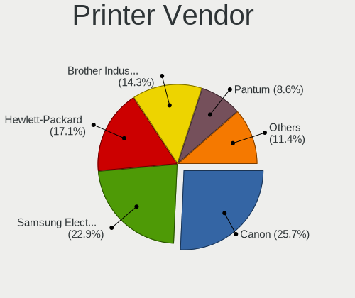

| Vendor                | Computers | Percent |
|-----------------------|-----------|---------|
| Canon                 | 9         | 25.71%  |
| Samsung Electronics   | 8         | 22.86%  |
| Hewlett-Packard       | 6         | 17.14%  |
| Brother Industries    | 5         | 14.29%  |
| Pantum                | 3         | 8.57%   |
| Seiko Epson           | 1         | 2.86%   |
| Oki Data              | 1         | 2.86%   |
| Lexmark International | 1         | 2.86%   |
| Dell                  | 1         | 2.86%   |

Printer Model
-------------

Printer device models

| Model                                      | Computers | Percent |
|--------------------------------------------|-----------|---------|
| Pantum P2200 series                        | 3         | 8.57%   |
| Samsung M267x 287x Series                  | 2         | 5.71%   |
| Canon PIXMA MG2500 Series                  | 2         | 5.71%   |
| Brother MFC-L2700DW                        | 2         | 5.71%   |
| Seiko Epson L3110 Series                   | 1         | 2.86%   |
| Samsung SCX-4623 Series                    | 1         | 2.86%   |
| Samsung SCX-4600 Series                    | 1         | 2.86%   |
| Samsung M2070 Series                       | 1         | 2.86%   |
| Samsung M2020 Series                       | 1         | 2.86%   |
| Samsung Composite Device                   | 1         | 2.86%   |
| Samsung C460 Series                        | 1         | 2.86%   |
| Oki Data USB Device                        | 1         | 2.86%   |
| Lexmark International InkJet Color Printer | 1         | 2.86%   |
| HP OfficeJet Pro 9010 series               | 1         | 2.86%   |
| HP Officejet J4500 series                  | 1         | 2.86%   |
| HP OfficeJet 5600 (USBHUB)                 | 1         | 2.86%   |
| HP LaserJet 1022                           | 1         | 2.86%   |
| HP LaserJet 1018                           | 1         | 2.86%   |
| HP DeskJet 3830 series                     | 1         | 2.86%   |
| Dell 1250c Color Printer                   | 1         | 2.86%   |
| Canon PIXMA MX410                          | 1         | 2.86%   |
| Canon PIXMA MG3600 Series                  | 1         | 2.86%   |
| Canon MG2400 series                        | 1         | 2.86%   |
| Canon MF210 Series                         | 1         | 2.86%   |
| Canon LBP3360                              | 1         | 2.86%   |
| Canon G4000 series                         | 1         | 2.86%   |
| Canon G3010 series                         | 1         | 2.86%   |
| Brother MFC-J200                           | 1         | 2.86%   |
| Brother HL-2130 series                     | 1         | 2.86%   |
| Brother DCP-J105                           | 1         | 2.86%   |

Scanner Vendor
--------------

Scanner device vendors

| Vendor          | Computers | Percent |
|-----------------|-----------|---------|
| Seiko Epson     | 1         | 33.33%  |
| Hewlett-Packard | 1         | 33.33%  |
| Canon           | 1         | 33.33%  |

Scanner Model
-------------

Scanner device models

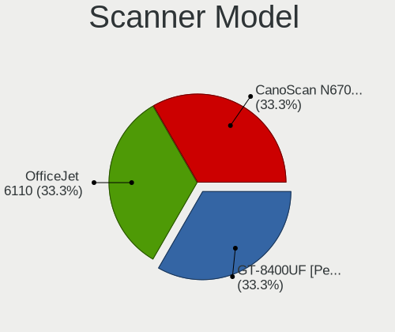

| Model                                              | Computers | Percent |
|----------------------------------------------------|-----------|---------|
| Seiko Epson GT-8400UF [Perfection 1670/1670 PHOTO] | 1         | 33.33%  |
| HP OfficeJet 6110                                  | 1         | 33.33%  |
| Canon CanoScan N670U/N676U/LiDE 20                 | 1         | 33.33%  |

Camera
------

Camera Vendor
-------------

Camera device vendors

| Vendor                                            | Computers | Percent |
|---------------------------------------------------|-----------|---------|
| Chicony Electronics                               | 135       | 16.05%  |
| Microdia                                          | 91        | 10.82%  |
| Realtek Semiconductor                             | 77        | 9.16%   |
| Sunplus Innovation Technology                     | 66        | 7.85%   |
| IMC Networks                                      | 64        | 7.61%   |
| Quanta                                            | 44        | 5.23%   |
| Bison Electronics                                 | 43        | 5.11%   |
| Apple                                             | 37        | 4.4%    |
| Logitech                                          | 32        | 3.8%    |
| Cheng Uei Precision Industry (Foxlink)            | 30        | 3.57%   |
| Syntek                                            | 24        | 2.85%   |
| Lite-On Technology                                | 22        | 2.62%   |
| Samsung Electronics                               | 21        | 2.5%    |
| Suyin                                             | 18        | 2.14%   |
| Microsoft                                         | 16        | 1.9%    |
| Luxvisions Innotech Limited                       | 13        | 1.55%   |
| Acer                                              | 13        | 1.55%   |
| Silicon Motion                                    | 9         | 1.07%   |
| icSpring                                          | 9         | 1.07%   |
| Sonix Technology                                  | 8         | 0.95%   |
| Ricoh                                             | 8         | 0.95%   |
| Alcor Micro                                       | 8         | 0.95%   |
| Primax Electronics                                | 6         | 0.71%   |
| Z-Star Microelectronics                           | 5         | 0.59%   |
| Lenovo                                            | 5         | 0.59%   |
| Importek                                          | 3         | 0.36%   |
| GEMBIRD                                           | 3         | 0.36%   |
| SN0002                                            | 2         | 0.24%   |
| Shine-optics                                      | 2         | 0.24%   |
| OmniVision Technologies                           | 2         | 0.24%   |
| LG Electronics                                    | 2         | 0.24%   |
| ALi                                               | 2         | 0.24%   |
| Y Media                                           | 1         | 0.12%   |
| TASCORP                                           | 1         | 0.12%   |
| Sunwingroup                                       | 1         | 0.12%   |
| SunplusIT                                         | 1         | 0.12%   |
| Sunplus Technology                                | 1         | 0.12%   |
| STMicroelectronics Imaging Division (VLSI Vision) | 1         | 0.12%   |
| Spreadtrum Communications                         | 1         | 0.12%   |
| ShineTech                                         | 1         | 0.12%   |

Camera Model
------------

Camera device models

| Model                                            | Computers | Percent |
|--------------------------------------------------|-----------|---------|
| Microdia Integrated_Webcam_HD                    | 35        | 4.13%   |
| Realtek Integrated_Webcam_HD                     | 26        | 3.07%   |
| Sunplus Integrated_Webcam_HD                     | 23        | 2.72%   |
| Chicony Integrated Camera                        | 23        | 2.72%   |
| Samsung Galaxy series, misc. (MTP mode)          | 20        | 2.36%   |
| IMC Networks USB2.0 VGA UVC WebCam               | 18        | 2.13%   |
| IMC Networks USB2.0 HD UVC WebCam                | 18        | 2.13%   |
| IMC Networks Integrated Camera                   | 15        | 1.77%   |
| Apple iPhone 5/5C/5S/6/SE/7/8/X/XR               | 14        | 1.65%   |
| Microdia Integrated Webcam                       | 13        | 1.53%   |
| Bison Integrated Camera                          | 13        | 1.53%   |
| Apple FaceTime HD Camera (Built-in)              | 11        | 1.3%    |
| Syntek Integrated Camera                         | 10        | 1.18%   |
| Realtek Integrated Webcam                        | 10        | 1.18%   |
| Realtek Integrated Webcam HD                     | 9         | 1.06%   |
| icSpring camera                                  | 9         | 1.06%   |
| Sunplus HD WebCam                                | 8         | 0.94%   |
| Microsoft LifeCam HD-3000                        | 8         | 0.94%   |
| Chicony HD WebCam                                | 8         | 0.94%   |
| Chicony EasyCamera                               | 8         | 0.94%   |
| Syntek EasyCamera                                | 7         | 0.83%   |
| Quanta VGA Webcam                                | 7         | 0.83%   |
| Quanta HP HD Camera                              | 7         | 0.83%   |
| Quanta HD User Facing                            | 7         | 0.83%   |
| Logitech Webcam C270                             | 7         | 0.83%   |
| Chicony HP TrueVision HD Camera                  | 7         | 0.83%   |
| Cheng Uei Precision Industry (Foxlink) Webcam    | 7         | 0.83%   |
| Sonix USB2.0 HD UVC WebCam                       | 6         | 0.71%   |
| Microdia Laptop_Integrated_Webcam_HD             | 6         | 0.71%   |
| Lite-On HP HD Camera                             | 6         | 0.71%   |
| Chicony USB2.0 VGA UVC WebCam                    | 6         | 0.71%   |
| Chicony HP Webcam                                | 6         | 0.71%   |
| Cheng Uei Precision Industry (Foxlink) HP Webcam | 6         | 0.71%   |
| Apple FaceTime HD Camera                         | 6         | 0.71%   |
| Apple Built-in iSight                            | 6         | 0.71%   |
| Sunplus DICOTA 4K                                | 5         | 0.59%   |
| Realtek HP Truevision HD                         | 5         | 0.59%   |
| Quanta HP Wide Vision HD Camera                  | 5         | 0.59%   |
| Quanta HP TrueVision HD Camera                   | 5         | 0.59%   |
| Microdia Sonix USB 2.0 Camera                    | 5         | 0.59%   |

Security
--------

Fingerprint Vendor
------------------

Fingerprint sensor vendors

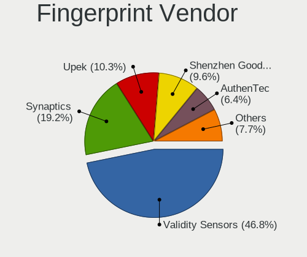

| Vendor                             | Computers | Percent |
|------------------------------------|-----------|---------|
| Validity Sensors                   | 73        | 46.79%  |
| Synaptics                          | 30        | 19.23%  |
| Upek                               | 16        | 10.26%  |
| Shenzhen Goodix Technology         | 15        | 9.62%   |
| AuthenTec                          | 10        | 6.41%   |
| LighTuning Technology              | 6         | 3.85%   |
| Focal-systems.Corp                 | 2         | 1.28%   |
| Elan Microelectronics              | 2         | 1.28%   |
| STMicroelectronics                 | 1         | 0.64%   |
| Realtek USB2.0 Finger Print Bridge | 1         | 0.64%   |

Fingerprint Model
-----------------

Fingerprint sensor models

| Model                                                           | Computers | Percent |
|-----------------------------------------------------------------|-----------|---------|
| Validity Sensors VFS495 Fingerprint Reader                      | 18        | 11.54%  |
| Upek Biometric Touchchip/Touchstrip Fingerprint Sensor          | 14        | 8.97%   |
| Validity Sensors VFS471 Fingerprint Reader                      | 9         | 5.77%   |
| Validity Sensors VFS 5011 fingerprint sensor                    | 9         | 5.77%   |
| Validity Sensors VFS5011 Fingerprint Reader                     | 8         | 5.13%   |
| Shenzhen Goodix Fingerprint Reader                              | 8         | 5.13%   |
| Synaptics FS7604 Touch Fingerprint Sensor with PurePrint        | 7         | 4.49%   |
| Validity Sensors VFS451 Fingerprint Reader                      | 6         | 3.85%   |
| Validity Sensors Synaptics WBDI                                 | 6         | 3.85%   |
| Validity Sensors VFS7500 Touch Fingerprint Sensor               | 4         | 2.56%   |
| Validity Sensors Fingerprint scanner                            | 4         | 2.56%   |
| Synaptics WBDI                                                  | 4         | 2.56%   |
| Synaptics Prometheus MIS Touch Fingerprint Reader               | 4         | 2.56%   |
| Synaptics Fingerprint reader [HP G6]                            | 4         | 2.56%   |
| Shenzhen Goodix  FingerPrint Device                             | 4         | 2.56%   |
| AuthenTec AES2810                                               | 4         | 2.56%   |
| Validity Sensors VFS491                                         | 3         | 1.92%   |
| Validity Sensors Swipe Fingerprint Sensor                       | 3         | 1.92%   |
| Synaptics Metallica MOH Touch Fingerprint Reader                | 3         | 1.92%   |
| Shenzhen Goodix FingerPrint                                     | 3         | 1.92%   |
| LighTuning ES603 Swipe Fingerprint Sensor                       | 3         | 1.92%   |
| AuthenTec AES2501 Fingerprint Sensor                            | 3         | 1.92%   |
| Upek TCS5B Fingerprint sensor                                   | 2         | 1.28%   |
| Synaptics  WBDI                                                 | 2         | 1.28%   |
| Synaptics Metallica MIS Touch Fingerprint Reader                | 2         | 1.28%   |
| Focal-systems.Corp FT9201Fingerprint.                       | 2         | 1.28%   |
| Elan ELAN:ARM-M4                                                | 2         | 1.28%   |
| AuthenTec Fingerprint Sensor                                    | 2         | 1.28%   |
| Validity Sensors VFS7552 Touch Fingerprint Sensor               | 1         | 0.64%   |
| Validity Sensors VFS301 Fingerprint Reader                      | 1         | 0.64%   |
| Validity Sensors VFS300 Fingerprint Reader                      | 1         | 0.64%   |
| Synaptics WBDI Fingerprint Reader USB 102                       | 1         | 0.64%   |
| Synaptics WBDI Fingerprint Reader USB 086                       | 1         | 0.64%   |
| Synaptics UWP WBDI                                              | 1         | 0.64%   |
| Synaptics  FS7604 Touch Fingerprint Sensor with PurePrint       | 1         | 0.64%   |
| STMicroelectronics Fingerprint Reader                           | 1         | 0.64%   |
| Realtek USB2.0 Finger Print Bridge FocalTech Fingerprint Device | 1         | 0.64%   |
| LighTuning Fingerprint Sensor                                   | 1         | 0.64%   |
| LighTuning Fingerprint Reader                                   | 1         | 0.64%   |
| LighTuning EgisTec Touch Fingerprint Sensor                     | 1         | 0.64%   |

Chipcard Vendor
---------------

Chipcard module vendors

| Vendor      | Computers | Percent |
|-------------|-----------|---------|
| Broadcom    | 56        | 70.89%  |
| Alcor Micro | 8         | 10.13%  |
| O2 Micro    | 6         | 7.59%   |
| Lenovo      | 5         | 6.33%   |
| Upek        | 4         | 5.06%   |

Chipcard Model
--------------

Chipcard module models

| Model                                                                        | Computers | Percent |
|------------------------------------------------------------------------------|-----------|---------|
| Broadcom BCM5880 Secure Applications Processor with fingerprint swipe sensor | 18        | 22.78%  |
| Broadcom BCM5880 Secure Applications Processor                               | 16        | 20.25%  |
| Broadcom 5880                                                                | 13        | 16.46%  |
| Broadcom 58200                                                               | 9         | 11.39%  |
| Alcor Micro AU9540 Smartcard Reader                                          | 8         | 10.13%  |
| O2 Micro OZ776 CCID Smartcard Reader                                         | 5         | 6.33%   |
| Lenovo Integrated Smart Card Reader                                          | 5         | 6.33%   |
| Upek TouchChip Fingerprint Coprocessor (WBF advanced mode)                   | 4         | 5.06%   |
| O2 Micro Oz776 SmartCard Reader                                              | 1         | 1.27%   |

Unsupported
-----------

Unsupported Devices
-------------------

Total unsupported devices on board

| Total | Computers | Percent |
|-------|-----------|---------|
| 0     | 986       | 69.19%  |
| 1     | 349       | 24.49%  |
| 2     | 73        | 5.12%   |
| 3     | 12        | 0.84%   |
| 4     | 2         | 0.14%   |
| 9     | 1         | 0.07%   |
| 7     | 1         | 0.07%   |
| 5     | 1         | 0.07%   |

Unsupported Device Types
------------------------

Types of unsupported devices

| Type                     | Computers | Percent |
|--------------------------|-----------|---------|
| Fingerprint reader       | 154       | 28.73%  |
| Graphics card            | 119       | 22.2%   |
| Chipcard                 | 71        | 13.25%  |
| Net/wireless             | 68        | 12.69%  |
| Multimedia controller    | 23        | 4.29%   |
| Communication controller | 23        | 4.29%   |
| Bluetooth                | 16        | 2.99%   |
| Camera                   | 14        | 2.61%   |
| Sound                    | 10        | 1.87%   |
| Storage                  | 8         | 1.49%   |
| Unassigned class         | 6         | 1.12%   |
| Net/ethernet             | 5         | 0.93%   |
| Modem                    | 5         | 0.93%   |
| Network                  | 4         | 0.75%   |
| Card reader              | 4         | 0.75%   |
| Storage/raid             | 3         | 0.56%   |
| Unclassified device      | 1         | 0.19%   |
| Storage/nvme             | 1         | 0.19%   |
| Flash memory             | 1         | 0.19%   |

