Linux in South Korea - Tested Hardware & Statistics
---------------------------------------------------

A project to collect tested hardware configurations for Linux in South Korea.

Anyone can contribute to this report by the [hw-probe](https://github.com/linuxhw/hw-probe) tool:

    sudo -E hw-probe -all -upload

Please contribute! Especially if your hardware is rare.

This is a report for all computer types. See also reports for [desktops](/Location/South_Korea/Desktop/README.md) and [notebooks](/Location/South_Korea/Notebook/README.md).

Contents
--------

* [ Test Cases ](#test-cases)

* [ System ](#system)
  - [ OS                       ](#os)
  - [ OS Family                ](#os-family)
  - [ Kernel                   ](#kernel)
  - [ Kernel Family            ](#kernel-family)
  - [ Kernel Major Ver.        ](#kernel-major-ver)
  - [ Arch                     ](#arch)
  - [ DE                       ](#de)
  - [ Display Server           ](#display-server)
  - [ Display Manager          ](#display-manager)
  - [ OS Lang                  ](#os-lang)
  - [ Boot Mode                ](#boot-mode)
  - [ Filesystem               ](#filesystem)
  - [ Part. scheme             ](#part-scheme)
  - [ Dual Boot with Linux/BSD ](#dual-boot-with-linuxbsd)
  - [ Dual Boot (Win)          ](#dual-boot-win)

* [ Board ](#board)
  - [ Vendor                   ](#vendor)
  - [ Model                    ](#model)
  - [ Model Family             ](#model-family)
  - [ MFG Year                 ](#mfg-year)
  - [ Form Factor              ](#form-factor)
  - [ Secure Boot              ](#secure-boot)
  - [ Coreboot                 ](#coreboot)
  - [ RAM Size                 ](#ram-size)
  - [ RAM Used                 ](#ram-used)
  - [ Total Drives             ](#total-drives)
  - [ Has CD-ROM               ](#has-cd-rom)
  - [ Has Ethernet             ](#has-ethernet)
  - [ Has WiFi                 ](#has-wifi)
  - [ Has Bluetooth            ](#has-bluetooth)

* [ Location ](#location)
  - [ Country                  ](#country)
  - [ City                     ](#city)

* [ Drives ](#drives)
  - [ Drive Vendor             ](#drive-vendor)
  - [ Drive Model              ](#drive-model)
  - [ HDD Vendor               ](#hdd-vendor)
  - [ SSD Vendor               ](#ssd-vendor)
  - [ Drive Kind               ](#drive-kind)
  - [ Drive Connector          ](#drive-connector)
  - [ Drive Size               ](#drive-size)
  - [ Space Total              ](#space-total)
  - [ Space Used               ](#space-used)
  - [ Malfunc. Drives          ](#malfunc-drives)
  - [ Malfunc. Drive Vendor    ](#malfunc-drive-vendor)
  - [ Malfunc. HDD Vendor      ](#malfunc-hdd-vendor)
  - [ Malfunc. Drive Kind      ](#malfunc-drive-kind)
  - [ Failed Drives            ](#failed-drives)
  - [ Failed Drive Vendor      ](#failed-drive-vendor)
  - [ Drive Status             ](#drive-status)

* [ Storage controller ](#storage-controller)
  - [ Storage Vendor           ](#storage-vendor)
  - [ Storage Model            ](#storage-model)
  - [ Storage Kind             ](#storage-kind)

* [ Processor ](#processor)
  - [ CPU Vendor               ](#cpu-vendor)
  - [ CPU Model                ](#cpu-model)
  - [ CPU Model Family         ](#cpu-model-family)
  - [ CPU Cores                ](#cpu-cores)
  - [ CPU Sockets              ](#cpu-sockets)
  - [ CPU Threads              ](#cpu-threads)
  - [ CPU Op-Modes             ](#cpu-op-modes)
  - [ CPU Microcode            ](#cpu-microcode)
  - [ CPU Microarch            ](#cpu-microarch)

* [ Graphics ](#graphics)
  - [ GPU Vendor               ](#gpu-vendor)
  - [ GPU Model                ](#gpu-model)
  - [ GPU Combo                ](#gpu-combo)
  - [ GPU Driver               ](#gpu-driver)
  - [ GPU Memory               ](#gpu-memory)

* [ Monitor ](#monitor)
  - [ Monitor Vendor           ](#monitor-vendor)
  - [ Monitor Model            ](#monitor-model)
  - [ Monitor Resolution       ](#monitor-resolution)
  - [ Monitor Diagonal         ](#monitor-diagonal)
  - [ Monitor Width            ](#monitor-width)
  - [ Aspect Ratio             ](#aspect-ratio)
  - [ Monitor Area             ](#monitor-area)
  - [ Pixel Density            ](#pixel-density)
  - [ Multiple Monitors        ](#multiple-monitors)

* [ Network ](#network)
  - [ Net Controller Vendor    ](#net-controller-vendor)
  - [ Net Controller Model     ](#net-controller-model)
  - [ Wireless Vendor          ](#wireless-vendor)
  - [ Wireless Model           ](#wireless-model)
  - [ Ethernet Vendor          ](#ethernet-vendor)
  - [ Ethernet Model           ](#ethernet-model)
  - [ Net Controller Kind      ](#net-controller-kind)
  - [ Used Controller          ](#used-controller)
  - [ NICs                     ](#nics)
  - [ IPv6                     ](#ipv6)

* [ Bluetooth ](#bluetooth)
  - [ Bluetooth Vendor         ](#bluetooth-vendor)
  - [ Bluetooth Model          ](#bluetooth-model)

* [ Sound ](#sound)
  - [ Sound Vendor             ](#sound-vendor)
  - [ Sound Model              ](#sound-model)

* [ Memory ](#memory)
  - [ Memory Vendor            ](#memory-vendor)
  - [ Memory Model             ](#memory-model)
  - [ Memory Kind              ](#memory-kind)
  - [ Memory Form Factor       ](#memory-form-factor)
  - [ Memory Size              ](#memory-size)
  - [ Memory Speed             ](#memory-speed)

* [ Printers & scanners ](#printers--scanners)
  - [ Printer Vendor           ](#printer-vendor)
  - [ Printer Model            ](#printer-model)
  - [ Scanner Vendor           ](#scanner-vendor)
  - [ Scanner Model            ](#scanner-model)

* [ Camera ](#camera)
  - [ Camera Vendor            ](#camera-vendor)
  - [ Camera Model             ](#camera-model)

* [ Security ](#security)
  - [ Fingerprint Vendor       ](#fingerprint-vendor)
  - [ Fingerprint Model        ](#fingerprint-model)
  - [ Chipcard Vendor          ](#chipcard-vendor)
  - [ Chipcard Model           ](#chipcard-model)

* [ Unsupported ](#unsupported)
  - [ Unsupported Devices      ](#unsupported-devices)
  - [ Unsupported Device Types ](#unsupported-device-types)

Test Cases
----------

Total: 475

| Vendor        | Model                       | Form-Factor | Probe                                                      | Date         |
|---------------|-----------------------------|-------------|------------------------------------------------------------|--------------|
| Alienware     | 0CPDXD A00                  | Desktop     | [17da14a17d](https://linux-hardware.org/?probe=17da14a17d) | May 03, 2022 |
| MSI           | H110M PRO-VD PLUS           | Desktop     | [80bdc044eb](https://linux-hardware.org/?probe=80bdc044eb) | May 01, 2022 |
| Toshiba       | Satellite P50-B-103         | Notebook    | [6df44e9098](https://linux-hardware.org/?probe=6df44e9098) | Apr 29, 2022 |
| Teclast       | tPAD                        | Notebook    | [2b86292373](https://linux-hardware.org/?probe=2b86292373) | Apr 20, 2022 |
| Samsung       | Galaxy Book 12 LTE          | Tablet      | [a4d7160eb9](https://linux-hardware.org/?probe=a4d7160eb9) | Apr 17, 2022 |
| Samsung       | Galaxy Book 12 LTE          | Tablet      | [71624fff28](https://linux-hardware.org/?probe=71624fff28) | Apr 17, 2022 |
| Wolfnfox      | WF-TBAT                     | Notebook    | [7d04cc8361](https://linux-hardware.org/?probe=7d04cc8361) | Apr 13, 2022 |
| Teclast       | tPAD                        | Notebook    | [a9f93e289b](https://linux-hardware.org/?probe=a9f93e289b) | Apr 13, 2022 |
| ASRock        | B550 Phantom Gaming 4       | Desktop     | [9a15614b1e](https://linux-hardware.org/?probe=9a15614b1e) | Apr 13, 2022 |
| Samsung       | Galaxy Book 12 LTE          | Tablet      | [ed880374c4](https://linux-hardware.org/?probe=ed880374c4) | Apr 10, 2022 |
| MECHREVO      | Taitan Series GM7TG0M       | Notebook    | [948d29a218](https://linux-hardware.org/?probe=948d29a218) | Apr 10, 2022 |
| Lenovo        | IdeaPadFlex 5 14ARE05 81... | Convertible | [ccbdd7504c](https://linux-hardware.org/?probe=ccbdd7504c) | Apr 08, 2022 |
| Lenovo        | IdeaPadFlex 5 14ARE05 81... | Convertible | [14b7f50736](https://linux-hardware.org/?probe=14b7f50736) | Apr 08, 2022 |
| Teclast       | tPAD                        | Notebook    | [5eddc816df](https://linux-hardware.org/?probe=5eddc816df) | Apr 07, 2022 |
| HP            | Stream Notebook PC 13       | Notebook    | [1874ac7edf](https://linux-hardware.org/?probe=1874ac7edf) | Apr 03, 2022 |
| MSI           | MAG B660M MORTAR DDR4       | Desktop     | [a9f2820894](https://linux-hardware.org/?probe=a9f2820894) | Apr 02, 2022 |
| Samsung       | 950XCJ/951XCJ/950XCR        | Notebook    | [f22fa67906](https://linux-hardware.org/?probe=f22fa67906) | Apr 01, 2022 |
| HP            | Stream Notebook PC 11       | Notebook    | [8fc09857a6](https://linux-hardware.org/?probe=8fc09857a6) | Apr 01, 2022 |
| Intel         | powered classmate PC        | Notebook    | [8ce4fa1757](https://linux-hardware.org/?probe=8ce4fa1757) | Apr 01, 2022 |
| Samsung       | DT1234567890 SEC_SW_REVI... | Desktop     | [90aa422ea2](https://linux-hardware.org/?probe=90aa422ea2) | Mar 31, 2022 |
| Lenovo        | IdeaPad 5 15IIL05 81YK      | Notebook    | [6c36c54313](https://linux-hardware.org/?probe=6c36c54313) | Mar 31, 2022 |
| Lenovo        | IdeaPad 3 14ALC6 82KT       | Notebook    | [b2e70b8251](https://linux-hardware.org/?probe=b2e70b8251) | Mar 28, 2022 |
| Lenovo        | ThinkPad X1 Carbon Gen 9... | Notebook    | [a8cacc7845](https://linux-hardware.org/?probe=a8cacc7845) | Mar 27, 2022 |
| MSI           | X99A GAMING PRO CARBON      | Desktop     | [fa4526e9f3](https://linux-hardware.org/?probe=fa4526e9f3) | Mar 24, 2022 |
| MSI           | GF75 Thin 9SCXR             | Notebook    | [df19241968](https://linux-hardware.org/?probe=df19241968) | Mar 20, 2022 |
| ECS           | PB02CF                      | Server      | [0600880dba](https://linux-hardware.org/?probe=0600880dba) | Mar 19, 2022 |
| MSI           | GF75 Thin 9SCXR             | Notebook    | [b3458eda8f](https://linux-hardware.org/?probe=b3458eda8f) | Mar 14, 2022 |
| Hardkernel    | Odroid XU4                  | Soc         | [4d5412852b](https://linux-hardware.org/?probe=4d5412852b) | Mar 13, 2022 |
| ASUSTek       | P8H67                       | Desktop     | [05cdb119e9](https://linux-hardware.org/?probe=05cdb119e9) | Mar 07, 2022 |
| Lenovo        | ThinkPad L14 Gen 1 20U5S... | Notebook    | [f86d99b8a1](https://linux-hardware.org/?probe=f86d99b8a1) | Feb 27, 2022 |
| ASUSTek       | ROG Zephyrus G14 GA401QM... | Notebook    | [95ff70277e](https://linux-hardware.org/?probe=95ff70277e) | Feb 24, 2022 |
| Dell          | Inspiron 15 5510            | Notebook    | [bb04a03420](https://linux-hardware.org/?probe=bb04a03420) | Feb 23, 2022 |
| Dell          | Inspiron 15 5510            | Notebook    | [38ad42c186](https://linux-hardware.org/?probe=38ad42c186) | Feb 22, 2022 |
| LG Electro... | 17UD70P-PX76K               | Notebook    | [968b189e38](https://linux-hardware.org/?probe=968b189e38) | Feb 21, 2022 |
| LG Electro... | 17UD70P-PX76K               | Notebook    | [d8f6d95994](https://linux-hardware.org/?probe=d8f6d95994) | Feb 14, 2022 |
| LG Electro... | 17UD70P-PX76K               | Notebook    | [2017e780b7](https://linux-hardware.org/?probe=2017e780b7) | Feb 14, 2022 |
| HANSUNG CO... | EX58                        | Notebook    | [7c2a023530](https://linux-hardware.org/?probe=7c2a023530) | Feb 10, 2022 |
| HP            | Spectre 13 x2 PC            | Notebook    | [ed95e4c1c7](https://linux-hardware.org/?probe=ed95e4c1c7) | Feb 09, 2022 |
| HP            | Spectre 13 x2 PC            | Notebook    | [a597b083c9](https://linux-hardware.org/?probe=a597b083c9) | Feb 08, 2022 |
| Google        | Ampton                      | Notebook    | [0f1564bb4a](https://linux-hardware.org/?probe=0f1564bb4a) | Feb 06, 2022 |
| Apple         | MacBookPro5,3               | Notebook    | [7742fa4642](https://linux-hardware.org/?probe=7742fa4642) | Feb 05, 2022 |
| ASUSTek       | ROG Zephyrus G14 GA401QM... | Notebook    | [65a6ca3880](https://linux-hardware.org/?probe=65a6ca3880) | Feb 05, 2022 |
| ASUSTek       | ROG Zephyrus G14 GA401QM... | Notebook    | [144717a1f1](https://linux-hardware.org/?probe=144717a1f1) | Feb 04, 2022 |
| ASUSTek       | ROG STRIX Z690-A GAMING ... | Desktop     | [14f8855baa](https://linux-hardware.org/?probe=14f8855baa) | Feb 03, 2022 |
| ECS           | PB02CF                      | Server      | [9f7f807004](https://linux-hardware.org/?probe=9f7f807004) | Jan 30, 2022 |
| ECS           | PB02CF                      | Server      | [594030dfa1](https://linux-hardware.org/?probe=594030dfa1) | Jan 30, 2022 |
| HP            | EliteBook 855 G7 Noteboo... | Notebook    | [7f9793a709](https://linux-hardware.org/?probe=7f9793a709) | Jan 29, 2022 |
| Lenovo        | ThinkPad E15 Gen 2 20TD0... | Notebook    | [2c22ac6a5f](https://linux-hardware.org/?probe=2c22ac6a5f) | Jan 25, 2022 |
| ASUSTek       | ROG Zephyrus G14 GA401QM... | Notebook    | [882dab7b0e](https://linux-hardware.org/?probe=882dab7b0e) | Jan 22, 2022 |
| HP            | EliteBook 855 G7 Noteboo... | Notebook    | [c081d60b2a](https://linux-hardware.org/?probe=c081d60b2a) | Jan 22, 2022 |
| HP            | EliteBook 855 G7 Noteboo... | Notebook    | [4a0cf53ae6](https://linux-hardware.org/?probe=4a0cf53ae6) | Jan 22, 2022 |
| Apple         | MacBookPro5,5               | Notebook    | [11d1870f98](https://linux-hardware.org/?probe=11d1870f98) | Jan 21, 2022 |
| LG Electro... | 17UD70P-PX76K               | Notebook    | [d0d21d2892](https://linux-hardware.org/?probe=d0d21d2892) | Jan 18, 2022 |
| LG Electro... | 16ZD90P-GX7LK               | Notebook    | [0870fd8772](https://linux-hardware.org/?probe=0870fd8772) | Dec 29, 2021 |
| Lenovo        | G480 20149                  | Notebook    | [08a0d07d28](https://linux-hardware.org/?probe=08a0d07d28) | Dec 28, 2021 |
| Quanta        | QSSC-98J_C2 31S98MB0040     | Server      | [23e536f087](https://linux-hardware.org/?probe=23e536f087) | Dec 28, 2021 |
| Quanta        | QSSC-98J_C2 31S98MB0040     | Server      | [1f4a9c160f](https://linux-hardware.org/?probe=1f4a9c160f) | Dec 28, 2021 |
| SLIMBOOK      | PROX15-AMD                  | Notebook    | [a8fbe33d19](https://linux-hardware.org/?probe=a8fbe33d19) | Dec 26, 2021 |
| ASUSTek       | PRIME B350M-A               | Desktop     | [7843ddc3fb](https://linux-hardware.org/?probe=7843ddc3fb) | Dec 24, 2021 |
| Samsung       | DT1234567890 SAMSUNG_SW_... | Desktop     | [151434ab61](https://linux-hardware.org/?probe=151434ab61) | Dec 21, 2021 |
| ASUSTek       | VivoBook_ASUSLaptop X521... | Notebook    | [ff620ffdcd](https://linux-hardware.org/?probe=ff620ffdcd) | Dec 07, 2021 |
| ECS           | PB02CF                      | Server      | [ac300533fe](https://linux-hardware.org/?probe=ac300533fe) | Dec 04, 2021 |
| Jooyontech... | J3GP Pro                    | Notebook    | [6f13d68344](https://linux-hardware.org/?probe=6f13d68344) | Dec 04, 2021 |
| LG Electro... | 16ZD90P-GX5LK               | Notebook    | [c7cc850f29](https://linux-hardware.org/?probe=c7cc850f29) | Dec 03, 2021 |
| LG Electro... | 16ZD90P-GX5LK               | Notebook    | [901fdc3726](https://linux-hardware.org/?probe=901fdc3726) | Dec 03, 2021 |
| Lenovo        | 1036 SDK0T76457 WIN 3915... | Desktop     | [f894442edc](https://linux-hardware.org/?probe=f894442edc) | Nov 22, 2021 |
| ASUSTek       | ROG STRIX Z690-A GAMING ... | Desktop     | [4d11bd6b59](https://linux-hardware.org/?probe=4d11bd6b59) | Nov 20, 2021 |
| LG Electro... | 17UD70P-PX76K               | Notebook    | [b4c7522ea3](https://linux-hardware.org/?probe=b4c7522ea3) | Nov 15, 2021 |
| Samsung       | 950QDA                      | Convertible | [45d49f2001](https://linux-hardware.org/?probe=45d49f2001) | Nov 13, 2021 |
| LG Electro... | 15Z990-HA50K                | Notebook    | [6f5255e0f2](https://linux-hardware.org/?probe=6f5255e0f2) | Nov 01, 2021 |
| HP            | EliteBook 855 G7 Noteboo... | Notebook    | [70074ebee1](https://linux-hardware.org/?probe=70074ebee1) | Nov 01, 2021 |
| ASUSTek       | X556URK                     | Notebook    | [212240b258](https://linux-hardware.org/?probe=212240b258) | Oct 29, 2021 |
| LG Electro... | 17ZD90P-GX7LK               | Notebook    | [23aa2c83ae](https://linux-hardware.org/?probe=23aa2c83ae) | Oct 27, 2021 |
| Intel         | NUC11PABi7 K90104-303       | Mini pc     | [0279a35638](https://linux-hardware.org/?probe=0279a35638) | Oct 27, 2021 |
| ASUSTek       | PRIME B350M-A               | Desktop     | [19eba77c24](https://linux-hardware.org/?probe=19eba77c24) | Oct 25, 2021 |
| ASUSTek       | VivoBook 15_ASUS Laptop ... | Notebook    | [2f6634b953](https://linux-hardware.org/?probe=2f6634b953) | Oct 22, 2021 |
| ASUSTek       | VivoBook 15_ASUS Laptop ... | Notebook    | [fb8b55960a](https://linux-hardware.org/?probe=fb8b55960a) | Oct 20, 2021 |
| ASRock        | M3A770DE                    | Desktop     | [4d966dec54](https://linux-hardware.org/?probe=4d966dec54) | Oct 03, 2021 |
| ASRock        | M3A770DE                    | Desktop     | [de6577e71a](https://linux-hardware.org/?probe=de6577e71a) | Oct 03, 2021 |
| Lenovo        | ThinkPad W530 24475HU       | Notebook    | [b8973b3b0a](https://linux-hardware.org/?probe=b8973b3b0a) | Oct 02, 2021 |
| Samsung       | 950XCJ/951XCJ/950XCR        | Notebook    | [e93b95fc3c](https://linux-hardware.org/?probe=e93b95fc3c) | Sep 30, 2021 |
| Samsung       | 950XDB/951XDB/950XDY        | Notebook    | [fbc7a613a6](https://linux-hardware.org/?probe=fbc7a613a6) | Sep 29, 2021 |
| HANSUNG CO... | TFX4150H                    | Notebook    | [11f2fbef85](https://linux-hardware.org/?probe=11f2fbef85) | Sep 29, 2021 |
| ASUSTek       | U36JC                       | Notebook    | [c6e87f1fb7](https://linux-hardware.org/?probe=c6e87f1fb7) | Sep 23, 2021 |
| Samsung       | DT_DM500T8A SAMSUNG_SW_R... | Desktop     | [23cf6f38e8](https://linux-hardware.org/?probe=23cf6f38e8) | Sep 21, 2021 |
| Samsung       | 730QCJ/730QCR               | Notebook    | [54cd6887df](https://linux-hardware.org/?probe=54cd6887df) | Sep 21, 2021 |
| Clevo         | M740T/M760T                 | Notebook    | [7731b8340f](https://linux-hardware.org/?probe=7731b8340f) | Sep 17, 2021 |
| Samsung       | 400B4C/400B5C/200B4C/200... | Notebook    | [581ab7ecde](https://linux-hardware.org/?probe=581ab7ecde) | Sep 17, 2021 |
| LG Electro... | 16TD90P-GX56K               | Convertible | [448fe0cf6a](https://linux-hardware.org/?probe=448fe0cf6a) | Sep 11, 2021 |
| ECS           | PB02CF                      | Server      | [6aeb74b9f1](https://linux-hardware.org/?probe=6aeb74b9f1) | Sep 03, 2021 |
| ASRock        | AB350M Pro4                 | Desktop     | [24de612862](https://linux-hardware.org/?probe=24de612862) | Aug 31, 2021 |
| HP            | Pavilion Laptop 15z-eh00... | Notebook    | [33233b370e](https://linux-hardware.org/?probe=33233b370e) | Aug 30, 2021 |
| LG Electro... | 14Z90N-VA76K                | Notebook    | [df36a7a61c](https://linux-hardware.org/?probe=df36a7a61c) | Aug 22, 2021 |
| ASUSTek       | Z170-A                      | Desktop     | [3abd60af90](https://linux-hardware.org/?probe=3abd60af90) | Aug 22, 2021 |
| Lenovo        | XiaoXin Air 13IWL 81J8      | Notebook    | [e68dfe0824](https://linux-hardware.org/?probe=e68dfe0824) | Aug 19, 2021 |
| Apple         | MacBookPro15,2              | Notebook    | [c722c00c56](https://linux-hardware.org/?probe=c722c00c56) | Aug 18, 2021 |
| ASUSTek       | ASUS TUF Gaming F15 FX50... | Notebook    | [e47beb0587](https://linux-hardware.org/?probe=e47beb0587) | Aug 11, 2021 |
| ASUSTek       | ASUS TUF Gaming F15 FX50... | Notebook    | [e7997203d4](https://linux-hardware.org/?probe=e7997203d4) | Aug 11, 2021 |
| SLIMBOOK      | PROX15-AMD                  | Notebook    | [3147760301](https://linux-hardware.org/?probe=3147760301) | Aug 07, 2021 |
| ASUSTek       | Z170-A                      | Desktop     | [e523ad86d2](https://linux-hardware.org/?probe=e523ad86d2) | Aug 02, 2021 |
| Dell          | XPS 13 7390                 | Notebook    | [901bcb991b](https://linux-hardware.org/?probe=901bcb991b) | Jul 31, 2021 |
| MSI           | B450 GAMING PRO CARBON M... | Desktop     | [1e96b02bf3](https://linux-hardware.org/?probe=1e96b02bf3) | Jul 28, 2021 |
| LG Electro... | 17UD70P-PX76K               | Notebook    | [dc6d809e73](https://linux-hardware.org/?probe=dc6d809e73) | Jul 23, 2021 |
| LG Electro... | 17UD70P-PX76K               | Notebook    | [c0869b1919](https://linux-hardware.org/?probe=c0869b1919) | Jul 23, 2021 |
| ASUSTek       | P5QL/EPU                    | Desktop     | [972c061d3c](https://linux-hardware.org/?probe=972c061d3c) | Jul 22, 2021 |
| Gigabyte      | Z390 D                      | Desktop     | [8bf86066a5](https://linux-hardware.org/?probe=8bf86066a5) | Jul 22, 2021 |
| Chuwi         | LarkBox Pro                 | Desktop     | [4c15433f48](https://linux-hardware.org/?probe=4c15433f48) | Jul 21, 2021 |
| HP            | OMEN by HP Laptop           | Notebook    | [2392366002](https://linux-hardware.org/?probe=2392366002) | Jul 16, 2021 |
| Dell          | 04WYPY A04                  | Server      | [3199a22608](https://linux-hardware.org/?probe=3199a22608) | Jul 15, 2021 |
| ASUSTek       | P5QL/EPU                    | Desktop     | [6dcf33d186](https://linux-hardware.org/?probe=6dcf33d186) | Jul 14, 2021 |
| HP            | 3397                        | Desktop     | [b9b07bdc0a](https://linux-hardware.org/?probe=b9b07bdc0a) | Jul 09, 2021 |
| Raspberry ... | Raspberry Pi 4 Model B R... | Soc         | [ae45f90535](https://linux-hardware.org/?probe=ae45f90535) | Jul 05, 2021 |
| Pine Micro... | Pine64 Pinebook Pro         | Notebook    | [fd48c4cd51](https://linux-hardware.org/?probe=fd48c4cd51) | Jul 02, 2021 |
| Pine Micro... | Pine64 Pinebook Pro         | Notebook    | [81ccc0c89d](https://linux-hardware.org/?probe=81ccc0c89d) | Jun 29, 2021 |
| Lenovo        | 14ARE05 81X2                | Convertible | [3cd1b703c4](https://linux-hardware.org/?probe=3cd1b703c4) | Jun 28, 2021 |
| Pine Micro... | Pine64 Pinebook Pro         | Notebook    | [d2f1ec957f](https://linux-hardware.org/?probe=d2f1ec957f) | Jun 27, 2021 |
| ASRockRack    | WC621D8A-2T                 | Desktop     | [d9c47162dc](https://linux-hardware.org/?probe=d9c47162dc) | Jun 25, 2021 |
| ASRockRack    | WC621D8A-2T                 | Desktop     | [b568edaa5e](https://linux-hardware.org/?probe=b568edaa5e) | Jun 25, 2021 |
| Lenovo        | ThinkPad E14 Gen 2 20TAS... | Notebook    | [9c2b77b3c6](https://linux-hardware.org/?probe=9c2b77b3c6) | Jun 24, 2021 |
| Lenovo        | ThinkPad E14 Gen 2 20TAS... | Notebook    | [99b25335b3](https://linux-hardware.org/?probe=99b25335b3) | Jun 22, 2021 |
| WB            | J3160                       | Desktop     | [88c472d69e](https://linux-hardware.org/?probe=88c472d69e) | Jun 18, 2021 |
| WB            | J3160                       | Desktop     | [b889890a54](https://linux-hardware.org/?probe=b889890a54) | Jun 11, 2021 |
| MSI           | GF63 Thin 9SC               | Notebook    | [98faadcfa3](https://linux-hardware.org/?probe=98faadcfa3) | Jun 10, 2021 |
| Raspberry ... | Raspberry Pi 3 Model B R... | Soc         | [a19b25100c](https://linux-hardware.org/?probe=a19b25100c) | Jun 08, 2021 |
| Gigabyte      | B75M-D3V                    | Desktop     | [9aaad9b2d4](https://linux-hardware.org/?probe=9aaad9b2d4) | Jun 07, 2021 |
| Samsung       | 500R4K/500R5H/5400RK/501... | Notebook    | [5742c8e4e5](https://linux-hardware.org/?probe=5742c8e4e5) | May 28, 2021 |
| ECS           | A320AM4-M3D/3.x/5.x         | Desktop     | [be07a70b2e](https://linux-hardware.org/?probe=be07a70b2e) | May 27, 2021 |
| Lenovo        | G500 20236                  | Notebook    | [2aca6cd805](https://linux-hardware.org/?probe=2aca6cd805) | May 27, 2021 |
| Dell          | Latitude E6400              | Notebook    | [2a4c5f6eec](https://linux-hardware.org/?probe=2a4c5f6eec) | May 25, 2021 |
| Samsung       | R440/R480                   | Notebook    | [777c05d80b](https://linux-hardware.org/?probe=777c05d80b) | May 19, 2021 |
| Lenovo        | Legion 5 Pro 16ACH6H 82J... | Notebook    | [15a742842f](https://linux-hardware.org/?probe=15a742842f) | May 16, 2021 |
| ASUSTek       | VivoBook_ASUSLaptop X415... | Notebook    | [f3cb68f8cf](https://linux-hardware.org/?probe=f3cb68f8cf) | May 13, 2021 |
| HP            | EliteBook 8540p (WQ983PA... | Notebook    | [28b1df49ae](https://linux-hardware.org/?probe=28b1df49ae) | May 11, 2021 |
| Chuwi         | LarkBox Pro                 | Desktop     | [3d6a52dd8e](https://linux-hardware.org/?probe=3d6a52dd8e) | May 11, 2021 |
| Chuwi         | LarkBox Pro                 | Desktop     | [c77a0ae517](https://linux-hardware.org/?probe=c77a0ae517) | May 11, 2021 |
| Intel         | NUC7i7BNB J31145-309        | Mini pc     | [a9245eb585](https://linux-hardware.org/?probe=a9245eb585) | May 11, 2021 |
| ASUSTek       | P5QL/EPU                    | Desktop     | [965bc51c8d](https://linux-hardware.org/?probe=965bc51c8d) | May 06, 2021 |
| Lenovo        | ThinkPad Edge E145 20BC0... | Notebook    | [035481a413](https://linux-hardware.org/?probe=035481a413) | May 05, 2021 |
| ASRock        | A75M-ITX                    | Desktop     | [1ad3e30eec](https://linux-hardware.org/?probe=1ad3e30eec) | May 03, 2021 |
| HP            | EliteBook 855 G7 Noteboo... | Notebook    | [473f17b0f1](https://linux-hardware.org/?probe=473f17b0f1) | May 01, 2021 |
| LG Electro... | 15ND530-GX30K               | Notebook    | [9d700ce0b6](https://linux-hardware.org/?probe=9d700ce0b6) | Apr 30, 2021 |
| HP            | EliteBook 855 G7 Noteboo... | Notebook    | [84f31a5fd7](https://linux-hardware.org/?probe=84f31a5fd7) | Apr 28, 2021 |
| Chuwi         | LarkBox Pro                 | Desktop     | [167aa11de4](https://linux-hardware.org/?probe=167aa11de4) | Apr 26, 2021 |
| Chuwi         | LarkBox Pro                 | Desktop     | [7de0a8dd63](https://linux-hardware.org/?probe=7de0a8dd63) | Apr 24, 2021 |
| Gigabyte      | A320M-S2H-CF                | Desktop     | [72d14b2ed7](https://linux-hardware.org/?probe=72d14b2ed7) | Apr 23, 2021 |
| Lenovo        | ThinkPad Edge E145 20BC0... | Notebook    | [410e4fd232](https://linux-hardware.org/?probe=410e4fd232) | Apr 22, 2021 |
| Gigabyte      | A320M-S2H-CF                | Desktop     | [2300013263](https://linux-hardware.org/?probe=2300013263) | Apr 18, 2021 |
| HP            | Stream Notebook PC 13       | Notebook    | [0bf3f6f761](https://linux-hardware.org/?probe=0bf3f6f761) | Apr 15, 2021 |
| ASRock        | FM2A88M-HD+ R2.0            | Desktop     | [fdac2fa1fd](https://linux-hardware.org/?probe=fdac2fa1fd) | Apr 14, 2021 |
| ASUSTek       | P8H67                       | Desktop     | [b17bb9b31a](https://linux-hardware.org/?probe=b17bb9b31a) | Apr 12, 2021 |
| ASRock        | AB350 Pro4                  | Desktop     | [a0686a3f62](https://linux-hardware.org/?probe=a0686a3f62) | Apr 11, 2021 |
| ASRock        | AB350 Pro4                  | Desktop     | [7e77253d59](https://linux-hardware.org/?probe=7e77253d59) | Apr 11, 2021 |
| SLIMBOOK      | PROX15-AMD                  | Notebook    | [c5e7a3d16e](https://linux-hardware.org/?probe=c5e7a3d16e) | Apr 09, 2021 |
| Notebook      | NL5xRU                      | Notebook    | [7cac175bde](https://linux-hardware.org/?probe=7cac175bde) | Apr 07, 2021 |
| Gigabyte      | 945GCMX-S2                  | Desktop     | [d4399ab9d0](https://linux-hardware.org/?probe=d4399ab9d0) | Apr 06, 2021 |
| SLIMBOOK      | PROX15-AMD                  | Notebook    | [51931e3821](https://linux-hardware.org/?probe=51931e3821) | Apr 05, 2021 |
| Samsung       | 270E5J/2570EJ               | Notebook    | [b36716f462](https://linux-hardware.org/?probe=b36716f462) | Apr 02, 2021 |
| Samsung       | 400B4B/400B5B/200B4B/200... | Notebook    | [af785987c5](https://linux-hardware.org/?probe=af785987c5) | Mar 29, 2021 |
| LG Electro... | Z435-GE40K                  | Notebook    | [41dfc50f20](https://linux-hardware.org/?probe=41dfc50f20) | Mar 27, 2021 |
| Samsung       | DT_DM500T8A SAMSUNG_SW_R... | Desktop     | [dccf080cd2](https://linux-hardware.org/?probe=dccf080cd2) | Mar 26, 2021 |
| Lenovo        | ThinkPad 10 20C1001VKR      | Tablet      | [9b7a2a3d3b](https://linux-hardware.org/?probe=9b7a2a3d3b) | Mar 25, 2021 |
| Samsung       | DT_DM500T8A SAMSUNG_SW_R... | Desktop     | [b55dc75624](https://linux-hardware.org/?probe=b55dc75624) | Mar 20, 2021 |
| Gigabyte      | B360M DS3H                  | Desktop     | [f7740321e0](https://linux-hardware.org/?probe=f7740321e0) | Mar 18, 2021 |
| MSI           | B75MA-E33                   | Desktop     | [e459ded47c](https://linux-hardware.org/?probe=e459ded47c) | Mar 10, 2021 |
| Alienware     | m15 R4                      | Notebook    | [33977ceca8](https://linux-hardware.org/?probe=33977ceca8) | Mar 08, 2021 |
| Notebook      | W330SU2                     | Notebook    | [e5e71a4e94](https://linux-hardware.org/?probe=e5e71a4e94) | Mar 05, 2021 |
| Dell          | Inspiron 5590               | Notebook    | [94e3d38a99](https://linux-hardware.org/?probe=94e3d38a99) | Mar 04, 2021 |
| ASUSTek       | PRIME Z490-A                | Desktop     | [15c42588c8](https://linux-hardware.org/?probe=15c42588c8) | Mar 04, 2021 |
| ASUSTek       | WS X299 SAGE                | Desktop     | [541a436664](https://linux-hardware.org/?probe=541a436664) | Mar 02, 2021 |
| ASRock        | H110M-HDVP2                 | Desktop     | [8e6128682d](https://linux-hardware.org/?probe=8e6128682d) | Feb 28, 2021 |
| ASRock        | H110M-HDVP2                 | Desktop     | [778fcc3093](https://linux-hardware.org/?probe=778fcc3093) | Feb 28, 2021 |
| Gigabyte      | B75M-D3H                    | Desktop     | [774a5efd77](https://linux-hardware.org/?probe=774a5efd77) | Feb 25, 2021 |
| Gigabyte      | AB350-Gaming 3-CF           | Desktop     | [8dd1ebdfb8](https://linux-hardware.org/?probe=8dd1ebdfb8) | Feb 25, 2021 |
| Notebook      | N650DU                      | Notebook    | [beef9a4540](https://linux-hardware.org/?probe=beef9a4540) | Feb 24, 2021 |
| Raspberry ... | Raspberry Pi                | Soc         | [7ffa9ae08a](https://linux-hardware.org/?probe=7ffa9ae08a) | Feb 17, 2021 |
| MSI           | B450M MORTAR MAX            | Desktop     | [a222f11ebf](https://linux-hardware.org/?probe=a222f11ebf) | Feb 09, 2021 |
| ECS           | PB02CF                      | Server      | [598d43b1f2](https://linux-hardware.org/?probe=598d43b1f2) | Feb 08, 2021 |
| ASUSTek       | PRIME B350M-A               | Desktop     | [0de61d3d11](https://linux-hardware.org/?probe=0de61d3d11) | Feb 06, 2021 |
| ASUSTek       | Z170-A                      | Desktop     | [65aa2efd23](https://linux-hardware.org/?probe=65aa2efd23) | Feb 05, 2021 |
| ASRock        | H110M-HDVP2                 | Desktop     | [27d324f7e1](https://linux-hardware.org/?probe=27d324f7e1) | Feb 04, 2021 |
| Lenovo        | Yoga 6 13ARE05 82FN         | Convertible | [fc703c19dd](https://linux-hardware.org/?probe=fc703c19dd) | Feb 02, 2021 |
| Lenovo        | Yoga 6 13ARE05 82FN         | Convertible | [ba5f1e074b](https://linux-hardware.org/?probe=ba5f1e074b) | Feb 02, 2021 |
| Chuwi         | LarkBox Pro                 | Desktop     | [ff50ed3542](https://linux-hardware.org/?probe=ff50ed3542) | Feb 01, 2021 |
| MSI           | B360M PRO-VDH               | Desktop     | [59b7bd58df](https://linux-hardware.org/?probe=59b7bd58df) | Jan 30, 2021 |
| MSI           | Z490-A PRO                  | Desktop     | [a29449d114](https://linux-hardware.org/?probe=a29449d114) | Jan 27, 2021 |
| ECS           | PB02CF                      | Server      | [4c644b0fa9](https://linux-hardware.org/?probe=4c644b0fa9) | Jan 26, 2021 |
| ECS           | PB02CF                      | Server      | [264b38c3a0](https://linux-hardware.org/?probe=264b38c3a0) | Jan 26, 2021 |
| MSI           | Z490-A PRO                  | Desktop     | [9595d4107b](https://linux-hardware.org/?probe=9595d4107b) | Jan 26, 2021 |
| sunxi         | Unknown                     | Soc         | [49e15041c4](https://linux-hardware.org/?probe=49e15041c4) | Jan 26, 2021 |
| HP            | Pavilion dv3                | Notebook    | [d563465019](https://linux-hardware.org/?probe=d563465019) | Jan 23, 2021 |
| ASRock        | B450M Steel Legend          | Desktop     | [a6226b7401](https://linux-hardware.org/?probe=a6226b7401) | Jan 20, 2021 |
| HP            | Pavilion dv3                | Notebook    | [7140d63f79](https://linux-hardware.org/?probe=7140d63f79) | Jan 16, 2021 |
| LG Electro... | 13Z940-MF6BL                | Notebook    | [ee9f312333](https://linux-hardware.org/?probe=ee9f312333) | Jan 16, 2021 |
| ECS           | PB02CF                      | Server      | [79ed88ad12](https://linux-hardware.org/?probe=79ed88ad12) | Jan 13, 2021 |
| Samsung       | DT1234567890 SEC_SW_REVI... | Desktop     | [ffa2d06213](https://linux-hardware.org/?probe=ffa2d06213) | Jan 05, 2021 |
| Lenovo        | ThinkPad X1 Carbon Gen 8... | Notebook    | [28d2ddf944](https://linux-hardware.org/?probe=28d2ddf944) | Jan 04, 2021 |
| HP            | 18E7                        | Desktop     | [e9590ba71a](https://linux-hardware.org/?probe=e9590ba71a) | Jan 01, 2021 |
| LG Electro... | 10T370-L860K                | Tablet      | [a6ab074bb5](https://linux-hardware.org/?probe=a6ab074bb5) | Jan 01, 2021 |
| LG Electro... | 10T370-L860K                | Tablet      | [7a21765d3b](https://linux-hardware.org/?probe=7a21765d3b) | Jan 01, 2021 |
| ASUSTek       | TUF Gaming FA706II_FA706... | Notebook    | [cbc872e471](https://linux-hardware.org/?probe=cbc872e471) | Dec 29, 2020 |
| HANSUNG CO... | TFX5470H                    | Notebook    | [4f038027ac](https://linux-hardware.org/?probe=4f038027ac) | Dec 27, 2020 |
| HANSUNG CO... | TFX5470H                    | Notebook    | [659c45927e](https://linux-hardware.org/?probe=659c45927e) | Dec 26, 2020 |
| Chuwi         | LarkBox Pro                 | Desktop     | [deb549d3e1](https://linux-hardware.org/?probe=deb549d3e1) | Dec 21, 2020 |
| Chuwi         | LarkBox Pro                 | Desktop     | [4245e53af4](https://linux-hardware.org/?probe=4245e53af4) | Dec 20, 2020 |
| ASUSTek       | PRIME B250M-A               | Desktop     | [77ad294d93](https://linux-hardware.org/?probe=77ad294d93) | Dec 20, 2020 |
| HP            | Pavilion g6                 | Notebook    | [9b2e1ccb17](https://linux-hardware.org/?probe=9b2e1ccb17) | Dec 15, 2020 |
| HP            | Pavilion g6                 | Notebook    | [01bd113f0d](https://linux-hardware.org/?probe=01bd113f0d) | Dec 15, 2020 |
| MSI           | PS42 Modern 8MO             | Notebook    | [c469679bd0](https://linux-hardware.org/?probe=c469679bd0) | Dec 14, 2020 |
| MSI           | B360M PRO-VDH               | Desktop     | [ae9a14bb34](https://linux-hardware.org/?probe=ae9a14bb34) | Dec 11, 2020 |
| MSI           | B360M PRO-VDH               | Desktop     | [1fd0be2128](https://linux-hardware.org/?probe=1fd0be2128) | Dec 11, 2020 |
| ASUSTek       | PRIME B250M-A               | Desktop     | [befbda84f5](https://linux-hardware.org/?probe=befbda84f5) | Dec 11, 2020 |
| HP            | ProBook 635 Aero G7 Note... | Notebook    | [9ff7890a24](https://linux-hardware.org/?probe=9ff7890a24) | Dec 11, 2020 |
| Gigabyte      | C621-SU8 M18818             | Server      | [7e93e1b694](https://linux-hardware.org/?probe=7e93e1b694) | Dec 11, 2020 |
| Gigabyte      | C621-SU8 M18818             | Server      | [6343846b09](https://linux-hardware.org/?probe=6343846b09) | Dec 11, 2020 |
| ASUSTek       | PRIME B250M-PLUS            | Desktop     | [b1476b4c51](https://linux-hardware.org/?probe=b1476b4c51) | Dec 09, 2020 |
| ASUSTek       | PRIME B250M-A               | Desktop     | [a8b824f9f6](https://linux-hardware.org/?probe=a8b824f9f6) | Dec 09, 2020 |
| Samsung       | 760XBE                      | Notebook    | [7b117d1e93](https://linux-hardware.org/?probe=7b117d1e93) | Dec 08, 2020 |
| Samsung       | R440/R480                   | Notebook    | [2c57659a41](https://linux-hardware.org/?probe=2c57659a41) | Dec 06, 2020 |
| ASRock        | H81M-DGS R2.0               | Desktop     | [a706242b44](https://linux-hardware.org/?probe=a706242b44) | Dec 05, 2020 |
| MSI           | B360M PRO-VDH               | Desktop     | [f16f5d30de](https://linux-hardware.org/?probe=f16f5d30de) | Dec 05, 2020 |
| ASUSTek       | PRIME B250M-A               | Desktop     | [425fda9034](https://linux-hardware.org/?probe=425fda9034) | Dec 04, 2020 |
| ASUSTek       | P8B75-M LX PLUS             | Desktop     | [e6f9b2cf07](https://linux-hardware.org/?probe=e6f9b2cf07) | Dec 04, 2020 |
| Acer          | Swift SF314-54              | Notebook    | [e387afac15](https://linux-hardware.org/?probe=e387afac15) | Nov 29, 2020 |
| Lenovo        | IdeaPad L340-15IWL 81LG     | Notebook    | [b6570c8388](https://linux-hardware.org/?probe=b6570c8388) | Nov 28, 2020 |
| Apple         | MacBookPro10,1              | Notebook    | [ecfaa7232b](https://linux-hardware.org/?probe=ecfaa7232b) | Nov 28, 2020 |
| HP            | EliteBook 840 G1            | Notebook    | [eb842cd3c4](https://linux-hardware.org/?probe=eb842cd3c4) | Nov 25, 2020 |
| HP            | EliteBook 840 G1            | Notebook    | [2a9cc167d3](https://linux-hardware.org/?probe=2a9cc167d3) | Nov 25, 2020 |
| ASRock        | B85M Pro4                   | Desktop     | [0354f4d9bc](https://linux-hardware.org/?probe=0354f4d9bc) | Nov 25, 2020 |
| Lenovo        | ThinkPad T14 Gen 1 20UDS... | Notebook    | [05a70db99a](https://linux-hardware.org/?probe=05a70db99a) | Nov 22, 2020 |
| ASRock        | B85M Pro4                   | Desktop     | [8dcc7ce213](https://linux-hardware.org/?probe=8dcc7ce213) | Nov 22, 2020 |
| Gigabyte      | H97M-D3H                    | Desktop     | [f9b97f5918](https://linux-hardware.org/?probe=f9b97f5918) | Nov 22, 2020 |
| Samsung       | R59P/R60P/R61P              | Notebook    | [e4a465ff4c](https://linux-hardware.org/?probe=e4a465ff4c) | Nov 15, 2020 |
| Samsung       | R59P/R60P/R61P              | Notebook    | [8a39cadb17](https://linux-hardware.org/?probe=8a39cadb17) | Nov 14, 2020 |
| ECS           | G31T-M7                     | Desktop     | [f93ce4415e](https://linux-hardware.org/?probe=f93ce4415e) | Nov 12, 2020 |
| PC Partner... | A236 0A                     | Desktop     | [14030da2e5](https://linux-hardware.org/?probe=14030da2e5) | Nov 10, 2020 |
| PC Partner... | A236 0A                     | Desktop     | [fc118d784c](https://linux-hardware.org/?probe=fc118d784c) | Nov 10, 2020 |
| ASUSTek       | P7P55D                      | Desktop     | [11e315efbd](https://linux-hardware.org/?probe=11e315efbd) | Nov 07, 2020 |
| Samsung       | SX11S                       | Notebook    | [7946db3be4](https://linux-hardware.org/?probe=7946db3be4) | Nov 05, 2020 |
| ASRock        | H81M-DGS R2.0               | Desktop     | [9b33944102](https://linux-hardware.org/?probe=9b33944102) | Nov 04, 2020 |
| Samsung       | 930QAA                      | Convertible | [ed50ef80ea](https://linux-hardware.org/?probe=ed50ef80ea) | Nov 01, 2020 |
| Lenovo        | ThinkPad T580 20L9S06H00    | Notebook    | [4cda554e60](https://linux-hardware.org/?probe=4cda554e60) | Oct 31, 2020 |
| Samsung       | 930QAA                      | Convertible | [e0defd416b](https://linux-hardware.org/?probe=e0defd416b) | Oct 31, 2020 |
| LG Electro... | 14ZB990-GP70ML              | Notebook    | [7184b7e890](https://linux-hardware.org/?probe=7184b7e890) | Oct 29, 2020 |
| HANSUNG CO... | TFX5470H                    | Notebook    | [7a0c7ef25d](https://linux-hardware.org/?probe=7a0c7ef25d) | Oct 22, 2020 |
| ECS           | PB02CF                      | Server      | [d2a218790a](https://linux-hardware.org/?probe=d2a218790a) | Oct 18, 2020 |
| ASUSTek       | EX-A320M-GAMING             | Desktop     | [39cc53a5e3](https://linux-hardware.org/?probe=39cc53a5e3) | Oct 13, 2020 |
| ECS           | PB02CF                      | Server      | [872240bfee](https://linux-hardware.org/?probe=872240bfee) | Oct 12, 2020 |
| Lenovo        | IdeaPad L340-15IWL 81LG     | Notebook    | [7f2d533ddf](https://linux-hardware.org/?probe=7f2d533ddf) | Oct 12, 2020 |
| ASUSTek       | VivoBook_ASUSLaptop X403... | Notebook    | [57c9a2fdbb](https://linux-hardware.org/?probe=57c9a2fdbb) | Oct 12, 2020 |
| Acer          | Aspire A514-52              | Notebook    | [151c57e477](https://linux-hardware.org/?probe=151c57e477) | Oct 11, 2020 |
| ECS           | PB02CF                      | Server      | [ee5e0d54ac](https://linux-hardware.org/?probe=ee5e0d54ac) | Oct 10, 2020 |
| ECS           | PB02CF                      | Server      | [2584572329](https://linux-hardware.org/?probe=2584572329) | Oct 10, 2020 |
| ECS           | PB02CF                      | Server      | [9ff606fe05](https://linux-hardware.org/?probe=9ff606fe05) | Oct 09, 2020 |
| ECS           | PB02CF                      | Server      | [f65e182cc8](https://linux-hardware.org/?probe=f65e182cc8) | Oct 09, 2020 |
| Lenovo        | ThinkPad E595 20NFS01P00    | Notebook    | [5cce7e56d5](https://linux-hardware.org/?probe=5cce7e56d5) | Oct 02, 2020 |
| MSI           | MS-16F1                     | Notebook    | [94a744ecb7](https://linux-hardware.org/?probe=94a744ecb7) | Oct 01, 2020 |
| Samsung       | DT1234567890 SEC_SW_REVI... | Desktop     | [3aba059c2c](https://linux-hardware.org/?probe=3aba059c2c) | Sep 24, 2020 |
| Samsung       | DT1234567890 SEC_SW_REVI... | Desktop     | [c535500f86](https://linux-hardware.org/?probe=c535500f86) | Sep 24, 2020 |
| ASRock        | H310M-STX/COM               | Desktop     | [5b22b538ee](https://linux-hardware.org/?probe=5b22b538ee) | Sep 23, 2020 |
| MSI           | GE75 Raider 10SF            | Notebook    | [c5f31d8ff8](https://linux-hardware.org/?probe=c5f31d8ff8) | Sep 21, 2020 |
| MSI           | GE75 Raider 10SF            | Notebook    | [80b54a584c](https://linux-hardware.org/?probe=80b54a584c) | Sep 21, 2020 |
| ASUSTek       | VivoBook_ASUSLaptop X409... | Notebook    | [335490808b](https://linux-hardware.org/?probe=335490808b) | Sep 18, 2020 |
| ASUSTek       | VivoBook_ASUSLaptop X409... | Notebook    | [611b4d4515](https://linux-hardware.org/?probe=611b4d4515) | Sep 12, 2020 |
| Samsung       | SX11S                       | Notebook    | [748c8347e7](https://linux-hardware.org/?probe=748c8347e7) | Sep 10, 2020 |
| Samsung       | SX11S                       | Notebook    | [de5f3f5244](https://linux-hardware.org/?probe=de5f3f5244) | Sep 10, 2020 |
| ASUSTek       | P5LD2                       | Desktop     | [56efa94b22](https://linux-hardware.org/?probe=56efa94b22) | Sep 09, 2020 |
| ASUSTek       | P5LD2                       | Desktop     | [00f5eba2ea](https://linux-hardware.org/?probe=00f5eba2ea) | Sep 09, 2020 |
| Lenovo        | IdeaPad Flex 5 14ARE05 8... | Convertible | [e9eb75e83c](https://linux-hardware.org/?probe=e9eb75e83c) | Sep 09, 2020 |
| Gigabyte      | B75M-D3H                    | Desktop     | [934bb9c2ef](https://linux-hardware.org/?probe=934bb9c2ef) | Sep 09, 2020 |
| ASRock        | H310CM-HDV                  | Desktop     | [7acf41575b](https://linux-hardware.org/?probe=7acf41575b) | Sep 09, 2020 |
| ASRock        | H81M-HDS                    | Desktop     | [8b55873fbd](https://linux-hardware.org/?probe=8b55873fbd) | Sep 07, 2020 |
| Dell          | XPS 15 7590                 | Notebook    | [0ed21172b2](https://linux-hardware.org/?probe=0ed21172b2) | Sep 07, 2020 |
| HP            | Laptop 14s-cf1xxx           | Notebook    | [56e8c74784](https://linux-hardware.org/?probe=56e8c74784) | Sep 05, 2020 |
| ECS           | PB02CF                      | Server      | [4d1eeeaddd](https://linux-hardware.org/?probe=4d1eeeaddd) | Sep 05, 2020 |
| Lenovo        | ThinkPad T410s 2912AJ7      | Notebook    | [5b29fd8262](https://linux-hardware.org/?probe=5b29fd8262) | Sep 05, 2020 |
| HP            | Laptop 15s-du0xxx           | Notebook    | [226702f09a](https://linux-hardware.org/?probe=226702f09a) | Sep 05, 2020 |
| LG Electro... | 15ND530-GX30K               | Notebook    | [8f8a5ce10c](https://linux-hardware.org/?probe=8f8a5ce10c) | Sep 04, 2020 |
| Foxconn       | H61MXE                      | Desktop     | [7a31014e98](https://linux-hardware.org/?probe=7a31014e98) | Sep 04, 2020 |
| ECS           | PB02CF                      | Server      | [4d441244a7](https://linux-hardware.org/?probe=4d441244a7) | Sep 03, 2020 |
| Lenovo        | ThinkPad X390 20SCCTO1WW    | Notebook    | [765a0cde4c](https://linux-hardware.org/?probe=765a0cde4c) | Sep 03, 2020 |
| ECS           | PB02CF                      | Server      | [b144fed957](https://linux-hardware.org/?probe=b144fed957) | Sep 03, 2020 |
| HP            | Laptop 15s-du0xxx           | Notebook    | [2ef3a6b6c8](https://linux-hardware.org/?probe=2ef3a6b6c8) | Sep 03, 2020 |
| Acer          | Swift SF315-41              | Notebook    | [c57a2c8249](https://linux-hardware.org/?probe=c57a2c8249) | Aug 26, 2020 |
| LG Electro... | A520-DEHRK                  | Notebook    | [33e6f6950c](https://linux-hardware.org/?probe=33e6f6950c) | Aug 20, 2020 |
| LG Electro... | ZD360-GD30K                 | Notebook    | [5f695a5cfd](https://linux-hardware.org/?probe=5f695a5cfd) | Aug 19, 2020 |
| ASUSTek       | EX-A320M-GAMING             | Desktop     | [4eb75f039b](https://linux-hardware.org/?probe=4eb75f039b) | Aug 17, 2020 |
| Lenovo        | ThinkPad L420 7829AZ2       | Notebook    | [af5c485d91](https://linux-hardware.org/?probe=af5c485d91) | Aug 17, 2020 |
| ASUSTek       | UX31E                       | Notebook    | [107d53bd73](https://linux-hardware.org/?probe=107d53bd73) | Aug 14, 2020 |
| Lenovo        | ThinkPad Edge E440 20C50... | Notebook    | [e2a554e507](https://linux-hardware.org/?probe=e2a554e507) | Aug 11, 2020 |
| Lenovo        | ThinkServer TS140           | Desktop     | [03abb9daf3](https://linux-hardware.org/?probe=03abb9daf3) | Aug 11, 2020 |
| Lenovo        | ThinkServer TS140           | Desktop     | [2d296ca69c](https://linux-hardware.org/?probe=2d296ca69c) | Aug 11, 2020 |
| ASUSTek       | TUF Gaming FA506II_FA506... | Notebook    | [4657a3e758](https://linux-hardware.org/?probe=4657a3e758) | Aug 11, 2020 |
| Lenovo        | ThinkPad T420s 417429U      | Notebook    | [a0cc9e062e](https://linux-hardware.org/?probe=a0cc9e062e) | Aug 09, 2020 |
| ECS           | PB02CF                      | Server      | [33178d1c59](https://linux-hardware.org/?probe=33178d1c59) | Aug 07, 2020 |
| ECS           | PB02CF                      | Server      | [cd56dfc842](https://linux-hardware.org/?probe=cd56dfc842) | Aug 07, 2020 |
| MSI           | GX60 3CC                    | Notebook    | [dabfcf887e](https://linux-hardware.org/?probe=dabfcf887e) | Aug 05, 2020 |
| ASUSTek       | TUF Gaming FA506II_FA506... | Notebook    | [806b0f6ffc](https://linux-hardware.org/?probe=806b0f6ffc) | Aug 04, 2020 |
| ASUSTek       | TUF Gaming FA506II_FA506... | Notebook    | [03dcb81800](https://linux-hardware.org/?probe=03dcb81800) | Aug 04, 2020 |
| Nvidia        | Tegra                       | Soc         | [db3eb249a1](https://linux-hardware.org/?probe=db3eb249a1) | Aug 02, 2020 |
| Nvidia        | Tegra                       | Soc         | [ce759d1ef8](https://linux-hardware.org/?probe=ce759d1ef8) | Aug 02, 2020 |
| LG Electro... | 14ZB990-GP70ML              | Notebook    | [953e68f29d](https://linux-hardware.org/?probe=953e68f29d) | Jul 29, 2020 |
| ASRock        | H61M-HVGS                   | Desktop     | [36c19012ed](https://linux-hardware.org/?probe=36c19012ed) | Jul 25, 2020 |
| ASRock        | H61M-HVGS                   | Desktop     | [ea9287adc1](https://linux-hardware.org/?probe=ea9287adc1) | Jul 25, 2020 |
| Samsung       | X120/X170/X171              | Notebook    | [d52c424e0f](https://linux-hardware.org/?probe=d52c424e0f) | Jul 12, 2020 |
| MSI           | PS63 Modern 8RC             | Notebook    | [1f2f8bb2cf](https://linux-hardware.org/?probe=1f2f8bb2cf) | Jul 06, 2020 |
| MSI           | PS63 Modern 8RC             | Notebook    | [ed2dc1f4eb](https://linux-hardware.org/?probe=ed2dc1f4eb) | Jul 05, 2020 |
| MSI           | GX60 3CC                    | Notebook    | [2f08b59774](https://linux-hardware.org/?probe=2f08b59774) | Jul 04, 2020 |
| Sony          | SVF1421ESGW                 | Notebook    | [025b1a05fe](https://linux-hardware.org/?probe=025b1a05fe) | Jun 29, 2020 |
| ASRock        | Z390 Taichi                 | Desktop     | [ce94a11d8b](https://linux-hardware.org/?probe=ce94a11d8b) | Jun 26, 2020 |
| Huanan        | X99-F8                      | Desktop     | [74f9976527](https://linux-hardware.org/?probe=74f9976527) | Jun 25, 2020 |
| Gigabyte      | X570 GAMING X               | Desktop     | [cbd4390e56](https://linux-hardware.org/?probe=cbd4390e56) | Jun 23, 2020 |
| ASUSTek       | X553SA                      | Notebook    | [de56d8fe26](https://linux-hardware.org/?probe=de56d8fe26) | Jun 23, 2020 |
| ASRock        | Z390 Taichi                 | Desktop     | [6989759d9c](https://linux-hardware.org/?probe=6989759d9c) | Jun 21, 2020 |
| ASRock        | Z390M Pro4                  | Desktop     | [eb53bb80ea](https://linux-hardware.org/?probe=eb53bb80ea) | Jun 20, 2020 |
| ECS           | H81H3-MV                    | Desktop     | [d39e7a605d](https://linux-hardware.org/?probe=d39e7a605d) | Jun 20, 2020 |
| Foxconn       | G41MXE/G41MXE-K             | Desktop     | [c05f965fec](https://linux-hardware.org/?probe=c05f965fec) | Jun 17, 2020 |
| Foxconn       | G41MXE/G41MXE-K             | Desktop     | [835aa152dd](https://linux-hardware.org/?probe=835aa152dd) | Jun 16, 2020 |
| Sony          | SVF1421ESGW                 | Notebook    | [4f39af6dde](https://linux-hardware.org/?probe=4f39af6dde) | Jun 16, 2020 |
| MSI           | GX60 3CC                    | Notebook    | [41702d8f8c](https://linux-hardware.org/?probe=41702d8f8c) | Jun 14, 2020 |
| MSI           | GX60 3CC                    | Notebook    | [16345ce4e3](https://linux-hardware.org/?probe=16345ce4e3) | Jun 14, 2020 |
| Sony          | SVF1421ESGW                 | Notebook    | [227366301a](https://linux-hardware.org/?probe=227366301a) | Jun 14, 2020 |
| TG            | NXI-A7000 Series            | Notebook    | [20018e6c2a](https://linux-hardware.org/?probe=20018e6c2a) | Jun 07, 2020 |
| Dell          | G3 3579                     | Notebook    | [f21ec2528f](https://linux-hardware.org/?probe=f21ec2528f) | Jun 06, 2020 |
| ECS           | PB02CF                      | Server      | [e4fe65609d](https://linux-hardware.org/?probe=e4fe65609d) | May 28, 2020 |
| ECS           | PB02CF                      | Server      | [277941a55d](https://linux-hardware.org/?probe=277941a55d) | May 27, 2020 |
| Lenovo        | ThinkPad E495 20NES0WU00    | Notebook    | [bd7072c5e9](https://linux-hardware.org/?probe=bd7072c5e9) | May 27, 2020 |
| HP            | Laptop 15-db1xxx            | Notebook    | [229612b5fa](https://linux-hardware.org/?probe=229612b5fa) | May 26, 2020 |
| HP            | Laptop 15-db1xxx            | Notebook    | [c37804b895](https://linux-hardware.org/?probe=c37804b895) | May 25, 2020 |
| ECS           | PB02CF                      | Server      | [14e3571dfb](https://linux-hardware.org/?probe=14e3571dfb) | May 24, 2020 |
| LG Electro... | 17UD790-PX76K               | Notebook    | [ac4f8e9cc6](https://linux-hardware.org/?probe=ac4f8e9cc6) | May 24, 2020 |
| ECS           | PB02CF                      | Server      | [bd3a0de957](https://linux-hardware.org/?probe=bd3a0de957) | May 24, 2020 |
| LG Electro... | 17UD790-PX76K               | Notebook    | [9bb4fea940](https://linux-hardware.org/?probe=9bb4fea940) | May 24, 2020 |
| HP            | Laptop 15-db1xxx            | Notebook    | [65f85ef8e9](https://linux-hardware.org/?probe=65f85ef8e9) | May 20, 2020 |
| Lenovo        | IdeaPad 3 15IIL05 81WE      | Notebook    | [b3a561d5db](https://linux-hardware.org/?probe=b3a561d5db) | May 20, 2020 |
| Unknown       | Unknown                     | Desktop     | [e6e0a356a2](https://linux-hardware.org/?probe=e6e0a356a2) | May 19, 2020 |
| MSI           | Prestige 15 A10SC           | Notebook    | [69c9f3bce6](https://linux-hardware.org/?probe=69c9f3bce6) | May 17, 2020 |
| Gigabyte      | Z390 AORUS PRO WIFI-CF      | Desktop     | [e526204afd](https://linux-hardware.org/?probe=e526204afd) | May 16, 2020 |
| Samsung       | 570Z5E/580Z5E               | Notebook    | [435579b481](https://linux-hardware.org/?probe=435579b481) | May 16, 2020 |
| ASUSTek       | P5B-Deluxe                  | Desktop     | [24ce1a41e9](https://linux-hardware.org/?probe=24ce1a41e9) | May 16, 2020 |
| Samsung       | 570Z5E/580Z5E               | Notebook    | [5e2ed0ac77](https://linux-hardware.org/?probe=5e2ed0ac77) | May 16, 2020 |
| LG Electro... | 14ZB990-GP70ML              | Notebook    | [dc05f2344d](https://linux-hardware.org/?probe=dc05f2344d) | May 16, 2020 |
| Lenovo        | ThinkPad 8 20BNA00GKR       | Tablet      | [344a9c1bfa](https://linux-hardware.org/?probe=344a9c1bfa) | May 14, 2020 |
| HP            | 158A                        | Desktop     | [344194646f](https://linux-hardware.org/?probe=344194646f) | May 14, 2020 |
| Samsung       | 530U3BI/530U4BI/530U4BH     | Notebook    | [5919a15425](https://linux-hardware.org/?probe=5919a15425) | May 11, 2020 |
| Gigabyte      | GA-MA785GT-UD3H             | Desktop     | [d5b8f91a79](https://linux-hardware.org/?probe=d5b8f91a79) | May 10, 2020 |
| Lenovo        | ThinkPad 8 20BNA00GKR       | Tablet      | [7ed1106322](https://linux-hardware.org/?probe=7ed1106322) | May 09, 2020 |
| Gigabyte      | B150M-D3H-CF                | Desktop     | [c259824b35](https://linux-hardware.org/?probe=c259824b35) | May 09, 2020 |
| ASRock        | X470 Taichi                 | Desktop     | [261241bb2f](https://linux-hardware.org/?probe=261241bb2f) | May 07, 2020 |
| Biostar       | H61MH                       | Desktop     | [aacc6bcb68](https://linux-hardware.org/?probe=aacc6bcb68) | May 07, 2020 |
| Gigabyte      | H81M-DS2V                   | Desktop     | [36cbf906a0](https://linux-hardware.org/?probe=36cbf906a0) | May 07, 2020 |
| Lenovo        | ThinkPad X220 4290P39       | Notebook    | [1b5c469306](https://linux-hardware.org/?probe=1b5c469306) | May 02, 2020 |
| Gigabyte      | B75M-D3V                    | Desktop     | [a4130d0549](https://linux-hardware.org/?probe=a4130d0549) | Apr 29, 2020 |
| ASRock        | G31M-S                      | Desktop     | [6a55997759](https://linux-hardware.org/?probe=6a55997759) | Apr 28, 2020 |
| Dell          | XPS 15 7590                 | Notebook    | [0bbf773840](https://linux-hardware.org/?probe=0bbf773840) | Apr 27, 2020 |
| Dell          | XPS 15 7590                 | Notebook    | [5348bea534](https://linux-hardware.org/?probe=5348bea534) | Apr 27, 2020 |
| Lenovo        | ThinkPad X230 2325KZ5       | Notebook    | [150d9801f0](https://linux-hardware.org/?probe=150d9801f0) | Apr 21, 2020 |
| ASUSTek       | B85M-G                      | Desktop     | [5d58ef4cec](https://linux-hardware.org/?probe=5d58ef4cec) | Apr 19, 2020 |
| Lenovo        | ThinkPad E495 20NES0WU00    | Notebook    | [fb49bbe9f1](https://linux-hardware.org/?probe=fb49bbe9f1) | Apr 18, 2020 |
| Lenovo        | ThinkPad 8 20BNA00GKR       | Tablet      | [aa72454483](https://linux-hardware.org/?probe=aa72454483) | Apr 16, 2020 |
| Dell          | Latitude D630               | Notebook    | [0540c0a191](https://linux-hardware.org/?probe=0540c0a191) | Apr 15, 2020 |
| ASUSTek       | Rampage V EXTREME           | Desktop     | [a78c0430fb](https://linux-hardware.org/?probe=a78c0430fb) | Apr 15, 2020 |
| ASUSTek       | Rampage V EXTREME           | Desktop     | [6e7470b8c3](https://linux-hardware.org/?probe=6e7470b8c3) | Apr 15, 2020 |
| HP            | Pavilion Gaming Notebook    | Notebook    | [4d5a5a3a34](https://linux-hardware.org/?probe=4d5a5a3a34) | Apr 14, 2020 |
| MSI           | B250M PRO-VD                | Desktop     | [d797379451](https://linux-hardware.org/?probe=d797379451) | Apr 13, 2020 |
| LG Electro... | 15U340-LT1FK                | Tablet      | [b78bd157c9](https://linux-hardware.org/?probe=b78bd157c9) | Apr 12, 2020 |
| LG Electro... | 15U340-LT1FK                | Tablet      | [29cad9bafb](https://linux-hardware.org/?probe=29cad9bafb) | Apr 12, 2020 |
| Gigabyte      | TRX40 AORUS XTREME          | Desktop     | [0f078bd16f](https://linux-hardware.org/?probe=0f078bd16f) | Apr 11, 2020 |
| Dell          | 0Y2MRG A01                  | Desktop     | [053b33bcbc](https://linux-hardware.org/?probe=053b33bcbc) | Apr 05, 2020 |
| ASUSTek       | P5K                         | Desktop     | [8ec1f94a9f](https://linux-hardware.org/?probe=8ec1f94a9f) | Apr 05, 2020 |
| ASUSTek       | H110M-F                     | Desktop     | [c5861fb518](https://linux-hardware.org/?probe=c5861fb518) | Mar 31, 2020 |
| LG Electro... | R490-KR6WK                  | Notebook    | [b0c23e23f7](https://linux-hardware.org/?probe=b0c23e23f7) | Mar 21, 2020 |
| ASUSTek       | PRIME A320M-K               | Desktop     | [b3782f0e54](https://linux-hardware.org/?probe=b3782f0e54) | Mar 20, 2020 |
| ASUSTek       | ROG STRIX X399-E GAMING     | Desktop     | [c54c1dcc2f](https://linux-hardware.org/?probe=c54c1dcc2f) | Mar 18, 2020 |
| Gigabyte      | X570 I AORUS PRO WIFI       | Desktop     | [de7d898371](https://linux-hardware.org/?probe=de7d898371) | Mar 16, 2020 |
| Hanis         | Rugged86H                   | Tablet      | [f85527148f](https://linux-hardware.org/?probe=f85527148f) | Mar 16, 2020 |
| Hanis         | Rugged86H                   | Tablet      | [9526ed2d93](https://linux-hardware.org/?probe=9526ed2d93) | Mar 16, 2020 |
| ECS           | PB02CF                      | Server      | [68979eba8f](https://linux-hardware.org/?probe=68979eba8f) | Mar 15, 2020 |
| ECS           | PB02CF                      | Server      | [351516c86f](https://linux-hardware.org/?probe=351516c86f) | Mar 14, 2020 |
| ECS           | PB02CF                      | Server      | [fc1afc7ed7](https://linux-hardware.org/?probe=fc1afc7ed7) | Mar 12, 2020 |
| HP            | Pavilion dv7                | Notebook    | [61bbb3da8a](https://linux-hardware.org/?probe=61bbb3da8a) | Mar 12, 2020 |
| ECS           | PB02CF                      | Server      | [9d62420812](https://linux-hardware.org/?probe=9d62420812) | Mar 09, 2020 |
| ASRock        | FM2A88M-HD+ R3.0            | Desktop     | [b5def2acfb](https://linux-hardware.org/?probe=b5def2acfb) | Mar 03, 2020 |
| ECS           | H61H2-MV                    | Desktop     | [ca363a8ddc](https://linux-hardware.org/?probe=ca363a8ddc) | Mar 03, 2020 |
| ECS           | H61H2-MV                    | Desktop     | [2b56d27ead](https://linux-hardware.org/?probe=2b56d27ead) | Mar 02, 2020 |
| ECS           | H61H2-MV                    | Desktop     | [8b42886c6f](https://linux-hardware.org/?probe=8b42886c6f) | Mar 02, 2020 |
| ECS           | PB02CF                      | Server      | [6062caaaab](https://linux-hardware.org/?probe=6062caaaab) | Mar 01, 2020 |
| ECS           | PB02CF                      | Server      | [901afb7935](https://linux-hardware.org/?probe=901afb7935) | Mar 01, 2020 |
| ASUSTek       | P8H61-MX R2.0               | Desktop     | [fd4e08618e](https://linux-hardware.org/?probe=fd4e08618e) | Feb 28, 2020 |
| ECS           | PB02CF                      | Server      | [8553d515a9](https://linux-hardware.org/?probe=8553d515a9) | Feb 27, 2020 |
| LG Electro... | A505-K.AFC4L                | Notebook    | [33b72b423b](https://linux-hardware.org/?probe=33b72b423b) | Feb 26, 2020 |
| ECS           | PB02CF                      | Server      | [7b029b9193](https://linux-hardware.org/?probe=7b029b9193) | Feb 25, 2020 |
| ECS           | PB02CF                      | Server      | [82e1b966c4](https://linux-hardware.org/?probe=82e1b966c4) | Feb 25, 2020 |
| ECS           | PB02CF                      | Server      | [c81fd255b8](https://linux-hardware.org/?probe=c81fd255b8) | Feb 25, 2020 |
| ECS           | PB02CF                      | Server      | [e0f22a80ac](https://linux-hardware.org/?probe=e0f22a80ac) | Feb 22, 2020 |
| ECS           | PB02CF                      | Server      | [ecb71b8742](https://linux-hardware.org/?probe=ecb71b8742) | Feb 22, 2020 |
| ECS           | PB02CF                      | Server      | [855276d27c](https://linux-hardware.org/?probe=855276d27c) | Feb 22, 2020 |
| Toshiba       | Satellite L655              | Notebook    | [8212e2eb65](https://linux-hardware.org/?probe=8212e2eb65) | Feb 13, 2020 |
| MSI           | Prestige 14 A10SC           | Notebook    | [00af81dd32](https://linux-hardware.org/?probe=00af81dd32) | Feb 12, 2020 |
| MSI           | Prestige 14 A10SC           | Notebook    | [dac2e1709e](https://linux-hardware.org/?probe=dac2e1709e) | Feb 12, 2020 |
| MSI           | B350M MORTAR                | Desktop     | [9496a3ac2c](https://linux-hardware.org/?probe=9496a3ac2c) | Feb 10, 2020 |
| LattePanda    | Alpha                       | Desktop     | [eb27db2005](https://linux-hardware.org/?probe=eb27db2005) | Feb 01, 2020 |
| LattePanda    | Alpha                       | Desktop     | [72a1cd44a0](https://linux-hardware.org/?probe=72a1cd44a0) | Feb 01, 2020 |
| MSI           | GF63 Thin 9SC               | Notebook    | [47b9bc192c](https://linux-hardware.org/?probe=47b9bc192c) | Jan 29, 2020 |
| Nvidia        | Tegra                       | Soc         | [7d929b52dc](https://linux-hardware.org/?probe=7d929b52dc) | Jan 29, 2020 |
| MSI           | GF63 Thin 9SC               | Notebook    | [21dbcd5aca](https://linux-hardware.org/?probe=21dbcd5aca) | Jan 28, 2020 |
| Lenovo        | IdeaPad L340-15IWL 81LG     | Notebook    | [6515ce1c97](https://linux-hardware.org/?probe=6515ce1c97) | Jan 23, 2020 |
| Lenovo        | ThinkPad X1 Yoga 4th 20Q... | Convertible | [3f4a3ca42f](https://linux-hardware.org/?probe=3f4a3ca42f) | Jan 19, 2020 |
| MSI           | B350M MORTAR                | Desktop     | [f53a75b96e](https://linux-hardware.org/?probe=f53a75b96e) | Jan 10, 2020 |
| ASUSTek       | P5B-PLUS Series             | Desktop     | [b0a90d8478](https://linux-hardware.org/?probe=b0a90d8478) | Jan 02, 2020 |
| HP            | ProBook 453                 | Notebook    | [ad3d1ff0fc](https://linux-hardware.org/?probe=ad3d1ff0fc) | Dec 27, 2019 |
| ASUSTek       | PRIME A320M-K               | Desktop     | [2fb35125e3](https://linux-hardware.org/?probe=2fb35125e3) | Dec 22, 2019 |
| Lenovo        | ThinkPad E565 20EYA007KD    | Notebook    | [c1c9dd614a](https://linux-hardware.org/?probe=c1c9dd614a) | Dec 17, 2019 |
| HP            | Laptop 14s-cf1xxx           | Notebook    | [61765ee913](https://linux-hardware.org/?probe=61765ee913) | Dec 11, 2019 |
| HP            | Laptop 14s-cf1xxx           | Notebook    | [fa008b24fc](https://linux-hardware.org/?probe=fa008b24fc) | Dec 11, 2019 |
| Gigabyte      | 945GM-S2                    | Desktop     | [c6b23ec021](https://linux-hardware.org/?probe=c6b23ec021) | Dec 07, 2019 |
| HP            | Pavilion 15                 | Notebook    | [5f9b510e87](https://linux-hardware.org/?probe=5f9b510e87) | Oct 28, 2019 |
| ECS           | H81H3-M4                    | Desktop     | [2a11653db0](https://linux-hardware.org/?probe=2a11653db0) | Oct 05, 2019 |
| ASUSTek       | PRIME H310M-R R2.0          | Desktop     | [37c348afcc](https://linux-hardware.org/?probe=37c348afcc) | Sep 11, 2019 |
| MSI           | MS-1675                     | Notebook    | [c5bf6f209a](https://linux-hardware.org/?probe=c5bf6f209a) | Sep 07, 2019 |
| MSI           | MS-1675                     | Notebook    | [be1db420ea](https://linux-hardware.org/?probe=be1db420ea) | Sep 07, 2019 |
| Hanis         | RuggedPadY16                | Tablet      | [70f839c5cb](https://linux-hardware.org/?probe=70f839c5cb) | Sep 04, 2019 |
| AMI           | Cherry Trail CR             | Notebook    | [caaebe3071](https://linux-hardware.org/?probe=caaebe3071) | Sep 01, 2019 |
| AMI           | Cherry Trail CR             | Notebook    | [5637a7d5ca](https://linux-hardware.org/?probe=5637a7d5ca) | Sep 01, 2019 |
| ASUSTek       | T101HA                      | Tablet      | [b08e9c4371](https://linux-hardware.org/?probe=b08e9c4371) | Aug 31, 2019 |
| Lenovo        | U41-70 80JV                 | Notebook    | [0af65c15a0](https://linux-hardware.org/?probe=0af65c15a0) | Aug 30, 2019 |
| ECS           | G41T-M6                     | Desktop     | [91cafa3b5b](https://linux-hardware.org/?probe=91cafa3b5b) | Aug 30, 2019 |
| Gigabyte      | H81M-DS2V                   | Desktop     | [68069aeff1](https://linux-hardware.org/?probe=68069aeff1) | Aug 21, 2019 |
| IMUZ          | StormBook 15                | Notebook    | [daf3b9ea48](https://linux-hardware.org/?probe=daf3b9ea48) | Aug 07, 2019 |
| Supermicro    | X11DPG-OT-CPU               | Server      | [8e73f804f5](https://linux-hardware.org/?probe=8e73f804f5) | Jul 16, 2019 |
| ASRock        | Z390 Extreme4               | Desktop     | [8c8af8b557](https://linux-hardware.org/?probe=8c8af8b557) | Jul 13, 2019 |
| ASRock        | AB350M Pro4                 | Desktop     | [88354e515f](https://linux-hardware.org/?probe=88354e515f) | Jul 08, 2019 |
| ASRock        | AB350M Pro4                 | Desktop     | [7506cb2993](https://linux-hardware.org/?probe=7506cb2993) | Jul 08, 2019 |
| Gigabyte      | GA-MA790FX-DS5              | Desktop     | [727b2b7099](https://linux-hardware.org/?probe=727b2b7099) | Jun 27, 2019 |
| AMD           | R690A-M2T                   | Desktop     | [da36474b90](https://linux-hardware.org/?probe=da36474b90) | Jun 18, 2019 |
| Gigabyte      | AB350M-DS2-CF               | Desktop     | [553908ddb3](https://linux-hardware.org/?probe=553908ddb3) | Jun 09, 2019 |
| ASUSTek       | PRIME X399-A                | Desktop     | [ae94045380](https://linux-hardware.org/?probe=ae94045380) | May 29, 2019 |
| Lenovo        | NO DPK                      | Desktop     | [b89b8c9364](https://linux-hardware.org/?probe=b89b8c9364) | May 27, 2019 |
| Samsung       | 800G5M/800G5W               | Notebook    | [01cb2e9401](https://linux-hardware.org/?probe=01cb2e9401) | May 22, 2019 |
| HP            | Laptop 15-db1xxx            | Notebook    | [e318a9dac5](https://linux-hardware.org/?probe=e318a9dac5) | May 10, 2019 |
| ASRock        | H61M-DGS                    | Desktop     | [6dc8ccd0f6](https://linux-hardware.org/?probe=6dc8ccd0f6) | May 08, 2019 |
| Sony          | VPCEA36FK                   | Notebook    | [6c4b2a047b](https://linux-hardware.org/?probe=6c4b2a047b) | May 01, 2019 |
| Foxconn       | P35A01                      | Desktop     | [f2685edfa8](https://linux-hardware.org/?probe=f2685edfa8) | Apr 21, 2019 |
| Dell          | Inspiron 7559               | Notebook    | [fb5730a29c](https://linux-hardware.org/?probe=fb5730a29c) | Apr 17, 2019 |
| Apple         | MacBookPro14,1              | Notebook    | [606c70c0db](https://linux-hardware.org/?probe=606c70c0db) | Apr 15, 2019 |
| Dell          | Inspiron 7570               | Notebook    | [f46c9c93f9](https://linux-hardware.org/?probe=f46c9c93f9) | Apr 12, 2019 |
| Dell          | Inspiron 7570               | Notebook    | [e1c522656b](https://linux-hardware.org/?probe=e1c522656b) | Apr 12, 2019 |
| ASUSTek       | Z170-A                      | Desktop     | [322d76fe62](https://linux-hardware.org/?probe=322d76fe62) | Apr 04, 2019 |
| ASUSTek       | Z170-A                      | Desktop     | [0fa2f9b10a](https://linux-hardware.org/?probe=0fa2f9b10a) | Apr 04, 2019 |
| Samsung       | 905S3G/906S3G/915S3G        | Notebook    | [8e21d7bf0c](https://linux-hardware.org/?probe=8e21d7bf0c) | Mar 30, 2019 |
| ASUSTek       | PRIME B450M-A               | Desktop     | [45f363040f](https://linux-hardware.org/?probe=45f363040f) | Mar 30, 2019 |
| Lenovo        | ThinkPad P52s 20LBCTO1WW    | Notebook    | [ed9f709e73](https://linux-hardware.org/?probe=ed9f709e73) | Feb 20, 2019 |
| HP            | ProLiant DL380 Gen9         | Server      | [c9d389b2a3](https://linux-hardware.org/?probe=c9d389b2a3) | Jan 26, 2019 |
| ASRock        | P55 Pro                     | Desktop     | [041e899a1b](https://linux-hardware.org/?probe=041e899a1b) | Jan 15, 2019 |
| Gigabyte      | H55M-S2V                    | Desktop     | [36d1703d67](https://linux-hardware.org/?probe=36d1703d67) | Dec 23, 2018 |
| Samsung       | RC420/RC520/RC720           | Notebook    | [4a0abda7de](https://linux-hardware.org/?probe=4a0abda7de) | Dec 14, 2018 |
| LattePanda    | Alpha                       | Desktop     | [287f0d8110](https://linux-hardware.org/?probe=287f0d8110) | Nov 27, 2018 |
| LattePanda    | Alpha                       | Desktop     | [37c9db1d31](https://linux-hardware.org/?probe=37c9db1d31) | Nov 27, 2018 |
| AVERATEC      | 6600                        | Notebook    | [a55a983b35](https://linux-hardware.org/?probe=a55a983b35) | Nov 11, 2018 |
| AVERATEC      | 6600                        | Notebook    | [2e00f4cfb7](https://linux-hardware.org/?probe=2e00f4cfb7) | Nov 11, 2018 |
| AVERATEC      | 6600                        | Notebook    | [1468b0feb4](https://linux-hardware.org/?probe=1468b0feb4) | Nov 11, 2018 |
| AVERATEC      | 6600                        | Notebook    | [0fde97aed4](https://linux-hardware.org/?probe=0fde97aed4) | Nov 11, 2018 |
| AVERATEC      | 6600                        | Notebook    | [8ca54d992c](https://linux-hardware.org/?probe=8ca54d992c) | Nov 11, 2018 |
| Dell          | XPS 15 9560                 | Notebook    | [d5d9e2cef1](https://linux-hardware.org/?probe=d5d9e2cef1) | Nov 04, 2018 |
| LG Electro... | R510                        | Notebook    | [f7b3f1d4a5](https://linux-hardware.org/?probe=f7b3f1d4a5) | Oct 13, 2018 |
| Gigabyte      | P55-US3L                    | Desktop     | [e216d60f26](https://linux-hardware.org/?probe=e216d60f26) | Sep 19, 2018 |
| Gigabyte      | B75M-D3H                    | Desktop     | [08f9437e06](https://linux-hardware.org/?probe=08f9437e06) | Jul 10, 2018 |
| Gigabyte      | H110-D3A-CF                 | Desktop     | [16f456428f](https://linux-hardware.org/?probe=16f456428f) | May 10, 2018 |
| Gigabyte      | H110-D3A-CF                 | Desktop     | [2afffa7e4e](https://linux-hardware.org/?probe=2afffa7e4e) | May 10, 2018 |
| ECS           | A55F2-M3                    | Desktop     | [e4af897158](https://linux-hardware.org/?probe=e4af897158) | May 10, 2018 |
| Gigabyte      | H110-D3A-CF                 | Desktop     | [66b0fe56e5](https://linux-hardware.org/?probe=66b0fe56e5) | May 10, 2018 |
| Gigabyte      | H110-D3A-CF                 | Desktop     | [f3036847e4](https://linux-hardware.org/?probe=f3036847e4) | May 10, 2018 |
| ECS           | A55F2-M3                    | Desktop     | [5a5647b388](https://linux-hardware.org/?probe=5a5647b388) | May 10, 2018 |
| ECS           | A55F2-M3                    | Desktop     | [eb58cea516](https://linux-hardware.org/?probe=eb58cea516) | May 10, 2018 |
| ASRock        | G41M-VS3                    | Desktop     | [18d59d7ea8](https://linux-hardware.org/?probe=18d59d7ea8) | Apr 13, 2018 |
| ASUSTek       | N56JR                       | Notebook    | [27253306bc](https://linux-hardware.org/?probe=27253306bc) | Dec 28, 2017 |

System
------

OS
--

Installed operating systems

| Name                         | Computers | Percent |
|------------------------------|-----------|---------|
| Ubuntu 20.04                 | 83        | 25.78%  |
| Ubuntu 18.04                 | 44        | 13.66%  |
| Ubuntu 19.10                 | 9         | 2.8%    |
| Ubuntu 21.10                 | 8         | 2.48%   |
| Ubuntu 20.10                 | 8         | 2.48%   |
| Arch                         | 8         | 2.48%   |
| Ubuntu 16.04                 | 7         | 2.17%   |
| Fedora 32                    | 7         | 2.17%   |
| Ubuntu 19.04                 | 6         | 1.86%   |
| Linux Mint 20.1              | 6         | 1.86%   |
| HamoniKR 4.0                 | 5         | 1.55%   |
| Gooroom                      | 5         | 1.55%   |
| Fedora 34                    | 5         | 1.55%   |
| Debian 10                    | 5         | 1.55%   |
| Arch Rolling                 | 5         | 1.55%   |
| Zorin 15                     | 4         | 1.24%   |
| OpenMandriva 4.2             | 4         | 1.24%   |
| Linux Mint 20                | 4         | 1.24%   |
| ROSA R11                     | 3         | 0.93%   |
| ROSA R10                     | 3         | 0.93%   |
| No1 2020 te                  | 3         | 0.93%   |
| No1 2018                     | 3         | 0.93%   |
| Linux Mint 20.3              | 3         | 0.93%   |
| Linux Mint 20.2              | 3         | 0.93%   |
| Linux Mint 19.3              | 3         | 0.93%   |
| HamoniKR 5.0                 | 3         | 0.93%   |
| Fedora 33                    | 3         | 0.93%   |
| CentOS 8                     | 3         | 0.93%   |
| CentOS 7                     | 3         | 0.93%   |
| Ubuntu MATE 18.04            | 2         | 0.62%   |
| Ubuntu 22.04                 | 2         | 0.62%   |
| RHEL 8                       | 2         | 0.62%   |
| Pop!_OS 21.10                | 2         | 0.62%   |
| Pop!_OS 20.04                | 2         | 0.62%   |
| OpenMandriva 4.50            | 2         | 0.62%   |
| Manjaro 20.2.1               | 2         | 0.62%   |
| Lubuntu 18.04                | 2         | 0.62%   |
| HamoniKR                     | 2         | 0.62%   |
| Endless 3.8.5                | 2         | 0.62%   |
| Debian 11                    | 2         | 0.62%   |
| Chrome OS                    | 2         | 0.62%   |
| CentOS 6.9                   | 2         | 0.62%   |
| Xubuntu 20.04                | 1         | 0.31%   |
| Ubuntu 21.04                 | 1         | 0.31%   |
| Ubuntu 18.10                 | 1         | 0.31%   |
| Ubuntu 17.10                 | 1         | 0.31%   |
| Ubuntu                       | 1         | 0.31%   |
| Pop!_OS 22.04                | 1         | 0.31%   |
| Pop!_OS 21.04                | 1         | 0.31%   |
| Pop!_OS 20.10                | 1         | 0.31%   |
| openSUSE Tumbleweed-20210929 | 1         | 0.31%   |
| openSUSE 20210928            | 1         | 0.31%   |
| openSUSE 20210916            | 1         | 0.31%   |
| No1 2022 kde plasma te       | 1         | 0.31%   |
| Manjaro 21.1.6               | 1         | 0.31%   |
| Manjaro 21.1.3               | 1         | 0.31%   |
| Manjaro 20.1                 | 1         | 0.31%   |
| Manjaro 19.0.2               | 1         | 0.31%   |
| Manjaro 18.1.0               | 1         | 0.31%   |
| Manjaro                      | 1         | 0.31%   |

OS Family
---------

OS without a version

| Name         | Computers | Percent |
|--------------|-----------|---------|
| Ubuntu       | 169       | 53.99%  |
| Linux Mint   | 18        | 5.75%   |
| Fedora       | 16        | 5.11%   |
| Arch         | 11        | 3.51%   |
| HamoniKR     | 9         | 2.88%   |
| Manjaro      | 8         | 2.56%   |
| Endless      | 8         | 2.56%   |
| Debian       | 8         | 2.56%   |
| CentOS       | 8         | 2.56%   |
| ROSA         | 6         | 1.92%   |
| OpenMandriva | 6         | 1.92%   |
| No1          | 6         | 1.92%   |
| Pop!_OS      | 5         | 1.6%    |
| Gooroom      | 5         | 1.6%    |
| Zorin        | 4         | 1.28%   |
| Kubuntu      | 4         | 1.28%   |
| openSUSE     | 3         | 0.96%   |
| Ubuntu MATE  | 2         | 0.64%   |
| RHEL         | 2         | 0.64%   |
| Lubuntu      | 2         | 0.64%   |
| KDE neon     | 2         | 0.64%   |
| EndeavourOS  | 2         | 0.64%   |
| Chrome OS    | 2         | 0.64%   |
| Xubuntu      | 1         | 0.32%   |
| LMDE         | 1         | 0.32%   |
| Gentoo       | 1         | 0.32%   |
| Garuda Linux | 1         | 0.32%   |
| Devuan       | 1         | 0.32%   |
| BlackPanther | 1         | 0.32%   |
| Alpine       | 1         | 0.32%   |

Kernel
------

Version of the Linux kernel

| Version                         | Computers | Percent |
|---------------------------------|-----------|---------|
| 5.3.0-40-generic                | 8         | 2.29%   |
| 5.4.0-42-generic                | 7         | 2%      |
| 5.4.0-29-generic                | 6         | 1.71%   |
| 5.4.0-26-generic                | 6         | 1.71%   |
| 5.4.0-58-generic                | 5         | 1.43%   |
| 5.4.0-56-generic                | 5         | 1.43%   |
| 5.0.0-25-generic                | 4         | 1.14%   |
| 5.8.0-59-generic                | 3         | 0.86%   |
| 5.8.0-50-generic                | 3         | 0.86%   |
| 5.8.0-41-generic                | 3         | 0.86%   |
| 5.8.0-38-generic                | 3         | 0.86%   |
| 5.4.0-91-generic                | 3         | 0.86%   |
| 5.4.0-81-generic                | 3         | 0.86%   |
| 5.4.0-54-generic                | 3         | 0.86%   |
| 5.4.0-52-generic                | 3         | 0.86%   |
| 5.4.0-47-generic                | 3         | 0.86%   |
| 5.4.0-37-generic                | 3         | 0.86%   |
| 5.4.0-33-generic                | 3         | 0.86%   |
| 5.3.0-46-generic                | 3         | 0.86%   |
| 5.13.0-39-generic               | 3         | 0.86%   |
| 5.11.0-37-generic               | 3         | 0.86%   |
| 5.10.14-desktop-1omv4002        | 3         | 0.86%   |
| 5.0.0-27-generic                | 3         | 0.86%   |
| 4.9.60-nrj-desktop-1rosa-x86_64 | 3         | 0.86%   |
| 4.19.0-9-amd64                  | 3         | 0.86%   |
| 4.18.0-25-generic               | 3         | 0.86%   |
| 4.15.0-desktop-45.1rosa-x86_64  | 3         | 0.86%   |
| 5.8.4-200.fc32.x86_64           | 2         | 0.57%   |
| 5.8.16-300.fc33.x86_64          | 2         | 0.57%   |
| 5.8.0-55-generic                | 2         | 0.57%   |
| 5.8.0-53-generic                | 2         | 0.57%   |
| 5.8.0-48-generic                | 2         | 0.57%   |
| 5.8.0-43-generic                | 2         | 0.57%   |
| 5.8.0-32-generic                | 2         | 0.57%   |
| 5.8.0-14-generic                | 2         | 0.57%   |
| 5.4.0-89-generic                | 2         | 0.57%   |
| 5.4.0-79-generic                | 2         | 0.57%   |
| 5.4.0-7642-generic              | 2         | 0.57%   |
| 5.4.0-74-generic                | 2         | 0.57%   |
| 5.4.0-72-generic                | 2         | 0.57%   |
| 5.4.0-70-generic                | 2         | 0.57%   |
| 5.4.0-66-generic                | 2         | 0.57%   |
| 5.4.0-65-generic                | 2         | 0.57%   |
| 5.4.0-48-generic                | 2         | 0.57%   |
| 5.4.0-39-generic                | 2         | 0.57%   |
| 5.4.0-31-generic                | 2         | 0.57%   |
| 5.4.0-21-generic                | 2         | 0.57%   |
| 5.4.0-107-generic               | 2         | 0.57%   |
| 5.4.0-105-generic               | 2         | 0.57%   |
| 5.3.0-62-generic                | 2         | 0.57%   |
| 5.3.0-59-generic                | 2         | 0.57%   |
| 5.3.0-51-generic                | 2         | 0.57%   |
| 5.3.0-28-generic                | 2         | 0.57%   |
| 5.3.0-24-generic                | 2         | 0.57%   |
| 5.14.6-1-default                | 2         | 0.57%   |
| 5.13.0-30-generic               | 2         | 0.57%   |
| 5.13.0-28-generic               | 2         | 0.57%   |
| 5.13.0-27-generic               | 2         | 0.57%   |
| 5.13.0-21-generic               | 2         | 0.57%   |
| 5.12.4-desktop-1omv4050         | 2         | 0.57%   |

Kernel Family
-------------

Linux kernel without a distro release

| Version | Computers | Percent |
|---------|-----------|---------|
| 5.4.0   | 86        | 26.06%  |
| 5.8.0   | 31        | 9.39%   |
| 4.15.0  | 28        | 8.48%   |
| 5.3.0   | 23        | 6.97%   |
| 4.18.0  | 17        | 5.15%   |
| 5.13.0  | 15        | 4.55%   |
| 5.11.0  | 13        | 3.94%   |
| 5.0.0   | 12        | 3.64%   |
| 4.19.0  | 10        | 3.03%   |
| 5.16.19 | 3         | 0.91%   |
| 5.15.0  | 3         | 0.91%   |
| 5.10.14 | 3         | 0.91%   |
| 5.10.0  | 3         | 0.91%   |
| 4.9.60  | 3         | 0.91%   |
| 5.8.4   | 2         | 0.61%   |
| 5.8.16  | 2         | 0.61%   |
| 5.15.8  | 2         | 0.61%   |
| 5.15.11 | 2         | 0.61%   |
| 5.14.6  | 2         | 0.61%   |
| 5.12.4  | 2         | 0.61%   |
| 5.11.12 | 2         | 0.61%   |
| 5.10.4  | 2         | 0.61%   |
| 4.9.140 | 2         | 0.61%   |
| 4.18.16 | 2         | 0.61%   |
| 4.15.8  | 2         | 0.61%   |
| 4.13.0  | 2         | 0.61%   |
| 3.10.0  | 2         | 0.61%   |
| 2.6.32  | 2         | 0.61%   |
| 5.9.9   | 1         | 0.3%    |
| 5.9.0   | 1         | 0.3%    |
| 5.8.7   | 1         | 0.3%    |
| 5.8.5   | 1         | 0.3%    |
| 5.8.18  | 1         | 0.3%    |
| 5.8.15  | 1         | 0.3%    |
| 5.8.10  | 1         | 0.3%    |
| 5.7.17  | 1         | 0.3%    |
| 5.7.16  | 1         | 0.3%    |
| 5.6.6   | 1         | 0.3%    |
| 5.6.12  | 1         | 0.3%    |
| 5.6.11  | 1         | 0.3%    |
| 5.6.0   | 1         | 0.3%    |
| 5.5.2   | 1         | 0.3%    |
| 5.4.61  | 1         | 0.3%    |
| 5.4.55  | 1         | 0.3%    |
| 5.4.25  | 1         | 0.3%    |
| 5.4.2   | 1         | 0.3%    |
| 5.4.167 | 1         | 0.3%    |
| 5.3.7   | 1         | 0.3%    |
| 5.2.11  | 1         | 0.3%    |
| 5.16.8  | 1         | 0.3%    |
| 5.16.5  | 1         | 0.3%    |
| 5.16.1  | 1         | 0.3%    |
| 5.15.2  | 1         | 0.3%    |
| 5.15.16 | 1         | 0.3%    |
| 5.15.15 | 1         | 0.3%    |
| 5.15.13 | 1         | 0.3%    |
| 5.15.12 | 1         | 0.3%    |
| 5.14.2  | 1         | 0.3%    |
| 5.14.14 | 1         | 0.3%    |
| 5.14.10 | 1         | 0.3%    |

Kernel Major Ver.
-----------------

Linux kernel major version

| Version | Computers | Percent |
|---------|-----------|---------|
| 5.4     | 91        | 27.66%  |
| 5.8     | 40        | 12.16%  |
| 4.15    | 30        | 9.12%   |
| 5.3     | 24        | 7.29%   |
| 5.11    | 20        | 6.08%   |
| 4.18    | 19        | 5.78%   |
| 5.13    | 16        | 4.86%   |
| 5.0     | 13        | 3.95%   |
| 4.19    | 12        | 3.65%   |
| 5.15    | 11        | 3.34%   |
| 5.10    | 11        | 3.34%   |
| 5.16    | 6         | 1.82%   |
| 5.12    | 6         | 1.82%   |
| 4.9     | 6         | 1.82%   |
| 5.14    | 5         | 1.52%   |
| 5.6     | 4         | 1.22%   |
| 5.9     | 2         | 0.61%   |
| 5.7     | 2         | 0.61%   |
| 4.13    | 2         | 0.61%   |
| 3.10    | 2         | 0.61%   |
| 2.6     | 2         | 0.61%   |
| 5.5     | 1         | 0.3%    |
| 5.2     | 1         | 0.3%    |
| 4.4     | 1         | 0.3%    |
| 4.17    | 1         | 0.3%    |
| 4.16    | 1         | 0.3%    |

Arch
----

OS architecture (x86_64, i586, etc.)

| Name    | Computers | Percent |
|---------|-----------|---------|
| x86_64  | 296       | 96.42%  |
| aarch64 | 7         | 2.28%   |
| i686    | 3         | 0.98%   |
| armv7l  | 1         | 0.33%   |

DE
--

Desktop Environment

| Name            | Computers | Percent |
|-----------------|-----------|---------|
| GNOME           | 161       | 51.44%  |
| Unknown         | 58        | 18.53%  |
| KDE5            | 27        | 8.63%   |
| X-Cinnamon      | 19        | 6.07%   |
| XFCE            | 10        | 3.19%   |
| Cinnamon        | 8         | 2.56%   |
| Unity           | 6         | 1.92%   |
| KDE             | 5         | 1.6%    |
| GNOME Flashback | 5         | 1.6%    |
| LXDE            | 4         | 1.28%   |
| KDE4            | 4         | 1.28%   |
| MATE            | 2         | 0.64%   |
| i3              | 2         | 0.64%   |
| sway            | 1         | 0.32%   |
| GNOME Classic   | 1         | 0.32%   |

Display Server
--------------

X11 or Wayland

| Name    | Computers | Percent |
|---------|-----------|---------|
| X11     | 230       | 74.68%  |
| Unknown | 40        | 12.99%  |
| Wayland | 29        | 9.42%   |
| Tty     | 9         | 2.92%   |

Display Manager
---------------

SDDM, LightDM, etc.

| Name    | Computers | Percent |
|---------|-----------|---------|
| Unknown | 191       | 60.44%  |
| GDM     | 48        | 15.19%  |
| SDDM    | 28        | 8.86%   |
| TDM     | 16        | 5.06%   |
| LightDM | 15        | 4.75%   |
| GDM3    | 13        | 4.11%   |
| KDM     | 3         | 0.95%   |
| XDM     | 1         | 0.32%   |
| SLiM    | 1         | 0.32%   |

OS Lang
-------

Language

| Lang        | Computers | Percent |
|-------------|-----------|---------|
| ko_KR       | 134       | 42.81%  |
| en_US       | 98        | 31.31%  |
| Unknown     | 58        | 18.53%  |
| C           | 4         | 1.28%   |
| zh_CN       | 3         | 0.96%   |
| id_ID       | 3         | 0.96%   |
| pt_BR       | 2         | 0.64%   |
| fr_FR       | 2         | 0.64%   |
| en_CA       | 2         | 0.64%   |
| vi_VN       | 1         | 0.32%   |
| ru_RU       | 1         | 0.32%   |
| ko_KR.euckr | 1         | 0.32%   |
| en_NZ       | 1         | 0.32%   |
| en_GB       | 1         | 0.32%   |
| en_AU       | 1         | 0.32%   |
| ar_EG       | 1         | 0.32%   |

Boot Mode
---------

EFI or BIOS

| Mode | Computers | Percent |
|------|-----------|---------|
| EFI  | 186       | 60.19%  |
| BIOS | 123       | 39.81%  |

Filesystem
----------

Type of filesystem

| Type    | Computers | Percent |
|---------|-----------|---------|
| Ext4    | 263       | 84.57%  |
| Unknown | 14        | 4.5%    |
| Btrfs   | 13        | 4.18%   |
| Overlay | 9         | 2.89%   |
| Xfs     | 8         | 2.57%   |
| Zfs     | 3         | 0.96%   |
| Rootfs  | 1         | 0.32%   |

Part. scheme
------------

Scheme of partitioning

| Type    | Computers | Percent |
|---------|-----------|---------|
| Unknown | 191       | 61.61%  |
| GPT     | 97        | 31.29%  |
| MBR     | 22        | 7.1%    |

Dual Boot with Linux/BSD
------------------------

Hosting more than one Linux/BSD

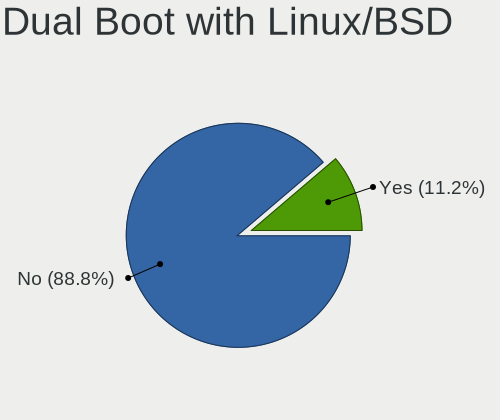

| Dual boot | Computers | Percent |
|-----------|-----------|---------|
| No        | 277       | 89.64%  |
| Yes       | 32        | 10.36%  |

Dual Boot (Win)
---------------

Hosting Linux and Windows

| Dual boot | Computers | Percent |
|-----------|-----------|---------|
| No        | 213       | 68.49%  |
| Yes       | 98        | 31.51%  |

Board
-----

Vendor
------

Motherboard manufacturer

| Name                    | Computers | Percent |
|-------------------------|-----------|---------|
| ASUSTek Computer        | 45        | 14.66%  |
| Lenovo                  | 39        | 12.7%   |
| Samsung Electronics     | 27        | 8.79%   |
| Gigabyte Technology     | 25        | 8.14%   |
| ASRock                  | 25        | 8.14%   |
| Hewlett-Packard         | 24        | 7.82%   |
| MSI                     | 20        | 6.51%   |
| LG Electronics          | 19        | 6.19%   |
| Dell                    | 13        | 4.23%   |
| ECS                     | 10        | 3.26%   |
| Apple                   | 5         | 1.63%   |
| HANSUNG COMPUTER        | 4         | 1.3%    |
| Raspberry Pi Foundation | 3         | 0.98%   |
| Notebook                | 3         | 0.98%   |
| Intel                   | 3         | 0.98%   |
| Foxconn                 | 3         | 0.98%   |
| Acer                    | 3         | 0.98%   |
| Toshiba                 | 2         | 0.65%   |
| Quanta                  | 2         | 0.65%   |
| Nvidia                  | 2         | 0.65%   |
| LattePanda              | 2         | 0.65%   |
| Hanis                   | 2         | 0.65%   |
| Alienware               | 2         | 0.65%   |
| Wolfnfox                | 1         | 0.33%   |
| WB                      | 1         | 0.33%   |
| TG                      | 1         | 0.33%   |
| Teclast                 | 1         | 0.33%   |
| Supermicro              | 1         | 0.33%   |
| sunxi                   | 1         | 0.33%   |
| Sony                    | 1         | 0.33%   |
| SLIMBOOK                | 1         | 0.33%   |
| Pine Microsystems       | 1         | 0.33%   |
| PC Partner Limited      | 1         | 0.33%   |
| MECHREVO                | 1         | 0.33%   |
| Jooyontech Computer     | 1         | 0.33%   |
| IMUZ                    | 1         | 0.33%   |
| Huanan                  | 1         | 0.33%   |
| Hardkernel              | 1         | 0.33%   |
| Google                  | 1         | 0.33%   |
| Clevo                   | 1         | 0.33%   |
| Chuwi                   | 1         | 0.33%   |
| Biostar                 | 1         | 0.33%   |
| AVERATEC                | 1         | 0.33%   |
| ASRockRack              | 1         | 0.33%   |
| AMI                     | 1         | 0.33%   |
| AMD                     | 1         | 0.33%   |
| Unknown                 | 1         | 0.33%   |

Model
-----

Motherboard model

| Name                                              | Computers | Percent |
|---------------------------------------------------|-----------|---------|
| ECS LIVA Q2                                       | 3         | 0.98%   |
| ASUS PRIME B350M-A                                | 3         | 0.98%   |
| Samsung Samsung DeskTop System                    | 2         | 0.65%   |
| Samsung Galaxy Book 12 LTE                        | 2         | 0.65%   |
| Samsung DeskTop System                            | 2         | 0.65%   |
| Samsung 950XCJ/951XCJ/950XCR                      | 2         | 0.65%   |
| Quanta QSSC-98J_C2                                | 2         | 0.65%   |
| Nvidia Tegra                                      | 2         | 0.65%   |
| LattePanda Alpha                                  | 2         | 0.65%   |
| HP Stream Notebook PC 13                          | 2         | 0.65%   |
| HP Laptop 15-db1xxx                               | 2         | 0.65%   |
| HANSUNG COMPUTER TFX5470H                         | 2         | 0.65%   |
| Gigabyte H81M-DS2V                                | 2         | 0.65%   |
| Gigabyte B75M-D3V                                 | 2         | 0.65%   |
| Gigabyte B75M-D3H                                 | 2         | 0.65%   |
| Dell XPS 15 7590                                  | 2         | 0.65%   |
| ASUS ROG STRIX Z690-A GAMING WIFI D4              | 2         | 0.65%   |
| ASUS PRIME A320M-K                                | 2         | 0.65%   |
| ASUS EX-A320M-GAMING                              | 2         | 0.65%   |
| ASUS All Series                                   | 2         | 0.65%   |
| ASRock H81M-DGS R2.0                              | 2         | 0.65%   |
| ASRock AB350M Pro4                                | 2         | 0.65%   |
| Unknown                                           | 2         | 0.65%   |
| Wolfnfox WF-TBAT                                  | 1         | 0.33%   |
| WB AIO                                            | 1         | 0.33%   |
| Toshiba Satellite P50-B-103                       | 1         | 0.33%   |
| Toshiba Satellite L655                            | 1         | 0.33%   |
| TG NXI-A7000 Series                               | 1         | 0.33%   |
| Teclast tPAD                                      | 1         | 0.33%   |
| Supermicro SYS-4029GP-TRT2                        | 1         | 0.33%   |
| Sony VPCEA36FK                                    | 1         | 0.33%   |
| SLIMBOOK PROX15-AMD                               | 1         | 0.33%   |
| Samsung X120/X170/X171                            | 1         | 0.33%   |
| Samsung SX11S                                     | 1         | 0.33%   |
| Samsung RC420/RC520/RC720                         | 1         | 0.33%   |
| Samsung R59P/R60P/R61P                            | 1         | 0.33%   |
| Samsung R440/R480                                 | 1         | 0.33%   |
| Samsung 950XDB/951XDB/950XDY                      | 1         | 0.33%   |
| Samsung 950QDA                                    | 1         | 0.33%   |
| Samsung 930QAA                                    | 1         | 0.33%   |
| Samsung 905S3G/906S3G/915S3G                      | 1         | 0.33%   |
| Samsung 800G5M/800G5W                             | 1         | 0.33%   |
| Samsung 760XBE                                    | 1         | 0.33%   |
| Samsung 730QCJ/730QCR                             | 1         | 0.33%   |
| Samsung 570Z5E/580Z5E                             | 1         | 0.33%   |
| Samsung 530U3BI/530U4BI/530U4BH                   | 1         | 0.33%   |
| Samsung 500T8A/500S8A/500T9A/500S9A               | 1         | 0.33%   |
| Samsung 500R4K/500R5H/5400RK/501R5H/5500RH/500R5S | 1         | 0.33%   |
| Samsung 400B4C/400B5C/200B4C/200B5C               | 1         | 0.33%   |
| Samsung 400B4B/400B5B/200B4B/200B5B               | 1         | 0.33%   |
| Samsung 270E5J/2570EJ                             | 1         | 0.33%   |
| RPi Raspberry Pi 4 Model B Rev 1.4                | 1         | 0.33%   |
| RPi Raspberry Pi 3 Model B Rev 1.2                | 1         | 0.33%   |
| RPi Raspberry Pi                                  | 1         | 0.33%   |
| Pine Microsystems Pine64 Pinebook Pro             | 1         | 0.33%   |
| PC Partner Limited S70BS.AH3511                   | 1         | 0.33%   |
| Notebook W330SU2                                  | 1         | 0.33%   |
| Notebook NL5xRU                                   | 1         | 0.33%   |
| Notebook N650DU                                   | 1         | 0.33%   |
| MSI PS63 Modern 8RC                               | 1         | 0.33%   |

Model Family
------------

Motherboard model prefix

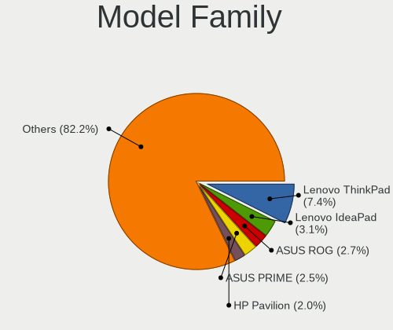

| Name                       | Computers | Percent |
|----------------------------|-----------|---------|
| Lenovo ThinkPad            | 23        | 7.49%   |
| ASUS PRIME                 | 11        | 3.58%   |
| HP Pavilion                | 6         | 1.95%   |
| Lenovo IdeaPad             | 5         | 1.63%   |
| ASUS VivoBook              | 5         | 1.63%   |
| HP Laptop                  | 4         | 1.3%    |
| Dell XPS                   | 4         | 1.3%    |
| Dell Inspiron              | 4         | 1.3%    |
| ASUS ROG                   | 4         | 1.3%    |
| RPi Raspberry              | 3         | 0.98%   |
| HP Stream                  | 3         | 0.98%   |
| HP EliteBook               | 3         | 0.98%   |
| ECS LIVA                   | 3         | 0.98%   |
| Toshiba Satellite          | 2         | 0.65%   |
| Samsung Samsung            | 2         | 0.65%   |
| Samsung Galaxy             | 2         | 0.65%   |
| Samsung DeskTop            | 2         | 0.65%   |
| Samsung 950XCJ             | 2         | 0.65%   |
| Quanta QSSC-98J            | 2         | 0.65%   |
| Nvidia Tegra               | 2         | 0.65%   |
| MSI Prestige               | 2         | 0.65%   |
| Lenovo ThinkStation        | 2         | 0.65%   |
| LattePanda Alpha           | 2         | 0.65%   |
| HP ProBook                 | 2         | 0.65%   |
| HANSUNG COMPUTER TFX5470H  | 2         | 0.65%   |
| Gigabyte Z390              | 2         | 0.65%   |
| Gigabyte X570              | 2         | 0.65%   |
| Gigabyte H81M-DS2V         | 2         | 0.65%   |
| Gigabyte B75M-D3V          | 2         | 0.65%   |
| Gigabyte B75M-D3H          | 2         | 0.65%   |
| Dell Latitude              | 2         | 0.65%   |
| ASUS TUF                   | 2         | 0.65%   |
| ASUS EX-A320M-GAMING       | 2         | 0.65%   |
| ASUS All                   | 2         | 0.65%   |
| ASRock Z390                | 2         | 0.65%   |
| ASRock H81M-DGS            | 2         | 0.65%   |
| ASRock FM2A88M-HD+         | 2         | 0.65%   |
| ASRock AB350M              | 2         | 0.65%   |
| Apple MacBookPro5          | 2         | 0.65%   |
| Acer Swift                 | 2         | 0.65%   |
| Unknown                    | 2         | 0.65%   |
| Wolfnfox WF-TBAT           | 1         | 0.33%   |
| WB AIO                     | 1         | 0.33%   |
| TG NXI-A7000               | 1         | 0.33%   |
| Teclast tPAD               | 1         | 0.33%   |
| Supermicro SYS-4029GP-TRT2 | 1         | 0.33%   |
| Sony VPCEA36FK             | 1         | 0.33%   |
| SLIMBOOK PROX15-AMD        | 1         | 0.33%   |
| Samsung X120               | 1         | 0.33%   |
| Samsung SX11S              | 1         | 0.33%   |
| Samsung RC420              | 1         | 0.33%   |
| Samsung R59P               | 1         | 0.33%   |
| Samsung R440               | 1         | 0.33%   |
| Samsung 950XDB             | 1         | 0.33%   |
| Samsung 950QDA             | 1         | 0.33%   |
| Samsung 930QAA             | 1         | 0.33%   |
| Samsung 905S3G             | 1         | 0.33%   |
| Samsung 800G5M             | 1         | 0.33%   |
| Samsung 760XBE             | 1         | 0.33%   |
| Samsung 730QCJ             | 1         | 0.33%   |

MFG Year
--------

Motherboard manufacture year

| Year    | Computers | Percent |
|---------|-----------|---------|
| 2020    | 42        | 13.68%  |
| 2019    | 35        | 11.4%   |
| 2018    | 34        | 11.07%  |
| 2017    | 24        | 7.82%   |
| 2021    | 23        | 7.49%   |
| 2014    | 22        | 7.17%   |
| 2013    | 21        | 6.84%   |
| 2012    | 21        | 6.84%   |
| 2011    | 14        | 4.56%   |
| 2015    | 12        | 3.91%   |
| 2010    | 12        | 3.91%   |
| 2009    | 11        | 3.58%   |
| 2016    | 10        | 3.26%   |
| 2008    | 10        | 3.26%   |
| 2007    | 7         | 2.28%   |
| Unknown | 6         | 1.95%   |
| 2006    | 2         | 0.65%   |
| 2005    | 1         | 0.33%   |

Form Factor
-----------

Physical design of the computer

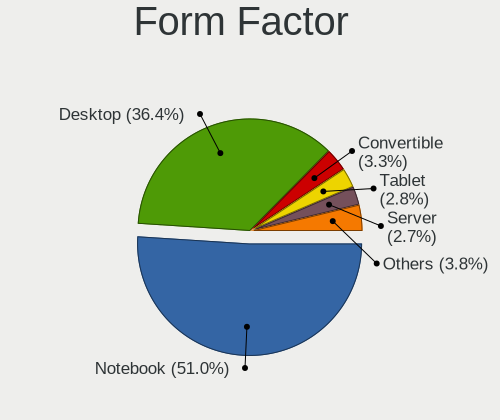

| Name           | Computers | Percent |
|----------------|-----------|---------|
| Notebook       | 150       | 48.86%  |
| Desktop        | 122       | 39.74%  |
| Tablet         | 9         | 2.93%   |
| Server         | 9         | 2.93%   |
| Convertible    | 8         | 2.61%   |
| System on chip | 7         | 2.28%   |
| Mini pc        | 2         | 0.65%   |

Secure Boot
-----------

Enabled or disabled

| State    | Computers | Percent |
|----------|-----------|---------|
| Disabled | 287       | 92.88%  |
| Enabled  | 22        | 7.12%   |

Coreboot
--------

Have coreboot on board

| Used | Computers | Percent |
|------|-----------|---------|
| No   | 306       | 99.67%  |
| Yes  | 1         | 0.33%   |

RAM Size
--------

Total RAM memory

| Size in GB      | Computers | Percent |
|-----------------|-----------|---------|
| 4.01-8.0        | 63        | 20.32%  |
| 16.01-24.0      | 56        | 18.06%  |
| 3.01-4.0        | 55        | 17.74%  |
| 8.01-16.0       | 54        | 17.42%  |
| 32.01-64.0      | 29        | 9.35%   |
| 64.01-256.0     | 22        | 7.1%    |
| 1.01-2.0        | 19        | 6.13%   |
| 24.01-32.0      | 5         | 1.61%   |
| 2.01-3.0        | 3         | 0.97%   |
| More than 256.0 | 2         | 0.65%   |
| 0.51-1.0        | 1         | 0.32%   |
| 0.01-0.5        | 1         | 0.32%   |

RAM Used
--------

Used RAM memory

| Used GB    | Computers | Percent |
|------------|-----------|---------|
| 1.01-2.0   | 117       | 35.24%  |
| 2.01-3.0   | 70        | 21.08%  |
| 3.01-4.0   | 50        | 15.06%  |
| 4.01-8.0   | 45        | 13.55%  |
| 0.51-1.0   | 24        | 7.23%   |
| 8.01-16.0  | 13        | 3.92%   |
| 16.01-24.0 | 5         | 1.51%   |
| 0.01-0.5   | 4         | 1.2%    |
| 32.01-64.0 | 2         | 0.6%    |
| Unknown    | 2         | 0.6%    |

Total Drives
------------

Number of drives on board

| Drives  | Computers | Percent |
|---------|-----------|---------|
| 1       | 171       | 54.29%  |
| 2       | 91        | 28.89%  |
| 3       | 26        | 8.25%   |
| 4       | 12        | 3.81%   |
| 5       | 6         | 1.9%    |
| 6       | 2         | 0.63%   |
| 0       | 2         | 0.63%   |
| 10      | 1         | 0.32%   |
| 9       | 1         | 0.32%   |
| 8       | 1         | 0.32%   |
| 7       | 1         | 0.32%   |
| Unknown | 1         | 0.32%   |

Has CD-ROM
----------

Has CD-ROM on board

| Presented | Computers | Percent |
|-----------|-----------|---------|
| No        | 236       | 76.62%  |
| Yes       | 72        | 23.38%  |

Has Ethernet
------------

Has Ethernet on board

| Presented | Computers | Percent |
|-----------|-----------|---------|
| Yes       | 247       | 79.94%  |
| No        | 62        | 20.06%  |

Has WiFi
--------

Has WiFi module

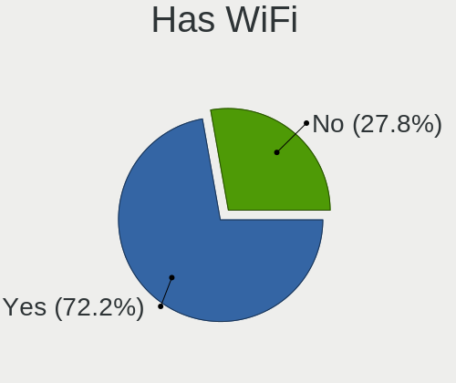

| Presented | Computers | Percent |
|-----------|-----------|---------|
| Yes       | 203       | 65.91%  |
| No        | 105       | 34.09%  |

Has Bluetooth
-------------

Has Bluetooth module

| Presented | Computers | Percent |
|-----------|-----------|---------|
| Yes       | 188       | 60.84%  |
| No        | 121       | 39.16%  |

Location
--------

Country
-------

Geographic location (country)

| Country     | Computers | Percent |
|-------------|-----------|---------|
| South Korea | 307       | 100%    |

City
----

Geographic location (city)

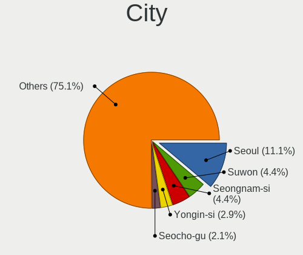

| City            | Computers | Percent |
|-----------------|-----------|---------|
| Seoul           | 59        | 18.04%  |
| Busan           | 14        | 4.28%   |
| Suwon           | 13        | 3.98%   |
| Yongin-si       | 11        | 3.36%   |
| Seongnam-si     | 11        | 3.36%   |
| Incheon         | 10        | 3.06%   |
| Daegu           | 9         | 2.75%   |
| Goyang-si       | 8         | 2.45%   |
| Daejeon         | 8         | 2.45%   |
| Bucheon-si      | 8         | 2.45%   |
| Gwanak-gu       | 7         | 2.14%   |
| Seongbuk-gu     | 6         | 1.83%   |
| Mapo-gu         | 6         | 1.83%   |
| Cheonan         | 6         | 1.83%   |
| Yangcheon-gu    | 5         | 1.53%   |
| Jeonju          | 5         | 1.53%   |
| Hwaseong-si     | 5         | 1.53%   |
| Gwangju         | 5         | 1.53%   |
| Gangseo-gu      | 5         | 1.53%   |
| Gangnam-gu      | 5         | 1.53%   |
| Dongjak-gu      | 5         | 1.53%   |
| Ansan-si        | 5         | 1.53%   |
| Ulsan           | 4         | 1.22%   |
| Uiwang          | 4         | 1.22%   |
| Seo-gu          | 4         | 1.22%   |
| Namyangju       | 4         | 1.22%   |
| Gyeonggi-do     | 4         | 1.22%   |
| Anyang-si       | 4         | 1.22%   |
| Yuseong-gu      | 3         | 0.92%   |
| Seongdong-gu    | 3         | 0.92%   |
| Seocho-gu       | 3         | 0.92%   |
| Pyeongtaek-si   | 3         | 0.92%   |
| Kwangmyong      | 3         | 0.92%   |
| Yeongdeungpo-gu | 2         | 0.61%   |
| Songpa-dong     | 2         | 0.61%   |
| Jeju City       | 2         | 0.61%   |
| Gyeongsan-si    | 2         | 0.61%   |
| Guri-si         | 2         | 0.61%   |
| Gunpo           | 2         | 0.61%   |
| Gimpo-si        | 2         | 0.61%   |
| Eunpyeong-gu    | 2         | 0.61%   |
| Donggu          | 2         | 0.61%   |
| Danyang         | 2         | 0.61%   |
| Chuncheon       | 2         | 0.61%   |
| Cheongju-si     | 2         | 0.61%   |
| Changwon        | 2         | 0.61%   |
| Yongsan-gu      | 1         | 0.31%   |
| Yeongdong-gun   | 1         | 0.31%   |
| Yangp'yong      | 1         | 0.31%   |
| Uiwang-si       | 1         | 0.31%   |
| Uijeongbu-si    | 1         | 0.31%   |
| Suyeong-gu      | 1         | 0.31%   |
| Songpa-gu       | 1         | 0.31%   |
| Siheung-si      | 1         | 0.31%   |
| Seosan City     | 1         | 0.31%   |
| Seodaemun-gu    | 1         | 0.31%   |
| Pocheon-si      | 1         | 0.31%   |
| Paju            | 1         | 0.31%   |
| Osan            | 1         | 0.31%   |
| Nowon-gu        | 1         | 0.31%   |

Drives
------

Drive Vendor
------------

Hard drive vendors

| Vendor                    | Computers | Drives | Percent |
|---------------------------|-----------|--------|---------|
| Samsung Electronics       | 94        | 118    | 20.35%  |
| WDC                       | 72        | 111    | 15.58%  |
| Seagate                   | 51        | 71     | 11.04%  |
| Unknown                   | 36        | 58     | 7.79%   |
| SanDisk                   | 31        | 33     | 6.71%   |
| Toshiba                   | 26        | 38     | 5.63%   |
| Crucial                   | 23        | 28     | 4.98%   |
| SK Hynix                  | 16        | 22     | 3.46%   |
| Hitachi                   | 12        | 13     | 2.6%    |
| Intel                     | 10        | 17     | 2.16%   |
| A-DATA Technology         | 8         | 8      | 1.73%   |
| Kingston                  | 7         | 8      | 1.52%   |
| Micron Technology         | 6         | 6      | 1.3%    |
| Transcend                 | 5         | 7      | 1.08%   |
| TAMMUZ                    | 5         | 7      | 1.08%   |
| Phison                    | 5         | 6      | 1.08%   |
| HGST                      | 5         | 6      | 1.08%   |
| PLEXTOR                   | 4         | 6      | 0.87%   |
| SPCC                      | 3         | 3      | 0.65%   |
| Fujitsu                   | 3         | 3      | 0.65%   |
| Union Memory              | 2         | 2      | 0.43%   |
| Silicon Motion            | 2         | 2      | 0.43%   |
| KingSpec                  | 2         | 2      | 0.43%   |
| JMicron                   | 2         | 2      | 0.43%   |
| China                     | 2         | 2      | 0.43%   |
| Apple                     | 2         | 2      | 0.43%   |
| ZOTAC                     | 1         | 1      | 0.22%   |
| VIVA300s                  | 1         | 1      | 0.22%   |
| VIEW                      | 1         | 1      | 0.22%   |
| Union Memory (Shenzhen)   | 1         | 1      | 0.22%   |
| UMIS                      | 1         | 1      | 0.22%   |
| TYPEC 1T                  | 1         | 1      | 0.22%   |
| Team                      | 1         | 1      | 0.22%   |
| RevuAhn                   | 1         | 1      | 0.22%   |
| Realtek Semiconductor     | 1         | 1      | 0.22%   |
| QNIX                      | 1         | 1      | 0.22%   |
| PHINOCOM                  | 1         | 1      | 0.22%   |
| OCZ                       | 1         | 2      | 0.22%   |
| Micron/Crucial Technology | 1         | 1      | 0.22%   |
| MARVELL                   | 1         | 1      | 0.22%   |
| LITEONIT                  | 1         | 1      | 0.22%   |
| LITEON                    | 1         | 1      | 0.22%   |
| LaCie                     | 1         | 1      | 0.22%   |
| KIOXIA                    | 1         | 1      | 0.22%   |
| ipTIME                    | 1         | 1      | 0.22%   |
| IPLEX                     | 1         | 1      | 0.22%   |
| imation                   | 1         | 2      | 0.22%   |
| Hewlett-Packard           | 1         | 1      | 0.22%   |
| GLOWAY                    | 1         | 1      | 0.22%   |
| FORESEE                   | 1         | 1      | 0.22%   |
| External                  | 1         | 1      | 0.22%   |
| ES                        | 1         | 1      | 0.22%   |
| Biostar                   | 1         | 1      | 0.22%   |
| Apacer                    | 1         | 1      | 0.22%   |

Drive Model
-----------

Hard drive models

| Model                                | Computers | Percent |
|--------------------------------------|-----------|---------|
| Unknown MMC Card  32GB               | 7         | 1.34%   |
| Unknown MMC Card  64GB               | 6         | 1.15%   |
| Toshiba DT01ACA300 3TB               | 6         | 1.15%   |
| Seagate ST500DM002-1BD142 500GB      | 6         | 1.15%   |
| Samsung NVMe SSD Drive 256GB         | 6         | 1.15%   |
| Crucial CT500MX500SSD1 500GB         | 6         | 1.15%   |
| Samsung SSD 850 EVO 120GB            | 5         | 0.95%   |
| Crucial CT240BX500SSD1 240GB         | 5         | 0.95%   |
| Sandisk NVMe SSD Drive 256GB         | 4         | 0.76%   |
| Samsung SSD 860 EVO 500GB            | 4         | 0.76%   |
| WDC WDS240G2G0A-00JH30 240GB SSD     | 3         | 0.57%   |
| WDC WDS120G2G0A-00JH30 120GB SSD     | 3         | 0.57%   |
| WDC WD5000AAKX-00ERMA0 500GB         | 3         | 0.57%   |
| WDC WD40EZRZ-00GXCB0 4TB             | 3         | 0.57%   |
| Unknown MMC Card  128GB              | 3         | 0.57%   |
| Toshiba DT01ACA200 2TB               | 3         | 0.57%   |
| Toshiba DT01ACA050 500GB             | 3         | 0.57%   |
| TAMMUZ SSD 128GB                     | 3         | 0.57%   |
| SK Hynix SHGP31-1000GM-2 1TB         | 3         | 0.57%   |
| Seagate ST3500418AS 500GB            | 3         | 0.57%   |
| Seagate ST2000DM008-2FR102 2TB       | 3         | 0.57%   |
| Seagate ST1000DM010-2EP102 1TB       | 3         | 0.57%   |
| SanDisk SD8SBAT128G1122 128GB SSD    | 3         | 0.57%   |
| Samsung NVMe SSD Drive 512GB         | 3         | 0.57%   |
| Samsung NVMe SSD Drive 1TB           | 3         | 0.57%   |
| Intel SSDSA2CW120G3 120GB            | 3         | 0.57%   |
| Crucial CT275MX300SSD4 275GB         | 3         | 0.57%   |
| WDC WDS120G1G0A-00SS50 120GB SSD     | 2         | 0.38%   |
| WDC WDS100T2B0C-00PXH0 1TB           | 2         | 0.38%   |
| WDC WD50 00LPVX-22V0TT0 500GB        | 2         | 0.38%   |
| WDC WD40EFRX-68WT0N0 4TB             | 2         | 0.38%   |
| WDC WD3200AAJS-00L7A0 320GB          | 2         | 0.38%   |
| WDC WD20EARX-00PASB0 2TB             | 2         | 0.38%   |
| WDC WD10EZEX-22MFCA0 1TB             | 2         | 0.38%   |
| WDC WD10EZEX-08WN4A0 1TB             | 2         | 0.38%   |
| WDC WD10EZEX-00WN4A0 1TB             | 2         | 0.38%   |
| Unknown SLD64G  64GB                 | 2         | 0.38%   |
| Unknown SD/MMC/MS PRO 128GB          | 2         | 0.38%   |
| Transcend TS240GSSD220S 240GB        | 2         | 0.38%   |
| Toshiba KBG30ZMV256G 256GB           | 2         | 0.38%   |
| SK Hynix NVMe SSD Drive 256GB        | 2         | 0.38%   |
| Seagate ST2000DM001-1ER164 2TB       | 2         | 0.38%   |
| Seagate ST1000LM035-1RK172 1TB       | 2         | 0.38%   |
| Seagate ST1000LM024 HN-M101MBB 1TB   | 2         | 0.38%   |
| Seagate ST1000DM003-1CH162 1TB       | 2         | 0.38%   |
| Sandisk NVMe SSD Drive 512GB         | 2         | 0.38%   |
| Samsung SSD 860 QVO 1TB              | 2         | 0.38%   |
| Samsung SSD 860 EVO 1TB              | 2         | 0.38%   |
| Samsung SSD 850 PRO 256GB            | 2         | 0.38%   |
| Samsung SSD 830 Series 256GB         | 2         | 0.38%   |
| Samsung SSD 830 Series 128GB         | 2         | 0.38%   |
| Samsung SSD 750 EVO 120GB            | 2         | 0.38%   |
| Samsung NVMe SSD Drive 2TB           | 2         | 0.38%   |
| Samsung NVMe SSD Drive 1024GB        | 2         | 0.38%   |
| Samsung MZVLB512HAJQ-00000 512GB     | 2         | 0.38%   |
| Samsung MZVLB256HBHQ-000 256GB       | 2         | 0.38%   |
| Samsung MZNLN256HAJQ-00000 256GB SSD | 2         | 0.38%   |
| Samsung HD502IJ 500GB                | 2         | 0.38%   |
| Samsung HD322HJ 320GB                | 2         | 0.38%   |
| Phison NVMe SSD Drive 512GB          | 2         | 0.38%   |

HDD Vendor
----------

Hard disk drive vendors

| Vendor              | Computers | Drives | Percent |
|---------------------|-----------|--------|---------|
| WDC                 | 57        | 86     | 36.31%  |
| Seagate             | 47        | 64     | 29.94%  |
| Toshiba             | 18        | 25     | 11.46%  |
| Hitachi             | 12        | 13     | 7.64%   |
| Samsung Electronics | 9         | 10     | 5.73%   |
| HGST                | 5         | 6      | 3.18%   |
| Fujitsu             | 3         | 3      | 1.91%   |
| Unknown             | 2         | 3      | 1.27%   |
| MARVELL             | 1         | 1      | 0.64%   |
| LaCie               | 1         | 1      | 0.64%   |
| ipTIME              | 1         | 1      | 0.64%   |
| Hewlett-Packard     | 1         | 1      | 0.64%   |

SSD Vendor
----------

Solid state drive vendors

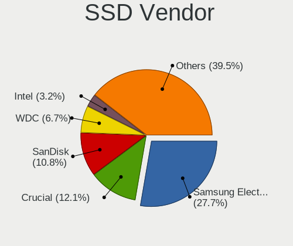

| Vendor              | Computers | Drives | Percent |
|---------------------|-----------|--------|---------|
| Samsung Electronics | 54        | 64     | 31.58%  |
| Crucial             | 21        | 26     | 12.28%  |
| SanDisk             | 20        | 20     | 11.7%   |
| WDC                 | 11        | 16     | 6.43%   |
| Intel               | 7         | 10     | 4.09%   |
| Transcend           | 5         | 7      | 2.92%   |
| TAMMUZ              | 5         | 7      | 2.92%   |
| A-DATA Technology   | 5         | 5      | 2.92%   |
| Seagate             | 4         | 5      | 2.34%   |
| Micron Technology   | 4         | 4      | 2.34%   |
| SPCC                | 3         | 3      | 1.75%   |
| SK Hynix            | 3         | 4      | 1.75%   |
| PLEXTOR             | 3         | 5      | 1.75%   |
| Kingston            | 3         | 4      | 1.75%   |
| Toshiba             | 2         | 5      | 1.17%   |
| KingSpec            | 2         | 2      | 1.17%   |
| China               | 2         | 2      | 1.17%   |
| VIEW                | 1         | 1      | 0.58%   |
| TYPEC 1T            | 1         | 1      | 0.58%   |
| Team                | 1         | 1      | 0.58%   |
| RevuAhn             | 1         | 1      | 0.58%   |
| QNIX                | 1         | 1      | 0.58%   |
| PHINOCOM            | 1         | 1      | 0.58%   |
| OCZ                 | 1         | 2      | 0.58%   |
| LITEONIT            | 1         | 1      | 0.58%   |
| LITEON              | 1         | 1      | 0.58%   |
| JMicron             | 1         | 1      | 0.58%   |
| IPLEX               | 1         | 1      | 0.58%   |
| imation             | 1         | 2      | 0.58%   |
| GLOWAY              | 1         | 1      | 0.58%   |
| FORESEE             | 1         | 1      | 0.58%   |
| Biostar             | 1         | 1      | 0.58%   |
| Apple               | 1         | 1      | 0.58%   |
| Apacer              | 1         | 1      | 0.58%   |

Drive Kind
----------

HDD or SSD

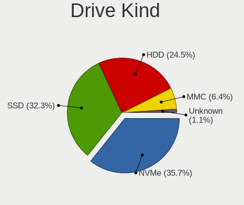

| Kind    | Computers | Drives | Percent |
|---------|-----------|--------|---------|
| SSD     | 149       | 208    | 35.99%  |
| HDD     | 129       | 214    | 31.16%  |
| NVMe    | 97        | 128    | 23.43%  |
| MMC     | 33        | 54     | 7.97%   |
| Unknown | 6         | 7      | 1.45%   |

Drive Connector
---------------

SATA, SAS, NVMe, etc.

| Type | Computers | Drives | Percent |
|------|-----------|--------|---------|
| SATA | 205       | 410    | 58.4%   |
| NVMe | 97        | 128    | 27.64%  |
| MMC  | 33        | 54     | 9.4%    |
| SAS  | 16        | 19     | 4.56%   |

Drive Size
----------

Size of hard drive

| Size in TB | Computers | Drives | Percent |
|------------|-----------|--------|---------|
| 0.01-0.5   | 166       | 249    | 57.64%  |
| 0.51-1.0   | 68        | 87     | 23.61%  |
| 1.01-2.0   | 25        | 32     | 8.68%   |
| 3.01-4.0   | 13        | 26     | 4.51%   |
| 2.01-3.0   | 8         | 11     | 2.78%   |
| 4.01-10.0  | 6         | 10     | 2.08%   |
| 10.01-20.0 | 2         | 7      | 0.69%   |

Space Total
-----------

Amount of disk space available on the file system

| Size in GB     | Computers | Percent |
|----------------|-----------|---------|
| 101-250        | 96        | 29.91%  |
| 251-500        | 61        | 19%     |
| 501-1000       | 43        | 13.4%   |
| 51-100         | 30        | 9.35%   |
| 1001-2000      | 24        | 7.48%   |
| 21-50          | 20        | 6.23%   |
| More than 3000 | 17        | 5.3%    |
| 2001-3000      | 14        | 4.36%   |
| 1-20           | 12        | 3.74%   |
| Unknown        | 4         | 1.25%   |

Space Used
----------

Amount of used disk space

| Used GB        | Computers | Percent |
|----------------|-----------|---------|
| 1-20           | 136       | 41.46%  |
| 21-50          | 63        | 19.21%  |
| 101-250        | 39        | 11.89%  |
| 51-100         | 29        | 8.84%   |
| 251-500        | 23        | 7.01%   |
| 501-1000       | 14        | 4.27%   |
| 2001-3000      | 7         | 2.13%   |
| 1001-2000      | 7         | 2.13%   |
| More than 3000 | 6         | 1.83%   |
| Unknown        | 4         | 1.22%   |

Malfunc. Drives
---------------

Drive models with a malfunction

| Model                          | Computers | Drives | Percent |
|--------------------------------|-----------|--------|---------|
| WDC WD7500BPVT-22HXZT1 752GB   | 1         | 1      | 5.26%   |
| WDC WD7500AACS-00D6B0 752GB    | 1         | 1      | 5.26%   |
| WDC WD5000AAKX-75U6AA0 500GB   | 1         | 1      | 5.26%   |
| WDC WD1600BEVT-22A23T0 160GB   | 1         | 1      | 5.26%   |
| WDC WD10JPVX-75JC3T0 1TB       | 1         | 1      | 5.26%   |
| WDC WD1001FALS-00J7B1 1TB      | 1         | 1      | 5.26%   |
| Toshiba MK5061GSYN 500GB       | 1         | 1      | 5.26%   |
| Toshiba MK2565GSX 250GB        | 1         | 1      | 5.26%   |
| Seagate ST4000DM000-1F2168 4TB | 1         | 1      | 5.26%   |
| Seagate ST3500418AS 500GB      | 1         | 1      | 5.26%   |
| Seagate ST1000DM003-1CH162 1TB | 1         | 1      | 5.26%   |
| Phison ES 512GB                | 1         | 1      | 5.26%   |
| LITEONIT LMT-256M3M 256GB SSD  | 1         | 1      | 5.26%   |
| LITEON LMH-128V2M 128GB SSD    | 1         | 1      | 5.26%   |
| Kingston SHFS37A120G 120GB SSD | 1         | 1      | 5.26%   |
| Intel SSDSA2CW120G3 120GB      | 1         | 1      | 5.26%   |
| Hitachi HTS541616J9SA00 160GB  | 1         | 1      | 5.26%   |
| HGST HTS721010A9E630 1TB       | 1         | 1      | 5.26%   |
| HGST HDN726060ALE610 6TB       | 1         | 1      | 5.26%   |

Malfunc. Drive Vendor
---------------------

Vendors of faulty drives

| Vendor   | Computers | Drives | Percent |
|----------|-----------|--------|---------|
| WDC      | 6         | 6      | 31.58%  |
| Seagate  | 3         | 3      | 15.79%  |
| Toshiba  | 2         | 2      | 10.53%  |
| HGST     | 2         | 2      | 10.53%  |
| Phison   | 1         | 1      | 5.26%   |
| LITEONIT | 1         | 1      | 5.26%   |
| LITEON   | 1         | 1      | 5.26%   |
| Kingston | 1         | 1      | 5.26%   |
| Intel    | 1         | 1      | 5.26%   |
| Hitachi  | 1         | 1      | 5.26%   |

Malfunc. HDD Vendor
-------------------

Vendors of faulty HDD drives

| Vendor  | Computers | Drives | Percent |
|---------|-----------|--------|---------|
| WDC     | 6         | 6      | 42.86%  |
| Seagate | 3         | 3      | 21.43%  |
| Toshiba | 2         | 2      | 14.29%  |
| HGST    | 2         | 2      | 14.29%  |
| Hitachi | 1         | 1      | 7.14%   |

Malfunc. Drive Kind
-------------------

Kinds of faulty drives

| Kind | Computers | Drives | Percent |
|------|-----------|--------|---------|
| HDD  | 12        | 14     | 70.59%  |
| SSD  | 4         | 4      | 23.53%  |
| NVMe | 1         | 1      | 5.88%   |

Failed Drives
-------------

Failed drive models

Zero info for selected period =(

Failed Drive Vendor
-------------------

Failed drive vendors

Zero info for selected period =(

Drive Status
------------

Number of failed and malfunc. drives

| Status   | Computers | Drives | Percent |
|----------|-----------|--------|---------|
| Detected | 206       | 401    | 63.19%  |
| Works    | 103       | 191    | 31.6%   |
| Malfunc  | 17        | 19     | 5.21%   |

Storage controller
------------------

Storage Vendor
--------------

Storage controller vendors

| Vendor                           | Computers | Percent |
|----------------------------------|-----------|---------|
| Intel                            | 186       | 49.34%  |
| AMD                              | 54        | 14.32%  |
| Samsung Electronics              | 40        | 10.61%  |
| Sandisk                          | 17        | 4.51%   |
| SK Hynix                         | 12        | 3.18%   |
| ASMedia Technology               | 11        | 2.92%   |
| JMicron Technology               | 9         | 2.39%   |
| Phison Electronics               | 7         | 1.86%   |
| Toshiba America Info Systems     | 6         | 1.59%   |
| Union Memory (Shenzhen)          | 4         | 1.06%   |
| Kingston Technology Company      | 4         | 1.06%   |
| Silicon Motion                   | 3         | 0.8%    |
| Micron/Crucial Technology        | 3         | 0.8%    |
| Marvell Technology Group         | 3         | 0.8%    |
| Broadcom / LSI                   | 3         | 0.8%    |
| ADATA Technology                 | 3         | 0.8%    |
| Nvidia                           | 2         | 0.53%   |
| Micron Technology                | 2         | 0.53%   |
| Silicon Integrated Systems [SiS] | 1         | 0.27%   |
| Seagate Technology               | 1         | 0.27%   |
| Realtek Semiconductor            | 1         | 0.27%   |
| Lite-On Technology               | 1         | 0.27%   |
| Lite-On IT Corp. / Plextor       | 1         | 0.27%   |
| KIOXIA                           | 1         | 0.27%   |
| Hewlett-Packard                  | 1         | 0.27%   |
| Apple                            | 1         | 0.27%   |

Storage Model
-------------

Storage controller models

| Model                                                                                   | Computers | Percent |
|-----------------------------------------------------------------------------------------|-----------|---------|
| AMD FCH SATA Controller [AHCI mode]                                                     | 45        | 10.11%  |
| Samsung NVMe SSD Controller SM981/PM981/PM983                                           | 24        | 5.39%   |
| Intel 8 Series/C220 Series Chipset Family 6-port SATA Controller 1 [AHCI mode]          | 17        | 3.82%   |
| Intel 6 Series/C200 Series Chipset Family 6 port Mobile SATA AHCI Controller            | 10        | 2.25%   |
| ASMedia ASM1062 Serial ATA Controller                                                   | 10        | 2.25%   |
| Intel 82801G (ICH7 Family) IDE Controller                                               | 9         | 2.02%   |
| Intel 82801 Mobile SATA Controller [RAID mode]                                          | 9         | 2.02%   |
| AMD 300 Series Chipset SATA Controller                                                  | 9         | 2.02%   |
| Intel Sunrise Point-LP SATA Controller [AHCI mode]                                      | 8         | 1.8%    |
| Intel NM10/ICH7 Family SATA Controller [IDE mode]                                       | 8         | 1.8%    |
| Intel 7 Series/C210 Series Chipset Family 6-port SATA Controller [AHCI mode]            | 8         | 1.8%    |
| Intel 7 Series Chipset Family 6-port SATA Controller [AHCI mode]                        | 8         | 1.8%    |
| Intel 5 Series/3400 Series Chipset 4 port SATA AHCI Controller                          | 8         | 1.8%    |
| Intel 200 Series PCH SATA controller [AHCI mode]                                        | 8         | 1.8%    |
| Sandisk WD Blue SN550 NVMe SSD                                                          | 7         | 1.57%   |
| JMicron JMB363 SATA/IDE Controller                                                      | 7         | 1.57%   |
| Intel Q170/Q150/B150/H170/H110/Z170/CM236 Chipset SATA Controller [AHCI Mode]           | 7         | 1.57%   |
| Intel Cannon Lake PCH SATA AHCI Controller                                              | 7         | 1.57%   |
| Samsung NVMe SSD Controller SM961/PM961/SM963                                           | 6         | 1.35%   |
| Intel 6 Series/C200 Series Chipset Family 6 port Desktop SATA AHCI Controller           | 6         | 1.35%   |
| AMD FCH SATA Controller D                                                               | 6         | 1.35%   |
| SK Hynix Gold P31 SSD                                                                   | 5         | 1.12%   |
| Sandisk WD Black 2018/SN750 / PC SN720 NVMe SSD                                         | 5         | 1.12%   |
| Intel HM170/QM170 Chipset SATA Controller [AHCI Mode]                                   | 5         | 1.12%   |
| Intel Celeron/Pentium Silver Processor SATA Controller                                  | 5         | 1.12%   |
| Intel Cannon Point-LP SATA Controller [AHCI Mode]                                       | 5         | 1.12%   |
| Intel 8 Series SATA Controller 1 [AHCI mode]                                            | 5         | 1.12%   |
| Intel 5 Series/3400 Series Chipset 6 port SATA AHCI Controller                          | 5         | 1.12%   |
| AMD FCH IDE Controller                                                                  | 5         | 1.12%   |
| AMD 400 Series Chipset SATA Controller                                                  | 5         | 1.12%   |
| Union Memory (Shenzhen) Non-Volatile memory controller                                  | 4         | 0.9%    |
| Samsung NVMe SSD Controller PM9A1/PM9A3/980PRO                                          | 4         | 0.9%    |
| Samsung NVMe SSD Controller 980                                                         | 4         | 0.9%    |
| Intel Comet Lake SATA AHCI Controller                                                   | 4         | 0.9%    |
| Intel C620 Series Chipset Family SATA Controller [AHCI mode]                            | 4         | 0.9%    |
| Intel C610/X99 series chipset 6-Port SATA Controller [AHCI mode]                        | 4         | 0.9%    |
| Intel 6 Series/C200 Series Chipset Family Desktop SATA Controller (IDE mode, ports 4-5) | 4         | 0.9%    |
| Intel 6 Series/C200 Series Chipset Family Desktop SATA Controller (IDE mode, ports 0-3) | 4         | 0.9%    |
| Toshiba America Info Systems XG6 NVMe SSD Controller                                    | 3         | 0.67%   |
| Toshiba America Info Systems BG3 NVMe SSD Controller                                    | 3         | 0.67%   |
| SK Hynix BC501 NVMe Solid State Drive                                                   | 3         | 0.67%   |
| Phison E12 NVMe Controller                                                              | 3         | 0.67%   |
| Kingston Company Company Non-Volatile memory controller                                 | 3         | 0.67%   |
| Intel Cannon Lake Mobile PCH SATA AHCI Controller                                       | 3         | 0.67%   |
| Intel C620 Series Chipset Family SSATA Controller [AHCI mode]                           | 3         | 0.67%   |
| Intel Alder Lake-S PCH SATA Controller [AHCI Mode]                                      | 3         | 0.67%   |
| Intel 82801JI (ICH10 Family) 4 port SATA IDE Controller #1                              | 3         | 0.67%   |
| Intel 82801JI (ICH10 Family) 2 port SATA IDE Controller #2                              | 3         | 0.67%   |
| Intel 82801IBM/IEM (ICH9M/ICH9M-E) 4 port SATA Controller [AHCI mode]                   | 3         | 0.67%   |
| AMD SB600 Non-Raid-5 SATA                                                               | 3         | 0.67%   |
| AMD SB600 IDE                                                                           | 3         | 0.67%   |
| SK Hynix Non-Volatile memory controller                                                 | 2         | 0.45%   |
| SK Hynix BC511                                                                          | 2         | 0.45%   |
| Sandisk WD Blue SN500 / PC SN520 NVMe SSD                                               | 2         | 0.45%   |
| Phison NVMe Storage Controller                                                          | 2         | 0.45%   |
| Nvidia MCP79 AHCI Controller                                                            | 2         | 0.45%   |
| Micron/Crucial P2 NVMe PCIe SSD                                                         | 2         | 0.45%   |
| Micron Non-Volatile memory controller                                                   | 2         | 0.45%   |
| Marvell Group 88SE9215 PCIe 2.0 x1 4-port SATA 6 Gb/s Controller                        | 2         | 0.45%   |
| Intel Wildcat Point-LP SATA Controller [AHCI Mode]                                      | 2         | 0.45%   |

Storage Kind
------------

Kind of storage controller (IDE, SATA, NVMe, SAS, ...)

| Kind | Computers | Percent |
|------|-----------|---------|
| SATA | 204       | 56.35%  |
| NVMe | 99        | 27.35%  |
| IDE  | 39        | 10.77%  |
| RAID | 17        | 4.7%    |
| SCSI | 2         | 0.55%   |
| SAS  | 1         | 0.28%   |

Processor
---------

CPU Vendor
----------

Processor vendors

| Vendor | Computers | Percent |
|--------|-----------|---------|
| Intel  | 235       | 76.55%  |
| AMD    | 64        | 20.85%  |
| ARM    | 8         | 2.61%   |

CPU Model
---------

Processor models

| Model                                         | Computers | Percent |
|-----------------------------------------------|-----------|---------|
| Intel Core i5-3570 CPU @ 3.40GHz              | 8         | 2.61%   |
| Intel 11th Gen Core i7-1165G7 @ 2.80GHz       | 8         | 2.61%   |
| Intel Core i7-8565U CPU @ 1.80GHz             | 6         | 1.95%   |
| ARM Processor                                 | 6         | 1.95%   |
| Intel Core i5-10210U CPU @ 1.60GHz            | 5         | 1.63%   |
| Intel Celeron N4000 CPU @ 1.10GHz             | 5         | 1.63%   |
| AMD Ryzen 7 4800H with Radeon Graphics        | 5         | 1.63%   |
| AMD Ryzen 5 1600 Six-Core Processor           | 5         | 1.63%   |
| Intel Core i3-3220 CPU @ 3.30GHz              | 4         | 1.3%    |
| Intel Atom x5-Z8350 CPU @ 1.44GHz             | 4         | 1.3%    |
| Intel Core i9-9900K CPU @ 3.60GHz             | 3         | 0.98%   |
| Intel Core i7-9750H CPU @ 2.60GHz             | 3         | 0.98%   |
| Intel Core i7-8550U CPU @ 1.80GHz             | 3         | 0.98%   |
| Intel Core i7-7700HQ CPU @ 2.80GHz            | 3         | 0.98%   |
| Intel Core i7-4790 CPU @ 3.60GHz              | 3         | 0.98%   |
| Intel Core i7-1065G7 CPU @ 1.30GHz            | 3         | 0.98%   |
| Intel Core i7-10510U CPU @ 1.80GHz            | 3         | 0.98%   |
| Intel Core i5-8500 CPU @ 3.00GHz              | 3         | 0.98%   |
| Intel Core i5-8265U CPU @ 1.60GHz             | 3         | 0.98%   |
| Intel Core i5-3230M CPU @ 2.60GHz             | 3         | 0.98%   |
| Intel Core i5-2520M CPU @ 2.50GHz             | 3         | 0.98%   |
| Intel Core i5-2467M CPU @ 1.60GHz             | 3         | 0.98%   |
| Intel Core 2 Quad CPU Q6600 @ 2.40GHz         | 3         | 0.98%   |
| AMD Ryzen 7 2700X Eight-Core Processor        | 3         | 0.98%   |
| AMD Ryzen 5 4500U with Radeon Graphics        | 3         | 0.98%   |
| AMD Ryzen 5 2400G with Radeon Vega Graphics   | 3         | 0.98%   |
| AMD Ryzen 3 2200G with Radeon Vega Graphics   | 3         | 0.98%   |
| Intel Xeon CPU E5620 @ 2.40GHz                | 2         | 0.65%   |
| Intel Pentium Silver N5000 CPU @ 1.10GHz      | 2         | 0.65%   |
| Intel Pentium 4 CPU 3.00GHz                   | 2         | 0.65%   |
| Intel Core m3-7Y30 CPU @ 1.00GHz              | 2         | 0.65%   |
| Intel Core i7-9700K CPU @ 3.60GHz             | 2         | 0.65%   |
| Intel Core i7-4700HQ CPU @ 2.40GHz            | 2         | 0.65%   |
| Intel Core i7-10710U CPU @ 1.10GHz            | 2         | 0.65%   |
| Intel Core i5-7500 CPU @ 3.40GHz              | 2         | 0.65%   |
| Intel Core i5-7400 CPU @ 3.00GHz              | 2         | 0.65%   |
| Intel Core i5-7200U CPU @ 2.50GHz             | 2         | 0.65%   |
| Intel Core i5 CPU M 560 @ 2.67GHz             | 2         | 0.65%   |
| Intel Core i5 CPU M 480 @ 2.67GHz             | 2         | 0.65%   |
| Intel Core i5 CPU 760 @ 2.80GHz               | 2         | 0.65%   |
| Intel Core i3 CPU M 370 @ 2.40GHz             | 2         | 0.65%   |
| Intel Core i3 CPU M 330 @ 2.13GHz             | 2         | 0.65%   |
| Intel Core 2 Quad CPU Q8300 @ 2.50GHz         | 2         | 0.65%   |
| Intel Celeron CPU N3050 @ 1.60GHz             | 2         | 0.65%   |
| Intel Celeron CPU N2840 @ 2.16GHz             | 2         | 0.65%   |
| Intel 11th Gen Core i5-1135G7 @ 2.40GHz       | 2         | 0.65%   |
| AMD Ryzen 7 PRO 4750U with Radeon Graphics    | 2         | 0.65%   |
| AMD Ryzen 7 4700U with Radeon Graphics        | 2         | 0.65%   |
| AMD Ryzen 5 PRO 4650U with Radeon Graphics    | 2         | 0.65%   |
| AMD Ryzen 5 3500U with Radeon Vega Mobile Gfx | 2         | 0.65%   |
| AMD Ryzen 3 4300U with Radeon Graphics        | 2         | 0.65%   |
| AMD Ryzen 3 3200U with Radeon Vega Mobile Gfx | 2         | 0.65%   |
| Intel Xeon W-3275M CPU @ 2.50GHz              | 1         | 0.33%   |
| Intel Xeon W-2133 CPU @ 3.60GHz               | 1         | 0.33%   |
| Intel Xeon Silver 4214 CPU @ 2.20GHz          | 1         | 0.33%   |
| Intel Xeon Silver 4114 CPU @ 2.20GHz          | 1         | 0.33%   |
| Intel Xeon Gold 5218 CPU @ 2.30GHz            | 1         | 0.33%   |
| Intel Xeon CPU X3430 @ 2.40GHz                | 1         | 0.33%   |
| Intel Xeon CPU E5450 @ 3.00GHz                | 1         | 0.33%   |
| Intel Xeon CPU E5-2699 v3 @ 2.30GHz           | 1         | 0.33%   |

CPU Model Family
----------------

Processor model prefix

| Model                   | Computers | Percent |
|-------------------------|-----------|---------|
| Intel Core i5           | 63        | 20.52%  |
| Intel Core i7           | 53        | 17.26%  |
| Other                   | 24        | 7.82%   |
| AMD Ryzen 5             | 19        | 6.19%   |
| Intel Core i3           | 18        | 5.86%   |
| Intel Celeron           | 15        | 4.89%   |
| AMD Ryzen 7             | 13        | 4.23%   |
| Intel Xeon              | 12        | 3.91%   |
| Intel Atom              | 9         | 2.93%   |
| Intel Pentium           | 8         | 2.61%   |
| Intel Core i9           | 8         | 2.61%   |
| Intel Core 2 Duo        | 8         | 2.61%   |
| AMD Ryzen 3             | 8         | 2.61%   |
| Intel Core 2 Quad       | 6         | 1.95%   |
| AMD A10                 | 4         | 1.3%    |
| Intel Core m3           | 3         | 0.98%   |
| AMD Ryzen Threadripper  | 3         | 0.98%   |
| AMD Ryzen 9             | 3         | 0.98%   |
| AMD Ryzen 5 PRO         | 3         | 0.98%   |
| Intel Xeon Silver       | 2         | 0.65%   |
| Intel Pentium Silver    | 2         | 0.65%   |
| Intel Pentium Dual-Core | 2         | 0.65%   |
| Intel Pentium 4         | 2         | 0.65%   |
| Intel Genuine           | 2         | 0.65%   |
| Intel Core 2            | 2         | 0.65%   |
| AMD Ryzen 7 PRO         | 2         | 0.65%   |
| AMD A8                  | 2         | 0.65%   |
| AMD A4                  | 2         | 0.65%   |
| Intel Xeon Gold         | 1         | 0.33%   |
| Intel Pentium Gold      | 1         | 0.33%   |
| Intel Pentium Dual      | 1         | 0.33%   |
| ARM AArch64             | 1         | 0.33%   |
| AMD Quad-Core           | 1         | 0.33%   |
| AMD Phenom II X6        | 1         | 0.33%   |
| AMD Phenom              | 1         | 0.33%   |
| AMD Athlon II X2        | 1         | 0.33%   |
| AMD Athlon 64 X2        | 1         | 0.33%   |

CPU Cores
---------

Number of processor cores

| Number  | Computers | Percent |
|---------|-----------|---------|
| 4       | 129       | 42.02%  |
| 2       | 95        | 30.94%  |
| 8       | 30        | 9.77%   |
| 6       | 30        | 9.77%   |
| 16      | 4         | 1.3%    |
| 12      | 4         | 1.3%    |
| 10      | 3         | 0.98%   |
| 1       | 3         | 0.98%   |
| 32      | 2         | 0.65%   |
| 20      | 2         | 0.65%   |
| 28      | 1         | 0.33%   |
| 22      | 1         | 0.33%   |
| 18      | 1         | 0.33%   |
| 14      | 1         | 0.33%   |
| Unknown | 1         | 0.33%   |

CPU Sockets
-----------

Number of sockets

| Number | Computers | Percent |
|--------|-----------|---------|
| 1      | 299       | 97.39%  |
| 2      | 8         | 2.61%   |

CPU Threads
-----------

Threads per core (Hyper-Threading)

| Number  | Computers | Percent |
|---------|-----------|---------|
| 2       | 192       | 62.54%  |
| 1       | 114       | 37.13%  |
| Unknown | 1         | 0.33%   |

CPU Op-Modes
------------

CPU Operation Modes (32-bit, 64-bit)

| Op mode        | Computers | Percent |
|----------------|-----------|---------|
| 32-bit, 64-bit | 296       | 96.1%   |
| Unknown        | 10        | 3.25%   |
| 64-bit         | 1         | 0.32%   |
| 32-bit         | 1         | 0.32%   |

CPU Microcode
-------------

Microcode number

| Number     | Computers | Percent |
|------------|-----------|---------|
| Unknown    | 46        | 14.74%  |
| 0x306a9    | 24        | 7.69%   |
| 0x306c3    | 16        | 5.13%   |
| 0x806ec    | 13        | 4.17%   |
| 0x806c1    | 13        | 4.17%   |
| 0x206a7    | 12        | 3.85%   |
| 0x08600106 | 11        | 3.53%   |
| 0x906e9    | 10        | 3.21%   |
| 0x906ea    | 8         | 2.56%   |
| 0x806e9    | 8         | 2.56%   |
| 0x706a1    | 7         | 2.24%   |
| 0x20655    | 7         | 2.24%   |
| 0x1067a    | 7         | 2.24%   |
| 0x906ed    | 6         | 1.92%   |
| 0x806eb    | 6         | 1.92%   |
| 0x806ea    | 6         | 1.92%   |
| 0x30678    | 5         | 1.6%    |
| 0x106e5    | 5         | 1.6%    |
| 0x706e5    | 4         | 1.28%   |
| 0x40651    | 4         | 1.28%   |
| 0x08108102 | 4         | 1.28%   |
| 0x0800820d | 4         | 1.28%   |
| 0x08001138 | 4         | 1.28%   |
| 0x08001137 | 4         | 1.28%   |
| 0xa0652    | 3         | 0.96%   |
| 0x6fd      | 3         | 0.96%   |
| 0x6fb      | 3         | 0.96%   |
| 0x50654    | 3         | 0.96%   |
| 0x406c4    | 3         | 0.96%   |
| 0x306f2    | 3         | 0.96%   |
| 0x06001119 | 3         | 0.96%   |
| 0xa0660    | 2         | 0.64%   |
| 0xa0655    | 2         | 0.64%   |
| 0x906ec    | 2         | 0.64%   |
| 0x90672    | 2         | 0.64%   |
| 0x706a8    | 2         | 0.64%   |
| 0x506e3    | 2         | 0.64%   |
| 0x406c3    | 2         | 0.64%   |
| 0x306d4    | 2         | 0.64%   |
| 0x30673    | 2         | 0.64%   |
| 0x206c2    | 2         | 0.64%   |
| 0x20652    | 2         | 0.64%   |
| 0x10676    | 2         | 0.64%   |
| 0x08701021 | 2         | 0.64%   |
| 0x08600103 | 2         | 0.64%   |
| 0x08600102 | 2         | 0.64%   |
| 0x0810100b | 2         | 0.64%   |
| 0x0700010f | 2         | 0.64%   |
| 0xf49      | 1         | 0.32%   |
| 0x806d1    | 1         | 0.32%   |
| 0x6f6      | 1         | 0.32%   |
| 0x6e8      | 1         | 0.32%   |
| 0x50657    | 1         | 0.32%   |
| 0x406f1    | 1         | 0.32%   |
| 0x306e4    | 1         | 0.32%   |
| 0x0a50000c | 1         | 0.32%   |
| 0x0a50000b | 1         | 0.32%   |
| 0x0a201009 | 1         | 0.32%   |
| 0x08701013 | 1         | 0.32%   |
| 0x08608103 | 1         | 0.32%   |

CPU Microarch
-------------

Microarchitecture

| Name             | Computers | Percent |
|------------------|-----------|---------|
| KabyLake         | 61        | 19.87%  |
| Haswell          | 28        | 9.12%   |
| IvyBridge        | 26        | 8.47%   |
| Zen 2            | 21        | 6.84%   |
| Zen              | 16        | 5.21%   |
| Silvermont       | 14        | 4.56%   |
| TigerLake        | 13        | 4.23%   |
| SandyBridge      | 13        | 4.23%   |
| Penryn           | 13        | 4.23%   |
| Westmere         | 12        | 3.91%   |
| Skylake          | 11        | 3.58%   |
| Unknown          | 11        | 3.58%   |
| Zen+             | 9         | 2.93%   |
| Goldmont plus    | 9         | 2.93%   |
| Core             | 8         | 2.61%   |
| CometLake        | 7         | 2.28%   |
| Nehalem          | 5         | 1.63%   |
| IceLake          | 5         | 1.63%   |
| Zen 3            | 4         | 1.3%    |
| Piledriver       | 3         | 0.98%   |
| K10              | 3         | 0.98%   |
| Broadwell        | 3         | 0.98%   |
| Steamroller      | 2         | 0.65%   |
| NetBurst         | 2         | 0.65%   |
| Jaguar           | 2         | 0.65%   |
| P6               | 1         | 0.33%   |
| K8 Hammer        | 1         | 0.33%   |
| K10 Llano        | 1         | 0.33%   |
| Excavator        | 1         | 0.33%   |
| Bonnell          | 1         | 0.33%   |
| Alderlake Hybrid | 1         | 0.33%   |

Graphics
--------

GPU Vendor
----------

Vendors of graphics cards

| Vendor                           | Computers | Percent |
|----------------------------------|-----------|---------|
| Intel                            | 167       | 46.39%  |
| Nvidia                           | 122       | 33.89%  |
| AMD                              | 63        | 17.5%   |
| ASPEED Technology                | 5         | 1.39%   |
| Matrox Electronics Systems       | 2         | 0.56%   |
| Silicon Integrated Systems [SiS] | 1         | 0.28%   |

GPU Model
---------

Graphics card models

| Model                                                                                    | Computers | Percent |
|------------------------------------------------------------------------------------------|-----------|---------|
| AMD Renoir                                                                               | 17        | 4.66%   |
| Intel TigerLake-LP GT2 [Iris Xe Graphics]                                                | 12        | 3.29%   |
| Intel 2nd Generation Core Processor Family Integrated Graphics Controller                | 11        | 3.01%   |
| Intel WhiskeyLake-U GT2 [UHD Graphics 620]                                               | 10        | 2.74%   |
| Intel Xeon E3-1200 v3/4th Gen Core Processor Integrated Graphics Controller              | 9         | 2.47%   |
| Intel CometLake-U GT2 [UHD Graphics]                                                     | 8         | 2.19%   |
| Intel CoffeeLake-S GT2 [UHD Graphics 630]                                                | 8         | 2.19%   |
| Intel 3rd Gen Core processor Graphics Controller                                         | 8         | 2.19%   |
| Intel Xeon E3-1200 v2/3rd Gen Core processor Graphics Controller                         | 7         | 1.92%   |
| Intel GeminiLake [UHD Graphics 600]                                                      | 7         | 1.92%   |
| Intel Atom/Celeron/Pentium Processor x5-E8000/J3xxx/N3xxx Integrated Graphics Controller | 7         | 1.92%   |
| Intel Atom Processor Z36xxx/Z37xxx Series Graphics & Display                             | 7         | 1.92%   |
| AMD Raven Ridge [Radeon Vega Series / Radeon Vega Mobile Series]                         | 7         | 1.92%   |
| Nvidia TU117M [GeForce GTX 1650 Mobile / Max-Q]                                          | 6         | 1.64%   |
| Intel UHD Graphics 620                                                                   | 6         | 1.64%   |
| Nvidia GP107 [GeForce GTX 1050]                                                          | 5         | 1.37%   |
| Intel HD Graphics 630                                                                    | 5         | 1.37%   |
| Intel Haswell-ULT Integrated Graphics Controller                                         | 5         | 1.37%   |
| Intel Core Processor Integrated Graphics Controller                                      | 5         | 1.37%   |
| Intel CoffeeLake-H GT2 [UHD Graphics 630]                                                | 5         | 1.37%   |
| ASPEED Technology ASPEED Graphics Family                                                 | 5         | 1.37%   |
| Nvidia GP107M [GeForce GTX 1050 Mobile]                                                  | 4         | 1.1%    |
| Nvidia GF119 [GeForce GT 610]                                                            | 4         | 1.1%    |
| Intel 4th Gen Core Processor Integrated Graphics Controller                              | 4         | 1.1%    |
| AMD Picasso/Raven 2 [Radeon Vega Series / Radeon Vega Mobile Series]                     | 4         | 1.1%    |
| AMD Ellesmere [Radeon RX 470/480/570/570X/580/580X/590]                                  | 4         | 1.1%    |
| Nvidia TU117M [GeForce MX450]                                                            | 3         | 0.82%   |
| Nvidia TU117M [GeForce GTX 1650 Ti Mobile]                                               | 3         | 0.82%   |
| Nvidia TU102 [GeForce RTX 2080 Ti]                                                       | 3         | 0.82%   |
| Nvidia GT218M [GeForce 310M]                                                             | 3         | 0.82%   |
| Nvidia GK107 [GeForce GTX 650]                                                           | 3         | 0.82%   |
| Nvidia GF108 [GeForce GT 440]                                                            | 3         | 0.82%   |
| Nvidia GA106M [GeForce RTX 3060 Mobile / Max-Q]                                          | 3         | 0.82%   |
| Nvidia GA102 [GeForce RTX 3090]                                                          | 3         | 0.82%   |
| Intel Mobile 4 Series Chipset Integrated Graphics Controller                             | 3         | 0.82%   |
| Intel Iris Plus Graphics G7                                                              | 3         | 0.82%   |
| Intel HD Graphics 620                                                                    | 3         | 0.82%   |
| Intel HD Graphics 530                                                                    | 3         | 0.82%   |
| Intel CometLake-H GT2 [UHD Graphics]                                                     | 3         | 0.82%   |
| Nvidia TU117M                                                                            | 2         | 0.55%   |
| Nvidia GT218 [GeForce 210]                                                               | 2         | 0.55%   |
| Nvidia GP108M [GeForce MX150]                                                            | 2         | 0.55%   |
| Nvidia GP107 [GeForce GTX 1050 Ti]                                                       | 2         | 0.55%   |
| Nvidia GP106 [GeForce GTX 1060 6GB]                                                      | 2         | 0.55%   |
| Nvidia GP106 [GeForce GTX 1060 3GB]                                                      | 2         | 0.55%   |
| Nvidia GM206 [GeForce GTX 950]                                                           | 2         | 0.55%   |
| Nvidia GM108M [GeForce 840M]                                                             | 2         | 0.55%   |
| Nvidia GM107 [GeForce GTX 750]                                                           | 2         | 0.55%   |
| Nvidia GK208B [GeForce GT 710]                                                           | 2         | 0.55%   |
| Nvidia GK208 [GeForce GT 630 Rev. 2]                                                     | 2         | 0.55%   |
| Nvidia GF104 [GeForce GTX 460]                                                           | 2         | 0.55%   |
| Nvidia G98 [GeForce 9300 GS]                                                             | 2         | 0.55%   |
| Nvidia C79 [GeForce 9400M]                                                               | 2         | 0.55%   |
| Intel HD Graphics 615                                                                    | 2         | 0.55%   |
| Intel GeminiLake [UHD Graphics 605]                                                      | 2         | 0.55%   |
| Intel CometLake-S GT2 [UHD Graphics 630]                                                 | 2         | 0.55%   |
| Intel Comet Lake UHD Graphics                                                            | 2         | 0.55%   |
| Intel 4th Generation Core Processor Family Integrated Graphics Controller                | 2         | 0.55%   |
| AMD Kaveri [Radeon R7 Graphics]                                                          | 2         | 0.55%   |
| Silicon Integrated Systems [SiS] 771/671 PCIE VGA Display Adapter                        | 1         | 0.27%   |

GPU Combo
---------

Combinations of graphics cards

| Name            | Computers | Percent |
|-----------------|-----------|---------|
| 1 x Intel       | 115       | 37.34%  |
| 1 x Nvidia      | 76        | 24.68%  |
| 1 x AMD         | 50        | 16.23%  |
| Intel + Nvidia  | 37        | 12.01%  |
| Other           | 8         | 2.6%    |
| Intel + AMD     | 5         | 1.62%   |
| AMD + Nvidia    | 5         | 1.62%   |
| 2 x AMD         | 3         | 0.97%   |
| 1 x ASPEED      | 3         | 0.97%   |
| Nvidia + ASPEED | 2         | 0.65%   |
| 2 x Nvidia      | 1         | 0.32%   |
| 1 x SiS         | 1         | 0.32%   |
| Nvidia + Matrox | 1         | 0.32%   |
| 1 x Matrox      | 1         | 0.32%   |

GPU Driver
----------

Free vs proprietary

| Driver      | Computers | Percent |
|-------------|-----------|---------|
| Free        | 219       | 70.87%  |
| Proprietary | 69        | 22.33%  |
| Unknown     | 21        | 6.8%    |

GPU Memory
----------

Total video memory

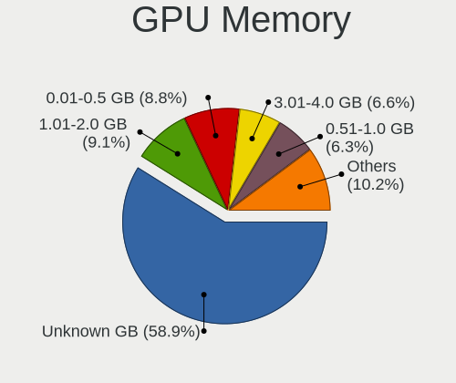

| Size in GB | Computers | Percent |
|------------|-----------|---------|
| Unknown    | 161       | 51.77%  |
| 1.01-2.0   | 34        | 10.93%  |
| 0.01-0.5   | 31        | 9.97%   |
| 0.51-1.0   | 29        | 9.32%   |
| 3.01-4.0   | 24        | 7.72%   |
| 7.01-8.0   | 11        | 3.54%   |
| 5.01-6.0   | 7         | 2.25%   |
| 8.01-16.0  | 7         | 2.25%   |
| 2.01-3.0   | 4         | 1.29%   |
| 16.01-24.0 | 2         | 0.64%   |
| 4.01-5.0   | 1         | 0.32%   |

Monitor
-------

Monitor Vendor
--------------

Monitor vendors

| Vendor                  | Computers | Percent |
|-------------------------|-----------|---------|
| Samsung Electronics     | 47        | 15.06%  |
| LG Display              | 39        | 12.5%   |
| Goldstar                | 36        | 11.54%  |
| AU Optronics            | 32        | 10.26%  |
| BOE                     | 23        | 7.37%   |
| Chimei Innolux          | 13        | 4.17%   |
| Unknown                 | 10        | 3.21%   |
| Philips                 | 8         | 2.56%   |
| LG Electronics          | 7         | 2.24%   |
| Dell                    | 7         | 2.24%   |
| Sharp                   | 6         | 1.92%   |
| OUT                     | 5         | 1.6%    |
| Hewlett-Packard         | 5         | 1.6%    |
| Apple                   | 5         | 1.6%    |
| AOC                     | 5         | 1.6%    |
| PANDA                   | 4         | 1.28%   |
| BenQ                    | 4         | 1.28%   |
| ALP                     | 4         | 1.28%   |
| PRISM+                  | 3         | 0.96%   |
| JCH                     | 3         | 0.96%   |
| CPT                     | 3         | 0.96%   |
| Ancor Communications    | 3         | 0.96%   |
| MStar                   | 2         | 0.64%   |
| Lenovo                  | 2         | 0.64%   |
| JRY                     | 2         | 0.64%   |
| InfoVision              | 2         | 0.64%   |
| Denver                  | 2         | 0.64%   |
| CSO                     | 2         | 0.64%   |
| Chi Mei Optoelectronics | 2         | 0.64%   |
| VMO                     | 1         | 0.32%   |
| Unknown (ADE)           | 1         | 0.32%   |
| TopView                 | 1         | 0.32%   |
| TMX                     | 1         | 0.32%   |
| TGL                     | 1         | 0.32%   |
| Sony                    | 1         | 0.32%   |
| SIS                     | 1         | 0.32%   |
| Sanyo                   | 1         | 0.32%   |
| RTK                     | 1         | 0.32%   |
| RAT                     | 1         | 0.32%   |
| PBK                     | 1         | 0.32%   |
| ORM                     | 1         | 0.32%   |
| OOO                     | 1         | 0.32%   |
| NME                     | 1         | 0.32%   |
| MON                     | 1         | 0.32%   |
| LYC                     | 1         | 0.32%   |
| KVM                     | 1         | 0.32%   |
| KTC                     | 1         | 0.32%   |
| HVT                     | 1         | 0.32%   |
| HKC                     | 1         | 0.32%   |
| HannStar                | 1         | 0.32%   |
| CVT                     | 1         | 0.32%   |
| CND                     | 1         | 0.32%   |
| CM_                     | 1         | 0.32%   |
| CHR                     | 1         | 0.32%   |
| ADP                     | 1         | 0.32%   |

Monitor Model
-------------

Monitor models

| Model                                                                   | Computers | Percent |
|-------------------------------------------------------------------------|-----------|---------|
| Goldstar IPS FULLHD GSM5AB8 1920x1080 480x270mm 21.7-inch               | 6         | 1.87%   |
| Goldstar FULL HD GSM5B55 1920x1080 480x270mm 21.7-inch                  | 6         | 1.87%   |
| Samsung Electronics LCD Monitor SDCA029 3840x2160 344x194mm 15.5-inch   | 3         | 0.93%   |
| OUT HDMI OUT0240 1920x1200 341x256mm 16.8-inch                          | 3         | 0.93%   |
| LG Display LCD Monitor LGD0694 2560x1600 344x215mm 16.0-inch            | 3         | 0.93%   |
| LG Display LCD Monitor LGD02D8 1366x768 277x156mm 12.5-inch             | 3         | 0.93%   |
| Chimei Innolux LCD Monitor CMN14D5 1920x1080 309x173mm 13.9-inch        | 3         | 0.93%   |
| BOE LCD Monitor BOE0889 1920x1080 344x194mm 15.5-inch                   | 3         | 0.93%   |
| BOE LCD Monitor BOE0700 1920x1080 344x194mm 15.5-inch                   | 3         | 0.93%   |
| AU Optronics LCD Monitor AUO403D 1920x1080 309x173mm 13.9-inch          | 3         | 0.93%   |
| Sharp LQ156M1JW01 SHP14C3 1920x1080 344x194mm 15.5-inch                 | 2         | 0.62%   |
| Samsung Electronics LCD Monitor SAM0D42 3840x2160 1872x1053mm 84.6-inch | 2         | 0.62%   |
| LG Display LCD Monitor LGD05F8 2560x1600 366x229mm 17.0-inch            | 2         | 0.62%   |
| LG Display LCD Monitor LGD0532 1920x1080 344x194mm 15.5-inch            | 2         | 0.62%   |
| JRY Digital JRY0215 1920x1080 340x255mm 16.7-inch                       | 2         | 0.62%   |
| Goldstar W2261 GSM56CF 1920x1080 477x268mm 21.5-inch                    | 2         | 0.62%   |
| Goldstar LG ULTRAWIDE GSM59F1 2560x1080 800x340mm 34.2-inch             | 2         | 0.62%   |
| Dell U2412M DELA07A 1920x1200 518x324mm 24.1-inch                       | 2         | 0.62%   |
| Chimei Innolux LCD Monitor CMN15E8 1920x1080 344x193mm 15.5-inch        | 2         | 0.62%   |
| Chimei Innolux LCD Monitor CMN1406 1920x1080 309x173mm 13.9-inch        | 2         | 0.62%   |
| BOE LCD Monitor BOE06D7 3840x2160 345x194mm 15.6-inch                   | 2         | 0.62%   |
| AU Optronics LCD Monitor AUO38ED 1920x1080 344x193mm 15.5-inch          | 2         | 0.62%   |
| AU Optronics LCD Monitor AUO312C 1366x768 293x164mm 13.2-inch           | 2         | 0.62%   |
| AU Optronics LCD Monitor 1920x1080                                      | 2         | 0.62%   |
| Ancor Communications ASUS PB258 ACI25A1 2560x1440 553x311mm 25.0-inch   | 2         | 0.62%   |
| VMO LCD WQXGA HDM VMO1506 2560x1600 1600x1000mm 74.3-inch               | 1         | 0.31%   |
| Unknown LCD Monitor STD 32Q-HDMI 2560x1440                              | 1         | 0.31%   |
| Unknown LCD Monitor SKYDATA S.P.A. LG TV 1920x1080                      | 1         | 0.31%   |
| Unknown LCD Monitor SAMSUNG 3286x1080                                   | 1         | 0.31%   |
| Unknown LCD Monitor OUT Digital 3200x1080                               | 1         | 0.31%   |
| Unknown LCD Monitor ORC DIGITAL MONITOR 1280x1024                       | 1         | 0.31%   |
| Unknown LCD Monitor NQM NewQ System 1280x1024                           | 1         | 0.31%   |
| Unknown LCD Monitor INN ULTRON 3479UC 4880x2560                         | 1         | 0.31%   |
| Unknown LCD Monitor ICB ULTRON4079 3840x2160                            | 1         | 0.31%   |
| Unknown LCD Monitor Digital Projection Limited DP                       | 1         | 0.31%   |
| Unknown LCD Monitor COZ 27VV IPS 1920x1200                              | 1         | 0.31%   |
| Unknown LCD Monitor Chuntex/CTX NL27 3840x2160                          | 1         | 0.31%   |
| Unknown (ADE) N2413 ADS LED ADE2413 1920x1080 521x293mm 23.5-inch       | 1         | 0.31%   |
| TopView TOPSYNC TOP049B 2560x1440 597x336mm 27.0-inch                   | 1         | 0.31%   |
| TMX TL140BDXP02-0 TMX1400 2560x1440 310x174mm 14.0-inch                 | 1         | 0.31%   |
| TGL TGL A190 TGL0908 1280x1024 376x301mm 19.0-inch                      | 1         | 0.31%   |
| Sony NvidiaDefault SNY05FA 1366x768 290x170mm 13.2-inch                 | 1         | 0.31%   |
| SIS DV 24 TV SIS0330 1920x1080 930x530mm 42.1-inch                      | 1         | 0.31%   |
| Sharp LQ173M1JW05 SHP14EC 1920x1080 380x210mm 17.1-inch                 | 1         | 0.31%   |
| Sharp LCD Monitor SHP14B9 3840x2160 344x194mm 15.5-inch                 | 1         | 0.31%   |
| Sharp LCD Monitor SHP1476 3840x2160 346x194mm 15.6-inch                 | 1         | 0.31%   |
| Sharp LCD Monitor SHP1447 1920x1080 294x165mm 13.3-inch                 | 1         | 0.31%   |
| Sanyo LED MONITOR SAN309A 1920x1080 443x249mm 20.0-inch                 | 1         | 0.31%   |
| Samsung Electronics U32R59x SAM0F96 3840x2160 697x392mm 31.5-inch       | 1         | 0.31%   |
| Samsung Electronics U32R59x SAM0F94 3840x2160 700x390mm 31.5-inch       | 1         | 0.31%   |
| Samsung Electronics U32H85x SAM0E3A 3840x2160 697x392mm 31.5-inch       | 1         | 0.31%   |
| Samsung Electronics SyncMaster SAM04D4 1920x1080 531x298mm 24.0-inch    | 1         | 0.31%   |
| Samsung Electronics SyncMaster SAM03F3 1920x1200 518x324mm 24.1-inch    | 1         | 0.31%   |
| Samsung Electronics SyncMaster SAM01A2 1280x1024 376x301mm 19.0-inch    | 1         | 0.31%   |
| Samsung Electronics SyncMaster SAM0138 1280x1024 338x270mm 17.0-inch    | 1         | 0.31%   |
| Samsung Electronics SMBX2350 SAM071E 1920x1080 510x290mm 23.1-inch      | 1         | 0.31%   |
| Samsung Electronics S34J55x SAM0F72 3440x1440 800x330mm 34.1-inch       | 1         | 0.31%   |
| Samsung Electronics S32E511 SAM0D11 1920x1080 698x392mm 31.5-inch       | 1         | 0.31%   |
| Samsung Electronics S27R65 SAM1045 1920x1080 598x336mm 27.0-inch        | 1         | 0.31%   |
| Samsung Electronics S27D850 SAM0BC7 2560x1440 598x336mm 27.0-inch       | 1         | 0.31%   |

Monitor Resolution
------------------

Monitor screen resolution

| Resolution         | Computers | Percent |
|--------------------|-----------|---------|
| 1920x1080 (FHD)    | 151       | 49.51%  |
| 1366x768 (WXGA)    | 33        | 10.82%  |
| 3840x2160 (4K)     | 26        | 8.52%   |
| 2560x1440 (QHD)    | 19        | 6.23%   |
| 1920x1200 (WUXGA)  | 11        | 3.61%   |
| 1280x1024 (SXGA)   | 11        | 3.61%   |
| 2560x1600          | 9         | 2.95%   |
| 1600x900 (HD+)     | 8         | 2.62%   |
| 1680x1050 (WSXGA+) | 6         | 1.97%   |
| 1280x800 (WXGA)    | 6         | 1.97%   |
| 1440x900 (WXGA+)   | 5         | 1.64%   |
| Unknown            | 5         | 1.64%   |
| 3440x1440          | 3         | 0.98%   |
| 2560x1080          | 3         | 0.98%   |
| 2880x1800          | 2         | 0.66%   |
| 4880x2560          | 1         | 0.33%   |
| 3840x1600          | 1         | 0.33%   |
| 3840x1080          | 1         | 0.33%   |
| 3286x1080          | 1         | 0.33%   |
| 3200x1080          | 1         | 0.33%   |
| 1680x945           | 1         | 0.33%   |
| 1600x1200          | 1         | 0.33%   |

Monitor Diagonal
----------------

Diagonal size in inches

| Inches  | Computers | Percent |
|---------|-----------|---------|
| 15      | 72        | 23%     |
| Unknown | 33        | 10.54%  |
| 13      | 31        | 9.9%    |
| 14      | 24        | 7.67%   |
| 21      | 21        | 6.71%   |
| 27      | 20        | 6.39%   |
| 23      | 18        | 5.75%   |
| 24      | 17        | 5.43%   |
| 16      | 14        | 4.47%   |
| 17      | 11        | 3.51%   |
| 31      | 9         | 2.88%   |
| 19      | 7         | 2.24%   |
| 34      | 5         | 1.6%    |
| 25      | 3         | 0.96%   |
| 20      | 3         | 0.96%   |
| 18      | 3         | 0.96%   |
| 12      | 3         | 0.96%   |
| 11      | 3         | 0.96%   |
| 84      | 2         | 0.64%   |
| 22      | 2         | 0.64%   |
| 10      | 2         | 0.64%   |
| 74      | 1         | 0.32%   |
| 54      | 1         | 0.32%   |
| 49      | 1         | 0.32%   |
| 46      | 1         | 0.32%   |
| 43      | 1         | 0.32%   |
| 42      | 1         | 0.32%   |
| 40      | 1         | 0.32%   |
| 39      | 1         | 0.32%   |
| 37      | 1         | 0.32%   |
| 33      | 1         | 0.32%   |

Monitor Width
-------------

Physical width

| Width in mm | Computers | Percent |
|-------------|-----------|---------|
| 301-350     | 117       | 37.86%  |
| 501-600     | 53        | 17.15%  |
| Unknown     | 33        | 10.68%  |
| 401-500     | 31        | 10.03%  |
| 201-300     | 29        | 9.39%   |
| 351-400     | 19        | 6.15%   |
| 601-700     | 10        | 3.24%   |
| 701-800     | 6         | 1.94%   |
| 801-900     | 3         | 0.97%   |
| 1501-2000   | 3         | 0.97%   |
| 1001-1500   | 3         | 0.97%   |
| 901-1000    | 2         | 0.65%   |

Aspect Ratio
------------

Proportional relationship between the width and the height

| Ratio   | Computers | Percent |
|---------|-----------|---------|
| 16/9    | 197       | 68.88%  |
| 16/10   | 32        | 11.19%  |
| Unknown | 31        | 10.84%  |
| 5/4     | 9         | 3.15%   |
| 4/3     | 8         | 2.8%    |
| 21/9    | 6         | 2.1%    |
| 3/2     | 2         | 0.7%    |
| 32/9    | 1         | 0.35%   |

Monitor Area
------------

Area in inch

| Area in inch | Computers | Percent |
|----------------|-----------|---------|
| 101-110        | 72        | 23.3%   |
| 201-250        | 49        | 15.86%  |
| 81-90          | 35        | 11.33%  |
| Unknown        | 33        | 10.68%  |
| 71-80          | 20        | 6.47%   |
| 301-350        | 20        | 6.47%   |
| 351-500        | 16        | 5.18%   |
| 151-200        | 11        | 3.56%   |
| 251-300        | 8         | 2.59%   |
| 121-130        | 8         | 2.59%   |
| 111-120        | 7         | 2.27%   |
| 131-140        | 6         | 1.94%   |
| 501-1000       | 6         | 1.94%   |
| 141-150        | 5         | 1.62%   |
| More than 1000 | 4         | 1.29%   |
| 61-70          | 3         | 0.97%   |
| 51-60          | 3         | 0.97%   |
| 41-50          | 2         | 0.65%   |
| 91-100         | 1         | 0.32%   |

Pixel Density
-------------

Pixels per inch

| Density       | Computers | Percent |
|---------------|-----------|---------|
| 121-160       | 89        | 28.9%   |
| 51-100        | 79        | 25.65%  |
| 101-120       | 67        | 21.75%  |
| Unknown       | 33        | 10.71%  |
| 161-240       | 26        | 8.44%   |
| More than 240 | 10        | 3.25%   |
| 1-50          | 4         | 1.3%    |

Multiple Monitors
-----------------

Total monitors connected

| Total | Computers | Percent |
|-------|-----------|---------|
| 1     | 244       | 77.96%  |
| 2     | 44        | 14.06%  |
| 0     | 22        | 7.03%   |
| 3     | 3         | 0.96%   |

Network
-------

Net Controller Vendor
---------------------

Controller vendors

| Vendor                            | Computers | Percent |
|-----------------------------------|-----------|---------|
| Realtek Semiconductor             | 176       | 40.84%  |
| Intel                             | 152       | 35.27%  |
| Qualcomm Atheros                  | 34        | 7.89%   |
| Broadcom                          | 20        | 4.64%   |
| ASIX Electronics                  | 6         | 1.39%   |
| Ralink Technology                 | 5         | 1.16%   |
| Marvell Technology Group          | 5         | 1.16%   |
| Ralink                            | 4         | 0.93%   |
| U-Blox                            | 3         | 0.7%    |
| Samsung Electronics               | 3         | 0.7%    |
| MEDIATEK                          | 3         | 0.7%    |
| Broadcom Limited                  | 3         | 0.7%    |
| TP-Link                           | 2         | 0.46%   |
| Nvidia                            | 2         | 0.46%   |
| Lenovo                            | 2         | 0.46%   |
| Exar                              | 2         | 0.46%   |
| D-Link                            | 2         | 0.46%   |
| Van Ooijen Technische Informatica | 1         | 0.23%   |
| Silicon Integrated Systems [SiS]  | 1         | 0.23%   |
| PEAK-System Technik               | 1         | 0.23%   |
| Microchip Technology              | 1         | 0.23%   |
| Comneon                           | 1         | 0.23%   |
| Arduino SA                        | 1         | 0.23%   |
| American Megatrends               | 1         | 0.23%   |

Net Controller Model
--------------------

Controller models

| Model                                                             | Computers | Percent |
|-------------------------------------------------------------------|-----------|---------|
| Realtek RTL8111/8168/8411 PCI Express Gigabit Ethernet Controller | 139       | 27.8%   |
| Intel Wi-Fi 6 AX200                                               | 22        | 4.4%    |
| Intel Wi-Fi 6 AX201                                               | 12        | 2.4%    |
| Realtek RTL8153 Gigabit Ethernet Adapter                          | 11        | 2.2%    |
| Realtek RTL810xE PCI Express Fast Ethernet controller             | 11        | 2.2%    |
| Intel Wireless 3165                                               | 9         | 1.8%    |
| Intel Comet Lake PCH-LP CNVi WiFi                                 | 9         | 1.8%    |
| Qualcomm Atheros QCA6174 802.11ac Wireless Network Adapter        | 7         | 1.4%    |
| Intel Cannon Point-LP CNVi [Wireless-AC]                          | 7         | 1.4%    |
| Intel 82579LM Gigabit Network Connection (Lewisville)             | 7         | 1.4%    |
| Realtek RTL8822CE 802.11ac PCIe Wireless Network Adapter          | 6         | 1.2%    |
| Intel Wireless 8265 / 8275                                        | 6         | 1.2%    |
| Intel I211 Gigabit Network Connection                             | 6         | 1.2%    |
| ASIX AX88179 Gigabit Ethernet                                     | 6         | 1.2%    |
| Qualcomm Atheros AR9485 Wireless Network Adapter                  | 5         | 1%      |
| Intel Wireless 7260                                               | 5         | 1%      |
| Intel Gemini Lake PCH CNVi WiFi                                   | 5         | 1%      |
| Intel Ethernet Connection (7) I219-V                              | 5         | 1%      |
| Intel Centrino Advanced-N 6205 [Taylor Peak]                      | 5         | 1%      |
| Intel Cannon Lake PCH CNVi WiFi                                   | 5         | 1%      |
| Realtek RTL8821CE 802.11ac PCIe Wireless Network Adapter          | 4         | 0.8%    |
| Realtek RTL8188EUS 802.11n Wireless Network Adapter               | 4         | 0.8%    |
| Realtek RTL8125 2.5GbE Controller                                 | 4         | 0.8%    |
| Qualcomm Atheros QCA9377 802.11ac Wireless Network Adapter        | 4         | 0.8%    |
| Intel Wireless 3160                                               | 4         | 0.8%    |
| Intel Ethernet Controller I225-V                                  | 4         | 0.8%    |
| Intel 82579V Gigabit Network Connection                           | 4         | 0.8%    |
| Intel 82574L Gigabit Network Connection                           | 4         | 0.8%    |
| U-Blox [u-blox 7]                                                 | 3         | 0.6%    |
| Samsung Galaxy series, misc. (tethering mode)                     | 3         | 0.6%    |
| Realtek RTL8822BE 802.11a/b/g/n/ac WiFi adapter                   | 3         | 0.6%    |
| Realtek RTL8812AU 802.11a/b/g/n/ac 2T2R DB WLAN Adapter           | 3         | 0.6%    |
| Realtek RTL8723BE PCIe Wireless Network Adapter                   | 3         | 0.6%    |
| Realtek RTL8188CUS 802.11n WLAN Adapter                           | 3         | 0.6%    |
| Realtek RTL8152 Fast Ethernet Adapter                             | 3         | 0.6%    |
| Qualcomm Atheros QCA9565 / AR9565 Wireless Network Adapter        | 3         | 0.6%    |
| Intel Wireless 7265                                               | 3         | 0.6%    |
| Intel Wi-Fi 6 AX210/AX211/AX411 160MHz                            | 3         | 0.6%    |
| Intel PRO/Wireless 3945ABG [Golan] Network Connection             | 3         | 0.6%    |
| Intel Ice Lake-LP PCH CNVi WiFi                                   | 3         | 0.6%    |
| Intel I210 Gigabit Network Connection                             | 3         | 0.6%    |
| Intel Ethernet Connection (2) I219-V                              | 3         | 0.6%    |
| Intel Centrino Wireless-N 1000 [Condor Peak]                      | 3         | 0.6%    |
| Intel 82576 Gigabit Network Connection                            | 3         | 0.6%    |
| Broadcom BCM43142 802.11b/g/n                                     | 3         | 0.6%    |
| Broadcom BCM4313 802.11bgn Wireless Network Adapter               | 3         | 0.6%    |
| Realtek RTL88x2bu [AC1200 Techkey]                                | 2         | 0.4%    |
| Realtek RTL8188CE 802.11b/g/n WiFi Adapter                        | 2         | 0.4%    |
| Realtek 802.11n NIC                                               | 2         | 0.4%    |
| Realtek 802.11ac NIC                                              | 2         | 0.4%    |
| Ralink MT7601U Wireless Adapter                                   | 2         | 0.4%    |
| Qualcomm Atheros Killer E2500 Gigabit Ethernet Controller         | 2         | 0.4%    |
| Qualcomm Atheros Attansic L1 Gigabit Ethernet                     | 2         | 0.4%    |
| Qualcomm Atheros AR8162 Fast Ethernet                             | 2         | 0.4%    |
| Qualcomm Atheros AR8132 Fast Ethernet                             | 2         | 0.4%    |
| Nvidia MCP79 Ethernet                                             | 2         | 0.4%    |
| MEDIATEK MT7921 802.11ax PCI Express Wireless Network Adapter     | 2         | 0.4%    |
| Intel Wireless-AC 9260                                            | 2         | 0.4%    |
| Intel WiFi Link 5100                                              | 2         | 0.4%    |
| Intel Ethernet Controller X550                                    | 2         | 0.4%    |

Wireless Vendor
---------------

Wireless vendors

| Vendor                | Computers | Percent |
|-----------------------|-----------|---------|
| Intel                 | 121       | 56.81%  |
| Realtek Semiconductor | 37        | 17.37%  |
| Qualcomm Atheros      | 23        | 10.8%   |
| Broadcom              | 14        | 6.57%   |
| Ralink Technology     | 5         | 2.35%   |
| Ralink                | 4         | 1.88%   |
| MEDIATEK              | 3         | 1.41%   |
| TP-Link               | 2         | 0.94%   |
| D-Link                | 2         | 0.94%   |
| Broadcom Limited      | 2         | 0.94%   |

Wireless Model
--------------

Wireless models

| Model                                                         | Computers | Percent |
|---------------------------------------------------------------|-----------|---------|
| Intel Wi-Fi 6 AX200                                           | 22        | 10.23%  |
| Intel Wi-Fi 6 AX201                                           | 12        | 5.58%   |
| Intel Wireless 3165                                           | 9         | 4.19%   |
| Intel Comet Lake PCH-LP CNVi WiFi                             | 9         | 4.19%   |
| Qualcomm Atheros QCA6174 802.11ac Wireless Network Adapter    | 7         | 3.26%   |
| Intel Cannon Point-LP CNVi [Wireless-AC]                      | 7         | 3.26%   |
| Realtek RTL8822CE 802.11ac PCIe Wireless Network Adapter      | 6         | 2.79%   |
| Intel Wireless 8265 / 8275                                    | 6         | 2.79%   |
| Qualcomm Atheros AR9485 Wireless Network Adapter              | 5         | 2.33%   |
| Intel Wireless 7260                                           | 5         | 2.33%   |
| Intel Gemini Lake PCH CNVi WiFi                               | 5         | 2.33%   |
| Intel Centrino Advanced-N 6205 [Taylor Peak]                  | 5         | 2.33%   |
| Intel Cannon Lake PCH CNVi WiFi                               | 5         | 2.33%   |
| Realtek RTL8821CE 802.11ac PCIe Wireless Network Adapter      | 4         | 1.86%   |
| Realtek RTL8188EUS 802.11n Wireless Network Adapter           | 4         | 1.86%   |
| Qualcomm Atheros QCA9377 802.11ac Wireless Network Adapter    | 4         | 1.86%   |
| Intel Wireless 3160                                           | 4         | 1.86%   |
| Realtek RTL8822BE 802.11a/b/g/n/ac WiFi adapter               | 3         | 1.4%    |
| Realtek RTL8812AU 802.11a/b/g/n/ac 2T2R DB WLAN Adapter       | 3         | 1.4%    |
| Realtek RTL8723BE PCIe Wireless Network Adapter               | 3         | 1.4%    |
| Realtek RTL8188CUS 802.11n WLAN Adapter                       | 3         | 1.4%    |
| Qualcomm Atheros QCA9565 / AR9565 Wireless Network Adapter    | 3         | 1.4%    |
| Intel Wireless 7265                                           | 3         | 1.4%    |
| Intel Wi-Fi 6 AX210/AX211/AX411 160MHz                        | 3         | 1.4%    |
| Intel PRO/Wireless 3945ABG [Golan] Network Connection         | 3         | 1.4%    |
| Intel Ice Lake-LP PCH CNVi WiFi                               | 3         | 1.4%    |
| Intel Centrino Wireless-N 1000 [Condor Peak]                  | 3         | 1.4%    |
| Broadcom BCM43142 802.11b/g/n                                 | 3         | 1.4%    |
| Broadcom BCM4313 802.11bgn Wireless Network Adapter           | 3         | 1.4%    |
| Realtek RTL88x2bu [AC1200 Techkey]                            | 2         | 0.93%   |
| Realtek RTL8188CE 802.11b/g/n WiFi Adapter                    | 2         | 0.93%   |
| Realtek 802.11n NIC                                           | 2         | 0.93%   |
| Realtek 802.11ac NIC                                          | 2         | 0.93%   |
| Ralink MT7601U Wireless Adapter                               | 2         | 0.93%   |
| MEDIATEK MT7921 802.11ax PCI Express Wireless Network Adapter | 2         | 0.93%   |
| Intel Wireless-AC 9260                                        | 2         | 0.93%   |
| Intel WiFi Link 5100                                          | 2         | 0.93%   |
| Intel Dual Band Wireless-AC 3168NGW [Stone Peak]              | 2         | 0.93%   |
| Intel Centrino Wireless-N 2230                                | 2         | 0.93%   |
| Intel Centrino Advanced-N 6235                                | 2         | 0.93%   |
| Intel Centrino Advanced-N 6200                                | 2         | 0.93%   |
| Intel Alder Lake-S PCH CNVi WiFi                              | 2         | 0.93%   |
| Broadcom BCM4360 802.11ac Wireless Network Adapter            | 2         | 0.93%   |
| Broadcom BCM4322 802.11a/b/g/n Wireless LAN Controller        | 2         | 0.93%   |
| Broadcom BCM43162 802.11ac Wireless Network Adapter           | 2         | 0.93%   |
| TP-Link TL-WN823N v2/v3 [Realtek RTL8192EU]                   | 1         | 0.47%   |
| TP-Link RTL8812AU Archer T4U 802.11ac                         | 1         | 0.47%   |
| Realtek RTL8852AE 802.11ax PCIe Wireless Network Adapter      | 1         | 0.47%   |
| Realtek RTL8192EU 802.11b/g/n WLAN Adapter                    | 1         | 0.47%   |
| Realtek RTL8192CE PCIe Wireless Network Adapter               | 1         | 0.47%   |
| Realtek RTL8188EE Wireless Network Adapter                    | 1         | 0.47%   |
| Realtek RTL8187B Wireless 802.11g 54Mbps Network Adapter      | 1         | 0.47%   |
| Ralink RT5572 Wireless Adapter                                | 1         | 0.47%   |
| Ralink RT5372 Wireless Adapter                                | 1         | 0.47%   |
| Ralink RT5370 Wireless Adapter                                | 1         | 0.47%   |
| Ralink RT5390R 802.11bgn PCIe Wireless Network Adapter        | 1         | 0.47%   |
| Ralink RT3092 Wireless 802.11n 2T/2R PCIe                     | 1         | 0.47%   |
| Ralink RT3090 Wireless 802.11n 1T/1R PCIe                     | 1         | 0.47%   |
| Ralink RT3062 Wireless 802.11n 2T/2R                          | 1         | 0.47%   |
| Qualcomm Atheros AR9462 Wireless Network Adapter              | 1         | 0.47%   |

Ethernet Vendor
---------------

Ethernet vendors

| Vendor                           | Computers | Percent |
|----------------------------------|-----------|---------|
| Realtek Semiconductor            | 166       | 63.12%  |
| Intel                            | 56        | 21.29%  |
| Qualcomm Atheros                 | 13        | 4.94%   |
| Broadcom                         | 6         | 2.28%   |
| ASIX Electronics                 | 6         | 2.28%   |
| Marvell Technology Group         | 5         | 1.9%    |
| Samsung Electronics              | 3         | 1.14%   |
| Nvidia                           | 2         | 0.76%   |
| Lenovo                           | 2         | 0.76%   |
| Silicon Integrated Systems [SiS] | 1         | 0.38%   |
| Microchip Technology             | 1         | 0.38%   |
| Broadcom Limited                 | 1         | 0.38%   |
| American Megatrends              | 1         | 0.38%   |

Ethernet Model
--------------

Ethernet models

| Model                                                                          | Computers | Percent |
|--------------------------------------------------------------------------------|-----------|---------|
| Realtek RTL8111/8168/8411 PCI Express Gigabit Ethernet Controller              | 139       | 50.36%  |
| Realtek RTL8153 Gigabit Ethernet Adapter                                       | 11        | 3.99%   |
| Realtek RTL810xE PCI Express Fast Ethernet controller                          | 11        | 3.99%   |
| Intel 82579LM Gigabit Network Connection (Lewisville)                          | 7         | 2.54%   |
| Intel I211 Gigabit Network Connection                                          | 6         | 2.17%   |
| ASIX AX88179 Gigabit Ethernet                                                  | 6         | 2.17%   |
| Intel Ethernet Connection (7) I219-V                                           | 5         | 1.81%   |
| Realtek RTL8125 2.5GbE Controller                                              | 4         | 1.45%   |
| Intel Ethernet Controller I225-V                                               | 4         | 1.45%   |
| Intel 82579V Gigabit Network Connection                                        | 4         | 1.45%   |
| Intel 82574L Gigabit Network Connection                                        | 4         | 1.45%   |
| Samsung Galaxy series, misc. (tethering mode)                                  | 3         | 1.09%   |
| Realtek RTL8152 Fast Ethernet Adapter                                          | 3         | 1.09%   |
| Intel I210 Gigabit Network Connection                                          | 3         | 1.09%   |
| Intel Ethernet Connection (2) I219-V                                           | 3         | 1.09%   |
| Intel 82576 Gigabit Network Connection                                         | 3         | 1.09%   |
| Qualcomm Atheros Killer E2500 Gigabit Ethernet Controller                      | 2         | 0.72%   |
| Qualcomm Atheros Attansic L1 Gigabit Ethernet                                  | 2         | 0.72%   |
| Qualcomm Atheros AR8162 Fast Ethernet                                          | 2         | 0.72%   |
| Qualcomm Atheros AR8132 Fast Ethernet                                          | 2         | 0.72%   |
| Nvidia MCP79 Ethernet                                                          | 2         | 0.72%   |
| Intel Ethernet Controller X550                                                 | 2         | 0.72%   |
| Intel Ethernet Connection I217-LM                                              | 2         | 0.72%   |
| Intel Ethernet Connection (6) I219-V                                           | 2         | 0.72%   |
| Intel Ethernet Connection (4) I219-V                                           | 2         | 0.72%   |
| Intel Ethernet Connection (2) I219-LM                                          | 2         | 0.72%   |
| Intel Ethernet Connection (2) I218-V                                           | 2         | 0.72%   |
| Intel 82577LM Gigabit Network Connection                                       | 2         | 0.72%   |
| Silicon Integrated Systems [SiS] 191 Gigabit Ethernet Adapter                  | 1         | 0.36%   |
| Realtek RTL8169 PCI Gigabit Ethernet Controller                                | 1         | 0.36%   |
| Realtek RTL-8110SC/8169SC Gigabit Ethernet                                     | 1         | 0.36%   |
| Realtek RTL-8100/8101L/8139 PCI Fast Ethernet Adapter                          | 1         | 0.36%   |
| Qualcomm Atheros Killer E220x Gigabit Ethernet Controller                      | 1         | 0.36%   |
| Qualcomm Atheros Attansic L2 Fast Ethernet                                     | 1         | 0.36%   |
| Qualcomm Atheros AR8152 v1.1 Fast Ethernet                                     | 1         | 0.36%   |
| Qualcomm Atheros AR8151 v2.0 Gigabit Ethernet                                  | 1         | 0.36%   |
| Qualcomm Atheros AR8131 Gigabit Ethernet                                       | 1         | 0.36%   |
| Microchip SMSC9512/9514 Fast Ethernet Adapter                                  | 1         | 0.36%   |
| Marvell Group Yukon Optima 88E8059 [PCIe Gigabit Ethernet Controller with AVB] | 1         | 0.36%   |
| Marvell Group 88E8055 PCI-E Gigabit Ethernet Controller                        | 1         | 0.36%   |
| Marvell Group 88E8053 PCI-E Gigabit Ethernet Controller                        | 1         | 0.36%   |
| Marvell Group 88E8040 PCI-E Fast Ethernet Controller                           | 1         | 0.36%   |
| Marvell Group 88E8039 PCI-E Fast Ethernet Controller                           | 1         | 0.36%   |
| Marvell Group 88E8001 Gigabit Ethernet Controller                              | 1         | 0.36%   |
| Lenovo USB-C Dock Ethernet                                                     | 1         | 0.36%   |
| Lenovo ThinkPad Dock Ethernet [Realtek RTL8153B]                               | 1         | 0.36%   |
| Intel Ethernet controller                                                      | 1         | 0.36%   |
| Intel Ethernet Connection X722 for 10GBASE-T                                   | 1         | 0.36%   |
| Intel Ethernet Connection I218-LM                                              | 1         | 0.36%   |
| Intel Ethernet Connection I217-V                                               | 1         | 0.36%   |
| Intel Ethernet Connection (4) I219-LM                                          | 1         | 0.36%   |
| Intel Ethernet Connection (2) I218-LM                                          | 1         | 0.36%   |
| Intel Ethernet Connection (10) I219-V                                          | 1         | 0.36%   |
| Intel 82599ES 10-Gigabit SFI/SFP+ Network Connection                           | 1         | 0.36%   |
| Intel 82575EB Gigabit Network Connection                                       | 1         | 0.36%   |
| Intel 82567LM Gigabit Network Connection                                       | 1         | 0.36%   |
| Broadcom NetXtreme BCM57786 Gigabit Ethernet PCIe                              | 1         | 0.36%   |
| Broadcom NetXtreme BCM5755M Gigabit Ethernet PCI Express                       | 1         | 0.36%   |
| Broadcom NetXtreme BCM5719 Gigabit Ethernet PCIe                               | 1         | 0.36%   |
| Broadcom NetLink BCM57788 Gigabit Ethernet PCIe                                | 1         | 0.36%   |

Net Controller Kind
-------------------

Ethernet, WiFi or modem

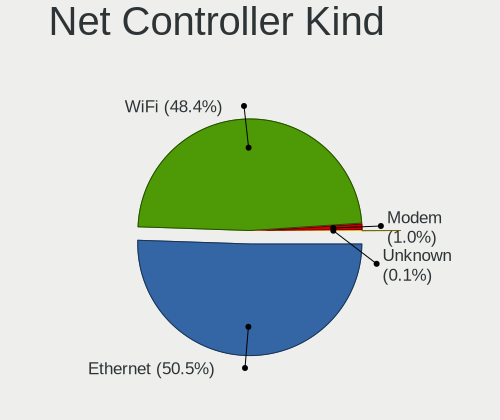

| Kind     | Computers | Percent |
|----------|-----------|---------|
| Ethernet | 246       | 53.83%  |
| WiFi     | 203       | 44.42%  |
| Modem    | 7         | 1.53%   |
| Unknown  | 1         | 0.22%   |

Used Controller
---------------

Currently used network controller

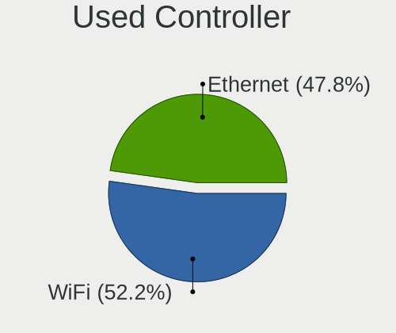

| Kind     | Computers | Percent |
|----------|-----------|---------|
| Ethernet | 189       | 54.15%  |
| WiFi     | 160       | 45.85%  |

NICs
----

Total network controllers on board

| Total | Computers | Percent |
|-------|-----------|---------|
| 1     | 154       | 50.16%  |
| 2     | 132       | 43%     |
| 0     | 11        | 3.58%   |
| 3     | 7         | 2.28%   |
| 4     | 2         | 0.65%   |
| 5     | 1         | 0.33%   |

IPv6
----

IPv6 vs IPv4

| Used | Computers | Percent |
|------|-----------|---------|
| No   | 306       | 99.67%  |
| Yes  | 1         | 0.33%   |

Bluetooth
---------

Bluetooth Vendor
----------------

Controller vendors

| Vendor                          | Computers | Percent |
|---------------------------------|-----------|---------|
| Intel                           | 101       | 53.72%  |
| Cambridge Silicon Radio         | 25        | 13.3%   |
| Realtek Semiconductor           | 15        | 7.98%   |
| Broadcom                        | 13        | 6.91%   |
| Qualcomm Atheros Communications | 12        | 6.38%   |
| IMC Networks                    | 8         | 4.26%   |
| Foxconn / Hon Hai               | 4         | 2.13%   |
| Lite-On Technology              | 3         | 1.6%    |
| Apple                           | 3         | 1.6%    |
| ASUSTek Computer                | 2         | 1.06%   |
| Qcom                            | 1         | 0.53%   |
| Micro Star International        | 1         | 0.53%   |

Bluetooth Model
---------------

Controller models

| Model                                                                               | Computers | Percent |
|-------------------------------------------------------------------------------------|-----------|---------|
| Intel Bluetooth wireless interface                                                  | 27        | 14.36%  |
| Cambridge Silicon Radio Bluetooth Dongle (HCI mode)                                 | 25        | 13.3%   |
| Intel AX201 Bluetooth                                                               | 23        | 12.23%  |
| Intel AX200 Bluetooth                                                               | 22        | 11.7%   |
| Intel Bluetooth 9460/9560 Jefferson Peak (JfP)                                      | 18        | 9.57%   |
| Realtek Bluetooth Radio                                                             | 11        | 5.85%   |
| Qualcomm Atheros QCA61x4 Bluetooth 4.0                                              | 6         | 3.19%   |
| Realtek  Bluetooth 4.2 Adapter                                                      | 3         | 1.6%    |
| Qualcomm Atheros  Bluetooth Device                                                  | 3         | 1.6%    |
| Intel Centrino Bluetooth Wireless Transceiver                                       | 3         | 1.6%    |
| Intel AX210 Bluetooth                                                               | 3         | 1.6%    |
| IMC Networks Bluetooth Radio                                                        | 3         | 1.6%    |
| IMC Networks Atheros AR3012 Bluetooth 4.0 Adapter                                   | 3         | 1.6%    |
| Broadcom BCM20702A0 Bluetooth 4.0                                                   | 3         | 1.6%    |
| Broadcom BCM2045B (BDC-2.1)                                                         | 3         | 1.6%    |
| Apple Bluetooth Host Controller                                                     | 3         | 1.6%    |
| Qualcomm Atheros AR3012 Bluetooth 4.0                                               | 2         | 1.06%   |
| Lite-On Bluetooth Device                                                            | 2         | 1.06%   |
| Intel Wireless-AC 9260 Bluetooth Adapter                                            | 2         | 1.06%   |
| Intel Wireless-AC 3168 Bluetooth                                                    | 2         | 1.06%   |
| Foxconn / Hon Hai BCM2045A0                                                         | 2         | 1.06%   |
| Broadcom BCM43142A0 Bluetooth Device                                                | 2         | 1.06%   |
| Broadcom BCM2070 Bluetooth Device                                                   | 2         | 1.06%   |
| Realtek CSR BS8510                                                                  | 1         | 0.53%   |
| Qualcomm Atheros AR3011 Bluetooth                                                   | 1         | 0.53%   |
| Qcom Bluetooth USB                                                                  | 1         | 0.53%   |
| Micro Star International Motorola Bluetooth 2.1+EDR Device                          | 1         | 0.53%   |
| Lite-On Broadcom BCM43142A0 Bluetooth Device                                        | 1         | 0.53%   |
| Intel Bluetooth Device                                                              | 1         | 0.53%   |
| IMC Networks Wireless_Device                                                        | 1         | 0.53%   |
| IMC Networks Bluetooth Device                                                       | 1         | 0.53%   |
| Foxconn / Hon Hai Wireless_Device                                                   | 1         | 0.53%   |
| Foxconn / Hon Hai Foxconn T77H114 BCM2070 [Single-Chip Bluetooth 2.1 + EDR Adapter] | 1         | 0.53%   |
| Broadcom Bluetooth 2.1 Device                                                       | 1         | 0.53%   |
| Broadcom BCM20702 Bluetooth 4.0 [ThinkPad]                                          | 1         | 0.53%   |
| Broadcom BCM2070 Bluetooth 2.1 + EDR                                                | 1         | 0.53%   |
| ASUS Broadcom BCM20702 Single-Chip Bluetooth 4.0 + LE                               | 1         | 0.53%   |
| ASUS Bluetooth Radio                                                                | 1         | 0.53%   |

Sound
-----

Sound Vendor
------------

Sound card vendors

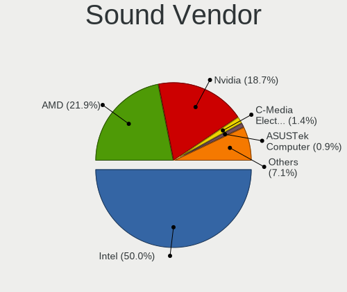

| Vendor                           | Computers | Percent |
|----------------------------------|-----------|---------|
| Intel                            | 219       | 54.48%  |
| Nvidia                           | 87        | 21.64%  |
| AMD                              | 79        | 19.65%  |
| JMTek                            | 3         | 0.75%   |
| Lenovo                           | 2         | 0.5%    |
| C-Media Electronics              | 2         | 0.5%    |
| ASUSTek Computer                 | 2         | 0.5%    |
| Silicon Integrated Systems [SiS] | 1         | 0.25%   |
| Razer USA                        | 1         | 0.25%   |
| Medeli Electronics               | 1         | 0.25%   |
| Giga-Byte Technology             | 1         | 0.25%   |
| Fry's Electronics                | 1         | 0.25%   |
| Dell                             | 1         | 0.25%   |
| Apple                            | 1         | 0.25%   |
| Unknown                          | 1         | 0.25%   |

Sound Model
-----------

Sound card models

| Model                                                                                             | Computers | Percent |
|---------------------------------------------------------------------------------------------------|-----------|---------|
| AMD Family 17h/19h HD Audio Controller                                                            | 31        | 6.62%   |
| Intel 6 Series/C200 Series Chipset Family High Definition Audio Controller                        | 20        | 4.27%   |
| AMD Renoir Radeon High Definition Audio Controller                                                | 19        | 4.06%   |
| Intel 7 Series/C216 Chipset Family High Definition Audio Controller                               | 18        | 3.85%   |
| Intel 8 Series/C220 Series Chipset High Definition Audio Controller                               | 17        | 3.63%   |
| Intel 5 Series/3400 Series Chipset High Definition Audio                                          | 15        | 3.21%   |
| Intel Xeon E3-1200 v3/4th Gen Core Processor HD Audio Controller                                  | 14        | 2.99%   |
| Intel Sunrise Point-LP HD Audio                                                                   | 14        | 2.99%   |
| Intel Cannon Lake PCH cAVS                                                                        | 14        | 2.99%   |
| Intel Tiger Lake-LP Smart Sound Technology Audio Controller                                       | 13        | 2.78%   |
| AMD Family 17h (Models 00h-0fh) HD Audio Controller                                               | 13        | 2.78%   |
| Intel Cannon Point-LP High Definition Audio Controller                                            | 12        | 2.56%   |
| AMD Raven/Raven2/Fenghuang HDMI/DP Audio Controller                                               | 11        | 2.35%   |
| Intel NM10/ICH7 Family High Definition Audio Controller                                           | 10        | 2.14%   |
| Intel Comet Lake PCH-LP cAVS                                                                      | 10        | 2.14%   |
| Nvidia GP107GL High Definition Audio Controller                                                   | 9         | 1.92%   |
| Intel Celeron/Pentium Silver Processor High Definition Audio                                      | 9         | 1.92%   |
| Intel 100 Series/C230 Series Chipset Family HD Audio Controller                                   | 9         | 1.92%   |
| Nvidia GP106 High Definition Audio Controller                                                     | 8         | 1.71%   |
| Intel 200 Series PCH HD Audio                                                                     | 8         | 1.71%   |
| AMD FCH Azalia Controller                                                                         | 8         | 1.71%   |
| Nvidia High Definition Audio Controller                                                           | 7         | 1.5%    |
| Intel Haswell-ULT HD Audio Controller                                                             | 6         | 1.28%   |
| Intel 82801I (ICH9 Family) HD Audio Controller                                                    | 6         | 1.28%   |
| Intel 8 Series HD Audio Controller                                                                | 6         | 1.28%   |
| AMD Starship/Matisse HD Audio Controller                                                          | 6         | 1.28%   |
| Nvidia TU102 High Definition Audio Controller                                                     | 5         | 1.07%   |
| Nvidia GK107 HDMI Audio Controller                                                                | 5         | 1.07%   |
| Nvidia GF119 HDMI Audio Controller                                                                | 5         | 1.07%   |
| Nvidia GA102 High Definition Audio Controller                                                     | 5         | 1.07%   |
| Intel Comet Lake PCH cAVS                                                                         | 5         | 1.07%   |
| AMD SBx00 Azalia (Intel HDA)                                                                      | 5         | 1.07%   |
| Nvidia TU107 GeForce GTX 1650 High Definition Audio Controller                                    | 4         | 0.85%   |
| Nvidia GK208 HDMI/DP Audio Controller                                                             | 4         | 0.85%   |
| Nvidia Audio device                                                                               | 4         | 0.85%   |
| Intel Ice Lake-LP Smart Sound Technology Audio Controller                                         | 4         | 0.85%   |
| Intel C610/X99 series chipset HD Audio Controller                                                 | 4         | 0.85%   |
| AMD Ellesmere HDMI Audio [Radeon RX 470/480 / 570/580/590]                                        | 4         | 0.85%   |
| Nvidia GM206 High Definition Audio Controller                                                     | 3         | 0.64%   |
| Nvidia GK106 HDMI Audio Controller                                                                | 3         | 0.64%   |
| Nvidia GF108 High Definition Audio Controller                                                     | 3         | 0.64%   |
| Nvidia GF106 High Definition Audio Controller                                                     | 3         | 0.64%   |
| Intel CM238 HD Audio Controller                                                                   | 3         | 0.64%   |
| Intel Atom/Celeron/Pentium Processor x5-E8000/J3xxx/N3xxx Series High Definition Audio Controller | 3         | 0.64%   |
| Intel Atom Processor Z36xxx/Z37xxx Series High Definition Audio Controller                        | 3         | 0.64%   |
| Intel Alder Lake-S HD Audio Controller                                                            | 3         | 0.64%   |
| Intel 82801H (ICH8 Family) HD Audio Controller                                                    | 3         | 0.64%   |
| AMD Trinity HDMI Audio Controller                                                                 | 3         | 0.64%   |
| AMD Kabini HDMI/DP Audio                                                                          | 3         | 0.64%   |
| AMD Cedar HDMI Audio [Radeon HD 5400/6300/7300 Series]                                            | 3         | 0.64%   |
| Nvidia TU106 High Definition Audio Controller                                                     | 2         | 0.43%   |
| Nvidia TU104 HD Audio Controller                                                                  | 2         | 0.43%   |
| Nvidia MCP79 High Definition Audio                                                                | 2         | 0.43%   |
| Nvidia GM107 High Definition Audio Controller [GeForce 940MX]                                     | 2         | 0.43%   |
| Nvidia GF104 High Definition Audio Controller                                                     | 2         | 0.43%   |
| Nvidia GA104 High Definition Audio Controller                                                     | 2         | 0.43%   |
| Intel Wildcat Point-LP High Definition Audio Controller                                           | 2         | 0.43%   |
| Intel USB PnP Sound Device                                                                        | 2         | 0.43%   |
| Intel Lewisburg MROM 0                                                                            | 2         | 0.43%   |
| Intel Broadwell-U Audio Controller                                                                | 2         | 0.43%   |

Memory
------

Memory Vendor
-------------

Memory module vendors

| Vendor              | Computers | Percent |
|---------------------|-----------|---------|
| Samsung Electronics | 89        | 56.33%  |
| SK Hynix            | 27        | 17.09%  |
| Unknown             | 8         | 5.06%   |
| Micron Technology   | 8         | 5.06%   |
| Kingston            | 6         | 3.8%    |
| Team                | 3         | 1.9%    |
| Unknown (ABCD)      | 2         | 1.27%   |
| Ramaxel Technology  | 2         | 1.27%   |
| NOT SUPPORT         | 2         | 1.27%   |
| A-DATA Technology   | 2         | 1.27%   |
| Unknown             | 2         | 1.27%   |
| Unknown (09D5)      | 1         | 0.63%   |
| Silicon Power       | 1         | 0.63%   |
| Klevv               | 1         | 0.63%   |
| imation             | 1         | 0.63%   |
| Hewlett-Packard     | 1         | 0.63%   |
| Elpida              | 1         | 0.63%   |
| Crucial             | 1         | 0.63%   |

Memory Model
------------

Memory module models

| Model                                                               | Computers | Percent |
|---------------------------------------------------------------------|-----------|---------|
| Samsung RAM M378A1K43CB2-CRC 8192MB DIMM DDR4 3500MT/s              | 5         | 2.82%   |
| Samsung RAM UBE3D4AA-MGCR 2GB Row Of Chips LPDDR4 4267MT/s          | 4         | 2.26%   |
| Samsung RAM M471A1K43EB1-CWE 8192MB SODIMM DDR4 3200MT/s            | 4         | 2.26%   |
| SK Hynix RAM HCNNNCPMMLXR-NEE 2GB Row Of Chips LPDDR4 4267MT/s      | 3         | 1.69%   |
| Samsung RAM M471B5273CH0-CH9 4096MB SODIMM DDR3 1334MT/s            | 3         | 1.69%   |
| Samsung RAM M471A5244CB0-CWE 4GB Row Of Chips DDR4 3200MT/s         | 3         | 1.69%   |
| Samsung RAM M471A5244CB0-CTD 4GB SODIMM DDR4 3266MT/s               | 3         | 1.69%   |
| Samsung RAM M471A1K43CB1-CTD 8GB SODIMM DDR4 2667MT/s               | 3         | 1.69%   |
| Samsung RAM M378B5273EB0-CK0 4GB DIMM DDR3 1800MT/s                 | 3         | 1.69%   |
| Samsung RAM M378B5173QH0-CK0 4GB DIMM DDR3 1866MT/s                 | 3         | 1.69%   |
| Samsung RAM M378A4G43AB2-CWE 32GB DIMM DDR4 3200MT/s                | 3         | 1.69%   |
| Unknown RAM Module 2GB DIMM DDR3 1333MT/s                           | 2         | 1.13%   |
| SK Hynix RAM Module 8192MB Row Of Chips LPDDR3 2133MT/s             | 2         | 1.13%   |
| SK Hynix RAM HMA81GS6CJR8N-VK 8GB SODIMM DDR4 2667MT/s              | 2         | 1.13%   |
| SK Hynix RAM H9CCNNNCLGALAR-NVD 8192MB Row Of Chips LPDDR3 2133MT/s | 2         | 1.13%   |
| Samsung RAM M471B5173QH0-YK0 4GB SODIMM DDR3 1600MT/s               | 2         | 1.13%   |
| Samsung RAM M471B1G73EB0-YK0 8192MB SODIMM DDR3 1600MT/s            | 2         | 1.13%   |
| Samsung RAM M471B1G73DB0-YK0 8GB SODIMM DDR3 1600MT/s               | 2         | 1.13%   |
| Samsung RAM M471A1K43DB1-CWE 8GB SODIMM DDR4 3200MT/s               | 2         | 1.13%   |
| Samsung RAM M471A1K43DB1-CTD 8GB SODIMM DDR4 2667MT/s               | 2         | 1.13%   |
| Samsung RAM M471A1G44AB0-CTD 8GB DDR4 2667MT/s                      | 2         | 1.13%   |
| Samsung RAM M378B5273CH0-CH9 4096MB DIMM DDR3 1867MT/s              | 2         | 1.13%   |
| Samsung RAM M378B5173DB0-CK0 4GB DIMM DDR3 1600MT/s                 | 2         | 1.13%   |
| Samsung RAM M378B1G73QH0-CK0 8GB DIMM DDR3 1600MT/s                 | 2         | 1.13%   |
| Samsung RAM M378B1G73DB0-CK0 8GB DIMM DDR3 2133MT/s                 | 2         | 1.13%   |
| Samsung RAM M378A4G43MB1-CTD 32GB DIMM DDR4 3466MT/s                | 2         | 1.13%   |
| Samsung RAM M378A2K43CB1-CTD 16GB DIMM DDR4 2667MT/s                | 2         | 1.13%   |
| Samsung RAM M378A2K43BB1-CRC 16384MB DIMM DDR4 3200MT/s             | 2         | 1.13%   |
| Samsung RAM M378A1K43CB2-CTD 8GB DIMM DDR4 3200MT/s                 | 2         | 1.13%   |
| Samsung RAM M378A1K43BB2-CRC 8GB DIMM DDR4 3400MT/s                 | 2         | 1.13%   |
| Samsung RAM K4EBE304EC-EGCG 8GB Row Of Chips LPDDR3 2133MT/s        | 2         | 1.13%   |
| NOT SUPPORT RAM Module 4096MB DIMM 1333MT/s                         | 2         | 1.13%   |
| Micron RAM 4ATF51264HZ-2G6E1 4096MB SODIMM DDR4 2667MT/s            | 2         | 1.13%   |
| Unknown                                                             | 2         | 1.13%   |
| Unknown RAM Module 4096MB DIMM DDR3 1600MT/s                        | 1         | 0.56%   |
| Unknown RAM Module 2048MB DIMM SDRAM                                | 1         | 0.56%   |
| Unknown RAM Module 2048MB DIMM DDR3 1333MT/s                        | 1         | 0.56%   |
| Unknown RAM Module 2048MB DIMM 1333MT/s                             | 1         | 0.56%   |
| Unknown RAM Module 1024MB DIMM SDRAM                                | 1         | 0.56%   |
| Unknown RAM MEM-DOWN 8192MB SODIMM DDR4 2400MT/s                    | 1         | 0.56%   |
| Unknown RAM CL22-22-22 D4-3200 16384MB SODIMM DDR4 3200MT/s         | 1         | 0.56%   |
| Unknown (ABCD) RAM 123456789012345678 8GB DIMM DDR4 2400MT/s        | 1         | 0.56%   |
| Unknown (ABCD) RAM 123456789012345678 2048MB SODIMM LPDDR4 2400MT/s | 1         | 0.56%   |
| Unknown (09D5) RAM Module 16384MB SODIMM DDR4 2400MT/s              | 1         | 0.56%   |
| Team RAM TEAMGROUP-UD4-2666 8GB DIMM DDR4 2667MT/s                  | 1         | 0.56%   |
| Team RAM TEAMGROUP-UD4-2666 8192MB DIMM DDR4 2667MT/s               | 1         | 0.56%   |
| Team RAM TEAMGROUP-UD4-2133 8GB DIMM DDR4 2666MT/s                  | 1         | 0.56%   |
| Team RAM TEAMGROUP-SD4-2666 16384MB SODIMM DDR4 2667MT/s            | 1         | 0.56%   |
| SK Hynix RAM Module 4096MB SODIMM DDR3 1066MT/s                     | 1         | 0.56%   |
| SK Hynix RAM Module 16384MB SODIMM DDR4 3200MT/s                    | 1         | 0.56%   |
| SK Hynix RAM HMT451U7BFR8A-PB 4096MB DIMM DDR3 1600MT/s             | 1         | 0.56%   |
| SK Hynix RAM HMT451S6AFR8A-PB 4GB SODIMM DDR3 1600MT/s              | 1         | 0.56%   |
| SK Hynix RAM HMT425S6AFR6A-PB 2GB SODIMM DDR3 1600MT/s              | 1         | 0.56%   |
| SK Hynix RAM HMT351U6CFR8C-PB 4GB DIMM DDR3 1800MT/s                | 1         | 0.56%   |
| SK Hynix RAM HMT351S6CFR8C-PB 4GB SODIMM DDR3 1600MT/s              | 1         | 0.56%   |
| SK Hynix RAM HMT351S6BFR8C-H9 4GB SODIMM DDR3 1334MT/s              | 1         | 0.56%   |
| SK Hynix RAM HMAB2GS6AMR6N-XN 16GB Row Of Chips DDR4 3200MT/s       | 1         | 0.56%   |
| SK Hynix RAM HMAA7GS6CMR6N-XN 8GB SODIMM DDR4 3200MT/s              | 1         | 0.56%   |
| SK Hynix RAM HMAA1GS6CMR6N-XN 8GB SODIMM DDR4 3200MT/s              | 1         | 0.56%   |
| SK Hynix RAM HMAA1GS6CJR6N-XN 8GB SODIMM DDR4 3200MT/s              | 1         | 0.56%   |

Memory Kind
-----------

Memory module kinds

| Kind    | Computers | Percent |
|---------|-----------|---------|
| DDR4    | 80        | 55.94%  |
| DDR3    | 38        | 26.57%  |
| LPDDR4  | 10        | 6.99%   |
| LPDDR3  | 7         | 4.9%    |
| SDRAM   | 4         | 2.8%    |
| Unknown | 3         | 2.1%    |
| DDR2    | 1         | 0.7%    |

Memory Form Factor
------------------

Physical design of the memory module

| Name         | Computers | Percent |
|--------------|-----------|---------|
| SODIMM       | 66        | 45.83%  |
| DIMM         | 54        | 37.5%   |
| Row Of Chips | 20        | 13.89%  |
| Unknown      | 4         | 2.78%   |

Memory Size
-----------

Memory module size

| Size  | Computers | Percent |
|-------|-----------|---------|
| 8192  | 63        | 40.65%  |
| 4096  | 44        | 28.39%  |
| 16384 | 25        | 16.13%  |
| 2048  | 12        | 7.74%   |
| 32768 | 8         | 5.16%   |
| 1024  | 2         | 1.29%   |
| 65536 | 1         | 0.65%   |

Memory Speed
------------

Memory module speed

| Speed   | Computers | Percent |
|---------|-----------|---------|
| 2667    | 31        | 19.5%   |
| 3200    | 29        | 18.24%  |
| 1600    | 22        | 13.84%  |
| 2400    | 13        | 8.18%   |
| 2133    | 11        | 6.92%   |
| 4267    | 7         | 4.4%    |
| 1333    | 6         | 3.77%   |
| 3500    | 5         | 3.14%   |
| 1334    | 5         | 3.14%   |
| 2666    | 4         | 2.52%   |
| 3466    | 3         | 1.89%   |
| 3266    | 3         | 1.89%   |
| 1867    | 3         | 1.89%   |
| 1866    | 3         | 1.89%   |
| 1800    | 3         | 1.89%   |
| 3400    | 2         | 1.26%   |
| 2933    | 2         | 1.26%   |
| Unknown | 2         | 1.26%   |
| 4199    | 1         | 0.63%   |
| 2048    | 1         | 0.63%   |
| 1067    | 1         | 0.63%   |
| 1066    | 1         | 0.63%   |
| 800     | 1         | 0.63%   |

Printers & scanners
-------------------

Printer Vendor
--------------

Printer device vendors

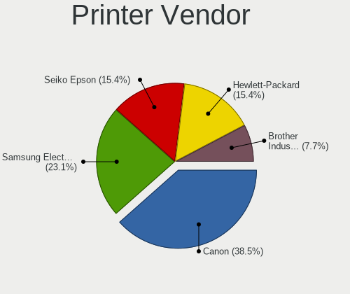

| Vendor              | Computers | Percent |
|---------------------|-----------|---------|
| Canon               | 3         | 42.86%  |
| Seiko Epson         | 1         | 14.29%  |
| Samsung Electronics | 1         | 14.29%  |
| Hewlett-Packard     | 1         | 14.29%  |
| Brother Industries  | 1         | 14.29%  |

Printer Model
-------------

Printer device models

| Model                    | Computers | Percent |
|--------------------------|-----------|---------|
| Seiko Epson L222 Series  | 1         | 14.29%  |
| Samsung CLX-3180 Series  | 1         | 14.29%  |
| HP OfficeJet 4650 series | 1         | 14.29%  |
| Canon PIXMA MP280        | 1         | 14.29%  |
| Canon G4010 series       | 1         | 14.29%  |
| Canon E560 series        | 1         | 14.29%  |
| Brother DCP-T310         | 1         | 14.29%  |

Scanner Vendor
--------------

Scanner device vendors

Zero info for selected period =(

Scanner Model
-------------

Scanner device models

Zero info for selected period =(

Camera
------

Camera Vendor
-------------

Camera device vendors

| Vendor                                 | Computers | Percent |
|----------------------------------------|-----------|---------|
| Chicony Electronics                    | 31        | 20%     |
| IMC Networks                           | 17        | 10.97%  |
| Acer                                   | 15        | 9.68%   |
| Realtek Semiconductor                  | 10        | 6.45%   |
| Silicon Motion                         | 9         | 5.81%   |
| Microdia                               | 8         | 5.16%   |
| Syntek                                 | 7         | 4.52%   |
| Quanta                                 | 7         | 4.52%   |
| Unknown                                | 6         | 3.87%   |
| Sunplus Innovation Technology          | 6         | 3.87%   |
| Suyin                                  | 5         | 3.23%   |
| Cheng Uei Precision Industry (Foxlink) | 5         | 3.23%   |
| Apple                                  | 5         | 3.23%   |
| Z-Star Microelectronics                | 3         | 1.94%   |
| Logitech                               | 3         | 1.94%   |
| Sony                                   | 2         | 1.29%   |
| Samsung Electronics                    | 2         | 1.29%   |
| lihappe8                               | 2         | 1.29%   |
| Canon                                  | 2         | 1.29%   |
| Telmax Communications                  | 1         | 0.65%   |
| Microsoft                              | 1         | 0.65%   |
| LG Electronics                         | 1         | 0.65%   |
| Lenovo                                 | 1         | 0.65%   |
| Goodong Industry                       | 1         | 0.65%   |
| GEMBIRD                                | 1         | 0.65%   |
| DJJHFA1BIF5CB0                         | 1         | 0.65%   |
| DigiTech                               | 1         | 0.65%   |
| ARC International                      | 1         | 0.65%   |
| Alcor Micro                            | 1         | 0.65%   |

Camera Model
------------

Camera device models

| Model                                                   | Computers | Percent |
|---------------------------------------------------------|-----------|---------|
| Chicony Integrated Camera                               | 8         | 5.1%    |
| IMC Networks Integrated Camera                          | 7         | 4.46%   |
| Unknown 720p HD Camera                                  | 6         | 3.82%   |
| Syntek Integrated Camera                                | 5         | 3.18%   |
| Microdia Integrated_Webcam_HD                           | 5         | 3.18%   |
| IMC Networks USB2.0 HD UVC WebCam                       | 5         | 3.18%   |
| Chicony HD Webcam                                       | 5         | 3.18%   |
| Acer HD Webcam                                          | 4         | 2.55%   |
| Suyin HP Truevision HD                                  | 3         | 1.91%   |
| Silicon Motion LG HD WebCam                             | 3         | 1.91%   |
| Realtek LG Camera                                       | 3         | 1.91%   |
| Quanta HP TrueVision HD Camera                          | 3         | 1.91%   |
| Chicony LG Camera                                       | 3         | 1.91%   |
| Acer Integrated Camera                                  | 3         | 1.91%   |
| Z-Star Webcam                                           | 2         | 1.27%   |
| Sunplus Integrated_Webcam_HD                            | 2         | 1.27%   |
| Sony ILCE-7S                                            | 2         | 1.27%   |
| Samsung Galaxy A5 (MTP)                                 | 2         | 1.27%   |
| Realtek USB2.0 HD UVC WebCam                            | 2         | 1.27%   |
| Realtek Integrated_Webcam_HD                            | 2         | 1.27%   |
| Quanta LG Webcam                                        | 2         | 1.27%   |
| Logitech C922 Pro Stream Webcam                         | 2         | 1.27%   |
| lihappe8 USB 2.0 Camera                                 | 2         | 1.27%   |
| IMC Networks USB2.0 VGA UVC WebCam                      | 2         | 1.27%   |
| Chicony USB 2.0 Camera                                  | 2         | 1.27%   |
| Chicony LG HD WebCam                                    | 2         | 1.27%   |
| Cheng Uei Precision Industry (Foxlink) HP Truevision HD | 2         | 1.27%   |
| Canon Digital Camera                                    | 2         | 1.27%   |
| Apple iPhone 5/5C/5S/6/SE                               | 2         | 1.27%   |
| Apple Built-in iSight                                   | 2         | 1.27%   |
| Z-Star Vimicro USB Camera (Altair)                      | 1         | 0.64%   |
| Telmax AbleScope                                        | 1         | 0.64%   |
| Syntek Lenovo EasyCamera                                | 1         | 0.64%   |
| Syntek HP Webcam                                        | 1         | 0.64%   |
| Suyin USB 2.0 Camera                                    | 1         | 0.64%   |
| Suyin HP TrueVision Full HD                             | 1         | 0.64%   |
| Sunplus UHD4K                                           | 1         | 0.64%   |
| Sunplus HP HD Webcam [Fixed]                            | 1         | 0.64%   |
| Sunplus ASUS USB2.0 Webcam                              | 1         | 0.64%   |
| Sunplus ABKO APC930 QHD WEBCAM                          | 1         | 0.64%   |
| Silicon Motion WebCam SC-13HDN10939N                    | 1         | 0.64%   |
| Silicon Motion WebCam SC-13HDL11431N                    | 1         | 0.64%   |
| Silicon Motion WebCam SC-10HDP12631N                    | 1         | 0.64%   |
| Silicon Motion WebCam SC-10HDD13335N                    | 1         | 0.64%   |
| Silicon Motion Web Camera                               | 1         | 0.64%   |
| Silicon Motion ATIV VGA Camera                          | 1         | 0.64%   |
| Realtek USB2.0 VGA UVC WebCam                           | 1         | 0.64%   |
| Realtek Integrated Webcam                               | 1         | 0.64%   |
| Realtek HD WebCam                                       | 1         | 0.64%   |
| Quanta USB HD Webcam                                    | 1         | 0.64%   |
| Quanta HP HD Camera                                     | 1         | 0.64%   |
| Microsoft LifeCam VX-2000                               | 1         | 0.64%   |
| Microdia Webcam SC-10HDD12636P                          | 1         | 0.64%   |
| Microdia USB 2.0 Camera                                 | 1         | 0.64%   |
| Microdia HP Integrated Webcam                           | 1         | 0.64%   |
| Logitech Webcam C110                                    | 1         | 0.64%   |
| LG LM-X420xxx/G2/G3 Android Phone (MTP/download mode)   | 1         | 0.64%   |
| Lenovo Integrated Webcam [R5U877]                       | 1         | 0.64%   |
| IMC Networks USB2.0 VGA Webcam                          | 1         | 0.64%   |
| IMC Networks USB2.0 5M AF UVC WebCam                    | 1         | 0.64%   |

Security
--------

Fingerprint Vendor
------------------

Fingerprint sensor vendors

| Vendor                     | Computers | Percent |
|----------------------------|-----------|---------|
| Synaptics                  | 15        | 37.5%   |
| Validity Sensors           | 7         | 17.5%   |
| Samsung Electronics        | 6         | 15%     |
| Shenzhen Goodix Technology | 4         | 10%     |
| Upek                       | 3         | 7.5%    |
| LighTuning Technology      | 2         | 5%      |
| Elan Microelectronics      | 2         | 5%      |
| AuthenTec                  | 1         | 2.5%    |

Fingerprint Model
-----------------

Fingerprint sensor models

| Model                                                     | Computers | Percent |
|-----------------------------------------------------------|-----------|---------|
| Unknown                                                   | 7         | 17.5%   |
| Samsung Fingerprint Sensor Device - 730B                  | 4         | 10%     |
| Upek Biometric Touchchip/Touchstrip Fingerprint Sensor    | 3         | 7.5%    |
| Synaptics Prometheus MIS Touch Fingerprint Reader         | 3         | 7.5%    |
| Shenzhen Goodix Fingerprint Reader                        | 3         | 7.5%    |
| Validity Sensors VFS5011 Fingerprint Reader               | 2         | 5%      |
| Synaptics  FS7604 Touch Fingerprint Sensor with PurePrint | 2         | 5%      |
| Synaptics Metallica MIS Touch Fingerprint Reader          | 2         | 5%      |
| Samsung Fingerprint Device                                | 2         | 5%      |
| LighTuning EgisTec Touch Fingerprint Sensor               | 2         | 5%      |
| Validity Sensors VFS7552 Touch Fingerprint Sensor         | 1         | 2.5%    |
| Validity Sensors VFS495 Fingerprint Reader                | 1         | 2.5%    |
| Validity Sensors VFS451 Fingerprint Reader                | 1         | 2.5%    |
| Validity Sensors VFS301 Fingerprint Reader                | 1         | 2.5%    |
| Validity Sensors Fingerprint scanner                      | 1         | 2.5%    |
| Synaptics WBDI Device                                     | 1         | 2.5%    |
| Shenzhen Goodix  FingerPrint Device                       | 1         | 2.5%    |
| Elan ELAN:Fingerprint                                     | 1         | 2.5%    |
| Elan ELAN:ARM-M4                                          | 1         | 2.5%    |
| AuthenTec Fingerprint Sensor                              | 1         | 2.5%    |

Chipcard Vendor
---------------

Chipcard module vendors

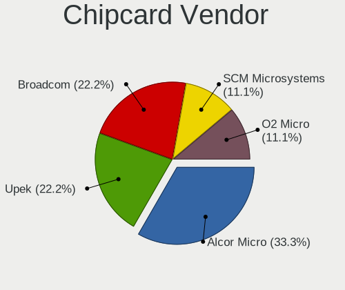

| Vendor      | Computers | Percent |
|-------------|-----------|---------|
| Alcor Micro | 2         | 40%     |
| Upek        | 1         | 20%     |
| O2 Micro    | 1         | 20%     |
| Broadcom    | 1         | 20%     |

Chipcard Model
--------------

Chipcard module models

| Model                                                                        | Computers | Percent |
|------------------------------------------------------------------------------|-----------|---------|
| Alcor Micro AU9540 Smartcard Reader                                          | 2         | 40%     |
| Upek TouchChip Fingerprint Coprocessor (WBF advanced mode)                   | 1         | 20%     |
| O2 Micro OZ776 CCID Smartcard Reader                                         | 1         | 20%     |
| Broadcom BCM5880 Secure Applications Processor with fingerprint swipe sensor | 1         | 20%     |

Unsupported
-----------

Unsupported Devices
-------------------

Total unsupported devices on board

| Total | Computers | Percent |
|-------|-----------|---------|
| 0     | 210       | 66.67%  |
| 1     | 83        | 26.35%  |
| 2     | 16        | 5.08%   |
| 3     | 3         | 0.95%   |
| 4     | 2         | 0.63%   |
| 5     | 1         | 0.32%   |

Unsupported Device Types
------------------------

Types of unsupported devices

| Type                     | Computers | Percent |
|--------------------------|-----------|---------|
| Fingerprint reader       | 40        | 32.26%  |
| Graphics card            | 27        | 21.77%  |
| Net/wireless             | 19        | 15.32%  |
| Unassigned class         | 9         | 7.26%   |
| Multimedia controller    | 6         | 4.84%   |
| Communication controller | 5         | 4.03%   |
| Chipcard                 | 5         | 4.03%   |
| Camera                   | 5         | 4.03%   |
| Net/ethernet             | 4         | 3.23%   |
| Sound                    | 2         | 1.61%   |
| Network                  | 1         | 0.81%   |
| Bluetooth                | 1         | 0.81%   |

