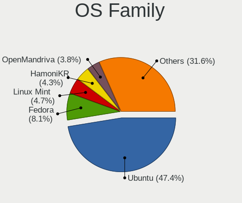
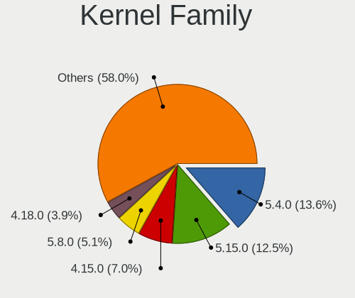
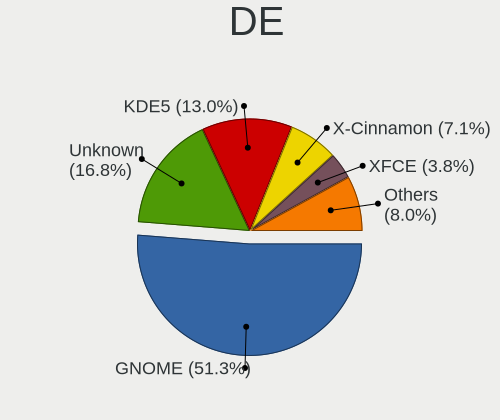
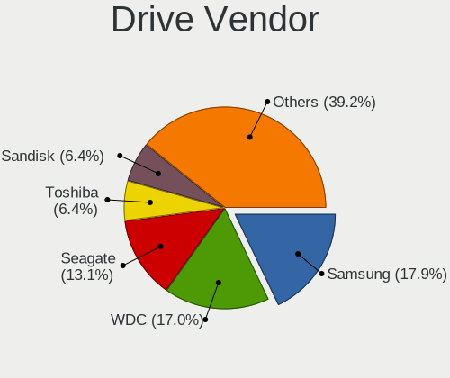
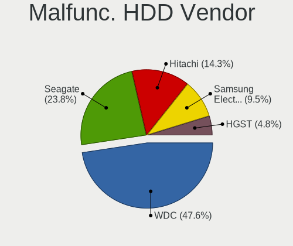
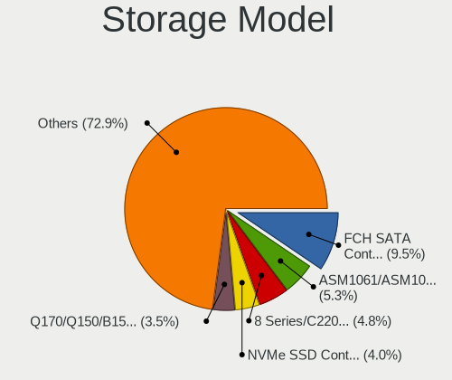
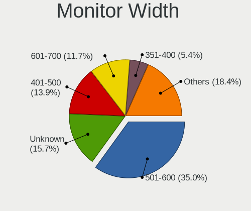
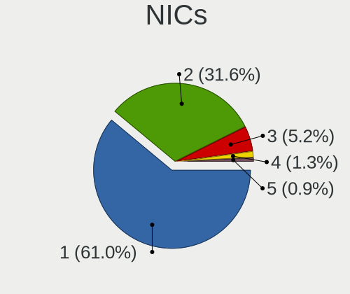
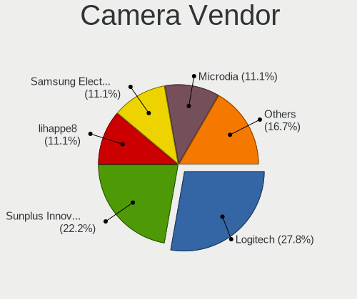

Linux in South Korea - Tested Hardware & Statistics (Desktops)
--------------------------------------------------------------

A project to collect tested hardware configurations for Linux in South Korea.

Anyone can contribute to this report by the [hw-probe](https://github.com/linuxhw/hw-probe) tool:

    sudo -E hw-probe -all -upload

Please contribute! Especially if your hardware is rare.

Contents
--------

* [ Test Cases ](#test-cases)

* [ System ](#system)
  - [ OS                       ](#os)
  - [ OS Family                ](#os-family)
  - [ Kernel                   ](#kernel)
  - [ Kernel Family            ](#kernel-family)
  - [ Kernel Major Ver.        ](#kernel-major-ver)
  - [ Arch                     ](#arch)
  - [ DE                       ](#de)
  - [ Display Server           ](#display-server)
  - [ Display Manager          ](#display-manager)
  - [ OS Lang                  ](#os-lang)
  - [ Boot Mode                ](#boot-mode)
  - [ Filesystem               ](#filesystem)
  - [ Part. scheme             ](#part-scheme)
  - [ Dual Boot with Linux/BSD ](#dual-boot-with-linuxbsd)
  - [ Dual Boot (Win)          ](#dual-boot-win)

* [ Board ](#board)
  - [ Vendor                   ](#vendor)
  - [ Model                    ](#model)
  - [ Model Family             ](#model-family)
  - [ MFG Year                 ](#mfg-year)
  - [ Form Factor              ](#form-factor)
  - [ Secure Boot              ](#secure-boot)
  - [ Coreboot                 ](#coreboot)
  - [ RAM Size                 ](#ram-size)
  - [ RAM Used                 ](#ram-used)
  - [ Total Drives             ](#total-drives)
  - [ Has CD-ROM               ](#has-cd-rom)
  - [ Has Ethernet             ](#has-ethernet)
  - [ Has WiFi                 ](#has-wifi)
  - [ Has Bluetooth            ](#has-bluetooth)

* [ Location ](#location)
  - [ Country                  ](#country)
  - [ City                     ](#city)

* [ Drives ](#drives)
  - [ Drive Vendor             ](#drive-vendor)
  - [ Drive Model              ](#drive-model)
  - [ HDD Vendor               ](#hdd-vendor)
  - [ SSD Vendor               ](#ssd-vendor)
  - [ Drive Kind               ](#drive-kind)
  - [ Drive Connector          ](#drive-connector)
  - [ Drive Size               ](#drive-size)
  - [ Space Total              ](#space-total)
  - [ Space Used               ](#space-used)
  - [ Malfunc. Drives          ](#malfunc-drives)
  - [ Malfunc. Drive Vendor    ](#malfunc-drive-vendor)
  - [ Malfunc. HDD Vendor      ](#malfunc-hdd-vendor)
  - [ Malfunc. Drive Kind      ](#malfunc-drive-kind)
  - [ Failed Drives            ](#failed-drives)
  - [ Failed Drive Vendor      ](#failed-drive-vendor)
  - [ Drive Status             ](#drive-status)

* [ Storage controller ](#storage-controller)
  - [ Storage Vendor           ](#storage-vendor)
  - [ Storage Model            ](#storage-model)
  - [ Storage Kind             ](#storage-kind)

* [ Processor ](#processor)
  - [ CPU Vendor               ](#cpu-vendor)
  - [ CPU Model                ](#cpu-model)
  - [ CPU Model Family         ](#cpu-model-family)
  - [ CPU Cores                ](#cpu-cores)
  - [ CPU Sockets              ](#cpu-sockets)
  - [ CPU Threads              ](#cpu-threads)
  - [ CPU Op-Modes             ](#cpu-op-modes)
  - [ CPU Microcode            ](#cpu-microcode)
  - [ CPU Microarch            ](#cpu-microarch)

* [ Graphics ](#graphics)
  - [ GPU Vendor               ](#gpu-vendor)
  - [ GPU Model                ](#gpu-model)
  - [ GPU Combo                ](#gpu-combo)
  - [ GPU Driver               ](#gpu-driver)
  - [ GPU Memory               ](#gpu-memory)

* [ Monitor ](#monitor)
  - [ Monitor Vendor           ](#monitor-vendor)
  - [ Monitor Model            ](#monitor-model)
  - [ Monitor Resolution       ](#monitor-resolution)
  - [ Monitor Diagonal         ](#monitor-diagonal)
  - [ Monitor Width            ](#monitor-width)
  - [ Aspect Ratio             ](#aspect-ratio)
  - [ Monitor Area             ](#monitor-area)
  - [ Pixel Density            ](#pixel-density)
  - [ Multiple Monitors        ](#multiple-monitors)

* [ Network ](#network)
  - [ Net Controller Vendor    ](#net-controller-vendor)
  - [ Net Controller Model     ](#net-controller-model)
  - [ Wireless Vendor          ](#wireless-vendor)
  - [ Wireless Model           ](#wireless-model)
  - [ Ethernet Vendor          ](#ethernet-vendor)
  - [ Ethernet Model           ](#ethernet-model)
  - [ Net Controller Kind      ](#net-controller-kind)
  - [ Used Controller          ](#used-controller)
  - [ NICs                     ](#nics)
  - [ IPv6                     ](#ipv6)

* [ Bluetooth ](#bluetooth)
  - [ Bluetooth Vendor         ](#bluetooth-vendor)
  - [ Bluetooth Model          ](#bluetooth-model)

* [ Sound ](#sound)
  - [ Sound Vendor             ](#sound-vendor)
  - [ Sound Model              ](#sound-model)

* [ Memory ](#memory)
  - [ Memory Vendor            ](#memory-vendor)
  - [ Memory Model             ](#memory-model)
  - [ Memory Kind              ](#memory-kind)
  - [ Memory Form Factor       ](#memory-form-factor)
  - [ Memory Size              ](#memory-size)
  - [ Memory Speed             ](#memory-speed)

* [ Printers & scanners ](#printers--scanners)
  - [ Printer Vendor           ](#printer-vendor)
  - [ Printer Model            ](#printer-model)
  - [ Scanner Vendor           ](#scanner-vendor)
  - [ Scanner Model            ](#scanner-model)

* [ Camera ](#camera)
  - [ Camera Vendor            ](#camera-vendor)
  - [ Camera Model             ](#camera-model)

* [ Security ](#security)
  - [ Fingerprint Vendor       ](#fingerprint-vendor)
  - [ Fingerprint Model        ](#fingerprint-model)
  - [ Chipcard Vendor          ](#chipcard-vendor)
  - [ Chipcard Model           ](#chipcard-model)

* [ Unsupported ](#unsupported)
  - [ Unsupported Devices      ](#unsupported-devices)
  - [ Unsupported Device Types ](#unsupported-device-types)

Test Cases
----------

Total: 184

| Vendor        | Model                       | Probe                                                      | Date         |
|---------------|-----------------------------|------------------------------------------------------------|--------------|
| Gigabyte      | Z490 AORUS XTREME WF        | [6d4f229020](https://linux-hardware.org/?probe=6d4f229020) | Nov 29, 2022 |
| Gigabyte      | 990FXA-UD3                  | [d5c76baafa](https://linux-hardware.org/?probe=d5c76baafa) | Nov 18, 2022 |
| ASUSTek       | P8H67                       | [0ccbbf67e8](https://linux-hardware.org/?probe=0ccbbf67e8) | Nov 10, 2022 |
| ASUSTek       | PRIME B365M-K               | [e2e281d38d](https://linux-hardware.org/?probe=e2e281d38d) | Nov 03, 2022 |
| Fujitsu       | D3219-A1 S26361-D3219-A1    | [bdc77dbc53](https://linux-hardware.org/?probe=bdc77dbc53) | Nov 03, 2022 |
| WTM           | W-N95 B0                    | [56611d3c8f](https://linux-hardware.org/?probe=56611d3c8f) | Oct 31, 2022 |
| HP            | 8425                        | [6d26af6597](https://linux-hardware.org/?probe=6d26af6597) | Oct 27, 2022 |
| Gigabyte      | B360M D3H-CF                | [ad1d808caa](https://linux-hardware.org/?probe=ad1d808caa) | Oct 14, 2022 |
| MSI           | A320M-A PRO                 | [40dd630e96](https://linux-hardware.org/?probe=40dd630e96) | Oct 05, 2022 |
| ASUSTek       | PRIME B550M-K               | [ff511df5c2](https://linux-hardware.org/?probe=ff511df5c2) | Sep 27, 2022 |
| Gigabyte      | MZBAYAP-00                  | [2fccc9ec66](https://linux-hardware.org/?probe=2fccc9ec66) | Sep 27, 2022 |
| Gigabyte      | 990FXA-UD3                  | [5c2eac6d83](https://linux-hardware.org/?probe=5c2eac6d83) | Sep 22, 2022 |
| Gigabyte      | 990FXA-UD3                  | [ea7d5b0424](https://linux-hardware.org/?probe=ea7d5b0424) | Sep 18, 2022 |
| Alienware     | 0CPDXD A00                  | [f65bdb053d](https://linux-hardware.org/?probe=f65bdb053d) | Sep 18, 2022 |
| ASUSTek       | ROG ZENITH EXTREME          | [156da35e98](https://linux-hardware.org/?probe=156da35e98) | Aug 24, 2022 |
| MSI           | MAG B660M MORTAR WIFI       | [4e1b75908c](https://linux-hardware.org/?probe=4e1b75908c) | Aug 13, 2022 |
| HP            | 8906 SMVB                   | [8f30392f49](https://linux-hardware.org/?probe=8f30392f49) | Aug 10, 2022 |
| Lenovo        | MAHOBAY 0B98401 PRO         | [ab0da3a7ec](https://linux-hardware.org/?probe=ab0da3a7ec) | Aug 07, 2022 |
| ASRock        | B250M Pro4                  | [59704c823a](https://linux-hardware.org/?probe=59704c823a) | Jul 29, 2022 |
| PCPartner     | MILANO-P Rev.00             | [1b6d72c5ac](https://linux-hardware.org/?probe=1b6d72c5ac) | Jul 18, 2022 |
| Gigabyte      | A320M-H-CF                  | [5bdae5b8f7](https://linux-hardware.org/?probe=5bdae5b8f7) | Jul 18, 2022 |
| HP            | 8906 SMVB                   | [cf71ced9a0](https://linux-hardware.org/?probe=cf71ced9a0) | Jul 10, 2022 |
| HP            | 8906 SMVB                   | [cf470317b1](https://linux-hardware.org/?probe=cf470317b1) | Jul 10, 2022 |
| ASUSTek       | P8H67                       | [8971b67abc](https://linux-hardware.org/?probe=8971b67abc) | Jul 08, 2022 |
| Gigabyte      | B360M D3H-CF                | [251bc4d58d](https://linux-hardware.org/?probe=251bc4d58d) | Jul 04, 2022 |
| Gigabyte      | MQLP5AP-00                  | [8014a14842](https://linux-hardware.org/?probe=8014a14842) | Jun 30, 2022 |
| Gigabyte      | TRX40 AORUS XTREME          | [2d23125cd0](https://linux-hardware.org/?probe=2d23125cd0) | May 15, 2022 |
| Gigabyte      | X99-SLI-CF                  | [55f1cc4480](https://linux-hardware.org/?probe=55f1cc4480) | May 10, 2022 |
| Alienware     | 0CPDXD A00                  | [17da14a17d](https://linux-hardware.org/?probe=17da14a17d) | May 03, 2022 |
| MSI           | H110M PRO-VD PLUS           | [80bdc044eb](https://linux-hardware.org/?probe=80bdc044eb) | May 01, 2022 |
| ASRock        | B550 Phantom Gaming 4       | [9a15614b1e](https://linux-hardware.org/?probe=9a15614b1e) | Apr 13, 2022 |
| MSI           | MAG B660M MORTAR DDR4       | [a9f2820894](https://linux-hardware.org/?probe=a9f2820894) | Apr 02, 2022 |
| Samsung       | DT1234567890 SEC_SW_REVI... | [90aa422ea2](https://linux-hardware.org/?probe=90aa422ea2) | Mar 31, 2022 |
| MSI           | X99A GAMING PRO CARBON      | [fa4526e9f3](https://linux-hardware.org/?probe=fa4526e9f3) | Mar 24, 2022 |
| ASUSTek       | P8H67                       | [05cdb119e9](https://linux-hardware.org/?probe=05cdb119e9) | Mar 07, 2022 |
| ASUSTek       | ROG STRIX Z690-A GAMING ... | [14f8855baa](https://linux-hardware.org/?probe=14f8855baa) | Feb 03, 2022 |
| ASUSTek       | PRIME B350M-A               | [7843ddc3fb](https://linux-hardware.org/?probe=7843ddc3fb) | Dec 24, 2021 |
| Samsung       | DT1234567890 SAMSUNG_SW_... | [151434ab61](https://linux-hardware.org/?probe=151434ab61) | Dec 21, 2021 |
| Lenovo        | 1036 SDK0T76457 WIN 3915... | [f894442edc](https://linux-hardware.org/?probe=f894442edc) | Nov 22, 2021 |
| ASUSTek       | ROG STRIX Z690-A GAMING ... | [4d11bd6b59](https://linux-hardware.org/?probe=4d11bd6b59) | Nov 20, 2021 |
| ASUSTek       | PRIME B350M-A               | [19eba77c24](https://linux-hardware.org/?probe=19eba77c24) | Oct 25, 2021 |
| ASRock        | M3A770DE                    | [4d966dec54](https://linux-hardware.org/?probe=4d966dec54) | Oct 03, 2021 |
| ASRock        | M3A770DE                    | [de6577e71a](https://linux-hardware.org/?probe=de6577e71a) | Oct 03, 2021 |
| Samsung       | DT_DM500T8A SAMSUNG_SW_R... | [23cf6f38e8](https://linux-hardware.org/?probe=23cf6f38e8) | Sep 21, 2021 |
| ASRock        | AB350M Pro4                 | [24de612862](https://linux-hardware.org/?probe=24de612862) | Aug 31, 2021 |
| ASUSTek       | Z170-A                      | [3abd60af90](https://linux-hardware.org/?probe=3abd60af90) | Aug 22, 2021 |
| ASUSTek       | Z170-A                      | [e523ad86d2](https://linux-hardware.org/?probe=e523ad86d2) | Aug 02, 2021 |
| MSI           | B450 GAMING PRO CARBON M... | [1e96b02bf3](https://linux-hardware.org/?probe=1e96b02bf3) | Jul 28, 2021 |
| ASUSTek       | P5QL/EPU                    | [972c061d3c](https://linux-hardware.org/?probe=972c061d3c) | Jul 22, 2021 |
| Gigabyte      | Z390 D                      | [8bf86066a5](https://linux-hardware.org/?probe=8bf86066a5) | Jul 22, 2021 |
| HP            | 3397                        | [b9b07bdc0a](https://linux-hardware.org/?probe=b9b07bdc0a) | Jul 09, 2021 |
| ASRockRack    | WC621D8A-2T                 | [d9c47162dc](https://linux-hardware.org/?probe=d9c47162dc) | Jun 25, 2021 |
| ASRockRack    | WC621D8A-2T                 | [b568edaa5e](https://linux-hardware.org/?probe=b568edaa5e) | Jun 25, 2021 |
| Gigabyte      | B75M-D3V                    | [9aaad9b2d4](https://linux-hardware.org/?probe=9aaad9b2d4) | Jun 07, 2021 |
| ECS           | A320AM4-M3D/3.x/5.x         | [be07a70b2e](https://linux-hardware.org/?probe=be07a70b2e) | May 27, 2021 |
| ASUSTek       | P5QL/EPU                    | [965bc51c8d](https://linux-hardware.org/?probe=965bc51c8d) | May 06, 2021 |
| ASRock        | A75M-ITX                    | [1ad3e30eec](https://linux-hardware.org/?probe=1ad3e30eec) | May 03, 2021 |
| Gigabyte      | A320M-S2H-CF                | [72d14b2ed7](https://linux-hardware.org/?probe=72d14b2ed7) | Apr 23, 2021 |
| Gigabyte      | A320M-S2H-CF                | [2300013263](https://linux-hardware.org/?probe=2300013263) | Apr 18, 2021 |
| ASRock        | FM2A88M-HD+ R2.0            | [fdac2fa1fd](https://linux-hardware.org/?probe=fdac2fa1fd) | Apr 14, 2021 |
| ASUSTek       | P8H67                       | [b17bb9b31a](https://linux-hardware.org/?probe=b17bb9b31a) | Apr 12, 2021 |
| ASRock        | AB350 Pro4                  | [a0686a3f62](https://linux-hardware.org/?probe=a0686a3f62) | Apr 11, 2021 |
| ASRock        | AB350 Pro4                  | [7e77253d59](https://linux-hardware.org/?probe=7e77253d59) | Apr 11, 2021 |
| Gigabyte      | 945GCMX-S2                  | [d4399ab9d0](https://linux-hardware.org/?probe=d4399ab9d0) | Apr 06, 2021 |
| Samsung       | DT_DM500T8A SAMSUNG_SW_R... | [dccf080cd2](https://linux-hardware.org/?probe=dccf080cd2) | Mar 26, 2021 |
| Samsung       | DT_DM500T8A SAMSUNG_SW_R... | [b55dc75624](https://linux-hardware.org/?probe=b55dc75624) | Mar 20, 2021 |
| Gigabyte      | B360M DS3H                  | [f7740321e0](https://linux-hardware.org/?probe=f7740321e0) | Mar 18, 2021 |
| MSI           | B75MA-E33                   | [e459ded47c](https://linux-hardware.org/?probe=e459ded47c) | Mar 10, 2021 |
| ASUSTek       | PRIME Z490-A                | [15c42588c8](https://linux-hardware.org/?probe=15c42588c8) | Mar 04, 2021 |
| ASUSTek       | WS X299 SAGE                | [541a436664](https://linux-hardware.org/?probe=541a436664) | Mar 02, 2021 |
| ASRock        | H110M-HDVP2                 | [8e6128682d](https://linux-hardware.org/?probe=8e6128682d) | Feb 28, 2021 |
| ASRock        | H110M-HDVP2                 | [778fcc3093](https://linux-hardware.org/?probe=778fcc3093) | Feb 28, 2021 |
| Gigabyte      | B75M-D3H                    | [774a5efd77](https://linux-hardware.org/?probe=774a5efd77) | Feb 25, 2021 |
| Gigabyte      | AB350-Gaming 3-CF           | [8dd1ebdfb8](https://linux-hardware.org/?probe=8dd1ebdfb8) | Feb 25, 2021 |
| MSI           | B450M MORTAR MAX            | [a222f11ebf](https://linux-hardware.org/?probe=a222f11ebf) | Feb 09, 2021 |
| ASUSTek       | PRIME B350M-A               | [0de61d3d11](https://linux-hardware.org/?probe=0de61d3d11) | Feb 06, 2021 |
| ASUSTek       | Z170-A                      | [65aa2efd23](https://linux-hardware.org/?probe=65aa2efd23) | Feb 05, 2021 |
| ASRock        | H110M-HDVP2                 | [27d324f7e1](https://linux-hardware.org/?probe=27d324f7e1) | Feb 04, 2021 |
| MSI           | B360M PRO-VDH               | [59b7bd58df](https://linux-hardware.org/?probe=59b7bd58df) | Jan 30, 2021 |
| MSI           | Z490-A PRO                  | [a29449d114](https://linux-hardware.org/?probe=a29449d114) | Jan 27, 2021 |
| MSI           | Z490-A PRO                  | [9595d4107b](https://linux-hardware.org/?probe=9595d4107b) | Jan 26, 2021 |
| ASRock        | B450M Steel Legend          | [a6226b7401](https://linux-hardware.org/?probe=a6226b7401) | Jan 20, 2021 |
| Samsung       | DT1234567890 SEC_SW_REVI... | [ffa2d06213](https://linux-hardware.org/?probe=ffa2d06213) | Jan 05, 2021 |
| HP            | 18E7                        | [e9590ba71a](https://linux-hardware.org/?probe=e9590ba71a) | Jan 01, 2021 |
| ASUSTek       | PRIME B250M-A               | [77ad294d93](https://linux-hardware.org/?probe=77ad294d93) | Dec 20, 2020 |
| MSI           | B360M PRO-VDH               | [ae9a14bb34](https://linux-hardware.org/?probe=ae9a14bb34) | Dec 11, 2020 |
| ASUSTek       | PRIME B250M-PLUS            | [b1476b4c51](https://linux-hardware.org/?probe=b1476b4c51) | Dec 09, 2020 |
| ASRock        | H81M-DGS R2.0               | [a706242b44](https://linux-hardware.org/?probe=a706242b44) | Dec 05, 2020 |
| MSI           | B360M PRO-VDH               | [f16f5d30de](https://linux-hardware.org/?probe=f16f5d30de) | Dec 05, 2020 |
| ASUSTek       | PRIME B250M-A               | [425fda9034](https://linux-hardware.org/?probe=425fda9034) | Dec 04, 2020 |
| ASUSTek       | P8B75-M LX PLUS             | [e6f9b2cf07](https://linux-hardware.org/?probe=e6f9b2cf07) | Dec 04, 2020 |
| ASRock        | B85M Pro4                   | [0354f4d9bc](https://linux-hardware.org/?probe=0354f4d9bc) | Nov 25, 2020 |
| ASRock        | B85M Pro4                   | [8dcc7ce213](https://linux-hardware.org/?probe=8dcc7ce213) | Nov 22, 2020 |
| Gigabyte      | H97M-D3H                    | [f9b97f5918](https://linux-hardware.org/?probe=f9b97f5918) | Nov 22, 2020 |
| ECS           | G31T-M7                     | [f93ce4415e](https://linux-hardware.org/?probe=f93ce4415e) | Nov 12, 2020 |
| PC Partner... | A236 0A                     | [14030da2e5](https://linux-hardware.org/?probe=14030da2e5) | Nov 10, 2020 |
| PC Partner... | A236 0A                     | [fc118d784c](https://linux-hardware.org/?probe=fc118d784c) | Nov 10, 2020 |
| ASUSTek       | P7P55D                      | [11e315efbd](https://linux-hardware.org/?probe=11e315efbd) | Nov 07, 2020 |
| ASRock        | H81M-DGS R2.0               | [9b33944102](https://linux-hardware.org/?probe=9b33944102) | Nov 04, 2020 |
| ASUSTek       | EX-A320M-GAMING             | [39cc53a5e3](https://linux-hardware.org/?probe=39cc53a5e3) | Oct 13, 2020 |
| Samsung       | DT1234567890 SEC_SW_REVI... | [3aba059c2c](https://linux-hardware.org/?probe=3aba059c2c) | Sep 24, 2020 |
| Samsung       | DT1234567890 SEC_SW_REVI... | [c535500f86](https://linux-hardware.org/?probe=c535500f86) | Sep 24, 2020 |
| ASRock        | H310M-STX/COM               | [5b22b538ee](https://linux-hardware.org/?probe=5b22b538ee) | Sep 23, 2020 |
| ASUSTek       | P5LD2                       | [56efa94b22](https://linux-hardware.org/?probe=56efa94b22) | Sep 09, 2020 |
| ASUSTek       | P5LD2                       | [00f5eba2ea](https://linux-hardware.org/?probe=00f5eba2ea) | Sep 09, 2020 |
| Gigabyte      | B75M-D3H                    | [934bb9c2ef](https://linux-hardware.org/?probe=934bb9c2ef) | Sep 09, 2020 |
| ASRock        | H310CM-HDV                  | [7acf41575b](https://linux-hardware.org/?probe=7acf41575b) | Sep 09, 2020 |
| ASRock        | H81M-HDS                    | [8b55873fbd](https://linux-hardware.org/?probe=8b55873fbd) | Sep 07, 2020 |
| Foxconn       | H61MXE                      | [7a31014e98](https://linux-hardware.org/?probe=7a31014e98) | Sep 04, 2020 |
| ASUSTek       | EX-A320M-GAMING             | [4eb75f039b](https://linux-hardware.org/?probe=4eb75f039b) | Aug 17, 2020 |
| Lenovo        | ThinkServer TS140           | [03abb9daf3](https://linux-hardware.org/?probe=03abb9daf3) | Aug 11, 2020 |
| Lenovo        | ThinkServer TS140           | [2d296ca69c](https://linux-hardware.org/?probe=2d296ca69c) | Aug 11, 2020 |
| ASRock        | H61M-HVGS                   | [36c19012ed](https://linux-hardware.org/?probe=36c19012ed) | Jul 25, 2020 |
| ASRock        | H61M-HVGS                   | [ea9287adc1](https://linux-hardware.org/?probe=ea9287adc1) | Jul 25, 2020 |
| ASRock        | Z390 Taichi                 | [ce94a11d8b](https://linux-hardware.org/?probe=ce94a11d8b) | Jun 26, 2020 |
| Huanan        | X99-F8                      | [74f9976527](https://linux-hardware.org/?probe=74f9976527) | Jun 25, 2020 |
| Gigabyte      | X570 GAMING X               | [cbd4390e56](https://linux-hardware.org/?probe=cbd4390e56) | Jun 23, 2020 |
| ASRock        | Z390 Taichi                 | [6989759d9c](https://linux-hardware.org/?probe=6989759d9c) | Jun 21, 2020 |
| ASRock        | Z390M Pro4                  | [eb53bb80ea](https://linux-hardware.org/?probe=eb53bb80ea) | Jun 20, 2020 |
| ECS           | H81H3-MV                    | [d39e7a605d](https://linux-hardware.org/?probe=d39e7a605d) | Jun 20, 2020 |
| Foxconn       | G41MXE/G41MXE-K             | [c05f965fec](https://linux-hardware.org/?probe=c05f965fec) | Jun 17, 2020 |
| Foxconn       | G41MXE/G41MXE-K             | [835aa152dd](https://linux-hardware.org/?probe=835aa152dd) | Jun 16, 2020 |
| Unknown       | Unknown                     | [e6e0a356a2](https://linux-hardware.org/?probe=e6e0a356a2) | May 19, 2020 |
| Gigabyte      | Z390 AORUS PRO WIFI-CF      | [e526204afd](https://linux-hardware.org/?probe=e526204afd) | May 16, 2020 |
| ASUSTek       | P5B-Deluxe                  | [24ce1a41e9](https://linux-hardware.org/?probe=24ce1a41e9) | May 16, 2020 |
| HP            | 158A                        | [344194646f](https://linux-hardware.org/?probe=344194646f) | May 14, 2020 |
| Gigabyte      | GA-MA785GT-UD3H             | [d5b8f91a79](https://linux-hardware.org/?probe=d5b8f91a79) | May 10, 2020 |
| Gigabyte      | B150M-D3H-CF                | [c259824b35](https://linux-hardware.org/?probe=c259824b35) | May 09, 2020 |
| ASRock        | X470 Taichi                 | [261241bb2f](https://linux-hardware.org/?probe=261241bb2f) | May 07, 2020 |
| Biostar       | H61MH                       | [aacc6bcb68](https://linux-hardware.org/?probe=aacc6bcb68) | May 07, 2020 |
| Gigabyte      | H81M-DS2V                   | [36cbf906a0](https://linux-hardware.org/?probe=36cbf906a0) | May 07, 2020 |
| Gigabyte      | B75M-D3V                    | [a4130d0549](https://linux-hardware.org/?probe=a4130d0549) | Apr 29, 2020 |
| ASRock        | G31M-S                      | [6a55997759](https://linux-hardware.org/?probe=6a55997759) | Apr 28, 2020 |
| ASUSTek       | B85M-G                      | [5d58ef4cec](https://linux-hardware.org/?probe=5d58ef4cec) | Apr 19, 2020 |
| ASUSTek       | Rampage V EXTREME           | [a78c0430fb](https://linux-hardware.org/?probe=a78c0430fb) | Apr 15, 2020 |
| ASUSTek       | Rampage V EXTREME           | [6e7470b8c3](https://linux-hardware.org/?probe=6e7470b8c3) | Apr 15, 2020 |
| MSI           | B250M PRO-VD                | [d797379451](https://linux-hardware.org/?probe=d797379451) | Apr 13, 2020 |
| Gigabyte      | TRX40 AORUS XTREME          | [0f078bd16f](https://linux-hardware.org/?probe=0f078bd16f) | Apr 11, 2020 |
| Dell          | 0Y2MRG A01                  | [053b33bcbc](https://linux-hardware.org/?probe=053b33bcbc) | Apr 05, 2020 |
| ASUSTek       | P5K                         | [8ec1f94a9f](https://linux-hardware.org/?probe=8ec1f94a9f) | Apr 05, 2020 |
| ASUSTek       | H110M-F                     | [c5861fb518](https://linux-hardware.org/?probe=c5861fb518) | Mar 31, 2020 |
| ASUSTek       | PRIME A320M-K               | [b3782f0e54](https://linux-hardware.org/?probe=b3782f0e54) | Mar 20, 2020 |
| ASUSTek       | ROG STRIX X399-E GAMING     | [c54c1dcc2f](https://linux-hardware.org/?probe=c54c1dcc2f) | Mar 18, 2020 |
| Gigabyte      | X570 I AORUS PRO WIFI       | [de7d898371](https://linux-hardware.org/?probe=de7d898371) | Mar 16, 2020 |
| ASRock        | FM2A88M-HD+ R3.0            | [b5def2acfb](https://linux-hardware.org/?probe=b5def2acfb) | Mar 03, 2020 |
| ECS           | H61H2-MV                    | [ca363a8ddc](https://linux-hardware.org/?probe=ca363a8ddc) | Mar 03, 2020 |
| ECS           | H61H2-MV                    | [2b56d27ead](https://linux-hardware.org/?probe=2b56d27ead) | Mar 02, 2020 |
| ECS           | H61H2-MV                    | [8b42886c6f](https://linux-hardware.org/?probe=8b42886c6f) | Mar 02, 2020 |
| ASUSTek       | P8H61-MX R2.0               | [fd4e08618e](https://linux-hardware.org/?probe=fd4e08618e) | Feb 28, 2020 |
| MSI           | B350M MORTAR                | [9496a3ac2c](https://linux-hardware.org/?probe=9496a3ac2c) | Feb 10, 2020 |
| LattePanda    | Alpha                       | [eb27db2005](https://linux-hardware.org/?probe=eb27db2005) | Feb 01, 2020 |
| LattePanda    | Alpha                       | [72a1cd44a0](https://linux-hardware.org/?probe=72a1cd44a0) | Feb 01, 2020 |
| MSI           | B350M MORTAR                | [f53a75b96e](https://linux-hardware.org/?probe=f53a75b96e) | Jan 10, 2020 |
| ASUSTek       | P5B-PLUS Series             | [b0a90d8478](https://linux-hardware.org/?probe=b0a90d8478) | Jan 02, 2020 |
| ASUSTek       | PRIME A320M-K               | [2fb35125e3](https://linux-hardware.org/?probe=2fb35125e3) | Dec 22, 2019 |
| Gigabyte      | 945GM-S2                    | [c6b23ec021](https://linux-hardware.org/?probe=c6b23ec021) | Dec 07, 2019 |
| ECS           | H81H3-M4                    | [2a11653db0](https://linux-hardware.org/?probe=2a11653db0) | Oct 05, 2019 |
| ASUSTek       | PRIME H310M-R R2.0          | [37c348afcc](https://linux-hardware.org/?probe=37c348afcc) | Sep 11, 2019 |
| ECS           | G41T-M6                     | [91cafa3b5b](https://linux-hardware.org/?probe=91cafa3b5b) | Aug 30, 2019 |
| Gigabyte      | H81M-DS2V                   | [68069aeff1](https://linux-hardware.org/?probe=68069aeff1) | Aug 21, 2019 |
| ASRock        | Z390 Extreme4               | [8c8af8b557](https://linux-hardware.org/?probe=8c8af8b557) | Jul 13, 2019 |
| ASRock        | AB350M Pro4                 | [88354e515f](https://linux-hardware.org/?probe=88354e515f) | Jul 08, 2019 |
| ASRock        | AB350M Pro4                 | [7506cb2993](https://linux-hardware.org/?probe=7506cb2993) | Jul 08, 2019 |
| Gigabyte      | GA-MA790FX-DS5              | [727b2b7099](https://linux-hardware.org/?probe=727b2b7099) | Jun 27, 2019 |
| AMD           | R690A-M2T                   | [da36474b90](https://linux-hardware.org/?probe=da36474b90) | Jun 18, 2019 |
| Gigabyte      | AB350M-DS2-CF               | [553908ddb3](https://linux-hardware.org/?probe=553908ddb3) | Jun 09, 2019 |
| ASUSTek       | PRIME X399-A                | [ae94045380](https://linux-hardware.org/?probe=ae94045380) | May 29, 2019 |
| Lenovo        | NO DPK                      | [b89b8c9364](https://linux-hardware.org/?probe=b89b8c9364) | May 27, 2019 |
| ASRock        | H61M-DGS                    | [6dc8ccd0f6](https://linux-hardware.org/?probe=6dc8ccd0f6) | May 08, 2019 |
| Foxconn       | P35A01                      | [f2685edfa8](https://linux-hardware.org/?probe=f2685edfa8) | Apr 21, 2019 |
| ASUSTek       | Z170-A                      | [322d76fe62](https://linux-hardware.org/?probe=322d76fe62) | Apr 04, 2019 |
| ASUSTek       | Z170-A                      | [0fa2f9b10a](https://linux-hardware.org/?probe=0fa2f9b10a) | Apr 04, 2019 |
| ASUSTek       | PRIME B450M-A               | [45f363040f](https://linux-hardware.org/?probe=45f363040f) | Mar 30, 2019 |
| ASRock        | P55 Pro                     | [041e899a1b](https://linux-hardware.org/?probe=041e899a1b) | Jan 15, 2019 |
| Gigabyte      | H55M-S2V                    | [36d1703d67](https://linux-hardware.org/?probe=36d1703d67) | Dec 23, 2018 |
| LattePanda    | Alpha                       | [287f0d8110](https://linux-hardware.org/?probe=287f0d8110) | Nov 27, 2018 |
| LattePanda    | Alpha                       | [37c9db1d31](https://linux-hardware.org/?probe=37c9db1d31) | Nov 27, 2018 |
| Gigabyte      | P55-US3L                    | [e216d60f26](https://linux-hardware.org/?probe=e216d60f26) | Sep 19, 2018 |
| Gigabyte      | B75M-D3H                    | [08f9437e06](https://linux-hardware.org/?probe=08f9437e06) | Jul 10, 2018 |
| Gigabyte      | H110-D3A-CF                 | [16f456428f](https://linux-hardware.org/?probe=16f456428f) | May 10, 2018 |
| ECS           | A55F2-M3                    | [e4af897158](https://linux-hardware.org/?probe=e4af897158) | May 10, 2018 |
| Gigabyte      | H110-D3A-CF                 | [f3036847e4](https://linux-hardware.org/?probe=f3036847e4) | May 10, 2018 |
| ECS           | A55F2-M3                    | [eb58cea516](https://linux-hardware.org/?probe=eb58cea516) | May 10, 2018 |
| ASRock        | G41M-VS3                    | [18d59d7ea8](https://linux-hardware.org/?probe=18d59d7ea8) | Apr 13, 2018 |

System
------

OS
--

Installed operating systems

| Name                         | Desktops | Percent |
|------------------------------|----------|---------|
| Ubuntu 20.04                 | 35       | 23.97%  |
| Ubuntu 18.04                 | 20       | 13.7%   |
| Ubuntu 22.04                 | 8        | 5.48%   |
| Ubuntu 20.10                 | 4        | 2.74%   |
| Arch                         | 4        | 2.74%   |
| Ubuntu 19.10                 | 3        | 2.05%   |
| Ubuntu 16.04                 | 3        | 2.05%   |
| Fedora 32                    | 3        | 2.05%   |
| CentOS 7                     | 3        | 2.05%   |
| Zorin 15                     | 2        | 1.37%   |
| Ubuntu Unity 16.04           | 2        | 1.37%   |
| Ubuntu 21.10                 | 2        | 1.37%   |
| RHEL 8                       | 2        | 1.37%   |
| openSUSE Tumbleweed-XXXXXXXX | 2        | 1.37%   |
| OpenMandriva 4.3             | 2        | 1.37%   |
| No1 2018                     | 2        | 1.37%   |
| Linux Mint 20.2              | 2        | 1.37%   |
| Linux Mint 20.1              | 2        | 1.37%   |
| Linux Mint 20                | 2        | 1.37%   |
| Linux Mint 19.3              | 2        | 1.37%   |
| Fedora 34                    | 2        | 1.37%   |
| Debian 10                    | 2        | 1.37%   |
| Chrome OS                    | 2        | 1.37%   |
| Zorin 16                     | 1        | 0.68%   |
| Ubuntu 19.04                 | 1        | 0.68%   |
| Ubuntu 18.10                 | 1        | 0.68%   |
| Ubuntu 17.10                 | 1        | 0.68%   |
| Ubuntu                       | 1        | 0.68%   |
| TmaxOS 21.12.02              | 1        | 0.68%   |
| ROSA R10                     | 1        | 0.68%   |
| Rocky Linux 8.6              | 1        | 0.68%   |
| Pop!_OS 22.04                | 1        | 0.68%   |
| Pop!_OS 20.04                | 1        | 0.68%   |
| OpenMandriva 4.50            | 1        | 0.68%   |
| OpenMandriva 4.2             | 1        | 0.68%   |
| Nobara 36                    | 1        | 0.68%   |
| No1 2020 te                  | 1        | 0.68%   |
| Manjaro 20.2.1               | 1        | 0.68%   |
| Lubuntu 18.04                | 1        | 0.68%   |
| Linux Mint 21                | 1        | 0.68%   |

OS Family
---------

OS without a version

| Name         | Desktops | Percent |
|--------------|----------|---------|
| Ubuntu       | 79       | 54.86%  |
| Linux Mint   | 8        | 5.56%   |
| Fedora       | 8        | 5.56%   |
| Arch         | 5        | 3.47%   |
| OpenMandriva | 4        | 2.78%   |
| CentOS       | 4        | 2.78%   |
| Zorin        | 3        | 2.08%   |
| HamoniKR     | 3        | 2.08%   |
| Debian       | 3        | 2.08%   |
| Ubuntu Unity | 2        | 1.39%   |
| RHEL         | 2        | 1.39%   |
| Pop!_OS      | 2        | 1.39%   |
| openSUSE     | 2        | 1.39%   |
| No1          | 2        | 1.39%   |
| Kubuntu      | 2        | 1.39%   |
| Chrome OS    | 2        | 1.39%   |
| TmaxOS       | 1        | 0.69%   |
| ROSA         | 1        | 0.69%   |
| Rocky Linux  | 1        | 0.69%   |
| Nobara       | 1        | 0.69%   |
| Manjaro      | 1        | 0.69%   |
| Lubuntu      | 1        | 0.69%   |
| KDE neon     | 1        | 0.69%   |
| Gooroom      | 1        | 0.69%   |
| Endless      | 1        | 0.69%   |
| EndeavourOS  | 1        | 0.69%   |
| Devuan       | 1        | 0.69%   |
| BlackPanther | 1        | 0.69%   |
| ArcoLinux    | 1        | 0.69%   |

Kernel
------

Version of the Linux kernel

| Version                   | Desktops | Percent |
|---------------------------|----------|---------|
| 5.4.0-29-generic          | 4        | 2.6%    |
| 5.4.0-26-generic          | 3        | 1.95%   |
| 5.15.0-41-generic         | 3        | 1.95%   |
| 5.8.0-48-generic          | 2        | 1.3%    |
| 5.8.0-38-generic          | 2        | 1.3%    |
| 5.4.0-56-generic          | 2        | 1.3%    |
| 5.4.0-54-generic          | 2        | 1.3%    |
| 5.4.0-52-generic          | 2        | 1.3%    |
| 5.4.0-47-generic          | 2        | 1.3%    |
| 5.4.0-42-generic          | 2        | 1.3%    |
| 5.4.0-37-generic          | 2        | 1.3%    |
| 5.3.0-51-generic          | 2        | 1.3%    |
| 5.3.0-40-generic          | 2        | 1.3%    |
| 5.16.7-desktop-1omv4003   | 2        | 1.3%    |
| 5.15.0-53-generic         | 2        | 1.3%    |
| 5.15.0-50-generic         | 2        | 1.3%    |
| 5.13.0-21-generic         | 2        | 1.3%    |
| 4.19.0-14-amd64           | 2        | 1.3%    |
| 4.18.0-25-generic         | 2        | 1.3%    |
| 4.15.0-91-generic         | 2        | 1.3%    |
| 6.0.1-arch1-1             | 1        | 0.65%   |
| 5.9.0-12.1-liquorix-amd64 | 1        | 0.65%   |
| 5.8.5-no1linux1           | 1        | 0.65%   |
| 5.8.16-300.fc33.x86_64    | 1        | 0.65%   |
| 5.8.10-200.fc32.x86_64    | 1        | 0.65%   |
| 5.8.0-59-generic          | 1        | 0.65%   |
| 5.8.0-55-generic          | 1        | 0.65%   |
| 5.8.0-50-generic          | 1        | 0.65%   |
| 5.8.0-44-generic          | 1        | 0.65%   |
| 5.8.0-41-generic          | 1        | 0.65%   |
| 5.8.0-33-generic          | 1        | 0.65%   |
| 5.8.0-32-generic          | 1        | 0.65%   |
| 5.8.0-26-generic          | 1        | 0.65%   |
| 5.8.0-1.el7.elrepo.x86_64 | 1        | 0.65%   |
| 5.7.16-200.fc32.x86_64    | 1        | 0.65%   |
| 5.6.6-arch1-1             | 1        | 0.65%   |
| 5.6.12-300.fc32.x86_64    | 1        | 0.65%   |
| 5.4.25+                   | 1        | 0.65%   |
| 5.4.2-arch1-1             | 1        | 0.65%   |
| 5.4.0-94-generic          | 1        | 0.65%   |

Kernel Family
-------------

Linux kernel without a distro release

| Version | Desktops | Percent |
|---------|----------|---------|
| 5.4.0   | 33       | 22.15%  |
| 4.15.0  | 18       | 12.08%  |
| 5.8.0   | 13       | 8.72%   |
| 5.15.0  | 12       | 8.05%   |
| 4.18.0  | 10       | 6.71%   |
| 5.3.0   | 9        | 6.04%   |
| 5.13.0  | 5        | 3.36%   |
| 5.0.0   | 3        | 2.01%   |
| 4.19.0  | 3        | 2.01%   |
| 5.16.7  | 2        | 1.34%   |
| 5.11.0  | 2        | 1.34%   |
| 4.13.0  | 2        | 1.34%   |
| 3.10.0  | 2        | 1.34%   |
| 6.0.1   | 1        | 0.67%   |
| 5.9.0   | 1        | 0.67%   |
| 5.8.5   | 1        | 0.67%   |
| 5.8.16  | 1        | 0.67%   |
| 5.8.10  | 1        | 0.67%   |
| 5.7.16  | 1        | 0.67%   |
| 5.6.6   | 1        | 0.67%   |
| 5.6.12  | 1        | 0.67%   |
| 5.4.25  | 1        | 0.67%   |
| 5.4.2   | 1        | 0.67%   |
| 5.19.3  | 1        | 0.67%   |
| 5.18.9  | 1        | 0.67%   |
| 5.18.13 | 1        | 0.67%   |
| 5.18.10 | 1        | 0.67%   |
| 5.16.19 | 1        | 0.67%   |
| 5.16.1  | 1        | 0.67%   |
| 5.15.8  | 1        | 0.67%   |
| 5.15.38 | 1        | 0.67%   |
| 5.14.6  | 1        | 0.67%   |
| 5.14.2  | 1        | 0.67%   |
| 5.14.0  | 1        | 0.67%   |
| 5.12.4  | 1        | 0.67%   |
| 5.11.8  | 1        | 0.67%   |
| 5.11.12 | 1        | 0.67%   |
| 5.10.4  | 1        | 0.67%   |
| 5.10.15 | 1        | 0.67%   |
| 5.10.14 | 1        | 0.67%   |

Kernel Major Ver.
-----------------

Linux kernel major version

| Version | Desktops | Percent |
|---------|----------|---------|
| 5.4     | 35       | 23.65%  |
| 4.15    | 19       | 12.84%  |
| 5.8     | 16       | 10.81%  |
| 5.15    | 14       | 9.46%   |
| 4.18    | 11       | 7.43%   |
| 5.3     | 9        | 6.08%   |
| 5.13    | 5        | 3.38%   |
| 5.16    | 4        | 2.7%    |
| 5.11    | 4        | 2.7%    |
| 5.10    | 4        | 2.7%    |
| 5.0     | 4        | 2.7%    |
| 4.19    | 4        | 2.7%    |
| 5.14    | 3        | 2.03%   |
| 5.6     | 2        | 1.35%   |
| 5.18    | 2        | 1.35%   |
| 4.9     | 2        | 1.35%   |
| 4.13    | 2        | 1.35%   |
| 3.10    | 2        | 1.35%   |
| 6.0     | 1        | 0.68%   |
| 5.9     | 1        | 0.68%   |
| 5.7     | 1        | 0.68%   |
| 5.19    | 1        | 0.68%   |
| 5.12    | 1        | 0.68%   |
| 4.17    | 1        | 0.68%   |

Arch
----

OS architecture (x86_64, i586, etc.)

| Name   | Desktops | Percent |
|--------|----------|---------|
| x86_64 | 140      | 99.29%  |
| i686   | 1        | 0.71%   |

DE
--

Desktop Environment

| Name            | Desktops | Percent |
|-----------------|----------|---------|
| GNOME           | 70       | 49.3%   |
| Unknown         | 33       | 23.24%  |
| KDE5            | 14       | 9.86%   |
| X-Cinnamon      | 8        | 5.63%   |
| XFCE            | 6        | 4.23%   |
| Unity           | 2        | 1.41%   |
| KDE             | 2        | 1.41%   |
| Cinnamon        | 2        | 1.41%   |
| TOS:GNOME       | 1        | 0.7%    |
| LXDE            | 1        | 0.7%    |
| KDE4            | 1        | 0.7%    |
| GNOME Flashback | 1        | 0.7%    |
| GNOME Classic   | 1        | 0.7%    |

Display Server
--------------

X11 or Wayland

| Name    | Desktops | Percent |
|---------|----------|---------|
| X11     | 99       | 70.21%  |
| Unknown | 20       | 14.18%  |
| Wayland | 17       | 12.06%  |
| Tty     | 5        | 3.55%   |

Display Manager
---------------

SDDM, LightDM, etc.

| Name    | Desktops | Percent |
|---------|----------|---------|
| Unknown | 93       | 65.49%  |
| GDM     | 15       | 10.56%  |
| SDDM    | 14       | 9.86%   |
| GDM3    | 11       | 7.75%   |
| LightDM | 5        | 3.52%   |
| TDM     | 3        | 2.11%   |
| SLiM    | 1        | 0.7%    |

OS Lang
-------

Language

| Lang    | Desktops | Percent |
|---------|----------|---------|
| ko_KR   | 58       | 40.85%  |
| en_US   | 51       | 35.92%  |
| Unknown | 28       | 19.72%  |
| ru_RU   | 1        | 0.7%    |
| id_ID   | 1        | 0.7%    |
| fr_FR   | 1        | 0.7%    |
| en_GB   | 1        | 0.7%    |
| en_AU   | 1        | 0.7%    |

Boot Mode
---------

EFI or BIOS

| Mode | Desktops | Percent |
|------|----------|---------|
| BIOS | 73       | 51.41%  |
| EFI  | 69       | 48.59%  |

Filesystem
----------

Type of filesystem

| Type    | Desktops | Percent |
|---------|----------|---------|
| Ext4    | 117      | 81.82%  |
| Unknown | 9        | 6.29%   |
| Btrfs   | 6        | 4.2%    |
| Xfs     | 5        | 3.5%    |
| Zfs     | 3        | 2.1%    |
| Overlay | 3        | 2.1%    |

Part. scheme
------------

Scheme of partitioning

| Type    | Desktops | Percent |
|---------|----------|---------|
| Unknown | 92       | 64.34%  |
| GPT     | 40       | 27.97%  |
| MBR     | 11       | 7.69%   |

Dual Boot with Linux/BSD
------------------------

Hosting more than one Linux/BSD

| Dual boot | Desktops | Percent |
|-----------|----------|---------|
| No        | 116      | 81.69%  |
| Yes       | 26       | 18.31%  |

Dual Boot (Win)
---------------

Hosting Linux and Windows

| Dual boot | Desktops | Percent |
|-----------|----------|---------|
| No        | 96       | 68.09%  |
| Yes       | 45       | 31.91%  |

Board
-----

Vendor
------

Motherboard manufacturer

| Name                | Desktops | Percent |
|---------------------|----------|---------|
| Gigabyte Technology | 33       | 23.4%   |
| ASUSTek Computer    | 33       | 23.4%   |
| ASRock              | 26       | 18.44%  |
| MSI                 | 12       | 8.51%   |
| ECS                 | 7        | 4.96%   |
| Samsung Electronics | 5        | 3.55%   |
| Hewlett-Packard     | 5        | 3.55%   |
| Lenovo              | 4        | 2.84%   |
| Foxconn             | 3        | 2.13%   |
| LattePanda          | 2        | 1.42%   |
| WTM                 | 1        | 0.71%   |
| PCPartner           | 1        | 0.71%   |
| PC Partner Limited  | 1        | 0.71%   |
| Huanan              | 1        | 0.71%   |
| Fujitsu             | 1        | 0.71%   |
| Dell                | 1        | 0.71%   |
| Biostar             | 1        | 0.71%   |
| ASRockRack          | 1        | 0.71%   |
| AMD                 | 1        | 0.71%   |
| Alienware           | 1        | 0.71%   |
| Unknown             | 1        | 0.71%   |

Model
-----

Motherboard model

| Name                                 | Desktops | Percent |
|--------------------------------------|----------|---------|
| Samsung DeskTop System               | 4        | 2.84%   |
| ASUS PRIME B350M-A                   | 3        | 2.13%   |
| MSI MS-7D42                          | 2        | 1.42%   |
| LattePanda Alpha                     | 2        | 1.42%   |
| Gigabyte TRX40 AORUS XTREME          | 2        | 1.42%   |
| Gigabyte H81M-DS2V                   | 2        | 1.42%   |
| Gigabyte B75M-D3V                    | 2        | 1.42%   |
| Gigabyte B75M-D3H                    | 2        | 1.42%   |
| Gigabyte B360M-D3H                   | 2        | 1.42%   |
| ASUS ROG STRIX Z690-A GAMING WIFI D4 | 2        | 1.42%   |
| ASUS PRIME A320M-K                   | 2        | 1.42%   |
| ASUS EX-A320M-GAMING                 | 2        | 1.42%   |
| ASUS All Series                      | 2        | 1.42%   |
| ASRock H81M-DGS R2.0                 | 2        | 1.42%   |
| ASRock AB350M Pro4                   | 2        | 1.42%   |
| WTM W-N95                            | 1        | 0.71%   |
| Samsung 500T8A/500S8A/500T9A/500S9A  | 1        | 0.71%   |
| PCPartner DREAMSYS                   | 1        | 0.71%   |
| PC Partner Limited S70BS.AH3511      | 1        | 0.71%   |
| MSI MS-7C75                          | 1        | 0.71%   |
| MSI MS-7C51                          | 1        | 0.71%   |
| MSI MS-7B89                          | 1        | 0.71%   |
| MSI MS-7B85                          | 1        | 0.71%   |
| MSI MS-7B24                          | 1        | 0.71%   |
| MSI MS-7A74                          | 1        | 0.71%   |
| MSI MS-7A37                          | 1        | 0.71%   |
| MSI MS-7A20                          | 1        | 0.71%   |
| MSI MS-7A15                          | 1        | 0.71%   |
| MSI MS-7808                          | 1        | 0.71%   |
| Lenovo ThinkStation P900 30A4A03600  | 1        | 0.71%   |
| Lenovo ThinkStation P520c 30BXCTO1WW | 1        | 0.71%   |
| Lenovo ThinkCentre M72e 4004H1U      | 1        | 0.71%   |
| Lenovo 70A4000FUX ThinkServer TS140  | 1        | 0.71%   |
| Huanan X99-F8                        | 1        | 0.71%   |
| HP Z620 Workstation                  | 1        | 0.71%   |
| HP ProDesk 600 G1 TWR                | 1        | 0.71%   |
| HP Pavilion Desktop TP01-2xxx        | 1        | 0.71%   |
| HP Compaq Elite 8300 MT              | 1        | 0.71%   |
| HP 280 G2 SFF                        | 1        | 0.71%   |
| Gigabyte Z490 AORUS XTREME WF        | 1        | 0.71%   |

Model Family
------------

Motherboard model prefix

| Name                            | Desktops | Percent |
|---------------------------------|----------|---------|
| ASUS PRIME                      | 13       | 9.22%   |
| Samsung DeskTop                 | 4        | 2.84%   |
| ASUS ROG                        | 4        | 2.84%   |
| MSI MS-7D42                     | 2        | 1.42%   |
| Lenovo ThinkStation             | 2        | 1.42%   |
| LattePanda Alpha                | 2        | 1.42%   |
| Gigabyte Z390                   | 2        | 1.42%   |
| Gigabyte X570                   | 2        | 1.42%   |
| Gigabyte TRX40                  | 2        | 1.42%   |
| Gigabyte H81M-DS2V              | 2        | 1.42%   |
| Gigabyte B75M-D3V               | 2        | 1.42%   |
| Gigabyte B75M-D3H               | 2        | 1.42%   |
| Gigabyte B360M-D3H              | 2        | 1.42%   |
| ASUS EX-A320M-GAMING            | 2        | 1.42%   |
| ASUS All                        | 2        | 1.42%   |
| ASRock Z390                     | 2        | 1.42%   |
| ASRock H81M-DGS                 | 2        | 1.42%   |
| ASRock FM2A88M-HD+              | 2        | 1.42%   |
| ASRock AB350M                   | 2        | 1.42%   |
| WTM W-N95                       | 1        | 0.71%   |
| Samsung 500T8A                  | 1        | 0.71%   |
| PCPartner DREAMSYS              | 1        | 0.71%   |
| PC Partner Limited S70BS.AH3511 | 1        | 0.71%   |
| MSI MS-7C75                     | 1        | 0.71%   |
| MSI MS-7C51                     | 1        | 0.71%   |
| MSI MS-7B89                     | 1        | 0.71%   |
| MSI MS-7B85                     | 1        | 0.71%   |
| MSI MS-7B24                     | 1        | 0.71%   |
| MSI MS-7A74                     | 1        | 0.71%   |
| MSI MS-7A37                     | 1        | 0.71%   |
| MSI MS-7A20                     | 1        | 0.71%   |
| MSI MS-7A15                     | 1        | 0.71%   |
| MSI MS-7808                     | 1        | 0.71%   |
| Lenovo ThinkCentre              | 1        | 0.71%   |
| Lenovo 70A4000FUX               | 1        | 0.71%   |
| Huanan X99-F8                   | 1        | 0.71%   |
| HP Z620                         | 1        | 0.71%   |
| HP ProDesk                      | 1        | 0.71%   |
| HP Pavilion                     | 1        | 0.71%   |
| HP Compaq                       | 1        | 0.71%   |

MFG Year
--------

Motherboard manufacture year

| Year | Desktops | Percent |
|------|----------|---------|
| 2018 | 18       | 12.77%  |
| 2012 | 18       | 12.77%  |
| 2017 | 16       | 11.35%  |
| 2019 | 13       | 9.22%   |
| 2013 | 11       | 7.8%    |
| 2020 | 9        | 6.38%   |
| 2014 | 9        | 6.38%   |
| 2021 | 7        | 4.96%   |
| 2016 | 7        | 4.96%   |
| 2009 | 7        | 4.96%   |
| 2015 | 6        | 4.26%   |
| 2007 | 5        | 3.55%   |
| 2010 | 4        | 2.84%   |
| 2011 | 3        | 2.13%   |
| 2008 | 3        | 2.13%   |
| 2022 | 2        | 1.42%   |
| 2006 | 2        | 1.42%   |
| 2005 | 1        | 0.71%   |

Form Factor
-----------

Physical design of the computer

| Name    | Desktops | Percent |
|---------|----------|---------|
| Desktop | 141      | 100%    |

Secure Boot
-----------

Enabled or disabled

| State    | Desktops | Percent |
|----------|----------|---------|
| Disabled | 139      | 98.58%  |
| Enabled  | 2        | 1.42%   |

Coreboot
--------

Have coreboot on board

| Used | Desktops | Percent |
|------|----------|---------|
| No   | 141      | 100%    |

RAM Size
--------

Total RAM memory

| Size in GB      | Desktops | Percent |
|-----------------|----------|---------|
| 8.01-16.0       | 31       | 21.68%  |
| 16.01-24.0      | 27       | 18.88%  |
| 64.01-256.0     | 21       | 14.69%  |
| 4.01-8.0        | 20       | 13.99%  |
| 3.01-4.0        | 18       | 12.59%  |
| 32.01-64.0      | 14       | 9.79%   |
| 24.01-32.0      | 4        | 2.8%    |
| 1.01-2.0        | 4        | 2.8%    |
| More than 256.0 | 2        | 1.4%    |
| 2.01-3.0        | 2        | 1.4%    |

RAM Used
--------

Used RAM memory

| Used GB    | Desktops | Percent |
|------------|----------|---------|
| 1.01-2.0   | 49       | 32.24%  |
| 2.01-3.0   | 30       | 19.74%  |
| 3.01-4.0   | 27       | 17.76%  |
| 4.01-8.0   | 21       | 13.82%  |
| 8.01-16.0  | 9        | 5.92%   |
| 0.51-1.0   | 9        | 5.92%   |
| 32.01-64.0 | 3        | 1.97%   |
| 16.01-24.0 | 3        | 1.97%   |
| 0.01-0.5   | 1        | 0.66%   |

Total Drives
------------

Number of drives on board

| Drives | Desktops | Percent |
|--------|----------|---------|
| 1      | 53       | 37.06%  |
| 2      | 43       | 30.07%  |
| 3      | 20       | 13.99%  |
| 4      | 11       | 7.69%   |
| 5      | 7        | 4.9%    |
| 6      | 3        | 2.1%    |
| 7      | 2        | 1.4%    |
| 10     | 1        | 0.7%    |
| 9      | 1        | 0.7%    |
| 8      | 1        | 0.7%    |
| 0      | 1        | 0.7%    |

Has CD-ROM
----------

Has CD-ROM on board

| Presented | Desktops | Percent |
|-----------|----------|---------|
| No        | 96       | 67.61%  |
| Yes       | 46       | 32.39%  |

Has Ethernet
------------

Has Ethernet on board

| Presented | Desktops | Percent |
|-----------|----------|---------|
| Yes       | 140      | 99.29%  |
| No        | 1        | 0.71%   |

Has WiFi
--------

Has WiFi module

| Presented | Desktops | Percent |
|-----------|----------|---------|
| No        | 94       | 66.2%   |
| Yes       | 48       | 33.8%   |

Has Bluetooth
-------------

Has Bluetooth module

| Presented | Desktops | Percent |
|-----------|----------|---------|
| No        | 89       | 61.81%  |
| Yes       | 55       | 38.19%  |

Location
--------

Country
-------

Geographic location (country)

| Country     | Desktops | Percent |
|-------------|----------|---------|
| South Korea | 141      | 100%    |

City
----

Geographic location (city)

| City           | Desktops | Percent |
|----------------|----------|---------|
| Seoul          | 15       | 10.07%  |
| Seongnam-si    | 12       | 8.05%   |
| Suwon          | 6        | 4.03%   |
| Busan          | 6        | 4.03%   |
| Yongin-si      | 5        | 3.36%   |
| Cheonan        | 5        | 3.36%   |
| Hwaseong-si    | 4        | 2.68%   |
| Gwanak-gu      | 4        | 2.68%   |
| Seo-gu         | 3        | 2.01%   |
| Nam-gu         | 3        | 2.01%   |
| Guri-si        | 3        | 2.01%   |
| Goyang-si      | 3        | 2.01%   |
| Gangseo-gu     | 3        | 2.01%   |
| Bucheon-si     | 3        | 2.01%   |
| Yongsan-gu     | 2        | 1.34%   |
| Yangcheon-gu   | 2        | 1.34%   |
| Uiseong-gun    | 2        | 1.34%   |
| Siheung-si     | 2        | 1.34%   |
| Seongdong-gu   | 2        | 1.34%   |
| Seongbuk-gu    | 2        | 1.34%   |
| Pyeongtaek-si  | 2        | 1.34%   |
| Osan           | 2        | 1.34%   |
| Incheon        | 2        | 1.34%   |
| Gwangmyeong-si | 2        | 1.34%   |
| Gangnam-gu     | 2        | 1.34%   |
| Dongjak-gu     | 2        | 1.34%   |
| Daejeon        | 2        | 1.34%   |
| Anyang-si      | 2        | 1.34%   |
| Ansan-si       | 2        | 1.34%   |
| Yuseong-gu     | 1        | 0.67%   |
| Yeonsu-gu      | 1        | 0.67%   |
| Ulsan          | 1        | 0.67%   |
| Ulju-gun       | 1        | 0.67%   |
| Taean-gun      | 1        | 0.67%   |
| Seosan City    | 1        | 0.67%   |
| Seodaemun-gu   | 1        | 0.67%   |
| Seocheon-gun   | 1        | 0.67%   |
| Sejong         | 1        | 0.67%   |
| Pohang         | 1        | 0.67%   |
| Pocheon-si     | 1        | 0.67%   |

Drives
------

Drive Vendor
------------

Hard drive vendors

| Vendor                    | Desktops | Drives | Percent |
|---------------------------|----------|--------|---------|
| WDC                       | 55       | 96     | 21.4%   |
| Seagate                   | 42       | 66     | 16.34%  |
| Samsung Electronics       | 41       | 59     | 15.95%  |
| Toshiba                   | 19       | 35     | 7.39%   |
| Crucial                   | 17       | 21     | 6.61%   |
| SanDisk                   | 16       | 19     | 6.23%   |
| Hitachi                   | 10       | 10     | 3.89%   |
| Unknown                   | 7        | 8      | 2.72%   |
| A-DATA Technology         | 5        | 5      | 1.95%   |
| Transcend                 | 4        | 4      | 1.56%   |
| SK hynix                  | 4        | 6      | 1.56%   |
| SPCC                      | 3        | 3      | 1.17%   |
| Silicon Motion            | 3        | 4      | 1.17%   |
| Plextor                   | 3        | 5      | 1.17%   |
| TAMMUZ                    | 2        | 3      | 0.78%   |
| Micron Technology         | 2        | 3      | 0.78%   |
| Intel                     | 2        | 2      | 0.78%   |
| HGST                      | 2        | 2      | 0.78%   |
| China                     | 2        | 2      | 0.78%   |
| ZOTAC                     | 1        | 1      | 0.39%   |
| Seagate Technology        | 1        | 1      | 0.39%   |
| Realtek Semiconductor     | 1        | 1      | 0.39%   |
| QNIX                      | 1        | 1      | 0.39%   |
| Phison                    | 1        | 2      | 0.39%   |
| PHINOCOM                  | 1        | 1      | 0.39%   |
| OCZ                       | 1        | 2      | 0.39%   |
| Micron/Crucial Technology | 1        | 1      | 0.39%   |
| MARVELL                   | 1        | 1      | 0.39%   |
| LITEON                    | 1        | 1      | 0.39%   |
| LaCie                     | 1        | 1      | 0.39%   |
| KIOXIA                    | 1        | 3      | 0.39%   |
| KingSpec                  | 1        | 1      | 0.39%   |
| JMicron Technology        | 1        | 1      | 0.39%   |
| Imation                   | 1        | 2      | 0.39%   |
| Hewlett-Packard           | 1        | 1      | 0.39%   |
| GLOWAY                    | 1        | 1      | 0.39%   |
| Fujitsu                   | 1        | 1      | 0.39%   |

Drive Model
-----------

Hard drive models

| Model                                  | Desktops | Percent |
|----------------------------------------|----------|---------|
| Toshiba DT01ACA300 3TB                 | 7        | 2.26%   |
| Seagate ST500DM002-1BD142 500GB        | 6        | 1.94%   |
| Crucial CT240BX500SSD1 240GB           | 6        | 1.94%   |
| Samsung SSD 850 EVO 120GB              | 4        | 1.29%   |
| Crucial CT500MX500SSD1 500GB           | 4        | 1.29%   |
| WDC WD5000AAKX-00ERMA0 500GB           | 3        | 0.97%   |
| WDC WD40EZRZ-00GXCB0 4TB               | 3        | 0.97%   |
| WDC WD10EZEX-22MFCA0 1TB               | 3        | 0.97%   |
| Toshiba DT01ACA200 2TB                 | 3        | 0.97%   |
| Toshiba DT01ACA050 500GB               | 3        | 0.97%   |
| Seagate ST3500418AS 500GB              | 3        | 0.97%   |
| Seagate ST2000DM008-2FR102 2TB         | 3        | 0.97%   |
| Seagate ST1000DM010-2EP102 1TB         | 3        | 0.97%   |
| SanDisk SD8SBAT128G1122 128GB SSD      | 3        | 0.97%   |
| Samsung SSD 850 EVO 250GB              | 3        | 0.97%   |
| Crucial CT275MX300SSD4 275GB           | 3        | 0.97%   |
| WDC WDS240G2G0A-00JH30 240GB SSD       | 2        | 0.65%   |
| WDC WDS120G2G0A-00JH30 120GB SSD       | 2        | 0.65%   |
| WDC WD40EFRX-68WT0N0 4TB               | 2        | 0.65%   |
| WDC WD3200AAJS-00L7A0 320GB            | 2        | 0.65%   |
| WDC WD20EARX-00PASB0 2TB               | 2        | 0.65%   |
| WDC WD10EZEX-08WN4A0 1TB               | 2        | 0.65%   |
| WDC WD10EZEX-00WN4A0 1TB               | 2        | 0.65%   |
| Unknown SD/MMC/MS PRO 8GB              | 2        | 0.65%   |
| Transcend TS240GSSD220S 240GB          | 2        | 0.65%   |
| Toshiba HDWD120 2TB                    | 2        | 0.65%   |
| TAMMUZ SSD 128GB                       | 2        | 0.65%   |
| Seagate ST8000DM004-2CX188 8TB         | 2        | 0.65%   |
| Seagate ST2000DM001-1ER164 2TB         | 2        | 0.65%   |
| Seagate ST1000DM003-1CH162 1TB         | 2        | 0.65%   |
| Samsung SSD 850 PRO 256GB              | 2        | 0.65%   |
| Samsung SM963 2.5" NVMe PCIe SSD 256GB | 2        | 0.65%   |
| Samsung NVMe SSD Drive 1TB             | 2        | 0.65%   |
| Samsung HD502IJ 500GB                  | 2        | 0.65%   |
| Samsung HD322HJ 320GB                  | 2        | 0.65%   |
| Hitachi HTS545050B9A300 500GB          | 2        | 0.65%   |
| Crucial CT275MX300SSD1 275GB           | 2        | 0.65%   |
| A-DATA SU800 256GB SSD                 | 2        | 0.65%   |
| A-DATA SP900 256GB SSD                 | 2        | 0.65%   |
| ZOTAC ZTSSDPG3-480G-GE 480GB           | 1        | 0.32%   |

HDD Vendor
----------

Hard disk drive vendors

| Vendor              | Desktops | Drives | Percent |
|---------------------|----------|--------|---------|
| WDC                 | 47       | 80     | 36.43%  |
| Seagate             | 40       | 61     | 31.01%  |
| Toshiba             | 16       | 25     | 12.4%   |
| Hitachi             | 10       | 10     | 7.75%   |
| Samsung Electronics | 8        | 9      | 6.2%    |
| Unknown             | 2        | 3      | 1.55%   |
| HGST                | 2        | 2      | 1.55%   |
| MARVELL             | 1        | 1      | 0.78%   |
| LaCie               | 1        | 1      | 0.78%   |
| Hewlett-Packard     | 1        | 1      | 0.78%   |
| Fujitsu             | 1        | 1      | 0.78%   |

SSD Vendor
----------

Solid state drive vendors

| Vendor              | Desktops | Drives | Percent |
|---------------------|----------|--------|---------|
| Samsung Electronics | 23       | 30     | 23%     |
| Crucial             | 17       | 21     | 17%     |
| SanDisk             | 14       | 15     | 14%     |
| WDC                 | 10       | 14     | 10%     |
| Transcend           | 4        | 4      | 4%      |
| A-DATA Technology   | 4        | 4      | 4%      |
| Toshiba             | 3        | 10     | 3%      |
| SPCC                | 3        | 3      | 3%      |
| Seagate             | 3        | 4      | 3%      |
| TAMMUZ              | 2        | 3      | 2%      |
| SK hynix            | 2        | 3      | 2%      |
| Plextor             | 2        | 4      | 2%      |
| Intel               | 2        | 2      | 2%      |
| China               | 2        | 2      | 2%      |
| QNIX                | 1        | 1      | 1%      |
| PHINOCOM            | 1        | 1      | 1%      |
| OCZ                 | 1        | 2      | 1%      |
| Micron Technology   | 1        | 1      | 1%      |
| LITEON              | 1        | 1      | 1%      |
| KingSpec            | 1        | 1      | 1%      |
| JMicron Technology  | 1        | 1      | 1%      |
| Imation             | 1        | 2      | 1%      |
| GLOWAY              | 1        | 1      | 1%      |

Drive Kind
----------

HDD or SSD

| Kind    | Desktops | Drives | Percent |
|---------|----------|--------|---------|
| HDD     | 99       | 194    | 45%     |
| SSD     | 84       | 130    | 38.18%  |
| NVMe    | 32       | 47     | 14.55%  |
| MMC     | 3        | 3      | 1.36%   |
| Unknown | 2        | 2      | 0.91%   |

Drive Connector
---------------

SATA, SAS, NVMe, etc.

| Type | Desktops | Drives | Percent |
|------|----------|--------|---------|
| SATA | 127      | 319    | 75.6%   |
| NVMe | 32       | 47     | 19.05%  |
| SAS  | 6        | 7      | 3.57%   |
| MMC  | 3        | 3      | 1.79%   |

Drive Size
----------

Size of hard drive

| Size in TB | Desktops | Drives | Percent |
|------------|----------|--------|---------|
| 0.01-0.5   | 98       | 164    | 49.49%  |
| 0.51-1.0   | 42       | 66     | 21.21%  |
| 1.01-2.0   | 25       | 33     | 12.63%  |
| 3.01-4.0   | 12       | 25     | 6.06%   |
| 2.01-3.0   | 9        | 12     | 4.55%   |
| 4.01-10.0  | 8        | 14     | 4.04%   |
| 10.01-20.0 | 4        | 10     | 2.02%   |

Space Total
-----------

Amount of disk space available on the file system

| Size in GB     | Desktops | Percent |
|----------------|----------|---------|
| 101-250        | 34       | 23.78%  |
| 251-500        | 29       | 20.28%  |
| 501-1000       | 21       | 14.69%  |
| 1001-2000      | 14       | 9.79%   |
| More than 3000 | 13       | 9.09%   |
| 2001-3000      | 13       | 9.09%   |
| 21-50          | 7        | 4.9%    |
| 1-20           | 5        | 3.5%    |
| 51-100         | 4        | 2.8%    |
| Unknown        | 3        | 2.1%    |

Space Used
----------

Amount of used disk space

| Used GB        | Desktops | Percent |
|----------------|----------|---------|
| 1-20           | 55       | 37.93%  |
| 21-50          | 22       | 15.17%  |
| 101-250        | 17       | 11.72%  |
| 51-100         | 12       | 8.28%   |
| 251-500        | 11       | 7.59%   |
| 501-1000       | 11       | 7.59%   |
| More than 3000 | 6        | 4.14%   |
| 2001-3000      | 6        | 4.14%   |
| Unknown        | 3        | 2.07%   |
| 1001-2000      | 2        | 1.38%   |

Malfunc. Drives
---------------

Drive models with a malfunction

| Model                                                         | Desktops | Drives | Percent |
|---------------------------------------------------------------|----------|--------|---------|
| WDC WD7500AACS-00D6B0 752GB                                   | 1        | 1      | 10%     |
| WDC WD5000AAKX-75U6AA0 500GB                                  | 1        | 1      | 10%     |
| WDC WD1600BEVT-22A23T0 160GB                                  | 1        | 1      | 10%     |
| WDC WD1001FALS-00J7B1 1TB                                     | 1        | 1      | 10%     |
| Seagate ST4000DM000-1F2168 4TB                                | 1        | 1      | 10%     |
| Seagate ST3500418AS 500GB                                     | 1        | 1      | 10%     |
| Seagate ST1000DM003-1CH162 1TB                                | 1        | 1      | 10%     |
| Samsung Electronics NVMe SSD Controller SM981/PM981/PM983 1TB | 1        | 1      | 10%     |
| LITEON LMH-128V2M 128GB SSD                                   | 1        | 1      | 10%     |
| HGST HDN726060ALE610 6TB                                      | 1        | 1      | 10%     |

Malfunc. Drive Vendor
---------------------

Vendors of faulty drives

| Vendor              | Desktops | Drives | Percent |
|---------------------|----------|--------|---------|
| WDC                 | 4        | 4      | 40%     |
| Seagate             | 3        | 3      | 30%     |
| Samsung Electronics | 1        | 1      | 10%     |
| LITEON              | 1        | 1      | 10%     |
| HGST                | 1        | 1      | 10%     |

Malfunc. HDD Vendor
-------------------

Vendors of faulty HDD drives

| Vendor  | Desktops | Drives | Percent |
|---------|----------|--------|---------|
| WDC     | 4        | 4      | 50%     |
| Seagate | 3        | 3      | 37.5%   |
| HGST    | 1        | 1      | 12.5%   |

Malfunc. Drive Kind
-------------------

Kinds of faulty drives

| Kind | Desktops | Drives | Percent |
|------|----------|--------|---------|
| HDD  | 6        | 8      | 75%     |
| NVMe | 1        | 1      | 12.5%   |
| SSD  | 1        | 1      | 12.5%   |

Failed Drives
-------------

Failed drive models

Zero info for selected period =(

Failed Drive Vendor
-------------------

Failed drive vendors

Zero info for selected period =(

Drive Status
------------

Number of failed and malfunc. drives

| Status   | Desktops | Drives | Percent |
|----------|----------|--------|---------|
| Detected | 96       | 253    | 64%     |
| Works    | 46       | 113    | 30.67%  |
| Malfunc  | 8        | 10     | 5.33%   |

Storage controller
------------------

Storage Vendor
--------------

Storage controller vendors

| Vendor                     | Desktops | Percent |
|----------------------------|----------|---------|
| Intel                      | 96       | 47.06%  |
| AMD                        | 42       | 20.59%  |
| Samsung Electronics        | 19       | 9.31%   |
| ASMedia Technology         | 13       | 6.37%   |
| JMicron Technology         | 10       | 4.9%    |
| Silicon Motion             | 4        | 1.96%   |
| Marvell Technology Group   | 4        | 1.96%   |
| SanDisk                    | 3        | 1.47%   |
| SK hynix                   | 2        | 0.98%   |
| Seagate Technology         | 2        | 0.98%   |
| Phison Electronics         | 2        | 0.98%   |
| Realtek Semiconductor      | 1        | 0.49%   |
| Micron/Crucial Technology  | 1        | 0.49%   |
| Micron Technology          | 1        | 0.49%   |
| Lite-On Technology         | 1        | 0.49%   |
| Lite-On IT Corp. / Plextor | 1        | 0.49%   |
| KIOXIA                     | 1        | 0.49%   |
| ADATA Technology           | 1        | 0.49%   |

Storage Model
-------------

Storage controller models

| Model                                                                                   | Desktops | Percent |
|-----------------------------------------------------------------------------------------|----------|---------|
| AMD FCH SATA Controller [AHCI mode]                                                     | 31       | 11.7%   |
| Intel 8 Series/C220 Series Chipset Family 6-port SATA Controller 1 [AHCI mode]          | 15       | 5.66%   |
| ASMedia ASM1062 Serial ATA Controller                                                   | 12       | 4.53%   |
| Samsung NVMe SSD Controller SM981/PM981/PM983                                           | 11       | 4.15%   |
| Intel Cannon Lake PCH SATA AHCI Controller                                              | 9        | 3.4%    |
| Intel 200 Series PCH SATA controller [AHCI mode]                                        | 9        | 3.4%    |
| AMD 300 Series Chipset SATA Controller                                                  | 9        | 3.4%    |
| Intel NM10/ICH7 Family SATA Controller [IDE mode]                                       | 8        | 3.02%   |
| Intel 7 Series/C210 Series Chipset Family 6-port SATA Controller [AHCI mode]            | 8        | 3.02%   |
| AMD FCH SATA Controller D                                                               | 8        | 3.02%   |
| JMicron JMB363 SATA/IDE Controller                                                      | 7        | 2.64%   |
| Intel Q170/Q150/B150/H170/H110/Z170/CM236 Chipset SATA Controller [AHCI Mode]           | 7        | 2.64%   |
| Intel 82801G (ICH7 Family) IDE Controller                                               | 7        | 2.64%   |
| Intel 6 Series/C200 Series Chipset Family 6 port Desktop SATA AHCI Controller           | 7        | 2.64%   |
| AMD 400 Series Chipset SATA Controller                                                  | 6        | 2.26%   |
| Intel C610/X99 series chipset 6-Port SATA Controller [AHCI mode]                        | 4        | 1.51%   |
| Intel Alder Lake-S PCH SATA Controller [AHCI Mode]                                      | 4        | 1.51%   |
| Intel 6 Series/C200 Series Chipset Family Desktop SATA Controller (IDE mode, ports 4-5) | 4        | 1.51%   |
| Intel 6 Series/C200 Series Chipset Family Desktop SATA Controller (IDE mode, ports 0-3) | 4        | 1.51%   |
| AMD FCH IDE Controller                                                                  | 4        | 1.51%   |
| Samsung NVMe SSD Controller PM9A1/PM9A3/980PRO                                          | 3        | 1.13%   |
| Intel Comet Lake SATA AHCI Controller                                                   | 3        | 1.13%   |
| Intel C610/X99 series chipset sSATA Controller [AHCI mode]                              | 3        | 1.13%   |
| AMD X399 Series Chipset SATA Controller                                                 | 3        | 1.13%   |
| AMD SB7x0/SB8x0/SB9x0 IDE Controller                                                    | 3        | 1.13%   |
| AMD 500 Series Chipset SATA Controller                                                  | 3        | 1.13%   |
| SK hynix Gold P31/PC711 NVMe Solid State Drive                                          | 2        | 0.75%   |
| Silicon Motion SM2262/SM2262EN SSD Controller                                           | 2        | 0.75%   |
| SanDisk WD Black 2018/SN750 / PC SN720 NVMe SSD                                         | 2        | 0.75%   |
| Marvell Group 88SE9215 PCIe 2.0 x1 4-port SATA 6 Gb/s Controller                        | 2        | 0.75%   |
| Intel Volume Management Device NVMe RAID Controller                                     | 2        | 0.75%   |
| Intel SATA Controller [RAID mode]                                                       | 2        | 0.75%   |
| Intel 82801IB (ICH9) 2 port SATA Controller [IDE mode]                                  | 2        | 0.75%   |
| Intel 82801I (ICH9 Family) 2 port SATA Controller [IDE mode]                            | 2        | 0.75%   |
| Intel 82801HR/HO/HH (ICH8R/DO/DH) 2 port SATA Controller [IDE mode]                     | 2        | 0.75%   |
| Intel 82801H (ICH8 Family) 4 port SATA Controller [IDE mode]                            | 2        | 0.75%   |
| Intel 5 Series/3400 Series Chipset 6 port SATA AHCI Controller                          | 2        | 0.75%   |
| Intel 5 Series/3400 Series Chipset 4 port SATA IDE Controller                           | 2        | 0.75%   |
| Intel 5 Series/3400 Series Chipset 2 port SATA IDE Controller                           | 2        | 0.75%   |
| AMD SB7x0/SB8x0/SB9x0 SATA Controller [IDE mode]                                        | 2        | 0.75%   |

Storage Kind
------------

Kind of storage controller (IDE, SATA, NVMe, SAS, ...)

| Kind | Desktops | Percent |
|------|----------|---------|
| SATA | 116      | 61.38%  |
| NVMe | 34       | 17.99%  |
| IDE  | 32       | 16.93%  |
| RAID | 6        | 3.17%   |
| SAS  | 1        | 0.53%   |

Processor
---------

CPU Vendor
----------

Processor vendors

| Vendor | Desktops | Percent |
|--------|----------|---------|
| Intel  | 99       | 70.21%  |
| AMD    | 42       | 29.79%  |

CPU Model
---------

Processor models

| Model                                       | Desktops | Percent |
|---------------------------------------------|----------|---------|
| Intel Core i5-3570 CPU @ 3.40GHz            | 8        | 5.67%   |
| Intel Core i5-8500 CPU @ 3.00GHz            | 5        | 3.55%   |
| AMD Ryzen 5 1600 Six-Core Processor         | 5        | 3.55%   |
| Intel Core i3-3220 CPU @ 3.30GHz            | 4        | 2.84%   |
| AMD Ryzen 3 2200G with Radeon Vega Graphics | 4        | 2.84%   |
| Intel Core i9-9900K CPU @ 3.60GHz           | 3        | 2.13%   |
| Intel Core i7-4790 CPU @ 3.60GHz            | 3        | 2.13%   |
| Intel Core 2 Quad CPU Q6600 @ 2.40GHz       | 3        | 2.13%   |
| AMD Ryzen 7 2700X Eight-Core Processor      | 3        | 2.13%   |
| AMD Ryzen 5 2400G with Radeon Vega Graphics | 3        | 2.13%   |
| Intel Pentium 4 CPU 3.00GHz                 | 2        | 1.42%   |
| Intel Core i9-10900K CPU @ 3.70GHz          | 2        | 1.42%   |
| Intel Core i7-9700K CPU @ 3.60GHz           | 2        | 1.42%   |
| Intel Core i5-7500 CPU @ 3.40GHz            | 2        | 1.42%   |
| Intel Core i5-7400 CPU @ 3.00GHz            | 2        | 1.42%   |
| Intel Core i5 CPU 760 @ 2.80GHz             | 2        | 1.42%   |
| Intel Core 2 Quad CPU Q8300 @ 2.50GHz       | 2        | 1.42%   |
| AMD Ryzen 5 2600 Six-Core Processor         | 2        | 1.42%   |
| Intel Xeon W-3275M CPU @ 2.50GHz            | 1        | 0.71%   |
| Intel Xeon W-2133 CPU @ 3.60GHz             | 1        | 0.71%   |
| Intel Xeon CPU X3430 @ 2.40GHz              | 1        | 0.71%   |
| Intel Xeon CPU E5450 @ 3.00GHz              | 1        | 0.71%   |
| Intel Xeon CPU E5-2699 v3 @ 2.30GHz         | 1        | 0.71%   |
| Intel Xeon CPU E5-2696 v4 @ 2.20GHz         | 1        | 0.71%   |
| Intel Xeon CPU E5-2690 v3 @ 2.60GHz         | 1        | 0.71%   |
| Intel Xeon CPU E5-2680 v2 @ 2.80GHz         | 1        | 0.71%   |
| Intel Xeon CPU E3-1231 v3 @ 3.40GHz         | 1        | 0.71%   |
| Intel Xeon CPU E3-1230 V2 @ 3.30GHz         | 1        | 0.71%   |
| Intel Pentium Gold G5420 CPU @ 3.80GHz      | 1        | 0.71%   |
| Intel Pentium Gold G5400 CPU @ 3.70GHz      | 1        | 0.71%   |
| Intel Pentium Dual-Core CPU E5700 @ 3.00GHz | 1        | 0.71%   |
| Intel Pentium Dual-Core CPU E5400 @ 2.70GHz | 1        | 0.71%   |
| Intel Pentium CPU G630 @ 2.70GHz            | 1        | 0.71%   |
| Intel Pentium CPU G4400 @ 3.30GHz           | 1        | 0.71%   |
| Intel Pentium CPU G3250 @ 3.20GHz           | 1        | 0.71%   |
| Intel Pentium CPU G3240 @ 3.10GHz           | 1        | 0.71%   |
| Intel Core m3-8100Y CPU @ 1.10GHz           | 1        | 0.71%   |
| Intel Core m3-7Y30 CPU @ 1.00GHz            | 1        | 0.71%   |
| Intel Core i9-7940X CPU @ 3.10GHz           | 1        | 0.71%   |
| Intel Core i9-10900 CPU @ 2.80GHz           | 1        | 0.71%   |

CPU Model Family
----------------

Processor model prefix

| Model                   | Desktops | Percent |
|-------------------------|----------|---------|
| Intel Core i5           | 31       | 21.99%  |
| Intel Core i7           | 13       | 9.22%   |
| AMD Ryzen 5             | 13       | 9.22%   |
| Intel Xeon              | 10       | 7.09%   |
| Intel Core i3           | 9        | 6.38%   |
| Intel Core i9           | 7        | 4.96%   |
| Intel Core 2 Quad       | 6        | 4.26%   |
| AMD Ryzen 7             | 6        | 4.26%   |
| Intel Celeron           | 5        | 3.55%   |
| AMD Ryzen Threadripper  | 5        | 3.55%   |
| AMD Ryzen 3             | 5        | 3.55%   |
| Other                   | 4        | 2.84%   |
| Intel Pentium           | 4        | 2.84%   |
| Intel Pentium Gold      | 2        | 1.42%   |
| Intel Pentium Dual-Core | 2        | 1.42%   |
| Intel Pentium 4         | 2        | 1.42%   |
| Intel Core m3           | 2        | 1.42%   |
| AMD Ryzen 9             | 2        | 1.42%   |
| AMD A8                  | 2        | 1.42%   |
| AMD A10                 | 2        | 1.42%   |
| Intel Core 2 Duo        | 1        | 0.71%   |
| Intel Core 2            | 1        | 0.71%   |
| AMD Ryzen 7 PRO         | 1        | 0.71%   |
| AMD Ryzen 5 PRO         | 1        | 0.71%   |
| AMD Phenom II X6        | 1        | 0.71%   |
| AMD Phenom              | 1        | 0.71%   |
| AMD FX                  | 1        | 0.71%   |
| AMD Athlon II X2        | 1        | 0.71%   |
| AMD Athlon 64 X2        | 1        | 0.71%   |

CPU Cores
---------

Number of processor cores

| Number | Desktops | Percent |
|--------|----------|---------|
| 4      | 55       | 39.01%  |
| 2      | 31       | 21.99%  |
| 6      | 21       | 14.89%  |
| 8      | 14       | 9.93%   |
| 10     | 4        | 2.84%   |
| 16     | 3        | 2.13%   |
| 12     | 3        | 2.13%   |
| 32     | 2        | 1.42%   |
| 1      | 2        | 1.42%   |
| 64     | 1        | 0.71%   |
| 28     | 1        | 0.71%   |
| 22     | 1        | 0.71%   |
| 20     | 1        | 0.71%   |
| 18     | 1        | 0.71%   |
| 14     | 1        | 0.71%   |

CPU Sockets
-----------

Number of sockets

| Number | Desktops | Percent |
|--------|----------|---------|
| 1      | 140      | 99.29%  |
| 2      | 1        | 0.71%   |

CPU Threads
-----------

Threads per core (Hyper-Threading)

| Number | Desktops | Percent |
|--------|----------|---------|
| 2      | 74       | 52.48%  |
| 1      | 67       | 47.52%  |

CPU Op-Modes
------------

CPU Operation Modes (32-bit, 64-bit)

| Op mode        | Desktops | Percent |
|----------------|----------|---------|
| 32-bit, 64-bit | 139      | 97.89%  |
| Unknown        | 3        | 2.11%   |

CPU Microcode
-------------

Microcode number

| Number     | Desktops | Percent |
|------------|----------|---------|
| Unknown    | 27       | 19.01%  |
| 0x306a9    | 16       | 11.27%  |
| 0x306c3    | 15       | 10.56%  |
| 0x906ea    | 8        | 5.63%   |
| 0x906e9    | 7        | 4.93%   |
| 0x306f2    | 4        | 2.82%   |
| 0x106e5    | 4        | 2.82%   |
| 0x1067a    | 4        | 2.82%   |
| 0x0800820d | 4        | 2.82%   |
| 0x08001138 | 4        | 2.82%   |
| 0x08001137 | 4        | 2.82%   |
| 0x906ed    | 3        | 2.11%   |
| 0x6fb      | 3        | 2.11%   |
| 0x206a7    | 3        | 2.11%   |
| 0xa0655    | 2        | 1.41%   |
| 0x906ec    | 2        | 1.41%   |
| 0x90672    | 2        | 1.41%   |
| 0x806e9    | 2        | 1.41%   |
| 0x506e3    | 2        | 1.41%   |
| 0x50654    | 2        | 1.41%   |
| 0x08701021 | 2        | 1.41%   |
| 0x08600106 | 2        | 1.41%   |
| 0x08101016 | 2        | 1.41%   |
| 0x0810100b | 2        | 1.41%   |
| 0xf49      | 1        | 0.7%    |
| 0x406f1    | 1        | 0.7%    |
| 0x306e4    | 1        | 0.7%    |
| 0x306d4    | 1        | 0.7%    |
| 0x0a50000c | 1        | 0.7%    |
| 0x0a201009 | 1        | 0.7%    |
| 0x08701013 | 1        | 0.7%    |
| 0x08301055 | 1        | 0.7%    |
| 0x08301025 | 1        | 0.7%    |
| 0x08108109 | 1        | 0.7%    |
| 0x08001126 | 1        | 0.7%    |
| 0x06003106 | 1        | 0.7%    |
| 0x06001119 | 1        | 0.7%    |
| 0x03000027 | 1        | 0.7%    |
| 0x010000c8 | 1        | 0.7%    |
| 0x01000095 | 1        | 0.7%    |

CPU Microarch
-------------

Microarchitecture

| Name             | Desktops | Percent |
|------------------|----------|---------|
| KabyLake         | 23       | 16.31%  |
| Haswell          | 20       | 14.18%  |
| IvyBridge        | 18       | 12.77%  |
| Zen              | 16       | 11.35%  |
| Zen+             | 7        | 4.96%   |
| Zen 2            | 7        | 4.96%   |
| Skylake          | 7        | 4.96%   |
| Penryn           | 7        | 4.96%   |
| Nehalem          | 4        | 2.84%   |
| Core             | 4        | 2.84%   |
| Unknown          | 4        | 2.84%   |
| Zen 3            | 3        | 2.13%   |
| SandyBridge      | 3        | 2.13%   |
| K10              | 3        | 2.13%   |
| CometLake        | 3        | 2.13%   |
| Steamroller      | 2        | 1.42%   |
| Piledriver       | 2        | 1.42%   |
| NetBurst         | 2        | 1.42%   |
| Broadwell        | 2        | 1.42%   |
| Silvermont       | 1        | 0.71%   |
| K8 Hammer        | 1        | 0.71%   |
| K10 Llano        | 1        | 0.71%   |
| Alderlake Hybrid | 1        | 0.71%   |

Graphics
--------

GPU Vendor
----------

Vendors of graphics cards

| Vendor            | Desktops | Percent |
|-------------------|----------|---------|
| Nvidia            | 74       | 47.74%  |
| Intel             | 46       | 29.68%  |
| AMD               | 34       | 21.94%  |
| ASPEED Technology | 1        | 0.65%   |

GPU Model
---------

Graphics card models

| Model                                                                       | Desktops | Percent |
|-----------------------------------------------------------------------------|----------|---------|
| Intel Xeon E3-1200 v3/4th Gen Core Processor Integrated Graphics Controller | 10       | 6.29%   |
| Intel CoffeeLake-S GT2 [UHD Graphics 630]                                   | 9        | 5.66%   |
| Intel Xeon E3-1200 v2/3rd Gen Core processor Graphics Controller            | 8        | 5.03%   |
| AMD Raven Ridge [Radeon Vega Series / Radeon Vega Mobile Series]            | 7        | 4.4%    |
| Nvidia GP107 [GeForce GTX 1050]                                             | 6        | 3.77%   |
| Nvidia GF119 [GeForce GT 610]                                               | 4        | 2.52%   |
| AMD Ellesmere [Radeon RX 470/480/570/570X/580/580X/590]                     | 4        | 2.52%   |
| Nvidia GP106 [GeForce GTX 1060 6GB]                                         | 3        | 1.89%   |
| Nvidia GK107 [GeForce GTX 650]                                              | 3        | 1.89%   |
| Nvidia GF108 [GeForce GT 440]                                               | 3        | 1.89%   |
| Nvidia GA102 [GeForce RTX 3090]                                             | 3        | 1.89%   |
| Nvidia GT218 [GeForce 210]                                                  | 2        | 1.26%   |
| Nvidia GP107 [GeForce GTX 1050 Ti]                                          | 2        | 1.26%   |
| Nvidia GP106 [GeForce GTX 1060 3GB]                                         | 2        | 1.26%   |
| Nvidia GP102 [GeForce GTX 1080 Ti]                                          | 2        | 1.26%   |
| Nvidia GM206 [GeForce GTX 950]                                              | 2        | 1.26%   |
| Nvidia GM107 [GeForce GTX 750]                                              | 2        | 1.26%   |
| Nvidia GK208B [GeForce GT 710]                                              | 2        | 1.26%   |
| Nvidia GK208 [GeForce GT 630 Rev. 2]                                        | 2        | 1.26%   |
| Nvidia GF104 [GeForce GTX 460]                                              | 2        | 1.26%   |
| Nvidia G98 [GeForce 9300 GS]                                                | 2        | 1.26%   |
| Intel CometLake-S GT2 [UHD Graphics 630]                                    | 2        | 1.26%   |
| Intel CoffeeLake-S GT1 [UHD Graphics 610]                                   | 2        | 1.26%   |
| Intel 4th Generation Core Processor Family Integrated Graphics Controller   | 2        | 1.26%   |
| AMD RV710 [Radeon HD 4350/4550]                                             | 2        | 1.26%   |
| AMD Renoir                                                                  | 2        | 1.26%   |
| AMD Kaveri [Radeon R7 Graphics]                                             | 2        | 1.26%   |
| AMD Bonaire XTX [Radeon R7 260X/360]                                        | 2        | 1.26%   |
| Nvidia TU117 [GeForce GTX 1650]                                             | 1        | 0.63%   |
| Nvidia TU116 [GeForce GTX 1650 SUPER]                                       | 1        | 0.63%   |
| Nvidia TU106 [GeForce RTX 2070]                                             | 1        | 0.63%   |
| Nvidia TU104 [GeForce RTX 2080]                                             | 1        | 0.63%   |
| Nvidia TU104 [GeForce RTX 2070 SUPER]                                       | 1        | 0.63%   |
| Nvidia TU102 [TITAN RTX]                                                    | 1        | 0.63%   |
| Nvidia TU102 [GeForce RTX 2080 Ti]                                          | 1        | 0.63%   |
| Nvidia TU102 [GeForce RTX 2080 Ti Rev. A]                                   | 1        | 0.63%   |
| Nvidia NV43 [GeForce 6600]                                                  | 1        | 0.63%   |
| Nvidia GT216 [GeForce GT 220]                                               | 1        | 0.63%   |
| Nvidia GT200b [GeForce GTX 275]                                             | 1        | 0.63%   |
| Nvidia GP108 [GeForce GT 1030]                                              | 1        | 0.63%   |

GPU Combo
---------

Combinations of graphics cards

| Name           | Desktops | Percent |
|----------------|----------|---------|
| 1 x Nvidia     | 70       | 49.3%   |
| 1 x Intel      | 35       | 24.65%  |
| 1 x AMD        | 29       | 20.42%  |
| 2 x AMD        | 2        | 1.41%   |
| AMD + Nvidia   | 2        | 1.41%   |
| 2 x Nvidia     | 1        | 0.7%    |
| Intel + Nvidia | 1        | 0.7%    |
| Intel + AMD    | 1        | 0.7%    |
| 1 x ASPEED     | 1        | 0.7%    |

GPU Driver
----------

Free vs proprietary

| Driver      | Desktops | Percent |
|-------------|----------|---------|
| Free        | 93       | 65.49%  |
| Proprietary | 45       | 31.69%  |
| Unknown     | 4        | 2.82%   |

GPU Memory
----------

Total video memory

| Size in GB | Desktops | Percent |
|------------|----------|---------|
| Unknown    | 56       | 39.44%  |
| 1.01-2.0   | 21       | 14.79%  |
| 0.51-1.0   | 21       | 14.79%  |
| 0.01-0.5   | 11       | 7.75%   |
| 7.01-8.0   | 9        | 6.34%   |
| 3.01-4.0   | 7        | 4.93%   |
| 8.01-16.0  | 6        | 4.23%   |
| 5.01-6.0   | 4        | 2.82%   |
| 2.01-3.0   | 4        | 2.82%   |
| 16.01-24.0 | 2        | 1.41%   |
| 4.01-5.0   | 1        | 0.7%    |

Monitor
-------

Monitor Vendor
--------------

Monitor vendors

| Vendor               | Desktops | Percent |
|----------------------|----------|---------|
| Goldstar             | 29       | 21.48%  |
| Samsung Electronics  | 26       | 19.26%  |
| Unknown              | 10       | 7.41%   |
| Philips              | 6        | 4.44%   |
| LG Electronics       | 6        | 4.44%   |
| Dell                 | 6        | 4.44%   |
| OUT                  | 5        | 3.7%    |
| Hewlett-Packard      | 5        | 3.7%    |
| AOC                  | 5        | 3.7%    |
| PRISM+               | 4        | 2.96%   |
| BenQ                 | 3        | 2.22%   |
| OOO                  | 2        | 1.48%   |
| MStar                | 2        | 1.48%   |
| JRY                  | 2        | 1.48%   |
| Ancor Communications | 2        | 1.48%   |
| Unknown (ADE)        | 1        | 0.74%   |
| TopView              | 1        | 0.74%   |
| TGL                  | 1        | 0.74%   |
| SiS                  | 1        | 0.74%   |
| SANYO                | 1        | 0.74%   |
| RTK                  | 1        | 0.74%   |
| RAT                  | 1        | 0.74%   |
| PBK                  | 1        | 0.74%   |
| ORM                  | 1        | 0.74%   |
| NME                  | 1        | 0.74%   |
| MON                  | 1        | 0.74%   |
| LYC                  | 1        | 0.74%   |
| Lenovo               | 1        | 0.74%   |
| JCH                  | 1        | 0.74%   |
| HVT                  | 1        | 0.74%   |
| DPL                  | 1        | 0.74%   |
| Denver               | 1        | 0.74%   |
| CVT                  | 1        | 0.74%   |
| CND                  | 1        | 0.74%   |
| ALP                  | 1        | 0.74%   |
| Albatron             | 1        | 0.74%   |
| ADP                  | 1        | 0.74%   |

Monitor Model
-------------

Monitor models

| Model                                                                   | Desktops | Percent |
|-------------------------------------------------------------------------|----------|---------|
| Goldstar IPS FULLHD GSM5AB8 1920x1080 480x270mm 21.7-inch               | 5        | 3.5%    |
| OUT HDMI OUT0240 1920x1200 341x256mm 16.8-inch                          | 3        | 2.1%    |
| Goldstar FULL HD GSM5B55 1920x1080 480x270mm 21.7-inch                  | 3        | 2.1%    |
| Samsung Electronics LCD Monitor SAM0D42 3840x2160 1872x1053mm 84.6-inch | 2        | 1.4%    |
| PRISM+ ULTRON 3547UC INN0035 2560x1080 820x345mm 35.0-inch              | 2        | 1.4%    |
| OOO 23.8' monitor OOO0001 1920x1080 409x230mm 18.5-inch                 | 2        | 1.4%    |
| JRY Digital JRY0215 1920x1080 340x255mm 16.7-inch                       | 2        | 1.4%    |
| Unknown LCD Monitor STD 32Q-HDMI 2560x1440                              | 1        | 0.7%    |
| Unknown LCD Monitor SKYDATA S.P.A. LG TV 1920x1080                      | 1        | 0.7%    |
| Unknown LCD Monitor SAMSUNG 3286x1080                                   | 1        | 0.7%    |
| Unknown LCD Monitor OUT Digital 3200x1080                               | 1        | 0.7%    |
| Unknown LCD Monitor ORC DIGITAL MONITOR 1280x1024                       | 1        | 0.7%    |
| Unknown LCD Monitor NQM NewQ System 1280x1024                           | 1        | 0.7%    |
| Unknown LCD Monitor INN ULTRON 3479UC 4880x2560                         | 1        | 0.7%    |
| Unknown LCD Monitor ICB ULTRON4079 3840x2160                            | 1        | 0.7%    |
| Unknown LCD Monitor Digital Projection Limited DP                       | 1        | 0.7%    |
| Unknown LCD Monitor COZ 27VV IPS 1920x1200                              | 1        | 0.7%    |
| Unknown LCD Monitor Chuntex/CTX NL27 3840x2160                          | 1        | 0.7%    |
| Unknown (ADE) N2413 ADS LED ADE2413 1920x1080 521x293mm 23.5-inch       | 1        | 0.7%    |
| TopView TOPSYNC TOP049B 2560x1440 597x336mm 27.0-inch                   | 1        | 0.7%    |
| TGL TGL A190 TGL0908 1280x1024 376x301mm 19.0-inch                      | 1        | 0.7%    |
| SiS DV 24 TV SIS0330 1920x1080 930x530mm 42.1-inch                      | 1        | 0.7%    |
| SANYO LED MONITOR SAN309A 1920x1080 443x249mm 20.0-inch                 | 1        | 0.7%    |
| Samsung Electronics U32R59x SAM0F96 3840x2160 700x390mm 31.5-inch       | 1        | 0.7%    |
| Samsung Electronics U32R59x SAM0F94 3840x2160 697x392mm 31.5-inch       | 1        | 0.7%    |
| Samsung Electronics SyncMaster SAM04D4 1920x1080 531x298mm 24.0-inch    | 1        | 0.7%    |
| Samsung Electronics SyncMaster SAM04AE 1680x1050 459x296mm 21.5-inch    | 1        | 0.7%    |
| Samsung Electronics SyncMaster SAM03F3 1920x1200 518x324mm 24.1-inch    | 1        | 0.7%    |
| Samsung Electronics S34J55x SAM0F72 3440x1440 797x333mm 34.0-inch       | 1        | 0.7%    |
| Samsung Electronics S32E511 SAM0D11 1920x1080 698x392mm 31.5-inch       | 1        | 0.7%    |
| Samsung Electronics S27D850 SAM0BC7 2560x1440 598x336mm 27.0-inch       | 1        | 0.7%    |
| Samsung Electronics S27B240 SAM08EA 1920x1080 598x336mm 27.0-inch       | 1        | 0.7%    |
| Samsung Electronics S24F350 SAM0D20 1920x1080 521x293mm 23.5-inch       | 1        | 0.7%    |
| Samsung Electronics LCD Monitor SyncMaster 1920x1080                    | 1        | 0.7%    |
| Samsung Electronics LCD Monitor SMBX2440 1920x1080                      | 1        | 0.7%    |
| Samsung Electronics LCD Monitor SAM7129 3840x2160 1020x570mm 46.0-inch  | 1        | 0.7%    |
| Samsung Electronics LCD Monitor SAM0D49 1920x1080 885x498mm 40.0-inch   | 1        | 0.7%    |
| Samsung Electronics LCD Monitor SAM0910 1920x1080                       | 1        | 0.7%    |
| Samsung Electronics LCD Monitor S24E510C 1920x1080                      | 1        | 0.7%    |
| Samsung Electronics LCD Monitor S24D300 1680x1050                       | 1        | 0.7%    |

Monitor Resolution
------------------

Monitor screen resolution

| Resolution         | Desktops | Percent |
|--------------------|----------|---------|
| 1920x1080 (FHD)    | 68       | 50%     |
| 3840x2160 (4K)     | 15       | 11.03%  |
| 2560x1440 (QHD)    | 13       | 9.56%   |
| 1280x1024 (SXGA)   | 9        | 6.62%   |
| 1920x1200 (WUXGA)  | 6        | 4.41%   |
| 1680x1050 (WSXGA+) | 6        | 4.41%   |
| 2560x1080          | 4        | 2.94%   |
| Unknown            | 3        | 2.21%   |
| 3840x1080          | 2        | 1.47%   |
| 3440x1440          | 2        | 1.47%   |
| 1440x900 (WXGA+)   | 2        | 1.47%   |
| 4880x2560          | 1        | 0.74%   |
| 3840x1600          | 1        | 0.74%   |
| 3286x1080          | 1        | 0.74%   |
| 3200x1080          | 1        | 0.74%   |
| 1600x900 (HD+)     | 1        | 0.74%   |
| 1600x1200          | 1        | 0.74%   |

Monitor Diagonal
----------------

Diagonal size in inches

| Inches  | Desktops | Percent |
|---------|----------|---------|
| Unknown | 28       | 21.05%  |
| 27      | 20       | 15.04%  |
| 21      | 18       | 13.53%  |
| 23      | 13       | 9.77%   |
| 24      | 8        | 6.02%   |
| 16      | 8        | 6.02%   |
| 31      | 5        | 3.76%   |
| 19      | 5        | 3.76%   |
| 84      | 3        | 2.26%   |
| 34      | 3        | 2.26%   |
| 18      | 3        | 2.26%   |
| 35      | 2        | 1.5%    |
| 25      | 2        | 1.5%    |
| 22      | 2        | 1.5%    |
| 20      | 2        | 1.5%    |
| 17      | 2        | 1.5%    |
| 49      | 1        | 0.75%   |
| 48      | 1        | 0.75%   |
| 46      | 1        | 0.75%   |
| 42      | 1        | 0.75%   |
| 40      | 1        | 0.75%   |
| 39      | 1        | 0.75%   |
| 37      | 1        | 0.75%   |
| 33      | 1        | 0.75%   |
| 29      | 1        | 0.75%   |

Monitor Width
-------------

Physical width

| Width in mm | Desktops | Percent |
|-------------|----------|---------|
| 501-600     | 39       | 30%     |
| Unknown     | 28       | 21.54%  |
| 401-500     | 25       | 19.23%  |
| 301-350     | 8        | 6.15%   |
| 601-700     | 7        | 5.38%   |
| 351-400     | 7        | 5.38%   |
| 801-900     | 5        | 3.85%   |
| 701-800     | 4        | 3.08%   |
| 1501-2000   | 3        | 2.31%   |
| 1001-1500   | 3        | 2.31%   |
| 901-1000    | 1        | 0.77%   |

Aspect Ratio
------------

Proportional relationship between the width and the height

| Ratio   | Desktops | Percent |
|---------|----------|---------|
| 16/9    | 73       | 55.73%  |
| Unknown | 26       | 19.85%  |
| 4/3     | 8        | 6.11%   |
| 21/9    | 7        | 5.34%   |
| 16/10   | 7        | 5.34%   |
| 5/4     | 6        | 4.58%   |
| 32/9    | 2        | 1.53%   |
| 6/5     | 1        | 0.76%   |
| 3/2     | 1        | 0.76%   |

Monitor Area
------------

Area in inch

| Area in inch | Desktops | Percent |
|----------------|----------|---------|
| 201-250        | 36       | 27.48%  |
| Unknown        | 28       | 21.37%  |
| 301-350        | 21       | 16.03%  |
| 351-500        | 12       | 9.16%   |
| 151-200        | 9        | 6.87%   |
| 131-140        | 6        | 4.58%   |
| 501-1000       | 6        | 4.58%   |
| 251-300        | 5        | 3.82%   |
| More than 1000 | 3        | 2.29%   |
| 141-150        | 3        | 2.29%   |
| 111-120        | 2        | 1.53%   |

Pixel Density
-------------

Pixels per inch

| Density | Desktops | Percent |
|---------|----------|---------|
| 51-100  | 55       | 42.64%  |
| 101-120 | 31       | 24.03%  |
| Unknown | 28       | 21.71%  |
| 121-160 | 11       | 8.53%   |
| 1-50    | 2        | 1.55%   |
| 161-240 | 2        | 1.55%   |

Multiple Monitors
-----------------

Total monitors connected

| Total | Desktops | Percent |
|-------|----------|---------|
| 1     | 116      | 82.27%  |
| 2     | 16       | 11.35%  |
| 0     | 9        | 6.38%   |

Network
-------

Net Controller Vendor
---------------------

Controller vendors

| Vendor                   | Desktops | Percent |
|--------------------------|----------|---------|
| Realtek Semiconductor    | 103      | 56.91%  |
| Intel                    | 48       | 26.52%  |
| Qualcomm Atheros         | 7        | 3.87%   |
| Ralink Technology        | 4        | 2.21%   |
| Ralink                   | 3        | 1.66%   |
| Broadcom                 | 3        | 1.66%   |
| MediaTek                 | 2        | 1.1%    |
| Marvell Technology Group | 2        | 1.1%    |
| Exar                     | 2        | 1.1%    |
| Wilocity                 | 1        | 0.55%   |
| PEAK-System Technik      | 1        | 0.55%   |
| D-Link                   | 1        | 0.55%   |
| Broadcom Limited         | 1        | 0.55%   |
| ASIX Electronics         | 1        | 0.55%   |
| Aquantia                 | 1        | 0.55%   |
| American Megatrends      | 1        | 0.55%   |

Net Controller Model
--------------------

Controller models

| Model                                                             | Desktops | Percent |
|-------------------------------------------------------------------|----------|---------|
| Realtek RTL8111/8168/8411 PCI Express Gigabit Ethernet Controller | 90       | 41.86%  |
| Intel I211 Gigabit Network Connection                             | 7        | 3.26%   |
| Intel Ethernet Connection (7) I219-V                              | 6        | 2.79%   |
| Intel Wi-Fi 6 AX200                                               | 5        | 2.33%   |
| Realtek RTL8125 2.5GbE Controller                                 | 4        | 1.86%   |
| Intel Ethernet Controller I225-V                                  | 4        | 1.86%   |
| Intel Ethernet Connection (2) I219-V                              | 4        | 1.86%   |
| Realtek RTL8188CUS 802.11n WLAN Adapter                           | 3        | 1.4%    |
| Intel I210 Gigabit Network Connection                             | 3        | 1.4%    |
| Intel Ethernet Controller X550                                    | 3        | 1.4%    |
| Intel Ethernet Connection I217-LM                                 | 3        | 1.4%    |
| Intel Ethernet Connection (2) I218-V                              | 3        | 1.4%    |
| Intel Alder Lake-S PCH CNVi WiFi                                  | 3        | 1.4%    |
| Intel 82579LM Gigabit Network Connection (Lewisville)             | 3        | 1.4%    |
| Realtek RTL8812AU 802.11a/b/g/n/ac 2T2R DB WLAN Adapter           | 2        | 0.93%   |
| Realtek RTL8192EU 802.11b/g/n WLAN Adapter                        | 2        | 0.93%   |
| Realtek RTL8153 Gigabit Ethernet Adapter                          | 2        | 0.93%   |
| Realtek 802.11n NIC                                               | 2        | 0.93%   |
| Realtek 802.11ac NIC                                              | 2        | 0.93%   |
| Ralink MT7601U Wireless Adapter                                   | 2        | 0.93%   |
| Qualcomm Atheros Attansic L1 Gigabit Ethernet                     | 2        | 0.93%   |
| Qualcomm Atheros AR8132 Fast Ethernet                             | 2        | 0.93%   |
| Intel Wireless 3165                                               | 2        | 0.93%   |
| Intel Ethernet Connection (2) I219-LM                             | 2        | 0.93%   |
| Intel Dual Band Wireless-AC 3168NGW [Stone Peak]                  | 2        | 0.93%   |
| Intel Cannon Lake PCH CNVi WiFi                                   | 2        | 0.93%   |
| Intel 82579V Gigabit Network Connection                           | 2        | 0.93%   |
| Intel 82574L Gigabit Network Connection                           | 2        | 0.93%   |
| Exar XR21V1410 USB-UART IC                                        | 2        | 0.93%   |
| Broadcom BCM4360 802.11ac Wireless Network Adapter                | 2        | 0.93%   |
| Wilocity Wil6200 802.11ad Wireless Network Adapter                | 1        | 0.47%   |
| Realtek RTL88x2bu [AC1200 Techkey]                                | 1        | 0.47%   |
| Realtek RTL8822BE 802.11a/b/g/n/ac WiFi adapter                   | 1        | 0.47%   |
| Realtek RTL8821CE 802.11ac PCIe Wireless Network Adapter          | 1        | 0.47%   |
| Realtek RTL8723BE PCIe Wireless Network Adapter                   | 1        | 0.47%   |
| Realtek RTL8192CE PCIe Wireless Network Adapter                   | 1        | 0.47%   |
| Realtek RTL8188EUS 802.11n Wireless Network Adapter               | 1        | 0.47%   |
| Realtek RTL8152 Fast Ethernet Adapter                             | 1        | 0.47%   |
| Realtek RTL810xE PCI Express Fast Ethernet controller             | 1        | 0.47%   |
| Realtek RTL-8110SC/8169SC Gigabit Ethernet                        | 1        | 0.47%   |

Wireless Vendor
---------------

Wireless vendors

| Vendor                | Desktops | Percent |
|-----------------------|----------|---------|
| Intel                 | 19       | 37.25%  |
| Realtek Semiconductor | 17       | 33.33%  |
| Ralink Technology     | 4        | 7.84%   |
| Ralink                | 3        | 5.88%   |
| Qualcomm Atheros      | 2        | 3.92%   |
| MediaTek              | 2        | 3.92%   |
| Broadcom              | 2        | 3.92%   |
| Wilocity              | 1        | 1.96%   |
| D-Link                | 1        | 1.96%   |

Wireless Model
--------------

Wireless models

| Model                                                                  | Desktops | Percent |
|------------------------------------------------------------------------|----------|---------|
| Intel Wi-Fi 6 AX200                                                    | 5        | 9.8%    |
| Realtek RTL8188CUS 802.11n WLAN Adapter                                | 3        | 5.88%   |
| Intel Alder Lake-S PCH CNVi WiFi                                       | 3        | 5.88%   |
| Realtek RTL8812AU 802.11a/b/g/n/ac 2T2R DB WLAN Adapter                | 2        | 3.92%   |
| Realtek RTL8192EU 802.11b/g/n WLAN Adapter                             | 2        | 3.92%   |
| Realtek 802.11n NIC                                                    | 2        | 3.92%   |
| Realtek 802.11ac NIC                                                   | 2        | 3.92%   |
| Ralink MT7601U Wireless Adapter                                        | 2        | 3.92%   |
| Intel Wireless 3165                                                    | 2        | 3.92%   |
| Intel Dual Band Wireless-AC 3168NGW [Stone Peak]                       | 2        | 3.92%   |
| Intel Cannon Lake PCH CNVi WiFi                                        | 2        | 3.92%   |
| Broadcom BCM4360 802.11ac Wireless Network Adapter                     | 2        | 3.92%   |
| Wilocity Wil6200 802.11ad Wireless Network Adapter                     | 1        | 1.96%   |
| Realtek RTL88x2bu [AC1200 Techkey]                                     | 1        | 1.96%   |
| Realtek RTL8822BE 802.11a/b/g/n/ac WiFi adapter                        | 1        | 1.96%   |
| Realtek RTL8821CE 802.11ac PCIe Wireless Network Adapter               | 1        | 1.96%   |
| Realtek RTL8723BE PCIe Wireless Network Adapter                        | 1        | 1.96%   |
| Realtek RTL8192CE PCIe Wireless Network Adapter                        | 1        | 1.96%   |
| Realtek RTL8188EUS 802.11n Wireless Network Adapter                    | 1        | 1.96%   |
| Ralink RT5572 Wireless Adapter                                         | 1        | 1.96%   |
| Ralink RT5372 Wireless Adapter                                         | 1        | 1.96%   |
| Ralink RT3092 Wireless 802.11n 2T/2R PCIe                              | 1        | 1.96%   |
| Ralink RT3090 Wireless 802.11n 1T/1R PCIe                              | 1        | 1.96%   |
| Ralink RT3062 Wireless 802.11n 2T/2R                                   | 1        | 1.96%   |
| Qualcomm Atheros QCA6174 802.11ac Wireless Network Adapter             | 1        | 1.96%   |
| Qualcomm Atheros AR9485 Wireless Network Adapter                       | 1        | 1.96%   |
| MediaTek WiFi                                                          | 1        | 1.96%   |
| MediaTek MT7921 802.11ax PCI Express Wireless Network Adapter          | 1        | 1.96%   |
| Intel Wireless-AC 9260                                                 | 1        | 1.96%   |
| Intel Wireless 7265                                                    | 1        | 1.96%   |
| Intel Wireless 3160                                                    | 1        | 1.96%   |
| Intel Wi-Fi 6 AX210/AX211/AX411 160MHz                                 | 1        | 1.96%   |
| Intel Comet Lake PCH CNVi WiFi                                         | 1        | 1.96%   |
| D-Link DWA-182 Wireless AC Dualband Adapter(rev.C) [Realtek RTL8812AU] | 1        | 1.96%   |

Ethernet Vendor
---------------

Ethernet vendors

| Vendor                   | Desktops | Percent |
|--------------------------|----------|---------|
| Realtek Semiconductor    | 99       | 65.13%  |
| Intel                    | 41       | 26.97%  |
| Qualcomm Atheros         | 5        | 3.29%   |
| Marvell Technology Group | 2        | 1.32%   |
| Broadcom Limited         | 1        | 0.66%   |
| Broadcom                 | 1        | 0.66%   |
| ASIX Electronics         | 1        | 0.66%   |
| Aquantia                 | 1        | 0.66%   |
| American Megatrends      | 1        | 0.66%   |

Ethernet Model
--------------

Ethernet models

| Model                                                             | Desktops | Percent |
|-------------------------------------------------------------------|----------|---------|
| Realtek RTL8111/8168/8411 PCI Express Gigabit Ethernet Controller | 90       | 55.9%   |
| Intel I211 Gigabit Network Connection                             | 7        | 4.35%   |
| Intel Ethernet Connection (7) I219-V                              | 6        | 3.73%   |
| Realtek RTL8125 2.5GbE Controller                                 | 4        | 2.48%   |
| Intel Ethernet Controller I225-V                                  | 4        | 2.48%   |
| Intel Ethernet Connection (2) I219-V                              | 4        | 2.48%   |
| Intel I210 Gigabit Network Connection                             | 3        | 1.86%   |
| Intel Ethernet Controller X550                                    | 3        | 1.86%   |
| Intel Ethernet Connection I217-LM                                 | 3        | 1.86%   |
| Intel Ethernet Connection (2) I218-V                              | 3        | 1.86%   |
| Intel 82579LM Gigabit Network Connection (Lewisville)             | 3        | 1.86%   |
| Realtek RTL8153 Gigabit Ethernet Adapter                          | 2        | 1.24%   |
| Qualcomm Atheros Attansic L1 Gigabit Ethernet                     | 2        | 1.24%   |
| Qualcomm Atheros AR8132 Fast Ethernet                             | 2        | 1.24%   |
| Intel Ethernet Connection (2) I219-LM                             | 2        | 1.24%   |
| Intel 82579V Gigabit Network Connection                           | 2        | 1.24%   |
| Intel 82574L Gigabit Network Connection                           | 2        | 1.24%   |
| Realtek RTL8152 Fast Ethernet Adapter                             | 1        | 0.62%   |
| Realtek RTL810xE PCI Express Fast Ethernet controller             | 1        | 0.62%   |
| Realtek RTL-8110SC/8169SC Gigabit Ethernet                        | 1        | 0.62%   |
| Realtek RTL-8100/8101L/8139 PCI Fast Ethernet Adapter             | 1        | 0.62%   |
| Qualcomm Atheros Attansic L2 Fast Ethernet                        | 1        | 0.62%   |
| Marvell Group 88E8055 PCI-E Gigabit Ethernet Controller           | 1        | 0.62%   |
| Marvell Group 88E8053 PCI-E Gigabit Ethernet Controller           | 1        | 0.62%   |
| Marvell Group 88E8001 Gigabit Ethernet Controller                 | 1        | 0.62%   |
| Intel Ethernet Connection I217-V                                  | 1        | 0.62%   |
| Intel Ethernet Connection (2) I218-LM                             | 1        | 0.62%   |
| Intel 82599ES 10-Gigabit SFI/SFP+ Network Connection              | 1        | 0.62%   |
| Intel 82576 Gigabit Network Connection                            | 1        | 0.62%   |
| Intel 82575EB Gigabit Network Connection                          | 1        | 0.62%   |
| Intel 82557/8/9/0/1 Ethernet Pro 100                              | 1        | 0.62%   |
| Broadcom NetLink BCM57788 Gigabit Ethernet PCIe                   | 1        | 0.62%   |
| Broadcom Limited NetXtreme BCM5751 Gigabit Ethernet PCI Express   | 1        | 0.62%   |
| ASIX AX88179 Gigabit Ethernet                                     | 1        | 0.62%   |
| Aquantia AQC107 NBase-T/IEEE 802.3bz Ethernet Controller [AQtion] | 1        | 0.62%   |
| American Megatrends Virtual Ethernet                              | 1        | 0.62%   |

Net Controller Kind
-------------------

Ethernet, WiFi or modem

| Kind     | Desktops | Percent |
|----------|----------|---------|
| Ethernet | 140      | 73.3%   |
| WiFi     | 48       | 25.13%  |
| Modem    | 2        | 1.05%   |
| Unknown  | 1        | 0.52%   |

Used Controller
---------------

Currently used network controller

| Kind     | Desktops | Percent |
|----------|----------|---------|
| Ethernet | 123      | 83.11%  |
| WiFi     | 25       | 16.89%  |

NICs
----

Total network controllers on board

| Total | Desktops | Percent |
|-------|----------|---------|
| 1     | 97       | 68.79%  |
| 2     | 35       | 24.82%  |
| 3     | 7        | 4.96%   |
| 5     | 1        | 0.71%   |
| 4     | 1        | 0.71%   |

IPv6
----

IPv6 vs IPv4

| Used | Desktops | Percent |
|------|----------|---------|
| No   | 141      | 100%    |

Bluetooth
---------

Bluetooth Vendor
----------------

Controller vendors

| Vendor                  | Desktops | Percent |
|-------------------------|----------|---------|
| Cambridge Silicon Radio | 25       | 45.45%  |
| Intel                   | 18       | 32.73%  |
| Realtek Semiconductor   | 4        | 7.27%   |
| Broadcom                | 3        | 5.45%   |
| ASUSTek Computer        | 3        | 5.45%   |
| IMC Networks            | 1        | 1.82%   |
| Foxconn / Hon Hai       | 1        | 1.82%   |

Bluetooth Model
---------------

Controller models

| Model                                                 | Desktops | Percent |
|-------------------------------------------------------|----------|---------|
| Cambridge Silicon Radio Bluetooth Dongle (HCI mode)   | 25       | 45.45%  |
| Intel AX200 Bluetooth                                 | 5        | 9.09%   |
| Realtek Bluetooth Radio                               | 4        | 7.27%   |
| Intel Bluetooth wireless interface                    | 4        | 7.27%   |
| Broadcom BCM20702A0 Bluetooth 4.0                     | 3        | 5.45%   |
| Intel Wireless-AC 3168 Bluetooth                      | 2        | 3.64%   |
| Intel Bluetooth 9460/9560 Jefferson Peak (JfP)        | 2        | 3.64%   |
| Intel AX201 Bluetooth                                 | 2        | 3.64%   |
| Intel Wireless-AC 9260 Bluetooth Adapter              | 1        | 1.82%   |
| Intel Bluetooth Device                                | 1        | 1.82%   |
| Intel AX210 Bluetooth                                 | 1        | 1.82%   |
| IMC Networks Bluetooth Radio                          | 1        | 1.82%   |
| Foxconn / Hon Hai Wireless_Device                     | 1        | 1.82%   |
| ASUS Broadcom BCM20702 Single-Chip Bluetooth 4.0 + LE | 1        | 1.82%   |
| ASUS Bluetooth Radio                                  | 1        | 1.82%   |
| ASUS Bluetooth Device                                 | 1        | 1.82%   |

Sound
-----

Sound Vendor
------------

Sound card vendors

| Vendor                  | Desktops | Percent |
|-------------------------|----------|---------|
| Intel                   | 96       | 41.56%  |
| Nvidia                  | 69       | 29.87%  |
| AMD                     | 53       | 22.94%  |
| Giga-Byte Technology    | 2        | 0.87%   |
| C-Media Electronics     | 2        | 0.87%   |
| ASUSTek Computer        | 2        | 0.87%   |
| Texas Instruments       | 1        | 0.43%   |
| Medeli Electronics      | 1        | 0.43%   |
| JMTek                   | 1        | 0.43%   |
| Fry's Electronics       | 1        | 0.43%   |
| EGO SYStems             | 1        | 0.43%   |
| DigiTech                | 1        | 0.43%   |
| BEHRINGER International | 1        | 0.43%   |

Sound Model
-----------

Sound card models

| Model                                                                      | Desktops | Percent |
|----------------------------------------------------------------------------|----------|---------|
| AMD Family 17h (Models 00h-0fh) HD Audio Controller                        | 15       | 5.6%    |
| Intel 8 Series/C220 Series Chipset High Definition Audio Controller        | 14       | 5.22%   |
| Intel Xeon E3-1200 v3/4th Gen Core Processor HD Audio Controller           | 11       | 4.1%    |
| Intel 6 Series/C200 Series Chipset Family High Definition Audio Controller | 11       | 4.1%    |
| Intel Cannon Lake PCH cAVS                                                 | 10       | 3.73%   |
| AMD Family 17h/19h HD Audio Controller                                     | 10       | 3.73%   |
| Nvidia GP107GL High Definition Audio Controller                            | 9        | 3.36%   |
| Intel 7 Series/C216 Chipset Family High Definition Audio Controller        | 9        | 3.36%   |
| Intel 200 Series PCH HD Audio                                              | 9        | 3.36%   |
| Nvidia GP106 High Definition Audio Controller                              | 7        | 2.61%   |
| Intel NM10/ICH7 Family High Definition Audio Controller                    | 7        | 2.61%   |
| Intel 100 Series/C230 Series Chipset Family HD Audio Controller            | 7        | 2.61%   |
| AMD Starship/Matisse HD Audio Controller                                   | 7        | 2.61%   |
| AMD Raven/Raven2/Fenghuang HDMI/DP Audio Controller                        | 7        | 2.61%   |
| Nvidia GA102 High Definition Audio Controller                              | 5        | 1.87%   |
| Intel C610/X99 series chipset HD Audio Controller                          | 5        | 1.87%   |
| AMD SBx00 Azalia (Intel HDA)                                               | 5        | 1.87%   |
| Nvidia GK208 HDMI/DP Audio Controller                                      | 4        | 1.49%   |
| Nvidia GF119 HDMI Audio Controller                                         | 4        | 1.49%   |
| Intel Alder Lake-S HD Audio Controller                                     | 4        | 1.49%   |
| Intel 5 Series/3400 Series Chipset High Definition Audio                   | 4        | 1.49%   |
| AMD FCH Azalia Controller                                                  | 4        | 1.49%   |
| AMD Ellesmere HDMI Audio [Radeon RX 470/480 / 570/580/590]                 | 4        | 1.49%   |
| Nvidia TU102 High Definition Audio Controller                              | 3        | 1.12%   |
| Nvidia High Definition Audio Controller                                    | 3        | 1.12%   |
| Nvidia GM206 High Definition Audio Controller                              | 3        | 1.12%   |
| Nvidia GM107 High Definition Audio Controller [GeForce 940MX]              | 3        | 1.12%   |
| Nvidia GK107 HDMI Audio Controller                                         | 3        | 1.12%   |
| Nvidia GK106 HDMI Audio Controller                                         | 3        | 1.12%   |
| Nvidia GF108 High Definition Audio Controller                              | 3        | 1.12%   |
| Nvidia GF106 High Definition Audio Controller                              | 3        | 1.12%   |
| Intel Comet Lake PCH cAVS                                                  | 3        | 1.12%   |
| AMD Renoir Radeon High Definition Audio Controller                         | 3        | 1.12%   |
| Nvidia TU104 HD Audio Controller                                           | 2        | 0.75%   |
| Nvidia GP102 HDMI Audio Controller                                         | 2        | 0.75%   |
| Nvidia GF104 High Definition Audio Controller                              | 2        | 0.75%   |
| Nvidia GA104 High Definition Audio Controller                              | 2        | 0.75%   |
| Intel Sunrise Point-LP HD Audio                                            | 2        | 0.75%   |
| Intel 82801I (ICH9 Family) HD Audio Controller                             | 2        | 0.75%   |
| Intel 82801H (ICH8 Family) HD Audio Controller                             | 2        | 0.75%   |

Memory
------

Memory Vendor
-------------

Memory module vendors

| Vendor              | Desktops | Percent |
|---------------------|----------|---------|
| Samsung Electronics | 43       | 70.49%  |
| Unknown             | 5        | 8.2%    |
| Team                | 3        | 4.92%   |
| SK hynix            | 3        | 4.92%   |
| Kingston            | 3        | 4.92%   |
| KLEVV               | 1        | 1.64%   |
| Imation             | 1        | 1.64%   |
| G.Skill             | 1        | 1.64%   |
| Crucial             | 1        | 1.64%   |

Memory Model
------------

Memory module models

| Model                                                   | Desktops | Percent |
|---------------------------------------------------------|----------|---------|
| Samsung RAM M378A1K43CB2-CRC 8GB DIMM DDR4 3500MT/s     | 6        | 8.45%   |
| Samsung RAM M378B5273EB0-CK0 4GB DIMM DDR3 1800MT/s     | 3        | 4.23%   |
| Samsung RAM M378B5173QH0-CK0 4096MB DIMM DDR3 1600MT/s  | 3        | 4.23%   |
| Samsung RAM M378B5173DB0-CK0 4GB DIMM DDR3 1600MT/s     | 3        | 4.23%   |
| Samsung RAM M378A5244CB0-CRC 4GB DIMM DDR4 3066MT/s     | 3        | 4.23%   |
| Samsung RAM M378A4G43AB2-CWE 32GB DIMM DDR4 3200MT/s    | 3        | 4.23%   |
| Unknown RAM Module 4096MB DIMM DDR3 1600MT/s            | 2        | 2.82%   |
| Samsung RAM M378B5273CH0-CH9 4GB DIMM DDR3 1867MT/s     | 2        | 2.82%   |
| Samsung RAM M378B1G73QH0-CK0 8GB DIMM DDR3 1600MT/s     | 2        | 2.82%   |
| Samsung RAM M378B1G73DB0-CK0 8GB DIMM DDR3 2133MT/s     | 2        | 2.82%   |
| Samsung RAM M378A4G43MB1-CTD 32GB DIMM DDR4 3466MT/s    | 2        | 2.82%   |
| Samsung RAM M378A2K43CB1-CTD 16GB DIMM DDR4 2667MT/s    | 2        | 2.82%   |
| Samsung RAM M378A2K43BB1-CRC 16GB DIMM DDR4 3200MT/s    | 2        | 2.82%   |
| Samsung RAM M378A1K43CB2-CTD 8GB DIMM DDR4 3200MT/s     | 2        | 2.82%   |
| Samsung RAM M378A1K43BB2-CRC 8GB DIMM DDR4 3400MT/s     | 2        | 2.82%   |
| Unknown RAM Module 2048MB DIMM SDRAM                    | 1        | 1.41%   |
| Unknown RAM Module 2048MB DIMM 1333MT/s                 | 1        | 1.41%   |
| Unknown RAM Module 1024MB DIMM SDRAM                    | 1        | 1.41%   |
| Team RAM TEAMGROUP-UD4-2666 8GB DIMM DDR4 2667MT/s      | 1        | 1.41%   |
| Team RAM TEAMGROUP-UD4-2666 32GB DIMM DDR4 3000MT/s     | 1        | 1.41%   |
| Team RAM TEAMGROUP-UD4-2400 8GB DIMM DDR4 2400MT/s      | 1        | 1.41%   |
| Team RAM TEAMGROUP-UD4-2133 8GB DIMM DDR4 2666MT/s      | 1        | 1.41%   |
| SK hynix RAM HMT451U7BFR8A-PB 4096MB DIMM DDR3 1600MT/s | 1        | 1.41%   |
| SK hynix RAM HMT351U6CFR8C-PB 4096MB DIMM DDR3 1800MT/s | 1        | 1.41%   |
| SK hynix RAM HMA81GU6DJR8N-XN 8GB DIMM DDR4 3200MT/s    | 1        | 1.41%   |
| Samsung RAM Module 32GB DIMM DDR4 2933MT/s              | 1        | 1.41%   |
| Samsung RAM Module 16GB DIMM DDR4 2400MT/s              | 1        | 1.41%   |
| Samsung RAM M471B1G73EB0-YK0 8GB SODIMM DDR3 1600MT/s   | 1        | 1.41%   |
| Samsung RAM M391B5173QH0-YK0 4GB DIMM DDR3 1600MT/s     | 1        | 1.41%   |
| Samsung RAM M386A8K40CM2-CTD 64GB DIMM DDR4 2666MT/s    | 1        | 1.41%   |
| Samsung RAM M378B5673GB0-CH9 2GB DIMM 1333MT/s          | 1        | 1.41%   |
| Samsung RAM M378B5273DH0-CH9 4GB DIMM DDR3 2133MT/s     | 1        | 1.41%   |
| Samsung RAM M378B5173EB0-CK0 4GB DIMM DDR3 1600MT/s     | 1        | 1.41%   |
| Samsung RAM M378B1G73EB0-CK0 8GB DIMM DDR3 1600MT/s     | 1        | 1.41%   |
| Samsung RAM M378A5143EB1-CPB 4GB DIMM DDR4 2400MT/s     | 1        | 1.41%   |
| Samsung RAM M378A4G43AB2-CVF 32GB DIMM DDR4 2933MT/s    | 1        | 1.41%   |
| Samsung RAM M378A2K43BB1-CPB 16GB DIMM DDR4 2400MT/s    | 1        | 1.41%   |
| Samsung RAM M378A2G43MX3-CTD 16GB DIMM DDR4 3466MT/s    | 1        | 1.41%   |
| Samsung RAM M378A1G43EB1-CRC 8192MB DIMM DDR4 2400MT/s  | 1        | 1.41%   |
| Samsung RAM M323R1GB4BB0-CQKOL 8GB DIMM 4800MT/s        | 1        | 1.41%   |

Memory Kind
-----------

Memory module kinds

| Kind    | Desktops | Percent |
|---------|----------|---------|
| DDR4    | 36       | 62.07%  |
| DDR3    | 18       | 31.03%  |
| SDRAM   | 2        | 3.45%   |
| Unknown | 2        | 3.45%   |

Memory Form Factor
------------------

Physical design of the memory module

| Name   | Desktops | Percent |
|--------|----------|---------|
| DIMM   | 57       | 98.28%  |
| SODIMM | 1        | 1.72%   |

Memory Size
-----------

Memory module size

| Size  | Desktops | Percent |
|-------|----------|---------|
| 8192  | 20       | 31.25%  |
| 4096  | 18       | 28.13%  |
| 16384 | 13       | 20.31%  |
| 32768 | 8        | 12.5%   |
| 2048  | 3        | 4.69%   |
| 65536 | 1        | 1.56%   |
| 1024  | 1        | 1.56%   |

Memory Speed
------------

Memory module speed

| Speed   | Desktops | Percent |
|---------|----------|---------|
| 1600    | 11       | 15.94%  |
| 3200    | 10       | 14.49%  |
| 2667    | 7        | 10.14%  |
| 3500    | 6        | 8.7%    |
| 2400    | 5        | 7.25%   |
| 2133    | 4        | 5.8%    |
| 3466    | 3        | 4.35%   |
| 3066    | 3        | 4.35%   |
| 1866    | 3        | 4.35%   |
| 1800    | 3        | 4.35%   |
| 3400    | 2        | 2.9%    |
| 2933    | 2        | 2.9%    |
| 2666    | 2        | 2.9%    |
| 1867    | 2        | 2.9%    |
| 1333    | 2        | 2.9%    |
| Unknown | 2        | 2.9%    |
| 4800    | 1        | 1.45%   |
| 3000    | 1        | 1.45%   |

Printers & scanners
-------------------

Printer Vendor
--------------

Printer device vendors

| Vendor              | Desktops | Percent |
|---------------------|----------|---------|
| Canon               | 4        | 57.14%  |
| Seiko Epson         | 1        | 14.29%  |
| Samsung Electronics | 1        | 14.29%  |
| Brother Industries  | 1        | 14.29%  |

Printer Model
-------------

Printer device models

| Model                   | Desktops | Percent |
|-------------------------|----------|---------|
| Seiko Epson L222 Series | 1        | 14.29%  |
| Samsung CLX-3180 Series | 1        | 14.29%  |
| Canon PIXMA MP280       | 1        | 14.29%  |
| Canon MF4800 Series     | 1        | 14.29%  |
| Canon G4010 series      | 1        | 14.29%  |
| Canon E560 series       | 1        | 14.29%  |
| Brother DCP-T310        | 1        | 14.29%  |

Scanner Vendor
--------------

Scanner device vendors

Zero info for selected period =(

Scanner Model
-------------

Scanner device models

Zero info for selected period =(

Camera
------

Camera Vendor
-------------

Camera device vendors

| Vendor                        | Desktops | Percent |
|-------------------------------|----------|---------|
| Sunplus Innovation Technology | 4        | 33.33%  |
| Samsung Electronics           | 2        | 16.67%  |
| Logitech                      | 2        | 16.67%  |
| lihappe8                      | 2        | 16.67%  |
| Z-Star Microelectronics       | 1        | 8.33%   |
| LG Electronics                | 1        | 8.33%   |

Camera Model
------------

Camera device models

| Model                                                 | Desktops | Percent |
|-------------------------------------------------------|----------|---------|
| Sunplus FHD Camera Microphone                         | 2        | 16.67%  |
| Samsung Galaxy series, misc. (MTP mode)               | 2        | 16.67%  |
| lihappe8 USB 2.0 Camera                               | 2        | 16.67%  |
| Z-Star Vimicro USB Camera (Altair)                    | 1        | 8.33%   |
| Sunplus UHD4K                                         | 1        | 8.33%   |
| Sunplus ABKO APC930 QHD WEBCAM                        | 1        | 8.33%   |
| Logitech Webcam C110                                  | 1        | 8.33%   |
| Logitech C922 Pro Stream Webcam                       | 1        | 8.33%   |
| LG LM-X420xxx/G2/G3 Android Phone (MTP/download mode) | 1        | 8.33%   |

Security
--------

Fingerprint Vendor
------------------

Fingerprint sensor vendors

Zero info for selected period =(

Fingerprint Model
-----------------

Fingerprint sensor models

Zero info for selected period =(

Chipcard Vendor
---------------

Chipcard module vendors

Zero info for selected period =(

Chipcard Model
--------------

Chipcard module models

Zero info for selected period =(

Unsupported
-----------

Unsupported Devices
-------------------

Total unsupported devices on board

| Total | Desktops | Percent |
|-------|----------|---------|
| 0     | 120      | 85.11%  |
| 1     | 16       | 11.35%  |
| 3     | 2        | 1.42%   |
| 2     | 2        | 1.42%   |
| 5     | 1        | 0.71%   |

Unsupported Device Types
------------------------

Types of unsupported devices

| Type                     | Desktops | Percent |
|--------------------------|----------|---------|
| Net/wireless             | 7        | 26.92%  |
| Unassigned class         | 6        | 23.08%  |
| Graphics card            | 6        | 23.08%  |
| Net/ethernet             | 2        | 7.69%   |
| Communication controller | 2        | 7.69%   |
| Camera                   | 2        | 7.69%   |
| Network                  | 1        | 3.85%   |

