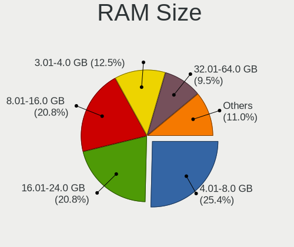
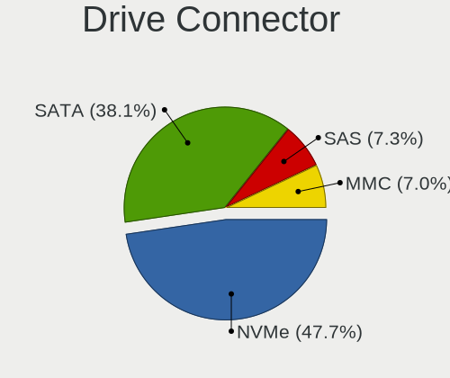
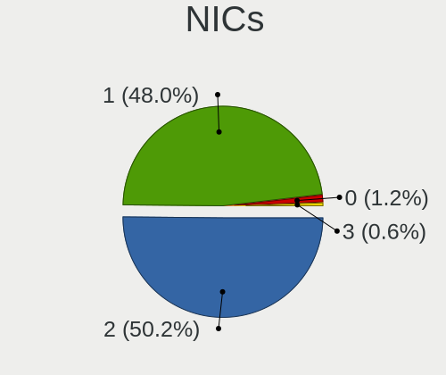

Linux in South Korea - Tested Hardware & Statistics (Notebooks)
---------------------------------------------------------------

A project to collect tested hardware configurations for Linux in South Korea.

Anyone can contribute to this report by the [hw-probe](https://github.com/linuxhw/hw-probe) tool:

    sudo -E hw-probe -all -upload

Please contribute! Especially if your hardware is rare.

Contents
--------

* [ Test Cases ](#test-cases)

* [ System ](#system)
  - [ OS                       ](#os)
  - [ OS Family                ](#os-family)
  - [ Kernel                   ](#kernel)
  - [ Kernel Family            ](#kernel-family)
  - [ Kernel Major Ver.        ](#kernel-major-ver)
  - [ Arch                     ](#arch)
  - [ DE                       ](#de)
  - [ Display Server           ](#display-server)
  - [ Display Manager          ](#display-manager)
  - [ OS Lang                  ](#os-lang)
  - [ Boot Mode                ](#boot-mode)
  - [ Filesystem               ](#filesystem)
  - [ Part. scheme             ](#part-scheme)
  - [ Dual Boot with Linux/BSD ](#dual-boot-with-linuxbsd)
  - [ Dual Boot (Win)          ](#dual-boot-win)

* [ Board ](#board)
  - [ Vendor                   ](#vendor)
  - [ Model                    ](#model)
  - [ Model Family             ](#model-family)
  - [ MFG Year                 ](#mfg-year)
  - [ Form Factor              ](#form-factor)
  - [ Secure Boot              ](#secure-boot)
  - [ Coreboot                 ](#coreboot)
  - [ RAM Size                 ](#ram-size)
  - [ RAM Used                 ](#ram-used)
  - [ Total Drives             ](#total-drives)
  - [ Has CD-ROM               ](#has-cd-rom)
  - [ Has Ethernet             ](#has-ethernet)
  - [ Has WiFi                 ](#has-wifi)
  - [ Has Bluetooth            ](#has-bluetooth)

* [ Location ](#location)
  - [ Country                  ](#country)
  - [ City                     ](#city)

* [ Drives ](#drives)
  - [ Drive Vendor             ](#drive-vendor)
  - [ Drive Model              ](#drive-model)
  - [ HDD Vendor               ](#hdd-vendor)
  - [ SSD Vendor               ](#ssd-vendor)
  - [ Drive Kind               ](#drive-kind)
  - [ Drive Connector          ](#drive-connector)
  - [ Drive Size               ](#drive-size)
  - [ Space Total              ](#space-total)
  - [ Space Used               ](#space-used)
  - [ Malfunc. Drives          ](#malfunc-drives)
  - [ Malfunc. Drive Vendor    ](#malfunc-drive-vendor)
  - [ Malfunc. HDD Vendor      ](#malfunc-hdd-vendor)
  - [ Malfunc. Drive Kind      ](#malfunc-drive-kind)
  - [ Failed Drives            ](#failed-drives)
  - [ Failed Drive Vendor      ](#failed-drive-vendor)
  - [ Drive Status             ](#drive-status)

* [ Storage controller ](#storage-controller)
  - [ Storage Vendor           ](#storage-vendor)
  - [ Storage Model            ](#storage-model)
  - [ Storage Kind             ](#storage-kind)

* [ Processor ](#processor)
  - [ CPU Vendor               ](#cpu-vendor)
  - [ CPU Model                ](#cpu-model)
  - [ CPU Model Family         ](#cpu-model-family)
  - [ CPU Cores                ](#cpu-cores)
  - [ CPU Sockets              ](#cpu-sockets)
  - [ CPU Threads              ](#cpu-threads)
  - [ CPU Op-Modes             ](#cpu-op-modes)
  - [ CPU Microcode            ](#cpu-microcode)
  - [ CPU Microarch            ](#cpu-microarch)

* [ Graphics ](#graphics)
  - [ GPU Vendor               ](#gpu-vendor)
  - [ GPU Model                ](#gpu-model)
  - [ GPU Combo                ](#gpu-combo)
  - [ GPU Driver               ](#gpu-driver)
  - [ GPU Memory               ](#gpu-memory)

* [ Monitor ](#monitor)
  - [ Monitor Vendor           ](#monitor-vendor)
  - [ Monitor Model            ](#monitor-model)
  - [ Monitor Resolution       ](#monitor-resolution)
  - [ Monitor Diagonal         ](#monitor-diagonal)
  - [ Monitor Width            ](#monitor-width)
  - [ Aspect Ratio             ](#aspect-ratio)
  - [ Monitor Area             ](#monitor-area)
  - [ Pixel Density            ](#pixel-density)
  - [ Multiple Monitors        ](#multiple-monitors)

* [ Network ](#network)
  - [ Net Controller Vendor    ](#net-controller-vendor)
  - [ Net Controller Model     ](#net-controller-model)
  - [ Wireless Vendor          ](#wireless-vendor)
  - [ Wireless Model           ](#wireless-model)
  - [ Ethernet Vendor          ](#ethernet-vendor)
  - [ Ethernet Model           ](#ethernet-model)
  - [ Net Controller Kind      ](#net-controller-kind)
  - [ Used Controller          ](#used-controller)
  - [ NICs                     ](#nics)
  - [ IPv6                     ](#ipv6)

* [ Bluetooth ](#bluetooth)
  - [ Bluetooth Vendor         ](#bluetooth-vendor)
  - [ Bluetooth Model          ](#bluetooth-model)

* [ Sound ](#sound)
  - [ Sound Vendor             ](#sound-vendor)
  - [ Sound Model              ](#sound-model)

* [ Memory ](#memory)
  - [ Memory Vendor            ](#memory-vendor)
  - [ Memory Model             ](#memory-model)
  - [ Memory Kind              ](#memory-kind)
  - [ Memory Form Factor       ](#memory-form-factor)
  - [ Memory Size              ](#memory-size)
  - [ Memory Speed             ](#memory-speed)

* [ Printers & scanners ](#printers--scanners)
  - [ Printer Vendor           ](#printer-vendor)
  - [ Printer Model            ](#printer-model)
  - [ Scanner Vendor           ](#scanner-vendor)
  - [ Scanner Model            ](#scanner-model)

* [ Camera ](#camera)
  - [ Camera Vendor            ](#camera-vendor)
  - [ Camera Model             ](#camera-model)

* [ Security ](#security)
  - [ Fingerprint Vendor       ](#fingerprint-vendor)
  - [ Fingerprint Model        ](#fingerprint-model)
  - [ Chipcard Vendor          ](#chipcard-vendor)
  - [ Chipcard Model           ](#chipcard-model)

* [ Unsupported ](#unsupported)
  - [ Unsupported Devices      ](#unsupported-devices)
  - [ Unsupported Device Types ](#unsupported-device-types)

Test Cases
----------

Total: 302

| Vendor        | Model                       | Probe                                                      | Date         |
|---------------|-----------------------------|------------------------------------------------------------|--------------|
| ASUSTek       | Zenbook UM3402YA_UM3402Y... | [9b17a7541e](https://linux-hardware.org/?probe=9b17a7541e) | Jan 30, 2023 |
| Lenovo        | IdeaPad 3 15ADA05 81W1      | [a011ba3b9e](https://linux-hardware.org/?probe=a011ba3b9e) | Jan 28, 2023 |
| HP            | Notebook                    | [4c632128bf](https://linux-hardware.org/?probe=4c632128bf) | Jan 26, 2023 |
| Lenovo        | IdeaPad 3 15ADA05 81W1      | [18d42efe40](https://linux-hardware.org/?probe=18d42efe40) | Jan 24, 2023 |
| ASUSTek       | X540UA                      | [39f992a141](https://linux-hardware.org/?probe=39f992a141) | Jan 22, 2023 |
| ASUSTek       | X540UA                      | [dda62597f7](https://linux-hardware.org/?probe=dda62597f7) | Jan 21, 2023 |
| Lenovo        | IdeaPad 3 14ITL6 82H7       | [dfca68067c](https://linux-hardware.org/?probe=dfca68067c) | Jan 10, 2023 |
| Samsung       | 760XDA                      | [06a850e558](https://linux-hardware.org/?probe=06a850e558) | Jan 10, 2023 |
| Samsung       | 760XDA                      | [180727ef64](https://linux-hardware.org/?probe=180727ef64) | Jan 10, 2023 |
| Lenovo        | IdeaPad 320-15IKB 81BG      | [a56af08eb5](https://linux-hardware.org/?probe=a56af08eb5) | Jan 07, 2023 |
| Valve         | Jupiter                     | [e47684954b](https://linux-hardware.org/?probe=e47684954b) | Jan 04, 2023 |
| Lenovo        | ThinkPad E585 20KVS06F00    | [8c3bdcc48c](https://linux-hardware.org/?probe=8c3bdcc48c) | Dec 25, 2022 |
| Jooyon Tec... | J6BF                        | [dabe200abe](https://linux-hardware.org/?probe=dabe200abe) | Dec 23, 2022 |
| Razer         | Blade 17 (2022) - RZ09-0... | [f244715ee3](https://linux-hardware.org/?probe=f244715ee3) | Dec 22, 2022 |
| Razer         | Blade 17 (2022) - RZ09-0... | [2ebd48d256](https://linux-hardware.org/?probe=2ebd48d256) | Dec 22, 2022 |
| Gigabyte      | AERO 15 YC                  | [24e48000be](https://linux-hardware.org/?probe=24e48000be) | Dec 22, 2022 |
| Razer         | Blade 17 (2022) - RZ09-0... | [d6f3d14b20](https://linux-hardware.org/?probe=d6f3d14b20) | Dec 22, 2022 |
| LG Electro... | 15UD480-GX50K               | [16be4a033d](https://linux-hardware.org/?probe=16be4a033d) | Dec 19, 2022 |
| Valve         | Jupiter                     | [24182862cd](https://linux-hardware.org/?probe=24182862cd) | Dec 15, 2022 |
| Valve         | Jupiter                     | [cfe8d55199](https://linux-hardware.org/?probe=cfe8d55199) | Dec 14, 2022 |
| Samsung       | 550XED                      | [8e5bdc1eab](https://linux-hardware.org/?probe=8e5bdc1eab) | Dec 14, 2022 |
| Samsung       | 550XED                      | [3165e8b2df](https://linux-hardware.org/?probe=3165e8b2df) | Dec 14, 2022 |
| Lenovo        | ThinkPad X260 20F6007KKR    | [9b788f857e](https://linux-hardware.org/?probe=9b788f857e) | Dec 14, 2022 |
| Valve         | Jupiter                     | [a2f1af21a0](https://linux-hardware.org/?probe=a2f1af21a0) | Dec 13, 2022 |
| Valve         | Jupiter                     | [a505c76dfa](https://linux-hardware.org/?probe=a505c76dfa) | Dec 13, 2022 |
| LG Electro... | 15ND530-GX3FK               | [47b90cbe2a](https://linux-hardware.org/?probe=47b90cbe2a) | Dec 12, 2022 |
| Google        | Peppy                       | [59f9af1c52](https://linux-hardware.org/?probe=59f9af1c52) | Dec 10, 2022 |
| Lenovo        | ThinkPad L14 Gen 3 21C5S... | [7772d8b9f8](https://linux-hardware.org/?probe=7772d8b9f8) | Dec 10, 2022 |
| Lenovo        | IdeaPad 5 15ABA7 82SG       | [5254612ca4](https://linux-hardware.org/?probe=5254612ca4) | Dec 09, 2022 |
| Samsung       | 550XED                      | [705495532e](https://linux-hardware.org/?probe=705495532e) | Dec 09, 2022 |
| Samsung       | 550XED                      | [0df3845885](https://linux-hardware.org/?probe=0df3845885) | Dec 08, 2022 |
| Lenovo        | ThinkPad T61 889502U        | [b9d0a07e47](https://linux-hardware.org/?probe=b9d0a07e47) | Dec 08, 2022 |
| Lenovo        | ThinkPad T60 1953PKK        | [fc308e2f1c](https://linux-hardware.org/?probe=fc308e2f1c) | Dec 08, 2022 |
| Lenovo        | ThinkPad X201 Tablet 309... | [e13e889312](https://linux-hardware.org/?probe=e13e889312) | Dec 08, 2022 |
| Samsung       | 550XED                      | [0ce3bd481f](https://linux-hardware.org/?probe=0ce3bd481f) | Dec 07, 2022 |
| Lenovo        | ThinkPad E495 20NES0J800    | [17182155b5](https://linux-hardware.org/?probe=17182155b5) | Dec 07, 2022 |
| Samsung       | 550XED                      | [fee55cdb61](https://linux-hardware.org/?probe=fee55cdb61) | Dec 02, 2022 |
| Samsung       | 550XED                      | [d8894f602a](https://linux-hardware.org/?probe=d8894f602a) | Dec 01, 2022 |
| Dell          | Latitude E5440              | [90d18073d6](https://linux-hardware.org/?probe=90d18073d6) | Nov 29, 2022 |
| Dell          | Inspiron 15 5510            | [5ec5306c0f](https://linux-hardware.org/?probe=5ec5306c0f) | Nov 28, 2022 |
| Samsung       | 550XED                      | [143518e596](https://linux-hardware.org/?probe=143518e596) | Nov 26, 2022 |
| Unknown       | Unknown                     | [d96c2be612](https://linux-hardware.org/?probe=d96c2be612) | Nov 23, 2022 |
| Samsung       | 950XED                      | [48213c8f60](https://linux-hardware.org/?probe=48213c8f60) | Nov 23, 2022 |
| Samsung       | 950XED                      | [0c91469d8f](https://linux-hardware.org/?probe=0c91469d8f) | Nov 21, 2022 |
| Dell          | Latitude E5440              | [6d90726959](https://linux-hardware.org/?probe=6d90726959) | Nov 21, 2022 |
| Samsung       | 950XCJ/951XCJ/950XCR        | [2bc3a22052](https://linux-hardware.org/?probe=2bc3a22052) | Nov 20, 2022 |
| MSI           | Vector GP66 12UGS           | [9aab7e297a](https://linux-hardware.org/?probe=9aab7e297a) | Nov 19, 2022 |
| MSI           | Vector GP66 12UGS           | [e10c2abc9b](https://linux-hardware.org/?probe=e10c2abc9b) | Nov 19, 2022 |
| Samsung       | 550XED                      | [06722b1fee](https://linux-hardware.org/?probe=06722b1fee) | Nov 16, 2022 |
| Samsung       | 950XED                      | [2558d99814](https://linux-hardware.org/?probe=2558d99814) | Nov 16, 2022 |
| Samsung       | 950XED                      | [ddcb4e15c7](https://linux-hardware.org/?probe=ddcb4e15c7) | Nov 14, 2022 |
| Samsung       | 550XED                      | [bbebe45363](https://linux-hardware.org/?probe=bbebe45363) | Nov 13, 2022 |
| Samsung       | 550XED                      | [60c1aa4cc9](https://linux-hardware.org/?probe=60c1aa4cc9) | Nov 10, 2022 |
| ASUSTek       | VivoBook_ASUSLaptop S540... | [9cdaa4c88b](https://linux-hardware.org/?probe=9cdaa4c88b) | Nov 09, 2022 |
| Samsung       | 550XED                      | [fc6d96f9fe](https://linux-hardware.org/?probe=fc6d96f9fe) | Nov 06, 2022 |
| Samsung       | 550XED                      | [6db345f53d](https://linux-hardware.org/?probe=6db345f53d) | Nov 03, 2022 |
| Samsung       | 550XED                      | [6992db47be](https://linux-hardware.org/?probe=6992db47be) | Nov 02, 2022 |
| Samsung       | 950XED                      | [821bc59c17](https://linux-hardware.org/?probe=821bc59c17) | Nov 02, 2022 |
| Samsung       | 550XED                      | [3b04d21991](https://linux-hardware.org/?probe=3b04d21991) | Nov 01, 2022 |
| Apple         | MacBookPro16,1              | [025e3e7e4e](https://linux-hardware.org/?probe=025e3e7e4e) | Nov 01, 2022 |
| MS            | MPGIO                       | [4fc8637bf3](https://linux-hardware.org/?probe=4fc8637bf3) | Nov 01, 2022 |
| HP            | Pavilion dv6                | [ba31f00bbd](https://linux-hardware.org/?probe=ba31f00bbd) | Oct 31, 2022 |
| LG Electro... | 15Z980-HA76K                | [914156672d](https://linux-hardware.org/?probe=914156672d) | Oct 30, 2022 |
| Samsung       | 950XED                      | [350a0f9d44](https://linux-hardware.org/?probe=350a0f9d44) | Oct 28, 2022 |
| Samsung       | 550XED                      | [1ebb9be92b](https://linux-hardware.org/?probe=1ebb9be92b) | Oct 28, 2022 |
| Samsung       | 550XED                      | [110d85c2e0](https://linux-hardware.org/?probe=110d85c2e0) | Oct 27, 2022 |
| Samsung       | 950XED                      | [a636a02096](https://linux-hardware.org/?probe=a636a02096) | Oct 27, 2022 |
| LG Electro... | 15Z90N-HA76K                | [7805c272fb](https://linux-hardware.org/?probe=7805c272fb) | Oct 24, 2022 |
| Lenovo        | ThinkPad X1 Carbon Gen 1... | [866d0f49a2](https://linux-hardware.org/?probe=866d0f49a2) | Oct 20, 2022 |
| Dell          | Precision 7520              | [366eed3b66](https://linux-hardware.org/?probe=366eed3b66) | Oct 20, 2022 |
| Dell          | Precision 7520              | [8c2829bbb2](https://linux-hardware.org/?probe=8c2829bbb2) | Oct 19, 2022 |
| HP            | EliteBook 865 16 inch G9... | [8665ee6ba6](https://linux-hardware.org/?probe=8665ee6ba6) | Oct 19, 2022 |
| Apple         | MacBookPro12,1              | [7979753fa9](https://linux-hardware.org/?probe=7979753fa9) | Oct 15, 2022 |
| Apple         | MacBookPro16,1              | [865d1f0e6f](https://linux-hardware.org/?probe=865d1f0e6f) | Oct 07, 2022 |
| Lenovo        | IdeaPad Z510 20287          | [d4797ada2a](https://linux-hardware.org/?probe=d4797ada2a) | Sep 28, 2022 |
| Lenovo        | IdeaPad 5 14ALC05 82LM      | [e777d38fbd](https://linux-hardware.org/?probe=e777d38fbd) | Sep 26, 2022 |
| Lenovo        | IdeaPad 5 14ALC05 82LM      | [82b3d89bf9](https://linux-hardware.org/?probe=82b3d89bf9) | Sep 20, 2022 |
| Lenovo        | IdeaPad 3 15IIL05 81WE      | [22171cc2a6](https://linux-hardware.org/?probe=22171cc2a6) | Sep 07, 2022 |
| ASUSTek       | Zephyrus S GX531GX_GX531... | [0041774402](https://linux-hardware.org/?probe=0041774402) | Aug 20, 2022 |
| Lenovo        | ThinkPad E15 Gen 3 20YJC... | [ce2df1e866](https://linux-hardware.org/?probe=ce2df1e866) | Jul 18, 2022 |
| Lenovo        | ThinkPad L14 Gen 1 20U5S... | [87edfcaadf](https://linux-hardware.org/?probe=87edfcaadf) | Jul 09, 2022 |
| Lenovo        | ThinkPad S2 20GJA00S00      | [44eb58334d](https://linux-hardware.org/?probe=44eb58334d) | Jun 24, 2022 |
| LG Electro... | 14Z90N-VA76K                | [9e606a176f](https://linux-hardware.org/?probe=9e606a176f) | Jun 24, 2022 |
| Samsung       | 670Z5E                      | [95ec23c2e9](https://linux-hardware.org/?probe=95ec23c2e9) | Jun 06, 2022 |
| ASUSTek       | VivoBook S13 X330UA         | [014c9a184e](https://linux-hardware.org/?probe=014c9a184e) | Jun 06, 2022 |
| LG Electro... | Z360-GH6SK                  | [cb91c2c2bd](https://linux-hardware.org/?probe=cb91c2c2bd) | Jun 02, 2022 |
| HP            | Spectre 13 x2 PC            | [9b67243691](https://linux-hardware.org/?probe=9b67243691) | May 30, 2022 |
| ASUSTek       | VivoBook 15_ASUS Laptop ... | [4f941ba9fe](https://linux-hardware.org/?probe=4f941ba9fe) | May 24, 2022 |
| Dell          | Vostro 3500                 | [617edab20c](https://linux-hardware.org/?probe=617edab20c) | May 20, 2022 |
| LG Electro... | 15Z990-HA50K                | [e5cf57d2f4](https://linux-hardware.org/?probe=e5cf57d2f4) | May 14, 2022 |
| ASUSTek       | ROG Zephyrus G14 GA401QC... | [7286fd4e36](https://linux-hardware.org/?probe=7286fd4e36) | May 11, 2022 |
| Toshiba       | Satellite P50-B-103         | [6df44e9098](https://linux-hardware.org/?probe=6df44e9098) | Apr 29, 2022 |
| Teclast       | tPAD                        | [2b86292373](https://linux-hardware.org/?probe=2b86292373) | Apr 20, 2022 |
| Wolfnfox      | WF-TBAT                     | [7d04cc8361](https://linux-hardware.org/?probe=7d04cc8361) | Apr 13, 2022 |
| Teclast       | tPAD                        | [a9f93e289b](https://linux-hardware.org/?probe=a9f93e289b) | Apr 13, 2022 |
| MECHREVO      | Taitan Series GM7TG0M       | [948d29a218](https://linux-hardware.org/?probe=948d29a218) | Apr 10, 2022 |
| Teclast       | tPAD                        | [5eddc816df](https://linux-hardware.org/?probe=5eddc816df) | Apr 07, 2022 |
| HP            | Stream Notebook PC 13       | [1874ac7edf](https://linux-hardware.org/?probe=1874ac7edf) | Apr 03, 2022 |
| Samsung       | 950XCJ/951XCJ/950XCR        | [f22fa67906](https://linux-hardware.org/?probe=f22fa67906) | Apr 01, 2022 |
| HP            | Stream Notebook PC 11       | [8fc09857a6](https://linux-hardware.org/?probe=8fc09857a6) | Apr 01, 2022 |
| Intel         | powered classmate PC        | [8ce4fa1757](https://linux-hardware.org/?probe=8ce4fa1757) | Apr 01, 2022 |
| Lenovo        | IdeaPad 5 15IIL05 81YK      | [6c36c54313](https://linux-hardware.org/?probe=6c36c54313) | Mar 31, 2022 |
| Lenovo        | IdeaPad 3 14ALC6 82KT       | [b2e70b8251](https://linux-hardware.org/?probe=b2e70b8251) | Mar 28, 2022 |
| Lenovo        | ThinkPad X1 Carbon Gen 9... | [a8cacc7845](https://linux-hardware.org/?probe=a8cacc7845) | Mar 27, 2022 |
| MSI           | GF75 Thin 9SCXR             | [df19241968](https://linux-hardware.org/?probe=df19241968) | Mar 20, 2022 |
| MSI           | GF75 Thin 9SCXR             | [b3458eda8f](https://linux-hardware.org/?probe=b3458eda8f) | Mar 14, 2022 |
| Lenovo        | ThinkPad L14 Gen 1 20U5S... | [f86d99b8a1](https://linux-hardware.org/?probe=f86d99b8a1) | Feb 27, 2022 |
| ASUSTek       | ROG Zephyrus G14 GA401QM... | [95ff70277e](https://linux-hardware.org/?probe=95ff70277e) | Feb 24, 2022 |
| Dell          | Inspiron 15 5510            | [bb04a03420](https://linux-hardware.org/?probe=bb04a03420) | Feb 23, 2022 |
| Dell          | Inspiron 15 5510            | [38ad42c186](https://linux-hardware.org/?probe=38ad42c186) | Feb 22, 2022 |
| LG Electro... | 17UD70P-PX76K               | [968b189e38](https://linux-hardware.org/?probe=968b189e38) | Feb 21, 2022 |
| LG Electro... | 17UD70P-PX76K               | [d8f6d95994](https://linux-hardware.org/?probe=d8f6d95994) | Feb 14, 2022 |
| HANSUNG CO... | EX58                        | [7c2a023530](https://linux-hardware.org/?probe=7c2a023530) | Feb 10, 2022 |
| HP            | Spectre 13 x2 PC            | [ed95e4c1c7](https://linux-hardware.org/?probe=ed95e4c1c7) | Feb 09, 2022 |
| HP            | Spectre 13 x2 PC            | [a597b083c9](https://linux-hardware.org/?probe=a597b083c9) | Feb 08, 2022 |
| Google        | Ampton                      | [0f1564bb4a](https://linux-hardware.org/?probe=0f1564bb4a) | Feb 06, 2022 |
| Apple         | MacBookPro5,3               | [7742fa4642](https://linux-hardware.org/?probe=7742fa4642) | Feb 05, 2022 |
| ASUSTek       | ROG Zephyrus G14 GA401QM... | [65a6ca3880](https://linux-hardware.org/?probe=65a6ca3880) | Feb 05, 2022 |
| ASUSTek       | ROG Zephyrus G14 GA401QM... | [144717a1f1](https://linux-hardware.org/?probe=144717a1f1) | Feb 04, 2022 |
| HP            | EliteBook 855 G7 Noteboo... | [7f9793a709](https://linux-hardware.org/?probe=7f9793a709) | Jan 29, 2022 |
| Lenovo        | ThinkPad E15 Gen 2 20TD0... | [2c22ac6a5f](https://linux-hardware.org/?probe=2c22ac6a5f) | Jan 25, 2022 |
| ASUSTek       | ROG Zephyrus G14 GA401QM... | [882dab7b0e](https://linux-hardware.org/?probe=882dab7b0e) | Jan 22, 2022 |
| HP            | EliteBook 855 G7 Noteboo... | [c081d60b2a](https://linux-hardware.org/?probe=c081d60b2a) | Jan 22, 2022 |
| Apple         | MacBookPro5,5               | [11d1870f98](https://linux-hardware.org/?probe=11d1870f98) | Jan 21, 2022 |
| LG Electro... | 17UD70P-PX76K               | [d0d21d2892](https://linux-hardware.org/?probe=d0d21d2892) | Jan 18, 2022 |
| LG Electro... | 16ZD90P-GX7LK               | [0870fd8772](https://linux-hardware.org/?probe=0870fd8772) | Dec 29, 2021 |
| Lenovo        | G480 20149                  | [08a0d07d28](https://linux-hardware.org/?probe=08a0d07d28) | Dec 28, 2021 |
| SLIMBOOK      | PROX15-AMD                  | [a8fbe33d19](https://linux-hardware.org/?probe=a8fbe33d19) | Dec 26, 2021 |
| ASUSTek       | VivoBook_ASUSLaptop X521... | [ff620ffdcd](https://linux-hardware.org/?probe=ff620ffdcd) | Dec 07, 2021 |
| Jooyontech... | J3GP Pro                    | [6f13d68344](https://linux-hardware.org/?probe=6f13d68344) | Dec 04, 2021 |
| LG Electro... | 16ZD90P-GX5LK               | [c7cc850f29](https://linux-hardware.org/?probe=c7cc850f29) | Dec 03, 2021 |
| LG Electro... | 16ZD90P-GX5LK               | [901fdc3726](https://linux-hardware.org/?probe=901fdc3726) | Dec 03, 2021 |
| LG Electro... | 17UD70P-PX76K               | [b4c7522ea3](https://linux-hardware.org/?probe=b4c7522ea3) | Nov 15, 2021 |
| LG Electro... | 15Z990-HA50K                | [6f5255e0f2](https://linux-hardware.org/?probe=6f5255e0f2) | Nov 01, 2021 |
| HP            | EliteBook 855 G7 Noteboo... | [70074ebee1](https://linux-hardware.org/?probe=70074ebee1) | Nov 01, 2021 |
| ASUSTek       | X556URK                     | [212240b258](https://linux-hardware.org/?probe=212240b258) | Oct 29, 2021 |
| LG Electro... | 17ZD90P-GX7LK               | [23aa2c83ae](https://linux-hardware.org/?probe=23aa2c83ae) | Oct 27, 2021 |
| ASUSTek       | VivoBook 15_ASUS Laptop ... | [2f6634b953](https://linux-hardware.org/?probe=2f6634b953) | Oct 22, 2021 |
| ASUSTek       | VivoBook 15_ASUS Laptop ... | [fb8b55960a](https://linux-hardware.org/?probe=fb8b55960a) | Oct 20, 2021 |
| Lenovo        | ThinkPad W530 24475HU       | [b8973b3b0a](https://linux-hardware.org/?probe=b8973b3b0a) | Oct 02, 2021 |
| Samsung       | 950XCJ/951XCJ/950XCR        | [e93b95fc3c](https://linux-hardware.org/?probe=e93b95fc3c) | Sep 30, 2021 |
| Samsung       | 950XDB/951XDB/950XDY        | [fbc7a613a6](https://linux-hardware.org/?probe=fbc7a613a6) | Sep 29, 2021 |
| HANSUNG CO... | TFX4150H                    | [11f2fbef85](https://linux-hardware.org/?probe=11f2fbef85) | Sep 29, 2021 |
| ASUSTek       | U36JC                       | [c6e87f1fb7](https://linux-hardware.org/?probe=c6e87f1fb7) | Sep 23, 2021 |
| Samsung       | 730QCJ/730QCR               | [54cd6887df](https://linux-hardware.org/?probe=54cd6887df) | Sep 21, 2021 |
| Clevo         | M740T/M760T                 | [7731b8340f](https://linux-hardware.org/?probe=7731b8340f) | Sep 17, 2021 |
| Samsung       | 400B4C/400B5C/200B4C/200... | [581ab7ecde](https://linux-hardware.org/?probe=581ab7ecde) | Sep 17, 2021 |
| HP            | Pavilion Laptop 15z-eh00... | [33233b370e](https://linux-hardware.org/?probe=33233b370e) | Aug 30, 2021 |
| LG Electro... | 14Z90N-VA76K                | [df36a7a61c](https://linux-hardware.org/?probe=df36a7a61c) | Aug 22, 2021 |
| Lenovo        | XiaoXin Air 13IWL 81J8      | [e68dfe0824](https://linux-hardware.org/?probe=e68dfe0824) | Aug 19, 2021 |
| Apple         | MacBookPro15,2              | [c722c00c56](https://linux-hardware.org/?probe=c722c00c56) | Aug 18, 2021 |
| ASUSTek       | ASUS TUF Gaming F15 FX50... | [e47beb0587](https://linux-hardware.org/?probe=e47beb0587) | Aug 11, 2021 |
| ASUSTek       | ASUS TUF Gaming F15 FX50... | [e7997203d4](https://linux-hardware.org/?probe=e7997203d4) | Aug 11, 2021 |
| SLIMBOOK      | PROX15-AMD                  | [3147760301](https://linux-hardware.org/?probe=3147760301) | Aug 07, 2021 |
| Dell          | XPS 13 7390                 | [901bcb991b](https://linux-hardware.org/?probe=901bcb991b) | Jul 31, 2021 |
| LG Electro... | 17UD70P-PX76K               | [dc6d809e73](https://linux-hardware.org/?probe=dc6d809e73) | Jul 23, 2021 |
| LG Electro... | 17UD70P-PX76K               | [c0869b1919](https://linux-hardware.org/?probe=c0869b1919) | Jul 23, 2021 |
| HP            | OMEN by Laptop              | [2392366002](https://linux-hardware.org/?probe=2392366002) | Jul 16, 2021 |
| Pine Micro... | Pine64 Pinebook Pro         | [fd48c4cd51](https://linux-hardware.org/?probe=fd48c4cd51) | Jul 02, 2021 |
| Pine Micro... | Pine64 Pinebook Pro         | [d2f1ec957f](https://linux-hardware.org/?probe=d2f1ec957f) | Jun 27, 2021 |
| Lenovo        | ThinkPad E14 Gen 2 20TAS... | [9c2b77b3c6](https://linux-hardware.org/?probe=9c2b77b3c6) | Jun 24, 2021 |
| Lenovo        | ThinkPad E14 Gen 2 20TAS... | [99b25335b3](https://linux-hardware.org/?probe=99b25335b3) | Jun 22, 2021 |
| MSI           | GF63 Thin 9SC               | [98faadcfa3](https://linux-hardware.org/?probe=98faadcfa3) | Jun 10, 2021 |
| Samsung       | 500R4K/500R5H/5400RK/501... | [5742c8e4e5](https://linux-hardware.org/?probe=5742c8e4e5) | May 28, 2021 |
| Lenovo        | G500 20236                  | [2aca6cd805](https://linux-hardware.org/?probe=2aca6cd805) | May 27, 2021 |
| Dell          | Latitude E6400              | [2a4c5f6eec](https://linux-hardware.org/?probe=2a4c5f6eec) | May 25, 2021 |
| Samsung       | R440/R480                   | [777c05d80b](https://linux-hardware.org/?probe=777c05d80b) | May 19, 2021 |
| Lenovo        | Legion 5 Pro 16ACH6H 82J... | [15a742842f](https://linux-hardware.org/?probe=15a742842f) | May 16, 2021 |
| ASUSTek       | VivoBook_ASUSLaptop X415... | [f3cb68f8cf](https://linux-hardware.org/?probe=f3cb68f8cf) | May 13, 2021 |
| HP            | EliteBook 8540p (WQ983PA... | [28b1df49ae](https://linux-hardware.org/?probe=28b1df49ae) | May 11, 2021 |
| Lenovo        | ThinkPad Edge E145 20BC0... | [035481a413](https://linux-hardware.org/?probe=035481a413) | May 05, 2021 |
| HP            | EliteBook 855 G7 Noteboo... | [473f17b0f1](https://linux-hardware.org/?probe=473f17b0f1) | May 01, 2021 |
| LG Electro... | 15ND530-GX30K               | [9d700ce0b6](https://linux-hardware.org/?probe=9d700ce0b6) | Apr 30, 2021 |
| HP            | EliteBook 855 G7 Noteboo... | [84f31a5fd7](https://linux-hardware.org/?probe=84f31a5fd7) | Apr 28, 2021 |
| Lenovo        | ThinkPad Edge E145 20BC0... | [410e4fd232](https://linux-hardware.org/?probe=410e4fd232) | Apr 22, 2021 |
| HP            | Stream Notebook PC 13       | [0bf3f6f761](https://linux-hardware.org/?probe=0bf3f6f761) | Apr 15, 2021 |
| SLIMBOOK      | PROX15-AMD                  | [c5e7a3d16e](https://linux-hardware.org/?probe=c5e7a3d16e) | Apr 09, 2021 |
| Notebook      | NL5xRU                      | [7cac175bde](https://linux-hardware.org/?probe=7cac175bde) | Apr 07, 2021 |
| SLIMBOOK      | PROX15-AMD                  | [51931e3821](https://linux-hardware.org/?probe=51931e3821) | Apr 05, 2021 |
| Samsung       | 270E5J/2570EJ               | [b36716f462](https://linux-hardware.org/?probe=b36716f462) | Apr 02, 2021 |
| Samsung       | 400B4B/400B5B/200B4B/200... | [af785987c5](https://linux-hardware.org/?probe=af785987c5) | Mar 29, 2021 |
| LG Electro... | Z435-GE40K                  | [41dfc50f20](https://linux-hardware.org/?probe=41dfc50f20) | Mar 27, 2021 |
| Alienware     | m15 R4                      | [33977ceca8](https://linux-hardware.org/?probe=33977ceca8) | Mar 08, 2021 |
| Notebook      | W330SU2                     | [e5e71a4e94](https://linux-hardware.org/?probe=e5e71a4e94) | Mar 05, 2021 |
| Dell          | Inspiron 5590               | [94e3d38a99](https://linux-hardware.org/?probe=94e3d38a99) | Mar 04, 2021 |
| Notebook      | N650DU                      | [beef9a4540](https://linux-hardware.org/?probe=beef9a4540) | Feb 24, 2021 |
| HP            | Pavilion dv3                | [d563465019](https://linux-hardware.org/?probe=d563465019) | Jan 23, 2021 |
| HP            | Pavilion dv3                | [7140d63f79](https://linux-hardware.org/?probe=7140d63f79) | Jan 16, 2021 |
| LG Electro... | 13Z940-MF6BL                | [ee9f312333](https://linux-hardware.org/?probe=ee9f312333) | Jan 16, 2021 |
| Lenovo        | ThinkPad X1 Carbon Gen 8... | [28d2ddf944](https://linux-hardware.org/?probe=28d2ddf944) | Jan 04, 2021 |
| ASUSTek       | TUF Gaming FA706II_FA706... | [cbc872e471](https://linux-hardware.org/?probe=cbc872e471) | Dec 29, 2020 |
| HANSUNG CO... | TFX5470H                    | [4f038027ac](https://linux-hardware.org/?probe=4f038027ac) | Dec 27, 2020 |
| HANSUNG CO... | TFX5470H                    | [659c45927e](https://linux-hardware.org/?probe=659c45927e) | Dec 26, 2020 |
| HP            | Pavilion g6                 | [9b2e1ccb17](https://linux-hardware.org/?probe=9b2e1ccb17) | Dec 15, 2020 |
| HP            | Pavilion g6                 | [01bd113f0d](https://linux-hardware.org/?probe=01bd113f0d) | Dec 15, 2020 |
| MSI           | PS42 Modern 8MO             | [c469679bd0](https://linux-hardware.org/?probe=c469679bd0) | Dec 14, 2020 |
| HP            | ProBook 635 Aero G7 Note... | [9ff7890a24](https://linux-hardware.org/?probe=9ff7890a24) | Dec 11, 2020 |
| Samsung       | 760XBE                      | [7b117d1e93](https://linux-hardware.org/?probe=7b117d1e93) | Dec 08, 2020 |
| Samsung       | R440/R480                   | [2c57659a41](https://linux-hardware.org/?probe=2c57659a41) | Dec 06, 2020 |
| Acer          | Swift SF314-54              | [e387afac15](https://linux-hardware.org/?probe=e387afac15) | Nov 29, 2020 |
| Lenovo        | IdeaPad L340-15IWL 81LG     | [b6570c8388](https://linux-hardware.org/?probe=b6570c8388) | Nov 28, 2020 |
| Apple         | MacBookPro10,1              | [ecfaa7232b](https://linux-hardware.org/?probe=ecfaa7232b) | Nov 28, 2020 |
| HP            | EliteBook 840 G1            | [eb842cd3c4](https://linux-hardware.org/?probe=eb842cd3c4) | Nov 25, 2020 |
| HP            | EliteBook 840 G1            | [2a9cc167d3](https://linux-hardware.org/?probe=2a9cc167d3) | Nov 25, 2020 |
| Lenovo        | ThinkPad T14 Gen 1 20UDS... | [05a70db99a](https://linux-hardware.org/?probe=05a70db99a) | Nov 22, 2020 |
| Samsung       | R59P/R60P/R61P              | [e4a465ff4c](https://linux-hardware.org/?probe=e4a465ff4c) | Nov 15, 2020 |
| Samsung       | R59P/R60P/R61P              | [8a39cadb17](https://linux-hardware.org/?probe=8a39cadb17) | Nov 14, 2020 |
| Samsung       | SX11S                       | [7946db3be4](https://linux-hardware.org/?probe=7946db3be4) | Nov 05, 2020 |
| Lenovo        | ThinkPad T580 20L9S06H00    | [4cda554e60](https://linux-hardware.org/?probe=4cda554e60) | Oct 31, 2020 |
| LG Electro... | 14ZB990-GP70ML              | [7184b7e890](https://linux-hardware.org/?probe=7184b7e890) | Oct 29, 2020 |
| HANSUNG CO... | TFX5470H                    | [7a0c7ef25d](https://linux-hardware.org/?probe=7a0c7ef25d) | Oct 22, 2020 |
| Lenovo        | IdeaPad L340-15IWL 81LG     | [7f2d533ddf](https://linux-hardware.org/?probe=7f2d533ddf) | Oct 12, 2020 |
| ASUSTek       | VivoBook_ASUSLaptop X403... | [57c9a2fdbb](https://linux-hardware.org/?probe=57c9a2fdbb) | Oct 12, 2020 |
| Acer          | Aspire A514-52              | [151c57e477](https://linux-hardware.org/?probe=151c57e477) | Oct 11, 2020 |
| Lenovo        | ThinkPad E595 20NFS01P00    | [5cce7e56d5](https://linux-hardware.org/?probe=5cce7e56d5) | Oct 02, 2020 |
| MSI           | MS-16F1                     | [94a744ecb7](https://linux-hardware.org/?probe=94a744ecb7) | Oct 01, 2020 |
| MSI           | GE75 Raider 10SF            | [c5f31d8ff8](https://linux-hardware.org/?probe=c5f31d8ff8) | Sep 21, 2020 |
| MSI           | GE75 Raider 10SF            | [80b54a584c](https://linux-hardware.org/?probe=80b54a584c) | Sep 21, 2020 |
| ASUSTek       | VivoBook_ASUSLaptop X409... | [335490808b](https://linux-hardware.org/?probe=335490808b) | Sep 18, 2020 |
| ASUSTek       | VivoBook_ASUSLaptop X409... | [611b4d4515](https://linux-hardware.org/?probe=611b4d4515) | Sep 12, 2020 |
| Samsung       | SX11S                       | [de5f3f5244](https://linux-hardware.org/?probe=de5f3f5244) | Sep 10, 2020 |
| Dell          | XPS 15 7590                 | [0ed21172b2](https://linux-hardware.org/?probe=0ed21172b2) | Sep 07, 2020 |
| HP            | Laptop 14s-cf1xxx           | [56e8c74784](https://linux-hardware.org/?probe=56e8c74784) | Sep 05, 2020 |
| Lenovo        | ThinkPad T410s 2912AJ7      | [5b29fd8262](https://linux-hardware.org/?probe=5b29fd8262) | Sep 05, 2020 |
| HP            | Laptop 15s-du0xxx           | [226702f09a](https://linux-hardware.org/?probe=226702f09a) | Sep 05, 2020 |
| LG Electro... | 15ND530-GX30K               | [8f8a5ce10c](https://linux-hardware.org/?probe=8f8a5ce10c) | Sep 04, 2020 |
| Lenovo        | ThinkPad X390 20SCCTO1WW    | [765a0cde4c](https://linux-hardware.org/?probe=765a0cde4c) | Sep 03, 2020 |
| HP            | Laptop 15s-du0xxx           | [2ef3a6b6c8](https://linux-hardware.org/?probe=2ef3a6b6c8) | Sep 03, 2020 |
| Acer          | Swift SF315-41              | [c57a2c8249](https://linux-hardware.org/?probe=c57a2c8249) | Aug 26, 2020 |
| LG Electro... | A520-DEHRK                  | [33e6f6950c](https://linux-hardware.org/?probe=33e6f6950c) | Aug 20, 2020 |
| LG Electro... | ZD360-GD30K                 | [5f695a5cfd](https://linux-hardware.org/?probe=5f695a5cfd) | Aug 19, 2020 |
| Lenovo        | ThinkPad L420 7829AZ2       | [af5c485d91](https://linux-hardware.org/?probe=af5c485d91) | Aug 17, 2020 |
| ASUSTek       | UX31E                       | [107d53bd73](https://linux-hardware.org/?probe=107d53bd73) | Aug 14, 2020 |
| Lenovo        | ThinkPad Edge E440 20C50... | [e2a554e507](https://linux-hardware.org/?probe=e2a554e507) | Aug 11, 2020 |
| ASUSTek       | TUF Gaming FA506II_FA506... | [4657a3e758](https://linux-hardware.org/?probe=4657a3e758) | Aug 11, 2020 |
| Lenovo        | ThinkPad T420s 417429U      | [a0cc9e062e](https://linux-hardware.org/?probe=a0cc9e062e) | Aug 09, 2020 |
| MSI           | GX60 3CC                    | [dabfcf887e](https://linux-hardware.org/?probe=dabfcf887e) | Aug 05, 2020 |
| ASUSTek       | TUF Gaming FA506II_FA506... | [806b0f6ffc](https://linux-hardware.org/?probe=806b0f6ffc) | Aug 04, 2020 |
| ASUSTek       | TUF Gaming FA506II_FA506... | [03dcb81800](https://linux-hardware.org/?probe=03dcb81800) | Aug 04, 2020 |
| LG Electro... | 14ZB990-GP70ML              | [953e68f29d](https://linux-hardware.org/?probe=953e68f29d) | Jul 29, 2020 |
| Samsung       | X120/X170/X171              | [d52c424e0f](https://linux-hardware.org/?probe=d52c424e0f) | Jul 12, 2020 |
| MSI           | PS63 Modern 8RC             | [1f2f8bb2cf](https://linux-hardware.org/?probe=1f2f8bb2cf) | Jul 06, 2020 |
| MSI           | PS63 Modern 8RC             | [ed2dc1f4eb](https://linux-hardware.org/?probe=ed2dc1f4eb) | Jul 05, 2020 |
| Sony          | SVF1421ESGW                 | [025b1a05fe](https://linux-hardware.org/?probe=025b1a05fe) | Jun 29, 2020 |
| ASUSTek       | X553SA                      | [de56d8fe26](https://linux-hardware.org/?probe=de56d8fe26) | Jun 23, 2020 |
| MSI           | GX60 3CC                    | [41702d8f8c](https://linux-hardware.org/?probe=41702d8f8c) | Jun 14, 2020 |
| MSI           | GX60 3CC                    | [16345ce4e3](https://linux-hardware.org/?probe=16345ce4e3) | Jun 14, 2020 |
| TG            | NXI-A7000 Series            | [20018e6c2a](https://linux-hardware.org/?probe=20018e6c2a) | Jun 07, 2020 |
| Dell          | G3 3579                     | [f21ec2528f](https://linux-hardware.org/?probe=f21ec2528f) | Jun 06, 2020 |
| Lenovo        | ThinkPad E495 20NES0WU00    | [bd7072c5e9](https://linux-hardware.org/?probe=bd7072c5e9) | May 27, 2020 |
| HP            | Laptop 15-db1xxx            | [229612b5fa](https://linux-hardware.org/?probe=229612b5fa) | May 26, 2020 |
| LG Electro... | 17UD790-PX76K               | [ac4f8e9cc6](https://linux-hardware.org/?probe=ac4f8e9cc6) | May 24, 2020 |
| LG Electro... | 17UD790-PX76K               | [9bb4fea940](https://linux-hardware.org/?probe=9bb4fea940) | May 24, 2020 |
| HP            | Laptop 15-db1xxx            | [65f85ef8e9](https://linux-hardware.org/?probe=65f85ef8e9) | May 20, 2020 |
| Lenovo        | IdeaPad 3 15IIL05 81WE      | [b3a561d5db](https://linux-hardware.org/?probe=b3a561d5db) | May 20, 2020 |
| MSI           | Prestige 15 A10SC           | [69c9f3bce6](https://linux-hardware.org/?probe=69c9f3bce6) | May 17, 2020 |
| Samsung       | 570Z5E/580Z5E               | [435579b481](https://linux-hardware.org/?probe=435579b481) | May 16, 2020 |
| Samsung       | 570Z5E/580Z5E               | [5e2ed0ac77](https://linux-hardware.org/?probe=5e2ed0ac77) | May 16, 2020 |
| LG Electro... | 14ZB990-GP70ML              | [dc05f2344d](https://linux-hardware.org/?probe=dc05f2344d) | May 16, 2020 |
| Samsung       | 530U3BI/530U4BI/530U4BH     | [5919a15425](https://linux-hardware.org/?probe=5919a15425) | May 11, 2020 |
| Lenovo        | ThinkPad X220 4290P39       | [1b5c469306](https://linux-hardware.org/?probe=1b5c469306) | May 02, 2020 |
| Dell          | XPS 15 7590                 | [0bbf773840](https://linux-hardware.org/?probe=0bbf773840) | Apr 27, 2020 |
| Dell          | XPS 15 7590                 | [5348bea534](https://linux-hardware.org/?probe=5348bea534) | Apr 27, 2020 |
| Lenovo        | ThinkPad X230 2325KZ5       | [150d9801f0](https://linux-hardware.org/?probe=150d9801f0) | Apr 21, 2020 |
| Lenovo        | ThinkPad E495 20NES0WU00    | [fb49bbe9f1](https://linux-hardware.org/?probe=fb49bbe9f1) | Apr 18, 2020 |
| Dell          | Latitude D630               | [0540c0a191](https://linux-hardware.org/?probe=0540c0a191) | Apr 15, 2020 |
| HP            | Pavilion Gaming Notebook    | [4d5a5a3a34](https://linux-hardware.org/?probe=4d5a5a3a34) | Apr 14, 2020 |
| LG Electro... | R490-KR6WK                  | [b0c23e23f7](https://linux-hardware.org/?probe=b0c23e23f7) | Mar 21, 2020 |
| HP            | Pavilion dv7                | [61bbb3da8a](https://linux-hardware.org/?probe=61bbb3da8a) | Mar 12, 2020 |
| LG Electro... | A505-K.AFC4L                | [33b72b423b](https://linux-hardware.org/?probe=33b72b423b) | Feb 26, 2020 |
| Toshiba       | Satellite L655              | [8212e2eb65](https://linux-hardware.org/?probe=8212e2eb65) | Feb 13, 2020 |
| MSI           | Prestige 14 A10SC           | [00af81dd32](https://linux-hardware.org/?probe=00af81dd32) | Feb 12, 2020 |
| MSI           | Prestige 14 A10SC           | [dac2e1709e](https://linux-hardware.org/?probe=dac2e1709e) | Feb 12, 2020 |
| MSI           | GF63 Thin 9SC               | [47b9bc192c](https://linux-hardware.org/?probe=47b9bc192c) | Jan 29, 2020 |
| MSI           | GF63 Thin 9SC               | [21dbcd5aca](https://linux-hardware.org/?probe=21dbcd5aca) | Jan 28, 2020 |
| Lenovo        | IdeaPad L340-15IWL 81LG     | [6515ce1c97](https://linux-hardware.org/?probe=6515ce1c97) | Jan 23, 2020 |
| HP            | ProBook 453                 | [ad3d1ff0fc](https://linux-hardware.org/?probe=ad3d1ff0fc) | Dec 27, 2019 |
| Lenovo        | ThinkPad E565 20EYA007KD    | [c1c9dd614a](https://linux-hardware.org/?probe=c1c9dd614a) | Dec 17, 2019 |
| HP            | Laptop 14s-cf1xxx           | [61765ee913](https://linux-hardware.org/?probe=61765ee913) | Dec 11, 2019 |
| HP            | Laptop 14s-cf1xxx           | [fa008b24fc](https://linux-hardware.org/?probe=fa008b24fc) | Dec 11, 2019 |
| HP            | Pavilion 15                 | [5f9b510e87](https://linux-hardware.org/?probe=5f9b510e87) | Oct 28, 2019 |
| MSI           | MS-1675                     | [c5bf6f209a](https://linux-hardware.org/?probe=c5bf6f209a) | Sep 07, 2019 |
| MSI           | MS-1675                     | [be1db420ea](https://linux-hardware.org/?probe=be1db420ea) | Sep 07, 2019 |
| AMI           | Cherry Trail CR             | [caaebe3071](https://linux-hardware.org/?probe=caaebe3071) | Sep 01, 2019 |
| AMI           | Cherry Trail CR             | [5637a7d5ca](https://linux-hardware.org/?probe=5637a7d5ca) | Sep 01, 2019 |
| Lenovo        | U41-70 80JV                 | [0af65c15a0](https://linux-hardware.org/?probe=0af65c15a0) | Aug 30, 2019 |
| IMUZ          | StormBook 15                | [daf3b9ea48](https://linux-hardware.org/?probe=daf3b9ea48) | Aug 07, 2019 |
| Samsung       | 800G5M/800G5W               | [01cb2e9401](https://linux-hardware.org/?probe=01cb2e9401) | May 22, 2019 |
| HP            | Laptop 15-db1xxx            | [e318a9dac5](https://linux-hardware.org/?probe=e318a9dac5) | May 10, 2019 |
| Sony          | VPCEA36FK                   | [6c4b2a047b](https://linux-hardware.org/?probe=6c4b2a047b) | May 01, 2019 |
| Dell          | Inspiron 7559               | [fb5730a29c](https://linux-hardware.org/?probe=fb5730a29c) | Apr 17, 2019 |
| Apple         | MacBookPro14,1              | [606c70c0db](https://linux-hardware.org/?probe=606c70c0db) | Apr 15, 2019 |
| Dell          | Inspiron 7570               | [f46c9c93f9](https://linux-hardware.org/?probe=f46c9c93f9) | Apr 12, 2019 |
| Dell          | Inspiron 7570               | [e1c522656b](https://linux-hardware.org/?probe=e1c522656b) | Apr 12, 2019 |
| Samsung       | 905S3G/906S3G/915S3G        | [8e21d7bf0c](https://linux-hardware.org/?probe=8e21d7bf0c) | Mar 30, 2019 |
| Lenovo        | ThinkPad P52s 20LBCTO1WW    | [ed9f709e73](https://linux-hardware.org/?probe=ed9f709e73) | Feb 20, 2019 |
| Samsung       | RC420/RC520/RC720           | [4a0abda7de](https://linux-hardware.org/?probe=4a0abda7de) | Dec 14, 2018 |
| AVERATEC      | 6600                        | [a55a983b35](https://linux-hardware.org/?probe=a55a983b35) | Nov 11, 2018 |
| AVERATEC      | 6600                        | [8ca54d992c](https://linux-hardware.org/?probe=8ca54d992c) | Nov 11, 2018 |
| Dell          | XPS 15 9560                 | [d5d9e2cef1](https://linux-hardware.org/?probe=d5d9e2cef1) | Nov 04, 2018 |
| LG Electro... | R510                        | [f7b3f1d4a5](https://linux-hardware.org/?probe=f7b3f1d4a5) | Oct 13, 2018 |
| ASUSTek       | N56JR                       | [27253306bc](https://linux-hardware.org/?probe=27253306bc) | Dec 28, 2017 |

System
------

OS
--

Installed operating systems

| Name               | Notebooks | Percent |
|--------------------|-----------|---------|
| Ubuntu 20.04       | 44        | 20%     |
| Ubuntu 18.04       | 19        | 8.64%   |
| Ubuntu 22.04       | 16        | 7.27%   |
| Ubuntu 21.10       | 7         | 3.18%   |
| Gooroom            | 7         | 3.18%   |
| Debian 11          | 7         | 3.18%   |
| Arch               | 6         | 2.73%   |
| Arch Rolling       | 5         | 2.27%   |
| Linux Mint 20.3    | 4         | 1.82%   |
| Linux Mint 20.1    | 4         | 1.82%   |
| Fedora 36          | 4         | 1.82%   |
| Fedora 32          | 4         | 1.82%   |
| Ubuntu 19.10       | 3         | 1.36%   |
| Ubuntu 19.04       | 3         | 1.36%   |
| ROSA R11           | 3         | 1.36%   |
| OpenMandriva 4.2   | 3         | 1.36%   |
| Kubuntu 22.04      | 3         | 1.36%   |
| HamoniKR 4.0       | 3         | 1.36%   |
| Fedora 34          | 3         | 1.36%   |
| Debian 10          | 3         | 1.36%   |
| CentOS 8           | 3         | 1.36%   |
| Zorin 16           | 2         | 0.91%   |
| Zorin 15           | 2         | 0.91%   |
| Ubuntu MATE 18.04  | 2         | 0.91%   |
| ROSA R10           | 2         | 0.91%   |
| Pop!_OS 21.10      | 2         | 0.91%   |
| OpenMandriva 23.01 | 2         | 0.91%   |
| Manjaro 21.3.0     | 2         | 0.91%   |
| LMDE 5             | 2         | 0.91%   |
| Linux Mint 20      | 2         | 0.91%   |
| KDE neon 20.04     | 2         | 0.91%   |
| Endless 3.8.5      | 2         | 0.91%   |
| Xubuntu 20.04      | 1         | 0.45%   |
| Ubuntu Unity 18.04 | 1         | 0.45%   |
| Ubuntu Unity 16.04 | 1         | 0.45%   |
| Ubuntu 22.10       | 1         | 0.45%   |
| Ubuntu 21.04       | 1         | 0.45%   |
| Ubuntu 20.10       | 1         | 0.45%   |
| SteamOS 3.4.4      | 1         | 0.45%   |
| SteamOS 3.4        | 1         | 0.45%   |

OS Family
---------

OS without a version

| Name         | Notebooks | Percent |
|--------------|-----------|---------|
| Ubuntu       | 93        | 43.66%  |
| Linux Mint   | 13        | 6.1%    |
| Fedora       | 13        | 6.1%    |
| Debian       | 10        | 4.69%   |
| Manjaro      | 9         | 4.23%   |
| Arch         | 9         | 4.23%   |
| Gooroom      | 8         | 3.76%   |
| OpenMandriva | 7         | 3.29%   |
| ROSA         | 5         | 2.35%   |
| Kubuntu      | 5         | 2.35%   |
| Endless      | 5         | 2.35%   |
| Zorin        | 4         | 1.88%   |
| Pop!_OS      | 4         | 1.88%   |
| HamoniKR     | 4         | 1.88%   |
| CentOS       | 4         | 1.88%   |
| No1          | 3         | 1.41%   |
| Ubuntu Unity | 2         | 0.94%   |
| Ubuntu MATE  | 2         | 0.94%   |
| SteamOS      | 2         | 0.94%   |
| LMDE         | 2         | 0.94%   |
| KDE neon     | 2         | 0.94%   |
| EndeavourOS  | 2         | 0.94%   |
| Xubuntu      | 1         | 0.47%   |
| openSUSE     | 1         | 0.47%   |
| Lubuntu      | 1         | 0.47%   |
| Gentoo       | 1         | 0.47%   |
| Garuda Linux | 1         | 0.47%   |

Kernel
------

Version of the Linux kernel

| Version                         | Notebooks | Percent |
|---------------------------------|-----------|---------|
| 5.15.0-53-generic               | 5         | 2.16%   |
| 5.10.0-19-amd64                 | 5         | 2.16%   |
| 5.4.0-42-generic                | 4         | 1.72%   |
| 5.10.0-17-amd64                 | 4         | 1.72%   |
| 5.4.0-58-generic                | 3         | 1.29%   |
| 5.4.0-26-generic                | 3         | 1.29%   |
| 5.3.0-40-generic                | 3         | 1.29%   |
| 5.19.15-201.fc36.x86_64         | 3         | 1.29%   |
| 5.15.0-58-generic               | 3         | 1.29%   |
| 5.13.0-28-generic               | 3         | 1.29%   |
| 5.11.0-37-generic               | 3         | 1.29%   |
| 4.19.0-9-amd64                  | 3         | 1.29%   |
| 4.15.0-desktop-45.1rosa-x86_64  | 3         | 1.29%   |
| 6.1.1-desktop-1omv2290          | 2         | 0.86%   |
| 5.8.4-200.fc32.x86_64           | 2         | 0.86%   |
| 5.8.0-53-generic                | 2         | 0.86%   |
| 5.8.0-43-generic                | 2         | 0.86%   |
| 5.4.0-81-generic                | 2         | 0.86%   |
| 5.4.0-56-generic                | 2         | 0.86%   |
| 5.4.0-48-generic                | 2         | 0.86%   |
| 5.4.0-39-generic                | 2         | 0.86%   |
| 5.4.0-33-generic                | 2         | 0.86%   |
| 5.4.0-31-generic                | 2         | 0.86%   |
| 5.4.0-29-generic                | 2         | 0.86%   |
| 5.3.0-46-generic                | 2         | 0.86%   |
| 5.18.5-1-MANJARO                | 2         | 0.86%   |
| 5.15.0-56-generic               | 2         | 0.86%   |
| 5.15.0-52-generic               | 2         | 0.86%   |
| 5.15.0-33-generic               | 2         | 0.86%   |
| 5.15.0-27-generic               | 2         | 0.86%   |
| 5.13.0-44-generic               | 2         | 0.86%   |
| 5.13.0-27-generic               | 2         | 0.86%   |
| 5.10.14-desktop-1omv4002        | 2         | 0.86%   |
| 5.0.0-37-generic                | 2         | 0.86%   |
| 5.0.0-25-generic                | 2         | 0.86%   |
| 5.0.0-13-generic                | 2         | 0.86%   |
| 4.9.60-nrj-desktop-1rosa-x86_64 | 2         | 0.86%   |
| 4.18.0-17-generic               | 2         | 0.86%   |
| 4.15.0-112-generic              | 2         | 0.86%   |
| 6.1.0-060100rc1-generic         | 1         | 0.43%   |

Kernel Family
-------------

Linux kernel without a distro release

| Version | Notebooks | Percent |
|---------|-----------|---------|
| 5.4.0   | 46        | 20.44%  |
| 5.15.0  | 21        | 9.33%   |
| 5.13.0  | 15        | 6.67%   |
| 5.10.0  | 12        | 5.33%   |
| 5.8.0   | 11        | 4.89%   |
| 5.11.0  | 10        | 4.44%   |
| 4.15.0  | 10        | 4.44%   |
| 5.3.0   | 9         | 4%      |
| 5.0.0   | 7         | 3.11%   |
| 4.18.0  | 7         | 3.11%   |
| 4.19.0  | 6         | 2.67%   |
| 5.19.15 | 3         | 1.33%   |
| 6.1.1   | 2         | 0.89%   |
| 6.0.0   | 2         | 0.89%   |
| 5.8.4   | 2         | 0.89%   |
| 5.18.5  | 2         | 0.89%   |
| 5.16.19 | 2         | 0.89%   |
| 5.15.11 | 2         | 0.89%   |
| 5.14.0  | 2         | 0.89%   |
| 5.10.14 | 2         | 0.89%   |
| 4.9.60  | 2         | 0.89%   |
| 6.1.0   | 1         | 0.44%   |
| 6.0.9   | 1         | 0.44%   |
| 6.0.6   | 1         | 0.44%   |
| 6.0.2   | 1         | 0.44%   |
| 6.0.14  | 1         | 0.44%   |
| 5.9.9   | 1         | 0.44%   |
| 5.8.18  | 1         | 0.44%   |
| 5.8.15  | 1         | 0.44%   |
| 5.7.17  | 1         | 0.44%   |
| 5.6.11  | 1         | 0.44%   |
| 5.6.0   | 1         | 0.44%   |
| 5.5.2   | 1         | 0.44%   |
| 5.4.61  | 1         | 0.44%   |
| 5.4.55  | 1         | 0.44%   |
| 5.3.7   | 1         | 0.44%   |
| 5.2.11  | 1         | 0.44%   |
| 5.19.11 | 1         | 0.44%   |
| 5.19.0  | 1         | 0.44%   |
| 5.18.17 | 1         | 0.44%   |

Kernel Major Ver.
-----------------

Linux kernel major version

| Version | Notebooks | Percent |
|---------|-----------|---------|
| 5.4     | 48        | 21.43%  |
| 5.15    | 29        | 12.95%  |
| 5.13    | 16        | 7.14%   |
| 5.10    | 16        | 7.14%   |
| 5.8     | 15        | 6.7%    |
| 5.11    | 15        | 6.7%    |
| 4.15    | 11        | 4.91%   |
| 5.3     | 10        | 4.46%   |
| 4.18    | 8         | 3.57%   |
| 5.0     | 7         | 3.13%   |
| 4.19    | 7         | 3.13%   |
| 6.0     | 6         | 2.68%   |
| 5.19    | 5         | 2.23%   |
| 5.16    | 5         | 2.23%   |
| 5.12    | 5         | 2.23%   |
| 5.14    | 4         | 1.79%   |
| 6.1     | 3         | 1.34%   |
| 5.18    | 3         | 1.34%   |
| 5.6     | 2         | 0.89%   |
| 4.9     | 2         | 0.89%   |
| 5.9     | 1         | 0.45%   |
| 5.7     | 1         | 0.45%   |
| 5.5     | 1         | 0.45%   |
| 5.2     | 1         | 0.45%   |
| 5.17    | 1         | 0.45%   |
| 4.16    | 1         | 0.45%   |
| 3.10    | 1         | 0.45%   |

Arch
----

OS architecture (x86_64, i586, etc.)

| Name    | Notebooks | Percent |
|---------|-----------|---------|
| x86_64  | 203       | 98.07%  |
| i686    | 3         | 1.45%   |
| aarch64 | 1         | 0.48%   |

DE
--

Desktop Environment

| Name            | Notebooks | Percent |
|-----------------|-----------|---------|
| GNOME           | 112       | 52.58%  |
| KDE5            | 29        | 13.62%  |
| Unknown         | 17        | 7.98%   |
| X-Cinnamon      | 12        | 5.63%   |
| LXDE            | 8         | 3.76%   |
| GNOME Flashback | 8         | 3.76%   |
| XFCE            | 7         | 3.29%   |
| Cinnamon        | 6         | 2.82%   |
| KDE4            | 3         | 1.41%   |
| KDE             | 3         | 1.41%   |
| i3              | 3         | 1.41%   |
| Unity           | 2         | 0.94%   |
| MATE            | 2         | 0.94%   |
| sway            | 1         | 0.47%   |

Display Server
--------------

X11 or Wayland

| Name    | Notebooks | Percent |
|---------|-----------|---------|
| X11     | 148       | 70.81%  |
| Wayland | 40        | 19.14%  |
| Unknown | 13        | 6.22%   |
| Tty     | 8         | 3.83%   |

Display Manager
---------------

SDDM, LightDM, etc.

| Name    | Notebooks | Percent |
|---------|-----------|---------|
| Unknown | 98        | 45.79%  |
| GDM     | 42        | 19.63%  |
| SDDM    | 23        | 10.75%  |
| GDM3    | 19        | 8.88%   |
| LightDM | 15        | 7.01%   |
| TDM     | 13        | 6.07%   |
| KDM     | 3         | 1.4%    |
| XDM     | 1         | 0.47%   |

OS Lang
-------

Language

| Lang    | Notebooks | Percent |
|---------|-----------|---------|
| ko_KR   | 97        | 45.54%  |
| en_US   | 74        | 34.74%  |
| Unknown | 25        | 11.74%  |
| en_CA   | 4         | 1.88%   |
| zh_CN   | 3         | 1.41%   |
| id_ID   | 2         | 0.94%   |
| C       | 2         | 0.94%   |
| vi_VN   | 1         | 0.47%   |
| pt_BR   | 1         | 0.47%   |
| fr_FR   | 1         | 0.47%   |
| en_NZ   | 1         | 0.47%   |
| el_GR   | 1         | 0.47%   |
| ar_EG   | 1         | 0.47%   |

Boot Mode
---------

EFI or BIOS

| Mode | Notebooks | Percent |
|------|-----------|---------|
| EFI  | 145       | 69.71%  |
| BIOS | 63        | 30.29%  |

Filesystem
----------

Type of filesystem

| Type    | Notebooks | Percent |
|---------|-----------|---------|
| Ext4    | 173       | 82.78%  |
| Btrfs   | 15        | 7.18%   |
| Xfs     | 6         | 2.87%   |
| Overlay | 6         | 2.87%   |
| Unknown | 6         | 2.87%   |
| Zfs     | 3         | 1.44%   |

Part. scheme
------------

Scheme of partitioning

| Type    | Notebooks | Percent |
|---------|-----------|---------|
| GPT     | 103       | 48.82%  |
| Unknown | 94        | 44.55%  |
| MBR     | 14        | 6.64%   |

Dual Boot with Linux/BSD
------------------------

Hosting more than one Linux/BSD

| Dual boot | Notebooks | Percent |
|-----------|-----------|---------|
| No        | 195       | 93.75%  |
| Yes       | 13        | 6.25%   |

Dual Boot (Win)
---------------

Hosting Linux and Windows

| Dual boot | Notebooks | Percent |
|-----------|-----------|---------|
| No        | 141       | 67.14%  |
| Yes       | 69        | 32.86%  |

Board
-----

Vendor
------

Motherboard manufacturer

| Name                | Notebooks | Percent |
|---------------------|-----------|---------|
| Lenovo              | 47        | 22.71%  |
| Samsung Electronics | 25        | 12.08%  |
| Hewlett-Packard     | 23        | 11.11%  |
| LG Electronics      | 21        | 10.14%  |
| ASUSTek Computer    | 21        | 10.14%  |
| Dell                | 15        | 7.25%   |
| MSI                 | 11        | 5.31%   |
| Apple               | 8         | 3.86%   |
| HANSUNG COMPUTER    | 4         | 1.93%   |
| Notebook            | 3         | 1.45%   |
| Acer                | 3         | 1.45%   |
| Valve               | 2         | 0.97%   |
| Toshiba             | 2         | 0.97%   |
| Razer               | 2         | 0.97%   |
| Google              | 2         | 0.97%   |
| Wolfnfox            | 1         | 0.48%   |
| TG                  | 1         | 0.48%   |
| Teclast             | 1         | 0.48%   |
| Sony                | 1         | 0.48%   |
| SLIMBOOK            | 1         | 0.48%   |
| Pine Microsystems   | 1         | 0.48%   |
| MS                  | 1         | 0.48%   |
| MECHREVO            | 1         | 0.48%   |
| Jooyontech Computer | 1         | 0.48%   |
| Jooyon Tech         | 1         | 0.48%   |
| Intel               | 1         | 0.48%   |
| IMUZ                | 1         | 0.48%   |
| Gigabyte Technology | 1         | 0.48%   |
| Clevo               | 1         | 0.48%   |
| AVERATEC            | 1         | 0.48%   |
| AMI                 | 1         | 0.48%   |
| Alienware           | 1         | 0.48%   |
| Unknown             | 1         | 0.48%   |

Model
-----

Motherboard model

| Name                                              | Notebooks | Percent |
|---------------------------------------------------|-----------|---------|
| Samsung 950XED                                    | 3         | 1.45%   |
| Samsung 950XCJ/951XCJ/950XCR                      | 3         | 1.45%   |
| Valve Jupiter                                     | 2         | 0.97%   |
| Razer Blade 17 (2022) - RZ09-0423                 | 2         | 0.97%   |
| Lenovo ThinkPad L14 Gen 1 20U5S01S00              | 2         | 0.97%   |
| Lenovo IdeaPad 3 15IIL05 81WE                     | 2         | 0.97%   |
| HP Stream Notebook PC 13                          | 2         | 0.97%   |
| HP Laptop 15-db1xxx                               | 2         | 0.97%   |
| HANSUNG COMPUTER TFX5470H                         | 2         | 0.97%   |
| Dell XPS 15 7590                                  | 2         | 0.97%   |
| Dell Inspiron 15 5510                             | 2         | 0.97%   |
| Apple MacBookPro16,1                              | 2         | 0.97%   |
| Wolfnfox WF-TBAT                                  | 1         | 0.48%   |
| Toshiba Satellite P50-B-103                       | 1         | 0.48%   |
| Toshiba Satellite L655                            | 1         | 0.48%   |
| TG NXI-A7000 Series                               | 1         | 0.48%   |
| Teclast tPAD                                      | 1         | 0.48%   |
| Sony VPCEA36FK                                    | 1         | 0.48%   |
| SLIMBOOK PROX15-AMD                               | 1         | 0.48%   |
| Samsung X120/X170/X171                            | 1         | 0.48%   |
| Samsung SX11S                                     | 1         | 0.48%   |
| Samsung RC420/RC520/RC720                         | 1         | 0.48%   |
| Samsung R59P/R60P/R61P                            | 1         | 0.48%   |
| Samsung R440/R480                                 | 1         | 0.48%   |
| Samsung 950XDB/951XDB/950XDY                      | 1         | 0.48%   |
| Samsung 905S3G/906S3G/915S3G                      | 1         | 0.48%   |
| Samsung 800G5M/800G5W                             | 1         | 0.48%   |
| Samsung 760XDA                                    | 1         | 0.48%   |
| Samsung 760XBE                                    | 1         | 0.48%   |
| Samsung 730QCJ/730QCR                             | 1         | 0.48%   |
| Samsung 670Z5E                                    | 1         | 0.48%   |
| Samsung 570Z5E/580Z5E                             | 1         | 0.48%   |
| Samsung 550XED                                    | 1         | 0.48%   |
| Samsung 530U3BI/530U4BI/530U4BH                   | 1         | 0.48%   |
| Samsung 500R4K/500R5H/5400RK/501R5H/5500RH/500R5S | 1         | 0.48%   |
| Samsung 400B4C/400B5C/200B4C/200B5C               | 1         | 0.48%   |
| Samsung 400B4B/400B5B/200B4B/200B5B               | 1         | 0.48%   |
| Samsung 270E5J/2570EJ                             | 1         | 0.48%   |
| Pine Microsystems Pine64 Pinebook Pro             | 1         | 0.48%   |
| Notebook W330SU2                                  | 1         | 0.48%   |

Model Family
------------

Motherboard model prefix

| Name                      | Notebooks | Percent |
|---------------------------|-----------|---------|
| Lenovo ThinkPad           | 31        | 14.98%  |
| Lenovo IdeaPad            | 11        | 5.31%   |
| ASUS VivoBook             | 8         | 3.86%   |
| HP Pavilion               | 7         | 3.38%   |
| Dell Inspiron             | 5         | 2.42%   |
| HP Laptop                 | 4         | 1.93%   |
| HP EliteBook              | 4         | 1.93%   |
| Dell XPS                  | 4         | 1.93%   |
| Samsung 950XED            | 3         | 1.45%   |
| Samsung 950XCJ            | 3         | 1.45%   |
| HP Stream                 | 3         | 1.45%   |
| Dell Latitude             | 3         | 1.45%   |
| Valve Jupiter             | 2         | 0.97%   |
| Toshiba Satellite         | 2         | 0.97%   |
| Razer Blade               | 2         | 0.97%   |
| MSI Prestige              | 2         | 0.97%   |
| HP ProBook                | 2         | 0.97%   |
| HANSUNG COMPUTER TFX5470H | 2         | 0.97%   |
| ASUS TUF                  | 2         | 0.97%   |
| ASUS ROG                  | 2         | 0.97%   |
| Apple MacBookPro5         | 2         | 0.97%   |
| Apple MacBookPro16        | 2         | 0.97%   |
| Acer Swift                | 2         | 0.97%   |
| Wolfnfox WF-TBAT          | 1         | 0.48%   |
| TG NXI-A7000              | 1         | 0.48%   |
| Teclast tPAD              | 1         | 0.48%   |
| Sony VPCEA36FK            | 1         | 0.48%   |
| SLIMBOOK PROX15-AMD       | 1         | 0.48%   |
| Samsung X120              | 1         | 0.48%   |
| Samsung SX11S             | 1         | 0.48%   |
| Samsung RC420             | 1         | 0.48%   |
| Samsung R59P              | 1         | 0.48%   |
| Samsung R440              | 1         | 0.48%   |
| Samsung 950XDB            | 1         | 0.48%   |
| Samsung 905S3G            | 1         | 0.48%   |
| Samsung 800G5M            | 1         | 0.48%   |
| Samsung 760XDA            | 1         | 0.48%   |
| Samsung 760XBE            | 1         | 0.48%   |
| Samsung 730QCJ            | 1         | 0.48%   |
| Samsung 670Z5E            | 1         | 0.48%   |

MFG Year
--------

Motherboard manufacture year

| Year    | Notebooks | Percent |
|---------|-----------|---------|
| 2020    | 40        | 19.32%  |
| 2021    | 23        | 11.11%  |
| 2019    | 22        | 10.63%  |
| 2018    | 18        | 8.7%    |
| 2022    | 16        | 7.73%   |
| 2014    | 15        | 7.25%   |
| 2013    | 15        | 7.25%   |
| 2011    | 11        | 5.31%   |
| 2010    | 8         | 3.86%   |
| 2008    | 7         | 3.38%   |
| 2017    | 6         | 2.9%    |
| 2012    | 6         | 2.9%    |
| 2016    | 5         | 2.42%   |
| 2015    | 5         | 2.42%   |
| 2009    | 4         | 1.93%   |
| 2007    | 3         | 1.45%   |
| 2006    | 2         | 0.97%   |
| Unknown | 1         | 0.48%   |

Form Factor
-----------

Physical design of the computer

| Name     | Notebooks | Percent |
|----------|-----------|---------|
| Notebook | 207       | 100%    |

Secure Boot
-----------

Enabled or disabled

| State    | Notebooks | Percent |
|----------|-----------|---------|
| Disabled | 186       | 89%     |
| Enabled  | 23        | 11%     |

Coreboot
--------

Have coreboot on board

| Used | Notebooks | Percent |
|------|-----------|---------|
| No   | 205       | 99.03%  |
| Yes  | 2         | 0.97%   |

RAM Size
--------

Total RAM memory

| Size in GB  | Notebooks | Percent |
|-------------|-----------|---------|
| 4.01-8.0    | 54        | 25.71%  |
| 16.01-24.0  | 42        | 20%     |
| 8.01-16.0   | 37        | 17.62%  |
| 3.01-4.0    | 35        | 16.67%  |
| 32.01-64.0  | 18        | 8.57%   |
| 1.01-2.0    | 13        | 6.19%   |
| 64.01-256.0 | 7         | 3.33%   |
| 24.01-32.0  | 3         | 1.43%   |
| 2.01-3.0    | 1         | 0.48%   |

RAM Used
--------

Used RAM memory

| Used GB    | Notebooks | Percent |
|------------|-----------|---------|
| 1.01-2.0   | 73        | 32.44%  |
| 2.01-3.0   | 54        | 24%     |
| 4.01-8.0   | 34        | 15.11%  |
| 3.01-4.0   | 33        | 14.67%  |
| 0.51-1.0   | 17        | 7.56%   |
| 8.01-16.0  | 10        | 4.44%   |
| 16.01-24.0 | 3         | 1.33%   |
| 0.01-0.5   | 1         | 0.44%   |

Total Drives
------------

Number of drives on board

| Drives | Notebooks | Percent |
|--------|-----------|---------|
| 1      | 132       | 62.26%  |
| 2      | 68        | 32.08%  |
| 3      | 9         | 4.25%   |
| 4      | 2         | 0.94%   |
| 0      | 1         | 0.47%   |

Has CD-ROM
----------

Has CD-ROM on board

| Presented | Notebooks | Percent |
|-----------|-----------|---------|
| No        | 173       | 83.57%  |
| Yes       | 34        | 16.43%  |

Has Ethernet
------------

Has Ethernet on board

| Presented | Notebooks | Percent |
|-----------|-----------|---------|
| Yes       | 146       | 69.86%  |
| No        | 63        | 30.14%  |

Has WiFi
--------

Has WiFi module

| Presented | Notebooks | Percent |
|-----------|-----------|---------|
| Yes       | 199       | 96.14%  |
| No        | 8         | 3.86%   |

Has Bluetooth
-------------

Has Bluetooth module

| Presented | Notebooks | Percent |
|-----------|-----------|---------|
| Yes       | 172       | 82.69%  |
| No        | 36        | 17.31%  |

Location
--------

Country
-------

Geographic location (country)

| Country     | Notebooks | Percent |
|-------------|-----------|---------|
| South Korea | 207       | 100%    |

City
----

Geographic location (city)

| City            | Notebooks | Percent |
|-----------------|-----------|---------|
| Seoul           | 34        | 15.74%  |
| Seocho-gu       | 13        | 6.02%   |
| Suwon           | 9         | 4.17%   |
| Uiwang          | 7         | 3.24%   |
| Gwanak-gu       | 7         | 3.24%   |
| Seongnam-si     | 6         | 2.78%   |
| Jung-gu         | 6         | 2.78%   |
| Hwaseong-si     | 6         | 2.78%   |
| Yongin-si       | 5         | 2.31%   |
| Yongsan-gu      | 4         | 1.85%   |
| Seongbuk-gu     | 4         | 1.85%   |
| Incheon         | 4         | 1.85%   |
| Daejeon         | 4         | 1.85%   |
| Daegu           | 4         | 1.85%   |
| Busan           | 4         | 1.85%   |
| Bupyeong-gu     | 4         | 1.85%   |
| Anyang-si       | 4         | 1.85%   |
| Pyeongtaek-si   | 3         | 1.39%   |
| Mapo-gu         | 3         | 1.39%   |
| Jeonju          | 3         | 1.39%   |
| Gwangju         | 3         | 1.39%   |
| Geumjeong-gu    | 3         | 1.39%   |
| Gangseo-gu      | 3         | 1.39%   |
| Gangnam-gu      | 3         | 1.39%   |
| Yuseong-gu      | 2         | 0.93%   |
| Yeonsu-gu       | 2         | 0.93%   |
| Siheung-si      | 2         | 0.93%   |
| Namdong-gu      | 2         | 0.93%   |
| Nam-gu          | 2         | 0.93%   |
| Jeju City       | 2         | 0.93%   |
| Gyeongsan-si    | 2         | 0.93%   |
| Gimpo-si        | 2         | 0.93%   |
| Danyang-gun     | 2         | 0.93%   |
| Cheongju-si     | 2         | 0.93%   |
| Changwon        | 2         | 0.93%   |
| Buk-gu          | 2         | 0.93%   |
| Yuseong         | 1         | 0.46%   |
| Yongsan-dong    | 1         | 0.46%   |
| Yeongdeungpo-gu | 1         | 0.46%   |
| Yangju          | 1         | 0.46%   |

Drives
------

Drive Vendor
------------

Hard drive vendors

| Vendor                         | Notebooks | Drives | Percent |
|--------------------------------|-----------|--------|---------|
| Samsung Electronics            | 71        | 86     | 25.54%  |
| WDC                            | 30        | 32     | 10.79%  |
| SK hynix                       | 20        | 26     | 7.19%   |
| Unknown                        | 19        | 23     | 6.83%   |
| SanDisk                        | 19        | 19     | 6.83%   |
| Seagate                        | 15        | 19     | 5.4%    |
| Toshiba                        | 13        | 15     | 4.68%   |
| Crucial                        | 12        | 13     | 4.32%   |
| Intel                          | 8         | 13     | 2.88%   |
| Kingston                       | 7         | 8      | 2.52%   |
| Phison                         | 5         | 6      | 1.8%    |
| Hitachi                        | 5         | 6      | 1.8%    |
| Apple                          | 5         | 5      | 1.8%    |
| A-DATA Technology              | 5         | 5      | 1.8%    |
| Micron Technology              | 4         | 5      | 1.44%   |
| TAMMUZ                         | 3         | 5      | 1.08%   |
| HGST                           | 3         | 4      | 1.08%   |
| UMIS                           | 2         | 2      | 0.72%   |
| Team                           | 2         | 2      | 0.72%   |
| KIOXIA                         | 2         | 2      | 0.72%   |
| JMicron Technology             | 2         | 2      | 0.72%   |
| Fujitsu                        | 2         | 2      | 0.72%   |
| ZTC                            | 1         | 1      | 0.36%   |
| XPG                            | 1         | 1      | 0.36%   |
| VIVA300s                       | 1         | 1      | 0.36%   |
| Union Memory (Shenzhen)        | 1         | 1      | 0.36%   |
| TYPEC 1T                       | 1         | 1      | 0.36%   |
| Transcend                      | 1         | 2      | 0.36%   |
| T-FORCE                        | 1         | 1      | 0.36%   |
| Solid State Storage Technology | 1         | 1      | 0.36%   |
| Silicon Motion                 | 1         | 1      | 0.36%   |
| RevuAhn                        | 1         | 1      | 0.36%   |
| Plextor                        | 1         | 1      | 0.36%   |
| Phison Electronics             | 1         | 1      | 0.36%   |
| O2 Micro                       | 1         | 1      | 0.36%   |
| LITEONIT                       | 1         | 1      | 0.36%   |
| LITEON                         | 1         | 1      | 0.36%   |
| KingSpec                       | 1         | 1      | 0.36%   |
| ipTIME                         | 1         | 1      | 0.36%   |
| IPLEX                          | 1         | 1      | 0.36%   |

Drive Model
-----------

Hard drive models

| Model                                                | Notebooks | Percent |
|------------------------------------------------------|-----------|---------|
| SK hynix SHGP31-1000GM-2 1TB                         | 4         | 1.35%   |
| Seagate ST1000LM024 HN-M101MBB 1TB                   | 3         | 1.01%   |
| Samsung SSD 980 PRO 2TB                              | 3         | 1.01%   |
| Samsung SSD 860 EVO 500GB                            | 3         | 1.01%   |
| Samsung NVMe SSD Controller PM9A1/PM9A3/980PRO 512GB | 3         | 1.01%   |
| WDC WDS100T2B0C-00PXH0 1TB                           | 2         | 0.68%   |
| WDC WD50 00LPVX-22V0TT0 500GB                        | 2         | 0.68%   |
| Unknown SLD64G  64GB                                 | 2         | 0.68%   |
| Unknown SD/MMC/MS PRO 2GB                            | 2         | 0.68%   |
| Unknown MMC Card  32GB                               | 2         | 0.68%   |
| Unknown MMC Card  256GB                              | 2         | 0.68%   |
| Toshiba KBG30ZMV256G 256GB                           | 2         | 0.68%   |
| SK hynix SHGP31-1000GM 1TB                           | 2         | 0.68%   |
| SK hynix NVMe SSD Drive 256GB                        | 2         | 0.68%   |
| Seagate ST1000LM048-2E7172 1TB                       | 2         | 0.68%   |
| Seagate ST1000LM035-1RK172 1TB                       | 2         | 0.68%   |
| Seagate Expansion 240GB                              | 2         | 0.68%   |
| SanDisk SD8SBAT256G1122 256GB SSD                    | 2         | 0.68%   |
| SanDisk NVMe SSD Drive 512GB                         | 2         | 0.68%   |
| SanDisk NVMe SSD Drive 256GB                         | 2         | 0.68%   |
| Samsung SSD 860 EVO 1TB                              | 2         | 0.68%   |
| Samsung SSD 830 Series 256GB                         | 2         | 0.68%   |
| Samsung SSD 750 EVO 120GB                            | 2         | 0.68%   |
| Samsung SM963 2.5" NVMe PCIe SSD 256GB               | 2         | 0.68%   |
| Samsung PSSD T7 2TB                                  | 2         | 0.68%   |
| Samsung NVMe SSD Drive 2TB                           | 2         | 0.68%   |
| Samsung MZVLB512HAJQ-00000 512GB                     | 2         | 0.68%   |
| Samsung MZVLB256HBHQ-000 256GB                       | 2         | 0.68%   |
| Samsung MZVL21T0HCLR-00B00 1TB                       | 2         | 0.68%   |
| Samsung MZNLN256HAJQ-00000 256GB SSD                 | 2         | 0.68%   |
| Samsung MZ7LF192HCGS-000L1 192GB SSD                 | 2         | 0.68%   |
| Kingston OM8PCP3512F-AB 512GB                        | 2         | 0.68%   |
| JMicron Tech 250GB                                   | 2         | 0.68%   |
| Intel SSDPEKNU512GZ 512GB                            | 2         | 0.68%   |
| HGST HTS721010A9E630 1TB                             | 2         | 0.68%   |
| Crucial CT500MX500SSD1 500GB                         | 2         | 0.68%   |
| Crucial CT1000MX500SSD1 1TB                          | 2         | 0.68%   |
| Apple ANS2 NVMe Controller 256GB                     | 2         | 0.68%   |
| ZTC SM201-256G SSD                                   | 1         | 0.34%   |
| XPG GAMMIX S11 Pro 1TB                               | 1         | 0.34%   |

HDD Vendor
----------

Hard disk drive vendors

| Vendor              | Notebooks | Drives | Percent |
|---------------------|-----------|--------|---------|
| WDC                 | 14        | 14     | 29.17%  |
| Seagate             | 14        | 18     | 29.17%  |
| Toshiba             | 6         | 6      | 12.5%   |
| Hitachi             | 5         | 6      | 10.42%  |
| HGST                | 3         | 4      | 6.25%   |
| Unknown             | 2         | 2      | 4.17%   |
| Fujitsu             | 2         | 2      | 4.17%   |
| Samsung Electronics | 1         | 1      | 2.08%   |
| ipTIME              | 1         | 1      | 2.08%   |

SSD Vendor
----------

Solid state drive vendors

| Vendor              | Notebooks | Drives | Percent |
|---------------------|-----------|--------|---------|
| Samsung Electronics | 38        | 43     | 37.62%  |
| SanDisk             | 11        | 11     | 10.89%  |
| Crucial             | 11        | 12     | 10.89%  |
| SK hynix            | 5         | 5      | 4.95%   |
| WDC                 | 4         | 5      | 3.96%   |
| TAMMUZ              | 3         | 5      | 2.97%   |
| Micron Technology   | 3         | 4      | 2.97%   |
| Kingston            | 3         | 4      | 2.97%   |
| Intel               | 3         | 4      | 2.97%   |
| Team                | 2         | 2      | 1.98%   |
| Apple               | 2         | 2      | 1.98%   |
| A-DATA Technology   | 2         | 2      | 1.98%   |
| ZTC                 | 1         | 1      | 0.99%   |
| TYPEC 1T            | 1         | 1      | 0.99%   |
| Transcend           | 1         | 2      | 0.99%   |
| Toshiba             | 1         | 1      | 0.99%   |
| T-FORCE             | 1         | 1      | 0.99%   |
| RevuAhn             | 1         | 1      | 0.99%   |
| Plextor             | 1         | 1      | 0.99%   |
| LITEONIT            | 1         | 1      | 0.99%   |
| LITEON              | 1         | 1      | 0.99%   |
| KingSpec            | 1         | 1      | 0.99%   |
| IPLEX               | 1         | 1      | 0.99%   |
| China               | 1         | 1      | 0.99%   |
| Biostar             | 1         | 1      | 0.99%   |
| Apacer              | 1         | 1      | 0.99%   |

Drive Kind
----------

HDD or SSD

| Kind    | Notebooks | Drives | Percent |
|---------|-----------|--------|---------|
| NVMe    | 99        | 130    | 37.64%  |
| SSD     | 94        | 114    | 35.74%  |
| HDD     | 48        | 54     | 18.25%  |
| MMC     | 17        | 21     | 6.46%   |
| Unknown | 5         | 6      | 1.9%    |

Drive Connector
---------------

SATA, SAS, NVMe, etc.

| Type | Notebooks | Drives | Percent |
|------|-----------|--------|---------|
| SATA | 113       | 154    | 46.12%  |
| NVMe | 99        | 130    | 40.41%  |
| MMC  | 17        | 21     | 6.94%   |
| SAS  | 16        | 20     | 6.53%   |

Drive Size
----------

Size of hard drive

| Size in TB | Notebooks | Drives | Percent |
|------------|-----------|--------|---------|
| 0.01-0.5   | 96        | 120    | 68.57%  |
| 0.51-1.0   | 38        | 41     | 27.14%  |
| 1.01-2.0   | 5         | 6      | 3.57%   |
| 3.01-4.0   | 1         | 1      | 0.71%   |

Space Total
-----------

Amount of disk space available on the file system

| Size in GB     | Notebooks | Percent |
|----------------|-----------|---------|
| 101-250        | 81        | 37.33%  |
| 251-500        | 44        | 20.28%  |
| 501-1000       | 26        | 11.98%  |
| 1001-2000      | 19        | 8.76%   |
| 51-100         | 19        | 8.76%   |
| 21-50          | 10        | 4.61%   |
| 1-20           | 8         | 3.69%   |
| More than 3000 | 6         | 2.76%   |
| 2001-3000      | 3         | 1.38%   |
| Unknown        | 1         | 0.46%   |

Space Used
----------

Amount of used disk space

| Used GB        | Notebooks | Percent |
|----------------|-----------|---------|
| 1-20           | 93        | 41.89%  |
| 21-50          | 48        | 21.62%  |
| 101-250        | 28        | 12.61%  |
| 51-100         | 20        | 9.01%   |
| 251-500        | 15        | 6.76%   |
| 501-1000       | 9         | 4.05%   |
| 1001-2000      | 6         | 2.7%    |
| More than 3000 | 1         | 0.45%   |
| 2001-3000      | 1         | 0.45%   |
| Unknown        | 1         | 0.45%   |

Malfunc. Drives
---------------

Drive models with a malfunction

| Model                                    | Notebooks | Drives | Percent |
|------------------------------------------|-----------|--------|---------|
| WDC WD7500BPVT-22HXZT1 752GB             | 1         | 1      | 7.14%   |
| WDC WD10JPVX-75JC3T0 1TB                 | 1         | 1      | 7.14%   |
| Toshiba MK5061GSYN 500GB                 | 1         | 1      | 7.14%   |
| Toshiba MK2565GSX 250GB                  | 1         | 1      | 7.14%   |
| SK hynix HFS512G39TND-N210A 512GB SSD    | 1         | 1      | 7.14%   |
| SK hynix HFS128G3AMNM-1010A 128GB SSD    | 1         | 1      | 7.14%   |
| SanDisk SD9SN8W256G1009 256GB SSD        | 1         | 1      | 7.14%   |
| Samsung Electronics SSD 830 Series 512GB | 1         | 1      | 7.14%   |
| Samsung Electronics SM961 NVMe 1024GB    | 1         | 1      | 7.14%   |
| Phison ES 512GB                          | 1         | 1      | 7.14%   |
| LITEONIT LMT-256M3M 256GB SSD            | 1         | 1      | 7.14%   |
| Kingston SHFS37A120G 120GB SSD           | 1         | 1      | 7.14%   |
| Hitachi HTS541616J9SA00 160GB            | 1         | 1      | 7.14%   |
| HGST HTS721010A9E630 1TB                 | 1         | 1      | 7.14%   |

Malfunc. Drive Vendor
---------------------

Vendors of faulty drives

| Vendor              | Notebooks | Drives | Percent |
|---------------------|-----------|--------|---------|
| WDC                 | 2         | 2      | 14.29%  |
| Toshiba             | 2         | 2      | 14.29%  |
| SK hynix            | 2         | 2      | 14.29%  |
| Samsung Electronics | 2         | 2      | 14.29%  |
| SanDisk             | 1         | 1      | 7.14%   |
| Phison              | 1         | 1      | 7.14%   |
| LITEONIT            | 1         | 1      | 7.14%   |
| Kingston            | 1         | 1      | 7.14%   |
| Hitachi             | 1         | 1      | 7.14%   |
| HGST                | 1         | 1      | 7.14%   |

Malfunc. HDD Vendor
-------------------

Vendors of faulty HDD drives

| Vendor  | Notebooks | Drives | Percent |
|---------|-----------|--------|---------|
| WDC     | 2         | 2      | 33.33%  |
| Toshiba | 2         | 2      | 33.33%  |
| Hitachi | 1         | 1      | 16.67%  |
| HGST    | 1         | 1      | 16.67%  |

Malfunc. Drive Kind
-------------------

Kinds of faulty drives

| Kind | Notebooks | Drives | Percent |
|------|-----------|--------|---------|
| SSD  | 6         | 6      | 42.86%  |
| HDD  | 6         | 6      | 42.86%  |
| NVMe | 2         | 2      | 14.29%  |

Failed Drives
-------------

Failed drive models

Zero info for selected period =(

Failed Drive Vendor
-------------------

Failed drive vendors

Zero info for selected period =(

Drive Status
------------

Number of failed and malfunc. drives

| Status   | Notebooks | Drives | Percent |
|----------|-----------|--------|---------|
| Detected | 118       | 176    | 51.98%  |
| Works    | 95        | 135    | 41.85%  |
| Malfunc  | 14        | 14     | 6.17%   |

Storage controller
------------------

Storage Vendor
--------------

Storage controller vendors

| Vendor                           | Notebooks | Percent |
|----------------------------------|-----------|---------|
| Intel                            | 115       | 46.56%  |
| Samsung Electronics              | 34        | 13.77%  |
| AMD                              | 26        | 10.53%  |
| SanDisk                          | 20        | 8.1%    |
| SK hynix                         | 14        | 5.67%   |
| Phison Electronics               | 8         | 3.24%   |
| Toshiba America Info Systems     | 6         | 2.43%   |
| Kingston Technology Company      | 4         | 1.62%   |
| Union Memory (Shenzhen)          | 3         | 1.21%   |
| Apple                            | 3         | 1.21%   |
| ADATA Technology                 | 3         | 1.21%   |
| Silicon Motion                   | 2         | 0.81%   |
| Nvidia                           | 2         | 0.81%   |
| KIOXIA                           | 2         | 0.81%   |
| Solid State Storage Technology   | 1         | 0.4%    |
| Silicon Integrated Systems [SiS] | 1         | 0.4%    |
| O2 Micro                         | 1         | 0.4%    |
| Micron/Crucial Technology        | 1         | 0.4%    |
| Micron Technology                | 1         | 0.4%    |

Storage Model
-------------

Storage controller models

| Model                                                                          | Notebooks | Percent |
|--------------------------------------------------------------------------------|-----------|---------|
| AMD FCH SATA Controller [AHCI mode]                                            | 24        | 9.34%   |
| Samsung NVMe SSD Controller SM981/PM981/PM983                                  | 13        | 5.06%   |
| Intel Sunrise Point-LP SATA Controller [AHCI mode]                             | 11        | 4.28%   |
| Intel 82801 Mobile SATA Controller [RAID mode]                                 | 10        | 3.89%   |
| Intel 7 Series Chipset Family 6-port SATA Controller [AHCI mode]               | 10        | 3.89%   |
| Intel 6 Series/C200 Series Chipset Family 6 port Mobile SATA AHCI Controller   | 10        | 3.89%   |
| Samsung NVMe SSD Controller PM9A1/PM9A3/980PRO                                 | 9         | 3.5%    |
| Intel 5 Series/3400 Series Chipset 4 port SATA AHCI Controller                 | 8         | 3.11%   |
| Samsung NVMe SSD Controller 980                                                | 7         | 2.72%   |
| SK hynix Gold P31/PC711 NVMe Solid State Drive                                 | 6         | 2.33%   |
| SanDisk WD Blue SN550 NVMe SSD                                                 | 6         | 2.33%   |
| Intel 8 Series/C220 Series Chipset Family 6-port SATA Controller 1 [AHCI mode] | 6         | 2.33%   |
| Intel 8 Series SATA Controller 1 [AHCI mode]                                   | 6         | 2.33%   |
| Intel HM170/QM170 Chipset SATA Controller [AHCI Mode]                          | 5         | 1.95%   |
| Intel Cannon Point-LP SATA Controller [AHCI Mode]                              | 5         | 1.95%   |
| SanDisk Non-Volatile memory controller                                         | 4         | 1.56%   |
| Samsung NVMe SSD Controller SM961/PM961/SM963                                  | 4         | 1.56%   |
| Intel Celeron/Pentium Silver Processor SATA Controller                         | 4         | 1.56%   |
| Intel 5 Series/3400 Series Chipset 6 port SATA AHCI Controller                 | 4         | 1.56%   |
| Union Memory (Shenzhen) Non-Volatile memory controller                         | 3         | 1.17%   |
| Toshiba America Info Systems XG6 NVMe SSD Controller                           | 3         | 1.17%   |
| Toshiba America Info Systems BG3 NVMe SSD Controller                           | 3         | 1.17%   |
| SK hynix Non-Volatile memory controller                                        | 3         | 1.17%   |
| SK hynix BC501 NVMe Solid State Drive                                          | 3         | 1.17%   |
| SanDisk WD Black SN750 / PC SN730 NVMe SSD                                     | 3         | 1.17%   |
| SanDisk PC SN520 NVMe SSD                                                      | 3         | 1.17%   |
| Phison PS5013 E13 NVMe Controller                                              | 3         | 1.17%   |
| Phison E12 NVMe Controller                                                     | 3         | 1.17%   |
| Kingston Company Company Non-Volatile memory controller                        | 3         | 1.17%   |
| Intel Tiger Lake-LP SATA Controller                                            | 3         | 1.17%   |
| Intel SSD 660P Series                                                          | 3         | 1.17%   |
| Intel Ice Lake-LP SATA Controller [AHCI mode]                                  | 3         | 1.17%   |
| Intel Cannon Lake Mobile PCH SATA AHCI Controller                              | 3         | 1.17%   |
| Intel 82801IBM/IEM (ICH9M/ICH9M-E) 4 port SATA Controller [AHCI mode]          | 3         | 1.17%   |
| Intel 82801G (ICH7 Family) IDE Controller                                      | 3         | 1.17%   |
| Apple ANS2 NVMe Controller                                                     | 3         | 1.17%   |
| SK hynix BC511                                                                 | 2         | 0.78%   |
| SanDisk WD Blue SN500 / PC SN520 NVMe SSD                                      | 2         | 0.78%   |
| SanDisk WD Black 2018/SN750 / PC SN720 NVMe SSD                                | 2         | 0.78%   |
| Phison NVMe Storage Controller                                                 | 2         | 0.78%   |

Storage Kind
------------

Kind of storage controller (IDE, SATA, NVMe, SAS, ...)

| Kind | Notebooks | Percent |
|------|-----------|---------|
| SATA | 127       | 51.84%  |
| NVMe | 99        | 40.41%  |
| RAID | 11        | 4.49%   |
| IDE  | 8         | 3.27%   |

Processor
---------

CPU Vendor
----------

Processor vendors

| Vendor | Notebooks | Percent |
|--------|-----------|---------|
| Intel  | 164       | 79.23%  |
| AMD    | 42        | 20.29%  |
| ARM    | 1         | 0.48%   |

CPU Model
---------

Processor models

| Model                                         | Notebooks | Percent |
|-----------------------------------------------|-----------|---------|
| Intel Core i5-10210U CPU @ 1.60GHz            | 6         | 2.9%    |
| Intel 11th Gen Core i7-1165G7 @ 2.80GHz       | 6         | 2.9%    |
| Intel Core i7-8565U CPU @ 1.80GHz             | 5         | 2.42%   |
| AMD Ryzen 7 4800H with Radeon Graphics        | 5         | 2.42%   |
| Intel Core i7-9750H CPU @ 2.60GHz             | 4         | 1.93%   |
| Intel Core i7-1065G7 CPU @ 1.30GHz            | 4         | 1.93%   |
| Intel Core i5-8250U CPU @ 1.60GHz             | 4         | 1.93%   |
| Intel Core i5-3230M CPU @ 2.60GHz             | 4         | 1.93%   |
| Intel 12th Gen Core i5-1240P                  | 4         | 1.93%   |
| Intel Core i7-8550U CPU @ 1.80GHz             | 3         | 1.45%   |
| Intel Core i7-7700HQ CPU @ 2.80GHz            | 3         | 1.45%   |
| Intel Core i7-10510U CPU @ 1.80GHz            | 3         | 1.45%   |
| Intel Core i5-8265U CPU @ 1.60GHz             | 3         | 1.45%   |
| Intel Core i5-2520M CPU @ 2.50GHz             | 3         | 1.45%   |
| Intel Core i5-2467M CPU @ 1.60GHz             | 3         | 1.45%   |
| Intel 11th Gen Core i5-1135G7 @ 2.40GHz       | 3         | 1.45%   |
| AMD Ryzen 5 5625U with Radeon Graphics        | 3         | 1.45%   |
| AMD Ryzen 5 3500U with Radeon Vega Mobile Gfx | 3         | 1.45%   |
| Intel Pentium Silver N5000 CPU @ 1.10GHz      | 2         | 0.97%   |
| Intel Core i9-9980HK CPU @ 2.40GHz            | 2         | 0.97%   |
| Intel Core i9-10980HK CPU @ 2.40GHz           | 2         | 0.97%   |
| Intel Core i7-8750H CPU @ 2.20GHz             | 2         | 0.97%   |
| Intel Core i7-4700HQ CPU @ 2.40GHz            | 2         | 0.97%   |
| Intel Core i7-10710U CPU @ 1.10GHz            | 2         | 0.97%   |
| Intel Core i5-1035G4 CPU @ 1.10GHz            | 2         | 0.97%   |
| Intel Core i5 CPU M 560 @ 2.67GHz             | 2         | 0.97%   |
| Intel Core i5 CPU M 480 @ 2.67GHz             | 2         | 0.97%   |
| Intel Core i3-4000M CPU @ 2.40GHz             | 2         | 0.97%   |
| Intel Core i3 CPU M 370 @ 2.40GHz             | 2         | 0.97%   |
| Intel Core i3 CPU M 330 @ 2.13GHz             | 2         | 0.97%   |
| Intel Celeron N4000 CPU @ 1.10GHz             | 2         | 0.97%   |
| Intel Celeron CPU N3050 @ 1.60GHz             | 2         | 0.97%   |
| Intel Celeron CPU N2840 @ 2.16GHz             | 2         | 0.97%   |
| Intel 12th Gen Core i9-12900H                 | 2         | 0.97%   |
| Intel 11th Gen Core i3-1115G4 @ 3.00GHz       | 2         | 0.97%   |
| AMD Ryzen 7 PRO 4750U with Radeon Graphics    | 2         | 0.97%   |
| AMD Ryzen 7 4700U with Radeon Graphics        | 2         | 0.97%   |
| AMD Ryzen 5 PRO 4650U with Radeon Graphics    | 2         | 0.97%   |
| AMD Ryzen 5 5500U with Radeon Graphics        | 2         | 0.97%   |
| AMD Ryzen 5 4500U with Radeon Graphics        | 2         | 0.97%   |

CPU Model Family
----------------

Processor model prefix

| Model                | Notebooks | Percent |
|----------------------|-----------|---------|
| Intel Core i7        | 46        | 22.22%  |
| Intel Core i5        | 44        | 21.26%  |
| Other                | 28        | 13.53%  |
| Intel Core i3        | 13        | 6.28%   |
| AMD Ryzen 5          | 12        | 5.8%    |
| AMD Ryzen 7          | 11        | 5.31%   |
| Intel Core 2 Duo     | 8         | 3.86%   |
| Intel Celeron        | 8         | 3.86%   |
| Intel Pentium        | 4         | 1.93%   |
| Intel Core i9        | 4         | 1.93%   |
| Intel Atom           | 4         | 1.93%   |
| AMD Ryzen 7 PRO      | 3         | 1.45%   |
| AMD Ryzen 3          | 3         | 1.45%   |
| Intel Pentium Silver | 2         | 0.97%   |
| Intel Genuine        | 2         | 0.97%   |
| Intel Core 2         | 2         | 0.97%   |
| AMD Ryzen 9          | 2         | 0.97%   |
| AMD Ryzen 5 PRO      | 2         | 0.97%   |
| AMD A4               | 2         | 0.97%   |
| AMD A10              | 2         | 0.97%   |
| Intel Xeon           | 1         | 0.48%   |
| Intel Pentium Dual   | 1         | 0.48%   |
| AMD Quad-Core        | 1         | 0.48%   |
| AMD Athlon II        | 1         | 0.48%   |
| AMD A6               | 1         | 0.48%   |

CPU Cores
---------

Number of processor cores

| Number  | Notebooks | Percent |
|---------|-----------|---------|
| 2       | 79        | 38.16%  |
| 4       | 75        | 36.23%  |
| 8       | 22        | 10.63%  |
| 6       | 20        | 9.66%   |
| 12      | 6         | 2.9%    |
| 14      | 3         | 1.45%   |
| 1       | 1         | 0.48%   |
| Unknown | 1         | 0.48%   |

CPU Sockets
-----------

Number of sockets

| Number | Notebooks | Percent |
|--------|-----------|---------|
| 1      | 206       | 99.52%  |
| 2      | 1         | 0.48%   |

CPU Threads
-----------

Threads per core (Hyper-Threading)

| Number  | Notebooks | Percent |
|---------|-----------|---------|
| 2       | 169       | 81.64%  |
| 1       | 37        | 17.87%  |
| Unknown | 1         | 0.48%   |

CPU Op-Modes
------------

CPU Operation Modes (32-bit, 64-bit)

| Op mode        | Notebooks | Percent |
|----------------|-----------|---------|
| 32-bit, 64-bit | 203       | 98.07%  |
| Unknown        | 2         | 0.97%   |
| 64-bit         | 1         | 0.48%   |
| 32-bit         | 1         | 0.48%   |

CPU Microcode
-------------

Microcode number

| Number     | Notebooks | Percent |
|------------|-----------|---------|
| Unknown    | 28        | 13.21%  |
| 0x806ec    | 13        | 6.13%   |
| 0x806c1    | 13        | 6.13%   |
| 0x306a9    | 11        | 5.19%   |
| 0x806ea    | 9         | 4.25%   |
| 0x206a7    | 9         | 4.25%   |
| 0x906a3    | 8         | 3.77%   |
| 0x20655    | 8         | 3.77%   |
| 0x0a50000c | 8         | 3.77%   |
| 0x08600106 | 7         | 3.3%    |
| 0x806eb    | 6         | 2.83%   |
| 0x40651    | 6         | 2.83%   |
| 0x906e9    | 5         | 2.36%   |
| 0x706e5    | 5         | 2.36%   |
| 0x08108102 | 5         | 2.36%   |
| 0xa0652    | 4         | 1.89%   |
| 0x906ea    | 4         | 1.89%   |
| 0x706a1    | 4         | 1.89%   |
| 0x306c3    | 4         | 1.89%   |
| 0x30678    | 4         | 1.89%   |
| 0x906ed    | 3         | 1.42%   |
| 0x806e9    | 3         | 1.42%   |
| 0x6fd      | 3         | 1.42%   |
| 0x306d4    | 3         | 1.42%   |
| 0x1067a    | 3         | 1.42%   |
| 0xa0660    | 2         | 0.94%   |
| 0x806d1    | 2         | 0.94%   |
| 0x6f6      | 2         | 0.94%   |
| 0x406e3    | 2         | 0.94%   |
| 0x406c3    | 2         | 0.94%   |
| 0x20652    | 2         | 0.94%   |
| 0x10676    | 2         | 0.94%   |
| 0x08608103 | 2         | 0.94%   |
| 0x08600103 | 2         | 0.94%   |
| 0x0700010f | 2         | 0.94%   |
| 0x06001119 | 2         | 0.94%   |
| 0x906a2    | 1         | 0.47%   |
| 0x706a8    | 1         | 0.47%   |
| 0x6fb      | 1         | 0.47%   |
| 0x6e8      | 1         | 0.47%   |

CPU Microarch
-------------

Microarchitecture

| Name             | Notebooks | Percent |
|------------------|-----------|---------|
| KabyLake         | 47        | 22.71%  |
| TigerLake        | 14        | 6.76%   |
| Haswell          | 14        | 6.76%   |
| Zen 2            | 13        | 6.28%   |
| Westmere         | 11        | 5.31%   |
| IvyBridge        | 11        | 5.31%   |
| SandyBridge      | 10        | 4.83%   |
| Unknown          | 10        | 4.83%   |
| Zen 3            | 9         | 4.35%   |
| IceLake          | 8         | 3.86%   |
| Silvermont       | 7         | 3.38%   |
| Zen+             | 6         | 2.9%    |
| Penryn           | 6         | 2.9%    |
| Core             | 6         | 2.9%    |
| CometLake        | 6         | 2.9%    |
| Goldmont plus    | 5         | 2.42%   |
| Alderlake Hybrid | 5         | 2.42%   |
| Skylake          | 4         | 1.93%   |
| Jaguar           | 3         | 1.45%   |
| Broadwell        | 3         | 1.45%   |
| Zen              | 2         | 0.97%   |
| Piledriver       | 2         | 0.97%   |
| P6               | 1         | 0.48%   |
| Nehalem          | 1         | 0.48%   |
| K10              | 1         | 0.48%   |
| Excavator        | 1         | 0.48%   |
| Bonnell          | 1         | 0.48%   |

Graphics
--------

GPU Vendor
----------

Vendors of graphics cards

| Vendor                           | Notebooks | Percent |
|----------------------------------|-----------|---------|
| Intel                            | 147       | 56.76%  |
| Nvidia                           | 59        | 22.78%  |
| AMD                              | 52        | 20.08%  |
| Silicon Integrated Systems [SiS] | 1         | 0.39%   |

GPU Model
---------

Graphics card models

| Model                                                                                    | Notebooks | Percent |
|------------------------------------------------------------------------------------------|-----------|---------|
| AMD Renoir                                                                               | 13        | 4.87%   |
| Intel TigerLake-LP GT2 [Iris Xe Graphics]                                                | 12        | 4.49%   |
| Intel 3rd Gen Core processor Graphics Controller                                         | 10        | 3.75%   |
| Intel 2nd Generation Core Processor Family Integrated Graphics Controller                | 10        | 3.75%   |
| Intel WhiskeyLake-U GT2 [UHD Graphics 620]                                               | 9         | 3.37%   |
| Intel UHD Graphics 620                                                                   | 9         | 3.37%   |
| Intel CometLake-U GT2 [UHD Graphics]                                                     | 9         | 3.37%   |
| Intel Alder Lake-P Integrated Graphics Controller                                        | 9         | 3.37%   |
| Intel Haswell-ULT Integrated Graphics Controller                                         | 7         | 2.62%   |
| Intel CoffeeLake-H GT2 [UHD Graphics 630]                                                | 7         | 2.62%   |
| Nvidia TU117M [GeForce GTX 1650 Mobile / Max-Q]                                          | 6         | 2.25%   |
| Intel Core Processor Integrated Graphics Controller                                      | 6         | 2.25%   |
| Intel 4th Gen Core Processor Integrated Graphics Controller                              | 6         | 2.25%   |
| AMD Picasso/Raven 2 [Radeon Vega Series / Radeon Vega Mobile Series]                     | 6         | 2.25%   |
| Nvidia GP107M [GeForce GTX 1050 Mobile]                                                  | 4         | 1.5%    |
| Intel Iris Plus Graphics G7                                                              | 4         | 1.5%    |
| Intel HD Graphics 630                                                                    | 4         | 1.5%    |
| Intel CometLake-H GT2 [UHD Graphics]                                                     | 4         | 1.5%    |
| Intel Atom Processor Z36xxx/Z37xxx Series Graphics & Display                             | 4         | 1.5%    |
| AMD Cezanne [Radeon Vega Series / Radeon Vega Mobile Series]                             | 4         | 1.5%    |
| AMD Barcelo                                                                              | 4         | 1.5%    |
| Nvidia TU117M [GeForce MX450]                                                            | 3         | 1.12%   |
| Nvidia TU117M [GeForce GTX 1650 Ti Mobile]                                               | 3         | 1.12%   |
| Nvidia GT218M [GeForce 310M]                                                             | 3         | 1.12%   |
| Nvidia GA106M [GeForce RTX 3060 Mobile / Max-Q]                                          | 3         | 1.12%   |
| Intel Mobile 4 Series Chipset Integrated Graphics Controller                             | 3         | 1.12%   |
| Intel HD Graphics 620                                                                    | 3         | 1.12%   |
| Intel GeminiLake [UHD Graphics 600]                                                      | 3         | 1.12%   |
| Intel Atom/Celeron/Pentium Processor x5-E8000/J3xxx/N3xxx Integrated Graphics Controller | 3         | 1.12%   |
| Nvidia TU117M                                                                            | 2         | 0.75%   |
| Nvidia GP108M [GeForce MX150]                                                            | 2         | 0.75%   |
| Nvidia GM108M [GeForce 840M]                                                             | 2         | 0.75%   |
| Nvidia GA104M [GeForce RTX 3080 Mobile / Max-Q 8GB/16GB]                                 | 2         | 0.75%   |
| Nvidia GA103M [GeForce RTX 3080 Ti Mobile]                                               | 2         | 0.75%   |
| Nvidia C79 [GeForce 9400M]                                                               | 2         | 0.75%   |
| Intel Tiger Lake-LP GT2 [UHD Graphics G4]                                                | 2         | 0.75%   |
| Intel Skylake GT2 [HD Graphics 520]                                                      | 2         | 0.75%   |
| Intel Mobile GM965/GL960 Integrated Graphics Controller (secondary)                      | 2         | 0.75%   |
| Intel Mobile GM965/GL960 Integrated Graphics Controller (primary)                        | 2         | 0.75%   |
| Intel Mobile 945GM/GMS/GME, 943/940GML Express Integrated Graphics Controller            | 2         | 0.75%   |

GPU Combo
---------

Combinations of graphics cards

| Name           | Notebooks | Percent |
|----------------|-----------|---------|
| 1 x Intel      | 98        | 47.34%  |
| Intel + Nvidia | 42        | 20.29%  |
| 1 x AMD        | 39        | 18.84%  |
| 1 x Nvidia     | 12        | 5.8%    |
| Intel + AMD    | 6         | 2.9%    |
| AMD + Nvidia   | 4         | 1.93%   |
| 2 x AMD        | 3         | 1.45%   |
| Other          | 1         | 0.48%   |
| 2 x Nvidia     | 1         | 0.48%   |
| 1 x SiS        | 1         | 0.48%   |

GPU Driver
----------

Free vs proprietary

| Driver      | Notebooks | Percent |
|-------------|-----------|---------|
| Free        | 169       | 80.86%  |
| Proprietary | 30        | 14.35%  |
| Unknown     | 10        | 4.78%   |

GPU Memory
----------

Total video memory

| Size in GB | Notebooks | Percent |
|------------|-----------|---------|
| Unknown    | 128       | 60.95%  |
| 0.01-0.5   | 25        | 11.9%   |
| 1.01-2.0   | 20        | 9.52%   |
| 3.01-4.0   | 18        | 8.57%   |
| 0.51-1.0   | 11        | 5.24%   |
| 5.01-6.0   | 4         | 1.9%    |
| 7.01-8.0   | 3         | 1.43%   |
| 8.01-16.0  | 1         | 0.48%   |

Monitor
-------

Monitor Vendor
--------------

Monitor vendors

| Vendor                  | Notebooks | Percent |
|-------------------------|-----------|---------|
| LG Display              | 42        | 17.72%  |
| AU Optronics            | 39        | 16.46%  |
| BOE                     | 29        | 12.24%  |
| Samsung Electronics     | 28        | 11.81%  |
| Chimei Innolux          | 26        | 10.97%  |
| Goldstar                | 11        | 4.64%   |
| Sharp                   | 8         | 3.38%   |
| Apple                   | 8         | 3.38%   |
| Dell                    | 6         | 2.53%   |
| Lenovo                  | 5         | 2.11%   |
| PANDA                   | 4         | 1.69%   |
| JCH                     | 3         | 1.27%   |
| CPT                     | 3         | 1.27%   |
| ALP                     | 3         | 1.27%   |
| Valve                   | 2         | 0.84%   |
| Philips                 | 2         | 0.84%   |
| CSO                     | 2         | 0.84%   |
| Chi Mei Optoelectronics | 2         | 0.84%   |
| BenQ                    | 2         | 0.84%   |
| VMO                     | 1         | 0.42%   |
| TMX                     | 1         | 0.42%   |
| Sony                    | 1         | 0.42%   |
| PRISM+                  | 1         | 0.42%   |
| MSI                     | 1         | 0.42%   |
| InfoVision              | 1         | 0.42%   |
| HKC                     | 1         | 0.42%   |
| Hewlett-Packard         | 1         | 0.42%   |
| HannStar                | 1         | 0.42%   |
| Denver                  | 1         | 0.42%   |
| CM_                     | 1         | 0.42%   |
| Ancor Communications    | 1         | 0.42%   |

Monitor Model
-------------

Monitor models

| Model                                                                 | Notebooks | Percent |
|-----------------------------------------------------------------------|-----------|---------|
| BOE LCD Monitor BOE0700 1920x1080 344x194mm 15.5-inch                 | 4         | 1.66%   |
| AU Optronics LCD Monitor AUO38ED 1920x1080 344x193mm 15.5-inch        | 4         | 1.66%   |
| Goldstar IPS FULLHD GSM5AB8 1920x1080 480x270mm 21.7-inch             | 3         | 1.24%   |
| Chimei Innolux LCD Monitor CMN14D5 1920x1080 309x173mm 13.9-inch      | 3         | 1.24%   |
| BOE LCD Monitor BOE0889 1920x1080 344x194mm 15.5-inch                 | 3         | 1.24%   |
| AU Optronics LCD Monitor AUO403D 1920x1080 309x173mm 13.9-inch        | 3         | 1.24%   |
| Valve ANX7530 U VLV3001 800x1280 100x150mm 7.1-inch                   | 2         | 0.83%   |
| Sharp LQ156M1JW01 SHP14C3 1920x1080 344x194mm 15.5-inch               | 2         | 0.83%   |
| Samsung Electronics LCD Monitor SDCA029 3840x2160 344x194mm 15.5-inch | 2         | 0.83%   |
| Samsung Electronics LCD Monitor SDC4159 1920x1080 344x194mm 15.5-inch | 2         | 0.83%   |
| LG Display LCD Monitor LGD0694 2560x1600 344x215mm 16.0-inch          | 2         | 0.83%   |
| LG Display LCD Monitor LGD05F8 2560x1600 366x229mm 17.0-inch          | 2         | 0.83%   |
| LG Display LCD Monitor LGD05AC 1920x1080 344x194mm 15.5-inch          | 2         | 0.83%   |
| LG Display LCD Monitor LGD0532 1920x1080 344x194mm 15.5-inch          | 2         | 0.83%   |
| LG Display LCD Monitor LGD03B5 1920x1080 294x165mm 13.3-inch          | 2         | 0.83%   |
| LG Display LCD Monitor LGD02D8 1366x768 277x156mm 12.5-inch           | 2         | 0.83%   |
| Dell U2412M DELA07A 1920x1200 518x324mm 24.1-inch                     | 2         | 0.83%   |
| Chimei Innolux LCD Monitor CMN15F5 1920x1080 344x193mm 15.5-inch      | 2         | 0.83%   |
| Chimei Innolux LCD Monitor CMN15E8 1920x1080 344x193mm 15.5-inch      | 2         | 0.83%   |
| Chimei Innolux LCD Monitor CMN151E 1920x1080 344x193mm 15.5-inch      | 2         | 0.83%   |
| Chimei Innolux LCD Monitor CMN140A 1920x1080 309x173mm 13.9-inch      | 2         | 0.83%   |
| BOE LCD Monitor BOE0A06 1920x1080 344x194mm 15.5-inch                 | 2         | 0.83%   |
| BOE LCD Monitor BOE06D7 3840x2160 345x194mm 15.6-inch                 | 2         | 0.83%   |
| AU Optronics LCD Monitor AUO749D 3840x2160 381x214mm 17.2-inch        | 2         | 0.83%   |
| AU Optronics LCD Monitor AUO6A92 1920x1080 344x194mm 15.5-inch        | 2         | 0.83%   |
| AU Optronics LCD Monitor AUO46EC 1366x768 344x193mm 15.5-inch         | 2         | 0.83%   |
| AU Optronics LCD Monitor AUO312C 1366x768 293x164mm 13.2-inch         | 2         | 0.83%   |
| AU Optronics LCD Monitor 1920x1080                                    | 2         | 0.83%   |
| Apple Color LCD APPA044 3072x1920 345x215mm 16.0-inch                 | 2         | 0.83%   |
| VMO LCD WQXGA HDM VMO1506 2560x1600 1600x1000mm 74.3-inch             | 1         | 0.41%   |
| TMX TL140BDXP01-0 TMX1400 2560x1440 310x174mm 14.0-inch               | 1         | 0.41%   |
| Sony Nvidia Defaul t Flat Panel SNY05FA 1366x768 309x174mm 14.0-inch  | 1         | 0.41%   |
| Sharp LQ173M1JW05 SHP14EC 1920x1080 382x215mm 17.3-inch               | 1         | 0.41%   |
| Sharp LQ140M1JW49 SHP1523 1920x1080 309x174mm 14.0-inch               | 1         | 0.41%   |
| Sharp LCD Monitor SHP14B9 3840x2160 344x194mm 15.5-inch               | 1         | 0.41%   |
| Sharp LCD Monitor SHP1476 3840x2160 346x194mm 15.6-inch               | 1         | 0.41%   |
| Sharp LCD Monitor SHP1447 1920x1080 290x170mm 13.2-inch               | 1         | 0.41%   |
| Sharp LCD Monitor SHP1430 3840x2160 350x190mm 15.7-inch               | 1         | 0.41%   |
| Samsung Electronics U32H85x SAM0E3A 3840x2160 697x392mm 31.5-inch     | 1         | 0.41%   |
| Samsung Electronics U28H75x SAM0DFF 3840x2160 608x345mm 27.5-inch     | 1         | 0.41%   |

Monitor Resolution
------------------

Monitor screen resolution

| Resolution         | Notebooks | Percent |
|--------------------|-----------|---------|
| 1920x1080 (FHD)    | 115       | 51.11%  |
| 1366x768 (WXGA)    | 37        | 16.44%  |
| 3840x2160 (4K)     | 14        | 6.22%   |
| 2560x1600          | 9         | 4%      |
| 2560x1440 (QHD)    | 8         | 3.56%   |
| 1600x900 (HD+)     | 7         | 3.11%   |
| 1280x800 (WXGA)    | 7         | 3.11%   |
| 1920x1200 (WUXGA)  | 6         | 2.67%   |
| 3440x1440          | 3         | 1.33%   |
| 2880x1800          | 3         | 1.33%   |
| 1440x900 (WXGA+)   | 3         | 1.33%   |
| 800x1280           | 2         | 0.89%   |
| 3072x1920          | 2         | 0.89%   |
| 1680x1050 (WSXGA+) | 2         | 0.89%   |
| 1280x1024 (SXGA)   | 2         | 0.89%   |
| 3840x2400          | 1         | 0.44%   |
| 2560x1080          | 1         | 0.44%   |
| 1680x945           | 1         | 0.44%   |
| 1400x1050          | 1         | 0.44%   |
| 1024x768 (XGA)     | 1         | 0.44%   |

Monitor Diagonal
----------------

Diagonal size in inches

| Inches  | Notebooks | Percent |
|---------|-----------|---------|
| 15      | 98        | 41%     |
| 13      | 36        | 15.06%  |
| 14      | 27        | 11.3%   |
| 17      | 11        | 4.6%    |
| 27      | 10        | 4.18%   |
| 24      | 9         | 3.77%   |
| 16      | 8         | 3.35%   |
| 23      | 7         | 2.93%   |
| 31      | 5         | 2.09%   |
| 21      | 4         | 1.67%   |
| 12      | 4         | 1.67%   |
| 34      | 3         | 1.26%   |
| 20      | 3         | 1.26%   |
| 11      | 3         | 1.26%   |
| 7       | 2         | 0.84%   |
| Unknown | 2         | 0.84%   |
| 74      | 1         | 0.42%   |
| 54      | 1         | 0.42%   |
| 40      | 1         | 0.42%   |
| 25      | 1         | 0.42%   |
| 19      | 1         | 0.42%   |
| 18      | 1         | 0.42%   |
| 10      | 1         | 0.42%   |

Monitor Width
-------------

Physical width

| Width in mm | Notebooks | Percent |
|-------------|-----------|---------|
| 301-350     | 142       | 59.66%  |
| 201-300     | 32        | 13.45%  |
| 501-600     | 25        | 10.5%   |
| 351-400     | 14        | 5.88%   |
| 401-500     | 9         | 3.78%   |
| 601-700     | 6         | 2.52%   |
| 701-800     | 3         | 1.26%   |
| 1-100       | 2         | 0.84%   |
| Unknown     | 2         | 0.84%   |
| 801-900     | 1         | 0.42%   |
| 1501-2000   | 1         | 0.42%   |
| 1001-1500   | 1         | 0.42%   |

Aspect Ratio
------------

Proportional relationship between the width and the height

| Ratio   | Notebooks | Percent |
|---------|-----------|---------|
| 16/9    | 163       | 78.74%  |
| 16/10   | 31        | 14.98%  |
| 21/9    | 3         | 1.45%   |
| 5/4     | 2         | 0.97%   |
| 4/3     | 2         | 0.97%   |
| 3/2     | 2         | 0.97%   |
| 0.67    | 2         | 0.97%   |
| Unknown | 2         | 0.97%   |

Monitor Area
------------

Area in inch

| Area in inch | Notebooks | Percent |
|----------------|-----------|---------|
| 101-110        | 98        | 41%     |
| 81-90          | 41        | 17.15%  |
| 71-80          | 20        | 8.37%   |
| 201-250        | 17        | 7.11%   |
| 301-350        | 10        | 4.18%   |
| 121-130        | 10        | 4.18%   |
| 351-500        | 8         | 3.35%   |
| 111-120        | 7         | 2.93%   |
| 61-70          | 4         | 1.67%   |
| 251-300        | 4         | 1.67%   |
| 151-200        | 4         | 1.67%   |
| 51-60          | 3         | 1.26%   |
| 91-100         | 3         | 1.26%   |
| More than 1000 | 2         | 0.84%   |
| 1-40           | 2         | 0.84%   |
| 141-150        | 2         | 0.84%   |
| Unknown        | 2         | 0.84%   |
| 41-50          | 1         | 0.42%   |
| 501-1000       | 1         | 0.42%   |

Pixel Density
-------------

Pixels per inch

| Density       | Notebooks | Percent |
|---------------|-----------|---------|
| 121-160       | 101       | 42.98%  |
| 101-120       | 46        | 19.57%  |
| 51-100        | 36        | 15.32%  |
| 161-240       | 35        | 14.89%  |
| More than 240 | 13        | 5.53%   |
| 1-50          | 2         | 0.85%   |
| Unknown       | 2         | 0.85%   |

Multiple Monitors
-----------------

Total monitors connected

| Total | Notebooks | Percent |
|-------|-----------|---------|
| 1     | 160       | 74.42%  |
| 2     | 41        | 19.07%  |
| 0     | 10        | 4.65%   |
| 3     | 4         | 1.86%   |

Network
-------

Net Controller Vendor
---------------------

Controller vendors

| Vendor                           | Notebooks | Percent |
|----------------------------------|-----------|---------|
| Intel                            | 135       | 41.8%   |
| Realtek Semiconductor            | 105       | 32.51%  |
| Qualcomm Atheros                 | 27        | 8.36%   |
| Broadcom                         | 19        | 5.88%   |
| ASIX Electronics                 | 8         | 2.48%   |
| MediaTek                         | 4         | 1.24%   |
| Marvell Technology Group         | 3         | 0.93%   |
| Apple                            | 3         | 0.93%   |
| TP-Link                          | 2         | 0.62%   |
| Samsung Electronics              | 2         | 0.62%   |
| Ralink Technology                | 2         | 0.62%   |
| Nvidia                           | 2         | 0.62%   |
| Lenovo                           | 2         | 0.62%   |
| Broadcom Limited                 | 2         | 0.62%   |
| Silicon Integrated Systems [SiS] | 1         | 0.31%   |
| Ralink                           | 1         | 0.31%   |
| Qualcomm                         | 1         | 0.31%   |
| Microsoft                        | 1         | 0.31%   |
| D-Link                           | 1         | 0.31%   |
| Comneon                          | 1         | 0.31%   |
| Arduino SA                       | 1         | 0.31%   |

Net Controller Model
--------------------

Controller models

| Model                                                             | Notebooks | Percent |
|-------------------------------------------------------------------|-----------|---------|
| Realtek RTL8111/8168/8411 PCI Express Gigabit Ethernet Controller | 70        | 19.02%  |
| Intel Wi-Fi 6 AX200                                               | 24        | 6.52%   |
| Realtek RTL8153 Gigabit Ethernet Adapter                          | 12        | 3.26%   |
| Realtek RTL810xE PCI Express Fast Ethernet controller             | 12        | 3.26%   |
| Intel Wi-Fi 6 AX201                                               | 12        | 3.26%   |
| Intel Comet Lake PCH-LP CNVi WiFi                                 | 10        | 2.72%   |
| Intel Alder Lake-P PCH CNVi WiFi                                  | 9         | 2.45%   |
| Intel Wireless 7260                                               | 8         | 2.17%   |
| ASIX AX88179 Gigabit Ethernet                                     | 8         | 2.17%   |
| Realtek RTL8822CE 802.11ac PCIe Wireless Network Adapter          | 6         | 1.63%   |
| Realtek RTL8125 2.5GbE Controller                                 | 6         | 1.63%   |
| Intel Cannon Point-LP CNVi [Wireless-AC]                          | 6         | 1.63%   |
| Qualcomm Atheros QCA9565 / AR9565 Wireless Network Adapter        | 5         | 1.36%   |
| Intel Wireless 8265 / 8275                                        | 5         | 1.36%   |
| Intel Ice Lake-LP PCH CNVi WiFi                                   | 5         | 1.36%   |
| Intel Centrino Advanced-N 6205 [Taylor Peak]                      | 5         | 1.36%   |
| Realtek RTL8821CE 802.11ac PCIe Wireless Network Adapter          | 4         | 1.09%   |
| Qualcomm Atheros QCA9377 802.11ac Wireless Network Adapter        | 4         | 1.09%   |
| Qualcomm Atheros AR9485 Wireless Network Adapter                  | 4         | 1.09%   |
| Intel Wireless 3165                                               | 4         | 1.09%   |
| Intel PRO/Wireless 3945ABG [Golan] Network Connection             | 4         | 1.09%   |
| Intel Gemini Lake PCH CNVi WiFi                                   | 4         | 1.09%   |
| Intel Cannon Lake PCH CNVi WiFi                                   | 4         | 1.09%   |
| Intel 82579LM Gigabit Network Connection (Lewisville)             | 4         | 1.09%   |
| Broadcom BCM4313 802.11bgn Wireless Network Adapter               | 4         | 1.09%   |
| Realtek RTL8822BE 802.11a/b/g/n/ac WiFi adapter                   | 3         | 0.82%   |
| Realtek RTL8723BE PCIe Wireless Network Adapter                   | 3         | 0.82%   |
| Realtek RTL8188EUS 802.11n Wireless Network Adapter               | 3         | 0.82%   |
| Qualcomm Atheros QCA6174 802.11ac Wireless Network Adapter        | 3         | 0.82%   |
| Intel Wireless 7265                                               | 3         | 0.82%   |
| Intel Wireless 3160                                               | 3         | 0.82%   |
| Intel Centrino Wireless-N 2230                                    | 3         | 0.82%   |
| Intel Centrino Wireless-N 1000 [Condor Peak]                      | 3         | 0.82%   |
| Intel Centrino Advanced-N 6235                                    | 3         | 0.82%   |
| Intel 82577LM Gigabit Network Connection                          | 3         | 0.82%   |
| Broadcom BCM4364 802.11ac Wireless Network Adapter                | 3         | 0.82%   |
| Broadcom BCM43142 802.11b/g/n                                     | 3         | 0.82%   |
| Samsung Galaxy series, misc. (tethering mode)                     | 2         | 0.54%   |
| Realtek RTL8188CE 802.11b/g/n WiFi Adapter                        | 2         | 0.54%   |
| Realtek RTL8152 Fast Ethernet Adapter                             | 2         | 0.54%   |

Wireless Vendor
---------------

Wireless vendors

| Vendor                | Notebooks | Percent |
|-----------------------|-----------|---------|
| Intel                 | 131       | 63.29%  |
| Realtek Semiconductor | 26        | 12.56%  |
| Qualcomm Atheros      | 21        | 10.14%  |
| Broadcom              | 16        | 7.73%   |
| MediaTek              | 4         | 1.93%   |
| TP-Link               | 2         | 0.97%   |
| Ralink Technology     | 2         | 0.97%   |
| Broadcom Limited      | 2         | 0.97%   |
| Ralink                | 1         | 0.48%   |
| Qualcomm              | 1         | 0.48%   |
| D-Link                | 1         | 0.48%   |

Wireless Model
--------------

Wireless models

| Model                                                         | Notebooks | Percent |
|---------------------------------------------------------------|-----------|---------|
| Intel Wi-Fi 6 AX200                                           | 24        | 11.54%  |
| Intel Wi-Fi 6 AX201                                           | 12        | 5.77%   |
| Intel Comet Lake PCH-LP CNVi WiFi                             | 10        | 4.81%   |
| Intel Alder Lake-P PCH CNVi WiFi                              | 9         | 4.33%   |
| Intel Wireless 7260                                           | 8         | 3.85%   |
| Realtek RTL8822CE 802.11ac PCIe Wireless Network Adapter      | 6         | 2.88%   |
| Intel Cannon Point-LP CNVi [Wireless-AC]                      | 6         | 2.88%   |
| Qualcomm Atheros QCA9565 / AR9565 Wireless Network Adapter    | 5         | 2.4%    |
| Intel Wireless 8265 / 8275                                    | 5         | 2.4%    |
| Intel Ice Lake-LP PCH CNVi WiFi                               | 5         | 2.4%    |
| Intel Centrino Advanced-N 6205 [Taylor Peak]                  | 5         | 2.4%    |
| Realtek RTL8821CE 802.11ac PCIe Wireless Network Adapter      | 4         | 1.92%   |
| Qualcomm Atheros QCA9377 802.11ac Wireless Network Adapter    | 4         | 1.92%   |
| Qualcomm Atheros AR9485 Wireless Network Adapter              | 4         | 1.92%   |
| Intel Wireless 3165                                           | 4         | 1.92%   |
| Intel PRO/Wireless 3945ABG [Golan] Network Connection         | 4         | 1.92%   |
| Intel Gemini Lake PCH CNVi WiFi                               | 4         | 1.92%   |
| Intel Cannon Lake PCH CNVi WiFi                               | 4         | 1.92%   |
| Broadcom BCM4313 802.11bgn Wireless Network Adapter           | 4         | 1.92%   |
| Realtek RTL8822BE 802.11a/b/g/n/ac WiFi adapter               | 3         | 1.44%   |
| Realtek RTL8723BE PCIe Wireless Network Adapter               | 3         | 1.44%   |
| Realtek RTL8188EUS 802.11n Wireless Network Adapter           | 3         | 1.44%   |
| Qualcomm Atheros QCA6174 802.11ac Wireless Network Adapter    | 3         | 1.44%   |
| Intel Wireless 7265                                           | 3         | 1.44%   |
| Intel Wireless 3160                                           | 3         | 1.44%   |
| Intel Centrino Wireless-N 2230                                | 3         | 1.44%   |
| Intel Centrino Wireless-N 1000 [Condor Peak]                  | 3         | 1.44%   |
| Intel Centrino Advanced-N 6235                                | 3         | 1.44%   |
| Broadcom BCM4364 802.11ac Wireless Network Adapter            | 3         | 1.44%   |
| Broadcom BCM43142 802.11b/g/n                                 | 3         | 1.44%   |
| Realtek RTL8188CE 802.11b/g/n WiFi Adapter                    | 2         | 0.96%   |
| Qualcomm Atheros AR9462 Wireless Network Adapter              | 2         | 0.96%   |
| MediaTek MT7921 802.11ax PCI Express Wireless Network Adapter | 2         | 0.96%   |
| Intel Wireless 8260                                           | 2         | 0.96%   |
| Intel WiFi Link 5100                                          | 2         | 0.96%   |
| Intel Wi-Fi 6 AX210/AX211/AX411 160MHz                        | 2         | 0.96%   |
| Intel Tiger Lake PCH CNVi WiFi                                | 2         | 0.96%   |
| Intel Centrino Advanced-N 6200                                | 2         | 0.96%   |
| Broadcom BCM4322 802.11a/b/g/n Wireless LAN Controller        | 2         | 0.96%   |
| Broadcom BCM43162 802.11ac Wireless Network Adapter           | 2         | 0.96%   |

Ethernet Vendor
---------------

Ethernet vendors

| Vendor                           | Notebooks | Percent |
|----------------------------------|-----------|---------|
| Realtek Semiconductor            | 96        | 63.58%  |
| Intel                            | 22        | 14.57%  |
| Qualcomm Atheros                 | 8         | 5.3%    |
| ASIX Electronics                 | 8         | 5.3%    |
| Marvell Technology Group         | 3         | 1.99%   |
| Broadcom                         | 3         | 1.99%   |
| Apple                            | 3         | 1.99%   |
| Samsung Electronics              | 2         | 1.32%   |
| Nvidia                           | 2         | 1.32%   |
| Lenovo                           | 2         | 1.32%   |
| Silicon Integrated Systems [SiS] | 1         | 0.66%   |
| Microsoft                        | 1         | 0.66%   |

Ethernet Model
--------------

Ethernet models

| Model                                                                          | Notebooks | Percent |
|--------------------------------------------------------------------------------|-----------|---------|
| Realtek RTL8111/8168/8411 PCI Express Gigabit Ethernet Controller              | 70        | 44.3%   |
| Realtek RTL8153 Gigabit Ethernet Adapter                                       | 12        | 7.59%   |
| Realtek RTL810xE PCI Express Fast Ethernet controller                          | 12        | 7.59%   |
| ASIX AX88179 Gigabit Ethernet                                                  | 8         | 5.06%   |
| Realtek RTL8125 2.5GbE Controller                                              | 6         | 3.8%    |
| Intel 82579LM Gigabit Network Connection (Lewisville)                          | 4         | 2.53%   |
| Intel 82577LM Gigabit Network Connection                                       | 3         | 1.9%    |
| Samsung Galaxy series, misc. (tethering mode)                                  | 2         | 1.27%   |
| Realtek RTL8152 Fast Ethernet Adapter                                          | 2         | 1.27%   |
| Qualcomm Atheros Killer E2500 Gigabit Ethernet Controller                      | 2         | 1.27%   |
| Qualcomm Atheros AR8162 Fast Ethernet                                          | 2         | 1.27%   |
| Nvidia MCP79 Ethernet                                                          | 2         | 1.27%   |
| Intel Ethernet Connection I219-V                                               | 2         | 1.27%   |
| Intel Ethernet Connection I218-LM                                              | 2         | 1.27%   |
| Intel 82579V Gigabit Network Connection                                        | 2         | 1.27%   |
| Apple iBridge                                                                  | 2         | 1.27%   |
| Silicon Integrated Systems [SiS] 191 Gigabit Ethernet Adapter                  | 1         | 0.63%   |
| Realtek RTL8169 PCI Gigabit Ethernet Controller                                | 1         | 0.63%   |
| Qualcomm Atheros Killer E220x Gigabit Ethernet Controller                      | 1         | 0.63%   |
| Qualcomm Atheros AR8152 v1.1 Fast Ethernet                                     | 1         | 0.63%   |
| Qualcomm Atheros AR8151 v2.0 Gigabit Ethernet                                  | 1         | 0.63%   |
| Qualcomm Atheros AR8131 Gigabit Ethernet                                       | 1         | 0.63%   |
| Microsoft RTL8153B GigE [Surface Ethernet Adapter]                             | 1         | 0.63%   |
| Marvell Group Yukon Optima 88E8059 [PCIe Gigabit Ethernet Controller with AVB] | 1         | 0.63%   |
| Marvell Group 88E8040 PCI-E Fast Ethernet Controller                           | 1         | 0.63%   |
| Marvell Group 88E8039 PCI-E Fast Ethernet Controller                           | 1         | 0.63%   |
| Lenovo USB-C Dock Ethernet                                                     | 1         | 0.63%   |
| Lenovo ThinkPad Dock Ethernet [Realtek RTL8153B]                               | 1         | 0.63%   |
| Intel Ethernet Controller I225-V                                               | 1         | 0.63%   |
| Intel Ethernet controller                                                      | 1         | 0.63%   |
| Intel Ethernet Connection (6) I219-V                                           | 1         | 0.63%   |
| Intel Ethernet Connection (4) I219-V                                           | 1         | 0.63%   |
| Intel Ethernet Connection (4) I219-LM                                          | 1         | 0.63%   |
| Intel Ethernet Connection (10) I219-V                                          | 1         | 0.63%   |
| Intel 82573L Gigabit Ethernet Controller                                       | 1         | 0.63%   |
| Intel 82567LM Gigabit Network Connection                                       | 1         | 0.63%   |
| Intel 82566MM Gigabit Network Connection                                       | 1         | 0.63%   |
| Broadcom NetXtreme BCM57786 Gigabit Ethernet PCIe                              | 1         | 0.63%   |
| Broadcom NetXtreme BCM5755M Gigabit Ethernet PCI Express                       | 1         | 0.63%   |
| Broadcom BCM4401-B0 100Base-TX                                                 | 1         | 0.63%   |

Net Controller Kind
-------------------

Ethernet, WiFi or modem

| Kind     | Notebooks | Percent |
|----------|-----------|---------|
| WiFi     | 199       | 57.51%  |
| Ethernet | 145       | 41.91%  |
| Modem    | 2         | 0.58%   |

Used Controller
---------------

Currently used network controller

| Kind     | Notebooks | Percent |
|----------|-----------|---------|
| WiFi     | 160       | 72.4%   |
| Ethernet | 61        | 27.6%   |

NICs
----

Total network controllers on board

| Total | Notebooks | Percent |
|-------|-----------|---------|
| 2     | 120       | 57.97%  |
| 1     | 81        | 39.13%  |
| 0     | 4         | 1.93%   |
| 3     | 2         | 0.97%   |

IPv6
----

IPv6 vs IPv4

| Used | Notebooks | Percent |
|------|-----------|---------|
| No   | 205       | 99.03%  |
| Yes  | 2         | 0.97%   |

Bluetooth
---------

Bluetooth Vendor
----------------

Controller vendors

| Vendor                          | Notebooks | Percent |
|---------------------------------|-----------|---------|
| Intel                           | 109       | 63.37%  |
| Realtek Semiconductor           | 14        | 8.14%   |
| Broadcom                        | 14        | 8.14%   |
| IMC Networks                    | 11        | 6.4%    |
| Qualcomm Atheros Communications | 9         | 5.23%   |
| Foxconn / Hon Hai               | 5         | 2.91%   |
| Lite-On Technology              | 4         | 2.33%   |
| Apple                           | 4         | 2.33%   |
| Qcom                            | 1         | 0.58%   |
| Micro Star International        | 1         | 0.58%   |

Bluetooth Model
---------------

Controller models

| Model                                                                               | Notebooks | Percent |
|-------------------------------------------------------------------------------------|-----------|---------|
| Intel Bluetooth Device                                                              | 32        | 18.6%   |
| Intel Bluetooth wireless interface                                                  | 26        | 15.12%  |
| Intel AX200 Bluetooth                                                               | 24        | 13.95%  |
| Intel Bluetooth 9460/9560 Jefferson Peak (JfP)                                      | 18        | 10.47%  |
| Realtek Bluetooth Radio                                                             | 8         | 4.65%   |
| Intel Centrino Bluetooth Wireless Transceiver                                       | 5         | 2.91%   |
| Qualcomm Atheros  Bluetooth Device                                                  | 4         | 2.33%   |
| IMC Networks Bluetooth Radio                                                        | 4         | 2.33%   |
| Broadcom BCM2045B (BDC-2.1)                                                         | 4         | 2.33%   |
| Apple Bluetooth Host Controller                                                     | 4         | 2.33%   |
| Realtek  Bluetooth 4.2 Adapter                                                      | 3         | 1.74%   |
| Lite-On Bluetooth Device                                                            | 3         | 1.74%   |
| IMC Networks Wireless_Device                                                        | 3         | 1.74%   |
| IMC Networks Atheros AR3012 Bluetooth 4.0 Adapter                                   | 3         | 1.74%   |
| Realtek RTL8822BE Bluetooth 4.2 Adapter                                             | 2         | 1.16%   |
| Qualcomm Atheros QCA61x4 Bluetooth 4.0                                              | 2         | 1.16%   |
| Qualcomm Atheros AR3012 Bluetooth 4.0                                               | 2         | 1.16%   |
| Intel AX210 Bluetooth                                                               | 2         | 1.16%   |
| Foxconn / Hon Hai Bluetooth Device                                                  | 2         | 1.16%   |
| Foxconn / Hon Hai BCM2045A0                                                         | 2         | 1.16%   |
| Broadcom BCM43142A0 Bluetooth Device                                                | 2         | 1.16%   |
| Broadcom BCM2070 Bluetooth Device                                                   | 2         | 1.16%   |
| Broadcom BCM2070 Bluetooth 2.1 + EDR                                                | 2         | 1.16%   |
| Broadcom BCM2045B (BDC-2) [Bluetooth Controller]                                    | 2         | 1.16%   |
| Realtek CSR BS8510                                                                  | 1         | 0.58%   |
| Qualcomm Atheros AR3011 Bluetooth                                                   | 1         | 0.58%   |
| Qcom Bluetooth USB                                                                  | 1         | 0.58%   |
| Micro Star International Motorola Bluetooth 2.1+EDR Device                          | 1         | 0.58%   |
| Lite-On Broadcom BCM43142A0 Bluetooth Device                                        | 1         | 0.58%   |
| Intel Wireless-AC 9260 Bluetooth Adapter                                            | 1         | 0.58%   |
| Intel Centrino Advanced-N 6230 Bluetooth adapter                                    | 1         | 0.58%   |
| IMC Networks Bluetooth Device                                                       | 1         | 0.58%   |
| Foxconn / Hon Hai Foxconn T77H114 BCM2070 [Single-Chip Bluetooth 2.1 + EDR Adapter] | 1         | 0.58%   |
| Broadcom Bluetooth 2.1 Device                                                       | 1         | 0.58%   |
| Broadcom BCM20702 Bluetooth 4.0 [ThinkPad]                                          | 1         | 0.58%   |

Sound
-----

Sound Vendor
------------

Sound card vendors

| Vendor                           | Notebooks | Percent |
|----------------------------------|-----------|---------|
| Intel                            | 156       | 63.41%  |
| AMD                              | 49        | 19.92%  |
| Nvidia                           | 28        | 11.38%  |
| JMTek                            | 3         | 1.22%   |
| Apple                            | 3         | 1.22%   |
| Lenovo                           | 2         | 0.81%   |
| Texas Instruments                | 1         | 0.41%   |
| Silicon Integrated Systems [SiS] | 1         | 0.41%   |
| Razer USA                        | 1         | 0.41%   |
| Dell                             | 1         | 0.41%   |
| Unknown                          | 1         | 0.41%   |

Sound Model
-----------

Sound card models

| Model                                                                      | Notebooks | Percent |
|----------------------------------------------------------------------------|-----------|---------|
| AMD Family 17h/19h HD Audio Controller                                     | 33        | 10.93%  |
| AMD Renoir Radeon High Definition Audio Controller                         | 23        | 7.62%   |
| Intel Sunrise Point-LP HD Audio                                            | 15        | 4.97%   |
| Intel Tiger Lake-LP Smart Sound Technology Audio Controller                | 14        | 4.64%   |
| Intel 5 Series/3400 Series Chipset High Definition Audio                   | 12        | 3.97%   |
| Intel Comet Lake PCH-LP cAVS                                               | 11        | 3.64%   |
| Intel Cannon Point-LP High Definition Audio Controller                     | 11        | 3.64%   |
| Intel 7 Series/C216 Chipset Family High Definition Audio Controller        | 11        | 3.64%   |
| Intel 6 Series/C200 Series Chipset Family High Definition Audio Controller | 10        | 3.31%   |
| Intel Alder Lake PCH-P High Definition Audio Controller                    | 9         | 2.98%   |
| Intel Haswell-ULT HD Audio Controller                                      | 8         | 2.65%   |
| Intel 8 Series HD Audio Controller                                         | 8         | 2.65%   |
| AMD Raven/Raven2/Fenghuang HDMI/DP Audio Controller                        | 8         | 2.65%   |
| Intel Xeon E3-1200 v3/4th Gen Core Processor HD Audio Controller           | 6         | 1.99%   |
| Intel Ice Lake-LP Smart Sound Technology Audio Controller                  | 6         | 1.99%   |
| Intel Cannon Lake PCH cAVS                                                 | 6         | 1.99%   |
| Intel 8 Series/C220 Series Chipset High Definition Audio Controller        | 6         | 1.99%   |
| Intel Celeron/Pentium Silver Processor High Definition Audio               | 5         | 1.66%   |
| AMD FCH Azalia Controller                                                  | 5         | 1.66%   |
| Nvidia High Definition Audio Controller                                    | 4         | 1.32%   |
| Intel NM10/ICH7 Family High Definition Audio Controller                    | 4         | 1.32%   |
| Intel Comet Lake PCH cAVS                                                  | 4         | 1.32%   |
| Intel CM238 HD Audio Controller                                            | 4         | 1.32%   |
| Intel 82801I (ICH9 Family) HD Audio Controller                             | 4         | 1.32%   |
| AMD Kabini HDMI/DP Audio                                                   | 4         | 1.32%   |
| Nvidia TU107 GeForce GTX 1650 High Definition Audio Controller             | 3         | 0.99%   |
| Nvidia GA106 High Definition Audio Controller                              | 3         | 0.99%   |
| Nvidia GA104 High Definition Audio Controller                              | 3         | 0.99%   |
| Nvidia Audio device                                                        | 3         | 0.99%   |
| Intel Wildcat Point-LP High Definition Audio Controller                    | 3         | 0.99%   |
| Intel Broadwell-U Audio Controller                                         | 3         | 0.99%   |
| Intel 100 Series/C230 Series Chipset Family HD Audio Controller            | 3         | 0.99%   |
| Apple Audio Device                                                         | 3         | 0.99%   |
| AMD Rembrandt Radeon High Definition Audio Controller                      | 3         | 0.99%   |
| AMD Redwood HDMI Audio [Radeon HD 5000 Series]                             | 3         | 0.99%   |
| Nvidia MCP79 High Definition Audio                                         | 2         | 0.66%   |
| Nvidia GP106 High Definition Audio Controller                              | 2         | 0.66%   |
| Nvidia GK107 HDMI Audio Controller                                         | 2         | 0.66%   |
| JMTek USB Audio Device                                                     | 2         | 0.66%   |
| Intel Tiger Lake-H HD Audio Controller                                     | 2         | 0.66%   |

Memory
------

Memory Vendor
-------------

Memory module vendors

| Vendor              | Notebooks | Percent |
|---------------------|-----------|---------|
| Samsung Electronics | 73        | 50%     |
| SK hynix            | 29        | 19.86%  |
| Micron Technology   | 17        | 11.64%  |
| Unknown             | 7         | 4.79%   |
| Kingston            | 3         | 2.05%   |
| A-DATA Technology   | 3         | 2.05%   |
| Unknown             | 3         | 2.05%   |
| Unknown (ABCD)      | 2         | 1.37%   |
| Ramaxel Technology  | 2         | 1.37%   |
| Unknown (899D)      | 1         | 0.68%   |
| Unknown (09D5)      | 1         | 0.68%   |
| Team                | 1         | 0.68%   |
| Silicon Power       | 1         | 0.68%   |
| Imation             | 1         | 0.68%   |
| Essencore           | 1         | 0.68%   |
| Elpida              | 1         | 0.68%   |

Memory Model
------------

Memory module models

| Model                                                            | Notebooks | Percent |
|------------------------------------------------------------------|-----------|---------|
| Samsung RAM M471A1K43EB1-CWE 8GB SODIMM DDR4 3200MT/s            | 8         | 5.03%   |
| Samsung RAM M471A5244CB0-CTD 4GB SODIMM DDR4 3266MT/s            | 5         | 3.14%   |
| Samsung RAM M471A1K43CB1-CTD 8GB SODIMM DDR4 2667MT/s            | 4         | 2.52%   |
| Samsung RAM M471A1G44AB0-CWE 8GB SODIMM DDR4 3200MT/s            | 4         | 2.52%   |
| SK hynix RAM HMA81GS6CJR8N-VK 8GB SODIMM DDR4 2667MT/s           | 3         | 1.89%   |
| SK hynix RAM HCNNNCPMMLXR-NEE 2GB Row Of Chips LPDDR4 4267MT/s   | 3         | 1.89%   |
| Samsung RAM M471B5273CH0-CH9 4GB SODIMM DDR3 1334MT/s            | 3         | 1.89%   |
| Samsung RAM M471A4G43AB1-CWE 32GB SODIMM DDR4 3200MT/s           | 3         | 1.89%   |
| Samsung RAM M471A1K43DB1-CWE 8GB SODIMM DDR4 3200MT/s            | 3         | 1.89%   |
| Samsung RAM M471A1K43DB1-CTD 8GB SODIMM DDR4 2667MT/s            | 3         | 1.89%   |
| Samsung RAM M471A1K43CB1-CRC 8GB SODIMM DDR4 2667MT/s            | 3         | 1.89%   |
| Samsung RAM M471A1G44AB0-CTD 8GB DDR4 2667MT/s                   | 3         | 1.89%   |
| Micron RAM 4ATF51264HZ-2G6E1 4GB SODIMM DDR4 2667MT/s            | 3         | 1.89%   |
| Unknown                                                          | 3         | 1.89%   |
| Unknown RAM Module 2GB DIMM DDR3 1333MT/s                        | 2         | 1.26%   |
| Unknown RAM MEM-DOWN 8192MB SODIMM DDR4 2400MT/s                 | 2         | 1.26%   |
| SK hynix RAM HMT351S6CFR8C-PB 4GB SODIMM DDR3 1600MT/s           | 2         | 1.26%   |
| SK hynix RAM HMAA1GS6CJR6N-XN 8GB SODIMM DDR4 3200MT/s           | 2         | 1.26%   |
| SK hynix RAM HMA81GS6AFR8N-UH 8192MB SODIMM DDR4 2667MT/s        | 2         | 1.26%   |
| SK hynix RAM H9CCNNNCLGALAR-NVD 8GB Row Of Chips LPDDR3 2133MT/s | 2         | 1.26%   |
| Samsung RAM UBE3D4AA-MGCR 2048MB Row Of Chips LPDDR4 4267MT/s    | 2         | 1.26%   |
| Samsung RAM M471B5173QH0-YK0 4GB SODIMM DDR3 1600MT/s            | 2         | 1.26%   |
| Samsung RAM M471B1G73EB0-YK0 8GB SODIMM DDR3 1600MT/s            | 2         | 1.26%   |
| Samsung RAM M471B1G73DB0-YK0 8GB SODIMM DDR3 1600MT/s            | 2         | 1.26%   |
| Samsung RAM M471A5244CB0-CRC 4GB SODIMM DDR4 2667MT/s            | 2         | 1.26%   |
| Samsung RAM M471A2G44AM0-CWE 16GB SODIMM DDR4 3200MT/s           | 2         | 1.26%   |
| Samsung RAM M471A2G43AB2-CWE 16GB SODIMM DDR4 3200MT/s           | 2         | 1.26%   |
| Samsung RAM M471A1K43CB1-CTD 8GB DDR4 2667MT/s                   | 2         | 1.26%   |
| Samsung RAM M425R4GA3BB0-CQKOL 32GB SODIMM DDR5 4800MT/s         | 2         | 1.26%   |
| Samsung RAM K4EBE304EC-EGCG 8GB Row Of Chips LPDDR3 2133MT/s     | 2         | 1.26%   |
| Micron RAM 4ATF51264HZ-3G2J1 4096MB Row Of Chips DDR4 3200MT/s   | 2         | 1.26%   |
| Unknown RAM Module 2GB SODIMM DDR2 667MT/s                       | 1         | 0.63%   |
| Unknown RAM Module 2GB SODIMM DDR2                               | 1         | 0.63%   |
| Unknown RAM Module 2048MB DIMM DDR3 1333MT/s                     | 1         | 0.63%   |
| Unknown RAM Module 1GB SODIMM DDR2                               | 1         | 0.63%   |
| Unknown RAM CL22-22-22 D4-3200 16384MB SODIMM DDR4 3200MT/s      | 1         | 0.63%   |
| Unknown (ABCD) RAM 123456789012345678 4GB DIMM DDR4 2400MT/s     | 1         | 0.63%   |
| Unknown (ABCD) RAM 123456789012345678 2GB SODIMM LPDDR4 2400MT/s | 1         | 0.63%   |
| Unknown (899D) RAM TZD2G0816S32-SK001 16GB SODIMM DDR4 2133MT/s  | 1         | 0.63%   |
| Unknown (09D5) RAM Module 16384MB SODIMM DDR4 2400MT/s           | 1         | 0.63%   |

Memory Kind
-----------

Memory module kinds

| Kind    | Notebooks | Percent |
|---------|-----------|---------|
| DDR4    | 72        | 58.54%  |
| DDR3    | 26        | 21.14%  |
| LPDDR4  | 10        | 8.13%   |
| LPDDR3  | 6         | 4.88%   |
| DDR2    | 3         | 2.44%   |
| SDRAM   | 2         | 1.63%   |
| DDR5    | 2         | 1.63%   |
| LPDDR5  | 1         | 0.81%   |
| Unknown | 1         | 0.81%   |

Memory Form Factor
------------------

Physical design of the memory module

| Name         | Notebooks | Percent |
|--------------|-----------|---------|
| SODIMM       | 97        | 77.6%   |
| Row Of Chips | 20        | 16%     |
| Unknown      | 5         | 4%      |
| DIMM         | 3         | 2.4%    |

Memory Size
-----------

Memory module size

| Size  | Notebooks | Percent |
|-------|-----------|---------|
| 8192  | 62        | 46.62%  |
| 4096  | 32        | 24.06%  |
| 16384 | 18        | 13.53%  |
| 2048  | 12        | 9.02%   |
| 32768 | 7         | 5.26%   |
| 1024  | 2         | 1.5%    |

Memory Speed
------------

Memory module speed

| Speed   | Notebooks | Percent |
|---------|-----------|---------|
| 3200    | 34        | 25.37%  |
| 2667    | 33        | 24.63%  |
| 1600    | 16        | 11.94%  |
| 2400    | 12        | 8.96%   |
| 2133    | 8         | 5.97%   |
| 4267    | 5         | 3.73%   |
| 3266    | 5         | 3.73%   |
| 1334    | 5         | 3.73%   |
| 4800    | 3         | 2.24%   |
| 1333    | 2         | 1.49%   |
| 1067    | 2         | 1.49%   |
| 8400    | 1         | 0.75%   |
| 6400    | 1         | 0.75%   |
| 4266    | 1         | 0.75%   |
| 4199    | 1         | 0.75%   |
| 2048    | 1         | 0.75%   |
| 1867    | 1         | 0.75%   |
| 800     | 1         | 0.75%   |
| 667     | 1         | 0.75%   |
| Unknown | 1         | 0.75%   |

Printers & scanners
-------------------

Printer Vendor
--------------

Printer device vendors

| Vendor          | Notebooks | Percent |
|-----------------|-----------|---------|
| Hewlett-Packard | 1         | 100%    |

Printer Model
-------------

Printer device models

| Model                    | Notebooks | Percent |
|--------------------------|-----------|---------|
| HP OfficeJet 4650 series | 1         | 100%    |

Scanner Vendor
--------------

Scanner device vendors

Zero info for selected period =(

Scanner Model
-------------

Scanner device models

Zero info for selected period =(

Camera
------

Camera Vendor
-------------

Camera device vendors

| Vendor                                 | Notebooks | Percent |
|----------------------------------------|-----------|---------|
| Chicony Electronics                    | 34        | 19.54%  |
| IMC Networks                           | 27        | 15.52%  |
| Acer                                   | 20        | 11.49%  |
| Realtek Semiconductor                  | 13        | 7.47%   |
| Microdia                               | 12        | 6.9%    |
| Silicon Motion                         | 10        | 5.75%   |
| Quanta                                 | 8         | 4.6%    |
| Apple                                  | 7         | 4.02%   |
| Unknown                                | 6         | 3.45%   |
| SunplusIT                              | 6         | 3.45%   |
| Cheng Uei Precision Industry (Foxlink) | 6         | 3.45%   |
| Syntek                                 | 5         | 2.87%   |
| Suyin                                  | 5         | 2.87%   |
| Sunplus Innovation Technology          | 3         | 1.72%   |
| Luxvisions Innotech Limited            | 3         | 1.72%   |
| Z-Star Microelectronics                | 2         | 1.15%   |
| Lenovo                                 | 2         | 1.15%   |
| Microsoft                              | 1         | 0.57%   |
| Logitech                               | 1         | 0.57%   |
| Goodong Industry                       | 1         | 0.57%   |
| DigiTech                               | 1         | 0.57%   |
| Alcor Micro                            | 1         | 0.57%   |

Camera Model
------------

Camera device models

| Model                                                   | Notebooks | Percent |
|---------------------------------------------------------|-----------|---------|
| Chicony Integrated Camera                               | 10        | 5.68%   |
| IMC Networks Integrated Camera                          | 9         | 5.11%   |
| IMC Networks USB2.0 HD UVC WebCam                       | 8         | 4.55%   |
| Microdia Integrated_Webcam_HD                           | 7         | 3.98%   |
| Unknown 720p HD Camera                                  | 6         | 3.41%   |
| Chicony HD WebCam                                       | 6         | 3.41%   |
| Realtek LG Camera                                       | 5         | 2.84%   |
| Acer HD Webcam                                          | 5         | 2.84%   |
| IMC Networks USB2.0 VGA UVC WebCam                      | 4         | 2.27%   |
| Acer Integrated Camera                                  | 4         | 2.27%   |
| Syntek Integrated Camera                                | 3         | 1.7%    |
| Suyin HP Truevision HD                                  | 3         | 1.7%    |
| SunplusIT 1080p FHD Camera                              | 3         | 1.7%    |
| Silicon Motion LG HD WebCam                             | 3         | 1.7%    |
| Quanta HP TrueVision HD Camera                          | 3         | 1.7%    |
| Chicony LG Camera                                       | 3         | 1.7%    |
| Apple FaceTime HD Camera (Built-in)                     | 3         | 1.7%    |
| Acer Lenovo EasyCamera                                  | 3         | 1.7%    |
| Z-Star Webcam                                           | 2         | 1.14%   |
| SunplusIT 720p HD Camera                                | 2         | 1.14%   |
| Silicon Motion WebCam SC-10HDP12631N                    | 2         | 1.14%   |
| Realtek USB2.0 HD UVC WebCam                            | 2         | 1.14%   |
| Realtek Integrated_Webcam_HD                            | 2         | 1.14%   |
| Quanta LG Webcam                                        | 2         | 1.14%   |
| Microdia USB 2.0 Camera                                 | 2         | 1.14%   |
| IMC Networks USB HD Webcam                              | 2         | 1.14%   |
| IMC Networks Integrated RGB Camera                      | 2         | 1.14%   |
| Chicony USB 2.0 Camera                                  | 2         | 1.14%   |
| Chicony LG HD WebCam                                    | 2         | 1.14%   |
| Chicony Integrated Camera (1280x720@30)                 | 2         | 1.14%   |
| Cheng Uei Precision Industry (Foxlink) HP Truevision HD | 2         | 1.14%   |
| Apple iPhone 5/5C/5S/6/SE                               | 2         | 1.14%   |
| Apple Built-in iSight                                   | 2         | 1.14%   |
| Acer BisonCam,NB Pro                                    | 2         | 1.14%   |
| Syntek Lenovo EasyCamera                                | 1         | 0.57%   |
| Syntek HP Webcam                                        | 1         | 0.57%   |
| Suyin USB 2.0 Camera                                    | 1         | 0.57%   |
| Suyin HP TrueVision Full HD                             | 1         | 0.57%   |
| SunplusIT USB 2.0 Camera                                | 1         | 0.57%   |
| Sunplus Integrated_Webcam_HD                            | 1         | 0.57%   |

Security
--------

Fingerprint Vendor
------------------

Fingerprint sensor vendors

| Vendor                             | Notebooks | Percent |
|------------------------------------|-----------|---------|
| Synaptics                          | 14        | 31.11%  |
| Validity Sensors                   | 9         | 20%     |
| Samsung Electronics                | 5         | 11.11%  |
| Upek                               | 4         | 8.89%   |
| Shenzhen Goodix Technology         | 4         | 8.89%   |
| STMicroelectronics                 | 2         | 4.44%   |
| Realtek USB2.0 Finger Print Bridge | 2         | 4.44%   |
| LighTuning Technology              | 2         | 4.44%   |
| Elan Microelectronics              | 2         | 4.44%   |
| AuthenTec                          | 1         | 2.22%   |

Fingerprint Model
-----------------

Fingerprint sensor models

| Model                                                           | Notebooks | Percent |
|-----------------------------------------------------------------|-----------|---------|
| Unknown                                                         | 7         | 15.56%  |
| Upek Biometric Touchchip/Touchstrip Fingerprint Sensor          | 4         | 8.89%   |
| Samsung Fingerprint Sensor Device - 730B                        | 4         | 8.89%   |
| Validity Sensors VFS5011 Fingerprint Reader                     | 2         | 4.44%   |
| Validity Sensors VFS301 Fingerprint Reader                      | 2         | 4.44%   |
| Synaptics  FS7604 Touch Fingerprint Sensor with PurePrint       | 2         | 4.44%   |
| Synaptics Prometheus MIS Touch Fingerprint Reader               | 2         | 4.44%   |
| Synaptics Metallica MIS Touch Fingerprint Reader                | 2         | 4.44%   |
| STMicroelectronics Fingerprint Reader                           | 2         | 4.44%   |
| Shenzhen Goodix  FingerPrint Device                             | 2         | 4.44%   |
| Shenzhen Goodix Fingerprint Reader                              | 2         | 4.44%   |
| Realtek USB2.0 Finger Print Bridge FocalTech Fingerprint Device | 2         | 4.44%   |
| LighTuning EgisTec Touch Fingerprint Sensor                     | 2         | 4.44%   |
| Validity Sensors VFS7552 Touch Fingerprint Sensor               | 1         | 2.22%   |
| Validity Sensors VFS495 Fingerprint Reader                      | 1         | 2.22%   |
| Validity Sensors VFS451 Fingerprint Reader                      | 1         | 2.22%   |
| Validity Sensors VFS 5011 fingerprint sensor                    | 1         | 2.22%   |
| Validity Sensors Fingerprint scanner                            | 1         | 2.22%   |
| Synaptics WBDI Device                                           | 1         | 2.22%   |
| Samsung Fingerprint Device                                      | 1         | 2.22%   |
| Elan ELAN:Fingerprint                                           | 1         | 2.22%   |
| Elan ELAN:ARM-M4                                                | 1         | 2.22%   |
| AuthenTec Fingerprint Sensor                                    | 1         | 2.22%   |

Chipcard Vendor
---------------

Chipcard module vendors

| Vendor           | Notebooks | Percent |
|------------------|-----------|---------|
| Broadcom         | 2         | 28.57%  |
| Alcor Micro      | 2         | 28.57%  |
| Upek             | 1         | 14.29%  |
| SCM Microsystems | 1         | 14.29%  |
| O2 Micro         | 1         | 14.29%  |

Chipcard Model
--------------

Chipcard module models

| Model                                                                        | Notebooks | Percent |
|------------------------------------------------------------------------------|-----------|---------|
| Alcor Micro AU9540 Smartcard Reader                                          | 2         | 28.57%  |
| Upek TouchChip Fingerprint Coprocessor (WBF advanced mode)                   | 1         | 14.29%  |
| SCM Microsystems SCR331-LC1 / SCR3310 SmartCard Reader                       | 1         | 14.29%  |
| O2 Micro OZ776 CCID Smartcard Reader                                         | 1         | 14.29%  |
| Broadcom BCM5880 Secure Applications Processor with fingerprint swipe sensor | 1         | 14.29%  |
| Broadcom 5880                                                                | 1         | 14.29%  |

Unsupported
-----------

Unsupported Devices
-------------------

Total unsupported devices on board

| Total | Notebooks | Percent |
|-------|-----------|---------|
| 0     | 123       | 58.29%  |
| 1     | 71        | 33.65%  |
| 2     | 13        | 6.16%   |
| 3     | 4         | 1.9%    |

Unsupported Device Types
------------------------

Types of unsupported devices

| Type                  | Notebooks | Percent |
|-----------------------|-----------|---------|
| Fingerprint reader    | 45        | 42.45%  |
| Graphics card         | 27        | 25.47%  |
| Net/wireless          | 16        | 15.09%  |
| Chipcard              | 7         | 6.6%    |
| Multimedia controller | 4         | 3.77%   |
| Bluetooth             | 3         | 2.83%   |
| Sound                 | 2         | 1.89%   |
| Net/ethernet          | 2         | 1.89%   |

