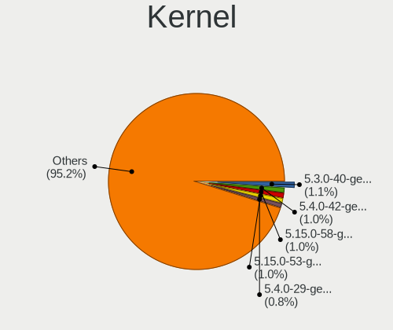
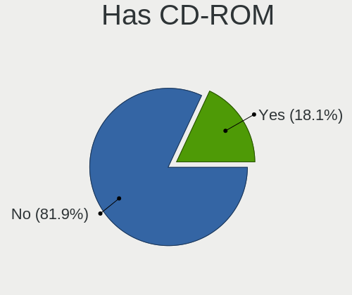
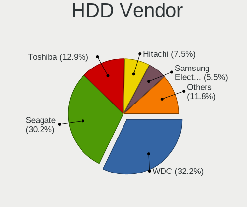
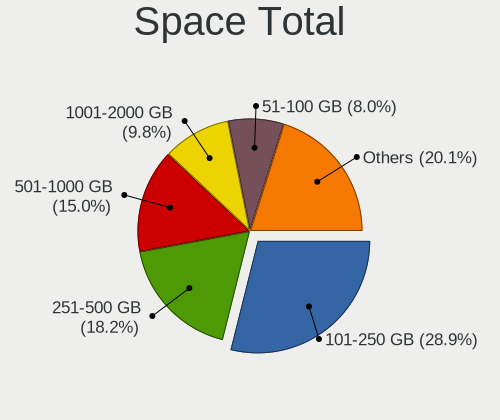
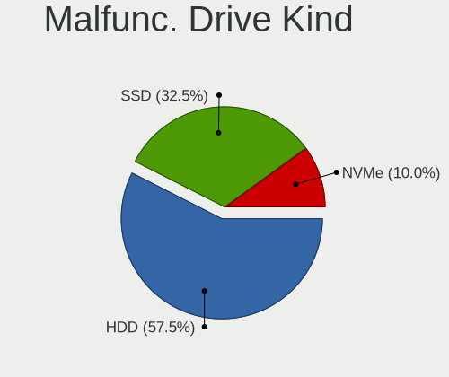
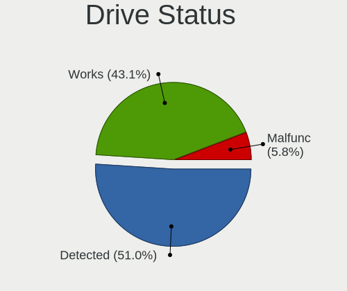
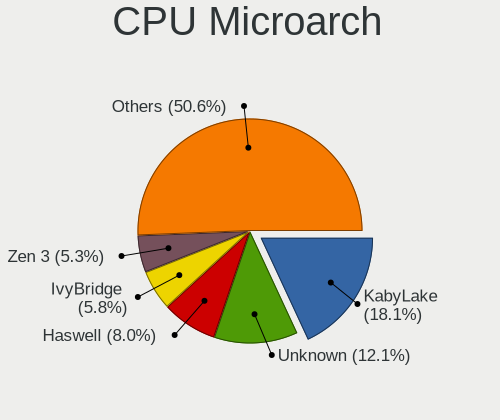
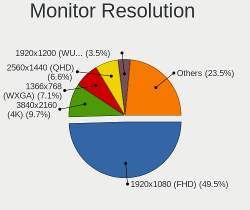
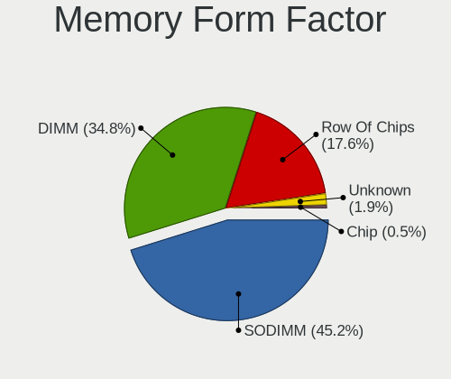

Linux in South Korea - Tested Hardware & Statistics
---------------------------------------------------

A project to collect tested hardware configurations for Linux in South Korea.

Anyone can contribute to this report by the [hw-probe](https://github.com/linuxhw/hw-probe) tool:

    sudo -E hw-probe -all -upload

Please contribute! Especially if your hardware is rare.

This is a report for all computer types. See also reports for [desktops](/Location/South_Korea/Desktop/README.md) and [notebooks](/Location/South_Korea/Notebook/README.md).

Contents
--------

* [ Test Cases ](#test-cases)

* [ System ](#system)
  - [ OS                       ](#os)
  - [ OS Family                ](#os-family)
  - [ Kernel                   ](#kernel)
  - [ Kernel Family            ](#kernel-family)
  - [ Kernel Major Ver.        ](#kernel-major-ver)
  - [ Arch                     ](#arch)
  - [ DE                       ](#de)
  - [ Display Server           ](#display-server)
  - [ Display Manager          ](#display-manager)
  - [ OS Lang                  ](#os-lang)
  - [ Boot Mode                ](#boot-mode)
  - [ Filesystem               ](#filesystem)
  - [ Part. scheme             ](#part-scheme)
  - [ Dual Boot with Linux/BSD ](#dual-boot-with-linuxbsd)
  - [ Dual Boot (Win)          ](#dual-boot-win)

* [ Board ](#board)
  - [ Vendor                   ](#vendor)
  - [ Model                    ](#model)
  - [ Model Family             ](#model-family)
  - [ MFG Year                 ](#mfg-year)
  - [ Form Factor              ](#form-factor)
  - [ Secure Boot              ](#secure-boot)
  - [ Coreboot                 ](#coreboot)
  - [ RAM Size                 ](#ram-size)
  - [ RAM Used                 ](#ram-used)
  - [ Total Drives             ](#total-drives)
  - [ Has CD-ROM               ](#has-cd-rom)
  - [ Has Ethernet             ](#has-ethernet)
  - [ Has WiFi                 ](#has-wifi)
  - [ Has Bluetooth            ](#has-bluetooth)

* [ Location ](#location)
  - [ Country                  ](#country)
  - [ City                     ](#city)

* [ Drives ](#drives)
  - [ Drive Vendor             ](#drive-vendor)
  - [ Drive Model              ](#drive-model)
  - [ HDD Vendor               ](#hdd-vendor)
  - [ SSD Vendor               ](#ssd-vendor)
  - [ Drive Kind               ](#drive-kind)
  - [ Drive Connector          ](#drive-connector)
  - [ Drive Size               ](#drive-size)
  - [ Space Total              ](#space-total)
  - [ Space Used               ](#space-used)
  - [ Malfunc. Drives          ](#malfunc-drives)
  - [ Malfunc. Drive Vendor    ](#malfunc-drive-vendor)
  - [ Malfunc. HDD Vendor      ](#malfunc-hdd-vendor)
  - [ Malfunc. Drive Kind      ](#malfunc-drive-kind)
  - [ Failed Drives            ](#failed-drives)
  - [ Failed Drive Vendor      ](#failed-drive-vendor)
  - [ Drive Status             ](#drive-status)

* [ Storage controller ](#storage-controller)
  - [ Storage Vendor           ](#storage-vendor)
  - [ Storage Model            ](#storage-model)
  - [ Storage Kind             ](#storage-kind)

* [ Processor ](#processor)
  - [ CPU Vendor               ](#cpu-vendor)
  - [ CPU Model                ](#cpu-model)
  - [ CPU Model Family         ](#cpu-model-family)
  - [ CPU Cores                ](#cpu-cores)
  - [ CPU Sockets              ](#cpu-sockets)
  - [ CPU Threads              ](#cpu-threads)
  - [ CPU Op-Modes             ](#cpu-op-modes)
  - [ CPU Microcode            ](#cpu-microcode)
  - [ CPU Microarch            ](#cpu-microarch)

* [ Graphics ](#graphics)
  - [ GPU Vendor               ](#gpu-vendor)
  - [ GPU Model                ](#gpu-model)
  - [ GPU Combo                ](#gpu-combo)
  - [ GPU Driver               ](#gpu-driver)
  - [ GPU Memory               ](#gpu-memory)

* [ Monitor ](#monitor)
  - [ Monitor Vendor           ](#monitor-vendor)
  - [ Monitor Model            ](#monitor-model)
  - [ Monitor Resolution       ](#monitor-resolution)
  - [ Monitor Diagonal         ](#monitor-diagonal)
  - [ Monitor Width            ](#monitor-width)
  - [ Aspect Ratio             ](#aspect-ratio)
  - [ Monitor Area             ](#monitor-area)
  - [ Pixel Density            ](#pixel-density)
  - [ Multiple Monitors        ](#multiple-monitors)

* [ Network ](#network)
  - [ Net Controller Vendor    ](#net-controller-vendor)
  - [ Net Controller Model     ](#net-controller-model)
  - [ Wireless Vendor          ](#wireless-vendor)
  - [ Wireless Model           ](#wireless-model)
  - [ Ethernet Vendor          ](#ethernet-vendor)
  - [ Ethernet Model           ](#ethernet-model)
  - [ Net Controller Kind      ](#net-controller-kind)
  - [ Used Controller          ](#used-controller)
  - [ NICs                     ](#nics)
  - [ IPv6                     ](#ipv6)

* [ Bluetooth ](#bluetooth)
  - [ Bluetooth Vendor         ](#bluetooth-vendor)
  - [ Bluetooth Model          ](#bluetooth-model)

* [ Sound ](#sound)
  - [ Sound Vendor             ](#sound-vendor)
  - [ Sound Model              ](#sound-model)

* [ Memory ](#memory)
  - [ Memory Vendor            ](#memory-vendor)
  - [ Memory Model             ](#memory-model)
  - [ Memory Kind              ](#memory-kind)
  - [ Memory Form Factor       ](#memory-form-factor)
  - [ Memory Size              ](#memory-size)
  - [ Memory Speed             ](#memory-speed)

* [ Printers & scanners ](#printers--scanners)
  - [ Printer Vendor           ](#printer-vendor)
  - [ Printer Model            ](#printer-model)
  - [ Scanner Vendor           ](#scanner-vendor)
  - [ Scanner Model            ](#scanner-model)

* [ Camera ](#camera)
  - [ Camera Vendor            ](#camera-vendor)
  - [ Camera Model             ](#camera-model)

* [ Security ](#security)
  - [ Fingerprint Vendor       ](#fingerprint-vendor)
  - [ Fingerprint Model        ](#fingerprint-model)
  - [ Chipcard Vendor          ](#chipcard-vendor)
  - [ Chipcard Model           ](#chipcard-model)

* [ Unsupported ](#unsupported)
  - [ Unsupported Devices      ](#unsupported-devices)
  - [ Unsupported Device Types ](#unsupported-device-types)

Test Cases
----------

Total: 738

| Vendor        | Model                       | Form-Factor | Probe                                                      | Date         |
|---------------|-----------------------------|-------------|------------------------------------------------------------|--------------|
| ASUSTek       | PRIME A520M-K               | Desktop     | [907a7f6dd8](https://linux-hardware.org/?probe=907a7f6dd8) | Nov 05, 2023 |
| Apple         | MacBookPro16,1              | Notebook    | [0e1711e674](https://linux-hardware.org/?probe=0e1711e674) | Oct 28, 2023 |
| Samsung       | DM700A4K-KN27 SGL8559A1A... | All in one  | [e6c0db51c1](https://linux-hardware.org/?probe=e6c0db51c1) | Oct 28, 2023 |
| Samsung       | 935QDB                      | Convertible | [0b2ea617b5](https://linux-hardware.org/?probe=0b2ea617b5) | Oct 27, 2023 |
| Samsung       | 935QDB                      | Convertible | [a132043246](https://linux-hardware.org/?probe=a132043246) | Oct 25, 2023 |
| Gigabyte      | B650M AORUS ELITE AX        | Desktop     | [8f09f37e41](https://linux-hardware.org/?probe=8f09f37e41) | Oct 25, 2023 |
| HP            | Pavilion Aero Laptop 13-... | Notebook    | [62d0c94205](https://linux-hardware.org/?probe=62d0c94205) | Oct 23, 2023 |
| HP            | Pavilion Aero Laptop 13-... | Notebook    | [3de8a2af66](https://linux-hardware.org/?probe=3de8a2af66) | Oct 23, 2023 |
| HP            | Pavilion Aero Laptop 13-... | Notebook    | [3036944fc9](https://linux-hardware.org/?probe=3036944fc9) | Oct 23, 2023 |
| ASUSTek       | PRIME A320M-K               | Desktop     | [feee3cfca0](https://linux-hardware.org/?probe=feee3cfca0) | Oct 20, 2023 |
| IMUZ          | STORMBOOK14 APOLLO          | Notebook    | [6d8e8178b0](https://linux-hardware.org/?probe=6d8e8178b0) | Oct 19, 2023 |
| Lenovo        | 330B NOK                    | Mini pc     | [deeb2a4420](https://linux-hardware.org/?probe=deeb2a4420) | Oct 16, 2023 |
| Unknown       | Unknown                     | Desktop     | [23768d9009](https://linux-hardware.org/?probe=23768d9009) | Oct 15, 2023 |
| Gigabyte      | AB350-Gaming 3-CF           | Desktop     | [3d6223857b](https://linux-hardware.org/?probe=3d6223857b) | Oct 14, 2023 |
| Samsung       | DT1234567890 SAMSUNG_SW_... | Desktop     | [bf515bb1b4](https://linux-hardware.org/?probe=bf515bb1b4) | Oct 12, 2023 |
| HP            | Elite Dragonfly 13.5 inc... | Notebook    | [67dcd68d2b](https://linux-hardware.org/?probe=67dcd68d2b) | Oct 06, 2023 |
| Gigabyte      | H61M-S2PV                   | Desktop     | [691c015f6f](https://linux-hardware.org/?probe=691c015f6f) | Oct 01, 2023 |
| Gigabyte      | A320M-S2H-CF                | Desktop     | [a8bea5ed82](https://linux-hardware.org/?probe=a8bea5ed82) | Sep 30, 2023 |
| Lenovo        | ThinkPad X230 2325KZ5       | Notebook    | [7c10f1a5de](https://linux-hardware.org/?probe=7c10f1a5de) | Sep 30, 2023 |
| HP            | 8906 SMVB                   | Desktop     | [55c34c64a6](https://linux-hardware.org/?probe=55c34c64a6) | Sep 27, 2023 |
| HP            | Elite Dragonfly 13.5 inc... | Notebook    | [7941c7c6cc](https://linux-hardware.org/?probe=7941c7c6cc) | Sep 27, 2023 |
| ASRock        | H81M-DG6                    | Desktop     | [ac6944c3df](https://linux-hardware.org/?probe=ac6944c3df) | Sep 25, 2023 |
| ASUSTek       | X542UN                      | Notebook    | [76f91b9954](https://linux-hardware.org/?probe=76f91b9954) | Sep 24, 2023 |
| Dell          | 0CN7X8 A07                  | Server      | [3687b4358b](https://linux-hardware.org/?probe=3687b4358b) | Sep 19, 2023 |
| HP            | OMEN by Transcend Gaming... | Notebook    | [866ab5c907](https://linux-hardware.org/?probe=866ab5c907) | Sep 11, 2023 |
| HP            | OMEN by Transcend Gaming... | Notebook    | [2afa6e66d2](https://linux-hardware.org/?probe=2afa6e66d2) | Sep 11, 2023 |
| Unknown       | Unknown                     | Desktop     | [aa67f256bc](https://linux-hardware.org/?probe=aa67f256bc) | Sep 09, 2023 |
| Samsung       | 700T1C                      | Notebook    | [6240a5d18a](https://linux-hardware.org/?probe=6240a5d18a) | Sep 09, 2023 |
| ASRock        | B550M Steel Legend          | Desktop     | [ecd59bd254](https://linux-hardware.org/?probe=ecd59bd254) | Sep 08, 2023 |
| Lenovo        | IdeaPad 3 17IML05 81WC      | Notebook    | [2a900ea3bd](https://linux-hardware.org/?probe=2a900ea3bd) | Sep 03, 2023 |
| MSI           | MAG Z790 TOMAHAWK WIFI      | Desktop     | [da16406c15](https://linux-hardware.org/?probe=da16406c15) | Sep 01, 2023 |
| Unknown       | Unknown                     | Desktop     | [269a4ac17d](https://linux-hardware.org/?probe=269a4ac17d) | Aug 28, 2023 |
| Gigabyte      | B75M-D3H                    | Desktop     | [215ff35620](https://linux-hardware.org/?probe=215ff35620) | Aug 27, 2023 |
| ASUSTek       | Pro WS WRX80E-SAGE SE WI... | Desktop     | [2bb217b4df](https://linux-hardware.org/?probe=2bb217b4df) | Aug 23, 2023 |
| ASUSTek       | ROG Strix G814JV_G814JV     | Notebook    | [3c811f59ba](https://linux-hardware.org/?probe=3c811f59ba) | Aug 23, 2023 |
| Dell          | 07978V A10                  | Server      | [dcd73b2802](https://linux-hardware.org/?probe=dcd73b2802) | Aug 23, 2023 |
| ASUSTek       | GL502VMZ                    | Notebook    | [65952bbced](https://linux-hardware.org/?probe=65952bbced) | Aug 23, 2023 |
| Lenovo        | YB1-X91F                    | Tablet      | [0122f2caab](https://linux-hardware.org/?probe=0122f2caab) | Aug 23, 2023 |
| LG Electro... | 15Z990-VA5WK                | Notebook    | [51c419c795](https://linux-hardware.org/?probe=51c419c795) | Aug 23, 2023 |
| ASUSTek       | ROG Strix G814JV_G814JV     | Notebook    | [df8b84163a](https://linux-hardware.org/?probe=df8b84163a) | Aug 23, 2023 |
| Lenovo        | ThinkPad X230 2306AV4       | Notebook    | [d52720a4dc](https://linux-hardware.org/?probe=d52720a4dc) | Aug 21, 2023 |
| ASUSTek       | ROG STRIX B650E-E GAMING... | Desktop     | [b9701cd43c](https://linux-hardware.org/?probe=b9701cd43c) | Aug 20, 2023 |
| Valve         | Jupiter                     | Notebook    | [1d87714ed5](https://linux-hardware.org/?probe=1d87714ed5) | Aug 20, 2023 |
| HP            | EliteBook 865 16 inch G9... | Notebook    | [f99d3dca93](https://linux-hardware.org/?probe=f99d3dca93) | Aug 17, 2023 |
| Lenovo        | ThinkPad X1 Yoga 2nd 20J... | Convertible | [b223cba859](https://linux-hardware.org/?probe=b223cba859) | Aug 14, 2023 |
| HP            | EliteBook 845 14 inch G9... | Notebook    | [0650746552](https://linux-hardware.org/?probe=0650746552) | Aug 13, 2023 |
| Lenovo        | ThinkBook 14 G3 ACL 21A2    | Notebook    | [fee93b31f5](https://linux-hardware.org/?probe=fee93b31f5) | Aug 13, 2023 |
| Lenovo        | IdeaPad Duet 3 11IAN8 82... | Tablet      | [b61e23d1ec](https://linux-hardware.org/?probe=b61e23d1ec) | Aug 12, 2023 |
| Lenovo        | ThinkBook 14 G3 ACL 21A2    | Notebook    | [5892469c5b](https://linux-hardware.org/?probe=5892469c5b) | Aug 12, 2023 |
| Unknown       | Unknown                     | Desktop     | [a9f30f8dd0](https://linux-hardware.org/?probe=a9f30f8dd0) | Aug 11, 2023 |
| HPE           | ProLiant DL380 Gen10        | Server      | [1db6058b8f](https://linux-hardware.org/?probe=1db6058b8f) | Aug 10, 2023 |
| Gigabyte      | TRX40 DESIGNARE             | Desktop     | [a71dc0067b](https://linux-hardware.org/?probe=a71dc0067b) | Aug 07, 2023 |
| Notebook      | N650DU                      | Notebook    | [c04f4faa06](https://linux-hardware.org/?probe=c04f4faa06) | Jul 19, 2023 |
| HP            | Pavilion dv6                | Notebook    | [2abf53d250](https://linux-hardware.org/?probe=2abf53d250) | Jul 17, 2023 |
| Lenovo        | IdeaPad 330S-15AST 81F9     | Notebook    | [c9a443767b](https://linux-hardware.org/?probe=c9a443767b) | Jul 16, 2023 |
| Dell          | XPS 15 9570                 | Notebook    | [1c15fc53af](https://linux-hardware.org/?probe=1c15fc53af) | Jul 16, 2023 |
| Unknown       | NVIDIA Jetson Xavier NX ... | Soc         | [b9b08fd326](https://linux-hardware.org/?probe=b9b08fd326) | Jul 15, 2023 |
| ASUSTek       | Z170-A                      | Desktop     | [87a26e01e6](https://linux-hardware.org/?probe=87a26e01e6) | Jul 06, 2023 |
| ASUSTek       | ROG STRIX B650E-E GAMING... | Desktop     | [669754af36](https://linux-hardware.org/?probe=669754af36) | Jul 02, 2023 |
| Gigabyte      | A620M GAMING X              | Desktop     | [76238267ab](https://linux-hardware.org/?probe=76238267ab) | Jul 01, 2023 |
| Samsung       | Galaxy Book 10.6            | Tablet      | [570e99d65f](https://linux-hardware.org/?probe=570e99d65f) | Jun 25, 2023 |
| Lenovo        | ThinkPad L15 Gen 2a 20X7... | Notebook    | [09419812ab](https://linux-hardware.org/?probe=09419812ab) | Jun 24, 2023 |
| Lenovo        | Yoga Slim 7 Carbon 14ACN... | Notebook    | [856acf81ed](https://linux-hardware.org/?probe=856acf81ed) | Jun 22, 2023 |
| Acer          | Predator PHN16-71           | Notebook    | [16f2ca887d](https://linux-hardware.org/?probe=16f2ca887d) | Jun 20, 2023 |
| Samsung       | 950XCJ/951XCJ/950XCR        | Notebook    | [4777b096a3](https://linux-hardware.org/?probe=4777b096a3) | Jun 18, 2023 |
| ASUSTek       | VivoBook S13 X330FA_S330... | Notebook    | [b816a11527](https://linux-hardware.org/?probe=b816a11527) | Jun 18, 2023 |
| HP            | Laptop 15-fc0xxx            | Notebook    | [af90ec4131](https://linux-hardware.org/?probe=af90ec4131) | Jun 16, 2023 |
| HP            | ENVY Notebook               | Notebook    | [4a4602250b](https://linux-hardware.org/?probe=4a4602250b) | Jun 15, 2023 |
| HP            | ENVY Notebook               | Notebook    | [54115f309f](https://linux-hardware.org/?probe=54115f309f) | Jun 15, 2023 |
| Samsung       | 760XDA                      | Notebook    | [f0decf4dbe](https://linux-hardware.org/?probe=f0decf4dbe) | Jun 14, 2023 |
| ASUSTek       | PRIME A520M-K               | Desktop     | [2fe8080014](https://linux-hardware.org/?probe=2fe8080014) | Jun 11, 2023 |
| Samsung       | 910S3L                      | Notebook    | [f8e59b4c0f](https://linux-hardware.org/?probe=f8e59b4c0f) | Jun 08, 2023 |
| Samsung       | 910S3L                      | Notebook    | [2db0ae25d8](https://linux-hardware.org/?probe=2db0ae25d8) | Jun 06, 2023 |
| ASRock        | B150M Pro4                  | Desktop     | [0b59eacbd3](https://linux-hardware.org/?probe=0b59eacbd3) | Jun 05, 2023 |
| ASRock        | X670E Taichi                | Desktop     | [6616151cda](https://linux-hardware.org/?probe=6616151cda) | Jun 04, 2023 |
| Samsung       | 950XCJ/951XCJ/950XCR        | Notebook    | [95ec288436](https://linux-hardware.org/?probe=95ec288436) | Jun 03, 2023 |
| Samsung       | 950XCJ/951XCJ/950XCR        | Notebook    | [7720a9f71c](https://linux-hardware.org/?probe=7720a9f71c) | Jun 03, 2023 |
| ASUSTek       | Zenbook UM3402YA_UM3402Y... | Notebook    | [8a6ceb7d8b](https://linux-hardware.org/?probe=8a6ceb7d8b) | May 30, 2023 |
| Samsung       | 950XDC/951XDC/950XDX        | Notebook    | [105d3da269](https://linux-hardware.org/?probe=105d3da269) | May 30, 2023 |
| Samsung       | 900X5T                      | Notebook    | [9f1d226c85](https://linux-hardware.org/?probe=9f1d226c85) | May 25, 2023 |
| ASUSTek       | X542UN                      | Notebook    | [29547f8e99](https://linux-hardware.org/?probe=29547f8e99) | May 24, 2023 |
| Chuwi         | LarkBox Pro                 | Mini pc     | [e197af6a9f](https://linux-hardware.org/?probe=e197af6a9f) | May 20, 2023 |
| ECS           | PB02CF                      | Server      | [ae43167b8a](https://linux-hardware.org/?probe=ae43167b8a) | May 19, 2023 |
| ECS           | PB02CF                      | Server      | [b2830721b2](https://linux-hardware.org/?probe=b2830721b2) | May 19, 2023 |
| MSI           | MAG Z790 TOMAHAWK WIFI      | Desktop     | [f4fce509ae](https://linux-hardware.org/?probe=f4fce509ae) | May 18, 2023 |
| Lenovo        | ThinkBook 16 G4+ ARA 21D... | Notebook    | [2d07f38ffa](https://linux-hardware.org/?probe=2d07f38ffa) | May 17, 2023 |
| Lenovo        | ThinkBook 16 G4+ ARA 21D... | Notebook    | [de6d4ede23](https://linux-hardware.org/?probe=de6d4ede23) | May 17, 2023 |
| ASUSTek       | PN51-S1                     | Mini pc     | [18e6ede132](https://linux-hardware.org/?probe=18e6ede132) | May 12, 2023 |
| HP            | ENVY Laptop 14-eb0xxx       | Notebook    | [64353c7d87](https://linux-hardware.org/?probe=64353c7d87) | May 12, 2023 |
| HUAWEI        | NBLK-WAX9X                  | Notebook    | [efc35b1887](https://linux-hardware.org/?probe=efc35b1887) | May 11, 2023 |
| Unknown       | Unknown                     | Notebook    | [0225c3c300](https://linux-hardware.org/?probe=0225c3c300) | May 09, 2023 |
| MSI           | MAG Z790 TOMAHAWK WIFI      | Desktop     | [abb92fef7d](https://linux-hardware.org/?probe=abb92fef7d) | May 06, 2023 |
| Lenovo        | 7Y51CTO1WW                  | Server      | [a2fd0bc88c](https://linux-hardware.org/?probe=a2fd0bc88c) | May 04, 2023 |
| MSI           | B450 TOMAHAWK               | Desktop     | [5195c623c0](https://linux-hardware.org/?probe=5195c623c0) | May 02, 2023 |
| Samsung       | 730QCJ/730QCR               | Notebook    | [4541d2e721](https://linux-hardware.org/?probe=4541d2e721) | May 02, 2023 |
| ASRock        | Z370 Extreme4               | Desktop     | [0f126ade53](https://linux-hardware.org/?probe=0f126ade53) | Apr 29, 2023 |
| Samsung       | DT1234567890 SEC_SW_REVI... | Desktop     | [dca43563dd](https://linux-hardware.org/?probe=dca43563dd) | Apr 29, 2023 |
| ASUSTek       | TUF Gaming B550-PLUS WIF... | Desktop     | [658450824e](https://linux-hardware.org/?probe=658450824e) | Apr 23, 2023 |
| Gigabyte      | 990FXA-UD3                  | Desktop     | [bab80153bf](https://linux-hardware.org/?probe=bab80153bf) | Apr 22, 2023 |
| Lenovo        | E520-15IKB 80WA             | Notebook    | [abd1d98b9b](https://linux-hardware.org/?probe=abd1d98b9b) | Apr 20, 2023 |
| Dell          | 0MR5MV A00                  | Desktop     | [ed13b58a51](https://linux-hardware.org/?probe=ed13b58a51) | Apr 16, 2023 |
| Lenovo        | ThinkPad E15 Gen 4 21ED0... | Notebook    | [62399bace9](https://linux-hardware.org/?probe=62399bace9) | Apr 16, 2023 |
| Lenovo        | ThinkPad E15 Gen 4 21ED0... | Notebook    | [1f3ed1329d](https://linux-hardware.org/?probe=1f3ed1329d) | Apr 16, 2023 |
| ASUSTek       | ROG Strix G712LU_G712LU     | Notebook    | [91946b965a](https://linux-hardware.org/?probe=91946b965a) | Apr 13, 2023 |
| Gigabyte      | 990FXA-UD3                  | Desktop     | [30fdc58d69](https://linux-hardware.org/?probe=30fdc58d69) | Apr 12, 2023 |
| Rockchip      | Orange Pi 5                 | Soc         | [9b39bc4979](https://linux-hardware.org/?probe=9b39bc4979) | Apr 12, 2023 |
| ASUSTek       | ROG Strix G712LU_G712LU     | Notebook    | [674533c5cd](https://linux-hardware.org/?probe=674533c5cd) | Apr 12, 2023 |
| HP            | Victus by Laptop 16-d1xx... | Notebook    | [9ddd50e0ed](https://linux-hardware.org/?probe=9ddd50e0ed) | Apr 05, 2023 |
| Lenovo        | ThinkPad X1 Nano Gen 2 2... | Notebook    | [36338ecf6e](https://linux-hardware.org/?probe=36338ecf6e) | Apr 05, 2023 |
| Apple         | MacBookPro9,2               | Notebook    | [f4343acc49](https://linux-hardware.org/?probe=f4343acc49) | Apr 03, 2023 |
| Apple         | MacBookPro9,2               | Notebook    | [3e558165a4](https://linux-hardware.org/?probe=3e558165a4) | Apr 02, 2023 |
| Gigabyte      | GA-6LXSG 01234567           | Server      | [92bff0d0ac](https://linux-hardware.org/?probe=92bff0d0ac) | Apr 01, 2023 |
| HP            | Laptop 15s-eq3xxx           | Notebook    | [758bb2556e](https://linux-hardware.org/?probe=758bb2556e) | Apr 01, 2023 |
| MSI           | MAG B550M MORTAR WIFI       | Desktop     | [dfd9900ccf](https://linux-hardware.org/?probe=dfd9900ccf) | Mar 30, 2023 |
| Notebook      | N650DU                      | Notebook    | [e8ec3c6462](https://linux-hardware.org/?probe=e8ec3c6462) | Mar 30, 2023 |
| HP            | EliteBook 855 G7 Noteboo... | Notebook    | [bf2f7820cd](https://linux-hardware.org/?probe=bf2f7820cd) | Mar 29, 2023 |
| MSI           | B450M MORTAR                | Desktop     | [7febdf82c0](https://linux-hardware.org/?probe=7febdf82c0) | Mar 28, 2023 |
| Gigabyte      | Z790 AORUS ELITE AX         | Desktop     | [fa7272f576](https://linux-hardware.org/?probe=fa7272f576) | Mar 27, 2023 |
| Apple         | MacBook9,1                  | Notebook    | [9639f02d57](https://linux-hardware.org/?probe=9639f02d57) | Mar 25, 2023 |
| WEIPAI        | S15                         | Notebook    | [e6a15d7fa9](https://linux-hardware.org/?probe=e6a15d7fa9) | Mar 25, 2023 |
| Gigabyte      | B85M-D3V-A-SI               | Desktop     | [19a060d86d](https://linux-hardware.org/?probe=19a060d86d) | Mar 20, 2023 |
| Apple         | MacBookPro11,2              | Notebook    | [9404efe255](https://linux-hardware.org/?probe=9404efe255) | Mar 18, 2023 |
| Gigabyte      | GB-BSi7A-6500               | Notebook    | [5a9b5297c2](https://linux-hardware.org/?probe=5a9b5297c2) | Mar 16, 2023 |
| ECS2          | EASTWOOD2 V1.0              | Desktop     | [822e4fa621](https://linux-hardware.org/?probe=822e4fa621) | Mar 11, 2023 |
| Valve         | Jupiter                     | Notebook    | [0d12931010](https://linux-hardware.org/?probe=0d12931010) | Mar 11, 2023 |
| Dell          | 0TNXNR A01                  | Desktop     | [30fa0c9cb7](https://linux-hardware.org/?probe=30fa0c9cb7) | Mar 09, 2023 |
| Microsoft     | Surface Go 3                | Tablet      | [09ce898081](https://linux-hardware.org/?probe=09ce898081) | Mar 02, 2023 |
| Dell          | Latitude E5440              | Notebook    | [25cf039ffd](https://linux-hardware.org/?probe=25cf039ffd) | Feb 27, 2023 |
| Dell          | Latitude E5440              | Notebook    | [5546f00169](https://linux-hardware.org/?probe=5546f00169) | Feb 26, 2023 |
| Lenovo        | 102F SDK0J40705 WIN 3425... | Desktop     | [484e0755de](https://linux-hardware.org/?probe=484e0755de) | Feb 26, 2023 |
| HP            | Elite Dragonfly G2 Noteb... | Convertible | [51e3518d50](https://linux-hardware.org/?probe=51e3518d50) | Feb 24, 2023 |
| ASUSTek       | P8H67-M                     | Desktop     | [a3ea522d78](https://linux-hardware.org/?probe=a3ea522d78) | Feb 23, 2023 |
| Samsung       | 760XDA                      | Notebook    | [efa040a93f](https://linux-hardware.org/?probe=efa040a93f) | Feb 22, 2023 |
| Samsung       | 760XDA                      | Notebook    | [1ba36d420d](https://linux-hardware.org/?probe=1ba36d420d) | Feb 22, 2023 |
| Gigabyte      | GB-BSi7A-6500               | Notebook    | [6ec55330a7](https://linux-hardware.org/?probe=6ec55330a7) | Feb 21, 2023 |
| Samsung       | DB400T7Y-Z202C SGL9325A0... | Desktop     | [b75c596e7f](https://linux-hardware.org/?probe=b75c596e7f) | Feb 21, 2023 |
| Gigabyte      | B85M-D3V-A-SI               | Desktop     | [5b452754c0](https://linux-hardware.org/?probe=5b452754c0) | Feb 19, 2023 |
| HPE           | ProLiant DL380 Gen10        | Server      | [c03dee89f6](https://linux-hardware.org/?probe=c03dee89f6) | Feb 17, 2023 |
| HP            | Elite Dragonfly G2 Noteb... | Convertible | [a9d6ae7b72](https://linux-hardware.org/?probe=a9d6ae7b72) | Feb 17, 2023 |
| ASRock        | Z370 Pro4                   | Desktop     | [bafba5486b](https://linux-hardware.org/?probe=bafba5486b) | Feb 16, 2023 |
| Samsung       | 940XFG                      | Notebook    | [56f236f8ab](https://linux-hardware.org/?probe=56f236f8ab) | Feb 16, 2023 |
| ASRock        | Z790 Pro RS WiFi            | Desktop     | [c530bf4283](https://linux-hardware.org/?probe=c530bf4283) | Feb 11, 2023 |
| Samsung       | 900X5N                      | Notebook    | [91793918de](https://linux-hardware.org/?probe=91793918de) | Feb 07, 2023 |
| Unknown       | Unknown                     | Notebook    | [d1da7498da](https://linux-hardware.org/?probe=d1da7498da) | Feb 02, 2023 |
| MSI           | MAG Z790 TOMAHAWK WIFI      | Desktop     | [b9fb1c5111](https://linux-hardware.org/?probe=b9fb1c5111) | Feb 01, 2023 |
| ASUSTek       | Zenbook UM3402YA_UM3402Y... | Notebook    | [9b17a7541e](https://linux-hardware.org/?probe=9b17a7541e) | Jan 30, 2023 |
| ASUSTek       | GA35DX                      | Desktop     | [697b0d8654](https://linux-hardware.org/?probe=697b0d8654) | Jan 28, 2023 |
| Lenovo        | IdeaPad 3 15ADA05 81W1      | Notebook    | [a011ba3b9e](https://linux-hardware.org/?probe=a011ba3b9e) | Jan 28, 2023 |
| Gigabyte      | B660M DS3H DDR4             | Desktop     | [bb5e9ccd98](https://linux-hardware.org/?probe=bb5e9ccd98) | Jan 27, 2023 |
| Gigabyte      | B660M DS3H DDR4             | Desktop     | [d54e25d6fb](https://linux-hardware.org/?probe=d54e25d6fb) | Jan 27, 2023 |
| HP            | Notebook                    | Notebook    | [4c632128bf](https://linux-hardware.org/?probe=4c632128bf) | Jan 26, 2023 |
| Lenovo        | IdeaPad 3 15ADA05 81W1      | Notebook    | [18d42efe40](https://linux-hardware.org/?probe=18d42efe40) | Jan 24, 2023 |
| ASUSTek       | X540UA                      | Notebook    | [39f992a141](https://linux-hardware.org/?probe=39f992a141) | Jan 22, 2023 |
| ASUSTek       | X540UA                      | Notebook    | [dda62597f7](https://linux-hardware.org/?probe=dda62597f7) | Jan 21, 2023 |
| ASRock        | B560M Pro4                  | Desktop     | [6c8d492f56](https://linux-hardware.org/?probe=6c8d492f56) | Jan 19, 2023 |
| HPE           | ProLiant DL380 Gen10        | Server      | [2ddc21d71f](https://linux-hardware.org/?probe=2ddc21d71f) | Jan 16, 2023 |
| ASUSTek       | H110M-K                     | Desktop     | [8975ee2ce6](https://linux-hardware.org/?probe=8975ee2ce6) | Jan 14, 2023 |
| HPE           | ProLiant DL380 Gen10        | Server      | [2f6c800e41](https://linux-hardware.org/?probe=2f6c800e41) | Jan 11, 2023 |
| Lenovo        | IdeaPad 3 14ITL6 82H7       | Notebook    | [dfca68067c](https://linux-hardware.org/?probe=dfca68067c) | Jan 10, 2023 |
| Samsung       | 760XDA                      | Notebook    | [06a850e558](https://linux-hardware.org/?probe=06a850e558) | Jan 10, 2023 |
| Samsung       | 760XDA                      | Notebook    | [180727ef64](https://linux-hardware.org/?probe=180727ef64) | Jan 10, 2023 |
| HPE           | ProLiant DL380 Gen10        | Server      | [37818477e0](https://linux-hardware.org/?probe=37818477e0) | Jan 09, 2023 |
| Unknown       | Unknown                     | Desktop     | [49d1097b37](https://linux-hardware.org/?probe=49d1097b37) | Jan 07, 2023 |
| Unknown       | Unknown                     | Desktop     | [2fbec34211](https://linux-hardware.org/?probe=2fbec34211) | Jan 07, 2023 |
| Lenovo        | IdeaPad 320-15IKB 81BG      | Notebook    | [a56af08eb5](https://linux-hardware.org/?probe=a56af08eb5) | Jan 07, 2023 |
| Valve         | Jupiter                     | Notebook    | [e47684954b](https://linux-hardware.org/?probe=e47684954b) | Jan 04, 2023 |
| ELSKY         | M219FN-6C                   | Desktop     | [95862529f8](https://linux-hardware.org/?probe=95862529f8) | Jan 04, 2023 |
| ASUSTek       | TUF Gaming X570-PLUS        | Desktop     | [eda96539d7](https://linux-hardware.org/?probe=eda96539d7) | Dec 26, 2022 |
| Lenovo        | ThinkPad E585 20KVS06F00    | Notebook    | [8c3bdcc48c](https://linux-hardware.org/?probe=8c3bdcc48c) | Dec 25, 2022 |
| Jooyon Tec... | J6BF                        | Notebook    | [dabe200abe](https://linux-hardware.org/?probe=dabe200abe) | Dec 23, 2022 |
| Razer         | Blade 17 (2022) - RZ09-0... | Notebook    | [f244715ee3](https://linux-hardware.org/?probe=f244715ee3) | Dec 22, 2022 |
| ASRock        | H470M Pro4                  | Desktop     | [b69ccc3353](https://linux-hardware.org/?probe=b69ccc3353) | Dec 22, 2022 |
| Razer         | Blade 17 (2022) - RZ09-0... | Notebook    | [2ebd48d256](https://linux-hardware.org/?probe=2ebd48d256) | Dec 22, 2022 |
| Gigabyte      | AERO 15 YC                  | Notebook    | [24e48000be](https://linux-hardware.org/?probe=24e48000be) | Dec 22, 2022 |
| Razer         | Blade 17 (2022) - RZ09-0... | Notebook    | [d6f3d14b20](https://linux-hardware.org/?probe=d6f3d14b20) | Dec 22, 2022 |
| Gigabyte      | Z490 AORUS XTREME WF        | Desktop     | [7020686bc7](https://linux-hardware.org/?probe=7020686bc7) | Dec 19, 2022 |
| LG Electro... | 15UD480-GX50K               | Notebook    | [16be4a033d](https://linux-hardware.org/?probe=16be4a033d) | Dec 19, 2022 |
| Valve         | Jupiter                     | Notebook    | [24182862cd](https://linux-hardware.org/?probe=24182862cd) | Dec 15, 2022 |
| Valve         | Jupiter                     | Notebook    | [cfe8d55199](https://linux-hardware.org/?probe=cfe8d55199) | Dec 14, 2022 |
| Samsung       | 550XED                      | Notebook    | [8e5bdc1eab](https://linux-hardware.org/?probe=8e5bdc1eab) | Dec 14, 2022 |
| Samsung       | 550XED                      | Notebook    | [3165e8b2df](https://linux-hardware.org/?probe=3165e8b2df) | Dec 14, 2022 |
| ASUSTek       | Zenbook UP6502ZA_UP6502Z... | Convertible | [85c2b907d7](https://linux-hardware.org/?probe=85c2b907d7) | Dec 14, 2022 |
| Lenovo        | ThinkPad X260 20F6007KKR    | Notebook    | [9b788f857e](https://linux-hardware.org/?probe=9b788f857e) | Dec 14, 2022 |
| Valve         | Jupiter                     | Notebook    | [a2f1af21a0](https://linux-hardware.org/?probe=a2f1af21a0) | Dec 13, 2022 |
| Valve         | Jupiter                     | Notebook    | [a505c76dfa](https://linux-hardware.org/?probe=a505c76dfa) | Dec 13, 2022 |
| LG Electro... | 15ND530-GX3FK               | Notebook    | [47b90cbe2a](https://linux-hardware.org/?probe=47b90cbe2a) | Dec 12, 2022 |
| Google        | Peppy                       | Notebook    | [59f9af1c52](https://linux-hardware.org/?probe=59f9af1c52) | Dec 10, 2022 |
| Huanan        | X58-RX3.0 V110              | Desktop     | [32e6a4d219](https://linux-hardware.org/?probe=32e6a4d219) | Dec 10, 2022 |
| Lenovo        | ThinkPad L14 Gen 3 21C5S... | Notebook    | [7772d8b9f8](https://linux-hardware.org/?probe=7772d8b9f8) | Dec 10, 2022 |
| Lenovo        | IdeaPad 5 15ABA7 82SG       | Notebook    | [5254612ca4](https://linux-hardware.org/?probe=5254612ca4) | Dec 09, 2022 |
| Samsung       | 550XED                      | Notebook    | [705495532e](https://linux-hardware.org/?probe=705495532e) | Dec 09, 2022 |
| Samsung       | 550XED                      | Notebook    | [0df3845885](https://linux-hardware.org/?probe=0df3845885) | Dec 08, 2022 |
| Lenovo        | ThinkPad T61 889502U        | Notebook    | [b9d0a07e47](https://linux-hardware.org/?probe=b9d0a07e47) | Dec 08, 2022 |
| Lenovo        | ThinkPad T60 1953PKK        | Notebook    | [fc308e2f1c](https://linux-hardware.org/?probe=fc308e2f1c) | Dec 08, 2022 |
| Lenovo        | ThinkPad X201 Tablet 309... | Notebook    | [e13e889312](https://linux-hardware.org/?probe=e13e889312) | Dec 08, 2022 |
| Samsung       | 550XED                      | Notebook    | [0ce3bd481f](https://linux-hardware.org/?probe=0ce3bd481f) | Dec 07, 2022 |
| Lenovo        | ThinkPad E495 20NES0J800    | Notebook    | [17182155b5](https://linux-hardware.org/?probe=17182155b5) | Dec 07, 2022 |
| Lenovo        | 370A NOK                    | Desktop     | [b06728a8bf](https://linux-hardware.org/?probe=b06728a8bf) | Dec 05, 2022 |
| Dell          | 00D7V6 A00                  | Desktop     | [6047fbcb06](https://linux-hardware.org/?probe=6047fbcb06) | Dec 05, 2022 |
| Dell          | 00D7V6 A00                  | Desktop     | [9aebb424cc](https://linux-hardware.org/?probe=9aebb424cc) | Dec 05, 2022 |
| Samsung       | 550XED                      | Notebook    | [fee55cdb61](https://linux-hardware.org/?probe=fee55cdb61) | Dec 02, 2022 |
| Samsung       | 550XED                      | Notebook    | [d8894f602a](https://linux-hardware.org/?probe=d8894f602a) | Dec 01, 2022 |
| Gigabyte      | Z490 AORUS XTREME WF        | Desktop     | [6d4f229020](https://linux-hardware.org/?probe=6d4f229020) | Nov 29, 2022 |
| Dell          | Latitude E5440              | Notebook    | [90d18073d6](https://linux-hardware.org/?probe=90d18073d6) | Nov 29, 2022 |
| Dell          | Inspiron 15 5510            | Notebook    | [5ec5306c0f](https://linux-hardware.org/?probe=5ec5306c0f) | Nov 28, 2022 |
| Samsung       | 550XED                      | Notebook    | [143518e596](https://linux-hardware.org/?probe=143518e596) | Nov 26, 2022 |
| Unknown       | Unknown                     | Notebook    | [d96c2be612](https://linux-hardware.org/?probe=d96c2be612) | Nov 23, 2022 |
| Samsung       | 950XED                      | Notebook    | [48213c8f60](https://linux-hardware.org/?probe=48213c8f60) | Nov 23, 2022 |
| TMAX          | TM101W638L                  | Tablet      | [ac8adad039](https://linux-hardware.org/?probe=ac8adad039) | Nov 22, 2022 |
| Samsung       | 950XED                      | Notebook    | [0c91469d8f](https://linux-hardware.org/?probe=0c91469d8f) | Nov 21, 2022 |
| Dell          | Latitude E5440              | Notebook    | [6d90726959](https://linux-hardware.org/?probe=6d90726959) | Nov 21, 2022 |
| Samsung       | 950XCJ/951XCJ/950XCR        | Notebook    | [2bc3a22052](https://linux-hardware.org/?probe=2bc3a22052) | Nov 20, 2022 |
| MSI           | Vector GP66 12UGS           | Notebook    | [9aab7e297a](https://linux-hardware.org/?probe=9aab7e297a) | Nov 19, 2022 |
| MSI           | Vector GP66 12UGS           | Notebook    | [e10c2abc9b](https://linux-hardware.org/?probe=e10c2abc9b) | Nov 19, 2022 |
| Gigabyte      | 990FXA-UD3                  | Desktop     | [d5c76baafa](https://linux-hardware.org/?probe=d5c76baafa) | Nov 18, 2022 |
| Samsung       | 550XED                      | Notebook    | [06722b1fee](https://linux-hardware.org/?probe=06722b1fee) | Nov 16, 2022 |
| Samsung       | 950XED                      | Notebook    | [2558d99814](https://linux-hardware.org/?probe=2558d99814) | Nov 16, 2022 |
| Samsung       | 950XED                      | Notebook    | [ddcb4e15c7](https://linux-hardware.org/?probe=ddcb4e15c7) | Nov 14, 2022 |
| Samsung       | 550XED                      | Notebook    | [bbebe45363](https://linux-hardware.org/?probe=bbebe45363) | Nov 13, 2022 |
| Lenovo        | Yoga 6 13ARE05 82FN         | Convertible | [9d91de9f87](https://linux-hardware.org/?probe=9d91de9f87) | Nov 12, 2022 |
| Lenovo        | Yoga 6 13ARE05 82FN         | Convertible | [da754cf27a](https://linux-hardware.org/?probe=da754cf27a) | Nov 11, 2022 |
| Samsung       | 550XED                      | Notebook    | [60c1aa4cc9](https://linux-hardware.org/?probe=60c1aa4cc9) | Nov 10, 2022 |
| ASUSTek       | P8H67                       | Desktop     | [0ccbbf67e8](https://linux-hardware.org/?probe=0ccbbf67e8) | Nov 10, 2022 |
| ASUSTek       | VivoBook_ASUSLaptop S540... | Notebook    | [9cdaa4c88b](https://linux-hardware.org/?probe=9cdaa4c88b) | Nov 09, 2022 |
| Samsung       | 550XED                      | Notebook    | [fc6d96f9fe](https://linux-hardware.org/?probe=fc6d96f9fe) | Nov 06, 2022 |
| Samsung       | 550XED                      | Notebook    | [6db345f53d](https://linux-hardware.org/?probe=6db345f53d) | Nov 03, 2022 |
| ASUSTek       | PRIME B365M-K               | Desktop     | [e2e281d38d](https://linux-hardware.org/?probe=e2e281d38d) | Nov 03, 2022 |
| Fujitsu       | D3219-A1 S26361-D3219-A1    | Desktop     | [bdc77dbc53](https://linux-hardware.org/?probe=bdc77dbc53) | Nov 03, 2022 |
| Samsung       | 550XED                      | Notebook    | [6992db47be](https://linux-hardware.org/?probe=6992db47be) | Nov 02, 2022 |
| Samsung       | 950XED                      | Notebook    | [821bc59c17](https://linux-hardware.org/?probe=821bc59c17) | Nov 02, 2022 |
| Samsung       | 550XED                      | Notebook    | [3b04d21991](https://linux-hardware.org/?probe=3b04d21991) | Nov 01, 2022 |
| Apple         | MacBookPro16,1              | Notebook    | [025e3e7e4e](https://linux-hardware.org/?probe=025e3e7e4e) | Nov 01, 2022 |
| MS            | MPGIO                       | Notebook    | [4fc8637bf3](https://linux-hardware.org/?probe=4fc8637bf3) | Nov 01, 2022 |
| HP            | Pavilion dv6                | Notebook    | [ba31f00bbd](https://linux-hardware.org/?probe=ba31f00bbd) | Oct 31, 2022 |
| WTM           | W-N95 B0                    | Desktop     | [56611d3c8f](https://linux-hardware.org/?probe=56611d3c8f) | Oct 31, 2022 |
| LG Electro... | 15Z980-HA76K                | Notebook    | [914156672d](https://linux-hardware.org/?probe=914156672d) | Oct 30, 2022 |
| Samsung       | 950XED                      | Notebook    | [350a0f9d44](https://linux-hardware.org/?probe=350a0f9d44) | Oct 28, 2022 |
| Samsung       | 550XED                      | Notebook    | [1ebb9be92b](https://linux-hardware.org/?probe=1ebb9be92b) | Oct 28, 2022 |
| Samsung       | 550XED                      | Notebook    | [110d85c2e0](https://linux-hardware.org/?probe=110d85c2e0) | Oct 27, 2022 |
| Samsung       | 950XED                      | Notebook    | [a636a02096](https://linux-hardware.org/?probe=a636a02096) | Oct 27, 2022 |
| HP            | 8425                        | Desktop     | [6d26af6597](https://linux-hardware.org/?probe=6d26af6597) | Oct 27, 2022 |
| LG Electro... | 15Z90N-HA76K                | Notebook    | [7805c272fb](https://linux-hardware.org/?probe=7805c272fb) | Oct 24, 2022 |
| Lenovo        | ThinkPad X1 Carbon Gen 1... | Notebook    | [866d0f49a2](https://linux-hardware.org/?probe=866d0f49a2) | Oct 20, 2022 |
| Dell          | Precision 7520              | Notebook    | [366eed3b66](https://linux-hardware.org/?probe=366eed3b66) | Oct 20, 2022 |
| Dell          | Precision 7520              | Notebook    | [8c2829bbb2](https://linux-hardware.org/?probe=8c2829bbb2) | Oct 19, 2022 |
| HP            | EliteBook 865 16 inch G9... | Notebook    | [8665ee6ba6](https://linux-hardware.org/?probe=8665ee6ba6) | Oct 19, 2022 |
| Apple         | MacBookPro12,1              | Notebook    | [7979753fa9](https://linux-hardware.org/?probe=7979753fa9) | Oct 15, 2022 |
| Gigabyte      | B360M D3H-CF                | Desktop     | [ad1d808caa](https://linux-hardware.org/?probe=ad1d808caa) | Oct 14, 2022 |
| Lenovo        | MIIX 320-10ICR 80XF         | Tablet      | [6580d55237](https://linux-hardware.org/?probe=6580d55237) | Oct 09, 2022 |
| Apple         | MacBookPro16,1              | Notebook    | [865d1f0e6f](https://linux-hardware.org/?probe=865d1f0e6f) | Oct 07, 2022 |
| MSI           | A320M-A PRO                 | Desktop     | [40dd630e96](https://linux-hardware.org/?probe=40dd630e96) | Oct 05, 2022 |
| Lenovo        | 3135 NOK                    | Mini pc     | [bffdecaf8f](https://linux-hardware.org/?probe=bffdecaf8f) | Oct 04, 2022 |
| Lenovo        | 3135 NOK                    | Mini pc     | [4b13ced18f](https://linux-hardware.org/?probe=4b13ced18f) | Oct 04, 2022 |
| Lenovo        | IdeaPad Z510 20287          | Notebook    | [d4797ada2a](https://linux-hardware.org/?probe=d4797ada2a) | Sep 28, 2022 |
| ASUSTek       | PRIME B550M-K               | Desktop     | [ff511df5c2](https://linux-hardware.org/?probe=ff511df5c2) | Sep 27, 2022 |
| Gigabyte      | MZBAYAP-00                  | Desktop     | [2fccc9ec66](https://linux-hardware.org/?probe=2fccc9ec66) | Sep 27, 2022 |
| Lenovo        | IdeaPad 5 14ALC05 82LM      | Notebook    | [e777d38fbd](https://linux-hardware.org/?probe=e777d38fbd) | Sep 26, 2022 |
| Gigabyte      | 990FXA-UD3                  | Desktop     | [5c2eac6d83](https://linux-hardware.org/?probe=5c2eac6d83) | Sep 22, 2022 |
| Lenovo        | IdeaPad 5 14ALC05 82LM      | Notebook    | [82b3d89bf9](https://linux-hardware.org/?probe=82b3d89bf9) | Sep 20, 2022 |
| Gigabyte      | 990FXA-UD3                  | Desktop     | [ea7d5b0424](https://linux-hardware.org/?probe=ea7d5b0424) | Sep 18, 2022 |
| Alienware     | 0CPDXD A00                  | Desktop     | [f65bdb053d](https://linux-hardware.org/?probe=f65bdb053d) | Sep 18, 2022 |
| Lenovo        | IdeaPad 3 15IIL05 81WE      | Notebook    | [22171cc2a6](https://linux-hardware.org/?probe=22171cc2a6) | Sep 07, 2022 |
| ASUSTek       | ROG ZENITH EXTREME          | Desktop     | [156da35e98](https://linux-hardware.org/?probe=156da35e98) | Aug 24, 2022 |
| ASUSTek       | Zephyrus S GX531GX_GX531... | Notebook    | [0041774402](https://linux-hardware.org/?probe=0041774402) | Aug 20, 2022 |
| Samsung       | 950QDA                      | Convertible | [e03a1c1a0d](https://linux-hardware.org/?probe=e03a1c1a0d) | Aug 16, 2022 |
| MSI           | MAG B660M MORTAR WIFI       | Desktop     | [4e1b75908c](https://linux-hardware.org/?probe=4e1b75908c) | Aug 13, 2022 |
| HP            | 8906 SMVB                   | Desktop     | [8f30392f49](https://linux-hardware.org/?probe=8f30392f49) | Aug 10, 2022 |
| Lenovo        | MAHOBAY 0B98401 PRO         | Desktop     | [ab0da3a7ec](https://linux-hardware.org/?probe=ab0da3a7ec) | Aug 07, 2022 |
| ASRock        | B250M Pro4                  | Desktop     | [59704c823a](https://linux-hardware.org/?probe=59704c823a) | Jul 29, 2022 |
| PCPartner     | MILANO-P Rev.00             | Desktop     | [1b6d72c5ac](https://linux-hardware.org/?probe=1b6d72c5ac) | Jul 18, 2022 |
| Gigabyte      | A320M-H-CF                  | Desktop     | [5bdae5b8f7](https://linux-hardware.org/?probe=5bdae5b8f7) | Jul 18, 2022 |
| Lenovo        | ThinkPad E15 Gen 3 20YJC... | Notebook    | [ce2df1e866](https://linux-hardware.org/?probe=ce2df1e866) | Jul 18, 2022 |
| HP            | 8906 SMVB                   | Desktop     | [cf71ced9a0](https://linux-hardware.org/?probe=cf71ced9a0) | Jul 10, 2022 |
| HP            | 8906 SMVB                   | Desktop     | [cf470317b1](https://linux-hardware.org/?probe=cf470317b1) | Jul 10, 2022 |
| Lenovo        | ThinkPad L14 Gen 1 20U5S... | Notebook    | [87edfcaadf](https://linux-hardware.org/?probe=87edfcaadf) | Jul 09, 2022 |
| ASUSTek       | P8H67                       | Desktop     | [8971b67abc](https://linux-hardware.org/?probe=8971b67abc) | Jul 08, 2022 |
| Gigabyte      | B360M D3H-CF                | Desktop     | [251bc4d58d](https://linux-hardware.org/?probe=251bc4d58d) | Jul 04, 2022 |
| Gigabyte      | C621-SD8 M18802             | Server      | [52aeaedd47](https://linux-hardware.org/?probe=52aeaedd47) | Jun 30, 2022 |
| Gigabyte      | MQLP5AP-00                  | Desktop     | [8014a14842](https://linux-hardware.org/?probe=8014a14842) | Jun 30, 2022 |
| LG Electro... | 14T90N-VR56K                | Convertible | [22f978c26c](https://linux-hardware.org/?probe=22f978c26c) | Jun 26, 2022 |
| Lenovo        | ThinkPad S2 20GJA00S00      | Notebook    | [44eb58334d](https://linux-hardware.org/?probe=44eb58334d) | Jun 24, 2022 |
| LG Electro... | 14Z90N-VA76K                | Notebook    | [9e606a176f](https://linux-hardware.org/?probe=9e606a176f) | Jun 24, 2022 |
| Microsoft     | Surface Pro 3               | Tablet      | [b93d65dd64](https://linux-hardware.org/?probe=b93d65dd64) | Jun 18, 2022 |
| Lenovo        | IdeaPadFlex 5 14ARE05 81... | Convertible | [3e3fb0129e](https://linux-hardware.org/?probe=3e3fb0129e) | Jun 18, 2022 |
| Samsung       | 670Z5E                      | Notebook    | [95ec23c2e9](https://linux-hardware.org/?probe=95ec23c2e9) | Jun 06, 2022 |
| ASUSTek       | VivoBook S13 X330UA         | Notebook    | [014c9a184e](https://linux-hardware.org/?probe=014c9a184e) | Jun 06, 2022 |
| LG Electro... | Z360-GH6SK                  | Notebook    | [cb91c2c2bd](https://linux-hardware.org/?probe=cb91c2c2bd) | Jun 02, 2022 |
| HP            | Spectre 13 x2 PC            | Notebook    | [9b67243691](https://linux-hardware.org/?probe=9b67243691) | May 30, 2022 |
| ASUSTek       | VivoBook 15_ASUS Laptop ... | Notebook    | [4f941ba9fe](https://linux-hardware.org/?probe=4f941ba9fe) | May 24, 2022 |
| Dell          | Vostro 3500                 | Notebook    | [617edab20c](https://linux-hardware.org/?probe=617edab20c) | May 20, 2022 |
| ASUSTek       | Zenbook UX3402ZA_UX3402Z... | Convertible | [6aea229376](https://linux-hardware.org/?probe=6aea229376) | May 18, 2022 |
| Lenovo        | IdeaPadFlex 5 14ARE05 81... | Convertible | [feb7ce77bf](https://linux-hardware.org/?probe=feb7ce77bf) | May 18, 2022 |
| Gigabyte      | TRX40 AORUS XTREME          | Desktop     | [2d23125cd0](https://linux-hardware.org/?probe=2d23125cd0) | May 15, 2022 |
| LG Electro... | 15Z990-HA50K                | Notebook    | [e5cf57d2f4](https://linux-hardware.org/?probe=e5cf57d2f4) | May 14, 2022 |
| ASUSTek       | ROG Zephyrus G14 GA401QC... | Notebook    | [7286fd4e36](https://linux-hardware.org/?probe=7286fd4e36) | May 11, 2022 |
| Gigabyte      | X99-SLI-CF                  | Desktop     | [55f1cc4480](https://linux-hardware.org/?probe=55f1cc4480) | May 10, 2022 |
| Lenovo        | ThinkPad 8 20BN0002KR       | Tablet      | [8e59716f95](https://linux-hardware.org/?probe=8e59716f95) | May 07, 2022 |
| Alienware     | 0CPDXD A00                  | Desktop     | [17da14a17d](https://linux-hardware.org/?probe=17da14a17d) | May 03, 2022 |
| MSI           | H110M PRO-VD PLUS           | Desktop     | [80bdc044eb](https://linux-hardware.org/?probe=80bdc044eb) | May 01, 2022 |
| Toshiba       | Satellite P50-B-103         | Notebook    | [6df44e9098](https://linux-hardware.org/?probe=6df44e9098) | Apr 29, 2022 |
| Teclast       | tPAD                        | Notebook    | [2b86292373](https://linux-hardware.org/?probe=2b86292373) | Apr 20, 2022 |
| Samsung       | Galaxy Book 10.6            | Tablet      | [a4d7160eb9](https://linux-hardware.org/?probe=a4d7160eb9) | Apr 17, 2022 |
| Samsung       | Galaxy Book 10.6            | Tablet      | [71624fff28](https://linux-hardware.org/?probe=71624fff28) | Apr 17, 2022 |
| Wolfnfox      | WF-TBAT                     | Notebook    | [7d04cc8361](https://linux-hardware.org/?probe=7d04cc8361) | Apr 13, 2022 |
| Teclast       | tPAD                        | Notebook    | [a9f93e289b](https://linux-hardware.org/?probe=a9f93e289b) | Apr 13, 2022 |
| ASRock        | B550 Phantom Gaming 4       | Desktop     | [9a15614b1e](https://linux-hardware.org/?probe=9a15614b1e) | Apr 13, 2022 |
| Samsung       | Galaxy Book 12 LTE          | Tablet      | [ed880374c4](https://linux-hardware.org/?probe=ed880374c4) | Apr 10, 2022 |
| MECHREVO      | Taitan Series GM7TG0M       | Notebook    | [948d29a218](https://linux-hardware.org/?probe=948d29a218) | Apr 10, 2022 |
| Lenovo        | IdeaPadFlex 5 14ARE05 81... | Convertible | [ccbdd7504c](https://linux-hardware.org/?probe=ccbdd7504c) | Apr 08, 2022 |
| Lenovo        | IdeaPadFlex 5 14ARE05 81... | Convertible | [14b7f50736](https://linux-hardware.org/?probe=14b7f50736) | Apr 08, 2022 |
| Teclast       | tPAD                        | Notebook    | [5eddc816df](https://linux-hardware.org/?probe=5eddc816df) | Apr 07, 2022 |
| HP            | Stream Notebook PC 13       | Notebook    | [1874ac7edf](https://linux-hardware.org/?probe=1874ac7edf) | Apr 03, 2022 |
| MSI           | MAG B660M MORTAR DDR4       | Desktop     | [a9f2820894](https://linux-hardware.org/?probe=a9f2820894) | Apr 02, 2022 |
| Samsung       | 950XCJ/951XCJ/950XCR        | Notebook    | [f22fa67906](https://linux-hardware.org/?probe=f22fa67906) | Apr 01, 2022 |
| HP            | Stream Notebook PC 11       | Notebook    | [8fc09857a6](https://linux-hardware.org/?probe=8fc09857a6) | Apr 01, 2022 |
| Intel         | powered classmate PC        | Notebook    | [8ce4fa1757](https://linux-hardware.org/?probe=8ce4fa1757) | Apr 01, 2022 |
| Samsung       | DT1234567890 SEC_SW_REVI... | Desktop     | [90aa422ea2](https://linux-hardware.org/?probe=90aa422ea2) | Mar 31, 2022 |
| Lenovo        | IdeaPad 5 15IIL05 81YK      | Notebook    | [6c36c54313](https://linux-hardware.org/?probe=6c36c54313) | Mar 31, 2022 |
| Lenovo        | IdeaPad 3 14ALC6 82KT       | Notebook    | [b2e70b8251](https://linux-hardware.org/?probe=b2e70b8251) | Mar 28, 2022 |
| Lenovo        | ThinkPad X1 Carbon Gen 9... | Notebook    | [a8cacc7845](https://linux-hardware.org/?probe=a8cacc7845) | Mar 27, 2022 |
| MSI           | X99A GAMING PRO CARBON      | Desktop     | [fa4526e9f3](https://linux-hardware.org/?probe=fa4526e9f3) | Mar 24, 2022 |
| MSI           | GF75 Thin 9SCXR             | Notebook    | [df19241968](https://linux-hardware.org/?probe=df19241968) | Mar 20, 2022 |
| ECS           | PB02CF                      | Server      | [0600880dba](https://linux-hardware.org/?probe=0600880dba) | Mar 19, 2022 |
| MSI           | GF75 Thin 9SCXR             | Notebook    | [b3458eda8f](https://linux-hardware.org/?probe=b3458eda8f) | Mar 14, 2022 |
| Hardkernel    | Odroid XU4                  | Soc         | [4d5412852b](https://linux-hardware.org/?probe=4d5412852b) | Mar 13, 2022 |
| ASUSTek       | P8H67                       | Desktop     | [05cdb119e9](https://linux-hardware.org/?probe=05cdb119e9) | Mar 07, 2022 |
| Lenovo        | ThinkPad L14 Gen 1 20U5S... | Notebook    | [f86d99b8a1](https://linux-hardware.org/?probe=f86d99b8a1) | Feb 27, 2022 |
| ASUSTek       | ROG Zephyrus G14 GA401QM... | Notebook    | [95ff70277e](https://linux-hardware.org/?probe=95ff70277e) | Feb 24, 2022 |
| Dell          | Inspiron 15 5510            | Notebook    | [bb04a03420](https://linux-hardware.org/?probe=bb04a03420) | Feb 23, 2022 |
| Dell          | Inspiron 15 5510            | Notebook    | [38ad42c186](https://linux-hardware.org/?probe=38ad42c186) | Feb 22, 2022 |
| LG Electro... | 17UD70P-PX76K               | Notebook    | [968b189e38](https://linux-hardware.org/?probe=968b189e38) | Feb 21, 2022 |
| LG Electro... | 17UD70P-PX76K               | Notebook    | [d8f6d95994](https://linux-hardware.org/?probe=d8f6d95994) | Feb 14, 2022 |
| HANSUNG CO... | EX58                        | Notebook    | [7c2a023530](https://linux-hardware.org/?probe=7c2a023530) | Feb 10, 2022 |
| HP            | Spectre 13 x2 PC            | Notebook    | [ed95e4c1c7](https://linux-hardware.org/?probe=ed95e4c1c7) | Feb 09, 2022 |
| HP            | Spectre 13 x2 PC            | Notebook    | [a597b083c9](https://linux-hardware.org/?probe=a597b083c9) | Feb 08, 2022 |
| Google        | Ampton                      | Notebook    | [0f1564bb4a](https://linux-hardware.org/?probe=0f1564bb4a) | Feb 06, 2022 |
| Apple         | MacBookPro5,3               | Notebook    | [7742fa4642](https://linux-hardware.org/?probe=7742fa4642) | Feb 05, 2022 |
| ASUSTek       | ROG Zephyrus G14 GA401QM... | Notebook    | [65a6ca3880](https://linux-hardware.org/?probe=65a6ca3880) | Feb 05, 2022 |
| ASUSTek       | ROG Zephyrus G14 GA401QM... | Notebook    | [144717a1f1](https://linux-hardware.org/?probe=144717a1f1) | Feb 04, 2022 |
| ASUSTek       | ROG STRIX Z690-A GAMING ... | Desktop     | [14f8855baa](https://linux-hardware.org/?probe=14f8855baa) | Feb 03, 2022 |
| ECS           | PB02CF                      | Server      | [9f7f807004](https://linux-hardware.org/?probe=9f7f807004) | Jan 30, 2022 |
| ECS           | PB02CF                      | Server      | [594030dfa1](https://linux-hardware.org/?probe=594030dfa1) | Jan 30, 2022 |
| HP            | EliteBook 855 G7 Noteboo... | Notebook    | [7f9793a709](https://linux-hardware.org/?probe=7f9793a709) | Jan 29, 2022 |
| Lenovo        | ThinkPad E15 Gen 2 20TD0... | Notebook    | [2c22ac6a5f](https://linux-hardware.org/?probe=2c22ac6a5f) | Jan 25, 2022 |
| ASUSTek       | ROG Zephyrus G14 GA401QM... | Notebook    | [882dab7b0e](https://linux-hardware.org/?probe=882dab7b0e) | Jan 22, 2022 |
| HP            | EliteBook 855 G7 Noteboo... | Notebook    | [c081d60b2a](https://linux-hardware.org/?probe=c081d60b2a) | Jan 22, 2022 |
| Apple         | MacBookPro5,5               | Notebook    | [11d1870f98](https://linux-hardware.org/?probe=11d1870f98) | Jan 21, 2022 |
| LG Electro... | 17UD70P-PX76K               | Notebook    | [d0d21d2892](https://linux-hardware.org/?probe=d0d21d2892) | Jan 18, 2022 |
| LG Electro... | 16ZD90P-GX7LK               | Notebook    | [0870fd8772](https://linux-hardware.org/?probe=0870fd8772) | Dec 29, 2021 |
| Lenovo        | G480 20149                  | Notebook    | [08a0d07d28](https://linux-hardware.org/?probe=08a0d07d28) | Dec 28, 2021 |
| Quanta        | QSSC-98J_C2 31S98MB0040     | Server      | [23e536f087](https://linux-hardware.org/?probe=23e536f087) | Dec 28, 2021 |
| Quanta        | QSSC-98J_C2 31S98MB0040     | Server      | [1f4a9c160f](https://linux-hardware.org/?probe=1f4a9c160f) | Dec 28, 2021 |
| SLIMBOOK      | PROX15-AMD                  | Notebook    | [a8fbe33d19](https://linux-hardware.org/?probe=a8fbe33d19) | Dec 26, 2021 |
| ASUSTek       | PRIME B350M-A               | Desktop     | [7843ddc3fb](https://linux-hardware.org/?probe=7843ddc3fb) | Dec 24, 2021 |
| Samsung       | DT1234567890 SAMSUNG_SW_... | Desktop     | [151434ab61](https://linux-hardware.org/?probe=151434ab61) | Dec 21, 2021 |
| ASUSTek       | VivoBook_ASUSLaptop X521... | Notebook    | [ff620ffdcd](https://linux-hardware.org/?probe=ff620ffdcd) | Dec 07, 2021 |
| ECS           | PB02CF                      | Server      | [ac300533fe](https://linux-hardware.org/?probe=ac300533fe) | Dec 04, 2021 |
| Jooyontech... | J3GP Pro                    | Notebook    | [6f13d68344](https://linux-hardware.org/?probe=6f13d68344) | Dec 04, 2021 |
| LG Electro... | 16ZD90P-GX5LK               | Notebook    | [c7cc850f29](https://linux-hardware.org/?probe=c7cc850f29) | Dec 03, 2021 |
| LG Electro... | 16ZD90P-GX5LK               | Notebook    | [901fdc3726](https://linux-hardware.org/?probe=901fdc3726) | Dec 03, 2021 |
| Lenovo        | 1036 SDK0T76457 WIN 3915... | Desktop     | [f894442edc](https://linux-hardware.org/?probe=f894442edc) | Nov 22, 2021 |
| ASUSTek       | ROG STRIX Z690-A GAMING ... | Desktop     | [4d11bd6b59](https://linux-hardware.org/?probe=4d11bd6b59) | Nov 20, 2021 |
| LG Electro... | 17UD70P-PX76K               | Notebook    | [b4c7522ea3](https://linux-hardware.org/?probe=b4c7522ea3) | Nov 15, 2021 |
| Samsung       | 950QDA                      | Convertible | [45d49f2001](https://linux-hardware.org/?probe=45d49f2001) | Nov 13, 2021 |
| LG Electro... | 15Z990-HA50K                | Notebook    | [6f5255e0f2](https://linux-hardware.org/?probe=6f5255e0f2) | Nov 01, 2021 |
| HP            | EliteBook 855 G7 Noteboo... | Notebook    | [70074ebee1](https://linux-hardware.org/?probe=70074ebee1) | Nov 01, 2021 |
| ASUSTek       | X556URK                     | Notebook    | [212240b258](https://linux-hardware.org/?probe=212240b258) | Oct 29, 2021 |
| LG Electro... | 17ZD90P-GX7LK               | Notebook    | [23aa2c83ae](https://linux-hardware.org/?probe=23aa2c83ae) | Oct 27, 2021 |
| Intel         | NUC11PABi7 K90104-303       | Mini pc     | [0279a35638](https://linux-hardware.org/?probe=0279a35638) | Oct 27, 2021 |
| ASUSTek       | PRIME B350M-A               | Desktop     | [19eba77c24](https://linux-hardware.org/?probe=19eba77c24) | Oct 25, 2021 |
| ASUSTek       | VivoBook 15_ASUS Laptop ... | Notebook    | [2f6634b953](https://linux-hardware.org/?probe=2f6634b953) | Oct 22, 2021 |
| ASUSTek       | VivoBook 15_ASUS Laptop ... | Notebook    | [fb8b55960a](https://linux-hardware.org/?probe=fb8b55960a) | Oct 20, 2021 |
| ASRock        | M3A770DE                    | Desktop     | [4d966dec54](https://linux-hardware.org/?probe=4d966dec54) | Oct 03, 2021 |
| ASRock        | M3A770DE                    | Desktop     | [de6577e71a](https://linux-hardware.org/?probe=de6577e71a) | Oct 03, 2021 |
| Lenovo        | ThinkPad W530 24475HU       | Notebook    | [b8973b3b0a](https://linux-hardware.org/?probe=b8973b3b0a) | Oct 02, 2021 |
| Samsung       | 950XCJ/951XCJ/950XCR        | Notebook    | [e93b95fc3c](https://linux-hardware.org/?probe=e93b95fc3c) | Sep 30, 2021 |
| Samsung       | 950XDB/951XDB/950XDY        | Notebook    | [fbc7a613a6](https://linux-hardware.org/?probe=fbc7a613a6) | Sep 29, 2021 |
| HANSUNG CO... | TFX4150H                    | Notebook    | [11f2fbef85](https://linux-hardware.org/?probe=11f2fbef85) | Sep 29, 2021 |
| ASUSTek       | U36JC                       | Notebook    | [c6e87f1fb7](https://linux-hardware.org/?probe=c6e87f1fb7) | Sep 23, 2021 |
| Samsung       | DT_DM500T8A SAMSUNG_SW_R... | Desktop     | [23cf6f38e8](https://linux-hardware.org/?probe=23cf6f38e8) | Sep 21, 2021 |
| Samsung       | 730QCJ/730QCR               | Notebook    | [54cd6887df](https://linux-hardware.org/?probe=54cd6887df) | Sep 21, 2021 |
| Clevo         | M740T/M760T                 | Notebook    | [7731b8340f](https://linux-hardware.org/?probe=7731b8340f) | Sep 17, 2021 |
| Samsung       | 400B4C/400B5C/200B4C/200... | Notebook    | [581ab7ecde](https://linux-hardware.org/?probe=581ab7ecde) | Sep 17, 2021 |
| LG Electro... | 16TD90P-GX56K               | Convertible | [448fe0cf6a](https://linux-hardware.org/?probe=448fe0cf6a) | Sep 11, 2021 |
| ECS           | PB02CF                      | Server      | [6aeb74b9f1](https://linux-hardware.org/?probe=6aeb74b9f1) | Sep 03, 2021 |
| ASRock        | AB350M Pro4                 | Desktop     | [24de612862](https://linux-hardware.org/?probe=24de612862) | Aug 31, 2021 |
| HP            | Pavilion Laptop 15z-eh00... | Notebook    | [33233b370e](https://linux-hardware.org/?probe=33233b370e) | Aug 30, 2021 |
| LG Electro... | 14Z90N-VA76K                | Notebook    | [df36a7a61c](https://linux-hardware.org/?probe=df36a7a61c) | Aug 22, 2021 |
| ASUSTek       | Z170-A                      | Desktop     | [3abd60af90](https://linux-hardware.org/?probe=3abd60af90) | Aug 22, 2021 |
| Lenovo        | XiaoXin Air 13IWL 81J8      | Notebook    | [e68dfe0824](https://linux-hardware.org/?probe=e68dfe0824) | Aug 19, 2021 |
| Apple         | MacBookPro15,2              | Notebook    | [c722c00c56](https://linux-hardware.org/?probe=c722c00c56) | Aug 18, 2021 |
| ASUSTek       | ASUS TUF Gaming F15 FX50... | Notebook    | [e47beb0587](https://linux-hardware.org/?probe=e47beb0587) | Aug 11, 2021 |
| ASUSTek       | ASUS TUF Gaming F15 FX50... | Notebook    | [e7997203d4](https://linux-hardware.org/?probe=e7997203d4) | Aug 11, 2021 |
| SLIMBOOK      | PROX15-AMD                  | Notebook    | [3147760301](https://linux-hardware.org/?probe=3147760301) | Aug 07, 2021 |
| ASUSTek       | Z170-A                      | Desktop     | [e523ad86d2](https://linux-hardware.org/?probe=e523ad86d2) | Aug 02, 2021 |
| Dell          | XPS 13 7390                 | Notebook    | [901bcb991b](https://linux-hardware.org/?probe=901bcb991b) | Jul 31, 2021 |
| MSI           | B450 GAMING PRO CARBON M... | Desktop     | [1e96b02bf3](https://linux-hardware.org/?probe=1e96b02bf3) | Jul 28, 2021 |
| LG Electro... | 17UD70P-PX76K               | Notebook    | [dc6d809e73](https://linux-hardware.org/?probe=dc6d809e73) | Jul 23, 2021 |
| LG Electro... | 17UD70P-PX76K               | Notebook    | [c0869b1919](https://linux-hardware.org/?probe=c0869b1919) | Jul 23, 2021 |
| ASUSTek       | P5QL/EPU                    | Desktop     | [972c061d3c](https://linux-hardware.org/?probe=972c061d3c) | Jul 22, 2021 |
| Gigabyte      | Z390 D                      | Desktop     | [8bf86066a5](https://linux-hardware.org/?probe=8bf86066a5) | Jul 22, 2021 |
| Chuwi         | LarkBox Pro                 | Mini pc     | [4c15433f48](https://linux-hardware.org/?probe=4c15433f48) | Jul 21, 2021 |
| HP            | OMEN by Laptop              | Notebook    | [2392366002](https://linux-hardware.org/?probe=2392366002) | Jul 16, 2021 |
| Gigabyte      | B85M-D3H                    | Desktop     | [3199a22608](https://linux-hardware.org/?probe=3199a22608) | Jul 15, 2021 |
| HP            | 3397                        | Desktop     | [b9b07bdc0a](https://linux-hardware.org/?probe=b9b07bdc0a) | Jul 09, 2021 |
| Raspberry ... | Raspberry Pi 4 Model B R... | Soc         | [ae45f90535](https://linux-hardware.org/?probe=ae45f90535) | Jul 05, 2021 |
| Pine Micro... | Pine64 Pinebook Pro         | Notebook    | [fd48c4cd51](https://linux-hardware.org/?probe=fd48c4cd51) | Jul 02, 2021 |
| Lenovo        | 14ARE05 81X2                | Convertible | [3cd1b703c4](https://linux-hardware.org/?probe=3cd1b703c4) | Jun 28, 2021 |
| Pine Micro... | Pine64 Pinebook Pro         | Notebook    | [d2f1ec957f](https://linux-hardware.org/?probe=d2f1ec957f) | Jun 27, 2021 |
| ASRockRack    | WC621D8A-2T                 | Desktop     | [d9c47162dc](https://linux-hardware.org/?probe=d9c47162dc) | Jun 25, 2021 |
| ASRockRack    | WC621D8A-2T                 | Desktop     | [b568edaa5e](https://linux-hardware.org/?probe=b568edaa5e) | Jun 25, 2021 |
| Lenovo        | ThinkPad E14 Gen 2 20TAS... | Notebook    | [9c2b77b3c6](https://linux-hardware.org/?probe=9c2b77b3c6) | Jun 24, 2021 |
| Lenovo        | ThinkPad E14 Gen 2 20TAS... | Notebook    | [99b25335b3](https://linux-hardware.org/?probe=99b25335b3) | Jun 22, 2021 |
| WB            | J3160                       | All in one  | [88c472d69e](https://linux-hardware.org/?probe=88c472d69e) | Jun 18, 2021 |
| WB            | J3160                       | All in one  | [b889890a54](https://linux-hardware.org/?probe=b889890a54) | Jun 11, 2021 |
| MSI           | GF63 Thin 9SC               | Notebook    | [98faadcfa3](https://linux-hardware.org/?probe=98faadcfa3) | Jun 10, 2021 |
| Raspberry ... | Raspberry Pi 3 Model B R... | Soc         | [a19b25100c](https://linux-hardware.org/?probe=a19b25100c) | Jun 08, 2021 |
| Gigabyte      | B75M-D3V                    | Desktop     | [9aaad9b2d4](https://linux-hardware.org/?probe=9aaad9b2d4) | Jun 07, 2021 |
| Samsung       | 500R4K/500R5H/5400RK/501... | Notebook    | [5742c8e4e5](https://linux-hardware.org/?probe=5742c8e4e5) | May 28, 2021 |
| ECS           | A320AM4-M3D/3.x/5.x         | Desktop     | [be07a70b2e](https://linux-hardware.org/?probe=be07a70b2e) | May 27, 2021 |
| Lenovo        | G500 20236                  | Notebook    | [2aca6cd805](https://linux-hardware.org/?probe=2aca6cd805) | May 27, 2021 |
| Dell          | Latitude E6400              | Notebook    | [2a4c5f6eec](https://linux-hardware.org/?probe=2a4c5f6eec) | May 25, 2021 |
| Samsung       | R440/R480                   | Notebook    | [777c05d80b](https://linux-hardware.org/?probe=777c05d80b) | May 19, 2021 |
| Lenovo        | Legion 5 Pro 16ACH6H 82J... | Notebook    | [15a742842f](https://linux-hardware.org/?probe=15a742842f) | May 16, 2021 |
| ASUSTek       | VivoBook_ASUSLaptop X415... | Notebook    | [f3cb68f8cf](https://linux-hardware.org/?probe=f3cb68f8cf) | May 13, 2021 |
| HP            | EliteBook 8540p (WQ983PA... | Notebook    | [28b1df49ae](https://linux-hardware.org/?probe=28b1df49ae) | May 11, 2021 |
| Chuwi         | LarkBox Pro                 | Mini pc     | [3d6a52dd8e](https://linux-hardware.org/?probe=3d6a52dd8e) | May 11, 2021 |
| Intel         | NUC7i7BNB J31145-309        | Mini pc     | [a9245eb585](https://linux-hardware.org/?probe=a9245eb585) | May 11, 2021 |
| ASUSTek       | P5QL/EPU                    | Desktop     | [965bc51c8d](https://linux-hardware.org/?probe=965bc51c8d) | May 06, 2021 |
| Lenovo        | ThinkPad Edge E145 20BC0... | Notebook    | [035481a413](https://linux-hardware.org/?probe=035481a413) | May 05, 2021 |
| ASRock        | A75M-ITX                    | Desktop     | [1ad3e30eec](https://linux-hardware.org/?probe=1ad3e30eec) | May 03, 2021 |
| HP            | EliteBook 855 G7 Noteboo... | Notebook    | [473f17b0f1](https://linux-hardware.org/?probe=473f17b0f1) | May 01, 2021 |
| LG Electro... | 15ND530-GX30K               | Notebook    | [9d700ce0b6](https://linux-hardware.org/?probe=9d700ce0b6) | Apr 30, 2021 |
| HP            | EliteBook 855 G7 Noteboo... | Notebook    | [84f31a5fd7](https://linux-hardware.org/?probe=84f31a5fd7) | Apr 28, 2021 |
| Chuwi         | LarkBox Pro                 | Mini pc     | [167aa11de4](https://linux-hardware.org/?probe=167aa11de4) | Apr 26, 2021 |
| Gigabyte      | A320M-S2H-CF                | Desktop     | [72d14b2ed7](https://linux-hardware.org/?probe=72d14b2ed7) | Apr 23, 2021 |
| Lenovo        | ThinkPad Edge E145 20BC0... | Notebook    | [410e4fd232](https://linux-hardware.org/?probe=410e4fd232) | Apr 22, 2021 |
| Gigabyte      | A320M-S2H-CF                | Desktop     | [2300013263](https://linux-hardware.org/?probe=2300013263) | Apr 18, 2021 |
| HP            | Stream Notebook PC 13       | Notebook    | [0bf3f6f761](https://linux-hardware.org/?probe=0bf3f6f761) | Apr 15, 2021 |
| ASRock        | FM2A88M-HD+ R2.0            | Desktop     | [fdac2fa1fd](https://linux-hardware.org/?probe=fdac2fa1fd) | Apr 14, 2021 |
| ASUSTek       | P8H67                       | Desktop     | [b17bb9b31a](https://linux-hardware.org/?probe=b17bb9b31a) | Apr 12, 2021 |
| ASRock        | AB350 Pro4                  | Desktop     | [a0686a3f62](https://linux-hardware.org/?probe=a0686a3f62) | Apr 11, 2021 |
| ASRock        | AB350 Pro4                  | Desktop     | [7e77253d59](https://linux-hardware.org/?probe=7e77253d59) | Apr 11, 2021 |
| SLIMBOOK      | PROX15-AMD                  | Notebook    | [c5e7a3d16e](https://linux-hardware.org/?probe=c5e7a3d16e) | Apr 09, 2021 |
| Notebook      | NL5xRU                      | Notebook    | [7cac175bde](https://linux-hardware.org/?probe=7cac175bde) | Apr 07, 2021 |
| Gigabyte      | 945GCMX-S2                  | Desktop     | [d4399ab9d0](https://linux-hardware.org/?probe=d4399ab9d0) | Apr 06, 2021 |
| SLIMBOOK      | PROX15-AMD                  | Notebook    | [51931e3821](https://linux-hardware.org/?probe=51931e3821) | Apr 05, 2021 |
| Samsung       | 270E5J/2570EJ               | Notebook    | [b36716f462](https://linux-hardware.org/?probe=b36716f462) | Apr 02, 2021 |
| Samsung       | 400B4B/400B5B/200B4B/200... | Notebook    | [af785987c5](https://linux-hardware.org/?probe=af785987c5) | Mar 29, 2021 |
| LG Electro... | Z435-GE40K                  | Notebook    | [41dfc50f20](https://linux-hardware.org/?probe=41dfc50f20) | Mar 27, 2021 |
| Samsung       | DT_DM500T8A SAMSUNG_SW_R... | Desktop     | [dccf080cd2](https://linux-hardware.org/?probe=dccf080cd2) | Mar 26, 2021 |
| Lenovo        | ThinkPad 10 20C1001VKR      | Tablet      | [9b7a2a3d3b](https://linux-hardware.org/?probe=9b7a2a3d3b) | Mar 25, 2021 |
| Samsung       | DT_DM500T8A SAMSUNG_SW_R... | Desktop     | [b55dc75624](https://linux-hardware.org/?probe=b55dc75624) | Mar 20, 2021 |
| Gigabyte      | B360M DS3H                  | Desktop     | [f7740321e0](https://linux-hardware.org/?probe=f7740321e0) | Mar 18, 2021 |
| MSI           | B75MA-E33                   | Desktop     | [e459ded47c](https://linux-hardware.org/?probe=e459ded47c) | Mar 10, 2021 |
| Alienware     | m15 R4                      | Notebook    | [33977ceca8](https://linux-hardware.org/?probe=33977ceca8) | Mar 08, 2021 |
| Notebook      | W330SU2                     | Notebook    | [e5e71a4e94](https://linux-hardware.org/?probe=e5e71a4e94) | Mar 05, 2021 |
| Dell          | Inspiron 5590               | Notebook    | [94e3d38a99](https://linux-hardware.org/?probe=94e3d38a99) | Mar 04, 2021 |
| ASUSTek       | PRIME Z490-A                | Desktop     | [15c42588c8](https://linux-hardware.org/?probe=15c42588c8) | Mar 04, 2021 |
| ASUSTek       | WS X299 SAGE                | Desktop     | [541a436664](https://linux-hardware.org/?probe=541a436664) | Mar 02, 2021 |
| ASRock        | H110M-HDVP2                 | Desktop     | [8e6128682d](https://linux-hardware.org/?probe=8e6128682d) | Feb 28, 2021 |
| ASRock        | H110M-HDVP2                 | Desktop     | [778fcc3093](https://linux-hardware.org/?probe=778fcc3093) | Feb 28, 2021 |
| Gigabyte      | B75M-D3H                    | Desktop     | [774a5efd77](https://linux-hardware.org/?probe=774a5efd77) | Feb 25, 2021 |
| Gigabyte      | AB350-Gaming 3-CF           | Desktop     | [8dd1ebdfb8](https://linux-hardware.org/?probe=8dd1ebdfb8) | Feb 25, 2021 |
| Notebook      | N650DU                      | Notebook    | [beef9a4540](https://linux-hardware.org/?probe=beef9a4540) | Feb 24, 2021 |
| Raspberry ... | Raspberry Pi                | Soc         | [7ffa9ae08a](https://linux-hardware.org/?probe=7ffa9ae08a) | Feb 17, 2021 |
| MSI           | B450M MORTAR MAX            | Desktop     | [a222f11ebf](https://linux-hardware.org/?probe=a222f11ebf) | Feb 09, 2021 |
| ECS           | PB02CF                      | Server      | [598d43b1f2](https://linux-hardware.org/?probe=598d43b1f2) | Feb 08, 2021 |
| ASUSTek       | PRIME B350M-A               | Desktop     | [0de61d3d11](https://linux-hardware.org/?probe=0de61d3d11) | Feb 06, 2021 |
| ASUSTek       | Z170-A                      | Desktop     | [65aa2efd23](https://linux-hardware.org/?probe=65aa2efd23) | Feb 05, 2021 |
| ASRock        | H110M-HDVP2                 | Desktop     | [27d324f7e1](https://linux-hardware.org/?probe=27d324f7e1) | Feb 04, 2021 |
| Lenovo        | Yoga 6 13ARE05 82FN         | Convertible | [fc703c19dd](https://linux-hardware.org/?probe=fc703c19dd) | Feb 02, 2021 |
| Lenovo        | Yoga 6 13ARE05 82FN         | Convertible | [ba5f1e074b](https://linux-hardware.org/?probe=ba5f1e074b) | Feb 02, 2021 |
| MSI           | B360M PRO-VDH               | Desktop     | [59b7bd58df](https://linux-hardware.org/?probe=59b7bd58df) | Jan 30, 2021 |
| MSI           | Z490-A PRO                  | Desktop     | [a29449d114](https://linux-hardware.org/?probe=a29449d114) | Jan 27, 2021 |
| ECS           | PB02CF                      | Server      | [4c644b0fa9](https://linux-hardware.org/?probe=4c644b0fa9) | Jan 26, 2021 |
| MSI           | Z490-A PRO                  | Desktop     | [9595d4107b](https://linux-hardware.org/?probe=9595d4107b) | Jan 26, 2021 |
| sunxi         | Unknown                     | Soc         | [49e15041c4](https://linux-hardware.org/?probe=49e15041c4) | Jan 26, 2021 |
| HP            | Pavilion dv3                | Notebook    | [d563465019](https://linux-hardware.org/?probe=d563465019) | Jan 23, 2021 |
| ASRock        | B450M Steel Legend          | Desktop     | [a6226b7401](https://linux-hardware.org/?probe=a6226b7401) | Jan 20, 2021 |
| HP            | Pavilion dv3                | Notebook    | [7140d63f79](https://linux-hardware.org/?probe=7140d63f79) | Jan 16, 2021 |
| LG Electro... | 13Z940-MF6BL                | Notebook    | [ee9f312333](https://linux-hardware.org/?probe=ee9f312333) | Jan 16, 2021 |
| ECS           | PB02CF                      | Server      | [79ed88ad12](https://linux-hardware.org/?probe=79ed88ad12) | Jan 13, 2021 |
| Samsung       | DT1234567890 SEC_SW_REVI... | Desktop     | [ffa2d06213](https://linux-hardware.org/?probe=ffa2d06213) | Jan 05, 2021 |
| Lenovo        | ThinkPad X1 Carbon Gen 8... | Notebook    | [28d2ddf944](https://linux-hardware.org/?probe=28d2ddf944) | Jan 04, 2021 |
| HP            | 18E7                        | Desktop     | [e9590ba71a](https://linux-hardware.org/?probe=e9590ba71a) | Jan 01, 2021 |
| LG Electro... | 10T370-L860K                | Tablet      | [a6ab074bb5](https://linux-hardware.org/?probe=a6ab074bb5) | Jan 01, 2021 |
| LG Electro... | 10T370-L860K                | Tablet      | [7a21765d3b](https://linux-hardware.org/?probe=7a21765d3b) | Jan 01, 2021 |
| ASUSTek       | TUF Gaming FA706II_FA706... | Notebook    | [cbc872e471](https://linux-hardware.org/?probe=cbc872e471) | Dec 29, 2020 |
| HANSUNG CO... | TFX5470H                    | Notebook    | [4f038027ac](https://linux-hardware.org/?probe=4f038027ac) | Dec 27, 2020 |
| HANSUNG CO... | TFX5470H                    | Notebook    | [659c45927e](https://linux-hardware.org/?probe=659c45927e) | Dec 26, 2020 |
| Chuwi         | LarkBox Pro                 | Mini pc     | [deb549d3e1](https://linux-hardware.org/?probe=deb549d3e1) | Dec 21, 2020 |
| Chuwi         | LarkBox Pro                 | Mini pc     | [4245e53af4](https://linux-hardware.org/?probe=4245e53af4) | Dec 20, 2020 |
| ASUSTek       | PRIME B250M-A               | Desktop     | [77ad294d93](https://linux-hardware.org/?probe=77ad294d93) | Dec 20, 2020 |
| HP            | Pavilion g6                 | Notebook    | [9b2e1ccb17](https://linux-hardware.org/?probe=9b2e1ccb17) | Dec 15, 2020 |
| HP            | Pavilion g6                 | Notebook    | [01bd113f0d](https://linux-hardware.org/?probe=01bd113f0d) | Dec 15, 2020 |
| MSI           | PS42 Modern 8MO             | Notebook    | [c469679bd0](https://linux-hardware.org/?probe=c469679bd0) | Dec 14, 2020 |
| MSI           | B360M PRO-VDH               | Desktop     | [ae9a14bb34](https://linux-hardware.org/?probe=ae9a14bb34) | Dec 11, 2020 |
| HP            | ProBook 635 Aero G7 Note... | Notebook    | [9ff7890a24](https://linux-hardware.org/?probe=9ff7890a24) | Dec 11, 2020 |
| Gigabyte      | C621-SU8 M18818             | Server      | [7e93e1b694](https://linux-hardware.org/?probe=7e93e1b694) | Dec 11, 2020 |
| Gigabyte      | C621-SU8 M18818             | Server      | [6343846b09](https://linux-hardware.org/?probe=6343846b09) | Dec 11, 2020 |
| ASUSTek       | PRIME B250M-PLUS            | Desktop     | [b1476b4c51](https://linux-hardware.org/?probe=b1476b4c51) | Dec 09, 2020 |
| Samsung       | 760XBE                      | Notebook    | [7b117d1e93](https://linux-hardware.org/?probe=7b117d1e93) | Dec 08, 2020 |
| Samsung       | R440/R480                   | Notebook    | [2c57659a41](https://linux-hardware.org/?probe=2c57659a41) | Dec 06, 2020 |
| ASRock        | H81M-DGS R2.0               | Desktop     | [a706242b44](https://linux-hardware.org/?probe=a706242b44) | Dec 05, 2020 |
| MSI           | B360M PRO-VDH               | Desktop     | [f16f5d30de](https://linux-hardware.org/?probe=f16f5d30de) | Dec 05, 2020 |
| ASUSTek       | PRIME B250M-A               | Desktop     | [425fda9034](https://linux-hardware.org/?probe=425fda9034) | Dec 04, 2020 |
| ASUSTek       | P8B75-M LX PLUS             | Desktop     | [e6f9b2cf07](https://linux-hardware.org/?probe=e6f9b2cf07) | Dec 04, 2020 |
| Acer          | Swift SF314-54              | Notebook    | [e387afac15](https://linux-hardware.org/?probe=e387afac15) | Nov 29, 2020 |
| Lenovo        | IdeaPad L340-15IWL 81LG     | Notebook    | [b6570c8388](https://linux-hardware.org/?probe=b6570c8388) | Nov 28, 2020 |
| Apple         | MacBookPro10,1              | Notebook    | [ecfaa7232b](https://linux-hardware.org/?probe=ecfaa7232b) | Nov 28, 2020 |
| HP            | EliteBook 840 G1            | Notebook    | [eb842cd3c4](https://linux-hardware.org/?probe=eb842cd3c4) | Nov 25, 2020 |
| HP            | EliteBook 840 G1            | Notebook    | [2a9cc167d3](https://linux-hardware.org/?probe=2a9cc167d3) | Nov 25, 2020 |
| ASRock        | B85M Pro4                   | Desktop     | [0354f4d9bc](https://linux-hardware.org/?probe=0354f4d9bc) | Nov 25, 2020 |
| Lenovo        | ThinkPad T14 Gen 1 20UDS... | Notebook    | [05a70db99a](https://linux-hardware.org/?probe=05a70db99a) | Nov 22, 2020 |
| ASRock        | B85M Pro4                   | Desktop     | [8dcc7ce213](https://linux-hardware.org/?probe=8dcc7ce213) | Nov 22, 2020 |
| Gigabyte      | H97M-D3H                    | Desktop     | [f9b97f5918](https://linux-hardware.org/?probe=f9b97f5918) | Nov 22, 2020 |
| Samsung       | R59P/R60P/R61P              | Notebook    | [e4a465ff4c](https://linux-hardware.org/?probe=e4a465ff4c) | Nov 15, 2020 |
| Samsung       | R59P/R60P/R61P              | Notebook    | [8a39cadb17](https://linux-hardware.org/?probe=8a39cadb17) | Nov 14, 2020 |
| ECS           | G31T-M7                     | Desktop     | [f93ce4415e](https://linux-hardware.org/?probe=f93ce4415e) | Nov 12, 2020 |
| PC Partner... | A236 0A                     | Desktop     | [14030da2e5](https://linux-hardware.org/?probe=14030da2e5) | Nov 10, 2020 |
| PC Partner... | A236 0A                     | Desktop     | [fc118d784c](https://linux-hardware.org/?probe=fc118d784c) | Nov 10, 2020 |
| ASUSTek       | P7P55D                      | Desktop     | [11e315efbd](https://linux-hardware.org/?probe=11e315efbd) | Nov 07, 2020 |
| Samsung       | SX11S                       | Notebook    | [7946db3be4](https://linux-hardware.org/?probe=7946db3be4) | Nov 05, 2020 |
| ASRock        | H81M-DGS R2.0               | Desktop     | [9b33944102](https://linux-hardware.org/?probe=9b33944102) | Nov 04, 2020 |
| Samsung       | 930QAA                      | Convertible | [ed50ef80ea](https://linux-hardware.org/?probe=ed50ef80ea) | Nov 01, 2020 |
| Lenovo        | ThinkPad T580 20L9S06H00    | Notebook    | [4cda554e60](https://linux-hardware.org/?probe=4cda554e60) | Oct 31, 2020 |
| Samsung       | 930QAA                      | Convertible | [e0defd416b](https://linux-hardware.org/?probe=e0defd416b) | Oct 31, 2020 |
| LG Electro... | 14ZB990-GP70ML              | Notebook    | [7184b7e890](https://linux-hardware.org/?probe=7184b7e890) | Oct 29, 2020 |
| HANSUNG CO... | TFX5470H                    | Notebook    | [7a0c7ef25d](https://linux-hardware.org/?probe=7a0c7ef25d) | Oct 22, 2020 |
| ECS           | PB02CF                      | Server      | [d2a218790a](https://linux-hardware.org/?probe=d2a218790a) | Oct 18, 2020 |
| ASUSTek       | EX-A320M-GAMING             | Desktop     | [39cc53a5e3](https://linux-hardware.org/?probe=39cc53a5e3) | Oct 13, 2020 |
| ECS           | PB02CF                      | Server      | [872240bfee](https://linux-hardware.org/?probe=872240bfee) | Oct 12, 2020 |
| Lenovo        | IdeaPad L340-15IWL 81LG     | Notebook    | [7f2d533ddf](https://linux-hardware.org/?probe=7f2d533ddf) | Oct 12, 2020 |
| ASUSTek       | VivoBook_ASUSLaptop X403... | Notebook    | [57c9a2fdbb](https://linux-hardware.org/?probe=57c9a2fdbb) | Oct 12, 2020 |
| Acer          | Aspire A514-52              | Notebook    | [151c57e477](https://linux-hardware.org/?probe=151c57e477) | Oct 11, 2020 |
| ECS           | PB02CF                      | Server      | [ee5e0d54ac](https://linux-hardware.org/?probe=ee5e0d54ac) | Oct 10, 2020 |
| ECS           | PB02CF                      | Server      | [2584572329](https://linux-hardware.org/?probe=2584572329) | Oct 10, 2020 |
| ECS           | PB02CF                      | Server      | [9ff606fe05](https://linux-hardware.org/?probe=9ff606fe05) | Oct 09, 2020 |
| Lenovo        | ThinkPad E595 20NFS01P00    | Notebook    | [5cce7e56d5](https://linux-hardware.org/?probe=5cce7e56d5) | Oct 02, 2020 |
| MSI           | MS-16F1                     | Notebook    | [94a744ecb7](https://linux-hardware.org/?probe=94a744ecb7) | Oct 01, 2020 |
| Samsung       | DT1234567890 SEC_SW_REVI... | Desktop     | [3aba059c2c](https://linux-hardware.org/?probe=3aba059c2c) | Sep 24, 2020 |
| Samsung       | DT1234567890 SEC_SW_REVI... | Desktop     | [c535500f86](https://linux-hardware.org/?probe=c535500f86) | Sep 24, 2020 |
| ASRock        | H310M-STX/COM               | Desktop     | [5b22b538ee](https://linux-hardware.org/?probe=5b22b538ee) | Sep 23, 2020 |
| MSI           | GE75 Raider 10SF            | Notebook    | [c5f31d8ff8](https://linux-hardware.org/?probe=c5f31d8ff8) | Sep 21, 2020 |
| MSI           | GE75 Raider 10SF            | Notebook    | [80b54a584c](https://linux-hardware.org/?probe=80b54a584c) | Sep 21, 2020 |
| ASUSTek       | VivoBook_ASUSLaptop X409... | Notebook    | [335490808b](https://linux-hardware.org/?probe=335490808b) | Sep 18, 2020 |
| ASUSTek       | VivoBook_ASUSLaptop X409... | Notebook    | [611b4d4515](https://linux-hardware.org/?probe=611b4d4515) | Sep 12, 2020 |
| Samsung       | SX11S                       | Notebook    | [de5f3f5244](https://linux-hardware.org/?probe=de5f3f5244) | Sep 10, 2020 |
| ASUSTek       | P5LD2                       | Desktop     | [56efa94b22](https://linux-hardware.org/?probe=56efa94b22) | Sep 09, 2020 |
| ASUSTek       | P5LD2                       | Desktop     | [00f5eba2ea](https://linux-hardware.org/?probe=00f5eba2ea) | Sep 09, 2020 |
| Lenovo        | IdeaPadFlex 5 14ARE05 81... | Convertible | [e9eb75e83c](https://linux-hardware.org/?probe=e9eb75e83c) | Sep 09, 2020 |
| Gigabyte      | B75M-D3H                    | Desktop     | [934bb9c2ef](https://linux-hardware.org/?probe=934bb9c2ef) | Sep 09, 2020 |
| ASRock        | H310CM-HDV                  | Desktop     | [7acf41575b](https://linux-hardware.org/?probe=7acf41575b) | Sep 09, 2020 |
| ASRock        | H81M-HDS                    | Desktop     | [8b55873fbd](https://linux-hardware.org/?probe=8b55873fbd) | Sep 07, 2020 |
| Dell          | XPS 15 7590                 | Notebook    | [0ed21172b2](https://linux-hardware.org/?probe=0ed21172b2) | Sep 07, 2020 |
| HP            | Laptop 14s-cf1xxx           | Notebook    | [56e8c74784](https://linux-hardware.org/?probe=56e8c74784) | Sep 05, 2020 |
| Lenovo        | ThinkPad T410s 2912AJ7      | Notebook    | [5b29fd8262](https://linux-hardware.org/?probe=5b29fd8262) | Sep 05, 2020 |
| HP            | Laptop 15s-du0xxx           | Notebook    | [226702f09a](https://linux-hardware.org/?probe=226702f09a) | Sep 05, 2020 |
| LG Electro... | 15ND530-GX30K               | Notebook    | [8f8a5ce10c](https://linux-hardware.org/?probe=8f8a5ce10c) | Sep 04, 2020 |
| Foxconn       | H61MXE                      | Desktop     | [7a31014e98](https://linux-hardware.org/?probe=7a31014e98) | Sep 04, 2020 |
| ECS           | PB02CF                      | Server      | [4d441244a7](https://linux-hardware.org/?probe=4d441244a7) | Sep 03, 2020 |
| Lenovo        | ThinkPad X390 20SCCTO1WW    | Notebook    | [765a0cde4c](https://linux-hardware.org/?probe=765a0cde4c) | Sep 03, 2020 |
| HP            | Laptop 15s-du0xxx           | Notebook    | [2ef3a6b6c8](https://linux-hardware.org/?probe=2ef3a6b6c8) | Sep 03, 2020 |
| Acer          | Swift SF315-41              | Notebook    | [c57a2c8249](https://linux-hardware.org/?probe=c57a2c8249) | Aug 26, 2020 |
| LG Electro... | A520-DEHRK                  | Notebook    | [33e6f6950c](https://linux-hardware.org/?probe=33e6f6950c) | Aug 20, 2020 |
| LG Electro... | ZD360-GD30K                 | Notebook    | [5f695a5cfd](https://linux-hardware.org/?probe=5f695a5cfd) | Aug 19, 2020 |
| ASUSTek       | EX-A320M-GAMING             | Desktop     | [4eb75f039b](https://linux-hardware.org/?probe=4eb75f039b) | Aug 17, 2020 |
| Lenovo        | ThinkPad L420 7829AZ2       | Notebook    | [af5c485d91](https://linux-hardware.org/?probe=af5c485d91) | Aug 17, 2020 |
| ASUSTek       | UX31E                       | Notebook    | [107d53bd73](https://linux-hardware.org/?probe=107d53bd73) | Aug 14, 2020 |
| Lenovo        | ThinkPad Edge E440 20C50... | Notebook    | [e2a554e507](https://linux-hardware.org/?probe=e2a554e507) | Aug 11, 2020 |
| Lenovo        | ThinkServer TS140           | Desktop     | [03abb9daf3](https://linux-hardware.org/?probe=03abb9daf3) | Aug 11, 2020 |
| Lenovo        | ThinkServer TS140           | Desktop     | [2d296ca69c](https://linux-hardware.org/?probe=2d296ca69c) | Aug 11, 2020 |
| ASUSTek       | TUF Gaming FA506II_FA506... | Notebook    | [4657a3e758](https://linux-hardware.org/?probe=4657a3e758) | Aug 11, 2020 |
| Lenovo        | ThinkPad T420s 417429U      | Notebook    | [a0cc9e062e](https://linux-hardware.org/?probe=a0cc9e062e) | Aug 09, 2020 |
| MSI           | GX60 3CC                    | Notebook    | [dabfcf887e](https://linux-hardware.org/?probe=dabfcf887e) | Aug 05, 2020 |
| ASUSTek       | TUF Gaming FA506II_FA506... | Notebook    | [806b0f6ffc](https://linux-hardware.org/?probe=806b0f6ffc) | Aug 04, 2020 |
| ASUSTek       | TUF Gaming FA506II_FA506... | Notebook    | [03dcb81800](https://linux-hardware.org/?probe=03dcb81800) | Aug 04, 2020 |
| Nvidia        | Tegra                       | Soc         | [db3eb249a1](https://linux-hardware.org/?probe=db3eb249a1) | Aug 02, 2020 |
| Nvidia        | Tegra                       | Soc         | [ce759d1ef8](https://linux-hardware.org/?probe=ce759d1ef8) | Aug 02, 2020 |
| LG Electro... | 14ZB990-GP70ML              | Notebook    | [953e68f29d](https://linux-hardware.org/?probe=953e68f29d) | Jul 29, 2020 |
| ASRock        | H61M-HVGS                   | Desktop     | [36c19012ed](https://linux-hardware.org/?probe=36c19012ed) | Jul 25, 2020 |
| ASRock        | H61M-HVGS                   | Desktop     | [ea9287adc1](https://linux-hardware.org/?probe=ea9287adc1) | Jul 25, 2020 |
| Samsung       | X120/X170/X171              | Notebook    | [d52c424e0f](https://linux-hardware.org/?probe=d52c424e0f) | Jul 12, 2020 |
| MSI           | PS63 Modern 8RC             | Notebook    | [1f2f8bb2cf](https://linux-hardware.org/?probe=1f2f8bb2cf) | Jul 06, 2020 |
| MSI           | PS63 Modern 8RC             | Notebook    | [ed2dc1f4eb](https://linux-hardware.org/?probe=ed2dc1f4eb) | Jul 05, 2020 |
| Sony          | SVF1421ESGW                 | Notebook    | [025b1a05fe](https://linux-hardware.org/?probe=025b1a05fe) | Jun 29, 2020 |
| ASRock        | Z390 Taichi                 | Desktop     | [ce94a11d8b](https://linux-hardware.org/?probe=ce94a11d8b) | Jun 26, 2020 |
| Huanan        | X99-F8                      | Desktop     | [74f9976527](https://linux-hardware.org/?probe=74f9976527) | Jun 25, 2020 |
| Gigabyte      | X570 GAMING X               | Desktop     | [cbd4390e56](https://linux-hardware.org/?probe=cbd4390e56) | Jun 23, 2020 |
| ASUSTek       | X553SA                      | Notebook    | [de56d8fe26](https://linux-hardware.org/?probe=de56d8fe26) | Jun 23, 2020 |
| ASRock        | Z390 Taichi                 | Desktop     | [6989759d9c](https://linux-hardware.org/?probe=6989759d9c) | Jun 21, 2020 |
| ASRock        | Z390M Pro4                  | Desktop     | [eb53bb80ea](https://linux-hardware.org/?probe=eb53bb80ea) | Jun 20, 2020 |
| ECS           | H81H3-MV                    | Desktop     | [d39e7a605d](https://linux-hardware.org/?probe=d39e7a605d) | Jun 20, 2020 |
| Foxconn       | G41MXE/G41MXE-K             | Desktop     | [c05f965fec](https://linux-hardware.org/?probe=c05f965fec) | Jun 17, 2020 |
| Foxconn       | G41MXE/G41MXE-K             | Desktop     | [835aa152dd](https://linux-hardware.org/?probe=835aa152dd) | Jun 16, 2020 |
| MSI           | GX60 3CC                    | Notebook    | [41702d8f8c](https://linux-hardware.org/?probe=41702d8f8c) | Jun 14, 2020 |
| MSI           | GX60 3CC                    | Notebook    | [16345ce4e3](https://linux-hardware.org/?probe=16345ce4e3) | Jun 14, 2020 |
| TG            | NXI-A7000 Series            | Notebook    | [20018e6c2a](https://linux-hardware.org/?probe=20018e6c2a) | Jun 07, 2020 |
| Dell          | G3 3579                     | Notebook    | [f21ec2528f](https://linux-hardware.org/?probe=f21ec2528f) | Jun 06, 2020 |
| ECS           | PB02CF                      | Server      | [e4fe65609d](https://linux-hardware.org/?probe=e4fe65609d) | May 28, 2020 |
| ECS           | PB02CF                      | Server      | [277941a55d](https://linux-hardware.org/?probe=277941a55d) | May 27, 2020 |
| Lenovo        | ThinkPad E495 20NES0WU00    | Notebook    | [bd7072c5e9](https://linux-hardware.org/?probe=bd7072c5e9) | May 27, 2020 |
| HP            | Laptop 15-db1xxx            | Notebook    | [229612b5fa](https://linux-hardware.org/?probe=229612b5fa) | May 26, 2020 |
| LG Electro... | 17UD790-PX76K               | Notebook    | [ac4f8e9cc6](https://linux-hardware.org/?probe=ac4f8e9cc6) | May 24, 2020 |
| LG Electro... | 17UD790-PX76K               | Notebook    | [9bb4fea940](https://linux-hardware.org/?probe=9bb4fea940) | May 24, 2020 |
| HP            | Laptop 15-db1xxx            | Notebook    | [65f85ef8e9](https://linux-hardware.org/?probe=65f85ef8e9) | May 20, 2020 |
| Lenovo        | IdeaPad 3 15IIL05 81WE      | Notebook    | [b3a561d5db](https://linux-hardware.org/?probe=b3a561d5db) | May 20, 2020 |
| Unknown       | Unknown                     | Desktop     | [e6e0a356a2](https://linux-hardware.org/?probe=e6e0a356a2) | May 19, 2020 |
| MSI           | Prestige 15 A10SC           | Notebook    | [69c9f3bce6](https://linux-hardware.org/?probe=69c9f3bce6) | May 17, 2020 |
| Gigabyte      | Z390 AORUS PRO WIFI-CF      | Desktop     | [e526204afd](https://linux-hardware.org/?probe=e526204afd) | May 16, 2020 |
| Samsung       | 570Z5E/580Z5E               | Notebook    | [435579b481](https://linux-hardware.org/?probe=435579b481) | May 16, 2020 |
| ASUSTek       | P5B-Deluxe                  | Desktop     | [24ce1a41e9](https://linux-hardware.org/?probe=24ce1a41e9) | May 16, 2020 |
| Samsung       | 570Z5E/580Z5E               | Notebook    | [5e2ed0ac77](https://linux-hardware.org/?probe=5e2ed0ac77) | May 16, 2020 |
| LG Electro... | 14ZB990-GP70ML              | Notebook    | [dc05f2344d](https://linux-hardware.org/?probe=dc05f2344d) | May 16, 2020 |
| Lenovo        | ThinkPad 8 20BNA00GKR       | Tablet      | [344a9c1bfa](https://linux-hardware.org/?probe=344a9c1bfa) | May 14, 2020 |
| HP            | 158A                        | Desktop     | [344194646f](https://linux-hardware.org/?probe=344194646f) | May 14, 2020 |
| Samsung       | 530U3BI/530U4BI/530U4BH     | Notebook    | [5919a15425](https://linux-hardware.org/?probe=5919a15425) | May 11, 2020 |
| Gigabyte      | GA-MA785GT-UD3H             | Desktop     | [d5b8f91a79](https://linux-hardware.org/?probe=d5b8f91a79) | May 10, 2020 |
| Gigabyte      | B150M-D3H-CF                | Desktop     | [c259824b35](https://linux-hardware.org/?probe=c259824b35) | May 09, 2020 |
| ASRock        | X470 Taichi                 | Desktop     | [261241bb2f](https://linux-hardware.org/?probe=261241bb2f) | May 07, 2020 |
| Biostar       | H61MH                       | Desktop     | [aacc6bcb68](https://linux-hardware.org/?probe=aacc6bcb68) | May 07, 2020 |
| Gigabyte      | H81M-DS2V                   | Desktop     | [36cbf906a0](https://linux-hardware.org/?probe=36cbf906a0) | May 07, 2020 |
| Lenovo        | ThinkPad X220 4290P39       | Notebook    | [1b5c469306](https://linux-hardware.org/?probe=1b5c469306) | May 02, 2020 |
| Gigabyte      | B75M-D3V                    | Desktop     | [a4130d0549](https://linux-hardware.org/?probe=a4130d0549) | Apr 29, 2020 |
| ASRock        | G31M-S                      | Desktop     | [6a55997759](https://linux-hardware.org/?probe=6a55997759) | Apr 28, 2020 |
| Dell          | XPS 15 7590                 | Notebook    | [0bbf773840](https://linux-hardware.org/?probe=0bbf773840) | Apr 27, 2020 |
| Dell          | XPS 15 7590                 | Notebook    | [5348bea534](https://linux-hardware.org/?probe=5348bea534) | Apr 27, 2020 |
| Lenovo        | ThinkPad X230 2325KZ5       | Notebook    | [150d9801f0](https://linux-hardware.org/?probe=150d9801f0) | Apr 21, 2020 |
| ASUSTek       | B85M-G                      | Desktop     | [5d58ef4cec](https://linux-hardware.org/?probe=5d58ef4cec) | Apr 19, 2020 |
| Lenovo        | ThinkPad E495 20NES0WU00    | Notebook    | [fb49bbe9f1](https://linux-hardware.org/?probe=fb49bbe9f1) | Apr 18, 2020 |
| Lenovo        | ThinkPad 8 20BNA00GKR       | Tablet      | [aa72454483](https://linux-hardware.org/?probe=aa72454483) | Apr 16, 2020 |
| Dell          | Latitude D630               | Notebook    | [0540c0a191](https://linux-hardware.org/?probe=0540c0a191) | Apr 15, 2020 |
| ASUSTek       | Rampage V EXTREME           | Desktop     | [a78c0430fb](https://linux-hardware.org/?probe=a78c0430fb) | Apr 15, 2020 |
| ASUSTek       | Rampage V EXTREME           | Desktop     | [6e7470b8c3](https://linux-hardware.org/?probe=6e7470b8c3) | Apr 15, 2020 |
| HP            | Pavilion Gaming Notebook    | Notebook    | [4d5a5a3a34](https://linux-hardware.org/?probe=4d5a5a3a34) | Apr 14, 2020 |
| MSI           | B250M PRO-VD                | Desktop     | [d797379451](https://linux-hardware.org/?probe=d797379451) | Apr 13, 2020 |
| LG Electro... | 15U340-LT1FK                | Tablet      | [b78bd157c9](https://linux-hardware.org/?probe=b78bd157c9) | Apr 12, 2020 |
| LG Electro... | 15U340-LT1FK                | Tablet      | [29cad9bafb](https://linux-hardware.org/?probe=29cad9bafb) | Apr 12, 2020 |
| Gigabyte      | TRX40 AORUS XTREME          | Desktop     | [0f078bd16f](https://linux-hardware.org/?probe=0f078bd16f) | Apr 11, 2020 |
| Dell          | 0Y2MRG A01                  | Desktop     | [053b33bcbc](https://linux-hardware.org/?probe=053b33bcbc) | Apr 05, 2020 |
| ASUSTek       | P5K                         | Desktop     | [8ec1f94a9f](https://linux-hardware.org/?probe=8ec1f94a9f) | Apr 05, 2020 |
| ASUSTek       | H110M-F                     | Desktop     | [c5861fb518](https://linux-hardware.org/?probe=c5861fb518) | Mar 31, 2020 |
| LG Electro... | R490-KR6WK                  | Notebook    | [b0c23e23f7](https://linux-hardware.org/?probe=b0c23e23f7) | Mar 21, 2020 |
| ASUSTek       | PRIME A320M-K               | Desktop     | [b3782f0e54](https://linux-hardware.org/?probe=b3782f0e54) | Mar 20, 2020 |
| ASUSTek       | ROG STRIX X399-E GAMING     | Desktop     | [c54c1dcc2f](https://linux-hardware.org/?probe=c54c1dcc2f) | Mar 18, 2020 |
| Gigabyte      | X570 I AORUS PRO WIFI       | Desktop     | [de7d898371](https://linux-hardware.org/?probe=de7d898371) | Mar 16, 2020 |
| Hanis         | Rugged86H                   | Tablet      | [f85527148f](https://linux-hardware.org/?probe=f85527148f) | Mar 16, 2020 |
| Hanis         | Rugged86H                   | Tablet      | [9526ed2d93](https://linux-hardware.org/?probe=9526ed2d93) | Mar 16, 2020 |
| ECS           | PB02CF                      | Server      | [68979eba8f](https://linux-hardware.org/?probe=68979eba8f) | Mar 15, 2020 |
| ECS           | PB02CF                      | Server      | [351516c86f](https://linux-hardware.org/?probe=351516c86f) | Mar 14, 2020 |
| ECS           | PB02CF                      | Server      | [fc1afc7ed7](https://linux-hardware.org/?probe=fc1afc7ed7) | Mar 12, 2020 |
| HP            | Pavilion dv7                | Notebook    | [61bbb3da8a](https://linux-hardware.org/?probe=61bbb3da8a) | Mar 12, 2020 |
| ECS           | PB02CF                      | Server      | [9d62420812](https://linux-hardware.org/?probe=9d62420812) | Mar 09, 2020 |
| ASRock        | FM2A88M-HD+ R3.0            | Desktop     | [b5def2acfb](https://linux-hardware.org/?probe=b5def2acfb) | Mar 03, 2020 |
| ECS           | H61H2-MV                    | Desktop     | [ca363a8ddc](https://linux-hardware.org/?probe=ca363a8ddc) | Mar 03, 2020 |
| ECS           | H61H2-MV                    | Desktop     | [2b56d27ead](https://linux-hardware.org/?probe=2b56d27ead) | Mar 02, 2020 |
| ECS           | H61H2-MV                    | Desktop     | [8b42886c6f](https://linux-hardware.org/?probe=8b42886c6f) | Mar 02, 2020 |
| ASUSTek       | P8H61-MX R2.0               | Desktop     | [fd4e08618e](https://linux-hardware.org/?probe=fd4e08618e) | Feb 28, 2020 |
| ECS           | PB02CF                      | Server      | [8553d515a9](https://linux-hardware.org/?probe=8553d515a9) | Feb 27, 2020 |
| LG Electro... | A505-K.AFC4L                | Notebook    | [33b72b423b](https://linux-hardware.org/?probe=33b72b423b) | Feb 26, 2020 |
| ECS           | PB02CF                      | Server      | [7b029b9193](https://linux-hardware.org/?probe=7b029b9193) | Feb 25, 2020 |
| ECS           | PB02CF                      | Server      | [82e1b966c4](https://linux-hardware.org/?probe=82e1b966c4) | Feb 25, 2020 |
| ECS           | PB02CF                      | Server      | [c81fd255b8](https://linux-hardware.org/?probe=c81fd255b8) | Feb 25, 2020 |
| ECS           | PB02CF                      | Server      | [855276d27c](https://linux-hardware.org/?probe=855276d27c) | Feb 22, 2020 |
| Toshiba       | Satellite L655              | Notebook    | [8212e2eb65](https://linux-hardware.org/?probe=8212e2eb65) | Feb 13, 2020 |
| MSI           | Prestige 14 A10SC           | Notebook    | [00af81dd32](https://linux-hardware.org/?probe=00af81dd32) | Feb 12, 2020 |
| MSI           | Prestige 14 A10SC           | Notebook    | [dac2e1709e](https://linux-hardware.org/?probe=dac2e1709e) | Feb 12, 2020 |
| MSI           | B350M MORTAR                | Desktop     | [9496a3ac2c](https://linux-hardware.org/?probe=9496a3ac2c) | Feb 10, 2020 |
| LattePanda    | Alpha                       | Desktop     | [eb27db2005](https://linux-hardware.org/?probe=eb27db2005) | Feb 01, 2020 |
| LattePanda    | Alpha                       | Desktop     | [72a1cd44a0](https://linux-hardware.org/?probe=72a1cd44a0) | Feb 01, 2020 |
| MSI           | GF63 Thin 9SC               | Notebook    | [47b9bc192c](https://linux-hardware.org/?probe=47b9bc192c) | Jan 29, 2020 |
| Nvidia        | Tegra                       | Soc         | [7d929b52dc](https://linux-hardware.org/?probe=7d929b52dc) | Jan 29, 2020 |
| MSI           | GF63 Thin 9SC               | Notebook    | [21dbcd5aca](https://linux-hardware.org/?probe=21dbcd5aca) | Jan 28, 2020 |
| Lenovo        | IdeaPad L340-15IWL 81LG     | Notebook    | [6515ce1c97](https://linux-hardware.org/?probe=6515ce1c97) | Jan 23, 2020 |
| Lenovo        | ThinkPad X1 Yoga 4th 20Q... | Convertible | [3f4a3ca42f](https://linux-hardware.org/?probe=3f4a3ca42f) | Jan 19, 2020 |
| MSI           | B350M MORTAR                | Desktop     | [f53a75b96e](https://linux-hardware.org/?probe=f53a75b96e) | Jan 10, 2020 |
| ASUSTek       | P5B-PLUS Series             | Desktop     | [b0a90d8478](https://linux-hardware.org/?probe=b0a90d8478) | Jan 02, 2020 |
| HP            | ProBook 453                 | Notebook    | [ad3d1ff0fc](https://linux-hardware.org/?probe=ad3d1ff0fc) | Dec 27, 2019 |
| ASUSTek       | PRIME A320M-K               | Desktop     | [2fb35125e3](https://linux-hardware.org/?probe=2fb35125e3) | Dec 22, 2019 |
| Lenovo        | ThinkPad E565 20EYA007KD    | Notebook    | [c1c9dd614a](https://linux-hardware.org/?probe=c1c9dd614a) | Dec 17, 2019 |
| HP            | Laptop 14s-cf1xxx           | Notebook    | [61765ee913](https://linux-hardware.org/?probe=61765ee913) | Dec 11, 2019 |
| HP            | Laptop 14s-cf1xxx           | Notebook    | [fa008b24fc](https://linux-hardware.org/?probe=fa008b24fc) | Dec 11, 2019 |
| Gigabyte      | 945GM-S2                    | Desktop     | [c6b23ec021](https://linux-hardware.org/?probe=c6b23ec021) | Dec 07, 2019 |
| HP            | Pavilion 15                 | Notebook    | [5f9b510e87](https://linux-hardware.org/?probe=5f9b510e87) | Oct 28, 2019 |
| ECS           | H81H3-M4                    | Desktop     | [2a11653db0](https://linux-hardware.org/?probe=2a11653db0) | Oct 05, 2019 |
| ASUSTek       | PRIME H310M-R R2.0          | Desktop     | [37c348afcc](https://linux-hardware.org/?probe=37c348afcc) | Sep 11, 2019 |
| MSI           | MS-1675                     | Notebook    | [c5bf6f209a](https://linux-hardware.org/?probe=c5bf6f209a) | Sep 07, 2019 |
| MSI           | MS-1675                     | Notebook    | [be1db420ea](https://linux-hardware.org/?probe=be1db420ea) | Sep 07, 2019 |
| Hanis         | RuggedPadY16                | Tablet      | [70f839c5cb](https://linux-hardware.org/?probe=70f839c5cb) | Sep 04, 2019 |
| AMI           | Cherry Trail CR             | Notebook    | [caaebe3071](https://linux-hardware.org/?probe=caaebe3071) | Sep 01, 2019 |
| AMI           | Cherry Trail CR             | Notebook    | [5637a7d5ca](https://linux-hardware.org/?probe=5637a7d5ca) | Sep 01, 2019 |
| ASUSTek       | T101HA                      | Tablet      | [b08e9c4371](https://linux-hardware.org/?probe=b08e9c4371) | Aug 31, 2019 |
| Lenovo        | U41-70 80JV                 | Notebook    | [0af65c15a0](https://linux-hardware.org/?probe=0af65c15a0) | Aug 30, 2019 |
| ECS           | G41T-M6                     | Desktop     | [91cafa3b5b](https://linux-hardware.org/?probe=91cafa3b5b) | Aug 30, 2019 |
| Gigabyte      | H81M-DS2V                   | Desktop     | [68069aeff1](https://linux-hardware.org/?probe=68069aeff1) | Aug 21, 2019 |
| IMUZ          | StormBook 15                | Notebook    | [daf3b9ea48](https://linux-hardware.org/?probe=daf3b9ea48) | Aug 07, 2019 |
| Supermicro    | X11DPG-OT-CPU               | Server      | [8e73f804f5](https://linux-hardware.org/?probe=8e73f804f5) | Jul 16, 2019 |
| ASRock        | Z390 Extreme4               | Desktop     | [8c8af8b557](https://linux-hardware.org/?probe=8c8af8b557) | Jul 13, 2019 |
| ASRock        | AB350M Pro4                 | Desktop     | [88354e515f](https://linux-hardware.org/?probe=88354e515f) | Jul 08, 2019 |
| ASRock        | AB350M Pro4                 | Desktop     | [7506cb2993](https://linux-hardware.org/?probe=7506cb2993) | Jul 08, 2019 |
| Gigabyte      | GA-MA790FX-DS5              | Desktop     | [727b2b7099](https://linux-hardware.org/?probe=727b2b7099) | Jun 27, 2019 |
| AMD           | R690A-M2T                   | Desktop     | [da36474b90](https://linux-hardware.org/?probe=da36474b90) | Jun 18, 2019 |
| Gigabyte      | AB350M-DS2-CF               | Desktop     | [553908ddb3](https://linux-hardware.org/?probe=553908ddb3) | Jun 09, 2019 |
| ASUSTek       | PRIME X399-A                | Desktop     | [ae94045380](https://linux-hardware.org/?probe=ae94045380) | May 29, 2019 |
| Lenovo        | NO DPK                      | Desktop     | [b89b8c9364](https://linux-hardware.org/?probe=b89b8c9364) | May 27, 2019 |
| Samsung       | 800G5M/800G5W               | Notebook    | [01cb2e9401](https://linux-hardware.org/?probe=01cb2e9401) | May 22, 2019 |
| HP            | Laptop 15-db1xxx            | Notebook    | [e318a9dac5](https://linux-hardware.org/?probe=e318a9dac5) | May 10, 2019 |
| ASRock        | H61M-DGS                    | Desktop     | [6dc8ccd0f6](https://linux-hardware.org/?probe=6dc8ccd0f6) | May 08, 2019 |
| Sony          | VPCEA36FK                   | Notebook    | [6c4b2a047b](https://linux-hardware.org/?probe=6c4b2a047b) | May 01, 2019 |
| Foxconn       | P35A01                      | Desktop     | [f2685edfa8](https://linux-hardware.org/?probe=f2685edfa8) | Apr 21, 2019 |
| Dell          | Inspiron 7559               | Notebook    | [fb5730a29c](https://linux-hardware.org/?probe=fb5730a29c) | Apr 17, 2019 |
| Apple         | MacBookPro14,1              | Notebook    | [606c70c0db](https://linux-hardware.org/?probe=606c70c0db) | Apr 15, 2019 |
| Dell          | Inspiron 7570               | Notebook    | [f46c9c93f9](https://linux-hardware.org/?probe=f46c9c93f9) | Apr 12, 2019 |
| Dell          | Inspiron 7570               | Notebook    | [e1c522656b](https://linux-hardware.org/?probe=e1c522656b) | Apr 12, 2019 |
| ASUSTek       | Z170-A                      | Desktop     | [322d76fe62](https://linux-hardware.org/?probe=322d76fe62) | Apr 04, 2019 |
| ASUSTek       | Z170-A                      | Desktop     | [0fa2f9b10a](https://linux-hardware.org/?probe=0fa2f9b10a) | Apr 04, 2019 |
| Samsung       | 905S3G/906S3G/915S3G        | Notebook    | [8e21d7bf0c](https://linux-hardware.org/?probe=8e21d7bf0c) | Mar 30, 2019 |
| ASUSTek       | PRIME B450M-A               | Desktop     | [45f363040f](https://linux-hardware.org/?probe=45f363040f) | Mar 30, 2019 |
| Lenovo        | ThinkPad P52s 20LBCTO1WW    | Notebook    | [ed9f709e73](https://linux-hardware.org/?probe=ed9f709e73) | Feb 20, 2019 |
| HP            | ProLiant DL380 Gen9         | Server      | [c9d389b2a3](https://linux-hardware.org/?probe=c9d389b2a3) | Jan 26, 2019 |
| ASRock        | P55 Pro                     | Desktop     | [041e899a1b](https://linux-hardware.org/?probe=041e899a1b) | Jan 15, 2019 |
| Gigabyte      | H55M-S2V                    | Desktop     | [36d1703d67](https://linux-hardware.org/?probe=36d1703d67) | Dec 23, 2018 |
| Samsung       | RC420/RC520/RC720           | Notebook    | [4a0abda7de](https://linux-hardware.org/?probe=4a0abda7de) | Dec 14, 2018 |
| LattePanda    | Alpha                       | Desktop     | [287f0d8110](https://linux-hardware.org/?probe=287f0d8110) | Nov 27, 2018 |
| LattePanda    | Alpha                       | Desktop     | [37c9db1d31](https://linux-hardware.org/?probe=37c9db1d31) | Nov 27, 2018 |
| AVERATEC      | 6600                        | Notebook    | [a55a983b35](https://linux-hardware.org/?probe=a55a983b35) | Nov 11, 2018 |
| AVERATEC      | 6600                        | Notebook    | [8ca54d992c](https://linux-hardware.org/?probe=8ca54d992c) | Nov 11, 2018 |
| Dell          | XPS 15 9560                 | Notebook    | [d5d9e2cef1](https://linux-hardware.org/?probe=d5d9e2cef1) | Nov 04, 2018 |
| LG Electro... | R510                        | Notebook    | [f7b3f1d4a5](https://linux-hardware.org/?probe=f7b3f1d4a5) | Oct 13, 2018 |
| Gigabyte      | P55-US3L                    | Desktop     | [e216d60f26](https://linux-hardware.org/?probe=e216d60f26) | Sep 19, 2018 |
| Gigabyte      | B75M-D3H                    | Desktop     | [08f9437e06](https://linux-hardware.org/?probe=08f9437e06) | Jul 10, 2018 |
| Gigabyte      | H110-D3A-CF                 | Desktop     | [16f456428f](https://linux-hardware.org/?probe=16f456428f) | May 10, 2018 |
| ECS           | A55F2-M3                    | Desktop     | [e4af897158](https://linux-hardware.org/?probe=e4af897158) | May 10, 2018 |
| Gigabyte      | H110-D3A-CF                 | Desktop     | [f3036847e4](https://linux-hardware.org/?probe=f3036847e4) | May 10, 2018 |
| ECS           | A55F2-M3                    | Desktop     | [eb58cea516](https://linux-hardware.org/?probe=eb58cea516) | May 10, 2018 |
| ASRock        | G41M-VS3                    | Desktop     | [18d59d7ea8](https://linux-hardware.org/?probe=18d59d7ea8) | Apr 13, 2018 |
| ASUSTek       | N56JR                       | Notebook    | [27253306bc](https://linux-hardware.org/?probe=27253306bc) | Dec 28, 2017 |

...

See full list of test cases in the file [Test_Cases.md](</Location/South_Korea/All/Test_Cases.md>).

System
------

OS
--

Installed operating systems

| Name                         | Computers | Percent |
|------------------------------|-----------|---------|
| Ubuntu 20.04                 | 109       | 20.04%  |
| Ubuntu 22.04                 | 58        | 10.66%  |
| Ubuntu 18.04                 | 49        | 9.01%   |
| Arch Rolling                 | 14        | 2.57%   |
| Arch                         | 11        | 2.02%   |
| Gooroom                      | 10        | 1.84%   |
| Debian 11                    | 10        | 1.84%   |
| Ubuntu 21.10                 | 9         | 1.65%   |
| Ubuntu 19.10                 | 9         | 1.65%   |
| Ubuntu 20.10                 | 8         | 1.47%   |
| Fedora 38                    | 7         | 1.29%   |
| Fedora 37                    | 7         | 1.29%   |
| Fedora 32                    | 7         | 1.29%   |
| Zorin 16                     | 6         | 1.1%    |
| Ubuntu 19.04                 | 6         | 1.1%    |
| openSUSE Tumbleweed-XXXXXXXX | 6         | 1.1%    |
| Linux Mint 20.1              | 6         | 1.1%    |
| Fedora 36                    | 6         | 1.1%    |
| Pop!_OS 22.04                | 5         | 0.92%   |
| HamoniKR 4.0                 | 5         | 0.92%   |
| Fedora 34                    | 5         | 0.92%   |
| Debian 10                    | 5         | 0.92%   |
| Zorin 15                     | 4         | 0.74%   |
| Ubuntu 16.04                 | 4         | 0.74%   |
| OpenMandriva 4.2             | 4         | 0.74%   |
| OpenMandriva 23.03           | 4         | 0.74%   |
| OpenMandriva 23.01           | 4         | 0.74%   |
| Linux Mint 21.1              | 4         | 0.74%   |
| Linux Mint 20.3              | 4         | 0.74%   |
| Linux Mint 20                | 4         | 0.74%   |
| CentOS 8                     | 4         | 0.74%   |
| CentOS 7                     | 4         | 0.74%   |
| ArcoLinux Rolling            | 4         | 0.74%   |
| Xubuntu 22.04                | 3         | 0.55%   |
| Ubuntu Unity 16.04           | 3         | 0.55%   |
| Ubuntu 23.04                 | 3         | 0.55%   |
| Ubuntu 22.10                 | 3         | 0.55%   |
| ROSA R11                     | 3         | 0.55%   |
| ROSA R10                     | 3         | 0.55%   |
| OpenMandriva 4.3             | 3         | 0.55%   |

OS Family
---------

OS without a version

| Name          | Computers | Percent |
|---------------|-----------|---------|
| Ubuntu        | 252       | 48.28%  |
| Fedora        | 36        | 6.9%    |
| Linux Mint    | 25        | 4.79%   |
| Arch          | 23        | 4.41%   |
| OpenMandriva  | 18        | 3.45%   |
| Debian        | 18        | 3.45%   |
| Manjaro       | 11        | 2.11%   |
| Gooroom       | 11        | 2.11%   |
| Zorin         | 10        | 1.92%   |
| No1 Linux     | 10        | 1.92%   |
| CentOS        | 10        | 1.92%   |
| Pop!_OS       | 9         | 1.72%   |
| Kubuntu       | 9         | 1.72%   |
| HamoniKR      | 9         | 1.72%   |
| Endless       | 8         | 1.53%   |
| ROSA          | 6         | 1.15%   |
| openSUSE      | 6         | 1.15%   |
| Ubuntu Unity  | 5         | 0.96%   |
| KDE neon      | 5         | 0.96%   |
| Xubuntu       | 4         | 0.77%   |
| SteamOS       | 4         | 0.77%   |
| ArcoLinux     | 4         | 0.77%   |
| LMDE          | 3         | 0.57%   |
| EndeavourOS   | 3         | 0.57%   |
| Ubuntu MATE   | 2         | 0.38%   |
| TmaxOS        | 2         | 0.38%   |
| Rocky Linux   | 2         | 0.38%   |
| RHEL          | 2         | 0.38%   |
| Lubuntu       | 2         | 0.38%   |
| Kali          | 2         | 0.38%   |
| Gentoo        | 2         | 0.38%   |
| Chrome OS     | 2         | 0.38%   |
| Xero          | 1         | 0.19%   |
| Ubuntu Budgie | 1         | 0.19%   |
| Nobara        | 1         | 0.19%   |
| Garuda Linux  | 1         | 0.19%   |
| Devuan        | 1         | 0.19%   |
| BlackPanther  | 1         | 0.19%   |
| Alpine        | 1         | 0.19%   |

Kernel
------

Version of the Linux kernel

| Version                 | Computers | Percent |
|-------------------------|-----------|---------|
| 5.3.0-40-generic        | 8         | 1.37%   |
| 5.4.0-42-generic        | 7         | 1.2%    |
| 5.15.0-53-generic       | 7         | 1.2%    |
| 5.4.0-29-generic        | 6         | 1.03%   |
| 5.4.0-26-generic        | 6         | 1.03%   |
| 5.15.0-58-generic       | 6         | 1.03%   |
| 5.4.0-58-generic        | 5         | 0.86%   |
| 5.4.0-56-generic        | 5         | 0.86%   |
| 5.19.0-45-generic       | 5         | 0.86%   |
| 5.15.0-56-generic       | 5         | 0.86%   |
| 5.10.0-19-amd64         | 5         | 0.86%   |
| 6.2.6-desktop-1omv2390  | 4         | 0.68%   |
| 6.1.1-desktop-1omv2290  | 4         | 0.68%   |
| 5.19.0-46-generic       | 4         | 0.68%   |
| 5.19.0-41-generic       | 4         | 0.68%   |
| 5.19.0-38-generic       | 4         | 0.68%   |
| 5.19.0-35-generic       | 4         | 0.68%   |
| 5.15.0-52-generic       | 4         | 0.68%   |
| 5.15.0-43-generic       | 4         | 0.68%   |
| 5.15.0-41-generic       | 4         | 0.68%   |
| 5.10.0-17-amd64         | 4         | 0.68%   |
| 5.0.0-25-generic        | 4         | 0.68%   |
| 4.19.0-9-amd64          | 4         | 0.68%   |
| 5.8.0-59-generic        | 3         | 0.51%   |
| 5.8.0-50-generic        | 3         | 0.51%   |
| 5.8.0-43-generic        | 3         | 0.51%   |
| 5.8.0-38-generic        | 3         | 0.51%   |
| 5.4.0-91-generic        | 3         | 0.51%   |
| 5.4.0-81-generic        | 3         | 0.51%   |
| 5.4.0-54-generic        | 3         | 0.51%   |
| 5.4.0-52-generic        | 3         | 0.51%   |
| 5.4.0-47-generic        | 3         | 0.51%   |
| 5.4.0-37-generic        | 3         | 0.51%   |
| 5.4.0-33-generic        | 3         | 0.51%   |
| 5.3.0-46-generic        | 3         | 0.51%   |
| 5.19.15-201.fc36.x86_64 | 3         | 0.51%   |
| 5.16.7-desktop-1omv4003 | 3         | 0.51%   |
| 5.15.0-78-generic       | 3         | 0.51%   |
| 5.15.0-71-generic       | 3         | 0.51%   |
| 5.15.0-60-generic       | 3         | 0.51%   |

Kernel Family
-------------

Linux kernel without a distro release

| Version | Computers | Percent |
|---------|-----------|---------|
| 5.4.0   | 98        | 17.56%  |
| 5.15.0  | 64        | 11.47%  |
| 5.8.0   | 31        | 5.56%   |
| 4.15.0  | 28        | 5.02%   |
| 5.19.0  | 26        | 4.66%   |
| 5.13.0  | 24        | 4.3%    |
| 5.3.0   | 23        | 4.12%   |
| 4.18.0  | 18        | 3.23%   |
| 5.10.0  | 16        | 2.87%   |
| 5.11.0  | 13        | 2.33%   |
| 5.0.0   | 12        | 2.15%   |
| 4.19.0  | 11        | 1.97%   |
| 6.2.0   | 7         | 1.25%   |
| 5.14.0  | 6         | 1.08%   |
| 6.1.0   | 5         | 0.9%    |
| 5.16.19 | 5         | 0.9%    |
| 6.2.6   | 4         | 0.72%   |
| 6.1.1   | 4         | 0.72%   |
| 6.2.8   | 3         | 0.54%   |
| 6.1.11  | 3         | 0.54%   |
| 6.0.0   | 3         | 0.54%   |
| 5.19.15 | 3         | 0.54%   |
| 5.18.5  | 3         | 0.54%   |
| 5.16.7  | 3         | 0.54%   |
| 5.10.14 | 3         | 0.54%   |
| 4.9.60  | 3         | 0.54%   |
| 3.10.0  | 3         | 0.54%   |
| 6.5.8   | 2         | 0.36%   |
| 6.5.0   | 2         | 0.36%   |
| 6.2.2   | 2         | 0.36%   |
| 6.1.10  | 2         | 0.36%   |
| 6.0.9   | 2         | 0.36%   |
| 6.0.14  | 2         | 0.36%   |
| 6.0.12  | 2         | 0.36%   |
| 5.8.4   | 2         | 0.36%   |
| 5.8.16  | 2         | 0.36%   |
| 5.15.8  | 2         | 0.36%   |
| 5.15.11 | 2         | 0.36%   |
| 5.14.6  | 2         | 0.36%   |
| 5.12.4  | 2         | 0.36%   |

Kernel Major Ver.
-----------------

Linux kernel major version

| Version | Computers | Percent |
|---------|-----------|---------|
| 5.4     | 103       | 18.56%  |
| 5.15    | 74        | 13.33%  |
| 5.8     | 40        | 7.21%   |
| 5.19    | 32        | 5.77%   |
| 4.15    | 30        | 5.41%   |
| 5.10    | 26        | 4.68%   |
| 5.13    | 25        | 4.5%    |
| 5.3     | 24        | 4.32%   |
| 6.1     | 22        | 3.96%   |
| 6.2     | 21        | 3.78%   |
| 5.11    | 20        | 3.6%    |
| 4.18    | 20        | 3.6%    |
| 6.0     | 14        | 2.52%   |
| 5.0     | 13        | 2.34%   |
| 4.19    | 13        | 2.34%   |
| 5.16    | 11        | 1.98%   |
| 5.14    | 11        | 1.98%   |
| 6.5     | 8         | 1.44%   |
| 5.18    | 7         | 1.26%   |
| 5.12    | 6         | 1.08%   |
| 4.9     | 6         | 1.08%   |
| 6.4     | 5         | 0.9%    |
| 5.6     | 4         | 0.72%   |
| 6.3     | 3         | 0.54%   |
| 3.10    | 3         | 0.54%   |
| 5.9     | 2         | 0.36%   |
| 5.7     | 2         | 0.36%   |
| 4.13    | 2         | 0.36%   |
| 2.6     | 2         | 0.36%   |
| 5.5     | 1         | 0.18%   |
| 5.2     | 1         | 0.18%   |
| 5.17    | 1         | 0.18%   |
| 4.4     | 1         | 0.18%   |
| 4.17    | 1         | 0.18%   |
| 4.16    | 1         | 0.18%   |

Arch
----

OS architecture (x86_64, i586, etc.)

| Name    | Computers | Percent |
|---------|-----------|---------|
| x86_64  | 496       | 97.06%  |
| aarch64 | 9         | 1.76%   |
| i686    | 5         | 0.98%   |
| armv7l  | 1         | 0.2%    |

DE
--

Desktop Environment

| Name            | Computers | Percent |
|-----------------|-----------|---------|
| GNOME           | 281       | 53.73%  |
| KDE5            | 72        | 13.77%  |
| Unknown         | 68        | 13%     |
| X-Cinnamon      | 26        | 4.97%   |
| XFCE            | 17        | 3.25%   |
| GNOME Flashback | 11        | 2.1%    |
| LXDE            | 9         | 1.72%   |
| Cinnamon        | 9         | 1.72%   |
| i3              | 6         | 1.15%   |
| Unity           | 5         | 0.96%   |
| KDE             | 5         | 0.96%   |
| KDE4            | 4         | 0.76%   |
| MATE            | 3         | 0.57%   |
| TOS:GNOME       | 2         | 0.38%   |
| sway            | 1         | 0.19%   |
| Hyprland        | 1         | 0.19%   |
| GNOME Classic   | 1         | 0.19%   |
| Deepin          | 1         | 0.19%   |
| Budgie          | 1         | 0.19%   |

Display Server
--------------

X11 or Wayland

| Name    | Computers | Percent |
|---------|-----------|---------|
| X11     | 351       | 67.37%  |
| Wayland | 99        | 19%     |
| Unknown | 47        | 9.02%   |
| Tty     | 24        | 4.61%   |

Display Manager
---------------

SDDM, LightDM, etc.

| Name    | Computers | Percent |
|---------|-----------|---------|
| Unknown | 254       | 48.29%  |
| GDM     | 86        | 16.35%  |
| GDM3    | 74        | 14.07%  |
| SDDM    | 58        | 11.03%  |
| LightDM | 33        | 6.27%   |
| TDM     | 16        | 3.04%   |
| KDM     | 3         | 0.57%   |
| XDM     | 1         | 0.19%   |
| SLiM    | 1         | 0.19%   |

OS Lang
-------

Language

| Lang        | Computers | Percent |
|-------------|-----------|---------|
| ko_KR       | 228       | 43.68%  |
| en_US       | 193       | 36.97%  |
| Unknown     | 64        | 12.26%  |
| C           | 10        | 1.92%   |
| en_CA       | 5         | 0.96%   |
| zh_CN       | 4         | 0.77%   |
| id_ID       | 3         | 0.57%   |
| fr_FR       | 3         | 0.57%   |
| pt_BR       | 2         | 0.38%   |
| en_GB       | 2         | 0.38%   |
| vi_VN       | 1         | 0.19%   |
| ru_RU       | 1         | 0.19%   |
| ko_KR.euckr | 1         | 0.19%   |
| en_NZ       | 1         | 0.19%   |
| en_AU       | 1         | 0.19%   |
| el_GR       | 1         | 0.19%   |
| ba_RU       | 1         | 0.19%   |
| ar_EG       | 1         | 0.19%   |

Boot Mode
---------

EFI or BIOS

| Mode | Computers | Percent |
|------|-----------|---------|
| EFI  | 328       | 63.32%  |
| BIOS | 190       | 36.68%  |

Filesystem
----------

Type of filesystem

| Type    | Computers | Percent |
|---------|-----------|---------|
| Ext4    | 412       | 78.93%  |
| Btrfs   | 41        | 7.85%   |
| Unknown | 17        | 3.26%   |
| Xfs     | 15        | 2.87%   |
| Tmpfs   | 14        | 2.68%   |
| Overlay | 13        | 2.49%   |
| Zfs     | 7         | 1.34%   |
| Rootfs  | 2         | 0.38%   |
| F2fs    | 1         | 0.19%   |

Part. scheme
------------

Scheme of partitioning

| Type    | Computers | Percent |
|---------|-----------|---------|
| GPT     | 244       | 46.83%  |
| Unknown | 242       | 46.45%  |
| MBR     | 35        | 6.72%   |

Dual Boot with Linux/BSD
------------------------

Hosting more than one Linux/BSD

| Dual boot | Computers | Percent |
|-----------|-----------|---------|
| No        | 458       | 88.93%  |
| Yes       | 57        | 11.07%  |

Dual Boot (Win)
---------------

Hosting Linux and Windows

| Dual boot | Computers | Percent |
|-----------|-----------|---------|
| No        | 358       | 68.98%  |
| Yes       | 161       | 31.02%  |

Board
-----

Vendor
------

Motherboard manufacturer

| Name                    | Computers | Percent |
|-------------------------|-----------|---------|
| Lenovo                  | 79        | 15.46%  |
| ASUSTek Computer        | 75        | 14.68%  |
| Gigabyte Technology     | 49        | 9.59%   |
| Samsung Electronics     | 48        | 9.39%   |
| Hewlett-Packard         | 41        | 8.02%   |
| ASRock                  | 35        | 6.85%   |
| MSI                     | 28        | 5.48%   |
| LG Electronics          | 26        | 5.09%   |
| Dell                    | 22        | 4.31%   |
| Apple                   | 11        | 2.15%   |
| ECS                     | 10        | 1.96%   |
| Unknown                 | 7         | 1.37%   |
| Valve                   | 4         | 0.78%   |
| Notebook                | 4         | 0.78%   |
| HANSUNG COMPUTER        | 4         | 0.78%   |
| Acer                    | 4         | 0.78%   |
| Raspberry Pi Foundation | 3         | 0.59%   |
| Intel                   | 3         | 0.59%   |
| Foxconn                 | 3         | 0.59%   |
| Toshiba                 | 2         | 0.39%   |
| Razer                   | 2         | 0.39%   |
| Quanta                  | 2         | 0.39%   |
| Nvidia                  | 2         | 0.39%   |
| Microsoft               | 2         | 0.39%   |
| LattePanda              | 2         | 0.39%   |
| IMUZ                    | 2         | 0.39%   |
| Huanan                  | 2         | 0.39%   |
| HPE                     | 2         | 0.39%   |
| Hanis                   | 2         | 0.39%   |
| Google                  | 2         | 0.39%   |
| Alienware               | 2         | 0.39%   |
| WTM                     | 1         | 0.2%    |
| Wolfnfox                | 1         | 0.2%    |
| WEIPAI                  | 1         | 0.2%    |
| WB                      | 1         | 0.2%    |
| TMAX                    | 1         | 0.2%    |
| TG                      | 1         | 0.2%    |
| Teclast                 | 1         | 0.2%    |
| Supermicro              | 1         | 0.2%    |
| sunxi                   | 1         | 0.2%    |

Model
-----

Motherboard model

| Name                                 | Computers | Percent |
|--------------------------------------|-----------|---------|
| Unknown                              | 8         | 1.57%   |
| Samsung DeskTop System               | 5         | 0.98%   |
| Samsung 950XCJ/951XCJ/950XCR         | 5         | 0.98%   |
| Valve Jupiter                        | 4         | 0.78%   |
| Samsung 950XED                       | 3         | 0.59%   |
| Samsung 760XDA                       | 3         | 0.59%   |
| Gigabyte B75M-D3H                    | 3         | 0.59%   |
| ECS LIVA Q2                          | 3         | 0.59%   |
| ASUS PRIME B350M-A                   | 3         | 0.59%   |
| ASUS PRIME A320M-K                   | 3         | 0.59%   |
| Razer Blade 17 (2022) - RZ09-0423    | 2         | 0.39%   |
| Quanta QSSC-98J_C2                   | 2         | 0.39%   |
| Nvidia Tegra                         | 2         | 0.39%   |
| Notebook N650DU                      | 2         | 0.39%   |
| MSI MS-7D91                          | 2         | 0.39%   |
| MSI MS-7D42                          | 2         | 0.39%   |
| MSI MS-7B89                          | 2         | 0.39%   |
| Lenovo Yoga 6 13ARE05 82FN           | 2         | 0.39%   |
| Lenovo ThinkPad L14 Gen 1 20U5S01S00 | 2         | 0.39%   |
| Lenovo IdeaPadFlex 5 14ARE05 81X2    | 2         | 0.39%   |
| Lenovo IdeaPad 3 15IIL05 81WE        | 2         | 0.39%   |
| LattePanda Alpha                     | 2         | 0.39%   |
| HPE ProLiant DL380 Gen10             | 2         | 0.39%   |
| HP Stream Notebook PC 13             | 2         | 0.39%   |
| HP Pavilion dv6                      | 2         | 0.39%   |
| HP Laptop 15-db1xxx                  | 2         | 0.39%   |
| HP EliteBook 855 G7 Notebook PC      | 2         | 0.39%   |
| HANSUNG COMPUTER TFX5470H            | 2         | 0.39%   |
| Gigabyte TRX40 AORUS XTREME          | 2         | 0.39%   |
| Gigabyte H81M-DS2V                   | 2         | 0.39%   |
| Gigabyte B75M-D3V                    | 2         | 0.39%   |
| Gigabyte B360M-D3H                   | 2         | 0.39%   |
| Gigabyte AB350-Gaming 3              | 2         | 0.39%   |
| Gigabyte A320M-S2H                   | 2         | 0.39%   |
| Dell XPS 15 7590                     | 2         | 0.39%   |
| Dell Inspiron 15 5510                | 2         | 0.39%   |
| ASUS Zenbook UM3402YA_UM3402YA       | 2         | 0.39%   |
| ASUS Z170-A                          | 2         | 0.39%   |
| ASUS X542UN                          | 2         | 0.39%   |
| ASUS ROG STRIX Z690-A GAMING WIFI D4 | 2         | 0.39%   |

Model Family
------------

Motherboard model prefix

| Name                | Computers | Percent |
|---------------------|-----------|---------|
| Lenovo ThinkPad     | 40        | 7.83%   |
| ASUS PRIME          | 15        | 2.94%   |
| Lenovo IdeaPad      | 14        | 2.74%   |
| HP Pavilion         | 10        | 1.96%   |
| ASUS ROG            | 10        | 1.96%   |
| ASUS VivoBook       | 9         | 1.76%   |
| Unknown             | 8         | 1.57%   |
| HP Laptop           | 6         | 1.17%   |
| HP EliteBook        | 6         | 1.17%   |
| Samsung DeskTop     | 5         | 0.98%   |
| Samsung 950XCJ      | 5         | 0.98%   |
| Dell XPS            | 5         | 0.98%   |
| Dell Inspiron       | 5         | 0.98%   |
| Valve Jupiter       | 4         | 0.78%   |
| Lenovo ThinkStation | 4         | 0.78%   |
| ASUS Zenbook        | 4         | 0.78%   |
| ASUS TUF            | 4         | 0.78%   |
| Samsung 950XED      | 3         | 0.59%   |
| Samsung 760XDA      | 3         | 0.59%   |
| RPi Raspberry       | 3         | 0.59%   |
| Lenovo Yoga         | 3         | 0.59%   |
| HP Stream           | 3         | 0.59%   |
| Gigabyte TRX40      | 3         | 0.59%   |
| Gigabyte B75M-D3H   | 3         | 0.59%   |
| ECS LIVA            | 3         | 0.59%   |
| Dell Vostro         | 3         | 0.59%   |
| Dell Latitude       | 3         | 0.59%   |
| Toshiba Satellite   | 2         | 0.39%   |
| Samsung Galaxy      | 2         | 0.39%   |
| Razer Blade         | 2         | 0.39%   |
| Quanta QSSC-98J     | 2         | 0.39%   |
| Nvidia Tegra        | 2         | 0.39%   |
| Notebook N650DU     | 2         | 0.39%   |
| MSI Prestige        | 2         | 0.39%   |
| MSI MS-7D91         | 2         | 0.39%   |
| MSI MS-7D42         | 2         | 0.39%   |
| MSI MS-7B89         | 2         | 0.39%   |
| Microsoft Surface   | 2         | 0.39%   |
| Lenovo ThinkCentre  | 2         | 0.39%   |
| Lenovo ThinkBook    | 2         | 0.39%   |

MFG Year
--------

Motherboard manufacture year

| Year    | Computers | Percent |
|---------|-----------|---------|
| 2020    | 71        | 13.89%  |
| 2021    | 56        | 10.96%  |
| 2018    | 50        | 9.78%   |
| 2019    | 44        | 8.61%   |
| 2017    | 42        | 8.22%   |
| 2022    | 37        | 7.24%   |
| 2014    | 31        | 6.07%   |
| 2012    | 30        | 5.87%   |
| 2013    | 28        | 5.48%   |
| 2016    | 20        | 3.91%   |
| 2015    | 17        | 3.33%   |
| 2010    | 15        | 2.94%   |
| 2011    | 14        | 2.74%   |
| 2008    | 13        | 2.54%   |
| 2009    | 12        | 2.35%   |
| 2023    | 11        | 2.15%   |
| 2007    | 8         | 1.57%   |
| Unknown | 7         | 1.37%   |
| 2006    | 4         | 0.78%   |
| 2005    | 1         | 0.2%    |

Form Factor
-----------

Physical design of the computer

| Name           | Computers | Percent |
|----------------|-----------|---------|
| Notebook       | 259       | 50.68%  |
| Desktop        | 189       | 36.99%  |
| Tablet         | 16        | 3.13%   |
| Convertible    | 15        | 2.94%   |
| Server         | 15        | 2.94%   |
| System on chip | 9         | 1.76%   |
| Mini pc        | 6         | 1.17%   |
| All in one     | 2         | 0.39%   |

Secure Boot
-----------

Enabled or disabled

| State    | Computers | Percent |
|----------|-----------|---------|
| Disabled | 478       | 93%     |
| Enabled  | 36        | 7%      |

Coreboot
--------

Have coreboot on board

| Used | Computers | Percent |
|------|-----------|---------|
| No   | 509       | 99.61%  |
| Yes  | 2         | 0.39%   |

RAM Size
--------

Total RAM memory

| Size in GB      | Computers | Percent |
|-----------------|-----------|---------|
| 4.01-8.0        | 109       | 21.12%  |
| 8.01-16.0       | 95        | 18.41%  |
| 16.01-24.0      | 90        | 17.44%  |
| 3.01-4.0        | 74        | 14.34%  |
| 32.01-64.0      | 62        | 12.02%  |
| 64.01-256.0     | 41        | 7.95%   |
| 1.01-2.0        | 22        | 4.26%   |
| 24.01-32.0      | 14        | 2.71%   |
| More than 256.0 | 4         | 0.78%   |
| 2.01-3.0        | 3         | 0.58%   |
| 0.51-1.0        | 1         | 0.19%   |
| 0.01-0.5        | 1         | 0.19%   |

RAM Used
--------

Used RAM memory

| Used GB    | Computers | Percent |
|------------|-----------|---------|
| 1.01-2.0   | 164       | 29.6%   |
| 2.01-3.0   | 130       | 23.47%  |
| 4.01-8.0   | 95        | 17.15%  |
| 3.01-4.0   | 87        | 15.7%   |
| 0.51-1.0   | 32        | 5.78%   |
| 8.01-16.0  | 26        | 4.69%   |
| 16.01-24.0 | 6         | 1.08%   |
| 0.01-0.5   | 6         | 1.08%   |
| 32.01-64.0 | 3         | 0.54%   |
| 24.01-32.0 | 3         | 0.54%   |
| Unknown    | 2         | 0.36%   |

Total Drives
------------

Number of drives on board

| Drives  | Computers | Percent |
|---------|-----------|---------|
| 1       | 285       | 54.39%  |
| 2       | 159       | 30.34%  |
| 3       | 40        | 7.63%   |
| 4       | 18        | 3.44%   |
| 5       | 8         | 1.53%   |
| 6       | 6         | 1.15%   |
| 7       | 2         | 0.38%   |
| 0       | 2         | 0.38%   |
| 10      | 1         | 0.19%   |
| 9       | 1         | 0.19%   |
| 8       | 1         | 0.19%   |
| Unknown | 1         | 0.19%   |

Has CD-ROM
----------

Has CD-ROM on board

| Presented | Computers | Percent |
|-----------|-----------|---------|
| No        | 409       | 79.88%  |
| Yes       | 103       | 20.12%  |

Has Ethernet
------------

Has Ethernet on board

| Presented | Computers | Percent |
|-----------|-----------|---------|
| Yes       | 395       | 76.85%  |
| No        | 119       | 23.15%  |

Has WiFi
--------

Has WiFi module

| Presented | Computers | Percent |
|-----------|-----------|---------|
| Yes       | 363       | 70.76%  |
| No        | 150       | 29.24%  |

Has Bluetooth
-------------

Has Bluetooth module

| Presented | Computers | Percent |
|-----------|-----------|---------|
| Yes       | 338       | 65.38%  |
| No        | 179       | 34.62%  |

Location
--------

Country
-------

Geographic location (country)

| Country     | Computers | Percent |
|-------------|-----------|---------|
| South Korea | 511       | 100%    |

City
----

Geographic location (city)

| City          | Computers | Percent |
|---------------|-----------|---------|
| Seoul         | 61        | 11.09%  |
| Suwon         | 26        | 4.73%   |
| Seongnam-si   | 25        | 4.55%   |
| Yongin-si     | 16        | 2.91%   |
| Seocho-gu     | 14        | 2.55%   |
| Gwanak-gu     | 13        | 2.36%   |
| Busan         | 11        | 2%      |
| Jung-gu       | 10        | 1.82%   |
| Incheon       | 10        | 1.82%   |
| Hwaseong-si   | 10        | 1.82%   |
| Bucheon-si    | 10        | 1.82%   |
| Anyang-si     | 10        | 1.82%   |
| Yongsan-gu    | 9         | 1.64%   |
| Uiwang        | 9         | 1.64%   |
| Seo-gu        | 9         | 1.64%   |
| Mapo-gu       | 9         | 1.64%   |
| Cheonan       | 9         | 1.64%   |
| Seongbuk-gu   | 8         | 1.45%   |
| Pyeongtaek-si | 7         | 1.27%   |
| Namyangju     | 7         | 1.27%   |
| Gangseo-gu    | 7         | 1.27%   |
| Daejeon       | 7         | 1.27%   |
| Daegu         | 7         | 1.27%   |
| Nam-gu        | 6         | 1.09%   |
| Gangnam-gu    | 6         | 1.09%   |
| Dongjak-gu    | 6         | 1.09%   |
| Songpa-gu     | 5         | 0.91%   |
| Jungnang-gu   | 5         | 0.91%   |
| Gwangmyeong   | 5         | 0.91%   |
| Buk-gu        | 5         | 0.91%   |
| Yuseong-gu    | 4         | 0.73%   |
| Yangcheon-gu  | 4         | 0.73%   |
| Siheung-si    | 4         | 0.73%   |
| Seongdong-gu  | 4         | 0.73%   |
| Sejong        | 4         | 0.73%   |
| Jeonju        | 4         | 0.73%   |
| Gyeonggi-do   | 4         | 0.73%   |
| Gwangju       | 4         | 0.73%   |
| Goyang-si     | 4         | 0.73%   |
| Gimpo-si      | 4         | 0.73%   |

Drives
------

Drive Vendor
------------

Hard drive vendors

| Vendor                    | Computers | Drives | Percent |
|---------------------------|-----------|--------|---------|
| Samsung Electronics       | 170       | 229    | 22.22%  |
| WDC                       | 99        | 147    | 12.94%  |
| Seagate                   | 71        | 106    | 9.28%   |
| SanDisk                   | 53        | 58     | 6.93%   |
| Unknown                   | 52        | 77     | 6.8%    |
| Toshiba                   | 39        | 59     | 5.1%    |
| SK hynix                  | 37        | 47     | 4.84%   |
| Crucial                   | 37        | 43     | 4.84%   |
| Hitachi                   | 17        | 19     | 2.22%   |
| Micron Technology         | 16        | 18     | 2.09%   |
| Intel                     | 16        | 23     | 2.09%   |
| A-DATA Technology         | 11        | 11     | 1.44%   |
| HGST                      | 10        | 12     | 1.31%   |
| Kingston                  | 8         | 10     | 1.05%   |
| Transcend                 | 7         | 8      | 0.92%   |
| Phison                    | 7         | 9      | 0.92%   |
| Silicon Motion            | 6         | 8      | 0.78%   |
| Apple                     | 6         | 8      | 0.78%   |
| Team                      | 5         | 5      | 0.65%   |
| TAMMUZ                    | 5         | 8      | 0.65%   |
| RevuAhn                   | 5         | 6      | 0.65%   |
| Plextor                   | 5         | 8      | 0.65%   |
| LITEON                    | 4         | 4      | 0.52%   |
| KIOXIA                    | 4         | 7      | 0.52%   |
| JMicron Technology        | 4         | 4      | 0.52%   |
| China                     | 4         | 4      | 0.52%   |
| SPCC                      | 3         | 3      | 0.39%   |
| Micron/Crucial Technology | 3         | 3      | 0.39%   |
| KingSpec                  | 3         | 3      | 0.39%   |
| Imation                   | 3         | 4      | 0.39%   |
| Fujitsu                   | 3         | 3      | 0.39%   |
| Union Memory              | 2         | 2      | 0.26%   |
| UMIS                      | 2         | 2      | 0.26%   |
| Seagate Technology        | 2         | 3      | 0.26%   |
| Phison Electronics        | 2         | 2      | 0.26%   |
| LITEONIT                  | 2         | 2      | 0.26%   |
| HPE                       | 2         | 5      | 0.26%   |
| Hewlett-Packard           | 2         | 2      | 0.26%   |
| Biostar                   | 2         | 2      | 0.26%   |
| Unknown                   | 2         | 2      | 0.26%   |

Drive Model
-----------

Hard drive models

| Model                                              | Computers | Percent |
|----------------------------------------------------|-----------|---------|
| Crucial CT500MX500SSD1 500GB                       | 9         | 1.06%   |
| Unknown MMC Card  64GB                             | 8         | 0.94%   |
| Unknown MMC Card  32GB                             | 8         | 0.94%   |
| Toshiba DT01ACA300 3TB                             | 8         | 0.94%   |
| Samsung NVMe SSD Controller SM981/PM981/PM983 1TB  | 8         | 0.94%   |
| Crucial CT240BX500SSD1 240GB                       | 7         | 0.82%   |
| Seagate ST500DM002-1BD142 500GB                    | 6         | 0.71%   |
| Samsung PM963 2.5" NVMe PCIe SSD 256GB             | 6         | 0.71%   |
| Samsung NVMe SSD Controller PM9A1/PM9A3/980PRO 1TB | 6         | 0.71%   |
| Unknown SD/MMC/MS PRO 16GB                         | 5         | 0.59%   |
| Samsung SSD 850 EVO 120GB                          | 5         | 0.59%   |
| Samsung MZVL21T0HCLR-00B00 1TB                     | 5         | 0.59%   |
| Unknown MMC Card  128GB                            | 4         | 0.47%   |
| Toshiba DT01ACA200 2TB                             | 4         | 0.47%   |
| SK hynix SHGP31-1000GM-2 1TB                       | 4         | 0.47%   |
| SK hynix SHGP31-1000GM 1TB                         | 4         | 0.47%   |
| Seagate ST1000DM010-2EP102 1TB                     | 4         | 0.47%   |
| SanDisk SD8SBAT128G1122 128GB SSD                  | 4         | 0.47%   |
| SanDisk NVMe SSD Drive 512GB                       | 4         | 0.47%   |
| SanDisk NVMe SSD Drive 256GB                       | 4         | 0.47%   |
| Samsung SSD 860 EVO 500GB                          | 4         | 0.47%   |
| Samsung SSD 850 PRO 256GB                          | 4         | 0.47%   |
| Samsung NVMe SSD Drive 512GB                       | 4         | 0.47%   |
| Crucial CT1000MX500SSD1 1TB                        | 4         | 0.47%   |
| WDC WDS240G2G0A-00JH30 240GB SSD                   | 3         | 0.35%   |
| WDC WDS120G2G0A-00JH30 120GB SSD                   | 3         | 0.35%   |
| WDC WD5000AAKX-00ERMA0 500GB                       | 3         | 0.35%   |
| WDC WD40EZRZ-00GXCB0 4TB                           | 3         | 0.35%   |
| WDC WD40EZAZ-00SF3B0 4TB                           | 3         | 0.35%   |
| WDC WD40EFRX-68WT0N0 4TB                           | 3         | 0.35%   |
| WDC WD3200AAJS-00L7A0 320GB                        | 3         | 0.35%   |
| WDC WD20EARX-00PASB0 2TB                           | 3         | 0.35%   |
| WDC WD10EZEX-22MFCA0 1TB                           | 3         | 0.35%   |
| WDC WD10EZEX-08WN4A0 1TB                           | 3         | 0.35%   |
| Unknown MMC Card  256GB                            | 3         | 0.35%   |
| Toshiba DT01ACA050 500GB                           | 3         | 0.35%   |
| TAMMUZ SSD 128GB                                   | 3         | 0.35%   |
| SK hynix SHGP31-2000GM 2TB                         | 3         | 0.35%   |
| Seagate ST3500418AS 500GB                          | 3         | 0.35%   |
| Seagate ST2000DM008-2FR102 2TB                     | 3         | 0.35%   |

HDD Vendor
----------

Hard disk drive vendors

| Vendor              | Computers | Drives | Percent |
|---------------------|-----------|--------|---------|
| WDC                 | 71        | 109    | 32.42%  |
| Seagate             | 67        | 99     | 30.59%  |
| Toshiba             | 27        | 38     | 12.33%  |
| Hitachi             | 17        | 19     | 7.76%   |
| Samsung Electronics | 13        | 15     | 5.94%   |
| HGST                | 10        | 12     | 4.57%   |
| Unknown             | 5         | 6      | 2.28%   |
| Fujitsu             | 3         | 3      | 1.37%   |
| MARVELL             | 1         | 1      | 0.46%   |
| Lenovo              | 1         | 2      | 0.46%   |
| LaCie               | 1         | 1      | 0.46%   |
| ipTIME              | 1         | 1      | 0.46%   |
| Hewlett-Packard     | 1         | 1      | 0.46%   |
| DELLBOSS            | 1         | 1      | 0.46%   |

SSD Vendor
----------

Solid state drive vendors

| Vendor              | Computers | Drives | Percent |
|---------------------|-----------|--------|---------|
| Samsung Electronics | 77        | 96     | 29.28%  |
| Crucial             | 34        | 40     | 12.93%  |
| SanDisk             | 30        | 33     | 11.41%  |
| WDC                 | 17        | 22     | 6.46%   |
| Intel               | 9         | 12     | 3.42%   |
| SK hynix            | 8         | 11     | 3.04%   |
| Transcend           | 7         | 8      | 2.66%   |
| A-DATA Technology   | 7         | 7      | 2.66%   |
| Toshiba             | 5         | 12     | 1.9%    |
| TAMMUZ              | 5         | 8      | 1.9%    |
| Seagate             | 4         | 5      | 1.52%   |
| RevuAhn             | 4         | 5      | 1.52%   |
| Plextor             | 4         | 7      | 1.52%   |
| Micron Technology   | 4         | 5      | 1.52%   |
| LITEON              | 4         | 4      | 1.52%   |
| China               | 4         | 4      | 1.52%   |
| Team                | 3         | 3      | 1.14%   |
| SPCC                | 3         | 3      | 1.14%   |
| Kingston            | 3         | 4      | 1.14%   |
| KingSpec            | 3         | 3      | 1.14%   |
| LITEONIT            | 2         | 2      | 0.76%   |
| Imation             | 2         | 3      | 0.76%   |
| HPE                 | 2         | 5      | 0.76%   |
| Biostar             | 2         | 2      | 0.76%   |
| Apple               | 2         | 2      | 0.76%   |
| Unknown             | 2         | 2      | 0.76%   |
| ZTC                 | 1         | 1      | 0.38%   |
| VIEW                | 1         | 1      | 0.38%   |
| TYPEC 1T            | 1         | 1      | 0.38%   |
| T-FORCE             | 1         | 1      | 0.38%   |
| QNIX                | 1         | 1      | 0.38%   |
| PHINOCOM            | 1         | 1      | 0.38%   |
| OSCOO               | 1         | 1      | 0.38%   |
| OCZ                 | 1         | 2      | 0.38%   |
| NT-1TB              | 1         | 1      | 0.38%   |
| Netac               | 1         | 1      | 0.38%   |
| MG                  | 1         | 1      | 0.38%   |
| IPLEX               | 1         | 1      | 0.38%   |
| GLOWAY              | 1         | 1      | 0.38%   |
| FORESEE             | 1         | 1      | 0.38%   |

Drive Kind
----------

HDD or SSD

| Kind    | Computers | Drives | Percent |
|---------|-----------|--------|---------|
| SSD     | 233       | 325    | 33.77%  |
| NVMe    | 222       | 300    | 32.17%  |
| HDD     | 180       | 308    | 26.09%  |
| MMC     | 45        | 69     | 6.52%   |
| Unknown | 10        | 11     | 1.45%   |

Drive Connector
---------------

SATA, SAS, NVMe, etc.

| Type | Computers | Drives | Percent |
|------|-----------|--------|---------|
| SATA | 312       | 604    | 50.9%   |
| NVMe | 220       | 295    | 35.89%  |
| MMC  | 45        | 69     | 7.34%   |
| SAS  | 36        | 45     | 5.87%   |

Drive Size
----------

Size of hard drive

| Size in TB | Computers | Drives | Percent |
|------------|-----------|--------|---------|
| 0.01-0.5   | 250       | 362    | 57.87%  |
| 0.51-1.0   | 99        | 135    | 22.92%  |
| 1.01-2.0   | 34        | 48     | 7.87%   |
| 3.01-4.0   | 23        | 41     | 5.32%   |
| 2.01-3.0   | 12        | 17     | 2.78%   |
| 4.01-10.0  | 11        | 21     | 2.55%   |
| 10.01-20.0 | 3         | 9      | 0.69%   |

Space Total
-----------

Amount of disk space available on the file system

| Size in GB     | Computers | Percent |
|----------------|-----------|---------|
| 101-250        | 158       | 29.7%   |
| 251-500        | 102       | 19.17%  |
| 501-1000       | 71        | 13.35%  |
| 51-100         | 48        | 9.02%   |
| 1001-2000      | 46        | 8.65%   |
| More than 3000 | 31        | 5.83%   |
| 21-50          | 27        | 5.08%   |
| 2001-3000      | 21        | 3.95%   |
| 1-20           | 20        | 3.76%   |
| Unknown        | 8         | 1.5%    |

Space Used
----------

Amount of used disk space

| Used GB        | Computers | Percent |
|----------------|-----------|---------|
| 1-20           | 219       | 39.96%  |
| 21-50          | 96        | 17.52%  |
| 101-250        | 70        | 12.77%  |
| 51-100         | 52        | 9.49%   |
| 251-500        | 43        | 7.85%   |
| 501-1000       | 28        | 5.11%   |
| 2001-3000      | 11        | 2.01%   |
| 1001-2000      | 11        | 2.01%   |
| More than 3000 | 10        | 1.82%   |
| Unknown        | 8         | 1.46%   |

Malfunc. Drives
---------------

Drive models with a malfunction

| Model                                                         | Computers | Drives | Percent |
|---------------------------------------------------------------|-----------|--------|---------|
| WDC WD7500BPVT-22HXZT1 752GB                                  | 1         | 1      | 3.23%   |
| WDC WD7500AACS-00D6B0 752GB                                   | 1         | 1      | 3.23%   |
| WDC WD5000AAKX-75U6AA0 500GB                                  | 1         | 1      | 3.23%   |
| WDC WD40EZRZ-00WN9B0 4TB                                      | 1         | 1      | 3.23%   |
| WDC WD3200AAJS-00L7A0 320GB                                   | 1         | 2      | 3.23%   |
| WDC WD1600BEVT-22A23T0 160GB                                  | 1         | 1      | 3.23%   |
| WDC WD10JPVX-75JC3T0 1TB                                      | 1         | 1      | 3.23%   |
| WDC WD1001FALS-00J7B1 1TB                                     | 1         | 1      | 3.23%   |
| Toshiba MK5061GSYN 500GB                                      | 1         | 1      | 3.23%   |
| Toshiba MK2565GSX 250GB                                       | 1         | 1      | 3.23%   |
| SK hynix HFS512G39TND-N210A 512GB SSD                         | 1         | 1      | 3.23%   |
| SK hynix HFS128G3AMNM-1010A 128GB SSD                         | 1         | 1      | 3.23%   |
| Seagate ST500DM009-2F110A 500GB                               | 1         | 1      | 3.23%   |
| Seagate ST4000DM000-1F2168 4TB                                | 1         | 1      | 3.23%   |
| Seagate ST3500418AS 500GB                                     | 1         | 1      | 3.23%   |
| Seagate ST1000DM003-1CH162 1TB                                | 1         | 1      | 3.23%   |
| SanDisk SD9SN8W256G1009 256GB SSD                             | 1         | 1      | 3.23%   |
| Samsung Electronics SSD 830 Series 512GB                      | 1         | 1      | 3.23%   |
| Samsung Electronics SM961 NVMe 1024GB                         | 1         | 1      | 3.23%   |
| Samsung Electronics NVMe SSD Controller SM981/PM981/PM983 1TB | 1         | 1      | 3.23%   |
| Samsung Electronics HD160JJ 160GB                             | 1         | 1      | 3.23%   |
| Phison ES 512GB                                               | 1         | 1      | 3.23%   |
| LITEONIT LMT-256M3M 256GB SSD                                 | 1         | 1      | 3.23%   |
| LITEON LMH-128V2M 128GB SSD                                   | 1         | 1      | 3.23%   |
| Kingston SHFS37A120G 120GB SSD                                | 1         | 1      | 3.23%   |
| Intel SSDSA2CW120G3 120GB                                     | 1         | 1      | 3.23%   |
| Hitachi HTS543216L9A300 160GB                                 | 1         | 1      | 3.23%   |
| Hitachi HTS541616J9SA00 160GB                                 | 1         | 1      | 3.23%   |
| HGST HTS721010A9E630 1TB                                      | 1         | 1      | 3.23%   |
| HGST HDN726060ALE610 6TB                                      | 1         | 1      | 3.23%   |
| A-DATA Technology SU650 240GB SSD                             | 1         | 1      | 3.23%   |

Malfunc. Drive Vendor
---------------------

Vendors of faulty drives

| Vendor              | Computers | Drives | Percent |
|---------------------|-----------|--------|---------|
| WDC                 | 8         | 9      | 25.81%  |
| Seagate             | 4         | 4      | 12.9%   |
| Samsung Electronics | 4         | 4      | 12.9%   |
| Toshiba             | 2         | 2      | 6.45%   |
| SK hynix            | 2         | 2      | 6.45%   |
| Hitachi             | 2         | 2      | 6.45%   |
| HGST                | 2         | 2      | 6.45%   |
| SanDisk             | 1         | 1      | 3.23%   |
| Phison              | 1         | 1      | 3.23%   |
| LITEONIT            | 1         | 1      | 3.23%   |
| LITEON              | 1         | 1      | 3.23%   |
| Kingston            | 1         | 1      | 3.23%   |
| Intel               | 1         | 1      | 3.23%   |
| A-DATA Technology   | 1         | 1      | 3.23%   |

Malfunc. HDD Vendor
-------------------

Vendors of faulty HDD drives

| Vendor              | Computers | Drives | Percent |
|---------------------|-----------|--------|---------|
| WDC                 | 8         | 9      | 42.11%  |
| Seagate             | 4         | 4      | 21.05%  |
| Toshiba             | 2         | 2      | 10.53%  |
| Hitachi             | 2         | 2      | 10.53%  |
| HGST                | 2         | 2      | 10.53%  |
| Samsung Electronics | 1         | 1      | 5.26%   |

Malfunc. Drive Kind
-------------------

Kinds of faulty drives

| Kind | Computers | Drives | Percent |
|------|-----------|--------|---------|
| HDD  | 17        | 20     | 58.62%  |
| SSD  | 9         | 9      | 31.03%  |
| NVMe | 3         | 3      | 10.34%  |

Failed Drives
-------------

Failed drive models

Zero info for selected period =(

Failed Drive Vendor
-------------------

Failed drive vendors

Zero info for selected period =(

Drive Status
------------

Number of failed and malfunc. drives

| Status   | Computers | Drives | Percent |
|----------|-----------|--------|---------|
| Detected | 300       | 587    | 54.35%  |
| Works    | 223       | 394    | 40.4%   |
| Malfunc  | 29        | 32     | 5.25%   |

Storage controller
------------------

Storage Vendor
--------------

Storage controller vendors

| Vendor                           | Computers | Percent |
|----------------------------------|-----------|---------|
| Intel                            | 291       | 43.76%  |
| Samsung Electronics              | 91        | 13.68%  |
| AMD                              | 89        | 13.38%  |
| SanDisk                          | 33        | 4.96%   |
| SK hynix                         | 28        | 4.21%   |
| ASMedia Technology               | 19        | 2.86%   |
| Phison Electronics               | 14        | 2.11%   |
| Micron Technology                | 12        | 1.8%    |
| JMicron Technology               | 11        | 1.65%   |
| Silicon Motion                   | 10        | 1.5%    |
| Toshiba America Info Systems     | 7         | 1.05%   |
| Micron/Crucial Technology        | 6         | 0.9%    |
| Marvell Technology Group         | 6         | 0.9%    |
| Broadcom / LSI                   | 6         | 0.9%    |
| Union Memory (Shenzhen)          | 5         | 0.75%   |
| Kingston Technology Company      | 5         | 0.75%   |
| KIOXIA                           | 4         | 0.6%    |
| Apple                            | 4         | 0.6%    |
| ADATA Technology                 | 4         | 0.6%    |
| Seagate Technology               | 3         | 0.45%   |
| Nvidia                           | 2         | 0.3%    |
| LSI Logic / Symbios Logic        | 2         | 0.3%    |
| Adaptec                          | 2         | 0.3%    |
| VIA Technologies                 | 1         | 0.15%   |
| Solid State Storage Technology   | 1         | 0.15%   |
| Silicon Integrated Systems [SiS] | 1         | 0.15%   |
| Realtek Semiconductor            | 1         | 0.15%   |
| O2 Micro                         | 1         | 0.15%   |
| MAXIO Technology (Hangzhou)      | 1         | 0.15%   |
| Lite-On Technology               | 1         | 0.15%   |
| Lite-On IT Corp. / Plextor       | 1         | 0.15%   |
| INNOGRIT                         | 1         | 0.15%   |
| Hewlett-Packard                  | 1         | 0.15%   |
| Biwin Storage Technology         | 1         | 0.15%   |

Storage Model
-------------

Storage controller models

| Model                                                                                   | Computers | Percent |
|-----------------------------------------------------------------------------------------|-----------|---------|
| AMD FCH SATA Controller [AHCI mode]                                                     | 70        | 9.25%   |
| Samsung NVMe SSD Controller SM981/PM981/PM983                                           | 39        | 5.15%   |
| Intel 8 Series/C220 Series Chipset Family 6-port SATA Controller 1 [AHCI mode]          | 25        | 3.3%    |
| Samsung NVMe SSD Controller PM9A1/PM9A3/980PRO                                          | 24        | 3.17%   |
| Intel Sunrise Point-LP SATA Controller [AHCI mode]                                      | 23        | 3.04%   |
| ASMedia ASM1062 Serial ATA Controller                                                   | 18        | 2.38%   |
| SK hynix Gold P31/BC711/PC711 NVMe Solid State Drive                                    | 15        | 1.98%   |
| Samsung NVMe SSD Controller 980 (DRAM-less)                                             | 15        | 1.98%   |
| Intel Q170/Q150/B150/H170/H110/Z170/CM236 Chipset SATA Controller [AHCI Mode]           | 15        | 1.98%   |
| Intel 200 Series PCH SATA controller [AHCI mode]                                        | 13        | 1.72%   |
| Intel 7 Series Chipset Family 6-port SATA Controller [AHCI mode]                        | 12        | 1.59%   |
| Intel Cannon Lake PCH SATA AHCI Controller                                              | 11        | 1.45%   |
| Intel 82801G (ICH7 Family) IDE Controller                                               | 10        | 1.32%   |
| Intel 82801 Mobile SATA Controller [RAID mode]                                          | 10        | 1.32%   |
| Intel 6 Series/C200 Series Chipset Family 6 port Mobile SATA AHCI Controller            | 10        | 1.32%   |
| AMD FCH SATA Controller D                                                               | 10        | 1.32%   |
| AMD 300 Series Chipset SATA Controller                                                  | 10        | 1.32%   |
| SanDisk Ultra 3D / WD Blue SN550 NVMe SSD                                               | 9         | 1.19%   |
| Samsung NVMe SSD Controller SM961/PM961/SM963                                           | 9         | 1.19%   |
| Intel Volume Management Device NVMe RAID Controller                                     | 9         | 1.19%   |
| Intel NM10/ICH7 Family SATA Controller [IDE mode]                                       | 8         | 1.06%   |
| Intel Comet Lake SATA AHCI Controller                                                   | 8         | 1.06%   |
| Intel 7 Series/C210 Series Chipset Family 6-port SATA Controller [AHCI mode]            | 8         | 1.06%   |
| Intel 5 Series/3400 Series Chipset 4 port SATA AHCI Controller                          | 8         | 1.06%   |
| AMD 400 Series Chipset SATA Controller                                                  | 8         | 1.06%   |
| JMicron JMB363 SATA/IDE Controller                                                      | 7         | 0.92%   |
| Intel HM170/QM170 Chipset SATA Controller [AHCI Mode]                                   | 7         | 0.92%   |
| Intel Cannon Point-LP SATA Controller [AHCI Mode]                                       | 7         | 0.92%   |
| Intel C610/X99 series chipset 6-Port SATA Controller [AHCI mode]                        | 7         | 0.92%   |
| Intel Alder Lake-S PCH SATA Controller [AHCI Mode]                                      | 7         | 0.92%   |
| Intel 8 Series SATA Controller 1 [AHCI mode]                                            | 7         | 0.92%   |
| Intel 6 Series/C200 Series Chipset Family 6 port Desktop SATA AHCI Controller           | 7         | 0.92%   |
| Intel 5 Series/3400 Series Chipset 6 port SATA AHCI Controller                          | 7         | 0.92%   |
| AMD 500 Series Chipset SATA Controller                                                  | 7         | 0.92%   |
| Intel C620 Series Chipset Family SATA Controller [AHCI mode]                            | 6         | 0.79%   |
| Intel 6 Series/C200 Series Chipset Family Desktop SATA Controller (IDE mode, ports 4-5) | 6         | 0.79%   |
| Intel 6 Series/C200 Series Chipset Family Desktop SATA Controller (IDE mode, ports 0-3) | 6         | 0.79%   |
| Silicon Motion SM2262/SM2262EN SSD Controller                                           | 5         | 0.66%   |
| SanDisk Extreme Pro / WD Black 2018/SN750/PC SN720 NVMe SSD                             | 5         | 0.66%   |
| Phison PS5013-E13 PCIe3 NVMe Controller (DRAM-less)                                     | 5         | 0.66%   |

Storage Kind
------------

Kind of storage controller (IDE, SATA, NVMe, SAS, ...)

| Kind | Computers | Percent |
|------|-----------|---------|
| SATA | 335       | 52.43%  |
| NVMe | 222       | 34.74%  |
| IDE  | 47        | 7.36%   |
| RAID | 28        | 4.38%   |
| SAS  | 5         | 0.78%   |
| SCSI | 2         | 0.31%   |

Processor
---------

CPU Vendor
----------

Processor vendors

| Vendor  | Computers | Percent |
|---------|-----------|---------|
| Intel   | 377       | 73.78%  |
| AMD     | 124       | 24.27%  |
| ARM     | 9         | 1.76%   |
| Unknown | 1         | 0.2%    |

CPU Model
---------

Processor models

| Model                                       | Computers | Percent |
|---------------------------------------------|-----------|---------|
| Intel 11th Gen Core i7-1165G7 @ 2.80GHz     | 10        | 1.96%   |
| Intel Core i5-3570 CPU @ 3.40GHz            | 9         | 1.76%   |
| Intel Core i5-10210U CPU @ 1.60GHz          | 8         | 1.57%   |
| ARM Processor                               | 7         | 1.37%   |
| Intel Core i7-8565U CPU @ 1.80GHz           | 6         | 1.17%   |
| Intel Core i5-8250U CPU @ 1.60GHz           | 6         | 1.17%   |
| Intel Atom x5-Z8350 CPU @ 1.44GHz           | 6         | 1.17%   |
| AMD Ryzen 5 1600 Six-Core Processor         | 6         | 1.17%   |
| Intel Core i7-8550U CPU @ 1.80GHz           | 5         | 0.98%   |
| Intel Core i5-8500 CPU @ 3.00GHz            | 5         | 0.98%   |
| Intel Celeron N4000 CPU @ 1.10GHz           | 5         | 0.98%   |
| Intel 12th Gen Core i5-1240P                | 5         | 0.98%   |
| Intel 11th Gen Core i5-1135G7 @ 2.40GHz     | 5         | 0.98%   |
| AMD Ryzen 7 4800H with Radeon Graphics      | 5         | 0.98%   |
| AMD Ryzen 5 5625U with Radeon Graphics      | 5         | 0.98%   |
| Intel Core i7-9750H CPU @ 2.60GHz           | 4         | 0.78%   |
| Intel Core i7-7700HQ CPU @ 2.80GHz          | 4         | 0.78%   |
| Intel Core i7-1065G7 CPU @ 1.30GHz          | 4         | 0.78%   |
| Intel Core i7-10510U CPU @ 1.80GHz          | 4         | 0.78%   |
| Intel Core i5-8265U CPU @ 1.60GHz           | 4         | 0.78%   |
| Intel Core i5-3230M CPU @ 2.60GHz           | 4         | 0.78%   |
| Intel Core i3-3220 CPU @ 3.30GHz            | 4         | 0.78%   |
| AMD Ryzen 3 2200G with Radeon Vega Graphics | 4         | 0.78%   |
| AMD Custom APU 0405                         | 4         | 0.78%   |
| Intel Pentium CPU G4400 @ 3.30GHz           | 3         | 0.59%   |
| Intel Core i9-9900K CPU @ 3.60GHz           | 3         | 0.59%   |
| Intel Core i7-8750H CPU @ 2.20GHz           | 3         | 0.59%   |
| Intel Core i7-4790 CPU @ 3.60GHz            | 3         | 0.59%   |
| Intel Core i5-6200U CPU @ 2.30GHz           | 3         | 0.59%   |
| Intel Core i5-2520M CPU @ 2.50GHz           | 3         | 0.59%   |
| Intel Core i5-2467M CPU @ 1.60GHz           | 3         | 0.59%   |
| Intel Core 2 Quad CPU Q6600 @ 2.40GHz       | 3         | 0.59%   |
| Intel 11th Gen Core i7-11600H @ 2.90GHz     | 3         | 0.59%   |
| AMD Ryzen 7 PRO 4750U with Radeon Graphics  | 3         | 0.59%   |
| AMD Ryzen 7 4700U with Radeon Graphics      | 3         | 0.59%   |
| AMD Ryzen 7 2700X Eight-Core Processor      | 3         | 0.59%   |
| AMD Ryzen 5 PRO 4650U with Radeon Graphics  | 3         | 0.59%   |
| AMD Ryzen 5 5600X 6-Core Processor          | 3         | 0.59%   |
| AMD Ryzen 5 5500U with Radeon Graphics      | 3         | 0.59%   |
| AMD Ryzen 5 4500U with Radeon Graphics      | 3         | 0.59%   |

CPU Model Family
----------------

Processor model prefix

| Model                   | Computers | Percent |
|-------------------------|-----------|---------|
| Intel Core i5           | 96        | 18.79%  |
| Intel Core i7           | 76        | 14.87%  |
| Other                   | 71        | 13.89%  |
| AMD Ryzen 5             | 40        | 7.83%   |
| Intel Core i3           | 25        | 4.89%   |
| AMD Ryzen 7             | 25        | 4.89%   |
| Intel Xeon              | 20        | 3.91%   |
| Intel Celeron           | 20        | 3.91%   |
| Intel Pentium           | 17        | 3.33%   |
| Intel Atom              | 13        | 2.54%   |
| Intel Core i9           | 11        | 2.15%   |
| Intel Core 2 Duo        | 10        | 1.96%   |
| AMD Ryzen 3             | 10        | 1.96%   |
| AMD Ryzen 9             | 9         | 1.76%   |
| AMD Ryzen Threadripper  | 7         | 1.37%   |
| Intel Xeon Silver       | 6         | 1.17%   |
| Intel Core 2 Quad       | 6         | 1.17%   |
| AMD Ryzen 7 PRO         | 5         | 0.98%   |
| AMD Ryzen 5 PRO         | 5         | 0.98%   |
| Intel Core m3           | 4         | 0.78%   |
| AMD A10                 | 4         | 0.78%   |
| Intel Core 2            | 3         | 0.59%   |
| Intel Pentium Silver    | 2         | 0.39%   |
| Intel Pentium Gold      | 2         | 0.39%   |
| Intel Pentium Dual-Core | 2         | 0.39%   |
| Intel Pentium 4         | 2         | 0.39%   |
| Intel Genuine           | 2         | 0.39%   |
| AMD A8                  | 2         | 0.39%   |
| AMD A6                  | 2         | 0.39%   |
| AMD A4                  | 2         | 0.39%   |
| Intel Xeon Gold         | 1         | 0.2%    |
| Intel Pentium Dual      | 1         | 0.2%    |
| ARM AArch64             | 1         | 0.2%    |
| AMD Ryzen Embedded      | 1         | 0.2%    |
| AMD Quad-Core           | 1         | 0.2%    |
| AMD Phenom II X6        | 1         | 0.2%    |
| AMD Phenom              | 1         | 0.2%    |
| AMD FX                  | 1         | 0.2%    |
| AMD Athlon II X2        | 1         | 0.2%    |
| AMD Athlon II           | 1         | 0.2%    |

CPU Cores
---------

Number of processor cores

| Number  | Computers | Percent |
|---------|-----------|---------|
| 4       | 190       | 37.18%  |
| 2       | 142       | 27.79%  |
| 6       | 71        | 13.89%  |
| 8       | 50        | 9.78%   |
| 12      | 16        | 3.13%   |
| 16      | 12        | 2.35%   |
| 10      | 7         | 1.37%   |
| 14      | 6         | 1.17%   |
| 32      | 4         | 0.78%   |
| 20      | 3         | 0.59%   |
| 1       | 3         | 0.59%   |
| 24      | 2         | 0.39%   |
| 64      | 1         | 0.2%    |
| 28      | 1         | 0.2%    |
| 22      | 1         | 0.2%    |
| 18      | 1         | 0.2%    |
| Unknown | 1         | 0.2%    |

CPU Sockets
-----------

Number of sockets

| Number | Computers | Percent |
|--------|-----------|---------|
| 1      | 500       | 97.85%  |
| 2      | 11        | 2.15%   |

CPU Threads
-----------

Threads per core (Hyper-Threading)

| Number  | Computers | Percent |
|---------|-----------|---------|
| 2       | 356       | 69.67%  |
| 1       | 154       | 30.14%  |
| Unknown | 1         | 0.2%    |

CPU Op-Modes
------------

CPU Operation Modes (32-bit, 64-bit)

| Op mode        | Computers | Percent |
|----------------|-----------|---------|
| 32-bit, 64-bit | 500       | 97.66%  |
| Unknown        | 10        | 1.95%   |
| 64-bit         | 1         | 0.2%    |
| 32-bit         | 1         | 0.2%    |

CPU Microcode
-------------

Microcode number

| Number     | Computers | Percent |
|------------|-----------|---------|
| Unknown    | 118       | 22.43%  |
| 0x306a9    | 29        | 5.51%   |
| 0x806c1    | 20        | 3.8%    |
| 0x306c3    | 20        | 3.8%    |
| 0x806ec    | 16        | 3.04%   |
| 0x906ea    | 14        | 2.66%   |
| 0x906e9    | 14        | 2.66%   |
| 0x206a7    | 13        | 2.47%   |
| 0x08600106 | 13        | 2.47%   |
| 0x806ea    | 11        | 2.09%   |
| 0x0a50000c | 11        | 2.09%   |
| 0x906a3    | 10        | 1.9%    |
| 0x806e9    | 10        | 1.9%    |
| 0x906ed    | 8         | 1.52%   |
| 0x20655    | 8         | 1.52%   |
| 0x1067a    | 8         | 1.52%   |
| 0x806eb    | 7         | 1.33%   |
| 0x706a1    | 7         | 1.33%   |
| 0x506e3    | 6         | 1.14%   |
| 0x406c4    | 6         | 1.14%   |
| 0x40651    | 6         | 1.14%   |
| 0x30678    | 6         | 1.14%   |
| 0x0a50000d | 6         | 1.14%   |
| 0x706e5    | 5         | 0.95%   |
| 0x306f2    | 5         | 0.95%   |
| 0x306d4    | 5         | 0.95%   |
| 0x106e5    | 5         | 0.95%   |
| 0x08108102 | 5         | 0.95%   |
| 0x08001138 | 5         | 0.95%   |
| 0xb0671    | 4         | 0.76%   |
| 0xa0652    | 4         | 0.76%   |
| 0x806d1    | 4         | 0.76%   |
| 0x6fb      | 4         | 0.76%   |
| 0x50657    | 4         | 0.76%   |
| 0x406e3    | 4         | 0.76%   |
| 0x08101016 | 4         | 0.76%   |
| 0x0800820d | 4         | 0.76%   |
| 0x08001137 | 4         | 0.76%   |
| 0xa0655    | 3         | 0.57%   |
| 0x6fd      | 3         | 0.57%   |

CPU Microarch
-------------

Microarchitecture

| Name             | Computers | Percent |
|------------------|-----------|---------|
| KabyLake         | 97        | 18.95%  |
| Unknown          | 43        | 8.4%    |
| Haswell          | 42        | 8.2%    |
| IvyBridge        | 34        | 6.64%   |
| Zen 3            | 28        | 5.47%   |
| Zen 2            | 28        | 5.47%   |
| Skylake          | 28        | 5.47%   |
| TigerLake        | 22        | 4.3%    |
| Zen              | 21        | 4.1%    |
| Silvermont       | 20        | 3.91%   |
| Zen+             | 15        | 2.93%   |
| Westmere         | 14        | 2.73%   |
| SandyBridge      | 14        | 2.73%   |
| Penryn           | 14        | 2.73%   |
| Alderlake Hybrid | 14        | 2.73%   |
| CometLake        | 12        | 2.34%   |
| IceLake          | 11        | 2.15%   |
| Core             | 10        | 1.95%   |
| Goldmont plus    | 9         | 1.76%   |
| Broadwell        | 7         | 1.37%   |
| Nehalem          | 6         | 1.17%   |
| Piledriver       | 4         | 0.78%   |
| K10              | 4         | 0.78%   |
| Jaguar           | 3         | 0.59%   |
| Steamroller      | 2         | 0.39%   |
| NetBurst         | 2         | 0.39%   |
| Excavator        | 2         | 0.39%   |
| P6               | 1         | 0.2%    |
| K8 Hammer        | 1         | 0.2%    |
| K10 Llano        | 1         | 0.2%    |
| Gracemont        | 1         | 0.2%    |
| Goldmont         | 1         | 0.2%    |
| Bonnell          | 1         | 0.2%    |

Graphics
--------

GPU Vendor
----------

Vendors of graphics cards

| Vendor                           | Computers | Percent |
|----------------------------------|-----------|---------|
| Intel                            | 286       | 47.75%  |
| Nvidia                           | 180       | 30.05%  |
| AMD                              | 118       | 19.7%   |
| Matrox Electronics Systems       | 7         | 1.17%   |
| ASPEED Technology                | 7         | 1.17%   |
| Silicon Integrated Systems [SiS] | 1         | 0.17%   |

GPU Model
---------

Graphics card models

| Model                                                                                    | Computers | Percent |
|------------------------------------------------------------------------------------------|-----------|---------|
| AMD Renoir [Radeon RX Vega 6 (Ryzen 4000/5000 Mobile Series)]                            | 21        | 3.43%   |
| Intel TigerLake-LP GT2 [Iris Xe Graphics]                                                | 18        | 2.94%   |
| Intel UHD Graphics 620                                                                   | 13        | 2.12%   |
| Intel Alder Lake-P GT2 [Iris Xe Graphics]                                                | 13        | 2.12%   |
| Intel 3rd Gen Core processor Graphics Controller                                         | 13        | 2.12%   |
| Intel WhiskeyLake-U GT2 [UHD Graphics 620]                                               | 12        | 1.96%   |
| Intel CometLake-U GT2 [UHD Graphics]                                                     | 12        | 1.96%   |
| Intel 2nd Generation Core Processor Family Integrated Graphics Controller                | 12        | 1.96%   |
| Intel Xeon E3-1200 v3/4th Gen Core Processor Integrated Graphics Controller              | 11        | 1.8%    |
| Intel CoffeeLake-S GT2 [UHD Graphics 630]                                                | 11        | 1.8%    |
| Intel Atom/Celeron/Pentium Processor x5-E8000/J3xxx/N3xxx Integrated Graphics Controller | 10        | 1.63%   |
| Intel Atom Processor Z36xxx/Z37xxx Series Graphics & Display                             | 10        | 1.63%   |
| AMD Raven Ridge [Radeon Vega Series / Radeon Vega Mobile Series]                         | 10        | 1.63%   |
| AMD Cezanne [Radeon Vega Series / Radeon Vega Mobile Series]                             | 10        | 1.63%   |
| Intel Xeon E3-1200 v2/3rd Gen Core processor Graphics Controller                         | 9         | 1.47%   |
| Intel CoffeeLake-H GT2 [UHD Graphics 630]                                                | 9         | 1.47%   |
| AMD Barcelo                                                                              | 9         | 1.47%   |
| Nvidia TU117M [GeForce GTX 1650 Mobile / Max-Q]                                          | 8         | 1.31%   |
| Intel Haswell-ULT Integrated Graphics Controller                                         | 8         | 1.31%   |
| AMD Picasso/Raven 2 [Radeon Vega Series / Radeon Vega Mobile Series]                     | 8         | 1.31%   |
| Nvidia GP107 [GeForce GTX 1050]                                                          | 7         | 1.14%   |
| Intel GeminiLake [UHD Graphics 600]                                                      | 7         | 1.14%   |
| ASPEED Technology ASPEED Graphics Family                                                 | 7         | 1.14%   |
| Nvidia TU117M [GeForce MX450]                                                            | 6         | 0.98%   |
| Intel HD Graphics 630                                                                    | 6         | 0.98%   |
| Intel HD Graphics 620                                                                    | 6         | 0.98%   |
| Intel Core Processor Integrated Graphics Controller                                      | 6         | 0.98%   |
| Intel 4th Gen Core Processor Integrated Graphics Controller                              | 6         | 0.98%   |
| Nvidia GP107M [GeForce GTX 1050 Mobile]                                                  | 5         | 0.82%   |
| Nvidia GP106 [GeForce GTX 1060 6GB]                                                      | 5         | 0.82%   |
| Intel Skylake GT2 [HD Graphics 520]                                                      | 5         | 0.82%   |
| Intel CometLake-H GT2 [UHD Graphics]                                                     | 5         | 0.82%   |
| Nvidia GP108M [GeForce MX150]                                                            | 4         | 0.65%   |
| Nvidia GF119 [GeForce GT 610]                                                            | 4         | 0.65%   |
| Nvidia GA106M [GeForce RTX 3060 Mobile / Max-Q]                                          | 4         | 0.65%   |
| Nvidia GA102 [GeForce RTX 3090]                                                          | 4         | 0.65%   |
| Intel Iris Plus Graphics G7                                                              | 4         | 0.65%   |
| Intel HD Graphics 530                                                                    | 4         | 0.65%   |
| Intel HD Graphics 510                                                                    | 4         | 0.65%   |
| Intel CometLake-S GT2 [UHD Graphics 630]                                                 | 4         | 0.65%   |

GPU Combo
---------

Combinations of graphics cards

| Name            | Computers | Percent |
|-----------------|-----------|---------|
| 1 x Intel       | 205       | 39.81%  |
| 1 x Nvidia      | 104       | 20.19%  |
| 1 x AMD         | 96        | 18.64%  |
| Intel + Nvidia  | 59        | 11.46%  |
| Other           | 10        | 1.94%   |
| AMD + Nvidia    | 10        | 1.94%   |
| Intel + AMD     | 8         | 1.55%   |
| 2 x AMD         | 6         | 1.17%   |
| 1 x Matrox      | 5         | 0.97%   |
| 1 x ASPEED      | 4         | 0.78%   |
| Nvidia + ASPEED | 3         | 0.58%   |
| 2 x Nvidia      | 2         | 0.39%   |
| Nvidia + Matrox | 2         | 0.39%   |
| 1 x SiS         | 1         | 0.19%   |

GPU Driver
----------

Free vs proprietary

| Driver      | Computers | Percent |
|-------------|-----------|---------|
| Free        | 377       | 72.78%  |
| Proprietary | 106       | 20.46%  |
| Unknown     | 35        | 6.76%   |

GPU Memory
----------

Total video memory

| Size in GB | Computers | Percent |
|------------|-----------|---------|
| Unknown    | 294       | 56.65%  |
| 0.01-0.5   | 49        | 9.44%   |
| 1.01-2.0   | 48        | 9.25%   |
| 0.51-1.0   | 39        | 7.51%   |
| 3.01-4.0   | 37        | 7.13%   |
| 7.01-8.0   | 16        | 3.08%   |
| 8.01-16.0  | 12        | 2.31%   |
| 5.01-6.0   | 11        | 2.12%   |
| 2.01-3.0   | 5         | 0.96%   |
| 16.01-24.0 | 5         | 0.96%   |
| 6.01-7.0   | 1         | 0.19%   |
| 32.01-64.0 | 1         | 0.19%   |
| 4.01-5.0   | 1         | 0.19%   |

Monitor
-------

Monitor Vendor
--------------

Monitor vendors

| Vendor                  | Computers | Percent |
|-------------------------|-----------|---------|
| Samsung Electronics     | 77        | 14.69%  |
| Goldstar                | 60        | 11.45%  |
| LG Display              | 52        | 9.92%   |
| AU Optronics            | 52        | 9.92%   |
| BOE                     | 44        | 8.4%    |
| Chimei Innolux          | 33        | 6.3%    |
| Dell                    | 20        | 3.82%   |
| Unknown                 | 10        | 1.91%   |
| Philips                 | 10        | 1.91%   |
| Apple                   | 10        | 1.91%   |
| AOC                     | 10        | 1.91%   |
| Sharp                   | 9         | 1.72%   |
| Hewlett-Packard         | 9         | 1.72%   |
| LG Electronics          | 8         | 1.53%   |
| Lenovo                  | 7         | 1.34%   |
| BenQ                    | 7         | 1.34%   |
| ALP                     | 7         | 1.34%   |
| PRISM+                  | 6         | 1.15%   |
| PANDA                   | 6         | 1.15%   |
| OUT                     | 5         | 0.95%   |
| Valve                   | 4         | 0.76%   |
| JCH                     | 4         | 0.76%   |
| InfoVision              | 4         | 0.76%   |
| Unknown (ADE)           | 3         | 0.57%   |
| CSO                     | 3         | 0.57%   |
| CPT                     | 3         | 0.57%   |
| Ancor Communications    | 3         | 0.57%   |
| Sony                    | 2         | 0.38%   |
| RTK                     | 2         | 0.38%   |
| ORM                     | 2         | 0.38%   |
| OOO                     | 2         | 0.38%   |
| MStar                   | 2         | 0.38%   |
| JRY                     | 2         | 0.38%   |
| HXM                     | 2         | 0.38%   |
| Denver                  | 2         | 0.38%   |
| Chi Mei Optoelectronics | 2         | 0.38%   |
| Yamaha                  | 1         | 0.19%   |
| Xiangye                 | 1         | 0.19%   |
| WIT                     | 1         | 0.19%   |
| VMO                     | 1         | 0.19%   |

Monitor Model
-------------

Monitor models

| Model                                                                   | Computers | Percent |
|-------------------------------------------------------------------------|-----------|---------|
| Goldstar LG IPS FULLHD GSM5AB8 1920x1080 480x270mm 21.7-inch            | 8         | 1.48%   |
| Goldstar FULL HD GSM5B55 1920x1080 480x270mm 21.7-inch                  | 8         | 1.48%   |
| BOE LCD Monitor BOE0889 1920x1080 344x194mm 15.5-inch                   | 7         | 1.29%   |
| Valve ANX7530 U VLV3001 800x1280 100x150mm 7.1-inch                     | 4         | 0.74%   |
| Samsung Electronics LCD Monitor SDCA029 3840x2160 344x194mm 15.5-inch   | 4         | 0.74%   |
| BOE LCD Monitor BOE0700 1920x1080 344x194mm 15.5-inch                   | 4         | 0.74%   |
| AU Optronics LCD Monitor AUO38ED 1920x1080 344x193mm 15.5-inch          | 4         | 0.74%   |
| Samsung Electronics LCD Monitor SDC4159 1920x1080 344x194mm 15.5-inch   | 3         | 0.55%   |
| OUT HDMI OUT0240 1920x1200 341x256mm 16.8-inch                          | 3         | 0.55%   |
| LG Display LCD Monitor LGD0694 2560x1600 344x215mm 16.0-inch            | 3         | 0.55%   |
| LG Display LCD Monitor LGD02D8 1366x768 277x156mm 12.5-inch             | 3         | 0.55%   |
| Goldstar W2261 GSM56CF 1920x1080 477x268mm 21.5-inch                    | 3         | 0.55%   |
| Dell U2415 DELA0BA 1920x1200 518x324mm 24.1-inch                        | 3         | 0.55%   |
| Dell U2412M DELA07A 1920x1200 518x324mm 24.1-inch                       | 3         | 0.55%   |
| Chimei Innolux LCD Monitor CMN14D5 1920x1080 309x173mm 13.9-inch        | 3         | 0.55%   |
| Chimei Innolux LCD Monitor CMN140A 1920x1080 309x173mm 13.9-inch        | 3         | 0.55%   |
| Chimei Innolux LCD Monitor CMN1406 1920x1080 309x173mm 13.9-inch        | 3         | 0.55%   |
| BOE LCD Monitor BOE0A06 1920x1080 344x194mm 15.5-inch                   | 3         | 0.55%   |
| AU Optronics LCD Monitor AUO403D 1920x1080 309x173mm 13.9-inch          | 3         | 0.55%   |
| ALP 2400 ADS ALP2400 1920x1080 528x297mm 23.9-inch                      | 3         | 0.55%   |
| Sharp LQ156M1JW01 SHP14C3 1920x1080 344x194mm 15.5-inch                 | 2         | 0.37%   |
| Samsung Electronics SA300/350/360 SAM07D6 1920x1080 531x299mm 24.0-inch | 2         | 0.37%   |
| Samsung Electronics S34J55x SAM0F72 3440x1440 797x333mm 34.0-inch       | 2         | 0.37%   |
| Samsung Electronics LCD Monitor SAM0D42 3840x2160 890x500mm 40.2-inch   | 2         | 0.37%   |
| PRISM+ ULTRON 3547UC INN0035 2560x1080 820x345mm 35.0-inch              | 2         | 0.37%   |
| PRISM+ ULTRON 2754C INN0027 1920x1080 598x337mm 27.0-inch               | 2         | 0.37%   |
| Philips PHL 436M6VBP PHLC179 3840x2160 940x530mm 42.5-inch              | 2         | 0.37%   |
| PANDA LCD Monitor NCP0064 1920x1080 344x194mm 15.5-inch                 | 2         | 0.37%   |
| ORM Monitor ORM1601 1280x1024                                           | 2         | 0.37%   |
| OOO Monitor OOO0001 1920x1080 345x194mm 15.6-inch                       | 2         | 0.37%   |
| LG Display LCD Monitor LGD0644 1920x1080 309x174mm 14.0-inch            | 2         | 0.37%   |
| LG Display LCD Monitor LGD05F8 2560x1600 366x229mm 17.0-inch            | 2         | 0.37%   |
| LG Display LCD Monitor LGD05AC 1920x1080 344x194mm 15.5-inch            | 2         | 0.37%   |
| LG Display LCD Monitor LGD0532 1920x1080 344x194mm 15.5-inch            | 2         | 0.37%   |
| LG Display LCD Monitor LGD0421 1920x1080 345x194mm 15.6-inch            | 2         | 0.37%   |
| LG Display LCD Monitor LGD03B5 1920x1080 294x165mm 13.3-inch            | 2         | 0.37%   |
| JRY Digital JRY0215 1920x1080 368x207mm 16.6-inch                       | 2         | 0.37%   |
| Goldstar LG ULTRAWIDE GSM59F1 2560x1080 800x340mm 34.2-inch             | 2         | 0.37%   |
| Goldstar HDR QHD GSM5B96 2560x1440 698x392mm 31.5-inch                  | 2         | 0.37%   |
| Goldstar FULL HD GSM5B54 1920x1080 480x270mm 21.7-inch                  | 2         | 0.37%   |

Monitor Resolution
------------------

Monitor screen resolution

| Resolution         | Computers | Percent |
|--------------------|-----------|---------|
| 1920x1080 (FHD)    | 261       | 51.08%  |
| 3840x2160 (4K)     | 46        | 9%      |
| 1366x768 (WXGA)    | 41        | 8.02%   |
| 2560x1440 (QHD)    | 33        | 6.46%   |
| 1920x1200 (WUXGA)  | 18        | 3.52%   |
| 2560x1600          | 16        | 3.13%   |
| 1280x1024 (SXGA)   | 16        | 3.13%   |
| 1600x900 (HD+)     | 9         | 1.76%   |
| 3440x1440          | 8         | 1.57%   |
| 1680x1050 (WSXGA+) | 8         | 1.57%   |
| 1280x800 (WXGA)    | 8         | 1.57%   |
| 2880x1800          | 7         | 1.37%   |
| 2560x1080          | 6         | 1.17%   |
| 1440x900 (WXGA+)   | 5         | 0.98%   |
| Unknown            | 5         | 0.98%   |
| 800x1280           | 4         | 0.78%   |
| 3840x2400          | 2         | 0.39%   |
| 3840x1080          | 2         | 0.39%   |
| 3072x1920          | 2         | 0.39%   |
| 1920x1280          | 2         | 0.39%   |
| 4880x2560          | 1         | 0.2%    |
| 3840x1600          | 1         | 0.2%    |
| 3286x1080          | 1         | 0.2%    |
| 3200x1080          | 1         | 0.2%    |
| 2880x1620          | 1         | 0.2%    |
| 2160x1440          | 1         | 0.2%    |
| 2160x1350          | 1         | 0.2%    |
| 1920x540           | 1         | 0.2%    |
| 1680x945           | 1         | 0.2%    |
| 1600x1200          | 1         | 0.2%    |
| 1400x1050          | 1         | 0.2%    |
| 1024x768 (XGA)     | 1         | 0.2%    |

Monitor Diagonal
----------------

Diagonal size in inches

| Inches  | Computers | Percent |
|---------|-----------|---------|
| 15      | 126       | 23.95%  |
| 13      | 51        | 9.7%    |
| 27      | 45        | 8.56%   |
| Unknown | 40        | 7.6%    |
| 14      | 39        | 7.41%   |
| 24      | 33        | 6.27%   |
| 23      | 33        | 6.27%   |
| 21      | 30        | 5.7%    |
| 16      | 20        | 3.8%    |
| 17      | 15        | 2.85%   |
| 31      | 12        | 2.28%   |
| 19      | 10        | 1.9%    |
| 34      | 9         | 1.71%   |
| 20      | 7         | 1.33%   |
| 12      | 6         | 1.14%   |
| 18      | 5         | 0.95%   |
| 11      | 4         | 0.76%   |
| 7       | 4         | 0.76%   |
| 84      | 3         | 0.57%   |
| 42      | 3         | 0.57%   |
| 40      | 3         | 0.57%   |
| 29      | 3         | 0.57%   |
| 25      | 3         | 0.57%   |
| 22      | 3         | 0.57%   |
| 10      | 3         | 0.57%   |
| 35      | 2         | 0.38%   |
| 74      | 1         | 0.19%   |
| 54      | 1         | 0.19%   |
| 52      | 1         | 0.19%   |
| 49      | 1         | 0.19%   |
| 48      | 1         | 0.19%   |
| 46      | 1         | 0.19%   |
| 43      | 1         | 0.19%   |
| 39      | 1         | 0.19%   |
| 37      | 1         | 0.19%   |
| 33      | 1         | 0.19%   |
| 32      | 1         | 0.19%   |
| 28      | 1         | 0.19%   |
| 26      | 1         | 0.19%   |
| 8       | 1         | 0.19%   |

Monitor Width
-------------

Physical width

| Width in mm | Computers | Percent |
|-------------|-----------|---------|
| 301-350     | 197       | 37.96%  |
| 501-600     | 106       | 20.42%  |
| 201-300     | 48        | 9.25%   |
| 401-500     | 44        | 8.48%   |
| Unknown     | 40        | 7.71%   |
| 351-400     | 29        | 5.59%   |
| 601-700     | 19        | 3.66%   |
| 701-800     | 11        | 2.12%   |
| 801-900     | 7         | 1.35%   |
| 1001-1500   | 5         | 0.96%   |
| 1501-2000   | 4         | 0.77%   |
| 901-1000    | 4         | 0.77%   |
| 1-100       | 4         | 0.77%   |
| 101-200     | 1         | 0.19%   |

Aspect Ratio
------------

Proportional relationship between the width and the height

| Ratio   | Computers | Percent |
|---------|-----------|---------|
| 16/9    | 331       | 69.39%  |
| 16/10   | 60        | 12.58%  |
| Unknown | 36        | 7.55%   |
| 5/4     | 13        | 2.73%   |
| 21/9    | 13        | 2.73%   |
| 4/3     | 10        | 2.1%    |
| 3/2     | 5         | 1.05%   |
| 0.67    | 4         | 0.84%   |
| 32/9    | 3         | 0.63%   |
| 6/5     | 1         | 0.21%   |
| 0.62    | 1         | 0.21%   |

Monitor Area
------------

Area in inch

| Area in inch | Computers | Percent |
|----------------|-----------|---------|
| 101-110        | 124       | 23.85%  |
| 201-250        | 80        | 15.38%  |
| 81-90          | 60        | 11.54%  |
| 301-350        | 47        | 9.04%   |
| Unknown        | 40        | 7.69%   |
| 351-500        | 29        | 5.58%   |
| 71-80          | 28        | 5.38%   |
| 151-200        | 20        | 3.85%   |
| 251-300        | 15        | 2.88%   |
| 111-120        | 13        | 2.5%    |
| 121-130        | 12        | 2.31%   |
| 501-1000       | 11        | 2.12%   |
| More than 1000 | 6         | 1.15%   |
| 61-70          | 6         | 1.15%   |
| 141-150        | 6         | 1.15%   |
| 131-140        | 6         | 1.15%   |
| 51-60          | 5         | 0.96%   |
| 1-40           | 5         | 0.96%   |
| 91-100         | 5         | 0.96%   |
| 41-50          | 2         | 0.38%   |

Pixel Density
-------------

Pixels per inch

| Density       | Computers | Percent |
|---------------|-----------|---------|
| 121-160       | 150       | 29.3%   |
| 51-100        | 137       | 26.76%  |
| 101-120       | 96        | 18.75%  |
| 161-240       | 63        | 12.3%   |
| Unknown       | 40        | 7.81%   |
| More than 240 | 21        | 4.1%    |
| 1-50          | 5         | 0.98%   |

Multiple Monitors
-----------------

Total monitors connected

| Total | Computers | Percent |
|-------|-----------|---------|
| 1     | 402       | 76.86%  |
| 2     | 74        | 14.15%  |
| 0     | 41        | 7.84%   |
| 3     | 6         | 1.15%   |

Network
-------

Net Controller Vendor
---------------------

Controller vendors

| Vendor                            | Computers | Percent |
|-----------------------------------|-----------|---------|
| Realtek Semiconductor             | 288       | 40.22%  |
| Intel                             | 268       | 37.43%  |
| Qualcomm Atheros                  | 47        | 6.56%   |
| Broadcom                          | 31        | 4.33%   |
| MediaTek                          | 12        | 1.68%   |
| ASIX Electronics                  | 10        | 1.4%    |
| Ralink Technology                 | 8         | 1.12%   |
| Marvell Technology Group          | 6         | 0.84%   |
| Broadcom Limited                  | 6         | 0.84%   |
| Samsung Electronics               | 4         | 0.56%   |
| Ralink                            | 4         | 0.56%   |
| U-Blox                            | 3         | 0.42%   |
| Apple                             | 3         | 0.42%   |
| Van Ooijen Technische Informatica | 2         | 0.28%   |
| TP-Link                           | 2         | 0.28%   |
| Nvidia                            | 2         | 0.28%   |
| Lenovo                            | 2         | 0.28%   |
| Exar                              | 2         | 0.28%   |
| D-Link                            | 2         | 0.28%   |
| Arduino SA                        | 2         | 0.28%   |
| Wilocity                          | 1         | 0.14%   |
| Silicon Integrated Systems [SiS]  | 1         | 0.14%   |
| Quectel Wireless Solutions        | 1         | 0.14%   |
| Qualcomm                          | 1         | 0.14%   |
| PEAK-System Technik               | 1         | 0.14%   |
| Microsoft                         | 1         | 0.14%   |
| Microchip Technology              | 1         | 0.14%   |
| Kinesis                           | 1         | 0.14%   |
| IBM                               | 1         | 0.14%   |
| Comneon                           | 1         | 0.14%   |
| Aquantia                          | 1         | 0.14%   |
| American Megatrends               | 1         | 0.14%   |

Net Controller Model
--------------------

Controller models

| Model                                                             | Computers | Percent |
|-------------------------------------------------------------------|-----------|---------|
| Realtek RTL8111/8168/8411 PCI Express Gigabit Ethernet Controller | 207       | 24.76%  |
| Intel Wi-Fi 6 AX200                                               | 40        | 4.78%   |
| Realtek RTL8153 Gigabit Ethernet Adapter                          | 29        | 3.47%   |
| Realtek RTL8125 2.5GbE Controller                                 | 18        | 2.15%   |
| Intel Wi-Fi 6 AX201                                               | 18        | 2.15%   |
| Realtek RTL8822CE 802.11ac PCIe Wireless Network Adapter          | 15        | 1.79%   |
| Realtek RTL810xE PCI Express Fast Ethernet controller             | 14        | 1.67%   |
| Intel Wireless 3165                                               | 14        | 1.67%   |
| Intel Comet Lake PCH-LP CNVi WiFi                                 | 14        | 1.67%   |
| Intel Alder Lake-P PCH CNVi WiFi                                  | 14        | 1.67%   |
| Intel Wireless 8265 / 8275                                        | 12        | 1.44%   |
| Qualcomm Atheros QCA6174 802.11ac Wireless Network Adapter        | 11        | 1.32%   |
| ASIX AX88179 Gigabit Ethernet                                     | 10        | 1.2%    |
| Realtek RTL8821CE 802.11ac PCIe Wireless Network Adapter          | 9         | 1.08%   |
| Qualcomm Atheros QCA9377 802.11ac Wireless Network Adapter        | 9         | 1.08%   |
| Intel Cannon Point-LP CNVi [Wireless-AC]                          | 9         | 1.08%   |
| Intel Wireless 7260                                               | 8         | 0.96%   |
| Intel I211 Gigabit Network Connection                             | 8         | 0.96%   |
| Intel Ethernet Controller I225-V                                  | 8         | 0.96%   |
| Intel Ethernet Connection (2) I219-V                              | 8         | 0.96%   |
| Intel 82579LM Gigabit Network Connection (Lewisville)             | 8         | 0.96%   |
| Intel Wi-Fi 6 AX210/AX211/AX411 160MHz                            | 7         | 0.84%   |
| Intel I210 Gigabit Network Connection                             | 7         | 0.84%   |
| Intel Cannon Lake PCH CNVi WiFi                                   | 7         | 0.84%   |
| Intel 700 Series Chipset Family Wi-Fi                             | 7         | 0.84%   |
| Realtek RTL8852BE PCIe 802.11ax Wireless Network Controller       | 6         | 0.72%   |
| MediaTek MT7921 802.11ax PCI Express Wireless Network Adapter     | 6         | 0.72%   |
| Intel Ethernet Connection (7) I219-V                              | 6         | 0.72%   |
| Intel Centrino Advanced-N 6205 [Taylor Peak]                      | 6         | 0.72%   |
| Realtek RTL8152 Fast Ethernet Adapter                             | 5         | 0.6%    |
| Qualcomm Atheros QCA9565 / AR9565 Wireless Network Adapter        | 5         | 0.6%    |
| Qualcomm Atheros AR9485 Wireless Network Adapter                  | 5         | 0.6%    |
| Intel Wireless 7265                                               | 5         | 0.6%    |
| Intel Wireless 3160                                               | 5         | 0.6%    |
| Intel Ice Lake-LP PCH CNVi WiFi                                   | 5         | 0.6%    |
| Intel Gemini Lake PCH CNVi WiFi                                   | 5         | 0.6%    |
| Samsung Galaxy series, misc. (tethering mode)                     | 4         | 0.48%   |
| Realtek RTL88x2bu [AC1200 Techkey]                                | 4         | 0.48%   |
| Realtek RTL8822BE 802.11a/b/g/n/ac WiFi adapter                   | 4         | 0.48%   |
| Realtek RTL8812AU 802.11a/b/g/n/ac 2T2R DB WLAN Adapter           | 4         | 0.48%   |

Wireless Vendor
---------------

Wireless vendors

| Vendor                     | Computers | Percent |
|----------------------------|-----------|---------|
| Intel                      | 219       | 57.63%  |
| Realtek Semiconductor      | 67        | 17.63%  |
| Qualcomm Atheros           | 35        | 9.21%   |
| Broadcom                   | 22        | 5.79%   |
| MediaTek                   | 12        | 3.16%   |
| Ralink Technology          | 8         | 2.11%   |
| Ralink                     | 4         | 1.05%   |
| Broadcom Limited           | 4         | 1.05%   |
| TP-Link                    | 2         | 0.53%   |
| D-Link                     | 2         | 0.53%   |
| Wilocity                   | 1         | 0.26%   |
| Quectel Wireless Solutions | 1         | 0.26%   |
| Qualcomm                   | 1         | 0.26%   |
| Marvell Technology Group   | 1         | 0.26%   |
| Arduino SA                 | 1         | 0.26%   |

Wireless Model
--------------

Wireless models

| Model                                                         | Computers | Percent |
|---------------------------------------------------------------|-----------|---------|
| Intel Wi-Fi 6 AX200                                           | 40        | 10.44%  |
| Intel Wi-Fi 6 AX201                                           | 18        | 4.7%    |
| Realtek RTL8822CE 802.11ac PCIe Wireless Network Adapter      | 15        | 3.92%   |
| Intel Wireless 3165                                           | 14        | 3.66%   |
| Intel Comet Lake PCH-LP CNVi WiFi                             | 14        | 3.66%   |
| Intel Alder Lake-P PCH CNVi WiFi                              | 14        | 3.66%   |
| Intel Wireless 8265 / 8275                                    | 12        | 3.13%   |
| Qualcomm Atheros QCA6174 802.11ac Wireless Network Adapter    | 11        | 2.87%   |
| Realtek RTL8821CE 802.11ac PCIe Wireless Network Adapter      | 9         | 2.35%   |
| Qualcomm Atheros QCA9377 802.11ac Wireless Network Adapter    | 9         | 2.35%   |
| Intel Cannon Point-LP CNVi [Wireless-AC]                      | 9         | 2.35%   |
| Intel Wireless 7260                                           | 8         | 2.09%   |
| Intel Wi-Fi 6 AX210/AX211/AX411 160MHz                        | 7         | 1.83%   |
| Intel Cannon Lake PCH CNVi WiFi                               | 7         | 1.83%   |
| Intel 700 Series Chipset Family Wi-Fi                         | 7         | 1.83%   |
| Realtek RTL8852BE PCIe 802.11ax Wireless Network Controller   | 6         | 1.57%   |
| MediaTek MT7921 802.11ax PCI Express Wireless Network Adapter | 6         | 1.57%   |
| Intel Centrino Advanced-N 6205 [Taylor Peak]                  | 6         | 1.57%   |
| Qualcomm Atheros QCA9565 / AR9565 Wireless Network Adapter    | 5         | 1.31%   |
| Qualcomm Atheros AR9485 Wireless Network Adapter              | 5         | 1.31%   |
| Intel Wireless 7265                                           | 5         | 1.31%   |
| Intel Wireless 3160                                           | 5         | 1.31%   |
| Intel Ice Lake-LP PCH CNVi WiFi                               | 5         | 1.31%   |
| Intel Gemini Lake PCH CNVi WiFi                               | 5         | 1.31%   |
| Realtek RTL88x2bu [AC1200 Techkey]                            | 4         | 1.04%   |
| Realtek RTL8822BE 802.11a/b/g/n/ac WiFi adapter               | 4         | 1.04%   |
| Realtek RTL8812AU 802.11a/b/g/n/ac 2T2R DB WLAN Adapter       | 4         | 1.04%   |
| Realtek RTL8723BE PCIe Wireless Network Adapter               | 4         | 1.04%   |
| Realtek RTL8188EUS 802.11n Wireless Network Adapter           | 4         | 1.04%   |
| MediaTek MT7922 802.11ax PCI Express Wireless Network Adapter | 4         | 1.04%   |
| Intel Tiger Lake PCH CNVi WiFi                                | 4         | 1.04%   |
| Intel PRO/Wireless 3945ABG [Golan] Network Connection         | 4         | 1.04%   |
| Intel Centrino Advanced-N 6235                                | 4         | 1.04%   |
| Broadcom BCM4313 802.11bgn Wireless Network Adapter           | 4         | 1.04%   |
| Realtek RTL8188CUS 802.11n WLAN Adapter                       | 3         | 0.78%   |
| Realtek 802.11ac NIC                                          | 3         | 0.78%   |
| Intel Wireless 8260                                           | 3         | 0.78%   |
| Intel Dual Band Wireless-AC 3168NGW [Stone Peak]              | 3         | 0.78%   |
| Intel Comet Lake PCH CNVi WiFi                                | 3         | 0.78%   |
| Intel Centrino Wireless-N 2230                                | 3         | 0.78%   |

Ethernet Vendor
---------------

Ethernet vendors

| Vendor                           | Computers | Percent |
|----------------------------------|-----------|---------|
| Realtek Semiconductor            | 265       | 63.55%  |
| Intel                            | 93        | 22.3%   |
| Qualcomm Atheros                 | 14        | 3.36%   |
| Broadcom                         | 11        | 2.64%   |
| ASIX Electronics                 | 10        | 2.4%    |
| Marvell Technology Group         | 5         | 1.2%    |
| Samsung Electronics              | 4         | 0.96%   |
| Apple                            | 3         | 0.72%   |
| Nvidia                           | 2         | 0.48%   |
| Lenovo                           | 2         | 0.48%   |
| Broadcom Limited                 | 2         | 0.48%   |
| Silicon Integrated Systems [SiS] | 1         | 0.24%   |
| Microsoft                        | 1         | 0.24%   |
| Microchip Technology             | 1         | 0.24%   |
| IBM                              | 1         | 0.24%   |
| Aquantia                         | 1         | 0.24%   |
| American Megatrends              | 1         | 0.24%   |

Ethernet Model
--------------

Ethernet models

| Model                                                                 | Computers | Percent |
|-----------------------------------------------------------------------|-----------|---------|
| Realtek RTL8111/8168/8411 PCI Express Gigabit Ethernet Controller     | 207       | 46.83%  |
| Realtek RTL8153 Gigabit Ethernet Adapter                              | 29        | 6.56%   |
| Realtek RTL8125 2.5GbE Controller                                     | 18        | 4.07%   |
| Realtek RTL810xE PCI Express Fast Ethernet controller                 | 14        | 3.17%   |
| ASIX AX88179 Gigabit Ethernet                                         | 10        | 2.26%   |
| Intel I211 Gigabit Network Connection                                 | 8         | 1.81%   |
| Intel Ethernet Controller I225-V                                      | 8         | 1.81%   |
| Intel Ethernet Connection (2) I219-V                                  | 8         | 1.81%   |
| Intel 82579LM Gigabit Network Connection (Lewisville)                 | 8         | 1.81%   |
| Intel I210 Gigabit Network Connection                                 | 7         | 1.58%   |
| Intel Ethernet Connection (7) I219-V                                  | 6         | 1.36%   |
| Realtek RTL8152 Fast Ethernet Adapter                                 | 5         | 1.13%   |
| Samsung Galaxy series, misc. (tethering mode)                         | 4         | 0.9%    |
| Intel Ethernet Controller X550                                        | 4         | 0.9%    |
| Intel 82579V Gigabit Network Connection                               | 4         | 0.9%    |
| Intel 82574L Gigabit Network Connection                               | 4         | 0.9%    |
| Intel Ethernet Connection I217-LM                                     | 3         | 0.68%   |
| Intel Ethernet Connection (2) I218-V                                  | 3         | 0.68%   |
| Intel 82577LM Gigabit Network Connection                              | 3         | 0.68%   |
| Intel 82576 Gigabit Network Connection                                | 3         | 0.68%   |
| Qualcomm Atheros Killer E2500 Gigabit Ethernet Controller             | 2         | 0.45%   |
| Qualcomm Atheros Attansic L1 Gigabit Ethernet                         | 2         | 0.45%   |
| Qualcomm Atheros AR8162 Fast Ethernet                                 | 2         | 0.45%   |
| Qualcomm Atheros AR8132 Fast Ethernet                                 | 2         | 0.45%   |
| Nvidia MCP79 Ethernet                                                 | 2         | 0.45%   |
| Intel I350 Gigabit Network Connection                                 | 2         | 0.45%   |
| Intel Ethernet Controller I226-V                                      | 2         | 0.45%   |
| Intel Ethernet Connection I219-V                                      | 2         | 0.45%   |
| Intel Ethernet Connection I218-LM                                     | 2         | 0.45%   |
| Intel Ethernet Connection (6) I219-V                                  | 2         | 0.45%   |
| Intel Ethernet Connection (4) I219-V                                  | 2         | 0.45%   |
| Intel Ethernet Connection (4) I219-LM                                 | 2         | 0.45%   |
| Intel Ethernet Connection (2) I219-LM                                 | 2         | 0.45%   |
| Intel Ethernet Connection (2) I218-LM                                 | 2         | 0.45%   |
| Intel Ethernet Connection (11) I219-V                                 | 2         | 0.45%   |
| Broadcom BCM57416 NetXtreme-E Dual-Media 10G RDMA Ethernet Controller | 2         | 0.45%   |
| Apple iBridge                                                         | 2         | 0.45%   |
| Silicon Integrated Systems [SiS] 191 Gigabit Ethernet Adapter         | 1         | 0.23%   |
| Realtek USB 10/100/1G/2.5G LAN                                        | 1         | 0.23%   |
| Realtek RTL8169 PCI Gigabit Ethernet Controller                       | 1         | 0.23%   |

Net Controller Kind
-------------------

Ethernet, WiFi or modem

| Kind     | Computers | Percent |
|----------|-----------|---------|
| Ethernet | 394       | 51.44%  |
| WiFi     | 363       | 47.39%  |
| Modem    | 8         | 1.04%   |
| Unknown  | 1         | 0.13%   |

Used Controller
---------------

Currently used network controller

| Kind     | Computers | Percent |
|----------|-----------|---------|
| WiFi     | 270       | 50.56%  |
| Ethernet | 264       | 49.44%  |

NICs
----

Total network controllers on board

| Total | Computers | Percent |
|-------|-----------|---------|
| 1     | 259       | 50.59%  |
| 2     | 219       | 42.77%  |
| 0     | 14        | 2.73%   |
| 3     | 13        | 2.54%   |
| 4     | 6         | 1.17%   |
| 5     | 1         | 0.2%    |

IPv6
----

IPv6 vs IPv4

| Used | Computers | Percent |
|------|-----------|---------|
| No   | 509       | 99.41%  |
| Yes  | 3         | 0.59%   |

Bluetooth
---------

Bluetooth Vendor
----------------

Controller vendors

| Vendor                          | Computers | Percent |
|---------------------------------|-----------|---------|
| Intel                           | 193       | 56.93%  |
| Realtek Semiconductor           | 35        | 10.32%  |
| Cambridge Silicon Radio         | 27        | 7.96%   |
| IMC Networks                    | 22        | 6.49%   |
| Broadcom                        | 18        | 5.31%   |
| Qualcomm Atheros Communications | 17        | 5.01%   |
| Foxconn / Hon Hai               | 8         | 2.36%   |
| Apple                           | 6         | 1.77%   |
| Lite-On Technology              | 4         | 1.18%   |
| ASUSTek Computer                | 3         | 0.88%   |
| TP-Link                         | 1         | 0.29%   |
| Realtek                         | 1         | 0.29%   |
| Qcom                            | 1         | 0.29%   |
| Micro Star International        | 1         | 0.29%   |
| Marvell Semiconductor           | 1         | 0.29%   |
| Hewlett-Packard                 | 1         | 0.29%   |

Bluetooth Model
---------------

Controller models

| Model                                                      | Computers | Percent |
|------------------------------------------------------------|-----------|---------|
| Intel Bluetooth wireless interface                         | 49        | 14.45%  |
| Intel AX201 Bluetooth                                      | 40        | 11.8%   |
| Intel AX200 Bluetooth                                      | 38        | 11.21%  |
| Realtek Bluetooth Radio                                    | 29        | 8.55%   |
| Cambridge Silicon Radio Bluetooth Dongle (HCI mode)        | 27        | 7.96%   |
| Intel Bluetooth 9460/9560 Jefferson Peak (JfP)             | 26        | 7.67%   |
| Intel Bluetooth Device                                     | 22        | 6.49%   |
| Qualcomm Atheros QCA61x4 Bluetooth 4.0                     | 8         | 2.36%   |
| IMC Networks Bluetooth Radio                               | 8         | 2.36%   |
| Intel AX210 Bluetooth                                      | 7         | 2.06%   |
| Qualcomm Atheros  Bluetooth Device                         | 6         | 1.77%   |
| Intel Centrino Bluetooth Wireless Transceiver              | 6         | 1.77%   |
| IMC Networks Wireless_Device                               | 6         | 1.77%   |
| IMC Networks Bluetooth Device                              | 5         | 1.47%   |
| Apple Bluetooth Host Controller                            | 5         | 1.47%   |
| Broadcom BCM2045B (BDC-2.1)                                | 4         | 1.18%   |
| Realtek  Bluetooth 4.2 Adapter                             | 3         | 0.88%   |
| Lite-On Bluetooth Device                                   | 3         | 0.88%   |
| Intel Wireless-AC 3168 Bluetooth                           | 3         | 0.88%   |
| IMC Networks Atheros AR3012 Bluetooth 4.0 Adapter          | 3         | 0.88%   |
| Broadcom BCM20702A0 Bluetooth 4.0                          | 3         | 0.88%   |
| Realtek RTL8822BE Bluetooth 4.2 Adapter                    | 2         | 0.59%   |
| Qualcomm Atheros AR3012 Bluetooth 4.0                      | 2         | 0.59%   |
| Intel Wireless-AC 9260 Bluetooth Adapter                   | 2         | 0.59%   |
| Foxconn / Hon Hai Wireless_Device                          | 2         | 0.59%   |
| Foxconn / Hon Hai Bluetooth Device                         | 2         | 0.59%   |
| Foxconn / Hon Hai BCM2045A0                                | 2         | 0.59%   |
| Broadcom BCM43142A0 Bluetooth Device                       | 2         | 0.59%   |
| Broadcom BCM20702 Bluetooth 4.0 [ThinkPad]                 | 2         | 0.59%   |
| Broadcom BCM2070 Bluetooth Device                          | 2         | 0.59%   |
| Broadcom BCM2070 Bluetooth 2.1 + EDR                       | 2         | 0.59%   |
| Broadcom BCM2045B (BDC-2) [Bluetooth Controller]           | 2         | 0.59%   |
| TP-Link UB500 Adapter                                      | 1         | 0.29%   |
| Realtek CSR BS8510                                         | 1         | 0.29%   |
| Realtek Bluetooth Radio                                    | 1         | 0.29%   |
| Qualcomm Atheros AR3011 Bluetooth                          | 1         | 0.29%   |
| Qcom Bluetooth USB                                         | 1         | 0.29%   |
| Micro Star International Motorola Bluetooth 2.1+EDR Device | 1         | 0.29%   |
| Marvell Bluetooth and Wireless LAN Composite Device        | 1         | 0.29%   |
| Lite-On Broadcom BCM43142A0 Bluetooth Device               | 1         | 0.29%   |

Sound
-----

Sound Vendor
------------

Sound card vendors

| Vendor                                       | Computers | Percent |
|----------------------------------------------|-----------|---------|
| Intel                                        | 346       | 51.56%  |
| AMD                                          | 141       | 21.01%  |
| Nvidia                                       | 133       | 19.82%  |
| C-Media Electronics                          | 7         | 1.04%   |
| JMTek                                        | 4         | 0.6%    |
| Texas Instruments                            | 3         | 0.45%   |
| Giga-Byte Technology                         | 3         | 0.45%   |
| ASUSTek Computer                             | 3         | 0.45%   |
| Apple                                        | 3         | 0.45%   |
| Micro Star International                     | 2         | 0.3%    |
| Lenovo                                       | 2         | 0.3%    |
| Generalplus Technology                       | 2         | 0.3%    |
| Zoran Co. Personal Media Division (Nogatech) | 1         | 0.15%   |
| XMOS                                         | 1         | 0.15%   |
| Thesycon Systemsoftware & Consulting         | 1         | 0.15%   |
| Sony                                         | 1         | 0.15%   |
| Silicon Integrated Systems [SiS]             | 1         | 0.15%   |
| Realtek Semiconductor                        | 1         | 0.15%   |
| Razer USA                                    | 1         | 0.15%   |
| No brand                                     | 1         | 0.15%   |
| Native Instruments                           | 1         | 0.15%   |
| Medeli Electronics                           | 1         | 0.15%   |
| Kingston Technology                          | 1         | 0.15%   |
| Fry's Electronics                            | 1         | 0.15%   |
| EGO SYStems                                  | 1         | 0.15%   |
| DigiTech                                     | 1         | 0.15%   |
| Dell                                         | 1         | 0.15%   |
| DCMT Technology                              | 1         | 0.15%   |
| Conexant Systems                             | 1         | 0.15%   |
| CMX Systems                                  | 1         | 0.15%   |
| BEHRINGER International                      | 1         | 0.15%   |
| Audient                                      | 1         | 0.15%   |
| ASRock                                       | 1         | 0.15%   |
| Unknown                                      | 1         | 0.15%   |

Sound Model
-----------

Sound card models

| Model                                                                      | Computers | Percent |
|----------------------------------------------------------------------------|-----------|---------|
| AMD Family 17h/19h HD Audio Controller                                     | 69        | 8.67%   |
| AMD Renoir Radeon High Definition Audio Controller                         | 43        | 5.4%    |
| Intel Sunrise Point-LP HD Audio                                            | 33        | 4.15%   |
| Intel 8 Series/C220 Series Chipset High Definition Audio Controller        | 25        | 3.14%   |
| Intel 7 Series/C216 Chipset Family High Definition Audio Controller        | 24        | 3.02%   |
| Intel 6 Series/C200 Series Chipset Family High Definition Audio Controller | 23        | 2.89%   |
| Intel Tiger Lake-LP Smart Sound Technology Audio Controller                | 22        | 2.76%   |
| Intel Cannon Lake PCH cAVS                                                 | 18        | 2.26%   |
| AMD Raven/Raven2/Fenghuang HDMI/DP Audio Controller                        | 18        | 2.26%   |
| Intel Xeon E3-1200 v3/4th Gen Core Processor HD Audio Controller           | 17        | 2.14%   |
| Intel 5 Series/3400 Series Chipset High Definition Audio                   | 17        | 2.14%   |
| Intel 100 Series/C230 Series Chipset Family HD Audio Controller            | 16        | 2.01%   |
| Intel Comet Lake PCH-LP cAVS                                               | 15        | 1.88%   |
| AMD Starship/Matisse HD Audio Controller                                   | 15        | 1.88%   |
| AMD Family 17h (Models 00h-0fh) HD Audio Controller                        | 15        | 1.88%   |
| Intel Cannon Point-LP High Definition Audio Controller                     | 14        | 1.76%   |
| Intel Alder Lake PCH-P High Definition Audio Controller                    | 14        | 1.76%   |
| Nvidia GP107GL High Definition Audio Controller                            | 13        | 1.63%   |
| Intel 200 Series PCH HD Audio                                              | 13        | 1.63%   |
| Nvidia GP106 High Definition Audio Controller                              | 12        | 1.51%   |
| Intel NM10/ICH7 Family High Definition Audio Controller                    | 11        | 1.38%   |
| AMD Rembrandt Radeon High Definition Audio Controller                      | 11        | 1.38%   |
| Nvidia Audio device                                                        | 9         | 1.13%   |
| Intel Haswell-ULT HD Audio Controller                                      | 9         | 1.13%   |
| Intel Comet Lake PCH cAVS                                                  | 9         | 1.13%   |
| Intel Celeron/Pentium Silver Processor High Definition Audio               | 9         | 1.13%   |
| Intel 8 Series HD Audio Controller                                         | 9         | 1.13%   |
| AMD FCH Azalia Controller                                                  | 9         | 1.13%   |
| Nvidia High Definition Audio Controller                                    | 8         | 1.01%   |
| Nvidia GA104 High Definition Audio Controller                              | 7         | 0.88%   |
| Nvidia GA102 High Definition Audio Controller                              | 7         | 0.88%   |
| Intel Alder Lake-S HD Audio Controller                                     | 7         | 0.88%   |
| Intel 82801I (ICH9 Family) HD Audio Controller                             | 7         | 0.88%   |
| AMD SBx00 Azalia (Intel HDA)                                               | 7         | 0.88%   |
| Nvidia TU102 High Definition Audio Controller                              | 6         | 0.75%   |
| Nvidia GA106 High Definition Audio Controller                              | 6         | 0.75%   |
| Intel Ice Lake-LP Smart Sound Technology Audio Controller                  | 6         | 0.75%   |
| Intel CM238 HD Audio Controller                                            | 6         | 0.75%   |
| Intel C610/X99 series chipset HD Audio Controller                          | 6         | 0.75%   |
| Intel 700 Series Chipset Family Precise Touch and Stylus Port #1           | 6         | 0.75%   |

Memory
------

Memory Vendor
-------------

Memory module vendors

| Vendor              | Computers | Percent |
|---------------------|-----------|---------|
| Samsung Electronics | 174       | 55.24%  |
| SK hynix            | 50        | 15.87%  |
| Micron Technology   | 24        | 7.62%   |
| Unknown             | 14        | 4.44%   |
| Kingston            | 8         | 2.54%   |
| Unknown             | 6         | 1.9%    |
| Team                | 5         | 1.59%   |
| KLEVV               | 4         | 1.27%   |
| Crucial             | 4         | 1.27%   |
| A-DATA Technology   | 4         | 1.27%   |
| Unknown (ABCD)      | 2         | 0.63%   |
| Ramaxel Technology  | 2         | 0.63%   |
| NOT SUPPORT         | 2         | 0.63%   |
| Imation             | 2         | 0.63%   |
| G.Skill             | 2         | 0.63%   |
| Elpida              | 2         | 0.63%   |
| Unknown (899D)      | 1         | 0.32%   |
| Unknown (09D5)      | 1         | 0.32%   |
| Transcend           | 1         | 0.32%   |
| Silicon Power       | 1         | 0.32%   |
| PUSKILL             | 1         | 0.32%   |
| HPE                 | 1         | 0.32%   |
| Hewlett-Packard     | 1         | 0.32%   |
| GeIL                | 1         | 0.32%   |
| Essencore           | 1         | 0.32%   |
| Corsair             | 1         | 0.32%   |

Memory Model
------------

Memory module models

| Model                                                            | Computers | Percent |
|------------------------------------------------------------------|-----------|---------|
| Samsung RAM M471A1K43EB1-CWE 8GB SODIMM DDR4 3200MT/s            | 8         | 2.31%   |
| Samsung RAM M471A5244CB0-CTD 4GB SODIMM DDR4 3266MT/s            | 7         | 2.02%   |
| Samsung RAM M378A4G43AB2-CWE 32GB DIMM DDR4 3200MT/s             | 7         | 2.02%   |
| Samsung RAM M378A1K43CB2-CRC 8GB DIMM DDR4 3500MT/s              | 7         | 2.02%   |
| Unknown                                                          | 6         | 1.73%   |
| Samsung RAM UBE3D4AA-MGCR 2GB Row Of Chips LPDDR4 4267MT/s       | 5         | 1.44%   |
| Samsung RAM M471A1K43CB1-CTD 8GB SODIMM DDR4 2667MT/s            | 5         | 1.44%   |
| Samsung RAM M378A2K43CB1-CTD 16384MB DIMM DDR4 3200MT/s          | 5         | 1.44%   |
| Samsung RAM M471A5244CB0-CWE 4GB Row Of Chips DDR4 3200MT/s      | 4         | 1.15%   |
| Samsung RAM M471A4G43AB1-CWE 32GB SODIMM DDR4 3200MT/s           | 4         | 1.15%   |
| Samsung RAM M471A2K43CB1-CTD 16GB SODIMM DDR4 8400MT/s           | 4         | 1.15%   |
| Samsung RAM M471A2G44AM0-CWE 16384MB SODIMM DDR4 3200MT/s        | 4         | 1.15%   |
| Samsung RAM M471A2G43AB2-CWE 16GB SODIMM DDR4 3200MT/s           | 4         | 1.15%   |
| Samsung RAM M471A1K43CB1-CRC 8GB SODIMM DDR4 2667MT/s            | 4         | 1.15%   |
| Samsung RAM M471A1G44AB0-CWE 8GB SODIMM DDR4 3200MT/s            | 4         | 1.15%   |
| Samsung RAM M471A1G44AB0-CTD 8GB DDR4 2667MT/s                   | 4         | 1.15%   |
| Samsung RAM M378A5244CB0-CRC 4GB DIMM DDR4 3066MT/s              | 4         | 1.15%   |
| Unknown RAM MEM-DOWN 8192MB SODIMM DDR4 2400MT/s                 | 3         | 0.86%   |
| SK hynix RAM HMAA1GS6CJR6N-XN 8GB SODIMM DDR4 3200MT/s           | 3         | 0.86%   |
| SK hynix RAM HMA81GS6CJR8N-VK 8GB SODIMM DDR4 2667MT/s           | 3         | 0.86%   |
| SK hynix RAM HMA81GS6AFR8N-UH 8GB SODIMM DDR4 2667MT/s           | 3         | 0.86%   |
| SK hynix RAM HCNNNCPMMLXR-NEE 2GB Row Of Chips LPDDR4 4267MT/s   | 3         | 0.86%   |
| Samsung RAM M471B5273CH0-CH9 4GB SODIMM DDR3 1334MT/s            | 3         | 0.86%   |
| Samsung RAM M471B1G73EB0-YK0 8GB SODIMM DDR3 1600MT/s            | 3         | 0.86%   |
| Samsung RAM M471A5244CB0-CRC 4GB SODIMM DDR4 2667MT/s            | 3         | 0.86%   |
| Samsung RAM M471A2K43BB1-CPB 16GB SODIMM DDR4 2133MT/s           | 3         | 0.86%   |
| Samsung RAM M471A1K43DB1-CWE 8GB SODIMM DDR4 3200MT/s            | 3         | 0.86%   |
| Samsung RAM M471A1K43DB1-CTD 8GB SODIMM DDR4 2667MT/s            | 3         | 0.86%   |
| Samsung RAM M378B5273EB0-CK0 4GB DIMM DDR3 1800MT/s              | 3         | 0.86%   |
| Samsung RAM M378B5173QH0-CK0 4GB DIMM DDR3 1600MT/s              | 3         | 0.86%   |
| Samsung RAM M378B5173DB0-CK0 4GB DIMM DDR3 1600MT/s              | 3         | 0.86%   |
| Samsung RAM M378A4G43MB1-CTD 32GB DIMM DDR4 3466MT/s             | 3         | 0.86%   |
| Micron RAM 4ATF51264HZ-2G6E1 4GB SODIMM DDR4 2667MT/s            | 3         | 0.86%   |
| Unknown RAM Module 4096MB DIMM DDR3 1600MT/s                     | 2         | 0.58%   |
| Unknown RAM Module 2GB DIMM DDR3 1333MT/s                        | 2         | 0.58%   |
| SK hynix RAM Module 8192MB Row Of Chips LPDDR3 2133MT/s          | 2         | 0.58%   |
| SK hynix RAM Module 2GB Row Of Chips LPDDR4 4267MT/s             | 2         | 0.58%   |
| SK hynix RAM HMT351S6CFR8C-PB 4GB SODIMM DDR3 1600MT/s           | 2         | 0.58%   |
| SK hynix RAM H9CCNNNCLGALAR-NVD 8GB Row Of Chips LPDDR3 2133MT/s | 2         | 0.58%   |
| Samsung RAM M471B5173QH0-YK0 4GB SODIMM DDR3 1600MT/s            | 2         | 0.58%   |

Memory Kind
-----------

Memory module kinds

| Kind    | Computers | Percent |
|---------|-----------|---------|
| DDR4    | 169       | 59.72%  |
| DDR3    | 56        | 19.79%  |
| LPDDR4  | 17        | 6.01%   |
| LPDDR3  | 11        | 3.89%   |
| DDR5    | 11        | 3.89%   |
| Unknown | 7         | 2.47%   |
| LPDDR5  | 5         | 1.77%   |
| SDRAM   | 4         | 1.41%   |
| DDR2    | 3         | 1.06%   |

Memory Form Factor
------------------

Physical design of the memory module

| Name         | Computers | Percent |
|--------------|-----------|---------|
| SODIMM       | 137       | 47.74%  |
| DIMM         | 101       | 35.19%  |
| Row Of Chips | 41        | 14.29%  |
| Unknown      | 7         | 2.44%   |
| Chip         | 1         | 0.35%   |

Memory Size
-----------

Memory module size

| Size  | Computers | Percent |
|-------|-----------|---------|
| 8192  | 121       | 39.54%  |
| 4096  | 66        | 21.57%  |
| 16384 | 63        | 20.59%  |
| 32768 | 29        | 9.48%   |
| 2048  | 21        | 6.86%   |
| 1024  | 4         | 1.31%   |
| 65536 | 2         | 0.65%   |

Memory Speed
------------

Memory module speed

| Speed   | Computers | Percent |
|---------|-----------|---------|
| 3200    | 76        | 24.68%  |
| 2667    | 50        | 16.23%  |
| 1600    | 37        | 12.01%  |
| 2400    | 22        | 7.14%   |
| 2133    | 17        | 5.52%   |
| 4267    | 11        | 3.57%   |
| 4800    | 10        | 3.25%   |
| 3266    | 9         | 2.92%   |
| 3500    | 7         | 2.27%   |
| 6400    | 6         | 1.95%   |
| 1867    | 6         | 1.95%   |
| 1333    | 6         | 1.95%   |
| 1334    | 5         | 1.62%   |
| 8400    | 4         | 1.3%    |
| 3466    | 4         | 1.3%    |
| 3066    | 4         | 1.3%    |
| 1800    | 4         | 1.3%    |
| 5600    | 3         | 0.97%   |
| 2933    | 3         | 0.97%   |
| 2666    | 3         | 0.97%   |
| 1866    | 3         | 0.97%   |
| Unknown | 3         | 0.97%   |
| 4266    | 2         | 0.65%   |
| 3400    | 2         | 0.65%   |
| 1067    | 2         | 0.65%   |
| 1066    | 2         | 0.65%   |
| 4802    | 1         | 0.32%   |
| 4199    | 1         | 0.32%   |
| 3866    | 1         | 0.32%   |
| 3000    | 1         | 0.32%   |
| 2048    | 1         | 0.32%   |
| 800     | 1         | 0.32%   |
| 667     | 1         | 0.32%   |

Printers & scanners
-------------------

Printer Vendor
--------------

Printer device vendors

| Vendor              | Computers | Percent |
|---------------------|-----------|---------|
| Canon               | 4         | 40%     |
| Seiko Epson         | 2         | 20%     |
| Samsung Electronics | 2         | 20%     |
| Hewlett-Packard     | 1         | 10%     |
| Brother Industries  | 1         | 10%     |

Printer Model
-------------

Printer device models

| Model                      | Computers | Percent |
|----------------------------|-----------|---------|
| Seiko Epson L360 Series    | 1         | 10%     |
| Seiko Epson ET-4850 Series | 1         | 10%     |
| Samsung M2020 Series       | 1         | 10%     |
| Samsung CLX-3180 Series    | 1         | 10%     |
| HP OfficeJet 4650 series   | 1         | 10%     |
| Canon PIXMA MP280          | 1         | 10%     |
| Canon MF4800 Series        | 1         | 10%     |
| Canon G4010 series         | 1         | 10%     |
| Canon E560 series          | 1         | 10%     |
| Brother DCP-T310           | 1         | 10%     |

Scanner Vendor
--------------

Scanner device vendors

Zero info for selected period =(

Scanner Model
-------------

Scanner device models

Zero info for selected period =(

Camera
------

Camera Vendor
-------------

Camera device vendors

| Vendor                                 | Computers | Percent |
|----------------------------------------|-----------|---------|
| Chicony Electronics                    | 43        | 16.54%  |
| IMC Networks                           | 39        | 15%     |
| Bison Electronics                      | 18        | 6.92%   |
| Silicon Motion                         | 15        | 5.77%   |
| Microdia                               | 15        | 5.77%   |
| Realtek Semiconductor                  | 14        | 5.38%   |
| Quanta                                 | 12        | 4.62%   |
| Shenzhen Kingcome Optoelectronic       | 11        | 4.23%   |
| Syntek                                 | 9         | 3.46%   |
| SunplusIT                              | 8         | 3.08%   |
| Apple                                  | 8         | 3.08%   |
| Sunplus Innovation Technology          | 7         | 2.69%   |
| Cheng Uei Precision Industry (Foxlink) | 7         | 2.69%   |
| Logitech                               | 6         | 2.31%   |
| Acer                                   | 6         | 2.31%   |
| Suyin                                  | 5         | 1.92%   |
| Luxvisions Innotech Limited            | 5         | 1.92%   |
| Z-Star Microelectronics                | 3         | 1.15%   |
| Samsung Electronics                    | 3         | 1.15%   |
| Sony                                   | 2         | 0.77%   |
| Sonix Technology                       | 2         | 0.77%   |
| Microsoft                              | 2         | 0.77%   |
| lihappe8                               | 2         | 0.77%   |
| LG Electronics                         | 2         | 0.77%   |
| Lenovo                                 | 2         | 0.77%   |
| Canon                                  | 2         | 0.77%   |
| Alcor Micro                            | 2         | 0.77%   |
| Telmax Communications                  | 1         | 0.38%   |
| Goodong Industry                       | 1         | 0.38%   |
| GEMBIRD                                | 1         | 0.38%   |
| DRFCB0ABIHW8TC                         | 1         | 0.38%   |
| DLTDC0A9II090N                         | 1         | 0.38%   |
| DigiTech                               | 1         | 0.38%   |
| Cubeternet                             | 1         | 0.38%   |
| ARC International                      | 1         | 0.38%   |
| Anchor Chips                           | 1         | 0.38%   |
| Unknown                                | 1         | 0.38%   |

Camera Model
------------

Camera device models

| Model                                                   | Computers | Percent |
|---------------------------------------------------------|-----------|---------|
| IMC Networks Integrated Camera                          | 13        | 4.91%   |
| IMC Networks USB2.0 HD UVC WebCam                       | 12        | 4.53%   |
| Shenzhen Kingcome Optoelectronic 720p HD Camera         | 11        | 4.15%   |
| Chicony Integrated Camera                               | 11        | 4.15%   |
| Microdia Integrated_Webcam_HD                           | 8         | 3.02%   |
| Syntek Integrated Camera                                | 7         | 2.64%   |
| Realtek LG Camera                                       | 6         | 2.26%   |
| IMC Networks USB2.0 VGA UVC WebCam                      | 6         | 2.26%   |
| Chicony HD WebCam                                       | 6         | 2.26%   |
| Bison HD Webcam                                         | 5         | 1.89%   |
| Silicon Motion LG HD WebCam                             | 4         | 1.51%   |
| Bison Integrated Camera                                 | 4         | 1.51%   |
| Acer Integrated Camera                                  | 4         | 1.51%   |
| Suyin HP Truevision HD                                  | 3         | 1.13%   |
| SunplusIT 720p HD Camera                                | 3         | 1.13%   |
| SunplusIT 1080p FHD Camera                              | 3         | 1.13%   |
| Samsung Galaxy series, misc. (MTP mode)                 | 3         | 1.13%   |
| Quanta HP TrueVision HD Camera                          | 3         | 1.13%   |
| Logitech C922 Pro Stream Webcam                         | 3         | 1.13%   |
| Chicony LG HD WebCam                                    | 3         | 1.13%   |
| Chicony LG Camera                                       | 3         | 1.13%   |
| Chicony Chicony USB 2.0 Camera                          | 3         | 1.13%   |
| Cheng Uei Precision Industry (Foxlink) HP Truevision HD | 3         | 1.13%   |
| Apple FaceTime HD Camera (Built-in)                     | 3         | 1.13%   |
| Z-Star Webcam                                           | 2         | 0.75%   |
| Sunplus MTD Camera                                      | 2         | 0.75%   |
| Sony ILCE-7S                                            | 2         | 0.75%   |
| Silicon Motion WebCam SC-10HDP12631N                    | 2         | 0.75%   |
| Silicon Motion 720p HD Camera                           | 2         | 0.75%   |
| Realtek USB2.0 HD UVC WebCam                            | 2         | 0.75%   |
| Realtek Integrated_Webcam_HD                            | 2         | 0.75%   |
| Quanta USB HD Webcam                                    | 2         | 0.75%   |
| Quanta LG Webcam                                        | 2         | 0.75%   |
| Quanta HP HD Camera                                     | 2         | 0.75%   |
| Microdia USB 2.0 Camera                                 | 2         | 0.75%   |
| Luxvisions Innotech Limited Integrated Camera           | 2         | 0.75%   |
| Luxvisions Innotech Limited HP HD Camera                | 2         | 0.75%   |
| Logitech Webcam C110                                    | 2         | 0.75%   |
| lihappe8 USB 2.0 Camera                                 | 2         | 0.75%   |
| IMC Networks USB HD Webcam                              | 2         | 0.75%   |

Security
--------

Fingerprint Vendor
------------------

Fingerprint sensor vendors

| Vendor                             | Computers | Percent |
|------------------------------------|-----------|---------|
| Synaptics                          | 23        | 32.86%  |
| Validity Sensors                   | 12        | 17.14%  |
| Samsung Electronics                | 11        | 15.71%  |
| Shenzhen Goodix Technology         | 8         | 11.43%  |
| Upek                               | 4         | 5.71%   |
| Realtek USB2.0 Finger Print Bridge | 4         | 5.71%   |
| Elan Microelectronics              | 3         | 4.29%   |
| STMicroelectronics                 | 2         | 2.86%   |
| LighTuning Technology              | 2         | 2.86%   |
| AuthenTec                          | 1         | 1.43%   |

Fingerprint Model
-----------------

Fingerprint sensor models

| Model                                                           | Computers | Percent |
|-----------------------------------------------------------------|-----------|---------|
| Samsung Fingerprint Sensor Device - 730B                        | 7         | 10%     |
| Synaptics Prometheus MIS Touch Fingerprint Reader               | 5         | 7.14%   |
| Upek Biometric Touchchip/Touchstrip Fingerprint Sensor          | 4         | 5.71%   |
| Synaptics WBDI Fingerprint Reader USB 086                       | 4         | 5.71%   |
| Synaptics WBDI                                                  | 4         | 5.71%   |
| Shenzhen Goodix  FingerPrint Device                             | 4         | 5.71%   |
| Shenzhen Goodix Fingerprint Reader                              | 4         | 5.71%   |
| Samsung Fingerprint Device                                      | 4         | 5.71%   |
| Realtek USB2.0 Finger Print Bridge FocalTech Fingerprint Device | 4         | 5.71%   |
| Synaptics  FS7604 Touch Fingerprint Sensor with PurePrint       | 3         | 4.29%   |
| Synaptics FS7604 Touch Fingerprint Sensor with PurePrint        | 3         | 4.29%   |
| Validity Sensors VFS5011 Fingerprint Reader                     | 2         | 2.86%   |
| Validity Sensors VFS301 Fingerprint Reader                      | 2         | 2.86%   |
| Synaptics Metallica MIS Touch Fingerprint Reader                | 2         | 2.86%   |
| STMicroelectronics Fingerprint Reader                           | 2         | 2.86%   |
| LighTuning EgisTec Touch Fingerprint Sensor                     | 2         | 2.86%   |
| Elan ELAN:ARM-M4                                                | 2         | 2.86%   |
| Validity Sensors VFS7552 Touch Fingerprint Sensor               | 1         | 1.43%   |
| Validity Sensors VFS495 Fingerprint Reader                      | 1         | 1.43%   |
| Validity Sensors VFS451 Fingerprint Reader                      | 1         | 1.43%   |
| Validity Sensors VFS101 Fingerprint Reader                      | 1         | 1.43%   |
| Validity Sensors VFS 5011 fingerprint sensor                    | 1         | 1.43%   |
| Validity Sensors Synaptics WBDI                                 | 1         | 1.43%   |
| Validity Sensors Swipe Fingerprint Sensor                       | 1         | 1.43%   |
| Validity Sensors Fingerprint scanner                            | 1         | 1.43%   |
| Synaptics WBDI Device                                           | 1         | 1.43%   |
| Synaptics UWP WBDI Device                                       | 1         | 1.43%   |
| Elan ELAN:Fingerprint                                           | 1         | 1.43%   |
| AuthenTec Fingerprint Sensor                                    | 1         | 1.43%   |

Chipcard Vendor
---------------

Chipcard module vendors

| Vendor           | Computers | Percent |
|------------------|-----------|---------|
| Upek             | 2         | 25%     |
| Broadcom         | 2         | 25%     |
| Alcor Micro      | 2         | 25%     |
| SCM Microsystems | 1         | 12.5%   |
| O2 Micro         | 1         | 12.5%   |

Chipcard Model
--------------

Chipcard module models

| Model                                                                        | Computers | Percent |
|------------------------------------------------------------------------------|-----------|---------|
| Upek TouchChip Fingerprint Coprocessor (WBF advanced mode)                   | 2         | 25%     |
| Alcor Micro AU9540 Smartcard Reader                                          | 2         | 25%     |
| SCM Microsystems SCR331-LC1 / SCR3310 SmartCard Reader                       | 1         | 12.5%   |
| O2 Micro OZ776 CCID Smartcard Reader                                         | 1         | 12.5%   |
| Broadcom BCM5880 Secure Applications Processor with fingerprint swipe sensor | 1         | 12.5%   |
| Broadcom 5880                                                                | 1         | 12.5%   |

Unsupported
-----------

Unsupported Devices
-------------------

Total unsupported devices on board

| Total | Computers | Percent |
|-------|-----------|---------|
| 0     | 345       | 65.84%  |
| 1     | 138       | 26.34%  |
| 2     | 26        | 4.96%   |
| 3     | 6         | 1.15%   |
| 5     | 4         | 0.76%   |
| 4     | 4         | 0.76%   |
| 6     | 1         | 0.19%   |

Unsupported Device Types
------------------------

Types of unsupported devices

| Type                     | Computers | Percent |
|--------------------------|-----------|---------|
| Fingerprint reader       | 70        | 30.84%  |
| Graphics card            | 49        | 21.59%  |
| Net/wireless             | 30        | 13.22%  |
| Unassigned class         | 16        | 7.05%   |
| Communication controller | 16        | 7.05%   |
| Multimedia controller    | 14        | 6.17%   |
| Chipcard                 | 8         | 3.52%   |
| Sound                    | 7         | 3.08%   |
| Net/ethernet             | 6         | 2.64%   |
| Camera                   | 6         | 2.64%   |
| Bluetooth                | 4         | 1.76%   |
| Network                  | 1         | 0.44%   |

