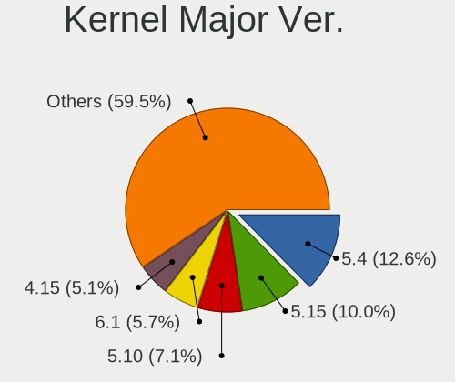
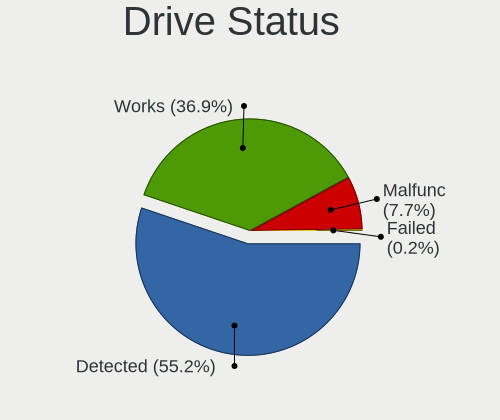
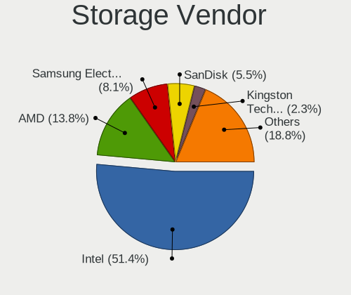
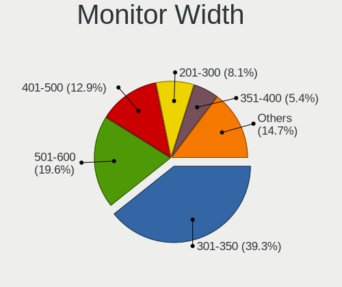
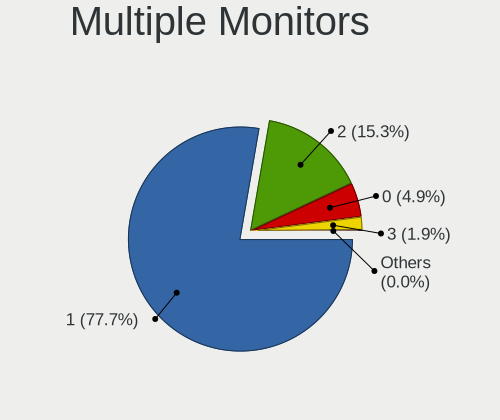
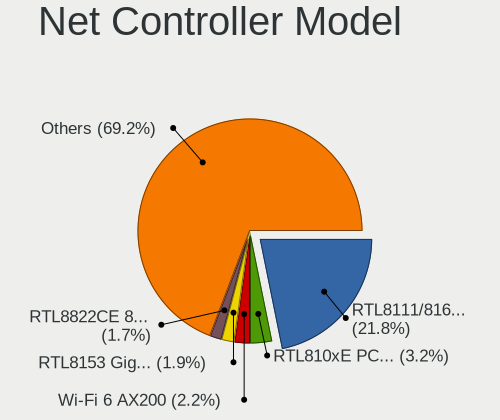
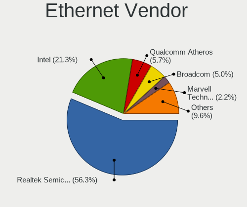
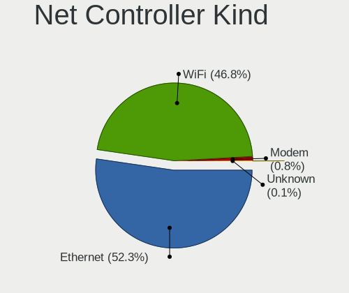
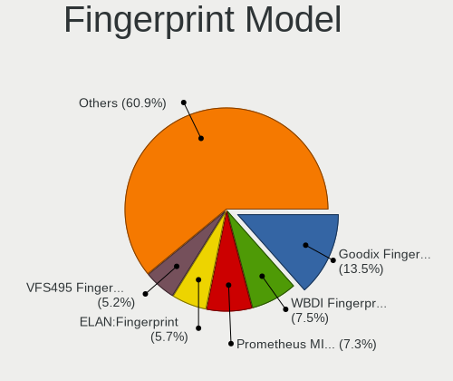

Linux in Spain - Tested Hardware & Statistics
---------------------------------------------

A project to collect tested hardware configurations for Linux in Spain.

Anyone can contribute to this report by the [hw-probe](https://github.com/linuxhw/hw-probe) tool:

    sudo -E hw-probe -all -upload

Please contribute! Especially if your hardware is rare.

This is a report for all computer types. See also reports for [desktops](/Location/Spain/Desktop/README.md) and [notebooks](/Location/Spain/Notebook/README.md).

Contents
--------

* [ Test Cases ](#test-cases)

* [ System ](#system)
  - [ OS                       ](#os)
  - [ OS Family                ](#os-family)
  - [ Kernel                   ](#kernel)
  - [ Kernel Family            ](#kernel-family)
  - [ Kernel Major Ver.        ](#kernel-major-ver)
  - [ Arch                     ](#arch)
  - [ DE                       ](#de)
  - [ Display Server           ](#display-server)
  - [ Display Manager          ](#display-manager)
  - [ OS Lang                  ](#os-lang)
  - [ Boot Mode                ](#boot-mode)
  - [ Filesystem               ](#filesystem)
  - [ Part. scheme             ](#part-scheme)
  - [ Dual Boot with Linux/BSD ](#dual-boot-with-linuxbsd)
  - [ Dual Boot (Win)          ](#dual-boot-win)

* [ Board ](#board)
  - [ Vendor                   ](#vendor)
  - [ Model                    ](#model)
  - [ Model Family             ](#model-family)
  - [ MFG Year                 ](#mfg-year)
  - [ Form Factor              ](#form-factor)
  - [ Secure Boot              ](#secure-boot)
  - [ Coreboot                 ](#coreboot)
  - [ RAM Size                 ](#ram-size)
  - [ RAM Used                 ](#ram-used)
  - [ Total Drives             ](#total-drives)
  - [ Has CD-ROM               ](#has-cd-rom)
  - [ Has Ethernet             ](#has-ethernet)
  - [ Has WiFi                 ](#has-wifi)
  - [ Has Bluetooth            ](#has-bluetooth)

* [ Location ](#location)
  - [ Country                  ](#country)
  - [ City                     ](#city)

* [ Drives ](#drives)
  - [ Drive Vendor             ](#drive-vendor)
  - [ Drive Model              ](#drive-model)
  - [ HDD Vendor               ](#hdd-vendor)
  - [ SSD Vendor               ](#ssd-vendor)
  - [ Drive Kind               ](#drive-kind)
  - [ Drive Connector          ](#drive-connector)
  - [ Drive Size               ](#drive-size)
  - [ Space Total              ](#space-total)
  - [ Space Used               ](#space-used)
  - [ Malfunc. Drives          ](#malfunc-drives)
  - [ Malfunc. Drive Vendor    ](#malfunc-drive-vendor)
  - [ Malfunc. HDD Vendor      ](#malfunc-hdd-vendor)
  - [ Malfunc. Drive Kind      ](#malfunc-drive-kind)
  - [ Failed Drives            ](#failed-drives)
  - [ Failed Drive Vendor      ](#failed-drive-vendor)
  - [ Drive Status             ](#drive-status)

* [ Storage controller ](#storage-controller)
  - [ Storage Vendor           ](#storage-vendor)
  - [ Storage Model            ](#storage-model)
  - [ Storage Kind             ](#storage-kind)

* [ Processor ](#processor)
  - [ CPU Vendor               ](#cpu-vendor)
  - [ CPU Model                ](#cpu-model)
  - [ CPU Model Family         ](#cpu-model-family)
  - [ CPU Cores                ](#cpu-cores)
  - [ CPU Sockets              ](#cpu-sockets)
  - [ CPU Threads              ](#cpu-threads)
  - [ CPU Op-Modes             ](#cpu-op-modes)
  - [ CPU Microcode            ](#cpu-microcode)
  - [ CPU Microarch            ](#cpu-microarch)

* [ Graphics ](#graphics)
  - [ GPU Vendor               ](#gpu-vendor)
  - [ GPU Model                ](#gpu-model)
  - [ GPU Combo                ](#gpu-combo)
  - [ GPU Driver               ](#gpu-driver)
  - [ GPU Memory               ](#gpu-memory)

* [ Monitor ](#monitor)
  - [ Monitor Vendor           ](#monitor-vendor)
  - [ Monitor Model            ](#monitor-model)
  - [ Monitor Resolution       ](#monitor-resolution)
  - [ Monitor Diagonal         ](#monitor-diagonal)
  - [ Monitor Width            ](#monitor-width)
  - [ Aspect Ratio             ](#aspect-ratio)
  - [ Monitor Area             ](#monitor-area)
  - [ Pixel Density            ](#pixel-density)
  - [ Multiple Monitors        ](#multiple-monitors)

* [ Network ](#network)
  - [ Net Controller Vendor    ](#net-controller-vendor)
  - [ Net Controller Model     ](#net-controller-model)
  - [ Wireless Vendor          ](#wireless-vendor)
  - [ Wireless Model           ](#wireless-model)
  - [ Ethernet Vendor          ](#ethernet-vendor)
  - [ Ethernet Model           ](#ethernet-model)
  - [ Net Controller Kind      ](#net-controller-kind)
  - [ Used Controller          ](#used-controller)
  - [ NICs                     ](#nics)
  - [ IPv6                     ](#ipv6)

* [ Bluetooth ](#bluetooth)
  - [ Bluetooth Vendor         ](#bluetooth-vendor)
  - [ Bluetooth Model          ](#bluetooth-model)

* [ Sound ](#sound)
  - [ Sound Vendor             ](#sound-vendor)
  - [ Sound Model              ](#sound-model)

* [ Memory ](#memory)
  - [ Memory Vendor            ](#memory-vendor)
  - [ Memory Model             ](#memory-model)
  - [ Memory Kind              ](#memory-kind)
  - [ Memory Form Factor       ](#memory-form-factor)
  - [ Memory Size              ](#memory-size)
  - [ Memory Speed             ](#memory-speed)

* [ Printers & scanners ](#printers--scanners)
  - [ Printer Vendor           ](#printer-vendor)
  - [ Printer Model            ](#printer-model)
  - [ Scanner Vendor           ](#scanner-vendor)
  - [ Scanner Model            ](#scanner-model)

* [ Camera ](#camera)
  - [ Camera Vendor            ](#camera-vendor)
  - [ Camera Model             ](#camera-model)

* [ Security ](#security)
  - [ Fingerprint Vendor       ](#fingerprint-vendor)
  - [ Fingerprint Model        ](#fingerprint-model)
  - [ Chipcard Vendor          ](#chipcard-vendor)
  - [ Chipcard Model           ](#chipcard-model)

* [ Unsupported ](#unsupported)
  - [ Unsupported Devices      ](#unsupported-devices)
  - [ Unsupported Device Types ](#unsupported-device-types)

Test Cases
----------

Total: 11170

| Vendor        | Model                       | Form-Factor | Probe                                                      | Date         |
|---------------|-----------------------------|-------------|------------------------------------------------------------|--------------|
| ASUSTek       | P8Z68-V LX                  | Desktop     | [2b21c81822](https://linux-hardware.org/?probe=2b21c81822) | Jan 06, 2025 |
| Gigabyte      | H81M-D2V                    | Desktop     | [aadc1a0c13](https://linux-hardware.org/?probe=aadc1a0c13) | Jan 06, 2025 |
| MSI           | B450I GAMING PLUS AC        | Desktop     | [fda84af6b6](https://linux-hardware.org/?probe=fda84af6b6) | Jan 06, 2025 |
| Lenovo        | ThinkPad L15 Gen 2 20X4S... | Notebook    | [928b89625a](https://linux-hardware.org/?probe=928b89625a) | Jan 06, 2025 |
| Medion        | X782X/X783X                 | Notebook    | [2d9cb07d4e](https://linux-hardware.org/?probe=2d9cb07d4e) | Jan 06, 2025 |
| Gigabyte      | H370M D3H GSM-CF            | Desktop     | [639eb0e4fc](https://linux-hardware.org/?probe=639eb0e4fc) | Jan 05, 2025 |
| Acer          | Aspire E1-571               | Notebook    | [1be16a65ff](https://linux-hardware.org/?probe=1be16a65ff) | Jan 05, 2025 |
| HP            | Pavilion g6                 | Notebook    | [909d7c69b5](https://linux-hardware.org/?probe=909d7c69b5) | Jan 05, 2025 |
| ASUSTek       | ROG Zephyrus G16 GU605MV... | Notebook    | [b360a75763](https://linux-hardware.org/?probe=b360a75763) | Jan 05, 2025 |
| Lenovo        | LOQ 15IRH8 82XV             | Notebook    | [8844fc8d14](https://linux-hardware.org/?probe=8844fc8d14) | Jan 05, 2025 |
| HP            | Laptop 15-db0xxx            | Notebook    | [df331d8cb3](https://linux-hardware.org/?probe=df331d8cb3) | Jan 05, 2025 |
| HP            | Pavilion g6                 | Notebook    | [ef9ad1fe50](https://linux-hardware.org/?probe=ef9ad1fe50) | Jan 05, 2025 |
| eMachines     | WMCP61M                     | Desktop     | [e98c249cfc](https://linux-hardware.org/?probe=e98c249cfc) | Jan 04, 2025 |
| Lenovo        | IdeaPad 110-15ISK 80UD      | Notebook    | [fefd4c63ee](https://linux-hardware.org/?probe=fefd4c63ee) | Jan 04, 2025 |
| Lenovo        | ThinkPad Z16 Gen 1 21D4C... | Notebook    | [3c9cd9e73c](https://linux-hardware.org/?probe=3c9cd9e73c) | Jan 04, 2025 |
| Unknown       | Unknown                     | Soc         | [44e68f8daa](https://linux-hardware.org/?probe=44e68f8daa) | Jan 03, 2025 |
| Gigabyte      | H370M D3H GSM-CF            | Desktop     | [305c971d23](https://linux-hardware.org/?probe=305c971d23) | Jan 03, 2025 |
| HP            | 89D8 SMVB                   | Desktop     | [150bb83ca3](https://linux-hardware.org/?probe=150bb83ca3) | Jan 02, 2025 |
| Gigabyte      | X570 UD                     | Desktop     | [8f0c4a3b53](https://linux-hardware.org/?probe=8f0c4a3b53) | Jan 02, 2025 |
| Trigkey       | S7                          | Mini pc     | [4188b696fb](https://linux-hardware.org/?probe=4188b696fb) | Jan 02, 2025 |
| Dell          | Inspiron 15 3515            | Notebook    | [ca2cc3e4ae](https://linux-hardware.org/?probe=ca2cc3e4ae) | Jan 02, 2025 |
| Lenovo        | G50-70 20351                | Notebook    | [9043dbb9a9](https://linux-hardware.org/?probe=9043dbb9a9) | Jan 01, 2025 |
| ASUSTek       | PRIME Z790-P WIFI           | Desktop     | [74e1ede819](https://linux-hardware.org/?probe=74e1ede819) | Jan 01, 2025 |
| Lenovo        | IdeaPadFlex 5 14ALC05 82... | Convertible | [25af48ddf7](https://linux-hardware.org/?probe=25af48ddf7) | Jan 01, 2025 |
| Shenzhen D... | MP100                       | Desktop     | [032508f9fd](https://linux-hardware.org/?probe=032508f9fd) | Jan 01, 2025 |
| SZMZ          | X99-S3                      | Desktop     | [f20bda8c75](https://linux-hardware.org/?probe=f20bda8c75) | Jan 01, 2025 |
| ASUSTek       | TUF Gaming B550-PLUS        | Desktop     | [f18654747e](https://linux-hardware.org/?probe=f18654747e) | Jan 01, 2025 |
| Gigabyte      | X470 AORUS ULTRA GAMING-... | Desktop     | [31b95986eb](https://linux-hardware.org/?probe=31b95986eb) | Jan 01, 2025 |
| Sony          | VGN-FZ11M                   | Notebook    | [25ec238dec](https://linux-hardware.org/?probe=25ec238dec) | Dec 31, 2024 |
| Samsung       | 300E4A/300E5A/300E7A/343... | Notebook    | [c66eaf3382](https://linux-hardware.org/?probe=c66eaf3382) | Dec 31, 2024 |
| Acer          | Nitro ANV15-41              | Notebook    | [00953a17b5](https://linux-hardware.org/?probe=00953a17b5) | Dec 31, 2024 |
| HP            | Pavilion Sleekbook 15       | Notebook    | [eb0ead6c49](https://linux-hardware.org/?probe=eb0ead6c49) | Dec 31, 2024 |
| Dell          | Latitude E6410              | Notebook    | [ce431d6def](https://linux-hardware.org/?probe=ce431d6def) | Dec 31, 2024 |
| Dell          | Latitude E6410              | Notebook    | [e5ad6fdba6](https://linux-hardware.org/?probe=e5ad6fdba6) | Dec 31, 2024 |
| Shenzhen D... | MP100                       | Desktop     | [ed4c3517e1](https://linux-hardware.org/?probe=ed4c3517e1) | Dec 31, 2024 |
| Acer          | TravelMate 5335             | Notebook    | [178a9c1abe](https://linux-hardware.org/?probe=178a9c1abe) | Dec 31, 2024 |
| Lenovo        | ThinkPad T450 20BUS35B00    | Notebook    | [f1f91c5a93](https://linux-hardware.org/?probe=f1f91c5a93) | Dec 31, 2024 |
| AMI           | Intel                       | Desktop     | [40322fe630](https://linux-hardware.org/?probe=40322fe630) | Dec 31, 2024 |
| Lenovo        | ThinkPad T470p 20J6CTO1W... | Notebook    | [b255d3c686](https://linux-hardware.org/?probe=b255d3c686) | Dec 31, 2024 |
| HP            | 8768 A                      | Desktop     | [6a09384c14](https://linux-hardware.org/?probe=6a09384c14) | Dec 30, 2024 |
| Gigabyte      | B650M DS3H                  | Desktop     | [47cda9caab](https://linux-hardware.org/?probe=47cda9caab) | Dec 30, 2024 |
| HP            | Pavilion x360 2-in-1 Lap... | Convertible | [77c2d20feb](https://linux-hardware.org/?probe=77c2d20feb) | Dec 30, 2024 |
| MSI           | A88XM-E35 V2                | Desktop     | [d3df8a394a](https://linux-hardware.org/?probe=d3df8a394a) | Dec 30, 2024 |
| ASRock        | B450M Pro4                  | Desktop     | [88b9fab21f](https://linux-hardware.org/?probe=88b9fab21f) | Dec 30, 2024 |
| ASRock        | H110M-ITX                   | Desktop     | [c76e007602](https://linux-hardware.org/?probe=c76e007602) | Dec 30, 2024 |
| ASRock        | AB350M Pro4                 | Desktop     | [1abbc80099](https://linux-hardware.org/?probe=1abbc80099) | Dec 30, 2024 |
| ASRock        | 960GC-GS FX                 | Desktop     | [9e60ff1990](https://linux-hardware.org/?probe=9e60ff1990) | Dec 30, 2024 |
| ASUSTek       | VivoBook_ASUSLaptop X170... | Notebook    | [cba1e94ceb](https://linux-hardware.org/?probe=cba1e94ceb) | Dec 30, 2024 |
| AMI           | Intel                       | Desktop     | [92f821a69c](https://linux-hardware.org/?probe=92f821a69c) | Dec 30, 2024 |
| Unknown       | Unknown                     | Notebook    | [03c104eecb](https://linux-hardware.org/?probe=03c104eecb) | Dec 30, 2024 |
| HP            | Laptop 15s-fq1xxx           | Notebook    | [1de7d2e8fb](https://linux-hardware.org/?probe=1de7d2e8fb) | Dec 30, 2024 |
| HP            | 255 G7 Notebook PC          | Notebook    | [c4f95fe88f](https://linux-hardware.org/?probe=c4f95fe88f) | Dec 29, 2024 |
| ASUSTek       | 1015PN                      | Notebook    | [f84154f736](https://linux-hardware.org/?probe=f84154f736) | Dec 29, 2024 |
| HP            | Pavilion Laptop 14-dv1xx... | Notebook    | [00ff33fe24](https://linux-hardware.org/?probe=00ff33fe24) | Dec 29, 2024 |
| ASUSTek       | H110M-D                     | Desktop     | [a61b42dd42](https://linux-hardware.org/?probe=a61b42dd42) | Dec 29, 2024 |
| MSI           | PRO Z790-S WIFI             | Desktop     | [45bb9b901a](https://linux-hardware.org/?probe=45bb9b901a) | Dec 29, 2024 |
| MSI           | B450-A PRO MAX              | Desktop     | [2a3140ff53](https://linux-hardware.org/?probe=2a3140ff53) | Dec 29, 2024 |
| ASUSTek       | X555LDB                     | Notebook    | [f11b5b7320](https://linux-hardware.org/?probe=f11b5b7320) | Dec 29, 2024 |
| HUAWEI        | KLVL-WXXW                   | Notebook    | [2ce7175d0a](https://linux-hardware.org/?probe=2ce7175d0a) | Dec 28, 2024 |
| Toshiba       | TECRA A10                   | Notebook    | [49714d63c9](https://linux-hardware.org/?probe=49714d63c9) | Dec 28, 2024 |
| Lenovo        | IdeaPad Slim 5 14IRL8 82... | Notebook    | [eb4bdf954b](https://linux-hardware.org/?probe=eb4bdf954b) | Dec 28, 2024 |
| Lenovo        | YB1-X91F                    | Convertible | [dc120e3257](https://linux-hardware.org/?probe=dc120e3257) | Dec 27, 2024 |
| Lenovo        | YB1-X91F                    | Convertible | [65f47b79ec](https://linux-hardware.org/?probe=65f47b79ec) | Dec 27, 2024 |
| ASUSTek       | ASUS TUF Gaming A15 FA50... | Notebook    | [6d267dc1e6](https://linux-hardware.org/?probe=6d267dc1e6) | Dec 27, 2024 |
| HP            | 15 TouchSmart               | Notebook    | [dbea1582fb](https://linux-hardware.org/?probe=dbea1582fb) | Dec 27, 2024 |
| Lenovo        | ThinkPad X240 20AL009CUS    | Notebook    | [6441794672](https://linux-hardware.org/?probe=6441794672) | Dec 27, 2024 |
| Apple         | MacBook5,1                  | Notebook    | [c3f162d658](https://linux-hardware.org/?probe=c3f162d658) | Dec 27, 2024 |
| ASUSTek       | PRIME B760M-A D4            | Desktop     | [574c4a2b92](https://linux-hardware.org/?probe=574c4a2b92) | Dec 26, 2024 |
| Dell          | Latitude E5430 non-vPro     | Notebook    | [4e9074a386](https://linux-hardware.org/?probe=4e9074a386) | Dec 26, 2024 |
| Acer          | Aspire A315-59              | Notebook    | [1808c0b1a3](https://linux-hardware.org/?probe=1808c0b1a3) | Dec 26, 2024 |
| Lenovo        | ThinkPad T480s 20L7CTO1W... | Notebook    | [e79ac6d419](https://linux-hardware.org/?probe=e79ac6d419) | Dec 25, 2024 |
| Lenovo        | SKYBAY SDK0J40705 WIN 34... | Desktop     | [94ac9002fa](https://linux-hardware.org/?probe=94ac9002fa) | Dec 25, 2024 |
| ASUSTek       | ProArt P16 H7606WI_H7606... | Notebook    | [3fbdcb99b5](https://linux-hardware.org/?probe=3fbdcb99b5) | Dec 25, 2024 |
| ASUSTek       | VivoBook_ASUSLaptop X513... | Notebook    | [c551a96671](https://linux-hardware.org/?probe=c551a96671) | Dec 25, 2024 |
| Lenovo        | ThinkPad L460 20FVS2LC00    | Notebook    | [0ad5ec9e46](https://linux-hardware.org/?probe=0ad5ec9e46) | Dec 24, 2024 |
| EVGA          | 122-CK-NF68 2               | Desktop     | [a7af4d0592](https://linux-hardware.org/?probe=a7af4d0592) | Dec 24, 2024 |
| Gigabyte      | H410M H V3                  | Desktop     | [411d54ea0e](https://linux-hardware.org/?probe=411d54ea0e) | Dec 24, 2024 |
| Win elemen... | M600 V01                    | Mini pc     | [eb3ebcc1fd](https://linux-hardware.org/?probe=eb3ebcc1fd) | Dec 24, 2024 |
| PC Special... | P65xRP                      | Notebook    | [36a98584dd](https://linux-hardware.org/?probe=36a98584dd) | Dec 24, 2024 |
| Samsung       | 730QFG                      | Convertible | [22ee94713c](https://linux-hardware.org/?probe=22ee94713c) | Dec 24, 2024 |
| HUAWEI        | KLVL-WXX9                   | Notebook    | [8c5b06dd77](https://linux-hardware.org/?probe=8c5b06dd77) | Dec 23, 2024 |
| SLIMBOOK      | EVO14-A8                    | Notebook    | [d6d1869563](https://linux-hardware.org/?probe=d6d1869563) | Dec 23, 2024 |
| HP            | Pavilion Gaming Laptop 1... | Notebook    | [20525b8729](https://linux-hardware.org/?probe=20525b8729) | Dec 23, 2024 |
| HP            | Pavilion Gaming Laptop 1... | Notebook    | [fcf87bc874](https://linux-hardware.org/?probe=fcf87bc874) | Dec 23, 2024 |
| Dell          | Latitude E4300              | Notebook    | [cfcc3cbd9f](https://linux-hardware.org/?probe=cfcc3cbd9f) | Dec 23, 2024 |
| Dell          | Latitude E4300              | Notebook    | [e67d828b77](https://linux-hardware.org/?probe=e67d828b77) | Dec 23, 2024 |
| HP            | 0AA8h                       | Desktop     | [5f76cb932b](https://linux-hardware.org/?probe=5f76cb932b) | Dec 23, 2024 |
| HP            | 0AA8h                       | Desktop     | [8a22af001d](https://linux-hardware.org/?probe=8a22af001d) | Dec 23, 2024 |
| Gigabyte      | H410M H V3                  | Desktop     | [8d38a80f8d](https://linux-hardware.org/?probe=8d38a80f8d) | Dec 23, 2024 |
| Lenovo        | ThinkPad X240 20AL009CUS    | Notebook    | [9fdd4ef9fc](https://linux-hardware.org/?probe=9fdd4ef9fc) | Dec 23, 2024 |
| MUCAI         | H61 V1.5                    | Desktop     | [e087ab99b3](https://linux-hardware.org/?probe=e087ab99b3) | Dec 23, 2024 |
| ASRock        | B450 Gaming-ITX/ac          | Desktop     | [a25fcfd80e](https://linux-hardware.org/?probe=a25fcfd80e) | Dec 23, 2024 |
| HP            | Laptop 15s-eq2xxx           | Notebook    | [75bf43b349](https://linux-hardware.org/?probe=75bf43b349) | Dec 23, 2024 |
| Gigabyte      | X670 GAMING X AX            | Desktop     | [1c51df6d46](https://linux-hardware.org/?probe=1c51df6d46) | Dec 22, 2024 |
| ASUSTek       | STRIX B250H GAMING          | Desktop     | [c5bf48c144](https://linux-hardware.org/?probe=c5bf48c144) | Dec 22, 2024 |
| Gigabyte      | H55M-UD2H                   | Desktop     | [282061195d](https://linux-hardware.org/?probe=282061195d) | Dec 22, 2024 |
| MSI           | Alpha 17 C7VF               | Notebook    | [dc79106cf5](https://linux-hardware.org/?probe=dc79106cf5) | Dec 22, 2024 |
| Notebook      | W510LU                      | Notebook    | [040c49871b](https://linux-hardware.org/?probe=040c49871b) | Dec 22, 2024 |
| Gigabyte      | Z270-HD3P-CF                | Desktop     | [f95d24a4d3](https://linux-hardware.org/?probe=f95d24a4d3) | Dec 22, 2024 |
| AMI           | Intel                       | Desktop     | [b2d4a45180](https://linux-hardware.org/?probe=b2d4a45180) | Dec 21, 2024 |
| Gigabyte      | AB350-Gaming 3-CF           | Desktop     | [7ef9e03f35](https://linux-hardware.org/?probe=7ef9e03f35) | Dec 21, 2024 |
| MSI           | B250M PRO-VDH               | Desktop     | [9728f996d5](https://linux-hardware.org/?probe=9728f996d5) | Dec 21, 2024 |
| ASUSTek       | PRIME Z270-A                | Desktop     | [fcefd0ff40](https://linux-hardware.org/?probe=fcefd0ff40) | Dec 21, 2024 |
| Schenker      | XMG PRO 16 Studio (M24)     | Notebook    | [cb7a4908df](https://linux-hardware.org/?probe=cb7a4908df) | Dec 21, 2024 |
| MACHINIST     | X99-RS9 V1.11               | Notebook    | [6bab23707b](https://linux-hardware.org/?probe=6bab23707b) | Dec 21, 2024 |
| Lenovo        | ThinkPad T14s Gen 6 21M1... | Notebook    | [f05b1b8a31](https://linux-hardware.org/?probe=f05b1b8a31) | Dec 21, 2024 |
| ASUSTek       | X555LDB                     | Notebook    | [783e6ed502](https://linux-hardware.org/?probe=783e6ed502) | Dec 20, 2024 |
| Lenovo        | LOQ 15IRH8 82XV             | Notebook    | [e31581514e](https://linux-hardware.org/?probe=e31581514e) | Dec 20, 2024 |
| Chuwi         | CoreBook X                  | Notebook    | [de4d92e726](https://linux-hardware.org/?probe=de4d92e726) | Dec 20, 2024 |
| HP            | 3397                        | Desktop     | [624eec907f](https://linux-hardware.org/?probe=624eec907f) | Dec 20, 2024 |
| Acidanther... | Mac-27AD2F918AE68F61 Mac... | Desktop     | [2e5e5e6242](https://linux-hardware.org/?probe=2e5e5e6242) | Dec 20, 2024 |
| ASUSTek       | TUF Gaming B650-PLUS WIF... | Desktop     | [15936c57d6](https://linux-hardware.org/?probe=15936c57d6) | Dec 20, 2024 |
| ASUSTek       | TP300LAB                    | Notebook    | [4c0a5e121b](https://linux-hardware.org/?probe=4c0a5e121b) | Dec 20, 2024 |
| HP            | Pavilion 17                 | Notebook    | [4afca04089](https://linux-hardware.org/?probe=4afca04089) | Dec 19, 2024 |
| Medion        | S6421 MD60703               | Notebook    | [609c73a176](https://linux-hardware.org/?probe=609c73a176) | Dec 19, 2024 |
| ASUSTek       | Z97-DELUXE                  | Desktop     | [685ed908a7](https://linux-hardware.org/?probe=685ed908a7) | Dec 19, 2024 |
| Dell          | XPS 13 9360                 | Notebook    | [99fbc60562](https://linux-hardware.org/?probe=99fbc60562) | Dec 19, 2024 |
| ASRock        | 939N68PV-GLAN               | Desktop     | [c70bf790fe](https://linux-hardware.org/?probe=c70bf790fe) | Dec 18, 2024 |
| JGINYUE       | B650I Night Devil Ver:      | Desktop     | [d5b76ece1e](https://linux-hardware.org/?probe=d5b76ece1e) | Dec 18, 2024 |
| AZW           | S5 V2.0                     | Mini pc     | [b81810c307](https://linux-hardware.org/?probe=b81810c307) | Dec 17, 2024 |
| Acer          | Aspire 5750G                | Notebook    | [f4a8bd7c14](https://linux-hardware.org/?probe=f4a8bd7c14) | Dec 17, 2024 |
| HP            | Compaq Presario CQ60        | Notebook    | [1cf492f425](https://linux-hardware.org/?probe=1cf492f425) | Dec 17, 2024 |
| Acer          | Aspire E5-774G              | Notebook    | [19077cd048](https://linux-hardware.org/?probe=19077cd048) | Dec 17, 2024 |
| HP            | Compaq Presario CQ60        | Notebook    | [ec93e32825](https://linux-hardware.org/?probe=ec93e32825) | Dec 17, 2024 |
| ASUSTek       | TUF Gaming X570-PLUS        | Desktop     | [cb5b81704a](https://linux-hardware.org/?probe=cb5b81704a) | Dec 17, 2024 |
| ASUSTek       | PRIME B550M-A               | Desktop     | [fc30a73f46](https://linux-hardware.org/?probe=fc30a73f46) | Dec 17, 2024 |
| ASUSTek       | ROG STRIX B460-H GAMING     | Desktop     | [5870f74cfc](https://linux-hardware.org/?probe=5870f74cfc) | Dec 17, 2024 |
| Chuwi         | CoreBook X                  | Notebook    | [6f354f73aa](https://linux-hardware.org/?probe=6f354f73aa) | Dec 16, 2024 |
| Shenzhen M... | F7BRC                       | Desktop     | [957f74af52](https://linux-hardware.org/?probe=957f74af52) | Dec 16, 2024 |
| ASUSTek       | ASUS TUF Gaming F15 FX50... | Notebook    | [c955d4b757](https://linux-hardware.org/?probe=c955d4b757) | Dec 16, 2024 |
| HP            | Laptop 15-fd0xxx            | Notebook    | [c4d820bd6f](https://linux-hardware.org/?probe=c4d820bd6f) | Dec 16, 2024 |
| HP            | 84DE 01100                  | All in one  | [a7f55be076](https://linux-hardware.org/?probe=a7f55be076) | Dec 16, 2024 |
| ASRock        | A520M-HVS                   | Desktop     | [ad901a965d](https://linux-hardware.org/?probe=ad901a965d) | Dec 16, 2024 |
| MSI           | GL65 9SFK                   | Notebook    | [07dc9dfdfd](https://linux-hardware.org/?probe=07dc9dfdfd) | Dec 16, 2024 |
| ASUSTek       | GL552VW                     | Notebook    | [baff3ba8b4](https://linux-hardware.org/?probe=baff3ba8b4) | Dec 16, 2024 |
| ASUSTek       | GL552VW                     | Notebook    | [f8f78759d9](https://linux-hardware.org/?probe=f8f78759d9) | Dec 16, 2024 |
| Lenovo        | ThinkPad T14 Gen 3 21CGS... | Notebook    | [d9a6f919aa](https://linux-hardware.org/?probe=d9a6f919aa) | Dec 15, 2024 |
| Lenovo        | ThinkBook 15 G4 IAP 21DJ    | Notebook    | [d5184c7a52](https://linux-hardware.org/?probe=d5184c7a52) | Dec 15, 2024 |
| Acer          | Aspire ES1-571              | Notebook    | [91918bcc8e](https://linux-hardware.org/?probe=91918bcc8e) | Dec 15, 2024 |
| Apple         | MacBookPro9,2               | Notebook    | [89667736f7](https://linux-hardware.org/?probe=89667736f7) | Dec 15, 2024 |
| Apple         | Mac-F65AE981FFA204ED Mac... | Mini pc     | [878bd03113](https://linux-hardware.org/?probe=878bd03113) | Dec 14, 2024 |
| Dell          | 0T7D40 A00                  | Desktop     | [218ef87925](https://linux-hardware.org/?probe=218ef87925) | Dec 14, 2024 |
| Unknown       | Unknown                     | Desktop     | [ded8937413](https://linux-hardware.org/?probe=ded8937413) | Dec 14, 2024 |
| Dell          | 0T7D40 A00                  | Desktop     | [ac9dce6f48](https://linux-hardware.org/?probe=ac9dce6f48) | Dec 14, 2024 |
| LG Electro... | 15Z90R-G.AP55B              | Notebook    | [cc84dbc880](https://linux-hardware.org/?probe=cc84dbc880) | Dec 14, 2024 |
| Acer          | Veriton M480                | Desktop     | [33294db2d5](https://linux-hardware.org/?probe=33294db2d5) | Dec 14, 2024 |
| Apple         | MacBookPro14,2              | Notebook    | [ec7f9ccc97](https://linux-hardware.org/?probe=ec7f9ccc97) | Dec 14, 2024 |
| Dell          | Latitude E6420              | Notebook    | [6d4d0b3ad2](https://linux-hardware.org/?probe=6d4d0b3ad2) | Dec 14, 2024 |
| Lenovo        | ThinkPad E14 Gen 5 21JKC... | Notebook    | [3cfbdc1929](https://linux-hardware.org/?probe=3cfbdc1929) | Dec 14, 2024 |
| Acidanther... | Mac-27AD2F918AE68F61 Mac... | Desktop     | [f337acfd7a](https://linux-hardware.org/?probe=f337acfd7a) | Dec 14, 2024 |
| Lenovo        | LOQ 15IRH8 82XV             | Notebook    | [e9cba9e18e](https://linux-hardware.org/?probe=e9cba9e18e) | Dec 13, 2024 |
| ASUSTek       | PRIME B450M-A               | Desktop     | [262a2aa975](https://linux-hardware.org/?probe=262a2aa975) | Dec 13, 2024 |
| ASUSTek       | STRIX B250H GAMING          | Desktop     | [21f043f6d7](https://linux-hardware.org/?probe=21f043f6d7) | Dec 13, 2024 |
| AMI           | Intel                       | Desktop     | [122e2f11d0](https://linux-hardware.org/?probe=122e2f11d0) | Dec 13, 2024 |
| Chuwi         | GemiBook Pro                | Notebook    | [a7ba503bce](https://linux-hardware.org/?probe=a7ba503bce) | Dec 13, 2024 |
| ASUSTek       | GL553VD                     | Notebook    | [02f586555d](https://linux-hardware.org/?probe=02f586555d) | Dec 13, 2024 |
| Gigabyte      | A520M K V2                  | Desktop     | [503327783f](https://linux-hardware.org/?probe=503327783f) | Dec 13, 2024 |
| Lenovo        | IdeaPad 330-17ICH 81FL      | Notebook    | [5a6473c245](https://linux-hardware.org/?probe=5a6473c245) | Dec 13, 2024 |
| MSI           | MPG X570 GAMING PLUS        | Desktop     | [e2ccc250fb](https://linux-hardware.org/?probe=e2ccc250fb) | Dec 13, 2024 |
| Lenovo        | IdeaPad 320-15ISK 80XH      | Notebook    | [c32e429bab](https://linux-hardware.org/?probe=c32e429bab) | Dec 12, 2024 |
| Lenovo        | IdeaPad 320-15ISK 80XH      | Notebook    | [6a39708a5f](https://linux-hardware.org/?probe=6a39708a5f) | Dec 12, 2024 |
| HP            | ProBook 630 G8 Notebook ... | Notebook    | [f9d8eff9f1](https://linux-hardware.org/?probe=f9d8eff9f1) | Dec 12, 2024 |
| ASUSTek       | Z170M-PLUS                  | Desktop     | [329295b950](https://linux-hardware.org/?probe=329295b950) | Dec 12, 2024 |
| ASUSTek       | M2N-SLI                     | Desktop     | [137df4dff6](https://linux-hardware.org/?probe=137df4dff6) | Dec 12, 2024 |
| Lenovo        | ThinkPad X250 20CLS35P00    | Notebook    | [1e756b4f02](https://linux-hardware.org/?probe=1e756b4f02) | Dec 12, 2024 |
| Lenovo        | ThinkPad SL500 274678G      | Notebook    | [c42768093f](https://linux-hardware.org/?probe=c42768093f) | Dec 12, 2024 |
| Lenovo        | ThinkPad X250 20CLS35P00    | Notebook    | [f07bee115e](https://linux-hardware.org/?probe=f07bee115e) | Dec 12, 2024 |
| MSI           | B365M PRO-VH                | Desktop     | [aca7e6786e](https://linux-hardware.org/?probe=aca7e6786e) | Dec 12, 2024 |
| Acer          | Aspire XC-1760              | Desktop     | [791de3d9c7](https://linux-hardware.org/?probe=791de3d9c7) | Dec 12, 2024 |
| HP            | ProBook 630 G8 Notebook ... | Notebook    | [8acb70e4b4](https://linux-hardware.org/?probe=8acb70e4b4) | Dec 11, 2024 |
| HP            | Laptop 15-fd0xxx            | Notebook    | [642094775c](https://linux-hardware.org/?probe=642094775c) | Dec 11, 2024 |
| HP            | 8AB6 SMVB                   | Desktop     | [24c38fdec1](https://linux-hardware.org/?probe=24c38fdec1) | Dec 11, 2024 |
| HONOR         | HYM-WXX                     | Notebook    | [5175d23a1b](https://linux-hardware.org/?probe=5175d23a1b) | Dec 11, 2024 |
| ASUSTek       | X550JX                      | Notebook    | [825a9b88c3](https://linux-hardware.org/?probe=825a9b88c3) | Dec 11, 2024 |
| Dell          | Inspiron 7773               | Notebook    | [5da57642cd](https://linux-hardware.org/?probe=5da57642cd) | Dec 11, 2024 |
| Gigabyte      | B450M DS3H V2               | Desktop     | [a60bd4a552](https://linux-hardware.org/?probe=a60bd4a552) | Dec 11, 2024 |
| Intel         | NUC7JYB M37329-601          | Mini pc     | [73016aa2ff](https://linux-hardware.org/?probe=73016aa2ff) | Dec 11, 2024 |
| HP            | ProBook 450 G8 Notebook ... | Notebook    | [54e889ddda](https://linux-hardware.org/?probe=54e889ddda) | Dec 11, 2024 |
| AZW           | GTi14 V1.0                  | Mini pc     | [69370c3ec3](https://linux-hardware.org/?probe=69370c3ec3) | Dec 11, 2024 |
| SLIMBOOK      | ONE-AM5                     | Desktop     | [d0bbc8aa6e](https://linux-hardware.org/?probe=d0bbc8aa6e) | Dec 10, 2024 |
| Acer          | Aspire SW5-014              | Notebook    | [1a577ada9a](https://linux-hardware.org/?probe=1a577ada9a) | Dec 09, 2024 |
| Apple         | MacBook5,1                  | Notebook    | [69acdd8a14](https://linux-hardware.org/?probe=69acdd8a14) | Dec 09, 2024 |
| HP            | Laptop 15s-eq2xxx           | Notebook    | [acb2794fe0](https://linux-hardware.org/?probe=acb2794fe0) | Dec 09, 2024 |
| MSI           | B450M BAZOOKA V2            | Desktop     | [7b9add187d](https://linux-hardware.org/?probe=7b9add187d) | Dec 09, 2024 |
| Apple         | MacBook5,1                  | Notebook    | [0089011766](https://linux-hardware.org/?probe=0089011766) | Dec 08, 2024 |
| HP            | 250 G7 Notebook PC          | Notebook    | [c40248a5a1](https://linux-hardware.org/?probe=c40248a5a1) | Dec 08, 2024 |
| MSI           | B550M PRO-VDH               | Desktop     | [30ad89f2cd](https://linux-hardware.org/?probe=30ad89f2cd) | Dec 08, 2024 |
| HP            | Laptop 15-bs0xx             | Notebook    | [03a9b913af](https://linux-hardware.org/?probe=03a9b913af) | Dec 08, 2024 |
| ASUSTek       | ROG Flow X16 GV601VI_GV6... | Convertible | [f7c34da554](https://linux-hardware.org/?probe=f7c34da554) | Dec 08, 2024 |
| HUAWEI        | KLVL-WXX9                   | Notebook    | [b858296fef](https://linux-hardware.org/?probe=b858296fef) | Dec 07, 2024 |
| HP            | 250 G7 Notebook PC          | Notebook    | [4bd0c9c32f](https://linux-hardware.org/?probe=4bd0c9c32f) | Dec 07, 2024 |
| HP            | Elite x2 1012 G2            | Tablet      | [f0d42df827](https://linux-hardware.org/?probe=f0d42df827) | Dec 06, 2024 |
| Gigabyte      | H61M-USB3H                  | Desktop     | [f6f758c80a](https://linux-hardware.org/?probe=f6f758c80a) | Dec 06, 2024 |
| Apple         | MacBookPro9,1               | Notebook    | [9ff091de62](https://linux-hardware.org/?probe=9ff091de62) | Dec 05, 2024 |
| HP            | Elite x2 1012 G2            | Tablet      | [3bb847b8e3](https://linux-hardware.org/?probe=3bb847b8e3) | Dec 05, 2024 |
| ASUSTek       | ASUS TUF Dash F15 FX516P... | Notebook    | [638c1123d0](https://linux-hardware.org/?probe=638c1123d0) | Dec 05, 2024 |
| Acer          | Aspire A315-41              | Notebook    | [de445fbbb8](https://linux-hardware.org/?probe=de445fbbb8) | Dec 05, 2024 |
| MSI           | Modern 15 B7M               | Notebook    | [06b55f5533](https://linux-hardware.org/?probe=06b55f5533) | Dec 05, 2024 |
| HP            | ENVY x360 2-in-1 Laptop ... | Convertible | [4c5a7d6e52](https://linux-hardware.org/?probe=4c5a7d6e52) | Dec 05, 2024 |
| Gigabyte      | B550M AORUS ELITE           | Desktop     | [31412e1466](https://linux-hardware.org/?probe=31412e1466) | Dec 05, 2024 |
| HP            | ENVY x360 2-in-1 Laptop ... | Convertible | [b1696045da](https://linux-hardware.org/?probe=b1696045da) | Dec 05, 2024 |
| ASUSTek       | ZenBook Pro Duo UX581LV_... | Notebook    | [e169ffa11a](https://linux-hardware.org/?probe=e169ffa11a) | Dec 04, 2024 |
| Win Elemen... | M9S                         | Desktop     | [eed675eadb](https://linux-hardware.org/?probe=eed675eadb) | Dec 04, 2024 |
| Lenovo        | IdeaPad Slim 3 15AMN8 82... | Notebook    | [3635d82d65](https://linux-hardware.org/?probe=3635d82d65) | Dec 03, 2024 |
| Win Elemen... | M9S                         | Desktop     | [403a04b12f](https://linux-hardware.org/?probe=403a04b12f) | Dec 03, 2024 |
| Chuwi         | GemiBook Pro                | Notebook    | [e556a40293](https://linux-hardware.org/?probe=e556a40293) | Dec 03, 2024 |
| ASRock        | N68C-GS FX                  | Desktop     | [7280925fef](https://linux-hardware.org/?probe=7280925fef) | Dec 03, 2024 |
| Notebook      | N13_N140ZU                  | Notebook    | [5a52d28de3](https://linux-hardware.org/?probe=5a52d28de3) | Dec 03, 2024 |
| Toshiba       | Satellite L50-B             | Notebook    | [f0195c6929](https://linux-hardware.org/?probe=f0195c6929) | Dec 02, 2024 |
| AMI           | Intel                       | Desktop     | [0f2096c0a4](https://linux-hardware.org/?probe=0f2096c0a4) | Dec 02, 2024 |
| AMI           | Intel                       | Desktop     | [ffcbee7a41](https://linux-hardware.org/?probe=ffcbee7a41) | Dec 02, 2024 |
| Gigabyte      | X470 AORUS ULTRA GAMING-... | Desktop     | [71dbf99e53](https://linux-hardware.org/?probe=71dbf99e53) | Dec 02, 2024 |
| HP            | Pavilion Laptop 15-eg2xx... | Notebook    | [5a58c16bba](https://linux-hardware.org/?probe=5a58c16bba) | Dec 02, 2024 |
| HP            | 1589                        | Desktop     | [7151e5da3c](https://linux-hardware.org/?probe=7151e5da3c) | Dec 01, 2024 |
| Lenovo        | ThinkPad S1 Yoga 12 20DK... | Notebook    | [12e5cc51f6](https://linux-hardware.org/?probe=12e5cc51f6) | Dec 01, 2024 |
| MSI           | MEG Z790 ACE MAX            | Desktop     | [537ee30b94](https://linux-hardware.org/?probe=537ee30b94) | Dec 01, 2024 |
| HP            | Pavilion Laptop 14-dv1xx... | Notebook    | [6a5dd9d520](https://linux-hardware.org/?probe=6a5dd9d520) | Dec 01, 2024 |
| Samsung       | Galaxy Book 12              | Tablet      | [1765ab02d8](https://linux-hardware.org/?probe=1765ab02d8) | Dec 01, 2024 |
| MSI           | MEG Z790 ACE MAX            | Desktop     | [5e99c9c1b8](https://linux-hardware.org/?probe=5e99c9c1b8) | Dec 01, 2024 |
| ASUSTek       | VivoBook_ASUSLaptop X509... | Notebook    | [fd60ccd21f](https://linux-hardware.org/?probe=fd60ccd21f) | Dec 01, 2024 |
| ASUSTek       | ROG STRIX B760-I GAMING ... | Desktop     | [b9a1a773a6](https://linux-hardware.org/?probe=b9a1a773a6) | Dec 01, 2024 |
| Apple         | MacBookAir6,2               | Notebook    | [95e149cabd](https://linux-hardware.org/?probe=95e149cabd) | Dec 01, 2024 |
| HP            | 821D                        | Desktop     | [20e39b95ab](https://linux-hardware.org/?probe=20e39b95ab) | Dec 01, 2024 |
| Gigabyte      | B550M S2H                   | Desktop     | [720b4133da](https://linux-hardware.org/?probe=720b4133da) | Dec 01, 2024 |
| Gigabyte      | B550M S2H                   | Desktop     | [9dcd09de35](https://linux-hardware.org/?probe=9dcd09de35) | Dec 01, 2024 |
| Intel         | DG31PR AAD97573-205         | Desktop     | [41414033c3](https://linux-hardware.org/?probe=41414033c3) | Nov 30, 2024 |
| ASUSTek       | PRIME B450M-A               | Desktop     | [2583ce4301](https://linux-hardware.org/?probe=2583ce4301) | Nov 30, 2024 |
| ASUSTek       | ROG CROSSHAIR X870E HERO    | Desktop     | [592d6c9300](https://linux-hardware.org/?probe=592d6c9300) | Nov 30, 2024 |
| Toshiba       | Satellite L50-B             | Notebook    | [344eaec320](https://linux-hardware.org/?probe=344eaec320) | Nov 29, 2024 |
| ASUSTek       | PRIME Z390-P                | Desktop     | [a6855cbe14](https://linux-hardware.org/?probe=a6855cbe14) | Nov 29, 2024 |
| HP            | 340S G7 Notebook PC         | Notebook    | [1b0bce07cc](https://linux-hardware.org/?probe=1b0bce07cc) | Nov 29, 2024 |
| Acer          | Spin SP514-51N              | Convertible | [ff213eb067](https://linux-hardware.org/?probe=ff213eb067) | Nov 29, 2024 |
| BESSTAR Te... | UM700                       | Desktop     | [5c18419477](https://linux-hardware.org/?probe=5c18419477) | Nov 29, 2024 |
| Lenovo        | ThinkPad X260 20F5S39S03    | Notebook    | [84b5466fd5](https://linux-hardware.org/?probe=84b5466fd5) | Nov 29, 2024 |
| Lenovo        | ThinkPad X260 20F5S39S03    | Notebook    | [85ba713a0d](https://linux-hardware.org/?probe=85ba713a0d) | Nov 28, 2024 |
| Shenzhen M... | DRFXL                       | Desktop     | [9f8e4dffa1](https://linux-hardware.org/?probe=9f8e4dffa1) | Nov 28, 2024 |
| Lenovo        | Legion Slim 5 16IRH8 82Y... | Notebook    | [3e09b39c66](https://linux-hardware.org/?probe=3e09b39c66) | Nov 28, 2024 |
| MSI           | Cyborg 15 A12UCX            | Notebook    | [e75ffb4bf5](https://linux-hardware.org/?probe=e75ffb4bf5) | Nov 28, 2024 |
| SLIMBOOK      | PROX-AMD5                   | Notebook    | [f4ac814ea4](https://linux-hardware.org/?probe=f4ac814ea4) | Nov 28, 2024 |
| Lenovo        | LOQ 15IRH8 82XV             | Notebook    | [96a747160d](https://linux-hardware.org/?probe=96a747160d) | Nov 28, 2024 |
| MSI           | B450 GAMING PLUS MAX        | Desktop     | [a43093cd01](https://linux-hardware.org/?probe=a43093cd01) | Nov 27, 2024 |
| Lenovo        | ThinkPad P14s Gen 5 AMD ... | Notebook    | [c8d5a11077](https://linux-hardware.org/?probe=c8d5a11077) | Nov 27, 2024 |
| Samsung       | 750QFG                      | Convertible | [23f1277193](https://linux-hardware.org/?probe=23f1277193) | Nov 27, 2024 |
| MSI           | B350M MORTAR                | Desktop     | [207e13ed56](https://linux-hardware.org/?probe=207e13ed56) | Nov 26, 2024 |
| Teclast       | F15 Plus                    | Notebook    | [d3115c0e4f](https://linux-hardware.org/?probe=d3115c0e4f) | Nov 26, 2024 |
| MSI           | 2A9C                        | Desktop     | [69c4dafac6](https://linux-hardware.org/?probe=69c4dafac6) | Nov 26, 2024 |
| SHENZHEN Y... | FLEXONES                    | Convertible | [41b3f04583](https://linux-hardware.org/?probe=41b3f04583) | Nov 26, 2024 |
| Gigabyte      | B360M HD3                   | Desktop     | [47689d663d](https://linux-hardware.org/?probe=47689d663d) | Nov 26, 2024 |
| Gigabyte      | GA-78LMT-USB3 SEx           | Desktop     | [87f54473bf](https://linux-hardware.org/?probe=87f54473bf) | Nov 25, 2024 |
| HP            | Pavilion g6                 | Notebook    | [1e390a1633](https://linux-hardware.org/?probe=1e390a1633) | Nov 25, 2024 |
| Unknown       | T100                        | Desktop     | [9fcf3fadbc](https://linux-hardware.org/?probe=9fcf3fadbc) | Nov 25, 2024 |
| MSI           | MPG B550 GAMING PLUS        | Desktop     | [3e5f9dc91b](https://linux-hardware.org/?probe=3e5f9dc91b) | Nov 25, 2024 |
| HP            | EliteBook 2560p             | Notebook    | [54d07de40f](https://linux-hardware.org/?probe=54d07de40f) | Nov 25, 2024 |
| HP            | EliteBook 2560p             | Notebook    | [98af34c213](https://linux-hardware.org/?probe=98af34c213) | Nov 25, 2024 |
| eMachines     | WMCP61M                     | Desktop     | [62bf885d61](https://linux-hardware.org/?probe=62bf885d61) | Nov 24, 2024 |
| MSI           | Bravo 15 C7UDX              | Notebook    | [0711ea8cc7](https://linux-hardware.org/?probe=0711ea8cc7) | Nov 24, 2024 |
| Fujitsu       | D3161-A1 S26361-D3161-A1    | Desktop     | [07eecb1971](https://linux-hardware.org/?probe=07eecb1971) | Nov 24, 2024 |
| ASUSTek       | TUF Gaming B650-PLUS        | Desktop     | [94e5e4047f](https://linux-hardware.org/?probe=94e5e4047f) | Nov 24, 2024 |
| ASUSTek       | Vivobook Slate T3300KA_T... | Tablet      | [1f850c6012](https://linux-hardware.org/?probe=1f850c6012) | Nov 24, 2024 |
| HP            | ProBook 450 G8              | Notebook    | [7cffac8f5b](https://linux-hardware.org/?probe=7cffac8f5b) | Nov 24, 2024 |
| Apple         | MacBookPro9,1               | Notebook    | [63a95fc1b1](https://linux-hardware.org/?probe=63a95fc1b1) | Nov 24, 2024 |
| HP            | ProBook 450 G8              | Notebook    | [2d282337d2](https://linux-hardware.org/?probe=2d282337d2) | Nov 24, 2024 |
| Gigabyte      | H61MA-D3V                   | Desktop     | [2e02a58413](https://linux-hardware.org/?probe=2e02a58413) | Nov 24, 2024 |
| Gigabyte      | B450M DS3H-CF               | Desktop     | [d4f6c4da0e](https://linux-hardware.org/?probe=d4f6c4da0e) | Nov 24, 2024 |
| Lenovo        | IdeaPadFlex 5 14ALC7 82R... | Convertible | [4b7c9bcf47](https://linux-hardware.org/?probe=4b7c9bcf47) | Nov 24, 2024 |
| Lenovo        | IdeaPad Slim 3 15AMN8 82... | Notebook    | [3736516c3b](https://linux-hardware.org/?probe=3736516c3b) | Nov 24, 2024 |
| HP            | Laptop 15-db0xxx            | Notebook    | [f8201ecab7](https://linux-hardware.org/?probe=f8201ecab7) | Nov 24, 2024 |
| Dell          | Latitude 7300               | Notebook    | [6371109a3f](https://linux-hardware.org/?probe=6371109a3f) | Nov 23, 2024 |
| ASRock        | N68C-GS FX                  | Desktop     | [f5c2ae853a](https://linux-hardware.org/?probe=f5c2ae853a) | Nov 23, 2024 |
| Notebook      | W54_55SU1,SUW               | Notebook    | [068d865846](https://linux-hardware.org/?probe=068d865846) | Nov 23, 2024 |
| HP            | 1497                        | Desktop     | [8d58b02962](https://linux-hardware.org/?probe=8d58b02962) | Nov 23, 2024 |
| MSI           | GF75 Thin 10UE              | Notebook    | [b6764cacc8](https://linux-hardware.org/?probe=b6764cacc8) | Nov 23, 2024 |
| HP            | 097Ch                       | Desktop     | [a95a57c236](https://linux-hardware.org/?probe=a95a57c236) | Nov 22, 2024 |
| MSI           | GF75 Thin 10UE              | Notebook    | [90559a82e1](https://linux-hardware.org/?probe=90559a82e1) | Nov 22, 2024 |
| HP            | Compaq 6820s                | Notebook    | [3980eb67c5](https://linux-hardware.org/?probe=3980eb67c5) | Nov 22, 2024 |
| HUAWEI        | KLVL-WXX9                   | Notebook    | [1bf31c491c](https://linux-hardware.org/?probe=1bf31c491c) | Nov 22, 2024 |
| Lenovo        | ThinkPad E16 Gen 2 21M5C... | Notebook    | [07a826ec9b](https://linux-hardware.org/?probe=07a826ec9b) | Nov 22, 2024 |
| Lenovo        | ThinkPad E16 Gen 2 21M5C... | Notebook    | [da6f85c9fb](https://linux-hardware.org/?probe=da6f85c9fb) | Nov 22, 2024 |
| Gigabyte      | Z390 AORUS MASTER-CF        | Desktop     | [a6c7dc11fa](https://linux-hardware.org/?probe=a6c7dc11fa) | Nov 22, 2024 |
| ASUSTek       | ASUS Zenbook S 16 UM5606... | Notebook    | [bdcf6c541a](https://linux-hardware.org/?probe=bdcf6c541a) | Nov 21, 2024 |
| Apple         | Mac-35C5E08120C7EEAF Mac... | Mini pc     | [64ef50126b](https://linux-hardware.org/?probe=64ef50126b) | Nov 21, 2024 |
| Lenovo        | ThinkPad X260 20F5S39S03    | Notebook    | [4d8f0f1f80](https://linux-hardware.org/?probe=4d8f0f1f80) | Nov 21, 2024 |
| HP            | Laptop 15s-fq5xxx           | Notebook    | [f62f6ec257](https://linux-hardware.org/?probe=f62f6ec257) | Nov 21, 2024 |
| HP            | ProBook 450 G8              | Notebook    | [5f49362c72](https://linux-hardware.org/?probe=5f49362c72) | Nov 21, 2024 |
| Lenovo        | ThinkPad P1 Gen 2 20QTCT... | Notebook    | [acdced4028](https://linux-hardware.org/?probe=acdced4028) | Nov 20, 2024 |
| Gigabyte      | GA-73PVM-S2H                | Desktop     | [e925d4b10e](https://linux-hardware.org/?probe=e925d4b10e) | Nov 20, 2024 |
| Lenovo        | ThinkPad P16s Gen 2 21K9... | Notebook    | [50e8894feb](https://linux-hardware.org/?probe=50e8894feb) | Nov 19, 2024 |
| Lenovo        | ThinkPad P1 Gen 2 20QTCT... | Notebook    | [c412825153](https://linux-hardware.org/?probe=c412825153) | Nov 19, 2024 |
| ASUSTek       | ProArt X870E-CREATOR WIF... | Desktop     | [23ea60ff87](https://linux-hardware.org/?probe=23ea60ff87) | Nov 19, 2024 |
| Lenovo        | ThinkPad X1 Carbon Gen 1... | Notebook    | [4546b30b47](https://linux-hardware.org/?probe=4546b30b47) | Nov 19, 2024 |
| Gigabyte      | EP31-DS3L                   | Desktop     | [b277df307f](https://linux-hardware.org/?probe=b277df307f) | Nov 19, 2024 |
| MSI           | Alpha 15 A4DEK              | Notebook    | [3712d8cab2](https://linux-hardware.org/?probe=3712d8cab2) | Nov 19, 2024 |
| MSI           | Alpha 15 A4DEK              | Notebook    | [6fce0dbd22](https://linux-hardware.org/?probe=6fce0dbd22) | Nov 19, 2024 |
| Gigabyte      | A320M-S2H V2-CF             | Desktop     | [ed7fc5cdf7](https://linux-hardware.org/?probe=ed7fc5cdf7) | Nov 19, 2024 |
| HUAWEI        | NBLB-WAX9N                  | Notebook    | [63467331fb](https://linux-hardware.org/?probe=63467331fb) | Nov 19, 2024 |
| Acer          | Aspire 3810T                | Notebook    | [71d5b52553](https://linux-hardware.org/?probe=71d5b52553) | Nov 18, 2024 |
| Gigabyte      | P67A-UD3-B3                 | Desktop     | [53d0e13e6d](https://linux-hardware.org/?probe=53d0e13e6d) | Nov 17, 2024 |
| ASUSTek       | A58M-A/USB3                 | Desktop     | [3c826c2a94](https://linux-hardware.org/?probe=3c826c2a94) | Nov 17, 2024 |
| ASUSTek       | A58M-A/USB3                 | Desktop     | [1db84a0c21](https://linux-hardware.org/?probe=1db84a0c21) | Nov 17, 2024 |
| QIYIDA        | ED4 V1.1                    | Desktop     | [6b29a686da](https://linux-hardware.org/?probe=6b29a686da) | Nov 17, 2024 |
| MSI           | X470 GAMING PLUS MAX        | Desktop     | [325fe4ca32](https://linux-hardware.org/?probe=325fe4ca32) | Nov 17, 2024 |
| AMI           | Intel                       | Desktop     | [266b0fb8f5](https://linux-hardware.org/?probe=266b0fb8f5) | Nov 17, 2024 |
| ASUSTek       | A88X-PLUS/USB               | Desktop     | [1971287fa0](https://linux-hardware.org/?probe=1971287fa0) | Nov 17, 2024 |
| ASUSTek       | VivoBook_ASUSLaptop M150... | Notebook    | [3e09dbf345](https://linux-hardware.org/?probe=3e09dbf345) | Nov 15, 2024 |
| ASUSTek       | P5K-MVM                     | Desktop     | [d3176c0901](https://linux-hardware.org/?probe=d3176c0901) | Nov 15, 2024 |
| Apple         | MacBookPro8,1               | Notebook    | [06cde81990](https://linux-hardware.org/?probe=06cde81990) | Nov 15, 2024 |
| Pegatron      | 2AB5                        | Desktop     | [ae565248e4](https://linux-hardware.org/?probe=ae565248e4) | Nov 15, 2024 |
| Dell          | 0T7D40 A01                  | Desktop     | [ff59806797](https://linux-hardware.org/?probe=ff59806797) | Nov 15, 2024 |
| Dell          | 0T7D40 A01                  | Desktop     | [1fcfdd6e0f](https://linux-hardware.org/?probe=1fcfdd6e0f) | Nov 15, 2024 |
| Lenovo        | ThinkBook 13x G4 IMH 21K... | Notebook    | [81736715eb](https://linux-hardware.org/?probe=81736715eb) | Nov 15, 2024 |
| Gigabyte      | B550 GAMING X V2            | Desktop     | [4d9bb92390](https://linux-hardware.org/?probe=4d9bb92390) | Nov 14, 2024 |
| ASUSTek       | Z170-DELUXE                 | Desktop     | [400f57dabd](https://linux-hardware.org/?probe=400f57dabd) | Nov 14, 2024 |
| Lenovo        | IdeaPadFlex 5 14IAU7 82R... | Convertible | [f5fba3c898](https://linux-hardware.org/?probe=f5fba3c898) | Nov 14, 2024 |
| ASUSTek       | H81T                        | Desktop     | [e5b4d3412b](https://linux-hardware.org/?probe=e5b4d3412b) | Nov 14, 2024 |
| Lenovo        | Legion Slim 5 16IRH8 82Y... | Notebook    | [1b14f28242](https://linux-hardware.org/?probe=1b14f28242) | Nov 13, 2024 |
| ASUSTek       | 1018P                       | Notebook    | [eef1555906](https://linux-hardware.org/?probe=eef1555906) | Nov 13, 2024 |
| Lenovo        | ThinkBook 15-IIL 20SM       | Notebook    | [70007038ab](https://linux-hardware.org/?probe=70007038ab) | Nov 13, 2024 |
| MSI           | Alpha 15 A3DDK              | Notebook    | [93abeb5a68](https://linux-hardware.org/?probe=93abeb5a68) | Nov 13, 2024 |
| Gigabyte      | B360M HD3                   | Desktop     | [324609e537](https://linux-hardware.org/?probe=324609e537) | Nov 13, 2024 |
| MSI           | B450 GAMING PLUS            | Desktop     | [531b796280](https://linux-hardware.org/?probe=531b796280) | Nov 13, 2024 |
| HP            | OmniBook Ultra Flip Lapt... | Convertible | [0ca76f62f2](https://linux-hardware.org/?probe=0ca76f62f2) | Nov 12, 2024 |
| ASUSTek       | K52F                        | Notebook    | [b060379c4a](https://linux-hardware.org/?probe=b060379c4a) | Nov 12, 2024 |
| Lenovo        | IdeaPadFlex 5 14IAU7 82R... | Convertible | [ea2ab15ad5](https://linux-hardware.org/?probe=ea2ab15ad5) | Nov 12, 2024 |
| Lenovo        | IdeaPad C340-14API 81N6     | Notebook    | [a7b1ed8a82](https://linux-hardware.org/?probe=a7b1ed8a82) | Nov 12, 2024 |
| Intel         | NUC5i7RYB H73774-102        | Mini pc     | [f3b250b116](https://linux-hardware.org/?probe=f3b250b116) | Nov 12, 2024 |
| Lenovo        | IdeaPad 3 15ITL6 82H8       | Notebook    | [59877579f0](https://linux-hardware.org/?probe=59877579f0) | Nov 12, 2024 |
| Toshiba       | Satellite L50-B             | Notebook    | [d15ac8736c](https://linux-hardware.org/?probe=d15ac8736c) | Nov 12, 2024 |
| Toshiba       | Satellite L50-B             | Notebook    | [8b3bf12d0c](https://linux-hardware.org/?probe=8b3bf12d0c) | Nov 12, 2024 |
| Schenker      | XMG PRO 16 Studio (M24)     | Notebook    | [3863c274d8](https://linux-hardware.org/?probe=3863c274d8) | Nov 12, 2024 |
| Schenker      | XMG PRO 16 Studio (M24)     | Notebook    | [ecdba16ed1](https://linux-hardware.org/?probe=ecdba16ed1) | Nov 12, 2024 |
| Gigabyte      | 970A-D3                     | Desktop     | [8b39d5f772](https://linux-hardware.org/?probe=8b39d5f772) | Nov 11, 2024 |
| Apple         | MacBookPro11,4              | Notebook    | [4cf83bb804](https://linux-hardware.org/?probe=4cf83bb804) | Nov 10, 2024 |
| Panasonic     | FZB2-2                      | Tablet      | [beeb215141](https://linux-hardware.org/?probe=beeb215141) | Nov 10, 2024 |
| Alurin        | ALU-BAR-R555-000-156        | Notebook    | [946a4bbb98](https://linux-hardware.org/?probe=946a4bbb98) | Nov 10, 2024 |
| Alurin        | ALU-BAR-R555-000-156        | Notebook    | [c528868479](https://linux-hardware.org/?probe=c528868479) | Nov 10, 2024 |
| ASUSTek       | X551CA                      | Notebook    | [32c5d62c2c](https://linux-hardware.org/?probe=32c5d62c2c) | Nov 10, 2024 |
| ASUSTek       | X551CA                      | Notebook    | [6816290e91](https://linux-hardware.org/?probe=6816290e91) | Nov 09, 2024 |
| Apple         | Mac-35C5E08120C7EEAF Mac... | Mini pc     | [99e4338a2d](https://linux-hardware.org/?probe=99e4338a2d) | Nov 08, 2024 |
| Lenovo        | ThinkPad T410 2537LV1       | Notebook    | [f98463af64](https://linux-hardware.org/?probe=f98463af64) | Nov 08, 2024 |
| Dell          | Latitude 7450               | Notebook    | [88f08a3dff](https://linux-hardware.org/?probe=88f08a3dff) | Nov 08, 2024 |
| Gigabyte      | Z370P D3-CF                 | Desktop     | [d05ecd9f91](https://linux-hardware.org/?probe=d05ecd9f91) | Nov 08, 2024 |
| ASUSTek       | X550WAK                     | Notebook    | [79d418f17b](https://linux-hardware.org/?probe=79d418f17b) | Nov 08, 2024 |
| Toshiba       | Satellite S50D-B            | Notebook    | [ce49220a67](https://linux-hardware.org/?probe=ce49220a67) | Nov 08, 2024 |
| Toshiba       | Satellite S50D-B            | Notebook    | [1f56de68ff](https://linux-hardware.org/?probe=1f56de68ff) | Nov 08, 2024 |
| Gigabyte      | Z270-HD3P-CF                | Desktop     | [fc085f33cf](https://linux-hardware.org/?probe=fc085f33cf) | Nov 07, 2024 |
| HP            | Pavilion Laptop 14-dv1xx... | Notebook    | [05c250783f](https://linux-hardware.org/?probe=05c250783f) | Nov 07, 2024 |
| HP            | EliteBook x360 1040 G6      | Convertible | [7ff0cd6916](https://linux-hardware.org/?probe=7ff0cd6916) | Nov 07, 2024 |
| ASUSTek       | PRIME H610M-E D4            | Desktop     | [7b06b2504f](https://linux-hardware.org/?probe=7b06b2504f) | Nov 06, 2024 |
| ASUSTek       | X550WAK                     | Notebook    | [92d61da167](https://linux-hardware.org/?probe=92d61da167) | Nov 04, 2024 |
| HP            | EliteBook 8560w             | Notebook    | [dcd30fd3d0](https://linux-hardware.org/?probe=dcd30fd3d0) | Nov 04, 2024 |
| Dell          | Latitude 5480               | Notebook    | [050c59108b](https://linux-hardware.org/?probe=050c59108b) | Nov 04, 2024 |
| Toshiba       | Satellite L300              | Notebook    | [d155ee5eff](https://linux-hardware.org/?probe=d155ee5eff) | Nov 04, 2024 |
| MACHINIST     | X99-K9 V2.0                 | Desktop     | [35c38d5e95](https://linux-hardware.org/?probe=35c38d5e95) | Nov 04, 2024 |
| Acer          | Aspire A315-44P             | Notebook    | [c1acd872a4](https://linux-hardware.org/?probe=c1acd872a4) | Nov 04, 2024 |
| Lenovo        | Legion Y540-15IRH-PG0 81... | Notebook    | [0c39eccedf](https://linux-hardware.org/?probe=0c39eccedf) | Nov 04, 2024 |
| Dell          | XPS 13 9305                 | Notebook    | [32bad4719b](https://linux-hardware.org/?probe=32bad4719b) | Nov 04, 2024 |
| Raspberry ... | Raspberry Pi 4 Model B R... | Soc         | [25093927a9](https://linux-hardware.org/?probe=25093927a9) | Nov 03, 2024 |
| Dell          | Latitude 5420               | Notebook    | [e72850fdae](https://linux-hardware.org/?probe=e72850fdae) | Nov 03, 2024 |
| ASUSTek       | B85M-G                      | Desktop     | [ccd12bcd3a](https://linux-hardware.org/?probe=ccd12bcd3a) | Nov 03, 2024 |
| Gigabyte      | B550 AORUS ELITE V2         | Desktop     | [77c9758288](https://linux-hardware.org/?probe=77c9758288) | Nov 03, 2024 |
| Toshiba       | Satellite C850D-117         | Notebook    | [705f1e2ec9](https://linux-hardware.org/?probe=705f1e2ec9) | Nov 02, 2024 |
| ASUSTek       | PRIME A620M-K               | Desktop     | [ddfdf70b29](https://linux-hardware.org/?probe=ddfdf70b29) | Nov 02, 2024 |
| ASUSTek       | ASUS EXPERTBOOK B1502CBA... | Notebook    | [2831ff1766](https://linux-hardware.org/?probe=2831ff1766) | Nov 02, 2024 |
| Acer          | Aspire XC-330               | Desktop     | [7edd74c7bc](https://linux-hardware.org/?probe=7edd74c7bc) | Nov 02, 2024 |
| GEEKOM        | A8                          | Notebook    | [0c71662747](https://linux-hardware.org/?probe=0c71662747) | Nov 02, 2024 |
| HP            | ZBook Studio 16 inch G10... | Notebook    | [ea022eb326](https://linux-hardware.org/?probe=ea022eb326) | Nov 02, 2024 |
| MSI           | B350M PRO-VD PLUS           | Desktop     | [27f877c46f](https://linux-hardware.org/?probe=27f877c46f) | Nov 02, 2024 |
| Foxconn       | 2ABF                        | Desktop     | [bed04a9e0f](https://linux-hardware.org/?probe=bed04a9e0f) | Nov 01, 2024 |
| GEEKOM        | A8                          | Notebook    | [68e6597e28](https://linux-hardware.org/?probe=68e6597e28) | Nov 01, 2024 |
| Gigabyte      | X570S AORUS ELITE AX        | Desktop     | [d4ba6209d2](https://linux-hardware.org/?probe=d4ba6209d2) | Nov 01, 2024 |
| Acer          | Aspire A315-56              | Notebook    | [906eadb97b](https://linux-hardware.org/?probe=906eadb97b) | Nov 01, 2024 |
| Acer          | Aspire A315-56              | Notebook    | [1f38b58ff7](https://linux-hardware.org/?probe=1f38b58ff7) | Nov 01, 2024 |
| Lenovo        | Legion Slim 5 16AHP9 83D... | Notebook    | [aec9e868cb](https://linux-hardware.org/?probe=aec9e868cb) | Oct 31, 2024 |
| HP            | Laptop 15s-fq5xxx           | Notebook    | [71ff049fdd](https://linux-hardware.org/?probe=71ff049fdd) | Oct 31, 2024 |
| Lenovo        | ThinkPad S1 Yoga 12 20DK... | Notebook    | [d882851a03](https://linux-hardware.org/?probe=d882851a03) | Oct 31, 2024 |
| Google        | Drobit                      | Notebook    | [2f2e33668c](https://linux-hardware.org/?probe=2f2e33668c) | Oct 31, 2024 |
| HP            | Laptop 15s-eq2xxx           | Notebook    | [a06eab93a5](https://linux-hardware.org/?probe=a06eab93a5) | Oct 30, 2024 |
| Raspberry ... | Raspberry Pi 4 Model B R... | Soc         | [7160b7a08e](https://linux-hardware.org/?probe=7160b7a08e) | Oct 30, 2024 |
| ASUSTek       | VivoBook_ASUSLaptop X150... | Notebook    | [fca42f5d04](https://linux-hardware.org/?probe=fca42f5d04) | Oct 30, 2024 |
| Lenovo        | ThinkPad X1 Carbon Gen 1... | Notebook    | [f711c82c48](https://linux-hardware.org/?probe=f711c82c48) | Oct 30, 2024 |
| Apple         | MacBookAir7,2               | Notebook    | [ed7617cf02](https://linux-hardware.org/?probe=ed7617cf02) | Oct 30, 2024 |
| Microsoft     | Surface Laptop              | Tablet      | [fb45b5ba78](https://linux-hardware.org/?probe=fb45b5ba78) | Oct 29, 2024 |
| Gigabyte      | B360M HD3                   | Desktop     | [e0f9145a94](https://linux-hardware.org/?probe=e0f9145a94) | Oct 29, 2024 |
| HP            | Laptop 15s-eq2xxx           | Notebook    | [1755d407c9](https://linux-hardware.org/?probe=1755d407c9) | Oct 29, 2024 |
| Acer          | Aspire 5741Z                | Notebook    | [d2cf18c835](https://linux-hardware.org/?probe=d2cf18c835) | Oct 29, 2024 |
| Apple         | MacBookPro8,1               | Notebook    | [f8111d2bcb](https://linux-hardware.org/?probe=f8111d2bcb) | Oct 29, 2024 |
| ASUSTek       | ASUS TUF Dash F15 FX517Z... | Notebook    | [2f2a65dd93](https://linux-hardware.org/?probe=2f2a65dd93) | Oct 29, 2024 |
| Dell          | Latitude 7520               | Notebook    | [25268ed392](https://linux-hardware.org/?probe=25268ed392) | Oct 29, 2024 |
| Lenovo        | Yoga Pro 7 14APH8 82Y8      | Notebook    | [b6011566de](https://linux-hardware.org/?probe=b6011566de) | Oct 29, 2024 |
| HP            | ProBook 450 15.6 inch G9... | Notebook    | [9552f01581](https://linux-hardware.org/?probe=9552f01581) | Oct 29, 2024 |
| HP            | Victus by Gaming Laptop ... | Notebook    | [b9cfe6503d](https://linux-hardware.org/?probe=b9cfe6503d) | Oct 29, 2024 |
| HP            | Victus by Gaming Laptop ... | Notebook    | [9ba7320167](https://linux-hardware.org/?probe=9ba7320167) | Oct 29, 2024 |
| ASRock        | H670 Steel Legend           | Desktop     | [ed57d7d41b](https://linux-hardware.org/?probe=ed57d7d41b) | Oct 29, 2024 |
| MSI           | B350M PRO-VD PLUS           | Desktop     | [625f6ba997](https://linux-hardware.org/?probe=625f6ba997) | Oct 28, 2024 |
| HP            | Pavilion Aero Laptop 13-... | Notebook    | [7e5bbb938b](https://linux-hardware.org/?probe=7e5bbb938b) | Oct 28, 2024 |
| Gigabyte      | H81M-S2H                    | Desktop     | [b93eb7acfd](https://linux-hardware.org/?probe=b93eb7acfd) | Oct 28, 2024 |
| PC Engines    | APU2                        | Desktop     | [a8079d3703](https://linux-hardware.org/?probe=a8079d3703) | Oct 28, 2024 |
| PC Engines    | APU2                        | Desktop     | [e91315e752](https://linux-hardware.org/?probe=e91315e752) | Oct 28, 2024 |
| Lenovo        | 318D                        | All in one  | [2bf0a3ae18](https://linux-hardware.org/?probe=2bf0a3ae18) | Oct 28, 2024 |
| Gigabyte      | X48-DS4                     | Desktop     | [697baf484f](https://linux-hardware.org/?probe=697baf484f) | Oct 27, 2024 |
| HP            | 3397                        | Desktop     | [bff622bbdc](https://linux-hardware.org/?probe=bff622bbdc) | Oct 27, 2024 |
| Google        | Magolor                     | Notebook    | [948d5ce4be](https://linux-hardware.org/?probe=948d5ce4be) | Oct 27, 2024 |
| HP            | Laptop 15-db0xxx            | Notebook    | [fe596bfb55](https://linux-hardware.org/?probe=fe596bfb55) | Oct 26, 2024 |
| Unknown       | CherryTrail                 | Notebook    | [be2389a1f2](https://linux-hardware.org/?probe=be2389a1f2) | Oct 26, 2024 |
| HP            | 250 G5 Notebook PC          | Notebook    | [29b5752381](https://linux-hardware.org/?probe=29b5752381) | Oct 25, 2024 |
| HP            | 838C 0100                   | All in one  | [d5abc74488](https://linux-hardware.org/?probe=d5abc74488) | Oct 25, 2024 |
| ASUSTek       | M5A78L-M/USB3               | Desktop     | [61d6f4f9da](https://linux-hardware.org/?probe=61d6f4f9da) | Oct 25, 2024 |
| ASRock        | A520M-HVS                   | Desktop     | [46d5f156a2](https://linux-hardware.org/?probe=46d5f156a2) | Oct 25, 2024 |
| ASRock        | A520M-HVS                   | Desktop     | [25bbfe451e](https://linux-hardware.org/?probe=25bbfe451e) | Oct 25, 2024 |
| Gigabyte      | H81M-D2V                    | Desktop     | [9698eaa4a1](https://linux-hardware.org/?probe=9698eaa4a1) | Oct 25, 2024 |
| MSI           | Alpha 15 A3DDK              | Notebook    | [43126100f1](https://linux-hardware.org/?probe=43126100f1) | Oct 25, 2024 |
| Unknown       | V00                         | Mini pc     | [9f863c5d69](https://linux-hardware.org/?probe=9f863c5d69) | Oct 24, 2024 |
| Gigabyte      | H81M-S2H                    | Desktop     | [845745a230](https://linux-hardware.org/?probe=845745a230) | Oct 24, 2024 |
| ASUSTek       | G73Sw                       | Notebook    | [0ff1e91524](https://linux-hardware.org/?probe=0ff1e91524) | Oct 24, 2024 |
| Gigabyte      | 970A-DS3P                   | Desktop     | [8bcbf605e7](https://linux-hardware.org/?probe=8bcbf605e7) | Oct 24, 2024 |
| Gigabyte      | X570 I AORUS PRO WIFI       | Desktop     | [2dcbc95ea9](https://linux-hardware.org/?probe=2dcbc95ea9) | Oct 24, 2024 |
| HUAWEI        | FLMH-XX                     | Notebook    | [d247f55df9](https://linux-hardware.org/?probe=d247f55df9) | Oct 24, 2024 |
| Gigabyte      | H61MA-D2V                   | Desktop     | [ec7e93c915](https://linux-hardware.org/?probe=ec7e93c915) | Oct 23, 2024 |
| Gigabyte      | H81M-D2V                    | Desktop     | [d1b8258437](https://linux-hardware.org/?probe=d1b8258437) | Oct 23, 2024 |
| MSI           | Z390-A PRO                  | Desktop     | [b57fff773e](https://linux-hardware.org/?probe=b57fff773e) | Oct 23, 2024 |
| Gigabyte      | P55A-UD3                    | Desktop     | [98a907742c](https://linux-hardware.org/?probe=98a907742c) | Oct 23, 2024 |
| ASRock        | 990FX Extreme4              | Desktop     | [8e371bd4a4](https://linux-hardware.org/?probe=8e371bd4a4) | Oct 23, 2024 |
| HP            | 250 G8 Notebook PC          | Notebook    | [338df85e2c](https://linux-hardware.org/?probe=338df85e2c) | Oct 23, 2024 |
| Lenovo        | ThinkPad P15v Gen 3 21D9... | Notebook    | [3256d7f820](https://linux-hardware.org/?probe=3256d7f820) | Oct 23, 2024 |
| Lenovo        | ThinkPad P15v Gen 3 21D9... | Notebook    | [37b34d5541](https://linux-hardware.org/?probe=37b34d5541) | Oct 23, 2024 |
| MSI           | H81M-E33                    | Desktop     | [ab67b3a504](https://linux-hardware.org/?probe=ab67b3a504) | Oct 23, 2024 |
| Lenovo        | ThinkPad E15 Gen 2 20TD0... | Notebook    | [ca0d12638d](https://linux-hardware.org/?probe=ca0d12638d) | Oct 23, 2024 |
| HP            | Victus by Gaming Laptop ... | Notebook    | [975b858e28](https://linux-hardware.org/?probe=975b858e28) | Oct 23, 2024 |
| ASUSTek       | VivoBook_ASUSLaptop X509... | Notebook    | [372ce92f90](https://linux-hardware.org/?probe=372ce92f90) | Oct 22, 2024 |
| HP            | Pavilion dv9700             | Notebook    | [dcc460dd1c](https://linux-hardware.org/?probe=dcc460dd1c) | Oct 22, 2024 |
| HP            | Pavilion dv9700             | Notebook    | [ffc2fed98e](https://linux-hardware.org/?probe=ffc2fed98e) | Oct 22, 2024 |
| Gigabyte      | H370M D3H GSM-CF            | Desktop     | [069580c3b2](https://linux-hardware.org/?probe=069580c3b2) | Oct 22, 2024 |
| Lenovo        | ThinkPad P1 Gen 6 21FWS9... | Notebook    | [4dad6a065d](https://linux-hardware.org/?probe=4dad6a065d) | Oct 22, 2024 |
| Lenovo        | V15-ADA 82C7                | Notebook    | [76d8c86d01](https://linux-hardware.org/?probe=76d8c86d01) | Oct 22, 2024 |
| TICNOVA       | E70 SFF                     | Desktop     | [ead39cda0d](https://linux-hardware.org/?probe=ead39cda0d) | Oct 22, 2024 |
| Gigabyte      | X870 AORUS ELITE WIFI7      | Desktop     | [fe41f79efd](https://linux-hardware.org/?probe=fe41f79efd) | Oct 22, 2024 |
| Medion        | S6421 MD60703               | Notebook    | [c92c3514b3](https://linux-hardware.org/?probe=c92c3514b3) | Oct 22, 2024 |
| Raspberry ... | Raspberry Pi 4 Model B R... | Soc         | [857e85c9d2](https://linux-hardware.org/?probe=857e85c9d2) | Oct 22, 2024 |
| ASUSTek       | PRIME Z390-P                | Desktop     | [fad08e2ec4](https://linux-hardware.org/?probe=fad08e2ec4) | Oct 22, 2024 |
| HP            | 620                         | Notebook    | [5770270596](https://linux-hardware.org/?probe=5770270596) | Oct 22, 2024 |
| SLIMBOOK      | PROX-AMD5                   | Notebook    | [cfed3dc7f9](https://linux-hardware.org/?probe=cfed3dc7f9) | Oct 21, 2024 |
| ASRock        | A520M-HDV                   | Desktop     | [bb6af03bf3](https://linux-hardware.org/?probe=bb6af03bf3) | Oct 21, 2024 |
| Gigabyte      | H81M-S2H                    | Desktop     | [9ed6786164](https://linux-hardware.org/?probe=9ed6786164) | Oct 21, 2024 |
| HP            | 250 15.6 inch G10 Notebo... | Notebook    | [9e94170315](https://linux-hardware.org/?probe=9e94170315) | Oct 21, 2024 |
| HUAWEI        | KLVL-WXX9                   | Notebook    | [faeb5479f8](https://linux-hardware.org/?probe=faeb5479f8) | Oct 21, 2024 |
| HP            | Laptop 15-db0xxx            | Notebook    | [9cd14c1c33](https://linux-hardware.org/?probe=9cd14c1c33) | Oct 21, 2024 |
| Lenovo        | G500 20236                  | Notebook    | [bf956aac4d](https://linux-hardware.org/?probe=bf956aac4d) | Oct 21, 2024 |
| Toshiba       | PORTEGE Z830                | Notebook    | [1d5f4bb615](https://linux-hardware.org/?probe=1d5f4bb615) | Oct 20, 2024 |
| Unknown       | AD18                        | Desktop     | [eff251f4c1](https://linux-hardware.org/?probe=eff251f4c1) | Oct 20, 2024 |
| Intel         | NUC8BEB J72692-309          | Mini pc     | [4f556994ff](https://linux-hardware.org/?probe=4f556994ff) | Oct 20, 2024 |
| Intel         | NUC10i5FNB K61361-305       | Mini pc     | [904c305f40](https://linux-hardware.org/?probe=904c305f40) | Oct 20, 2024 |
| Intel         | NUC8BEB J72692-309          | Mini pc     | [8a3b4ef522](https://linux-hardware.org/?probe=8a3b4ef522) | Oct 20, 2024 |
| HP            | Pavilion Laptop 14-dv1xx... | Notebook    | [8886e7de9c](https://linux-hardware.org/?probe=8886e7de9c) | Oct 20, 2024 |
| HP            | 8906 SMVB                   | Desktop     | [ea29e4fb27](https://linux-hardware.org/?probe=ea29e4fb27) | Oct 20, 2024 |
| Acer          | Aspire E5-521               | Notebook    | [f086192ce5](https://linux-hardware.org/?probe=f086192ce5) | Oct 20, 2024 |
| Lenovo        | B50-10 80QR                 | Notebook    | [6b27d730b2](https://linux-hardware.org/?probe=6b27d730b2) | Oct 20, 2024 |
| Lenovo        | IdeaPad 3 15ITL6 82H8       | Notebook    | [e3c6880a2d](https://linux-hardware.org/?probe=e3c6880a2d) | Oct 19, 2024 |
| ASRock        | 990FX Extreme4              | Desktop     | [c098dd3049](https://linux-hardware.org/?probe=c098dd3049) | Oct 19, 2024 |
| HP            | Pavilion g6                 | Notebook    | [a6a9d7daa7](https://linux-hardware.org/?probe=a6a9d7daa7) | Oct 19, 2024 |
| HP            | Laptop 15-bs1xx             | Notebook    | [41cc638e5f](https://linux-hardware.org/?probe=41cc638e5f) | Oct 19, 2024 |
| HP            | Laptop 15-bs1xx             | Notebook    | [bdca8c343d](https://linux-hardware.org/?probe=bdca8c343d) | Oct 19, 2024 |
| HP            | Pavilion g6                 | Notebook    | [e00c3b3199](https://linux-hardware.org/?probe=e00c3b3199) | Oct 19, 2024 |
| Intel         | NUC11PHBi7 M26151-404       | Mini pc     | [c78732df23](https://linux-hardware.org/?probe=c78732df23) | Oct 19, 2024 |
| Chuwi         | GemiBook Pro                | Notebook    | [bf00a67abe](https://linux-hardware.org/?probe=bf00a67abe) | Oct 19, 2024 |
| Microsoft     | Surface Go 2                | Tablet      | [bbf8632ea8](https://linux-hardware.org/?probe=bbf8632ea8) | Oct 18, 2024 |
| HP            | Laptop 15s-eq2xxx           | Notebook    | [339f546673](https://linux-hardware.org/?probe=339f546673) | Oct 18, 2024 |
| Lenovo        | ThinkPad T420 4236PN3       | Notebook    | [245ac91564](https://linux-hardware.org/?probe=245ac91564) | Oct 18, 2024 |
| ASUSTek       | ProArt PX13 HN7306WV_HN7... | Convertible | [44db0037c9](https://linux-hardware.org/?probe=44db0037c9) | Oct 18, 2024 |
| ASUSTek       | ProArt PX13 HN7306WV_HN7... | Convertible | [f49696f4db](https://linux-hardware.org/?probe=f49696f4db) | Oct 18, 2024 |
| ASUSTek       | ASUS TUF Gaming A14 FA40... | Notebook    | [54f11d9d18](https://linux-hardware.org/?probe=54f11d9d18) | Oct 18, 2024 |
| ASUSTek       | X540YA                      | Notebook    | [717f10e863](https://linux-hardware.org/?probe=717f10e863) | Oct 17, 2024 |
| BAKED         | P65xRP                      | Notebook    | [9d26712e83](https://linux-hardware.org/?probe=9d26712e83) | Oct 17, 2024 |
| BAKED         | P65xRP                      | Notebook    | [b843af1c15](https://linux-hardware.org/?probe=b843af1c15) | Oct 17, 2024 |
| Lenovo        | ThinkPad Edge 25453BG       | Notebook    | [1b7e79796e](https://linux-hardware.org/?probe=1b7e79796e) | Oct 17, 2024 |
| ZOTAC         | ZBOXNANO-ID63/ID64/ID65     | Mini pc     | [9c6a7b391d](https://linux-hardware.org/?probe=9c6a7b391d) | Oct 17, 2024 |
| ZOTAC         | ZBOXNANO-ID63/ID64/ID65     | Mini pc     | [ae6b9ed2d2](https://linux-hardware.org/?probe=ae6b9ed2d2) | Oct 16, 2024 |
| Sony          | VGN-AR41S                   | Notebook    | [d41cbf35f9](https://linux-hardware.org/?probe=d41cbf35f9) | Oct 16, 2024 |
| HP            | Compaq CQ58                 | Notebook    | [745f176ea5](https://linux-hardware.org/?probe=745f176ea5) | Oct 16, 2024 |
| Chuwi         | GemiBook Pro                | Notebook    | [ffc8702d4a](https://linux-hardware.org/?probe=ffc8702d4a) | Oct 16, 2024 |
| ASRock        | B550M-HDV                   | Desktop     | [c2411921a8](https://linux-hardware.org/?probe=c2411921a8) | Oct 16, 2024 |
| ASUSTek       | VivoBook_ASUSLaptop X150... | Notebook    | [6062104c08](https://linux-hardware.org/?probe=6062104c08) | Oct 16, 2024 |
| ASRock        | B550M-HDV                   | Desktop     | [d2ce30a498](https://linux-hardware.org/?probe=d2ce30a498) | Oct 16, 2024 |
| Dell          | 0GXM1W A02                  | Desktop     | [e8c22589e3](https://linux-hardware.org/?probe=e8c22589e3) | Oct 16, 2024 |
| Dell          | 0GXM1W A02                  | Desktop     | [e2cdb3ceef](https://linux-hardware.org/?probe=e2cdb3ceef) | Oct 16, 2024 |
| ASRock        | B550M-HDV                   | Desktop     | [9c4aba0a33](https://linux-hardware.org/?probe=9c4aba0a33) | Oct 16, 2024 |
| Raspberry ... | Raspberry Pi 4 Model B R... | Soc         | [4101d6c5fe](https://linux-hardware.org/?probe=4101d6c5fe) | Oct 15, 2024 |
| ASUSTek       | ROG Strix G513RW_G513RW     | Notebook    | [e9c8a9f007](https://linux-hardware.org/?probe=e9c8a9f007) | Oct 15, 2024 |
| HP            | Compaq CQ58                 | Notebook    | [129913dcc6](https://linux-hardware.org/?probe=129913dcc6) | Oct 14, 2024 |
| SLIMBOOK      | Unknown                     | Notebook    | [a45b75d9ec](https://linux-hardware.org/?probe=a45b75d9ec) | Oct 14, 2024 |
| Lenovo        | G550 2958                   | Notebook    | [2a260624d2](https://linux-hardware.org/?probe=2a260624d2) | Oct 14, 2024 |
| MSI           | Delta 15 A5EFK              | Notebook    | [1ea4bbf550](https://linux-hardware.org/?probe=1ea4bbf550) | Oct 14, 2024 |
| MSI           | Z97M GAMING                 | Desktop     | [ededbd4d75](https://linux-hardware.org/?probe=ededbd4d75) | Oct 14, 2024 |
| ASUSTek       | K52F                        | Notebook    | [06a8fb0fc9](https://linux-hardware.org/?probe=06a8fb0fc9) | Oct 13, 2024 |
| Gigabyte      | X470 AORUS ULTRA GAMING-... | Desktop     | [cf2a1639b2](https://linux-hardware.org/?probe=cf2a1639b2) | Oct 13, 2024 |
| MSI           | MAG B560 TORPEDO            | Desktop     | [6db4d09eb5](https://linux-hardware.org/?probe=6db4d09eb5) | Oct 13, 2024 |
| ASUSTek       | ROG Strix G713IE_G713IE     | Notebook    | [ab3c9c93ba](https://linux-hardware.org/?probe=ab3c9c93ba) | Oct 13, 2024 |
| Toshiba       | Satellite Pro C50-A-1C8     | Notebook    | [cda39f5171](https://linux-hardware.org/?probe=cda39f5171) | Oct 13, 2024 |
| Dell          | Precision M4500             | Notebook    | [61cc876a50](https://linux-hardware.org/?probe=61cc876a50) | Oct 13, 2024 |
| ASUSTek       | K54HR                       | Notebook    | [0dab9d79b6](https://linux-hardware.org/?probe=0dab9d79b6) | Oct 13, 2024 |
| Acer          | Aspire E5-573G              | Notebook    | [5849ebaf14](https://linux-hardware.org/?probe=5849ebaf14) | Oct 12, 2024 |
| HP            | ENVY 15                     | Notebook    | [a34064cb9a](https://linux-hardware.org/?probe=a34064cb9a) | Oct 12, 2024 |
| Acer          | Aspire A315-44P             | Notebook    | [2233631987](https://linux-hardware.org/?probe=2233631987) | Oct 12, 2024 |
| Gigabyte      | B450M S2H                   | Desktop     | [bd91238c40](https://linux-hardware.org/?probe=bd91238c40) | Oct 12, 2024 |
| Lenovo        | 318D                        | All in one  | [64c9325194](https://linux-hardware.org/?probe=64c9325194) | Oct 12, 2024 |
| Lenovo        | ThinkPad X220 429136G       | Notebook    | [048e1b5215](https://linux-hardware.org/?probe=048e1b5215) | Oct 12, 2024 |
| Dell          | Latitude E6430              | Notebook    | [c6f34c26ee](https://linux-hardware.org/?probe=c6f34c26ee) | Oct 11, 2024 |
| Dell          | Latitude E6430              | Notebook    | [5234a5aabf](https://linux-hardware.org/?probe=5234a5aabf) | Oct 11, 2024 |
| HP            | ProBook 650 G1              | Notebook    | [1b1df91d0e](https://linux-hardware.org/?probe=1b1df91d0e) | Oct 11, 2024 |
| MSI           | X299 SLI PLUS               | Desktop     | [13654f8a5b](https://linux-hardware.org/?probe=13654f8a5b) | Oct 11, 2024 |
| Acer          | Nitro AN517-41              | Notebook    | [be206ecaa3](https://linux-hardware.org/?probe=be206ecaa3) | Oct 11, 2024 |
| HP            | ProLiant DL360p Gen8        | Server      | [20966cc9a5](https://linux-hardware.org/?probe=20966cc9a5) | Oct 11, 2024 |
| Dell          | Inspiron 5521               | Notebook    | [fadf78306d](https://linux-hardware.org/?probe=fadf78306d) | Oct 11, 2024 |
| Unknown       | V00                         | Mini pc     | [3eaf83a16b](https://linux-hardware.org/?probe=3eaf83a16b) | Oct 11, 2024 |
| Unknown       | V00                         | Mini pc     | [0be3f11b2d](https://linux-hardware.org/?probe=0be3f11b2d) | Oct 11, 2024 |
| ASUSTek       | Pro WS X570-ACE             | Desktop     | [2b220e7d32](https://linux-hardware.org/?probe=2b220e7d32) | Oct 11, 2024 |
| Lenovo        | ThinkPad S1 Yoga 12 20DK... | Notebook    | [59c4c502f1](https://linux-hardware.org/?probe=59c4c502f1) | Oct 10, 2024 |
| Raspberry ... | Raspberry Pi Compute Mod... | Soc         | [f0eda92cb7](https://linux-hardware.org/?probe=f0eda92cb7) | Oct 10, 2024 |
| MSI           | Modern 14 A10RB             | Notebook    | [148147f2d5](https://linux-hardware.org/?probe=148147f2d5) | Oct 10, 2024 |
| Dell          | 0CU409                      | Desktop     | [315202f1ea](https://linux-hardware.org/?probe=315202f1ea) | Oct 10, 2024 |
| Lenovo        | IdeaPad 100-15IBY 80MJ      | Notebook    | [8aa63aadfe](https://linux-hardware.org/?probe=8aa63aadfe) | Oct 09, 2024 |
| HP            | 1496                        | Desktop     | [361e2638b6](https://linux-hardware.org/?probe=361e2638b6) | Oct 09, 2024 |
| Gigabyte      | Z370P D3-CF                 | Desktop     | [527a8fe27c](https://linux-hardware.org/?probe=527a8fe27c) | Oct 09, 2024 |
| Lenovo        | ThinkPad T470 W10DG 20JN... | Notebook    | [47a7874878](https://linux-hardware.org/?probe=47a7874878) | Oct 09, 2024 |
| Acer          | Aspire A315-44P             | Notebook    | [8131f1506d](https://linux-hardware.org/?probe=8131f1506d) | Oct 09, 2024 |
| MSI           | Modern 14 A10RB             | Notebook    | [f1b16a12ac](https://linux-hardware.org/?probe=f1b16a12ac) | Oct 09, 2024 |
| Acer          | Nitro AN515-58              | Notebook    | [cc74ccf112](https://linux-hardware.org/?probe=cc74ccf112) | Oct 09, 2024 |
| HP            | Victus by Laptop 16-e1xx... | Notebook    | [0801bc5d6b](https://linux-hardware.org/?probe=0801bc5d6b) | Oct 09, 2024 |
| Acer          | Aspire A315-44P             | Notebook    | [65b854b6d3](https://linux-hardware.org/?probe=65b854b6d3) | Oct 08, 2024 |
| HP            | 2230s                       | Notebook    | [c75480284b](https://linux-hardware.org/?probe=c75480284b) | Oct 08, 2024 |
| HP            | 2230s                       | Notebook    | [8beefca2cb](https://linux-hardware.org/?probe=8beefca2cb) | Oct 08, 2024 |
| ASUSTek       | VivoBook_ASUSLaptop X509... | Notebook    | [243cf71860](https://linux-hardware.org/?probe=243cf71860) | Oct 08, 2024 |
| Lenovo        | V14 G5 IRL 83HD             | Notebook    | [d4d195ccc7](https://linux-hardware.org/?probe=d4d195ccc7) | Oct 08, 2024 |
| Gigabyte      | H61M-S2PV                   | Desktop     | [36203d895d](https://linux-hardware.org/?probe=36203d895d) | Oct 08, 2024 |
| Gigabyte      | H61M-S2PV                   | Desktop     | [f039fec17f](https://linux-hardware.org/?probe=f039fec17f) | Oct 08, 2024 |
| Apple         | Mac-63001698E7A34814 iMa... | All in one  | [031f820ae5](https://linux-hardware.org/?probe=031f820ae5) | Oct 07, 2024 |
| Packard Be... | IMEDIA S1300                | Desktop     | [169f7ca9c5](https://linux-hardware.org/?probe=169f7ca9c5) | Oct 07, 2024 |
| ASUSTek       | PRIME B760-PLUS             | Desktop     | [51a429b227](https://linux-hardware.org/?probe=51a429b227) | Oct 07, 2024 |
| Gigabyte      | Z270P-D3-CF                 | Desktop     | [7d1779b069](https://linux-hardware.org/?probe=7d1779b069) | Oct 07, 2024 |
| Gigabyte      | EX58-UD5                    | Desktop     | [5880d0b553](https://linux-hardware.org/?probe=5880d0b553) | Oct 07, 2024 |
| ASUSTek       | ASUS TUF Dash F15 FX517Z... | Notebook    | [aa172a6169](https://linux-hardware.org/?probe=aa172a6169) | Oct 07, 2024 |
| Samsung       | RC530/RC730                 | Notebook    | [6b0bed93f7](https://linux-hardware.org/?probe=6b0bed93f7) | Oct 07, 2024 |
| Gigabyte      | B360M HD3                   | Desktop     | [48012a37a7](https://linux-hardware.org/?probe=48012a37a7) | Oct 06, 2024 |
| ASRock        | FM2A88M Extreme4+           | Desktop     | [a7c29c4a1d](https://linux-hardware.org/?probe=a7c29c4a1d) | Oct 06, 2024 |
| Acer          | Aspire XC-330               | Desktop     | [25b998dd59](https://linux-hardware.org/?probe=25b998dd59) | Oct 06, 2024 |
| ASRock        | 760GM-GS3                   | Desktop     | [a09f6a709b](https://linux-hardware.org/?probe=a09f6a709b) | Oct 05, 2024 |
| Dell          | Latitude D630               | Notebook    | [329c0abded](https://linux-hardware.org/?probe=329c0abded) | Oct 05, 2024 |
| ASUSTek       | X550CL                      | Notebook    | [c561d0fe5b](https://linux-hardware.org/?probe=c561d0fe5b) | Oct 05, 2024 |
| Lenovo        | ThinkPad X201 3323BSG       | Notebook    | [f1d6f061f1](https://linux-hardware.org/?probe=f1d6f061f1) | Oct 05, 2024 |
| ASUSTek       | TUF Gaming B650-PLUS WIF... | Desktop     | [c8ffe91c17](https://linux-hardware.org/?probe=c8ffe91c17) | Oct 04, 2024 |
| MSI           | H81M-E33                    | Desktop     | [cd077d54a9](https://linux-hardware.org/?probe=cd077d54a9) | Oct 04, 2024 |
| Medion        | H61H2-LM3                   | Desktop     | [a6355a5a29](https://linux-hardware.org/?probe=a6355a5a29) | Oct 04, 2024 |
| HP            | Victus by Gaming Laptop ... | Notebook    | [cbaef26810](https://linux-hardware.org/?probe=cbaef26810) | Oct 04, 2024 |
| Apple         | Mac-F42386C8 PVT            | All in one  | [bafb1e1519](https://linux-hardware.org/?probe=bafb1e1519) | Oct 04, 2024 |
| Lenovo        | 31A7 SDK0J40697 WIN 3305... | Mini pc     | [ada7ebf233](https://linux-hardware.org/?probe=ada7ebf233) | Oct 04, 2024 |
| BESSTAR Te... | GB7                         | Mini pc     | [dd7fc2e5c8](https://linux-hardware.org/?probe=dd7fc2e5c8) | Oct 04, 2024 |
| Lenovo        | Legion Y530-15ICH 81FV      | Notebook    | [0f527314f8](https://linux-hardware.org/?probe=0f527314f8) | Oct 03, 2024 |
| Acer          | Aspire A315-44P             | Notebook    | [3aaeee6d1b](https://linux-hardware.org/?probe=3aaeee6d1b) | Oct 03, 2024 |
| ASUSTek       | PRIME Z790-P                | Desktop     | [5a20f0fbcf](https://linux-hardware.org/?probe=5a20f0fbcf) | Oct 03, 2024 |
| Unknown       | Unknown                     | Notebook    | [724da43eb0](https://linux-hardware.org/?probe=724da43eb0) | Oct 03, 2024 |
| Fujitsu       | LIFEBOOK AH532              | Notebook    | [288e1c2e47](https://linux-hardware.org/?probe=288e1c2e47) | Oct 03, 2024 |
| Gigabyte      | Z590 UD AC                  | Desktop     | [2962fab2e4](https://linux-hardware.org/?probe=2962fab2e4) | Oct 03, 2024 |
| Intel         | JSL MRD                     | Desktop     | [6be233c711](https://linux-hardware.org/?probe=6be233c711) | Oct 02, 2024 |
| Gigabyte      | B550 AORUS ELITE V2         | Desktop     | [c1dc53410c](https://linux-hardware.org/?probe=c1dc53410c) | Oct 02, 2024 |
| ASUSTek       | TUF Gaming B550-PLUS WIF... | Desktop     | [ed48609437](https://linux-hardware.org/?probe=ed48609437) | Oct 02, 2024 |
| HP            | 8767 A                      | Desktop     | [8243a00195](https://linux-hardware.org/?probe=8243a00195) | Oct 02, 2024 |
| Gigabyte      | 965P-DS3                    | Desktop     | [ef897b50d1](https://linux-hardware.org/?probe=ef897b50d1) | Oct 02, 2024 |
| HP            | 250 G7 Notebook PC          | Notebook    | [30f5ea4c3f](https://linux-hardware.org/?probe=30f5ea4c3f) | Oct 02, 2024 |
| ASUSTek       | PRIME B350M-A               | Desktop     | [9f9436db09](https://linux-hardware.org/?probe=9f9436db09) | Oct 02, 2024 |
| Dell          | 0YJMC0 A01                  | Desktop     | [6e6e286a38](https://linux-hardware.org/?probe=6e6e286a38) | Oct 01, 2024 |
| MSI           | X470 GAMING PLUS MAX        | Desktop     | [5b143a5465](https://linux-hardware.org/?probe=5b143a5465) | Oct 01, 2024 |
| ASUSTek       | X551CA                      | Notebook    | [a81efba7dd](https://linux-hardware.org/?probe=a81efba7dd) | Oct 01, 2024 |
| Acer          | Aspire A315-58              | Notebook    | [50a08b9a0d](https://linux-hardware.org/?probe=50a08b9a0d) | Oct 01, 2024 |
| Lenovo        | 3184 WIN SDK0J40697 3305... | All in one  | [161b0fe9ad](https://linux-hardware.org/?probe=161b0fe9ad) | Oct 01, 2024 |
| HP            | 8591                        | Desktop     | [6ca4ef3732](https://linux-hardware.org/?probe=6ca4ef3732) | Sep 30, 2024 |
| Gigabyte      | X570 AORUS MASTER           | Desktop     | [6102d7ead8](https://linux-hardware.org/?probe=6102d7ead8) | Sep 30, 2024 |
| Lenovo        | IdeaPad Gaming 3 15IAH7 ... | Notebook    | [73a8aa24f1](https://linux-hardware.org/?probe=73a8aa24f1) | Sep 30, 2024 |
| Dell          | XPS 13 9350                 | Notebook    | [becb205c67](https://linux-hardware.org/?probe=becb205c67) | Sep 30, 2024 |
| ASUSTek       | VivoBook_ASUSLaptop X150... | Notebook    | [b0994d2547](https://linux-hardware.org/?probe=b0994d2547) | Sep 30, 2024 |
| HP            | Laptop 15-bw0xx             | Notebook    | [1046a844db](https://linux-hardware.org/?probe=1046a844db) | Sep 30, 2024 |
| ASUSTek       | ROG CROSSHAIR VII HERO      | Desktop     | [78db9f0d3b](https://linux-hardware.org/?probe=78db9f0d3b) | Sep 30, 2024 |
| Dell          | 0D6H9T A01                  | Desktop     | [75d605d308](https://linux-hardware.org/?probe=75d605d308) | Sep 30, 2024 |
| Toshiba       | Satellite L645              | Notebook    | [d02b70c5ca](https://linux-hardware.org/?probe=d02b70c5ca) | Sep 29, 2024 |
| Notebook      | N2x0WU                      | Notebook    | [7e061af782](https://linux-hardware.org/?probe=7e061af782) | Sep 29, 2024 |
| HP            | 0A5Ch                       | Desktop     | [c1d6e5486d](https://linux-hardware.org/?probe=c1d6e5486d) | Sep 29, 2024 |
| Shenzhen M... | F7BFC                       | Desktop     | [958d80ec53](https://linux-hardware.org/?probe=958d80ec53) | Sep 29, 2024 |
| Lenovo        | ThinkPad P15v Gen 2i 21A... | Notebook    | [7efd1669e4](https://linux-hardware.org/?probe=7efd1669e4) | Sep 28, 2024 |
| ASUSTek       | X551CA                      | Notebook    | [6351930333](https://linux-hardware.org/?probe=6351930333) | Sep 27, 2024 |
| HP            | Laptop 15-fd0xxx            | Notebook    | [d267d17389](https://linux-hardware.org/?probe=d267d17389) | Sep 27, 2024 |
| Gigabyte      | H81M-S1                     | Desktop     | [71baa89474](https://linux-hardware.org/?probe=71baa89474) | Sep 27, 2024 |
| Acer          | Aspire 5551                 | Notebook    | [ec24805769](https://linux-hardware.org/?probe=ec24805769) | Sep 27, 2024 |
| Lenovo        | ThinkPad P14s Gen 4 21K5... | Notebook    | [85fb0924d3](https://linux-hardware.org/?probe=85fb0924d3) | Sep 27, 2024 |
| Dell          | 033C7N A00                  | Desktop     | [3303572f12](https://linux-hardware.org/?probe=3303572f12) | Sep 27, 2024 |
| GEEKOM        | Mini IT13                   | Desktop     | [272b6c3959](https://linux-hardware.org/?probe=272b6c3959) | Sep 27, 2024 |
| ASUSTek       | ProArt PX13 HN7306WV_HN7... | Convertible | [6facd52793](https://linux-hardware.org/?probe=6facd52793) | Sep 27, 2024 |
| LG Electro... | R510                        | Notebook    | [a37143fb1e](https://linux-hardware.org/?probe=a37143fb1e) | Sep 26, 2024 |
| Lenovo        | IdeaPad 320-15IKB 80XL      | Notebook    | [a48a57eec3](https://linux-hardware.org/?probe=a48a57eec3) | Sep 26, 2024 |
| ASUSTek       | P5Q                         | Desktop     | [c7ebea2b0e](https://linux-hardware.org/?probe=c7ebea2b0e) | Sep 26, 2024 |
| Lenovo        | ThinkBook 14 G4 ABA 21DK    | Notebook    | [eb33c31279](https://linux-hardware.org/?probe=eb33c31279) | Sep 26, 2024 |
| ASUSTek       | ProArt PX13 HN7306WV_HN7... | Convertible | [8abef5ffe5](https://linux-hardware.org/?probe=8abef5ffe5) | Sep 26, 2024 |
| Lenovo        | ThinkBook 14 G4 ABA 21DK    | Notebook    | [3b9fd6ff26](https://linux-hardware.org/?probe=3b9fd6ff26) | Sep 26, 2024 |
| Gigabyte      | H510M H V2                  | Desktop     | [f43d4911e7](https://linux-hardware.org/?probe=f43d4911e7) | Sep 26, 2024 |
| Apple         | Mac-F2218EC8                | All in one  | [d16f154aec](https://linux-hardware.org/?probe=d16f154aec) | Sep 26, 2024 |
| Supermicro    | X13SEW-F                    | Server      | [91752c7fdf](https://linux-hardware.org/?probe=91752c7fdf) | Sep 26, 2024 |
| Supermicro    | X13SEW-F                    | Server      | [791db77172](https://linux-hardware.org/?probe=791db77172) | Sep 26, 2024 |
| Intel         | NUC8BEB J72693-308          | Mini pc     | [b984e53994](https://linux-hardware.org/?probe=b984e53994) | Sep 26, 2024 |
| MSI           | B360M PRO-VDH               | Desktop     | [d1b0c2aa36](https://linux-hardware.org/?probe=d1b0c2aa36) | Sep 26, 2024 |
| MSI           | GF63 Thin 9SC               | Notebook    | [1803b90b56](https://linux-hardware.org/?probe=1803b90b56) | Sep 25, 2024 |
| Dell          | Inspiron 14 Plus 7440       | Notebook    | [6f05ef66d7](https://linux-hardware.org/?probe=6f05ef66d7) | Sep 25, 2024 |
| Sony          | VGN-FW31J                   | Notebook    | [4abb461451](https://linux-hardware.org/?probe=4abb461451) | Sep 25, 2024 |
| Lenovo        | ThinkPad T480s 20L8S2330... | Notebook    | [6109441a72](https://linux-hardware.org/?probe=6109441a72) | Sep 25, 2024 |
| HP            | 255 15.6 inch G10 Notebo... | Notebook    | [0f06130867](https://linux-hardware.org/?probe=0f06130867) | Sep 25, 2024 |
| ASUSTek       | VivoBook_ASUSLaptop TP42... | Convertible | [ed2f09d21e](https://linux-hardware.org/?probe=ed2f09d21e) | Sep 24, 2024 |
| MSI           | PRO Z790-P WIFI             | Desktop     | [071a77c985](https://linux-hardware.org/?probe=071a77c985) | Sep 24, 2024 |
| ASUSTek       | PRIME A320M-K               | Desktop     | [4bd09ca30d](https://linux-hardware.org/?probe=4bd09ca30d) | Sep 24, 2024 |
| HP            | Compaq 6730s                | Notebook    | [41a3ea4580](https://linux-hardware.org/?probe=41a3ea4580) | Sep 24, 2024 |
| MSI           | GF63 Thin 10SCSR            | Notebook    | [a20e2bb3c3](https://linux-hardware.org/?probe=a20e2bb3c3) | Sep 24, 2024 |
| MSI           | GF63 Thin 10SCSR            | Notebook    | [83783f2d70](https://linux-hardware.org/?probe=83783f2d70) | Sep 24, 2024 |
| Intel         | NUC7JYB M37329-601          | Mini pc     | [f75ff2a7f2](https://linux-hardware.org/?probe=f75ff2a7f2) | Sep 24, 2024 |
| Intel         | NUC7JYB M37329-601          | Mini pc     | [73347b3b7d](https://linux-hardware.org/?probe=73347b3b7d) | Sep 24, 2024 |
| MSI           | Z97 GAMING 3                | Desktop     | [03aee3f1d7](https://linux-hardware.org/?probe=03aee3f1d7) | Sep 24, 2024 |
| MSI           | PRO Z790-P WIFI             | Desktop     | [c7c2083afc](https://linux-hardware.org/?probe=c7c2083afc) | Sep 24, 2024 |
| Lenovo        | ThinkPad T480s 20L8S2330... | Notebook    | [2e5db39f9a](https://linux-hardware.org/?probe=2e5db39f9a) | Sep 24, 2024 |
| ASUSTek       | PRIME A320M-K               | Desktop     | [c4e195980b](https://linux-hardware.org/?probe=c4e195980b) | Sep 23, 2024 |
| Supermicro    | X13SEW-F                    | Server      | [4af8edac49](https://linux-hardware.org/?probe=4af8edac49) | Sep 23, 2024 |
| Supermicro    | X13SEW-F                    | Server      | [9ba0f61578](https://linux-hardware.org/?probe=9ba0f61578) | Sep 23, 2024 |
| Sony          | SVF1521W1EB                 | Notebook    | [a1ccef7b48](https://linux-hardware.org/?probe=a1ccef7b48) | Sep 23, 2024 |
| Lenovo        | IdeaPad Gaming 3 15IAH7 ... | Notebook    | [2900d034f3](https://linux-hardware.org/?probe=2900d034f3) | Sep 22, 2024 |
| Lenovo        | Legion Y530-15ICH 81FV      | Notebook    | [ada9824b2e](https://linux-hardware.org/?probe=ada9824b2e) | Sep 22, 2024 |
| Acer          | Extensa 215-55              | Notebook    | [2d1f251fc7](https://linux-hardware.org/?probe=2d1f251fc7) | Sep 22, 2024 |
| ASUSTek       | X550CL                      | Notebook    | [81e41b1e3a](https://linux-hardware.org/?probe=81e41b1e3a) | Sep 22, 2024 |
| Chuwi         | LarkBox X                   | Mini pc     | [50f5840bd1](https://linux-hardware.org/?probe=50f5840bd1) | Sep 22, 2024 |
| Fujitsu       | D3233-A1 S26361-D3233-A1    | Desktop     | [7f53516227](https://linux-hardware.org/?probe=7f53516227) | Sep 22, 2024 |
| Chuwi         | LarkBox X                   | Mini pc     | [9cd95a4cd5](https://linux-hardware.org/?probe=9cd95a4cd5) | Sep 22, 2024 |
| Lenovo        | ThinkPad P15v Gen 2i 21A... | Notebook    | [91c64d17ea](https://linux-hardware.org/?probe=91c64d17ea) | Sep 22, 2024 |
| ASUSTek       | ROG CROSSHAIR VIII DARK ... | Desktop     | [e0703f920b](https://linux-hardware.org/?probe=e0703f920b) | Sep 22, 2024 |
| HP            | Convertible x360 11-ab0X... | Convertible | [1608900935](https://linux-hardware.org/?probe=1608900935) | Sep 22, 2024 |
| HP            | Pavilion 15                 | Notebook    | [315c114fef](https://linux-hardware.org/?probe=315c114fef) | Sep 22, 2024 |
| MSI           | GF63 Thin 10SCXR            | Notebook    | [ab5c8330d5](https://linux-hardware.org/?probe=ab5c8330d5) | Sep 21, 2024 |
| HP            | 3397                        | Desktop     | [426bcf8b54](https://linux-hardware.org/?probe=426bcf8b54) | Sep 21, 2024 |
| HP            | Victus by Gaming Laptop ... | Notebook    | [6a8043a39f](https://linux-hardware.org/?probe=6a8043a39f) | Sep 21, 2024 |
| HP            | Victus by Gaming Laptop ... | Notebook    | [17fd2f1a0d](https://linux-hardware.org/?probe=17fd2f1a0d) | Sep 21, 2024 |
| Gigabyte      | Z68AP-D3                    | Desktop     | [d7332486fe](https://linux-hardware.org/?probe=d7332486fe) | Sep 21, 2024 |
| ASUSTek       | VivoBook_ASUSLaptop X420... | Notebook    | [71da8d4236](https://linux-hardware.org/?probe=71da8d4236) | Sep 21, 2024 |
| ASUSTek       | Z170-PRO                    | Desktop     | [c2c30664b7](https://linux-hardware.org/?probe=c2c30664b7) | Sep 21, 2024 |
| ASUSTek       | TUF Gaming X570-PLUS        | Desktop     | [a6f270baac](https://linux-hardware.org/?probe=a6f270baac) | Sep 21, 2024 |
| ASUSTek       | TUF Gaming X570-PLUS        | Desktop     | [4c35212f77](https://linux-hardware.org/?probe=4c35212f77) | Sep 20, 2024 |
| Alienware     | M14xR1                      | Notebook    | [4226c0c57a](https://linux-hardware.org/?probe=4226c0c57a) | Sep 20, 2024 |
| Google        | Markarth                    | Notebook    | [d2d281ffc3](https://linux-hardware.org/?probe=d2d281ffc3) | Sep 20, 2024 |
| Lenovo        | Unknown                     | Notebook    | [fb2e9dc537](https://linux-hardware.org/?probe=fb2e9dc537) | Sep 20, 2024 |
| MSI           | Prestige 14 A10RB           | Notebook    | [f8b0fb37bc](https://linux-hardware.org/?probe=f8b0fb37bc) | Sep 20, 2024 |
| HP            | Victus by Gaming Laptop ... | Notebook    | [cf14ae652e](https://linux-hardware.org/?probe=cf14ae652e) | Sep 20, 2024 |
| HP            | Victus by Laptop 16-e1xx... | Notebook    | [374c9a1244](https://linux-hardware.org/?probe=374c9a1244) | Sep 20, 2024 |
| Gigabyte      | B450M DS3H-CF               | Desktop     | [77d799288f](https://linux-hardware.org/?probe=77d799288f) | Sep 20, 2024 |
| Lenovo        | IdeaPadFlex 5 14ARE05 81... | Convertible | [689791e8cb](https://linux-hardware.org/?probe=689791e8cb) | Sep 19, 2024 |
| HP            | Laptop 15-da2xxx            | Notebook    | [26458ab9f0](https://linux-hardware.org/?probe=26458ab9f0) | Sep 19, 2024 |
| MSI           | B450M BAZOOKA MAX WIFI      | Desktop     | [21403977b7](https://linux-hardware.org/?probe=21403977b7) | Sep 19, 2024 |
| Packard Be... | EasyNote TN65               | Notebook    | [08791fd1e4](https://linux-hardware.org/?probe=08791fd1e4) | Sep 19, 2024 |
| ASUSTek       | PRIME Z790-P                | Desktop     | [0b415773cb](https://linux-hardware.org/?probe=0b415773cb) | Sep 19, 2024 |
| Raspberry ... | Raspberry Pi                | Soc         | [09eb3c3050](https://linux-hardware.org/?probe=09eb3c3050) | Sep 19, 2024 |
| Lenovo        | IdeaPad 100-15IBD 80QQ      | Notebook    | [e6a4fd809a](https://linux-hardware.org/?probe=e6a4fd809a) | Sep 18, 2024 |
| HP            | Laptop 15-fd0xxx            | Notebook    | [75cd2354f1](https://linux-hardware.org/?probe=75cd2354f1) | Sep 18, 2024 |
| ASUSTek       | VivoBook_ASUSLaptop M150... | Notebook    | [68510859ab](https://linux-hardware.org/?probe=68510859ab) | Sep 18, 2024 |
| ASUSTek       | Zenbook 15 UM3504DA_UM35... | Notebook    | [97073460e5](https://linux-hardware.org/?probe=97073460e5) | Sep 18, 2024 |
| Gigabyte      | B150M-DS3H-CF               | Desktop     | [ad37bc0d59](https://linux-hardware.org/?probe=ad37bc0d59) | Sep 18, 2024 |
| Gigabyte      | B150M-DS3H-CF               | Desktop     | [08c3670392](https://linux-hardware.org/?probe=08c3670392) | Sep 18, 2024 |
| HP            | ProBook 4530s               | Notebook    | [d80120206b](https://linux-hardware.org/?probe=d80120206b) | Sep 18, 2024 |
| HP            | Pavilion Gaming Laptop 1... | Notebook    | [244e320daa](https://linux-hardware.org/?probe=244e320daa) | Sep 17, 2024 |
| Gigabyte      | B550M AORUS ELITE           | Desktop     | [b752f4bbb2](https://linux-hardware.org/?probe=b752f4bbb2) | Sep 17, 2024 |
| ASUSTek       | X550JX                      | Notebook    | [6d52e722d2](https://linux-hardware.org/?probe=6d52e722d2) | Sep 17, 2024 |
| HP            | 15                          | Notebook    | [a28b36fa32](https://linux-hardware.org/?probe=a28b36fa32) | Sep 16, 2024 |
| HP            | 15                          | Notebook    | [7a3501c59b](https://linux-hardware.org/?probe=7a3501c59b) | Sep 16, 2024 |
| Acer          | Extensa 215-55              | Notebook    | [85adf1479d](https://linux-hardware.org/?probe=85adf1479d) | Sep 16, 2024 |
| Gigabyte      | H81M-D2V                    | Desktop     | [6c5ba8df77](https://linux-hardware.org/?probe=6c5ba8df77) | Sep 16, 2024 |
| Medion        | Akoya E1317T                | Notebook    | [7ad74493a9](https://linux-hardware.org/?probe=7ad74493a9) | Sep 16, 2024 |
| Acer          | Aspire 5551                 | Notebook    | [0308878360](https://linux-hardware.org/?probe=0308878360) | Sep 16, 2024 |
| ASUSTek       | PRIME Z790-P                | Desktop     | [1a653da52c](https://linux-hardware.org/?probe=1a653da52c) | Sep 16, 2024 |
| ASUSTek       | PRIME Z790-P WIFI           | Desktop     | [a1bcea31f3](https://linux-hardware.org/?probe=a1bcea31f3) | Sep 15, 2024 |
| ASUSTek       | K30BF_M32BF_A_F_K31BF_6     | Desktop     | [a1d1bfabd8](https://linux-hardware.org/?probe=a1d1bfabd8) | Sep 15, 2024 |
| Google        | Markarth                    | Notebook    | [1b54ca967e](https://linux-hardware.org/?probe=1b54ca967e) | Sep 15, 2024 |
| Gigabyte      | B360M HD3                   | Desktop     | [467e17fa7f](https://linux-hardware.org/?probe=467e17fa7f) | Sep 15, 2024 |
| HP            | 83F2                        | Desktop     | [372690f4f0](https://linux-hardware.org/?probe=372690f4f0) | Sep 15, 2024 |
| HP            | 83F2                        | Desktop     | [9db7e5fd66](https://linux-hardware.org/?probe=9db7e5fd66) | Sep 15, 2024 |
| Schenker      | XMG PRO 16 Studio (M24)     | Notebook    | [e85cafa493](https://linux-hardware.org/?probe=e85cafa493) | Sep 15, 2024 |
| Schenker      | XMG PRO 16 Studio (M24)     | Notebook    | [33570a61a7](https://linux-hardware.org/?probe=33570a61a7) | Sep 15, 2024 |
| ASUSTek       | Zenbook UM3402YAR_UM3402... | Notebook    | [391c193148](https://linux-hardware.org/?probe=391c193148) | Sep 15, 2024 |
| Notebook      | NL4x_NL5xLU                 | Notebook    | [caa9591aa5](https://linux-hardware.org/?probe=caa9591aa5) | Sep 15, 2024 |
| ASUSTek       | ASUS TUF Gaming A16 FA61... | Notebook    | [534cd1f202](https://linux-hardware.org/?probe=534cd1f202) | Sep 14, 2024 |
| Lenovo        | IdeaPad 3 15ITL6 82H8       | Notebook    | [a369256243](https://linux-hardware.org/?probe=a369256243) | Sep 14, 2024 |
| Lenovo        | IdeaPad 3 15ITL6 82H8       | Notebook    | [b202a66ec3](https://linux-hardware.org/?probe=b202a66ec3) | Sep 14, 2024 |
| HP            | 3397                        | Desktop     | [7f9f3926c3](https://linux-hardware.org/?probe=7f9f3926c3) | Sep 14, 2024 |
| Dell          | Vostro 5391                 | Notebook    | [76f0d14eba](https://linux-hardware.org/?probe=76f0d14eba) | Sep 14, 2024 |
| Lenovo        | IdeaPad 100-15IBY 80MJ      | Notebook    | [5ea056f887](https://linux-hardware.org/?probe=5ea056f887) | Sep 14, 2024 |
| Gigabyte      | B450M GAMING                | Desktop     | [44396af634](https://linux-hardware.org/?probe=44396af634) | Sep 14, 2024 |
| Dell          | Vostro 5391                 | Notebook    | [6e1469cdc7](https://linux-hardware.org/?probe=6e1469cdc7) | Sep 13, 2024 |
| Gigabyte      | H81M-DS2V                   | Desktop     | [ca364cc622](https://linux-hardware.org/?probe=ca364cc622) | Sep 13, 2024 |
| MSI           | Vector GP77 13VG            | Notebook    | [0ed7fec538](https://linux-hardware.org/?probe=0ed7fec538) | Sep 13, 2024 |
| Gigabyte      | H81M-D2V                    | Desktop     | [0b67ec36c5](https://linux-hardware.org/?probe=0b67ec36c5) | Sep 13, 2024 |
| Dell          | 0YJMC0 A01                  | Desktop     | [3c2e8150df](https://linux-hardware.org/?probe=3c2e8150df) | Sep 13, 2024 |
| MSI           | H55M-E33                    | Desktop     | [632dcce945](https://linux-hardware.org/?probe=632dcce945) | Sep 13, 2024 |
| HP            | EliteBook x360 1040 G5      | Convertible | [e7ab52e9c6](https://linux-hardware.org/?probe=e7ab52e9c6) | Sep 13, 2024 |
| ASRock        | B250M Performance           | Desktop     | [289d46efe8](https://linux-hardware.org/?probe=289d46efe8) | Sep 13, 2024 |
| ASRock        | B250M Performance           | Desktop     | [f157e625f8](https://linux-hardware.org/?probe=f157e625f8) | Sep 13, 2024 |
| Lenovo        | ThinkPad E14 20RA001BUK     | Notebook    | [8cc1cfd629](https://linux-hardware.org/?probe=8cc1cfd629) | Sep 13, 2024 |
| Lenovo        | ThinkPad E14 20RA001BUK     | Notebook    | [ce710ab20c](https://linux-hardware.org/?probe=ce710ab20c) | Sep 13, 2024 |
| Valve         | Galileo                     | Notebook    | [0bd0a69491](https://linux-hardware.org/?probe=0bd0a69491) | Sep 12, 2024 |
| ASUSTek       | X55U                        | Notebook    | [ce77419d34](https://linux-hardware.org/?probe=ce77419d34) | Sep 12, 2024 |
| ASUSTek       | VivoBook_ASUSLaptop X515... | Notebook    | [8206f3715c](https://linux-hardware.org/?probe=8206f3715c) | Sep 12, 2024 |
| Sony          | SVF15A1B4E                  | Notebook    | [ac200a966e](https://linux-hardware.org/?probe=ac200a966e) | Sep 12, 2024 |
| ASUSTek       | PRIME B660M-A D4            | Desktop     | [a977dcaf33](https://linux-hardware.org/?probe=a977dcaf33) | Sep 12, 2024 |
| ASUSTek       | VivoBook_ASUSLaptop X150... | Notebook    | [fde4a39ca8](https://linux-hardware.org/?probe=fde4a39ca8) | Sep 11, 2024 |
| Fujitsu       | D3162-A1 S26361-D3162-A1    | Desktop     | [1f4a8d8e74](https://linux-hardware.org/?probe=1f4a8d8e74) | Sep 11, 2024 |
| HP            | EliteBook 850 G4            | Notebook    | [b2ee876695](https://linux-hardware.org/?probe=b2ee876695) | Sep 11, 2024 |
| HP            | Laptop 15s-eq2xxx           | Notebook    | [1d019808fa](https://linux-hardware.org/?probe=1d019808fa) | Sep 11, 2024 |
| Apple         | Mac-4B682C642B45593E iMa... | All in one  | [f10be3932e](https://linux-hardware.org/?probe=f10be3932e) | Sep 11, 2024 |
| MSI           | PL62 7RC                    | Notebook    | [2ec8ea7a02](https://linux-hardware.org/?probe=2ec8ea7a02) | Sep 11, 2024 |
| ASUSTek       | TUF B360-PRO GAMING         | Desktop     | [c348e5b4e2](https://linux-hardware.org/?probe=c348e5b4e2) | Sep 11, 2024 |
| ASUSTek       | X550JX                      | Notebook    | [a19d7dbbc7](https://linux-hardware.org/?probe=a19d7dbbc7) | Sep 11, 2024 |
| Unknown       | adnasc01                    | Desktop     | [08e7fa1645](https://linux-hardware.org/?probe=08e7fa1645) | Sep 10, 2024 |
| Acer          | Aspire 5750                 | Notebook    | [0c7144d06b](https://linux-hardware.org/?probe=0c7144d06b) | Sep 10, 2024 |
| HUAWEI        | KLVL-WXX9                   | Notebook    | [ce88062d16](https://linux-hardware.org/?probe=ce88062d16) | Sep 10, 2024 |
| Gigabyte      | H510M H V2                  | Desktop     | [5c4cf67a82](https://linux-hardware.org/?probe=5c4cf67a82) | Sep 10, 2024 |
| HP            | ZBook 15u G6                | Notebook    | [c40d711030](https://linux-hardware.org/?probe=c40d711030) | Sep 10, 2024 |
| Acer          | Predator PH315-54           | Notebook    | [c781f9222b](https://linux-hardware.org/?probe=c781f9222b) | Sep 10, 2024 |
| Acer          | Aspire A515-51              | Notebook    | [f0f834f25a](https://linux-hardware.org/?probe=f0f834f25a) | Sep 09, 2024 |
| MSI           | PRO B650M-P                 | Desktop     | [12380621b8](https://linux-hardware.org/?probe=12380621b8) | Sep 09, 2024 |
| Dell          | Precision 5680              | Notebook    | [bb7e125b99](https://linux-hardware.org/?probe=bb7e125b99) | Sep 09, 2024 |
| Lenovo        | G50-30 80G0                 | Notebook    | [ee69b44d21](https://linux-hardware.org/?probe=ee69b44d21) | Sep 09, 2024 |
| Sony          | SVF15A1B4E                  | Notebook    | [08c43f2d50](https://linux-hardware.org/?probe=08c43f2d50) | Sep 09, 2024 |
| MSI           | Summit E16Flip A12UDT       | Notebook    | [d839fcca1e](https://linux-hardware.org/?probe=d839fcca1e) | Sep 09, 2024 |
| Gigabyte      | B85M-D2V                    | Desktop     | [3b0ebb455f](https://linux-hardware.org/?probe=3b0ebb455f) | Sep 09, 2024 |
| Gigabyte      | B85M-D2V                    | Desktop     | [b832220eb4](https://linux-hardware.org/?probe=b832220eb4) | Sep 09, 2024 |
| Gigabyte      | B450M GAMING                | Desktop     | [30cf1482a9](https://linux-hardware.org/?probe=30cf1482a9) | Sep 09, 2024 |
| SYWZ          | S200 Series                 | Desktop     | [af0fce344f](https://linux-hardware.org/?probe=af0fce344f) | Sep 09, 2024 |
| ASUSTek       | PRIME B550M-K               | Notebook    | [941a87d145](https://linux-hardware.org/?probe=941a87d145) | Sep 09, 2024 |
| Acer          | Aspire A515-58GM            | Notebook    | [88dac3efc7](https://linux-hardware.org/?probe=88dac3efc7) | Sep 08, 2024 |
| ASUSTek       | PRIME B550M-K               | Notebook    | [d23b83473c](https://linux-hardware.org/?probe=d23b83473c) | Sep 08, 2024 |
| HP            | 3397                        | Desktop     | [f70ad3d75c](https://linux-hardware.org/?probe=f70ad3d75c) | Sep 08, 2024 |
| HP            | Pavilion Notebook 15-bc5... | Notebook    | [9ff8e499fb](https://linux-hardware.org/?probe=9ff8e499fb) | Sep 08, 2024 |
| HP            | ProBook 450 G8              | Notebook    | [b0ffe6c485](https://linux-hardware.org/?probe=b0ffe6c485) | Sep 08, 2024 |
| ASUSTek       | Zenbook UM3402YA_UM3402Y... | Notebook    | [ff0be3265d](https://linux-hardware.org/?probe=ff0be3265d) | Sep 08, 2024 |
| Lenovo        | IdeaPad Slim 3 15IAH8 83... | Notebook    | [e2ee1933ca](https://linux-hardware.org/?probe=e2ee1933ca) | Sep 08, 2024 |
| ASUSTek       | Zenbook UM3402YA_UM3402Y... | Notebook    | [cb423957d2](https://linux-hardware.org/?probe=cb423957d2) | Sep 08, 2024 |
| Lenovo        | IdeaPad Slim 3 15IAH8 83... | Notebook    | [f806802db1](https://linux-hardware.org/?probe=f806802db1) | Sep 08, 2024 |
| Dell          | XPS 13 7390 2-in-1          | Convertible | [c3dd99614c](https://linux-hardware.org/?probe=c3dd99614c) | Sep 08, 2024 |
| Lenovo        | G580 20150                  | Notebook    | [9dc4c7e993](https://linux-hardware.org/?probe=9dc4c7e993) | Sep 08, 2024 |
| eMachines     | eME528                      | Notebook    | [644e28f53a](https://linux-hardware.org/?probe=644e28f53a) | Sep 08, 2024 |
| HP            | ENVY x360 2-in-1 Laptop ... | Convertible | [6297fe5e9f](https://linux-hardware.org/?probe=6297fe5e9f) | Sep 07, 2024 |
| HP            | ENVY x360 2-in-1 Laptop ... | Convertible | [76f2a18125](https://linux-hardware.org/?probe=76f2a18125) | Sep 07, 2024 |
| ASUSTek       | ZenBook UX425QA_UM425QA     | Notebook    | [c0aad47f70](https://linux-hardware.org/?probe=c0aad47f70) | Sep 07, 2024 |
| ASUSTek       | K52Jc                       | Notebook    | [c98eab26fb](https://linux-hardware.org/?probe=c98eab26fb) | Sep 07, 2024 |
| HP            | 3397                        | Desktop     | [428077187f](https://linux-hardware.org/?probe=428077187f) | Sep 07, 2024 |
| HP            | ProBook 450 G8              | Notebook    | [d573dacb7a](https://linux-hardware.org/?probe=d573dacb7a) | Sep 07, 2024 |
| Dell          | Inspiron 1545               | Notebook    | [d73e968592](https://linux-hardware.org/?probe=d73e968592) | Sep 07, 2024 |
| Acer          | Aspire 5738                 | Notebook    | [7a3a65b876](https://linux-hardware.org/?probe=7a3a65b876) | Sep 07, 2024 |
| Gigabyte      | H81M-DS2V                   | Desktop     | [1bdf87faa0](https://linux-hardware.org/?probe=1bdf87faa0) | Sep 07, 2024 |
| Acer          | Spin SP514-51N              | Convertible | [0bf8c23be2](https://linux-hardware.org/?probe=0bf8c23be2) | Sep 07, 2024 |
| HP            | ProLiant ML310 G5           | Desktop     | [583471e847](https://linux-hardware.org/?probe=583471e847) | Sep 07, 2024 |
| ASUSTek       | TUF Gaming B760-PLUS WIF... | Desktop     | [5440669d7e](https://linux-hardware.org/?probe=5440669d7e) | Sep 06, 2024 |
| HP            | Pavilion dv6                | Notebook    | [eb8af19800](https://linux-hardware.org/?probe=eb8af19800) | Sep 06, 2024 |
| HP            | 3397                        | Desktop     | [28acd7c27e](https://linux-hardware.org/?probe=28acd7c27e) | Sep 06, 2024 |
| Gigabyte      | G31M-S2L                    | Desktop     | [02af5a246c](https://linux-hardware.org/?probe=02af5a246c) | Sep 06, 2024 |
| ASUSTek       | TUF Gaming B450M-PLUS II    | Desktop     | [adbd9f796b](https://linux-hardware.org/?probe=adbd9f796b) | Sep 06, 2024 |
| Intel         | NUC7i5BNB J31144-310        | Mini pc     | [62bfa86592](https://linux-hardware.org/?probe=62bfa86592) | Sep 06, 2024 |
| Acer          | Aspire 7250                 | Notebook    | [fcf41d5a9d](https://linux-hardware.org/?probe=fcf41d5a9d) | Sep 05, 2024 |
| HP            | Pavilion g6                 | Notebook    | [f3bedec4ea](https://linux-hardware.org/?probe=f3bedec4ea) | Sep 05, 2024 |
| Lenovo        | G500 20236                  | Notebook    | [c8085c16a3](https://linux-hardware.org/?probe=c8085c16a3) | Sep 05, 2024 |
| Lenovo        | ThinkPad T450 20BVCTO1WW    | Notebook    | [5374036b1a](https://linux-hardware.org/?probe=5374036b1a) | Sep 05, 2024 |
| Lenovo        | ThinkPad T450 20BVCTO1WW    | Notebook    | [0b6dee8212](https://linux-hardware.org/?probe=0b6dee8212) | Sep 05, 2024 |
| ASUSTek       | VivoBook_ASUSLaptop X515... | Notebook    | [da9a9487f7](https://linux-hardware.org/?probe=da9a9487f7) | Sep 05, 2024 |
| Gigabyte      | Z77-D3H                     | Desktop     | [8ade10a4ce](https://linux-hardware.org/?probe=8ade10a4ce) | Sep 05, 2024 |
| Acer          | Extensa 215-33              | Notebook    | [1b723d9f22](https://linux-hardware.org/?probe=1b723d9f22) | Sep 05, 2024 |
| HP            | Pavilion Laptop 14-dv1xx... | Notebook    | [063e9a37bb](https://linux-hardware.org/?probe=063e9a37bb) | Sep 05, 2024 |
| Dell          | Inspiron 5565               | Notebook    | [d62762d89f](https://linux-hardware.org/?probe=d62762d89f) | Sep 04, 2024 |
| ASUSTek       | ProArt PX13 HN7306WV_HN7... | Convertible | [ab6cbdb916](https://linux-hardware.org/?probe=ab6cbdb916) | Sep 04, 2024 |
| ASUSTek       | ProArt PX13 HN7306WV_HN7... | Convertible | [f051ce2f09](https://linux-hardware.org/?probe=f051ce2f09) | Sep 04, 2024 |
| Packard Be... | IMEDIA S3840                | Desktop     | [ba0ee15e44](https://linux-hardware.org/?probe=ba0ee15e44) | Sep 04, 2024 |
| Apple         | Mac-031AEE4D24BFF0B1 Mac... | Mini pc     | [4ec36c4d7d](https://linux-hardware.org/?probe=4ec36c4d7d) | Sep 04, 2024 |
| Acer          | Aspire A515-58GM            | Notebook    | [d275608712](https://linux-hardware.org/?probe=d275608712) | Sep 04, 2024 |
| Acer          | Aspire 5738                 | Notebook    | [39a33bafc0](https://linux-hardware.org/?probe=39a33bafc0) | Sep 03, 2024 |
| Lenovo        | ThinkPad X230 2325Z7D       | Notebook    | [d396ee5c80](https://linux-hardware.org/?probe=d396ee5c80) | Sep 03, 2024 |
| Lenovo        | ThinkBook 14-IIL 20SL       | Notebook    | [f17487b135](https://linux-hardware.org/?probe=f17487b135) | Sep 03, 2024 |
| Gigabyte      | B360M HD3                   | Desktop     | [c481ebf3ab](https://linux-hardware.org/?probe=c481ebf3ab) | Sep 03, 2024 |
| ASRock        | X570 Extreme4               | Desktop     | [a5f8e2c232](https://linux-hardware.org/?probe=a5f8e2c232) | Sep 02, 2024 |
| Acer          | Extensa 215-55              | Notebook    | [fe50fe409e](https://linux-hardware.org/?probe=fe50fe409e) | Sep 02, 2024 |
| ASUSTek       | P5W DH Deluxe               | Desktop     | [00b4a6bc5d](https://linux-hardware.org/?probe=00b4a6bc5d) | Sep 02, 2024 |
| Acer          | Predator PH315-53           | Notebook    | [cd63dce82d](https://linux-hardware.org/?probe=cd63dce82d) | Sep 02, 2024 |
| Acer          | Predator PH315-53           | Notebook    | [724c1abd48](https://linux-hardware.org/?probe=724c1abd48) | Sep 02, 2024 |
| MSI           | B450 GAMING PLUS            | Desktop     | [7d68c9f2ad](https://linux-hardware.org/?probe=7d68c9f2ad) | Sep 02, 2024 |
| Gigabyte      | B550M AORUS ELITE           | Desktop     | [8b0e9e2cb3](https://linux-hardware.org/?probe=8b0e9e2cb3) | Sep 02, 2024 |
| Sony          | VGN-FW21M                   | Notebook    | [05588e0fcb](https://linux-hardware.org/?probe=05588e0fcb) | Sep 01, 2024 |
| HP            | 255 G7 Notebook PC          | Notebook    | [4519bc4d0b](https://linux-hardware.org/?probe=4519bc4d0b) | Sep 01, 2024 |
| ASRock        | X570 Extreme4               | Desktop     | [524d7cfc1a](https://linux-hardware.org/?probe=524d7cfc1a) | Sep 01, 2024 |
| HP            | ProLiant ML310 G5           | Desktop     | [aa60c08297](https://linux-hardware.org/?probe=aa60c08297) | Sep 01, 2024 |
| MSI           | B450 GAMING PLUS            | Desktop     | [2816eae760](https://linux-hardware.org/?probe=2816eae760) | Sep 01, 2024 |
| HP            | OMEN by Laptop 17-cb1xxx    | Notebook    | [89cc968d14](https://linux-hardware.org/?probe=89cc968d14) | Sep 01, 2024 |
| HUAWEI        | BOHK-WAX9X                  | Notebook    | [4ea0f3ea8e](https://linux-hardware.org/?probe=4ea0f3ea8e) | Sep 01, 2024 |
| MSI           | H310M PRO-M2 PLUS           | Desktop     | [cc73e58de2](https://linux-hardware.org/?probe=cc73e58de2) | Sep 01, 2024 |
| Apple         | MacBookPro8,1               | Notebook    | [62edf6c10f](https://linux-hardware.org/?probe=62edf6c10f) | Sep 01, 2024 |
| HP            | Notebook                    | Notebook    | [ac2eaa0e44](https://linux-hardware.org/?probe=ac2eaa0e44) | Aug 31, 2024 |
| Gigabyte      | H370M D3H GSM-CF            | Desktop     | [3341372848](https://linux-hardware.org/?probe=3341372848) | Aug 31, 2024 |
| Lenovo        | G50-70 20351                | Notebook    | [70a8142274](https://linux-hardware.org/?probe=70a8142274) | Aug 31, 2024 |
| HP            | EliteBook 840 G1            | Notebook    | [1aad792034](https://linux-hardware.org/?probe=1aad792034) | Aug 31, 2024 |
| Lenovo        | MIIX 320-10ICR 80XF         | Tablet      | [1902605cb6](https://linux-hardware.org/?probe=1902605cb6) | Aug 31, 2024 |
| Acer          | Aspire A515-58GM            | Notebook    | [8ee96d6d93](https://linux-hardware.org/?probe=8ee96d6d93) | Aug 31, 2024 |
| Lenovo        | ThinkPad T490 20N3S9UH0L    | Notebook    | [c02f70d601](https://linux-hardware.org/?probe=c02f70d601) | Aug 31, 2024 |
| ASUSTek       | PRIME H310M-E R2.0          | Desktop     | [fcc932f938](https://linux-hardware.org/?probe=fcc932f938) | Aug 31, 2024 |
| HP            | Pavilion 15                 | Notebook    | [da1921fca9](https://linux-hardware.org/?probe=da1921fca9) | Aug 31, 2024 |
| Gigabyte      | B450M DS3H-CF               | Desktop     | [1d0b74d1a7](https://linux-hardware.org/?probe=1d0b74d1a7) | Aug 31, 2024 |
| Lenovo        | ThinkPad X201 3680U6V       | Notebook    | [aba6c8353b](https://linux-hardware.org/?probe=aba6c8353b) | Aug 30, 2024 |
| ASRock        | H81M-VG4                    | Desktop     | [5a4c31c811](https://linux-hardware.org/?probe=5a4c31c811) | Aug 30, 2024 |
| HP            | ProBook 440 14 inch G11 ... | Notebook    | [a8bbe5ce41](https://linux-hardware.org/?probe=a8bbe5ce41) | Aug 30, 2024 |
| Gigabyte      | B550 AORUS ELITE V2         | Desktop     | [4fa8613c17](https://linux-hardware.org/?probe=4fa8613c17) | Aug 30, 2024 |
| ASUSTek       | GL553VD                     | Notebook    | [0e7c60fcdd](https://linux-hardware.org/?probe=0e7c60fcdd) | Aug 30, 2024 |
| Dell          | Precision 5520              | Notebook    | [2dbe2ff4f6](https://linux-hardware.org/?probe=2dbe2ff4f6) | Aug 29, 2024 |
| Unknown       | Unknown                     | Desktop     | [94d41fceed](https://linux-hardware.org/?probe=94d41fceed) | Aug 29, 2024 |
| HP            | 2B2C                        | Desktop     | [8cc39031cb](https://linux-hardware.org/?probe=8cc39031cb) | Aug 29, 2024 |
| ASUSTek       | PRIME B450M-A II            | Desktop     | [e5c85f2d04](https://linux-hardware.org/?probe=e5c85f2d04) | Aug 29, 2024 |
| HP            | ProBook 450 G8              | Notebook    | [01c461d8b5](https://linux-hardware.org/?probe=01c461d8b5) | Aug 29, 2024 |
| Gigabyte      | Z790 UD                     | Desktop     | [fd328d5314](https://linux-hardware.org/?probe=fd328d5314) | Aug 28, 2024 |
| Gigabyte      | Z790 UD                     | Desktop     | [01f402c213](https://linux-hardware.org/?probe=01f402c213) | Aug 28, 2024 |
| HP            | Victus by Laptop 16-e0xx... | Notebook    | [87f3ae7450](https://linux-hardware.org/?probe=87f3ae7450) | Aug 28, 2024 |
| Intel         | H61 V1.5                    | Desktop     | [ca29674330](https://linux-hardware.org/?probe=ca29674330) | Aug 28, 2024 |
| Gigabyte      | B560M DS3H V2               | Desktop     | [f0c3274e0f](https://linux-hardware.org/?probe=f0c3274e0f) | Aug 28, 2024 |
| Lenovo        | ThinkPad L14 Gen 4 21H6S... | Notebook    | [dbb4ba53ea](https://linux-hardware.org/?probe=dbb4ba53ea) | Aug 28, 2024 |
| Acer          | Nitro ANV15-51              | Notebook    | [92d870eeea](https://linux-hardware.org/?probe=92d870eeea) | Aug 27, 2024 |
| Acer          | Nitro ANV15-51              | Notebook    | [04f6d40047](https://linux-hardware.org/?probe=04f6d40047) | Aug 27, 2024 |
| ASUSTek       | Z170-PRO                    | Desktop     | [1df85adc47](https://linux-hardware.org/?probe=1df85adc47) | Aug 27, 2024 |
| Sony          | VGN-FW21M                   | Notebook    | [8b318a2f42](https://linux-hardware.org/?probe=8b318a2f42) | Aug 27, 2024 |
| Gigabyte      | H310M S2H x.x               | Desktop     | [f928e3a867](https://linux-hardware.org/?probe=f928e3a867) | Aug 26, 2024 |
| Lenovo        | Legion 5 Pro 16ACH6H 82J... | Notebook    | [ed97ff0bc3](https://linux-hardware.org/?probe=ed97ff0bc3) | Aug 26, 2024 |
| Alurin        | ALU-BAR-R757-000-156        | Notebook    | [c33dddd779](https://linux-hardware.org/?probe=c33dddd779) | Aug 26, 2024 |
| Lenovo        | SHARKBAY 0B98401 WIN        | Desktop     | [95ec5259c5](https://linux-hardware.org/?probe=95ec5259c5) | Aug 25, 2024 |
| Gigabyte      | 965P-DS3                    | Desktop     | [2c84d9fba6](https://linux-hardware.org/?probe=2c84d9fba6) | Aug 25, 2024 |
| ASUSTek       | PRIME B550-PLUS             | Desktop     | [3a34f5f304](https://linux-hardware.org/?probe=3a34f5f304) | Aug 25, 2024 |
| Gigabyte      | EP45-UD3L                   | Desktop     | [b547815742](https://linux-hardware.org/?probe=b547815742) | Aug 24, 2024 |
| Gigabyte      | H510M H V2                  | Desktop     | [e43ad4778e](https://linux-hardware.org/?probe=e43ad4778e) | Aug 24, 2024 |
| Lenovo        | ThinkPad E15 Gen 4 21EDC... | Notebook    | [5fd9e885bc](https://linux-hardware.org/?probe=5fd9e885bc) | Aug 24, 2024 |
| Lenovo        | ThinkPad E15 Gen 4 21EDC... | Notebook    | [9fff9d0f5e](https://linux-hardware.org/?probe=9fff9d0f5e) | Aug 24, 2024 |
| Valve         | Jupiter                     | Notebook    | [eec8a2799b](https://linux-hardware.org/?probe=eec8a2799b) | Aug 24, 2024 |
| ASUSTek       | M5A99FX PRO R2.0            | Desktop     | [c746edebb6](https://linux-hardware.org/?probe=c746edebb6) | Aug 24, 2024 |
| ASUSTek       | M5A99FX PRO R2.0            | Desktop     | [a82889967f](https://linux-hardware.org/?probe=a82889967f) | Aug 24, 2024 |
| ASUSTek       | ROG Maximus XI CODE         | Desktop     | [cd90d865f1](https://linux-hardware.org/?probe=cd90d865f1) | Aug 23, 2024 |
| Shenzhen M... | F7BSD                       | Mini pc     | [4c1e770e79](https://linux-hardware.org/?probe=4c1e770e79) | Aug 23, 2024 |
| Apple         | Mac-BE088AF8C5EB4FA2 iMa... | All in one  | [7cd7dd9eab](https://linux-hardware.org/?probe=7cd7dd9eab) | Aug 23, 2024 |
| Dell          | 00V62H A00                  | Desktop     | [cbe8fe6bd7](https://linux-hardware.org/?probe=cbe8fe6bd7) | Aug 23, 2024 |
| Lenovo        | Legion 5 15ARH05 82B5       | Notebook    | [dc8af29759](https://linux-hardware.org/?probe=dc8af29759) | Aug 23, 2024 |
| Lenovo        | Legion Y540-15IRH 81SX      | Notebook    | [aebff54b72](https://linux-hardware.org/?probe=aebff54b72) | Aug 23, 2024 |
| Gigabyte      | 965P-DS3                    | Desktop     | [f710d2efd4](https://linux-hardware.org/?probe=f710d2efd4) | Aug 23, 2024 |
| SLIMBOOK      | HERO-S-TGL-RTX              | Notebook    | [94e71beebe](https://linux-hardware.org/?probe=94e71beebe) | Aug 23, 2024 |
| Medion        | H61H2-LM3                   | Desktop     | [9f1ae35733](https://linux-hardware.org/?probe=9f1ae35733) | Aug 22, 2024 |
| SHENZHEN Y... | FLEXONES                    | Convertible | [de6fb52ccd](https://linux-hardware.org/?probe=de6fb52ccd) | Aug 22, 2024 |
| Lenovo        | ThinkBook 14 G4 ABA 21DK    | Notebook    | [06865e4709](https://linux-hardware.org/?probe=06865e4709) | Aug 22, 2024 |
| ASUSTek       | T101HA                      | Tablet      | [79c163b7c2](https://linux-hardware.org/?probe=79c163b7c2) | Aug 22, 2024 |
| ASUSTek       | VivoBook_ASUSLaptop TP42... | Convertible | [d994795869](https://linux-hardware.org/?probe=d994795869) | Aug 22, 2024 |
| Lenovo        | ThinkBook 16p Gen 2 20YM    | Notebook    | [8ef0c5b8fb](https://linux-hardware.org/?probe=8ef0c5b8fb) | Aug 22, 2024 |
| Lenovo        | ThinkPad E16 Gen 1 21JTC... | Notebook    | [8cc040cae3](https://linux-hardware.org/?probe=8cc040cae3) | Aug 22, 2024 |
| Lenovo        | ThinkPad E16 Gen 1 21JTC... | Notebook    | [7e5e83f998](https://linux-hardware.org/?probe=7e5e83f998) | Aug 22, 2024 |
| ASUSTek       | TUF Gaming B650-PLUS WIF... | Desktop     | [7496218099](https://linux-hardware.org/?probe=7496218099) | Aug 21, 2024 |
| HP            | Victus by Gaming Laptop ... | Notebook    | [a24709998d](https://linux-hardware.org/?probe=a24709998d) | Aug 21, 2024 |
| Dell          | Inspiron 16 5630            | Notebook    | [b27d8b76c7](https://linux-hardware.org/?probe=b27d8b76c7) | Aug 21, 2024 |
| Fujitsu       | D3233-A1 S26361-D3233-A1    | Desktop     | [e02d8c78f1](https://linux-hardware.org/?probe=e02d8c78f1) | Aug 20, 2024 |
| Dell          | 0D6H9T A01                  | Desktop     | [4ad8904af6](https://linux-hardware.org/?probe=4ad8904af6) | Aug 20, 2024 |
| SHENZHEN Y... | FLEXONES                    | Convertible | [d4e6cecd23](https://linux-hardware.org/?probe=d4e6cecd23) | Aug 20, 2024 |
| HP            | 18E6                        | Desktop     | [b930cd6025](https://linux-hardware.org/?probe=b930cd6025) | Aug 19, 2024 |
| Valve         | Jupiter                     | Notebook    | [9682fb547b](https://linux-hardware.org/?probe=9682fb547b) | Aug 19, 2024 |
| Gigabyte      | H370M D3H GSM-CF            | Desktop     | [e9e34bd161](https://linux-hardware.org/?probe=e9e34bd161) | Aug 19, 2024 |
| Acer          | Aspire E5-771G              | Notebook    | [806535f037](https://linux-hardware.org/?probe=806535f037) | Aug 19, 2024 |
| Valve         | Galileo                     | Notebook    | [7f06be1644](https://linux-hardware.org/?probe=7f06be1644) | Aug 18, 2024 |
| HP            | OMEN by Laptop 16-b1xxx     | Notebook    | [edeb3f02dc](https://linux-hardware.org/?probe=edeb3f02dc) | Aug 18, 2024 |
| HP            | Pavilion Laptop 14-dv1xx... | Notebook    | [0d3fd20eba](https://linux-hardware.org/?probe=0d3fd20eba) | Aug 17, 2024 |
| HP            | Dragonfly Pro ONE           | Notebook    | [1678a6224f](https://linux-hardware.org/?probe=1678a6224f) | Aug 17, 2024 |
| MSI           | B350M MORTAR ARCTIC         | Desktop     | [0df52625e4](https://linux-hardware.org/?probe=0df52625e4) | Aug 16, 2024 |
| MSI           | B350M MORTAR ARCTIC         | Desktop     | [0fe457c6a4](https://linux-hardware.org/?probe=0fe457c6a4) | Aug 16, 2024 |
| Apple         | MacBookPro11,4              | Notebook    | [eda7f45dd3](https://linux-hardware.org/?probe=eda7f45dd3) | Aug 16, 2024 |
| Apple         | MacBookPro11,4              | Notebook    | [8c01a14993](https://linux-hardware.org/?probe=8c01a14993) | Aug 16, 2024 |
| Unknown       | Unknown                     | Desktop     | [5234182195](https://linux-hardware.org/?probe=5234182195) | Aug 16, 2024 |
| System76      | Darter Pro                  | Notebook    | [1fbb688f8e](https://linux-hardware.org/?probe=1fbb688f8e) | Aug 16, 2024 |
| Toshiba       | Satellite Pro S500          | Notebook    | [18f4fab323](https://linux-hardware.org/?probe=18f4fab323) | Aug 16, 2024 |
| Acer          | Aspire ES1-521              | Notebook    | [0bf4ceae1a](https://linux-hardware.org/?probe=0bf4ceae1a) | Aug 16, 2024 |
| Acer          | Aspire ES1-521              | Notebook    | [334bc1ef3f](https://linux-hardware.org/?probe=334bc1ef3f) | Aug 16, 2024 |
| HP            | Laptop 15s-eq1xxx           | Notebook    | [706160f830](https://linux-hardware.org/?probe=706160f830) | Aug 16, 2024 |
| Unknown       | Unknown                     | Desktop     | [d132b60baf](https://linux-hardware.org/?probe=d132b60baf) | Aug 15, 2024 |
| Raspberry ... | Raspberry Pi 4 Model B R... | Soc         | [60d76389e5](https://linux-hardware.org/?probe=60d76389e5) | Aug 15, 2024 |
| ASRock        | AB350M-HDV                  | Desktop     | [ad2f980ddf](https://linux-hardware.org/?probe=ad2f980ddf) | Aug 15, 2024 |
| Lenovo        | 3176 NOK                    | Desktop     | [0589f04596](https://linux-hardware.org/?probe=0589f04596) | Aug 15, 2024 |
| HP            | Victus by Laptop 16-d1xx... | Notebook    | [ebb90795e6](https://linux-hardware.org/?probe=ebb90795e6) | Aug 15, 2024 |
| HP            | 250 G6 Notebook PC          | Notebook    | [39778150fd](https://linux-hardware.org/?probe=39778150fd) | Aug 14, 2024 |
| ASUSTek       | PRIME Z270-P                | Desktop     | [a8913fb5b0](https://linux-hardware.org/?probe=a8913fb5b0) | Aug 14, 2024 |
| Gigabyte      | B760M DS3H DDR4             | Desktop     | [da71019fe2](https://linux-hardware.org/?probe=da71019fe2) | Aug 14, 2024 |
| Lenovo        | B590 62743PG                | Notebook    | [af14a666d3](https://linux-hardware.org/?probe=af14a666d3) | Aug 14, 2024 |
| Gigabyte      | B365M DS3H                  | Desktop     | [43968b561a](https://linux-hardware.org/?probe=43968b561a) | Aug 14, 2024 |
| Apple         | MacBookPro5,5               | Notebook    | [2d6399a5b2](https://linux-hardware.org/?probe=2d6399a5b2) | Aug 14, 2024 |
| Gigabyte      | F2A88XM-HD3                 | Desktop     | [009462564a](https://linux-hardware.org/?probe=009462564a) | Aug 13, 2024 |
| Lenovo        | ThinkPad X1 Carbon 6th 2... | Notebook    | [75132eee8a](https://linux-hardware.org/?probe=75132eee8a) | Aug 13, 2024 |
| SHENZHEN Y... | FLEXONES                    | Convertible | [5197b79b79](https://linux-hardware.org/?probe=5197b79b79) | Aug 13, 2024 |
| Gigabyte      | X99-UD4-CF                  | Desktop     | [04e048b908](https://linux-hardware.org/?probe=04e048b908) | Aug 13, 2024 |
| MSI           | MPG B550 GAMING PLUS        | Desktop     | [5d14bc7631](https://linux-hardware.org/?probe=5d14bc7631) | Aug 13, 2024 |
| Lenovo        | G50-70 20351                | Notebook    | [b7cfbf4166](https://linux-hardware.org/?probe=b7cfbf4166) | Aug 13, 2024 |
| ASUSTek       | ROG STRIX Z590-E GAMING ... | Desktop     | [192943e056](https://linux-hardware.org/?probe=192943e056) | Aug 13, 2024 |
| SHENZHEN Y... | FLEXONES                    | Convertible | [2150ad4602](https://linux-hardware.org/?probe=2150ad4602) | Aug 12, 2024 |
| ASUSTek       | B150M-A/M.2                 | Desktop     | [f3fb3c76ef](https://linux-hardware.org/?probe=f3fb3c76ef) | Aug 12, 2024 |
| MSI           | B450 GAMING PLUS MAX        | Desktop     | [5afb6756a0](https://linux-hardware.org/?probe=5afb6756a0) | Aug 12, 2024 |
| ASUSTek       | VivoBook_ASUSLaptop X509... | Notebook    | [f2d570b30f](https://linux-hardware.org/?probe=f2d570b30f) | Aug 11, 2024 |
| Chuwi         | LarkBox X                   | Mini pc     | [22da240cea](https://linux-hardware.org/?probe=22da240cea) | Aug 11, 2024 |
| Medion        | MS-7616                     | Desktop     | [b9f5b7b663](https://linux-hardware.org/?probe=b9f5b7b663) | Aug 11, 2024 |
| ASUSTek       | VivoBook_ASUSLaptop X509... | Notebook    | [8fc9cef1d2](https://linux-hardware.org/?probe=8fc9cef1d2) | Aug 11, 2024 |
| ASUSTek       | ASUS TUF Dash F15 FX517Z... | Notebook    | [cba265097a](https://linux-hardware.org/?probe=cba265097a) | Aug 10, 2024 |
| Medion        | Unknown                     | Notebook    | [4858654f26](https://linux-hardware.org/?probe=4858654f26) | Aug 10, 2024 |
| Microsoft     | Surface Laptop              | Tablet      | [bb909dee08](https://linux-hardware.org/?probe=bb909dee08) | Aug 10, 2024 |
| ASUSTek       | A7V333-X                    | Desktop     | [50bb42078d](https://linux-hardware.org/?probe=50bb42078d) | Aug 10, 2024 |
| HP            | EliteBook 850 G2            | Notebook    | [f10cc323c5](https://linux-hardware.org/?probe=f10cc323c5) | Aug 10, 2024 |
| MSI           | B650 GAMING PLUS WIFI       | Desktop     | [148c83cd9c](https://linux-hardware.org/?probe=148c83cd9c) | Aug 10, 2024 |
| HP            | ProBook 640 G1              | Notebook    | [ed3cc3cf48](https://linux-hardware.org/?probe=ed3cc3cf48) | Aug 10, 2024 |
| Gigabyte      | Z270X-Gaming K5             | Desktop     | [eda0d39467](https://linux-hardware.org/?probe=eda0d39467) | Aug 09, 2024 |
| HP            | Pavilion Laptop 14-dv1xx... | Notebook    | [b17bc38220](https://linux-hardware.org/?probe=b17bc38220) | Aug 09, 2024 |
| MSI           | Z390-A PRO                  | Desktop     | [55d5a4cfd1](https://linux-hardware.org/?probe=55d5a4cfd1) | Aug 09, 2024 |
| Lenovo        | ThinkPad X240 20AL007YGE    | Notebook    | [966d15e5f8](https://linux-hardware.org/?probe=966d15e5f8) | Aug 09, 2024 |
| MSI           | B760 GAMING PLUS WIFI       | Desktop     | [f124c8a76b](https://linux-hardware.org/?probe=f124c8a76b) | Aug 09, 2024 |
| ASRock        | Z690 Phantom Gaming-ITX/... | Desktop     | [1a859cf99e](https://linux-hardware.org/?probe=1a859cf99e) | Aug 09, 2024 |
| Lenovo        | ThinkPad E14 Gen 5 21JK0... | Notebook    | [096fc9182f](https://linux-hardware.org/?probe=096fc9182f) | Aug 08, 2024 |
| Unknown       | Orange Pi 5 Plus (DT)       | Soc         | [7067a29851](https://linux-hardware.org/?probe=7067a29851) | Aug 08, 2024 |
| Gigabyte      | AB350-Gaming 3-CF           | Desktop     | [94a925a890](https://linux-hardware.org/?probe=94a925a890) | Aug 07, 2024 |
| Lenovo        | ThinkPad T14 Gen 3 21AJS... | Notebook    | [030d2da71b](https://linux-hardware.org/?probe=030d2da71b) | Aug 07, 2024 |
| Dell          | Latitude 7275               | Notebook    | [5d825db6b5](https://linux-hardware.org/?probe=5d825db6b5) | Aug 06, 2024 |
| ASUSTek       | VivoBook_ASUSLaptop X421... | Notebook    | [72eb587dcc](https://linux-hardware.org/?probe=72eb587dcc) | Aug 06, 2024 |
| ASUSTek       | ROG STRIX Z790-A GAMING ... | Desktop     | [2ebe7fa4d3](https://linux-hardware.org/?probe=2ebe7fa4d3) | Aug 06, 2024 |
| ASUSTek       | ROG STRIX Z790-A GAMING ... | Desktop     | [601c593e5d](https://linux-hardware.org/?probe=601c593e5d) | Aug 06, 2024 |
| ASUSTek       | PRIME B660M-A D4            | Desktop     | [bd8b4804ea](https://linux-hardware.org/?probe=bd8b4804ea) | Aug 05, 2024 |
| HP            | Victus by Laptop 16-e0xx... | Notebook    | [43bd4dfa35](https://linux-hardware.org/?probe=43bd4dfa35) | Aug 05, 2024 |
| ASUSTek       | VivoBook_ASUSLaptop X150... | Notebook    | [b95d352ec0](https://linux-hardware.org/?probe=b95d352ec0) | Aug 05, 2024 |
| Lenovo        | ThinkPad P14s Gen 1 20Y1... | Notebook    | [bcba8a683c](https://linux-hardware.org/?probe=bcba8a683c) | Aug 05, 2024 |
| Apple         | MacBookAir9,1               | Notebook    | [591d016977](https://linux-hardware.org/?probe=591d016977) | Aug 05, 2024 |
| MSI           | B450M PRO-VDH MAX           | Desktop     | [3f35744d85](https://linux-hardware.org/?probe=3f35744d85) | Aug 04, 2024 |
| HP            | OMEN by Gaming Laptop 16... | Notebook    | [1026aa944a](https://linux-hardware.org/?probe=1026aa944a) | Aug 04, 2024 |
| HP            | 89B4 A                      | Desktop     | [56591c9375](https://linux-hardware.org/?probe=56591c9375) | Aug 04, 2024 |
| Chuwi         | GemiBook Pro                | Notebook    | [f20f2b491d](https://linux-hardware.org/?probe=f20f2b491d) | Aug 04, 2024 |
| HP            | EliteBook 840 G6            | Notebook    | [9632023d2a](https://linux-hardware.org/?probe=9632023d2a) | Aug 04, 2024 |
| Samsung       | 750QFG                      | Convertible | [7470e36335](https://linux-hardware.org/?probe=7470e36335) | Aug 04, 2024 |
| Lenovo        | IdeaPad 3 15ITL6 82H8       | Notebook    | [2558c6f690](https://linux-hardware.org/?probe=2558c6f690) | Aug 03, 2024 |
| Quanta        | QL8 TBD                     | Notebook    | [9829080eca](https://linux-hardware.org/?probe=9829080eca) | Aug 03, 2024 |
| Lenovo        | IdeaPad 310-15IKB 80TV      | Notebook    | [3c0bf98172](https://linux-hardware.org/?probe=3c0bf98172) | Aug 03, 2024 |
| HP            | EliteBook 2760p             | Notebook    | [a6b3404a6b](https://linux-hardware.org/?probe=a6b3404a6b) | Aug 02, 2024 |
| Dell          | G3 3579                     | Notebook    | [7251ad1d36](https://linux-hardware.org/?probe=7251ad1d36) | Aug 01, 2024 |
| HP            | 1850                        | Desktop     | [7030e59485](https://linux-hardware.org/?probe=7030e59485) | Aug 01, 2024 |
| HP            | 1850                        | Desktop     | [d48ff98871](https://linux-hardware.org/?probe=d48ff98871) | Aug 01, 2024 |
| Intel         | NUC6CAYB J23203-406         | Mini pc     | [06e355e874](https://linux-hardware.org/?probe=06e355e874) | Jul 31, 2024 |
| LG Electro... | 17Z90Q-G.AD78B              | Notebook    | [1f16333414](https://linux-hardware.org/?probe=1f16333414) | Jul 31, 2024 |
| Acer          | Aspire A515-51G             | Notebook    | [9496937131](https://linux-hardware.org/?probe=9496937131) | Jul 30, 2024 |
| HP            | 2AF7                        | Desktop     | [ff064ef8a1](https://linux-hardware.org/?probe=ff064ef8a1) | Jul 30, 2024 |
| HP            | 250 G2                      | Notebook    | [056a1d00e3](https://linux-hardware.org/?probe=056a1d00e3) | Jul 30, 2024 |
| Gigabyte      | B560M DS3H V2               | Desktop     | [72c978162a](https://linux-hardware.org/?probe=72c978162a) | Jul 30, 2024 |
| Gigabyte      | B560M DS3H V2               | Desktop     | [1df5eba9e7](https://linux-hardware.org/?probe=1df5eba9e7) | Jul 30, 2024 |
| HP            | Laptop 15-db0xxx            | Notebook    | [a8ee53866e](https://linux-hardware.org/?probe=a8ee53866e) | Jul 29, 2024 |
| Dell          | Latitude 3510               | Notebook    | [2d31ee6b88](https://linux-hardware.org/?probe=2d31ee6b88) | Jul 29, 2024 |
| HP            | G70                         | Notebook    | [62cb43930d](https://linux-hardware.org/?probe=62cb43930d) | Jul 29, 2024 |
| AZW           | SER V1.0                    | Mini pc     | [7f5e55189a](https://linux-hardware.org/?probe=7f5e55189a) | Jul 29, 2024 |
| Fujitsu       | LIFEBOOK U748               | Notebook    | [8b17202e4d](https://linux-hardware.org/?probe=8b17202e4d) | Jul 29, 2024 |
| TUXEDO        | InfinityBook Pro Gen8 (M... | Notebook    | [2534745345](https://linux-hardware.org/?probe=2534745345) | Jul 29, 2024 |
| ASUSTek       | TUF Gaming FX505GT_FX505... | Notebook    | [8ec0bcd37b](https://linux-hardware.org/?probe=8ec0bcd37b) | Jul 28, 2024 |
| MSI           | H61M-P31/W8                 | Desktop     | [bf715c4bd6](https://linux-hardware.org/?probe=bf715c4bd6) | Jul 28, 2024 |
| MACHINIST     | X99-RS9 V1.11               | Desktop     | [8ae1c76db1](https://linux-hardware.org/?probe=8ae1c76db1) | Jul 28, 2024 |
| Lenovo        | IdeaPad Gaming 3 15ACH6 ... | Notebook    | [dda053a3cc](https://linux-hardware.org/?probe=dda053a3cc) | Jul 28, 2024 |
| ASUSTek       | STRIX Z270H GAMING          | Desktop     | [384f46bf1a](https://linux-hardware.org/?probe=384f46bf1a) | Jul 28, 2024 |
| Microsoft     | Surface Pro                 | Tablet      | [df2508a94f](https://linux-hardware.org/?probe=df2508a94f) | Jul 27, 2024 |
| MSI           | Z97 GAMING 3                | Desktop     | [a04a3de413](https://linux-hardware.org/?probe=a04a3de413) | Jul 27, 2024 |
| ASUSTek       | CM6870                      | Desktop     | [3e6c4bf4f4](https://linux-hardware.org/?probe=3e6c4bf4f4) | Jul 27, 2024 |
| Notebook      | NL40_50CU                   | Notebook    | [8298c29f96](https://linux-hardware.org/?probe=8298c29f96) | Jul 26, 2024 |
| ASUSTek       | X550LD                      | Notebook    | [5cc7127ad9](https://linux-hardware.org/?probe=5cc7127ad9) | Jul 26, 2024 |
| ASUSTek       | ProArt StudioBook W700G1... | Notebook    | [0c8aa4943b](https://linux-hardware.org/?probe=0c8aa4943b) | Jul 26, 2024 |
| Dell          | 0D6H9T A01                  | Desktop     | [decda2f2c6](https://linux-hardware.org/?probe=decda2f2c6) | Jul 26, 2024 |
| HP            | 18E4                        | Desktop     | [4161e0b53c](https://linux-hardware.org/?probe=4161e0b53c) | Jul 26, 2024 |
| ASUSTek       | P8H67-M LE                  | Desktop     | [0e270eee51](https://linux-hardware.org/?probe=0e270eee51) | Jul 25, 2024 |
| ASUSTek       | K53SD                       | Notebook    | [ae42160a71](https://linux-hardware.org/?probe=ae42160a71) | Jul 25, 2024 |
| Toshiba       | PORTEGE Z930                | Notebook    | [0818704a46](https://linux-hardware.org/?probe=0818704a46) | Jul 25, 2024 |
| Supermicro    | X8DTH                       | Server      | [60421fd6b5](https://linux-hardware.org/?probe=60421fd6b5) | Jul 25, 2024 |
| Gigabyte      | B760 GAMING X DDR4          | Desktop     | [ae6d31e34a](https://linux-hardware.org/?probe=ae6d31e34a) | Jul 25, 2024 |
| Unknown       | Orange Pi 5 Plus            | Soc         | [09737f7741](https://linux-hardware.org/?probe=09737f7741) | Jul 25, 2024 |
| HP            | Laptop 15s-eq1xxx           | Notebook    | [8936eea25d](https://linux-hardware.org/?probe=8936eea25d) | Jul 25, 2024 |
| Dell EMC      | EDGE680-CPU A00             | Desktop     | [641359b6f2](https://linux-hardware.org/?probe=641359b6f2) | Jul 24, 2024 |
| Apple         | Mac-35C5E08120C7EEAF Mac... | Mini pc     | [12a4c743fc](https://linux-hardware.org/?probe=12a4c743fc) | Jul 24, 2024 |
| ASUSTek       | X550JK                      | Notebook    | [409864c3b3](https://linux-hardware.org/?probe=409864c3b3) | Jul 23, 2024 |
| Gigabyte      | Z370 HD3-CF                 | Desktop     | [993c0780b4](https://linux-hardware.org/?probe=993c0780b4) | Jul 23, 2024 |
| Acer          | Aspire 7720Z                | Notebook    | [22b713dcde](https://linux-hardware.org/?probe=22b713dcde) | Jul 23, 2024 |
| ALLDOCUBE     | i1506S                      | Notebook    | [86c70fe18b](https://linux-hardware.org/?probe=86c70fe18b) | Jul 23, 2024 |
| Microsoft     | Surface Laptop              | Tablet      | [b1c910b77e](https://linux-hardware.org/?probe=b1c910b77e) | Jul 23, 2024 |
| Acer          | Aspire E5-573G              | Notebook    | [063c27b460](https://linux-hardware.org/?probe=063c27b460) | Jul 23, 2024 |
| MSI           | GL73 8RC                    | Notebook    | [03ef3f3e3c](https://linux-hardware.org/?probe=03ef3f3e3c) | Jul 23, 2024 |
| Fujitsu Si... | LIFEBOOK T5010              | Notebook    | [2f92a5877b](https://linux-hardware.org/?probe=2f92a5877b) | Jul 23, 2024 |
| Fujitsu Si... | LIFEBOOK T5010              | Notebook    | [77e142d10e](https://linux-hardware.org/?probe=77e142d10e) | Jul 23, 2024 |
| HP            | Victus by Laptop 16-e0xx... | Notebook    | [852f811389](https://linux-hardware.org/?probe=852f811389) | Jul 22, 2024 |
| HP            | 0A5Ch                       | Desktop     | [88387a9349](https://linux-hardware.org/?probe=88387a9349) | Jul 22, 2024 |
| HP            | Victus by Laptop 16-e0xx... | Notebook    | [6381a4f11e](https://linux-hardware.org/?probe=6381a4f11e) | Jul 22, 2024 |
| ASUSTek       | CROSSHAIR VI HERO           | Desktop     | [4aa58c4a47](https://linux-hardware.org/?probe=4aa58c4a47) | Jul 22, 2024 |
| HP            | 8245 001                    | All in one  | [13b9ba1131](https://linux-hardware.org/?probe=13b9ba1131) | Jul 22, 2024 |
| ASUSTek       | Z170-DELUXE                 | Desktop     | [6b672d33f0](https://linux-hardware.org/?probe=6b672d33f0) | Jul 21, 2024 |
| Dell          | Latitude 5420               | Notebook    | [a233f27a0f](https://linux-hardware.org/?probe=a233f27a0f) | Jul 21, 2024 |
| Dell          | 051FJ8 A02                  | Desktop     | [757139a0c9](https://linux-hardware.org/?probe=757139a0c9) | Jul 21, 2024 |
| HP            | 339A                        | Desktop     | [6e1df79914](https://linux-hardware.org/?probe=6e1df79914) | Jul 21, 2024 |
| Apple         | Mac-F65AE981FFA204ED Mac... | Mini pc     | [babd3e3030](https://linux-hardware.org/?probe=babd3e3030) | Jul 21, 2024 |
| Lenovo        | IdeaPad L340-15IRH Gamin... | Notebook    | [5b698c614a](https://linux-hardware.org/?probe=5b698c614a) | Jul 20, 2024 |
| Medion        | E2293 MD61120               | Convertible | [bba785413b](https://linux-hardware.org/?probe=bba785413b) | Jul 20, 2024 |

...

See full list of test cases in the file [Test_Cases.md](</Location/Spain/All/Test_Cases.md>).

System
------

OS
--

Installed operating systems

| Name                         | Computers | Percent |
|------------------------------|-----------|---------|
| Ubuntu 20.04                 | 767       | 9.46%   |
| Ubuntu 22.04                 | 547       | 6.74%   |
| Ubuntu 18.04                 | 515       | 6.35%   |
| Debian 11                    | 274       | 3.38%   |
| Debian 12                    | 222       | 2.74%   |
| OpenMandriva 4.2             | 190       | 2.34%   |
| Arch Rolling                 | 155       | 1.91%   |
| Ubuntu 24.04                 | 145       | 1.79%   |
| Zorin 16                     | 139       | 1.71%   |
| OpenMandriva 4.3             | 127       | 1.57%   |
| KDE neon 20.04               | 112       | 1.38%   |
| Manjaro                      | 108       | 1.33%   |
| Pop!_OS 22.04                | 94        | 1.16%   |
| OpenMandriva 23.01           | 91        | 1.12%   |
| Linux Mint 20.3              | 86        | 1.06%   |
| Fedora 40                    | 86        | 1.06%   |
| Fedora 38                    | 86        | 1.06%   |
| OpenMandriva 23.08           | 85        | 1.05%   |
| Debian 10                    | 85        | 1.05%   |
| Zorin 17                     | 82        | 1.01%   |
| Linux Mint 21.1              | 82        | 1.01%   |
| ArcoLinux Rolling            | 78        | 0.96%   |
| Ubuntu 20.10                 | 72        | 0.89%   |
| Linux Mint 19.3              | 72        | 0.89%   |
| Fedora 39                    | 72        | 0.89%   |
| Arch                         | 65        | 0.8%    |
| Xubuntu 20.04                | 63        | 0.78%   |
| Linux Mint 21.2              | 63        | 0.78%   |
| Ubuntu 19.04                 | 62        | 0.76%   |
| Linux Mint 20.1              | 59        | 0.73%   |
| Ubuntu 19.10                 | 58        | 0.72%   |
| Kubuntu 22.04                | 58        | 0.72%   |
| KDE neon 22.04               | 58        | 0.72%   |
| Fedora 36                    | 58        | 0.72%   |
| openSUSE Tumbleweed-XXXXXXXX | 57        | 0.7%    |
| OpenMandriva 23.03           | 55        | 0.68%   |
| Linux Mint 20                | 54        | 0.67%   |
| Ubuntu 23.10                 | 53        | 0.65%   |
| Ubuntu 21.04                 | 53        | 0.65%   |
| Fedora 37                    | 53        | 0.65%   |

OS Family
---------

OS without a version

| Name          | Computers | Percent |
|---------------|-----------|---------|
| Ubuntu        | 2367      | 31.13%  |
| OpenMandriva  | 655       | 8.61%   |
| Debian        | 646       | 8.5%    |
| Linux Mint    | 605       | 7.96%   |
| Fedora        | 500       | 6.58%   |
| Zorin         | 266       | 3.5%    |
| Manjaro       | 242       | 3.18%   |
| Arch          | 218       | 2.87%   |
| Kubuntu       | 193       | 2.54%   |
| KDE neon      | 187       | 2.46%   |
| Pop!_OS       | 178       | 2.34%   |
| Xubuntu       | 150       | 1.97%   |
| Endless       | 129       | 1.7%    |
| ROSA          | 119       | 1.56%   |
| openSUSE      | 98        | 1.29%   |
| ArcoLinux     | 90        | 1.18%   |
| Elementary    | 85        | 1.12%   |
| Ubuntu MATE   | 71        | 0.93%   |
| Kali          | 70        | 0.92%   |
| Gentoo        | 62        | 0.82%   |
| SteamOS       | 51        | 0.67%   |
| Ubuntu Unity  | 45        | 0.59%   |
| Nobara        | 44        | 0.58%   |
| Lubuntu       | 42        | 0.55%   |
| EndeavourOS   | 42        | 0.55%   |
| MX            | 34        | 0.45%   |
| LMDE          | 34        | 0.45%   |
| BlackPanther  | 31        | 0.41%   |
| Parrot        | 24        | 0.32%   |
| Ubuntu Budgie | 21        | 0.28%   |
| Garuda Linux  | 19        | 0.25%   |
| Clear Linux   | 19        | 0.25%   |
| NixOS         | 13        | 0.17%   |
| Devuan        | 11        | 0.14%   |
| Xero          | 10        | 0.13%   |
| CentOS        | 10        | 0.13%   |
| RHEL          | 9         | 0.12%   |
| Deepin        | 9         | 0.12%   |
| Ubuntu Studio | 8         | 0.11%   |
| Sparky        | 8         | 0.11%   |

Kernel
------

Version of the Linux kernel

| Version                  | Computers | Percent |
|--------------------------|-----------|---------|
| 5.10.14-desktop-1omv4002 | 186       | 2.09%   |
| 5.16.7-desktop-1omv4003  | 124       | 1.39%   |
| 5.4.0-42-generic         | 96        | 1.08%   |
| 6.1.1-desktop-1omv2290   | 86        | 0.97%   |
| 5.15.0-56-generic        | 68        | 0.76%   |
| 6.4.11-desktop-1omv2390  | 61        | 0.69%   |
| 5.4.0-58-generic         | 60        | 0.67%   |
| 5.10.0-8-amd64           | 56        | 0.63%   |
| 6.2.6-desktop-1omv2390   | 53        | 0.6%    |
| 6.8.0-45-generic         | 50        | 0.56%   |
| 5.4.0-52-generic         | 49        | 0.55%   |
| 5.4.0-54-generic         | 48        | 0.54%   |
| 5.4.0-26-generic         | 47        | 0.53%   |
| 5.15.0-52-generic        | 44        | 0.49%   |
| 5.15.0-58-generic        | 43        | 0.48%   |
| 5.3.0-28-generic         | 42        | 0.47%   |
| 6.6.2-desktop-1omv2390   | 41        | 0.46%   |
| 5.4.0-48-generic         | 39        | 0.44%   |
| 5.11.0-27-generic        | 38        | 0.43%   |
| 6.5.0-14-generic         | 37        | 0.42%   |
| 5.3.0-40-generic         | 37        | 0.42%   |
| 5.0.0-37-generic         | 36        | 0.4%    |
| 6.8.0-49-generic         | 35        | 0.39%   |
| 6.8.0-41-generic         | 35        | 0.39%   |
| 6.12.1-desktop-1omv2490  | 35        | 0.39%   |
| 6.5.0-26-generic         | 34        | 0.38%   |
| 5.4.0-29-generic         | 34        | 0.38%   |
| 6.10.0-desktop-1omv2490  | 32        | 0.36%   |
| 5.4.0-65-generic         | 32        | 0.36%   |
| 5.3.0-46-generic         | 32        | 0.36%   |
| 5.19.0-35-generic        | 32        | 0.36%   |
| 5.15.0-60-generic        | 32        | 0.36%   |
| 5.13.0-30-generic        | 32        | 0.36%   |
| 5.11.0-43-generic        | 32        | 0.36%   |
| 6.1.0-13-amd64           | 31        | 0.35%   |
| 5.15.0-91-generic        | 31        | 0.35%   |
| 5.10.0-18-amd64          | 31        | 0.35%   |
| 6.8.0-47-generic         | 30        | 0.34%   |
| 5.10.0-21-amd64          | 30        | 0.34%   |
| 5.0.0-32-generic         | 30        | 0.34%   |

Kernel Family
-------------

Linux kernel without a distro release

| Version | Computers | Percent |
|---------|-----------|---------|
| 5.4.0   | 979       | 11.65%  |
| 5.15.0  | 704       | 8.38%   |
| 4.15.0  | 420       | 5%      |
| 5.10.0  | 313       | 3.73%   |
| 6.8.0   | 309       | 3.68%   |
| 6.5.0   | 298       | 3.55%   |
| 5.11.0  | 279       | 3.32%   |
| 5.8.0   | 268       | 3.19%   |
| 5.13.0  | 255       | 3.04%   |
| 5.3.0   | 254       | 3.02%   |
| 6.1.0   | 249       | 2.96%   |
| 5.19.0  | 214       | 2.55%   |
| 5.0.0   | 199       | 2.37%   |
| 6.2.0   | 195       | 2.32%   |
| 5.10.14 | 188       | 2.24%   |
| 5.16.7  | 128       | 1.52%   |
| 4.18.0  | 114       | 1.36%   |
| 6.1.1   | 95        | 1.13%   |
| 4.19.0  | 88        | 1.05%   |
| 6.2.6   | 72        | 0.86%   |
| 6.4.11  | 66        | 0.79%   |
| 6.6.2   | 45        | 0.54%   |
| 6.12.1  | 39        | 0.46%   |
| 6.10.0  | 34        | 0.4%    |
| 5.14.0  | 34        | 0.4%    |
| 6.4.8   | 33        | 0.39%   |
| 4.9.60  | 33        | 0.39%   |
| 6.11.0  | 28        | 0.33%   |
| 6.0.0   | 28        | 0.33%   |
| 6.9.3   | 26        | 0.31%   |
| 4.18.16 | 25        | 0.3%    |
| 4.4.0   | 22        | 0.26%   |
| 6.4.0   | 21        | 0.25%   |
| 5.18.0  | 21        | 0.25%   |
| 6.5.5   | 20        | 0.24%   |
| 6.9.7   | 19        | 0.23%   |
| 6.5.6   | 17        | 0.2%    |
| 5.17.5  | 17        | 0.2%    |
| 6.8.7   | 16        | 0.19%   |
| 6.6.1   | 16        | 0.19%   |

Kernel Major Ver.
-----------------

Linux kernel major version

| Version | Computers | Percent |
|---------|-----------|---------|
| 5.4     | 1045      | 12.63%  |
| 5.15    | 831       | 10.04%  |
| 5.10    | 588       | 7.1%    |
| 6.1     | 471       | 5.69%   |
| 4.15    | 420       | 5.07%   |
| 6.5     | 403       | 4.87%   |
| 6.8     | 387       | 4.68%   |
| 6.2     | 338       | 4.08%   |
| 5.11    | 337       | 4.07%   |
| 5.8     | 328       | 3.96%   |
| 5.13    | 293       | 3.54%   |
| 5.3     | 282       | 3.41%   |
| 5.19    | 276       | 3.33%   |
| 6.6     | 215       | 2.6%    |
| 5.0     | 203       | 2.45%   |
| 5.16    | 197       | 2.38%   |
| 6.4     | 184       | 2.22%   |
| 4.18    | 140       | 1.69%   |
| 6.10    | 121       | 1.46%   |
| 6.0     | 109       | 1.32%   |
| 4.19    | 104       | 1.26%   |
| 5.14    | 99        | 1.2%    |
| 6.11    | 94        | 1.14%   |
| 6.9     | 89        | 1.08%   |
| 4.9     | 81        | 0.98%   |
| 6.3     | 76        | 0.92%   |
| 6.12    | 69        | 0.83%   |
| 5.18    | 68        | 0.82%   |
| 6.7     | 64        | 0.77%   |
| 5.9     | 52        | 0.63%   |
| 5.17    | 52        | 0.63%   |
| 5.6     | 51        | 0.62%   |
| 5.7     | 45        | 0.54%   |
| 5.12    | 44        | 0.53%   |
| 5.5     | 26        | 0.31%   |
| 4.4     | 26        | 0.31%   |
| 4.1     | 9         | 0.11%   |
| 5.2     | 8         | 0.1%    |
| 3.10    | 8         | 0.1%    |
| 5.1     | 7         | 0.08%   |

Arch
----

OS architecture (x86_64, i586, etc.)

| Name    | Computers | Percent |
|---------|-----------|---------|
| x86_64  | 7032      | 96.5%   |
| i686    | 193       | 2.65%   |
| aarch64 | 51        | 0.7%    |
| armv7l  | 10        | 0.14%   |
| armv8l  | 1         | 0.01%   |

DE
--

Desktop Environment

| Name             | Computers | Percent |
|------------------|-----------|---------|
| GNOME            | 3314      | 43.08%  |
| KDE5             | 1381      | 17.95%  |
| Unknown          | 815       | 10.6%   |
| XFCE             | 561       | 7.29%   |
| X-Cinnamon       | 494       | 6.42%   |
| MATE             | 218       | 2.83%   |
| KDE              | 170       | 2.21%   |
| KDE6             | 116       | 1.51%   |
| LXQt             | 97        | 1.26%   |
| Pantheon         | 81        | 1.05%   |
| Cinnamon         | 58        | 0.75%   |
| KDE4             | 53        | 0.69%   |
| i3               | 47        | 0.61%   |
| Unity            | 44        | 0.57%   |
| Budgie           | 41        | 0.53%   |
| LXDE             | 29        | 0.38%   |
| Deepin           | 26        | 0.34%   |
| GNOME Flashback  | 24        | 0.31%   |
| openbox          | 15        | 0.2%    |
| hyprland         | 14        | 0.18%   |
| GNOME Classic    | 13        | 0.17%   |
| icewm            | 8         | 0.1%    |
| bspwm            | 8         | 0.1%    |
| sway             | 5         | 0.07%   |
| lightdm-xsession | 5         | 0.07%   |
| Endless:GNOME    | 5         | 0.07%   |
| DWM              | 5         | 0.07%   |
| qtile            | 4         | 0.05%   |
| LeftWM           | 4         | 0.05%   |
| xmonad           | 3         | 0.04%   |
| Trinity          | 3         | 0.04%   |
| Phosh:GNOME      | 3         | 0.04%   |
| i3-with-shmlog   | 3         | 0.04%   |
| Enlightenment    | 3         | 0.04%   |
| LXDE-pi-wayfire  | 2         | 0.03%   |
| DDE              | 2         | 0.03%   |
| Cutefish         | 2         | 0.03%   |
| chadwm           | 2         | 0.03%   |
| BunsenLabs       | 2         | 0.03%   |
| X-Generic        | 1         | 0.01%   |

Display Server
--------------

X11 or Wayland

| Name    | Computers | Percent |
|---------|-----------|---------|
| X11     | 5264      | 69.32%  |
| Wayland | 1782      | 23.47%  |
| Unknown | 398       | 5.24%   |
| Tty     | 150       | 1.98%   |

Display Manager
---------------

SDDM, LightDM, etc.

| Name    | Computers | Percent |
|---------|-----------|---------|
| Unknown | 3501      | 45.99%  |
| SDDM    | 1322      | 17.37%  |
| GDM3    | 1063      | 13.96%  |
| LightDM | 749       | 9.84%   |
| GDM     | 730       | 9.59%   |
| TDM     | 150       | 1.97%   |
| KDM     | 48        | 0.63%   |
| XDM     | 14        | 0.18%   |
| LXDM    | 11        | 0.14%   |
| SLiM    | 7         | 0.09%   |
| Ly      | 5         | 0.07%   |
| SLIMSKI | 4         | 0.05%   |
| GREETD  | 4         | 0.05%   |
| LY-DM   | 2         | 0.03%   |
| WDM     | 1         | 0.01%   |
| NODM    | 1         | 0.01%   |

OS Lang
-------

Language

| Lang           | Computers | Percent |
|----------------|-----------|---------|
| es_ES          | 4477      | 59.54%  |
| en_US          | 1420      | 18.89%  |
| Unknown        | 673       | 8.95%   |
| ca_ES          | 262       | 3.48%   |
| en_GB          | 179       | 2.38%   |
| C              | 108       | 1.44%   |
| de_DE          | 50        | 0.66%   |
| gl_ES          | 46        | 0.61%   |
| eu_ES          | 37        | 0.49%   |
| fr_FR          | 28        | 0.37%   |
| ru_RU          | 24        | 0.32%   |
| it_IT          | 21        | 0.28%   |
| POSIX          | 18        | 0.24%   |
| es_AR          | 17        | 0.23%   |
| an_ES          | 14        | 0.19%   |
| en_IE          | 12        | 0.16%   |
| es_MX          | 10        | 0.13%   |
| ca_ES@valencia | 10        | 0.13%   |
| ca_AD          | 10        | 0.13%   |
| pt_BR          | 9         | 0.12%   |
| es_ES.UTF8     | 6         | 0.08%   |
| ro_RO          | 5         | 0.07%   |
| pt_PT          | 5         | 0.07%   |
| pl_PL          | 5         | 0.07%   |
| en_AG          | 5         | 0.07%   |
| C.UTF8         | 5         | 0.07%   |
| nl_NL          | 4         | 0.05%   |
| fr_BE          | 3         | 0.04%   |
| es_US          | 3         | 0.04%   |
| en_DK          | 3         | 0.04%   |
| de_CH          | 3         | 0.04%   |
| de_AT          | 3         | 0.04%   |
| bg_BG          | 3         | 0.04%   |
| zh_CN          | 2         | 0.03%   |
| ru_UA          | 2         | 0.03%   |
| fr_CH          | 2         | 0.03%   |
| es_EC          | 2         | 0.03%   |
| es_BO          | 2         | 0.03%   |
| eo             | 2         | 0.03%   |
| en_HK          | 2         | 0.03%   |

Boot Mode
---------

EFI or BIOS

| Mode | Computers | Percent |
|------|-----------|---------|
| BIOS | 3769      | 50.35%  |
| EFI  | 3717      | 49.65%  |

Filesystem
----------

Type of filesystem

| Type     | Computers | Percent |
|----------|-----------|---------|
| Ext4     | 5339      | 70.79%  |
| Btrfs    | 754       | 10%     |
| Overlay  | 618       | 8.19%   |
| Tmpfs    | 404       | 5.36%   |
| Unknown  | 213       | 2.82%   |
| Xfs      | 107       | 1.42%   |
| Zfs      | 40        | 0.53%   |
| Ext3     | 34        | 0.45%   |
| Ext2     | 17        | 0.23%   |
| Aufs     | 5         | 0.07%   |
| Reiserfs | 4         | 0.05%   |
| F2fs     | 4         | 0.05%   |
| Jfs      | 3         | 0.04%   |

Part. scheme
------------

Scheme of partitioning

| Type    | Computers | Percent |
|---------|-----------|---------|
| Unknown | 3592      | 47.85%  |
| GPT     | 3127      | 41.65%  |
| MBR     | 788       | 10.5%   |

Dual Boot with Linux/BSD
------------------------

Hosting more than one Linux/BSD

| Dual boot | Computers | Percent |
|-----------|-----------|---------|
| No        | 6245      | 83.59%  |
| Yes       | 1226      | 16.41%  |

Dual Boot (Win)
---------------

Hosting Linux and Windows

| Dual boot | Computers | Percent |
|-----------|-----------|---------|
| No        | 5074      | 68.12%  |
| Yes       | 2375      | 31.88%  |

Board
-----

Vendor
------

Motherboard manufacturer

| Name                    | Computers | Percent |
|-------------------------|-----------|---------|
| ASUSTek Computer        | 1348      | 18.5%   |
| Hewlett-Packard         | 1053      | 14.45%  |
| Lenovo                  | 876       | 12.02%  |
| MSI                     | 632       | 8.68%   |
| Gigabyte Technology     | 583       | 8%      |
| Acer                    | 465       | 6.38%   |
| Dell                    | 433       | 5.94%   |
| Apple                   | 209       | 2.87%   |
| ASRock                  | 179       | 2.46%   |
| Toshiba                 | 142       | 1.95%   |
| Intel                   | 118       | 1.62%   |
| Unknown                 | 107       | 1.47%   |
| HUAWEI                  | 73        | 1%      |
| Packard Bell            | 64        | 0.88%   |
| Sony                    | 62        | 0.85%   |
| Medion                  | 61        | 0.84%   |
| Chuwi                   | 56        | 0.77%   |
| Valve                   | 45        | 0.62%   |
| Samsung Electronics     | 43        | 0.59%   |
| Notebook                | 42        | 0.58%   |
| SLIMBOOK                | 40        | 0.55%   |
| Raspberry Pi Foundation | 33        | 0.45%   |
| AMI                     | 30        | 0.41%   |
| LG Electronics          | 28        | 0.38%   |
| Fujitsu                 | 27        | 0.37%   |
| BESSTAR Tech            | 25        | 0.34%   |
| Pegatron                | 23        | 0.32%   |
| eMachines               | 22        | 0.3%    |
| AZW                     | 22        | 0.3%    |
| Teclast                 | 19        | 0.26%   |
| Microsoft               | 18        | 0.25%   |
| ECS                     | 17        | 0.23%   |
| Supermicro              | 16        | 0.22%   |
| Fujitsu Siemens         | 16        | 0.22%   |
| Foxconn                 | 16        | 0.22%   |
| Huanan                  | 15        | 0.21%   |
| Timi                    | 13        | 0.18%   |
| Google                  | 11        | 0.15%   |
| Shuttle                 | 10        | 0.14%   |
| Dynabook                | 10        | 0.14%   |

Model
-----

Motherboard model

| Name                                       | Computers | Percent |
|--------------------------------------------|-----------|---------|
| Unknown                                    | 141       | 1.94%   |
| ASUS All Series                            | 71        | 0.97%   |
| Valve Jupiter                              | 41        | 0.56%   |
| HP Pavilion g6                             | 30        | 0.41%   |
| HP Pavilion dv6                            | 24        | 0.33%   |
| HP Notebook                                | 24        | 0.33%   |
| Lenovo ThinkCentre E73 10DR0033SP          | 22        | 0.3%    |
| Gigabyte B450M DS3H                        | 21        | 0.29%   |
| ASUS ZenBook UX431DA_UM431DA               | 20        | 0.27%   |
| Lenovo IdeaPad 330-15IKB 81DE              | 18        | 0.25%   |
| MSI MS-7817                                | 16        | 0.22%   |
| Lenovo IdeaPad 3 15ITL6 82H8               | 16        | 0.22%   |
| ASUS VivoBook 15_ASUS Laptop X540MA_R540MA | 16        | 0.22%   |
| MSI MS-7B86                                | 15        | 0.21%   |
| HP Compaq Elite 8300 SFF                   | 15        | 0.21%   |
| AMI Intel                                  | 15        | 0.21%   |
| MSI MS-7B79                                | 14        | 0.19%   |
| HP Pavilion 15                             | 14        | 0.19%   |
| ASUS H110M-D                               | 14        | 0.19%   |
| MSI MS-7C37                                | 13        | 0.18%   |
| HUAWEI KLVL-WXX9                           | 13        | 0.18%   |
| HP Laptop 15-da0xxx                        | 13        | 0.18%   |
| HP G62                                     | 13        | 0.18%   |
| Gigabyte 970A-DS3P                         | 13        | 0.18%   |
| ASUS TUF Gaming X570-PLUS                  | 13        | 0.18%   |
| HUAWEI BOHK-WAX9X                          | 12        | 0.16%   |
| HP Laptop 15s-fq1xxx                       | 12        | 0.16%   |
| Gigabyte H81M-S2H                          | 12        | 0.16%   |
| Chuwi GemiBook Pro                         | 12        | 0.16%   |
| ASUS PRIME B450M-A                         | 12        | 0.16%   |
| ASUS P5G41T-M LX                           | 12        | 0.16%   |
| RPi Raspberry Pi                           | 11        | 0.15%   |
| HP Laptop 15s-eq1xxx                       | 11        | 0.15%   |
| HP Laptop 15-fd0xxx                        | 11        | 0.15%   |
| ASUS PRIME A320M-K                         | 11        | 0.15%   |
| Apple MacBookPro8,1                        | 11        | 0.15%   |
| MSI MS-7C91                                | 10        | 0.14%   |
| MSI MS-7A38                                | 10        | 0.14%   |
| HP Victus by Laptop 16-e0xxx               | 10        | 0.14%   |
| HP Laptop 15-db0xxx                        | 10        | 0.14%   |

Model Family
------------

Motherboard model prefix

| Name                  | Computers | Percent |
|-----------------------|-----------|---------|
| Acer Aspire           | 324       | 4.45%   |
| Lenovo ThinkPad       | 303       | 4.16%   |
| HP Pavilion           | 202       | 2.77%   |
| Lenovo IdeaPad        | 194       | 2.66%   |
| ASUS VivoBook         | 144       | 1.98%   |
| Unknown               | 141       | 1.94%   |
| ASUS PRIME            | 135       | 1.85%   |
| HP Compaq             | 133       | 1.83%   |
| HP Laptop             | 128       | 1.76%   |
| Dell Latitude         | 125       | 1.72%   |
| ASUS ROG              | 117       | 1.61%   |
| Toshiba Satellite     | 106       | 1.46%   |
| ASUS TUF              | 95        | 1.3%    |
| HP EliteBook          | 93        | 1.28%   |
| Dell XPS              | 86        | 1.18%   |
| Lenovo ThinkCentre    | 75        | 1.03%   |
| Dell OptiPlex         | 71        | 0.97%   |
| ASUS All              | 71        | 0.97%   |
| HP ProBook            | 68        | 0.93%   |
| Dell Inspiron         | 63        | 0.86%   |
| ASUS ZenBook          | 62        | 0.85%   |
| Lenovo Legion         | 45        | 0.62%   |
| Packard Bell EasyNote | 43        | 0.59%   |
| MSI Prestige          | 43        | 0.59%   |
| ASUS ASUS             | 43        | 0.59%   |
| Valve Jupiter         | 41        | 0.56%   |
| HP 250                | 41        | 0.56%   |
| MSI Modern            | 40        | 0.55%   |
| Gigabyte B450M        | 36        | 0.49%   |
| Lenovo Yoga           | 35        | 0.48%   |
| Dell Precision        | 34        | 0.47%   |
| Acer TravelMate       | 34        | 0.47%   |
| Acer Extensa          | 34        | 0.47%   |
| RPi Raspberry         | 32        | 0.44%   |
| HP EliteDesk          | 32        | 0.44%   |
| HP OMEN               | 30        | 0.41%   |
| HP Victus             | 29        | 0.4%    |
| Lenovo ThinkBook      | 28        | 0.38%   |
| HP ENVY               | 28        | 0.38%   |
| Gigabyte X570         | 25        | 0.34%   |

MFG Year
--------

Motherboard manufacture year

| Year    | Computers | Percent |
|---------|-----------|---------|
| 2018    | 655       | 8.99%   |
| 2019    | 625       | 8.58%   |
| 2020    | 617       | 8.47%   |
| 2021    | 554       | 7.6%    |
| 2014    | 455       | 6.25%   |
| 2012    | 435       | 5.97%   |
| 2013    | 434       | 5.96%   |
| 2017    | 424       | 5.82%   |
| 2011    | 369       | 5.07%   |
| 2015    | 367       | 5.04%   |
| 2022    | 365       | 5.01%   |
| 2010    | 335       | 4.6%    |
| 2016    | 313       | 4.3%    |
| 2009    | 310       | 4.26%   |
| 2008    | 291       | 3.99%   |
| 2023    | 269       | 3.69%   |
| 2007    | 216       | 2.96%   |
| 2006    | 97        | 1.33%   |
| 2024    | 61        | 0.84%   |
| Unknown | 56        | 0.77%   |
| 2005    | 23        | 0.32%   |
| 2004    | 7         | 0.1%    |
| 2003    | 3         | 0.04%   |
| 2002    | 2         | 0.03%   |
| 2001    | 2         | 0.03%   |

Form Factor
-----------

Physical design of the computer

| Name           | Computers | Percent |
|----------------|-----------|---------|
| Notebook       | 4046      | 55.54%  |
| Desktop        | 2671      | 36.66%  |
| Mini pc        | 138       | 1.89%   |
| All in one     | 131       | 1.8%    |
| Convertible    | 128       | 1.76%   |
| Tablet         | 73        | 1%      |
| System on chip | 55        | 0.75%   |
| Server         | 38        | 0.52%   |
| Phone          | 3         | 0.04%   |
| Other          | 1         | 0.01%   |
| Stick pc       | 1         | 0.01%   |

Secure Boot
-----------

Enabled or disabled

| State    | Computers | Percent |
|----------|-----------|---------|
| Disabled | 6838      | 93.19%  |
| Enabled  | 500       | 6.81%   |

Coreboot
--------

Have coreboot on board

| Used | Computers | Percent |
|------|-----------|---------|
| No   | 7267      | 99.75%  |
| Yes  | 18        | 0.25%   |

RAM Size
--------

Total RAM memory

| Size in GB      | Computers | Percent |
|-----------------|-----------|---------|
| 4.01-8.0        | 1624      | 21.89%  |
| 16.01-24.0      | 1554      | 20.94%  |
| 8.01-16.0       | 1396      | 18.81%  |
| 3.01-4.0        | 1346      | 18.14%  |
| 32.01-64.0      | 760       | 10.24%  |
| 1.01-2.0        | 269       | 3.63%   |
| 64.01-256.0     | 158       | 2.13%   |
| 24.01-32.0      | 119       | 1.6%    |
| 2.01-3.0        | 103       | 1.39%   |
| 0.51-1.0        | 67        | 0.9%    |
| More than 256.0 | 20        | 0.27%   |
| 0.01-0.5        | 3         | 0.04%   |
| Unknown         | 1         | 0.01%   |

RAM Used
--------

Used RAM memory

| Used GB     | Computers | Percent |
|-------------|-----------|---------|
| 1.01-2.0    | 2745      | 33.66%  |
| 2.01-3.0    | 2091      | 25.64%  |
| 4.01-8.0    | 1227      | 15.05%  |
| 3.01-4.0    | 1096      | 13.44%  |
| 0.51-1.0    | 519       | 6.36%   |
| 8.01-16.0   | 306       | 3.75%   |
| 0.01-0.5    | 91        | 1.12%   |
| 16.01-24.0  | 39        | 0.48%   |
| 24.01-32.0  | 17        | 0.21%   |
| 64.01-256.0 | 12        | 0.15%   |
| 32.01-64.0  | 11        | 0.13%   |
| Unknown     | 1         | 0.01%   |

Total Drives
------------

Number of drives on board

| Drives  | Computers | Percent |
|---------|-----------|---------|
| 1       | 4518      | 59.69%  |
| 2       | 1882      | 24.86%  |
| 3       | 577       | 7.62%   |
| 4       | 279       | 3.69%   |
| 5       | 125       | 1.65%   |
| 6       | 60        | 0.79%   |
| 0       | 54        | 0.71%   |
| 7       | 23        | 0.3%    |
| 9       | 15        | 0.2%    |
| 8       | 11        | 0.15%   |
| 13      | 7         | 0.09%   |
| 10      | 5         | 0.07%   |
| 12      | 3         | 0.04%   |
| 11      | 3         | 0.04%   |
| 36      | 1         | 0.01%   |
| 35      | 1         | 0.01%   |
| 21      | 1         | 0.01%   |
| 18      | 1         | 0.01%   |
| 16      | 1         | 0.01%   |
| 15      | 1         | 0.01%   |
| Unknown | 1         | 0.01%   |

Has CD-ROM
----------

Has CD-ROM on board

| Presented | Computers | Percent |
|-----------|-----------|---------|
| No        | 4744      | 64.44%  |
| Yes       | 2618      | 35.56%  |

Has Ethernet
------------

Has Ethernet on board

| Presented | Computers | Percent |
|-----------|-----------|---------|
| Yes       | 6212      | 84.89%  |
| No        | 1106      | 15.11%  |

Has WiFi
--------

Has WiFi module

| Presented | Computers | Percent |
|-----------|-----------|---------|
| Yes       | 5555      | 75.65%  |
| No        | 1788      | 24.35%  |

Has Bluetooth
-------------

Has Bluetooth module

| Presented | Computers | Percent |
|-----------|-----------|---------|
| Yes       | 4496      | 60.81%  |
| No        | 2897      | 39.19%  |

Location
--------

Country
-------

Geographic location (country)

| Country | Computers | Percent |
|---------|-----------|---------|
| Spain   | 7285      | 100%    |

City
----

Geographic location (city)

| City                       | Computers | Percent |
|----------------------------|-----------|---------|
| Madrid                     | 1180      | 14.79%  |
| Barcelona                  | 790       | 9.9%    |
| Valencia                   | 289       | 3.62%   |
| Seville                    | 248       | 3.11%   |
| Zaragoza                   | 140       | 1.75%   |
| Mlaga                    | 129       | 1.62%   |
| Granada                    | 112       | 1.4%    |
| Valladolid                 | 88        | 1.1%    |
| Vigo                       | 85        | 1.07%   |
| Palma                      | 82        | 1.03%   |
| Alicante                   | 80        | 1%      |
| Alcobendas                 | 73        | 0.91%   |
| Bilbao                     | 72        | 0.9%    |
| Sabadell                   | 70        | 0.88%   |
| Las Palmas de Gran Canaria | 67        | 0.84%   |
| A Corua                  | 67        | 0.84%   |
| Crdoba                   | 63        | 0.79%   |
| Murcia                     | 62        | 0.78%   |
| Pamplona                   | 54        | 0.68%   |
| Oviedo                     | 48        | 0.6%    |
| Donostia / San Sebastian   | 47        | 0.59%   |
| Ourense                    | 46        | 0.58%   |
| Santiago de Compostela     | 43        | 0.54%   |
| Santa Cruz de Tenerife     | 42        | 0.53%   |
| Gijn                     | 41        | 0.51%   |
| Terrassa                   | 40        | 0.5%    |
| Alcal de Henares         | 40        | 0.5%    |
| Vitoria-Gasteiz            | 39        | 0.49%   |
| Len                      | 37        | 0.46%   |
| Almera                   | 37        | 0.46%   |
| Santander                  | 34        | 0.43%   |
| Burgos                     | 34        | 0.43%   |
| Badalona                   | 34        | 0.43%   |
| Salamanca                  | 33        | 0.41%   |
| Mostoles                   | 31        | 0.39%   |
| Barakaldo                  | 30        | 0.38%   |
| Girona                     | 29        | 0.36%   |
| Tarragona                  | 28        | 0.35%   |
| Getxo                      | 28        | 0.35%   |
| Jerez de la Frontera       | 27        | 0.34%   |

Drives
------

Drive Vendor
------------

Hard drive vendors

| Vendor                      | Computers | Drives | Percent |
|-----------------------------|-----------|--------|---------|
| Seagate                     | 1615      | 2593   | 14.94%  |
| Samsung Electronics         | 1391      | 2049   | 12.87%  |
| WDC                         | 1365      | 2093   | 12.63%  |
| Kingston                    | 1183      | 1658   | 10.94%  |
| Toshiba                     | 709       | 1097   | 6.56%   |
| SanDisk                     | 666       | 919    | 6.16%   |
| Crucial                     | 427       | 644    | 3.95%   |
| Unknown                     | 417       | 553    | 3.86%   |
| Hitachi                     | 292       | 364    | 2.7%    |
| SK hynix                    | 260       | 328    | 2.41%   |
| Micron Technology           | 258       | 326    | 2.39%   |
| Intel                       | 235       | 331    | 2.17%   |
| HGST                        | 167       | 206    | 1.54%   |
| China                       | 124       | 174    | 1.15%   |
| KIOXIA                      | 95        | 129    | 0.88%   |
| Phison Electronics          | 90        | 130    | 0.83%   |
| Apple                       | 85        | 121    | 0.79%   |
| Micron/Crucial Technology   | 84        | 110    | 0.78%   |
| Phison                      | 81        | 133    | 0.75%   |
| Kingston Technology Company | 77        | 109    | 0.71%   |
| Silicon Motion              | 56        | 69     | 0.52%   |
| Fujitsu                     | 49        | 58     | 0.45%   |
| Maxtor                      | 48        | 73     | 0.44%   |
| Unknown                     | 45        | 53     | 0.42%   |
| JMicron Technology          | 44        | 49     | 0.41%   |
| OCZ                         | 42        | 61     | 0.39%   |
| KIOXIA-EXCERIA              | 42        | 58     | 0.39%   |
| PNY                         | 38        | 53     | 0.35%   |
| Emtec                       | 38        | 49     | 0.35%   |
| Netac                       | 37        | 53     | 0.34%   |
| A-DATA Technology           | 31        | 46     | 0.29%   |
| Transcend                   | 30        | 56     | 0.28%   |
| KingSpec                    | 29        | 39     | 0.27%   |
| LITEON                      | 26        | 30     | 0.24%   |
| Intenso                     | 26        | 39     | 0.24%   |
| Corsair                     | 26        | 32     | 0.24%   |
| MAXIO Technology (Hangzhou) | 23        | 28     | 0.21%   |
| Patriot                     | 22        | 33     | 0.2%    |
| KingDian                    | 20        | 29     | 0.19%   |
| USB30                       | 17        | 35     | 0.16%   |

Drive Model
-----------

Hard drive models

| Model                                                | Computers | Percent |
|------------------------------------------------------|-----------|---------|
| Kingston SA400S37240G 240GB SSD                      | 357       | 3%      |
| Kingston SA400S37480G 480GB SSD                      | 212       | 1.78%   |
| Seagate ST1000DM010-2EP102 1TB                       | 130       | 1.09%   |
| Kingston SA400S37120G 120GB SSD                      | 116       | 0.98%   |
| Seagate ST500DM002-1BD142 500GB                      | 103       | 0.87%   |
| Kingston SV300S37A120G 120GB SSD                     | 88        | 0.74%   |
| Samsung NVMe SSD Controller SM981/PM981/PM983 512GB  | 85        | 0.72%   |
| Unknown MMC Card  64GB                               | 78        | 0.66%   |
| Seagate ST3500418AS 500GB                            | 78        | 0.66%   |
| Samsung SSD 860 EVO 500GB                            | 77        | 0.65%   |
| Seagate ST2000DM008-2FR102 2TB                       | 68        | 0.57%   |
| Crucial CT500MX500SSD1 500GB                         | 68        | 0.57%   |
| Seagate ST1000DM003-1ER162 1TB                       | 66        | 0.56%   |
| Samsung SSD 850 EVO 250GB                            | 64        | 0.54%   |
| Unknown MMC Card  32GB                               | 63        | 0.53%   |
| Toshiba DT01ACA100 1TB                               | 61        | 0.51%   |
| Seagate ST500LT012-1DG142 500GB                      | 60        | 0.5%    |
| Samsung SSD 850 EVO 500GB                            | 60        | 0.5%    |
| Seagate ST1000DM003-1CH162 1TB                       | 57        | 0.48%   |
| Toshiba MQ01ABD100 1TB                               | 55        | 0.46%   |
| SanDisk SSD PLUS 480GB                               | 55        | 0.46%   |
| HGST HTS721010A9E630 1TB                             | 55        | 0.46%   |
| Unknown MMC Card  128GB                              | 54        | 0.45%   |
| Seagate ST1000LM024 HN-M101MBB 1TB                   | 54        | 0.45%   |
| Kingston SUV400S37240G 240GB SSD                     | 53        | 0.45%   |
| Seagate ST9500325AS 500GB                            | 52        | 0.44%   |
| Kingston SA400S37960G 960GB SSD                      | 49        | 0.41%   |
| Samsung NVMe SSD Controller PM9A1/PM9A3/980PRO 512GB | 48        | 0.4%    |
| Crucial CT480BX500SSD1 480GB                         | 48        | 0.4%    |
| Seagate ST1000LM035-1RK172 1TB                       | 46        | 0.39%   |
| SanDisk NVMe SSD Drive 512GB                         | 45        | 0.38%   |
| Micron/Crucial P2 NVMe PCIe SSD 500GB                | 45        | 0.38%   |
| Kingston SV300S37A240G 240GB SSD                     | 45        | 0.38%   |
| Unknown                                              | 45        | 0.38%   |
| SanDisk NVMe SSD Drive 1TB                           | 44        | 0.37%   |
| Unknown SD/MMC/MS PRO 128GB                          | 43        | 0.36%   |
| Toshiba MQ01ABF050 500GB                             | 43        | 0.36%   |
| Crucial CT1000MX500SSD1 1TB                          | 42        | 0.35%   |
| Toshiba MQ04ABF100 1TB                               | 41        | 0.34%   |
| Toshiba TR200 240GB SSD                              | 39        | 0.33%   |

HDD Vendor
----------

Hard disk drive vendors

| Vendor              | Computers | Drives | Percent |
|---------------------|-----------|--------|---------|
| Seagate             | 1597      | 2558   | 39.72%  |
| WDC                 | 1056      | 1621   | 26.26%  |
| Toshiba             | 504       | 744    | 12.53%  |
| Hitachi             | 292       | 364    | 7.26%   |
| HGST                | 167       | 206    | 4.15%   |
| Samsung Electronics | 153       | 191    | 3.81%   |
| Fujitsu             | 48        | 57     | 1.19%   |
| Unknown             | 43        | 51     | 1.07%   |
| Maxtor              | 41        | 59     | 1.02%   |
| Apple               | 32        | 41     | 0.8%    |
| JMicron Technology  | 28        | 31     | 0.7%    |
| Hewlett-Packard     | 11        | 16     | 0.27%   |
| ASMT                | 9         | 13     | 0.22%   |
| SABRENT             | 8         | 10     | 0.2%    |
| USB                 | 5         | 5      | 0.12%   |
| USB3.0              | 2         | 2      | 0.05%   |
| TO Exter            | 2         | 3      | 0.05%   |
| Maxone              | 2         | 3      | 0.05%   |
| LaCie               | 2         | 2      | 0.05%   |
| Intenso             | 2         | 3      | 0.05%   |
| Inateck             | 2         | 2      | 0.05%   |
| HPE                 | 2         | 3      | 0.05%   |
| External            | 2         | 2      | 0.05%   |
| TPH01203000GB       | 1         | 1      | 0.02%   |
| Quantum             | 1         | 1      | 0.02%   |
| OEM                 | 1         | 1      | 0.02%   |
| IBM-207x            | 1         | 8      | 0.02%   |
| IBM                 | 1         | 1      | 0.02%   |
| HGST HTS            | 1         | 1      | 0.02%   |
| Generic-            | 1         | 1      | 0.02%   |
| CIRAGO              | 1         | 2      | 0.02%   |
| China               | 1         | 1      | 0.02%   |
| ASMedia             | 1         | 1      | 0.02%   |
| Unknown             | 1         | 3      | 0.02%   |

SSD Vendor
----------

Solid state drive vendors

| Vendor              | Computers | Drives | Percent |
|---------------------|-----------|--------|---------|
| Kingston            | 1063      | 1478   | 29.48%  |
| Samsung Electronics | 598       | 862    | 16.58%  |
| Crucial             | 371       | 526    | 10.29%  |
| SanDisk             | 316       | 413    | 8.76%   |
| WDC                 | 177       | 256    | 4.91%   |
| Toshiba             | 131       | 239    | 3.63%   |
| China               | 122       | 172    | 3.38%   |
| Micron Technology   | 54        | 69     | 1.5%    |
| SK hynix            | 51        | 57     | 1.41%   |
| Intel               | 45        | 65     | 1.25%   |
| OCZ                 | 42        | 61     | 1.16%   |
| Netac               | 36        | 52     | 1%      |
| Emtec               | 34        | 43     | 0.94%   |
| Apple               | 34        | 44     | 0.94%   |
| Transcend           | 29        | 55     | 0.8%    |
| KingSpec            | 29        | 39     | 0.8%    |
| KIOXIA-EXCERIA      | 28        | 38     | 0.78%   |
| A-DATA Technology   | 26        | 39     | 0.72%   |
| Intenso             | 24        | 34     | 0.67%   |
| LITEON              | 23        | 26     | 0.64%   |
| KingDian            | 20        | 29     | 0.55%   |
| PNY                 | 19        | 30     | 0.53%   |
| Patriot             | 18        | 29     | 0.5%    |
| Unknown             | 18        | 21     | 0.5%    |
| USB30               | 17        | 35     | 0.47%   |
| Teclast             | 16        | 19     | 0.44%   |
| FORESEE             | 16        | 22     | 0.44%   |
| Drevo               | 12        | 14     | 0.33%   |
| Fanxiang            | 11        | 13     | 0.31%   |
| Corsair             | 11        | 14     | 0.31%   |
| SPCC                | 10        | 11     | 0.28%   |
| BAITITON            | 10        | 18     | 0.28%   |
| LITEONIT            | 8         | 9      | 0.22%   |
| Dogfish             | 8         | 10     | 0.22%   |
| Maxtor              | 7         | 14     | 0.19%   |
| GOODRAM             | 7         | 9      | 0.19%   |
| Unknown             | 6         | 6      | 0.17%   |
| Lexar               | 6         | 7      | 0.17%   |
| XrayDisk            | 5         | 6      | 0.14%   |
| Verbatim            | 5         | 6      | 0.14%   |

Drive Kind
----------

HDD or SSD

| Kind    | Computers | Drives | Percent |
|---------|-----------|--------|---------|
| HDD     | 3399      | 6008   | 35.52%  |
| SSD     | 3080      | 5074   | 32.19%  |
| NVMe    | 2585      | 3879   | 27.01%  |
| MMC     | 374       | 510    | 3.91%   |
| Unknown | 131       | 163    | 1.37%   |

Drive Connector
---------------

SATA, SAS, NVMe, etc.

| Type | Computers | Drives | Percent |
|------|-----------|--------|---------|
| SATA | 5121      | 10731  | 60.47%  |
| NVMe | 2581      | 3861   | 30.48%  |
| SAS  | 393       | 532    | 4.64%   |
| MMC  | 374       | 510    | 4.42%   |

Drive Size
----------

Size of hard drive

| Size in TB | Computers | Drives | Percent |
|------------|-----------|--------|---------|
| 0.01-0.5   | 4063      | 6758   | 60.36%  |
| 0.51-1.0   | 1836      | 2771   | 27.28%  |
| 1.01-2.0   | 501       | 912    | 7.44%   |
| 3.01-4.0   | 144       | 256    | 2.14%   |
| 2.01-3.0   | 107       | 186    | 1.59%   |
| 4.01-10.0  | 69        | 182    | 1.03%   |
| 10.01-20.0 | 11        | 17     | 0.16%   |

Space Total
-----------

Amount of disk space available on the file system

| Size in GB     | Computers | Percent |
|----------------|-----------|---------|
| 101-250        | 2049      | 26.15%  |
| 251-500        | 1863      | 23.77%  |
| 501-1000       | 1135      | 14.48%  |
| 1001-2000      | 600       | 7.66%   |
| 1-20           | 592       | 7.55%   |
| 51-100         | 472       | 6.02%   |
| More than 3000 | 371       | 4.73%   |
| 21-50          | 281       | 3.59%   |
| 2001-3000      | 269       | 3.43%   |
| Unknown        | 204       | 2.6%    |

Space Used
----------

Amount of used disk space

| Used GB        | Computers | Percent |
|----------------|-----------|---------|
| 1-20           | 3001      | 36.88%  |
| 21-50          | 1405      | 17.26%  |
| 101-250        | 1056      | 12.98%  |
| 51-100         | 884       | 10.86%  |
| 251-500        | 644       | 7.91%   |
| 501-1000       | 434       | 5.33%   |
| 1001-2000      | 266       | 3.27%   |
| Unknown        | 204       | 2.51%   |
| More than 3000 | 136       | 1.67%   |
| 2001-3000      | 98        | 1.2%    |
| 0              | 10        | 0.12%   |

Malfunc. Drives
---------------

Drive models with a malfunction

| Model                                               | Computers | Drives | Percent |
|-----------------------------------------------------|-----------|--------|---------|
| Seagate ST500DM002-1BD142 500GB                     | 21        | 22     | 2.98%   |
| Seagate ST3500418AS 500GB                           | 17        | 23     | 2.41%   |
| Kingston SV300S37A120G 120GB SSD                    | 15        | 21     | 2.13%   |
| Seagate ST500LT012-1DG142 500GB                     | 14        | 14     | 1.99%   |
| Seagate ST9500325AS 500GB                           | 12        | 14     | 1.7%    |
| SanDisk SSD PLUS 480GB                              | 11        | 13     | 1.56%   |
| Seagate ST31000528AS 1TB                            | 8         | 9      | 1.14%   |
| Seagate ST1000DM010-2EP102 1TB                      | 8         | 10     | 1.14%   |
| HGST HTS545050A7E680 500GB                          | 8         | 10     | 1.14%   |
| Seagate ST1000DM003-1CH162 1TB                      | 7         | 8      | 0.99%   |
| WDC WD5000BEVT-22ZAT0 500GB                         | 6         | 6      | 0.85%   |
| Seagate ST3500320AS 500GB                           | 6         | 10     | 0.85%   |
| Seagate ST1000LM024 HN-M101MBB 1TB                  | 6         | 6      | 0.85%   |
| Kingston SA400S37480G 480GB SSD                     | 6         | 9      | 0.85%   |
| HGST HTS721010A9E630 1TB                            | 6         | 6      | 0.85%   |
| China G521N256GB                                    | 6         | 7      | 0.85%   |
| WDC WD20EFRX-68EUZN0 2TB                            | 5         | 15     | 0.71%   |
| WDC WD20EARX-00PASB0 2TB                            | 5         | 8      | 0.71%   |
| Toshiba DT01ACA100 1TB                              | 5         | 12     | 0.71%   |
| Seagate ST9250827AS 250GB                           | 5         | 5      | 0.71%   |
| Seagate ST500LM021-1KJ152 500GB                     | 5         | 5      | 0.71%   |
| Kingston SUV400S37240G 240GB SSD                    | 5         | 8      | 0.71%   |
| WDC WD5000AAKX-001CA0 500GB                         | 4         | 6      | 0.57%   |
| Toshiba MQ01ABD100 1TB                              | 4         | 4      | 0.57%   |
| Seagate ST9500420AS 500GB                           | 4         | 4      | 0.57%   |
| Seagate ST500LT012-9WS142 500GB                     | 4         | 4      | 0.57%   |
| Seagate ST31500341AS 1TB                            | 4         | 4      | 0.57%   |
| Seagate ST1000LM035-1RK172 1TB                      | 4         | 4      | 0.57%   |
| Seagate ST1000DM003-1ER162 1TB                      | 4         | 7      | 0.57%   |
| Micron Technology MTFDDAV256TDL-1AW1ZABHA 256GB SSD | 4         | 4      | 0.57%   |
| Hitachi HTS545050A7E380 500GB                       | 4         | 4      | 0.57%   |
| Drevo X1 SSD 256GB                                  | 4         | 6      | 0.57%   |
| WDC WD5000BPVT-60HXZT3 500GB                        | 3         | 4      | 0.43%   |
| WDC WD20PURZ-85GU6Y0 2TB                            | 3         | 5      | 0.43%   |
| WDC WD20EZRX-00DC0B0 2TB                            | 3         | 3      | 0.43%   |
| WDC WD1200BEVS-60UST0 120GB                         | 3         | 4      | 0.43%   |
| WDC WD10EARS-00Y5B1 1TB                             | 3         | 3      | 0.43%   |
| Toshiba DT01ACA050 500GB                            | 3         | 4      | 0.43%   |
| Seagate ST3500830AS 500GB                           | 3         | 4      | 0.43%   |
| Seagate ST3250310AS 250GB                           | 3         | 3      | 0.43%   |

Malfunc. Drive Vendor
---------------------

Vendors of faulty drives

| Vendor              | Computers | Drives | Percent |
|---------------------|-----------|--------|---------|
| Seagate             | 215       | 267    | 31.39%  |
| WDC                 | 130       | 179    | 18.98%  |
| Toshiba             | 49        | 59     | 7.15%   |
| Samsung Electronics | 47        | 51     | 6.86%   |
| Hitachi             | 45        | 50     | 6.57%   |
| Kingston            | 37        | 51     | 5.4%    |
| HGST                | 23        | 26     | 3.36%   |
| SanDisk             | 21        | 24     | 3.07%   |
| Crucial             | 17        | 20     | 2.48%   |
| China               | 14        | 16     | 2.04%   |
| Maxtor              | 11        | 13     | 1.61%   |
| Intel               | 11        | 13     | 1.61%   |
| SK hynix            | 10        | 11     | 1.46%   |
| Micron Technology   | 8         | 11     | 1.17%   |
| Fujitsu             | 8         | 9      | 1.17%   |
| Drevo               | 5         | 7      | 0.73%   |
| OCZ                 | 4         | 4      | 0.58%   |
| Apple               | 3         | 3      | 0.44%   |
| Transcend           | 2         | 10     | 0.29%   |
| KingDian            | 2         | 3      | 0.29%   |
| Intenso             | 2         | 2      | 0.29%   |
| HPE                 | 2         | 3      | 0.29%   |
| Dogfish             | 2         | 3      | 0.29%   |
| A-DATA Technology   | 2         | 3      | 0.29%   |
| Unknown             | 1         | 1      | 0.15%   |
| TPH01203000GB       | 1         | 1      | 0.15%   |
| SPCC                | 1         | 1      | 0.15%   |
| Patriot             | 1         | 1      | 0.15%   |
| Netac               | 1         | 1      | 0.15%   |
| KingSpec            | 1         | 1      | 0.15%   |
| JMicron Technology  | 1         | 1      | 0.15%   |
| IBM                 | 1         | 1      | 0.15%   |
| Hypertec            | 1         | 1      | 0.15%   |
| Hewlett-Packard     | 1         | 1      | 0.15%   |
| G521N               | 1         | 1      | 0.15%   |
| Corsair             | 1         | 1      | 0.15%   |
| BAITITON            | 1         | 1      | 0.15%   |
| ASMT                | 1         | 2      | 0.15%   |
| Unknown             | 1         | 1      | 0.15%   |

Malfunc. HDD Vendor
-------------------

Vendors of faulty HDD drives

| Vendor              | Computers | Drives | Percent |
|---------------------|-----------|--------|---------|
| Seagate             | 215       | 267    | 42.32%  |
| WDC                 | 126       | 175    | 24.8%   |
| Hitachi             | 45        | 50     | 8.86%   |
| Toshiba             | 44        | 54     | 8.66%   |
| Samsung Electronics | 26        | 28     | 5.12%   |
| HGST                | 23        | 26     | 4.53%   |
| Maxtor              | 11        | 13     | 2.17%   |
| Fujitsu             | 8         | 9      | 1.57%   |
| HPE                 | 2         | 3      | 0.39%   |
| Apple               | 2         | 2      | 0.39%   |
| TPH01203000GB       | 1         | 1      | 0.2%    |
| JMicron Technology  | 1         | 1      | 0.2%    |
| IBM                 | 1         | 1      | 0.2%    |
| Hewlett-Packard     | 1         | 1      | 0.2%    |
| China               | 1         | 1      | 0.2%    |
| ASMT                | 1         | 2      | 0.2%    |

Malfunc. Drive Kind
-------------------

Kinds of faulty drives

| Kind | Computers | Drives | Percent |
|------|-----------|--------|---------|
| HDD  | 471       | 634    | 73.36%  |
| SSD  | 152       | 199    | 23.68%  |
| NVMe | 19        | 21     | 2.96%   |

Failed Drives
-------------

Failed drive models

| Model                             | Computers | Drives | Percent |
|-----------------------------------|-----------|--------|---------|
| Toshiba DT01ACA050 500GB          | 2         | 2      | 10.53%  |
| Seagate ST3500418AS 500GB         | 2         | 2      | 10.53%  |
| WDC WD5000BEVT-60ZAT1 500GB       | 1         | 1      | 5.26%   |
| WDC WD1001FALS-40K1B0 1TB         | 1         | 1      | 5.26%   |
| Toshiba MK7575GSX 752GB           | 1         | 1      | 5.26%   |
| Toshiba DT01ACA200 2TB            | 1         | 1      | 5.26%   |
| Seagate ST500LT012-1DG142 500GB   | 1         | 1      | 5.26%   |
| Seagate ST3500830AS 500GB         | 1         | 1      | 5.26%   |
| Seagate ST31000528AS 1TB          | 1         | 1      | 5.26%   |
| Seagate ST31000520AS 1TB          | 1         | 1      | 5.26%   |
| Seagate ST31000333AS 1TB          | 1         | 1      | 5.26%   |
| Samsung Electronics SSD 980 500GB | 1         | 1      | 5.26%   |
| Samsung Electronics SSD 980 1TB   | 1         | 1      | 5.26%   |
| Samsung Electronics HD253GJ 250GB | 1         | 1      | 5.26%   |
| Samsung Electronics HD103SJ 1TB   | 1         | 2      | 5.26%   |
| Hitachi HDS721010DLE630 1TB       | 1         | 1      | 5.26%   |
| HGST HTS725050A7E630 500GB        | 1         | 1      | 5.26%   |

Failed Drive Vendor
-------------------

Failed drive vendors

| Vendor              | Computers | Drives | Percent |
|---------------------|-----------|--------|---------|
| Seagate             | 7         | 7      | 36.84%  |
| Toshiba             | 4         | 4      | 21.05%  |
| Samsung Electronics | 4         | 5      | 21.05%  |
| WDC                 | 2         | 2      | 10.53%  |
| Hitachi             | 1         | 1      | 5.26%   |
| HGST                | 1         | 1      | 5.26%   |

Drive Status
------------

Number of failed and malfunc. drives

| Status   | Computers | Drives | Percent |
|----------|-----------|--------|---------|
| Detected | 4415      | 9072   | 55.17%  |
| Works    | 2953      | 5688   | 36.9%   |
| Malfunc  | 615       | 854    | 7.69%   |
| Failed   | 19        | 20     | 0.24%   |

Storage controller
------------------

Storage Vendor
--------------

Storage controller vendors

| Vendor                           | Computers | Percent |
|----------------------------------|-----------|---------|
| Intel                            | 4724      | 51.43%  |
| AMD                              | 1269      | 13.82%  |
| Samsung Electronics              | 745       | 8.11%   |
| SanDisk                          | 509       | 5.54%   |
| Kingston Technology Company      | 215       | 2.34%   |
| Micron Technology                | 211       | 2.3%    |
| Phison Electronics               | 200       | 2.18%   |
| SK hynix                         | 198       | 2.16%   |
| Nvidia                           | 137       | 1.49%   |
| Micron/Crucial Technology        | 137       | 1.49%   |
| ASMedia Technology               | 119       | 1.3%    |
| KIOXIA                           | 112       | 1.22%   |
| JMicron Technology               | 99        | 1.08%   |
| Marvell Technology Group         | 87        | 0.95%   |
| Toshiba America Info Systems     | 85        | 0.93%   |
| Silicon Motion                   | 69        | 0.75%   |
| VIA Technologies                 | 37        | 0.4%    |
| MAXIO Technology (Hangzhou)      | 28        | 0.3%    |
| Silicon Integrated Systems [SiS] | 24        | 0.26%   |
| Union Memory (Shenzhen)          | 16        | 0.17%   |
| LSI Logic / Symbios Logic        | 16        | 0.17%   |
| Apple                            | 16        | 0.17%   |
| Realtek Semiconductor            | 15        | 0.16%   |
| Shenzhen Longsys Electronics     | 14        | 0.15%   |
| Solidigm                         | 12        | 0.13%   |
| ADATA Technology                 | 12        | 0.13%   |
| Hewlett-Packard                  | 9         | 0.1%    |
| HighPoint Technologies           | 8         | 0.09%   |
| Broadcom / LSI                   | 8         | 0.09%   |
| Seagate Technology               | 7         | 0.08%   |
| Solid State Storage Technology   | 6         | 0.07%   |
| Silicon Image                    | 6         | 0.07%   |
| O2 Micro                         | 5         | 0.05%   |
| Lite-On Technology               | 5         | 0.05%   |
| Adaptec                          | 4         | 0.04%   |
| Integrated Technology Express    | 3         | 0.03%   |
| 3ware                            | 3         | 0.03%   |
| Netac Technology                 | 2         | 0.02%   |
| Lenovo                           | 2         | 0.02%   |
| INNOGRIT                         | 2         | 0.02%   |

Storage Model
-------------

Storage controller models

| Model                                                                                   | Computers | Percent |
|-----------------------------------------------------------------------------------------|-----------|---------|
| AMD FCH SATA Controller [AHCI mode]                                                     | 866       | 8.17%   |
| Intel 8 Series/C220 Series Chipset Family 6-port SATA Controller 1 [AHCI mode]          | 361       | 3.41%   |
| Samsung NVMe SSD Controller SM981/PM981/PM983                                           | 335       | 3.16%   |
| Intel Sunrise Point-LP SATA Controller [AHCI mode]                                      | 321       | 3.03%   |
| Intel 7 Series Chipset Family 6-port SATA Controller [AHCI mode]                        | 209       | 1.97%   |
| Intel 82801 Mobile SATA Controller [RAID mode]                                          | 204       | 1.93%   |
| AMD 400 Series Chipset SATA Controller                                                  | 198       | 1.87%   |
| Intel Volume Management Device NVMe RAID Controller                                     | 196       | 1.85%   |
| Intel 6 Series/C200 Series Chipset Family 6 port Mobile SATA AHCI Controller            | 179       | 1.69%   |
| Intel 82801IBM/IEM (ICH9M/ICH9M-E) 4 port SATA Controller [AHCI mode]                   | 177       | 1.67%   |
| Intel 8 Series SATA Controller 1 [AHCI mode]                                            | 163       | 1.54%   |
| Intel Q170/Q150/B150/H170/H110/Z170/CM236 Chipset SATA Controller [AHCI Mode]           | 160       | 1.51%   |
| Samsung NVMe SSD Controller 980 (DRAM-less)                                             | 155       | 1.46%   |
| Intel Celeron/Pentium Silver Processor SATA Controller                                  | 149       | 1.41%   |
| Intel NM10/ICH7 Family SATA Controller [IDE mode]                                       | 138       | 1.3%    |
| Intel 200 Series PCH SATA controller [AHCI mode]                                        | 137       | 1.29%   |
| Intel 82801G (ICH7 Family) IDE Controller                                               | 135       | 1.27%   |
| Intel Cannon Lake Mobile PCH SATA AHCI Controller                                       | 124       | 1.17%   |
| Intel 6 Series/C200 Series Chipset Family 6 port Desktop SATA AHCI Controller           | 119       | 1.12%   |
| Intel 5 Series/3400 Series Chipset 4 port SATA AHCI Controller                          | 117       | 1.1%    |
| Intel 82801HM/HEM (ICH8M/ICH8M-E) IDE Controller                                        | 115       | 1.09%   |
| Samsung NVMe SSD Controller PM9A1/PM9A3/980PRO                                          | 114       | 1.08%   |
| Intel Wildcat Point-LP SATA Controller [AHCI Mode]                                      | 112       | 1.06%   |
| AMD SB7x0/SB8x0/SB9x0 SATA Controller [AHCI mode]                                       | 110       | 1.04%   |
| ASMedia ASM1061/ASM1062 Serial ATA Controller                                           | 109       | 1.03%   |
| AMD 500 Series Chipset SATA Controller                                                  | 105       | 0.99%   |
| SanDisk Ultra 3D / WD PC SN530, IX SN530, Blue SN550 NVMe SSD (DRAM-less)               | 103       | 0.97%   |
| SanDisk Extreme Pro / WD Black SN750 / PC SN730 / Red SN700 NVMe SSD                    | 101       | 0.95%   |
| Intel SATA Controller [RAID mode]                                                       | 98        | 0.92%   |
| AMD SB7x0/SB8x0/SB9x0 IDE Controller                                                    | 96        | 0.91%   |
| Intel 82801HM/HEM (ICH8M/ICH8M-E) SATA Controller [AHCI mode]                           | 94        | 0.89%   |
| Intel HM170/QM170 Chipset SATA Controller [AHCI Mode]                                   | 90        | 0.85%   |
| Intel Cannon Lake PCH SATA AHCI Controller                                              | 90        | 0.85%   |
| Intel 7 Series/C210 Series Chipset Family 6-port SATA Controller [AHCI mode]            | 90        | 0.85%   |
| Intel SSD 660P Series                                                                   | 86        | 0.81%   |
| Intel Comet Lake SATA AHCI Controller                                                   | 86        | 0.81%   |
| Micron/Crucial P2 [Nick P2] / P3 / P3 Plus NVMe PCIe SSD (DRAM-less)                    | 80        | 0.75%   |
| Intel 5 Series/3400 Series Chipset 6 port SATA AHCI Controller                          | 76        | 0.72%   |
| Samsung NVMe SSD Controller SM961/PM961/SM963                                           | 69        | 0.65%   |
| Intel 6 Series/C200 Series Chipset Family Desktop SATA Controller (IDE mode, ports 4-5) | 68        | 0.64%   |

Storage Kind
------------

Kind of storage controller (IDE, SATA, NVMe, SAS, ...)

| Kind | Computers | Percent |
|------|-----------|---------|
| SATA | 5064      | 54.5%   |
| NVMe | 2594      | 27.92%  |
| IDE  | 1003      | 10.79%  |
| RAID | 603       | 6.49%   |
| SAS  | 16        | 0.17%   |
| SCSI | 12        | 0.13%   |

Processor
---------

CPU Vendor
----------

Processor vendors

| Vendor       | Computers | Percent |
|--------------|-----------|---------|
| Intel        | 5476      | 75.17%  |
| AMD          | 1746      | 23.97%  |
| ARM          | 55        | 0.75%   |
| QUALCOMM     | 5         | 0.07%   |
| Unknown      | 2         | 0.03%   |
| CentaurHauls | 1         | 0.01%   |

CPU Model
---------

Processor models

| Model                                         | Computers | Percent |
|-----------------------------------------------|-----------|---------|
| Intel 11th Gen Core i5-1135G7 @ 2.40GHz       | 79        | 1.08%   |
| Intel Core i7-8550U CPU @ 1.80GHz             | 73        | 1%      |
| Intel Core i7-8750H CPU @ 2.20GHz             | 72        | 0.99%   |
| Intel 11th Gen Core i7-1165G7 @ 2.80GHz       | 71        | 0.97%   |
| Intel Core i7-10510U CPU @ 1.80GHz            | 65        | 0.89%   |
| Intel Core i5-7200U CPU @ 2.50GHz             | 59        | 0.81%   |
| Intel Core i7-9750H CPU @ 2.60GHz             | 57        | 0.78%   |
| AMD Ryzen 5 3500U with Radeon Vega Mobile Gfx | 56        | 0.77%   |
| Intel Core i5-8250U CPU @ 1.60GHz             | 55        | 0.75%   |
| AMD Ryzen 7 4800H with Radeon Graphics        | 54        | 0.74%   |
| AMD Ryzen 5 3600 6-Core Processor             | 52        | 0.71%   |
| Intel Atom x5-Z8350 CPU @ 1.44GHz             | 50        | 0.68%   |
| Intel Core i5-6200U CPU @ 2.30GHz             | 49        | 0.67%   |
| AMD Ryzen 7 5800H with Radeon Graphics        | 49        | 0.67%   |
| Intel Core i5-10210U CPU @ 1.60GHz            | 48        | 0.66%   |
| Intel Core i7-6700HQ CPU @ 2.60GHz            | 47        | 0.64%   |
| AMD Ryzen 7 5700U with Radeon Graphics        | 47        | 0.64%   |
| ARM Processor                                 | 44        | 0.6%    |
| Intel Core i5-4460 CPU @ 3.20GHz              | 43        | 0.59%   |
| AMD Custom APU 0405                           | 43        | 0.59%   |
| Intel Core i7-8565U CPU @ 1.80GHz             | 42        | 0.57%   |
| Intel Celeron N4000 CPU @ 1.10GHz             | 40        | 0.55%   |
| Intel Core i7-7700HQ CPU @ 2.80GHz            | 39        | 0.53%   |
| Intel Core i7-10750H CPU @ 2.60GHz            | 39        | 0.53%   |
| Intel Core i7-7500U CPU @ 2.70GHz             | 34        | 0.47%   |
| Intel Core i5-1035G1 CPU @ 1.00GHz            | 34        | 0.47%   |
| Intel Celeron CPU N2840 @ 2.16GHz             | 34        | 0.47%   |
| Intel 12th Gen Core i7-12700H                 | 34        | 0.47%   |
| Intel 11th Gen Core i7-1185G7 @ 3.00GHz       | 34        | 0.47%   |
| AMD Ryzen 7 3700X 8-Core Processor            | 34        | 0.47%   |
| Intel Core 2 Quad CPU Q6600 @ 2.40GHz         | 33        | 0.45%   |
| Intel Core i7-3770 CPU @ 3.40GHz              | 32        | 0.44%   |
| Intel Core i5-5200U CPU @ 2.20GHz             | 32        | 0.44%   |
| Intel Celeron CPU N3350 @ 1.10GHz             | 31        | 0.42%   |
| AMD Ryzen 5 5500U with Radeon Graphics        | 31        | 0.42%   |
| AMD Ryzen 5 2600 Six-Core Processor           | 31        | 0.42%   |
| Intel Core i3-4150 CPU @ 3.50GHz              | 30        | 0.41%   |
| Intel Celeron N4020 CPU @ 1.10GHz             | 30        | 0.41%   |
| Intel Core i7-4790 CPU @ 3.60GHz              | 28        | 0.38%   |
| Intel Core i7-4510U CPU @ 2.00GHz             | 28        | 0.38%   |

CPU Model Family
----------------

Processor model prefix

| Model                   | Computers | Percent |
|-------------------------|-----------|---------|
| Intel Core i5           | 1334      | 18.27%  |
| Intel Core i7           | 1275      | 17.47%  |
| Other                   | 760       | 10.41%  |
| Intel Core i3           | 553       | 7.58%   |
| AMD Ryzen 7             | 446       | 6.11%   |
| AMD Ryzen 5             | 446       | 6.11%   |
| Intel Celeron           | 415       | 5.68%   |
| Intel Core 2 Duo        | 323       | 4.42%   |
| Intel Atom              | 176       | 2.41%   |
| Intel Xeon              | 151       | 2.07%   |
| Intel Pentium           | 122       | 1.67%   |
| Intel Pentium Dual-Core | 101       | 1.38%   |
| AMD Ryzen 9             | 101       | 1.38%   |
| Intel Core 2 Quad       | 88        | 1.21%   |
| AMD FX                  | 73        | 1%      |
| AMD Ryzen 3             | 64        | 0.88%   |
| Intel Pentium Dual      | 62        | 0.85%   |
| Intel Core 2            | 62        | 0.85%   |
| AMD A4                  | 56        | 0.77%   |
| AMD A10                 | 48        | 0.66%   |
| AMD A8                  | 45        | 0.62%   |
| AMD A6                  | 45        | 0.62%   |
| Intel Genuine           | 40        | 0.55%   |
| Intel Core i9           | 40        | 0.55%   |
| AMD E1                  | 33        | 0.45%   |
| AMD Athlon 64 X2        | 33        | 0.45%   |
| Intel Pentium 4         | 26        | 0.36%   |
| AMD Ryzen Threadripper  | 24        | 0.33%   |
| AMD Athlon II X2        | 24        | 0.33%   |
| AMD Ryzen 7 PRO         | 23        | 0.32%   |
| AMD Athlon              | 23        | 0.32%   |
| Intel Pentium Silver    | 17        | 0.23%   |
| AMD Phenom II X4        | 17        | 0.23%   |
| AMD Ryzen 5 PRO         | 16        | 0.22%   |
| AMD E                   | 16        | 0.22%   |
| Intel Core              | 12        | 0.16%   |
| AMD Phenom              | 12        | 0.16%   |
| Intel Pentium Gold      | 10        | 0.14%   |
| Intel Pentium D         | 10        | 0.14%   |
| Intel Core m3           | 10        | 0.14%   |

CPU Cores
---------

Number of processor cores

| Number  | Computers | Percent |
|---------|-----------|---------|
| 2       | 2739      | 37.47%  |
| 4       | 2476      | 33.88%  |
| 6       | 748       | 10.23%  |
| 8       | 646       | 8.84%   |
| 1       | 210       | 2.87%   |
| 12      | 137       | 1.87%   |
| 10      | 114       | 1.56%   |
| 14      | 89        | 1.22%   |
| 16      | 55        | 0.75%   |
| Unknown | 27        | 0.37%   |
| 3       | 24        | 0.33%   |
| 64      | 15        | 0.21%   |
| 24      | 12        | 0.16%   |
| 20      | 9         | 0.12%   |
| 32      | 3         | 0.04%   |
| 48      | 1         | 0.01%   |
| 40      | 1         | 0.01%   |
| 36      | 1         | 0.01%   |
| 28      | 1         | 0.01%   |
| 5       | 1         | 0.01%   |

CPU Sockets
-----------

Number of sockets

| Number  | Computers | Percent |
|---------|-----------|---------|
| 1       | 7215      | 99.01%  |
| 2       | 55        | 0.75%   |
| Unknown | 17        | 0.23%   |

CPU Threads
-----------

Threads per core (Hyper-Threading)

| Number  | Computers | Percent |
|---------|-----------|---------|
| 2       | 4788      | 65.51%  |
| 1       | 2493      | 34.11%  |
| Unknown | 27        | 0.37%   |
| 4       | 1         | 0.01%   |

CPU Op-Modes
------------

CPU Operation Modes (32-bit, 64-bit)

| Op mode        | Computers | Percent |
|----------------|-----------|---------|
| 32-bit, 64-bit | 7087      | 96.88%  |
| Unknown        | 120       | 1.64%   |
| 32-bit         | 70        | 0.96%   |
| 64-bit         | 38        | 0.52%   |

CPU Microcode
-------------

Microcode number

| Number     | Computers | Percent |
|------------|-----------|---------|
| Unknown    | 2802      | 36.67%  |
| 0x306c3    | 290       | 3.8%    |
| 0x206a7    | 260       | 3.4%    |
| 0x306a9    | 244       | 3.19%   |
| 0x1067a    | 203       | 2.66%   |
| 0x906ea    | 158       | 2.07%   |
| 0x806ea    | 137       | 1.79%   |
| 0x806c1    | 133       | 1.74%   |
| 0x506e3    | 123       | 1.61%   |
| 0x6fd      | 117       | 1.53%   |
| 0x806ec    | 115       | 1.51%   |
| 0x40651    | 112       | 1.47%   |
| 0x806e9    | 109       | 1.43%   |
| 0x406e3    | 106       | 1.39%   |
| 0x20655    | 103       | 1.35%   |
| 0x08108109 | 99        | 1.3%    |
| 0x906e9    | 89        | 1.16%   |
| 0x306d4    | 85        | 1.11%   |
| 0x0a50000c | 72        | 0.94%   |
| 0x10676    | 65        | 0.85%   |
| 0x30678    | 63        | 0.82%   |
| 0x6fb      | 61        | 0.8%    |
| 0x08701021 | 61        | 0.8%    |
| 0x20652    | 57        | 0.75%   |
| 0x0800820d | 57        | 0.75%   |
| 0x706a1    | 53        | 0.69%   |
| 0x08600106 | 51        | 0.67%   |
| 0x706e5    | 49        | 0.64%   |
| 0x506c9    | 48        | 0.63%   |
| 0x406c4    | 48        | 0.63%   |
| 0x06006705 | 47        | 0.62%   |
| 0x706a8    | 45        | 0.59%   |
| 0xa0652    | 42        | 0.55%   |
| 0x6f6      | 41        | 0.54%   |
| 0x0a50000d | 40        | 0.52%   |
| 0x906a3    | 38        | 0.5%    |
| 0x106ca    | 38        | 0.5%    |
| 0x06000852 | 38        | 0.5%    |
| 0x08108102 | 36        | 0.47%   |
| 0x906ed    | 35        | 0.46%   |

CPU Microarch
-------------

Microarchitecture

| Name              | Computers | Percent |
|-------------------|-----------|---------|
| KabyLake          | 1050      | 14.36%  |
| Haswell           | 654       | 8.94%   |
| Unknown           | 477       | 6.52%   |
| SandyBridge       | 403       | 5.51%   |
| Penryn            | 396       | 5.42%   |
| IvyBridge         | 372       | 5.09%   |
| Skylake           | 343       | 4.69%   |
| Core              | 319       | 4.36%   |
| Zen 2             | 287       | 3.93%   |
| Zen 3             | 268       | 3.67%   |
| Zen+              | 264       | 3.61%   |
| TigerLake         | 238       | 3.25%   |
| Westmere          | 233       | 3.19%   |
| Silvermont        | 216       | 2.95%   |
| Alderlake Hybrid  | 197       | 2.69%   |
| Broadwell         | 161       | 2.2%    |
| CometLake         | 160       | 2.19%   |
| Goldmont plus     | 152       | 2.08%   |
| IceLake           | 130       | 1.78%   |
| Zen               | 125       | 1.71%   |
| Piledriver        | 112       | 1.53%   |
| K10               | 103       | 1.41%   |
| Excavator         | 94        | 1.29%   |
| Bonnell           | 82        | 1.12%   |
| K8 Hammer         | 67        | 0.92%   |
| Nehalem           | 61        | 0.83%   |
| Goldmont          | 61        | 0.83%   |
| Puma              | 43        | 0.59%   |
| NetBurst          | 39        | 0.53%   |
| Steamroller       | 38        | 0.52%   |
| Jaguar            | 34        | 0.46%   |
| P6                | 32        | 0.44%   |
| Bobcat            | 30        | 0.41%   |
| Tremont           | 22        | 0.3%    |
| K10 Llano         | 14        | 0.19%   |
| Gracemont         | 13        | 0.18%   |
| Bulldozer         | 9         | 0.12%   |
| Meteorlake Hybrid | 6         | 0.08%   |
| K8 & K10 hybrid   | 4         | 0.05%   |
| Sapphire Rapids   | 2         | 0.03%   |

Graphics
--------

GPU Vendor
----------

Vendors of graphics cards

| Vendor                                       | Computers | Percent |
|----------------------------------------------|-----------|---------|
| Intel                                        | 4154      | 48.41%  |
| Nvidia                                       | 2427      | 28.29%  |
| AMD                                          | 1925      | 22.44%  |
| Matrox Electronics Systems                   | 29        | 0.34%   |
| Silicon Integrated Systems [SiS]             | 16        | 0.19%   |
| ASPEED Technology                            | 14        | 0.16%   |
| VIA Technologies                             | 12        | 0.14%   |
| XGI Technology (eXtreme Graphics Innovation) | 1         | 0.01%   |
| Silicon Motion                               | 1         | 0.01%   |
| ATI Technologies                             | 1         | 0.01%   |

GPU Model
---------

Graphics card models

| Model                                                                                    | Computers | Percent |
|------------------------------------------------------------------------------------------|-----------|---------|
| Intel 2nd Generation Core Processor Family Integrated Graphics Controller                | 285       | 3.22%   |
| Intel TigerLake-LP GT2 [Iris Xe Graphics]                                                | 225       | 2.54%   |
| Intel 3rd Gen Core processor Graphics Controller                                         | 194       | 2.19%   |
| Intel Haswell-ULT Integrated Graphics Controller                                         | 185       | 2.09%   |
| AMD Picasso/Raven 2 [Radeon Vega Series / Radeon Vega Mobile Series]                     | 168       | 1.9%    |
| Intel UHD Graphics 620                                                                   | 154       | 1.74%   |
| Intel CoffeeLake-H GT2 [UHD Graphics 630]                                                | 153       | 1.73%   |
| Intel Xeon E3-1200 v3/4th Gen Core Processor Integrated Graphics Controller              | 144       | 1.63%   |
| AMD Ellesmere [Radeon RX 470/480/570/570X/580/580X/590]                                  | 143       | 1.62%   |
| Intel HD Graphics 620                                                                    | 137       | 1.55%   |
| Intel GeminiLake [UHD Graphics 600]                                                      | 136       | 1.54%   |
| Intel Core Processor Integrated Graphics Controller                                      | 134       | 1.51%   |
| Intel CometLake-U GT2 [UHD Graphics]                                                     | 128       | 1.45%   |
| AMD Renoir [Radeon Vega Series / Radeon Vega Mobile Series]                              | 126       | 1.42%   |
| Intel Mobile 4 Series Chipset Integrated Graphics Controller                             | 123       | 1.39%   |
| AMD Cezanne [Radeon Vega Series / Radeon Vega Mobile Series]                             | 123       | 1.39%   |
| Intel Skylake GT2 [HD Graphics 520]                                                      | 120       | 1.36%   |
| Intel Atom/Celeron/Pentium Processor x5-E8000/J3xxx/N3xxx Integrated Graphics Controller | 116       | 1.31%   |
| Nvidia GK208B [GeForce GT 710]                                                           | 109       | 1.23%   |
| Intel HD Graphics 530                                                                    | 108       | 1.22%   |
| Intel HD Graphics 5500                                                                   | 107       | 1.21%   |
| Intel 4th Gen Core Processor Integrated Graphics Controller                              | 104       | 1.17%   |
| Nvidia TU117M [GeForce GTX 1650 Mobile / Max-Q]                                          | 102       | 1.15%   |
| Intel Atom Processor Z36xxx/Z37xxx Series Graphics & Display                             | 99        | 1.12%   |
| Intel HD Graphics 630                                                                    | 98        | 1.11%   |
| Intel WhiskeyLake-U GT2 [UHD Graphics 620]                                               | 87        | 0.98%   |
| Nvidia GT218 [GeForce 210]                                                               | 81        | 0.91%   |
| AMD Lucienne                                                                             | 80        | 0.9%    |
| Nvidia GP107 [GeForce GTX 1050 Ti]                                                       | 79        | 0.89%   |
| Nvidia GP107M [GeForce GTX 1050 Mobile]                                                  | 76        | 0.86%   |
| AMD Stoney [Radeon R2/R3/R4/R5 Graphics]                                                 | 73        | 0.82%   |
| Intel Alder Lake-P GT2 [Iris Xe Graphics]                                                | 71        | 0.8%    |
| Intel CoffeeLake-S GT2 [UHD Graphics 630]                                                | 66        | 0.75%   |
| Nvidia GF117M [GeForce 610M/710M/810M/820M / GT 620M/625M/630M/720M]                     | 63        | 0.71%   |
| Intel CometLake-H GT2 [UHD Graphics]                                                     | 63        | 0.71%   |
| Intel Mobile GM965/GL960 Integrated Graphics Controller (secondary)                      | 61        | 0.69%   |
| Intel Mobile GM965/GL960 Integrated Graphics Controller (primary)                        | 61        | 0.69%   |
| Intel 4th Generation Core Processor Family Integrated Graphics Controller                | 61        | 0.69%   |
| Nvidia GA106M [GeForce RTX 3060 Mobile / Max-Q]                                          | 57        | 0.64%   |
| Intel HD Graphics 500                                                                    | 56        | 0.63%   |

GPU Combo
---------

Combinations of graphics cards

| Name                   | Computers | Percent |
|------------------------|-----------|---------|
| 1 x Intel              | 2980      | 40.56%  |
| 1 x AMD                | 1500      | 20.41%  |
| 1 x Nvidia             | 1326      | 18.05%  |
| Intel + Nvidia         | 921       | 12.53%  |
| AMD + Nvidia           | 166       | 2.26%   |
| Intel + AMD            | 152       | 2.07%   |
| 2 x AMD                | 110       | 1.5%    |
| Other                  | 69        | 0.94%   |
| 2 x Intel              | 28        | 0.38%   |
| 1 x Matrox             | 26        | 0.35%   |
| 2 x Nvidia             | 19        | 0.26%   |
| 1 x SiS                | 16        | 0.22%   |
| 1 x VIA                | 12        | 0.16%   |
| 1 x ASPEED             | 9         | 0.12%   |
| Nvidia + ASPEED        | 5         | 0.07%   |
| Nvidia + Matrox        | 3         | 0.04%   |
| 3 x AMD                | 2         | 0.03%   |
| 1 x XGI                | 1         | 0.01%   |
| 1 x Silicon Motion     | 1         | 0.01%   |
| 1 x Intel + 3 x Nvidia | 1         | 0.01%   |
| Intel + 2 x AMD        | 1         | 0.01%   |

GPU Driver
----------

Free vs proprietary

| Driver      | Computers | Percent |
|-------------|-----------|---------|
| Free        | 5804      | 78.31%  |
| Proprietary | 1205      | 16.26%  |
| Unknown     | 403       | 5.44%   |

GPU Memory
----------

Total video memory

| Size in GB | Computers | Percent |
|------------|-----------|---------|
| Unknown    | 4401      | 58.32%  |
| 0.01-0.5   | 846       | 11.21%  |
| 1.01-2.0   | 826       | 10.95%  |
| 3.01-4.0   | 488       | 6.47%   |
| 0.51-1.0   | 468       | 6.2%    |
| 7.01-8.0   | 274       | 3.63%   |
| 5.01-6.0   | 129       | 1.71%   |
| 8.01-16.0  | 60        | 0.8%    |
| 2.01-3.0   | 36        | 0.48%   |
| 16.01-24.0 | 16        | 0.21%   |
| 32.01-64.0 | 1         | 0.01%   |
| 4.01-5.0   | 1         | 0.01%   |

Monitor
-------

Monitor Vendor
--------------

Monitor vendors

| Vendor                  | Computers | Percent |
|-------------------------|-----------|---------|
| Samsung Electronics     | 933       | 11.81%  |
| AU Optronics            | 823       | 10.42%  |
| Chimei Innolux          | 740       | 9.37%   |
| BOE                     | 630       | 7.98%   |
| LG Display              | 592       | 7.49%   |
| Goldstar                | 551       | 6.98%   |
| Hewlett-Packard         | 382       | 4.84%   |
| BenQ                    | 316       | 4%      |
| Dell                    | 294       | 3.72%   |
| Acer                    | 260       | 3.29%   |
| Philips                 | 206       | 2.61%   |
| Ancor Communications    | 195       | 2.47%   |
| AOC                     | 183       | 2.32%   |
| Apple                   | 179       | 2.27%   |
| Lenovo                  | 128       | 1.62%   |
| Sharp                   | 125       | 1.58%   |
| Chi Mei Optoelectronics | 125       | 1.58%   |
| PANDA                   | 96        | 1.22%   |
| ASUSTek Computer        | 74        | 0.94%   |
| Sony                    | 65        | 0.82%   |
| Unknown                 | 64        | 0.81%   |
| LG Electronics          | 63        | 0.8%    |
| HannStar                | 55        | 0.7%    |
| LG Philips              | 52        | 0.66%   |
| MSI                     | 47        | 0.6%    |
| ViewSonic               | 41        | 0.52%   |
| InfoVision              | 38        | 0.48%   |
| Valve                   | 35        | 0.44%   |
| CSO                     | 27        | 0.34%   |
| HKC                     | 18        | 0.23%   |
| CPT                     | 18        | 0.23%   |
| Vestel Elektronik       | 17        | 0.22%   |
| OEM                     | 17        | 0.22%   |
| Mi                      | 17        | 0.22%   |
| RTK                     | 16        | 0.2%    |
| ___                     | 15        | 0.19%   |
| Eizo                    | 15        | 0.19%   |
| Unknown                 | 15        | 0.19%   |
| Toshiba                 | 14        | 0.18%   |
| NEC Computers           | 14        | 0.18%   |

Monitor Model
-------------

Monitor models

| Model                                                                    | Computers | Percent |
|--------------------------------------------------------------------------|-----------|---------|
| Chimei Innolux LCD Monitor CMN15DB 1366x768 344x193mm 15.5-inch          | 76        | 0.93%   |
| Chimei Innolux LCD Monitor CMN15F5 1920x1080 344x193mm 15.5-inch         | 67        | 0.82%   |
| Chimei Innolux LCD Monitor CMN14D5 1920x1080 309x173mm 13.9-inch         | 39        | 0.48%   |
| Chimei Innolux LCD Monitor CMN14D4 1920x1080 309x173mm 13.9-inch         | 39        | 0.48%   |
| BOE LCD Monitor BOE06A5 1366x768 344x194mm 15.5-inch                     | 36        | 0.44%   |
| AU Optronics LCD Monitor AUO26EC 1366x768 344x193mm 15.5-inch            | 35        | 0.43%   |
| Goldstar FULL HD GSM5B55 1920x1080 480x270mm 21.7-inch                   | 33        | 0.4%    |
| Valve ANX7530 U VLV3001 800x1280 100x150mm 7.1-inch                      | 31        | 0.38%   |
| AU Optronics LCD Monitor AUO21ED 1920x1080 344x193mm 15.5-inch           | 27        | 0.33%   |
| Goldstar ULTRAWIDE GSM59F1 2560x1080 677x290mm 29.0-inch                 | 26        | 0.32%   |
| Chimei Innolux LCD Monitor CMN15E8 1920x1080 344x193mm 15.5-inch         | 26        | 0.32%   |
| AU Optronics LCD Monitor AUO38ED 1920x1080 344x193mm 15.5-inch           | 26        | 0.32%   |
| PANDA LCD Monitor NCP0035 1920x1080 309x174mm 14.0-inch                  | 25        | 0.31%   |
| BOE LCD Monitor BOE0893 2160x1440 296x197mm 14.0-inch                    | 25        | 0.31%   |
| AU Optronics LCD Monitor AUO22EC 1366x768 344x193mm 15.5-inch            | 25        | 0.31%   |
| Goldstar LG FULL HD GSM5ABB 1920x1080 480x270mm 21.7-inch                | 24        | 0.29%   |
| Chi Mei Optoelectronics LCD Monitor CMO15A7 1366x768 344x193mm 15.5-inch | 24        | 0.29%   |
| BOE LCD Monitor BOE06A4 1366x768 344x194mm 15.5-inch                     | 24        | 0.29%   |
| LG Display LCD Monitor LGD033A 1366x768 340x190mm 15.3-inch              | 22        | 0.27%   |
| Chimei Innolux LCD Monitor CMN15E7 1920x1080 344x193mm 15.5-inch         | 22        | 0.27%   |
| AU Optronics LCD Monitor AUO71EC 1366x768 344x193mm 15.5-inch            | 22        | 0.27%   |
| AOC 24G2W1G5 AOC2402 1920x1080 527x296mm 23.8-inch                       | 22        | 0.27%   |
| AU Optronics LCD Monitor AUO70EC 1366x768 344x193mm 15.5-inch            | 21        | 0.26%   |
| AU Optronics LCD Monitor AUO45EC 1366x768 344x193mm 15.5-inch            | 21        | 0.26%   |
| Chimei Innolux LCD Monitor CMN1735 1920x1080 382x215mm 17.3-inch         | 20        | 0.24%   |
| Ancor Communications VX239 ACI23E1 1920x1080 510x290mm 23.1-inch         | 20        | 0.24%   |
| LG Display LCD Monitor LGD02DC 1366x768 344x194mm 15.5-inch              | 19        | 0.23%   |
| Goldstar IPS FULLHD GSM5AB8 1920x1080 480x270mm 21.7-inch                | 19        | 0.23%   |
| AU Optronics LCD Monitor AUO403D 1920x1080 309x174mm 14.0-inch           | 19        | 0.23%   |
| Samsung Electronics S24D330 SAM0D92 1920x1080 531x299mm 24.0-inch        | 18        | 0.22%   |
| LG Display LCD Monitor LGD0456 1366x768 344x194mm 15.5-inch              | 18        | 0.22%   |
| Goldstar HDR WFHD GSM7714 2560x1080 798x334mm 34.1-inch                  | 18        | 0.22%   |
| Chimei Innolux LCD Monitor CMN15CA 1366x768 344x193mm 15.5-inch          | 18        | 0.22%   |
| Vestel Elektronik 49FHD_LCD_TV VES3700 1920x1080 1280x720mm 57.8-inch    | 17        | 0.21%   |
| Samsung Electronics LCD Monitor SEC5441 1280x800 286x179mm 13.3-inch     | 17        | 0.21%   |
| Philips PHL 243V5 PHLC0D1 1920x1080 521x293mm 23.5-inch                  | 17        | 0.21%   |
| PANDA LCD Monitor NCP004D 1920x1080 344x194mm 15.5-inch                  | 17        | 0.21%   |
| LG Display LCD Monitor LGD05E5 1920x1080 344x194mm 15.5-inch             | 17        | 0.21%   |
| AU Optronics LCD Monitor AUO20EC 1366x768 344x193mm 15.5-inch            | 17        | 0.21%   |
| Philips PHL 243V7 PHLC155 1920x1080 527x296mm 23.8-inch                  | 16        | 0.2%    |

Monitor Resolution
------------------

Monitor screen resolution

| Resolution         | Computers | Percent |
|--------------------|-----------|---------|
| 1920x1080 (FHD)    | 3318      | 44.29%  |
| 1366x768 (WXGA)    | 1384      | 18.47%  |
| 3840x2160 (4K)     | 421       | 5.62%   |
| 2560x1440 (QHD)    | 338       | 4.51%   |
| 1280x1024 (SXGA)   | 258       | 3.44%   |
| 1280x800 (WXGA)    | 218       | 2.91%   |
| 1680x1050 (WSXGA+) | 191       | 2.55%   |
| 1440x900 (WXGA+)   | 181       | 2.42%   |
| 1920x1200 (WUXGA)  | 173       | 2.31%   |
| 1600x900 (HD+)     | 165       | 2.2%    |
| 2560x1080          | 94        | 1.25%   |
| Unknown            | 73        | 0.97%   |
| 1360x768           | 70        | 0.93%   |
| 2560x1600          | 69        | 0.92%   |
| 3440x1440          | 58        | 0.77%   |
| 2880x1800          | 50        | 0.67%   |
| 1024x600           | 50        | 0.67%   |
| 2160x1440          | 48        | 0.64%   |
| 800x1280           | 41        | 0.55%   |
| 1024x768 (XGA)     | 31        | 0.41%   |
| 3840x1080          | 29        | 0.39%   |
| 1920x540           | 19        | 0.25%   |
| 1600x1200          | 17        | 0.23%   |
| 2288x1287          | 16        | 0.21%   |
| 3840x2400          | 14        | 0.19%   |
| 3200x1800 (QHD+)   | 12        | 0.16%   |
| 2880x1920          | 8         | 0.11%   |
| 1920x1280          | 8         | 0.11%   |
| 3840x1600          | 6         | 0.08%   |
| 3200x1080          | 6         | 0.08%   |
| 2736x1824          | 6         | 0.08%   |
| 3200x2000          | 5         | 0.07%   |
| 2256x1504          | 5         | 0.07%   |
| 1280x768           | 5         | 0.07%   |
| 4480x1080          | 4         | 0.05%   |
| 3072x1920          | 4         | 0.05%   |
| 2880x1620          | 4         | 0.05%   |
| 2800x1752          | 4         | 0.05%   |
| 2520x1680          | 4         | 0.05%   |
| 2240x1400          | 4         | 0.05%   |

Monitor Diagonal
----------------

Diagonal size in inches

| Inches  | Computers | Percent |
|---------|-----------|---------|
| 15      | 2189      | 27.75%  |
| 24      | 609       | 7.72%   |
| 27      | 606       | 7.68%   |
| 13      | 604       | 7.66%   |
| 21      | 518       | 6.57%   |
| 14      | 446       | 5.65%   |
| 23      | 422       | 5.35%   |
| 17      | 368       | 4.66%   |
| Unknown | 365       | 4.63%   |
| 19      | 213       | 2.7%    |
| 31      | 174       | 2.21%   |
| 18      | 166       | 2.1%    |
| 34      | 137       | 1.74%   |
| 16      | 123       | 1.56%   |
| 22      | 118       | 1.5%    |
| 12      | 111       | 1.41%   |
| 20      | 102       | 1.29%   |
| 11      | 74        | 0.94%   |
| 84      | 69        | 0.87%   |
| 10      | 64        | 0.81%   |
| 54      | 43        | 0.55%   |
| 32      | 39        | 0.49%   |
| 7       | 36        | 0.46%   |
| 72      | 34        | 0.43%   |
| 26      | 33        | 0.42%   |
| 25      | 31        | 0.39%   |
| 40      | 23        | 0.29%   |
| 46      | 18        | 0.23%   |
| 142     | 15        | 0.19%   |
| 28      | 13        | 0.16%   |
| 48      | 12        | 0.15%   |
| 65      | 11        | 0.14%   |
| 52      | 9         | 0.11%   |
| 42      | 8         | 0.1%    |
| 3       | 8         | 0.1%    |
| 60      | 6         | 0.08%   |
| 43      | 6         | 0.08%   |
| 37      | 6         | 0.08%   |
| 36      | 6         | 0.08%   |
| 33      | 6         | 0.08%   |

Monitor Width
-------------

Physical width

| Width in mm    | Computers | Percent |
|----------------|-----------|---------|
| 301-350        | 3040      | 39.29%  |
| 501-600        | 1517      | 19.6%   |
| 401-500        | 1001      | 12.94%  |
| 201-300        | 623       | 8.05%   |
| 351-400        | 418       | 5.4%    |
| Unknown        | 365       | 4.72%   |
| 601-700        | 247       | 3.19%   |
| 701-800        | 186       | 2.4%    |
| 1001-1500      | 115       | 1.49%   |
| 1501-2000      | 108       | 1.4%    |
| 1-100          | 43        | 0.56%   |
| 801-900        | 39        | 0.5%    |
| More than 2000 | 15        | 0.19%   |
| 901-1000       | 15        | 0.19%   |
| 101-200        | 6         | 0.08%   |

Aspect Ratio
------------

Proportional relationship between the width and the height

| Ratio   | Computers | Percent |
|---------|-----------|---------|
| 16/9    | 5215      | 73.66%  |
| 16/10   | 913       | 12.9%   |
| Unknown | 300       | 4.24%   |
| 5/4     | 240       | 3.39%   |
| 21/9    | 148       | 2.09%   |
| 3/2     | 101       | 1.43%   |
| 4/3     | 72        | 1.02%   |
| 0.67    | 31        | 0.44%   |
| 6/5     | 15        | 0.21%   |
| 1.00    | 15        | 0.21%   |
| 32/9    | 12        | 0.17%   |
| 0.62    | 5         | 0.07%   |
| 0.45    | 4         | 0.06%   |
| 0.56    | 2         | 0.03%   |
| 3.40    | 1         | 0.01%   |
| 2.69    | 1         | 0.01%   |
| 2.00    | 1         | 0.01%   |
| 1.03    | 1         | 0.01%   |
| 0.89    | 1         | 0.01%   |
| 0.65    | 1         | 0.01%   |
| 0.58    | 1         | 0.01%   |

Monitor Area
------------

Area in inch

| Area in inch | Computers | Percent |
|----------------|-----------|---------|
| 101-110        | 2214      | 28.29%  |
| 201-250        | 1349      | 17.24%  |
| 81-90          | 766       | 9.79%   |
| 301-350        | 627       | 8.01%   |
| 151-200        | 457       | 5.84%   |
| Unknown        | 365       | 4.66%   |
| 351-500        | 360       | 4.6%    |
| 141-150        | 285       | 3.64%   |
| 71-80          | 281       | 3.59%   |
| More than 1000 | 208       | 2.66%   |
| 251-300        | 197       | 2.52%   |
| 121-130        | 186       | 2.38%   |
| 61-70          | 100       | 1.28%   |
| 501-1000       | 90        | 1.15%   |
| 111-120        | 87        | 1.11%   |
| 51-60          | 77        | 0.98%   |
| 41-50          | 63        | 0.81%   |
| 1-40           | 49        | 0.63%   |
| 131-140        | 43        | 0.55%   |
| 91-100         | 22        | 0.28%   |

Pixel Density
-------------

Pixels per inch

| Density       | Computers | Percent |
|---------------|-----------|---------|
| 51-100        | 2590      | 34.12%  |
| 101-120       | 1948      | 25.67%  |
| 121-160       | 1881      | 24.78%  |
| 161-240       | 503       | 6.63%   |
| Unknown       | 365       | 4.81%   |
| 1-50          | 166       | 2.19%   |
| More than 240 | 137       | 1.81%   |

Multiple Monitors
-----------------

Total monitors connected

| Total | Computers | Percent |
|-------|-----------|---------|
| 1     | 5818      | 77.72%  |
| 2     | 1146      | 15.31%  |
| 0     | 369       | 4.93%   |
| 3     | 141       | 1.88%   |
| 4     | 11        | 0.15%   |
| 5     | 1         | 0.01%   |

Network
-------

Net Controller Vendor
---------------------

Controller vendors

| Vendor                            | Computers | Percent |
|-----------------------------------|-----------|---------|
| Realtek Semiconductor             | 4184      | 37.95%  |
| Intel                             | 3131      | 28.4%   |
| Qualcomm Atheros                  | 1183      | 10.73%  |
| Broadcom                          | 655       | 5.94%   |
| MediaTek                          | 256       | 2.32%   |
| TP-Link                           | 185       | 1.68%   |
| Marvell Technology Group          | 153       | 1.39%   |
| Ralink Technology                 | 149       | 1.35%   |
| Broadcom Limited                  | 139       | 1.26%   |
| Nvidia                            | 119       | 1.08%   |
| Ralink                            | 109       | 0.99%   |
| ASIX Electronics                  | 81        | 0.73%   |
| Qualcomm Atheros Communications   | 53        | 0.48%   |
| Xiaomi                            | 52        | 0.47%   |
| Samsung Electronics               | 43        | 0.39%   |
| D-Link                            | 34        | 0.31%   |
| Qualcomm                          | 32        | 0.29%   |
| DisplayLink                       | 30        | 0.27%   |
| Aquantia                          | 23        | 0.21%   |
| Silicon Integrated Systems [SiS]  | 21        | 0.19%   |
| Lenovo                            | 21        | 0.19%   |
| ASUSTek Computer                  | 21        | 0.19%   |
| Microsoft                         | 20        | 0.18%   |
| Hewlett-Packard                   | 20        | 0.18%   |
| Ericsson Business Mobile Networks | 20        | 0.18%   |
| D-Link System                     | 20        | 0.18%   |
| VIA Technologies                  | 19        | 0.17%   |
| JMicron Technology                | 19        | 0.17%   |
| Sierra Wireless                   | 18        | 0.16%   |
| Dell                              | 17        | 0.15%   |
| Belkin Components                 | 15        | 0.14%   |
| Huawei Technologies               | 14        | 0.13%   |
| Edimax Technology                 | 11        | 0.1%    |
| ZyDAS                             | 10        | 0.09%   |
| NetGear                           | 8         | 0.07%   |
| Microchip Technology              | 8         | 0.07%   |
| OPPO Electronics                  | 7         | 0.06%   |
| Google                            | 7         | 0.06%   |
| Arduino SA                        | 7         | 0.06%   |
| Apple                             | 6         | 0.05%   |

Net Controller Model
--------------------

Controller models

| Model                                                                  | Computers | Percent |
|------------------------------------------------------------------------|-----------|---------|
| Realtek RTL8111/8168/8211/8411 PCI Express Gigabit Ethernet Controller | 2792      | 21.82%  |
| Realtek RTL810xE PCI Express Fast Ethernet controller                  | 407       | 3.18%   |
| Intel Wi-Fi 6 AX200                                                    | 286       | 2.24%   |
| Realtek RTL8153 Gigabit Ethernet Adapter                               | 240       | 1.88%   |
| Realtek RTL8822CE 802.11ac PCIe Wireless Network Adapter               | 214       | 1.67%   |
| Realtek RTL8125 2.5GbE Controller                                      | 195       | 1.52%   |
| Realtek RTL8821CE 802.11ac PCIe Wireless Network Adapter               | 181       | 1.41%   |
| Intel Wi-Fi 6 AX201                                                    | 175       | 1.37%   |
| Intel Wireless 8265 / 8275                                             | 164       | 1.28%   |
| Qualcomm Atheros QCA9377 802.11ac Wireless Network Adapter             | 151       | 1.18%   |
| Intel Wireless 7265                                                    | 148       | 1.16%   |
| Intel 82579LM Gigabit Network Connection (Lewisville)                  | 148       | 1.16%   |
| Qualcomm Atheros QCA9565 / AR9565 Wireless Network Adapter             | 137       | 1.07%   |
| Qualcomm Atheros AR9285 Wireless Network Adapter (PCI-Express)         | 135       | 1.06%   |
| Qualcomm Atheros AR9485 Wireless Network Adapter                       | 127       | 0.99%   |
| Intel I211 Gigabit Network Connection                                  | 125       | 0.98%   |
| Intel Wireless 3165                                                    | 117       | 0.91%   |
| Intel Cannon Lake PCH CNVi WiFi                                        | 116       | 0.91%   |
| Intel Alder Lake-P PCH CNVi WiFi                                       | 115       | 0.9%    |
| Intel Ethernet Connection (2) I219-V                                   | 111       | 0.87%   |
| MediaTek MT7921 802.11ax PCI Express Wireless Network Adapter          | 107       | 0.84%   |
| Intel Comet Lake PCH-LP CNVi WiFi                                      | 106       | 0.83%   |
| Realtek RTL8723BE PCIe Wireless Network Adapter                        | 98        | 0.77%   |
| Intel Wireless 7260                                                    | 96        | 0.75%   |
| Qualcomm Atheros QCA6174 802.11ac Wireless Network Adapter             | 88        | 0.69%   |
| Intel Wi-Fi 6E(802.11ax) AX210/AX1675* 2x2 [Typhoon Peak]              | 76        | 0.59%   |
| Broadcom BCM43142 802.11b/g/n                                          | 72        | 0.56%   |
| Intel Ethernet Controller I225-V                                       | 70        | 0.55%   |
| ASIX AX88179 Gigabit Ethernet                                          | 70        | 0.55%   |
| Intel PRO/Wireless 3945ABG [Golan] Network Connection                  | 68        | 0.53%   |
| Broadcom BCM4313 802.11bgn Wireless Network Adapter                    | 68        | 0.53%   |
| Intel Dual Band Wireless-AC 3168NGW [Stone Peak]                       | 67        | 0.52%   |
| MediaTek MT7922 802.11ax PCI Express Wireless Network Adapter          | 64        | 0.5%    |
| Intel Ethernet Connection I217-LM                                      | 64        | 0.5%    |
| Qualcomm Atheros AR928X Wireless Network Adapter (PCI-Express)         | 63        | 0.49%   |
| Intel Wireless 8260                                                    | 63        | 0.49%   |
| Intel Comet Lake PCH CNVi WiFi                                         | 61        | 0.48%   |
| Intel Cannon Point-LP CNVi [Wireless-AC]                               | 61        | 0.48%   |
| Realtek RTL88x2bu [AC1200 Techkey]                                     | 60        | 0.47%   |
| Intel WiFi Link 5100                                                   | 60        | 0.47%   |

Wireless Vendor
---------------

Wireless vendors

| Vendor                          | Computers | Percent |
|---------------------------------|-----------|---------|
| Intel                           | 2387      | 40.45%  |
| Realtek Semiconductor           | 1159      | 19.64%  |
| Qualcomm Atheros                | 918       | 15.56%  |
| Broadcom                        | 422       | 7.15%   |
| MediaTek                        | 223       | 3.78%   |
| TP-Link                         | 162       | 2.75%   |
| Ralink Technology               | 149       | 2.52%   |
| Ralink                          | 109       | 1.85%   |
| Broadcom Limited                | 96        | 1.63%   |
| Qualcomm Atheros Communications | 53        | 0.9%    |
| D-Link                          | 32        | 0.54%   |
| ASUSTek Computer                | 21        | 0.36%   |
| Sierra Wireless                 | 18        | 0.31%   |
| Qualcomm                        | 18        | 0.31%   |
| Microsoft                       | 18        | 0.31%   |
| Belkin Components               | 14        | 0.24%   |
| D-Link System                   | 12        | 0.2%    |
| Marvell Technology Group        | 11        | 0.19%   |
| Edimax Technology               | 11        | 0.19%   |
| ZyDAS                           | 10        | 0.17%   |
| Dell                            | 10        | 0.17%   |
| NetGear                         | 8         | 0.14%   |
| Qualcomm Technologies           | 5         | 0.08%   |
| Hewlett-Packard                 | 5         | 0.08%   |
| Gemtek                          | 4         | 0.07%   |
| Texas Instruments               | 3         | 0.05%   |
| Tenda                           | 3         | 0.05%   |
| Fibocom                         | 3         | 0.05%   |
| Sitecom Europe                  | 2         | 0.03%   |
| Linksys                         | 2         | 0.03%   |
| Accton Technology               | 2         | 0.03%   |
| ZyXEL Communications            | 1         | 0.02%   |
| Xiaomi                          | 1         | 0.02%   |
| Wilocity                        | 1         | 0.02%   |
| Wacom                           | 1         | 0.02%   |
| TRENDnet                        | 1         | 0.02%   |
| Standard Microsystems           | 1         | 0.02%   |
| Samsung Electronics             | 1         | 0.02%   |
| Micro Star International        | 1         | 0.02%   |
| AirTies Wireless Networks       | 1         | 0.02%   |

Wireless Model
--------------

Wireless models

| Model                                                                   | Computers | Percent |
|-------------------------------------------------------------------------|-----------|---------|
| Intel Wi-Fi 6 AX200                                                     | 286       | 4.81%   |
| Realtek RTL8822CE 802.11ac PCIe Wireless Network Adapter                | 214       | 3.6%    |
| Realtek RTL8821CE 802.11ac PCIe Wireless Network Adapter                | 181       | 3.04%   |
| Intel Wi-Fi 6 AX201                                                     | 175       | 2.94%   |
| Intel Wireless 8265 / 8275                                              | 164       | 2.76%   |
| Qualcomm Atheros QCA9377 802.11ac Wireless Network Adapter              | 151       | 2.54%   |
| Intel Wireless 7265                                                     | 148       | 2.49%   |
| Qualcomm Atheros QCA9565 / AR9565 Wireless Network Adapter              | 137       | 2.3%    |
| Qualcomm Atheros AR9285 Wireless Network Adapter (PCI-Express)          | 135       | 2.27%   |
| Qualcomm Atheros AR9485 Wireless Network Adapter                        | 127       | 2.14%   |
| Intel Wireless 3165                                                     | 117       | 1.97%   |
| Intel Cannon Lake PCH CNVi WiFi                                         | 116       | 1.95%   |
| Intel Alder Lake-P PCH CNVi WiFi                                        | 113       | 1.9%    |
| MediaTek MT7921 802.11ax PCI Express Wireless Network Adapter           | 107       | 1.8%    |
| Intel Comet Lake PCH-LP CNVi WiFi                                       | 106       | 1.78%   |
| Realtek RTL8723BE PCIe Wireless Network Adapter                         | 98        | 1.65%   |
| Intel Wireless 7260                                                     | 96        | 1.61%   |
| Qualcomm Atheros QCA6174 802.11ac Wireless Network Adapter              | 88        | 1.48%   |
| Intel Wi-Fi 6E(802.11ax) AX210/AX1675* 2x2 [Typhoon Peak]               | 76        | 1.28%   |
| Broadcom BCM43142 802.11b/g/n                                           | 72        | 1.21%   |
| Intel PRO/Wireless 3945ABG [Golan] Network Connection                   | 68        | 1.14%   |
| Broadcom BCM4313 802.11bgn Wireless Network Adapter                     | 68        | 1.14%   |
| Intel Dual Band Wireless-AC 3168NGW [Stone Peak]                        | 67        | 1.13%   |
| Qualcomm Atheros AR928X Wireless Network Adapter (PCI-Express)          | 63        | 1.06%   |
| Intel Wireless 8260                                                     | 63        | 1.06%   |
| Intel Comet Lake PCH CNVi WiFi                                          | 61        | 1.03%   |
| Intel Cannon Point-LP CNVi [Wireless-AC]                                | 61        | 1.03%   |
| Realtek RTL88x2bu [AC1200 Techkey]                                      | 60        | 1.01%   |
| Intel WiFi Link 5100                                                    | 60        | 1.01%   |
| Realtek RTL8822BE 802.11a/b/g/n/ac WiFi adapter                         | 59        | 0.99%   |
| Intel Wireless 3160                                                     | 59        | 0.99%   |
| Realtek 802.11ac NIC                                                    | 57        | 0.96%   |
| Qualcomm Atheros AR9287 Wireless Network Adapter (PCI-Express)          | 54        | 0.91%   |
| Qualcomm Atheros AR242x / AR542x Wireless Network Adapter (PCI-Express) | 54        | 0.91%   |
| Intel Centrino Advanced-N 6205 [Taylor Peak]                            | 52        | 0.87%   |
| Intel Wi-Fi 5(802.11ac) Wireless-AC 9x6x [Thunder Peak]                 | 51        | 0.86%   |
| Ralink RT2870/RT3070 Wireless Adapter                                   | 49        | 0.82%   |
| Qualcomm Atheros AR9271 802.11n                                         | 49        | 0.82%   |
| Intel Dual Band Wireless-AC 3165 Plus Bluetooth                         | 46        | 0.77%   |
| Intel Raptor Lake PCH CNVi WiFi                                         | 45        | 0.76%   |

Ethernet Vendor
---------------

Ethernet vendors

| Vendor                                 | Computers | Percent |
|----------------------------------------|-----------|---------|
| Realtek Semiconductor                  | 3698      | 56.34%  |
| Intel                                  | 1396      | 21.27%  |
| Qualcomm Atheros                       | 373       | 5.68%   |
| Broadcom                               | 325       | 4.95%   |
| Marvell Technology Group               | 143       | 2.18%   |
| Nvidia                                 | 119       | 1.81%   |
| ASIX Electronics                       | 81        | 1.23%   |
| Xiaomi                                 | 51        | 0.78%   |
| Broadcom Limited                       | 45        | 0.69%   |
| MediaTek                               | 30        | 0.46%   |
| DisplayLink                            | 30        | 0.46%   |
| Samsung Electronics                    | 28        | 0.43%   |
| TP-Link                                | 25        | 0.38%   |
| Aquantia                               | 23        | 0.35%   |
| Silicon Integrated Systems [SiS]       | 21        | 0.32%   |
| Lenovo                                 | 21        | 0.32%   |
| VIA Technologies                       | 19        | 0.29%   |
| JMicron Technology                     | 19        | 0.29%   |
| Qualcomm                               | 14        | 0.21%   |
| Hewlett-Packard                        | 11        | 0.17%   |
| D-Link System                          | 8         | 0.12%   |
| OPPO Electronics                       | 7         | 0.11%   |
| Huawei Technologies                    | 7         | 0.11%   |
| Google                                 | 7         | 0.11%   |
| Microchip Technology                   | 6         | 0.09%   |
| Apple                                  | 6         | 0.09%   |
| LSI                                    | 4         | 0.06%   |
| Attansic Technology                    | 4         | 0.06%   |
| Sony Ericsson Mobile Communications AB | 3         | 0.05%   |
| Raspberry Pi                           | 3         | 0.05%   |
| ICS Advent                             | 3         | 0.05%   |
| IBM                                    | 3         | 0.05%   |
| ZTE WCDMA Technologies MSM             | 2         | 0.03%   |
| Motorola PCS                           | 2         | 0.03%   |
| Insyde Software                        | 2         | 0.03%   |
| Davicom Semiconductor                  | 2         | 0.03%   |
| D-Link                                 | 2         | 0.03%   |
| ADMtek                                 | 2         | 0.03%   |
| Accton Technology                      | 2         | 0.03%   |
| 3Com                                   | 2         | 0.03%   |

Ethernet Model
--------------

Ethernet models

| Model                                                                  | Computers | Percent |
|------------------------------------------------------------------------|-----------|---------|
| Realtek RTL8111/8168/8211/8411 PCI Express Gigabit Ethernet Controller | 2792      | 41.42%  |
| Realtek RTL810xE PCI Express Fast Ethernet controller                  | 407       | 6.04%   |
| Realtek RTL8153 Gigabit Ethernet Adapter                               | 240       | 3.56%   |
| Realtek RTL8125 2.5GbE Controller                                      | 195       | 2.89%   |
| Intel 82579LM Gigabit Network Connection (Lewisville)                  | 148       | 2.2%    |
| Intel I211 Gigabit Network Connection                                  | 125       | 1.85%   |
| Intel Ethernet Connection (2) I219-V                                   | 111       | 1.65%   |
| Intel Ethernet Controller I225-V                                       | 70        | 1.04%   |
| ASIX AX88179 Gigabit Ethernet                                          | 70        | 1.04%   |
| Intel Ethernet Connection I217-LM                                      | 64        | 0.95%   |
| Qualcomm Atheros AR8151 v2.0 Gigabit Ethernet                          | 55        | 0.82%   |
| Intel Ethernet Connection (7) I219-V                                   | 52        | 0.77%   |
| Intel 82579V Gigabit Network Connection                                | 49        | 0.73%   |
| Realtek RTL-8100/8101L/8139 PCI Fast Ethernet Adapter                  | 45        | 0.67%   |
| Broadcom NetLink BCM57780 Gigabit Ethernet PCIe                        | 45        | 0.67%   |
| Realtek RTL8152 Fast Ethernet Adapter                                  | 44        | 0.65%   |
| Qualcomm Atheros Killer E220x Gigabit Ethernet Controller              | 42        | 0.62%   |
| Broadcom NetXtreme BCM57766 Gigabit Ethernet PCIe                      | 42        | 0.62%   |
| Broadcom NetXtreme BCM57765 Gigabit Ethernet PCIe                      | 42        | 0.62%   |
| Broadcom NetLink BCM57785 Gigabit Ethernet PCIe                        | 40        | 0.59%   |
| Nvidia MCP79 Ethernet                                                  | 39        | 0.58%   |
| Xiaomi Mi/Redmi series (RNDIS)                                         | 38        | 0.56%   |
| Intel 82577LM Gigabit Network Connection                               | 36        | 0.53%   |
| Nvidia MCP61 Ethernet                                                  | 35        | 0.52%   |
| Intel Ethernet Connection (6) I219-V                                   | 35        | 0.52%   |
| Intel Ethernet Connection (2) I219-LM                                  | 33        | 0.49%   |
| Qualcomm Atheros AR8161 Gigabit Ethernet                               | 32        | 0.47%   |
| Qualcomm Atheros AR8131 Gigabit Ethernet                               | 32        | 0.47%   |
| Intel Ethernet Connection I218-LM                                      | 32        | 0.47%   |
| Qualcomm Atheros Killer E2400 Gigabit Ethernet Controller              | 31        | 0.46%   |
| Intel Ethernet Connection (4) I219-V                                   | 31        | 0.46%   |
| Intel I210 Gigabit Network Connection                                  | 30        | 0.45%   |
| Intel Ethernet Connection (4) I219-LM                                  | 30        | 0.45%   |
| Qualcomm Atheros AR8121/AR8113/AR8114 Gigabit or Fast Ethernet         | 29        | 0.43%   |
| Samsung Galaxy series, misc. (tethering mode)                          | 28        | 0.42%   |
| Qualcomm Atheros QCA8171 Gigabit Ethernet                              | 28        | 0.42%   |
| Qualcomm Atheros AR8132 Fast Ethernet                                  | 28        | 0.42%   |
| Intel Ethernet Connection I217-V                                       | 28        | 0.42%   |
| Intel Ethernet Connection (2) I218-V                                   | 28        | 0.42%   |
| Broadcom NetXtreme BCM5764M Gigabit Ethernet PCIe                      | 26        | 0.39%   |

Net Controller Kind
-------------------

Ethernet, WiFi or modem

| Kind     | Computers | Percent |
|----------|-----------|---------|
| Ethernet | 6201      | 52.31%  |
| WiFi     | 5547      | 46.79%  |
| Modem    | 95        | 0.8%    |
| Unknown  | 12        | 0.1%    |

Used Controller
---------------

Currently used network controller

| Kind     | Computers | Percent |
|----------|-----------|---------|
| WiFi     | 4173      | 54.94%  |
| Ethernet | 3422      | 45.05%  |
| Modem    | 1         | 0.01%   |

NICs
----

Total network controllers on board

| Total | Computers | Percent |
|-------|-----------|---------|
| 2     | 3865      | 52.81%  |
| 1     | 3111      | 42.51%  |
| 0     | 171       | 2.34%   |
| 3     | 129       | 1.76%   |
| 4     | 31        | 0.42%   |
| 5     | 6         | 0.08%   |
| 6     | 4         | 0.05%   |
| 9     | 2         | 0.03%   |

IPv6
----

IPv6 vs IPv4

| Used | Computers | Percent |
|------|-----------|---------|
| No   | 6894      | 93.8%   |
| Yes  | 456       | 6.2%    |

Bluetooth
---------

Bluetooth Vendor
----------------

Controller vendors

| Vendor                          | Computers | Percent |
|---------------------------------|-----------|---------|
| Intel                           | 1976      | 43.26%  |
| Realtek Semiconductor           | 567       | 12.41%  |
| Cambridge Silicon Radio         | 355       | 7.77%   |
| IMC Networks                    | 331       | 7.25%   |
| Qualcomm Atheros Communications | 207       | 4.53%   |
| Apple                           | 196       | 4.29%   |
| Foxconn / Hon Hai               | 167       | 3.66%   |
| Broadcom                        | 163       | 3.57%   |
| Lite-On Technology              | 150       | 3.28%   |
| ASUSTek Computer                | 68        | 1.49%   |
| Realtek                         | 59        | 1.29%   |
| MediaTek                        | 48        | 1.05%   |
| Toshiba                         | 47        | 1.03%   |
| Dell                            | 37        | 0.81%   |
| Hewlett-Packard                 | 36        | 0.79%   |
| Ralink                          | 31        | 0.68%   |
| TP-Link                         | 21        | 0.46%   |
| Alps Electric                   | 21        | 0.46%   |
| Foxconn International           | 13        | 0.28%   |
| Belkin Components               | 11        | 0.24%   |
| Integrated System Solution      | 10        | 0.22%   |
| USI                             | 9         | 0.2%    |
| Marvell Semiconductor           | 8         | 0.18%   |
| Actions                         | 7         | 0.15%   |
| Taiyo Yuden                     | 5         | 0.11%   |
| Ralink Technology               | 4         | 0.09%   |
| Edimax Technology               | 3         | 0.07%   |
| Askey Computer                  | 3         | 0.07%   |
| Roper                           | 2         | 0.04%   |
| Qcom                            | 2         | 0.04%   |
| Chicony Electronics             | 2         | 0.04%   |
| Unknown                         | 2         | 0.04%   |
| SiW                             | 1         | 0.02%   |
| Sitecom Europe                  | 1         | 0.02%   |
| Opticis                         | 1         | 0.02%   |
| Micro Star International        | 1         | 0.02%   |
| Logitech                        | 1         | 0.02%   |
| Fujitsu                         | 1         | 0.02%   |
| Corsair                         | 1         | 0.02%   |

Bluetooth Model
---------------

Controller models

| Model                                               | Computers | Percent |
|-----------------------------------------------------|-----------|---------|
| Intel Bluetooth wireless interface                  | 651       | 14.24%  |
| Realtek Bluetooth Radio                             | 380       | 8.31%   |
| Intel AX201 Bluetooth                               | 377       | 8.25%   |
| Cambridge Silicon Radio Bluetooth Dongle (HCI mode) | 355       | 7.77%   |
| Intel Bluetooth 9460/9560 Jefferson Peak (JfP)      | 299       | 6.54%   |
| Intel AX200 Bluetooth                               | 277       | 6.06%   |
| IMC Networks Bluetooth Radio                        | 139       | 3.04%   |
| Intel AX211 Bluetooth                               | 133       | 2.91%   |
| IMC Networks Wireless_Device                        | 105       | 2.3%    |
| Realtek  Bluetooth 4.2 Adapter                      | 95        | 2.08%   |
| Qualcomm Atheros  Bluetooth Device                  | 88        | 1.93%   |
| Apple Bluetooth Host Controller                     | 85        | 1.86%   |
| Intel AX210 Bluetooth                               | 73        | 1.6%    |
| Intel Wireless-AC 3168 Bluetooth                    | 66        | 1.44%   |
| IMC Networks Bluetooth Device                       | 65        | 1.42%   |
| Realtek Bluetooth Radio                             | 59        | 1.29%   |
| Apple Bluetooth USB Host Controller                 | 53        | 1.16%   |
| Foxconn / Hon Hai Bluetooth Device                  | 50        | 1.09%   |
| Intel Wireless-AC 9260 Bluetooth Adapter            | 49        | 1.07%   |
| MediaTek Wireless_Device                            | 48        | 1.05%   |
| Qualcomm Atheros QCA61x4 Bluetooth 4.0              | 47        | 1.03%   |
| Realtek 802.11ac WLAN Adapter                       | 45        | 0.98%   |
| Lite-On Qualcomm Atheros QCA9377 Bluetooth          | 41        | 0.9%    |
| Foxconn / Hon Hai Wireless_Device                   | 40        | 0.88%   |
| Intel Centrino Bluetooth Wireless Transceiver       | 35        | 0.77%   |
| Apple Built-in Bluetooth 2.0+EDR HCI                | 35        | 0.77%   |
| Qualcomm Atheros AR3012 Bluetooth 4.0               | 34        | 0.74%   |
| Lite-On Bluetooth Device                            | 32        | 0.7%    |
| Lite-On Atheros AR3012 Bluetooth                    | 32        | 0.7%    |
| Ralink RT3290 Bluetooth                             | 31        | 0.68%   |
| Foxconn / Hon Hai MediaTek Bluetooth Adapter        | 30        | 0.66%   |
| Qualcomm Atheros AR3011 Bluetooth                   | 27        | 0.59%   |
| TP-Link TP-Link Bluetooth USB Adapter               | 21        | 0.46%   |
| Apple Bluetooth HCI                                 | 21        | 0.46%   |
| Broadcom BCM2045B (BDC-2.1)                         | 20        | 0.44%   |
| ASUS Broadcom BCM20702A0 Bluetooth                  | 20        | 0.44%   |
| HP Broadcom 2070 Bluetooth Combo                    | 19        | 0.42%   |
| Lite-On Wireless_Device                             | 18        | 0.39%   |
| Broadcom BCM43142A0 Bluetooth 4.0                   | 18        | 0.39%   |
| Realtek RTL8723B Bluetooth                          | 17        | 0.37%   |

Sound
-----

Sound Vendor
------------

Sound card vendors

| Vendor                                       | Computers | Percent |
|----------------------------------------------|-----------|---------|
| Intel                                        | 5201      | 52.02%  |
| AMD                                          | 2044      | 20.44%  |
| Nvidia                                       | 1744      | 17.44%  |
| C-Media Electronics                          | 157       | 1.57%   |
| Logitech                                     | 68        | 0.68%   |
| Creative Labs                                | 52        | 0.52%   |
| Texas Instruments                            | 45        | 0.45%   |
| JMTek                                        | 38        | 0.38%   |
| ASUSTek Computer                             | 37        | 0.37%   |
| Plantronics                                  | 30        | 0.3%    |
| Corsair                                      | 28        | 0.28%   |
| Kingston Technology                          | 27        | 0.27%   |
| GN Netcom                                    | 27        | 0.27%   |
| Lenovo                                       | 26        | 0.26%   |
| Silicon Integrated Systems [SiS]             | 24        | 0.24%   |
| Creative Technology                          | 23        | 0.23%   |
| VIA Technologies                             | 21        | 0.21%   |
| SteelSeries ApS                              | 20        | 0.2%    |
| Generalplus Technology                       | 20        | 0.2%    |
| Focusrite-Novation                           | 18        | 0.18%   |
| Realtek Semiconductor                        | 15        | 0.15%   |
| Razer USA                                    | 14        | 0.14%   |
| Hewlett-Packard                              | 14        | 0.14%   |
| Micro Star International                     | 13        | 0.13%   |
| BEHRINGER International                      | 13        | 0.13%   |
| Apple                                        | 13        | 0.13%   |
| Dell                                         | 12        | 0.12%   |
| Zoran Co. Personal Media Division (Nogatech) | 11        | 0.11%   |
| DSEA A/S                                     | 11        | 0.11%   |
| Sony                                         | 9         | 0.09%   |
| Trust                                        | 8         | 0.08%   |
| Thesycon Systemsoftware & Consulting         | 8         | 0.08%   |
| M-Audio                                      | 8         | 0.08%   |
| Giga-Byte Technology                         | 7         | 0.07%   |
| Ensoniq                                      | 7         | 0.07%   |
| Tenx Technology                              | 6         | 0.06%   |
| RODE Microphones                             | 6         | 0.06%   |
| Cambridge Silicon Radio                      | 6         | 0.06%   |
| ASRock                                       | 6         | 0.06%   |
| FiiO Electronics Technology                  | 5         | 0.05%   |

Sound Model
-----------

Sound card models

| Model                                                                      | Computers | Percent |
|----------------------------------------------------------------------------|-----------|---------|
| AMD Family 17h/19h/1ah HD Audio Controller                                 | 730       | 6.13%   |
| Intel Sunrise Point-LP HD Audio                                            | 460       | 3.86%   |
| Intel 8 Series/C220 Series Chipset High Definition Audio Controller        | 395       | 3.31%   |
| Intel 6 Series/C200 Series Chipset Family High Definition Audio Controller | 373       | 3.13%   |
| Intel 7 Series/C216 Chipset Family High Definition Audio Controller        | 360       | 3.02%   |
| AMD Renoir Radeon High Definition Audio Controller                         | 330       | 2.77%   |
| Intel Xeon E3-1200 v3/4th Gen Core Processor HD Audio Controller           | 284       | 2.38%   |
| Intel Cannon Lake PCH cAVS                                                 | 259       | 2.17%   |
| Intel 82801I (ICH9 Family) HD Audio Controller                             | 256       | 2.15%   |
| Intel NM10/ICH7 Family High Definition Audio Controller                    | 255       | 2.14%   |
| Intel 5 Series/3400 Series Chipset High Definition Audio                   | 253       | 2.12%   |
| Intel Tiger Lake-LP Smart Sound Technology Audio Controller                | 238       | 2%      |
| AMD Starship/Matisse HD Audio Controller                                   | 232       | 1.95%   |
| AMD Raven/Raven2/Fenghuang HDMI/DP Audio Controller                        | 211       | 1.77%   |
| Intel 100 Series/C230 Series Chipset Family HD Audio Controller            | 208       | 1.75%   |
| AMD FCH Azalia Controller                                                  | 190       | 1.59%   |
| Nvidia GK208 HDMI/DP Audio Controller                                      | 189       | 1.59%   |
| Intel 8 Series HD Audio Controller                                         | 186       | 1.56%   |
| Intel Haswell-ULT HD Audio Controller                                      | 185       | 1.55%   |
| AMD SBx00 Azalia (Intel HDA)                                               | 179       | 1.5%    |
| Nvidia GP107GL High Definition Audio Controller                            | 163       | 1.37%   |
| AMD Rembrandt Radeon High Definition Audio Controller                      | 160       | 1.34%   |
| Intel Alder Lake PCH-P High Definition Audio Controller                    | 153       | 1.28%   |
| Intel Celeron/Pentium Silver Processor High Definition Audio               | 152       | 1.28%   |
| AMD Ellesmere HDMI Audio [Radeon RX 470/480 / 570/580/590]                 | 152       | 1.28%   |
| Intel 200 Series PCH HD Audio                                              | 150       | 1.26%   |
| AMD Family 17h (Models 00h-0fh) HD Audio Controller                        | 150       | 1.26%   |
| Intel Comet Lake PCH-LP cAVS                                               | 143       | 1.2%    |
| Intel 82801H (ICH8 Family) HD Audio Controller                             | 142       | 1.19%   |
| Intel Broadwell-U Audio Controller                                         | 141       | 1.18%   |
| Intel Wildcat Point-LP High Definition Audio Controller                    | 130       | 1.09%   |
| Nvidia High Definition Audio Controller                                    | 115       | 0.97%   |
| Intel Cannon Point-LP High Definition Audio Controller                     | 109       | 0.91%   |
| Intel Comet Lake PCH cAVS                                                  | 101       | 0.85%   |
| Nvidia TU107 GeForce GTX 1650 High Definition Audio Controller             | 97        | 0.81%   |
| Nvidia GA106 High Definition Audio Controller                              | 92        | 0.77%   |
| AMD Family 15h (Models 60h-6fh) Audio Controller                           | 92        | 0.77%   |
| AMD Kabini HDMI/DP Audio                                                   | 91        | 0.76%   |
| Nvidia GF108 High Definition Audio Controller                              | 82        | 0.69%   |
| Nvidia GP106 High Definition Audio Controller                              | 80        | 0.67%   |

Memory
------

Memory Vendor
-------------

Memory module vendors

| Vendor                       | Computers | Percent |
|------------------------------|-----------|---------|
| Samsung Electronics          | 987       | 22.32%  |
| SK hynix                     | 723       | 16.35%  |
| Kingston                     | 663       | 14.99%  |
| Micron Technology            | 451       | 10.2%   |
| Unknown                      | 399       | 9.02%   |
| Crucial                      | 313       | 7.08%   |
| Corsair                      | 225       | 5.09%   |
| G.Skill                      | 127       | 2.87%   |
| Ramaxel Technology           | 90        | 2.03%   |
| Unknown (ABCD)               | 62        | 1.4%    |
| Elpida                       | 58        | 1.31%   |
| Unknown                      | 45        | 1.02%   |
| A-DATA Technology            | 44        | 0.99%   |
| Nanya Technology             | 40        | 0.9%    |
| Silicon Power                | 21        | 0.47%   |
| Team                         | 17        | 0.38%   |
| GOODRAM                      | 17        | 0.38%   |
| Transcend                    | 15        | 0.34%   |
| Apacer                       | 11        | 0.25%   |
| Timetec                      | 8         | 0.18%   |
| Unifosa                      | 7         | 0.16%   |
| Kllisre                      | 5         | 0.11%   |
| Avant                        | 5         | 0.11%   |
| ASint Technology             | 5         | 0.11%   |
| Wilk                         | 4         | 0.09%   |
| Patriot                      | 4         | 0.09%   |
| Micron/Elpida                | 3         | 0.07%   |
| Hewlett-Packard              | 3         | 0.07%   |
| ChangXin Memory              | 3         | 0.07%   |
| Atermiter                    | 3         | 0.07%   |
| Wodposit                     | 2         | 0.05%   |
| Unknown (AB)                 | 2         | 0.05%   |
| Unknown (0x0E9D)             | 2         | 0.05%   |
| Unknown (0x0B45)             | 2         | 0.05%   |
| Toshiba                      | 2         | 0.05%   |
| SHARETRONIC                  | 2         | 0.05%   |
| Qimonda                      | 2         | 0.05%   |
| PNY                          | 2         | 0.05%   |
| Patriot Memory (PDP Systems) | 2         | 0.05%   |
| Netac                        | 2         | 0.05%   |

Memory Model
------------

Memory module models

| Model                                                               | Computers | Percent |
|---------------------------------------------------------------------|-----------|---------|
| Unknown                                                             | 45        | 0.95%   |
| Unknown (ABCD) RAM 123456789012345678 2GB SODIMM LPDDR3 2400MT/s    | 40        | 0.85%   |
| Samsung RAM M471A1G44AB0-CWE 8GB SODIMM DDR4 3200MT/s               | 40        | 0.85%   |
| Samsung RAM M471A2K43CB1-CTD 16GB SODIMM DDR4 8400MT/s              | 39        | 0.82%   |
| Samsung RAM M471A1K43EB1-CWE 8GB SODIMM DDR4 3200MT/s               | 36        | 0.76%   |
| Samsung RAM M471A5244CB0-CTD 4GB SODIMM DDR4 3266MT/s               | 29        | 0.61%   |
| SK hynix RAM HMA81GS6DJR8N-XN 8GB SODIMM DDR4 3200MT/s              | 28        | 0.59%   |
| SK hynix RAM HMA81GS6AFR8N-UH 8GB SODIMM DDR4 2667MT/s              | 28        | 0.59%   |
| Samsung RAM M471B5273DH0-CH9 4GB SODIMM DDR3 1334MT/s               | 28        | 0.59%   |
| Samsung RAM M471B5173QH0-YK0 4GB SODIMM DDR3 1600MT/s               | 28        | 0.59%   |
| Samsung RAM M471B1G73QH0-YK0 8GB SODIMM DDR3 1600MT/s               | 26        | 0.55%   |
| Samsung RAM M471A1K43DB1-CWE 8GB SODIMM DDR4 3200MT/s               | 26        | 0.55%   |
| SK hynix RAM HMAA1GS6CJR6N-XN 8GB SODIMM DDR4 3200MT/s              | 24        | 0.51%   |
| Samsung RAM M471B5173DB0-YK0 4GB SODIMM DDR3 1600MT/s               | 24        | 0.51%   |
| Samsung RAM M471A1K43CB1-CRC 8GB SODIMM DDR4 2667MT/s               | 24        | 0.51%   |
| Samsung RAM M471B1G73DB0-YK0 8GB SODIMM DDR3 1600MT/s               | 23        | 0.49%   |
| Samsung RAM M471A1K43DB1-CTD 8GB SODIMM DDR4 2667MT/s               | 23        | 0.49%   |
| Samsung RAM M471A1G44AB0-CWE 8GB Row Of Chips DDR4 3200MT/s         | 23        | 0.49%   |
| Unknown (ABCD) RAM 123456789012345678 2GB DIMM DDR3 2400MT/s        | 22        | 0.47%   |
| Samsung RAM M471A5244CB0-CWE 4096MB SODIMM DDR4 3200MT/s            | 22        | 0.47%   |
| Corsair RAM CMK16GX4M2B3000C15 8GB DIMM DDR4 3600MT/s               | 22        | 0.47%   |
| Samsung RAM M471A5244CB0-CRC 4GB SODIMM DDR4 2667MT/s               | 21        | 0.44%   |
| Samsung RAM M471A1G44BB0-CWE 8GB SODIMM DDR4 3200MT/s               | 21        | 0.44%   |
| Kingston RAM KHX3200C16D4/8GX 8GB DIMM DDR4 3733MT/s                | 21        | 0.44%   |
| Corsair RAM CMK16GX4M2B3200C16 8GB DIMM DDR4 3600MT/s               | 21        | 0.44%   |
| SK hynix RAM HMA41GS6AFR8N-TF 8GB SODIMM DDR4 2667MT/s              | 20        | 0.42%   |
| Samsung RAM M471A1K43CB1-CTD 8GB SODIMM DDR4 2667MT/s               | 20        | 0.42%   |
| SK hynix RAM HMT351S6CFR8C-PB 4GB SODIMM DDR3 1600MT/s              | 19        | 0.4%    |
| Samsung RAM M471B5173EB0-YK0 4GB SODIMM DDR3 1600MT/s               | 19        | 0.4%    |
| Micron RAM 8ATF1G64HZ-3G2R1 8GB SODIMM DDR4 3200MT/s                | 19        | 0.4%    |
| Kingston RAM KHX1600C10D3/8G 8GB DIMM DDR3 1600MT/s                 | 19        | 0.4%    |
| Unknown RAM Module 2GB SODIMM DDR2 667MT/s                          | 18        | 0.38%   |
| Micron RAM 4ATF1G64HZ-3G2F1 8GB SODIMM DDR4 3200MT/s                | 18        | 0.38%   |
| SK hynix RAM HMA81GS6JJR8N-VK 8GB SODIMM DDR4 2667MT/s              | 17        | 0.36%   |
| SK hynix RAM HMAA2GS6AJR8N-XN 16GB SODIMM DDR4 3200MT/s             | 16        | 0.34%   |
| SK hynix RAM H9CCNNNCLGALAR-NVD 8192MB Row Of Chips LPDDR3 2133MT/s | 16        | 0.34%   |
| Corsair RAM CMK16GX4M2E3200C16 8GB DIMM DDR4 3466MT/s               | 16        | 0.34%   |
| SK hynix RAM HMA81GS6CJR8N-VK 8GB SODIMM DDR4 2667MT/s              | 15        | 0.32%   |
| Samsung RAM M471A2K43EB1-CWE 16GB SODIMM DDR4 3200MT/s              | 15        | 0.32%   |
| Micron RAM 8ATF1G64HZ-2G6E1 8GB SODIMM DDR4 2667MT/s                | 15        | 0.32%   |

Memory Kind
-----------

Memory module kinds

| Kind    | Computers | Percent |
|---------|-----------|---------|
| DDR4    | 1874      | 48.37%  |
| DDR3    | 1109      | 28.63%  |
| DDR2    | 194       | 5.01%   |
| LPDDR4  | 170       | 4.39%   |
| DDR5    | 129       | 3.33%   |
| Unknown | 104       | 2.68%   |
| SDRAM   | 95        | 2.45%   |
| LPDDR5  | 82        | 2.12%   |
| LPDDR3  | 81        | 2.09%   |
| DDR     | 22        | 0.57%   |
| DRAM    | 14        | 0.36%   |

Memory Form Factor
------------------

Physical design of the memory module

| Name            | Computers | Percent |
|-----------------|-----------|---------|
| SODIMM          | 2262      | 58.45%  |
| DIMM            | 1273      | 32.89%  |
| Row Of Chips    | 310       | 8.01%   |
| Chip            | 13        | 0.34%   |
| Unknown         | 6         | 0.16%   |
| FB-DIMM         | 3         | 0.08%   |
| RIMM            | 2         | 0.05%   |
| Proprietary Car | 1         | 0.03%   |

Memory Size
-----------

Memory module size

| Size    | Computers | Percent |
|---------|-----------|---------|
| 8192    | 1634      | 38.93%  |
| 4096    | 1006      | 23.97%  |
| 16384   | 747       | 17.8%   |
| 2048    | 490       | 11.68%  |
| 1024    | 147       | 3.5%    |
| 32768   | 146       | 3.48%   |
| 512     | 11        | 0.26%   |
| 3072    | 5         | 0.12%   |
| 65536   | 4         | 0.1%    |
| 49152   | 3         | 0.07%   |
| 256     | 3         | 0.07%   |
| Unknown | 1         | 0.02%   |

Memory Speed
------------

Memory module speed

| Speed   | Computers | Percent |
|---------|-----------|---------|
| 3200    | 715       | 17.12%  |
| 1600    | 696       | 16.66%  |
| 2667    | 567       | 13.57%  |
| 2400    | 327       | 7.83%   |
| 1333    | 225       | 5.39%   |
| 2133    | 168       | 4.02%   |
| 3600    | 122       | 2.92%   |
| 667     | 116       | 2.78%   |
| 1334    | 114       | 2.73%   |
| 800     | 101       | 2.42%   |
| Unknown | 80        | 1.92%   |
| 1867    | 79        | 1.89%   |
| 4800    | 69        | 1.65%   |
| 6400    | 66        | 1.58%   |
| 4267    | 57        | 1.36%   |
| 3733    | 48        | 1.15%   |
| 1067    | 44        | 1.05%   |
| 8400    | 40        | 0.96%   |
| 5600    | 38        | 0.91%   |
| 1866    | 34        | 0.81%   |
| 3266    | 33        | 0.79%   |
| 2933    | 30        | 0.72%   |
| 1066    | 30        | 0.72%   |
| 3800    | 27        | 0.65%   |
| 3400    | 26        | 0.62%   |
| 3000    | 26        | 0.62%   |
| 3466    | 23        | 0.55%   |
| 2048    | 22        | 0.53%   |
| 533     | 20        | 0.48%   |
| 2666    | 18        | 0.43%   |
| 2733    | 16        | 0.38%   |
| 4199    | 15        | 0.36%   |
| 4266    | 14        | 0.34%   |
| 7500    | 13        | 0.31%   |
| 3534    | 11        | 0.26%   |
| 2800    | 10        | 0.24%   |
| 1800    | 10        | 0.24%   |
| 1639    | 9         | 0.22%   |
| 6000    | 8         | 0.19%   |
| 3933    | 8         | 0.19%   |

Printers & scanners
-------------------

Printer Vendor
--------------

Printer device vendors

| Vendor                   | Computers | Percent |
|--------------------------|-----------|---------|
| Hewlett-Packard          | 90        | 49.72%  |
| Brother Industries       | 34        | 18.78%  |
| Canon                    | 17        | 9.39%   |
| Samsung Electronics      | 12        | 6.63%   |
| Seiko Epson              | 10        | 5.52%   |
| Oki Data                 | 4         | 2.21%   |
| STMicroelectronics       | 2         | 1.1%    |
| Ricoh                    | 2         | 1.1%    |
| Dymo-CoStar              | 2         | 1.1%    |
| Zebra Technologies       | 1         | 0.55%   |
| QinHeng Electronics      | 1         | 0.55%   |
| Prolific Technology      | 1         | 0.55%   |
| Magic Control Technology | 1         | 0.55%   |
| Lexmark International    | 1         | 0.55%   |
| Kyocera                  | 1         | 0.55%   |
| Konica Minolta           | 1         | 0.55%   |
| Apple                    | 1         | 0.55%   |

Printer Model
-------------

Printer device models

| Model                                                    | Computers | Percent |
|----------------------------------------------------------|-----------|---------|
| HP LaserJet 1018                                         | 6         | 3.3%    |
| HP DeskJet 2620 All-in-One Printer                       | 6         | 3.3%    |
| Brother HL-2030 Laser Printer                            | 6         | 3.3%    |
| HP DeskJet 2700 series                                   | 5         | 2.75%   |
| HP LaserJet 1020                                         | 4         | 2.2%    |
| HP DeskJet 3630 series                                   | 4         | 2.2%    |
| Canon PIXMA MG2500 Series                                | 4         | 2.2%    |
| Samsung M2070 Series                                     | 3         | 1.65%   |
| HP ENVY 5540 series                                      | 3         | 1.65%   |
| HP ENVY 5000 series                                      | 3         | 1.65%   |
| HP DeskJet F2492 All-in-One                              | 3         | 1.65%   |
| HP Deskjet 1050 J410                                     | 3         | 1.65%   |
| Canon LiDE 400                                           | 3         | 1.65%   |
| Brother MFC-J5330DW                                      | 3         | 1.65%   |
| STMicroelectronics YICHIP3121 Virtual ComPort in FS Mode | 2         | 1.1%    |
| Samsung M262x/M282x Xpress Series Laser Printer          | 2         | 1.1%    |
| Oki Data USB Device                                      | 2         | 1.1%    |
| Oki Data MC363 Multifunction Printer                     | 2         | 1.1%    |
| HP Printing Support                                      | 2         | 1.1%    |
| HP LaserJet CP1025                                       | 2         | 1.1%    |
| HP LaserJet 1010                                         | 2         | 1.1%    |
| HP HP LaserJet M14-M17                                   | 2         | 1.1%    |
| HP ENVY 4520 series                                      | 2         | 1.1%    |
| HP ENVY 4500 series                                      | 2         | 1.1%    |
| HP DeskJet 930c                                          | 2         | 1.1%    |
| HP DeskJet 5550                                          | 2         | 1.1%    |
| HP DeskJet 5150c                                         | 2         | 1.1%    |
| HP Deskjet 2050 J510                                     | 2         | 1.1%    |
| Dymo-CoStar LabelWriter 450                              | 2         | 1.1%    |
| Canon CanoScan LiDE 300                                  | 2         | 1.1%    |
| Brother Printer                                          | 2         | 1.1%    |
| Brother HL-L2300D series                                 | 2         | 1.1%    |
| Brother HL-2240D series                                  | 2         | 1.1%    |
| Brother DCP-L2520DW                                      | 2         | 1.1%    |
| Brother DCP-1510                                         | 2         | 1.1%    |
| Zebra ZTC ZD220-203dpi ZPL                               | 1         | 0.55%   |
| Seiko Epson XP-255 257 Series                            | 1         | 0.55%   |
| Seiko Epson XP-235 Series                                | 1         | 0.55%   |
| Seiko Epson XP-225 Series                                | 1         | 0.55%   |
| Seiko Epson XP-2150 Series                               | 1         | 0.55%   |

Scanner Vendor
--------------

Scanner device vendors

| Vendor                      | Computers | Percent |
|-----------------------------|-----------|---------|
| Canon                       | 18        | 45%     |
| Hewlett-Packard             | 8         | 20%     |
| Seiko Epson                 | 7         | 17.5%   |
| Mustek Systems              | 2         | 5%      |
| Acer Peripherals (now BenQ) | 2         | 5%      |
| Sagem                       | 1         | 2.5%    |
| KYE Systems (Mouse Systems) | 1         | 2.5%    |
| AGFA-Gevaert NV             | 1         | 2.5%    |

Scanner Model
-------------

Scanner device models

| Model                                                    | Computers | Percent |
|----------------------------------------------------------|-----------|---------|
| Canon CanoScan LiDE 210                                  | 5         | 12.5%   |
| Canon CanoScan N670U/N676U/LiDE 20                       | 3         | 7.5%    |
| Canon CanoScan N1240U/LiDE 30                            | 3         | 7.5%    |
| Seiko Epson GT-8400UF [Perfection 1670/1670 PHOTO]       | 2         | 5%      |
| HP Scanjet 300                                           | 2         | 5%      |
| Canon CanoScan N650U/N656U                               | 2         | 5%      |
| Canon CanoScan LiDE 220                                  | 2         | 5%      |
| Acer Peripherals (now BenQ) S2W 3300U/4300U              | 2         | 5%      |
| Seiko Epson GT-X750 [Perfection 4490 Photo]              | 1         | 2.5%    |
| Seiko Epson GT-F650 [GT-S600/Perfection V10/V100]        | 1         | 2.5%    |
| Seiko Epson GT-F500/GT-F550 [Perfection 2480/2580 PHOTO] | 1         | 2.5%    |
| Seiko Epson GT-7300U [Perfection 1260/1260 PHOTO]        | 1         | 2.5%    |
| Seiko Epson GT-7200U [Perfection 1250/1250 PHOTO]        | 1         | 2.5%    |
| Sagem 600dpi USB Scanner                                 | 1         | 2.5%    |
| Mustek Systems ScanExpress 1200 CU                       | 1         | 2.5%    |
| Mustek Systems BearPaw 1200 CU Plus                      | 1         | 2.5%    |
| KYE Systems (Mouse Systems) ColorPage-Vivid4             | 1         | 2.5%    |
| HP Scanjet N6010                                         | 1         | 2.5%    |
| HP ScanJet 5200c                                         | 1         | 2.5%    |
| HP ScanJet 4570c                                         | 1         | 2.5%    |
| HP ScanJet 4300c                                         | 1         | 2.5%    |
| HP ScanJet 3570c                                         | 1         | 2.5%    |
| HP ScanJet 3300c                                         | 1         | 2.5%    |
| Canon CanoScan LiDE 700F                                 | 1         | 2.5%    |
| Canon CanoScan LiDE 50/LiDE 35/LiDE 40                   | 1         | 2.5%    |
| Canon CanoScan LIDE 25                                   | 1         | 2.5%    |
| AGFA-Gevaert NV SnapScan 1212U                           | 1         | 2.5%    |

Camera
------

Camera Vendor
-------------

Camera device vendors

| Vendor                                 | Computers | Percent |
|----------------------------------------|-----------|---------|
| Chicony Electronics                    | 911       | 21.24%  |
| IMC Networks                           | 450       | 10.49%  |
| Bison Electronics                      | 302       | 7.04%   |
| Microdia                               | 259       | 6.04%   |
| Realtek Semiconductor                  | 253       | 5.9%    |
| Quanta                                 | 239       | 5.57%   |
| Logitech                               | 215       | 5.01%   |
| Sunplus Innovation Technology          | 188       | 4.38%   |
| Cheng Uei Precision Industry (Foxlink) | 159       | 3.71%   |
| Suyin                                  | 150       | 3.5%    |
| Apple                                  | 148       | 3.45%   |
| Syntek                                 | 120       | 2.8%    |
| Luxvisions Innotech Limited            | 96        | 2.24%   |
| Acer                                   | 83        | 1.93%   |
| Alcor Micro                            | 69        | 1.61%   |
| Lite-On Technology                     | 65        | 1.52%   |
| Ricoh                                  | 45        | 1.05%   |
| Sonix Technology                       | 38        | 0.89%   |
| Creative Technology                    | 33        | 0.77%   |
| Samsung Electronics                    | 32        | 0.75%   |
| Silicon Motion                         | 28        | 0.65%   |
| ShineTech                              | 26        | 0.61%   |
| Z-Star Microelectronics                | 22        | 0.51%   |
| SunplusIT                              | 22        | 0.51%   |
| Microsoft                              | 19        | 0.44%   |
| Generalplus Technology                 | 17        | 0.4%    |
| icSpring                               | 16        | 0.37%   |
| GEMBIRD                                | 16        | 0.37%   |
| Trust                                  | 15        | 0.35%   |
| Lenovo                                 | 15        | 0.35%   |
| Importek                               | 13        | 0.3%    |
| ARC International                      | 13        | 0.3%    |
| KYE Systems (Mouse Systems)            | 12        | 0.28%   |
| Sunplus Technology                     | 11        | 0.26%   |
| ALi                                    | 11        | 0.26%   |
| Cubeternet                             | 10        | 0.23%   |
| Jieli Technology                       | 9         | 0.21%   |
| Intel                                  | 9         | 0.21%   |
| Genesys Logic                          | 9         | 0.21%   |
| DigiTech                               | 9         | 0.21%   |

Camera Model
------------

Camera device models

| Model                                               | Computers | Percent |
|-----------------------------------------------------|-----------|---------|
| IMC Networks USB2.0 HD UVC WebCam                   | 135       | 3.13%   |
| Chicony Integrated Camera                           | 125       | 2.9%    |
| Bison HD Webcam                                     | 89        | 2.06%   |
| Chicony HD WebCam                                   | 86        | 1.99%   |
| Microdia Integrated_Webcam_HD                       | 84        | 1.95%   |
| IMC Networks Integrated Camera                      | 84        | 1.95%   |
| IMC Networks USB2.0 VGA UVC WebCam                  | 80        | 1.85%   |
| Bison Integrated Camera                             | 73        | 1.69%   |
| Apple Built-in iSight                               | 55        | 1.27%   |
| Syntek Integrated Camera                            | 53        | 1.23%   |
| Realtek Integrated_Webcam_HD                        | 51        | 1.18%   |
| Chicony USB2.0 VGA UVC WebCam                       | 50        | 1.16%   |
| Logitech Webcam C270                                | 49        | 1.14%   |
| Sunplus HD WebCam                                   | 44        | 1.02%   |
| Quanta HP TrueVision HD Camera                      | 44        | 1.02%   |
| Suyin Acer/HP Integrated Webcam [CN0314]            | 40        | 0.93%   |
| Realtek USB Camera                                  | 39        | 0.9%    |
| Apple FaceTime HD Camera (Built-in)                 | 39        | 0.9%    |
| Microdia Webcam Vitade AF                           | 36        | 0.83%   |
| Logitech HD Pro Webcam C920                         | 35        | 0.81%   |
| Chicony HP Truevision HD camera                     | 35        | 0.81%   |
| Chicony TOSHIBA Web Camera - HD                     | 33        | 0.76%   |
| Chicony EasyCamera                                  | 32        | 0.74%   |
| Samsung Galaxy series, misc. (MTP mode)             | 31        | 0.72%   |
| Chicony USB2.0 HD UVC WebCam                        | 30        | 0.69%   |
| Chicony USB 2.0 Camera                              | 30        | 0.69%   |
| Lite-On Integrated Camera                           | 27        | 0.63%   |
| Sonix USB2.0 HD UVC WebCam                          | 26        | 0.6%    |
| Luxvisions Innotech Limited HP TrueVision HD Camera | 26        | 0.6%    |
| Chicony HP Truevision HD                            | 26        | 0.6%    |
| Chicony HP HD Camera                                | 26        | 0.6%    |
| Bison HD Camera                                     | 26        | 0.6%    |
| Apple FaceTime HD Camera                            | 26        | 0.6%    |
| Microdia USB 2.0 Camera                             | 25        | 0.58%   |
| Syntek EasyCamera                                   | 24        | 0.56%   |
| Quanta HP Wide Vision HD Camera                     | 24        | 0.56%   |
| Alcor Micro USB 2.0 Camera                          | 24        | 0.56%   |
| Realtek Lenovo EasyCamera                           | 23        | 0.53%   |
| Quanta HD User Facing                               | 23        | 0.53%   |
| Chicony VGA Webcam                                  | 23        | 0.53%   |

Security
--------

Fingerprint Vendor
------------------

Fingerprint sensor vendors

| Vendor                             | Computers | Percent |
|------------------------------------|-----------|---------|
| Synaptics                          | 189       | 30.63%  |
| Validity Sensors                   | 150       | 24.31%  |
| Shenzhen Goodix Technology         | 112       | 18.15%  |
| AuthenTec                          | 54        | 8.75%   |
| Elan Microelectronics              | 48        | 7.78%   |
| Upek                               | 32        | 5.19%   |
| LighTuning Technology              | 18        | 2.92%   |
| STMicroelectronics                 | 8         | 1.3%    |
| Realtek USB2.0 Finger Print Bridge | 3         | 0.49%   |
| Focal-systems.Corp                 | 3         | 0.49%   |

Fingerprint Model
-----------------

Fingerprint sensor models

| Model                                                                      | Computers | Percent |
|----------------------------------------------------------------------------|-----------|---------|
| Shenzhen Goodix  Fingerprint Device                                        | 83        | 13.45%  |
| Synaptics WBDI Fingerprint Reader USB 086                                  | 46        | 7.46%   |
| Synaptics Prometheus MIS Touch Fingerprint Reader                          | 45        | 7.29%   |
| Elan ELAN:Fingerprint                                                      | 35        | 5.67%   |
| Validity Sensors VFS495 Fingerprint Reader                                 | 32        | 5.19%   |
| Upek Biometric Touchchip/Touchstrip Fingerprint Sensor                     | 26        | 4.21%   |
| Shenzhen Goodix Fingerprint Reader                                         | 23        | 3.73%   |
| Validity Sensors VFS5011 Fingerprint Reader                                | 19        | 3.08%   |
| Validity Sensors VFS 5011 fingerprint sensor                               | 18        | 2.92%   |
| Synaptics Metallica MIS Touch Fingerprint Reader                           | 15        | 2.43%   |
| Validity Sensors Synaptics WBDI                                            | 14        | 2.27%   |
| Synaptics  WBDI                                                            | 13        | 2.11%   |
| AuthenTec AES2501 Fingerprint Sensor                                       | 13        | 2.11%   |
| Validity Sensors Synaptics VFS7552 Touch Fingerprint Sensor with PurePrint | 12        | 1.94%   |
| AuthenTec AES1600                                                          | 12        | 1.94%   |
| Validity Sensors VFS471 Fingerprint Reader                                 | 11        | 1.78%   |
| Validity Sensors Swipe Fingerprint Sensor                                  | 11        | 1.78%   |
| Elan ELAN:ARM-M4                                                           | 11        | 1.78%   |
| Synaptics Metallica MOH Touch Fingerprint Reader                           | 10        | 1.62%   |
| Synaptics FS7604 Touch Fingerprint Sensor with PurePrint                   | 10        | 1.62%   |
| AuthenTec Fingerprint Sensor                                               | 10        | 1.62%   |
| Synaptics WBDI                                                             | 9         | 1.46%   |
| Synaptics  FS7604 Touch Fingerprint Sensor with PurePrint                  | 9         | 1.46%   |
| Synaptics UWP WBDI Device                                                  | 8         | 1.3%    |
| Synaptics Prometheus Fingerprint Reader                                    | 8         | 1.3%    |
| STMicroelectronics Fingerprint Reader                                      | 8         | 1.3%    |
| LighTuning ES603 Swipe Fingerprint Sensor                                  | 8         | 1.3%    |
| AuthenTec AES2810                                                          | 8         | 1.3%    |
| Validity Sensors VFS451 Fingerprint Reader                                 | 7         | 1.13%   |
| Synaptics Fingerprint reader [HP G6]                                       | 7         | 1.13%   |
| AuthenTec AES2550 Fingerprint Sensor                                       | 7         | 1.13%   |
| Validity Sensors VFS491                                                    | 6         | 0.97%   |
| Upek TCS5B Fingerprint sensor                                              | 6         | 0.97%   |
| Shenzhen Goodix FingerPrint                                                | 6         | 0.97%   |
| Validity Sensors Fingerprint scanner                                       | 5         | 0.81%   |
| LighTuning EgisTec Touch Fingerprint Sensor                                | 5         | 0.81%   |
| Validity Sensors VFS301 Fingerprint Reader                                 | 4         | 0.65%   |
| AuthenTec AES1660 Fingerprint Sensor                                       | 4         | 0.65%   |
| Validity Sensors VFS7552 Touch Fingerprint Sensor                          | 3         | 0.49%   |
| Validity Sensors VFS Fingerprint sensor                                    | 3         | 0.49%   |

Chipcard Vendor
---------------

Chipcard module vendors

| Vendor                    | Computers | Percent |
|---------------------------|-----------|---------|
| Alcor Micro               | 104       | 36.75%  |
| Broadcom                  | 75        | 26.5%   |
| O2 Micro                  | 29        | 10.25%  |
| Lenovo                    | 12        | 4.24%   |
| Chicony Electronics       | 10        | 3.53%   |
| CHERRY                    | 9         | 3.18%   |
| Advanced Card Systems     | 9         | 3.18%   |
| C3PO                      | 7         | 2.47%   |
| Upek                      | 6         | 2.12%   |
| Realtek Semiconductor     | 6         | 2.12%   |
| SCM Microsystems          | 5         | 1.77%   |
| Gemalto (was Gemplus)     | 4         | 1.41%   |
| OmniKey                   | 2         | 0.71%   |
| Hewlett-Packard           | 2         | 0.71%   |
| In Focus Systems          | 1         | 0.35%   |
| Fujitsu Siemens Computers | 1         | 0.35%   |
| Bit4id                    | 1         | 0.35%   |

Chipcard Model
--------------

Chipcard module models

| Model                                                                        | Computers | Percent |
|------------------------------------------------------------------------------|-----------|---------|
| Alcor Micro AU9540 Smartcard Reader                                          | 99        | 34.98%  |
| O2 Micro OZ776 CCID Smartcard Reader                                         | 28        | 9.89%   |
| Broadcom BCM5880 Secure Applications Processor                               | 24        | 8.48%   |
| Broadcom 5880                                                                | 19        | 6.71%   |
| Broadcom 58200                                                               | 18        | 6.36%   |
| Broadcom BCM5880 Secure Applications Processor with fingerprint swipe sensor | 13        | 4.59%   |
| Lenovo Integrated Smart Card Reader                                          | 12        | 4.24%   |
| Chicony Electronics HP Skylab USB Smartcard Keyboard                         | 10        | 3.53%   |
| Advanced Card Systems ACR38 SmartCard Reader                                 | 7         | 2.47%   |
| Upek TouchChip Fingerprint Coprocessor (WBF advanced mode)                   | 6         | 2.12%   |
| Realtek Semiconductor Smart Card Reader Interface                            | 6         | 2.12%   |
| CHERRY SmartCard Reader Keyboard KC 1000 SC                                  | 5         | 1.77%   |
| C3PO LTC31v2                                                                 | 5         | 1.77%   |
| Alcor Micro Watchdata W 1981                                                 | 5         | 1.77%   |
| Cherry SmartTerminal XX1X                                                    | 4         | 1.41%   |
| SCM Microsystems SCR331-LC1 / SCR3310 SmartCard Reader                       | 3         | 1.06%   |
| Gemalto (was Gemplus) Compact Smart Card Reader Writer                       | 3         | 1.06%   |
| OmniKey CardMan 3021 / 3121                                                  | 2         | 0.71%   |
| Hewlett-Packard SC Keyboard - Apollo (Liteon)                                | 2         | 0.71%   |
| SCM Microsystems SCR35xx USB Smart Card Reader                               | 1         | 0.35%   |
| SCM Microsystems SCR35xx Smart Card Reader                                   | 1         | 0.35%   |
| O2 Micro Oz776 SmartCard Reader                                              | 1         | 0.35%   |
| In Focus Systems EMV Smartcard Reader                                        | 1         | 0.35%   |
| Gemalto (was Gemplus) GemPC Twin SmartCard Reader                            | 1         | 0.35%   |
| Fujitsu Siemens Computers SmartCard Reader 2A                                | 1         | 0.35%   |
| C3PO USB SMART CARD READER                                                   | 1         | 0.35%   |
| C3PO KBR36                                                                   | 1         | 0.35%   |
| Broadcom BCM5880 Secure Applications Processor with fingerprint touch sensor | 1         | 0.35%   |
| Bit4id miniLector-s                                                          | 1         | 0.35%   |
| Advanced Card Systems ACR39U                                                 | 1         | 0.35%   |
| Advanced Card Systems ACR122U                                                | 1         | 0.35%   |

Unsupported
-----------

Unsupported Devices
-------------------

Total unsupported devices on board

| Total | Computers | Percent |
|-------|-----------|---------|
| 0     | 5323      | 71.08%  |
| 1     | 1699      | 22.69%  |
| 2     | 376       | 5.02%   |
| 3     | 55        | 0.73%   |
| 4     | 18        | 0.24%   |
| 5     | 9         | 0.12%   |
| 6     | 5         | 0.07%   |
| 9     | 2         | 0.03%   |
| 8     | 2         | 0.03%   |

Unsupported Device Types
------------------------

Types of unsupported devices

| Type                     | Computers | Percent |
|--------------------------|-----------|---------|
| Graphics card            | 733       | 27.69%  |
| Fingerprint reader       | 606       | 22.89%  |
| Net/wireless             | 397       | 15%     |
| Chipcard                 | 229       | 8.65%   |
| Multimedia controller    | 174       | 6.57%   |
| Camera                   | 98        | 3.7%    |
| Communication controller | 76        | 2.87%   |
| Bluetooth                | 70        | 2.64%   |
| Unassigned class         | 50        | 1.89%   |
| Sound                    | 41        | 1.55%   |
| Storage                  | 37        | 1.4%    |
| Card reader              | 31        | 1.17%   |
| Network                  | 26        | 0.98%   |
| Net/ethernet             | 24        | 0.91%   |
| Storage/raid             | 12        | 0.45%   |
| Flash memory             | 12        | 0.45%   |
| Modem                    | 11        | 0.42%   |
| Dvb card                 | 9         | 0.34%   |
| Firewire controller      | 4         | 0.15%   |
| Storage/nvme             | 3         | 0.11%   |
| Storage/ide              | 3         | 0.11%   |
| Tv card                  | 1         | 0.04%   |

