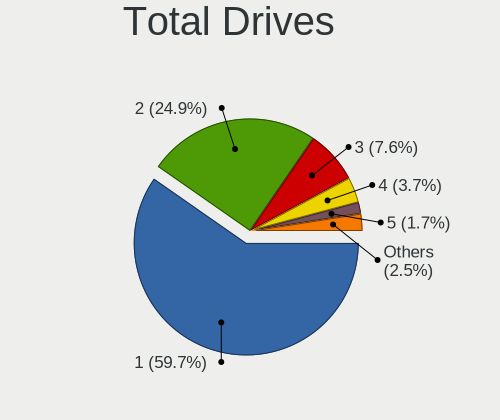
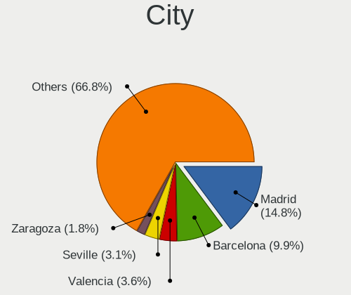
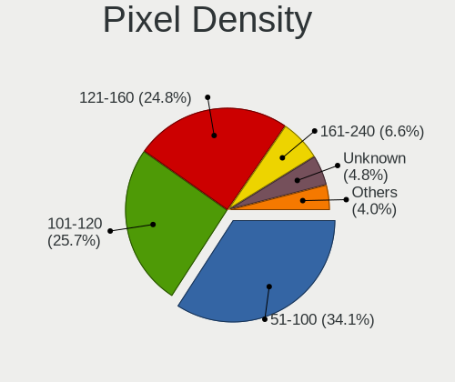
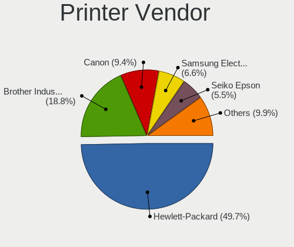
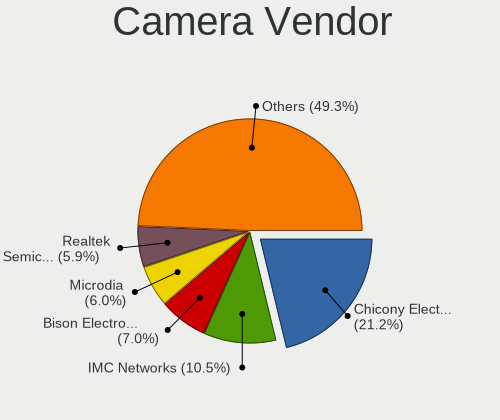

Linux in Spain - Tested Hardware & Statistics
---------------------------------------------

A project to collect tested hardware configurations for Linux in Spain.

Anyone can contribute to this report by the [hw-probe](https://github.com/linuxhw/hw-probe) tool:

    sudo -E hw-probe -all -upload

Please contribute! Especially if your hardware is rare.

This is a report for all computer types. See also reports for [desktops](/Location/Spain/Desktop/README.md) and [notebooks](/Location/Spain/Notebook/README.md).

Contents
--------

* [ Test Cases ](#test-cases)

* [ System ](#system)
  - [ OS                       ](#os)
  - [ OS Family                ](#os-family)
  - [ Kernel                   ](#kernel)
  - [ Kernel Family            ](#kernel-family)
  - [ Kernel Major Ver.        ](#kernel-major-ver)
  - [ Arch                     ](#arch)
  - [ DE                       ](#de)
  - [ Display Server           ](#display-server)
  - [ Display Manager          ](#display-manager)
  - [ OS Lang                  ](#os-lang)
  - [ Boot Mode                ](#boot-mode)
  - [ Filesystem               ](#filesystem)
  - [ Part. scheme             ](#part-scheme)
  - [ Dual Boot with Linux/BSD ](#dual-boot-with-linuxbsd)
  - [ Dual Boot (Win)          ](#dual-boot-win)

* [ Board ](#board)
  - [ Vendor                   ](#vendor)
  - [ Model                    ](#model)
  - [ Model Family             ](#model-family)
  - [ MFG Year                 ](#mfg-year)
  - [ Form Factor              ](#form-factor)
  - [ Secure Boot              ](#secure-boot)
  - [ Coreboot                 ](#coreboot)
  - [ RAM Size                 ](#ram-size)
  - [ RAM Used                 ](#ram-used)
  - [ Total Drives             ](#total-drives)
  - [ Has CD-ROM               ](#has-cd-rom)
  - [ Has Ethernet             ](#has-ethernet)
  - [ Has WiFi                 ](#has-wifi)
  - [ Has Bluetooth            ](#has-bluetooth)

* [ Location ](#location)
  - [ Country                  ](#country)
  - [ City                     ](#city)

* [ Drives ](#drives)
  - [ Drive Vendor             ](#drive-vendor)
  - [ Drive Model              ](#drive-model)
  - [ HDD Vendor               ](#hdd-vendor)
  - [ SSD Vendor               ](#ssd-vendor)
  - [ Drive Kind               ](#drive-kind)
  - [ Drive Connector          ](#drive-connector)
  - [ Drive Size               ](#drive-size)
  - [ Space Total              ](#space-total)
  - [ Space Used               ](#space-used)
  - [ Malfunc. Drives          ](#malfunc-drives)
  - [ Malfunc. Drive Vendor    ](#malfunc-drive-vendor)
  - [ Malfunc. HDD Vendor      ](#malfunc-hdd-vendor)
  - [ Malfunc. Drive Kind      ](#malfunc-drive-kind)
  - [ Failed Drives            ](#failed-drives)
  - [ Failed Drive Vendor      ](#failed-drive-vendor)
  - [ Drive Status             ](#drive-status)

* [ Storage controller ](#storage-controller)
  - [ Storage Vendor           ](#storage-vendor)
  - [ Storage Model            ](#storage-model)
  - [ Storage Kind             ](#storage-kind)

* [ Processor ](#processor)
  - [ CPU Vendor               ](#cpu-vendor)
  - [ CPU Model                ](#cpu-model)
  - [ CPU Model Family         ](#cpu-model-family)
  - [ CPU Cores                ](#cpu-cores)
  - [ CPU Sockets              ](#cpu-sockets)
  - [ CPU Threads              ](#cpu-threads)
  - [ CPU Op-Modes             ](#cpu-op-modes)
  - [ CPU Microcode            ](#cpu-microcode)
  - [ CPU Microarch            ](#cpu-microarch)

* [ Graphics ](#graphics)
  - [ GPU Vendor               ](#gpu-vendor)
  - [ GPU Model                ](#gpu-model)
  - [ GPU Combo                ](#gpu-combo)
  - [ GPU Driver               ](#gpu-driver)
  - [ GPU Memory               ](#gpu-memory)

* [ Monitor ](#monitor)
  - [ Monitor Vendor           ](#monitor-vendor)
  - [ Monitor Model            ](#monitor-model)
  - [ Monitor Resolution       ](#monitor-resolution)
  - [ Monitor Diagonal         ](#monitor-diagonal)
  - [ Monitor Width            ](#monitor-width)
  - [ Aspect Ratio             ](#aspect-ratio)
  - [ Monitor Area             ](#monitor-area)
  - [ Pixel Density            ](#pixel-density)
  - [ Multiple Monitors        ](#multiple-monitors)

* [ Network ](#network)
  - [ Net Controller Vendor    ](#net-controller-vendor)
  - [ Net Controller Model     ](#net-controller-model)
  - [ Wireless Vendor          ](#wireless-vendor)
  - [ Wireless Model           ](#wireless-model)
  - [ Ethernet Vendor          ](#ethernet-vendor)
  - [ Ethernet Model           ](#ethernet-model)
  - [ Net Controller Kind      ](#net-controller-kind)
  - [ Used Controller          ](#used-controller)
  - [ NICs                     ](#nics)
  - [ IPv6                     ](#ipv6)

* [ Bluetooth ](#bluetooth)
  - [ Bluetooth Vendor         ](#bluetooth-vendor)
  - [ Bluetooth Model          ](#bluetooth-model)

* [ Sound ](#sound)
  - [ Sound Vendor             ](#sound-vendor)
  - [ Sound Model              ](#sound-model)

* [ Memory ](#memory)
  - [ Memory Vendor            ](#memory-vendor)
  - [ Memory Model             ](#memory-model)
  - [ Memory Kind              ](#memory-kind)
  - [ Memory Form Factor       ](#memory-form-factor)
  - [ Memory Size              ](#memory-size)
  - [ Memory Speed             ](#memory-speed)

* [ Printers & scanners ](#printers--scanners)
  - [ Printer Vendor           ](#printer-vendor)
  - [ Printer Model            ](#printer-model)
  - [ Scanner Vendor           ](#scanner-vendor)
  - [ Scanner Model            ](#scanner-model)

* [ Camera ](#camera)
  - [ Camera Vendor            ](#camera-vendor)
  - [ Camera Model             ](#camera-model)

* [ Security ](#security)
  - [ Fingerprint Vendor       ](#fingerprint-vendor)
  - [ Fingerprint Model        ](#fingerprint-model)
  - [ Chipcard Vendor          ](#chipcard-vendor)
  - [ Chipcard Model           ](#chipcard-model)

* [ Unsupported ](#unsupported)
  - [ Unsupported Devices      ](#unsupported-devices)
  - [ Unsupported Device Types ](#unsupported-device-types)

Test Cases
----------

Total: 9791

| Vendor        | Model                       | Form-Factor | Probe                                                      | Date         |
|---------------|-----------------------------|-------------|------------------------------------------------------------|--------------|
| Unknown       | Unknown                     | Desktop     | [d3ffc9eacb](https://linux-hardware.org/?probe=d3ffc9eacb) | May 09, 2024 |
| Unknown       | Unknown                     | Desktop     | [3027a0b67c](https://linux-hardware.org/?probe=3027a0b67c) | May 09, 2024 |
| eMachines     | WMCP61M                     | Desktop     | [14e676a6db](https://linux-hardware.org/?probe=14e676a6db) | May 09, 2024 |
| Medion        | Cattle24 -1M                | Desktop     | [aa19188799](https://linux-hardware.org/?probe=aa19188799) | May 08, 2024 |
| MSI           | GE66 Raider 10UG            | Notebook    | [d19e5447f5](https://linux-hardware.org/?probe=d19e5447f5) | May 08, 2024 |
| Acer          | Aspire A315-21              | Notebook    | [a838a7101f](https://linux-hardware.org/?probe=a838a7101f) | May 08, 2024 |
| Gigabyte      | X99-UD4-CF                  | Desktop     | [c8d8b57bc2](https://linux-hardware.org/?probe=c8d8b57bc2) | May 08, 2024 |
| HP            | Laptop 15s-eq2xxx           | Notebook    | [2786d2f8f8](https://linux-hardware.org/?probe=2786d2f8f8) | May 08, 2024 |
| Gigabyte      | Z270-HD3P-CF                | Desktop     | [b67da2effc](https://linux-hardware.org/?probe=b67da2effc) | May 08, 2024 |
| Sony          | VGN-CR31S_W                 | Notebook    | [7e7d96c020](https://linux-hardware.org/?probe=7e7d96c020) | May 08, 2024 |
| Razer         | Blade 14 (2022) - RZ09-0... | Notebook    | [eab2642002](https://linux-hardware.org/?probe=eab2642002) | May 08, 2024 |
| Gigabyte      | H310M S2H x.x               | Desktop     | [97598b9cc3](https://linux-hardware.org/?probe=97598b9cc3) | May 07, 2024 |
| HP            | TouchSmart tm2              | Notebook    | [b180e1388d](https://linux-hardware.org/?probe=b180e1388d) | May 07, 2024 |
| OrangePi      | 4 LTS                       | Soc         | [8671fa709f](https://linux-hardware.org/?probe=8671fa709f) | May 07, 2024 |
| Lenovo        | G710 20252                  | Notebook    | [a7579b63a0](https://linux-hardware.org/?probe=a7579b63a0) | May 07, 2024 |
| Razer         | Blade 14 (2022) - RZ09-0... | Notebook    | [94766b9a5d](https://linux-hardware.org/?probe=94766b9a5d) | May 07, 2024 |
| MSI           | B450-A PRO MAX              | Desktop     | [27adbf1266](https://linux-hardware.org/?probe=27adbf1266) | May 07, 2024 |
| Huanan        | X58 V1.0                    | Desktop     | [f4d5141ce0](https://linux-hardware.org/?probe=f4d5141ce0) | May 07, 2024 |
| Apple         | Mac-F221BEC8                | Desktop     | [38e8b24bd0](https://linux-hardware.org/?probe=38e8b24bd0) | May 07, 2024 |
| Dell          | Latitude E6540              | Notebook    | [634735e1da](https://linux-hardware.org/?probe=634735e1da) | May 06, 2024 |
| Alurin        | ALU-BAR-I511-000-140        | Notebook    | [04578b9c4b](https://linux-hardware.org/?probe=04578b9c4b) | May 06, 2024 |
| ASUSTek       | VivoBook_ASUSLaptop K360... | Notebook    | [5a788054ec](https://linux-hardware.org/?probe=5a788054ec) | May 06, 2024 |
| eMachines     | WMCP61M                     | Desktop     | [54b1a18c59](https://linux-hardware.org/?probe=54b1a18c59) | May 06, 2024 |
| ASUSTek       | PRIME A320M-K               | Desktop     | [0f43840d58](https://linux-hardware.org/?probe=0f43840d58) | May 06, 2024 |
| Biostar       | H61MHV3                     | Desktop     | [c57747b094](https://linux-hardware.org/?probe=c57747b094) | May 05, 2024 |
| HP            | 83E1                        | Desktop     | [71a7fa85fb](https://linux-hardware.org/?probe=71a7fa85fb) | May 05, 2024 |
| ASUSTek       | M4A88TD-V EVO/USB3          | Desktop     | [0ded21fa2e](https://linux-hardware.org/?probe=0ded21fa2e) | May 05, 2024 |
| Gigabyte      | B450 AORUS M                | Desktop     | [336365df6e](https://linux-hardware.org/?probe=336365df6e) | May 05, 2024 |
| HP            | EliteBook 840 G2            | Notebook    | [616bda869b](https://linux-hardware.org/?probe=616bda869b) | May 04, 2024 |
| Gigabyte      | B550M AORUS ELITE           | Desktop     | [4e09bfec36](https://linux-hardware.org/?probe=4e09bfec36) | May 04, 2024 |
| Apple         | MacBookPro8,1               | Notebook    | [221d8e684d](https://linux-hardware.org/?probe=221d8e684d) | May 04, 2024 |
| MSI           | B350 GAMING PLUS            | Desktop     | [ac7913c0fa](https://linux-hardware.org/?probe=ac7913c0fa) | May 04, 2024 |
| HP            | OMEN by Laptop 16-c0xxx     | Notebook    | [44e9f4946e](https://linux-hardware.org/?probe=44e9f4946e) | May 03, 2024 |
| HP            | OMEN by Laptop 16-c0xxx     | Notebook    | [02a14960a9](https://linux-hardware.org/?probe=02a14960a9) | May 03, 2024 |
| ASUSTek       | X751SA                      | Notebook    | [7dadfc10b4](https://linux-hardware.org/?probe=7dadfc10b4) | May 03, 2024 |
| Huanan        | X58 V1.0                    | Desktop     | [c55f67fac2](https://linux-hardware.org/?probe=c55f67fac2) | May 02, 2024 |
| Apple         | MacBookPro11,1              | Notebook    | [a493ee87d2](https://linux-hardware.org/?probe=a493ee87d2) | May 02, 2024 |
| Google        | Delbin                      | Notebook    | [a0ed0beb73](https://linux-hardware.org/?probe=a0ed0beb73) | May 02, 2024 |
| To be fill... | CX-J4125B 11                | Desktop     | [b567efebf2](https://linux-hardware.org/?probe=b567efebf2) | May 02, 2024 |
| To be fill... | CX-J4125B 11                | Desktop     | [258c2fcd0d](https://linux-hardware.org/?probe=258c2fcd0d) | May 02, 2024 |
| To be fill... | CX-J4125 12                 | Desktop     | [f579d8a9cc](https://linux-hardware.org/?probe=f579d8a9cc) | May 02, 2024 |
| Apple         | Mac-031B6874CF7F642A iMa... | All in one  | [c30af0da8c](https://linux-hardware.org/?probe=c30af0da8c) | May 01, 2024 |
| Microsoft     | Surface Go                  | Tablet      | [00403f8f26](https://linux-hardware.org/?probe=00403f8f26) | May 01, 2024 |
| Dell          | XPS 13 9310                 | Notebook    | [50ea9a7b8e](https://linux-hardware.org/?probe=50ea9a7b8e) | May 01, 2024 |
| Dell          | XPS 13 9310                 | Notebook    | [39ab9869d2](https://linux-hardware.org/?probe=39ab9869d2) | May 01, 2024 |
| Lenovo        | ThinkPad X260 20F5S3J301    | Notebook    | [d373de3608](https://linux-hardware.org/?probe=d373de3608) | May 01, 2024 |
| MSI           | GP62 6QF                    | Notebook    | [1c3538dce8](https://linux-hardware.org/?probe=1c3538dce8) | May 01, 2024 |
| HP            | EliteBook 840 G5            | Notebook    | [ea3b78a648](https://linux-hardware.org/?probe=ea3b78a648) | May 01, 2024 |
| ASRock        | B550 Phantom Gaming 4       | Desktop     | [e6e296b237](https://linux-hardware.org/?probe=e6e296b237) | May 01, 2024 |
| MSI           | GP62 6QF                    | Notebook    | [4ed895c3e2](https://linux-hardware.org/?probe=4ed895c3e2) | May 01, 2024 |
| Intel         | NUC5i7RYB H73774-102        | Mini pc     | [f8c5dfd1fd](https://linux-hardware.org/?probe=f8c5dfd1fd) | May 01, 2024 |
| Chuwi         | LarkBox X                   | Mini pc     | [446ba2ecc6](https://linux-hardware.org/?probe=446ba2ecc6) | Apr 30, 2024 |
| HP            | Laptop 15s-fq5xxx           | Notebook    | [dfeb38ca05](https://linux-hardware.org/?probe=dfeb38ca05) | Apr 30, 2024 |
| HP            | ProBook 445 14 inch G10 ... | Notebook    | [944346cb24](https://linux-hardware.org/?probe=944346cb24) | Apr 30, 2024 |
| MSI           | B450M BAZOOKA V2            | Desktop     | [12ec4389e8](https://linux-hardware.org/?probe=12ec4389e8) | Apr 30, 2024 |
| HUAWEI        | BoDE-WXX9                   | Notebook    | [3777b80728](https://linux-hardware.org/?probe=3777b80728) | Apr 30, 2024 |
| HP            | OMEN by Laptop              | Notebook    | [90a616a0ca](https://linux-hardware.org/?probe=90a616a0ca) | Apr 30, 2024 |
| ASUSTek       | PRIME A320M-K               | Desktop     | [022ece0282](https://linux-hardware.org/?probe=022ece0282) | Apr 30, 2024 |
| Lenovo        | ThinkPad E16 Gen 1 21JTC... | Notebook    | [cec886e488](https://linux-hardware.org/?probe=cec886e488) | Apr 29, 2024 |
| ASUSTek       | M4N72-E                     | Desktop     | [c8920341bc](https://linux-hardware.org/?probe=c8920341bc) | Apr 29, 2024 |
| Lenovo        | Legion Y530-15ICH 81FV      | Notebook    | [2ffec4cb68](https://linux-hardware.org/?probe=2ffec4cb68) | Apr 29, 2024 |
| Raspberry ... | Raspberry Pi                | Soc         | [71608a7ee5](https://linux-hardware.org/?probe=71608a7ee5) | Apr 29, 2024 |
| Apple         | MacBookAir6,2               | Notebook    | [f64a8cacbe](https://linux-hardware.org/?probe=f64a8cacbe) | Apr 29, 2024 |
| Gigabyte      | Z77X-UD3H                   | Desktop     | [9ec352e75d](https://linux-hardware.org/?probe=9ec352e75d) | Apr 29, 2024 |
| Acer          | Aspire A515-56              | Notebook    | [ebb78c775c](https://linux-hardware.org/?probe=ebb78c775c) | Apr 29, 2024 |
| Acer          | Aspire A515-56              | Notebook    | [55b3ada50c](https://linux-hardware.org/?probe=55b3ada50c) | Apr 29, 2024 |
| Raspberry ... | Raspberry Pi                | Soc         | [7988a0c520](https://linux-hardware.org/?probe=7988a0c520) | Apr 28, 2024 |
| Intel         | D945GCL AAD67193-205        | Desktop     | [2520d8fe1d](https://linux-hardware.org/?probe=2520d8fe1d) | Apr 28, 2024 |
| MSI           | Stealth 15M B12UE           | Notebook    | [5a6ea85213](https://linux-hardware.org/?probe=5a6ea85213) | Apr 28, 2024 |
| HP            | 250 G3                      | Notebook    | [3b043693a3](https://linux-hardware.org/?probe=3b043693a3) | Apr 27, 2024 |
| Apple         | MacBook5,1                  | Notebook    | [23d81317e7](https://linux-hardware.org/?probe=23d81317e7) | Apr 27, 2024 |
| ASUSTek       | Vivobook Go E1504FA_E150... | Notebook    | [831c732b79](https://linux-hardware.org/?probe=831c732b79) | Apr 27, 2024 |
| HP            | Laptop 15s-fq1xxx           | Notebook    | [b71d197185](https://linux-hardware.org/?probe=b71d197185) | Apr 27, 2024 |
| MSI           | Z87-G43                     | Desktop     | [94162ca704](https://linux-hardware.org/?probe=94162ca704) | Apr 27, 2024 |
| Acer          | Extensa 5230                | Notebook    | [3a0381ce01](https://linux-hardware.org/?probe=3a0381ce01) | Apr 27, 2024 |
| ASUSTek       | UX32VD                      | Notebook    | [abf6c0658a](https://linux-hardware.org/?probe=abf6c0658a) | Apr 26, 2024 |
| HP            | ProBook 445 14 inch G10 ... | Notebook    | [63b4e0ea31](https://linux-hardware.org/?probe=63b4e0ea31) | Apr 26, 2024 |
| Lenovo        | IdeaPad 3 15ITL6 82H8       | Notebook    | [25997dad2f](https://linux-hardware.org/?probe=25997dad2f) | Apr 25, 2024 |
| Lenovo        | IdeaPad S145-15AST 81N3     | Notebook    | [68a7e21bcb](https://linux-hardware.org/?probe=68a7e21bcb) | Apr 25, 2024 |
| Gigabyte      | TRX40 AORUS MASTER          | Desktop     | [1b5ae94b9e](https://linux-hardware.org/?probe=1b5ae94b9e) | Apr 25, 2024 |
| Gigabyte      | X399 AORUS PRO-CF           | Desktop     | [ae667fce92](https://linux-hardware.org/?probe=ae667fce92) | Apr 25, 2024 |
| Unknown       | Unknown                     | Desktop     | [c226f7eee7](https://linux-hardware.org/?probe=c226f7eee7) | Apr 25, 2024 |
| ASRock        | TRX40 Creator               | Desktop     | [cc4738cbfe](https://linux-hardware.org/?probe=cc4738cbfe) | Apr 25, 2024 |
| Apple         | MacBookPro11,1              | Notebook    | [b27f71816a](https://linux-hardware.org/?probe=b27f71816a) | Apr 24, 2024 |
| HUAWEI        | KLVL-WXX9                   | Notebook    | [34fe2bdfdd](https://linux-hardware.org/?probe=34fe2bdfdd) | Apr 24, 2024 |
| ASUSTek       | ROG ZENITH II EXTREME       | Desktop     | [6bb0e4d69f](https://linux-hardware.org/?probe=6bb0e4d69f) | Apr 24, 2024 |
| ASUSTek       | ROG ZENITH II EXTREME       | Desktop     | [38b6b334fc](https://linux-hardware.org/?probe=38b6b334fc) | Apr 24, 2024 |
| ASRock        | TRX40 Creator               | Desktop     | [248a7c9cb7](https://linux-hardware.org/?probe=248a7c9cb7) | Apr 24, 2024 |
| Gigabyte      | TRX40 AORUS MASTER          | Desktop     | [7dcc7cb561](https://linux-hardware.org/?probe=7dcc7cb561) | Apr 24, 2024 |
| Gigabyte      | TRX40 AORUS MASTER          | Desktop     | [9426a5b0e6](https://linux-hardware.org/?probe=9426a5b0e6) | Apr 24, 2024 |
| Gigabyte      | TRX40 AORUS MASTER          | Desktop     | [197ca7d3cb](https://linux-hardware.org/?probe=197ca7d3cb) | Apr 24, 2024 |
| Gigabyte      | TRX40 AORUS MASTER          | Desktop     | [7f1573ec15](https://linux-hardware.org/?probe=7f1573ec15) | Apr 24, 2024 |
| Gigabyte      | TRX40 AORUS MASTER          | Desktop     | [2da1dbfafd](https://linux-hardware.org/?probe=2da1dbfafd) | Apr 24, 2024 |
| ASRock        | TRX40 Creator               | Desktop     | [a2a1bf049f](https://linux-hardware.org/?probe=a2a1bf049f) | Apr 24, 2024 |
| Gigabyte      | TRX40 AORUS MASTER          | Desktop     | [9898467fe0](https://linux-hardware.org/?probe=9898467fe0) | Apr 24, 2024 |
| ASRock        | TRX40 Creator               | Desktop     | [542e333336](https://linux-hardware.org/?probe=542e333336) | Apr 24, 2024 |
| ASRock        | TRX40 Creator               | Desktop     | [c9bdc54a54](https://linux-hardware.org/?probe=c9bdc54a54) | Apr 24, 2024 |
| ASRock        | TRX40 Creator               | Desktop     | [a47e5abed3](https://linux-hardware.org/?probe=a47e5abed3) | Apr 24, 2024 |
| HP            | Compaq Presario C700        | Notebook    | [062cdaa3a3](https://linux-hardware.org/?probe=062cdaa3a3) | Apr 24, 2024 |
| HP            | 255 G6 Notebook PC          | Notebook    | [8388259ad7](https://linux-hardware.org/?probe=8388259ad7) | Apr 24, 2024 |
| ASUSTek       | A88X-PLUS                   | Desktop     | [758736ef94](https://linux-hardware.org/?probe=758736ef94) | Apr 24, 2024 |
| Acer          | Predator PO7-640            | Desktop     | [6d9e679298](https://linux-hardware.org/?probe=6d9e679298) | Apr 24, 2024 |
| Unknown       | Orange Pi 5 Plus            | Soc         | [521d06c7b1](https://linux-hardware.org/?probe=521d06c7b1) | Apr 24, 2024 |
| Acer          | Aspire A315-24P             | Notebook    | [e25a1d0676](https://linux-hardware.org/?probe=e25a1d0676) | Apr 24, 2024 |
| Dell          | XPS 13 9370                 | Notebook    | [f5d49e0d32](https://linux-hardware.org/?probe=f5d49e0d32) | Apr 23, 2024 |
| ASUSTek       | VivoBook_ASUSLaptop X570... | Notebook    | [cda9b90e74](https://linux-hardware.org/?probe=cda9b90e74) | Apr 23, 2024 |
| HP            | 829A                        | Mini pc     | [20b541d9f7](https://linux-hardware.org/?probe=20b541d9f7) | Apr 23, 2024 |
| ASUSTek       | VivoBook_ASUSLaptop X570... | Notebook    | [922e4ea114](https://linux-hardware.org/?probe=922e4ea114) | Apr 23, 2024 |
| Lenovo        | B575e 36852BG               | Notebook    | [c2c9ec964e](https://linux-hardware.org/?probe=c2c9ec964e) | Apr 23, 2024 |
| Lenovo        | B575e 36852BG               | Notebook    | [d168fb33c4](https://linux-hardware.org/?probe=d168fb33c4) | Apr 23, 2024 |
| ASUSTek       | Z97-P                       | Desktop     | [ec6038f173](https://linux-hardware.org/?probe=ec6038f173) | Apr 22, 2024 |
| HP            | ZBook 15 G5                 | Notebook    | [3d51da60b9](https://linux-hardware.org/?probe=3d51da60b9) | Apr 22, 2024 |
| HP            | ProLiant DL385p Gen8        | Server      | [2f9535b576](https://linux-hardware.org/?probe=2f9535b576) | Apr 22, 2024 |
| HP            | ProLiant DL360e Gen8        | Server      | [aee06f5ae4](https://linux-hardware.org/?probe=aee06f5ae4) | Apr 22, 2024 |
| HP            | 8835                        | Desktop     | [63962138e6](https://linux-hardware.org/?probe=63962138e6) | Apr 22, 2024 |
| ASUSTek       | TUF Gaming X570-PLUS        | Desktop     | [1fe127b27d](https://linux-hardware.org/?probe=1fe127b27d) | Apr 21, 2024 |
| ASUSTek       | P6T                         | Desktop     | [d2206947bb](https://linux-hardware.org/?probe=d2206947bb) | Apr 21, 2024 |
| Acer          | Aspire 5750                 | Notebook    | [9e2621b213](https://linux-hardware.org/?probe=9e2621b213) | Apr 21, 2024 |
| Apple         | MacBookAir7,2               | Notebook    | [4aabe77962](https://linux-hardware.org/?probe=4aabe77962) | Apr 20, 2024 |
| ASRock        | X399 Taichi                 | Desktop     | [630388c584](https://linux-hardware.org/?probe=630388c584) | Apr 20, 2024 |
| Lenovo        | IdeaPad 330-15ICH 81FK      | Notebook    | [d96460dbea](https://linux-hardware.org/?probe=d96460dbea) | Apr 20, 2024 |
| DERE          | Unknown                     | Tablet      | [7780e6cd50](https://linux-hardware.org/?probe=7780e6cd50) | Apr 20, 2024 |
| Gigabyte      | Z390 UD                     | Desktop     | [2f4860118a](https://linux-hardware.org/?probe=2f4860118a) | Apr 19, 2024 |
| MSI           | B450-A PRO MAX              | Desktop     | [1babcb92fd](https://linux-hardware.org/?probe=1babcb92fd) | Apr 18, 2024 |
| ASRock        | Z690 Phantom Gaming-ITX/... | Desktop     | [020aa8904b](https://linux-hardware.org/?probe=020aa8904b) | Apr 18, 2024 |
| ASUSTek       | ROG STRIX B365-G GAMING     | Desktop     | [d82686d43d](https://linux-hardware.org/?probe=d82686d43d) | Apr 18, 2024 |
| Packard Be... | EasyNote LJ65               | Notebook    | [083f367ee6](https://linux-hardware.org/?probe=083f367ee6) | Apr 17, 2024 |
| MSI           | H81M-E33                    | Desktop     | [51ed26e0d4](https://linux-hardware.org/?probe=51ed26e0d4) | Apr 17, 2024 |
| Dell          | XPS 9320                    | Notebook    | [572e9a9030](https://linux-hardware.org/?probe=572e9a9030) | Apr 17, 2024 |
| Dell          | XPS 9320                    | Notebook    | [ba5e5d3733](https://linux-hardware.org/?probe=ba5e5d3733) | Apr 17, 2024 |
| HP            | ZBook 15u G6                | Notebook    | [1b1982023c](https://linux-hardware.org/?probe=1b1982023c) | Apr 17, 2024 |
| AZW           | EQ                          | Desktop     | [78602148a8](https://linux-hardware.org/?probe=78602148a8) | Apr 17, 2024 |
| MSI           | B450M-A PRO MAX             | Desktop     | [f113006ac0](https://linux-hardware.org/?probe=f113006ac0) | Apr 17, 2024 |
| ASUSTek       | M51Va                       | Notebook    | [2279fdf28b](https://linux-hardware.org/?probe=2279fdf28b) | Apr 17, 2024 |
| ASUSTek       | M51Va                       | Notebook    | [e2aa27e175](https://linux-hardware.org/?probe=e2aa27e175) | Apr 17, 2024 |
| MSI           | H81M-E33                    | Desktop     | [4509bf8a3c](https://linux-hardware.org/?probe=4509bf8a3c) | Apr 17, 2024 |
| Packard Be... | EasyNote TM86               | Notebook    | [05f38c567b](https://linux-hardware.org/?probe=05f38c567b) | Apr 17, 2024 |
| Shenzhen M... | F7BFC                       | Desktop     | [f95926a55e](https://linux-hardware.org/?probe=f95926a55e) | Apr 17, 2024 |
| Lenovo        | 36EB NOK                    | Desktop     | [c83418c56a](https://linux-hardware.org/?probe=c83418c56a) | Apr 17, 2024 |
| Intel         | ADL-F10                     | Desktop     | [036f5e1450](https://linux-hardware.org/?probe=036f5e1450) | Apr 16, 2024 |
| Acer          | Aspire A515-57              | Notebook    | [f66938d1f9](https://linux-hardware.org/?probe=f66938d1f9) | Apr 16, 2024 |
| Acer          | Aspire E1-572G              | Notebook    | [5428a93214](https://linux-hardware.org/?probe=5428a93214) | Apr 16, 2024 |
| Fujitsu       | D3642-B1 S26361-D3642-B1    | Desktop     | [eb94119a94](https://linux-hardware.org/?probe=eb94119a94) | Apr 16, 2024 |
| HP            | Compaq 6730b (GW687AV)      | Notebook    | [42dd367de3](https://linux-hardware.org/?probe=42dd367de3) | Apr 16, 2024 |
| Gigabyte      | TRX40 AORUS MASTER          | Desktop     | [ebf280313f](https://linux-hardware.org/?probe=ebf280313f) | Apr 16, 2024 |
| ASRock        | TRX40 Creator               | Desktop     | [57d1cf59c7](https://linux-hardware.org/?probe=57d1cf59c7) | Apr 16, 2024 |
| ASRock        | TRX40 Creator               | Desktop     | [200c6d06cf](https://linux-hardware.org/?probe=200c6d06cf) | Apr 16, 2024 |
| ASUSTek       | ZenBook UX325EA_UX325EA     | Notebook    | [f50417f34e](https://linux-hardware.org/?probe=f50417f34e) | Apr 15, 2024 |
| Sony          | VPCCB4Q1E                   | Notebook    | [0aac47ae91](https://linux-hardware.org/?probe=0aac47ae91) | Apr 15, 2024 |
| AMI           | Intel                       | Desktop     | [d620a9c686](https://linux-hardware.org/?probe=d620a9c686) | Apr 15, 2024 |
| Apple         | Mac-35C5E08120C7EEAF Mac... | Mini pc     | [4114d5cfe4](https://linux-hardware.org/?probe=4114d5cfe4) | Apr 14, 2024 |
| Apple         | Mac-35C5E08120C7EEAF Mac... | Mini pc     | [ca106270ee](https://linux-hardware.org/?probe=ca106270ee) | Apr 14, 2024 |
| ASUSTek       | ROG Zephyrus G14 GA401II... | Notebook    | [00c4bda850](https://linux-hardware.org/?probe=00c4bda850) | Apr 14, 2024 |
| ASRock        | FM2A88M Extreme4+           | Desktop     | [2ee0e2ace7](https://linux-hardware.org/?probe=2ee0e2ace7) | Apr 14, 2024 |
| ASRock        | FM2A88M Extreme4+           | Desktop     | [20e465155b](https://linux-hardware.org/?probe=20e465155b) | Apr 14, 2024 |
| Gigabyte      | B450M DS3H-CF               | Desktop     | [8280874d0c](https://linux-hardware.org/?probe=8280874d0c) | Apr 14, 2024 |
| Gigabyte      | B450M DS3H-CF               | Desktop     | [16a95d9060](https://linux-hardware.org/?probe=16a95d9060) | Apr 14, 2024 |
| MACHINIST     | X99-MR9A PRO MAX V1.2       | Desktop     | [f417b06e01](https://linux-hardware.org/?probe=f417b06e01) | Apr 14, 2024 |
| Gigabyte      | GA-MA790XT-UD4P             | Desktop     | [afc6970a5a](https://linux-hardware.org/?probe=afc6970a5a) | Apr 13, 2024 |
| HP            | Pavilion 13 x2 PC           | Notebook    | [684e30a2e3](https://linux-hardware.org/?probe=684e30a2e3) | Apr 13, 2024 |
| HP            | Pavilion 13 x2 PC           | Notebook    | [60d693276a](https://linux-hardware.org/?probe=60d693276a) | Apr 13, 2024 |
| ASUSTek       | P5WDG2 WS Pro               | Desktop     | [c370aff195](https://linux-hardware.org/?probe=c370aff195) | Apr 13, 2024 |
| HP            | Laptop 15-fc0xxx            | Notebook    | [1f7e129afd](https://linux-hardware.org/?probe=1f7e129afd) | Apr 13, 2024 |
| IP3 Tech      | GB3                         | Mini pc     | [50683f2a9f](https://linux-hardware.org/?probe=50683f2a9f) | Apr 13, 2024 |
| IP3 Tech      | GB3                         | Mini pc     | [c4404c9117](https://linux-hardware.org/?probe=c4404c9117) | Apr 13, 2024 |
| Apple         | MacBookAir6,2               | Notebook    | [4b92f0d2d3](https://linux-hardware.org/?probe=4b92f0d2d3) | Apr 13, 2024 |
| Acer          | Aspire 5715Z                | Notebook    | [25a3bb97f8](https://linux-hardware.org/?probe=25a3bb97f8) | Apr 13, 2024 |
| Raspberry ... | Raspberry Pi 5 Model B R... | Soc         | [94adb9264d](https://linux-hardware.org/?probe=94adb9264d) | Apr 13, 2024 |
| ASUSTek       | ROG STRIX B365-G GAMING     | Desktop     | [7c984f66c8](https://linux-hardware.org/?probe=7c984f66c8) | Apr 13, 2024 |
| Packard Be... | 1.XX                        | Desktop     | [2f25beb1a1](https://linux-hardware.org/?probe=2f25beb1a1) | Apr 12, 2024 |
| Acer          | Aspire 5750                 | Notebook    | [f64263bd19](https://linux-hardware.org/?probe=f64263bd19) | Apr 12, 2024 |
| ASUSTek       | UX32VD                      | Notebook    | [a063aa7aef](https://linux-hardware.org/?probe=a063aa7aef) | Apr 12, 2024 |
| MSI           | PRO B650-S WIFI             | Desktop     | [f5372b6597](https://linux-hardware.org/?probe=f5372b6597) | Apr 12, 2024 |
| Pegatron      | H81-M1                      | Desktop     | [ad6b67560b](https://linux-hardware.org/?probe=ad6b67560b) | Apr 12, 2024 |
| raspberryp... | Raspberry Pi 4 Model B R... | Soc         | [533488aa1d](https://linux-hardware.org/?probe=533488aa1d) | Apr 12, 2024 |
| MSI           | MPG X570 GAMING PLUS        | Desktop     | [0b6d67b3c6](https://linux-hardware.org/?probe=0b6d67b3c6) | Apr 11, 2024 |
| Acer          | Aspire 5920                 | Notebook    | [fc886ce6a0](https://linux-hardware.org/?probe=fc886ce6a0) | Apr 11, 2024 |
| MSI           | PRO B650-S WIFI             | Notebook    | [7353811789](https://linux-hardware.org/?probe=7353811789) | Apr 11, 2024 |
| MSI           | PRO B650-S WIFI             | Notebook    | [03c4c4cd5a](https://linux-hardware.org/?probe=03c4c4cd5a) | Apr 11, 2024 |
| MSI           | GE72 2QD                    | Notebook    | [4918e63b82](https://linux-hardware.org/?probe=4918e63b82) | Apr 11, 2024 |
| Apple         | MacBook4,1                  | Notebook    | [d6304d794d](https://linux-hardware.org/?probe=d6304d794d) | Apr 11, 2024 |
| Chuwi         | Hi10 pro tablet             | Tablet      | [66d200657d](https://linux-hardware.org/?probe=66d200657d) | Apr 10, 2024 |
| Lenovo        | ThinkPad E16 Gen 1 21JTC... | Notebook    | [38d04908c1](https://linux-hardware.org/?probe=38d04908c1) | Apr 10, 2024 |
| HP            | Pavilion Laptop 15-ck0xx    | Notebook    | [94f56fe502](https://linux-hardware.org/?probe=94f56fe502) | Apr 10, 2024 |
| Intel         | NUC8BEB J72693-308          | Mini pc     | [2e900189cc](https://linux-hardware.org/?probe=2e900189cc) | Apr 10, 2024 |
| HP            | 89D8 SMVB                   | Desktop     | [8c27767abc](https://linux-hardware.org/?probe=8c27767abc) | Apr 10, 2024 |
| Shenzhen M... | F7BFC                       | Desktop     | [94ccbc78f1](https://linux-hardware.org/?probe=94ccbc78f1) | Apr 10, 2024 |
| ASUSTek       | PN53-G                      | Mini pc     | [d3be5bf008](https://linux-hardware.org/?probe=d3be5bf008) | Apr 10, 2024 |
| HP            | EliteBook 840 G3            | Notebook    | [cbc8162b5a](https://linux-hardware.org/?probe=cbc8162b5a) | Apr 10, 2024 |
| MSI           | Katana 15 B13VGK            | Notebook    | [a4a53a031a](https://linux-hardware.org/?probe=a4a53a031a) | Apr 09, 2024 |
| ASUSTek       | ROG Zephyrus G14 GA401II... | Notebook    | [44ed4afea3](https://linux-hardware.org/?probe=44ed4afea3) | Apr 09, 2024 |
| Raspberry ... | Raspberry Pi 5 Model B R... | Soc         | [3b2982c04c](https://linux-hardware.org/?probe=3b2982c04c) | Apr 08, 2024 |
| Intel         | ADL-F10                     | Desktop     | [17a43967f2](https://linux-hardware.org/?probe=17a43967f2) | Apr 08, 2024 |
| Lenovo        | IdeaPadFlex 5 14IRU8 82Y... | Convertible | [0ee869001a](https://linux-hardware.org/?probe=0ee869001a) | Apr 08, 2024 |
| Lenovo        | ThinkPad L13 Gen 2 20VJS... | Notebook    | [747b239a5e](https://linux-hardware.org/?probe=747b239a5e) | Apr 08, 2024 |
| MSI           | Stealth 15M B12UE           | Notebook    | [041874d8e0](https://linux-hardware.org/?probe=041874d8e0) | Apr 08, 2024 |
| HUAWEI        | BoDE-WXX9                   | Notebook    | [535c311c9f](https://linux-hardware.org/?probe=535c311c9f) | Apr 08, 2024 |
| HP            | ProBook 430 G8 Notebook ... | Notebook    | [b0578be1af](https://linux-hardware.org/?probe=b0578be1af) | Apr 08, 2024 |
| MSI           | X670E GAMING PLUS WIFI      | Desktop     | [d1a91deeed](https://linux-hardware.org/?probe=d1a91deeed) | Apr 08, 2024 |
| MSI           | X470 GAMING PLUS MAX        | Desktop     | [078e1e4a08](https://linux-hardware.org/?probe=078e1e4a08) | Apr 07, 2024 |
| Acer          | Aspire X1700                | Desktop     | [9c3f1e2bac](https://linux-hardware.org/?probe=9c3f1e2bac) | Apr 07, 2024 |
| Acer          | Aspire X1700                | Desktop     | [00f7a12396](https://linux-hardware.org/?probe=00f7a12396) | Apr 07, 2024 |
| Acer          | Nitro AN515-52              | Notebook    | [b36f589241](https://linux-hardware.org/?probe=b36f589241) | Apr 06, 2024 |
| Medion        | E1210                       | Notebook    | [bff743af58](https://linux-hardware.org/?probe=bff743af58) | Apr 06, 2024 |
| MSI           | Summit E13FlipEvo A11MT     | Notebook    | [3c1bd6247c](https://linux-hardware.org/?probe=3c1bd6247c) | Apr 06, 2024 |
| ASUSTek       | Z97-P                       | Desktop     | [3d4d65387c](https://linux-hardware.org/?probe=3d4d65387c) | Apr 06, 2024 |
| HP            | Laptop 15-fc0xxx            | Notebook    | [40e0009de2](https://linux-hardware.org/?probe=40e0009de2) | Apr 06, 2024 |
| ASUSTek       | X550VX                      | Notebook    | [11705e787a](https://linux-hardware.org/?probe=11705e787a) | Apr 06, 2024 |
| ASUSTek       | VivoBook_ASUSLaptop X170... | Notebook    | [91f5cb01b9](https://linux-hardware.org/?probe=91f5cb01b9) | Apr 06, 2024 |
| Acer          | Aspire 5750                 | Notebook    | [27d64e5b3c](https://linux-hardware.org/?probe=27d64e5b3c) | Apr 05, 2024 |
| Apple         | MacBookAir7,2               | Notebook    | [a9d0144188](https://linux-hardware.org/?probe=a9d0144188) | Apr 05, 2024 |
| ASUSTek       | X550LD                      | Notebook    | [8684e69182](https://linux-hardware.org/?probe=8684e69182) | Apr 05, 2024 |
| HP            | Pavilion Laptop 14-dv1xx... | Notebook    | [f9add792f1](https://linux-hardware.org/?probe=f9add792f1) | Apr 05, 2024 |
| MSI           | Katana 15 B13VGK            | Notebook    | [c5099db6ec](https://linux-hardware.org/?probe=c5099db6ec) | Apr 05, 2024 |
| Gigabyte      | M68M-S2P                    | Desktop     | [2711aee181](https://linux-hardware.org/?probe=2711aee181) | Apr 05, 2024 |
| AMI           | Unknown                     | Notebook    | [e52668ee27](https://linux-hardware.org/?probe=e52668ee27) | Apr 05, 2024 |
| ASUSTek       | TUF B450M-PLUS GAMING       | Desktop     | [a92eac3002](https://linux-hardware.org/?probe=a92eac3002) | Apr 05, 2024 |
| Shenzhen M... | F7BFC                       | Desktop     | [bbe75de967](https://linux-hardware.org/?probe=bbe75de967) | Apr 04, 2024 |
| MSI           | X670E GAMING PLUS WIFI      | Desktop     | [6d1d9cbc9e](https://linux-hardware.org/?probe=6d1d9cbc9e) | Apr 04, 2024 |
| HUAWEI        | BoDE-WXX9                   | Notebook    | [1715f410ff](https://linux-hardware.org/?probe=1715f410ff) | Apr 04, 2024 |
| HUAWEI        | BoDE-WXX9                   | Notebook    | [331447abcd](https://linux-hardware.org/?probe=331447abcd) | Apr 04, 2024 |
| ASUSTek       | PRIME B450M-A               | Desktop     | [4fc3272c07](https://linux-hardware.org/?probe=4fc3272c07) | Apr 04, 2024 |
| Acer          | Aspire 5750                 | Notebook    | [e2cef27ef8](https://linux-hardware.org/?probe=e2cef27ef8) | Apr 03, 2024 |
| ASUSTek       | VivoBook_ASUSLaptop X512... | Notebook    | [5aacb1afe9](https://linux-hardware.org/?probe=5aacb1afe9) | Apr 03, 2024 |
| Toshiba       | NB520                       | Notebook    | [d347b22da0](https://linux-hardware.org/?probe=d347b22da0) | Apr 03, 2024 |
| HP            | 1495                        | Desktop     | [92c2575a1f](https://linux-hardware.org/?probe=92c2575a1f) | Apr 03, 2024 |
| Apple         | MacBook6,1                  | Notebook    | [224f00ec38](https://linux-hardware.org/?probe=224f00ec38) | Apr 03, 2024 |
| Apple         | MacBook6,1                  | Notebook    | [32e57190de](https://linux-hardware.org/?probe=32e57190de) | Apr 02, 2024 |
| HUAWEI        | NBLB-WAX9N                  | Notebook    | [dbba317b72](https://linux-hardware.org/?probe=dbba317b72) | Apr 02, 2024 |
| ASUSTek       | TUF Gaming B650-PLUS WIF... | Desktop     | [880214aac4](https://linux-hardware.org/?probe=880214aac4) | Apr 02, 2024 |
| Lenovo        | IdeaPad 320-15IKB 80XL      | Notebook    | [0cad66eb7a](https://linux-hardware.org/?probe=0cad66eb7a) | Apr 02, 2024 |
| Acer          | Aspire F5-573G              | Notebook    | [7822798a8a](https://linux-hardware.org/?probe=7822798a8a) | Apr 02, 2024 |
| MACHINIST     | X99-MR9A PRO MAX V1.2       | Desktop     | [aec3f76613](https://linux-hardware.org/?probe=aec3f76613) | Apr 02, 2024 |
| Lenovo        | 310B SDK0J40697 WIN 3305... | Desktop     | [536e30fe1c](https://linux-hardware.org/?probe=536e30fe1c) | Apr 02, 2024 |
| Acer          | Nitro AN517-54              | Notebook    | [85318c4993](https://linux-hardware.org/?probe=85318c4993) | Apr 02, 2024 |
| MSI           | GE66 Raider 10UG            | Notebook    | [5342089fd7](https://linux-hardware.org/?probe=5342089fd7) | Apr 02, 2024 |
| ASUSTek       | ROG CROSSHAIR VIII HERO     | Desktop     | [84ed1b3cc5](https://linux-hardware.org/?probe=84ed1b3cc5) | Apr 01, 2024 |
| Lenovo        | IdeaPad 1 15AMN7 82VG       | Notebook    | [0df7a90dcd](https://linux-hardware.org/?probe=0df7a90dcd) | Apr 01, 2024 |
| Apple         | MacBookAir6,2               | Notebook    | [6c8467a122](https://linux-hardware.org/?probe=6c8467a122) | Apr 01, 2024 |
| HP            | ProBook 4510s               | Notebook    | [5fc5645b74](https://linux-hardware.org/?probe=5fc5645b74) | Apr 01, 2024 |
| ASUSTek       | ROG STRIX X570-E GAMING     | Desktop     | [bd03ed36a4](https://linux-hardware.org/?probe=bd03ed36a4) | Apr 01, 2024 |
| MSI           | GE72 2QD                    | Notebook    | [f2d2aa4c21](https://linux-hardware.org/?probe=f2d2aa4c21) | Apr 01, 2024 |
| QIYIDA        | X79-M6 V1.0                 | Desktop     | [ab18c6c58f](https://linux-hardware.org/?probe=ab18c6c58f) | Mar 31, 2024 |
| ASUSTek       | T101HA                      | Tablet      | [8b2fd39ce8](https://linux-hardware.org/?probe=8b2fd39ce8) | Mar 31, 2024 |
| Intel         | DP35DP AAD81073-207         | Desktop     | [8d783be6f7](https://linux-hardware.org/?probe=8d783be6f7) | Mar 31, 2024 |
| ASUSTek       | GL553VD                     | Notebook    | [cdb08c255c](https://linux-hardware.org/?probe=cdb08c255c) | Mar 30, 2024 |
| Medion        | D3F3-EM                     | Desktop     | [c624415ff5](https://linux-hardware.org/?probe=c624415ff5) | Mar 30, 2024 |
| HP            | Laptop 15-fd0xxx            | Notebook    | [5babc725b2](https://linux-hardware.org/?probe=5babc725b2) | Mar 30, 2024 |
| HP            | ENVY 6                      | Notebook    | [578fc6fcbe](https://linux-hardware.org/?probe=578fc6fcbe) | Mar 29, 2024 |
| ASUSTek       | N53SV                       | Notebook    | [bc6e236fda](https://linux-hardware.org/?probe=bc6e236fda) | Mar 29, 2024 |
| HUAWEI        | KLVL-WXX9                   | Notebook    | [437c5e9953](https://linux-hardware.org/?probe=437c5e9953) | Mar 29, 2024 |
| ASUSTek       | K54HR                       | Notebook    | [ac57c0b465](https://linux-hardware.org/?probe=ac57c0b465) | Mar 29, 2024 |
| ASUSTek       | VivoBook_ASUSLaptop M150... | Notebook    | [568697e488](https://linux-hardware.org/?probe=568697e488) | Mar 28, 2024 |
| Gigabyte      | B550 AORUS ELITE V2         | Desktop     | [ff9042cc68](https://linux-hardware.org/?probe=ff9042cc68) | Mar 28, 2024 |
| ASUSTek       | T101HA                      | Tablet      | [2b6b7219fe](https://linux-hardware.org/?probe=2b6b7219fe) | Mar 27, 2024 |
| Apple         | MacBookPro11,3              | Notebook    | [b36db98ee9](https://linux-hardware.org/?probe=b36db98ee9) | Mar 27, 2024 |
| ASUSTek       | TUF Gaming B760-PLUS WIF... | Desktop     | [c82343906c](https://linux-hardware.org/?probe=c82343906c) | Mar 27, 2024 |
| ASRock        | H370 Pro4                   | Desktop     | [61db4d52ca](https://linux-hardware.org/?probe=61db4d52ca) | Mar 27, 2024 |
| HP            | 89D8 SMVB                   | Desktop     | [3d3d6903dd](https://linux-hardware.org/?probe=3d3d6903dd) | Mar 27, 2024 |
| Gigabyte      | H81M-DS2V                   | Desktop     | [2990ce91ba](https://linux-hardware.org/?probe=2990ce91ba) | Mar 27, 2024 |
| Dell          | Inspiron 5593               | Notebook    | [1630ab92c1](https://linux-hardware.org/?probe=1630ab92c1) | Mar 26, 2024 |
| HP            | Pavilion 15                 | Notebook    | [e4aeecb147](https://linux-hardware.org/?probe=e4aeecb147) | Mar 26, 2024 |
| Acer          | Aspire E5-421G              | Notebook    | [f16af02ed4](https://linux-hardware.org/?probe=f16af02ed4) | Mar 26, 2024 |
| Gigabyte      | B450M DS3H V2               | Desktop     | [e506b0242a](https://linux-hardware.org/?probe=e506b0242a) | Mar 26, 2024 |
| Lenovo        | IdeaPad 3 15ITL6 82H8       | Notebook    | [97fd197cc6](https://linux-hardware.org/?probe=97fd197cc6) | Mar 26, 2024 |
| Gigabyte      | B760M DS3H DDR4             | Desktop     | [069f9b2bc9](https://linux-hardware.org/?probe=069f9b2bc9) | Mar 26, 2024 |
| HUAWEI        | KLVL-WXX9                   | Notebook    | [f4276dd02c](https://linux-hardware.org/?probe=f4276dd02c) | Mar 25, 2024 |
| Acer          | Aspire 5750G                | Notebook    | [eb093627c5](https://linux-hardware.org/?probe=eb093627c5) | Mar 25, 2024 |
| ASUSTek       | P8Z77-V                     | Desktop     | [ec744f652d](https://linux-hardware.org/?probe=ec744f652d) | Mar 25, 2024 |
| ASUSTek       | P8Z77-V                     | Desktop     | [89c81c0a65](https://linux-hardware.org/?probe=89c81c0a65) | Mar 25, 2024 |
| HERBECON S... | HERBECON PRO                | All in one  | [bd9023e2a6](https://linux-hardware.org/?probe=bd9023e2a6) | Mar 25, 2024 |
| Gigabyte      | H81M-DS2V                   | Desktop     | [7dde2500b9](https://linux-hardware.org/?probe=7dde2500b9) | Mar 25, 2024 |
| Packard Be... | EasyNote ENTG71BM           | Notebook    | [5084e58bdf](https://linux-hardware.org/?probe=5084e58bdf) | Mar 24, 2024 |
| Lenovo        | ThinkBook 13x G2 IAP 21A... | Notebook    | [ebf2ce6969](https://linux-hardware.org/?probe=ebf2ce6969) | Mar 24, 2024 |
| Lenovo        | IdeaPadFlex 5 14IRU8 82Y... | Convertible | [e0ba186a2e](https://linux-hardware.org/?probe=e0ba186a2e) | Mar 24, 2024 |
| ASUSTek       | H81M-P PLUS                 | Desktop     | [92aa3b7c70](https://linux-hardware.org/?probe=92aa3b7c70) | Mar 24, 2024 |
| ASUSTek       | H81M-P PLUS                 | Desktop     | [57ee067ff2](https://linux-hardware.org/?probe=57ee067ff2) | Mar 24, 2024 |
| MSI           | Katana 15 B13VGK            | Notebook    | [c2e73852fd](https://linux-hardware.org/?probe=c2e73852fd) | Mar 24, 2024 |
| Acer          | Aspire 5738                 | Notebook    | [536eec363e](https://linux-hardware.org/?probe=536eec363e) | Mar 23, 2024 |
| Acer          | Aspire 5738                 | Notebook    | [f54f1540a6](https://linux-hardware.org/?probe=f54f1540a6) | Mar 23, 2024 |
| Primux Tec... | Primux ioxbook 1402FX       | Notebook    | [53e6d67001](https://linux-hardware.org/?probe=53e6d67001) | Mar 23, 2024 |
| Sony          | SVE1511C5E                  | Notebook    | [f262bbafc7](https://linux-hardware.org/?probe=f262bbafc7) | Mar 23, 2024 |
| ASUSTek       | PRIME X570-P                | Desktop     | [8928a51f78](https://linux-hardware.org/?probe=8928a51f78) | Mar 22, 2024 |
| Unknown       | Unknown                     | Desktop     | [5af36d3a4e](https://linux-hardware.org/?probe=5af36d3a4e) | Mar 22, 2024 |
| Packard Be... | EasyNote TM98               | Notebook    | [e6c48ef91f](https://linux-hardware.org/?probe=e6c48ef91f) | Mar 22, 2024 |
| ASUSTek       | Zenbook UM5302TA_UM5302T... | Notebook    | [88d382ec33](https://linux-hardware.org/?probe=88d382ec33) | Mar 22, 2024 |
| ASUSTek       | K30BF_M32BF_A_F_K31BF_6     | Desktop     | [dfa8ff45b7](https://linux-hardware.org/?probe=dfa8ff45b7) | Mar 21, 2024 |
| ASUSTek       | K30BF_M32BF_A_F_K31BF_6     | Desktop     | [5c0de1313b](https://linux-hardware.org/?probe=5c0de1313b) | Mar 21, 2024 |
| ASRock        | Z77 Pro3                    | Desktop     | [51c0a74384](https://linux-hardware.org/?probe=51c0a74384) | Mar 21, 2024 |
| SLIMBOOK      | TITAN                       | Notebook    | [a0b40ac666](https://linux-hardware.org/?probe=a0b40ac666) | Mar 21, 2024 |
| ASUSTek       | PRIME B450M-A II            | Desktop     | [dd70b1d6b3](https://linux-hardware.org/?probe=dd70b1d6b3) | Mar 21, 2024 |
| Acer          | Aspire 5742                 | Notebook    | [5bac0d5211](https://linux-hardware.org/?probe=5bac0d5211) | Mar 21, 2024 |
| Acer          | Aspire 5750G                | Notebook    | [8fce303fb3](https://linux-hardware.org/?probe=8fce303fb3) | Mar 20, 2024 |
| HP            | ProBook 640 G1              | Notebook    | [83fb273295](https://linux-hardware.org/?probe=83fb273295) | Mar 20, 2024 |
| ASUSTek       | ROG STRIX B450-F GAMING     | Desktop     | [8f65d86036](https://linux-hardware.org/?probe=8f65d86036) | Mar 20, 2024 |
| Apple         | MacBookAir5,1               | Notebook    | [f1e5e55e2c](https://linux-hardware.org/?probe=f1e5e55e2c) | Mar 20, 2024 |
| Lenovo        | SHARKBAY 0B98401 WIN        | Desktop     | [c15e54db2e](https://linux-hardware.org/?probe=c15e54db2e) | Mar 19, 2024 |
| Dell          | 0D6H9T A01                  | Desktop     | [c3691d0e66](https://linux-hardware.org/?probe=c3691d0e66) | Mar 19, 2024 |
| MSI           | MS-B0A21                    | Desktop     | [e4301d435b](https://linux-hardware.org/?probe=e4301d435b) | Mar 18, 2024 |
| Unknown       | Unknown                     | Notebook    | [f2d92ae386](https://linux-hardware.org/?probe=f2d92ae386) | Mar 18, 2024 |
| ASRock        | X570 Steel Legend           | Desktop     | [902b7d5554](https://linux-hardware.org/?probe=902b7d5554) | Mar 18, 2024 |
| ASUSTek       | ASUS TUF Gaming A15 FA50... | Notebook    | [b62cd0cdeb](https://linux-hardware.org/?probe=b62cd0cdeb) | Mar 17, 2024 |
| ASUSTek       | TUF Gaming B450-PLUS II     | Desktop     | [b187be84a4](https://linux-hardware.org/?probe=b187be84a4) | Mar 17, 2024 |
| ASRock        | Z690 Phantom Gaming-ITX/... | Desktop     | [27baad85ff](https://linux-hardware.org/?probe=27baad85ff) | Mar 17, 2024 |
| Lenovo        | Y520-15IKBN 80WK            | Notebook    | [1ce88ca0ff](https://linux-hardware.org/?probe=1ce88ca0ff) | Mar 17, 2024 |
| Lenovo        | Y520-15IKBN 80WK            | Notebook    | [e7b96ba325](https://linux-hardware.org/?probe=e7b96ba325) | Mar 17, 2024 |
| MSI           | B350M BAZOOKA               | Desktop     | [e8c63c54a8](https://linux-hardware.org/?probe=e8c63c54a8) | Mar 16, 2024 |
| ASUSTek       | X541UAK                     | Notebook    | [4b33512569](https://linux-hardware.org/?probe=4b33512569) | Mar 16, 2024 |
| Gigabyte      | Z170-HD3P-CF                | Desktop     | [291b222709](https://linux-hardware.org/?probe=291b222709) | Mar 16, 2024 |
| ASUSTek       | B150M-A                     | Desktop     | [b9b301bb3a](https://linux-hardware.org/?probe=b9b301bb3a) | Mar 16, 2024 |
| Apple         | MacBookPro11,3              | Notebook    | [6130454352](https://linux-hardware.org/?probe=6130454352) | Mar 16, 2024 |
| ASUSTek       | PRIME B350M-A               | Desktop     | [582d3628d3](https://linux-hardware.org/?probe=582d3628d3) | Mar 15, 2024 |
| Dell          | 0FXD80 A00                  | Desktop     | [c0e1f6f453](https://linux-hardware.org/?probe=c0e1f6f453) | Mar 15, 2024 |
| Gigabyte      | A520M DS3H                  | Desktop     | [e9eaacfaa2](https://linux-hardware.org/?probe=e9eaacfaa2) | Mar 15, 2024 |
| HUAWEI        | KLVL-WXX9                   | Notebook    | [076c34493c](https://linux-hardware.org/?probe=076c34493c) | Mar 15, 2024 |
| MSI           | Z270 PC MATE                | Desktop     | [87ef1a815e](https://linux-hardware.org/?probe=87ef1a815e) | Mar 15, 2024 |
| ASUSTek       | PRIME B760-PLUS             | Desktop     | [bb52ad6052](https://linux-hardware.org/?probe=bb52ad6052) | Mar 15, 2024 |
| Apple         | MacBookAir5,1               | Notebook    | [ae670d563a](https://linux-hardware.org/?probe=ae670d563a) | Mar 15, 2024 |
| Apple         | Mac-F2218FC8                | All in one  | [2749c61fb9](https://linux-hardware.org/?probe=2749c61fb9) | Mar 14, 2024 |
| ASUSTek       | ZenBook UX431DA_UM431DA     | Notebook    | [721d5ddfe6](https://linux-hardware.org/?probe=721d5ddfe6) | Mar 14, 2024 |
| Dell          | Precision 7730              | Notebook    | [8b863ed391](https://linux-hardware.org/?probe=8b863ed391) | Mar 14, 2024 |
| Google        | Vilboz                      | Notebook    | [613311d6d7](https://linux-hardware.org/?probe=613311d6d7) | Mar 14, 2024 |
| ASUSTek       | B85-PRO GAMER               | Desktop     | [66f9489b1e](https://linux-hardware.org/?probe=66f9489b1e) | Mar 14, 2024 |
| Lenovo        | ThinkPad E16 Gen 1 21JTC... | Notebook    | [a17c2cb5e6](https://linux-hardware.org/?probe=a17c2cb5e6) | Mar 13, 2024 |
| ASUSTek       | AT4NM10T-I                  | Desktop     | [6d006ade6c](https://linux-hardware.org/?probe=6d006ade6c) | Mar 13, 2024 |
| ASUSTek       | AT4NM10T-I                  | Desktop     | [f7ddcc5c64](https://linux-hardware.org/?probe=f7ddcc5c64) | Mar 13, 2024 |
| Intel         | X58 V1608                   | Desktop     | [48e5f0f5a6](https://linux-hardware.org/?probe=48e5f0f5a6) | Mar 13, 2024 |
| Intel         | X58 V1608                   | Desktop     | [84ccc96b6b](https://linux-hardware.org/?probe=84ccc96b6b) | Mar 13, 2024 |
| Gigabyte      | Z370 HD3-CF                 | Desktop     | [fe9632e966](https://linux-hardware.org/?probe=fe9632e966) | Mar 13, 2024 |
| Medion        | D3F3-EM2                    | Desktop     | [84c6998958](https://linux-hardware.org/?probe=84c6998958) | Mar 13, 2024 |
| ASUSTek       | VivoBook_ASUSLaptop M150... | Notebook    | [32c04343f9](https://linux-hardware.org/?probe=32c04343f9) | Mar 13, 2024 |
| Teknoservi... | TTL Portatil 14             | Notebook    | [72c545ddbb](https://linux-hardware.org/?probe=72c545ddbb) | Mar 13, 2024 |
| MSI           | Stealth 15M B12UE           | Notebook    | [a731c5f5eb](https://linux-hardware.org/?probe=a731c5f5eb) | Mar 13, 2024 |
| Medion        | D3F3-EM2                    | Desktop     | [919075a65c](https://linux-hardware.org/?probe=919075a65c) | Mar 12, 2024 |
| ASUSTek       | STRIX H270F GAMING          | Desktop     | [b8837fff38](https://linux-hardware.org/?probe=b8837fff38) | Mar 12, 2024 |
| Lenovo        | B590 62742BG                | Notebook    | [5e3e316020](https://linux-hardware.org/?probe=5e3e316020) | Mar 12, 2024 |
| HP            | ProBook 450 G1              | Notebook    | [3bfd1620fe](https://linux-hardware.org/?probe=3bfd1620fe) | Mar 12, 2024 |
| HP            | 18E7                        | Desktop     | [60cf0b1c2b](https://linux-hardware.org/?probe=60cf0b1c2b) | Mar 12, 2024 |
| ASRock        | ConRoe1333-DVI/H            | Desktop     | [568d966b3f](https://linux-hardware.org/?probe=568d966b3f) | Mar 12, 2024 |
| Apple         | MacBookAir5,1               | Notebook    | [d928c71a48](https://linux-hardware.org/?probe=d928c71a48) | Mar 12, 2024 |
| ASUSTek       | VivoBook_ASUSLaptop X170... | Notebook    | [1c5fd2d212](https://linux-hardware.org/?probe=1c5fd2d212) | Mar 11, 2024 |
| HUAWEI        | NBLK-WAX9X                  | Notebook    | [a64c6e1955](https://linux-hardware.org/?probe=a64c6e1955) | Mar 11, 2024 |
| ASRock        | Z690 Phantom Gaming-ITX/... | Desktop     | [e922cff9f6](https://linux-hardware.org/?probe=e922cff9f6) | Mar 11, 2024 |
| HP            | Laptop 15s-fq2xxx           | Notebook    | [2cbb5c3c0d](https://linux-hardware.org/?probe=2cbb5c3c0d) | Mar 11, 2024 |
| MSI           | X470 GAMING PLUS MAX        | Desktop     | [0442caba04](https://linux-hardware.org/?probe=0442caba04) | Mar 11, 2024 |
| Gigabyte      | B360M HD3                   | Desktop     | [63a3f8ce29](https://linux-hardware.org/?probe=63a3f8ce29) | Mar 11, 2024 |
| Gigabyte      | B360M HD3                   | Desktop     | [aa06991c8c](https://linux-hardware.org/?probe=aa06991c8c) | Mar 11, 2024 |
| Gigabyte      | B450M DS3H-CF               | Desktop     | [05b14ed2cd](https://linux-hardware.org/?probe=05b14ed2cd) | Mar 11, 2024 |
| Gigabyte      | B360M HD3                   | Desktop     | [724f7885d0](https://linux-hardware.org/?probe=724f7885d0) | Mar 10, 2024 |
| HP            | 8265                        | Desktop     | [a805d1a4b0](https://linux-hardware.org/?probe=a805d1a4b0) | Mar 10, 2024 |
| Lenovo        | SHARKBAY 0B98401 PRO        | Desktop     | [392bd2c7d3](https://linux-hardware.org/?probe=392bd2c7d3) | Mar 10, 2024 |
| Chuwi         | GemiBook Pro                | Notebook    | [a8eb8bc1dc](https://linux-hardware.org/?probe=a8eb8bc1dc) | Mar 10, 2024 |
| ASUSTek       | VivoBook_ASUSLaptop X570... | Notebook    | [a56ff930d5](https://linux-hardware.org/?probe=a56ff930d5) | Mar 10, 2024 |
| Lenovo        | IdeaPad Y460                | Notebook    | [0af494c148](https://linux-hardware.org/?probe=0af494c148) | Mar 10, 2024 |
| Gigabyte      | Z77-D3H                     | Desktop     | [6be0c27695](https://linux-hardware.org/?probe=6be0c27695) | Mar 10, 2024 |
| Gigabyte      | Z77-D3H                     | Desktop     | [84b8690965](https://linux-hardware.org/?probe=84b8690965) | Mar 10, 2024 |
| ASUSTek       | TP301UA                     | Notebook    | [1f8c7b7644](https://linux-hardware.org/?probe=1f8c7b7644) | Mar 09, 2024 |
| ASUSTek       | TP301UA                     | Notebook    | [90f550ea4c](https://linux-hardware.org/?probe=90f550ea4c) | Mar 09, 2024 |
| Dell          | 03NVJ6 A01                  | Desktop     | [d8dccee559](https://linux-hardware.org/?probe=d8dccee559) | Mar 09, 2024 |
| HPE           | ProLiant DL20 Gen10 Plus    | Server      | [afb2f8105a](https://linux-hardware.org/?probe=afb2f8105a) | Mar 09, 2024 |
| MSI           | Stealth GS77 12UH           | Notebook    | [892a9a5e88](https://linux-hardware.org/?probe=892a9a5e88) | Mar 09, 2024 |
| HUAWEI        | BOM-WXX9                    | Notebook    | [c3b38c2e5c](https://linux-hardware.org/?probe=c3b38c2e5c) | Mar 09, 2024 |
| Apple         | Mac-BE088AF8C5EB4FA2 iMa... | All in one  | [b19c6c8240](https://linux-hardware.org/?probe=b19c6c8240) | Mar 09, 2024 |
| ASUSTek       | X541UAK                     | Notebook    | [8b527dc9c9](https://linux-hardware.org/?probe=8b527dc9c9) | Mar 09, 2024 |
| Lenovo        | IdeaPad Gaming 3 15ACH6 ... | Notebook    | [34dc8eb985](https://linux-hardware.org/?probe=34dc8eb985) | Mar 09, 2024 |
| MSI           | Modern 14 B5M               | Notebook    | [585c473256](https://linux-hardware.org/?probe=585c473256) | Mar 08, 2024 |
| Acer          | Predator PO3-640            | Desktop     | [f229a75cfc](https://linux-hardware.org/?probe=f229a75cfc) | Mar 08, 2024 |
| Notebook      | P7xxDM(-G)                  | Notebook    | [29b862f789](https://linux-hardware.org/?probe=29b862f789) | Mar 08, 2024 |
| HP            | Pro x360 Fortis 11 inch ... | Convertible | [b7528cd0bf](https://linux-hardware.org/?probe=b7528cd0bf) | Mar 08, 2024 |
| ASRock        | D1800M                      | Desktop     | [9098eafea6](https://linux-hardware.org/?probe=9098eafea6) | Mar 08, 2024 |
| HP            | Pavilion Notebook           | Notebook    | [6c1a3e7d24](https://linux-hardware.org/?probe=6c1a3e7d24) | Mar 08, 2024 |
| HP            | Pavilion Notebook           | Notebook    | [71fa9b9d2e](https://linux-hardware.org/?probe=71fa9b9d2e) | Mar 08, 2024 |
| Toshiba       | Satellite A200              | Notebook    | [7197835980](https://linux-hardware.org/?probe=7197835980) | Mar 08, 2024 |
| HP            | ENVY Notebook               | Notebook    | [6ab7868737](https://linux-hardware.org/?probe=6ab7868737) | Mar 08, 2024 |
| Apple         | MacBook7,1                  | Notebook    | [942bc3410e](https://linux-hardware.org/?probe=942bc3410e) | Mar 07, 2024 |
| Microsoft     | Surface with Windows RT     | Tablet      | [b548b3a32a](https://linux-hardware.org/?probe=b548b3a32a) | Mar 07, 2024 |
| Microsoft     | Surface with Windows RT     | Tablet      | [93a72804f5](https://linux-hardware.org/?probe=93a72804f5) | Mar 07, 2024 |
| Pegatron      | 2AED                        | All in one  | [1f00336f45](https://linux-hardware.org/?probe=1f00336f45) | Mar 06, 2024 |
| Dell          | Latitude E6520              | Notebook    | [3a8f9b7a0a](https://linux-hardware.org/?probe=3a8f9b7a0a) | Mar 06, 2024 |
| Acer          | Aspire M3-581G              | Notebook    | [7ab92d79ee](https://linux-hardware.org/?probe=7ab92d79ee) | Mar 06, 2024 |
| Apple         | MacBook7,1                  | Notebook    | [e6500f99bb](https://linux-hardware.org/?probe=e6500f99bb) | Mar 06, 2024 |
| MSI           | GL73 8RC                    | Notebook    | [18e3ecc518](https://linux-hardware.org/?probe=18e3ecc518) | Mar 06, 2024 |
| MSI           | GL73 8RC                    | Notebook    | [7081f4b3e7](https://linux-hardware.org/?probe=7081f4b3e7) | Mar 06, 2024 |
| Packard Be... | EasyNote TS11HR             | Notebook    | [5eb3213d99](https://linux-hardware.org/?probe=5eb3213d99) | Mar 05, 2024 |
| ASUSTek       | PRO A520M-C                 | Desktop     | [394fa5ec3f](https://linux-hardware.org/?probe=394fa5ec3f) | Mar 04, 2024 |
| AZW           | Green G5                    | Desktop     | [0d917a5d84](https://linux-hardware.org/?probe=0d917a5d84) | Mar 04, 2024 |
| HP            | Laptop 15s-fq1xxx           | Notebook    | [3e8a7d8c6e](https://linux-hardware.org/?probe=3e8a7d8c6e) | Mar 04, 2024 |
| MSI           | Prestige 15 A10SC           | Notebook    | [f95e0198ba](https://linux-hardware.org/?probe=f95e0198ba) | Mar 04, 2024 |
| MSI           | H81M-E33                    | Desktop     | [dddb1e09f3](https://linux-hardware.org/?probe=dddb1e09f3) | Mar 03, 2024 |
| Gigabyte      | AB350M-Gaming 3-CF          | Desktop     | [00190a62fa](https://linux-hardware.org/?probe=00190a62fa) | Mar 03, 2024 |
| Google        | Magolor                     | Notebook    | [f990ca633c](https://linux-hardware.org/?probe=f990ca633c) | Mar 03, 2024 |
| Lenovo        | 3000 V200 0764A46           | Notebook    | [99fd163eb7](https://linux-hardware.org/?probe=99fd163eb7) | Mar 03, 2024 |
| Dell          | Latitude E6520              | Notebook    | [e254077eb1](https://linux-hardware.org/?probe=e254077eb1) | Mar 03, 2024 |
| Huanan        | X99-F8 GAMING V2.0          | Desktop     | [ce05cbee18](https://linux-hardware.org/?probe=ce05cbee18) | Mar 02, 2024 |
| HP            | Pavilion x360 Convertibl... | Convertible | [c31a0171ed](https://linux-hardware.org/?probe=c31a0171ed) | Mar 02, 2024 |
| HUAWEI        | CREM-WXX9                   | Notebook    | [eeb2d3dcd6](https://linux-hardware.org/?probe=eeb2d3dcd6) | Mar 02, 2024 |
| Apple         | Mac-4BC72D62AD45599E Mac... | Mini pc     | [37172a9059](https://linux-hardware.org/?probe=37172a9059) | Mar 02, 2024 |
| Lenovo        | IdeaPad S145-15AST 81N3     | Notebook    | [c6dbf5f3c5](https://linux-hardware.org/?probe=c6dbf5f3c5) | Mar 02, 2024 |
| Lenovo        | ThinkPad T400 6475ZBK       | Notebook    | [e6c5bba3eb](https://linux-hardware.org/?probe=e6c5bba3eb) | Mar 02, 2024 |
| Acer          | Swift SF315-41              | Notebook    | [e87aea2d37](https://linux-hardware.org/?probe=e87aea2d37) | Mar 02, 2024 |
| HP            | 510 Notebook PC (RU962AA... | Notebook    | [94571f879e](https://linux-hardware.org/?probe=94571f879e) | Mar 02, 2024 |
| Valve         | Jupiter                     | Notebook    | [b2228e6857](https://linux-hardware.org/?probe=b2228e6857) | Mar 02, 2024 |
| Biostar       | H61MHV3                     | Desktop     | [2737c4512b](https://linux-hardware.org/?probe=2737c4512b) | Mar 02, 2024 |
| SLIMBOOK      | PROX15-AMD                  | Notebook    | [b50ca64146](https://linux-hardware.org/?probe=b50ca64146) | Mar 01, 2024 |
| Biostar       | H61MHV3                     | Desktop     | [863e37f0d0](https://linux-hardware.org/?probe=863e37f0d0) | Mar 01, 2024 |
| Lenovo        | IdeaPad Gaming 3 15IAH7 ... | Notebook    | [204971811b](https://linux-hardware.org/?probe=204971811b) | Mar 01, 2024 |
| Gigabyte      | GA-990FXA-UD5               | Desktop     | [56b862a321](https://linux-hardware.org/?probe=56b862a321) | Mar 01, 2024 |
| Acer          | Aspire Z3-615               | All in one  | [fd9c0e6b48](https://linux-hardware.org/?probe=fd9c0e6b48) | Feb 29, 2024 |
| Rockchip      | RK3588 OPi 5 Plus (DT)      | Soc         | [27d7cd569e](https://linux-hardware.org/?probe=27d7cd569e) | Feb 29, 2024 |
| Rockchip      | RK3588 OPi 5 Plus (DT)      | Soc         | [e293d51bdc](https://linux-hardware.org/?probe=e293d51bdc) | Feb 29, 2024 |
| Rockchip      | RK3588 OPi 5 Plus (DT)      | Soc         | [3b6f0477c2](https://linux-hardware.org/?probe=3b6f0477c2) | Feb 29, 2024 |
| HP            | Pavilion Gaming Notebook    | Notebook    | [e0277e4684](https://linux-hardware.org/?probe=e0277e4684) | Feb 29, 2024 |
| Acer          | Extensa 2511                | Notebook    | [0f4bcc7a0f](https://linux-hardware.org/?probe=0f4bcc7a0f) | Feb 29, 2024 |
| ASUSTek       | VivoBook_ASUSLaptop M150... | Notebook    | [96b542d67c](https://linux-hardware.org/?probe=96b542d67c) | Feb 29, 2024 |
| ASUSTek       | ROG Zephyrus G14 GA401II... | Notebook    | [9d279afdd2](https://linux-hardware.org/?probe=9d279afdd2) | Feb 29, 2024 |
| ASUSTek       | ROG Zephyrus G14 GA401II... | Notebook    | [4e7241b44f](https://linux-hardware.org/?probe=4e7241b44f) | Feb 29, 2024 |
| ASUSTek       | VivoBook_ASUSLaptop X430... | Notebook    | [907e9cecbc](https://linux-hardware.org/?probe=907e9cecbc) | Feb 29, 2024 |
| ASUSTek       | Maximus VIII HERO           | Desktop     | [bc62cff5e5](https://linux-hardware.org/?probe=bc62cff5e5) | Feb 28, 2024 |
| Packard Be... | EasyNote TM86               | Notebook    | [dcf4f4a88e](https://linux-hardware.org/?probe=dcf4f4a88e) | Feb 28, 2024 |
| MSI           | Stealth 15M B12UE           | Notebook    | [59afccdc44](https://linux-hardware.org/?probe=59afccdc44) | Feb 28, 2024 |
| Lenovo        | ThinkPad E15 Gen 4 21E60... | Notebook    | [47785deb15](https://linux-hardware.org/?probe=47785deb15) | Feb 28, 2024 |
| Apple         | Mac-BE088AF8C5EB4FA2 iMa... | All in one  | [4d4c4936f5](https://linux-hardware.org/?probe=4d4c4936f5) | Feb 28, 2024 |
| ASUSTek       | VivoBook_ASUSLaptop M150... | Notebook    | [faaa8d2d52](https://linux-hardware.org/?probe=faaa8d2d52) | Feb 28, 2024 |
| HP            | Pavilion Sleekbook 14       | Notebook    | [9727db31ca](https://linux-hardware.org/?probe=9727db31ca) | Feb 28, 2024 |
| Lenovo        | ThinkPad X1 Carbon Gen 1... | Notebook    | [d254263eb9](https://linux-hardware.org/?probe=d254263eb9) | Feb 28, 2024 |
| Lenovo        | ThinkPad X1 Carbon Gen 1... | Notebook    | [52199ec5cb](https://linux-hardware.org/?probe=52199ec5cb) | Feb 28, 2024 |
| HP            | EliteBook Folio 1040 G3     | Notebook    | [74e42de463](https://linux-hardware.org/?probe=74e42de463) | Feb 28, 2024 |
| HP            | EliteBook Folio 1040 G3     | Notebook    | [f8ca8ffa74](https://linux-hardware.org/?probe=f8ca8ffa74) | Feb 27, 2024 |
| VANT          | MOOVE2-14                   | Notebook    | [9d5df13f40](https://linux-hardware.org/?probe=9d5df13f40) | Feb 27, 2024 |
| ASUSTek       | N53SN                       | Notebook    | [c628351d6c](https://linux-hardware.org/?probe=c628351d6c) | Feb 27, 2024 |
| ASUSTek       | B85M-G                      | Desktop     | [a560552b52](https://linux-hardware.org/?probe=a560552b52) | Feb 27, 2024 |
| ASUSTek       | ROG STRIX B550-I GAMING     | Desktop     | [056d94a05f](https://linux-hardware.org/?probe=056d94a05f) | Feb 27, 2024 |
| HP            | Pavilion x360 Convertibl... | Convertible | [36c04de2ce](https://linux-hardware.org/?probe=36c04de2ce) | Feb 27, 2024 |
| Shenzhen M... | F7BFC                       | Desktop     | [a3c3fa8741](https://linux-hardware.org/?probe=a3c3fa8741) | Feb 27, 2024 |
| ASUSTek       | ROG STRIX B550-I GAMING     | Desktop     | [a4fa28e88f](https://linux-hardware.org/?probe=a4fa28e88f) | Feb 26, 2024 |
| Apple         | Mac-942B59F58194171B iMa... | All in one  | [7249efddf2](https://linux-hardware.org/?probe=7249efddf2) | Feb 26, 2024 |
| Apple         | Mac-942B59F58194171B iMa... | All in one  | [933bf9aa9c](https://linux-hardware.org/?probe=933bf9aa9c) | Feb 26, 2024 |
| HP            | ZBook Studio 16 inch G9 ... | Notebook    | [97741aa467](https://linux-hardware.org/?probe=97741aa467) | Feb 26, 2024 |
| HP            | ZBook Studio 16 inch G9 ... | Notebook    | [a07f8097b9](https://linux-hardware.org/?probe=a07f8097b9) | Feb 26, 2024 |
| Gigabyte      | H61M-D2H-USB3               | Desktop     | [c994a051e7](https://linux-hardware.org/?probe=c994a051e7) | Feb 26, 2024 |
| MSI           | GF63 8RD                    | Notebook    | [b933a88005](https://linux-hardware.org/?probe=b933a88005) | Feb 26, 2024 |
| ASUSTek       | Vivobook Go E1504FA_E150... | Notebook    | [f553a48a66](https://linux-hardware.org/?probe=f553a48a66) | Feb 26, 2024 |
| ASUSTek       | ROG Maximus Z790 DARK HE... | Desktop     | [945b792fe7](https://linux-hardware.org/?probe=945b792fe7) | Feb 26, 2024 |
| ASUSTek       | N53SV                       | Notebook    | [9cdde393d0](https://linux-hardware.org/?probe=9cdde393d0) | Feb 25, 2024 |
| Toshiba       | Satellite Pro C50-A-1EM     | Notebook    | [a0d0bf0a80](https://linux-hardware.org/?probe=a0d0bf0a80) | Feb 25, 2024 |
| HP            | Pavilion Gaming Laptop 1... | Notebook    | [e8bc13baa1](https://linux-hardware.org/?probe=e8bc13baa1) | Feb 25, 2024 |
| Lenovo        | IdeaPad 330-15IKB 81DE      | Notebook    | [69dbcf14df](https://linux-hardware.org/?probe=69dbcf14df) | Feb 25, 2024 |
| MSI           | B450 TOMAHAWK               | Desktop     | [55332d6c4e](https://linux-hardware.org/?probe=55332d6c4e) | Feb 25, 2024 |
| ASUSTek       | Zenbook 15 UM3504DA_UM35... | Notebook    | [c294c681f6](https://linux-hardware.org/?probe=c294c681f6) | Feb 25, 2024 |
| ASRock        | B450 Gaming K4              | Desktop     | [5c265bcd3f](https://linux-hardware.org/?probe=5c265bcd3f) | Feb 25, 2024 |
| Intel         | DH61WW AAG23116-301         | Desktop     | [ffa6427a96](https://linux-hardware.org/?probe=ffa6427a96) | Feb 24, 2024 |
| Lenovo        | G500 20236                  | Notebook    | [414d89413c](https://linux-hardware.org/?probe=414d89413c) | Feb 24, 2024 |
| Gigabyte      | B85M-D3H                    | Desktop     | [9918a05e6b](https://linux-hardware.org/?probe=9918a05e6b) | Feb 24, 2024 |
| Dell          | Vostro 3550                 | Notebook    | [a00b765356](https://linux-hardware.org/?probe=a00b765356) | Feb 24, 2024 |
| Apple         | Mac-942B5BF58194151B        | All in one  | [84300cc9c1](https://linux-hardware.org/?probe=84300cc9c1) | Feb 24, 2024 |
| Toshiba       | Satellite Pro C50-A-1EM     | Notebook    | [c398b93c14](https://linux-hardware.org/?probe=c398b93c14) | Feb 24, 2024 |
| MACHENIKE     | T90-V                       | Notebook    | [01cb379c2e](https://linux-hardware.org/?probe=01cb379c2e) | Feb 24, 2024 |
| ASUSTek       | VivoBook_ASUSLaptop X512... | Notebook    | [b2b0390778](https://linux-hardware.org/?probe=b2b0390778) | Feb 24, 2024 |
| ASUSTek       | VivoBook_ASUSLaptop X512... | Notebook    | [954d71af91](https://linux-hardware.org/?probe=954d71af91) | Feb 23, 2024 |
| Apple         | MacBookAir7,2               | Notebook    | [0c045a229d](https://linux-hardware.org/?probe=0c045a229d) | Feb 23, 2024 |
| ASUSTek       | K52JU                       | Notebook    | [f545d028a1](https://linux-hardware.org/?probe=f545d028a1) | Feb 23, 2024 |
| Acer          | Aspire A315-24P             | Notebook    | [7c8a8743da](https://linux-hardware.org/?probe=7c8a8743da) | Feb 23, 2024 |
| Medion        | ERAZER P6705 MD61409        | Notebook    | [1acf80df5e](https://linux-hardware.org/?probe=1acf80df5e) | Feb 23, 2024 |
| Medion        | ERAZER P6705 MD61409        | Notebook    | [7ae2637aad](https://linux-hardware.org/?probe=7ae2637aad) | Feb 23, 2024 |
| Lenovo        | ThinkPad Edge 03285EG       | Notebook    | [aa07998977](https://linux-hardware.org/?probe=aa07998977) | Feb 23, 2024 |
| ASUSTek       | Zenbook 15 UM3504DA_UM35... | Notebook    | [50af5fcffb](https://linux-hardware.org/?probe=50af5fcffb) | Feb 23, 2024 |
| ASUSTek       | VivoBook_ASUSLaptop X150... | Notebook    | [69c45a9701](https://linux-hardware.org/?probe=69c45a9701) | Feb 23, 2024 |
| ASUSTek       | PRIME Z490M-PLUS            | Desktop     | [30442eac39](https://linux-hardware.org/?probe=30442eac39) | Feb 23, 2024 |
| Acer          | Aspire A315-24P             | Notebook    | [9925fee177](https://linux-hardware.org/?probe=9925fee177) | Feb 23, 2024 |
| ASUSTek       | Z87-K                       | Desktop     | [82f0780a43](https://linux-hardware.org/?probe=82f0780a43) | Feb 23, 2024 |
| Gigabyte      | GA-990FXA-UD5               | Desktop     | [80114af718](https://linux-hardware.org/?probe=80114af718) | Feb 22, 2024 |
| Lenovo        | ThinkPad E16 Gen 1 21JTC... | Notebook    | [d3b0041d5d](https://linux-hardware.org/?probe=d3b0041d5d) | Feb 22, 2024 |
| Lenovo        | ThinkPad T14 Gen 4 21HDS... | Notebook    | [5d5cbe01b3](https://linux-hardware.org/?probe=5d5cbe01b3) | Feb 22, 2024 |
| HP            | Pavilion Gaming Laptop 1... | Notebook    | [81a8e729cc](https://linux-hardware.org/?probe=81a8e729cc) | Feb 22, 2024 |
| Packard Be... | EasyNote TM85               | Notebook    | [6ba78b34a3](https://linux-hardware.org/?probe=6ba78b34a3) | Feb 22, 2024 |
| ASUSTek       | PRIME H510M-D               | Desktop     | [7662f58840](https://linux-hardware.org/?probe=7662f58840) | Feb 22, 2024 |
| ASUSTek       | PRIME H510M-D               | Desktop     | [cc6eb804b0](https://linux-hardware.org/?probe=cc6eb804b0) | Feb 22, 2024 |
| Gigabyte      | B450 AORUS ELITE            | Desktop     | [98fca5fb14](https://linux-hardware.org/?probe=98fca5fb14) | Feb 22, 2024 |
| ASUSTek       | P8H61-M LE                  | Desktop     | [6511d32b6d](https://linux-hardware.org/?probe=6511d32b6d) | Feb 22, 2024 |
| ASUSTek       | ROG STRIX B650E-I GAMING... | Desktop     | [04b45ee685](https://linux-hardware.org/?probe=04b45ee685) | Feb 21, 2024 |
| ASUSTek       | Z87-K                       | Desktop     | [d091e6a911](https://linux-hardware.org/?probe=d091e6a911) | Feb 21, 2024 |
| Lenovo        | IdeaPadFlex 5 14IRU8 82Y... | Convertible | [0fbe3e645d](https://linux-hardware.org/?probe=0fbe3e645d) | Feb 21, 2024 |
| MSI           | GE66 Raider 10UG            | Notebook    | [52b83c6fae](https://linux-hardware.org/?probe=52b83c6fae) | Feb 21, 2024 |
| Lenovo        | Legion R7000 2020 82B6      | Notebook    | [ff1f295b85](https://linux-hardware.org/?probe=ff1f295b85) | Feb 21, 2024 |
| MSI           | Prestige 15 A12UD           | Notebook    | [394b529b94](https://linux-hardware.org/?probe=394b529b94) | Feb 21, 2024 |
| Dell          | Inspiron 1501               | Notebook    | [bf3777bf7a](https://linux-hardware.org/?probe=bf3777bf7a) | Feb 21, 2024 |
| Dell          | Inspiron 1501               | Notebook    | [f131c871fb](https://linux-hardware.org/?probe=f131c871fb) | Feb 21, 2024 |
| ASUSTek       | K56CA                       | Notebook    | [e18e214565](https://linux-hardware.org/?probe=e18e214565) | Feb 20, 2024 |
| ASUSTek       | K56CA                       | Notebook    | [44620dbc2a](https://linux-hardware.org/?probe=44620dbc2a) | Feb 20, 2024 |
| MSI           | MPG B550 GAMING PLUS        | Desktop     | [622a73c865](https://linux-hardware.org/?probe=622a73c865) | Feb 20, 2024 |
| ASUSTek       | B85M-G                      | Desktop     | [0afa3fc878](https://linux-hardware.org/?probe=0afa3fc878) | Feb 20, 2024 |
| Unknown       | Unknown                     | Soc         | [9de51d2cc4](https://linux-hardware.org/?probe=9de51d2cc4) | Feb 19, 2024 |
| HP            | Pavilion Laptop 14-dv1xx... | Notebook    | [bb645eacf5](https://linux-hardware.org/?probe=bb645eacf5) | Feb 19, 2024 |
| Gigabyte      | EP43T-USB3                  | Desktop     | [50545a4006](https://linux-hardware.org/?probe=50545a4006) | Feb 19, 2024 |
| HUAWEI        | KLVL-WXX9                   | Notebook    | [ab395da879](https://linux-hardware.org/?probe=ab395da879) | Feb 19, 2024 |
| Acer          | Aspire A315-24P             | Notebook    | [b76bdbcd5d](https://linux-hardware.org/?probe=b76bdbcd5d) | Feb 18, 2024 |
| Lenovo        | IdeaPadFlex 5 14IRU8 82Y... | Convertible | [eae37a3240](https://linux-hardware.org/?probe=eae37a3240) | Feb 18, 2024 |
| ASUSTek       | ROG Maximus Z790 HERO       | Desktop     | [e138126881](https://linux-hardware.org/?probe=e138126881) | Feb 18, 2024 |
| Unknown       | Unknown                     | Soc         | [269951bdd5](https://linux-hardware.org/?probe=269951bdd5) | Feb 18, 2024 |
| Slimbook      | Essential 14                | Notebook    | [05c319f707](https://linux-hardware.org/?probe=05c319f707) | Feb 18, 2024 |
| Acer          | Nitro AN515-54              | Notebook    | [6d127f30eb](https://linux-hardware.org/?probe=6d127f30eb) | Feb 18, 2024 |
| Acer          | Aspire A315-24P             | Notebook    | [4abd6b79ce](https://linux-hardware.org/?probe=4abd6b79ce) | Feb 17, 2024 |
| BESSTAR Te... | GB7                         | Mini pc     | [24fe1c6d39](https://linux-hardware.org/?probe=24fe1c6d39) | Feb 17, 2024 |
| ASUSTek       | PRIME A320M-E               | Desktop     | [7a5ecb886f](https://linux-hardware.org/?probe=7a5ecb886f) | Feb 17, 2024 |
| Lenovo        | IdeaPadFlex 5 14IRU8 82Y... | Convertible | [00d2837f3a](https://linux-hardware.org/?probe=00d2837f3a) | Feb 17, 2024 |
| Lenovo        | 3130 SDK0J40697 WIN 3305... | Mini pc     | [0deaf8efb4](https://linux-hardware.org/?probe=0deaf8efb4) | Feb 17, 2024 |
| Huanan        | X79-8D VAA31                | Desktop     | [f478253fc6](https://linux-hardware.org/?probe=f478253fc6) | Feb 16, 2024 |
| Lenovo        | IdeaPad 320-15IKB 80XL      | Notebook    | [2c04300a71](https://linux-hardware.org/?probe=2c04300a71) | Feb 16, 2024 |
| HP            | Pavilion Laptop 14-dv1xx... | Notebook    | [d394cbccba](https://linux-hardware.org/?probe=d394cbccba) | Feb 16, 2024 |
| MSI           | B450-A PRO MAX              | Desktop     | [ca82f5e8f1](https://linux-hardware.org/?probe=ca82f5e8f1) | Feb 15, 2024 |
| HP            | Pavilion dv6                | Notebook    | [87e8fb2190](https://linux-hardware.org/?probe=87e8fb2190) | Feb 15, 2024 |
| ASRock        | G41C-GS                     | Desktop     | [a590e513a0](https://linux-hardware.org/?probe=a590e513a0) | Feb 15, 2024 |
| Dell          | 05842Y A00                  | Desktop     | [50fc41ef5c](https://linux-hardware.org/?probe=50fc41ef5c) | Feb 15, 2024 |
| Medion        | AXA                         | All in one  | [f87e76c452](https://linux-hardware.org/?probe=f87e76c452) | Feb 15, 2024 |
| Samsung       | N150/N210/N220              | Notebook    | [cf3126113e](https://linux-hardware.org/?probe=cf3126113e) | Feb 15, 2024 |
| Lenovo        | ThinkPad E14 Gen 4 21E30... | Notebook    | [29eacec4ab](https://linux-hardware.org/?probe=29eacec4ab) | Feb 14, 2024 |
| ASUSTek       | ZenBook UX425UAZ_UM425UA... | Notebook    | [bfcafffd57](https://linux-hardware.org/?probe=bfcafffd57) | Feb 14, 2024 |
| Acer          | Extensa 215-22              | Notebook    | [a7faa9b520](https://linux-hardware.org/?probe=a7faa9b520) | Feb 14, 2024 |
| Lenovo        | ThinkPad E14 Gen 4 21E30... | Notebook    | [7f08e6599f](https://linux-hardware.org/?probe=7f08e6599f) | Feb 14, 2024 |
| MSI           | A520M-A PRO                 | Desktop     | [66417e286c](https://linux-hardware.org/?probe=66417e286c) | Feb 14, 2024 |
| Dell          | XPS 9320                    | Notebook    | [374764892b](https://linux-hardware.org/?probe=374764892b) | Feb 14, 2024 |
| Acer          | Aspire E1-571               | Notebook    | [ef7cd90556](https://linux-hardware.org/?probe=ef7cd90556) | Feb 14, 2024 |
| ASUSTek       | ZenBook UX425UAZ_UM425UA... | Notebook    | [008d9c1471](https://linux-hardware.org/?probe=008d9c1471) | Feb 13, 2024 |
| Gigabyte      | H61M-S1                     | Desktop     | [ae94a44dc4](https://linux-hardware.org/?probe=ae94a44dc4) | Feb 13, 2024 |
| HP            | 843B                        | Desktop     | [aa6fd9964e](https://linux-hardware.org/?probe=aa6fd9964e) | Feb 13, 2024 |
| Chuwi         | Hi10 pro tablet             | Tablet      | [44c9ce4d0c](https://linux-hardware.org/?probe=44c9ce4d0c) | Feb 13, 2024 |
| Apple         | Mac-FC02E91DDD3FA6A4 iMa... | All in one  | [1111f10cce](https://linux-hardware.org/?probe=1111f10cce) | Feb 13, 2024 |
| HP            | 871A                        | Mini pc     | [90ec8dae7e](https://linux-hardware.org/?probe=90ec8dae7e) | Feb 13, 2024 |
| Dell          | Inspiron 7720               | Notebook    | [d9409c4dec](https://linux-hardware.org/?probe=d9409c4dec) | Feb 12, 2024 |
| HP            | Pavilion dv6                | Notebook    | [7231812438](https://linux-hardware.org/?probe=7231812438) | Feb 12, 2024 |
| Dell          | XPS 17 9700                 | Notebook    | [552e3782d2](https://linux-hardware.org/?probe=552e3782d2) | Feb 12, 2024 |
| Dell          | XPS 17 9700                 | Notebook    | [4ee378b8b7](https://linux-hardware.org/?probe=4ee378b8b7) | Feb 12, 2024 |
| Lenovo        | IdeaPad Pro 5 14IRH8 83A... | Notebook    | [8206bb1823](https://linux-hardware.org/?probe=8206bb1823) | Feb 12, 2024 |
| Apple         | MacBookPro11,1              | Notebook    | [e74eab29ce](https://linux-hardware.org/?probe=e74eab29ce) | Feb 12, 2024 |
| ASUSTek       | VivoBook_ASUSLaptop X170... | Notebook    | [db0817dc9c](https://linux-hardware.org/?probe=db0817dc9c) | Feb 12, 2024 |
| Samsung       | 750QFG                      | Convertible | [a3e518ea21](https://linux-hardware.org/?probe=a3e518ea21) | Feb 11, 2024 |
| MSI           | Z270 GAMING PLUS            | Desktop     | [d232086b57](https://linux-hardware.org/?probe=d232086b57) | Feb 11, 2024 |
| HP            | Pavilion Laptop 14-dv1xx... | Notebook    | [f3fc087084](https://linux-hardware.org/?probe=f3fc087084) | Feb 11, 2024 |
| ASUSTek       | ROG STRIX B650-A GAMING ... | Desktop     | [47111a7719](https://linux-hardware.org/?probe=47111a7719) | Feb 11, 2024 |
| Acer          | Swift SFE16-43              | Notebook    | [b389c520a1](https://linux-hardware.org/?probe=b389c520a1) | Feb 11, 2024 |
| Alurin        | ALU-BAR-I511-000-140        | Notebook    | [728bea2ea1](https://linux-hardware.org/?probe=728bea2ea1) | Feb 10, 2024 |
| Dell          | Inspiron 5405               | Notebook    | [c8d1280435](https://linux-hardware.org/?probe=c8d1280435) | Feb 10, 2024 |
| Apple         | MacBookPro11,1              | Notebook    | [9a6d21a18d](https://linux-hardware.org/?probe=9a6d21a18d) | Feb 10, 2024 |
| ASUSTek       | X551CA                      | Notebook    | [73861da234](https://linux-hardware.org/?probe=73861da234) | Feb 10, 2024 |
| Sony          | VPCZ12L9E                   | Notebook    | [605ead27d8](https://linux-hardware.org/?probe=605ead27d8) | Feb 10, 2024 |
| Alurin        | ALU-BAR-I511-000-140        | Notebook    | [f296e03155](https://linux-hardware.org/?probe=f296e03155) | Feb 09, 2024 |
| Apple         | Mac-942B5BF58194151B        | All in one  | [e5f7545d74](https://linux-hardware.org/?probe=e5f7545d74) | Feb 09, 2024 |
| ASUSTek       | K30AD_M31AD_M51AD_M32AD     | Desktop     | [1413849fdf](https://linux-hardware.org/?probe=1413849fdf) | Feb 09, 2024 |
| Lenovo        | ThinkPad X1 Carbon Gen 1... | Notebook    | [7c6b0fe047](https://linux-hardware.org/?probe=7c6b0fe047) | Feb 08, 2024 |
| Chuwi         | M01ALWR310-ADA90A           | Mini pc     | [6d5b83c1f8](https://linux-hardware.org/?probe=6d5b83c1f8) | Feb 08, 2024 |
| Acer          | Nitro AN515-54              | Notebook    | [d02234ea6e](https://linux-hardware.org/?probe=d02234ea6e) | Feb 08, 2024 |
| Acer          | Aspire 5742                 | Notebook    | [8ae2b73d2e](https://linux-hardware.org/?probe=8ae2b73d2e) | Feb 07, 2024 |
| Acer          | Aspire A315-59              | Notebook    | [e0205f108f](https://linux-hardware.org/?probe=e0205f108f) | Feb 07, 2024 |
| SLIMBOOK      | PRO                         | Notebook    | [6c5464763d](https://linux-hardware.org/?probe=6c5464763d) | Feb 07, 2024 |
| ASUSTek       | VivoBook_ASUSLaptop X170... | Notebook    | [498af1a9a2](https://linux-hardware.org/?probe=498af1a9a2) | Feb 06, 2024 |
| Acer          | Aspire X3470                | Desktop     | [2844ea5d41](https://linux-hardware.org/?probe=2844ea5d41) | Feb 06, 2024 |
| Apple         | MacBook9,1                  | Notebook    | [5d18887e25](https://linux-hardware.org/?probe=5d18887e25) | Feb 06, 2024 |
| BESSTAR Te... | HM80                        | Desktop     | [592f538099](https://linux-hardware.org/?probe=592f538099) | Feb 05, 2024 |
| Lenovo        | ThinkPad P16v Gen 1 21FC... | Notebook    | [317aa3baff](https://linux-hardware.org/?probe=317aa3baff) | Feb 05, 2024 |
| HP            | 650                         | Notebook    | [1787878b4c](https://linux-hardware.org/?probe=1787878b4c) | Feb 05, 2024 |
| HP            | Pavilion Laptop 15-ck0xx    | Notebook    | [957684670e](https://linux-hardware.org/?probe=957684670e) | Feb 05, 2024 |
| ASUSTek       | X541UAK                     | Notebook    | [16efcf2e0f](https://linux-hardware.org/?probe=16efcf2e0f) | Feb 04, 2024 |
| Dell          | Inspiron 1501               | Notebook    | [2413df7d71](https://linux-hardware.org/?probe=2413df7d71) | Feb 04, 2024 |
| MSI           | Stealth 15M B12UE           | Notebook    | [b5d23740cc](https://linux-hardware.org/?probe=b5d23740cc) | Feb 04, 2024 |
| ASUSTek       | Vivobook Go E1504FA_E150... | Notebook    | [ca68c3eaf6](https://linux-hardware.org/?probe=ca68c3eaf6) | Feb 04, 2024 |
| ASUSTek       | ROG STRIX B550-F GAMING     | Desktop     | [6a6209d599](https://linux-hardware.org/?probe=6a6209d599) | Feb 04, 2024 |
| LG Electro... | E500-GP58B                  | Notebook    | [285528274f](https://linux-hardware.org/?probe=285528274f) | Feb 03, 2024 |
| Acer          | Extensa 5635ZG              | Notebook    | [04e9911d43](https://linux-hardware.org/?probe=04e9911d43) | Feb 03, 2024 |
| BESSTAR Te... | JB9                         | Desktop     | [7767ac4beb](https://linux-hardware.org/?probe=7767ac4beb) | Feb 03, 2024 |
| HP            | EliteBook 840 G4            | Notebook    | [77c952e410](https://linux-hardware.org/?probe=77c952e410) | Feb 03, 2024 |
| eMachines     | E520                        | Notebook    | [3e024cc89d](https://linux-hardware.org/?probe=3e024cc89d) | Feb 03, 2024 |
| MSI           | Modern 15 B7M               | Notebook    | [fd2a8cddd9](https://linux-hardware.org/?probe=fd2a8cddd9) | Feb 03, 2024 |
| Apple         | MacBookAir5,1               | Notebook    | [4851418e61](https://linux-hardware.org/?probe=4851418e61) | Feb 03, 2024 |
| Dell          | XPS 15 7590                 | Notebook    | [293e2aa334](https://linux-hardware.org/?probe=293e2aa334) | Feb 03, 2024 |
| Apple         | MacBook6,1                  | Notebook    | [d844007d2d](https://linux-hardware.org/?probe=d844007d2d) | Feb 03, 2024 |
| ASUSTek       | M4N72-E                     | Desktop     | [815b251540](https://linux-hardware.org/?probe=815b251540) | Feb 02, 2024 |
| Gigabyte      | AB350M-Gaming 3-CF          | Desktop     | [ef41c12950](https://linux-hardware.org/?probe=ef41c12950) | Feb 02, 2024 |
| Intel         | X99-P4 V5.1                 | Desktop     | [092e51b68e](https://linux-hardware.org/?probe=092e51b68e) | Feb 02, 2024 |
| Unknown       | Unknown                     | Notebook    | [8c03bd946c](https://linux-hardware.org/?probe=8c03bd946c) | Feb 02, 2024 |
| Gigabyte      | H61M-S1                     | Desktop     | [e7f247621c](https://linux-hardware.org/?probe=e7f247621c) | Feb 02, 2024 |
| Apple         | Mac-F4218FC8 DVT            | All in one  | [7e9ecedb98](https://linux-hardware.org/?probe=7e9ecedb98) | Feb 02, 2024 |
| HP            | ProBook 450 G8 Notebook ... | Notebook    | [0bbbc51a52](https://linux-hardware.org/?probe=0bbbc51a52) | Feb 02, 2024 |
| SLIMBOOK      | HERO-S-TGL-RTX              | Notebook    | [1260457422](https://linux-hardware.org/?probe=1260457422) | Feb 02, 2024 |
| Apple         | MacBookAir5,1               | Notebook    | [e25bf95ccb](https://linux-hardware.org/?probe=e25bf95ccb) | Feb 02, 2024 |
| Apple         | MacBookAir5,1               | Notebook    | [058a447435](https://linux-hardware.org/?probe=058a447435) | Feb 02, 2024 |
| ASUSTek       | H110M-D                     | Desktop     | [287648c7d3](https://linux-hardware.org/?probe=287648c7d3) | Feb 01, 2024 |
| Apple         | Mac-F4218FC8 DVT            | All in one  | [9b97e0a028](https://linux-hardware.org/?probe=9b97e0a028) | Feb 01, 2024 |
| ASUSTek       | Zenbook UM3402YAR_UM3402... | Notebook    | [f0b3157a23](https://linux-hardware.org/?probe=f0b3157a23) | Feb 01, 2024 |
| ASRock        | X370M-HDV                   | Desktop     | [64edf5f2dc](https://linux-hardware.org/?probe=64edf5f2dc) | Feb 01, 2024 |
| Lenovo        | ThinkPad E16 Gen 1 21JTC... | Notebook    | [e91ff8608c](https://linux-hardware.org/?probe=e91ff8608c) | Jan 31, 2024 |
| Apple         | MacBookPro11,1              | Notebook    | [3f6fe6218f](https://linux-hardware.org/?probe=3f6fe6218f) | Jan 31, 2024 |
| ASUSTek       | TUF Gaming FX505GD_FX505... | Notebook    | [9c0cf210c3](https://linux-hardware.org/?probe=9c0cf210c3) | Jan 31, 2024 |
| Dell          | Latitude E5410              | Notebook    | [d91781267c](https://linux-hardware.org/?probe=d91781267c) | Jan 31, 2024 |
| HP            | Pavilion Laptop 15-ck0xx    | Notebook    | [573d69639e](https://linux-hardware.org/?probe=573d69639e) | Jan 31, 2024 |
| Samsung       | 530U3BI/530U4BI/530U4BH     | Notebook    | [e26a562041](https://linux-hardware.org/?probe=e26a562041) | Jan 30, 2024 |
| Acer          | Nitro AN515-54              | Notebook    | [51116cec97](https://linux-hardware.org/?probe=51116cec97) | Jan 30, 2024 |
| Acer          | Nitro AN515-54              | Notebook    | [3b5313811c](https://linux-hardware.org/?probe=3b5313811c) | Jan 30, 2024 |
| Toshiba       | NB250                       | Notebook    | [f6694e7f86](https://linux-hardware.org/?probe=f6694e7f86) | Jan 30, 2024 |
| Toshiba       | NB250                       | Notebook    | [635c466f5f](https://linux-hardware.org/?probe=635c466f5f) | Jan 30, 2024 |
| Gigabyte      | B75M-D3H                    | Desktop     | [b1b2694b98](https://linux-hardware.org/?probe=b1b2694b98) | Jan 30, 2024 |
| ASUSTek       | ROG Maximus Z790 DARK HE... | Desktop     | [64433c2a96](https://linux-hardware.org/?probe=64433c2a96) | Jan 29, 2024 |
| HP            | ProBook 640 G1              | Notebook    | [7bbe891072](https://linux-hardware.org/?probe=7bbe891072) | Jan 29, 2024 |
| ASUSTek       | VivoBook_ASUSLaptop X150... | Notebook    | [3819e0c97d](https://linux-hardware.org/?probe=3819e0c97d) | Jan 29, 2024 |
| HP            | Laptop 15s-eq2xxx           | Notebook    | [0bba02c4c8](https://linux-hardware.org/?probe=0bba02c4c8) | Jan 29, 2024 |
| ASUSTek       | PRIME Z590-A                | Desktop     | [907099b1e7](https://linux-hardware.org/?probe=907099b1e7) | Jan 29, 2024 |
| ASUSTek       | N550JK                      | Notebook    | [097f96652f](https://linux-hardware.org/?probe=097f96652f) | Jan 29, 2024 |
| ASUSTek       | SABERTOOTH Z170 MARK 1      | Desktop     | [29fcd258c7](https://linux-hardware.org/?probe=29fcd258c7) | Jan 28, 2024 |
| Acer          | Nitro AN515-58              | Notebook    | [20b00f9064](https://linux-hardware.org/?probe=20b00f9064) | Jan 28, 2024 |
| HP            | Pavilion Laptop 14-dv1xx... | Notebook    | [21e149d013](https://linux-hardware.org/?probe=21e149d013) | Jan 28, 2024 |
| Acer          | Aspire M3-581G              | Notebook    | [b91416ad7c](https://linux-hardware.org/?probe=b91416ad7c) | Jan 28, 2024 |
| ASRock        | Z690 Phantom Gaming-ITX/... | Desktop     | [fe3286f6e5](https://linux-hardware.org/?probe=fe3286f6e5) | Jan 28, 2024 |
| MSI           | Modern 15 H B13M            | Notebook    | [53eae9905c](https://linux-hardware.org/?probe=53eae9905c) | Jan 27, 2024 |
| Gigabyte      | X570 I AORUS PRO WIFI       | Desktop     | [26c552f089](https://linux-hardware.org/?probe=26c552f089) | Jan 27, 2024 |
| HP            | Laptop 14s-fq0xxx           | Notebook    | [96bce63bad](https://linux-hardware.org/?probe=96bce63bad) | Jan 27, 2024 |
| Dell          | Inspiron 5405               | Notebook    | [c9256b244b](https://linux-hardware.org/?probe=c9256b244b) | Jan 27, 2024 |
| Acer          | Aspire A315-58              | Notebook    | [c85674acbd](https://linux-hardware.org/?probe=c85674acbd) | Jan 26, 2024 |
| Gigabyte      | AX370-Gaming 5              | Desktop     | [579b4a4daa](https://linux-hardware.org/?probe=579b4a4daa) | Jan 26, 2024 |
| ASUSTek       | ROG Maximus Z790 DARK HE... | Desktop     | [aa9e38d0e2](https://linux-hardware.org/?probe=aa9e38d0e2) | Jan 26, 2024 |
| ASUSTek       | VivoBook_ASUSLaptop X150... | Notebook    | [516ae40374](https://linux-hardware.org/?probe=516ae40374) | Jan 25, 2024 |
| Gigabyte      | B550 AORUS ELITE V2         | Desktop     | [c0bdeb8655](https://linux-hardware.org/?probe=c0bdeb8655) | Jan 25, 2024 |
| Sony          | VPCEB3B4E                   | Notebook    | [afa1b50b5a](https://linux-hardware.org/?probe=afa1b50b5a) | Jan 25, 2024 |
| Lenovo        | IdeaPad Pro 5 14IMH9 83D... | Notebook    | [2915b21d64](https://linux-hardware.org/?probe=2915b21d64) | Jan 25, 2024 |
| MSI           | B560M PRO-VDH               | Desktop     | [e64338286f](https://linux-hardware.org/?probe=e64338286f) | Jan 24, 2024 |
| Dell          | 00V62H A01                  | Desktop     | [83f7e8b344](https://linux-hardware.org/?probe=83f7e8b344) | Jan 24, 2024 |
| Lenovo        | ThinkPad X1 Carbon 34604... | Notebook    | [8add6b9229](https://linux-hardware.org/?probe=8add6b9229) | Jan 24, 2024 |
| MSI           | Modern 15 B7M               | Notebook    | [f04098f192](https://linux-hardware.org/?probe=f04098f192) | Jan 23, 2024 |
| MSI           | Modern 15 B7M               | Notebook    | [1caccbdf16](https://linux-hardware.org/?probe=1caccbdf16) | Jan 23, 2024 |
| Intel         | Unknown                     | Desktop     | [8427ffd0dc](https://linux-hardware.org/?probe=8427ffd0dc) | Jan 23, 2024 |
| AZW           | Z83 V                       | Notebook    | [eed16e1e68](https://linux-hardware.org/?probe=eed16e1e68) | Jan 23, 2024 |
| AZW           | Z83 V                       | Notebook    | [b9b8c82621](https://linux-hardware.org/?probe=b9b8c82621) | Jan 23, 2024 |
| HP            | 0A5Ch                       | Desktop     | [f886596563](https://linux-hardware.org/?probe=f886596563) | Jan 23, 2024 |
| Unknown       | Unknown                     | Notebook    | [dd7b17439f](https://linux-hardware.org/?probe=dd7b17439f) | Jan 22, 2024 |
| MSI           | B350M MORTAR                | Desktop     | [f728e7ad76](https://linux-hardware.org/?probe=f728e7ad76) | Jan 22, 2024 |
| Acer          | TravelMate B115-M           | Notebook    | [e91da1c312](https://linux-hardware.org/?probe=e91da1c312) | Jan 22, 2024 |
| ASUSTek       | PRIME B550M-A               | Desktop     | [ed85e4518e](https://linux-hardware.org/?probe=ed85e4518e) | Jan 22, 2024 |
| ASUSTek       | B85M-G                      | Desktop     | [3941eb54fd](https://linux-hardware.org/?probe=3941eb54fd) | Jan 21, 2024 |
| Lenovo        | ThinkPad Yoga 370 20JJS0... | Convertible | [3ae3d26304](https://linux-hardware.org/?probe=3ae3d26304) | Jan 21, 2024 |
| ASUSTek       | TUF Gaming X570-PRO         | Desktop     | [248ddfc03e](https://linux-hardware.org/?probe=248ddfc03e) | Jan 21, 2024 |
| ASUSTek       | TUF Gaming X570-PRO         | Desktop     | [5e268775c9](https://linux-hardware.org/?probe=5e268775c9) | Jan 21, 2024 |
| Foxconn       | 2A8C                        | Desktop     | [591fafe62b](https://linux-hardware.org/?probe=591fafe62b) | Jan 21, 2024 |
| Lenovo        | IdeaPad Gaming 3 15ACH6 ... | Notebook    | [871f86a545](https://linux-hardware.org/?probe=871f86a545) | Jan 21, 2024 |
| Dell          | 00V62H A01                  | Desktop     | [7104f7e7cf](https://linux-hardware.org/?probe=7104f7e7cf) | Jan 21, 2024 |
| Lenovo        | Yoga 510-14ISK 80S7         | Convertible | [ba8ae9ea01](https://linux-hardware.org/?probe=ba8ae9ea01) | Jan 21, 2024 |
| Apple         | MacBookPro11,5              | Notebook    | [f3fe3777b0](https://linux-hardware.org/?probe=f3fe3777b0) | Jan 21, 2024 |
| Lenovo        | ThinkPad L15 Gen 1 20U3C... | Notebook    | [354671b848](https://linux-hardware.org/?probe=354671b848) | Jan 20, 2024 |
| Lenovo        | IdeaPad 3 15IAU7 82RK       | Notebook    | [fa6a332180](https://linux-hardware.org/?probe=fa6a332180) | Jan 20, 2024 |
| Sony          | VGN-NS11Z_S                 | Notebook    | [64fa921691](https://linux-hardware.org/?probe=64fa921691) | Jan 20, 2024 |
| Lenovo        | ThinkPad L15 Gen 1 20U3C... | Notebook    | [3e339aec48](https://linux-hardware.org/?probe=3e339aec48) | Jan 20, 2024 |
| HP            | ProBook x360 435 G8 Note... | Convertible | [a3d6355fc9](https://linux-hardware.org/?probe=a3d6355fc9) | Jan 20, 2024 |
| Lenovo        | ThinkPad Yoga 370 20JJS0... | Convertible | [b244483cc6](https://linux-hardware.org/?probe=b244483cc6) | Jan 20, 2024 |
| Toshiba       | PORTEGE R700                | Notebook    | [9783d3e6f7](https://linux-hardware.org/?probe=9783d3e6f7) | Jan 20, 2024 |
| MSI           | Prestige 16Studio A13VF     | Notebook    | [c345bf4b85](https://linux-hardware.org/?probe=c345bf4b85) | Jan 20, 2024 |
| Lenovo        | ThinkPad E16 Gen 1 21JTC... | Notebook    | [9f7b8c991a](https://linux-hardware.org/?probe=9f7b8c991a) | Jan 20, 2024 |
| Lenovo        | IdeaPad Gaming 3 15ACH6 ... | Notebook    | [e07a558ed5](https://linux-hardware.org/?probe=e07a558ed5) | Jan 20, 2024 |
| Notebook      | W350STQ/W370ST              | Notebook    | [a61e368a41](https://linux-hardware.org/?probe=a61e368a41) | Jan 19, 2024 |
| Acer          | TravelMate 5744Z            | Notebook    | [b03213c22c](https://linux-hardware.org/?probe=b03213c22c) | Jan 19, 2024 |
| HP            | Pavilion Gaming Laptop 1... | Notebook    | [363f712134](https://linux-hardware.org/?probe=363f712134) | Jan 19, 2024 |
| ASUSTek       | ASUS TUF Dash F15 FX517Z... | Notebook    | [dd3153283a](https://linux-hardware.org/?probe=dd3153283a) | Jan 19, 2024 |
| HP            | Laptop 15-bs0xx             | Notebook    | [8cd9ebc60f](https://linux-hardware.org/?probe=8cd9ebc60f) | Jan 18, 2024 |
| Intel         | X99                         | Desktop     | [44d8693e2b](https://linux-hardware.org/?probe=44d8693e2b) | Jan 18, 2024 |
| ASUSTek       | PRIME H310M-E               | Desktop     | [6674d084a8](https://linux-hardware.org/?probe=6674d084a8) | Jan 18, 2024 |
| MSI           | Stealth 15M B12UE           | Notebook    | [64561711ef](https://linux-hardware.org/?probe=64561711ef) | Jan 18, 2024 |
| Gigabyte      | Z77-DS3H                    | Desktop     | [08a4e7960a](https://linux-hardware.org/?probe=08a4e7960a) | Jan 18, 2024 |
| HP            | Laptop 15-fd0xxx            | Notebook    | [577019511f](https://linux-hardware.org/?probe=577019511f) | Jan 17, 2024 |
| HP            | Laptop 15-fd0xxx            | Notebook    | [fa7b8cb83e](https://linux-hardware.org/?probe=fa7b8cb83e) | Jan 17, 2024 |
| Lenovo        | ThinkPad X240 20AMS31700    | Notebook    | [d5d3c69c94](https://linux-hardware.org/?probe=d5d3c69c94) | Jan 17, 2024 |
| Lenovo        | ThinkPad X260 20F5S3J301    | Notebook    | [90905d3416](https://linux-hardware.org/?probe=90905d3416) | Jan 17, 2024 |
| Dell          | XPS 9315                    | Notebook    | [2271aed5c7](https://linux-hardware.org/?probe=2271aed5c7) | Jan 17, 2024 |
| HONOR         | HLYL-WXX9                   | Notebook    | [de76a39d7b](https://linux-hardware.org/?probe=de76a39d7b) | Jan 17, 2024 |
| MSI           | B560M PRO-VDH               | Desktop     | [cc460a0905](https://linux-hardware.org/?probe=cc460a0905) | Jan 16, 2024 |
| BESSTAR Te... | GB1B                        | Mini pc     | [817daf41f7](https://linux-hardware.org/?probe=817daf41f7) | Jan 16, 2024 |
| BESSTAR Te... | GB1B                        | Mini pc     | [87ad2c7889](https://linux-hardware.org/?probe=87ad2c7889) | Jan 16, 2024 |
| Unknown       | Unknown                     | Notebook    | [40de727301](https://linux-hardware.org/?probe=40de727301) | Jan 16, 2024 |
| HP            | 8750                        | Desktop     | [6dd29a1c24](https://linux-hardware.org/?probe=6dd29a1c24) | Jan 16, 2024 |
| Lenovo        | 30D9 SDK0J40697 WIN 3305... | Desktop     | [eddee431eb](https://linux-hardware.org/?probe=eddee431eb) | Jan 16, 2024 |
| Lenovo        | ThinkPad T16 Gen 1 21CHC... | Notebook    | [323c35348f](https://linux-hardware.org/?probe=323c35348f) | Jan 16, 2024 |
| Apple         | MacBookPro9,1               | Notebook    | [3b43ca4be8](https://linux-hardware.org/?probe=3b43ca4be8) | Jan 16, 2024 |
| Gigabyte      | Z370 AORUS Gaming 5-CF      | Desktop     | [6b8df5e5f8](https://linux-hardware.org/?probe=6b8df5e5f8) | Jan 16, 2024 |
| Lenovo        | ThinkPad L390 Yoga 20NTC... | Convertible | [b190a1f79a](https://linux-hardware.org/?probe=b190a1f79a) | Jan 15, 2024 |
| Unknown       | Unknown                     | Notebook    | [7cb9c4ae9a](https://linux-hardware.org/?probe=7cb9c4ae9a) | Jan 15, 2024 |
| MSI           | B85-G41 PC Mate             | Desktop     | [a31032a308](https://linux-hardware.org/?probe=a31032a308) | Jan 15, 2024 |
| Gigabyte      | X99-UD4-CF                  | Desktop     | [662828b0e7](https://linux-hardware.org/?probe=662828b0e7) | Jan 15, 2024 |
| HP            | 630                         | Notebook    | [15cea68071](https://linux-hardware.org/?probe=15cea68071) | Jan 15, 2024 |
| Jumper        | EZpad .A002                 | Notebook    | [165b30453c](https://linux-hardware.org/?probe=165b30453c) | Jan 15, 2024 |
| Lenovo        | G580 2189                   | Notebook    | [9f78e2fda0](https://linux-hardware.org/?probe=9f78e2fda0) | Jan 15, 2024 |
| Intel         | X99-P4 V5.0                 | Desktop     | [574a971f93](https://linux-hardware.org/?probe=574a971f93) | Jan 14, 2024 |
| HP            | EliteBook x360 1040 G6      | Convertible | [52e03411d9](https://linux-hardware.org/?probe=52e03411d9) | Jan 14, 2024 |
| Gigabyte      | X570 I AORUS PRO WIFI       | Desktop     | [c4edc08fb7](https://linux-hardware.org/?probe=c4edc08fb7) | Jan 14, 2024 |
| MSI           | A320M-A PRO                 | Desktop     | [4f2655db6f](https://linux-hardware.org/?probe=4f2655db6f) | Jan 14, 2024 |
| Apple         | MacBookPro12,1              | Notebook    | [1a33b5b4c6](https://linux-hardware.org/?probe=1a33b5b4c6) | Jan 14, 2024 |
| Gigabyte      | AX370-Gaming 5              | Desktop     | [44ec140279](https://linux-hardware.org/?probe=44ec140279) | Jan 14, 2024 |
| Gigabyte      | G5 KD                       | Notebook    | [1f4984ff1a](https://linux-hardware.org/?probe=1f4984ff1a) | Jan 14, 2024 |
| Apple         | MacBookPro12,1              | Notebook    | [6e1b95e72e](https://linux-hardware.org/?probe=6e1b95e72e) | Jan 14, 2024 |
| HUAWEI        | BOD-WXX9                    | Notebook    | [9000ce06e8](https://linux-hardware.org/?probe=9000ce06e8) | Jan 14, 2024 |
| Acer          | TravelMate P259-G2-M        | Notebook    | [24d3ae9a88](https://linux-hardware.org/?probe=24d3ae9a88) | Jan 14, 2024 |
| Supermicro    | X11SSH-F                    | Server      | [4ec98ce9b3](https://linux-hardware.org/?probe=4ec98ce9b3) | Jan 13, 2024 |
| Sony          | VGN-NS11Z_S                 | Notebook    | [863785eef9](https://linux-hardware.org/?probe=863785eef9) | Jan 13, 2024 |
| ASUSTek       | P8H61-M2 USB3               | Desktop     | [705185dd25](https://linux-hardware.org/?probe=705185dd25) | Jan 13, 2024 |
| HUAWEI        | BOD-WXX9                    | Notebook    | [fe4ed2794f](https://linux-hardware.org/?probe=fe4ed2794f) | Jan 13, 2024 |
| HUAWEI        | BOD-WXX9                    | Notebook    | [b5c9600b1e](https://linux-hardware.org/?probe=b5c9600b1e) | Jan 13, 2024 |
| RCA           | W101SA23T2                  | Tablet      | [ad61c4c1cf](https://linux-hardware.org/?probe=ad61c4c1cf) | Jan 13, 2024 |
| Gigabyte      | H510M H V2                  | Desktop     | [1340d91b43](https://linux-hardware.org/?probe=1340d91b43) | Jan 13, 2024 |
| HP            | EliteBook 840 G5            | Notebook    | [60f88b1f3f](https://linux-hardware.org/?probe=60f88b1f3f) | Jan 13, 2024 |
| RCA           | W101SA23T2                  | Tablet      | [2cd2a3d3b7](https://linux-hardware.org/?probe=2cd2a3d3b7) | Jan 12, 2024 |
| Alurin        | ALU-LPT-N4020-8256-140      | Notebook    | [61fdeffbaf](https://linux-hardware.org/?probe=61fdeffbaf) | Jan 12, 2024 |
| MSI           | H97 PC Mate                 | Desktop     | [b9df3e4a61](https://linux-hardware.org/?probe=b9df3e4a61) | Jan 12, 2024 |
| Apple         | MacBookPro14,3              | Notebook    | [3b0c274172](https://linux-hardware.org/?probe=3b0c274172) | Jan 12, 2024 |
| Lenovo        | ThinkPad T440 20B7S1M20F    | Notebook    | [41dcda72fa](https://linux-hardware.org/?probe=41dcda72fa) | Jan 12, 2024 |
| ASUSTek       | Zenbook 15 UM3504DA_UM35... | Notebook    | [c913eb2c1b](https://linux-hardware.org/?probe=c913eb2c1b) | Jan 12, 2024 |
| Alienware     | 17 R5                       | Notebook    | [4588195d7c](https://linux-hardware.org/?probe=4588195d7c) | Jan 12, 2024 |
| HP            | 650                         | Notebook    | [9c5b3c57f6](https://linux-hardware.org/?probe=9c5b3c57f6) | Jan 11, 2024 |
| ASUSTek       | ZenBook UX431DA_UM431DA     | Notebook    | [da41d1e19b](https://linux-hardware.org/?probe=da41d1e19b) | Jan 11, 2024 |
| Samsung       | 750QFG                      | Convertible | [97bec49dfe](https://linux-hardware.org/?probe=97bec49dfe) | Jan 11, 2024 |
| Acer          | Veriton X490G               | Desktop     | [1110362d9a](https://linux-hardware.org/?probe=1110362d9a) | Jan 11, 2024 |
| Toshiba       | Satellite L750              | Notebook    | [44ec4c7459](https://linux-hardware.org/?probe=44ec4c7459) | Jan 11, 2024 |
| ASRock        | 970 Pro3 R2.0               | Desktop     | [ca8734dc63](https://linux-hardware.org/?probe=ca8734dc63) | Jan 11, 2024 |
| Apple         | MacBookPro9,2               | Notebook    | [7cf8b59aee](https://linux-hardware.org/?probe=7cf8b59aee) | Jan 10, 2024 |
| Dell          | Latitude 5580               | Notebook    | [d97f97cf29](https://linux-hardware.org/?probe=d97f97cf29) | Jan 10, 2024 |
| HP            | Pavilion Sleekbook 14       | Notebook    | [9f54d91b95](https://linux-hardware.org/?probe=9f54d91b95) | Jan 10, 2024 |
| Toshiba       | PORTEGE R700                | Notebook    | [3322fd81c6](https://linux-hardware.org/?probe=3322fd81c6) | Jan 10, 2024 |
| Toshiba       | PORTEGE R700                | Notebook    | [dd25b116ff](https://linux-hardware.org/?probe=dd25b116ff) | Jan 10, 2024 |
| Primux Tec... | Primux_1406F_W10            | Notebook    | [30587bf7e5](https://linux-hardware.org/?probe=30587bf7e5) | Jan 10, 2024 |
| Lenovo        | ThinkPad E15 Gen 2 20TD0... | Notebook    | [1ed7bf40d8](https://linux-hardware.org/?probe=1ed7bf40d8) | Jan 10, 2024 |
| Lenovo        | ThinkPad E15 Gen 2 20TD0... | Notebook    | [e8e7b87b69](https://linux-hardware.org/?probe=e8e7b87b69) | Jan 10, 2024 |
| MSI           | B450M MORTAR TITANIUM       | Desktop     | [03202bdde9](https://linux-hardware.org/?probe=03202bdde9) | Jan 10, 2024 |
| ASUSTek       | M4N78                       | Desktop     | [b9b072474d](https://linux-hardware.org/?probe=b9b072474d) | Jan 10, 2024 |
| MSI           | MPG B550 GAMING PLUS        | Desktop     | [757c6f2826](https://linux-hardware.org/?probe=757c6f2826) | Jan 10, 2024 |
| Lenovo        | IdeaPad 3 15ITL6 82H8       | Notebook    | [6c8905667e](https://linux-hardware.org/?probe=6c8905667e) | Jan 09, 2024 |
| Primux Tec... | Primux_1406F_W10            | Notebook    | [8df3356415](https://linux-hardware.org/?probe=8df3356415) | Jan 09, 2024 |
| ASUSTek       | K52F                        | Notebook    | [0b3d88eb7e](https://linux-hardware.org/?probe=0b3d88eb7e) | Jan 09, 2024 |
| MSI           | B450M MORTAR TITANIUM       | Desktop     | [cd8ee8db1f](https://linux-hardware.org/?probe=cd8ee8db1f) | Jan 09, 2024 |
| HP            | Notebook                    | Notebook    | [ae9cfe9cc7](https://linux-hardware.org/?probe=ae9cfe9cc7) | Jan 09, 2024 |
| Intel         | X99H                        | Desktop     | [b0bb3cb105](https://linux-hardware.org/?probe=b0bb3cb105) | Jan 09, 2024 |
| Valve         | Galileo                     | Notebook    | [4032bdfc39](https://linux-hardware.org/?probe=4032bdfc39) | Jan 08, 2024 |
| MSI           | Modern 15 A5M               | Notebook    | [1032489aa7](https://linux-hardware.org/?probe=1032489aa7) | Jan 08, 2024 |
| Acer          | Aspire A315-24P             | Notebook    | [716c2f37dd](https://linux-hardware.org/?probe=716c2f37dd) | Jan 08, 2024 |
| Lenovo        | ThinkPad P1 Gen 3 20TJS2... | Notebook    | [9ee22790e4](https://linux-hardware.org/?probe=9ee22790e4) | Jan 08, 2024 |
| Acer          | Aspire A315-24P             | Notebook    | [ba75fc0540](https://linux-hardware.org/?probe=ba75fc0540) | Jan 08, 2024 |
| HP            | Laptop                      | Notebook    | [0fce2e2603](https://linux-hardware.org/?probe=0fce2e2603) | Jan 08, 2024 |
| Gigabyte      | H510M S2H V2                | Desktop     | [48ba042e53](https://linux-hardware.org/?probe=48ba042e53) | Jan 08, 2024 |
| Lenovo        | G710 20252                  | Notebook    | [ec645bc6c5](https://linux-hardware.org/?probe=ec645bc6c5) | Jan 08, 2024 |
| Samsung       | 750QFG                      | Convertible | [5f982793b5](https://linux-hardware.org/?probe=5f982793b5) | Jan 07, 2024 |
| Valve         | Jupiter                     | Notebook    | [67ec614b0e](https://linux-hardware.org/?probe=67ec614b0e) | Jan 07, 2024 |
| HP            | 350 G2                      | Notebook    | [75e4063ce8](https://linux-hardware.org/?probe=75e4063ce8) | Jan 07, 2024 |
| ASRock        | J5040-ITX                   | Desktop     | [2dc9e2367b](https://linux-hardware.org/?probe=2dc9e2367b) | Jan 07, 2024 |
| Cisco Syst... | UCSC-C220-M3S 74-10442-0... | Desktop     | [2bc5f49245](https://linux-hardware.org/?probe=2bc5f49245) | Jan 07, 2024 |
| Valve         | Galileo                     | Notebook    | [7365f742df](https://linux-hardware.org/?probe=7365f742df) | Jan 06, 2024 |
| Lenovo        | MIIX 510-12IKB 80XE         | Tablet      | [009c5330a2](https://linux-hardware.org/?probe=009c5330a2) | Jan 06, 2024 |
| Dell          | Inspiron 1501               | Notebook    | [65d521ef7c](https://linux-hardware.org/?probe=65d521ef7c) | Jan 06, 2024 |
| Apple         | Mac-F221BEC8                | Desktop     | [c172686fae](https://linux-hardware.org/?probe=c172686fae) | Jan 06, 2024 |
| Apple         | Mac-F221BEC8                | Desktop     | [a36307cb4c](https://linux-hardware.org/?probe=a36307cb4c) | Jan 06, 2024 |
| Acer          | Aspire 5750G                | Notebook    | [f013b4abc7](https://linux-hardware.org/?probe=f013b4abc7) | Jan 05, 2024 |
| Lenovo        | IdeaPad 3 15ITL6 82H8       | Notebook    | [cc89127000](https://linux-hardware.org/?probe=cc89127000) | Jan 05, 2024 |
| HP            | 83E9                        | Notebook    | [5794eaa509](https://linux-hardware.org/?probe=5794eaa509) | Jan 05, 2024 |
| HP            | 83E9                        | Notebook    | [ca6565530d](https://linux-hardware.org/?probe=ca6565530d) | Jan 05, 2024 |
| HP            | Laptop 15s-fq4xxx           | Notebook    | [11a2efcfc6](https://linux-hardware.org/?probe=11a2efcfc6) | Jan 05, 2024 |
| Valve         | Jupiter                     | Notebook    | [da56767d30](https://linux-hardware.org/?probe=da56767d30) | Jan 05, 2024 |
| Unknown       | Unknown                     | Desktop     | [dd6b7a2d69](https://linux-hardware.org/?probe=dd6b7a2d69) | Jan 05, 2024 |
| Apple         | Mac-F2238BAE iMac11,3       | All in one  | [2cf96ce326](https://linux-hardware.org/?probe=2cf96ce326) | Jan 05, 2024 |
| ASRock        | J5040-ITX                   | Desktop     | [18b422e05b](https://linux-hardware.org/?probe=18b422e05b) | Jan 04, 2024 |
| MSI           | MPG X570 GAMING PRO CARB... | Desktop     | [d8329e0062](https://linux-hardware.org/?probe=d8329e0062) | Jan 04, 2024 |
| ASUSTek       | K53SV                       | Notebook    | [c5f4f5d73b](https://linux-hardware.org/?probe=c5f4f5d73b) | Jan 04, 2024 |
| ASUSTek       | K53SV                       | Notebook    | [0dd63031cf](https://linux-hardware.org/?probe=0dd63031cf) | Jan 04, 2024 |
| Toshiba       | Satellite L50t-A            | Notebook    | [1067ec305c](https://linux-hardware.org/?probe=1067ec305c) | Jan 04, 2024 |
| Toshiba       | Satellite L50t-A            | Notebook    | [e5bd2a0ab7](https://linux-hardware.org/?probe=e5bd2a0ab7) | Jan 04, 2024 |
| HP            | ProBook x360 11 G3 EE       | Convertible | [5f9d913149](https://linux-hardware.org/?probe=5f9d913149) | Jan 04, 2024 |
| Gigabyte      | A320M-S2H V2-CF             | Desktop     | [f4db017a3f](https://linux-hardware.org/?probe=f4db017a3f) | Jan 03, 2024 |
| Unknown       | Unknown                     | Other       | [ceb8edb5ac](https://linux-hardware.org/?probe=ceb8edb5ac) | Jan 03, 2024 |
| HP            | Pavilion Laptop 14-dv1xx... | Notebook    | [0b2828413f](https://linux-hardware.org/?probe=0b2828413f) | Jan 03, 2024 |
| HP            | 2B34                        | Desktop     | [cecedd0691](https://linux-hardware.org/?probe=cecedd0691) | Jan 02, 2024 |
| Unknown       | X99H                        | Desktop     | [61c57cb006](https://linux-hardware.org/?probe=61c57cb006) | Jan 01, 2024 |
| Dell          | Latitude 5511               | Notebook    | [3b186725e3](https://linux-hardware.org/?probe=3b186725e3) | Jan 01, 2024 |
| Apple         | Mac-F22C86C8                | Mini pc     | [b1e1f0314c](https://linux-hardware.org/?probe=b1e1f0314c) | Jan 01, 2024 |
| Lenovo        | IdeaPad 3 15ITL6 82H8       | Notebook    | [4eb26f2685](https://linux-hardware.org/?probe=4eb26f2685) | Jan 01, 2024 |
| ASUSTek       | M4N72-E                     | Desktop     | [7d21517ee3](https://linux-hardware.org/?probe=7d21517ee3) | Dec 31, 2023 |
| Gigabyte      | B450M DS3H-CF               | Desktop     | [08f5647277](https://linux-hardware.org/?probe=08f5647277) | Dec 31, 2023 |
| ASRock        | B75M-DGS                    | Desktop     | [3a2df88d60](https://linux-hardware.org/?probe=3a2df88d60) | Dec 31, 2023 |
| Lenovo        | IdeaPad 3 15ITL6 82H8       | Notebook    | [47e1e3c766](https://linux-hardware.org/?probe=47e1e3c766) | Dec 31, 2023 |
| Huanan        | X58 V1.0                    | Desktop     | [d13c9b1573](https://linux-hardware.org/?probe=d13c9b1573) | Dec 31, 2023 |
| HP            | Laptop 17-cn3xxx            | Notebook    | [3a84122c5a](https://linux-hardware.org/?probe=3a84122c5a) | Dec 30, 2023 |
| QIYIDA        | X99-H9 V2.0                 | Desktop     | [af479728a3](https://linux-hardware.org/?probe=af479728a3) | Dec 30, 2023 |
| HP            | Pavilion g6                 | Notebook    | [6adc1110b8](https://linux-hardware.org/?probe=6adc1110b8) | Dec 30, 2023 |
| Apple         | Mac-031AEE4D24BFF0B1 Mac... | Mini pc     | [2b7e4fe145](https://linux-hardware.org/?probe=2b7e4fe145) | Dec 30, 2023 |
| HP            | Pavilion 17                 | Notebook    | [d6e11fbd64](https://linux-hardware.org/?probe=d6e11fbd64) | Dec 30, 2023 |
| Alurin        | ALU-BAR-I511-000-140        | Notebook    | [04ce6d9f2e](https://linux-hardware.org/?probe=04ce6d9f2e) | Dec 30, 2023 |
| Lenovo        | Yoga Slim 7 14APU8 83AA     | Notebook    | [8fe9261232](https://linux-hardware.org/?probe=8fe9261232) | Dec 30, 2023 |
| Apple         | Mac-F227BEC8 PVT            | All in one  | [101c85733f](https://linux-hardware.org/?probe=101c85733f) | Dec 29, 2023 |
| Intel         | NUC6i3SYB H81132-503        | Mini pc     | [c834d2e2e0](https://linux-hardware.org/?probe=c834d2e2e0) | Dec 29, 2023 |
| Gigabyte      | H81M-S2H                    | Desktop     | [a3a0b274d0](https://linux-hardware.org/?probe=a3a0b274d0) | Dec 29, 2023 |
| MSI           | B450M PRO-VDH V2            | Desktop     | [7efa5db123](https://linux-hardware.org/?probe=7efa5db123) | Dec 29, 2023 |
| Microsoft     | Surface Pro 7+              | Tablet      | [8b3b7b1de7](https://linux-hardware.org/?probe=8b3b7b1de7) | Dec 29, 2023 |
| MSI           | MEG X570S ACE MAX           | Desktop     | [e0e92720cb](https://linux-hardware.org/?probe=e0e92720cb) | Dec 29, 2023 |
| Lenovo        | IdeaPad Y700-15ISK 80NV     | Notebook    | [a353b43ac0](https://linux-hardware.org/?probe=a353b43ac0) | Dec 29, 2023 |
| HP            | 8719                        | Desktop     | [91c89a31b5](https://linux-hardware.org/?probe=91c89a31b5) | Dec 29, 2023 |
| ASUSTek       | G750JS                      | Notebook    | [1164f5c600](https://linux-hardware.org/?probe=1164f5c600) | Dec 29, 2023 |
| ASUSTek       | ROG Strix G712LV_G712LV     | Notebook    | [c2d6079fe7](https://linux-hardware.org/?probe=c2d6079fe7) | Dec 28, 2023 |
| Framework     | Laptop 13 (AMD Ryzen 704... | Notebook    | [4e1a45dee6](https://linux-hardware.org/?probe=4e1a45dee6) | Dec 28, 2023 |
| Qilive        | QW20141BSP                  | Notebook    | [3f2d1e03c3](https://linux-hardware.org/?probe=3f2d1e03c3) | Dec 28, 2023 |
| Apple         | MacBookPro15,4              | Notebook    | [b3691ac681](https://linux-hardware.org/?probe=b3691ac681) | Dec 28, 2023 |
| BAKED         | P65xRP                      | Notebook    | [4bd66fa9db](https://linux-hardware.org/?probe=4bd66fa9db) | Dec 28, 2023 |
| Dell          | 0K216C                      | Desktop     | [203ef6afde](https://linux-hardware.org/?probe=203ef6afde) | Dec 28, 2023 |
| Packard Be... | EasyNote TN36               | Notebook    | [2b83138160](https://linux-hardware.org/?probe=2b83138160) | Dec 28, 2023 |
| MSI           | Z170A GAMING PRO CARBON     | Desktop     | [dfdfad519d](https://linux-hardware.org/?probe=dfdfad519d) | Dec 28, 2023 |
| Apple         | MacBookPro15,4              | Notebook    | [1d368b7c25](https://linux-hardware.org/?probe=1d368b7c25) | Dec 28, 2023 |
| ASUSTek       | ROG STRIX B550-F GAMING     | Desktop     | [37fe922c9d](https://linux-hardware.org/?probe=37fe922c9d) | Dec 28, 2023 |
| AZW           | EQ                          | Desktop     | [1300ad3a67](https://linux-hardware.org/?probe=1300ad3a67) | Dec 27, 2023 |
| Gigabyte      | B760M DS3H DDR4             | Desktop     | [10fa4fd32b](https://linux-hardware.org/?probe=10fa4fd32b) | Dec 27, 2023 |
| ASUSTek       | VivoBook_ASUSLaptop K340... | Notebook    | [1fc3f917f2](https://linux-hardware.org/?probe=1fc3f917f2) | Dec 27, 2023 |
| Unknown       | Unknown                     | Notebook    | [0f40cd177e](https://linux-hardware.org/?probe=0f40cd177e) | Dec 27, 2023 |
| Unknown       | Unknown                     | Notebook    | [5965d25e5a](https://linux-hardware.org/?probe=5965d25e5a) | Dec 27, 2023 |
| Unknown       | Unknown                     | Notebook    | [0d550e2115](https://linux-hardware.org/?probe=0d550e2115) | Dec 27, 2023 |
| ASUSTek       | VivoBook_ASUSLaptop X170... | Notebook    | [8af95757fe](https://linux-hardware.org/?probe=8af95757fe) | Dec 27, 2023 |
| HP            | 3397                        | Desktop     | [d7bbeccfe9](https://linux-hardware.org/?probe=d7bbeccfe9) | Dec 27, 2023 |
| Unknown       | Unknown                     | Notebook    | [2bb2a6cd8b](https://linux-hardware.org/?probe=2bb2a6cd8b) | Dec 27, 2023 |
| MSI           | MS-B1591                    | Desktop     | [8baf11e980](https://linux-hardware.org/?probe=8baf11e980) | Dec 27, 2023 |
| ASUSTek       | ROG Strix G713RW_G713RW     | Notebook    | [44db3755d8](https://linux-hardware.org/?probe=44db3755d8) | Dec 26, 2023 |
| Acer          | Nitro ANV15-51              | Notebook    | [0e1146871b](https://linux-hardware.org/?probe=0e1146871b) | Dec 26, 2023 |
| Intel         | X99-P4 V5.0                 | Desktop     | [875d756d73](https://linux-hardware.org/?probe=875d756d73) | Dec 26, 2023 |
| ASUSTek       | Zenbook UM3402YAR_UM3402... | Notebook    | [4fb309a12a](https://linux-hardware.org/?probe=4fb309a12a) | Dec 26, 2023 |
| ASUSTek       | VivoBook_ASUSLaptop X415... | Notebook    | [229d71f583](https://linux-hardware.org/?probe=229d71f583) | Dec 26, 2023 |
| Gigabyte      | B560M DS3H V2               | Desktop     | [af65354320](https://linux-hardware.org/?probe=af65354320) | Dec 26, 2023 |
| Unknown       | Unknown                     | Notebook    | [d382bd5980](https://linux-hardware.org/?probe=d382bd5980) | Dec 26, 2023 |
| Unknown       | Unknown                     | Notebook    | [c701a5ce22](https://linux-hardware.org/?probe=c701a5ce22) | Dec 26, 2023 |
| Lenovo        | MAHOBAY NOK                 | Desktop     | [f85a8a3b68](https://linux-hardware.org/?probe=f85a8a3b68) | Dec 25, 2023 |
| HP            | Pavilion x360 Convertibl... | Convertible | [a9fdc9aee5](https://linux-hardware.org/?probe=a9fdc9aee5) | Dec 25, 2023 |
| Lenovo        | IdeaPad 3 15ITL6 82H8       | Notebook    | [5b4d3b8b68](https://linux-hardware.org/?probe=5b4d3b8b68) | Dec 25, 2023 |
| HP            | Laptop 17-bs1xx             | Notebook    | [736cd905c8](https://linux-hardware.org/?probe=736cd905c8) | Dec 25, 2023 |
| Clevo         | W760/M770CU                 | Notebook    | [c64bdf2349](https://linux-hardware.org/?probe=c64bdf2349) | Dec 24, 2023 |
| HP            | 1497                        | Desktop     | [c17c12a021](https://linux-hardware.org/?probe=c17c12a021) | Dec 24, 2023 |
| Lenovo        | IdeaPad 3 15ITL6 82H8       | Notebook    | [720ff4cf67](https://linux-hardware.org/?probe=720ff4cf67) | Dec 24, 2023 |
| HP            | Unknown                     | Notebook    | [3bc06ba7d3](https://linux-hardware.org/?probe=3bc06ba7d3) | Dec 24, 2023 |
| Lenovo        | G50-80 80L0                 | Notebook    | [21df7039b9](https://linux-hardware.org/?probe=21df7039b9) | Dec 23, 2023 |
| HP            | 1497                        | Desktop     | [9d5244b557](https://linux-hardware.org/?probe=9d5244b557) | Dec 23, 2023 |
| ASRock        | X370 Taichi                 | Desktop     | [689d51f57e](https://linux-hardware.org/?probe=689d51f57e) | Dec 23, 2023 |
| XIAOMI        | Redmi Book Pro 15 2023      | Notebook    | [36492390fd](https://linux-hardware.org/?probe=36492390fd) | Dec 22, 2023 |
| Acer          | Aspire VX5-591G             | Notebook    | [2268342e9f](https://linux-hardware.org/?probe=2268342e9f) | Dec 22, 2023 |
| HP            | Pavilion Laptop 14-dv1xx... | Notebook    | [7148cd104d](https://linux-hardware.org/?probe=7148cd104d) | Dec 22, 2023 |
| Huanan        | X58 V1.0                    | Desktop     | [ac62468ad1](https://linux-hardware.org/?probe=ac62468ad1) | Dec 21, 2023 |
| HP            | EliteBook 650 15.6 inch ... | Notebook    | [2e9f8a97e5](https://linux-hardware.org/?probe=2e9f8a97e5) | Dec 21, 2023 |
| HP            | Victus by Laptop 16-e0xx... | Notebook    | [a102e5839d](https://linux-hardware.org/?probe=a102e5839d) | Dec 21, 2023 |
| Foxconn       | 2ADA                        | Desktop     | [735572694e](https://linux-hardware.org/?probe=735572694e) | Dec 21, 2023 |
| Panasonic     | CF-19RDRCHH7                | Notebook    | [0e67081368](https://linux-hardware.org/?probe=0e67081368) | Dec 21, 2023 |
| Fujitsu Si... | ESPRIMO Mobile V5535        | Notebook    | [664d34d04d](https://linux-hardware.org/?probe=664d34d04d) | Dec 20, 2023 |
| ASUSTek       | PRIME B250M-A               | Desktop     | [11628f388e](https://linux-hardware.org/?probe=11628f388e) | Dec 20, 2023 |
| ASUSTek       | V6-P5G31E                   | Desktop     | [83a8408a7e](https://linux-hardware.org/?probe=83a8408a7e) | Dec 20, 2023 |
| ASUSTek       | VivoBook_ASUS Laptop X50... | Notebook    | [6f7295809b](https://linux-hardware.org/?probe=6f7295809b) | Dec 20, 2023 |
| ASUSTek       | Pro B550M-C                 | Desktop     | [4e3b422400](https://linux-hardware.org/?probe=4e3b422400) | Dec 19, 2023 |
| MSI           | Alpha 17 C7VF               | Notebook    | [34b3014f66](https://linux-hardware.org/?probe=34b3014f66) | Dec 19, 2023 |
| Clevo         | W760/M770CU                 | Notebook    | [fdde778b3c](https://linux-hardware.org/?probe=fdde778b3c) | Dec 19, 2023 |
| ASUSTek       | VivoBook_ASUSLaptop K340... | Notebook    | [1b5268d64f](https://linux-hardware.org/?probe=1b5268d64f) | Dec 19, 2023 |
| ASUSTek       | VivoBook_ASUSLaptop K340... | Notebook    | [1290fe8e5a](https://linux-hardware.org/?probe=1290fe8e5a) | Dec 19, 2023 |
| MSI           | MAG Z790 TOMAHAWK WIFI      | Desktop     | [619bbec719](https://linux-hardware.org/?probe=619bbec719) | Dec 19, 2023 |
| ASUSTek       | Pro B550M-C                 | Desktop     | [1cd7c1b629](https://linux-hardware.org/?probe=1cd7c1b629) | Dec 19, 2023 |
| HUAWEI        | KLVL-WXX9                   | Notebook    | [12f149be7f](https://linux-hardware.org/?probe=12f149be7f) | Dec 18, 2023 |
| HP            | Pavilion Gaming Laptop 1... | Notebook    | [9afec278e2](https://linux-hardware.org/?probe=9afec278e2) | Dec 18, 2023 |
| Lenovo        | IdeaPad 3 15ITL6 82H8       | Notebook    | [1d8ddbcb75](https://linux-hardware.org/?probe=1d8ddbcb75) | Dec 18, 2023 |
| ASUSTek       | X550EA                      | Notebook    | [a874ac5799](https://linux-hardware.org/?probe=a874ac5799) | Dec 18, 2023 |
| ASUSTek       | H110M-D                     | Desktop     | [c26e0d3896](https://linux-hardware.org/?probe=c26e0d3896) | Dec 18, 2023 |
| HP            | Victus by Gaming Laptop ... | Notebook    | [fd092daf92](https://linux-hardware.org/?probe=fd092daf92) | Dec 18, 2023 |
| HP            | EliteBook 8440p             | Notebook    | [4a83771100](https://linux-hardware.org/?probe=4a83771100) | Dec 18, 2023 |
| ASUSTek       | TUF Gaming B660M-E D4       | Desktop     | [ff5da894f9](https://linux-hardware.org/?probe=ff5da894f9) | Dec 18, 2023 |
| Gigabyte      | H510M H V2                  | Desktop     | [3228539880](https://linux-hardware.org/?probe=3228539880) | Dec 18, 2023 |
| HP            | 255 G6 Notebook PC          | Notebook    | [f4412027d4](https://linux-hardware.org/?probe=f4412027d4) | Dec 18, 2023 |
| ASUSTek       | ROG CROSSHAIR VIII HERO     | Desktop     | [def7de5871](https://linux-hardware.org/?probe=def7de5871) | Dec 17, 2023 |
| Lenovo        | IdeaPad Gaming 3 15IAH7 ... | Notebook    | [26503ce57e](https://linux-hardware.org/?probe=26503ce57e) | Dec 17, 2023 |
| Notebook      | W65_67SR                    | Notebook    | [8f970e8d4c](https://linux-hardware.org/?probe=8f970e8d4c) | Dec 17, 2023 |
| ASRock        | H310M-STX                   | Desktop     | [df11c23d7c](https://linux-hardware.org/?probe=df11c23d7c) | Dec 17, 2023 |
| ASUSTek       | K53SD                       | Notebook    | [7962dd075b](https://linux-hardware.org/?probe=7962dd075b) | Dec 17, 2023 |
| Lenovo        | IdeaPad 3 15ITL6 82H8       | Notebook    | [299d6ae362](https://linux-hardware.org/?probe=299d6ae362) | Dec 17, 2023 |
| ASUSTek       | PRIME B460M-A               | Desktop     | [28b95cc0b7](https://linux-hardware.org/?probe=28b95cc0b7) | Dec 16, 2023 |
| Allview       | Allbook H                   | Notebook    | [2da4fcb35c](https://linux-hardware.org/?probe=2da4fcb35c) | Dec 16, 2023 |
| HP            | 3647h                       | Desktop     | [4feaf76045](https://linux-hardware.org/?probe=4feaf76045) | Dec 16, 2023 |
| AMI           | Intel                       | Desktop     | [9564eaaec0](https://linux-hardware.org/?probe=9564eaaec0) | Dec 16, 2023 |
| HP            | G62                         | Notebook    | [fd110d99fd](https://linux-hardware.org/?probe=fd110d99fd) | Dec 15, 2023 |
| Lenovo        | IdeaPad Pro 5 16APH8 83A... | Notebook    | [d438fe20ff](https://linux-hardware.org/?probe=d438fe20ff) | Dec 15, 2023 |
| Lenovo        | IdeaPad 3 15ITL6 82H8       | Notebook    | [cde85f7526](https://linux-hardware.org/?probe=cde85f7526) | Dec 15, 2023 |
| Lenovo        | B590 62742QG                | Notebook    | [edb1cd89f6](https://linux-hardware.org/?probe=edb1cd89f6) | Dec 15, 2023 |
| Trigkey       | S5 V2.0                     | Mini pc     | [90a7a3db53](https://linux-hardware.org/?probe=90a7a3db53) | Dec 15, 2023 |
| TUXEDO        | InfinityBook Pro Gen8 (M... | Notebook    | [5ae09c04d4](https://linux-hardware.org/?probe=5ae09c04d4) | Dec 14, 2023 |
| Lenovo        | ThinkPad E16 Gen 1 21JNC... | Notebook    | [46fbc450b5](https://linux-hardware.org/?probe=46fbc450b5) | Dec 14, 2023 |
| HP            | Laptop 15-fc0xxx            | Notebook    | [74030d2ce6](https://linux-hardware.org/?probe=74030d2ce6) | Dec 14, 2023 |
| MSI           | GS66 Stealth 10SE           | Notebook    | [7f045bdc89](https://linux-hardware.org/?probe=7f045bdc89) | Dec 14, 2023 |
| HP            | Pavilion Aero Laptop 13-... | Notebook    | [c4e3486e91](https://linux-hardware.org/?probe=c4e3486e91) | Dec 13, 2023 |
| ASRock        | AB350M-HDV                  | Desktop     | [945274527c](https://linux-hardware.org/?probe=945274527c) | Dec 13, 2023 |
| Lenovo        | IdeaPad Slim 3 15IAH8 83... | Notebook    | [f942d9c43e](https://linux-hardware.org/?probe=f942d9c43e) | Dec 13, 2023 |
| Lenovo        | IdeaPad Gaming 3 15ACH6 ... | Notebook    | [8339b9aa1a](https://linux-hardware.org/?probe=8339b9aa1a) | Dec 13, 2023 |
| ASUSTek       | PRIME B450M-A               | Desktop     | [5a65590bed](https://linux-hardware.org/?probe=5a65590bed) | Dec 13, 2023 |
| Intel         | MIR1 RVP7                   | Desktop     | [eade46459a](https://linux-hardware.org/?probe=eade46459a) | Dec 13, 2023 |
| Apple         | MacBookPro11,3              | Notebook    | [c5d4eabc9b](https://linux-hardware.org/?probe=c5d4eabc9b) | Dec 12, 2023 |
| Apple         | MacBookPro11,3              | Notebook    | [87fa57a3af](https://linux-hardware.org/?probe=87fa57a3af) | Dec 12, 2023 |
| Acer          | Aspire A515-45              | Notebook    | [089a40a6f2](https://linux-hardware.org/?probe=089a40a6f2) | Dec 12, 2023 |
| Acer          | Aspire one                  | Notebook    | [fb1f2ccd2e](https://linux-hardware.org/?probe=fb1f2ccd2e) | Dec 12, 2023 |
| Lenovo        | 3130 SDK0J40697 WIN 3305... | Mini pc     | [e290fd161e](https://linux-hardware.org/?probe=e290fd161e) | Dec 12, 2023 |
| HP            | Laptop 15-fd0xxx            | Notebook    | [f5b7104728](https://linux-hardware.org/?probe=f5b7104728) | Dec 11, 2023 |
| Apple         | Mac-F2238BAE iMac11,3       | All in one  | [f932ad9551](https://linux-hardware.org/?probe=f932ad9551) | Dec 11, 2023 |
| Acer          | Aspire ES1-512              | Notebook    | [40438b3cd0](https://linux-hardware.org/?probe=40438b3cd0) | Dec 11, 2023 |
| ASUSTek       | M3A78                       | Desktop     | [d2c14973f1](https://linux-hardware.org/?probe=d2c14973f1) | Dec 10, 2023 |
| HUAWEI        | KLVL-WXX9                   | Notebook    | [2abe635055](https://linux-hardware.org/?probe=2abe635055) | Dec 10, 2023 |
| Gigabyte      | EP41-UD3L                   | Desktop     | [9b40e5889d](https://linux-hardware.org/?probe=9b40e5889d) | Dec 10, 2023 |
| MSI           | B560M PRO-VDH               | Desktop     | [4a2deac69b](https://linux-hardware.org/?probe=4a2deac69b) | Dec 10, 2023 |
| Packard Be... | MCP73PV                     | Desktop     | [9d707e64d4](https://linux-hardware.org/?probe=9d707e64d4) | Dec 10, 2023 |
| HP            | Laptop 15-fc0xxx            | Notebook    | [a668492169](https://linux-hardware.org/?probe=a668492169) | Dec 10, 2023 |
| Dell          | Latitude 7490               | Notebook    | [d9f20ad453](https://linux-hardware.org/?probe=d9f20ad453) | Dec 10, 2023 |
| Gigabyte      | B450 AORUS ELITE V2         | Desktop     | [505f85e4d4](https://linux-hardware.org/?probe=505f85e4d4) | Dec 10, 2023 |
| HP            | 240 G8 Notebook PC          | Notebook    | [e5f4045026](https://linux-hardware.org/?probe=e5f4045026) | Dec 10, 2023 |
| Packard Be... | EasyNote TE11BZ             | Notebook    | [514899b0b9](https://linux-hardware.org/?probe=514899b0b9) | Dec 10, 2023 |
| Lenovo        | Legion 5 15ARH05H 82B1      | Notebook    | [215b8bc94a](https://linux-hardware.org/?probe=215b8bc94a) | Dec 09, 2023 |
| ASUSTek       | X540SA                      | Notebook    | [71c6b35d56](https://linux-hardware.org/?probe=71c6b35d56) | Dec 09, 2023 |
| Dell          | Vostro 3550                 | Notebook    | [21131b7844](https://linux-hardware.org/?probe=21131b7844) | Dec 09, 2023 |
| Dell          | Vostro 3560                 | Notebook    | [d2abe7128b](https://linux-hardware.org/?probe=d2abe7128b) | Dec 09, 2023 |
| Notebook      | N24_25JU                    | Notebook    | [48dc91498c](https://linux-hardware.org/?probe=48dc91498c) | Dec 09, 2023 |
| Notebook      | N24_25JU                    | Notebook    | [170b205714](https://linux-hardware.org/?probe=170b205714) | Dec 09, 2023 |
| MSI           | B450-A PRO MAX              | Desktop     | [c576c4fbae](https://linux-hardware.org/?probe=c576c4fbae) | Dec 09, 2023 |
| Lenovo        | ThinkPad L15 Gen 4 21H3C... | Notebook    | [2c3c1f7ad2](https://linux-hardware.org/?probe=2c3c1f7ad2) | Dec 08, 2023 |
| HP            | Victus by Laptop 16-e1xx... | Notebook    | [9b973fc192](https://linux-hardware.org/?probe=9b973fc192) | Dec 08, 2023 |
| Lenovo        | ThinkPad L15 Gen 4 21H3C... | Notebook    | [f463c790b4](https://linux-hardware.org/?probe=f463c790b4) | Dec 08, 2023 |
| Lenovo        | ThinkPad T550 20CJS1VD01    | Notebook    | [a7dccd5888](https://linux-hardware.org/?probe=a7dccd5888) | Dec 08, 2023 |
| HP            | 630                         | Notebook    | [b6c4bc59c1](https://linux-hardware.org/?probe=b6c4bc59c1) | Dec 08, 2023 |
| Unknown       | Unknown                     | Desktop     | [c652e80145](https://linux-hardware.org/?probe=c652e80145) | Dec 08, 2023 |
| Apple         | MacBook5,1                  | Notebook    | [e6e9d305e9](https://linux-hardware.org/?probe=e6e9d305e9) | Dec 08, 2023 |
| ASUSTek       | ASUS EXPERTBOOK B1502CBA    | Notebook    | [b46d0490b6](https://linux-hardware.org/?probe=b46d0490b6) | Dec 08, 2023 |
| Lenovo        | ThinkPad X1 Carbon 6th 2... | Notebook    | [2cc6eaff05](https://linux-hardware.org/?probe=2cc6eaff05) | Dec 08, 2023 |
| Fanless Mi... | PCG02 GLE                   | Stick pc    | [7e738d8259](https://linux-hardware.org/?probe=7e738d8259) | Dec 08, 2023 |
| HP            | Pavilion Gaming Laptop 1... | Notebook    | [69e785cddb](https://linux-hardware.org/?probe=69e785cddb) | Dec 07, 2023 |
| ASUSTek       | VivoBook_ASUSLaptop X415... | Notebook    | [82fd570b21](https://linux-hardware.org/?probe=82fd570b21) | Dec 07, 2023 |
| ASUSTek       | VivoBook_ASUSLaptop X415... | Notebook    | [b706d26f30](https://linux-hardware.org/?probe=b706d26f30) | Dec 07, 2023 |
| ASUSTek       | VivoBook_ASUSLaptop X515... | Notebook    | [18d69df8d2](https://linux-hardware.org/?probe=18d69df8d2) | Dec 07, 2023 |
| Gigabyte      | GA-MA770-DS3                | Desktop     | [66917779ad](https://linux-hardware.org/?probe=66917779ad) | Dec 07, 2023 |
| AMI           | Intel                       | Desktop     | [d2e7be0ff3](https://linux-hardware.org/?probe=d2e7be0ff3) | Dec 07, 2023 |
| ASUSTek       | Pro B560M-C                 | Desktop     | [116dce4b93](https://linux-hardware.org/?probe=116dce4b93) | Dec 07, 2023 |
| HP            | Laptop 15-fd0xxx            | Notebook    | [6bdc66013b](https://linux-hardware.org/?probe=6bdc66013b) | Dec 07, 2023 |
| MSI           | Z490-A PRO                  | Desktop     | [8d3648a498](https://linux-hardware.org/?probe=8d3648a498) | Dec 07, 2023 |
| HP            | Laptop 17-by3xxx            | Notebook    | [d124640ef5](https://linux-hardware.org/?probe=d124640ef5) | Dec 06, 2023 |
| HP            | EliteBook 840 G1            | Notebook    | [923f26e8d8](https://linux-hardware.org/?probe=923f26e8d8) | Dec 06, 2023 |
| Lenovo        | ThinkPad SL500 274678G      | Notebook    | [3cfa60a8bb](https://linux-hardware.org/?probe=3cfa60a8bb) | Dec 06, 2023 |
| Lenovo        | Legion 5 15ARH05H 82B1      | Notebook    | [7317dc8b5c](https://linux-hardware.org/?probe=7317dc8b5c) | Dec 06, 2023 |
| ASRock        | A320M-HDV R4.0              | Desktop     | [ca5df22812](https://linux-hardware.org/?probe=ca5df22812) | Dec 06, 2023 |
| Apple         | Mac-F2238BAE iMac11,3       | All in one  | [1297909900](https://linux-hardware.org/?probe=1297909900) | Dec 05, 2023 |
| Apple         | Mac-F2238BAE iMac11,3       | All in one  | [0e8746ee4e](https://linux-hardware.org/?probe=0e8746ee4e) | Dec 05, 2023 |
| Alurin        | Go Notebook                 | Notebook    | [197598d3dd](https://linux-hardware.org/?probe=197598d3dd) | Dec 05, 2023 |
| MSI           | Z490-A PRO                  | Desktop     | [443436c7ab](https://linux-hardware.org/?probe=443436c7ab) | Dec 05, 2023 |
| MSI           | H510I PRO WIFI              | Desktop     | [b0e2df98b4](https://linux-hardware.org/?probe=b0e2df98b4) | Dec 05, 2023 |
| HP            | Pavilion 13 x360 PC         | Notebook    | [3eba272feb](https://linux-hardware.org/?probe=3eba272feb) | Dec 05, 2023 |
| Gigabyte      | B550M DS3H                  | Desktop     | [ddb2183d6c](https://linux-hardware.org/?probe=ddb2183d6c) | Dec 05, 2023 |
| HP            | 630                         | Notebook    | [7d372bb7da](https://linux-hardware.org/?probe=7d372bb7da) | Dec 04, 2023 |
| ASUSTek       | P8Z68-V PRO                 | Desktop     | [fde3c9253f](https://linux-hardware.org/?probe=fde3c9253f) | Dec 04, 2023 |
| ASUSTek       | ROG Maximus Z790 HERO       | Desktop     | [c492be4899](https://linux-hardware.org/?probe=c492be4899) | Dec 04, 2023 |
| Lenovo        | B50-50 80S2                 | Notebook    | [6150907e1e](https://linux-hardware.org/?probe=6150907e1e) | Dec 04, 2023 |
| MSI           | Prestige 15 A12UD           | Notebook    | [b19937fb48](https://linux-hardware.org/?probe=b19937fb48) | Dec 04, 2023 |
| MSI           | Prestige 15 A12UD           | Notebook    | [0c9a3a5cae](https://linux-hardware.org/?probe=0c9a3a5cae) | Dec 04, 2023 |
| Adreamer      | PN1308P                     | Notebook    | [b503469408](https://linux-hardware.org/?probe=b503469408) | Dec 04, 2023 |
| Lenovo        | ThinkPad X1 Carbon 6th 2... | Notebook    | [db9e1baffe](https://linux-hardware.org/?probe=db9e1baffe) | Dec 04, 2023 |
| HP            | 2B0A                        | All in one  | [94d8a9c118](https://linux-hardware.org/?probe=94d8a9c118) | Dec 04, 2023 |
| Acer          | Aspire 5750G                | Notebook    | [8bca63eb54](https://linux-hardware.org/?probe=8bca63eb54) | Dec 03, 2023 |
| Dell          | Vostro 3550                 | Notebook    | [0926acf98a](https://linux-hardware.org/?probe=0926acf98a) | Dec 03, 2023 |
| Acer          | Aspire A315-24P             | Notebook    | [b8af3ee6d5](https://linux-hardware.org/?probe=b8af3ee6d5) | Dec 03, 2023 |
| Acer          | Aspire A315-24P             | Notebook    | [67efae847f](https://linux-hardware.org/?probe=67efae847f) | Dec 03, 2023 |
| HP            | 2B46                        | Desktop     | [5bfce44b96](https://linux-hardware.org/?probe=5bfce44b96) | Dec 03, 2023 |
| Acer          | Aspire 5750G                | Notebook    | [f04a8e4722](https://linux-hardware.org/?probe=f04a8e4722) | Dec 03, 2023 |
| Lenovo        | IdeaPad 320S-15IKB 81BQ     | Notebook    | [9cedc35586](https://linux-hardware.org/?probe=9cedc35586) | Dec 03, 2023 |
| Lenovo        | IdeaPad Gaming 3 15ACH6 ... | Notebook    | [3753de5af1](https://linux-hardware.org/?probe=3753de5af1) | Dec 03, 2023 |
| Lenovo        | 312A SDK0J40697 WIN 3305... | Desktop     | [fb15da06c7](https://linux-hardware.org/?probe=fb15da06c7) | Dec 03, 2023 |
| Lenovo        | ThinkPad W500 40624DG       | Notebook    | [920dc046a3](https://linux-hardware.org/?probe=920dc046a3) | Dec 03, 2023 |
| ASUSTek       | ROG Zephyrus G14 GA401II... | Notebook    | [426263e458](https://linux-hardware.org/?probe=426263e458) | Dec 03, 2023 |
| Acer          | Nitro AN515-58              | Notebook    | [e2d48a6b41](https://linux-hardware.org/?probe=e2d48a6b41) | Dec 03, 2023 |
| Lenovo        | MAHOBAY NO DPK              | Desktop     | [ece8f86f29](https://linux-hardware.org/?probe=ece8f86f29) | Dec 02, 2023 |
| AMI           | Aptio CRB                   | Mini pc     | [89effd522f](https://linux-hardware.org/?probe=89effd522f) | Dec 02, 2023 |
| Acer          | IPXHW-RL                    | Desktop     | [aa0f30e67f](https://linux-hardware.org/?probe=aa0f30e67f) | Dec 02, 2023 |
| SLIMBOOK      | PROX-AMD5                   | Notebook    | [3a6eb27098](https://linux-hardware.org/?probe=3a6eb27098) | Dec 02, 2023 |
| ASUSTek       | ZenBook UX433FN_UX433FN     | Notebook    | [3b3d0cb740](https://linux-hardware.org/?probe=3b3d0cb740) | Dec 02, 2023 |
| ASUSTek       | TUF Gaming X570-PLUS        | Desktop     | [16215b0c85](https://linux-hardware.org/?probe=16215b0c85) | Dec 02, 2023 |
| Apple         | MacBookPro11,1              | Notebook    | [bb033837d5](https://linux-hardware.org/?probe=bb033837d5) | Dec 02, 2023 |
| HP            | 8459                        | Desktop     | [b7a22ecb3f](https://linux-hardware.org/?probe=b7a22ecb3f) | Dec 01, 2023 |
| Intel         | H61 V1.5                    | Desktop     | [45487af3d7](https://linux-hardware.org/?probe=45487af3d7) | Dec 01, 2023 |
| ASUSTek       | ZenBook UX431DA_UM431DA     | Notebook    | [7eb86d01c5](https://linux-hardware.org/?probe=7eb86d01c5) | Dec 01, 2023 |
| Samsung       | R530/R730                   | Notebook    | [cdda254219](https://linux-hardware.org/?probe=cdda254219) | Dec 01, 2023 |
| Acer          | Extensa M2610 V:1.0         | Desktop     | [e4c1bd6f51](https://linux-hardware.org/?probe=e4c1bd6f51) | Nov 30, 2023 |
| ASUSTek       | P5N-MX                      | Desktop     | [c586157333](https://linux-hardware.org/?probe=c586157333) | Nov 30, 2023 |
| HP            | OMEN Laptop 15-en1xxx       | Notebook    | [a828388299](https://linux-hardware.org/?probe=a828388299) | Nov 30, 2023 |
| MSI           | Prestige 16Studio A13VF     | Notebook    | [dc93bfeb80](https://linux-hardware.org/?probe=dc93bfeb80) | Nov 30, 2023 |
| ASUSTek       | ASUS TUF Gaming A15 FA50... | Notebook    | [d92b5d4caf](https://linux-hardware.org/?probe=d92b5d4caf) | Nov 30, 2023 |
| Lenovo        | G50-80 80E5                 | Notebook    | [75dcedad41](https://linux-hardware.org/?probe=75dcedad41) | Nov 30, 2023 |
| Gigabyte      | GA-73PVM-S2H                | Desktop     | [0d85f5e172](https://linux-hardware.org/?probe=0d85f5e172) | Nov 30, 2023 |
| HP            | 304Ah                       | Desktop     | [03437e0238](https://linux-hardware.org/?probe=03437e0238) | Nov 29, 2023 |
| Apple         | Mac-AA95B1DDAB278B95 iMa... | All in one  | [ebae1fe9c2](https://linux-hardware.org/?probe=ebae1fe9c2) | Nov 29, 2023 |
| HP            | 8298                        | Desktop     | [f66cb29dd1](https://linux-hardware.org/?probe=f66cb29dd1) | Nov 29, 2023 |
| Alurin        | ALU-LPT-N4020-8256-140      | Notebook    | [0524ad397b](https://linux-hardware.org/?probe=0524ad397b) | Nov 29, 2023 |
| MSI           | Z170A PC MATE               | Desktop     | [913553eac4](https://linux-hardware.org/?probe=913553eac4) | Nov 29, 2023 |
| HP            | EliteBook 640 14 inch G9... | Notebook    | [a9f36d870b](https://linux-hardware.org/?probe=a9f36d870b) | Nov 28, 2023 |
| HONOR         | HLYL-WXX9                   | Notebook    | [fa6847a75b](https://linux-hardware.org/?probe=fa6847a75b) | Nov 28, 2023 |
| MSI           | MS-B1591                    | Desktop     | [1f97b0b293](https://linux-hardware.org/?probe=1f97b0b293) | Nov 28, 2023 |
| HP            | 18E5                        | Desktop     | [a9c04bd2c7](https://linux-hardware.org/?probe=a9c04bd2c7) | Nov 28, 2023 |
| MSI           | MS-B1591                    | Desktop     | [d5ff2835f3](https://linux-hardware.org/?probe=d5ff2835f3) | Nov 28, 2023 |
| MSI           | B450 GAMING PLUS MAX        | Desktop     | [e5509bd1ba](https://linux-hardware.org/?probe=e5509bd1ba) | Nov 28, 2023 |
| Lenovo        | ThinkPad X1 Carbon 34603... | Notebook    | [edb57fe6c8](https://linux-hardware.org/?probe=edb57fe6c8) | Nov 28, 2023 |
| Lenovo        | 30BC SDK0J40705 WIN 3425... | Desktop     | [d16f76117d](https://linux-hardware.org/?probe=d16f76117d) | Nov 28, 2023 |
| HP            | EliteBook 640 14 inch G9... | Notebook    | [f5f1058473](https://linux-hardware.org/?probe=f5f1058473) | Nov 27, 2023 |
| Gigabyte      | Z590I VISION D              | Desktop     | [cb4704c5ba](https://linux-hardware.org/?probe=cb4704c5ba) | Nov 27, 2023 |
| HP            | Elite x2 1012 G1            | Notebook    | [388c6ba69d](https://linux-hardware.org/?probe=388c6ba69d) | Nov 27, 2023 |
| HP            | 250 G6 Notebook PC          | Notebook    | [936970029f](https://linux-hardware.org/?probe=936970029f) | Nov 27, 2023 |
| ASUSTek       | H81M-K                      | Desktop     | [121db7e081](https://linux-hardware.org/?probe=121db7e081) | Nov 27, 2023 |

...

See full list of test cases in the file [Test_Cases.md](</Location/Spain/All/Test_Cases.md>).

System
------

OS
--

Installed operating systems

| Name                         | Computers | Percent |
|------------------------------|-----------|---------|
| Ubuntu 20.04                 | 757       | 10.69%  |
| Ubuntu 18.04                 | 513       | 7.25%   |
| Ubuntu 22.04                 | 509       | 7.19%   |
| Debian 11                    | 265       | 3.74%   |
| OpenMandriva 4.2             | 188       | 2.66%   |
| Zorin 16                     | 136       | 1.92%   |
| Debian 12                    | 130       | 1.84%   |
| OpenMandriva 4.3             | 126       | 1.78%   |
| Arch Rolling                 | 122       | 1.72%   |
| KDE neon 20.04               | 112       | 1.58%   |
| Manjaro                      | 97        | 1.37%   |
| OpenMandriva 23.01           | 89        | 1.26%   |
| Linux Mint 20.3              | 85        | 1.2%    |
| Fedora 38                    | 85        | 1.2%    |
| Debian 10                    | 83        | 1.17%   |
| Linux Mint 21.1              | 82        | 1.16%   |
| Ubuntu 20.10                 | 72        | 1.02%   |
| Linux Mint 19.3              | 72        | 1.02%   |
| Pop!_OS 22.04                | 70        | 0.99%   |
| Fedora 39                    | 70        | 0.99%   |
| Arch                         | 65        | 0.92%   |
| OpenMandriva 23.08           | 63        | 0.89%   |
| Xubuntu 20.04                | 62        | 0.88%   |
| ArcoLinux Rolling            | 62        | 0.88%   |
| Ubuntu 19.04                 | 61        | 0.86%   |
| Linux Mint 21.2              | 59        | 0.83%   |
| Linux Mint 20.1              | 59        | 0.83%   |
| Ubuntu 19.10                 | 58        | 0.82%   |
| Fedora 36                    | 58        | 0.82%   |
| OpenMandriva 23.03           | 55        | 0.78%   |
| Linux Mint 20                | 54        | 0.76%   |
| Ubuntu 21.04                 | 53        | 0.75%   |
| Fedora 37                    | 53        | 0.75%   |
| Ubuntu 21.10                 | 51        | 0.72%   |
| openSUSE Tumbleweed-XXXXXXXX | 49        | 0.69%   |
| KDE neon 22.04               | 49        | 0.69%   |
| Xubuntu 18.04                | 48        | 0.68%   |
| Linux Mint 20.2              | 48        | 0.68%   |
| Kubuntu 20.04                | 48        | 0.68%   |
| Fedora 35                    | 48        | 0.68%   |

OS Family
---------

OS without a version

| Name          | Computers | Percent |
|---------------|-----------|---------|
| Ubuntu        | 2171      | 32.65%  |
| Linux Mint    | 549       | 8.26%   |
| OpenMandriva  | 546       | 8.21%   |
| Debian        | 535       | 8.05%   |
| Fedora        | 406       | 6.11%   |
| Manjaro       | 221       | 3.32%   |
| Zorin         | 208       | 3.13%   |
| Arch          | 185       | 2.78%   |
| KDE neon      | 170       | 2.56%   |
| Pop!_OS       | 154       | 2.32%   |
| Kubuntu       | 151       | 2.27%   |
| Xubuntu       | 141       | 2.12%   |
| Endless       | 128       | 1.92%   |
| ROSA          | 114       | 1.71%   |
| openSUSE      | 75        | 1.13%   |
| ArcoLinux     | 74        | 1.11%   |
| Elementary    | 69        | 1.04%   |
| Ubuntu MATE   | 66        | 0.99%   |
| Kali          | 61        | 0.92%   |
| Gentoo        | 57        | 0.86%   |
| SteamOS       | 44        | 0.66%   |
| Ubuntu Unity  | 40        | 0.6%    |
| Lubuntu       | 38        | 0.57%   |
| Nobara        | 33        | 0.5%    |
| EndeavourOS   | 33        | 0.5%    |
| LMDE          | 31        | 0.47%   |
| BlackPanther  | 30        | 0.45%   |
| MX            | 29        | 0.44%   |
| Parrot        | 23        | 0.35%   |
| Ubuntu Budgie | 19        | 0.29%   |
| Clear Linux   | 19        | 0.29%   |
| Garuda Linux  | 17        | 0.26%   |
| CentOS        | 10        | 0.15%   |
| Xero          | 9         | 0.14%   |
| Ubuntu Studio | 8         | 0.12%   |
| Reborn OS     | 8         | 0.12%   |
| Sparky        | 7         | 0.11%   |
| RHEL          | 7         | 0.11%   |
| Devuan        | 7         | 0.11%   |
| Deepin        | 7         | 0.11%   |

Kernel
------

Version of the Linux kernel

| Version                         | Computers | Percent |
|---------------------------------|-----------|---------|
| 5.10.14-desktop-1omv4002        | 184       | 2.37%   |
| 5.16.7-desktop-1omv4003         | 123       | 1.58%   |
| 5.4.0-42-generic                | 96        | 1.24%   |
| 6.1.1-desktop-1omv2290          | 84        | 1.08%   |
| 5.15.0-56-generic               | 68        | 0.88%   |
| 5.4.0-58-generic                | 60        | 0.77%   |
| 5.10.0-8-amd64                  | 56        | 0.72%   |
| 6.4.11-desktop-1omv2390         | 53        | 0.68%   |
| 6.2.6-desktop-1omv2390          | 53        | 0.68%   |
| 5.4.0-52-generic                | 49        | 0.63%   |
| 5.4.0-54-generic                | 48        | 0.62%   |
| 5.4.0-26-generic                | 47        | 0.61%   |
| 5.15.0-52-generic               | 44        | 0.57%   |
| 5.15.0-58-generic               | 43        | 0.55%   |
| 5.3.0-28-generic                | 42        | 0.54%   |
| 5.4.0-48-generic                | 39        | 0.5%    |
| 5.11.0-27-generic               | 38        | 0.49%   |
| 6.5.0-14-generic                | 37        | 0.48%   |
| 5.3.0-40-generic                | 37        | 0.48%   |
| 5.0.0-37-generic                | 36        | 0.46%   |
| 5.4.0-29-generic                | 34        | 0.44%   |
| 6.5.0-26-generic                | 33        | 0.43%   |
| 6.6.2-desktop-1omv2390          | 32        | 0.41%   |
| 5.4.0-65-generic                | 32        | 0.41%   |
| 5.3.0-46-generic                | 32        | 0.41%   |
| 5.19.0-35-generic               | 32        | 0.41%   |
| 5.15.0-60-generic               | 32        | 0.41%   |
| 5.13.0-30-generic               | 32        | 0.41%   |
| 5.11.0-43-generic               | 32        | 0.41%   |
| 5.10.0-18-amd64                 | 31        | 0.4%    |
| 6.1.0-13-amd64                  | 30        | 0.39%   |
| 5.10.0-21-amd64                 | 30        | 0.39%   |
| 5.0.0-32-generic                | 30        | 0.39%   |
| 5.4.0-72-generic                | 29        | 0.37%   |
| 5.4.0-40-generic                | 29        | 0.37%   |
| 5.15.0-91-generic               | 29        | 0.37%   |
| 5.15.0-48-generic               | 29        | 0.37%   |
| 4.9.60-nrj-desktop-1rosa-x86_64 | 29        | 0.37%   |
| 6.2.0-39-generic                | 28        | 0.36%   |
| 5.4.0-47-generic                | 27        | 0.35%   |

Kernel Family
-------------

Linux kernel without a distro release

| Version | Computers | Percent |
|---------|-----------|---------|
| 5.4.0   | 975       | 13.34%  |
| 5.15.0  | 652       | 8.92%   |
| 4.15.0  | 419       | 5.73%   |
| 5.10.0  | 307       | 4.2%    |
| 5.11.0  | 279       | 3.82%   |
| 5.8.0   | 267       | 3.65%   |
| 5.13.0  | 255       | 3.49%   |
| 5.3.0   | 254       | 3.47%   |
| 6.5.0   | 224       | 3.06%   |
| 5.19.0  | 212       | 2.9%    |
| 5.0.0   | 198       | 2.71%   |
| 6.2.0   | 194       | 2.65%   |
| 5.10.14 | 186       | 2.54%   |
| 6.1.0   | 163       | 2.23%   |
| 5.16.7  | 127       | 1.74%   |
| 4.18.0  | 114       | 1.56%   |
| 6.1.1   | 93        | 1.27%   |
| 4.19.0  | 86        | 1.18%   |
| 6.2.6   | 72        | 0.98%   |
| 6.4.11  | 58        | 0.79%   |
| 6.6.2   | 36        | 0.49%   |
| 4.9.60  | 33        | 0.45%   |
| 5.14.0  | 30        | 0.41%   |
| 6.0.0   | 27        | 0.37%   |
| 4.18.16 | 24        | 0.33%   |
| 4.4.0   | 22        | 0.3%    |
| 5.18.0  | 21        | 0.29%   |
| 6.5.5   | 20        | 0.27%   |
| 6.4.8   | 20        | 0.27%   |
| 6.5.6   | 17        | 0.23%   |
| 5.17.5  | 17        | 0.23%   |
| 6.3.5   | 16        | 0.22%   |
| 6.8.7   | 15        | 0.21%   |
| 6.8.0   | 15        | 0.21%   |
| 6.6.9   | 15        | 0.21%   |
| 6.6.8   | 15        | 0.21%   |
| 6.6.1   | 15        | 0.21%   |
| 6.0.12  | 15        | 0.21%   |
| 5.9.16  | 15        | 0.21%   |
| 5.16.11 | 15        | 0.21%   |

Kernel Major Ver.
-----------------

Linux kernel major version

| Version | Computers | Percent |
|---------|-----------|---------|
| 5.4     | 1040      | 14.43%  |
| 5.15    | 779       | 10.81%  |
| 5.10    | 580       | 8.05%   |
| 4.15    | 419       | 5.81%   |
| 6.1     | 371       | 5.15%   |
| 5.11    | 337       | 4.68%   |
| 6.2     | 334       | 4.63%   |
| 6.5     | 328       | 4.55%   |
| 5.8     | 327       | 4.54%   |
| 5.13    | 293       | 4.07%   |
| 5.3     | 282       | 3.91%   |
| 5.19    | 274       | 3.8%    |
| 5.0     | 202       | 2.8%    |
| 5.16    | 196       | 2.72%   |
| 6.6     | 157       | 2.18%   |
| 6.4     | 150       | 2.08%   |
| 4.18    | 139       | 1.93%   |
| 6.0     | 108       | 1.5%    |
| 4.19    | 102       | 1.42%   |
| 5.14    | 90        | 1.25%   |
| 4.9     | 81        | 1.12%   |
| 6.3     | 76        | 1.05%   |
| 5.18    | 68        | 0.94%   |
| 6.7     | 59        | 0.82%   |
| 6.8     | 52        | 0.72%   |
| 5.9     | 52        | 0.72%   |
| 5.17    | 52        | 0.72%   |
| 5.6     | 51        | 0.71%   |
| 5.7     | 45        | 0.62%   |
| 5.12    | 44        | 0.61%   |
| 5.5     | 26        | 0.36%   |
| 4.4     | 26        | 0.36%   |
| 4.1     | 9         | 0.12%   |
| 5.2     | 8         | 0.11%   |
| 3.10    | 8         | 0.11%   |
| 5.1     | 7         | 0.1%    |
| 4.16    | 6         | 0.08%   |
| 4.14    | 6         | 0.08%   |
| 4.20    | 4         | 0.06%   |
| 4.17    | 4         | 0.06%   |

Arch
----

OS architecture (x86_64, i586, etc.)

| Name    | Computers | Percent |
|---------|-----------|---------|
| x86_64  | 6146      | 96.24%  |
| i686    | 189       | 2.96%   |
| aarch64 | 40        | 0.63%   |
| armv7l  | 10        | 0.16%   |
| armv8l  | 1         | 0.02%   |

DE
--

Desktop Environment

| Name             | Computers | Percent |
|------------------|-----------|---------|
| GNOME            | 2894      | 43.08%  |
| KDE5             | 1262      | 18.79%  |
| Unknown          | 709       | 10.55%  |
| XFCE             | 502       | 7.47%   |
| X-Cinnamon       | 442       | 6.58%   |
| MATE             | 198       | 2.95%   |
| KDE              | 163       | 2.43%   |
| LXQt             | 83        | 1.24%   |
| Pantheon         | 65        | 0.97%   |
| Cinnamon         | 56        | 0.83%   |
| KDE4             | 49        | 0.73%   |
| i3               | 44        | 0.65%   |
| Unity            | 39        | 0.58%   |
| Budgie           | 35        | 0.52%   |
| LXDE             | 26        | 0.39%   |
| Deepin           | 24        | 0.36%   |
| GNOME Flashback  | 20        | 0.3%    |
| KDE6             | 18        | 0.27%   |
| Openbox          | 11        | 0.16%   |
| GNOME Classic    | 10        | 0.15%   |
| bspwm            | 8         | 0.12%   |
| icewm            | 6         | 0.09%   |
| sway             | 5         | 0.07%   |
| lightdm-xsession | 5         | 0.07%   |
| Hyprland         | 5         | 0.07%   |
| DWM              | 5         | 0.07%   |
| qtile            | 4         | 0.06%   |
| Endless:GNOME    | 4         | 0.06%   |
| xmonad           | 3         | 0.04%   |
| LeftWM           | 3         | 0.04%   |
| Enlightenment    | 3         | 0.04%   |
| trinity          | 2         | 0.03%   |
| Phosh:GNOME      | 2         | 0.03%   |
| i3-with-shmlog   | 2         | 0.03%   |
| Cutefish         | 2         | 0.03%   |
| BunsenLabs       | 2         | 0.03%   |
| river            | 1         | 0.01%   |
| Lubuntu          | 1         | 0.01%   |
| fvwm             | 1         | 0.01%   |
| fluxbox          | 1         | 0.01%   |

Display Server
--------------

X11 or Wayland

| Name    | Computers | Percent |
|---------|-----------|---------|
| X11     | 4834      | 72.79%  |
| Wayland | 1309      | 19.71%  |
| Unknown | 374       | 5.63%   |
| Tty     | 124       | 1.87%   |

Display Manager
---------------

SDDM, LightDM, etc.

| Name    | Computers | Percent |
|---------|-----------|---------|
| Unknown | 3181      | 47.79%  |
| SDDM    | 1090      | 16.38%  |
| GDM3    | 844       | 12.68%  |
| GDM     | 672       | 10.1%   |
| LightDM | 630       | 9.47%   |
| TDM     | 150       | 2.25%   |
| KDM     | 48        | 0.72%   |
| XDM     | 14        | 0.21%   |
| LXDM    | 10        | 0.15%   |
| SLiM    | 6         | 0.09%   |
| Ly      | 5         | 0.08%   |
| SLIMSKI | 2         | 0.03%   |
| WDM     | 1         | 0.02%   |
| NODM    | 1         | 0.02%   |
| LY-DM   | 1         | 0.02%   |
| GREETD  | 1         | 0.02%   |

OS Lang
-------

Language

| Lang           | Computers | Percent |
|----------------|-----------|---------|
| es_ES          | 3901      | 59.19%  |
| en_US          | 1215      | 18.43%  |
| Unknown        | 664       | 10.07%  |
| ca_ES          | 235       | 3.57%   |
| en_GB          | 153       | 2.32%   |
| C              | 77        | 1.17%   |
| gl_ES          | 42        | 0.64%   |
| de_DE          | 42        | 0.64%   |
| eu_ES          | 32        | 0.49%   |
| fr_FR          | 25        | 0.38%   |
| ru_RU          | 21        | 0.32%   |
| it_IT          | 20        | 0.3%    |
| es_AR          | 13        | 0.2%    |
| an_ES          | 13        | 0.2%    |
| es_MX          | 10        | 0.15%   |
| pt_BR          | 9         | 0.14%   |
| ca_ES@valencia | 9         | 0.14%   |
| en_IE          | 8         | 0.12%   |
| ca_AD          | 8         | 0.12%   |
| POSIX          | 6         | 0.09%   |
| ro_RO          | 5         | 0.08%   |
| pl_PL          | 5         | 0.08%   |
| es_ES.UTF8     | 5         | 0.08%   |
| en_AG          | 5         | 0.08%   |
| C.UTF8         | 5         | 0.08%   |
| pt_PT          | 4         | 0.06%   |
| nl_NL          | 3         | 0.05%   |
| fr_BE          | 3         | 0.05%   |
| es_US          | 3         | 0.05%   |
| en_DK          | 3         | 0.05%   |
| de_CH          | 3         | 0.05%   |
| de_AT          | 3         | 0.05%   |
| bg_BG          | 3         | 0.05%   |
| ru_UA          | 2         | 0.03%   |
| fr_CH          | 2         | 0.03%   |
| es_EC          | 2         | 0.03%   |
| es_BO          | 2         | 0.03%   |
| eo             | 2         | 0.03%   |
| en_HK          | 2         | 0.03%   |
| en_CA          | 2         | 0.03%   |

Boot Mode
---------

EFI or BIOS

| Mode | Computers | Percent |
|------|-----------|---------|
| EFI  | 3280      | 50.11%  |
| BIOS | 3265      | 49.89%  |

Filesystem
----------

Type of filesystem

| Type     | Computers | Percent |
|----------|-----------|---------|
| Ext4     | 4789      | 72.62%  |
| Btrfs    | 602       | 9.13%   |
| Overlay  | 535       | 8.11%   |
| Tmpfs    | 261       | 3.96%   |
| Unknown  | 212       | 3.21%   |
| Xfs      | 96        | 1.46%   |
| Zfs      | 34        | 0.52%   |
| Ext3     | 34        | 0.52%   |
| Ext2     | 16        | 0.24%   |
| Aufs     | 5         | 0.08%   |
| Reiserfs | 4         | 0.06%   |
| F2fs     | 4         | 0.06%   |
| Jfs      | 3         | 0.05%   |

Part. scheme
------------

Scheme of partitioning

| Type    | Computers | Percent |
|---------|-----------|---------|
| Unknown | 3299      | 50.24%  |
| GPT     | 2576      | 39.23%  |
| MBR     | 692       | 10.54%  |

Dual Boot with Linux/BSD
------------------------

Hosting more than one Linux/BSD

| Dual boot | Computers | Percent |
|-----------|-----------|---------|
| No        | 5479      | 83.7%   |
| Yes       | 1067      | 16.3%   |

Dual Boot (Win)
---------------

Hosting Linux and Windows

| Dual boot | Computers | Percent |
|-----------|-----------|---------|
| No        | 4395      | 67.41%  |
| Yes       | 2125      | 32.59%  |

Board
-----

Vendor
------

Motherboard manufacturer

| Name                    | Computers | Percent |
|-------------------------|-----------|---------|
| ASUSTek Computer        | 1197      | 18.75%  |
| Hewlett-Packard         | 902       | 14.13%  |
| Lenovo                  | 752       | 11.78%  |
| MSI                     | 570       | 8.93%   |
| Gigabyte Technology     | 511       | 8%      |
| Acer                    | 409       | 6.41%   |
| Dell                    | 384       | 6.02%   |
| Apple                   | 182       | 2.85%   |
| ASRock                  | 160       | 2.51%   |
| Toshiba                 | 130       | 2.04%   |
| Intel                   | 105       | 1.64%   |
| Unknown                 | 91        | 1.43%   |
| HUAWEI                  | 63        | 0.99%   |
| Packard Bell            | 60        | 0.94%   |
| Sony                    | 53        | 0.83%   |
| Chuwi                   | 51        | 0.8%    |
| Medion                  | 50        | 0.78%   |
| Samsung Electronics     | 40        | 0.63%   |
| Valve                   | 38        | 0.6%    |
| Notebook                | 36        | 0.56%   |
| SLIMBOOK                | 35        | 0.55%   |
| Raspberry Pi Foundation | 26        | 0.41%   |
| LG Electronics          | 24        | 0.38%   |
| Fujitsu                 | 24        | 0.38%   |
| Pegatron                | 23        | 0.36%   |
| AMI                     | 23        | 0.36%   |
| BESSTAR Tech            | 22        | 0.34%   |
| eMachines               | 21        | 0.33%   |
| Teclast                 | 18        | 0.28%   |
| AZW                     | 18        | 0.28%   |
| ECS                     | 17        | 0.27%   |
| Foxconn                 | 15        | 0.23%   |
| Microsoft               | 14        | 0.22%   |
| Huanan                  | 14        | 0.22%   |
| Fujitsu Siemens         | 14        | 0.22%   |
| Timi                    | 13        | 0.2%    |
| Supermicro              | 13        | 0.2%    |
| Dynabook                | 10        | 0.16%   |
| Clevo                   | 10        | 0.16%   |
| Shuttle                 | 9         | 0.14%   |

Model
-----

Motherboard model

| Name                                       | Computers | Percent |
|--------------------------------------------|-----------|---------|
| Unknown                                    | 122       | 1.91%   |
| ASUS All Series                            | 65        | 1.02%   |
| Valve Jupiter                              | 36        | 0.56%   |
| HP Pavilion g6                             | 24        | 0.38%   |
| HP Pavilion dv6                            | 23        | 0.36%   |
| Lenovo ThinkCentre E73 10DR0033SP          | 22        | 0.34%   |
| HP Notebook                                | 22        | 0.34%   |
| ASUS ZenBook UX431DA_UM431DA               | 20        | 0.31%   |
| Lenovo IdeaPad 330-15IKB 81DE              | 18        | 0.28%   |
| Gigabyte B450M DS3H                        | 18        | 0.28%   |
| ASUS VivoBook 15_ASUS Laptop X540MA_R540MA | 16        | 0.25%   |
| MSI MS-7B79                                | 13        | 0.2%    |
| MSI MS-7817                                | 13        | 0.2%    |
| Lenovo IdeaPad 3 15ITL6 82H8               | 13        | 0.2%    |
| HP G62                                     | 13        | 0.2%    |
| ASUS H110M-D                               | 13        | 0.2%    |
| MSI MS-7C37                                | 12        | 0.19%   |
| HUAWEI BOHK-WAX9X                          | 12        | 0.19%   |
| HP Laptop 15-da0xxx                        | 12        | 0.19%   |
| Gigabyte 970A-DS3P                         | 12        | 0.19%   |
| ASUS P5G41T-M LX                           | 12        | 0.19%   |
| RPi Raspberry Pi                           | 11        | 0.17%   |
| MSI MS-7B86                                | 11        | 0.17%   |
| HP Pavilion 15                             | 11        | 0.17%   |
| HP Laptop 15s-fq1xxx                       | 11        | 0.17%   |
| HP Compaq Elite 8300 SFF                   | 11        | 0.17%   |
| Chuwi GemiBook Pro                         | 11        | 0.17%   |
| ASUS TUF Gaming X570-PLUS                  | 11        | 0.17%   |
| MSI MS-7C91                                | 10        | 0.16%   |
| Gigabyte H81M-S2H                          | 10        | 0.16%   |
| Gigabyte H61M-DS2                          | 10        | 0.16%   |
| Gigabyte B450 AORUS M                      | 10        | 0.16%   |
| Dell XPS 13 7390                           | 10        | 0.16%   |
| ASUS PRIME B450M-A                         | 10        | 0.16%   |
| ASUS PRIME A320M-K                         | 10        | 0.16%   |
| MSI MS-7C02                                | 9         | 0.14%   |
| MSI MS-7A38                                | 9         | 0.14%   |
| Lenovo IdeaPad S145-15AST 81N3             | 9         | 0.14%   |
| HP Laptop 15s-eq1xxx                       | 9         | 0.14%   |
| HP Laptop 15-bs0xx                         | 9         | 0.14%   |

Model Family
------------

Motherboard model prefix

| Name                  | Computers | Percent |
|-----------------------|-----------|---------|
| Acer Aspire           | 283       | 4.43%   |
| Lenovo ThinkPad       | 248       | 3.88%   |
| HP Pavilion           | 179       | 2.8%    |
| Lenovo IdeaPad        | 175       | 2.74%   |
| Unknown               | 122       | 1.91%   |
| ASUS Vivobook         | 120       | 1.88%   |
| HP Compaq             | 112       | 1.75%   |
| Dell Latitude         | 109       | 1.71%   |
| ASUS PRIME            | 109       | 1.71%   |
| HP Laptop             | 106       | 1.66%   |
| ASUS ROG              | 103       | 1.61%   |
| Toshiba Satellite     | 97        | 1.52%   |
| ASUS TUF              | 85        | 1.33%   |
| HP EliteBook          | 80        | 1.25%   |
| Dell XPS              | 78        | 1.22%   |
| Lenovo ThinkCentre    | 71        | 1.11%   |
| ASUS All              | 65        | 1.02%   |
| Dell OptiPlex         | 62        | 0.97%   |
| ASUS ZenBook          | 56        | 0.88%   |
| HP ProBook            | 55        | 0.86%   |
| Dell Inspiron         | 54        | 0.85%   |
| Packard Bell EasyNote | 42        | 0.66%   |
| MSI Prestige          | 42        | 0.66%   |
| MSI Modern            | 38        | 0.6%    |
| Valve Jupiter         | 36        | 0.56%   |
| Lenovo Legion         | 34        | 0.53%   |
| HP 250                | 34        | 0.53%   |
| Lenovo Yoga           | 33        | 0.52%   |
| Acer TravelMate       | 32        | 0.5%    |
| HP EliteDesk          | 31        | 0.49%   |
| Dell Precision        | 31        | 0.49%   |
| Gigabyte B450M        | 30        | 0.47%   |
| ASUS ASUS             | 30        | 0.47%   |
| HP OMEN               | 27        | 0.42%   |
| Acer Extensa          | 27        | 0.42%   |
| RPi Raspberry         | 26        | 0.41%   |
| HP ENVY               | 24        | 0.38%   |
| Gigabyte X570         | 23        | 0.36%   |
| Lenovo ThinkBook      | 22        | 0.34%   |
| HP Notebook           | 22        | 0.34%   |

MFG Year
--------

Motherboard manufacture year

| Year    | Computers | Percent |
|---------|-----------|---------|
| 2018    | 610       | 9.56%   |
| 2019    | 563       | 8.82%   |
| 2020    | 544       | 8.52%   |
| 2021    | 486       | 7.61%   |
| 2014    | 428       | 6.7%    |
| 2012    | 390       | 6.11%   |
| 2013    | 381       | 5.97%   |
| 2017    | 372       | 5.83%   |
| 2011    | 339       | 5.31%   |
| 2015    | 336       | 5.26%   |
| 2010    | 308       | 4.82%   |
| 2009    | 287       | 4.5%    |
| 2022    | 282       | 4.42%   |
| 2016    | 275       | 4.31%   |
| 2008    | 265       | 4.15%   |
| 2007    | 196       | 3.07%   |
| 2023    | 138       | 2.16%   |
| 2006    | 94        | 1.47%   |
| Unknown | 48        | 0.75%   |
| 2005    | 23        | 0.36%   |
| 2004    | 7         | 0.11%   |
| 2024    | 5         | 0.08%   |
| 2003    | 3         | 0.05%   |
| 2002    | 2         | 0.03%   |
| 2001    | 2         | 0.03%   |

Form Factor
-----------

Physical design of the computer

| Name           | Computers | Percent |
|----------------|-----------|---------|
| Notebook       | 3552      | 55.64%  |
| Desktop        | 2360      | 36.97%  |
| All in one     | 121       | 1.9%    |
| Mini pc        | 108       | 1.69%   |
| Convertible    | 97        | 1.52%   |
| Tablet         | 62        | 0.97%   |
| System on chip | 45        | 0.7%    |
| Server         | 34        | 0.53%   |
| Phone          | 3         | 0.05%   |
| Other          | 1         | 0.02%   |
| Stick pc       | 1         | 0.02%   |

Secure Boot
-----------

Enabled or disabled

| State    | Computers | Percent |
|----------|-----------|---------|
| Disabled | 5978      | 93.04%  |
| Enabled  | 447       | 6.96%   |

Coreboot
--------

Have coreboot on board

| Used | Computers | Percent |
|------|-----------|---------|
| No   | 6371      | 99.8%   |
| Yes  | 13        | 0.2%    |

RAM Size
--------

Total RAM memory

| Size in GB      | Computers | Percent |
|-----------------|-----------|---------|
| 4.01-8.0        | 1448      | 22.26%  |
| 16.01-24.0      | 1352      | 20.78%  |
| 3.01-4.0        | 1233      | 18.95%  |
| 8.01-16.0       | 1215      | 18.68%  |
| 32.01-64.0      | 613       | 9.42%   |
| 1.01-2.0        | 253       | 3.89%   |
| 64.01-256.0     | 119       | 1.83%   |
| 2.01-3.0        | 94        | 1.45%   |
| 24.01-32.0      | 87        | 1.34%   |
| 0.51-1.0        | 67        | 1.03%   |
| More than 256.0 | 20        | 0.31%   |
| 0.01-0.5        | 3         | 0.05%   |
| Unknown         | 1         | 0.02%   |

RAM Used
--------

Used RAM memory

| Used GB     | Computers | Percent |
|-------------|-----------|---------|
| 1.01-2.0    | 2513      | 35.18%  |
| 2.01-3.0    | 1816      | 25.42%  |
| 4.01-8.0    | 1022      | 14.31%  |
| 3.01-4.0    | 907       | 12.7%   |
| 0.51-1.0    | 486       | 6.8%    |
| 8.01-16.0   | 254       | 3.56%   |
| 0.01-0.5    | 81        | 1.13%   |
| 16.01-24.0  | 30        | 0.42%   |
| 24.01-32.0  | 15        | 0.21%   |
| 64.01-256.0 | 12        | 0.17%   |
| 32.01-64.0  | 7         | 0.1%    |
| Unknown     | 1         | 0.01%   |

Total Drives
------------

Number of drives on board

| Drives  | Computers | Percent |
|---------|-----------|---------|
| 1       | 3934      | 59.34%  |
| 2       | 1661      | 25.05%  |
| 3       | 519       | 7.83%   |
| 4       | 239       | 3.6%    |
| 5       | 111       | 1.67%   |
| 6       | 53        | 0.8%    |
| 0       | 49        | 0.74%   |
| 7       | 16        | 0.24%   |
| 9       | 14        | 0.21%   |
| 8       | 10        | 0.15%   |
| 13      | 7         | 0.11%   |
| 10      | 5         | 0.08%   |
| 12      | 3         | 0.05%   |
| 11      | 3         | 0.05%   |
| 35      | 1         | 0.02%   |
| 21      | 1         | 0.02%   |
| 18      | 1         | 0.02%   |
| 16      | 1         | 0.02%   |
| 15      | 1         | 0.02%   |
| Unknown | 1         | 0.02%   |

Has CD-ROM
----------

Has CD-ROM on board

| Presented | Computers | Percent |
|-----------|-----------|---------|
| No        | 4054      | 62.84%  |
| Yes       | 2397      | 37.16%  |

Has Ethernet
------------

Has Ethernet on board

| Presented | Computers | Percent |
|-----------|-----------|---------|
| Yes       | 5452      | 84.96%  |
| No        | 965       | 15.04%  |

Has WiFi
--------

Has WiFi module

| Presented | Computers | Percent |
|-----------|-----------|---------|
| Yes       | 4877      | 75.78%  |
| No        | 1559      | 24.22%  |

Has Bluetooth
-------------

Has Bluetooth module

| Presented | Computers | Percent |
|-----------|-----------|---------|
| Yes       | 3839      | 59.3%   |
| No        | 2635      | 40.7%   |

Location
--------

Country
-------

Geographic location (country)

| Country | Computers | Percent |
|---------|-----------|---------|
| Spain   | 6384      | 100%    |

City
----

Geographic location (city)

| City                       | Computers | Percent |
|----------------------------|-----------|---------|
| Madrid                     | 1045      | 14.93%  |
| Barcelona                  | 703       | 10.04%  |
| Valencia                   | 256       | 3.66%   |
| Seville                    | 226       | 3.23%   |
| Zaragoza                   | 118       | 1.69%   |
| Mlaga                    | 107       | 1.53%   |
| Granada                    | 100       | 1.43%   |
| Valladolid                 | 75        | 1.07%   |
| Palma                      | 72        | 1.03%   |
| Vigo                       | 68        | 0.97%   |
| Alcobendas                 | 67        | 0.96%   |
| Bilbao                     | 66        | 0.94%   |
| Sabadell                   | 63        | 0.9%    |
| Alicante                   | 62        | 0.89%   |
| Crdoba                   | 61        | 0.87%   |
| Las Palmas de Gran Canaria | 60        | 0.86%   |
| A Corua                  | 54        | 0.77%   |
| Murcia                     | 52        | 0.74%   |
| Pamplona                   | 50        | 0.71%   |
| Oviedo                     | 46        | 0.66%   |
| Ourense                    | 43        | 0.61%   |
| Donostia / San Sebastian   | 42        | 0.6%    |
| Santiago de Compostela     | 41        | 0.59%   |
| Alcal de Henares         | 39        | 0.56%   |
| Terrassa                   | 38        | 0.54%   |
| Santa Cruz de Tenerife     | 36        | 0.51%   |
| Almera                   | 34        | 0.49%   |
| Gijn                     | 33        | 0.47%   |
| Vitoria-Gasteiz            | 31        | 0.44%   |
| Len                      | 31        | 0.44%   |
| Burgos                     | 31        | 0.44%   |
| Badalona                   | 31        | 0.44%   |
| Santander                  | 30        | 0.43%   |
| Salamanca                  | 29        | 0.41%   |
| Mostoles                   | 28        | 0.4%    |
| Barakaldo                  | 28        | 0.4%    |
| Girona                     | 26        | 0.37%   |
| Getxo                      | 25        | 0.36%   |
| Jerez de la Frontera       | 24        | 0.34%   |
| Pontevedra                 | 23        | 0.33%   |

Drives
------

Drive Vendor
------------

Hard drive vendors

| Vendor                      | Computers | Drives | Percent |
|-----------------------------|-----------|--------|---------|
| Seagate                     | 1473      | 2338   | 15.57%  |
| WDC                         | 1240      | 1867   | 13.11%  |
| Samsung Electronics         | 1226      | 1810   | 12.96%  |
| Kingston                    | 1036      | 1436   | 10.95%  |
| Toshiba                     | 638       | 993    | 6.74%   |
| SanDisk                     | 546       | 763    | 5.77%   |
| Crucial                     | 372       | 562    | 3.93%   |
| Unknown                     | 370       | 489    | 3.91%   |
| Hitachi                     | 274       | 336    | 2.9%    |
| SK hynix                    | 232       | 290    | 2.45%   |
| Intel                       | 211       | 291    | 2.23%   |
| Micron Technology           | 199       | 258    | 2.1%    |
| HGST                        | 148       | 183    | 1.56%   |
| China                       | 105       | 146    | 1.11%   |
| Apple                       | 71        | 102    | 0.75%   |
| Phison Electronics          | 70        | 93     | 0.74%   |
| Phison                      | 70        | 120    | 0.74%   |
| KIOXIA                      | 66        | 87     | 0.7%    |
| Micron/Crucial Technology   | 63        | 82     | 0.67%   |
| Kingston Technology Company | 52        | 75     | 0.55%   |
| Fujitsu                     | 46        | 54     | 0.49%   |
| Silicon Motion              | 45        | 56     | 0.48%   |
| Maxtor                      | 44        | 64     | 0.47%   |
| JMicron Technology          | 39        | 44     | 0.41%   |
| OCZ                         | 38        | 54     | 0.4%    |
| Unknown                     | 36        | 40     | 0.38%   |
| PNY                         | 35        | 50     | 0.37%   |
| KIOXIA-EXCERIA              | 34        | 50     | 0.36%   |
| Netac                       | 31        | 47     | 0.33%   |
| A-DATA Technology           | 29        | 41     | 0.31%   |
| Transcend                   | 28        | 53     | 0.3%    |
| Emtec                       | 26        | 33     | 0.27%   |
| LITEON                      | 25        | 28     | 0.26%   |
| Corsair                     | 25        | 31     | 0.26%   |
| KingSpec                    | 24        | 33     | 0.25%   |
| Intenso                     | 20        | 32     | 0.21%   |
| Patriot                     | 19        | 30     | 0.2%    |
| KingDian                    | 19        | 27     | 0.2%    |
| USB30                       | 16        | 34     | 0.17%   |
| Teclast                     | 15        | 18     | 0.16%   |

Drive Model
-----------

Hard drive models

| Model                                             | Computers | Percent |
|---------------------------------------------------|-----------|---------|
| Kingston SA400S37240G 240GB SSD                   | 327       | 3.14%   |
| Kingston SA400S37480G 480GB SSD                   | 176       | 1.69%   |
| Seagate ST1000DM010-2EP102 1TB                    | 118       | 1.13%   |
| Kingston SA400S37120G 120GB SSD                   | 99        | 0.95%   |
| Seagate ST500DM002-1BD142 500GB                   | 95        | 0.91%   |
| Kingston SV300S37A120G 120GB SSD                  | 81        | 0.78%   |
| Seagate ST3500418AS 500GB                         | 73        | 0.7%    |
| Samsung NVMe SSD Controller SM981/PM981/PM983 1TB | 72        | 0.69%   |
| Unknown MMC Card  64GB                            | 70        | 0.67%   |
| Samsung SSD 860 EVO 500GB                         | 70        | 0.67%   |
| Seagate ST1000DM003-1ER162 1TB                    | 63        | 0.6%    |
| Seagate ST2000DM008-2FR102 2TB                    | 61        | 0.59%   |
| Crucial CT500MX500SSD1 500GB                      | 61        | 0.59%   |
| Unknown MMC Card  32GB                            | 60        | 0.58%   |
| Samsung SSD 850 EVO 250GB                         | 60        | 0.58%   |
| Seagate ST500LT012-1DG142 500GB                   | 56        | 0.54%   |
| Samsung SSD 850 EVO 500GB                         | 56        | 0.54%   |
| Toshiba MQ01ABD100 1TB                            | 52        | 0.5%    |
| Toshiba DT01ACA100 1TB                            | 52        | 0.5%    |
| Seagate ST1000DM003-1CH162 1TB                    | 51        | 0.49%   |
| SanDisk SSD PLUS 480GB                            | 51        | 0.49%   |
| Kingston SUV400S37240G 240GB SSD                  | 50        | 0.48%   |
| Seagate ST9500325AS 500GB                         | 49        | 0.47%   |
| Unknown MMC Card  128GB                           | 48        | 0.46%   |
| Seagate ST1000LM024 HN-M101MBB 1TB                | 47        | 0.45%   |
| Seagate ST1000LM035-1RK172 1TB                    | 46        | 0.44%   |
| HGST HTS721010A9E630 1TB                          | 46        | 0.44%   |
| Toshiba MQ01ABF050 500GB                          | 41        | 0.39%   |
| Kingston SV300S37A240G 240GB SSD                  | 41        | 0.39%   |
| Unknown SD/MMC/MS PRO 128GB                       | 40        | 0.38%   |
| Toshiba MQ01ABD050 500GB                          | 39        | 0.37%   |
| SanDisk NVMe SSD Drive 512GB                      | 39        | 0.37%   |
| Crucial CT480BX500SSD1 480GB                      | 39        | 0.37%   |
| Toshiba MQ04ABF100 1TB                            | 38        | 0.36%   |
| Seagate ST31000528AS 1TB                          | 38        | 0.36%   |
| Toshiba TR200 240GB SSD                           | 37        | 0.36%   |
| SanDisk NVMe SSD Drive 1TB                        | 36        | 0.35%   |
| Samsung NVMe SSD Drive 512GB                      | 36        | 0.35%   |
| Samsung NVMe SSD Drive 500GB                      | 36        | 0.35%   |
| Crucial CT1000MX500SSD1 1TB                       | 36        | 0.35%   |

HDD Vendor
----------

Hard disk drive vendors

| Vendor              | Computers | Drives | Percent |
|---------------------|-----------|--------|---------|
| Seagate             | 1458      | 2313   | 39.73%  |
| WDC                 | 964       | 1440   | 26.27%  |
| Toshiba             | 457       | 674    | 12.45%  |
| Hitachi             | 274       | 336    | 7.47%   |
| HGST                | 148       | 183    | 4.03%   |
| Samsung Electronics | 145       | 182    | 3.95%   |
| Fujitsu             | 45        | 53     | 1.23%   |
| Unknown             | 42        | 49     | 1.14%   |
| Maxtor              | 38        | 53     | 1.04%   |
| Apple               | 28        | 37     | 0.76%   |
| JMicron Technology  | 27        | 30     | 0.74%   |
| Hewlett-Packard     | 9         | 14     | 0.25%   |
| SABRENT             | 6         | 7      | 0.16%   |
| ASMT                | 6         | 10     | 0.16%   |
| USB3.0              | 2         | 2      | 0.05%   |
| TO Exter            | 2         | 3      | 0.05%   |
| LaCie               | 2         | 2      | 0.05%   |
| Intenso             | 2         | 3      | 0.05%   |
| Inateck             | 2         | 2      | 0.05%   |
| USB                 | 1         | 1      | 0.03%   |
| Quantum             | 1         | 1      | 0.03%   |
| OEM                 | 1         | 1      | 0.03%   |
| Maxone              | 1         | 1      | 0.03%   |
| IBM-207x            | 1         | 8      | 0.03%   |
| IBM                 | 1         | 1      | 0.03%   |
| HPE                 | 1         | 2      | 0.03%   |
| HGST HTS            | 1         | 1      | 0.03%   |
| Generic-            | 1         | 1      | 0.03%   |
| CIRAGO              | 1         | 1      | 0.03%   |
| China               | 1         | 1      | 0.03%   |
| ASMedia             | 1         | 1      | 0.03%   |
| Unknown             | 1         | 3      | 0.03%   |

SSD Vendor
----------

Solid state drive vendors

| Vendor              | Computers | Drives | Percent |
|---------------------|-----------|--------|---------|
| Kingston            | 937       | 1291   | 29.33%  |
| Samsung Electronics | 538       | 764    | 16.84%  |
| Crucial             | 328       | 460    | 10.27%  |
| SanDisk             | 285       | 374    | 8.92%   |
| WDC                 | 160       | 231    | 5.01%   |
| Toshiba             | 120       | 223    | 3.76%   |
| China               | 103       | 144    | 3.22%   |
| SK hynix            | 48        | 53     | 1.5%    |
| Micron Technology   | 45        | 60     | 1.41%   |
| Intel               | 43        | 63     | 1.35%   |
| OCZ                 | 38        | 54     | 1.19%   |
| Netac               | 30        | 46     | 0.94%   |
| Apple               | 28        | 38     | 0.88%   |
| Transcend           | 27        | 52     | 0.85%   |
| A-DATA Technology   | 25        | 36     | 0.78%   |
| KIOXIA-EXCERIA      | 24        | 34     | 0.75%   |
| KingSpec            | 24        | 33     | 0.75%   |
| LITEON              | 23        | 25     | 0.72%   |
| Emtec               | 23        | 28     | 0.72%   |
| KingDian            | 19        | 27     | 0.59%   |
| Intenso             | 18        | 27     | 0.56%   |
| USB30               | 16        | 34     | 0.5%    |
| PNY                 | 16        | 27     | 0.5%    |
| Patriot             | 16        | 27     | 0.5%    |
| Teclast             | 15        | 18     | 0.47%   |
| FORESEE             | 15        | 21     | 0.47%   |
| Unknown             | 14        | 14     | 0.44%   |
| Corsair             | 11        | 14     | 0.34%   |
| Drevo               | 10        | 12     | 0.31%   |
| BAITITON            | 9         | 16     | 0.28%   |
| Dogfish             | 8         | 10     | 0.25%   |
| LITEONIT            | 7         | 8      | 0.22%   |
| GOODRAM             | 7         | 9      | 0.22%   |
| Fanxiang            | 7         | 9      | 0.22%   |
| Maxtor              | 6         | 11     | 0.19%   |
| Lexar               | 6         | 6      | 0.19%   |
| USB3.0              | 5         | 5      | 0.16%   |
| SPCC                | 5         | 5      | 0.16%   |
| Gigabyte Technology | 5         | 5      | 0.16%   |
| Verbatim            | 4         | 5      | 0.13%   |

Drive Kind
----------

HDD or SSD

| Kind    | Computers | Drives | Percent |
|---------|-----------|--------|---------|
| HDD     | 3105      | 5416   | 37.02%  |
| SSD     | 2731      | 4477   | 32.56%  |
| NVMe    | 2108      | 3159   | 25.13%  |
| MMC     | 338       | 456    | 4.03%   |
| Unknown | 106       | 133    | 1.26%   |

Drive Connector
---------------

SATA, SAS, NVMe, etc.

| Type | Computers | Drives | Percent |
|------|-----------|--------|---------|
| SATA | 4612      | 9582   | 62.4%   |
| NVMe | 2104      | 3147   | 28.47%  |
| MMC  | 338       | 456    | 4.57%   |
| SAS  | 337       | 456    | 4.56%   |

Drive Size
----------

Size of hard drive

| Size in TB      | Computers | Drives | Percent |
|-----------------|-----------|--------|---------|
| 0.01-0.5        | 3676      | 6133   | 60.86%  |
| 0.51-1.0        | 1615      | 2442   | 26.74%  |
| 1.01-2.0        | 463       | 779    | 7.67%   |
| 3.01-4.0        | 131       | 216    | 2.17%   |
| 2.01-3.0        | 98        | 159    | 1.62%   |
| 4.01-10.0       | 49        | 153    | 0.81%   |
| 10.01-20.0      | 7         | 9      | 0.12%   |
| More than 100.0 | 1         | 2      | 0.02%   |

Space Total
-----------

Amount of disk space available on the file system

| Size in GB     | Computers | Percent |
|----------------|-----------|---------|
| 101-250        | 1826      | 26.66%  |
| 251-500        | 1616      | 23.6%   |
| 501-1000       | 972       | 14.19%  |
| 1001-2000      | 513       | 7.49%   |
| 1-20           | 509       | 7.43%   |
| 51-100         | 436       | 6.37%   |
| More than 3000 | 313       | 4.57%   |
| 21-50          | 257       | 3.75%   |
| 2001-3000      | 230       | 3.36%   |
| Unknown        | 176       | 2.57%   |

Space Used
----------

Amount of used disk space

| Used GB        | Computers | Percent |
|----------------|-----------|---------|
| 1-20           | 2639      | 37.14%  |
| 21-50          | 1224      | 17.23%  |
| 101-250        | 923       | 12.99%  |
| 51-100         | 781       | 10.99%  |
| 251-500        | 556       | 7.83%   |
| 501-1000       | 386       | 5.43%   |
| 1001-2000      | 217       | 3.05%   |
| Unknown        | 176       | 2.48%   |
| More than 3000 | 116       | 1.63%   |
| 2001-3000      | 83        | 1.17%   |
| 0              | 4         | 0.06%   |

Malfunc. Drives
---------------

Drive models with a malfunction

| Model                              | Computers | Drives | Percent |
|------------------------------------|-----------|--------|---------|
| Seagate ST500DM002-1BD142 500GB    | 20        | 20     | 3.16%   |
| Seagate ST3500418AS 500GB          | 17        | 23     | 2.69%   |
| Kingston SV300S37A120G 120GB SSD   | 14        | 20     | 2.22%   |
| Seagate ST9500325AS 500GB          | 12        | 14     | 1.9%    |
| Seagate ST500LT012-1DG142 500GB    | 11        | 11     | 1.74%   |
| SanDisk SSD PLUS 480GB             | 11        | 13     | 1.74%   |
| Seagate ST31000528AS 1TB           | 8         | 9      | 1.27%   |
| HGST HTS545050A7E680 500GB         | 7         | 9      | 1.11%   |
| Seagate ST3500320AS 500GB          | 6         | 10     | 0.95%   |
| Seagate ST1000DM010-2EP102 1TB     | 6         | 8      | 0.95%   |
| Seagate ST1000DM003-1CH162 1TB     | 6         | 7      | 0.95%   |
| Seagate ST9250827AS 250GB          | 5         | 5      | 0.79%   |
| Seagate ST500LM021-1KJ152 500GB    | 5         | 5      | 0.79%   |
| Seagate ST1000LM024 HN-M101MBB 1TB | 5         | 5      | 0.79%   |
| Kingston SUV400S37240G 240GB SSD   | 5         | 8      | 0.79%   |
| Kingston SA400S37480G 480GB SSD    | 5         | 8      | 0.79%   |
| HGST HTS721010A9E630 1TB           | 5         | 5      | 0.79%   |
| China G521N256GB SSD               | 5         | 6      | 0.79%   |
| WDC WD5000BEVT-22ZAT0 500GB        | 4         | 4      | 0.63%   |
| WDC WD5000AAKX-001CA0 500GB        | 4         | 6      | 0.63%   |
| WDC WD20EFRX-68EUZN0 2TB           | 4         | 7      | 0.63%   |
| WDC WD20EARX-00PASB0 2TB           | 4         | 7      | 0.63%   |
| Seagate ST9500420AS 500GB          | 4         | 4      | 0.63%   |
| Seagate ST31500341AS 1TB           | 4         | 4      | 0.63%   |
| Seagate ST1000LM035-1RK172 1TB     | 4         | 4      | 0.63%   |
| Seagate ST1000DM003-1ER162 1TB     | 4         | 7      | 0.63%   |
| Hitachi HTS545050A7E380 500GB      | 4         | 4      | 0.63%   |
| Drevo X1 SSD 64GB                  | 4         | 6      | 0.63%   |
| WDC WD5000BPVT-60HXZT3 500GB       | 3         | 4      | 0.47%   |
| WDC WD20PURZ-85GU6Y0 2TB           | 3         | 5      | 0.47%   |
| WDC WD20EZRX-00DC0B0 2TB           | 3         | 3      | 0.47%   |
| WDC WD10EARS-00Y5B1 1TB            | 3         | 3      | 0.47%   |
| Toshiba MQ01ABD100 1TB             | 3         | 3      | 0.47%   |
| Toshiba DT01ACA100 1TB             | 3         | 7      | 0.47%   |
| Toshiba DT01ACA050 500GB           | 3         | 4      | 0.47%   |
| Seagate ST500LT012-9WS142 500GB    | 3         | 3      | 0.47%   |
| Seagate ST3500830AS 500GB          | 3         | 4      | 0.47%   |
| Seagate ST3250310AS 250GB          | 3         | 3      | 0.47%   |
| Seagate ST3200822A 200GB           | 3         | 3      | 0.47%   |
| Seagate ST2000DL003-9VT166 2TB     | 3         | 4      | 0.47%   |

Malfunc. Drive Vendor
---------------------

Vendors of faulty drives

| Vendor              | Computers | Drives | Percent |
|---------------------|-----------|--------|---------|
| Seagate             | 196       | 246    | 31.92%  |
| WDC                 | 114       | 147    | 18.57%  |
| Samsung Electronics | 43        | 47     | 7%      |
| Hitachi             | 42        | 45     | 6.84%   |
| Toshiba             | 40        | 47     | 6.51%   |
| Kingston            | 33        | 47     | 5.37%   |
| HGST                | 21        | 24     | 3.42%   |
| SanDisk             | 20        | 23     | 3.26%   |
| Crucial             | 15        | 17     | 2.44%   |
| China               | 12        | 14     | 1.95%   |
| Intel               | 11        | 13     | 1.79%   |
| Maxtor              | 10        | 12     | 1.63%   |
| SK hynix            | 9         | 9      | 1.47%   |
| Fujitsu             | 8         | 9      | 1.3%    |
| Micron Technology   | 6         | 9      | 0.98%   |
| Drevo               | 5         | 7      | 0.81%   |
| OCZ                 | 3         | 3      | 0.49%   |
| Transcend           | 2         | 9      | 0.33%   |
| KingDian            | 2         | 3      | 0.33%   |
| Intenso             | 2         | 2      | 0.33%   |
| Dogfish             | 2         | 3      | 0.33%   |
| Apple               | 2         | 2      | 0.33%   |
| A-DATA Technology   | 2         | 2      | 0.33%   |
| Unknown             | 1         | 1      | 0.16%   |
| SPCC                | 1         | 1      | 0.16%   |
| Patriot             | 1         | 1      | 0.16%   |
| Netac               | 1         | 1      | 0.16%   |
| KingSpec            | 1         | 1      | 0.16%   |
| JMicron Technology  | 1         | 1      | 0.16%   |
| IBM                 | 1         | 1      | 0.16%   |
| Hypertec            | 1         | 1      | 0.16%   |
| HPE                 | 1         | 2      | 0.16%   |
| G521N               | 1         | 1      | 0.16%   |
| Corsair             | 1         | 1      | 0.16%   |
| BAITITON            | 1         | 1      | 0.16%   |
| ASMT                | 1         | 2      | 0.16%   |
| Unknown             | 1         | 1      | 0.16%   |

Malfunc. HDD Vendor
-------------------

Vendors of faulty HDD drives

| Vendor              | Computers | Drives | Percent |
|---------------------|-----------|--------|---------|
| Seagate             | 196       | 246    | 43.17%  |
| WDC                 | 111       | 144    | 24.45%  |
| Hitachi             | 42        | 45     | 9.25%   |
| Toshiba             | 35        | 42     | 7.71%   |
| Samsung Electronics | 24        | 26     | 5.29%   |
| HGST                | 21        | 24     | 4.63%   |
| Maxtor              | 10        | 12     | 2.2%    |
| Fujitsu             | 8         | 9      | 1.76%   |
| Unknown             | 1         | 1      | 0.22%   |
| JMicron Technology  | 1         | 1      | 0.22%   |
| IBM                 | 1         | 1      | 0.22%   |
| HPE                 | 1         | 2      | 0.22%   |
| China               | 1         | 1      | 0.22%   |
| ASMT                | 1         | 2      | 0.22%   |
| Apple               | 1         | 1      | 0.22%   |

Malfunc. Drive Kind
-------------------

Kinds of faulty drives

| Kind | Computers | Drives | Percent |
|------|-----------|--------|---------|
| HDD  | 422       | 557    | 73.26%  |
| SSD  | 136       | 180    | 23.61%  |
| NVMe | 18        | 19     | 3.13%   |

Failed Drives
-------------

Failed drive models

| Model                             | Computers | Drives | Percent |
|-----------------------------------|-----------|--------|---------|
| Seagate ST3500418AS 500GB         | 2         | 2      | 12.5%   |
| WDC WD5000BEVT-60ZAT1 500GB       | 1         | 1      | 6.25%   |
| WDC WD1001FALS-40K1B0 1TB         | 1         | 1      | 6.25%   |
| Toshiba DT01ACA200 2TB            | 1         | 1      | 6.25%   |
| Toshiba DT01ACA050 500GB          | 1         | 1      | 6.25%   |
| Seagate ST500LT012-1DG142 500GB   | 1         | 1      | 6.25%   |
| Seagate ST3500830AS 500GB         | 1         | 1      | 6.25%   |
| Seagate ST31000528AS 1TB          | 1         | 1      | 6.25%   |
| Seagate ST31000520AS 1TB          | 1         | 1      | 6.25%   |
| Seagate ST31000333AS 1TB          | 1         | 1      | 6.25%   |
| Samsung Electronics SSD 980 500GB | 1         | 1      | 6.25%   |
| Samsung Electronics SSD 980 1TB   | 1         | 1      | 6.25%   |
| Samsung Electronics HD253GJ 250GB | 1         | 1      | 6.25%   |
| Samsung Electronics HD103SJ 1TB   | 1         | 2      | 6.25%   |
| Hitachi HDS721010DLE630 1TB       | 1         | 1      | 6.25%   |

Failed Drive Vendor
-------------------

Failed drive vendors

| Vendor              | Computers | Drives | Percent |
|---------------------|-----------|--------|---------|
| Seagate             | 7         | 7      | 43.75%  |
| Samsung Electronics | 4         | 5      | 25%     |
| WDC                 | 2         | 2      | 12.5%   |
| Toshiba             | 2         | 2      | 12.5%   |
| Hitachi             | 1         | 1      | 6.25%   |

Drive Status
------------

Number of failed and malfunc. drives

| Status   | Computers | Drives | Percent |
|----------|-----------|--------|---------|
| Detected | 3934      | 8035   | 56.15%  |
| Works    | 2504      | 4833   | 35.74%  |
| Malfunc  | 552       | 756    | 7.88%   |
| Failed   | 16        | 17     | 0.23%   |

Storage controller
------------------

Storage Vendor
--------------

Storage controller vendors

| Vendor                           | Computers | Percent |
|----------------------------------|-----------|---------|
| Intel                            | 4223      | 52.94%  |
| AMD                              | 1111      | 13.93%  |
| Samsung Electronics              | 637       | 7.99%   |
| SanDisk                          | 401       | 5.03%   |
| SK hynix                         | 175       | 2.19%   |
| Phison Electronics               | 169       | 2.12%   |
| Kingston Technology Company      | 165       | 2.07%   |
| Micron Technology                | 158       | 1.98%   |
| Nvidia                           | 126       | 1.58%   |
| ASMedia Technology               | 109       | 1.37%   |
| Micron/Crucial Technology        | 106       | 1.33%   |
| JMicron Technology               | 95        | 1.19%   |
| KIOXIA                           | 81        | 1.02%   |
| Marvell Technology Group         | 80        | 1%      |
| Toshiba America Info Systems     | 71        | 0.89%   |
| Silicon Motion                   | 57        | 0.71%   |
| VIA Technologies                 | 35        | 0.44%   |
| Silicon Integrated Systems [SiS] | 24        | 0.3%    |
| MAXIO Technology (Hangzhou)      | 15        | 0.19%   |
| LSI Logic / Symbios Logic        | 15        | 0.19%   |
| Union Memory (Shenzhen)          | 12        | 0.15%   |
| Apple                            | 12        | 0.15%   |
| Shenzhen Longsys Electronics     | 10        | 0.13%   |
| Realtek Semiconductor            | 8         | 0.1%    |
| HighPoint Technologies           | 8         | 0.1%    |
| Hewlett-Packard                  | 8         | 0.1%    |
| Broadcom / LSI                   | 7         | 0.09%   |
| Solid State Storage Technology   | 6         | 0.08%   |
| Silicon Image                    | 6         | 0.08%   |
| Seagate Technology               | 6         | 0.08%   |
| Solidigm                         | 5         | 0.06%   |
| O2 Micro                         | 5         | 0.06%   |
| ADATA Technology                 | 5         | 0.06%   |
| Lite-On Technology               | 4         | 0.05%   |
| Adaptec                          | 4         | 0.05%   |
| Integrated Technology Express    | 3         | 0.04%   |
| 3ware                            | 3         | 0.04%   |
| Netac Technology                 | 2         | 0.03%   |
| Lenovo                           | 2         | 0.03%   |
| Yangtze Memory Technologies      | 1         | 0.01%   |

Storage Model
-------------

Storage controller models

| Model                                                                          | Computers | Percent |
|--------------------------------------------------------------------------------|-----------|---------|
| AMD FCH SATA Controller [AHCI mode]                                            | 769       | 8.32%   |
| Intel 8 Series/C220 Series Chipset Family 6-port SATA Controller 1 [AHCI mode] | 325       | 3.52%   |
| Samsung NVMe SSD Controller SM981/PM981/PM983                                  | 314       | 3.4%    |
| Intel Sunrise Point-LP SATA Controller [AHCI mode]                             | 293       | 3.17%   |
| Intel 7 Series Chipset Family 6-port SATA Controller [AHCI mode]               | 186       | 2.01%   |
| Intel 82801 Mobile SATA Controller [RAID mode]                                 | 180       | 1.95%   |
| AMD 400 Series Chipset SATA Controller                                         | 172       | 1.86%   |
| Intel 6 Series/C200 Series Chipset Family 6 port Mobile SATA AHCI Controller   | 160       | 1.73%   |
| Intel 82801IBM/IEM (ICH9M/ICH9M-E) 4 port SATA Controller [AHCI mode]          | 158       | 1.71%   |
| Intel Volume Management Device NVMe RAID Controller                            | 154       | 1.67%   |
| Intel Q170/Q150/B150/H170/H110/Z170/CM236 Chipset SATA Controller [AHCI Mode]  | 143       | 1.55%   |
| Intel 8 Series SATA Controller 1 [AHCI mode]                                   | 143       | 1.55%   |
| Intel Celeron/Pentium Silver Processor SATA Controller                         | 141       | 1.53%   |
| Intel NM10/ICH7 Family SATA Controller [IDE mode]                              | 133       | 1.44%   |
| Intel 82801G (ICH7 Family) IDE Controller                                      | 133       | 1.44%   |
| Samsung NVMe SSD Controller 980 (DRAM-less)                                    | 126       | 1.36%   |
| Intel Cannon Lake Mobile PCH SATA AHCI Controller                              | 115       | 1.24%   |
| Intel 200 Series PCH SATA controller [AHCI mode]                               | 115       | 1.24%   |
| Intel 6 Series/C200 Series Chipset Family 6 port Desktop SATA AHCI Controller  | 113       | 1.22%   |
| Intel 5 Series/3400 Series Chipset 4 port SATA AHCI Controller                 | 111       | 1.2%    |
| AMD SB7x0/SB8x0/SB9x0 SATA Controller [AHCI mode]                              | 104       | 1.13%   |
| Intel 82801HM/HEM (ICH8M/ICH8M-E) IDE Controller                               | 101       | 1.09%   |
| ASMedia ASM1061/ASM1062 Serial ATA Controller                                  | 100       | 1.08%   |
| Intel Wildcat Point-LP SATA Controller [AHCI Mode]                             | 99        | 1.07%   |
| Samsung NVMe SSD Controller PM9A1/PM9A3/980PRO                                 | 93        | 1.01%   |
| AMD SB7x0/SB8x0/SB9x0 IDE Controller                                           | 90        | 0.97%   |
| SanDisk Extreme Pro / WD Black SN750 / PC SN730 / Red SN700 NVMe SSD           | 89        | 0.96%   |
| Intel SATA Controller [RAID mode]                                              | 89        | 0.96%   |
| SanDisk Ultra 3D / WD Blue SN550 NVMe SSD                                      | 87        | 0.94%   |
| Intel HM170/QM170 Chipset SATA Controller [AHCI Mode]                          | 85        | 0.92%   |
| Intel 82801HM/HEM (ICH8M/ICH8M-E) SATA Controller [AHCI mode]                  | 83        | 0.9%    |
| Intel 7 Series/C210 Series Chipset Family 6-port SATA Controller [AHCI mode]   | 83        | 0.9%    |
| Intel Cannon Lake PCH SATA AHCI Controller                                     | 79        | 0.85%   |
| AMD 500 Series Chipset SATA Controller                                         | 79        | 0.85%   |
| Intel SSD 660P Series                                                          | 78        | 0.84%   |
| Intel Comet Lake SATA AHCI Controller                                          | 74        | 0.8%    |
| Intel 5 Series/3400 Series Chipset 6 port SATA AHCI Controller                 | 67        | 0.73%   |
| Samsung NVMe SSD Controller SM961/PM961/SM963                                  | 62        | 0.67%   |
| Phison E12 NVMe Controller                                                     | 62        | 0.67%   |
| Micron/Crucial P2 [Nick P2] / P3 / P3 Plus NVMe PCIe SSD (DRAM-less)           | 62        | 0.67%   |

Storage Kind
------------

Kind of storage controller (IDE, SATA, NVMe, SAS, ...)

| Kind | Computers | Percent |
|------|-----------|---------|
| SATA | 4501      | 55.66%  |
| NVMe | 2118      | 26.19%  |
| IDE  | 933       | 11.54%  |
| RAID | 510       | 6.31%   |
| SAS  | 14        | 0.17%   |
| SCSI | 11        | 0.14%   |

Processor
---------

CPU Vendor
----------

Processor vendors

| Vendor       | Computers | Percent |
|--------------|-----------|---------|
| Intel        | 4854      | 76.03%  |
| AMD          | 1478      | 23.15%  |
| ARM          | 45        | 0.7%    |
| Qualcomm     | 5         | 0.08%   |
| CentaurHauls | 1         | 0.02%   |
| Unknown      | 1         | 0.02%   |

CPU Model
---------

Processor models

| Model                                         | Computers | Percent |
|-----------------------------------------------|-----------|---------|
| Intel Core i7-8750H CPU @ 2.20GHz             | 69        | 1.08%   |
| Intel Core i7-8550U CPU @ 1.80GHz             | 69        | 1.08%   |
| Intel 11th Gen Core i5-1135G7 @ 2.40GHz       | 69        | 1.08%   |
| Intel 11th Gen Core i7-1165G7 @ 2.80GHz       | 64        | 1%      |
| Intel Core i7-10510U CPU @ 1.80GHz            | 60        | 0.94%   |
| Intel Core i5-7200U CPU @ 2.50GHz             | 53        | 0.83%   |
| AMD Ryzen 5 3500U with Radeon Vega Mobile Gfx | 52        | 0.81%   |
| Intel Core i7-9750H CPU @ 2.60GHz             | 50        | 0.78%   |
| Intel Core i5-8250U CPU @ 1.60GHz             | 49        | 0.77%   |
| AMD Ryzen 5 3600 6-Core Processor             | 48        | 0.75%   |
| Intel Core i5-6200U CPU @ 2.30GHz             | 47        | 0.73%   |
| Intel Atom x5-Z8350 CPU @ 1.44GHz             | 47        | 0.73%   |
| AMD Ryzen 7 4800H with Radeon Graphics        | 47        | 0.73%   |
| Intel Core i7-6700HQ CPU @ 2.60GHz            | 44        | 0.69%   |
| AMD Ryzen 7 5800H with Radeon Graphics        | 44        | 0.69%   |
| Intel Core i7-8565U CPU @ 1.80GHz             | 42        | 0.66%   |
| Intel Core i5-4460 CPU @ 3.20GHz              | 38        | 0.59%   |
| Intel Core i5-10210U CPU @ 1.60GHz            | 38        | 0.59%   |
| Intel Celeron N4000 CPU @ 1.10GHz             | 38        | 0.59%   |
| AMD Custom APU 0405                           | 38        | 0.59%   |
| Intel Core i7-7700HQ CPU @ 2.80GHz            | 36        | 0.56%   |
| ARM Processor                                 | 34        | 0.53%   |
| Intel Core i7-10750H CPU @ 2.60GHz            | 33        | 0.52%   |
| AMD Ryzen 7 5700U with Radeon Graphics        | 33        | 0.52%   |
| Intel Core 2 Quad CPU Q6600 @ 2.40GHz         | 32        | 0.5%    |
| Intel Core i5-1035G1 CPU @ 1.00GHz            | 31        | 0.48%   |
| Intel Celeron CPU N3350 @ 1.10GHz             | 31        | 0.48%   |
| Intel 12th Gen Core i7-12700H                 | 31        | 0.48%   |
| Intel 11th Gen Core i7-1185G7 @ 3.00GHz       | 31        | 0.48%   |
| Intel Celeron N4020 CPU @ 1.10GHz             | 30        | 0.47%   |
| Intel Celeron CPU N2840 @ 2.16GHz             | 30        | 0.47%   |
| Intel Core i3-4150 CPU @ 3.50GHz              | 29        | 0.45%   |
| Intel Core i7-7500U CPU @ 2.70GHz             | 28        | 0.44%   |
| Intel Core i5-5200U CPU @ 2.20GHz             | 28        | 0.44%   |
| AMD Ryzen 5 2600 Six-Core Processor           | 28        | 0.44%   |
| Intel Core i7-3770 CPU @ 3.40GHz              | 27        | 0.42%   |
| AMD Ryzen 5 3400G with Radeon Vega Graphics   | 27        | 0.42%   |
| Intel Core i7-4790 CPU @ 3.60GHz              | 26        | 0.41%   |
| AMD Ryzen 7 3700X 8-Core Processor            | 26        | 0.41%   |
| Intel Core i7-4510U CPU @ 2.00GHz             | 25        | 0.39%   |

CPU Model Family
----------------

Processor model prefix

| Model                   | Computers | Percent |
|-------------------------|-----------|---------|
| Intel Core i5           | 1188      | 18.57%  |
| Intel Core i7           | 1141      | 17.84%  |
| Other                   | 579       | 9.05%   |
| Intel Core i3           | 497       | 7.77%   |
| Intel Celeron           | 392       | 6.13%   |
| AMD Ryzen 5             | 376       | 5.88%   |
| AMD Ryzen 7             | 353       | 5.52%   |
| Intel Core 2 Duo        | 293       | 4.58%   |
| Intel Atom              | 168       | 2.63%   |
| Intel Xeon              | 137       | 2.14%   |
| Intel Pentium           | 109       | 1.7%    |
| Intel Pentium Dual-Core | 91        | 1.42%   |
| Intel Core 2 Quad       | 80        | 1.25%   |
| AMD Ryzen 9             | 76        | 1.19%   |
| AMD FX                  | 68        | 1.06%   |
| Intel Pentium Dual      | 60        | 0.94%   |
| Intel Core 2            | 59        | 0.92%   |
| AMD Ryzen 3             | 58        | 0.91%   |
| AMD A4                  | 52        | 0.81%   |
| AMD A6                  | 42        | 0.66%   |
| AMD A10                 | 41        | 0.64%   |
| AMD A8                  | 40        | 0.63%   |
| Intel Genuine           | 39        | 0.61%   |
| Intel Core i9           | 36        | 0.56%   |
| AMD Athlon 64 X2        | 29        | 0.45%   |
| AMD E1                  | 28        | 0.44%   |
| Intel Pentium 4         | 25        | 0.39%   |
| AMD Ryzen Threadripper  | 24        | 0.38%   |
| AMD Athlon II X2        | 24        | 0.38%   |
| AMD Athlon              | 21        | 0.33%   |
| AMD Ryzen 7 PRO         | 17        | 0.27%   |
| AMD Phenom II X4        | 16        | 0.25%   |
| AMD E                   | 15        | 0.23%   |
| Intel Pentium Silver    | 14        | 0.22%   |
| AMD Ryzen 5 PRO         | 12        | 0.19%   |
| AMD Phenom              | 12        | 0.19%   |
| Intel Pentium D         | 10        | 0.16%   |
| Intel Core m3           | 10        | 0.16%   |
| Intel Celeron M         | 10        | 0.16%   |
| Intel Pentium M         | 9         | 0.14%   |

CPU Cores
---------

Number of processor cores

| Number  | Computers | Percent |
|---------|-----------|---------|
| 2       | 2481      | 38.75%  |
| 4       | 2218      | 34.64%  |
| 6       | 633       | 9.89%   |
| 8       | 518       | 8.09%   |
| 1       | 202       | 3.15%   |
| 12      | 95        | 1.48%   |
| 10      | 74        | 1.16%   |
| 14      | 66        | 1.03%   |
| 16      | 39        | 0.61%   |
| 3       | 23        | 0.36%   |
| Unknown | 20        | 0.31%   |
| 64      | 15        | 0.23%   |
| 24      | 6         | 0.09%   |
| 20      | 5         | 0.08%   |
| 32      | 3         | 0.05%   |
| 48      | 1         | 0.02%   |
| 40      | 1         | 0.02%   |
| 36      | 1         | 0.02%   |
| 28      | 1         | 0.02%   |
| 5       | 1         | 0.02%   |

CPU Sockets
-----------

Number of sockets

| Number  | Computers | Percent |
|---------|-----------|---------|
| 1       | 6323      | 99.03%  |
| 2       | 52        | 0.81%   |
| Unknown | 10        | 0.16%   |

CPU Threads
-----------

Threads per core (Hyper-Threading)

| Number  | Computers | Percent |
|---------|-----------|---------|
| 2       | 4130      | 64.5%   |
| 1       | 2252      | 35.17%  |
| Unknown | 20        | 0.31%   |
| 4       | 1         | 0.02%   |

CPU Op-Modes
------------

CPU Operation Modes (32-bit, 64-bit)

| Op mode        | Computers | Percent |
|----------------|-----------|---------|
| 32-bit, 64-bit | 6189      | 96.51%  |
| Unknown        | 119       | 1.86%   |
| 32-bit         | 70        | 1.09%   |
| 64-bit         | 35        | 0.55%   |

CPU Microcode
-------------

Microcode number

| Number     | Computers | Percent |
|------------|-----------|---------|
| Unknown    | 2002      | 29.93%  |
| 0x306c3    | 281       | 4.2%    |
| 0x206a7    | 256       | 3.83%   |
| 0x306a9    | 237       | 3.54%   |
| 0x1067a    | 197       | 2.95%   |
| 0x906ea    | 155       | 2.32%   |
| 0x806ea    | 134       | 2%      |
| 0x806c1    | 128       | 1.91%   |
| 0x506e3    | 119       | 1.78%   |
| 0x6fd      | 113       | 1.69%   |
| 0x40651    | 111       | 1.66%   |
| 0x806ec    | 110       | 1.64%   |
| 0x406e3    | 105       | 1.57%   |
| 0x806e9    | 104       | 1.56%   |
| 0x20655    | 102       | 1.53%   |
| 0x08108109 | 93        | 1.39%   |
| 0x906e9    | 86        | 1.29%   |
| 0x306d4    | 84        | 1.26%   |
| 0x0a50000c | 70        | 1.05%   |
| 0x10676    | 63        | 0.94%   |
| 0x30678    | 62        | 0.93%   |
| 0x08701021 | 61        | 0.91%   |
| 0x20652    | 57        | 0.85%   |
| 0x6fb      | 56        | 0.84%   |
| 0x706a1    | 52        | 0.78%   |
| 0x0800820d | 52        | 0.78%   |
| 0x706e5    | 48        | 0.72%   |
| 0x506c9    | 48        | 0.72%   |
| 0x08600106 | 48        | 0.72%   |
| 0x406c4    | 47        | 0.7%    |
| 0x706a8    | 44        | 0.66%   |
| 0x06006705 | 43        | 0.64%   |
| 0xa0652    | 42        | 0.63%   |
| 0x6f6      | 40        | 0.6%    |
| 0x106ca    | 38        | 0.57%   |
| 0x906a3    | 37        | 0.55%   |
| 0x0a50000d | 37        | 0.55%   |
| 0x08108102 | 36        | 0.54%   |
| 0x06000852 | 36        | 0.54%   |
| 0x906ed    | 35        | 0.52%   |

CPU Microarch
-------------

Microarchitecture

| Name             | Computers | Percent |
|------------------|-----------|---------|
| KabyLake         | 930       | 14.53%  |
| Haswell          | 591       | 9.23%   |
| SandyBridge      | 371       | 5.8%    |
| Penryn           | 358       | 5.59%   |
| IvyBridge        | 329       | 5.14%   |
| Skylake          | 313       | 4.89%   |
| Unknown          | 305       | 4.76%   |
| Core             | 296       | 4.62%   |
| Zen 2            | 257       | 4.01%   |
| Zen+             | 240       | 3.75%   |
| Westmere         | 216       | 3.37%   |
| TigerLake        | 210       | 3.28%   |
| Zen 3            | 208       | 3.25%   |
| Silvermont       | 199       | 3.11%   |
| CometLake        | 149       | 2.33%   |
| Goldmont plus    | 144       | 2.25%   |
| Broadwell        | 143       | 2.23%   |
| Alderlake Hybrid | 133       | 2.08%   |
| Zen              | 111       | 1.73%   |
| Icelake          | 108       | 1.69%   |
| Piledriver       | 103       | 1.61%   |
| K10              | 99        | 1.55%   |
| Excavator        | 82        | 1.28%   |
| Bonnell          | 81        | 1.27%   |
| K8 Hammer        | 63        | 0.98%   |
| Goldmont         | 59        | 0.92%   |
| Nehalem          | 56        | 0.87%   |
| Puma             | 38        | 0.59%   |
| NetBurst         | 38        | 0.59%   |
| Steamroller      | 34        | 0.53%   |
| P6               | 32        | 0.5%    |
| Jaguar           | 31        | 0.48%   |
| Bobcat           | 26        | 0.41%   |
| Tremont          | 20        | 0.31%   |
| K10 Llano        | 12        | 0.19%   |
| Bulldozer        | 8         | 0.12%   |
| Gracemont        | 5         | 0.08%   |
| K8 & K10 hybrid  | 3         | 0.05%   |
| K6               | 1         | 0.02%   |

Graphics
--------

GPU Vendor
----------

Vendors of graphics cards

| Vendor                                       | Computers | Percent |
|----------------------------------------------|-----------|---------|
| Intel                                        | 3657      | 48.49%  |
| Nvidia                                       | 2164      | 28.7%   |
| AMD                                          | 1650      | 21.88%  |
| Matrox Electronics Systems                   | 27        | 0.36%   |
| Silicon Integrated Systems [SiS]             | 16        | 0.21%   |
| VIA Technologies                             | 12        | 0.16%   |
| ASPEED Technology                            | 12        | 0.16%   |
| XGI Technology (eXtreme Graphics Innovation) | 1         | 0.01%   |
| Silicon Motion                               | 1         | 0.01%   |
| ATI Technologies                             | 1         | 0.01%   |

GPU Model
---------

Graphics card models

| Model                                                                                    | Computers | Percent |
|------------------------------------------------------------------------------------------|-----------|---------|
| Intel 2nd Generation Core Processor Family Integrated Graphics Controller                | 259       | 3.33%   |
| Intel TigerLake-LP GT2 [Iris Xe Graphics]                                                | 199       | 2.56%   |
| Intel 3rd Gen Core processor Graphics Controller                                         | 172       | 2.21%   |
| Intel Haswell-ULT Integrated Graphics Controller                                         | 161       | 2.07%   |
| AMD Picasso/Raven 2 [Radeon Vega Series / Radeon Vega Mobile Series]                     | 151       | 1.94%   |
| Intel UHD Graphics 620                                                                   | 143       | 1.84%   |
| Intel CoffeeLake-H GT2 [UHD Graphics 630]                                                | 142       | 1.83%   |
| Intel GeminiLake [UHD Graphics 600]                                                      | 130       | 1.67%   |
| AMD Ellesmere [Radeon RX 470/480/570/570X/580/580X/590]                                  | 130       | 1.67%   |
| Intel Xeon E3-1200 v3/4th Gen Core Processor Integrated Graphics Controller              | 129       | 1.66%   |
| Intel Core Processor Integrated Graphics Controller                                      | 122       | 1.57%   |
| Intel HD Graphics 620                                                                    | 119       | 1.53%   |
| AMD Renoir [Radeon RX Vega 6 (Ryzen 4000/5000 Mobile Series)]                            | 113       | 1.45%   |
| Intel Skylake GT2 [HD Graphics 520]                                                      | 111       | 1.43%   |
| Intel CometLake-U GT2 [UHD Graphics]                                                     | 111       | 1.43%   |
| Intel Mobile 4 Series Chipset Integrated Graphics Controller                             | 110       | 1.41%   |
| Intel Atom/Celeron/Pentium Processor x5-E8000/J3xxx/N3xxx Integrated Graphics Controller | 107       | 1.38%   |
| AMD Cezanne [Radeon Vega Series / Radeon Vega Mobile Series]                             | 105       | 1.35%   |
| Nvidia GK208B [GeForce GT 710]                                                           | 101       | 1.3%    |
| Intel HD Graphics 530                                                                    | 99        | 1.27%   |
| Intel 4th Gen Core Processor Integrated Graphics Controller                              | 95        | 1.22%   |
| Intel HD Graphics 5500                                                                   | 94        | 1.21%   |
| Nvidia TU117M [GeForce GTX 1650 Mobile / Max-Q]                                          | 93        | 1.2%    |
| Intel Atom Processor Z36xxx/Z37xxx Series Graphics & Display                             | 91        | 1.17%   |
| Intel HD Graphics 630                                                                    | 86        | 1.11%   |
| Intel WhiskeyLake-U GT2 [UHD Graphics 620]                                               | 81        | 1.04%   |
| Nvidia GP107 [GeForce GTX 1050 Ti]                                                       | 76        | 0.98%   |
| Nvidia GT218 [GeForce 210]                                                               | 73        | 0.94%   |
| Nvidia GP107M [GeForce GTX 1050 Mobile]                                                  | 73        | 0.94%   |
| AMD Stoney [Radeon R2/R3/R4/R5 Graphics]                                                 | 65        | 0.84%   |
| Nvidia GF117M [GeForce 610M/710M/810M/820M / GT 620M/625M/630M/720M]                     | 58        | 0.75%   |
| Intel Alder Lake-P GT2 [Iris Xe Graphics]                                                | 58        | 0.75%   |
| Intel CometLake-H GT2 [UHD Graphics]                                                     | 57        | 0.73%   |
| Intel 4th Generation Core Processor Family Integrated Graphics Controller                | 57        | 0.73%   |
| AMD Lucienne                                                                             | 56        | 0.72%   |
| Intel HD Graphics 500                                                                    | 55        | 0.71%   |
| Intel CoffeeLake-S GT2 [UHD Graphics 630]                                                | 55        | 0.71%   |
| Intel Mobile GM965/GL960 Integrated Graphics Controller (secondary)                      | 54        | 0.69%   |
| Intel Mobile GM965/GL960 Integrated Graphics Controller (primary)                        | 54        | 0.69%   |
| Nvidia GA106M [GeForce RTX 3060 Mobile / Max-Q]                                          | 51        | 0.66%   |

GPU Combo
---------

Combinations of graphics cards

| Name                   | Computers | Percent |
|------------------------|-----------|---------|
| 1 x Intel              | 2608      | 40.52%  |
| 1 x AMD                | 1288      | 20.01%  |
| 1 x Nvidia             | 1193      | 18.53%  |
| Intel + Nvidia         | 819       | 12.72%  |
| Intel + AMD            | 137       | 2.13%   |
| AMD + Nvidia           | 136       | 2.11%   |
| 2 x AMD                | 90        | 1.4%    |
| Other                  | 56        | 0.87%   |
| 1 x Matrox             | 24        | 0.37%   |
| 2 x Intel              | 19        | 0.3%    |
| 2 x Nvidia             | 18        | 0.28%   |
| 1 x SiS                | 16        | 0.25%   |
| 1 x VIA                | 12        | 0.19%   |
| 1 x ASPEED             | 7         | 0.11%   |
| Nvidia + ASPEED        | 5         | 0.08%   |
| Nvidia + Matrox        | 3         | 0.05%   |
| 3 x AMD                | 2         | 0.03%   |
| 1 x XGI                | 1         | 0.02%   |
| 1 x Silicon Motion     | 1         | 0.02%   |
| 1 x Intel + 3 x Nvidia | 1         | 0.02%   |
| Intel + 2 x AMD        | 1         | 0.02%   |

GPU Driver
----------

Free vs proprietary

| Driver      | Computers | Percent |
|-------------|-----------|---------|
| Free        | 5115      | 78.83%  |
| Proprietary | 1078      | 16.61%  |
| Unknown     | 296       | 4.56%   |

GPU Memory
----------

Total video memory

| Size in GB | Computers | Percent |
|------------|-----------|---------|
| Unknown    | 3724      | 56.37%  |
| 1.01-2.0   | 787       | 11.91%  |
| 0.01-0.5   | 758       | 11.47%  |
| 3.01-4.0   | 449       | 6.8%    |
| 0.51-1.0   | 440       | 6.66%   |
| 7.01-8.0   | 241       | 3.65%   |
| 5.01-6.0   | 118       | 1.79%   |
| 8.01-16.0  | 44        | 0.67%   |
| 2.01-3.0   | 33        | 0.5%    |
| 16.01-24.0 | 10        | 0.15%   |
| 32.01-64.0 | 1         | 0.02%   |
| 4.01-5.0   | 1         | 0.02%   |

Monitor
-------

Monitor Vendor
--------------

Monitor vendors

| Vendor                  | Computers | Percent |
|-------------------------|-----------|---------|
| Samsung Electronics     | 811       | 11.77%  |
| AU Optronics            | 712       | 10.34%  |
| Chimei Innolux          | 654       | 9.49%   |
| BOE                     | 527       | 7.65%   |
| LG Display              | 526       | 7.64%   |
| Goldstar                | 474       | 6.88%   |
| Hewlett-Packard         | 337       | 4.89%   |
| Dell                    | 271       | 3.93%   |
| BenQ                    | 265       | 3.85%   |
| Acer                    | 228       | 3.31%   |
| Philips                 | 181       | 2.63%   |
| Ancor Communications    | 180       | 2.61%   |
| Apple                   | 158       | 2.29%   |
| AOC                     | 154       | 2.24%   |
| Sharp                   | 118       | 1.71%   |
| Chi Mei Optoelectronics | 112       | 1.63%   |
| Lenovo                  | 109       | 1.58%   |
| PANDA                   | 84        | 1.22%   |
| LG Electronics          | 62        | 0.9%    |
| Sony                    | 60        | 0.87%   |
| ASUSTek Computer        | 58        | 0.84%   |
| Unknown                 | 55        | 0.8%    |
| HannStar                | 49        | 0.71%   |
| LG Philips              | 47        | 0.68%   |
| ViewSonic               | 36        | 0.52%   |
| MSI                     | 33        | 0.48%   |
| InfoVision              | 30        | 0.44%   |
| Valve                   | 29        | 0.42%   |
| CSO                     | 22        | 0.32%   |
| CPT                     | 17        | 0.25%   |
| OEM                     | 16        | 0.23%   |
| Vestel Elektronik       | 14        | 0.2%    |
| Toshiba                 | 14        | 0.2%    |
| Mi                      | 14        | 0.2%    |
| Eizo                    | 14        | 0.2%    |
| NEC Computers           | 13        | 0.19%   |
| Fujitsu Siemens         | 13        | 0.19%   |
| Unknown                 | 13        | 0.19%   |
| ___                     | 12        | 0.17%   |
| RTK                     | 12        | 0.17%   |

Monitor Model
-------------

Monitor models

| Model                                                                    | Computers | Percent |
|--------------------------------------------------------------------------|-----------|---------|
| Chimei Innolux LCD Monitor CMN15DB 1366x768 344x193mm 15.5-inch          | 72        | 1.01%   |
| Chimei Innolux LCD Monitor CMN15F5 1920x1080 344x193mm 15.5-inch         | 54        | 0.76%   |
| Chimei Innolux LCD Monitor CMN14D5 1920x1080 309x173mm 13.9-inch         | 36        | 0.51%   |
| Chimei Innolux LCD Monitor CMN14D4 1920x1080 309x173mm 13.9-inch         | 35        | 0.49%   |
| AU Optronics LCD Monitor AUO26EC 1366x768 344x193mm 15.5-inch            | 34        | 0.48%   |
| BOE LCD Monitor BOE06A5 1366x768 344x194mm 15.5-inch                     | 33        | 0.46%   |
| Valve ANX7530 U VLV3001 800x1280 100x150mm 7.1-inch                      | 27        | 0.38%   |
| Goldstar FULL HD GSM5B55 1920x1080 480x270mm 21.7-inch                   | 27        | 0.38%   |
| AU Optronics LCD Monitor AUO21ED 1920x1080 344x193mm 15.5-inch           | 25        | 0.35%   |
| PANDA LCD Monitor NCP0035 1920x1080 309x174mm 14.0-inch                  | 24        | 0.34%   |
| Chimei Innolux LCD Monitor CMN15E8 1920x1080 344x193mm 15.5-inch         | 24        | 0.34%   |
| AU Optronics LCD Monitor AUO38ED 1920x1080 344x193mm 15.5-inch           | 23        | 0.32%   |
| AU Optronics LCD Monitor AUO22EC 1366x768 344x193mm 15.5-inch            | 23        | 0.32%   |
| Goldstar ULTRAWIDE GSM59F1 2560x1080 673x284mm 28.8-inch                 | 21        | 0.29%   |
| Goldstar FULL HD GSM5ABB 1920x1080 480x270mm 21.7-inch                   | 21        | 0.29%   |
| Chi Mei Optoelectronics LCD Monitor CMO15A7 1366x768 344x193mm 15.5-inch | 21        | 0.29%   |
| BOE LCD Monitor BOE06A4 1366x768 344x194mm 15.5-inch                     | 21        | 0.29%   |
| LG Display LCD Monitor LGD033A 1366x768 344x194mm 15.5-inch              | 20        | 0.28%   |
| Chimei Innolux LCD Monitor CMN15E7 1920x1080 344x193mm 15.5-inch         | 19        | 0.27%   |
| AU Optronics LCD Monitor AUO71EC 1366x768 344x193mm 15.5-inch            | 19        | 0.27%   |
| AU Optronics LCD Monitor AUO70EC 1366x768 344x193mm 15.5-inch            | 19        | 0.27%   |
| AOC 24B2W1 AOC2402 1920x1080 527x296mm 23.8-inch                         | 19        | 0.27%   |
| Chimei Innolux LCD Monitor CMN1735 1920x1080 382x215mm 17.3-inch         | 18        | 0.25%   |
| AU Optronics LCD Monitor AUO403D 1920x1080 309x174mm 14.0-inch           | 18        | 0.25%   |
| Philips PHL 243V5 PHLC0D1 1920x1080 521x293mm 23.5-inch                  | 17        | 0.24%   |
| LG Display LCD Monitor LGD02DC 1366x768 344x194mm 15.5-inch              | 17        | 0.24%   |
| Goldstar IPS FULLHD GSM5AB8 1920x1080 480x270mm 21.7-inch                | 17        | 0.24%   |
| BOE LCD Monitor BOE0893 2160x1440 296x197mm 14.0-inch                    | 17        | 0.24%   |
| AU Optronics LCD Monitor AUO45EC 1366x768 344x193mm 15.5-inch            | 17        | 0.24%   |
| Ancor Communications ASUS VX239 ACI23E1 1920x1080 509x286mm 23.0-inch    | 17        | 0.24%   |
| Samsung Electronics S24D330 SAM0D92 1920x1080 531x299mm 24.0-inch        | 16        | 0.22%   |
| Samsung Electronics LCD Monitor SEC5441 1366x768 344x194mm 15.5-inch     | 16        | 0.22%   |
| LG Display LCD Monitor LGD045C 1366x768 345x194mm 15.6-inch              | 16        | 0.22%   |
| Chimei Innolux LCD Monitor CMN15CA 1366x768 344x193mm 15.5-inch          | 16        | 0.22%   |
| BOE LCD Monitor BOE0872 1920x1080 344x194mm 15.5-inch                    | 16        | 0.22%   |
| LG Display LCD Monitor LGD0456 1366x768 344x194mm 15.5-inch              | 15        | 0.21%   |
| AU Optronics LCD Monitor AUO20EC 1366x768 344x193mm 15.5-inch            | 15        | 0.21%   |
| Vestel Elektronik 22W_LCD_TV VES3700 1920x540                            | 14        | 0.2%    |
| LG Display LCD Monitor LGD05E5 1920x1080 344x194mm 15.5-inch             | 14        | 0.2%    |
| Goldstar HDR WFHD GSM7714 2560x1080 798x334mm 34.1-inch                  | 14        | 0.2%    |

Monitor Resolution
------------------

Monitor screen resolution

| Resolution         | Computers | Percent |
|--------------------|-----------|---------|
| 1920x1080 (FHD)    | 2870      | 43.9%   |
| 1366x768 (WXGA)    | 1245      | 19.05%  |
| 3840x2160 (4K)     | 346       | 5.29%   |
| 2560x1440 (QHD)    | 279       | 4.27%   |
| 1280x1024 (SXGA)   | 248       | 3.79%   |
| 1280x800 (WXGA)    | 201       | 3.07%   |
| 1680x1050 (WSXGA+) | 180       | 2.75%   |
| 1440x900 (WXGA+)   | 169       | 2.59%   |
| 1600x900 (HD+)     | 146       | 2.23%   |
| 1920x1200 (WUXGA)  | 132       | 2.02%   |
| 2560x1080          | 75        | 1.15%   |
| Unknown            | 70        | 1.07%   |
| 1360x768           | 62        | 0.95%   |
| 2560x1600          | 54        | 0.83%   |
| 3440x1440          | 49        | 0.75%   |
| 1024x600           | 49        | 0.75%   |
| 2160x1440          | 38        | 0.58%   |
| 800x1280           | 35        | 0.54%   |
| 2880x1800          | 33        | 0.5%    |
| 1024x768 (XGA)     | 29        | 0.44%   |
| 3840x1080          | 28        | 0.43%   |
| 1920x540           | 18        | 0.28%   |
| 1600x1200          | 16        | 0.24%   |
| 3200x1800 (QHD+)   | 11        | 0.17%   |
| 2288x1287          | 11        | 0.17%   |
| 3840x2400          | 9         | 0.14%   |
| 2736x1824          | 8         | 0.12%   |
| 3200x1080          | 6         | 0.09%   |
| 1920x1280          | 6         | 0.09%   |
| 3840x1600          | 5         | 0.08%   |
| 1280x768           | 5         | 0.08%   |
| 4480x1080          | 4         | 0.06%   |
| 3200x2000          | 4         | 0.06%   |
| 2800x1752          | 4         | 0.06%   |
| 2520x1680          | 4         | 0.06%   |
| 2256x1504          | 4         | 0.06%   |
| 1280x720 (HD)      | 4         | 0.06%   |
| 3840x1200          | 3         | 0.05%   |
| 3600x1080          | 3         | 0.05%   |
| 3456x2160          | 3         | 0.05%   |

Monitor Diagonal
----------------

Diagonal size in inches

| Inches  | Computers | Percent |
|---------|-----------|---------|
| 15      | 1929      | 28.05%  |
| 13      | 538       | 7.82%   |
| 24      | 528       | 7.68%   |
| 21      | 489       | 7.11%   |
| 27      | 486       | 7.07%   |
| 23      | 374       | 5.44%   |
| 14      | 371       | 5.4%    |
| Unknown | 347       | 5.05%   |
| 17      | 336       | 4.89%   |
| 19      | 196       | 2.85%   |
| 18      | 145       | 2.11%   |
| 31      | 112       | 1.63%   |
| 34      | 109       | 1.59%   |
| 22      | 107       | 1.56%   |
| 20      | 96        | 1.4%    |
| 12      | 95        | 1.38%   |
| 16      | 77        | 1.12%   |
| 11      | 68        | 0.99%   |
| 10      | 61        | 0.89%   |
| 84      | 60        | 0.87%   |
| 54      | 35        | 0.51%   |
| 32      | 34        | 0.49%   |
| 26      | 30        | 0.44%   |
| 25      | 30        | 0.44%   |
| 72      | 29        | 0.42%   |
| 7       | 29        | 0.42%   |
| 40      | 22        | 0.32%   |
| 46      | 13        | 0.19%   |
| 48      | 12        | 0.17%   |
| 28      | 12        | 0.17%   |
| 142     | 10        | 0.15%   |
| 65      | 9         | 0.13%   |
| 52      | 9         | 0.13%   |
| 42      | 8         | 0.12%   |
| 3       | 8         | 0.12%   |
| 33      | 6         | 0.09%   |
| 60      | 5         | 0.07%   |
| 37      | 5         | 0.07%   |
| 36      | 5         | 0.07%   |
| 29      | 5         | 0.07%   |

Monitor Width
-------------

Physical width

| Width in mm    | Computers | Percent |
|----------------|-----------|---------|
| 301-350        | 2658      | 39.41%  |
| 501-600        | 1290      | 19.13%  |
| 401-500        | 925       | 13.71%  |
| 201-300        | 544       | 8.07%   |
| 351-400        | 369       | 5.47%   |
| Unknown        | 347       | 5.14%   |
| 601-700        | 176       | 2.61%   |
| 701-800        | 151       | 2.24%   |
| 1501-2000      | 93        | 1.38%   |
| 1001-1500      | 92        | 1.36%   |
| 801-900        | 37        | 0.55%   |
| 1-100          | 37        | 0.55%   |
| 901-1000       | 11        | 0.16%   |
| More than 2000 | 10        | 0.15%   |
| 101-200        | 5         | 0.07%   |

Aspect Ratio
------------

Proportional relationship between the width and the height

| Ratio   | Computers | Percent |
|---------|-----------|---------|
| 16/9    | 4547      | 73.5%   |
| 16/10   | 783       | 12.66%  |
| Unknown | 287       | 4.64%   |
| 5/4     | 229       | 3.7%    |
| 21/9    | 117       | 1.89%   |
| 3/2     | 81        | 1.31%   |
| 4/3     | 66        | 1.07%   |
| 0.67    | 27        | 0.44%   |
| 6/5     | 15        | 0.24%   |
| 32/9    | 10        | 0.16%   |
| 1.00    | 10        | 0.16%   |
| 0.45    | 4         | 0.06%   |
| 0.62    | 3         | 0.05%   |
| 0.56    | 2         | 0.03%   |
| 2.00    | 1         | 0.02%   |
| 1.03    | 1         | 0.02%   |
| 0.89    | 1         | 0.02%   |
| 0.65    | 1         | 0.02%   |
| 0.58    | 1         | 0.02%   |

Monitor Area
------------

Area in inch

| Area in inch | Computers | Percent |
|----------------|-----------|---------|
| 101-110        | 1938      | 28.43%  |
| 201-250        | 1215      | 17.83%  |
| 81-90          | 663       | 9.73%   |
| 301-350        | 504       | 7.39%   |
| 151-200        | 420       | 6.16%   |
| Unknown        | 347       | 5.09%   |
| 351-500        | 266       | 3.9%    |
| 141-150        | 255       | 3.74%   |
| 71-80          | 250       | 3.67%   |
| More than 1000 | 175       | 2.57%   |
| 251-300        | 173       | 2.54%   |
| 121-130        | 166       | 2.44%   |
| 61-70          | 81        | 1.19%   |
| 501-1000       | 75        | 1.1%    |
| 51-60          | 68        | 1%      |
| 41-50          | 61        | 0.89%   |
| 111-120        | 57        | 0.84%   |
| 1-40           | 42        | 0.62%   |
| 131-140        | 39        | 0.57%   |
| 91-100         | 21        | 0.31%   |

Pixel Density
-------------

Pixels per inch

| Density       | Computers | Percent |
|---------------|-----------|---------|
| 51-100        | 2257      | 34.08%  |
| 101-120       | 1753      | 26.47%  |
| 121-160       | 1605      | 24.24%  |
| 161-240       | 409       | 6.18%   |
| Unknown       | 347       | 5.24%   |
| 1-50          | 140       | 2.11%   |
| More than 240 | 111       | 1.68%   |

Multiple Monitors
-----------------

Total monitors connected

| Total | Computers | Percent |
|-------|-----------|---------|
| 1     | 5127      | 78.17%  |
| 2     | 986       | 15.03%  |
| 0     | 318       | 4.85%   |
| 3     | 119       | 1.81%   |
| 4     | 8         | 0.12%   |
| 5     | 1         | 0.02%   |

Network
-------

Net Controller Vendor
---------------------

Controller vendors

| Vendor                            | Computers | Percent |
|-----------------------------------|-----------|---------|
| Realtek Semiconductor             | 3656      | 37.75%  |
| Intel                             | 2738      | 28.27%  |
| Qualcomm Atheros                  | 1109      | 11.45%  |
| Broadcom                          | 597       | 6.16%   |
| MediaTek                          | 172       | 1.78%   |
| TP-Link                           | 163       | 1.68%   |
| Ralink Technology                 | 137       | 1.41%   |
| Marvell Technology Group          | 136       | 1.4%    |
| Broadcom Limited                  | 122       | 1.26%   |
| Nvidia                            | 109       | 1.13%   |
| Ralink                            | 99        | 1.02%   |
| ASIX Electronics                  | 58        | 0.6%    |
| Qualcomm Atheros Communications   | 48        | 0.5%    |
| Xiaomi                            | 46        | 0.47%   |
| Samsung Electronics               | 36        | 0.37%   |
| D-Link                            | 31        | 0.32%   |
| DisplayLink                       | 28        | 0.29%   |
| Silicon Integrated Systems [SiS]  | 21        | 0.22%   |
| Qualcomm                          | 21        | 0.22%   |
| Aquantia                          | 20        | 0.21%   |
| VIA Technologies                  | 19        | 0.2%    |
| Ericsson Business Mobile Networks | 19        | 0.2%    |
| D-Link System                     | 19        | 0.2%    |
| Microsoft                         | 18        | 0.19%   |
| Lenovo                            | 18        | 0.19%   |
| JMicron Technology                | 18        | 0.19%   |
| ASUSTek Computer                  | 18        | 0.19%   |
| Hewlett-Packard                   | 17        | 0.18%   |
| Dell                              | 16        | 0.17%   |
| Sierra Wireless                   | 14        | 0.14%   |
| Belkin Components                 | 14        | 0.14%   |
| Huawei Technologies               | 13        | 0.13%   |
| Edimax Technology                 | 10        | 0.1%    |
| ZyDAS                             | 8         | 0.08%   |
| Microchip Technology              | 8         | 0.08%   |
| NetGear                           | 6         | 0.06%   |
| Arduino SA                        | 6         | 0.06%   |
| Google                            | 5         | 0.05%   |
| Apple                             | 5         | 0.05%   |
| Texas Instruments                 | 4         | 0.04%   |

Net Controller Model
--------------------

Controller models

| Model                                                                  | Computers | Percent |
|------------------------------------------------------------------------|-----------|---------|
| Realtek RTL8111/8168/8211/8411 PCI Express Gigabit Ethernet Controller | 2447      | 21.86%  |
| Realtek RTL810xE PCI Express Fast Ethernet controller                  | 364       | 3.25%   |
| Intel Wi-Fi 6 AX200                                                    | 261       | 2.33%   |
| Realtek RTL8153 Gigabit Ethernet Adapter                               | 212       | 1.89%   |
| Realtek RTL8822CE 802.11ac PCIe Wireless Network Adapter               | 178       | 1.59%   |
| Intel Wi-Fi 6 AX201                                                    | 155       | 1.38%   |
| Realtek RTL8821CE 802.11ac PCIe Wireless Network Adapter               | 149       | 1.33%   |
| Intel Wireless 8265 / 8275                                             | 148       | 1.32%   |
| Realtek RTL8125 2.5GbE Controller                                      | 144       | 1.29%   |
| Qualcomm Atheros QCA9377 802.11ac Wireless Network Adapter             | 136       | 1.22%   |
| Intel Wireless 7265                                                    | 131       | 1.17%   |
| Intel 82579LM Gigabit Network Connection (Lewisville)                  | 129       | 1.15%   |
| Qualcomm Atheros QCA9565 / AR9565 Wireless Network Adapter             | 128       | 1.14%   |
| Qualcomm Atheros AR9285 Wireless Network Adapter (PCI-Express)         | 125       | 1.12%   |
| Qualcomm Atheros AR9485 Wireless Network Adapter                       | 120       | 1.07%   |
| Intel Wireless 3165                                                    | 111       | 0.99%   |
| Intel I211 Gigabit Network Connection                                  | 110       | 0.98%   |
| Intel Cannon Lake PCH CNVi WiFi                                        | 108       | 0.96%   |
| Intel Ethernet Connection (2) I219-V                                   | 99        | 0.88%   |
| Intel Alder Lake-P PCH CNVi WiFi                                       | 97        | 0.87%   |
| Intel Comet Lake PCH-LP CNVi WiFi                                      | 93        | 0.83%   |
| Realtek RTL8723BE PCIe Wireless Network Adapter                        | 87        | 0.78%   |
| Qualcomm Atheros QCA6174 802.11ac Wireless Network Adapter             | 83        | 0.74%   |
| MediaTek MT7921 802.11ax PCI Express Wireless Network Adapter          | 79        | 0.71%   |
| Intel Wireless 7260                                                    | 79        | 0.71%   |
| Broadcom BCM4313 802.11bgn Wireless Network Adapter                    | 65        | 0.58%   |
| Intel Ethernet Controller I225-V                                       | 63        | 0.56%   |
| Broadcom BCM43142 802.11b/g/n                                          | 63        | 0.56%   |
| Intel PRO/Wireless 3945ABG [Golan] Network Connection                  | 62        | 0.55%   |
| Intel Wi-Fi 6E(802.11ax) AX210/AX1675* 2x2 [Typhoon Peak]              | 61        | 0.54%   |
| Intel Ethernet Connection I217-LM                                      | 58        | 0.52%   |
| Qualcomm Atheros AR928X Wireless Network Adapter (PCI-Express)         | 57        | 0.51%   |
| Intel Dual Band Wireless-AC 3168NGW [Stone Peak]                       | 57        | 0.51%   |
| Intel Wireless 8260                                                    | 56        | 0.5%    |
| Intel Comet Lake PCH CNVi WiFi                                         | 56        | 0.5%    |
| Intel Cannon Point-LP CNVi [Wireless-AC]                               | 55        | 0.49%   |
| Realtek RTL88x2bu [AC1200 Techkey]                                     | 54        | 0.48%   |
| Intel Wireless 3160                                                    | 54        | 0.48%   |
| Intel WiFi Link 5100                                                   | 53        | 0.47%   |
| Realtek RTL8822BE 802.11a/b/g/n/ac WiFi adapter                        | 52        | 0.46%   |

Wireless Vendor
---------------

Wireless vendors

| Vendor                                | Computers | Percent |
|---------------------------------------|-----------|---------|
| Intel                                 | 2091      | 40.28%  |
| Realtek Semiconductor                 | 998       | 19.23%  |
| Qualcomm Atheros                      | 859       | 16.55%  |
| Broadcom                              | 378       | 7.28%   |
| MediaTek                              | 167       | 3.22%   |
| TP-Link                               | 140       | 2.7%    |
| Ralink Technology                     | 137       | 2.64%   |
| Ralink                                | 99        | 1.91%   |
| Broadcom Limited                      | 85        | 1.64%   |
| Qualcomm Atheros Communications       | 48        | 0.92%   |
| D-Link                                | 29        | 0.56%   |
| ASUSTek Computer                      | 18        | 0.35%   |
| Microsoft                             | 17        | 0.33%   |
| Sierra Wireless                       | 14        | 0.27%   |
| Belkin Components                     | 14        | 0.27%   |
| D-Link System                         | 12        | 0.23%   |
| Edimax Technology                     | 10        | 0.19%   |
| Qualcomm                              | 9         | 0.17%   |
| Dell                                  | 9         | 0.17%   |
| ZyDAS                                 | 8         | 0.15%   |
| Marvell Technology Group              | 8         | 0.15%   |
| NetGear                               | 6         | 0.12%   |
| Hewlett-Packard                       | 5         | 0.1%    |
| Gemtek                                | 4         | 0.08%   |
| Texas Instruments                     | 3         | 0.06%   |
| FIBOCOM                               | 3         | 0.06%   |
| Tenda                                 | 2         | 0.04%   |
| Sitecom Europe                        | 2         | 0.04%   |
| Linksys                               | 2         | 0.04%   |
| Accton Technology                     | 2         | 0.04%   |
| ZyXEL Communications                  | 1         | 0.02%   |
| Xiaomi                                | 1         | 0.02%   |
| Wilocity                              | 1         | 0.02%   |
| Wacom                                 | 1         | 0.02%   |
| TRENDnet                              | 1         | 0.02%   |
| Standard Microsystems                 | 1         | 0.02%   |
| Samsung Electronics                   | 1         | 0.02%   |
| Qualcomm Technologies                 | 1         | 0.02%   |
| AirTies Wireless Networks             | 1         | 0.02%   |
| 802.11g Adapter [Linksys WUSB54GC v3] | 1         | 0.02%   |

Wireless Model
--------------

Wireless models

| Model                                                                   | Computers | Percent |
|-------------------------------------------------------------------------|-----------|---------|
| Intel Wi-Fi 6 AX200                                                     | 261       | 4.99%   |
| Realtek RTL8822CE 802.11ac PCIe Wireless Network Adapter                | 178       | 3.4%    |
| Intel Wi-Fi 6 AX201                                                     | 155       | 2.96%   |
| Realtek RTL8821CE 802.11ac PCIe Wireless Network Adapter                | 149       | 2.85%   |
| Intel Wireless 8265 / 8275                                              | 148       | 2.83%   |
| Qualcomm Atheros QCA9377 802.11ac Wireless Network Adapter              | 136       | 2.6%    |
| Intel Wireless 7265                                                     | 131       | 2.5%    |
| Qualcomm Atheros QCA9565 / AR9565 Wireless Network Adapter              | 128       | 2.45%   |
| Qualcomm Atheros AR9285 Wireless Network Adapter (PCI-Express)          | 125       | 2.39%   |
| Qualcomm Atheros AR9485 Wireless Network Adapter                        | 120       | 2.29%   |
| Intel Wireless 3165                                                     | 111       | 2.12%   |
| Intel Cannon Lake PCH CNVi WiFi                                         | 108       | 2.06%   |
| Intel Alder Lake-P PCH CNVi WiFi                                        | 97        | 1.85%   |
| Intel Comet Lake PCH-LP CNVi WiFi                                       | 93        | 1.78%   |
| Realtek RTL8723BE PCIe Wireless Network Adapter                         | 87        | 1.66%   |
| Qualcomm Atheros QCA6174 802.11ac Wireless Network Adapter              | 83        | 1.59%   |
| MediaTek MT7921 802.11ax PCI Express Wireless Network Adapter           | 79        | 1.51%   |
| Intel Wireless 7260                                                     | 79        | 1.51%   |
| Broadcom BCM4313 802.11bgn Wireless Network Adapter                     | 65        | 1.24%   |
| Broadcom BCM43142 802.11b/g/n                                           | 63        | 1.2%    |
| Intel PRO/Wireless 3945ABG [Golan] Network Connection                   | 62        | 1.19%   |
| Intel Wi-Fi 6E(802.11ax) AX210/AX1675* 2x2 [Typhoon Peak]               | 61        | 1.17%   |
| Qualcomm Atheros AR928X Wireless Network Adapter (PCI-Express)          | 57        | 1.09%   |
| Intel Dual Band Wireless-AC 3168NGW [Stone Peak]                        | 57        | 1.09%   |
| Intel Wireless 8260                                                     | 56        | 1.07%   |
| Intel Comet Lake PCH CNVi WiFi                                          | 56        | 1.07%   |
| Intel Cannon Point-LP CNVi [Wireless-AC]                                | 55        | 1.05%   |
| Realtek RTL88x2bu [AC1200 Techkey]                                      | 54        | 1.03%   |
| Intel Wireless 3160                                                     | 54        | 1.03%   |
| Intel WiFi Link 5100                                                    | 53        | 1.01%   |
| Realtek RTL8822BE 802.11a/b/g/n/ac WiFi adapter                         | 52        | 0.99%   |
| Realtek 802.11ac NIC                                                    | 52        | 0.99%   |
| Qualcomm Atheros AR9287 Wireless Network Adapter (PCI-Express)          | 52        | 0.99%   |
| Qualcomm Atheros AR242x / AR542x Wireless Network Adapter (PCI-Express) | 52        | 0.99%   |
| Intel Wi-Fi 5(802.11ac) Wireless-AC 9x6x [Thunder Peak]                 | 48        | 0.92%   |
| Intel Centrino Advanced-N 6205 [Taylor Peak]                            | 46        | 0.88%   |
| Ralink RT2870/RT3070 Wireless Adapter                                   | 44        | 0.84%   |
| Qualcomm Atheros AR9271 802.11n                                         | 44        | 0.84%   |
| MediaTek MT7922 802.11ax PCI Express Wireless Network Adapter           | 43        | 0.82%   |
| Intel Dual Band Wireless-AC 3165 Plus Bluetooth                         | 39        | 0.75%   |

Ethernet Vendor
---------------

Ethernet vendors

| Vendor                                 | Computers | Percent |
|----------------------------------------|-----------|---------|
| Realtek Semiconductor                  | 3223      | 56.16%  |
| Intel                                  | 1210      | 21.08%  |
| Qualcomm Atheros                       | 350       | 6.1%    |
| Broadcom                               | 298       | 5.19%   |
| Marvell Technology Group               | 129       | 2.25%   |
| Nvidia                                 | 109       | 1.9%    |
| ASIX Electronics                       | 58        | 1.01%   |
| Xiaomi                                 | 45        | 0.78%   |
| Broadcom Limited                       | 39        | 0.68%   |
| Samsung Electronics                    | 35        | 0.61%   |
| DisplayLink                            | 28        | 0.49%   |
| TP-Link                                | 24        | 0.42%   |
| Silicon Integrated Systems [SiS]       | 21        | 0.37%   |
| Aquantia                               | 20        | 0.35%   |
| VIA Technologies                       | 19        | 0.33%   |
| Lenovo                                 | 18        | 0.31%   |
| JMicron Technology                     | 18        | 0.31%   |
| Qualcomm                               | 12        | 0.21%   |
| Hewlett-Packard                        | 8         | 0.14%   |
| D-Link System                          | 7         | 0.12%   |
| Microchip Technology                   | 6         | 0.1%    |
| Huawei Technologies                    | 6         | 0.1%    |
| Google                                 | 5         | 0.09%   |
| Apple                                  | 5         | 0.09%   |
| MediaTek                               | 4         | 0.07%   |
| LSI                                    | 4         | 0.07%   |
| Attansic Technology                    | 4         | 0.07%   |
| Sony Ericsson Mobile Communications AB | 3         | 0.05%   |
| OPPO Electronics                       | 3         | 0.05%   |
| IBM                                    | 3         | 0.05%   |
| ZTE WCDMA Technologies MSM             | 2         | 0.03%   |
| Raspberry Pi                           | 2         | 0.03%   |
| Davicom Semiconductor                  | 2         | 0.03%   |
| D-Link                                 | 2         | 0.03%   |
| ADMtek                                 | 2         | 0.03%   |
| Accton Technology                      | 2         | 0.03%   |
| Tehuti Networks                        | 1         | 0.02%   |
| T & A Mobile Phones                    | 1         | 0.02%   |
| Spreadtrum Communications              | 1         | 0.02%   |
| OnePlus Technology (Shenzhen)          | 1         | 0.02%   |

Ethernet Model
--------------

Ethernet models

| Model                                                                  | Computers | Percent |
|------------------------------------------------------------------------|-----------|---------|
| Realtek RTL8111/8168/8211/8411 PCI Express Gigabit Ethernet Controller | 2447      | 41.64%  |
| Realtek RTL810xE PCI Express Fast Ethernet controller                  | 364       | 6.19%   |
| Realtek RTL8153 Gigabit Ethernet Adapter                               | 212       | 3.61%   |
| Realtek RTL8125 2.5GbE Controller                                      | 144       | 2.45%   |
| Intel 82579LM Gigabit Network Connection (Lewisville)                  | 129       | 2.2%    |
| Intel I211 Gigabit Network Connection                                  | 110       | 1.87%   |
| Intel Ethernet Connection (2) I219-V                                   | 99        | 1.68%   |
| Intel Ethernet Controller I225-V                                       | 63        | 1.07%   |
| Intel Ethernet Connection I217-LM                                      | 58        | 0.99%   |
| Qualcomm Atheros AR8151 v2.0 Gigabit Ethernet                          | 52        | 0.88%   |
| ASIX AX88179 Gigabit Ethernet                                          | 51        | 0.87%   |
| Intel 82579V Gigabit Network Connection                                | 45        | 0.77%   |
| Realtek RTL-8100/8101L/8139 PCI Fast Ethernet Adapter                  | 44        | 0.75%   |
| Broadcom NetLink BCM57780 Gigabit Ethernet PCIe                        | 44        | 0.75%   |
| Intel Ethernet Connection (7) I219-V                                   | 43        | 0.73%   |
| Qualcomm Atheros Killer E220x Gigabit Ethernet Controller              | 40        | 0.68%   |
| Broadcom NetLink BCM57785 Gigabit Ethernet PCIe                        | 38        | 0.65%   |
| Realtek RTL8152 Fast Ethernet Adapter                                  | 36        | 0.61%   |
| Nvidia MCP79 Ethernet                                                  | 36        | 0.61%   |
| Broadcom NetXtreme BCM57765 Gigabit Ethernet PCIe                      | 36        | 0.61%   |
| Xiaomi Mi/Redmi series (RNDIS)                                         | 35        | 0.6%    |
| Broadcom NetXtreme BCM57766 Gigabit Ethernet PCIe                      | 34        | 0.58%   |
| Nvidia MCP61 Ethernet                                                  | 32        | 0.54%   |
| Intel 82577LM Gigabit Network Connection                               | 31        | 0.53%   |
| Qualcomm Atheros Killer E2400 Gigabit Ethernet Controller              | 30        | 0.51%   |
| Qualcomm Atheros AR8131 Gigabit Ethernet                               | 30        | 0.51%   |
| Intel Ethernet Connection (2) I219-LM                                  | 30        | 0.51%   |
| Qualcomm Atheros AR8161 Gigabit Ethernet                               | 29        | 0.49%   |
| Intel Ethernet Connection (6) I219-V                                   | 29        | 0.49%   |
| Intel Ethernet Connection (4) I219-LM                                  | 29        | 0.49%   |
| Qualcomm Atheros AR8121/AR8113/AR8114 Gigabit or Fast Ethernet         | 27        | 0.46%   |
| Intel Ethernet Connection (2) I218-V                                   | 27        | 0.46%   |
| Qualcomm Atheros QCA8171 Gigabit Ethernet                              | 26        | 0.44%   |
| Qualcomm Atheros AR8132 Fast Ethernet                                  | 26        | 0.44%   |
| Intel I210 Gigabit Network Connection                                  | 26        | 0.44%   |
| Intel Ethernet Connection I218-LM                                      | 26        | 0.44%   |
| Intel Ethernet Connection I217-V                                       | 25        | 0.43%   |
| Broadcom NetXtreme BCM5764M Gigabit Ethernet PCIe                      | 25        | 0.43%   |
| TP-Link UE300 10/100/1000 LAN (ethernet mode) [Realtek RTL8153]        | 24        | 0.41%   |
| Intel Ethernet Connection (4) I219-V                                   | 24        | 0.41%   |

Net Controller Kind
-------------------

Ethernet, WiFi or modem

| Kind     | Computers | Percent |
|----------|-----------|---------|
| Ethernet | 5446      | 52.36%  |
| WiFi     | 4872      | 46.84%  |
| Modem    | 75        | 0.72%   |
| Unknown  | 9         | 0.09%   |

Used Controller
---------------

Currently used network controller

| Kind     | Computers | Percent |
|----------|-----------|---------|
| WiFi     | 3683      | 55.22%  |
| Ethernet | 2987      | 44.78%  |

NICs
----

Total network controllers on board

| Total | Computers | Percent |
|-------|-----------|---------|
| 2     | 3392      | 52.88%  |
| 1     | 2725      | 42.49%  |
| 0     | 157       | 2.45%   |
| 3     | 101       | 1.57%   |
| 4     | 29        | 0.45%   |
| 5     | 6         | 0.09%   |
| 6     | 4         | 0.06%   |

IPv6
----

IPv6 vs IPv4

| Used | Computers | Percent |
|------|-----------|---------|
| No   | 6097      | 94.73%  |
| Yes  | 339       | 5.27%   |

Bluetooth
---------

Bluetooth Vendor
----------------

Controller vendors

| Vendor                          | Computers | Percent |
|---------------------------------|-----------|---------|
| Intel                           | 1711      | 43.87%  |
| Realtek Semiconductor           | 464       | 11.9%   |
| Cambridge Silicon Radio         | 317       | 8.13%   |
| IMC Networks                    | 266       | 6.82%   |
| Qualcomm Atheros Communications | 192       | 4.92%   |
| Apple                           | 172       | 4.41%   |
| Broadcom                        | 146       | 3.74%   |
| Foxconn / Hon Hai               | 134       | 3.44%   |
| Lite-On Technology              | 127       | 3.26%   |
| ASUSTek Computer                | 61        | 1.56%   |
| Realtek                         | 50        | 1.28%   |
| Toshiba                         | 44        | 1.13%   |
| MediaTek                        | 34        | 0.87%   |
| Dell                            | 30        | 0.77%   |
| Hewlett-Packard                 | 29        | 0.74%   |
| Ralink                          | 28        | 0.72%   |
| Alps Electric                   | 17        | 0.44%   |
| TP-Link                         | 12        | 0.31%   |
| Foxconn International           | 12        | 0.31%   |
| Belkin Components               | 11        | 0.28%   |
| Integrated System Solution      | 9         | 0.23%   |
| Actions                         | 7         | 0.18%   |
| Marvell Semiconductor           | 5         | 0.13%   |
| Ralink Technology               | 4         | 0.1%    |
| Edimax Technology               | 3         | 0.08%   |
| Askey Computer                  | 3         | 0.08%   |
| USI                             | 2         | 0.05%   |
| Taiyo Yuden                     | 2         | 0.05%   |
| Roper                           | 2         | 0.05%   |
| SiW                             | 1         | 0.03%   |
| Sitecom Europe                  | 1         | 0.03%   |
| Opticis                         | 1         | 0.03%   |
| Logitech                        | 1         | 0.03%   |
| Corsair                         | 1         | 0.03%   |
| Chicony Electronics             | 1         | 0.03%   |

Bluetooth Model
---------------

Controller models

| Model                                               | Computers | Percent |
|-----------------------------------------------------|-----------|---------|
| Intel Bluetooth wireless interface                  | 386       | 9.89%   |
| Realtek Bluetooth Radio                             | 320       | 8.2%    |
| Intel AX201 Bluetooth                               | 319       | 8.18%   |
| Cambridge Silicon Radio Bluetooth Dongle (HCI mode) | 317       | 8.12%   |
| Intel Bluetooth 9460/9560 Jefferson Peak (JfP)      | 268       | 6.87%   |
| Intel AX200 Bluetooth                               | 252       | 6.46%   |
| Intel Bluetooth Device                              | 193       | 4.95%   |
| IMC Networks Bluetooth Radio                        | 117       | 3%      |
| Intel AX211 Bluetooth                               | 91        | 2.33%   |
| Qualcomm Atheros  Bluetooth Device                  | 81        | 2.08%   |
| Apple Bluetooth Host Controller                     | 74        | 1.9%    |
| IMC Networks Wireless_Device                        | 67        | 1.72%   |
| IMC Networks Bluetooth Device                       | 61        | 1.56%   |
| Intel AX210 Bluetooth                               | 58        | 1.49%   |
| Intel Wireless-AC 3168 Bluetooth                    | 56        | 1.44%   |
| Realtek  Bluetooth 4.2 Adapter                      | 53        | 1.36%   |
| Realtek 802.11ac WLAN Adapter                       | 51        | 1.31%   |
| Realtek Bluetooth Radio                             | 50        | 1.28%   |
| Intel Wireless-AC 9260 Bluetooth Adapter            | 46        | 1.18%   |
| Qualcomm Atheros QCA61x4 Bluetooth 4.0              | 44        | 1.13%   |
| Foxconn / Hon Hai Bluetooth Device                  | 44        | 1.13%   |
| Apple Bluetooth USB Host Controller                 | 44        | 1.13%   |
| MediaTek Wireless_Device                            | 34        | 0.87%   |
| Qualcomm Atheros AR3012 Bluetooth 4.0               | 32        | 0.82%   |
| Lite-On Qualcomm Atheros QCA9377 Bluetooth          | 32        | 0.82%   |
| Lite-On Bluetooth Device                            | 32        | 0.82%   |
| Intel Centrino Bluetooth Wireless Transceiver       | 32        | 0.82%   |
| Apple Built-in Bluetooth 2.0+EDR HCI                | 32        | 0.82%   |
| Lite-On Atheros AR3012 Bluetooth                    | 30        | 0.77%   |
| Ralink RT3290 Bluetooth                             | 28        | 0.72%   |
| Qualcomm Atheros AR3011 Bluetooth                   | 24        | 0.62%   |
| Foxconn / Hon Hai MediaTek Bluetooth Adapter        | 24        | 0.62%   |
| Foxconn / Hon Hai Wireless_Device                   | 22        | 0.56%   |
| Apple Bluetooth HCI                                 | 20        | 0.51%   |
| Broadcom BCM43142A0 Bluetooth 4.0                   | 18        | 0.46%   |
| ASUS Broadcom BCM20702A0 Bluetooth                  | 18        | 0.46%   |
| Broadcom BCM2045B (BDC-2.1)                         | 16        | 0.41%   |
| HP Broadcom 2070 Bluetooth Combo                    | 15        | 0.38%   |
| Realtek RTL8723B Bluetooth                          | 14        | 0.36%   |
| Broadcom HP Portable Bumble Bee                     | 14        | 0.36%   |

Sound
-----

Sound Vendor
------------

Sound card vendors

| Vendor                                       | Computers | Percent |
|----------------------------------------------|-----------|---------|
| Intel                                        | 4599      | 52.7%   |
| AMD                                          | 1754      | 20.1%   |
| Nvidia                                       | 1530      | 17.53%  |
| C-Media Electronics                          | 136       | 1.56%   |
| Logitech                                     | 56        | 0.64%   |
| Creative Labs                                | 44        | 0.5%    |
| Texas Instruments                            | 38        | 0.44%   |
| JMTek                                        | 33        | 0.38%   |
| ASUSTek Computer                             | 29        | 0.33%   |
| Silicon Integrated Systems [SiS]             | 24        | 0.28%   |
| Plantronics                                  | 24        | 0.28%   |
| Lenovo                                       | 23        | 0.26%   |
| Corsair                                      | 22        | 0.25%   |
| VIA Technologies                             | 21        | 0.24%   |
| Kingston Technology                          | 21        | 0.24%   |
| GN Netcom                                    | 20        | 0.23%   |
| SteelSeries ApS                              | 18        | 0.21%   |
| Creative Technology                          | 18        | 0.21%   |
| Focusrite-Novation                           | 17        | 0.19%   |
| Realtek Semiconductor                        | 15        | 0.17%   |
| Generalplus Technology                       | 14        | 0.16%   |
| Micro Star International                     | 11        | 0.13%   |
| Dell                                         | 11        | 0.13%   |
| BEHRINGER International                      | 11        | 0.13%   |
| Razer USA                                    | 10        | 0.11%   |
| Apple                                        | 10        | 0.11%   |
| Hewlett-Packard                              | 8         | 0.09%   |
| DSEA A/S                                     | 8         | 0.09%   |
| Thesycon Systemsoftware & Consulting         | 7         | 0.08%   |
| Sony                                         | 7         | 0.08%   |
| M-Audio                                      | 7         | 0.08%   |
| Giga-Byte Technology                         | 7         | 0.08%   |
| Ensoniq                                      | 7         | 0.08%   |
| Tenx Technology                              | 6         | 0.07%   |
| ASRock                                       | 6         | 0.07%   |
| Zoran Co. Personal Media Division (Nogatech) | 5         | 0.06%   |
| Cambridge Silicon Radio                      | 5         | 0.06%   |
| Yamaha                                       | 4         | 0.05%   |
| SAVITECH                                     | 4         | 0.05%   |
| QinHeng Electronics                          | 4         | 0.05%   |

Sound Model
-----------

Sound card models

| Model                                                                      | Computers | Percent |
|----------------------------------------------------------------------------|-----------|---------|
| AMD Family 17h/19h HD Audio Controller                                     | 580       | 5.61%   |
| Intel Sunrise Point-LP HD Audio                                            | 412       | 3.98%   |
| Intel 8 Series/C220 Series Chipset High Definition Audio Controller        | 357       | 3.45%   |
| Intel 6 Series/C200 Series Chipset Family High Definition Audio Controller | 340       | 3.29%   |
| Intel 7 Series/C216 Chipset Family High Definition Audio Controller        | 323       | 3.12%   |
| Intel Xeon E3-1200 v3/4th Gen Core Processor HD Audio Controller           | 260       | 2.51%   |
| AMD Renoir Radeon High Definition Audio Controller                         | 258       | 2.49%   |
| Intel NM10/ICH7 Family High Definition Audio Controller                    | 249       | 2.41%   |
| Intel 5 Series/3400 Series Chipset High Definition Audio                   | 233       | 2.25%   |
| Intel Cannon Lake PCH cAVS                                                 | 232       | 2.24%   |
| Intel 82801I (ICH9 Family) HD Audio Controller                             | 229       | 2.21%   |
| Intel Tiger Lake-LP Smart Sound Technology Audio Controller                | 210       | 2.03%   |
| AMD Starship/Matisse HD Audio Controller                                   | 198       | 1.91%   |
| AMD Raven/Raven2/Fenghuang HDMI/DP Audio Controller                        | 193       | 1.87%   |
| Intel 100 Series/C230 Series Chipset Family HD Audio Controller            | 190       | 1.84%   |
| Nvidia GK208 HDMI/DP Audio Controller                                      | 177       | 1.71%   |
| AMD SBx00 Azalia (Intel HDA)                                               | 170       | 1.64%   |
| AMD FCH Azalia Controller                                                  | 169       | 1.63%   |
| Intel 8 Series HD Audio Controller                                         | 162       | 1.57%   |
| Intel Haswell-ULT HD Audio Controller                                      | 161       | 1.56%   |
| Nvidia GP107GL High Definition Audio Controller                            | 150       | 1.45%   |
| Intel Celeron/Pentium Silver Processor High Definition Audio               | 144       | 1.39%   |
| AMD Ellesmere HDMI Audio [Radeon RX 470/480 / 570/580/590]                 | 136       | 1.31%   |
| AMD Family 17h (Models 00h-0fh) HD Audio Controller                        | 134       | 1.3%    |
| Intel 200 Series PCH HD Audio                                              | 129       | 1.25%   |
| Intel Broadwell-U Audio Controller                                         | 127       | 1.23%   |
| Intel Comet Lake PCH-LP cAVS                                               | 126       | 1.22%   |
| Intel 82801H (ICH8 Family) HD Audio Controller                             | 124       | 1.2%    |
| Intel Wildcat Point-LP High Definition Audio Controller                    | 116       | 1.12%   |
| Intel Alder Lake PCH-P High Definition Audio Controller                    | 112       | 1.08%   |
| Nvidia High Definition Audio Controller                                    | 102       | 0.99%   |
| Intel Cannon Point-LP High Definition Audio Controller                     | 99        | 0.96%   |
| AMD Rembrandt Radeon High Definition Audio Controller                      | 97        | 0.94%   |
| Intel Comet Lake PCH cAVS                                                  | 94        | 0.91%   |
| Nvidia TU107 GeForce GTX 1650 High Definition Audio Controller             | 85        | 0.82%   |
| AMD Kabini HDMI/DP Audio                                                   | 80        | 0.77%   |
| AMD Family 15h (Models 60h-6fh) Audio Controller                           | 80        | 0.77%   |
| Nvidia GP106 High Definition Audio Controller                              | 74        | 0.72%   |
| Nvidia GA106 High Definition Audio Controller                              | 73        | 0.71%   |
| Intel Atom Processor Z36xxx/Z37xxx Series High Definition Audio Controller | 71        | 0.69%   |

Memory
------

Memory Vendor
-------------

Memory module vendors

| Vendor                       | Computers | Percent |
|------------------------------|-----------|---------|
| Samsung Electronics          | 853       | 22.45%  |
| SK hynix                     | 608       | 16%     |
| Kingston                     | 574       | 15.11%  |
| Micron Technology            | 378       | 9.95%   |
| Unknown                      | 359       | 9.45%   |
| Crucial                      | 266       | 7%      |
| Corsair                      | 191       | 5.03%   |
| G.Skill                      | 111       | 2.92%   |
| Ramaxel Technology           | 80        | 2.11%   |
| Unknown (ABCD)               | 60        | 1.58%   |
| Elpida                       | 52        | 1.37%   |
| A-DATA Technology            | 39        | 1.03%   |
| Nanya Technology             | 36        | 0.95%   |
| Unknown                      | 28        | 0.74%   |
| Silicon Power                | 17        | 0.45%   |
| GOODRAM                      | 15        | 0.39%   |
| Team                         | 14        | 0.37%   |
| Transcend                    | 11        | 0.29%   |
| Apacer                       | 10        | 0.26%   |
| Unifosa                      | 6         | 0.16%   |
| Timetec                      | 5         | 0.13%   |
| Kllisre                      | 5         | 0.13%   |
| Avant                        | 5         | 0.13%   |
| Wilk                         | 4         | 0.11%   |
| Patriot                      | 4         | 0.11%   |
| ASint Technology             | 4         | 0.11%   |
| Micron/Elpida                | 3         | 0.08%   |
| ChangXin Memory              | 3         | 0.08%   |
| Atermiter                    | 3         | 0.08%   |
| Wodposit                     | 2         | 0.05%   |
| Unknown (AB)                 | 2         | 0.05%   |
| Toshiba                      | 2         | 0.05%   |
| SHARETRONIC                  | 2         | 0.05%   |
| Qimonda                      | 2         | 0.05%   |
| PNY                          | 2         | 0.05%   |
| Patriot Memory (PDP Systems) | 2         | 0.05%   |
| Netac                        | 2         | 0.05%   |
| Neo Forza                    | 2         | 0.05%   |
| KomputerBay                  | 2         | 0.05%   |
| Innodisk                     | 2         | 0.05%   |

Memory Model
------------

Memory module models

| Model                                                            | Computers | Percent |
|------------------------------------------------------------------|-----------|---------|
| Unknown (ABCD) RAM 123456789012345678 2GB SODIMM LPDDR4 2400MT/s | 39        | 0.96%   |
| Samsung RAM M471A2K43CB1-CTD 16GB SODIMM DDR4 8400MT/s           | 37        | 0.91%   |
| Samsung RAM M471A1G44AB0-CWE 8192MB SODIMM DDR4 3200MT/s         | 37        | 0.91%   |
| Samsung RAM M471A1K43EB1-CWE 8GB SODIMM DDR4 3200MT/s            | 31        | 0.76%   |
| Unknown                                                          | 28        | 0.69%   |
| SK hynix RAM HMA81GS6AFR8N-UH 8GB SODIMM DDR4 2667MT/s           | 27        | 0.66%   |
| Samsung RAM M471B5173QH0-YK0 4GB SODIMM DDR3 1600MT/s            | 27        | 0.66%   |
| Samsung RAM M471B1G73QH0-YK0 8GB SODIMM DDR3 1600MT/s            | 26        | 0.64%   |
| Samsung RAM M471A1K43DB1-CWE 8GB SODIMM DDR4 3200MT/s            | 26        | 0.64%   |
| Samsung RAM M471B5273DH0-CH9 4GB SODIMM DDR3 1334MT/s            | 24        | 0.59%   |
| Samsung RAM M471A5244CB0-CTD 4GB SODIMM DDR4 3266MT/s            | 24        | 0.59%   |
| SK hynix RAM HMT451S6BFR8A-PB 4GB SODIMM DDR3 1600MT/s           | 23        | 0.56%   |
| Unknown (ABCD) RAM 123456789012345678 4GB DIMM DDR4 2400MT/s     | 21        | 0.52%   |
| SK hynix RAM HMAA1GS6CJR6N-XN 8GB SODIMM DDR4 3200MT/s           | 21        | 0.52%   |
| Samsung RAM M471B1G73DB0-YK0 8GB SODIMM DDR3 1600MT/s            | 21        | 0.52%   |
| Corsair RAM CMK16GX4M2B3000C15 8GB DIMM DDR4 3600MT/s            | 21        | 0.52%   |
| Samsung RAM M471B5173DB0-YK0 4GB SODIMM DDR3 1600MT/s            | 20        | 0.49%   |
| Samsung RAM M471A5244CB0-CRC 4GB SODIMM DDR4 2667MT/s            | 20        | 0.49%   |
| Samsung RAM M471A1K43DB1-CTD 8GB SODIMM DDR4 2667MT/s            | 20        | 0.49%   |
| Corsair RAM CMK16GX4M2B3200C16 8GB DIMM DDR4 3600MT/s            | 20        | 0.49%   |
| SK hynix RAM HMA41GS6AFR8N-TF 8GB SODIMM DDR4 2667MT/s           | 18        | 0.44%   |
| Samsung RAM M471B5173EB0-YK0 4GB SODIMM DDR3 1600MT/s            | 18        | 0.44%   |
| Samsung RAM M471A1K43CB1-CTD 8GB SODIMM DDR4 2667MT/s            | 18        | 0.44%   |
| Samsung RAM M471A1K43CB1-CRC 8GB SODIMM DDR4 2667MT/s            | 18        | 0.44%   |
| Unknown RAM Module 2GB SODIMM DDR2 667MT/s                       | 17        | 0.42%   |
| SK hynix RAM HMT351S6CFR8C-PB 4GB SODIMM DDR3 1600MT/s           | 17        | 0.42%   |
| Samsung RAM M471A5244CB0-CWE 4GB SODIMM DDR4 3200MT/s            | 17        | 0.42%   |
| Samsung RAM M471A1G44AB0-CWE 8GB Row Of Chips DDR4 3200MT/s      | 17        | 0.42%   |
| SK hynix RAM HMAA2GS6AJR8N-XN 16GB SODIMM DDR4 3200MT/s          | 16        | 0.39%   |
| SK hynix RAM HMA81GS6DJR8N-XN 8192MB SODIMM DDR4 3200MT/s        | 16        | 0.39%   |
| SK hynix RAM H9CCNNNCLGALAR-NVD 8GB Row Of Chips LPDDR3 2133MT/s | 16        | 0.39%   |
| Samsung RAM M471A1G44BB0-CWE 8GB SODIMM DDR4 3200MT/s            | 16        | 0.39%   |
| Kingston RAM KHX1600C10D3/8G 8GB DIMM DDR3 1648MT/s              | 16        | 0.39%   |
| Samsung RAM M471A2K43EB1-CWE 16GB SODIMM DDR4 3200MT/s           | 15        | 0.37%   |
| Crucial RAM CT102464BF160B.C16 8GB SODIMM DDR3 1600MT/s          | 15        | 0.37%   |
| Corsair RAM CMK16GX4M2E3200C16 8GB DIMM DDR4 3200MT/s            | 15        | 0.37%   |
| Micron RAM 8ATF1G64HZ-3G2R1 8GB SODIMM DDR4 3200MT/s             | 14        | 0.34%   |
| Micron RAM 4ATF1G64HZ-3G2E1 8GB SODIMM DDR4 3200MT/s             | 14        | 0.34%   |
| Kingston RAM KHX3200C16D4/8GX 8GB DIMM DDR4 3733MT/s             | 14        | 0.34%   |
| SK hynix RAM HMA81GS6JJR8N-VK 8GB SODIMM DDR4 2667MT/s           | 13        | 0.32%   |

Memory Kind
-----------

Memory module kinds

| Kind    | Computers | Percent |
|---------|-----------|---------|
| DDR4    | 1612      | 48.36%  |
| DDR3    | 998       | 29.94%  |
| DDR2    | 172       | 5.16%   |
| LPDDR4  | 148       | 4.44%   |
| Unknown | 94        | 2.82%   |
| SDRAM   | 89        | 2.67%   |
| LPDDR3  | 74        | 2.22%   |
| DDR5    | 72        | 2.16%   |
| LPDDR5  | 42        | 1.26%   |
| DDR     | 19        | 0.57%   |
| DRAM    | 13        | 0.39%   |

Memory Form Factor
------------------

Physical design of the memory module

| Name            | Computers | Percent |
|-----------------|-----------|---------|
| SODIMM          | 1953      | 58.67%  |
| DIMM            | 1111      | 33.37%  |
| Row Of Chips    | 244       | 7.33%   |
| Chip            | 12        | 0.36%   |
| FB-DIMM         | 3         | 0.09%   |
| Unknown         | 3         | 0.09%   |
| RIMM            | 2         | 0.06%   |
| Proprietary Car | 1         | 0.03%   |

Memory Size
-----------

Memory module size

| Size    | Computers | Percent |
|---------|-----------|---------|
| 8192    | 1419      | 39.21%  |
| 4096    | 892       | 24.65%  |
| 16384   | 598       | 16.52%  |
| 2048    | 442       | 12.21%  |
| 1024    | 135       | 3.73%   |
| 32768   | 112       | 3.09%   |
| 512     | 11        | 0.3%    |
| 65536   | 4         | 0.11%   |
| 256     | 3         | 0.08%   |
| 3072    | 2         | 0.06%   |
| Unknown | 1         | 0.03%   |

Memory Speed
------------

Memory module speed

| Speed   | Computers | Percent |
|---------|-----------|---------|
| 1600    | 620       | 17.25%  |
| 3200    | 604       | 16.81%  |
| 2667    | 497       | 13.83%  |
| 2400    | 286       | 7.96%   |
| 1333    | 211       | 5.87%   |
| 2133    | 157       | 4.37%   |
| 667     | 107       | 2.98%   |
| 3600    | 106       | 2.95%   |
| 1334    | 104       | 2.89%   |
| 800     | 87        | 2.42%   |
| Unknown | 73        | 2.03%   |
| 1867    | 66        | 1.84%   |
| 4800    | 52        | 1.45%   |
| 4267    | 48        | 1.34%   |
| 6400    | 42        | 1.17%   |
| 1067    | 42        | 1.17%   |
| 8400    | 38        | 1.06%   |
| 3733    | 37        | 1.03%   |
| 1866    | 30        | 0.83%   |
| 3266    | 28        | 0.78%   |
| 2933    | 27        | 0.75%   |
| 1066    | 27        | 0.75%   |
| 3800    | 22        | 0.61%   |
| 3400    | 22        | 0.61%   |
| 3000    | 21        | 0.58%   |
| 2048    | 20        | 0.56%   |
| 533     | 18        | 0.5%    |
| 2733    | 15        | 0.42%   |
| 4199    | 14        | 0.39%   |
| 2666    | 14        | 0.39%   |
| 5600    | 12        | 0.33%   |
| 4266    | 12        | 0.33%   |
| 1800    | 10        | 0.28%   |
| 3933    | 8         | 0.22%   |
| 3534    | 8         | 0.22%   |
| 2800    | 8         | 0.22%   |
| 3866    | 7         | 0.19%   |
| 3466    | 7         | 0.19%   |
| 1639    | 7         | 0.19%   |
| 975     | 7         | 0.19%   |

Printers & scanners
-------------------

Printer Vendor
--------------

Printer device vendors

| Vendor                   | Computers | Percent |
|--------------------------|-----------|---------|
| Hewlett-Packard          | 83        | 50.61%  |
| Brother Industries       | 31        | 18.9%   |
| Canon                    | 16        | 9.76%   |
| Samsung Electronics      | 10        | 6.1%    |
| Seiko Epson              | 8         | 4.88%   |
| Oki Data                 | 4         | 2.44%   |
| Ricoh                    | 2         | 1.22%   |
| Dymo-CoStar              | 2         | 1.22%   |
| STMicroelectronics       | 1         | 0.61%   |
| QinHeng Electronics      | 1         | 0.61%   |
| Prolific Technology      | 1         | 0.61%   |
| Magic Control Technology | 1         | 0.61%   |
| Lexmark International    | 1         | 0.61%   |
| Kyocera                  | 1         | 0.61%   |
| Konica Minolta           | 1         | 0.61%   |
| Apple                    | 1         | 0.61%   |

Printer Model
-------------

Printer device models

| Model                                           | Computers | Percent |
|-------------------------------------------------|-----------|---------|
| HP LaserJet 1018                                | 6         | 3.64%   |
| HP DeskJet 2600 series                          | 6         | 3.64%   |
| Brother HL-2030 Laser Printer                   | 6         | 3.64%   |
| HP DeskJet 2700 series                          | 5         | 3.03%   |
| HP LaserJet 1020                                | 4         | 2.42%   |
| Canon PIXMA MG2500 Series                       | 4         | 2.42%   |
| HP ENVY 5540 series                             | 3         | 1.82%   |
| HP ENVY 5000 series                             | 3         | 1.82%   |
| HP DeskJet F2492 All-in-One                     | 3         | 1.82%   |
| HP DeskJet 3630 series                          | 3         | 1.82%   |
| HP Deskjet 1050 J410                            | 3         | 1.82%   |
| Canon LiDE 400                                  | 3         | 1.82%   |
| Samsung M262x/M282x Xpress Series Laser Printer | 2         | 1.21%   |
| Samsung M2070 Series                            | 2         | 1.21%   |
| Oki Data USB Device                             | 2         | 1.21%   |
| Oki Data MC363 Multifunction Printer            | 2         | 1.21%   |
| HP Printing Support                             | 2         | 1.21%   |
| HP LaserJet 1010                                | 2         | 1.21%   |
| HP HP LaserJet M14-M17                          | 2         | 1.21%   |
| HP ENVY 4520 series                             | 2         | 1.21%   |
| HP ENVY 4500 series                             | 2         | 1.21%   |
| HP DeskJet 5550                                 | 2         | 1.21%   |
| HP Deskjet 2050 J510                            | 2         | 1.21%   |
| Dymo-CoStar LabelWriter 450                     | 2         | 1.21%   |
| Canon LiDE 300                                  | 2         | 1.21%   |
| Brother Printer                                 | 2         | 1.21%   |
| Brother MFC-J5330DW                             | 2         | 1.21%   |
| Brother HL-2240D series                         | 2         | 1.21%   |
| Brother DCP-L2520DW                             | 2         | 1.21%   |
| Brother DCP-1510                                | 2         | 1.21%   |
| STMicroelectronics USB Printer P                | 1         | 0.61%   |
| Seiko Epson XP-255 257 Series                   | 1         | 0.61%   |
| Seiko Epson XP-235 Series                       | 1         | 0.61%   |
| Seiko Epson XP-225 Series                       | 1         | 0.61%   |
| Seiko Epson WF-2830 Series                      | 1         | 0.61%   |
| Seiko Epson Printer                             | 1         | 0.61%   |
| Seiko Epson L555 Series                         | 1         | 0.61%   |
| Seiko Epson L1300 Series                        | 1         | 0.61%   |
| Seiko Epson ET-2700 Series                      | 1         | 0.61%   |
| Samsung SCX-4300 Series                         | 1         | 0.61%   |

Scanner Vendor
--------------

Scanner device vendors

| Vendor                      | Computers | Percent |
|-----------------------------|-----------|---------|
| Canon                       | 18        | 48.65%  |
| Hewlett-Packard             | 8         | 21.62%  |
| Seiko Epson                 | 7         | 18.92%  |
| Acer Peripherals (now BenQ) | 2         | 5.41%   |
| Mustek Systems              | 1         | 2.7%    |
| KYE Systems (Mouse Systems) | 1         | 2.7%    |

Scanner Model
-------------

Scanner device models

| Model                                                    | Computers | Percent |
|----------------------------------------------------------|-----------|---------|
| Canon CanoScan LiDE 210                                  | 5         | 13.51%  |
| Canon CanoScan N670U/N676U/LiDE 20                       | 3         | 8.11%   |
| Canon CanoScan N1240U/LiDE 30                            | 3         | 8.11%   |
| Seiko Epson GT-8400UF [Perfection 1670/1670 PHOTO]       | 2         | 5.41%   |
| HP Scanjet 300                                           | 2         | 5.41%   |
| Canon CanoScan N650U/N656U                               | 2         | 5.41%   |
| Canon CanoScan LiDE 220                                  | 2         | 5.41%   |
| Acer Peripherals (now BenQ) S2W 3300U/4300U              | 2         | 5.41%   |
| Seiko Epson GT-X750 [Perfection 4490 Photo]              | 1         | 2.7%    |
| Seiko Epson GT-F650 [GT-S600/Perfection V10/V100]        | 1         | 2.7%    |
| Seiko Epson GT-F500/GT-F550 [Perfection 2480/2580 PHOTO] | 1         | 2.7%    |
| Seiko Epson GT-7300U [Perfection 1260/1260 PHOTO]        | 1         | 2.7%    |
| Seiko Epson GT-7200U [Perfection 1250/1250 PHOTO]        | 1         | 2.7%    |
| Mustek Systems ScanExpress 1200 CU                       | 1         | 2.7%    |
| KYE Systems (Mouse Systems) ColorPage-Vivid4             | 1         | 2.7%    |
| HP Scanjet N6010                                         | 1         | 2.7%    |
| HP ScanJet 5200c                                         | 1         | 2.7%    |
| HP ScanJet 4570c                                         | 1         | 2.7%    |
| HP ScanJet 4300c                                         | 1         | 2.7%    |
| HP ScanJet 3570c                                         | 1         | 2.7%    |
| HP ScanJet 3300c                                         | 1         | 2.7%    |
| Canon CanoScan LiDE 700F                                 | 1         | 2.7%    |
| Canon CanoScan LiDE 50/LiDE 35/LiDE 40                   | 1         | 2.7%    |
| Canon CanoScan LIDE 25                                   | 1         | 2.7%    |

Camera
------

Camera Vendor
-------------

Camera device vendors

| Vendor                                 | Computers | Percent |
|----------------------------------------|-----------|---------|
| Chicony Electronics                    | 806       | 21.61%  |
| IMC Networks                           | 413       | 11.08%  |
| Bison Electronics                      | 257       | 6.89%   |
| Microdia                               | 237       | 6.36%   |
| Realtek Semiconductor                  | 223       | 5.98%   |
| Quanta                                 | 187       | 5.01%   |
| Logitech                               | 182       | 4.88%   |
| Sunplus Innovation Technology          | 156       | 4.18%   |
| Suyin                                  | 137       | 3.67%   |
| Cheng Uei Precision Industry (Foxlink) | 131       | 3.51%   |
| Apple                                  | 131       | 3.51%   |
| Syntek                                 | 99        | 2.65%   |
| Acer                                   | 92        | 2.47%   |
| Alcor Micro                            | 68        | 1.82%   |
| Luxvisions Innotech Limited            | 65        | 1.74%   |
| Lite-On Technology                     | 54        | 1.45%   |
| Ricoh                                  | 38        | 1.02%   |
| Sonix Technology                       | 29        | 0.78%   |
| Samsung Electronics                    | 29        | 0.78%   |
| Silicon Motion                         | 26        | 0.7%    |
| Creative Technology                    | 24        | 0.64%   |
| Z-Star Microelectronics                | 20        | 0.54%   |
| Microsoft                              | 19        | 0.51%   |
| Generalplus Technology                 | 16        | 0.43%   |
| GEMBIRD                                | 16        | 0.43%   |
| SunplusIT                              | 14        | 0.38%   |
| icSpring                               | 14        | 0.38%   |
| Lenovo                                 | 13        | 0.35%   |
| Importek                               | 13        | 0.35%   |
| Sunplus Technology                     | 11        | 0.29%   |
| ARC International                      | 11        | 0.29%   |
| ALi                                    | 11        | 0.29%   |
| Trust                                  | 10        | 0.27%   |
| Shinetech                              | 10        | 0.27%   |
| KYE Systems (Mouse Systems)            | 9         | 0.24%   |
| Intel                                  | 9         | 0.24%   |
| Genesys Logic                          | 9         | 0.24%   |
| Cubeternet                             | 9         | 0.24%   |
| 2M UVC CAMERA                          | 9         | 0.24%   |
| DigiTech                               | 8         | 0.21%   |

Camera Model
------------

Camera device models

| Model                                                   | Computers | Percent |
|---------------------------------------------------------|-----------|---------|
| IMC Networks USB2.0 HD UVC WebCam                       | 120       | 3.2%    |
| Chicony Integrated Camera                               | 102       | 2.72%   |
| Chicony HD Webcam                                       | 82        | 2.18%   |
| Bison HD Webcam                                         | 82        | 2.18%   |
| Microdia Integrated_Webcam_HD                           | 80        | 2.13%   |
| IMC Networks USB2.0 VGA UVC WebCam                      | 77        | 2.05%   |
| IMC Networks Integrated Camera                          | 73        | 1.94%   |
| Bison Integrated Camera                                 | 51        | 1.36%   |
| Apple Built-in iSight                                   | 50        | 1.33%   |
| Chicony USB2.0 VGA UVC WebCam                           | 47        | 1.25%   |
| Realtek Integrated_Webcam_HD                            | 44        | 1.17%   |
| Realtek USB Camera                                      | 43        | 1.15%   |
| Logitech Webcam C270                                    | 42        | 1.12%   |
| Syntek Integrated Camera                                | 39        | 1.04%   |
| Quanta HP TrueVision HD Camera                          | 38        | 1.01%   |
| Suyin Acer/HP Integrated Webcam [CN0314]                | 36        | 0.96%   |
| Apple FaceTime HD Camera (Built-in)                     | 35        | 0.93%   |
| Microdia Webcam Vitade AF                               | 34        | 0.91%   |
| Acer Integrated Camera                                  | 34        | 0.91%   |
| Sunplus HD WebCam                                       | 32        | 0.85%   |
| Chicony HP TrueVision HD Camera                         | 31        | 0.83%   |
| Chicony EasyCamera                                      | 31        | 0.83%   |
| Chicony TOSHIBA Web Camera - HD                         | 30        | 0.8%    |
| Samsung Galaxy series, misc. (MTP mode)                 | 29        | 0.77%   |
| Chicony USB2.0 HD UVC WebCam                            | 26        | 0.69%   |
| Chicony USB 2.0 Camera                                  | 26        | 0.69%   |
| Logitech HD Pro Webcam C920                             | 24        | 0.64%   |
| Chicony HP Truevision HD                                | 24        | 0.64%   |
| Chicony HP HD Camera                                    | 24        | 0.64%   |
| Bison EasyCamera                                        | 24        | 0.64%   |
| Alcor Micro USB 2.0 PC cam                              | 24        | 0.64%   |
| Microdia USB 2.0 Camera                                 | 23        | 0.61%   |
| Sonix USB2.0 HD UVC WebCam                              | 22        | 0.59%   |
| Syntek EasyCamera                                       | 21        | 0.56%   |
| Realtek Lenovo EasyCamera                               | 21        | 0.56%   |
| Quanta HP Wide Vision HD Camera                         | 21        | 0.56%   |
| Lite-On Integrated Camera                               | 21        | 0.56%   |
| Chicony USB2.0 Camera                                   | 21        | 0.56%   |
| Cheng Uei Precision Industry (Foxlink) HP Truevision HD | 21        | 0.56%   |
| Apple FaceTime HD Camera                                | 21        | 0.56%   |

Security
--------

Fingerprint Vendor
------------------

Fingerprint sensor vendors

| Vendor                             | Computers | Percent |
|------------------------------------|-----------|---------|
| Synaptics                          | 156       | 29.55%  |
| Validity Sensors                   | 125       | 23.67%  |
| Shenzhen Goodix Technology         | 95        | 17.99%  |
| AuthenTec                          | 49        | 9.28%   |
| Elan Microelectronics              | 46        | 8.71%   |
| Upek                               | 29        | 5.49%   |
| LighTuning Technology              | 17        | 3.22%   |
| STMicroelectronics                 | 7         | 1.33%   |
| Realtek USB2.0 Finger Print Bridge | 3         | 0.57%   |
| Focal-systems.Corp                 | 1         | 0.19%   |

Fingerprint Model
-----------------

Fingerprint sensor models

| Model                                                                      | Computers | Percent |
|----------------------------------------------------------------------------|-----------|---------|
| Shenzhen Goodix  Fingerprint Device                                        | 70        | 13.26%  |
| Synaptics WBDI Fingerprint Reader USB 086                                  | 45        | 8.52%   |
| Synaptics Prometheus MIS Touch Fingerprint Reader                          | 38        | 7.2%    |
| Elan ELAN:Fingerprint                                                      | 37        | 7.01%   |
| Validity Sensors VFS495 Fingerprint Reader                                 | 24        | 4.55%   |
| Upek Biometric Touchchip/Touchstrip Fingerprint Sensor                     | 23        | 4.36%   |
| Shenzhen Goodix Fingerprint Reader                                         | 20        | 3.79%   |
| Validity Sensors VFS5011 Fingerprint Reader                                | 19        | 3.6%    |
| Validity Sensors VFS 5011 fingerprint sensor                               | 15        | 2.84%   |
| Synaptics  WBDI                                                            | 12        | 2.27%   |
| AuthenTec AES2501 Fingerprint Sensor                                       | 12        | 2.27%   |
| Validity Sensors Synaptics WBDI                                            | 11        | 2.08%   |
| Validity Sensors Synaptics VFS7552 Touch Fingerprint Sensor with PurePrint | 11        | 2.08%   |
| AuthenTec AES1600                                                          | 11        | 2.08%   |
| Validity Sensors Swipe Fingerprint Sensor                                  | 10        | 1.89%   |
| Synaptics Metallica MOH Touch Fingerprint Reader                           | 10        | 1.89%   |
| Synaptics Metallica MIS Touch Fingerprint Reader                           | 10        | 1.89%   |
| Synaptics  FS7604 Touch Fingerprint Sensor with PurePrint                  | 9         | 1.7%    |
| Elan ELAN:ARM-M4                                                           | 9         | 1.7%    |
| AuthenTec Fingerprint Sensor                                               | 9         | 1.7%    |
| Synaptics FS7604 Touch Fingerprint Sensor with PurePrint                   | 7         | 1.33%   |
| STMicroelectronics Fingerprint Reader                                      | 7         | 1.33%   |
| LighTuning ES603 Swipe Fingerprint Sensor                                  | 7         | 1.33%   |
| AuthenTec AES2810                                                          | 7         | 1.33%   |
| Validity Sensors VFS491                                                    | 6         | 1.14%   |
| Validity Sensors VFS471 Fingerprint Reader                                 | 6         | 1.14%   |
| Validity Sensors VFS451 Fingerprint Reader                                 | 6         | 1.14%   |
| Upek TCS5B Fingerprint sensor                                              | 6         | 1.14%   |
| Synaptics WBDI                                                             | 6         | 1.14%   |
| Synaptics Fingerprint reader [HP G6]                                       | 6         | 1.14%   |
| AuthenTec AES2550 Fingerprint Sensor                                       | 6         | 1.14%   |
| Validity Sensors Fingerprint scanner                                       | 5         | 0.95%   |
| Shenzhen Goodix FingerPrint                                                | 5         | 0.95%   |
| LighTuning EgisTec Touch Fingerprint Sensor                                | 5         | 0.95%   |
| Validity Sensors VFS301 Fingerprint Reader                                 | 4         | 0.76%   |
| Synaptics UWP WBDI Device                                                  | 4         | 0.76%   |
| AuthenTec AES1660 Fingerprint Sensor                                       | 4         | 0.76%   |
| Validity Sensors VFS7552 Touch Fingerprint Sensor                          | 3         | 0.57%   |
| Validity Sensors VFS Fingerprint sensor                                    | 3         | 0.57%   |
| Synaptics UWP WBDI                                                         | 3         | 0.57%   |

Chipcard Vendor
---------------

Chipcard module vendors

| Vendor                    | Computers | Percent |
|---------------------------|-----------|---------|
| Alcor Micro               | 89        | 35.32%  |
| Broadcom                  | 65        | 25.79%  |
| O2 Micro                  | 26        | 10.32%  |
| Lenovo                    | 11        | 4.37%   |
| Chicony Electronics       | 10        | 3.97%   |
| Advanced Card Systems     | 9         | 3.57%   |
| CHERRY                    | 7         | 2.78%   |
| C3PO                      | 7         | 2.78%   |
| Upek                      | 6         | 2.38%   |
| Realtek Semiconductor     | 6         | 2.38%   |
| SCM Microsystems          | 5         | 1.98%   |
| Gemalto (was Gemplus)     | 4         | 1.59%   |
| OmniKey                   | 2         | 0.79%   |
| Hewlett-Packard           | 2         | 0.79%   |
| In Focus Systems          | 1         | 0.4%    |
| Fujitsu Siemens Computers | 1         | 0.4%    |
| Bit4id                    | 1         | 0.4%    |

Chipcard Model
--------------

Chipcard module models

| Model                                                                        | Computers | Percent |
|------------------------------------------------------------------------------|-----------|---------|
| Alcor Micro AU9540 Smartcard Reader                                          | 84        | 33.33%  |
| O2 Micro OZ776 CCID Smartcard Reader                                         | 25        | 9.92%   |
| Broadcom BCM5880 Secure Applications Processor                               | 20        | 7.94%   |
| Broadcom 5880                                                                | 19        | 7.54%   |
| Broadcom 58200                                                               | 13        | 5.16%   |
| Broadcom BCM5880 Secure Applications Processor with fingerprint swipe sensor | 12        | 4.76%   |
| Lenovo Integrated Smart Card Reader                                          | 11        | 4.37%   |
| Chicony Electronics HP Skylab USB Smartcard Keyboard                         | 10        | 3.97%   |
| Advanced Card Systems ACR38 SmartCard Reader                                 | 7         | 2.78%   |
| Upek TouchChip Fingerprint Coprocessor (WBF advanced mode)                   | 6         | 2.38%   |
| Realtek Semiconductor Smart Card Reader Interface                            | 6         | 2.38%   |
| C3PO LTC31v2                                                                 | 5         | 1.98%   |
| Alcor Micro Watchdata W 1981                                                 | 5         | 1.98%   |
| Cherry SmartTerminal XX1X                                                    | 4         | 1.59%   |
| SCM Microsystems SCR331-LC1 / SCR3310 SmartCard Reader                       | 3         | 1.19%   |
| Gemalto (was Gemplus) Compact Smart Card Reader Writer                       | 3         | 1.19%   |
| CHERRY SmartCard Reader Keyboard KC 1000 SC                                  | 3         | 1.19%   |
| OmniKey CardMan 3021 / 3121                                                  | 2         | 0.79%   |
| Hewlett-Packard SC Keyboard - Apollo (Liteon)                                | 2         | 0.79%   |
| SCM Microsystems SCR35xx USB Smart Card Reader                               | 1         | 0.4%    |
| SCM Microsystems SCR35xx Smart Card Reader                                   | 1         | 0.4%    |
| O2 Micro Oz776 SmartCard Reader                                              | 1         | 0.4%    |
| In Focus Systems EMV Smartcard Reader                                        | 1         | 0.4%    |
| Gemalto (was Gemplus) GemPC Twin SmartCard Reader                            | 1         | 0.4%    |
| Fujitsu Siemens Computers SmartCard Reader 2A                                | 1         | 0.4%    |
| C3PO USB SMART CARD READER                                                   | 1         | 0.4%    |
| C3PO KBR36                                                                   | 1         | 0.4%    |
| Broadcom BCM5880 Secure Applications Processor with fingerprint touch sensor | 1         | 0.4%    |
| Bit4id miniLector-s                                                          | 1         | 0.4%    |
| Advanced Card Systems ACR39U                                                 | 1         | 0.4%    |
| Advanced Card Systems ACR122U                                                | 1         | 0.4%    |

Unsupported
-----------

Unsupported Devices
-------------------

Total unsupported devices on board

| Total | Computers | Percent |
|-------|-----------|---------|
| 0     | 4724      | 72.08%  |
| 1     | 1444      | 22.03%  |
| 2     | 308       | 4.7%    |
| 3     | 47        | 0.72%   |
| 4     | 18        | 0.27%   |
| 5     | 7         | 0.11%   |
| 6     | 3         | 0.05%   |
| 9     | 2         | 0.03%   |
| 8     | 1         | 0.02%   |

Unsupported Device Types
------------------------

Types of unsupported devices

| Type                     | Computers | Percent |
|--------------------------|-----------|---------|
| Graphics card            | 582       | 26.08%  |
| Fingerprint reader       | 518       | 23.21%  |
| Net/wireless             | 329       | 14.74%  |
| Chipcard                 | 203       | 9.09%   |
| Multimedia controller    | 150       | 6.72%   |
| Camera                   | 85        | 3.81%   |
| Communication controller | 67        | 3%      |
| Bluetooth                | 63        | 2.82%   |
| Unassigned class         | 46        | 2.06%   |
| Sound                    | 38        | 1.7%    |
| Storage                  | 34        | 1.52%   |
| Card reader              | 28        | 1.25%   |
| Net/ethernet             | 20        | 0.9%    |
| Network                  | 19        | 0.85%   |
| Storage/raid             | 11        | 0.49%   |
| Modem                    | 11        | 0.49%   |
| Flash memory             | 11        | 0.49%   |
| Dvb card                 | 7         | 0.31%   |
| Firewire controller      | 4         | 0.18%   |
| Storage/ide              | 3         | 0.13%   |
| Storage/nvme             | 2         | 0.09%   |
| Tv card                  | 1         | 0.04%   |

