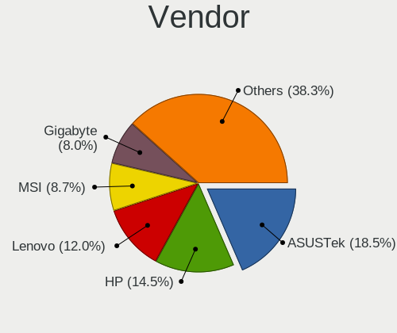
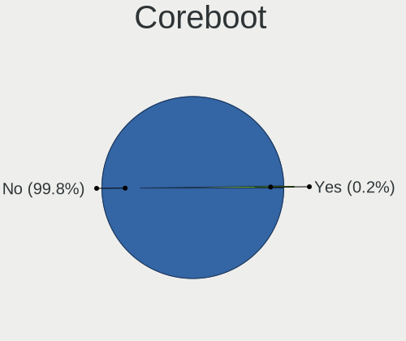
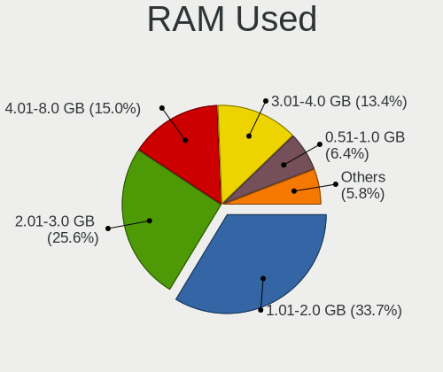
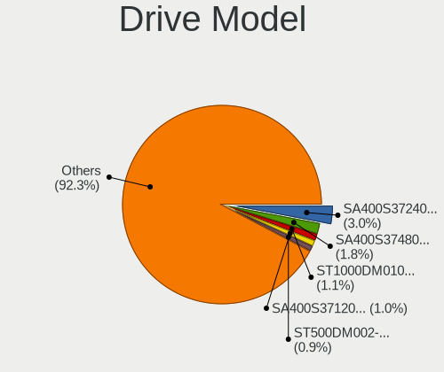
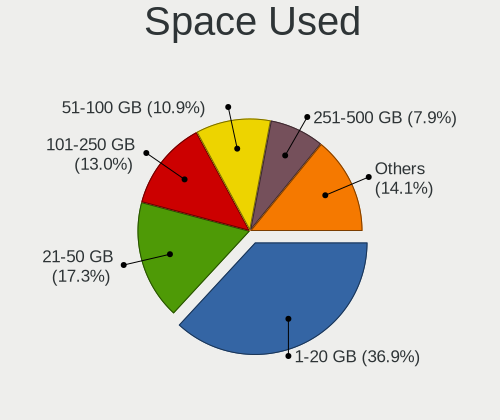
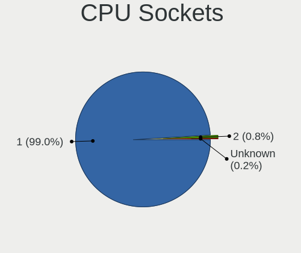
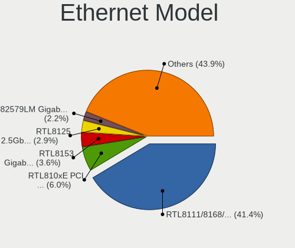
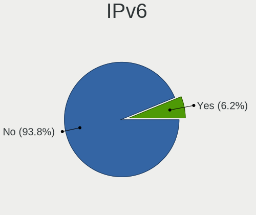
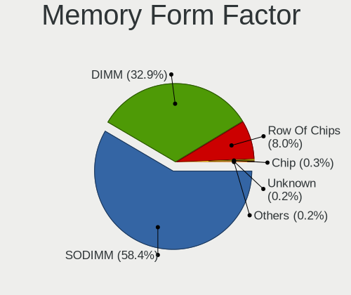

Linux in Spain - Tested Hardware & Statistics
---------------------------------------------

A project to collect tested hardware configurations for Linux in Spain.

Anyone can contribute to this report by the [hw-probe](https://github.com/linuxhw/hw-probe) tool:

    sudo -E hw-probe -all -upload

Please contribute! Especially if your hardware is rare.

This is a report for all computer types. See also reports for [desktops](/Location/Spain/Desktop/README.md) and [notebooks](/Location/Spain/Notebook/README.md).

Contents
--------

* [ Test Cases ](#test-cases)

* [ System ](#system)
  - [ OS                       ](#os)
  - [ OS Family                ](#os-family)
  - [ Kernel                   ](#kernel)
  - [ Kernel Family            ](#kernel-family)
  - [ Kernel Major Ver.        ](#kernel-major-ver)
  - [ Arch                     ](#arch)
  - [ DE                       ](#de)
  - [ Display Server           ](#display-server)
  - [ Display Manager          ](#display-manager)
  - [ OS Lang                  ](#os-lang)
  - [ Boot Mode                ](#boot-mode)
  - [ Filesystem               ](#filesystem)
  - [ Part. scheme             ](#part-scheme)
  - [ Dual Boot with Linux/BSD ](#dual-boot-with-linuxbsd)
  - [ Dual Boot (Win)          ](#dual-boot-win)

* [ Board ](#board)
  - [ Vendor                   ](#vendor)
  - [ Model                    ](#model)
  - [ Model Family             ](#model-family)
  - [ MFG Year                 ](#mfg-year)
  - [ Form Factor              ](#form-factor)
  - [ Secure Boot              ](#secure-boot)
  - [ Coreboot                 ](#coreboot)
  - [ RAM Size                 ](#ram-size)
  - [ RAM Used                 ](#ram-used)
  - [ Total Drives             ](#total-drives)
  - [ Has CD-ROM               ](#has-cd-rom)
  - [ Has Ethernet             ](#has-ethernet)
  - [ Has WiFi                 ](#has-wifi)
  - [ Has Bluetooth            ](#has-bluetooth)

* [ Location ](#location)
  - [ Country                  ](#country)
  - [ City                     ](#city)

* [ Drives ](#drives)
  - [ Drive Vendor             ](#drive-vendor)
  - [ Drive Model              ](#drive-model)
  - [ HDD Vendor               ](#hdd-vendor)
  - [ SSD Vendor               ](#ssd-vendor)
  - [ Drive Kind               ](#drive-kind)
  - [ Drive Connector          ](#drive-connector)
  - [ Drive Size               ](#drive-size)
  - [ Space Total              ](#space-total)
  - [ Space Used               ](#space-used)
  - [ Malfunc. Drives          ](#malfunc-drives)
  - [ Malfunc. Drive Vendor    ](#malfunc-drive-vendor)
  - [ Malfunc. HDD Vendor      ](#malfunc-hdd-vendor)
  - [ Malfunc. Drive Kind      ](#malfunc-drive-kind)
  - [ Failed Drives            ](#failed-drives)
  - [ Failed Drive Vendor      ](#failed-drive-vendor)
  - [ Drive Status             ](#drive-status)

* [ Storage controller ](#storage-controller)
  - [ Storage Vendor           ](#storage-vendor)
  - [ Storage Model            ](#storage-model)
  - [ Storage Kind             ](#storage-kind)

* [ Processor ](#processor)
  - [ CPU Vendor               ](#cpu-vendor)
  - [ CPU Model                ](#cpu-model)
  - [ CPU Model Family         ](#cpu-model-family)
  - [ CPU Cores                ](#cpu-cores)
  - [ CPU Sockets              ](#cpu-sockets)
  - [ CPU Threads              ](#cpu-threads)
  - [ CPU Op-Modes             ](#cpu-op-modes)
  - [ CPU Microcode            ](#cpu-microcode)
  - [ CPU Microarch            ](#cpu-microarch)

* [ Graphics ](#graphics)
  - [ GPU Vendor               ](#gpu-vendor)
  - [ GPU Model                ](#gpu-model)
  - [ GPU Combo                ](#gpu-combo)
  - [ GPU Driver               ](#gpu-driver)
  - [ GPU Memory               ](#gpu-memory)

* [ Monitor ](#monitor)
  - [ Monitor Vendor           ](#monitor-vendor)
  - [ Monitor Model            ](#monitor-model)
  - [ Monitor Resolution       ](#monitor-resolution)
  - [ Monitor Diagonal         ](#monitor-diagonal)
  - [ Monitor Width            ](#monitor-width)
  - [ Aspect Ratio             ](#aspect-ratio)
  - [ Monitor Area             ](#monitor-area)
  - [ Pixel Density            ](#pixel-density)
  - [ Multiple Monitors        ](#multiple-monitors)

* [ Network ](#network)
  - [ Net Controller Vendor    ](#net-controller-vendor)
  - [ Net Controller Model     ](#net-controller-model)
  - [ Wireless Vendor          ](#wireless-vendor)
  - [ Wireless Model           ](#wireless-model)
  - [ Ethernet Vendor          ](#ethernet-vendor)
  - [ Ethernet Model           ](#ethernet-model)
  - [ Net Controller Kind      ](#net-controller-kind)
  - [ Used Controller          ](#used-controller)
  - [ NICs                     ](#nics)
  - [ IPv6                     ](#ipv6)

* [ Bluetooth ](#bluetooth)
  - [ Bluetooth Vendor         ](#bluetooth-vendor)
  - [ Bluetooth Model          ](#bluetooth-model)

* [ Sound ](#sound)
  - [ Sound Vendor             ](#sound-vendor)
  - [ Sound Model              ](#sound-model)

* [ Memory ](#memory)
  - [ Memory Vendor            ](#memory-vendor)
  - [ Memory Model             ](#memory-model)
  - [ Memory Kind              ](#memory-kind)
  - [ Memory Form Factor       ](#memory-form-factor)
  - [ Memory Size              ](#memory-size)
  - [ Memory Speed             ](#memory-speed)

* [ Printers & scanners ](#printers--scanners)
  - [ Printer Vendor           ](#printer-vendor)
  - [ Printer Model            ](#printer-model)
  - [ Scanner Vendor           ](#scanner-vendor)
  - [ Scanner Model            ](#scanner-model)

* [ Camera ](#camera)
  - [ Camera Vendor            ](#camera-vendor)
  - [ Camera Model             ](#camera-model)

* [ Security ](#security)
  - [ Fingerprint Vendor       ](#fingerprint-vendor)
  - [ Fingerprint Model        ](#fingerprint-model)
  - [ Chipcard Vendor          ](#chipcard-vendor)
  - [ Chipcard Model           ](#chipcard-model)

* [ Unsupported ](#unsupported)
  - [ Unsupported Devices      ](#unsupported-devices)
  - [ Unsupported Device Types ](#unsupported-device-types)

Test Cases
----------

Total: 7296

| Vendor        | Model                       | Form-Factor | Probe                                                      | Date         |
|---------------|-----------------------------|-------------|------------------------------------------------------------|--------------|
| Chuwi         | GemiBook Pro                | Notebook    | [41b51a471d](https://linux-hardware.org/?probe=41b51a471d) | Apr 01, 2023 |
| Chuwi         | GemiBook Pro                | Notebook    | [fc4116204b](https://linux-hardware.org/?probe=fc4116204b) | Apr 01, 2023 |
| Lenovo        | IdeaPad 510-15IKB 80SV      | Notebook    | [6ab0a0226d](https://linux-hardware.org/?probe=6ab0a0226d) | Apr 01, 2023 |
| MSI           | B550M PRO-VDH WIFI          | Desktop     | [e3a13c69ef](https://linux-hardware.org/?probe=e3a13c69ef) | Apr 01, 2023 |
| Gigabyte      | F2A88XM-HD3                 | Desktop     | [39bc576f7f](https://linux-hardware.org/?probe=39bc576f7f) | Apr 01, 2023 |
| MSI           | H310M PRO-VDH PLUS          | Desktop     | [369bd03522](https://linux-hardware.org/?probe=369bd03522) | Apr 01, 2023 |
| Intel         | Kabylake Platform           | Notebook    | [2b0fd79264](https://linux-hardware.org/?probe=2b0fd79264) | Mar 31, 2023 |
| Acer          | Aspire E5-571               | Notebook    | [45887eb5f3](https://linux-hardware.org/?probe=45887eb5f3) | Mar 31, 2023 |
| HP            | Pavilion Aero Laptop 13-... | Notebook    | [59b2b4e152](https://linux-hardware.org/?probe=59b2b4e152) | Mar 31, 2023 |
| MSI           | Modern 15 A5M               | Notebook    | [2a00bed043](https://linux-hardware.org/?probe=2a00bed043) | Mar 31, 2023 |
| ASUSTek       | X551MA                      | Notebook    | [5ea823d079](https://linux-hardware.org/?probe=5ea823d079) | Mar 31, 2023 |
| Apple         | Mac-F4238CC8 PVT            | All in one  | [c767575f27](https://linux-hardware.org/?probe=c767575f27) | Mar 31, 2023 |
| Apple         | MacBookPro9,2               | Notebook    | [8c60cf0ec1](https://linux-hardware.org/?probe=8c60cf0ec1) | Mar 31, 2023 |
| MSI           | PRO X670-P WIFI             | Desktop     | [bb72de54b6](https://linux-hardware.org/?probe=bb72de54b6) | Mar 31, 2023 |
| HP            | 1998                        | Desktop     | [c47c52dfc6](https://linux-hardware.org/?probe=c47c52dfc6) | Mar 31, 2023 |
| Gigabyte      | B250M-DS3H-CF               | Desktop     | [d72978731a](https://linux-hardware.org/?probe=d72978731a) | Mar 30, 2023 |
| Gigabyte      | A520 AORUS ELITE            | Desktop     | [f7f74305ba](https://linux-hardware.org/?probe=f7f74305ba) | Mar 30, 2023 |
| MSI           | B450M BAZOOKA V2            | Desktop     | [7888e091f7](https://linux-hardware.org/?probe=7888e091f7) | Mar 30, 2023 |
| Dell          | G15 5515                    | Notebook    | [7bb6311632](https://linux-hardware.org/?probe=7bb6311632) | Mar 30, 2023 |
| MSI           | PRO X670-P WIFI             | Desktop     | [ed35fbea6c](https://linux-hardware.org/?probe=ed35fbea6c) | Mar 30, 2023 |
| Lenovo        | IdeaPad 3 15ITL6 82H8       | Notebook    | [faa3d2b7ad](https://linux-hardware.org/?probe=faa3d2b7ad) | Mar 30, 2023 |
| ASUSTek       | ZenBook UX333FA_UX333FA     | Notebook    | [e7e49e22ba](https://linux-hardware.org/?probe=e7e49e22ba) | Mar 30, 2023 |
| ASUSTek       | ROG STRIX B550-F GAMING     | Desktop     | [244ffc8736](https://linux-hardware.org/?probe=244ffc8736) | Mar 30, 2023 |
| ASUSTek       | K53SD                       | Notebook    | [81710aaa51](https://linux-hardware.org/?probe=81710aaa51) | Mar 30, 2023 |
| Primux Tec... | A173                        | All in one  | [f31f5f63b9](https://linux-hardware.org/?probe=f31f5f63b9) | Mar 29, 2023 |
| Lenovo        | ThinkPad T14s Gen 2i 20W... | Notebook    | [a9e7ad7ecd](https://linux-hardware.org/?probe=a9e7ad7ecd) | Mar 29, 2023 |
| Primux Tec... | A173                        | All in one  | [95e3fd6b4b](https://linux-hardware.org/?probe=95e3fd6b4b) | Mar 29, 2023 |
| HUAWEI        | BOHK-WAX9X                  | Notebook    | [3836173aad](https://linux-hardware.org/?probe=3836173aad) | Mar 29, 2023 |
| Lenovo        | ThinkPad T480 20L6S3H102    | Notebook    | [cf75eeabd5](https://linux-hardware.org/?probe=cf75eeabd5) | Mar 29, 2023 |
| HP            | 1495                        | Desktop     | [75702f8b1d](https://linux-hardware.org/?probe=75702f8b1d) | Mar 29, 2023 |
| HP            | 1495                        | Desktop     | [c342260a77](https://linux-hardware.org/?probe=c342260a77) | Mar 29, 2023 |
| ASUSTek       | ROG STRIX B365-G GAMING     | Desktop     | [307a8bce3e](https://linux-hardware.org/?probe=307a8bce3e) | Mar 29, 2023 |
| HUAWEI        | BOHK-WAX9X                  | Notebook    | [46a8636dfd](https://linux-hardware.org/?probe=46a8636dfd) | Mar 29, 2023 |
| Lenovo        | Legion 5 15ACH6H 82JU       | Notebook    | [ccb2d60f5c](https://linux-hardware.org/?probe=ccb2d60f5c) | Mar 29, 2023 |
| ASUSTek       | N550JX                      | Notebook    | [a505a62a71](https://linux-hardware.org/?probe=a505a62a71) | Mar 28, 2023 |
| ASUSTek       | ROG STRIX B365-G GAMING     | Desktop     | [b924b0ff06](https://linux-hardware.org/?probe=b924b0ff06) | Mar 28, 2023 |
| TEKNOSERVI... | NJ5x_NJ7xLU                 | Notebook    | [2a0feae3f9](https://linux-hardware.org/?probe=2a0feae3f9) | Mar 28, 2023 |
| Notebook      | L140CU                      | Notebook    | [98b71e9790](https://linux-hardware.org/?probe=98b71e9790) | Mar 28, 2023 |
| Dell          | Precision 5540              | Notebook    | [f9e20de07f](https://linux-hardware.org/?probe=f9e20de07f) | Mar 28, 2023 |
| Lenovo        | IdeaPad 330-15ICH 81FK      | Notebook    | [66a10dc91a](https://linux-hardware.org/?probe=66a10dc91a) | Mar 27, 2023 |
| Lenovo        | IdeaPad 330-15ICH 81FK      | Notebook    | [ef962f373f](https://linux-hardware.org/?probe=ef962f373f) | Mar 27, 2023 |
| HUAWEI        | KLVD-WXX9                   | Notebook    | [574bb4272c](https://linux-hardware.org/?probe=574bb4272c) | Mar 27, 2023 |
| Dell          | Precision 3571              | Notebook    | [13d1ce389d](https://linux-hardware.org/?probe=13d1ce389d) | Mar 27, 2023 |
| MSI           | MS-AA8B 100                 | All in one  | [8f698075ee](https://linux-hardware.org/?probe=8f698075ee) | Mar 27, 2023 |
| Acer          | Veriton M4630G V:1.0        | Desktop     | [7fba52ef43](https://linux-hardware.org/?probe=7fba52ef43) | Mar 27, 2023 |
| IP3 Tech      | GB3B                        | Mini pc     | [58b3789af3](https://linux-hardware.org/?probe=58b3789af3) | Mar 27, 2023 |
| Lenovo        | ThinkPad X1 Carbon Gen 9... | Notebook    | [bddc9116d1](https://linux-hardware.org/?probe=bddc9116d1) | Mar 27, 2023 |
| Lenovo        | ThinkPad L14 Gen 3 21C10... | Notebook    | [6a8962feba](https://linux-hardware.org/?probe=6a8962feba) | Mar 27, 2023 |
| Samsung       | N150P/N210P/N220P           | Notebook    | [70d943698c](https://linux-hardware.org/?probe=70d943698c) | Mar 27, 2023 |
| HUAWEI        | KLVD-WXX9                   | Notebook    | [ca83615d40](https://linux-hardware.org/?probe=ca83615d40) | Mar 26, 2023 |
| HUAWEI        | KLVD-WXX9                   | Notebook    | [285462b197](https://linux-hardware.org/?probe=285462b197) | Mar 26, 2023 |
| HUAWEI        | KLVD-WXX9                   | Notebook    | [fc40632056](https://linux-hardware.org/?probe=fc40632056) | Mar 26, 2023 |
| Dell          | G15 5515                    | Notebook    | [3af5157823](https://linux-hardware.org/?probe=3af5157823) | Mar 26, 2023 |
| ASUSTek       | Zephyrus M GM501GS          | Notebook    | [68017924d7](https://linux-hardware.org/?probe=68017924d7) | Mar 26, 2023 |
| MSI           | G41M-P33 Combo              | Desktop     | [6a3fedcc68](https://linux-hardware.org/?probe=6a3fedcc68) | Mar 26, 2023 |
| HUAWEI        | BOD-WXX9                    | Notebook    | [bee83a6b50](https://linux-hardware.org/?probe=bee83a6b50) | Mar 26, 2023 |
| Chuwi         | HeroBook Air                | Notebook    | [836112a53f](https://linux-hardware.org/?probe=836112a53f) | Mar 26, 2023 |
| Lenovo        | Y520-15IKBN 80WK            | Notebook    | [8a6705ba5a](https://linux-hardware.org/?probe=8a6705ba5a) | Mar 26, 2023 |
| Lenovo        | Y520-15IKBN 80WK            | Notebook    | [d1427e69b3](https://linux-hardware.org/?probe=d1427e69b3) | Mar 26, 2023 |
| Notebook      | NL40_50CU                   | Notebook    | [4870d52d1e](https://linux-hardware.org/?probe=4870d52d1e) | Mar 25, 2023 |
| Gigabyte      | AERO 15 XD                  | Notebook    | [51fd5b8510](https://linux-hardware.org/?probe=51fd5b8510) | Mar 25, 2023 |
| Lenovo        | IdeaPad 3 15ITL6 82H8       | Notebook    | [05b2003fc0](https://linux-hardware.org/?probe=05b2003fc0) | Mar 25, 2023 |
| MSI           | PE62 7RD                    | Notebook    | [de18d40d94](https://linux-hardware.org/?probe=de18d40d94) | Mar 25, 2023 |
| Lenovo        | G580 2189                   | Notebook    | [edba6da5b6](https://linux-hardware.org/?probe=edba6da5b6) | Mar 25, 2023 |
| HP            | 255 G7 Notebook PC          | Notebook    | [2097578b64](https://linux-hardware.org/?probe=2097578b64) | Mar 25, 2023 |
| Dynabook      | PORTEGE X40L-K              | Notebook    | [9f4a50bc98](https://linux-hardware.org/?probe=9f4a50bc98) | Mar 25, 2023 |
| Lenovo        | IdeaPad Gaming 3 15ARH05... | Notebook    | [548c06032b](https://linux-hardware.org/?probe=548c06032b) | Mar 24, 2023 |
| Gigabyte      | GA-MA790XT-UD4P             | Desktop     | [8a0cc5a4cb](https://linux-hardware.org/?probe=8a0cc5a4cb) | Mar 24, 2023 |
| ASUSTek       | K52Jr                       | Notebook    | [a88997ecfd](https://linux-hardware.org/?probe=a88997ecfd) | Mar 24, 2023 |
| HP            | 1790                        | Desktop     | [1a468c1b1c](https://linux-hardware.org/?probe=1a468c1b1c) | Mar 24, 2023 |
| Dell          | G15 5515                    | Notebook    | [3510cdb4cf](https://linux-hardware.org/?probe=3510cdb4cf) | Mar 24, 2023 |
| ASRock        | H110M-HDV                   | Desktop     | [cfe369e6b8](https://linux-hardware.org/?probe=cfe369e6b8) | Mar 24, 2023 |
| Gigabyte      | B450M DS3H-CF               | Desktop     | [81273bd2b0](https://linux-hardware.org/?probe=81273bd2b0) | Mar 24, 2023 |
| Gigabyte      | B450M DS3H-CF               | Desktop     | [2db2fb4a5a](https://linux-hardware.org/?probe=2db2fb4a5a) | Mar 24, 2023 |
| Gigabyte      | B450M DS3H-CF               | Desktop     | [79cbdbc9c1](https://linux-hardware.org/?probe=79cbdbc9c1) | Mar 24, 2023 |
| HP            | 2000                        | Notebook    | [9820715e60](https://linux-hardware.org/?probe=9820715e60) | Mar 24, 2023 |
| ASUSTek       | GL752VW                     | Notebook    | [8e1cd2ea46](https://linux-hardware.org/?probe=8e1cd2ea46) | Mar 24, 2023 |
| Chuwi         | GemiBook Pro                | Notebook    | [4054877ef0](https://linux-hardware.org/?probe=4054877ef0) | Mar 24, 2023 |
| Chuwi         | GemiBook Pro                | Notebook    | [da37222f12](https://linux-hardware.org/?probe=da37222f12) | Mar 24, 2023 |
| HP            | 2000                        | Notebook    | [87ba6d3696](https://linux-hardware.org/?probe=87ba6d3696) | Mar 24, 2023 |
| Lenovo        | Legion 5 15ACH6H 82JU       | Notebook    | [ca7d9a9342](https://linux-hardware.org/?probe=ca7d9a9342) | Mar 24, 2023 |
| ASUSTek       | PRIME Z690-P                | Desktop     | [6b3cdb2b1a](https://linux-hardware.org/?probe=6b3cdb2b1a) | Mar 23, 2023 |
| ASUSTek       | PRIME H510M-E               | Desktop     | [fc5894dcb4](https://linux-hardware.org/?probe=fc5894dcb4) | Mar 23, 2023 |
| ASUSTek       | ASUS TUF Gaming F15 FX50... | Notebook    | [e4a3f70cbf](https://linux-hardware.org/?probe=e4a3f70cbf) | Mar 23, 2023 |
| ASUSTek       | ASUS TUF Gaming F15 FX50... | Notebook    | [d55de052b1](https://linux-hardware.org/?probe=d55de052b1) | Mar 23, 2023 |
| Lenovo        | G500 20236                  | Notebook    | [8688a57db6](https://linux-hardware.org/?probe=8688a57db6) | Mar 22, 2023 |
| ASUSTek       | PB60                        | Desktop     | [ec438486aa](https://linux-hardware.org/?probe=ec438486aa) | Mar 22, 2023 |
| Packard Be... | EasyNote LJ75               | Notebook    | [1a3b095372](https://linux-hardware.org/?probe=1a3b095372) | Mar 22, 2023 |
| MSI           | MEG X570 ACE                | Desktop     | [c2bab115eb](https://linux-hardware.org/?probe=c2bab115eb) | Mar 22, 2023 |
| HP            | OMEN by Laptop 16-c0xxx     | Notebook    | [4ee498d9fc](https://linux-hardware.org/?probe=4ee498d9fc) | Mar 22, 2023 |
| Dell          | G3 3579                     | Notebook    | [b6f8dd5ffe](https://linux-hardware.org/?probe=b6f8dd5ffe) | Mar 22, 2023 |
| Acer          | Aspire ES1-512              | Notebook    | [901b9b1b6b](https://linux-hardware.org/?probe=901b9b1b6b) | Mar 21, 2023 |
| Acer          | Extensa 2510G               | Notebook    | [1ac79f58a4](https://linux-hardware.org/?probe=1ac79f58a4) | Mar 21, 2023 |
| Gigabyte      | Z77X-D3H                    | Desktop     | [aab84f14ed](https://linux-hardware.org/?probe=aab84f14ed) | Mar 21, 2023 |
| ASUSTek       | Maximus VI HERO             | Desktop     | [deaf7b9049](https://linux-hardware.org/?probe=deaf7b9049) | Mar 21, 2023 |
| ASUSTek       | ROG STRIX B650-A GAMING ... | Desktop     | [293e9a941a](https://linux-hardware.org/?probe=293e9a941a) | Mar 20, 2023 |
| Lenovo        | IdeaPad 330-15ARR 81D2      | Notebook    | [48de9eb9e3](https://linux-hardware.org/?probe=48de9eb9e3) | Mar 20, 2023 |
| Lenovo        | IdeaPad 100-15IBY 80MJ      | Notebook    | [e7344d03c0](https://linux-hardware.org/?probe=e7344d03c0) | Mar 20, 2023 |
| MSI           | PRO Z790-P WIFI             | Desktop     | [038bd3a32b](https://linux-hardware.org/?probe=038bd3a32b) | Mar 20, 2023 |
| HP            | 250 G4                      | Notebook    | [46e0314fb1](https://linux-hardware.org/?probe=46e0314fb1) | Mar 20, 2023 |
| MSI           | Pulse GL66 12UEK            | Notebook    | [9790d0bb28](https://linux-hardware.org/?probe=9790d0bb28) | Mar 20, 2023 |
| HP            | 158A                        | Desktop     | [61467de4d5](https://linux-hardware.org/?probe=61467de4d5) | Mar 19, 2023 |
| ASUSTek       | ASUS TUF Dash F15 FX516P... | Notebook    | [4223bbbf7e](https://linux-hardware.org/?probe=4223bbbf7e) | Mar 19, 2023 |
| Lenovo        | IdeaPad 330-15IKB 81DE      | Notebook    | [77b7fd07a4](https://linux-hardware.org/?probe=77b7fd07a4) | Mar 19, 2023 |
| ASUSTek       | ROG STRIX Z590-E GAMING ... | Desktop     | [f048ae8dec](https://linux-hardware.org/?probe=f048ae8dec) | Mar 19, 2023 |
| Acer          | Aspire M3-581G              | Notebook    | [1434607f7e](https://linux-hardware.org/?probe=1434607f7e) | Mar 19, 2023 |
| HUAWEI        | NBLK-WAX9X                  | Notebook    | [5c0e12ebd0](https://linux-hardware.org/?probe=5c0e12ebd0) | Mar 19, 2023 |
| Supermicro    | X10SRL-F                    | Server      | [96e896465a](https://linux-hardware.org/?probe=96e896465a) | Mar 19, 2023 |
| Acer          | Aspire E1-532               | Notebook    | [ed3693c1c8](https://linux-hardware.org/?probe=ed3693c1c8) | Mar 18, 2023 |
| Chuwi         | HeroBook Air                | Notebook    | [e9d0a5dd9a](https://linux-hardware.org/?probe=e9d0a5dd9a) | Mar 18, 2023 |
| Chuwi         | GemiBook Pro                | Notebook    | [7bd3a3e64c](https://linux-hardware.org/?probe=7bd3a3e64c) | Mar 18, 2023 |
| HP            | 250 G8 Notebook PC          | Notebook    | [aade64a567](https://linux-hardware.org/?probe=aade64a567) | Mar 18, 2023 |
| Chuwi         | HeroBook                    | Notebook    | [7a70fa6c57](https://linux-hardware.org/?probe=7a70fa6c57) | Mar 17, 2023 |
| MSI           | GF63 Thin 9SC               | Notebook    | [88dcbd2740](https://linux-hardware.org/?probe=88dcbd2740) | Mar 17, 2023 |
| Lenovo        | MIIX 320-10ICR 80XF         | Tablet      | [09fac43b8e](https://linux-hardware.org/?probe=09fac43b8e) | Mar 17, 2023 |
| Lenovo        | MIIX 320-10ICR 80XF         | Tablet      | [c94efea21b](https://linux-hardware.org/?probe=c94efea21b) | Mar 17, 2023 |
| Apple         | MacBook8,1                  | Notebook    | [a3ef4e5a56](https://linux-hardware.org/?probe=a3ef4e5a56) | Mar 16, 2023 |
| Apple         | Mac-F65AE981FFA204ED Mac... | Mini pc     | [afd7547cd1](https://linux-hardware.org/?probe=afd7547cd1) | Mar 16, 2023 |
| ASRock        | H110M-HDV                   | Desktop     | [5228141efd](https://linux-hardware.org/?probe=5228141efd) | Mar 16, 2023 |
| Valve         | Jupiter                     | Notebook    | [0a2038deed](https://linux-hardware.org/?probe=0a2038deed) | Mar 16, 2023 |
| Acer          | FIH57                       | Desktop     | [ee8c95f841](https://linux-hardware.org/?probe=ee8c95f841) | Mar 16, 2023 |
| HP            | Laptop 15-db0xxx            | Notebook    | [56b19568ce](https://linux-hardware.org/?probe=56b19568ce) | Mar 16, 2023 |
| Intel         | Unknown                     | Desktop     | [b4b73aafa0](https://linux-hardware.org/?probe=b4b73aafa0) | Mar 15, 2023 |
| HP            | Pavilion Notebook           | Notebook    | [db96098c80](https://linux-hardware.org/?probe=db96098c80) | Mar 15, 2023 |
| Razer         | Blade 14 (2022) - RZ09-0... | Notebook    | [428ea81050](https://linux-hardware.org/?probe=428ea81050) | Mar 15, 2023 |
| Acer          | Aspire E5-573G              | Notebook    | [a24986d87d](https://linux-hardware.org/?probe=a24986d87d) | Mar 15, 2023 |
| HP            | Mini 210-1000               | Notebook    | [cccfcdba22](https://linux-hardware.org/?probe=cccfcdba22) | Mar 15, 2023 |
| MSI           | Katana GF66 12UC            | Notebook    | [8307fbf791](https://linux-hardware.org/?probe=8307fbf791) | Mar 14, 2023 |
| Intel         | powered classmate PC        | Notebook    | [891664a0ae](https://linux-hardware.org/?probe=891664a0ae) | Mar 14, 2023 |
| Dell          | Inspiron 14 5410            | Notebook    | [54ff309c3d](https://linux-hardware.org/?probe=54ff309c3d) | Mar 14, 2023 |
| MSI           | Stealth GS77 12UHS          | Notebook    | [fe00606a03](https://linux-hardware.org/?probe=fe00606a03) | Mar 14, 2023 |
| ASUSTek       | H110M-D                     | Desktop     | [c436834b30](https://linux-hardware.org/?probe=c436834b30) | Mar 14, 2023 |
| ZOTAC         | ZBOX-ID41                   | Mini pc     | [620812fe84](https://linux-hardware.org/?probe=620812fe84) | Mar 13, 2023 |
| Chuwi         | GemiBook Pro                | Notebook    | [f30cf91b1c](https://linux-hardware.org/?probe=f30cf91b1c) | Mar 13, 2023 |
| Valve         | Jupiter                     | Notebook    | [95598d1841](https://linux-hardware.org/?probe=95598d1841) | Mar 13, 2023 |
| ASUSTek       | P5Q PRO TURBO               | Desktop     | [44fc80c7d5](https://linux-hardware.org/?probe=44fc80c7d5) | Mar 13, 2023 |
| MSI           | B450 TOMAHAWK MAX           | Desktop     | [39d0e8595c](https://linux-hardware.org/?probe=39d0e8595c) | Mar 12, 2023 |
| ASUSTek       | ZenBook UX431FLC_UX431FL    | Notebook    | [fc75288cce](https://linux-hardware.org/?probe=fc75288cce) | Mar 12, 2023 |
| ASUSTek       | PRIME H510M-E               | Desktop     | [cf5cbabe11](https://linux-hardware.org/?probe=cf5cbabe11) | Mar 12, 2023 |
| ASUSTek       | PRIME Z590-A                | Desktop     | [751bedd6a9](https://linux-hardware.org/?probe=751bedd6a9) | Mar 12, 2023 |
| Acer          | TravelMate B113             | Notebook    | [e5f001172d](https://linux-hardware.org/?probe=e5f001172d) | Mar 12, 2023 |
| Chuwi         | GemiBook Pro                | Notebook    | [a421f89675](https://linux-hardware.org/?probe=a421f89675) | Mar 12, 2023 |
| Chuwi         | GemiBook Pro                | Notebook    | [4708653fb3](https://linux-hardware.org/?probe=4708653fb3) | Mar 12, 2023 |
| Gigabyte      | B760M AORUS ELITE AX        | Desktop     | [daf687f0a1](https://linux-hardware.org/?probe=daf687f0a1) | Mar 12, 2023 |
| Acer          | TravelMate B113             | Notebook    | [ba6dc5dcb5](https://linux-hardware.org/?probe=ba6dc5dcb5) | Mar 11, 2023 |
| Dynabook      | Satellite Pro C50-E-11H     | Notebook    | [1a37e14422](https://linux-hardware.org/?probe=1a37e14422) | Mar 11, 2023 |
| MSI           | MS-B1831                    | Desktop     | [a9bfb4f294](https://linux-hardware.org/?probe=a9bfb4f294) | Mar 11, 2023 |
| ASUSTek       | PRIME Z270-P                | Desktop     | [8f2b6b3bc1](https://linux-hardware.org/?probe=8f2b6b3bc1) | Mar 11, 2023 |
| Toshiba       | Satellite Pro L300          | Notebook    | [7c5e811612](https://linux-hardware.org/?probe=7c5e811612) | Mar 11, 2023 |
| AZW           | SER                         | Mini pc     | [86a3944105](https://linux-hardware.org/?probe=86a3944105) | Mar 11, 2023 |
| AZW           | SER                         | Mini pc     | [96c3aadd1e](https://linux-hardware.org/?probe=96c3aadd1e) | Mar 11, 2023 |
| Valve         | Jupiter                     | Notebook    | [07f6e9ed10](https://linux-hardware.org/?probe=07f6e9ed10) | Mar 10, 2023 |
| Dynabook      | Satellite Pro C50-G         | Notebook    | [835785f6a7](https://linux-hardware.org/?probe=835785f6a7) | Mar 10, 2023 |
| MSI           | GL75 Leopard 10SEK          | Notebook    | [9fdc1bd5c4](https://linux-hardware.org/?probe=9fdc1bd5c4) | Mar 10, 2023 |
| MSI           | CX61 2PC                    | Notebook    | [cb9f5fa992](https://linux-hardware.org/?probe=cb9f5fa992) | Mar 10, 2023 |
| Intel         | S2600WT2R H21573-372        | Server      | [18134c0dc1](https://linux-hardware.org/?probe=18134c0dc1) | Mar 10, 2023 |
| Intel         | S2600WT2R H21573-372        | Server      | [572cded7f3](https://linux-hardware.org/?probe=572cded7f3) | Mar 10, 2023 |
| Dell          | Latitude E5420              | Notebook    | [9b346e0658](https://linux-hardware.org/?probe=9b346e0658) | Mar 10, 2023 |
| Acer          | Aspire 5750G                | Notebook    | [b4af1eb2cb](https://linux-hardware.org/?probe=b4af1eb2cb) | Mar 10, 2023 |
| Acer          | Aspire M3-581G              | Notebook    | [65b41dc560](https://linux-hardware.org/?probe=65b41dc560) | Mar 09, 2023 |
| Gigabyte      | B760M DS3H DDR4             | Desktop     | [5df81d1297](https://linux-hardware.org/?probe=5df81d1297) | Mar 09, 2023 |
| Gigabyte      | H61M-DS2                    | Desktop     | [a40a70a964](https://linux-hardware.org/?probe=a40a70a964) | Mar 09, 2023 |
| Dell          | Latitude E6540              | Notebook    | [3bf25841b3](https://linux-hardware.org/?probe=3bf25841b3) | Mar 09, 2023 |
| Chuwi         | GemiBook Pro                | Notebook    | [23a97367b7](https://linux-hardware.org/?probe=23a97367b7) | Mar 09, 2023 |
| Dell          | 0JP3NX A01                  | Desktop     | [946f48cdf6](https://linux-hardware.org/?probe=946f48cdf6) | Mar 09, 2023 |
| FriendlyEl... | NanoPC-T4                   | Soc         | [901194d1e1](https://linux-hardware.org/?probe=901194d1e1) | Mar 09, 2023 |
| Intel         | powered classmate PC        | Notebook    | [c25d03cf3f](https://linux-hardware.org/?probe=c25d03cf3f) | Mar 09, 2023 |
| Intel         | powered classmate PC        | Notebook    | [8c62787a5b](https://linux-hardware.org/?probe=8c62787a5b) | Mar 09, 2023 |
| ASUSTek       | PRIME A320M-K               | Desktop     | [93875c7518](https://linux-hardware.org/?probe=93875c7518) | Mar 09, 2023 |
| Lenovo        | ThinkPad E15 Gen 4 21EDC... | Notebook    | [fd15fc475a](https://linux-hardware.org/?probe=fd15fc475a) | Mar 08, 2023 |
| Lenovo        | ThinkPad E15 Gen 4 21EDC... | Notebook    | [0e054a9861](https://linux-hardware.org/?probe=0e054a9861) | Mar 08, 2023 |
| HP            | Pavilion g6                 | Notebook    | [35f93de82d](https://linux-hardware.org/?probe=35f93de82d) | Mar 08, 2023 |
| ASUSTek       | K53SC                       | Notebook    | [bd182b6d80](https://linux-hardware.org/?probe=bd182b6d80) | Mar 08, 2023 |
| ASUSTek       | P5G41T-M LX                 | Desktop     | [4f55573ba6](https://linux-hardware.org/?probe=4f55573ba6) | Mar 08, 2023 |
| Sony          | SVF1521B1EW                 | Notebook    | [5b5a9dbc40](https://linux-hardware.org/?probe=5b5a9dbc40) | Mar 08, 2023 |
| Intel         | JSL MRD                     | Desktop     | [ac75dbf1f6](https://linux-hardware.org/?probe=ac75dbf1f6) | Mar 08, 2023 |
| HP            | 0AACh                       | Desktop     | [2f4ba72670](https://linux-hardware.org/?probe=2f4ba72670) | Mar 08, 2023 |
| Acer          | Aspire 5740                 | Notebook    | [37c0c0602c](https://linux-hardware.org/?probe=37c0c0602c) | Mar 08, 2023 |
| ASUSTek       | K54HR                       | Notebook    | [a7c688e9be](https://linux-hardware.org/?probe=a7c688e9be) | Mar 08, 2023 |
| ASUSTek       | ROG STRIX B365-G GAMING     | Desktop     | [7c17068a98](https://linux-hardware.org/?probe=7c17068a98) | Mar 08, 2023 |
| HP            | 0AA8h                       | Desktop     | [6552e8b371](https://linux-hardware.org/?probe=6552e8b371) | Mar 07, 2023 |
| Intel         | DH55TC AAE70932-303         | Desktop     | [4e2cd40175](https://linux-hardware.org/?probe=4e2cd40175) | Mar 07, 2023 |
| Lenovo        | ThinkPad P1 Gen 2 20QUS1... | Notebook    | [798d6e74da](https://linux-hardware.org/?probe=798d6e74da) | Mar 06, 2023 |
| HP            | EliteBook 830 G7 Noteboo... | Notebook    | [cee8496315](https://linux-hardware.org/?probe=cee8496315) | Mar 06, 2023 |
| HP            | 2B0A                        | All in one  | [35f88e8f33](https://linux-hardware.org/?probe=35f88e8f33) | Mar 06, 2023 |
| Notebook      | N2x0WU                      | Notebook    | [4948392f03](https://linux-hardware.org/?probe=4948392f03) | Mar 06, 2023 |
| Fujitsu Si... | STYLISTIC ST6012            | Notebook    | [0d9314f673](https://linux-hardware.org/?probe=0d9314f673) | Mar 06, 2023 |
| HP            | 87A4 10100                  | All in one  | [6b92aede76](https://linux-hardware.org/?probe=6b92aede76) | Mar 05, 2023 |
| ASUSTek       | K30AD_M31AD_M51AD_M32AD     | Desktop     | [c6bb0ba4a6](https://linux-hardware.org/?probe=c6bb0ba4a6) | Mar 05, 2023 |
| ASUSTek       | P8P67 DELUXE                | Desktop     | [31e4b3ada8](https://linux-hardware.org/?probe=31e4b3ada8) | Mar 05, 2023 |
| Lenovo        | ThinkPad T15p Gen 1 20TN... | Notebook    | [0811163639](https://linux-hardware.org/?probe=0811163639) | Mar 05, 2023 |
| Lenovo        | Legion 5 15ACH6H 82JU       | Notebook    | [42469e8f5d](https://linux-hardware.org/?probe=42469e8f5d) | Mar 05, 2023 |
| Lenovo        | IdeaPad Gaming 3 15IAH7 ... | Notebook    | [b73251069c](https://linux-hardware.org/?probe=b73251069c) | Mar 05, 2023 |
| Gigabyte      | EX58-UD5                    | Desktop     | [8805f0bce5](https://linux-hardware.org/?probe=8805f0bce5) | Mar 05, 2023 |
| ASUSTek       | Pro WS WRX80E-SAGE SE WI... | Desktop     | [f4cf2185ea](https://linux-hardware.org/?probe=f4cf2185ea) | Mar 04, 2023 |
| ASUSTek       | P7H55-M LX                  | Desktop     | [79e06d188d](https://linux-hardware.org/?probe=79e06d188d) | Mar 04, 2023 |
| Intel         | powered classmate PC        | Notebook    | [bfd724fd2f](https://linux-hardware.org/?probe=bfd724fd2f) | Mar 04, 2023 |
| Acer          | Aspire A315-43              | Notebook    | [c9efc71e60](https://linux-hardware.org/?probe=c9efc71e60) | Mar 04, 2023 |
| Gigabyte      | H61M-DS2                    | Desktop     | [49462bd855](https://linux-hardware.org/?probe=49462bd855) | Mar 04, 2023 |
| Gigabyte      | B85M-DS3H-A                 | Desktop     | [914a9990c4](https://linux-hardware.org/?probe=914a9990c4) | Mar 04, 2023 |
| Gigabyte      | H61M-DS2                    | Desktop     | [c7cee84058](https://linux-hardware.org/?probe=c7cee84058) | Mar 04, 2023 |
| Lenovo        | 310B SDK0J40697 WIN 3305... | Desktop     | [a9c39c2b82](https://linux-hardware.org/?probe=a9c39c2b82) | Mar 04, 2023 |
| MSI           | B250M MORTAR                | Desktop     | [a4e8543fe2](https://linux-hardware.org/?probe=a4e8543fe2) | Mar 03, 2023 |
| MSI           | MAG X570 TOMAHAWK WIFI      | Desktop     | [5033b7233d](https://linux-hardware.org/?probe=5033b7233d) | Mar 03, 2023 |
| Chuwi         | UBook                       | Tablet      | [6cbfc99f43](https://linux-hardware.org/?probe=6cbfc99f43) | Mar 03, 2023 |
| Chuwi         | HeroBook Air                | Notebook    | [43248e0ae9](https://linux-hardware.org/?probe=43248e0ae9) | Mar 03, 2023 |
| Lenovo        | ThinkPad E490 20N8002ASP    | Notebook    | [9b91ef4633](https://linux-hardware.org/?probe=9b91ef4633) | Mar 02, 2023 |
| ASUSTek       | M5A78L-M PLUS/USB3          | Desktop     | [8f61a5507b](https://linux-hardware.org/?probe=8f61a5507b) | Mar 02, 2023 |
| ASUSTek       | M5A97 R2.0                  | Desktop     | [0e66878368](https://linux-hardware.org/?probe=0e66878368) | Mar 02, 2023 |
| HPE           | ProLiant MicroServer Gen... | Desktop     | [11c1bf8316](https://linux-hardware.org/?probe=11c1bf8316) | Mar 02, 2023 |
| ASUSTek       | T100HAN                     | Notebook    | [5729d41d01](https://linux-hardware.org/?probe=5729d41d01) | Mar 02, 2023 |
| Intel         | X79 V2.72A                  | Desktop     | [ae4efdfbc5](https://linux-hardware.org/?probe=ae4efdfbc5) | Mar 02, 2023 |
| Toshiba       | Satellite A100              | Notebook    | [51e1183b15](https://linux-hardware.org/?probe=51e1183b15) | Mar 02, 2023 |
| Gigabyte      | H81M-S1                     | Desktop     | [0a38248462](https://linux-hardware.org/?probe=0a38248462) | Mar 02, 2023 |
| Acer          | TravelMate 5720             | Notebook    | [2e0c5ff8f1](https://linux-hardware.org/?probe=2e0c5ff8f1) | Mar 01, 2023 |
| ASRock        | Q1900M Pro3                 | Desktop     | [ef9e90045e](https://linux-hardware.org/?probe=ef9e90045e) | Mar 01, 2023 |
| MSI           | P65 Creator 8RD             | Notebook    | [ea8be773a9](https://linux-hardware.org/?probe=ea8be773a9) | Mar 01, 2023 |
| ASUSTek       | Z170 PRO GAMING             | Desktop     | [50520b2cf0](https://linux-hardware.org/?probe=50520b2cf0) | Mar 01, 2023 |
| MSI           | P65 Creator 8RD             | Notebook    | [2b97507181](https://linux-hardware.org/?probe=2b97507181) | Mar 01, 2023 |
| Lenovo        | ThinkPad X1 Carbon 5th 2... | Notebook    | [3a2e77122d](https://linux-hardware.org/?probe=3a2e77122d) | Mar 01, 2023 |
| ASUSTek       | GL752VW                     | Notebook    | [a3e7201f2e](https://linux-hardware.org/?probe=a3e7201f2e) | Mar 01, 2023 |
| Lenovo        | Bantry CRB 31900058 STD     | Desktop     | [268413a47c](https://linux-hardware.org/?probe=268413a47c) | Mar 01, 2023 |
| ASUSTek       | ROG STRIX Z370-E GAMING     | Desktop     | [84a1a2c71e](https://linux-hardware.org/?probe=84a1a2c71e) | Mar 01, 2023 |
| Lenovo        | Bantry CRB 31900058 STD     | Desktop     | [169e938f25](https://linux-hardware.org/?probe=169e938f25) | Mar 01, 2023 |
| HP            | OMEN by Laptop 16-c0xxx     | Notebook    | [1c09e468d0](https://linux-hardware.org/?probe=1c09e468d0) | Mar 01, 2023 |
| ASUSTek       | ROG STRIX Z590-E GAMING ... | Desktop     | [8f8eaa9d53](https://linux-hardware.org/?probe=8f8eaa9d53) | Mar 01, 2023 |
| ASUSTek       | T100HAN                     | Notebook    | [a8b1a02128](https://linux-hardware.org/?probe=a8b1a02128) | Mar 01, 2023 |
| ASUSTek       | Z170-A                      | Desktop     | [a4d77f98eb](https://linux-hardware.org/?probe=a4d77f98eb) | Feb 28, 2023 |
| ASUSTek       | AT4NM10T-I                  | Desktop     | [921aebe62a](https://linux-hardware.org/?probe=921aebe62a) | Feb 28, 2023 |
| Lenovo        | IdeaPad 330-15ICH 81FK      | Notebook    | [08f2d1cca5](https://linux-hardware.org/?probe=08f2d1cca5) | Feb 28, 2023 |
| ASUSTek       | T100HAN                     | Notebook    | [4f835a4f35](https://linux-hardware.org/?probe=4f835a4f35) | Feb 28, 2023 |
| Dell          | G5 5590                     | Notebook    | [75f2235434](https://linux-hardware.org/?probe=75f2235434) | Feb 28, 2023 |
| ASUSTek       | X550JD                      | Notebook    | [6804351029](https://linux-hardware.org/?probe=6804351029) | Feb 28, 2023 |
| ASUSTek       | AT4NM10T-I                  | Desktop     | [fa2df8125a](https://linux-hardware.org/?probe=fa2df8125a) | Feb 28, 2023 |
| ASUSTek       | M5A78L-M PLUS/USB3          | Desktop     | [8cadddf432](https://linux-hardware.org/?probe=8cadddf432) | Feb 28, 2023 |
| Lenovo        | ThinkPad X1 Yoga 3rd 20L... | Convertible | [72d16085b5](https://linux-hardware.org/?probe=72d16085b5) | Feb 28, 2023 |
| Lenovo        | ThinkPad X1 Yoga 3rd 20L... | Convertible | [f03ce01ac3](https://linux-hardware.org/?probe=f03ce01ac3) | Feb 28, 2023 |
| HP            | OMEN by Laptop 16-c0xxx     | Notebook    | [c829e9e0b8](https://linux-hardware.org/?probe=c829e9e0b8) | Feb 27, 2023 |
| Apple         | MacBookPro6,2               | Notebook    | [3696f0b49e](https://linux-hardware.org/?probe=3696f0b49e) | Feb 27, 2023 |
| AMI           | Cherry Trail CR             | Desktop     | [24952b3b19](https://linux-hardware.org/?probe=24952b3b19) | Feb 27, 2023 |
| AZW           | SER V01                     | Mini pc     | [73570a1c9a](https://linux-hardware.org/?probe=73570a1c9a) | Feb 26, 2023 |
| AZW           | SER V01                     | Mini pc     | [e82b3753f7](https://linux-hardware.org/?probe=e82b3753f7) | Feb 26, 2023 |
| ASRock        | A320M-HDV R4.0              | Desktop     | [319e003280](https://linux-hardware.org/?probe=319e003280) | Feb 26, 2023 |
| HP            | 250 G7 Notebook PC          | Notebook    | [9e587033a4](https://linux-hardware.org/?probe=9e587033a4) | Feb 26, 2023 |
| HP            | Notebook                    | Notebook    | [06dba3c8b3](https://linux-hardware.org/?probe=06dba3c8b3) | Feb 26, 2023 |
| BESSTAR Te... | B550                        | Desktop     | [6a77bfec73](https://linux-hardware.org/?probe=6a77bfec73) | Feb 26, 2023 |
| BESSTAR Te... | B550                        | Desktop     | [d3e84076c7](https://linux-hardware.org/?probe=d3e84076c7) | Feb 25, 2023 |
| Lenovo        | IdeaPad 5 15ITL05 82FG      | Notebook    | [5d17500c5d](https://linux-hardware.org/?probe=5d17500c5d) | Feb 25, 2023 |
| Lenovo        | SHARKBAY SDK0E50510 WIN     | Desktop     | [32453b16fb](https://linux-hardware.org/?probe=32453b16fb) | Feb 25, 2023 |
| ASUSTek       | ZenBook UX425QA_UM425QA     | Notebook    | [02608a8288](https://linux-hardware.org/?probe=02608a8288) | Feb 25, 2023 |
| MSI           | MAG X570 TOMAHAWK WIFI      | Desktop     | [2e7905f753](https://linux-hardware.org/?probe=2e7905f753) | Feb 24, 2023 |
| Lenovo        | SHARKBAY SDK0E50510 WIN     | Desktop     | [cbadc857a2](https://linux-hardware.org/?probe=cbadc857a2) | Feb 24, 2023 |
| HP            | EliteBook Folio 9470m       | Notebook    | [8cc1fdf5b4](https://linux-hardware.org/?probe=8cc1fdf5b4) | Feb 24, 2023 |
| HP            | 250 G7 Notebook PC          | Notebook    | [182cdb3772](https://linux-hardware.org/?probe=182cdb3772) | Feb 24, 2023 |
| ASUSTek       | P5QL PRO                    | Desktop     | [c7477f1aca](https://linux-hardware.org/?probe=c7477f1aca) | Feb 24, 2023 |
| HP            | Pavilion x360 Convertibl... | Convertible | [dc7b5cb76e](https://linux-hardware.org/?probe=dc7b5cb76e) | Feb 24, 2023 |
| HP            | Pavilion g6                 | Notebook    | [602cac9f15](https://linux-hardware.org/?probe=602cac9f15) | Feb 24, 2023 |
| Acer          | AOD255                      | Notebook    | [f5f5ed9b36](https://linux-hardware.org/?probe=f5f5ed9b36) | Feb 24, 2023 |
| Acer          | Aspire S3                   | Notebook    | [9d0301c490](https://linux-hardware.org/?probe=9d0301c490) | Feb 24, 2023 |
| Valve         | Jupiter                     | Notebook    | [08585b6c97](https://linux-hardware.org/?probe=08585b6c97) | Feb 24, 2023 |
| Lenovo        | ThinkPad X201 3680U6V       | Notebook    | [abcf384939](https://linux-hardware.org/?probe=abcf384939) | Feb 23, 2023 |
| Acer          | AOD255                      | Notebook    | [b4ccf00506](https://linux-hardware.org/?probe=b4ccf00506) | Feb 23, 2023 |
| MSI           | Alpha 15 A3DDK              | Notebook    | [c4ef9294ef](https://linux-hardware.org/?probe=c4ef9294ef) | Feb 23, 2023 |
| MSI           | Alpha 15 A3DDK              | Notebook    | [219483f968](https://linux-hardware.org/?probe=219483f968) | Feb 23, 2023 |
| Toshiba       | Satellite C855-1T5          | Notebook    | [8a96579c89](https://linux-hardware.org/?probe=8a96579c89) | Feb 23, 2023 |
| ASUSTek       | H61M-K                      | Desktop     | [9d39d13682](https://linux-hardware.org/?probe=9d39d13682) | Feb 23, 2023 |
| ASUSTek       | ZenBook UX431FLC_UX431FL    | Notebook    | [53d46c67f9](https://linux-hardware.org/?probe=53d46c67f9) | Feb 23, 2023 |
| ASUSTek       | PRIME B660M-A WIFI D4       | Desktop     | [af2a414265](https://linux-hardware.org/?probe=af2a414265) | Feb 23, 2023 |
| HP            | Compaq 6720s                | Notebook    | [48cbefb8f6](https://linux-hardware.org/?probe=48cbefb8f6) | Feb 23, 2023 |
| HP            | Compaq 6720s                | Notebook    | [0dac92bb9d](https://linux-hardware.org/?probe=0dac92bb9d) | Feb 23, 2023 |
| Gigabyte      | B550M AORUS ELITE           | Desktop     | [3c27f298a3](https://linux-hardware.org/?probe=3c27f298a3) | Feb 23, 2023 |
| HP            | Pavilion 15                 | Notebook    | [48439104ea](https://linux-hardware.org/?probe=48439104ea) | Feb 23, 2023 |
| HP            | 0AA8h                       | Desktop     | [8bb60bdebb](https://linux-hardware.org/?probe=8bb60bdebb) | Feb 22, 2023 |
| Gigabyte      | G5 KD                       | Notebook    | [65c50530c8](https://linux-hardware.org/?probe=65c50530c8) | Feb 22, 2023 |
| Gigabyte      | H81M-S2H                    | Desktop     | [d8bafec2da](https://linux-hardware.org/?probe=d8bafec2da) | Feb 22, 2023 |
| Sony          | SVF1521N6EW                 | Notebook    | [41e45075c4](https://linux-hardware.org/?probe=41e45075c4) | Feb 22, 2023 |
| Dell          | 0WMJ54 A01                  | Desktop     | [e7175cb8fe](https://linux-hardware.org/?probe=e7175cb8fe) | Feb 22, 2023 |
| Acer          | Swift SF514-54T             | Notebook    | [ebbff689ba](https://linux-hardware.org/?probe=ebbff689ba) | Feb 22, 2023 |
| Acer          | TravelMate P256-MG          | Notebook    | [4dbdb229c5](https://linux-hardware.org/?probe=4dbdb229c5) | Feb 21, 2023 |
| ASUSTek       | VivoBook_ASUSLaptop X513... | Notebook    | [50f5c21eeb](https://linux-hardware.org/?probe=50f5c21eeb) | Feb 21, 2023 |
| HP            | ProLiant ML110 G7           | Desktop     | [56cbaf4274](https://linux-hardware.org/?probe=56cbaf4274) | Feb 21, 2023 |
| HP            | EliteBook 640 14 inch G9... | Notebook    | [1c0772ccd7](https://linux-hardware.org/?probe=1c0772ccd7) | Feb 21, 2023 |
| Toshiba       | PORTEGE Z30-A               | Notebook    | [882e2c977d](https://linux-hardware.org/?probe=882e2c977d) | Feb 20, 2023 |
| ASUSTek       | TUF B450-PLUS GAMING        | Desktop     | [f75f800bd4](https://linux-hardware.org/?probe=f75f800bd4) | Feb 20, 2023 |
| Gigabyte      | H81M-S2H                    | Desktop     | [a4b049c92b](https://linux-hardware.org/?probe=a4b049c92b) | Feb 20, 2023 |
| Notebook      | W54_55SU1,SUW               | Notebook    | [5a296bed7f](https://linux-hardware.org/?probe=5a296bed7f) | Feb 19, 2023 |
| Dell          | XPS 13 9370                 | Notebook    | [e710561f68](https://linux-hardware.org/?probe=e710561f68) | Feb 19, 2023 |
| Chuwi         | HeroBook Air                | Notebook    | [c669fff700](https://linux-hardware.org/?probe=c669fff700) | Feb 19, 2023 |
| Microsoft     | Surface Book 3              | Tablet      | [804306660e](https://linux-hardware.org/?probe=804306660e) | Feb 19, 2023 |
| Unknown       | Unknown                     | Notebook    | [e48cf758d0](https://linux-hardware.org/?probe=e48cf758d0) | Feb 19, 2023 |
| Dell          | XPS M1530                   | Notebook    | [c2f2509941](https://linux-hardware.org/?probe=c2f2509941) | Feb 19, 2023 |
| Acer          | H57M01                      | Desktop     | [5e5e9d03a4](https://linux-hardware.org/?probe=5e5e9d03a4) | Feb 19, 2023 |
| Gigabyte      | H77-DS3H                    | Desktop     | [3f26c5e55c](https://linux-hardware.org/?probe=3f26c5e55c) | Feb 19, 2023 |
| ASUSTek       | ROG STRIX X570-E GAMING     | Desktop     | [84e946f098](https://linux-hardware.org/?probe=84e946f098) | Feb 18, 2023 |
| ASUSTek       | ROG Flow X13 GV301RC_GV3... | Convertible | [e87ff10942](https://linux-hardware.org/?probe=e87ff10942) | Feb 18, 2023 |
| ASUSTek       | VivoBook_ASUSLaptop X513... | Notebook    | [84d8598da2](https://linux-hardware.org/?probe=84d8598da2) | Feb 18, 2023 |
| MSI           | MPG X570 GAMING PRO CARB... | Desktop     | [eff21e4d65](https://linux-hardware.org/?probe=eff21e4d65) | Feb 18, 2023 |
| Acer          | Aspire TC-895 V:1.0         | Desktop     | [cbe7b5e34f](https://linux-hardware.org/?probe=cbe7b5e34f) | Feb 18, 2023 |
| Gigabyte      | P31-ES3G                    | Desktop     | [2c3eb25bc4](https://linux-hardware.org/?probe=2c3eb25bc4) | Feb 18, 2023 |
| MSI           | H270 PC MATE                | Desktop     | [6581748d54](https://linux-hardware.org/?probe=6581748d54) | Feb 17, 2023 |
| Dell          | 0T10XW A02                  | Desktop     | [0f6c993491](https://linux-hardware.org/?probe=0f6c993491) | Feb 17, 2023 |
| Sony          | VPCZ13M9E                   | Notebook    | [b3db404e91](https://linux-hardware.org/?probe=b3db404e91) | Feb 17, 2023 |
| Intel         | DH77DF AAG40293-301         | Desktop     | [f44579d8b4](https://linux-hardware.org/?probe=f44579d8b4) | Feb 17, 2023 |
| Chuwi         | GemiBook Pro                | Notebook    | [af76238a5c](https://linux-hardware.org/?probe=af76238a5c) | Feb 17, 2023 |
| Unknown       | Unknown                     | Notebook    | [8cdf723a7d](https://linux-hardware.org/?probe=8cdf723a7d) | Feb 17, 2023 |
| Gigabyte      | H81M-S2H                    | Desktop     | [db4fef5830](https://linux-hardware.org/?probe=db4fef5830) | Feb 17, 2023 |
| Intel         | NUC8BEB J72692-306          | Mini pc     | [741b7c300c](https://linux-hardware.org/?probe=741b7c300c) | Feb 17, 2023 |
| SLIMBOOK      | TITAN                       | Notebook    | [4638729e72](https://linux-hardware.org/?probe=4638729e72) | Feb 17, 2023 |
| HP            | G61                         | Notebook    | [52bb3c7afb](https://linux-hardware.org/?probe=52bb3c7afb) | Feb 17, 2023 |
| Lenovo        | Legion 5 15ACH6H 82JU       | Notebook    | [09aefeb3d6](https://linux-hardware.org/?probe=09aefeb3d6) | Feb 17, 2023 |
| Lenovo        | IdeaPad S145-15AST 81N3     | Notebook    | [ffd622d65f](https://linux-hardware.org/?probe=ffd622d65f) | Feb 17, 2023 |
| ASUSTek       | GL553VD                     | Notebook    | [97f3fd27fa](https://linux-hardware.org/?probe=97f3fd27fa) | Feb 16, 2023 |
| Acer          | Aspire V3-372               | Notebook    | [bde68b3ed7](https://linux-hardware.org/?probe=bde68b3ed7) | Feb 16, 2023 |
| Lenovo        | 371C No DPK                 | All in one  | [02248f5982](https://linux-hardware.org/?probe=02248f5982) | Feb 16, 2023 |
| ASUSTek       | P8H61-M LX3 PLUS            | Desktop     | [5d03d010f4](https://linux-hardware.org/?probe=5d03d010f4) | Feb 16, 2023 |
| Lenovo        | IdeaPad 310-15ISK 80SM      | Notebook    | [abc91903be](https://linux-hardware.org/?probe=abc91903be) | Feb 16, 2023 |
| Lenovo        | ThinkPad E560 20EV003DSP    | Notebook    | [535eda0feb](https://linux-hardware.org/?probe=535eda0feb) | Feb 16, 2023 |
| Apple         | Mac-031AEE4D24BFF0B1 Mac... | Mini pc     | [db10d61562](https://linux-hardware.org/?probe=db10d61562) | Feb 16, 2023 |
| Lenovo        | ThinkPad T510 43147VG       | Notebook    | [16b032ccc3](https://linux-hardware.org/?probe=16b032ccc3) | Feb 16, 2023 |
| Acer          | Aspire ES1-512              | Notebook    | [a21a70af4c](https://linux-hardware.org/?probe=a21a70af4c) | Feb 15, 2023 |
| Intel         | X79M-S                      | Desktop     | [2d3579e9b7](https://linux-hardware.org/?probe=2d3579e9b7) | Feb 15, 2023 |
| Unknown       | Unknown                     | Notebook    | [7fd524ac5b](https://linux-hardware.org/?probe=7fd524ac5b) | Feb 15, 2023 |
| Lenovo        | ThinkPad P50 20EQS64N09     | Notebook    | [72fad631b7](https://linux-hardware.org/?probe=72fad631b7) | Feb 15, 2023 |
| Lenovo        | ThinkPad T14s Gen 1 20T1... | Notebook    | [70885f1dfd](https://linux-hardware.org/?probe=70885f1dfd) | Feb 15, 2023 |
| Acer          | Extensa 5230                | Notebook    | [2716bcf519](https://linux-hardware.org/?probe=2716bcf519) | Feb 15, 2023 |
| Lenovo        | ThinkPad Edge E530 62724... | Notebook    | [fcf87be002](https://linux-hardware.org/?probe=fcf87be002) | Feb 15, 2023 |
| HUAWEI        | KLVL-WXX9                   | Notebook    | [a4f13f23ce](https://linux-hardware.org/?probe=a4f13f23ce) | Feb 15, 2023 |
| Gigabyte      | G41MT-D3V                   | Desktop     | [8a7ce6b005](https://linux-hardware.org/?probe=8a7ce6b005) | Feb 15, 2023 |
| ASUSTek       | ROG STRIX B365-G GAMING     | Desktop     | [e5b971a4b0](https://linux-hardware.org/?probe=e5b971a4b0) | Feb 14, 2023 |
| Apple         | Mac-77F17D7DA9285301 iMa... | All in one  | [3f40aab3d2](https://linux-hardware.org/?probe=3f40aab3d2) | Feb 14, 2023 |
| Lenovo        | IdeaPad 320-15IKB 80XL      | Notebook    | [9368822d6a](https://linux-hardware.org/?probe=9368822d6a) | Feb 14, 2023 |
| ASUSTek       | ROG STRIX B365-G GAMING     | Desktop     | [4211a6a7f4](https://linux-hardware.org/?probe=4211a6a7f4) | Feb 14, 2023 |
| HP            | OMEN by Laptop 16-c0xxx     | Notebook    | [cbcadcf80a](https://linux-hardware.org/?probe=cbcadcf80a) | Feb 14, 2023 |
| Gigabyte      | B450M DS3H-CF               | Desktop     | [f3e396ccc3](https://linux-hardware.org/?probe=f3e396ccc3) | Feb 14, 2023 |
| Dell          | Latitude 5480               | Notebook    | [ab1652f0da](https://linux-hardware.org/?probe=ab1652f0da) | Feb 14, 2023 |
| ASUSTek       | PRIME Z590-A                | Desktop     | [926e34c5a9](https://linux-hardware.org/?probe=926e34c5a9) | Feb 14, 2023 |
| Gigabyte      | RC14UD                      | Notebook    | [cce1ca1ac5](https://linux-hardware.org/?probe=cce1ca1ac5) | Feb 14, 2023 |
| Acer          | Extensa 5220                | Notebook    | [87682be3fd](https://linux-hardware.org/?probe=87682be3fd) | Feb 13, 2023 |
| HUAWEI        | BOHK-WAX9X                  | Notebook    | [9b84a7339e](https://linux-hardware.org/?probe=9b84a7339e) | Feb 13, 2023 |
| HUAWEI        | BOHK-WAX9X                  | Notebook    | [20428fc0ed](https://linux-hardware.org/?probe=20428fc0ed) | Feb 13, 2023 |
| Lenovo        | V14-ADA 82C6                | Notebook    | [3bd522dc2c](https://linux-hardware.org/?probe=3bd522dc2c) | Feb 13, 2023 |
| Lenovo        | V14-ADA 82C6                | Notebook    | [cfa774a092](https://linux-hardware.org/?probe=cfa774a092) | Feb 13, 2023 |
| Gigabyte      | H81M-S2H                    | Desktop     | [7458415afe](https://linux-hardware.org/?probe=7458415afe) | Feb 13, 2023 |
| Google        | Droid                       | Notebook    | [435ab67598](https://linux-hardware.org/?probe=435ab67598) | Feb 12, 2023 |
| Acer          | Extensa 5230                | Notebook    | [f27f478fa5](https://linux-hardware.org/?probe=f27f478fa5) | Feb 12, 2023 |
| ASUSTek       | VivoBook_ASUSLaptop X760... | Notebook    | [96dfdd671c](https://linux-hardware.org/?probe=96dfdd671c) | Feb 12, 2023 |
| MSI           | Z270 GAMING M3              | Desktop     | [39b7eef9e8](https://linux-hardware.org/?probe=39b7eef9e8) | Feb 12, 2023 |
| Lenovo        | ThinkPad E560 20EV003DSP    | Notebook    | [97bf2aa6a5](https://linux-hardware.org/?probe=97bf2aa6a5) | Feb 12, 2023 |
| MSI           | Prestige 15 A12UD           | Notebook    | [9688180ef7](https://linux-hardware.org/?probe=9688180ef7) | Feb 11, 2023 |
| ASUSTek       | P5VD2-X                     | Desktop     | [32a509e760](https://linux-hardware.org/?probe=32a509e760) | Feb 11, 2023 |
| MSI           | Z370 GAMING PLUS            | Desktop     | [9621fdeccb](https://linux-hardware.org/?probe=9621fdeccb) | Feb 11, 2023 |
| MSI           | Z370 GAMING PLUS            | Desktop     | [523c8db418](https://linux-hardware.org/?probe=523c8db418) | Feb 11, 2023 |
| ASUSTek       | ET2400IN-1G                 | All in one  | [c65e5f04d0](https://linux-hardware.org/?probe=c65e5f04d0) | Feb 11, 2023 |
| Dell          | Latitude 5290 2-in-1        | Notebook    | [cb03f9e72e](https://linux-hardware.org/?probe=cb03f9e72e) | Feb 10, 2023 |
| Dell          | Latitude 5290 2-in-1        | Notebook    | [c56001eede](https://linux-hardware.org/?probe=c56001eede) | Feb 10, 2023 |
| HP            | Pavilion 15                 | Notebook    | [408fd874e7](https://linux-hardware.org/?probe=408fd874e7) | Feb 10, 2023 |
| ASRock        | X399 Phantom Gaming 6       | Desktop     | [7b2f03d111](https://linux-hardware.org/?probe=7b2f03d111) | Feb 10, 2023 |
| HP            | EliteBook x360 1040 G8 N... | Convertible | [0bd59541f9](https://linux-hardware.org/?probe=0bd59541f9) | Feb 10, 2023 |
| ASUSTek       | VivoBook_ASUSLaptop X415... | Notebook    | [b3eaee0a71](https://linux-hardware.org/?probe=b3eaee0a71) | Feb 10, 2023 |
| Dell          | 03NVJ6 A00                  | Desktop     | [f7df102318](https://linux-hardware.org/?probe=f7df102318) | Feb 10, 2023 |
| Acer          | Aspire A515-51              | Notebook    | [d68fb933eb](https://linux-hardware.org/?probe=d68fb933eb) | Feb 09, 2023 |
| Lenovo        | ThinkPad P53s 20N6CTO1WW    | Notebook    | [6b74ce317f](https://linux-hardware.org/?probe=6b74ce317f) | Feb 09, 2023 |
| Lenovo        | ThinkPad E560 20EV003DSP    | Notebook    | [27731362e2](https://linux-hardware.org/?probe=27731362e2) | Feb 09, 2023 |
| Acer          | Aspire E5-573G              | Notebook    | [8400619736](https://linux-hardware.org/?probe=8400619736) | Feb 09, 2023 |
| Lenovo        | Legion Y520-15IKBN 80WK     | Notebook    | [ec17af9e06](https://linux-hardware.org/?probe=ec17af9e06) | Feb 09, 2023 |
| Unknown       | Unknown                     | Notebook    | [b541173c03](https://linux-hardware.org/?probe=b541173c03) | Feb 09, 2023 |
| Lenovo        | 3741 NOK                    | Desktop     | [eeb2a331be](https://linux-hardware.org/?probe=eeb2a331be) | Feb 08, 2023 |
| Gigabyte      | H61MA-D2V                   | Desktop     | [380eb0d0e1](https://linux-hardware.org/?probe=380eb0d0e1) | Feb 08, 2023 |
| ASUSTek       | ZenBook UX363EA_UX363EA     | Convertible | [e6f4812d50](https://linux-hardware.org/?probe=e6f4812d50) | Feb 07, 2023 |
| Samsung       | R530/R730                   | Notebook    | [f212e58647](https://linux-hardware.org/?probe=f212e58647) | Feb 07, 2023 |
| BESSTAR Te... | B550                        | Desktop     | [49e414926e](https://linux-hardware.org/?probe=49e414926e) | Feb 07, 2023 |
| Samsung       | R530/R730                   | Notebook    | [9ccb976ccd](https://linux-hardware.org/?probe=9ccb976ccd) | Feb 07, 2023 |
| Lenovo        | B50-70 80EU                 | Notebook    | [637336f0d0](https://linux-hardware.org/?probe=637336f0d0) | Feb 07, 2023 |
| HUAWEI        | BOHK-WAX9X                  | Notebook    | [3b6bf45c6b](https://linux-hardware.org/?probe=3b6bf45c6b) | Feb 07, 2023 |
| Unknown       | Unknown                     | Notebook    | [556a341257](https://linux-hardware.org/?probe=556a341257) | Feb 06, 2023 |
| Acer          | Aspire ES1-512              | Notebook    | [75b3a6b384](https://linux-hardware.org/?probe=75b3a6b384) | Feb 06, 2023 |
| ASUSTek       | ROG Maximus Z690 FORMULA    | Desktop     | [bc5b9a2c5d](https://linux-hardware.org/?probe=bc5b9a2c5d) | Feb 06, 2023 |
| MSI           | Stealth 15M B12UE           | Notebook    | [44de7ac1aa](https://linux-hardware.org/?probe=44de7ac1aa) | Feb 06, 2023 |
| SLIMBOOK      | Essential15L                | Notebook    | [e2af97d5d3](https://linux-hardware.org/?probe=e2af97d5d3) | Feb 06, 2023 |
| ASUSTek       | ZenBook UX363EA_UX363EA     | Convertible | [a255954f75](https://linux-hardware.org/?probe=a255954f75) | Feb 06, 2023 |
| Unknown       | Intel X79                   | Desktop     | [2ad659fd7a](https://linux-hardware.org/?probe=2ad659fd7a) | Feb 06, 2023 |
| ASUSTek       | ROG Flow X13 GV301RC_GV3... | Convertible | [2e5b18f7c5](https://linux-hardware.org/?probe=2e5b18f7c5) | Feb 05, 2023 |
| ASUSTek       | ROG Strix G713QM_G713QM     | Notebook    | [97421f92a6](https://linux-hardware.org/?probe=97421f92a6) | Feb 05, 2023 |
| ASUSTek       | ROG Maximus Z690 FORMULA    | Desktop     | [55402fea35](https://linux-hardware.org/?probe=55402fea35) | Feb 05, 2023 |
| VANT          | MOOVE3-14                   | Notebook    | [5c2bd1284d](https://linux-hardware.org/?probe=5c2bd1284d) | Feb 05, 2023 |
| Gigabyte      | F2A88XM-DS2                 | Desktop     | [d9313ff1c1](https://linux-hardware.org/?probe=d9313ff1c1) | Feb 05, 2023 |
| Gigabyte      | B450M S2H                   | Desktop     | [c3891f43b5](https://linux-hardware.org/?probe=c3891f43b5) | Feb 05, 2023 |
| Shenzhen M... | F7BFC                       | Desktop     | [4d3066b96e](https://linux-hardware.org/?probe=4d3066b96e) | Feb 05, 2023 |
| SLIMBOOK      | ONE-AMD-M4                  | Desktop     | [dc948f9e70](https://linux-hardware.org/?probe=dc948f9e70) | Feb 05, 2023 |
| Lenovo        | ThinkPad P1 Gen 4i 20Y4S... | Notebook    | [a0fea9707e](https://linux-hardware.org/?probe=a0fea9707e) | Feb 05, 2023 |
| Cisco Syst... | UCSC-C220-M3S 74-10442-0... | Desktop     | [9e8c261333](https://linux-hardware.org/?probe=9e8c261333) | Feb 05, 2023 |
| VANT          | MOOVE3-14                   | Notebook    | [b5ac9ebd7c](https://linux-hardware.org/?probe=b5ac9ebd7c) | Feb 05, 2023 |
| Lenovo        | 30D2 SDK0J40697 WIN 3305... | Desktop     | [bede5aa93c](https://linux-hardware.org/?probe=bede5aa93c) | Feb 05, 2023 |
| WinPAD 110... | I102A                       | Notebook    | [0619bb5a8d](https://linux-hardware.org/?probe=0619bb5a8d) | Feb 04, 2023 |
| Teclast       | F7S                         | Notebook    | [d4384ca831](https://linux-hardware.org/?probe=d4384ca831) | Feb 04, 2023 |
| Supermicro    | X9DBL-3F/X9DBL-iF           | Desktop     | [280dd65788](https://linux-hardware.org/?probe=280dd65788) | Feb 04, 2023 |
| Supermicro    | X8DTL                       | Server      | [a3be5cdf41](https://linux-hardware.org/?probe=a3be5cdf41) | Feb 04, 2023 |
| Supermicro    | X9DBL-3F/X9DBL-iF           | Desktop     | [8f0808edd3](https://linux-hardware.org/?probe=8f0808edd3) | Feb 04, 2023 |
| Supermicro    | H12DSU-iN                   | Desktop     | [0bd8186d9e](https://linux-hardware.org/?probe=0bd8186d9e) | Feb 04, 2023 |
| Lenovo        | ThinkPad X250 20CLS2GD00    | Notebook    | [b80bfcae04](https://linux-hardware.org/?probe=b80bfcae04) | Feb 04, 2023 |
| HP            | Pavilion dv6700             | Notebook    | [d3755b3636](https://linux-hardware.org/?probe=d3755b3636) | Feb 04, 2023 |
| MSI           | Stealth 15M B12UE           | Notebook    | [c0434c976e](https://linux-hardware.org/?probe=c0434c976e) | Feb 04, 2023 |
| HP            | 805D                        | Desktop     | [109d9e2356](https://linux-hardware.org/?probe=109d9e2356) | Feb 04, 2023 |
| Acer          | Aspire ES1-512              | Notebook    | [278fbf008f](https://linux-hardware.org/?probe=278fbf008f) | Feb 03, 2023 |
| MSI           | H270 PC MATE                | Desktop     | [dafdc36e54](https://linux-hardware.org/?probe=dafdc36e54) | Feb 03, 2023 |
| HP            | 805D                        | Desktop     | [ed417f3a04](https://linux-hardware.org/?probe=ed417f3a04) | Feb 03, 2023 |
| Valve         | Jupiter                     | Notebook    | [75208bbb30](https://linux-hardware.org/?probe=75208bbb30) | Feb 03, 2023 |
| HP            | 805D                        | Desktop     | [7a8522045b](https://linux-hardware.org/?probe=7a8522045b) | Feb 03, 2023 |
| Acer          | Aspire A315-58              | Notebook    | [32563eeffc](https://linux-hardware.org/?probe=32563eeffc) | Feb 03, 2023 |
| Unknown       | Unknown                     | Notebook    | [8a95ab4f06](https://linux-hardware.org/?probe=8a95ab4f06) | Feb 03, 2023 |
| Acer          | AOD255                      | Notebook    | [1b65896663](https://linux-hardware.org/?probe=1b65896663) | Feb 03, 2023 |
| Microsoft     | Surface Pro                 | Tablet      | [838de293f2](https://linux-hardware.org/?probe=838de293f2) | Feb 03, 2023 |
| HUAWEI        | BOHK-WAX9X                  | Notebook    | [50d19e4206](https://linux-hardware.org/?probe=50d19e4206) | Feb 03, 2023 |
| MSI           | Stealth 15M B12UE           | Notebook    | [6bb85ebe8a](https://linux-hardware.org/?probe=6bb85ebe8a) | Feb 02, 2023 |
| Apple         | MacBookPro11,1              | Notebook    | [44f90bc9ab](https://linux-hardware.org/?probe=44f90bc9ab) | Feb 01, 2023 |
| HP            | Presario CQ57               | Notebook    | [0e34caefa3](https://linux-hardware.org/?probe=0e34caefa3) | Feb 01, 2023 |
| Gigabyte      | Z690M DS3H DDR4             | Desktop     | [8f858cb9b9](https://linux-hardware.org/?probe=8f858cb9b9) | Jan 31, 2023 |
| Jetway        | I61G-ITX                    | Desktop     | [24cf6ad56e](https://linux-hardware.org/?probe=24cf6ad56e) | Jan 31, 2023 |
| MSI           | Bravo 15 B5DD               | Notebook    | [b3c357b53b](https://linux-hardware.org/?probe=b3c357b53b) | Jan 30, 2023 |
| ASUSTek       | ROG Strix G513RW_G513RW     | Notebook    | [942c001b11](https://linux-hardware.org/?probe=942c001b11) | Jan 30, 2023 |
| HP            | EliteBook 840 G5            | Notebook    | [7b2b210afd](https://linux-hardware.org/?probe=7b2b210afd) | Jan 30, 2023 |
| Fujitsu       | LIFEBOOK AH532              | Notebook    | [cf200b9cf1](https://linux-hardware.org/?probe=cf200b9cf1) | Jan 30, 2023 |
| MSI           | GF75 Thin 10UE              | Notebook    | [1177ccc150](https://linux-hardware.org/?probe=1177ccc150) | Jan 30, 2023 |
| Gigabyte      | B450M DS3H V2               | Desktop     | [b5f1f3cb42](https://linux-hardware.org/?probe=b5f1f3cb42) | Jan 30, 2023 |
| Toshiba       | PORTEGE X30-E               | Notebook    | [01f74415b0](https://linux-hardware.org/?probe=01f74415b0) | Jan 30, 2023 |
| HP            | 339A                        | Desktop     | [3bc7df3921](https://linux-hardware.org/?probe=3bc7df3921) | Jan 30, 2023 |
| Acer          | Aspire TC-895 V:1.0         | Desktop     | [190e9b4aee](https://linux-hardware.org/?probe=190e9b4aee) | Jan 30, 2023 |
| HP            | G62                         | Notebook    | [166ddbe627](https://linux-hardware.org/?probe=166ddbe627) | Jan 29, 2023 |
| HP            | ProBook 5320m               | Notebook    | [b8fc81e61c](https://linux-hardware.org/?probe=b8fc81e61c) | Jan 29, 2023 |
| ASUSTek       | ROG Strix G513RW_G513RW     | Notebook    | [2f0ffeb3be](https://linux-hardware.org/?probe=2f0ffeb3be) | Jan 29, 2023 |
| Lenovo        | ThinkPad T420 4236PN3       | Notebook    | [3b5c51e8b8](https://linux-hardware.org/?probe=3b5c51e8b8) | Jan 29, 2023 |
| ASUSTek       | P8H67                       | Desktop     | [c6163491b5](https://linux-hardware.org/?probe=c6163491b5) | Jan 29, 2023 |
| Intel         | powered classmate PC        | Notebook    | [a3e602934b](https://linux-hardware.org/?probe=a3e602934b) | Jan 29, 2023 |
| Lenovo        | Legion 5 15ACH6H 82JU       | Notebook    | [dd07a46c6a](https://linux-hardware.org/?probe=dd07a46c6a) | Jan 29, 2023 |
| Lenovo        | IdeaPad 3 14ITL6 82H7       | Notebook    | [086e08a04b](https://linux-hardware.org/?probe=086e08a04b) | Jan 29, 2023 |
| ASUSTek       | P5Q PRO TURBO               | Desktop     | [72e0a3fde5](https://linux-hardware.org/?probe=72e0a3fde5) | Jan 28, 2023 |
| ASUSTek       | P5Q PRO TURBO               | Desktop     | [a1cb8edb5a](https://linux-hardware.org/?probe=a1cb8edb5a) | Jan 28, 2023 |
| Gigabyte      | Z97M-DS3H                   | Desktop     | [e9fc2c87df](https://linux-hardware.org/?probe=e9fc2c87df) | Jan 28, 2023 |
| ASUSTek       | X555LD                      | Notebook    | [3a3e1fafdf](https://linux-hardware.org/?probe=3a3e1fafdf) | Jan 28, 2023 |
| Valve         | Jupiter                     | Notebook    | [4a823b2eef](https://linux-hardware.org/?probe=4a823b2eef) | Jan 28, 2023 |
| ASUSTek       | ProArt StudioBook H7600H... | Notebook    | [8e9b78c0e8](https://linux-hardware.org/?probe=8e9b78c0e8) | Jan 28, 2023 |
| ASUSTek       | X751LB                      | Notebook    | [54094ae0a7](https://linux-hardware.org/?probe=54094ae0a7) | Jan 28, 2023 |
| Lenovo        | 312D NOK                    | Mini pc     | [854a69817d](https://linux-hardware.org/?probe=854a69817d) | Jan 28, 2023 |
| Lenovo        | Legion 5 15ACH6H 82JU       | Notebook    | [4a82904f14](https://linux-hardware.org/?probe=4a82904f14) | Jan 28, 2023 |
| MSI           | B560M PRO-VDH               | Desktop     | [cd55d1ec5d](https://linux-hardware.org/?probe=cd55d1ec5d) | Jan 28, 2023 |
| Samsung       | R520/R522/R620              | Notebook    | [8c5c4fecfe](https://linux-hardware.org/?probe=8c5c4fecfe) | Jan 28, 2023 |
| Gigabyte      | F2A88XM-D3H                 | Desktop     | [1605fbe62a](https://linux-hardware.org/?probe=1605fbe62a) | Jan 28, 2023 |
| Notebook      | N13_N140ZU                  | Notebook    | [94396ecebc](https://linux-hardware.org/?probe=94396ecebc) | Jan 27, 2023 |
| Dell          | Latitude E5430 non-vPro     | Notebook    | [c83903fdc8](https://linux-hardware.org/?probe=c83903fdc8) | Jan 27, 2023 |
| HP            | 3397                        | Desktop     | [764f737fcf](https://linux-hardware.org/?probe=764f737fcf) | Jan 27, 2023 |
| Medion        | MS-7675                     | Desktop     | [1d9d209dbf](https://linux-hardware.org/?probe=1d9d209dbf) | Jan 27, 2023 |
| MSI           | Stealth 15M B12UE           | Notebook    | [463c397bb0](https://linux-hardware.org/?probe=463c397bb0) | Jan 26, 2023 |
| ASUSTek       | K55VD                       | Notebook    | [b2b19ec3f1](https://linux-hardware.org/?probe=b2b19ec3f1) | Jan 26, 2023 |
| HP            | 3397                        | Desktop     | [10b6614763](https://linux-hardware.org/?probe=10b6614763) | Jan 26, 2023 |
| MSI           | Stealth 15M B12UE           | Notebook    | [ff3fd2b8f1](https://linux-hardware.org/?probe=ff3fd2b8f1) | Jan 26, 2023 |
| Packard Be... | EasyNote TS44HR             | Notebook    | [2902a743da](https://linux-hardware.org/?probe=2902a743da) | Jan 26, 2023 |
| MSI           | Raider GE76 12UHS           | Notebook    | [95138f2861](https://linux-hardware.org/?probe=95138f2861) | Jan 26, 2023 |
| MSI           | MS-7383                     | Desktop     | [d47659fcf8](https://linux-hardware.org/?probe=d47659fcf8) | Jan 25, 2023 |
| MSI           | MS-7383                     | Desktop     | [b848100b0e](https://linux-hardware.org/?probe=b848100b0e) | Jan 25, 2023 |
| Acer          | Nitro AN515-52              | Notebook    | [6f06d51c7a](https://linux-hardware.org/?probe=6f06d51c7a) | Jan 25, 2023 |
| ASUSTek       | B85M-G                      | Desktop     | [73bef1464f](https://linux-hardware.org/?probe=73bef1464f) | Jan 25, 2023 |
| Dell          | Latitude E5430 non-vPro     | Notebook    | [3b96eac8a9](https://linux-hardware.org/?probe=3b96eac8a9) | Jan 25, 2023 |
| HP            | Pavilion g6                 | Notebook    | [a247cbd6d4](https://linux-hardware.org/?probe=a247cbd6d4) | Jan 25, 2023 |
| ASRock        | G31M-S                      | Desktop     | [e1d742770d](https://linux-hardware.org/?probe=e1d742770d) | Jan 25, 2023 |
| Lenovo        | IdeaPad 3 15ITL6 82H8       | Notebook    | [07d5199d1c](https://linux-hardware.org/?probe=07d5199d1c) | Jan 25, 2023 |
| MSI           | MS-B1831                    | Desktop     | [64348a9180](https://linux-hardware.org/?probe=64348a9180) | Jan 24, 2023 |
| MSI           | H97 PC Mate                 | Desktop     | [d00ec3c042](https://linux-hardware.org/?probe=d00ec3c042) | Jan 24, 2023 |
| Lenovo        | IdeaPad Slim 1-14AST-05 ... | Notebook    | [a1a1be6b56](https://linux-hardware.org/?probe=a1a1be6b56) | Jan 24, 2023 |
| BESSTAR Te... | Cherry Trail CR             | Mini pc     | [9ac0bac56e](https://linux-hardware.org/?probe=9ac0bac56e) | Jan 24, 2023 |
| HP            | 2B34                        | Desktop     | [ca97840b4b](https://linux-hardware.org/?probe=ca97840b4b) | Jan 24, 2023 |
| Acer          | Aspire 5920G                | Notebook    | [89a2c7dc0f](https://linux-hardware.org/?probe=89a2c7dc0f) | Jan 24, 2023 |
| Samsung       | 305V4A/305V5A               | Notebook    | [0f78cdd47e](https://linux-hardware.org/?probe=0f78cdd47e) | Jan 23, 2023 |
| ASUSTek       | VivoBook_ASUSLaptop TP42... | Convertible | [95898eae6d](https://linux-hardware.org/?probe=95898eae6d) | Jan 23, 2023 |
| Gigabyte      | Z690 UD DDR4                | Desktop     | [872cd0446b](https://linux-hardware.org/?probe=872cd0446b) | Jan 23, 2023 |
| Chuwi         | GemiBook Pro                | Notebook    | [3c2d563718](https://linux-hardware.org/?probe=3c2d563718) | Jan 23, 2023 |
| Gigabyte      | H81M-S2H                    | Desktop     | [b2aecb083b](https://linux-hardware.org/?probe=b2aecb083b) | Jan 23, 2023 |
| MSI           | Stealth 15M B12UE           | Notebook    | [5c24095f67](https://linux-hardware.org/?probe=5c24095f67) | Jan 23, 2023 |
| ASUSTek       | PRIME B550-PLUS             | Desktop     | [73779874bd](https://linux-hardware.org/?probe=73779874bd) | Jan 23, 2023 |
| ASRock        | 960GM/U3S3 FX               | Desktop     | [39f5980c8d](https://linux-hardware.org/?probe=39f5980c8d) | Jan 22, 2023 |
| Acidanther... | Mac-BE088AF8C5EB4FA2 iMa... | All in one  | [70bd257f2c](https://linux-hardware.org/?probe=70bd257f2c) | Jan 22, 2023 |
| ASUSTek       | PRIME X399-A                | Desktop     | [4687e8d062](https://linux-hardware.org/?probe=4687e8d062) | Jan 22, 2023 |
| MSI           | Stealth 15M B12UE           | Notebook    | [c3c2743dd0](https://linux-hardware.org/?probe=c3c2743dd0) | Jan 22, 2023 |
| Pegatron      | 2AD5                        | Desktop     | [88d7926aef](https://linux-hardware.org/?probe=88d7926aef) | Jan 22, 2023 |
| Acer          | Aspire E1-571               | Notebook    | [8d5c313d43](https://linux-hardware.org/?probe=8d5c313d43) | Jan 22, 2023 |
| HP            | Laptop 15-da1xxx            | Notebook    | [8e4b1011d8](https://linux-hardware.org/?probe=8e4b1011d8) | Jan 22, 2023 |
| ASUSTek       | ROG STRIX B365-G GAMING     | Desktop     | [05c0d355e1](https://linux-hardware.org/?probe=05c0d355e1) | Jan 22, 2023 |
| Eii           | GB01                        | Desktop     | [eb73cef296](https://linux-hardware.org/?probe=eb73cef296) | Jan 22, 2023 |
| Eii           | GB01                        | Desktop     | [0b5b540112](https://linux-hardware.org/?probe=0b5b540112) | Jan 22, 2023 |
| Qilive        | QW2214SP                    | Notebook    | [2dba516c91](https://linux-hardware.org/?probe=2dba516c91) | Jan 22, 2023 |
| Clevo         | W150ER                      | Notebook    | [ba5d06437c](https://linux-hardware.org/?probe=ba5d06437c) | Jan 21, 2023 |
| MSI           | Stealth 15M B12UE           | Notebook    | [a24b19a2e7](https://linux-hardware.org/?probe=a24b19a2e7) | Jan 21, 2023 |
| Chuwi         | GemiBook Pro                | Notebook    | [00d43f76e1](https://linux-hardware.org/?probe=00d43f76e1) | Jan 21, 2023 |
| Acer          | Aspire E1-530               | Notebook    | [af5f0b7f58](https://linux-hardware.org/?probe=af5f0b7f58) | Jan 21, 2023 |
| HP            | Victus by Laptop 16-e1xx... | Notebook    | [65919b95b4](https://linux-hardware.org/?probe=65919b95b4) | Jan 20, 2023 |
| AZW           | U59                         | Desktop     | [de70883bbf](https://linux-hardware.org/?probe=de70883bbf) | Jan 20, 2023 |
| MSI           | H170 GAMING M3              | Desktop     | [2fe05693b8](https://linux-hardware.org/?probe=2fe05693b8) | Jan 20, 2023 |
| Toshiba       | NB520                       | Notebook    | [0252e3bec1](https://linux-hardware.org/?probe=0252e3bec1) | Jan 20, 2023 |
| ECS           | APLD-MINI                   | Desktop     | [78e90e4760](https://linux-hardware.org/?probe=78e90e4760) | Jan 20, 2023 |
| HP            | Stream Notebook PC 11       | Notebook    | [be652213f6](https://linux-hardware.org/?probe=be652213f6) | Jan 19, 2023 |
| HP            | Stream Notebook PC 11       | Notebook    | [f92fcd0382](https://linux-hardware.org/?probe=f92fcd0382) | Jan 19, 2023 |
| ASUSTek       | VivoBook_ASUSLaptop X512... | Notebook    | [0efa802a32](https://linux-hardware.org/?probe=0efa802a32) | Jan 19, 2023 |
| Intel         | NUC8BEB J72693-308          | Mini pc     | [26e47819f8](https://linux-hardware.org/?probe=26e47819f8) | Jan 18, 2023 |
| ASRock        | H97M Pro4                   | Desktop     | [bb86adb1ed](https://linux-hardware.org/?probe=bb86adb1ed) | Jan 18, 2023 |
| Dell          | Latitude 5410               | Notebook    | [da523f9f4c](https://linux-hardware.org/?probe=da523f9f4c) | Jan 18, 2023 |
| Gigabyte      | B460M DS3H                  | Desktop     | [4d510de3d8](https://linux-hardware.org/?probe=4d510de3d8) | Jan 18, 2023 |
| MSI           | H510M-A PRO                 | Desktop     | [9f9fa2e0be](https://linux-hardware.org/?probe=9f9fa2e0be) | Jan 18, 2023 |
| HP            | Spectre x360 Convertible... | Convertible | [6b721444d5](https://linux-hardware.org/?probe=6b721444d5) | Jan 18, 2023 |
| ASUSTek       | PRIME B450M-K II            | Desktop     | [7f1cfd2c02](https://linux-hardware.org/?probe=7f1cfd2c02) | Jan 18, 2023 |
| Gigabyte      | MZBSWMP-00                  | Desktop     | [8f292282cb](https://linux-hardware.org/?probe=8f292282cb) | Jan 18, 2023 |
| HUAWEI        | BOD-WXX9                    | Notebook    | [0d3da58e45](https://linux-hardware.org/?probe=0d3da58e45) | Jan 18, 2023 |
| MSI           | Alpha 15 A3DDK              | Notebook    | [832ee11e43](https://linux-hardware.org/?probe=832ee11e43) | Jan 18, 2023 |
| MSI           | B560M-A PRO                 | Desktop     | [8b665c7b84](https://linux-hardware.org/?probe=8b665c7b84) | Jan 18, 2023 |
| ASRock        | H110M-HDV R3.0              | Desktop     | [70c0fea989](https://linux-hardware.org/?probe=70c0fea989) | Jan 18, 2023 |
| Gigabyte      | Z370 HD3-CF                 | Desktop     | [273e93cce5](https://linux-hardware.org/?probe=273e93cce5) | Jan 18, 2023 |
| Eii           | GB01                        | Desktop     | [35c7a7739d](https://linux-hardware.org/?probe=35c7a7739d) | Jan 18, 2023 |
| HP            | ENVY x360 2-in-1 Laptop ... | Convertible | [407f5b7997](https://linux-hardware.org/?probe=407f5b7997) | Jan 17, 2023 |
| Lenovo        | Legion 5 15ACH6H 82JU       | Notebook    | [a81a940d33](https://linux-hardware.org/?probe=a81a940d33) | Jan 17, 2023 |
| ASUSTek       | PRIME B450M-K II            | Desktop     | [e44a974b71](https://linux-hardware.org/?probe=e44a974b71) | Jan 17, 2023 |
| ASUSTek       | PRIME B450M-K II            | Desktop     | [04e8f0fb25](https://linux-hardware.org/?probe=04e8f0fb25) | Jan 17, 2023 |
| HP            | 3047h                       | Desktop     | [ad1e495439](https://linux-hardware.org/?probe=ad1e495439) | Jan 17, 2023 |
| MSI           | H510M-A PRO                 | Desktop     | [7d05783196](https://linux-hardware.org/?probe=7d05783196) | Jan 17, 2023 |
| ASUSTek       | M4N68T-M-V2                 | Desktop     | [53b9512a96](https://linux-hardware.org/?probe=53b9512a96) | Jan 17, 2023 |
| Gigabyte      | H410M S2H V3                | Desktop     | [0e4dd4c424](https://linux-hardware.org/?probe=0e4dd4c424) | Jan 17, 2023 |
| Dell          | Latitude 7490               | Notebook    | [390dc07426](https://linux-hardware.org/?probe=390dc07426) | Jan 17, 2023 |
| ASUSTek       | 1018P                       | Notebook    | [45cdf08df5](https://linux-hardware.org/?probe=45cdf08df5) | Jan 16, 2023 |
| HP            | Pro x2 612 G2               | Tablet      | [be72db11da](https://linux-hardware.org/?probe=be72db11da) | Jan 16, 2023 |
| HP            | EliteBook 840 G6            | Notebook    | [5a622c4769](https://linux-hardware.org/?probe=5a622c4769) | Jan 16, 2023 |
| MSI           | GE66 Raider 10SF            | Notebook    | [55f5300c59](https://linux-hardware.org/?probe=55f5300c59) | Jan 16, 2023 |
| Acer          | Aspire 5742G                | Notebook    | [5cda575387](https://linux-hardware.org/?probe=5cda575387) | Jan 16, 2023 |
| HUAWEI        | BOD-WXX9                    | Notebook    | [c854a01151](https://linux-hardware.org/?probe=c854a01151) | Jan 16, 2023 |
| Apple         | MacBookPro9,2               | Notebook    | [b0abb21613](https://linux-hardware.org/?probe=b0abb21613) | Jan 16, 2023 |
| Apple         | MacBookPro9,2               | Notebook    | [623477fd9e](https://linux-hardware.org/?probe=623477fd9e) | Jan 16, 2023 |
| HP            | Victus by Laptop 16-d0xx... | Notebook    | [a8ab10ee00](https://linux-hardware.org/?probe=a8ab10ee00) | Jan 16, 2023 |
| ASUSTek       | K55DR                       | Notebook    | [0dde03d33e](https://linux-hardware.org/?probe=0dde03d33e) | Jan 16, 2023 |
| ASUSTek       | ROG STRIX B365-G GAMING     | Desktop     | [92f9f48219](https://linux-hardware.org/?probe=92f9f48219) | Jan 16, 2023 |
| Lenovo        | Legion 5 15ACH6H 82JU       | Notebook    | [a38eb750aa](https://linux-hardware.org/?probe=a38eb750aa) | Jan 16, 2023 |
| Sony          | VGN-AR51J                   | Notebook    | [ff9806f1ac](https://linux-hardware.org/?probe=ff9806f1ac) | Jan 15, 2023 |
| Dell          | Latitude E5550              | Notebook    | [ccbb0c484f](https://linux-hardware.org/?probe=ccbb0c484f) | Jan 15, 2023 |
| Dell          | Latitude E5550              | Notebook    | [28471496b4](https://linux-hardware.org/?probe=28471496b4) | Jan 15, 2023 |
| ASUSTek       | K53SC                       | Notebook    | [9816c00c67](https://linux-hardware.org/?probe=9816c00c67) | Jan 15, 2023 |
| HP            | Presario CQ57               | Notebook    | [f223ceb77a](https://linux-hardware.org/?probe=f223ceb77a) | Jan 15, 2023 |
| MSI           | MS-B1711                    | Desktop     | [730b1e7f90](https://linux-hardware.org/?probe=730b1e7f90) | Jan 15, 2023 |
| Gigabyte      | EP43-DS3L                   | Desktop     | [b6b45a8594](https://linux-hardware.org/?probe=b6b45a8594) | Jan 15, 2023 |
| ASUSTek       | K53SC                       | Notebook    | [812b55536d](https://linux-hardware.org/?probe=812b55536d) | Jan 15, 2023 |
| Apple         | MacBookAir6,2               | Notebook    | [2931eab7f7](https://linux-hardware.org/?probe=2931eab7f7) | Jan 15, 2023 |
| Chuwi         | GemiBook Pro                | Notebook    | [37d6076330](https://linux-hardware.org/?probe=37d6076330) | Jan 15, 2023 |
| Unknown       | Unknown                     | Desktop     | [a69d4b7b4f](https://linux-hardware.org/?probe=a69d4b7b4f) | Jan 15, 2023 |
| MSI           | Stealth GS77 12UHS          | Notebook    | [0dba4d0126](https://linux-hardware.org/?probe=0dba4d0126) | Jan 14, 2023 |
| ASUSTek       | PRIME H310M-E               | Desktop     | [7732b2e5e1](https://linux-hardware.org/?probe=7732b2e5e1) | Jan 14, 2023 |
| ASUSTek       | VivoBook_ASUSLaptop TP42... | Convertible | [b70eca9c43](https://linux-hardware.org/?probe=b70eca9c43) | Jan 14, 2023 |
| Unknown       | Unknown                     | Desktop     | [9cb802849a](https://linux-hardware.org/?probe=9cb802849a) | Jan 14, 2023 |
| Lenovo        | B51-80 80LM                 | Notebook    | [0c5b712b3e](https://linux-hardware.org/?probe=0c5b712b3e) | Jan 14, 2023 |
| NEC Comput... | ECS-945G                    | Desktop     | [8226ffab22](https://linux-hardware.org/?probe=8226ffab22) | Jan 14, 2023 |
| Gigabyte      | P55A-UD3                    | Desktop     | [af87fe7cb0](https://linux-hardware.org/?probe=af87fe7cb0) | Jan 14, 2023 |
| Gigabyte      | B85M-D3H                    | Desktop     | [c54bd7b409](https://linux-hardware.org/?probe=c54bd7b409) | Jan 14, 2023 |
| MSI           | Stealth GS77 12UHS          | Notebook    | [6a6636d3ba](https://linux-hardware.org/?probe=6a6636d3ba) | Jan 14, 2023 |
| ASUSTek       | TUF Gaming X570-PLUS        | Desktop     | [4f439c171e](https://linux-hardware.org/?probe=4f439c171e) | Jan 14, 2023 |
| Lenovo        | 3144 SDK0J40697 WIN 3305... | Mini pc     | [6ae0a203a7](https://linux-hardware.org/?probe=6ae0a203a7) | Jan 13, 2023 |
| Lenovo        | 3144 SDK0J40697 WIN 3305... | Mini pc     | [76ce1a38ba](https://linux-hardware.org/?probe=76ce1a38ba) | Jan 13, 2023 |
| Lenovo        | 3144 SDK0J40697 WIN 3305... | Mini pc     | [0d01d0023b](https://linux-hardware.org/?probe=0d01d0023b) | Jan 13, 2023 |
| HP            | 8433 11                     | Desktop     | [bc44066299](https://linux-hardware.org/?probe=bc44066299) | Jan 13, 2023 |
| HP            | 212A                        | Desktop     | [92f32467ec](https://linux-hardware.org/?probe=92f32467ec) | Jan 13, 2023 |
| eMachines     | E725                        | Notebook    | [048d832cef](https://linux-hardware.org/?probe=048d832cef) | Jan 13, 2023 |
| Biostar       | B250MHC                     | Desktop     | [100bfd62e6](https://linux-hardware.org/?probe=100bfd62e6) | Jan 13, 2023 |
| Unknown       | Unknown                     | Desktop     | [0402d5609b](https://linux-hardware.org/?probe=0402d5609b) | Jan 13, 2023 |
| Unknown       | Unknown                     | Desktop     | [287fab2142](https://linux-hardware.org/?probe=287fab2142) | Jan 13, 2023 |
| MSI           | Katana GF66 11UC            | Notebook    | [39b5188695](https://linux-hardware.org/?probe=39b5188695) | Jan 12, 2023 |
| HP            | Mini 110-3100               | Notebook    | [e6f11256b8](https://linux-hardware.org/?probe=e6f11256b8) | Jan 12, 2023 |
| Samsung       | RF510/RF410/RF710           | Notebook    | [9d63c96c7a](https://linux-hardware.org/?probe=9d63c96c7a) | Jan 12, 2023 |
| Acer          | Aspire A315-56              | Notebook    | [6ea0b8eab9](https://linux-hardware.org/?probe=6ea0b8eab9) | Jan 12, 2023 |
| Gigabyte      | H110M-S2H-CF                | Desktop     | [bd4173beb3](https://linux-hardware.org/?probe=bd4173beb3) | Jan 12, 2023 |
| Lenovo        | 3102 SDK0K17763 WIN 1801... | Desktop     | [a3ce2fe598](https://linux-hardware.org/?probe=a3ce2fe598) | Jan 12, 2023 |
| Dell          | 0FM586                      | Desktop     | [529bc38dd7](https://linux-hardware.org/?probe=529bc38dd7) | Jan 12, 2023 |
| ASRock        | X570 Steel Legend           | Desktop     | [600094ae29](https://linux-hardware.org/?probe=600094ae29) | Jan 12, 2023 |
| ASRock        | H170M Pro4                  | Desktop     | [15648a0bb0](https://linux-hardware.org/?probe=15648a0bb0) | Jan 12, 2023 |
| HP            | 255 G8 Notebook PC          | Notebook    | [1b1fee733e](https://linux-hardware.org/?probe=1b1fee733e) | Jan 12, 2023 |
| Intel         | NUC10i3FNB M38070-307       | Mini pc     | [4ce3e32165](https://linux-hardware.org/?probe=4ce3e32165) | Jan 12, 2023 |
| Intel         | NUC10i3FNB M38070-307       | Mini pc     | [26089f2f9b](https://linux-hardware.org/?probe=26089f2f9b) | Jan 12, 2023 |
| AMI           | Aptio CRB                   | Mini pc     | [32acfb0bee](https://linux-hardware.org/?probe=32acfb0bee) | Jan 12, 2023 |
| ALLDOCUBE     | i1405C                      | Notebook    | [0713c94107](https://linux-hardware.org/?probe=0713c94107) | Jan 11, 2023 |
| MSI           | MPG Z390 GAMING PLUS        | Desktop     | [64d4a8c163](https://linux-hardware.org/?probe=64d4a8c163) | Jan 11, 2023 |
| Dell          | Inspiron 15-3552            | Notebook    | [e4ca0a9947](https://linux-hardware.org/?probe=e4ca0a9947) | Jan 11, 2023 |
| ASUSTek       | X541UV                      | Notebook    | [41358ca49b](https://linux-hardware.org/?probe=41358ca49b) | Jan 11, 2023 |
| Lenovo        | V110-15ISK 80TL             | Notebook    | [c00918a4c8](https://linux-hardware.org/?probe=c00918a4c8) | Jan 11, 2023 |
| SLIMBOOK      | PRO                         | Notebook    | [551a4bd378](https://linux-hardware.org/?probe=551a4bd378) | Jan 11, 2023 |
| Toshiba       | Satellite Pro NB10-A-12Q    | Notebook    | [f0c82d2046](https://linux-hardware.org/?probe=f0c82d2046) | Jan 11, 2023 |
| ASUSTek       | ROG Strix G513RM_G513RM     | Notebook    | [5076e36526](https://linux-hardware.org/?probe=5076e36526) | Jan 11, 2023 |
| Acer          | Aspire 5253G                | Notebook    | [930e997f3a](https://linux-hardware.org/?probe=930e997f3a) | Jan 11, 2023 |
| Apple         | Mac-942B59F58194171B iMa... | All in one  | [e829eab59d](https://linux-hardware.org/?probe=e829eab59d) | Jan 10, 2023 |
| ASUSTek       | K53U                        | Notebook    | [c7c4beb8cb](https://linux-hardware.org/?probe=c7c4beb8cb) | Jan 10, 2023 |
| Gigabyte      | X79-UP4                     | Desktop     | [89397e1c47](https://linux-hardware.org/?probe=89397e1c47) | Jan 10, 2023 |
| Sony          | VPCCW1S1E                   | Notebook    | [5cc5248e94](https://linux-hardware.org/?probe=5cc5248e94) | Jan 10, 2023 |
| HP            | Notebook                    | Notebook    | [8df5d522da](https://linux-hardware.org/?probe=8df5d522da) | Jan 10, 2023 |
| HP            | Notebook                    | Notebook    | [c58dde8021](https://linux-hardware.org/?probe=c58dde8021) | Jan 10, 2023 |
| MSI           | PRO A320M-B                 | Desktop     | [3ffa3cf6f0](https://linux-hardware.org/?probe=3ffa3cf6f0) | Jan 10, 2023 |
| MSI           | Bravo 17 A4DDK              | Notebook    | [ca27b9dd46](https://linux-hardware.org/?probe=ca27b9dd46) | Jan 10, 2023 |
| Razer         | Blade 14 (2022) - RZ09-0... | Notebook    | [be6a0a28e1](https://linux-hardware.org/?probe=be6a0a28e1) | Jan 10, 2023 |
| Medion        | AXA                         | All in one  | [37a1a1bc8b](https://linux-hardware.org/?probe=37a1a1bc8b) | Jan 10, 2023 |
| HP            | OMEN by Laptop 16-c0xxx     | Notebook    | [62ddf88d2d](https://linux-hardware.org/?probe=62ddf88d2d) | Jan 10, 2023 |
| MSI           | Modern 14 B10RBSW           | Notebook    | [3dea4fbc97](https://linux-hardware.org/?probe=3dea4fbc97) | Jan 10, 2023 |
| Gigabyte      | B85M-DS3H-A                 | Desktop     | [60f83cacd0](https://linux-hardware.org/?probe=60f83cacd0) | Jan 10, 2023 |
| Acer          | Aspire E1-531G              | Notebook    | [2476cc24c1](https://linux-hardware.org/?probe=2476cc24c1) | Jan 10, 2023 |
| ZOTAC         | ZBOX-ID88/ID89/ID90         | Mini pc     | [f56cccfdc7](https://linux-hardware.org/?probe=f56cccfdc7) | Jan 09, 2023 |
| MSI           | MS-B0A21                    | Desktop     | [1905ffef34](https://linux-hardware.org/?probe=1905ffef34) | Jan 09, 2023 |
| ASUSTek       | K53SC                       | Notebook    | [002a8bdf0c](https://linux-hardware.org/?probe=002a8bdf0c) | Jan 09, 2023 |
| Acer          | Aspire E5-551G              | Notebook    | [dc659db065](https://linux-hardware.org/?probe=dc659db065) | Jan 09, 2023 |
| ASUSTek       | K54L                        | Notebook    | [5c67103146](https://linux-hardware.org/?probe=5c67103146) | Jan 09, 2023 |
| Lenovo        | G480 20150                  | Notebook    | [31f01e01fe](https://linux-hardware.org/?probe=31f01e01fe) | Jan 09, 2023 |
| MSI           | B450M MORTAR MAX            | Desktop     | [3698ce3c60](https://linux-hardware.org/?probe=3698ce3c60) | Jan 09, 2023 |
| ASUSTek       | PRIME X570-P                | Desktop     | [95c21fc90e](https://linux-hardware.org/?probe=95c21fc90e) | Jan 09, 2023 |
| HP            | 255 G7 Notebook PC          | Notebook    | [532f3544a2](https://linux-hardware.org/?probe=532f3544a2) | Jan 09, 2023 |
| Samsung       | 950QED                      | Convertible | [186e8cc52c](https://linux-hardware.org/?probe=186e8cc52c) | Jan 09, 2023 |
| HP            | OMEN by Laptop 16-c0xxx     | Notebook    | [ad39556257](https://linux-hardware.org/?probe=ad39556257) | Jan 09, 2023 |
| Pyramid       | CPYSKI0002 A                | Desktop     | [0b20d79be6](https://linux-hardware.org/?probe=0b20d79be6) | Jan 09, 2023 |
| Dell          | Studio 1558                 | Notebook    | [0e01a19694](https://linux-hardware.org/?probe=0e01a19694) | Jan 09, 2023 |
| MSI           | PRO Z690-A WIFI DDR4        | Desktop     | [10efec9ea3](https://linux-hardware.org/?probe=10efec9ea3) | Jan 09, 2023 |
| HP            | OMEN by Laptop              | Notebook    | [84aa790d17](https://linux-hardware.org/?probe=84aa790d17) | Jan 09, 2023 |
| MSI           | Bravo 17 A4DDK              | Notebook    | [cf73810d98](https://linux-hardware.org/?probe=cf73810d98) | Jan 08, 2023 |
| HP            | OMEN Laptop 15-en0xxx       | Notebook    | [6af51bc93d](https://linux-hardware.org/?probe=6af51bc93d) | Jan 08, 2023 |
| Gigabyte      | B365M DS3H                  | Desktop     | [0e302b3507](https://linux-hardware.org/?probe=0e302b3507) | Jan 08, 2023 |
| Dynabook      | Satellite Pro C50-G         | Notebook    | [978b828ce6](https://linux-hardware.org/?probe=978b828ce6) | Jan 08, 2023 |
| ASUSTek       | X540YA                      | Notebook    | [b7021632b6](https://linux-hardware.org/?probe=b7021632b6) | Jan 08, 2023 |
| ASUSTek       | VivoBook_ASUSLaptop E510... | Notebook    | [333358164d](https://linux-hardware.org/?probe=333358164d) | Jan 08, 2023 |
| MSI           | Stealth 15M B12UE           | Notebook    | [c272167e6a](https://linux-hardware.org/?probe=c272167e6a) | Jan 08, 2023 |
| Acer          | Aspire C24-860              | All in one  | [ab25618998](https://linux-hardware.org/?probe=ab25618998) | Jan 07, 2023 |
| Acer          | TravelMate P256-MG          | Notebook    | [e090a2b61c](https://linux-hardware.org/?probe=e090a2b61c) | Jan 07, 2023 |
| ASUSTek       | K53U                        | Notebook    | [46610b735e](https://linux-hardware.org/?probe=46610b735e) | Jan 07, 2023 |
| ASUSTek       | TUF Gaming B450-PLUS II     | Desktop     | [0f0b86d738](https://linux-hardware.org/?probe=0f0b86d738) | Jan 07, 2023 |
| ASRock        | H110M-HDV                   | Desktop     | [deff7fc898](https://linux-hardware.org/?probe=deff7fc898) | Jan 07, 2023 |
| Gigabyte      | B450M DS3H V2               | Desktop     | [ef473bb212](https://linux-hardware.org/?probe=ef473bb212) | Jan 07, 2023 |
| Google        | Candy                       | Notebook    | [1b955d9847](https://linux-hardware.org/?probe=1b955d9847) | Jan 07, 2023 |
| Gigabyte      | B450M DS3H-CF               | Desktop     | [28ed8a48bd](https://linux-hardware.org/?probe=28ed8a48bd) | Jan 06, 2023 |
| Intel         | DH55TC AAE70932-303         | Desktop     | [7831fb0431](https://linux-hardware.org/?probe=7831fb0431) | Jan 06, 2023 |
| Gigabyte      | B450M DS3H-CF               | Desktop     | [4947d17a2b](https://linux-hardware.org/?probe=4947d17a2b) | Jan 06, 2023 |
| Chuwi         | HeroBook Air                | Notebook    | [58434d2c3c](https://linux-hardware.org/?probe=58434d2c3c) | Jan 06, 2023 |
| ASUSTek       | VivoBook 15_ASUS Laptop ... | Notebook    | [6e3d10ba74](https://linux-hardware.org/?probe=6e3d10ba74) | Jan 06, 2023 |
| ASUSTek       | P5SD2-VM                    | Desktop     | [46c8437a45](https://linux-hardware.org/?probe=46c8437a45) | Jan 05, 2023 |
| Apple         | MacBookPro4,1               | Notebook    | [9fd9040304](https://linux-hardware.org/?probe=9fd9040304) | Jan 05, 2023 |
| Unknown       | AM02                        | Mini pc     | [6f6c81bf78](https://linux-hardware.org/?probe=6f6c81bf78) | Jan 05, 2023 |
| ASUSTek       | M5A97 PRO                   | Desktop     | [7921dc0197](https://linux-hardware.org/?probe=7921dc0197) | Jan 05, 2023 |
| Lenovo        | Legion 5 15ACH6H 82JU       | Notebook    | [31f9cd0972](https://linux-hardware.org/?probe=31f9cd0972) | Jan 05, 2023 |
| MSI           | Stealth 15M B12UE           | Notebook    | [9e01a37071](https://linux-hardware.org/?probe=9e01a37071) | Jan 04, 2023 |
| Dell          | 0FM586                      | Desktop     | [7e181126bc](https://linux-hardware.org/?probe=7e181126bc) | Jan 03, 2023 |
| Dell          | 0FM586                      | Desktop     | [fff469554f](https://linux-hardware.org/?probe=fff469554f) | Jan 03, 2023 |
| Chuwi         | GemiBook Pro                | Notebook    | [2ede2771be](https://linux-hardware.org/?probe=2ede2771be) | Jan 03, 2023 |
| HP            | 250 G2                      | Notebook    | [430425dd1c](https://linux-hardware.org/?probe=430425dd1c) | Jan 03, 2023 |
| Lenovo        | ThinkPad X220 4291QZ1       | Notebook    | [9ba40bc6b5](https://linux-hardware.org/?probe=9ba40bc6b5) | Jan 03, 2023 |
| Gigabyte      | B450M DS3H-CF               | Desktop     | [b557b201c4](https://linux-hardware.org/?probe=b557b201c4) | Jan 03, 2023 |
| ASUSTek       | Zenbook UM5401QAB_UM5401... | Notebook    | [c0a7ecae1a](https://linux-hardware.org/?probe=c0a7ecae1a) | Jan 03, 2023 |
| Chuwi         | GemiBook Pro                | Notebook    | [893d1002f6](https://linux-hardware.org/?probe=893d1002f6) | Jan 02, 2023 |
| Samsung       | RF510/RF410/RF710           | Notebook    | [3da2c535f7](https://linux-hardware.org/?probe=3da2c535f7) | Jan 02, 2023 |
| Lenovo        | ThinkPad X220 4291QZ1       | Notebook    | [31a0bdb593](https://linux-hardware.org/?probe=31a0bdb593) | Jan 02, 2023 |
| Gigabyte      | B550M DS3H                  | Desktop     | [509cc939cc](https://linux-hardware.org/?probe=509cc939cc) | Jan 01, 2023 |
| ASUSTek       | X550VX                      | Notebook    | [e83ccf9576](https://linux-hardware.org/?probe=e83ccf9576) | Jan 01, 2023 |
| ASUSTek       | TUF Gaming B660-PLUS WIF... | Desktop     | [b0e7bc419b](https://linux-hardware.org/?probe=b0e7bc419b) | Jan 01, 2023 |
| Samsung       | RF510/RF410/RF710           | Notebook    | [220854be2e](https://linux-hardware.org/?probe=220854be2e) | Jan 01, 2023 |
| Lenovo        | ThinkBook 13s G4 IAP 21A... | Notebook    | [5ada77ec03](https://linux-hardware.org/?probe=5ada77ec03) | Jan 01, 2023 |
| Lenovo        | ThinkBook 13s G4 IAP 21A... | Notebook    | [817985e5bf](https://linux-hardware.org/?probe=817985e5bf) | Jan 01, 2023 |
| ASUSTek       | PRIME B350-PLUS             | Desktop     | [c4eccac7c7](https://linux-hardware.org/?probe=c4eccac7c7) | Dec 31, 2022 |
| ASUSTek       | K53SC                       | Notebook    | [25912a6795](https://linux-hardware.org/?probe=25912a6795) | Dec 31, 2022 |
| ASUSTek       | VivoBook_ASUSLaptop X509... | Notebook    | [fb22f9430c](https://linux-hardware.org/?probe=fb22f9430c) | Dec 31, 2022 |
| MSI           | Boston                      | Desktop     | [a5fd252dc2](https://linux-hardware.org/?probe=a5fd252dc2) | Dec 30, 2022 |
| Acer          | Aspire A315-41              | Notebook    | [9cddb65ac1](https://linux-hardware.org/?probe=9cddb65ac1) | Dec 30, 2022 |
| Gigabyte      | Z390 UD                     | Desktop     | [70dc568eae](https://linux-hardware.org/?probe=70dc568eae) | Dec 30, 2022 |
| MSI           | Stealth 15M B12UE           | Notebook    | [45ef7b8ac9](https://linux-hardware.org/?probe=45ef7b8ac9) | Dec 30, 2022 |
| HP            | 250 G8 Notebook PC          | Notebook    | [6b8db26ab8](https://linux-hardware.org/?probe=6b8db26ab8) | Dec 30, 2022 |
| Dell          | Latitude 9420               | Notebook    | [3c43afbd50](https://linux-hardware.org/?probe=3c43afbd50) | Dec 29, 2022 |
| Lenovo        | ThinkBook 14-IIL 20SL       | Notebook    | [8e201646a8](https://linux-hardware.org/?probe=8e201646a8) | Dec 29, 2022 |
| HP            | ZBook 15 G2                 | Notebook    | [6d1ae8a0c9](https://linux-hardware.org/?probe=6d1ae8a0c9) | Dec 29, 2022 |
| Lenovo        | IdeaPad 330-15IKB 81DE      | Notebook    | [2ea31ca86e](https://linux-hardware.org/?probe=2ea31ca86e) | Dec 29, 2022 |
| HP            | Pavilion Notebook 15-bc5... | Notebook    | [f2ea0a18c8](https://linux-hardware.org/?probe=f2ea0a18c8) | Dec 28, 2022 |
| HP            | Pavilion Notebook 15-bc5... | Notebook    | [2e62e57e1c](https://linux-hardware.org/?probe=2e62e57e1c) | Dec 28, 2022 |
| HP            | Mini 100e                   | Notebook    | [dd184e04ad](https://linux-hardware.org/?probe=dd184e04ad) | Dec 28, 2022 |
| Gigabyte      | AERO 17 XE5                 | Notebook    | [979483f168](https://linux-hardware.org/?probe=979483f168) | Dec 28, 2022 |
| ASUSTek       | ROG STRIX B365-G GAMING     | Desktop     | [328cfe3747](https://linux-hardware.org/?probe=328cfe3747) | Dec 28, 2022 |
| HP            | Pavilion Notebook 15-bc5... | Notebook    | [9cc79e51c0](https://linux-hardware.org/?probe=9cc79e51c0) | Dec 28, 2022 |
| Valve         | Jupiter                     | Notebook    | [15cbe24d03](https://linux-hardware.org/?probe=15cbe24d03) | Dec 28, 2022 |
| Lenovo        | ThinkBook 15-IIL 20SM       | Notebook    | [d579ff34ee](https://linux-hardware.org/?probe=d579ff34ee) | Dec 27, 2022 |
| Teclast       | TbooK 16 Power              | Tablet      | [c8a0dcd956](https://linux-hardware.org/?probe=c8a0dcd956) | Dec 27, 2022 |
| Lenovo        | IdeaPad Gaming 3 15ACH6 ... | Notebook    | [9dec6385d7](https://linux-hardware.org/?probe=9dec6385d7) | Dec 27, 2022 |
| ASUSTek       | VivoBook 15_ASUS Laptop ... | Notebook    | [d702a6b606](https://linux-hardware.org/?probe=d702a6b606) | Dec 27, 2022 |
| Acer          | Aspire 7741                 | Notebook    | [5ef8e01957](https://linux-hardware.org/?probe=5ef8e01957) | Dec 27, 2022 |
| MSI           | MS-7A34                     | Notebook    | [4668f06370](https://linux-hardware.org/?probe=4668f06370) | Dec 26, 2022 |
| HP            | Mini 100e                   | Notebook    | [bf749ac406](https://linux-hardware.org/?probe=bf749ac406) | Dec 26, 2022 |
| Dynabook      | Satellite Pro C50-J         | Notebook    | [9b26454313](https://linux-hardware.org/?probe=9b26454313) | Dec 26, 2022 |
| Dynabook      | Satellite Pro C50-J         | Notebook    | [ee842c64a3](https://linux-hardware.org/?probe=ee842c64a3) | Dec 26, 2022 |
| MSI           | MPG B550 GAMING PLUS        | Desktop     | [305018336b](https://linux-hardware.org/?probe=305018336b) | Dec 26, 2022 |
| ASUSTek       | M5A78L-M LX3                | Desktop     | [aef3959b18](https://linux-hardware.org/?probe=aef3959b18) | Dec 26, 2022 |
| ASUSTek       | Zenbook UM5401QAB_UM5401... | Notebook    | [0de58e9b07](https://linux-hardware.org/?probe=0de58e9b07) | Dec 26, 2022 |
| Supermicro    | X10SL7-F                    | Server      | [9c75de7af7](https://linux-hardware.org/?probe=9c75de7af7) | Dec 26, 2022 |
| Acer          | Aspire 5732Z                | Notebook    | [96bc08bcbd](https://linux-hardware.org/?probe=96bc08bcbd) | Dec 26, 2022 |
| ASUSTek       | K55VD                       | Notebook    | [52df2ba00b](https://linux-hardware.org/?probe=52df2ba00b) | Dec 25, 2022 |
| Chuwi         | HeroBook Air                | Notebook    | [1f96a04f20](https://linux-hardware.org/?probe=1f96a04f20) | Dec 25, 2022 |
| ASUSTek       | ROG Strix G713IC_G713IC     | Notebook    | [72fa60782d](https://linux-hardware.org/?probe=72fa60782d) | Dec 25, 2022 |
| Acer          | Aspire M3-581G              | Notebook    | [67071376c6](https://linux-hardware.org/?probe=67071376c6) | Dec 25, 2022 |
| ASUSTek       | SABERTOOTH 990FX            | Desktop     | [d759e5fe02](https://linux-hardware.org/?probe=d759e5fe02) | Dec 25, 2022 |
| Lenovo        | 318D                        | All in one  | [1bc8e7088b](https://linux-hardware.org/?probe=1bc8e7088b) | Dec 24, 2022 |
| HP            | Victus by Laptop 16-e1xx... | Notebook    | [419580e899](https://linux-hardware.org/?probe=419580e899) | Dec 24, 2022 |
| MSI           | MS-B1421                    | Desktop     | [58968767bd](https://linux-hardware.org/?probe=58968767bd) | Dec 24, 2022 |
| Apple         | Mac-F2218FC8                | All in one  | [416b0bb4e1](https://linux-hardware.org/?probe=416b0bb4e1) | Dec 24, 2022 |
| MSI           | Stealth 15M B12UE           | Notebook    | [a8e294154b](https://linux-hardware.org/?probe=a8e294154b) | Dec 24, 2022 |
| ASUSTek       | K52JT                       | Notebook    | [915e35ba2b](https://linux-hardware.org/?probe=915e35ba2b) | Dec 24, 2022 |
| Gigabyte      | F2A68HM-DS2                 | Desktop     | [ba498df129](https://linux-hardware.org/?probe=ba498df129) | Dec 23, 2022 |
| Lenovo        | Legion 7 16ITHg6 82K6       | Notebook    | [2c6f47974f](https://linux-hardware.org/?probe=2c6f47974f) | Dec 23, 2022 |
| Valve         | Jupiter                     | Notebook    | [fc52b9e656](https://linux-hardware.org/?probe=fc52b9e656) | Dec 23, 2022 |
| Toshiba       | Satellite L10W-B-101        | Notebook    | [54d5cca493](https://linux-hardware.org/?probe=54d5cca493) | Dec 23, 2022 |
| Acer          | Predator PH315-54           | Notebook    | [84bdb8f2eb](https://linux-hardware.org/?probe=84bdb8f2eb) | Dec 23, 2022 |
| Lenovo        | Legion Y540-15IRH-PG0 81... | Notebook    | [c47eaa75b3](https://linux-hardware.org/?probe=c47eaa75b3) | Dec 23, 2022 |
| Lenovo        | ThinkPad X220 Tablet 429... | Notebook    | [791ace450e](https://linux-hardware.org/?probe=791ace450e) | Dec 23, 2022 |
| MSI           | 2A9C                        | Desktop     | [031afb1b20](https://linux-hardware.org/?probe=031afb1b20) | Dec 22, 2022 |
| Lenovo        | Legion 5 15ACH6H 82JU       | Notebook    | [2505eabeaf](https://linux-hardware.org/?probe=2505eabeaf) | Dec 22, 2022 |
| MSI           | Stealth 15M B12UE           | Notebook    | [65d1cc61ba](https://linux-hardware.org/?probe=65d1cc61ba) | Dec 22, 2022 |
| AZW           | GTR V01                     | Mini pc     | [7502622c61](https://linux-hardware.org/?probe=7502622c61) | Dec 22, 2022 |
| Acer          | Aspire A315-54              | Notebook    | [c603811f9a](https://linux-hardware.org/?probe=c603811f9a) | Dec 22, 2022 |
| HP            | Victus by Laptop 16-e0xx... | Notebook    | [4fc06d2c89](https://linux-hardware.org/?probe=4fc06d2c89) | Dec 22, 2022 |
| HP            | Victus by Laptop 16-e0xx... | Notebook    | [3c22afd21b](https://linux-hardware.org/?probe=3c22afd21b) | Dec 22, 2022 |
| Lenovo        | B590 62743PG                | Notebook    | [622f5d6e45](https://linux-hardware.org/?probe=622f5d6e45) | Dec 21, 2022 |
| MSI           | Stealth 15M B12UE           | Notebook    | [6f7a27c8c5](https://linux-hardware.org/?probe=6f7a27c8c5) | Dec 21, 2022 |
| MSI           | Stealth 15M B12UE           | Notebook    | [ce6c271622](https://linux-hardware.org/?probe=ce6c271622) | Dec 21, 2022 |
| HUAWEI        | BOHB-WAX9                   | Notebook    | [2e63730e46](https://linux-hardware.org/?probe=2e63730e46) | Dec 21, 2022 |
| Apple         | MacBookPro12,1              | Notebook    | [debd2eb829](https://linux-hardware.org/?probe=debd2eb829) | Dec 21, 2022 |
| Dell          | Inspiron 5515               | Notebook    | [b0df20f3d1](https://linux-hardware.org/?probe=b0df20f3d1) | Dec 21, 2022 |
| Acer          | Aspire E5-575G              | Notebook    | [56a3b5ff2b](https://linux-hardware.org/?probe=56a3b5ff2b) | Dec 21, 2022 |
| Lenovo        | Yoga 300-11IBR 80M1         | Notebook    | [06c3b647be](https://linux-hardware.org/?probe=06c3b647be) | Dec 21, 2022 |
| ASUSTek       | ASUS TUF Dash F15 FX517Z... | Notebook    | [d2e0ceb9a5](https://linux-hardware.org/?probe=d2e0ceb9a5) | Dec 20, 2022 |
| Acer          | Predator PH315-54           | Notebook    | [c291063360](https://linux-hardware.org/?probe=c291063360) | Dec 20, 2022 |
| Lenovo        | IdeaPad C340-14IML 81TK     | Convertible | [c3835ed07f](https://linux-hardware.org/?probe=c3835ed07f) | Dec 20, 2022 |
| Acidanther... | Mac-BE088AF8C5EB4FA2 iMa... | All in one  | [405443fc24](https://linux-hardware.org/?probe=405443fc24) | Dec 20, 2022 |
| HP            | OMEN Laptop 15-en1xxx       | Notebook    | [1e53c20bdd](https://linux-hardware.org/?probe=1e53c20bdd) | Dec 20, 2022 |
| Gigabyte      | B85M-DS3H-A                 | Desktop     | [d2c931919d](https://linux-hardware.org/?probe=d2c931919d) | Dec 20, 2022 |
| MSI           | Z370 PC PRO                 | Desktop     | [e048dd7a4e](https://linux-hardware.org/?probe=e048dd7a4e) | Dec 20, 2022 |
| MSI           | GE62 6QD                    | Notebook    | [20d959e778](https://linux-hardware.org/?probe=20d959e778) | Dec 19, 2022 |
| Dell          | Latitude E5420              | Notebook    | [c9a7b379e6](https://linux-hardware.org/?probe=c9a7b379e6) | Dec 19, 2022 |
| Toshiba       | Satellite L10W-B-101        | Notebook    | [94e7515168](https://linux-hardware.org/?probe=94e7515168) | Dec 19, 2022 |
| ASUSTek       | X556UJ                      | Notebook    | [256957850d](https://linux-hardware.org/?probe=256957850d) | Dec 19, 2022 |
| HP            | 8597                        | Desktop     | [5a7ae7c6d7](https://linux-hardware.org/?probe=5a7ae7c6d7) | Dec 19, 2022 |
| Alienware     | x17 R1                      | Notebook    | [a5ff52a7ce](https://linux-hardware.org/?probe=a5ff52a7ce) | Dec 19, 2022 |
| HP            | OMEN by Laptop 16-c0xxx     | Notebook    | [ab3b4786ea](https://linux-hardware.org/?probe=ab3b4786ea) | Dec 19, 2022 |
| Intel         | D34010WYK H14771-304        | Desktop     | [c47ff5ba34](https://linux-hardware.org/?probe=c47ff5ba34) | Dec 19, 2022 |
| MSI           | PS42 8RB                    | Notebook    | [42422af633](https://linux-hardware.org/?probe=42422af633) | Dec 19, 2022 |
| HP            | ENVY Laptop 13-ad1xx        | Notebook    | [756263bf48](https://linux-hardware.org/?probe=756263bf48) | Dec 18, 2022 |
| Intel         | DH55TC AAE70932-303         | Desktop     | [631f80f725](https://linux-hardware.org/?probe=631f80f725) | Dec 18, 2022 |
| ASUSTek       | ROG Maximus Z690 FORMULA    | Desktop     | [0886e650a3](https://linux-hardware.org/?probe=0886e650a3) | Dec 18, 2022 |
| Apple         | Mac-F4238CC8 PVT            | All in one  | [be98ae95c3](https://linux-hardware.org/?probe=be98ae95c3) | Dec 17, 2022 |
| Lenovo        | 31900058 STD                | All in one  | [b6c7b47859](https://linux-hardware.org/?probe=b6c7b47859) | Dec 17, 2022 |
| Lenovo        | Legion 5 15ACH6H 82JU       | Notebook    | [c94cd1a926](https://linux-hardware.org/?probe=c94cd1a926) | Dec 17, 2022 |
| Acer          | Aspire E5-551G              | Notebook    | [56f5130537](https://linux-hardware.org/?probe=56f5130537) | Dec 17, 2022 |
| Sony          | VPCEB2M1E                   | Notebook    | [2505ff8962](https://linux-hardware.org/?probe=2505ff8962) | Dec 17, 2022 |
| Sony          | VPCEB2M1E                   | Notebook    | [72bcddb15e](https://linux-hardware.org/?probe=72bcddb15e) | Dec 17, 2022 |
| Gigabyte      | Z390 UD                     | Desktop     | [3af8ddb8cc](https://linux-hardware.org/?probe=3af8ddb8cc) | Dec 17, 2022 |
| HUAWEI        | KLVL-WXXW                   | Notebook    | [1deb35f268](https://linux-hardware.org/?probe=1deb35f268) | Dec 17, 2022 |
| Lenovo        | ThinkPad L15 Gen 2 20X4S... | Notebook    | [be60ec8881](https://linux-hardware.org/?probe=be60ec8881) | Dec 17, 2022 |
| Valve         | Jupiter                     | Notebook    | [4a37142af9](https://linux-hardware.org/?probe=4a37142af9) | Dec 16, 2022 |
| Lenovo        | 318D                        | All in one  | [da52280286](https://linux-hardware.org/?probe=da52280286) | Dec 16, 2022 |
| Packard Be... | EasyNote TK85               | Notebook    | [a0a0296ca4](https://linux-hardware.org/?probe=a0a0296ca4) | Dec 16, 2022 |
| AZW           | GTR V01                     | Mini pc     | [bbf59c4c2a](https://linux-hardware.org/?probe=bbf59c4c2a) | Dec 16, 2022 |
| AZW           | GTR V01                     | Mini pc     | [33d60ebbbe](https://linux-hardware.org/?probe=33d60ebbbe) | Dec 16, 2022 |
| MACHINIST     | X99-RS9 V2.0                | Desktop     | [83c2de0b09](https://linux-hardware.org/?probe=83c2de0b09) | Dec 15, 2022 |
| ASUSTek       | TUF Gaming FX505DT_FX505... | Notebook    | [35d2e25287](https://linux-hardware.org/?probe=35d2e25287) | Dec 15, 2022 |
| HP            | EliteBook 850 G1            | Notebook    | [d923d3def3](https://linux-hardware.org/?probe=d923d3def3) | Dec 14, 2022 |
| ASUSTek       | X550VX                      | Notebook    | [0ee46688fb](https://linux-hardware.org/?probe=0ee46688fb) | Dec 14, 2022 |
| Dell          | 0KJCC5 A00                  | Desktop     | [7d1ece638c](https://linux-hardware.org/?probe=7d1ece638c) | Dec 14, 2022 |
| Gigabyte      | B75-D3V                     | Desktop     | [f46b869c82](https://linux-hardware.org/?probe=f46b869c82) | Dec 14, 2022 |
| Pro-B         | INSYS                       | Desktop     | [40650eefcc](https://linux-hardware.org/?probe=40650eefcc) | Dec 14, 2022 |
| MSI           | GF63 Thin 9SC               | Notebook    | [e8dcf65234](https://linux-hardware.org/?probe=e8dcf65234) | Dec 14, 2022 |
| Dell          | Vostro 14 5410              | Notebook    | [d858d468cc](https://linux-hardware.org/?probe=d858d468cc) | Dec 14, 2022 |
| Lenovo        | Legion 5 15ARH05 82B5       | Notebook    | [f62b69abcb](https://linux-hardware.org/?probe=f62b69abcb) | Dec 14, 2022 |
| Lenovo        | IdeaPad 330-15ARR 81D2      | Notebook    | [d623f983cd](https://linux-hardware.org/?probe=d623f983cd) | Dec 13, 2022 |
| Dell          | XPS 15 9550                 | Notebook    | [61905b4fac](https://linux-hardware.org/?probe=61905b4fac) | Dec 13, 2022 |
| ASUSTek       | ROG STRIX X670E-I GAMING... | Desktop     | [8fd3c60681](https://linux-hardware.org/?probe=8fd3c60681) | Dec 13, 2022 |
| Acer          | Nitro AN515-58              | Notebook    | [9c13949220](https://linux-hardware.org/?probe=9c13949220) | Dec 13, 2022 |
| ASUSTek       | ROG STRIX B365-G GAMING     | Desktop     | [9d665864a0](https://linux-hardware.org/?probe=9d665864a0) | Dec 13, 2022 |
| ASUSTek       | ROG STRIX B365-G GAMING     | Desktop     | [0af09d12d5](https://linux-hardware.org/?probe=0af09d12d5) | Dec 13, 2022 |
| Intel         | Eaglelake Fab D             | Desktop     | [ed5c44a200](https://linux-hardware.org/?probe=ed5c44a200) | Dec 13, 2022 |
| Dell          | Inspiron 3493               | Notebook    | [8ee8a5a64c](https://linux-hardware.org/?probe=8ee8a5a64c) | Dec 13, 2022 |
| Gigabyte      | Z370M DS3H-CF               | Desktop     | [238bda76a3](https://linux-hardware.org/?probe=238bda76a3) | Dec 13, 2022 |
| Lenovo        | Legion 5 15ACH6H 82JU       | Notebook    | [6177c6a156](https://linux-hardware.org/?probe=6177c6a156) | Dec 13, 2022 |
| HP            | Notebook                    | Notebook    | [07b9e8995f](https://linux-hardware.org/?probe=07b9e8995f) | Dec 12, 2022 |
| ASUSTek       | VivoBook_ASUSLaptop X409... | Notebook    | [d262eae22d](https://linux-hardware.org/?probe=d262eae22d) | Dec 12, 2022 |
| Unknown       | Unknown                     | Notebook    | [a6efa9c8ab](https://linux-hardware.org/?probe=a6efa9c8ab) | Dec 12, 2022 |
| Unknown       | Unknown                     | Notebook    | [b9b1bab552](https://linux-hardware.org/?probe=b9b1bab552) | Dec 12, 2022 |
| Lenovo        | Yoga Slim 7 ProX 14IAH7 ... | Notebook    | [dc916ac78c](https://linux-hardware.org/?probe=dc916ac78c) | Dec 12, 2022 |
| Lenovo        | Yoga Slim 7 ProX 14IAH7 ... | Notebook    | [2bfcc16f6b](https://linux-hardware.org/?probe=2bfcc16f6b) | Dec 12, 2022 |
| Apple         | Mac-942B5BF58194151B        | All in one  | [c832b9b688](https://linux-hardware.org/?probe=c832b9b688) | Dec 12, 2022 |
| MSI           | Modern 14 A10RB             | Notebook    | [849203accb](https://linux-hardware.org/?probe=849203accb) | Dec 12, 2022 |
| Lenovo        | Legion 5 15ACH6H 82JU       | Notebook    | [fd0700b7ae](https://linux-hardware.org/?probe=fd0700b7ae) | Dec 12, 2022 |
| ASUSTek       | STRIX H270F GAMING          | Desktop     | [3b9b8bb589](https://linux-hardware.org/?probe=3b9b8bb589) | Dec 12, 2022 |
| ASUSTek       | K55VD                       | Notebook    | [f74382c966](https://linux-hardware.org/?probe=f74382c966) | Dec 12, 2022 |
| Dell          | 0P67HD A00                  | Desktop     | [67f13377be](https://linux-hardware.org/?probe=67f13377be) | Dec 12, 2022 |
| Gigabyte      | Z97-HD3                     | Desktop     | [7870cee549](https://linux-hardware.org/?probe=7870cee549) | Dec 12, 2022 |
| HP            | Laptop 15-bw0xx             | Notebook    | [1d2ea30fb2](https://linux-hardware.org/?probe=1d2ea30fb2) | Dec 11, 2022 |
| Intel         | Kabylake Platform           | Notebook    | [b5c2316016](https://linux-hardware.org/?probe=b5c2316016) | Dec 11, 2022 |
| Acer          | Aspire M3-581G              | Notebook    | [25b27d5b17](https://linux-hardware.org/?probe=25b27d5b17) | Dec 11, 2022 |
| HP            | 620                         | Notebook    | [65ef44647a](https://linux-hardware.org/?probe=65ef44647a) | Dec 11, 2022 |
| Lenovo        | G710                        | Notebook    | [e1c54d8bc8](https://linux-hardware.org/?probe=e1c54d8bc8) | Dec 10, 2022 |
| Lenovo        | G710                        | Notebook    | [b2231f4343](https://linux-hardware.org/?probe=b2231f4343) | Dec 10, 2022 |
| Lenovo        | 318D                        | All in one  | [e088d4027d](https://linux-hardware.org/?probe=e088d4027d) | Dec 10, 2022 |
| Acidanther... | Mac-BE088AF8C5EB4FA2 iMa... | All in one  | [aefce63130](https://linux-hardware.org/?probe=aefce63130) | Dec 10, 2022 |
| Lenovo        | 318D                        | All in one  | [c72c2382b3](https://linux-hardware.org/?probe=c72c2382b3) | Dec 10, 2022 |
| Valve         | Jupiter                     | Notebook    | [e8e7f4358d](https://linux-hardware.org/?probe=e8e7f4358d) | Dec 10, 2022 |
| HP            | ProBook 650 G2              | Notebook    | [ad7c0195e5](https://linux-hardware.org/?probe=ad7c0195e5) | Dec 10, 2022 |
| Toshiba       | TECRA A11                   | Notebook    | [766f95a2dd](https://linux-hardware.org/?probe=766f95a2dd) | Dec 10, 2022 |
| MSI           | MAG B550 TOMAHAWK           | Desktop     | [deab1a46db](https://linux-hardware.org/?probe=deab1a46db) | Dec 10, 2022 |
| MSI           | MAG X570S TORPEDO MAX       | Desktop     | [560e61c57f](https://linux-hardware.org/?probe=560e61c57f) | Dec 10, 2022 |
| MSI           | PRO Z690-A                  | Desktop     | [3e5339eeae](https://linux-hardware.org/?probe=3e5339eeae) | Dec 10, 2022 |
| Lenovo        | 31900058 STD                | All in one  | [e098953c51](https://linux-hardware.org/?probe=e098953c51) | Dec 09, 2022 |
| Lenovo        | 31900058 STD                | All in one  | [314ed3ea05](https://linux-hardware.org/?probe=314ed3ea05) | Dec 09, 2022 |
| Hampoo        | P02BD6_HI-122LP             | Tablet      | [fbbd6a06c8](https://linux-hardware.org/?probe=fbbd6a06c8) | Dec 09, 2022 |
| HP            | OMEN by Laptop 16-c0xxx     | Notebook    | [d7b8344d86](https://linux-hardware.org/?probe=d7b8344d86) | Dec 09, 2022 |
| Gigabyte      | B550 AORUS ELITE            | Desktop     | [b80c17a638](https://linux-hardware.org/?probe=b80c17a638) | Dec 09, 2022 |
| Gigabyte      | B450 AORUS M                | Desktop     | [bb3d3b636f](https://linux-hardware.org/?probe=bb3d3b636f) | Dec 09, 2022 |
| MACHINIST     | X99-RS9 V2.0                | Desktop     | [527789fc7d](https://linux-hardware.org/?probe=527789fc7d) | Dec 08, 2022 |
| Dell          | Latitude E6500              | Notebook    | [291fbde8c4](https://linux-hardware.org/?probe=291fbde8c4) | Dec 08, 2022 |
| Lenovo        | Legion 5 15ACH6H 82JU       | Notebook    | [9122edaf0a](https://linux-hardware.org/?probe=9122edaf0a) | Dec 08, 2022 |
| HUAWEI        | BOHB-WAX9                   | Notebook    | [0db55b0eea](https://linux-hardware.org/?probe=0db55b0eea) | Dec 08, 2022 |
| Lenovo        | IdeaPad 5 14ABA7 82SE       | Notebook    | [659b20c9b8](https://linux-hardware.org/?probe=659b20c9b8) | Dec 06, 2022 |
| Lenovo        | ThinkPad P17 Gen 1 20SN0... | Notebook    | [3327de3dc5](https://linux-hardware.org/?probe=3327de3dc5) | Dec 06, 2022 |
| Lenovo        | IdeaPad 700-15ISK 80RU      | Notebook    | [4e43c26029](https://linux-hardware.org/?probe=4e43c26029) | Dec 06, 2022 |
| MSI           | B450M PRO-M2                | Desktop     | [4be2d528de](https://linux-hardware.org/?probe=4be2d528de) | Dec 06, 2022 |
| MSI           | B450M PRO-M2                | Desktop     | [787a504fd5](https://linux-hardware.org/?probe=787a504fd5) | Dec 06, 2022 |
| Packard Be... | EasyNote TE11BZ             | Notebook    | [b243114de5](https://linux-hardware.org/?probe=b243114de5) | Dec 06, 2022 |
| Microsoft     | Surface Pro                 | Tablet      | [345597cd78](https://linux-hardware.org/?probe=345597cd78) | Dec 06, 2022 |
| ASUSTek       | TUF Gaming B660-PLUS WIF... | Desktop     | [689479ce87](https://linux-hardware.org/?probe=689479ce87) | Dec 06, 2022 |
| Lenovo        | ThinkPad T440s 20ARS2A50... | Notebook    | [082e17aab7](https://linux-hardware.org/?probe=082e17aab7) | Dec 05, 2022 |
| Lenovo        | ThinkPad E15 Gen 2 20TD0... | Notebook    | [302b36a67e](https://linux-hardware.org/?probe=302b36a67e) | Dec 05, 2022 |
| Gigabyte      | H510M S2H V2                | Desktop     | [b0b53bc408](https://linux-hardware.org/?probe=b0b53bc408) | Dec 05, 2022 |
| Toshiba       | PORTEGE M800                | Notebook    | [baf04ad2b3](https://linux-hardware.org/?probe=baf04ad2b3) | Dec 05, 2022 |
| ASUSTek       | ASUS TUF Dash F15 FX517Z... | Notebook    | [d69f4daaa6](https://linux-hardware.org/?probe=d69f4daaa6) | Dec 05, 2022 |
| MSI           | GF63 Thin 9SC               | Notebook    | [5ae5166847](https://linux-hardware.org/?probe=5ae5166847) | Dec 05, 2022 |
| MSI           | GF63 Thin 9SC               | Notebook    | [1a52a1c699](https://linux-hardware.org/?probe=1a52a1c699) | Dec 05, 2022 |
| Gigabyte      | GA-880GA-UD3H               | Desktop     | [0a028304a1](https://linux-hardware.org/?probe=0a028304a1) | Dec 05, 2022 |
| Valve         | Jupiter                     | Notebook    | [a1975d14f5](https://linux-hardware.org/?probe=a1975d14f5) | Dec 04, 2022 |
| Acer          | Aspire E5-573               | Notebook    | [30f8bd2ae9](https://linux-hardware.org/?probe=30f8bd2ae9) | Dec 04, 2022 |
| MSI           | GE72 6QD                    | Notebook    | [257a807435](https://linux-hardware.org/?probe=257a807435) | Dec 04, 2022 |
| MSI           | A320M-A PRO                 | Desktop     | [1b37803020](https://linux-hardware.org/?probe=1b37803020) | Dec 04, 2022 |
| ASUSTek       | M4A785TD-V EVO              | Desktop     | [88e60fc0ba](https://linux-hardware.org/?probe=88e60fc0ba) | Dec 04, 2022 |
| ASRock        | B75 Pro3-M                  | Desktop     | [db7e5686f3](https://linux-hardware.org/?probe=db7e5686f3) | Dec 03, 2022 |
| HP            | 2AE2                        | Desktop     | [549eacfc3d](https://linux-hardware.org/?probe=549eacfc3d) | Dec 03, 2022 |
| ASUSTek       | VivoBook 15_ASUS Laptop ... | Notebook    | [d64272e554](https://linux-hardware.org/?probe=d64272e554) | Dec 03, 2022 |
| ASUSTek       | ET2400IN-1G                 | All in one  | [dba5f63d66](https://linux-hardware.org/?probe=dba5f63d66) | Dec 03, 2022 |
| Medion        | D3F3-EM2                    | Desktop     | [e46ba957f0](https://linux-hardware.org/?probe=e46ba957f0) | Dec 02, 2022 |
| HP            | 8648                        | Desktop     | [79673ee467](https://linux-hardware.org/?probe=79673ee467) | Dec 02, 2022 |
| Gigabyte      | GA-78LMT-USB3               | Desktop     | [85eab170d2](https://linux-hardware.org/?probe=85eab170d2) | Dec 02, 2022 |
| MSI           | B450I GAMING PLUS AC        | Desktop     | [9b1ef89e7e](https://linux-hardware.org/?probe=9b1ef89e7e) | Dec 02, 2022 |
| Lenovo        | ThinkPad X1 Carbon 6th 2... | Notebook    | [c544d40ecb](https://linux-hardware.org/?probe=c544d40ecb) | Dec 02, 2022 |
| Lenovo        | Legion 5 15ACH6H 82JU       | Notebook    | [2cf7f9ab67](https://linux-hardware.org/?probe=2cf7f9ab67) | Dec 01, 2022 |
| ASUSTek       | ROG STRIX B550-F GAMING     | Desktop     | [0f27e558f3](https://linux-hardware.org/?probe=0f27e558f3) | Dec 01, 2022 |
| ASUSTek       | K55VD                       | Notebook    | [149d517fa5](https://linux-hardware.org/?probe=149d517fa5) | Dec 01, 2022 |
| Lenovo        | ThinkPad X1 Carbon Gen 1... | Notebook    | [0aa3ec7616](https://linux-hardware.org/?probe=0aa3ec7616) | Nov 30, 2022 |
| Acer          | Aspire A315-34              | Notebook    | [6bf371252b](https://linux-hardware.org/?probe=6bf371252b) | Nov 30, 2022 |
| ASUSTek       | UX550VD                     | Notebook    | [a3f2aafbf1](https://linux-hardware.org/?probe=a3f2aafbf1) | Nov 30, 2022 |
| Lenovo        | ThinkPad X1 Carbon Gen 9... | Notebook    | [b4aeee5799](https://linux-hardware.org/?probe=b4aeee5799) | Nov 30, 2022 |
| HP            | EliteBook 860 16 inch G9... | Notebook    | [dda393ca54](https://linux-hardware.org/?probe=dda393ca54) | Nov 30, 2022 |
| Lenovo        | Legion 5 15ACH6H 82JU       | Notebook    | [944ace565b](https://linux-hardware.org/?probe=944ace565b) | Nov 30, 2022 |
| HP            | Laptop 15s-fq4xxx           | Notebook    | [19b00c186f](https://linux-hardware.org/?probe=19b00c186f) | Nov 30, 2022 |
| HP            | Laptop 15s-fq4xxx           | Notebook    | [18ec3bc77e](https://linux-hardware.org/?probe=18ec3bc77e) | Nov 30, 2022 |
| Medion        | D3F3-EM                     | Desktop     | [ae428a6a6a](https://linux-hardware.org/?probe=ae428a6a6a) | Nov 29, 2022 |
| Lenovo        | ThinkPad T16 Gen 1 21BWS... | Notebook    | [3f19147b70](https://linux-hardware.org/?probe=3f19147b70) | Nov 29, 2022 |
| Acer          | Aspire A315-34              | Notebook    | [56bb76fb28](https://linux-hardware.org/?probe=56bb76fb28) | Nov 29, 2022 |
| Apple         | MacBookAir6,2               | Notebook    | [e0187bc636](https://linux-hardware.org/?probe=e0187bc636) | Nov 29, 2022 |
| HUAWEI        | CREM-WXX9                   | Notebook    | [ddad96715a](https://linux-hardware.org/?probe=ddad96715a) | Nov 29, 2022 |
| MSI           | B560M PRO-VDH               | Desktop     | [cee0622b1f](https://linux-hardware.org/?probe=cee0622b1f) | Nov 29, 2022 |
| Apple         | MacBookAir6,2               | Notebook    | [99eb1cfce0](https://linux-hardware.org/?probe=99eb1cfce0) | Nov 29, 2022 |
| Dell          | XPS 13 9365                 | Convertible | [9d7352a65d](https://linux-hardware.org/?probe=9d7352a65d) | Nov 29, 2022 |
| ASUSTek       | ROG STRIX B550-F GAMING     | Desktop     | [a95de3b373](https://linux-hardware.org/?probe=a95de3b373) | Nov 29, 2022 |
| HP            | Notebook                    | Notebook    | [79929c5c49](https://linux-hardware.org/?probe=79929c5c49) | Nov 29, 2022 |
| HP            | ProBook 450 G5              | Notebook    | [e94fd64204](https://linux-hardware.org/?probe=e94fd64204) | Nov 28, 2022 |
| Acer          | Aspire 5742G                | Notebook    | [d5f03d47ba](https://linux-hardware.org/?probe=d5f03d47ba) | Nov 28, 2022 |
| Acer          | Aspire 5742G                | Notebook    | [e0701bc81d](https://linux-hardware.org/?probe=e0701bc81d) | Nov 28, 2022 |
| PC Special... | NH5xAx                      | Notebook    | [8bd9aae635](https://linux-hardware.org/?probe=8bd9aae635) | Nov 28, 2022 |
| ASUSTek       | ZenBook UX325UA_UM325UA     | Notebook    | [c95bbb16de](https://linux-hardware.org/?probe=c95bbb16de) | Nov 28, 2022 |
| PC Special... | NH5xAx                      | Notebook    | [3be194cb8a](https://linux-hardware.org/?probe=3be194cb8a) | Nov 28, 2022 |
| ASUSTek       | X555LAB                     | Notebook    | [d62cc93587](https://linux-hardware.org/?probe=d62cc93587) | Nov 28, 2022 |
| ASUSTek       | X555LAB                     | Notebook    | [8d8fc0d4d4](https://linux-hardware.org/?probe=8d8fc0d4d4) | Nov 28, 2022 |
| ASUSTek       | X555YA                      | Notebook    | [0e9bb436b5](https://linux-hardware.org/?probe=0e9bb436b5) | Nov 27, 2022 |
| Lenovo        | IdeaPad 320-15AST 80XV      | Notebook    | [76087ad674](https://linux-hardware.org/?probe=76087ad674) | Nov 27, 2022 |
| Lenovo        | IdeaPad Gaming 3 15IAH7 ... | Notebook    | [935c9528be](https://linux-hardware.org/?probe=935c9528be) | Nov 26, 2022 |
| ASUSTek       | PRIME H410M-R               | Desktop     | [b680eec959](https://linux-hardware.org/?probe=b680eec959) | Nov 26, 2022 |
| Foxconn       | 2ABF                        | Desktop     | [d95233ff31](https://linux-hardware.org/?probe=d95233ff31) | Nov 26, 2022 |
| Gigabyte      | 970A-DS3P FX                | Desktop     | [4ded1fb943](https://linux-hardware.org/?probe=4ded1fb943) | Nov 26, 2022 |
| Lenovo        | IdeaPad Gaming 3 15ACH6 ... | Notebook    | [419b7f448b](https://linux-hardware.org/?probe=419b7f448b) | Nov 26, 2022 |
| HP            | OMEN by Laptop 16-c0xxx     | Notebook    | [5bd5bcabdb](https://linux-hardware.org/?probe=5bd5bcabdb) | Nov 26, 2022 |
| MSI           | Z170A GAMING M3             | Desktop     | [982d7f7d0b](https://linux-hardware.org/?probe=982d7f7d0b) | Nov 25, 2022 |
| ASUSTek       | ROG STRIX X670E-E GAMING... | Desktop     | [fc5f72597d](https://linux-hardware.org/?probe=fc5f72597d) | Nov 25, 2022 |
| HP            | Pavilion Laptop 15-ck0xx    | Notebook    | [4393448090](https://linux-hardware.org/?probe=4393448090) | Nov 25, 2022 |
| HP            | ProBook 430 G3              | Notebook    | [0fa29b61e3](https://linux-hardware.org/?probe=0fa29b61e3) | Nov 24, 2022 |
| ASUSTek       | 1001PX                      | Notebook    | [9626b2b4c5](https://linux-hardware.org/?probe=9626b2b4c5) | Nov 24, 2022 |
| ASUSTek       | PRIME Z270-K                | Desktop     | [e311874280](https://linux-hardware.org/?probe=e311874280) | Nov 24, 2022 |
| Lenovo        | 312A NOK                    | Desktop     | [94cdaff2c9](https://linux-hardware.org/?probe=94cdaff2c9) | Nov 24, 2022 |
| Apple         | MacBookAir6,2               | Notebook    | [1f43ba0436](https://linux-hardware.org/?probe=1f43ba0436) | Nov 24, 2022 |
| ASRock        | B75 Pro3                    | Desktop     | [e359d0bd70](https://linux-hardware.org/?probe=e359d0bd70) | Nov 24, 2022 |
| Lenovo        | ThinkPad T420 4180GH5       | Notebook    | [8dba4b2123](https://linux-hardware.org/?probe=8dba4b2123) | Nov 23, 2022 |
| MSI           | Modern 14 A10M              | Notebook    | [0545f4e38b](https://linux-hardware.org/?probe=0545f4e38b) | Nov 23, 2022 |
| ASUSTek       | ZenBook UX431FLC_UX431FL    | Notebook    | [df91e2d404](https://linux-hardware.org/?probe=df91e2d404) | Nov 23, 2022 |
| Lenovo        | 30BE SDK0J40697 WIN 3305... | Desktop     | [1deb081598](https://linux-hardware.org/?probe=1deb081598) | Nov 23, 2022 |
| Intel         | NUC8BEB J72692-303          | Mini pc     | [fc74dc1357](https://linux-hardware.org/?probe=fc74dc1357) | Nov 22, 2022 |
| Apple         | MacBook5,1                  | Notebook    | [f2ecb3f4a8](https://linux-hardware.org/?probe=f2ecb3f4a8) | Nov 22, 2022 |
| Acer          | Aspire A715-74G             | Notebook    | [347af27c05](https://linux-hardware.org/?probe=347af27c05) | Nov 21, 2022 |
| ASUSTek       | VivoBook_ASUSLaptop X509... | Notebook    | [437c6e491d](https://linux-hardware.org/?probe=437c6e491d) | Nov 21, 2022 |
| ASUSTek       | PRIME A320M-E               | Desktop     | [5f50e13ad0](https://linux-hardware.org/?probe=5f50e13ad0) | Nov 21, 2022 |
| ASUSTek       | PRIME A320M-E               | Desktop     | [81c02af38c](https://linux-hardware.org/?probe=81c02af38c) | Nov 21, 2022 |
| MSI           | MPG B550 GAMING PLUS        | Desktop     | [934f31fcac](https://linux-hardware.org/?probe=934f31fcac) | Nov 21, 2022 |
| Gigabyte      | B450M DS3H-CF               | Desktop     | [8de96e0012](https://linux-hardware.org/?probe=8de96e0012) | Nov 20, 2022 |
| Gigabyte      | H97M-D3H                    | Desktop     | [4e0102dff6](https://linux-hardware.org/?probe=4e0102dff6) | Nov 20, 2022 |
| Lenovo        | IdeaPad 3 15ITL6 82H8       | Notebook    | [8bd0cdff15](https://linux-hardware.org/?probe=8bd0cdff15) | Nov 19, 2022 |
| MSI           | MPG B550 GAMING PLUS        | Desktop     | [71b3224c4d](https://linux-hardware.org/?probe=71b3224c4d) | Nov 19, 2022 |
| HP            | EliteBook 840 G1            | Notebook    | [45a5881e61](https://linux-hardware.org/?probe=45a5881e61) | Nov 19, 2022 |
| Apple         | MacBook5,1                  | Notebook    | [9311687e42](https://linux-hardware.org/?probe=9311687e42) | Nov 19, 2022 |
| Toshiba       | Satellite P50-B-10Z         | Notebook    | [c5413ac393](https://linux-hardware.org/?probe=c5413ac393) | Nov 19, 2022 |
| ASUSTek       | PRIME H310M-E R2.0          | Desktop     | [9d276a36d8](https://linux-hardware.org/?probe=9d276a36d8) | Nov 19, 2022 |
| ASUSTek       | PRIME H310M-E R2.0          | Desktop     | [362cf69f1f](https://linux-hardware.org/?probe=362cf69f1f) | Nov 19, 2022 |
| Lenovo        | IdeaPad 720S-13IKB 81BV     | Notebook    | [b39151a5a7](https://linux-hardware.org/?probe=b39151a5a7) | Nov 19, 2022 |
| Lenovo        | IdeaPad 720S-13IKB 81BV     | Notebook    | [b0babeaa2b](https://linux-hardware.org/?probe=b0babeaa2b) | Nov 19, 2022 |
| Acer          | Extensa 5220                | Notebook    | [0bf5f727ac](https://linux-hardware.org/?probe=0bf5f727ac) | Nov 19, 2022 |
| Acer          | Aspire E1-572G              | Notebook    | [36c1e37d05](https://linux-hardware.org/?probe=36c1e37d05) | Nov 18, 2022 |
| ASUSTek       | ASUS TUF Gaming F15 FX50... | Notebook    | [ea12bf4774](https://linux-hardware.org/?probe=ea12bf4774) | Nov 18, 2022 |
| HP            | Elite x2 1012 G1            | Notebook    | [ef366c64fe](https://linux-hardware.org/?probe=ef366c64fe) | Nov 18, 2022 |
| Samsung       | R610                        | Notebook    | [b6c7aa2939](https://linux-hardware.org/?probe=b6c7aa2939) | Nov 18, 2022 |
| HP            | EliteBook 820 G2            | Notebook    | [1c76975e0e](https://linux-hardware.org/?probe=1c76975e0e) | Nov 17, 2022 |
| ALLDOCUBE     | i1405S                      | Notebook    | [fc1628983b](https://linux-hardware.org/?probe=fc1628983b) | Nov 17, 2022 |
| Gigabyte      | B550M DS3H                  | Desktop     | [469ead98f8](https://linux-hardware.org/?probe=469ead98f8) | Nov 17, 2022 |
| ALLDOCUBE     | i1405S                      | Notebook    | [0b61421847](https://linux-hardware.org/?probe=0b61421847) | Nov 17, 2022 |
| Apple         | MacBookPro14,1              | Notebook    | [248fcb5f13](https://linux-hardware.org/?probe=248fcb5f13) | Nov 17, 2022 |
| Acer          | Extensa 5220                | Notebook    | [8e9441be64](https://linux-hardware.org/?probe=8e9441be64) | Nov 17, 2022 |
| Toshiba       | Satellite L10W-B-101        | Notebook    | [544ad40774](https://linux-hardware.org/?probe=544ad40774) | Nov 16, 2022 |
| ASUSTek       | ZenBook UX431FLC_UX431FL    | Notebook    | [5ea39eac4c](https://linux-hardware.org/?probe=5ea39eac4c) | Nov 16, 2022 |
| Lenovo        | Legion 5 15ACH6H 82JU       | Notebook    | [be72c5d9db](https://linux-hardware.org/?probe=be72c5d9db) | Nov 16, 2022 |
| Lenovo        | IdeaPad Y510P 20217         | Notebook    | [c38c6ddff6](https://linux-hardware.org/?probe=c38c6ddff6) | Nov 16, 2022 |
| Lenovo        | IdeaPad 320-15IKB 80XL      | Notebook    | [b139741f4f](https://linux-hardware.org/?probe=b139741f4f) | Nov 15, 2022 |
| Dell          | Latitude E5470              | Notebook    | [ae3d91be5a](https://linux-hardware.org/?probe=ae3d91be5a) | Nov 15, 2022 |
| Gigabyte      | X570 AORUS ULTRA            | Desktop     | [567b81705d](https://linux-hardware.org/?probe=567b81705d) | Nov 15, 2022 |
| Gigabyte      | X570 AORUS ULTRA            | Desktop     | [389d8cf0e0](https://linux-hardware.org/?probe=389d8cf0e0) | Nov 15, 2022 |
| HUAWEI        | BOHK-WAX9X                  | Notebook    | [ee5852d273](https://linux-hardware.org/?probe=ee5852d273) | Nov 15, 2022 |
| HUAWEI        | BOHK-WAX9X                  | Notebook    | [1604955bcb](https://linux-hardware.org/?probe=1604955bcb) | Nov 15, 2022 |
| HP            | 0AA8h                       | Desktop     | [0f88d64eeb](https://linux-hardware.org/?probe=0f88d64eeb) | Nov 14, 2022 |
| ALURIN        | PR1-M146                    | Notebook    | [124eefce98](https://linux-hardware.org/?probe=124eefce98) | Nov 14, 2022 |
| Lenovo        | ThinkBook 16p Gen 2 20YM    | Notebook    | [31cf057099](https://linux-hardware.org/?probe=31cf057099) | Nov 14, 2022 |
| Lenovo        | IdeaPad 320-15IAP 80XR      | Notebook    | [722455f99d](https://linux-hardware.org/?probe=722455f99d) | Nov 14, 2022 |
| HP            | ENVY x360 Convertible 13... | Convertible | [c9e0bcd9d6](https://linux-hardware.org/?probe=c9e0bcd9d6) | Nov 14, 2022 |
| Lenovo        | V14-ADA 82C6                | Notebook    | [7971c5cda7](https://linux-hardware.org/?probe=7971c5cda7) | Nov 14, 2022 |
| HP            | 1495                        | Desktop     | [f588871a3a](https://linux-hardware.org/?probe=f588871a3a) | Nov 14, 2022 |
| HP            | 1495                        | Desktop     | [5086b0aa3e](https://linux-hardware.org/?probe=5086b0aa3e) | Nov 14, 2022 |
| Lenovo        | Legion 5 15ACH6H 82JU       | Notebook    | [465bc481e2](https://linux-hardware.org/?probe=465bc481e2) | Nov 14, 2022 |
| Toshiba       | PORTEGE Z30-A               | Notebook    | [9e70e7fc3a](https://linux-hardware.org/?probe=9e70e7fc3a) | Nov 13, 2022 |
| MSI           | GF63 8RD                    | Notebook    | [0ca4cc20c5](https://linux-hardware.org/?probe=0ca4cc20c5) | Nov 13, 2022 |
| Lenovo        | ThinkBook 15-IIL 20SM       | Notebook    | [be61d3792c](https://linux-hardware.org/?probe=be61d3792c) | Nov 13, 2022 |
| Gigabyte      | B550M DS3H                  | Desktop     | [c16c0f7d8f](https://linux-hardware.org/?probe=c16c0f7d8f) | Nov 13, 2022 |
| ASUSTek       | M4N72-E                     | Desktop     | [092c39d271](https://linux-hardware.org/?probe=092c39d271) | Nov 13, 2022 |
| ALURIN        | PR1-M146                    | Notebook    | [8d9345b655](https://linux-hardware.org/?probe=8d9345b655) | Nov 12, 2022 |
| Dell          | G3 3579                     | Notebook    | [a2e410da57](https://linux-hardware.org/?probe=a2e410da57) | Nov 12, 2022 |
| Dell          | XPS 13 9343                 | Notebook    | [fed6627c3e](https://linux-hardware.org/?probe=fed6627c3e) | Nov 12, 2022 |
| ASUSTek       | VivoBook_ASUSLaptop X415... | Notebook    | [76609a3bd3](https://linux-hardware.org/?probe=76609a3bd3) | Nov 12, 2022 |
| Gigabyte      | B550M S2H                   | Desktop     | [ea1d9a2fa4](https://linux-hardware.org/?probe=ea1d9a2fa4) | Nov 11, 2022 |
| HP            | Pavilion 15                 | Notebook    | [f6125d7605](https://linux-hardware.org/?probe=f6125d7605) | Nov 11, 2022 |
| HP            | Pavilion 15                 | Notebook    | [a598e64905](https://linux-hardware.org/?probe=a598e64905) | Nov 11, 2022 |
| Unknown       | Unknown                     | Desktop     | [e0b38a3d54](https://linux-hardware.org/?probe=e0b38a3d54) | Nov 11, 2022 |
| Timi          | TM1703                      | Notebook    | [b59fbfd729](https://linux-hardware.org/?probe=b59fbfd729) | Nov 11, 2022 |
| Gigabyte      | H110M-S2V-CF                | Desktop     | [1117e533c3](https://linux-hardware.org/?probe=1117e533c3) | Nov 11, 2022 |
| HP            | 805E                        | All in one  | [fdd688e64e](https://linux-hardware.org/?probe=fdd688e64e) | Nov 11, 2022 |
| HP            | 805E                        | All in one  | [c37ec12e5f](https://linux-hardware.org/?probe=c37ec12e5f) | Nov 11, 2022 |
| LG Electro... | 16Z90Q-G.AD78B              | Notebook    | [e5129b607e](https://linux-hardware.org/?probe=e5129b607e) | Nov 09, 2022 |
| HP            | Pavilion g7                 | Notebook    | [3a18145808](https://linux-hardware.org/?probe=3a18145808) | Nov 09, 2022 |
| Gigabyte      | Z390 GAMING X-CF            | Desktop     | [4b5ec389d9](https://linux-hardware.org/?probe=4b5ec389d9) | Nov 09, 2022 |
| MSI           | PRO B660M-A WIFI DDR4       | Desktop     | [292caf8ccf](https://linux-hardware.org/?probe=292caf8ccf) | Nov 09, 2022 |
| HP            | Pavilion Laptop 14-ec0xx... | Notebook    | [94746f0b72](https://linux-hardware.org/?probe=94746f0b72) | Nov 09, 2022 |
| HP            | Pavilion Laptop 14-ec0xx... | Notebook    | [61bf21f7dd](https://linux-hardware.org/?probe=61bf21f7dd) | Nov 09, 2022 |
| Acidanther... | Mac-CFF7D910A743CAAF iMa... | All in one  | [3900976672](https://linux-hardware.org/?probe=3900976672) | Nov 08, 2022 |
| ASUSTek       | A88XM-PLUS                  | Desktop     | [e6eee311ea](https://linux-hardware.org/?probe=e6eee311ea) | Nov 08, 2022 |
| Valve         | Jupiter                     | Notebook    | [3e3e947f9e](https://linux-hardware.org/?probe=3e3e947f9e) | Nov 08, 2022 |
| HUAWEI        | BOD-WXX9                    | Notebook    | [c36ab935b5](https://linux-hardware.org/?probe=c36ab935b5) | Nov 08, 2022 |
| MSI           | PRO B660M-A WIFI DDR4       | Desktop     | [0aad7f7578](https://linux-hardware.org/?probe=0aad7f7578) | Nov 07, 2022 |
| Lenovo        | ThinkPad X270 W10DG 20K6... | Notebook    | [bbb94242ec](https://linux-hardware.org/?probe=bbb94242ec) | Nov 07, 2022 |
| HP            | ZBook Studio 15.6 inch G... | Notebook    | [000b225d22](https://linux-hardware.org/?probe=000b225d22) | Nov 07, 2022 |
| ASUSTek       | ASUS TUF Dash F15 FX517Z... | Notebook    | [80dc1502e1](https://linux-hardware.org/?probe=80dc1502e1) | Nov 06, 2022 |
| LG Electro... | 15Z990-V.AA78B              | Notebook    | [5ca4c426d8](https://linux-hardware.org/?probe=5ca4c426d8) | Nov 05, 2022 |
| HP            | Laptop 15-bs0xx             | Notebook    | [431f0124a5](https://linux-hardware.org/?probe=431f0124a5) | Nov 05, 2022 |
| PC Special... | PB50_70RF,RD,RC             | Notebook    | [c2e0841c46](https://linux-hardware.org/?probe=c2e0841c46) | Nov 05, 2022 |
| Valve         | Jupiter                     | Notebook    | [5c5b229108](https://linux-hardware.org/?probe=5c5b229108) | Nov 05, 2022 |
| MSI           | Modern 14 B11SB             | Notebook    | [61543eb00f](https://linux-hardware.org/?probe=61543eb00f) | Nov 04, 2022 |
| HP            | Compaq Presario A900        | Notebook    | [4c48500597](https://linux-hardware.org/?probe=4c48500597) | Nov 04, 2022 |
| Toshiba       | Satellite Pro A200          | Notebook    | [09ae3b0b13](https://linux-hardware.org/?probe=09ae3b0b13) | Nov 04, 2022 |
| ASUSTek       | VivoBook_ASUSLaptop X509... | Notebook    | [5881bdde3a](https://linux-hardware.org/?probe=5881bdde3a) | Nov 04, 2022 |
| HP            | Pavilion Gaming Laptop 1... | Notebook    | [bd3b4f723e](https://linux-hardware.org/?probe=bd3b4f723e) | Nov 04, 2022 |
| ASUSTek       | X99-DELUXE                  | Desktop     | [ab4089c760](https://linux-hardware.org/?probe=ab4089c760) | Nov 04, 2022 |
| HP            | EliteBook Folio 1040 G1     | Notebook    | [1582ffa7f2](https://linux-hardware.org/?probe=1582ffa7f2) | Nov 04, 2022 |
| HP            | 8459                        | Desktop     | [378537c13c](https://linux-hardware.org/?probe=378537c13c) | Nov 04, 2022 |
| HP            | 1998                        | Desktop     | [ba48cbeebe](https://linux-hardware.org/?probe=ba48cbeebe) | Nov 04, 2022 |
| ASUSTek       | M3A78 PRO                   | Desktop     | [93b2e9aea5](https://linux-hardware.org/?probe=93b2e9aea5) | Nov 04, 2022 |
| ASUSTek       | K50IN                       | Notebook    | [8c069a1707](https://linux-hardware.org/?probe=8c069a1707) | Nov 03, 2022 |
| ASUSTek       | M3A78 PRO                   | Desktop     | [5466838c04](https://linux-hardware.org/?probe=5466838c04) | Nov 03, 2022 |
| Packard Be... | EasyNote MZ45               | Notebook    | [93dada1577](https://linux-hardware.org/?probe=93dada1577) | Nov 03, 2022 |
| Valve         | Jupiter                     | Notebook    | [62160ec2e5](https://linux-hardware.org/?probe=62160ec2e5) | Nov 03, 2022 |
| Dell          | 0X9M3X A04                  | Desktop     | [3bec3377a8](https://linux-hardware.org/?probe=3bec3377a8) | Nov 03, 2022 |
| Dell          | 0D24M8 A01                  | Desktop     | [347b32510b](https://linux-hardware.org/?probe=347b32510b) | Nov 03, 2022 |
| HP            | G62                         | Notebook    | [a00ba1aae7](https://linux-hardware.org/?probe=a00ba1aae7) | Nov 03, 2022 |
| HP            | 250 G4                      | Notebook    | [ff497e0d4c](https://linux-hardware.org/?probe=ff497e0d4c) | Nov 02, 2022 |
| Gigabyte      | Z270-HD3P-CF                | Desktop     | [8b8ec08876](https://linux-hardware.org/?probe=8b8ec08876) | Nov 02, 2022 |
| HP            | ProBook 450 G8 Notebook ... | Notebook    | [44e281e52c](https://linux-hardware.org/?probe=44e281e52c) | Nov 02, 2022 |
| Valve         | Jupiter                     | Notebook    | [99521b7f24](https://linux-hardware.org/?probe=99521b7f24) | Nov 02, 2022 |
| HP            | Pavilion Gaming Laptop 1... | Notebook    | [690e088c8e](https://linux-hardware.org/?probe=690e088c8e) | Nov 02, 2022 |
| Samsung       | 305V4A/305V5A               | Notebook    | [5df933ddda](https://linux-hardware.org/?probe=5df933ddda) | Nov 01, 2022 |

...

See full list of test cases in the file [Test_Cases.md](</Location/Spain/All/Test_Cases.md>).

System
------

OS
--

Installed operating systems

| Name               | Computers | Percent |
|--------------------|-----------|---------|
| Ubuntu 20.04       | 721       | 13.59%  |
| Ubuntu 18.04       | 506       | 9.54%   |
| Ubuntu 22.04       | 228       | 4.3%    |
| Debian 11          | 223       | 4.2%    |
| OpenMandriva 4.2   | 182       | 3.43%   |
| OpenMandriva 4.3   | 119       | 2.24%   |
| KDE neon 20.04     | 112       | 2.11%   |
| Zorin 16           | 91        | 1.72%   |
| Debian 10          | 82        | 1.55%   |
| Manjaro            | 80        | 1.51%   |
| Linux Mint 20.3    | 79        | 1.49%   |
| OpenMandriva 23.01 | 78        | 1.47%   |
| Ubuntu 20.10       | 72        | 1.36%   |
| Linux Mint 19.3    | 71        | 1.34%   |
| Arch               | 65        | 1.23%   |
| Arch Rolling       | 63        | 1.19%   |
| Xubuntu 20.04      | 61        | 1.15%   |
| Ubuntu 19.04       | 61        | 1.15%   |
| Ubuntu 19.10       | 58        | 1.09%   |
| Linux Mint 20.1    | 58        | 1.09%   |
| Ubuntu 21.04       | 53        | 1%      |
| Fedora 36          | 53        | 1%      |
| Linux Mint 20      | 52        | 0.98%   |
| Ubuntu 21.10       | 50        | 0.94%   |
| Linux Mint 20.2    | 47        | 0.89%   |
| Fedora 35          | 47        | 0.89%   |
| Xubuntu 18.04      | 46        | 0.87%   |
| Fedora 37          | 45        | 0.85%   |
| ROSA R10           | 43        | 0.81%   |
| Kubuntu 20.04      | 43        | 0.81%   |
| Linux Mint 21.1    | 42        | 0.79%   |
| Fedora 34          | 40        | 0.75%   |
| Zorin 15           | 39        | 0.74%   |
| Fedora 33          | 38        | 0.72%   |
| Pop!_OS 20.04      | 37        | 0.7%    |
| Linux Mint 21      | 37        | 0.7%    |
| Ubuntu 22.10       | 34        | 0.64%   |
| Ubuntu 18.10       | 33        | 0.62%   |
| Pop!_OS 22.04      | 31        | 0.58%   |
| Linux Mint 19.2    | 30        | 0.57%   |

OS Family
---------

OS without a version

| Name          | Computers | Percent |
|---------------|-----------|---------|
| Ubuntu        | 1764      | 35.13%  |
| Linux Mint    | 423       | 8.42%   |
| OpenMandriva  | 410       | 8.17%   |
| Debian        | 366       | 7.29%   |
| Fedora        | 248       | 4.94%   |
| Manjaro       | 189       | 3.76%   |
| KDE neon      | 141       | 2.81%   |
| Zorin         | 135       | 2.69%   |
| Arch          | 126       | 2.51%   |
| Xubuntu       | 124       | 2.47%   |
| Endless       | 123       | 2.45%   |
| Pop!_OS       | 115       | 2.29%   |
| ROSA          | 108       | 2.15%   |
| Kubuntu       | 105       | 2.09%   |
| Ubuntu MATE   | 56        | 1.12%   |
| Elementary    | 53        | 1.06%   |
| openSUSE      | 47        | 0.94%   |
| Gentoo        | 44        | 0.88%   |
| Ubuntu Unity  | 39        | 0.78%   |
| ArcoLinux     | 36        | 0.72%   |
| Kali          | 32        | 0.64%   |
| Lubuntu       | 30        | 0.6%    |
| BlackPanther  | 28        | 0.56%   |
| SteamOS       | 22        | 0.44%   |
| LMDE          | 21        | 0.42%   |
| Parrot        | 19        | 0.38%   |
| MX            | 18        | 0.36%   |
| EndeavourOS   | 16        | 0.32%   |
| Clear Linux   | 16        | 0.32%   |
| Nobara        | 15        | 0.3%    |
| Ubuntu Budgie | 12        | 0.24%   |
| CentOS        | 10        | 0.2%    |
| Garuda Linux  | 9         | 0.18%   |
| Reborn OS     | 8         | 0.16%   |
| Deepin        | 6         | 0.12%   |
| Ubuntu Studio | 5         | 0.1%    |
| Solus         | 5         | 0.1%    |
| RHEL          | 5         | 0.1%    |
| Peppermint    | 5         | 0.1%    |
| LFS           | 4         | 0.08%   |

Kernel
------

Version of the Linux kernel

| Version                         | Computers | Percent |
|---------------------------------|-----------|---------|
| 5.10.14-desktop-1omv4002        | 178       | 3.08%   |
| 5.16.7-desktop-1omv4003         | 116       | 2%      |
| 5.4.0-42-generic                | 96        | 1.66%   |
| 6.1.1-desktop-1omv2290          | 73        | 1.26%   |
| 5.15.0-56-generic               | 62        | 1.07%   |
| 5.4.0-58-generic                | 60        | 1.04%   |
| 5.10.0-8-amd64                  | 56        | 0.97%   |
| 5.4.0-52-generic                | 49        | 0.85%   |
| 5.4.0-54-generic                | 48        | 0.83%   |
| 5.4.0-26-generic                | 47        | 0.81%   |
| 5.15.0-52-generic               | 44        | 0.76%   |
| 5.3.0-28-generic                | 42        | 0.73%   |
| 5.15.0-58-generic               | 40        | 0.69%   |
| 5.4.0-48-generic                | 39        | 0.67%   |
| 5.3.0-40-generic                | 37        | 0.64%   |
| 5.11.0-27-generic               | 37        | 0.64%   |
| 5.0.0-37-generic                | 36        | 0.62%   |
| 5.4.0-29-generic                | 34        | 0.59%   |
| 5.4.0-65-generic                | 32        | 0.55%   |
| 5.3.0-46-generic                | 32        | 0.55%   |
| 5.13.0-30-generic               | 32        | 0.55%   |
| 5.11.0-43-generic               | 32        | 0.55%   |
| 5.19.0-35-generic               | 31        | 0.54%   |
| 5.15.0-60-generic               | 31        | 0.54%   |
| 5.10.0-18-amd64                 | 31        | 0.54%   |
| 5.0.0-32-generic                | 30        | 0.52%   |
| 5.4.0-72-generic                | 29        | 0.5%    |
| 5.4.0-40-generic                | 29        | 0.5%    |
| 5.15.0-48-generic               | 29        | 0.5%    |
| 4.9.60-nrj-desktop-1rosa-x86_64 | 29        | 0.5%    |
| 5.4.0-47-generic                | 27        | 0.47%   |
| 5.4.0-37-generic                | 27        | 0.47%   |
| 5.3.0-51-generic                | 27        | 0.47%   |
| 5.15.0-53-generic               | 26        | 0.45%   |
| 5.13.0-39-generic               | 26        | 0.45%   |
| 5.13.0-28-generic               | 26        | 0.45%   |
| 5.11.0-41-generic               | 26        | 0.45%   |
| 5.8.0-43-generic                | 25        | 0.43%   |
| 5.8.0-44-generic                | 24        | 0.41%   |
| 5.11.0-37-generic               | 24        | 0.41%   |

Kernel Family
-------------

Linux kernel without a distro release

| Version | Computers | Percent |
|---------|-----------|---------|
| 5.4.0   | 948       | 17.43%  |
| 5.15.0  | 420       | 7.72%   |
| 4.15.0  | 415       | 7.63%   |
| 5.11.0  | 275       | 5.06%   |
| 5.8.0   | 266       | 4.89%   |
| 5.10.0  | 264       | 4.85%   |
| 5.3.0   | 254       | 4.67%   |
| 5.13.0  | 240       | 4.41%   |
| 5.0.0   | 198       | 3.64%   |
| 5.10.14 | 180       | 3.31%   |
| 5.16.7  | 120       | 2.21%   |
| 4.18.0  | 114       | 2.1%    |
| 5.19.0  | 113       | 2.08%   |
| 4.19.0  | 84        | 1.54%   |
| 6.1.1   | 83        | 1.53%   |
| 4.9.60  | 33        | 0.61%   |
| 6.0.0   | 26        | 0.48%   |
| 4.4.0   | 22        | 0.4%    |
| 4.18.16 | 22        | 0.4%    |
| 5.14.0  | 20        | 0.37%   |
| 5.18.0  | 19        | 0.35%   |
| 6.1.0   | 16        | 0.29%   |
| 6.2.6   | 15        | 0.28%   |
| 6.0.12  | 15        | 0.28%   |
| 5.9.16  | 15        | 0.28%   |
| 5.17.5  | 15        | 0.28%   |
| 5.9.0   | 13        | 0.24%   |
| 6.1.11  | 12        | 0.22%   |
| 5.7.0   | 12        | 0.22%   |
| 5.3.18  | 12        | 0.22%   |
| 5.16.11 | 12        | 0.22%   |
| 5.16.0  | 12        | 0.22%   |
| 5.12.4  | 12        | 0.22%   |
| 4.9.20  | 12        | 0.22%   |
| 5.15.6  | 11        | 0.2%    |
| 6.1.12  | 10        | 0.18%   |
| 6.0.10  | 10        | 0.18%   |
| 5.8.11  | 10        | 0.18%   |
| 5.6.0   | 10        | 0.18%   |
| 5.15.32 | 10        | 0.18%   |

Kernel Major Ver.
-----------------

Linux kernel major version

| Version | Computers | Percent |
|---------|-----------|---------|
| 5.4     | 1012      | 18.84%  |
| 5.15    | 539       | 10.03%  |
| 5.10    | 525       | 9.77%   |
| 4.15    | 415       | 7.73%   |
| 5.11    | 332       | 6.18%   |
| 5.8     | 326       | 6.07%   |
| 5.3     | 282       | 5.25%   |
| 5.13    | 278       | 5.17%   |
| 5.0     | 202       | 3.76%   |
| 5.16    | 184       | 3.43%   |
| 5.19    | 172       | 3.2%    |
| 6.1     | 165       | 3.07%   |
| 4.18    | 137       | 2.55%   |
| 6.0     | 103       | 1.92%   |
| 4.19    | 99        | 1.84%   |
| 4.9     | 80        | 1.49%   |
| 5.14    | 75        | 1.4%    |
| 5.18    | 65        | 1.21%   |
| 5.9     | 52        | 0.97%   |
| 5.6     | 51        | 0.95%   |
| 5.17    | 48        | 0.89%   |
| 5.7     | 45        | 0.84%   |
| 5.12    | 44        | 0.82%   |
| 6.2     | 26        | 0.48%   |
| 5.5     | 26        | 0.48%   |
| 4.4     | 26        | 0.48%   |
| 4.1     | 9         | 0.17%   |
| 5.2     | 8         | 0.15%   |
| 3.10    | 8         | 0.15%   |
| 5.1     | 7         | 0.13%   |
| 4.16    | 6         | 0.11%   |
| 4.20    | 4         | 0.07%   |
| 4.17    | 4         | 0.07%   |
| 4.13    | 4         | 0.07%   |
| 4.8     | 3         | 0.06%   |
| 4.14    | 3         | 0.06%   |
| 3.16    | 3         | 0.06%   |
| 4.12    | 2         | 0.04%   |
| 3.18    | 1         | 0.02%   |
| Unknown | 1         | 0.02%   |

Arch
----

OS architecture (x86_64, i586, etc.)

| Name    | Computers | Percent |
|---------|-----------|---------|
| x86_64  | 4639      | 95.71%  |
| i686    | 177       | 3.65%   |
| aarch64 | 24        | 0.5%    |
| armv7l  | 6         | 0.12%   |
| armv8l  | 1         | 0.02%   |

DE
--

Desktop Environment

| Name             | Computers | Percent |
|------------------|-----------|---------|
| GNOME            | 2159      | 42.35%  |
| KDE5             | 891       | 17.48%  |
| Unknown          | 641       | 12.57%  |
| XFCE             | 378       | 7.41%   |
| X-Cinnamon       | 331       | 6.49%   |
| KDE              | 157       | 3.08%   |
| MATE             | 151       | 2.96%   |
| Cinnamon         | 51        | 1%      |
| Pantheon         | 49        | 0.96%   |
| KDE4             | 48        | 0.94%   |
| LXQt             | 46        | 0.9%    |
| Unity            | 38        | 0.75%   |
| i3               | 33        | 0.65%   |
| Budgie           | 22        | 0.43%   |
| LXDE             | 20        | 0.39%   |
| Deepin           | 19        | 0.37%   |
| GNOME Flashback  | 14        | 0.27%   |
| openbox          | 10        | 0.2%    |
| GNOME Classic    | 7         | 0.14%   |
| bspwm            | 5         | 0.1%    |
| qtile            | 4         | 0.08%   |
| DWM              | 4         | 0.08%   |
| xmonad           | 3         | 0.06%   |
| Enlightenment    | 3         | 0.06%   |
| Trinity          | 2         | 0.04%   |
| LeftWM           | 2         | 0.04%   |
| icewm            | 2         | 0.04%   |
| river            | 1         | 0.02%   |
| Lubuntu          | 1         | 0.02%   |
| lightdm-xsession | 1         | 0.02%   |
| i3-with-shmlog   | 1         | 0.02%   |
| fvwm             | 1         | 0.02%   |
| Cutefish         | 1         | 0.02%   |
| BunsenLabs       | 1         | 0.02%   |
| awesome          | 1         | 0.02%   |

Display Server
--------------

X11 or Wayland

| Name    | Computers | Percent |
|---------|-----------|---------|
| X11     | 3939      | 78.91%  |
| Wayland | 633       | 12.68%  |
| Unknown | 342       | 6.85%   |
| Tty     | 78        | 1.56%   |

Display Manager
---------------

SDDM, LightDM, etc.

| Name    | Computers | Percent |
|---------|-----------|---------|
| Unknown | 2650      | 52.63%  |
| SDDM    | 777       | 15.43%  |
| GDM     | 560       | 11.12%  |
| GDM3    | 437       | 8.68%   |
| LightDM | 383       | 7.61%   |
| TDM     | 150       | 2.98%   |
| KDM     | 48        | 0.95%   |
| XDM     | 13        | 0.26%   |
| LXDM    | 7         | 0.14%   |
| SLiM    | 5         | 0.1%    |
| Ly      | 5         | 0.1%    |

OS Lang
-------

Language

| Lang           | Computers | Percent |
|----------------|-----------|---------|
| es_ES          | 2909      | 58.25%  |
| en_US          | 842       | 16.86%  |
| Unknown        | 638       | 12.78%  |
| ca_ES          | 183       | 3.66%   |
| en_GB          | 107       | 2.14%   |
| C              | 49        | 0.98%   |
| gl_ES          | 33        | 0.66%   |
| de_DE          | 33        | 0.66%   |
| eu_ES          | 25        | 0.5%    |
| fr_FR          | 20        | 0.4%    |
| ru_RU          | 18        | 0.36%   |
| it_IT          | 15        | 0.3%    |
| an_ES          | 13        | 0.26%   |
| es_MX          | 10        | 0.2%    |
| es_AR          | 9         | 0.18%   |
| pt_BR          | 6         | 0.12%   |
| en_IE          | 6         | 0.12%   |
| ca_AD          | 6         | 0.12%   |
| pl_PL          | 5         | 0.1%    |
| ca_ES@valencia | 5         | 0.1%    |
| C.UTF8         | 5         | 0.1%    |
| ro_RO          | 4         | 0.08%   |
| en_AG          | 4         | 0.08%   |
| pt_PT          | 3         | 0.06%   |
| nl_NL          | 3         | 0.06%   |
| fr_BE          | 3         | 0.06%   |
| es_ES.UTF8     | 3         | 0.06%   |
| de_AT          | 3         | 0.06%   |
| POSIX          | 2         | 0.04%   |
| fr_CH          | 2         | 0.04%   |
| es_US          | 2         | 0.04%   |
| es_BO          | 2         | 0.04%   |
| en_DK          | 2         | 0.04%   |
| en_AU          | 2         | 0.04%   |
| bg_BG          | 2         | 0.04%   |
| zh_CN          | 1         | 0.02%   |
| sp_SP          | 1         | 0.02%   |
| spanish        | 1         | 0.02%   |
| nb_NO          | 1         | 0.02%   |
| et_EE          | 1         | 0.02%   |

Boot Mode
---------

EFI or BIOS

| Mode | Computers | Percent |
|------|-----------|---------|
| BIOS | 2548      | 51.45%  |
| EFI  | 2404      | 48.55%  |

Filesystem
----------

Type of filesystem

| Type     | Computers | Percent |
|----------|-----------|---------|
| Ext4     | 3828      | 77.07%  |
| Overlay  | 438       | 8.82%   |
| Btrfs    | 329       | 6.62%   |
| Unknown  | 212       | 4.27%   |
| Xfs      | 68        | 1.37%   |
| Ext3     | 34        | 0.68%   |
| Zfs      | 24        | 0.48%   |
| Ext2     | 16        | 0.32%   |
| Tmpfs    | 8         | 0.16%   |
| Reiserfs | 4         | 0.08%   |
| Aufs     | 3         | 0.06%   |
| Jfs      | 2         | 0.04%   |
| F2fs     | 1         | 0.02%   |

Part. scheme
------------

Scheme of partitioning

| Type    | Computers | Percent |
|---------|-----------|---------|
| Unknown | 2826      | 56.91%  |
| GPT     | 1601      | 32.24%  |
| MBR     | 539       | 10.85%  |

Dual Boot with Linux/BSD
------------------------

Hosting more than one Linux/BSD

| Dual boot | Computers | Percent |
|-----------|-----------|---------|
| No        | 4135      | 83.45%  |
| Yes       | 820       | 16.55%  |

Dual Boot (Win)
---------------

Hosting Linux and Windows

| Dual boot | Computers | Percent |
|-----------|-----------|---------|
| No        | 3295      | 66.7%   |
| Yes       | 1645      | 33.3%   |

Board
-----

Vendor
------

Motherboard manufacturer

| Name                    | Computers | Percent |
|-------------------------|-----------|---------|
| ASUSTek Computer        | 932       | 19.24%  |
| Hewlett-Packard         | 686       | 14.16%  |
| Lenovo                  | 576       | 11.89%  |
| MSI                     | 424       | 8.75%   |
| Gigabyte Technology     | 402       | 8.3%    |
| Acer                    | 324       | 6.69%   |
| Dell                    | 300       | 6.19%   |
| ASRock                  | 119       | 2.46%   |
| Apple                   | 113       | 2.33%   |
| Toshiba                 | 106       | 2.19%   |
| Intel                   | 78        | 1.61%   |
| Unknown                 | 66        | 1.36%   |
| Packard Bell            | 44        | 0.91%   |
| Sony                    | 41        | 0.85%   |
| HUAWEI                  | 40        | 0.83%   |
| Chuwi                   | 38        | 0.78%   |
| Medion                  | 37        | 0.76%   |
| Samsung Electronics     | 32        | 0.66%   |
| Notebook                | 30        | 0.62%   |
| SLIMBOOK                | 27        | 0.56%   |
| LG Electronics          | 21        | 0.43%   |
| Fujitsu                 | 20        | 0.41%   |
| Raspberry Pi Foundation | 19        | 0.39%   |
| Valve                   | 18        | 0.37%   |
| Pegatron                | 18        | 0.37%   |
| eMachines               | 18        | 0.37%   |
| ECS                     | 17        | 0.35%   |
| BESSTAR Tech            | 15        | 0.31%   |
| Teclast                 | 14        | 0.29%   |
| Fujitsu Siemens         | 13        | 0.27%   |
| Timi                    | 12        | 0.25%   |
| Foxconn                 | 12        | 0.25%   |
| AMI                     | 12        | 0.25%   |
| Supermicro              | 11        | 0.23%   |
| Huanan                  | 10        | 0.21%   |
| AZW                     | 10        | 0.21%   |
| Microsoft               | 8         | 0.17%   |
| Dynabook                | 8         | 0.17%   |
| Clevo                   | 8         | 0.17%   |
| Shuttle                 | 6         | 0.12%   |

Model
-----

Motherboard model

| Name                                       | Computers | Percent |
|--------------------------------------------|-----------|---------|
| Unknown                                    | 92        | 1.9%    |
| ASUS All Series                            | 53        | 1.09%   |
| Lenovo ThinkCentre E73 10DR0033SP          | 22        | 0.45%   |
| HP Pavilion g6                             | 22        | 0.45%   |
| HP Pavilion dv6                            | 19        | 0.39%   |
| HP Notebook                                | 19        | 0.39%   |
| Valve Jupiter                              | 18        | 0.37%   |
| ASUS ZenBook UX431DA_UM431DA               | 18        | 0.37%   |
| Lenovo IdeaPad 330-15IKB 81DE              | 15        | 0.31%   |
| ASUS VivoBook 15_ASUS Laptop X540MA_R540MA | 15        | 0.31%   |
| Gigabyte B450M DS3H                        | 14        | 0.29%   |
| MSI MS-7C37                                | 11        | 0.23%   |
| HP G62                                     | 11        | 0.23%   |
| ASUS P5G41T-M LX                           | 11        | 0.23%   |
| RPi Raspberry Pi                           | 10        | 0.21%   |
| MSI MS-7817                                | 10        | 0.21%   |
| Lenovo IdeaPad 3 15ITL6 82H8               | 10        | 0.21%   |
| HP Pavilion 15                             | 10        | 0.21%   |
| HP Laptop 15-da0xxx                        | 10        | 0.21%   |
| Gigabyte 970A-DS3P                         | 10        | 0.21%   |
| Dell XPS 13 7390                           | 10        | 0.21%   |
| HP Laptop 15s-eq1xxx                       | 9         | 0.19%   |
| Gigabyte H110M-S2H                         | 9         | 0.19%   |
| MSI Prestige 15 A11SCS                     | 8         | 0.17%   |
| MSI MS-7C02                                | 8         | 0.17%   |
| MSI MS-7B79                                | 8         | 0.17%   |
| HUAWEI BOHK-WAX9X                          | 8         | 0.17%   |
| Gigabyte H61M-DS2                          | 8         | 0.17%   |
| Gigabyte B450 AORUS M                      | 8         | 0.17%   |
| Chuwi GemiBook Pro                         | 8         | 0.17%   |
| ASUS X555LAB                               | 8         | 0.17%   |
| ASUS X550VX                                | 8         | 0.17%   |
| ASUS X540NA                                | 8         | 0.17%   |
| ASUS VivoBook 15_ASUS Laptop X540BA        | 8         | 0.17%   |
| ASUS PRIME B450M-A                         | 8         | 0.17%   |
| ASUS PRIME A320M-K                         | 8         | 0.17%   |
| Acer Aspire 5750G                          | 8         | 0.17%   |
| MSI MS-7B86                                | 7         | 0.14%   |
| Lenovo Y520-15IKBN 80WK                    | 7         | 0.14%   |
| Lenovo IdeaPad S145-15AST 81N3             | 7         | 0.14%   |

Model Family
------------

Motherboard model prefix

| Name                  | Computers | Percent |
|-----------------------|-----------|---------|
| Acer Aspire           | 235       | 4.85%   |
| Lenovo ThinkPad       | 186       | 3.84%   |
| HP Pavilion           | 144       | 2.97%   |
| Lenovo IdeaPad        | 136       | 2.81%   |
| Unknown               | 92        | 1.9%    |
| HP Compaq             | 91        | 1.88%   |
| Dell Latitude         | 89        | 1.84%   |
| ASUS PRIME            | 83        | 1.71%   |
| Toshiba Satellite     | 82        | 1.69%   |
| ASUS VivoBook         | 79        | 1.63%   |
| HP Laptop             | 69        | 1.42%   |
| HP EliteBook          | 66        | 1.36%   |
| ASUS ROG              | 64        | 1.32%   |
| ASUS TUF              | 60        | 1.24%   |
| Dell XPS              | 58        | 1.2%    |
| Lenovo ThinkCentre    | 55        | 1.14%   |
| ASUS All              | 53        | 1.09%   |
| Dell OptiPlex         | 48        | 0.99%   |
| HP ProBook            | 40        | 0.83%   |
| Dell Inspiron         | 40        | 0.83%   |
| ASUS ZenBook          | 37        | 0.76%   |
| Packard Bell EasyNote | 32        | 0.66%   |
| HP 250                | 31        | 0.64%   |
| MSI Prestige          | 25        | 0.52%   |
| Lenovo Yoga           | 24        | 0.5%    |
| HP OMEN               | 23        | 0.47%   |
| Gigabyte B450M        | 23        | 0.47%   |
| Lenovo Legion         | 22        | 0.45%   |
| Dell Precision        | 22        | 0.45%   |
| MSI Modern            | 21        | 0.43%   |
| Gigabyte X570         | 21        | 0.43%   |
| Acer Extensa          | 20        | 0.41%   |
| RPi Raspberry         | 19        | 0.39%   |
| HP Notebook           | 19        | 0.39%   |
| HP ENVY               | 19        | 0.39%   |
| Valve Jupiter         | 18        | 0.37%   |
| Lenovo ThinkBook      | 18        | 0.37%   |
| ASUS ASUS             | 18        | 0.37%   |
| Acer TravelMate       | 18        | 0.37%   |
| HP EliteDesk          | 15        | 0.31%   |

MFG Year
--------

Motherboard manufacture year

| Year    | Computers | Percent |
|---------|-----------|---------|
| 2018    | 497       | 10.26%  |
| 2019    | 458       | 9.45%   |
| 2020    | 406       | 8.38%   |
| 2014    | 330       | 6.81%   |
| 2021    | 312       | 6.44%   |
| 2013    | 304       | 6.27%   |
| 2012    | 303       | 6.25%   |
| 2017    | 293       | 6.05%   |
| 2011    | 283       | 5.84%   |
| 2015    | 282       | 5.82%   |
| 2010    | 259       | 5.35%   |
| 2009    | 234       | 4.83%   |
| 2016    | 227       | 4.69%   |
| 2008    | 225       | 4.64%   |
| 2007    | 161       | 3.32%   |
| 2022    | 118       | 2.44%   |
| 2006    | 84        | 1.73%   |
| Unknown | 30        | 0.62%   |
| 2005    | 22        | 0.45%   |
| 2004    | 7         | 0.14%   |
| 2023    | 3         | 0.06%   |
| 2003    | 3         | 0.06%   |
| 2002    | 2         | 0.04%   |
| 2001    | 2         | 0.04%   |

Form Factor
-----------

Physical design of the computer

| Name           | Computers | Percent |
|----------------|-----------|---------|
| Notebook       | 2686      | 55.44%  |
| Desktop        | 1824      | 37.65%  |
| All in one     | 85        | 1.75%   |
| Convertible    | 74        | 1.53%   |
| Mini pc        | 74        | 1.53%   |
| Tablet         | 43        | 0.89%   |
| Server         | 28        | 0.58%   |
| System on chip | 27        | 0.56%   |
| Phone          | 3         | 0.06%   |
| Stick pc       | 1         | 0.02%   |

Secure Boot
-----------

Enabled or disabled

| State    | Computers | Percent |
|----------|-----------|---------|
| Disabled | 4553      | 93.41%  |
| Enabled  | 321       | 6.59%   |

Coreboot
--------

Have coreboot on board

| Used | Computers | Percent |
|------|-----------|---------|
| No   | 4838      | 99.86%  |
| Yes  | 7         | 0.14%   |

RAM Size
--------

Total RAM memory

| Size in GB      | Computers | Percent |
|-----------------|-----------|---------|
| 4.01-8.0        | 1093      | 22.18%  |
| 3.01-4.0        | 1032      | 20.94%  |
| 16.01-24.0      | 1002      | 20.33%  |
| 8.01-16.0       | 897       | 18.2%   |
| 32.01-64.0      | 414       | 8.4%    |
| 1.01-2.0        | 227       | 4.61%   |
| 2.01-3.0        | 78        | 1.58%   |
| 64.01-256.0     | 65        | 1.32%   |
| 0.51-1.0        | 60        | 1.22%   |
| 24.01-32.0      | 51        | 1.03%   |
| More than 256.0 | 6         | 0.12%   |
| 0.01-0.5        | 2         | 0.04%   |
| Unknown         | 1         | 0.02%   |

RAM Used
--------

Used RAM memory

| Used GB    | Computers | Percent |
|------------|-----------|---------|
| 1.01-2.0   | 2091      | 38.9%   |
| 2.01-3.0   | 1359      | 25.28%  |
| 4.01-8.0   | 668       | 12.43%  |
| 3.01-4.0   | 580       | 10.79%  |
| 0.51-1.0   | 422       | 7.85%   |
| 8.01-16.0  | 173       | 3.22%   |
| 0.01-0.5   | 60        | 1.12%   |
| 24.01-32.0 | 10        | 0.19%   |
| 16.01-24.0 | 9         | 0.17%   |
| 32.01-64.0 | 2         | 0.04%   |
| Unknown    | 1         | 0.02%   |

Total Drives
------------

Number of drives on board

| Drives  | Computers | Percent |
|---------|-----------|---------|
| 1       | 3001      | 59.88%  |
| 2       | 1245      | 24.84%  |
| 3       | 404       | 8.06%   |
| 4       | 176       | 3.51%   |
| 5       | 72        | 1.44%   |
| 0       | 42        | 0.84%   |
| 6       | 34        | 0.68%   |
| 7       | 13        | 0.26%   |
| 9       | 7         | 0.14%   |
| 8       | 7         | 0.14%   |
| 10      | 4         | 0.08%   |
| 12      | 2         | 0.04%   |
| 11      | 2         | 0.04%   |
| 35      | 1         | 0.02%   |
| 18      | 1         | 0.02%   |
| Unknown | 1         | 0.02%   |

Has CD-ROM
----------

Has CD-ROM on board

| Presented | Computers | Percent |
|-----------|-----------|---------|
| No        | 2914      | 59.53%  |
| Yes       | 1981      | 40.47%  |

Has Ethernet
------------

Has Ethernet on board

| Presented | Computers | Percent |
|-----------|-----------|---------|
| Yes       | 4200      | 86.37%  |
| No        | 663       | 13.63%  |

Has WiFi
--------

Has WiFi module

| Presented | Computers | Percent |
|-----------|-----------|---------|
| Yes       | 3649      | 74.71%  |
| No        | 1235      | 25.29%  |

Has Bluetooth
-------------

Has Bluetooth module

| Presented | Computers | Percent |
|-----------|-----------|---------|
| Yes       | 2775      | 56.59%  |
| No        | 2129      | 43.41%  |

Location
--------

Country
-------

Geographic location (country)

| Country | Computers | Percent |
|---------|-----------|---------|
| Spain   | 4845      | 100%    |

City
----

Geographic location (city)

| City                       | Computers | Percent |
|----------------------------|-----------|---------|
| Madrid                     | 805       | 15.22%  |
| Barcelona                  | 536       | 10.13%  |
| Seville                    | 180       | 3.4%    |
| Valencia                   | 175       | 3.31%   |
| Zaragoza                   | 78        | 1.47%   |
| Mlaga                    | 78        | 1.47%   |
| Granada                    | 72        | 1.36%   |
| Valladolid                 | 56        | 1.06%   |
| Bilbao                     | 52        | 0.98%   |
| Vigo                       | 51        | 0.96%   |
| Sabadell                   | 50        | 0.95%   |
| Palma                      | 50        | 0.95%   |
| Crdoba                   | 49        | 0.93%   |
| Las Palmas de Gran Canaria | 48        | 0.91%   |
| Alcobendas                 | 48        | 0.91%   |
| Ourense                    | 38        | 0.72%   |
| Murcia                     | 37        | 0.7%    |
| Pamplona                   | 34        | 0.64%   |
| Oviedo                     | 32        | 0.61%   |
| Alcal de Henares         | 32        | 0.61%   |
| Donostia / San Sebastian   | 31        | 0.59%   |
| Alicante                   | 31        | 0.59%   |
| A Corua                  | 29        | 0.55%   |
| Santa Cruz de Tenerife     | 28        | 0.53%   |
| Almera                   | 28        | 0.53%   |
| Len                      | 27        | 0.51%   |
| Gijn                     | 27        | 0.51%   |
| Santiago de Compostela     | 25        | 0.47%   |
| Mostoles                   | 24        | 0.45%   |
| Burgos                     | 23        | 0.43%   |
| Barakaldo                  | 23        | 0.43%   |
| Terrassa                   | 22        | 0.42%   |
| Salamanca                  | 22        | 0.42%   |
| Albacete                   | 22        | 0.42%   |
| Vitoria-Gasteiz            | 21        | 0.4%    |
| Santander                  | 20        | 0.38%   |
| Cartagena                  | 20        | 0.38%   |
| Lugo                       | 19        | 0.36%   |
| Getxo                      | 19        | 0.36%   |
| Logroo                   | 18        | 0.34%   |

Drives
------

Drive Vendor
------------

Hard drive vendors

| Vendor                      | Computers | Drives | Percent |
|-----------------------------|-----------|--------|---------|
| Seagate                     | 1208      | 1848   | 17.06%  |
| WDC                         | 994       | 1454   | 14.04%  |
| Samsung Electronics         | 934       | 1333   | 13.19%  |
| Kingston                    | 797       | 1095   | 11.25%  |
| Toshiba                     | 518       | 787    | 7.31%   |
| SanDisk                     | 377       | 501    | 5.32%   |
| Unknown                     | 271       | 347    | 3.83%   |
| Crucial                     | 267       | 375    | 3.77%   |
| Hitachi                     | 218       | 258    | 3.08%   |
| SK hynix                    | 163       | 212    | 2.3%    |
| Intel                       | 150       | 194    | 2.12%   |
| HGST                        | 124       | 156    | 1.75%   |
| Micron Technology           | 109       | 134    | 1.54%   |
| China                       | 66        | 89     | 0.93%   |
| Phison                      | 52        | 58     | 0.73%   |
| Fujitsu                     | 44        | 50     | 0.62%   |
| KIOXIA                      | 43        | 54     | 0.61%   |
| Apple                       | 39        | 53     | 0.55%   |
| Micron/Crucial Technology   | 37        | 46     | 0.52%   |
| Maxtor                      | 37        | 50     | 0.52%   |
| OCZ                         | 33        | 45     | 0.47%   |
| Silicon Motion              | 26        | 32     | 0.37%   |
| JMicron Technology          | 25        | 27     | 0.35%   |
| Transcend                   | 23        | 45     | 0.32%   |
| Netac                       | 23        | 35     | 0.32%   |
| KIOXIA-EXCERIA              | 23        | 31     | 0.32%   |
| A-DATA Technology           | 22        | 31     | 0.31%   |
| Kingston Technology Company | 20        | 26     | 0.28%   |
| Corsair                     | 20        | 25     | 0.28%   |
| Unknown                     | 20        | 22     | 0.28%   |
| Phison Electronics          | 19        | 20     | 0.27%   |
| LITEON                      | 19        | 20     | 0.27%   |
| KingSpec                    | 19        | 25     | 0.27%   |
| KingDian                    | 17        | 20     | 0.24%   |
| USB30                       | 16        | 34     | 0.23%   |
| PNY                         | 16        | 26     | 0.23%   |
| Emtec                       | 15        | 19     | 0.21%   |
| Intenso                     | 14        | 21     | 0.2%    |
| Patriot                     | 11        | 18     | 0.16%   |
| Teclast                     | 10        | 10     | 0.14%   |

Drive Model
-----------

Hard drive models

| Model                                  | Computers | Percent |
|----------------------------------------|-----------|---------|
| Kingston SA400S37240G 240GB SSD        | 261       | 3.36%   |
| Kingston SA400S37480G 480GB SSD        | 113       | 1.45%   |
| Seagate ST1000DM010-2EP102 1TB         | 93        | 1.2%    |
| Kingston SA400S37120G 120GB SSD        | 83        | 1.07%   |
| Seagate ST500DM002-1BD142 500GB        | 77        | 0.99%   |
| Kingston SV300S37A120G 120GB SSD       | 70        | 0.9%    |
| Seagate ST3500418AS 500GB              | 62        | 0.8%    |
| Samsung SSD 860 EVO 500GB              | 58        | 0.75%   |
| Unknown MMC Card  64GB                 | 53        | 0.68%   |
| Unknown MMC Card  32GB                 | 49        | 0.63%   |
| Crucial CT500MX500SSD1 500GB           | 48        | 0.62%   |
| Seagate ST2000DM008-2FR102 2TB         | 46        | 0.59%   |
| Seagate ST1000DM003-1ER162 1TB         | 46        | 0.59%   |
| Samsung SSD 850 EVO 250GB              | 46        | 0.59%   |
| Samsung SSD 850 EVO 500GB              | 45        | 0.58%   |
| Seagate ST500LT012-1DG142 500GB        | 44        | 0.57%   |
| Toshiba DT01ACA100 1TB                 | 43        | 0.55%   |
| Seagate ST1000DM003-1CH162 1TB         | 42        | 0.54%   |
| Toshiba MQ01ABD100 1TB                 | 41        | 0.53%   |
| Kingston SUV400S37240G 240GB SSD       | 41        | 0.53%   |
| Seagate ST9500325AS 500GB              | 40        | 0.51%   |
| Seagate ST1000LM035-1RK172 1TB         | 38        | 0.49%   |
| Seagate ST1000LM024 HN-M101MBB 1TB     | 38        | 0.49%   |
| HGST HTS721010A9E630 1TB               | 38        | 0.49%   |
| SanDisk SSD PLUS 480GB                 | 37        | 0.48%   |
| Samsung NVMe SSD Drive 512GB           | 36        | 0.46%   |
| Samsung NVMe SSD Drive 500GB           | 36        | 0.46%   |
| Toshiba MQ01ABF050 500GB               | 34        | 0.44%   |
| SK hynix NVMe SSD Drive 512GB          | 34        | 0.44%   |
| Seagate ST31000528AS 1TB               | 33        | 0.42%   |
| Kingston SV300S37A240G 240GB SSD       | 33        | 0.42%   |
| SanDisk NVMe SSD Drive 512GB           | 32        | 0.41%   |
| Unknown MMC Card  128GB                | 30        | 0.39%   |
| Toshiba MQ01ABD050 500GB               | 30        | 0.39%   |
| Intel NVMe SSD Drive 512GB             | 30        | 0.39%   |
| Unknown SD/MMC/MS PRO 64GB             | 29        | 0.37%   |
| Seagate Expansion+ 2TB                 | 29        | 0.37%   |
| WDC WD20EARX-00PASB0 2TB               | 28        | 0.36%   |
| Toshiba MQ04ABF100 1TB                 | 28        | 0.36%   |
| Samsung SM963 2.5" NVMe PCIe SSD 256GB | 28        | 0.36%   |

HDD Vendor
----------

Hard disk drive vendors

| Vendor              | Computers | Drives | Percent |
|---------------------|-----------|--------|---------|
| Seagate             | 1197      | 1832   | 40.34%  |
| WDC                 | 777       | 1130   | 26.19%  |
| Toshiba             | 372       | 531    | 12.54%  |
| Hitachi             | 218       | 258    | 7.35%   |
| HGST                | 124       | 156    | 4.18%   |
| Samsung Electronics | 122       | 149    | 4.11%   |
| Fujitsu             | 43        | 49     | 1.45%   |
| Maxtor              | 32        | 43     | 1.08%   |
| Unknown             | 29        | 35     | 0.98%   |
| Apple               | 17        | 21     | 0.57%   |
| ASMT                | 8         | 12     | 0.27%   |
| USB3.0              | 6         | 6      | 0.2%    |
| SABRENT             | 3         | 3      | 0.1%    |
| Hewlett-Packard     | 3         | 4      | 0.1%    |
| USB                 | 2         | 2      | 0.07%   |
| Intenso             | 2         | 3      | 0.07%   |
| Quantum             | 1         | 1      | 0.03%   |
| PHD 3.0             | 1         | 1      | 0.03%   |
| OEM                 | 1         | 1      | 0.03%   |
| Maxone              | 1         | 1      | 0.03%   |
| LaCie               | 1         | 1      | 0.03%   |
| JMicron Technology  | 1         | 1      | 0.03%   |
| IBM-207x            | 1         | 8      | 0.03%   |
| IBM                 | 1         | 1      | 0.03%   |
| HGST HTS            | 1         | 1      | 0.03%   |
| Generic-            | 1         | 1      | 0.03%   |
| China               | 1         | 1      | 0.03%   |
| ASMedia             | 1         | 1      | 0.03%   |

SSD Vendor
----------

Solid state drive vendors

| Vendor              | Computers | Drives | Percent |
|---------------------|-----------|--------|---------|
| Kingston            | 724       | 994    | 30.04%  |
| Samsung Electronics | 419       | 578    | 17.39%  |
| Crucial             | 240       | 336    | 9.96%   |
| SanDisk             | 223       | 280    | 9.25%   |
| WDC                 | 124       | 177    | 5.15%   |
| Toshiba             | 95        | 174    | 3.94%   |
| China               | 64        | 87     | 2.66%   |
| SK hynix            | 38        | 42     | 1.58%   |
| Intel               | 37        | 53     | 1.54%   |
| OCZ                 | 33        | 45     | 1.37%   |
| Micron Technology   | 33        | 42     | 1.37%   |
| Netac               | 23        | 35     | 0.95%   |
| Transcend           | 22        | 44     | 0.91%   |
| KingSpec            | 19        | 25     | 0.79%   |
| A-DATA Technology   | 19        | 28     | 0.79%   |
| LITEON              | 18        | 18     | 0.75%   |
| USB30               | 16        | 34     | 0.66%   |
| KIOXIA-EXCERIA      | 16        | 20     | 0.66%   |
| KingDian            | 16        | 19     | 0.66%   |
| JMicron Technology  | 16        | 17     | 0.66%   |
| Apple               | 15        | 18     | 0.62%   |
| Emtec               | 13        | 16     | 0.54%   |
| Intenso             | 12        | 16     | 0.5%    |
| Teclast             | 10        | 10     | 0.41%   |
| PNY                 | 10        | 20     | 0.41%   |
| Patriot             | 10        | 17     | 0.41%   |
| FORESEE             | 10        | 13     | 0.41%   |
| Unknown             | 10        | 10     | 0.41%   |
| Corsair             | 8         | 11     | 0.33%   |
| Drevo               | 7         | 9      | 0.29%   |
| GOODRAM             | 6         | 8      | 0.25%   |
| Maxtor              | 5         | 7      | 0.21%   |
| LITEONIT            | 5         | 6      | 0.21%   |
| Dogfish             | 5         | 5      | 0.21%   |
| BAITITON            | 5         | 5      | 0.21%   |
| Hoodisk             | 4         | 5      | 0.17%   |
| Unknown             | 3         | 3      | 0.12%   |
| TCSUNBOW            | 3         | 3      | 0.12%   |
| SPCC                | 3         | 3      | 0.12%   |
| Plextor             | 3         | 4      | 0.12%   |

Drive Kind
----------

HDD or SSD

| Kind    | Computers | Drives | Percent |
|---------|-----------|--------|---------|
| HDD     | 2527      | 4253   | 40.09%  |
| SSD     | 2076      | 3321   | 32.94%  |
| NVMe    | 1371      | 1922   | 21.75%  |
| MMC     | 249       | 327    | 3.95%   |
| Unknown | 80        | 99     | 1.27%   |

Drive Connector
---------------

SATA, SAS, NVMe, etc.

| Type | Computers | Drives | Percent |
|------|-----------|--------|---------|
| SATA | 3673      | 7374   | 66.52%  |
| NVMe | 1369      | 1916   | 24.79%  |
| MMC  | 249       | 327    | 4.51%   |
| SAS  | 231       | 305    | 4.18%   |

Drive Size
----------

Size of hard drive

| Size in TB | Computers | Drives | Percent |
|------------|-----------|--------|---------|
| 0.01-0.5   | 2939      | 4836   | 62.08%  |
| 0.51-1.0   | 1251      | 1828   | 26.43%  |
| 1.01-2.0   | 347       | 557    | 7.33%   |
| 2.01-3.0   | 78        | 125    | 1.65%   |
| 3.01-4.0   | 77        | 130    | 1.63%   |
| 4.01-10.0  | 41        | 97     | 0.87%   |
| 10.01-20.0 | 1         | 1      | 0.02%   |

Space Total
-----------

Amount of disk space available on the file system

| Size in GB     | Computers | Percent |
|----------------|-----------|---------|
| 101-250        | 1445      | 28%     |
| 251-500        | 1205      | 23.35%  |
| 501-1000       | 681       | 13.2%   |
| 1-20           | 409       | 7.93%   |
| 1001-2000      | 352       | 6.82%   |
| 51-100         | 347       | 6.72%   |
| 21-50          | 221       | 4.28%   |
| More than 3000 | 197       | 3.82%   |
| 2001-3000      | 176       | 3.41%   |
| Unknown        | 127       | 2.46%   |

Space Used
----------

Amount of used disk space

| Used GB        | Computers | Percent |
|----------------|-----------|---------|
| 1-20           | 2112      | 39.44%  |
| 21-50          | 901       | 16.83%  |
| 101-250        | 689       | 12.87%  |
| 51-100         | 559       | 10.44%  |
| 251-500        | 395       | 7.38%   |
| 501-1000       | 280       | 5.23%   |
| 1001-2000      | 160       | 2.99%   |
| Unknown        | 127       | 2.37%   |
| More than 3000 | 72        | 1.34%   |
| 2001-3000      | 58        | 1.08%   |
| 0              | 2         | 0.04%   |

Malfunc. Drives
---------------

Drive models with a malfunction

| Model                              | Computers | Drives | Percent |
|------------------------------------|-----------|--------|---------|
| Seagate ST500DM002-1BD142 500GB    | 13        | 13     | 2.84%   |
| Seagate ST3500418AS 500GB          | 13        | 19     | 2.84%   |
| Kingston SV300S37A120G 120GB SSD   | 12        | 17     | 2.62%   |
| Seagate ST9500325AS 500GB          | 8         | 10     | 1.75%   |
| Seagate ST500LT012-1DG142 500GB    | 7         | 7      | 1.53%   |
| SanDisk SSD PLUS 480GB             | 7         | 9      | 1.53%   |
| Seagate ST1000DM003-1CH162 1TB     | 6         | 7      | 1.31%   |
| Seagate ST3500320AS 500GB          | 5         | 8      | 1.09%   |
| Seagate ST31000528AS 1TB           | 5         | 6      | 1.09%   |
| Seagate ST1000DM010-2EP102 1TB     | 5         | 6      | 1.09%   |
| HGST HTS545050A7E680 500GB         | 5         | 7      | 1.09%   |
| WDC WD5000AAKX-001CA0 500GB        | 4         | 6      | 0.87%   |
| Seagate ST9500420AS 500GB          | 4         | 4      | 0.87%   |
| Seagate ST9250827AS 250GB          | 4         | 4      | 0.87%   |
| Seagate ST31500341AS 1TB           | 4         | 4      | 0.87%   |
| Seagate ST1000LM035-1RK172 1TB     | 4         | 4      | 0.87%   |
| Seagate ST1000DM003-1ER162 1TB     | 4         | 7      | 0.87%   |
| Kingston SUV400S37240G 240GB SSD   | 4         | 6      | 0.87%   |
| HGST HTS721010A9E630 1TB           | 4         | 4      | 0.87%   |
| Drevo X1 SSD 240GB                 | 4         | 6      | 0.87%   |
| WDC WD5000BEVT-22ZAT0 500GB        | 3         | 3      | 0.66%   |
| WDC WD20EZRX-00DC0B0 2TB           | 3         | 3      | 0.66%   |
| WDC WD20EARX-00PASB0 2TB           | 3         | 5      | 0.66%   |
| Seagate ST500LM021-1KJ152 500GB    | 3         | 3      | 0.66%   |
| Seagate ST3250310AS 250GB          | 3         | 3      | 0.66%   |
| Seagate ST3200822A 200GB           | 3         | 3      | 0.66%   |
| Seagate ST2000DL003-9VT166 2TB     | 3         | 4      | 0.66%   |
| Seagate ST1000LM024 HN-M101MBB 1TB | 3         | 3      | 0.66%   |
| Samsung Electronics HD501LJ 500GB  | 3         | 3      | 0.66%   |
| Kingston SA400S37480G 480GB SSD    | 3         | 6      | 0.66%   |
| Hitachi HTS545050A7E380 500GB      | 3         | 3      | 0.66%   |
| HGST HTS541010A9E680 1TB           | 3         | 3      | 0.66%   |
| Fujitsu MHZ2250BH G2 250GB         | 3         | 4      | 0.66%   |
| China G521N256GB SSD               | 3         | 4      | 0.66%   |
| WDC WD6400AAKS-22A7B0 640GB        | 2         | 2      | 0.44%   |
| WDC WD5000BPVT-60HXZT3 500GB       | 2         | 2      | 0.44%   |
| WDC WD5000AAKS-402AA0 500GB        | 2         | 2      | 0.44%   |
| WDC WD40EZRX-00SPEB0 4TB           | 2         | 3      | 0.44%   |
| WDC WD40EFRX-68WT0N0 4TB           | 2         | 2      | 0.44%   |
| WDC WD3200BEKT-60V5T1 320GB        | 2         | 2      | 0.44%   |

Malfunc. Drive Vendor
---------------------

Vendors of faulty drives

| Vendor              | Computers | Drives | Percent |
|---------------------|-----------|--------|---------|
| Seagate             | 153       | 195    | 34.15%  |
| WDC                 | 78        | 97     | 17.41%  |
| Toshiba             | 31        | 35     | 6.92%   |
| Hitachi             | 31        | 33     | 6.92%   |
| Samsung Electronics | 30        | 31     | 6.7%    |
| Kingston            | 24        | 34     | 5.36%   |
| HGST                | 18        | 21     | 4.02%   |
| SanDisk             | 13        | 15     | 2.9%    |
| Crucial             | 11        | 13     | 2.46%   |
| Intel               | 10        | 11     | 2.23%   |
| Maxtor              | 8         | 8      | 1.79%   |
| Fujitsu             | 7         | 8      | 1.56%   |
| China               | 6         | 8      | 1.34%   |
| Drevo               | 5         | 7      | 1.12%   |
| SK hynix            | 3         | 3      | 0.67%   |
| OCZ                 | 3         | 3      | 0.67%   |
| Micron Technology   | 3         | 4      | 0.67%   |
| KingDian            | 2         | 2      | 0.45%   |
| Transcend           | 1         | 6      | 0.22%   |
| Patriot             | 1         | 1      | 0.22%   |
| Netac               | 1         | 1      | 0.22%   |
| Intenso             | 1         | 1      | 0.22%   |
| IBM                 | 1         | 1      | 0.22%   |
| Hypertec            | 1         | 1      | 0.22%   |
| Dogfish             | 1         | 1      | 0.22%   |
| Corsair             | 1         | 1      | 0.22%   |
| ASMT                | 1         | 2      | 0.22%   |
| Apple               | 1         | 1      | 0.22%   |
| A-DATA Technology   | 1         | 1      | 0.22%   |
| Unknown             | 1         | 1      | 0.22%   |

Malfunc. HDD Vendor
-------------------

Vendors of faulty HDD drives

| Vendor              | Computers | Drives | Percent |
|---------------------|-----------|--------|---------|
| Seagate             | 153       | 195    | 44.87%  |
| WDC                 | 76        | 95     | 22.29%  |
| Hitachi             | 31        | 33     | 9.09%   |
| Toshiba             | 26        | 30     | 7.62%   |
| Samsung Electronics | 18        | 19     | 5.28%   |
| HGST                | 18        | 21     | 5.28%   |
| Maxtor              | 8         | 8      | 2.35%   |
| Fujitsu             | 7         | 8      | 2.05%   |
| IBM                 | 1         | 1      | 0.29%   |
| China               | 1         | 1      | 0.29%   |
| ASMT                | 1         | 2      | 0.29%   |
| Apple               | 1         | 1      | 0.29%   |

Malfunc. Drive Kind
-------------------

Kinds of faulty drives

| Kind | Computers | Drives | Percent |
|------|-----------|--------|---------|
| HDD  | 319       | 414    | 75.77%  |
| SSD  | 92        | 121    | 21.85%  |
| NVMe | 10        | 11     | 2.38%   |

Failed Drives
-------------

Failed drive models

| Model                             | Computers | Drives | Percent |
|-----------------------------------|-----------|--------|---------|
| Seagate ST3500418AS 500GB         | 2         | 2      | 15.38%  |
| WDC WD5000BEVT-60ZAT1 500GB       | 1         | 1      | 7.69%   |
| Toshiba DT01ACA200 2TB            | 1         | 1      | 7.69%   |
| Seagate ST500LT012-1DG142 500GB   | 1         | 1      | 7.69%   |
| Seagate ST3500830AS 500GB         | 1         | 1      | 7.69%   |
| Seagate ST31000528AS 1TB          | 1         | 1      | 7.69%   |
| Seagate ST31000520AS 1TB          | 1         | 1      | 7.69%   |
| Seagate ST31000333AS 1TB          | 1         | 1      | 7.69%   |
| Samsung Electronics SSD 980 500GB | 1         | 1      | 7.69%   |
| Samsung Electronics HD253GJ 250GB | 1         | 1      | 7.69%   |
| Samsung Electronics HD103SJ 1TB   | 1         | 1      | 7.69%   |
| Hitachi HDS721010DLE630 1TB       | 1         | 1      | 7.69%   |

Failed Drive Vendor
-------------------

Failed drive vendors

| Vendor              | Computers | Drives | Percent |
|---------------------|-----------|--------|---------|
| Seagate             | 7         | 7      | 53.85%  |
| Samsung Electronics | 3         | 3      | 23.08%  |
| WDC                 | 1         | 1      | 7.69%   |
| Toshiba             | 1         | 1      | 7.69%   |
| Hitachi             | 1         | 1      | 7.69%   |

Drive Status
------------

Number of failed and malfunc. drives

| Status   | Computers | Drives | Percent |
|----------|-----------|--------|---------|
| Detected | 3074      | 6164   | 58.41%  |
| Works    | 1772      | 3199   | 33.67%  |
| Malfunc  | 404       | 546    | 7.68%   |
| Failed   | 13        | 13     | 0.25%   |

Storage controller
------------------

Storage Vendor
--------------

Storage controller vendors

| Vendor                           | Computers | Percent |
|----------------------------------|-----------|---------|
| Intel                            | 3297      | 55.76%  |
| AMD                              | 829       | 14.02%  |
| Samsung Electronics              | 456       | 7.71%   |
| SanDisk                          | 262       | 4.43%   |
| SK hynix                         | 116       | 1.96%   |
| Nvidia                           | 104       | 1.76%   |
| Kingston Technology Company      | 102       | 1.73%   |
| Phison Electronics               | 93        | 1.57%   |
| JMicron Technology               | 84        | 1.42%   |
| ASMedia Technology               | 82        | 1.39%   |
| Micron Technology                | 78        | 1.32%   |
| Marvell Technology Group         | 64        | 1.08%   |
| Micron/Crucial Technology        | 61        | 1.03%   |
| Toshiba America Info Systems     | 58        | 0.98%   |
| KIOXIA                           | 56        | 0.95%   |
| Silicon Motion                   | 34        | 0.58%   |
| VIA Technologies                 | 33        | 0.56%   |
| Silicon Integrated Systems [SiS] | 21        | 0.36%   |
| LSI Logic / Symbios Logic        | 13        | 0.22%   |
| Union Memory (Shenzhen)          | 10        | 0.17%   |
| Hewlett-Packard                  | 6         | 0.1%    |
| Apple                            | 6         | 0.1%    |
| Silicon Image                    | 5         | 0.08%   |
| Realtek Semiconductor            | 4         | 0.07%   |
| Broadcom / LSI                   | 4         | 0.07%   |
| ADATA Technology                 | 4         | 0.07%   |
| Solid State Storage Technology   | 3         | 0.05%   |
| O2 Micro                         | 3         | 0.05%   |
| Lite-On Technology               | 3         | 0.05%   |
| Adaptec                          | 3         | 0.05%   |
| 3ware                            | 3         | 0.05%   |
| Seagate Technology               | 2         | 0.03%   |
| MAXIO Technology (Hangzhou)      | 2         | 0.03%   |
| Lenovo                           | 2         | 0.03%   |
| Integrated Technology Express    | 2         | 0.03%   |
| ULi Electronics                  | 1         | 0.02%   |
| Swissbit                         | 1         | 0.02%   |
| Shenzhen Longsys Electronics     | 1         | 0.02%   |
| OCZ Technology Group             | 1         | 0.02%   |
| INNOGRIT                         | 1         | 0.02%   |

Storage Model
-------------

Storage controller models

| Model                                                                          | Computers | Percent |
|--------------------------------------------------------------------------------|-----------|---------|
| AMD FCH SATA Controller [AHCI mode]                                            | 584       | 8.41%   |
| Intel 8 Series/C220 Series Chipset Family 6-port SATA Controller 1 [AHCI mode] | 253       | 3.64%   |
| Samsung NVMe SSD Controller SM981/PM981/PM983                                  | 245       | 3.53%   |
| Intel Sunrise Point-LP SATA Controller [AHCI mode]                             | 242       | 3.48%   |
| Intel 7 Series Chipset Family 6-port SATA Controller [AHCI mode]               | 150       | 2.16%   |
| Intel 82801 Mobile SATA Controller [RAID mode]                                 | 144       | 2.07%   |
| Intel 6 Series/C200 Series Chipset Family 6 port Mobile SATA AHCI Controller   | 129       | 1.86%   |
| AMD 400 Series Chipset SATA Controller                                         | 128       | 1.84%   |
| Intel 82801G (ICH7 Family) IDE Controller                                      | 124       | 1.79%   |
| Intel 82801IBM/IEM (ICH9M/ICH9M-E) 4 port SATA Controller [AHCI mode]          | 123       | 1.77%   |
| Intel NM10/ICH7 Family SATA Controller [IDE mode]                              | 121       | 1.74%   |
| Intel 8 Series SATA Controller 1 [AHCI mode]                                   | 118       | 1.7%    |
| Intel Q170/Q150/B150/H170/H110/Z170/CM236 Chipset SATA Controller [AHCI Mode]  | 102       | 1.47%   |
| Intel Celeron/Pentium Silver Processor SATA Controller                         | 95        | 1.37%   |
| Intel Volume Management Device NVMe RAID Controller                            | 94        | 1.35%   |
| Intel Cannon Lake Mobile PCH SATA AHCI Controller                              | 93        | 1.34%   |
| AMD SB7x0/SB8x0/SB9x0 SATA Controller [AHCI mode]                              | 93        | 1.34%   |
| Intel 200 Series PCH SATA controller [AHCI mode]                               | 91        | 1.31%   |
| Intel 5 Series/3400 Series Chipset 4 port SATA AHCI Controller                 | 88        | 1.27%   |
| Intel 82801HM/HEM (ICH8M/ICH8M-E) IDE Controller                               | 87        | 1.25%   |
| Samsung NVMe SSD Controller 980                                                | 85        | 1.22%   |
| Intel 6 Series/C200 Series Chipset Family 6 port Desktop SATA AHCI Controller  | 85        | 1.22%   |
| ASMedia ASM1062 Serial ATA Controller                                          | 80        | 1.15%   |
| AMD SB7x0/SB8x0/SB9x0 IDE Controller                                           | 79        | 1.14%   |
| Intel SATA Controller [RAID mode]                                              | 78        | 1.12%   |
| Micron NVMe Storage Controller                                                 | 77        | 1.11%   |
| Intel Wildcat Point-LP SATA Controller [AHCI Mode]                             | 77        | 1.11%   |
| Intel 82801HM/HEM (ICH8M/ICH8M-E) SATA Controller [AHCI mode]                  | 73        | 1.05%   |
| Intel HM170/QM170 Chipset SATA Controller [AHCI Mode]                          | 70        | 1.01%   |
| Intel 7 Series/C210 Series Chipset Family 6-port SATA Controller [AHCI mode]   | 67        | 0.96%   |
| SanDisk WD Black SN750 / PC SN730 NVMe SSD                                     | 63        | 0.91%   |
| Intel SSD 660P Series                                                          | 63        | 0.91%   |
| Intel Cannon Lake PCH SATA AHCI Controller                                     | 61        | 0.88%   |
| SanDisk WD Blue SN550 NVMe SSD                                                 | 58        | 0.84%   |
| Samsung NVMe SSD Controller PM9A1/PM9A3/980PRO                                 | 53        | 0.76%   |
| Intel 5 Series/3400 Series Chipset 6 port SATA AHCI Controller                 | 53        | 0.76%   |
| AMD SB7x0/SB8x0/SB9x0 SATA Controller [IDE mode]                               | 53        | 0.76%   |
| Samsung NVMe SSD Controller SM961/PM961/SM963                                  | 51        | 0.73%   |
| Intel Comet Lake SATA AHCI Controller                                          | 50        | 0.72%   |
| Intel Atom Processor E3800 Series SATA AHCI Controller                         | 49        | 0.71%   |

Storage Kind
------------

Kind of storage controller (IDE, SATA, NVMe, SAS, ...)

| Kind | Computers | Percent |
|------|-----------|---------|
| SATA | 3452      | 57.09%  |
| NVMe | 1383      | 22.87%  |
| IDE  | 818       | 13.53%  |
| RAID | 376       | 6.22%   |
| SAS  | 9         | 0.15%   |
| SCSI | 9         | 0.15%   |

Processor
---------

CPU Vendor
----------

Processor vendors

| Vendor       | Computers | Percent |
|--------------|-----------|---------|
| Intel        | 3761      | 77.63%  |
| AMD          | 1052      | 21.71%  |
| ARM          | 29        | 0.6%    |
| QUALCOMM     | 2         | 0.04%   |
| CentaurHauls | 1         | 0.02%   |

CPU Model
---------

Processor models

| Model                                         | Computers | Percent |
|-----------------------------------------------|-----------|---------|
| Intel Core i7-8550U CPU @ 1.80GHz             | 61        | 1.26%   |
| Intel Core i7-8750H CPU @ 2.20GHz             | 60        | 1.24%   |
| Intel Core i7-10510U CPU @ 1.80GHz            | 52        | 1.07%   |
| Intel 11th Gen Core i7-1165G7 @ 2.80GHz       | 51        | 1.05%   |
| Intel 11th Gen Core i5-1135G7 @ 2.40GHz       | 51        | 1.05%   |
| Intel Core i5-7200U CPU @ 2.50GHz             | 44        | 0.91%   |
| Intel Core i7-9750H CPU @ 2.60GHz             | 40        | 0.82%   |
| Intel Core i5-8250U CPU @ 1.60GHz             | 40        | 0.82%   |
| AMD Ryzen 5 3500U with Radeon Vega Mobile Gfx | 40        | 0.82%   |
| Intel Core i5-6200U CPU @ 2.30GHz             | 39        | 0.8%    |
| AMD Ryzen 7 4800H with Radeon Graphics        | 38        | 0.78%   |
| Intel Core i7-8565U CPU @ 1.80GHz             | 37        | 0.76%   |
| Intel Core i7-6700HQ CPU @ 2.60GHz            | 36        | 0.74%   |
| Intel Atom x5-Z8350 CPU @ 1.44GHz             | 35        | 0.72%   |
| AMD Ryzen 5 3600 6-Core Processor             | 34        | 0.7%    |
| Intel Celeron N4000 CPU @ 1.10GHz             | 31        | 0.64%   |
| Intel Core i5-10210U CPU @ 1.60GHz            | 29        | 0.6%    |
| Intel Core 2 Quad CPU Q6600 @ 2.40GHz         | 29        | 0.6%    |
| Intel Core i7-7700HQ CPU @ 2.80GHz            | 28        | 0.58%   |
| Intel Core i5-4460 CPU @ 3.20GHz              | 28        | 0.58%   |
| AMD Ryzen 7 5800H with Radeon Graphics        | 28        | 0.58%   |
| Intel Core i7-10750H CPU @ 2.60GHz            | 27        | 0.56%   |
| Intel Celeron CPU N2840 @ 2.16GHz             | 27        | 0.56%   |
| Intel Core i3-4150 CPU @ 3.50GHz              | 26        | 0.54%   |
| Intel 11th Gen Core i7-1185G7 @ 3.00GHz       | 26        | 0.54%   |
| Intel Core i5-1035G1 CPU @ 1.00GHz            | 24        | 0.49%   |
| Intel Core i7-7500U CPU @ 2.70GHz             | 23        | 0.47%   |
| Intel Core i7-4790 CPU @ 3.60GHz              | 23        | 0.47%   |
| Intel Core i5-5200U CPU @ 2.20GHz             | 23        | 0.47%   |
| Intel Celeron CPU N3350 @ 1.10GHz             | 23        | 0.47%   |
| AMD Ryzen 7 3700X 8-Core Processor            | 23        | 0.47%   |
| AMD Ryzen 5 2600 Six-Core Processor           | 23        | 0.47%   |
| ARM Processor                                 | 22        | 0.45%   |
| Intel Core i7-4510U CPU @ 2.00GHz             | 21        | 0.43%   |
| Intel Core i7-6500U CPU @ 2.50GHz             | 20        | 0.41%   |
| Intel Core i7-3770 CPU @ 3.40GHz              | 20        | 0.41%   |
| Intel Core i5-4210U CPU @ 1.70GHz             | 19        | 0.39%   |
| Intel Core i3-4005U CPU @ 1.70GHz             | 19        | 0.39%   |
| AMD Ryzen 5 3400G with Radeon Vega Graphics   | 19        | 0.39%   |
| Intel Core i7-2670QM CPU @ 2.20GHz            | 18        | 0.37%   |

CPU Model Family
----------------

Processor model prefix

| Model                   | Computers | Percent |
|-------------------------|-----------|---------|
| Intel Core i5           | 924       | 19.03%  |
| Intel Core i7           | 909       | 18.72%  |
| Intel Core i3           | 392       | 8.07%   |
| Other                   | 319       | 6.57%   |
| Intel Celeron           | 305       | 6.28%   |
| AMD Ryzen 5             | 256       | 5.27%   |
| Intel Core 2 Duo        | 239       | 4.92%   |
| AMD Ryzen 7             | 223       | 4.59%   |
| Intel Atom              | 145       | 2.99%   |
| Intel Xeon              | 104       | 2.14%   |
| Intel Pentium           | 91        | 1.87%   |
| Intel Pentium Dual-Core | 80        | 1.65%   |
| Intel Core 2 Quad       | 73        | 1.5%    |
| AMD FX                  | 60        | 1.24%   |
| Intel Pentium Dual      | 52        | 1.07%   |
| Intel Core 2            | 51        | 1.05%   |
| AMD A4                  | 46        | 0.95%   |
| AMD Ryzen 9             | 44        | 0.91%   |
| AMD Ryzen 3             | 43        | 0.89%   |
| AMD A6                  | 36        | 0.74%   |
| Intel Genuine           | 34        | 0.7%    |
| AMD A10                 | 33        | 0.68%   |
| AMD A8                  | 31        | 0.64%   |
| Intel Core i9           | 27        | 0.56%   |
| Intel Pentium 4         | 25        | 0.51%   |
| AMD Athlon 64 X2        | 24        | 0.49%   |
| AMD E1                  | 22        | 0.45%   |
| AMD Athlon II X2        | 22        | 0.45%   |
| AMD Athlon              | 19        | 0.39%   |
| AMD Phenom II X4        | 14        | 0.29%   |
| AMD E                   | 14        | 0.29%   |
| AMD Ryzen 7 PRO         | 11        | 0.23%   |
| Intel Pentium D         | 10        | 0.21%   |
| AMD Phenom              | 10        | 0.21%   |
| Intel Pentium Silver    | 9         | 0.19%   |
| Intel Pentium M         | 9         | 0.19%   |
| Intel Celeron M         | 8         | 0.16%   |
| AMD Ryzen Threadripper  | 8         | 0.16%   |
| AMD Phenom II X6        | 8         | 0.16%   |
| Intel Pentium Gold      | 7         | 0.14%   |

CPU Cores
---------

Number of processor cores

| Number  | Computers | Percent |
|---------|-----------|---------|
| 2       | 1997      | 41.08%  |
| 4       | 1721      | 35.4%   |
| 6       | 455       | 9.36%   |
| 8       | 335       | 6.89%   |
| 1       | 185       | 3.81%   |
| 12      | 55        | 1.13%   |
| 14      | 24        | 0.49%   |
| 10      | 23        | 0.47%   |
| 16      | 21        | 0.43%   |
| 3       | 21        | 0.43%   |
| Unknown | 13        | 0.27%   |
| 20      | 3         | 0.06%   |
| 64      | 2         | 0.04%   |
| 32      | 2         | 0.04%   |
| 48      | 1         | 0.02%   |
| 40      | 1         | 0.02%   |
| 28      | 1         | 0.02%   |
| 24      | 1         | 0.02%   |

CPU Sockets
-----------

Number of sockets

| Number  | Computers | Percent |
|---------|-----------|---------|
| 1       | 4803      | 99.11%  |
| 2       | 40        | 0.83%   |
| Unknown | 3         | 0.06%   |

CPU Threads
-----------

Threads per core (Hyper-Threading)

| Number  | Computers | Percent |
|---------|-----------|---------|
| 2       | 3031      | 62.39%  |
| 1       | 1813      | 37.32%  |
| Unknown | 13        | 0.27%   |
| 4       | 1         | 0.02%   |

CPU Op-Modes
------------

CPU Operation Modes (32-bit, 64-bit)

| Op mode        | Computers | Percent |
|----------------|-----------|---------|
| 32-bit, 64-bit | 4660      | 95.63%  |
| Unknown        | 113       | 2.32%   |
| 32-bit         | 66        | 1.35%   |
| 64-bit         | 34        | 0.7%    |

CPU Microcode
-------------

Microcode number

| Number     | Computers | Percent |
|------------|-----------|---------|
| Unknown    | 994       | 19.8%   |
| 0x306c3    | 254       | 5.06%   |
| 0x206a7    | 235       | 4.68%   |
| 0x306a9    | 214       | 4.26%   |
| 0x1067a    | 178       | 3.55%   |
| 0x906ea    | 145       | 2.89%   |
| 0x806ea    | 121       | 2.41%   |
| 0x806c1    | 112       | 2.23%   |
| 0x506e3    | 109       | 2.17%   |
| 0x6fd      | 105       | 2.09%   |
| 0x806ec    | 101       | 2.01%   |
| 0x40651    | 101       | 2.01%   |
| 0x20655    | 97        | 1.93%   |
| 0x806e9    | 92        | 1.83%   |
| 0x406e3    | 89        | 1.77%   |
| 0x306d4    | 76        | 1.51%   |
| 0x906e9    | 75        | 1.49%   |
| 0x08108109 | 71        | 1.41%   |
| 0x30678    | 59        | 1.18%   |
| 0x10676    | 55        | 1.1%    |
| 0x6fb      | 51        | 1.02%   |
| 0x20652    | 51        | 1.02%   |
| 0x08701021 | 49        | 0.98%   |
| 0x0a50000c | 47        | 0.94%   |
| 0x706a1    | 45        | 0.9%    |
| 0x406c4    | 44        | 0.88%   |
| 0x0800820d | 43        | 0.86%   |
| 0x706e5    | 42        | 0.84%   |
| 0xa0652    | 40        | 0.8%    |
| 0x506c9    | 40        | 0.8%    |
| 0x6f6      | 36        | 0.72%   |
| 0x06006705 | 36        | 0.72%   |
| 0x706a8    | 35        | 0.7%    |
| 0x08600106 | 35        | 0.7%    |
| 0x08108102 | 35        | 0.7%    |
| 0x106ca    | 34        | 0.68%   |
| 0x06000852 | 33        | 0.66%   |
| 0x010000c8 | 33        | 0.66%   |
| 0x906ed    | 32        | 0.64%   |
| 0x806eb    | 32        | 0.64%   |

CPU Microarch
-------------

Microarchitecture

| Name             | Computers | Percent |
|------------------|-----------|---------|
| KabyLake         | 757       | 15.59%  |
| Haswell          | 464       | 9.55%   |
| Penryn           | 297       | 6.11%   |
| SandyBridge      | 295       | 6.07%   |
| IvyBridge        | 259       | 5.33%   |
| Core             | 258       | 5.31%   |
| Skylake          | 241       | 4.96%   |
| Zen+             | 191       | 3.93%   |
| Zen 2            | 184       | 3.79%   |
| Westmere         | 176       | 3.62%   |
| Silvermont       | 170       | 3.5%    |
| TigerLake        | 152       | 3.13%   |
| Unknown          | 128       | 2.64%   |
| Zen 3            | 110       | 2.26%   |
| CometLake        | 106       | 2.18%   |
| Broadwell        | 104       | 2.14%   |
| Goldmont plus    | 97        | 2%      |
| Piledriver       | 90        | 1.85%   |
| K10              | 90        | 1.85%   |
| Zen              | 86        | 1.77%   |
| IceLake          | 74        | 1.52%   |
| Bonnell          | 72        | 1.48%   |
| Excavator        | 64        | 1.32%   |
| K8 Hammer        | 52        | 1.07%   |
| Nehalem          | 48        | 0.99%   |
| Goldmont         | 46        | 0.95%   |
| Alderlake Hybrid | 39        | 0.8%    |
| NetBurst         | 38        | 0.78%   |
| Puma             | 32        | 0.66%   |
| P6               | 30        | 0.62%   |
| Jaguar           | 27        | 0.56%   |
| Steamroller      | 23        | 0.47%   |
| Bobcat           | 23        | 0.47%   |
| Tremont          | 12        | 0.25%   |
| K10 Llano        | 10        | 0.21%   |
| Bulldozer        | 8         | 0.16%   |
| K8 & K10 hybrid  | 3         | 0.06%   |
| K6               | 1         | 0.02%   |

Graphics
--------

GPU Vendor
----------

Vendors of graphics cards

| Vendor                                       | Computers | Percent |
|----------------------------------------------|-----------|---------|
| Intel                                        | 2795      | 48.79%  |
| Nvidia                                       | 1676      | 29.25%  |
| AMD                                          | 1200      | 20.95%  |
| Matrox Electronics Systems                   | 22        | 0.38%   |
| Silicon Integrated Systems [SiS]             | 13        | 0.23%   |
| VIA Technologies                             | 10        | 0.17%   |
| ASPEED Technology                            | 10        | 0.17%   |
| XGI Technology (eXtreme Graphics Innovation) | 1         | 0.02%   |
| Silicon Motion                               | 1         | 0.02%   |
| ATI Technologies                             | 1         | 0.02%   |

GPU Model
---------

Graphics card models

| Model                                                                                    | Computers | Percent |
|------------------------------------------------------------------------------------------|-----------|---------|
| Intel 2nd Generation Core Processor Family Integrated Graphics Controller                | 203       | 3.43%   |
| Intel TigerLake-LP GT2 [Iris Xe Graphics]                                                | 146       | 2.47%   |
| Intel 3rd Gen Core processor Graphics Controller                                         | 133       | 2.25%   |
| Intel Haswell-ULT Integrated Graphics Controller                                         | 132       | 2.23%   |
| AMD Picasso/Raven 2 [Radeon Vega Series / Radeon Vega Mobile Series]                     | 121       | 2.04%   |
| Intel UHD Graphics 620                                                                   | 119       | 2.01%   |
| Intel CoffeeLake-H GT2 [UHD Graphics 630]                                                | 116       | 1.96%   |
| AMD Ellesmere [Radeon RX 470/480/570/570X/580/580X/590]                                  | 101       | 1.71%   |
| Intel Core Processor Integrated Graphics Controller                                      | 98        | 1.66%   |
| Intel Xeon E3-1200 v3/4th Gen Core Processor Integrated Graphics Controller              | 97        | 1.64%   |
| Intel HD Graphics 620                                                                    | 97        | 1.64%   |
| Intel Mobile 4 Series Chipset Integrated Graphics Controller                             | 90        | 1.52%   |
| Intel CometLake-U GT2 [UHD Graphics]                                                     | 90        | 1.52%   |
| Intel Atom/Celeron/Pentium Processor x5-E8000/J3xxx/N3xxx Integrated Graphics Controller | 89        | 1.5%    |
| Intel GeminiLake [UHD Graphics 600]                                                      | 88        | 1.49%   |
| Intel Skylake GT2 [HD Graphics 520]                                                      | 87        | 1.47%   |
| AMD Renoir                                                                               | 86        | 1.45%   |
| Intel Atom Processor Z36xxx/Z37xxx Series Graphics & Display                             | 81        | 1.37%   |
| Intel HD Graphics 530                                                                    | 76        | 1.28%   |
| Intel 4th Gen Core Processor Integrated Graphics Controller                              | 75        | 1.27%   |
| Intel HD Graphics 5500                                                                   | 73        | 1.23%   |
| Nvidia GK208B [GeForce GT 710]                                                           | 71        | 1.2%    |
| Intel WhiskeyLake-U GT2 [UHD Graphics 620]                                               | 68        | 1.15%   |
| Intel HD Graphics 630                                                                    | 68        | 1.15%   |
| Nvidia GP107 [GeForce GTX 1050 Ti]                                                       | 65        | 1.1%    |
| AMD Cezanne [Radeon Vega Series / Radeon Vega Mobile Series]                             | 63        | 1.06%   |
| Nvidia GT218 [GeForce 210]                                                               | 59        | 1%      |
| Nvidia GP107M [GeForce GTX 1050 Mobile]                                                  | 59        | 1%      |
| Intel 4th Generation Core Processor Family Integrated Graphics Controller                | 51        | 0.86%   |
| AMD Stoney [Radeon R2/R3/R4/R5 Graphics]                                                 | 51        | 0.86%   |
| Nvidia GF117M [GeForce 610M/710M/810M/820M / GT 620M/625M/630M/720M]                     | 48        | 0.81%   |
| Nvidia TU117M [GeForce GTX 1650 Mobile / Max-Q]                                          | 46        | 0.78%   |
| Intel Mobile GM965/GL960 Integrated Graphics Controller (secondary)                      | 46        | 0.78%   |
| Intel Mobile GM965/GL960 Integrated Graphics Controller (primary)                        | 46        | 0.78%   |
| Intel CoffeeLake-S GT2 [UHD Graphics 630]                                                | 45        | 0.76%   |
| Intel HD Graphics 500                                                                    | 44        | 0.74%   |
| Intel CometLake-H GT2 [UHD Graphics]                                                     | 43        | 0.73%   |
| Intel 4 Series Chipset Integrated Graphics Controller                                    | 40        | 0.68%   |
| AMD Raven Ridge [Radeon Vega Series / Radeon Vega Mobile Series]                         | 39        | 0.66%   |
| Intel Xeon E3-1200 v2/3rd Gen Core processor Graphics Controller                         | 38        | 0.64%   |

GPU Combo
---------

Combinations of graphics cards

| Name                   | Computers | Percent |
|------------------------|-----------|---------|
| 1 x Intel              | 1993      | 40.86%  |
| 1 x AMD                | 945       | 19.37%  |
| 1 x Nvidia             | 929       | 19.04%  |
| Intel + Nvidia         | 641       | 13.14%  |
| Intel + AMD            | 97        | 1.99%   |
| AMD + Nvidia           | 88        | 1.8%    |
| 2 x AMD                | 71        | 1.46%   |
| Other                  | 35        | 0.72%   |
| 1 x Matrox             | 19        | 0.39%   |
| 2 x Nvidia             | 14        | 0.29%   |
| 1 x SiS                | 13        | 0.27%   |
| 1 x VIA                | 10        | 0.21%   |
| 1 x ASPEED             | 6         | 0.12%   |
| 2 x Intel              | 5         | 0.1%    |
| Nvidia + ASPEED        | 4         | 0.08%   |
| Nvidia + Matrox        | 3         | 0.06%   |
| 3 x AMD                | 1         | 0.02%   |
| 1 x XGI                | 1         | 0.02%   |
| 1 x Silicon Motion     | 1         | 0.02%   |
| 1 x Intel + 3 x Nvidia | 1         | 0.02%   |
| Intel + 2 x AMD        | 1         | 0.02%   |

GPU Driver
----------

Free vs proprietary

| Driver      | Computers | Percent |
|-------------|-----------|---------|
| Free        | 3905      | 79.32%  |
| Proprietary | 814       | 16.53%  |
| Unknown     | 204       | 4.14%   |

GPU Memory
----------

Total video memory

| Size in GB | Computers | Percent |
|------------|-----------|---------|
| Unknown    | 2653      | 53.11%  |
| 1.01-2.0   | 672       | 13.45%  |
| 0.01-0.5   | 596       | 11.93%  |
| 3.01-4.0   | 375       | 7.51%   |
| 0.51-1.0   | 368       | 7.37%   |
| 7.01-8.0   | 175       | 3.5%    |
| 5.01-6.0   | 93        | 1.86%   |
| 8.01-16.0  | 28        | 0.56%   |
| 2.01-3.0   | 27        | 0.54%   |
| 16.01-24.0 | 8         | 0.16%   |

Monitor
-------

Monitor Vendor
--------------

Monitor vendors

| Vendor                  | Computers | Percent |
|-------------------------|-----------|---------|
| Samsung Electronics     | 604       | 11.69%  |
| AU Optronics            | 538       | 10.41%  |
| Chimei Innolux          | 498       | 9.63%   |
| LG Display              | 433       | 8.38%   |
| BOE                     | 372       | 7.2%    |
| Goldstar                | 362       | 7%      |
| Hewlett-Packard         | 257       | 4.97%   |
| BenQ                    | 207       | 4%      |
| Dell                    | 206       | 3.99%   |
| Acer                    | 181       | 3.5%    |
| Ancor Communications    | 147       | 2.84%   |
| Philips                 | 141       | 2.73%   |
| AOC                     | 105       | 2.03%   |
| Apple                   | 100       | 1.93%   |
| Chi Mei Optoelectronics | 97        | 1.88%   |
| Sharp                   | 92        | 1.78%   |
| Lenovo                  | 82        | 1.59%   |
| PANDA                   | 59        | 1.14%   |
| LG Electronics          | 53        | 1.03%   |
| Sony                    | 49        | 0.95%   |
| Unknown                 | 46        | 0.89%   |
| LG Philips              | 43        | 0.83%   |
| HannStar                | 41        | 0.79%   |
| ASUSTek Computer        | 32        | 0.62%   |
| ViewSonic               | 27        | 0.52%   |
| InfoVision              | 21        | 0.41%   |
| MSI                     | 19        | 0.37%   |
| CPT                     | 14        | 0.27%   |
| Eizo                    | 13        | 0.25%   |
| Toshiba                 | 11        | 0.21%   |
| OEM                     | 11        | 0.21%   |
| Panasonic               | 10        | 0.19%   |
| NEC Computers           | 10        | 0.19%   |
| ___                     | 9         | 0.17%   |
| Vestel Elektronik       | 9         | 0.17%   |
| Hitachi                 | 9         | 0.17%   |
| CSO                     | 9         | 0.17%   |
| Valve                   | 8         | 0.15%   |
| Quanta Display          | 8         | 0.15%   |
| Packard Bell            | 8         | 0.15%   |

Monitor Model
-------------

Monitor models

| Model                                                                    | Computers | Percent |
|--------------------------------------------------------------------------|-----------|---------|
| Chimei Innolux LCD Monitor CMN15DB 1366x768 344x193mm 15.5-inch          | 65        | 1.22%   |
| Chimei Innolux LCD Monitor CMN15F5 1920x1080 344x193mm 15.5-inch         | 37        | 0.69%   |
| BOE LCD Monitor BOE06A5 1366x768 344x194mm 15.5-inch                     | 31        | 0.58%   |
| AU Optronics LCD Monitor AUO26EC 1366x768 344x193mm 15.5-inch            | 30        | 0.56%   |
| Chimei Innolux LCD Monitor CMN14D5 1920x1080 309x173mm 13.9-inch         | 27        | 0.51%   |
| Chimei Innolux LCD Monitor CMN14D4 1920x1080 309x173mm 13.9-inch         | 23        | 0.43%   |
| PANDA LCD Monitor NCP0035 1920x1080 309x174mm 14.0-inch                  | 21        | 0.39%   |
| Goldstar FULL HD GSM5B55 1920x1080 480x270mm 21.7-inch                   | 21        | 0.39%   |
| AU Optronics LCD Monitor AUO38ED 1920x1080 344x193mm 15.5-inch           | 21        | 0.39%   |
| BOE LCD Monitor BOE06A4 1366x768 344x194mm 15.5-inch                     | 19        | 0.36%   |
| Chi Mei Optoelectronics LCD Monitor CMO15A7 1366x768 344x193mm 15.5-inch | 18        | 0.34%   |
| AU Optronics LCD Monitor AUO21ED 1920x1080 344x194mm 15.5-inch           | 18        | 0.34%   |
| LG Display LCD Monitor LGD033A 1366x768 344x194mm 15.5-inch              | 17        | 0.32%   |
| Chimei Innolux LCD Monitor CMN15E8 1920x1080 344x193mm 15.5-inch         | 17        | 0.32%   |
| AU Optronics LCD Monitor AUO22EC 1366x768 344x193mm 15.5-inch            | 17        | 0.32%   |
| Goldstar ULTRAWIDE GSM59F1 2560x1080 673x284mm 28.8-inch                 | 16        | 0.3%    |
| AU Optronics LCD Monitor AUO71EC 1366x768 344x193mm 15.5-inch            | 16        | 0.3%    |
| Philips PHL 243V5 PHLC0D1 1920x1080 521x293mm 23.5-inch                  | 15        | 0.28%   |
| LG Display LCD Monitor LGD045C 1366x768 345x194mm 15.6-inch              | 15        | 0.28%   |
| Goldstar IPS FULLHD GSM5AB8 1920x1080 480x270mm 21.7-inch                | 15        | 0.28%   |
| LG Display LCD Monitor LGD02DC 1366x768 344x194mm 15.5-inch              | 14        | 0.26%   |
| Goldstar FULL HD GSM5ABB 1920x1080 480x270mm 21.7-inch                   | 14        | 0.26%   |
| Chimei Innolux LCD Monitor CMN15CA 1366x768 344x193mm 15.5-inch          | 14        | 0.26%   |
| AU Optronics LCD Monitor AUO70EC 1366x768 344x193mm 15.5-inch            | 14        | 0.26%   |
| AU Optronics LCD Monitor AUO45EC 1366x768 344x193mm 15.5-inch            | 14        | 0.26%   |
| LG Display LCD Monitor LGD0456 1366x768 344x194mm 15.5-inch              | 13        | 0.24%   |
| Chimei Innolux LCD Monitor CMN1735 1920x1080 382x215mm 17.3-inch         | 13        | 0.24%   |
| Chimei Innolux LCD Monitor CMN15E7 1920x1080 344x193mm 15.5-inch         | 13        | 0.24%   |
| BOE LCD Monitor BOE0687 1920x1080 344x193mm 15.5-inch                    | 13        | 0.24%   |
| AU Optronics LCD Monitor AUO403D 1920x1080 309x173mm 13.9-inch           | 13        | 0.24%   |
| AU Optronics LCD Monitor AUO20EC 1366x768 344x193mm 15.5-inch            | 13        | 0.24%   |
| AOC 2270W AOC2270 1920x1080 477x268mm 21.5-inch                          | 13        | 0.24%   |
| Philips PHL 243V7 PHLC155 1920x1080 527x296mm 23.8-inch                  | 12        | 0.22%   |
| HannStar LCD Monitor HSD03E9 1024x600 220x129mm 10.0-inch                | 12        | 0.22%   |
| Samsung Electronics LCD Monitor SEC5441 1366x768 344x194mm 15.5-inch     | 11        | 0.21%   |
| LG Display LCD Monitor LGD0259 1920x1080 345x194mm 15.6-inch             | 11        | 0.21%   |
| Goldstar FULL HD GSM5AB9 1920x1080 480x270mm 21.7-inch                   | 11        | 0.21%   |
| Chimei Innolux LCD Monitor CMN15DC 1366x768 344x193mm 15.5-inch          | 11        | 0.21%   |
| Chimei Innolux LCD Monitor CMN15C4 1920x1080 344x193mm 15.5-inch         | 11        | 0.21%   |
| Ancor Communications VX239 ACI23E1 1920x1080 510x290mm 23.1-inch         | 11        | 0.21%   |

Monitor Resolution
------------------

Monitor screen resolution

| Resolution         | Computers | Percent |
|--------------------|-----------|---------|
| 1920x1080 (FHD)    | 2135      | 43.32%  |
| 1366x768 (WXGA)    | 1028      | 20.86%  |
| 3840x2160 (4K)     | 228       | 4.63%   |
| 1280x1024 (SXGA)   | 211       | 4.28%   |
| 2560x1440 (QHD)    | 176       | 3.57%   |
| 1280x800 (WXGA)    | 163       | 3.31%   |
| 1680x1050 (WSXGA+) | 151       | 3.06%   |
| 1440x900 (WXGA+)   | 140       | 2.84%   |
| 1600x900 (HD+)     | 115       | 2.33%   |
| 1920x1200 (WUXGA)  | 83        | 1.68%   |
| Unknown            | 59        | 1.2%    |
| 2560x1080          | 55        | 1.12%   |
| 1360x768           | 47        | 0.95%   |
| 1024x600           | 43        | 0.87%   |
| 3440x1440          | 31        | 0.63%   |
| 2560x1600          | 27        | 0.55%   |
| 2160x1440          | 26        | 0.53%   |
| 1024x768 (XGA)     | 26        | 0.53%   |
| 3840x1080          | 16        | 0.32%   |
| 800x1280           | 15        | 0.3%    |
| 2880x1800          | 13        | 0.26%   |
| 1920x540           | 13        | 0.26%   |
| 1600x1200          | 13        | 0.26%   |
| 3200x1800 (QHD+)   | 8         | 0.16%   |
| 3840x2400          | 6         | 0.12%   |
| 2288x1287          | 6         | 0.12%   |
| 3200x1080          | 5         | 0.1%    |
| 1920x1280          | 5         | 0.1%    |
| 4480x1080          | 4         | 0.08%   |
| 2736x1824          | 4         | 0.08%   |
| 1280x768           | 4         | 0.08%   |
| 3840x1600          | 3         | 0.06%   |
| 3840x1200          | 3         | 0.06%   |
| 3600x1080          | 3         | 0.06%   |
| 3360x1080          | 3         | 0.06%   |
| 2960x1050          | 3         | 0.06%   |
| 2048x1152          | 3         | 0.06%   |
| 1400x1050          | 3         | 0.06%   |
| 7680x2160          | 2         | 0.04%   |
| 5760x2160          | 2         | 0.04%   |

Monitor Diagonal
----------------

Diagonal size in inches

| Inches  | Computers | Percent |
|---------|-----------|---------|
| 15      | 1504      | 29.11%  |
| 13      | 393       | 7.61%   |
| 24      | 368       | 7.12%   |
| 21      | 367       | 7.1%    |
| 27      | 327       | 6.33%   |
| Unknown | 296       | 5.73%   |
| 23      | 295       | 5.71%   |
| 17      | 273       | 5.28%   |
| 14      | 273       | 5.28%   |
| 19      | 154       | 2.98%   |
| 18      | 121       | 2.34%   |
| 22      | 87        | 1.68%   |
| 34      | 78        | 1.51%   |
| 20      | 76        | 1.47%   |
| 31      | 73        | 1.41%   |
| 12      | 68        | 1.32%   |
| 10      | 54        | 1.05%   |
| 11      | 50        | 0.97%   |
| 84      | 42        | 0.81%   |
| 16      | 39        | 0.75%   |
| 25      | 24        | 0.46%   |
| 72      | 23        | 0.45%   |
| 54      | 23        | 0.45%   |
| 32      | 23        | 0.45%   |
| 26      | 22        | 0.43%   |
| 40      | 17        | 0.33%   |
| 65      | 10        | 0.19%   |
| 28      | 8         | 0.15%   |
| 7       | 8         | 0.15%   |
| 52      | 7         | 0.14%   |
| 46      | 7         | 0.14%   |
| 142     | 5         | 0.1%    |
| 48      | 5         | 0.1%    |
| 60      | 4         | 0.08%   |
| 36      | 4         | 0.08%   |
| 33      | 4         | 0.08%   |
| 8       | 4         | 0.08%   |
| 47      | 3         | 0.06%   |
| 42      | 3         | 0.06%   |
| 38      | 3         | 0.06%   |

Monitor Width
-------------

Physical width

| Width in mm    | Computers | Percent |
|----------------|-----------|---------|
| 301-350        | 2042      | 40.24%  |
| 501-600        | 924       | 18.21%  |
| 401-500        | 726       | 14.31%  |
| 201-300        | 406       | 8%      |
| Unknown        | 296       | 5.83%   |
| 351-400        | 277       | 5.46%   |
| 601-700        | 118       | 2.33%   |
| 701-800        | 104       | 2.05%   |
| 1501-2000      | 67        | 1.32%   |
| 1001-1500      | 63        | 1.24%   |
| 801-900        | 27        | 0.53%   |
| 1-100          | 10        | 0.2%    |
| More than 2000 | 5         | 0.1%    |
| 901-1000       | 5         | 0.1%    |
| 101-200        | 4         | 0.08%   |

Aspect Ratio
------------

Proportional relationship between the width and the height

| Ratio   | Computers | Percent |
|---------|-----------|---------|
| 16/9    | 3436      | 73.43%  |
| 16/10   | 581       | 12.42%  |
| Unknown | 244       | 5.21%   |
| 5/4     | 195       | 4.17%   |
| 21/9    | 82        | 1.75%   |
| 3/2     | 56        | 1.2%    |
| 4/3     | 54        | 1.15%   |
| 0.67    | 8         | 0.17%   |
| 0.62    | 8         | 0.17%   |
| 1.00    | 5         | 0.11%   |
| 32/9    | 4         | 0.09%   |
| 6/5     | 1         | 0.02%   |
| 2.00    | 1         | 0.02%   |
| 1.03    | 1         | 0.02%   |
| 0.58    | 1         | 0.02%   |
| 0.56    | 1         | 0.02%   |
| 0.45    | 1         | 0.02%   |

Monitor Area
------------

Area in inch

| Area in inch | Computers | Percent |
|----------------|-----------|---------|
| 101-110        | 1506      | 29.38%  |
| 201-250        | 914       | 17.83%  |
| 81-90          | 475       | 9.27%   |
| 151-200        | 343       | 6.69%   |
| 301-350        | 336       | 6.55%   |
| Unknown        | 296       | 5.77%   |
| 141-150        | 216       | 4.21%   |
| 71-80          | 192       | 3.75%   |
| 351-500        | 181       | 3.53%   |
| More than 1000 | 124       | 2.42%   |
| 121-130        | 122       | 2.38%   |
| 251-300        | 117       | 2.28%   |
| 61-70          | 59        | 1.15%   |
| 41-50          | 54        | 1.05%   |
| 51-60          | 50        | 0.98%   |
| 501-1000       | 47        | 0.92%   |
| 131-140        | 34        | 0.66%   |
| 111-120        | 28        | 0.55%   |
| 91-100         | 18        | 0.35%   |
| 1-40           | 14        | 0.27%   |

Pixel Density
-------------

Pixels per inch

| Density       | Computers | Percent |
|---------------|-----------|---------|
| 51-100        | 1734      | 34.79%  |
| 101-120       | 1377      | 27.63%  |
| 121-160       | 1159      | 23.25%  |
| Unknown       | 296       | 5.94%   |
| 161-240       | 248       | 4.98%   |
| 1-50          | 102       | 2.05%   |
| More than 240 | 68        | 1.36%   |

Multiple Monitors
-----------------

Total monitors connected

| Total | Computers | Percent |
|-------|-----------|---------|
| 1     | 3946      | 79.52%  |
| 2     | 705       | 14.21%  |
| 0     | 224       | 4.51%   |
| 3     | 81        | 1.63%   |
| 4     | 6         | 0.12%   |

Network
-------

Net Controller Vendor
---------------------

Controller vendors

| Vendor                            | Computers | Percent |
|-----------------------------------|-----------|---------|
| Realtek Semiconductor             | 2773      | 37.83%  |
| Intel                             | 2066      | 28.19%  |
| Qualcomm Atheros                  | 922       | 12.58%  |
| Broadcom                          | 452       | 6.17%   |
| TP-Link                           | 117       | 1.6%    |
| Ralink Technology                 | 117       | 1.6%    |
| Marvell Technology Group          | 111       | 1.51%   |
| Broadcom Limited                  | 97        | 1.32%   |
| Nvidia                            | 87        | 1.19%   |
| Ralink                            | 79        | 1.08%   |
| MediaTek                          | 60        | 0.82%   |
| Qualcomm Atheros Communications   | 42        | 0.57%   |
| Xiaomi                            | 30        | 0.41%   |
| Samsung Electronics               | 29        | 0.4%    |
| ASIX Electronics                  | 25        | 0.34%   |
| D-Link                            | 23        | 0.31%   |
| Silicon Integrated Systems [SiS]  | 19        | 0.26%   |
| VIA Technologies                  | 17        | 0.23%   |
| ASUSTek Computer                  | 17        | 0.23%   |
| D-Link System                     | 16        | 0.22%   |
| DisplayLink                       | 15        | 0.2%    |
| Qualcomm                          | 14        | 0.19%   |
| JMicron Technology                | 14        | 0.19%   |
| Dell                              | 13        | 0.18%   |
| Sierra Wireless                   | 12        | 0.16%   |
| Hewlett-Packard                   | 12        | 0.16%   |
| Ericsson Business Mobile Networks | 12        | 0.16%   |
| Belkin Components                 | 12        | 0.16%   |
| Lenovo                            | 11        | 0.15%   |
| Microsoft                         | 8         | 0.11%   |
| Huawei Technologies               | 8         | 0.11%   |
| Edimax Technology                 | 7         | 0.1%    |
| ZyDAS                             | 5         | 0.07%   |
| Microchip Technology              | 5         | 0.07%   |
| NetGear                           | 4         | 0.05%   |
| LSI                               | 4         | 0.05%   |
| Gemtek                            | 4         | 0.05%   |
| Attansic Technology               | 4         | 0.05%   |
| Arduino SA                        | 4         | 0.05%   |
| Accton Technology                 | 4         | 0.05%   |

Net Controller Model
--------------------

Controller models

| Model                                                                   | Computers | Percent |
|-------------------------------------------------------------------------|-----------|---------|
| Realtek RTL8111/8168/8411 PCI Express Gigabit Ethernet Controller       | 1884      | 22.32%  |
| Realtek RTL810xE PCI Express Fast Ethernet controller                   | 304       | 3.6%    |
| Intel Wi-Fi 6 AX200                                                     | 188       | 2.23%   |
| Realtek RTL8153 Gigabit Ethernet Adapter                                | 147       | 1.74%   |
| Realtek RTL8822CE 802.11ac PCIe Wireless Network Adapter                | 123       | 1.46%   |
| Intel Wireless 8265 / 8275                                              | 122       | 1.45%   |
| Intel Wi-Fi 6 AX201                                                     | 115       | 1.36%   |
| Qualcomm Atheros QCA9377 802.11ac Wireless Network Adapter              | 110       | 1.3%    |
| Realtek RTL8821CE 802.11ac PCIe Wireless Network Adapter                | 109       | 1.29%   |
| Intel 82579LM Gigabit Network Connection (Lewisville)                   | 109       | 1.29%   |
| Qualcomm Atheros AR9485 Wireless Network Adapter                        | 103       | 1.22%   |
| Qualcomm Atheros AR9285 Wireless Network Adapter (PCI-Express)          | 103       | 1.22%   |
| Qualcomm Atheros QCA9565 / AR9565 Wireless Network Adapter              | 102       | 1.21%   |
| Intel Wireless 7265                                                     | 98        | 1.16%   |
| Intel Wireless 3165                                                     | 92        | 1.09%   |
| Intel Cannon Lake PCH CNVi WiFi                                         | 92        | 1.09%   |
| Intel Ethernet Connection (2) I219-V                                    | 84        | 1%      |
| Intel I211 Gigabit Network Connection                                   | 82        | 0.97%   |
| Realtek RTL8125 2.5GbE Controller                                       | 74        | 0.88%   |
| Realtek RTL8723BE PCIe Wireless Network Adapter                         | 72        | 0.85%   |
| Intel Comet Lake PCH-LP CNVi WiFi                                       | 72        | 0.85%   |
| Qualcomm Atheros QCA6174 802.11ac Wireless Network Adapter              | 69        | 0.82%   |
| Intel Wireless 7260                                                     | 66        | 0.78%   |
| Intel PRO/Wireless 3945ABG [Golan] Network Connection                   | 57        | 0.68%   |
| Broadcom BCM43142 802.11b/g/n                                           | 52        | 0.62%   |
| Broadcom BCM4313 802.11bgn Wireless Network Adapter                     | 52        | 0.62%   |
| Qualcomm Atheros AR242x / AR542x Wireless Network Adapter (PCI-Express) | 46        | 0.54%   |
| Intel Dual Band Wireless-AC 3168NGW [Stone Peak]                        | 46        | 0.54%   |
| Intel Cannon Point-LP CNVi [Wireless-AC]                                | 46        | 0.54%   |
| Qualcomm Atheros AR8151 v2.0 Gigabit Ethernet                           | 45        | 0.53%   |
| Realtek RTL8822BE 802.11a/b/g/n/ac WiFi adapter                         | 44        | 0.52%   |
| Qualcomm Atheros AR9287 Wireless Network Adapter (PCI-Express)          | 44        | 0.52%   |
| Realtek RTL-8100/8101L/8139 PCI Fast Ethernet Adapter                   | 42        | 0.5%    |
| Qualcomm Atheros AR928X Wireless Network Adapter (PCI-Express)          | 42        | 0.5%    |
| Intel Wireless 8260                                                     | 42        | 0.5%    |
| Intel WiFi Link 5100                                                    | 41        | 0.49%   |
| Intel Comet Lake PCH CNVi WiFi                                          | 41        | 0.49%   |
| Intel Centrino Advanced-N 6205 [Taylor Peak]                            | 41        | 0.49%   |
| Ralink RT2870/RT3070 Wireless Adapter                                   | 39        | 0.46%   |
| Intel 82579V Gigabit Network Connection                                 | 39        | 0.46%   |

Wireless Vendor
---------------

Wireless vendors

| Vendor                                | Computers | Percent |
|---------------------------------------|-----------|---------|
| Intel                                 | 1553      | 40.02%  |
| Realtek Semiconductor                 | 735       | 18.94%  |
| Qualcomm Atheros                      | 707       | 18.22%  |
| Broadcom                              | 282       | 7.27%   |
| Ralink Technology                     | 117       | 3.01%   |
| TP-Link                               | 98        | 2.53%   |
| Ralink                                | 79        | 2.04%   |
| Broadcom Limited                      | 65        | 1.67%   |
| MediaTek                              | 58        | 1.49%   |
| Qualcomm Atheros Communications       | 42        | 1.08%   |
| D-Link                                | 23        | 0.59%   |
| ASUSTek Computer                      | 17        | 0.44%   |
| Sierra Wireless                       | 12        | 0.31%   |
| Belkin Components                     | 12        | 0.31%   |
| D-Link System                         | 10        | 0.26%   |
| Dell                                  | 8         | 0.21%   |
| Microsoft                             | 7         | 0.18%   |
| Edimax Technology                     | 7         | 0.18%   |
| Marvell Technology Group              | 6         | 0.15%   |
| ZyDAS                                 | 5         | 0.13%   |
| Qualcomm                              | 4         | 0.1%    |
| NetGear                               | 4         | 0.1%    |
| Hewlett-Packard                       | 4         | 0.1%    |
| Gemtek                                | 4         | 0.1%    |
| Texas Instruments                     | 3         | 0.08%   |
| Sitecom Europe                        | 2         | 0.05%   |
| Linksys                               | 2         | 0.05%   |
| FIBOCOM                               | 2         | 0.05%   |
| Accton Technology                     | 2         | 0.05%   |
| ZyXEL Communications                  | 1         | 0.03%   |
| Xiaomi                                | 1         | 0.03%   |
| Wilocity                              | 1         | 0.03%   |
| Wacom                                 | 1         | 0.03%   |
| TRENDnet                              | 1         | 0.03%   |
| Tenda                                 | 1         | 0.03%   |
| Standard Microsystems                 | 1         | 0.03%   |
| Samsung Electronics                   | 1         | 0.03%   |
| AirTies Wireless Networks             | 1         | 0.03%   |
| 802.11g Adapter [Linksys WUSB54GC v3] | 1         | 0.03%   |
| 3Com                                  | 1         | 0.03%   |

Wireless Model
--------------

Wireless models

| Model                                                                   | Computers | Percent |
|-------------------------------------------------------------------------|-----------|---------|
| Intel Wi-Fi 6 AX200                                                     | 188       | 4.81%   |
| Realtek RTL8822CE 802.11ac PCIe Wireless Network Adapter                | 123       | 3.15%   |
| Intel Wireless 8265 / 8275                                              | 122       | 3.12%   |
| Intel Wi-Fi 6 AX201                                                     | 115       | 2.94%   |
| Qualcomm Atheros QCA9377 802.11ac Wireless Network Adapter              | 110       | 2.82%   |
| Realtek RTL8821CE 802.11ac PCIe Wireless Network Adapter                | 109       | 2.79%   |
| Qualcomm Atheros AR9485 Wireless Network Adapter                        | 103       | 2.64%   |
| Qualcomm Atheros AR9285 Wireless Network Adapter (PCI-Express)          | 103       | 2.64%   |
| Qualcomm Atheros QCA9565 / AR9565 Wireless Network Adapter              | 102       | 2.61%   |
| Intel Wireless 7265                                                     | 98        | 2.51%   |
| Intel Wireless 3165                                                     | 92        | 2.35%   |
| Intel Cannon Lake PCH CNVi WiFi                                         | 92        | 2.35%   |
| Realtek RTL8723BE PCIe Wireless Network Adapter                         | 72        | 1.84%   |
| Intel Comet Lake PCH-LP CNVi WiFi                                       | 72        | 1.84%   |
| Qualcomm Atheros QCA6174 802.11ac Wireless Network Adapter              | 69        | 1.77%   |
| Intel Wireless 7260                                                     | 66        | 1.69%   |
| Intel PRO/Wireless 3945ABG [Golan] Network Connection                   | 57        | 1.46%   |
| Broadcom BCM43142 802.11b/g/n                                           | 52        | 1.33%   |
| Broadcom BCM4313 802.11bgn Wireless Network Adapter                     | 52        | 1.33%   |
| Qualcomm Atheros AR242x / AR542x Wireless Network Adapter (PCI-Express) | 46        | 1.18%   |
| Intel Dual Band Wireless-AC 3168NGW [Stone Peak]                        | 46        | 1.18%   |
| Intel Cannon Point-LP CNVi [Wireless-AC]                                | 46        | 1.18%   |
| Realtek RTL8822BE 802.11a/b/g/n/ac WiFi adapter                         | 44        | 1.13%   |
| Qualcomm Atheros AR9287 Wireless Network Adapter (PCI-Express)          | 44        | 1.13%   |
| Qualcomm Atheros AR928X Wireless Network Adapter (PCI-Express)          | 42        | 1.07%   |
| Intel Wireless 8260                                                     | 42        | 1.07%   |
| Intel WiFi Link 5100                                                    | 41        | 1.05%   |
| Intel Comet Lake PCH CNVi WiFi                                          | 41        | 1.05%   |
| Intel Centrino Advanced-N 6205 [Taylor Peak]                            | 41        | 1.05%   |
| Ralink RT2870/RT3070 Wireless Adapter                                   | 39        | 1%      |
| Qualcomm Atheros AR9271 802.11n                                         | 38        | 0.97%   |
| Intel Wireless 3160                                                     | 38        | 0.97%   |
| Intel Alder Lake-P PCH CNVi WiFi                                        | 37        | 0.95%   |
| Realtek 802.11ac NIC                                                    | 36        | 0.92%   |
| MediaTek MT7921 802.11ax PCI Express Wireless Network Adapter           | 36        | 0.92%   |
| Intel Dual Band Wireless-AC 3165 Plus Bluetooth                         | 36        | 0.92%   |
| Realtek RTL88x2bu [AC1200 Techkey]                                      | 34        | 0.87%   |
| Intel Wireless-AC 9260                                                  | 33        | 0.84%   |
| Realtek RTL8821AE 802.11ac PCIe Wireless Network Adapter                | 32        | 0.82%   |
| Intel Wi-Fi 6 AX210/AX211/AX411 160MHz                                  | 32        | 0.82%   |

Ethernet Vendor
---------------

Ethernet vendors

| Vendor                                 | Computers | Percent |
|----------------------------------------|-----------|---------|
| Realtek Semiconductor                  | 2462      | 56.08%  |
| Intel                                  | 937       | 21.34%  |
| Qualcomm Atheros                       | 296       | 6.74%   |
| Broadcom                               | 222       | 5.06%   |
| Marvell Technology Group               | 106       | 2.41%   |
| Nvidia                                 | 87        | 1.98%   |
| Broadcom Limited                       | 34        | 0.77%   |
| Xiaomi                                 | 29        | 0.66%   |
| Samsung Electronics                    | 28        | 0.64%   |
| ASIX Electronics                       | 25        | 0.57%   |
| TP-Link                                | 19        | 0.43%   |
| Silicon Integrated Systems [SiS]       | 19        | 0.43%   |
| VIA Technologies                       | 17        | 0.39%   |
| DisplayLink                            | 15        | 0.34%   |
| JMicron Technology                     | 14        | 0.32%   |
| Lenovo                                 | 11        | 0.25%   |
| Qualcomm                               | 10        | 0.23%   |
| D-Link System                          | 6         | 0.14%   |
| LSI                                    | 4         | 0.09%   |
| Hewlett-Packard                        | 4         | 0.09%   |
| Attansic Technology                    | 4         | 0.09%   |
| Sony Ericsson Mobile Communications AB | 3         | 0.07%   |
| Microchip Technology                   | 3         | 0.07%   |
| IBM                                    | 3         | 0.07%   |
| Huawei Technologies                    | 3         | 0.07%   |
| Aquantia                               | 3         | 0.07%   |
| Apple                                  | 3         | 0.07%   |
| ZTE WCDMA Technologies MSM             | 2         | 0.05%   |
| MediaTek                               | 2         | 0.05%   |
| Google                                 | 2         | 0.05%   |
| Davicom Semiconductor                  | 2         | 0.05%   |
| ADMtek                                 | 2         | 0.05%   |
| Accton Technology                      | 2         | 0.05%   |
| Spreadtrum Communications              | 1         | 0.02%   |
| OPPO Electronics                       | 1         | 0.02%   |
| OnePlus Technology (Shenzhen)          | 1         | 0.02%   |
| National Semiconductor                 | 1         | 0.02%   |
| Motorola PCS                           | 1         | 0.02%   |
| Microsoft                              | 1         | 0.02%   |
| Meizu                                  | 1         | 0.02%   |

Ethernet Model
--------------

Ethernet models

| Model                                                             | Computers | Percent |
|-------------------------------------------------------------------|-----------|---------|
| Realtek RTL8111/8168/8411 PCI Express Gigabit Ethernet Controller | 1884      | 42.08%  |
| Realtek RTL810xE PCI Express Fast Ethernet controller             | 304       | 6.79%   |
| Realtek RTL8153 Gigabit Ethernet Adapter                          | 147       | 3.28%   |
| Intel 82579LM Gigabit Network Connection (Lewisville)             | 109       | 2.43%   |
| Intel Ethernet Connection (2) I219-V                              | 84        | 1.88%   |
| Intel I211 Gigabit Network Connection                             | 82        | 1.83%   |
| Realtek RTL8125 2.5GbE Controller                                 | 74        | 1.65%   |
| Qualcomm Atheros AR8151 v2.0 Gigabit Ethernet                     | 45        | 1.01%   |
| Realtek RTL-8100/8101L/8139 PCI Fast Ethernet Adapter             | 42        | 0.94%   |
| Intel 82579V Gigabit Network Connection                           | 39        | 0.87%   |
| Intel Ethernet Connection I217-LM                                 | 38        | 0.85%   |
| Intel Ethernet Connection (7) I219-V                              | 38        | 0.85%   |
| Broadcom NetLink BCM57780 Gigabit Ethernet PCIe                   | 37        | 0.83%   |
| Intel Ethernet Controller I225-V                                  | 36        | 0.8%    |
| Qualcomm Atheros Killer E220x Gigabit Ethernet Controller         | 32        | 0.71%   |
| Broadcom NetLink BCM57785 Gigabit Ethernet PCIe                   | 30        | 0.67%   |
| Nvidia MCP79 Ethernet                                             | 27        | 0.6%    |
| Nvidia MCP61 Ethernet                                             | 27        | 0.6%    |
| Intel 82577LM Gigabit Network Connection                          | 26        | 0.58%   |
| Qualcomm Atheros Killer E2400 Gigabit Ethernet Controller         | 25        | 0.56%   |
| Qualcomm Atheros AR8161 Gigabit Ethernet                          | 25        | 0.56%   |
| Qualcomm Atheros AR8121/AR8113/AR8114 Gigabit or Fast Ethernet    | 25        | 0.56%   |
| Xiaomi Mi/Redmi series (RNDIS)                                    | 24        | 0.54%   |
| Qualcomm Atheros AR8131 Gigabit Ethernet                          | 24        | 0.54%   |
| Intel Ethernet Connection (6) I219-V                              | 24        | 0.54%   |
| Broadcom NetXtreme BCM57765 Gigabit Ethernet PCIe                 | 24        | 0.54%   |
| Qualcomm Atheros AR8132 Fast Ethernet                             | 23        | 0.51%   |
| Intel Ethernet Connection (2) I219-LM                             | 23        | 0.51%   |
| Intel Ethernet Connection (2) I218-V                              | 23        | 0.51%   |
| Realtek RTL8152 Fast Ethernet Adapter                             | 22        | 0.49%   |
| Intel Ethernet Connection I218-LM                                 | 22        | 0.49%   |
| Intel Ethernet Connection (4) I219-V                              | 21        | 0.47%   |
| Intel Ethernet Connection (4) I219-LM                             | 21        | 0.47%   |
| Intel I210 Gigabit Network Connection                             | 20        | 0.45%   |
| TP-Link UE300 10/100/1000 LAN (ethernet mode) [Realtek RTL8153]   | 19        | 0.42%   |
| Samsung Galaxy series, misc. (tethering mode)                     | 19        | 0.42%   |
| Qualcomm Atheros QCA8171 Gigabit Ethernet                         | 19        | 0.42%   |
| ASIX AX88179 Gigabit Ethernet                                     | 19        | 0.42%   |
| Qualcomm Atheros Killer E2500 Gigabit Ethernet Controller         | 18        | 0.4%    |
| Intel Ethernet Connection I217-V                                  | 18        | 0.4%    |

Net Controller Kind
-------------------

Ethernet, WiFi or modem

| Kind     | Computers | Percent |
|----------|-----------|---------|
| Ethernet | 4195      | 53.11%  |
| WiFi     | 3646      | 46.16%  |
| Modem    | 53        | 0.67%   |
| Unknown  | 5         | 0.06%   |

Used Controller
---------------

Currently used network controller

| Kind     | Computers | Percent |
|----------|-----------|---------|
| WiFi     | 2763      | 54.73%  |
| Ethernet | 2285      | 45.27%  |

NICs
----

Total network controllers on board

| Total | Computers | Percent |
|-------|-----------|---------|
| 2     | 2617      | 53.75%  |
| 1     | 2044      | 41.98%  |
| 0     | 115       | 2.36%   |
| 3     | 70        | 1.44%   |
| 4     | 15        | 0.31%   |
| 6     | 4         | 0.08%   |
| 5     | 4         | 0.08%   |

IPv6
----

IPv6 vs IPv4

| Used | Computers | Percent |
|------|-----------|---------|
| No   | 4692      | 96.42%  |
| Yes  | 174       | 3.58%   |

Bluetooth
---------

Bluetooth Vendor
----------------

Controller vendors

| Vendor                          | Computers | Percent |
|---------------------------------|-----------|---------|
| Intel                           | 1235      | 43.93%  |
| Realtek Semiconductor           | 329       | 11.7%   |
| Cambridge Silicon Radio         | 241       | 8.57%   |
| IMC Networks                    | 174       | 6.19%   |
| Qualcomm Atheros Communications | 155       | 5.51%   |
| Broadcom                        | 118       | 4.2%    |
| Apple                           | 110       | 3.91%   |
| Lite-On Technology              | 97        | 3.45%   |
| Foxconn / Hon Hai               | 86        | 3.06%   |
| ASUSTek Computer                | 50        | 1.78%   |
| Realtek                         | 37        | 1.32%   |
| Toshiba                         | 36        | 1.28%   |
| Dell                            | 29        | 1.03%   |
| Hewlett-Packard                 | 23        | 0.82%   |
| Ralink                          | 17        | 0.6%    |
| Alps Electric                   | 13        | 0.46%   |
| MediaTek                        | 9         | 0.32%   |
| Belkin Components               | 9         | 0.32%   |
| Integrated System Solution      | 8         | 0.28%   |
| Foxconn International           | 8         | 0.28%   |
| TP-Link                         | 6         | 0.21%   |
| Ralink Technology               | 4         | 0.14%   |
| Marvell Semiconductor           | 4         | 0.14%   |
| Edimax Technology               | 3         | 0.11%   |
| Taiyo Yuden                     | 2         | 0.07%   |
| Roper                           | 2         | 0.07%   |
| Askey Computer                  | 2         | 0.07%   |
| Sitecom Europe                  | 1         | 0.04%   |
| Logitech                        | 1         | 0.04%   |
| Corsair                         | 1         | 0.04%   |
| Chicony Electronics             | 1         | 0.04%   |

Bluetooth Model
---------------

Controller models

| Model                                               | Computers | Percent |
|-----------------------------------------------------|-----------|---------|
| Intel Bluetooth wireless interface                  | 458       | 16.29%  |
| Cambridge Silicon Radio Bluetooth Dongle (HCI mode) | 241       | 8.57%   |
| Realtek Bluetooth Radio                             | 230       | 8.18%   |
| Intel AX201 Bluetooth                               | 225       | 8%      |
| Intel Bluetooth 9460/9560 Jefferson Peak (JfP)      | 206       | 7.33%   |
| Intel AX200 Bluetooth                               | 181       | 6.44%   |
| IMC Networks Bluetooth Radio                        | 83        | 2.95%   |
| Qualcomm Atheros  Bluetooth Device                  | 63        | 2.24%   |
| Realtek  Bluetooth 4.2 Adapter                      | 62        | 2.21%   |
| IMC Networks Bluetooth Device                       | 48        | 1.71%   |
| Apple Bluetooth Host Controller                     | 48        | 1.71%   |
| Intel Wireless-AC 3168 Bluetooth                    | 45        | 1.6%    |
| Foxconn / Hon Hai Bluetooth Device                  | 38        | 1.35%   |
| Realtek Bluetooth Radio                             | 37        | 1.32%   |
| Qualcomm Atheros QCA61x4 Bluetooth 4.0              | 37        | 1.32%   |
| Intel Wireless-AC 9260 Bluetooth Adapter            | 33        | 1.17%   |
| Intel AX210 Bluetooth                               | 31        | 1.1%    |
| Qualcomm Atheros AR3012 Bluetooth 4.0               | 28        | 1%      |
| Apple Bluetooth USB Host Controller                 | 28        | 1%      |
| Lite-On Qualcomm Atheros QCA9377 Bluetooth          | 25        | 0.89%   |
| Lite-On Bluetooth Device                            | 25        | 0.89%   |
| Intel Centrino Bluetooth Wireless Transceiver       | 25        | 0.89%   |
| IMC Networks Wireless_Device                        | 25        | 0.89%   |
| Lite-On Atheros AR3012 Bluetooth                    | 24        | 0.85%   |
| Intel Bluetooth Device                              | 23        | 0.82%   |
| Qualcomm Atheros AR3011 Bluetooth                   | 20        | 0.71%   |
| Apple Built-in Bluetooth 2.0+EDR HCI                | 18        | 0.64%   |
| Ralink RT3290 Bluetooth                             | 17        | 0.6%    |
| Foxconn / Hon Hai Wireless_Device                   | 16        | 0.57%   |
| ASUS Broadcom BCM20702A0 Bluetooth                  | 16        | 0.57%   |
| Broadcom BCM43142A0 Bluetooth 4.0                   | 15        | 0.53%   |
| Apple Bluetooth HCI                                 | 14        | 0.5%    |
| Broadcom BCM2045B (BDC-2.1)                         | 13        | 0.46%   |
| Realtek RTL8821A Bluetooth                          | 12        | 0.43%   |
| Realtek RTL8723B Bluetooth                          | 12        | 0.43%   |
| Broadcom BCM2045 Bluetooth                          | 12        | 0.43%   |
| Toshiba Integrated Bluetooth HCI                    | 11        | 0.39%   |
| HP Broadcom 2070 Bluetooth Combo                    | 11        | 0.39%   |
| HP Bluetooth 2.0 Interface [Broadcom BCM2045]       | 11        | 0.39%   |
| Broadcom BCM20702A0 Bluetooth 4.0                   | 11        | 0.39%   |

Sound
-----

Sound Vendor
------------

Sound card vendors

| Vendor                               | Computers | Percent |
|--------------------------------------|-----------|---------|
| Intel                                | 3549      | 54.27%  |
| AMD                                  | 1272      | 19.45%  |
| Nvidia                               | 1143      | 17.48%  |
| C-Media Electronics                  | 103       | 1.57%   |
| Creative Labs                        | 37        | 0.57%   |
| Logitech                             | 36        | 0.55%   |
| Texas Instruments                    | 26        | 0.4%    |
| JMTek                                | 23        | 0.35%   |
| Silicon Integrated Systems [SiS]     | 21        | 0.32%   |
| Plantronics                          | 20        | 0.31%   |
| VIA Technologies                     | 19        | 0.29%   |
| GN Netcom                            | 19        | 0.29%   |
| Kingston Technology                  | 18        | 0.28%   |
| Corsair                              | 16        | 0.24%   |
| Lenovo                               | 13        | 0.2%    |
| Focusrite-Novation                   | 13        | 0.2%    |
| ASUSTek Computer                     | 13        | 0.2%    |
| Realtek Semiconductor                | 12        | 0.18%   |
| Creative Technology                  | 11        | 0.17%   |
| Generalplus Technology               | 10        | 0.15%   |
| SteelSeries ApS                      | 9         | 0.14%   |
| Sennheiser Communications            | 7         | 0.11%   |
| M-Audio                              | 6         | 0.09%   |
| Ensoniq                              | 6         | 0.09%   |
| Dell                                 | 6         | 0.09%   |
| BEHRINGER International              | 6         | 0.09%   |
| Thesycon Systemsoftware & Consulting | 5         | 0.08%   |
| Hewlett-Packard                      | 5         | 0.08%   |
| Apple                                | 5         | 0.08%   |
| Yamaha                               | 4         | 0.06%   |
| Tenx Technology                      | 4         | 0.06%   |
| Razer USA                            | 4         | 0.06%   |
| Micro Star International             | 4         | 0.06%   |
| Blue Microphones                     | 4         | 0.06%   |
| Sony                                 | 3         | 0.05%   |
| SAVITECH                             | 3         | 0.05%   |
| QinHeng Electronics                  | 3         | 0.05%   |
| PreSonus Audio Electronics           | 3         | 0.05%   |
| Guillemot                            | 3         | 0.05%   |
| Evolution Electronics                | 3         | 0.05%   |

Sound Model
-----------

Sound card models

| Model                                                                      | Computers | Percent |
|----------------------------------------------------------------------------|-----------|---------|
| AMD Family 17h/19h HD Audio Controller                                     | 364       | 4.71%   |
| Intel Sunrise Point-LP HD Audio                                            | 333       | 4.31%   |
| Intel 8 Series/C220 Series Chipset High Definition Audio Controller        | 272       | 3.52%   |
| Intel 6 Series/C200 Series Chipset Family High Definition Audio Controller | 270       | 3.5%    |
| Intel 7 Series/C216 Chipset Family High Definition Audio Controller        | 256       | 3.31%   |
| Intel NM10/ICH7 Family High Definition Audio Controller                    | 226       | 2.93%   |
| Intel Xeon E3-1200 v3/4th Gen Core Processor HD Audio Controller           | 208       | 2.69%   |
| Intel 5 Series/3400 Series Chipset High Definition Audio                   | 192       | 2.49%   |
| Intel Cannon Lake PCH cAVS                                                 | 190       | 2.46%   |
| Intel 82801I (ICH9 Family) HD Audio Controller                             | 189       | 2.45%   |
| AMD Raven/Raven2/Fenghuang HDMI/DP Audio Controller                        | 153       | 1.98%   |
| Intel Tiger Lake-LP Smart Sound Technology Audio Controller                | 152       | 1.97%   |
| AMD SBx00 Azalia (Intel HDA)                                               | 151       | 1.96%   |
| AMD Renoir Radeon High Definition Audio Controller                         | 150       | 1.94%   |
| Intel 100 Series/C230 Series Chipset Family HD Audio Controller            | 143       | 1.85%   |
| AMD FCH Azalia Controller                                                  | 139       | 1.8%    |
| Nvidia GK208 HDMI/DP Audio Controller                                      | 133       | 1.72%   |
| Intel 8 Series HD Audio Controller                                         | 133       | 1.72%   |
| Intel Haswell-ULT HD Audio Controller                                      | 132       | 1.71%   |
| AMD Starship/Matisse HD Audio Controller                                   | 129       | 1.67%   |
| Nvidia GP107GL High Definition Audio Controller                            | 115       | 1.49%   |
| AMD Family 17h (Models 00h-0fh) HD Audio Controller                        | 106       | 1.37%   |
| Intel 200 Series PCH HD Audio                                              | 105       | 1.36%   |
| Intel 82801H (ICH8 Family) HD Audio Controller                             | 104       | 1.35%   |
| Intel Comet Lake PCH-LP cAVS                                               | 101       | 1.31%   |
| AMD Ellesmere HDMI Audio [Radeon RX 470/480 / 570/580/590]                 | 101       | 1.31%   |
| Intel Celeron/Pentium Silver Processor High Definition Audio               | 97        | 1.26%   |
| Intel Broadwell-U Audio Controller                                         | 96        | 1.24%   |
| Nvidia High Definition Audio Controller                                    | 88        | 1.14%   |
| Intel Wildcat Point-LP High Definition Audio Controller                    | 88        | 1.14%   |
| Intel Cannon Point-LP High Definition Audio Controller                     | 82        | 1.06%   |
| Nvidia TU107 GeForce GTX 1650 High Definition Audio Controller             | 68        | 0.88%   |
| Intel Comet Lake PCH cAVS                                                  | 68        | 0.88%   |
| AMD Kabini HDMI/DP Audio                                                   | 67        | 0.87%   |
| AMD Family 15h (Models 60h-6fh) Audio Controller                           | 62        | 0.8%    |
| Nvidia GF108 High Definition Audio Controller                              | 61        | 0.79%   |
| Intel Atom Processor Z36xxx/Z37xxx Series High Definition Audio Controller | 61        | 0.79%   |
| Nvidia TU106 High Definition Audio Controller                              | 58        | 0.75%   |
| Nvidia GP106 High Definition Audio Controller                              | 56        | 0.73%   |
| Intel 82801JI (ICH10 Family) HD Audio Controller                           | 51        | 0.66%   |

Memory
------

Memory Vendor
-------------

Memory module vendors

| Vendor              | Computers | Percent |
|---------------------|-----------|---------|
| Samsung Electronics | 620       | 22.5%   |
| SK hynix            | 439       | 15.93%  |
| Kingston            | 423       | 15.35%  |
| Unknown             | 306       | 11.1%   |
| Micron Technology   | 256       | 9.29%   |
| Crucial             | 194       | 7.04%   |
| Corsair             | 121       | 4.39%   |
| G.Skill             | 82        | 2.98%   |
| Ramaxel Technology  | 67        | 2.43%   |
| Elpida              | 39        | 1.42%   |
| Unknown (ABCD)      | 36        | 1.31%   |
| A-DATA Technology   | 24        | 0.87%   |
| Nanya Technology    | 22        | 0.8%    |
| Silicon Power       | 14        | 0.51%   |
| Unknown             | 13        | 0.47%   |
| GOODRAM             | 12        | 0.44%   |
| Transcend           | 8         | 0.29%   |
| Team                | 8         | 0.29%   |
| Apacer              | 7         | 0.25%   |
| Unifosa             | 6         | 0.22%   |
| Wilk                | 4         | 0.15%   |
| Patriot             | 4         | 0.15%   |
| ASint Technology    | 4         | 0.15%   |
| Kllisre             | 3         | 0.11%   |
| Atermiter           | 3         | 0.11%   |
| Timetec             | 2         | 0.07%   |
| SHARETRONIC         | 2         | 0.07%   |
| Qimonda             | 2         | 0.07%   |
| PNY                 | 2         | 0.07%   |
| Neo Forza           | 2         | 0.07%   |
| Micron/Elpida       | 2         | 0.07%   |
| KomputerBay         | 2         | 0.07%   |
| Innodisk            | 2         | 0.07%   |
| Exceleram           | 2         | 0.07%   |
| Avant               | 2         | 0.07%   |
| Unknown (AB)        | 1         | 0.04%   |
| Unknown (0x5846)    | 1         | 0.04%   |
| Unknown (0x0B45)    | 1         | 0.04%   |
| Unknown (07FB)      | 1         | 0.04%   |
| Toshiba             | 1         | 0.04%   |

Memory Model
------------

Memory module models

| Model                                                            | Computers | Percent |
|------------------------------------------------------------------|-----------|---------|
| Samsung RAM M471A2K43CB1-CTD 16GB SODIMM DDR4 8400MT/s           | 29        | 0.98%   |
| Samsung RAM M471A1G44AB0-CWE 8GB SODIMM DDR4 3200MT/s            | 26        | 0.88%   |
| Unknown (ABCD) RAM 123456789012345678 2GB SODIMM LPDDR4 2400MT/s | 24        | 0.81%   |
| Samsung RAM M471A1K43DB1-CWE 8GB SODIMM DDR4 3200MT/s            | 24        | 0.81%   |
| SK hynix RAM HMA81GS6AFR8N-UH 8GB SODIMM DDR4 2667MT/s           | 23        | 0.78%   |
| Samsung RAM M471B5173QH0-YK0 4GB SODIMM DDR3 1600MT/s            | 21        | 0.71%   |
| Samsung RAM M471B5273DH0-CH9 4GB SODIMM DDR3 1334MT/s            | 20        | 0.68%   |
| Samsung RAM M471A5244CB0-CTD 4GB SODIMM DDR4 3266MT/s            | 19        | 0.64%   |
| Corsair RAM CMK16GX4M2B3000C15 8GB DIMM DDR4 3200MT/s            | 19        | 0.64%   |
| SK hynix RAM HMA81GS6DJR8N-XN 8GB SODIMM DDR4 3200MT/s           | 18        | 0.61%   |
| Samsung RAM M471B1G73QH0-YK0 8GB SODIMM DDR3 1867MT/s            | 18        | 0.61%   |
| SK hynix RAM HMT451S6BFR8A-PB 4GB SODIMM DDR3 1600MT/s           | 17        | 0.58%   |
| Samsung RAM M471B1G73DB0-YK0 8GB SODIMM DDR3 1600MT/s            | 17        | 0.58%   |
| SK hynix RAM HMA41GS6AFR8N-TF 8GB SODIMM DDR4 2667MT/s           | 16        | 0.54%   |
| Samsung RAM M471A5244CB0-CRC 4GB SODIMM DDR4 2667MT/s            | 16        | 0.54%   |
| Samsung RAM M471B5173DB0-YK0 4GB SODIMM DDR3 1600MT/s            | 15        | 0.51%   |
| Samsung RAM M471A1K43CB1-CTD 8GB SODIMM DDR4 2667MT/s            | 15        | 0.51%   |
| Kingston RAM KHX1600C10D3/8G 8GB DIMM DDR3 1600MT/s              | 15        | 0.51%   |
| Samsung RAM M471B5173EB0-YK0 4GB SODIMM DDR3 1600MT/s            | 14        | 0.47%   |
| Samsung RAM M471A1K43DB1-CTD 8GB SODIMM DDR4 2667MT/s            | 14        | 0.47%   |
| Samsung RAM M471A1G44AB0-CWE 8GB Row Of Chips DDR4 3200MT/s      | 14        | 0.47%   |
| Unknown RAM Module 2GB SODIMM DDR2 667MT/s                       | 13        | 0.44%   |
| SK hynix RAM H9CCNNNCLGALAR-NVD 8GB Row Of Chips LPDDR3 2133MT/s | 13        | 0.44%   |
| Unknown                                                          | 13        | 0.44%   |
| Unknown (ABCD) RAM 123456789012345678 1GB DIMM DDR3 2400MT/s     | 12        | 0.41%   |
| SK hynix RAM HMT351S6CFR8C-PB 4GB SODIMM DDR3 1600MT/s           | 12        | 0.41%   |
| Samsung RAM M471A5244CB0-CWE 4GB SODIMM DDR4 3200MT/s            | 12        | 0.41%   |
| Samsung RAM M471A1K43CB1-CRC 8GB SODIMM DDR4 2667MT/s            | 12        | 0.41%   |
| Corsair RAM CMK16GX4M2B3200C16 8GB DIMM DDR4 3600MT/s            | 12        | 0.41%   |
| SK hynix RAM HMA81GS6JJR8N-VK 8GB SODIMM DDR4 2667MT/s           | 11        | 0.37%   |
| Samsung RAM M471B5273CH0-CH9 4GB SODIMM DDR3 1334MT/s            | 11        | 0.37%   |
| Micron RAM 8ATF1G64HZ-2G6E1 8GB SODIMM DDR4 2667MT/s             | 11        | 0.37%   |
| Micron RAM 4ATF1G64HZ-3G2E2 8GB SODIMM DDR4 3200MT/s             | 11        | 0.37%   |
| Kingston RAM 99U5584-005.A00LF 4GB DIMM DDR3 1600MT/s            | 11        | 0.37%   |
| Unknown RAM Module 1024MB SODIMM DDR2 667MT/s                    | 10        | 0.34%   |
| SK hynix RAM HMT451S6AFR8A-PB 4GB SODIMM DDR3 1600MT/s           | 10        | 0.34%   |
| Samsung RAM M471A2K43EB1-CWE 16GB SODIMM DDR4 3200MT/s           | 10        | 0.34%   |
| Samsung RAM M471A2G43AB2-CWE 16384MB SODIMM DDR4 3200MT/s        | 10        | 0.34%   |
| Samsung RAM M471A1K43EB1-CWE 8GB SODIMM DDR4 3200MT/s            | 10        | 0.34%   |
| Micron RAM 4ATF51264HZ-2G6E1 4GB SODIMM DDR4 2667MT/s            | 10        | 0.34%   |

Memory Kind
-----------

Memory module kinds

| Kind    | Computers | Percent |
|---------|-----------|---------|
| DDR4    | 1137      | 47.3%   |
| DDR3    | 769       | 31.99%  |
| DDR2    | 141       | 5.87%   |
| LPDDR4  | 94        | 3.91%   |
| Unknown | 76        | 3.16%   |
| SDRAM   | 71        | 2.95%   |
| LPDDR3  | 61        | 2.54%   |
| DDR5    | 25        | 1.04%   |
| DDR     | 17        | 0.71%   |
| DRAM    | 7         | 0.29%   |
| LPDDR5  | 6         | 0.25%   |

Memory Form Factor
------------------

Physical design of the memory module

| Name         | Computers | Percent |
|--------------|-----------|---------|
| SODIMM       | 1417      | 58.92%  |
| DIMM         | 807       | 33.56%  |
| Row Of Chips | 166       | 6.9%    |
| Chip         | 9         | 0.37%   |
| FB-DIMM      | 3         | 0.12%   |
| RIMM         | 2         | 0.08%   |
| Unknown      | 1         | 0.04%   |

Memory Size
-----------

Memory module size

| Size  | Computers | Percent |
|-------|-----------|---------|
| 8192  | 993       | 38.1%   |
| 4096  | 718       | 27.55%  |
| 16384 | 361       | 13.85%  |
| 2048  | 353       | 13.55%  |
| 1024  | 114       | 4.37%   |
| 32768 | 52        | 2%      |
| 512   | 8         | 0.31%   |
| 65536 | 4         | 0.15%   |
| 256   | 2         | 0.08%   |
| 3072  | 1         | 0.04%   |

Memory Speed
------------

Memory module speed

| Speed   | Computers | Percent |
|---------|-----------|---------|
| 1600    | 482       | 18.51%  |
| 2667    | 389       | 14.94%  |
| 3200    | 371       | 14.25%  |
| 2400    | 208       | 7.99%   |
| 1333    | 172       | 6.61%   |
| 2133    | 132       | 5.07%   |
| 667     | 93        | 3.57%   |
| 1334    | 80        | 3.07%   |
| 800     | 75        | 2.88%   |
| 3600    | 64        | 2.46%   |
| 1867    | 58        | 2.23%   |
| Unknown | 58        | 2.23%   |
| 4267    | 33        | 1.27%   |
| 8400    | 30        | 1.15%   |
| 1067    | 28        | 1.08%   |
| 3466    | 25        | 0.96%   |
| 3266    | 24        | 0.92%   |
| 4800    | 20        | 0.77%   |
| 3400    | 19        | 0.73%   |
| 2933    | 19        | 0.73%   |
| 1866    | 19        | 0.73%   |
| 1066    | 18        | 0.69%   |
| 533     | 17        | 0.65%   |
| 2048    | 14        | 0.54%   |
| 4199    | 13        | 0.5%    |
| 3733    | 13        | 0.5%    |
| 3000    | 13        | 0.5%    |
| 2733    | 13        | 0.5%    |
| 2666    | 9         | 0.35%   |
| 6400    | 8         | 0.31%   |
| 2800    | 8         | 0.31%   |
| 3800    | 7         | 0.27%   |
| 4266    | 6         | 0.23%   |
| 400     | 6         | 0.23%   |
| 1639    | 5         | 0.19%   |
| 975     | 5         | 0.19%   |
| 5200    | 4         | 0.15%   |
| 3500    | 4         | 0.15%   |
| 1800    | 4         | 0.15%   |
| 3666    | 3         | 0.12%   |

Printers & scanners
-------------------

Printer Vendor
--------------

Printer device vendors

| Vendor                   | Computers | Percent |
|--------------------------|-----------|---------|
| Hewlett-Packard          | 63        | 49.22%  |
| Brother Industries       | 23        | 17.97%  |
| Canon                    | 13        | 10.16%  |
| Samsung Electronics      | 9         | 7.03%   |
| Seiko Epson              | 8         | 6.25%   |
| Oki Data                 | 3         | 2.34%   |
| Dymo-CoStar              | 2         | 1.56%   |
| Ricoh                    | 1         | 0.78%   |
| Prolific Technology      | 1         | 0.78%   |
| Magic Control Technology | 1         | 0.78%   |
| Lexmark International    | 1         | 0.78%   |
| Kyocera                  | 1         | 0.78%   |
| Konica Minolta           | 1         | 0.78%   |
| Apple                    | 1         | 0.78%   |

Printer Model
-------------

Printer device models

| Model                                           | Computers | Percent |
|-------------------------------------------------|-----------|---------|
| HP LaserJet 1018                                | 5         | 3.88%   |
| Brother HL-2030 Laser Printer                   | 5         | 3.88%   |
| HP DeskJet 2600 series                          | 4         | 3.1%    |
| Canon PIXMA MG2500 Series                       | 4         | 3.1%    |
| Oki Data USB Device                             | 3         | 2.33%   |
| HP LaserJet 1020                                | 3         | 2.33%   |
| HP DeskJet F2492 All-in-One                     | 3         | 2.33%   |
| HP DeskJet 2700 series                          | 3         | 2.33%   |
| HP Deskjet 1050 J410                            | 3         | 2.33%   |
| Canon LiDE 400                                  | 3         | 2.33%   |
| Samsung M262x/M282x Xpress Series Laser Printer | 2         | 1.55%   |
| Samsung M2070 Series                            | 2         | 1.55%   |
| HP LaserJet 1010                                | 2         | 1.55%   |
| HP ENVY 5540 series                             | 2         | 1.55%   |
| HP ENVY 5000 series                             | 2         | 1.55%   |
| HP ENVY 4520 series                             | 2         | 1.55%   |
| HP DeskJet 5550                                 | 2         | 1.55%   |
| HP DeskJet 3630 series                          | 2         | 1.55%   |
| Dymo-CoStar LabelWriter 450                     | 2         | 1.55%   |
| Brother Printer                                 | 2         | 1.55%   |
| Brother MFC-J5330DW                             | 2         | 1.55%   |
| Brother DCP-1510                                | 2         | 1.55%   |
| Seiko Epson XP-255 257 Series                   | 1         | 0.78%   |
| Seiko Epson XP-230 Series                       | 1         | 0.78%   |
| Seiko Epson XP-225 Series                       | 1         | 0.78%   |
| Seiko Epson WF-2830 Series                      | 1         | 0.78%   |
| Seiko Epson Printer                             | 1         | 0.78%   |
| Seiko Epson L555 Series                         | 1         | 0.78%   |
| Seiko Epson L1300 Series                        | 1         | 0.78%   |
| Seiko Epson ET-2700 Series                      | 1         | 0.78%   |
| Samsung SCX-4300 Series                         | 1         | 0.78%   |
| Samsung SCX-3400 Series                         | 1         | 0.78%   |
| Samsung SCX-3200 Series                         | 1         | 0.78%   |
| Samsung ML-1640 Series Laser Printer            | 1         | 0.78%   |
| Samsung M267x 287x Series                       | 1         | 0.78%   |
| Ricoh SP 112                                    | 1         | 0.78%   |
| Prolific PL2305 Parallel Port                   | 1         | 0.78%   |
| Magic Control BAY-3U1S1P Parallel Port          | 1         | 0.78%   |
| Lexmark International B2236dw                   | 1         | 0.78%   |
| Kyocera ECOSYS M5521cdn                         | 1         | 0.78%   |

Scanner Vendor
--------------

Scanner device vendors

| Vendor                      | Computers | Percent |
|-----------------------------|-----------|---------|
| Canon                       | 14        | 43.75%  |
| Hewlett-Packard             | 8         | 25%     |
| Seiko Epson                 | 6         | 18.75%  |
| Acer Peripherals (now BenQ) | 2         | 6.25%   |
| Mustek Systems              | 1         | 3.13%   |
| KYE Systems (Mouse Systems) | 1         | 3.13%   |

Scanner Model
-------------

Scanner device models

| Model                                                    | Computers | Percent |
|----------------------------------------------------------|-----------|---------|
| Canon CanoScan LiDE 210                                  | 4         | 12.5%   |
| Seiko Epson GT-8400UF [Perfection 1670/1670 PHOTO]       | 2         | 6.25%   |
| HP Scanjet 300                                           | 2         | 6.25%   |
| Canon CanoScan N670U/N676U/LiDE 20                       | 2         | 6.25%   |
| Canon CanoScan N650U/N656U                               | 2         | 6.25%   |
| Canon CanoScan N1240U/LiDE 30                            | 2         | 6.25%   |
| Acer Peripherals (now BenQ) S2W 3300U/4300U              | 2         | 6.25%   |
| Seiko Epson GT-X750 [Perfection 4490 Photo]              | 1         | 3.13%   |
| Seiko Epson GT-F500/GT-F550 [Perfection 2480/2580 PHOTO] | 1         | 3.13%   |
| Seiko Epson GT-7300U [Perfection 1260/1260 PHOTO]        | 1         | 3.13%   |
| Seiko Epson GT-7200U [Perfection 1250/1250 PHOTO]        | 1         | 3.13%   |
| Mustek Systems ScanExpress 1200 CU                       | 1         | 3.13%   |
| KYE Systems (Mouse Systems) ColorPage-Vivid4             | 1         | 3.13%   |
| HP Scanjet N6010                                         | 1         | 3.13%   |
| HP ScanJet 5200c                                         | 1         | 3.13%   |
| HP ScanJet 4570c                                         | 1         | 3.13%   |
| HP ScanJet 4300c                                         | 1         | 3.13%   |
| HP ScanJet 3570c                                         | 1         | 3.13%   |
| HP ScanJet 3300c                                         | 1         | 3.13%   |
| Canon CanoScan LiDE 700F                                 | 1         | 3.13%   |
| Canon CanoScan LiDE 50/LiDE 35/LiDE 40                   | 1         | 3.13%   |
| Canon CanoScan LIDE 25                                   | 1         | 3.13%   |
| Canon CanoScan LiDE 220                                  | 1         | 3.13%   |

Camera
------

Camera Vendor
-------------

Camera device vendors

| Vendor                                 | Computers | Percent |
|----------------------------------------|-----------|---------|
| Chicony Electronics                    | 639       | 22.77%  |
| IMC Networks                           | 307       | 10.94%  |
| Acer                                   | 243       | 8.66%   |
| Realtek Semiconductor                  | 181       | 6.45%   |
| Microdia                               | 175       | 6.24%   |
| Logitech                               | 132       | 4.7%    |
| Quanta                                 | 124       | 4.42%   |
| Sunplus Innovation Technology          | 122       | 4.35%   |
| Suyin                                  | 120       | 4.28%   |
| Cheng Uei Precision Industry (Foxlink) | 98        | 3.49%   |
| Syntek                                 | 79        | 2.82%   |
| Apple                                  | 77        | 2.74%   |
| Alcor Micro                            | 52        | 1.85%   |
| Lite-On Technology                     | 43        | 1.53%   |
| Luxvisions Innotech Limited            | 40        | 1.43%   |
| Ricoh                                  | 31        | 1.1%    |
| Bison Electronics                      | 23        | 0.82%   |
| Silicon Motion                         | 21        | 0.75%   |
| Samsung Electronics                    | 20        | 0.71%   |
| Creative Technology                    | 18        | 0.64%   |
| Z-Star Microelectronics                | 17        | 0.61%   |
| Microsoft                              | 17        | 0.61%   |
| GEMBIRD                                | 13        | 0.46%   |
| Sonix Technology                       | 12        | 0.43%   |
| Generalplus Technology                 | 12        | 0.43%   |
| USB Camera                             | 10        | 0.36%   |
| Lenovo                                 | 10        | 0.36%   |
| SunplusIT                              | 9         | 0.32%   |
| KYE Systems (Mouse Systems)            | 9         | 0.32%   |
| Importek                               | 9         | 0.32%   |
| ALi                                    | 9         | 0.32%   |
| Sunplus Technology                     | 8         | 0.29%   |
| ARC International                      | 8         | 0.29%   |
| Jieli Technology                       | 7         | 0.25%   |
| Intel                                  | 7         | 0.25%   |
| webcam                                 | 6         | 0.21%   |
| Primax Electronics                     | 6         | 0.21%   |
| Genesys Logic                          | 6         | 0.21%   |
| Cubeternet                             | 6         | 0.21%   |
| Trust                                  | 5         | 0.18%   |

Camera Model
------------

Camera device models

| Model                                                   | Computers | Percent |
|---------------------------------------------------------|-----------|---------|
| IMC Networks USB2.0 HD UVC WebCam                       | 82        | 2.9%    |
| Chicony Integrated Camera                               | 69        | 2.44%   |
| Chicony HD WebCam                                       | 68        | 2.41%   |
| IMC Networks USB2.0 VGA UVC WebCam                      | 67        | 2.37%   |
| Microdia Integrated_Webcam_HD                           | 60        | 2.12%   |
| Acer HD Webcam                                          | 57        | 2.02%   |
| Acer Integrated Camera                                  | 50        | 1.77%   |
| IMC Networks Integrated Camera                          | 48        | 1.7%    |
| Chicony USB2.0 VGA UVC WebCam                           | 41        | 1.45%   |
| Realtek Integrated_Webcam_HD                            | 35        | 1.24%   |
| Logitech Webcam C270                                    | 33        | 1.17%   |
| Suyin Acer/HP Integrated Webcam [CN0314]                | 32        | 1.13%   |
| Apple Built-in iSight                                   | 32        | 1.13%   |
| Syntek Integrated Camera                                | 30        | 1.06%   |
| Realtek USB Camera                                      | 30        | 1.06%   |
| Quanta HP TrueVision HD Camera                          | 29        | 1.03%   |
| Chicony EasyCamera                                      | 29        | 1.03%   |
| Sunplus HD WebCam                                       | 27        | 0.96%   |
| Chicony TOSHIBA Web Camera - HD                         | 26        | 0.92%   |
| Microdia Webcam Vitade AF                               | 25        | 0.89%   |
| Chicony USB 2.0 Camera                                  | 25        | 0.89%   |
| Acer EasyCamera                                         | 22        | 0.78%   |
| Samsung Galaxy A5 (MTP)                                 | 20        | 0.71%   |
| Chicony USB2.0 HD UVC WebCam                            | 20        | 0.71%   |
| Syntek EasyCamera                                       | 19        | 0.67%   |
| Chicony USB2.0 Camera                                   | 19        | 0.67%   |
| Chicony HP Truevision HD                                | 19        | 0.67%   |
| Apple FaceTime HD Camera (Built-in)                     | 19        | 0.67%   |
| Acer HD Camera                                          | 19        | 0.67%   |
| Syntek Lenovo EasyCamera                                | 18        | 0.64%   |
| Lite-On Integrated Camera                               | 18        | 0.64%   |
| Chicony VGA Webcam                                      | 18        | 0.64%   |
| Chicony HP HD Camera                                    | 18        | 0.64%   |
| Realtek Lenovo EasyCamera                               | 17        | 0.6%    |
| Logitech HD Pro Webcam C920                             | 17        | 0.6%    |
| Chicony Integrated Camera (1280x720@30)                 | 17        | 0.6%    |
| Chicony HP TrueVision HD Camera                         | 17        | 0.6%    |
| Cheng Uei Precision Industry (Foxlink) HP Truevision HD | 17        | 0.6%    |
| Alcor Micro Asus Integrated Webcam                      | 17        | 0.6%    |
| Acer Lenovo EasyCamera                                  | 17        | 0.6%    |

Security
--------

Fingerprint Vendor
------------------

Fingerprint sensor vendors

| Vendor                     | Computers | Percent |
|----------------------------|-----------|---------|
| Synaptics                  | 122       | 30.35%  |
| Validity Sensors           | 93        | 23.13%  |
| Shenzhen Goodix Technology | 67        | 16.67%  |
| Elan Microelectronics      | 39        | 9.7%    |
| AuthenTec                  | 36        | 8.96%   |
| Upek                       | 25        | 6.22%   |
| LighTuning Technology      | 13        | 3.23%   |
| STMicroelectronics         | 7         | 1.74%   |

Fingerprint Model
-----------------

Fingerprint sensor models

| Model                                                                      | Computers | Percent |
|----------------------------------------------------------------------------|-----------|---------|
| Shenzhen Goodix  Fingerprint Device                                        | 48        | 11.94%  |
| Elan ELAN:Fingerprint                                                      | 35        | 8.71%   |
| Synaptics WBDI Fingerprint Reader USB 086                                  | 34        | 8.46%   |
| Synaptics Prometheus MIS Touch Fingerprint Reader                          | 29        | 7.21%   |
| Upek Biometric Touchchip/Touchstrip Fingerprint Sensor                     | 20        | 4.98%   |
| Validity Sensors VFS495 Fingerprint Reader                                 | 19        | 4.73%   |
| Shenzhen Goodix Fingerprint Reader                                         | 16        | 3.98%   |
| Validity Sensors VFS5011 Fingerprint Reader                                | 15        | 3.73%   |
| Validity Sensors VFS 5011 fingerprint sensor                               | 12        | 2.99%   |
| AuthenTec AES2501 Fingerprint Sensor                                       | 11        | 2.74%   |
| Synaptics  WBDI                                                            | 10        | 2.49%   |
| Synaptics  FS7604 Touch Fingerprint Sensor with PurePrint                  | 9         | 2.24%   |
| Synaptics Metallica MOH Touch Fingerprint Reader                           | 9         | 2.24%   |
| Validity Sensors Synaptics VFS7552 Touch Fingerprint Sensor with PurePrint | 8         | 1.99%   |
| Validity Sensors Swipe Fingerprint Sensor                                  | 8         | 1.99%   |
| Synaptics Metallica MIS Touch Fingerprint Reader                           | 8         | 1.99%   |
| Validity Sensors Synaptics WBDI                                            | 7         | 1.74%   |
| STMicroelectronics Fingerprint Reader                                      | 7         | 1.74%   |
| AuthenTec Fingerprint Sensor                                               | 6         | 1.49%   |
| AuthenTec AES1600                                                          | 6         | 1.49%   |
| Validity Sensors VFS491                                                    | 5         | 1.24%   |
| Validity Sensors VFS471 Fingerprint Reader                                 | 5         | 1.24%   |
| Validity Sensors VFS451 Fingerprint Reader                                 | 5         | 1.24%   |
| Upek TCS5B Fingerprint sensor                                              | 5         | 1.24%   |
| Synaptics WBDI                                                             | 5         | 1.24%   |
| Synaptics FS7604 Touch Fingerprint Sensor with PurePrint                   | 5         | 1.24%   |
| AuthenTec AES2810                                                          | 5         | 1.24%   |
| AuthenTec AES2550 Fingerprint Sensor                                       | 5         | 1.24%   |
| Synaptics UWP WBDI                                                         | 4         | 1%      |
| Synaptics  VFS7552 Touch Fingerprint Sensor with PurePrint                 | 4         | 1%      |
| LighTuning ES603 Swipe Fingerprint Sensor                                  | 4         | 1%      |
| LighTuning EgisTec Touch Fingerprint Sensor                                | 4         | 1%      |
| Elan ELAN:ARM-M4                                                           | 4         | 1%      |
| Synaptics UWP WBDI Device                                                  | 3         | 0.75%   |
| Shenzhen Goodix FingerPrint                                                | 3         | 0.75%   |
| LighTuning Fingerprint Sensor                                              | 3         | 0.75%   |
| AuthenTec AES1660 Fingerprint Sensor                                       | 3         | 0.75%   |
| Validity Sensors VFS7552 Touch Fingerprint Sensor                          | 2         | 0.5%    |
| Validity Sensors VFS Fingerprint sensor                                    | 2         | 0.5%    |
| Validity Sensors Fingerprint scanner                                       | 2         | 0.5%    |

Chipcard Vendor
---------------

Chipcard module vendors

| Vendor                    | Computers | Percent |
|---------------------------|-----------|---------|
| Alcor Micro               | 70        | 35%     |
| Broadcom                  | 53        | 26.5%   |
| O2 Micro                  | 23        | 11.5%   |
| Lenovo                    | 8         | 4%      |
| Advanced Card Systems     | 8         | 4%      |
| Chicony Electronics       | 6         | 3%      |
| Realtek Semiconductor     | 5         | 2.5%    |
| Cherry                    | 5         | 2.5%    |
| C3PO                      | 5         | 2.5%    |
| Upek                      | 4         | 2%      |
| SCM Microsystems          | 3         | 1.5%    |
| Gemalto (was Gemplus)     | 3         | 1.5%    |
| OmniKey                   | 2         | 1%      |
| Hewlett-Packard           | 2         | 1%      |
| In Focus Systems          | 1         | 0.5%    |
| Fujitsu Siemens Computers | 1         | 0.5%    |
| Bit4id                    | 1         | 0.5%    |

Chipcard Model
--------------

Chipcard module models

| Model                                                                        | Computers | Percent |
|------------------------------------------------------------------------------|-----------|---------|
| Alcor Micro AU9540 Smartcard Reader                                          | 66        | 33%     |
| O2 Micro OZ776 CCID Smartcard Reader                                         | 22        | 11%     |
| Broadcom BCM5880 Secure Applications Processor                               | 18        | 9%      |
| Broadcom 5880                                                                | 16        | 8%      |
| Broadcom BCM5880 Secure Applications Processor with fingerprint swipe sensor | 9         | 4.5%    |
| Broadcom 58200                                                               | 9         | 4.5%    |
| Lenovo Integrated Smart Card Reader                                          | 8         | 4%      |
| Chicony Electronics HP Skylab USB Smartcard Keyboard                         | 6         | 3%      |
| Advanced Card Systems ACR38 SmartCard Reader                                 | 6         | 3%      |
| Realtek Semiconductor Smart Card Reader Interface                            | 5         | 2.5%    |
| Upek TouchChip Fingerprint Coprocessor (WBF advanced mode)                   | 4         | 2%      |
| Cherry SmartTerminal XX1X                                                    | 4         | 2%      |
| C3PO LTC31v2                                                                 | 4         | 2%      |
| Alcor Micro Watchdata W 1981                                                 | 4         | 2%      |
| SCM Microsystems SCR331-LC1 / SCR3310 SmartCard Reader                       | 2         | 1%      |
| OmniKey CardMan 3021 / 3121                                                  | 2         | 1%      |
| Hewlett-Packard SC Keyboard - Apollo (Liteon)                                | 2         | 1%      |
| Gemalto (was Gemplus) Compact Smart Card Reader Writer                       | 2         | 1%      |
| SCM Microsystems SCR35xx Smart Card Reader                                   | 1         | 0.5%    |
| O2 Micro Oz776 SmartCard Reader                                              | 1         | 0.5%    |
| In Focus Systems EMV Smartcard Reader                                        | 1         | 0.5%    |
| Gemalto (was Gemplus) GemPC Twin SmartCard Reader                            | 1         | 0.5%    |
| Fujitsu Siemens Computers SmartCard Reader 2A                                | 1         | 0.5%    |
| Cherry SmartCard Reader Keyboard KC 1000 SC                                  | 1         | 0.5%    |
| C3PO USB SMART CARD READER                                                   | 1         | 0.5%    |
| Broadcom BCM5880 Secure Applications Processor with fingerprint touch sensor | 1         | 0.5%    |
| Bit4id miniLector-s                                                          | 1         | 0.5%    |
| Advanced Card Systems ACR39U                                                 | 1         | 0.5%    |
| Advanced Card Systems ACR122U                                                | 1         | 0.5%    |

Unsupported
-----------

Unsupported Devices
-------------------

Total unsupported devices on board

| Total | Computers | Percent |
|-------|-----------|---------|
| 0     | 3634      | 73.15%  |
| 1     | 1053      | 21.2%   |
| 2     | 234       | 4.71%   |
| 3     | 32        | 0.64%   |
| 4     | 7         | 0.14%   |
| 5     | 5         | 0.1%    |
| 9     | 1         | 0.02%   |
| 8     | 1         | 0.02%   |
| 6     | 1         | 0.02%   |

Unsupported Device Types
------------------------

Types of unsupported devices

| Type                     | Computers | Percent |
|--------------------------|-----------|---------|
| Graphics card            | 418       | 25.9%   |
| Fingerprint reader       | 393       | 24.35%  |
| Net/wireless             | 238       | 14.75%  |
| Chipcard                 | 161       | 9.98%   |
| Multimedia controller    | 98        | 6.07%   |
| Camera                   | 55        | 3.41%   |
| Communication controller | 53        | 3.28%   |
| Bluetooth                | 39        | 2.42%   |
| Unassigned class         | 30        | 1.86%   |
| Storage                  | 26        | 1.61%   |
| Sound                    | 24        | 1.49%   |
| Card reader              | 22        | 1.36%   |
| Net/ethernet             | 14        | 0.87%   |
| Network                  | 12        | 0.74%   |
| Flash memory             | 10        | 0.62%   |
| Modem                    | 9         | 0.56%   |
| Dvb card                 | 6         | 0.37%   |
| Firewire controller      | 3         | 0.19%   |
| Tv card                  | 1         | 0.06%   |
| Storage/raid             | 1         | 0.06%   |
| Storage/ide              | 1         | 0.06%   |

